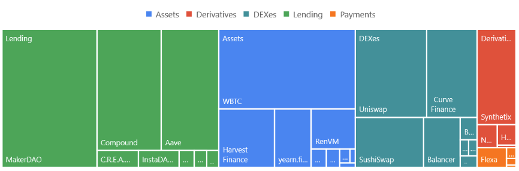

# Decentralized vs Distributed

- `Decentralized`: 시스템에서 작동하는 노드가 동일한 주체가 아닌 서로 다른 당사자에 의해 제어되는 것 [[Ref]](https://papers.ssrn.com/sol3/Delivery.cfm?abstractid=3326244)
- `Distributed`: 저장 또는 계산이 여러 서버 또는 노드에 걸쳐 부분적으로 나뉘어 발생하는 것 [[Ref]](https://papers.ssrn.com/sol3/Delivery.cfm?abstractid=3326244)

 

# DeFi 정의 [[Ref]](https://papers.ssrn.com/sol3/Delivery.cfm?abstractid=3866699)

1.  제한적인 중앙 집중화를 통해 암호화폐/블록체인 기술을 사용하여 기존 금융 서비스를 복제하려는 플랫폼 및 프로토콜
2.  금융 중개인을 와해시키는 것을 목표로 하는 암호화폐 또는 블록체인의 다양한 금융 애플리케이션을 포괄하는 용어
3. Ethereum 블록체인과 같은 퍼블릭 스마트 컨트랙트 플랫폼을 기반으로 구축된 개방적이고, 허가가 필요 없으며, 상호 운용성이 뛰어난 프로토콜 스택
4. 탈중앙화된 네트워크를 활용하여 기존 금융 상품을 중개자 없이 실행되는 신뢰할 수 있고 투명한 프로토콜을 전환하는 움직임
5. 단순한 가치 이전에서 보다 복잡한 금융 사용 사례로 블록체인의 사용을 확장하는 것

 

# 특징[[Ref]](https://arxiv.org/pdf/2101.05589)

- 중앙 집중식 플랫폼을 탈중앙화 시스템으로 대체하여 신뢰를 줄임
    - 자금을 저장하고 거래를 보내는 데 당사자를 신뢰할 필요가 없음
- 단일 서비스라기 보다는 공공 분산 원장에 배포된 스마트 컨트랙트를 통해 실현되는 금융 서비스의 전체 생태계를 나타냄

 

`1. Permissionless`
    
    - 퍼블릭 블록체인은 개방적으로 설계되었으며, 누구나 상호 작용할 수 있음
    - 퍼블릭 블록체인에 구촉된 DeFi 애플리케이션은 기본적으로 이러한 속성을 상혹삼
    - DeFi 플랫폼이 추가 액세스 제한이 있는 프라이빗 블록체인을 기반으로 하거나 코드에 추가 권한을 지정하는 경우에만 권한을 추가할 수 있음

`2. Trustless`
  
    - 분산 원장은 신뢰 에이전트로서 단일 운영자에게 의존하지 않지만, 네트워크의 노드에 신뢰를 분산시킴
    - 합의는 시스템이 변경 불가능하고, 검열 저항을 보장하여 새로운 유효한 트랜잭션이 포함될 것임을 보장함

`3. 투명성`

    - 대부분의 퍼블릭 분산 원장은 블록체인에 저장된 모든 트랜잭션이 공개적으로 표시되므로 투명성을 제공함
    - 트랜잭션 발신자와 수신자는 익명으로 식별되는 반면, 트랜잭션 값과 전송된 데이터는 명확하게 전송됨
    - 추가 개인 정보 보호 조치를 취하지 않는 한 트랜잭션을 연결할 수 있고 사용자도 식별할 수 있음

`4. 상호 연결성`

    - 복잡한 애플리케이션을 스마트 컨트랙트로 구축할 수 있음

`5. 탈중앙화된 거버넌스`

    - DeFi 공간에만 국한되지 않고 DAO로 전환하고 있음
    - 커뮤니티가 법안을 제안하고 프로젝트에 대한 지분을 기반으로 투표할 수 있도록 함으로써 거버넌스가 분산됨

`6. 자기 주권 활성화`

    - 중앙 기관이 탈중앙화된 환경에 대한 액세스를 제어하고 구성하지 않으므로, 사용자 스스로 개인 데이터를 관리하고 자금을 보관함
    - 사용자는 자신의 액세스 토큰(서명 키)를 저장하고, 자신의 트랜잭션을 승인할 수 있으므로 완전히 자립적임
    - 대신 액세스 토큰을 잃어버리는 것에 대해 보호받지 못함

 

# 동향
- 대부분의 DeFi 프로젝트는 이더리움을 기반으로 구축되었음 [[Ref]](https://papers.ssrn.com/sol3/Delivery.cfm?abstractid=3866699)
- 2021년 3월 기준으로 5,727개의 ICO 자금 지원을 받는 DeFi 프로젝트 중 87%가 이더리움에 구축되어 있음 [[Ref]](https://papers.ssrn.com/sol3/Delivery.cfm?abstractid=3866699)

 

# DeFi 구성요소

- (1) 디지털 네이티브 토큰이 있는 공용 기본 레이어 → (2) 합의된 규칙을 codify하는 소프트웨어 → (3) 금융 논리를 구현하는 스마트 컨트랙트 → (4) 은행에 보관된 reserve로 뒷받침되는 스테이블 코인 [[Ref]](https://papers.ssrn.com/sol3/Delivery.cfm?abstractid=3866699)

 

# DeFi 프로젝트 종류
[[Ref]](https://papers.ssrn.com/sol3/Delivery.cfm?abstractid=3866699)

[[Ref]](https://arxiv.org/pdf/2101.05589)

### Lending Platform
- 스마트 컨트랙트를 중개자로 사용하여 기업이나 개인에게 대출을 제공함
- 스마트 컨트랙트는 이자율 설정 규칙을 포함하여 대출 및 파용 계약을 자동화함

 

### DEX
- 탈중앙화된 암호화폐 및 토큰 교환에 중점을 둔 서비스
- 주식 거래소와 유사하게 작동하지만 중앙 제공자가 운영하는 대신 거래소는 이더리움과 같은 블록체인에 배포된 스마트 컨트랙트에 의해 운영됨
- 거래 규칙 및 규정이 스마트 컨트랙트 코드에 미리 결정되어 있으며, 사용자는 자산을 거래하기 위해 컨트랙트와 상호 작용해야 함
- 일반적으로 컨트랙트는 올바른 지불을 보장하기 위해 거래 프로세스 중에 사용자 자금을 추가로 처리함

 

### Derivate Servies
- 채권, 통화 또는 이자율과 같은 기본 entity의 성과에서 가치를 파생시키는 스마트 컨트랙트를 기반으로 구축됨
- 토큰화된 파생 상품은 제3자 없이 생성할 수 있으며, 설계상 악의적인 영향을 방지함

→ 공통적으로 분산화된 인프라와 스마트 컨트랙트를 활용함

→ 스마트 컨트랙트는 절차, 법적 계약 또는 비즈니스 관행을 자동으로 구현하기 위해 온체인에 존재하는 소프트웨어 프로토콜이라고 할 수 있음