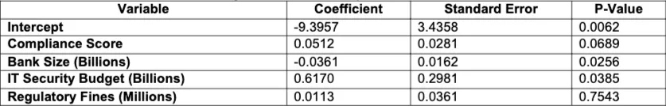
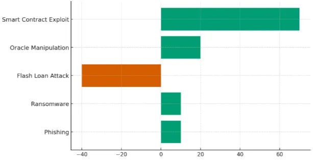

# CeFi vs DeFi 

##  법적 규제 [[Ref]](https://papers.ssrn.com/sol3/Delivery.cfm?abstractid=5133050)

- 기존의 은행은 중앙 집중식 감독, 규정 준수 의무 및 구조화된 사고 대응 시스템의 이점이 있으며, `NIST CSF`, `ISO/IEC 27001`, `PCIDSS`와 같은 프레임워크가 위험을 완화하는데 중요한 역할을 했음 
    - 금융 기관 전밤의 사이버 보안 관행을 표준화하는 데 중요한 역할을 했음

- 그러나 2024년 IMF에서 금융 부문에 대한 20,000건 이상의 사이버 공격이 보고 됐으며, 지난 20년 동안 120억 달러가 넘는 손실이 발생했다고 발표함
    - 중요 서비스를 외부 공급 업체 및 클라우드 제공업체에 아웃소싱함에 따라 간접 공격에 취약함

 

|기존 은행에서 발생하는 위협|
|:---:|
|피싱, 랜섬웨어, DDoS, 소셜 엔지니어링|

 

- 전통적인 은행의 사이버 보안 프레임워크는 구조화된 지침을 제공하지만 DeFi의 규제 감독 부족으로 인해 많은 플랫폼들이 사이버 위협으로부터 보호받지 못하고 있음
- DeFi는 중앙 집중식 거버넌스가 없어 유동성 풀/오라클 조작, 스마트 컨트랙트 취약성으로 인해 재정적 손실을 초래함
    - DeFi 규제 범위는 여전히 단편화 되어 있음 → 글로벌 합의가 없음
    - 대부분 규제를 받지 않아 보안 관행이 플랫폼마다 크게 다름
    
     → 적응형, 분산형 보안 표준을 확립해야 함

 

## 법적 규제 준수가 사이버 공격 가능성을 얼마나 감소시키는 가? [[Ref]](https://papers.ssrn.com/sol3/Delivery.cfm?abstractid=5133050)

- 로지스틱 회귀 분석을 사용하여 프레임워크 준수가 전통적인 은행에서 사이버 공격 가능성을 얼마나 감소시키는지 평가함
    - 규정 준수 수준, 은행 규모, IT 보안 투자 및 규제 벌금에 중점을 둠
- 분석 결과 사이버 보안 프레임워크 준수가 사이버 공격 가능성을 줄이는데 약간 유의미한 영향을 미쳤음 → `0.0689`
    - 규정 준수 점수가 높을수록 공격 가능성이 감소하지만, 규정 준수만으로는 위험을 완화하는 데 결정적인 요인이 아님
- 은행의 규모가 커질 수록 공격에 덜 취약했음 → `0.0256`

 

- DeFi 사이버 공격이 훨씬 더 큰 재정적 피해를 초래함