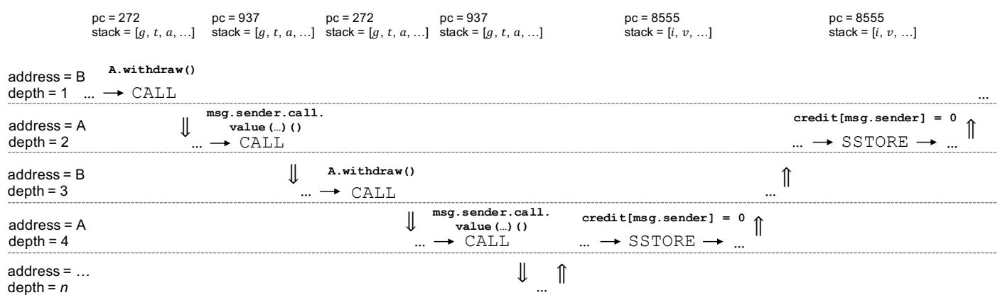
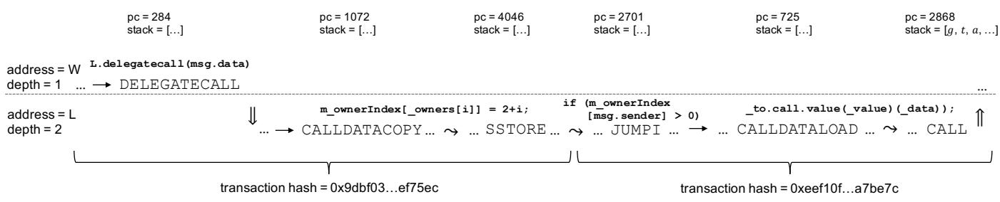
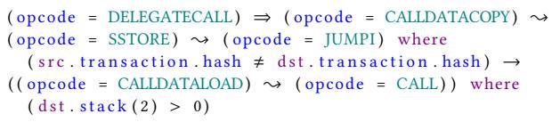
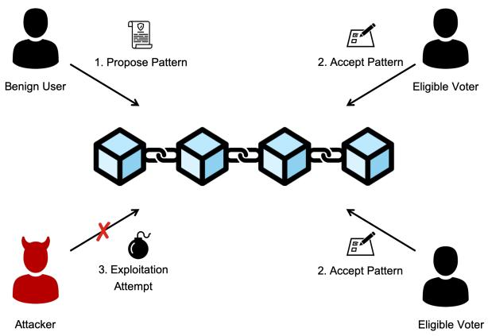
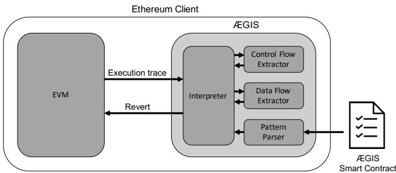
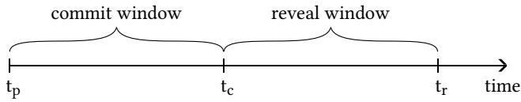

# ÆGIS: Shielding Vulnerable Smart Contracts Against A‚acks

Christof Ferreira Torres SnT, University of Luxembourg Luxembourg, Luxembourg christof.torres@uni.lu

Beltran Borja Fiz Pontiveros SnT, University of Luxembourg Luxembourg, Luxembourg beltran.€z@uni.lu

Mathis Baden SnT, University of Luxembourg Luxembourg, Luxembourg mathis.steichen@uni.lu

Hugo Jonker <sup>1</sup>Open University of the Netherlands Heerlen, Netherlands <sup>2</sup>Radboud University Nijmegen, Netherlands hugo.jonker@ou.nl

Robert Norvill SnT, University of Luxembourg Luxembourg, Luxembourg robert.norvill@uni.lu

Sjouke Mauw SnT, University of Luxembourg Luxembourg, Luxembourg sjouke.mauw@uni.lu

## ABSTRACT

In recent years, smart contracts have su‚ered major exploits, costing millions of dollars. Unlike traditional programs, smart contracts are deployed on a blockchain. As such, they cannot be modi€ed once deployed. Œough various tools have been proposed to detect vulnerable smart contracts, the majority fails to protect vulnera ble contracts that have already been deployed on the blockchain. Only very few solutions have been proposed so far to tackle the issue of post-deployment. However, these solutions su‚er from low precision and are not generic enough to prevent any type of aŠack.

In this work, we introduce ÆGIS, a dynamic analysis tool that protects smart contracts from being exploited during runtime. Its capability of detecting new vulnerabilities can easily be extended through so-called aŠack paŠerns. Œese paŠerns are wriŠen in a domain-speci€c language that is tailored to the execution model of Ethereum smart contracts. Œe language enables the description of malicious control and data ƒows. In addition, we propose a novel mechanism to streamline and speed up the process of managing aŠack paŠerns. PaŠerns are voted upon and stored via a smart contract, thus leveraging the bene€ts of tamper-resistance and transparency provided by the blockchain. We compare ÆGIS to current state-of-the-art tools and demonstrate that our solution achieves higher precision in detecting aŠacks. Finally, we perform a large-scale analysis on the €rst 4.5 million blocks of the Ethereum blockchain, thereby con€rming the occurrences of well reported and yet unreported aŠacks in the wild.

## KEYWORDS

Ethereum; Smart contracts; Exploit prevention; Security updates

## 1 INTRODUCTION

Blockchain has evolved greatly since its €rst introduction in 2009 [25]. A blockchain is essentially a veri€able, append-only list of records in which all transactions are recorded in batches of so-called blocks. Each block is linked to a previous block via a cryptographic hash. Œis linked list of blocks is maintained by a decentralised peerto-peer network. Œe peers in this network follow a consensus protocol that dictates which peer is allowed to append the next block. By introducing the concept of smart contracts, Ethereum [41] revolutionized the way digital assets are traded. As smart contracts govern more and more valuable assets, the contracts themselves have come under aŠack from hackers.

Smart contracts are programs that are stored and executed across blockchain peers. Œey are deployed and invoked via transactions. Deployed smart contracts are immutable, thus any bugs present during deployment [2], or as a result of changes to the blockchain protocol [7], can make a smart contract vulnerable. Moreover, since contract owners are anonymous, responsible disclosure is usually infeasible or very hard in practice. Œough smart contracts can be implemented with upgradeability and destroyability in mind, this is not compulsory. As a maŠer of fact, Ethereum already faced several devastating aŠacks on vulnerable smart contracts.

In 2016, an aŠacker exploited a reentrancy bug in a crowdfunding smart contract known as the DAO. Œe aŠacker exploited the capability of recursively calling a payout function contained in the contract. Œe aŠacker managed to drain over \$150 million [32] worth of cryptocurrency from the smart contract. Œe DAO hack was a poignant demonstration of the impact that insecure smart contracts can have. Œe Ethereum market cap value dropped from over \$1.6 billion before the aŠack, to values below \$1 billion a‰er the aŠack, in less than a day. Another example happened with the planned Constantinople hard fork in January 2019. Ethereum was scheduled to receive an update intended to introduce a cheaper gas cost for certain smart contract operations. On the eve of the hard fork, a new reentrancy issue caused by this update was detected. It turned out that the reduction of gas costs also enabled reentrancy aŠacks on smart contracts that were previously secure. Œis resulted in the update being delayed [7]. A third example is the Parity wallet hack. In 2017, the Parity wallet smart contract was aŠacked twice due to a bug in the access control logic. Œe bug allowed anyone to claim ownership of the smart contract and to take control of all the funds. Œe €rst aŠack resulted in over \$30 million being stolen [44], whereas the second aŠack resulted in roughly \$155 million being locked forever [29].

Œe manner in which these issues are currently handled is not ideal. At the moment, whenever a major vulnerability is detected by the Ethereum community, it can take several days or weeks for the community to issue a critical update and even longer for all nodes to adopt this update. Such a delay extends the window for exploitation and can have dire e‚ects on the trading value of the underlying cryptocurrency. Moreover, the lack of a standardised procedure to deal with vulnerable smart contracts, has led to a “Wild West”-like situation where several self-appointed white hats started aŠacking smart contracts in order to protect the funds that are at risk from other malicious aŠackers [4]. However, in some cases the e‚ects of aŠacks can cause a split in the community so contentious that it leads to a hard fork, such as in the case of the DAO hack which led to the birth of the Ethereum classic blockchain [32].

Academia has proposed a plethora of di‚erent tools that allow users to scan smart contracts for vulnerabilities prior to de ploying them on the blockchain or interacting with them (see e.g. [21, 23, 36, 38]). However, by design these tools cannot protect vulnerable contracts that have already been deployed. Grossman et al. [12] are the €rst to present ECFChecker, a tool that allows to dynamically check executed transactions for reentrancy. However, ECFChecker does not prevent reentrancy aŠacks. In order to pro tect already deployed contracts, Rodler et al. [31] propose Sereum, a modi€ed Ethereum client that detects and reverts<sup>1</sup> transactions that trigger reentrancy aŠacks. Sereum leverages the principle that every exploit is performed via a transaction. Unfortunately, Sereum has three major drawbacks. First, it requires the client to be modi€ed whenever a new type of vulnerability is found. Second, not only the tool itself, but also any updates to it must be manually adopted by the majority of nodes for its security provisions to become e‚ective. Œird, their detection technique can only detect reentrancy aŠacks, despite there being many other types of aŠacks [2].

In summary, we make the following contributions:

• We introduce a novel domain-speci€c language, which enables the description of so-called aˆack paˆerns. Œese paŠerns reƒect malicious control and data ƒows that occur during execution of malicious transactions.

• We present ÆGIS, a tool that reverts malicious transactions in real-time using aŠack paŠerns, thereby preventing aŠacks on deployed smart contracts.

• We propose a novel way to quickly propagate security updates without relying on client-side update mechanisms, by making use of a smart contract to store and vote upon new aŠack paŠerns. Storing paŠerns in a smart contract ensures integrity, decentralizes security updates and provides full transparency on the proposed paŠerns.

• We illustrate the e‚ectiveness by providing paŠerns to prevent the two most prominent hacks in Ethereum, the DAO and Parity wallet hacks.

• Finally, we provide a detailed comparison to current stateof-the-art runtime detection tools and perform a large-scale analysis on 4.5 million blocks. Œe results demonstrate that ÆGIS achieves beŠer precision than current state-of-the art tools.

## 2 BACKGROUND

In this section, we provide the necessary background for under standing the seŠing of our work. We describe the Ethereum block chain and its capability of executing smart contracts. We focus on

Ethereum since it is currently the most prominent blockchain platform when it comes to smart contract deployment. Finally, we also provide background information on the two most prominent smart contract vulnerabilities, namely, reentrancy and access control.

## 2.1 Ethereum and Smart Contracts

Et<sup>h</sup>ereum. Œe Ethereum blockchain is a decentralized public ledger that is maintained by a network of nodes that distrust one another. Every node runs one of several existing Ethereum clients. Œe clients can operate with di‚erent con€gurations. For instance, nodes who are con€gured to mine blocks are called miners. Miners execute transactions, include them in blocks and append them to the blockchain. Œey compete to create a block by solving a cryptographic puzzle. Once they succeed, the block is proposed to the network. Other miners verify the new block and either accept or reject it. A miner whose block is included in the blockchain is rewarded with a block reward and the execution fees from the included transactions.

Transactions. Transactions are used to modify state in Ethereum. As such, they allow users to transfer ether (Ethereum’s cryptocurrency), and to create smart contracts or trigger their execution. Transactions are created using an account. Œere are two types of accounts in Ethereum, user accounts and contract accounts. Transactions are given a certain amount of gas to execute, called the gas limit. Gas is a unit which is used to measure the use of computing resources. Gas can be converted to ether through the so-called gas price of a transaction. Gas limit and gas price can be chosen by the creator of the transaction. Together they determine the fee that the user is willing to pay for the inclusion of their transaction into the blockchain. Moreover, transactions also contain a destination address. It identi€es the recipient of the transaction, and it can be either a user account or a smart contract. Transactions can also carry value that is transferred to the recipient. Once created, transactions are broadcast to the network. Miners then execute the transactions and include them into blocks. Smart contracts (i.e. contract accounts) are created by leaving the destination address of a transaction empty. Œe bytecode that is provided within the transaction is then copied into the blockchain and it is given a unique address that identi€es the smart contract.

Smart Contracts. Smart contracts are fully-ƒedged programs that are stored and executed across the blockchain. Œey are developed using a dedicated high-level programming language that compiles into low-level bytecode. Œis bytecode gets interpreted by the Ethereum Virtual Machine. Smart contracts contain functions that can be triggered via transactions. Œe name of the function as well as the data to be executed is included in the data €eld of the transaction. A default function or so-called fallback function is executed whenever the provided function name is not recognized by the smart contract. Moreover, smart contracts can initiate calls to other smart contracts. Œus, a single transaction may interact with several smart contracts that call one another. By default smart contracts cannot be destroyed or updated. It is the task of the developer to implement these capabilities before deploying the smart contract. Unfortunately, many smart contracts are released without destroyability or upgradeability in mind. As a result, many contracts remain vulnerable or active on the blockchain even past their utility. As mentioned earlier, once deployed, smart contracts are immutable, they cannot be modi€ed and bugs cannot be €xed. Œus, it is not possible to update a smart contract in the later run.

```solidity
contract A { // Victim contract
    ...
    function withdraw() public {
        if (credit[msg.sender]) {
            msg.sender.call.value(credit[msg.sender])();
            credit[msg.sender] = 0;
        }
    }

    contract B { // Exploiting contract
    ...
    function () public payable {
        A.withdraw();
    }
}
```  
Fi<sub>g</sub>ure 1: Exam<sub>p</sub>le of a reentranc<sub>y</sub> vulnerabilit<sub>y</sub>.

EVM. Œe Ethereum Virtual Machine (EVM) is a purely stack-based, register-less virtual machine that supports a Turing-complete in struction set of opcodes. Œese opcodes allow smart contracts to perform memory operations and interact with the blockchain, such as retrieving speci€c information (e.g., the current block number). Ethereum makes use of gas to make sure that contracts terminate and to prevent denial-of-service aŠacks. It assigns a gas cost to the execution of an opcode. Œe execution of a smart contract results in the modi€cation of its state. Œe laŠer is stored on the blockchain and consists of a balance and a storage. Œe balance represents the amount ofether currently owned by the smart contract. Œe storage is organized as a key-value store and allows the smart contract to store values and keep state across executions. During execution, the EVM holds a machine state µ = (д<sub>,</sub>pc<sub>,</sub> m<sub>,</sub> i<sub>,</sub> s), where д is the gas available, pc is the program counter, m represents the memory contents, i is the active number of words in memory and s is the content of the stack. In summary, the EVM is a transaction-based state machine that updates a smart contract based on transaction input data and the smart contract’s bytecode.

## 2.2 Smart Contract Vulnerabilities

Although, a number of smart contract vulnerabilities exist [2], in this work, we primarily focus on two types of vulnerabilities that have been de€ned by the NCC Group as the top two vulnerabilities in their Decentralized Application Security Project [13]: reentrancy and access control.

Reentrancy Vu<sup>l</sup>nerabi<sup>l</sup>ities. Reentrancy occurs whenever a con tract calls another contract, which then calls back into the original contract, thereby creating a reentrant call. Œis is not an issue as long as all the state updates that depend on the call from the original contract are performed before the call. In other words, reentrancy only becomes problematic when a contract updates its state a‰er calling another contract. A malicious contract can take advantage of this by recursively calling a contract until all the funds are drained. Figure 1 provides an example of a malicious reentrancy. Contract B contains a fallback function (line 12-14), a default function that is automatically executed when no other function is called. In this example, the fallback function of contract B calls the withdraw function of contract A. Assuming that contract B already deposited some ether in contract A, contract A now calls contract B to transfer back its deposited ether. However, the transfer results in calling the fallback function of contract B once again, which results in reentering contract A and once more transferring the value of the deposited ether to contract B. Œis repeats until the balance of contract A becomes zero or the execution runs out of gas.

Reentrancy vulnerabilities were extensively studied by Rodler et al. [31], and can be divided into four distinct categories: samefunction reentrancy, cross-function reentrancy, delegated reentrancy and create-based reentrancy. Same-function reentrancy occurs whenever an aŠacker reenters the original contract via the same function (see Figure 1). Cross-function reentrancy builds on the same-function reentrancy. However, here the aŠacker takes advantage of another function that shares a state with the original function. Delegated reentrancy and create-based reentrancy are similar to same-function reentrancy, but use di‚erent opcodes to initiate the call. Speci€cally, delegated reentrancy can occur using either the DELEGATECALL or CALLCODE opcodes, while create-based reentrancy only occurs when using the CREATE opcode. While the DELEGATECALL and CALLCODE opcodes behave roughly similar to the CALL opcode, the CREATE opcode causes a new contract to be created and the contract constructor to be executed. Œis newly created contract can then call and reenter the original contract.

Access Contro<sup>l</sup> Vu<sup>l</sup>nerabi<sup>l</sup>ities. Access control vulnerabilities result from incorrectly enforced user access control policies in smart contracts. Such vulnerabilities allow aŠackers to gain access to privileged contract functions that would normally not be available to them. Œe most famous examples of this type of vulnerability are the two Parity MultiSig-Wallet hacks [29, 44]. Œe issue originates from the fact that the developers of the Parity wallet decided to split some of the contract logic into a separate smart contract named WalletLibrary. Œis had the advantage of reusing parts of the code for multiple wallets allowing users to save on gas costs during deployment. A simpli€ed version of the code can be seen in Figure 2. As can be seen in line 17-20, the initialisation of the wallet is performed via the initWallet function located in contract L, which is called by the constructor of contract W. In addition, any unmatched function calls to contract W are caught by the fallback function in line 6-8, which redirects the call to contract L by means of the DELEGATECALL operation. Unfortunately, in the €rst version of the Parity MultiSig-Wallet, the developers forgot to write a safety check for the initWallet function, ensuring that the function can only be called once. As a result an aŠacker was able to gain ownership of contract W by calling the initWallet function via the fallback function. Once in control the aŠacker withdrew all the funds by invoking the execute function (line 32-34).

A‰er the €rst Parity hack, a new Parity MultiSig-Wallet Library contract was deployed addressing the issue above. In the newly deployed version, the initWallet function was not part of the constructor anymore, but had to be called separately a‰er deploy ment. However, the developers did not call the initWallet func tion a‰er deployment. Hence, contract L remained uninitialised, meaning that the library contract itself had no owners. As a result, 3 months a‰er deployment a user known as devops199 was experimenting with the previous Parity hack vulnerability and called the initWallet function directly inside contract L, marking its address as the owner. Œe user then called the kill function (line 32-34), which removed the executable code of contract L from the blockchain<sup>2</sup> and sent the remaining funds to the new owner. Œe contract itself contained no funds, however it was used by multiple Parity wallets which had the address of contract L de€ned as a constant in their executable code. As a result any wallet trying to use contract L as a library would now receive zero as return value, e‚ectively rendering the wallet unusable and therefore freezing the funds contained in the wallets. Œis led the user to publicly disclose the steps that led to this tragedy, with the words: “I accidentally killed it.” [9].

```solidity
contract W { // Wallet contract
    ...
    function W(address _owner) { // Contractor
        L.delegatecall("initWallet(address)", _owner);
    }
    function () payable {
        L.delegatecall(msg.data);
    }
}

contract L { // Library contract
    ...
    modifier onlyOwner {
        if (m_ownerIndex[msg.sender] > 0) _;
    }
    ...
    function initWallet(address[] _owners, uint
        _required, uint _daylimit) {
        initDaylimit(_daylimit);
        initMultiowned(_owners, _required);
    }
    function initMultiowned(address[] _owners, uint
        _required) {
        ...
        for (uint i = 0; i < _owners.length; ++i) {
            ...
            m_ownerIndex[_owners[i]] = 2+i;
        }
        ...
    }
    function execute(address _to, uint _value, bytes
        _data) onlyOwner {
        _to.call.value(_value)(_data));
    }
    function kill(address _to) onlyOwner {
        suicide(_to);
    }
}
```  
Fi<sub>gu</sub>r<sub>e</sub> 2: Ex<sub>a</sub>m<sub>p</sub>l<sub>e o</sub>f <sub>a</sub>n <sub>access co</sub>ntr<sub>o</sub>l <sub>vu</sub>ln<sub>e</sub>r<sub>a</sub>bilit<sub>y.</sub>

## 3 RELATED WORK

In this section, we discuss some of the works that are most closely related to ours.

Security Ana<sup>l</sup>ysis o<sup>f</sup> Smart Contracts. As with any program, smart contracts may contain bugs and can be vulnerable to exploitation. As discussed in [2], di‚erent types of vulnerabilities exist, o‰en leading to €nancial losses. Œe issue is made worse by the fact that smart contracts are immutable. Once deployed, they cannot be altered and vulnerabilities cannot be €xed. In addition to that, automated tools for launching aŠacks exist [21].

Several defense mechanisms have been proposed to detect security vulnerabilities in smart contracts. Œis includes tools such as Erays [46], designed to provide smart contract auditors with a reverse engineered pseudo code of a contract from its bytecode. Œe interpretation of the pseudo code however remains a slow and gruelling task. More automated tools have also been proposed bene€ting from regular expressions [43] and machine learning techniques [34] to detect vulnerabilities.

A wealth of security research has focused on the creation of static analysis tools to automatically detect vulnerabilities in smart contracts. Formal veri€cation has been used together with a formal de€nition of the EVM [1, 16], or by €rst converting smart contracts into the formal language F\* [5, 11]. Other works focused on analysing the higher level solidity code [10, 35], which limits the scope to those contracts with available source code. Another approach is to apply static analysis on the smart contract bytecode [38]. A technique commonly used for this purpose is symbolic execution, designed to thoroughly explore the state space of a smart contract utilising constraint solving. It has been used to detect contracts with vulnerabilities [23, 28], to €nd misbehaving contracts [20, 26, 37], or detect integer bugs [19, 36]. Fuzzing techniques have also been applied [15, 18]. In [42] the authors propose Harvey, a greybox fuzzer that selects appropriate inputs and transaction sequences to increase code coverage. Fuzzing techniques however involve a trade-o‚ between the number of discovered paths and the eciency in input generation.

While all the listed tools help identify vulnerabilities, they cannot protect already deployed smart contracts from being exploited. Œerefore, to deal with the issue of vulnerabilities in deployed smart contracts, [12, 31] propose a modi€cation to the Ethereum client, that would allow detection and prevent exploitation of reentrancy vulnerabilities at runtime. However, these approaches only deal with reentrancy and require all the clients in the network to be modi€ed. Œis is an issue for the following reasons. On one hand, every update of the vulnerability detection so‰ware requires an update of the di‚erent Ethereum client implementations. Œis is true for both bug €xes and functionality upgrades, for example the detection of new vulnerabilities. On the other hand, every modi€cation of the clients needs to be adopted by all the nodes participating in the Ethereum blockchain. Œis requires time and breaks compatibility between updated and non-updated clients. In this work, we propose a generic solution that protects contracts and users from existing and future vulnerabilities, without requiring client modi€cations and forks every time a new vulnerable smart contract is found.

Wang et al. [40] propose an approach to detect vulnerabilities at runtime based on two invariants that follow the intuition that most vulnerabilities are due to a mismatch between the transferred amount and the amount reƒected by the contract’s internal book keeping logic. However, this approach has three main drawbacks. First, it requires the automated and correct identi€cation of book keeping variables, which besides being a non-trivial task also does not hold for every contract, since there can be contracts that do not use internal bookkeeping logic but are nevertheless vulnerable. Second, their approach does not model environmental information such as timestamps or block numbers, which does not allow them to detect vulnerabilities such as timestamp dependence or transaction order dependency, whereas our approach models environmental information and allows for the detection of these vulnerabilities. Finally, Wang et al.’s approach can only detect violations of safety properties and not violations of liveness properties such as the Parity Wallet Hack 2. In this work, we demonstrate that our ap proach is capable of detecting both Parity wallet hacks and therefore violations to safety as well as liveness properties.

B<sup>l</sup>oc<sup>k</sup>c<sup>h</sup>ain-Based Voting. Since blockchains provide the means for transparency and decentralization, multiple blockchain-based solutions have been proposed for performing electronic voting [3, 17, 27]. Interestingly, with the recent developments in quantum computers, recent work also has started to focus on the development of quantum-resistant blockchain-based voting schemes [33]. Œese solutions can all be categorised into two categories: cryptocurrency based and smart-contract-based.

Cryptocurrency-based solutions focus on using payments as a proxy for votes in an election. When a voter wishes to cast a vote, he or she makes a payment to the address of the candidate. Lee et al. [22] proposed such a system in the Bitcoin network. However, their system requires a trusted third party to perform the ballot counting. Zao et al. [45] were the €rst to propose a voting scheme using the public Bitcoin network while preserving the privacy of the votes. Another well-known cryptocurrency-based solution is CarbonVote [8]. It was introduced in the a‰ermath of the DAO hack to allow the Ethereum Foundation to determine if the Ethereum community wanted a hard fork or not. Œe tallying was performed by counting the amount of ether that each address received. Needless to say, such a system gives a tremendous amount of voting power to users with a large amount of funds.

Smart-contract-based voting relies on a decentralized application to assist the voting process – there is no central entity. McCorry et al. [24] propose a practical implementation of the Open Vote Net work [14] in the form of a smart contract deployed on the Ethereum blockchain for boardroom voting. Œeir implementation is self tallying and provides, in addition to vote privacy, also transparency. Voting proceeds in several rounds, where the voters €rst broadcast their voting key, followed by a proof that their vote is binary (a “yes” or “no” vote). A €nal tally round allows anyone to calculate the total sum of votes, without revealing individual ballots. Œe voting mechanism described in this paper is inspired by McCorry et al.’s proposed solution and implementation. Œe limitations of their proposed solution, namely having a binary voting system and limiting the number of voters to less than 50 participants, are acceptable for our purposes.

## 4 METHODOLOGY

In this section, we present the details of our solution towards a generic and decentralized way to prevent any type of aŠacks on already deployed smart contracts. Our idea is to bundle every Ethereum client with a runtime analysis tool, that interacts with the EVM and is capable of interpreting so-called aˆack paˆerns, and reverting transactions that match these paŠerns. AŠack paŠerns are described using our domain-speci€c language (DSL), which is tailored to the execution model of the EVM and which allows to easily describe malicious control and data ƒows. Œe fact that we shi‰ the capability of detecting aŠacks from the client-side implementation to the DSL, gives us the advantage of being able to quickly propose mitigations against new vulnerabilities, without having to modify the Ethereum client. Existing approaches, such as Sereum for example, require the client-side implementation to be modi€ed whenever a new vulnerability is found.

## 4.1 Generic Attack Detection

AŠacks are detected in our system through the use of paŠerns, which are described using our DSL. Œe DSL allows for the de€nition of malicious events that occur during the execution of EVM instructions. Œe syntax of our DSL is de€ned by the following BNF grammar:

$$
\langle \text {instr} \rangle \quad : := \text {CALL} \mid \text {CALLDATALOAD} \mid \text {SSTORE} \mid \text {JUMPI} \mid \dots
$$

hexeci ::= depth | pc | address | stack(int) | stack.result | | memory(int, int) | transaction.htransi | block.hblocki

htransi ::= hash | value | from | to |

hblocki ::= number | gasUsed | gasLimit |

hcompi ::= < | > | ≤ | ≥ | = | , | + | - | · | /

hexpri ::= (src.hexeci hcompi hexpri) [∧ hexpri] (hexpri hcompi dst.hexeci) [∧ hexpri] (src.hexeci hcompi src.hexeci) [∧ hexpri] (src.hexeci hcompi dst.hexeci) [∧ hexpri] (dst.hexeci hcompi dst.hexeci) [∧ hexpri] (src.hexeci hcompi int) | (dst.hexeci hcompi int)

hreli ::= ⇒ | { | →

hpaˆerni ::= (opcode = hinstri) hreli (opcode = hinstri) [where hexpri] | hpaˆerni hreli (opcode = hinstri) [where hexpri] | (opcode = hinstri) hreli hpaˆerni [where hexpri]

Fi<sub>g</sub>ure 3: DSL for describin<sub>g</sub> attack <sub>p</sub>atterns.

A paŠern is a sequence of relations between EVM instructions that may occur at runtime. We distinguish between three types of relations, a “control ƒow” relation (⇒), a “data ƒow” relation ({), and a “follows” relation (→). A control ƒow relation means that an instruction is control dependent on another instruction. A data-ƒow relation means that an instruction is data dependent on another instruction. A follows relation means that an instruction is executed a‰er another instruction, without necessarily being control or data dependent on the other instruction. A relation is always between two EVM opcodes: a source opcode (src) and a destination opcode (dst). Œe source marks the beginning of the relation, whereas the destination de€nes the end of the relation. Moreover, the DSL allows to create conjunctions of expressions that allow to compare the execution environment between source and destination. Œe execution environment includes the current depth of the call stack (depth), the current value of the program counter (pc), the address of the contract that is currently being executed (address), the current values on the stack (stack) as well as the result of an operation that is pushed onto the stack (stack.result), the current values stored in memory (memory), and €nally, properties of the current transaction that is being executed (e.g. hash) as well as properties of the current block that is being executed (e.g. number). Œe stack is addressable via an integer, where 0 de€nes the top element on the stack. Œe memory is addressable via two integers: an o‚set and a size. In the following, we explain the semantics of our DSL via two concrete examples of aŠack paŠerns: same-function reentrancy and the parity wallet hack 1.

  
Figure 4: Execution example of a reentrancy attack, where the stack values д (gas), t (to), a (amount), i (index) and v (value) re<sub>p</sub>resent the res<sub>p</sub>ective <sub>p</sub>arameters <sub>p</sub>assed to the instructions durin<sub>g</sub> execution. A control ƒow relation is de<sub>p</sub>icted usin<sub>g</sub> ⇒, while → de icts a follows relation.

Same-Function Reentrancy. Reconsider the reentrancy example that was described in Section 2.2. Figure 4, illustrates the control ƒow as well as the follows relations that occur during the execution of that example. Œe execution starts with contract address B and a call stack depth of 1. Eventually, contract B calls the withdraw function of contract A, which results in executing the CALL instruc tion and increasing the depth of the call stack to 2, and switching the address of the contract that is being executed to contract A. Next, contract A sends some funds to contract B, which also results in executing the CALL instruction and increasing the depth of the call stack to 3, and switching the address of the contract that is being executed back to contract B. As a result, the fallback func tion of contract B is called, which in turn calls again the withdraw function of contract A. Œis sequence of calls repeats until the balance of contract A is either empty or the execution runs out of gas. Eventually, the state in contract A is updated by executing the SSTORE instruction. Given these observations, we can now create the following aŠack paŠern in order to detect and thereby prevent same-function reentrancy:

```txt
(opcode = CALL) ⇒ (opcode = CALL) where
  (src.stack(1) = dst.stack(1)) ∧
  (src.address = dst.address) ∧
  (src.pc = dst.pc) →
  (opcode = SSTORE) → (opcode = SSTORE) where
  (src.stack(0) = dst.stack(0)) ∧
  (src.address = dst.address) ∧
  (src.depth > dst.depth)
```

Œis aŠack paŠern evaluates to true if a transaction meets the following two conditions:

(1) there is a control ƒow relation between two CALL instructions, where both instructions share the same call destination (i.e. src. stack(1) = dst.stack(1)), are executed by the same contract (i.e. src.address = dst.address) and share the same program counter (i.e. src.pc = dst.pc);

(2) two SSTORE instructions follow the previous control ƒow relation, where both instructions write to the same storage location (i.e. src.stack(0) = dst.stack(0)), are executed by the same contract (i.e. src.address = dst.address) and where the €rst instruction has a higher call stack depth than the second instruction (i.e. src.depth > dst.depth).

It is worth mentioning that we compare the program counter values of the two CALL instructions in order to make sure that it is the same function that is being called, as our goal is to detect only same-function reentrancy.

Parity Wa<sup>ll</sup>et Hac<sup>k</sup> 1. Reconsider the access control example described in Section 2.2. Figure 5 illustrates the relevant control ƒow, data ƒow and follows relations that occur during the execution of that example. We note that the execution example is divided into two separate transactions. In the €rst transaction, the aŠacker sets itself as the owner, whereas in the second transaction the aŠacker transfers all the funds to itself. Although in reality an attacker performs two separate transactions, in our methodology, the two transactions are represented as a single sequence of execution events. For both transactions, the execution starts with contract address W eventually making a delegate call to contract address L, as part of the aŠacker calling the fallback function of contract W. In the €rst transaction, we see that at a certain point contract L copies data from the transaction using the CALLDATACOPY instruction and stores it into storage via the SSTORE instruction. An interesting observation here is that state is shared across transactions through storage. In the second transaction, the data that has previously been stored is now loaded onto the stack and used by a comparison. A comparison is ultimately reƒected via the JUMPI instruction. Finally, we see that the comparison follows a CALLDATALOAD in struction whose data is used by a call CALL instruction. Given these observations, we are now able to create the following aŠack paŠern in order to detect and thereby prevent the €rst Parity wallet hack:

  
Fi<sub>gure</sub> 5<sub>:</sub> E<sub>xecu</sub>ti<sub>on</sub> <sub>examp</sub>l<sub>e</sub> <sub>o</sub>f <sub>an</sub> <sub>a</sub>tt<sub>ac</sub>k <sub>on</sub> <sub>an</sub> <sub>access</sub> <sub>con</sub>t<sub>ro</sub>l <sub>vu</sub>l<sub>nera</sub>bilit<sub>y.</sub> A d<sub>a</sub>t<sub>a</sub> ƒ<sub>ow</sub> <sub>re</sub>l<sub>a</sub>ti<sub>on</sub> i<sub>s</sub> d<sub>ep</sub>i<sub>c</sub>t<sub>e</sub>d <sub>w</sub>ith <sub>{.</sub> ‡<sub>e</sub> variables g, t and a are as discussed in Figure 4.



Œe above aŠack paŠern evaluates to true if the following two conditions are met:

(1) there is a transaction with a control ƒow relation between a DELEGATECALL instruction and a CALLDATACOPY instruction, where the data ofthe CALLDATACOPY instruction ƒows into an SSTORE instruction;

(2) there is another transaction (i.e. src.transaction.hash , dst.transaction.hash) where the data that has been previously stored via the SSTORE instruction ƒows into a JUMPI instruction and is followed by a CALLDATALOAD instruction whose data ƒows into a CALL instruction that sends out funds (i.e. dst.stack(2) ¿ 0).

It is worth noting that the Parity wallet aŠack is a multi-transactional aŠack and that it is therefore signi€cantly di‚erent from a reentrancy aŠack, that is solely based on a single transaction. For more examples of aŠack paŠerns, please refer to Table 5 in Appendix A.

  
Fi<sub>g</sub>ure 6: An illustrative exam<sub>p</sub>le of ÆGIS’s workƒow: ste<sub>p</sub> 1) A benign user detects a vulnerability and proposes a pattern (written using our DSL) to the smart contract. Step 2) E<sup>l</sup>igib<sup>l</sup>e voters vote to eit<sup>h</sup>er accept or reject t<sup>h</sup>e pattern. I<sup>f</sup> t<sup>h</sup>e majority votes to accept t<sup>h</sup>e pattern, t<sup>h</sup>en a<sup>ll</sup> t<sup>h</sup>e c<sup>l</sup>ients are updated and the pattern is activated. Step 3) An attacker t<sub>r</sub>i<sub>es</sub> b<sub>u</sub>t f<sub>a</sub>il<sub>s</sub> t<sub>o exp</sub>l<sub>o</sub>it <sub>a vu</sub>l<sub>nera</sub>bl<sub>e smar</sub>t <sub>con</sub>t<sub>rac</sub>t d<sub>ue</sub> t<sub>o</sub> the voted <sub>p</sub>attern matchin<sub>g</sub> the malicious transaction.

## 4.2 Decentralized Securit<sub>y</sub> U<sub>p</sub>dates

While our approach of using a DSL allows us to have a generic solution for detecting aŠacks, it still leaves two open questions:

(1) How do we distribute and enforce the same paŠerns across all the clients?

(2) How do we decentralize the governance of paŠerns in order to prevent a single entity from deciding which paŠerns are added or removed?

Œe answer to these questions is to use a smart contract that is deployed on the blockchain itself. Œis solves the problem of distributing and enforcing that the same paŠerns are always used across all clients. Speci€cally, paŠerns are stored inside the smart contract and the blockchain protocol itself guarantees that every client knows about the exact same state and therefore has access to exactly the same paŠerns. Œe second problem of decentralizing the governance of paŠerns, is solved by allowing the proposal and voting of paŠerns via the smart contract as depicted in Figure 6. Œe contract maintains a list of eligible voters that vote for either accepting or rejecting a new paŠern. If the majority has voted with “yes”, i.e. to accept the paŠern, then it is added to the list of active paŠerns. In that case, every client is automatically noti€ed through the mechanism of smart contract events, and retrieves the updated list of paŠerns from the blockchain. In other words, if a paŠern is accepted by the voting mechanism, it is updated across all the clients through the existing consensus mechanism of the Ethereum blockchain. However, solving the second problem using a voting mechanism opens up a new problem concerning the requirements needed for governing the votes. In voting literature, veri€ability and privacy are typically seen as key requirements. Veri€ability concerns linking the output to the input in a veri€able way. Privacy concerns whether a vote can be linked back to a voter. In addition, we argue that the situation here is more akin to boardroom voting than to general elections, because it should be possible to hold vot ers accountable. Œis means that privacy must be maintained only until the election is over. Finally, the voting system must not be favorable to any voters – e.g., it should not confer an advantage to voters that cast their vote late. Œis €nal property is called fairness. It is worth noting that fairness requires privacy during the voting phase. Œis leads to the following three requirements:

  
Fi<sub>g</sub>ure 7: Architecture of ÆGIS. ‡e dark <sub>g</sub>ra<sub>y</sub> boxes re<sub>p</sub>resent ÆGIS’s main com<sub>p</sub>onents.

(1) Veri<sup>€</sup>abi<sup>l</sup>ity: Œe outcome of the vote must be veri€ably related to the votes as cast by the voters;

(2) Accountabi<sup>l</sup>ity: Voters can be held accountable for how they voted;

(3) Fairness: No intermediate information must be leaked.

## 5 IMPLEMENTATION

In this section, we provide the implementation details of our solu tion called ÆGIS. Œe code is publicly available<sup>3</sup>. Figure 7, provides an overview of the architecture of ÆGIS and highlights its main components. ÆGIS is implemented on top of Trinity<sup>4</sup>, an Ethereum client implemented in Python.

## 5.1 Ethereum Client

EVM. We modi€ed the EVM of Trinity such that it keeps track of all the executed instructions and their states at runtime, in the form of an ordered list. We refer to this list as the execution trace.

Each record in this list contains the executed opcode, the value of the program counter, the depth of the call stack, the address of the contract that is being executed, and €nally, all the values that were stored on the stack and in memory. Œis list is passed to the interpreter component of ÆGIS.

Interpreter. Œe interpreter loops through the list of executed instructions and passes the relevant instructions to the control ƒow and data ƒow extractor components. It is also responsible for signalling the EVM a revert in case the execution trace matches an aŠack paŠern.

Contro<sup>l</sup> F<sup>l</sup>ow Extractor. Œe control ƒow extractor is responsible for inferring control ƒow information. We do so by dynamically building a call tree from the instructions received by the interpreter. A control ƒow relation is reported if there exists a path along the call tree, from the source instruction to the destination instruction de€ned in a given paŠern. Œus, control ƒow relations represent call dependencies between two instructions.

Data F<sup>l</sup>ow Extractor. Œe data ƒow extractor is responsible for collecting data ƒow information. We track the ƒow of data between instructions by using dynamic taint analysis. Taint is introduced whenever we come across a source instruction and checked whenever we come across a destination instruction. Source and destination instructions are de€ned by a given paŠern. Taint propagation follows the semantics of the EVM [41] across stack, memory and storage. We perform byte-level precision tainting. Taint that is stored across stack and memory is volatile, meaning that it is cleared across transactions. Taint that is stored across storage is persistent, meaning that it remains in storage across transactions. Œis allows us to perform inter-transactional taint analysis. A data ƒow relation is given if taint ƒows from a source instruction into a destination instruction.

Pattern Parser. Œe paŠern parser is responsible for extracting and parsing the paŠerns from the voting smart contract. We imple mented our paŠern language using textX <sup>5</sup>, a Python framework providing a meta-language for building DSLs.

## 5.2 ÆGIS Smart Contract

Œe ÆGIS smart contract ensures proper curation of the list of active paŠerns. We implemented our smart contract in Solidity. As previously mentioned, paŠerns are accepted or removed via a voting mechanism. Œe contract holds all proposed additions and removals of paŠerns and allows a vote on them within a set time window. Œe duration can be con€gured and updated by the contract owner. Proposals are open to the public and anyone can propose an addition to or removal from the list of paŠerns.

Fairness. Votes should remain secret until all eligible voters have had sucient opportunity to vote. Œerefore, two time windows are employed. Œe €rst window is for sending a commitment that includes a deposit. Œe second window is for revealing a vote including the return of the commiŠed deposits. Œe two windows are illustrated in Figure 8. In the €gure, t<sub>p</sub> represents the point in time when a paŠern is proposed and marks the start of the commit window. t<sub>c</sub> marks the end of the commit window and the start of the reveal window. Lastly, t marks the end of the reveal window and the time when the paŠern list is updated in case of a positive vote outcome. A commitment is a hash of the vote ID, the voter’s vote and a nonce. Œe vote ID is a hash of the proposed paŠern and identi€es the paŠern that is being voted on. Œe voter’s vote is encoded as a boolean. Œe nonce ensures that commitments cannot be replayed. Œe smart contract records these commitments, which must be sent with the prede€ned deposit and within the prede€ned time window. During the commitment phase no one knows how anyone else has voted on a given paŠern, and so cannot be swayed by the decisions of others. However, the process should ultimately be transparent to both voters and non-voters to foster trust in the system. As such, during the second window, the reveal window, all voters reveal how they have voted. Œey must reveal their vote in order to get their deposit back. No commits may be made once the reveal period has started.

  
Fi<sub>g</sub>ure 8: Timeline of the two votin<sub>g</sub> sta<sub>g</sub>es.

Ta<sup>ll</sup>ying. Œe voting ends either when more than 50% (50%+1 vote) of the total number of votes reaches either accept or reject, or when the time window for revealing expires with less than 50% having been reached. In case the voting has ended but the reveal window has not yet passed, any remaining voters are still eligible to reveal their vote, such that their deposit can be returned. Œe reveal period is bounded so that paŠerns are accepted or rejected in a practical amount of time. In the event of a successful vote, the paŠern to which the vote pertains is added to or removed from the record held by the contract, according to the proposal. If a vote is unsuccessful, i.e. no majority voted for the proposal, the record of paŠerns is not changed.

Actors. Œere are three types of actors: the proposers that submit proposals to add or remove paŠerns, the voters that vote on pro posals, and the admins that govern the list of eligible voters as well as the parameters of the smart contract (e.g. deposit, commit and reveal windows, etc.). Œe ÆGIS smart contract allows every user on the blockchain to become a proposer by submiŠing a proposal. Voters then vote on the proposals by €rst commiŠing their vote and at a later stage revealing it. Not every user is an eligible voter. Voters are only those users whose account address is stored in the list of eligible voters maintained by the smart contract. Admins may update the list of eligible voters. Œey oversee the proper curation of the smart contract and act as a governing body. Admins are agreed upon o‚-chain and are represented by a multi-signature wallet. A multi-signature wallet is an account address which only performs actions if a group of users give their consent in form of a signature.

Data Structures. Œe smart contract consists of several functions and data structures that allow for the voting process to take place. We make use of a number of modi€ers, which act as checks carried out before speci€c functions are executed. We use these to check that: 1) a voter is eligible, 2) a vote is in progress, 3) a reveal is in progress and 4) the associated vote has ended. We use a struct to hold the details of each vote, these include the patternID, the proposed pattern and the startBlock. Œese values enable us to record the details needed to check when a vote ends, check that the same paŠern has not already been proposed, and count the number of votes. Œe struct is used in conjunction with a mapping, which maps a 32 bytes value to the details of each vote. Œe 32 bytes value represents the voteID of each vote, created by hashing unique vote information. A constructor is used to de€ne, at contract launch, the value of the necessary deposit and the time windows during which voters can commit or reveal. Œe former is given in ether, while the laŠer are given in number of blocks. Œe deposit is used to ensure that those who commiŠed a vote also reveal their vote. Œese values can be changed later using the contract’s admin functions.

Functiona<sup>l</sup>ity. Œe public functions for the voting process are: addProposal, removeProposal, commitToVote and revealVote. Both proposal functions €rst check if a vote with the same ID already exists, and if not create a new instance of voting details via the mapping. Next, the commitToVote function can be used inside the de€ned number of blocks to submit a unique hash of an eligible voter’s vote. Œis function makes use of the canVote modi€er to protect access. Œe voter’s commitment and vote hash are stored only if the correct deposit amount was sent to the function. Once the vote stage has ended the reveal stage begins. During this window the revealVote function, protected by the canVote modi€er, processes vote revelations and returns deposits. Œe function checks that the stored hash matches the hash calculated from the parameters passed to it, and if so, returns the voter’s deposit and records the vote. Lastly, it calls an internal function which tallies the votes and adds or removes the paŠern if either the for or against vote has reached over 50%. In this way the vote is self tallying. Œe paŠerns are ultimately stored in an array that can be iterated over to ensure each node has the full set. Finally, the contract also has two admin functions: transferOwnership, changeVotingWindows. Both of these are protected by the isOwner modi€er. Œe former allows the current owning address to transfer control of the contract to a new address. Œe laŠer allows the commit and reveal windows to be changed as well as the amount required as a voting deposit.

## 6 EVALUATION

In this section, we evaluate the e‚ectiveness and correctness of ÆGIS, by conducting two experiments. In the €rst experiment we compare the e‚ectiveness of ÆGIS to two state-of-the-art reentrancy detection tools: ECFChecker [12] and Sereum [31]. In the second experiment we perform a large-scale analysis and measure the correctness as well as the performance of ÆGIS across the €rst 4.5 million blocks of the Ethereum blockchain.

<table><tr><td rowspan="17">AEGIS</td><td>SEREUM</td><td></td></tr><tr><td rowspan="2">TP</td><td>CCRB</td></tr><tr><td>DAO</td></tr><tr><td rowspan="2">TP</td><td>0x7484a1</td></tr><tr><td>proxyCC</td></tr><tr><td rowspan="2">TP</td><td>DAC</td></tr><tr><td>DSEthToken</td></tr><tr><td rowspan="2">TP</td><td>0x695d73</td></tr><tr><td>EZC</td></tr><tr><td rowspan="2">TP</td><td>0x98D8A6</td></tr><tr><td>WEI</td></tr><tr><td rowspan="2">TP</td><td>0xbD7CeC</td></tr><tr><td>0xF4ee93</td></tr><tr><td rowspan="2">TP</td><td>Alarm</td></tr><tr><td>0x771500</td></tr><tr><td rowspan="2">TP</td><td>KissBTC</td></tr><tr><td>LotteryGameLogic</td></tr></table>

Table 1: Com<sub>p</sub>arison between Sereum and ÆGIS on the e‚ectiveness of detectin<sub>g</sub> reentranc<sub>y</sub> attacks.

<table><tr><td>Smart Contract</td><td>Reentrancy Type</td><td>ECFCHECKER</td><td>Sereum</td><td>AEGIS</td></tr><tr><td rowspan="2">VulnBankNoLock</td><td>Same-Function</td><td>TP</td><td>TP</td><td>TP</td></tr><tr><td>Cross-Function</td><td>FN</td><td>TP</td><td>TP</td></tr><tr><td rowspan="2">VulnBankBuggyLock</td><td>Same-Function</td><td>TN</td><td>FP</td><td>TN</td></tr><tr><td>Cross-Function</td><td>FN</td><td>TP</td><td>TP</td></tr><tr><td rowspan="2">VulnBankSecureLock</td><td>Same-Function</td><td>TN</td><td>FP</td><td>TN</td></tr><tr><td>Cross-Function</td><td>TN</td><td>FP</td><td>TN</td></tr></table>

Table 2: Com<sub>p</sub>arison between ECFChecker<sub>,</sub> Sereum and ÆGIS <sub>o</sub>n th<sub>e e</sub>‚<sub>ec</sub>ti<sub>ve</sub>n<sub>ess o</sub>f d<sub>e</sub>t<sub>ec</sub>tin<sub>g sa</sub>m<sub>e</sub>-f<sub>u</sub>n<sub>c</sub>ti<sub>o</sub>n <sub>a</sub>nd <sub>cross-</sub>f<sub>unc</sub>ti<sub>on reen</sub>t<sub>rancy a</sub>tt<sub>ac</sub>k<sub>s w</sub>ith <sub>manua</sub>ll<sub>y</sub> i<sub>n</sub>t<sub>ro-</sub> d<sub>uce</sub>d l<sub>oc</sub>k<sub>s.</sub>

## 6.1 Com<sub>p</sub>arison to Reentranc<sub>y</sub> Detection Tools

By analyzing transactions sent to contracts, Rodler et al.’s tool Sereum ƒagged 16 contracts as victims of reentrancy aŠacks. However, a‰er manual investigation the authors found that only 2 out of the 16 contracts have actually become victims to reentrancy aŠacks. We decided to analyze these 16 contracts and see if we face the same challenges in classifying these contracts correctly. We contacted the authors of Sereum and obtained the list of contract addresses. A‰erwards, we ran ÆGIS on all transactions related to the con tract addresses, up to block number 4,500,000<sup>6</sup>. Table 1 summarizes our results and provides a comparison to the results obtained by Sereum. From Table 1, we can observe that ÆGIS successfully de tects transactions related to the DAO contract and the DSEthToken contract, as reentrancy aŠacks. Moreover, ÆGIS correctly ƒags the remaining 14 contracts as not vulnerable. Hence, in contrast to Sereum, ÆGIS produces no false positives on these 16 contracts. A‰er analyzing the false positives produced by Sereum, we conclude that ÆGIS does not produce the same false positives because €rst, ÆGIS does not use taint analysis in its paŠern and therefore does not face issues of over-tainting, and secondly, it does not make use of dynamic write locks to detect reentrancy.

6.1.1 Reentrancy with Locks. Besides evaluating Sereum on the set of 16 real-world smart contracts, Rodler et al. also compared Sereum to ECFChecker, using self-cra‰ed smart contracts as a benchmark [30]. Œe goal of this benchmark is to provide means to investigate the quality of reentrancy detection tools. Œe benchmark consists of three functionally equivalent contracts, except that the €rst contract does not employ any locking mechanism to guard the reentry of functions (VulnBankNoLock), the second contract employs partial implementation of a locking mechanism (VulnBankBuggyLock), and the third contract employs a full implementation of a locking mechanism (VulnBankSecureLock). As a result, the €rst contract is vulnerable to same-function reentrancy as well as cross-function reentrancy. Œe second contract is vulnerable to cross-function reentrancy, but not to same-function reentrancy. Finally, the third contract is safe regarding both types of reentrancy. We deployed these three contracts on the Ethereum test network called Ropsten and ran the three contracts against ÆGIS. Table 2 contains our results and compares ÆGIS to ECFChecker and Sereum. We can see that ECFChecker has diculties in detecting cross-function reentrancy, whereas Sereum has diculties in distinguishing between reentrancy and manually introduced locks. Œis is probably due to the locking mechanism exhibiting exactly the same paŠern as a reentrancy aŠack and Sereum being unable to di‚erentiate between these two. We found that ÆGIS correctly classi€es every contract as either vulnerable or not vulnerable in all the test cases.

6.1.2 Unconditional Reentrancy. Calls that send ether are usually protected by a check in the form of an if, require, or assert. Reentrancy aŠacks typically try to bypass these checks. However, it is possible to write a contract, which does not perform any check before sending ether. Rodler et al. present an example of such a vulnerability and name it unconditional reentrancy (see Appendix B). Moreover, they also €nd an example of such a contract deployed on the Ethereum blockchain<sup>7</sup>. When Sereum was published, it was not able to detect this type of reentrancy since the authors assumed that every call that may lead to a reentrancy is guarded by a condition. However, the authors claim to have €xed this issue by extending Sereum to tracking data ƒows from storage to the parameters of calls. We cannot verify this since the source code of Sereum is not publicly available. We run ÆGIS on both examples, the manually cra‰ed example by Rodler et al. and the contract deployed on the

<table><tr><td>Vulnerability</td><td>Contracts</td><td>Transactions</td></tr><tr><td>Same-Function Reentrancy</td><td>7</td><td>822</td></tr><tr><td>Cross-Function Reentrancy</td><td>5</td><td>695</td></tr><tr><td>Delegated Reentrancy</td><td>0</td><td>0</td></tr><tr><td>Create-Based Reentrancy</td><td>0</td><td>0</td></tr><tr><td>Parity Wallet Hack 1</td><td>3</td><td>80</td></tr><tr><td>Parity Wallet Hack 2</td><td>236</td><td>236</td></tr><tr><td>Total Unique</td><td>248</td><td>1118</td></tr></table>

T<sub>a</sub>bl<sub>e</sub> 3<sub>:</sub> N<sub>um</sub>b<sub>er o</sub>f <sub>vu</sub>l<sub>nera</sub>bl<sub>e con</sub>t<sub>rac</sub>t<sub>s</sub> d<sub>e</sub>t<sub>ec</sub>t<sub>e</sub>d b<sub>y</sub> ÆGIS<sub>.</sub>

Ethereum blockchain. ÆGIS correctly identi€es the unconditional reentrancy contained in both examples without modifying the existing paŠerns. Œis is as expected, since in contrast to Sereum’s initial way to detect reentrancy, ÆGIS’s reentrancy paŠerns do not rely on the detection of conditions (i.e. JUMPI) to detect reentrancy.

## 6.2 Lar<sub>g</sub>e-Scale Blockchain Anal<sub>y</sub>sis

In this experiment we analyse the €rst 4.5 million blocks of the Ethereum blockchain and compare our €ndings to those of Rodler et al. We started by scanning the Ethereum blockchain for smart contracts that have been deployed until block 4,500,000. We found 675,444 successfully deployed contracts. Œe deployment timestamps of the found contracts range from August 7, 2015 to November 6, 2017. Next, we replayed the execution history of these 675,444 contracts. As part of the scanning we found that only 12 contracts in our dataset have more than 10.000 transactions. Œerefore, to reduce the execution time, we decided to limit our analysis to the €rst 10.000 transactions of each contract. In addition, similar to Rodler et al., we tried our best to skip those transactions which were involved in denial-of-service aŠacks as they would result in high execution times<sup>8</sup>.

We ran ÆGIS on our set of 675,444 contracts using a 6-core Intel Core i7-8700 CPU @ 3.20GHz and 64 GB RAM. Our tool took on average 108 milliseconds to analyse a transaction, with a median of 24 milliseconds per transaction. All in all, we re-executed 4,960,424 transactions with an average of 8 transactions per contract. Table 3 summarizes our results. ÆGIS found a total of 1,118 malicious transactions and 248 unique contacts that have been exploited through either a reentrancy or an access control vulnerability. More speci€cally, ÆGIS found that 7 contracts have become victim to same-function reentrancy, 5 contracts to cross-function reentrancy, 3 contracts to the €rst Parity wallet hack and 236 contracts to the second Parity wallet hack. Similar to the results of Rodler et al., we did not €nd any contracts to have become victim to delegated reentrancy or create-based reentrancy. We validated all our results by manually analyzing the source code (whenever it was publicly available) and/or the execution traces of the ƒagged contracts. Our validation did not reveal any false positives.

Table 4 lists all the contract addresses that ÆGIS detected to have become victim of a same-function reentrancy aŠack. Œe block range de€nes the block heights where ÆGIS detected the malicious transactions. Œe €rst and second contract addresses contained in Table 4 are the same as reported by Sereum, and belong to the DSEthToken and DAO contract, respectively. Œe rows highlighted in gray mark 5 contracts that have been ƒagged by ÆGIS but not by Sereum. A‰er investigating the transactions of these 5 contracts, we €nd that the contract addresses 0x26b8af052895080148dabbc1007b3045f023916e and 0xbf7802 5535c98f4c605fbe9eaf672999abf19dc1 became victim to samefunction reentrancy, but seem to be contracts that have been deployed with the purpose of studying the DAO hack. However, the three other contract addresses seem to be true victims of reentrancy aŠacks.

## 7 DISCUSSION

In this section we discuss alternatives to determine eligible voters, highlight some of the current limitations as well as future research directions for this work.

## 7.1 Determinin<sub>g</sub> Eli<sub>g</sub>ible Voters

Œe introduction of new paŠerns in ÆGIS depends on achieving consensus in a predetermined group of voters. Although it may intuitively make sense to let miners vote, they are not necessarily a good €t. Œeir interests may di‚er from those of smart contract users. For example, depending on a paŠern’s complexity, it might introduce an overhead in terms of execution time. Miners are then incentivized to prefer simpler paŠerns that are evaluated quicker, while smart contract users would prefer more secure paŠerns.

Alternatively, a group of trusted security experts could act as eligible voters<sup>9</sup>. Security experts are (by de€nition) able to properly evaluate paŠerns and have the interest in doing so. Œe voting contract is then controlled by a group of trusted experts who are decided upon o‚-chain by a group of admins. For transparency, the identity of admins and experts would be exposed to the public by mapping every identity to an Ethereum account. Changes to the list of voters, the deposit, or the commit and reveal windows are then visible to anyone via the blockchain. Œrough this setup, security experts would be able to organise themselves with the voter list being comprised of a curated group of knowledgeable people. Such groups already exist in reality, for example, the members of the Smart Contract Weakness Classi€cation registry (SWC)<sup>10</sup>, and would be a good €t for our system. Moreover, misbehaving or unresponsive experts could be easily removed by the group of admins. Although this approach allows for scalability and control, it has the disadvantage of introducing managing third-parties. Œat runs counter to the decentralised concept of Ethereum.

<table><tr><td>Contract Address</td><td>Block Range</td></tr><tr><td>0xd654bdd32fc99471455e86c2e7f7d7b6437e9179</td><td>1680024 - 1680238</td></tr><tr><td>0xbb9bc244d798123fde783fcc1c72d3bb8c189413</td><td>1718497 - 2106624</td></tr><tr><td>0xf01fe1a15673a5209c94121c45e2121fe2903416</td><td>1743596 - 1743673</td></tr><tr><td>0x304a554a310c7e546dfe434669c62820b7d83490</td><td>1881284 - 1881284</td></tr><tr><td>0x59752433dbe28f5aa59b479958689d353b3dee08</td><td>3160801 - 3160801</td></tr><tr><td>0xbf78025535c98f4c605fbe9eaf672999abf19dc1</td><td>3694969 - 3695510</td></tr><tr><td>0x26b8af052895080148dabbc1007b3045f023916e</td><td>4108700 - 4108700</td></tr></table>

T<sub>a</sub>bl<sub>e</sub> 4<sub>:</sub> S<sub>ame-</sub>f<sub>unc</sub>ti<sub>on reen</sub>t<sub>rancy vu</sub>l<sub>nera</sub>bl<sub>e con</sub>t<sub>rac</sub>t<sub>s</sub> d<sub>e-</sub> tected b<sub>y</sub> ÆGIS. Contracts hi<sub>g</sub>hli<sub>g</sub>hted in <sub>g</sub>ra<sub>y</sub> have onl<sub>y</sub> been detected b<sub>y</sub> ÆGIS and not b<sub>y</sub> Sereum.

Alternatively, there is also an option to select voters, while pre serving the decentralised concept of Ethereum. Œis is to remove the role of admins altogether, and instead follow a self-organizing strategy, similar to Proof-of-Stake. In this case, everyone is allowed to become a voter through the purchase of (not prohibitively priced) voting power. Œis could be achieved by depositing a €xed amount of ether into the voting smart contract as a form of collateral.

## 7.2 Ado<sub>p</sub>tion and Partici<sub>p</sub>ation Incenti<sub>v</sub>es

Œe deployment of ÆGIS would require a modi€cation of the Ethereum consensus protocol, which would require existing Ether eum clients to be updated. Œis could be easily achieved though a major release by including this one-time modi€cation as part of a scheduled hardfork. Another issue concerns the incentives to propose and vote on paŠerns. While prestige or a feeling of contributing to the security of Ethereum may be sucient for some, more incentives may be needed to ensure that the protective capa bilities of ÆGIS are used to the full extent. A monetary incentive could address this. Œat is, ÆGIS could be extended with automat ically paid rewards. In other words, ÆGIS could be extended to enable bug bounties [6]. ÆGIS’s smart contract could be modi€ed such that, owners of smart contracts can register their contract ad dress by sending a transaction to ÆGIS’s voting smart contract and deposit a bounty in the form of ether. Œen, proposers of paŠerns would be rewarded automatically with the bounty by ÆGIS’s voting smart contract, if their proposed paŠern is accepted by the group of voters. Moreover, owners could simply replenish the bounty for their contract by making new deposits to ÆGIS’s smart contract.

## 7.3 Limitations and Future Work

A current limitation of our tool is that proposed aŠack paŠerns are submiŠed in plain text to the smart contract. Potential aŠackers can view the paŠerns and use them to €nd vulnerable smart contracts. To mitigate this, we propose to make use of encryption such that only the voters would be able to view the paŠerns. However, this would break the current capability of the smart contract being self-tallying. Designing an encrypted and practical self-tallying solution is le‰ for future work. Finally, we intend to make use of parallel execution inside the extractors and the checking of paŠerns in order to improve the time required to analyse transactions.

## 8 CONCLUSION

Although academia proposed a number of tools to detect vulnerabilities in smart contracts, they all fail to protect already deployed vulnerable smart contracts. One of the proposed solutions is to modify the Ethereum clients in order to detect and revert transac tions that try to exploit vulnerable smart contracts. However, these solutions require all the Ethereum clients to be modi€ed every time a new type of vulnerability is discovered. In this work, we introduced ÆGIS, a system that detects and reverts aŠacks via aŠack paŠerns. Œese paŠerns describe malicious control and data ƒows through the use of a novel domain-speci€c language. In addition, we presented a novel mechanism for security updates that allows these aŠack paŠerns to be updated quickly and transparently via the blockchain, by using a smart contract as means of storing them. Finally, we compared ÆGIS to two current state-of-the-art online reentrancy detection tools. Our results show that ÆGIS not only detects more aŠacks, but also has no false positives as compared to current state-of-the-art.

## ACKNOWLEDGMENTS

We would like to thank the Sereum authors, especially Michael Rodler, for sharing their data with us. We would also like to thank the reviewers for their valuable comments as well as Daniel Xiapu Luo for his valuable help. Œe experiments presented in this paper were carried out using the HPC facilities of the University of Luxembourg [39] – see hŠps://hpc.uni.lu. Œis work is partly supported by the Luxembourg National Research Fund (FNR) under grant 13192291.

## REFERENCES

[1] Sidney Amani, Myriam Begel, Maksym Bortin, and Mark Staples. 2018. Towards´ verifying ethereum smart contract bytecode in Isabelle/HOL. In Proc. 7th ACM SIGPLAN International Conference on Certi€ed Programs and Proofs (CPP’18). ACM, 66–77. hŠps://doi.org/10.1145/3167084

[2] Nicola Atzei, Massimo BartoleŠi, and Tiziana Cimoli. 2017. A Survey of AŠacks on Ethereum Smart Contracts (SoK). In Proc. 6th International Conference on Principles ofSecurity and Trust - Volume 10204. Lecture Notes in Computer Science, Vol. 10204. Springer-Verlag, 164–186.

[3] Ahmed Ben Ayed. 2017. A conceptual secure blockchain-based electronic voting system. International Journal of Network Security & Its Applications 9, 3 (2017), 01–09.

[4] Jordi Baylina. 2019. Veri€cation of the balances rescued from the multisig compromise. hŠps://github.com/Giveth/WHGBalanceVeri€cation.

[5] Karthikeyan Bhargavan, Antoine Delignat-Lavaud, Cedric Fournet, Anitha Gol-´ lamudi, Georges Gonthier, Nadim Kobeissi, Natalia Kulatova, Aseem Rastogi, Œomas Sibut-Pinote, Nikhil Swamy, and Santiago Zanella-Beguelin. 2016. For-´ mal Veri€cation of Smart Contracts: Short Paper. In Proceedings ofthe 2016 ACM Workshop on Programming Languages and Analysis for Security (PLAS ’16). ACM, 91–96. hŠps://doi.org/10.1145/2993600.2993611

[6] Lorenz Breidenbach, Phil Daian, Florian Tramer, and Ari Juels. 2018. Enter \` the Hydra: Towards Principled Bug Bounties and Exploit-Resistant Smart Contracts. In Proc. 27th USENIX Security Symposium (USENIX Security’18). USENIX Association, 1335–1352. hŠps://www.usenix.org/conference/usenixsecurity18/ presentation/breindenbach

[7] ChainSecurity. 2019. Constantinople enables new Reentrancy AŠack. hŠps://medium.com/chainsecurity/constantinople-enables-new-reentrancyaŠack-ace4088297d9.

[8] Ashu Daniel Lv. 2016. CarbonVote. hŠps://hŠp://carbonvote.com/.

[9] devops199. 2017. anyone can kill your contract #6995. hŠps://github.com/paritytech/parity-ethereum/issues/6995.

[10] Josselin Feist, Gustavo Grieco, and Alex Groce. 2019. Slither: a static analysis framework for smart contracts. In 2019 IEEE/ACM 2nd International Workshop on Emerging Trends in So‡ware Engineering for Blockchain (WETSEB). IEEE, 8–15.

[11] Ilya Grishchenko, MaŠeo Ma‚ei, and Clara Schneidewind. 2018. A Semantic Framework for the Security Analysis of Ethereum Smart Contracts. In Proc. 7th International Conference on Principles ofSecurity and Trust (POST’18) (Lecture Notes in Computer Science), Lujo Bauer and Ralf Kusters (Eds.), Vol. 10804.¨ Springer, 243–269. hŠps://doi.org/10.1007/978-3-319-89722-6 10

[12] Shelly Grossman, IŠai Abraham, Guy Golan-Gueta, Yan Michalevsky, Noam Rinetzky, Mooly Sagiv, and Yoni Zohar. 2017. Online detection of e‚ectively callback free objects with applications to smart contracts. Proceedings of the ACM on Programming Languages 2, POPL (2017), 48.

[13] NCC Group. 2018. Decentralized Application Security Project (DASP) Top 10. hŠps://dasp.co/index.html.

[14] Feng Hao, Peter YA Ryan, and Piotr Zielinski. 2010. Anonymous voting by´ two-round public discussion. IET Information Security 4, 2 (2010), 62–67.

[15] Jingxuan He, Mislav Balunovic, Nodar Ambroladze, Petar Tsankov, and Martin T. Vechev. 2019. Learning to Fuzz from Symbolic Execution with Application to Smart Contracts. In Proc. 26th ACM SIGSAC Conference on Computer and Communications Security (CCS’19), Lorenzo Cavallaro, Johannes Kinder, XiaoFeng

Wang, and Jonathan Katz (Eds.). ACM, 531–548. hŠps://doi.org/10.1145/3319535. 3363230

[16] EvereŠ Hildenbrandt, Manasvi Saxena, Nishant Rodrigues, Xiaoran Zhu, Philip Daian, Dwight Guth, Brandon Moore, Daejun Park, Yi Zhang, Andrei Stefanescu, et al. 2018. Kevm: A complete formal semantics of the ethereum virtual machine. In 2018 IEEE 31st ComputerSecurity Foundations Symposium (CSF). IEEE, 204–217.

[17] Fri<sup>ð</sup>rik Hjalmarsson, Gunnlaugur K Hreioarsson, Mohammad Hamdaqa, and ´ G´ısli Hjalmt´ ysson. 2018. Blockchain-based e-voting system. In\` 2018 IEEE 11th International Conference on Cloud Computing (CLOUD). IEEE, 983–986.

[18] Bo Jiang, Ye Liu, and WK Chan. 2018. Contractfuzzer: Fuzzing smart contracts for vulnerability detection. In Proceedings ofthe 33rd ACM/IEEE International Conference on Automated So‡ware Engineering. ACM, 259–269.

[19] Sukrit Kalra, Seep Goel, Mohan Dhawan, and Subodh Sharma. 2018. ZEUS: Analyzing Safety of Smart Contracts.. In Proc. 25th Network and Distributed System Security Symposium (NDSS’18). Œe Internet Society, 1–12.

[20] Aashish Kolluri, Ivica Nikolic, Ilya Sergey, Aquinas Hobor, and Prateek Saxena. 2019. Exploiting the laws of order in smart contracts. In Proceedings ofthe 28th ACM SIGSOFT International Symposium on So‡ware Testing and Analysis. ACM, 363–373.

[21] Johannes Krupp and Christian Rossow. 2018. teEther: Gnawing at Ethereum to Automatically Exploit Smart Contracts. In 27th USENIX Security Symposium (USENIX Security’18), William Enck and Adrienne Porter Felt (Eds.). USENIX Association, 1317–1333. hŠps://www.usenix.org/conference/usenixsecurity18 presentation/krupp

[22] Kibin Lee, Joshua I James, Tekachew G Ejeta, and Hyoung J Kim. 2016. Electronic voting service using block-chain. Journal ofDigital Forensics, Security and Law 11, 2 (2016), 8.

[23] Loi Luu, Duc-Hiep Chu, Hrishi Olickel, Prateek Saxena, and Aquinas Hobor. 2016. Making Smart Contracts Smarter. In Proceedings ofthe 2016 ACM SIGSAC Conference on Computer and Communications Security (CCS ’16). ACM, New York, NY, USA, 254–269. hŠps://doi.org/10.1145/2976749.2978309

[24] Patrick McCorry, Siamak F. Shahandashti, and Feng Hao. 2017. A Smart Contract for Boardroom Voting with Maximum Voter Privacy. In Proc. 21st International Conference on Financial Cryptography and Data Security (FC’17) (Lecture Notes in Computer Science), Aggelos Kiayias (Ed.), Vol. 10322. Springer, 357–375. hŠps: //doi.org/10.1007/978-3-319-70972-7 20

[25] Satoshi Nakamoto. 2009. Bitcoin: A Peer-to-Peer Electronic Cash System. Cryptography Mailing list at hˆps://metzdowd.com (03 2009)

[26] Ivica Nikolic, Aashish Kolluri, Ilya Sergey, Prateek Saxena, and Aquinas Hobor.´ 2018. Finding the greedy, prodigal, and suicidal contracts at scale. In Proc. 34th Annual Computer Security Applications Conference (ACSAC’18). ACM, 653–663.

[27] Ryan Osgood. 2016. Œe future of democracy: Blockchain voting. COMP116: Information Security (2016), 1–21.

[28] Anton Permenev, Dimitar Dimitrov, Petar Tsankov, Dana Drachsler-Cohen, and Martin Vechev. 2020. Verx: Safety veri€cation of smart contracts. In Proc. 41st IEEE Symposium on Security and Privacy (IEEE SP’20). IEEE, 18–20.

[29] Sergey Petrov. 2017. Another Parity Wallet hack explained. hŠps://medium.com/@Pr0Ger/another-parity-wallet-hack-explained-847ca46a2e1c.

[30] Michael Rodler, Wenting Li, Ghassan O. Karame, and Lucas Davi. 2019. Re Entrancy AŠack PaŠerns. hŠps://github.com/uni-due-syssec/eth-reentrancy aŠack-paŠerns.

[31] Michael Rodler, Wenting Li, Ghassan O. Karame, and Lucas Davi. 2019. Sereum: Protecting Existing Smart Contracts Against Re-Entrancy AŠacks. In Proc. 26th Network and Distributed System Security Symposium (NDSS’19). Œe Internet Society.

[32] David Siegel. 2016. Understanding Œe DAO AŠack. hŠps://www.coindesk.com/understanding-dao-hack-journalists/.

[33] Xin Sun, ‹anlong Wang, Piotr Kulicki, and Mirek Sopek. 2019. A simple voting protocol on quantum blockchain. International Journal ofŠeoretical Physics 58, 1 (2019), 275–281.

[34] A Tann, Xing Jie Han, Sourav Sen Gupta, and Yew-Soon Ong. 2018. Towards safer smart contracts: A sequence learning approach to detecting vulnerabilities. arXiv preprint arXiv:1811.06632 (2018).

[35] Sergei Tikhomirov, Ekaterina Voskresenskaya, Ivan Ivanitskiy, Ramil Takhaviev, Evgeny Marchenko, and Yaroslav Alexandrov. 2018. SmartCheck: Static Analysis of Ethereum Smart Contracts. In Proc. 1st IEEE/ACM International Workshop on Emerging Trends in So‡ware Engineering for Blockchain (WETSEB@ICSE’18). ACM, 9–16. hŠp://ieeexplore.ieee.org/document/8445052

[36] Christof Ferreira Torres, Julian SchuŠe, and Radu State. 2018. Osiris: Hunting¨ for Integer Bugs in Ethereum Smart Contracts. In Proceedings ofthe 34th Annual Computer Security Applications Conference (ACSAC ’18). ACM, New York, NY, USA, 664–676. hŠps://doi.org/10.1145/3274694.3274737

[37] Christof Ferreira Torres, Mathis Steichen, and Radu State. 2019. Œe Art of Œe Scam: Demystifying Honeypots in Ethereum Smart Contracts. In 28th USENIX Security Symposium (USENIX Security 19). USENIX Association, Santa Clara, CA, 1591–1607.

[38] Petar Tsankov, Andrei Dan, Dana Drachsler-Cohen, Arthur Gervais, Florian Buenzli, and Martin Vechev. 2018. Securify: Practical security analysis of smart contracts. In Proceedings of the 2018 ACM SIGSAC Conference on Computer and Communications Security. ACM, 67–82.

[39] S. VarreŠe, P. Bouvry, H. Cartiaux, and F. Georgatos. 2014. Management of an Academic HPC Cluster: Œe UL Experience. In Proc. ofthe 2014 Intl. Conf. on High Performance Computing & Simulation (HPCS 2014). IEEE, Bologna, Italy, 959–967.

[40] Haijun Wang, Yi Li, Shang-Wei Lin, Lei Ma, and Yang Liu. 2019. Vultron: catching vulnerable smart contracts once and for all. In Proc. 41st International Conference on So‡ware Engineering: New Ideas and Emerging Results (ICSE NIER’19), Anita Sarma and Leonardo Murta (Eds.). IEEE / ACM, 1–4. hŠps://doi.org/10.1109/ ICSE-NIER.2019.00009

[41] Gavin Wood. 2014. Ethereum: A secure decentralised generalised transaction ledger. Ethereum Project Yellow Paper 151 (2014), 1–32.

[42] Valentin Wustholz and Maria Christakis. 2019. Harvey: A greybox fuzzer for¨ smart contracts. arXiv preprint arXiv:1905.06944 (2019).

[43] Pengcheng Zhang, Feng Xiao, and Xiapu Luo. 2019. SolidityCheck: ‹ickly Detecting Smart Contract Problems Œrough Regular Expressions. arXiv preprint arXiv:1911.09425 (2019).

[44] Wol€e Zhao. 2017. \$30 Million: Ether Reported Stolen Due to Parity Wallet Breach. hŠps://www.coindesk.com/30-million-ether-reported-stolen-paritywallet-breach.

[45] Zhichao Zhao and T.-H. Hubert Chan. 2015. How to Vote Privately Using Bitcoin. In Proc. 17th International Conference on Information and Communications Security (ICICS’15) (Lecture Notes in ComputerScience), Sihan Qing, Eiji Okamoto, Kwangjo Kim, and Dongmei Liu (Eds.), Vol. 9543. Springer, 82–96. hŠps://doi.org/10.1007/ 978-3-319-29814-6 8

[46] Yi Zhou, Deepak Kumar, Surya Bakshi, Joshua Mason, Andrew Miller, and Michael Bailey. 2018. Erays: reverse engineering ethereum’s opaque smart contracts. In 27th {USENIX} Security Symposium ({USENIX} Security 18). USENIX Association, 1371–1385.

## A COMPLETE LIST OF ÆGIS’S ATTACK PATTERNS

Table 5 provides a complete list of vulnerabilities as well as their respective aŠack paŠerns that ÆGIS is currently capable to detect.

## B UNCONDITIONAL REENTRANCY EXAMPLE

Figure 9 shows an example of a smart contract with an unconditional reentrancy. In this example an aŠacker €rst deposits a small amount of ether and then uses a reentrancy aŠack in order to drain all the ether that every single user has deposited.

```solidity
contract VulnBank {
    mapping (address => uint) public userBalances;

    function deposit() public payable {
        userBalances[msg.sender] += msg.value;
    }

    function withdrawAll() public {
        uint amountToWithdraw = userBalances[msg.sender];
        msg.sender.call.value(amountToWithdraw)("");
        userBalances[msg.sender] = 0;
    }
}
```

Fi<sub>gure</sub> 9<sub>:</sub> E<sub>xamp</sub>l<sub>e o</sub>f <sub>a con</sub>t<sub>rac</sub>t th<sub>a</sub>t i<sub>s vu</sub>l<sub>nera</sub>bl<sub>e</sub> t<sub>o uncon-</sub> ditional reentranc<sub>y</sub> [30].

<table><tr><td>Vulnerability</td><td>Attack Pattern</td></tr><tr><td>Same-Function Reentrancy</td><td>(opcode = CALL) ⇒ (opcode = CALL) where (src.stack(1) = dst.stack(1)) ∧ (src.address = dst.address) ∧ (src.pc = dst.pc) → (opcode = SSTORE) → (opcode = SSTORE) where (src.stack(0) = dst.stack(0)) ∧ (src.address = dst.address) ∧ (src.depth &gt; dst.depth)</td></tr><tr><td>Cross-Function Reentrancy</td><td>(opcode = CALL) ⇒ (opcode = CALL) where (src.stack(1) = dst.stack(1)) ∧ (src.address = dst.address) ∧ (src.memory(src.stack(3), src.stack(4)) ≠ dst.memory(dst.stack(3), dst.stack(4))) → (opcode = SSTORE) → (opcode = SSTORE) where (src.stack(0) = dst.stack(0)) ∧ (src.address = dst.address) ∧ (src.depth &gt; dst.depth)</td></tr><tr><td rowspan="2">Delegated Reentrancy</td><td>(opcode = DELEGATECALL) ⇒ (opcode = DELEGATECALL) where (src.stack(1) = dst.stack(1)) ∧ (src.address = dst.address) ∧ (src.pc = dst.pc) → (opcode = SSTORE) → (opcode = SSTORE) where (src.stack(0) = dst.stack(0)) ∧ (src.address = dst.address) ∧ (src.depth &gt; dst.depth)</td></tr><tr><td>(opcode = CALLCODE) ⇒ (opcode = CALLCODE) where (src.stack(1) = dst.stack(1)) ∧ (src.address = dst.address) ∧ (src.pc = dst.pc) → (opcode = SSTORE) → (opcode = SSTORE) where (src.stack(0) = dst.stack(0)) ∧ (src.address = dst.address) ∧ (src.depth &gt; dst.depth)</td></tr><tr><td>Create-Based Reentrancy</td><td>(opcode = CREATE) ⇒ (opcode = CREATE) where (src.stack(1) = dst.stack(1)) ∧ (src.address = dst.address) ∧ (src.pc = dst.pc) → (opcode = SSTORE) → (opcode = SSTORE) where (src.stack(0) = dst.stack(0)) ∧ (src.address = dst.address) ∧ (src.depth &gt; dst.depth)</td></tr><tr><td>Parity Wallet Hack 1</td><td>(opcode = DELEGATECALL) ⇒ (opcode = CALLDATACOPY) ⇒ (opcode = SSTORE) ⇒ (opcode = JUMPI) where (src.transaction.hash ≠ dst.transaction.hash) → ((opcode = CALLDATALOAD) ⇒ (opcode = CALL)) where (dst.stack(2) &gt; 0)</td></tr><tr><td>Parity Wallet Hack 2</td><td>(opcode = CALLDATACOPY) ⇒ (opcode = SSTORE) ⇒ (opcode = JUMPI) where (src.transaction.hash ≠ dst.transaction.hash) → ((opcode = CALLDATALOAD) ⇒ (opcode = SELFDESTRUCT))</td></tr><tr><td>Integer Overflow (Addition)</td><td>(opcode = CALLDATALOAD) ⇒ (opcode = ADD) where ((dst.stack(0) + dst.stack(1)) ≠ dst.stack.result) ⇒ (opcode = CALL)</td></tr><tr><td>Integer Overflow (Multiplication)</td><td>(opcode = CALLDATALOAD) ⇒ (opcode = MUL) where ((dst.stack(0) * dst.stack(1)) ≠ dst.stack.result) ⇒ (opcode = CALL)</td></tr><tr><td>Integer Underflow</td><td>(opcode = CALLDATALOAD) ⇒ (opcode = SUB) where ((dst.stack(0) - dst.stack(1)) ≠ dst.stack.result) ⇒ (opcode = CALL)</td></tr><tr><td>Timestamp Dependence</td><td>(opcode = TIMESTAMP) ⇒ (opcode = JUMPI) → (opcode = CALL) where (dst.stack(2) &gt; 0)</td></tr><tr><td>Transaction Order Dependency</td><td>(opcode = SSTORE) ⇒ (opcode = SLOAD) where (src.block.number = dst.block.number) ∧ (src.transaction.from ≠ dst.transaction.from)</td></tr></table>

Table 5: List of vulnerabilities and their res<sub>p</sub>ective attack <sub>p</sub>atterns.