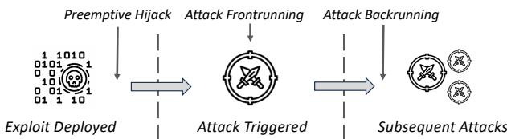
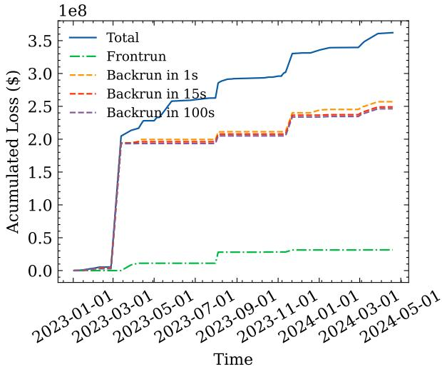
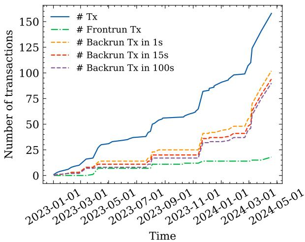
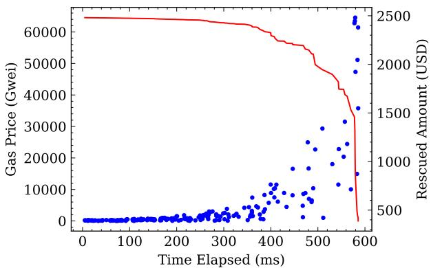
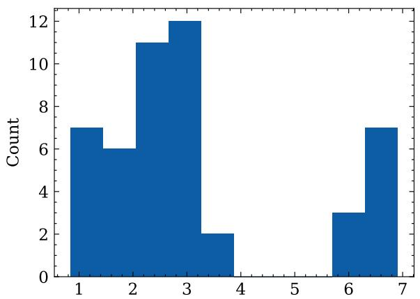
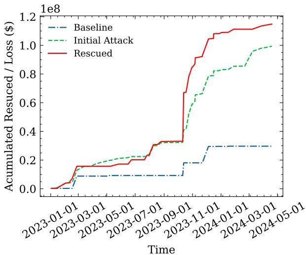
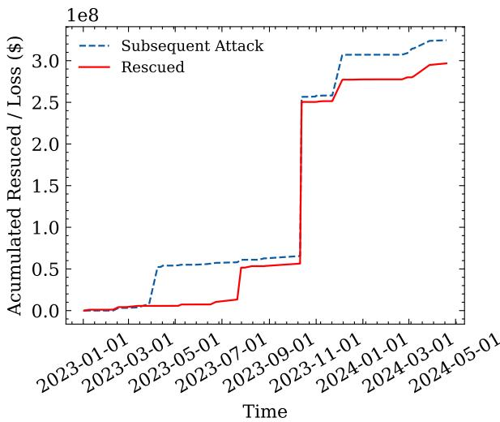
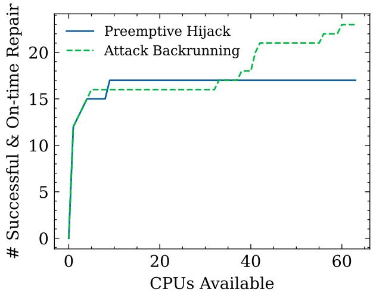

# BACKRUNNER: Mitigating Smart Contract Attacks in the Real World

Chaofan Shou<sup>∗</sup>, Yuanyu Ke<sup>†</sup>, Yupeng Yang<sup>‡</sup>, Qi Su<sup>†</sup>, Or Dadosh<sup>§</sup>, Assaf Eli<sup>§</sup>, David Benchimol<sup>§</sup>, Doudou Lu<sup>†</sup>, Daniel Tong<sup>¶</sup>, Dex Chen<sup>¶</sup>, Zoey Tan<sup>¶</sup>, Jacob Chia<sup>†</sup>, Koushik Sen<sup>∗</sup>, Wenke Lee<sup>‡</sup>

<sup>∗</sup>University of California, Berkeley

<sup>‡</sup>Georgia Institute of Technology

<sup>†</sup>Fuzzland Inc.

<sup>¶</sup>Semantic Layer Labs

<sup>§</sup>Ironblocks

Abstract—Billions of dollars have been lost due to vulnerabilities in smart contracts. To counteract this, researchers have proposed attack frontrunning protections designed to preempt malicious transactions by inserting “whitehat” transactions ahead of them to protect the assets. In this paper, we demonstrate that existing frontrunning protections have become ineffective in real-world scenarios. Specifically, we collected 158 recent real-world attack transactions and discovered that 141 of them can bypass state-of-the-art frontrunning protections. We systematically analyze these attacks and show how inherent limitations of existing frontrunning techniques hinder them from protecting valuable assets in the real world. We then propose a new approach involving 1) preemptive hijack, and 2) attack backrunning, which circumvent the existing limitations and can help protect assets before and after an attack. Our approach adapts the exploit used in the attack to the same or similar contracts before and after the attack to safeguard the assets. We conceptualize adapting exploits as a program repair problem and apply established techniques to implement our approach into a full-fledged framework, BACKRUNNER. Running on previous attacks in 2023, BACKRUNNER can successfully rescue more than \$410M. In the real world, it has helped rescue over \$11.2M worth of assets in 28 separate incidents within two months.

## 1. Introduction

Smart contracts on blockchain platforms have seen rapid growth and adoption over recent years. The immutability and transparency of blockchains make them well-suited for self-enforcing and self-executing programs, called smart contracts. However, these same properties also make vulnerabilities within smart contracts impactful, as malicious transactions cannot easily be reversed once executed. Numerous high-profile incidents of smart contract vulnerabilities being exploited for profit have resulted in billions of dollars worth of digital assets stolen or otherwise put at risk [73], [72], [58], [4], [1].

Several defense mechanisms based on transaction frontrunning [92], [87], [68] have emerged to curb the exploitation of smart contract vulnerabilities<sup>1</sup>. These techniques take advantage of the transparent nature of blockchains such as Ethereum to monitor transactions in the mempool that are waiting to be mined. By analyzing these pending transactions and the code of smart contracts they interact with, protective transactions can be constructed and prioritized to preempt malicious transactions.

Although frontrunning techniques seem promising in theory, our research using honeypots and analyzing realworld measurement data reveals that they are still largely ineffective due to inherent limitations. In the real world, almost all hackers leverage private transactions to hide from the public before the block is mined and broadcasted, making the attacks undetectable until they become hard to mitigate. Moreover, implementing attack frontrunning techniques requires trivial effort, resulting in a high volume of malicious bots running simultaneously. Consequently, when attacks appear in the public mempool, we discover that the bidding process among malicious bots and whitehat bots can sometimes lead to more than 80% of the funds lost for rewarding the block builders. Therefore, there is an urgent need for new alternative techniques capable of safeguarding funds from potential attacks effectively.

We propose a new strategy allowing us to rescue the funds before the attack. We observe that most attacks are split into two steps: deploying the exploit contract and triggering the exploit. Existing techniques attempt to frontrun the second step without caring about the first one. However, we found that the exploit in the first step provides valuable information about the attack. Even though attackers may not put all the details of the attacks in the exploit (e.g., configurations), we discover that traditional search-based program repair methodologies can effectively figure out the necessary missing information by treating them as ”holes” and filling them. Our strategy is to clone and mutate the exploit to make the whole attack successful and profitable to addresses we can control. Afterward, we can effectively counteract the attacks and ”whitehat” hack the victims in minutes or even days before the actual attacks happen. We refer to this strategy as preemptive hijack.

  
Figure 1: Time span of an attack

We also propose another strategy that mitigates potential losses after the attack. We observe that attacks commonly leave residual risks, and the exploiter may not initially steal all assets from the victims. In the case of the INS20 hack[24], the initial attack only took \$2K, while the subsequent attacks led to more than \$692K loss. Additionally, most smart contract projects deployed have multiple deployments and forks on different chains. In the case of Curve Finance[66], the initial attack targeting a smart contract led to \$11M loss, yet the subsequent attacks targeting other similar contracts led to more than \$60M loss. We observe that most exploits can be cloned and mutated (i.e., repaired) to target new victims. By automatically “whitehat” hacking other potential victims, we can significantly reduce the potential loss after attacks. We refer to this strategy as attack backrunning.

We depict preemptive hijack, attack backrunning, and their relations with attack frontrunning in Figure 1. Attack backrunning, compared to preemptive hijack, happens after the attack and has full information about the attack steps.

We implement our strategies into a defense framework named BACKRUNNER. Early testing of BACKRUNNER has shown incredible promise for attack mitigation. Over two months of initial deployment, we successfully mitigated 28 real-world attacks and recovered over \$11.2M worth of assets that attackers would have taken otherwise. In backtesting, our techniques were able to rescue more than \$410M in assets in 2023.

In summary, we make the following contributions:

1) We demonstrate that attack frontrunning is ineffective based on real-world data analysis and experiments.

2) We propose two new defense strategies, preemptive hijack and attack backrunning, that can help mitigate real-world attacks and rescue funds. We also propose novel techniques to synthesize exploits for preemptive hijack and attack backrunning instantly and accurately.

3) We have implemented our strategies into a framework, BACKRUNNER. Through backtesting, we demonstrate that preemptive hijack and attack backrunning work better than attack frontrunning in the real world. We conducted real-world deployment of BACKRUNNER and rescued \$11.2M in a single month.

## 2. Background

## 2.1. Smart Contracts

Smart contracts<sup>2</sup> are programs written in languages such as Solidity and Vyper that compile down to bytecode that runs on the Ethereum Virtual Machine (EVM). They are persistent scripts stored on the blockchain that allow developers to encode complex, self-executing logic. When a user submits a transaction that interacts with a contract, it triggers execution by the EVM, altering the contract’s persistent state stored in the blockchain. Each computational step costs ”gas” paid in small amounts of ether. Code execution only progresses as long as the gas limit set by the sender allows.

Smart contracts can access user inputs in the transactions and data such as the msg.sender attributes to implement customized logic around blockchain transactions. For example, a contract can restrict functions only to authorize particular user addresses or require transactions to meet minimum ether value limits. Under the hood, contract storage works by mapping human-readable text variable names defined by the developer to 256-bit addresses in the permanent storage trie structure managed by the EVM. All computations and state alterations by a smart contract occur on this persisted data.

Attacks in smart contracts target vulnerabilities such as reentrancy issues, integer overflow or underflow errors, unprotected functions, reliance on external contracts, and more. One of the most infamous examples is the DAO hack on the Ethereum platform, where a reentrancy vulnerability allowed an attacker to repeatedly withdraw funds.

Below, we introduce common services in blockchains such as Ethereum. These services are widely used and also leveraged by malicious exploits from the attackers. Familiarity with them can help understand the rest of the paper.

Tokens Tokens are a key feature of Ethereum that enables the creation of digital assets and units of value on top of the Ethereum blockchain. These digital tokens are defined and managed through smart contracts. They can represent anything from virtual currencies and digital assets to voting rights or application access permissions. The ERC-20 standard [5] provides a common set of rules for defining fungible tokens on Ethereum. It specifies methods such as balanceOf() to query an account’s token balance, transfer() to transfer tokens between accounts, and other functions to ensure consistent token behavior across different contracts. By conforming to the ERC-20 interface, tokens built on Ethereum can integrate seamlessly with exchanges, wallets, and other blockchain infrastructure designed around this standard. The standardized token interface facilitates issuing and distributing interoperable tokens with the broader Ethereum ecosystem.

Liquidity Pools (LP) facilitate decentralized token trading on Ethereum through automated market maker (AMM)

smart contracts[9]. A common implementation is Uniswap V2, where an LP holds reserves of two tokens and uses an algorithmic pricing formula to enable swaps between them. The AMM contract automatically sets prices according to the ratio of the quantities of the two tokens in the pool. This ratio determines the exchange rate between the pair based on the formula: $x * y = k$ . Here, x and y are the token quantities and k is a constant. As trades occur, the balances change but the product stays equal to k, keeping the system in equilibrium. To trade tokens, users interact with the pool contract directly with no intermediaries. As trades shift the ratios, the pricing algorithm ensures prices adjust accordingly to maintain the constant k value. Liquidity providers supply reserve tokens to the pools to enable trading. In return, they earn fees from the trades occurring against those reserves. By automating swaps through programmatic supply-demand mechanisms, Uniswap and other AMMs allow fast, decentralized exchanges without order books or counterparties.

Flashloan[2] service allows users to borrow substantial assets without any upfront collateral under the strict condition that the borrowed amount is returned within the same transaction. If the loan is not returned within it, the transaction is reverted as if it never occurred, ensuring the lender’s assets are not at risk. This mechanism leverages the atomicity of blockchain transactions and has been utilized for various purposes, including arbitrage, collateral swapping, and debt refinancing. However, they have also been implicated in sophisticated DeFi attack vectors, as malicious actors can leverage flashloan to cause pricing discrepancies and conduct price manipulation attacks within a single transaction.

## 2.2. Blockchain Mempool

The mempool is the temporary holding area for transactions on the blockchain before they are included in a block[60]. It operates as a queue, prioritizing transactions by the gas price. The concept of gas is critical to the mempool[57]. Gas refers to the fee paid for executing transactions on the blockchain. Senders set a gas price they are willing to pay, which signals to miners the priority of that transaction. When the network gets congested, transaction senders increase their gas price to incentivize faster processing. This free market mechanism around gas pricing helps balance network capacity and usage. Senders set the priorities, and miners process based on profitability. This coordination through gas pricing allows the blockchain network to handle spikes in traffic and use.

## 2.3. MEV and Frontrunning

The public visibility of pending transactions enables exploitation by Miner Extractable Value (MEV) bots, notably through frontrunning and backrunning [81], [31], [70]. Since transactions in the mempool can be ordered based on gas fees paid, bots can monitor transactions and insert additional ones before and after target transactions to gain profits from arbitrage, liquidation, etc.

To facilitate these MEV bots and increase validator profits, protocols such as Flashbots [56], [21], [48] have separated the role of block building from that of validators. Specifically, dedicated block builders now organize and sequence transactions, optimizing orders for maximum fees or MEV profits. The block builders then transmit these optimized block layouts to validator nodes who propose the blocks.

Different block builders utilize various different policies [19]. Some allow bundled transactions (i.e., an atomic sequence of transactions that no transaction is inserted in between) from MEV bots to remain intact for higher fees, while others receive direct payment from arbitrageurs in non-native tokens as an incentive. In all cases, block builders aim to maximize their own revenue share, creating the most profitable block organizations. The profit is ultimately divided between the proposing validator and the specialized block-builder. To maximize profits and compete with other block builders, when each block builder receives a transaction, the block builder does not propagate the transaction among the network but hoards it until the block is proposed. These transactions sent to block builders are known as private transactions. Currently, over 90% of the blocks are being built by third-party block builders [6], not by validators themselves.

## 2.4. Smart Contract Firewall

The concept of proactive defense against attacks was first proposed by a well-known security researcher OfficerCIA in 2021. Soon after that, BlockSec developed an attack frontrunning bot, cloning attack transactions and ”whitehat” hacking victims, which successfully rescued more than \$15M assets since 2022 [1]. In the meantime, malicious actors have also recognized that frontrunning attacks is profitable. The first well-known occurrence of malicious attack frontrunning happened in Dec. 2022, targeting the AES project[3]. In 2023, Zhang et al.[92] formalized the attack frontrunning technique.

## 2.5. Program Repair

The concept of automatically repairing programs has existed for decades and has gained significant research interest in the last 10-15 years. Early work in this area focused on simple heuristic-based bug fixes or fixes tailored to domain-specific rules. Recently, techniques leveraging large language models, machine learning, formal methods, and program synthesis have produced more robust and general program repair solutions. Key techniques for automated repair include generate-and-validate[55], [59], semanticsbased analysis[53], [54], [61], program synthesis[64], machine learning-based repair[86], [50], [51] models, and search-based software engineering[45], [46], [44].

  
Figure 2: Funds loss in 2023 - 2024.

  
Figure 3: Successful attack transactions in 2023 - 2024.

## 3. Motivation

## 3.1. Attack Frontrunning

We developed a smart contract firewall based on the state-of-the-art frontrunning techniques proposed in STING[92] on the Ethereum and Binance Smart Chain networks for over six months. We encountered several fundamental limitations of frontrunning in this deployment, which demonstrated that frontrunning is ineffective in the current landscape. To comprehensively assess the efficacy of frontrunning in mitigating attack impacts, we examined 158 documented attack transactions [1] from 54 attacks that happened between 2023/01 and 2024/05, resulting in financial losses ranging from \$100K to \$200M. As shown in Figure 2 and Figure 3, out of these attack transactions, only a small fraction (18 transactions) were intercepted by attack frontrunning bots, which rescued less than \$31.5M (8.7% of the total loss) in assets, indicating a limited success rate in asset recovery through frontrunning.

  
Figure 4: Block bidding process of frontrunning the \$3000 honeypot attack.

Furthermore, to deepen our understanding of the frontrunning process, we collected and analyzed the mempool data, including the initial detection time of transactions by our nodes and those managed by Blocknative[20] globally. This investigation showed that merely 17 out of the 158 documented attack transactions were visible to the public before block broadcast, thereby allowing bots to engage in frontrunning. Most of the remaining attacks were executed using strategies that circumvented public visibility, such as employing block builders for sending private transactions.

Observation 1: Prevalence of private transactions have greatly reduced effectiveness of attack frontrunning.

Additionally, we discover that among these 17 attacks, more than 30% of rescued funds are sent to block builders or paid as gas fees. The bots do so to ensure their transactions are placed before other frontrunning bots. To visualize the competition of bots on the network, we deployed a honeypot contract on Binance Smart Chain. In September 2023, we intentionally launched a public attack transaction to steal \$3K worth of assets in the honeypot contract and monitor the mempool. The bidding over time is visualized in Figure 4. We observed that at least 6 bots had generated relevant transactions in an attempt to frontrun our attack transaction. These 6 bots competed with each other by continuously bidding higher gas prices in less than 600 milliseconds. In total, we observed 189 bids, with gas prices growing from 10 gwei to 60,000 gwei. As the gas price reaches 60,000 gwei, 80% of the rescued funds are burnt and used to pay the validators, resulting in less than \$500 worth of assets rescued.

Observation 2: Competitions between attack frontrunning bots lead to high gas prices, greatly reducing the funds that can be rescued.

Due to Observations 1 and 2, it is practically hard to frontrun an attack today as it is either impossible due to invisible private transactions or comes with a great cost due to the competition. In fact, we realize that attack frontrunning shall happen before the attack transaction is sent. At first glimpse, this seems equivalent to performing vulnerability hunting on the chain, which is ineffective and hard to automate. However, we notice that before an attack, there are often many indicators that can provide us with attack information, such as exploit contract deployment or attacks on similar contracts. These indicators may enable us to identify potential victims and thus synthesize a counterexploit. Based on this insight, we design our first strategy, preemptive hijack, which synthesizes counter-exploit from deployed exploits, and the second strategy, attack backrunning, which adapts attack transactions to target similar contracts before potential residual attacks.

  
Time Between Deployment and Attack (log10(s))  
Figure 5: The time difference between when the exploit is deployed and the attack is triggered.

We demonstrate the effectiveness of both strategies by first conducting a statistical analysis of attacks in 2023. We assume we have an oracle that can automatically turn an exploit deployed into a counter-exploit for the victim or potential victims with similar contracts. As shown in Figure 5, 50 out of 54 documented attacks have exploits deployed at least one second before the attacks. With such an oracle, preemptive hijack can rescue more than \$115M worth of assets from these 50 attacks. Additionally, as shown in Figure 2, we observe that the attack backrunning leveraging such an oracle can rescue more than \$246M worth of assets.

## 3.2. Exploit Synthesis

Unlike previous work, which synthesizes the counterexploit after observing the full attack, BACKRUNNER synthesizes the counter-exploit from the exploit contracts (i.e., contracts deployed by attackers that are later triggered to conduct the attack) deployed before the attack transaction is sent. The challenge here is that the exploit contract commonly misses details about the attack. We use the Onyx Protocol hack [43] as an example:

In the exploit contract, there are seven callable functions. The specific function that the attacker leveraged in the exploit contract is 0xcb0d9b88, as shown in Figure 6.

```solidity
function 0xcb0d9b88(uint256 v0, bytes v1) public {
    ...
    require(msg.sender == owner);
    require(tx.origin == msg.sender);
    require(0x60b0a6.... == keccak256(tx.origin));
    ...
    addr.flashloan(this, s19, v0, v0, 0);
    ...
    ret, res = stringToAddress(v1);
    require(owner == res);
    ...
}
```  
Figure 6: Decompiled code of exploit targeting Onyx Protocol

To use this function before seeing the attack transaction, we need to guess three input arguments: the sender, v0, and v1. The sender can be easily computed by trying all constants found in the contract storage and the code of the exploit contract. However, finding suitable values for v0 and v1 is non-trivial: v0 controls the amount of flashloan borrowed; v1 is first converted to a string by stringToAddress and then compared with the owner. v0 alone has 2<sup>256</sup> possibilities, which cannot be brute-forced in a reasonable amount of time.

Another example is the Grok attack, which is a price manipulation attack. After the initial attack, hundreds of victims remained vulnerable to the same attack. The first attacker used the following exploit contract.

```txt
function attack() public {
    ...
    lp.buyToken(A)
    token.transferFrom(address(this), token, B)
    lp.buyToken(C)
    lp.sellToken(D)
    ...
}
```

In the exploit, the attacker hardcoded four uint256 constants denoted by A, B, C, D, which only work for the initial victims. The values are directly correlated to the success of the price manipulation. To reuse the exploit for a different victim, we must find the values for A, B, C, D specific to the victim.

Challenge: Turning an existing exploit into a defense exploit requires synthesizing complex patches or new code.

## 4. Methodology

## 4.1. Threat Model

Our approach targets attacks that exploit vulnerabilities in on-chain smart contracts. Attacks stemming from other causes, including private key leaks, are out of the scope of this work. Attacks launched by privileged parties themselves, such as rug pull scams, are also beyond our scope. As mentioned in subsection 3.1, the prevalence of private transactions makes attack transactions invisible to the public. Therefore, unlike existing approaches [92], [87], [68], our approach does not assume the availability of an attacking transaction before the block broadcast.

<div class="mineru-algorithm" style="white-space: pre-wrap; font-family:monospace;">
Algorithm 1: Overall Workflow
Input: $T$;
Programs ← ExploitCloning ($T$)
for program ∈ Programs do
    program' ← Rewrite(program)
    profit, h ← HybridFuzzing(program')
    if profit &gt; 0 then
        Send(program', h)
</div>

## 4.2. Overview of BACKRUNNER

For every public transaction in the mempool and private transaction seen after block broadcast, BACKRUNNER analyzes every contract created in the transaction (preemptive hijack) and the transaction (attack backrunning). BACKRUNNER involves four stages: ExploitCloning, Rewrite, HybridFuzzing, and Send. A high-level overview of the workflow is shown in Algorithm 1. ExploitCloning (subsection 4.3, subsection 4.4) yields a set of programs with holes (unfilled constants in the program) to be repaired. During ExploitCloning, preemptive hijack takes a contract to generate a set of programs that explores all paths of that contract, with holes as inputs of that contract. Attack backrunning instead takes a transaction and generates a set of programs that swap the called address (potential victims) with new victims and make call inputs sent from the exploit contract to the new victims as holes. Rewrite (subsection 4.5) takes a program and uses a set of pre-defined rules to eliminate holes (e.g., flashloan amount which can be calculated from the execution of the new programs.) Then, HybridFuzzing (subsection 4.6) takes the modified program and attempts to maximize the profit received by our account during the program’s execution by trying different values for the unfilled holes. If a profitable execution is found, BACKRUNNER sends it to our block builder. The block builder finds the most profitable execution and converts it to a transaction. The block builder then builds the block with that transaction and continuously bids to the validators to surpass others’ bids for block commitment.

## 4.3. Generating Exploits for preemptive hijack

In preemptive hijack, BACKRUNNER analyzes a contract by first extracting all functions in the contract through decompilation. Each function has a set of arguments whose types BACKRUNNER infers during decompilation. The programs, that BACKRUNNER returns in exploit cloning are a set of functions with arguments as holes.

Attacker commonly has checks in their contracts (e.g., authentication). We recognize that if the contract is an exploit, then there must be an execution path of one of the functions that leads to an attack. With this insight, we must collect every path (including infeasible paths) in the contract. Static analysis is a common way to explore all feasible paths and some infeasible paths in a contract without generating inputs. BACKRUNNER does not use static analysis because: 1) exploit contracts often include external calls and callbacks, which static analysis cannot adequately handle at the bytecode-level[32], [7]; 2) the targets of smart contract conditional jumps are mostly dynamically calculated, making path inference complex and time-consuming[38].

```txt
Algorithm 2: Exploit Cloning for Preemptive Hijack.
Function: ExploitCloning
Input: Contract
Return: Programs ← ∅
for func ∈ ExtractFuncs (Contract) do
    Frontiers ← {(entry_pc(func), [])}
    while (pc, trace) ∈ Frontiers do
        Frontiers = Frontiers \ (pc, trace)
        i ← inst_at(func, pc)
        while i ∉ StopInstructions do
            trace ← trace + pc
            if i = JUMPI then
                pc' ← StepWithFlip(func, pc)
                Frontiers ← Frontiers + (pc', trace)
            pc ← Step(func, pc)
            i ← inst_at(func, pc)
        Programs ← Programs + (func, trace)
```

We propose an unsound but practical dynamic approach to collect all feasible paths. To explore all paths in a function precisely, we need to generate inputs for those paths using fuzzing or concolic/symbolic [36], [74], [28], [67] execution, which is infeasible because of their high computation cost. Therefore, we force exploring both branches of each conditional statement while running the function with default inputs (e.g., 0 for uint256). Even though exploration of both branches of each conditional jump may change the semantics of the exploit contract, BACKRUNNER tries every possible branching combination (i.e., path), and at least one combination would be semantically valid.

The dynamic approach is very similar to generational concolic execution [37]; however, it does not try to check the feasibility of each path by generating inputs. Therefore, the analysis is extremely fast and can handle external calls and callbacks. In real-world experiments, dynamic analysis consistently generates a concise set of paths, always including those taken by attackers.

The pseudocode is shown in Algorithm 2. In the algorithm, we use + to denote adding an element to a list, set, or map. The algorithm maintains a set, called Frontiers, of partial paths to be explored further by the algorithm. A partial path is a pair whose first element is the PC that needs to be explored next and a sequence of program counters (i.e., a partial trace) corresponding to conditional jumps already explored by the execution. At the start of the analysis of every function, Frontiers is initialized to a pair containing the entry program counter (PC) of that function, and an empty trace (line 2). Then, while there are partial paths in the set, BACKRUNNER executes the function with default inputs (lines 5 - 12) and records every PC encountered during execution in the trace. For every occurrence of JUMPI during execution, BACKRUNNER force executes to the other branch (line 9) and adds the resulting state to the Frontiers (line 10) for future forced exploration. Once the execution is finished, the current execution with the trace is added to the returned programs (line 13).

## 4.4. Generating Exploits for attack backrunning

In attack backrunning, an attack transaction is first reconstructed such that BACKRUNNER can gain the same profit as the attacker originally gained by conducting the same attack. Attack reconstruction has been well-explored in previous work of attack frontrunning [92], [22]. The reconstruction process first transforms an attack transaction into a sequence of actions the attackers took, such as external calls, token liquidations, flashloans, etc., using pattern matching. Then, to redirect the attack’s profit from the attacker to us, the reconstruction process replaces all occurrences of exploit contracts and attacker addresses with addresses we can control.

Each attack has a set of victims, which are the addresses that lose funds in the attack and the addresses called by these addresses. After the reconstruction, BACKRUNNER swaps the original victim set to other potential victim sets to derive a set of new attack transactions. New potential victims for every original victim in the victim set are found by matching addresses on the chain with similar traits as the original victim. For instance, if a contract address has the same trait (e.g., same bytecode or function signatures) as one of the original victims, then it can be considered as a new potential victim that can swap that original victim.

As depicted in Algorithm 3, to identify relevant new victims for an attack, the algorithm scans each address addr involved in the attack (lines 4- 6). For each addr, $\begin{array} { r l r l } { \left\{ { \mathsf { a d d r } } ^ { \prime } \right. } & { { } | } & { } & { { } { \mathsf { T r a i t s } } ( { \mathsf { a d d r } } ^ { \prime } ) } & { { } = } \end{array}$ Traits(addr) for all addr<sup>′</sup> on chain} forms a set of potential victims, characterized by traits equivalent to those of addr (line 6).

Despite the precision of trait definitions, the number of potential new victims can be exceedingly large $( > 1 0 ^ { 8 } )$ making the number of potential new victim sets even larger. An important insight is that new victims in each potential victim set must exhibit similar correlations to each other as their counterparts in the original victim set. For example, in a victim set comprising (token, lp), where lp is the liquidity pool of the token token. As liquidity pool contracts typically share identical function selectors and bytecode, SimilarAddrs[lp] contains over 5 million $\tt { 1 p ^ { \prime } }$ on Ethereum such that $\mathtt { T r a i t s } ( \mathtt { l p } ^ { \prime } ) = \mathtt { T r a i t s } ( \mathtt { l p } )$

Thus, for every set in $\{ ( \ t \circ \mathrm { k e n ^ { \prime } } , \mathsf { 1 p ^ { \prime } } ) \quad | \quad \mathsf { t o k e n ^ { \prime } } \in $ SimilarAddrs[token] $\wedge \mathsf { { l p } } ^ { \prime } \in \mathsf { S i m i l a r A d d r s } [ \mathsf { 1 p } ] \big \}$ identified by trait matching, BACKRUNNER must additionally filter $\tt { 1 p ^ { \prime } }$ instances to retain those which specifically serve as the liquidity pool for token<sup>′</sup> rather than unrelated tokens. To formally define the correlation filter, we introduce $r ( \mathsf { a d d r } , \mathsf { a d d r } ^ { \prime } )$ , a set of manually defined rules returning the correlations (represented as a set of relationships) between any two addresses. BACKRUNNER eliminates victim sets where every address combination (addr<sup>′</sup>, v) does not satisfy $r ( \mathbf { a d d r } , k ) \ = \ r ( \mathbf { a d d r } ^ { \prime } , \upsilon )$ , with addr and k being the original counterparts of addr<sup>′</sup> and v respectively (line 10).

Using the previous example, suppose SimilarAddrs[token] contains a single address token<sup>′</sup>. At Line 9, since the replacer is initially empty, BACKRUNNER takes the true condition branch and updates the replacer to {token 7→ token<sup>′</sup>} (Lines 10-12). Subsequently, the algorithm processes each $\mathsf { l p } ^ { \prime } \in \mathsf { \Gamma } _ { \mathsf { S i m i l a r A d d r s } [ \mathsf { l p } ] }$ . For each $\mathsf { 1 p ^ { \prime } } ,$ the mapping $\{ \mathtt { l p } \mapsto \mathtt { l p } ^ { \prime } \}$ is appended only if $r ( \mathtt { l p } , \mathtt { t o k e n } ) = r ( \mathtt { l p ^ { \prime } } , \mathtt { t o k e n ^ { \prime } } ) = \{ \mathtt { L P } \}$ (Line 10). Finally, the Replacers set comprises a set of mappings in the form $( \tt t o k e n \mapsto \tt t o k e n ^ { \prime } , \tt l p \mapsto \tt l p ^ { \prime } )$ , where $\tt { 1 p ^ { \prime } }$ is the liquidity pool of token<sup>′</sup>.

Additionally, each external calls in the reconstructed trace have arguments, which are either constants or returns of the previous call. Arguments may need to be modified when applying the attack on different victims. Thus, if the argument is a constant, BACKRUNNER considers it to be a hole that needs to be filled with a new value (lines 14-19).

## 4.5. Rule-based Exploit Rewrite

We discovered that some holes could be removed by applying a set of manually crafted rewriting rules. Reducing the number of holes can reduce complexity in the next step as fewer holes need to be filled. We utilize three practical exploit rewrite rules to reduce the number of holes.

Flashloan Attackers may borrow flashloan to conduct the attack. The exact amount of flashloan needed is the amount spent in the subsequent external calls. Thus, BACKRUNNER fills holes passed as the amount in flashloan calls with such values. Some attacks may need more funds than those in a single flashloan provider, and they would need to borrow flashloan from multiple providers. In this situation, BACKRUNNER starts by borrowing from providers with the lowest fee until reaching the amount needed.

Approval Amount Some attacks attempt to drain tokens approved by accounts to the victim contract. BACK-RUNNER replaces holes that are passed as the amount used in calls transferring approved tokens with results of allowance(spender, owner), which returns the tokens approved.

Swap Attackers may swap a token to another token during the attack. To perform swap, the attacker calls swap(amount0Out, amount1Out, ...) for Uniswap V2 liquidity pool, and calls function swap(..., direction, amount, price, ...) for Uniswap V3 pool. amount0Out, amount1Out, price before and after the attack transaction can be different and need to be recalculated based on liquidity in the pool. For holes related to those arguments, BACKRUNNER replaces them with proper swap calculation logic.

```txt
Algorithm 3: Exploit Cloning for Attack Backrunning
Function: ExploitCloning
Input: Transaction
Return: Programs
transaction' ← Reconstruct (Transaction)
Replacers ← {EmptyMap()}}
for action ∈ transaction' do
    SimilarAddrs ← {}
    for addr ∈ addrs_used(action) do
        SimilarAddrs [addr] ← {addr' | Traits(addr') = Traits(addr) for all addr' on chain}
    for addr ∈ addrs_used(action) do
        Replacers' ← {}
        for replacer ∈ Replacers ∧ addr' ∈ SimilarAddrs do
            if ∀(k ↦ v) ∈ replacer ∧ r(addr, k) = r(addr', v) then
                replacer ← replacer + (addr ↦ addr')
                Replacers' ← Replacers' + replacer
            Replacers ← Replacers'

ModifiedTransactions ← {replacer(transaction')|replacer ∈ Replacers}
Holes ← {}
for action ∈ transaction' do
    for arg ∈ args_of(action) do
        if IsConstant(arg) then
            Holes ← Holes+ (action, arg)

Programs ← {(transaction, Holes)|transaction ∈ ModifiedTransactions}
```

## 4.6. Hybrid Fuzzing-based Exploit Repairing

To fill the remaining holes, BACKRUNNER uses hybrid fuzzing, which combines fuzzing with symbolic execution. It might appear that symbolic execution can effectively fill the holes and find profitable executions. However, in the real world, symbolic execution can generate gigabytes of constraints that take days to solve. Even worse, DeFi projects such as Uniswap V3 have complex loop invariants and conduct square roots and logarithmic operations, further hindering constraint solving. Another observation is that the programs with holes may be easier to solve if we can simply prepend or append more calls to them. For instance, a revert may be caused by a lack of a specific token in the victim contract. We can easily resolve this revert by appending flash-loan and swapping transactions to get that token. With these observations, we use coverage and dataflow-guided stateful fuzzing [77] with concolic execution [82] to find valid inputs. The concolic execution module and fuzzing module share the same corpus ( i.e., a set of interesting inputs found that are later retrieved for mutations and deriving new inputs), and BACKRUNNER run both modules each on multiple threads concurrently. The fuzzer treats the programs with holes as potential callable functions and is encouraged to prepend and append more calls when filling the holes.

As BACKRUNNER needs to react fast in the real world, we introduce heuristics to reduce the input space to speed up the hybrid fuzzing process. First, BACKRUNNER only explores inputs that can be decoded with respect to the inferred type (e.g., only attempt $[ 0 , 2 ^ { 1 6 } - 1 ]$ for uint16). Second, we extract all constants and state variables from all contracts called and use them in the initial corpus. Lastly, we observe that static call returns and values in the EVM stack observed during execution may also be valid input arguments. BACKRUNNER uses these values as hints for the mutators (e.g., the mutators may replace some bytes in the input with values from the hints).

We also use the potential profit gained from execution to assign energy to each test case, maximizing the profit until the time limit of fuzzing is reached. The energy of a test case determines the computational power to be spent by the fuzzer on it. A test case with higher energy will be used in fuzzing for a longer time, thus generating more new inputs. Assuming p is the profit, we assign each test case energy $e ^ { \prime } ( t )$ based on Equation 1.

$$
e ^ {\prime} (t) = \min (3 2 * e (t), 1 0 0 * \log_ {2} (\max (2, p)))\tag{1}
$$

Here, $e ( t )$ is the original power scheduler assigned energy. We first take the logarithmic value of $p$ to scale down the energy difference in test cases of large p. To avoid assigning too much energy, we cap the new energy at 32 times the original energy. We chose the coefficients because they empirically work best in the experiments. With profit-guided power scheduling, BACKRUNNER schedules the fuzzing power toward discovering inputs covering greater profits, therefore helping the fuzzer achieve its goal faster and more efficiently.

## 5. Evaluation

## 5.1. Experiment Setup

We have implemented a frontrunning bot based on STING [92] in 67K lines of code in Rust. Then, we implemented our preemptive hijack and attack backrunning techniques on top of it using 38K lines of Rust code. We leveraged revm[17] to simulate and trace transactions. We also reused taint analysis, fuzzing, and concolic execution modules in ItyFuzz [77]. In addition, to identify similar contracts, we indexed 46TB of traces and contracts on Ethereum, Binance Smart Chain, Arbitrum, and Polygon.

For back-testing (testing on past data), we created a simulated blockchain node, which replays each block using our collected trace, along with Blocknative mempool data. We impose that the time interval between the bots seeing the transaction and block broadcast is exactly the same as in the real world. We used an AWS spot instance cluster of 1024 cores with 16TB memory for hybrid fuzzing. For baseline, we compare BACKRUNNER with our implementation of STING[92], the state-of-the-art frontrunning bot in academia. Additionally, we also compare with existing attack frontrun bots [23] on the chains. These bots can synthesize counter exploits with complex control flow and dataflow mutations in less than 100ms.

For real-world settings, we deployed three bots (each running with 192 cores and 768 GB memory) connected to bloXroute BDN to process transactions on Ethereum, Polygon, Binance Smart Chain, and Base worldwide (to access public transactions sent in the region with low latency). Each bot is deployed along with a Reth[16] or Geth[13] full node.

## 5.2. Performance on Past Attacks

5.2.1. Preemptive Hijack Performance. We run preemptive hijack of BACKRUNNER on exploit contracts collected from 54 initial attack transactions on Binance Smart Chain, Ethereum, Arbitrum, and Base, and preemptive hijack can generate a defense exploit for 38 of them. Of these 54 exploit contracts, 14 of them can be directly converted into defense exploits using exploit cloning. After exploit cloning, the maximum amount of holes in exploits is 26, and the subsequent steps need to identify a valid value for these holes. Rule-based rewrites can yield 8 additional valid exploits and reduce the number of holes for 6 projects. Finally, fuzzing-based repair generates an additional 16 exploits. In total, within 1.5 years since 2023, preemptive hijack can rescue \$114M, which is 15.6% more than the funds stolen by the attackers and 387% more than the funds rescued via the baseline technique. BACKRUNNER can rescue even more than the attackers profited because the defense exploits generated by BACKRUNNER use cheaper flashloan and holes yielding the most profit, etc.

We show the performance of preemptive hijack on these exploits in Table 1 and Figure 7. The exploit cloning mechanism can instantly generate a defense exploit for exploits targeting projects such as BarleyFi[18], TransitFi[12], and BEARNDAO[14]. Specifically, attack functions in these exploits either have no argument or have arguments that have no impact on the subsequent execution. These exploits can be simply turned into a preemptive hijack exploit by bypassing certain simple checks in the control flow.

Rule-based rewrites can eliminate and fill the holes in cases such as NFT Trader[25]. Specifically in NFT Trader, by updating the argument of the action used to drain victims NFTs with the number of victims owned and approved to the vulnerable contract, rule-based rewrite can derive a functional exploit that drains the remaining NFTs.

As discussed, BACKRUNNER leverages fuzzing to fill the rest of the holes. Yet, there are 12 cases where, even with hybrid fuzzing, BACKRUNNER cannot fill the holes properly. Although these cases are rare, we discuss them to understand BACKRUNNER’s ability better. There are mainly two categories that BACKRUNNER fails to handle. First, BACKRUNNER fails to handle attacks targeting projects such as Unizen[27] and WOO[10] because the attacker conducted the attack in a single transaction. Specifically, they conducted the attack inside the constructor of the exploit contract, and once deployed, the attack was finished. Without the attack contract, BACKRUNNER cannot conduct preemptive hijack. We further discuss such a weakness in section 6.

Additionally, for exploits targeting projects such as PawnFi, BACKRUNNER cannot find valid hole values even after hybrid fuzzing. The reason is that these holes are hard to fill. Specifically for PawnFi[15], one hole is used by the exploit as the value needed to enter markets in a DeFi project. In the experiment, we observe that filling the hole with values out of range [2e23 − 1e18, 2e23 + 1e18] makes the full exploit revert. Fuzzing is impractical to solve this constraint with limited computation resources and time. Meanwhile, due to the extremely complex constraints introduced by Compound, a liquidity pool used by the exploit, concolic execution aborts early before even generating constraints for such a hole. BACKRUNNER fails to generate defense exploits for holes involving extremely complex constraints.

5.2.2. Attack Backrunning Performance. We used BACK-RUNNER to automatically backrun the initial attacks for all 54 initial attack transactions. BACKRUNNER generated at least one backrun exploit for each of the 33 projects with more than \$1K profits. These generated exploits can gain \$296M in profits, rescuing 91.1% assets from copycat or subsequent attacks. We show the performance of attack backrunning on these exploits in Table 1 and Figure 8.

Specifically, in attacks targeting EulerFi [41], BACK-RUNNER can rescue more than \$160M. The exploit can be directly reused by replacing the victim set with any one of the pools of Euler Finance, its respective assets, or flash loan providers that can provide that asset.

<table><tr><td rowspan="2">Incident</td><td rowspan="2">Date</td><td rowspan="2">Baseline R/I</td><td colspan="5">Preemptive Hijack</td><td colspan="6">Attack Backrunning</td></tr><tr><td>EC</td><td>H</td><td>RR</td><td>H&#x27;</td><td>R/I</td><td>#E</td><td>H</td><td>R</td><td>H&#x27;</td><td>R/T</td><td>R/B</td></tr><tr><td>Hedgey</td><td>2024-04-19</td><td>0%</td><td>X</td><td>9</td><td>X</td><td>1</td><td>99.86%</td><td>7</td><td>17</td><td>✓</td><td>16</td><td>90.85%</td><td>239.65%</td></tr><tr><td>PrismaFi</td><td>2024-03-28</td><td>0%</td><td>✓</td><td>-</td><td>-</td><td>-</td><td>99.84%</td><td>3</td><td>1</td><td>X</td><td>1</td><td>118.56%</td><td>149.44%</td></tr><tr><td>unizen</td><td>2024-03-08</td><td>0%</td><td>-</td><td>-</td><td>-</td><td>-</td><td>0%</td><td>875</td><td>8</td><td>X</td><td>2</td><td>58.65%</td><td>266.06%</td></tr><tr><td>WOO</td><td>2024-03-05</td><td>0%</td><td>-</td><td>-</td><td>-</td><td>-</td><td>0%</td><td>1</td><td>-</td><td>-</td><td>-</td><td>0.00%</td><td>0.00%</td></tr><tr><td>Seneca</td><td>2024-02-28</td><td>0%</td><td>X</td><td>0</td><td>X</td><td>0</td><td>0%</td><td>6</td><td>5</td><td>X</td><td>3</td><td>37.96%</td><td>127.44%</td></tr><tr><td>DN_404</td><td>2024-02-21</td><td>0%</td><td>X</td><td>1</td><td>X</td><td>1</td><td>0%</td><td>1</td><td>7</td><td>X</td><td>2</td><td>0.27%</td><td>inf</td></tr><tr><td>BarleyFi</td><td>2024-01-28</td><td>100%</td><td>✓</td><td>-</td><td>-</td><td>-</td><td>100.00%</td><td>2</td><td>8</td><td>X</td><td>4</td><td>16.34%</td><td>174.90%</td></tr><tr><td>BasketDAO</td><td>2024-01-17</td><td>0%</td><td>X</td><td>1</td><td>X</td><td>1</td><td>105.16%</td><td>10</td><td>1</td><td>✓</td><td>-</td><td>28.44%</td><td>inf</td></tr><tr><td>Socket</td><td>2024-01-16</td><td>0%</td><td>-</td><td>-</td><td>-</td><td>-</td><td>0%</td><td>5.7K</td><td>-</td><td>-</td><td>-</td><td>44.35%</td><td>225.26%</td></tr><tr><td>Radiant</td><td>2024-01-02</td><td>0%</td><td>X</td><td>3</td><td>X</td><td>3</td><td>0%</td><td>1</td><td>-</td><td>-</td><td>-</td><td>0.00%</td><td>0.00%</td></tr><tr><td>TransitFi</td><td>2023-12-19</td><td>100%</td><td>✓</td><td>-</td><td>-</td><td>-</td><td>100.00%</td><td>3.1K</td><td>6</td><td>X</td><td>5</td><td>589.88%</td><td>inf</td></tr><tr><td>NFT Trader</td><td>2023-12-16</td><td>0%</td><td>X</td><td>9</td><td>X</td><td>1</td><td>18214%</td><td>8.2K</td><td>8</td><td>X</td><td>7</td><td>1276.2%</td><td>1283.3%</td></tr><tr><td>INS20</td><td>2023-12-28</td><td>0%</td><td>X</td><td>1</td><td>✓</td><td>-</td><td>100.00%</td><td>21M</td><td>1</td><td>✓</td><td>-</td><td>419.08%</td><td>420.35%</td></tr><tr><td>Floor NFT</td><td>2023-12-16</td><td>0%</td><td>X</td><td>0</td><td>X</td><td>0</td><td>452.75%</td><td>784</td><td>1</td><td>✓</td><td>-</td><td>187.83%</td><td>321.02%</td></tr><tr><td>Elephant</td><td>2023-12-06</td><td>0%</td><td>X</td><td>1</td><td>X</td><td>1</td><td>100.00%</td><td>1.4K</td><td>13</td><td>X</td><td>1</td><td>1.26%</td><td>4.11%</td></tr><tr><td>BEARNDAO</td><td>2023-12-05</td><td>0%</td><td>✓</td><td>-</td><td>-</td><td>-</td><td>100.00%</td><td>2.9K</td><td>10</td><td>X</td><td>1</td><td>6.07%</td><td>inf</td></tr><tr><td>Kyberswap</td><td>2023-11-22</td><td>0%</td><td>-</td><td>-</td><td>-</td><td>-</td><td>0%</td><td>1</td><td>-</td><td>-</td><td>-</td><td>0.00%</td><td>0.00%</td></tr><tr><td>Bot 0x8c2d</td><td>2023-11-22</td><td>0%</td><td>X</td><td>1</td><td>✓</td><td>-</td><td>94.33%</td><td>2</td><td>19</td><td>X</td><td>18</td><td>0.00%</td><td>inf</td></tr><tr><td>Raft</td><td>2023-11-10</td><td>0%</td><td>X</td><td>2</td><td>X</td><td>1</td><td>100.00%</td><td>1</td><td>-</td><td>-</td><td>-</td><td>0.00%</td><td>0.00%</td></tr><tr><td>Bot 0x05f0</td><td>2023-11-07</td><td>0%</td><td>X</td><td>1</td><td>✓</td><td>-</td><td>100.06%</td><td>13</td><td>4</td><td>X</td><td>1</td><td>36.91%</td><td>1878.4%</td></tr><tr><td>TheStandard</td><td>2023-11-06</td><td>0%</td><td>✓</td><td>-</td><td>-</td><td>-</td><td>100.00%</td><td>49</td><td>-</td><td>-</td><td>-</td><td>0.00%</td><td>0.00%</td></tr><tr><td>Onyx</td><td>2023-11-01</td><td>0%</td><td>X</td><td>2</td><td>✓</td><td>-</td><td>100.12%</td><td>1</td><td>-</td><td>-</td><td>-</td><td>0.00%</td><td>0.00%</td></tr><tr><td>UniBot</td><td>2023-10-31</td><td>0%</td><td>X</td><td>0</td><td>X</td><td>0</td><td>0%</td><td>1.8K</td><td>-</td><td>-</td><td>-</td><td>1245.6%</td><td>5506.8%</td></tr><tr><td>Maestro</td><td>2023-10-24</td><td>0%</td><td>✓</td><td>-</td><td>-</td><td>-</td><td>100.00%</td><td>37K</td><td>3</td><td>✓</td><td>-</td><td>243.28%</td><td>252.75%</td></tr><tr><td>Hope.money</td><td>2023-10-18</td><td>100%</td><td>X</td><td>5</td><td>X</td><td>3</td><td>0%</td><td>4</td><td>-</td><td>-</td><td>-</td><td>0.00%</td><td>0.00%</td></tr><tr><td>WiseLending</td><td>2023-10-13</td><td>100%</td><td>✓</td><td>-</td><td>-</td><td>-</td><td>100.00%</td><td>1</td><td>-</td><td>-</td><td>-</td><td>0.00%</td><td>0.00%</td></tr><tr><td>BH Token</td><td>2023-10-11</td><td>0%</td><td>X</td><td>8</td><td>X</td><td>8</td><td>0%</td><td>3</td><td>14</td><td>X</td><td>1</td><td>3.69%</td><td>inf</td></tr><tr><td>Balancer</td><td>2023-08-27</td><td>0%</td><td>X</td><td>26</td><td>X</td><td>26</td><td>0%</td><td>1</td><td>-</td><td>-</td><td>-</td><td>0.00%</td><td>0.00%</td></tr><tr><td>SVT</td><td>2023-08-25</td><td>0%</td><td>X</td><td>2</td><td>X</td><td>2</td><td>100.00%</td><td>1</td><td>6</td><td>X</td><td>4</td><td>0.48%</td><td>inf</td></tr><tr><td>Exactly</td><td>2023-08-18</td><td>0%</td><td>X</td><td>2</td><td>X</td><td>2</td><td>100.00%</td><td>1</td><td>14</td><td>X</td><td>13</td><td>24.59%</td><td>inf</td></tr><tr><td>EarningFarm</td><td>2023-08-09</td><td>0%</td><td>X</td><td>1</td><td>✓</td><td>-</td><td>100.00%</td><td>1</td><td>-</td><td>-</td><td>-</td><td>0.00%</td><td>0.00%</td></tr><tr><td>LeetSwap</td><td>2023-07-31</td><td>0%</td><td>✓</td><td>-</td><td>-</td><td>-</td><td>100.00%</td><td>7</td><td>✓</td><td>-</td><td>-</td><td>63.98%</td><td>97.84%</td></tr><tr><td>Curve</td><td>2023-07-30</td><td>100%</td><td>✓</td><td>-</td><td>-</td><td>-</td><td>100.00%</td><td>121</td><td>9</td><td>X</td><td>3</td><td>42.36%</td><td>52.36%</td></tr><tr><td>Carson</td><td>2023-07-26</td><td>0%</td><td>X</td><td>4</td><td>X</td><td>4</td><td>100.00%</td><td>1</td><td>17</td><td>X</td><td>1</td><td>27.50%</td><td>83.62%</td></tr><tr><td>ConicFi</td><td>2023-07-21</td><td>0%</td><td>X</td><td>4</td><td>X</td><td>4</td><td>101.20%</td><td>1</td><td>-</td><td>-</td><td>-</td><td>0.00%</td><td>0.00%</td></tr><tr><td>Shido</td><td>2023-06-23</td><td>0%</td><td>X</td><td>2</td><td>X</td><td>2</td><td>0%</td><td>28</td><td>-</td><td>-</td><td>-</td><td>0.00%</td><td>0.00%</td></tr><tr><td>PawnFi</td><td>2023-06-16</td><td>0%</td><td>X</td><td>2</td><td>X</td><td>2</td><td>0%</td><td>2</td><td>-</td><td>-</td><td>-</td><td>0.00%</td><td>0.00%</td></tr><tr><td>Sturdy</td><td>2023-06-11</td><td>0%</td><td>X</td><td>4</td><td>X</td><td>4</td><td>100.00%</td><td>6</td><td>-</td><td>-</td><td>-</td><td>0.00%</td><td>0.00%</td></tr><tr><td>BabyDoge</td><td>2023-05-27</td><td>0%</td><td>X</td><td>1</td><td>X</td><td>1</td><td>100.00%</td><td>1</td><td>20</td><td>X</td><td>8</td><td>10.91%</td><td>inf</td></tr><tr><td>SNK</td><td>2023-05-09</td><td>0%</td><td>X</td><td>4</td><td>X</td><td>1</td><td>100.00%</td><td>1</td><td>6</td><td>X</td><td>4</td><td>108.1%</td><td>118.83%</td></tr><tr><td>DEI</td><td>2023-05-05</td><td>0%</td><td>X</td><td>1</td><td>✓</td><td>-</td><td>100.00%</td><td>2</td><td>3</td><td>✓</td><td>-</td><td>0.06%</td><td>inf</td></tr><tr><td>LevelFi</td><td>2023-05-01</td><td>0%</td><td>X</td><td>1</td><td>X</td><td>1</td><td>100.00%</td><td>1</td><td>-</td><td>-</td><td>-</td><td>0.00%</td><td>0.00%</td></tr><tr><td>HundredFi</td><td>2023-04-15</td><td>0%</td><td>X</td><td>2</td><td>X</td><td>1</td><td>100.00%</td><td>2</td><td>-</td><td>-</td><td>-</td><td>0.00%</td><td>0.00%</td></tr><tr><td>yearnFi</td><td>2023-04-12</td><td>0%</td><td>X</td><td>1</td><td>X</td><td>1</td><td>100.00%</td><td>1</td><td>-</td><td>-</td><td>-</td><td>0.00%</td><td>0.00%</td></tr><tr><td>Sushiswap</td><td>2023-04-08</td><td>0%</td><td>X</td><td>8</td><td>✓</td><td>-</td><td>1615.4%</td><td>154</td><td>1</td><td>✓</td><td>-</td><td>92.32%</td><td>97.81%</td></tr><tr><td>SafeMoon</td><td>2023-03-28</td><td>100%</td><td>X</td><td>2</td><td>X</td><td>2</td><td>99.99%</td><td>14</td><td>10</td><td>X</td><td>2</td><td>0.13%</td><td>inf</td></tr><tr><td>EulerFi</td><td>2023-03-13</td><td>100%</td><td>✓</td><td>-</td><td>-</td><td>-</td><td>385.13%</td><td>3</td><td>-</td><td>-</td><td>-</td><td>97.06%</td><td>101.54%</td></tr><tr><td>swapX</td><td>2023-02-26</td><td>0%</td><td>X</td><td>16</td><td>X</td><td>16</td><td>0%</td><td>1</td><td>-</td><td>-</td><td>-</td><td>0.00%</td><td>0.00%</td></tr><tr><td>Dexible</td><td>2023-02-16</td><td>0%</td><td>✓</td><td>-</td><td>-</td><td>-</td><td>100.00%</td><td>2</td><td>-</td><td>-</td><td>-</td><td>3.60%</td><td>inf</td></tr><tr><td>dForce</td><td>2023-02-09</td><td>0%</td><td>X</td><td>1</td><td>✓</td><td>-</td><td>100.00%</td><td>155</td><td>-</td><td>-</td><td>-</td><td>0.00%</td><td>0.00%</td></tr><tr><td>Orion</td><td>2023-02-02</td><td>0%</td><td>✓</td><td>-</td><td>-</td><td>-</td><td>100.00%</td><td>2</td><td>5</td><td>X</td><td>2</td><td>94.83%</td><td>101.28%</td></tr><tr><td>Midas</td><td>2023-01-15</td><td>0%</td><td>✓</td><td>-</td><td>-</td><td>-</td><td>100.00%</td><td>8.9K</td><td>-</td><td>-</td><td>-</td><td>0.00%</td><td>0.00%</td></tr><tr><td>BRA Token</td><td>2023-01-09</td><td>0%</td><td>✓</td><td>-</td><td>-</td><td>-</td><td>100.00%</td><td>1</td><td>13</td><td>X</td><td>1</td><td>57.25%</td><td>332.09%</td></tr><tr><td>GDS Token</td><td>2023-01-02</td><td>0%</td><td>✓</td><td>-</td><td>-</td><td>-</td><td>100.00%</td><td>2</td><td>9</td><td>X</td><td>4</td><td>140.3%</td><td>inf</td></tr></table>

TABLE 1: Preemptive Hijack and Attack Backrunning Performance. EC, RR are whether an exploit can be generated directly by exploit cloning and rewrite (if there are holes, fill with default values), respectively. H and H’ are the minimum # holes in the exploit before and after rewrite. #E shows the amount of programs with holes can be generated by exploit cloning. R/I, R/B, R/T is the amount rescued vs loss from initial attack, loss from subsequent attack, and total loss respectively.

  
Figure 7: Preemptive hijack and attack frontrunning (baseline) rescued versus loss caused by initial attack transactions.

  
Figure 8: Attack backrunning rescued versus loss caused by subsequent attack transactions.

In cases such as Socket[26] and Maestro[75], the exploits target victims who have approved funds to be spent by a vulnerable contract. BACKRUNNER can easily recognize the approval relation between victims and the vulnerable contract during the exploit cloning phase. Then, the exploit cloning phase finds all other victims that have a similar relation to the contract. Replacing the original victims with new victims can easily generate a backrun exploit to extract all funds from those victims.

After exploit cloning, BACKRUNNER may generate backrun exploits with holes. Rule-based rewrites are helpful as they can significantly reduce the number of holes. Specifically, for the backrunning exploit of BEARNDAO[14], rulebased rewrite can reduce the number of holes from 10 to 1 by filling the holes in actions conducting flashloan, repayment, and Uniswap V3 swap with proper calculation

logics.

Finally, valid backrun exploits can be generated for most projects except projects such as Kyberswap[42] in fuzzing-based repair. The exploit of the initial attack on Kyberswap uses hardcoded four unique numbers to trigger an intricate rounding error in the victims. Finding such four numbers is non-trivial; even with manually crafted invariant tests designed for this rounding error issue, it takes more than 30 seconds to find the desired test cases. In the full exploit, finding these four numbers accurately, especially making the exploit profitable after leveraging the rounding error, is impractical with limited computation resources and time. Yet, we suggest that human or large language model guidance can significantly help in this case. By localizing the rounding error with expert insights, one can craft an invariant test to speed up the process of identifying the values.

## 5.3. Performance in the Real-world

We ran BACKRUNNER in the real world in December 2023 and May 2024 to understand how the two strategies (i.e.,, preemptive hijack and attack backrunning) perform in terms of generating exploits and rescuing funds. section 8 discusses the details of the procedures we adopted.

BACKRUNNER successfully leveraged 8 preemptive hijack opportunities on Base, Binance Smart Chain, and Ethereum, rescuing \$3.4M automatically. BACKRUNNER failed to generate an exploit for one remaining opportunity, which is the Magic Internet Money attack[76]. No existing bot managed to leverage this opportunity either. However, our further investigation showed that such a failure happened because of a bug in BACKRUNNER. After fixing the issue, we replayed the attack on our test chain and verified that BACKRUNNER could successfully rescue the funds.

For attack backrunning, BACKRUNNER successfully generated backrunning exploits for 18 attacks and rescued \$620K funds from more than 8.1K victims automatically. After tweaking values and inserting external calls to the BACKRUNNER generated exploits manually, we rescued \$7.2M funds in two additional attacks. BACKRUNNER ignored or filtered the additional 17 opportunities due to the limitation of computation resources. Future research can introduce additional optimization techniques.

## 5.4. Computation Resource Cost

In our implementation of BACKRUNNER, exploit cloning and rule-based rewrite can finish in less than 300ms on average on a single core. Sending and triggering the generated exploits takes less than 10ms in real-world scenarios. For fuzzing-based repair, we observe that the time overhead can be reduced by parallelizing fuzzing with more CPU cores. For every preemptive hijack and attack backrunning attempts, we demonstrate how many cores are needed for each fuzzing-based repairs such that BACKRUNNER can generate the defense exploit before attackers conduct the attack in Figure 9. Among 40 attempts, 24 attempts can finish on time with only one core, and 30 attempts can do so with four cores. Yet, it is possible that by replacing the fuzzing engine used under the hood [78], [30], [83], [29], fuzzing-based repair can have even lower timing overhead with less computation resources. We leave this to future work.

  
Figure 9: Average amount of successful and on-time fuzzing-based repair versus available CPUs.

## 6. Discussions

BACKRUNNER is designed to be a best-effort last-line solution for protecting smart contracts from attacks. That said, there are certain ways that attackers can bypass BACK-RUNNER. In the following sections, we describe potential methods to bypass preemptive hijack and attack backrunning.

## 6.1. Weakness of preemptive hijack

Attack from Launchpads. We recognize that BACK-RUNNER would fail in the case when the exploit is in the form of launchpads. With the launchpad, the attack can later send private attack transactions that provide all the call information to the launchpads and finish the attack. An example of the launchpad is given below.

```solidity
function aggregate(Call[] memory calls) {
    for(uint256 i = 0; i < calls.length; i++) {
        calls[i].target.call(calls[i].callData);
    }
}
```

In this launchpad, the attacker can call aggregate() to conduct any types of attack by providing a sequence of call data. Yet, the assumption for preemptive hijack is that before the attack happens, BACKRUNNER can gain leads on the attack, knowing the potential exploit sequences and traits of the victims, which in this case is not available. Unless one can see the private transaction, there is no possible solution to predict an attack launched by this method, regardless of how advanced the technique is. If one can predict it, then one can conduct the attack even without any knowledge about the attack, which is out-of-scope of this research. However, very few human attackers choose to launch attacks using launchpads because using them consumes significantly more gas than using conventional exploits. Deriving the input for launchpads is also extremely complex, error-prone, and time-consuming. All known attacks using launchpads are conducted by attack frontrunning bots or fuzzing bots.

Atomic and Bundled Attacks. BACKRUNNER would also fail when the exploit deployment and the attack transaction happen in the same block, both sent as private transactions. However, we have not yet observed any attacker has leveraged such a method. Another method is to conduct the attack in the exploit constructor. By doing so, the attack happens during exploit deployment. If the exploit is deployed with private transactions, there is again no possible solution to defend against it. In the last 1.5 years, we only observed 4 attack transactions leveraged constructors to conduct attacks. These two methods are rarely used by attackers due to their complexity.

## 6.2. Weakness of attack backrunning

Exploit Extracting All Funds. BACKRUNNER can leverage no backrunning opportunities if the exploit manages to steal all funds from all deployments of the projects. However, in the real world, this is very rare. An attack can use a high amount of gas. Launching the same attack targeting different victims takes a huge amount of gas, which would surpass the limit on the total gas of the block. Attackers typically run exploits on multiple blocks to attack different deployments to avoid this issue. Yet, after the block is broadcasted, the initial attack would be seen by BACKRUNNER, and a backrun exploit can be generated in hundreds of milliseconds, blocking the subsequent attacks. Another scenario is that the attack would happen on multiple chains simultaneously. However, it is impossible for different chains to have the same block broadcast time. A few hundred milliseconds are enough for BACKRUNNER to capture the backrunning opportunities.

Adaptive Obfuscation and Hardcoded Values. While BACKRUNNER employs effective repairing approaches to generate exploits in most cases, the system’s reliance on the initial exploit used leaves it vulnerable. Attackers could design exploits that circumvent BACKRUNNER by including numerous extraneous external calls, forcing BACKRUNNER to produce many unnecessary holes needing time-consuming fuzzing. Additionally, exploits using hardcoded values tailored to specific victims would compel BACKRUNNER to regenerate fitting values when deployed against different targets. Though BACKRUNNER can typically determine appropriate hardcoded values rapidly, adversaries could potentially leverage these obfuscation techniques to bypass BACKRUNNER ’s exploit generation defenses. Further research into hardening BACKRUNNER against these attack avenues could make the system more robust.

## 7. Related Works

Program Repair. Different methods for program repair[86], [50], [51] have been proposed in the last decades. For smart contracts, recent research works leverage searchbased software engineering[80], reinforcement learning[40], rule-based rewrite[91], [62], [71], and semantic-based rewrite[33] for fixing vulnerabilities. In this work, we instead apply program repair techniques for smart contracts to fix exploits used by attackers.

Fuzzing. Fuzzing has been widely adopted in finding vulnerabilities[34], [8], [11], [65] and program repair[52]. Specifically, hybrid fuzzing[79], [49], [88], a combination of concolic execution and fuzzing, is leveraged to gain high test coverage over the program under test. Echidna[39], Harvey[85], ILF[47], sfuzz[63] have been proposed for coverage-guided smart contract fuzzing. More recent works such as Smartian[30] and ItyFuzz[77] identify the stateful nature of smart contracts and leverage state dataflow information to guide the fuzzing.

Attack Detection. Existing researches on detecting attacks leverage pattern matching [90], [89], [84], [69] and large language model [35]. On the other hand, BACKRUNNER is designed not to discern transactions and conduct analysis on every transaction. In a real-world deployment, to save computation resources, we use pattern matching, specifically [90], to filter benign transactions.

## 8. Ethics Consideration

IRB has deemed this research not to be within the scope of human research. We have returned the funds and assets BACKRUNNER rescued to the victims. This research does not involve finding or exploiting new vulnerabilities. Before sending the exploits generated by BACKRUNNER to the chain, we try our best to reach out to the protocol developers. We would only send exploits under their permissions or when they do not respond after 2 hours. Every preemptive hijack attempt by BACKRUNNER in the real world is used to counter-act a real attack from the hackers. All attack backrunning attempts are manually checked by one of the authors before BACKRUNNER sending them to ensure they do not cause additional damage. During the real-world experiment, BACKRUNNER caused no collateral damage and rescued millions of dollars.

The fuzzing and analysis process in BACKRUNNER happens off-chain on our server and does not constitute a DoS attack on the network. All data used in this research are publicly available. After making this research work public, attackers may conduct adaptive evasion for preemptive hijack and attack backrunning. We mitigate this risk by avoiding sharing implementation details and configurations of BACKRUNNER, making adaptive evasion hard.

## 9. Conclusion

Our analysis demonstrates that existing attack frontrunning protections have become ineffective in real-world blockchain environments, with only 17 out of 158 attacks publicly visible for frontrunning. The prevalence of private transactions and intense competition between bots severely limit classic frontrunning approaches. To address these limitations, we propose two new automated defense strategies: preemptive hijack to protect potential victims before attacks by leveraging information from deployed exploits and attack backrunning to reuse attack transactions to safeguard similar contracts post-exploit. In a real-world deployment, BACK-RUNNER mitigated 28 attacks over two months to recover \$11.2M worth of assets, demonstrating the practical impact of our solutions.

## References

[1] 2023 Security Incidents. https://phalcon.blocksec.com/explorer/ security-incidents.

[2] AAVE Documentation about Flashloans. https://docs.aave.com/ developers/guides/flash-loans.

[3] AES Attack Explanation. https://twitter.com/BlockSecTeam/status/ 1600442137811689473.

[4] The DAO: What Was the DAO Hack? https://www.gemini com/cryptopedia/the-dao-hack-makerdao,https://www.gemini.com/ cryptopedia/the-dao-hack-makerdao.

[5] ERC-20 Token Standard. https://ethereum.org/en/developers/docs/ standards/tokens/erc-20/.

[6] Mev Explore. https://explore.flashbots.net/.

[7] Panoramix.

[8] Taking the next step: OSS-Fuzz in 2023. https://security.googleblog. com/2023/02/taking-next-step-oss-fuzz-in-2023.html.

[9] Uniswap-v2 Contract Walk-Through. https://ethereum.org/en/ developers/tutorials/uniswap-v2-annotated-code/.

[10] WOO X | Trade Crypto With The Lowest Fees, Deep Liquidity, Customizable Workspaces.

[11] Clusterfuzz. https://github.com/google/clusterfuzz, 2022.

[12] Analysis of the Transit Finance Exploit. https://neptunemutual.com/ blog/analysis-of-the-transit-finance-exploit/, December 2023.

[13] go-ethereum, Dec 2023.

[14] How Was Bearn DAO Exploited? https://neptunemutual.com/blog/ how-was-bearn-dao-exploited/, December 2023.

[15] How Was Pawn Finance Exploited? https://neptunemutual.com/blog/ how-was-pawn-finance-exploited/, June 2023.

[16] Reth. https://github.com/paradigmxyz/reth, Dec 2023.

[17] revm. https://github.com/bluealloy/revm, Dec 2023.

[18] Analysis of the Barley Finance Exploit. https://neptunemutual.com/ blog/analysis-of-the-barley-finance-exploit/, March 2024.

[19] Block Builders Docs. https://docs.flashbots.net/flashbots-mev-boost/ block-builders, Jan 2024.

[20] Blocknative Docs. https://www.blocknative.com/ data-archive-program, Jan 2024.

[21] Flashbots Docs. https://docs.flashbots.net/, Feb 2024.

[22] girlfriend. https://github.com/fuzzland/girlfriend//, March 2024.

[23] Swimming Safely In The Public Mempool: MEV Smart Contract Obfuscation Techniques, January 2024.

[24] Beosin Alert. Insc nft was under a number of attacks due to unauthorized transfer vulnerability. https://twitter.com/BeosinAlert/ status/1740647630794019000, Dec 2023.

[25] Rob Behnke. Explained: The NFT Trader Hack (December 2023). https://www.halborn.com/blog/post/ explained-the-nft-trader-hack-december-2023, December 2023.

[26] Rob Behnke. Explained: The Socket Protocol Hack (January 2024). https://www.halborn.com/blog/post/ explained-the-socket-protocol-hack-january-2024, January 2024.

[27] Rob Behnke. Explained: The Unizen Hack (March 2024), March 2024.

[28] Cristian Cadar, Daniel Dunbar, Dawson R Engler, et al. Klee: unassisted and automatic generation of high-coverage tests for complex systems programs. In OSDI, volume 8, pages 209–224, 2008.

[29] Weimin Chen, Xiapu Luo, Haipeng Cai, and Haoyu Wang. Towards smart contract fuzzing on gpu. In 2024 IEEE Symposium on Security and Privacy (SP), pages 195–195. IEEE Computer Society, 2024.

[30] Jaeseung Choi, Doyeon Kim, Soomin Kim, Gustavo Grieco, Alex Groce, and Sang Kil Cha. Smartian: Enhancing smart contract fuzzing with static and dynamic data-flow analyses. In 2021 36th IEEE/ACM International Conference on Automated Software Engineering (ASE), pages 227–239. IEEE, 2021.

[31] Philip Daian, Steven Goldfeder, Tyler Kell, Yunqi Li, Xueyuan Zhao, Iddo Bentov, Lorenz Breidenbach, and Ari Juels. Flash boys 2.0: Frontrunning in decentralized exchanges, miner extractable value, and consensus instability. In 2020 IEEE Symposium on Security and Privacy (SP), pages 910–927. IEEE, 2020.

[32] Josselin Feist, Gustavo Grieco, and Alex Groce. Slither: a static analysis framework for smart contracts. In 2019 IEEE/ACM 2nd International Workshop on Emerging Trends in Software Engineering for Blockchain (WETSEB), pages 8–15. IEEE, 2019.

[33] Christof Ferreira Torres, Hugo Jonker, and Radu State. Elysium: Context-aware bytecode-level patching to automatically heal vulnerable smart contracts. In Proceedings of the 25th International Symposium on Research in Attacks, Intrusions and Defenses, RAID ’22, page 115–128, New York, NY, USA, 2022. Association for Computing Machinery.

[34] Andrea Fioraldi, Dominik Maier, Heiko Eißfeldt, and Marc Heuse. {AFL++}: Combining incremental steps of fuzzing research. In 14th USENIX Workshop on Offensive Technologies (WOOT 20), 2020.

[35] Yu Gai, Liyi Zhou, Kaihua Qin, Dawn Song, and Arthur Gervais. Blockchain large language models, 2023.

[36] Patrice Godefroid, Nils Klarlund, and Koushik Sen. Dart: Directed automated random testing. In Proceedings of the 2005 ACM SIGPLAN Conference on Programming Language Design and Implementation, PLDI ’05, page 213–223, New York, NY, USA, 2005. Association for Computing Machinery.

[37] Patrice Godefroid, Michael Y Levin, and David Molnar. Sage: whitebox fuzzing for security testing. Communications of the ACM, 55(3):40–44, 2012.

[38] Neville Grech, Lexi Brent, Bernhard Scholz, and Yannis Smaragdakis. Gigahorse: thorough, declarative decompilation of smart contracts. In 2019 IEEE/ACM 41st International Conference on Software Engineering (ICSE), pages 1176–1186. IEEE, 2019.

[39] Gustavo Grieco, Will Song, Artur Cygan, Josselin Feist, and Alex Groce. Echidna: effective, usable, and fast fuzzing for smart contracts. In Proceedings of the 29th ACM SIGSOFT International Symposium on Software Testing and Analysis, pages 557–560, 2020.

[40] Hanyang Guo, Yingye Chen, Xiangping Chen, Yuan Huang, and Zibin Zheng. Smart contract code repair recommendation based on reinforcement learning and multi-metric optimization. ACM Trans. Softw. Eng. Methodol., dec 2023. Just Accepted.

[41] Hacken. The Euler Finance Hack Explained. https://hacken.io/ discover/euler-finance-hack/, March 2023.

[42] Hacken Hacker. KyberSwap Hack Explained. https://hacken.io/ insights/kyberswap-hack-explained/, November 2023.

[43] Hacken Hacker. Onyx Protocol Hack Explained: A Deeper Dive Into \$2.1M Exploit, November 2023.

[44] Mark Harman. The current state and future of search based software engineering. In Future of Software Engineering (FOSE’07), pages 342–357. IEEE, 2007.

[45] Mark Harman and Bryan F Jones. Search-based software engineering. Information and software Technology, 43(14):833–839, 2001.

[46] Mark Harman, S Afshin Mansouri, and Yuanyuan Zhang. Searchbased software engineering: Trends, techniques and applications. ACM Computing Surveys (CSUR), 45(1):1–61, 2012.

[47] Jingxuan He, Mislav Balunovic, Nodar Ambroladze, Petar Tsankov,´ and Martin Vechev. Learning to fuzz from symbolic execution with application to smart contracts. In Proceedings of the 2019 ACM SIGSAC Conference on Computer and Communications Security, pages 531–548, 2019.

[48] Lioba Heimbach, Lucianna Kiffer, Christof Ferreira Torres, and Roger Wattenhofer. Ethereum’s proposer-builder separation: Promises and realities. In Proceedings of the 2023 ACM on Internet Measurement Conference, pages 406–420, 2023.

[49] Ling Jiang, Hengchen Yuan, Mingyuan Wu, Lingming Zhang, and Yuqun Zhang. Evaluating and improving hybrid fuzzing. In 2023 IEEE/ACM 45th International Conference on Software Engineering (ICSE), pages 410–422. IEEE, 2023.

[50] Matthew Jin, Syed Shahriar, Michele Tufano, Xin Shi, Shuai Lu, Neel Sundaresan, and Alexey Svyatkovskiy. Inferfix: End-to-end program repair with llms. arXiv preprint arXiv:2303.07263, 2023.

[51] Sungmin Kang, Juyeon Yoon, and Shin Yoo. Large language models are few-shot testers: Exploring llm-based general bug reproduction. In 2023 IEEE/ACM 45th International Conference on Software Engineering (ICSE), pages 2312–2323. IEEE, 2023.

[52] YoungJae Kim, Seungheon Han, Askar Yeltayuly Khamit, and Jooyong Yi. Automated program repair from fuzzing perspective. In Proceedings of the 32nd ACM SIGSOFT International Symposium on Software Testing and Analysis, pages 854–866, 2023.

[53] Xuan-Bach D Le, Duc-Hiep Chu, David Lo, Claire Le Goues, and Willem Visser. Jfix: semantics-based repair of java programs via symbolic pathfinder. In Proceedings of the 26th ACM SIGSOFT International Symposium on Software Testing and Analysis, pages 376–379, 2017.

[54] Xuan-Bach D Le, David Lo, and Claire Le Goues. Empirical study on synthesis engines for semantics-based program repair. In 2016 IEEE International Conference on Software Maintenance and Evolution (ICSME), pages 423–427. IEEE, 2016.

[55] Claire Le Goues, ThanhVu Nguyen, Stephanie Forrest, and Westley Weimer. Genprog: A generic method for automatic software repair. Ieee transactions on software engineering, 38(1):54–72, 2011.

[56] Zihao Li, Jianfeng Li, Zheyuan He, Xiapu Luo, Ting Wang, Xiaoze Ni, Wenwu Yang, Xi Chen, and Ting Chen. Demystifying defi mev activities in flashbots bundle. In Proceedings of the 2023 ACM SIGSAC Conference on Computer and Communications Security, pages 165–179, 2023.

[57] Yulin Liu, Yuxuan Lu, Kartik Nayak, Fan Zhang, Luyao Zhang, and Yinhong Zhao. Empirical analysis of eip-1559: Transaction fees, waiting times, and consensus security. In Proceedings of the 2022 ACM SIGSAC Conference on Computer and Communications Security, pages 2099–2113, 2022.

[58] Shaurya Malwa. Hacker Behind \$200M Euler Attack Apologizes, Returns Millions in Ether, Dai to Protocol, March 2023.

[59] Matias Martinez and Martin Monperrus. Astor: Exploring the design space of generate-and-validate program repair beyond genprog. Journal of Systems and Software, 151:65–80, 2019.

[60] Raheel Ahmed Memon, Jian Ping Li, and Junaid Ahmed. Simulation model for blockchain systems using queuing theory. Electronics, 8(2):234, 2019.

[61] Hoang Duong Thien Nguyen, Dawei Qi, Abhik Roychoudhury, and Satish Chandra. Semfix: Program repair via semantic analysis. In 2013 35th International Conference on Software Engineering (ICSE), pages 772–781. IEEE, 2013.

[62] Tai D. Nguyen, Long H. Pham, and Jun Sun. Sguard: Towards fixing vulnerable smart contracts automatically. In 2021 IEEE Symposium on Security and Privacy (SP), pages 1215–1229, 2021.

[63] Tai D Nguyen, Long H Pham, Jun Sun, Yun Lin, and Quang Tran Minh. sfuzz: An efficient adaptive fuzzer for solidity smart contracts. In Proceedings of the ACM/IEEE 42nd International Conference on Software Engineering, pages 778–788, 2020.

[64] ThanhVu Nguyen, Westley Weimer, Deepak Kapur, and Stephanie Forrest. Connecting program synthesis and reachability: Automatic program repair using test-input generation. In Tools and Algorithms for the Construction and Analysis ofSystems: 23rd International Conference, TACAS 2017, Held as Part of the European Joint Conferences on Theory and Practice of Software, ETAPS 2017, Uppsala, Sweden, April 22-29, 2017, Proceedings, Part I 23, pages 301–318. Springer, 2017.

[65] Rohan Padhye, Caroline Lemieux, Koushik Sen, Laurent Simon, and Hayawardh Vijayakumar. Fuzzfactory: domain-specific fuzzing with waypoints. Proceedings of the ACM on Programming Languages, 3(OOPSLA):1–29, 2019.

[66] Ana Paula Pereira. Curve finance to disburse \$49m in compensation to hack victims, Dec 2023.

[67] Sebastian Poeplau and Aurelien Francillon. Symbolic execution´ with {SymCC}: Don’t interpret, compile! In 29th USENIX Security Symposium (USENIX Security 20), pages 181–198, 2020.

[68] Kaihua Qin, Stefanos Chaliasos, Liyi Zhou, Benjamin Livshits, Dawn Song, and Arthur Gervais. The blockchain imitation game. arXiv preprint arXiv:2303.17877, 2023.

[69] Kaihua Qin, Zhe Ye, Zhun Wang, Weilin Li, Liyi Zhou, Chao Zhang, Dawn Song, and Arthur Gervais. Towards automated security analysis of smart contracts based on execution property graph, 2023.

[70] Kaihua Qin, Liyi Zhou, and Arthur Gervais. Quantifying blockchain extractable value: How dark is the forest? In 2022 IEEE Symposium on Security and Privacy (SP), pages 198–214. IEEE, 2022.

[71] Michael Rodler, Wenting Li, Ghassan O. Karame, and Lucas Davi. EVMPatch: Timely and automated patching of ethereum smart contracts. In 30th USENIX Security Symposium (USENIX Security 21), pages 1289–1306. USENIX Association, August 2021.

[72] Noama Fatima Samreen and Manar H Alalfi. A survey of security vulnerabilities in ethereum smart contracts. arXiv preprint arXiv:2105.06974, 2021.

[73] Sarwar Sayeed, Hector Marco-Gisbert, and Tom Caira. Smart contract: Attacks and protections. IEEE Access, 8:24416–24427, 2020.

[74] Koushik Sen, Darko Marinov, and Gul Agha. Cute: A concolic unit testing engine for c. ACM SIGSOFT Software Engineering Notes, 30(5):263–272, 2005.

[75] Shashank. Maestro Router 2 Hack Analysis. https://blog.solidityscan. com/maestro-router-2-hack-analysis-63daf239a050, October 2023.

[76] Shashank. MIMSpell Hack Analysis. https://blog.solidityscan.com/ mimspell-hack-analysis-05ffcde475f6, February 2024.

[77] Chaofan Shou, Shangyin Tan, and Koushik Sen. Ityfuzz: Snapshotbased fuzzer for smart contract. In Proceedings of the 32nd ACM SIGSOFT International Symposium on Software Testing and Analysis, pages 322–333, 2023.

[78] Sunbeom So, Seongjoon Hong, and Hakjoo Oh. {SmarTest}: Effectively hunting vulnerable transaction sequences in smart contracts through language {Model-Guided} symbolic execution. In 30th USENIX Security Symposium (USENIX Security 21), pages 1361– 1378, 2021.

[79] Nick Stephens, John Grosen, Christopher Salls, Andrew Dutcher, Ruoyu Wang, Jacopo Corbetta, Yan Shoshitaishvili, Christopher Kruegel, and Giovanni Vigna. Driller: Augmenting fuzzing through selective symbolic execution. In NDSS, volume 16, pages 1–16, 2016.

[80] Palina Tolmach, Yi Li, and Shang-Wei Lin. Property-based automated repair of defi protocols. In Proceedings of the 37th IEEE/ACM International Conference on Automated Software Engineering, ASE ’22, New York, NY, USA, 2023. Association for Computing Machinery.

[81] Christof Ferreira Torres, Ramiro Camino, et al. Frontrunner jones and the raiders of the dark forest: An empirical study of frontrunning on the ethereum blockchain. In 30th USENIX Security Symposium (USENIX Security 21), pages 1343–1359, 2021.

[82] Christof Ferreira Torres, Antonio Ken Iannillo, Arthur Gervais, and Radu State. Confuzzius: A data dependency-aware hybrid fuzzer for smart contracts. In 2021 IEEE European Symposium on Security and Privacy (EuroS&P), pages 103–119. IEEE, 2021.

[83] Shuohan Wu, Zihao Li, Luyi Yan, Weimin Chen, Muhui Jiang, Chenxu Wang, Xiapu Luo, and Hao Zhou. Are we there yet? unraveling the state-of-the-art smart contract fuzzers, 2024.

[84] Siwei Wu, Dabao Wang, Jianting He, Yajin Zhou, Lei Wu, Xingliang Yuan, Qinming He, and Kui Ren. Defiranger: Detecting price manipulation attacks on defi applications, 2021.

[85] Valentin Wustholz and Maria Christakis. Harvey: A greybox fuzzer¨ for smart contracts. In Proceedings of the 28th ACM Joint Meeting on European Software Engineering Conference and Symposium on the Foundations of Software Engineering, pages 1398–1409, 2020.

[86] Chunqiu Steven Xia and Lingming Zhang. Conversational automated program repair. arXiv preprint arXiv:2301.13246, 2023.

[87] Yue Xue, Jialu Fu, Shen Su, Zakirul Alam Bhuiyan, Jing Qiu, Hui Lu, Ning Hu, and Zhihong Tian. Preventing price manipulation attack by front-running. In International Conference on Artificial Intelligence and Security, pages 309–322. Springer, 2022.

[88] Insu Yun, Sangho Lee, Meng Xu, Yeongjin Jang, and Taesoo Kim. {QSYM}: A practical concolic execution engine tailored for hybrid fuzzing. In 27th USENIX Security Symposium (USENIX Security 18), pages 745–761, 2018.

[89] Jiashuo Zhang, Jianbo Gao, Yue Li, Ziming Chen, Zhi Guan, and Zhong Chen. Xscope: Hunting for cross-chain bridge attacks, 2022.

[90] Mengya Zhang, Xiaokuan Zhang, Yinqian Zhang, and Zhiqiang Lin. TXSPECTOR: Uncovering attacks in ethereum from transactions. In 29th USENIX Security Symposium (USENIX Security 20), pages 2775–2792. USENIX Association, August 2020.

[91] Yuyao Zhang, Siqi Ma, Juanru Li, Kailai Li, Surya Nepal, and Dawu Gu. Smartshield: Automatic smart contract protection made easy. In 2020 IEEE 27th International Conference on Software Analysis, Evolution and Reengineering (SANER), pages 23–34, 2020.

[92] Zhuo Zhang, Zhiqiang Lin, Marcelo Morales, Xiangyu Zhang, and Kaiyuan Zhang. Your exploit is mine: Instantly synthesizing counterattack smart contract. In 32nd USENIX Security Symposium (USENIX Security 23), pages 1757–1774, Anaheim, CA, August 2023. USENIX Association.