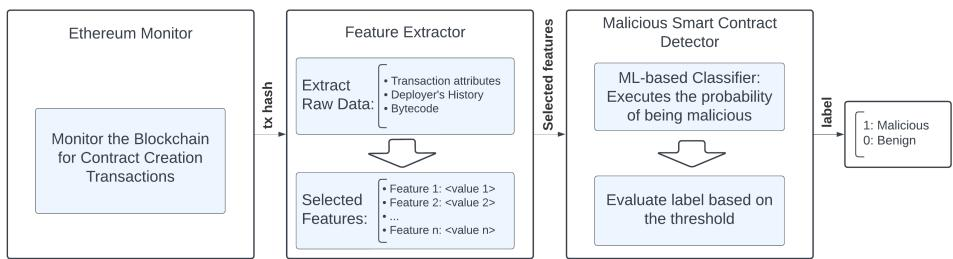
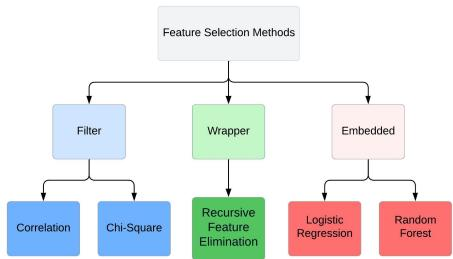
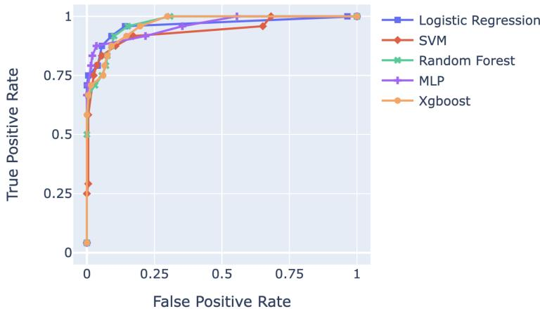
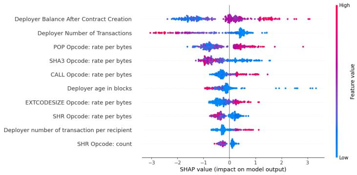
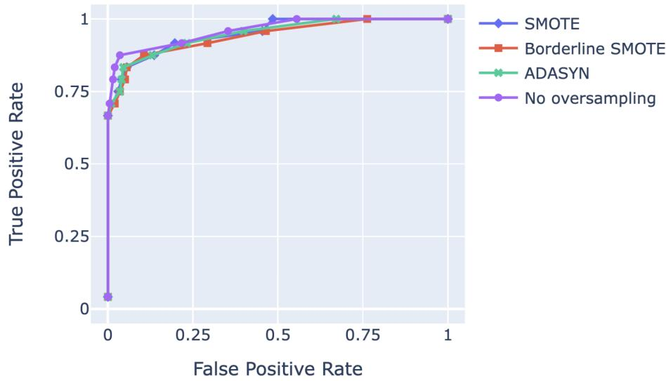

# Beyond the Public Mempool: Catching DeFi Attacks Before They Happen with Real-Time Smart Contract Analysis

Bahareh Parhizkari1[0009−0006−3819−7939], Antonio Ken

Iannillo1[0000−0001−9358−7100], Christof Ferreira Torres2[0000−0001−6992−703X], Sebastian Banescu3[0000−0003−0771−4826], Joseph Xu3[0000−0001−8831−4298], and Radu State1[0000−0002−4751−9577]

1 SnT, University of Luxembourg 2 ETH Zurich 3 Quantstamp, Inc

Abstract. The rise of decentralized finance has brought a vast range of opportunities to the blockchain space and many risks. This paper tackles the challenge of detecting malicious smart contracts on Ethereum designed to exploit vulnerabilities and cause financial losses. We present a novel approach for preemptively identifying malicious smart contracts during their deployment stage. For this purpose, we gathered a dataset comprising 161 malicious smart contracts and 5500 benign smart contracts. By introducing and extracting various features related to the deployer, transaction characteristics, and deployment bytecode and selecting the most impactful features, we developed multiple models using different machine learning (ML) classification algorithms, compared them using the set of most impactful features, and selected the most accurate one as our detection model. We compared the model’s performance with a publicly available ML malicious smart contract detection tool to benchmark it. The results demonstrate that our model achieves a superior True Positive Rate while having a lower False Positive Rate. Our model achieved a 79.17% detection rate for malicious smart contracts while maintaining a False Positive rate of less than 1.8%. Our model provides swift detection capabilities by alerting users immediately after a contract’s deployment, thus enabling timely response and risk mitigation.

## 1 Introduction

Blockchain technology has revolutionized diferent industries, creating new opportunities for innovation thanks to its decentralized and immutable ledger [50].

Ethereum [42] is a major blockchain platform that introduced the idea of smart contracts, which are self-executing arrangements with applications spanning from decentralized finance (DeFi) [22] to supply chain management [31]. Focusing on DeFi, Ethereum applications aim to democratize finance by granting individuals control over their assets and financial transactions.

Nonetheless, DeFi and its rapid growth have come with several challenges. As DeFi projects thrive, they attract malicious actors (among the legitimate ones) who seek to exploit vulnerabilities and flaws to steal assets. In the first half of 2023, the DeFi ecosystem accounted for almost half a billion dollars of losses [1]. It is worth noting that these threats are beyond financial losses because they also undermine user trust and restrain the overall adoption of DeFi.

Upon discovering a vulnerability within a running project, attackers deploy a malicious payload within a malicious smart contract. This smart contract serves as a launchpad for their subsequent attack. Detecting these malicious smart contracts is paramount in maintaining the security of the DeFi ecosystem and mitigating losses. It enables the ecosystem to prevent attacks and empowers DeFi projects to take necessary protective actions before an attack occurs. This paper addresses the identification of malicious smart contracts at the moment of their deployment, providing a proactive approach to mitigate potential attacks even before they occur. Our research uses data analysis techniques and ML to distinguish between malicious and benign smart contracts in real-time, allowing for swift incident response and improved security measures.

In this paper, we present our methodology, dataset, and results. We discuss the challenges associated with DeFi security and introduce our innovative method to detect malicious contracts.

Contributions. We summarize our contributions as follows:

– We assemble a dataset of 161 malicious smart contracts responsible for attacks on DeFi protocols, resulting in over \$1.6 billion of stolen funds.

– We introduce 465 novel features extracted from the proposed dataset. These features synthesize information from the deployers, the bytecodes, and the transactions. Through a feature selection process, we identify the most impactful features.

We evaluate diferent ML pipelines against the state-of-the-art malicious smart contract detector (Forta ML). Our best detector outperformed the Forta ML bot by detecting 21% more malicious smart contracts while raising fewer False alerts.

– We discuss our model’s explainability by analyzing each feature’s importance and characteristics and demonstrating their resilience against attacker evasion.

The following section presents the background of Ethereum, DeFi, and the types of attacks the ecosystem faces (Section 2). We then detail our dataset, methodology, and the models distinguishing malicious and benign contracts (Section 3). The evaluation of our approach 4 and a discussion of the results and their implications are also presented (Section 5). We conclude with related works (Section 6) and future directions in the field of DeFi security (Section 7).

## 2 Background

This section provides the necessary background regarding smart contracts, attacks on decentralized finance, and state-of-the-art countermeasures.

## 2.1 Ethereum Smart Contracts

Ethereum [42] is a blockchain platform that enables the execution of smart contracts, ofering a wide range of applications beyond cryptocurrency. Smart contracts are self-executing agreements with the terms directly written into code, allowing for trustless and automated transactions. At the core of Ethereum is the Ethereum Virtual Machine (EVM), a runtime environment that executes smart contracts.

Smart contracts are represented as bytecode, a low-level representation of the contract’s code. Bytecode consists of opcodes, i.e., individual instructions for the EVM. Upon deployment, a contract account will be associated with the smart contract. Contract accounts are controlled by underlying smart contracts. In the context of Ethereum, smart contracts automatically execute predefined actions when certain conditions are met. Contracts have deployment bytecode (used during contract deployment) and runtime bytecode (used after deployment). The deployment bytecode typically includes the constructor code, while the runtime bytecode contains the contract’s functions and operations. In contrast, Externally Owned Accounts (EOAs), often called wallets, are traditional Ethereum addresses controlled by private keys and operated by humans.

Transactions in Ethereum are messages EOAs send to interact with another account, including EOAs and smart contracts, and aim to transfer amounts or activate smart contract functionalities. Gas is a measure of computational work required to execute a transaction. Users set a gas price and a maximum gas limit for transactions. Furthermore, internal transactions refer to the secondary communications that occur within the execution of smart contracts. These messages come from smart contracts contacting other smart contracts.

We define a contract deployer as an EOA responsible for creating and deploying a smart contract by sending a contract deployment transaction to the blockchain.

## 2.2 Decentralized Finance (DeFi)

Decentralized Finance, or DeFi, refers to financial services and applications built on blockchain technology. These services aim to create an open and decentralized financial system. DeFi projects encompass various services, including decentralized exchanges (DEXs) [41], lending and borrowing platforms [44], yield farming [11], derivatives [35], and more. TVL(Total Value Locked) is a key metric in DeFi, representing the total amount of staked assets in DeFi projects. TVL of DeFi is currently almost 100 billion dollars, representing the significance and impact of DeFi as a financial market. DeFi projects are not without risks, as attackers actively seek vulnerabilities in smart contracts to exploit and launch attacks, including Reentrancy, Flash Loan attacks, and Oracle attacks.

An exploit uses code bugs, security flaws, or design weaknesses to steal assets from or disrupt DeFi services. We define a malicious smart contract as a contract that contains specific instructions or conditions, also called attack payload, that leads to an exploit when triggered.

Attacks on DeFi protocols often occur in three stages: deployment, execution, and extraction. In the deployment stage, attackers prepare and deploy malicious smart contracts, setting up the infrastructure for their attacks. During the execution stage, attackers activate these malicious smart contracts, initiating the attack. Finally, in the extraction stage, attackers exfiltrate the stolen assets from the blockchain.

Attackers can also leverage private pools [28], such as Flashbots [4], to execute their transactions privately and hide their activities until the attack has been completed, obscuring the malicious contract’s interactions from any tools that monitor the public mempool. These private transaction pool providers are already operating on Ethereum [30], and this trend is expected to grow on other blockchain networks, further complicating the landscape of DeFi security and countermeasures.

## 2.3 Countermeasures Against Attacks

Diferent countermeasures have been used against DeFi attacks and smart contract attacks in the past few years. Some of them are similar to those of traditional software and include code audits, bug bounties, and vulnerability assessments. Other techniques include monitoring the mempool and avoiding suspicious transactions from being executed by reverting or frontrunning them. The increasing trend of attackers using private pools emphasizes that monitoring the public mempool alone is insuficient for detecting attacks and highlights the importance of implementing defense mechanisms at the time of malicious contract deployment.

Another aspect to consider are the rescue time windows [51]. The earliest point at which an attack can be identified is during the deployment of the malicious smart contract, as it represents the first transaction where indicators of malicious behaviors become apparent. The time window between the malicious smart contract deployment and the main attack transaction is the rescue time, in which the damage can be minimized and mitigated using swift incident response, such as reverting malicious transactions at runtime, pausing a protocol, or applying security patches to vulnerable contracts. As a last measure, informing methods, such as alerting systems, keep DeFi protocols’ users and owners informed about potential threats and incidents.

## 3 Methodology

This section presents a methodology to detect malicious smart contracts during the contract deployment stage. By doing so, we aim to hamper potential attacks before the actual attack transaction occurs. Figure 1 illustrates how our malicious contract detection pipeline works. We start by monitoring the Ethereum blockchain for new contract deployment transactions. Next, we gather raw data from the transactions, analyze them, and extract predefined features. Finally, we used our model to spot and label malicious smart contracts during contract deployment quickly. Our final goal is to predict whether a smart contract is deployed with malicious intent. Our approach involves the development of a statistical model and the application of supervised ML methods, ofering a practical solution to the defined issue.

  
Fig. 1: A general overview of our deployed malicious contract detection Pipeline.

Developing a statistical model begins with assembling a dataset of raw data. It involves analyzing and cleaning the data, filtering out irrelevant information, and extracting statistical features from raw data. The next step is to select the most pertinent features from the extracted sets and apply various classification algorithms to them to determine which algorithm yields the most efective results. The rest of this section outlines our dataset, feature extraction, analysis, and model development procedures.

## 3.1 Dataset of Malicious and Benign Smart Contracts

Distinguishing malicious smart contracts from benign ones begins with assembling a dataset. We collected a dataset of 161 malicious and 5,000 benign contracts randomly picked from Ethereum and then analyzed their contract deployment transactions for diferentiation. We faced limitations in the number of malicious smart contracts in our dataset, primarily due to the relatively low occurrence of fully on-chain attacks. Most of the current attacks on DeFi have an of-chain root cause, such as scams and compromised private keys. Further, we tried incorporating attacks that occurred on other EVM-based chains, such as Polygon and BSC. However, despite having a larger dataset of malicious contracts, this approach reduced the accuracy. In future work, we could follow the same approach and make the same model on other chains by training the model with malicious smart contracts and benign ones specific to each chain. This section elaborates on our dataset extraction process.

To find malicious contracts, we focused on attacks that occurred on Ethereum between 2020 and 2024. We excluded attacks from of-chain sources, such as stolen Private keys or phishing, and those lacking malicious smart contract engagement. Our focus centered on attacks exploiting vulnerabilities inside the victim’s source code. Although some DeFi platforms have been operational since

2017, the number of attacks on DeFi before 2020 is limited, mostly from of-chain vulnerabilities. Notably, both ChainSec [3] and Rekt News [6], two platforms that document DeFi hacks, started their lists in 2020. It could be attributed to the significant increase in TVL in DeFi around mid-2020 [2], capturing the attention of attackers to the DeFi ecosystem.

We collected attack information from diferent sources. such as Defiyield’s Rekt database [13], ChainSec’s list of DeFi hacks [3], and attacks explained in Rekt News [6]. These services ofer detailed descriptions of DeFi-related attacks. Various addresses are involved in each attack, including malicious EOAs, malicious smart contracts, victims, and other services used in attack preparation or execution. Our approach includes exploring diferent sources to gather a dataset of malicious smart contracts. First, we gathered attack transactions from the services mentioned earlier to gather the dataset. Then, we explored each attack transaction with chain explorers like Etherscan. In this stage, we labeled the malicious account, the victims, and the malicious Smart contract for each attack after manual validation. Our dataset includes 161 instances, each featuring a malicious contract for attack execution. Due to the vast number of regular contracts compared to malicious ones, we had to select a limited set of them for our data analysis. We selected 5,000 random contracts, which is 20-30 times more than the malicious smart contracts. We randomly selected Ethereum blocks spanning from 15 million to 17.5 million to create a set of random contracts. Then, we extracted every newly deployed smart contract within each selected block. We checked each of these smart contracts to make sure they were benign.

We used this dataset of malicious and benign smart contracts to train the ML-based models capable of distinguishing between malicious and benign smart contracts. We collected all data available for contract deployment in our dataset. They are grouped in the following categories:

1. Deployment Bytecode: The smart contract bytecode includes the primary attack component, the malicious payload. While many studies focus on extracting software metrics directly from smart contract source code [24] [7], our approach difers due to the unavailability of the source code of malicious smart contracts. Moreover, using the smart contract bytecode makes our approach more secure against anti-analysis techniques like code obfuscation. Instead, we extract and evaluate features like code size, number of functions, and frequency of opcodes directly from the smart contract bytecode. Smart contracts are simple software with low complexity, therefore, simple features such as what we mentioned before reflect their behavior better than syntactic features. We chose the deployment bytecode over the execution bytecode, as it is available for every smart contract and persists even after contract destruction.

2. Contract Deployment Transaction: We also collected details of the contract deployment transaction, encompassing all blockchain-stored data related to the transaction. It comprises both the transaction itself and the transaction receipt. The transaction receipt reflects the state of the transaction and chain after the transaction execution and provides information about user behaviors [49], and the transaction entails attributes assigned by the deployer.

3. Transaction History and Attributes of the Deployer: Considering that each account may have a history of past transactions, we explored the history of the smart contract deployer address to extract further features. Previous studies [33] [36] have established that malicious EOAs have some distinctive characteristics in their history and attributes at the time of contract deployment. The history-based features were highly impactful in identifying malicious wallets and corresponding malicious smart contracts, significantly influencing our final results.

## 3.2 Data Analysis and Preprocessing

Before extracting statistical features from our raw data, performing an exploratory analysis of the data is essential. This preliminary step provides insight into the dataset and facilitates selecting the most relevant features.

In this paper, we focus on DeFi attacks from 2020 to 2024 and have one or more contracts containing the malicious payload in their bytecode to fulfill the attack. Note that the ledger contains an extensive volume of data that is accessible through it. So, the data needs to be cleaned and reduced to a limited set of features capable of diferentiating the behavior of the deployers or the deployed contracts.

For extracting features from the bytecodes, we utilized Crytic’s tool named "evm\_cfg\_builder," [12] which assisted in extracting functions, attributes, and basic blocks(basic block is a sequence of opcodes with no branches). Following that, we conducted an in-depth investigation of the history of malicious EOA during the pre-contract deployment. It involved investigating the number of transactions and the contracts generated by these malicious accounts. Due to the time-consuming nature of analyzing accounts with hundreds of thousands of transactions, we narrowed the analysis for some features to include only one week before the contract deployment.

## 3.3 Feature Engineering and Feature Selection

Before starting the predictive model’s implementation, we need to extract features from raw data. This step aims to prune the data by eliminating irrelevant information that does not contribute to the distinguishing process. Feature extraction helps us better represent the problem, ensuring an accurate representation for deploying the final predictive model. We can derive features from raw data by evaluating metrics such as frequencies, mean, and maximum for functions, transactions, recipients, and other relevant parameters. The features are categorized into the following three types:

– Bytecode’s features: It refers to features extracted from the deployment bytecode, including aspects like the frequency of an operand in opcodes or statistical attributes derived from the control flow graph (CFG).

Table 1: Definition of all 465 features extracted from the dataset, including the corresponding source in the raw data.

<table><tr><td></td><td>Feature Name</td><td>Definition</td></tr><tr><td>1-4</td><td>Deployer balance before/after contract deployment(logarithmic and linear)</td><td>The balance of the deployer at the beginning/end of the block where the contract deployment transaction is deployed.</td></tr><tr><td>5-6</td><td>Deployer balance of Stablecoins (logarithmic and linear representation)</td><td>Total balance of tokens(among Stablecoins with more than $10M TVL) in USD after contract deployment.</td></tr><tr><td>7-8</td><td>Deployer Value Sent/Received in 1 week</td><td>The total value (sent from)/(received by) deployer through during the week leading up to the contract deployment.</td></tr><tr><td>9</td><td>Deployer number of deployed contracts in 1 week</td><td>Total number of contracts deployed by deployer in one week preceding the deployment of the examining contract.</td></tr><tr><td>10</td><td>Deployer balance 1 week before contract deployment</td><td>The deployer&#x27;s balance one week prior to contract deployment.</td></tr><tr><td>11</td><td>Deployer balance Change in 1 week</td><td>Deployer&#x27;s balance at the time of contract deployment minus its balance one week prior.</td></tr><tr><td>12-13</td><td>Deployer Number of Transactions (logarithmic and linear representation)</td><td>Number of transactions initialized by the deployer until the contract deployment.</td></tr><tr><td>14-17</td><td>Deployer Age in Minutes/Blocks (logarithmic and linear representation)</td><td>timestamp/blocknumber of the transaction minus timestamp/blocknumber of the deployer&#x27;s first transaction, presented in minutes/blocknumbers.</td></tr><tr><td>18</td><td>Deployer Number of Recipient in 1 week</td><td>The count of all contracts to which the deployer initiated any transaction within one week before the examining transaction.</td></tr><tr><td>19</td><td>Deployer Average Gas Price in 1 week</td><td>The average gas price of all transactions initiated by the deployer within one week before examining transaction.</td></tr><tr><td>20</td><td>Deployer Number of Transactions per Recipient in 1 week</td><td>The deployer&#x27;s number of transactions divided by the number of recipients within the week before the examining transaction.</td></tr><tr><td>21</td><td>Transaction&#x27;s maximum gas fee</td><td>Transaction&#x27;s &#x27;maxFeePerGas&#x27; attribute.</td></tr><tr><td>22</td><td>Transaction&#x27;s maximum priority gas fee</td><td>Transaction&#x27;s &#x27;maxPriorityFeePerGas&#x27; attribute.</td></tr><tr><td>23</td><td>Transaction&#x27;s priority gas fee per gas price</td><td>Priority gas fee of the transaction divided by block&#x27;s gas price.</td></tr><tr><td>24</td><td>Transaction&#x27;s maximum priority gas fee per gas price</td><td>The maximum priority gas fee of the transaction divided by the block&#x27;s gas price.</td></tr><tr><td>25</td><td>Code size in bytes</td><td>The size of the contract in bytes.</td></tr><tr><td>26</td><td>Number of functions</td><td>The number of functions in the contract.</td></tr><tr><td>27-167</td><td>Opcode: Count</td><td>The frequency of a specific opcode in the contract.</td></tr><tr><td>168-308</td><td>Opcode: rate per number of functions</td><td>Opcode: Count divided by the number of functions.</td></tr><tr><td>309-449</td><td>Opcode: rate per bytecode size</td><td>Opcode: Count divided by the code size.</td></tr><tr><td>450</td><td>Bytecode bytes per number of functions</td><td>The code size in bytes divided by the number of functions.</td></tr><tr><td>451-453</td><td>Avg/Max/Min Function Size</td><td>Indicating the Avg/Max/Min number of opcodes in a function.</td></tr><tr><td>454-456</td><td>Avg/Max/Min Basic Block Size</td><td>The Avg/Max/Min number of opcodes in a Basic Block.</td></tr><tr><td>457-459</td><td>Avg/Max/Min Basic Block per function</td><td>The Avg/Max/Min number of Basic Blocks in a Function.</td></tr><tr><td>460-462</td><td>Number of payable/view/pure functions</td><td>Number of functions with &#x27;payable&#x27; / &#x27;view&#x27; / &#x27;pure&#x27; attribute.</td></tr><tr><td>463-465</td><td>Percentage of payable/view/pure functions</td><td>Number of payable/view/pure functions divided by the total number of functions.</td></tr></table>

  
Fig. 2: We utilized 5 diferent feature selection methods from the 3 most common classes of feature selection methods.

– Transaction Features: In this category, we include all features derived from the transaction’s attributes, giving special attention to those assigned by the deployer, such as the maximum gas fee.

– Deployer’s features: Within this type, we extract features from the contract’s deployer at the time of contract deployment. These features involve their characteristics during contract deployment, such as balance and history.

We extracted 465 distinctive novel features from our raw data, each corresponding to one of these three types. Table 1 explains each feature. In addition to the previously specified features, we incorporated a label to indicate whether a contract is malicious. This label is the model’s target value. It assigns a value of 1 if the contract is malicious and 0 otherwise. The techniques employed for feature extraction vary depending on the feature class and its inherent characteristics. In the subsequent part of this section, we will describe all the features we extracted and discuss how we selected the most impactful ones. We carried out this meticulous selection by evaluating several feature selection methods, all of which aim to improve the identification of malicious contracts.

Feature selection selects the most valuable and beneficial features from the entire set of extracted features for training the model [25]. Selection criteria often include the features’ correlation with the target variable and their independence from one another. The rationale behind this practice is to avoid the unnecessary computational overhead that comes with using all extracted features. Furthermore, the exclusion of less valuable features mitigates the risk of overfitting by reducing redundant features, thereby enhancing the model’s ability to generalize to new, unseen data.

Our research employs five techniques for feature selection from the three most common classes of feature selection techniques, including filter methods, wrapper methods, and embedded and hybrid methods [25]. The techniques we utilized include Pearson Correlation feature selection, Chi-square, Recursive Feature Elimination, and selecting features based on their importance concerning the target value using Linear (Logistic Regression) and Tree-based (Random Forest) estimators. Figure 2 illustrates all various feature selection methods and their corresponding categories. Our feature selection process leveraged the functionality provided by Scikit-learn’s feature selection library [39] to select the most practical features for our analysis. From the initial set of 465 features presented in table 1, we narrowed the list to all 45 features consistently selected by all the algorithms as mentioned earlier as the 30% best features among all extracted features. Table 2 represents the final list of all selected features.

Predicting whether a given contract is malicious or benign is considered a classification problem within the domain of ML. Classification algorithms, as a subset of supervised ML methods, aim to label provided data by applying a predefined classifier model. These algorithms learn patterns and characteristics from labeled datasets, enabling them to make predictions on new, unseen data. In the case of contract identification, the model aims to diferentiate the features associated with malicious behavior from those indicative of benign contracts. We imported features as tabular data with labels to train our classifier and normalized them using Standard Scaler. This model allows us to determine if a contract is malicious immediately after its deployment by extracting features from the contract and inputting them into the model.

## 3.4 Training and Validation

The final step in constructing our prediction model involves selecting the most fitting ML algorithm for our specific prediction problem. We split the data into training and test datasets to determine the optimal algorithm and constructed the model using the training data. Our model’s validation process involves constructing a model using the training dataset and assessing its performance on the test dataset.

For performing the train-test split, we employed a time-based approach, which means we assigned all data from 2020 to mid-2023 to the training dataset and the remaining data from mid-2023 to the test dataset. We chose this timebased approach to ensure that our prediction model is evaluated on data that simulates real-world conditions as closely as possible. This is essential in our context since assessing whether a contract is malicious based on a model derived from contracts deployed in the future is inherently impractical, considering that attacks are evolving. In other words, our approach helps us evaluate the model’s ability to generalize to new, unseen data efectively and assess its real-world applicability.

Table 2: List of the 45 selected features among the 465 available features.

<table><tr><td></td><td>Feature Name</td></tr><tr><td>1-3</td><td>Deployer age in minutes(log and linear) and in blocks (linear)</td></tr><tr><td>4</td><td>Deployer Balance after contract deployment(log)</td></tr><tr><td>5</td><td>Deployer Number of Transactions(log)</td></tr><tr><td>6-7</td><td>Avg/Max Function Size</td></tr><tr><td>8</td><td>Deployer Average Gas Price in 1 week</td></tr><tr><td>9</td><td>Deployer Balance of Stablecoins(linear)</td></tr><tr><td>10</td><td>Deployer Number of Transaction per Recipient in 1 week</td></tr><tr><td>11-20</td><td>Opcode count: RETURNDATASIZE, CALL, GAS, LOG3, GT, PUSH20, SLOAD, SHR, SLT, RETURNDATACOPY</td></tr><tr><td>21-30</td><td>Opcode rate per number of Functions: SSTORE, ADDRESS, PUSH20, EXTCODESIZE, RETURNDATASIZE, CALLVALUE, SHA3, GT, CALL, REVERT</td></tr><tr><td>31-45</td><td>Opcode rate per bytecode size: PUSH20, CALL, CALLDATACOPY, CODECOPY, POP, SHR, SLT, SSTORE, ADDRESS, EXTCODESIZE, GAS, SHA3, DUP8, DUP7, RETURN</td></tr></table>

Table 3: Number of contracts in each dataset following the train-test split.

<table><tr><td></td><td>Train Dataset</td><td>Test Dataset</td></tr><tr><td>Num of Malicious Contracts</td><td>137</td><td>24</td></tr><tr><td>Num of Benign Contracts</td><td>5000</td><td>500</td></tr></table>

Table 3 shows the size of our train and test dataset, where the test data is chronologically newer than the training data.

Note that the number of malicious contracts is considerably lower than the total number of deployed contracts, prompting a challenge to realize whether we can enhance the results by balancing the dataset. To answer this question, we implemented resampling methods.

Given the large number of contracts deployed in Ethereum’s history, it is impractical to comprehensively crawl all benign contracts throughout Ethereum’s history. Therefore, we opted for a random under-sampling approach [26]. It involves selecting a subset of all actual benign contracts for the model creation. We evaluated the model for diferent quantities of benign contracts and discovered that increasing it beyond 5,000 did not enhance the accuracy. The next consideration is whether we can enhance our model’s performance through oversampling techniques. To explore this, we applied various over-sampling methods on the malicious dataset, including the Synthetic Minority over-sampling Technique (SMOTE) [9], Borderline SMOTE [21], and Adaptive Synthetic Sampling (ADASYN) [23] to augment the number of malicious contracts. Our observations demonstrate that every over-sampling technique led to a reduction in model accuracy. We have detailed observations in Appendix A. We attribute this observation to the sensitivity of our malicious dataset, which appears to be intolerant of synthetic data forged by over-sampling methods. Our dataset contains various malicious contracts associated with attacks, such as Reentrancy, Flash Loan attacks, and Oracle attacks. Each attack has distinct characteristics, making it challenging to combine them all and forge synthetic data.

In this study, we applied five diferent binary classification algorithms. For each algorithm, we created the model that assigns a probability of being malicious to a contract. Then, we evaluated their performance and conducted a comparison among all of them. To maximize their eficiency, we also performed a grid search hyperparameter tuning process for Random Forest, XGBoost, and MLP algorithms. Hyperparameter tuning is identifying the optimal hyperparameters of a machine learning algorithm. This process is performed using the training data and is crucial for enhancing the model’s performance and achieving the highest possible accuracy. We have explained this process in more detail in Appendix B.

  
Fig. 3: Comparing the efectiveness of concerning classification algorithms via ROC curve. It depicts the relative trade-ofs between TPR and FPS.

Figure 3 illustrates each model’s result in a receiver operating characteristic (ROC) curve. This diagram visually represents the performance of binary classifiers by evaluating their True Positive Rate(TPR) and False Positive Rate(FPR) at various thresholds. It plots TPR against FPR to provide insights into the classifier’s efectiveness. Note that our model is sensitive to high FPRs, given that almost 1000 contracts are deployed on Ethereum each day, and processing more than 20 false alerts per day is impractical. To select one algorithm among those presented and the optimal threshold on the probability of being malicious for each model, we prioritize thresholds that keep the FPR below 2% while maximizing the TPR. We also leverage the "Area Under the ROC Curve (AUC)" metric. This metric is an aggregate measure of performance across all possible classification thresholds. Table 4 compares all five classification algorithms with three diferent evaluation metrics.

In the ROC curve visual representation and metric analysis, the tree-based gradient boosting algorithms, XGBoost, and Random Forest achieved the highest AUC among all considered algorithms.

Figure 3 shows that the ROC curve of these two algorithms closely overlap, and they both achieved a TPR of 1.0 while maintaining an FPR of less than 30%. Nevertheless, this FPR cannot be tolerated, and their F1 and Recall are not competitive. Logistic Regression and SVM both show smooth ROC curves. Although Logistic Regression achieved a high F1 measure, MLP’s F1 score is competitive, and it outperforms other algorithms regarding recall. Hence, the next step involves evaluating our model with MLP, and we will make the final selection based on our tolerance for false alarms.

## 4 Evaluation and Benchmarking

Our test dataset incorporated 24 malicious contracts associated with known attacks, deployed from mid-July 2023 to mid-January 2024, and 500 benign contracts deployed in the same period. We extracted 45 features from our feature set and assessed the training model using the MLP algorithm. Table 5 presents the TPR and FPR for our evaluation across diferent probability thresholds. The TPR approximates the probability of correctly detecting a malicious smart contract, while the FPR represents the probability of erroneously flagging a benign contract as malicious. Note that the TPR is the most crucial metric in our evaluation since overlooking an important hack can lead to a loss of millions of dollars. In contrast, FPR incurs some manual analysis costs, although they are still less than the potential damages caused by an actual hack. Nonetheless, given the daily volume of contract deployment, we must be cautious about accepting a high FPR, as an excess of false alarms may diminish the attention to alarms related to real attacks. We aim to optimize the TPR while concurrently keeping the FPR as low as possible.

Referring to the table 5, it becomes apparent that increasing the TPR to over 80% comes at a substantial cost to the FPR. Based on the F1 scores shown in the table, rows 4 and 5 achieved the highest F1 scores, and their values are relatively close. Consequently, we set the threshold as the mean of rows 4 and 5. Note that in both cases, the model maintains the FPR below 2%. This selected threshold allows us to achieve a strong TPR while maintaining a low FPR.

Table 4: Comparison of evaluation metrics for diferent classification algorithms.

<table><tr><td>Classification Algorithm</td><td>AUC</td><td>F1 Score</td><td>Recall</td></tr><tr><td>Random Forest</td><td>0.9623</td><td>0.7805</td><td>0.6667</td></tr><tr><td>XGBoost</td><td>0.9600</td><td>0.7727</td><td>0.7083</td></tr><tr><td>Logistic Regression</td><td>0.9476</td><td>0.8372</td><td>0.7500</td></tr><tr><td>SVM</td><td>0.9234</td><td>0.6842</td><td>0.5417</td></tr><tr><td>MLP</td><td>0.9493</td><td>0.8163</td><td>0.8333</td></tr></table>

Table 5: TPR, FPR, and F1 score evaluation across various thresholds of MLP algorithm. The selected thresholds are highlighted.

<table><tr><td></td><td>Threshold</td><td>TPR</td><td>FPR</td><td>F1 score</td></tr><tr><td>1</td><td>1.00</td><td>0.042</td><td>0.000</td><td>0.080</td></tr><tr><td>2</td><td>0.4548</td><td>0.667</td><td>0.000</td><td>0.800</td></tr><tr><td>3</td><td>0.3111</td><td>0.708</td><td>0.005</td><td>0.809</td></tr><tr><td>4</td><td>0.0637</td><td>0.792</td><td>0.015</td><td>0.826</td></tr><tr><td>5</td><td>0.0499</td><td>0.833</td><td>0.02</td><td>0.833</td></tr><tr><td>6</td><td>0.0197</td><td>0.875</td><td>0.035</td><td>0.750</td></tr><tr><td>7</td><td>0.0003</td><td>0.917</td><td>0.217</td><td>0.494</td></tr><tr><td>8</td><td>0.0001</td><td>0.958</td><td>0.354</td><td>0.393</td></tr></table>

Table 6: Comparing the performance of our model with Forta ML Bot.

<table><tr><td>Metrics</td><td>Our Model</td><td>Forta ML Bot</td></tr><tr><td>Malicious Contracts</td><td>24</td><td>24</td></tr><tr><td>True Positive</td><td>19</td><td>14</td></tr><tr><td>True Positive Rate</td><td>79.17%</td><td>58.33%</td></tr><tr><td>False Negative</td><td>5</td><td>10</td></tr><tr><td>False Negative Rate</td><td>20.83%</td><td>41.66%</td></tr><tr><td>Benign Contracts</td><td>500</td><td>500</td></tr><tr><td>False Positive</td><td>9</td><td>11</td></tr><tr><td>False Positive Rate</td><td>1.8%</td><td>2.2%</td></tr><tr><td>True Negative</td><td>491</td><td>489</td></tr><tr><td>True Negative Rate</td><td>98.2%</td><td>97.8%</td></tr></table>

Following the optimization of our model, we conducted a comparative analysis with another tool designed for detecting malicious smart contracts, which is the Malicious Smart Contract Detection ML Bot [18] , deployed on the Forta network’s explorer [5]. Henceforth, we will use the name "Forta ML Bot" to refer to this Bot. This bot is now recognized as one of the ten most popular bots among all Forta bots. The current version of this tool, V3, has been operational since its launch on 02/06/2023.

We compared our model with the only accessible tool, Forta ML Bot, and analyzed the alerts related to the smart contracts in our test dataset. This test dataset includes 24 malicious smart contracts and 500 benign smart contacts. Thus, we computed the TPR and FPR. The table 6 outlines the TPR and FPR of it compared to our model. As illustrated in the table 6, our model considerably outperforms the Forta ML Bot, achieving a TPR of 79% compared to Forta’s 58%. In addition, we generated two fewer false alerts among all 500 benign contracts in our test dataset.

## 5 Discussion

In this paper, we introduced our malicious contract detection model, designed to identify attacks on DeFi protocols in Ethereum before the execution. Our model leverages statistical features extracted from the bytecode of the malicious contract, the malicious deployer, and the malicious contract deployment transaction itself. By employing MLP, a neural network classifier, we trained and tested our model on a dataset comprising benign and malicious transactions throughout 2020-2024.

Table 7: Evaluating the detection accuracy across 24 recent attacks by comparing labels assigned by our model and Forta ML bot.

<table><tr><td colspan="2">Victim Project</td><td>Attack Date</td><td>Malicious Contract</td><td colspan="2">Labels</td></tr><tr><td colspan="2"></td><td></td><td></td><td>Our Model</td><td>Forta ML</td></tr><tr><td>1</td><td>Conic Finance</td><td>21.07.2023</td><td>0x743599ba5cfa3ce8c59691af5ef279aaafa2e4eb</td><td>malicious</td><td>benign</td></tr><tr><td>2</td><td>Curve Pools</td><td>30.07.2023</td><td>0xa757328ff7ab8c36e7286c559d8ab03578036b95</td><td>benign</td><td>benign</td></tr><tr><td>3</td><td>Curve Pools</td><td>30.07.2023</td><td>0x83e056ba00beae4d8aa83deb326a90a4e100d0c1</td><td>malicious</td><td>malicious</td></tr><tr><td>4</td><td>Uwerx</td><td>02.08.2023</td><td>0xda2ccfc4557ba55eada3cbebd0aeffcf97fc14ca</td><td>malicious</td><td>malicious</td></tr><tr><td>5</td><td>Earning Farm</td><td>09.08.2023</td><td>0xfe141c32e36ba7601d128f0c39dedbe0f6abb983</td><td>malicious</td><td>malicious</td></tr><tr><td>6</td><td>Safe Wallet</td><td>12.08.2023</td><td>0x965a3a6016c2edf0605a2b1c38c7159b495c0573</td><td>benign</td><td>malicious</td></tr><tr><td>7</td><td>Safe Wallet</td><td>12.08.2023</td><td>0xa1038f644389c04318156d54e40679b98b686838</td><td>malicious</td><td>benign</td></tr><tr><td>8</td><td>Safe Wallet</td><td>12.08.2023</td><td>0xab8cddd69f76cfd779d18adec982f898bfefe680</td><td>malicious</td><td>benign</td></tr><tr><td>9</td><td>Zunami</td><td>13.08.2023</td><td>0xa21a2b59d80dc42d332f778cbb9ea127100e5d75</td><td>malicious</td><td>malicious</td></tr><tr><td>10</td><td>BTC20Token</td><td>19.08.2023</td><td>0xb7fbf984a50cd7c66e6da3448d68d9f3b7f24f33</td><td>malicious</td><td>malicious</td></tr><tr><td>11</td><td>EthereumHive</td><td>21.08.2023</td><td>0xe7d9a93541fa79d6ecf3dc5997632177146dcb84</td><td>malicious</td><td>benign</td></tr><tr><td>12</td><td>Balancer V2</td><td>27.08.2023</td><td>0x2100cdd8758ab8b89b9b545a43a1e47e8e2944f0</td><td>malicious</td><td>malicious</td></tr><tr><td>13</td><td>FloorDAO</td><td>05.09.2023</td><td>0x6ce5a85cff4c70591da82de5eb91c3fa38b40595</td><td>malicious</td><td>benign</td></tr><tr><td>14</td><td>Hope Lend</td><td>18.10.2023</td><td>0xc74b72bbf904bac9fac880303922fc76a69f0bb4</td><td>benign</td><td>benign</td></tr><tr><td>15</td><td>UniBot</td><td>31.10.2023</td><td>0x2b326a17b5ef826fa4e17d3836364ae1f0231a6f</td><td>malicious</td><td>benign</td></tr><tr><td>16</td><td>Onyx Protocol</td><td>01.11.2023</td><td>0x052ad2f779c1b557d9637227036ccaad623fceaa</td><td>malicious</td><td>malicious</td></tr><tr><td>17</td><td>Unknown MEV</td><td>07.11.2023</td><td>0xeadf72fd4733665854c76926f4473389ff1b78b1</td><td>malicious</td><td>malicious</td></tr><tr><td>18</td><td>Raft</td><td>10.11.2023</td><td>0x0a3340129816a86b62b7eafd61427f743c315ef8</td><td>malicious</td><td>malicious</td></tr><tr><td>19</td><td>KyberSwap</td><td>23.11.2023</td><td>0xaf2acf3d4ab78e4c702256d214a3189a874cdc13</td><td>malicious</td><td>benign</td></tr><tr><td>20</td><td>Peapods yield</td><td>13.12.2023</td><td>0x928b2dae97fc5d40cb0552815fb5ab071103e20a</td><td>malicious</td><td>malicious</td></tr><tr><td>21</td><td>Hypr OP Stack</td><td>13.12.2023</td><td>0xba6fa6e8500cd8eeda8ebb9dfbcc554ff4a3eb77</td><td>Benign</td><td>No info</td></tr><tr><td>22</td><td>GoodDollar</td><td>16.12.2023</td><td>0xf06ab383528f51da67e2b2407327731770156ed6</td><td>malicious</td><td>malicious</td></tr><tr><td>23</td><td>NFT Trader</td><td>16.12.2023</td><td>0xc446e0a1e22b54e18303022ff8c5c8ab364d6ebb</td><td>benign</td><td>malicious</td></tr><tr><td>24</td><td>Wise Lending</td><td>12.01.2024</td><td>0x91c49cc7fbfe8f70aceeb075952cd64817f9d82c</td><td>malicious</td><td>malicious</td></tr></table>

## 5.1 Analysis of Recent Attacks

The results showcase our model’s capability to detect malicious smart contracts before attack execution, with a TPR of 79% while maintaining an FPR below 1.8%. Table 7 displays 24 malicious smart contracts associated with ten recent hacks in Ethereum. As evident from the results, our model successfully identified 19 malicious contracts. In comparison, the Forta ML Bot identified only 14 malicious contracts. Forta ML Bot failed to identify one of the malicious contract deployment, leaving it unlabeled. We consider this unlabeled contract as a False Negative, as it corresponds to an attack and went undetected. Our model’s high accuracy is attributed to merging various characteristics from both the malicious account and the malicious smart contract, ofering us a comprehensive set of traits indicating any potential attack attempt.

Beyond achieving a higher TPR, our model detects malicious smart contracts instantly after deployment. This rapid response is attributed to our focus on a concise set of the most impactful features. This rapid detection capability provides victims valuable rescue time, enabling them to safeguard themselves from potential attacks.

## 5.2 Managing Alerts and False Positives

In a security system, reaching a perfect 100% accuracy is impossible. As defense systems advance, attackers concurrently refine and adapt their malicious strategies. Our model exhibits a 79% TPR, indicating its efectiveness in identifying potential attacks on the Ethereum network. Although the False Positive Rate (FPR) of our model is low, the operational burden of responding to all flagged smart contracts is significant. To reduce this burden, human analysts can assist in reviewing flagged smart contracts. The system can be integrated into an incident response system, allowing security professionals to assess alerts before taking any decisive actions.

Our analysis specifically concentrates on contracts deployed through normal transactions, and we exclude contracts deployed through other smart contracts from our analysis, operating under the assumption that a benign smart contract is unlikely to instantiate a malicious one. Moreover, if the deployer itself is malicious, it is preferable to identify it during its initial stages. To justify this model’s FPR, we crawled all contracts deployed through Normal transactions on Ethereum during November and December 2023. We identified almost 50,000 contracts deployed over 61 days, averaging 700-1000 contracts daily. Maintaining the FPR at 1.8% will result in 12-18 False alerts a day. An eficient incident response team integrates an automated attack identification system alongside analysts working in shifts to achieve 24/7 coverage. Assuming each shift includes at least two analysts, which is the minimum required, and assuming each false alert requires 1 hour of analyst efort, this team can easily analyze all 12-18 False Alerts raised per day.

## 5.3 Model Explanation and Summary

Before concluding this paper, we want to clarify the significance of some key features we have selected and provide the rationale behind their inclusion. To aid in this explanation, we employ a Shap summary plot [27]. Figure 4 presents a Shap value summary plot, ofering an overview of the top 10 most impactful features within our selected feature set according to their absolute mean SHAP values. In this diagram, red dots represent the scaled values for malicious contracts, while blue dots represent the scaled values for benign contracts. Leveraging Shap values for interpretation enhances our model’s transparency, making it more understandable and trustworthy.

Using figure 4, we conducted an in-depth analysis to uncover the underlying reasons and root causes behind the efectiveness of some features in distinguishing malicious contracts from benign ones and associated each feature with specific malicious behavior. Since these features are linked to a diverse set of malicious behaviors, many of which are inherent and unavoidable, our model can also detect new, previously unknown attacks. The outcomes of this investigation are detailed as follows:

1. Deployer Balance After Contract Deployment: The figure 4 shows that a high balance after contract deployment may be associated with being a malicious wallet. Please note that our comparison is specifically about EOA Wallets and does not include services such as exchanges. This behavior aligns with the attackers’ nature, as they typically need some funding to execute an attack. In contrast, benign deployers only need to fund their contract deployment and can add funds to their accounts later. The required funding exceeds the average balance needed by a regular wallet to deploy a contract, resulting in a higher balance for malicious wallets than normal wallets.

  
Fig. 4: SHAP values summary plot for top 10 most impactful features among all selected features.

2. Deployer Number of Transactions: Attackers typically assign a dedicated wallet address solely for initiating attacks, avoiding any other utilization. This behavior assists them in preserving anonymity and safeguarding their identity from disclosure. Making fewer transactions is a secure and straightforward strategy to avoid the identification of their activities by various addresses. As depicted in the figure 4, the number of transactions by the attacker is significantly lower than that of benign accounts, making it an efective detection feature.

## 3. POP and SHA3 Opcode: rate per bytes:

Malicious smart contracts have more complex contracts with a higher number of basic blocks, they also have a higher interaction with storage and memory. The POP opcode removes the top value from the stack. It can also be used to empty it entirely. Both managing branches between basic blocks and interactions with storage and memory require pop opcodes and they cannot be evaded.

SHA3 is an opcode used to hash data and generate function signatures from function names. It can also be used to enhance the security and privacy of information stored within the smart contract. However, malicious smart contracts are deployed for temporary usage and don’t need a long-term protection system. Therefore, they use less SHA3 opcodes.

4. CALL Opcode: rate per bytes: Call opcode is utilized when a smart contract communicates with another smart contract by calling a function in the target contract and initiating an internal transaction. Our investigation shows that malicious smart contracts exhibit a higher frequency of call opcodes than benign ones, which means they have more extensive communication with other smart contracts. This behavior stems from various reasons, such as utilizing multiple on-chain tools for executing their attack, invoking several exploit payloads on the victim contract, or communicating with mixing services to conceal the origin and flow of stolen assets. Even though malicious smart contracts on average have more bytes compared to benign ones, they still have a higher Call opcode rate per number of bytes.

5. Deployer Age in Blocks: An account that has been active for a long time is generally less prone to be malicious. It arises from the typical common among attackers, who usually create malicious accounts after discovering vulnerabilities within a victim’s contract address. They prefer to exploit these vulnerabilities swiftly before other attackers hack them or project owners address and rectify them.

6. EXTCODESIZE Opcode: rate per bytes: The EXTCODESIZE opcode was initially designed to determine the size of a smart contract account’s code. Then, it became a usual tool for distinguishing smart contracts from EOAs. According to the Shap value summary plot, malicious contracts utilize a higher count of EXTCODESIZE opcodes compared to the size of the code or the total number of opcodes. This behavior may stem from the fact that malicious contracts often need to identify potential contracts and check their bytecode size. In contrast, normal contracts typically interact with addresses they are already familiar with. Note that while many attackers don’t use this opcode at all, the diagram illustrates a small percentage of attackers who employ it multiple times in their bytecodes.

7. SHR Opcode: rate per bytes and total count SHR is an opcode used in data manipulation. It shifts a specific part of the data to the right. It is commonly used to split a string of data received through the call to its components. A smaller number of SHR opcodes in malicious contracts indicates a lower number of functions, along with fewer inputs for each function. Malicious smart contracts are not designed to deal with several users and do a variety of tasks, so they don’t need to split huge amounts of data to process and validate.

8. Deployer Number of Transactions per Recipient: While malicious deployers initiate fewer overall transactions compared to benign deployers, their number of transactions per recipient is notably high. This pattern suggests that they tend to communicate with only a limited number of recipients, helping them to protect their identity from being discovered.

## 5.4 Security Against Elusive Attackers

Given our method’s reliance on a predefined model that analyzes historical data, a common concern is: what if an attacker tries to trick it by mimicking benign transaction patterns and matching their history and bytecode to resemble a benign smart contract? We confidently state that our method is secure against such elusive attackers, and here are two reasons supporting our claim. First, many of these features are based on the inherent behavior of attackers or malicious smart contracts, and altering them would make the launch of an attack practically impossible. For instance, launching an attack without funding or making repeated calls to victim contracts is inherently impossible. Furthermore, several features are intricately linked to the attacker’s history. Altering this history demands considerable time, while attackers typically aim to launch the attack swiftly upon discovering a vulnerability. Aiming to exploit it before other attackers discover and exploit it or project owners identify and remedy the vulnerability. This inherent time constraint makes it significantly challenging and time-consuming for attackers attempting to evade our detection method. The two reasons mentioned above emphasize that any attempt by attackers to evade our detection method would be highly time-consuming, causing delays in launching their attacks. Additionally, the efectiveness of evasion methods is not guaranteed regarding the high sensitivity of our engine to positive alerts and the inherent characteristics of malicious smart contracts.

## 6 Related Work

Several solutions have been put forth to detect malicious attacks on smart contracts. ECFChecker [20] facilitates the real-time identification of reentrancy attacks through a modified EVM. DEFIER [40] employs sequence-based classification on the transaction history between EOA and smart contracts to pinpoint indicative patterns of malicious EOA. SODA [10] employs a customized Ethereum client to incorporate bespoke modules for the real-time detection of malevolent transactions. Perez et al. [32] employ Datalog for scrutinizing the transactions of vulnerable smart contracts previously flagged by earlier research. EthScope [43] imports historical data into an Elasticsearch database and supplements the client with dynamic taint analysis capabilities for transaction examination. Zhou et al. [52] delve into the realm of attacks and their corresponding defenses by translating transactional data into action trees and result graphs. TxSpector [46] embraces the Datalog facts originally proposed in Vandal [8] to detect attacks that leverage only a single transaction. Torres et al. propose Horus [15] a framework to detect and analyze multi-transactional attacks using Datalog without modifying the Ethereum client. Gai et al. [19] propose BlockGPT, a large language model that is trained using execution traces of transactions and which is capable of detecting anomalous transactions.

Besides presenting solutions to detect attacks on smart contracts at runtime, academia has also proposed novel methods to defend against such attacks. This includes strategies such as patching smart contract vulnerabilities before deployment [16, 29, 38, 45, 47] as well as dynamically blocking attacks at runtime [17, 34, 37, 48]. Sereum [37] suggests an adapted EVM to shield deployed smart contracts from reentrancy attacks by reverting malicious transactions at runtime. ÆGIS [14, 17] ofers a smart contract that governs a set of attack patterns written using a domain-specific language which acts as a safeguard against a wide array of runtime threats by reverting transactions that match any of the attack patterns. However, Sereum and ÆGIS can only block attacks that they are aware of. Zhuo et al. [48] present STING, a runtime tool to defend against smart contract exploits by synthesizing counterattack smart contracts from attacking transactions to front-run attackers and secure funds following a white hat approach. The authors demonstrate that they are capable of successfully countering 54 of 62 real-world exploits. Qin et al. [34] propose a similar approach by introducing Ape, a tool that leverages dynamic program analysis to automatically synthesize adversarial smart contracts. While more generic, STING and Ape have a significant drawback, both approaches assume that attackers submit their transactions via the public mempool and therefore allow STING and Ape to quickly simulate and detect malicious transactions. Parhizkari et al. [30] has concluded that there is an increasing trend towards attackers leveraging private mempools to hide their attacking transactions, meaning that STING and Ape would not be able to defend against such attacks.

Our approach leverages an observation from Zhou et al. [51]’s insights on a recent analysis of past DeFi attacks. Zhou et al. observe that most attacks are performed in two steps, where in the first step the attacker deploys a malicious smart contract and in the second step the attacker triggers the attacking transaction. The work presented in this paper aims to detect malicious contract deployments and allows security professionals to react before the actual attack is conducted.

## 7 Conclusion

In this research, we proposed a method for detecting malicious smart contracts during the contract deployment stage. Our approach leveraged three categories of raw data derived from a newly deployed contract, including transaction attributes, the deployer’s attributes and history, and the deployment bytecode. We extracted 465 features from these categories but selected only 45 as the most impactful ones, identifying them through a combination of feature selection approaches. Our final model is based on a diverse array of features from mentioned sources and encompasses various adversarial behaviors, allowing it to efectively detect a broad set of malicious smart contracts. Further, many of the proposed features can protect the system against elusive attackers.

We compared diferent ML approaches: logistic regression, SVM, random forest, XGBoost, and MLP. The latter performs better in terms of F1 score and recall. Considering the huge number of daily deployed contracts, we want to keep the FPR as low as possible and select the MLP with a threshold of 0.06 as our best usable result. We also compared this model with the only publicly available tool, the FORTA ML bot. Our solution performs better for both TPR (79% against 58.33%) and FPR (1.8% against 2.2%).

Future research directions should further reduce the FPR. Exploring more advanced feature engineering techniques, incorporating additional data sources, and refining the model parameters may contribute to enhancing the accuracy and precision of our detection method. Additionally, addressing adversarial strategies and continuously optimizing the model’s parameters will still be essential for improving its robustness and ensuring its real-world efectiveness in the rapidly evolving DeFi landscape.

## References

1. Crypto hackers net nearly \$480 million year-to-date. https://beincrypto.com/ defi-hacks-net-half-billion-2023. Accessed Oct 20, 2023.

2. Defillama. https://defillama.com. Accessed Jan 20, 2024.

3. Documented timeline of defi exploits. https://chainsec.io/defi-hacks. Accessed Jan 20, 2024.

4. Flashbots docs. https://docs.flashbots.net. Accessed Sep 13, 2023.

5. Forta explorer. https://explorer.forta.network. Accessed Jan 20, 2024.

6. Rekt news. https://rekt.news. Accessed Jan 20, 2024.

7. Nemitari Ajienka, Peter Vangorp, and Andrea Capiluppi. An empirical analysis of source code metrics and smart contract resource consumption. Journal of Software: Evolution and Process, 32(10):e2267, 2020.

8. Lexi Brent, Anton Jurisevic, Michael Kong, Eric Liu, Francois Gauthier, Vincent Gramoli, Ralph Holz, and Bernhard Scholz. Vandal: A scalable security analysis framework for smart contracts. arXiv preprint arXiv:1809.03981, 2018.

9. Nitesh V Chawla, Kevin W Bowyer, Lawrence O Hall, and W Philip Kegelmeyer. Smote: synthetic minority over-sampling technique. Journal of artificial intelligence research, 16:321–357, 2002.

10. Ting Chen, Rong Cao, Ting Li, Xiapu Luo, Guofei Gu, Yufei Zhang, Zhou Liao, Hang Zhu, Gang Chen, Zheyuan He, et al. Soda: A generic online detection framework for smart contracts. In Proceedings of the Network and Distributed System Security Symposium (NDSS’20), 2020.

11. Simon Cousaert, Jiahua Xu, and Toshiko Matsui. Sok: Yield aggregators in defi. In 2022 IEEE International Conference on Blockchain and Cryptocurrency (ICBC), pages 1–14. IEEE, 2022.

12. Crytic. Evm cfg builder. https://github.com/crytic/evm\_cfg\_builder. Ac cessed Sep 13, 2023.

13. DefiYield. Top crypto hacks. https://defiyield.app/rekt-database. Accessed Jan 20, 2024.

14. Christof Ferreira Torres, Mathis Baden, Robert Norvill, and Hugo Jonker. ÆGIS: Smart Shielding of Smart Contracts. In Proceedings of the 2019 ACM SIGSAC Conference on Computer and Communications Security, pages 2589–2591, 2019.

15. Christof Ferreira Torres, Antonio Ken Iannillo, Arthur Gervais, and Radu State. The eye of horus: Spotting and analyzing attacks on ethereum smart contracts. In International Conference on Financial Cryptography and Data Security, pages 33–52. Springer, 2021.

16. Christof Ferreira Torres, Hugo Jonker, and Radu State. Elysium: Context-aware bytecode-level patching to automatically heal vulnerable smart contracts. In Proceedings of the 25th International Symposium on Research in Attacks, Intrusions and Defenses, pages 115–128, 2022.

17. Christof Ferreira Torres, Mathis Steichen, Robert Norvill, Beltran Fiz Pontiveros, and Hugo Jonker. ÆGIS: Shielding Vulnerable Smart Contracts Against Attacks. In Proceedings of the 15th ACM Asia Conference on Computer and Communications Security (ASIA CCS’20), October 5–9, 2020, Taipei, Taiwan, 2020.

18. Forta-Network. How forta’s predictive ml models detect attacks before exploitation. https://forta.org/blog/how-fortas-predictive-ml-models-detect-\_ attacks-before-exploitation.

19. Yu Gai, Liyi Zhou, Kaihua Qin, Dawn Song, and Arthur Gervais. Blockchain large language models. arXiv preprint arXiv:2304.12749, 2023.

20. Shelly Grossman, Ittai Abraham, Guy Golan-Gueta, Yan Michalevsky, Noam Rinetzky, Mooly Sagiv, and Yoni Zohar. Online detection of efectively callback free objects with applications to smart contracts. Proceedings of the ACM on Programming Languages, 2(POPL):48, 2017.

21. Hui Han, Wen-Yuan Wang, and Bing-Huan Mao. Borderline-smote: a new oversampling method in imbalanced data sets learning. In International conference on intelligent computing, pages 878–887. Springer, 2005.

22. Campbell R Harvey, Ashwin Ramachandran, and Joey Santoro. DeFi and the Future of Finance. John Wiley & Sons, 2021.

23. Haibo He, Yang Bai, Edwardo A Garcia, and Shutao Li. Adasyn: Adaptive synthetic sampling approach for imbalanced learning. In 2008 IEEE international joint conference on neural networks (IEEE world congress on computational intelligence), pages 1322–1328. Ieee, 2008.

24. Péter Hegedűs. Towards analyzing the complexity landscape of solidity based ethereum smart contracts. In Proceedings of the 1st International Workshop on Emerging Trends in Software Engineering for Blockchain, pages 35–39, 2018.

25. Alan Jović, Karla Brkić, and Nikola Bogunović. A review of feature selection methods with applications. In 2015 38th international convention on information and communication technology, electronics and microelectronics (MIPRO), pages 1200–1205. Ieee, 2015.

26. Xu-Ying Liu, Jianxin Wu, and Zhi-Hua Zhou. Exploratory undersampling for class-imbalance learning. IEEE Transactions on Systems, Man, and Cybernetics, Part B (Cybernetics), 39(2):539–550, 2008.

27. Scott M Lundberg and Su-In Lee. A unified approach to interpreting model predictions. Advances in neural information processing systems, 30, 2017.

28. Xingyu Lyu, Mengya Zhang, Xiaokuan Zhang, Jianyu Niu, Yinqian Zhang, and Zhiqiang Lin. An empirical study on ethereum private transactions and the security implications. arXiv preprint arXiv:2208.02858, 2022.

29. Tai D Nguyen, Long H Pham, and Jun Sun. sGuard: Towards Fixing Vulnerable Smart Contracts Automatically. arXiv preprint arXiv:2101.01917, 2021.

30. Bahareh Parhizkari, Antonio Ken Iannillo, Christof Ferreira Torres, Sebastian Banescu, Joseph Xu, and Radu State. Timely identification of victim addresses in defi attacks. In International Workshop on Cryptocurrencies and Blockchain Technology (CBT). Springer, 2023.

31. Manjula K Pawar, Prakashgoud Patil, Manisha Sharma, and Megha Chalageri. Secure and scalable decentralized supply chain management using ethereum and ipfs platform. In 2021 International Conference on Intelligent Technologies (CONIT), pages 1–5. IEEE, 2021.

32. Daniel Perez and Benjamin Livshits. Smart contract vulnerabilities: Vulnerable does not imply exploited. In 30th USENIX Security Symposium (USENIX Security 21), Vancouver, B.C., August 2021. USENIX Association.

33. Farimah Poursafaei, Ghaith Bany Hamad, and Zeljko Zilic. Detecting malicious ethereum entities via application of machine learning classification. In 2020 2nd Conference on Blockchain Research & Applications for Innovative Networks and Services (BRAINS), pages 120–127. IEEE, 2020.

34. Kaihua Qin, Stefanos Chaliasos, Liyi Zhou, Benjamin Livshits, Dawn Song, and Arthur Gervais. The blockchain imitation game. In 32nd USENIX Security Symposium (USENIX Security 23), pages 3961–3978, Anaheim, CA, August 2023. USENIX Association.

35. Abrar Rahman, Victor Shi, Matthew Ding, and Elliot Choi. Systematization of knowledge: Synthetic assets, derivatives, and on-chain portfolio management. arXiv preprint arXiv:2209.09958, 2022.

36. Lionel Rigaud. Detecting illicit ethereum accounts based on their transaction history. In The International Conference on Deep Learning, Big Data and Blockchain (DBB 2022), volume 541, page 97. Springer Nature, 2022.

37. Michael Rodler, Wenting Li, Ghassan Karame, and Lucas Davi. Sereum: Protecting existing smart contracts against re-entrancy attacks. In Proceedings of the Network and Distributed System Security Symposium (NDSS’19), 2019.

38. Michael Rodler, Wenting Li, Ghassan Karame, and Lucas Davi. EVMPatch: Timely and automated patching of ethereum smart contracts. In 30th USENIX Security Symposium (USENIX Security ’21) [To be published], Vancouver, B.C., August 2021. USENIX Association.

39. Scikit-learn. Scikit-learn: Feature selection. https://scikitlearn.org/stable/ modules/feature\_selection.html. Accessed Jan 20, 2024.

40. Liya Su, Xinyue Shen, Xiangyu Du, Xiaojing Liao, XiaoFeng Wang, Luyi Xing, and Baoxu Liu. Evil under the sun: understanding and discovering attacks on ethereum decentralized applications. In 30th USENIX Security Symposium (USENIX Security 21), pages 1307–1324, 2021.

41. Will Warren and Amir Bandeali. 0x: An open protocol for decentralized exchange on the ethereum blockchain. URl: https://github. com/0xProject/whitepaper, pages 04–18, 2017.

42. Gavin Wood et al. Ethereum: A secure decentralised generalised transaction ledger. Ethereum project yellow paper, 151(2014):1–32, 2014.

43. Lei Wu, Siwei Wu, Yajin Zhou, Runhuai Li, Zhi Wang, Xiapu Luo, Cong Wang, and Kui Ren. Ethscope: A transaction-centric security analytics framework to detect malicious smart contracts on ethereum. arXiv preprint arXiv:2005.08278, 2020.

44. Jiahua Xu and Nikhil Vadgama. From banks to defi: the evolution of the lending market. Enabling the Internet of Value: How Blockchain Connects Global Businesses, pages 53–66, 2022.

45. Xiao Liang Yu, Omar Al-Bataineh, David Lo, and Abhik Roychoudhury. Smart Contract Repair. ACM Transactions on Software Engineering and Methodology (TOSEM), 29(4):1–32, 2020.

46. Mengya Zhang, Xiaokuan Zhang, Yinqian Zhang, and Zhiqiang Lin. TXSPEC-TOR: Uncovering attacks in ethereum from transactions. In 29th USENIX Security Symposium (USENIX Security 20), pages 2775–2792. USENIX Association, August 2020.

47. Yuyao Zhang, Siqi Ma, Juanru Li, Kailai Li, Surya Nepal, and Dawu Gu. Smartshield: Automatic smart contract protection made easy. In 2020 IEEE 27th International Conference on Software Analysis, Evolution and Reengineering (SANER), pages 23–34. IEEE, 2020.

48. Zhuo Zhang, Zhiqiang Lin, Marcelo Morales, Xiangyu Zhang, and Kaiyuan Zhang. Your exploit is mine: Instantly synthesizing counterattack smart contract. In 32nd USENIX Security Symposium (USENIX Security 23), pages 1757–1774, Anaheim, CA, August 2023. USENIX Association.

49. Peilin Zheng, Zibin Zheng, Jiajing Wu, and Hong-Ning Dai. Xblock-eth: Extracting and exploring blockchain data from ethereum. IEEE Open Journal of the Computer Society, 1:95–106, 2020.

50. Zibin Zheng, Shaoan Xie, Hongning Dai, Xiangping Chen, and Huaimin Wang. An overview of blockchain technology: Architecture, consensus, and future trends. In 2017 IEEE international congress on big data (BigData congress), pages 557–564. Ieee, 2017.

51. Liyi Zhou, Xihan Xiong, Jens Ernstberger, Stefanos Chaliasos, Zhipeng Wang, Ye Wang, Kaihua Qin, Roger Wattenhofer, Dawn Song, and Arthur Gervais. Sok: Decentralized finance (defi) attacks. In 2023 IEEE Symposium on Security and Privacy (SP), pages 2444–2461. IEEE, 2023.

52. Shunfan Zhou, Zhemin Yang, Jie Xiang, Yinzhi Cao, Zhemin Yang, and Yuan Zhang. An ever-evolving game: Evaluation of real-world attacks and defenses in ethereum ecosystem. In 29th USENIX Security Symposium (USENIX Security 20), pages 2793–2810. USENIX Association, August 2020.

## A Comparing Oversampling Strategies

Figure 5 illustrates the comparison between three diferent oversampling techniques and the solution without any oversampling. It is evident that even though some oversampling techniques can maintain a lower FPR for TPR of 90% or more, the approach with no oversampling yields the best results when keeping the FPR low.

  
Fig. 5: Comparing the efectiveness of the model concerning diferent oversampling techniques via ROC curve.

## B Grid Search Hyperparameter Tuning

In hyperparameter tuning, we identify the optimal hyperparameters by tweaking them systematically. One method for automated hyperparameter tuning is Grid Search. Grid search involves defining a range of probable values for each hyperparameter and exhaustively exploring all combinations of these values. In our model, we used Grid search hyperparameter tuning for three algorithms: MLP, Random Forest, and XGBoost. The extensive results of this process are outlined in Table 8

Table 8: This table highlights the results of performed grid search hyperparameter tuning, along with the set of values evaluated for each hyperparameter. In this table, ranges are defined as either a list of values or a linear representation of a set of values. "linspace(a, b, c)" refers to a list of n values, evenly spaced between a and b.

<table><tr><td>Algorithms</td><td>Parameter Name</td><td>Range of Hyperparameters</td><td>Selected Hyperparameters</td></tr><tr><td>MLP</td><td>max_iter</td><td>[100, 200, 500, 1000]</td><td>1000</td></tr><tr><td>MLP</td><td>alpha</td><td>linspace(0.0001, 0.05, 30)</td><td>0.0278</td></tr><tr><td>MLP</td><td>activation</td><td>[tanh, relu]</td><td>tanh</td></tr><tr><td>MLP</td><td>learning_rate</td><td>[constant, adaptive]</td><td>constant</td></tr><tr><td>MLP</td><td>solver</td><td>[sgd, adam]</td><td>adam</td></tr><tr><td>Random Forest</td><td>max_depth</td><td>linspace(2, 12, 10)</td><td>8</td></tr><tr><td>Random Forest</td><td>n_estimators</td><td>[25,50,100]</td><td>50</td></tr><tr><td>Random Forest</td><td>min_samples_split</td><td>linspace(2, 10, 9)</td><td>3</td></tr><tr><td>Random Forest</td><td>min_weight_fraction_leaf</td><td>linspace(0, 0.5, 8)</td><td>0.5</td></tr><tr><td>XGBoost</td><td>max_depth</td><td>linspace(2, 12, 30)</td><td>6</td></tr><tr><td>XGBoost</td><td>n_estimators</td><td>[25,50,100]</td><td>100</td></tr><tr><td>XGBoost</td><td>eta</td><td>linspace(0, 0.5)</td><td>0.357</td></tr><tr><td>XGBoost</td><td>subsample</td><td>linspace(0.1, 0.9, 30)</td><td>0.475</td></tr><tr><td>XGBoost</td><td>lambda</td><td>linspace(0, 60, 30)</td><td>2</td></tr></table>