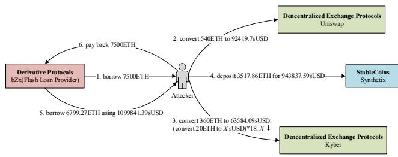
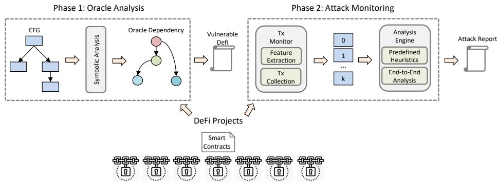
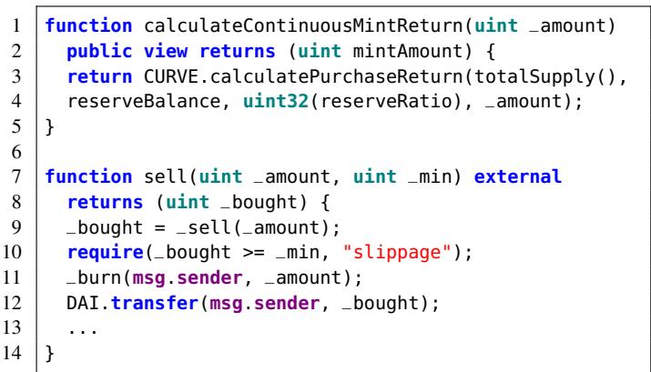
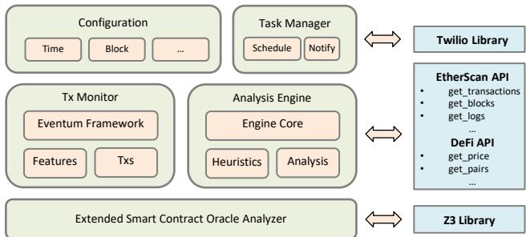
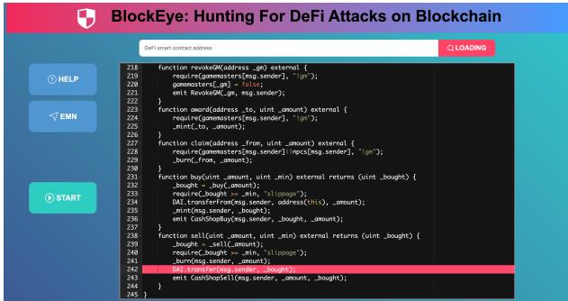
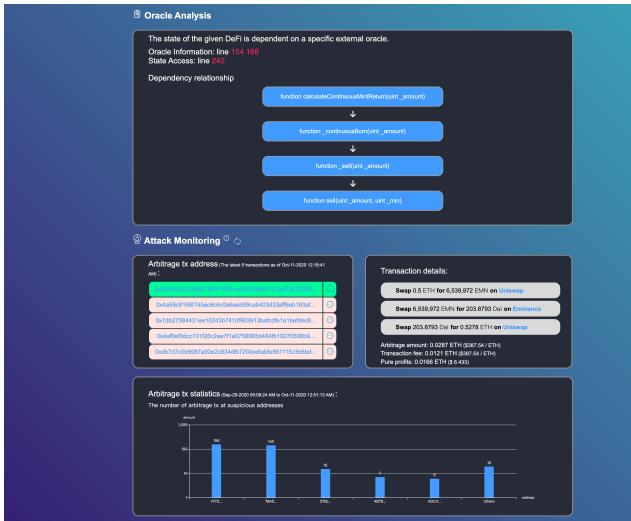

# BLOCKEYE: Hunting For DeFi Attacks on Blockchain

Bin Wang, Han Liu, Chao Liu, Zhiqiang Yang, Qian Ren, Huixuan Zheng, Hong Lei Oxford-Hainan Blockchain Research Institute, Hainan, China

Abstract—Decentralized finance, i.e., DeFi, has become the most popular type of application on many public blockchains (e.g., Ethereum) in recent years. Compared to the traditional finance, DeFi allows customers to flexibly participate in diverse blockchain financial services (e.g., lending, borrowing, collateralizing, exchanging etc.) via smart contracts at a relatively low cost of trust. However, the open nature of DeFi inevitably introduces a large attack surface, which is a severe threat to the security of participants’ funds. In this paper, we proposed BLOCKEYE, a real-time attack detection system for DeFi projects on the Ethereum blockchain. Key capabilities provided by BLOCKEYE are twofold: (1) Potentially vulnerable DeFi projects are identified based on an automatic security analysis process, which performs symbolic reasoning on the data flow of important service states, e.g., asset price, and checks whether they can be externally manipulated. (2) Then, a transaction monitor is installed offchain for a vulnerable DeFi project. Transactions sent not only to that project but other associated projects as well are collected for further security analysis. A potential attack is flagged if a violation is detected on a critical invariant configured in BLOCKEYE, e.g., Benefit is achieved within a very short time and way much bigger than the cost. We applied BLOCKEYE in several popular DeFi projects and managed to discover potential security attacks that are unreported before. A video of BLOCKEYE is available at https://youtu.be/7DjsWBLdlQU.

Index Terms—DeFi, oracle analysis, attack monitoring

## I. INTRODUCTION

Recent years have witnessed a rapid growth of decentralized finance application, or DeFi application, on the public blockchain ecosystem, e.g., Ethereum [1]. Unlike in traditional finance, DeFi applications leverage the transparency and openness nature of decentralized network (i.e., blockchain) to provide a diversity range of financial services, e.g., lending, borrowing, collateralizing, exchanging etc., all without trust or dependency on third-party intermediaries.

While DeFi has been gaining an increasing level of market growth in terms of both popularity and liquidity, its openness nature also leaves a large space to external attacks, which may severely threaten the security of DeFi participants’ funds. To elaborate on this point, consider a real-world attack (see Figure 1) on bZx project, which is a DeFi project for lending and margin trading on Ethereum. In this case, the attacker leveraged an oracle dependency of bZx on other DeFi projects (i.e., Uniswap and Kyber) in manipulating cryptoasset exchange rates, making net profit with a single atomic transaction.

Specifically, as shown in Figure 1, the attacker launched a sequence of six internal transactions, consisting of borrowing (e.g., transaction 1 and 5), exchanging (e.g., transaction 2, 3, and 4), and paying back (e.g., transaction 6) cryptoassets (i.e.,

ETH and sUSD). Note, these transactions are packed into a single external transaction in the exact order as in Figure 1, which is then executed atomically by Ethereum. In its execution, the attacker first borrowed 7, 500 ETH from bZx (transaction 1), then used 4, 417.86 borrowed ETH in exchange of sUSD with other DeFi projects (i.e., Uniswap, Kyber, and Synthetix in transactions 2–4). Because bZx relies on Uniswap and Kyber for price feed oracles, which are instead susceptible to large amount transactions, the attacker can therefore largely skewed exchange rate of ETH/sUSD in bZx in favour of him or herself. After that, he or she triggered transaction 5, borrowing 6, 799.27 ETH with all holding sUSD (i.e., 1, 099, 841.39), followed by a last transaction 6 in paying back 7, 500 borrowed ETH at the very beginning. The outcome of transactions 1–6 is thus a net profit of 2, 381.41 ETH (minus a small amount of ETH for paying gas fee[1]), or \$600K, for the attacker.

We point out the crux of this kind of arbitrage (i.e., making profits by buying and selling goods at different prices) is for the attacker successfully controlling exchange rates of cryptoasset pairs, ETH/sUSD here in Figure 1, by exploiting data dependencies of bZx on Uniswap and Kyber.

  
Fig. 1: Attack on the bZx project.

While many previous research works and tools have focused on the security of smart contracts [2], [3], [4], [5], there is relatively little study on the security of DeFi projects as aforementioned. In general, detection of these attacks requires a deep understanding on both the business nature of a DeFi project as well as the market it is involved in, which are missing in existing solutions to finding low-level bugs of smart contracts. We summarized challenges in terms of addressing security problems in DeFi projects as below.

Challenge 1: Model DeFi Dependency. Attacks on DeFi often involve multiple projects rather than a single one. Therefore, detection of such attacks requires an effective modeling of critical dependencies among DeFi projects, e.g., information flow between two DeFi. While a full analysis would introduce too much complexity, an abstract analysis might not be able to capture important high-level business semantics.

  
Fig. 2: The general workflow of BLOCKEYE.

Challenge 2: Understand End-To-End Transactions. Furthermore, whether a sequence of transactions is considered as malicious is largely determined by end-to-end analysis, i.e., comparing benefits and costs in the transaction sequence. However, such insights are hard to configure and generate based on existing analysis infrastructures for blockchains.

The BLOCKEYE Solution. To overcome above challenges, we have designed and developed BLOCKEYE, the very first automatic attack detection platform for blockchain DeFi projects. The key insights behind BLOCKEYE are twofold. First, a symbolic analysis is performed in BLOCKEYE to reason on important data flow (e.g., asset price) among associated DeFi projects. Potentially vulnerable projects are identified in this process. Then, BLOCKEYE installs a runtime monitor on vulnerable DeFi projects to detect potential attacks on the fly. Specifically, an end-to-end economic analysis is executed to report malicious transactions based on given heuristics, e.g., a large amount of profits are made in a very short time. We further applied BLOCKEYE in several popular DeFi projects on Ethereum and managed to uncover potential attacks which were previously unreported.

## II. ATTACK DETECTION FOR DEFI

## A. Overview

The general workflow of BLOCKEYE is shown in Figure 2. Specifically, BLOCKEYE works in a two-phase manner. In the first phase, BLOCKEYE performs symbolic analysis on smart contracts of a given DeFi project. This is realized by extending an underlying smart contract analyzer SERAPH [6], which is also developed by our team. Specifically, the goal of this phase is to model the inter-DeFi oracle dependency, i.e., how does the oracle data provided by one DeFi affect services of another. In cases where oracle-dependent state updates are found, we identify the DeFi as potentially vulnerable. Next, BLOCKEYE installs a runtime monitor in the second phase for vulnerable DeFi projects to detect external attacks. Specifically, BLOCKEYE uses a transaction monitor to collect related transactions based on extracted features, e.g., address. Then, end-to-end transactions are analyzed according to predefined heuristics, e.g., a large profit is made in a short period. Potential attacks are flagged by BLOCKEYE when an abnormal sequence of transactions is detected. Moreover, BLOCKEYE generates analysis report to help blockchain service providers diagnose the found problems.

## B. Oracle Analysis

As aforementioned, BLOCKEYE performs oracle analysis to check whether a DeFi is dependent on the oracle provided by another DeFi. Particularly, we focused on the price feed of assets shared through oracles.

  
Fig. 3: Oracle in the EMN project

An illustrative example of EMN project is given in Figure 3. Specifically, the function call at line 9 implicitly invokes the function from line 1–5, which receives an oracle at line 3–4. Moreover, the payment at line 12 is dependent on the oracle due to a data flow from line 9 to 12. That said, EMN has an oracle-dependent state update in its smart contracts. To enable such oracle analysis, BLOCKEYE extended the SERAPH smart contract analyzer to perform symbolic reasoning on oracles. Specifically, when processing a CALL instruction to a specified oracle, BLOCKEYE starts a data flow analysis to track whether the value retrieved from the oracle is linked to a further state operation, e.g., payment, storage update etc.. In cases where a feasible link is detected as in Figure 3, BLOCKEYE dumps the data flow and identifies given DeFi as potentially vulnerable.

## C. Automatic Attack Monitoring

For vulnerable DeFi projects, BLOCKEYE launches a runtime transaction monitoring to detect external attacks. To this end, BLOCKEYE allows users to specify targeted projects and further performs end-to-end analysis on relevant transactions. In general, the analysis aims at finding violations on invariant as predefined heuristic rules.

Specifically, as in Figure 1 with associated DeFi projects Uniswap, Synthetix and Kyber, BLOCKEYE first marks a random transaction $t _ { 0 }$ in these platforms as a target. Moreover, we search for other related transactions $t _ { 1 } \cdot \cdot \cdot t _ { k }$ based on the sender address x in $t _ { 0 } .$ . Additionally, we filter transactions which are not in the same block as $t _ { 0 }$ in order to find frequent transactions, which are more likely to be involved in attacks. With the collection of $t _ { 0 } \cdots t _ { k }$ transactions, BLOCKEYE runs a process to calculate the benefits received by x and its cost as well. With both numbers, BLOCKEYE is then able to determine whether x is attacking the target DeFi by comparing the profit made by x and a threshold value as configured. BLOCKEYE will also dumps the malicious sequence of transactions to facilitate an in-depth analysis of the potential attack.

## III. DESIGN OF BLOCKEYE

## A. Architecture

The BLOCKEYE is implemented as a web platform with front and back-end services, where the back-end architecture is shown in Figure 4. There are five functional modules in this architecture. At the bottom, BLOCKEYE extends a smart contract analyzer to perform oracle analysis as introduced earlier. Z3 [7] is adopted as the SMT solver in this module.

  
Fig. 4: The general architecture of BLOCKEYE.

In the middle are Tx Monitor and Analysis Engine. Transactions are monitored and collected via the Eventum framework, which streams events from blockchain to BLOCKEYE. Moreover, we implemented the analysis engine to detect potential attacks based on collected transactions and events. At the top layer, BLOCKEYE provides a Configuration module to allow users to specify detection criteria, e.g., in physical time or block number. Furthermore, the Task Manager module is designed to schedule detection tasks submitted from front-end and send back notifications to users with the Twillo library.

## B. Main Functionalities

We now describe the input and output interfaces of BLOCKEYE with screenshots shown in Figure 5 and Figure 6.

  
Fig. 5: The input interface for BLOCKEYE.

As in Figure 5, BLOCKEYE expects DeFi smart contract source code as input. Users can either type in code in the code editor, or provide the address of a deployed DeFi project. BLOCKEYE then will try to load corresponding source code using Etherscan’s source code retrieving API. Once smart contract code is available, users are free to click the START button to launch security analysis on the given DeFi project.

  
Fig. 6: The output interface for BLOCKEYE.

An example output of BLOCKEYE is in Figure 6. Here, results are divided into two parts: Oracle Analysis, which shows potential oracle dependencies found in DeFi source code, and Attack Monitoring, that provides information of real-world attack transactions which break heuristic invariants as described in Section II-C. For example, in Figure 6, BLOCKEYE has found an oracle dependency which spans across four smart contract functions, with oracle contract defined in code line 154 and fired by function calculateContinuousBurnReturn in line 168. Corresponding state access operation is in line 242 as a request to transfer DAI with dependent amount of value. Besides, in Figure 6, BLOCKEYE shows a list of five latest suspicious transactions, each with detailed information on its internal operation. At last, BLOCKEYE also presents a graph of top attackers along with their number of detected attack transactions, which may help users in further investigations.

## IV. PRELIMINARY EVALUATION

We conducted a preliminary evaluation on BLOCKEYE to validate its effectiveness in finding oracle-dependent state updates. Specifically, we considered eight DeFi projects on Ethereum, i.e., bZx, DDEX, Aave, dYdX, Compound, Nuo, Oasis, and Eminence.

In Table I, we present a comparison of BLOCKEYE with Codefi Inspect [8] in oracle-dependent state update detection. The results show that BLOCKEYE successively identifies all vulnerable DeFis with no false positive or false negative alert. Whereas, Codefi Inspect falsely ignores vulnerabilities in DDEX, leading to a false negative (FN) result.

TABLE I: A comparison of BLOCKEYE and Codefi Inspect in oracle-dependent state update detection. TP: True Positive; TN: True Negative; FN: False Negative; N/A: Not Available.

<table><tr><td>DeFi</td><td>Codefi Inspect</td><td>BLOCKEYE</td></tr><tr><td>bZx</td><td>TP</td><td>TP</td></tr><tr><td>DDEX</td><td>FN</td><td>TP</td></tr><tr><td>Aave</td><td>TN</td><td>TN</td></tr><tr><td>dYdX</td><td>TN</td><td>TN</td></tr><tr><td>Compound</td><td>TN</td><td>TN</td></tr><tr><td>Nuo</td><td>N/A</td><td>TN</td></tr><tr><td>Oasis</td><td>N/A</td><td>TN</td></tr><tr><td>Eminence</td><td>N/A</td><td>TP</td></tr></table>

We further evaluated BLOCKEYE with real-world transactions on the Ethereum mainnet. In Table II, we show detailed results of detected arbitrage transactions in two DeFis, i.e., ETH/sUSD token pair on bZx and DAI/EMN on Eminence.

TABLE II: Detailed results of BLOCKEYE with two DeFis.

<table><tr><td>DeFi</td><td colspan="3">bZx(ETH/sUSD)</td><td colspan="3">Eminence(DAI/EMN)</td></tr><tr><td>Block</td><td colspan="3">10799704 ~ 10950575</td><td colspan="3">10956504 ~ 11031087</td></tr><tr><td># Tx</td><td colspan="3"> $\approx$  7138</td><td colspan="3"> $\approx$  1486</td></tr><tr><td></td><td>slippage</td><td>&gt;0.05</td><td>25</td><td>slippage</td><td>&gt;0.05</td><td>124</td></tr><tr><td># Suspicious Tx</td><td>slippage</td><td>&gt;0.07</td><td>23</td><td>slippage</td><td>&gt;0.057</td><td>107</td></tr><tr><td></td><td>slippage</td><td>&gt;0.1</td><td>19</td><td>slippage</td><td>&gt;0.059</td><td>37</td></tr></table>

For example, as for bZx (ETH/sUSD), there were around 7, 138 valid transactions detected between block 10, 799, 704 and 10, 950, 575. By enforcing different slippage thresholds, BLOCKEYE found 19 to 25 suspicious arbitrage transactions, e.g., 19 for slippage threshold 0.1 and 25 for slippage threshold 0.05. Besides, for Eminence(DAI/EMN), the number of suspicious transactions found ranged from 37 to 124 with different slippage thresholds, where overall valid transactions detected were 1, 486 between block 10, 956, 504 and 11, 031, 087.

## V. RELATED WORK

Security problems of smart contracts have been widely discussed in recent years [4], [5], [3], [2], [6]. Luu et al. highlighted four types of vulnerabilities for smart contracts [2]. Tsankov et al. proposed a verification technique [3], which transforms Ethereum smart contracts into Datalog logics [9].

Permenev et al. further presented their solution to verify smart contracts in an inductive manner [10]. In addition to security problems, Liu et al. proposed a statistical approach to identify potential code smells [5]. Security of DeFi projects is relatively less discussed in previous works. Several mathematical and economic models were proposed to help understand risks of DeFi in a theoretical manner [11], [12], [13], [14].

## VI. CONCLUSION

In this paper, we highlighted BLOCKEYE as an open platform to detect DeFi attacks on blockchain. Compared to existing analyzers for smart contracts, BLOCKEYE provides important capabilities to model dependency among DeFi projects and flag potential end-to-end attacks at real-time. The key insights behind BLOCKEYE are symbolic oracle analysis and pattern-based runtime transaction validation. We applied BLOCKEYE in several popular DeFi projects on Ethereum and managed to find potential attacks previously unreported.

## VII. DATA AVAILABILITY STATEMENT

For ethical considerations, experimental data used in our work will be publicly available after discussions with the relevant DeFi development team.

## REFERENCES

[1] G. Wood, “Ethereum: A secure decentralised generalised transaction ledger,” Ethereum Project Yellow Paper, vol. 151, 2014.

[2] L. Luu, D.-H. Chu, H. Olickel, P. Saxena, and A. Hobor, “Making smart contracts smarter,” in Proceedings of the 2016 ACM SIGSAC Conference on Computer and Communications Security. ACM, 2016, pp. 254–269.

[3] P. Tsankov, A. Dan, D. D. Cohen, A. Gervais, F. Buenzli, and M. Vechev, “Securify: Practical security analysis of smart contracts,” arXiv preprint arXiv:1806.01143, 2018.

[4] C. Liu, H. Liu, Z. Cao, Z. Chen, B. Chen, and B. Roscoe, “Reguard: finding reentrancy bugs in smart contracts,” in ICSE (Companion). ACM, 2018, pp. 65–68.

[5] H. Liu, C. Liu, W. Zhao, Y. Jiang, and J. Sun, “S-gram: towards semantic-aware security auditing for ethereum smart contracts,” in ASE. ACM, 2018, pp. 814–819.

[6] Z. Yang, H. Liu, Y. Li, H. Zheng, L. Wang, and B. Chen, “Seraph: enabling cross-platform security analysis for evm and wasm smart contracts,” in Proceedings of the ACM/IEEE 42nd International Conference on Software Engineering: Companion Proceedings, 2020, pp. 21–24.

[7] “Microsoft z3 smt solver,” https://z3.codeplex.com/, 2019.

[8] “Codefi inspect,” https://inspect.codefi.network/, 2020.

[9] T. Eiter, G. Gottlob, and H. Mannila, “Disjunctive datalog,” ACM Transactions on Database Systems (TODS), vol. 22, no. 3, pp. 364–418, 1997.

[10] A. Permenev, D. Dimitrov, P. Tsankov, D. Drachsler-Cohen, and M. Vechev, “Verx: Safety verification of smart contracts,” Security and Privacy, vol. 2020, 2019.

[11] K. Qin, L. Zhou, B. Livshits, and A. Gervais, “Attacking the defi ecosystem with flash loans for fun and profit,” arXiv preprint arXiv:2003.03810, 2020.

[12] J. Kamps and B. Kleinberg, “To the moon: defining and detecting cryptocurrency pump-and-dumps,” Crime Science, vol. 7, no. 1, p. 18, 2018.

[13] B. Liu and P. Szalachowski, “A first look into defi oracles,” arXiv preprint arXiv:2005.04377, 2020.

[14] L. Gudgeon, D. Perez, D. Harz, A. Gervais, and B. Livshits, “The decentralized financial crisis: Attacking defi,” arXiv preprint arXiv:2002.08099, 2020.