# The Blockchain Imitation Game

Kaihua Qin Imperial College London, RDI

Benjamin Livshits Imperial College London

Stefanos Chaliasos Imperial College London

Dawn Song UC Berkeley, RDI

Liyi Zhou Imperial College London, RDI

Arthur Gervais University College London, RDI

## Abstract

The use of blockchains for automated and adversarial trading has become commonplace. However, due to the transparent nature of blockchains, an adversary is able to observe any pending, not-yet-mined transactions, along with their execution logic. This transparency further enables a new type of adversary, which copies and front-runs profitable pending transactions in real-time, yielding significant financial gains.

Shedding light on such “copy-paste” malpractice, this paper introduces the Blockchain Imitation Game and proposes a generalized imitation attack methodology called APE. Leveraging dynamic program analysis techniques, APE supports the auto matic synthesis of adversarial smart contracts. Over a timeframe of one year (1st of August, 2021 to 31st of July, 2022), APE could have yielded 148.96M USD in profit on Ethereum, and 42.70M USD on BNB Smart Chain (BSC).

Not only as a malicious attack, we further show the po tential of transaction and contract imitation as a defensive strategy. Within one year, we find that APE could have successfully imitated 13 and 22 known Decentralized Finance (DeFi) attacks on Ethereum and BSC, respectively. Our findings suggest that blockchain validators can imitate attacks in real-time to prevent intrusions in DeFi.

## 1 Introduction

Decentralized Finance (DeFi), built upon blockchains, has grown to a multi-billion USD industry. However, blockchain peer-to-peer (P2P) networks have been described as dark forests, where traders engage in competitive trading, indulging in adversarial front-running [14]. Such front-running is possible, because of the inherent time delay between a transaction’s creation, and its being committed on the blockchain. This time delay often lasts only a few seconds, posing computational challenges for the front-running players. To yield a financial revenue, a DeFi trader needs to monitor the convoluted market dynamics and craft profitable transactions promptly, which typically requires professional domain knowledge. Alternatively, an adversarial trader may also seek to “copy-paste” and front-run a pending profitable transaction without understand ing its logic. We term such a strategy as an imitation attack. A naive string-replace imitation method [46] was shown to yield thousands of USD per month on past blockchain states. The practitioners’ community swiftly came up with defenses to counter such a naive imitation method. At the time of writing, traders often deploy personalized and closed-source smart contracts, making exploitation harder. The known naive imitation algorithm no longer applies, because these contracts are typically protected through, for example, authentications.

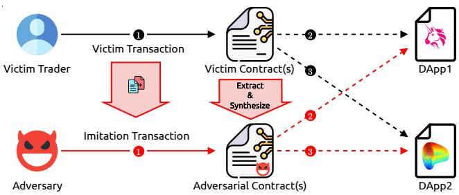  
Figure 1: High-level APE attack mechanism, a generalized, automated imitation method synthesizing adversarial contracts without prior knowledge about the victim’s transaction and contract(s). APE appropriates any resulting revenue.

However, the possibility of a generalized imitation attack that can invalidate existing protection mechanisms has not yet been explored. The goal of this work is to investigate, design, implement, and evaluate a generalized imitation method. We find that, to successfully imitate a transaction, an attacker needs to overcome the following three technical challenges. (I) The short front-running time-window may exclude the application of powerful program analysis techniques, such as symbolic executions, which are not designed for real-time tasks. (II) An attacker needs to recursively identify the victim contracts that hinder the imitation execution, and replace them with newly synthesized adversarial contracts. Blockchain virtual machine instrumentation is hence necessary to ensure the efficiency of this identification process. (III) An attacker must guarantee that the synthesized contracts are invoked and executed correctly, while the generated financial revenue is sent to an adversarial account after the imitation execution. To the best of our knowledge, no existing work nor off-the-shelf tool allows automatically copying and synthesizing smart contracts with custom logic injected.

In this work, we propose APE (cf. Figure 1), an automated generalized imitation methodology. On a high level, APE is designed to construct an imitation transaction that copies the logic of a victim transaction. When it is necessary, APE synthesizes and deploys adversarial smart contracts to bypass copy protections, such as authentication mechanisms. To this end, APE leverages dynamic taint analysis, program synthesis, and advanced instrumentations to realize imitation generation. The generalization stems from the fact that the adversary does not require prior victim knowledge, nor needs to understand the victim transaction logic, nor requires prior knowledge of the interacting Decentralized Application (DApp). APE applies to e.g., trading activities for fungible, non-fungible tokens, and exploit transactions.

Despite the blockchain-based DeFi domain flourishing, it is plagued by multi-million dollar hacks [62]. As outlined in this work, an imitation attack can yield a significant financial profit to an adversary. However, following a defence-in-depth approach, a blockchain imitation can also act as an intrusion prevention system by mimicking an attack, appropriating the vulnerable funds, and returning them to its victim. The prac titioner community has dubbed such benevolent activity as “whitehat hacking”.

We summarize our contributions as follows.

• We introduce the generalized blockchain imitation game with a new class of adversary attempting to imitate its victim transactions and associated contracts, without prior knowledge about the victim’s intent or application logic. We design APE, a generalized imitation tool for EVMbased blockchains. We are the first to show that dynamic program analysis techniques can realize an imitation attack, posing a substantial threat to blockchain users.

• We evaluate APE over a one year timeframe on Ethereum and BNB Smart Chain (BSC). We show that APE could have yielded 148.96M USD in profit on Ethereum, and 42.70M USD on BSC. We find that 73.74M USD stems from 35 known DeFi attacks that APE can im itate. APE’s impact further becomes apparent through the discovery of five new vulnerabilities, which we responsibly disclose, as they could have caused a total loss of 31.53M USD, if exploited.

• We show that APE executes in real-time on Ethereum (13.3-second inter-block time) and BSC (3-second inter-block time). On average, a single APE imitation takes 0.07 ± 0.10 seconds. Because of APE’s efficiency, it could have front-run in real-time 35 DeFi attacks within our evaluation timeframe. Miners that execute APE can ultimately choose to carry out the attacks, or could act as whitehat hackers in a defensive capacity.

## 2 Background

In this section, we outline the required background and provide motivating examples.

## 2.1 Blockchain and Smart Contract

A blockchain is a chain of blocks distributed over a P2P network [36]. Users approve transactions through publickey signatures from an account. Miners collect transactions and mine those in a specific sequence within blocks. Smart contract-enabled blockchains extend the capabilities of accounts to hold assets and code, which can perform arbitrary computations. Smart contracts are initialized and executed through transactions and remain immutable once deployed. They are usually written in high-level languages (e.g., Solidity) that are compiled to low-level bytecode, executed by a blockchain’s virtual machine, e.g., Ethereum Virtual Machine (EVM) [54]. The EVM is a stack-based virtual machine supporting arithmetic, control-flow, cryptographic and other blockchain-specific instructions (e.g., accessing the current block number). Each executed bytecode instruction costs gas, paid with the native cryptocurrency. Note that all code and account balances are typically transparently visible. The Application Binary Interface (ABI) of a smart contract defines how a smart contract function should be invoked (including the function type, name, input parameters, etc). If a smart contract is not open-source, the ABI is likely unavailable.

DeFi [44], an emerging financial ecosystem built on top of smart contract blockchains, at the time of writing, reached a peak of 300B USD total value locked.<sup>1</sup> At its core, DeFi is a smart contract encoded financial ecosystem, implementing, e.g., automated market maker [2], lending platforms [45, 53], and stablecoins [11, 34]. Users can access a DeFi application (a DApp) by issuing transactions to the respective contracts.

## 2.2 Blockchain Extractable Value

It is well-known that Wall Street traders profit by frontrunning other investors’ orders (i.e., high-frequency trading) [32]. Similarly, the transaction order in DeFi fatefully impacts the revenue extraction activities. By default, miners order transactions on a descending transaction fee basis. Therefore, DeFi traders can front- and back-run pending (i.e., not yet mined) transactions by competitively offering a transaction fee [16, 46]. Miners, however, have the singlehanded privilege to order transactions, which grants them a monopoly on blockchain value extraction. This privilege leads to the concept of Miner Extractable Value (MEV) [14]. Qin et al. [46] generalize MEV to Blockchain Extractable Value (BEV) and show that over 32 months, the extracted BEV on Ethereum amounts to 540.54M USD, contributed by three major sources, sandwich attacks [61], liquidations [43,45], and arbitrage [60]. Note that Front-running as a Service (FaaS) (e.g., flashbots) reduces the risks of extracting BEV, by colluding with miners in a private network. Similar to bribes [5], BEV is proven to threaten the blockchain consensus security because miners are incentivized to fork the blockchain [14,46,60]. An SoK on DeFi attacks systematizes attacks over a timeframe of four years [62], identifying the various attack causes and implications. In this paper we make the distinction among whitehat and blackhat attackers, wherein a blackhat attacker is one who retains the financial proceeds of an attack, whereas a whitehat refunds the attack revenue to the identified victim.

## 2.3 Naive Transaction Imitation Attack

BEV extracting entities can follow two strategies: either metic ulously analyzing DeFi applications (i.e., application-specific extraction), or applying a naive generalized transaction imitation attack (i.e., application-agnostic extraction).

Qin et al. [46] propose a naive but effective transaction imitation attack. This algorithm takes as input a victim transaction, and simply replaces the transaction’s sender address with an adversarial address in the transaction sender and data fields. As such, this imitation algorithm corresponds to a string replacing approach, and does not attempt to synthe size adversarial smart contracts. When simulating on past blockchain data, it was shown that such naive algorithm could have generated 35.37M USD over a 32 month timeframe. We provide a naive imitation example in Appendix A. This algorithm, however, fails when traders protect their transac tion through, for example, authentication mechanisms as we outline below.

## 2.4 Motivating Examples

Traders in DeFi typically deploy customized smart contracts to perform financial actions, such as arbitrage and liquidations.<sup>2</sup> Those traders should protect their transactions from imitation attacks, by for instance only allowing predefined accounts to invoke their smart contract (cf. Figure 2). Such protection corresponds to an authentication mechanism, a common practice that the practitioners’ community employs. We proceed with a real-world authentication example.

Authentication Protection Example. In Figure 2, we show how a liquidation contract<sup>3</sup> attempts to prevent a transaction imitation attack. The solidity code of Figure 2’s liquidation contract is not open-source, and we therefore decompile the contract bytecode with a state-of-the-art EVM contract decompiler [22]. To trigger a liquidation, the liquidator needs to send a transaction<sup>4</sup> to the augmented contract along with parameters (e.g., the flash loan size and liquidation amount). If there is no protection mechanism, an adversary might frontrun the liquidator, by calling the same contract with identical parameters. However, the presented contract requires the transaction sender to match a specific address (in line 3). Specifically, the liquidation function printMoney() is only callable by a hard-coded address. If this condition is not met, the naive imitation attack from Section 2.3 fails. To circumvent authentication protections, one approach is to synthesize an adversarial contract that replicates the liquidator’s customized contract. By reconstructing the bytecode, the synthesized contract preserves the liquidation logic while bypassing the authentication. To perform the attack, the adversary does not need to understand the business logic of the liquidation transaction. Instead of invoking the liquidator’s customized contract, the adversary invokes the synthesized contract, which then triggers a liquidation.

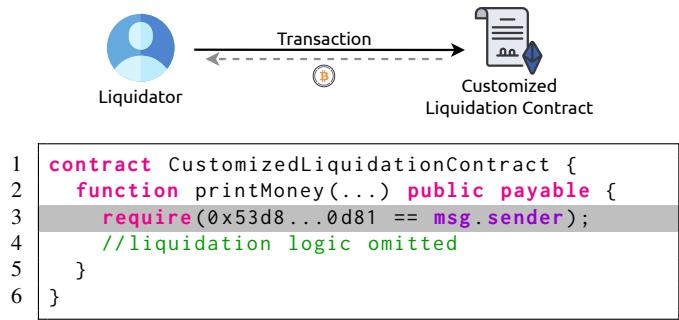  
Figure 2: Motivating example. A liquidator triggers a liquidation by sending a transaction to its customized contract. The customized contract (cf. 0xe0a9efE32985cC306255b395a1b d06D21ccEAd42) contains a authentication (line 3).

In this work, we present an automated and generalized imitation methodology, APE, that thwarts such protections. Not only limited to authentications, APE provides a comprehensive approach to overcome various forms of protection mechanisms that cannot be handled by the naive imitation strategy. As another example, we consider a scenario where a trader issues a profitable transaction that deposits the earned revenue in a smart contract under the trader’s control. While an adversary may succeed in executing an imitation transaction through the naive strategy, the revenue would remain in the “victim” trader’s contract, resulting in no financial gain for the attacker. In contrast, APE resolves this predicament by synthesizing an adversarial contract that serves as the revenue recipient. Further details of this scenario are presented in Section 5.3, where we showcase a real-world transaction.

Table 1: Notations adopted in this work.

<table><tr><td>Symbol</td><td>Description</td></tr><tr><td>S</td><td>A blockchain state</td></tr><tr><td> $\text{tx}_v$ </td><td>Victim transaction</td></tr><tr><td> $\text{sc}_{v_i}$ </td><td>Victim contract i</td></tr><tr><td> $\widehat{\text{sc}_{v_i}}$ </td><td>Tainted contract i</td></tr><tr><td> $\overline{\text{sc}_{v_i}}$ </td><td>Contract i to be patched and replaced</td></tr><tr><td> $\text{tx}_c$ </td><td>Adversarial imitation transaction</td></tr><tr><td> $\text{sc}_{a_i}$ </td><td>Adversarial synthesized contract i</td></tr><tr><td>E</td><td>The native cryptocurrency</td></tr><tr><td> $\text{Bal}_a^m(S)$ </td><td>Balance of asset m held by account a</td></tr><tr><td> $\Delta_a^m(S, \text{tx})$ </td><td>Balance change of m held by a after executing tx upon S</td></tr></table>

## 3 APE Overview

We proceed to outline the system and threat model. We then overview the key components of APE.

## 3.1 Preliminary Models

System Model We consider a smart-contract-enabled distributed ledger with an existing DeFi ecosystem. A trader performs financial actions through its blockchain account, signing transactions mined by miners. Similarly, smart contracts are referenced by their respective account. A ledger is a state machine replication [49], with state S. A blockchain transaction tx represents a state transition function, converting the ledger state from S to $S ^ { \prime } , \mathrm { i . e . , } S ^ { \prime } = \mathrm { t } \mathsf { x } ( S )$ .

We assume that, within the DeFi system, there exist various asset representations (e.g., fungible tokens) in addition to the native blockchain cryptocurrency E. The balance of asset m held by an account a at the blockchain state S is denoted by ${ \mathrm { B a l } } _ { a } ^ { m } ( S )$ , while $\Delta _ { a } ^ { m } ( S , { \sf t x } )$ denotes the balance change after executing a transaction tx upon S (cf. Equation 1).

$$
\Delta_ {a} ^ {m} (S, \mathrm{tx}) = \mathrm{Bal} _ {a} ^ {m} (\mathrm{tx} (S)) - \mathrm{Bal} _ {a} ^ {m} (S)\tag{1}
$$

We further assume the existence of on-chain exchanges which allow trades from any asset m to the native cryptocurrency $E .$

Threat Model Our strongest possible adversarial model considers a miner that can single-handedly order transactions in its mined blocks. As a miner, A has access to every pending transaction and the current blockchain state. A actively lis tens for data on the P2P network through multiple distributed nodes and peer connections. A can moreover act as, or collaborate with a FaaS provider to privately receive pending transactions. Because A is a miner, A can front-run any pend ing transaction. We assume that A is financially rational and attempts to maximize its asset value. Moreover, we assume that A has access to sufficient E to execute APE.

APE is application-agnostic, meaning that A does not need to have any upfront knowledge of the logic of a victim transaction $\mathrm { t x } ,$ nor its target smart contract. We, however, assume that A understands how to interact with asset tokens and that A can swap a token m to E over an on-chain exchange.

We refer to a transaction that aims to copy and replace the actions of $\mathrm { t x } _ { \nu }$ as an imitation transaction $\mathrm { t x } _ { c } . \ \mathrm { t x } _ { \nu }$ interacts with a set of contracts $\left\{ \mathsf { s c } _ { \nu _ { i } } \right\}$ , where A may need to replace a subset of those contracts to achieve the successful execution of $\mathrm { t x } _ { c }$ . We denote that A may process any victim contract ${ \mathsf { s c } } _ { \nu _ { i } }$ to synthesize respective adversarial contract $\mathsf { s c } _ { a _ { i } }$

Clarification. APE cannot synthesize new attacks because APE has no prior knowledge of previous blockchain attacks and no knowledge of the application level logic. Therefore, APE is reliant on a template transaction and the associated contracts encoding attack logic.

## 3.2 Attack Overview

Given a profitable victim transaction $\mathrm { t x } ,$ an adversary A can attempt to imitate its logic with a naive imitation transaction (cf. Section 2.3). However, the naive method may fail due to various existing defense mechanisms, e.g., an authentication (cf. Section 2.4). Understanding a failure is challenging for A due to the lack of prior knowledge about $\mathrm { t x } _ { \nu }$ . Moreover, the execution of $\mathrm { t x } _ { \nu }$ may be intertwined with multiple invoked contracts $\{ \mathsf { s c } _ { \nu _ { i } } \}$ , complicating the analysis. Finally, A must attack in real-time because the attack window typically only lasts a few seconds until $\mathrm { t x } _ { \nu }$ is mined.

The objective of APE is to generate an imitation transaction $\mathbf { t } \times _ { c }$ , as well as a set of synthesized contracts $\{ \mathsf { s c } _ { a _ { i } } \}$ that imitate the logic of $\mathrm { t x } _ { \nu }$ (and the associated victim contracts $\{ \mathsf { s c } _ { \nu _ { i } } \} )$ with the following properties:

No prior victim knowledge Any profitable transaction should be considered a potential victim, independent of the issuer. A is not expected to have prior knowledge of the victim transaction, intent, or past blockchain history.

No reasoning about the victim logic A has no knowledge about the application logic of $\mathrm { t x } _ { c }$ and involved ${ \mathsf { s c } } _ { \nu _ { i } } .$

Higher payoff over additional complexity APE introduces additional complexity over the naive imitation method [46] and should therefore exceed its revenue. For an objective comparison, we evaluate both imitation methods over the same blockchain transaction history.

Real-time We assume that A only attacks pending victim transactions. Therefore, it is essential that APE is faster than the inter-block time (e.g., about 13.3 seconds on Ethereum, 3 seconds on BSC). Thus, it is necessary to prioritize execution speed over attack optimality [47]. Note that A, as a miner, could choose to fork the blockchain over $\mathrm { t x } _ { c } ,$ granting an extended attack time window, which is beyond the scope of this work.

The high-level logic of APE operates as follows. Given a potential victim transaction $\mathrm { t x } ,$ A first attempts to imitate $\mathrm { t x } _ { \nu }$ by creating and executing $\mathrm { t x } _ { c }$ as a naive imitation transaction. If $\mathrm { t x } _ { c }$ ’s execution reverts, A identifies the execution traces triggering the failure. A then synthesizes $\mathsf { s c } _ { a _ { i } }$ replacing the ${ \mathsf { s c } } _ { \nu _ { i } }$ that led tx<sub>c</sub> to revert. To this end, A copies the victim’s contract(s) bytecode, and amends the instructions that prevent a successful imitation execution. Finally, A locally validates $\mathsf { s c } _ { a _ { i } }$ deployment(s) and $\mathrm { t x } _ { c } \mathrm { ^ { \circ } s }$ profitability. Under the assumption that A can front-run any competitor (cf. Section 3.1), APE is risk-free. Note that, leveraging the transaction composability, A can operate $\mathsf { S C } _ { a _ { i } }$ deployment(s) and imitation execution $( \mathrm { i } . \mathrm { e } . , \mathrm { t } \mathsf { x } _ { c } )$ atomically within a single transaction.

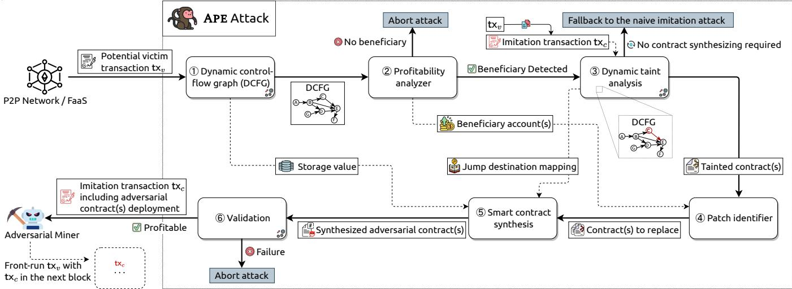  
Figure 3: Overview of the APE, a real-time imitation attack on EVM based blockchain transactions.

APE (cf. Figure 3) consists of six key components:

Step 1 : Dynamic control-flow graph A executes $\mathrm { t x } _ { \nu }$ locally at the current blockchain state and builds a dynamic control-flow graph (DCFG). The DCFG captures (i) the inter-contract invocations of ${ \mathsf { s c } } _ { \nu _ { i } }$ while $\mathrm { t x } _ { \nu }$ executes, and (ii) the contract bytecode execution flow of invoked ${ \mathsf { s c } } _ { \nu _ { i } } .$

Step 2 : Profitability analyzer A extracts the asset transfers triggered by $\mathrm { t x } _ { \nu }$ to observe the beneficiary account(s). A then attempts to replace those accounts as in to become the beneficiary. If A does not succeed in becoming the beneficiary, A aborts the attack.

Step 3 : Dynamic taint analysis A performs a dynamic taint analysis and compares the analysis outcome to the DCFG constructed in Step 1 . If the comparison shows no difference, A proceeds with the naive transaction im itation (cf. Section 2.3). Otherwise, given the dynamic taint analysis and comparison to the $\mathrm { D C F G } ,$ A identifies the tainted basic blocks which prevent a successful execution of the naive imitation.

Step 4 : Patch identifier Given the detected beneficiary accounts and tainted smart contracts, A proceeds to identify all smart contracts that need to be replaced.

Step $\textcircled{5} :$ Smart contract synthesis A synthesizes $\mathsf { s c } _ { a _ { i } }$ by copying bytecode from $\mathsf { s c } _ { \nu _ { i } \cdot \mathcal { A } }$ may need to amend the bytecode of $\mathsf { s c } _ { a _ { i } }$ to ensure that tx<sub>c</sub> can execute tx<sub>v</sub>’s logic and collect the produced financial revenue.

Step 6 : Validation A deploys $\mathsf { s c } _ { a _ { i } }$ locally and executes $\mathrm { t x } _ { c }$ to validate if the attack is profitable. If profitable, A deploys $\mathsf { s c } _ { a _ { i } }$ on-chain and issues tx<sub>c</sub>, front-running tx<sub>v</sub>.

## 4 APE Details

In this section, we present the design details of APE and discuss the technical limitations.

## 4.1 Step 1 : Dynamic Control-Flow Graph

A smart contract control-flow graph (CFG) [1] is a graph representation of the contract bytecode. In a CFG, each node denotes a basic block, a linear sequence of instructions. Nodes are connected by directed edges, representing the code jumps in the control flow. For EVM bytecode, two opcodes, JUMP and JUMPI, control the execution path of code blocks. JUMP is an unconditional jump to the destination taken from the stack, while JUMPI is a conditional jump. A CFG only includes static information about a contract, while a DCFG is a specialized CFG with dynamic information taken from a given execution.

Dynamic Control-Flow Graph Construction in APE. A executes $\mathrm { t x } _ { \nu }$ locally to build a DCFG, representing the execution details of $\mathrm { t x } _ { \nu }$ . To reason about the control flow of $\mathrm { t x } ,$ A records the condition value of every JUMPI, as necessary for the dynamic taint analysis (step 3 , cf. Section 4.3). By capturing the opcodes for contract calls (i.e., CALL, DELEGATECALL, STATICCALL, and CALLCODE), A identifies invocations across contracts. The constructed DCFG thus tracks the execution of all smart contracts invoked in $\mathrm { t x } _ { \nu }$ . The constructed DCFG captures the concrete execution of $\mathrm { t x } _ { \nu }$ rather than the complete representation of $\mathsf { s c } _ { \nu _ { i } }$ . That is helpful in this work’s context because the unexecuted basic blocks remain irrelevant to imitating the victim transaction. Therefore, the resulting $\mathsf { s c } _ { a _ { i } }$ (cf. step $\textcircled{5} ,$ Section 4.5) will likely have fewer opcodes than $\mathsf { s c } _ { \nu _ { i } }$ and hence reduce the attack cost.

## 4.2 Step $\textcircled{2} :$ Profitability Analyzer

The profitability analyzer aims to filter out victim transactions which are unlikely to be profitable. Intuitively, an APE attempt is profitable if the adversarial revenue (measured in E) is greater than the required transaction fees (cf. Definition 4.1).

Definition 4.1 (Profitable Condition). Given a blockchain state S, an APE attack is profitable for A iff $\mathrm { B a l } _ { \mathcal { A } } ^ { E } ( S ^ { \prime } ) -$ $\mathrm { B a l } _ { \mathcal { A } } ^ { E } ( S ) > 0$ , where $S ^ { \prime }$ is the blockchain state after the attack transaction is applied.

In the simplest scenario, A can infer the profitability of imitating $\mathrm { t x } _ { \nu }$ by examining the balance change of the transaction sender. However, the victim may transfer the revenue of $\mathrm { t x } _ { \nu }$ to another smart contract under its control, instead of transferring to the sender account. Therefore, imitating tx<sub>v</sub> is profitable only if A captures the beneficiary recipient. To determine the profitability, it is thus necessary for the A to identify the profit of every account involved in the execution of $\mathrm { t x } _ { \nu }$ . To this end, A can extract the asset transfers from the DCFG constructed in step 1 . This extraction is straightforward through analyzing the EVM logs defined in asset implementation standards (e.g., ERC20). We proceed to define a beneficiary account in the execution of $\mathrm { t x } _ { \nu }$ (cf. Definition 4.2).

Definition 4.2 (Beneficiary Account). All asset values are denominated in E. An account a is considered a beneficiary $i f f$ the amount that a receives is greater than the amount that a pays out within the execution of $\mathrm { t x } _ { \nu }$

We measure the profitability only in the native cryptocurrency E to normalize financial value comparisons. This implies that A must exchange all received assets to E atomically after imitating tx .

Imitating tx<sub>v</sub> may yield a profit iff there exists a beneficiary account in the execution of $\mathrm { t x } _ { \nu }$ . Specifically, there are two cases in which A does not abort the attack:

1. If the sender is a beneficiary account, other accounts are irrelevant to the profitability analyzer.

2. Otherwise, if the sender is not a beneficiary account, the collective profit of other beneficiary accounts, minus the potential loss of the sender account must remain positive.

A then exports the beneficiary account to the patch identifier (step 4 ) for further analysis (cf. Section 4.4). Note that this methodology may introduce false positives because the profitability analyzer does not consider if a transaction is attackable. For example, a transaction withdrawing assets from a wallet contract to the transaction sender is classified as prof itable because the sender is a beneficiary account. However, it is unavailing to imitate the withdrawal transaction. Such false positives will be purged in the validation phase (step 6 ).

Table 2: Taint introduction rules. ORIGIN certainly introduces an inconsistent value when executing $\mathrm { t x } _ { c }$ , while the remaining opcodes ( ) might, or might not, impact $\mathrm { t x } _ { c } \mathrm { ^ { \circ } s }$ execution.

<table><tr><td>Taint Source</td><td>Description</td></tr><tr><td>ORIGIN</td><td> $tX_{c}$  sender address</td></tr><tr><td>CALLER</td><td>Message caller address</td></tr><tr><td>ADDRESS</td><td>Address of the executing contract</td></tr><tr><td>CODESIZE</td><td>Length of the executing contract&#x27;s code</td></tr><tr><td>SELFBALANCE</td><td>Balance of the executing contract</td></tr><tr><td>PC</td><td>Program counter</td></tr></table>

## 4.3 Step 3 : Dynamic Taint Analysis

Dynamic taint analysis [37] is a program analysis method, which tracks information flow originating from taint sources (e.g., untrusted input) as a program executes. Dynamic taint analysis operates with a taint policy explicitly determining (i) what instructions introduce new taint, (ii) how taint propagates, and (iii) how tainted values are checked [50].

Dynamic Taint Analysis in APE. A proceeds to execute an imitation transaction $\mathrm { t x } _ { c }$ copied from $\mathrm { t x } _ { \nu }$ . The execution of $\mathrm { t x } _ { c }$ may fail, if $\mathrm { t x } _ { c }$ contains inconsistencies (e.g., a different transaction sender) when compared to $\mathrm { t x } _ { \nu } \mathrm { \bar { s } }$ execution (cf. Section 2.4). Therefore, when executing $\mathrm { t x } , \mathcal { A }$ applies dynamic taint analysis to track where and how $\mathrm { t x } _ { c } \mathrm { \bar { s } }$ execution fails. A considers opcodes, which may trigger inconsistent execution values, as taint sources and tracks their taint propagation. We outline the taint analysis policy of APE in the following.

Taint Introduction We inspect all EVM opcodes and identify those which may introduce inconsistencies (cf. Table 2). For example, ORIGIN (the transaction sender address) certainly produces an inconsistent value because $\mathrm { t x } _ { c }$ is issued from the adversarial, instead of the victim address. The remaining opcodes might, or might not, introduce inconsistencies during execution.

Taint Propagation When executing tx<sub>c</sub>, the taint propagates to the output of an arithmetic/logical operation, if at least one input is tainted. Notably, a storage variable is tainted if it is read from a tainted slot.<sup>5</sup>

Taint Checking Recall that we record the concrete value of every JUMPI condition when building the DCFG of $\mathrm { t x } _ { \nu }$ in step $\textcircled{1}$ (cf. Section 4.1). Given the tainted execution trace of $\mathrm { t x } _ { c } ,$ we compare if every tainted JUMPI is identical to the value recorded for $\mathrm { t x } _ { \nu }$ . This concrete com parison allows identifying how inconsistencies between $\mathrm { t x } _ { \nu }$ and $\mathrm { t x } _ { c }$ interrupt the execution of $\mathrm { t x } _ { c }$

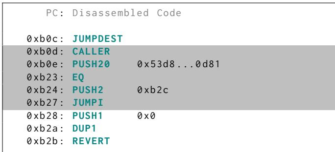  
(a) Caller authentication bytecode snippet.

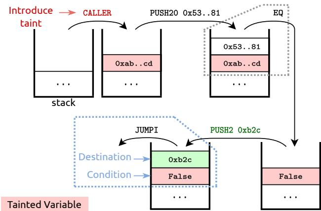  
(b) Taint propagation visualization.  
Figure 4: Taint propagation of the imitation transaction in the motivating example (cf. Figure 2, Section 2.4). CALLER introduces a tainted value, which propagates to a JUMPI condition.

We proceed to define a tainted basic block (cf. Definition 4.3) and tainted contract (cf. Definition 4.4).

Definition 4.3 (Tainted Basic Block). A basic block is tainted iff (i) the basic block contains a JUMPI opcode with a tainted condition value, and (ii) the condition values are different in the executions of $\mathrm { t x } _ { c }$ and $\mathrm { t x } _ { \nu }$

Definition 4.4 (Tainted Contract). A smart contract $\mathsf { s c } _ { \nu _ { i } }$ is tainted iff the contract contains at least one tainted basic block.

If there is no tainted basic block, the execution of $\mathrm { t x } _ { \nu }$ and $\mathrm { t x } _ { c }$ remain identical. Therefore, APE is then equivalent to the naive imitation attack (i.e., A can imitate $\mathrm { t x } _ { \nu }$ by only issuing $\mathrm { t x } _ { c }$ and omits step $\textcircled{4} ,\textcircled{5} )$ . However, if there exists a tainted basic block, the execution of $\mathrm { t x } _ { c }$ differs from $\mathrm { t x } _ { \nu }$ . To copy the execution of $\mathrm { t x } ,$ A replaces tainted contracts with adversarial contracts, retaining the identical execution logic to $\mathrm { t x } _ { \nu }$

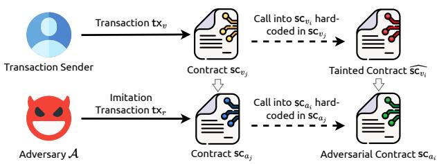  
Figure 5: The invocation to the tainted contract $\widehat { \mathsf { s c } _ { \nu _ { i } } }$ is hardcoded in the contract $\mathsf { s c } _ { \nu _ { j } } .$ . To perform APE, A needs to replace both $\widehat { \mathsf { s c } _ { \nu _ { i } } }$ and $\mathsf { s c } _ { \nu _ { j } }$

Taint Propagation Example. In Figure 4, we showcase how the dynamic taint analysis tracks the execution of $\mathrm { t x } _ { c }$ in the motivating example (cf. Figure 2, Section 2.4), given an adversarial address 0xab..cd. Following the execution, the taint propagates from CALLER to the condition value of JUMPI (cf. PC 0xb27, Figure 4). Furthermore, the condition value is False, which is different from the execution of $\mathrm { t x } _ { \nu }$ . Therefore, A understands that the customized liquidation contract is tainted, and that it needs to be replaced.

## 4.4 Step 4 : Patch Identifier

Recall that tainted basic blocks avoid $\mathrm { t x } _ { c }$ to successfully execute. Hence, A attempts to replace the tainted contracts $\widehat { \mathsf { s c } _ { \nu _ { i } } }$ with $\mathsf { s c } _ { a _ { i } } .$ A moreover needs to replace the beneficiary account identified in step $\textcircled{2}$ so as to collect the financial revenue generated in $\mathrm { t x } _ { c } .$ . The patch identifier aims to detect all contracts out of $\{ \mathsf { s c } _ { \nu _ { i } } \}$ that need to be patched and replaced to successfully imitate $\mathrm { t x } _ { \nu }$ . Depending on whether an invocation to $\widehat { \mathsf { s c } _ { \nu _ { i } } }$ occurs from a transaction or from a contract, A needs to distinguish the following two cases. We use $\overline { { \mathsf { S C } _ { \nu _ { i } } } }$ to denote a contract that must be patched and replaced.

Invocation from a transaction When tx<sub>v</sub> is invoking $\widehat { \mathsf { S C } _ { \nu _ { i } } }$ A should modify the to address of $\mathrm { t x } _ { c }$ from $\widehat { \mathsf { S C } _ { \nu _ { i } } }$ to $\mathsf { s c } _ { a _ { i } }$

Invocation from a contract If the invocation to a tainted contract $\widehat { \mathsf { S C } _ { \nu _ { i } } }$ is hard-coded (bytecode or storage) in a caller contract ${ \mathsf { s c } } _ { \nu _ { j } }$ (cf. Figure 5), A should replace both $\widehat { \mathsf { S C } _ { \nu _ { i } } }$ and $\mathsf { s c } _ { \nu _ { j } }$ to patch the hard-coded statement. This is necessary, even if $\mathsf { s c } _ { \nu _ { j } }$ is not tainted. The above patching procedure may apply iteratively to subsequently hardcoded contract invocations.

## 4.5 Step $\textcircled{5} :$ Smart Contract Synthesis

A proceeds to synthesize adversarial contract(s) to replace every $\overline { { \mathsf { S C } _ { \nu _ { i } } } }$ detected by the patch identifier (cf. Section 4.4). On a high level, to synthesize $\mathsf { s c } _ { a _ { i } }$ , A copies bytecode from $\overline { { \mathsf { S C } _ { \nu _ { i } } } }$ with the following amendments.

For a tainted contract $\widehat { \mathsf { s c } _ { \nu _ { i } } } .$ , A amends every tainted basic block to ensure that $\mathsf { s c } _ { a _ { i } }$ follows the same code path as $\widehat { \mathsf { S C } _ { \nu _ { i } } }$ despite possible inconsistent JUMPI conditions. Specifically, A (i) replaces JUMPI with JUMP, leading to an unconditional jump, or, (ii) removes JUMPI, leading to no jump. If the invocation to $\widehat { \mathsf { S C } _ { \nu _ { i } } }$ is hard-coded in ${ \mathsf { s c } } _ { \nu _ { j } }$ (cf. Figure 5), A needs to modify ${ \mathsf { s c } } _ { a _ { j } }$ to redirect the contract invocation from $\mathsf { s c } _ { a _ { j } }$ to $\mathsf { s c } _ { a _ { i } }$ . In addition, because every newly deployed adversarial contract has an empty storage, $\mathsf { s c } _ { a _ { i } }$ may load an inconsistent value from its storage while $\mathrm { t x } _ { c }$ executes. A hence further modifies $\mathsf { s c } _ { a _ { i } }$ to recover the storage loading.

```solidity
contract Vault {
    function withdraw(bytes32 hash, uint8 v,
        bytes32 r, bytes32 s
) external {
    address signer = ecrecover(hash, v, r, s);
    if (msg.sender == signer) {
        msg.sender.transfer(
            address(this).balance);
    }
}
}
```  
Listing 1: Any account, providing an ECDSA signature signed by its private key, is allowed to withdraw assets from Vault.

The aforementioned amendments ensure that tx has the same execution path (code blocks and contracts) as $\mathrm { t x } _ { \nu } .$ , but do not guarantee that A receives the generated revenue. For example, the revenue generated in $\mathrm { t x } _ { \nu }$ may be sent to an account $a _ { \nu }$ , which is hard-coded in ${ \mathsf { s c } } _ { \nu _ { i } }$ . The synthesized $\mathsf { S C } _ { a _ { i } }$ copies the bytecode from $\mathsf { s c } _ { \nu _ { i } }$ and may follow the same asset transfer (i.e., to $a _ { \nu }$ instead of an account controlled by A). Therefore, to capture the generated revenue, A needs to redirect the relevant asset transfers through modifying EVM memory on the fly and injecting a revenue collection logic to $\mathsf { s c } _ { a _ { i } }$ . Eventually, given the patched bytecode, A updates jump destinations following the code size changes.

## 4.6 Step 6 : Validation

Finally, APE locally validates tx<sub>c</sub> prior to the transaction being mined. APE could fail for two reasons: either (i) the execution may fail, or (ii) the financial revenue cannot cover the cost of deploying adversarial contracts and executing tx<sub>c</sub>.

To perform a concrete validation of the attack, a mining adversary deploys every $\mathsf { S C } _ { a _ { i } }$ and executes tx on the latest blockchain state locally. A converts all received tokens to E to check if tx<sub>c</sub> yields a profit. tx<sub>c</sub> can only yield a profit, if the revenue in E covers all transaction fees including the smart contract(s) deployment fees. Recall that the adversarial con tract(s) deployment, imitation execution, and asset exchange can be completed within one attack transaction. If the validation succeeds, A includes the attack transaction, which frontruns $\mathrm { t x } ,$ in the next block. Otherwise, the attack is aborted, and A bears no expenditure, i.e., APE is risk-free.

## 4.7 Limitations

APE’s design and implementation entails a number of limitations. For instance, we assume that the adversary has a sufficient amount of upfront assets required to execute APE successfully. Given the widespread access to flash loans, upfront capital requirements are solved [47].

APE is not applicable when sophisticated semantic reasoning is necessary. We present an illustrative example in Listing 1, where the contract Vault allows the withdrawal of assets by any account that provides a valid ECDSA signature (v,r,s) signed by its private key. The design of Vault renders a withdraw transaction vulnerable to imitation attacks because of this anyone-can-withdraw logic. Nonetheless, for the adversary to execute the attack automatically, it would require the automation of semantic comprehension and signature generation, which APE does not support.

Moreover, APE cannot imitate non-atomic strategies, i.e., spanning over multiple independent blockchain transactions. For example, given an asset exchange victim transaction, a sandwich attacker [61] may create two adversarial transactions, extracting profit from the victim. The goal of APE is not to generate such an attack. However, if a sandwich adversary creates an atomic sandwich transaction wrapping the victim exchange, APE can successfully challenge this transaction.

In our work, we assume that the victim is not aware of an APE adversary, and the APE attack strategy in particular. If a victim is aware of APE, then the victim could redesign its smart contract to harden its transactions against an APE adversary. The attack approach presented in this paper works well in practice, as we show in Section 5. We outline possible counter-attack strategies in Section 7.

## 5 APE Historical Evaluation

Implementation. We implement APE in 6,582 lines of Golang code. Further details can be found in Appendix B.

We proceed to evaluate how the APE imitation attack could have performed over a timeframe of one year (from the 1st of August, 2021 to the 31st of July, 2022)<sup>6</sup> on Ethereum and BSC, the top two smart contract-enabled blockchains by market capitalization at the time of writing. We evaluate in total 431,416,565 and 2,366,970,381 past transactions on Ethereum and BSC respectively.

## 5.1 Methodology and Setup

We consider every past transaction as a potential victim transaction on which we apply the APE pipeline. If the attack succeeds, we save the associated synthesized smart contract(s), along with the yielded revenue and execution costs (e.g., gas cost for contract deployment and imitation transaction). If no contract replacement is required, APE falls back to the naive imitation attack, which we present separately as a baseline.

While a full archive node can provide the blockchain state at any past block, it does not directly allow the execution of arbitrary transactions on an arbitrary past blockchain state. We therefore implement an emulator for both Ethereum and BSC by customizing go-ethereum and bsc EVM accordingly. The emulator fetches historical states from an archive node and returns the execution result of any given transaction. We perform the experiments on Ubuntu 20.04.3 LTS, with an AMD 3990X (64 cores), 256GB RAM and 8TB NVMe SSD.

## 5.2 Evaluation Results

On Ethereum, from a total of 431,416,565 potential victim transactions mined on-chain, we identify 43,979 (0.0102%) vulnerable to the naive imitation attack (cf. Table 3). APE successfully attacks 26,127 (0.0061%) victim transactions, which involves replacing 665 unique smart contracts.

From the 2,366,970,381 BSC transactions, we discover that the naive imitation is applicable to 516,128 (0.0218%) victim transactions, while APE captures 52,799 (0.0022%) additional transactions, involving 1,193 unique contracts.

Table 3: Overall attack statistics representing the successfully attacked transactions and unique victim contracts.

<table><tr><td>Chain</td><td>Attack</td><td>Transactions</td><td>Contracts</td><td>Overall Profit (USD)</td><td>Average Profit (USD)</td></tr><tr><td rowspan="2">Ethereum</td><td>Naive</td><td>43,979</td><td>NA</td><td>13.87M</td><td>315.48±4.73K</td></tr><tr><td>APE</td><td>26,127</td><td>665</td><td>135.08M</td><td>5.17K±227.22K</td></tr><tr><td rowspan="2">BSC</td><td>Naive</td><td>516,128</td><td>NA</td><td>13.25M</td><td>25.67±1.78K</td></tr><tr><td>APE</td><td>52,799</td><td>1,193</td><td>29.45M</td><td>557.75±55.88K</td></tr></table>

Attack Profit To reasonably measure the attack profit, we need to consider the transaction fee cost required by the contract deployment and imitation transaction. Because block space is limited (e.g., by the Ethereum block gas limit), when performing an APE attack, we need to capture the opportunity cost of a miner’s forgoing transaction fees when not including a victim transaction. We therefore quantify such an opportu nity cost with the transaction fee of APE’s victim transaction. The profit is converted to USD with the ETH (BNB) price at the time of each victim transaction. Note that ETH (BNB) is the native cryptocurrency on Ethereum (BSC).

We present the accumulative profit of APE in Figure 6. On Ethereum, when compared to the naive imitation, APE could have increased the imitation attack profit by 973.6%. Specifically, we find that APE (including the naive imitation attack) generates in total a profit of 148.96M USD, while the accumulative profit of the naive imitation attack over the same timeframe only amounts to 13.87M USD. Quantifying the required upfront capital for the imitation attacks, we find that 99.31% of the successful attacks require less than 5 ETH (including transaction fees).

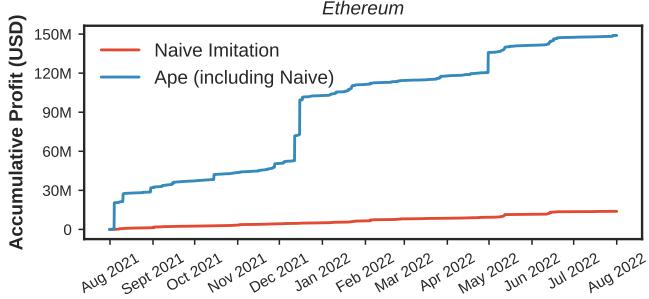

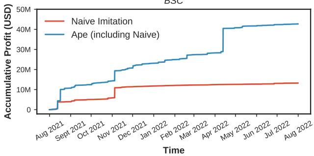  
Figure 6: From the 1st of August, 2021 to the 31st of July, 2022, the total imitation attack profit (including APE and the naive imitation) on Ethereum reaches 148.96M USD, while the accumulative profit of APE is 135.08M USD. On BSC, APE and the naive imitation generate 29.45M USD and 13.25M USD respectively.

On BSC, the naive imitation attack profit accumulates to 13.25M USD, while APE contributes an additional profit of 29.45M USD (+222.3%). 99.48% of the BSC imitation attacks require an upfront capital less than 5 BNB.

We notice that APE captures an order of magnitude higher average profit compared to the naive imitation (cf. Table 3). To further understand the transactions vulnerable to APE, we provide an analysis in Section 5.3.

Gas Consumption APE introduces additional gas costs because the adversary may need to deploy adversarial contracts. We identify two gas-related constraints by which an attack is bound. The revenue from the attack must cover the gas expenditures, and, the gas used to deploy and execute the attack transactions should remain below the block gas limit.

On Ethereum, we find that APE costs 0.98M±0.74M gas on average, while the naive imitation costs 0.45M±0.50M gas (cf. Figure 7). As a reference, at the time of writing, Ethereum applies a dynamic block gas limit with an average of 29.77M. The maximal gas consumption of APE on the identified historical transactions is 23.11M, which is below the average Ethereum block gas limit. On average, the adversarial contract deployment amounts to 48.42% of the attack gas consumption.

On average, BSC has a higher block gas limit (82.66M)

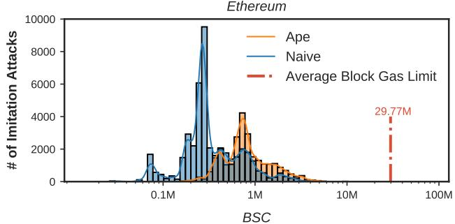

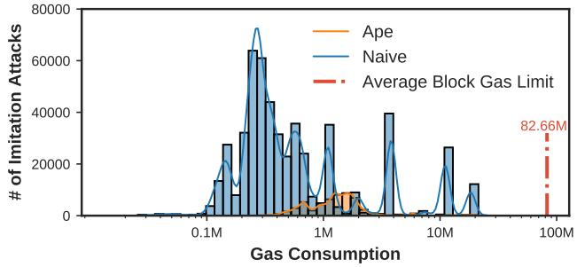  
Figure 7: On average, APE on Ethereum costs 0.98M±0.74M gas per attack, while a naive imitation attack costs 0.45M±0.50M gas. The naive imitation attack on BSC, however, has a higher average gas consumption (1.74M±4.44B) than the APE attack (1.64M±0.64B).

than Ethereum, which allows more space for imitation attacks. We observe that both APE (1.64M±0.64B) and the naive imitation (1.74M±4.44B) have a higher average gas consumption on BSC. The adversarial contract deployment costs on average 53.04% of the APE gas consumption on BSC. Contrary to Ethereum, the naive imitation on BSC has a higher average gas consumption than APE. We therefore analyze the 82,192 naive imitation transactions which cost more than 3M of gas. We identify in total 80,291 transactions that are related to the gas token minting event.<sup>7</sup> After removing the 80,291 outliers, the average gas cost of the naive imitation on BSC is 0.48M±0.55M.

Adversarial Contract On average, an APE attack requires replacing 1.02 ± 0.15 contracts on Ethereum and 1.05 ± 0.23 contracts on BSC. We find that every synthesized adversarial contract is on average 60.95 ± 19.19% smaller (in bytes) compared to the replaced victim contract (cf. Table 4). Because APE may expand victim contracts with synthesized code, we also observe a negative reduction of −295.56%, a worst-case increase of 295.56%. On BSC, the average contract size reduction is 57.59 ± 18.69%, with a maximum increase of 613.33%.

Table 4: Adversarial contract statistics. APE creates at most 3 adversarial contracts on both Ethereum and BSC, with an average of 1.02 and 1.05 respectively.

<table><tr><td colspan="2"></td><td>Mean</td><td>Std.</td><td>Max</td><td>Min</td></tr><tr><td rowspan="2">Ethereum</td><td>Adversarial Contract Number</td><td>1.02</td><td>0.15</td><td>3</td><td>1</td></tr><tr><td>Contract Size Reduction</td><td>60.16%</td><td>19.19%</td><td>98.63%</td><td>-295.56%</td></tr><tr><td rowspan="2">BSC</td><td>Adversarial Contract Number</td><td>1.05</td><td>0.23</td><td>3</td><td>1</td></tr><tr><td>Contract Size Reduction</td><td>57.59%</td><td>18.69%</td><td>99.46%</td><td>-613.33%</td></tr></table>

Table 5: Transaction and profit distributions of the top-100 most rewarding APE victims on Ethereum and BSC. We fail to classify 31 BSC victim transactions.

<table><tr><td rowspan="2">Category</td><td colspan="2">Ethereum</td><td colspan="2">BSC</td></tr><tr><td>transactions</td><td>Profit (USD)</td><td>transactions</td><td>Profit (USD)</td></tr><tr><td>Arbitrage &amp; Liquidation</td><td>55</td><td>8.66M</td><td>13</td><td>506.07K</td></tr><tr><td>Known DeFi Attacks</td><td>29</td><td>73.74M</td><td>40</td><td>22.39M</td></tr><tr><td>Known Vulnerabilities</td><td>2</td><td>795.86K</td><td>-</td><td>-</td></tr><tr><td>Newly Found Vulnerabilities</td><td>14</td><td>30.23M</td><td>16</td><td>1.30M</td></tr></table>

## 5.3 Historical Analysis

To distill insights from APE’s success, we manually investigate the top-100 most rewarding APE victims on Ethereum and BSC, capturing a profit of 113.43M USD (83.97%) and 27.27M USD (92.60%) respectively. The overall transaction and profit distributions are presented in Table 5. We proceed to outline the details of our findings.

Known DeFi Attacks and Vulnerabilities On Ethereum, APE discovers 17 blackhat transactions and 12 proclaimed whitehat transactions corresponding to 13 known DeFi attacks, capturing a total profit of 73.74M USD. The most profitable APE vulnerable transaction 0xcd7d..70fc is a DeFi attack on the Popsicle Finance smart contracts, generating an APE profit of 20.25M USD. Note that this APE profit is lower than the reported attack profit, because we convert APE’s revenue to ETH. An exchange that may incur excessive slippage, particularly for higher amounts.

We detect two transactions that might be related to two disclosed contract vulnerabilities. Transaction 0x2e7d..efea and 0xe12a..755c, respectively involve the victim contracts reported in Auctus ACOWriter vulnerability and BMIZapper vulnerability. However, we could not find the contract operators disclosing public information about these transactions.

On BSC, APE captures 22 DeFi attacks involving 40 transactions, generating a total imitation profit of 22.39M USD.

Details of the identified DeFi attacks and vulnerabilities are outlined in Table 8 and 9, Appendix C. Note that for each attack transaction, we check whether etherscan.io observes the attack on the P2P network. If etherscan would not detect the attack on the P2P network, the attack is likely being propagated privately to miners (e.g., FaaS). We find that 10 of the 12 whitehat attack transactions (corresponding to six attacks) are propagated to miners privately. Whitehat hackers may perfer private communication channels for two purposes: (i) to accelerate the whitehat transaction inclusion on-chain; (ii) to mitigate the possibility of imitation attacks.

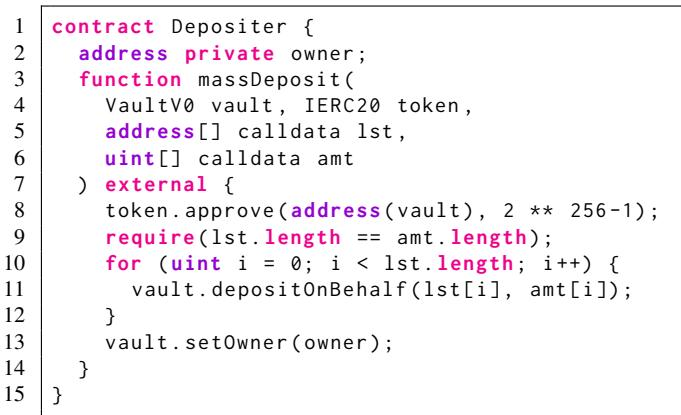  
Listing 2: APE vulnerable Depositer contract, where anyone can invoke the massDeposit() function and propose a vault contract. Our evaluation shows that APE could have caused a potential loss of 28.58M USD to this contract.

Newly Found Vulnerabilities APE uncovers five undisclosed vulnerabilities. Among these vulnerabilities, the most profitable one, named massDeposit, generates a total profit of 28.58M USD and 759.54K USD on Ethereum and BSC respectively. A case study of the massDeposit vulnerability is presented in the following, while the details of other newly found vulnerabilities are provided in Appendix C.

Responsible Disclosure. At the time of writing, all vulnerabilities discovered have no more active funds to be exploited. Yet, new users may interact with such contracts unknowingly despite the present danger. Therefore, we choose to attempt to contact the vulnerable smart contracts through a dedicated blockchain messaging service (Blockscan Chat by Etherscan). Unfortunately, all the vulnerable contracts we identified appear to be anonymously deployed and there is no apparent means to identify an entity or person behind these contracts.

massDeposit Case Study. The massDeposit vulnerability ex ists with a Depositer contract (0xe2c071e1E1957A62fDDf0 199018e061ebFD3ac2C) on Ethereum (cf. Listing 2).<sup>8</sup> Within our evaluation period, the Depositer contract received deposits worth 28.58M USD, later collected by a vault contract. We find that the deposited funds could have been stolen through an APE attack due to the following vulnerability details. The massDeposit() function of the Depositor contract takes as argument a vault, which is the contract receiving the totality of the Depositer contract’s funds (cf. Figure 8a). Anyone can call the function massDeposit(), and provide an arbitrary vault contract address. The vault contract is then allowed to collect assets from the Depositer contract. Eventually, Depositer invokes the setOwner() function of vault, attempting to configure the ownership of vault. When observing such a massDeposit transaction, an APE attacker A identifies vault as the beneficiary account. APE then automatically synthesizes an adversarial contract to replace the vault contract (cf. Figure 8b). Recall that when synthesizing a beneficiary contract, APE injects the logic to transfer all collected assets to the adversarial account by the end of the imitation transaction.Therefore, A extracts the assets from Depositer after executing the imitation transaction. It should be noted that, even without APE, an attacker can manually craft an adversarial vault contract to maliciously extract assets from Depositer. We hence classify this contract design as a vulnerability.

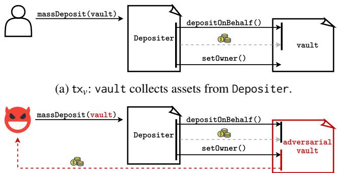  
(b) tx<sub>c</sub>: APE automatically synthesizes an adversarial vault, which transfers collected assets to the adversarial account by the end of the transaction.  
Figure 8: The massDeposit vulnerability.

## 6 APE Real-time Evaluation

Ideally, an APE-enabled miner attempts to identify in realtime the optimal transaction order for its mined blocks. As such, given a list of unconfirmed transactions, the miner could apply every combination of transactions to identify APE’s optimal revenue. However, exploring such combinations will soon result in a combinatorial explosion.

Therefore, we shall come up with a more realistic, yet besteffort solution for the miner’s transaction ordering. We can borrow the widely adopted assumption [61], that transactions are typically sorted by their fee amount within a blockchain block. As such, in a fee-ordered list, we know for a victim transaction v , that the APE transaction should also be placed at position i. While the EVM currently only supports the sequential execution of transactions, promising efforts on speculative parallel execution [10] could speed up the block validation as well as the victim transaction identification in APE. Such a parallel execution framework, however, is beyond the scope of this work.

<div class="mineru-algorithm" style="white-space: pre-wrap; font-family:monospace;">
Algorithm 1: APE Real-time Evaluation.
Input: The current blockchain height $h$; the local memory pool $\mathcal{P}$.
Algorithm RealTimeApe($h$, $\mathcal{P}$):
    $S :=$ blockchain state at height $h$
    foreach $tx_v$ in Sort(Filter($\mathcal{P}$)) do
        Ape($S$, $tx_v$) // Ape executes asynchronously
        $S := tx_v(S)$
    end
end

Function Ape($S$, $tx_v$, $h + 1$):
    $t_0 := now()$
    Apply the APE pipeline (cf. Figure 3)
    if $tx_v$ is vulnerable on $S$ then
        $t_1 := now()$
        store $tx_v$, $t_0$, $t_1$, $h + 1$
    end
end

Function RealtimePerformanceMetrics($t_0$, $t_1$, $h + 1$):
    $t_2 := block h + 1$ arrival time
    single transaction performance := $t_1 - t_0$
    mempool performance := $t_2 - t_1$
end
</div>

## 6.1 Methodology and Setup

To evaluate the real-time performance, we inject the APE logic into an Ethereum (BSC) full node, referred to as an APE node. The APE node listens to the Ethereum (BSC) P2P network and operates APE on every potential victim transaction without publishing the generated attack transaction. The repetitive evaluation process takes the current blockchain height h and the memory pool $\mathcal { P }$ as the input (cf. Algorithm 1). We first rule out the illegitimate transactions (e.g., a transaction with a wrong nonce number) from $\mathcal { P }$ and sort the resulting transactions in a descending gas price order. We then sequentially apply the sorted transactions on the current blockchain state. Given each pair of intermediate state $S _ { i }$ (after applying tx<sub>i</sub>) and following transaction $\mathrm { t x } _ { i + 1 }$ , the APE node executes the attack function $\mathsf { A p e } ( S _ { i } , \mathsf { t x } _ { i + 1 } )$ asynchronously and continues with the next pair $\left( S _ { i + 1 } , \mathsf { t x } _ { i + 2 } \right)$ in a non-blocking manner. If a transaction $\mathrm { t x } _ { \nu }$ is attackable, we replace $( \mathrm { i . e . , \hbar ^ { * } f r o n t - r u n ^ { * } } )$ $\mathrm { t x } _ { \nu }$ with the generated attack transaction. This pipeline corre sponds to an adversarial miner (i) selecting and sorting transactions from its memory pool, (ii) applying every transaction sequentially to construct the next block, and (iii) operating the APE attack when applicable. The APE node repeats this process and records the performance of the following metrics.

Metric 1 (Single transaction performance). The time it takes APE to generate an attack given one victim transaction and the corresponding blockchain state (cf. Algorithm 1).

Metric 2 (Mempool performance). Given the dynamic mempool of transactions in real-time, the time from an APE attack generation to the arrival of the next block, i.e., the target block that should include tx (cf. Algorithm 1).

We execute the real-time evaluation with the same hardware setup as Section 5 and a 10 Gbps Internet connection. To swiftly capture pending transactions, we increase the APE node’s maximum network peers from the default 50 to 500 for Ethereum and BSC. The APE node spawns 150 threads executing the Ape function asynchronously (cf. Algorithm 1).

Weaker Threat Model Note that contrary to the threat model in Section 3.1, in this section, we are not a miner. We further do not have private peering agreements with FaaS and may therefore not observe victim transactions that only FaaS-enabled miners would receive. Compared to the previous threat model, our APE node’s adversarial capability in observing victim transactions is hence weaker. Therefore, in our real-time evaluation, we choose to focus on the computational real-time performance of APE in practice, ignoring the potential financial profit that the APE node could have generated under a weaker threat model. We expect weaker threat models to earn an inferior profit and hence leave such analysis to future work.

## 6.2 Computational Real-time Performance

Our real-time experiment for Ethereum captures 26 days of data. During the experiment, the Ethereum APE node receives 17.86 unique transactions per second on average. We detect in total 4,045 imitation opportunities, including 3,699 transactions vulnerable to the APE attack. The BSC real-time evaluation spans 14 days. Our BSC APE node receives an average of 57.31 unique transactions per second. We identify 489 naive and 784 APE opportunities on BSC.

Table 6 presents the single transaction performance (cf. Metric 1) and the execution time breakdown. On average, it takes $0 . 0 1 \pm 0 . 0 1$ seconds to generate a naive imitation attack, while generating an APE attack requires 0.07 ± 0.10 seconds.

Table 6: Single transaction performance (Ethereum) of the naive and APE imitation attack. Step $\textcircled{1} , \textcircled{3 } ,$ , and $\textcircled{6}$ accounting for 96.35% of the execution time of APE on average. APE shows an equivalent single transaction performance on BSC.

<table><tr><td></td><td>Mean (s)</td><td>Std. (s)</td><td>Max (s)</td><td>Min (s)</td></tr><tr><td>Step 1 DCFG</td><td>0.02</td><td>0.03</td><td>0.36</td><td> $3 \times 10^{-4}$ </td></tr><tr><td>Step 2 Profitability Analyzer</td><td> $2 \times 10^{-3}$ </td><td> $5 \times 10^{-3}$ </td><td>0.10</td><td> $2 \times 10^{-5}$ </td></tr><tr><td>Step 3 Dynamic Taint Analysis</td><td>0.04</td><td>0.06</td><td>1.39</td><td> $3 \times 10^{-4}$ </td></tr><tr><td>Step 4 Patch Identifier</td><td> $2 \times 10^{-5}$ </td><td> $5 \times 10^{-5}$ </td><td> $2 \times 10^{-3}$ </td><td> $1 \times 10^{-6}$ </td></tr><tr><td>Step 5 Smart Contract Synthesis</td><td> $5 \times 10^{-4}$ </td><td> $2 \times 10^{-3}$ </td><td>0.09</td><td> $2 \times 10^{-5}$ </td></tr><tr><td>Step 6 Validation</td><td> $7 \times 10^{-3}$ </td><td>0.02</td><td>0.96</td><td> $2 \times 10^{-4}$ </td></tr><tr><td>Overall time cost of APE</td><td>0.07</td><td>0.10</td><td>1.59</td><td> $9 \times 10^{-4}$ </td></tr><tr><td>Overall time cost Naive Imitation</td><td>0.01</td><td>0.01</td><td>0.11</td><td> $2 \times 10^{-4}$ </td></tr></table>

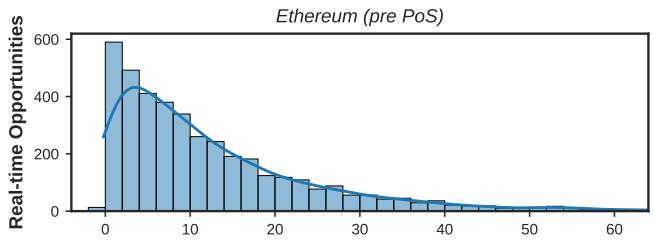

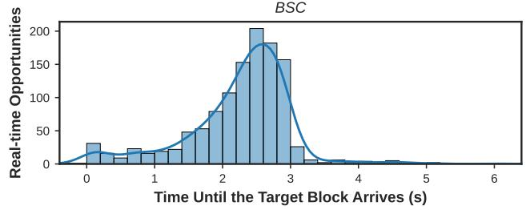  
Figure 9: Distribution of the time duration from the attack generation to the target block reception (cf. Metric 2). 99.68% of the attacks on Ethereum and 99.49% of the attacks on BSC are generated before our APE node receives the next block. We notice that the time distribution on Ethereum resembles an exponential distribution [15] because at the time of the experiment Ethereum follows the Nakamoto consensus [4, 6], while BSC has a less volatile block time interval.

The most time-consuming steps of APE are DCFG (step 1 ), dynamic taint analysis (step 3 ), and validation (step 6 ), accounting for 96.35% of the overall execution time.

We show the mempool performance (cf. Metric 2) in Figure 9. On Ethereum (BSC), 99.68% (99.49%) of the APE attacks are generated before our APE node receives the target block. The time duration from the attack generation to the target block reception is on average 12.56 ± 12.55 (2.24 ± 0.81) seconds. Our evaluation results show the real-time property of APE on Ethereum, with a block interval of 13.3 seconds, and BSC, with a block interval of 3 seconds.

## 7 APE Countermeasures

The imitation attacks pose an imminent threat to the DeFi ecosystem and its users. EVM-compatible blockchains rely on miners to execute and validate every transaction. It is therefore difficult to completely prevent a miner from inspecting and imitating a victim transaction. We consider the following countermeasures that possibly mitigate APE.

Imitation as a Defence Tool A possibly intuitive but effective alternative is to apply imitation as a defence mechanism. Miners could for example resort to automated whitehat hack ing of DeFi attacks by simply imitating attacks and refunding the proceeds to the victim. While miners are currently en trusted to secure the blockchain consensus, they can extend that capacity to the application layer. A bug bounty could incentivise the miners’ altruism. We, however, leave the exploration of a precise incentive structure to future work.

Breaking Atomicity Breaking the atomicity of a profitable transaction can thwart APE, i.e., a user can split the logic of its transaction into multiple independent transactions. APE would then be incapable of capturing the entire logic from any separate transaction and would be unable to mimic it. Moreover, this defense can be implemented in a tool that would take a single transaction as input and automatically split it into multiple transactions with the same program logic. The primary shortcoming of such approach is that it does not apply to all cases (e.g., flash loan). Breaking the atomicity may also introduce additional risks to users (e.g., a partial arbitrage execution leads to a financial loss).

Front-running Mitigation As APE requires that the adversary must be able to front-run a victim transaction, mitigating front-running can prevent an APE attack. The literature explores a variety of front-running mitigation solutions for the time-based transaction order-fairness [9, 27–29, 31, 58]. Although such fair ordering solutions could in principle minimize the threat of APE, they require fundamental changes in either the consensus or the application layer. In particular, [29] necessitates modifications to the underlying blockchain, whereas [28, 58] introduce an additional permissioned committee responsible for transaction ordering and require a DeFi application redesign.

Code Obfuscation Mature blockchains and DeFi applications are not trivial to patch and redesign. There is a need for lightweight workarounds until front-running is mitigated in a more systematic manner. Consequently, one promising solution to the problem is to develop a bytecode-level obfuscation technique. Although code obfuscation has been utilized as a defense mechanism for decades [12, 24], it has not yet been investigated as a countermeasure for smart contract attacks and vulnerabilities. Control flow obfuscation approaches [41], which aim to obscure the flow of a program to make it difficult for dynamic analysis to reason about the code, could be applied. Recall that, to copy the execution path, APE modifies the tainted basic blocks and hard-codes the code jumps (cf. Section 4.5). If both the true and false branch of a tainted basic block are visited in a victim transaction, synthesizing an adversarial contract becomes difficult, because a hard-coded jump can only visit one branch. An APE-specific obfuscation scheme then could be designed so that hard-coded code jumps would result in an infinite loop. Despite the fact that the obfuscation techniques are easy to adopt and provide basic protection against APE, they still have limitations. The primary issue is that sophisticated deobfuscation techniques could be developed to bypass those defenses. An obfuscation defense would also result in more complex contracts, increasing the execution and deployment gas costs. We leave the complete design and evaluation for future work.

Table 7: Systematization of related work on automated smart contract exploitation.

<table><tr><td rowspan="2">Attack/Exploit Generation Tool</td><td rowspan="2">Assumed Prior Knowledge</td><td colspan="2">Contract Vulnerability</td><td colspan="2">Exploit Generation</td><td colspan="2">Practicality</td></tr><tr><td>Searchspace Unrestricted From Vulnerability Patterns</td><td>Cross-Contract Vulnerabilities</td><td>Synthesize Transactions</td><td>Synthesize Contracts</td><td>Real-Time Capable (avg)</td><td>Application Agnostic</td></tr><tr><td colspan="8">Reward based exploit generation (the goal is to extract financial revenue, implicitly capturing vulnerabilities)</td></tr><tr><td>APE</td><td>Exploit transaction</td><td> $\textcircled{D} (limited by tx_v)\dagger$ </td><td>●</td><td>●</td><td>●</td><td>● (0.07 s)</td><td>●</td></tr><tr><td>Naive Imitation [46]</td><td>Exploit transaction</td><td> $\textcircled{D} (limited by tx_v)\dagger$ </td><td>●</td><td>●</td><td>○</td><td>● (0.01 s)</td><td>●</td></tr><tr><td>DEFIPOSER [60]</td><td>DApp Model</td><td> $\textcircled{D} (limited by DApp models)$ </td><td>●</td><td>●</td><td>○</td><td> $\textcircled{D} (5.93\mathrm{\;s})$ </td><td>○</td></tr><tr><td colspan="8">Software pattern exploit generation (the goal is to match/find predefined known vulnerability patterns)</td></tr><tr><td>CONTRACTFUZZER [25]</td><td>Patterns &amp; Contract ABI</td><td>○</td><td>○</td><td>●</td><td>○</td><td>○</td><td>●</td></tr><tr><td>MYTHRIL [13]</td><td>Patterns</td><td>○</td><td>○</td><td>●</td><td>○</td><td>○</td><td>●</td></tr><tr><td>TEETHER [30]</td><td>Patterns</td><td>○</td><td>○</td><td>●</td><td>○</td><td>○</td><td>●</td></tr><tr><td>MAIAN [40]</td><td>Patterns</td><td>○</td><td>○</td><td>●</td><td>○</td><td>● (10 s)</td><td>●</td></tr><tr><td>SOLAR [19]</td><td>Patterns &amp; Contract ABI</td><td>○</td><td>○</td><td>○</td><td>●</td><td>● (8 s)</td><td>●</td></tr></table>

†While not designed to discover new vulnerability patterns, Section 5.3 shows how light manual inspection of successful tx identifies new patterns.

## 8 Related Work

Exploit Tool Systematization We systematize the closest related work in Table 7, focussing on automated exploit gen eration tools. We distinguish among (i) tools that aim to ex tract financial value and capture vulnerabilities in that process [46, 60], (ii) tools detecting pre-defined vulnerability patterns within smart contracts [13, 19, 25, 30, 40].

For reward-based exploitation tools, we find that the naive imitation method [46] outperforms APE in terms of real-time performance due to the simplicity of the string replacing approach. However, over the same evaluation timeframe (cf. Section 5), APE captures higher financial gains and more DeFi attacks compared to the naive method. DEFIPOSER [60] lever ages an SMT solver to identify profitable strategies that can potentially unveil new vulnerability patterns. Nonetheless, the effectiveness of DEFIPOSER relies on the precise modeling of blockchain applications, which requires substantial manual efforts. It is worth noting that the real-time performance of DEFIPOSER hinges on the underlying SMT solver as well as the complexity of the mathematical models.

Tools that detect pre-defined vulnerability patterns within smart contracts take these patterns as input to conduct security analyses. Therefore, such tools may not discover different, or new vulnerability patterns. Yet, MAIAN and SOLAR, are designed to be real-time capable. SOLAR is the only tool prior to APE we are aware of which synthesizes contracts. SOLAR, however, requires access to a smart contract’s ABI. Recall that ABI’s may not be accessible for closed-source smart contracts. To our understanding, SOLAR focuses on vulnerabilities in a single contract and is therefore unlikely to capture composable (i.e., cross-contract) DeFi attacks.

Smart Contract Attacks and Security Atzei et al. [3] provide a survey on attacks against smart contracts. Various papers focus on automatically finding exploits for vulnerable smart contracts by detecting vulnerabilities and generating malicious inputs [18, 30, 40]. Qin et al. [47] explore DeFi attacks through flash loans. Wu et al. [55] propose a platformindependent way to recover high-level DeFi semantics to detect price manipulation attacks.

Static analysis tools [8, 21, 26, 51] such as Securify [52], Slither [17], and Ethainter [7] detect specific vulnerabilities in smart contracts. Typically such tools achieve completeness but also report false positives. Another common approach to detect smart contract vulnerabilities is to employ symbolic execution [20,35,42]. Mythril [13] and Oyente [33] use SMT based symbolic execution to check EVM bytecode and simulate a virtual machine for execution-path exploration. Other tools [23, 25, 39, 56, 57] employfuzzing techniques to detect various vulnerabilities. Instead of employing fuzzing, APE instruments the EVM to dynamically analyze smart contracts in one pass. Recently, bytecode rewriting for patching smart contracts has been explored with SMARTSHIELD [59] and sGuard [38]. EVMPATCH [48] can integrate many static analysis tools to detect vulnerabilities and automate the whole lifecycle of deploying and managing an upgradeable contract.

## 9 Conclusion

The generalized blockchain imitation game is a new class of attacks on smart contract blockchains. Such imitations could be adopted for either selfish outcomes, e.g., a miner adopting APE can appropriate millions of USD worth of DeFi attacks; or, on a brighter note, miners could help defend the DeFi ecosystem as whitehat hackers, by front-running attacks and possibly refunding the resulting revenue to their victim. In this work, we show that such imitation games are practical and can yield significant value on Ethereum and BSC.

## Acknowledgments

We thank the anonymous reviewers for the thorough reviews and helpful suggestions that significantly strengthened the paper. This work is partially supported by Lucerne University of Applied Sciences and Arts, and the Algorand Centres of Excellence programme managed by Algorand Foundation. Any opinions, findings, and conclusions or recommendations expressed in this material are those of the author(s) and do not necessarily reflect the views of the institutes.

## References

[1] Frances E Allen. Control flow analysis. ACM Sigplan Notices, 5(7):1– 19, 1970.

[2] Guillermo Angeris and Tarun Chitra. Improved price oracles: Constant function market makers. In Proceedings of the 2nd ACM Conference on Advances in Financial Technologies, pages 80–91, 2020.

[3] Nicola Atzei, Massimo Bartoletti, and Tiziana Cimoli. A survey of attacks on ethereum smart contracts (sok). In International conference on principles ofsecurity and trust, pages 164–186. Springer, 2017.

[4] Shehar Bano, Alberto Sonnino, Mustafa Al-Bassam, Sarah Azouvi, Patrick McCorry, Sarah Meiklejohn, and George Danezis. Sok: Con sensus in the age of blockchains. In Proceedings of the 1st ACM Conference on Advances in Financial Technologies, pages 183–198, 2019.

[5] Joseph Bonneau. Why buy when you can rent? In International Conference on Financial Cryptography and Data Security, pages 19– 26. Springer, 2016.

[6] Joseph Bonneau, Andrew Miller, Jeremy Clark, Arvind Narayanan, Joshua A Kroll, and Edward W Felten. Sok: Research perspectives and challenges for bitcoin and cryptocurrencies. In 2015 IEEE symposium on security and privacy, pages 104–121. IEEE, 2015.

[7] Lexi Brent, Neville Grech, Sifis Lagouvardos, Bernhard Scholz, and Yannis Smaragdakis. Ethainter: A smart contract security analyzer for composite vulnerabilities. In Proceedings ofthe 41st ACM SIGPLAN Conference on Programming Language Design and Implementation, pages 454–469, 2020.

[8] Lexi Brent, Anton Jurisevic, Michael Kong, Eric Liu, François Gauthier, Vincent Gramoli, Ralph Holz, and Bernhard Scholz. Vandal: A scalable security analysis framework for smart contracts. ArXiv, abs/1809.03981, 2018.

[9] Christian Cachin, Jovana Mici´ c, and Nathalie Steinhauer. Quick order´ fairness. arXiv preprint arXiv:2112.06615, 2021.

[10] Yang Chen, Zhongxin Guo, Runhuai Li, Shuo Chen, Lidong Zhou, Yajin Zhou, and Xian Zhang. Forerunner: Constraint-based specula tive transaction execution for ethereum. In Proceedings of the ACM SIGOPS 28th Symposium on Operating Systems Principles, pages 570– 587, 2021.

[11] Jeremy Clark, Didem Demirag, and Seyedehmahsa Mahsa Moosavi. Sok: Demystifying stablecoins. Communications ofthe ACM, Forth coming, 2019.

[12] Christian Collberg, Clark Thomborson, and Douglas Low. A taxonomy of obfuscating transformations. http://www.cs.auckland.ac.nz/staff-cgi bin/mjd/csTRcgi.pl?serial, 01 1997.

[13] ConsenSys. Mythril. https://github.com/ConsenSys/mythril, 2017. Online; accessed 27 January 2022.

[14] Philip Daian, Steven Goldfeder, Tyler Kell, Yunqi Li, Xueyuan Zhao, Iddo Bentov, Lorenz Breidenbach, and Ari Juels. Flash boys 2.0: Fron trunning in decentralized exchanges, miner extractable value, and con sensus instability. In 2020 IEEE Symposium on Security and Privacy (SP), pages 910–927. IEEE, 2020.

[15] Christian Decker and Roger Wattenhofer. Information propagation in the bitcoin network. In IEEE P2P 2013 Proceedings, pages 1–10. IEEE, 2013.

[16] Shayan Eskandari, Seyedehmahsa Moosavi, and Jeremy Clark. Sok: Transparent dishonesty: front-running attacks on blockchain. In International Conference on Financial Cryptography and Data Security, pages 170–189. Springer, 2019.

[17] Josselin Feist, Gustavo Grieco, and Alex Groce. Slither: a static analysis framework for smart contracts. In 2019 IEEE/ACM 2nd International Workshop on Emerging Trends in Software Engineeringfor Blockchain (WETSEB), pages 8–15. IEEE, 2019.

[18] Yu Feng, Emina Torlak, and Rastislav Bodik. Precise attack synthesis for smart contracts. arXiv preprint arXiv:1902.06067, 2019.

[19] Yu Feng, Emina Torlak, and Rastislav Bodik. Summary-based symbolic evaluation for smart contracts. In 2020 35th IEEE/ACM International Conference on Automated Software Engineering (ASE), pages 1141– 1152. IEEE, 2020.

[20] Joel Frank, Cornelius Aschermann, and Thorsten Holz. {ETHBMC}: A bounded model checker for smart contracts. In 29th {USENIX} Security Symposium ({USENIX} Security 20), pages 2757–2774, 2020.

[21] Neville Grech, Michael Kong, Anton Jurisevic, Lexi Brent, Bernhard Scholz, and Yannis Smaragdakis. Madmax: Surviving out-of-gas con ditions in ethereum smart contracts. Proceedings ofthe ACM on Programming Languages, 2(OOPSLA):1–27, 2018.

[22] Neville Grech, Sifis Lagouvardos, Ilias Tsatiris, and Yannis Smaragdakis. Elipmoc: Advanced decompilation of ethereum smart contracts. Proc. ACM Program. Lang., 6(OOPSLA1), apr 2022.

[23] Gustavo Grieco, Will Song, Artur Cygan, Josselin Feist, and Alex Groce. Echidna: effective, usable, and fast fuzzing for smart contracts. In Proceedings ofthe 29th ACM SIGSOFT International Symposium on Software Testing and Analysis, pages 557–560, 2020.

[24] Shohreh Hosseinzadeh, Sampsa Rauti, Samuel Laurén, Jari-Matti Mäkelä, Johannes Holvitie, Sami Hyrynsalmi, and Ville Leppänen. Diversification and obfuscation techniques for software security: A systematic literature review. Information and Software Technology, 104:72–93, 2018.

[25] Bo Jiang, Ye Liu, and WK Chan. Contractfuzzer: Fuzzing smart contracts for vulnerability detection. In 2018 33rd IEEE/ACM International Conference on Automated Software Engineering (ASE), pages 259–269. IEEE, 2018.

[26] Sukrit Kalra, Seep Goel, Mohan Dhawan, and Subodh Sharma. Zeus: Analyzing safety of smart contracts. In Ndss, pages 1–12, 2018.

[27] Mahimna Kelkar, Soubhik Deb, and Sreeram Kannan. Order-fair consensus in the permissionless setting. IACR Cryptol. ePrint Arch., 2021:139, 2021.

[28] Mahimna Kelkar, Soubhik Deb, Sishan Long, Ari Juels, and Sreeram Kannan. Themis: Fast, strong order-fairness in byzantine consensus. Cryptology ePrint Archive, 2021.

[29] Mahimna Kelkar, Fan Zhang, Steven Goldfeder, and Ari Juels. Orderfairness for byzantine consensus. In Annual International Cryptology Conference, pages 451–480. Springer, 2020.

[30] Johannes Krupp and Christian Rossow. teether: Gnawing at ethereum to automatically exploit smart contracts. In 27th {USENIX} Security Symposium ({USENIX} Security 18), pages 1317–1333, 2018.

[31] Klaus Kursawe. Wendy grows up: More order fairness. In International Conference on Financial Cryptography and Data Security, pages 191– 196. Springer, 2021.

[32] Michael Lewis. Flash boys: a Wall Street revolt. WW Norton & Company, 2014.

[33] Loi Luu, Duc-Hiep Chu, Hrishi Olickel, Prateek Saxena, and Aquinas Hobor. Making smart contracts smarter. In Proceedings of the 2016 ACM SIGSAC conference on computer and communications security, pages 254–269, 2016.

[34] Amani Moin, Kevin Sekniqi, and Emin Gun Sirer. Sok: A classification framework for stablecoin designs. In International Conference on Financial Cryptography and Data Security, pages 174–197. Springer, 2020.

[35] Mark Mossberg, Felipe Manzano, Eric Hennenfent, Alex Groce, Gus tavo Grieco, Josselin Feist, Trent Brunson, and Artem Dinaburg. Man ticore: A user-friendly symbolic execution framework for binaries and smart contracts. In 2019 34th IEEE/ACM International Conference on Automated Software Engineering (ASE), pages 1186–1189. IEEE, 2019.

[36] Satoshi Nakamoto. Bitcoin: A peer-to-peer electronic cash system, 2008. https://bitcoin.org/bitcoin.pdf.

[37] James Newsome and Dawn Xiaodong Song. Dynamic taint analysis for automatic detection, analysis, and signaturegeneration of exploits on commodity software. In NDSS, volume 5, pages 3–4. Citeseer, 2005.

[38] Tai D Nguyen, Long H Pham, and Jun Sun. Sguard: Towards fixing vulnerable smart contracts automatically. In 2021 IEEE Symposium on Security and Privacy (SP), pages 1215–1229. IEEE, 2021.

[39] Tai D Nguyen, Long H Pham, Jun Sun, Yun Lin, and Quang Tran Minh. sfuzz: An efficient adaptive fuzzer for solidity smart contracts. In Proceedings ofthe ACM/IEEE 42nd International Conference on Software Engineering, pages 778–788, 2020.

[40] Ivica Nikolic, Aashish Kolluri, Ilya Sergey, Prateek Saxena, and´ Aquinas Hobor. Finding the greedy, prodigal, and suicidal contracts at scale. In Proceedings of the 34th Annual Computer Security Applica tions Conference, pages 653–663, 2018.

[41] Andre Pawlowski, Moritz Contag, and Thorsten Holz. Probfuscation: an obfuscation approach using probabilistic control flows. In Inter national Conference on Detection of Intrusions and Malware, and Vulnerability Assessment, pages 165–185. Springer, 2016.

[42] Anton Permenev, Dimitar Dimitrov, Petar Tsankov, Dana Drachsler Cohen, and Martin Vechev. Verx: Safety verification of smart contracts. In 2020 IEEE Symposium on Security and Privacy (SP), pages 1661– 1677. IEEE, 2020.

[43] Kaihua Qin, Jens Ernstberger, Liyi Zhou, Philipp Jovanovic, and Arthur Gervais. Mitigating decentralized finance liquidations with reversible call options. In International Conference on Financial Cryptography and Data Security. Springer, 2023.

[44] Kaihua Qin, Liyi Zhou, Yaroslav Afonin, Ludovico Lazzaretti, and Arthur Gervais. Cefi vs. defi–comparing centralized to decentralized finance. In 2021 Crypto Valley Conference on Blockchain Technology (CVCBT). IEEE, 2021.

[45] Kaihua Qin, Liyi Zhou, Pablo Gamito, Philipp Jovanovic, and Arthur Gervais. An empirical study of defi liquidations: Incentives, risks, and instabilities. In Proceedings of the 21st ACM Internet Measurement Conference, page 336–350. ACM, 2021.

[46] Kaihua Qin, Liyi Zhou, and Arthur Gervais. Quantifying blockchain extractable value: How dark is the forest? In 2022 IEEE Symposium on Security and Privacy (SP), pages 198–214. IEEE, 2022.

[47] Kaihua Qin, Liyi Zhou, Benjamin Livshits, and Arthur Gervais. At tacking the defi ecosystem with flash loans for fun and profit. In In ternational Conference on Financial Cryptography and Data Security, pages 3–32. Springer, 2021.

[48] Michael Rodler, Wenting Li, Ghassan O Karame, and Lucas Davi. Evmpatch: timely and automated patching of ethereum smart contracts. In 30th {USENIX} Security Symposium ({USENIX} Security 21), 2021.

[49] Fred B Schneider. Implementing fault-tolerant services using the state machine approach: A tutorial. ACM Computing Surveys (CSUR), 22(4):299–319, 1990.

[50] Edward J Schwartz, Thanassis Avgerinos, and David Brumley. All you ever wanted to know about dynamic taint analysis and forward symbolic execution (but might have been afraid to ask). In 2010 IEEE symposium on Security and privacy, pages 317–331. IEEE, 2010.

[51] Sergei Tikhomirov, Ekaterina Voskresenskaya, Ivan Ivanitskiy, Ramil Takhaviev, Evgeny Marchenko, and Yaroslav Alexandrov. Smartcheck: Static analysis of ethereum smart contracts. In Proceedings ofthe 1st International Workshop on Emerging Trends in Software Engineering for Blockchain, pages 9–16, 2018.

[52] Petar Tsankov, Andrei Dan, Dana Drachsler-Cohen, Arthur Gervais, Florian Buenzli, and Martin Vechev. Securify: Practical security analysis of smart contracts. In Proceedings of the 2018 ACM SIGSAC Conference on Computer and Communications Security, pages 67–82, 2018.

[53] Zhipeng Wang, Kaihua Qin, Duc Vu Minh, and Arthur Gervais. Speculative multipliers on defi: Quantifying on-chain leverage risks. In International Conference on Financial Cryptography and Data Security. Springer, 2022.

[54] Gavin Wood et al. Ethereum: A secure decentralised generalised transaction ledger. Ethereum project yellow paper, 151(2014):1–32, 2014.

[55] Siwei Wu, Dabao Wang, Jianting He, Yajin Zhou, Lei Wu, Xingliang Yuan, Qinming He, and Kui Ren. Defiranger: Detecting price manipulation attacks on defi applications. arXiv preprint arXiv:2104.15068, 2021.

[56] Valentin Wüstholz and Maria Christakis. Harvey: A greybox fuzzer for smart contracts. In Proceedings of the 28th ACM Joint Meeting on European Software Engineering Conference and Symposium on the Foundations ofSoftware Engineering, pages 1398–1409, 2020.

[57] Valentin Wüstholz and Maria Christakis. Targeted greybox fuzzing with static lookahead analysis. In 2020 IEEE/ACM 42nd International Conference on Software Engineering (ICSE), pages 789–800. IEEE, 2020.

[58] Yunhao Zhang, Srinath Setty, Qi Chen, Lidong Zhou, and Lorenzo Alvisi. Byzantine ordered consensus without byzantine oligarchy. In 14th USENIX Symposium on Operating Systems Design and Implemen tation (OSDI 20), pages 633–649, 2020.

[59] Yuyao Zhang, Siqi Ma, Juanru Li, Kailai Li, Surya Nepal, and Dawu Gu. Smartshield: Automatic smart contract protection made easy. In 2020 IEEE 27th International Conference on Software Analysis, Evolution and Reengineering (SANER), pages 23–34. IEEE, 2020.

[60] Liyi Zhou, Kaihua Qin, Antoine Cully, Benjamin Livshits, and Arthur Gervais. On the just-in-time discovery of profit-generating transactions in defi protocols. In 2021 IEEE Symposium on Security and Privacy (SP), pages 919–936, 2021.

[61] Liyi Zhou, Kaihua Qin, Christof Ferreira Torres, Duc V Le, and Arthur Gervais. High-frequency trading on decentralized on-chain exchanges. In 2021 IEEE Symposium on Security and Privacy (SP), pages 428–445. IEEE, 2021.

[62] Liyi Zhou, Xihan Xiong, Jens Ernstberger, Stefanos Chaliasos, Zhipeng Wang, Ye Wang, Kaihua Qin, Roger Wattenhofer, Dawn Song, and Arthur Gervais. Sok: Decentralized finance (defi) attacks. Cryptology ePrint Archive, 2022.

## A Naive Imitation Attack Example

In this section, we show a real-world Ethereum transaction,<sup>9</sup> which is vulnerable to the naive imitation attack (cf. Listing 3). This transaction invokes the function increaseAllowance of an ERC20 token contract GANGSINU<sup>10</sup> and mints one quadrillion of the GANGSINU token to the transaction sender.

```solidity
contract GANGSINU {
    function increaseAllowance(
        address spender,
        uint256 addedValue
    ) public virtual returns (bool) {
        _approve(
            _msgSender(),
            spender,
            _allowances[_msgSender()][spender] +
                addedValue
        );
        _mint(spender, addedValue);
        return true;
    }
}
```  
contract 0x9796Bcece6b6032deB6f097b6F1cc180aE974feC. The function increaseAllowance allows minting an arbitrary amount of the GANGSINU token to the spender address.

At the time of this transaction, one quadrillion of GANGSINU could be exchanged to 36.6 ETH on Uniswap.<sup>11</sup> Note that the function increaseAllowance allows any address to mint an arbitrary amount of GANGSINU. When observing this transaction, a transaction imitation attacker could have called the same contract, front-run the transaction, and atomically exchanged the one quadrillion of GANGSINU to ETH on Uniswap, receiving a revenue of 36.6 ETH.

## B Implementation Details

Code Details While step 2 and 6 are reasonably straightforward, the remaining steps make up for the bulk of the engineering effort. More specifically, step 1 requires building and storing relevant dynamic information while concretely executing a transaction. The goal of step 3 is to discover all tainted blocks within one execution, as in to enable APE’s real-time property. This constraint implies that we do not explore fuzzing or other iterative techniques. The challenge we have to overcome in step $\textcircled{3} ,$ is that when executing $\mathrm { t x } _ { c } ,$ a tainted basic block often leads to a different execution path from $\mathrm { t x } ,$ resulting in an early termination, or failure (e.g., STOP and REVERT). This implies that given multiple tainted basic blocks executed in sequence, a tainted basic block bb may hinder the detection of a subsequent tainted basic block ${ \mathsf { b b } } _ { i + j }$ . We hence instrument the EVM to allow manipulating the stack and forcing tx to follow tx ’s execution path. In step 5 , we amend the bytecode of synthesized contracts to recover storage variables, redirect contract invocations, and fix jump destinations (cf. Section 4.5).

Table 8: Ethereum DeFi attacks and contract vulnerabilities identified by APE from the top-100 profitable victim transactions (ordered by USD profit).

Date APE Profit Observed Description (Block Number) (USD) on P2P Aug-03-2021 (12955063) 20.25M  Popsicle Finance Dec-15-2021 (13810360) 19.70M massDeposit Dec-11-2021 (13786402) 19.12M  Sorbet Finance ✘ Apr-30-2022 (14684307) 9.71M  Saddle Finance ✔ Aug-10-2021 (12995895) 5.69M  Punk Protocol ✔ Apr-30-2022 (14684434) 4.01M  Saddle Finance ✘ Oct-14-2021 (13417956) 3.58M  Indexed Finance Nov-27-2021 (13695970) 2.04M  dYdX deposit vulnerability ✘ Dec-17-2021 (13822426) 2.02M massDeposit Dec-15-2021 (13810426) 1.94M massDeposit Dec-15-2021 (13810215) 1.80M massDeposit Apr-30-2022 (14684518) 1.58M  Saddle Finance Dec-15-2021 (13810374) 1.51M massDeposit Jun-16-2022 (14972419) 1.08M  Inverse Finance Sep-15-2021 (13229001) 1.07M  NowSwap Dec-15-2021 (13810401) 990.50K massDeposit Jan-19-2022 (14037237) 862.22K  Multichain vulnerability ✘ Mar-26-2022 (14460636) 717.80K Œ Auctus Jul-28-2022 (15233205) 695.63K Unautheticated Asset Redemption ✘ Mar-27-2022 (14465382) 657.98K  Revest Finance ✘ Jan-22-2022 (14052155) 519.69K  Multichain vulnerability Nov-27-2021 (13696312) 495.51K  dYdX deposit vulnerability Aug-30-2021 (13124663) 461.29K  Cream Finance Dec-15-2021 (13810162) 442.15K massDeposit Sep-14-2021 (13222312) 433.75K Faulty Authentication Aug-30-2021 (13124635) 392.94K  Cream Finance Aug-30-2021 (13124729) 374.93K  Cream Finance Feb-19-2022 (14234350) 270.39K  RigoBlock ✘ Aug-30-2021 (13124682) 262.65K  Cream Finance ✘ Aug-30-2021 (13124700) 238.17K  Cream Finance ✘ Oct-14-2021 (13418167) 215.28K Faulty Authentication Nov-26-2021 (13687922) 208.02K  Visor Finance Dec-15-2021 (13810232) 173.32K massDeposit Jan-21-2022 (14051020) 134.90K  Multichain vulnerability Aug-31-2021 (13130729) 128.90K Faulty Authentication Aug-30-2021 (13124591) 116.95K  Cream Finance Jan-19-2022 (14036895) 111.10K  Multichain vulnerability ✘ Dec-22-2021 (13857734) 109.62K Faulty Authentication ✘ Mar-27-2022 (14465427) 108.96K  Revest Finance ✘ Jan-21-2022 (14046993) 99.84K  Multichain vulnerability ✘ Jan-18-2022 (14031416) 80.08K  Multichain vulnerability ✘ Dec-12-2021 (13791112) 79.28K  Sorbet Finance vulnerability ✘ Dec-12-2021 (13791101) 79.26K  Sorbet Finance vulnerability ✘ Apr-13-2022 (14575370) 78.05K Œ BasketDAO ✘ Jan-10-2022 (13975768) 72.84K Faulty Authentication ✘

Early abort Recall that in step 4 , A identifies all smart contracts that need to be replaced, i.e., $\overline { { \mathsf { S C } _ { \nu _ { i } } } }$ (cf. Section 4.4). We notice that the replacement of an asset contract (e.g., USDC) creates a new asset with the same contract code but a different financial value. A can abort $\mathbf { A P E } ,$ if at least one of $\overline { { \mathsf { S C } _ { \nu _ { i } } } }$ is such an asset contract. Note that this “early abort” is optional because A can attempt to replace every $\overline { { \mathsf { S C } _ { \nu _ { i } } } }$ and validate the profitability in step 6 . To increase our evaluation efficiency, we choose to abort APE once step 4 detects an asset contract.

Multiple methods may allow to determine whether a contract is an asset contract. Instead of maintaining an asset contract dictionary, we apply a more practical method in our evaluation. We identify unique EVM logs (i.e., events) while executing $\mathrm { t x } _ { \nu }$ . We observe that most asset contract implementations follow a particular asset standard (e.g., ERC20).

Table 9: BSC DeFi attacks and contract vulnerabilities identi fied by APE from the top-100 profitable victim transactions (ordered by USD profit).

<table><tr><td>Date (Block Number)</td><td>APE Profit (USD)</td><td>Description</td></tr><tr><td>Apr-12-2022 (16886439)</td><td>11.52M</td><td>★ Elephant Money</td></tr><tr><td>Aug-16-2021 (10087724)</td><td>5.17M</td><td>★ XSURGE</td></tr><tr><td>Dec-01-2021 (13099703)</td><td>1.06M</td><td>★ CollectCoin</td></tr><tr><td>Apr-09-2022 (16798807)</td><td>561.43K</td><td>★ Gymdefi</td></tr><tr><td>Mar-20-2022 (16221156)</td><td>494.18K</td><td>★ TTS DAO</td></tr><tr><td>Jan-17-2022 (14433926)</td><td>460.99K</td><td>★ Crypto Burgers</td></tr><tr><td>Jan-07-2022 (14161877)</td><td>368.61K</td><td>★ massDeposit</td></tr><tr><td>Nov-23-2021 (12886417)</td><td>340.51K</td><td>★ Ploutoz Finance</td></tr><tr><td>Dec-14-2021 (13478895)</td><td>326.92K</td><td>★ massDeposit</td></tr><tr><td>Jan-17-2022 (14433715)</td><td>289.23K</td><td>★ Crypto Burgers</td></tr><tr><td>Oct-01-2021 (11406815)</td><td>270.06K</td><td>★ Twindex</td></tr><tr><td>Aug-16-2021 (10090827)</td><td>244.50K</td><td>★ XSURGE</td></tr><tr><td>Oct-02-2021 (11410860)</td><td>237.55K</td><td>★ Twindex</td></tr><tr><td>Apr-29-2022 (17361160)</td><td>219.37K</td><td>★ Legend LFW</td></tr><tr><td>Nov-20-2021 (12795006)</td><td>147.39K</td><td>★ Faulty Authentication</td></tr><tr><td>Jun-01-2022 (18305386)</td><td>142.22K</td><td>★ CoFiXProtocol</td></tr><tr><td>Oct-04-2021 (11469791)</td><td>127.29K</td><td>★ WEDEX</td></tr><tr><td>Aug-16-2021 (10090725)</td><td>125.40K</td><td>★ XSURGE</td></tr><tr><td>Aug-12-2021 (9969958)</td><td>99.72K</td><td>★ Maze Protocol</td></tr><tr><td>Aug-12-2021 (9969953)</td><td>99.68K</td><td>★ Maze Protocol</td></tr><tr><td>Aug-12-2021 (9970577)</td><td>99.62K</td><td>★ Maze Protocol</td></tr><tr><td>Feb-07-2022 (15053929)</td><td>80.49K</td><td>★ EarnHub</td></tr><tr><td>Nov-20-2021 (12810507)</td><td>70.50K</td><td>★ Formation.fi</td></tr><tr><td>Feb-07-2022 (15053947)</td><td>68.86K</td><td>★ EarnHub</td></tr><tr><td>May-07-2022 (17602189)</td><td>68.28K</td><td>★ Unautheticated Minting</td></tr><tr><td>Jan-16-2022 (14429051)</td><td>64.54K</td><td>★ Brokoli Network</td></tr><tr><td>Nov-26-2021 (12961048)</td><td>64.39K</td><td>★ Faulty Authentication</td></tr><tr><td>Feb-07-2022 (15053947)</td><td>51.58K</td><td>★ EarnHub</td></tr><tr><td>Aug-12-2021 (9969776)</td><td>49.90K</td><td>★ Maze Protocol</td></tr><tr><td>Aug-12-2021 (9969782)</td><td>49.88K</td><td>★ Maze Protocol</td></tr><tr><td>Dec-05-2021 (13216927)</td><td>49.04K</td><td>★ Unautheticated Asset Redemption</td></tr><tr><td>Dec-05-2021 (13216684)</td><td>46.73K</td><td>★ Unautheticated Asset Redemption</td></tr><tr><td>Mar-13-2022 (16015031)</td><td>45.19K</td><td>★ Paraluni</td></tr><tr><td>Dec-05-2021 (13216787)</td><td>44.50K</td><td>★ Unautheticated Asset Redemption</td></tr><tr><td>Mar-20-2022 (16221176)</td><td>40.91K</td><td>★ TTS DAO</td></tr><tr><td>Feb-18-2022 (15369735)</td><td>37.90K</td><td>★ Unverified Stake</td></tr><tr><td>Jan-20-2022 (14534738)</td><td>35.04K</td><td>★ AstroBirdz</td></tr><tr><td>Feb-07-2022 (15053951)</td><td>35.00K</td><td>★ EarnHub</td></tr><tr><td>Nov-13-2021 (12621548)</td><td>33.21K</td><td>★ Welnance</td></tr><tr><td>Oct-06-2021 (11530941)</td><td>31.32K</td><td>★ Welnance</td></tr><tr><td>Dec-14-2021 (13479338)</td><td>29.15K</td><td>★ massDeposit</td></tr><tr><td>May-07-2022 (17607316)</td><td>28.97K</td><td>★ bistroo</td></tr><tr><td>Aug-16-2021 (10090919)</td><td>28.76K</td><td>★ XSURGE</td></tr><tr><td>Dec-05-2021 (13216448)</td><td>26.80K</td><td>★ Unautheticated Asset Redemption</td></tr><tr><td>Jan-18-2022 (14478911)</td><td>26.04K</td><td>★ Crosswise</td></tr><tr><td>Sep-20-2021 (11086847)</td><td>25.06K</td><td>★ Faulty Authentication</td></tr><tr><td>Dec-14-2021 (13478986)</td><td>22.81K</td><td>★ massDeposit</td></tr><tr><td>Feb-07-2022 (15053956)</td><td>19.98K</td><td>★ EarnHub</td></tr><tr><td>Nov-24-2021 (12909045)</td><td>19.83K</td><td>★ Ploutoz Finance</td></tr><tr><td>Jul-13-2022 (19523981)</td><td>18.95K</td><td>★ SpaceGodzilla</td></tr><tr><td>Feb-18-2022 (15369807)</td><td>16.14K</td><td>★ Unverified Stake</td></tr><tr><td>Feb-07-2022 (15053961)</td><td>14.29K</td><td>★ EarnHub</td></tr><tr><td>Nov-13-2021 (12622514)</td><td>13.03K</td><td>★ Welnance</td></tr><tr><td>Mar-26-2022 (16405137)</td><td>12.21K</td><td>★ Faulty Authentication</td></tr><tr><td>Dec-14-2021 (13478639)</td><td>12.06K</td><td>★ massDeposit</td></tr><tr><td>Jun-20-2022 (18854194)</td><td>11.85K</td><td>★ Whale Finance</td></tr></table>

 — Known DeFi Attacks — Newly Found Vulnerabilities

Whenever an asset contract receives an incoming invocation, the contract generates an event, identifiable by a unique hash value. For example, to identify ERC20 contracts, A checks if an event matches an ERC20 event. If there is a match, the contract generating such event is classified as an ERC20 contract. Our method therefore generalizes to any other asset standards, avoiding to regularly maintain a list of potential asset contracts. Note, however, that this method assumes that an adversary does not emit dummy events because the adversary could otherwise evade APE’s attack.

## C Evaluation Analysis

Table 8 and 9 list the DeFi attacks and contract vulnerabilities identified by APE from the top-100 profitable victim transactions on Ethereum and BSC respectively.

We proceed to outline the newly found vulnerabilities.

Unverified Stake The unverified stake vulnerability exists with an asset staking contract (0x1E97D2363c6261D0ca4 B182c7C670499afB93c73) on BSC. The contract allows a user to stake asset without checking the financial value of the staked asset. An attacker hence can stake self-created assets (essentially a self-deployed smart contract) and immediately unstake with other valuable assets from the staking contract, yielding a profit.

Unauthenticated Minting A token contract (0x0fa73D35 0E5e5bf63863f49Bb4bA3e87A20c93Fb) on BSC allows any account to mint an arbitrary amount of tokens and sell the minted tokens to profit.

Unauthenticated Asset Redemption Contracts outlined in Table 10 allow any account to redeem assets controlled by the contracts.

Table 10: APE identifies two smart contracts with the unauthenticated asset redemption vulnerability.

<table><tr><td>Chain</td><td>Contract Address</td></tr><tr><td>Ethereum</td><td>0xbE5002A6b631570b0970838dcad7dc0AA2525282</td></tr><tr><td>BSC</td><td>0x521ef54063148E5F15F18B9631426175ceE23DE2</td></tr></table>

Faulty Authentication We moreover identify eight vulnerable contracts (cf. Table 11) that are closed-source. By analyzing the corresponding transaction trace, we find that the vulnerabilities fall into the faulty authentication category (i.e., assets controlled by a vulnerable contract can be transferred without an authentication).

Table 11: APE identifies eight closed-source smart contracts with the faulty authentication vulnerability.

<table><tr><td>Chain</td><td>Contract Address</td></tr><tr><td>Ethereum</td><td>0x37F4Bf68Bb295986d8a19E25528C441b5B4d49020xf517A01CE955472d90cD0A8403629a46D7374E310x35ba14eA6935cCbedCD745Ed9096709D3e14D7b30x44cCdCD59984848a749e9f999B08F2b68153e123</td></tr><tr><td>BSC</td><td>0xA6a2158F14F10B2288c914eE03710a5eB2bd3d7b0x47E5a87C15a316040d34d1af075c8Dc6bC0e63c70xaFe1b53405667D098EC7b60C3794418E14A8fd210x60093848a99e0589cdec170C941B6Def5BAc9b95</td></tr></table>