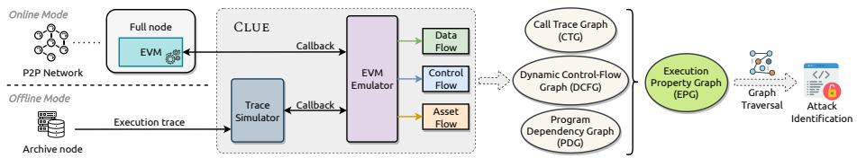
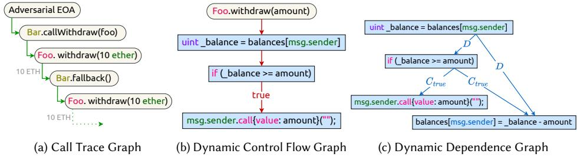
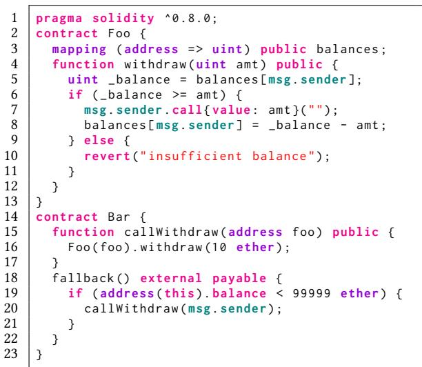
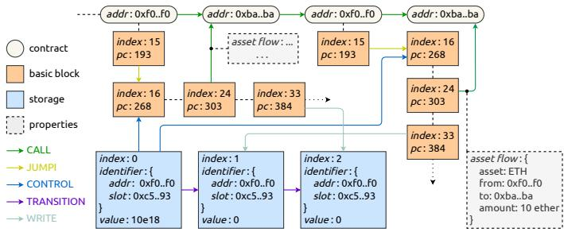
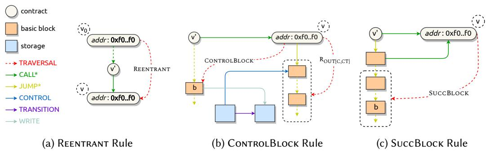
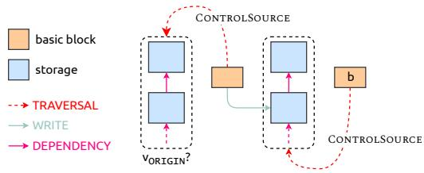

# Enhancing Smart Contract Security Analysis with Execution Property Graphs

KAIHUA QIN∗†‡, Yale University, USA

ZHE YE∗†, UC Berkeley, USA

ZHUN WANG†, UC Berkeley, USA

WEILIN LI, University College London, UK

LIYI ZHOU†‡, The University of Sydney, Australia

CHAO ZHANG, Tsinghua University, China

DAWN SONG†, UC Berkeley, USA

ARTHUR GERVAIS†‡, University College London, UK

Smart contract vulnerabilities have led to significant financial losses, with their increasing complexity rendering outright prevention of hacks increasingly challenging. This trend highlights the crucial need for advanced forensic analysis and real-time intrusion detection, where dynamic analysis plays a key role in dissecting smart contract executions. Therefore, there is a pressing need for a unified and generic representation of smart contract executions, complemented by an eficient methodology that enables the modeling and identification of a broad spectrum of emerging attacks.

We introduce Clue, a dynamic analysis framework specifically designed for the Ethereum virtual machine. Central to Clue is its ability to capture critical runtime information during contract executions, employing a novel graph-based representation, the Execution Property Graph. A key feature of Clue is its innovative graph traversal technique, which is adept at detecting complex attacks, including (read-only) reentrancy and price manipulation. Evaluation results reveal Clue’s superior performance with high true positive rates and low false positive rates, outperforming state-of-the-art tools. Furthermore, Clue’s eficiency positions it as a valuable tool for both forensic analysis and real-time intrusion detection.

CCS Concepts: • Security and privacy → Software security engineering; Intrusion detection systems.

Additional Key Words and Phrases: smart contract security, forensic analysis, intrusion detection

## ACM Reference Format:

Kaihua Qin, Zhe Ye, Zhun Wang, Weilin Li, Liyi Zhou, Chao Zhang, Dawn Song, and Arthur Gervais. 2025. Enhancing Smart Contract Security Analysis with Execution Property Graphs. Proc. ACM Softw. Eng. 2, ISSTA, Article ISSTA049 (July 2025), 22 pages. https://doi.org/10.1145/3728924

∗Both authors contributed equally to this research. †Also afiliated with Berkeley Center for Responsible, Decentralized Intelligence (RDI) ‡Also afiliated with Decentralized Intelligence AG

Authors’ Contact Information: Kaihua Qin, Yale University, USA, kaihua@qin.ac; Zhe Ye, UC Berkeley, USA, zhey@berkeley. edu; Zhun Wang, UC Berkeley, USA, zhun.wang@berkeley.edu; Weilin Li, University College London, UK, weilin.li.24@ucl. ac.uk; Liyi Zhou, The University of Sydney, Australia, liyi.zhou@sydney.edu.au; Chao Zhang, Tsinghua University, China, chaoz@tsinghua.edu.cn; Dawn Song, UC Berkeley, USA, dawnsong@cs.berkeley.edu; Arthur Gervais, University College London, UK, a.gervais@ucl.ac.uk

Permission to make digital or hard copies of all or part of this work for personal or classroom use is granted without fee provided that copies are not made or distributed for profit or commercial advantage and that copies bear this notice and the full citation on the first page. Copyrights for components of this work owned by others than the author(s) must be honored. Abstracting with credit is permitted. To copy otherwise, or republish, to post on servers or to redistribute to lists, requires prior specific permission and/or a fee. Request permissions from permissions@acm.org. © 2025 Copyright held by the owner/author(s). Publication rights licensed to ACM. ACM 2994-970X/2025/7-ARTISSTA049 https://doi.org/10.1145/3728924

  
Fig. 1. High-level architecture of Clue. Clue supports both real-time (online) detection of unconfirmed transactions and postmortem (ofline) analysis of historical traces. At its core, an EVM emulator instruments the runtime to capture detailed execution data, control flow, and asset flow, which are then combined into our unified EPG (cf. Section 3). A graph traversal engine (cf. Section 4) then identifies potential atacks from the constructed EPG. Notably, the transaction trace simulator replays each execution trace so that it appears indistinguishable from a real-time EVM run, allowing the emulator interface to remain consistent across both online and ofline modes (cf. Section 5.1.1 for details).

## 1 Introduction

Despite considerable eforts devoted to securing smart contracts, the community continues to experience attacks that lead to annual cumulative losses surpassing billions of US dollars [43]. Contract audits are a prevalent practice in the blockchain and the Decentralized Finance (DeFi) community to prevent exploits prior to contract deployments. These audits typically combine automated tools, such as static analysis [11, 34], symbolic execution [21, 41], and fuzzing [17, 23], with manual assessments by security auditors. However, while these pre-deployment tools are efective in mitigating some types of bugs, they often overlook the runtime state of smart contracts and fail to capture the unpredictable interactions between diferent contracts, thereby missing complex vulnerabilities. Moreover, the manual assessment process is inherently prone to human error, further exacerbating the challenge of ensuring comprehensive smart contract security.

The complete elimination of vulnerabilities prior to smart contract deployment remains a sig nificant challenge. This reality underscores the critical role of post-attack forensic analysis in smart contract security. Forensic analysis is essential for understanding attack mechanics and identifying specific vulnerabilities, a crucial step given that blockchain user assets may remain vulnerable and still be susceptible to exploitation even after an initial attack [28]. Moreover, similar vulnerabilities might exist in other smart contracts, posing an ongoing risk [43]. Therefore, a comprehensive and eficient forensic analysis is imperative to minimize the chances of further losses. Such analysis necessitates an in-depth examination of specific blockchain transactions, including contract executions and their interactions, where the application of dynamic analysis techniques is particularly advantageous. Not limited to postmortem scenarios, dynamic analysis also serves as a proactive security measure. It can be used to scrutinize pending transactions before their confirmation, efectively functioning as an advanced intrusion detection system.

Existing dynamic analysis solutions for smart contract security are often tailored to specific attacks [15, 31]. This specialization, while valuable for detecting specific attack patterns, restricts their flexibility and extensibility in addressing a broad range of issues. In contrast, some other solutions that aim for a more generic approach fall short in precise data-flow tracking [7], thereby omitting critical runtime information for fine-grained analysis. In this context, the need for a unified representation of contract executions becomes paramount. A fine-grained, comprehensive model that encapsulates the complexities of smart contract interactions and behaviors in a coherent structure is crucial. Such a representation not only facilitates a deeper understanding of contract dynamics but also serves as a foundation for advanced security analyses.

To bridge these gaps, we introduce Clue (cf. Figure 1), a generic dynamic analysis framework for Ethereum virtual machine (EVM) smart contracts. Clue streamlines the security analysis process; it operates at the granularity of individual transactions by tracking contract executions and collecting runtime data — such as dynamic data, control flow, and asset flow — throughout each transaction. Specifically, Clue accepts either live transactions or historical traces as its input, which it tracks in an instrumented environment to capture essential execution information for security analysis. Leveraging these insights, Clue constructs our novel Execution Property Graph (EPG) — a unified representation that interweaves the call hierarchy, asset transfers, control-flow structure, and data dependencies of every transaction. Once the EPG is built, Clue applies a graph traversal mechanism to eficiently detect potential smart contract attacks encoded in specific traversal rules. Through this approach, Clue functions both as a high-speed forensic analysis tool and a real-time intrusion detection system, providing swift identification of suspicious behaviors. Our methodology, centered on the EPG representation, enables concise descriptions and precise identification of contract attacks, thereby elevating the efectiveness of dynamic analysis in smart contract security.

Although various graph-based techniques are well-established in program analysis, their use in dynamic analysis specifically for smart contract security remains relatively underexplored. Prior studies have developed specialized graphs tailored to detect specific types of attacks; for instance, Rodler et al. [31] and Wu et al. [35] each design distinct, customized graph structures aimed at detecting diferent categories of attacks. However, to the best of our knowledge, we are the first to propose a generic graph representation, the EPG, capable of identifying multiple attack types. While certain attack types may still necessitate supplementary information, as demonstrated in Section 5, the extensibility of Clue allows for easy integration of such data without requiring structural modifications. This unified representation provides a foundation for ongoing analysis, facilitating rapid adaptation to emerging attack patterns without the need to reinvent graph structures for each new attack. This responsiveness is crucial for the proactive defense and for advancing smart contract security analysis.

We outline the key contributions of our work as follows.

• We develop a dynamic analysis framework, Clue, for the EVM smart contracts. Clue is designed to track both intra- and inter-contract executions, gathering runtime information that includes data, control, and asset flows.

• We introduce the EPG — a comprehensive and unified graph-based representation that efectively captures the behaviors of smart contract executions, facilitating eficient contract security analysis.

• We introduce an innovative graph traversal technique based on EPG to identify potential smart contract attacks. This approach extracts semantic information from the low-level EPG representation of transactions, automating the detection of malicious patterns without requiring access to the original source code. In this work, we specifically design and implement two graph traversal instances targeting reentrancy attacks (including the recently identified read-only variant) and price manipulation attacks.

• Our traversal-based security analysis achieves a true positive rate (TPR) of 100% and 96.23% for reentrancy and price manipulation, respectively. Meanwhile, it maintains a false positive rate (FPR) of 0.87% and 0.52% for these attacks. In comparison to state-of-the-art (SOTA) dynamic analysis tools for reentrancy and price manipulation, Clue stands out in terms of both eficiency and accuracy. Our evaluations underscore the eficiency of Clue, which on average completes the analysis of a transaction in 169ms. This performance highlights Clue’s potential as a real-time intrusion detection system. We further show that Clue successfully detects the read-only reentrancy attack, a recently disclosed attack, which eludes detection by the related work.

## 2 Background

## 2.1 Blockchain and Decentralized Finance

The advent of Bitcoin [22] marked the beginning of a new era of decentralized databases known as blockchains. A blockchain is a peer-to-peer distributed database that consists of a series of blocks, each containing a list of transactions. In a blockchain, accounts are represented through unique addresses, and an address can claim ownership of data attributed to it. Every transaction represents a change in the state of the blockchain, such as a transfer of ownership or funds. In addition to simple transfers of funds, transactions can carry quasi-Turing-complete transition functions, which are realized in the form of so-called smart contracts. Smart contracts in essence are programs running on top of blockchains and allow the implementation of various applications, including financial products, i.e., DeFi. These DeFi applications enable a plethora of use cases, such as financial exchanges [37], lending [27], and flash loans [28].

## 2.2 Ethereum Virtual Machine

Smart contracts are typically executed within a virtual machine (VM) environment. One of the most popular VMs for this purpose is the EVM, which we focus on within this work. EVM supports two types of accounts: (i) the externally owned account (EOA), which is controlled by a cryptographic private key and can be used to initiate transactions, and (ii) the smart contract, which is bound to immutable code and can be invoked by other accounts or contracts.

The code for an EVM contract is usually written in a high-level programming language (e.g., Solidity), and then compiled into EVM bytecode. When users want to invoke the execution of a smart contract, they can send a transaction from their EOA to the target contract address, including any necessary parameters or data. An invoked contract can also call other smart contracts within the same transaction, enabling complex interactions between diferent contracts. EVM utilizes three main components to execute a smart contract: the stack, memory, and storage. The stack and memory are volatile areas, which are reset with each contract invocation, for storing and manipulating data, while the storage is persistent across multiple executions.

While EVM was originally created for the Ethereum blockchain, it has been adopted by a variety of blockchains beyond Ethereum, including BNB Smart Chain and Avalanche. Throughout this work, we focus on the context of Ethereum, but it is worth noting that the contract execution representation EPG and the dynamic analysis framework Clue can also be applied to other EVMcompatible blockchains.

## 2.3 Smart Contract Security

Smart contracts can have bugs and vulnerabilities, just like programs written for traditional systems. Both the academic and the industry communities have therefore adopted tremendous eforts at securing smart contracts. Most of the eforts to date have focused on the smart contract layer, where manual and automated audits aim to identify bugs before a smart contract’s deployment. Despite these eforts, smart contract vulnerabilities have resulted in billions of dollars in losses [43]. As we will explore in this work, detecting and investigating attacks, forensics in general, is a tedious manual efort that we aim to simplify.

## 3 Execution Property Graph

Code representation is a well-studied topic in program analysis literature [3]. Classic code repre sentations, including abstract syntax tree (AST) [1], control-flow graph (CFG) [2], and program dependence graph (PDG) [12], are also applicable to smart contract analysis. Despite their efectiveness in identifying particular contract vulnerabilities [20, 30, 34], these static representations ignore the dynamic information exposed in the concrete contract executions, which we aim to capture in this work. Specifically, in the following, we demonstrate (cf. Figure 2) how to represent smart contract executions with the call trace graph (CTG), dynamic control-flow graph (DCFG), and dynamic dependence graph (DDG). We then illustrate the construction of the EPG by consolidating these three fundamental representations.

  
Fig. 2. Contract execution representations for the reentrancy example in Listing 1. In Figure 2c, � and � indicate control and data dependency respectively.

## 3.1 Property Graph

A property graph is a multi-relational graph, where vertices and edges are attributed with a set of key-value pairs, known as properties [33].

Contrary to a single-relational graph, where edges are homogeneous in meaning, edges in a property graph are labeled and thus heterogeneous. Properties grant a graph the ability to represent non-graphical data (e.g., diferent types of relationships between entities in a social network graph). A property graph is formally defined in Definition 3.1.

Definition 3.1 (Property Graph). A property graph is defined as $G \ : = \ : ( V , E , \lambda , \mu )$ , where � is a set of vertices and $E \subseteq ( V \times V )$ is a set of directed edges. $\lambda : E \to \Sigma$ is an edge labeling function that labels edges with symbols from the alphabet Σ, while $\mu : ( V \cup E ) \times K \to S$ assigns key-value properties to vertices and edges, where � is a set of property keys and � is a set of property values.

  
Listing 1. Reentrancy vulnerability example. The contract Foo contains a reentrancy vulnerability (line 7 and 8), which an atacker can exploit with the contract Bar.

In this work, $K ^ { V }$ and $K ^ { E }$ denote the property key sets of vertices and edges respectively, s.t. $K = K ^ { V } \cup K ^ { E }$ . We use $S ^ { k }$ to denote the set of property values associated with the property key $k \in K .$

## 3.2 Running Example

As a running example, we consider a thoroughly studied contract vulnerability, reentrancy, which results in the infamous “The DAO” attack [4, 5]. Listing 1 features two contracts, the vulnerable contract Foo and the adversarial contract Bar. Foo allows users to keep a balance of ETH (the native cryptocurrency on Ethereum) at their address, and also allows withdrawing the deposited ETH. The withdraw function, however, performs the withdraw transaction prior to deducting the account balance (line 7 and 8, Listing 1) — and is hence vulnerable to reentrancy. Bar exploits the reentrancy through repeated, reentrant calls. An adversary calls the callWithdraw function of Bar and Bar further calls the withdraw function of Foo. In the withdraw function, when Foo sends the specified amount of ETH to Bar (cf. line 7, Listing 1), the fallback function of Bar is triggered. This fallback function invocation allows repeated ETH withdrawals from Bar.

Note that the graphs in Figure 2 may appear trivial to generate by parsing the transaction execution trace with the smart contract source code. However, in practice, contracts are not always open-source, especially malicious ones such as Bar. Consequently, it is more practical and robust to build smart contract execution representations based on the bytecode instead of any high-level language. Although Figure 2 presents Solidity for clarity in examples, we clarify that our contract execution representation EPG bases on the EVM bytecode and does not require access to the contract source code.

## 3.3 Call Trace Graph

In a transaction, multiple smart contracts can be invoked in a nested and successive manner. We show in our reentrancy example that the contract Foo and Bar invoke each other repeatedly. Such contract invocations can be structured into a CTG (cf. Figure 2a). Given a transaction, the CTG captures the sequence and hierarchy of contract invocations. Ignoring the detailed executions within a contract, every invocation in a CTG is abstracted into a quintuple: (i) from address — caller; (ii) to address — callee; (iii) invocation opcode — the triggering opcode (CALL, DELEGATECALL, CALLCODE, STATICCALL); (iv) call value — the amount of ETH transferred with the call; (v) call data — call parameters.

Owing to its simplicity, the concept of CTG is extensively employed in contract security analysis, particularly for manual attack postmortem processes. Popular EVM transaction decoders, such as ethtx.info, essentially display the CTG of a given transaction to enhance interpretation.

Formally, a CTG property graph is defined by $G _ { T } ~ = ~ \left( V _ { T } , E _ { T } , \lambda _ { T } , \mu _ { T } \right)$ . In a CTG, vertices $V _ { T }$ correspond to contracts, while edges $E _ { T }$ represent invocations from a caller vertex to a callee vertex (cf. Figure 3). It is important to note that $\mu _ { T }$ assigns the asset flow property to $e _ { T } \in E _ { T }$ when �� is associated with asset transfers. There are generally two types of assets in EVM: (i) the native cryptocurrency ETH, and (ii) assets realized by smart contracts (e.g., fungible tokens). The property value of asset flow includes the transferred asset, from and to address, as well as the transfer amount. In Figure 3, we present an asset flow property of 10 ether from a victim contract 0xf0..f0 to an attack contract 0xba..ba during a reentrant call, which can be used to indicate a reentrancy attack.

## 3.4 Dynamic Control-Flow Graph

A CFG represents smart contract code as a graph, where each vertex denotes a basic block. A basic block is a piece of contract code that is executed sequentially without a jump. Basic blocks are connected with directed edges, representing code jumps in the control flow.

A CFG is a static representation of contract code, but can also be constructed dynamically while a contract executes, i.e., a so-called DCFG. Figure 2b shows the DCFG of the Foo contract (cf. Listing 1) during the reentrancy exploit. Contrary to the CFG, a DCFG focuses on the dynamic execution information, hence ignoring the unvisited basic blocks and jumps. For instance, the code at line 10, Listing 1 is not included in the DCFG (cf. Figure 2b). Formally, a DCFG can be defined as $G _ { C } = ( V _ { T } \cup V _ { C } , E _ { C } , \lambda _ { C } , \mu _ { C } )$ , where $V _ { T }$ and $V _ { C }$ represent the contract and basic block vertices respectively. Edges $E _ { C }$ indicate code jumps between basic blocks (cf. Figure 3).

  
Fi . 3. Partial EPG of the reentranc atack transaction (cf. Section 3.2). The EPG is a com osite structure formed by merging three fundamental property graphs: CTG, DCFG, and DDG. The CTG comprises contract vertices interconnected by CALL edges, which may be assigned with asset flow properties. A DCFG is initialized with a contract vertex, followed by basic block vertices linked via JUMPI edges. Building upon the DCFG, the DDG introduces data source vertices (e.g., storage) and incorporates edges (e.g., CONTROL) to represent data and control dependencies

## 3.5 Dynamic Dependence Graph

The PDG is another form of code representation outlining the dependency relationship in a program. There are two main types of dependencies, data flow dependency and control flow dependency [16]. An instruction � has a flow dependency on an instruction �, if� defines a value used by �. Note that data flow dependencies are transitive, i.e., if � is dependent on � and � is dependent on �, then � is dependent on �. For control dependency, informally, an instruction � has a control dependency on a branching instruction �, if changing the branch target for � may cause � not to be executed.

Similar to how a DCFG is constructed from concrete executions, a PDG can also be built dynamically, which is referred to as a DDG. We present the DDG of our reentrancy example in Figure 2c, where � and � denote data and control dependency, respectively.

The DDG is built upon the DCFG. Formally, a DDG $G _ { D } = ( V _ { T } \cup V _ { C } \cup V _ { D } , E _ { D } , \lambda _ { D } , \mu _ { D } )$ contains contract vertices $V _ { T }$ , basic block vertices $V _ { C }$ , and data source (e.g., storage) vertices $V _ { D }$ , while edges $E _ { D }$ represent the data and control dependencies (cf. Figure 3).

As shown in Figure 3, a TRANSITION edge connects two data source vertices whenever the value of a data source is updated. A WRITE edge links the basic block vertex $v _ { T }$ , which executes the data writing operation (e.g., SSTORE), to the updated data source vertex $v _ { D }$ . A control dependency edge — labeled CONTROL — connects the data source vertex of a JUMPI condition to the corresponding target basic block vertex. Furthermore, if the content written by one data source depends on another, they are connected by a DEPENDENCY edge. Although DEPENDENCY edges are not shown in Figure 3, they are widely used in the price manipulation traversal (cf. Figure 5, Section 4.2.2).

## 3.6 Constructing the Execution Property Graph

The EPG is constructed by merging the three basic property graphs (cf. Definition 3.2). Because every DCFG originates from a contract vertex and the DDG is built upon the DCFG, the graph merging process is straightforward.

Definition 3.2 (Execution Property Graph). An EPG $G = \left( V , E , \lambda , \mu \right)$ is constructed by merging CTG, DCFG, and DDG, s.t.,

$$
\begin{array}{l l} V = V _ {T} \cup V _ {C} \cup V _ {D} & E = E _ {T} \cup E _ {C} \cup E _ {D} \cup {\bf T} (E _ {T}) \\ \lambda = \lambda_ {T} \cup \lambda_ {C} \cup \lambda_ {D} & \mu = \mu_ {T} \cup \mu_ {C} \cup \mu_ {D} \qquad \Sigma = \Sigma_ {T} \cup \Sigma_ {C} \cup \Sigma_ {D} \end{array}
$$

(1)

where $\lambda = \lambda _ { T } \cup \lambda _ { C } \cup \lambda _ { D }$ means that for each edge $e \in E , \lambda ( e ) = \lambda _ { T } ( e ) { \mathrm { ~ i f ~ } } e \in E _ { T } , \lambda ( e ) = \lambda _ { C } ( e )$ if $e \in E _ { C } ,$ , and $\lambda ( e ) = \lambda _ { D } ( e ) { \mathrm { i f } } e \in E _ { D }$ (and similarly for $\mu = \mu _ { T } \cup \mu _ { C } \cup \mu _ { D } ) . \mathbf { T } : V _ { T } \times V _ { T }  V _ { C } \times V _ { T }$ is a transformation function, elaborated further in the following.

To incorporate more execution details into the EPG, we apply the transformation function T to the CTG edges $E _ { T }$ . For every $e _ { T } \in E _ { T }$ , T generates a new edge $e _ { T } ^ { \prime }$ and inserts it into the EPG. The label and properties of $e _ { T } ^ { \prime }$ are inherited from $e _ { T { \mathrm { : } } }$ , while the tail vertex of $e _ { T } ^ { \prime }$ is changed from the caller contract vertex to the basic block vertex initiating the contract invocation. The generated edges enable the EPG to capture contract invocations in a more granular manner.

Figure 3 presents the EPG of the reentrancy attack transaction (cf. Section 3.2), with unnecessary details omitted. From the diagram, it is evident that the balance update (i.e., the storage write) occurs after the ETH transfer, constituting the root cause of this reentrancy vulnerability.

## 4 Traversals-based Security Analysis

The EPG provides extensive information about the contract executions involved in a transaction. In this section, we explore how graph traversals, a prevalent method for mining information in property graphs, identify contract attacks.

## 4.1 Rationale

The literature suggests that the primary objective of an individual executing a smart contract attack is typically to obtain financial gain [43]. By exploiting vulnerabilities, an attacker may illicitly acquire financial assets in a way that deviates from the intended design of the compromised contract. As a result, an attack transaction often entails the transfer of assets from the victim to the attacker. To perform a comprehensive security analysis, it is crucial to identify suspicious asset transfers within a transaction. More specifically, a profound understanding of the root cause of a contract attack necessitates an in-depth examination of the underlying mechanisms by which the attacker procures assets from the victim.

For example, in the context of a reentrancy attack (cf. Section 3.2), the attacker can repeatedly invoke a vulnerable contract in a reentrant fashion. To detect such an attack, it is vital to pinpoint the specific asset transfers associated with the reentrant contract calls. Moreover, a reentrancy attack exploits the inconsistent contract state, which is modified subsequent to the malicious asset transfer. The extensive runtime information contained in the EPG enables the detection of suspicious execution patterns, such as reentrant contract invocations and inconsistent contract states. This identification can be achieved by traversing the graph and conducting an appropriate search, as further elaborated in Section 4.2.1.

We therefore propose Clue, a framework employs EPG traversals to enable automated transaction security analysis. The goal of traversing the EPG is to infer high-level semantic information from low-level graphic representations and subsequently identify malicious logic patterns. This inference process does not necessitate the knowledge of the application-level logic, rendering the methodology more generic and extensible. Nonetheless, for specific attacks, such as price manipulation, relying solely on graph traversal may result in high FPR and false negative rate (FNR). To address these attacks, our methodology also supports integrating corresponding domain knowledge (e.g., estimating price change to detect price manipulation attack) into the traversal process, which can substantially decrease the FPR and FNR. We present the details in Section 5.

## 4.2 Traversal Details

In the following, we delve into the traversal specifics for the two most prevalent real-world attacks: reentrancy and price manipulation. To ease explanation, we define the transitive closure function as outlined in Equation 2, which returns all vertices in � from which some vertex in � can reach by following a sequence of edges labeled with any label from a set Λ representing specific edge types.

  
Fig. 4. Three traversal rules of the reentrancy atack detection. CALL\* represents all edge labels of $E _ { T }$ and $\mathbf { T } ( E _ { T } )$ , JUMP\* represents all edges of $E _ { C } .$ . Except TRAVERSAL, doted edges represent one or more edges with internal vertices omited. TRAVERSAL ed es re resent the result of traversal execution. $\mathsf { R } _ { \mathsf { O u r } _ { C , C T } }$ denotes a recursive traversal following outgoing edges of $E _ { C }$ and $\mathbf { T } ( E _ { T } )$

$$
\begin{array}{c} \text {transitiveClosure} (S, \Lambda , V) = \left\{v \in V \mid \exists s \in S, \exists k \geq 1, \exists v _ {1}, \ldots , v _ {k} \in V: \right. \\ v _ {0} = s, \quad v _ {k} = v, \quad \forall i \in \{0, \ldots , k - 1 \}, \lambda ((v _ {i}, v _ {i + 1})) \in \Lambda \Bigg \} \end{array}\tag{2}
$$

Similarly, revClosure(�, Λ, � ) represents all vertices in � from which some vertex in � is reachable by following a sequence of edges labeled with any label from Λ.

4.2.1 Reentrancy. The concept of reentrancy vulnerability has been well explored in prior research. Specifically, the reentrancy attack is defined by three key characteristics: (i) the presence ofreentrant contract calls, (ii) the control of asset transfers relying on outdated storage values, and (iii) storage updates subsequent to asset transfers [31].

We therefore propose a method for identifying reentrancy attacks based on three traversal rules (i.e., Reentrant, ControlBlock, and SuccBlock) that capture the aforementioned characteristics. These rules are illustrated in Figure 4 and formalized in Algorithm 1. Specifically, Reentrant navigates the CALL edges, identifying pairs of contract vertices with identical contract addresses to detect reentrant calls (cf. line 1, Algorithm 1 and Figure 4a). For each identified reentrant pair, ControlBlock (cf. line 2–5, Algorithm 1 and Figure 4b) traverses the DCFG to locate the basic block vertices of the reentrant call that are associated with asset flows. Additionally, ControlBlock searches for storage vertices updated within the parent calls (via WRITE edges) while controlling the basic blocks in the reentrant call (via CONTROL edges), which indicate that the asset transfer potentially relies on an outdated value. Note that storage vertices connected by TRANSITION edges represent the same storage variable being updated. Moreover, SuccBlock ensures that the storage update occurs after the reentrant call (cf. line 6–7, Algorithm 1 and Figure 4c). We remark that, while Figure 4 presents the three rules separately for clarity, they are in practice executed simultaneously rather than in isolation.

Notably, our traversal approach comprehensively addresses all three types of classic reentrancy attacks (i.e., cross-contract, delegated, create-based reentrancy) as discussed in [31], owing to the EPG’s unified model that captures all forms of contract calling.

Algorithm 1: Reentrancy Traversal
Input : EPG $G = (V, E, \lambda, \mu)$
Output : True if a reentrancy attack is detected; False otherwise
foreach $(u, v) \in V_T \times V_T$ such that $\mu(u, addr) = \mu(v, addr)$ and $\exists k \geq 2$, $\exists v_0, v_1, \ldots, v_k \in V_T$ with $v_0 = u, v_k = v$, and $\forall i \in \{0, 1, \ldots, k-1\}$, $\lambda((v_i, v_{i+1})) = \text{CALL do}$ $\mathcal{B} \leftarrow$ The set of basic block vertices of $v$ that are associated with asset flows
    $\mathcal{D} \leftarrow \{ d \in V_D \mid \exists b \in \mathcal{B} : \lambda((d, b)) = \text{CONTROL} \}$ $\mathcal{D}_{\text{old}} \leftarrow \text{revClosure}(\mathcal{D}, \{\text{TRANSITION}\}, V_D)$ $\mathcal{W} \leftarrow \{ w \mid \exists d \in \mathcal{D}_{\text{old}} : \lambda((w, d)) = \text{WRITE} \}$
    foreach $w \in \mathcal{W}$ do
        if $w$ executes after the invocation of $v$ then return true
return false

  
Fig. 5. Overview of WriteControl traversal used in price manipulation detection. WriteControl identifies asset flows (denoted by the basic block b in the figure) that depend on some data sources manipulated without authentication. �ORIGIN? checks if the sender address is the data source of the storage variables.

4.2.2 Price Manipulation. Price manipulation attacks in smart contracts typically involve exploiting vulnerabilities to manipulate asset prices, often by tampering with price oracles. In cases where a price manipulation attack occurs within a single transaction, the attacker can alter the price, typically stored in the contract storage, and subsequently profit by, for instance, exchanging assets at the manipulated price. This type of attack entails an asset transfer, the amount of which is influenced by the manipulated storage.

Figure 5 visualizes our price manipulation traversal, termed WriteControl, which is outlined in Algorithm 2. On a high level, the traversal identifies asset transfers that are “influenced” by prior storage changes and check whether these changes are authenticated. The process involves two stages of the ControlSource traversal that identify all control data sources associated with a given basic block. Let $V _ { \mathrm { t r a n s f e r } }$ denote the set of all basic block vertices associated with asset transfers. In the first stage (cf. lines 1–3, Algorithm 2), ControlSource is applied to $V _ { \mathrm { t r a n s f e r } }$ to collect every data source governing asset transfers throughout the transaction. Next, we reverse-traverse the WRITE edge (cf. line 4, Algorithm 2) to pinpoint the basic block vertices that manipulate these data sources. We verify whether the manipulation is authenticated by checking if the transaction sender’s data source, �ORIGIN, is among the collected control sources. This is done by applying ControlSource again on the basic block vertices identified as manipulating asset transfers (cf. lines 5–8, Algorithm 2). If �ORIGIN is absent, we conclude that unauthenticated price manipulation has likely occurred.

## 5 Experimental Evaluation

In this section, we evaluate Clue to answer the following research questions.

RQ1 How efectively does Clue detect the targeted vulnerabilities — reentrancy and price manipulation — in terms of true/false positives and negatives?

RQ2 Is Clue eficient enough for real-time deployment, considering its runtime overhead?

Algorithm 2: Price Manipulation Traversal
Input : EPG $G = (V, E, \lambda, \mu)$
Output: Price manipulation attack detection result
$\mathcal{B} \leftarrow \text{transitiveClosure}(V_{\text{transfer}}, \{\text{CALL}, \text{JUMP}\}, V_T \cup V_C)$ $\mathcal{D} \leftarrow \{ d \mid \exists b \in \mathcal{B} : \lambda((d, b)) = \text{CONTROL} \}$ $\mathcal{D}^+ \leftarrow \text{revClosure}(\mathcal{D}, \{\text{DEPENDENCY}\}, V_D)$ $\mathcal{B}_{\text{manipulate}} \leftarrow \{ b \mid \exists d \in \mathcal{D}^+ : \lambda((b, d)) = \text{WRITE} \}$ $\mathcal{B}_{\text{manipulate}}^+ \leftarrow \text{transitiveClosure}(\mathcal{B}_{\text{manipulate}}, \{\text{CALL}, \text{JUMP}\}, V_T \cup V_C)$ $\mathcal{D}_{\text{manipulate}} \leftarrow \{ d \mid \exists b \in \mathcal{B}_{\text{manipulate}}^+ : \lambda((d, b)) = \text{CONTROL} \}$ $\mathcal{D}_{\text{manipulate}}^+ \leftarrow \text{revClosure}(\mathcal{D}_{\text{manipulate}}, \{\text{DEPENDENCY}\}, V_D)$
return $v_{\text{ORIGIN}} \notin \mathcal{D}_{\text{manipulate}}^+$

RQ3 How does Clue’s detection capability compare to SOTA dynamic analysis tools?

RQ4 To what extent does the integrated EPG structure enhance detection accuracy compared to

partial representations (omitting CTG, DCFG, or DDG)?

For RQ1, we measure Clue’s detection accuracy on real-world transactions by analyzing standard metrics including FPR and FNR. For RQ2, we assess Clue’s performance overhead by evaluating its average detection time per transaction, thereby determining its viability for real-time deployment. For RQ3, we compare Clue with SOTA detection tools, focusing on accuracy and runtime overhead, on the same datasets to ensure a fair comparison. Finally, for RQ4, we conduct an ablation study by removing single constituent graph from the integrated EPG and observing the impact on the accuracy and detection time, highlighting the necessity of the unified representation.

## 5.1 Evaluation Setup and Datasets

5.1.1 Implementation and Setup. We implement a prototype of the Clue framework (cf. Figure 1), which includes the EVM emulator, EPG construction, and graph traversal. Notably, the emulator instruments the EVM to capture precise runtime information — encompassing dynamic data, control flow, and asset flow — crucial for constructing the EPG. It leverages go-ethereum’s built-in tracer interface to provide an EVM callback at runtime, thereby minimizing code changes to the EVM and removing the need to transmit large (often gigabyte-scale) JSON logs for EPG extraction. This design enhances eficiency in online detection. Meanwhile, the trace simulator parses the transaction execution trace and triggers the callback function as though the transaction were running on a live EVM. As a result, the emulator’s interface can be reused seamlessly for ofline scenarios, where standard transaction logs can be downloaded from any blockchain node without requiring node-side modifications. This makes integration into existing infrastructures straightforward.

Our Clue prototype is implemented in Golang with a total of 6,077 lines of code (LoC). Specifically, the trace simulator comprises 661 (11.7%) LoC, and the EVM emulator adds 3,019 (53.3%) LoC. The graph construction module contributes 1,984 (35.0%) LoC. We employ Apache TinkerGraph as the graph backend, connected to Clue via a local WebSocket interface. The graph traversal module uses the Golang binding of the Gremlin [32] query language, which consists of 413 LoC.

The evaluation runs on an Ubuntu v22.04 machine with 24 CPU cores and 128 GB of RAM.

5.1.2 Evaluation Dataset. To evaluate the efectiveness and performance of Clue, we construct a dataset derived from a reference dataset presented in [43], which comprises 2,452 attack transactions on Ethereum. Our evaluation focuses on the two most prevalent types of attacks, (i) reentrancy and (ii) price manipulation. These attacks are represented by 87 and 53 attack transactions, respectively, in our dataset.

Table 1. Evaluation datasets.

<table><tr><td>Category</td><td>Dataset</td><td>Description</td></tr><tr><td>Attack dataset</td><td>Attack</td><td>The Attack dataset comprises all attack transactions of the evaluated attack type from the dataset provided by [43].</td></tr><tr><td rowspan="2">Non-attack datasets</td><td>High-Gas</td><td>As attack transactions often consume more gas due to complex actions, the High-Gas dataset comprises the top 1,100 transactions with the highest gas $^{1}$  consumption that interact with victim contracts, excluding the attack transactions. High-Gas represents complex execution logic, evaluating performance on benign transactions that could be misclassified as attacks.</td></tr><tr><td>Regular</td><td>The Regular dataset contains 20,000 randomly selected transactions that interact with victim contracts, with attacks emitted. This dataset is representative of typical non-attack transactions while maintaining the potential for false positives due to their interaction with vulnerable contracts.</td></tr></table>

1 unit of computation cost on Ethereum (cf. https://ethereum.org/en/developers/docs/gas/)

We further enrich the evaluation dataset by collecting all transactions that have engaged with the victim contracts in the aforementioned attack transactions. The collection spans from block 9193268 (1st ofJanuary, 2020) to 14688629 (30th of April, 2022), resulting in 4,786,542 transactions that are not explicitly labeled as attacks and serve for comparative analysis. Specifically, for each attack type, we create three sub-datasets, Attack, High-Gas, and Regular (cf. Table 1).

5.1.3 Comparison Dataset. In our evaluation, we emphasize the importance of focusing on real world transactions to ensure the practical applicability of our findings. Detecting reentrancy and price manipulation attacks with dynamic analysis has been extensively studied in the literature [8, 18, 31, 35, 36, 39], providing a basis for comparing Clue with SOTA approaches. However, for the reentrancy evaluation, due to the lack of open-source implementations or incompatibility of available open-source implementations with the latest version of EVM, we are unable to apply these existing solutions to our evaluation dataset. Instead, we trace all 77,987,922 transactions in the first 4,500,000 blocks of Ethereum to create a comparison dataset, which is also used for evaluation in Sereum [31] and as a benchmark in TxSpector [39]. For price manipulation evaluation, we also utilize the �1 comparison dataset from DeFort [36], which comprises 54 confirmed price manipulation attacks across multiple chains including Ethereum, BSC, Polygon, and Fantom. This dataset has been used to evaluate several SOTA price manipulation detection tools [36].

## 5.2 RQ1: Detection Accuracy

5.2.1 Reentrancy. Table 2 presents the evaluation results for identifying reentrancy attacks on the Attack, High-Gas, and Regular datasets. Clue demonstrates eficacy in detecting reentrancy attacks, achieving a zero FNR in the Attack dataset, along with low FPR of 0.74% and 0.87% in High-Gas and Regular, respectively. Notably, Clue successfully discovers 11 new reentrancy transactions within the Regular dataset. These transactions are confirmed as true positives that had been missed in the Attack dataset from [43]. We have reported these missed true positives to the authors, who have acknowledged the findings and confirmed their intention to address them in the next revision of their work.

Reentrancy Refinements. In practice, we have observed attackers executing storage-change-based reentrancy attacks, aimed at manipulating the internal storage of victim contracts instead of transferring assets. Such attacks, which do not involve asset flow in the reentrant call, are not detected by the traversal rule as initially defined in Section 4.2.1. However, the flexible design of Clue allows for the refinement of traversal rules to accurately recognize and respond to these evolving attack patterns. In our evaluation, we patch the rule to include the detection of unexpected storage modifications in the reentrant calls, significantly broadening the detection scope of the original traversal rule.

Table 2. Reentrancy evaluation. The Atack dataset showcases a high true positive rate (100%) and a low false ne ative rate (0%). In non-atack datasets, the true ne ative rates are remarkabl hi h (99.26%) for High-Gas and (99.13%) for Regular. The few false positives are caused by Flash Loan and Rebase Token cases.

<table><tr><td rowspan="2">Dataset</td><td rowspan="2">Attack</td><td colspan="2">Non-attack</td></tr><tr><td>High-Gas</td><td>Regular</td></tr><tr><td>Size</td><td>87</td><td>1,077</td><td>19,985</td></tr><tr><td>Gas Cost</td><td>3.33 ± 3.41M</td><td>2.13 ± 1.38M</td><td>0.24 ± 0.29M</td></tr><tr><td>Traversal Time</td><td>0.32 ± 0.93s</td><td>52 ± 109ms</td><td>16 ± 347ms</td></tr><tr><td>TP (%)</td><td>87 (100%)</td><td>-</td><td>-</td></tr><tr><td>FN (%)</td><td>0 (0%)</td><td>-</td><td>-</td></tr><tr><td>TN (%)</td><td>-</td><td>1,069 (99.26%)</td><td>19,812 (99.13%)</td></tr><tr><td>FP (%)</td><td>-</td><td>8 (0.74%)</td><td>173 (0.87%)</td></tr></table>

Unreported Vulnerability Discovery – imBTC Reentrancy. After further investigation of these 11 newly discovered reentrancy transactions, we discover a potential vulnerability in token imBTC.1 The attacks under investigation commence with the utilization of imBTC to exchange for ETH within the Uniswap V1 pool. Subsequently, the attacker exploits the callback function during the transfer of imBTC as an ERC777 token, initiating a reentrancy attack. This enables the attacker to execute another exchange with inaccurate pricing prior to the liquidity pool update, ultimately yielding a profit. The fundamental cause of these attacks can be ascribed to the discrepancy between the Uniswap V1 standard and the ERC777 standard. Through further analysis of imBTC, our research uncovers potential attack vectors within Uniswap V2 as well. It is crucial to clarify that this vulnerability does not stem directly from the Uniswap smart contracts themselves but rather from the incompatibilities introduced by the functionalities of ERC777 tokens. In accordance with responsible disclosure practices, we have reported these findings to the developers and have received prompt responses.2

False Positive Analysis for Non-Attack Dataset. In analyzing the High Gas and Regular datasets, Clue identifies 8 out of 1,077 and 173 out of 19,985 benign transactions as reentrancy attacks, respectively (i.e., false positives). Consequently, the FPR amounts to 0.74% and 0.87% in the High-Gas and Regular datasets, respectively. Both false-positive cases from the High-Gas dataset are associated with the flash loan process in Euler Finance.3 The callback function tied to the flash loan creates a reentrant call pattern. Furthermore, there are special variables related to the state of borrowing and repayment. They are changed both when borrowing and repayment, and afect the control flow and the asset flow. This issue can be resolved by verifying the from and to addresses of the suspicious asset flow. The single false-positive case from the Regular dataset also interacts with another rebase token similar to imBTC as we described in Section 5.2.1. It triggered a reentrant call from Uniswap V2 router when performing a transfer to swap and add liquidity. However, there is no potential vulnerability in this situation as the caller is limited to Uniswap V2 router.

Table 3. Price manipulation evaluation. Clue achieves a TPR of 96.23% and a FNR of 3.77% in the Atack dataset, with false negatives resulting from low-profit margin. In non-atack datasets, the true negative rates are 98.51% and 99.48% for High-Gas and Regular respectively. The false positives in these datasets mainly arise from complex transactions, arbitrage activities, and add/remove liquidity operations.

<table><tr><td rowspan="2">Dataset</td><td rowspan="2">Attack</td><td colspan="2">Non-attack</td></tr><tr><td>High-Gas</td><td>Regular</td></tr><tr><td>Size</td><td>53</td><td>1,075</td><td>19,989</td></tr><tr><td>Gas Cost</td><td>6.89 ± 3.37M</td><td>2.14 ± 1.38M</td><td>0.24 ± 0.26M</td></tr><tr><td>Traversal Time</td><td>47 ± 23ms</td><td>10 ± 24ms</td><td>2.4 ± 1.5ms</td></tr><tr><td>TP (%)</td><td>51 (96.23%)</td><td>-</td><td>-</td></tr><tr><td>FN (%)</td><td>2 (3.77%)</td><td>-</td><td>-</td></tr><tr><td>Low profit</td><td>2/2</td><td>-</td><td>-</td></tr><tr><td>TN (%)</td><td>-</td><td>1,059 (98.51%)</td><td>19,886 (99.48%)</td></tr><tr><td>FP (%)</td><td>-</td><td>16 (1.49%)</td><td>103 (0.52%)</td></tr><tr><td>Arbitrage</td><td>-</td><td>0/16</td><td>29/103</td></tr><tr><td>Complex DeFi</td><td>-</td><td>10/16</td><td>2/103</td></tr><tr><td>Add/Remove liquidity</td><td>-</td><td>6/16</td><td>72/103</td></tr></table>

5.2.2 Price Manipulation. Table 3 presents the evaluation results in identifying price manipulation attacks. In the Attack dataset, Clue successfully identifies 51 malicious transactions, missing only 2 attack transactions. This results in a FNR of 3.77%. In the High-Gas and Regular datasets, Clue achieves a FPR of 1.49% and 0.52%, respectively.

Price Manipulation Refinements. In response to observations from real-world DeFi activities and attacks, we implement two critical refinements to improve the accuracy of our traversal rule.

Firstly, complex DeFi applications, notably those involving swaps and flash-swaps, often inadver tently trigger the price manipulation rule as outlined in Section 4.2.2. For example, the doHardWork function, interacting with Harvest Finance contracts,4 executes complex actions that, despite a small swap amount, activate the price manipulation rule. It is crucial to note that most price manipulation attacks follow a swap-and-borrow pattern, wherein significant influence on the relative price through swaps is essential for successful exploitation. This pattern is generally not characteristic of regular DeFi activities. Therefore, in our refinement, we flag swap pool contracts within the transaction call traces and analyze the relative price fluctuations of these pools. Given the relative price fluctuations, we can detect any irregular price shifts, and exclude transactions that fall in the normal range. We accomplish this by determining the proportion of the alteration in the token balance within the swap pool relative to the aggregate token balance.

Furthermore, specific DeFi actions, such as arbitrage [42], align with the traversal rule but operate within a reasonably controlled profit margin. In our refinement, we calculate the absolute USD value changes of swap pools by utilizing the asset flows in EPG and historical token prices. By monitoring and evaluating the absolute value changes, we can efectively diferentiate between legitimate transactions and potential price manipulation attempts. This process is especially efective in false positive cases in small-scale arbitrage transactions and intricate DeFi transactions, as the compounding process only trades existing profits.

False Negative Analysis. In the Attack dataset, two of the false negatives arise from the refinement rule regarding attack profitability. Although these two transactions are initially identified by our price manipulation traversal, the profit generated is relatively low. Consequently, they are erroneously classified as non-attack transactions.

Table 4. Reentrancy comparison. Clue demonstrates comparable accuracy with State-of-the-Art reentrancy detection tools Sereum and TxSpector, and superiorly outperforms both in FPR.

<table><tr><td>System</td><td>SEREUM [31]</td><td>TxSPECTOR [39]</td><td>CLUE</td></tr><tr><td>Detection Time</td><td>217 ± 101ms</td><td>1.03s (99% &lt; 4s)</td><td>30 ± 1683ms</td></tr><tr><td># Detected (TP + FP)</td><td>49,080</td><td>3,357</td><td>2,323</td></tr><tr><td># Confirmed  $Attacks^a$ </td><td></td><td>2,332</td><td></td></tr><tr><td> $TP\%^a$ </td><td>100%</td><td>99.36%</td><td>99.61%</td></tr><tr><td> $FN\%^a$ </td><td>0%</td><td>0.64%</td><td>0.39%</td></tr><tr><td>TN%</td><td>99.94%</td><td>99.97%</td><td>100%</td></tr><tr><td>FP%</td><td>0.06%</td><td>0.03%</td><td>0%</td></tr></table>

Since the ground truth is not available for such a big dataset, we assume Sereum does not have false negatives for comparison purposes. Among 49,080 transactions marked as positive by Sereum, 2,323 transactions are confirmed as real attacks.

False Positive Analysis. In the High-Gas dataset, 10 of the false positive cases result from largescale swap operations in complex DeFi transactions, including deposit, withdraw and compounding while the other 6 transactions are categorized as add/remove liquidity.

In the Regular dataset, the false positive cases fall into two categories: add/remove liquidity and arbitrage, accounting for approximately 70% and 28% among the false positive cases, respectively. The former type contains actions of adding liquidity to or removing liquidity from swap pools, which performs swap operations at the beginning. The latter type encompasses large-scale arbitrage transactions with significant earnings. These transactions profit from the price diference between swap pools.

## 5.3 RQ2: Traversal Performance Overhead

Our time performance evaluation focuses on the overhead associated with graph traversals. As demonstrated in Tables 2 and 3, for attack transactions, Clue completes detection within an average time of 270ms. In the Regular dataset, traversal time averages below 100ms, with a majority (89.6%) taking less than 20ms. When averaged across both attack and non-attack transactions for the two evaluated vulnerabilities, the traversal time amounts to 169ms per transaction. It is crucial to mention that our prototype has not been optimized for performance. For reference, the block interval of Ethereum is 12s. Our evaluation highlights the eficacy of our traversal approach, demonstrating its strong potential for real-time intrusion detection.

## 5.4 RQ3: Comparison to SOTA

5.4.1 Comparison with SOTA Reentrancy Detection Tools. We apply our reentrancy detection methodology on the comparison dataset (cf. Section 5.1.3) to compare Clue with SOTA dynamic analysis tools for reentrancy, namely Sereum [31] and TxSpector [39]. The results are outlined in Table 4. In this comparison, Sereum’s results are used as the baseline for ground truth. While Sereum demonstrates low FNRs, Clue’s FPR is substantially lower than that of Sereum and TxSpector. Moreover, Clue surpasses both Sereum and TxSpector in terms of eficiency. On the comparison dataset, Clue completes its detection process in an average of 30ms per transaction, compared to Sereum’s 217ms and TxSpector’s 1.03s.

5.4.2 Comparison with SOTA Price Manipulation Detection Tools. We evaluated the performance of our price manipulation detection methodology against four SOTA price manipulation detection systems, namely DeFiRanger [35], FlashSyn [8], DeFiTainter [18], and DeFort [36]. We used the �1 cenchmark dataset proposed by DeFort [36] as mentioned in Section 5.1.3. As shown in Table 5, Clue achieves superior accuracy, identifying all 54 attacks with a true positive rate of

Table 5. Price manipulation comparison. Clue superiorly outperforms State-of-the-Art price manipulation detection tools in TPR.

<table><tr><td>System</td><td>DEFiRANGER [35]</td><td>FLASHSYN [8]</td><td>DEFiTAINTER [18]</td><td>DEFORT [36]</td><td>CLUE</td></tr><tr><td># Attacks</td><td colspan="5">54</td></tr><tr><td># Detected</td><td>4</td><td>8</td><td>27</td><td>52</td><td>54</td></tr><tr><td>TP%</td><td>7.41%</td><td>14.81%</td><td>50.00%</td><td>96.30%</td><td>100.00%</td></tr><tr><td>FN%</td><td>92.59%</td><td>85.19%</td><td>50.00%</td><td>3.70%</td><td>0.00%</td></tr></table>

100% and no false negatives. In contrast, DeFort [36], the second-best performer, achieves a 96.30% true positive rate while missing 3.70% of attacks. Unfortunately, a complete comparison on the FPR and detection speed is not feasible, as these tools either lack open-source implementations or do not report these metrics in their evaluations. While not directly comparable due to diferent evaluation datasets, DeFort [36] reports a detection time of 10 ∼ 200ms per transaction, whereas Clue achieves an average detection time of 2.9 ± 5.72ms on our dataset, suggesting promising eficiency in price manipulation detection.

## 5.5 RQ4: Ablation Study

To validate the necessity of EPG’s unified structure, we conduct an ablation study in which each constituent graph is omitted. Table 6 presents the results: removing certain graphs degrades eficiency or accuracy, while others render the traversals non-executable. These outcomes reinforce the importance of integrating all three graphs into a single EPG for reliable analysis.

5.5.1 Omiting CTG. Because CTG serves as the backbone of EPG, connecting all contract interactions, completely removing it from EPG is not feasible. Therefore, we conduct our ablation study by omitting only the asset flow information from CTG, while retaining the contract vertices and CALL edges (cf. Figure 3).

Reentrancy. Omitting asset flow information forces the reentrancy traversal to consider all data sources, not just those related to asset flows in CTG. While this does not afect Clue’s accuracy on our evaluation dataset, the average detection time on the High-Gas dataset increases from 52 ± 109ms to 179 ± 2,708ms. This result demonstrates that CTG’s asset flow information is crucial for analysis eficiency, as its removal leads to examining irrelevant data dependencies and significant computational overhead.

Price manipulation. For price manipulation detection, the results show a surge in FPR — from 1.49% to 84.14% on the High-Gas dataset and from 0.52% to 75.87% on the Regular dataset. The FNR decreases because the traversal over-flags transactions as attacks, capturing all true positives but at the cost of massive false positives. This FPR spike is due to the loss of causal links between storage manipulations (via DDG) and financial outcomes (via CTG), as the analysis cannot distinguish storage updates that cause abnormal price changes from normal operations. These results confirm that CTG is essential for modeling inter-contract interactions and asset flow dynamics.

5.5.2 Omiting DDG. In the experiments omitting DDG, we remove the storage vertices along with the CONTROL and WRITE edges from the EPG.

Reentrancy. To run our reentrancy traversal on the graph with the DDG omitted, we modify the traversal by removing the ControlBlock rule (cf. Section 4.2.1). The results show an increased FPR on both the High-Gas dataset (from 0.74% to 17.76%) and the Regular dataset (from 0.87% to 0.97%). The false positives primarily stem from benign transactions involving callback functions (e.g., flash loans), where the CTG and DCFG alone prove insuficient to distinguish between legitimate nested calls and malicious reentrancy attacks. The DDG plays a critical role in verifying whether reentrant calls are controlled by stale storage states via its data dependencies.

Table 6. Ablation Study Results. Omiting asset flow information from the CTG leads to an increased average detection time for reentrancy and a rise in the FPR for price manipulation. Omiting the DDG degrades the accuracy of reentrancy detection and renders price manipulation traversal non-executable. Finally, the removal of the DCFG results in both traversals becoming non-executable.

<table><tr><td rowspan="2">Ablation</td><td colspan="4">Reentrancy</td><td colspan="3">Price Manipulation</td></tr><tr><td>Attack (TP%/FN%)</td><td>High-Gas (TN%/FP%)</td><td>Regular (TN%/FP%)</td><td>Detection Timea (ms)</td><td>Attack (TP%/FN%)</td><td>High-Gas (TN%/FP%)</td><td>Regular (TN%/FP%)</td></tr><tr><td>Full EPG (Baseline)</td><td>100%/0%</td><td>99.26%/0.74%</td><td>99.13%/0.87%</td><td>52 ± 109</td><td>96.23%/3.77%</td><td>98.51%/1.49%</td><td>99.48%/0.52%</td></tr><tr><td>Omit CTG (Asset Flow)</td><td>100%/0%</td><td>99.26%/0.74%</td><td>99.13%/0.87%</td><td>179 ± 2,708</td><td>100%/0%</td><td>15.86%/84.14%</td><td>24.13%/75.87%</td></tr><tr><td>Omit DDG</td><td>100%/0%</td><td>82.24%/17.76%</td><td>99.03%/0.97%</td><td>48 ± 81</td><td colspan="3">Traversal Not Executable</td></tr><tr><td>Omit DCFG</td><td></td><td colspan="2">Traversal Not Executable</td><td></td><td colspan="3">Traversal Not Executable</td></tr></table>

a Average detection time on the High-Gas dataset. We report the detection time on the High-Gas dataset as it better represents transactions with comple execution logic (cf. Table 1); omitting CFG results in a slight increase in detection time on the other datasets as well.

Price manipulation. As discussed in Section 4.2.2, the WriteControl traversal rule for price manipulation primarily relies on identifying storage changes (provided by the DDG) that “influence” asset transfers. Therefore, omitting the DDG renders WriteControl non-executable.

5.5.3 Omiting DCFG. As shown in Figure 3, the basic block vertices from the DCFG connect contract vertices from the CTG with storage vertices from the DDG. Without the DCFG, this graph cannot be formed. Moreover, omitting the DCFG invalidates the ControlBlock and SuccBlock rules for reentrancy traversal (cf. Figure 4) as well as the WriteControl rule for price manipulation (cf. Figure 5). Consequently, both traversals become non-executable when the DDG is omitted.

## 6 Generalizability

The EPG unifies three fundamental perspectives on smart contract execution: call traces (CTG) for inter-contract invocation and asset flows, dynamic control flow (DCFG) for branching and functionlevel execution paths, and data dependency (DDG) for state updates and variable interactions. By merging these views, EPG vertices and edges inherently encode comprehensive details of each transaction’s execution state. This integrated design allows Clue to detect a wide range of vulnerabilities that depend on call order, storage variables, or asset transfer patterns, including reentrancy and price manipulation.

Because EPG encodes both control- and data-flow information alongside asset transfers, Clue can diagnose vulnerabilities where state changes (in DDG) are coupled with execution paths (DCFG) or cross-contract interactions (CTG). Classic reentrancy attacks rely on dynamic checks across multiple calls, and price manipulation exploits subtle token-value updates. EPG’s structure accommodates these and other commonly exploited patterns in DeFi. Whenever an attack’s root cause involves data or control dependencies and asset movements — such as a storage variable influencing trade outcomes — EPG traversals can likely capture it by design. We emphasize that Clue’s “generalizability” does not imply any single traversal rule automatically detects every vulnerability. Rather, it ofers a unified approach to capturing the rich details of smart contract executions (via the EPG) and eficiently analyzing them (through graph traversal), enabling security experts to swiftly address emerging threats.

Despite its breadth, some attacks demand additional domain-specific information or specialized checking logic. For instance, our price manipulation detection (cf. Section 5.2.2) integrates swap pool information. Embedding these additional data in EPG extends Clue’s coverage with minimal engineering overhead, thanks to EPG’s unified representation and extensibility. In practice, security experts simply augment vertex properties or refine edge relationships and then update the corresponding traversal logic.

Table 7. Read-only reentrancy evaluation.  
(a) Read-only reentrancy comparison. Clue is currently the only dynamic analysis tool that can detect read-only reentrancy.

<table><tr><td>Victim Protocol</td><td>sentiment.xyz</td><td>dForce</td></tr><tr><td>SEREUM [31]</td><td>✗</td><td>✗</td></tr><tr><td>TxSPECTOR [39]</td><td>✗</td><td>✗</td></tr><tr><td>CLUE</td><td>✓</td><td>✓</td></tr></table>

(b) Clue achieves a FNR of 0% on the two documented read-only reentrancy atacks. In non-atack datasets, the true negative rate is 99.63% and 99.72% for High-Gas and Regular respectively.

<table><tr><td rowspan="2">Dataset</td><td rowspan="2">Attack</td><td colspan="2">Non-attack</td></tr><tr><td>High-Gas</td><td>Regular</td></tr><tr><td>Size</td><td>2</td><td>1,077</td><td>19,985</td></tr><tr><td>Gas Cost</td><td>5.97 ± 1.84M</td><td>2.13 ± 1.38M</td><td>0.24 ± 0.29M</td></tr><tr><td>Traversal Time</td><td>4.02 ± 0.58s</td><td>48 ± 768ms</td><td>12 ± 70ms</td></tr><tr><td>TN (%)</td><td>-</td><td>1,073 (99.63%)</td><td>19,930 (99.72%)</td></tr><tr><td>FP (%)</td><td>-</td><td>4 (0.37%)</td><td>55 (0.28%)</td></tr></table>

While incorporating new attacks in Clue requires understanding their intrinsic patterns and formalizing them into traversal rules — an efort that inevitably relies on expert insight — Clue streamlines this process through its unified data representation. By centralizing rich execution details within the EPG, experts can concentrate on specifying the exploit’s conditions without re-implementing instrumentation or reconstructing partial graphs. This significantly accelerates the analysis, especially when newly disclosed vulnerabilities require urgent investigation to avert further exploits. This approach has already enabled EPG to handle read-only reentrancy with only small refinements to its reentrancy traversal as detailed Section 6.1.

## 6.1 Case Study: Read-only Reentrancy

In the following, we illustrate Clue’s generalizability by extending it to detect a novel reentrancy variant known as read-only reentrancy, which has eluded SOTA tools. Unlike conventional reentrancy, which involves state modifications, read-only reentrancy exploits the potential for view functions to return outdated information during reentrant calls.

6.1.1 Traversal. Clue identifies read-only reentrancy by extending the ControlBlock traversal (cf. Section 4.2.1) as follows. It considers not only write operations but also read operations afected by stale data sources. Additionally, since the victim asset flow may occur outside the reentrant view function call, the traversal examines CONTROL edges beyond the reentrant call. This extension does not require any changes to the underlying EPG, but only minimal adjustments to the traversal rules on line 2 and 5 of Algorithm 1.

In contrast, SOTA tools like Sereum [31] and TxSpector [39] would require foundational modifications to detect read-only reentrancy. Specifically, Sereum [31] would need to redesign its taint patterns and state access tracking mechanisms, while TxSpector [39] would have to introduce new predicates and detection rules in its logic system. Clue’s adaptable traversal-based approach, however, allows for seamless extension to capture this variant.

6.1.2 Evaluation. To evaluate our read-only reentrancy traversal, we expand the evaluation dataset (cf. Section 5.1.2) to include two documented attack transactions from the sentiment.xyz [29] and dForce [6] incidents.5 Table 7 presents the evaluation results. Clue achieves a 100% TPR on the

Attack dataset, detecting both known incidents. The FPR remains low, at 0.37% (4 out of 1,077) for the High-Gas dataset and 0.28% (55 out of 19,985) for the Regular dataset.

The evaluation results highlight that the read-only reentrancy detection with Clue is both simple and efective. This case study demonstrates that with minimal engineering, Clue rapidly adapts to emerging threats, outperforming SOTA solutions like Sereum[31] and TxSpector[39], which fail to identify these attacks.

## 7 Related Work

## 7.1 Graph-based Static Program Analysis

Graphs have become the fundamental building blocks in the field of program analysis. In tasks such as program optimization and vulnerability discovery, the utilization of various types of graphs, including AST, CFG, and PDG, is essential for achieving accurate and reliable results. Combining AST, CFG, and PDG, Yamaguchi et al. [38] first introduce the concept of code property graph (CPG), which represents program source code as a property graph. Such a comprehensive view of code enables rigorous identification of vulnerabilities through graph traversals. CPG has been shown to be efective in identifying bufer overflows, integer overflows, format string vulnerabilities, and memory disclosures [38]. Giesen et al. [14] apply the CPG approach to smart contracts and propose hardening contract compiler (HCC). HCC models control-flows and data-flows of a given smart contract statically as a CPG, which allows eficient detection and mitigation of integer overflow and reentrancy vulnerabilities. Pasqua et al. [24] and Contro et al. [9] investigate the generation of precise and accurate static CFG from EVM bytecode using symbolic execution. Such approaches significantly enhance the accuracy of security analyses. Inspired by the previous studies, we propose the EPG to model the dynamic contract execution details as a property graph. Compared to the static approaches, the EPG captures runtime information exposed from the concrete executions and hence complements the contract security analysis, particularly in the online and postmortem scenarios.

## 7.2 Smart Contract Dynamic Analysis

Previous studies in the field of smart contract dynamic analysis have primarily focused on two key directions, (i) online attack detection and (ii) forensic analysis.

7.2.1 Online Atack Detection. Grossman et al. [15] develop a polynomial online algorithm for checking if an execution is efectively callback free, a property for detecting reentrancy vulnerabili ties. Rodler et al. [31] introduce Sereum, a runtime solution to detect smart contract reentrancy vulnerabilities. Sereum exploits dynamic taint tracking to monitor data-flows during contract execution and applies to various types of reentrancy vulnerabilities. Chen et al. [7] develop SODA, an online framework for detecting various smart contract attacks. Torres et al. [13] propose a dynamic analysis tool for the EVM based on a domain-specific language. To the best of our knowledge, Clue represents the first generic dynamic analysis framework for the EVM that ofers precise data flow tracking capabilities.

7.2.2 Forensic analysis. Perez and Livshits [25] propose a Datalog-based formulation for performing analysis over EVM execution traces and conduct a large-scale evaluation on 23,327 vulnerable contracts. Zhou et al. [44] undertake a measurement study on 420M Ethereum transactions, con structing transaction trace into action and result trees. The action tree gives information of contract invocations, while the result tree provides asset transfer data, which are then compared against predefined attack patterns. Zhang et al. [39] design TxSpector, a logic-driven framework to investigate

Ethereum transactions for attack detection. TxSpector encodes the transaction trace into logic relations and identifies attacks following user-specified detection rules. The primary distinction between TxSpector and Clue lies in their respective approaches: TxSpector employs logic programming, whereas Clue utilizes a graph-based method. As indicated in Table 4, our findings suggest that graph traversals ofer greater eficiency compared to logic programming techniques. Furthermore, the EPG can easily enrich existing transaction explorers (e.g., https://openchain.xyz/trace) with more detailed dynamic execution information, which may significantly facilitate manual forensic analysis. Tools for detecting price manipulation attacks have been studied in [8, 18, 35, 36]. Our evaluation demonstrates that Clue outperforms these tools in terms of TPR. Eshghie et al. [10] propose Dynamit to extract features from transaction data and use machine learning models to detect reentrancy attacks. Given that EPG captures rich transaction execution details, it has potential to serve as valuable features for machine learning approaches, which we leave for future work.

## 7.3 Smart Contract and DeFi Atacks

There has been a growing body of literature examining the prevalence of smart contract attacks, with a particular emphasis on those targeting DeFi platforms. Qin et al. [28] study the first two DeFi attacks and propose a numerical optimization framework that allows optimizing attack parameters. Li et al. [19] conduct a comprehensive analysis of the real-world DeFi vulnerabilities. Zhou et al. [43] present a reference framework that categorizes 181 DeFi attacks occurring between 2018 and 2022, related academic papers, as well as security audit reports into a taxonomy. Zhang et al. [40] analyze 516 real-world smart contract vulnerabilities from 2021 to 2022, categorize undetectable bugs and ofer insights into their causes, efects, and mitigation strategies. The related work [40, 43] highlights that some attacks are executed over multiple transactions, a method attackers might use to evade SOTA intrusion prevention systems [26]. It is crucial to note that Clue, at present, lacks the capability to detect attacks spanning multiple transactions. Enhancing Clue to address this limitation is earmarked for future development.

## 8 Conclusion

In this paper, we introduce a generic dynamic analysis framework Clue designed for the EVM. Clue employs a novel approach centered around the EPG and an innovative graph traversal technique. Together, these elements provide an eficient and efective method for identifying potential smart contract attacks. Our evaluations demonstrate Clue’s exemplary performance, showcasing high TPRs and low FPRs in detecting reentrancy and price manipulation, thus outperforming existing dynamic analysis tools. The eficiency of Clue renders it a valuable tool for conducting compre hensive forensic analysis as well as facilitating real-time intrusion detection. This work represents a significant advancement in enhancing smart contract security and contributes valuable new tools for transaction security analysis in the complex landscape of DeFi.

## Data Availability

Our artifact and dataset are available at https://github.com/sunblaze-ucb/clue.

## Acknowledgments

This material is in part based upon work supported by the Center for Responsible, Decentralized Intelligence at Berkeley (Berkeley RDI) and partially supported by an Ethereum Foundation Academic Grant. Any opinions, findings, and conclusions or recommendations expressed in this material are those of the author(s) and do not necessarily reflect the views of these institutes.

## References

[1] Alfred V Aho, Monica S Lam, Ravi Sethi, and Jefrey D Ullman. 2007. Compilers: principles, techniques, & tools. Pearson Education India.

[2] Frances E Allen. 1970. Control flow analysis. ACM Sigplan Notices 5, 7 (1970), 1–19.

[3] David Binkley. 2007. Source code analysis: A road map. Future of Software Engineering (FOSE’07) (2007), 104–119.

[4] Priyanka Bose, Dipanjan Das, Yanju Chen, Yu Feng, Christopher Kruegel, and Giovanni Vigna. 2022. Sailfish: Vetting smart contract state-inconsistency bugs in seconds. In 2022 IEEE Symposium on Security and Privacy (SP). IEEE, 161–178.

[5] Ethan Cecchetti, Siqiu Yao, Haobin Ni, and Andrew C Myers. 2021. Compositional security for reentrant applications. In 2021 IEEE Symposium on Security and Privacy (SP). IEEE, 1249–1267.

[6] CertiK. [n. d.]. Curve Conundrum: The dForce Attack via a Read-Only Reentrancy Vector Exploit. https://www.certik. com/resources/blog/curve-conundrum-the-dforce-attack-via-a-read-only-reentrancy-vector-exploit. Accessed on 10/31/2024.

[7] Ting Chen, Rong Cao, Ting Li, Xiapu Luo, Guofei Gu, Yufei Zhang, Zhou Liao, Hang Zhu, Gang Chen, Zheyuan He, et al. 2020. SODA: A Generic Online Detection Framework for Smart Contracts.. In NDSS.

[8] Zhiyang Chen, Sidi Mohamed Beillahi, and Fan Long. 2024. Flashsyn: Flash loan attack synthesis via counter example driven approximation. In Proceedings ofthe IEEE/ACM 46th International Conference on Software Engineering. 1–13.

[9] Filippo Contro, Marco Crosara, Mariano Ceccato, and Mila Dalla Preda. 2021. Ethersolve: Computing an accurate control-flow graph from ethereum bytecode. In 2021 IEEE/ACM 29th International Conference on Program Comprehension (ICPC). IEEE, 127–137.

[10] Mojtaba Eshghie, Cyrille Artho, and Dilian Gurov. 2021. Dynamic vulnerability detection on smart contracts using machine learning. In Proceedings ofthe 25th International Conference on Evaluation and Assessment in Software Engineering. 305-312

[11] Josselin Feist, Gustavo Grieco, and Alex Groce. 2019. Slither: a static analysis framework for smart contracts. In 2019 IEEE/ACM 2nd International Workshop on Emerging Trends in Software Engineering for Blockchain (WETSEB). IEEE, 8–15.

[12] Jeanne Ferrante, Karl J Ottenstein, and Joe D Warren. 1987. The program dependence graph and its use in optimization. ACM Transactions on Programming Languages and Systems (TOPLAS) 9, 3 (1987), 319–349.

[13] Christof Ferreira Torres, Mathis Baden, Robert Norvill, Beltran Borja Fiz Pontiveros, Hugo Jonker, and Sjouke Mauw. 2020. Ægis: Shielding vulnerable smart contracts against attacks. In Proceedings of the 15th ACM Asia Conference on Computer and Communications Security. 584–597.

[14] Jens-Rene Giesen, Sebastien Andreina, Michael Rodler, Ghassan O Karame, and Lucas Davi. 2022. Practical Mitigation of Smart Contract Bugs. arXiv preprint arXiv:2203.00364 (2022).

[15] Shelly Grossman, Ittai Abraham, Guy Golan-Gueta, Yan Michalevsky, Noam Rinetzky, Mooly Sagiv, and Yoni Zohar. 2017. Online detection of efectively callback free objects with applications to smart contracts. Proceedings of the ACM on Programming Languages 2, POPL (2017), 1–28.

[16] Susan Horwitz and Thomas Reps. 1992. The use of program dependence graphs in software engineering. In Proceedings ofthe 14th international conference on Software engineering. 392–411.

[17] Bo Jiang, Ye Liu, and Wing Kwong Chan. 2018. Contractfuzzer: Fuzzing smart contracts for vulnerability detection. In Proceedings ofthe 33rd ACM/IEEE International Conference on Automated Software Engineering. 259–269.

[18] Queping Kong, Jiachi Chen, Yanlin Wang, Zigui Jiang, and Zibin Zheng. 2023. Defitainter: Detecting price manipulation vulnerabilities in defi protocols. In Proceedings of the 32nd ACM SIGSOFT International Symposium on Software Testing and Analysis. 1144–1156.

[19] Wenkai Li, Jiuyang Bu, Xiaoqi Li, Hongli Peng, Yuanzheng Niu, and Xianyi Chen. 2022. A Survey of DeFi Security: Challenges and Opportunities. arXiv preprint arXiv:2206.11821 (2022).

[20] Loi Luu, Duc-Hiep Chu, Hrishi Olickel, Prateek Saxena, and Aquinas Hobor. 2016. Making smart contracts smarter. In Proceedings ofthe 2016 ACM SIGSAC conference on computer and communications security. 254–269.

[21] Mark Mossberg, Felipe Manzano, Eric Hennenfent, Alex Groce, Gustavo Grieco, Josselin Feist, Trent Brunson, and Artem Dinaburg. 2019. Manticore: A user-friendly symbolic execution framework for binaries and smart contracts. In 2019 34th IEEE/ACM International Conference on Automated Software Engineering (ASE). IEEE, 1186–1189.

[22] Satoshi Nakamoto. 2008. Bitcoin: A peer-to-peer electronic cash system. https://bitcoin.org/bitcoin.pdf.

[23] Tai D Nguyen, Long H Pham, Jun Sun, Yun Lin, and Quang Tran Minh. 2020. sfuzz: An eficient adaptive fuzzer for solidity smart contracts. In Proceedings of the ACM/IEEE 42nd International Conference on Software Engineering. 778–788.

[24] Michele Pasqua, Andrea Benini, Filippo Contro, Marco Crosara, Mila Dalla Preda, and Mariano Ceccato. 2023. Enhancing Ethereum smart-contracts static analysis by computing a precise Control-Flow Graph of Ethereum bytecode. Journal ofSystems and Software 200 (2023), 111653.

[43] Liyi Zhou, Xihan Xiong, Jens Ernstberger, Stefanos Chaliasos, Zhipeng Wang, Ye Wang, Kaihua Qin, Roger Wattenhofer, Dawn Song, and Arthur Gervais. 2022. SoK: Decentralized Finance (DeFi) Attacks. Cryptology ePrint Archive (2022).

[25] Daniel Perez and Benjamin Livshits. 2021. Smart Contract Vulnerabilities: Vulnerable Does Not Imply Exploited.. In USENIX Security Symposium. 1325–1341.

[26] Kaihua Qin, Stefanos Chaliasos, Liyi Zhou, Benjamin Livshits, Dawn Song, and Arthur Gervais. 2023. The blockchain imitation game. In 32nd USENIX Security Symposium (USENIX Security 23). 3961–3978.

[27] Kaihua Qin, Liyi Zhou, Pablo Gamito, Philipp Jovanovic, and Arthur Gervais. 2021. An empirical study of defi liquidations: Incentives, risks, and instabilities. In Proceedings of the 21st ACM Internet Measurement Conference. 336–350.

[28] Kaihua Qin, Liyi Zhou, Benjamin Livshits, and Arthur Gervais. 2021. Attacking the defi ecosystem with flash loans for fun and profit. In International Conference on Financial Cryptography and Data Security. Springer, 3–32.

[29] QuillAudits. [n. d.]. Decoding Sentiment Protocol’s \$1 Million Exploit | QuillAudits. https://quillaudits.medium.com decoding-sentiment-protocols-1-million-exploit-quillaudits-f36bee77d376. Accessed on 10/31/2024.

[30] Meng Ren, Fuchen Ma, Zijing Yin, Ying Fu, Huizhong Li, Wanli Chang, and Yu Jiang. 2021. Making smart contract development more secure and easier. In Proceedings of the 29th ACM Joint Meeting on European Software Engineering Conference and Symposium on the Foundations of Software Engineering. 1360–1370.

[31] Michael Rodler, Wenting Li, Ghassan Karame, and Lucas Davi. 2019. Sereum: Protecting Existing Smart Contracts Against Re-Entrancy Attacks. In NDSS.

[32] Marko A Rodriguez. 2015. The gremlin graph traversal machine and language (invited talk). In Proceedings ofthe 15th Symposium on Database Programming Languages. 1–10.

[33] Marko A Rodriguez and Peter Neubauer. 2012. The graph traversal pattern. In Graph data management: Techniques and applications. IGI global, 29–46.

[34] Petar Tsankov, Andrei Dan, Dana Drachsler-Cohen, Arthur Gervais, Florian Buenzli, and Martin Vechev. 2018. Securify: Practical security analysis of smart contracts. In Proceedings of the 2018 ACM SIGSAC Conference on Computer and Communications Security. 67–82.

[35] Siwei Wu, Zhou Yu, Dabao Wang, Yajin Zhou, Lei Wu, Haoyu Wang, and Xingliang Yuan. 2023. DeFiRanger: Detecting DeFi Price Manipulation Attacks. IEEE Transactions on Dependable and Secure Computing (2023).

[36] Maoyi Xie, Ming Hu, Ziqiao Kong, Cen Zhang, Yebo Feng, Haijun Wang, Yue Xue, Hao Zhang, Ye Liu, and Yang Liu. 2024. DeFort: Automatic Detection and Analysis of Price Manipulation Attacks in DeFi Applications. In Proceedings of the 33rd ACM SIGSOFT International Symposium on Software Testing and Analysis. 402–414.

[37] Jiahua Xu, Krzysztof Paruch, Simon Cousaert, and Yebo Feng. 2023. Sok: Decentralized exchanges (dex) with automated market maker (amm) protocols. Comput. Surveys 55, 11 (2023), 1–50

[38] Fabian Yamaguchi, Nico Golde, Daniel Arp, and Konrad Rieck. 2014. Modeling and discovering vulnerabilities with code property graphs. In 2014 IEEE Symposium on Security and Privacy. IEEE, 590–604.

[39] Mengya Zhang, Xiaokuan Zhang, Yinqian Zhang, and Zhiqiang Lin. 2020. {TXSPECTOR}: Uncovering attacks in ethereum from transactions. In 29th USENIX Security Symposium (USENIX Security 20). 2775–2792.

[40] Zhuo Zhang, Brian Zhang, Wen Xu, and Zhiqiang Lin. 2023. Demystifying exploitable bugs in smart contracts. In 2023 IEEE/ACM 45th International Conference on Software Engineering (ICSE). IEEE, 615–627.

[41] Peilin Zheng, Zibin Zheng, and Xiapu Luo. 2022. Park: Accelerating smart contract vulnerability detection via parallel fork symbolic execution. In Proceedings ofthe 31st ACM SIGSOFT International Symposium on Software Testing and Analysis. 740–751.

[42] Liyi Zhou, Kaihua Qin, and Arthur Gervais. 2021. A2mm: Mitigating frontrunning, transaction reordering and consensus instability in decentralized exchanges. arXiv preprint arXiv:2106.07371 (2021).

[44] Shunfan Zhou, Malte Möser, Zhemin Yang, Ben Adida, Thorsten Holz, Jie Xiang, Steven Goldfeder, Yinzhi Cao, Martin Plattner, Xiaojun Qin, et al. 2020. An ever-evolving game: Evaluation of real-world attacks and defenses in ethereum ecosystem. In 29th USENIX Security Symposium (USENIX Security 20). 2793–2810.