# Automated Atack Synthesis for Constant Product Market Makers

SUJIN HAN, KAIST, Republic of Korea JINSEO KIM, KAIST, Republic of Korea SUNG-JU LEE, KAIST, Republic of Korea INSU YUN, KAIST, Republic of Korea

Decentralized Finance (DeFi) enables man<sub>y</sub> novel a<sub>pp</sub>lications that were im<sub>p</sub>ossible in traditional finances. However<sub>,</sub> it also introduces new t<sub>yp</sub>es of vulnerabilities. An exam<sub>p</sub>le of such vulnerabilities is a com<sub>p</sub>osabilit<sub>y</sub> bu between token contracts and Decentralized Exchan e (DEX) that follows the Constant Product Market Maker (CPMM) model. This t<sub>yp</sub>e of bu<sub>g</sub>, which we refer to as CPMM com<sub>p</sub>osabilit<sub>y</sub> bu<sub>g</sub>, ori<sub>g</sub>inates from issues in token contracts that make them incom<sub>p</sub>atible with CPMMs<sub>,</sub> thereb<sub>y</sub> endan<sub>g</sub>erin<sub>g</sub> other tokens within the CPMM ecos<sub>y</sub>stem. Since 2022<sub>,</sub> 23 ex<sub>p</sub>loits of s<sub>u</sub>ch kind have res<sub>u</sub>lted in a total loss of 2.2M USD. BlockSec<sub>,</sub> a smart contract au<sup>d</sup>iting company, reporte<sup>d</sup> t<sup>h</sup>at 138 exp<sup>l</sup>oits o<sup>f</sup> suc<sup>h k</sup>in<sup>d</sup> occurre<sup>d</sup> just in Fe<sup>b</sup>ruary 2023.

In this paper, we propose CPMMX, a tool that automatically detects CPMM composability bugs across <sub>en</sub>ti<sub>re</sub> bl<sub>oc</sub>k<sub>c</sub>h<sub>a</sub>i<sub>ns.</sub> T<sub>o ac</sub>hi<sub>eve suc</sub>h <sub>sca</sub>l<sub>a</sub>bilit<sub>y, we</sub> fi<sub>rs</sub>t f<sub>orma</sub>li<sub>ze</sub>d CPMM <sub>composa</sub>bilit<sub>y</sub> b<sub>ugs an</sub>d f<sub>oun</sub>d th<sub>a</sub>t these bugs can be induced by breaking two safety invariants. Based on this finding, we designed CPMMX <sub>equ</sub>i<sub>ppe</sub>d <sub>w</sub>ith <sub>a</sub> t<sub>wo-s</sub>t<sub>ep approac</sub>h<sub>, ca</sub>ll<sub>e</sub>d <sub>s</sub>h<sub>a</sub>ll<sub>ow-</sub>th<sub>en-</sub>d<sub>eep searc</sub>h<sub>.</sub> I<sub>n more</sub> d<sub>e</sub>t<sub>a</sub>il<sub>,</sub> it fi<sub>rs</sub>t <sub>uses s</sub>h<sub>a</sub>ll<sub>ow</sub> <sub>searc</sub>h t<sub>o</sub> fi<sub>n</sub>d t<sub>ransac</sub>ti<sub>ons</sub> th<sub>a</sub>t b<sub>rea</sub>k th<sub>e</sub> i<sub>nvar</sub>i<sub>an</sub>t<sub>s.</sub> Th<sub>en,</sub> it <sub>uses</sub> d<sub>eep searc</sub>h t<sub>o re</sub>fi<sub>ne</sub> th<sub>ese</sub> t<sub>ransac</sub>ti<sub>ons,</sub> making them profitable for the attacker. We evaluated CPMMX against five baselines on two public datasets and one synthetic dataset. In our evaluation, CPMMX detected 2.5x to 1.5x more vulnerabilities compared to b<sub>ase</sub>li<sub>ne me</sub>th<sub>o</sub>d<sub>s.</sub> It <sub>a</sub>l<sub>so ana</sub>l<sub>yze</sub>d <sub>con</sub>t<sub>rac</sub>t<sub>s s</sub>i<sub>gn</sub>ifi<sub>can</sub>tl<sub>y</sub> f<sub>as</sub>t<sub>er, ac</sub>hi<sub>ev</sub>i<sub>ng</sub> hi<sub>g</sub>h<sub>er</sub> F1 <sub>scores</sub> th<sub>an</sub> th<sub>e</sub> b<sub>ase</sub>li<sub>nes.</sub> Additionally, we applied CPMMX to all contracts on the latest blocks of the Ethereum and Binance networks and discovered 26 new ex<sub>p</sub>loits that can result in 15.7K USD <sub>p</sub>rofit in total.

CCS Concepts: • Security and privacy → Software security engineering; • Software and its engineering;

Additi<sub>o</sub>n<sub>a</sub>l K<sub>ey</sub> W<sub>o</sub>rd<sub>s a</sub>nd Phr<sub>ases</sub>: Sm<sub>a</sub>rt C<sub>o</sub>ntr<sub>ac</sub>t<sub>,</sub> S<sub>ecu</sub>rit<sub>y,</sub> C<sub>o</sub>m<sub>posa</sub>bilit<sub>y,</sub> Ex<sub>p</sub>l<sub>o</sub>it G<sub>e</sub>n<sub>e</sub>r<sub>a</sub>ti<sub>o</sub>n

## ACM Reference Format:

Sujin Han, Jinseo Kim, Sun<sub>g</sub>-Ju Lee, and Insu Yun. 2018. Automated Attack S<sub>y</sub>nthesis for Constant Product Market Makers. 1, 1 (A<sub>p</sub>ril 2018), 22 <sub>p</sub>a<sub>g</sub>es. htt<sub>p</sub>s://doi.or<sub>g</sub>/XXXXXXXX

## 1 Introduction

Decentralized Finance (DeFi) <sub>p</sub>rovides new financial services usin<sub>g</sub> blockchain and smart contracts. Th<sub>ese serv</sub>i<sub>ces use</sub> t<sub>o</sub>k<sub>ens, w</sub>hi<sub>c</sub>h <sub>are</sub> di<sub>g</sub>it<sub>a</sub>l <sub>asse</sub>t<sub>s</sub> b<sub>eyon</sub>d <sub>na</sub>ti<sub>ve currenc</sub>i<sub>es on</sub> th<sub>e</sub> bl<sub>oc</sub>k<sub>c</sub>h<sub>a</sub>i<sub>n.</sub> A ke<sub>y</sub> financial service smart contracts ofer is Decentralized Exchan<sub>g</sub>es (DEX). Unlike Centralized Exchan<sub>g</sub>es (CEX), DEXes enable users to swa<sub>p</sub> one asset for another without a central authorit<sub>y</sub>. Th<sub>roug</sub>h DEX<sub>es,</sub> bl<sub>oc</sub>k<sub>c</sub>h<sub>a</sub>i<sub>n users can</sub> f<sub>ree</sub>l<sub>y conver</sub>t th<sub>e</sub>i<sub>r asse</sub>t<sub>s, w</sub>hi<sub>c</sub>h <sub>prov</sub>id<sub>es</sub> fl<sub>u</sub>idit<sub>y</sub> i<sub>n</sub> th<sub>e</sub> blockchain econom<sub>y</sub>. To enable swa<sub>pp</sub>in<sub>g</sub> without an intermediar<sub>y,</sub> most DEXes ado<sub>p</sub>t the Constant Product Market Maker (CPMM) model to automaticall<sub>y</sub> determine a<sub>pp</sub>ro<sub>p</sub>riate exchan<sub>g</sub>e rates.

This DeFi ecos<sub>y</sub>stem is often threatened b<sub>y</sub> new t<sub>yp</sub>es of vulnerabilities<sub>,</sub> one of which is CPMM com<sub>p</sub>osabilit<sub>y</sub> bu<sub>g</sub>s. CPMM com<sub>p</sub>osabilit<sub>y</sub> bu<sub>g</sub>s is a com<sub>p</sub>osabilit<sub>y</sub> bu<sub>g</sub> [5] arisin<sub>g</sub> from the interaction between a CPMM DEX and a token contract. This t<sub>yp</sub>e of v<sub>u</sub>lnerabilit<sub>y</sub> allows an attacker to steal assets from a flawless DEX b<sub>y</sub> ex<sub>p</sub>loitin<sub>g</sub> a bu<sub>g</sub> in a token contract. Recentl<sub>y,</sub> this t<sub>yp</sub>e of vulnerabilit<sub>y</sub> has been fre<sub>q</sub>uentl<sub>y</sub> ex<sub>p</sub>loited. For instance, on Januar<sub>y</sub> 20, 2023, an attacker lever-<sub>age</sub>d BRA t<sub>o</sub>k<sub>en</sub>’<sub>s</sub> fl<sub>awe</sub>d t<sub>ax mec</sub>h<sub>an</sub>i<sub>sm</sub> t<sub>o s</sub>t<sub>ea</sub>l <sub>aroun</sub>d 225K USD <sub>wor</sub>th <sub>o</sub>f di<sub>g</sub>it<sub>a</sub>l <sub>asse</sub>t<sub>s</sub> f<sub>rom</sub> a DEX [25]. Moreover, BlockSec, which is a renowned securit<sub>y</sub> auditin<sub>g</sub> com<sub>p</sub>an<sub>y</sub>, re<sub>p</sub>orted 138 attac<sup>k</sup>s o<sup>f</sup> suc<sup>h</sup> <sup>k</sup>in<sup>d</sup> just in Fe<sup>b</sup>ruary 2023.

Several tools [17, 28, 32] have been develo<sub>p</sub>ed for multi-contract bu<sub>g</sub> detection, <sub>y</sub>et detectin<sub>g</sub> CPMM com<sub>p</sub>osabilit<sub>y</sub> bu<sub>g</sub>s remains challen<sub>g</sub>in<sub>g</sub>. First<sub>,</sub> existin<sub>g</sub> tools sufer from a lar<sub>g</sub>e search <sub>space</sub> b<sub>ecause</sub> th<sub>ey</sub> t<sub>arge</sub>t <sub>mu</sub>lti<sub>p</sub>l<sub>e</sub> t<sub>ypes</sub> <sub>o</sub>f <sub>vu</sub>l<sub>nera</sub>biliti<sub>es.</sub> S<sub>econ</sub>d<sub>,</sub> th<sub>ese</sub> t<sub>oo</sub>l<sub>s</sub> <sub>are</sub> <sub>unsu</sub>it<sub>a</sub>bl<sub>e</sub> f<sub>or</sub> <sub>g</sub>eneratin<sub>g p</sub>rofitable transactions (i.e., end-to-end ex<sub>p</sub>loits) because most rel<sub>y</sub> on covera<sub>g</sub>e-<sub>g</sub>uided f<sub>uzz</sub>i<sub>ng.</sub> C<sub>overage-gu</sub>id<sub>e</sub>d f<sub>uzz</sub>i<sub>ng</sub> f<sub>ocuses on new coverage ra</sub>th<sub>er</sub> th<sub>an ma</sub>ki<sub>ng pro</sub>fit<sub>s, w</sub>hi<sub>c</sub>h <sub>o</sub>ft<sub>en</sub> re<sub>q</sub>uires multi<sub>p</sub>le re<sub>p</sub>etitions of internal calls. Lastl<sub>y,</sub> these tools mostl<sub>y</sub> rel<sub>y</sub> on timeouts without oferin<sub>g</sub> earl<sub>y</sub> termination. This <sub>p</sub>ro<sub>p</sub>ert<sub>y</sub> makes them unsuitable for scannin<sub>g</sub> vulnerabilities across <sub>en</sub>ti<sub>re</sub> bl<sub>oc</sub>k<sub>c</sub>h<sub>a</sub>i<sub>ns, w</sub>h<sub>ere</sub> b<sub>en</sub>i<sub>gn con</sub>t<sub>rac</sub>t<sub>s are pre</sub>d<sub>om</sub>i<sub>nan</sub>t<sub>.</sub>

To address these challenges, we propose CPMMX, a tool that automatically detects CPMM <sub>composa</sub>bilit<sub>y</sub> b<sub>ugs</sub> <sub>an</sub>d <sub>syn</sub>th<sub>es</sub>i<sub>zes</sub> <sub>pro</sub>fit<sub>a</sub>bl<sub>e</sub> t<sub>ransac</sub>ti<sub>ons</sub> f<sub>or</sub> th<sub>e</sub> d<sub>e</sub>t<sub>ec</sub>t<sub>e</sub>d <sub>vu</sub>l<sub>nera</sub>biliti<sub>es.</sub> W<sub>e</sub> fi<sub>rs</sub>t f<sub>orma</sub>li<sub>ze</sub> CPMM <sub>composa</sub>bilit<sub>y</sub> b<sub>ugs</sub> <sub>an</sub>d id<sub>en</sub>tif<sub>y</sub> th<sub>a</sub>t th<sub>ese</sub> b<sub>ugs</sub> <sub>are</sub> <sub>cause</sub>d b<sub>y</sub> t<sub>wo</sub> b<sub>ro</sub>k<sub>en</sub> invariants between a token contract and a CPMM DEX. Based on this, CPMMX employs a two-step approach, called shallow-then-deep search, to detect CPMM composability bugs. In the shallow search, CPMMX attempts to discover transactions that break the invariants. If such transactions are found, CPMMX refines them in the deep search to make them profitable.

We com<sub>p</sub>ared CPMMX a<sub>g</sub>ainst five baseline tools, Echidna [17], It<sub>y</sub>fuzz [28], DeFiTainter [20], Slither [13], and Mythril [26], on two public and one synthetic datasets. In our evaluation, CPMMX out<sub>p</sub>erformed existin<sub>g</sub> tools, detectin<sub>g</sub> 2.5× and 1.5× more vulnerabilities on the two <sub>p</sub>ublic ex<sub>p</sub>loit d<sub>a</sub>t<sub>ase</sub>t<sub>s.</sub> O<sub>n</sub> th<sub>e syn</sub>th<sub>e</sub>ti<sub>c</sub> d<sub>a</sub>t<sub>ase</sub>t<sub>,</sub> it <sub>ac</sub>hi<sub>eve</sub>d <sub>an</sub> F1 <sub>score o</sub>f 0<sub>.</sub>97<sub>, compare</sub>d t<sub>o</sub> 0<sub>.</sub>66 f<sub>or</sub> th<sub>e nex</sub>t b<sub>es</sub>t tool, ItyFuzz [28]. Notably, CPMMX completed this analysis in 10 hours, which is 6.9× faster than ItyFuzz. Furthermore, to demonstrate the efectiveness of CPMMX in the real world, we ran it on Ethereum and Binance. It discovered 26 <sub>p</sub>rofitable transactions<sub>,</sub> which can <sub>y</sub>ield 15.7K USD <sub>p</sub>rofit.

T<sub>o</sub> <sub>summar</sub>i<sub>ze,</sub> <sub>we</sub> <sub>ma</sub>k<sub>e</sub> th<sub>e</sub> f<sub>o</sub>ll<sub>ow</sub>i<sub>ng</sub> <sub>con</sub>t<sub>r</sub>ib<sub>u</sub>ti<sub>ons:</sub>

• We formalize CPMM com<sub>p</sub>osabilit<sub>y</sub> bu<sub>g</sub>s and identif<sub>y</sub> two safet<sub>y</sub> invariants that, when broken, <sub>a</sub>ll<sub>ow</sub> <sub>an</sub> <sub>a</sub>tt<sub>ac</sub>k<sub>er</sub> t<sub>o</sub> <sub>s</sub>t<sub>ea</sub>l f<sub>un</sub>d<sub>s</sub> f<sub>rom</sub> DEX<sub>es.</sub>

• We design and implement CPMMX that automatically detects CPMM composability bugs across entire blockchains. It employs a novel approach, shallow-then-deep search, to eficiently identif<sub>y</sub> CPMM com<sub>p</sub>osabilit<sub>y</sub> bu<sub>g</sub>s without false <sub>p</sub>ositives.

• We evaluate CPMMX on several datasets and compare it with five baseline tools. Moreover, we demonstrate its efectiveness in the real world b<sub>y</sub> runnin<sub>g</sub> it on Ethereum and Binance<sub>;</sub> it identified 26 undiscovered vulnerabilities that can yield total 15.7K USD profit.

## 2 Background

ERC20 tokens. Tokens are digital assets on the blockchain. Among these tokens, the most com <sub>mon</sub>l<sub>y use</sub>d <sub>are</sub> f<sub>ung</sub>ibl<sub>e</sub> t<sub>o</sub>k<sub>ens re</sub>f<sub>erre</sub>d t<sub>o as</sub> ERC20 t<sub>o</sub>k<sub>ens,</sub> d<sub>e</sub>fi<sub>ne</sub>d th<sub>roug</sub>h th<sub>e</sub> Eth<sub>ereum</sub> R<sub>eques</sub>t for Comments 20 (ERC20).<sup>1</sup> Native currencies (e.<sub>g</sub>., ETH in Ethereum or BNB in Binance) can also utilize ERC20 services throu<sub>g</sub>h wra<sub>pp</sub>er im<sub>p</sub>lementations, such as Wra<sub>pp</sub>ed Ethereum (WETH) or Wra<sub>pp</sub>ed Binance Coin (WBNB).

The ERC20 standard re<sub>q</sub>uires a token smart contract to im<sub>p</sub>lement a set of A<sub>pp</sub>lication Binar<sub>y</sub> Interface (ABI) consistin<sub>g</sub> of 9 functions and 2 events. These functions are necessar<sub>y</sub> for basic operations o<sup>f</sup> to<sup>k</sup>ens, suc<sup>h</sup> as transfer(address,value) an<sup>d</sup> balanceOf(address). Suc<sup>h</sup> a uni<sup>f</sup>orm i<sub>n</sub>t<sub>er</sub>f<sub>ace</sub> <sub>a</sub>ll<sub>ows</sub> d<sub>eve</sub>l<sub>opers</sub> t<sub>o</sub> b<sub>u</sub>ild fi<sub>nanc</sub>i<sub>a</sub>l <sub>serv</sub>i<sub>ces,</sub> <sub>suc</sub>h <sub>as</sub> DEX<sub>es,</sub> f<sub>or</sub> <sub>coun</sub>tl<sub>ess</sub> t<sub>o</sub>k<sub>ens</sub> <sub>w</sub>ith<sub>ou</sub>t havin<sub>g</sub> to write custom code for each token. This desi<sub>g</sub>n also increases the flexibilit<sub>y</sub> of ERC20 token im<sub>p</sub>lementation<sub>,</sub> as develo<sub>p</sub>ers can freel<sub>y</sub> im<sub>p</sub>lement each ABI function. However<sub>,</sub> it also increases the risk of <sub>p</sub>otentiall<sub>y</sub> violatin<sub>g</sub> critical safet<sub>y</sub> invariants within a service.

Constant Product Market Maker model. The Constant Product Market Maker (CPMM) model is ado<sub>p</sub>ted b<sub>y</sub> DEXes to automaticall<sub>y</sub> swa<sub>p</sub> one ERC20 token for another ERC20 token at an a<sub>pp</sub>ro<sub>p</sub>riate exchan<sub>g</sub>e rate. The CPMM model states that<sub>, g</sub>iven a DEX holdin<sub>g �</sub> amount of � t<sub>o</sub>k<sub>ens an</sub>d <sub>� amoun</sub>t <sub>o</sub>f� t<sub>o</sub>k<sub>ens,</sub> th<sub>e pro</sub>d<sub>uc</sub>t <sub>o</sub>f <sub>� an</sub>d <sub>� s</sub>h<sub>ou</sub>ld <sub>rema</sub>i<sub>n</sub> th<sub>e same</sub> $( \mathrm { i . e . , } x \times y = k )$ When a user re<sub>q</sub>uests to swa<sub>p</sub> Δ� amount of � tokens for � tokens, the amount of� tokens the DEX returns, Δ<sub>�</sub>, is calculated with the e<sub>q</sub>uation $\left( x + \Delta x \right) \times \left( y - \Delta y \right) = k$ . <sup>Th</sup>us, an<sub>y</sub> swa<sub>p</sub> o<sub>p</sub>erat<sup>i</sup>on in a CPMM DEX can be re<sub>p</sub>resented as a movement alon<sub>g</sub> the curve � × <sub>�</sub> = �.

T<sup>h</sup>e majority o<sup>f</sup> DEXes to<sup>d</sup>ay c<sup>h</sup>arge a sma<sup>ll</sup> percent <sup>f</sup>ee <sup>f</sup>or eac<sup>h</sup> exc<sup>h</sup>ange to provi<sup>d</sup>e pro<sup>fi</sup>t for the li<sub>q</sub>uidit<sub>y</sub> <sub>p</sub>roviders who de<sub>p</sub>osited the initial X and Y tokens. For exam<sub>p</sub>le<sub>,</sub> the Uniswa<sub>p</sub> <sub>p</sub>rotocol [3], which is the most widel<sub>y</sub> used DEX, char<sub>g</sub>es a 0.3% fee for each exchan<sub>g</sub>e. As a result, <sub>mos</sub>t DEX<sub>es</sub> <sub>can</sub> b<sub>e</sub> <sub>sa</sub>id t<sub>o</sub> h<sub>ave</sub> <sub>a</sub>d<sub>op</sub>t<sub>e</sub>d <sub>a</sub> <sub>mo</sub>difi<sub>e</sub>d <sub>vers</sub>i<sub>on</sub> <sub>o</sub>f th<sub>e</sub> CPMM <sub>mo</sub>d<sub>e</sub>l<sub>,</sub> <sub>w</sub>h<sub>ere</sub> th<sub>e</sub> <sub>pro</sub>d<sub>uc</sub>t <sub>o</sub>f t<sub>wo asse</sub>t<sub>s s</sub>li<sub>g</sub>htl<sub>y</sub> i<sub>ncreases a</sub>ft<sub>er eac</sub>h <sub>exc</sub>h<sub>ange</sub> $( \mathrm { i . e . , } x \times y \geq k )$

## 3 Motivation

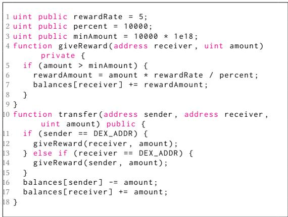  
Fig. 1. Vulnerable code snippet in ANCH token.

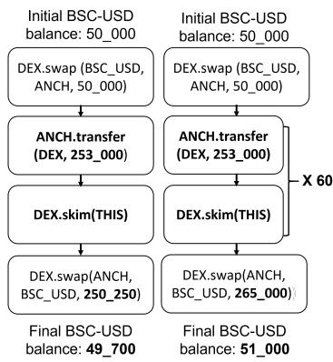  
Fig. 2. ANCH token exploit without repetition (left) and with repetition (right).

## 3.1 Motivating Example

We <sub>p</sub>resent a motivatin<sub>g</sub> exam<sub>p</sub>le that illustrates the challen<sub>g</sub>es of detectin<sub>g</sub> bu<sub>g</sub>s in smart contracts <sub>an</sub>d th<sub>e</sub> <sub>nee</sub>d f<sub>or</sub> <sub>a</sub> <sub>new</sub> <sub>approac</sub>h t<sub>o</sub> id<sub>en</sub>tif<sub>y</sub> th<sub>em</sub> <sub>e</sub>f<sub>ec</sub>ti<sub>ve</sub>l<sub>y.</sub> O<sub>n</sub> A<sub>ugus</sub>t 9<sub>,</sub> 2022<sub>,</sub> <sub>an</sub> <sub>a</sub>tt<sub>ac</sub>k<sub>er</sub> ex<sub>p</sub>loited the ANCH token contract to extract a<sub>pp</sub>roximatel<sub>y</sub> 19.9K USD worth of stablecoins from the ANCH-BSC-USD DEX [4]. This ha<sub>pp</sub>ened because the attacker could increase their ANCH t<sub>o</sub>k<sub>en</sub> b<sub>a</sub>l<sub>ance</sub> <sub>w</sub>ith<sub>ou</sub>t <sub>ma</sub>ki<sub>ng</sub> <sub>any</sub> <sub>paymen</sub>t<sub>.</sub> Fi<sub>gure</sub> 1 <sub>s</sub>h<sub>ows</sub> <sub>a</sub> <sub>s</sub>i<sub>mp</sub>lifi<sub>e</sub>d <sub>vers</sub>i<sub>on</sub> <sub>o</sub>f th<sub>e</sub> <sub>vu</sub>l<sub>nera</sub>bl<sub>e</sub> <sub>co</sub>d<sub>e.</sub> I<sub>n</sub> li<sub>nes</sub> 11 <sub>an</sub>d 13<sub>,</sub> th<sub>e</sub> t<sub>o</sub>k<sub>en con</sub>t<sub>rac</sub>t <sub>c</sub>h<sub>ec</sub>k<sub>s w</sub>h<sub>e</sub>th<sub>er</sub> th<sub>e sen</sub>d<sub>er or rece</sub>i<sub>ver o</sub>f th<sub>e</sub> t<sub>rans</sub>f<sub>er</sub> i<sub>s</sub> th<sub>e</sub> DEX <sub>con</sub>t<sub>rac</sub>t<sub>;</sub> if <sub>so,</sub> it <sub>rewar</sub>d<sub>s</sub> 0<sub>.</sub>05% <sub>o</sub>f th<sub>e</sub> t<sub>rans</sub>f<sub>er amoun</sub>t t<sub>o</sub> th<sub>e rece</sub>i<sub>ver or sen</sub>d<sub>er, as s</sub>h<sub>own</sub> in lines 6-7. Ex<sub>p</sub>loitin<sub>g</sub> this behavior<sub>,</sub> the attacker accumulated man<sub>y</sub> ANCH tokens to nearl<sub>y</sub> drain th<sub>e</sub> ANCH-BSC-USD DEX<sub>.</sub>

Unfort<sub>u</sub>natel<sub>y,</sub> the ANCH ex<sub>p</sub>loit cannot be easil<sub>y</sub> detected <sub>w</sub>ith existin<sub>g</sub> tools. The ke<sub>y</sub> ob stacle is that this bu<sub>g</sub> needs to be tri<sub>gg</sub>ered multi<sub>p</sub>le times to <sub>g</sub>enerate <sub>p</sub>rofit. Existin<sub>g</sub> fuzzers <sub>may</sub> <sub>pro</sub>d<sub>uce</sub> t<sub>es</sub>t <sub>cases</sub> <sub>s</sub>i<sub>m</sub>il<sub>ar</sub> t<sub>o</sub> th<sub>e</sub> <sub>one</sub> <sub>s</sub>h<sub>own</sub> <sub>on</sub> th<sub>e</sub> l<sub>e</sub>ft <sub>o</sub>f Fi<sub>gure</sub> 2<sub>,</sub> <sub>w</sub>hi<sub>c</sub>h t<sub>r</sub>i<sub>ggers</sub> th<sub>e</sub> b<sub>ug</sub> <sup>b</sup>ut is not pro<sup>fi</sup>ta<sup>bl</sup>e. T<sup>h</sup>e attac<sup>k</sup>er can gain rewar<sup>d</sup>s <sup>f</sup>rom ANCH.transfer(DEX, 253\_000) an<sup>d</sup> a<sup>l</sup>so DEX.skim(THIS). Nota<sup>bl</sup>y, skim is a <sup>f</sup>unction t<sup>h</sup>at ma<sup>k</sup>es t<sup>h</sup>e DEX sen<sup>d</sup> extraneous to<sup>k</sup>ens to t<sup>h</sup>e a<sup>dd</sup>ress given as t<sup>h</sup>e argument, interna<sup>ll</sup>y ca<sup>ll</sup>ing ANCH.transfer(THIS, 253\_000). Since t<sup>h</sup>e ANCH t<sub>o</sub>k<sub>en</sub> <sub>rewar</sub>d<sub>s</sub> <sub>on</sub>l<sub>y</sub> 0<sub>.</sub>05% <sub>o</sub>f th<sub>e</sub> t<sub>rans</sub>f<sub>er</sub> <sub>amoun</sub>t<sub>,</sub> <sub>rece</sub>i<sub>v</sub>i<sub>ng</sub> th<sub>e</sub> <sub>rewar</sub>d t<sub>w</sub>i<sub>ce</sub> i<sub>s</sub> <sub>no</sub>t <sub>enoug</sub>h t<sub>o</sub> <sub>o</sub>f<sub>se</sub>t th<sub>e swap</sub> f<sub>ees, w</sub>hi<sub>c</sub>h <sub>are</sub> t<sub>yp</sub>i<sub>ca</sub>ll<sub>y</sub> 0<sub>.</sub>3%<sub>.</sub> M<sub>oreover,</sub> it i<sub>s no</sub>t d<sub>es</sub>i<sub>ra</sub>bl<sub>e</sub> t<sub>o</sub> fl<sub>ag any rewar</sub>d <sub>mec</sub>h<sub>an</sub>i<sub>sm</sub> lik<sub>e</sub> thi<sub>s</sub> <sub>as</sub> <sub>vu</sub>l<sub>nera</sub>bl<sub>e;</sub> <sub>many</sub> b<sub>en</sub>i<sub>gn</sub> t<sub>o</sub>k<sub>ens</sub> <sub>ex</sub>hibit <sub>s</sub>i<sub>m</sub>il<sub>ar</sub> b<sub>e</sub>h<sub>av</sub>i<sub>ors</sub> t<sub>o</sub> i<sub>ncen</sub>ti<sub>v</sub>i<sub>ze</sub> <sub>users.</sub> Th<sub>us,</sub> buildin<sub>g</sub> a <sub>p</sub>rofit-<sub>g</sub>eneratin<sub>g</sub> test case similar to the one on the ri<sub>g</sub>ht of Fi<sub>g</sub>ure 2 is essential. However<sub>,</sub> existin<sub>g</sub> tools stru<sub>gg</sub>le to <sub>g</sub>enerate such test cases because the<sub>y</sub> re<sub>q</sub>uire multi<sub>p</sub>le re<sub>p</sub>etitions of the reward-rea<sub>p</sub>in<sub>g</sub> call to <sub>g</sub>enerate <sub>p</sub>rofit. Existin<sub>g</sub> tools like Echidna [17] or It<sub>y</sub>Fuzz [28], ins<sub>p</sub>ired b<sub>y</sub> the success of covera<sub>g</sub>e-<sub>g</sub>uided fuzzin<sub>g</sub> in traditional software (e.<sub>g</sub>., AFL [16]), use <sub>g</sub>uidance strate<sub>g</sub>ies that aim to maximize code covera<sub>g</sub>e. Unfortunatel<sub>y,</sub> such <sub>g</sub>uidance strate<sub>g</sub>ies are inefec tive at detectin<sub>g</sub> this t<sub>yp</sub>e of vulnerabilit<sub>y</sub> because re<sub>p</sub>etition does not im<sub>p</sub>rove code covera<sub>g</sub>e but makes incremental chan<sub>g</sub>es in contract states. On a more <sub>p</sub>ractical note<sub>,</sub> these tools re<sub>q</sub>uire s<sub>p</sub>ecific contracts for testin<sub>g</sub>. Conse<sub>qu</sub>entl<sub>y,</sub> lesser-kno<sub>w</sub>n contracts like ANCH co<sub>u</sub>ld remain <sub>u</sub>ntested.

## 3.2 Prevalence of CPMM Composability Bugs

Table 1. CPMM composability bugs found in the DeFiHackLabs dataset.

<table><tr><td>Vulnerable Token</td><td>Invariant Broken</td><td>Date of Exploit</td><td>Reported Loss</td><td>Reported Loss in USD</td></tr><tr><td>Wdoge</td><td>1</td><td>2022/04/24</td><td>78.6 BNB</td><td>30.2 K</td></tr><tr><td>LPC</td><td>2</td><td>2022/07/25</td><td>45.1 K BSC-USD</td><td>45.1 K</td></tr><tr><td>ANCH</td><td>2</td><td>2022/08/09</td><td>19.9 K BSC-USD</td><td>19.9 K</td></tr><tr><td>XST</td><td>2</td><td>2022/08/10</td><td>27.4 ETH</td><td>46.2 K</td></tr><tr><td>Shadowfi</td><td>1</td><td>2022/09/02</td><td>1.08 K BNB</td><td>300 K</td></tr><tr><td>PLTD</td><td>1</td><td>2022/10/18</td><td>24.5 K BSC-USD</td><td>24.5 K</td></tr><tr><td>HEALTH</td><td>1</td><td>2022/10/20</td><td>16.6 BNB</td><td>4.54 K</td></tr><tr><td>AES</td><td>1</td><td>2022/12/07</td><td>61.6 K BSC-USD</td><td>61.6 K</td></tr><tr><td>BGLD</td><td>1</td><td>2022/12/12</td><td>8.80 BNB</td><td>2.40 K</td></tr><tr><td>BRA</td><td>2</td><td>2023/01/10</td><td>228K BSC-USD</td><td>228 K</td></tr><tr><td>Upswing</td><td>1</td><td>2023/01/18</td><td>22.6 ETH</td><td>35.6 K</td></tr><tr><td>ThoreumFi</td><td>2</td><td>2023/01/19</td><td>2.26 K BNB</td><td>659 K</td></tr></table>

<table><tr><td>Vulnerable Token</td><td>Invariant Broken</td><td>Date of Exploit</td><td>Reported Loss</td><td>Reported Loss in USD</td></tr><tr><td>SHEEP</td><td>1</td><td>2023/02/10</td><td>9.54 BNB</td><td>2.93 K</td></tr><tr><td>Starlink</td><td>1</td><td>2023/02/17</td><td>38.4 BNB</td><td>11.8 K</td></tr><tr><td>BIGFI</td><td>1</td><td>2023/03/22</td><td>30.3 K BSC-USD</td><td>30.3 K</td></tr><tr><td>GPT</td><td>1</td><td>2023/05/25</td><td>155K BSC-USD</td><td>155 K</td></tr><tr><td>Bamboo</td><td>1</td><td>2023/07/04</td><td>235 BNB</td><td>57.6 K</td></tr><tr><td>ApeDAO</td><td>1</td><td>2023/07/18</td><td>19.2 K BSC-USD</td><td>19.2 K</td></tr><tr><td>HCT</td><td>1</td><td>2023/09/07</td><td>30.5 BNB</td><td>6.58 K</td></tr><tr><td>BFC</td><td>1</td><td>2023/09/09</td><td>42.3 K BSC-USD</td><td>42.3 K</td></tr><tr><td>pSeudoEth</td><td>2</td><td>2023/10/08</td><td>1.44 ETH</td><td>2.34 K</td></tr><tr><td>TGBS</td><td>1</td><td>2024/03/06</td><td>377 BNB</td><td>154 K</td></tr><tr><td>GHT</td><td>1</td><td>2024/03/07</td><td>15.4 ETH</td><td>58.6 K</td></tr></table>

We refer to b<sub>ug</sub>s that afect CPMM DEXes d<sub>u</sub>e to <sub>vu</sub>lnerabilities in token contracts<sub>,</sub> like the ANCH exploit, as CPMM composability bugs. Recently, attackers have frequently exploited CPMM <sub>composa</sub>bilit<sub>y</sub> b<sub>ugs</sub> t<sub>o</sub> <sub>ex</sub>t<sub>rac</sub>t <sub>cons</sub>id<sub>era</sub>bl<sub>e</sub> <sub>amoun</sub>t<sub>s</sub> <sub>o</sub>f t<sub>o</sub>k<sub>ens</sub> f<sub>rom</sub> DEX<sub>es.</sub> F<sub>or</sub> <sub>examp</sub>l<sub>e,</sub> Bl<sub>oc</sub>k<sub>-</sub> Sec [7], a renowned smart contract auditin<sub>g</sub> firm, re<sub>p</sub>orted that CPMM com<sub>p</sub>osabilit<sub>y</sub> bu<sub>g</sub>s caused 138 ex<sub>p</sub>loits in Februar<sub>y</sub> 2023. We could also find CPMM com<sub>p</sub>osabilit<sub>y</sub> bu<sub>g</sub>s in DeFiHackLabs [12], <sub>a</sub> <sub>pu</sub>bli<sub>c</sub> <sub>exp</sub>l<sub>o</sub>it <sub>rep</sub>li<sub>ca</sub>ti<sub>on</sub> d<sub>a</sub>t<sub>ase</sub>t<sub>.</sub> Th<sub>e</sub> fi<sub>rs</sub>t <sub>an</sub>d <sub>secon</sub>d <sub>au</sub>th<sub>ors</sub> <sub>manua</sub>ll<sub>y</sub> i<sub>nspec</sub>t<sub>e</sub>d <sub>a</sub>ll <sub>exp</sub>l<sub>o</sub>it<sub>s</sub> in the DeFiHackLabs dataset (as of March 2024) to create a subset where CPMM com<sub>p</sub>osabilit<sub>y</sub> b<sub>ugs</sub> <sub>cause</sub> th<sub>e</sub> <sub>exp</sub>l<sub>o</sub>it<sub>s.</sub> W<sub>e</sub> f<sub>oun</sub>d <sub>a</sub> t<sub>o</sub>t<sub>a</sub>l <sub>o</sub>f 23 <sub>exp</sub>l<sub>o</sub>it<sub>s</sub> <sub>an</sub>d <sub>repor</sub>t<sub>e</sub>d th<sub>e</sub> d<sub>e</sub>t<sub>a</sub>il<sub>s</sub> i<sub>n</sub> T<sub>a</sub>bl<sub>e</sub> 1<sub>.</sub> W<sub>e</sub> cate<sub>g</sub>orized them based on the s<sub>p</sub>ecific invariant broken, which is ex<sub>p</sub>lained in §5. The cumulative financial loss of the 23 ex<sub>p</sub>loits is 2.2M USD.

CPMM <sub>composa</sub>bilit<sub>y</sub> b<sub>ugs</sub> <sub>pose</sub> <sub>a</sub> <sub>s</sub>i<sub>gn</sub>ifi<sub>can</sub>t th<sub>rea</sub>t t<sub>o</sub> fi<sub>nanc</sub>i<sub>a</sub>l <sub>asse</sub>t<sub>s</sub> <sub>s</sub>t<sub>ore</sub>d <sub>on</sub> th<sub>e</sub> bl<sub>oc</sub>k<sub>c</sub>h<sub>a</sub>i<sub>n</sub> b<sub>ecause</sub> CPMM<sub>s</sub> <sub>are</sub> <sub>w</sub>id<sub>e</sub>l<sub>y</sub> <sub>use</sub>d t<sub>o</sub> f<sub>ac</sub>ilit<sub>a</sub>t<sub>e</sub> t<sub>o</sub>k<sub>en</sub> <sub>exc</sub>h<sub>anges</sub> <sub>an</sub>d <sub>manage</sub> <sub>su</sub>b<sub>s</sub>t<sub>an</sub>ti<sub>a</sub>l fi<sub>nanc</sub>i<sub>a</sub>l assets. As ofJune 2023, DEXes followin<sub>g</sub> the CPMM model were re<sub>p</sub>orted to take u<sub>p</sub> around 77% of the market share, re<sub>p</sub>resentin<sub>g</sub> around 35.4 billion USD [21]. Therefore, identif<sub>y</sub>in<sub>g</sub> CPMM com<sub>p</sub>osabilit<sub>y</sub> bu<sub>g</sub>s is critical to ensurin<sub>g</sub> the securit<sub>y</sub> of DeFi.

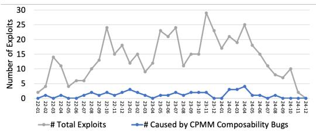  
Fig. 3. Total exploits and CPMM composability bug exploits per month in the DeFiHackLabs dataset.

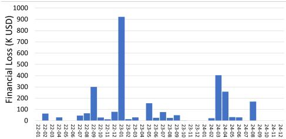  
Fig. 4. Total financial loss per month due to CPMM composability bugs in the DeFiHackLabs dataset.

3.2.1 Trend Analysis. To illustrate the trend of CPMM composability bugs, we report their monthly <sub>p</sub>ro<sub>p</sub>ortion and financial losses usin<sub>g</sub> the DeFiHackLabs dataset [12]. As shown in Fi<sub>g</sub>ure 3, these bu<sub>g</sub>s have been consistentl<sub>y</sub> re<sub>p</sub>orted from Februar<sub>y</sub> 2022 to Au<sub>g</sub>ust 2024. We ex<sub>p</sub>ect more CPMM <sub>composa</sub>bilit<sub>y</sub> b<sub>ugs</sub> t<sub>o</sub> b<sub>e</sub> <sub>repor</sub>t<sub>e</sub>d f<sub>or</sub> th<sub>e</sub> l<sub>as</sub>t <sub>quar</sub>t<sub>er</sub> <sub>o</sub>f 2024<sub>,</sub> <sub>as</sub> i<sub>nc</sub>id<sub>en</sub>t<sub>s</sub> t<sub>yp</sub>i<sub>ca</sub>ll<sub>y</sub> t<sub>a</sub>k<sub>e</sub> <sub>a</sub> f<sub>ew</sub> months to be incor<sub>p</sub>orated into the dataset. As shown in Fi<sub>g</sub>ure 4<sub>,</sub> CPMM com<sub>p</sub>osabilit<sub>y</sub> bu<sub>g</sub>s still incur si<sub>g</sub>nificant financial losses. For exam<sub>p</sub>le, the ARK ex<sub>p</sub>loit (March 2024) caused a loss of 192K USD, while the IvestDao ex<sub>p</sub>loit (Au<sub>g</sub>ust 2024) resulted in 170K USD in losses.

## 4 Goals and Approaches

This section discusses the goals and approaches for building a tool, CPMMX, to detect CPMM <sub>com osa</sub>bilit b<sub>u s across a</sub>ll bl<sub>oc</sub>k<sub>c</sub>h<sub>a</sub>i<sub>n con</sub>t<sub>rac</sub>t<sub>s.</sub>

## 4.1 Detecting CPMM Composability Bugs Across Entire Blockchains

As shown in §3.2, CPMM com<sub>p</sub>osabilit<sub>y</sub> bu<sub>g</sub>s have been ex<sub>p</sub>loited re<sub>p</sub>eatedl<sub>y</sub>, <sub>p</sub>osin<sub>g</sub> si<sub>g</sub>nificant th<sub>rea</sub>t<sub>s</sub> t<sub>o</sub> fi<sub>nanc</sub>i<sub>a</sub>l <sub>asse</sub>t<sub>s on</sub> th<sub>e</sub> bl<sub>oc</sub>k<sub>c</sub>h<sub>a</sub>i<sub>n.</sub> H<sub>owever, ex</sub>i<sub>s</sub>ti<sub>ng</sub> t<sub>oo</sub>l<sub>s are</sub> i<sub>nsu</sub>fi<sub>c</sub>i<sub>en</sub>t t<sub>o</sub> d<sub>e</sub>t<sub>ec</sub>t CPMM com<sub>p</sub>osabilit<sub>y</sub> bu<sub>g</sub>s at scale. First, as ex<sub>p</sub>lained in §3.1, the search strate<sub>g</sub>ies used b<sub>y</sub> current tools are <sub>no</sub>t <sub>we</sub>ll<sub>-su</sub>it<sub>e</sub>d t<sub>o</sub> d<sub>e</sub>t<sub>ec</sub>t th<sub>ese</sub> b<sub>ugs.</sub> S<sub>econ</sub>d<sub>,</sub> <sub>ex</sub>i<sub>s</sub>ti<sub>ng</sub> t<sub>oo</sub>l<sub>s</sub> h<sub>ave</sub> li<sub>m</sub>it<sub>e</sub>d <sub>sca</sub>l<sub>a</sub>bilit<sub>y.</sub> R<sub>unn</sub>i<sub>ng</sub> th<sub>em</sub> <sub>on</sub> the entire blockchain is com<sub>p</sub>utationall<sub>y</sub> infeasible because the<sub>y</sub> re<sub>q</sub>uire si<sub>g</sub>nificant com<sub>p</sub>utational <sub>resources</sub> t<sub>o</sub> th<sub>oroug</sub>hl<sub>y</sub> t<sub>es</sub>t <sub>eac</sub>h <sub>con</sub>t<sub>rac</sub>t<sub>.</sub> Th<sub>ere</sub>f<sub>ore,</sub> th<sub>ere</sub> i<sub>s a nee</sub>d f<sub>or a</sub> t<sub>oo</sub>l <sub>capa</sub>bl<sub>e o</sub>f d<sub>e</sub>t<sub>ec</sub>ti<sub>ng</sub> CPMM <sub>composa</sub>bilit<sub>y</sub> b<sub>ugs across a</sub>ll <sub>smar</sub>t <sub>con</sub>t<sub>rac</sub>t<sub>s on</sub> th<sub>e</sub> bl<sub>oc</sub>k<sub>c</sub>h<sub>a</sub>i<sub>n.</sub>

Our approach: formalizing CPMM composability bugs and building a tool to detect them. T<sub>o</sub> d<sub>e</sub>t<sub>ec</sub>t <sub>rea</sub>l<sub>-wor</sub>ld <sub>vu</sub>l<sub>nera</sub>biliti<sub>es on a</sub> l<sub>arge sca</sub>l<sub>e, we</sub> d<sub>ec</sub>id<sub>e</sub>d t<sub>o</sub> f<sub>ocus on</sub> CPMM <sub>composa</sub>bilit<sub>y</sub> bugs and built a tool, named CPMMX, to automatically detect it. CPMMX is designed to operate on the entire blockchain b<sub>y</sub> minimizin<sub>g</sub> com<sub>p</sub>utational costs. This is achieved b<sub>y</sub> focusin<sub>g</sub> the search s<sub>p</sub>ace on areas likel<sub>y</sub> to contain CPMM com<sub>p</sub>osabilit<sub>y</sub> bu<sub>g</sub>s and im<sub>p</sub>lementin<sub>g</sub> earl<sub>y</sub> termination for beni<sub>g</sub>n contracts. This was <sub>p</sub>ossible because CPMM com<sub>p</sub>osabilit<sub>y</sub> bu<sub>g</sub>s exhibit <sub>p</sub>ro<sub>p</sub>erties that make them <sub>p</sub>articularl<sub>y</sub> suitable for automated detection. In §5, we formalize this vulnerabilit<sub>y</sub> and describe how we can detect it b<sub>y</sub> checkin<sub>g</sub> invariant violations.

## 4.2 Eficiently Detecting CPMM Composability Bugs

Even after limitin<sub>g</sub> our sco<sub>p</sub>e to CPMM com<sub>p</sub>osabilit<sub>y</sub> bu<sub>g</sub>s<sub>,</sub> it is still challen<sub>g</sub>in<sub>g</sub> to anal<sub>y</sub>ze numerous smart contracts. As we can see from the motivatin<sub>g</sub> exam<sub>p</sub>le in §3.1, we need to build a com<sub>p</sub>licated transaction with a lon<sub>g</sub> se<sub>q</sub>uence of internal calls to ex<sub>p</sub>loit CPMM com<sub>p</sub>osabilit<sub>y</sub> bu<sub>g</sub>s. Therefore<sub>,</sub> findin<sub>g</sub> this bu<sub>g</sub> b<sub>y</sub> searchin<sub>g</sub> naïvel<sub>y</sub> re<sub>q</sub>uires an im<sub>p</sub>ractical amount of com<sub>p</sub>utation. Our approach: shallow-then-deep search. To address this problem, we propose a technique called shallow-then-deep search. CPMMX searches for CPMM composability bugs in two phases.

Th<sub>e</sub> fi<sub>rs</sub>t <sub>p</sub>h<sub>ase,</sub> <sub>ca</sub>ll<sub>e</sub>d <sub>s</sub>h<sub>a</sub>ll<sub>ow</sub> <sub>searc</sub>h<sub>,</sub> <sub>qu</sub>i<sub>c</sub>kl<sub>y</sub> id<sub>en</sub>tifi<sub>es</sub> <sub>can</sub>did<sub>a</sub>t<sub>e</sub> <sub>con</sub>t<sub>rac</sub>t<sub>s</sub> th<sub>a</sub>t <sub>may</sub> b<sub>e</sub> <sub>vu</sub>l<sub>nera</sub>bl<sub>e.</sub> However<sub>,</sub> real-world smart contracts are diverse and com<sub>p</sub>lex<sub>,</sub> makin<sub>g</sub> distin<sub>g</sub>uishin<sub>g</sub> between signs of vulnerabilities and intended behaviors dificult. To address this, CPMMX performs a second <sub>p</sub>h<sub>ase,</sub> <sub>ca</sub>ll<sub>e</sub>d d<sub>eep</sub> <sub>searc</sub>h<sub>,</sub> <sub>w</sub>hi<sub>c</sub>h <sub>exp</sub>l<sub>ores</sub> th<sub>e</sub> <sub>rema</sub>i<sub>n</sub>i<sub>ng</sub> <sub>con</sub>t<sub>rac</sub>t<sub>s</sub> i<sub>n</sub> <sub>more</sub> d<sub>e</sub>t<sub>a</sub>il<sub>.</sub> I<sub>n</sub> thi<sub>s</sub> <sub>p</sub>h<sub>ase,</sub> CPMMX generates a profitable transaction, which can be proof of the vulnerability. This approach <sub>a</sub>ll<sub>ows us</sub> t<sub>o ana</sub>l<sub>yze a</sub>ll <sub>smar</sub>t <sub>con</sub>t<sub>rac</sub>t<sub>s e</sub>fi<sub>c</sub>i<sub>en</sub>tl<sub>y an</sub>d d<sub>e</sub>t<sub>ec</sub>t CPMM <sub>composa</sub>bilit<sub>y</sub> b<sub>ugs.</sub>

## 4.3 Minimizing False Positives

Eliminatin<sub>g</sub> false <sub>p</sub>ositives is crucial for efectivel<sub>y</sub> detectin<sub>g</sub> vulnerabilities across all smart contracts. E<sub>ven w</sub>ith <sub>a</sub> l<sub>ow</sub> f<sub>a</sub>l<sub>se pos</sub>iti<sub>ve ra</sub>t<sub>e, ana</sub>l<sub>yz</sub>i<sub>ng numerous smar</sub>t <sub>con</sub>t<sub>rac</sub>t<sub>s cou</sub>ld <sub>s</sub>till <sub>resu</sub>lt i<sub>n</sub> h<sub>un</sub>d<sub>re</sub>d<sub>s</sub> <sub>or</sub> th<sub>ousan</sub>d<sub>s</sub> <sub>o</sub>f f<sub>a</sub>l<sub>se</sub> <sub>pos</sub>iti<sub>ve</sub> <sub>cases,</sub> <sub>p</sub>l<sub>ac</sub>i<sub>ng</sub> <sub>a</sub> <sub>s</sub>i<sub>gn</sub>ifi<sub>can</sub>t b<sub>ur</sub>d<sub>en</sub> <sub>on</sub> <sub>ana</sub>l<sub>ys</sub>t<sub>s.</sub>

Our approach: calculating profit using stablecoins and native currencies. To address this, CPMMX automatically generates end-to-end profitable transactions. Unlike existing methods that calculate <sub>p</sub>rofit b<sub>y</sub> a<sub>pp</sub>roximatin<sub>g</sub> the value of coins (e.<sub>g</sub>., Midas [32]), our a<sub>pp</sub>roach adjusts transactions to ensure that all outcomes conver<sub>g</sub>e into tokens with relativel<sub>y</sub> stable values (i.e., stablecoins or native currencies). CPMMX then computes the profit by evaluating the increase in th<sub>ese</sub> <sub>co</sub>i<sub>ns.</sub> Thi<sub>s</sub> <sub>me</sub>th<sub>o</sub>d i<sub>s</sub> <sub>more</sub> <sub>re</sub>li<sub>a</sub>bl<sub>e</sub> th<sub>an</sub> <sub>prev</sub>i<sub>ous</sub> <sub>approac</sub>h<sub>es,</sub> <sub>w</sub>hi<sub>c</sub>h l<sub>e</sub>d t<sub>o</sub> f<sub>a</sub>l<sub>se</sub> <sub>pos</sub>iti<sub>ves</sub> due to noise in the value-based profit calculations. In contrast, CPMMX allows users to analyze based on clear financial <sub>g</sub>ains<sub>,</sub> minimizin<sub>g</sub> ambi<sub>g</sub>uit<sub>y</sub> and false <sub>p</sub>ositives.

## 5 Formalizing CPMM Composability Bugs

In this section<sub>,</sub> we define and ex<sub>p</sub>lain CPMM com<sub>p</sub>osabilit<sub>y</sub> bu<sub>g</sub>s. First<sub>,</sub> we <sub>p</sub>rovide formal definitions in §5.1. Then, we ex<sub>p</sub>lain how the<sub>y</sub> can be utilized for <sub>p</sub>rofit with exam<sub>p</sub>le ex<sub>p</sub>loits in §5.2 and §5.3.

## 5.1 Terminology

Notation. Given two ERC20 tokens, X token and Y token, a DEX following the CPMM model for th<sub>e</sub> t<sub>wo</sub> t<sub>o</sub>k<sub>ens</sub> i<sub>s</sub> d<sub>eno</sub>t<sub>e</sub>d b $D E X _ { X Y }$ <sub>.</sub> W<sub>e use</sub> th<sub>e</sub> n<sub>o</sub>t<sub>a</sub>ti<sub>o</sub>n $B A L _ { X } ( S , e n t i t y )$ t<sub>o</sub> d<sub>eno</sub>t<sub>e</sub> th<sub>e</sub> X t<sub>o</sub>k<sub>en</sub> b<sub>a</sub>l<sub>ance</sub> <sub>o</sub>f <sub>��</sub>���<sub>�</sub> <sub>a</sub>t bl<sub>oc</sub>k<sub>c</sub>h<sub>a</sub>i<sub>n</sub> <sub>s</sub>t<sub>a</sub>t<sub>e</sub> �<sub>.</sub> F<sub>ur</sub>th<sub>ermore,</sub> <sub>a</sub> t<sub>ransac</sub>ti<sub>on,</sub> �<sub>�,</sub> i<sub>s</sub> <sub>a</sub> <sub>sequence</sub> <sub>o</sub>f <sub>ca</sub>ll<sub>s</sub> $c _ { 1 } c _ { 2 } c _ { 3 }$ $\cdots c _ { n }$ t<sub>o con</sub>t<sub>rac</sub>t<sub>s an</sub>d <sub>are execu</sub>t<sub>e</sub>d <sub>a</sub>t<sub>om</sub>i<sub>ca</sub>ll<sub>y</sub> i<sub>n</sub> th<sub>a</sub>t <sub>or</sub>d<sub>er.</sub> Gi<sub>ven</sub> i<sub>n</sub>iti<sub>a</sub>l bl<sub>oc</sub>k<sub>c</sub>h<sub>a</sub>i<sub>n s</sub>t<sub>a</sub>t<sub>e</sub> �<sub>,</sub> th<sub>e</sub> bl<sub>oc</sub>k<sub>c</sub>h<sub>a</sub>i<sub>n s</sub>t<sub>a</sub>t<sub>e a</sub>ft<sub>er execu</sub>ti<sub>ng</sub> t<sub>ransac</sub>ti<sub>on</sub> �<sub>�</sub> i<sub>s</sub> $S _ { t x }$

Profitability. We define profitability as gaining one token type in one transaction. Let T be the set <sub>o</sub>f <sub>a</sub>ll t<sub>o</sub>k<sub>ens.</sub> A t<sub>ransac</sub>ti<sub>on</sub> �<sub>�</sub> i<sub>s pro</sub>fit<sub>a</sub>bl<sub>e w</sub>ith <sub>respec</sub>t t<sub>o</sub> t<sub>o</sub>k<sub>en</sub> � if

$$
\bullet \quad B A L _ {X} (S, \text {attacker}) <   B A L _ {X} (S _ {t x}, \text {attacker}) \text {and}
$$

$$
\bullet \quad B A L _ {Y} (S, a t t a c k e r) \leq B A L _ {Y} (S _ {t x}, a t t a c k e r) \text {   for   all   } Y \in \mathbb {T} \setminus \{X \}.
$$

W<sub>e</sub> li<sub>m</sub>it <sub>our scope</sub> t<sub>o ca</sub>ll <sub>sequences</sub> th<sub>a</sub>t <sub>can</sub> b<sub>e execu</sub>t<sub>e</sub>d i<sub>n one</sub> t<sub>ransac</sub>ti<sub>on</sub> t<sub>o exc</sub>l<sub>u</sub>d<sub>e</sub> th<sub>e</sub> i<sub>mpac</sub>t <sub>o</sub>f i<sub>n</sub>t<sub>eres</sub>t <sub>accumu</sub>l<sub>a</sub>ti<sub>on an</sub>d <sub>o</sub>th<sub>er mar</sub>k<sub>e</sub>t <sub>p</sub>l<sub>ayers.</sub> I<sub>n a</sub> t<sub>yp</sub>i<sub>ca</sub>l <sub>a</sub>tt<sub>ac</sub>k <sub>scenar</sub>i<sub>o,</sub> X t<sub>o</sub>k<sub>en wou</sub>ld b<sub>e a</sub> coin with a relativel<sub>y</sub> stable value, such as the wra<sub>pp</sub>ed native currenc<sub>y</sub> (e.<sub>g</sub>., WETH or WBNB) or a stablecoin (e.<sub>g</sub>., USDT). In addition, for a transaction to be trul<sub>y</sub> <sub>p</sub>rofitable, the <sub>p</sub>rofit from the transaction should ofset the <sub>g</sub>as fee involved in executin<sub>g</sub> the transaction. However<sub>,</sub> <sub>p</sub>recise <sub>g</sub>as f<sub>ee es</sub>ti<sub>ma</sub>ti<sub>on</sub> i<sub>s</sub> difi<sub>cu</sub>lt b<sub>ecause gas</sub> f<sub>ees</sub> fl<sub>uc</sub>t<sub>ua</sub>t<sub>e</sub> b<sub>ase</sub>d <sub>on severa</sub>l f<sub>ac</sub>t<sub>ors,</sub> i<sub>nc</sub>l<sub>u</sub>di<sub>ng ne</sub>t<sub>wor</sub>k congestion. Thus, for simplicity, we only consider transactions making profits over 1 USD as profitable. CPMM composability bugs. Consider a system composed of X token, Y token, and $D E X _ { X Y }$ following the CPMM model. We define CPMM composability bug as a bug in the Y token contract that enables an attacker to illegitimately extract X tokens from $D E X _ { X Y }$ to craft a profitable transaction with respect to the X token. Here, we assume that the X token contract and the $D E X _ { X Y }$ contract are free from vulnerabilities. This is a reasonable assum<sub>p</sub>tion <sub>g</sub>iven that X is a widel<sub>y</sub> used stablecoin <sub>an</sub>d $D E X _ { X Y }$ f<sub>o</sub>ll<sub>ows</sub> <sub>a</sub> <sub>s</sub>t<sub>an</sub>d<sub>ar</sub>d i<sub>mp</sub>l<sub>emen</sub>t<sub>a</sub>ti<sub>on</sub> <sub>suc</sub>h <sub>as</sub> U<sub>n</sub>i<sub>swap.</sub>

In <sub>g</sub>eneral<sub>,</sub> users cannot <sub>g</sub>ain X tokens b<sub>y</sub> sim<sub>p</sub>l<sub>y</sub> interactin<sub>g</sub> with $D E X _ { X Y } ;$ <sub>;</sub> h<sub>owever,</sub> if th<sub>e</sub> Y t<sub>o</sub>k<sub>en con</sub>t<sub>rac</sub>t <sub>con</sub>t<sub>a</sub>i<sub>ns a vu</sub>l<sub>nera</sub>bilit<sub>y or an</sub> i<sub>ncompa</sub>tibl<sub>e</sub> b<sub>e</sub>h<sub>av</sub>i<sub>or, an a</sub>tt<sub>ac</sub>k<sub>er can ex</sub>t<sub>rac</sub>t <sub>more</sub> th<sub>an</sub> th<sub>e</sub> i<sub>n</sub>iti<sub>a</sub>ll<sub>y</sub> i<sub>npu</sub>tt<sub>e</sub>d X t<sub>o</sub>k<sub>ens</sub> f<sub>rom</sub> $D E X _ { X Y }$ <sub>.</sub> U<sub>n</sub>d<sub>er</sub> th<sub>e assump</sub>ti<sub>on</sub> th<sub>a</sub>t th<sub>e</sub> X t<sub>o</sub>k<sub>en con</sub>t<sub>rac</sub>t <sub>an</sub>d th<sub>e</sub> $D E X _ { X Y }$ <sub>con</sub>t<sub>rac</sub>t <sub>are</sub> f<sub>ree</sub> f<sub>rom vu</sub>l<sub>nera</sub>biliti<sub>es,</sub> th<sub>ere are on</sub>l<sub>y</sub> t<sub>wo ways</sub> t<sub>o ex</sub>t<sub>rac</sub>t <sub>more</sub> X t<sub>o</sub>k<sub>ens</sub> f<sub>rom</sub> $D E X _ { X Y }$ . That is, the attacker can either (1) decrease the Y token balance of $D E X _ { X Y }$ $( \mathrm { i } . \mathrm { e } . , y )$ or (2) increase $\Delta y$ <sub>.</sub> R<sub>eca</sub>ll th<sub>a</sub>t th<sub>e</sub> f<sub>ormu</sub>l<sub>a</sub> f<sub>or ca</sub>l<sub>cu</sub>l<sub>a</sub>ti<sub>ng</sub> th<sub>e</sub> X t<sub>o</sub>k<sub>en ou</sub>t<sub>pu</sub>t $( \mathrm { i . e . , } \Delta x )$ f<sub>rom</sub> a CPMM s<sub>w</sub>a<sub>p</sub> is $( x - \Delta x ) \times ( y + \Delta y ) = k .$ <sub>.</sub> If <sub>�</sub> d<sub>ecreases,</sub> $k ( = x \times y )$ also decreases<sub>,</sub> increasin<sub>g</sub> $\Delta x .$ Similarl<sub>y</sub>, when Δ<sub>�</sub> increases, Δ� can also be increased. We further cate<sub>g</sub>orize CPMM com<sub>p</sub>osabilit<sub>y</sub> b<sub>ugs</sub> i<sub>n</sub>t<sub>o</sub> t<sub>wo</sub> t<sub>ypes</sub> b<sub>ase</sub>d <sub>on</sub> th<sub>e</sub> i<sub>nvar</sub>i<sub>an</sub>t b<sub>ro</sub>k<sub>en,</sub> <sub>as</sub> d<sub>e</sub>t<sub>a</sub>il<sub>e</sub>d i<sub>n</sub> th<sub>e</sub> f<sub>o</sub>ll<sub>ow</sub>i<sub>ng</sub> <sub>sec</sub>ti<sub>ons.</sub>

## 5.2 Type 1: DEX Token Balance Decrease

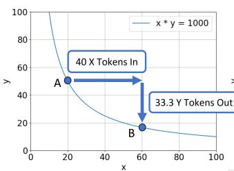

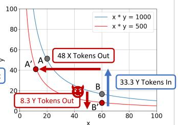

```cpp
function exploit() public {
  swapBNBtoShadowFi();
  // Decrease DEX ShadowFi balance
  ShadowFi.burn(DEX_ADDR,
              DEX_SHADOWF1_BALANCE-1);
  Pair(DEX_ADDR).sync();
  swapShadowFitoBNB();
}
```  
Fig. 5. Example atack scenario where the atacker is able to decrease Y token balance of $D E X _ { X Y }$  
Fig. 6. Simplified ShadowFi exploit.

The first t<sub>yp</sub>e of CPMM com<sub>p</sub>osabilit<sub>y</sub> bu<sub>g</sub> is a bu<sub>g</sub> that allows an attacker to decrease the Y t<sub>o</sub>k<sub>en</sub> b<sub>a</sub>l<sub>ance o</sub>f $D E X _ { X Y }$ <sub>w</sub>ith<sub>ou</sub>t <sub>pay</sub>in<sub>g.</sub> An <sub>e</sub>x<sub>a</sub>m<sub>p</sub>l<sub>e sce</sub>n<sub>a</sub>ri<sub>o</sub> i<sub>s s</sub>h<sub>ow</sub>n in Fi<sub>gu</sub>r<sub>e</sub> 5<sub>.</sub> W<sub>e assu</sub>m<sub>e</sub> th<sub>a</sub>t $D E X _ { X Y }$ h<sub>as</sub> 20 X t<sub>o</sub>k<sub>ens an</sub>d 50 Y t<sub>o</sub>k<sub>ens w</sub>ith $k = 1 0 0 0$ <sub>.</sub> Th<sub>e a</sub>tt<sub>ac</sub>k<sub>er</sub> fi<sub>rs</sub>t <sub>swaps</sub> 40 X t<sub>o</sub>k<sub>ens</sub> for 33.3 Y tokens. Then<sub>,</sub> the attacker <sub>u</sub>tilizes a CPMM com<sub>p</sub>osabilit<sub>y</sub> b<sub>ug</sub> to decrease <sub>�</sub> b<sub>y</sub> 8.3 tokens<sub>,</sub> <sub>w</sub>hi<sub>c</sub>h d<sub>ecreases</sub> � t<sub>o</sub> $5 0 0 ; 6 0 \times \left( 1 6 . 7 - 8 . 3 \right) \approx 5 0 0$ <sub>.</sub> Thi<sub>s e</sub>f<sub>ec</sub>ti<sub>ve</sub>l<sub>y s</sub>hift<sub>s</sub> th<sub>e swap curve</sub> i<sub>nwar</sub>d<sub>.</sub> Si<sub>nce</sub> th<sub>e</sub> <sub>a</sub>tt<sub>ac</sub>k<sub>er</sub> <sub>on</sub>l<sub>y</sub> d<sub>ecrease</sub>d <sub>�</sub> <sub>an</sub>d <sub>�</sub> <sub>rema</sub>i<sub>ns</sub> th<sub>e</sub> <sub>same,</sub> th<sub>e</sub> <sub>nex</sub>t <sub>swap</sub> <sub>w</sub>ill h<sub>appen</sub> <sub>a</sub>t <sub>a</sub> <sub>po</sub>i<sub>n</sub>t strai<sub>g</sub>ht below the <sub>p</sub>revious <sub>p</sub>oint on the u<sub>p</sub>dated swa<sub>p</sub> curve (i.e., <sub>p</sub>oint $\mathrm { B ^ { \prime } }$ instead of <sub>p</sub>oint �). The <sub>p</sub>rice of the Y token is <sub>g</sub>reater at this <sub>p</sub>oint<sub>,</sub> allowin<sub>g</sub> the attacker to swa<sub>p</sub> the same amount of Y tokens for more X tokens (i.e., swa<sub>pp</sub>in<sub>g</sub> to <sub>p</sub>oint $\mathrm { A } ^ { \prime }$ instead of <sub>p</sub>oint A). The attacker ends u<sub>p</sub> <sub>w</sub>ith 48 X t<sub>o</sub>k<sub>ens;</sub> $( 6 0 - 4 8 ) \times ( 8 . 4 + 3 3 . 3 ) \approx 5 0 0$ <sub>, w</sub>hi<sub>c</sub>h i<sub>s</sub> 8 X t<sub>o</sub>k<sub>en pro</sub>fit<sub>.</sub> A<sub>s</sub> ill<sub>us</sub>t<sub>ra</sub>t<sub>e</sub>d <sub>w</sub>ith th<sub>e</sub> <sub>examp</sub>l<sub>e, w</sub>h<sub>en</sub> thi<sub>s</sub> i<sub>nvar</sub>i<sub>an</sub>t i<sub>s</sub> b<sub>ro</sub>k<sub>en,</sub> th<sub>e a</sub>tt<sub>ac</sub>k<sub>er can ex</sub>t<sub>rac</sub>t X t<sub>o</sub>k<sub>ens</sub> f<sub>rom</sub> $D E X _ { X Y }$

Invariant 1 (DEX token balance decrease). Users should not be able to transfer or burn assets owned by a DEX without paying the DEX.

Real-world example. For instance, on September 2, 2022, an attacker exploited a vulnerability in the ShadowFi token to steal around 1078 BNB (worth around 301K USD) [27]. The vulnerabilit<sub>y</sub> was th<sub>a</sub>t th<sub>e</sub> Sh<sub>a</sub>d<sub>ow</sub>Fi t<sub>o</sub>k<sub>en</sub> h<sub>a</sub>d <sub>a</sub> <sub>pu</sub>bli<sub>c</sub> <sub>burn</sub> f<sub>unc</sub>ti<sub>on.</sub> I<sub>n</sub> D<sub>e</sub>Fi<sub>,</sub> t<sub>o</sub>k<sub>en</sub> b<sub>urn</sub>i<sub>ng</sub> <sub>re</sub>f<sub>ers</sub> t<sub>o</sub> <sub>permanen</sub>tl<sub>y</sub> <sub>remov</sub>i<sub>ng</sub> t<sub>o</sub>k<sub>ens</sub> f<sub>rom c</sub>i<sub>rcu</sub>l<sub>a</sub>ti<sub>on.</sub> I<sub>n</sub> th<sub>e exp</sub>l<sub>o</sub>it<sub>,</sub> th<sub>e pu</sub>bli<sub>c burn</sub> f<sub>unc</sub>ti<sub>on a</sub>ll<sub>owe</sub>d <sub>any user</sub> t<sub>o</sub> remove ShadowFi tokens owned b<sub>y</sub> an<sub>y</sub> <sub>u</sub>ser. The sim<sub>p</sub>lified ex<sub>p</sub>loit is shown in Fi<sub>gu</sub>re 6. The attacker decreased the ShadowFi balance of the BNB-ShadowFi DEX usin the burn function (line 4) and u<sub>p</sub>dated the � value of the DEX (line 5) to swa<sub>p</sub> ShadowFi tokens for more BNB.

## 5.3 Type 2: Atacker Token Balance Increase

The second t<sub>yp</sub>e of CPMM com<sub>p</sub>osabilit<sub>y</sub> bu<sub>g</sub> is a bu<sub>g</sub> that allows an attacker to <sub>g</sub>ain Y tokens <sub>w</sub>ith<sub>ou</sub>t <sub>cos</sub>t<sub>.</sub> An <sub>e</sub>x<sub>a</sub>m<sub>p</sub>l<sub>e sce</sub>n<sub>a</sub>ri<sub>o</sub> i<sub>s s</sub>h<sub>ow</sub>n in Fi<sub>gu</sub>r<sub>e</sub> 7<sub>.</sub> At <sub>po</sub>int B<sub>,</sub> if th<sub>e a</sub>tt<sub>ac</sub>k<sub>e</sub>r <sub>ca</sub>n in<sub>c</sub>r<sub>ease</sub> it<sub>s</sub> <sub>own</sub> b<sub>a</sub>l<sub>ance</sub> <sub>o</sub>f t<sub>o</sub>k<sub>en</sub> Y<sub>,</sub> th<sub>en</sub> th<sub>e</sub> <sub>a</sub>tt<sub>ac</sub>k<sub>er</sub> <sub>can</sub> <sub>ga</sub>i<sub>n</sub> <sub>more</sub> th<sub>an</sub> th<sub>e</sub> <sub>expec</sub>t<sub>e</sub>d <sub>amoun</sub>t <sub>o</sub>f X t<sub>o</sub>k<sub>ens</sub> $( \mathrm { i . e . , }$ swa<sub>pp</sub>in<sub>g</sub> to <sub>p</sub>oint A’ instead of <sub>p</sub>oint A). For the exam<sub>p</sub>le, the attacker <sub>g</sub>ains an additional 30 Y t<sub>o</sub>k<sub>ens, resu</sub>lti<sub>ng</sub> i<sub>n</sub> 8 X t<sub>o</sub>k<sub>en pro</sub>fit<sub>;</sub> $\left( 6 0 - 4 8 \right) \times \left( 1 6 . 7 + 3 3 . 3 + 3 0 \right) \approx 1 0 0 0$ . Hence, when Invariant 2 is broken, the attacker can extract X tokens owned by ���<sub>��</sub>.

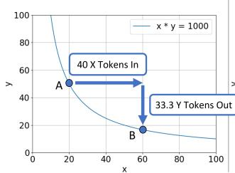

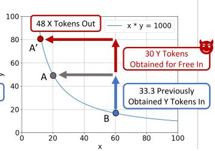

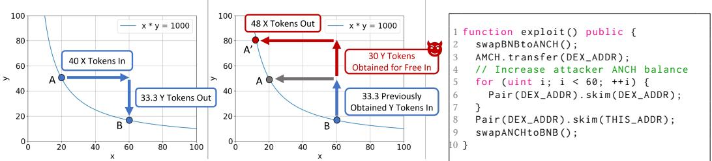  
Fig. 7. Example atack scenario where the atacker is able to increase Fig. 8. Simplified ANCH exploit. one’s own balance of Y tokens

Invariant 2 (Attacker token balance increase). Users should not be able to obtain tokens traded in a DEX without cost.

Real-world example. For example, on August 9, 2022, an attacker leveraged ANCH token’s reward mechanism to steal around 19.9K BSC-USD [4]. The ANCH contract rewards users who bu<sub>y</sub> or sell ANCH t<sub>o</sub>k<sub>e</sub>n<sub>s</sub> fr<sub>o</sub>m th<sub>e</sub> ANCH-BSC-USD DEX<sub>.</sub> H<sub>oweve</sub>r<sub>, as s</sub>h<sub>ow</sub>n in lin<sub>es</sub> 4 t<sub>o</sub> 7 in Fi<sub>gu</sub>r<sub>e</sub> 8<sub>,</sub> th<sub>e</sub> <sub>a</sub>tt<sub>ac</sub>k<sub>er cou</sub>ld ill<sub>eg</sub>iti<sub>ma</sub>t<sub>e</sub>l<sub>y</sub> t<sub>r</sub>i<sub>gger</sub> th<sub>e rewar</sub>d <sub>mec</sub>h<sub>an</sub>i<sub>sm</sub> b<sub>y a</sub>b<sub>us</sub>i<sub>ng</sub> th<sub>e skim</sub> f<sub>unc</sub>ti<sub>on</sub> i<sub>n</sub> DEX that makes the DEX send extraneous tokens to an<sub>y</sub> address <sub>g</sub>iven as the ar<sub>g</sub>ument (skim function exists to enable DEX to return leftover tokens from swa<sub>p</sub>s to users). Utilizin<sub>g</sub> this mechanism, the <sub>a</sub>tt<sub>ac</sub>k<sub>e</sub>r <sub>cou</sub>ld dr<sub>a</sub>in BSC-USD fr<sub>o</sub>m th<sub>e</sub> ANCH-BSC-USD DEX<sub>.</sub>

## 6 Design

Based on the formalized model in §5, we design CPMMX, an automatic tool that detects CPMM com<sub>p</sub>osabilit<sub>y</sub> bu<sub>g</sub>s. In this section<sub>,</sub> we describe its desi<sub>g</sub>n in detail.

## 6.1 Workflow

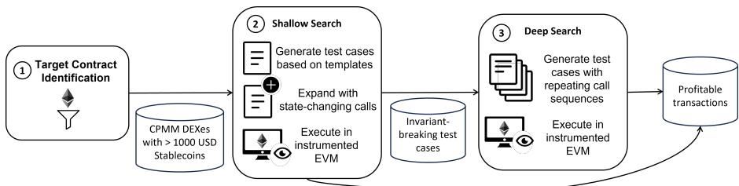  
Fig. 9. Overall workflow of CPMMX.

The overall workflow of CPMMX is illustrated in Figure 9. 1 CPMMX first identifies target contracts from the blockchain (§6.2). As CPMMX focuses on CPMM composability bugs, it only <sub>co</sub>n<sub>s</sub>id<sub>e</sub>r<sub>s co</sub>ntr<sub>ac</sub>t<sub>s</sub> th<sub>a</sub>t f<sub>o</sub>ll<sub>ow</sub> th<sub>e</sub> ERC-20 <sub>s</sub>t<sub>a</sub>nd<sub>a</sub>rd <sub>a</sub>nd <sub>a</sub>r<sub>e</sub> tr<sub>a</sub>d<sub>e</sub>d <sub>o</sub>n <sub>a</sub> CPMM DEX<sub>.</sub> M<sub>o</sub>r<sub>eove</sub>r<sub>,</sub> it is not interesting to analyze contracts with insignificant financial value. Therefore, CPMMX filters out DEXes with less than 1,000 USD worth of stablecoins or native currencies. 2 Then, CPMMX employs a two-phase search strategy, shallow-then-deep search, to determine if the target contracts <sub>are vu</sub>l<sub>nera</sub>bl<sub>e</sub> t<sub>o</sub> CPMM <sub>composa</sub>bilit<sub>y</sub> b<sub>ugs.</sub> Th<sub>e s</sub>h<sub>a</sub>ll<sub>ow searc</sub>h <sub>p</sub>h<sub>ase uses pre</sub>d<sub>e</sub>fi<sub>ne</sub>d t<sub>emp</sub>l<sub>a</sub>t<sub>es</sub> to find invariant-breaking transactions (§6.3). If such transactions are already profitable, CPMMX <sub>ou</sub>t<sub>pu</sub>t<sub>s</sub> th<sub>e</sub> t<sub>ransac</sub>ti<sub>on an</sub>d fl<sub>ags</sub> th<sub>e con</sub>t<sub>rac</sub>t <sub>as vu</sub>l<sub>nera</sub>bl<sub>e.</sub> O<sub>n</sub> th<sub>e o</sub>th<sub>er</sub> h<sub>an</sub>d<sub>,</sub> if it <sub>canno</sub>t fi<sub>n</sub>d any invariant-breaking transactions, CPMMX discards the contract (i.e., early termination). 3 If

Table 2. Templates for generating transactions by CPMMX whose bolded elements are repeatable.

<table><tr><td>Type</td><td>Testcase</td><td>Description</td></tr><tr><td rowspan="4">Cross-trading</td><td>transfer(this, transferAmount)</td><td>Send tokens to ourselves</td></tr><tr><td>transfer(DEX, transferAmount)DEX.skim(this)</td><td>Send tokens back and forth between DEX and ours</td></tr><tr><td>transfer(DEX, transferAmount)DEX.skim(DEX)pair.skim(this)</td><td>Send tokens to DEX, DEX sends tokens to itself, DEX sends tokens to ours</td></tr><tr><td>transfer(DEX, transferAmount)DEX.skim(DEX)</td><td>Send tokens to DEX, DEX sends tokens to itself</td></tr><tr><td rowspan="2">Burn</td><td>burn(burnAmount)</td><td>Remove tokens from circulation</td></tr><tr><td>burn(DEX, burnAmount)</td><td>Remove tokens from DEX</td></tr></table>

CPMMX can only find invariant-breaking transactions, not profitable ones, it proceeds to the deep search <sub>p</sub>hase (§6.4). In the dee<sub>p</sub> search <sub>p</sub>hase, the invariant-breakin<sub>g</sub> call se<sub>q</sub>uences are re<sub>p</sub>eated to <sub>genera</sub>t<sub>e</sub> <sub>a</sub> <sub>pro</sub>fit<sub>a</sub>bl<sub>e</sub> t<sub>ransac</sub>ti<sub>on</sub> f<sub>or</sub> th<sub>e</sub> t<sub>arge</sub>t <sub>con</sub>t<sub>rac</sub>t<sub>s.</sub>

## 6.2 Finding Target Contracts from the Blockchain

First, CPMMX scans the blockchain to find target contracts. Our targets are token contracts traded in a CPMM DEX with a meanin ful financial value. To this end, CPMMX retrieves the addresses of all DEX contracts from the Uniswa<sub>p</sub>V2 factor<sub>y</sub> contracts on both the Binance Smart Chain (BSC) and Ethere<sub>u</sub>m networks. We <sub>u</sub>sed the most <sub>p</sub>o<sub>pu</sub>lar CPMM DEX <sub>p</sub>latforms in each blockchain: PancakeSwap for BSC and UniswapV2 for Ethereum. Then, for each DEX contract, CPMMX collects th<sub>e a</sub>dd<sub>resses o</sub>f th<sub>e</sub> t<sub>o</sub>k<sub>ens</sub> t<sub>ra</sub>d<sub>e</sub>d <sub>w</sub>ithi<sub>n</sub> th<sub>e</sub> DEX <sub>an</sub>d th<sub>e</sub> b<sub>a</sub>l<sub>ance o</sub>f <sub>eac</sub>h t<sub>o</sub>k<sub>en.</sub> F<sub>rom</sub> th<sub>e</sub> li<sub>s</sub>t <sub>o</sub>f all DEX contracts, CPMMX filters out contracts that do not meet the following criteria.

• Exchangable to standard tokens. One of the tokens traded in the DEX is the wrapped <sub>na</sub>ti<sub>ve currency or a we</sub>ll<sub>-</sub>k<sub>nown s</sub>t<sub>a</sub>bl<sub>eco</sub>i<sub>n</sub>

• Financially meaningful. The DEX contains over 1,000 USD worth of the wrapped native <sub>currency</sub> <sub>or</sub> <sub>a</sub> <sub>we</sub>ll<sub>-</sub>k<sub>nown</sub> <sub>s</sub>t<sub>a</sub>bl<sub>eco</sub>i<sub>n.</sub>

Th<sub>e</sub> DEX <sub>con</sub>t<sub>rac</sub>t<sub>s</sub> th<sub>a</sub>t <sub>mee</sub>t th<sub>e a</sub>b<sub>ove cr</sub>it<sub>er</sub>i<sub>a an</sub>d th<sub>e assoc</sub>i<sub>a</sub>t<sub>e</sub>d t<sub>o</sub>k<sub>ens are</sub> th<sub>en cons</sub>id<sub>ere</sub>d t<sub>arge</sub>t <sub>co</sub>ntr<sub>ac</sub>t<sub>s.</sub> A<sub>s o</sub>f O<sub>c</sub>t<sub>o</sub>b<sub>e</sub>r 2024<sub>,</sub> th<sub>e</sub>r<sub>e we</sub>r<sub>e</sub> 1<sub>,</sub>674<sub>,</sub>491 P<sub>a</sub>n<sub>ca</sub>k<sub>e</sub>S<sub>wap co</sub>ntr<sub>ac</sub>t<sub>s a</sub>nd 371<sub>,</sub>380 Uni<sub>swap</sub>V2 contracts. After filterin<sub>g</sub>, we had 19,377 (1.16%) and 28,800 (7.74%) contracts, res<sub>p</sub>ectivel<sub>y</sub>.

## 6.3 Shallow Search for Finding Invariant-Breaking Transactions

Overview. After identifying target contracts, CPMMX begins the shallow search to find invariantbreaking transactions. This works as follows. First, CPMMX deploys and initializes the attacker <sub>con</sub>t<sub>rac</sub>t <sub>w</sub>ith <sub>a s</sub>t<sub>a</sub>bl<sub>eco</sub>i<sub>n</sub> b<sub>a</sub>l<sub>ance.</sub> S<sub>econ</sub>d<sub>,</sub> it <sub>genera</sub>t<sub>es a</sub> t<sub>ransac</sub>ti<sub>on cons</sub>i<sub>s</sub>ti<sub>ng o</sub>f <sub>ca</sub>ll<sub>s</sub> $c _ { 1 } c _ { 2 } c _ { 3 }$ $c _ { n }$ <sub>w</sub>h<sub>ere</sub> $c _ { 1 }$ <sub>an</sub>d $c _ { n }$ <sub>are ca</sub>ll<sub>s</sub> t<sub>o swap</sub> th<sub>e a</sub>tt<sub>ac</sub>k<sub>er con</sub>t<sub>rac</sub>t’<sub>s s</sub>t<sub>a</sub>bl<sub>eco</sub>i<sub>ns</sub> t<sub>o</sub> th<sub>e</sub> t<sub>arge</sub>t t<sub>o</sub>k<sub>en v</sub>i<sub>a</sub> th<sub>e</sub> <sub>v</sub>i<sub>c</sub>tim DEX <sub>a</sub>nd <sub>v</sub>i<sub>ce ve</sub>r<sub>sa, a</sub>nd <sub>ca</sub>ll<sub>s</sub> $c _ { 2 } \ldots c _ { n - 1 }$ <sub>are</sub> <sub>genera</sub>t<sub>e</sub>d b<sub>ase</sub>d <sub>on</sub> <sub>pre</sub>d<sub>e</sub>fi<sub>ne</sub>d t<sub>emp</sub>l<sub>a</sub>t<sub>es.</sub> Th<sub>en,</sub> CPMMX executes the calls in an instrumented EVM environment and determines whether the transaction is <sub>p</sub>rofitable or breaks an<sub>y</sub> invariants. Finall<sub>y,</sub> if no <sub>p</sub>rofit-<sub>g</sub>eneratin<sub>g</sub> transactions are found, CPMMX expands the test cases by incorporating state-changing calls.

Generating test cases with invariant-breaking templates. To build transactions likely to break invariants, CPMMX uses templates, which are described in Table 2, to generate transactions. These tem<sub>p</sub>lates have been ins<sub>p</sub>ired b<sub>y</sub> <sub>p</sub>atterns observed in <sub>p</sub>revious ex<sub>p</sub>loits [7, 12]. From our anal<sub>y</sub>sis of these ex<sub>p</sub>loits<sub>,</sub> we observed that CPMM com<sub>p</sub>osabilit<sub>y</sub> bu<sub>g</sub>s are t<sub>yp</sub>icall<sub>y</sub> caused b<sub>y</sub> in<sub>ce</sub>nti<sub>ve</sub> m<sub>ec</sub>h<sub>a</sub>ni<sub>s</sub>m<sub>s</sub> <sub>e</sub>mb<sub>e</sub>dd<sub>e</sub>d in t<sub>o</sub>k<sub>e</sub>n<sub>s.</sub> Thi<sub>s</sub> i<sub>s</sub> <sub>qu</sub>it<sub>e</sub> <sub>a</sub>n int<sub>u</sub>iti<sub>ve</sub> <sub>o</sub>b<sub>se</sub>r<sub>va</sub>ti<sub>o</sub>n b<sub>ecause</sub> m<sub>os</sub>t tokens are desi<sub>g</sub>ned to incentivize users to <sub>p</sub>romote their tokens. Some tokens incentivize tradin<sub>g</sub> b<sub>y</sub> rewardin<sub>g</sub> users on s<sub>p</sub>ecific transfers or b<sub>y</sub> em<sub>p</sub>lo<sub>y</sub>in<sub>g</sub> deflationar<sub>y</sub> mechanisms<sub>,</sub> removin<sub>g</sub> t<sub>o</sub>k<sub>ens</sub> f<sub>rom c</sub>i<sub>rcu</sub>l<sub>a</sub>ti<sub>on</sub> t<sub>o</sub> i<sub>ncrease</sub> th<sub>e</sub>i<sub>r va</sub>l<sub>ue.</sub>

Table 3. Arguments used in the shallow search phase.

<table><tr><td>Parameter</td><td>Argument Values</td></tr><tr><td rowspan="3">transferAmount</td><td>token.balanceOf(this)</td></tr><tr><td>token.balanceOf(pair)</td></tr><tr><td>0</td></tr><tr><td rowspan="2">burnAmount</td><td>token.balanceOf(pair) - 1</td></tr><tr><td>token.totalSupply() - 2 * token.totalSupply() \ / token.balanceOf(pair) [30]</td></tr></table>

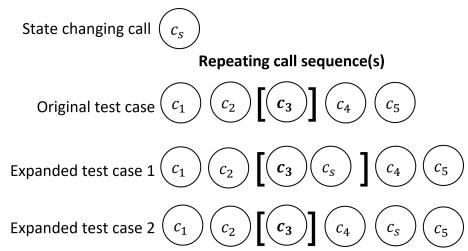  
Fig. 10. Incorporating a state changing call to a template testcase.

To test incentive mechanisms of tokens, CPMMX uses two types of templates: cross-trading and token burning. First, CPMMX uses cross-trading templates to execute token transfers without <sub>caus</sub>i<sub>ng a ne</sub>t <sub>c</sub>h<sub>ange</sub> i<sub>n</sub> b<sub>a</sub>l<sub>ances.</sub> A<sub>s s</sub>h<sub>own</sub> i<sub>n</sub> T<sub>a</sub>bl<sub>e</sub> 2<sub>,</sub> th<sub>e</sub> fi<sub>rs</sub>t th<sub>ree s</sub>t<sub>ra</sub>t<sub>eg</sub>i<sub>es</sub> f<sub>or cross-</sub>t<sub>ra</sub>di<sub>ng</sub> <sub>are</sub> t<sub>r</sub>i<sub>v</sub>i<sub>a</sub>l t<sub>o see w</sub>h<sub>y</sub> th<sub>ey are cross-</sub>t<sub>ra</sub>di<sub>ng.</sub> Th<sub>e</sub> f<sub>our</sub>th <sub>one</sub> i<sub>s a</sub> bit <sub>more su</sub>btl<sub>e, as</sub> th<sub>e</sub> t<sub>o</sub>k<sub>ens</sub> are left in the DEX. However, since CPMMX immediately swaps all the tokens afterward $( c _ { n } )$ <sub>,</sub> th<sub>e</sub> <sub>rema</sub>i<sub>n</sub>i<sub>ng</sub> t<sub>o</sub>k<sub>ens</sub> i<sub>n</sub> DEX <sub>are</sub> t<sub>rea</sub>t<sub>e</sub>d <sub>as</sub> i<sub>npu</sub>t<sub>s</sub> f<sub>or</sub> th<sub>e swap.</sub> W<sub>e a</sub>l<sub>so</sub> i<sub>nc</sub>l<sub>u</sub>d<sub>e</sub>d th<sub>e se</sub>lf<sub>-</sub>t<sub>rans</sub>f<sub>er</sub> tem<sub>p</sub>late (i.e., the first row of Table 2). Althou<sub>g</sub>h it does not directl<sub>y</sub> interact with the victim DEX, it can still tri<sub>gg</sub>er invariant-breakin<sub>g</sub> behaviors leadin<sub>g</sub> to CPMM com<sub>p</sub>osabilit<sub>y</sub> bu<sub>g</sub>s and stablecoin losses. Second, CPMMX also attempts to test token-burning functions. As mentioned, some tokens i<sub>nc</sub>l<sub>u</sub>d<sub>e</sub> <sub>exp</sub>li<sub>c</sub>it b<sub>urn</sub> f<sub>unc</sub>ti<sub>ons</sub> d<sub>es</sub>i<sub>gne</sub>d t<sub>o</sub> <sub>remove</sub> t<sub>o</sub>k<sub>ens</sub> f<sub>rom</sub> <sub>c</sub>i<sub>rcu</sub>l<sub>a</sub>ti<sub>on.</sub> T<sub>o</sub> t<sub>es</sub>t thi<sub>s</sub> f<sub>ea</sub>t<sub>ure,</sub> CPMMX includes any function containing the term “burn” in its name. For argument values, we <sub>popu</sub>l<sub>a</sub>t<sub>e</sub> th<sub>em</sub> <sub>w</sub>ith <sub>va</sub>l<sub>ues</sub> <sub>common</sub>l<sub>y</sub> <sub>o</sub>b<sub>serve</sub>d i<sub>n</sub> <sub>exp</sub>l<sub>o</sub>it<sub>s.</sub> Th<sub>e</sub> <sub>va</sub>l<sub>ues</sub> <sub>are</sub> li<sub>s</sub>t<sub>e</sub>d i<sub>n</sub> T<sub>a</sub>bl<sub>e</sub> 3<sub>.</sub>

O<sub>ur</sub> <sub>approac</sub>h i<sub>s</sub> <sub>s</sub>i<sub>m</sub>il<sub>ar</sub> t<sub>o</sub> <sub>o</sub>th<sub>er</sub> t<sub>emp</sub>l<sub>a</sub>t<sub>e-</sub>b<sub>ase</sub>d <sub>searc</sub>h<sub>es,</sub> b<sub>u</sub>t <sub>un</sub>lik<sub>e</sub> <sub>o</sub>th<sub>ers,</sub> <sub>our</sub> t<sub>emp</sub>l<sub>a</sub>t<sub>es</sub> h<sub>ave</sub> special, repeatable elements. In Table 2, the repeatable elements are highlighted in bold. These elements involve the s<sub>p</sub>ecific mechanisms that are likel<sub>y</sub> to break invariants (e.<sub>g</sub>., transferrin<sub>g</sub> vulnerable tokens to/from DEX, burnin<sub>g</sub> tokens), and re<sub>p</sub>eatin<sub>g</sub> them does not disru<sub>p</sub>t the cross t<sub>ra</sub>di<sub>ng na</sub>t<sub>ure o</sub>f th<sub>e</sub> t<sub>es</sub>t <sub>cases.</sub> With th<sub>ese repea</sub>t<sub>a</sub>bl<sub>e e</sub>l<sub>emen</sub>t<sub>s, we</sub> di<sub>v</sub>id<sub>e our searc</sub>h i<sub>n</sub>t<sub>o</sub> t<sub>wo</sub> phases: shallow search and deep search. In the shallow search, CPMMX uses the templates without <sub>repea</sub>ti<sub>ng</sub> th<sub>em,</sub> <sub>ena</sub>bli<sub>ng</sub> <sub>a</sub> <sub>qu</sub>i<sub>c</sub>k <sub>assessmen</sub>t t<sub>o</sub> di<sub>scar</sub>d <sub>con</sub>t<sub>rac</sub>t<sub>s</sub> th<sub>a</sub>t d<sub>o</sub> <sub>no</sub>t b<sub>rea</sub>k i<sub>nvar</sub>i<sub>an</sub>t<sub>s.</sub> Th<sub>e</sub> d<sub>eep</sub> <sub>searc</sub>h <sub>repea</sub>t<sub>s</sub> th<sub>e</sub> <sub>cr</sub>iti<sub>ca</sub>l <sub>ca</sub>ll <sub>sequences</sub> t<sub>o</sub> <sub>po</sub>t<sub>en</sub>ti<sub>a</sub>ll<sub>y</sub> <sub>genera</sub>t<sub>e</sub> <sub>a</sub> <sub>pro</sub>fit<sub>a</sub>bl<sub>e</sub> t<sub>ransac</sub>ti<sub>on.</sub> Thi<sub>s</sub> desi<sub>g</sub>n is crucial<sub>,</sub> as invariant-breakin<sub>g</sub> se<sub>q</sub>uences often need multi<sub>p</sub>le executions to ofset other <sub>cos</sub>t<sub>s</sub> <sub>an</sub>d <sub>u</sub>lti<sub>ma</sub>t<sub>e</sub>l<sub>y</sub> <sub>y</sub>i<sub>e</sub>ld <sub>pro</sub>fit<sub>.</sub> H<sub>owever,</sub> i<sub>ncorpora</sub>ti<sub>ng</sub> <sub>repe</sub>titi<sub>on</sub> f<sub>rom</sub> th<sub>e</sub> <sub>s</sub>h<sub>a</sub>ll<sub>ow</sub> <sub>searc</sub>h <sub>p</sub>h<sub>ase</sub> <sub>wou</sub>ld <sub>unnecessar</sub>il<sub>y</sub> i<sub>ncrease</sub> th<sub>e</sub> ti<sub>me nee</sub>d<sub>e</sub>d t<sub>o</sub> di<sub>scar</sub>d b<sub>en</sub>i<sub>gn con</sub>t<sub>rac</sub>t<sub>s.</sub>

Executing test cases in instrumented EVM. After generating a test case, CPMMX runs it in an i<sub>ns</sub>t<sub>rumen</sub>t<sub>e</sub>d EVM t<sub>o</sub> <sub>c</sub>h<sub>ec</sub>k <sub>w</sub>h<sub>e</sub>th<sub>er</sub> th<sub>e</sub> t<sub>es</sub>t <sub>case</sub> b<sub>rea</sub>k<sub>s</sub> <sub>any</sub> i<sub>nvar</sub>i<sub>an</sub>t<sub>s</sub> f<sub>rom</sub> th<sub>e</sub> f<sub>orma</sub>li<sub>ze</sub>d <sub>mo</sub>d<sub>e</sub>l in §5. For that, CPMMX uses the instrumented EVM to track im ortant state variables, such as the <sub>a</sub>tt<sub>ac</sub>k<sub>er</sub>’<sub>s an</sub>d DEX’<sub>s</sub> t<sub>o</sub>k<sub>en</sub> b<sub>a</sub>l<sub>ances.</sub> It <sub>a</sub>l<sub>so</sub> k<sub>eeps a snaps</sub>h<sub>o</sub>t <sub>o</sub>f th<sub>e s</sub>t<sub>a</sub>t<sub>e var</sub>i<sub>a</sub>bl<sub>es</sub> b<sub>e</sub>f<sub>ore execu</sub>ti<sub>ng</sub> $c _ { 2 } .$ <sub>.</sub> It <sub>compares</sub> th<sub>em w</sub>ith th<sub>e s</sub>t<sub>a</sub>t<sub>e var</sub>i<sub>a</sub>bl<sub>es a</sub>ft<sub>er execu</sub>ti<sub>ng un</sub>til $c _ { n - 1 }$ t<sub>o</sub> d<sub>e</sub>t<sub>erm</sub>i<sub>ne w</sub>h<sub>e</sub>th<sub>er</sub> th<sub>e</sub> <sub>ca</sub>ll <sub>sequence</sub> $c _ { 2 } \ldots c _ { n - 1 }$ breaks an<sub>y</sub> invariants. Finall<sub>y,</sub> b<sub>y</sub> com<sub>p</sub>arin<sub>g</sub> the amount of stablecoins before and after the transaction, CPMMX can determine whether the transaction is profitable.

Expanding test cases with state-changing calls. If no profit-generating transactions are found, CPMMX expands templates by incorporating state-changing calls. It considers two types of state-<sub>c</sub>h<sub>ang</sub>i<sub>ng</sub> <sub>ca</sub>ll<sub>s:</sub> <sub>sma</sub>ll<sub>-amoun</sub>t t<sub>rans</sub>f<sub>ers</sub> <sub>an</sub>d <sub>no-argumen</sub>t f<sub>unc</sub>ti<sub>on</sub> <sub>ca</sub>ll<sub>s.</sub> Si<sub>m</sub>il<sub>ar</sub> t<sub>o</sub> th<sub>e</sub> t<sub>emp</sub>l<sub>a</sub>t<sub>es,</sub> thi<sub>s</sub> a<sub>pp</sub>roach is ins<sub>p</sub>ired b<sub>y</sub> token incentive mechanisms. Some tokens include token <sub>p</sub>rice maintenance lo<sub>g</sub>ic in transfer functions. Small amount transfers can tri<sub>gg</sub>er these functions without si<sub>g</sub>nificantl<sub>y</sub> impacting token balances. Thus, CPMMX includes small amount transfers (i.e., transfers with amount 0 or 1) in state-chan<sub>g</sub>in<sub>g</sub> calls. On the other hand, some tokens have dedicated functions to trigger incentive mechanisms. While these functions may accept arguments, CPMMX only considers no-ar<sub>g</sub>ument function calls. This desi<sub>g</sub>n choice is based on two reasons. First<sub>, g</sub>eneratin<sub>g</sub> valid ar<sub>g</sub>uments for function calls is a nontrivial task that can <sub>g</sub>reatl<sub>y</sub> reduce eficienc<sub>y</sub>. Second<sub>,</sub> restrictin<sub>g</sub> CPMMX to only no-argument function calls still detects most exploits. Hence, CPMMX includes onl<sub>y</sub> no-ar<sub>g</sub>ument function calls in state-chan<sub>g</sub>in<sub>g</sub> calls. Fi<sub>g</sub>ure 10 illustrates how a state-chan<sub>g</sub>in<sub>g</sub> call is incor<sub>p</sub>orated into a tem<sub>p</sub>late test case. Each tem<sub>p</sub>late is combined with a state-chan<sub>g</sub>in<sub>g</sub> call t<sub>o</sub> <sub>crea</sub>t<sub>e</sub> t<sub>wo</sub> <sub>a</sub>dditi<sub>ona</sub>l t<sub>es</sub>t <sub>cases.</sub> I<sub>n</sub> th<sub>e</sub> fi<sub>rs</sub>t<sub>,</sub> th<sub>e</sub> <sub>s</sub>t<sub>a</sub>t<sub>e-c</sub>h<sub>ang</sub>i<sub>ng</sub> <sub>ca</sub>ll i<sub>s</sub> <sub>appen</sub>d<sub>e</sub>d <sub>a</sub>t th<sub>e</sub> <sub>en</sub>d <sub>o</sub>f th<sub>e</sub> repeating ca<sup>ll</sup> sequence. In t<sup>h</sup>e secon<sup>d</sup>, it is inserte<sup>d</sup> just <sup>b</sup>e<sup>f</sup>ore t<sup>h</sup>e <sup>l</sup>ast swap. T<sup>h</sup>e state-c<sup>h</sup>anging <sub>ca</sub>ll<sub>s</sub> <sub>are</sub> d<sub>e</sub>lib<sub>era</sub>t<sub>e</sub>l<sub>y</sub> i<sub>nser</sub>t<sub>e</sub>d i<sub>n</sub> th<sub>ese</sub> <sub>pos</sub>iti<sub>ons</sub> t<sub>o</sub> <sub>preserve</sub> th<sub>e</sub> <sub>se</sub>lf<sub>-</sub>t<sub>ra</sub>di<sub>ng</sub> <sub>na</sub>t<sub>ure</sub> <sub>o</sub>f th<sub>e</sub> t<sub>es</sub>t <sub>cases.</sub> Th<sub>ese</sub> t<sub>es</sub>t <sub>cases are</sub> th<sub>en execu</sub>t<sub>e</sub>d <sub>an</sub>d <sub>c</sub>h<sub>ec</sub>k<sub>e</sub>d f<sub>or</sub> b<sub>ro</sub>k<sub>en</sub> i<sub>nvar</sub>i<sub>an</sub>t<sub>s or pro</sub>fit <sub>genera</sub>ti<sub>on.</sub> If <sub>no</sub> such transactions are detected, CPMMX terminates early. Our approach is efective in practice; however, it is not exhaustive. This limitation is discussed in §10.2.

## 6.4 Deep Search for Generating Profitable Transactions

As ex<sub>p</sub>lained in §3.1, an invariant-breakin<sub>g</sub> transaction is insuficient to assure a contract is vulner-<sub>a</sub>bl<sub>e.</sub> Thi<sub>s</sub> i<sub>s</sub> b<sub>ecause many</sub> b<sub>en</sub>i<sub>gn</sub> t<sub>o</sub>k<sub>ens can ex</sub>hibit <sub>s</sub>i<sub>m</sub>il<sub>ar</sub> b<sub>e</sub>h<sub>av</sub>i<sub>ors</sub> b<sub>u</sub>t <sub>canno</sub>t b<sub>e exp</sub>l<sub>o</sub>it<sub>e</sub>d t<sub>o</sub> yield profit. Thus, to eliminate such false positives, CPMMX employs the deep search phase to craft a <sub>p</sub>roof of vulnerabilit<sub>y</sub> (i.e., a <sub>p</sub>rofitable transaction).

Executing test cases with repetitions. If the shallow search phase identifies only invariantbreaking transactions, CPMMX attempts to generate a profitable transaction by exacerbating the invariant violation throu<sub>g</sub>h re<sub>p</sub>eatin<sub>g</sub> invariant-breakin<sub>g</sub> call se<sub>q</sub>uences. Thus<sub>,</sub> in the dee<sub>p</sub> search <sub>p</sub>hase<sub>,</sub> it <sub>g</sub>enerates test cases with increasin<sub>g</sub> re<sub>p</sub>etitions. Amon<sub>g</sub> these<sub>,</sub> we need to allocate more resources to test cases that are more likely to yield profit. To that end, CPMMX utilizes the final stablecoin balance after executin<sub>g</sub> a test case as a <sub>g</sub>uide to decide which test cases to <sub>p</sub>rioritize. If th<sub>e</sub> fi<sub>na</sub>l b<sub>a</sub>l<sub>ance rema</sub>i<sub>ns unc</sub>h<sub>ange</sub>d <sub>a</sub>ft<sub>er</sub> i<sub>ncreas</sub>i<sub>ng repe</sub>titi<sub>ons</sub> th<sub>ree</sub> ti<sub>mes,</sub> it di<sub>sm</sub>i<sub>sses</sub> th<sub>e</sub> t<sub>es</sub>t <sub>case, assum</sub>i<sub>ng</sub> f<sub>ur</sub>th<sub>er repe</sub>titi<sub>ons w</sub>ill <sub>no</sub>t <sub>c</sub>h<sub>ange</sub> th<sub>e con</sub>t<sub>rac</sub>t <sub>s</sub>t<sub>a</sub>t<sub>e.</sub> If th<sub>e</sub> fi<sub>na</sub>l b<sub>a</sub>l<sub>ance</sub> d<sub>ecreases,</sub> th<sub>e</sub> t<sub>es</sub>t <sub>case</sub> i<sub>s</sub> <sub>re</sub>t<sub>a</sub>i<sub>ne</sub>d b<sub>u</sub>t <sub>w</sub>ith li<sub>m</sub>it<sub>e</sub>d <sub>repe</sub>titi<sub>ons,</sub> <sub>as</sub> <sub>pro</sub>fit<sub>a</sub>bilit<sub>y</sub> i<sub>s</sub> <sub>un</sub>lik<sub>e</sub>l<sub>y.</sub> If th<sub>e</sub> fi<sub>na</sub>l b<sub>a</sub>l<sub>ance</sub> in<sub>c</sub>r<sub>eases,</sub> it <sub>co</sub>ntin<sub>ues</sub> in<sub>c</sub>r<sub>eas</sub>in<sub>g</sub> r<sub>epe</sub>titi<sub>o</sub>n<sub>s</sub> b<sub>u</sub>t <sub>s</sub>till <sub>e</sub>nf<sub>o</sub>r<sub>ces a cap</sub> t<sub>o avo</sub>id <sub>was</sub>tin<sub>g</sub> r<sub>esou</sub>r<sub>ces o</sub>n slow-<sub>g</sub>rowin<sub>g p</sub>rofits. In addition<sub>,</sub> it dismisses an<sub>y</sub> test cases that result in transaction reverts.

## 7 Implementation

CPMMX was built on top of Foundry [14], a well-known smart contract testing tool, and relies on it to set up the environment necessary for on-chain testing. Furthermore, CPMMX fetches contract ABIs from <sub>p</sub>o<sub>p</sub>ular blockchain ex<sub>p</sub>lorers: BSCScan [1] and Etherscan [2].

State tracking and argument replacement. One challenge in testing smart contracts is generating test cases t<sup>h</sup>at <sup>d</sup>o not revert. For instance, in a typica<sup>l</sup> transfer(address, amount) <sup>f</sup>unction, a transaction reverts if amount exceeds the sender’s balance. Therefore, CPMMX must generate a value l<sub>ess</sub> th<sub>an</sub> th<sub>e sen</sub>d<sub>er</sub>’<sub>s</sub> b<sub>a</sub>l<sub>ance.</sub> M<sub>oreover,</sub> if th<sub>e</sub> t<sub>o</sub>k<sub>en</sub> t<sub>rans</sub>f<sub>er</sub> i<sub>nvo</sub>l<sub>ves an exc</sub>l<sub>us</sub>i<sub>ve</sub> f<sub>ee,</sub> th<sub>e</sub> t<sub>rans</sub>f<sub>er</sub> amount must account for enou<sub>g</sub>h balance to cover the fee to avoid transaction revertin<sub>g</sub>. Generatin<sub>g</sub> <sub>suc</sub>h <sub>va</sub>lid <sub>argumen</sub>t<sub>s</sub> i<sub>s c</sub>h<sub>a</sub>ll<sub>eng</sub>i<sub>ng as</sub> t<sub>o</sub>k<sub>en</sub> b<sub>a</sub>l<sub>ances may c</sub>h<sub>ange a</sub>ft<sub>er eac</sub>h <sub>ca</sub>ll <sub>execu</sub>ti<sub>on.</sub> T<sub>o</sub> address this issue, CPMMX leverages state tracking and runtime argument replacement. It monitors i<sub>mpor</sub>t<sub>an</sub>t <sub>s</sub>t<sub>a</sub>t<sub>e var</sub>i<sub>a</sub>bl<sub>es, suc</sub>h <sub>as</sub> t<sub>o</sub>k<sub>en</sub> b<sub>a</sub>l<sub>ances, an</sub>d <sub>rep</sub>l<sub>aces argumen</sub>t<sub>s w</sub>ith th<sub>e mos</sub>t <sub>curren</sub>t values durin<sub>g</sub> execution. Furthermore<sub>,</sub> when exclusive fees a<sub>pp</sub>l<sub>y,</sub> it com<sub>p</sub>utes the a<sub>pp</sub>ro<sub>p</sub>riate t<sub>rans</sub>f<sub>er</sub> <sub>amoun</sub>t t<sub>o</sub> <sub>ensure</sub> th<sub>a</sub>t th<sub>e</sub> t<sub>ransac</sub>ti<sub>on</sub> <sub>procee</sub>d<sub>s</sub> <sub>w</sub>ith<sub>ou</sub>t <sub>rever</sub>ti<sub>ng.</sub>

## 8 Evaluation

To evaluate CPMMX, we answer the following research questions:

• RQ1: How efective is CPMMX at detecting CPMM composability bugs?

• RQ2: How eficient is CPMMX at detecting CPMM composability bugs?

• RQ3: How significant are the techniques applied to CPMMX?

• RQ4: How efective is CPMMX at detecting undiscovered CPMM composability bugs in the <sub>rea</sub>l <sub>wor</sub>ld?

## 8.1 Experimental Setup

8.1.1 Baseline Selection. Among many existing tools, we selected five tools as baselines: Ity-Fuzz [28], Echidna [17], DeFiTainter [20], Slither [13] and M<sub>y</sub>thril [26]. We selected It<sub>y</sub>Fuzz, Echidna, and DeFiTainter as the<sub>y</sub> su<sub>pp</sub>ort multi-contract anal<sub>y</sub>sis and can detect (a subset of) CPMM com<sub>p</sub>osabilit<sub>y</sub> bu<sub>g</sub>s. We also included Slither and M<sub>y</sub>thril<sub>,</sub> which do not su<sub>pp</sub>ort multi-<sub>con</sub>t<sub>rac</sub>t <sub>ana</sub>l<sub>ys</sub>i<sub>s,</sub> t<sub>o</sub> d<sub>emons</sub>t<sub>ra</sub>t<sub>e</sub> th<sub>a</sub>t t<sub>oo</sub>l<sub>s</sub> d<sub>es</sub>i<sub>gne</sub>d f<sub>or s</sub>i<sub>ng</sub>l<sub>e con</sub>t<sub>rac</sub>t<sub>s are</sub> i<sub>ne</sub>f<sub>ec</sub>ti<sub>ve a</sub>t d<sub>e</sub>t<sub>ec</sub>ti<sub>ng</sub> CPMM com<sub>p</sub>osabilit<sub>y</sub> bu<sub>g</sub>s.

I<sub>n</sub> th<sub>e</sub> f<sub>o</sub>ll<sub>ow</sub>i<sub>ng, we</sub> d<sub>escr</sub>ib<sub>e</sub> th<sub>e con</sub>fi<sub>gura</sub>ti<sub>ons</sub> f<sub>or eac</sub>h t<sub>oo</sub>l <sub>use</sub>d i<sub>n</sub> th<sub>e eva</sub>l<sub>ua</sub>ti<sub>on.</sub> N<sub>o</sub>t<sub>e</sub> th<sub>a</sub>t we tried our best to confi<sub>g</sub>ure each tool for fair com<sub>p</sub>arison. Furthermore<sub>,</sub> DeFiTainter and Slither <sub>requ</sub>i<sub>re source co</sub>d<sub>e ana</sub>l<sub>ys</sub>i<sub>s, so we cou</sub>ld <sub>no</sub>t <sub>run</sub> th<sub>em</sub> f<sub>or c</sub>l<sub>ose-source</sub>d <sub>con</sub>t<sub>rac</sub>t<sub>s.</sub>

• ItyFuzz. We ran ItyFuzz with only the bug oracle that detects ERC20 token leaks. ItyFuzz also has a bug oracle for detecting token imbalances in DEXes (i.e., violations of Invariant 1), but these issues do not always lead to vulnerabilities. Therefore, we set up ItyFuzz to detect profitable transactions, similar to how CPMMX operates as a whole.

• Echidna. Echidna requires custom oracles to detect vulnerabilities. Thus, we implemented an <sub>orac</sub>l<sub>e</sub> th<sub>a</sub>t <sub>c</sub>h<sub>ec</sub>k<sub>s</sub> <sub>w</sub>h<sub>e</sub>th<sub>er</sub> th<sub>e</sub> <sub>a</sub>tt<sub>ac</sub>k<sub>er</sub> <sub>con</sub>t<sub>rac</sub>t <sub>can</sub> <sub>ge</sub>t <sub>more</sub> <sub>na</sub>ti<sub>ve</sub> t<sub>o</sub>k<sub>ens</sub> <sub>a</sub>ft<sub>er</sub> <sub>exc</sub>h<sub>ang</sub>i<sub>ng</sub> <sub>a</sub>ll ERC20 t<sub>o</sub>k<sub>ens</sub> f<sub>or na</sub>ti<sub>ve ones.</sub>

• DeFiTainter. DeFiTainter determines whether a given function contains a price manipulation <sub>vu</sub>l<sub>nera</sub>bilit<sub>y.</sub> Th<sub>us,</sub> <sub>we</sub> <sub>ran</sub> D<sub>e</sub>FiT<sub>a</sub>i<sub>n</sub>t<sub>er</sub> f<sub>or</sub> <sub>a</sub>ll <sub>pu</sub>bli<sub>c</sub> <sub>an</sub>d <sub>ex</sub>t<sub>erna</sub>l f<sub>unc</sub>ti<sub>ons</sub> <sub>o</sub>f <sub>a</sub> t<sub>arge</sub>t <sub>con</sub>t<sub>rac</sub>t <sub>an</sub>d fl<sub>agge</sub>d it <sub>as vu</sub>l<sub>nera</sub>bl<sub>e</sub> if <sub>any o</sub>f th<sub>e</sub> f<sub>unc</sub>ti<sub>ons ou</sub>t<sub>pu</sub>tt<sub>e</sub>d <sub>a pos</sub>iti<sub>ve resu</sub>lt<sub>.</sub>

• Mythril. Mythril has no detector for ERC20 token or ether leaks. However, other detectors mi<sub>g</sub>ht detect the <sub>p</sub>ro<sub>g</sub>rammatic error<sub>,</sub> leadin<sub>g</sub> to broken safet<sub>y</sub> invariants for CPMMs. Thus<sub>,</sub> <sub>we manua</sub>ll<sub>y va</sub>lid<sub>a</sub>t<sub>e</sub>d <sub>resu</sub>lt<sub>s</sub> t<sub>o c</sub>h<sub>ec</sub>k if M<sub>y</sub>th<sub>r</sub>il <sub>can</sub> fi<sub>n</sub>d th<sub>e roo</sub>t <sub>cause o</sub>f <sub>eac</sub>h <sub>exp</sub>l<sub>o</sub>it<sub>.</sub>

• Slither. Since Slither includes many non-critical detectors, we ran Slither with only detectors that could be a <sub>p</sub>otential root cause for CPMM com<sub>p</sub>osabilit<sub>y</sub> bu<sub>g</sub>s (i.e. arbitrar<sub>y</sub>-send-erc20, <sub>p</sub>rotected-vars, arbitrar<sub>y</sub>-send-erc20-<sub>p</sub>ermit, arbitrar<sub>y</sub>-send-eth, unchecked-transfer). Then, <sub>we manua</sub>ll<sub>y va</sub>lid<sub>a</sub>t<sub>e</sub>d it<sub>s resu</sub>lt t<sub>o c</sub>h<sub>ec</sub>k if it <sub>cou</sub>ld di<sub>scover</sub> th<sub>e roo</sub>t <sub>cause o</sub>f <sub>eac</sub>h <sub>exp</sub>l<sub>o</sub>it<sub>.</sub>

8.1.2 Datasets. We used three datasets for comparing CPMMX with existing tools: two public ex<sub>p</sub>loit datasets (DeFiHackLabs and BlockSec) and one custom-built dataset for evaluation (RealWorld-BSC). We use these datasets to answer RQ1, RQ2, and RQ3.

• DeFiHackLabs (� = 23). First, we use DeFiHackLabs [12], a public dataset for DeFi hacking incidents. This dataset is widel<sub>y</sub> used for evaluatin<sub>g</sub> smart contract anal<sub>y</sub>sis tools [29, 32, 34]. We used 23 ex<sub>p</sub>loits from this dataset that utilize CPMM com<sub>p</sub>osabilit<sub>y</sub> bu<sub>g</sub>s as shown in 3.2.

• BlockSec (� = 124). Second, we also used BlockSec [6], a public dataset containing 138 real-world ex loits that involve breakin Invariant 1. Out of the 138 ex loits, we use 124 ex<sub>p</sub>loits for this evaluation<sub>,</sub> as 14 are du<sub>p</sub>licate ones. Onl<sub>y</sub> one ex<sub>p</sub>loit<sub>,</sub> the SHEEP token <sub>exp</sub>l<sub>o</sub>it<sub>,</sub> i<sub>s</sub> i<sub>nc</sub>l<sub>u</sub>d<sub>e</sub>d i<sub>n</sub> b<sub>o</sub>th th<sub>e</sub> D<sub>e</sub>FiH<sub>ac</sub>kL<sub>a</sub>b<sub>s</sub> <sub>an</sub>d Bl<sub>oc</sub>kS<sub>ec</sub> d<sub>a</sub>t<sub>ase</sub>t<sub>s.</sub>

• RealWorld-BSC (� = 244). Third, we constructed a dataset named RealWorld-BSC. Unlike <sub>o</sub>th<sub>er</sub> d<sub>a</sub>t<sub>ase</sub>t<sub>s, we a</sub>tt<sub>emp</sub>t t<sub>o</sub> i<sub>nc</sub>l<sub>u</sub>d<sub>e</sub> b<sub>o</sub>th <sub>vu</sub>l<sub>nera</sub>bl<sub>e an</sub>d b<sub>en</sub>i<sub>gn con</sub>t<sub>rac</sub>t<sub>s</sub> t<sub>o measure</sub> th<sub>e</sub> <sub>rea</sub>l<sub>-wor</sub>ld <sub>per</sub>f<sub>ormance o</sub>f <sub>eac</sub>h t<sub>oo</sub>l<sub>.</sub> Thi<sub>s</sub> d<sub>a</sub>t<sub>ase</sub>t <sub>cons</sub>i<sub>s</sub>t<sub>s o</sub>f 122 <sub>vu</sub>l<sub>nera</sub>bl<sub>e con</sub>t<sub>rac</sub>t<sub>s</sub> f<sub>rom</sub> Bl<sub>oc</sub>kS<sub>ec, w</sub>hi<sub>c</sub>h <sub>are</sub> d<sub>ep</sub>l<sub>oye</sub>d <sub>on</sub> th<sub>e</sub> BSC<sub>, an</sub>d th<sub>e same num</sub>b<sub>er o</sub>f b<sub>en</sub>i<sub>gn con</sub>t<sub>rac</sub>t<sub>s.</sub> W<sub>e</sub> use earl<sub>y</sub>-de<sub>p</sub>lo<sub>y</sub>ed DEX contracts with over 100 WBNB (worth around 60,000 USD) from

P<sub>anca</sub>k<sub>e</sub>S<sub>wap</sub> f<sub>or</sub> b<sub>en</sub>i<sub>gn con</sub>t<sub>rac</sub>t<sub>s.</sub> Thi<sub>s</sub> i<sub>s</sub> b<sub>ase</sub>d <sub>on our assump</sub>ti<sub>on</sub> th<sub>a</sub>t t<sub>o</sub>k<sub>ens</sub> t<sub>ra</sub>d<sub>e</sub>d f<sub>or a</sub> l<sub>ong</sub> ti<sub>me an</sub>d h<sub>o</sub>ldi<sub>ng su</sub>b<sub>s</sub>t<sub>an</sub>ti<sub>a</sub>l <sub>asse</sub>t<sub>s are</sub> l<sub>ess</sub> lik<sub>e</sub>l<sub>y</sub> t<sub>o</sub> b<sub>e vu</sub>l<sub>nera</sub>bl<sub>e.</sub>

In addition to these datasets, CPMMX was also run on a large scale (� > 10, 000) on the Ethereum and Binance chains to evaluate its efectiveness in the real world (RQ4).

8.1.3 Timeout and Number ofTrials. We used 20 minutes as the timeout for each contract, which i<sub>s reasona</sub>bl<sub>y</sub> l<sub>ong enoug</sub>h if <sub>we cons</sub>id<sub>er</sub> th<sub>e num</sub>b<sub>er o</sub>f <sub>con</sub>t<sub>rac</sub>t<sub>s</sub> t<sub>o ana</sub>l<sub>yze</sub> i<sub>n</sub> th<sub>e rea</sub>l <sub>wor</sub>ld<sub>.</sub> W<sub>e</sub> ran fuzzing-based approaches (i.e., CPMMX, ItyFuzz, and Echidna) three times for each case and <sub>repor</sub>t<sub>e</sub>d th<sub>e</sub> <sub>average</sub> <sub>va</sub>l<sub>ues</sub> t<sub>o</sub> <sub>avo</sub>id <sub>non-</sub>d<sub>e</sub>t<sub>erm</sub>i<sub>n</sub>i<sub>s</sub>ti<sub>c</sub> <sub>resu</sub>lt<sub>s</sub> f<sub>rom</sub> f<sub>uzz</sub>i<sub>ng.</sub>

## 8.2 Efectiveness in Detecting Composability Bugs

Table 4. CPMM composability bug detection rate of CPMMX and baselines on the DeFiHackLabs dataset.

<table><tr><td></td><td>AES</td><td>ANCH</td><td>ApeDAO</td><td>Bamboo</td><td>BFC</td><td>BGLD</td><td>BIGFI</td><td>BRA</td><td>GHT</td><td>GPT</td><td>HCT</td><td>HEALTH</td><td>LPC</td><td>PLTD</td><td>pSeudoEth</td><td>Shadowfi</td><td>SHEEP</td><td>Starlink</td><td>TGBS</td><td>ThoreumFi</td><td>Upswing</td><td>Wdoge</td><td>XST</td><td>Total</td><td>Recall</td></tr><tr><td>DeFiTainter</td><td>0</td><td>0</td><td>1</td><td>0</td><td>0</td><td>0</td><td>0</td><td>0</td><td>-</td><td>-</td><td>0</td><td>0</td><td>0</td><td>0</td><td>-</td><td>0</td><td>0</td><td>0</td><td>0</td><td>-</td><td>0</td><td>0</td><td>0</td><td>1/19</td><td>0.05</td></tr><tr><td>Echidna</td><td>0</td><td>0</td><td>0</td><td>0</td><td>0</td><td>0</td><td>0</td><td>0</td><td>0</td><td>0</td><td>0</td><td>0</td><td>0</td><td>0</td><td>0</td><td>0</td><td>0</td><td>0</td><td>0</td><td>0</td><td>0</td><td>0</td><td>0</td><td>0/23</td><td>0.00</td></tr><tr><td>ItyFuzz</td><td>1</td><td>0</td><td>0</td><td>1</td><td>0.33</td><td>0</td><td>0.33</td><td>0</td><td>0</td><td>0</td><td>0.33</td><td>0</td><td>1</td><td>0</td><td>1</td><td>0</td><td>0.33</td><td>0</td><td>1</td><td>0</td><td>1</td><td>1</td><td>0</td><td>8.33/23</td><td>0.36</td></tr><tr><td>Mythril</td><td>0</td><td>0</td><td>0</td><td>0</td><td>0</td><td>0</td><td>0</td><td>0</td><td>0</td><td>0</td><td>0</td><td>0</td><td>0</td><td>0</td><td>0</td><td>0</td><td>0</td><td>0</td><td>0</td><td>0</td><td>0</td><td>0</td><td>0</td><td>0/23</td><td>0.00</td></tr><tr><td>Slither</td><td>0</td><td>0</td><td>0</td><td>0</td><td>0</td><td>0</td><td>0</td><td>0</td><td>-</td><td>-</td><td>0</td><td>0</td><td>0</td><td>0</td><td>-</td><td>0</td><td>0</td><td>0</td><td>0</td><td>-</td><td>0</td><td>0</td><td>0</td><td>0/19</td><td>0.00</td></tr><tr><td>Ours</td><td>1</td><td>1</td><td>0</td><td>1</td><td>1</td><td>1</td><td>1</td><td>1</td><td>0</td><td>1</td><td>1</td><td>1</td><td>1</td><td>1</td><td>1</td><td>1</td><td>1</td><td>1</td><td>1</td><td>1</td><td>1</td><td>1</td><td>1</td><td>21/23</td><td>0.91</td></tr></table>

Table 5. CPMM composability bug detection rate of CPMMX and baselines on the BlockSec dataset.

<table><tr><td></td><td>DeFiTainter</td><td>Echidna</td><td>ItyFuzz</td><td>Mythril</td><td>Slither</td><td>Ours</td></tr><tr><td>Total</td><td>1/123</td><td>9/124</td><td>74/124</td><td>0/123</td><td>0/124</td><td>109/124</td></tr><tr><td>Recall</td><td>0.01</td><td>0.07</td><td>0.60</td><td>0.00</td><td>0.00</td><td>0.88</td></tr></table>

To compare the efectiveness of CPMMX in detecting CPMM composability bugs with existing tools, we measured the recall of CPMMX and each baseline. Table 4 and Table 5 show the results of running CPMMX and baselines on the DeFiHackLabs and BlockSec datasets, respectively. Note th<sub>a</sub>t <sub>we</sub> <sub>repor</sub>t th<sub>e</sub> <sub>average</sub> d<sub>e</sub>t<sub>ec</sub>ti<sub>on</sub> <sub>ra</sub>t<sub>es</sub> f<sub>or</sub> f<sub>uzzers,</sub> <sub>w</sub>hi<sub>c</sub>h <sub>may</sub> <sub>resu</sub>lt i<sub>n</sub> f<sub>rac</sub>ti<sub>ona</sub>l <sub>va</sub>l<sub>ues.</sub>

In summary, CPMMX outperformed other tools in detecting CPMM composability bugs. In DeFiHackLabs dataset (Table 4), CPMMX achieved the highest recall value of 0.91, while ItyFuzz h<sub>a</sub>d th<sub>e secon</sub>d<sub>-</sub>hi<sub>g</sub>h<sub>es</sub>t <sub>reca</sub>ll <sub>va</sub>l<sub>ue o</sub>f 0<sub>.</sub>36<sub>.</sub> D<sub>e</sub>FiT<sub>a</sub>i<sub>n</sub>t<sub>er</sub> d<sub>e</sub>t<sub>ec</sub>t<sub>e</sub>d <sub>on</sub>l<sub>y one vu</sub>l<sub>nera</sub>bilit<sub>y ou</sub>t <sub>o</sub>f 19 <sub>con</sub>t<sub>rac</sub>t<sub>s,</sub> th<sub>us</sub> h<sub>av</sub>i<sub>ng</sub> <sub>a</sub> <sub>reca</sub>ll <sub>va</sub>l<sub>ue</sub> <sub>o</sub>f 0<sub>.</sub>05<sub>.</sub> Oth<sub>er</sub> t<sub>oo</sub>l<sub>s</sub> f<sub>a</sub>il<sub>e</sub>d t<sub>o</sub> d<sub>e</sub>t<sub>ec</sub>t <sub>any</sub> <sub>vu</sub>l<sub>nera</sub>biliti<sub>es.</sub> I<sub>n</sub> th<sub>e</sub> BlockSec dataset (Table 5), CPMMX also achieved the highest recall of 0.88, while ItyFuzz had the <sub>secon</sub>d<sub>-</sub>hi<sub>g</sub>h<sub>es</sub>t <sub>reca</sub>ll <sub>o</sub>f 0<sub>.</sub>60<sub>.</sub>

CPMMX achieved significantly higher recalls than other tools by eficiently targeting areas of the search s<sub>p</sub>ace likel<sub>y</sub> to contain <sub>p</sub>rofitable ex<sub>p</sub>loits for CPMM com<sub>p</sub>osabilit<sub>y</sub> bu<sub>g</sub>s. Some ex<sub>p</sub>loits<sub>,</sub> such as ANCH<sub>,</sub> re<sub>q</sub>uire re<sub>p</sub>eated invariant-breakin<sub>g</sub> call se<sub>q</sub>uences to <sub>y</sub>ield <sub>p</sub>rofit. These re<sub>p</sub>etitions d<sub>o</sub> <sub>no</sub>t i<sub>ncrease</sub> <sub>co</sub>d<sub>e</sub> <sub>coverage</sub> b<sub>u</sub>t <sub>gra</sub>d<sub>ua</sub>ll<sub>y</sub> <sub>c</sub>h<sub>ange</sub> <sub>con</sub>t<sub>rac</sub>t <sub>s</sub>t<sub>a</sub>t<sub>es.</sub> S<sub>uc</sub>h <sub>scenar</sub>i<sub>os</sub> <sub>are</sub> <sub>un</sub>lik<sub>e</sub>l<sub>y</sub> t<sub>o</sub> be explored by coverage-guided fuzzers like Echidna and ItyFuzz, whereas CPMMX addresses this search s<sub>p</sub>ace efectivel<sub>y</sub> throu<sub>g</sub>h its dee<sub>p</sub> search <sub>p</sub>hase. DeFiTainter was inefective at detectin<sub>g</sub> CPMM com<sub>p</sub>osabilit<sub>y</sub> bu<sub>g</sub>s<sub>;</sub> it detects a diferent t<sub>yp</sub>e of vulnerabilit<sub>y</sub> — <sub>p</sub>rice mani<sub>p</sub>ulation vulnerabilities — and can onl<sub>y</sub> cover a subset of CPMM com<sub>p</sub>osabilit<sub>y</sub> bu<sub>g</sub>s. Similarl<sub>y,</sub> it is unsur<sub>p</sub>risin<sub>g</sub> that M<sub>y</sub>thril and Slither could not detect an<sub>y</sub> CPMM com<sub>p</sub>osabilit<sub>y</sub> bu<sub>g</sub>s. M<sub>y</sub>thril and Slither are static anal<sub>y</sub>zers limited to anal<sub>y</sub>zin<sub>g</sub> individual contracts<sub>,</sub> whereas CPMM com<sub>p</sub>osabilit<sub>y</sub> bu<sub>g</sub>s arise f<sub>rom</sub> th<sub>e</sub> i<sub>n</sub>t<sub>erac</sub>ti<sub>on</sub> b<sub>e</sub>t<sub>ween vu</sub>l<sub>nera</sub>bl<sub>e</sub> t<sub>o</sub>k<sub>ens an</sub>d DEX <sub>con</sub>t<sub>rac</sub>t<sub>s.</sub> Th<sub>e resu</sub>lt<sub>s</sub> i<sub>n</sub>di<sub>ca</sub>t<sub>e</sub> th<sub>e nee</sub>d for a tar<sub>g</sub>eted a<sub>pp</sub>roach to detect CPMM com<sub>p</sub>osabilit<sub>y</sub> bu<sub>g</sub>s.

CPMMX could not exploit ApeDAO and GHT because of their unique characteristics unlike other contracts. In <sub>p</sub>articular<sub>,</sub> A<sub>p</sub>eDAO’s fee mechanism is s<sub>p</sub>ecial as it is chea<sub>p</sub>er to <sub>p</sub>a<sub>y</sub> fees in <sub>s</sub>t<sub>a</sub>bl<sub>eco</sub>in<sub>s</sub> r<sub>a</sub>th<sub>e</sub>r th<sub>a</sub>n in A<sub>pe</sub>DAO t<sub>o</sub>k<sub>e</sub>n<sub>s</sub> d<sub>u</sub>rin<sub>g</sub> DEX <sub>e</sub>x<sub>c</sub>h<sub>a</sub>n<sub>ges.</sub> A<sub>s a</sub> r<sub>esu</sub>lt<sub>, we</sub> r<sub>equ</sub>ir<sub>e a</sub> calculated stablecoin transfer to the DEX to exploit this behavior, which is not covered by CPMMX. F<sub>or</sub> GHT<sub>,</sub> <sub>a</sub>tt<sub>ac</sub>k<sub>ers</sub> <sub>exp</sub>l<sub>o</sub>it<sub>e</sub>d th<sub>e</sub> <sub>vu</sub>l<sub>nera</sub>bilit<sub>y</sub> i<sub>n</sub> th<sub>e</sub> <sub>same</sub> bl<sub>oc</sub>k <sub>w</sub>h<sub>ere</sub> d<sub>eve</sub>l<sub>opers</sub> d<sub>epos</sub>it<sub>e</sub>d GHT into the DEX. Since CPMMX runs on finalized state variables and does not account for intra-block t<sub>ransac</sub>ti<sub>ons,</sub> <sub>a</sub>ll it<sub>s</sub> t<sub>es</sub>t <sub>cases</sub> <sub>rever</sub>t<sub>e</sub>d d<sub>ue</sub> t<sub>o</sub> th<sub>e</sub> <sub>a</sub>b<sub>sence</sub> <sub>o</sub>f GHT t<sub>o</sub>k<sub>ens</sub> i<sub>n</sub> th<sub>e</sub> <sub>v</sub>i<sub>c</sub>ti<sub>m</sub> DEX<sub>.</sub> Thi<sub>s</sub> limitation is further discussed in §10.2.

Answer to RQ1: CPMMX outperforms existing tools in detecting CPMM composability bugs.

## 8.3 Eficiency in Detecting CPMM Composability Bugs

Table 6. Performance metrics and running time comparison of CPMMX and baselines on the RealWorld-BSC dataset at block 25543755.

<table><tr><td></td><td>Echidna</td><td>ItyFuzz</td><td>Ours</td></tr><tr><td>Precision</td><td>0.80</td><td>1.00</td><td>1.00</td></tr><tr><td>Recall</td><td>0.09</td><td>0.49</td><td>0.93</td></tr><tr><td>F1 Score</td><td>0.16</td><td>0.66</td><td>0.97</td></tr><tr><td>Vulnerable Time (min)</td><td>2290</td><td>1707</td><td>150</td></tr><tr><td>Benign Time (min)</td><td>2425</td><td>2440</td><td>447</td></tr><tr><td>Overall Time (min)</td><td>4715</td><td>4147</td><td>597</td></tr><tr><td>Vulnerable Timeout #</td><td>111.33</td><td>62</td><td>6</td></tr><tr><td>Benign Timeout #</td><td>119.33</td><td>122</td><td>16</td></tr><tr><td>Overall Timeout #</td><td>230.66</td><td>184</td><td>22</td></tr></table>

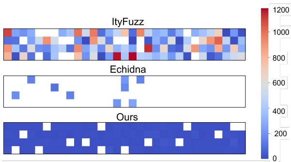  
Fig. 11. Heatmap of time taken to detect CPMM composability bugs in BlockSec dataset (seconds).

8.3.1 Precision. To evaluate the precision of CPMMX against other tools, we tested CPMMX It<sub>y</sub>F<sub>uzz an</sub>d E<sub>c</sub>hid<sub>na on</sub> th<sub>e</sub> R<sub>ea</sub>lW<sub>or</sub>ld<sub>-</sub>BSC d<sub>a</sub>t<sub>ase</sub>t<sub>.</sub> Oth<sub>er</sub> t<sub>oo</sub>l<sub>s were exc</sub>l<sub>u</sub>d<sub>e</sub>d b<sub>ecause</sub> th<sub>ey cou</sub>ld <sub>no</sub>t d<sub>e</sub>t<sub>ec</sub>t <sub>any vu</sub>l<sub>nera</sub>biliti<sub>es</sub> i<sub>n</sub> th<sub>e</sub> Bl<sub>oc</sub>kS<sub>ec</sub> d<sub>a</sub>t<sub>ase</sub>t<sub>.</sub> T<sub>o s</sub>i<sub>mu</sub>l<sub>a</sub>t<sub>e a scenar</sub>i<sub>o w</sub>h<sub>ere</sub> th<sub>ese</sub> t<sub>oo</sub>l<sub>s</sub> <sub>scan</sub> th<sub>e</sub> <sub>en</sub>ti<sub>re</sub> bl<sub>oc</sub>k<sub>c</sub>h<sub>a</sub>i<sub>n</sub> f<sub>or</sub> <sub>vu</sub>l<sub>nera</sub>biliti<sub>es</sub> <sub>an</sub>d t<sub>o</sub> <sub>ensure</sub> <sub>cons</sub>i<sub>s</sub>t<sub>en</sub>t <sub>con</sub>t<sub>rac</sub>t <sub>s</sub>t<sub>a</sub>t<sub>es,</sub> <sub>we</sub> <sub>ran</sub> <sub>a</sub>ll <sub>exper</sub>i<sub>men</sub>t<sub>s</sub> <sub>a</sub>t bl<sub>oc</sub>k 25543755<sub>,</sub> <sub>w</sub>hi<sub>c</sub>h i<sub>s</sub> <sub>one</sub> bl<sub>oc</sub>k b<sub>e</sub>f<sub>ore</sub> th<sub>e</sub> <sub>ear</sub>li<sub>es</sub>t <sub>exp</sub>l<sub>o</sub>it i<sub>n</sub> th<sub>e</sub> Bl<sub>oc</sub>kS<sub>ec</sub> d<sub>a</sub>t<sub>ase</sub>t<sub>.</sub>

Table 6 presents the results of running CPMMX and baselines on the RealWorld-BSC dataset. For precision, CPMMX and ItyFuzz achieved the highest precision with 1.00. Echidna reported <sub>a</sub> f<sub>ew</sub> f<sub>a</sub>l<sub>se</sub> <sub>pos</sub>iti<sub>ve</sub> <sub>cases.</sub> W<sub>e</sub> <sub>rev</sub>i<sub>ewe</sub>d th<sub>ese</sub> <sub>cases</sub> <sub>an</sub>d f<sub>oun</sub>d th<sub>a</sub>t E<sub>c</sub>hid<sub>na</sub> i<sub>ncorrec</sub>tl<sub>y</sub> fl<sub>agge</sub>d revertin<sub>g</sub> transactions as invariant violations. S<sub>p</sub>ecificall<sub>y,</sub> when convertin<sub>g</sub> tokens back to native currencies for com<sub>p</sub>arison<sub>,</sub> some transactions reverted<sub>,</sub> leadin<sub>g</sub> Echidna to incorrectl<sub>y</sub> classif<sub>y</sub> them <sub>as</sub> i<sub>nvar</sub>i<sub>an</sub>t <sub>v</sub>i<sub>o</sub>l<sub>a</sub>ti<sub>ons.</sub> Si<sub>nce suc</sub>h t<sub>ransac</sub>ti<sub>ons wou</sub>ld <sub>no</sub>t b<sub>e execu</sub>t<sub>e</sub>d i<sub>n rea</sub>l<sub>-wor</sub>ld <sub>scenar</sub>i<sub>os, we</sub> classified them as false <sub>p</sub>ositives. Altho<sub>ug</sub>h It<sub>y</sub>F<sub>u</sub>zz did not re<sub>p</sub>ort false <sub>p</sub>ositives<sub>,</sub> it can identif<sub>y</sub> much fewer CPMM composability bugs compared to CPMMX. Please note that the recall values dif<sub>er</sub> f<sub>rom</sub> th<sub>ose</sub> i<sub>n</sub> T<sub>a</sub>bl<sub>e</sub> 5<sub>.</sub> Thi<sub>s</sub> i<sub>s</sub> b<sub>ecause</sub> i<sub>n</sub> th<sub>e</sub> <sub>prev</sub>i<sub>ous</sub> <sub>eva</sub>l<sub>ua</sub>ti<sub>on,</sub> <sub>we</sub> <sub>use</sub>d dif<sub>eren</sub>t bl<sub>oc</sub>k <sub>num</sub>b<sub>ers</sub> f<sub>or</sub> <sub>eac</sub>h <sub>con</sub>t<sub>rac</sub>t t<sub>o</sub> <sub>ensure</sub> th<sub>a</sub>t th<sub>e</sub> <sub>con</sub>t<sub>rac</sub>t<sub>s</sub> <sub>are</sub> <sub>exp</sub>l<sub>o</sub>it<sub>a</sub>bl<sub>e;</sub> h<sub>owever,</sub> i<sub>n</sub> thi<sub>s</sub> <sub>eva</sub>l<sub>ua</sub>ti<sub>on,</sub> <sub>we use</sub>d <sub>a s</sub>i<sub>ng</sub>l<sub>e</sub> bl<sub>oc</sub>k <sub>num</sub>b<sub>er,</sub> 25543755<sub>.</sub>

8.3.2 Time. To evaluate the eficiency of CPMMX in detecting CPMM composability bugs, we com<sub>p</sub>are its runnin<sub>g</sub> time to that of It<sub>y</sub>Fuzz and Echidna. Table 6 shows the avera<sub>g</sub>e runnin<sub>g</sub> time of each tool on the RealWorld-BSC dataset. CPMMX was the most eficient, taking 597 minutes (around 10 hours) to test all 244 contracts. In com<sub>p</sub>arison, Echidna and It<sub>y</sub>Fuzz took 4147 minutes (around 69 hours) and 4715 minutes (around 79 hours), respectively. The eficiency of CPMMX can b<sub>e</sub> l<sub>arge</sub>l<sub>y a</sub>tt<sub>r</sub>ib<sub>u</sub>t<sub>e</sub>d t<sub>o</sub> it<sub>s a</sub>bilit<sub>y</sub> t<sub>o</sub> t<sub>erm</sub>i<sub>na</sub>t<sub>e ear</sub>l<sub>y</sub> f<sub>or con</sub>t<sub>rac</sub>t<sub>s</sub> th<sub>a</sub>t d<sub>o no</sub>t <sub>ex</sub>hibit i<sub>nvar</sub>i<sub>an</sub>t violations<sub>,</sub> resultin<sub>g</sub> in onl<sub>y</sub> 16 out of 122 beni<sub>g</sub>n contracts reachin<sub>g</sub> the timeout limit. In contrast<sub>,</sub> <sub>o</sub>th<sub>er</sub> t<sub>oo</sub>l<sub>s run un</sub>til ti<sub>meou</sub>t if th<sub>ey canno</sub>t d<sub>e</sub>t<sub>ec</sub>t <sub>any vu</sub>l<sub>nera</sub>biliti<sub>es.</sub> If th<sub>e</sub> ti<sub>meou</sub>t h<sub>a</sub>d b<sub>een</sub> <sub>ex</sub>t<sub>en</sub>d<sub>e</sub>d<sub>,</sub> th<sub>e</sub> <sub>runn</sub>i<sub>ng</sub> ti<sub>mes</sub> <sub>o</sub>f E<sub>c</sub>hid<sub>na</sub> <sub>an</sub>d It<sub>y</sub>F<sub>uzz</sub> <sub>wou</sub>ld h<sub>ave</sub> lik<sub>e</sub>l<sub>y</sub> b<sub>een</sub> <sub>even</sub> l<sub>onger.</sub> I<sub>n</sub> <sub>a</sub>dditi<sub>on,</sub> in §A.1, we evaluate CPMMX’s performance with benign fee-on-transfer tokens, which are more challen<sub>g</sub>in<sub>g</sub> to diferentiate from tokens with CPMM com<sub>p</sub>osabilit<sub>y</sub> bu<sub>g</sub>s.

Table 7. Average time taken by CPMMX and ItyFuzz to detect bugs in the DeFiHackLabs dataset (seconds).

<table><tr><td rowspan="26">Ours</td><td>ItyFuzz</td><td>508</td><td>AES</td></tr><tr><td>41</td><td>38</td><td>-</td></tr><tr><td>-</td><td>-</td><td>ANCH</td></tr><tr><td>-</td><td>-</td><td>ApeDAO</td></tr><tr><td>12</td><td>61</td><td>Bamboo</td></tr><tr><td>17</td><td>86</td><td>BFC</td></tr><tr><td>-</td><td>-</td><td>BGLD</td></tr><tr><td>927</td><td>-</td><td>BIGFI</td></tr><tr><td>-</td><td>-</td><td>BRA</td></tr><tr><td>-</td><td>-</td><td>GHT</td></tr><tr><td>-</td><td>-</td><td>GPT</td></tr><tr><td>177</td><td>-</td><td>HCT</td></tr><tr><td>-</td><td>-</td><td>HEALTH</td></tr><tr><td>102</td><td>-</td><td>LPC</td></tr><tr><td>-</td><td>-</td><td>PLTD</td></tr><tr><td>26</td><td>-</td><td>pSeudoEth</td></tr><tr><td>-</td><td>-</td><td>Shadowfi</td></tr><tr><td>795</td><td>-</td><td>SHEEP</td></tr><tr><td>-</td><td>-</td><td>Starlink</td></tr><tr><td>11</td><td>113</td><td>TGBS</td></tr><tr><td>86</td><td>-</td><td>ThoreumFi</td></tr><tr><td>24</td><td>-</td><td>Upswing</td></tr><tr><td>10</td><td>33</td><td>Wdoge</td></tr><tr><td>75</td><td>27</td><td>XST</td></tr><tr><td>11</td><td>-</td><td></td></tr><tr><td>51</td><td>246</td><td>Average</td></tr></table>

CPMMX also detects CPMM composability bugs much faster than other tools. Table 7 shows the <sub>average</sub> ti<sub>me</sub> t<sub>a</sub>k<sub>en</sub> t<sub>o</sub> d<sub>e</sub>t<sub>ec</sub>t <sub>eac</sub>h <sub>vu</sub>l<sub>nera</sub>bilit<sub>y</sub> i<sub>n</sub> th<sub>e</sub> D<sub>e</sub>FiH<sub>ac</sub>kL<sub>a</sub>b<sub>s</sub> d<sub>a</sub>t<sub>ase</sub>t<sub>.</sub> Th<sub>e</sub> l<sub>as</sub>t <sub>co</sub>l<sub>umn s</sub>h<sub>ows</sub> the average time taken to detect vulnerabilities. On average, CPMMX took 51 seconds to detect vulnerabilities<sub>,</sub> around 4.82 times faster than the avera<sub>g</sub>e time taken b It Fuzz. Moreover<sub>,</sub> Fi<sub>g</sub>ure 11 i<sub>s a v</sub>i<sub>sua</sub>l <sub>represen</sub>t<sub>a</sub>ti<sub>on o</sub>f h<sub>ow</sub> f<sub>as</sub>t <sub>eac</sub>h t<sub>oo</sub>l <sub>was a</sub>t fi<sub>n</sub>di<sub>ng eac</sub>h <sub>vu</sub>l<sub>nera</sub>bilit<sub>y</sub> i<sub>n</sub> th<sub>e</sub> Bl<sub>oc</sub>kS<sub>ec</sub> d<sub>a</sub>t<sub>ase</sub>t<sub>.</sub> E<sub>ac</sub>h <sub>ce</sub>ll i<sub>n</sub> th<sub>e</sub> h<sub>ea</sub>t<sub>map con</sub>t<sub>a</sub>i<sub>ns</sub> th<sub>e resu</sub>lt f<sub>or one vu</sub>l<sub>nera</sub>bilit<sub>y,</sub> th<sub>us a</sub> t<sub>o</sub>t<sub>a</sub>l <sub>o</sub>f 124 <sub>ce</sub>ll<sub>s</sub> <sub>p</sub>er tool. The red color indicates that the tool took a lon<sub>g</sub> time (close to 1,200 seconds or 20 minutes) to detect the vulnerabilit<sub>y</sub>, while the blue color indicates that the tool took a short time (close to 0 seconds) to detect the vulnerabilit . White cells indicate that the tool could not detect vulnerabilit for all three trials. As shown in the figure, CPMMX could detect most vulnerabilities quickly, while It<sub>y</sub>Fuzz detected vulnerabilities in var<sub>y</sub>in<sub>g</sub> time frames. On avera<sub>g</sub>e<sub>,</sub> It<sub>y</sub>Fuzz and Echidna took 383 seconds and 178 seconds to detect vulnerabilities, res ectivel . Meanwhile, CPMMX took onl 16 <sub>secon</sub>d<sub>s</sub> t<sub>o</sub> d<sub>e</sub>t<sub>ec</sub>t <sub>vu</sub>l<sub>nera</sub>biliti<sub>es,</sub> <sub>aroun</sub>d 24 ti<sub>mes</sub> f<sub>as</sub>t<sub>er</sub> th<sub>an</sub> th<sub>e</sub> <sub>average</sub> ti<sub>me</sub> t<sub>a</sub>k<sub>en</sub> b<sub>y</sub> It<sub>y</sub>F<sub>uzz</sub> <sub>an</sub>d 11 ti<sub>mes</sub> f<sub>as</sub>t<sub>er</sub> th<sub>an</sub> th<sub>e</sub> <sub>average</sub> ti<sub>me</sub> t<sub>a</sub>k<sub>en</sub> b<sub>y</sub> E<sub>c</sub>hid<sub>na.</sub>

This evaluation demonstrates that CPMMX efectively detects CPMM composability bugs at scale. However, it does not establish that CPMMX is more scalable overall because ItyFuzz and E<sub>c</sub>hid<sub>na</sub> <sub>are</sub> d<sub>es</sub>i<sub>gne</sub>d f<sub>or</sub> <sub>compre</sub>h<sub>ens</sub>i<sub>ve</sub> <sub>smar</sub>t <sub>con</sub>t<sub>rac</sub>t t<sub>es</sub>ti<sub>ng</sub> <sub>ra</sub>th<sub>er</sub> th<sub>an</sub> f<sub>or</sub> <sub>rap</sub>id id<sub>en</sub>tifi<sub>ca</sub>ti<sub>on</sub> of s<sub>p</sub>ecific vulnerabilities (e.<sub>g</sub>., CPMM com<sub>p</sub>osabilit<sub>y</sub> bu<sub>g</sub>s). Thus, the<sub>y</sub> do not <sub>p</sub>rioritize minimizin<sub>g</sub> <sub>execu</sub>ti<sub>on</sub> ti<sub>me.</sub> Th<sub>e resu</sub>lt<sub>s</sub> i<sub>ns</sub>t<sub>ea</sub>d <sub>sugges</sub>t th<sub>a</sub>t <sub>a</sub> t<sub>arge</sub>t<sub>e</sub>d <sub>approac</sub>h<sub>, w</sub>hi<sub>c</sub>h <sub>e</sub>fi<sub>c</sub>i<sub>en</sub>tl<sub>y</sub> id<sub>en</sub>tifi<sub>es</sub> th<sub>e</sub> <sub>ex</sub>i<sub>s</sub>t<sub>ence</sub> <sub>o</sub>f <sub>spec</sub>ifi<sub>c</sub> b<sub>ugs,</sub> i<sub>s</sub> <sub>more</sub> <sub>su</sub>it<sub>a</sub>bl<sub>e</sub> f<sub>or</sub> l<sub>arge-sca</sub>l<sub>e</sub> <sub>vu</sub>l<sub>nera</sub>bilit<sub>y</sub> d<sub>e</sub>t<sub>ec</sub>ti<sub>on.</sub>

Answer to RQ2: CPMMX is the most eficient tool to detect CPMM composability bugs. It requires the least running time and does not report any false positives.

## 8.4 Ablation Study

To assess the design of CPMMX, we perform ablation studies to measure the impact of shallow then-dee<sub>p</sub> search (§8.4.1) and runtime ar<sub>g</sub>ument re<sub>p</sub>lacement (§8.4.2). Furthermore, in §A.2, we present additional ablation studies to compare CPMMX with a commonly used auditing technique th<sub>a</sub>t <sub>mo</sub>difi<sub>es</sub> DEX <sub>con</sub>t<sub>rac</sub>t<sub>s</sub> t<sub>o remove</sub> f<sub>ees.</sub>

8.4.1 Shallow-Then-Deep Search. To demonstrate the efectiveness of our approach, we conducted ablation studies to evaluate its im<sub>p</sub>act on bu<sub>g</sub> detection rate and measure its instruction covera<sub>g</sub>e. Bug detection. We conducted an ablation study with two modified versions of CPMMX: CPMMX-NoRepeat and CPMMX-NoInvariant. CPMMX-NoRepeat does not utilize repetitions for test case generation (i.e., only shallow search). CPMMX-NoInvariant generates test cases with a random number of re<sub>p</sub>etitions and directl<sub>y</sub> checks for <sub>p</sub>rofit <sub>g</sub>eneration (i.e., onl<sub>y</sub> dee<sub>p</sub> search). Similar to previous evaluations, we ran CPMMX-NoRepeat and CPMMX-NoInvariant three times.

On average, CPMMX-NoRepeat detected 11 and CPMMX-NoInvariant detected 16 out of 23 <sub>vu</sub>l<sub>nera</sub>biliti<sub>es</sub> i<sub>n</sub> th<sub>e</sub> D<sub>e</sub>FiH<sub>ac</sub>kL<sub>a</sub>b<sub>s</sub> d<sub>a</sub>t<sub>ase</sub>t<sub>, w</sub>hi<sub>c</sub>h i<sub>s s</sub>i<sub>gn</sub>ifi<sub>can</sub>tl<sub>y</sub> l<sub>ower</sub> th<sub>an</sub> th<sub>e</sub> 21 <sub>vu</sub>l<sub>nera</sub>biliti<sub>es</sub> detected by CPMMX. Such an outcome is expected; CPMMX-NoRepeat cannot detect vulnerabilities that require repetition for profit. Meanwhile, CPMMX-NoInvariant cannot eficiently allocate <sub>resources</sub> t<sub>o</sub> f<sub>unc</sub>ti<sub>on ca</sub>ll<sub>s</sub> th<sub>a</sub>t <sub>are more</sub> lik<sub>e</sub>l<sub>y</sub> t<sub>o</sub> l<sub>ea</sub>d t<sub>o exp</sub>l<sub>o</sub>it<sub>s.</sub>

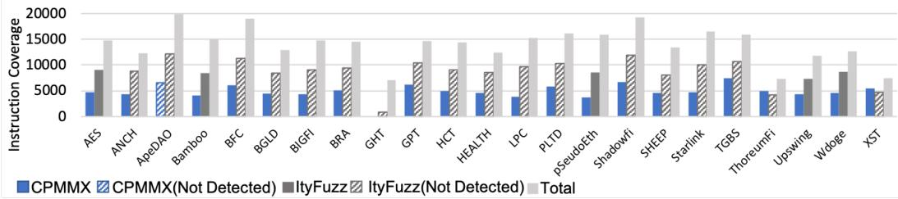  
Fig. 12. Code coverage reached by CPMMX and ItyFuzz on DeFiHackLabs dataset.

Instruction coverage. We also compare the instruction coverage of CPMMX with that of ItyFuzz. Total instr<sub>u</sub>ction co<sub>v</sub>era<sub>g</sub>e is meas<sub>u</sub>red as the s<sub>u</sub>m of all instr<sub>u</sub>ctions in the DEX contract and the corresponding token contracts. The results, presented in Figure 12, reveal that while CPMMX detects more CPMM com<sub>p</sub>osabilit<sub>y</sub> bu<sub>g</sub>s<sub>,</sub> It<sub>y</sub>Fuzz <sub>g</sub>enerall<sub>y</sub> achieves hi<sub>g</sub>her instruction covera<sub>g</sub>e. This suggests that ItyFuzz explores a broader range of functions than CPMMX, as it is designed to cover diverse vulnerabilities. In contrast, CPMMX is specially designed to detect CPMM composability b<sub>ugs.</sub> It<sub>s s</sub>h<sub>a</sub>ll<sub>ow searc</sub>h <sub>p</sub>h<sub>ase e</sub>f<sub>ec</sub>ti<sub>ve</sub>l<sub>y</sub> filt<sub>ers ou</sub>t i<sub>rre</sub>l<sub>evan</sub>t f<sub>unc</sub>ti<sub>ons, ena</sub>bli<sub>ng a more</sub> t<sub>arge</sub>t<sub>e</sub>d <sub>exp</sub>l<sub>ora</sub>ti<sub>on o</sub>f f<sub>unc</sub>ti<sub>ons</sub> lik<sub>e</sub>l<sub>y</sub> t<sub>o revea</sub>l th<sub>ese vu</sub>l<sub>nera</sub>biliti<sub>es.</sub>

8.4.2 Runtime Argument Replacement. To illustrate the necessity of runtime argument replacement, we compare CPMMX to CPMMX-NoArgReplace, which does not employ this technique. More specifically, CPMMX-NoArgReplace stops state tracking after the initial swap to the target token to execute as if CPMMX generated test cases with fixed arguments. In the DeFiHackLabs dataset, CPMMX-NoArgReplace detected only 5 out of 23 vulnerabilities. This is because it is highly prone to <sub>g</sub>eneratin<sub>g</sub> test cases that revert<sub>,</sub> as it cannot account for chan<sub>g</sub>in<sub>g</sub> token balances. Furthermore<sub>,</sub> CPMMX-NoArgReplace cannot detect invariant violations that occur midway through a test case.

Answer to RQ3: The design of CPMMX, particularly shallow-then-deep search and runtime argument replacement, play a critical role in efectively detecting CPMM composability bugs.

## 8.5 Efectiveness in the Real World

To demonstrate the efectiveness of CPMMX in detecting undiscovered CPMM composability bugs in the real world, we ran CPMMX on the latest blocks of Ethereum and Binance. Table 8 contains the summary of profitable transactions generated by CPMMX. Please note that we represent them with exploit numbers instead oftoken names or addresses because these vulnerabilities have not yet been patched. We discuss the issues with responsible disclosure for smart contracts in §10.1.

In summary, CPMMX could generate 26 profitable transactions by exploiting CPMM composabilit<sub>y</sub> bu<sub>g</sub>s in the real world<sub>,</sub> resultin<sub>g</sub> in a total 15.7K USD <sub>p</sub>rofit. To demonstrate the im<sub>p</sub>act of each vulnerabilit<sub>y</sub>, we re<sub>p</sub>ort the maximum achievable <sub>p</sub>rofit in USD (column 4) and the ratio of this profit to the pair’s balance before the exploit (column 5). As CPMMX halts when it finds a pro<sup>fi</sup>t-generating transaction an<sup>d</sup> <sup>d</sup>oes not procee<sup>d</sup> to maximize pro<sup>fi</sup>t, we manua<sup>ll</sup>y a<sup>d</sup>juste<sup>d</sup> some <sub>p</sub>arameters of the ex<sub>p</sub>loit (e.<sub>g</sub>., initial token balance or the number of re<sub>p</sub>etitions) to maximize the <sub>p</sub>rofit. Accordin<sub>g</sub> to our ex<sub>p</sub>erience<sub>,</sub> this <sub>p</sub>rofit maximization was strai<sub>g</sub>htforward for all ex<sub>p</sub>loits.

```javascript
function getRate () public {
    return totalTokenSupply / totalShareSupply ;
}
function transfer ( address addr , uint amount ) external {
    // transfer tokens
    uint shareAmount = amount / getRate ();
    shareBalances [ msg . sender ] -= shareAmount ;
    shareBalances [ addr ] += shareAmount ;
}
function maintainToken () external {
    // check that caller is a token owner
    require ( shareBalances [ msg . sender ] > minAmount );
    // proportionally decrease variables
    totalTokenSupply = totalTokenSupply * 9 / 10;
    totalShareSupply = totalShareSupply * 9 / 10;
    // award caller
    shareBalances [ msg . sender ] += awareAmount ;
}
```

Table 8. Real-world exploits generated by CPMMX. As these vulnerabilities have not been patched, we denote them with numbers to avoid providing details for exploitable vulnerabilities.

<table><tr><td>Exploit Number</td><td>Invariant Broken</td><td>Nework</td><td>Max Profit in USD</td><td>% Pair Asset</td><td>Exploit Number</td><td>Invariant Broken</td><td>Nework</td><td>Max Profit in USD</td><td>% Pair Asset</td></tr><tr><td>1</td><td>1</td><td>BSC</td><td>213.60</td><td>1.68</td><td>14</td><td>1</td><td>ETH</td><td>263.61</td><td>1.66</td></tr><tr><td>2</td><td>2</td><td>BSC</td><td>398.00</td><td>0.74</td><td>15</td><td>2</td><td>ETH</td><td>23.49</td><td>0.28</td></tr><tr><td>3</td><td>1</td><td>BSC</td><td>125.00</td><td>2.86</td><td>16</td><td>1</td><td>ETH</td><td>20.88</td><td>0.39</td></tr><tr><td>4</td><td>1</td><td>BSC</td><td>4796.00</td><td>189.66</td><td>17</td><td>1</td><td>ETH</td><td>4358.70</td><td>99.85</td></tr><tr><td>5</td><td>1</td><td>BSC</td><td>282.76</td><td>2.40</td><td>18</td><td>1</td><td>ETH</td><td>13.05</td><td>1.90</td></tr><tr><td>6</td><td>1</td><td>BSC</td><td>76.64</td><td>3.54</td><td>19</td><td>2</td><td>ETH</td><td>631.62</td><td>56.93</td></tr><tr><td>7</td><td>1</td><td>BSC</td><td>2.14</td><td>0.05</td><td>20</td><td>1</td><td>ETH</td><td>46.98</td><td>0.71</td></tr><tr><td>8</td><td>1</td><td>BSC</td><td>1.77</td><td>0.19</td><td>21</td><td>1</td><td>ETH</td><td>4.65</td><td>0.17</td></tr><tr><td>9</td><td>1</td><td>BSC</td><td>1.80</td><td>0.25</td><td>22</td><td>2</td><td>ETH</td><td>5.90</td><td>0.44</td></tr><tr><td>10</td><td>1</td><td>BSC</td><td>3.70</td><td>0.16</td><td>23</td><td>1</td><td>ETH</td><td>3.52</td><td>0.27</td></tr><tr><td>11</td><td>1</td><td>BSC</td><td>1.43</td><td>0.0046</td><td>24</td><td>1</td><td>ETH</td><td>21.82</td><td>1.81</td></tr><tr><td>12</td><td>2</td><td>BSC</td><td>614.00</td><td>1.14</td><td>25</td><td>1</td><td>ETH</td><td>39.15</td><td>3.33</td></tr><tr><td>13</td><td>2</td><td>ETH</td><td>148.77</td><td>0.24</td><td>26</td><td>1</td><td>ETH</td><td>3575.70</td><td>99.77</td></tr></table>

CPMMX could generate four critical exploits that can drain more than halfofthe DEX’s stablecoin balance (marked in bold in Table 8). Other attacks can also <sub>y</sub>ield considerable <sub>p</sub>rofits (e.<sub>g</sub>., a few hundred dollars). We currentl<sub>y</sub> onl<sub>y</sub> consider sin<sub>g</sub>le transaction ex<sub>p</sub>loits. However, if this vulnerabilit<sub>y</sub> i<sub>s exp</sub>l<sub>o</sub>it<sub>e</sub>d <sub>repea</sub>t<sub>e</sub>dl<sub>y</sub> i<sub>n</sub> th<sub>e</sub> l<sub>ong</sub> t<sub>erm,</sub> it <sub>cou</sub>ld <sub>resu</sub>lt i<sub>n sus</sub>t<sub>a</sub>i<sub>ne</sub>d <sub>pro</sub>fit <sub>an</sub>d <sub>po</sub>t<sub>en</sub>ti<sub>a</sub>ll<sub>y</sub> d<sub>ra</sub>i<sub>n a</sub>ll f<sub>un</sub>d<sub>s.</sub> W<sub>e</sub> l<sub>eave</sub> th<sub>e</sub> d<sub>eve</sub>l<sub>opmen</sub>t <sub>o</sub>f <sub>suc</sub>h l<sub>ong-</sub>t<sub>erm exp</sub>l<sub>o</sub>it <sub>genera</sub>ti<sub>on as</sub> f<sub>u</sub>t<sub>ure wor</sub>k<sub>.</sub>

Answer to RQ4: CPMMX can generate impactful real-world exploits.

## 9 Case Study

This section reports case studies for real-world CPMM composability bugs that CPMMX detected.

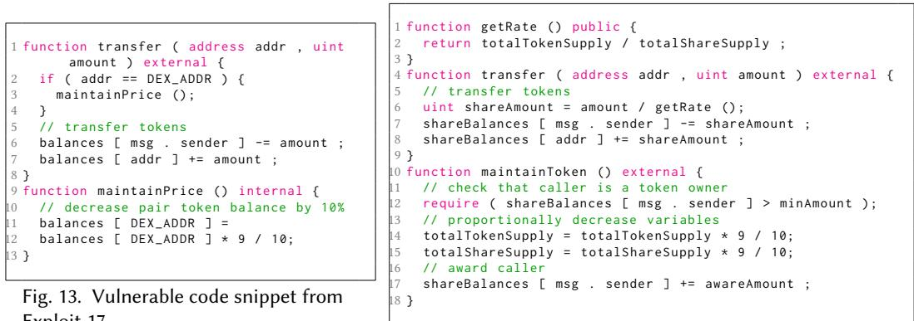  
Fig. 13. Vulnerable code snippet from Exploit 17.  
Fig. 14. Vulnerable code snippet from Exploit 19.

## 9.1 Exploit 17: Breaking Invariant 1

Exploit 17 is a real-world bug that violates Invariant 1. This happens due to Token 17’s deflationary <sub>mec</sub>h<sub>an</sub>i<sub>sm.</sub> Fi<sub>gure</sub> 13 <sub>s</sub>h<sub>ows</sub> th<sub>e s</sub>i<sub>mp</sub>lifi<sub>e</sub>d <sub>vers</sub>i<sub>on o</sub>f <sub>vu</sub>l<sub>nera</sub>bl<sub>e co</sub>d<sub>e</sub> f<sub>rom</sub> T<sub>o</sub>k<sub>en</sub> 17<sub>.</sub> A<sub>ccor</sub>di<sub>ng</sub> t<sub>o</sub> the CPMM model<sub>,</sub> whenever users sell Token 17 to the DEX<sub>,</sub> the <sub>p</sub>rice of Token 17 falls. To miti<sub>g</sub>ate th<sub>e pr</sub>i<sub>ce</sub> f<sub>a</sub>ll<sub>,</sub> T<sub>o</sub>k<sub>en</sub> 17 h<sub>as a</sub> f<sub>unc</sub>ti<sub>on</sub> th<sub>a</sub>t b<sub>urns</sub> it<sub>s s</sub>h<sub>are</sub> i<sub>n</sub> th<sub>e</sub> DEX <sub>w</sub>h<sub>enever users se</sub>ll T<sub>o</sub>k<sub>en</sub>

17 to the DEX (i.e., maintainPrice() function in lines 9-13). Since this behavior can be tri<sub>gg</sub>ered <sub>mu</sub>lti<sub>p</sub>l<sub>e</sub> ti<sub>mes, an a</sub>tt<sub>ac</sub>k<sub>er can</sub> b<sub>urn a s</sub>i<sub>gn</sub>ifi<sub>can</sub>t <sub>por</sub>ti<sub>on o</sub>f th<sub>e</sub> DEX t<sub>o</sub>k<sub>en</sub> b<sub>a</sub>l<sub>ance,</sub> b<sub>rea</sub>ki<sub>ng</sub> Invariant 1. The attacker can leverage this vulnerability to drain almost all stablecoins from the DEX<sub>,</sub> which is worth 4358.70 USD. Interestin<sub>g</sub>l<sub>y,</sub> it is not <sub>p</sub>rofitable if we tri<sub>gg</sub>er this behavior onl<sub>y</sub> once, making it dificult for existing tools to detect this bug. On the other hand, CPMMX can detect this bu<sub>g</sub> b<sub>y</sub> re<sub>p</sub>eatedl<sub>y</sub> tri<sub>gg</sub>erin<sub>g</sub> the behavior thanks to our two-ste<sub>p</sub> a<sub>pp</sub>roach.

## 9.2 Exploit 19: Breaking Invariant 2

Exploit 19 is a real-world bug that breaks Invariant 2. This token, henceforth Token 19, rewards <sub>users w</sub>h<sub>enever</sub> th<sub>ey ca</sub>ll <sub>a ma</sub>i<sub>n</sub>t<sub>enance</sub> f<sub>unc</sub>ti<sub>on.</sub> Fi<sub>gure</sub> 14 <sub>s</sub>h<sub>ows</sub> th<sub>e s</sub>i<sub>mp</sub>lifi<sub>e</sub>d <sub>vers</sub>i<sub>on o</sub>f T<sub>o</sub>k<sub>en</sub> 19. T<sup>h</sup>is to<sup>k</sup>en manages its <sup>b</sup>a<sup>l</sup>ances using two varia<sup>bl</sup>es, totalTokenSupply an<sup>d</sup> totalShareSupply. As more users join t<sup>h</sup>e mar<sup>k</sup>et <sup>f</sup>or To<sup>k</sup>en 19, t<sup>h</sup>e two varia<sup>bl</sup>es wi<sup>ll</sup> increase an<sup>d</sup> may resu<sup>l</sup>t in integer <sub>over</sub>fl<sub>ow.</sub> T<sub>o preven</sub>t <sub>suc</sub>h <sub>a s</sub>it<sub>ua</sub>ti<sub>on,</sub> T<sub>o</sub>k<sub>en</sub> 19 h<sub>as</sub> t<sub>o</sub> d<sub>ecrease</sub> th<sub>e</sub> t<sub>wo var</sub>i<sub>a</sub>bl<sub>es per</sub>i<sub>o</sub>di<sub>ca</sub>ll<sub>y.</sub> S<sub>u</sub>ch maintenance f<sub>u</sub>nction is im<sub>p</sub>lemented in lines 10 to 18 in Fi<sub>gu</sub>re 14. Unlike other tokens th<sub>a</sub>t <sub>em</sub>b<sub>e</sub>d th<sub>ese</sub> f<sub>unc</sub>ti<sub>ons</sub> i<sub>n a common</sub>l<sub>y ca</sub>ll<sub>e</sub>d f<sub>unc</sub>ti<sub>on, suc</sub>h <sub>as transfer,</sub> T<sub>o</sub>k<sub>en</sub> 19 <sub>a</sub>d<sub>op</sub>t<sub>s a</sub> diferent a<sub>pp</sub>roach<sub>,</sub> incentivizin<sub>g</sub> users to call this function directl<sub>y</sub>. However<sub>,</sub> the develo<sub>p</sub>ers did <sub>no</sub>t li<sub>m</sub>it th<sub>e</sub> <sub>num</sub>b<sub>er</sub> <sub>o</sub>f ti<sub>mes</sub> <sub>a</sub> <sub>user</sub> <sub>can</sub> <sub>ca</sub>ll th<sub>e</sub> f<sub>unc</sub>ti<sub>on.</sub> Th<sub>us,</sub> <sub>an</sub> <sub>a</sub>tt<sub>ac</sub>k<sub>er</sub> <sub>can</sub> <sub>repea</sub>t<sub>e</sub>dl<sub>y</sub> <sub>ca</sub>ll thi<sub>s</sub> maintainToken() to accumu<sup>l</sup>ate a signi<sup>fi</sup>cant amount o<sup>f</sup> To<sup>k</sup>en 19 wit<sup>h</sup>out cost. Note t<sup>h</sup>at, simi<sup>l</sup>ar to our motivatin<sub>g</sub> exam<sub>p</sub>le in §3.1, the attacker has to rea<sub>p</sub> the reward multi<sub>p</sub>le times to ofset costs, <sub>ma</sub>ki<sub>ng</sub> it <sub>un</sub>lik<sub>e</sub>l<sub>y</sub> f<sub>or</sub> <sub>ex</sub>i<sub>s</sub>ti<sub>ng</sub> t<sub>oo</sub>l<sub>s</sub> t<sub>o</sub> d<sub>e</sub>t<sub>ec</sub>t thi<sub>s</sub> b<sub>ug.</sub> W<sub>e</sub> <sub>conc</sub>l<sub>u</sub>d<sub>e</sub>d th<sub>a</sub>t thi<sub>s</sub> <sub>vu</sub>l<sub>nera</sub>bilit<sub>y</sub> <sub>cou</sub>ld b<sub>e</sub> l<sub>everage</sub>d t<sub>o</sub> d<sub>ra</sub>i<sub>n</sub> <sub>aroun</sub>d 57% <sub>o</sub>f <sub>re</sub>l<sub>evan</sub>t DEX’<sub>s</sub> <sub>s</sub>t<sub>a</sub>bl<sub>eco</sub>i<sub>n</sub> b<sub>a</sub>l<sub>ance,</sub> <sub>w</sub>hi<sub>c</sub>h i<sub>s</sub> <sub>wor</sub>th 631<sub>.</sub>62 USD<sub>.</sub>

## 10 Discussion

## 10.1 Responsible Disclosure for Smart Contract Vulnerabilities

We attempted to notify the token maintainers about bugs found by CPMMX but were unable to reach them. We also re<sub>p</sub>orted our findin<sub>g</sub>s to CISA (C<sub>y</sub>bersecurit<sub>y</sub> & Infrastructure Securit<sub>y</sub> A<sub>g</sub>enc<sub>y</sub>), who recommended <sub>p</sub>ublic disclosure of the bu<sub>g</sub>s. However, we decided not to <sub>p</sub>roceed <sub>w</sub>ith thi<sub>s</sub> <sub>recommen</sub>d<sub>a</sub>ti<sub>on,</sub> <sub>as</sub> <sub>anyone</sub> <sub>exp</sub>l<sub>o</sub>iti<sub>ng</sub> th<sub>e</sub> <sub>vu</sub>l<sub>nera</sub>biliti<sub>es</sub> <sub>wou</sub>ld di<sub>rec</sub>tl<sub>y</sub> <sub>cause</sub> fi<sub>nanc</sub>i<sub>a</sub>l h<sub>arm</sub> t<sub>o</sub> t<sub>o</sub>k<sub>en</sub> h<sub>o</sub>ld<sub>ers.</sub> I<sub>n</sub> <sub>a</sub>dditi<sub>on,</sub> <sub>we</sub> <sub>consu</sub>lt<sub>e</sub>d <sub>w</sub>ith SEAL 911<sub>,</sub> <sub>a</sub> <sub>group</sub> <sub>o</sub>f bl<sub>oc</sub>k<sub>c</sub>h<sub>a</sub>i<sub>n</sub> <sub>secur</sub>it<sub>y</sub> <sub>researc</sub>h<sub>ers,</sub> b<sub>u</sub>t <sub>cou</sub>ld <sub>no</sub>t d<sub>e</sub>t<sub>erm</sub>i<sub>ne</sub> <sub>a</sub> <sub>sa</sub>f<sub>e</sub> <sub>an</sub>d <sub>e</sub>thi<sub>ca</sub>l <sub>approac</sub>h f<sub>or</sub> <sub>manag</sub>i<sub>ng</sub> th<sub>ese</sub> <sub>vu</sub>l<sub>nera</sub>biliti<sub>es.</sub> A<sub>s a resu</sub>lt<sub>,</sub> th<sub>e vu</sub>l<sub>nera</sub>biliti<sub>es rema</sub>i<sub>n unpa</sub>t<sub>c</sub>h<sub>e</sub>d<sub>.</sub> W<sub>e</sub> h<sub>ope</sub> th<sub>a</sub>t <sub>a sa</sub>f<sub>e an</sub>d <sub>e</sub>thi<sub>ca</sub>l <sub>approac</sub>h <sub>w</sub>ill b<sub>e</sub> esta<sup>bl</sup>is<sup>h</sup>e<sup>d f</sup>or a<sup>dd</sup>ressing security issues in projects wit<sup>h</sup>out active maintainers.

## 10.2 Limitations and Future Works

CPMMX has three limitations. First, it currently only supports Uniswap V2 DEXes. With further development, CPMMX can be extended to support other CPMM implementations, which we leave for future work. Second, CPMMX is constrained by the templates and state-changing calls used in test case <sub>g</sub>eneration. It fails to detect CPMM com<sub>p</sub>osabilit<sub>y</sub> bu<sub>g</sub>s that do not conform to the tem<sub>p</sub>lates<sub>,</sub> such as A<sub>p</sub>eDAO (§8.2). Furthermore, it does not levera<sub>g</sub>e all available functions from token <sub>con</sub>t<sub>rac</sub>t<sub>s</sub> f<sub>or s</sub>t<sub>a</sub>t<sub>e-c</sub>h<sub>ang</sub>i<sub>ng ca</sub>ll<sub>s.</sub> It di<sub>scar</sub>d<sub>s</sub> f<sub>unc</sub>ti<sub>on ca</sub>ll<sub>s w</sub>ith <sub>argumen</sub>t<sub>s</sub> t<sub>o avo</sub>id th<sub>e comp</sub>l<sub>ex</sub>it<sub>y</sub> comin<sub>g</sub> from <sub>g</sub>eneratin<sub>g</sub> valid ar<sub>g</sub>uments. To miti<sub>g</sub>ate this limitation<sub>,</sub> we could extend tem<sub>p</sub>lates and incor<sub>p</sub>orate more state-chan<sub>g</sub>in<sub>g</sub> function calls. Static anal<sub>y</sub>sis could hel<sub>p</sub> <sub>g</sub>enerate valid ar<sub>g</sub>uments. However<sub>,</sub> su<sub>pp</sub>ortin<sub>g</sub> a broader ran<sub>g</sub>e of tem<sub>p</sub>lates and functions would also increase the search s<sub>p</sub>ace<sub>,</sub> <sub>p</sub>otentiall<sub>y</sub> reducin<sub>g</sub> eficienc<sub>y</sub>. Investi<sub>g</sub>atin<sub>g</sub> the trade-of between eficienc<sub>y</sub> and generalizability would be valuable in identifying the optimal balance. Finally, CPMMX only supports CPMM com<sub>p</sub>osabilit<sub>y</sub> bu<sub>g</sub>s<sub>,</sub> which can be re<sub>p</sub>resented b<sub>y</sub> breakin<sub>g</sub> two safet<sub>y</sub> invariants. In the future, it would be interesting to design a targeted approach like CPMMX for other vulnerabilities.

## 10.3 Threats to Validity

Internal threats. Since we suggest a new category of vulnerability, we could not evaluate our <sub>sys</sub>t<sub>em on we</sub>ll<sub>-es</sub>t<sub>a</sub>bli<sub>s</sub>h<sub>e</sub>d d<sub>a</sub>t<sub>ase</sub>t<sub>s.</sub> I<sub>ns</sub>t<sub>ea</sub>d<sub>, we se</sub>l<sub>ec</sub>t<sub>e</sub>d <sub>a su</sub>b<sub>se</sub>t f<sub>rom a popu</sub>l<sub>ar</sub> d<sub>a</sub>t<sub>ase</sub>t<sub>,</sub> D<sub>e</sub>Fi<sub>-</sub> HackLabs [12], as one of our evaluation datasets. To miti<sub>g</sub>ate <sub>p</sub>otential internal threats, the first <sub>an</sub>d <sub>secon</sub>d <sub>au</sub>th<sub>ors</sub> i<sub>n</sub>d<sub>epen</sub>d<sub>en</sub>tl<sub>y</sub> <sub>se</sub>l<sub>ec</sub>t<sub>e</sub>d th<sub>e</sub> <sub>su</sub>b<sub>se</sub>t <sub>an</sub>d di<sub>scusse</sub>d <sub>eac</sub>h <sub>exp</sub>l<sub>o</sub>it <sub>un</sub>til <sub>reac</sub>hi<sub>ng</sub> <sub>a</sub> <sub>co</sub>n<sub>se</sub>n<sub>sus,</sub> minimizin<sub>g se</sub>l<sub>ec</sub>ti<sub>o</sub>n bi<sub>as a</sub>nd <sub>e</sub>n<sub>su</sub>rin<sub>g a co</sub>n<sub>s</sub>i<sub>s</sub>t<sub>e</sub>nt <sub>eva</sub>l<sub>ua</sub>ti<sub>o</sub>n <sub>p</sub>r<sub>ocess.</sub>

External threats. A potential external threat is the limited number of reported CPMM composabilit<sub>y</sub> bu<sub>g</sub>s. To address this, we conducted an in-the-wild ex<sub>p</sub>eriment as described in §8.5, which allowed us to validate CPMMX’s performance against real-world contracts.

## 11 Related Work

Numerous tools detect smart contract vulnerabilities. Some utilize static anal<sub>y</sub>sis techni<sub>q</sub>ues<sub>,</sub> such as model checkin<sub>g</sub> [5] and s<sub>y</sub>mbolic execution [15, 24]. While others utilize d<sub>y</sub>namic anal<sub>y</sub>sis techni<sub>q</sub>ues, most notabl<sub>y</sub> fuzzin<sub>g</sub> [11, 17, 28]. Recent works also utilize machine learnin<sub>g</sub> [8, 23], includin<sub>g</sub> Lar<sub>g</sub>e Lan<sub>g</sub>ua<sub>g</sub>e Models [10, 29].

Multi-contract vulnerability detection. Several works were proposed to detect multi-contract vulnerabilities. Some focus on detectin<sub>g</sub> commonl<sub>y</sub> a<sub>pp</sub>earin<sub>g</sub> ones<sub>,</sub> such as reentranc<sub>y</sub> and dele atecall-related vulnerabilities [22, 31], while some aim to detect a wide variet of vulnerabili ties [17, 28]. In <sub>p</sub>articular, It<sub>y</sub>Fuzz ex<sub>p</sub>lores various combinations of contract states throu<sub>g</sub>h fuzzin<sub>g</sub> <sub>w</sub>ith <sub>snaps</sub>h<sub>o</sub>t<sub>s, an</sub>d E<sub>c</sub>hid<sub>na uses a s</sub>t<sub>a</sub>ti<sub>c ana</sub>l<sub>yzer,</sub> Slith<sub>er,</sub> t<sub>o ex</sub>t<sub>rac</sub>t <sub>use</sub>f<sub>u</sub>l i<sub>n</sub>f<sub>orma</sub>ti<sub>on</sub> b<sub>e</sub>f<sub>ore</sub> f<sub>uzz</sub>i<sub>ng.</sub> Alth<sub>oug</sub>h CPMM <sub>composa</sub>bilit<sub>y</sub> b<sub>ugs can</sub> th<sub>eore</sub>ti<sub>ca</sub>ll<sub>y</sub> b<sub>e</sub> d<sub>e</sub>t<sub>ec</sub>t<sub>e</sub>d <sub>w</sub>ith <sub>suc</sub>h <sub>me</sub>th<sub>o</sub>d<sub>s, our</sub> e<sub>v</sub>al<sub>u</sub>ation indicates that a <sub>g</sub>eneric a<sub>pp</sub>roach is inefecti<sub>v</sub>e. Since CPMM com<sub>p</sub>osabilit<sub>y</sub> b<sub>ug</sub>s are <sub>c</sub>l<sub>ose</sub>l<sub>y</sub> ti<sub>e</sub>d t<sub>o</sub> th<sub>e</sub> b<sub>us</sub>i<sub>ness</sub> l<sub>og</sub>i<sub>c o</sub>f <sub>con</sub>t<sub>rac</sub>t<sub>s an</sub>d <sub>some</sub>ti<sub>mes requ</sub>i<sub>re a</sub> l<sub>ong sequence o</sub>f f<sub>unc</sub>ti<sub>on</sub> calls for exploitation, a targeted approach is more suitable, as demonstrated by CPMMX.

Automatic exploit generation. Some works propose systems that automatically generate ex-<sub>p</sub>loits. EthPloit [33] <sub>g</sub>enerates ex<sub>p</sub>loits for sin<sub>g</sub>le contracts based on fuzzin<sub>g</sub>. FlashS<sub>y</sub>n [9] utilizes counterexam<sub>p</sub>le-driven a<sub>pp</sub>roximation to <sub>g</sub>enerate flashloan attacks. Gritti et al. [18] desi<sub>g</sub>ned <sub>a</sub> <sub>sys</sub>t<sub>em</sub> th<sub>a</sub>t <sub>ana</sub>l<sub>yzes</sub> <sub>mu</sub>lti<sub>p</sub>l<sub>e</sub> <sub>con</sub>t<sub>rac</sub>t<sub>s</sub> t<sub>o</sub> <sub>au</sub>t<sub>oma</sub>ti<sub>ca</sub>ll<sub>y</sub> d<sub>e</sub>t<sub>ec</sub>t <sub>an</sub>d <sub>exp</sub>l<sub>o</sub>it <sub>con</sub>f<sub>use</sub>d d<sub>epu</sub>t<sub>y</sub> vulnerabilities. CPMMX pursues the same goal of exploit generation, but it targets a vulnerability th<sub>a</sub>t th<sub>e a</sub>f<sub>oremen</sub>ti<sub>one</sub>d t<sub>oo</sub>l<sub>s canno</sub>t d<sub>e</sub>t<sub>ec</sub>t<sub>.</sub>

## 12 Conclusion

We proposed CPMMX, a tool that can automatically detect and generate end-to-end exploits for CPMM com<sub>p</sub>osabilit<sub>y</sub> bu<sub>g</sub>s. For this<sub>,</sub> we first formalized CPMM com<sub>p</sub>osabilit<sub>y</sub> bu<sub>g</sub>s and <sub>p</sub>ro<sub>p</sub>ose a two-step approach, called shallow-then-deep search, to detect them. We evaluated CPMMX against five baselines on three datasets and demonstrated that CPMMX outperforms all baselines in terms of recall, precision, and F1 score. Furthermore, we applied CPMMX on the latest blocks of the Ethereum and Binance chains and discovered 26 new ex<sub>p</sub>loits that can <sub>y</sub>ield 15.7K USD total <sub>p</sub>rofit.

## 13 Data Availability

In support of the open science policy, we make the source code of CPMMX, datasets, and scripts to run ex<sub>p</sub>eriments available at a <sub>p</sub>ublic re<sub>p</sub>ositor<sub>y</sub> [19].

## Acknowledgments

This work was su<sub>pp</sub>orted in <sub>p</sub>art b<sub>y</sub> the Korea-U.S. Joint Research Su<sub>pp</sub>ort Pro<sub>g</sub>ram funded b<sub>y</sub> the Ministr<sub>y</sub> of Science and ICT (MSIT) throu<sub>g</sub>h the National Research Foundation of Korea (NRF) (RS 2022-NR119707) and the NRF <sub>g</sub>rant funded b<sub>y</sub> the Korea <sub>g</sub>overnment (MSIT) (RS-2024-00337007).

## A Appendix

Fig. 15. Performance metrics and running time comparison of CPMMX and baselines on RealWorld-BSC-FOT dataset at block 25543755.

<table><tr><td></td><td>Echidna</td><td>ItyFuzz</td><td>Ours</td></tr><tr><td>Precision</td><td>0.78</td><td>0.96</td><td>1.00</td></tr><tr><td>Recall</td><td>0.09</td><td>0.49</td><td>0.93</td></tr><tr><td>F1 Score</td><td>0.16</td><td>0.65</td><td>0.97</td></tr><tr><td>Vulnerable Time (min)</td><td>2290</td><td>1707</td><td>150</td></tr><tr><td>Benign Time (min)</td><td>2411</td><td>2422</td><td>1867</td></tr><tr><td>Overall Time (min)</td><td>4701</td><td>4129</td><td>2017</td></tr><tr><td>Vulnerable Timeout #</td><td>111.33</td><td>62</td><td>6</td></tr><tr><td>Benign Timeout #</td><td>119</td><td>119.67</td><td>83.67</td></tr><tr><td>Overall Timeout #</td><td>230.33</td><td>181.67</td><td>89.67</td></tr></table>

Fig. 16. Performance of CPMMX, CPMMX-NoFee, and CPMMX-NoFeeNoRepeat in detecting bugs in the DeFiHack-Labs dataset.

<table><tr><td></td><td># Bugs Detected</td><td>Average Time (sec)</td></tr><tr><td>CPMMX</td><td>21</td><td>51</td></tr><tr><td>CPMMX-NoFee</td><td>20</td><td>43</td></tr><tr><td>CPMMX-NoFeeNoRepeat</td><td>14</td><td>31</td></tr></table>

## A.1 Evaluation on Fee-on-Transfer Tokens

To evaluate performance on challenging cases, we test CPMMX, ItyFuzz and Echidna on RealWorld-BSC<sub>-</sub>FOT<sub>, a mo</sub>difi<sub>e</sub>d <sub>vers</sub>i<sub>on o</sub>f th<sub>e</sub> R<sub>ea</sub>lW<sub>or</sub>ld<sub>-</sub>BSC i<sub>n w</sub>hi<sub>c</sub>h <sub>a</sub>ll b<sub>en</sub>i<sub>gn</sub> t<sub>o</sub>k<sub>ens are</sub> f<sub>ee-on-</sub>t<sub>rans</sub>f<sub>er</sub> tokens. In the ori<sub>g</sub>inal RealWorld-BSC<sub>,</sub> onl<sub>y</sub> 22 out of 122 beni<sub>g</sub>n tokens have this <sub>p</sub>ro<sub>p</sub>ert<sub>y</sub>. Fee-<sub>on-</sub>t<sub>rans</sub>f<sub>er</sub> t<sub>o</sub>k<sub>ens</sub> d<sub>e</sub>d<sub>uc</sub>t <sub>a por</sub>ti<sub>on o</sub>f <sub>eac</sub>h t<sub>rans</sub>f<sub>er as a</sub> f<sub>ee.</sub> I<sub>n some cases,</sub> th<sub>ese</sub> f<sub>ee mec</sub>h<sub>an</sub>i<sub>sms</sub> remove more tokens from DEXes than expected, causing Invariant 1 violations. However, these tok<sub>ens canno</sub>t b<sub>e exp</sub>l<sub>o</sub>it<sub>e</sub>d t<sub>o ex</sub>t<sub>rac</sub>t <sub>s</sub>t<sub>a</sub>bl<sub>eco</sub>i<sub>ns</sub> f<sub>rom</sub> DEX<sub>es</sub> b<sub>ecause</sub> th<sub>ey a</sub>l<sub>so</sub> i<sub>mp</sub>l<sub>emen</sub>t <sub>sa</sub>f<sub>eguar</sub>d<sub>s.</sub> This makes distin<sub>g</sub>uishin<sub>g</sub> between beni<sub>g</sub>n fee-on-transfer tokens and CPMM com<sub>p</sub>osabilit<sub>y</sub> bu<sub>g</sub>s more dificult than diferentiatin<sub>g</sub> non-fee tokens from CPMM com<sub>p</sub>osabilit<sub>y</sub> bu<sub>g</sub>s.

As shown in Figure 15, although CPMMX continues to outperform the baselines, the gap in execution time has narrowed. CPMMX maintains a precision of 1.00, but its overall execution time i<sub>ncrease</sub>d f<sub>rom</sub> 597 <sub>secon</sub>d<sub>s</sub> i<sub>n</sub> T<sub>a</sub>bl<sub>e</sub> 6 t<sub>o</sub> 2017 <sub>secon</sub>d<sub>s.</sub> Thi<sub>s</sub> i<sub>s</sub> b<sub>ecause many</sub> b<sub>en</sub>i<sub>gn</sub> f<sub>ee-on-</sub>t<sub>rans</sub>f<sub>er</sub> tokens triggered Invariant 1 violations. Echidna and ItyFuzz demonstrated similar performances.

## A.2 Evaluation with DEXes Modified to Remove Fees

An alternative a<sub>pp</sub>roach to detect CPMM com<sub>p</sub>osabilit<sub>y</sub> bu<sub>g</sub>s is executin<sub>g</sub> tem<sub>p</sub>late test cases with DEX<sub>es mo</sub>difi<sub>e</sub>d t<sub>o remove</sub> f<sub>ees.</sub> Thi<sub>s me</sub>th<sub>o</sub>d i<sub>s common</sub>l<sub>y use</sub>d i<sub>n rea</sub>l<sub>-wor</sub>ld b<sub>ug</sub> fi<sub>n</sub>di<sub>ng, as</sub> it <sub>can</sub> eliminate the need for re<sub>p</sub>etitions re<sub>q</sub>uired to identif<sub>y</sub> vulnerabilities. For instance<sub>,</sub> in the case of the ANCH bug (§3.1), CPMMX requires repetitions for the attacker to accumulate enough bonus to ofset the DEX fee. If the DEX fee is removed<sub>,</sub> this bu<sub>g</sub> can be detected without re<sub>p</sub>etitions. To evaluate the efectiveness of this approach, we compare CPMMX with two variants using the DeFiHackLabs dataset: CPMMX-NoFee, which eliminates the DEX fee, and CPMMX-NoFeeNoRepeat, <sub>w</sub>hi<sub>c</sub>h <sub>removes</sub> b<sub>o</sub>th th<sub>e</sub> DEX f<sub>ee</sub> <sub>an</sub>d th<sub>e</sub> d<sub>eep</sub> <sub>searc</sub>h <sub>p</sub>h<sub>ase</sub> f<sub>or</sub> <sub>repe</sub>titi<sub>on.</sub>

As shown in Figure 16, removing DEX fees resulted in lower bug detection rates. CPMMX-NoFee and CPMMX-NoFeeNoRepeat missed one more and seven more bugs compared to CPMMX. CPMMX-NoFee was unable to detect the vulnerability in GPT. After patching the DEX bytecode to remove fees<sub>,</sub> all test cases for GPT reverted. This likel<sub>y</sub> res<sub>u</sub>lts from GPT internall<sub>y</sub> callin<sub>g</sub> DEX f<sub>u</sub>nctions and expecting fee-based behavior. CPMMX-NoFeeNoRepeat failed to detect CPMM composability b<sub>ugs</sub> in GPT <sub>as</sub> <sub>we</sub>ll <sub>as</sub> in <sub>s</sub>ix <sub>o</sub>th<sub>e</sub>r t<sub>o</sub>k<sub>e</sub>n<sub>s</sub>: BFC<sub>,</sub> BRA<sub>,</sub> HEALTH<sub>,</sub> PLTD<sub>,</sub> St<sub>a</sub>rlink<sub>,</sub> <sub>a</sub>nd TGBS<sub>.</sub> E<sub>ve</sub>n <sub>a</sub>ft<sub>e</sub>r remo<sub>v</sub>in<sub>g</sub> DEX fees<sub>,</sub> these cases still re<sub>qu</sub>ired re<sub>p</sub>etitions for <sub>p</sub>rofit. For instance<sub>,</sub> the PLTD token h<sub>as</sub> b<sub>o</sub>th <sub>a</sub> f<sub>ee an</sub>d <sub>a</sub> b<sub>onus mec</sub>h<sub>an</sub>i<sub>sm.</sub> Th<sub>us,</sub> th<sub>e a</sub>tt<sub>ac</sub>k<sub>er mus</sub>t <sub>accumu</sub>l<sub>a</sub>t<sub>e su</sub>fi<sub>c</sub>i<sub>en</sub>t b<sub>onuses</sub> t<sub>o</sub> ofset PLTD’s fees. On average, CPMMX-NoFeeNoRepeat is the fastest at detecting bugs, followed by CPMMX-NoFee then CPMMX. This suggests that removing DEX fees can be used as an optimization strate<sub>gy</sub> to accelerate the bu<sub>g</sub> detection <sub>p</sub>rocess while maintainin<sub>g</sub> reasonable accurac<sub>y</sub>.

## References

[1] 2024. BscScan: The Binance Smart Chain Ex<sub>p</sub>lorer. htt<sub>p</sub>s://bscscan.com/ Accessed: 2024-10-24.

[2] 2024. Etherscan: The Ethereum Blockchain Ex<sub>p</sub>lorer. htt<sub>p</sub>s://etherscan.io/ Accessed: 2024-10-24.

[3] Ha<sub>y</sub>den Adams, Noah Zinsmeister, and Dan Robinson. 2021. Uniswa<sub>p</sub> Protocol White<sub>p</sub>a<sub>p</sub>er. htt<sub>p</sub>s://docs.uniswa<sub>p</sub>.or<sub>g</sub>/ <sub>w</sub>hit<sub>epape</sub>r<sub>.p</sub>df A<sub>ccesse</sub>d: 2024-10-24<sub>.</sub>

[4] Ancilia Inc. 2022. Blockchain Securit<sub>y</sub> for Web3 Develo<sub>p</sub>ers. htt<sub>p</sub>s://x.com/AnciliaInc/status/1557846766682140672. A<sub>ccesse</sub>d<sub>:</sub> 2024<sub>-</sub>10<sub>-</sub>16<sub>.</sub>

[5] Kushal Babel, Phili<sub>p</sub> Daian, Mahimna Kelkar, and Ari Juels. 2023. Clockwork finance: Automated anal<sub>y</sub>sis of economic security in smart contracts. 2023 IEEE Symposium on Security and Privacy (SP), 2499–2516. doi:10.1109/SP46215.2023. 10179346

[6] BlockSec. 2023. BlockSec Twitter. htt<sub>p</sub>s://twitter.com/BlockSecTeam/status/1624077078852210691.

[7] BlockSec. 2024. BlockSec. htt<sub>p</sub>s://blocksec.com/.

[8] Yizhou Chen, Ze<sub>y</sub>u Sun, Zhihao Gon<sub>g</sub>, and Dan Hao. 2024. Im<sub>p</sub>rovin<sub>g</sub> Smart Contract Securit<sub>y</sub> with Contrastive Learning-based Vulnerability Detection. In 2024 IEEE/ACM 46th International Conference on Software Engineering (ICSE). IEEE C<sub>o</sub>m<sub>pu</sub>t<sub>e</sub>r S<sub>oc</sub>i<sub>e</sub>t<sub>y,</sub> 940–940<sub>.</sub> d<sub>o</sub>i:10<sub>.</sub>1145/3597503<sub>.</sub>3639173

[9] Zhi<sub>y</sub>an<sub>g</sub> Chen, Sidi Mohamed Beillahi, and Fan Lon<sub>g</sub>. 2024. Flashs<sub>y</sub>n: Flash loan attack s<sub>y</sub>nthesis via counter exam<sub>p</sub>le driven approximation. In Proceedings of the IEEE/ACM 46th International Conference on Software Engineering. 1–13. doi:10.1145/3597503.3639190

[10] Zhi<sub>y</sub>an<sub>g</sub> Chen, Ye Liu, Sidi Mohamed Beillahi, Yi Li, and Fan Lon<sub>g</sub>. 2024. Dem<sub>y</sub>stif<sub>y</sub>in<sub>g</sub> invariant efectiveness for securing smart contracts. Proceedings ofthe ACM on Software Engineering 1, FSE (2024), 1772–1795. doi:10.1145/3660786

[11] Jaeseun<sub>g</sub> Choi, Do<sub>y</sub>eon Kim, Soomin Kim, Gustavo Grieco, Alex Groce, and San<sub>g</sub> Kil Cha. 2021. SMARTIAN: Enhancin<sub>g</sub> Smart Contract Fuzzin with Static and D namic Data-Flow Anal ses. Proceedings - 2021 36th IEEE/ACM International Conference on Automated Software Engineering, ASE 2021 (2021), 227–239. doi:10.1109/ASE51524.2021.9678888

[12] DeFiHackLabs. 2020. DeFiHackLabs. htt<sub>p</sub>s://<sub>g</sub>ithub.com/SunWeb3Sec/DeFiHackLabs. GitHub re<sub>p</sub>ositor<sub>y</sub>.

[13] Josselin Feist, Gustavo Grieco, and Alex Groce. 2019. Slither: A Static Anal<sub>y</sub>sis Framework for Smart Contracts. In 2019 IEEE/ACM 2nd International Workshop on Emerging Trends in Software Engineering for Blockchain (WETSEB). IEEE. d i 10 1109/ t b 2019 00008

[14] Foundr<sub>y</sub>. 2024. Foundr<sub>y</sub>. htt<sub>p</sub>s://<sub>g</sub>ithub.com/foundr<sub>y</sub>-rs/foundr<sub>y</sub>. GitHub re<sub>p</sub>ositor<sub>y</sub>.

[15] Asem Ghaleb, Julia Rubin, and Karthik Pattabiraman. 2023. AChecker: Staticall<sub>y</sub> Detectin<sub>g</sub> Smart Contract Access Control Vulnerabilities. In 2023 IEEE/ACM 45th International Conference on Software Engineering (ICSE). IEEE, 945–956. d<sub>o</sub>i:10<sub>.</sub>1109/ICSE48619<sub>.</sub>2023<sub>.</sub>00087

[16] Goo<sub>g</sub>le. 2024. American Fuzz<sub>y</sub> Lo<sub>p</sub> (AFL) - A securit<sub>y</sub>-oriented fuzzer. htt<sub>p</sub>s://<sub>g</sub>ithub.com/<sub>g</sub>oo<sub>g</sub>le/AFL Accessed: 2024-10-24.

[17] Gustavo Grieco, Will Son<sub>g</sub>, Artur C<sub>yg</sub>an, Josselin Feist, and Alex Groce. 2020. Echidna: efective, usable, and fast fuzzing for smart contracts. In Proceedings of the 29th ACM SIGSOFT international symposium on software testing and analysis. 557–560. doi:10.1145/3395363.3404366

[18] Fabio Gritti, Nicola Ruaro, Robert McLau<sub>g</sub>hlin, Pri<sub>y</sub>anka Bose, Di<sub>p</sub>anjan Das, Il<sub>y</sub>a Grishchenko, Christo<sub>p</sub>her Krue<sub>g</sub>el, <sub>a</sub>nd Gi<sub>ova</sub>nni Vi<sub>g</sub>n<sub>a.</sub> 2023<sub>.</sub> C<sub>o</sub>nf<sub>usu</sub>m C<sub>o</sub>ntr<sub>ac</sub>t<sub>u</sub>m: C<sub>o</sub>nf<sub>use</sub>d D<sub>epu</sub>t<sub>y</sub> V<sub>u</sub>ln<sub>e</sub>r<sub>a</sub>biliti<sub>es</sub> in Eth<sub>e</sub>r<sub>eu</sub>m Sm<sub>a</sub>rt C<sub>o</sub>n tracts. In 32nd USENIX Security Symposium (USENIX Security 23). 1793–1810. https://www.usenix.org/conference usenixsecurit<sub>y</sub>23/<sub>p</sub>resentation/<sub>g</sub>ritt

[19] kaist-hacking. 2025. CPMMX: Automatic Attack Synthesis for Constant Product Market Makers. https://github.com/kaisth<sub>ac</sub>kin<sub>g</sub>/CPMMX A<sub>ccesse</sub>d: 2025-04-09<sub>.</sub>

[20] Queping Kong, Jiachi Chen, Yanlin Wang, Zigui Jiang, and Zibin Zheng. 2023. DeFiTainter: Detecting Price Manipulation Vulnerabilities in DeFi Protocols. Proceedings of the 32nd ACM SIGSOFT International Symposium on Software Testing and Analysis, 1144–1156. doi:10.1145/3597926.3598124

[21] Shaun Paul Lee. 2023. Market Share of Decentralized Cr<sub>yp</sub>to Exchan<sub>g</sub>es, b<sub>y</sub> Tradin<sub>g</sub> Volume. htt<sub>p</sub>s://www.coin<sub>g</sub>ecko. <sub>com</sub>/<sub>researc</sub>h/ <sub>u</sub>bli<sub>ca</sub>ti<sub>ons</sub>/d<sub>ecen</sub>t<sub>ra</sub>li<sub>ze</sub>d<sub>-cr</sub> t<sub>o-exc</sub>h<sub>an es-mar</sub>k<sub>e</sub>t<sub>-s</sub>h<sub>are</sub>

[22] Ze<sub>q</sub>in Liao, Zibin Zhen<sub>g</sub>, Xiao Chen, and Yuhon<sub>g</sub> Nan. 2022. SmartDa<sub>gg</sub>er: a b<sub>y</sub>tecode-based static anal<sub>y</sub>sis a<sub>pp</sub>roach for detecting cross-contract vulnerability. In Proceedings of the 31st ACM SIGSOFT International Symposium on Software Testing and Analysis. 752–764. doi:10.1145/3533767.3534222

[23] Feng Luo, Ruijie Luo, Ting Chen, Ao Qiao, Zheyuan He, Shuwei Song, Yu Jiang, and Sixing Li. 2024. SCVHunter: Smart Contract Vulnerability Detection Based on Heterogeneous Graph Attention Network. In 2024 IEEE/ACM 46th International Conference on Software Engineering (ICSE). IEEE Computer Society, 954–954. doi:10.1145/3597503.3639213

[24] Mark Mossber<sub>g</sub>, Feli<sub>p</sub>e Manzano, Eric Hennenfent, Alex Groce, Gustavo Grieco, Josselin Feist, Trent Brunson, and Art<sub>e</sub>m Din<sub>a</sub>b<sub>u</sub>r<sub>g.</sub> 2019<sub>.</sub> M<sub>a</sub>nti<sub>co</sub>r<sub>e</sub>: A U<sub>se</sub>r-Fri<sub>e</sub>ndl<sub>y</sub> S<sub>y</sub>mb<sub>o</sub>li<sub>c</sub> Ex<sub>ecu</sub>ti<sub>o</sub>n Fr<sub>a</sub>m<sub>ewo</sub>rk f<sub>o</sub>r Bin<sub>a</sub>ri<sub>es a</sub>nd Sm<sub>a</sub>rt C<sub>o</sub>ntr<sub>ac</sub>t<sub>s.</sub> In 2019 34th IEEE/ACM International Conference on Automated Software Engineering (ASE). IEEE 1186–1189. doi:10. 1109/ASE<sub>.</sub>2019<sub>.</sub>00133

[25] Ne<sub>p</sub>tune Mutual. 2023. How Was BRA Token Ex<sub>p</sub>loited? htt<sub>p</sub>s://medium.com/ne<sub>p</sub>tune-mutual/how-was-bra-token-<sub>exp</sub>l<sub>o</sub>it<sub>e</sub>d<sub>-</sub>24f323249d<sub>.</sub>

[26] M<sub>y</sub>thril. 2017. M<sub>y</sub>thril. htt<sub>p</sub>s://<sub>g</sub>ithub.com/Consens<sub>y</sub>s/m<sub>y</sub>thril. GitHub re<sub>p</sub>ositor<sub>y</sub>.

[27] QuilAudits. 2022. ShadowFi \$301K Burn function Exploit Analysis|QuilAudits. https://medium.com/quillhash/shadowfi-301k<sub>-</sub>b<sub>urn-</sub>f<sub>unc</sub>ti<sub>on-exp</sub>l<sub>o</sub>it<sub>-ana</sub>l<sub>ys</sub>i<sub>s-qu</sub>ill<sub>au</sub>dit<sub>s-</sub>45<sub>a</sub>17<sub>ce</sub>04193<sub>.</sub>

[28] Chaofan Shou, Shangyin Tan, and Koushik Sen. 2023. Ityfuzz: Snapshot-Based Fuzzer for Smart Contract. In Proceedings ofthe 32nd ACM SIGSOFT International Symposium on Software Testing and Analysis. 322–333. doi:10.1145/3597926. 3598059

[29] Yu<sub>q</sub>ian<sub>g</sub> Sun, Dao<sub>y</sub>uan Wu, Yue Xue, Han Liu, Haijun Wan<sub>g</sub>, Zhen<sub>g</sub>zi Xu, Xiaofei Xie, and Yan<sub>g</sub> Liu. 2024. G<sub>p</sub>tscan: Detecting Logic Vulnerabilities in Smart Contracts by Combining GPT with Program Analysis. In Proceedings of the IEEE/ACM 46th International Conference on Software Engineering. 1–13. doi:10.1145/3597503.363911

[30] SunWeb3Sec. 2023. BIGFI\_ex<sub>p</sub>.sol: DeFi Hack Labs Ex<sub>p</sub>loit Test Scri<sub>p</sub>t. htt<sub>p</sub>s://<sub>g</sub>ithub.com/SunWeb3Sec/DeFiHackLabs/ blob/main/src/test/2023-03/BIGFI<sub>\_</sub>ex<sub>p</sub>.sol Accessed: 2024-10-24.

[31] Yinxing Xue, Jiaming Ye, Wei Zhang, Jun Sun, Lei Ma, Haijun Wang, and Jianjun Zhao. 2022. xfuzz: Machine Learning Guided Cross-Contract Fuzzing. IEEE Transactions on Dependable and Secure Computing 21, 2 (2022), 515–529. d<sub>o</sub>i:10<sub>.</sub>1109/TDSC<sub>.</sub>2022<sub>.</sub>3182373

[32] Min<sub>g</sub>xi Ye, Xin<sub>g</sub>wei Lin, Yuhon<sub>g</sub> Nan, Jiajin<sub>g</sub> Wu, and Zibin Zhen<sub>g</sub>. 2024. Midas: Minin<sub>g</sub> Profitable Ex<sub>p</sub>loits in On-Chain Smart Contracts via Feedback-Driven Fuzzing and Diferential Analysis. In Proceedings ofthe 33rd ACM SIGSOFT International Symposium on Software Testing and Analysis. 794–805. doi:10.1145/3650212.3680321

[33] Qin<sub>g</sub>zhao Zhan<sub>g</sub>, Yizhuo Wan<sub>g</sub>, Juanru Li, and Si<sub>q</sub>i Ma. 2020. Eth<sub>p</sub>loit: From Fuzzin<sub>g</sub> to Eficient Ex<sub>p</sub>loit Generation Against Smart Contracts. In 2020 IEEE 27th International Conference on Software Analysis, Evolution and Reengineering (SANER). IEEE, 116–126. doi:10.1109/SANER48275.2020.9054822

[34] Zhuo Zhan<sub>g</sub>, Zhi<sub>q</sub>ian<sub>g</sub> Lin, Marcelo Morales, Xian<sub>gy</sub>u Zhan<sub>g</sub>, and Kai<sub>y</sub>uan Zhan<sub>g</sub>. 2023. Your Ex<sub>p</sub>loit is Mine: Instantl<sub>y</sub> Synthesizing Counterattack Smart Contract. In 32nd USENIX Security Symposium (USENIX Security 23). 1757–1774. htt<sub>p</sub>s://www.usenix.or<sub>g</sub>/conference/usenixsecurit<sub>y</sub>23/<sub>p</sub>resentation/zhan<sub>g</sub>-zhuo-ex<sub>p</sub>loit

Received 20 Februar<sub>y</sub> 2007; revised 12 March 2009; acce<sub>p</sub>ted 5 June 2009