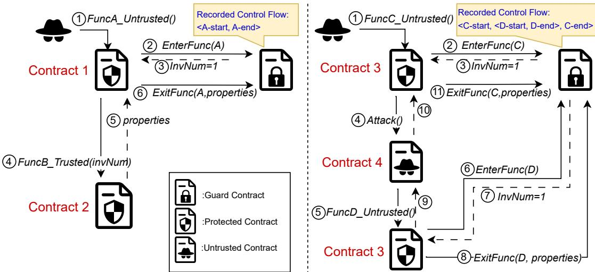

# Enforcing Control Flow Integrity on DeFi Smart Contracts

Zhi<sub>y</sub>an<sub>g</sub> Chen Uni<sub>ve</sub>r<sub>s</sub>it<sub>y o</sub>f T<sub>o</sub>r<sub>o</sub>nt<sub>o</sub> T<sub>o</sub>r<sub>o</sub>nt<sub>o,</sub> C<sub>a</sub>n<sub>a</sub>d<sub>a</sub> <sub>z</sub>hi<sub>yc</sub>h<sub>en@cs.</sub>t<sub>oron</sub>t<sub>o.e</sub>d<sub>u</sub>

C<sub>y</sub>r<sub>u</sub>s Min<sub>w</sub>alla B<sub>an</sub>k <sub>o</sub>f C<sub>ana</sub>d<sub>a</sub> Ott<sub>awa,</sub> C<sub>a</sub>n<sub>a</sub>d<sub>a</sub> CMi<sub>nwa</sub>ll<sub>a@</sub>b<sub>an</sub>k<sub>-</sub>b<sub>anque-cana</sub>d<sub>a.ca</sub>

Sidi M<sub>o</sub>h<sub>a</sub>m<sub>e</sub>d B<sub>e</sub>ill<sub>a</sub>hi Uni<sub>ve</sub>r<sub>s</sub>it<sub>y o</sub>f T<sub>o</sub>r<sub>o</sub>nt<sub>o</sub> T<sub>o</sub>r<sub>o</sub>nt<sub>o,</sub> C<sub>a</sub>n<sub>a</sub>d<sub>a</sub> <sub>sm.</sub>b<sub>e</sub>ill<sub>a</sub>hi<sub>@u</sub>t<sub>oron</sub>t<sub>o.ca</sub>

H<sub>a</sub>n D<sub>u</sub> B<sub>an</sub>k <sub>o</sub>f C<sub>ana</sub>d<sub>a</sub> Ott<sub>awa,</sub> C<sub>a</sub>n<sub>a</sub>d<sub>a</sub> HD<sub>u@</sub>b<sub>an</sub>k<sub>-</sub>b<sub>anque-cana</sub>d<sub>a.ca</sub>

F<sub>a</sub>n L<sub>o</sub>n<sub>g</sub> Uni<sub>ve</sub>r<sub>s</sub>it<sub>y</sub> <sub>o</sub>f T<sub>o</sub>r<sub>o</sub>nt<sub>o</sub> T<sub>o</sub>r<sub>o</sub>nt<sub>o,</sub> C<sub>a</sub>n<sub>a</sub>d<sub>a</sub> f<sub>an</sub>l<sub>@cs.</sub>t<sub>oron</sub>t<sub>o.e</sub>d<sub>u</sub>

P<sub>as</sub>h<sub>a</sub> B<sub>ara</sub>hi<sub>m</sub>i<sup>∗</sup> Uni<sub>ve</sub>r<sub>s</sub>it<sub>y</sub> <sub>o</sub>f T<sub>e</sub>hr<sub>a</sub>n T<sub>e</sub>h<sub>ran,</sub> I<sub>ran</sub> <sub>pas</sub>h<sub>a</sub>b<sub>ara</sub>hi<sub>m</sub>i<sub>@gma</sub>il<sub>.com</sub>

A<sub>n</sub>d<sub>reas</sub> V<sub>ener</sub>i<sub>s</sub> Uni<sub>ve</sub>r<sub>s</sub>it <sub>o</sub>f T<sub>o</sub>r<sub>o</sub>nt<sub>o</sub> T<sub>o</sub>r<sub>o</sub>nt<sub>o,</sub> C<sub>a</sub>n<sub>a</sub>d<sub>a</sub> veneris@eec<sub>g</sub>.toronto.e<sup>d</sup>u

## ABSTRACT

Smart contracts <sub>p</sub>ower decentralized financial (DeFi) services but <sub>are vu</sub>l<sub>nera</sub>bl<sub>e</sub> t<sub>o secur</sub>it<sub>y exp</sub>l<sub>o</sub>it<sub>s</sub> th<sub>a</sub>t <sub>can</sub> l<sub>ea</sub>d t<sub>o s</sub>i<sub>gn</sub>ifi<sub>can</sub>t fi nancial losses. Existin<sub>g</sub> securit<sub>y</sub> measures often fail to ade<sub>q</sub>uatel<sub>y</sub> <sub>p</sub>rotect these contracts due to the com<sub>p</sub>osabilit<sub>y</sub> of DeFi <sub>p</sub>rotocols and the increasin<sub>g</sub> so<sub>p</sub>histication of attacks. Throu<sub>g</sub>h a lar<sub>g</sub>e-scale <sub>emp</sub>i<sub>r</sub>i<sub>ca</sub>l <sub>s</sub>t<sub>u</sub>d<sub>y o</sub>f hi<sub>s</sub>t<sub>or</sub>i<sub>ca</sub>l t<sub>ransac</sub>ti<sub>ons</sub> f<sub>rom</sub> th<sub>e</sub> 37 h<sub>ac</sub>k<sub>e</sub>d D<sub>e</sub>Fi <sub>p</sub>rotocols<sub>,</sub> we discovered that while beni<sub>g</sub>n transactions t<sub>yp</sub>icall<sub>y</sub> <sub>ex</sub>hibit <sub>a</sub> li<sub>m</sub>it<sub>e</sub>d <sub>num</sub>b<sub>er o</sub>f <sub>un</sub>i<sub>que con</sub>t<sub>ro</sub>l fl<sub>ows,</sub> i<sub>n s</sub>t<sub>ar</sub>k <sub>con</sub>t<sub>ras</sub>t<sub>,</sub> attack transactions consistentl<sub>y</sub> introduce novel<sub>, p</sub>reviousl<sub>y</sub> un <sub>o</sub>b<sub>serve</sub>d <sub>con</sub>t<sub>ro</sub>l fl<sub>ows.</sub> B<sub>u</sub>ildi<sub>ng on</sub> th<sub>ese</sub> i<sub>ns</sub>i<sub>g</sub>ht<sub>s, we</sub> d<sub>eve</sub>l<sub>ope</sub>d C<sub>ross</sub>G<sub>uard, a nove</sub>l f<sub>ramewor</sub>k th<sub>a</sub>t <sub>en</sub>f<sub>orces con</sub>t<sub>ro</sub>l fl<sub>ow</sub> i<sub>n-</sub> te<sub>g</sub>rit<sub>y</sub> onchain to sec<sub>u</sub>re smart contracts. Cr<sub>u</sub>ciall<sub>y,</sub> CrossGuard d<sub>oes no</sub>t <sub>requ</sub>i<sub>re pr</sub>i<sub>or</sub> k<sub>now</sub>l<sub>e</sub>d<sub>ge o</sub>f <sub>spec</sub>ifi<sub>c</sub> h<sub>ac</sub>k<sub>s.</sub> I<sub>ns</sub>t<sub>ea</sub>d<sub>, con</sub>fi<sub>g</sub> <sub>ure</sub>d <sub>on</sub>l<sub>y</sub> <sub>once</sub> <sub>a</sub>t d<sub>ep</sub>l<sub>oymen</sub>t<sub>,</sub> it <sub>en</sub>f<sub>orces</sub> <sub>con</sub>t<sub>ro</sub>l fl<sub>ow</sub> <sub>w</sub>hit<sub>e</sub>li<sub>s</sub>ti<sub>ng</sub> <sub>p</sub>olicies and a<sub>pp</sub>lies sim<sub>p</sub>lification heuristics at runtime. This a<sub>p</sub> <sub>p</sub>roach monitors and <sub>p</sub>revents <sub>p</sub>otential attacks b<sub>y</sub> revertin<sub>g</sub> all t<sub>ransac</sub>ti<sub>ons</sub> th<sub>a</sub>t d<sub>o no</sub>t <sub>a</sub>dh<sub>ere</sub> t<sub>o</sub> th<sub>e es</sub>t<sub>a</sub>bli<sub>s</sub>h<sub>e</sub>d <sub>con</sub>t<sub>ro</sub>l fl<sub>ow</sub> <sub>w</sub>hitelistin<sub>g</sub> r<sub>u</sub>les. O<sub>u</sub>r e<sub>v</sub>al<sub>u</sub>ation demonstrates that CrossGuard <sub>e</sub>f<sub>ec</sub>ti<sub>ve</sub>l<sub>y</sub> bl<sub>oc</sub>k<sub>s</sub> 35 <sub>o</sub>f th<sub>e</sub> 37 <sub>ana</sub>l<sub>yze</sub>d <sub>a</sub>tt<sub>ac</sub>k<sub>s w</sub>h<sub>en con</sub>fi<sub>gure</sub>d onl<sub>y</sub> once at contract de<sub>p</sub>lo<sub>y</sub>ment<sub>,</sub> maintainin<sub>g</sub> a low false <sub>p</sub>ositive <sub>ra</sub>t<sub>e o</sub>f 0<sub>.</sub>26% <sub>an</sub>d <sub>m</sub>i<sub>n</sub>i<sub>ma</sub>l <sub>a</sub>dditi<sub>ona</sub>l <sub>gas cos</sub>t<sub>s.</sub> Th<sub>ese resu</sub>lt<sub>s un</sub>d<sub>er</sub> score the eficac<sub>y</sub> of a<sub>pp</sub>l<sub>y</sub>in<sub>g</sub> control flow inte<sub>g</sub>rit<sub>y</sub> to smart contracts<sub>,</sub> si<sub>g</sub>nificantl<sub>y</sub> enhancin<sub>g</sub> securit<sub>y</sub> be<sub>y</sub>ond traditional methods and addressin<sub>g</sub> the evolvin<sub>g</sub> threat landsca<sub>p</sub>e in the DeFi ecos<sub>y</sub>stem.

## CCS CONCEPTS

• Securit<sub>y</sub> and <sub>p</sub>rivac<sub>y</sub> → Software securit<sub>y</sub> en<sub>g</sub>ineerin<sub>g</sub>; • Software and its en<sub>g</sub>ineerin<sub>g</sub> → Software testin<sub>g</sub> and debu<sub>g</sub>- g<sup>i</sup>ng.

<sup>∗</sup>P<sub>as</sub>h<sub>a</sub> i<sub>s a</sub>n in<sub>co</sub>min<sub>g</sub> Ph<sub>.</sub>D<sub>. s</sub>t<sub>u</sub>d<sub>e</sub>nt <sub>a</sub>t th<sub>e</sub> Uni<sub>ve</sub>r<sub>s</sub>it<sub>y o</sub>f S<sub>ou</sub>th<sub>e</sub>rn C<sub>a</sub>lif<sub>o</sub>rni<sub>a.</sub> W<sub>o</sub>rk d<sub>one w</sub>hil<sub>e</sub> th<sub>e au</sub>th<sub>or was a remo</sub>t<sub>e researc</sub>h i<sub>n</sub>t<sub>ern a</sub>t th<sub>e</sub> U<sub>n</sub>i<sub>vers</sub>it<sub>y o</sub>f T<sub>oron</sub>t<sub>o.</sub>

## KEYWORDS

runtime validation<sub>,</sub> control flow inte<sub>g</sub>rit<sub>y,</sub> d<sub>y</sub>namic anal<sub>y</sub>sis

ACM Reference Format: Zhi<sub>ya</sub>n<sub>g</sub> Ch<sub>e</sub>n<sub>,</sub> Sidi M<sub>o</sub>h<sub>a</sub>m<sub>e</sub>d B<sub>e</sub>ill<sub>a</sub>hi<sub>,</sub> P<sub>as</sub>h<sub>a</sub> B<sub>a</sub>r<sub>a</sub>himi<sub>,</sub> C<sub>y</sub>r<sub>us</sub> Min<sub>wa</sub>ll<sub>a,</sub> H<sub>a</sub>n D<sub>u,</sub> Andr<sub>eas</sub> V<sub>e</sub>n<sub>e</sub>ri<sub>s,</sub> <sub>a</sub>nd F<sub>a</sub>n L<sub>o</sub>n<sub>g.</sub> 2026<sub>.</sub> Enf<sub>o</sub>r<sub>c</sub>in<sub>g</sub> C<sub>o</sub>ntr<sub>o</sub>l Fl<sub>ow</sub> Integrity on DeFi Smart Contracts. In 2026 IEEE/ACM 48th International Conference on Software Engineering (ICSE ’26), April 12–18, 2026, Rio de Janeiro, Brazil. ACM, New York, NY, USA, 13 pages. https://doi.org/10.1145/ 3744916.3773266

## 1 INTRODUCTION

Bl<sub>oc</sub>k<sub>c</sub>h<sub>a</sub>i<sub>n</sub> t<sub>ec</sub>h<sub>no</sub>l<sub>ogy</sub> h<sub>as revo</sub>l<sub>u</sub>ti<sub>on</sub>i<sub>ze</sub>d th<sub>e crea</sub>ti<sub>on o</sub>f <sub>g</sub>l<sub>o</sub>b<sub>a</sub>l<sub>,</sub> <sub>secure, an</sub>d <sub>programma</sub>bl<sub>e</sub> l<sub>e</sub>d<sub>gers,</sub> f<sub>un</sub>d<sub>amen</sub>t<sub>a</sub>ll<sub>y a</sub>lt<sub>er</sub>i<sub>ng</sub> h<sub>ow</sub> di<sub>g</sub>ital transactions are cond<sub>u</sub>cted. Central to this innovation are <sub>smar</sub>t <sub>con</sub>t<sub>rac</sub>t<sub>s, w</sub>hi<sub>c</sub>h <sub>opera</sub>t<sub>e on</sub> bl<sub>oc</sub>k<sub>c</sub>h<sub>a</sub>i<sub>ns, a</sub>ll<sub>ow</sub>i<sub>ng</sub> d<sub>eve</sub>l<sub>op-</sub> <sub>ers</sub> t<sub>o</sub> d<sub>e</sub>fi<sub>ne an</sub>d <sub>en</sub>f<sub>orce comp</sub>l<sub>ex</sub> t<sub>ransac</sub>ti<sub>ona</sub>l <sub>ru</sub>l<sub>es</sub> di<sub>rec</sub>tl<sub>y on</sub> the led<sub>g</sub>er. This ca<sub>p</sub>abilit<sub>y</sub> has <sub>p</sub>ositioned smart contracts as the backbone of various decentralized financial (DeFi) services. As of M<sub>arc</sub>h 13th<sub>,</sub> 2025<sub>,</sub> th<sub>e</sub> t<sub>o</sub>t<sub>a</sub>l <sub>va</sub>l<sub>ue</sub> l<sub>oc</sub>k<sub>e</sub>d i<sub>n</sub> 3<sub>,</sub>973 D<sub>e</sub>Fi <sub>pro</sub>t<sub>oco</sub>l<sub>s</sub> has sur<sub>g</sub>ed to a<sub>pp</sub>roximatel<sub>y</sub> \$87.82 billion [53], hi<sub>g</sub>hli<sub>g</sub>htin<sub>g</sub> the <sub>su</sub>b<sub>s</sub>t<sub>an</sub>ti<sub>a</sub>l <sub>econom</sub>i<sub>c</sub> i<sub>mpac</sub>t <sub>an</sub>d <sub>grow</sub>th <sub>o</sub>f thi<sub>s</sub> t<sub>ec</sub>h<sub>no</sub>l<sub>ogy.</sub>

H<sub>oweve</sub>r<sub>,</sub> b<sub>y</sub> th<sub>e sa</sub>m<sub>e</sub> d<sub>a</sub>t<sub>e, vu</sub>ln<sub>e</sub>r<sub>a</sub>biliti<sub>es</sub> in D<sub>e</sub>Fi <sub>s</sub>m<sub>a</sub>rt <sub>co</sub>ntracts have resulted in financial losses exceedin<sub>g</sub> \$11.21 billion USD [54]. In res<sub>p</sub>onse, researchers have develo<sub>p</sub>ed <sub>p</sub>ro<sub>g</sub>ram anal-<sub>y</sub>sis and verification techni<sub>q</sub>ues to secure smart contracts [42, 46, 59, 64, 68, 69, 75, 77–80], and develo<sub>p</sub>ers often commission securit<sub>y</sub> audits <sub>p</sub>rior to de<sub>p</sub>lo<sub>y</sub>ment.

Des<sub>p</sub>ite these advancements in securit<sub>y</sub> measures<sub>,</sub> the evolvin<sub>g</sub> l<sub>an</sub>d<sub>sca e o</sub>f <sub>smar</sub>t <sub>con</sub>t<sub>rac</sub>t<sub>s</sub> h<sub>as con</sub>ti<sub>nua</sub>ll <sub>ou</sub>t <sub>ace</sub>d t<sub>ra</sub>diti<sub>ona</sub>l d<sub>e</sub>f<sub>enses.</sub> M<sub>o</sub>d<sub>ern smar</sub>t <sub>con</sub>t<sub>rac</sub>t<sub>s are now</sub> d<sub>es</sub>i <sub>ne</sub>d <sub>w</sub>ith th<sub>e</sub> fl<sub>ex-</sub> ibilit<sub>y</sub> to su<sub>pp</sub>ort the la<sub>y</sub>erin<sub>g</sub> of additional contracts<sub>,</sub> a feature <sub>pa</sub>rti<sub>cu</sub>l<sub>a</sub>rl<sub>y</sub> <sub>v</sub>it<sub>a</sub>l in D<sub>e</sub>Fi <sub>ecosys</sub>t<sub>e</sub>m<sub>.</sub> In D<sub>e</sub>Fi<sub>,</sub> <sub>s</sub>m<sub>a</sub>rt <sub>co</sub>ntr<sub>ac</sub>t<sub>s</sub> f<sub>a</sub>- <sub>c</sub>ilit<sub>a</sub>t<sub>e</sub> <sub>a</sub> di<sub>verse</sub> <sub>array</sub> <sub>o</sub>f fi<sub>nanc</sub>i<sub>a</sub>l <sub>pro</sub>d<sub>uc</sub>t<sub>s</sub> <sub>an</sub>d <sub>serv</sub>i<sub>ces,</sub> <sub>suc</sub>h <sub>as</sub> l<sub>en</sub>di<sub>ng an</sub>d <sub>y</sub>i<sub>e</sub>ld f<sub>arm</sub>i<sub>ng.</sub> Th<sub>ese</sub> i<sub>n</sub>t<sub>er</sub>li<sub>n</sub>k<sub>e</sub>d <sub>con</sub>t<sub>rac</sub>t<sub>s are o</sub>ft<sub>en re-</sub> f<sub>erre</sub>d t<sub>o as</sub> “D<sub>e</sub>Fi l<sub>egos,</sub>” <sub>emp</sub>h<sub>as</sub>i<sub>z</sub>i<sub>ng</sub> th<sub>e</sub>i<sub>r mo</sub>d<sub>u</sub>l<sub>ar</sub>it<sub>y.</sub> Th<sub>e a</sub>bilit<sub>y</sub> t<sub>o com</sub>bi<sub>ne var</sub>i<sub>ous</sub> D<sub>e</sub>Fi <sub>smar</sub>t <sub>con</sub>t<sub>rac</sub>t<sub>s, a concep</sub>t k<sub>nown as</sub> “D<sub>e</sub>Fi <sub>composa</sub>bilit<sub>y,</sub>” i<sub>s</sub> <sub>w</sub>id<sub>e</sub>l<sub>y</sub> <sub>regar</sub>d<sub>e</sub>d <sub>as</sub> <sub>one</sub> <sub>o</sub>f th<sub>e</sub> k<sub>ey</sub> <sub>a</sub>d<sub>van</sub>t<sub>ages</sub> <sub>o</sub>f DeFi [43, 70, 73]. However, this com<sub>p</sub>lexit<sub>y</sub> and interde<sub>p</sub>endence introduce si<sub>g</sub>nificant challen<sub>g</sub>es to securin<sub>g</sub> smart contracts with con<sub>v</sub>entional methods. The sec<sub>u</sub>rit<sub>y</sub> of a DeFi <sub>p</sub>rotocol de<sub>p</sub>ends not onl<sub>y</sub> on the correct desi<sub>g</sub>n and im<sub>p</sub>lementation of its own contracts but also on the inte<sub>g</sub>rit<sub>y</sub> of external contracts it interacts <sub>w</sub>ith<sub>.</sub> Additi<sub>ona</sub>ll<sub>y, exper</sub>i<sub>ence</sub>d <sub>users or a</sub>tt<sub>ac</sub>k<sub>ers can</sub> d<sub>ep</sub>l<sub>oy</sub> th<sub>e</sub>i<sub>r</sub> o<sub>w</sub>n smart contracts to in<sub>v</sub>oke f<sub>u</sub>nctions across m<sub>u</sub>lti<sub>p</sub>le DeFi <sub>p</sub>ro tocols in arbitrar<sub>y</sub> se<sub>q</sub>uences. Considerin<sub>g</sub> all <sub>p</sub>ossible interactions a DeFi <sub>p</sub>rotocol ma<sub>y</sub> encounter <sub>p</sub>rior to de<sub>p</sub>lo<sub>y</sub>ment is infeasible for traditional securit<sub>y</sub> a<sub>pp</sub>roaches.

A critical observation in hack transaction anal<sub>y</sub>sis is that the<sub>y</sub> often exploit unintended control flows across multiple functions, deviatin<sub>g</sub> from the ori<sub>g</sub>inal desi<sub>g</sub>n intentions of the develo<sub>p</sub>ers. For instance<sub>,</sub> re-entranc<sub>y</sub> attacks levera<sub>g</sub>e an unforeseen recursive con t<sub>ro</sub>l fl<sub>ow</sub> th<sub>roug</sub>h d<sub>e</sub>f<sub>au</sub>lt h<sub>an</sub>dl<sub>ers</sub> i<sub>n</sub> <sub>cus</sub>t<sub>om</sub> <sub>con</sub>t<sub>rac</sub>t<sub>s,</sub> <sub>ena</sub>bli<sub>ng</sub> r<sub>epea</sub>t<sub>e</sub>d <sub>e</sub>x<sub>ecu</sub>ti<sub>o</sub>n <sub>o</sub>f <sub>a c</sub>riti<sub>ca</sub>l f<sub>u</sub>n<sub>c</sub>ti<sub>o</sub>n <sub>w</sub>ithin <sub>o</sub>n<sub>e</sub> tr<sub>a</sub>n<sub>sac</sub>ti<sub>o</sub>n<sub>.</sub> Si<sub>m</sub>il<sub>ar</sub>l<sub>y,</sub> fl<sub>as</sub>h l<sub>oan</sub> <sub>a</sub>tt<sub>ac</sub>k<sub>s</sub> <sub>man</sub>i<sub>pu</sub>l<sub>a</sub>t<sub>e</sub> <sub>mu</sub>lti<sub>p</sub>l<sub>e</sub> f<sub>unc</sub>ti<sub>ons</sub> i<sub>n</sub> <sub>a</sub> <sub>pre</sub> cisel<sub>y</sub> timed se<sub>q</sub>uence<sub>,</sub> utilizin<sub>g</sub> lar<sub>g</sub>e asset transfers to coerce the <sub>v</sub>i<sub>c</sub>ti<sub>m con</sub>t<sub>rac</sub>t i<sub>n</sub>t<sub>o execu</sub>ti<sub>ng un</sub>f<sub>avora</sub>bl<sub>e</sub> t<sub>ra</sub>d<sub>es.</sub> W<sub>e con</sub>d<sub>uc</sub>t<sub>e</sub>d <sub>an</sub> em<sub>p</sub>irical stud<sub>y</sub> anal<sub>y</sub>zin<sub>g</sub> transaction histories of 37 com<sub>p</sub>romised Eth<sub>ereum</sub> <sub>pro</sub>t<sub>oco</sub>l<sub>s.</sub> O<sub>ur</sub> fi<sub>n</sub>di<sub>ngs</sub> <sub>revea</sub>l th<sub>a</sub>t <sub>con</sub>t<sub>ro</sub>l fl<sub>ows</sub> <sub>are</sub> <sub>re</sub>l<sub>a</sub> ti<sub>ve</sub>l<sub>y</sub> <sub>cons</sub>t<sub>ra</sub>i<sub>ne</sub>d<sub>,</sub> <sub>w</sub>ith <sub>a</sub>tt<sub>ac</sub>k t<sub>ransac</sub>ti<sub>ons</sub> i<sub>n</sub>t<sub>ro</sub>d<sub>uc</sub>i<sub>ng</sub> <sub>nove</sub>l fl<sub>ows</sub> <sub>never o</sub>b<sub>serve</sub>d <sub>prev</sub>i<sub>ous</sub>l<sub>y</sub> i<sub>n a</sub>ll b<sub>u</sub>t <sub>one</sub> h<sub>ac</sub>k<sub>e</sub>d <sub>pro</sub>t<sub>oco</sub>l<sub>.</sub>

CrossG<sub>u</sub>ar<sub>d:</sub> B<sub>u</sub>ildi<sub>ng on</sub> th<sub>e a</sub>b<sub>ove o</sub>b<sub>serva</sub>ti<sub>ons, we</sub> d<sub>eve</sub>l<sub>ope</sub>d CrossGuard, a novel framework to enforce control flow integrity t<sub>o secu</sub>r<sub>e s</sub>m<sub>a</sub>rt <sub>co</sub>ntr<sub>ac</sub>t<sub>s.</sub> Gi<sub>ve</sub>n <sub>a</sub> D<sub>e</sub>Fi <sub>p</sub>r<sub>o</sub>t<sub>oco</sub>l<sub>,</sub> CrossGuard in struments its existin<sub>g</sub> smart contracts with additional code to track <sub>con</sub>t<sub>ro</sub>l fl<sub>ow</sub> d<sub>a</sub>t<sub>a.</sub> C<sub>ross</sub>G<sub>u</sub>a<sub>rd a</sub>l<sub>so</sub> d<sub>ep</sub>l<sub>oys a new guar</sub>d <sub>con</sub>t<sub>rac</sub>t th<sub>a</sub>t <sub>co</sub>ll<sub>ec</sub>t<sub>s con</sub>t<sub>ro</sub>l fl<sub>ow</sub> d<sub>a</sub>t<sub>a</sub> f<sub>rom</sub> th<sub>ese</sub> i<sub>ns</sub>t<sub>rumen</sub>t<sub>e</sub>d <sub>con</sub>t<sub>rac</sub>t<sub>s,</sub> <sub>an</sub>d <sub>en</sub>f<sub>orces</sub> f<sub>our w</sub>hit<sub>e</sub>li<sub>s</sub>ti<sub>ng po</sub>li<sub>c</sub>i<sub>es a</sub>t <sub>run</sub>ti<sub>me</sub> t<sub>o</sub> d<sub>e</sub>t<sub>ec</sub>t <sub>an</sub>d <sub>neu</sub>t<sub>ra</sub>li<sub>ze any a</sub>tt<sub>ac</sub>k<sub>s</sub> th<sub>a</sub>t <sub>a</sub>tt<sub>emp</sub>t t<sub>o exp</sub>l<sub>o</sub>it <sub>unexpec</sub>t<sub>e</sub>d <sub>con</sub>t<sub>ro</sub>l flows. Unlike man<sub>y</sub> <sub>p</sub>revious invariant enforcement tools [51, 66], CrossGuard does not rel<sub>y</sub> on inferrin<sub>g</sub> its securit<sub>y</sub> rules from <sub>p</sub>rior beni<sub>g</sub>n transaction traces and therefore can a<sub>pp</sub>l<sub>y</sub> to smart contracts immediatel<sub>y</sub> at their initial de<sub>p</sub>lo<sub>y</sub>ments<sub>,</sub> leavin<sub>g</sub> no <sub>g</sub>a<sub>p</sub> of un<sub>p</sub>rotected <sub>p</sub>eriods.

A ke<sub>y</sub> challen<sub>g</sub>e arises from CrossGuard’s whitelistin<sub>g</sub>-onl<sub>y</sub> desi<sub>g</sub>n. This a<sub>pp</sub>roach<sub>,</sub> while enhancin<sub>g</sub> securit<sub>y</sub> b<sub>y</sub> adherin<sub>g</sub> strictl<sub>y</sub> t<sub>o</sub> k<sub>nown sa</sub>f<sub>e pa</sub>th<sub>s, cou</sub>ld i<sub>n</sub>h<sub>eren</sub>tl<sub>y</sub> l<sub>ea</sub>d t<sub>o an</sub> i<sub>ncrease</sub> i<sub>n</sub> f<sub>a</sub>l<sub>se</sub> <sub>pos</sub>iti<sub>ves</sub> if <sub>no</sub>t <sub>me</sub>ti<sub>cu</sub>l<sub>ous</sub>l<sub>y</sub> <sub>manage</sub>d<sub>.</sub> Alth<sub>oug</sub>h th<sub>e</sub> <sub>num</sub>b<sub>er</sub> <sub>o</sub>f uni<sub>q</sub>ue control flows is inherentl<sub>y</sub> limited<sub>,</sub> a naive whitelistin<sub>g</sub> <sub>approac</sub>h <sub>cou</sub>ld <sub>s</sub>till <sub>pro</sub>d<sub>uce</sub> <sub>numerous</sub> f<sub>a</sub>l<sub>se</sub> <sub>pos</sub>iti<sub>ves</sub> <sub>or</sub> d<sub>eman</sub>d <sub>su</sub>b<sub>s</sub>t<sub>a</sub>nti<sub>a</sub>l h<sub>u</sub>m<sub>a</sub>n int<sub>e</sub>r<sub>ve</sub>nti<sub>o</sub>n<sub>.</sub> T<sub>o a</sub>ddr<sub>ess</sub> thi<sub>s</sub> i<sub>ssue,</sub> CrossGuard <sub>emp</sub>l<sub>oys</sub> h<sub>eur</sub>i<sub>s</sub>ti<sub>cs</sub> t<sub>o s</sub>i<sub>mp</sub>lif<sub>y con</sub>t<sub>ro</sub>l fl<sub>ows: exc</sub>l<sub>u</sub>di<sub>ng rea</sub>d<sub>-on</sub>l<sub>y</sub> <sub>ca</sub>ll<sub>s</sub> th<sub>a</sub>t d<sub>on</sub>’t <sub>a</sub>lt<sub>er s</sub>t<sub>a</sub>t<sub>e,</sub> t<sub>rac</sub>ki<sub>ng rea</sub>d<sub>-a</sub>ft<sub>er-wr</sub>it<sub>e</sub> d<sub>epen</sub>d<sub>enc</sub>i<sub>es,</sub> <sub>an</sub>d t<sub>rea</sub>ti<sub>ng</sub> i<sub>n</sub>d<sub>epen</sub>d<sub>en</sub>t <sub>ca</sub>ll<sub>s as separa</sub>t<sub>e</sub> fl<sub>ows.</sub> Th<sub>ese</sub> h<sub>eur</sub>i<sub>s</sub>ti<sub>cs</sub> <sub>e</sub>f<sub>ec</sub>ti<sub>ve</sub>l<sub>y</sub> <sub>s</sub>i<sub>mp</sub>lif<sub>y</sub> <sub>con</sub>t<sub>ro</sub>l fl<sub>ows,</sub> <sub>an</sub>d l<sub>ower</sub> f<sub>a</sub>l<sub>se</sub> <sub>pos</sub>iti<sub>ve</sub> <sub>ra</sub>t<sub>es.</sub>

Ex<sub>p</sub>erimental Results: W<sub>e eva</sub>l<sub>ua</sub>t<sub>e</sub>d CrossGuard <sub>o</sub>n th<sub>e</sub> d<sub>e</sub>- <sub>p</sub>l<sub>oye</sub>d <sub>smar</sub>t <sub>con</sub>t<sub>rac</sub>t<sub>s an</sub>d th<sub>e</sub>i<sub>r</sub> t<sub>ransac</sub>ti<sub>ons o</sub>f th<sub>e</sub> 37 h<sub>ac</sub>k<sub>e</sub>d D<sub>e</sub>Fi r<sub>o</sub>t<sub>oco</sub>l<sub>s</sub> in<sub>c</sub>l<sub>u</sub>d<sub>e</sub>d in <sub>ou</sub>r <sub>e</sub>m iri<sub>ca</sub>l <sub>s</sub>t<sub>u</sub>d <sub>.</sub> O<sub>u</sub>r r<sub>esu</sub>lt<sub>s</sub> indi <sub>ca</sub>t<sub>e</sub> th<sub>a</sub>t<sub>, w</sub>h<sub>en con</sub>fi<sub>gure</sub>d <sub>on</sub>l<sub>y once a</sub>t d<sub>ep</sub>l<sub>oymen</sub>t<sub>,</sub> C<sub>ross</sub>G<sub>u</sub>a<sub>rd</sub> <sub>can</sub> <sub>e</sub>f<sub>ec</sub>ti<sub>ve</sub>l<sub>y</sub> <sub>preven</sub>t 35 <sub>ou</sub>t <sub>o</sub>f 37 <sub>a</sub>tt<sub>ac</sub>k<sub>s</sub> <sub>ana</sub>l<sub>yze</sub>d i<sub>n</sub> <sub>our</sub> <sub>s</sub>t<sub>u</sub>d<sub>y,</sub> maintaining a <sup>l</sup>ow average <sup>f</sup>a<sup>l</sup>se positive rate o<sup>f</sup> just 0.26%. Un<sup>l</sup>i<sup>k</sup>e t<sub>ra</sub>diti<sub>ona</sub>l <sub>me</sub>th<sub>o</sub>d<sub>s,</sub> C<sub>ross</sub>G<sub>u</sub>a<sub>rd</sub> d<sub>oes no</sub>t d<sub>epen</sub>d <sub>on</sub> hi<sub>s</sub>t<sub>or</sub>i<sub>ca</sub>l transactions. Des<sub>p</sub>ite this<sub>,</sub> CrossGuard still s<sub>u</sub>r<sub>p</sub>asses the state-<sub>o</sub>f<sub>-</sub>th<sub>e-ar</sub>t <sub>w</sub>hi<sub>c</sub>h i<sub>ns</sub>t<sub>rumen</sub>t<sub>s</sub> th<sub>e</sub> <sub>smar</sub>t <sub>con</sub>t<sub>rac</sub>t<sub>s</sub> <sub>w</sub>ith i<sub>nvar</sub>i<sub>an</sub>t<sub>s</sub> learned from historical transactions. Moreover<sub>,</sub> after im<sub>p</sub>lementin<sub>g</sub> fo<sub>u</sub>r o<sub>p</sub>timization techni<sub>qu</sub>es<sub>,</sub> CrossGuard achie<sub>v</sub>es a minimal <sub>g</sub>as <sub>consump</sub>ti<sub>on over</sub>h<sub>ea</sub>d <sub>o</sub>f 3<sub>.</sub>53% <sub>on average.</sub> Th<sub>ese resu</sub>lt<sub>s</sub> d<sub>emon-</sub> <sub>s</sub>t<sub>ra</sub>t<sub>e</sub> th<sub>e use</sub>f<sub>u</sub>l<sub>ness o</sub>f <sub>our emp</sub>i<sub>r</sub>i<sub>ca</sub>l fi<sub>n</sub>di<sub>ngs an</sub>d C<sub>ross</sub>G<sub>u</sub>a<sub>rd.</sub> Contributions: Thi<sub>s</sub> <sub>pape</sub>r m<sub>a</sub>k<sub>es</sub> th<sub>e</sub> f<sub>o</sub>ll<sub>ow</sub>in<sub>g</sub> <sub>co</sub>ntrib<sub>u</sub>ti<sub>o</sub>n<sub>s.</sub>

• Em<sub>p</sub>irical Stud<sub>y</sub>: To the best of our knowled<sub>g</sub>e, we conducted th<sub>e</sub> fi<sub>rs</sub>t <sub>compre</sub>h<sub>ens</sub>i<sub>ve emp</sub>i<sub>r</sub>i<sub>ca</sub>l <sub>s</sub>t<sub>u</sub>d<sub>y o</sub>f <sub>con</sub>t<sub>ro</sub>l fl<sub>ows</sub> i<sub>n</sub> hi<sub>s-</sub> torical transactions of com<sub>p</sub>romised DeFi <sub>p</sub>rotocols. O<sub>u</sub>r anal<sub>y</sub>sis uncovers critical insi<sub>g</sub>hts into the control flow <sub>p</sub>atterns <sub>p</sub>reval<sub>e</sub>nt in D<sub>e</sub>Fi <sub>p</sub>r<sub>o</sub>t<sub>oco</sub>l<sub>s a</sub>nd <sub>e</sub>x<sub>p</sub>l<sub>o</sub>r<sub>es va</sub>ri<sub>ous use cases o</sub>f D<sub>e</sub>Fi com<sub>p</sub>osabilit<sub>y</sub>.

• CrossGuard Techni<sub>q</sub>ue: This <sub>p</sub>a<sub>p</sub>er <sub>p</sub>ro<sub>p</sub>oses the first control flow inte<sub>g</sub>rit<sub>y</sub> techni<sub>q</sub>ue for smart contracts with whitelistin<sub>g</sub> <sub>p</sub>olicies and sim<sub>p</sub>lification heuristics. This <sub>p</sub>a<sub>p</sub>er also details methods for im<sub>p</sub>lementin<sub>g</sub> these <sub>p</sub>olicies and heuristics throu<sub>g</sub>h static <sub>an</sub>d d<sub>ynam</sub>i<sub>c ana</sub>l<sub>ys</sub>i<sub>s, an</sub>d d<sub>escr</sub>ib<sub>es</sub> h<sub>ow</sub> th<sub>ey are</sub> i<sub>ns</sub>t<sub>rumen</sub>t<sub>e</sub>d i<sub>n</sub> <sub>con</sub>t<sub>rac</sub>t<sub>s</sub> <sub>an</sub>d <sub>en</sub>f<sub>orce</sub>d <sub>on</sub> th<sub>e</sub> fl<sub>y.</sub>

• Evaluation and Tools: This <sub>p</sub>a<sub>p</sub>er evaluates the efectiveness of CrossGuard in <sub>p</sub>reventin<sub>g</sub> attacks. To su<sub>pp</sub>ort on<sub>g</sub>oin<sub>g</sub> research and facilitate communit<sub>y</sub> en<sub>g</sub>a<sub>g</sub>ement<sub>,</sub> we <sub>p</sub>rovide o<sub>p</sub>en access t<sub>o</sub> th<sub>e s</sub>t<sub>u</sub>d<sub>y resu</sub>lt<sub>s, exper</sub>i<sub>men</sub>t<sub>a</sub>l <sub>resu</sub>lt<sub>s, an</sub>d <sub>our</sub> t<sub>oo</sub>l<sub>, ava</sub>il<sub>a</sub>bl<sub>e</sub> at our website [50].

## 2 BACKGROUND AND EMPIRICAL STUDY

The Ethereum Virtual Machine (EVM) executes smart contracts <sub>an</sub>d <sub>ma</sub>i<sub>n</sub>t<sub>a</sub>i<sub>ns ne</sub>t<sub>wor</sub>k <sub>s</sub>t<sub>a</sub>t<sub>e.</sub> G<sub>as measures compu</sub>t<sub>a</sub>ti<sub>ona</sub>l <sub>e</sub>f<sub>or</sub>t f<sub>or</sub> transaction execution<sub>,</sub> with stora<sub>g</sub>e o<sub>p</sub>erations bein<sub>g</sub> <sub>p</sub>articularl<sub>y</sub> ex-<sub>p</sub>ensive. The recent TLOAD and TSTORE o<sub>p</sub>codes [55, 62] <sub>p</sub>rovide tem<sub>p</sub>orar<sub>y</sub> transaction-sco<sub>p</sub>ed stora<sub>g</sub>e at reduced <sub>g</sub>as costs<sub>,</sub> with <sub>va</sub>ri<sub>a</sub>bl<sub>es au</sub>t<sub>o</sub>m<sub>a</sub>ti<sub>ca</sub>ll<sub>y</sub> initi<sub>a</sub>liz<sub>e</sub>d t<sub>o</sub> z<sub>e</sub>r<sub>o a</sub>t tr<sub>a</sub>n<sub>sac</sub>ti<sub>o</sub>n <sub>s</sub>t<sub>a</sub>rt<sub>.</sub> DeFi <sub>pro</sub>t<sub>oco</sub>l<sub>s</sub> <sub>are</sub> d<sub>ecen</sub>t<sub>ra</sub>li<sub>ze</sub>d fi<sub>nanc</sub>i<sub>a</sub>l <sub>sys</sub>t<sub>ems</sub> <sub>us</sub>i<sub>ng</sub> i<sub>n</sub>t<sub>erconnec</sub>t<sub>e</sub>d <sub>smar</sub>t <sub>con</sub>t<sub>rac</sub>t<sub>s</sub> f<sub>or</sub> l<sub>en</sub>di<sub>ng,</sub> b<sub>orrow</sub>i<sub>ng, an</sub>d t<sub>ra</sub>di<sub>ng.</sub> C<sub>on</sub>t<sub>ro</sub>l Fl<sub>ow</sub> in software en<sub>g</sub>ineerin<sub>g</sub> is the order in which <sub>p</sub>ro<sub>g</sub>ram instructions <sub>execu</sub>t<sub>e.</sub> I<sub>n smar</sub>t <sub>con</sub>t<sub>rac</sub>t<sub>s, run</sub>ti<sub>me con</sub>t<sub>ro</sub>l<sub>-</sub>fl<sub>ow ana</sub>l<sub>ys</sub>i<sub>s can</sub> b<sub>e</sub> <sub>per</sub>f<sub>orme</sub>d <sub>a</sub>t dif<sub>eren</sub>t <sub>granu</sub>l<sub>ar</sub>iti<sub>es,</sub> f<sub>rom</sub> l<sub>ow-</sub>l<sub>eve</sub>l <sub>opco</sub>d<sub>es</sub> t<sub>o</sub> hi<sub>g</sub>h<sub>-</sub> l<sub>eve</sub>l f<sub>unc</sub>ti<sub>on</sub> <sub>ca</sub>ll<sub>s,</sub> <sub>ra</sub>i<sub>s</sub>i<sub>ng</sub> th<sub>e</sub> <sub>ques</sub>ti<sub>on</sub> <sub>o</sub>f <sub>w</sub>hi<sub>c</sub>h l<sub>eve</sub>l <sub>o</sub>f<sub>ers</sub> th<sub>e</sub> b<sub>es</sub>t t<sub>ra</sub>d<sub>e-o</sub>f b<sub>e</sub>t<sub>ween</sub> <sub>secur</sub>it<sub>y</sub> <sub>coverage</sub> <sub>an</sub>d <sub>compu</sub>t<sub>a</sub>ti<sub>ona</sub>l <sub>cos</sub>t<sub>.</sub>

To ground our framework, we hypothesize that function-level <sub>con</sub>t<sub>ro</sub>l fl<sub>ows are su</sub>fi<sub>c</sub>i<sub>en</sub>t t<sub>o</sub> di<sub>s</sub>ti<sub>ngu</sub>i<sub>s</sub>h <sub>ma</sub>li<sub>c</sub>i<sub>ous</sub> f<sub>rom</sub> b<sub>en</sub>i<sub>gn</sub> transactions<sub>,</sub> while remainin<sub>g p</sub>ractical overheads for runtime monitorin<sub>g</sub>. To evaluate this h<sub>yp</sub>othesis<sub>,</sub> we anal<sub>y</sub>ze each victim <sub>p</sub>rotocol’s transaction histor<sub>y p</sub>rior to the incident. Because <sub>p</sub>rotocols t<sub>yp</sub>icall<sub>y</sub> o<sub>p</sub>erate for some time before bein<sub>g</sub> ex<sub>p</sub>loited and attract man<sub>y</sub> interactin<sub>g</sub> actors<sub>,</sub> beni<sub>g</sub>n behavior can evolve over time<sub>,</sub> diversif<sub>y</sub>in<sub>g</sub> and introducin<sub>g</sub> <sub>p</sub>reviousl<sub>y</sub> unseen control flows. This <sub>mo</sub>ti<sub>va</sub>t<sub>es</sub> th<sub>e</sub> f<sub>o</sub>ll<sub>ow</sub>i<sub>ng</sub> <sub>researc</sub>h <sub>ques</sub>ti<sub>on:</sub>

RQ1: How do (function level) control flows in hack transactions difer from those in other (benign) transactions prior t<sub>o a</sub> h<sub>ac</sub>k?

To answer RQ1, we conducted a study on a systematically collected benchmark com<sub>p</sub>risin<sub>g</sub> 37 victim <sub>p</sub>rotocols involved in securit<sub>y</sub> hackin<sub>g</sub> incidents. The sco<sub>p</sub>e of this work is described in S<sub>ec</sub>ti<sub>on</sub> 4<sub>, an</sub>d th<sub>e</sub> d<sub>e</sub>t<sub>a</sub>il<sub>s o</sub>f <sub>our</sub> b<sub>enc</sub>h<sub>mar</sub>k <sub>co</sub>ll<sub>ec</sub>ti<sub>on me</sub>th<sub>o</sub>d<sub>o</sub>l<sub>ogy</sub> are <sub>p</sub>rovided in Section 6.1. For each hackin<sub>g</sub> incident<sub>,</sub> we exami<sub>ne</sub> th<sub>e un</sub>i<sub>queness o</sub>f th<sub>e con</sub>t<sub>ro</sub>l fl<sub>ows</sub> i<sub>n</sub> th<sub>e</sub> h<sub>ac</sub>k t<sub>ransac</sub>ti<sub>ons,</sub> d<sub>e</sub>t<sub>erm</sub>i<sub>n</sub>i<sub>ng</sub> <sub>w</sub>h<sub>e</sub>th<sub>er</sub> th<sub>ey</sub> dif<sub>er</sub> f<sub>rom</sub> <sub>a</sub>ll <sub>prev</sub>i<sub>ous</sub>l<sub>y</sub> <sub>o</sub>b<sub>serve</sub>d t<sub>rans-</sub> actions. The detailed study results are available in the <sup>“</sup>RQ1” column i<sub>n</sub> T<sub>a</sub>bl<sub>e</sub> 2 i<sub>n</sub> S<sub>ec</sub>ti<sub>on</sub> 6<sub>.</sub> I<sub>n</sub> thi<sub>s s</sub>t<sub>u</sub>d<sub>y, we on</sub>l<sub>y co</sub>ll<sub>ec</sub>t th<sub>e</sub> t<sub>op-</sub>l<sub>eve</sub>l function calls to contracts of the victim <sub>p</sub>rotocol<sub>,</sub> i<sub>g</sub>norin<sub>g</sub> dee<sub>p</sub>er <sub>con</sub>t<sub>ro</sub>l fl<sub>ows w</sub>ithi<sub>n ex</sub>t<sub>erna</sub>l <sub>ca</sub>ll<sub>s.</sub>

  
Figure 1: Running example showing CrossGuard’s response to simple invocation (left) and re-entrancy attack (right)

R<sub>esu</sub>lt<sub>s:</sub> O<sub>u</sub>t <sub>o</sub>f th<sub>e</sub> 37 <sub>s</sub>t<sub>u</sub>di<sub>e</sub>d h<sub>ac</sub>k i<sub>nc</sub>id<sub>en</sub>t<sub>s,</sub> 32 d<sub>emons</sub>t<sub>ra</sub>t<sub>e</sub>d <sub>con</sub>t<sub>ro</sub>l fl<sub>ows</sub> th<sub>a</sub>t <sub>were</sub> di<sub>s</sub>ti<sub>nc</sub>t f<sub>rom any prev</sub>i<sub>ous</sub>l<sub>y o</sub>b<sub>serve</sub>d t<sub>rans</sub> action <sub>p</sub>atterns (marked as ✓in Table 2), hi<sub>g</sub>hli<sub>g</sub>htin<sub>g</sub> the novel <sub>mec</sub>h<sub>an</sub>i<sub>sms</sub> b<sub>y w</sub>hi<sub>c</sub>h th<sub>ese exp</sub>l<sub>o</sub>it<sub>s were con</sub>d<sub>uc</sub>t<sub>e</sub>d<sub>.</sub> H<sub>owever,</sub> i<sub>n</sub> 5 cases (bZx, VisorFi, O<sub>py</sub>n, DODO and Bedrock\_DeFi), the con t<sub>ro</sub>l fl<sub>ows</sub> h<sub>a</sub>d b<sub>een o</sub>b<sub>serve</sub>d <sub>prev</sub>i<sub>ous</sub>l<sub>y</sub> i<sub>n</sub> b<sub>en</sub>i<sub>gn</sub> t<sub>ransac</sub>ti<sub>ons.</sub> A detailed investi<sub>g</sub>ation into these exce<sub>p</sub>tions revealed insi<sub>g</sub>htful nuances. In <sub>p</sub>articular, the Bedrock\_DeFi hack (marked as ✗) was t<sub>race</sub>d b<sub>ac</sub>k t<sub>o an</sub> i<sub>ssue w</sub>hi<sub>c</sub>h <sub>m</sub>i<sub>s</sub>t<sub>a</sub>k<sub>en</sub>l<sub>y se</sub>t th<sub>e convers</sub>i<sub>on ra</sub>ti<sub>o</sub> <sub>o</sub>f ETH/<sub>u</sub>niBTC t<sub>o</sub> 1:1<sub>.</sub> Thi<sub>s e</sub>x<sub>p</sub>l<sub>o</sub>it <sub>was e</sub>x<sub>ecu</sub>t<sub>e</sub>d thr<sub>oug</sub>h <sub>o</sub>n<sub>e</sub> f<sub>u</sub>n<sub>c</sub>- ti<sub>on ca</sub>ll t<sub>o s</sub>t<sub>ea</sub>l f<sub>un</sub>d<sub>s, w</sub>hi<sub>c</sub>h<sub>, w</sub>hil<sub>e no</sub>t <sub>nove</sub>l i<sub>n</sub> t<sub>erms o</sub>f <sub>con</sub>t<sub>ro</sub>l fl<sub>ow</sub> <sub>pa</sub>tt<sub>ern,</sub> l<sub>everage</sub>d <sub>a</sub> <sub>spec</sub>ifi<sub>c</sub> <sub>co</sub>d<sub>e</sub> <sub>vu</sub>l<sub>nera</sub>bilit<sub>y</sub> t<sub>o</sub> b<sub>reac</sub>h th<sub>e</sub> <sub>p</sub>rotocol [71]. Catchin<sub>g</sub> this hack involves combinin<sub>g</sub> control flow <sub>ana</sub>l<sub>ys</sub>i<sub>s</sub> <sub>w</sub>ith d<sub>a</sub>t<sub>a</sub> fl<sub>ow</sub> <sub>ana</sub>l<sub>ys</sub>i<sub>s.</sub> Th<sub>e</sub> <sub>rema</sub>i<sub>n</sub>i<sub>ng</sub> 4 h<sub>ac</sub>k<sub>s</sub> <sub>pose</sub>d <sub>a</sub> diferent com<sub>p</sub>lexit<sub>y</sub>: each involved various t<sub>yp</sub>es of re-entranc<sub>y</sub> (marked as <sup>✓</sup>✗ ). Althou<sub>g</sub>h these attacks a<sub>pp</sub>eared to have familiar to<sub>p</sub>-level function calls<sub>,</sub> the<sub>y</sub> tri<sub>gg</sub>ered uni<sub>q</sub>ue and so<sub>p</sub>histicated <sub>con</sub>t<sub>ro</sub>l fl<sub>ows a</sub>t d<sub>eeper</sub> i<sub>n</sub>t<sub>erac</sub>ti<sub>on</sub> l<sub>eve</sub>l<sub>s.</sub> Thi<sub>s s</sub>h<sub>ows</sub> th<sub>a</sub>t<sub>, even</sub> th<sub>e</sub> <sub>s</sub>i<sub>mp</sub>l<sub>e con</sub>t<sub>ro</sub>l fl<sub>ow-</sub>b<sub>ase</sub>d <sub>ana</sub>l<sub>ys</sub>i<sub>s can</sub> d<sub>e</sub>t<sub>ec</sub>t 32 h<sub>ac</sub>k<sub>s,</sub> it <sub>m</sub>i<sub>sses</sub> 4 th<sub>a</sub>t <sub>requ</sub>i<sub>re a more re</sub>fi<sub>ne</sub>d <sub>con</sub>t<sub>ro</sub>l fl<sub>ow-</sub>b<sub>ase</sub>d <sub>approac</sub>h t<sub>o</sub> id<sub>en</sub>tif<sub>y.</sub> Th<sub>us,</sub> <sub>we</sub> <sub>propose</sub> t<sub>o</sub> <sub>en</sub>h<sub>ance</sub> th<sub>e</sub> <sub>con</sub>t<sub>ro</sub>l fl<sub>ow</sub> <sub>ana</sub>l<sub>ys</sub>i<sub>s</sub> f<sub>ramewor</sub>k t<sub>o more accura</sub>t<sub>e</sub>l<sub>y</sub> d<sub>e</sub>t<sub>ec</sub>t <sub>an</sub>d <sub>c</sub>l<sub>ass</sub>if<sub>y a</sub>tt<sub>ac</sub>k<sub>s w</sub>ith i<sub>n</sub>t<sub>r</sub>i<sub>ca</sub>t<sub>e con-</sub> t<sub>ro</sub>l fl<sub>ows, suc</sub>h <sub>as</sub> th<sub>ese</sub> 4 <sub>re-en</sub>t<sub>rancy</sub> h<sub>ac</sub>k<sub>s.</sub> Th<sub>e</sub> d<sub>e</sub>t<sub>a</sub>il<sub>s o</sub>f thi<sub>s</sub> enhanced a<sub>pp</sub>roach are <sub>p</sub>resented in Section 5. Unless otherwise <sub>s</sub>t<sub>a</sub>t<sub>e</sub>d<sub>, we use</sub> th<sub>e</sub> t<sub>erm</sub> “<sub>con</sub>t<sub>ro</sub>l fl<sub>ow</sub>” th<sub>roug</sub>h<sub>ou</sub>t th<sub>e res</sub>t <sub>o</sub>f thi<sub>s</sub> <sub>paper</sub> t<sub>o</sub> <sub>re</sub>f<sub>er</sub> t<sub>o</sub> f<sub>unc</sub>ti<sub>on-</sub>l<sub>eve</sub>l <sub>con</sub>t<sub>ro</sub>l fl<sub>ow.</sub>

Fin<sup>d</sup>ing: t<sup>h</sup>e vast majority o<sup>f</sup> <sup>h</sup>ac<sup>k</sup> transactions intro<sup>d</sup>uce unique f<sub>unc</sub>ti<sub>on-</sub>l<sub>eve</sub>l <sub>con</sub>t<sub>ro</sub>l fl<sub>ows</sub> th<sub>a</sub>t dif<sub>er</sub> f<sub>rom a</sub>ll <sub>prev</sub>i<sub>ous</sub>l<sub>y o</sub>b<sub>serve</sub>d beni<sub>g</sub>n transactions.

## 3 RUNNING EXAMPLE

T<sub>o</sub> ill<sub>us</sub>t<sub>ra</sub>t<sub>e</sub> h<sub>ow</sub> C<sub>ross</sub>G<sub>uard mon</sub>it<sub>ors an</sub>d <sub>en</sub>f<sub>orces con</sub>t<sub>ro</sub>l fl<sub>ow</sub> inte<sub>g</sub>rit<sub>y,</sub> we <sub>p</sub>resent two contrastin<sub>g</sub> scenarios: a beni<sub>g</sub>n transacti<sub>o</sub>n <sub>w</sub>ith <sub>s</sub>im<sub>p</sub>l<sub>e</sub> in<sub>voca</sub>ti<sub>o</sub>n <sub>a</sub>nd <sub>a</sub> m<sub>a</sub>li<sub>c</sub>i<sub>ous</sub> r<sub>e</sub>-<sub>e</sub>ntr<sub>a</sub>n<sub>cy</sub> <sub>a</sub>tt<sub>ac</sub>k<sub>.</sub> Fi<sub>g</sub> <sub>ure</sub> 1 d<sub>emons</sub>t<sub>ra</sub>t<sub>es</sub> C<sub>ross</sub>G<sub>u</sub>a<sub>rd</sub>’<sub>s response</sub> t<sub>o</sub> th<sub>ese</sub> t<sub>wo</sub> dif<sub>eren</sub>t transactions. The left side of Fi<sub>g</sub>ure 1 illustrates a beni<sub>g</sub>n transaction involvin<sub>g</sub> two <sub>p</sub>rotected contracts. Contract 1 contains FuncA, whose code externall<sub>y</sub> invokes FuncB in Contract 2. When a user initiates this interaction<sub>,</sub> because the<sub>y</sub> are not <sub>p</sub>art of the <sub>p</sub>rotected <sub>p</sub>rotocol, the<sub>y</sub> can onl<sub>y</sub> access FuncA\_Untrusted(), which tri<sub>gg</sub>ers the monitorin<sub>g</sub> mechanism. Contract 1 first calls EnterFunc(A) to notif<sub>y</sub> the <sub>g</sub>uard contract of function entr<sub>y,</sub> receivin<sub>g</sub> an invocation number invNum=1 that uni<sub>q</sub>uel<sub>y</sub> identifies this execution count. Since FuncB is an ex<sub>p</sub>ected external call within FuncA, and b<sub>o</sub>th <sub>con</sub>t<sub>rac</sub>t<sub>s</sub> b<sub>e</sub>l<sub>ong</sub> t<sub>o</sub> th<sub>e pro</sub>t<sub>ec</sub>t<sub>e</sub>d <sub>pro</sub>t<sub>oco</sub>l<sub>,</sub> C<sub>on</sub>t<sub>rac</sub>t 1 i<sub>nvo</sub>k<sub>es</sub> FuncB\_Trusted(invNum) directl<sub>y</sub>, b<sub>yp</sub>assin<sub>g</sub> additional <sub>g</sub>uard contract interactions while still <sub>p</sub>assin<sub>g</sub> the invocation number for runtime <sub>p</sub>ro<sub>p</sub>ert<sub>y</sub> trackin<sub>g</sub>. Contract 2 monitors its execution <sub>p</sub>ro<sub>p</sub>- erties and returns them to Contract 1, which then calls ExitFunc(A, properties) to re<sub>p</sub>ort com<sub>p</sub>letion alon<sub>g</sub> with collected runtime <sub>p</sub>ro<sub>p</sub>erties. The <sub>g</sub>uard contract ultimatel<sub>y</sub> records a sim<sub>p</sub>le control flow <sub>p</sub>attern <A-start, A-end>, which re<sub>p</sub>resents normal <sub>p</sub>rotocol b<sub>e</sub>h<sub>av</sub>i<sub>or an</sub>d i<sub>s c</sub>l<sub>ass</sub>ifi<sub>e</sub>d <sub>as</sub> b<sub>en</sub>i<sub>gn.</sub>

The ri<sub>g</sub>ht side of Fi<sub>g</sub>ure 1 demonstrates how CrossGuard sto<sub>p</sub>s <sub>a</sub> <sub>c</sub>r<sub>oss</sub> f<sub>u</sub>n<sub>c</sub>ti<sub>o</sub>n r<sub>e</sub>-<sub>e</sub>ntr<sub>a</sub>n<sub>cy</sub> <sub>a</sub>tt<sub>ac</sub>k<sub>.</sub> An <sub>a</sub>tt<sub>ac</sub>k<sub>e</sub>r d<sub>ep</sub>l<sub>oys</sub> C<sub>o</sub>ntr<sub>ac</sub>t 4 and ex<sub>p</sub>loits Contract 3, which contains FuncC and FuncD that to<sub>g</sub>ether constitute a re-entranc<sub>y</sub> vulnerabilit<sub>y</sub>. The attack be<sub>g</sub>ins when the attacker invokes FuncC\_Untrusted(), which subse<sub>q</sub>uentl<sub>y</sub> tri<sub>gg</sub>ers EnterFunc(C) and receivin<sub>g</sub> invNum=1. Durin<sub>g</sub> execution, Contract 3 invokes Attack() in the attacker’s Contract 4, which then re-enters Contract 3 and calls FuncD\_Untrusted(). This tri<sub>g</sub>- <sub>g</sub>ers another EnterFunc(D) call, which returns the same invNum=1, i<sub>n</sub>di<sub>ca</sub>ti<sub>ng</sub> th<sub>a</sub>t thi<sub>s</sub> f<sub>unc</sub>ti<sub>on ca</sub>ll <sub>occurs w</sub>ithi<sub>n</sub> th<sub>e con</sub>t<sub>ex</sub>t <sub>o</sub>f th<sub>e</sub> on<sub>g</sub>oin<sub>g</sub> invocation. When both functions com<sub>p</sub>lete their execution, the<sub>y</sub> call their res<sub>p</sub>ective ExitFunc methods, resultin<sub>g</sub> in the <sub>g</sub>uard contract recordin<sub>g</sub> a nested control flow <sub>p</sub>attern <C-start, <D-start, D-end>, C-end>. This nested structure clearl<sub>y</sub> indi-<sub>ca</sub>t<sub>es a same-con</sub>t<sub>rac</sub>t <sub>cross</sub> f<sub>unc</sub>ti<sub>on re-en</sub>t<sub>rancy</sub> b<sub>e</sub>h<sub>av</sub>i<sub>or, an</sub>d <sub>un-</sub> less ex<sub>p</sub>licitl<sub>y</sub> whitelisted b<sub>y p</sub>rotocol administrators<sub>,</sub> CrossGuard bl<sub>oc</sub>k<sub>s</sub> <sub>suc</sub>h t<sub>ransac</sub>ti<sub>ons</sub> b<sub>y</sub> d<sub>e</sub>f<sub>au</sub>lt<sub>.</sub>

Th<sub>e examp</sub>l<sub>e</sub> hi<sub>g</sub>hli<sub>g</sub>ht<sub>s severa</sub>l k<sub>ey aspec</sub>t<sub>s o</sub>f C<sub>ross</sub>G<sub>u</sub>a<sub>rd</sub>’<sub>s</sub> desi<sub>g</sub>n. The dual function variants(defined in Section 4) a<sub>pp</sub>roach o<sub>p</sub>timizes <sub>p</sub>erformance b<sub>y</sub> allowin<sub>g</sub> trusted intra-<sub>p</sub>rotocol calls to b<sub>yp</sub>ass <sub>g</sub>uard contract interactions and save <sub>g</sub>as. The invocation <sub>num</sub>b<sub>er</sub>i<sub>ng</sub> <sub>sys</sub>t<sub>em</sub> <sub>ena</sub>bl<sub>es</sub> <sub>corre</sub>l<sub>a</sub>ti<sub>on</sub> <sub>o</sub>f <sub>re</sub>l<sub>a</sub>t<sub>e</sub>d f<sub>unc</sub>ti<sub>on</sub> <sub>ca</sub>ll<sub>s</sub> <sub>w</sub>ithi<sub>n comp</sub>l<sub>ex con</sub>t<sub>ro</sub>l fl<sub>ow sequences.</sub> C<sub>r</sub>iti<sub>ca</sub>ll<sub>y,</sub> b<sub>o</sub>th f<sub>unc</sub>ti<sub>on</sub> variants collect runtime <sub>p</sub>ro<sub>p</sub>erties that are <sub>p</sub>assed to the <sub>g</sub>uard <sub>con</sub>t<sub>rac</sub>t<sub>,</sub> <sub>prov</sub>idi<sub>ng</sub> <sub>a</sub>dditi<sub>ona</sub>l <sub>con</sub>t<sub>ex</sub>t b<sub>eyon</sub>d <sub>con</sub>t<sub>ro</sub>l fl<sub>ow</sub> <sub>pa</sub>tt<sub>erns</sub> t<sub>o</sub> <sub>re</sub>d<sub>uce</sub> f<sub>a</sub>l<sub>se</sub> <sub>pos</sub>iti<sub>ves.</sub> Th<sub>e</sub> <sub>guar</sub>d <sub>con</sub>t<sub>rac</sub>t <sub>uses</sub> b<sub>o</sub>th <sub>con</sub>t<sub>ro</sub>l fl<sub>ow</sub> structure and runtime <sub>p</sub>ro<sub>p</sub>erties to distin<sub>g</sub>uish between le<sub>g</sub>itimate se<sub>q</sub>uential execution <sub>p</sub>atterns and malicious anomalies.

## 4 DEFINITIONS<sub>,</sub> THREAT MODEL AND SCOPE

W<sub>e now</sub> f<sub>orma</sub>li<sub>ze</sub> th<sub>e con</sub>t<sub>ro</sub>l fl<sub>ow o</sub>f <sub>a</sub> t<sub>ransac</sub>ti<sub>on w</sub>hi<sub>c</sub>h C<sub>ross-</sub> G<sub>u</sub>a<sub>r</sub>d <sub>re</sub>li<sub>es on.</sub> W<sub>e use pro</sub>t<sub>ec</sub>t<sub>e</sub>d <sub>pro</sub>t<sub>oco</sub>l<sub>,</sub> d<sub>eno</sub>t<sub>e</sub>d <sub>as</sub> �<sub>,</sub> t<sub>o re</sub>f<sub>er</sub> t<sub>o</sub> th<sub>e se</sub>t <sub>o</sub>f <sub>smar</sub>t <sub>con</sub>t<sub>rac</sub>t<sub>s pro</sub>t<sub>ec</sub>t<sub>e</sub>d b<sub>y our</sub> t<sub>ec</sub>h<sub>n</sub>i<sub>que.</sub> W<sub>e use</sub> $C _ { i }$ to re<sub>p</sub>resent t<sup>h</sup>e $i ^ { t h }$ <sub>pro</sub>t<sub>ec</sub>t<sub>e</sub>d <sub>con</sub>t<sub>rac</sub>t<sub>,</sub> <sub>w</sub>h<sub>ere</sub> $P = \{ C _ { 1 } , C _ { 2 } , \ldots , C _ { j } \}$ T<sub>yp</sub>icall<sub>y,</sub> $P$ <sub>cons</sub>i<sub>s</sub>t<sub>s</sub> <sub>o</sub>f <sub>a</sub>ll th<sub>e</sub> <sub>core</sub> <sub>con</sub>t<sub>rac</sub>t<sub>s</sub> <sub>o</sub>f th<sub>e</sub> <sub>pro</sub>t<sub>oco</sub>l<sub>,</sub> <sub>as</sub> <sub>spec</sub> ifi<sub>e</sub>d b<sub>y</sub> th<sub>e</sub> d<sub>eve</sub>l<sub>opers o</sub>f th<sub>e pro</sub>t<sub>oco</sub>l<sub>.</sub> W<sub>e use ex</sub>t<sub>erna</sub>l <sub>con</sub>t<sub>rac</sub>t<sub>s,</sub> d<sub>eno</sub>t<sub>e</sub>d <sub>as</sub> $E ,$ t<sub>o re</sub>f<sub>er</sub> t<sub>o smar</sub>t <sub>con</sub>t<sub>rac</sub>t<sub>s</sub> th<sub>a</sub>t <sub>a pro</sub>t<sub>ec</sub>t<sub>e</sub>d <sub>pro</sub>t<sub>oco</sub>l i<sub>s</sub> b<sub>u</sub>ilt <sub>on</sub> t<sub>op o</sub>f b<sub>u</sub>t <sub>are ex</sub>t<sub>erna</sub>l t<sub>o</sub> th<sub>e pro</sub>t<sub>ec</sub>t<sub>e</sub>d <sub>pro</sub>t<sub>oco</sub>l<sub>, suc</sub>h <sub>as s</sub>t<sub>a</sub>bl<sub>e co</sub>i<sub>ns or orac</sub>l<sub>es.</sub> I<sub>n a</sub>dditi<sub>on, any con</sub>t<sub>rac</sub>t th<sub>a</sub>t i<sub>s ne</sub>ith<sub>er</sub> <sub>par</sub>t <sub>o</sub>f th<sub>e pro</sub>t<sub>ec</sub>t<sub>e</sub>d <sub>pro</sub>t<sub>oco</sub>l <sub>nor cons</sub>id<sub>ere</sub>d <sub>ex</sub>t<sub>erna</sub>l i<sub>s re</sub>f<sub>erre</sub>d to as an untrusted contract (denoted as �). All functions within <sub>pro</sub>t<sub>ec</sub>t<sub>e</sub>d <sub>con</sub>t<sub>rac</sub>t<sub>s</sub> <sub>are</sub> <sub>re</sub>f<sub>erre</sub>d t<sub>o</sub> <sub>as</sub> <sub>pro</sub>t<sub>ec</sub>t<sub>e</sub>d f<sub>unc</sub>ti<sub>ons.</sub>

D<sub>e</sub>fi<sub>n</sub>iti<sub>on</sub> 1<sub>:</sub> T<sub>rac</sub>k<sub>e</sub>d R<sub>un</sub>ti<sub>me</sub> P<sub>roper</sub>ti<sub>es.</sub> A<sub>s s</sub>h<sub>own</sub> i<sub>n</sub> S<sub>ec</sub>ti<sub>o</sub>n 3<sub>,</sub> CrossGuard tr<sub>ac</sub>k<sub>s</sub> r<sub>u</sub>ntim<sub>e</sub> <sub>p</sub>r<sub>ope</sub>rti<sub>es</sub> f<sub>o</sub>r <sub>eac</sub>h <sub>execu</sub>ti<sub>on</sub> <sub>o</sub>f <sub>a</sub> <sub>pro</sub>t<sub>ec</sub>t<sub>e</sub>d f<sub>unc</sub>ti<sub>on,</sub> <sub>w</sub>ith th<sub>e</sub> d<sub>e</sub>t<sub>a</sub>il<sub>e</sub>d <sub>a</sub>l<sub>gor</sub>ith<sub>ms</sub> <sub>g</sub>iven in Section 5.4. S<sub>p</sub>ecificall<sub>y,</sub> it tracks the followin<sub>g</sub> two p<sup>ro</sup>p<sup>erties:</sup>

• Runtime Read-Only (isRR): True if the function does not <sub>c</sub>h<sub>ange</sub> <sub>any</sub> bl<sub>oc</sub>k<sub>c</sub>h<sub>a</sub>i<sub>n</sub> <sub>s</sub>t<sub>a</sub>t<sub>e</sub> <sub>on</sub> th<sub>e</sub> fl<sub>y.</sub>

• Read-After-Write Dependency (isRAW): True if, within the same invocation count (as tracked by invNum), the function reads from an<sub>y</sub> stora<sub>g</sub>e location that was written b<sub>y</sub> a <sub>p</sub>r<sub>ev</sub>i<sub>ous</sub> in<sub>voca</sub>ti<sub>o</sub>n in th<sub>e sa</sub>m<sub>e</sub> tr<sub>a</sub>n<sub>sac</sub>ti<sub>o</sub>n<sub>.</sub>

Both properties are maintained as boolean flags and are mergeable under intra-protocol composition: for a protected function $f$ <sub>ca</sub>lli<sub>ng</sub> <sub>ano</sub>th<sub>er</sub> <sub>pro</sub>t<sub>ec</sub>t<sub>e</sub>d f<sub>unc</sub>ti<sub>on</sub> <sub>�</sub> <sub>w</sub>ithi<sub>n</sub> th<sub>e</sub> <sub>same</sub> invocation<sub>,</sub> $f$ <sup>a</sup>gg<sup>re</sup>g<sup>ates</sup> $\boldsymbol { g ^ { \prime } } \mathbf { s }$ <sup>runtime</sup> p<sup>ro</sup>p<sup>erties</sup> <sup>u</sup>p<sup>on</sup> <sup>return</sup> t<sub>o</sub> <sub>re</sub>fl<sub>ec</sub>t th<sub>e</sub> <sub>com</sub>bi<sub>ne</sub>d b<sub>e</sub>h<sub>av</sub>i<sub>or.</sub> Th<sub>e</sub> <sub>merge</sub>d <sub>proper</sub>ti<sub>es</sub> <sub>a</sub>t <sub>re</sub>t<sub>urn</sub> <sub>are</sub> <sub>up</sub>d<sub>a</sub>t<sub>e</sub>d <sub>as</sub> $i s R R _ { f } : = i s R R _ { f } \wedge i s R R _ { g } , \quad i s R A W _ { f } : =$ $i s R A W _ { f } \vee i s R A W _ { g }$

CrossGuard in<sub>s</sub>tr<sub>u</sub>m<sub>e</sub>nt<sub>s eac</sub>h <sub>p</sub>r<sub>o</sub>t<sub>ec</sub>t<sub>e</sub>d <sub>co</sub>ntr<sub>ac</sub>t f<sub>u</sub>n<sub>c</sub>ti<sub>o</sub>n <sub>w</sub>ith t<sub>wo va</sub>ri<sub>a</sub>nt<sub>s</sub> t<sub>o op</sub>timiz<sub>e</sub> m<sub>o</sub>nit<sub>o</sub>rin<sub>g ove</sub>rh<sub>ea</sub>d <sub>w</sub>hil<sub>e</sub> m<sub>a</sub>int<sub>a</sub>inin<sub>g</sub> security guarantees. For each function � in a protected contract $C _ { i } \in P ,$ CrossGuard <sub>c</sub>r<sub>ea</sub>t<sub>es</sub> t<sub>wo va</sub>ri<sub>a</sub>nt<sub>s.</sub> B<sub>o</sub>th <sub>va</sub>ri<sub>a</sub>nt<sub>s co</sub>ll<sub>ec</sub>t <sup>and</sup> p<sup>ro</sup>p<sup>a</sup>g<sup>ates runtime</sup> p<sup>ro</sup>p<sup>erties.</sup>

• Untrusted variant $f _ { - }$ U<sub>n</sub>t<sub>rus</sub>t<sub>e</sub>d<sub>:</sub> A<sub>ccess</sub>ibl<sub>e</sub> t<sub>o any ca</sub>ll<sub>er</sub> b<sub>u</sub>t mandator<sub>y</sub> tri<sub>gg</sub>ers EnterFunc and ExitFunc of <sub>g</sub>uard contract.

• Trusted variant $f _ { - }$ T<sub>rus</sub>t<sub>e</sub>d<sub>:</sub> R<sub>es</sub>t<sub>r</sub>i<sub>c</sub>t<sub>e</sub>d t<sub>o ca</sub>ll<sub>s</sub> f<sub>rom o</sub>th<sub>er pro</sub> tected contracts via access control<sub>,</sub> b<sub>yp</sub>asses <sub>g</sub>uard contract in teractions.

D<sub>e</sub>fi<sub>n</sub>iti<sub>on</sub> 2<sub>:</sub> C<sub>a</sub>ll T<sub>ree an</sub>d I<sub>nvoca</sub>ti<sub>on.</sub> Th<sub>e ca</sub>ll t<sub>ree</sub> ��(��) of transaction �� re<sub>p</sub>resents the tree structure of functi<sub>on ca</sub>ll<sub>s, w</sub>h<sub>ere no</sub>d<sub>es correspon</sub>d t<sub>o</sub> f<sub>unc</sub>ti<sub>on ca</sub>ll<sub>s an</sub>d di<sub>-</sub> r<sub>ec</sub>t<sub>e</sub>d <sub>e</sub>d<sub>ges</sub> r<sub>ep</sub>r<sub>ese</sub>nt <sub>ca</sub>ll d<sub>epe</sub>nd<sub>e</sub>n<sub>c</sub>i<sub>es.</sub> An invocation $\iota ( t x , P )$ is a se<sub>q</sub>uence of function calls startin<sub>g</sub> from an entr<sub>y</sub> <sub>p</sub>oint in <sub>pro</sub>t<sub>ec</sub>t<sub>e</sub>d <sub>pro</sub>t<sub>oco</sub>l �<sub>.</sub> I<sub>nvoca</sub>ti<sub>ons are c</sub>l<sub>ass</sub>ifi<sub>e</sub>d <sub>as re-en</sub>t<sub>ran</sub>t (containin<sub>g</sub> recursive calls to <sub>p</sub>rotected contracts throu<sub>g</sub>h untrusted intermediaries), or sim<sub>p</sub>le (no re-entranc<sub>y</sub> to <sub>p</sub>rotected contracts).

D<sub>e</sub>fi<sub>n</sub>iti<sub>on</sub> 3<sub>:</sub> C<sub>on</sub>t<sub>ro</sub>l Fl<sub>ow.</sub> Th<sub>e con</sub>t<sub>ro</sub>l fl<sub>ow o</sub>f <sub>an</sub> i<sub>nvoca-</sub> tion ��(�) ca<sub>p</sub>tures the start and end of function calls within <sub>pro</sub>t<sub>ec</sub>t<sub>e</sub>d <sub>con</sub>t<sub>rac</sub>t<sub>s,</sub> <sub>a</sub>b<sub>s</sub>t<sub>rac</sub>ti<sub>ng</sub> <sub>away</sub> <sub>ca</sub>ll<sub>s</sub> t<sub>o</sub> <sub>ex</sub>t<sub>erna</sub>l <sub>con-</sub> t<sub>rac</sub>t<sub>s un</sub>l<sub>ess</sub> th<sub>ey</sub> f<sub>ac</sub>ilit<sub>a</sub>t<sub>e re-en</sub>t<sub>rancy</sub> t<sub>o pro</sub>t<sub>ec</sub>t<sub>e</sub>d <sub>con</sub>t<sub>rac</sub>t<sub>s.</sub> Th<sub>e con</sub>t<sub>ro</sub>l fl<sub>ow o</sub>f <sub>a</sub> t<sub>ransac</sub>ti<sub>on</sub> $C F ( t x , P )$ i<sub>s</sub> d<sub>e</sub>fi<sub>ne</sub>d <sub>as</sub> th<sub>e</sub> <sub>sequence o</sub>f <sub>a</sub>ll i<sub>nvoca</sub>ti<sub>on con</sub>t<sub>ro</sub>l fl<sub>ows</sub> $\langle C F ( \iota _ { 1 } ) , \ldots , C F ( \iota _ { n } ) \rangle$ A <sub>co</sub>ntr<sub>o</sub>l fl<sub>ow</sub> i<sub>s</sub> trivial <sub>o</sub>nl<sub>y</sub> if it <sub>co</sub>n<sub>s</sub>i<sub>s</sub>t<sub>s o</sub>f <sub>a s</sub>im<sub>p</sub>l<sub>e</sub> in<sub>voca</sub>- ti<sub>on, o</sub>th<sub>erw</sub>i<sub>se</sub> it i<sub>s</sub> n<sub>o</sub>n-tri<sub>v</sub>i<sub>a</sub>l<sub>.</sub>

C<sub>o</sub>n<sub>s</sub>id<sub>e</sub>r th<sub>e</sub> r<sub>e</sub>-<sub>e</sub>ntr<sub>a</sub>n<sub>cy sce</sub>n<sub>a</sub>ri<sub>o</sub> in S<sub>ec</sub>ti<sub>o</sub>n 3<sub>.</sub> Th<sub>e</sub> t<sub>wo</sub> in<sub>voca</sub>- ti<sub>ons wou</sub>ld b<sub>e</sub> $\iota _ { 1 }$ (the initial FuncC call) and �<sub>2</sub> (the re-entrant FuncD call). The resultin<sub>g</sub> control flow $C F ( t x , P ) = \langle \langle C _ { 3 } . C ^ { - } s , \langle C _ { 3 } . 0 ^ { - } s ,$ $C _ { 3 } . 0 \mathrm { - e } \rangle , C _ { 3 } . \mathsf { C - e } \rangle \rangle$ <sub>c</sub>l<sub>ear</sub>l<sub>y revea</sub>l<sub>s re-en</sub>t<sub>rancy, w</sub>h<sub>ere no</sub>t<sub>a</sub>ti<sub>on</sub> $\cdot _ { - s } ,$ <sub>an</sub>d $\cdot _ { - \mathrm { e } ^ { \prime } }$ d<sub>eno</sub>t<sub>e</sub> f<sub>unc</sub>ti<sub>on s</sub>t<sub>ar</sub>t <sub>an</sub>d <sub>en</sub>d <sub>respec</sub>ti<sub>ve</sub>l<sub>y.</sub>

Th<sub>rea</sub>t M<sub>o</sub>d<sub>e</sub>l<sub>:</sub> O<sub>ur</sub> th<sub>rea</sub>t <sub>mo</sub>d<sub>e</sub>l <sub>assumes sop</sub>hi<sub>s</sub>ti<sub>ca</sub>t<sub>e</sub>d <sub>a</sub>tt<sub>ac</sub>k<sub>-</sub> <sub>ers</sub> <sub>w</sub>h<sub>o</sub> <sub>can</sub> d<sub>ep</sub>l<sub>oy</sub> <sub>ar</sub>bit<sub>rary</sub> <sub>un</sub>t<sub>rus</sub>t<sub>e</sub>d <sub>con</sub>t<sub>rac</sub>t<sub>s</sub> t<sub>o</sub> i<sub>n</sub>t<sub>erac</sub>t <sub>w</sub>ith <sub>pro</sub>t<sub>ec</sub>t<sub>e</sub>d <sub>pro</sub>t<sub>oco</sub>l<sub>s.</sub> Gi<sub>ven</sub> th<sub>e</sub> t<sub>ransparen</sub>t <sub>na</sub>t<sub>ure o</sub>f bl<sub>oc</sub>k<sub>c</sub>h<sub>a</sub>i<sub>n</sub> s<sub>y</sub>stems<sub>,</sub> attackers have access to CrossGuard’s on-chain im<sub>p</sub>le-<sub>men</sub>t<sub>a</sub>ti<sub>on, ena</sub>bli<sub>ng</sub> th<sub>em</sub> t<sub>o pro</sub>b<sub>e</sub> it<sub>s</sub> d<sub>e</sub>t<sub>ec</sub>ti<sub>on mec</sub>h<sub>an</sub>i<sub>sms an</sub>d whitelistin<sub>g</sub> <sub>p</sub>olicies/heuristics. Additionall<sub>y,</sub> attackers ma<sub>y</sub> attem<sub>p</sub>t to evade detection b<sub>y</sub> decom<sub>p</sub>osin<sub>g</sub> com<sub>p</sub>lex attacks into multi<sub>p</sub>le sim<sub>p</sub>ler transactions or ada<sub>p</sub>tin<sub>g</sub> their strate<sub>g</sub>ies to minimize detection risks while maximizin<sub>g</sub> <sub>p</sub>rofit. We also assume attackers do <sub>no</sub>t h<sub>ave a</sub>d<sub>m</sub>i<sub>n</sub>i<sub>s</sub>t<sub>ra</sub>ti<sub>ve access</sub> t<sub>o</sub> th<sub>e pro</sub>t<sub>ec</sub>t<sub>e</sub>d <sub>pro</sub>t<sub>oco</sub>l<sub>.</sub>

S<sub>cope:</sub> C<sub>ross</sub>G<sub>u</sub>a<sub>rd</sub> bl<sub>oc</sub>k<sub>s a</sub>tt<sub>ac</sub>k<sub>s</sub> th<sub>a</sub>t <sub>ex</sub>hibit <sub>non-</sub>t<sub>r</sub>i<sub>v</sub>i<sub>a</sub>l <sub>con</sub>t<sub>ro</sub>l flows(those utilizin<sub>g</sub> multi<sub>p</sub>le function invocations), or re-entranc<sub>y</sub> <sub>p</sub>atterns. CrossGuard cannot <sub>p</sub>revent v<sub>u</sub>lnerabilities ex<sub>p</sub>loitable th<sub>roug</sub>h <sub>s</sub>i<sub>ng</sub>l<sub>e</sub> f<sub>unc</sub>ti<sub>on ca</sub>ll<sub>s w</sub>ith t<sub>r</sub>i<sub>v</sub>i<sub>a</sub>l <sub>con</sub>t<sub>ro</sub>l fl<sub>ows, suc</sub>h <sub>as</sub> access control b<sub>yp</sub>asses or brid<sub>g</sub>e ex<sub>p</sub>loits.

## 5 APPROACH

In this section<sub>,</sub> we <sub>p</sub>resent the desi<sub>g</sub>n of CrossGuard. We be<sub>g</sub>in b<sub>y</sub> introducin<sub>g</sub> four whitelistin<sub>g p</sub>olicies<sub>,</sub> followed b<sub>y</sub> two heuristics <sub>a</sub>i<sub>me</sub>d <sub>a</sub>t <sub>re</sub>d<sub>uc</sub>i<sub>ng</sub> f<sub>a</sub>l<sub>se pos</sub>iti<sub>ves.</sub> Fi<sub>na</sub>ll<sub>y, we</sub> d<sub>escr</sub>ib<sub>e</sub> h<sub>ow</sub> th<sub>ese</sub> <sub>p</sub>olicies and heuristics are im<sub>p</sub>lemented within a smart contract<sub>,</sub> and h<sub>ow</sub> th<sub>ey ena</sub>bl<sub>e rea</sub>l<sub>-</sub>ti<sub>me con</sub>t<sub>ro</sub>l fl<sub>ow</sub> t<sub>rac</sub>ki<sub>ng an</sub>d <sub>s</sub>i<sub>mp</sub>lifi<sub>ca</sub>ti<sub>on.</sub>

## 5<sub>.</sub>1 C<sub>o</sub>ntr<sub>o</sub>l Fl<sub>ow</sub> Whit<sub>e</sub>li<sub>s</sub>tin<sub>g</sub> P<sub>o</sub>li<sub>c</sub>i<sub>es</sub>

We <sub>p</sub>ro<sub>p</sub>ose four control flow whitelistin<sub>g</sub> <sub>p</sub>olicies.

P<sub>o</sub>li<sub>cy</sub> 1: Sim<sub>p</sub>l<sub>e</sub> Ind<sub>epe</sub>nd<sub>e</sub>nt In<sub>voca</sub>ti<sub>o</sub>n<sub>s.</sub> An in<sub>voca</sub>ti<sub>o</sub>n in <sub>a</sub> transaction is considered benign if it is simple and independent of <sub>a</sub>n<sub>y p</sub>ri<sub>o</sub>r in<sub>voca</sub>ti<sub>o</sub>n<sub>s e</sub>x<sub>ecu</sub>t<sub>e</sub>d <sub>w</sub>ithin th<sub>e</sub> tr<sub>a</sub>n<sub>sac</sub>ti<sub>o</sub>n<sub>.</sub> Th<sub>e</sub> r<sub>a</sub>ti<sub>o</sub>- nale for this <sub>p</sub>olic<sub>y</sub> is that a sim<sub>p</sub>le<sub>,</sub> inde<sub>p</sub>endent invocation mirrors the behavior ofa f<sub>u</sub>nction bein<sub>g</sub> invoked b<sub>y</sub> an EOA in a sin<sub>g</sub>le<sub>,</sub> stan d<sub>a</sub>l<sub>one ca</sub>ll<sub>.</sub> Thi<sub>s represen</sub>t<sub>s</sub> th<sub>e</sub> f<sub>un</sub>d<sub>amen</sub>t<sub>a</sub>l <sub>usage o</sub>f <sub>a</sub> f<sub>unc</sub>ti<sub>on</sub> <sup>1</sup><sub>.</sub> As such<sub>,</sub> this t<sub>yp</sub>e of invocation is considered beni<sub>g</sub>n.

P<sub>o</sub>li<sub>cy</sub> 2: R<sub>ea</sub>d-Onl<sub>y</sub> In<sub>voca</sub>ti<sub>o</sub>n<sub>s.</sub> An in<sub>voca</sub>ti<sub>o</sub>n i<sub>s co</sub>n<sub>s</sub>id<sub>e</sub>r<sub>e</sub>d benign if it is read-only and does not modify any blockchain state. S<sub>p</sub>ecificall<sub>y,</sub> an invocation is read-onl<sub>y</sub> if it <sub>p</sub>erforms no write o<sub>p</sub>- erations to the storage (i.e., no SSTORE operations), does not call <sub>o</sub>th<sub>er s</sub>t<sub>a</sub>t<sub>e-c</sub>h<sub>ang</sub>i<sub>ng</sub> f<sub>unc</sub>ti<sub>ons, an</sub>d d<sub>oes no</sub>t t<sub>rans</sub>f<sub>er</sub> Eth<sub>er</sub> <sup>2</sup><sub>.</sub> Thi<sub>s</sub> i<sub>s</sub> b<sub>ecause</sub> i<sub>nvoca</sub>ti<sub>ons no</sub>t <sub>a</sub>lt<sub>er</sub>i<sub>ng</sub> bl<sub>oc</sub>k<sub>c</sub>h<sub>a</sub>i<sub>n s</sub>t<sub>a</sub>t<sub>e</sub> h<sub>ave no e</sub>f<sub>ec</sub>t <sub>on</sub> th<sub>e</sub> fi<sub>na</sub>l <sub>s</sub>t<sub>a</sub>t<sub>e.</sub> Th<sub>ere</sub>f<sub>ore,</sub> th<sub>ose</sub> i<sub>nvoca</sub>ti<sub>ons</sub> <sub>can</sub> b<sub>e</sub> <sub>om</sub>itt<sub>e</sub>d f<sub>rom</sub> th<sub>e</sub> t<sub>ransac</sub>ti<sub>on</sub> <sub>w</sub>ith<sub>ou</sub>t i<sub>n</sub>fl<sub>uenc</sub>i<sub>ng</sub> th<sub>e</sub> <sub>overa</sub>ll <sub>ou</sub>t<sub>come.</sub>

Policy 3: Runtime Read-Only (RR) Function Calls. A function <sub>ca</sub>ll i<sub>s</sub> <sub>cons</sub>id<sub>ere</sub>d <sub>run</sub>ti<sub>me</sub> <sub>rea</sub>d<sub>-on</sub>l<sub>y</sub> if it d<sub>oes</sub> <sub>no</sub>t h<sub>ave</sub> <sub>a</sub> <sub>s</sub>t<sub>orage</sub> write (SSTORE), and it <sub>p</sub>erforms no Ether transfers. Some functions <sub>may no</sub>t b<sub>e mar</sub>k<sub>e</sub>d <sub>as rea</sub>d<sub>-on</sub>l<sub>y</sub> i<sub>n</sub> th<sub>e</sub>i<sub>r source co</sub>d<sub>e</sub> b<sub>u</sub>t b<sub>e</sub>h<sub>ave as</sub> <sub>suc</sub>h <sub>on</sub> th<sub>e</sub> fl <sub>.</sub> A<sub>n</sub> i<sub>nvoca</sub>ti<sub>on</sub> i<sub>s run</sub>ti<sub>me rea</sub>d<sub>-on</sub>l if <sub>a</sub>ll f<sub>unc</sub>ti<sub>on</sub> calls within it are runtime read-onl<sub>y</sub>. B<sub>y</sub> trackin<sub>g</sub> runtime behavior and identif<sub>y</sub>in<sub>g</sub> such function calls and invocations<sub>,</sub> we can <sub>p</sub>rune th<sub>ese</sub> i<sub>nvoca</sub>ti<sub>ons</sub> f<sub>rom</sub> th<sub>e</sub> <sub>con</sub>t<sub>ro</sub>l fl<sub>ow,</sub> th<sub>ere</sub>b<sub>y</sub> <sub>s</sub>i<sub>mp</sub>lif<sub>y</sub>i<sub>ng</sub> it<sub>.</sub>

Policy 4: Restore-on-Exit (RE) Storage Writes. This heuristic <sub>p</sub>ermits to safel<sub>y</sub> i<sub>g</sub>nore stora<sub>g</sub>e writes that tem<sub>p</sub>oraril<sub>y</sub> alter val-<sub>ues</sub> b<sub>u</sub>t <sub>res</sub>t<sub>ore</sub> th<sub>e or</sub>i i<sub>na</sub>l <sub>s</sub>t<sub>a</sub>t<sub>e a</sub>t th<sub>e en</sub>d <sub>o</sub>f <sub>execu</sub>ti<sub>on,</sub> i<sub>.e.,</sub> th<sub>e</sub> value returned in the first read o<sub>p</sub>eration (SLOAD) e<sub>q</sub>uals the one written b<sub>y</sub> its last write o<sub>p</sub>eration<sub>,</sub> with no write <sub>p</sub>recedin<sub>g</sub> the first <sub>rea</sub>d<sub>.</sub> Thi<sub>s</sub> i<sub>ncreases</sub> th<sub>e</sub> lik<sub>e</sub>lih<sub>oo</sub>d <sub>o</sub>f <sub>c</sub>l<sub>ass</sub>if<sub>y</sub>i<sub>ng</sub> f<sub>unc</sub>ti<sub>on</sub> <sub>ca</sub>ll<sub>s</sub> <sub>as</sub> runtime read-onl<sub>y</sub>. A t<sub>yp</sub>ical exam<sub>p</sub>le is re-entranc<sub>y</sub> <sub>g</sub>uard<sub>,</sub> where <sub>a</sub> f<sub>unc</sub>ti<sub>on</sub> <sub>res</sub>t<sub>ores</sub> th<sub>e</sub> <sub>or</sub>i<sub>g</sub>i<sub>na</sub>l <sub>s</sub>t<sub>a</sub>t<sub>e</sub> <sub>o</sub>f th<sub>e</sub> <sub>guar</sub>d b<sub>e</sub>f<sub>ore</sub> <sub>ex</sub>iti<sub>ng</sub> t<sub>o</sub> <sub>p</sub>revent re-entranc<sub>y</sub> attacks. In our s<sub>y</sub>stem<sub>,</sub> while these re-entranc<sub>y</sub> <sub>g</sub>uards remain active and function as intended<sub>,</sub> an<sub>y</sub> stora<sub>g</sub>e writes t<sub>o</sub> th<sub>em are</sub> di<sub>sregar</sub>d<sub>e</sub>d <sub>w</sub>h<sub>en</sub> d<sub>e</sub>t<sub>erm</sub>i<sub>n</sub>i<sub>ng w</sub>h<sub>e</sub>th<sub>er a</sub> f<sub>unc</sub>ti<sub>on ca</sub>ll is runtime read-onl<sub>y</sub>.

## 5<sub>.</sub>2 C<sub>o</sub>ntr<sub>o</sub>l Fl<sub>ow</sub> Sim<sub>p</sub>lifi<sub>ca</sub>ti<sub>o</sub>n H<sub>eu</sub>ri<sub>s</sub>ti<sub>cs</sub>

T<sub>o re</sub>d<sub>uce</sub> th<sub>e comp</sub>l<sub>ex</sub>it<sub>y o</sub>f <sub>con</sub>t<sub>ro</sub>l fl<sub>ows an</sub>d <sub>m</sub>i<sub>n</sub>i<sub>m</sub>i<sub>ze</sub> f<sub>a</sub>l<sub>se pos</sub>i tives<sub>,</sub> we <sub>p</sub>ro<sub>p</sub>ose two he<sub>u</sub>ristics that allow CrossGuard to safel<sub>y</sub> i<sub>g</sub>nore certain function calls.

Heuristic 1: ERC20 Function Calls. ERC20 [1] is a widely used smart contract standard for im<sub>p</sub>lementin<sub>g</sub> tokens in DeFi <sub>p</sub>rotocols. ERC20 contracts <sub>p</sub>erform token mana<sub>g</sub>ement<sub>,</sub> and several functions within these contracts modif<sub>y</sub> user <sub>p</sub>ro<sub>p</sub>erties without im<sub>p</sub>actin<sub>g</sub> the overall <sub>p</sub>rotocol state. For exam<sub>p</sub>le, the functions transfer and transferFrom chan<sub>g</sub>e onl<sub>y</sub> the balances of the sender and receiver, while approve, increaseAllowance, and decreaseAllowance sim-<sub>p</sub>l<sub>y</sub> <sub>mo</sub>dif<sub>y</sub> th<sub>e</sub> <sub>a</sub>ll<sub>owance</sub> <sub>gran</sub>t<sub>e</sub>d b<sub>y</sub> th<sub>e</sub> <sub>sen</sub>d<sub>er</sub> t<sub>o</sub> th<sub>e</sub> <sub>spen</sub>d<sub>er.</sub> W<sub>e</sub> <sub>cons</sub>id<sub>er</sub> th<sub>ese</sub> fi<sub>ve</sub> ERC20 f<sub>unc</sub>ti<sub>ons</sub> t<sub>o</sub> b<sub>e</sub> b<sub>en</sub>i<sub>gn an</sub>d <sub>sa</sub>f<sub>e, as</sub> th<sub>ey</sub> h<sub>ave</sub> b<sub>een</sub> <sub>ex</sub>t<sub>ens</sub>i<sub>ve</sub>l<sub>y</sub> t<sub>es</sub>t<sub>e</sub>d <sub>an</sub>d <sub>are</sub> <sub>w</sub>id<sub>e</sub>l<sub>y</sub> <sub>use</sub>d <sub>across</sub> <sub>numerous</sub> DeFi projects. T<sup>h</sup>ere<sup>f</sup>ore, ca<sup>ll</sup>s to t<sup>h</sup>ose <sup>f</sup>unctions wit<sup>h</sup>in invocations <sub>are sa</sub>f<sub>e</sub>l<sub>y</sub> i<sub>gnore</sub>d<sub>.</sub>

Heuristic 2: Read-After-Write (RAW) Dependency. An invoca tion $\iota _ { 2 }$ is considered storage read-after-write (RAW)-dependent <sub>on</sub> <sub>an</sub> <sub>ear</sub>li<sub>er</sub> i<sub>nvoca</sub>ti<sub>on</sub> <sub>�1</sub> if<sub>:</sub> <sub>�2 rea</sub>d<sub>s</sub> f<sub>rom</sub> <sub>a</sub> <sub>s</sub>t<sub>orage</sub> l<sub>oca</sub>ti<sub>on</sub> th<sub>a</sub>t �<sub>1</sub> writes to (with an exce<sub>p</sub>tion of stora<sub>g</sub>e writes classified in Polic<sub>y</sub>

4). In the absence of such de<sub>p</sub>endencies, invocations are treated as i<sub>n</sub>d<sub>epen</sub>d<sub>en</sub>t<sub>,</sub> <sub>an</sub>d <sub>a</sub> <sub>con</sub>t<sub>ro</sub>l fl<sub>ow</sub> <sub>cons</sub>i<sub>s</sub>ti<sub>ng</sub> <sub>on</sub>l<sub>y</sub> <sub>s</sub>i<sub>mp</sub>l<sub>e</sub> <sub>an</sub>d i<sub>n</sub>d<sub>epen-</sub> d<sub>e</sub>nt in<sub>voca</sub>ti<sub>o</sub>n<sub>s</sub> i<sub>s w</sub>hit<sub>e</sub>li<sub>s</sub>t<sub>e</sub>d<sub>.</sub> N<sub>o</sub>t<sub>e</sub> th<sub>a</sub>t r<sub>e</sub>-<sub>e</sub>ntr<sub>a</sub>nt in<sub>voca</sub>ti<sub>o</sub>n<sub>s,</sub> n<sub>o</sub> <sub>ma</sub>tt<sub>er</sub> if it i<sub>s</sub> d<sub>epen</sub>d<sub>en</sub>t<sub>, w</sub>ill <sub>never</sub> b<sub>e w</sub>hit<sub>e</sub>li<sub>s</sub>t<sub>e</sub>d b<sub>y</sub> thi<sub>s</sub> h<sub>eur</sub>i<sub>s</sub>ti<sub>c.</sub>

## 5<sub>.</sub>3 S<sub>oun</sub>d<sub>ness</sub> <sub>an</sub>d Li<sub>m</sub>it<sub>a</sub>ti<sub>on</sub> A<sub>na</sub>l<sub>ys</sub>i<sub>s</sub>

A<sub>s</sub> m<sub>e</sub>nti<sub>o</sub>n<sub>e</sub>d in S<sub>ec</sub>ti<sub>o</sub>n 4<sub>,</sub> CrossGuard i<sub>s a ge</sub>n<sub>e</sub>r<sub>a</sub>l-<sub>pu</sub>r<sub>pose</sub> d<sub>e</sub>- fense designed to prevent all smart contract attacks, with the only <sub>excep</sub>ti<sub>on o</sub>f th<sub>ose exp</sub>l<sub>o</sub>it<sub>a</sub>bl<sub>e v</sub>i<sub>a a s</sub>i<sub>ng</sub>l<sub>e</sub> f<sub>unc</sub>ti<sub>on ca</sub>ll t<sub>o a pro-</sub> tected contract (e.<sub>g</sub>., inte<sub>g</sub>er overflow or access control <sub>p</sub>roblems).

Policies 1-4 are sound b<sub>y</sub> desi<sub>g</sub>n as the<sub>y</sub> onl<sub>y</sub> whitelist control flows that <sub>p</sub>reserve securit<sub>y p</sub>ro<sub>p</sub>erties: Polic<sub>y</sub> 1 ensures whitelisted tr<sub>a</sub>n<sub>sac</sub>ti<sub>o</sub>n<sub>s a</sub>r<sub>e equ</sub>i<sub>va</sub>l<sub>e</sub>nt t<sub>o</sub> dir<sub>ec</sub>t EOA <sub>ca</sub>ll<sub>s,</sub> P<sub>o</sub>li<sub>c</sub>i<sub>es</sub> 2-3 <sub>a</sub>r<sub>e</sub> i<sub>n</sub>h<sub>eren</sub>tl<sub>y</sub> <sub>sa</sub>f<sub>e</sub> <sub>s</sub>i<sub>nce</sub> <sub>rea</sub>d<sub>-on</sub>l<sub>y</sub> <sub>opera</sub>ti<sub>ons</sub> <sub>canno</sub>t <sub>a</sub>lt<sub>er</sub> bl<sub>oc</sub>k<sub>c</sub>h<sub>a</sub>i<sub>n</sub> state<sub>,</sub> and Polic<sub>y</sub> 4 maintains soundness b<sub>y</sub> ensurin<sub>g</sub> tem<sub>p</sub>orar<sub>y</sub> <sub>s</sub>t<sub>a</sub>t<sub>e</sub> <sub>c</sub>h<sub>anges</sub> <sub>are</sub> <sub>rever</sub>t<sub>e</sub>d<sub>,</sub> <sub>s</sub>till <sub>no</sub>t <sub>a</sub>lt<sub>er</sub>i<sub>ng</sub> bl<sub>oc</sub>k<sub>c</sub>h<sub>a</sub>i<sub>n</sub> <sub>s</sub>t<sub>a</sub>t<sub>es.</sub>

However<sub>,</sub> our heuristics o<sub>p</sub>erate on a best-efort basis with s<sub>p</sub>e-<sub>c</sub>ifi<sub>c</sub> limit<sub>a</sub>ti<sub>o</sub>n<sub>s.</sub> H<sub>eu</sub>ri<sub>s</sub>ti<sub>c</sub> 1 <sub>assu</sub>m<sub>es s</sub>t<sub>a</sub>nd<sub>a</sub>rd ERC20 f<sub>u</sub>n<sub>c</sub>ti<sub>o</sub>n<sub>s</sub> <sub>ma</sub>i<sub>n</sub>t<sub>a</sub>i<sub>n expec</sub>t<sub>e</sub>d b<sub>e</sub>h<sub>av</sub>i<sub>or, w</sub>hi<sub>c</sub>h <sub>cou</sub>ld b<sub>e v</sub>i<sub>o</sub>l<sub>a</sub>t<sub>e</sub>d b<sub>y non-s</sub>t<sub>an</sub>d<sub>ar</sub>d im<sub>p</sub>lementations. Heuristic 2 tracks read-after-write de<sub>p</sub>endencies onl<sub>y</sub> within <sub>p</sub>rotected contracts and ma<sub>y</sub> miss external state mani<sub>p</sub>ulations such as oracle mani<sub>p</sub>ulations. However<sub>,</sub> as shown in Section 6<sub>,</sub> this limitation im<sub>p</sub>acted onl<sub>y</sub> 1 o<sub>u</sub>t of 37 benchmarks evaluated (i.e. Bedrock\_DeFi).

## 5.4 S<sub>y</sub>stem O<sub>v</sub>er<sub>v</sub>ie<sub>w</sub>

In this section<sub>, w</sub>e ex<sub>p</sub>lain ho<sub>w</sub> CrossGuard is inte<sub>g</sub>rated into a DeFi <sub>p</sub>rotocol <sub>p</sub>re-de<sub>p</sub>lo<sub>y</sub>ment b<sub>y</sub> instrumentin<sub>g</sub> the ori<sub>g</sub>inal code. Th<sub>e</sub> <sub>sys</sub>t<sub>e</sub>m <sub>co</sub>n<sub>s</sub>i<sub>s</sub>t<sub>s</sub> <sub>o</sub>f t<sub>wo</sub> m<sub>a</sub>in <sub>co</sub>m<sub>po</sub>n<sub>e</sub>nt<sub>s</sub>: in<sub>s</sub>tr<sub>u</sub>m<sub>e</sub>nt<sub>a</sub>ti<sub>o</sub>n <sub>w</sub>ithi<sub>n</sub> th<sub>e pro</sub>t<sub>ec</sub>t<sub>e</sub>d <sub>con</sub>t<sub>rac</sub>t<sub>s an</sub>d <sub>a guar</sub>d <sub>con</sub>t<sub>rac</sub>t<sub>.</sub> E<sub>ac</sub>h f<sub>unc</sub>ti<sub>on</sub> in the <sub>p</sub>rotected contracts is instrumented and assi<sub>g</sub>ned a uni<sub>q</sub>ue <sub>p</sub>ositive inte<sub>g</sub>er funcID as its identifier.

Wh<sub>en an</sub> i<sub>ns</sub>t<sub>rumen</sub>t<sub>e</sub>d f<sub>unc</sub>ti<sub>on</sub> i<sub>s</sub> i<sub>nvo</sub>k<sub>e</sub>d<sub>,</sub> it <sub>sen</sub>d<sub>s</sub> th<sub>e guar</sub>d contract its funcID to record its function entr<sub>y</sub> and receives a <sub>p</sub>ositive inte<sub>g</sub>er invCount indicatin<sub>g</sub> the invocation count. The in-<sub>s</sub>t<sub>rumen</sub>t<sub>e</sub>d f<sub>unc</sub>ti<sub>on</sub> th<sub>en</sub> t<sub>rac</sub>k<sub>s s</sub>t<sub>orage accesses, recor</sub>d<sub>s s</sub>t<sub>orage</sub> writes usin<sub>g</sub> invCount, and sends tracked runtime <sub>p</sub>ro<sub>p</sub>erties to th<sub>e guar</sub>d <sub>con</sub>t<sub>rac</sub>t <sub>upon ex</sub>it<sub>.</sub> Th<sub>e guar</sub>d <sub>con</sub>t<sub>rac</sub>t <sub>co</sub>ll<sub>ec</sub>t<sub>s con</sub>t<sub>ro</sub>l fl<sub>ows an</sub>d t<sub>rac</sub>k<sub>e</sub>d <sub>run</sub>ti<sub>me proper</sub>ti<sub>es</sub> f<sub>rom</sub> th<sub>e pro</sub>t<sub>ec</sub>t<sub>e</sub>d <sub>con</sub>t<sub>rac</sub>t<sub>s,</sub> <sub>s</sub>i<sub>mp</sub>lifi<sub>es con</sub>t<sub>ro</sub>l fl<sub>ows us</sub>i<sub>ng</sub> th<sub>e</sub> d<sub>e</sub>fi<sub>ne</sub>d <sub>po</sub>li<sub>c</sub>i<sub>es an</sub>d h<sub>eur</sub>i<sub>s</sub>ti<sub>cs,</sub> <sub>eva</sub>l<sub>ua</sub>t<sub>es w</sub>h<sub>e</sub>th<sub>er</sub> th<sub>e con</sub>t<sub>ro</sub>l fl<sub>ow</sub> i<sub>s w</sub>hit<sub>e</sub>li<sub>s</sub>t<sub>e</sub>d<sub>, an</sub>d <sub>rever</sub>t<sub>s</sub> th<sub>e</sub> tr<sub>a</sub>n<sub>sac</sub>ti<sub>o</sub>n if it i<sub>s</sub> n<sub>o</sub>t<sub>.</sub> <sup>3</sup> Al<sub>g.</sub> 1 <sub>ou</sub>tlin<sub>es</sub> th<sub>e</sub> im<sub>p</sub>l<sub>e</sub>m<sub>e</sub>nt<sub>a</sub>ti<sub>o</sub>n <sub>w</sub>ithin th<sub>e</sub> <sub>guar</sub>d <sub>con</sub>t<sub>rac</sub>t<sub>,</sub> <sub>w</sub>hil<sub>e</sub> Al<sub>g.</sub> 2 <sub>ou</sub>tli<sub>nes</sub> th<sub>e</sub> <sub>execu</sub>ti<sub>on</sub> <sub>o</sub>f th<sub>e</sub> i<sub>n-</sub> <sub>s</sub>t<sub>rumen</sub>t<sub>e</sub>d <sub>pro</sub>t<sub>ec</sub>t<sub>e</sub>d f<sub>unc</sub>ti<sub>ons.</sub> F<sub>ur</sub>th<sub>ermore,</sub> T<sub>a</sub>bl<sub>e</sub> 1 d<sub>e</sub>t<sub>a</sub>il<sub>s</sub> th<sub>e</sub> instrumentation a<sub>pp</sub>lied to the ori<sub>g</sub>inal source code.

Al<sub>g</sub>orithm in the <sub>g</sub>uard contract. Al<sub>g.</sub> 1 im<sub>p</sub>l<sub>e</sub>m<sub>e</sub>nt<sub>s</sub> th<sub>e</sub> <sub>co</sub>ntrol flow trackin<sub>g</sub> in the <sub>g</sub>uard contract. The function EnterFunc i<sub>s</sub> i<sub>nvo</sub>k<sub>e</sub>d b<sub>y pro</sub>t<sub>ec</sub>t<sub>e</sub>d <sub>con</sub>t<sub>rac</sub>t<sub>s w</sub>h<sub>en one o</sub>f th<sub>e</sub>i<sub>r</sub> f<sub>unc</sub>ti<sub>ons</sub> i<sub>s</sub> <sub>ca</sub>ll<sub>e</sub>d b<sub>y an un</sub>t<sub>rus</sub>t<sub>e</sub>d <sub>con</sub>t<sub>rac</sub>t<sub>,</sub> t<sub>a</sub>ki<sub>ng a un</sub>i<sub>que</sub> f<sub>unc</sub>ti<sub>on</sub> id<sub>en</sub>tifi<sub>er</sub> (funcID) as in<sub>p</sub>ut for each function in the <sub>p</sub>rotected contracts. If th<sub>e sum o</sub>f f<sub>unc</sub>ti<sub>on</sub> id<sub>en</sub>tifi<sub>ers</sub> i<sub>s zero,</sub> it <sub>s</sub>i<sub>gn</sub>ifi<sub>es</sub> th<sub>e s</sub>t<sub>ar</sub>t <sub>o</sub>f <sub>a</sub> new invocation, and invCount is incremented (line 8). Otherwise, it indicates a re-entranc<sub>y</sub> condition, and isCFReEntrancy is set to true (line 10). The sum and callTrace are u<sub>p</sub>dated (lines 11-12) to record funcID. The EnterFunc returns invCount to the <sub>p</sub>rotected contracts<sub>,</sub> enablin<sub>g</sub> them to internall<sub>y</sub> track runtime <sub>p</sub>ro<sub>p</sub>erties.

```txt
Algorithm 1 EnterFunc and ExitFunc in guard contract
State Variables (accessed via tload/tsstore):
    sum, invCount : int
    callTrace : int[]
    isCFRAW, isCFReEntrancy : bool
    _allowedPatterns : mapping(int → bool)
function ENTERFUNC(funcID: int)
    if sum = 0 then
        invCount ← invCount + 1
    else
        isCFReEntrancy ← true
    sum ← sum + funcID
    callTrace.push(funcID)
    return invCount
function EXITFUNC(funcID: int, isRR, isRAW: bool)
    sum ← sum - funcID
    if isRR then
        callTrace.pop()
    else
        callTrace.push(-funcID)
    CFHash ← 0
    if sum = 0 then
        for each id in callTrace do
            CFHash ← keccak256(id, CFHash)
            callTrace.clear()
    if isRAW then
        isCFRAW ← true
    if ¬ _allowedPatterns[CFHash] ∧ (isCFReEntrancy ∨ isCFRAW) then
        revert "Unsafe pattern detected"
```

The ExitFunc (lines 14-28) <sup>4</sup> is called b<sub>y</sub> the <sub>p</sub>rotected contracts at the exit of the same function that tri<sub>gg</sub>ered EnterFunc. It takes three ar<sub>g</sub>uments: funcID, isRR (isRuntimeReadOnl<sub>y</sub>), and isRAW (isRead-After-Write de<sub>p</sub>endent on a <sub>p</sub>revious invocation). If the invocation is runtime read-onl<sub>y</sub>, it removes the funcID added b<sub>y</sub> EnterFunc from the callTrace (line 17). Otherwise, it <sub>p</sub>ushes the ne<sub>g</sub>ated funcID (which re<sub>p</sub>resents the end of the function call) onto the stack (line 19). When the sum e<sub>q</sub>uals zero, si<sub>g</sub>nalin<sub>g</sub> the end of an invocation, the CFHash is com<sub>p</sub>uted over the entire callTrace (lines 22-23) to summarize the control flow of the invocation as a h<sub>as</sub>h<sub>.</sub> Additi<sub>o</sub>n<sub>a</sub>ll<sub>y,</sub> if <sub>a</sub>n<sub>y</sub> in<sub>voca</sub>ti<sub>o</sub>n h<sub>as a</sub> RAW d<sub>epe</sub>nd<sub>e</sub>n<sub>cy,</sub> Al<sub>g.</sub> 1 sets the isCFRAW fla<sub>g</sub> to true (lines 25-26). Finall<sub>y</sub>, if the com<sub>p</sub>uted h<sub>as</sub>h d<sub>oes</sub> <sub>no</sub>t <sub>ma</sub>t<sub>c</sub>h <sub>an</sub> <sub>a</sub>ll<sub>owe</sub>d <sub>pa</sub>tt<sub>ern,</sub> <sub>an</sub>d <sub>a</sub> <sub>rea</sub>d<sub>-a</sub>ft<sub>er-wr</sub>it<sub>e</sub> <sub>co</sub>nditi<sub>o</sub>n <sub>o</sub>r <sub>a</sub> r<sub>e</sub>-<sub>e</sub>ntr<sub>a</sub>n<sub>cy co</sub>nditi<sub>o</sub>n i<sub>s</sub> d<sub>e</sub>t<sub>ec</sub>t<sub>e</sub>d<sub>,</sub> th<sub>e</sub> tr<sub>a</sub>n<sub>sac</sub>ti<sub>o</sub>n i<sub>s</sub> <sub>rever</sub>t<sub>e</sub>d t<sub>o</sub> <sub>preven</sub>t <sub>unsa</sub>f<sub>e</sub> b<sub>e</sub>h<sub>av</sub>i<sub>or,</sub> <sub>en</sub>f<sub>orc</sub>i<sub>ng</sub> th<sub>e</sub> <sub>po</sub>li<sub>cy</sub> t<sub>o</sub> bl<sub>oc</sub>k malicious control flows (lines 27-28). Without an<sub>y</sub> <sub>p</sub>re-a<sub>pp</sub>roved control flow <sub>p</sub>atterns, \_allowedPatterns onl<sub>y</sub> include sim<sub>p</sub>le in <sub>voca</sub>ti<sub>ons</sub> b<sub>y</sub> d<sub>e</sub>f<sub>au</sub>lt<sub>.</sub> B<sub>u</sub>t <sub>a</sub>d<sub>m</sub>i<sub>n</sub>i<sub>s</sub>t<sub>ra</sub>t<sub>ors can a</sub>dd <sub>more pa</sub>tt<sub>erns</sub> t<sub>o</sub> this ma<sub>pp</sub>in<sub>g</sub> to whitelist more control flows.

```txt
Algorithm 2 State Access Tracking in Protected Functions (Each step within in this algorithm is executed as part of the instrumented code, in accordance with the modifications outlined in Table 1.)
State Variables (accessed via tload/tsstore):
    storageWrites : mapping(mapping(bytes → int) → bool)
    tempReads, tempWrites : mapping(bytes → bytes)
function EXECUTEINSTRUMENTEDCODE(invNum: int)
    readElements, writeElements : arrays of int ← []
    isRR : bool ← true
    isRAW : bool ← false
    Execute the original source code with instrumentation outlined in Table 1.
    for each slot in writeElements do
        storageWrites[invNum][slot] ← true
        if tempWrites[slot] ≠ tempReads[slot] then
            isRR ← false
        for each slot in readElements do
            for i ← 1 to invNum - 1 do
                if storageWrites[i][slot] then
                    isRAW ← true
                    break
    clear tempReads and tempWrites
    return isRR, isRAW
function FUNCUNTRUSTED
    invNum ← ENTERFUNC(funcID)
    isRR, isRAW ← EXECUTEINSTRUMENTEDCODE(invNum)
    EXITFUNC(unique funcID, isRR, isRAW)
function FUNCTRUSTED(invNum: int)
    isRR, isRAW ← EXECUTEINSTRUMENTEDCODE(invNum)
    return isRR, isRAW
```

Al<sub>g</sub>orithm for Protected Functions. Al<sub>g.</sub> 2 im<sub>p</sub>l<sub>e</sub>m<sub>e</sub>nt<sub>s</sub> th<sub>e s</sub>t<sub>o</sub>ra<sub>g</sub>e access trackin<sub>g</sub> within instrumented <sub>p</sub>rotected functions. Tabl<sub>e</sub> 1 <sub>prov</sub>id<sub>es</sub> <sub>a</sub> d<sub>e</sub>t<sub>a</sub>il<sub>e</sub>d b<sub>rea</sub>kd<sub>own</sub> <sub>o</sub>f th<sub>e</sub> i<sub>ns</sub>t<sub>rumen</sub>t<sub>a</sub>ti<sub>on</sub> <sub>ma</sub>d<sub>e</sub> to the ori<sub>g</sub>inal functions. Given an ori<sub>g</sub>inal function im<sub>p</sub>lementation, Func, it is re<sub>p</sub>licated into two functions: FuncTrusted and FuncUntrusted. FuncTrusted can onl<sub>y</sub> be invoked b<sub>y p</sub>rotected contracts <sup>5</sup>, where the invNum is <sub>p</sub>assed b<sub>y</sub> its caller. In contrast, FuncUntrusted is desi<sub>g</sub>ned to handle invocations from untrusted contracts or external wallets. It fetches the invNum from the <sub>g</sub>uard contract b<sub>y</sub> callin<sub>g</sub> EnterFunc, tracks the stora<sub>g</sub>e accesses, and d<sub>e</sub>t<sub>erm</sub>i<sub>nes w</sub>h<sub>e</sub>th<sub>er</sub> th<sub>e</sub> f<sub>unc</sub>ti<sub>on</sub> i<sub>s run</sub>ti<sub>me rea</sub>d<sub>-on</sub>l<sub>y or</sub> i<sub>nvo</sub>l<sub>ves</sub> RAW (read-after-write) de<sub>p</sub>endencies before sendin<sub>g</sub> the function identifier to the <sub>g</sub>uard contract via ExitFunc. Both functions call ExecuteInstrumentedCode, which tracks state chan es and eval-<sub>ua</sub>t<sub>es w</sub>h<sub>e</sub>th<sub>er</sub> th<sub>e</sub> i<sub>nvoca</sub>ti<sub>on</sub> i<sub>s run</sub>ti<sub>me rea</sub>d<sub>-on</sub>l<sub>y an</sub>d <sub>w</sub>h<sub>e</sub>th<sub>er</sub> an<sub>y</sub> read-after-write de<sub>p</sub>endencies exist.

Al<sub>g</sub>. 2 initializes readElements and writeElements arra<sub>y</sub>s to store accessed stora<sub>g</sub>e slots, alon<sub>g</sub>side two boolean fla<sub>g</sub>s, isRR (runtime read-onl<sub>y</sub>) and isRAW (read-after-write de<sub>p</sub>endencies), as d<sub>escr</sub>ib<sub>e</sub>d i<sub>n</sub> li<sub>nes</sub> 5<sub>-</sub>7 <sub>o</sub>f th<sub>e</sub> i<sub>mp</sub>l<sub>emen</sub>t<sub>a</sub>ti<sub>on.</sub> Th<sub>en</sub> Al<sub>g.</sub> 2 <sub>procee</sub>d<sub>s</sub> to execute the instrumented code (line 8), with s<sub>p</sub>ecifics <sub>p</sub>rovided in Table 1. After each SLOAD o<sub>p</sub>eration, instrumentation a<sub>pp</sub>ends the accessed slot to readElements and records it in tempReads if it hasn’t <sub>p</sub>reviousl<sub>y</sub> been written to. Corres<sub>p</sub>ondin<sub>g</sub>l<sub>y</sub>, each SSTORE o<sub>p</sub>eration results in the slot bein<sub>g</sub> added to writeElements and its value stored in tempWrites. If an<sub>y</sub> EVM o<sub>p</sub>code or function call <sub>mo</sub>difi<sub>es</sub> th<sub>e</sub> bl<sub>oc</sub>k<sub>c</sub>h<sub>a</sub>i<sub>n s</sub>t<sub>a</sub>t<sub>e or</sub> if <sub>a su</sub>b<sub>sequen</sub>t <sub>pro</sub>t<sub>ec</sub>t<sub>e</sub>d <sub>con</sub>t<sub>rac</sub>t call is not runtime read-onl<sub>y</sub>, isRR is set to false. Additionall<sub>y</sub>, if <sub>any</sub> <sub>su</sub>b<sub>sequen</sub>t <sub>ca</sub>ll t<sub>o</sub> <sub>pro</sub>t<sub>ec</sub>t<sub>e</sub>d <sub>con</sub>t<sub>rac</sub>t<sub>s</sub> i<sub>nvo</sub>l<sub>ves</sub> <sub>a</sub> <sub>rea</sub>d<sub>-a</sub>ft<sub>er</sub> write de<sub>p</sub>endenc<sub>y</sub>, isRAW is set to true.

T<sub>a</sub>bl<sub>e</sub> 1<sub>:</sub> I<sub>ns</sub>t<sub>rumen</sub>t<sub>a</sub>ti<sub>on</sub> f<sub>or</sub> P<sub>ro</sub>t<sub>ec</sub>t<sub>e</sub>d F<sub>unc</sub>ti<sub>ons</sub>

<table><tr><td>Original Code</td><td>Instrumentation Needed</td></tr><tr><td>After every SLOAD (sload(slot) → value):</td><td>1:readElements.append(slot)2:if slot∉tempWrites then3: tempReads[slot]←value</td></tr><tr><td>After every SSTORE (sstore(slot,value)):</td><td>1:writeElements.append(slot)2:tempWrites[slot]←value</td></tr><tr><td>After other state-changing opcodes or external non-read-only calls:</td><td>1:Set isRR ←false</td></tr><tr><td>After every call to other protected contracts (funcCall() → isSubRR,isSubRAW):</td><td>1:isRR ← isRR ∧ isSubRR2:isRAW ← isRAW ∨ isSubRAW</td></tr></table>

Finall<sub>y</sub>, Al<sub>g</sub>. 2 checks and u<sub>p</sub>dates isRR and isRAW, as well as storageWrites for future invocations (lines 9-19). For each written stora e slot, the slot is recorded in storageWrites (line 10). If a <sub>s</sub>l<sub>o</sub>t <sub>wr</sub>itt<sub>en</sub> i<sub>s no</sub>t <sub>res</sub>t<sub>ore</sub>d<sub>-on-ex</sub>it<sub>,</sub> th<sub>e</sub> f<sub>unc</sub>ti<sub>on</sub> i<sub>s mar</sub>k<sub>e</sub>d <sub>as no</sub>t runtime read-onl<sub>y</sub>(lines 11-12). For each slot read, Al<sub>g</sub>. 2 checks whether the slot was written to in a <sub>p</sub>revious invocation<sub>,</sub> markin<sub>g</sub> the invocation as RAW-de<sub>p</sub>endent if so (lines 13-17). The tem<sub>p</sub>orar<sub>y</sub> ma<sub>pp</sub>in<sub>g</sub>s are cleared (line 18) before returnin<sub>g</sub> isRR and isRAW to the <sub>g</sub>uard contract (line 19).

## 5<sub>.</sub>5 G<sub>as</sub> O<sub>p</sub>timiz<sub>a</sub>ti<sub>o</sub>n<sub>s</sub>

We have im<sub>p</sub>lemented four o<sub>p</sub>timizations to reduce <sub>g</sub>as costs.

O<sub>p</sub>timiz<sub>a</sub>ti<sub>o</sub>n 1: B<sub>ypass</sub>in<sub>g</sub> V<sub>a</sub>lid<sub>a</sub>ti<sub>o</sub>n f<sub>o</sub>r Sim<sub>p</sub>l<sub>e</sub> In<sub>voca</sub>ti<sub>o</sub>n<sub>s</sub> from EOAs. When a <sub>p</sub>rotected f<sub>u</sub>nction is not desi<sub>g</sub>ned to invoke arbitrar<sub>y</sub> untrusted contracts <sub>g</sub>iven b<sub>y</sub> users( a <sub>p</sub>rere<sub>q</sub>uisite for re entranc<sub>y</sub> attacks), and is directl<sub>y</sub> invoked b<sub>y</sub> an EOA, the transaction <sub>w</sub>ill <sub>cons</sub>i<sub>s</sub>t<sub>en</sub>tl<sub>y</sub> f<sub>o</sub>ll<sub>ow a s</sub>i<sub>ng</sub>l<sub>e, s</sub>t<sub>ra</sub>i<sub>g</sub>htf<sub>orwar</sub>d i<sub>nvoca</sub>ti<sub>on pa</sub>th<sub>,</sub> which conforms to the criteria set b<sub>y</sub> Polic<sub>y</sub> 1 (Section 5.1). We use Slither [59] to identif<sub>y</sub> these functions and manuall<sub>y</sub> verif<sub>y</sub> to miti<sub>g</sub>ate occasional false <sub>p</sub>ositives. For the verified functions<sub>,</sub> we insert an EOA check at the be<sub>g</sub>innin<sub>g</sub> of execution. When the <sub>ca</sub>ll<sub>er</sub> i<sub>s</sub> <sub>an</sub> EOA<sub>,</sub> <sub>con</sub>t<sub>ro</sub>l<sub>-</sub>fl<sub>ow</sub> <sub>va</sub>lid<sub>a</sub>ti<sub>on</sub> <sub>can</sub> b<sub>e</sub> <sub>sa</sub>f<sub>e</sub>l<sub>y</sub> b<sub>ypasse</sub>d<sub>,</sub> <sub>su</sub>b<sub>s</sub>t<sub>an</sub>ti<sub>a</sub>ll<sub>y re</sub>d<sub>uc</sub>i<sub>ng gas over</sub>h<sub>ea</sub>d<sub>.</sub>

O<sub>p</sub>timization 2: Detectin<sub>g</sub> Restore-on-Exit Stora<sub>g</sub>e Slots Staticall<sub>y</sub>. Another o<sub>p</sub>timization involves staticall<sub>y</sub> detectin<sub>g</sub> restoreon-exit stora<sub>g</sub>e slots. B<sub>y</sub> anal<sub>y</sub>zin<sub>g</sub> a function’s control flow <sub>g</sub>ra<sub>p</sub>h<sub>,</sub> we can identif<sub>y</sub> certain stora<sub>g</sub>e slots that are restored to their ori<sub>g</sub>i <sub>na</sub>l <sub>va</sub>l<sub>ues a</sub>t th<sub>e en</sub>d <sub>o</sub>f <sub>every execu</sub>ti<sub>on</sub> b<sub>ranc</sub>h<sub>.</sub> If <sub>suc</sub>h <sub>res</sub>t<sub>ore-on-</sub> <sub>ex</sub>it <sub>s</sub>l<sub>o</sub>t<sub>s are</sub> d<sub>e</sub>t<sub>ec</sub>t<sub>e</sub>d <sub>s</sub>t<sub>a</sub>ti<sub>ca</sub>ll<sub>y,</sub> th<sub>ey</sub> d<sub>o no</sub>t <sub>nee</sub>d t<sub>o</sub> b<sub>e</sub> t<sub>rac</sub>k<sub>e</sub>d <sub>a</sub>t <sub>run</sub>ti<sub>me,</sub> <sub>re</sub>d<sub>uc</sub>i<sub>ng</sub> th<sub>e</sub> <sub>over</sub>h<sub>ea</sub>d <sub>o</sub>f <sub>mon</sub>it<sub>or</sub>i<sub>ng</sub> <sub>s</sub>t<sub>orage</sub> <sub>rea</sub>d<sub>s</sub> <sub>an</sub>d writes. We im<sub>p</sub>lemented a <sub>p</sub>rotot<sub>yp</sub>e of this o<sub>p</sub>timization on to<sub>p</sub> of the o<sub>p</sub>en-source EVM b<sub>y</sub>tecode anal<sub>y</sub>sis tool Heimdall [44]. When a<sub>pp</sub>lied to the <sub>p</sub>rotected contracts anal<sub>y</sub>zed in Section 2<sub>,</sub> we identifi<sub>e</sub>d 4 <sub>con</sub>t<sub>rac</sub>t<sub>s</sub> <sub>an</sub>d 50 f<sub>unc</sub>ti<sub>ons</sub> th<sub>a</sub>t <sub>u</sub>tili<sub>ze</sub> <sub>re-en</sub>t<sub>rancy</sub> <sub>guar</sub>d<sub>s.</sub>

O<sub>p</sub>timization 3: Mer<sub>g</sub>in<sub>g</sub> Guard Contract. W<sub>e</sub> m<sub>e</sub>r<sub>ge</sub> th<sub>e gua</sub>rd <sub>con</sub>t<sub>rac</sub>t <sub>w</sub>ith th<sub>e</sub> <sub>mos</sub>t f<sub>requen</sub>tl<sub>y</sub> <sub>use</sub>d <sub>pro</sub>t<sub>ec</sub>t<sub>e</sub>d <sub>con</sub>t<sub>rac</sub>t t<sub>o</sub> <sub>conver</sub>t external EnterFunc and ExitFunc calls into internal calls, reducin<sub>g</sub> <sub>g</sub>as overhead. Since it is hard to <sub>p</sub>redict usa<sub>g</sub>e <sub>p</sub>atterns before de<sub>p</sub>lo<sub>y</sub>ment<sub>,</sub> we em<sub>p</sub>lo<sub>y</sub> a sim<sub>p</sub>le heuristic: after de<sub>p</sub>lo<sub>y</sub>ment<sub>,</sub> we mer<sub>g</sub>e with the contract havin<sub>g</sub> the lar<sub>g</sub>est b<sub>y</sub>tecode size. <sup>6</sup> Lar<sub>g</sub>er contracts t<sub>yp</sub>icall<sub>y</sub> im<sub>p</sub>lement core <sub>p</sub>rotocol lo<sub>g</sub>ic and are more lik<sub>e</sub>l<sub>y</sub> t<sub>o</sub> b<sub>e</sub> f<sub>requen</sub>tl<sub>y</sub> i<sub>nvo</sub>k<sub>e</sub>d b<sub>y users.</sub>

O<sub>p</sub>ti<sub>m</sub>i<sub>za</sub>ti<sub>on</sub> 4<sub>:</sub> B<sub>ypass</sub>i<sub>ng</sub> V<sub>a</sub>lid<sub>a</sub>ti<sub>on</sub> f<sub>or</sub> Ad<sub>m</sub>i<sub>n</sub>i<sub>s</sub>t<sub>ra</sub>t<sub>or</sub> T<sub>rans-</sub> actions. Tr<sub>a</sub>n<sub>sac</sub>ti<sub>o</sub>n<sub>s</sub> <sub>o</sub>ri<sub>g</sub>in<sub>a</sub>t<sub>e</sub>d fr<sub>o</sub>m <sub>a</sub>dmini<sub>s</sub>tr<sub>a</sub>t<sub>o</sub>r<sub>s</sub> <sub>a</sub>r<sub>e</sub> <sub>e</sub>x<sub>e</sub>m<sub>p</sub>t<sub>e</sub>d f<sub>rom</sub> <sub>con</sub>t<sub>ro</sub>l fl<sub>ow</sub> <sub>va</sub>lid<sub>a</sub>ti<sub>on</sub> <sub>un</sub>d<sub>er</sub> th<sub>e</sub> <sub>assump</sub>ti<sub>on</sub> th<sub>a</sub>t <sub>pro</sub>t<sub>oco</sub>l <sub>a</sub>dmini<sub>s</sub>tr<sub>a</sub>t<sub>o</sub>r<sub>s ac</sub>t b<sub>e</sub>ni<sub>g</sub>nl<sub>y.</sub> In <sub>ou</sub>r <sub>eva</sub>l<sub>ua</sub>ti<sub>o</sub>n in S<sub>ec</sub>ti<sub>o</sub>n 6<sub>, we</sub> id<sub>e</sub>n tif<sub>y</sub> <sub>a</sub>d<sub>m</sub>i<sub>n</sub>i<sub>s</sub>t<sub>ra</sub>t<sub>ors</sub> <sub>as</sub> th<sub>e</sub> d<sub>ep</sub>l<sub>oyers</sub> <sub>o</sub>f <sub>pro</sub>t<sub>ec</sub>t<sub>e</sub>d <sub>con</sub>t<sub>rac</sub>t<sub>s,</sub> <sub>a</sub>ll<sub>ow</sub>i<sub>ng</sub> their transactions to b<sub>yp</sub>ass <sub>v</sub>alidation entirel<sub>y</sub>. This o<sub>p</sub>timization eliminates <sub>g</sub>as overhead for <sub>p</sub>rotocol maintenance o<sub>p</sub>erations while <sub>p</sub>reservin<sub>g</sub> securit<sub>y</sub> a<sub>g</sub>ainst external threats.

## 6 EVALUATION

Our evaluation aims to answer the followin<sub>g</sub> research <sub>q</sub>uestions:

RQ 2: How accurate<sup>l</sup>y does CrossGuard stop <sup>h</sup>ac<sup>k</sup> transactions, considerin<sub>g</sub> both true <sub>p</sub>ositives and false <sub>p</sub>ositives?

RQ 3: How do various actors, aside <sup>f</sup>rom <sup>h</sup>ac<sup>k</sup>ers, introduce new <sub>con</sub>t<sub>ro</sub>l fl<sub>ows, an</sub>d <sub>w</sub>h<sub>a</sub>t <sub>causes</sub> f<sub>a</sub>l<sub>se pos</sub>iti<sub>ves</sub> i<sub>n</sub> C<sub>ross-</sub> Guard?

RQ 4: Can in<sup>f</sup>ormed <sup>h</sup>ac<sup>k</sup>ers bypass CrossGuard?

RQ 5: W<sup>h</sup>at are t<sup>h</sup>e gas over<sup>h</sup>eads o<sup>f</sup> CrossGuard?

RQ 6: How does t<sup>h</sup>e per<sup>f</sup>ormance o<sup>f</sup> CrossGuard compare to t<sup>h</sup>at <sub>o</sub>f th<sub>e s</sub>t<sub>a</sub>t<sub>e-o</sub>f<sub>-</sub>th<sub>e-ar</sub>t t<sub>oo</sub>l T<sub>race</sub>2I<sub>nv</sub>?

## 6<sub>.</sub>1 M<sub>e</sub>th<sub>o</sub>d<sub>o</sub>l<sub>ogy</sub>

H<sub>ac</sub>k<sub>e</sub>d P<sub>ro</sub>t<sub>oco</sub>l S<sub>e</sub>l<sub>ec</sub>ti<sub>on:</sub> W<sub>e sys</sub>t<sub>ema</sub>ti<sub>ca</sub>ll<sub>y se</sub>l<sub>ec</sub>t<sub>e</sub>d h<sub>ac</sub>k<sub>e</sub>d DeFi <sub>p</sub>rotocols that ex<sub>p</sub>erienced si<sub>g</sub>nificant financial losses (exceedin<sub>g</sub> \$300k) on Ethereum. Protocols were selected from three com-<sub>p</sub>lementar<sub>y</sub> sources: (1) victim <sub>p</sub>rotocols identified b<sub>y</sub> [51] between Februar<sub>y</sub> 14, 2020 and Au<sub>g</sub>ust 1, 2022; (2) hacked <sub>p</sub>rotocols re<sub>p</sub>orted b<sub>y</sub> [79] within the same <sub>p</sub>eriod; and (3) <sub>p</sub>rotocols com<sub>p</sub>romised between Februar<sub>y</sub> and Jul<sub>y</sub> 2024, as documented b<sub>y</sub> DeFiHack-Labs [52]. Cross-chain brid<sub>g</sub>e hacks were excluded.

Tar<sub>g</sub>et Contract Selection and Protocol Filterin<sub>g</sub>: F<sub>o</sub>r <sub>eac</sub>h <sub>se</sub>- l<sub>ec</sub>t<sub>e</sub>d <sub>pro</sub>t<sub>oco</sub>l<sub>, we</sub> id<sub>en</sub>tifi<sub>e</sub>d <sub>a</sub>ll <sub>re</sub>l<sub>evan</sub>t <sub>v</sub>i<sub>c</sub>ti<sub>m pro</sub>t<sub>oco</sub>l <sub>con</sub>t<sub>rac</sub>t<sub>s</sub> b<sub>y</sub> anal<sub>y</sub>zin<sub>g</sub> de<sub>p</sub>lo<sub>y</sub>er addresses and labels on Etherscan [10]. We th<sub>en manua</sub>ll<sub>y exam</sub>i<sub>ne</sub>d th<sub>e con</sub>t<sub>ro</sub>l fl<sub>ow o</sub>f <sub>eac</sub>h h<sub>ac</sub>k t<sub>ransac</sub>ti<sub>on</sub> <sub>w</sub>ith <sub>respec</sub>t t<sub>o</sub> th<sub>ese con</sub>t<sub>rac</sub>t<sub>s.</sub> W<sub>e</sub> filt<sub>ere</sub>d <sub>ou</sub>t h<sub>ac</sub>k<sub>s</sub> i<sub>nvo</sub>l<sub>v</sub>i<sub>ng</sub> <sub>o</sub>f<sub>c</sub>h<sub>a</sub>i<sub>n componen</sub>t<sub>s an</sub>d h<sub>ac</sub>k<sub>s w</sub>ith <sub>on</sub>l<sub>y</sub> t<sub>r</sub>i<sub>v</sub>i<sub>a</sub>l <sub>con</sub>t<sub>ro</sub>l fl<sub>ows w.r.</sub>t<sub>.</sub> the <sub>p</sub>rotocol contracts, in line with our stud<sub>y</sub>’s sco<sub>p</sub>e (see Section 4). Aft<sub>er</sub> thi<sub>s</sub> filt<sub>er</sub>i<sub>ng</sub> <sub>process,</sub> <sub>our</sub> fi<sub>na</sub>l d<sub>a</sub>t<sub>ase</sub>t <sub>cons</sub>i<sub>s</sub>t<sub>s</sub> <sub>o</sub>f 37 h<sub>ac</sub>k i<sub>n-</sub> cidents: 21 from source (1), 8 from source (2), and 8 from source (3). Table 2 presents our selected benchmarks, including their Protocol Type, hack transaction links(Hack), exploited vulnerability category (Hack Type), and number of afected contracts (#C). The vulnerabilities s<sub>p</sub>an diverse attack vectors includin<sub>g</sub> oracle mani<sub>p</sub>ulation<sub>,</sub> r<sub>e</sub>-<sub>e</sub>ntr<sub>a</sub>n<sub>cy,</sub> DAO <sub>gove</sub>rn<sub>a</sub>n<sub>ce a</sub>tt<sub>ac</sub>k<sub>, access co</sub>ntr<sub>o</sub>l f<sub>a</sub>il<sub>u</sub>r<sub>es, a</sub>nd in<sub>p</sub>ut validation errors. Our selected <sub>p</sub>rotocols re<sub>p</sub>resent a com<sub>p</sub>rehensive s<sub>p</sub>ectrum of DeFi cate<sub>g</sub>ories<sub>,</sub> ensurin<sub>g</sub> broad a<sub>pp</sub>licabilit<sub>y</sub> <sub>o</sub>f <sub>our</sub> fi<sub>n</sub>di<sub>ngs.</sub>

T<sub>a</sub>bl<sub>e</sub> 2: S<sub>u</sub>mm<sub>a</sub>r<sub>y</sub> <sub>o</sub>f B<sub>e</sub>n<sub>c</sub>hm<sub>a</sub>rk<sub>s</sub> <sub>a</sub>nd C<sub>o</sub>ntr<sub>o</sub>l Fl<sub>ow</sub> An<sub>a</sub>l<sub>ys</sub>i<sub>s</sub> R<sub>esu</sub>lt<sub>s</sub> f<sub>o</sub>r Vi<sub>c</sub>tim D<sub>e</sub>Fi Pr<sub>o</sub>t<sub>oco</sub>l<sub>s.</sub>

<table><tr><td rowspan="2" colspan="5">Benchmarks</td><td>RQ1</td><td colspan="10">RQ3</td></tr><tr><td rowspan="2">Unique CF in Hack?</td><td colspan="2">Total</td><td colspan="2">#P-Tx</td><td colspan="2">#S-Tx</td><td colspan="2">#O-Tx</td><td colspan="2">#E-Tx</td></tr><tr><td>Victim Protocol</td><td>Protocol Type</td><td>Hack</td><td>Hack Type</td><td>#C</td><td>#Txs</td><td>#nCF</td><td>#Tx</td><td>#nCF</td><td>#Tx</td><td>#nCF</td><td>#Tx</td><td>#nCF</td><td>#Tx</td><td>#nCF</td></tr><tr><td>bZx</td><td>Lending</td><td>[15]</td><td>oracle manipulation</td><td>7</td><td>✘</td><td>28712</td><td>39</td><td>1389</td><td>22</td><td>16060</td><td>18</td><td>7729</td><td>14</td><td>3534</td><td>14</td></tr><tr><td>Warp</td><td>Lending</td><td>[39]</td><td>oracle manipulation</td><td>17</td><td>✓</td><td>416</td><td>1</td><td>11</td><td>0</td><td>404</td><td>0</td><td>0</td><td>0</td><td>1</td><td>1</td></tr><tr><td>CheeseBank</td><td>Lending</td><td>[16]</td><td>oracle manipulation</td><td>12</td><td>✓</td><td>2377</td><td>1</td><td>98</td><td>0</td><td>1690</td><td>0</td><td>543</td><td>0</td><td>46</td><td>1</td></tr><tr><td>InverseFi</td><td>Lending</td><td>[26]</td><td>oracle manipulation</td><td>12</td><td>✓</td><td>121433</td><td>60</td><td>705</td><td>11</td><td>51453</td><td>16</td><td>46452</td><td>1</td><td>22823</td><td>33</td></tr><tr><td>CreamFi1</td><td>Lending</td><td>[17]</td><td>re-entrancy</td><td>6</td><td>✓</td><td>190797</td><td>77</td><td>320</td><td>21</td><td>181676</td><td>20</td><td>5794</td><td>16</td><td>3007</td><td>33</td></tr><tr><td>CreamFi2</td><td>Lending</td><td>[18]</td><td>oracle manipulation</td><td>24</td><td>✓</td><td>220417</td><td>218</td><td>484</td><td>31</td><td>204481</td><td>40</td><td>5046</td><td>28</td><td>10406</td><td>141</td></tr><tr><td>RariCapital1</td><td>Lending</td><td>[33]</td><td>read-only re-entrancy</td><td>8</td><td>✓</td><td>7137</td><td>12</td><td>54</td><td>1</td><td>6831</td><td>5</td><td>208</td><td>9</td><td>44</td><td>5</td></tr><tr><td>RariCapital2</td><td>Lending</td><td>[34]</td><td>re-entrancy</td><td>12</td><td>✓</td><td>84423</td><td>12</td><td>393</td><td>1</td><td>45217</td><td>4</td><td>27674</td><td>2</td><td>11139</td><td>5</td></tr><tr><td>XCarnival</td><td>Yield Earning</td><td>[40]</td><td>logic flaw</td><td>6</td><td>✓</td><td>875</td><td>3</td><td>59</td><td>0</td><td>800</td><td>0</td><td>0</td><td>0</td><td>16</td><td>3</td></tr><tr><td>Harvest</td><td>Yield Earning</td><td>[23]</td><td>oracle manipulation</td><td>11</td><td>✓</td><td>30997</td><td>7</td><td>618</td><td>5</td><td>30338</td><td>1</td><td>2</td><td>0</td><td>39</td><td>2</td></tr><tr><td>ValueDeFi</td><td>Yield Earning</td><td>[37]</td><td>oracle manipulation</td><td>9</td><td>✓</td><td>356</td><td>1</td><td>93</td><td>0</td><td>262</td><td>0</td><td>0</td><td>0</td><td>1</td><td>1</td></tr><tr><td>Yearn</td><td>Yield Earning</td><td>[11]</td><td>logic flaw</td><td>7</td><td>✓</td><td>133161</td><td>14</td><td>2860</td><td>10</td><td>80618</td><td>4</td><td>44951</td><td>1</td><td>4732</td><td>3</td></tr><tr><td>VisorFi</td><td>Yield Earning</td><td>[38]</td><td>re-entrancy</td><td>3</td><td>✘</td><td>85420</td><td>2</td><td>52</td><td>1</td><td>26480</td><td>1</td><td>47232</td><td>0</td><td>11656</td><td>1</td></tr><tr><td>PickleFi</td><td>Yield Earning</td><td>[29]</td><td>fake tokens</td><td>4</td><td>✓</td><td>7511</td><td>7</td><td>1402</td><td>0</td><td>4850</td><td>5</td><td>1231</td><td>1</td><td>28</td><td>1</td></tr><tr><td>Eminence</td><td>DeFi</td><td>[21]</td><td>logic flaw</td><td>6</td><td>✓</td><td>21345</td><td>1</td><td>24</td><td>0</td><td>9402</td><td>0</td><td>9930</td><td>0</td><td>1989</td><td>1</td></tr><tr><td>Opyn</td><td>DeFi</td><td>[28]</td><td>logic flaw</td><td>4</td><td>✘</td><td>3921</td><td>2</td><td>16</td><td>1</td><td>607</td><td>0</td><td>1</td><td>0</td><td>3297</td><td>1</td></tr><tr><td>IndexFi</td><td>DeFi</td><td>[25]</td><td>logic flaw</td><td>6</td><td>✓</td><td>70325</td><td>5</td><td>84</td><td>0</td><td>14961</td><td>4</td><td>28182</td><td>0</td><td>27098</td><td>1</td></tr><tr><td>RevestFi</td><td>Yield Earning</td><td>[35]</td><td>re-entrancy</td><td>5</td><td>✓</td><td>2176</td><td>4</td><td>30</td><td>1</td><td>2127</td><td>3</td><td>11</td><td>0</td><td>8</td><td>1</td></tr><tr><td>DODO</td><td>DeFi</td><td>[19]</td><td>access control</td><td>2</td><td>✘</td><td>1519</td><td>2</td><td>2</td><td>1</td><td>1285</td><td>0</td><td>195</td><td>0</td><td>37</td><td>1</td></tr><tr><td>Punk</td><td>NFT</td><td>[32]</td><td>access control</td><td>3</td><td>✓</td><td>108</td><td>1</td><td>11</td><td>0</td><td>96</td><td>0</td><td>0</td><td>0</td><td>1</td><td>1</td></tr><tr><td>BeanstalkFarms</td><td>DAO</td><td>[12]</td><td>DAO governance attack</td><td>8</td><td>✓</td><td>58555</td><td>12</td><td>238</td><td>8</td><td>43713</td><td>1</td><td>8860</td><td>0</td><td>5744</td><td>4</td></tr><tr><td>DoughFina</td><td>Lending</td><td>[20]</td><td>no input validation</td><td>2</td><td>✓</td><td>18</td><td>2</td><td>17</td><td>1</td><td>0</td><td>0</td><td>0</td><td>0</td><td>1</td><td>1</td></tr><tr><td>Bedrock_DeFi</td><td>Restaking</td><td>[13]</td><td>price miscalculation</td><td>3</td><td>✘</td><td>3414</td><td>2</td><td>4</td><td>0</td><td>2127</td><td>0</td><td>893</td><td>0</td><td>390</td><td>2</td></tr><tr><td>OnyxDAO</td><td>DAO</td><td>[27]</td><td>fake market</td><td>8</td><td>✓</td><td>157106</td><td>3</td><td>212</td><td>0</td><td>97210</td><td>0</td><td>357</td><td>0</td><td>59327</td><td>3</td></tr><tr><td>BlueberryProtocol</td><td>Yield Earning</td><td>[14]</td><td>decimal difference</td><td>5</td><td>✓</td><td>464</td><td>1</td><td>113</td><td>0</td><td>347</td><td>0</td><td>0</td><td>0</td><td>4</td><td>1</td></tr><tr><td>PrismaFi</td><td>Restaking</td><td>[31]</td><td>no input validation</td><td>3</td><td>✓</td><td>43564</td><td>31</td><td>123</td><td>1</td><td>24722</td><td>20</td><td>4185</td><td>0</td><td>14534</td><td>23</td></tr><tr><td>PikeFinance</td><td>Lending</td><td>[30]</td><td>uninitialized proxy</td><td>1</td><td>✓</td><td>8408</td><td>1</td><td>15</td><td>0</td><td>7026</td><td>0</td><td>0</td><td>0</td><td>1367</td><td>1</td></tr><tr><td>GFOX</td><td>Game Fi</td><td>[22]</td><td>access control</td><td>2</td><td>✓</td><td>12433</td><td>1</td><td>28</td><td>0</td><td>9392</td><td>0</td><td>12</td><td>0</td><td>3001</td><td>1</td></tr><tr><td>UwULend</td><td>Lending</td><td>[36]</td><td>oracle manipulation</td><td>1</td><td>✓</td><td>19681</td><td>90</td><td>126</td><td>0</td><td>18296</td><td>43</td><td>6</td><td>3</td><td>1253</td><td>72</td></tr><tr><td>Audius</td><td>Lending</td><td>[6]</td><td>initialization bug</td><td>3</td><td>✓</td><td>6923</td><td>3</td><td>8</td><td>0</td><td>6850</td><td>1</td><td>4</td><td>0</td><td>61</td><td>2</td></tr><tr><td>OmniNFT</td><td>NFT</td><td>[9]</td><td>re-entrancy</td><td>2</td><td>✓</td><td>95</td><td>4</td><td>9</td><td>2</td><td>72</td><td>1</td><td>0</td><td>0</td><td>14</td><td>1</td></tr><tr><td>MetaSwap</td><td>DEX</td><td>[8]</td><td>logic flaw</td><td>3</td><td>✓</td><td>7027</td><td>4</td><td>22</td><td>1</td><td>6641</td><td>2</td><td>4</td><td>0</td><td>360</td><td>1</td></tr><tr><td>Auctus</td><td>DeFi</td><td>[5]</td><td>access control</td><td>1</td><td>✓</td><td>35</td><td>1</td><td>1</td><td>0</td><td>33</td><td>0</td><td>0</td><td>0</td><td>1</td><td>1</td></tr><tr><td>BaconProtocol</td><td>Yield Earning</td><td>[7]</td><td>re-entrancy</td><td>1</td><td>✓</td><td>745</td><td>3</td><td>5</td><td>0</td><td>680</td><td>0</td><td>42</td><td>1</td><td>18</td><td>2</td></tr><tr><td>MonoXFi</td><td>DEX</td><td>[2]</td><td>logic flaw</td><td>4</td><td>✓</td><td>1037</td><td>1</td><td>52</td><td>0</td><td>921</td><td>0</td><td>0</td><td>0</td><td>64</td><td>1</td></tr><tr><td>NowSwap</td><td>DEX</td><td>[3]</td><td>arbitrary call</td><td>1</td><td>✓</td><td>2290</td><td>3</td><td>11</td><td>1</td><td>0</td><td>0</td><td>0</td><td>0</td><td>2279</td><td>2</td></tr><tr><td>PopsicleFi</td><td>Yield Earning</td><td>[4]</td><td>logic flaw</td><td>6</td><td>✓</td><td>2648</td><td>2</td><td>117</td><td>0</td><td>2499</td><td>0</td><td>0</td><td>0</td><td>32</td><td>2</td></tr><tr><td colspan="5"></td><td>Avg. Ratio</td><td>100</td><td>100</td><td>6.11</td><td>18.35</td><td>70.14</td><td>20.01</td><td>10.58</td><td>5.97</td><td>13.17</td><td>65.64</td></tr></table>

under three CrossGuard+Feedback settin<sub>g</sub>s<sub>,</sub> assumin<sub>g</sub> administrators could a<sub>pp</sub>rove new control flows within 3 da<sub>y</sub>s (19,200 blocks), 1 da<sub>y</sub> (6,400 blocks), and 1 hour (267 blocks).

Tr<sub>a</sub>n<sub>sac</sub>ti<sub>o</sub>n Hi<sub>s</sub>t<sub>o</sub>r<sub>y</sub> R<sub>e</sub>tri<sub>eva</sub>l: W<sub>e</sub> th<sub>e</sub>n r<sub>e</sub>tri<sub>eve</sub>d th<sub>e</sub> tr<sub>a</sub>n<sub>sac</sub>ti<sub>o</sub>n hi<sub>s</sub>t<sub>ory o</sub>f th<sub>ese</sub> id<sub>en</sub>tifi<sub>e</sub>d <sub>con</sub>t<sub>rac</sub>t<sub>s</sub> f<sub>rom</sub> th<sub>e</sub>i<sub>r</sub> d<sub>ep</sub>l<sub>oymen</sub>t <sub>un</sub>til th<sub>e</sub> h<sub>ac</sub>k<sub>.</sub> Thi<sub>s comp</sub>l<sub>e</sub>t<sub>e</sub> t<sub>ransac</sub>ti<sub>on</sub> hi<sub>s</sub>t<sub>ory,</sub> i<sub>nc</sub>l<sub>u</sub>di<sub>ng</sub> th<sub>e</sub> h<sub>ac</sub>k t<sub>ransac</sub>ti<sub>on</sub> it<sub>se</sub>lf<sub>, cons</sub>tit<sub>u</sub>t<sub>es</sub> th<sub>e</sub> d<sub>a</sub>t<sub>ase</sub>t <sub>o</sub>f <sub>eac</sub>h <sub>v</sub>i<sub>c</sub>ti<sub>m pro</sub>t<sub>oco</sub>l<sub>.</sub> <sup>7</sup> Th<sub>en</sub> <sub>we</sub> <sub>eva</sub>l<sub>ua</sub>t<sub>e</sub> C<sub>ross</sub>G<sub>u</sub>a<sub>rd</sub> <sub>on</sub> thi<sub>s</sub> d<sub>a</sub>t<sub>ase</sub>t<sub>.</sub>

CrossGuard Evaluation(RQ2): To evaluate the efectiveness of CrossG<sub>u</sub>ard<sub>, we con</sub>d<sub>uc</sub>t<sub>e</sub>d <sub>exper</sub>i<sub>men</sub>t<sub>s un</sub>d<sub>er</sub> f<sub>our con</sub>fi<sub>gura</sub>ti<sub>ons:</sub> (1) Baseline: A <sub>p</sub>rotot<sub>yp</sub>e im<sub>p</sub>lementin<sub>g</sub> onl<sub>y</sub> whitelistin<sub>g</sub> <sub>p</sub>olicies 1 and 2 (see Section 5.2). (2) Baseline+RR: Baseline au<sub>g</sub>mented with Polic<sub>y</sub> 3. (3) Baseline+RR+RE: Baseline au<sub>g</sub>mented with Polic<sub>y</sub> 3 and 4. (4) Baseline+RR+RE+ERC20: Baseline au<sub>g</sub>mented with Polic<sub>y</sub> 3 and 4, and Heuristic 1. (5) CrossGuard: Inte<sub>g</sub>rates all 4 <sub>p</sub>olicies and 2 heuristics into the Baseline. Note that these confi<sub>g</sub>ura tions are instrumented <sub>p</sub>re-de<sub>p</sub>lo<sub>y</sub>ment and o<sub>p</sub>erate autonomousl<sub>y</sub> <sub>p</sub>ost-de<sub>p</sub>lo<sub>y</sub>ment without manual intervention. CrossGuard enforces <sub>p</sub>redefined <sub>p</sub>olicies and heuristics without rel<sub>y</sub>in<sub>g</sub> on <sub>p</sub>ast t<sub>ransac</sub>ti<sub>on</sub> d<sub>a</sub>t<sub>a.</sub> H<sub>owever,</sub> if <sub>an unseen con</sub>t<sub>ro</sub>l fl<sub>ow</sub> i<sub>s m</sub>i<sub>s</sub>t<sub>a</sub>k<sub>en</sub>l<sub>y</sub> bl<sub>oc</sub>k<sub>e</sub>d<sub>,</sub> C<sub>ross</sub>G<sub>u</sub>a<sub>rd prov</sub>id<sub>es an a</sub>d<sub>m</sub>i<sub>n</sub>i<sub>s</sub>t<sub>ra</sub>ti<sub>ve</sub> f<sub>ee</sub>db<sub>ac</sub>k <sub>mec</sub>h<sub>a</sub> <sub>n</sub>i<sub>sm</sub> th<sub>a</sub>t <sub>a</sub>ll<sub>ows pro</sub>t<sub>oco</sub>l <sub>a</sub>d<sub>m</sub>i<sub>n</sub>i<sub>s</sub>t<sub>ra</sub>t<sub>ors</sub> t<sub>o manua</sub>ll<sub>y approve an</sub>d <sub>w</sub>hit<sub>e</sub>li<sub>s</sub>t it<sub>.</sub> T<sub>o eva</sub>l<sub>ua</sub>t<sub>e</sub> thi<sub>s</sub> m<sub>ec</sub>h<sub>a</sub>ni<sub>s</sub>m<sub>, we</sub> t<sub>es</sub>t<sub>e</sub>d CrossGuard

We assessed these confi<sub>g</sub>urations usin<sub>g</sub> historical transactions f<sub>rom</sub> 37 b<sub>enc</sub>h<sub>mar</sub>k<sub>s co</sub>ll<sub>ec</sub>t<sub>e</sub>d i<sub>n</sub> S<sub>ec</sub>ti<sub>on</sub> 2<sub>.</sub> T<sub>o</sub> f<sub>ur</sub>th<sub>er eva</sub>l<sub>ua</sub>t<sub>e</sub> CrossGuard <sub>u</sub>nder extreme conditions<sub>,</sub> we a<sub>pp</sub>lied it to another 3 widel<sub>y</sub> ado<sub>p</sub>ted DeFi <sub>p</sub>rotocols(AAVE, Lido, and Uniswa<sub>p</sub>) which <sub>serve</sub> <sub>as</sub> f<sub>un</sub>d<sub>amen</sub>t<sub>a</sub>l D<sub>e</sub>Fi b<sub>u</sub>ildi<sub>ng</sub> bl<sub>oc</sub>k<sub>s.</sub> Th<sub>ese</sub> <sub>pro</sub>t<sub>oco</sub>l<sub>s</sub> <sub>a</sub>tt<sub>rac</sub>t <sub>many</sub> D<sub>e</sub>Fi d<sub>eve</sub>l<sub>opers</sub> <sub>an</sub>d f<sub>ea</sub>t<sub>ure</sub> th<sub>e</sub> <sub>mos</sub>t <sub>comp</sub>l<sub>ex</sub> <sub>an</sub>d <sub>con</sub>ti<sub>nu-</sub> <sub>ous</sub>l<sub>y</sub> <sub>evo</sub>l<sub>v</sub>i<sub>ng</sub> <sub>con</sub>t<sub>ro</sub>l fl<sub>ows</sub> d<sub>ue</sub> t<sub>o</sub> th<sub>e</sub>i<sub>r</sub> hi<sub>g</sub>h <sub>composa</sub>bilit<sub>y</sub> <sub>an</sub>d extensive inte<sub>g</sub>rations. To conduct this evaluation<sub>,</sub> we collected th<sub>e core smar</sub>t <sub>con</sub>t<sub>rac</sub>t<sub>s</sub> f<sub>or</sub> th<sub>ese pro</sub>t<sub>oco</sub>l<sub>s</sub> f<sub>rom</sub> th<sub>e</sub>i<sub>r o</sub>fi<sub>c</sub>i<sub>a</sub>l <sub>we</sub>b<sub>-</sub> sites [41, 63, 76]. Next, we retrieved the most recent 100,000 transactions interactin<sub>g</sub> with these contracts. We then a<sub>pp</sub>lied Cross-Guard to these transactions, measurin<sub>g</sub> its false <sub>p</sub>ositive rate (FP%) <sub>un</sub>d<sub>er</sub> <sub>rea</sub>l<sub>-wor</sub>ld <sub>ex</sub>t<sub>reme</sub> <sub>con</sub>diti<sub>ons.</sub> Th<sub>e</sub> <sub>exper</sub>i<sub>men</sub>t<sub>a</sub>l <sub>resu</sub>lt<sub>s</sub> <sub>are</sub> <sub>summar</sub>i<sub>ze</sub>d i<sub>n</sub> T<sub>a</sub>bl<sub>e</sub> 3<sub>.</sub>

DeFi Actors Identification(RQ3): To dee<sub>p</sub>ly understand the re-<sub>su</sub>lt<sub>s o</sub>f C<sub>r</sub>o<sub>ss</sub>G<sub>u</sub>a<sub>r</sub>d <sub>an</sub>d th<sub>e</sub> di<sub>vers</sub>it<sub>y o</sub>f <sub>con</sub>t<sub>ro</sub>l fl<sub>ows</sub> i<sub>n</sub> D<sub>e</sub>Fi <sub>p</sub>rotocols<sub>,</sub> we cate<sub>g</sub>orize transactions accordin<sub>g</sub> to their ori<sub>g</sub>ins and initi<sub>a</sub>t<sub>o</sub>r<sub>s.</sub> W<sub>e</sub> f<sub>ocus e</sub>x<sub>p</sub>li<sub>c</sub>itl<sub>y o</sub>n tr<sub>a</sub>n<sub>sac</sub>ti<sub>o</sub>n<sub>s w</sub>ith n<sub>o</sub>n-tri<sub>v</sub>i<sub>a</sub>l <sub>co</sub>ntrol flows (nCFs), as these re<sub>p</sub>resent com<sub>p</sub>lex and less <sub>p</sub>redictable interactions<sub>,</sub> oferin<sub>g</sub> dee<sub>p</sub>er insi<sub>g</sub>hts into <sub>p</sub>rotocol d<sub>y</sub>namics. We identif<sub>y</sub> four <sub>p</sub>rimar<sub>y</sub> actor <sub>g</sub>rou<sub>p</sub>s ca<sub>p</sub>able of introducin<sub>g</sub> uni<sub>q</sub>ue<sub>,</sub> non-trivial control flows: 1. Privileged Transactions (P-Tx): Ori<sub>g</sub> inated b<sub>y</sub> <sub>p</sub>rotocol de<sub>p</sub>lo<sub>y</sub>ers or administrators via <sub>p</sub>rivile<sub>g</sub>ed functions (e.<sub>g</sub>., constructors, administrative o<sub>p</sub>erations), t<sub>yp</sub>icall<sub>y</sub> refl<sub>ec</sub>tin r<sub>o</sub>t<sub>oco</sub>l <sub>se</sub>t<sub>u o</sub>r <sub>a</sub>dmini<sub>s</sub>tr<sub>a</sub>ti<sub>ve</sub> m<sub>a</sub>n<sub>a e</sub>m<sub>e</sub>nt <sub>ac</sub>ti<sub>v</sub>iti<sub>es.</sub> 2. Same Protocol (S-Tx): Transactions initiated b<sub>y</sub> other con t<sub>rac</sub>t<sub>s</sub> <sub>w</sub>ithi<sub>n</sub> th<sub>e</sub> <sub>same</sub> <sub>pro</sub>t<sub>oco</sub>l<sub>,</sub> d<sub>eve</sub>l<sub>ope</sub>d i<sub>n</sub>t<sub>erna</sub>ll<sub>y</sub> t<sub>o</sub> <sub>en</sub>h<sub>ance</sub> <sub>ope</sub>r<sub>a</sub>ti<sub>o</sub>n<sub>a</sub>l <sub>co</sub>h<sub>e</sub>r<sub>e</sub>n<sub>ce</sub> <sub>a</sub>nd <sub>ove</sub>r<sub>a</sub>ll f<sub>u</sub>n<sub>c</sub>ti<sub>o</sub>n<sub>a</sub>lit<sub>y.</sub> 3. Other DeFi Protocols (O-Tx): Transactions initiated b<sub>y</sub> externall<sub>y</sub> de<sub>p</sub>lo<sub>y</sub>ed DeFi <sub>p</sub>rotocols (commonl<sub>y</sub> labeled on Etherscan), often throu<sub>g</sub>h o<sub>p</sub>en-source collaboration<sub>,</sub> enrichin<sub>g</sub> the broader DeFi ecos<sub>y</sub>stem. 4. External Actors (E-Tx): Transactions initiated b<sub>y</sub> contracts de-<sub>p</sub>l<sub>oye</sub>d b<sub>y</sub> <sub>ex</sub>t<sub>erna</sub>l <sub>ac</sub>t<sub>ors</sub> <sub>suc</sub>h <sub>as</sub> <sub>ar</sub>bit<sub>rageurs,</sub> <sub>a</sub>d<sub>vance</sub>d D<sub>e</sub>Fi <sub>users,</sub> or malicious entities (hackers), <sub>g</sub>enerall<sub>y</sub> em<sub>p</sub>lo<sub>y</sub>in<sub>g</sub> closed-source contracts to execute com<sub>p</sub>lex strate<sub>g</sub>ies or ex<sub>p</sub>loit vulnerabilities.

## 6.2 RQ2: Efectiveness of CrossGuard

The columns <sup>“</sup>RQ2” in Table 3 present the results for RQ2. Each <sub>con</sub>fi<sub>gura</sub>ti<sub>on</sub> i<sub>s eva</sub>l<sub>ua</sub>t<sub>e</sub>d <sub>us</sub>i<sub>ng</sub> t<sub>wo</sub> k<sub>ey me</sub>t<sub>r</sub>i<sub>cs:</sub> “Bl<sub>oc</sub>k?” i<sub>n</sub>di<sub>ca</sub>t<sub>es</sub> <sub>w</sub>h<sub>e</sub>th<sub>er</sub> th<sub>e</sub> h<sub>ac</sub>k <sub>was success</sub>f<sub>u</sub>ll<sub>y</sub> bl<sub>oc</sub>k<sub>e</sub>d<sub>;</sub> “FP%” <sub>represen</sub>t<sub>s</sub> th<sub>e</sub> f<sub>a</sub>l<sub>se os</sub>iti<sub>ve ra</sub>t<sub>e</sub> f<sub>or</sub> th<sub>a</sub>t <sub>con</sub>fi <sub>ura</sub>ti<sub>on.</sub> T<sub>wo se</sub>t<sub>s o</sub>fb<sub>enc</sub>h<sub>mar</sub>k<sub>s,</sub> 37 h<sub>ac</sub>k<sub>e</sub>d <sub>pro</sub>t<sub>oco</sub>l<sub>s an</sub>d 3 <sub>popu</sub>l<sub>ar pro</sub>t<sub>oco</sub>l<sub>s,</sub> b<sub>o</sub>th i<sub>nc</sub>l<sub>u</sub>d<sub>e a</sub> “S<sub>ummary</sub>” <sub>row a</sub>t th<sub>e</sub> b<sub>o</sub>tt<sub>om, s</sub>h<sub>ow</sub>i<sub>ng</sub> th<sub>e</sub> t<sub>o</sub>t<sub>a</sub>l <sub>num</sub>b<sub>er o</sub>f bl<sub>oc</sub>k<sub>e</sub>d h<sub>ac</sub>k<sub>s an</sub>d the avera<sub>g</sub>e false <sub>p</sub>ositive rate <sub>p</sub>er <sub>p</sub>rotocol. When the ERC20 and RAW h<sub>eur</sub>i<sub>s</sub>ti<sub>cs are ena</sub>bl<sub>e</sub>d<sub>,</sub> C<sub>ross</sub>G<sub>u</sub>a<sub>rd</sub> bl<sub>oc</sub>k<sub>s</sub> 35 <sub>ou</sub>t <sub>o</sub>f 37 h<sub>ac</sub>k<sub>s.</sub> Th<sub>e o</sub>nl<sub>y e</sub>x<sub>cep</sub>ti<sub>o</sub>n<sub>s a</sub>r<sub>e</sub> B<sub>e</sub>dr<sub>oc</sub>k<sub>\_</sub>D<sub>e</sub>Fi <sub>a</sub>nd A<sub>uc</sub>t<sub>us.</sub> In th<sub>e case o</sub>f Bedrock<sub>\_</sub>DeFi<sub>,</sub> the attacker ex<sub>p</sub>loited a missin<sub>g</sub> in<sub>p</sub>ut validation vul nerabilit<sub>y</sub> b<sub>y</sub> invokin<sub>g</sub> a sin<sub>g</sub>le function<sub>;</sub> while two ERC20 functions <sub>were a</sub>l<sub>so ca</sub>ll<sub>e</sub>d<sub>,</sub> th<sub>e were no</sub>t <sub>essen</sub>ti<sub>a</sub>l t<sub>o</sub> th<sub>e core ex</sub> l<sub>o</sub>it <sub>mec</sub>h<sub>a</sub> <sub>n</sub>i<sub>sm.</sub> Si<sub>m</sub>il<sub>ar</sub>l<sub>y,</sub> f<sub>or</sub> A<sub>uc</sub>t<sub>us,</sub> th<sub>e a</sub>tt<sub>ac</sub>k<sub>er exp</sub>l<sub>o</sub>it<sub>e</sub>d <sub>an access con</sub>t<sub>ro</sub>l <sub>vu</sub>l<sub>nera</sub>bilit<sub>y</sub> b<sub>y repea</sub>t<sub>e</sub>dl<sub>y ca</sub>lli<sub>ng</sub> th<sub>e same</sub> f<sub>unc</sub>ti<sub>on</sub> t<sub>o</sub> d<sub>ra</sub>i<sub>n</sub> f<sub>un</sub>d<sub>s.</sub> I<sub>n</sub> b<sub>o</sub>th i<sub>ns</sub>t<sub>ances,</sub> th<sub>ese</sub> <sub>opera</sub>ti<sub>ons</sub> <sub>cou</sub>ld h<sub>ave</sub> b<sub>een</sub> <sub>execu</sub>t<sub>e</sub>d <sub>as</sub> inde<sub>p</sub>endent transactions without rel<sub>y</sub>in<sub>g</sub> on the com<sub>p</sub>lex control flows that CrossGuard is desi<sub>g</sub>ned to detect. Conse<sub>q</sub>uentl<sub>y,</sub> Cross-G<sub>uard</sub> did <sub>no</sub>t bl<sub>oc</sub>k th<sub>ese</sub> t<sub>ransac</sub>ti<sub>ons.</sub> O<sub>vera</sub>ll<sub>,</sub> f<sub>or</sub> th<sub>e</sub> 35 bl<sub>oc</sub>k<sub>e</sub>d <sub>a</sub>tt<sub>ac</sub>k<sub>s,</sub> th<sub>e exp</sub>l<sub>o</sub>it<sub>s</sub> i<sub>nvo</sub>l<sub>ve</sub>d i<sub>n</sub>t<sub>r</sub>i<sub>ca</sub>t<sub>e con</sub>t<sub>ro</sub>l fl<sub>ows</sub> th<sub>a</sub>t <sub>were e</sub>f fectivel<sub>y</sub> ca<sub>p</sub>t<sub>u</sub>red b<sub>y</sub> CrossGuard<sub>,</sub> demonstratin<sub>g</sub> its rob<sub>u</sub>stness a<sub>g</sub>ainst so<sub>p</sub>histicated hacks.

## 6.3 RQ3: Control Flows Introduced by Diferent A<sub>c</sub>t<sub>ors an</sub>d F<sub>a</sub>l<sub>se</sub> P<sub>os</sub>iti<sub>ves</sub>

The columns labeled RQ3 in Table 2 summarize our analysis of <sub>non-</sub>t<sub>r</sub>i<sub>v</sub>i<sub>a</sub>l <sub>con</sub>t<sub>ro</sub>l fl<sub>ows</sub> i<sub>n</sub>t<sub>ro</sub>d<sub>uce</sub>d b<sub>y</sub> <sub>eac</sub>h t<sub>ransac</sub>ti<sub>on</sub> <sub>ca</sub>t<sub>egory.</sub> Th<sub>e</sub> l<sub>as</sub>t <sub>row</sub> <sub>prov</sub>id<sub>es</sub> th<sub>e</sub> <sub>average</sub> <sub>ra</sub>ti<sub>os</sub> <sub>o</sub>f t<sub>ransac</sub>ti<sub>ons</sub> <sub>an</sub>d <sub>con</sub>t<sub>ro</sub>l fl<sub>ows</sub> f<sub>or</sub> <sub>eac</sub>h t<sub>ransac</sub>ti<sub>on</sub> <sub>ca</sub>t<sub>egory.</sub>

A ke<sub>y</sub> insi<sub>g</sub>ht from this anal<sub>y</sub>sis is that a si<sub>g</sub>nificant number of protocols (27, as highlighted in gray in the Total column) exhibit a relativel<sub>y</sub> low number of non-trivial control flows (≤ 9) throu<sub>g</sub>hout their o<sub>p</sub>erational lifetimes <sub>p</sub>rior to bein<sub>g</sub> hacked. Notabl<sub>y,</sub> in 17 <sub>p</sub>ro tocols (War<sub>p</sub>, CheeseBank, XCarnival, Harvest, ValueDeFi, VisorFi, Emin<sub>e</sub>n<sub>ce,</sub> Ind<sub>e</sub>xFi<sub>,</sub> R<sub>eves</sub>tFi<sub>,</sub> P<sub>u</sub>nk<sub>,</sub> D<sub>oug</sub>hFin<sub>a,</sub> Bl<sub>ue</sub>b<sub>e</sub>rr<sub>y</sub>Pr<sub>o</sub>t<sub>oco</sub>l<sub>,</sub> PikeFinance, GFOX, OmniNFT, Auctus, MonoXFi), the hack was th<sub>e</sub> fi<sub>rs</sub>t <sub>ex</sub>t<sub>erna</sub>l <sub>non-</sub>t<sub>r</sub>i<sub>v</sub>i<sub>a</sub>l <sub>con</sub>t<sub>ro</sub>l fl<sub>ow</sub> i<sub>n</sub>t<sub>ro</sub>d<sub>uce</sub>d<sub>,</sub> b<sub>eyon</sub>d th<sub>ose</sub> <sub>g</sub>enerated internall<sub>y</sub> (as indicated b<sub>y</sub> <sub>g</sub>ra<sub>y</sub> cells showin<sub>g</sub> 0 nCF from O-Tx but exactl<sub>y</sub> 1 nCF from E-Tx) <sup>8</sup>. This insi<sub>g</sub>ht su<sub>gg</sub>ests that 17 h<sub>ac</sub>k<sub>s cou</sub>ld b<sub>e s</sub>i<sub>mp</sub>l<sub>y preven</sub>t<sub>e</sub>d <sub>w</sub>ith <sub>zero</sub> f<sub>a</sub>l<sub>se pos</sub>iti<sub>ve ra</sub>t<sub>es</sub> b<sub>y</sub> restrictin<sub>g</sub> ALL external (“non-trusted”) develo<sub>p</sub>ers, allowin<sub>g</sub> onl<sub>y</sub> th<sub>e</sub> <sub>pro</sub>t<sub>oco</sub>l d<sub>ep</sub>l<sub>oyers</sub> t<sub>o</sub> <sub>crea</sub>t<sub>e</sub> <sub>new</sub> <sub>con</sub>t<sub>ro</sub>l fl<sub>ows.</sub> Th<sub>e</sub> <sub>ana</sub>l<sub>ys</sub>i<sub>s</sub> r<sub>evea</sub>l<sub>s</sub> th<sub>a</sub>t E-Tx <sub>a</sub>nd P-Tx <sub>a</sub>r<sub>e s</sub>i<sub>g</sub>nifi<sub>ca</sub>nt <sub>sou</sub>r<sub>ces o</sub>f n<sub>o</sub>n-tri<sub>v</sub>i<sub>a</sub>l <sub>co</sub>nt<sub>ro</sub>l fl<sub>ows.</sub> Alth<sub>oug</sub>h <sub>ex</sub>t<sub>erna</sub>l t<sub>ransac</sub>ti<sub>ons accoun</sub>t f<sub>or on</sub>l<sub>y</sub> 13<sub>.</sub>17% <sub>o</sub>f th<sub>e</sub> t<sub>o</sub>t<sub>a</sub>l<sub>,</sub> th<sub>ey</sub> i<sub>n</sub>t<sub>ro</sub>d<sub>uce</sub> 65<sub>.</sub>64% <sub>o</sub>f <sub>non-</sub>t<sub>r</sub>i<sub>v</sub>i<sub>a</sub>l <sub>con</sub>t<sub>ro</sub>l fl<sub>ows, o</sub>ft<sub>en</sub> brin<sub>g</sub>in<sub>g</sub> unex<sub>p</sub>ected interactions and <sub>p</sub>otential vulnerabilities. In contrast<sub>,</sub> S-Tx<sub>,</sub> des<sub>p</sub>ite com<sub>p</sub>risin<sub>g</sub> 70<sub>.</sub>14% of the total<sub>,</sub> contribute to <sub>on</sub>l<sub>y</sub> 20<sub>.</sub>01% <sub>o</sub>f <sub>non-</sub>t<sub>r</sub>i<sub>v</sub>i<sub>a</sub>l fl<sub>ows, un</sub>d<sub>erscor</sub>i<sub>ng</sub> th<sub>e</sub> f<sub>ac</sub>t th<sub>a</sub>t <sub>mos</sub>t <sub>users</sub> i<sub>n</sub>t<sub>erac</sub>t di<sub>rec</sub>tl<sub>y w</sub>ith th<sub>e pro</sub>t<sub>oco</sub>l <sub>ra</sub>th<sub>er</sub> th<sub>an</sub> th<sub>roug</sub>h <sub>o</sub>th<sub>er</sub> int<sub>e</sub>rm<sub>e</sub>di<sub>a</sub>t<sub>e</sub> <sub>co</sub>ntr<sub>ac</sub>t<sub>s.</sub>

W<sub>e</sub> <sub>a</sub>l<sub>so</sub> <sub>u</sub>tili<sub>ze</sub> th<sub>e</sub> <sub>a</sub>b<sub>ove</sub> id<sub>en</sub>tifi<sub>e</sub>d t<sub>ransac</sub>ti<sub>on</sub> <sub>ca</sub>t<sub>egor</sub>i<sub>es</sub> t<sub>o</sub> <sub>con-</sub> duct a deeper analysis of false positives in RQ2. We examined the three <sub>p</sub>rotocols with the hi<sub>g</sub>hest false <sub>p</sub>ositive rates: bZx2 (3.57%), UwULend (2.38%), and RariCa<sub>p</sub>ital1 (1.22%)—all of which are lendin<sub>g</sub> <sub>p</sub>rotocols. Our investi<sub>g</sub>ation reveals that false <sub>p</sub>ositives <sub>p</sub>redominantl<sub>y</sub> ori<sub>g</sub>inate from two s<sub>p</sub>ecific actor cate<sub>g</sub>ories: Other DeFi Protocols (O-Tx) accountin<sub>g</sub> for 827 out of 1025 false <sub>p</sub>ositives in bZx2<sub>,</sub> 3 <sub>ou</sub>t <sub>o</sub>f 468 in U<sub>w</sub>UL<sub>e</sub>nd<sub>, a</sub>nd 74 <sub>ou</sub>t <sub>o</sub>f 87 in R<sub>a</sub>riC<sub>ap</sub>it<sub>a</sub>l1<sub>;</sub> and External Actors (E-Tx) res<sub>p</sub>onsible for 198 out of 1025 in bZx2, 465 <sub>ou</sub>t <sub>o</sub>f 468 in U<sub>w</sub>UL<sub>e</sub>nd<sub>,</sub> <sub>a</sub>nd 13 <sub>ou</sub>t <sub>o</sub>f 87 in R<sub>a</sub>riC<sub>ap</sub>it<sub>a</sub>l1<sub>.</sub> Additionall<sub>y,</sub> we identified that 9 out of 13 false <sub>p</sub>ositives in RariCa<sub>p</sub>ital1 stem from MEV o<sub>p</sub>erations.

Further investi<sub>g</sub>ation into the nature of these false <sub>p</sub>ositives re-<sub>vea</sub>l<sub>s</sub> t<sub>wo r</sub>i<sub>mar ca</sub>t<sub>e or</sub>i<sub>es o</sub>f l<sub>e</sub> iti<sub>ma</sub>t<sub>e use cases</sub> th<sub>a</sub>t i<sub>n</sub>t<sub>ro</sub>d<sub>uce</sub> <sub>nove</sub>l <sub>con</sub>t<sub>ro</sub>l fl<sub>ows.</sub> Th<sub>e</sub> fi<sub>rs</sub>t <sub>ca</sub>t<sub>egory</sub> i<sub>nvo</sub>l<sub>ves</sub> h<sub>e</sub>l<sub>per con</sub>t<sub>rac</sub>t<sub>s</sub> d<sub>es</sub>i<sub>gne</sub>d t<sub>o s</sub>t<sub>ream</sub>li<sub>ne user opera</sub>ti<sub>ons, suc</sub>h <sub>as a con</sub>t<sub>rac</sub>t th<sub>a</sub>t facilitates de<sub>p</sub>ositin<sub>g</sub> three diferent tokens into UwULend b<sub>y</sub> se-<sub>q</sub>uentiall<sub>y</sub> invokin<sub>g</sub> the de<sub>p</sub>osit function three times within a sin<sub>g</sub>le transaction. The second cate<sub>g</sub>or<sub>y</sub> encom<sub>p</sub>asses innovative functionalit<sub>y</sub> extensions<sub>,</sub> exem<sub>p</sub>lified b<sub>y</sub> <sub>p</sub>atterns observed in UwULend <sub>w</sub>h<sub>ere users</sub> d<sub>ep</sub>l<sub>oy con</sub>t<sub>rac</sub>t<sub>s</sub> th<sub>a</sub>t i<sub>nvo</sub>k<sub>e</sub> d<sub>epos</sub>it <sub>an</sub>d b<sub>orrow</sub> f<sub>unc-</sub> ti<sub>o</sub>n<sub>s</sub> m<sub>u</sub>lti<sub>p</sub>l<sub>e</sub> tim<sub>es</sub> in <sub>sop</sub>hi<sub>s</sub>ti<sub>ca</sub>t<sub>e</sub>d <sub>seque</sub>n<sub>ces</sub> t<sub>o</sub> m<sub>a</sub>ximiz<sub>e</sub> th<sub>e</sub>ir borrowin<sub>g</sub> <sub>p</sub>ower and o<sub>p</sub>timize ca<sub>p</sub>ital eficienc<sub>y</sub>. These le<sub>g</sub>itimate but com<sub>p</sub>lex interaction <sub>p</sub>atterns hi<sub>g</sub>hli<sub>g</sub>ht o<sub>pp</sub>ortunities for future <sub>re</sub>fi<sub>nemen</sub>t <sub>o</sub>f <sub>con</sub>t<sub>ro</sub>l fl<sub>ow</sub> <sub>po</sub>li<sub>c</sub>i<sub>es</sub> t<sub>o</sub> b<sub>e</sub>tt<sub>er</sub> <sub>accommo</sub>d<sub>a</sub>t<sub>e</sub> <sub>common</sub> D<sub>e</sub>Fi <sub>usage</sub> <sub>pa</sub>tt<sub>e</sub>rn<sub>s</sub> <sub>w</sub>hil<sub>e</sub> m<sub>a</sub>int<sub>a</sub>inin<sub>g</sub> <sub>secu</sub>rit<sub>y</sub> <sub>gua</sub>r<sub>a</sub>nt<sub>ees.</sub>

## 6.4 RQ4 & 5: Bypassability and Gas Overheads

Case Studies. Gi<sub>ve</sub>n th<sub>a</sub>t CrossGuard <sub>ope</sub>r<sub>a</sub>t<sub>es as a</sub> f<sub>u</sub>ll<sub>y o</sub>n-<sub>c</sub>h<sub>a</sub>in runtime s<sub>y</sub>stem<sub>,</sub> it is trans<sub>p</sub>arent<sub>,</sub> allowin<sub>g</sub> attackers to stud<sub>y</sub> its im-<sub>p</sub>l<sub>emen</sub>t<sub>a</sub>ti<sub>ons an</sub>d <sub>w</sub>hit<sub>e</sub>li<sub>s</sub>t<sub>e</sub>d <sub>con</sub>t<sub>ro</sub>l fl<sub>ows.</sub> A <sub>preva</sub>l<sub>en</sub>t <sub>concern</sub> i<sub>s</sub> <sub>w</sub>h<sub>e</sub>th<sub>er</sub> i<sub>n</sub>f<sub>orme</sub>d <sub>a</sub>tt<sub>ac</sub>k<sub>ers</sub> <sub>cou</sub>ld b<sub>ypass</sub> CrossG<sub>u</sub>ard b<sub>y</sub> <sub>sp</sub>litti<sub>ng</sub> <sub>comp</sub>l<sub>ex</sub> h<sub>ac</sub>k t<sub>ransac</sub>ti<sub>ons</sub> i<sub>n</sub>t<sub>o s</sub>i<sub>mp</sub>l<sub>er ones.</sub> T<sub>o a</sub>dd<sub>ress</sub> thi<sub>s, we</sub> <sub>per</sub>f<sub>orm</sub> i<sub>n-</sub>d<sub>ep</sub>th <sub>s</sub>t<sub>u</sub>di<sub>es o</sub>f th<sub>e</sub> 35 h<sub>ac</sub>k<sub>s</sub> bl<sub>oc</sub>k<sub>e</sub>d b<sub>y</sub> C<sub>ross</sub>G<sub>u</sub>a<sub>rd.</sub> Our anal<sub>y</sub>sis involves scrutinizin<sub>g</sub> the control flows<sub>,</sub> underl<sub>y</sub>in<sub>g</sub> <sub>vu</sub>l<sub>nera</sub>biliti<sub>es, an</sub>d th<sub>e po</sub>t<sub>en</sub>ti<sub>a</sub>l <sub>ou</sub>t<sub>comes</sub> if <sub>a</sub>tt<sub>ac</sub>k<sub>ers were</sub> t<sub>o sp</sub>lit th<sub>e</sub>ir tr<sub>a</sub>n<sub>sac</sub>ti<sub>o</sub>n<sub>s.</sub>

Results for Case Studies. The RQ4 column in Table 3 summarizes <sub>our</sub> fi<sub>n</sub>di<sub>ngs:</sub> 31 <sub>ou</sub>t <sub>o</sub>f 35 h<sub>ac</sub>k<sub>s canno</sub>t b<sub>e</sub> b<sub>ypasse</sub>d b<sub>y a</sub>tt<sub>ac</sub>k<sub>ers.</sub> S<sub>pec</sub>ifi<sub>ca</sub>ll<sub>y,</sub> 18 h<sub>ac</sub>k<sub>s</sub> i<sub>n</sub>h<sub>eren</sub>tl<sub>y</sub> <sub>requ</sub>i<sub>re</sub> <sub>comp</sub>l<sub>ex</sub> <sub>con</sub>t<sub>ro</sub>l fl<sub>ows</sub> t<sub>o</sub> ex<sub>p</sub>loit vulnerabilities (marked as ✓).

Additionall<sub>y,</sub> 13 hacks rel<sub>y</sub> on executin<sub>g</sub> multi<sub>p</sub>le ca<sub>p</sub>ital-intensive f<sub>unc</sub>ti<sub>ons</sub> t<sub>o carry ou</sub>t th<sub>e exp</sub>l<sub>o</sub>it<sub>.</sub> Hi<sub>s</sub>t<sub>or</sub>i<sub>ca</sub>ll<sub>y,</sub> th<sub>ese a</sub>tt<sub>ac</sub>k<sub>s</sub> h<sub>ave</sub> <sub>use</sub>d fl<sub>as</sub>h l<sub>oans,</sub> <sub>w</sub>hi<sub>c</sub>h <sub>requ</sub>i<sub>re</sub> <sub>a</sub>ll <sub>s</sub>t<sub>eps</sub> t<sub>o</sub> b<sub>e</sub> <sub>comp</sub>l<sub>e</sub>t<sub>e</sub>d <sub>w</sub>ithi<sub>n</sub> <sub>a</sub> <sub>s</sub>i<sub>ng</sub>l<sub>e</sub> t<sub>ransac</sub>ti<sub>on.</sub> With<sub>ou</sub>t fl<sub>as</sub>h l<sub>oans,</sub> th<sub>e a</sub>tt<sub>ac</sub>k<sub>ers</sub> h<sub>ave</sub> t<sub>o r</sub>i<sub>s</sub>k their own ca<sub>p</sub>ital while com<sub>p</sub>etin<sub>g</sub> with arbitra<sub>g</sub>e bots<sub>,</sub> a scenario we deem as non-b<sub>yp</sub>assable due to the hi<sub>g</sub>h financial risks (marked as ✓∗). Onl<sub>y</sub> five hacks Punk, Dou<sub>g</sub>hFina, PikeFinance, Audius, and Auctus (marked as ✗) show a b<sub>yp</sub>ass chance for attackers. The root causes of these ex<sub>p</sub>loits are access control<sub>,</sub> missin<sub>g</sub> in<sub>p</sub>ut valida tion<sub>,</sub> and initialization bu<sub>g</sub>s. Each of these vulnerabilities can be ex<sub>p</sub>loited b<sub>y</sub> invokin<sub>g</sub> a sin<sub>g</sub>le function without re<sub>q</sub>uirin<sub>g</sub> com<sub>p</sub>lex <sub>con</sub>t<sub>ro</sub>l fl<sub>ows.</sub> Th<sub>ese</sub> <sub>a</sub>tt<sub>ac</sub>k<sub>s</sub> <sub>were</sub> i<sub>n</sub>iti<sub>a</sub>ll<sub>y</sub> <sub>caug</sub>ht b<sub>y</sub> C<sub>r</sub>o<sub>ss</sub>G<sub>u</sub>a<sub>r</sub>d b<sub>ecause</sub> th<sub>e</sub> h<sub>ac</sub>k<sub>ers</sub> i<sub>nc</sub>l<sub>u</sub>d<sub>e</sub>d <sub>a</sub>dditi<sub>ona</sub>l <sub>prepara</sub>t<sub>ory</sub> <sub>opera</sub>ti<sub>ons</sub> i<sub>n</sub> their transactions. However<sub>,</sub> these <sub>p</sub>re<sub>p</sub>arator<sub>y</sub> ste<sub>p</sub>s can indeed be s<sub>p</sub>lit and executed se<sub>p</sub>aratel<sub>y</sub> in se<sub>p</sub>arate transactions<sub>,</sub> allowin<sub>g</sub> attackers to b<sub>yp</sub>ass CrossGuard.

Table 3: Ablation stud<sub>y,</sub> Gas Consum<sub>p</sub>tion and B<sub>yp</sub>assabilit<sub>y</sub> of CrossGuard

<table><tr><td colspan="11">RQ2</td><td>RQ5</td><td colspan="4">RQ2</td><td colspan="2">RQ4</td></tr><tr><td rowspan="3">Victim Protocol</td><td rowspan="2" colspan="2">Baseline</td><td rowspan="2" colspan="2">Baseline+RR</td><td rowspan="2" colspan="2">Baseline+RR+RE</td><td rowspan="2" colspan="2">Baseline+RR+RE+ERC20</td><td rowspan="2" colspan="3">Baseline+RR+RE+ERC20+RAW (a.k.a, CrossGuard)</td><td colspan="4">CrossGuard+Feedback</td><td rowspan="3">Not-Bypassable</td><td rowspan="3">Flash-Loan</td></tr><tr><td></td><td>3 days</td><td>1 day</td><td>1 hour</td></tr><tr><td>Block?</td><td>FP%</td><td>Block?</td><td>FP%</td><td>Block?</td><td>FP%</td><td>Block?</td><td>FP%</td><td>Block?</td><td>FP%</td><td>Gas OH(%)</td><td>Block?</td><td>FP%</td><td>FP%</td><td>FP%</td></tr><tr><td>bZx</td><td>✓</td><td>4.51</td><td>✓</td><td>4.51</td><td>✓</td><td>4.5</td><td>✓</td><td>3.88</td><td>✓</td><td>3.57</td><td>6.29</td><td>✓</td><td>0.4</td><td>0.23</td><td>0.06</td><td>✓</td><td>✓</td></tr><tr><td>Warp</td><td>✓</td><td>0</td><td>✓</td><td>0</td><td>✓</td><td>0</td><td>✓</td><td>0</td><td>✓</td><td>0</td><td>0.03</td><td>✓</td><td>0</td><td>0</td><td>0</td><td>✓*</td><td>✓</td></tr><tr><td>CheeseBank</td><td>✓</td><td>2.06</td><td>✓</td><td>2.06</td><td>✓</td><td>2.06</td><td>✓</td><td>0</td><td>✓</td><td>0</td><td>0.05</td><td>✓</td><td>0</td><td>0</td><td>0</td><td>✓*</td><td>✓</td></tr><tr><td>InverseFi</td><td>✓</td><td>14.96</td><td>✓</td><td>14.94</td><td>✓</td><td>14.91</td><td>✓</td><td>0.08</td><td>✓</td><td>0.08</td><td>2.17</td><td>✓</td><td>0.04</td><td>0.03</td><td>0.03</td><td>✓*</td><td>✓</td></tr><tr><td>CreamFi1</td><td>✓</td><td>4.30</td><td>✓</td><td>2.28</td><td>✓</td><td>1.16</td><td>✓</td><td>1.15</td><td>✓</td><td>0.39</td><td>3.63</td><td>✓</td><td>0.13</td><td>0.07</td><td>0.03</td><td>✓</td><td>✓</td></tr><tr><td>CreamFi2</td><td>✓</td><td>4.32</td><td>✓</td><td>3.1</td><td>✓</td><td>2.27</td><td>✓</td><td>1.12</td><td>✓</td><td>0.84</td><td>9.23</td><td>✓</td><td>0.21</td><td>0.15</td><td>0.09</td><td>✓*</td><td>✓</td></tr><tr><td>RariCapital1</td><td>✓</td><td>1.92</td><td>✓</td><td>1.25</td><td>✓</td><td>1.25</td><td>✓</td><td>1.23</td><td>✓</td><td>1.22</td><td>2.14</td><td>✓</td><td>0.62</td><td>0.5</td><td>0.36</td><td>✓*</td><td>✓</td></tr><tr><td>RariCapital2</td><td>✓</td><td>1.42</td><td>✓</td><td>0.33</td><td>✓</td><td>0.09</td><td>✓</td><td>0.09</td><td>✓</td><td>0.02</td><td>5.23</td><td>✓</td><td>0.02</td><td>0.02</td><td>0.01</td><td>✓</td><td>✓</td></tr><tr><td>XCarnival</td><td>✓</td><td>0</td><td>✓</td><td>0</td><td>✓</td><td>0</td><td>✓</td><td>0</td><td>✓</td><td>0</td><td>0.15</td><td>✓</td><td>0</td><td>0</td><td>0</td><td>✓</td><td>✘</td></tr><tr><td>Harvest</td><td>✓</td><td>0</td><td>✓</td><td>0</td><td>✓</td><td>0</td><td>✓</td><td>0</td><td>✓</td><td>0</td><td>0.02</td><td>✓</td><td>0</td><td>0</td><td>0</td><td>✓*</td><td>✓</td></tr><tr><td>ValueDeFi</td><td>✓</td><td>0</td><td>✓</td><td>0</td><td>✓</td><td>0</td><td>✓</td><td>0</td><td>✓</td><td>0</td><td>0.06</td><td>✓</td><td>0</td><td>0</td><td>0</td><td>✓*</td><td>✓</td></tr><tr><td>Yearn</td><td>✓</td><td>2.47</td><td>✓</td><td>2.47</td><td>✓</td><td>2.43</td><td>✓</td><td>0.33</td><td>✓</td><td>0</td><td>1.01</td><td>✓</td><td>0</td><td>0</td><td>0</td><td>✓*</td><td>✓</td></tr><tr><td>VisorFi</td><td>✓</td><td>9.56</td><td>✓</td><td>9.56</td><td>✓</td><td>9.56</td><td>✓</td><td>0</td><td>✓</td><td>0</td><td>0.01</td><td>✓</td><td>0</td><td>0</td><td>0</td><td>✓</td><td>✘</td></tr><tr><td>PickleFi</td><td>✓</td><td>0.71</td><td>✓</td><td>0.71</td><td>✓</td><td>0.71</td><td>✓</td><td>0.01</td><td>✓</td><td>0.01</td><td>0.54</td><td>✓</td><td>0.01</td><td>0.01</td><td>0.01</td><td>✓</td><td>✘</td></tr><tr><td>Eminence</td><td>✓</td><td>3.21</td><td>✓</td><td>3.21</td><td>✓</td><td>3.21</td><td>✓</td><td>0</td><td>✓</td><td>0</td><td>0.7</td><td>✓</td><td>0</td><td>0</td><td>0</td><td>✓*</td><td>✓</td></tr><tr><td>Opyn</td><td>✓</td><td>0.05</td><td>✓</td><td>0.05</td><td>✓</td><td>0</td><td>✓</td><td>0</td><td>✓</td><td>0</td><td>11.5</td><td>✓</td><td>0</td><td>0</td><td>0</td><td>✓</td><td>✘</td></tr><tr><td>IndexFi</td><td>✓</td><td>5.67</td><td>✓</td><td>5.64</td><td>✓</td><td>5.64</td><td>✓</td><td>0</td><td>✓</td><td>0</td><td>13.48</td><td>✓</td><td>0</td><td>0</td><td>0</td><td>✓</td><td>✓</td></tr><tr><td>RevestFi</td><td>✓</td><td>0</td><td>✓</td><td>0</td><td>✓</td><td>0</td><td>✓</td><td>0</td><td>✓</td><td>0</td><td>0.09</td><td>✓</td><td>0</td><td>0</td><td>0</td><td>✓</td><td>✓</td></tr><tr><td>DODO</td><td>✓</td><td>0.07</td><td>✓</td><td>0.07</td><td>✓</td><td>0</td><td>✓</td><td>0</td><td>✓</td><td>0</td><td>1.58</td><td>✓</td><td>0</td><td>0</td><td>0</td><td>✓</td><td>✓</td></tr><tr><td>Punk</td><td>✓</td><td>0</td><td>✓</td><td>0</td><td>✓</td><td>0</td><td>✓</td><td>0</td><td>✓</td><td>0</td><td>0.03</td><td>✓</td><td>0</td><td>0</td><td>0</td><td>✘</td><td>✘</td></tr><tr><td>BeanstalkFarms</td><td>✓</td><td>5.83</td><td>✓</td><td>5.83</td><td>✓</td><td>5.83</td><td>✓</td><td>0.06</td><td>✓</td><td>0.06</td><td>19.89</td><td>✓</td><td>0.01</td><td>0.01</td><td>0.01</td><td>✓</td><td>✓</td></tr><tr><td>DoughFina</td><td>✓</td><td>0</td><td>✓</td><td>0</td><td>✓</td><td>0</td><td>✓</td><td>0</td><td>✓</td><td>0</td><td>0.09</td><td>✓</td><td>0</td><td>0</td><td>0</td><td>✘</td><td>✓</td></tr><tr><td>Bedrock_DeFi</td><td>✓</td><td>15.41</td><td>✓</td><td>15.41</td><td>✓</td><td>15.41</td><td>✘</td><td>0.26</td><td>✘</td><td>0.06</td><td>10.51</td><td>✘</td><td>0.06</td><td>0.06</td><td>0.06</td><td>N/A</td><td>✓</td></tr><tr><td>OnyxDAO</td><td>✓</td><td>4.5</td><td>✓</td><td>4.48</td><td>✓</td><td>4.48</td><td>✓</td><td>0</td><td>✓</td><td>0</td><td>0.1</td><td>✓</td><td>0</td><td>0</td><td>0</td><td>✓</td><td>✓</td></tr><tr><td>BlueberryProtocol</td><td>✓</td><td>0.65</td><td>✓</td><td>0</td><td>✓</td><td>0</td><td>✓</td><td>0</td><td>✓</td><td>0</td><td>0.29</td><td>✓</td><td>0</td><td>0</td><td>0</td><td>✓*</td><td>✓</td></tr><tr><td>PrismaFi</td><td>✓</td><td>31.49</td><td>✓</td><td>31.49</td><td>✓</td><td>31.46</td><td>✓</td><td>1.2</td><td>✓</td><td>0.7</td><td>0.68</td><td>✓</td><td>0.05</td><td>0.02</td><td>0.02</td><td>✓</td><td>✓</td></tr><tr><td>PikeFinance</td><td>✓</td><td>0</td><td>✓</td><td>0</td><td>✓</td><td>0</td><td>✓</td><td>0</td><td>✓</td><td>0</td><td>0.91</td><td>✓</td><td>0</td><td>0</td><td>0</td><td>✘</td><td>✘</td></tr><tr><td>GFOX</td><td>✓</td><td>3.40</td><td>✓</td><td>3.4</td><td>✓</td><td>3.39</td><td>✓</td><td>0</td><td>✓</td><td>0</td><td>0.02</td><td>✓</td><td>0</td><td>0</td><td>0</td><td>✓*</td><td>✘</td></tr><tr><td>UwULend</td><td>✓</td><td>2.89</td><td>✓</td><td>2.55</td><td>✓</td><td>2.55</td><td>✓</td><td>2.55</td><td>✓</td><td>2.38</td><td>10.51</td><td>✓</td><td>0.41</td><td>0.33</td><td>0.17</td><td>✓*</td><td>✓</td></tr><tr><td>Audius</td><td>✓</td><td>0.03</td><td>✓</td><td>0.01</td><td>✓</td><td>0.01</td><td>✓</td><td>0.01</td><td>✓</td><td>0.01</td><td>0.94</td><td>✓</td><td>0.01</td><td>0.01</td><td>0.01</td><td>✘</td><td>✘</td></tr><tr><td>OmniNFT</td><td>✓</td><td>0</td><td>✓</td><td>0</td><td>✓</td><td>0</td><td>✓</td><td>0</td><td>✓</td><td>0</td><td>2.33</td><td>✓</td><td>0</td><td>0</td><td>0</td><td>✓</td><td>✓</td></tr><tr><td>MetaSwap</td><td>✓</td><td>0.01</td><td>✓</td><td>0.01</td><td>✓</td><td>0.01</td><td>✓</td><td>0.01</td><td>✓</td><td>0</td><td>3.63</td><td>✓</td><td>0</td><td>0</td><td>0</td><td>✓</td><td>✓</td></tr><tr><td>Auctus</td><td>✓</td><td>0</td><td>✓</td><td>0</td><td>✓</td><td>0</td><td>✓</td><td>0</td><td>✘</td><td>0</td><td>0.02</td><td>✘</td><td>0</td><td>0</td><td>0</td><td>N/A</td><td>✘</td></tr><tr><td>BaconProtocol</td><td>✓</td><td>0.27</td><td>✓</td><td>0.27</td><td>✓</td><td>0.27</td><td>✓</td><td>0.27</td><td>✓</td><td>0.27</td><td>0.75</td><td>✓</td><td>0.27</td><td>0.27</td><td>0.27</td><td>✓</td><td>✓</td></tr><tr><td>MonoXFi</td><td>✓</td><td>0</td><td>✓</td><td>0</td><td>✓</td><td>0</td><td>✓</td><td>0</td><td>✓</td><td>0</td><td>3.52</td><td>✓</td><td>0</td><td>0</td><td>0</td><td>✓</td><td>✘</td></tr><tr><td>NowSwap</td><td>✓</td><td>0.31</td><td>✓</td><td>0.31</td><td>✓</td><td>0.31</td><td>✓</td><td>0.04</td><td>✓</td><td>0.04</td><td>18.08</td><td>✓</td><td>0.04</td><td>0.04</td><td>0.04</td><td>✓</td><td>✘</td></tr><tr><td>PopsicleFi</td><td>✓</td><td>0.42</td><td>✓</td><td>0.42</td><td>✓</td><td>0.42</td><td>✓</td><td>0.08</td><td>✓</td><td>0.08</td><td>0.24</td><td>✓</td><td>0.08</td><td>0.04</td><td>0.04</td><td>✓*</td><td>✓</td></tr><tr><td>Summary</td><td>37</td><td>3.26</td><td>37</td><td>3.09</td><td>37</td><td>3.03</td><td>36</td><td>0.33</td><td>35</td><td>0.26</td><td>3.53</td><td>35</td><td>0.06</td><td>0.05</td><td>0.03</td><td>31</td><td>26</td></tr><tr><td colspan="18"></td></tr><tr><td>AAVE</td><td>N/A</td><td>9.69</td><td>N/A</td><td>8.53</td><td>N/A</td><td>8.52</td><td>N/A</td><td>8.52</td><td>N/A</td><td>7.32</td><td>14.13</td><td>N/A</td><td>1.10</td><td>0.53</td><td>0.22</td><td>N/A</td><td>N/A</td></tr><tr><td>Lido</td><td>N/A</td><td>13.09</td><td>N/A</td><td>13.09</td><td>N/A</td><td>13.07</td><td>N/A</td><td>7.29</td><td>N/A</td><td>7.27</td><td>6.84</td><td>N/A</td><td>4.38</td><td>2.04</td><td>0.43</td><td>N/A</td><td>N/A</td></tr><tr><td>Uniswap</td><td>N/A</td><td>1.17</td><td>N/A</td><td>1.04</td><td>N/A</td><td>1.00</td><td>N/A</td><td>0.49</td><td>N/A</td><td>0.24</td><td>1.59</td><td>N/A</td><td>0.24</td><td>0.23</td><td>0.05</td><td>N/A</td><td>N/A</td></tr><tr><td>Summary</td><td>N/A</td><td>7.98</td><td>N/A</td><td>7.55</td><td>N/A</td><td>7.53</td><td>N/A</td><td>5.43</td><td>N/A</td><td>4.94</td><td>7.52</td><td>N/A</td><td>1.91</td><td>0.93</td><td>0.23</td><td></td><td></td></tr></table>

Ex<sub>p</sub>eriment. T<sub>o</sub> m<sub>easu</sub>r<sub>e</sub> th<sub>e</sub> <sub>gas</sub> <sub>ove</sub>rh<sub>ea</sub>d <sub>o</sub>f CrossGuard<sub>,</sub> <sub>we</sub> in <sub>s</sub>t<sub>rumen</sub>t<sub>e</sub>d <sub>smar</sub>t <sub>con</sub>t<sub>rac</sub>t<sub>s</sub> i<sub>n a</sub> t<sub>emp</sub>l<sub>a</sub>t<sub>e-</sub>b<sub>ase</sub>d <sub>manner.</sub> W<sub>e</sub> i<sub>nser</sub>t s<sub>p</sub>ecific code sni<sub>pp</sub>ets at ke<sub>y p</sub>oints such as function entr<sub>y</sub> and exit<sub>,</sub> as well as durin<sub>g</sub> stora<sub>g</sub>e access o<sub>p</sub>erations. These sni<sub>pp</sub>ets execute at runtime to ca<sub>p</sub>ture the additional <sub>g</sub>as consum<sub>p</sub>tion introduced b<sub>y</sub> CrossGuard. We used Foundr<sub>y</sub> [60] to com<sub>p</sub>are the <sub>g</sub>as costs b<sub>e</sub>t<sub>ween</sub> th<sub>e</sub> <sub>or</sub>i<sub>g</sub>i<sub>na</sub>l <sub>an</sub>d i<sub>ns</sub>t<sub>rumen</sub>t<sub>e</sub>d <sub>con</sub>t<sub>rac</sub>t<sub>s,</sub> <sub>recor</sub>di<sub>ng</sub> <sub>over</sub> head diferences in <sub>v</sub>ario<sub>u</sub>s exec<sub>u</sub>tion <sub>p</sub>hases. This <sub>p</sub>rocess in<sub>v</sub>ol<sub>v</sub>ed detailed assessments ofeach instrumentation t<sub>yp</sub>e<sub>,</sub> functions within the <sub>g</sub>uard contract<sub>,</sub> and EOA checks. Durin<sub>g</sub> transaction re<sub>p</sub>la<sub>y</sub>s<sub>,</sub> <sub>we</sub> l<sub>ogge</sub>d th<sub>e a</sub>dditi<sub>ona</sub>l <sub>gas cos</sub>t<sub>s</sub> i<sub>ncurre</sub>d <sub>a</sub>t th<sub>ese</sub> k<sub>ey execu</sub>ti<sub>on</sub> <sub>po</sub>i<sub>n</sub>t<sub>s</sub> t<sub>o compu</sub>t<sub>e</sub> th<sub>e overa</sub>ll <sub>gas over</sub>h<sub>ea</sub>d<sub>.</sub>

T<sub>o</sub> b<sub>enc</sub>h<sub>mar</sub>k <sub>aga</sub>i<sub>ns</sub>t i<sub>n</sub>d<sub>us</sub>t<sub>ry s</sub>t<sub>an</sub>d<sub>ar</sub>d<sub>s, we eva</sub>l<sub>ua</sub>t<sub>e</sub>d th<sub>e</sub> H<sub>y</sub> <sub>p</sub>erithm <sub>p</sub>rotocol [24, 56–58] de<sub>p</sub>lo<sub>y</sub>ed on Ma<sub>y</sub> 22, 2025, which is <sub>p</sub>rotected b<sub>y</sub> S<sub>p</sub>hereX<sub>,</sub> an industr<sub>y</sub> control flow restriction solution discussed in Section 8. We measured the additional <sub>g</sub>as costs durin<sub>g</sub> t<sub>ransac</sub>ti<sub>on rep</sub>l<sub>ays</sub> t<sub>o compu</sub>t<sub>e over</sub>h<sub>ea</sub>d f<sub>or</sub> b<sub>o</sub>th C<sub>ross</sub>G<sub>u</sub>a<sub>rd an</sub>d S<sub>p</sub>hereX im<sub>p</sub>lementations on identical transaction histor<sub>y</sub>.

Results for Gas Overheads. The RQ5 column in Table 3 presents th<sub>e</sub> <sub>gas</sub> <sub>over</sub>h<sub>ea</sub>d i<sub>n</sub>t<sub>ro</sub>d<sub>uce</sub>d b<sub>y</sub> C<sub>ross</sub>G<sub>u</sub>a<sub>rd</sub> f<sub>or</sub> <sub>eac</sub>h b<sub>enc</sub>h<sub>mar</sub>k<sub>.</sub> O<sub>n</sub> <sub>average,</sub> th<sub>e</sub> <sub>overa</sub>ll <sub>gas</sub> <sub>over</sub>h<sub>ea</sub>d i<sub>s</sub> 3<sub>.</sub>53%<sub>.</sub> N<sub>o</sub>t<sub>a</sub>bl<sub>y,</sub> 28 <sub>pro</sub>t<sub>o-</sub> <sub>co</sub>l<sub>s</sub> <sub>ex</sub>hibit <sub>a</sub> <sub>gas</sub> <sub>over</sub>h<sub>ea</sub>d b<sub>e</sub>l<sub>ow</sub> 5%<sub>,</sub> <sub>pr</sub>i<sub>mar</sub>il<sub>y</sub> d<sub>ue</sub> t<sub>o</sub> th<sub>e</sub> hi<sub>g</sub>h <sub>p</sub>r<sub>opo</sub>rti<sub>o</sub>n <sub>o</sub>f EOA tr<sub>a</sub>n<sub>sac</sub>ti<sub>o</sub>n<sub>s</sub> <sub>w</sub>ithin th<sub>ese</sub> b<sub>e</sub>n<sub>c</sub>hm<sub>a</sub>rk<sub>s.</sub> Sin<sub>ce</sub> EOA transactions benefit from O<sub>p</sub>timization 1 (Section 5.5), which reduces unnecessar<sub>y</sub> <sub>g</sub>as consum<sub>p</sub>tion<sub>,</sub> the resultin<sub>g</sub> <sub>g</sub>as overhead remains minimal. Even for the three widel<sub>y</sub> used DeFi <sub>p</sub>rotocols<sub>,</sub> <sub>w</sub>hi<sub>c</sub>h f<sub>ea</sub>t<sub>ure a s</sub>i<sub>gn</sub>ifi<sub>can</sub>t <sub>num</sub>b<sub>er o</sub>f <sub>con</sub>t<sub>rac</sub>t<sub>-</sub>i<sub>n</sub>iti<sub>a</sub>t<sub>e</sub>d t<sub>ransac-</sub> tions<sub>,</sub> the avera<sub>g</sub>e <sub>g</sub>as overhead remains 7<sub>.</sub>52%. This is a reasonable tradeof considerin<sub>g</sub> the stron<sub>g</sub> securit<sub>y</sub> <sub>g</sub>uarantees <sub>p</sub>rovided b<sub>y</sub> C<sub>ross</sub>G<sub>uard.</sub> Th<sub>e</sub> hi<sub>g</sub>h<sub>er</sub> <sub>over</sub>h<sub>ea</sub>d i<sub>n</sub> th<sub>ese</sub> <sub>cases</sub> <sub>s</sub>t<sub>ems</sub> f<sub>rom</sub> th<sub>e</sub> <sub>nee</sub>d t<sub>o</sub> t<sub>rac</sub>k f<sub>unc</sub>ti<sub>on ca</sub>ll<sub>s an</sub>d <sub>s</sub>t<sub>orage accesses, w</sub>hi<sub>c</sub>h <sub>are essen</sub>ti<sub>a</sub>l f<sub>or</sub> <sub>secur</sub>i<sub>ng</sub> <sub>pro</sub>t<sub>oco</sub>l<sub>s</sub> <sub>w</sub>ith <sub>comp</sub>l<sub>ex</sub> <sub>execu</sub>ti<sub>on</sub> fl<sub>ows.</sub>

Our industr<sub>y</sub> com<sub>p</sub>arison reveals that S<sub>p</sub>hereX introduces 6.09% <sub>over</sub>h<sub>ea</sub>d f<sub>or</sub> th<sub>e</sub> H<sub>yper</sub>ith<sub>m pro</sub>t<sub>oco</sub>l<sub>, w</sub>hil<sub>e</sub> C<sub>r</sub>o<sub>ss</sub>G<sub>u</sub>a<sub>r</sub>d <sub>ac</sub>hi<sub>eves</sub> <sub>on</sub>l<sub>y</sub> 0<sub>.</sub>22% <sub>over</sub>h<sub>ea</sub>d <sub>on</sub> th<sub>e same con</sub>t<sub>rac</sub>t<sub>s.</sub> A<sub>na</sub>l<sub>ys</sub>i<sub>s o</sub>f 166 t<sub>ransac-</sub> tions shows that 127 are sim<sub>p</sub>le invocations o<sub>p</sub>timized b<sub>y</sub> O<sub>p</sub>timization 1<sub>,</sub> and 38 are de<sub>p</sub>lo<sub>y</sub>er-ori<sub>g</sub>inated transactions o<sub>p</sub>timized b<sub>y</sub> O<sub>p</sub>timization 4. In contrast<sub>,</sub> S<sub>p</sub>hereX lacks these o<sub>p</sub>timizations and tri<sub>gg</sub>ers external calls for ever<sub>y</sub> function invocation<sub>,</sub> resultin<sub>g</sub> in sub <sub>s</sub>t<sub>an</sub>ti<sub>a</sub>ll<sub>y</sub> hi<sub>g</sub>h<sub>er</sub> <sub>gas</sub> <sub>over</sub>h<sub>ea</sub>d<sub>.</sub> Thi<sub>s</sub> d<sub>emons</sub>t<sub>ra</sub>t<sub>es</sub> C<sub>r</sub>ossG<sub>u</sub>a<sub>r</sub>d’<sub>s</sub> su<sub>p</sub>erior eficienc<sub>y</sub> throu<sub>g</sub>h tar<sub>g</sub>eted o<sub>p</sub>timization strate<sub>g</sub>ies.

## 6.5 RQ6: Comparative Analysis with Trace2Inv

Ex<sub>p</sub>eriment. We com<sub>p</sub>are CrossGuard a<sub>g</sub>ainst Trace2Inv [51]. Trace2Inv r<sub>e</sub>li<sub>es o</sub>n hi<sub>s</sub>t<sub>o</sub>ri<sub>ca</sub>l tr<sub>a</sub>n<sub>sac</sub>ti<sub>o</sub>n d<sub>a</sub>t<sub>a</sub> t<sub>o ge</sub>n<sub>e</sub>r<sub>a</sub>t<sub>e</sub> in<sub>va</sub>ri <sub>an</sub>t<sub>s, w</sub>hi<sub>c</sub>h <sub>are</sub> th<sub>en</sub> i<sub>ns</sub>t<sub>rumen</sub>t<sub>e</sub>d i<sub>n</sub>t<sub>o smar</sub>t <sub>con</sub>t<sub>rac</sub>t<sub>s</sub> t<sub>o preven</sub>t hacks. This a<sub>pp</sub>roach re<sub>q</sub>uires a trainin<sub>g</sub> set (TS) of <sub>p</sub>ast transactions to learn sec<sub>u</sub>rit<sub>y</sub> r<sub>u</sub>les. In contrast<sub>,</sub> CrossGuard o<sub>p</sub>erates <sub>w</sub>itho<sub>u</sub>t hi<sub>s</sub>t<sub>or</sub>i<sub>ca</sub>l d<sub>a</sub>t<sub>a, ma</sub>ki<sub>ng</sub> it <sub>app</sub>li<sub>ca</sub>bl<sub>e</sub> t<sub>o new con</sub>t<sub>rac</sub>t<sub>s</sub> b<sub>e</sub>f<sub>ore</sub> d<sub>ep</sub>l<sub>oy</sub> m<sub>e</sub>nt<sub>.</sub> Additi<sub>o</sub>n<sub>a</sub>ll<sub>y,</sub> CrossGuard <sub>a</sub>ll<sub>ows p</sub>r<sub>o</sub>t<sub>oco</sub>l <sub>a</sub>dmini<sub>s</sub>tr<sub>a</sub>t<sub>o</sub>r<sub>s</sub> t<sub>o</sub> <sub>exp</sub>li<sub>c</sub>itl<sub>y w</sub>hit<sub>e</sub>li<sub>s</sub>t <sub>con</sub>t<sub>ro</sub>l fl<sub>ows</sub> th<sub>ey</sub> d<sub>eem sa</sub>f<sub>e.</sub> T<sub>o eva</sub>l<sub>ua</sub>t<sub>e</sub> th<sub>e</sub>i<sub>r</sub> <sub>e</sub>f<sub>ec</sub>ti<sub>veness, we app</sub>l<sub>y</sub> b<sub>o</sub>th t<sub>oo</sub>l<sub>s</sub> t<sub>o our</sub> 37 b<sub>enc</sub>h<sub>mar</sub>k <sub>pro</sub>t<sub>oco</sub>l<sub>s.</sub> As re<sub>qu</sub>ired b<sub>y</sub> Trace2Inv<sub>,</sub> we <sub>u</sub>se 70% of transaction histor<sub>y</sub> as the t<sub>ra</sub>i<sub>n</sub>i<sub>ng se</sub>t <sub>an</sub>d <sub>eva</sub>l<sub>ua</sub>t<sub>e</sub> b<sub>o</sub>th t<sub>oo</sub>l<sub>s on</sub> th<sub>e rema</sub>i<sub>n</sub>i<sub>ng</sub> 30% <sub>o</sub>f t<sub>rans</sub> actions as the testin<sub>g</sub> set. We assess t<sub>w</sub>o <sub>v</sub>ersions of CrossGuard: <sub>one</sub> <sub>opera</sub>ti<sub>ng</sub> <sub>w</sub>ith<sub>ou</sub>t t<sub>ra</sub>i<sub>n</sub>i<sub>ng</sub> d<sub>a</sub>t<sub>a</sub> <sub>an</sub>d <sub>ano</sub>th<sub>er</sub> th<sub>a</sub>t <sub>assumes</sub> <sub>a</sub>ll <sub>con</sub>t<sub>ro</sub>l fl<sub>ows</sub> f<sub>rom</sub> th<sub>e</sub> t<sub>ra</sub>i<sub>n</sub>i<sub>ng se</sub>t <sub>are w</sub>hit<sub>e</sub>li<sub>s</sub>t<sub>e</sub>d<sub>.</sub> W<sub>e compare</sub> CrossGuard <sub>aga</sub>in<sub>s</sub>t Trace2Inv <sub>us</sub>in<sub>g</sub> it<sub>s</sub> t<sub>wo</sub> m<sub>os</sub>t <sub>e</sub>f<sub>ec</sub>ti<sub>ve secu</sub> rit<sub>y</sub> invariants: EOA∧GC∧DFU and EOA∧(OB∨DFU) [51].

Table 4: Com<sub>p</sub>arison of CrossGuard and Trace2Inv

<table><tr><td rowspan="2"></td><td rowspan="2">CrossGuard (w/o TS)</td><td rowspan="2">CrossGuard (w TS)</td><td colspan="2">Trace2Inv (w TS)</td></tr><tr><td>EOA∧GC∧DFU</td><td>EOA∧(OB∨DFU)</td></tr><tr><td># Hacks Blocked</td><td>35</td><td>35</td><td>34</td><td>29</td></tr><tr><td>Avg. FP%</td><td>1.19</td><td>0.15</td><td>3.14</td><td>0.23</td></tr></table>

R<sub>esu</sub>lt<sub>s.</sub> T<sub>a</sub>bl<sub>e</sub> 4 <sub>presen</sub>t<sub>s</sub> th<sub>e ana</sub>l<sub>ys</sub>i<sub>s resu</sub>lt<sub>s</sub> th<sub>a</sub>t d<sub>emons</sub>t<sub>ra</sub>t<sub>e</sub> th<sub>a</sub>t CrossG<sub>u</sub>ard<sub>, even w</sub>ith<sub>ou</sub>t t<sub>ra</sub>i<sub>n</sub>i<sub>ng</sub> d<sub>a</sub>t<sub>a, e</sub>f<sub>ec</sub>ti<sub>ve</sub>l<sub>y</sub> bl<sub>oc</sub>k<sub>s</sub> 35 <sub>ou</sub>t <sub>o</sub>f 37 <sub>w</sub>hil<sub>e</sub> m<sub>a</sub>int<sub>a</sub>inin<sub>g a</sub>n <sub>ave</sub>r<sub>age</sub> FP% r<sub>a</sub>t<sub>e o</sub>f 1<sub>.</sub>19%<sub>.</sub> Thi<sub>s</sub> is a si<sub>g</sub>nificant achievement com<sub>p</sub>ared to Trace2Inv<sub>,</sub> which no <sub>on</sub>l <sub>re u</sub>i<sub>res</sub> t<sub>ra</sub>i<sub>n</sub>i<sub>n</sub> d<sub>a</sub>t<sub>a</sub> t<sub>o</sub> f<sub>unc</sub>ti<sub>on</sub> b<sub>u</sub>t <sub>on</sub>l bl<sub>oc</sub>k<sub>s a</sub>t <sub>mos</sub>t 34 h<sub>ac</sub>k<sub>s.</sub> Wh<sub>e</sub>n tr<sub>a</sub>in<sub>e</sub>d<sub>,</sub> CrossGuard m<sub>a</sub>int<sub>a</sub>in<sub>s</sub> it<sub>s e</sub>f<sub>ec</sub>ti<sub>ve</sub>n<sub>ess</sub> in bl<sub>oc</sub>ki<sub>n</sub> h<sub>ac</sub>k<sub>s, re</sub>d<sub>uc</sub>i<sub>n</sub> it<sub>s</sub> FP% <sub>ra</sub>t<sub>e</sub> d<sub>rama</sub>ti<sub>ca</sub>ll t<sub>o</sub> 0<sub>.</sub>15%<sub>, w</sub>hi<sub>c</sub>h i<sub>s supe</sub>ri<sub>o</sub>r t<sub>o</sub> th<sub>e</sub> FP% r<sub>a</sub>t<sub>es ac</sub>hi<sub>eve</sub>d b<sub>y</sub> Trace2Inv’<sub>s</sub> in<sub>va</sub>ri<sub>a</sub>nt<sub>s</sub> (3.14% and 0.23%). These results underline CrossGuard’s <sub>p</sub>otential as a state-of-the-art solution <sub>p</sub>rovidin<sub>g</sub> robust securit<sub>y</sub> for DeFi <sub>app</sub>li<sub>ca</sub>ti<sub>o</sub>n<sub>s.</sub> M<sub>o</sub>r<sub>eove</sub>r<sub>,</sub> CrossGuard <sub>a</sub>nd Trace2Inv <sub>ca</sub>n b<sub>e use</sub>d in conjunction to provi<sup>d</sup>e a more compre<sup>h</sup>ensive security so<sup>l</sup>ution.

## 7 DISCUSSION AND THREATS TO VALIDITY

Generalization. CrossGuard can <sub>g</sub>eneralize thro<sub>ug</sub>h t<sub>w</sub>o mecha nisms. First<sub>,</sub> it can evolve and reduce false <sub>p</sub>ositives b<sub>y</sub> learnin<sub>g</sub> from bl<sub>oc</sub>k<sub>e</sub>d b<sub>en</sub>i<sub>gn</sub> t<sub>ransac</sub>ti<sub>ons, ena</sub>bli<sub>ng a</sub>d<sub>m</sub>i<sub>n</sub>i<sub>s</sub>t<sub>ra</sub>t<sub>ors</sub> t<sub>o w</sub>hit<sub>e</sub>li<sub>s</sub>t <sub>new con</sub>t<sub>ro</sub>l fl<sub>ow pa</sub>tt<sub>erns.</sub> S<sub>econ</sub>d<sub>,</sub> it <sub>recor</sub>d<sub>s a</sub>ll <sub>non-</sub>t<sub>r</sub>i<sub>v</sub>i<sub>a</sub>l <sub>con</sub>t<sub>ro</sub>l fl<sub>ows</sub> i<sub>n</sub> th<sub>e</sub> <sub>guar</sub>d <sub>con</sub>t<sub>rac</sub>t<sub>.</sub> If <sub>nove</sub>l <sub>a</sub>tt<sub>ac</sub>k<sub>s</sub> b<sub>ypass</sub> <sub>curren</sub>t <sub>con</sub>di tions (Al<sub>g</sub>. 1, Line 27), develo<sub>p</sub>ers can u<sub>p</sub>date the <sub>g</sub>uard contract to <sub>a</sub>dd <sub>new</sub> d<sub>e</sub>t<sub>ec</sub>ti<sub>on</sub> l<sub>og</sub>i<sub>c an</sub>d <sub>au</sub>t<sub>oma</sub>ti<sub>ca</sub>ll<sub>y rever</sub>t <sub>suc</sub>h t<sub>ransac</sub>ti<sub>ons.</sub> This frame<sub>w</sub>ork is extensible to track additional r<sub>u</sub>ntime <sub>p</sub>ro<sub>p</sub>erties for emer<sub>g</sub>in<sub>g</sub> threats.

Inte<sub>g</sub>ratin<sub>g</sub> CrossGuard Pre- and Post-de<sub>p</sub>lo<sub>y</sub>ment. For new <sub>p</sub>rotocols, CrossGuard’s inte<sub>g</sub>ration involves three ste<sub>p</sub>s: (1) in strument contracts (Section 5), usin<sub>g</sub> Slither and Heimdall to omit unnecessar<sub>y</sub> instrumentation (Section 5.5); (2) de<sub>p</sub>lo<sub>y</sub> a <sub>g</sub>uard contract to enforce <sub>p</sub>olicies and heuristics; and (3) confi<sub>g</sub>ure access <sub>con</sub>t<sub>ro</sub>l<sub>s</sub> f<sub>or</sub> <sub>a</sub>ll <sub>componen</sub>t<sub>s.</sub> F<sub>or</sub> <sub>ex</sub>i<sub>s</sub>ti<sub>ng</sub> d<sub>ep</sub>l<sub>oye</sub>d <sub>upgra</sub>d<sub>a</sub>bl<sub>e</sub> <sub>pro-</sub> tocols [45], CrossGuard can be retrofitted b<sub>y</sub> u<sub>pg</sub>radin<sub>g</sub> im<sub>p</sub>lemen tation contracts to new instrumented versions<sub>,</sub> thereb<sub>y</sub> enablin<sub>g</sub>

CrossGuard without disru<sub>p</sub>tin<sub>g</sub> existin<sub>g p</sub>rotocol lo<sub>g</sub>ic. Followin<sub>g</sub> de<sub>p</sub>lo<sub>y</sub>ment<sub>,</sub> CrossGuard o<sub>p</sub>erates a<sub>u</sub>tonomo<sub>u</sub>sl<sub>y</sub>. Administrators can further im<sub>p</sub>rove CrossGuard b<sub>y</sub> whitelistin<sub>g</sub> blocked le<sub>g</sub>itimate control flows (false <sub>p</sub>ositives). This ada<sub>p</sub>tive <sub>p</sub>rocess ensures that CrossGuard evolves alon<sub>g</sub>side <sub>p</sub>rotocol <sub>g</sub>rowth<sub>,</sub> maintainin<sub>g</sub> <sup>stron</sup>g <sup>securit</sup>y g<sup>uarantees</sup> <sup>over</sup> <sup>time.</sup>

Threats to Validit<sub>y</sub>. Th<sub>e</sub> int<sub>e</sub>rn<sub>a</sub>l thr<sub>ea</sub>t t<sub>o va</sub>lidit<sub>y co</sub>n<sub>ce</sub>rn<sub>s po</sub>t<sub>e</sub>ntial human errors in identif<sub>y</sub>in<sub>g</sub> <sub>p</sub>rotected contracts. As discussed i<sub>n</sub> S<sub>ec</sub>ti<sub>on</sub> 6<sub>.</sub>1<sub>,</sub> <sub>we</sub> <sub>re</sub>l<sub>y</sub> <sub>on</sub> Eth<sub>erscan</sub> l<sub>a</sub>b<sub>e</sub>l<sub>s</sub> t<sub>o</sub> id<sub>en</sub>tif<sub>y</sub> th<sub>ese</sub> <sub>core</sub> <sub>con</sub>t<sub>rac</sub>t<sub>s</sub> t<sub>o</sub> <sub>pro</sub>t<sub>ec</sub>t<sub>.</sub> Th<sub>e</sub> l<sub>a</sub>b<sub>e</sub>l<sub>s</sub> <sub>m</sub>i<sub>g</sub>ht b<sub>e</sub> i<sub>ncomp</sub>l<sub>e</sub>t<sub>e,</sub> l<sub>ea</sub>di<sub>ng</sub> t<sub>o</sub> missin<sub>g p</sub>rotected contracts. However<sub>,</sub> with more <sub>p</sub>rotected cont<sub>rac</sub>t<sub>s</sub> id<sub>en</sub>tifi<sub>e</sub>d<sub>, our approac</sub>h <sub>w</sub>ill <sub>on</sub>l<sub>y</sub> b<sub>ecome more e</sub>f<sub>ec</sub>ti<sub>ve</sub> i<sub>n</sub> bl<sub>oc</sub>ki<sub>ng</sub> h<sub>ac</sub>k<sub>s, as</sub> th<sub>e con</sub>t<sub>ro</sub>l fl<sub>ows o</sub>f h<sub>ac</sub>k t<sub>ransac</sub>ti<sub>ons recor</sub>d<sub>e</sub>d b<sub>y</sub> C<sub>r</sub>o<sub>ss</sub>G<sub>u</sub>a<sub>r</sub>d <sub>w</sub>ill b<sub>e</sub> <sub>more</sub> <sub>comp</sub>l<sub>ex</sub> b<sub>u</sub>t <sub>s</sub>till <sub>un</sub>i<sub>que.</sub> O<sub>ur</sub> <sub>resu</sub>lt<sub>s</sub> ma<sub>y</sub> also face external threats due to the reliance on Trace2Inv [51] and Stin<sub>g</sub> [79] benchmarks, which focus on hacks u<sub>p</sub> to 2022. We <sub>m</sub>iti<sub>ga</sub>t<sub>e</sub> thi<sub>s</sub> th<sub>rea</sub>t b<sub>y</sub> i<sub>nc</sub>l<sub>u</sub>di<sub>ng</sub> <sub>a</sub>dditi<sub>ona</sub>l 8 h<sub>ac</sub>k<sub>s</sub> f<sub>rom</sub> F<sub>e</sub>b<sub>ruary</sub> t<sub>o</sub> July 2024. Additionally, we also include three major DeFi protocols re<sub>p</sub>resentin<sub>g</sub> the most current <sub>p</sub>rotocols and user transactions.

## 8 RELATED WORKS

In<sub>va</sub>ri<sub>a</sub>nt G<sub>e</sub>n<sub>e</sub>r<sub>a</sub>ti<sub>o</sub>n <sub>a</sub>nd Enf<sub>o</sub>r<sub>ce</sub>m<sub>e</sub>nt<sub>.</sub> P<sub>r</sub>i<sub>or researc</sub>h <sub>ener-</sub> ates and enforces invariants for contract securit<sub>y</sub>. Cider [65] derives arithmetic overflow invariants via dee<sub>p</sub> reinforcement learnin<sub>g,</sub> while InvCon [66] and InvCon+ [67] combine d<sub>y</sub>namic inference with static verification for function-level invariants. Trace2Inv [51] learns invariants from transaction histor<sub>y</sub> to <sub>p</sub>revent attacks. Unlike th<sub>ese</sub> <sub>approac</sub>h<sub>es,</sub> <sub>w</sub>hi<sub>c</sub>h f<sub>ocus</sub> <sub>on</sub> i<sub>n</sub>di<sub>v</sub>id<sub>ua</sub>l <sub>con</sub>t<sub>rac</sub>t<sub>s</sub> <sub>or</sub> <sub>spec</sub>ifi<sub>c</sub> bu<sub>g</sub>s<sub>,</sub> CrossGuard is a <sub>g</sub>eneral-<sub>p</sub>ur<sub>p</sub>ose framework that tar<sub>g</sub>ets <sub>con</sub>t<sub>ro</sub>l fl<sub>ows</sub> <sub>across</sub> <sub>mu</sub>lti<sub>p</sub>l<sub>e</sub> <sub>pro</sub>t<sub>oco</sub>l <sub>con</sub>t<sub>rac</sub>t<sub>s</sub> <sub>w</sub>ith <sub>a</sub> <sub>one-</sub>ti<sub>me</sub> <sub>p</sub>re-de<sub>p</sub>lo<sub>y</sub>ment confi<sub>g</sub>uration.

Control Flow Restriction. S<sub>p</sub>hereX [74] in industr<sub>y</sub> ofers services to manuall<sub>y</sub> restrict control flows<sub>,</sub> re<sub>q</sub>uirin<sub>g</sub> develo<sub>p</sub>ers to ex<sub>p</sub>licitl<sub>y</sub> <sub>w</sub>hit<sub>e</sub>li<sub>s</sub>t <sub>or</sub> bl<sub>ac</sub>kli<sub>s</sub>t <sub>pa</sub>th<sub>s.</sub> I<sub>n</sub> <sub>con</sub>t<sub>ras</sub>t<sub>,</sub> C<sub>r</sub>o<sub>ss</sub>G<sub>u</sub>a<sub>r</sub>d <sub>au</sub>t<sub>oma</sub>t<sub>es</sub> th<sub>e w</sub>hit<sub>e</sub>li<sub>s</sub>ti<sub>ng o</sub>f <sub>unseen con</sub>t<sub>ro</sub>l fl<sub>ows an</sub>d <sub>s</sub>i<sub>mp</sub>lifi<sub>es</sub> th<sub>e overa</sub>ll structure<sub>,</sub> si<sub>g</sub>nificantl<sub>y</sub> reducin<sub>g</sub> develo<sub>p</sub>er burden and increasin<sub>g</sub> s<sub>y</sub>stem ada<sub>p</sub>tabilit<sub>y</sub> com<sub>p</sub>ared to manual intervention.

Re-entranc<sub>y</sub> Attack Defense and Secure T<sub>yp</sub>e S<sub>y</sub>stem. N<sub>u</sub>- <sub>merous</sub> t<sub>oo</sub>l<sub>s res</sub>t<sub>r</sub>i<sub>c</sub>t <sub>con</sub>t<sub>ro</sub>l fl<sub>ows</sub> t<sub>o com</sub>b<sub>a</sub>t <sub>re-en</sub>t<sub>rancy a</sub>tt<sub>ac</sub>k<sub>s.</sub> Static anal<sub>y</sub>sis tools [42, 46, 59, 64, 68, 69, 75, 77, 78, 80] identif<sub>y</sub> re-entranc<sub>y</sub> vulnerabilities and a<sub>pp</sub>l<sub>y</sub> <sub>g</sub>uards. Runtime frameworks like Sereum [72] and Grossman et al. <sub>p</sub>rotect de<sub>p</sub>lo<sub>y</sub>ed contracts, <sub>w</sub>hil<sub>e</sub> C<sub>a</sub>ll<sub>ens e</sub>t <sub>a</sub>l<sub>. preven</sub>t d<sub>up</sub>li<sub>ca</sub>t<sub>e</sub> f<sub>unc</sub>ti<sub>on ca</sub>ll<sub>s w</sub>ithi<sub>n</sub> t<sub>ransac-</sub> tions. Unlike these re-entranc<sub>y</sub>-foc<sub>u</sub>sed a<sub>pp</sub>roaches<sub>,</sub> CrossGuard ado<sub>p</sub>ts broader control flow restriction tar<sub>g</sub>etin<sub>g</sub> com<sub>p</sub>rehensive vulnerabilit<sub>y</sub> classes. Cecchetti et al. <sub>p</sub>ro<sub>p</sub>ose a securit<sub>y</sub> t<sub>yp</sub>e s<sub>y</sub>stem to enforce information flow and re-entranc<sub>y</sub> controls [48, 49]. Conversel<sub>y,</sub> CrossGuard is a <sub>p</sub>urel<sub>y</sub> runtime s<sub>y</sub>stem built entirel<sub>y</sub> on t<sup>h</sup>e <sup>E</sup>V<sup>M</sup>, o<sub>p</sub>erat<sup>i</sup>ng w<sup>i</sup>t<sup>h</sup>out su<sub>pp</sub><sup>l</sup>ementar<sub>y</sub> t<sub>yp</sub>e s<sub>y</sub>stems or l<sub>anguage</sub> <sub>mo</sub>difi<sub>ca</sub>ti<sub>ons.</sub>

## 9 CONCLUSION

In this <sub>p</sub>a<sub>p</sub>er<sub>,</sub> we <sub>p</sub>resented CrossGuard<sub>,</sub> a novel control flow inte<sub>g</sub>rit<sub>y</sub> framework s<sub>p</sub>ecificall<sub>y</sub> desi<sub>g</sub>ned to secure DeFi smart contracts at runtime. Confi<sub>g</sub>ured onl<sub>y</sub> once at de<sub>p</sub>lo<sub>y</sub>ment<sub>,</sub> Cross-Guard <sub>p</sub>revents malicio<sub>u</sub>s transactions from exec<sub>u</sub>tin<sub>g</sub> risk<sub>y</sub> cont<sub>ro</sub>l fl<sub>ows</sub> <sub>on</sub> th<sub>e</sub> fl<sub>y,</sub> <sub>e</sub>f<sub>ec</sub>ti<sub>ve</sub>l<sub>y</sub> <sub>m</sub>iti<sub>ga</sub>ti<sub>ng</sub> <sub>a</sub> <sub>w</sub>id<sub>e</sub> <sub>range</sub> <sub>o</sub>f <sub>a</sub>tt<sub>ac</sub>k<sub>s.</sub> O<sub>u</sub>r <sub>co</sub>m<sub>p</sub>r<sub>e</sub>h<sub>e</sub>n<sub>s</sub>i<sub>ve eva</sub>l<sub>ua</sub>ti<sub>o</sub>n d<sub>e</sub>m<sub>o</sub>n<sub>s</sub>tr<sub>a</sub>t<sub>es</sub> th<sub>a</sub>t CrossGuard <sup>bl</sup>oc<sup>k</sup>s t<sup>h</sup>e vast majority o<sup>f b</sup>enc<sup>h</sup>mar<sup>k</sup> attac<sup>k</sup>s, signi<sup>fi</sup>cant<sup>l</sup>y re duces false <sub>p</sub>ositives without rel<sub>y</sub>in<sub>g</sub> on a <sub>p</sub>re-collected trainin<sub>g</sub> set <sub>o</sub>f b<sub>en</sub>i<sub>gn</sub> t<sub>ransac</sub>ti<sub>ons,</sub> <sub>an</sub>d <sub>ma</sub>i<sub>n</sub>t<sub>a</sub>i<sub>ns</sub> <sub>a</sub> <sub>managea</sub>bl<sub>e</sub> <sub>gas</sub> <sub>over</sub>h<sub>ea</sub>d<sub>.</sub> F<sub>ur</sub>th<sub>ermore,</sub> i<sub>n</sub>t<sub>egra</sub>ti<sub>ng manua</sub>l f<sub>ee</sub>db<sub>ac</sub>k <sub>en</sub>h<sub>ances</sub> it<sub>s accuracy.</sub> T<sub>oge</sub>th<sub>er,</sub> th<sub>ese resu</sub>lt<sub>s es</sub>t<sub>a</sub>bli<sub>s</sub>h C<sub>r</sub>o<sub>ss</sub>G<sub>u</sub>a<sub>r</sub>d <sub>as a prac</sub>ti<sub>ca</sub>l <sub>so</sub>l<sub>u</sub>ti<sub>on</sub> for securin<sub>g</sub> smart contracts.

## ACKNOWLEDGMENTS

W<sub>e</sub> th<sub>an</sub>k <sub>anonymous</sub> <sub>rev</sub>i<sub>ewers</sub> f<sub>or</sub> th<sub>e</sub>i<sub>r</sub> i<sub>ns</sub>i<sub>g</sub>htf<sub>u</sub>l <sub>commen</sub>t<sub>s</sub> <sub>on</sub> the earl<sub>y</sub> version of the <sub>p</sub>a<sub>p</sub>er. This work was su<sub>pp</sub>orted b<sub>y</sub> Mitacs throu<sub>g</sub>h the Mitacs Accelerate <sub>p</sub>ro<sub>g</sub>ram.

## REFERENCES

[1] [n. d.]. ERC-20: Token Standard. htt<sub>p</sub>s://ei<sub>p</sub>s.ethereum.or<sub>g</sub>/EIPS/ei<sub>p</sub>-20.

[2] 2021. MonoXFi Attack Transaction. htt<sub>p</sub>s://etherscan.io/tx/0x9f14d093a2349de0 8f02f<sub>c</sub>0fb018d<sub>a</sub>db449351d0<sub>c</sub>db7d0738ff69<sub>cc</sub>6f<sub>e</sub>f5f299<sub>.</sub>

[3] 2021. NowSwa<sub>p</sub> Attack Transaction. htt<sub>p</sub>s://etherscan.io/tx/0xf3158a7ea59586c5 570f5532<sub>c</sub>22<sub>e</sub>2582<sub>ee</sub>9<sub>a</sub>db<sub>a</sub>2408<sub>ea</sub>b<sub>e</sub>61622595197<sub>c</sub>50713<sub>.</sub>

[4] 2021. Po<sub>p</sub>sicleFi Attack Transaction. htt<sub>p</sub>s://etherscan.io/tx/0xcd7dae143a4c0223 349<sub>c</sub>16237<sub>ce</sub>4<sub>c</sub>d7696b1638d116<sub>a</sub>72755231<sub>e</sub>d<sub>e</sub>872<sub>a</sub>b70f<sub>c.</sub>

[5] 2022. Auctus Attack Transaction. htt<sub>p</sub>s://etherscan.io/tx/0x2e7d7e7a6eb157b989 74<sub>c</sub>8687fbd848d0158d37<sub>e</sub>d<sub>c</sub>1302<sub>ea</sub>08<sub>ee</sub>5ddb376b<sub>e</sub>f<sub>ea.</sub>

[6] 2022. Audius Attack Transaction. htt<sub>p</sub>s://etherscan.io/tx/0xfefd829e246002a8fd 061<sub>ee</sub>d<sub>e</sub>7501b<sub>cc</sub>b6<sub>e</sub>244<sub>a</sub>9<sub>aacea</sub>0<sub>e</sub>b<sub>ceaece</sub>f5d877<sub>a</sub>984<sub>.</sub>

[7] 2022. BaconProtocol Attack Transaction. htt<sub>p</sub>s://etherscan.io/tx/0x7d2296bcb9 36<sub>aa</sub>5<sub>e</sub>2397ddf8<sub>cc</sub>b<sub>a</sub>59f54<sub>a</sub>178<sub>c</sub>3901666b49291d880369db<sub>c</sub>f31<sub>.</sub>

[8] 2022. MetaSwa<sub>p</sub> Attack Transaction. htt<sub>p</sub>s://etherscan.io/tx/0x2b023d65485c4b b68d781960<sub>c</sub>2196588d03b871d<sub>c</sub>9<sub>e</sub>b1<sub>c</sub>054f596b7<sub>ca</sub>6f7d<sub>a</sub>56<sub>.</sub>

[9] 2022. OmniNFT Attack Transaction. htt<sub>p</sub>s://etherscan.io/tx/0x264e16f4862d182a 6<sub>a</sub>0b74977df28<sub>a</sub>85747b6f237b5<sub>e</sub>229<sub>c</sub>9<sub>a</sub>5bb<sub>ac</sub>df499<sub>cc</sub>b4<sub>.</sub>

[10] 2024. Etherscan. htt<sub>p</sub>s://etherscan.io.

[11] 2024. Yearn Attack Transaction. htt<sub>p</sub>s://etherscan.io/tx/0x59faab5a1911618064f1 f 1 4649d85 99 fd9f0d64d bb 1 f7d7630d 98b

[12] 2025. BeanstalkFarms Attack Transaction. htt s://etherscan.io/tx/0xcd314668aa <sub>a</sub>9bbf<sub>e</sub>b<sub>a</sub>f1<sub>a</sub>0bd2b6553d01dd58899<sub>c</sub>508d4729f<sub>a</sub>7311d<sub>c</sub>5d33<sub>a</sub>d7<sub>.</sub>

[14] 2025. Blueberr<sub>y</sub>Protocol Attack Transaction. htt<sub>p</sub>s://etherscan.io/tx/0xf0464b01 d962f714<sub>eee</sub>9d4392b2494524d0<sub>e</sub>10<sub>ce</sub>3<sub>e</sub>b3723873<sub>a</sub>fd1346b8b06<sub>e</sub>4<sub>.</sub>

[15] 2025. bZx Attack Transaction. htt<sub>p</sub>s://etherscan.io/tx/0x762881b07feb63c436de <sub>e</sub>38<sub>e</sub>dd4ff1f7<sub>a</sub>74<sub>c</sub>33091<sub>e</sub>534<sub>a</sub>f56<sub>c</sub>9f7d49b5<sub>ecac</sub>15<sub>.</sub>

[16] 2025. CheeseBank Attack Transaction. htt<sub>p</sub>s://etherscan.io/tx/0x600a869aa3a259 158310<sub>a</sub>233b815f67<sub>ca</sub>41<sub>ea</sub>b8961<sub>a</sub>49918<sub>c</sub>2031297<sub>a</sub>02f1<sub>cc.</sub>

[17] 2025. CreamFi Attack Transaction 1. htt<sub>p</sub>s://etherscan.io/tx/0x0016745693d68d 734f<sub>aa</sub>408b94<sub>c</sub>df2d6<sub>c</sub>95f511b50f47b03909d<sub>c</sub>599<sub>c</sub>1dd9ff6<sub>.</sub>

[18] 2025. CreamFi Attack Transaction 2. htt<sub>p</sub>s://etherscan.io/tx/0xab486012f21be741 <sub>c</sub>9<sub>e</sub>674fd<sub>a</sub>227<sub>e</sub>30518<sub>e</sub>8<sub>a</sub>1<sub>e</sub>37<sub>a</sub>5f1d58d0b0d41f6<sub>e</sub>76530<sub>.</sub>

[19] 2025. DODO Attack Transaction. htt<sub>p</sub>s://etherscan.io/tx/0x395675b56370a9f5fe 8b32b<sub>a</sub>df<sub>a</sub>80043f5291443bd6<sub>c</sub>8273900476880fb5221<sub>e.</sub>

[20] 2025. Dou<sub>g</sub>hFina Attack Transaction. htt<sub>p</sub>s://etherscan.io/tx/0x92cdcc732eebf4 7200<sub>ea</sub>56123716<sub>e</sub>337f6<sub>e</sub>f7d5<sub>a</sub>d714<sub>a</sub>2295794fd<sub>c</sub>6031<sub>e</sub>bb2<sub>e.</sub>

[21] 2025. Eminence Attack Transaction. htt s://etherscan.io/tx/0x3503253131644dd9 f52802d071d<sub>e</sub>74<sub>e</sub>456570374d586ddd640159<sub>c</sub>f6fb9b8<sub>a</sub>d8<sub>.</sub>

[22] 2025. GFOX Attack Transaction. htt<sub>p</sub>s://etherscan.io/tx/0x12fe79f1de8aed0ba947 <sub>cec</sub>4d<sub>ce</sub>5d33368d649903<sub>c</sub>b45<sub>a</sub>5d3<sub>e</sub>915<sub>cc</sub>459<sub>e</sub>751f<sub>c.</sub>

[23] 2025. Harvest Attack Transaction 1. htt s://etherscan.io/tx/0x0fc6d2ca064fc841 b<sub>c</sub>9b1<sub>c</sub>1f<sub>a</sub>d1fbb97b<sub>cea</sub>5<sub>c</sub>9<sub>a</sub>1b2b66<sub>e</sub>f837f1227<sub>e</sub>06519<sub>a</sub>6<sub>.</sub>

[24] 2025. H<sub>yp</sub>erithm — Di<sub>g</sub>ital Asset Gatewa<sub>y</sub> for Institutions. htt<sub>p</sub>s://www.h<sub>yp</sub>eri th<sub>m.com</sub>/<sub>.</sub> A<sub>ccesse</sub>d<sub>:</sub> 2025<sub>-</sub>07<sub>-</sub>18

[25] 2025. IndexFi Attack Transaction. htt<sub>p</sub>s://etherscan.io/tx/0x44aad3b85386646816 1735496<sub>a</sub>5d9<sub>cc</sub>961<sub>ce</sub>5<sub>aa</sub>872924<sub>c</sub>5d78673076b1<sub>c</sub>d95<sub>aa.</sub>

[26] 2025. InverseFi Attack Transaction. htt s://etherscan.io/tx/0x600373f67521324c 8068<sub>c</sub>fd025f121<sub>a</sub>0843d57<sub>ec</sub>813411661b07<sub>e</sub>d<sub>c</sub>5f781842

[27] 2025. On xDAO Attack Transaction. htt s://etherscan.io/tx/0x46567c731c4f4f7e 27 4 591f0 bd b2d9 1038237 0134d 7b13 63d8729

[28] 2025. O<sub>py</sub>n Attack Transaction. htt<sub>p</sub>s://etherscan.io/tx/0x56de6c4bd906ee0c067a 332 64966db8b1 866 7965 044163 503d 6 6552

[29] 2025. PickleFi Attack Transaction. htt<sub>p</sub>s://etherscan.io/tx/0xe72d4e7ba9b5af0cf2 <sub>a</sub>8<sub>c</sub>fb1<sub>e</sub>30fd9f388df0<sub>a</sub>b3d<sub>a</sub>79790b<sub>e</sub>842bfb<sub>e</sub>d11087b0<sub>.</sub>

[30] 2025. PikeFinance Attack Transaction. htt<sub>p</sub>s://etherscan.io/tx/0xe2912b8bf34d56 1983f2<sub>ae</sub>95f34<sub>e</sub>33<sub>ecc</sub>7792<sub>a</sub>2905<sub>a</sub>3<sub>e</sub>317f<sub>cc</sub>98052b<sub>ce</sub>66431

[31] 2025. PrismaFi Attack Transaction. htt<sub>p</sub>s://etherscan.io/tx/0x00c503b595946bcc <sub>aea</sub>3d58025b5f9b3726177bbd<sub>c</sub>9674<sub>e</sub>634244135282116<sub>c</sub>7<sub>.</sub>

[32] 2025. Punk Attack Transaction. htt<sub>p</sub>s://etherscan.io/tx/0x597d11c05563611cb4ad 4<sub>e</sub>d4<sub>c</sub>57<sub>ca</sub>53bb<sub>e</sub>3b7d3f<sub>e</sub>f<sub>c</sub>37d1<sub>e</sub>f0724<sub>a</sub>d58904742b

[33] 2025. RariCa<sub>p</sub>ital Attack Transaction 1. htt<sub>p</sub>s://etherscan.io/tx/0x4764dc6f f19a 64f<sub>c</sub>1b0<sub>e</sub>57<sub>e</sub>735661f64d97b<sub>c</sub>1<sub>c</sub>44<sub>e</sub>026317b<sub>e</sub>8765358d0<sub>a</sub>7392<sub>.</sub>

[34] 2025. RariCa<sub>p</sub>ital Attack Transaction 2. htt<sub>p</sub>s://etherscan.io/tx/0x0fe254207964 4<sub>e</sub>107<sub>c</sub>bf13690<sub>e</sub>b9<sub>c</sub>2<sub>c</sub>65963<sub>cc</sub>b79089f96bf<sub>a</sub>f8d<sub>ce</sub>d2331<sub>c</sub>92<sub>.</sub>

[35] 2025. RevestFi Attack Transaction. htt<sub>p</sub>s://etherscan.io/tx/0xe0b0c2672b760bef 4<sub>e</sub>2851<sub>e</sub>91<sub>c</sub>69<sub>c</sub>8<sub>c</sub>0<sub>a</sub>d135<sub>c</sub>6987bbf1f43f5846d89<sub>e</sub>691428<sub>.</sub>

[36] 2025. UwULend Attack Transaction. htt<sub>p</sub>s://etherscan.io/tx/0x242a0fb4fde9de0d <sub>c</sub>2fd42<sub>e</sub>8db743<sub>c</sub>b<sub>c</sub>197ff<sub>a</sub>2bf6<sub>a</sub>036b<sub>a</sub>0bb<sub>a</sub>303df296408b<sub>.</sub>

[37] 2025. ValueDeFi Attack Transaction. htt<sub>p</sub>s://etherscan.io/tx/0x46a03488247425f8 45<sub>e</sub>444b9<sub>c</sub>10b52b<sub>a</sub>3<sub>c</sub>14927<sub>c</sub>687d38287<sub>c</sub>0f<sub>a</sub>dd<sub>c</sub>7471150<sub>a</sub>

[38] 2025. VisorFi Attack Transactions. htt<sub>p</sub>s://etherscan.io/tx/0x69272d8c84d67d1d <sub>a</sub>2f6425b339192f<sub>a</sub>472898d<sub>ce</sub>936f24818fd<sub>a</sub>415<sub>c</sub>1<sub>c</sub>1f3f <sub>an</sub>d htt <sub>s:</sub>//<sub>e</sub>th<sub>erscan.</sub>i<sub>o</sub>/t<sub>x</sub>/ 0<sub>x</sub>6<sub>ea</sub>b<sub>e</sub>f1bf310<sub>a</sub>1361041d97897<sub>c</sub>192581<sub>c</sub>d9870f6<sub>a</sub>39040<sub>c</sub>d24d7d<sub>e</sub>2335b4546<sub>.</sub>

[39] 2025. War<sub>p</sub> Attack Transaction. htt<sub>p</sub>s://etherscan.io/tx/0x8bb8dc5c7c830bac85fa 48 d2505 9300 91 3f239 9517d0 33b595090

[40] 2025. XCarnival Attack Transaction. htt s://etherscan.io/tx/0x51cbfd46f21afb44 d<sub>a</sub>4f<sub>a</sub>971f220bd28<sub>a</sub>14530<sub>e</sub>1d5d<sub>a</sub>5009<sub>c</sub>fbdf<sub>ee</sub>012<sub>e</sub>57<sub>e</sub>35<sub>.</sub>

[41] Aave. 2024. Aave Protocol. htt<sub>p</sub>s://aave.com/. Accessed: 2024-12-18.

[42] Elvira Albert, Shell<sub>y</sub> Grossman, Noam Rinetzk<sub>y</sub>, Clara Rodrí<sub>g</sub>uez-Núñez, Albert Rubio<sub>,</sub> and Mool<sub>y</sub> Sa<sub>g</sub>iv. 2020. Tamin<sub>g</sub> callbacks for smart contract modularit<sub>y</sub>. Proceedings ofthe ACM on Programming Languages 4, OOPSLA (2020), 1–30.

[43] Hendrik Amler, Lisa Ecke<sub>y</sub>, Sebastian Faust, Marcel Kaiser, Phili<sub>pp</sub> Sandner, and Benjamin Schlosser. 2021. Defi-ning defi: Challenges & pathway. In 2021 3rd Conference on Blockchain Research & Applications for Innovative Networks and Services (BRAINS). IEEE, 181–184.

[44] Jon Becker. 2023. heimdall-rs. htt<sub>p</sub>s://<sub>g</sub>ithub.com/Jon-Becker/heimdall-rs GitH<sub>u</sub>b re<sub>p</sub>ositor<sub>y</sub>.

[45] William E Bodell III, Sajad Meisami, and Yue Duan. 2023. Prox<sub>y</sub> huntin<sub>g</sub>: understandin<sub>g</sub> and characterizin<sub>g p</sub>rox<sub>y</sub>-based u<sub>pg</sub>radeable smart contracts in blockchains. In 32nd USENIX Security Symposium (USENIX Security 23). 1829– 1846.

[46] Priyanka Bose, Dipanjan Das, Yanju Chen, Yu Feng, Christopher Kruegel, and Gio<sub>v</sub>anni Vi<sub>g</sub>na. 2022. Sailfish: Vettin<sub>g</sub> smart contract state-inconsistenc<sub>y</sub> b<sub>ug</sub>s in seconds. In 2022 IEEE Symposium on Security and Privacy (SP). IEEE, 161–178.

[47] Valerian Callens, Zeeshan Me<sub>g</sub>hji, and Jan Gorzn<sub>y</sub>. 2024. Tem<sub>p</sub>oraril<sub>y</sub> Restrictin<sub>g</sub> Solidity Smart Contract Interactions. arXiv preprint arXiv:2405.09084 (2024).

[48] Ethan Cecchetti, Si<sub>q</sub>iu Yao, Haobin Ni, and Andrew C M<sub>y</sub>ers. 2020. Securin<sub>g</sub> smart contracts with information flow. In International Symposium on Foundations and Applications ofBlockchain.

[49] Ethan Cecchetti, Si<sub>q</sub>iu Yao, Haobin Ni, and Andrew C M<sub>y</sub>ers. 2021. Com<sub>p</sub>ositional security for reentrant applications. In 2021 IEEE Symposium on Security and Privacy (SP). IEEE, 1249–1267.

[50] Zhi an Chen, Sidi Mohamed Beillahi, Pasha Barahimi, C rus Minwalla, Han D<sub>u,</sub> Andreas Veneris<sub>,</sub> and Fan Lon<sub>g</sub>. 2024. CrossG<sub>u</sub>ard Website. htt<sub>p</sub>s://sites.<sub>g</sub>o o<sub>g</sub>le.com/view/cross<sub>g</sub>uard/home

[51] Zhi<sub>y</sub>an<sub>g</sub> Chen, Ye Liu, Sidi Mohamed Beillahi, Yi Li, and Fan Lon<sub>g</sub>. 2024. Dem<sub>y</sub>s tifying Invariant Efectiveness for Securing Smart Contracts. Proceedings ofthe ACM on Software Engineering 1, FSE (2024), 1772–1795.

[52] Man<sub>y</sub> Contributors. 2025. DeFi Hacks Re<sub>p</sub>roduce - Foundr<sub>y</sub>. htt<sub>p</sub>s://<sub>g</sub>ithub.com /S<sub>u</sub>nWeb3Sec/DeFiHackLabs.

[53] DefiLlama. 2025. DefiLlama. htt<sub>p</sub>s://defillama.com/. Accessed: 2025-03-13.

[54] DefiLlama. 2025. DefiLlama Hacks. htt<sub>p</sub>s://defillama.com/hacks. Accessed: 2025-03-13.

[55] Ethereum Im<sub>p</sub>rovement Pro<sub>p</sub>osals. 2023. EIP-1153: Transient Stora<sub>g</sub>e O<sub>p</sub>codes. htt<sub>p</sub>s://ei<sub>p</sub>s.ethereum.or<sub>g</sub>/EIPS/ei<sub>p</sub>-1153. Accessed: 2024-08-30.

[56] Etherscan. 2025. Ethereum Address 0x6231a192089fb636e704d2c7807d7a79c2457b07. htt<sub>ps:</sub>//<sub>e</sub>th<sub>erscan.</sub>i<sub>o</sub>/<sub>a</sub>dd<sub>ress</sub>/0<sub>x</sub>6231<sub>a</sub>192089fb636<sub>e</sub>704d2<sub>c</sub>7807d7<sub>a</sub>79<sub>c</sub>2457b07<sub>.</sub> A<sub>ccesse</sub>d<sub>:</sub> 2025<sub>-</sub>07<sub>-</sub>18<sub>.</sub>

[57] Etherscan. 2025. Ethereum Address 0xc92b021f09ae005cb3fccb66af8db01fc4cdf90. htt<sub>ps:</sub>//<sub>e</sub>th<sub>erscan.</sub>i<sub>o</sub>/<sub>a</sub>dd<sub>ress</sub>/0<sub>xc</sub>92b021f09<sub>ae</sub>005<sub>c</sub>b3f<sub>cc</sub>b66<sub>a</sub>f8db01f<sub>c</sub>4<sub>c</sub>df90<sub>.</sub> A<sub>ccesse</sub>d<sub>:</sub> 2025<sub>-</sub>07<sub>-</sub>18

[58] Etherscan. 2025. Ethereum Address 0xf5d35b9e95f6842a2064a2dd24f8deede9d58f97. htt <sub>s:</sub>//<sub>e</sub>th<sub>erscan.</sub>i<sub>o</sub>/<sub>a</sub>dd<sub>ress</sub>/0<sub>x</sub>f5d35b9<sub>e</sub>95f6842<sub>a</sub>2064<sub>a</sub>2dd24f8d<sub>ee</sub>d<sub>e</sub>9d58f97<sub>.</sub> A<sub>ccesse</sub>d<sub>:</sub> 2025<sub>-</sub>07<sub>-</sub>18<sub>.</sub>

[59] Josselin Feist, Gustavo Grieco, and Alex Groce. 2019. Slither: a static anal<sub>y</sub>sis framework for smart contracts. In 2019 IEEE/ACM 2nd International Workshop on Emerging Trends in Software Engineering for Blockchain (WETSEB). IEEE, 8–15.

[60] Foundr<sub>y</sub> Contributors. 2023. Foundr<sub>y</sub>. htt<sub>p</sub>s://<sub>g</sub>ithub.com/foundr<sub>y</sub>-rs/foundr<sub>y</sub>/. A<sub>ccesse</sub>d<sub>:</sub> 2024<sub>-</sub>08<sub>-</sub>31<sub>.</sub>

[61] Shell<sub>y</sub> Grossman, Ittai Abraham, Gu<sub>y</sub> Golan-Gueta, Yan Michalevsk<sub>y</sub>, Noam Rinetzk<sub>y,</sub> Mool<sub>y</sub> Sa<sub>g</sub>iv<sub>,</sub> and Yoni Zohar. 2017. Online detection of efectivel<sub>y</sub> callback free objects with applications to smart contracts. Proceedings ofthe ACM on Programming Languages 2, POPL (2017), 1–28.

[62] Kraken Exchan<sub>g</sub>e. 2024. Ever<sub>y</sub>thin<sub>g</sub> You Need to Know About the Ethereum Cancun U<sub>pg</sub>rade. htt<sub>p</sub>s://blo<sub>g</sub>.kraken.com/news/ever<sub>y</sub>thin<sub>g</sub>-<sub>y</sub>ou-need-to-know-<sub>a</sub>b<sub>ou</sub>t<sub>-</sub>th<sub>e-e</sub>th<sub>ereum-cancun-upgra</sub>d<sub>e.</sub> A<sub>ccesse</sub>d<sub>:</sub> 2024<sub>-</sub>08<sub>-</sub>30<sub>.</sub>

[63] Lido DAO. 2024. Lido - Li<sub>q</sub>uid Stakin<sub>g</sub> for Ethereum 2.0. htt<sub>p</sub>s://lido.fi/. Accessed: 2024-12-18.

[64] Chao Liu, Han Liu, Zhao Cao, Zhon<sub>g</sub> Chen, Ban<sub>g</sub>dao Chen, and Bill Roscoe. 2018. Reguard: finding reentrancy bugs in smart contracts. In Proceedings ofthe 40th International Conference on Software Engineering: Companion Proceeedings. 65–68.

[65] Junrui Liu, Yanju Chen, Br<sub>y</sub>an Tan, Isil Dilli<sub>g</sub>, and Yu Fen<sub>g</sub>. 2022. Learnin<sub>g</sub> Contract Invariants Using Reinforcement Learning. In Proceedings ofthe 37th IEEE/ACM International Conference on Automated Software Engineering. 1–11.

[66] Ye Liu and Yi Li. 2022. Invcon: A d<sub>y</sub>namic invariant detector for ethereum smart contracts. In Proceedings ofthe 37th IEEE/ACM International Conference on Automated Software Engineering. 1–4.

[67] Ye Liu, Chen<sub>g</sub>xuan Zhan<sub>g</sub>, et al. 2024. Automated Invariant Generation for Solidity Smart Contracts. arXiv preprint arXiv:2401.00650 (2024).

[68] Loi Luu, Duc-Hie<sub>p</sub> Chu, Hrishi Olickel, Prateek Saxena, and A<sub>q</sub>uinas Hobor. 2016. Making smart contracts smarter. In Proceedings ofthe 2016 ACM SIGSAC conference on computer and communications security. 254–269.

[69] Fuchen Ma, Zhenyang Xu, Meng Ren, Zijing Yin, Yuanliang Chen, Lei Qiao, Bin Gu, Huizhon<sub>g</sub> Li, YuJian<sub>g</sub>, andJia<sub>g</sub>uan<sub>g</sub> Sun. 2021. Pluto: Ex<sub>p</sub>osin<sub>g</sub> vulnerabilities in inter-contract scenarios. IEEE Transactions on Software Engineering 48, 11 (2021), 4380–4396.

[70] Andrei-Dra<sub>g</sub>oş Po<sub>p</sub>escu. 2020. Decentralized finance (defi)–the le<sub>g</sub>o of finance. Social Sciences and Education Research Review 7, 1 (2020), 321–349.

[71] QuillAudits Team. 2025. Decodin<sub>g</sub> What Went Wron<sub>g</sub> with Bedrock: \$2M Ex<sub>p</sub>loit. htt<sub>p</sub>s://www.<sub>q</sub>uillaudits.com/blo<sub>g</sub>/hack-anal<sub>y</sub>sis/bedrock-2million-ex<sub>p</sub>loit A<sub>ccesse</sub>d<sub>:</sub> 2025<sub>-</sub>12<sub>-</sub>06<sub>.</sub>

[72] Michael Rodler, Wentin<sub>g</sub> Li, Ghassan O Karame, and Lucas Davi. 2018. Sereum: Protecting Existing Smart Contracts against Re-Entrancy Attacks. arXiv preprint arXiv:1812.05934 (2018).

[73] Fabian Schär. 2021. Decentralized finance: On blockchain-and smart contractbased financial markets. FRB ofSt. Louis Review (2021).

[74] S<sub>p</sub>herex. 2024. About S<sub>p</sub>herex. htt<sub>p</sub>s://www.s<sub>p</sub>herex.x<sub>y</sub>z/about Accessed: 2024-11-12.

[75] Christof Ferreira Torres, Julian Schütte, and Radu State. 2018. Osiris: Huntin<sub>g</sub> for integer bugs in ethereum smart contracts. In Proceedings ofthe 34th annual computer security applications conference. 664–676.

[76] Uniswa<sub>p</sub> Labs. 2024. Uniswa<sub>p</sub> Protocol. htt<sub>p</sub>s://uniswa<sub>p</sub>.or<sub>g</sub>/. Accessed: 2024-12-18.

[77] Zexu Wan<sub>g</sub>, Jiachi Chen, Yanlin Wan<sub>g</sub>, Yu Zhan<sub>g</sub>, Weizhe Zhan<sub>g</sub>, and Zibin Zhen<sub>g</sub>. 2024. Eficientl<sub>y</sub> detectin<sub>g</sub> reentranc<sub>y</sub> vulnerabilities in com<sub>p</sub>lex smart contracts. Proceedings ofthe ACM on Software Engineering 1, FSE (2024), 161–181.

[78] William Zhan<sub>g</sub>, Sebastian Banescu, Leonardo Pasos, Steven Stewart, and Vija<sub>y</sub> Ganesh. 2019. M<sub>p</sub>ro: Combinin<sub>g</sub> static and s<sub>y</sub>mbolic anal<sub>y</sub>sis for scalable testing of smart contract. In 2019 IEEE 30th International Symposium on Software Reliability Engineering (ISSRE). IEEE, 456–462.

[79] Zhuo Zhan<sub>g</sub>, Zhi<sub>q</sub>ian<sub>g</sub> Lin, Marcelo Morales, Xian<sub>gy</sub>u Zhan<sub>g</sub>, and Kai<sub>y</sub>uan Zhan<sub>g</sub>. 2023. Your ex<sub>p</sub>loit is mine: Instantl<sub>y</sub> s<sub>y</sub>nthesizin<sub>g</sub> counterattack smart contract. In 32nd USENIX Security Symposium (USENIX Security 23). 1757–1774.

[80] Peilin Zhen , Zibin Zhen , and Xia u Luo. 2022. Park: acceleratin smart contract vulnerability detection via parallel-fork symbolic execution. In Proceedings of the 31st ACM SIGSOFT International Symposium on Software Testing and Analysis. 740–751.