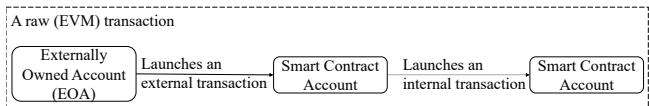
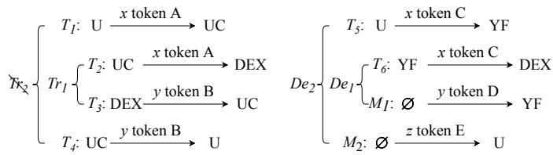
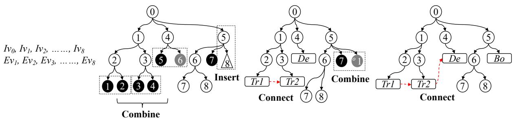

# DEFIRANGER: Detecting DeFi Price Manipulation Attacks

Siwei Wu, Zhou Yu, Dabao Wang, Yajin Zhou, Lei Wu, Haoyu Wang, Xingliang Yuan

Abstract—The rapid growth of Decentralized Finance (DeFi) boosts the blockchain ecosystem. At the same time, attacks on DeFi applications (apps) are increasing. However, to the best of our knowledge, existing smart contract vulnerability detection tools cannot directly detect DeFi attacks. That’s because they lack the capability to recover and understand high-level DeFi semantics, e.g., a user trades a token pair X and Y in a Decentralized EXchange (DEX).

In this work, we focus on the detection of two new types of price manipulation attacks. To this end, we propose a platformindependent method to identify high-level DeFi semantics. Specifically, we first construct the Cash Flow Tree (CFT) from a raw transaction and then lifting the low-level semantics to highlevel ones, including five advanced DeFi actions. Finally, we use patterns expressed with the recovered DeFi semantics to detect price manipulation attacks.

We implemented a prototype named DEFIRANGER that detected 14 zero-day security incidents. These findings were reported to affected parties or/and the community for the first time. Furthermore, the backtest experiment discovered 15 unknown historical security incidents. We further performed an attack analysis to shed light on the root causes of vulnerabilities incurring price manipulation attacks.

Index Terms—Blockchain transaction analysis, DeFi security, attack detection

## I. INTRODUCTION

The recent Decentralized Finance (DeFi) boom brings Ethereum a new climax, attracting 48.65 billions USD locked in DeFi apps up to 29th April 2023. Security issues are also emerging with the rapid growth of the DeFi ecosystem. DeFi-related security issues have been reported, including front-running [1], [2], [3], Pump-and-Dump (P&D) scams [4], [5], and flash loan attacks [6]. In addition, code and logic vulnerabilities in DeFi apps bring many security incidents [7], [8], [9], [10], [11], [12], [13], [14], [15].

Most existing detection tools [16], [17], [18], [19], [20], [21], [22], [23], [24], [25], [26], [27], [28] mainly focus on the code vulnerability, such as the re-entrancy and the integer overflow. However, to the best of our knowledge, they cannot be directly used to detect DeFi attacks caused by logic vulnerabilities due to the lack of the capability to recover and understand high-level DeFi semantics, e.g., a user trades a token pair X and Y in a Decentralized EXchange (DEX).

Among DeFi apps, decentralized exchanges and lending apps are the two most popular types. Each pool in the DEX maintains two or more kinds of cryptocurrencies and leverages an automatic price mechanism to decide the exchange rate. Besides, a user can borrow cryptocurrencies from a lending app by depositing the collateral (e.g., the wrapped native tokens, stablecoins, or other tokens) into the app. To determine how many cryptocurrencies a user can borrow, the lending app needs to evaluate the value of the collateral, e.g., by retrieving the current price from a DEX pool.

With the popularity of DEX and lending apps, some novel attacks involving price manipulation are emerging. Specifically, two types of price manipulation attacks are concerned in this paper (see the definitions in Section III). The first indicates that an attacker forces a vulnerable DeFi app to perform an unwanted trade inside a DEX pool by exploiting the vulnerability of the DeFi app. Then the attacker can profit from the token price manipulated by the unwanted trade. The second one entails that an attacker manipulates the token price calculated by a vulnerable DeFi app (e.g., a lending app), whose price mechanism depends on the real-time status, e.g., the quotation and reserves of a token in a DEX pool. The attacker can manipulate the status by trading in the DEX pool. For instance, the attacker can raise the collateral price in a DEX pool that provides the price quotation to the lending app. By doing so, the attacker can borrow more tokens than a benign borrower with the same amount of collateral.

Our work Our work aims to detect price manipulation attacks, requiring the analysis of invocations between multiple smart contracts and understanding of high-level semantics in DeFi apps. However, there is a semantic gap between raw transactions that can be observed on blockchains and high-level DeFi semantics of DeFi apps. Namely, we can only observe the primitive information of raw transactions but cannot get the high-level DeFi semantics such as there exists an account that trades X USDC for Y Ether in the USDC-Ether pool using the Uniswap V2 protocol. Since price manipulation attacks usually involve the trade of tokens, the high-level DeFi semantics are critical to detect such attacks.

To fill out the semantic gap, we propose a platformindependent way to recover DeFi semantics <sup>1</sup>. Specifically, we first define semantics for three basic DeFi actions (e.g., token transfer) and five advanced DeFi actions (e.g., performing a trade in a DEX pool) in Section IV. The basic semantics can be identified from the raw transactions, and all advanced semantics consists of basic semantics. Our fundamental idea is to automatically infer advanced actions from basic actions.

When implementing the idea, we encounter three challenges, e.g., numerous basic actions, internal token ledgers, and inter-contract token transfers. To address these challenges, we first collect a raw transaction and then construct the Cash Flow Tree (CFT). This tree consists of contract invocations, events, and basic actions involved in the transaction. Then, we lift the tree’s DeFi semantics from basic actions into advanced actions. During the semantics lifting, we apply three operations, e.g., connection, insertion, and combination. Finally, we utilize patterns predefined with recovered DeFi semantics to detect if the raw transaction is a price manipulation attack.

Evaluation We have implemented a prototype system called DEFIRANGER and evaluated its effectiveness from two perspectives. First, whether the proposed method can accurately recover DeFi semantics? Second, can our system detect realworld price manipulation attacks in the wild, including zeroday ones?

To the best of our knowledge, there is no existing ground truth for advanced DeFi semantics. Therefore, we manually build a dataset containing 8, 117 advanced actions involved in 15, 272 raw transactions to answer the first question. After that, we compare the result of recovered DeFi semantics with the dataset. The comparison shows that DEFIRANGER can accurately recover DeFi semantics in high precision (0.996) and true positives rate (0.962).

Our system was deployed in reality with the industry partner (BlockSec [29]) from mid-2020 to the writing of this paper in 29th April 2023. It successfully detected 14 zero-day incidents involving price manipulation attacks. For the detected zero-day security incidents, we were the first to detect each of them and report them to the affected project party or the community. To evaluate DEFIRANGER’s precision of detecting known attacks, we performed a backtest for 92, 325, 423 raw transactions. As a result, it detected 129 price manipulation attacks with a precision of 0.831. Note that, in the experiment, DEFIRANGER not only detected 26 known security incidents but also discovered 15 unknown security incidents that have not been reported or mentioned online. This result shows that DEFIRANGER can effectively detect price manipulation attacks.

We further analyzed the 41 incidents to shed light on the root causes of vulnerabilities (Section VIII). Our analysis result shows that the root causes come from four perspectives, i.e., access control, design compatibility, slippage check, and price dependency. These insights can help the community to propose better solutions to secure the DeFi ecosystem.

Contributions Our work makes the following main contributions.

• We define two types of price manipulation attacks and then propose a methodology to detect them.

• We propose a general way to recover DeFi semantics. To the best of our knowledge, our work is the first to provide a systematic definition for DeFi semantics and automatically recover DeFi semantics.

  
Fig. 1: A raw transaction that consists of an external transaction and an internal transaction.

• We implement a prototype named DEFIRANGER. The real deployment of the system detected 14 zero-day security incidents. Furthermore, in the experiment, it discovered 15 unknown historical security incidents.

• We performed a detailed analysis of 41 security incidents to shed light on the root causes of vulnerabilities.

## II. BACKGROUND

This section presents necessary background information to better understand our work.

## A. Ethereum Accounts and Transactions

Ethereum has two types of accounts, i.e., the externally owned account (EOA) and the smart contract account. A transaction can be used to send Ether between accounts or to invoke APIs in smart contracts. There are two types of transactions, i.e., the external and internal transactions. An EOA triggers the external transaction, while a smart contract triggers the internal transaction. In this paper, the usage of raw transaction or EVM transaction implies all the external and internal transactions initiated from an external transaction (as shown in Fig. 1.)

## B. Cryptocurrencies

There are two main types of cryptocurrencies, native token and ERC20 token <sup>2</sup>. Native tokens, such as Ether in Ethereum and BNB in BSC, are supported inherently by blockchains, while an ERC20 token is the third-party one issued using smart contracts. Every account, including EOA and the smart contract accounts, can own native and ERC20 tokens. Though there are many types of ERC20 tokens, the following two are related to our work.

Stablecoins Stablecoins are a class of cryptocurrencies that guarantee their price stability. Typically, stablecoins are either directly/indirectly backed or intervened through different stabilization mechanisms [30], [1]. The popular stablecoins include USDC [31], USDT [32], and so on.

Liquidity Provider (LP) Tokens A DeFi app may issue LP tokens to users who provide liquidity (i.e., depositing cryptocurrencies into that DeFi app). Liquidity providers can use the LP tokens as certificates to withdraw their deposits or exchange for other cryptocurrencies in those decentralized exchanges (Section II-C). In this paper, we interchangeably use cryptocurrencies and tokens to denote native tokens and ERC20 tokens.

## C. Decentralized Finance (DeFi)

DeFi app usually consists of multiple smart contracts to implement its functionality, running on the blockchain. Some financial services, such as lending, exchange, and portfolio management, have emigrated into the DeFi ecosystem.

Decentralized EXchange (DEX) DEX is an exchange where users can trade different tokens in a decentralized way. There are two types of DEX, including List of Booking (LOB) and Automated Market Maker (AMM). DEX using the LOB mechanism maintains an off-chain order book to record users’ bids and asks. Namely, matching orders will be completed off-chain. Alternatively, the AMM mode works in a fully decentralized way. The market makers put two or more tokens into a DEX pool. The trade rate between cryptocurrencies in the pool will be calculated automatically based on a mathematical formula. In this paper, if not other specified, we only discuss DEXs using AMM.

Lending To borrow a type of cryptocurrency, borrowers are required to over-collateralize other cryptocurrencies for covering the loan due to the pseudo-anonymity of Ethereum. For example, in MakerDAO [33], borrowing 100 DAI requires a collateral of Ether that worth 150 DAI. Moreover, once the collateral’s value falls below a fixed threshold (due to the price drop of the collateral), it will trigger the liquidation (the lending app will sell the collateral), as well as a designed penalty that will be applied to borrowers.

Flash Loan Some DeFi apps [34], [35], [36] provide a type of non-collateral loan called flash loan. A valid flash loan ”generously” lends users a considerable amount of capital without any collateral. The security of the loan is guaranteed since the user needs to borrow and return the loan in a single transaction (with multiple following internal transactions). Otherwise, the lending transaction will be reverted by the loan provider. The flash loan gives everyone the ability to temporarily own a large number of tokens. However, it can also be abused to launch attacks, and a number of such attacks have been observed in the wild [6].

Yield Farming As more and more DeFi apps motivate clients to provide liquidity. Another kind of apps, known as yield farming apps, debut to help users (liquidity providers) to invest their cryptocurrencies. In particular, they automatically find the apps that provide the highest Annual Percentage Yields (APY) and then invest clients’ deposited tokens into these apps.

## III. PRICE MANIPULATION ATTACKS

A DEX contract leverages an automatic mechanism to price tokens. However, attackers can manipulate the price inside a DEX, especially by abusing flash loans, to gain profits. Such attacks are called price manipulation attacks. In the following, we first use a simple price mechanism as an example to introduce the concept of price manipulation and then elaborate on two types of widespread price manipulation attacks, which apply traditional financial manipulation methods, i.e, front running [37] and cross-market manipulation [38], to DeFi ecosystem.

## A. Price Manipulation

Most of the AMM DEXes use the constant product formula or its variants to price tokens. Specifically, each DEX contract (or pool) maintains the liquidity of two or more tokens and uses their liquidity (or reserves) to price tokens.

For simplicity, we take a constant formula pricing two tokens (X and Y) as an example: $x y \ = \ c .$ . Specifically, x and y are the liquidity (or reserves) of token X and Y in the pool, respectively, and c is a constant. Based on the formula, we can use one token to price another token. As shown in $\begin{array} { r } { \Delta y = \frac { \Delta x * y } { \Delta x + x } , \Delta y } \end{array}$ shows the amount of token Y that a user can trade with token X in an amount of $\Delta x$

Since the exchange rate between the token pair depends on the pool’s reserves, attackers who are capable of draining the pool can make a trade to inflate or reduce a token’s price, namely, manipulate the price deviating a lot away from the market price. Such behavior is referred to as price manipulation. DeFi contracts that interact with a manipulated pool may suffer from financial losses.

## B. Type I Price Manipulation Attack

If a DeFi contract’s public interfaces that interact with DEX pools are not properly protected, then an attacker can leverage the method of front running [37] to attack the contract. In general, the type I price manipulation attack consists of three steps.

1) Front run (or hoard): The attacker uses a huge amount of token X to buy token Y in a DEX pool, thereby greatly inflating the price of token Y. Also, the attacker hoards lots of the token Y.

2) Forced buy: Since the victim contract’s interface to buy token Y is not properly protected, the attacker can force the contract to buy token Y by directly invoking the interface, even if the purchase price is much higher than expected. This step further increases the price of token Y in the pool.

3) Back run (or dump): Due to the increased price, the attacker profits from dumping token Y, and all the profits come out of the victim contract.

Differences with the Sandwich Attack Superficially, the type I price manipulation attack is very similar to the wellknown sandwich attack [3]. However, there are two main differences. First, the type I price manipulation attack involves vulnerabilities in smart contracts, while the sandwich attack does not. Second, the whole process of type I attack often happens in a single EVM transaction, while a sandwich attack involves at least three EVM transactions.

## C. Type II Price Manipulation Attack

The business logic of some DeFi apps needs to calculate the token’s value. For instance, a lending app is required to calculate the collateral’s value to decide how many tokens a borrower is eligible to borrow. A token’s (spot) price in the DEX pool can be directly used as the price oracle. However, the token price depends on the DEX pools’ reserves. Thus, an attacker can use a huge amount of funds to manipulate the token price. For instance, a borrower can borrow more tokens than the outstanding principal balance of the collateral (i.e., undercollateralization [39]) from the lending contract by manipulating the collateral’s price.

TABLE I: The definition of basic DeFi actions.

<table><tr><td>Name</td><td>Symbol</td><td>Attributes</td></tr><tr><td>Basic Action</td><td>Ba</td><td></td></tr><tr><td>Transfer</td><td>T</td><td>spender, recipient, amount, token</td></tr><tr><td>Minting</td><td>M</td><td>recipient, amount, token</td></tr><tr><td>Burning</td><td>B</td><td>spender, amount, token</td></tr></table>

The type II attack is also known as the price oracle manipulation attack. In general, it consists of three steps.

1) Hoard: The attacker hoards (or buys) some token X.

2) Pump: Since the victim contract depends on the token $\vec { \bf { X } ^ { \prime } \bf { S } }$ price in DEX, the attacker uses a huge amount of funds to manipulate the DEX pool, e.g., to pump the token $\vec { \bf { X } ^ { \prime } \bf { S } }$ price.

3) Dump: The attacker dumps (or sells) all hoarded token X to the victim contract or uses the hoarded token as collateral at a pumped price that is much higher than the market price.

These two attacks typically require the attacker to have a huge amount of funds to manipulate the price. Due to the invention of the flash loan, everyone has the ability to temporarily control a huge amount of funds, which make price manipulation attacks possible.

## IV. DEFI SEMANTICS

This work aims to detect price manipulation attacks, following the steps shown in Section III-B and III-C. This requires understanding DeFi semantics, e.g., the trading or swapping of tokens, since the behaviors in each step are expressed with high-level DeFi semantics. However, the raw transactions obtained from the blockchain only contain primitive information, e.g., token transfers and smart contract invocation. There exists a semantic gap between the raw transactions and DeFi semantics.

To fill this gap, we first present the definition of DeFi actions (Section IV-A), including basic actions and advanced actions. Then, we propose our method to identify basic actions (Section IV-B) and advanced actions (Section IV-C). We also illustrate three challenges and our solutions during this process. Note that, all the described semantics are the actions that can be extracted in one raw transaction (all the external and internal transactions initiated from an external transaction in Fig. 1). We do not consider the actions that are expressed by the combination of multiple raw transactions.

## A. DeFi Actions Definition

Based on our comprehensive study of the smart contracts and transactions of top DeFi apps (the list is shown in Appendix.), we categorize DeFi actions into three basic actions and five advanced actions.

1) Basic Actions: As shown in Table I, the basic actions are token transfer, token minting, and token burning. The token transfer action (denoted as T) has four attributes that can precisely describe its semantics, e.g., spender transfers amount of token to recipient. The other two are similar, but M does not have the spender (or the spender is the zero address), and B does not have the recipient (or the recipient is a burn address such as a zero address).

2) Advanced Actions: Besides, as shown in Table II, we define five advanced actions expressed in basic actions.

Trade A trader transfers in one kind of token, and then a vault contract or a DEX pool transfers out another one. Therefore, we define a trade action (Tr) as two token transfers, $T _ { i n }$ and $T _ { o u t }$

Depositing A depositor transfers one or more underlying token(s) to a DeFi app, and the app mints to the holder a share token that is a certificate of owning these underlying token(s). Therefore, we define a depositing action (De) as a list of token transfers $T s$ and a token minting $M _ { s h a r e } .$ . This action exists in multiple types of DeFi apps, e.g., depositing tokens into DEX to provide liquidity, depositing collaterals into lending apps, depositing tokens into yield farming apps, etc.

Withdrawal On the contrary to depositing, a withdrawal action (Wi) is defined as a list of token transfers $T s$ that withdraw specified underlying tokens to the recipient and a token burning $B _ { s h a r e }$ that burns the withdrawal (share) certificate.

Borrowing A debtor borrows the amount of the token (the loan token) from a lending app, and the borrowed loan token is transferred (or minted) to the recipient. The recipient can be the same or different from the debtor. To borrow tokens, the debtor should deposit collaterals in advance. Besides, the app will mint a debt token to the debtor, denoting that the address owns a debt from the app. Therefore, in our definition, a borrowing action (Bo) consists of a basic action of T or M $( B a _ { T / M } )$ and a token minting action $M _ { d e b t }$

Repayment This is an opposite action of $B o ,$ and it has the opposite definition. A repayment action (Re) consists of a basic action of T or $\textit { B } ( B a _ { T / B } )$ in which the payer repays (or burns) the loan token and an action $B _ { d e b t }$ to burn the debt token of the debtor.

## B. Basic Actions Identification

The identification of basic actions is straightforward. First, for the native token transfer, we can locate the value field in the transaction. For the ERC-20 token transfer, we can look up the emitted events. Second, if a token transfer’s spender is the zero address, then it’s a token minting action. Similarly, if recipient is the zero address, then it’s a token burning.

## C. Advanced Actions Identification

Identifying an advanced action is far more difficult than identifying a basic action because there is no unified implementation standard. For example, there is no unified standard for a contract to implement a trade action. However, our observation shows that the advanced actions are combinations of basic actions, complying with the concept of DeFi Lego [40].

TABLE II: The definition of advanced DeFi actions

<table><tr><td>Name</td><td>Symbol</td><td>Attributes</td><td>Derived Attributes</td></tr><tr><td>Advanced Action</td><td>Adv</td><td></td><td></td></tr><tr><td>Trade</td><td>Tr</td><td> $T_{in}, T_{out}$ </td><td>trader,recipient,tokenin,amountin,tokenout,amountout,pool</td></tr><tr><td>Depositing</td><td>De</td><td> $Ts, M_{share}$ </td><td>depositor,holder,tokens,tokenlp,amounts,amountlp,pool</td></tr><tr><td>Withdrawal</td><td>Wi</td><td> $Ts, B_{share}$ </td><td>holder,recipient,tokens,tokenlp,amounts,amountlp,pool</td></tr><tr><td>Borrowing</td><td>Bo</td><td> $Ba_{T/M}, M_{debt}$ </td><td>debtor,recipient,token,amount,pool</td></tr><tr><td>Repayment</td><td>Re</td><td> $Ba_{T/B}, B_{debt}$ </td><td>payer,debtor,token,amount,pool</td></tr><tr><td>Collateral Borrowing</td><td>Cb</td><td>De,Bos</td><td>debtor, $T_{coll}, Ts_{bo}, token_{coll}, amount_{coll}, tokens, amounts, pool_{coll}$ </td></tr></table>

However, we still face three challenges when implementing the idea.

```javascript
function swap1(IERC20 tokenIn, uint amountIn, IERC20
    tokenOut, address recipient) {
    ...... //calculate amountOut
    tokenIn.transferFrom(msg.sender, this, amountIn);//T_in
    tokenOut.transfer(recipient, amountOut);//T_out
    emit Exchange1(msg.sender, tokenIn, tokenOut, amountIn,
        amountOut);
}
function swap2(IERC20 tokenIn, uint amountIn, IERC20
    tokenOut, address recipient) {
    ...... //calculate amountOut
    tokenIn.transferFrom(msg.sender, this, amountIn);//T_in
    ledger[recipient][tokenOut] += amountOut;//T_out
    emit Exchange2(msg.sender, tokenIn, tokenOut, amountIn,
        amountOut);
}
```  
Listing 1: example functions to operate the trade action

1) Numerous Basic Actions: A raw transaction may interact with multiple DeFi apps and contain numerous basic actions. For instance, as Listing 1 shows, an invocation of the function swap1 will trigger two token transfers (T) that should be identified as the input $( T _ { i n } )$ and output $( T _ { o u t } )$ of the trade (Tr). We can combine them as a trade because the same function invocation triggers these two token transfers (calling the swap1). Such information should be retrieved from the raw transaction to help identify advanced actions.

To address this issue, we construct a cash flow tree for a raw transaction (Section V-A). The cash flow tree preserves the relationship between basic actions. By post-order traversing the tree, we can use the most relevant basic actions to identify advanced actions. For instance, the two token transfers triggered in swap1 can be identified to generate the advanced trade action.

2) Internal Token Ledgers: A few DeFi contracts maintain an internal ledger to record the number of tokens that are temporarily deposited by users, without minting a share token (or LP token) to users. As shown in the function swap2 in Listing 1, it does not transfer the $t o k e n _ { o u t }$ to the user but records the related states in an internal ledger (ledger). As a result, any trade operated by the function swap2 can not be identified because we can not get the semantics of the trade’s $T _ { o u t }$ from basic actions.

In this work, we leverage external information to solve this issue. Specifically, we manually feed external information into our system that leverages it to identify internal basic actions (Section V-B2).

3) Inter-contract Token Transfers: Inter-contract token transfers exist widely in DeFi ecosystem, leading to the possibility of identifying redundant trades. For example, as shown in Fig. 2a, the two token transfers $( T _ { 1 }$ and $T _ { 4 } )$ can be identified as a trade $( T r _ { 2 } )$ . However, this trade is redundant since the actual trade is performed by the DEX contract $( T r _ { 1 } )$ rather than the user-controlled contract.

  
Fig. 2: Inter-contracts token transfers. U: a user; UC: a usercontrolled contract; DEX: a DEX contract; YF: a yield farming contract; ∅: zero address.

One straightforward method to solve this issue is to merge token transfers carrying the same token, e.g., merging $T _ { 1 }$ and $T _ { 2 }$ as a new token transfer $T _ { 1 2 }$ and merging $T _ { 3 }$ and $T _ { 4 }$ as $T _ { 3 4 }$ . Then the $T _ { 1 2 }$ and $T _ { 3 4 }$ can be combined as a trade. However, this may cause issues in some cases. For example, as shown in Fig. 2b, the user deposits x token C into the yield farming contract $( T _ { 5 } )$ , which then mints z token E as his share certificate $( M _ { 2 } )$ . Furthermore, the yield farming contract invests the x token C into a DEX contract. <sup>3</sup> Similarly, it gets minted y token D as its share certificate. In essence, two DeFi advanced actions $( D e 1$ and De2) are operated by the yield farming contract and the DEX contract, respectively. Therefore, if we merge the two token transfers $( T _ { 5 }$ and T<sub>6</sub>) into one, then we will miss the second deposit (De2). Our system connects token transfers carrying the same token rather than merging them to handle that. Through the connection, we can prevent the identification of redundant trades without missing any advanced actions. The details are discussed in Section V-B1.

## V. METHODOLOGY

In this section, we elaborate on the methodology to detect price manipulation attacks. Fig. 3 shows the workflow. Specifically, the input of our methodology is the invocation trace of a raw transaction. We first recover the trace’s tree structure and identify the basic DeFi actions to construct the cash flow tree (Section V-A). Then, we lift the tree’s DeFi semantics (Section V-B) to get the advanced actions. Finally, we use predefined patterns expressed with DeFi semantics to detect the price manipulation attack (Section V-C).

  
Fig. 3: The workflow of our system.

TABLE III: The symbols used in function invocation and events. For a function invocation, caller is the caller address; context is the callee address; value is the amount of transferred native token; $s i g$ is the function signature being called; args are the arguments. For an event, context is the address of the contract emitting the event; sig is the signature of the event; args are the arguments of the event.

<table><tr><td>Name</td><td>Symbol</td><td>Fields</td></tr><tr><td>Invocation</td><td> $Iv$ </td><td>caller, context, value, sig, args</td></tr><tr><td>Event</td><td> $Ev$ </td><td>context, sig, args</td></tr></table>

## A. CFT Construction

The invocation trace of a raw transaction consists of a list of smart contract function invocations and events. Table III defines the function invocation and the event.

As described in Section IV-C1, we first construct the Cash Flow Tree (CFT) for a raw transaction and then follow the rules in Table IV to identify basic DeFi actions. The CFT has three types of nodes.

Invocation node The root node is an invocation node that contains the first invocation (the external transaction) with the transaction launcher as its caller, and all intermediate nodes are invocation nodes. In addition, a few invocation nodes are leaf nodes because they contain invocations that do not trigger other invocations, nor emit events or transfer native tokens.

Event node All event nodes are leaf nodes, and the event contained in each event node is emitted by the invocation contained in its parent node.

Basic node All basic nodes are leaf nodes. Each node corresponds to the basic actions, including token transfer, minting, and burning.

## B. Semantics Lifting

We identify advanced DeFi actions inside the tree to add a new type of node into the tree, i.e., advanced node. All advanced nodes are leaf nodes. We call basic and advanced nodes as action nodes for a better description.

The purpose of semantics lifting is to generate advanced actions. Specifically, we lift CFT’s semantics by recursively lifting all its subtrees’ semantics with a post-order traversal, using the following three operations in sequence, i.e., connection, insertion, and combination.

TABLE IV: The rules of identifying basic actions.

<table><tr><td></td><td>Condition</td><td></td><td>Assignment</td></tr><tr><td> $Iv$ </td><td> $Iv.value > 0$ </td><td>T</td><td> $T.spender \leftarrow Iv.caller$  $T.recipient \leftarrow Iv.context$  $T.token \leftarrow \delta$  $T.amount \leftarrow Iv.value$ </td></tr><tr><td> $Ev$ </td><td> $Ev.sig = \mathbb{T}$  $Ev.args[2] > 0$  $Ev.args[0] \neq \emptyset$  $Ev.args[0] \neq Ev.context$  $Ev.args[1] \neq \emptyset$  $Ev.args[1] \neq Ev.context$ </td><td>T</td><td> $T.spender \leftarrow Ev.args[0]$  $T.recipient \leftarrow Ev.args[1]$  $T.token \leftarrow Ev.context$  $T.amount \leftarrow Ev.args[2]$ </td></tr><tr><td> $Ev$ </td><td> $Ev.sig = \mathbb{T}$  $Ev.args[2] > 0$  $Ev.args[0] = \emptyset$ or  $Ev.args[0] = Ev.context$ </td><td>M</td><td> $M.recipient \leftarrow Ev.args[1]$  $M.token \leftarrow Ev.context$  $M.amount \leftarrow Ev.args[2]$ </td></tr><tr><td> $Ev$ </td><td> $Ev.sig = \mathbb{T}$  $Ev.args[2] > 0$  $Ev.args[1] = \emptyset$ or  $Ev.args[1] = Ev.context$ </td><td>B</td><td> $B.spender \leftarrow Ev.args[0]$  $B.token \leftarrow Ev.context$  $B.amount \leftarrow Ev.args[2]$ </td></tr></table>

ð: the native token of a blockchain.  
∅: zero address.  
T: the signature of ERC-20 standard event Transfer.

TABLE V: The rules of connection.

<table><tr><td></td><td>Conditions</td><td>Assignment</td></tr><tr><td> $Ba_1, Ba_2$ </td><td> $Ba_1.token = Ba_2.token$  $Ba_1.recipient = Ba_2.spender$  $Ba_1.recipient \neq \emptyset$  $Ba_2.spender \neq \emptyset$  $Ba_1.remains_{out} > 0$  $Ba_2.remains_{in} > 0$ </td><td> $Ba_1 \xrightarrow{\boldsymbol{a}} Ba_2$  $Ba_1.remains_{out} -= \boldsymbol{a}$  $Ba_2.remains_{in} -= \boldsymbol{a}$ </td></tr></table>

∅: zero address.  
a: min(Ba<sub>1</sub>.remains<sub>out</sub>, Ba<sub>2</sub>.remains<sub>in</sub>).

1) Connection: To avoid the identification of redundant trades (Section IV-C3), we connect basic actions carrying the same token in advance. We add two fields to each basic action to support the operation: remains in and remains out. The first field indicates how much token comes from spender’s savings, and the latter indicates how much token does not flow to the following actions. Both two fields are initialized as Ba.amount. Table V shows the detailed rules of connecting basic actions. Note that the connection is also applied to advanced actions because each advanced action consists of basic actions.

2) Insertion: We leverage the external information extracted manually to identify internal basic actions (Section IV-C2). The external information consists of six fields, $s i g _ { f } , s i g _ { e } , l o c _ { s p e n d e r } , l o c _ { r e c e i p i e n t } , l o c _ { t o k e n } ,$ and $l o c _ { a m o u n t } ,$ which can help us identify an internal basic action. Specifically, the two signature fields, $s i g _ { f }$ and $s i g _ { e } .$ indicate the function signature and event signature, respectively. We take the code in Listing 1 as an example, $s i g _ { f }$ and $s i g _ { e }$ is swap2(address, uint256,address) and Exchange2(address,addr- -ess,address,uint256,uint256), respectively. If we find them in a subtree, we can extract the semantics of an internal basic action, e.g., spender, recipient, token, and amount. In the example, $l o c _ { s p e n d e r } ,$ , loc<sub>recipient</sub>, and $l o c _ { t o k e n }$ is the invocation’s context address (Iv.context), caller address $( I v . c a l l e r ) .$ , and third argument (Iv.args[2]), respectively, and $l o c _ { a m o u n t }$ is the event’s fifth argument (Ev.args[4]). After that, we construct an internal basic action and insert a basic node containing it inside the subtree.

TABLE VI: The rules of combination.

<table><tr><td colspan="2"></td><td colspan="2">Conditions</td><td>Assignment</td></tr><tr><td rowspan="7"> $Iv$ </td><td> $T_1, T_2$ </td><td> $T_1.token \neq T_2.token$  $T_1.spender \Rightarrow Iv$  $T_2.recipient \Rightarrow Iv$ </td><td> $Tr$ </td><td> $Tr.T_{in} \leftarrow T_1$  $Tr.T_{out} \leftarrow T_2$ </td></tr><tr><td> $T(M_1), M_2$ </td><td> $T(M_1).token \neq M_2.token$  $T(M_1).amount = M_2.amount$  $T(M_1).recipient \Rightarrow Iv$  $M_2.recipient \Rightarrow Iv$ </td><td> $Bo$ </td><td> $Bo.Ba \leftarrow T(M_1)$  $Bo.M_{debt} \leftarrow M_2$ </td></tr><tr><td> $T(B_1), B_2$ </td><td> $T(B_1).token \neq B_2.token$  $T(B_1).amount = B_2.amount$  $T(B_1).spender \Rightarrow Iv$  $B_2.spender \Rightarrow Iv$ </td><td> $Re$ </td><td> $Re.Ba \leftarrow T(B_1)$  $Re.B_{debt} \leftarrow B_2$ </td></tr><tr><td> $T, M$ </td><td> $T.token \neq M.token$  $T.spender \Rightarrow Iv$  $M.recipient \Rightarrow Iv$ </td><td> $De$ </td><td> $De.Ts \leftarrow \{T\}$  $De.M_{share} \leftarrow M$ </td></tr><tr><td> $B, T$ </td><td> $B.token \neq T.token$  $B.spender \Rightarrow Iv$  $T.recipient \Rightarrow Iv$ </td><td> $Wi$ </td><td> $Wi.Ts \leftarrow \{T\}$  $Wi.B_{share} \leftarrow B$ </td></tr><tr><td> $De_1, T$ </td><td> $T.token \notin De_1.tokens$  $T.token \neq De_1.token_{lp}$  $De_1.depositor \Rightarrow Iv$  $De_1.holder \Rightarrow Iv$  $De_1.pool = T.recipient$ </td><td> $De_2$ </td><td> $De_2.Ts \leftarrow$  $De_1.Ts \cup \{T\}$  $De_2.M_{share} \leftarrow$  $De_1.M_{share}$ </td></tr><tr><td> $Wi_1, T$ </td><td> $T.token \notin Wi_1.tokens$  $T.token \neq Wi_1.token_{lp}$  $Wi_1.holder \Rightarrow Iv$  $Wi_1.recipient \Rightarrow Iv$  $Wi_1.recipient = T.recipient$  $Wi_1.pool = T.spender$ </td><td> $Wi_2$ </td><td> $Wi_2.Ts \leftarrow$  $Wi_1.Ts \cup \{T\}$  $Wi_2.B_{share} \leftarrow$  $Wi_1.B_{share}$ </td></tr></table>

⇒: if an address addr satisfies $a d d r = I v . c a l l e r$ or addr ∈ Iv.args, then addr comes from outside the function called in $I v ,$ which is symbolized as addr ⇒ Iv.

TABLE VII: The rules of discovering collateral borrowing.

<table><tr><td></td><td colspan="2">Conditions</td><td>Assignment</td></tr><tr><td>De, Bo</td><td>De.Ts.length = 1De.holder = Bo.debtorBo | De.pool</td><td>Cb</td><td>Cb.De ← DeCb.Bos ← {Bo}</td></tr><tr><td>Cb, Bo</td><td>Cb.debtor = Bo.debtorBo | Cb.pool $_{coll}$ </td><td>Cb</td><td>Cb.Bos ←Cb.Bos ∪ {Bo}</td></tr></table>

Adv | contract: if the subtree with Adv’s parent node as the root contains an invocation that fetches a specific state of contract by calling it or retrieves its balance of a certain token by calling balanceOf(contract), then Adv may depend on contract for that state or token balance. We symbolize this dependency as Adv | contract.

3) Combination: We infer advanced actions from basic actions by applying the rules in Table VI. A rule $a d d r \Rightarrow I v$ is to determine if the address (addr) is a user-owned account for the invocation (Iv). Specifically, we identify an advanced action from a pair of basic actions, and we pick the candidate pairs from all action nodes inside the subtree following two principles.

• To avoid the identification of redundant trades (the third challenge), we do not pick pairs that are connected, either indirectly or directly.

• To avoid repeated combinations for a pair, we pick only pairs whose Lowest Common Ancestor (LCA) is the subtree’s root node.

If a new advanced action is inferred, we combine the two action nodes into one advanced action node. Consequently, we remove the two nodes and insert the new one inside the subtree.

## C. Attack Detection

As described in Section III, both attacks involve hoarding a certain token and then dumping it to make a profit. As a result, our system first detects hoard-and-dump transactions as candidates and then applies detailed detection rules on them to further locate price manipulation attack transactions.

TABLE VIII: The rules of detecting hoard-and-dump.

<table><tr><td>Symbol</td><td>Rules</td></tr><tr><td>Tr1 &amp; Tr2</td><td> $\frac{Tr1.T_{out} \xrightarrow{\boldsymbol{a}} Tr2.T_{in}}{BackTrack([Tr1.T_{in}])}{Tr1.amount_{out}} < \frac{Trace([Tr2.T_{out}])}{Tr2.amount_{in}}$ </td></tr><tr><td>Tr &amp; Cb</td><td> $\frac{Tr.T_{out} \xrightarrow{\boldsymbol{a}} Cb.T_{coll}}{BackTrack([Tr.T_{in}])}{Tr1.amount_{out}} < \frac{Trace(Cb.Ts_{bo})}{Cb.amount_{coll}}$ </td></tr><tr><td>Cb &amp; Tr</td><td> $Cb.Ts_{bo}.length = 1$  $Cb.Ts_{bo}[0] \xrightarrow{\boldsymbol{a}} Tr.T_{in}$  $\frac{BackTrack(Cb.T_{coll})}{Cb(amounts[0])} < \frac{Trace([Tr.T_{out}])}{Tr.amount_{in}}$ </td></tr><tr><td>De &amp; Wi</td><td> $De.pool = Wi.pool$  $De.M_{share} \xrightarrow{\boldsymbol{a}} Wi_{share}$  $\frac{BackTrack(De.Ts)}{De.amount_{lp}} < \frac{Trace(Wi.Ts)}{Wi.amount_{lp}}$ </td></tr><tr><td>De &amp; Cb</td><td> $De.M_{share} \xrightarrow{\boldsymbol{a}} Cb.T_{coll}$  $\frac{BackTrack(De.Ts)}{De.amount_{lp}} < \frac{Trace(Cb.Ts_{bo})}{Cb.amount_{coll}}$ </td></tr><tr><td colspan="2"> $\frac{dict1}{amt1} < \frac{dict2}{amt2}: \forall k \in dict1, k \in dict2 \land \frac{dict1[k]}{am1} < \frac{dict2[k]}{amt2}$ </td></tr></table>

1) Detecting hoard-and-dump: Briefly, hoard-and-dump is that the attacker dumps (or sells) tokens at a price that is relatively higher than the price of hoarding (or buying) the token. Note that the hoard-and-dump can be completed with a series of advanced actions.

Discovering collateral borrowing Based on the advanced actions, we further abstract the collateral borrowing action, a composite action of depositing and borrowing, i.e., users increase their collateral by depositing tokens in lending apps and then borrow tokens from lending apps. Users may perform the borrowing action multiple times after a single depositing action. We employ the rules shown in Table VII to discover collateral borrowings.

Comparing tokens’ value The most critical aspect of detecting hoard-and-dump is comparing the cost of hoarding a token to the revenue generated by dumping it. However, the cost and revenue tokens may not be the same. For example, in the Array Finance incident [41], the attacker deposits ETH to hoard ARRAY tokens and dump tokens into aBPT. Directly comparing the value of the cost token (ETH) and the revenue token (aBPT) is not feasible.

As shown in Table VIII, our system takes two algorithms (BackTrack and Trace in Appendix) to solve the issue. Based on the identified DeFi semantics and connected actions, the first algorithm gets the initial cost token set by backtracking, and the second one retrieves the final revenue token set by tracing. In the example, since the revenue token (aBPT) is then converted into ETH for repaying flash loan, this solution makes the comparison feasible. In addition, to complement this solution, we maintain price information of tokens by using offline price oracle and online price oracle from the DEX pool.

2) Detecting price manipulation attacks: In accordance with the rules for detecting hoard-and-dump, we present our attack patterns in Table IX. To describe each of these patterns, we will provide at least one real-world case in Section VIII.

  
Fig. 4: An illustrative example to show the workflow of our methodology. : Invocation node; $\triangle \colon$ Event node; , : Basic node; : Advanced node; <sup>o</sup>i: the i − th internal basic action.

TABLE IX: The rules of detecting price manipulation attacks.

<table><tr><td></td><td>Actions</td><td>Rules</td></tr><tr><td colspan="3">Type I Price Manipulation Attack</td></tr><tr><td>Pattern I</td><td>Tr1, Tr2, Tr3</td><td>Tr1 &amp; Tr3Tr2.trader ≠ Tr3.traderTr2.pool = Tr3.poolTr2.tokenout = Tr3.tokenin</td></tr><tr><td>Pattern II</td><td>Tr1, Ba, Tr2</td><td>Tr1 &amp; Tr2Tr1.pool = Tr2.poolBa.spender = Tr2.poolBa.token = Tr2.tokenin</td></tr><tr><td>Pattern III</td><td>Tr1, De, Tr2</td><td>Tr1 &amp; Tr2Tr1.pool = Tr2.poolDe.pool = Tr2.poolDe.holder ≠ Tr1.trader</td></tr><tr><td>Pattern IV</td><td>Cb, Tr1, Tr2</td><td>Cb &amp; Tr2Tr1.trader ≠ Tr2.traderTr1.pool = Tr2.poolTr1.tokenout = Tr2.tokenin</td></tr><tr><td colspan="3">Type II Price Manipulation Attack</td></tr><tr><td>Pattern V</td><td>Tr, Cb</td><td>Tr &amp; Cb $\forall Bo \in Cb.Bos, Bo \mid Tr.pool$ </td></tr><tr><td>Pattern VI</td><td>De, Tr, Wi</td><td>De &amp; WiTr.pool ≠ Wi.poolTr.trader = Wi.holderWi | Tr.pool</td></tr><tr><td>Pattern VII</td><td>De1, De2/Wi1, Wi2</td><td>De1 &amp; Wi2De2/Wi1.pool ≠ Wi2.poolDe2/Wi1.holder = Wi2.holderWi2 | De2/Wi1.tokenlp</td></tr><tr><td>Pattern VIII</td><td>De, Tr, Cb</td><td>De &amp; CbTr.pool ≠  $Cb.pool_{coll}$ Tr.trader = Cb.debtor $\forall Bo \in Cb.Bos, Bo \mid Tr.pool$ </td></tr></table>

Adv | token: if the subtree with Adv’s parent node as the root contains an invocation that retrieves the total supply of token by calling its totalSupply(), then Adv may depend on token for its total supply. We symbolize this dependency as Adv | token.

## VI. AN ILLUSTRATIVE EXAMPLE

To better understand the workflow of our methodology, we craft a price manipulation attack as an example. As shown in Fig. 4, the input is the raw transaction’s trace, which includes nine invocations and eight events.

We first construct a CFT containing nine invocation nodes, one event node, and seven basic nodes. Among them, an invocation node $\textcircled{\scriptsize { \mathrm { i } } }$ contains the $i \textrm { -- } t h$ invocation, and an event node $\triangle$ contains the i − th event. Furthermore, a basic node i or i is transformed from an event node $\triangle$

In the phase of semantics lifting, we perform connection, insertion, and combination on the CFT’s all subtrees in the order of post-order traversal. For better illustration, we roughly divided the process into three iterations of the CFT:

• The first iteration involves subtrees whose root nodes are

2 , 3 , 4 , and 5 . Specifically, the first rule in Table VI is successfully applied on ( 1 , 2 ) and ( 3 , 4 ) as well as the forth rule is applied on ( 5 , 6 ). As a result, three advanced nodes (Tr1, Tr2 and De ) are created.

In addition, since we find a piece of external information with the $s i g _ { f }$ as the function signature in $\textcircled{5}$ and $s i g _ { e }$ as the event signature in $\triangle$ , we apply the insertion operation on them to insert an internal basic node <sup>o</sup>1 . After that, the two basic actions in 7 and <sup>o</sup>1 conform to the second combination rule. We combine them into an advanced node, $\boxed { B o } .$

• The second iteration involves the subtree whose root node is 1 . Firstly, we let T r1 to connect to T r2 by applying the rule in Table V on $T r 1 . T _ { o u t }$ and $T r 2 . T _ { i n }$

• The third iteration involves the subtree whose root node is 0 . We apply the connection rule on $T r 2 . T _ { o u t }$ and $D e . T s [ 0 ]$ to let Tr2 connect to De . After that, no rule can be applied. The process of semantics lifting is done.

In the phase of attack detection, firstly, 7 contains an invocation of a function (e.g., getAccountSnapshot) of $D e . p o o l ,$ enabling us to apply the first rule in Table VII on $( \boxed { D e } , \boxed { B o } )$ to discover a potential collateral borrowing (Cb). Secondly, the BackTrack Algorithm finds that the cost token of hoarding $T r 2 . t o k e n _ { o u t }$ is $_ { T r 1 . t o k e n _ { i n } }$ that is equal to the revenue token $( C b . t o k e n s [ 0 ] )$ of dumping $T r 2 . t o k e n _ { o u t }$ in $C b .$ . Furthermore, since Tr1.amount is less than Cb.amounts[0], the fifth rule in Table VIII determines $( T r 2 , C b )$ is a hoard-anddump $( T r 2 \ \& \ C b )$ . Finally, since $\textcircled{8}$ contains an invocation of a function (e.g., getTokenToEthInputPrice) of Tr2.pool, (Tr2, Cb) conforms to the Pattern $\mathrm { v }$ in Table IX. We then mark this transaction as a potential price manipulation attack (Type II).

## VII. EVALUATION

Based on our methodology, we implement a prototype named DEFIRANGER (around 6, 140 lines of Rust code). In this section, we evaluate our system from two perspectives: identifying DeFi semantics and detecting price manipulation attacks, i.e., whether it can accurately identify DeFi semantics, and whether it can detect real-world price manipulation attacks.

## A. Identifying DeFi Semantics

To the best of our knowledge, there is no existing ground truth for advanced DeFi actions involved in EVM-transactions.

Therefore, we first build a dataset of advanced DeFi actions within a time window as the ground truth, and then apply DEFIRANGER to the transactions within the same time window. Finally, we compare our results with the ground truth to evaluate DEFIRANGER’s precision of identifying DeFi semantics.

Ground truth We manually extract all DeFi actions involved in Ethereum from Oct-07-2022 08:00 AM +UTC to 09:00 AM. In total, the dataset includes 15, 272 transactions and 8, 117 advanced DeFi actions.

For the same 15, 272 transactions, DEFIRANGER identifies 7, 841 advanced DeFi actions. The comparison shows that DEFIRANGER identifies 7, 808 (TP) correct and 33 (FP) incorrect advanced DeFi actions and misses 309 (FN) correct ones. As a result, we calculate the precision $( \frac { \# T P } { \# T P + \# F P } )$ as 0.996 and TPR $( \frac { \# T P } { \# T P + \# F N } )$ as 0.962.

Result analysis After manual analysis, we divide reasons leading to false positives and false negatives into three categories:

• We do not have external information for certain less-known DeFi apps, leading to 295 false negatives and 6 false positives <sup>4</sup>.

• A few smart contracts are not affiliated with DeFi apps and cater to individual purposes. As the behavior of these contracts can be arbitrary and may conform to our rules of identifying advanced DeFi actions. This leads to 6 false positives.

• A few uncommon designs that fall outside our expectations result in 14 false negatives and 21 false positives. For example, in some cases, the recipient of a trade is hard-coded in the contract, which violates our rule $( T _ { 2 } . r e c i p i e n t \Rightarrow I v )$ for identifying a trade action. Additionally, a trade consisting of a token burning and a token minting does not align with our definition of trade action in Table II.

## B. Detecting Price Manipulation Attacks

System in Practice We deployed our system with our industry partner (BlockSec [29]) to perform real-time detection for price manipulation attacks from mid-2020 to 29th April 2023. The system detected 14 zero-day security incidents. For each zero-day incident, we were the first to detect and report it to the affected project party and/or the community, demonstrating DEFIRANGER can detect real-world price manipulation attacks.

Backtest To further evaluate DEFIRANGER’s precision of detecting attacks, we collected 26 well-known incidents involving price manipulation attacks shown in Table X. Then we fed all the transactions of that day to conduct a backtest experiment. As a result, the 26 days involves 92, 325, 423 EVM transactions (13, 611, 237 in Ethereum and 78, 714, 186 in BSC). DEFIRANGER marks 155 EVM transactions as attacks. Among them, 129 (TP) are real attacks and 26 (FP)

are benign ones. Therefore, the precision is 0.832. All detected attacks are shown in Appendix.

Unknown Historical Attacks After conducting a thorough manual examination of the detection results, we find that DEFIRANGER not only detected the 26 incidents that were previously known, but also identified 15 additional incidents (that were unknown by the community), as indicated in Table X. Note that these incidents can not be found by searching keywords or transactions’ hash, and the blockchain explorer [42] does not provide any label for these malicious accounts. Therefore, we name them unknown historical security incidents. In Section VIII, we will present a comprehensive analysis of these 41 incidents.

False Positive Analysis We classify the reasons of 26 false positives into three categories.

• Some token contracts impose a transfer fee on the spender. A trade of buying such a token includes a token transfer with the spender as an DEX pool, and the basic action burning the DEX pool’s transfer fee is likely to match Pattern II, leading to 17 false positives.

• Certain DEX contracts apply a trade fee and subsequently transfer the fee to another account. The token transfer carrying the trade fee is also prone to be detected by Pattern II, resulting in 5 false positives.

• A few token contracts have a buyback design that can automatically purchase the tokens themselves. If someone intends to sell such a token, the buyback mechanism will be triggered to stabilize its market prices. Consequently, we mark the detected 4 EVM transactions (by Pattern I or III) as false positives.

## C. Comparison with Existing Tools

Existing tools can be roughly divided into two categories according to their scenarios. Tools [43], [44], [19], [45], [17], [16], [46], [47] detect vulnerabilities in smart contract layer (SC layer [48]) by applying program analysis techniques on bytecode or source code, e.g., symbolic execution and formal verification. These tools aim to prevent vulnerable contracts from being deployed on the chain, while there are other tools that aim to protect on-chain contracts from being attacked. They depend on pre-defined rules [26], [49], [28], [27], and transaction profits [50], [51] to detect on-chain or pending attack transactions.

As a rule-based tools, DEFIRANGER differs from the four existing tools in the sense that it works on protocol layer (PRO layer [48]), while they work on smart contract layer (SC layer). As a result, they can not detect attacks in PRO layer, e.g., price manipulation attacks.

Profit-based tools aim to discover profitable transactions that include not only attacks but also benign transactions. As shown in APE [51]’s historical analysis, among the 169 profitable transactions, 68 of them belongs to arbitrage or liquidation. The fact that nearly half of cases are false alarms indicates that their positioning differs from DEFIRANGER and cannot detect attacks in a high precision.

TABLE X: Real world incidents involving price manipulation attacks.

<table><tr><td>Incident</td><td>Date(s)</td><td>Chain</td><td>Zero-day ? (Profit)</td></tr><tr><td>1. bZx hack I</td><td>Feb 15, 20</td><td>ETH</td><td>×</td></tr><tr><td>2. bZx hack II</td><td>Feb 18, 20</td><td>ETH</td><td>×</td></tr><tr><td>3. Balancer(STA/STONK)</td><td>Jun 28, 20</td><td>ETH</td><td>×</td></tr><tr><td>4. Loopring</td><td>Sep 30, 20</td><td>ETH</td><td> $\checkmark (\$29K) [52]$ </td></tr><tr><td>5. Dracula</td><td>Oct 08, 20</td><td>ETH</td><td> $\checkmark (\$8.5K)$ </td></tr><tr><td>6. Harvest Finance</td><td>Oct 26, 20</td><td>ETH</td><td>×</td></tr><tr><td>7. Plouto Finance</td><td>Oct 29, 20</td><td>ETH</td><td> $\checkmark (\$650K) [53]$ </td></tr><tr><td>8. Cheese Bank</td><td>Nov 06, 20</td><td>ETH</td><td>×</td></tr><tr><td>9. Value DeFi</td><td>Nov 14, 20</td><td>ETH</td><td>×</td></tr><tr><td>10. Seal Finance</td><td>Nov 15, 20</td><td>ETH</td><td> $\checkmark (\$4.25K) [54]$ </td></tr><tr><td>11. Warp Finance</td><td>Dec 17, 20</td><td>ETH</td><td>×</td></tr><tr><td>12. Belt Finance</td><td>May 29, 21</td><td>BSC</td><td>×</td></tr><tr><td>13. Array Finance</td><td>Jul 18, 21</td><td>ETH</td><td> $\checkmark (\$516K) [55]$ </td></tr><tr><td>14. Zenon</td><td>Nov 20, 21</td><td>BSC</td><td>×</td></tr><tr><td>15. CollectCoin</td><td>Dec 01, 21</td><td>BSC</td><td> $\checkmark (\$1M) [56]$ </td></tr><tr><td>16. IVM</td><td>Dec 17, 21</td><td>BSC</td><td> $\checkmark (\$1.8K) [57]$ </td></tr><tr><td>17. MIGE</td><td>Feb 09, 22</td><td>BSC</td><td> $\checkmark (\$42) [58]$ </td></tr><tr><td>18. bDollar</td><td>May 21, 22</td><td>BSC</td><td>×</td></tr><tr><td>19. Novo</td><td>May 29, 22</td><td>BSC</td><td>×</td></tr><tr><td>20. Fswap</td><td>Jun 13, 22</td><td>BSC</td><td> $\checkmark (\$432K) [59]$ </td></tr><tr><td>21. Inverse Finance</td><td>Jun 16, 22</td><td>ETH</td><td>×</td></tr><tr><td>22. SpaceGodzilla</td><td>Jul 13, 22</td><td>BSC</td><td> $\checkmark (\$26K) [60]$ </td></tr><tr><td>23. HEALTH</td><td>Oct 20, 22</td><td>BSC</td><td> $\checkmark (\$8.8K) [61]$ </td></tr><tr><td>24. ULME</td><td>Oct 25, 22</td><td>BSC</td><td> $\checkmark (\$50K) [62]$ </td></tr><tr><td>25. BSCAnt3</td><td>Jan 19, 23</td><td>BSC</td><td> $\checkmark (\$426K) [63]$ </td></tr><tr><td>26. SFM</td><td>Mar 28, 23</td><td>BSC</td><td> $\checkmark (\$8M) [64]$ </td></tr></table>

27. ARFI; 28. BWHALE; 29. LUME; 30. VOOP; 31. CB3; 32. TRM; 33. BLACK07; 34. CUSE; 35. FCN; 36. OnlyUp; 37. CAC; 38. MCC; 39. Dr.Wolf; 40. ACMasterChef; 41. GodLight

## VIII. ATTACK ANALYSIS

After deeply analyzing all incidents in Table X, we shed lights on the root causes of vulnerabilities. Specifically, we find the root causes are falling into four types, i.e., access control, design compatibility, slippage check, and price dependency. The first three are related to type I price manipulation attack and the last one is the main reason for type II attack.

In this section, we elaborate on our analysis of vulnerabilities and attacks involved in these 40 incidents <sup>5</sup>, and addresses of DeFi contracts to be mentioned are shown in Appendix.

## A. Access Control (14 ∼ 17, 19, 25 ∼ 33, 41)

The access control issue mainly refers to the case that a few token contracts do not perform user authentication on critical interfaces, e.g., burn and transferFrom. Specifically, Zenon, CollectCoin, IVM, MIGE, SFM, BSCAnt3, ARFI, BWHALE, LUME, VOOP, CB3, TRM, and BLACK07 do not verify the a caller’s identity before allowing the caller to burn tokens, which means an attacker can easily burn anyone’s above tokens. Furthermore, Novo and GodLight do not verify a caller’s authority before allowing the caller to spend other users’ tokens. Similarly, that means an attacker can spend anyone’s tokens. The former is called public burn and the latter is known as public transferFrom.

Attack analysis Specifically, the attacker exploits the vulnerable interfaces (burn or transferFrom) to transfer (or burn)

the token from the DEX pool, thereby greatly increasing the token’s price in the DEX. Finally, the attacker can easily drain out the DEX pool.

All attacks involving vulnerabilities of access control conform to Pattern II in Table IX.

## B. Design Compatibility

Some developers attempt to use certain inherent mechanisms to regulate tokens’ market prices automatically. Specifically, these mechanisms may automatically alter the balance of users. Such mechanisms may be incompatible with DEX contracts. This subsection discusses vulnerabilities arising from the compatibility between the design of DEX contracts and certain tokens’ inherent mechanisms, such as the deflation mechanism, selling-fee mechanism, price hedging mechanism, and buyback mechanism.

```txt
function swapExactAmountIn(
    address tokenIn, uint tokenAmountIn, address tokenOut,
        ......
) external {
    ......
    tokenAmountOut = calcOutGivenIn(......, tokenAmountIn);
    ......
}
```  
Listing 2: code snippet of Balancer V1

1) Deflation mechanism (3, 23, 39): STA and STONK apply a transfer fee of 1% and 0.3125%, respectively, designed to encourage users to hold such tokens rather than sell them. However, a 100% fee is applied to token transfers involving a minuscule amount (e.g., 2e<sup>−18</sup>) of these tokens. Such a design is incompatible with certain DEX contracts. For instance, as shown in Listing 2, the contract calculates the tokenOut amount based on the externally passed tokenAmountIn parameter. Consequently, the 100% transfer fee results in the contract swapping out WBNB without receiving any STA/STONK. In addition, the deflation mechanism in HEALTH and Dr.Wolf directly burns a certain percentage of the balance in a DEX pool with each transfer, thereby lifting the price.

Attack analysis In attacks of Balancer (STA/STONK), the attacker performs one or multiple large trades of WBNB for STA/STONK, intentionally unbalancing the DEX contract and driving up the price of STA/STONK. Subsequently, the attacker repeatedly swaps a minuscule amount of STA/STONK for WBNB until the DEX contract is fully drained. During this phase, the DEX contract dispenses a significant amount of WBNB per trade but does not receive any STA/STONK in return, which results in the price of STA/STONK not decreasing with sales. Attacks against HEALTH/Dr.Wolf is similar and more straightforward.

## These attacks conform to Pattern II.

2) Selling fee mechanism (34, 35): To encourage users to hold tokens, CUSE and FCN employ a mechanism of imposing an additional selling fee for each sale. This mechanism is triggered when the recipient of a transfer is a pre-configured DEX contract. However, this trigger condition does not account for Uniswap pools’ skim function, which is designed to force DEX pools’ balances to match their reserves. It allows anyone to withdraw tokens that are not considered part of liquidity and transfer them to a specified account. By calling skim and designating a pre-configured DEX contract as the recipient, the selling fee mechanism can be unexpectedly triggered.

Attack analysis In related attacks, the attacker first hoards a certain amount of CUSE/FCN by selling BUSD. Secondly, the attacker takes three steps to exploit the selling fee mechanism: 1) Transfers the hoarded CUSE/FCN to a DEX contract supporting CUSE or FCN.

2) Invokes the DEX contract’s skim and designates another DEX contract that is pre-configured in CUSE/FCN as the recipient. As a result, the first DEX contract transfers these CUSE/FCN plus selling fee to the second DEX contract. The payment of the selling fee makes the first DEX contract lose some reserves of CUSE/FCN, thereby lifting the price of them.

3) Invokes skim of the second DEX contract to withdraw these CUSE/FCN back to the attacker.

Finally, the attacker sells the hoarded CUSE/FCN in the first DEX contract, making a profit from the inflated price of CUSE/FCN.

Attacks involving CUSE and FCN conform to Pattern II.

3) Price hedging mechanism (36): To minimize the impact of market behaviors on the token price, OnlyUp utilizes a price hedging mechanism that mints some OnlyUp to a DEX contract when someone purchases the token. The inflationary approach aims to hedge the price increase resulting from token buys. Conversely, when OnlyUp are sold, the mechanism burns some OnlyUp from the DEX contract, employing deflation to mitigate the price decreases.

However, the developer of OnlyUp failed to use the sync function of Uniswap contracts correctly. The sync function is designed to force DEX pools’ reserves to match their balances. By calling it, tokens that are not considered part of liquidity can be transformed into the pool’s reserves. In the case of a token buy, the price hedging mechanism does not invoke sync after minting the token. As a result, the minted token becomes part of the liquidity transferred by the buyer. Furthermore, during a token sale, the price hedging mechanism calls sync after burning the token, leading to a price increase before the sell operation occurs.

Attack analysis Due to the vulnerable price hedging mechanism, the attacker can drain out the DEX contract by repeatedly buying OnlyUp and selling it.

Attacks involving OnlyUp conform to Pattern II.

4) Buyback mechanism (37, 38): To support the market price, CAC/MCC has a buyback mechanism that buys itself for each transfer. However, the buyback mechanism is potentially vulnerable. That’s because it fixedly uses 1% WBNB balance to buy back CAC/MCC, and there is no limit on the buyback frequency. Consequently, attackers can abuse the mechanism via token transfers carrying a minuscule amount $( e . g . , 1 e ^ { - 1 8 } )$ of the token.

Attack analysis In related attacks, the attacker first hoards some CAC/MCC, and then abuses the buyback mechanism to drive up the price of CAC/MCC. Finally, the attacker makes a profit by dumping the hoarded CAC/MCC.

Attacks involving CAC and MCC conform to Pattern I.

## C. Slippage Check(1, 4, 5, 10, 18, 22, 24, 40)

To avoid potential losses from unexpected slippage, it is crucial to conduct a slippage check before any interaction with DEX contracts, especially for public interfaces. Unfortunately, some DeFi contracts do not implement this feature. For example, bZx iETH offers a margin trading interface called marginTradeFromDeposit, which enables users to amplify their investment funds by depositing a certain amount of margin. However, the absence of a slippage check leaves the contract vulnerable to malicious trading, potentially leading to losses exceeding the margin amount.

Similarly, some DeFi contracts such as Loopring, Dracula, Seal, bDollar, SpaceGodzilla, ULME, and ACMasterChef also have interfaces to trade or add liquidity in DEX contracts with the purpose of influencing prices of their protocol tokens. The lack of a slippage check makes these contracts vulnerable to the potential manipulation of DEX contracts.

Attack analysis In bZx hack I, the attacker first hoards some WBTC by borrowing from a lending app, and then deposits 1, 300 ETH as the margin to exploit the vulnerable interface, which makes a large trade (5, 638 ETH for 51 WBTC) with unexpected slippage. Note that, this trade pulls up the price of WBTC. Finally, the attacker swaps the hoarded WBTC for ETH to make a profit.

Additionally, in other attacks, the attacker first makes a trade to manipulate a DEX contract and then forces these vulnerable DeFi contracts to swap or add liquidity in the DEX contract by exploiting these vulnerable interfaces. Finally, the attacker makes a reversed trade to make a profit.

The attack involved in bZx hack I conforms to Pattern IV, attacks against Loopring, Dracula, Seal, ULME, and ACMasterChef conform to Pattern I, and attacks against bDollar and SpaceGodzilla conform to Pattern III.

## D. Price Dependency (2, 6 ∼ 9, 11 ∼ 13, 21)

There are nine DeFi contracts that have vulnerabilities related to insecure price dependency. They calculate prices based on real-time quotations from DEX contracts, real-time reserves in DEX contracts, or the total supply of an external token. All three price sources are susceptible to price manipulation.

In the following formulas, $A M _ { t o k e n } , A B _ { t o k e n } , A D _ { t o k e n } ,$ and $A R _ { t o k e n }$ indicate the amount of token minted to, burned by, deposited by, and redeemed to a user, respectively. $R _ { t o k e n }$ refers to the current reserves of token in the related contract. $U P _ { t o k e n }$ indicates the unit price of token, and $T S _ { t o k e n }$ is the total supply of token.

$$
\begin{array}{l} A M _ {f U S D C} = \frac {A D _ {U S D C}}{R _ {U S D C} + \mathbf {T o U S D C} (R _ {y C r v})} * T S _ {f U S D C} \\ A R _ {U S D C} = \frac {A B _ {f U S D C}}{T S _ {f U S D C}} * (R _ {U S D C} + \mathbf {T o U S D C} (R _ {y C r v})) \end{array}\tag{1}
$$

1) Depending on real-time quotations: The lending contract bZx iETH allows users to borrow through overcollateralization. However, it assesses the value of collateral by fetching prices from a DEX contract. That’s vulnerable to price manipulation. Furthermore, vulnerabilities found in yield farming contracts, i.e., Harvest, Plouto, Value DeFi, and Belt are similar. For example, one of Harvest’s strategies is to deposit users’ USDC into Curve Y pool [65] to add liquidity. During this process, users receive fUSDC minted by Harvest as certificates, and Harvest receives yCrv minted by the Y pool as certificates. As shown in formula 1, Harvest depends on the real-time price (T oUSDC) provided by the Y pool to calculate fUSDC’s price.

Attack analysis In bZx hack II, the attacker first manipulates the price of sUSD in bZx contract by making multiple ETH to sUSD trades and then exploits the inflated price by depositing the hoarded sUSD as collateral, enabling the attacker to borrow a significantly greater amount of ETH than the amount initially sold.

In the Harvest hack, the attacker utilizes flash loan to execute a large USDT to USDC trade, which can pull up the price of USDC in the Curve Y pool. The attacker then deposits USDC in Harvest to hoard fUSDC. Due to the manipulated pricing mechanism in Harvest, the deposited USDC is overvalued, enabling the attacker receive an excessive amount of fUSDC. Next, the attacker makes a reverse trade of the initial trade, thereby restoring Curve Y Pool. Lastly, the attacker burns the hoarded fUSDC to withdraw more USDC than is originally deposited.

The attack involved in bZx hack II conforms to Pattern V, and attacks against Harvest, Plouto, Value DeFi, and Belt conform to Pattern VI.

$$
\begin{array}{l} U P _ {L P t o k e n} = \frac {n * \boldsymbol {R} _ {t o k e n 0} * U P _ {t o k e n 0}}{T S _ {L P t o k e n}} \\ U P _ {L P t o k e n} = \frac {\sum_ {i = 0} ^ {n} \boldsymbol {R} _ {t o k e n i} * U P _ {t o k e n i}}{T S _ {L P t o k e n}} \end{array}\tag{2}
$$

2) Depending on real-time reserves: Cheese Bank, Warp Finance, and Inverse Finance are lending contracts that accept LP tokens, certificates of liquidity added to DEX contracts, as the collateral. Since the prices of these LP tokens cannot be fetched directly, the three lending contracts use their own pricing mechanism for LP tokens. As shown in formula 2, Cheese Bank applies the first formula, while the other two use another. However, both of these calculations are vulnerable to price manipulation as the real-time reserves $( R _ { t o k e n i } )$ of an DEX contract can be manipulated.

Attack analysis In all three attacks, the attacker first hoards the LP token by adding liquidity in a DEX contract. Then, the attacker utilizes flash loans to conduct a large trade, disrupting the reserves of the DEX contract and inflating the LP token’s price in these lending contracts. Finally, the attacker deposits the hoarded LP token as collateral to borrow out other tokens from these lending contracts. As a result of the overvalued collateral, the attacker can make a profit from the borrowing.

These attacks conform to Pattern VIII.

$$
A R _ {a B P T} = \boldsymbol {T} \boldsymbol {S} _ {\boldsymbol {a B P T}} * (1 - (1 - \frac {A B _ {A R R A Y}}{T S _ {A R R A Y}}) ^ {2. 3})\tag{3}
$$

3) Depending on the total supply of an external token: Array Finance is a yield farming app that offers various investment strategies. One such strategy involves investing users’ ETH into an DEX contract on Balancer. Consequently, users receive ARRAY as certificates, and Array receives aBPT as certificates. Unlike other yield farming contracts, Array redeems aBPT instead of ETH as the deposited token when users withdraw their investment by burning their ARRAY. The amount of redeemed aBPT is calculated based on the total supply of aBPT $( T S _ { a B P T } )$ , which is externally controlled. Therefore, manipulating the total supply of aBPT can further influence the price calculation of $A R _ { a B P T }$

Attack analysis In the attack against Array Finance, the attacker first deposits ETH to hoard ARRAY and then utilizes flash loans (in the form of DAI, USDC, WETH, WBTC, and renBTC) to add liquidity in the Balancer DEX contract. The injection of flash loans greatly increases the total supply of aBPT and further drives up the price of ARRAY in Array Finance. Finally, the attacker burns the hoarded ARRAY to withdraw aBPT, which is more valuable than the originally deposited ETH.

Attacks against Array Finance conform to Pattern VII.

## IX. DISCUSSION

There are four potential reasons that may lead to false negatives. First, although we aim to propose a general method to recover high-level DeFi semantics, to address the challenge of internal token ledgers, it inserts internal basic actions based on external information, each piece of which depends on a specific DeFi app. As a result, we need to remain attentive to emerging DeFi apps, and timely update the external information library for a few DeFi contracts having internal token ledgers.

Second, our detection only focuses on an individual EVM transaction, and DEFIRANGER cannot detect an attack across EVM transactions. Fortunately, the cross-transaction attack is not common since the attacker wants to hide their attack intention by putting all attack logic inside one transaction.

Third, our tool depends on ERC20 event Transfer to identify basic actions, theoretically, tokens that are not compliant with ERC20 standard <sup>6</sup> may lead to false negatives. However, ERC20 is widely recognized as the de facto standard for tokenization. The inconsistency of such tokens with ERC20 standard can hinder their market development. For example, the inconsistency can hinder wallet apps from knowing these token transfers. Therefore, in practical, inconsistent tokens are not common and popular, and their impact is also limited.

Fourth, our tool relies on pre-defined rules to detect attacks, and the insights behind these rules come from our understanding of existing attacks. As a result, future potential variants of price manipulation attacks may bypass our detection. To address this common issue of rule-based tools, we will incorporate profit-based and anomaly-based approaches in the future to strike a balance between false positives and false negatives.

## X. RELATED WORK

## A. Ethereum DeFi ecosystem

The wave of DeFi brings many traditional financial applications to Ethereum, which attempts to use the openness and transparency of the blockchain technology to evolve finance from opaque to transparency. Werner et al. [67] summarize DeFi’s current development, including DeFi basic knowledge, popular DeFi protocols, and DeFi security issues. Particularly, Clark et al. [68], Pernice et al. [69], and Moin et al. [30] perform the empirical study about current stablecoins’ protocol design and provide the comprehensive taxonomy of stablecoins with their insights. Wang [70] studies mathematical models of AMMs. Bartoletti et al. [71] study various implementations of existing lending apps. Furthermore, Perez et al. [72] provide the first in-depth empirical study for liquidations on protocols for loanable funds (PLFs), such as lending apps. Liu et al. [73] present the first measurement for DeFi price oracles. The knowledge of these studies can help better understand the DeFi ecosystem.

## B. DeFi security

1) Off-chain security issues: Front-running and Pump-and-Dump are two typical threats for DeFi security. They mainly focus on off-chain activities.

Front-running In traditional finance, front-running often refers to a broker prioritizing his trade ahead of his clients market-moving order to benefit himself. Front-runners prioritize their transactions ahead of others by lifting transaction fees Eskandari et al. [1] analyze the front-running issues across the top 25 DeFi apps in Ethereum and present the evidence of abnormal miners’ behaviors of purchasing cryptocurrencies for front-running. Daian et al. [2] study bots’ arbitrage strategies and reveal the situation of front-running between bots. Zhou et al. [3] formalize the sandwich attack combining front- and back-running actions and present an empirical evaluation on it.

Pump-and-Dump (P&D) P&D often refers to a scheme that boosts the price of a stock by misleading information. The perpetrator of this scheme purchases a lot of these stocks in advance and sells them after the price has been driven up. Recently, this type of scheme also appears in the Ethereum DeFi ecosystem. Kamps et al. [4] construct a group of patterns by analyzing existing P&D schemes and define a set of identifying criteria, which can detect suspected P&D behaviors. Xu et al. [5] aggregate 412 P&D schemes in telegram channels and build a machine learning model that can predict the likelihood of a cryptocurrency being pumped.

2) On-chain security issues: Various DeFi protocols are arising but with many security issues. Particularly, flash loan is a nascent service that can lend any unsecured cryptocurrencies to clients. With this temporary funding capacity, some security issues have surfaced. Gudgeon et al. [74] demonstrated a simulated governance attack with the flash loan on the MakerDao [33]. Qin et al. [6] analyze two existing flash loan attacks and propose an optimization strategy that can increase the attacker’s benefit to 2.37 and 1.73 times the previous. Zhou et al. [48] reveals a few insights from investigating academic papers and real-world incidents. In addition, DeFiPoser [50] and APE [51] both have the ability to detect DeFi attacks. However, since their purpose is identifying profitable transactions, which also include benign behaviors such as arbitrage and liquidation, they cannot precisely detect attacks.

Our work is different from them and aims to detect two new types of DeFi attacks.

## C. Smart Contract Code Vulnerability

Ethereum smart contracts suffer from code vulnerabilities, such as re-entrancy and integer overflow. Many systems have been proposed to detect vulnerable smart contracts [16], [17], [18], [20], [22], [23], [21] or real-world attacks [24], [25], [26], [27], [49], [28]. For instance, Oyente [16] applies the symbolic execution technique to detect code vulnerabilities. eThor [21] leverages formal verification to reveal code vulnerabilities in smart contracts. TXSPECTOR [49] and EthScope [28] focus on uncovering historical attacks caused by code vulnerabilities in Ethereum. These systems cannot be directly applied to detect price manipulation attacks since they lack the capability to recover DeFi semantics.

## XI. CONCLUSION

In this work, we aim to detect two types of price manipulation attacks on DeFi apps. To this end, we present a new approach to automatically recover DeFi semantics from raw transactions. Then, we detect attacks based on the recovered DeFi semantics. We implemented our approach in a tool named DEFIRANGER. The evaluation result shows that our system can accurately recover DeFi semantics, and effectively detect DeFi attacks. Our further analysis of the security incidents shed light on the root cause of the vulnerabilities.

## ACKNOWLEDGEMENT

We would like to thank all anonymous reviewers for their helpful suggestions and comments to improve the paper. This work is partially supported by the National Key R&D Program of China (No. 2022YFE0113200) and the National Natural Science Foundation of China (NSFC) under Grant No. 62172360, No. U21A20464, and No. U21A20467. Any opinions, findings, and conclusions or recommendations expressed in this material are those of the authors and do not necessarily reflect the views of funding agencies.

## REFERENCES

[1] S. Eskandari, S. Moosavi, and J. Clark, “Sok: Transparent dishonesty: front-running attacks on blockchain,” in International Conference on Financial Cryptography and Data Security. Springer, 2019, pp. 170– 189.

[2] P. Daian, S. Goldfeder, T. Kell, Y. Li, X. Zhao, I. Bentov, L. Breidenbach, and A. Juels, “Flash boys 2.0: Frontrunning in decentralized exchanges, miner extractable value, and consensus instability,” in 2020 IEEE Symposium on Security and Privacy (SP). IEEE, 2020, pp. 910–927.

[3] L. Zhou, K. Qin, C. F. Torres, D. V. Le, and A. Gervais, “High-frequency trading on decentralized on-chain exchanges,” in 2021 IEEE Symposium on Security and Privacy (SP). IEEE, 2021, pp. 428–445.

[4] J. Kamps and B. Kleinberg, “To the moon: defining and detecting cryptocurrency pump-and-dumps,” Crime Science, vol. 7, no. 1, pp. 1– 18, 2018.

[5] J. Xu and B. Livshits, “The anatomy of a cryptocurrency pump-anddump scheme,” in 28th {USENIX} Security Symposium ({USENIX} Security 19), 2019, pp. 1609–1625.

[6] K. Qin, L. Zhou, B. Livshits, and A. Gervais, “Attacking the defi ecosystem with flash loans for fun and profit,” in International conference on financial cryptography and data security. Springer, 2021, pp. 3–32.

[7] “Pickle incident,” https://peckshield.medium.com/pickle-incident-rootcause-analysis-5d73496ebc9f, 2020, [Online; accessed December-2020].

[8] “Origin incident,” https://peckshield.medium.com/origin-dollarincident-root-cause-analysis-f27e11988c90, 2020, [Online; accessed December-2020].

[9] “Akropolis incident,” https://peckshield.medium.com/akropolis incident-root-cause-analysis-c11ee59e05d4, 2020, [Online; accessed December-2020].

[10] “bzx hack i,” https://peckshield.medium.com/bzx-hack-full-disclosurewith-detailed-profit-analysis-e6b1fa9b18fc, 2020, [Online; accessed December-2020].

[11] “bzx hack ii,” https://peckshield.medium.com/bzx-hack-ii-fulldisclosure-with-detailed-profit-analysis-8126eecc1360, 2020, [Online; accessed December-2020].

[12] “Warpfinance incident,” https://peckshield.medium.com/warpfinanceincident-root-cause-analysis-581a4869ee00, 2020, [Online; accessed December-2020].

[13] “Cheese bank incident,” https://peckshield.medium.com/cheese-bankincident-root-cause-analysis-d076bf87a1e7, 2020, [Online; accessed December-2020].

[14] “Value defi incident,” https://peckshield.medium.com/value-defiincident-root-cause-analysis-fbab71faf373, 2020, [Online; accessed December-2020].

[15] “Harvest finance attack,” https://www.coindesk.com/harvest-finance-24m-attack-triggers-570m-bank-run-in-latest-defi-exploit, 2020, [Online; accessed December-2020].

[16] L. Luu, D.-H. Chu, H. Olickel, P. Saxena, and A. Hobor, “Making smart contracts smarter,” in Proceedings of the 2016 ACM SIGSAC conference on computer and communications security, 2016, pp. 254–269.

[17] C. F. Torres, J. Schutte, and R. State, “Osiris: Hunting for integer bugs in¨ ethereum smart contracts,” in Proceedings of the 34th Annual Computer Security Applications Conference, 2018, pp. 664–676.

[18] B. Jiang, Y. Liu, and W. Chan, “Contractfuzzer: Fuzzing smart contracts for vulnerability detection,” in 2018 33rd IEEE/ACM International Conference on Automated Software Engineering (ASE). IEEE, 2018, pp. 259–269.

[19] J. He, M. Balunovic, N. Ambroladze, P. Tsankov, and M. Vechev,´ “Learning to fuzz from symbolic execution with application to smart contracts,” in Proceedings of the 2019 ACM SIGSAC Conference on Computer and Communications Security, 2019, pp. 531–548.

[20] V. Wustholz and M. Christakis, “Harvey: A greybox fuzzer for smart¨ contracts,” in Proceedings of the 28th ACM Joint Meeting on European Software Engineering Conference and Symposium on the Foundations of Software Engineering, 2020, pp. 1398–1409.

[21] C. Schneidewind, I. Grishchenko, M. Scherer, and M. Maffei, “ethor: Practical and provably sound static analysis of ethereum smart contracts,” in Proceedings of the 2020 ACM SIGSAC Conference on Computer and Communications Security, 2020, pp. 621–640.

[22] S. Kalra, S. Goel, M. Dhawan, and S. Sharma, “Zeus: Analyzing safety of smart contracts.” in Ndss, 2018, pp. 1–12.

[23] P. Tsankov, A. Dan, D. Drachsler-Cohen, A. Gervais, F. Buenzli, and M. Vechev, “Securify: Practical security analysis of smart contracts,” in Proceedings of the 2018 ACM SIGSAC Conference on Computer and Communications Security, 2018, pp. 67–82.

[24] S. Grossman, I. Abraham, G. Golan-Gueta, Y. Michalevsky, N. Rinetzky, M. Sagiv, and Y. Zohar, “Online detection of effectively callback free objects with applications to smart contracts,” Proceedings of the ACM on Programming Languages, vol. 2, no. POPL, pp. 1–28, 2017.

[25] C. Ferreira Torres, M. Baden, R. Norvill, B. B. Fiz Pontiveros, H. Jonker, and S. Mauw, “Ægis: Shielding vulnerable smart contracts against attacks,” in Proceedings of the 15th ACM Asia Conference on Computer and Communications Security, 2020, pp. 584–597.

[26] M. Rodler, W. Li, G. O. Karame, and L. Davi, “Sereum: Protecting existing smart contracts against re-entrancy attacks,” arXiv preprint arXiv:1812.05934, 2018.

[27] T. Chen, R. Cao, T. Li, X. Luo, G. Gu, Y. Zhang, Z. Liao, H. Zhu, G. Chen, Z. He et al., “Soda: A generic online detection framework for smart contracts,” in 27th Ann. Network and Distributed Systems Security Symp. The Internet Society, 2020.

[28] S. Wu, L. Wu, Y. Zhou, R. Li, Z. Wang, X. Luo, C. Wang, and K. Ren, “Time-travel investigation: toward building a scalable attack detection framework on ethereum,” ACM Transactions on Software Engineering and Methodology (TOSEM), vol. 31, no. 3, pp. 1–33, 2022.

[29] “Blocksec: Building blockchain security infrastructure,” https://blocksec. com, 2021, [Online; accessed Nov-2023].

[30] A. Moin, K. Sekniqi, and E. G. Sirer, “Sok: A classification framework for stablecoin designs,” in Financial Cryptography and Data Security: 24th International Conference, FC 2020, Kota Kinabalu, Malaysia, February 10–14, 2020 Revised Selected Papers 24. Springer, 2020, pp. 174–197.

[31] “Centre: Centre whitepaper,” https://www.centre.io/pdfs/centrewhitepaper.pdf, 2018, [Online; accessed December-2020].

[32] “Tether: Fiat currencies on the bitcoin blockchain,” https://tether.to/wpcontent/uploads/2016/06/TetherWhitePaper.pdf, 2016, [Online; accessed December-2020].

[33] “Makerdao,” https://makerdao.com/zh-CN/, 2015, [Online; accessed December-2020]

[34] “Aave,” https://aave.com/, 2017, [Online; accessed December-2020].

[35] “Uniswap v2,” https://uniswap.org/, 2020, [Online; accessed December-2020].

[36] “dydx,” https://dydx.exchange/, 2017, [Online; accessed December-2020].

[37] “Front running,” https://en.wikipedia.org/wiki/Front-running, 2023, [Online; accessed Feb-2023].

[38] “Cross-market manipulation,” https://en.wikipedia.org/wiki/Marketmanipulation\#Cross-market-manipulation, 2023, [Online; accessed Feb-2023].

[39] “Wiktionary: undercollateralized,” https://en.wiktionary.org/wiki/undercollateralized, 2019, [Online; accessed April-2021].

[40] “Money lego: Defi’s building blocks,” https://phemex.com/academy/ defi-composability-money-lego, 2021, [Online; accessed May-2023].

[41] “Array finance incident,” https://blocksecteam.medium.com/theanalysis-of-the-array-finance-security-incident-bcab555326c1, 2021, [Online; accessed April-2023].

[42] “Bscscan,” https://bscscan.com, 2023, [Online; accessed Apr-2023].

[43] C. F. Torres, A. K. Iannillo, A. Gervais, and R. State, “Confuzzius: A data dependency-aware hybrid fuzzer for smart contracts,” in 2021 IEEE European Symposium on Security and Privacy (EuroS&P). IEEE, 2021, pp. 103–119.

[44] H. Wang, Y. Liu, Y. Li, S.-W. Lin, C. Artho, L. Ma, and Y. Liu, “Oracle-supported dynamic exploit generation for smart contracts,” IEEE Transactions on Dependable and Secure Computing, vol. 19, no. 3, pp. 1795–1809, 2020.

[45] T. D. Nguyen, L. H. Pham, J. Sun, Y. Lin, and Q. T. Minh, “sfuzz: An efficient adaptive fuzzer for solidity smart contracts,” in Proceedings of the ACM/IEEE 42nd International Conference on Software Engineering, 2020, pp. 778–788.

[46] P. Bose, D. Das, Y. Chen, Y. Feng, C. Kruegel, and G. Vigna, “Sailfish: Vetting smart contract state-inconsistency bugs in seconds,” in 2022 IEEE Symposium on Security and Privacy (SP). IEEE, 2022, pp. 161– 178.

[47] J. Frank, C. Aschermann, and T. Holz, “{ETHBMC}: A bounded model checker for smart contracts,” in 29th USENIX Security Symposium (USENIX Security 20), 2020, pp. 2757–2774.

[48] L. Zhou, X. Xiong, J. Ernstberger, S. Chaliasos, Z. Wang, Y. Wang, K. Qin, R. Wattenhofer, D. Song, and A. Gervais, “Sok: Decentralized finance (defi) attacks,” in 2023 IEEE Symposium on Security and Privacy (SP). IEEE, 2023, pp. 2444–2461.

[49] M. Zhang, X. Zhang, Y. Zhang, and Z. Lin, “{TXSPECTOR}: Uncovering attacks in ethereum from transactions,” in 29th {USENIX} Security Symposium ({USENIX} Security 20), 2020, pp. 2775–2792.

[50] L. Zhou, K. Qin, A. Cully, B. Livshits, and A. Gervais, “On the justin-time discovery of profit-generating transactions in defi protocols,” in 2021 IEEE Symposium on Security and Privacy (SP). IEEE, 2021, pp. 919–936.

[51] K. Qin, S. Chaliasos, L. Zhou, B. Livshits, D. Song, and A. Gervais, “The blockchain imitation game,” arXiv preprint arXiv:2303.17877, 2023.

[52] “Loopring(lrc) protocol incident,” https://blocksecteam.medium.com/ loopring-lrc-protocol-incident-66e9470bd51f, 2020, [Online; accessed Nov-2023].

[53] “Flash loan attack on plouto vault,” https://blocksecteam.medium.com/ flash-loan-attack-on-plouto-vault-197da1531758, 2020, [Online; accessed Nov-2023].

[54] “Security incident on seal finance,” https://blocksecteam.medium. com/security-incident-on-seal-finance-fa79c27a1c3b, 2020, [Online; accessed Nov-2023].

[55] “The analysis of the array finance security incident,” https://blocksecteam.medium.com/the-analysis-of-the-array-financesecurity-incident-bcab555326c1, 2021, [Online; accessed Nov-2023].

[56] “Blocksec twitter: Collectcoin,” https://x.com/BlockSecTeam/status/ 1465974367729307651?s=20, 2021, [Online; accessed Nov-2023].

[57] “Blocksec twitter: Ivm,” https://x.com/BlockSecTeam/status/ 1471682610703130625?s=20, 2021, [Online; accessed Nov-2023].

[58] “Blocksec twitter: Mige,” https://x.com/BlockSecTeam/status/ 1491690164468391937?s=20, 2022, [Online; accessed Nov-2023].

[59] “Fswap twitter,” https://twitter.com/fswap2021/status/ 1536643960185266178?s=61\&t=fEvdxndZYRecB4vOl4nFRw, 2022, [Online; accessed Nov-2023].

[60] “Blocksec twitter: Spacegodzilla,” https://x.com/BlockSecTeam/status/ 1547456591900749824?s=20, 2022, [Online; accessed Nov-2023].

[61] “Blocksec twitter: Health,” https://x.com/BlockSecTeam/status/ 1583073442433495040?s=20, 2022, [Online; accessed Nov-2023].

[62] “Blocksec twitter: Ulme,” https://x.com/BlockSecTeam/status/ 1584839309781135361?s=20, 2022, [Online; accessed Nov-2023].

[63] “Blocksec twitter: Bscant3,” https://x.com/BlockSecTeam/status/ 1620074873795264512?s=20, 2023, [Online; accessed Nov-2023].

[64] “Blocksec twitter: Sfm,” https://x.com/BlockSecTeam/status/ 1640894449122422784?s=20, 2023, [Online; accessed Nov-2023].

[65] “Curve.fi y pool,” https://curve.fi/iearn, 2020, [Online; accessed April-2020].

[66] T. Chen, Y. Zhang, Z. Li, X. Luo, T. Wang, R. Cao, X. Xiao, and X. Zhang, “Tokenscope: Automatically detecting inconsistent behaviors of cryptocurrency tokens in ethereum,” in Proceedings of the 2019 ACM SIGSAC conference on computer and communications security, 2019, pp. 1503–1520.

[67] S. Werner, D. Perez, L. Gudgeon, A. Klages-Mundt, D. Harz, and W. Knottenbelt, “Sok: Decentralized finance (defi),” in Proceedings of the 4th ACM Conference on Advances in Financial Technologies, 2022, pp. 30–46.

[68] J. Clark, D. Demirag, and S. M. Moosavi, “Sok: Demystifying stablecoins,” Communications of the ACM, Forthcoming, 2019.

[69] I. G. Pernice, S. Henningsen, R. Proskalovich, M. Florian, H. Elendner, and B. Scheuermann, “Monetary stabilization in cryptocurrencies–design approaches and open questions,” in 2019 Crypto Valley Conference on Blockchain Technology (CVCBT). IEEE, 2019, pp. 47–59.

[70] Y. Wang, “Automated market makers for decentralized finance (defi),” arXiv preprint arXiv:2009.01676, 2020.

[71] M. Bartoletti, J. H.-y. Chiang, and A. L. Lafuente, “Sok: lending pools in decentralized finance,” in Financial Cryptography and Data Security. FC 2021 International Workshops: CoDecFin, DeFi, VOTING, and WTSC, Virtual Event, March 5, 2021, Revised Selected Papers 25. Springer, 2021, pp. 553–578.

[72] D. Perez, S. M. Werner, J. Xu, and B. Livshits, “Liquidations: Defi on a knife-edge,” in Financial Cryptography and Data Security: 25th International Conference, FC 2021, Virtual Event, March 1–5, 2021, Revised Selected Papers, Part II 25. Springer, 2021, pp. 457–476.

[73] B. Liu, P. Szalachowski, and J. Zhou, “A first look into defi oracles,” in 2021 IEEE International Conference on Decentralized Applications and Infrastructures (DAPPS). IEEE, 2021, pp. 39–48.

[74] L. Gudgeon, D. Perez, D. Harz, B. Livshits, and A. Gervais, “The decentralized financial crisis,” in 2020 crypto valley conference on blockchain technology (CVCBT). IEEE, 2020, pp. 1–15.

  
Siwei Wu is currently pursuing the Ph.D. degree at College of Computer Science and Technology, Zhejiang University and interning at a leading blockchain company, BlockSec. His research interests mainly focus on smart contract security and DeFi security.


Zhou Yu received her MSc in Computer Science from the Beijing University of Posts and Telecommunications in 2023. Her research interests include blockchain security, system measurement and AI security.


Dabao Wang received the Bachelor degree in Computer Science (with an Honors degree) from Monash University. He is currently working towards a PhD in the Department of Software Systems and Cybersecurity of the Faculty of Information Technology at Monash University. Dabao is interested in all aspects of security with a focus on the security of smart contracts, and decentralized finance (DeFi) security.


Yajin Zhou received the Ph.D. degree in computer science from North Carolina State University, Raleigh, NC, USA. He is currently a ZJU 100 Young Professor with the School of Cyber Science and Technology, and the College of Computer Science and Technology, Zhejiang University, China. His research mainly focuses on smartphone and system security, such as identifying real-world threats and building practical solutions, mainly in the context of embedded systems (or IoT devices).

Lei Wu is an Associate Professor with the School of Cyber Science and Technology, and the College of Computer Science and Technology, Zhejiang University, China. He obtained his Ph.D. degree from North Carolina State University in 2015. His research interest lies mainly in security areas, including system security and blockchain security.


Haoyu Wang Haoyu Wang is a Professor in the School of Cyber Science and Engineering at Huazhong University of Science and Technology. He received his PhD degree in Computer Science from Peking University in 2016. His research covers a wide range of topics in Software Analysis, Privacy and Security, eCrime, Internet/System Measurement, and AI Security. More information is available at: https://howiepku.github.io/


Xingliang Yuan is currently a senior lecturer (aka U.S. associate professor) with the Department of Software Systems and Cybersecurity, Faculty of Information Technology, Monash University, Australia. He has authored or coauthored in prestigious venues in cybersecurity, computer networks, and distributed systems, including ACM CCS, NDSS, IEEE INFOCOM, IEEE Transactions on Dependable and Secure Computing, IEEE Transactions on Information Forensics and Security, and IEEE Transactions on Parallel and Distributed Systems. His research interests include data security and privacy, secure networked system, machine learning security and privacy, and confidential computing. His research has been supported by Australian Research Council, CSIRO Data61, and Oceania Cyber Security Centre. He was the recipient of Dean’s Award for Excellence in Research by an Early Career Researcher at Monash Faculty of IT in 2020, the Best Paper Award in European Symposium on Research in Computer Security (ESORICS) 2021, the IEEE Conference on Dependable and Secure Computing (IDSC) 2019, and the IEEE International Conference on Mobility, Sensing and Networking (MSN) 2015.