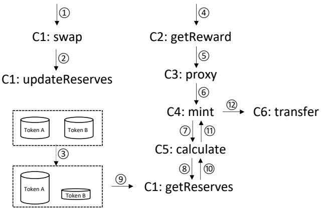
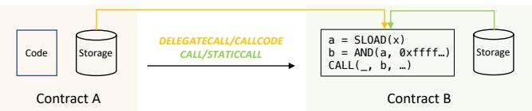
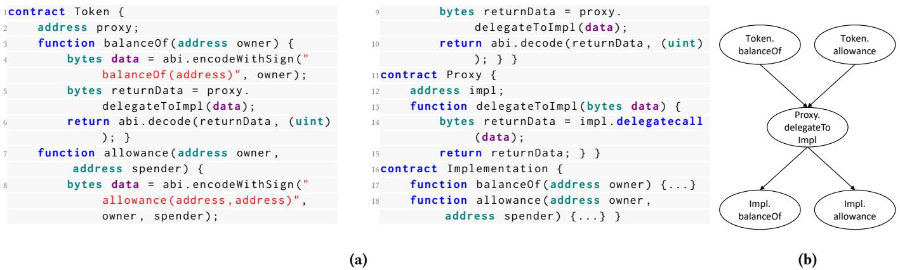
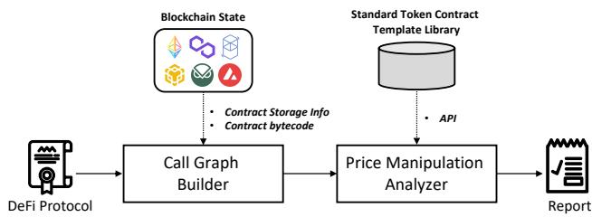
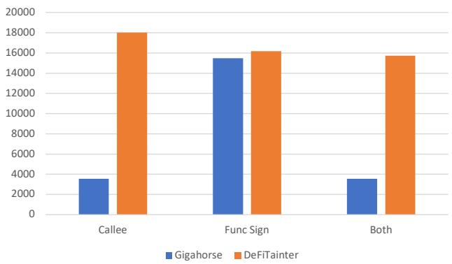

# DeFiTainter: Detecting Price Manipulation Vulnerabilities in DeFi Protocols

Queping Kong Sun Yat-Sen University Guangzhou, China kongqp@mail2.sysu.edu.cn

Jiachi Chen Sun Yat-Sen University Zhuhai, China chenjch86@mail.sysu.edu.cn

Zigui Jiang<sup>∗</sup> Sun Yat-Sen University Zhuhai, China jiangzg3@mail.sysu.edu.cn

Yanlin Wang Sun Yat-Sen University Zhuhai, China wangylin36@mail.sysu.edu.cn

Zibin Zheng Sun Yat-Sen University Zhuhai, China zhzibin@mail.sysu.edu.cn

## ABSTRACT

DeFi protocols are programs that manage high-value digital assets on blockchain. The price manipulation vulnerability is one of the common vulnerabilities in DeFi protocols, which allows attackers to gain excessive profits by manipulating token prices. In this paper, we propose DeFiTainter, an inter-contract taint analysis framework for detecting price manipulation vulnerabilities. DeFiTainter fea tures two innovative mechanisms to ensure its efectiveness. The first mechanism is to construct a call graph for inter-contract taint analysis by restoring call information, not only from code con stants but also from contract storage and function parameters. The second mechanism is a high-level semantic induction tailored for detecting price manipulation vulnerabilities, which accurately iden tifies taint sources and sinks and tracks taint data across contracts. Extensive evaluation of real-world incidents and high-value DeFi protocols shows that DeFiTainter outperforms existing approaches and achieves state-of-the-art performance with a precision of 96% and a recall of 91.3% in detecting price manipulation vulnerabilities. Furthermore, DeFiTainter uncovers three previously undisclosed price manipulation vulnerabilities.

## CCS CONCEPTS

• Software and its engineering → Software verification and validation.

## KEYWORDS

vulnerability detection, smart contract, taint analysis

## ACM Reference Format:

Queping Kong, Jiachi Chen, Yanlin Wang, Zigui Jiang, and Zibin Zheng. 2023. DeFiTainter: Detecting Price Manipulation Vulnerabilities in DeFi Protocols. In Proceedings ofthe 32nd ACM SIGSOFTInternational Symposium on Software Testing and Analysis (ISSTA ’23), July 17–21, 2023, Seattle, WA,

USA. ACM, New York, NY, USA, 13 pages. https://doi.org/10.1145/3597926. 3598124

## 1 INTRODUCTION

Smart contracts are programs running on the blockchain. They are decentralized, robust, self-executing, and not controlled by anyone [52]. Based on these characteristics, smart contracts have become a critical infrastructure for the decentralized financial (DeFi) ecosystem [44]. The smart contracts that manage digital assets on the blockchain are called DeFi protocols, which have the potential to solve some issues in traditional finance industry. For example, digital assets can be deterministically and verifiably managed by DeFi protocols instead of trusted third parties (e.g., bank). DeFi protocols could make financial activities become open and transparent, and enabling anyone to participate in them anytime and anywhere without being censored or blocked by third parties. Due to these properties, DeFi protocols have attracted a significant user base, with the total value of digital assets under management peaking at \$181 billion [12].

However, the high value of digital assets managed by DeFi protocols makes them a lucrative target for attacks. One common vulnerability in DeFi protocols is the price manipulation vulnerability [51]. By exploiting this vulnerability, attackers can compel DeFi protocols to perform transfers detrimental to their interests. For example, attackers could manipulate DeFi protocols to engage in a swap from a lower-valued asset to a higher-valued asset or consent to a substantial loan wherein a low-value asset is utilized as collateral. Such exploitation is accomplished by manipulating the circulation of tokens and the subsequent impact on token prices. It should be noted that incidents involving attacks that exploit price manipulation vulnerabilities have resulted in substantial financial losses within the DeFi ecosystem. Reports indicate that such incidents have led to an aggregate loss of up to \$200 million over the past two years [33, 41]. Consequently, preventing price manipulation attacks on DeFi protocols is paramount.

An essential step in preventing price manipulation attacks is identifying price manipulation vulnerabilities in DeFi protocols. Existing studies [9, 46] focus on identifying price manipulation vulnerabilities with dynamic analysis methods, which can successfully detect vulnerabilities when provided with appropriate transaction sequences but lack the ability to reason about unexecuted code. Specifically, DeFiRanger [46] constructs the cash flow tree from transaction sequences, lifts the low-level semantics to high-level ones, and detects price manipulation vulnerabilities by leveraging patterns expressed with the recovered DeFi semantics. Similarly, FlashSyn [9] generates transaction sequences that have the po tential to exploit price manipulation vulnerabilities in DeFi proto cols utilizing numerical approximation techniques. Subsequently, it identifies these vulnerabilities by analyzing the runtime results of the generated transaction sequences. However, it is important to note that FlashSyn may encounter challenges in handling complex DeFi protocols, as it possesses limitations in generating lengthy transaction sequences within a reasonable timeframe.

Static analysis-based methods surpass dynamic analysis-based methods in their comprehensive exploration of all execution paths within DeFi protocols, thus efectively minimizing false negatives. Within this context, static taint analysis emerges as a potent ap proach for identifying price manipulation vulnerabilities. By track ing tainted data flow from a manipulated token price information source to a sensitive operation sink (e.g., transfers), taint analysis can accurately pinpoint vulnerabilities. In instances where the taint source and sink are situated in diferent contracts, precise detection of vulnerabilities necessitates inter-contract analysis. Nevertheless, previous studies [24, 26, 48] on the inter-contract analysis cannot be used directly utilized for the detection of price manipulation vulner abilities due to their limited restoration of call information solely from the contract bytecode, without considering other sources such as contract storage and public function parameters. The incomplete recovery of call information significantly impacts the integrity of the constructed call graph, leading to the manifestation of false negatives.

In this paper, we propose DeFiTainter, the first inter-contract taint analysis framework for statically detecting price manipulation vulnerabilities in DeFi Protocols without proper transaction sequences. To overcome the limitations of state-of-the-art approaches in constructing the call graph, DeFiTainter incorporates the fol lowing mechanisms. Firstly, it employs intraprocedural data flow analysis to infer where the call information is stored in the contract storage and queries the state of the blockchain to obtain the call information based on the previously inferred storage location. Secondly, DeFiTainter restores call information from public function parameters through interprocedural data flow analysis. The com prehensive restoration of call information from diverse sources is crucial for the taint analysis ofDeFi protocols. Due to the immutabil ity of smart contracts, DeFi protocols often use proxy contracts to redirect business logic [2]. In proxy mode, the address of the called contract comes from the contract storage, and the called function comes from the public function parameters, not the contract bytecode. These mechanisms enable DeFiTainter to build a complete call graph for DeFi protocols.

In addition, DeFiTainter also embeds high-level semantic induction customized for price manipulation vulnerabilities. Specifically, it incorporates knowledge of standard contract templates to identify token instant liquidity query interfaces and sensitive operations (e.g., transfers), and treat them as taint sources and sinks, respectively. Besides, DeFiTainter considers the spread of taint data between contracts, making it capable of detecting price manipulation vulnerabilities whose taint sources and sinks are in diferent smart contract addresses.

To evaluate the efectiveness of DeFiTainter, we collect 23 realworld price manipulation attacks and 1195 real-world DeFi protocols that manage high-value assets. The evaluation results showed that DeFiTainter can efectively detect price manipulation vulnerabilities in DeFi protocols with a precision of 96% and recall of 91.3%. Furthermore, DeFiTainter can detect 21 vulnerabilities among the contracts involving 23 real-world attacks, 14 of which are never detected by other approaches. Finally, DeFiTainter can build a more complete call graph by recovering 4.44 times more external call information than the advanced decompilation approach [16].

In summary, this paper makes the following contributions:

• We propose DeFiTainter, a new approach for detecting price manipulation vulnerabilities via inter-contract taint analysis. To the best of our knowledge, this is the first study that detects price manipulation vulnerabilities in DeFi protocols from a static analysis perspective. DeFiTainter is open-source on GitHub<sup>1</sup>.

• We design a set of novel mechanisms to improve DeFiTainter’s ability to detect price manipulation vulnerabilities and reduce false negatives. Particularly, DeFiTainter can recover 4.44 times more call information than the advanced decompilation approach to build a complete call graph and implements tainted data propagation across contracts.

• We conduct extensive experiments to evaluate DeFiTainter. DeFiTainter detected 3 unreported price manipulation vulnerabilities involving \$186,188.22 in 1,195 high-value DeFi protocols.

Paper organization: The remainder of the paper is organized as follows. Section 2 explains the necessary background for bug detection of DeFi protocols and gives a motivating example. Section 3 describes how we construct call graph. Section 4 applies intercontract taint analysis to detect price manipulation vulnerabilities. Section 5 discusses implementation details. Section 6 presents our evaluation and discusses DeFiTainter’s limitations. We discuss related works in Section 7 and conclude the paper in Section 8.

## 2 BACKGROUND AND MOTIVATION

In this section, we outline the necessary background for detecting price manipulation vulnerabilities, including the execution mechanism of smart contracts, a motivating example of the vulnerability, and an explanation of inter-contract taint analysis.

## 2.1 The Execution Mechanism of Smart Contracts

Smart contracts are executed by virtual machines embedded in blockchain nodes. The virtual machine mentioned in this paper refers to the Ethereum Virtual Machine (EVM), which is the most widely used in the blockchain. Users can commit transactions to blockchain nodes to call functions of smart contracts. The EVM will translate contract bytecodes stored in the blockchain into a series of opcodes, execute the operation, and modify the persistent storage of contracts.

A contract can call another contract deployed on Ethereum by referring to its address. This process is implemented by four opcodes (i.e., CALL, STATICCALL, DELEGATECALL, and CALLCODE). The CALL opcode calls a method in another contract with the storage of the called contract and is also used to transfer tokens. The STAT ICCALL opcode is similar to the CALL opcode, except it cannot change the storage of the called contract. The DELEGATECALL and CALLCODE opcode calls a method in another contract using the storage of the caller contract. In other words, using the logic in the called contract to modify the storage of the caller contract. The distinction between these two instructions is the contract context of the call (i.e., call information). These two instructions are often used in the proxy contract.

## 2.2 Price Manipulation Vulnerabilities

Flash loans are a distinctive financial service in the DeFi ecosystem that allows anyone to borrow huge amounts of assets without collateral within one blockchain transaction. Although flash loans can facilitate users to do many things (e.g., replacing collateral) they also make price manipulation vulnerabilities in DeFi protocols are frequently exploited and cause serious economic losses, as they allow attackers to execute market actions that can have significant efects on the price of a token without risking any of their own assets.

We use Pancake Bunny’s DeFi protocol as an example to introduce the details of price manipulation vulnerabilities and their root. Pancake Bunny’s DeFi protocol was exploited on May 19, 2021, and caused \$45 million in economic damage [6]. The protocol con sists of multiple contracts, and the process of exploiting the price manipulation vulnerability in the protocol is shown in Figure 1.

The attacker first called the swap function (process 1) and used a large amount of A tokens obtained from the flash loan to exchange B tokens in the protocol so that the number of B tokens in the protocol drops sharply and the price of B tokens rises (process 2 and 3). Then, the attacker called the getReward function (process 4). The getReward function will call the function of the proxy contract and redirect to the latest business logic function (process 5 and 6). It should be noted that the formula for calculating the number of reward tokens issued is related to the price of B tokens (process 7 to 11). Since the price of the B token has been previously manipulated, the attacker can obtain an unusually large amount of reward tokens (process 12). Hence, the root cause of this vulnerability is that the calculation of the number of reward tokens issued depends on the instantaneous price of B tokens which can be manipulated by anyone with flash loans.

## 2.3 Inter-contract Taint Analysis

Detecting price manipulation vulnerabilities from a static analysis perspective is to track whether the manipulated elements will afect sensitive operations. Taint analysis is used to track data flow from one part of a program (or contract) to another, so it is suitable for detecting price manipulation vulnerabilities in DeFi protocols. How ever, the mere utilization of taint analysis techniques falls short, as manipulable elements and sensitive operations may be distributed across disparate contracts. Therefore, this paper introduces inter contract taint analysis, which is a technique to analyze the behavior of DeFi protocols across multiple contracts. In inter-contract taint analysis, the analysis takes into account the interactions and dependencies between contracts and considers how changes in one contract can afect the behavior of other contracts.

  
Figure 1: Exploitation process of the Pancake Bunny protocol.

It is worth noting that call information is very important for inter-contract taint analysis, because it is related to the connection between contracts. We use a call graph to show the call relationship between contracts. Each node in the graph represents a function, and edges represent relationships between functions, such as function calls or function returns. These functions belong to diferent contracts.

In inter-contract taint analysis, a taint label is assigned to data that is considered manipulable. As the data flow through contracts in the protocol and is used in various computations and operations, the taint label is propagated along with the data, allowing the analyst to track its flow. If the tainted data reaches a sensitive operations (In a price manipulation scenario, sensitive operations are token transfers, etc.), the taint analysis can flag it as a potential security vulnerability.

## 3 CONSTRUCTION OF CALL GRAPH

After running existing smart contract-oriented call graph construction methods [24, 26, 48] on numerous DeFi protocols, we find that the call graphs they construct miss some call edges that can adversely impact downstream tasks (e.g., taint analysis). Upon examining both the contract source code and the generated call graphs, we concluded that the root cause of the problem is that the methods ignore call information from the outside (i.e., contract storage and function parameters). In this section, we will describe how DeFiTainter enhances the call graph’s integrity.

## 3.1 Call Information Restoration

Restorations of call information in existing call graph construction methods are achieved through intra-contract data flow analysis [24, 26, 48]. They perform reverse data flow analysis on call information to identify the statements that define it. They successfully restore call information defined from constants but have been unable to restore call information defined from outside (i.e., contract storage and function parameters). As a result, they can only restore the call information for the call ofpattern 1 in Listing 1 (the call information of Pattern 1 comes from constants). They cannot recover pattern 2 and 3 of call information (their call information has come from outside). However, many calls of DeFi protocols are of pattern 2 and 3 (43.66% in our cases). In other words, existing methods are insuficient to support call information restoration in DeFi. To address this problem, DeFiTainter has designed two mechanisms to restore the call information from contract storage and function parameters respectively.

```solidity
// Pattern 1: The called contract address (ca) and
    function signature (fs) come from constants.
function call() public {
    address addr = 0xE2436554D3cBF96302471Ae3291E2...;
    Exchange exchange = Exchange(addr);
    exchange.swap();
}
// Pattern 2: The called ca and fs come from function
    parameters and constants respectively.
function call(address addr) public {
    Exchange exchange = Exchange(addr);
    exchange.swap();
}
// Pattern 3: The called ca and fs come from the contract
    storage and function parameters respectively.
address private addr;
function call(bytes memory data) public {
    addr.delegatecall(data);
}
```

## Listing 1: Three common code patterns that call functions of other contracts.

DeFiTainter restores call information from the contract storage by providing a blockchain state, inducing the access location, and extracting the stored content. Although the call information cannot be restored from the contract code, it can be restored if a blockchain state is provided. Since the calling information is not modified frequently, it is reasonable to provide the blockchain state when analyzing the contract. Instead of defining the call information as a constant and embedding it into the contract bytecode, the developer defines the call information as a variable and stores it in the contract storage. This enables the contract to be upgraded when a contract vulnerability is found. DeFiTainter’s analysis results can be extended to other blockchain states, even future blockchain states if the contract has not been upgraded. DeFiTainter uses the latest blockchain state to restore call information by default.

The access location is determined by three elements: the address of the contract where the storage is accessed, the slot number, and the ofset. According to the design of the EVM, the address is deter mined by the type of call. For clarity, we explain how the address is induced through an example. Figure 2 illustrates contract A calling contract B. The call information of the call instruction in contract B (i.e., "CALL(\_, �, \_)") needs to be induced. If contract A calls contract B through proxy-type call instructions (i.e., DELEGATECALL and CALLCODE), then the address is that of contract A, as shown by the orange arrow in Figure 2. If contract A calls contract B through non-proxy call instructions (i.e., CALL and STATICCALL), then the address is that of contract B, as shown by the green arrow in Figure 2.

DeFiTainter induces slot numbers through backward data flow analysis. We also use the example in Figure 2 to explain how the slot number is induced. According to the design of the EVM, the call instruction in Figure 2 takes the value of variable � as the address of the contract to be called. DeFiTainter will perform backward data flow analysis and find a statement that contains an instruction to read data from the contract storage (i.e., SLOAD), and the execution result of the instruction (i.e., variable �) flows to the variable that stores the address of the contract to be called (i.e., variable �). This statement is $" a = { \mathrm { S L O A D } } ( x ) "$ in Figure 2. DeFiTainter takes the parameter of the SLOAD instruction (i.e., the value of variable � in Figure 2 as the slot number.

  
Figure 2: Calling information from contract storage.

DeFiTainter induces the ofset through forward data flow analysis. It should be noted that it is impossible to determine the call information’s location in the storage just by the slot number. This is because call information occupies part of the contract storage slots. The length of the slot is 256 bits, and the length of the call information is less than 256 bits (the called contract address and function signature lengths are 160 bits and 32 bits, respectively). Therefore, the ofset is also needed to determine the location of the call information. Specifically, DeFiTainter first finds a specific statement through forward data flow analysis. The statement needs to contain the DIV instruction, and the first parameter of the instruction is the operation result of the SLOAD instruction (i.e., variable � in Figure 2). If such a statement is found, then DeFiTainter will extract the value of the second parameter of the DIV instruction as the ofset. In Figure 2’s example, DeFiTainter will extract 0�100 as the ofset, which means that the ofset is 8 bits. If DeFiTainter cannot find such a statement, DeFiTainter will set the ofset to 0�1. 0�1 means no ofset because compilers optimize code away from statements that perform division by one.

DeFiTainter utilizes inter-contract data flow analysis to restore call information that originates from function parameters. To introduce the restoration mechanism clearly, we use the example in Figure 3. The example in Figure 3 shows the proxy-based token contract’s source code and call graph. In this example, the existing call graph construction methods [24, 26, 48] can analyze that the function balanceOf (or the function allowance) of the contract Token calls the function delegateToImpl of the contract Proxy. However, it cannot analyze the call from the function delegateToImpl of the contract Proxy to the function balanceOf (or the function allowance) of the contract Implementation. This is because it can only analyze that the call information stored in the variable data comes from the function parameters and does not know the value of the function parameters, as shown in line 14 of Figure 3(a). We observe that call information cannot be restored within a single contract but can be restored in multiple contracts because call information is defined with constants in the caller contract. For example, the call information in line 14 comes from the parameters of the function delegatetoImpl of contract Proxy. The parameters of this function are passed through variable data in line 5. The variable data defined in line 4 is a byte-type constant containing the signature of the called function. Therefore, through inter-contract data flow analysis, we can pass on called function signature from Token contract to Proxy contract and restore call information of the contract Proxy.

## 3.2 Call Graph Generation

In the context of smart contracts, a call graph represents how functions in a smart contract interact with other contracts. It is a directed graph where each node represents a function, and each edge represents a call between two functions. The call graph can be used to determine which functions afect tainted data, and thus which variables are afected by tainted data in taint analysis. This can help identify vulnerabilities in smart contracts and improve their security. However, we found that existing call graph generation al gorithms are not suitable for the detection of DeFi protocols. On the one hand, DeFiTainter requires inter-contract data flow information to restore call information when generating a call graph, but the ex isting smart contract call graph generation algorithms [24, 26, 48] do not provide such information when generating a call graph. To overcome this limitation, DeFiTainter incorporates a cyclical approach of call graph generation and inter-contract data flow anal ysis. The proxy-based token contract depicted in Figure 3 serves as a example to elucidate the cyclical approach. Upon detecting that the call information in line 14 emanates from function parameters, DeFiTainter will suspend the call graph generation and activate the inter-contract data flow analysis to restore the call informa tion. The restoration of call information is elaborated in Section 3.1. Following the restoration, DeFiTainter resumes the call graph generation process. The integration of on-demand inter-contract data flow analysis with call graph generation allows DeFiTainter to accurately and eficiently generate the call graph.

On the other hand, we observed that performing taint analysis on the call graph generated for the entire DeFi protocol will im pact the accuracy and eficiency of detecting price manipulation vulnerabilities. Firstly, a call graph of such magnitude will contain numerous intersecting paths, some of which are infeasible, and the analyzer may produce false positives. For instance, the path “Token.balanceOf->Proxy.delegateToImpl->Impl.allowance” in Fig ure 3(b) is an infeasible path. Although it is possible to use an SAT solver (e.g., Z3 [11]) to determine the feasibility of a path, it is a time-consuming process. Secondly, according to the call trace of historical attacks, the exploitation of the price manipulation vul nerability is implemented by calling one of the functions of the DeFi protocol. For instance, in the example shown in Section 2, the vulnerability can be detected by analyzing the path related to the function getReward of the DeFi protocol. Namely, the vulnerability is only related to a part of the execution path. If the call graph of the entire DeFi protocol is constructed and then detected, it is ineficient. To accurately and eficiently detect price manipulation vulnerabilities, DeFiTainter alternates between sub-call graph con struction and taint analysis. The sub-call graph ���(�, �) consists of all calls directly or indirectly triggered by function � of smart contract �. $S C G ( x , y )$ is generated by tracking the calling relation ship between functions. To generate $S C G ( x , y )$ , DeFiTainter first constructs a call set that includes all calls in function � of contract �. Recursively, for each call $( x , y , j , k )$ in the call set, DeFiTainter constructs a call set that includes all calls in function � of contract �. The union of all those call sets is $S C G ( x , y )$ . After generating $S C G ( x , y )$ , DeFiTainter performs taint analysis on $S C G ( x , y )$ to detect price manipulation vulnerabilities in function � of contract �. DeFiTainter repeats these two processes until a vulnerability is found or all functions of the detected DeFi protocol have been analyzed.

## 4 TAINT ANALYSIS

After constructing the inter-contract call graph, DeFiTainter will analyze whether the DeFi protocol is susceptible to price manipulation vulnerabilities. To facilitate this analysis, we designed a small abstract input language that abstracts away from the complexity of language elements and focuses on detecting price manipulation vulnerabilities. It includes taint sources, taint sinks, and the propagation of tainted data, which will be detailed in the following.

## 4.1 Syntax and High-Level Semantic Induction

The syntax for the instructions of the abstract input language is shown in the rule 1. Lowercase letters $( x , y , k , v , i )$ are utilized to denote program variables. The input program is in static singleassignment (SSA) form [45]. An instruction in the form of $" x : =$ $O P ( y , z ) "$ denotes a range of operations encompassing arithmetic, comparison, stack, memory, and flow. The instruction $^ { * } C A L L ( ) ^ { * }$ “����������()”, “������������()” and $^ { * } C A L L C O D E ( ) ^ { * }$ are diferent kinds of external call operations. The instruction ${ } ^ { \ast } x : =$ $S E N D E R ( ) ^ { \mathfrak { n } }$ enables the retrieval of call information. The operations of reading from and writing to contract storage are carried out through the instructions ${ } ^ { " < } v : = S L O A D ( k ) ^ { * }$ and $^ { * } S S T O R E { ( k , v ) } ^ { * }$ where variable � signifies the storage location and variable � represents the content to read or write. Lastly, the instructions “������ $T A L O A D ( i ) ^ { \mathfrak { n } }$ and $^ { \ast } R E T U R N ( i ) ^ { \ast }$ allow the introduction of function parameters and function return values respectively, where the variable � indicating the �th parameter or return value.

$$
\begin{array}{r c l} \text {Instruction} := & x := O P (y, z) & | \quad C A L L () \\ & | \quad S T A T I C C A L L () & | \quad D E L E G A T E C A L L () \\ & | \quad C A L L C O D E () & | \quad x := S E N D E R () \\ & | \quad S S T O R E (k, v) & | \quad v := S L O A D (k) \\ & | \quad C A L L D A T A L O A D (i) & | \quad R E T U R N (i) \end{array}\tag{1}
$$

In accordance with these instructions, DeFiTainter summarizes the higher-level program semantics demonstrated in Table 1 with the aim of facilitating subsequent taint analysis. The initial seven relations displayed in Table 1 are induced with the assistance of Gigahorse, which is regarded as the state-of-the-art smart contract decompiler [16]. As the focus of this paper does not revolve around the induction of these seven relations, the specifics of their induction calculations are not furnished in this manuscript. The inductive calculation rules pertaining to the final four relations presented in Table 1 are based on the previous seven rules, thus enabling induction for price manipulation detection. The details of induction rules applied to these four relations are elaborated in Sections 4.2 and 4.3.

  
Figure 3: Proxy-based token contract source code and its call graph.

Table 1: High-level Semantic Relations

<table><tr><td>Relation</td><td>Notation</td><td>Description</td></tr><tr><td>ConstValue</td><td>C(x) = v</td><td>Variable x is inferred to have constant value v</td></tr><tr><td>ExternalCall</td><td>EC(cs, addr, fs)</td><td>At the call site cs, call the function fs of the contract addr</td></tr><tr><td>CallRet</td><td>CR(cs, x, i)</td><td>Variable x the ith return value of the external call whose call site is cs</td></tr><tr><td>CallParam</td><td>CP(cs, x, i)</td><td>Variable x the ith parameter of the external call whose call site is cs</td></tr><tr><td>FuncParam</td><td>FP(fs, x, i)</td><td>Variable x the ith parameter of the function whose signature is fs</td></tr><tr><td>FuncRet</td><td>FR(fs, x, i)</td><td>Variable x the ith return value of the function whose signature is fs</td></tr><tr><td>DataFlow</td><td>DF(x, y)</td><td>The value of the variable x will flow to the variable y</td></tr><tr><td>TaintedVar</td><td>x ↓</td><td>Variable x is tainted</td></tr><tr><td>Sink</td><td>SINK(x)</td><td>Variable x flows into the sink</td></tr><tr><td>Transfer</td><td>Transf(r, a)</td><td>The variables r and a are the recipient and the transfer amount respectively</td></tr><tr><td>ManipulableAddr</td><td>MA(x)</td><td>Variable x is a manipulable address</td></tr></table>

## 4.2 Taint Source and Sink

Identifying taint sources and sinks constitutes a fundamental pre requisite for taint analysis. It is worth noting that the definitions of taint sources and sinks difer across various vulnerabilities. In the case of the price manipulation vulnerability, the taint source is represented by the account’s balance, as this can be manipulated via a flash loan. Meanwhile, the taint sinks refer to the operands of sensitive operations, such as the transfer amount.

There exist three types ofapproaches for identifying taint sources and sinks. The first type involves heuristic strategies, such as the marking of externally sourced data input as tainted data [29]. The second type relies on statistical or machine learning techniques [32]. The third type entails the manual marking of the source and sink based on the API invoked by the program or the specific data struc ture [15]. In the case of DeFiTainter, the third method is employed for the identification of taint sources and sinks instead of relying on the first two methods. This is due to the fact that not all external input data are relevant to the manipulated price information (i.e., the tainted data), and there is an insuficient number of training samples to enable the automated determination of whether the variables are related to manipulable price information. Moreover, most DeFi protocols adhere to token standards [13], which stipulate mandatory functions for querying balances and transfers, making it feasible to manually mark the source and sink within a reasonable timeframe. Subsequently, we elaborate on the specific manner in which DeFiTainter identifies taint sources and sinks for the price manipulation vulnerability.

Upon conducting a thorough examination of attack events, the taint source ofthe price manipulation vulnerability is determined as the account balance. Subsequently, following a meticulous study of token standards followed by the DeFi protocols, we discovered that each token standard features a mandatory function for querying balances. A noteworthy aspect of these functions is their identical function signature of "0x70a08231". Consequently, DeFiTainter infers the return value of functions with the aforementioned signature as tainted data, as depicted in Inference Rule 2. The ������������, ���������� and ������� relations utilized in the Inference Rule 2 are supplied by the decompilation tool [16], and these relations’ semantics are shown in Table 1.

$$
\frac {E C (c s , * , f s) \quad C (f s) = " 0 x 7 0 a 0 8 2 3 1" \quad C R (c s , x , *)}{x \downarrow}\tag{2}
$$

Upon thorough analysis of the attack events, it has been determined that the transfer amount functions as the taint sink for the price manipulation vulnerability. The corresponding inference rule for the taint sink is presented in Inference Rule 3. Specifically, if the recipient � of a transfer originates from a manipulated address �, then the transfer amount � serves as the taint sink. Among them, the Relation �������� is derived from Inference Rule 4 and 5, which are rooted in token standards. Specifically, after examining the to ken standards, it was discovered that transfer operations in DeFi protocols are conducted through the "transfer(address \_to, uint256 \_value)" and "transferFrom(address \_from, address \_to, uint256 \_value)" functions. The function signatures for these two functions are "0xa9059cbb" and "0x23b872dd," respectively. Hence, DeFiTain ter induces the Inference Rule �������� based on the semantics of these two transfer functions, concentrating on the receiver � and transfer amount � obtained from the function parameters. More over, the Relation ���������������, which is utilized in Inference Rule 3, has been derived from the Inference Rule $^ { 6 , }$ which is rooted in the design principles of the EVM. Concretely, in accordance with the EVM’s design, both the transaction sender address and function parameters are externally manipulable. Consequently, DeFiTainter induces the variables of the address type that acquire their val ues through querying transaction sender instructions and function parameters as manipulable addresses.

$$
\frac {\text {Transf} (r , a) \quad M A (x) \quad D F (x , r)}{S I N K (a)}\tag{3}
$$

$$
\frac {E C (c s , * , f s) \quad C (f s) = " 0 x a 9 0 5 9 \dots" \quad C A (c s , r , 0) \quad C A (c s , a , 1)}{\text {Transf} (r , a)}\tag{4}
$$

$$
\frac {E C (c s , * , f s) \quad C (f s) = " 0 x 2 3 b 8 7 \dots" \quad C A (c s , r , 1) \quad C A (c s , a , 2)}{\text {Transf} (r , a)}\tag{5}
$$

$$
\frac {x : = \text {SENDER} (); \quad F A (* , x , *)}{M A (x)} \quad (6) \quad \frac {\text {SINK} (x) x \downarrow}{\text {VIOLATION}}\tag{7}
$$

Finally, Inference Rule 7 demonstrates the potential occurrence of a violation. Specifically, this rule stipulates that any instance of taint data flow to the sink will trigger the reporting of a violation.

## 4.3 Taint Propagation

DeFiTainter facilitates the propagation of tainted data within and between contracts. Within a contract, tainted data can be spread in two distinct manners. The first manner involves transferring the tainted data directly as an instruction parameter. As outlined in Inference Rule 8, when one or more parameters � of an instruction are tainted, the resulting execution output � will also be tainted. The second manner entails the transfer of tainted data through contract storage and involves two distinct steps. First, the tainted data is transmitted to the contract’s storage. In accordance with Inference Rule 9, if tainted data � is written to a given storage slot �, then that slot � will be designated as a tainted slot. Subsequently, the tainted data is loaded from the contract storage. As described in Inference Rule 10, if a tainted slot � is loaded with the value of variable �, then � will be marked as tainted data. Through the combined application of Inference Rules 9 and 10, tainted data can be transferred through contract storage. It is important to note that the transfer of tainted data via contract storage represents a unique manner of taint propagation for smart contracts.

$$
\begin{array}{c} \frac {x : = O P (y , *) y \downarrow}{x \downarrow} \quad (8) \quad \frac {S S T O R E (x , y) y \downarrow C (x) = z}{S (z) \downarrow} \\ \frac {y : = S L O A D (x) c (x) = z S (z) \downarrow}{y \downarrow} \end{array}\tag{9}
$$

(10)

In addition, DeFiTainter enables the spread of tainted data across contracts by employing a context-sensitive and object-sensitive inter-contract data flow analysis. This is accomplished via function parameters and return values. In particular, Inference Rule 11 demonstrates that when contract � invokes function �� of contract � at the call site �� with parameter �, if � is tainted, then the parameter of the function $f s$ in the contract � will also be tainted. Similarly, Inference Rule 12 shows that when contract � invokes function �� of contract � at call site ��, and the return value � of �� tainted, the external call’s return value � in contract � at the same call site �� will also be tainted. It should be noted that DeFiTainter’s analysis is both context-sensitive and object-sensitive. Therefore, the propagation of taint may difer when the same function is called at diferent call sites. Furthermore, if the �-th call parameter or function return value is tainted, only the �-th function parameter or call return value will be afected.

$$
\frac {[ E C (c s , B , f s) \quad C P (c s , x , i) ] _ {A} \quad [ F P (f s , y , i) ] _ {B} \quad x \downarrow}{y \downarrow}\tag{11}
$$

$$
\frac {\left[ E C (c s , B , f s) \right. C P (c s , x , i) ] _ {A} \left[ F P (f s , y , i) \right] _ {B} y \downarrow}{x \downarrow}\tag{12}
$$

## 5 IMPLEMENTATION

Figure 4 shows an overview of DeFiTainter. Given a DeFi protocol, the call graph builder first restores call information through inter-contract constant propagation and blockchain state query (cf. Section 3.1). Then, the builder utilizes the mechanism mentioned in Section 3.2 to construct a call graph as complete as possible. After the call graph is generated, the price manipulation analyzer will use the inference rules introduced in Section 4.1 to conduct high-level semantic induction on the bytecodes of the contracts involved in the call graph. At the level of high-level semantics of the contract, the analyzer combines the knowledge of standard token contract templates to perform taint analysis on the call graph for detecting price manipulation vulnerabilities in DeFi protocols (Section 4.2 and Section 4.3). After the detection is completed, DeFiTainter will generate a report.

DeFiTainter is built on the Gigahorse framework that transfers EVM bytecode to its intermediate representation called GigahorseIR [16]. Based on GigahorseIR, DeFiTainter extends a set of several hundred declarative rules in the Datalog language to restore call information and conducts intra-contract taint analysis for price manipulation vulnerabilities. In addition, DeFiTainter obtains blockchain state information With web3 API [42], and connects the data flow between contracts with a python program. We have open-sourced DeFiTainter on GitHub<sup>2</sup>.

## 6 EVALUATION

We evaluate DeFiTainter on real-world DeFi protocols. Specifically, we investigate the following research questions:

  
Figure 4: Overview and Workflow of DeFiTainter

• RQ1 (Vulnerability Detection Capability): Can DeFiTainter efectively detect price manipulation vulnerabilities in real DeFi protocols? Particularly, how does DeFiTainter compare with respect to state-of-the-art approaches?

• RQ2 (Usefulness): Can DeFiTainter detect price manipulation vulnerabilities that are useful to DeFi participants? In other words, will DeFiTainter generate a large number of false warnings, caus ing participants to waste time?

• RQ3 (Eficacy of Call Information Restoration): How effective are our proposed call information restoration? Can price manipulation vulnerabilities be detected without blockchain state query and inter-contract constant propagation?

## 6.1 Datasets

We collect two types of subjects for evaluation, namely DeFi proto cols with price manipulation vulnerabilities and DeFi protocols that are extremely unlikely to have serious vulnerabilities. For vulnerable DeFi protocols, we collect them from price manipulation attacks in the wild. Specifically, we crawl all blockchain incidents from web3rekt which is the widely considered comprehensive blockchain incident database with the data API provided by web3rekt [43]. In this step, we obtained 1,125 incidents reported between February 15, 2020 (the time when the first price manipulation attack occurred) and January 26, 2023. Each incident contains a label to describe its attributes. We filter out the incidents that are labeled as "contract vulnerability" or "flash loan". The reporter generally sets the method attribute of the price manipulation attack incident to one of these two. Some reporters believe that the attack is caused by missing price data checks, and they will set it as a contract vulnerability. Some reporters believe that the attackers used flash loans to carry out the attack, so they set it as a flash loan. After the filtering, 417 incidents remain. Next, we manually remove incidents that are not related to price manipulation vulnerabilities. In particular, for the incidents that are labeled as flash loans, we observe whether the flash loan is used to manipulate the price of tokens. After the above steps, we totally find 23 real-world incidents related to price manipulation vulnerabilities, which include the incidents reported by previous price manipulation attack detection studies [9, 46]. Finally, we find out the exploited DeFi protocols as test cases from these incidents. Table 2 provides the information of these cases. They all have serious consequences, with a total loss of \$236 million. They are diverse with diferent categories (e.g., lending, game, yield farming, dexes) and blockchain platforms (e.g., Ethereum, Binance Smart Chain, Polygon, Fantom).

To demonstrate the practicality of DeFiTainter, we collect 1195 high-quality DeFi protocols that have been audited by security agencies and appear to be free of price manipulation vulnerabilities from DefiLlama (aka Google Play in the DeFi Ecosystem) [12]. There are 31 categories of these DeFi protocols, distributed in more than four blockchain platforms. The total value of their assets under management (aka total value locked, TVL) reached \$71.95 billion as of early 2023. The intuition behind this collection is that the higher the TVL of the DeFi protocol is, the more developers pay attention to it, and the less likely there are vulnerabilities. Therefore, we illustrate the practicality of DeFiTainter through these high-quality DeFi protocols.

## 6.2 Experimental Setup

The analysis was conducted by executing 45 concurrent analysis processes on an idle machine equipped with 80 Intel Xeon Gold 5218R CPU 2.10GHz CPUs, where each CPU comprised 2 cores and 1 hardware thread, resulting in a cumulative total of 160 hardware threads. Furthermore, the machine boasted 512GB of RAM. To ensure an appropriate runtime, the timeout for high-level semantic induction was set to 120 seconds, adhering to the default configuration of the decompilation tool Gigahorse [16]. To query the state of the blockchain, we opted for the node furnished by QuickNode, an external RPC provider [31]. In this regard, the query timeout was established at 60 seconds, which is deemed adequate given the node’s connectivity. DeFi protocols that failed to complete the analysis within these predefined cutofs are classified as timed out.

## 6.3 RQ1: Vulnerability Detection Capability

For protocols with vulnerabilities, the detection results of DeFi-Tainter are shown in Table 2. DeFiTainter can detect 21 out of 23 vulnerable protocols. After investigating the output of each step, we find two reasons for the false negatives. First, DeFiTainter cannot well support the analysis of the bytecode compiled from the DeFi protocol written in Vyper (a pythonic smart contract programming language). Since DeFiTainter is extended on Gigahorse [16] which cannot support Vyper contracts well, DeFiTainter cannot further induce these contracts and analyze the vulnerabilities. Although Vyper and common Solidity contracts will eventually be compiled into EVM bytecode, their encoding rules difer. Gigahorse cannot perform advanced decompilation of the Vyper contract, thereby invalidating DeFiTaninter’s call graph construction and taint analysis. DeFiTainter cannot detect the price manipulation vulnerability in the bZx incident because the bZx protocol is written in the Vyper. Second, the call information restoration in DeFiTainter has limitations. It cannot induce the storage location of the contract address stored in complex structures (e.g., arrays, mappings, etc.), so it cannot query the blockchain state to obtain the contract address. DeFiTainter cannot detect the price manipulation vulnerability in the OneRing incident because some external call addresses of the OneRing protocol are stored in the storage of the contract in the form of an array. Due to the limitations of static analysis, DeFiTainter fails to deduce the storage location of this external call information, resulting in the inability to construct a complete OneRing call graph where no tainted data flow from the source to the sink. Despite such cases, the recall of DeFiTainter reaches 91.3% in our experiments.

Table 2: Vulnerable DeFi protocols Used in the Experiment and Detection Result

<table><tr><td>#</td><td>DeFi Protocol</td><td>Attack Time</td><td>Loss ($)</td><td>Category</td><td>Platform</td><td>Exploited Contract</td><td>DR [46]</td><td>FS [9]</td><td>DT</td></tr><tr><td>1</td><td>bZx</td><td>2020/2/15</td><td>350K</td><td>Lending</td><td>ETH</td><td>0x2157a7894439</td><td></td><td>✓</td><td></td></tr><tr><td>2</td><td>Eminence</td><td>2020/9/29</td><td>7M</td><td>Game</td><td>ETH</td><td>0x5ade7ae86602</td><td></td><td>✓</td><td>✓</td></tr><tr><td>3</td><td>Harvest</td><td>2020/10/26</td><td>21.5M</td><td>Yield</td><td>ETH</td><td>0xf0358e8c3cd5</td><td>✓</td><td>✓</td><td>✓</td></tr><tr><td>4</td><td>Cheese Bank</td><td>2020/11/6</td><td>3.3M</td><td>Bank</td><td>ETH</td><td>0x5e181bdde2fa</td><td>✓</td><td>✓</td><td>✓</td></tr><tr><td>5</td><td>Value.DeFi</td><td>2020/11/14</td><td>6M</td><td>Dexes</td><td>ETH</td><td>0x55bf8304c78b</td><td>✓</td><td></td><td>✓</td></tr><tr><td>6</td><td>Warp Finance</td><td>2020/12/17</td><td>7.8M</td><td>Dexes</td><td>ETH</td><td>0xba539b9a5c2d</td><td>✓</td><td>✓</td><td>✓</td></tr><tr><td>7</td><td>Pancake Bunny</td><td>2021/5/19</td><td>45M</td><td>Dexes</td><td>BSC</td><td>0x633e538ecf0b</td><td></td><td></td><td>✓</td></tr><tr><td>8</td><td>AutoShark Finance</td><td>2021/5/25</td><td>750K</td><td>Dexes</td><td>BSC</td><td>0xa007d347f2e5</td><td></td><td></td><td>✓</td></tr><tr><td>9</td><td>Belt Finance</td><td>2021/5/29</td><td>6.23M</td><td>Yield</td><td>BSC</td><td>0x9171bf7c050a</td><td></td><td></td><td>✓</td></tr><tr><td>10</td><td>ApeRocket</td><td>2021/7/14</td><td>1.26M</td><td>Yield</td><td>BSC</td><td>0x274b5b7868c8</td><td></td><td>✓</td><td>✓</td></tr><tr><td>11</td><td>Pancake Bunny</td><td>2021/7/16</td><td>2.4M</td><td>Dexes</td><td>Polygon</td><td>0xdf0be663c843</td><td></td><td></td><td>✓</td></tr><tr><td>12</td><td>Sanshu Inu</td><td>2021/7/20</td><td>111K</td><td>Token</td><td>ETH</td><td>0x35c674c28857</td><td></td><td></td><td>✓</td></tr><tr><td>13</td><td>Dot.Finance</td><td>2021/8/25</td><td>430K</td><td>Yield</td><td>BSC</td><td>0xe84ceea58b35</td><td></td><td></td><td>✓</td></tr><tr><td>14</td><td>Pancake Hunny</td><td>2021/10/20</td><td>1.93M</td><td>Dexes</td><td>BSC</td><td>0xef43313e8218</td><td></td><td></td><td>✓</td></tr><tr><td>15</td><td>Cream Finance</td><td>2021/10/27</td><td>130M</td><td>Lending</td><td>ETH</td><td>0x3d5bc3c8d13d</td><td></td><td></td><td>✓</td></tr><tr><td>16</td><td>OneRing</td><td>2022/3/21</td><td>1.45M</td><td>Yield</td><td>Fantom</td><td>0xc06826f52f29</td><td></td><td>✓</td><td></td></tr><tr><td>17</td><td>Wiener DOGE</td><td>2022/4/24</td><td>30K</td><td>Token</td><td>BSC</td><td>0xb3e708a6d122</td><td></td><td>✓</td><td>✓</td></tr><tr><td>18</td><td>Equalizer Finance</td><td>2022/6/7</td><td>72K</td><td>Dexes</td><td>Polygon</td><td>0x3befd5085a3e</td><td></td><td></td><td>✓</td></tr><tr><td>19</td><td>ANCH Project</td><td>2022/8/5</td><td>107K</td><td>Token</td><td>BSC</td><td>0x0aef5a75f5e7</td><td></td><td></td><td>✓</td></tr><tr><td>20</td><td>EGD Finance</td><td>2022/8/8</td><td>36K</td><td>Token</td><td>BSC</td><td>0x34bd6dba456b</td><td></td><td></td><td>✓</td></tr><tr><td>21</td><td>Cupid</td><td>2022/8/31</td><td>79K</td><td>Token</td><td>BSC</td><td>0x40c994299fb4</td><td></td><td></td><td>✓</td></tr><tr><td>22</td><td>GDS Chain</td><td>2023/1/3</td><td>187K</td><td>Token</td><td>BSC</td><td>0xc1bb12560468</td><td></td><td></td><td>✓</td></tr><tr><td>23</td><td>Upswing Finance</td><td>2023/1/17</td><td>36K</td><td>Token</td><td>ETH</td><td>0xa3f47dcfc09d</td><td></td><td></td><td>✓</td></tr></table>

To illustrate DeFiTainter’s ability to detect vulnerabilities, we also compare DeFiTainter with two state-of-the-art approaches for price manipulation attack detection: DeFiRanger and FlashSyn. The detection results of the comparison approaches are shown in Table 2. DeFiRanger detects four price manipulation incidents that are also detected by DeFiTainter. FlashSyn detects eight price manipulation incidents. Six of these eight incidents are detected by DeFiTainter. In summary, DeFiTainter can detect some price manipulation incidents that these two comparison approaches cannot detect.

Answer to RQ1: DeFiTainter can efectively detect price manipulation vulnerabilities in DeFi protocols with a recall rate of 91.30%. Furthermore, DeFiTainter can detect incidents that existing price manipulation attack approaches cannot detect.

## 6.4 RQ2: Usefulness

We answer RQ2 by detecting high-quality DeFi protocols with De-FiTainter. The collection method of high-quality DeFi protocols is introduced in Section 6.1. They are fully realistic and have locked value. As shown in Table 3, four DeFi protocols have been detected by DeFiTainter to have price manipulation vulnerabilities. These four DeFi protocols are all open-sourced, and we can further analyze the vulnerable places in the protocol to illustrate the practicality of DeFiTainter. Our review has identified three protocols, namely

TreeHouse, PYEswap, and ScarySwap, that can be exploited. Conversely, the Keep3 protocol flagged as a potential vulnerability is a false positive.

Table 3: Risky High-quality DeFi protocols detected by DeFi-Tainter

<table><tr><td>DeFi Protocol</td><td>Category</td><td>Exploited Addr</td><td>TVL($)</td></tr><tr><td>TreeHouse</td><td>Yield</td><td>0x948aa1f5b895</td><td>27.09</td></tr><tr><td>PYEswap</td><td>Dexes</td><td>0x98cc2cd55ca2</td><td>13062.07</td></tr><tr><td>ScarySwap</td><td>Dexes</td><td>0xa73d251d3704</td><td>173099.12</td></tr><tr><td>Keep3r</td><td>Derivatives</td><td>0x1ceb5cb57c4d</td><td>177.23M</td></tr></table>

Vulnerabilities found in TreeHouse, PYEswap, and ScarySwap protocols are similar. An attacker can trigger unfair token swaps in the protocol by manipulating the token price, which is not the intention of the developers. We take the PYEswap protocol as an example to introduce the vulnerabilities detected by DeFiTainter. Listing 2 is the simplified vulnerable source code of the PYEswap protocol. PYEswap is a trading market for tokens, which allows anyone to exchange tokens by themselves. If a user wants to exchange X tokens for Y tokens, the user can transfer some X tokens to the protocol, and the protocol will calculate the amount of Y tokens to be given to the user according to the logic of the contract (line 2-4). The calculation rule can be simply understood as rare is more expensive. That is, when the number of X tokens in the pool is small, the price of X tokens will be high, and a small amount of X tokens can be exchanged for a large amount of Y tokens. However, the protocol directly uses the instantaneous reserve of the tokens in the pool to participate in the calculation (line 1). Since the reserve of tokens in the pool can be manipulated with flash loans, attackers can manipulate the exchange amount calculated by the protocol to make a profit. Specifically, the attacker first exchanged most of the X tokens in the fund pool with Y tokens obtained through flash loans, so the number of X tokens in the pool dropped sharply, and the price of X tokens increased. The attacker then induces other protocols to exchange Y tokens for X tokens, further increasing the price of X tokens. Finally, the attacker can use a small num ber of X tokens to obtain a large number of Y tokens through the PYEswap protocol and repay the flash loan. The attacker’s profit is the remaining Y tokens after repaying the flash loan.

```txt
(reserveIn, reserveOut) = pair.getReserves();
numerator = amountIn * reserveOut;
denominator = (reserveIn * 10000) + amountIn;
amountOut = numerator / denominator;
token.transfer(amountOut, to);
```

Listing 2: Simplified vulnerable source code of the PYEswap protocol [5].

The vulnerability found in the Keep3r protocol is a false positive. An attacker can profit by obtaining a large number ofassets through flash loans and using them as collateral to get credit from the protocol. However, the mortgaged assets cannot be withdrawn at any time and need to be frozen for a period of time. As a result, the cost of exploiting this vulnerability is greater than the profit, and it has no use value. Thus, we regard it as a false positive. In addition, we do not use comparison approaches (i.e., DeFiRanger and FlashSyn) to detect high-quality DeFi protocols, and compare their detection results with the DeFiTainter proposed in this paper, because neither of these two approaches is open source.

Answer to RQ2: DeFiTainter is useful for DeFi participants. It has the ability to detect price manipulation vulnerabilities and has fewer false positives, which will not waste a lot of resources for verification.

## 6.5 RQ3: Eficacy of Call Information Restoration

Diferent from other state-of-the-art inter-contract analysis approaches, DeFiTainter can also restore call information from contract storage and calldata to build a more complete call graph, which facilitates the identification of vulnerabilities where taint sources and sinks are in diferent contracts. To illustrate the capabilities of DeFiTainter, we answer RQ3 by counting the number of recovered call messages. The statistical scope is the 1788 smart contracts in volved in the DeFi protocols collected in Section 6.1. Among these contracts, 1325 contracts have external calls. The total number of external calls is 19147. It shows that calls between contracts are very common. When inducing the security attributes of the DeFi protocol, it is necessary to restore the call information and analyze the contract call behavior.

The restoration of external call information of DeFiTainter and Gigahorse is shown in Figure 5. From the perspective of the callee,

Gigahorse can restore 18.61% (3563/19147) of the called contract addresses, while DeFiTainter can restore 94.08% (18013/19147). The reason behind this is that the addresses of many called contracts are not stored in the contract as constants, but come from the storage or function parameters of the contract. From the perspective of function signatures, Gigahorse can restore 80.88% (15486/19147) of them, and DeFiTainter can restore 84.56% (16190/19147). It shows that developers prefer to store function signatures in the bytecode of contracts in the form of constants because function signatures usually do not need to be changed. More contribution of DeFiTainter lies in the restoration of the address of the callee.

It should be noted that the calling object cannot be resolved only by restoring the address of the callee or the function signature. Both are restored in order to resolve the calling object. That is, Gigahorse can only restore 18.52% (3547/19147) of external calls. DeFiTainter can restore 82.17% (15733/19147) of external calls, 4.44 times more than Gigahorse. Since most of the taint sources and taint sinks are in contracts with diferent addresses (73.08% of the cases in this paper belong to this case), the restoration of external calls is very important.

  
Figure 5: Call information restoration

Answer to RQ3: By introducing blockchain status query and constant propagation between contracts, DeFiTainter can restore 4.44 times more external calls than Gigahorse.

## 6.6 Limitations

Standard contract template dependency. DeFiTainter relies on API information of standard contract templates to induce taint sources and sinks. However, for DeFi protocols that use custom contract templates, DeFiTainter may miss their vulnerabilities. Although high-value DeFi protocols tend to use standard contract templates due to their user-friendliness, the definition of taint source and sinks in DeFiTainter may not be comprehensive enough to capture all vulnerabilities. Nevertheless, the number of vulnerabilities missed is likely to be very small.

Complex data structure call information cannot be restored. DeFiTainter cannot restore call information stored in complex data structures, which will make the call graph incomplete and cause false negatives. Restoring data stored in complex data structures is not trivial. According to the design of the blockchain virtual machine, the calculation of the storage location of this type of data needs to be hashed multiple times, and the value of the hashed data is dynamic (i.e., it is determined at runtime), making it dificult to induce the storage location through static analysis. If an exhaustive method is used to calculate possible storage locations, this will not only increase the resource consumption of the analysis, but may also lead to false positives. Therefore, this paper does not consider restoring call information stored in complex structures.

## 7 RELATED WORK

Studies on Price Manipulation Vulnerability Detection. Smart contracts manipulate digital assets worth over \$100 billion [10]. Owing to the substantial value controlled by smart contracts, they have become prominent targets for potential attacks, consequently garnering substantial attention within smart contract security research [37, 52]. Various studies have summarized the vulnerabilities associated with smart contracts, encompassing reentrancy, permission, and price manipulation vulnerabilities [1, 7, 51]. In an efort to detect these vulnerabilities, existing research employs diverse techniques, such as symbolic execution [19, 22, 25, 27, 28, 30, 36], formal verification [3, 21, 34, 40], taint analysis [4, 24, 26, 48], fuzzing [17, 20, 47], and runtime analysis [8, 18, 23]. This paper focuses on studying price manipulation vulnerabilities within smart contracts.

Existing studies related to price manipulation vulnerabilities include DeFiRanger [46] and FlashSyn [9]. DeFiRange [46] constructs a cash flow tree based on transaction sequences, lifts the low-level semantics to a higher level, and subsequently identifies price manipulation vulnerabilities by utilizing patterns expressed through recovered DeFi semantics. FlashSyn [9] employs numerical approximation techniques to generate transaction sequences that possess the potential to exploit price manipulation vulnerabilities within DeFi protocols. Subsequently, it analyzes the runtime out comes of these generated transaction sequences to identify such vulnerabilities.

In contrast to the aforementioned studies that rely on dynamic analysis [9, 46], DeFiTainter utilizes a static analysis methodology (i.e., taint analysis) to identify price manipulation vulnerabilities within DeFi protocols. By conducting an analysis of all execution paths in the DeFi protocol, DeFiTainter efectively mitigates false positives, providing a more eficient and comprehensive detection mechanism.

Taint Analysis for Smart Contracts. Taint analysis has garnered significant adoption in tackling security concerns within Android and Web systems [35, 38, 39, 49, 50]. However, employing traditional taint analysis techniques in the context of smart con tracts is a complex undertaking due to the peculiarities of smart contracts (e.g., callback functions, proxy calls, unconventional data structures with cryptographic hashing). There are studies that ad dress these challenges and apply taint analysis to smart contract vulnerability detection.

Ethainter [4] employs taint analysis to detect composite vul nerabilities in smart contracts, considering domain concepts such as sanitization via guards and taint through persistent storage.

Clairvoyance [48] utilizes taint analysis for identifying reentrancy vulnerabilities within smart contracts. It enhances the eficacy of vulnerability detection by accounting for contract-specific features (e.g., modifiers and fallback functions) when constructing the call graph, enabling inter-contract analysis, and summarizing five major path protective techniques. Despite its utility, Clairvoyance is hindered by false positives and limited generality due to its disregard for the reachability of inter-contract paths and its applicability only to contracts with source code. In order to mitigate false positives by examining the reachability of inter-contract paths, Pluto [26] extracts semantic information from contract calls and deduces intercontract path constraints. To enhance generality, SmartDagger [24] implements inter-contract taint analysis at the bytecode level, accomplishing this by recovering contract attribute information from decompiled bytecode through the neural machine translation model. Furthermore, eTainter [14] employs inter-contract taint analysis to identify gas-related vulnerabilities within smart contracts by analyzing the contract’s EVM bytecode.

The distinction between DeFiTainter and other taint analysis studies employed for smart contracts is in terms of the call graph construction and the specific targets of vulnerability detection. On one hand, DeFiTainter enhances the reliability of the call graph construction by restoring call information from contract storage and function parameters. On the other hand, DeFiTainter incorporates customized taint sources and sinks tailored specifically to price manipulation vulnerabilities.

## 8 CONCLUSION

In this paper, we propose DeFiTainter, a new framework for price manipulation vulnerabilities detection from the perspective of code. To eliminate the false negatives introduced by prior works, DeFi-Tainter detects vulnerabilities via taint analysis and features two innovative mechanisms. Firstly, it restores call information not only from code constants but also from contract storage and function parameters. In addition, it embeds high-level semantic induction customized for price manipulation vulnerabilities. We evaluate DeFiTainter on 23 real-word incidents and 1195 high value DeFi protocols. Evaluation results show that DeFiTainter outperforms other state-of-the-art tools with a precision of 96% and recall of 91.3%.

## ACKNOWLEDGMENTS

This work is partially supported by fundings from the National Key R&D Program of China (2020YFB1006002), the National Natural Science Foundation of China (62002393), Guangdong Basic and Applied Basic Research Foundation (2023A1515011336).

## REFERENCES

[1] Nicola Atzei, Massimo Bartoletti, and Tiziana Cimoli. 2017. A survey of attacks on ethereum smart contracts (sok). In International conference on principles of security and trust. Springer, 164–186. https://doi.org/10.1007/978-3-662-54455-6\_8

[2] William E Bodell III, Sajad Meisami, and Yue Duan. 2023. Proxy Hunting: Understanding and Characterizing Proxy-based Upgradeable Smart Contracts in Blockchains. In 32th USENIX Security Symposium (USENIX Security 20).

[3] Priyanka Bose, Dipanjan Das, Yanju Chen, Yu Feng, Christopher Kruegel, and Giovanni Vigna. 2022. Sailfish: Vetting smart contract state-inconsistency bugs in seconds. In 2022 IEEE Symposium on Security and Privacy (SP). IEEE, 161–178. https://doi.org/10.1109/SP46214.2022.9833721

[4] Lexi Brent, Neville Grech, Sifis Lagouvardos, Bernhard Scholz, and Yannis Smarag dakis. 2020. Ethainter: a smart contract security analyzer for composite vulner abilities. In Proceedings ofthe 41st ACM SIGPLAN Conference on Programming Language Design and Implementation. 454–469. https://doi.org/10.1145/3385412. 3385990

[5] BscScan. 2023. PYESwapRouter. https://bscscan.com/address 0x98cc2cd55ca2092034146ebd8eb043f9f976623a. Accessed May, 2023.

[6] Bunny. 2021. Community Notice: Post Mortem Analysis. https://pancakebunny. medium.com/hello-bunny-fam-a7bf0c7a07ba. Accessed May, 2023.

[7] Huashan Chen, Marcus Pendleton, Laurent Njilla, and Shouhuai Xu. 2020. A survey on ethereum systems security: Vulnerabilities, attacks, and defenses. ACM Computing Surveys (CSUR) 53, 3 (2020), 1–43. https://doi.org/10.1145/3391195

[8] Ting Chen, Rong Cao, Ting Li, Xiapu Luo, Guofei Gu, Yufei Zhang, Zhou Liao, Hang Zhu, Gang Chen, Zheyuan He, et al. 2020. SODA: A Generic Online Detection Framework for Smart Contracts. In NDSS. https://doi.org/10.14722/ ndss.2020.24449

[9] Zhiyang Chen, Sidi Mohamed Beillahi, and Fan Long. 2022. FlashSyn: Flash Loan Attack Synthesis via Counter Example Driven Approximation. arXiv preprint arXiv:2206.10708 (2022). https://doi.org/10.48550/arXiv.2206.10708

[10] CoinMarketCap. 2023. Cryptocurrency Prices, Charts And Market Capitalizations. https://coinmarketcap.com/. Accessed May, 2023.

[11] Leonardo De Moura and Nikolaj Bjørner. 2008. Z3: An eficient SMT solver. In Tools and Algorithms for the Construction and Analysis ofSystems: 14th International Conference, TACAS 2008, Held as Part ofthe Joint European Conferences on Theory and Practice ofSoftware, ETAPS 2008, Budapest, Hungary, March 29-April 6, 2008. Proceedings 14. Springer, 337–340. https://doi.org/10.1007/978-3-540- 78800-3\_24

[12] DefiLlama. 2023. DeFi Dashboard. https://defillama.com/. Accessed May, 2023.

[13] Ethereum. 2023. Token Standards. https://ethereum.org/zh/developers/docs/ standards/tokens/. Accessed May, 2023.

[14] Asem Ghaleb, Julia Rubin, and Karthik Pattabiraman. 2022. eTainter: Detect ing Gas-Related Vulnerabilities in Smart Contracts. In Proceedings of the 31st ACM SIGSOFT International Symposium on Software Testing and Analysis. ACM, 728–739. https://doi.org/10.1145/3533767.3534378

[15] Michael I Gordon, Deokhwan Kim, Jef H Perkins, Limei Gilham, Nguyen Nguyen, and Martin C Rinard. 2015. Information flow analysis of android applications in droidsafe. In NDSS, Vol. 15. 110. https://doi.org/10.14722/ndss.2015.23089

[16] Neville Grech, Sifis Lagouvardos, Ilias Tsatiris, and Yannis Smaragdakis. 2022. Elipmoc: advanced decompilation of Ethereum smart contracts. Proceedings of the ACM on Programming Languages 6, OOPSLA1 (2022), 1–27. https://doi.org/ 10.1145/3527321

[17] Gustavo Grieco, Will Song, Artur Cygan, Josselin Feist, and Alex Groce. 2020. Echidna: efective, usable, and fast fuzzing for smart contracts. In Proceedings of the 29th ACM SIGSOFT International Symposium on Software Testing and Analysis. 557–560. https://doi.org/10.1145/3395363.3404366

[18] Shelly Grossman, Ittai Abraham, Guy Golan-Gueta, Yan Michalevsky, Noam Rinetzky, Mooly Sagiv, and Yoni Zohar. 2017. Online detection of efectively callback free objects with applications to smart contracts. Proceedings ofthe ACM on Programming Languages 2, POPL (2017), 1–28. https://doi.org/10.1145/3158136

[19] Jianjun Huang, Jiasheng Jiang, Wei You, and Bin Liang. 2021. Precise Dynamic Symbolic Execution for Nonuniform Data Access in Smart Contracts. IEEE Trans Comput. (2021). https://doi.org/10.1109/TC.2021.3092639

[20] Bo Jiang, Ye Liu, and Wing Kwong Chan. 2018. Contractfuzzer: Fuzzing smart contracts for vulnerability detection. In 2018 33rd IEEE/ACM International Conference on Automated Software Engineering (ASE). IEEE, 259–269. https://doi.org/10.1145/3238147.3238177

[21] Sukrit Kalra, Seep Goel, Mohan Dhawan, and Subodh Sharma. 2018. Zeus: analyzing safety of smart contracts. In Ndss. 1–12. https://doi.org/10.14722/ndss. 2018.23082

[22] Aashish Kolluri, Ivica Nikolic, Ilya Sergey, Aquinas Hobor, and Prateek Saxena. 2019. Exploiting the laws of order in smart contracts. In Proceedings ofthe 28th ACM SIGSOFT international symposium on software testing and analysis. 363–373. https://doi.org/10.1145/3293882.3330560

[23] Ao Li, Jemin Andrew Choi, and Fan Long. 2020. Securing smart contract with runtime validation. In Proceedings ofthe 41st ACM SIGPLAN Conference on Programming Language Design and Implementation. 438–453. https://doi.org/10. 1145/3385412.3385982

[24] Zeqin Liao, Zibin Zheng, Xiao Chen, and Yuhong Nan. 2022. SmartDagger: a bytecode-based static analysis approach for detecting cross-contract vulnerability. In Proceedings of the 31st ACM SIGSOFT International Symposium on Software Testing and Analysis. 752–764. https://doi.org/10.1145/3533767.3534222

[25] Loi Luu, Duc-Hiep Chu, Hrishi Olickel, Prateek Saxena, and Aquinas Hobor. 2016. Making smart contracts smarter. In Proceedings of the 2016 ACM SIGSAC conference on computer and communications security. 254–269. https://doi.org/10. 1145/2976749.2978309

[26] Fuchen Ma, Zhenyang Xu, Meng Ren, Zijing Yin, Yuanliang Chen, Lei Qiao, Bin Gu, Huizhong Li, YuJiang, andJiaguang Sun. 2021. Pluto: Exposing Vulnerabilities in Inter-Contract Scenarios. IEEE Transactions on Software Engineering (2021).

https://doi.org/10.1109/TSE.2021.3117966

[27] Mark Mossberg, Felipe Manzano, Eric Hennenfent, Alex Groce, Gustavo Grieco, Josselin Feist, Trent Brunson, and Artem Dinaburg. 2019. Manticore: A userfriendly symbolic execution framework for binaries and smart contracts. In 2019 34th IEEE/ACM International Conference on Automated Software Engineering (ASE). IEEE, 1186–1189. https://doi.org/10.1109/ASE.2019.00133

[28] Bernhard Mueller. 2018. Smashing ethereum smart contracts for fun and real profit. HITB SECCONF Amsterdam 9 (2018), 54.

[29] Ioannis Papagiannis, Matteo Migliavacca, and Peter Pietzuch. 2011. {PHP} Aspis: Using Partial Taint Tracking to Protect Against Injection Attacks. In 2nd USENIX Conference on Web Application Development (WebApps 11). https: //doi.org/10.5555/2002168.2002170

[30] Anton Permenev, Dimitar Dimitrov, Petar Tsankov, Dana Drachsler-Cohen, and Martin Vechev. 2020. Verx: Safety verification of smart contracts. In 2020 IEEE symposium on security and privacy (SP). IEEE, 1661–1677. https://doi.org/10. 1109/SP40000.2020.00024

[31] QuickNode. 2023. The Blockchain Development Platform. https://www. quicknode.com/. Accessed May, 2023.

[32] Siegfried Rasthofer, Steven Arzt, and Eric Bodden. 2014. A machine-learning approach for classifying and categorizing android sources and sinks. In NDSS, Vol. 14. 1125. https://doi.org/10.14722/ndss.2014.23039

[33] SlowMist. 2022. Hacked. https://hacked.slowmist.io/. Accessed May, 2023.

[34] Jon Stephens, Kostas Ferles, Benjamin Mariano, Shuvendu Lahiri, and Isil Dillig. 2021. SmartPulse: automated checking of temporal properties in smart contracts. In 2021 IEEE Symposium on Security and Privacy (SP). IEEE, 555–571. https: //doi.org/10.1109/SP40001.2021.00085

[35] Cong Sun, Yuwan Ma, Dongrui Zeng, Gang Tan, Siqi Ma, and Yafei Wu. 2022. Dep: Mutation-based Dependency Generation for Precise Taint Analysis on Android Native Code. IEEE Transactions on Dependable and Secure Computing (2022). https://doi.org/10.1109/TDSC.2022.3155693

[36] ChristofFerreira Torres, Mathis Steichen, et al. 2019. The art ofthe scam: Demystifying honeypots in ethereum smart contracts. In 28th USENIXSecurity Symposium (USENIX Security 19). 1591–1607. https://doi.org/10.48550/arXiv.1902.06976

[37] Zhiyuan Wan, Xin Xia, David Lo, Jiachi Chen, Xiapu Luo, and Xiaohu Yang. 2021. Smart contract security: A practitioners’ perspective. In 2021 IEEE/ACM 43rd International Conference on Software Engineering (ICSE). IEEE, 1410–1422. https://doi.org/10.1109/ICSE43902.2021.00127

[38] Jie Wang, Yunguang Wu, Gang Zhou, Yiming Yu, Zhenyu Guo, and Yingfei Xiong. 2020. Scaling static taint analysis to industrial SOA applications: a case study at alibaba. In Proceedings of the 28th ACM Joint Meeting on European Software Engineering Conference and Symposium on the Foundations of Software Engineering. 1477–1486. https://doi.org/10.1145/3368089.3417059

[39] Lei Wang, Feng Li, Lian Li, and Xiaobing Feng. 2017. Principle and Practice of Taint Analysis. Journal ofSoftware 28, 4 (2017), 860–882. https://doi.org/10. 13328/j.cnki.jos.005190

[40] Shuai Wang, Chengyu Zhang, and Zhendong Su. 2019. Detecting nondeterministic payment bugs in ethereum smart contracts. Proceedings ofthe ACM on Programming Languages 3, OOPSLA (2019), 1–29. https://doi.org/10.1145/3360615

[41] Web3rekt. 2022. Blockchain Hacks and Scams. https://www.web3rekt.com/. Accessed May, 2023.

[42] Web3rekt. 2022. Web3.py 5.31.3 Documentation. https://www.web3rekt.com/. Accessed May, 2023.

[43] Web3rekt. 2022. Web3rekt Adds Data API. https://www.web3rekt.com/post/ web3rekt-adds-data-api/. Accessed May, 2023.

[44] Sam M Werner, Daniel Perez, Lewis Gudgeon, Ariah Klages-Mundt, Dominik Harz, and William J Knottenbelt. 2021. Sok: Decentralized finance (defi). arXiv preprint arXiv:2101.08778 (2021). https://doi.org/10.48550/arXiv.2101.08778

[45] Wikipedia. 2023. Static single-assignment form. https://en.wikipedia.org/wiki/ Static\_single-assignment\_form. Accessed May, 2023.

[46] Siwei Wu, Dabao Wang, Jianting He, Yajin Zhou, Lei Wu, Xingliang Yuan, Qinming He, and Kui Ren. 2021. Defiranger: Detecting price manipulation attacks on defi applications. arXiv preprint arXiv:2104.15068 (2021). https: //doi.org/10.48550/arXiv.2104.15068

[47] Valentin Wüstholz and Maria Christakis. 2020. Harvey: A greybox fuzzer for smart contracts. In Proceedings ofthe 28th ACMJointMeeting on European Software Engineering Conference and Symposium on the Foundations of Software Engineering. 1398–1409. https://doi.org/10.1145/3368089.3417064

[48] Yinxing Xue, Mingliang Ma, Yun Lin, Yulei Sui, Jiaming Ye, and Tianyong Peng. 2020. Cross-contract static analysis for detecting practical reentrancy vulnerabilities in smart contracts. In 2020 35th IEEE/ACM International Conference on Automated Software Engineering (ASE). IEEE, 1029–1040. https: //doi.org/10.1145/3324884.3416553

[49] Junbin Zhang, Yingying Wang, Lina Qiu, and Julia Rubin. 2021. Analyzing android taint analysis tools: FlowDroid, Amandroid, and DroidSafe. IEEE Transactions on Software Engineering (2021). https://doi.org/10.1109/TSE.2021.3109563

[50] Xueling Zhang, Xiaoyin Wang, Rocky Slavin, and Jianwei Niu. 2021. Condysta: Context-aware dynamic supplement to static taint analysis. In 2021 IEEE Symposium on Security and Privacy (SP). IEEE, 796–812. https://doi.org/10.1109/

SP40001.2021.00040

[51] Zhuo Zhang, Brian Zhang, Wen Xu, and Zhiqiang Lin. 2023. Demystifying Ex ploitable Bugs in Smart Contracts. In 2023 IEEE/ACM 45th International Conference on Software Engineering (ICSE). IEEE.

[52] Zibin Zheng, Shaoan Xie, Hong-Ning Dai, Weili Chen, Xiangping Chen, Jian Weng, and Muhammad Imran. 2020. An overview on smart contracts: Challenges,

advances and platforms. Future Generation Computer Systems 105 (2020), 475–491. https://doi.org/10.1016/j.future.2019.12.019

Received 2023-02-16; accepted 2023-05-03