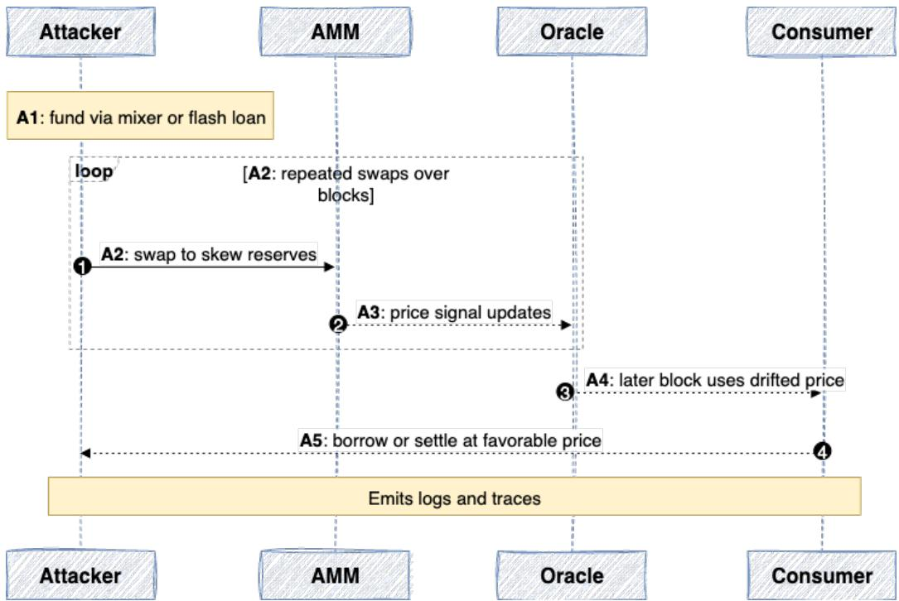
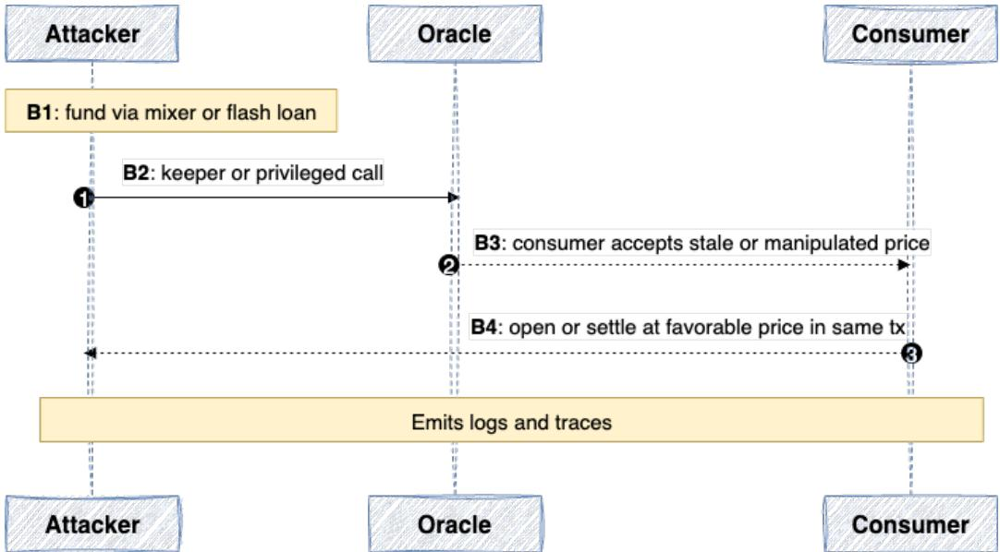
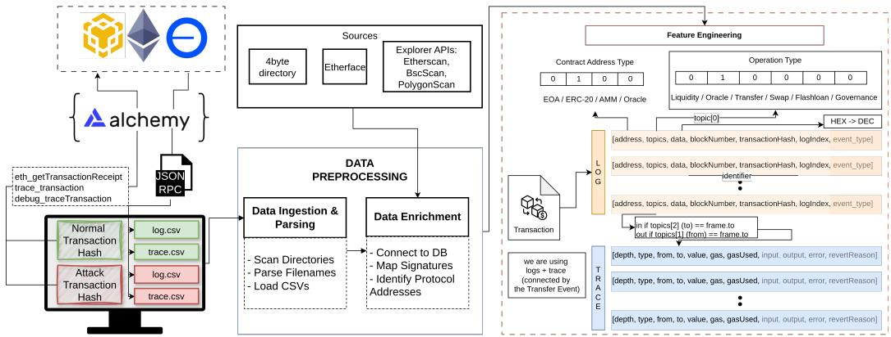
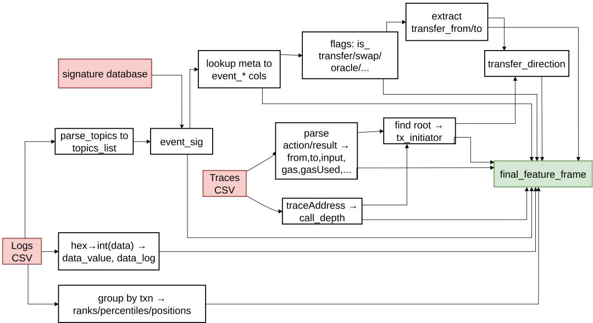
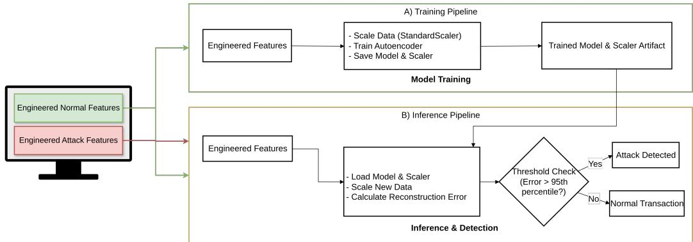
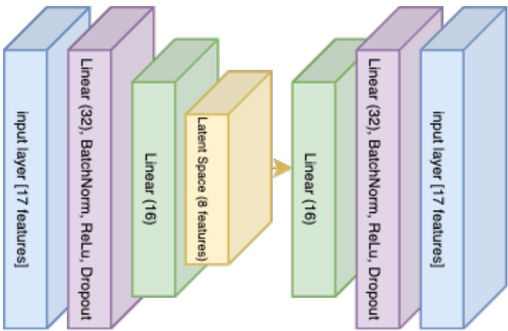
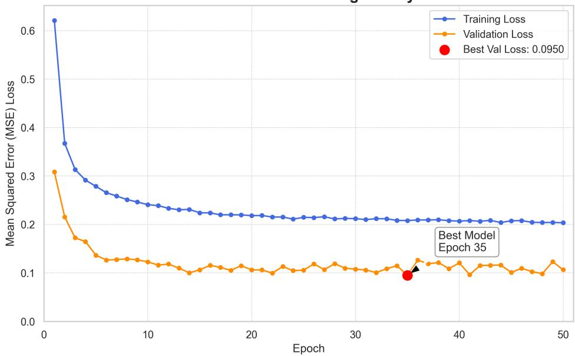
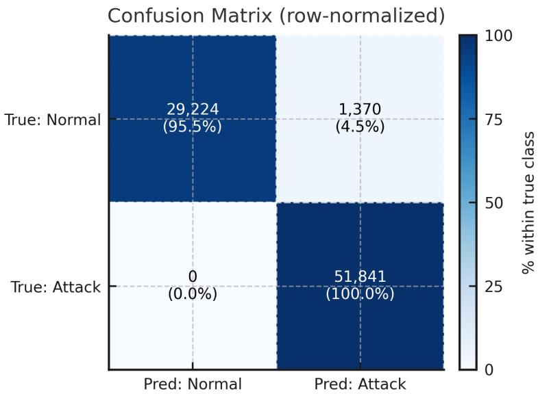
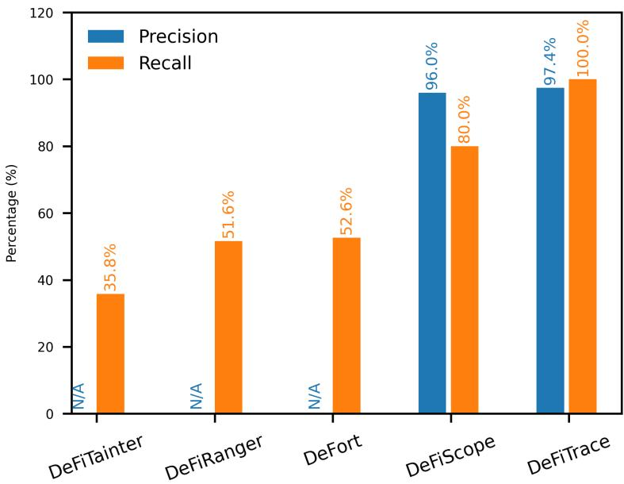

# DeFiTrace: Event-Enriched Detection of Price Oracle Manipulation Across DeFi Transactions

MILLATI PRATIWI, Computer Engineering, Pusan National University, Geumjeong-gu, Korea (the Republic of)

YOON-HO CHOI, Computer Engineering, Pusan National University, Geumjeong-gu, Korea (the Republic of)

The rapid growth of Decentralized Finance (DeFi) has been accompanied by increasingly sophisticated security threats. Price Oracle Manipulation Atacks (POMA), a critical vulnerability, have evolved beyond simple economic exploits to include complex, multi-transaction atacks that exploit smart contract logic, causing hundreds of millions in losses. State-of-the-art detection methods, however, often focus on single-transaction, economic manipulations and typically fail to identify these emerging atack vectors, particularly when smar contract source code is unavailable. This article introduces a novel, EVM-compatible detection pipeline tha addresses this gap. By combining transaction event logs and execution traces, we engineer a rich set ofsemantic and structural features that capture the underlying behavior of on-chain operations. We train a regularized autoencoder exclusively on the features of benign transactions to learn a deep representation of normal activity, flagging significant deviations as malicious. Our evaluation demonstrates the efectiveness of this approach, achieving 100% recall on a comprehensive dataset of single-transaction atacks and 98.25% event-level recall on a new, manually collected dataset of real-world multi-transaction exploits, with an overall precision of 97.15%. We present a robust, learning-based model capable of identifying both known and unseen POMA variants without relying on source code. Furthermore, we contribute a new dataset of multi-transaction atacks to foster further research, providing a more generalizable and resilient approach to securing the DeFi ecosystem.

CCS Concepts: • Security and privacy → Distributed systems security; Intrusion detection systems; • Computing methodologies → Anomaly detection; • Information systems → Blockchain;

Additional Key Words and Phrases: Blockchain security, Decentralized Finance (DeFi), Price Oracle Manipulation Atack (POMA), multi-transaction atacks, intrusion detection, smart contracts, machine learning, anomaly detection

## ACM Reference Format:

Millati Pratiwi and Yoon-Ho Choi. 2026. DeFiTrace: Event-Enriched Detection of Price Oracle Manipulation Across DeFi Transactions. ACM Trans. Priv. Sec. 29, 3, Article 30 (June 2026), 28 pages. htps://doi.org/10.1145/3817054

This work was supported by the IITP (Institute of Information and Communications Technology Planning and Evaluation)- ITRC (Information Technology Research Center) grant funded by the Korea government (Ministry of Science and ICT) (IITP-2025-RS-2023-00259967).

## 1 Introduction

The Decentralized Finance (DeFi) ecosystem has demonstrated significant growth and resilience, establishing itself as a robust alternative to traditional financial systems. A primary indicator of this expansion is the Total Value Locked (TVL), which represents the aggregate value of crypto assets deposited into smart contracts across all protocols and blockchain networks. After reaching a peak of approximately \$177 billion USD in 2022, the sector has entered a period of steady recovery and renewed growth throughout 2024 and 2025, with the TVL currently standing at \$118 billion [2, 6, 25]. This sustained capital inflow underscores continued investor confidence and highlights the sector’s capacity to deliver innovative financial products.

Despite its architectural innovations, DeFi is not immune to the market and price manipulation challenges that pervade traditional Centralized Finance (CeFi). In CeFi, manipulation manifests through tactics such as Ponzi schemes, wash trading, and “marking the close” [19]. Analogously, DeFi protocols are susceptible to manipulation of their on-chain asset exchange rates. As defined by [27], adversarial transactions can be crafted to distort the price oracles within a DeFi liquidity pool. This class of exploit is commonly referred to as a Price Oracle Manipulation Attack (POMA) [28], and has also been systematized within the broader oracle-security literature [11]. In Blockchain, oracles bridge the gap between of-chain and on-chain, but oracles create a dilemma: a smart contract entirely relies on the oracles. The price oracle manipulation technique alone has cost 404 million dollars USD [6].

On-chain oracle manipulation is one of the most prevalent yet under-examined categories of DeFi security incidents. Despite their significance, oracle manipulation incidents have received limited academic atention. Empirical evidence shows that 27 out of 181 documented DeFi exploits involve on-chain oracle manipulation; however, only 4 of the 77 academic papers surveyed (approximately 9%) have analyzed such atacks in detail [32]. This gap highlights the need for deeper investigation into oracle-based vulnerabilities, which play a crucial role in the security and stability of decentralized financial ecosystems. Prior literature has characterized POMA through several lenses. These definitions range from the mechanism of manipulation—distinguishing between direct and indirect methods of inducing anomalous price changes [19, 30]—to the execution strategy, which can be categorized as either atomic (occurring within a single transaction comprising multiple internal calls and swaps) or multi-transactional [28, 29]. The later variant is considered significantly more dificult to detect, as the malicious activity may be distributed over an extended time period, executed from multiple adversarial addresses, and recorded across diferent blockchain blocks.

Existing research on POMA predominantly focuses on economic manipulation (e.g., large swaps) and overlooks a critical atack surface unique to DeFi: smart contract vulnerabilities. In fact, “Absence of coding logic (sanity checks)” is the single most common cause of DeFi atack [32]. The immutable, code-based nature of DeFi protocols introduces a new vector where price manipulation can be achieved not by influencing market dynamics but by directly exploiting flaws in the underlying source code. This highlights the need for detection frameworks that go beyond transaction-level analysis to capture the semantic and structural behaviors embedded within smart contract execution.

Recent security incidents involving protocols such as KiloEX serve as a prime example [1, 21, 24]. In the KiloEX case, the atacks did not originate from manipulating pool currency rates via swaps. Instead, the adversaries exploited access control vulnerabilities to directly modify sensitive priceseting components within the smart contracts [1]. Such incidents, while fundamentally resulting in price manipulation, fall outside the scope of traditional POMA definitions. Furthermore, these vulnerability-driven atacks are inherently complex and often executed across multiple transactions, rendering them undetectable by the current state-of-the-art (SOTA) detection models, which are not designed to identify code-level exploits from transaction data alone.

This study posits that the current understanding of POMA is incomplete. We propose to redefine and broaden the scope of POMA to include exploits where price manipulation is achieved by invoking vulnerable functions within a protocol’s smart contract, without necessarily executing any token swaps, minting, or burning operations. This expanded definition makes the detection problem substantially more complex. It raises a critical research question: How can code-level price manipulation be detected by analyzing on-chain transaction data alone, particularly when the underlying smart contract source code is unverified or treated as a black box?

While prior work, such as SmartCAT [30], has focused on static and dynamic analysis of smart contract code to identify vulnerabilities, we argue that this approach is not a generalizable solution. Smart contract source code is frequently unavailable or left unverified for proprietary or security reasons, limiting the applicability of code-dependent detection methods. The Dexodus Finance incident further illustrates this limitation [22]. In this case, two separate verifiers calling the same function within a single transaction received diferent return values for a price index—an inconsistency only observable via internal traces—which underscores the need for methods that infer manipulations from observable on-chain efects rather than source code alone [22].

To address this challenge, this article proposes a novel detection methodology that utilizes a combination of transaction event logs and execution traces. We engineer a rich set of semantic and structural features designed to capture the subtle on-chain footprints of both economic and vulnerability-driven manipulations. By training a regularized autoencoder model exclusively on benign transactions, our system learns a deep representation ofnormal behavior and flags significant deviations as anomalous. Our approach demonstrates superior performance over prior state-of-theart methods like DeFiScope [31], successfully identifies atacks missed by existing tools, and shows high eficacy on a novel, challenging dataset of multi-transaction atacks.

The contributions of this proposed work are threefold:

— We develop and evaluate a robust price manipulation detection pipeline that successfully identifies both single-transaction and multi-transaction POMA.

— We introduce a new, publicly available dataset of real-world multi-transaction atacks to facilitate further research and benchmark the robustness of detection models beyond a single transaction atack.<sup>1</sup>

— We present a learning-based, rule-agnostic detection model capable of generalizing to novel and previously unseen atack vectors.

The remainder of this article is organized as follows: Section 2 provides background on DeFi and Price Oracle Manipulation Atacks and reviews related work in the field. We formally define the problem in Section 3 and detail our proposed methodology in Section 4. The experimental setup, including dataset construction and model implementation, is described in Section 5. We present and analyze our findings and discuss their implications in Section 6. Finally, Section 7 concludes the article and suggests directions for future work.

## 2 Background and Related Work

In this section, we explain about the important foundational knowledge about the DeFi, Oracles, and Price manipulation atack, along with the related works.

## 2.1 DeFi, Blockchain, and Price Oracles

DeFi utilizes blockchain technology to ofer a parallel suite of financial services, including asset exchanges, lending, and trading. While architecturally diferent, its functional parity with CeF exposes it to similar market manipulation risks [19, 32].

A core challenge in DeFi is that blockchains cannot natively access external, of-chain data. Oracles are essential third-party services that solve this by securely delivering real-world information—such as asset prices—to smart contracts. The integrity of these oracles is critical to the stability of the entire ecosystem, and has been systematized in prior work [11]. Engineering designs used widely in practice include Chainlink’s Decentralized Oracle Networks (DONs) [4, 9]. Large-scale tracking further shows that oracle/manipulation-related exploits constitute a substantial portion of DeFi losses over the years [7, 23]

Oracles can be broadly categorized into two types, each with a distinct atack surface: On-Chain Oracles and Of-Chain Oracles. On-Chain Oracles, such as those that read from a Decentralized Exchange (DEX) using a Time-Weighted Average Price (TWAP), pull price data directly from an Automated Market Maker (AMM) on the same blockchain. Their primary vulnerability is price manipulation, where an atacker uses a flash loan or a series of large trades to artificially move the AMM’s price before the oracle reads it [16, 28]. Of-Chain Oracles, such as Chainlink’s DONs, aggregate price data from multiple of-chain sources. The aggregated value is then signed and posted on-chain. Their atack surface includes data-source faults, node collusion, or bad configuration, such as misconfigured price floors or stale data feeds [4, 9, 11].

Contemporary Oracle Landscape (2022–2025): Table 2 presents annual POMA trends from 2022 to 2025. Analysis of the DeFiLlama Hacks Database reveals that POMA atacks remain a substantial threat, accounting for 43 out of 354 (12.1%) DeFi security incidents from 2022–2025, with cumulative losses exceeding \$348 million USD [7]. While the percentage of POMA atacks declined from 22.7% in 2022 to 9.3% in 2025, the absolute number remains relatively stable (9–15 incidents annually). Notably, the atack landscape is evolving, with traditional flashloan-based oracle atacks (5 incidents in 2022) diminishing to zero in 2025, while sophisticated oracle manipulation variants increased from 1 incident in 2022 to 5 incidents in 2025, suggesting atackers are adapting to employ more subtle exploitation techniques that evade traditional detection methods.

Modern oracle implementations have evolved significantly. Chainlink now utilizes Of-Chain Reporting (OCR) 2.0, employing Byzantine fault-tolerant consensus mechanisms before submiting cryptographically signed reports on-chain [10]. Recent research proposes a comprehensive oracle data lifecycle consisting of five stages: data creation, submission, consensus, election, and deprecation [10]. Understanding this lifecycle is critical because atacks can target diferent stages—empirical analysis shows that 63% of analyzed incidents (\$187M) occur at the election stage where data is finalized and consumed by protocols.

Despite architectural improvements, atackers have shifted from feed-level manipulation to exploiting on-chain oracle consumers. Notable 2023–2025 incidents include Sentiment Protocol (\$1M, read-only reentrancy), Bonq Protocol (\$120M, instant price feed consumption without dispute window), and Rodeo Finance (\$880k, improper TWAP integration) [10]. These incidents demonstrate that oracle security remains an evolving threat landscape.

## 2.2 Overview on Price Manipulation Atacks

The rapid growth of DeFi has made it a lucrative target for malicious actors. A significant portion of exploits are price manipulation atacks, where an adversary distorts an asset’s price to profit from the discrepancy. These atacks primarily target the vulnerabilities of on-chain oracles and can be classified into two main categories:

— Direct Price Manipulation (DPM): This strategy involves directly manipulating the token balance within a single liquidity pool. An atacker typically uses a large trade (often funded by a flash loan) to artificially inflate an asset’s price, compel a victim protocol to transact at this distorted rate, and then reverse the initial trade to realize a profit. The Elephant Money incident on BSC is a representative case [8, 20].

Table 1. Comparative Analysis of DeFi Security Tools, Highlighting the Unique Advantages of our Proposed Method

<table><tr><td rowspan="2">Detection System</td><td rowspan="2">Requires Source Code?</td><td colspan="3">Detection Time</td><td colspan="3">Detection Paradigm</td><td colspan="2">Attack Granularity</td><td colspan="3">Attack Vectors Covered</td></tr><tr><td>Pre-Deployment (Static)</td><td>Batch (Offline)</td><td>Real-Time (Dynamic)</td><td>Rule-Based</td><td>Leaming-Based</td><td>LLM-Based</td><td>Single-Transaction</td><td>Multi-Transaction</td><td>AMM/TWAP Oracles</td><td>Custom Oracles</td><td>Flash Loan Focus</td></tr><tr><td>DeFiTainter [14]</td><td>Yes</td><td>✓</td><td></td><td></td><td>✓</td><td></td><td></td><td>✓</td><td></td><td>✓</td><td></td><td></td></tr><tr><td>SMARTCAT [30]</td><td>Yes</td><td>✓</td><td></td><td></td><td>✓</td><td></td><td></td><td>✓</td><td></td><td>✓</td><td></td><td></td></tr><tr><td>POMABuster [28]</td><td>No</td><td></td><td>✓</td><td></td><td>✓</td><td></td><td></td><td>✓</td><td>✓</td><td>✓</td><td></td><td></td></tr><tr><td>DeFiRanger [27]</td><td>No</td><td></td><td></td><td>✓</td><td>✓</td><td></td><td></td><td>✓</td><td></td><td>✓</td><td></td><td></td></tr><tr><td>DeFort [29]</td><td>No</td><td></td><td></td><td>✓</td><td>✓</td><td></td><td></td><td>✓</td><td></td><td>✓</td><td>✓</td><td></td></tr><tr><td>DeFiScope [31]</td><td>No</td><td></td><td></td><td>✓</td><td></td><td></td><td>✓</td><td></td><td>✓</td><td></td><td>✓</td><td>✓</td></tr><tr><td>Our Work (DeFiTrace)</td><td>No</td><td></td><td>✓</td><td></td><td></td><td>✓</td><td></td><td>✓</td><td>✓</td><td>✓</td><td>✓</td><td>✓</td></tr></table>

Notes: A checkmark (✓) indicates that a feature is a primary characteristic of the tool. Our work is code-agnostic, learning-based, and detects both single- and multi-transaction atacks across diverse vectors  
The table summarizes key architectural and capability diferences across detection time, analysis paradigm, and atack vectors covered.

Table 2. Price Oracle Manipulation Atacks: Annual Trends and Distribution (2022–2025)

<table><tr><td rowspan="2">Year</td><td rowspan="2">Total POMA</td><td rowspan="2">All Attacks</td><td rowspan="2">POMA %</td><td colspan="3">Attack Type Distribution</td><td rowspan="2">Loss ($M)</td></tr><tr><td>FL-Oracle</td><td>Oracle Manip</td><td>Price Manip</td></tr><tr><td>2022</td><td>15</td><td>66</td><td>22.7%</td><td>5</td><td>1</td><td>0</td><td>246.3</td></tr><tr><td>2023</td><td>9</td><td>97</td><td>9.3%</td><td>3</td><td>0</td><td>3</td><td>16.9</td></tr><tr><td>2024</td><td>10</td><td>94</td><td>10.6%</td><td>4</td><td>2</td><td>1</td><td>58.1</td></tr><tr><td>2025</td><td>9</td><td>97</td><td>9.3%</td><td>0</td><td>5</td><td>2</td><td>27.5</td></tr><tr><td>Total</td><td>43</td><td>354</td><td>12.1%</td><td>12</td><td>8</td><td>6</td><td>348.8</td></tr></table>

Note: FL-Oracle = Flashloan Price Oracle Atack; Oracle Manip = Oracle Manipulation (includes Price Oracle Manipulation); Price Manip = Price Manipulation Atack. Data source: DeFiLlama Hacks Database (analyzed February 2026).

— Indirect Price Manipulation (IDM): This strategy involves manipulating a liquidity pool that serves as a price oracle for other victim protocols. The atacker creates a significant imbalance in the oracle pool, deceiving a victim contract that relies on its data. The Cheese Bank exploit (loss ∼\$3.3M) demonstrates this technique [18].

## 2.3 Related Work

Table 1 summarizes existing DeFi security tools and highlights the unique capabilities of our proposed method. Research in DeFi security has evolved from theoretical modeling to sophisticated automated detection systems. Foundational work first sought to systematize the threat landscape and quantify the economic feasibility of oracle manipulation. Studies such as SoK: Oracles from the ground truth to market manipulation [30] established a modular framework for oracle design, while theoretical models like those in [16] demonstrated that even supposedly robust TWAP oracles were economically viable to atack. While critical for understanding the problem, this initial wave of research did not provide automated detection mechanisms.

The subsequent phase of research shifted toward proactive, pre-exploit detection through code analysis. Static analysis emerged as a key technique, with tools like DeFiTainter [14] pioneering inter-contract taint analysis to identify vulnerabilities where manipulated price data could influence fund transfers. Complementing this, formal verification methods were proposed to mathematically prove the correctness oforacle interactions and provide pre-exploit warnings. Similarly, SMARTCAT [30] introduced a system to identify potentially malicious contracts based on their token-flow graph before an atack transaction is ever initiated. These static and patern-based approaches are valuable for pre-deployment auditing but are often limited by their reliance on available source code and their inability to capture complex, state-dependent runtime dynamics.

Recognizing the limitations of static analysis, the focus then pivoted to runtime detection of live atacks. Systems like DeFiRanger [27] and DeFort [29] represent the state-of-the-art in this domain, employing sophisticated techniques such as semantic cash flow analysis and behavioral modeling to identify malicious activity within on-chain transactions. More recently, LLM-based tools like DeFiScope [31] have shown promise in detecting manipulations in protocols with custom price logic. Complementary to these approaches, transaction-level analysis has also been applied to broader Web3 security problems; for instance, Li et al. [15] demonstrate that behavioral features extracted from on-chain transactions can efectively identify illegal accounts involved in Web3 scams. However, a significant and shared limitation of these prominent runtime systems is their primary focus on atomic, single-transaction atacks. They are designed to analyze the events within one transaction to find an exploit, but are not equipped to correlate events spread across multiple, seemingly independent transactions.

Recent Advances in Oracle Security (2023–2025): The oracle security research landscape has seen significant advances. Mo et al. [17] propose VeriOracle, a formal verification framework that detects unsafe oracle feeds before exploitation by symbolically verifying oracle correctness across DON (Chainlink), DEX (Uniswap), and internal oracles. Their approach achieves real-time detection (3.8s average) on 500K transactions from 13 protocols, demonstrating mathematically grounded pre-exploit detection.

Eshghie et al. [10] conducted the first comprehensive lifecycle-based analysis of oracle atacks, examining 7 high-profile exploits totaling \$187 million. Their work classifies 9 atack types (key compromise, Sybil atacks, reentrancy, price manipulation) mapped to specific oracle lifecycle stages. Their evaluation of bond systems shows that requiring capital stakes can increase atack costs from \$150k to over \$6 million, though bond systems alone cannot prevent consumer-side integration flaws.

Feng et al. [12] propose DDON, a DAG-based oracle network addressing high-frequency data feed challenges through parallel transaction processing. Their implementation achieves 625–650 tx/s throughput with VRF-based leader election, demonstrating modern oracle architectures beyond traditional threshold signatures. However, these eficiency-focused approaches do not address detection of manipulated data once it enters the oracle network.

This review of the literature reveals a critical research gap. While significant progress has been made, the increasing sophistication of adversaries has outpaced current defenses. The existing body of work does not adequately address the challenge of detecting code-based, multitransaction atacks. PomaBuster [28] mentioned that the multi-transaction atack dataset was augmented from one transaction, which might be diferent than the real exploit. These advanced exploits, which leverage smart contract vulnerabilities over a series of transactions, remain largely invisible to state-of-the-art tools that are predicated on analyzing either static code paterns or isolated, swap-centric transaction events. This gap forms the primary motivation for our research.

## 3 Problem Formulation

The evolution from capital-intensive swaps to code-based exploits demands a broader understanding of POMA. In this section, we describe the evolving threat and the threat model we address in this proposed work.

Table 3. Cross-chain Atack Steps and Transactions in KiloEx

<table><tr><td>Attack step</td><td>Transaction</td><td>Chain</td><td>Amount</td></tr><tr><td>Tornado Cash Funding</td><td>0xa0...fdf46</td><td>Ethereum</td><td>—</td></tr><tr><td>Base Tx 1</td><td>0x6b...28edd</td><td>Base</td><td>$3.13 M</td></tr><tr><td>Base Tx 2</td><td>0xde...26e6</td><td>Base</td><td>$187 k</td></tr><tr><td>Base Tx 3</td><td>0xf0...e138</td><td>Base</td><td>$11 k</td></tr><tr><td>BNB Tx 1</td><td>0x1a...7d03</td><td>BNB Chain</td><td>$893 k</td></tr><tr><td>BNB Tx 2</td><td>0x38...0bc0</td><td>BNB Chain</td><td>$10 k</td></tr><tr><td>opBNB Tx 1</td><td>0x79...7964</td><td>opBNB</td><td>$2.9 M</td></tr><tr><td>opBNB Tx 2</td><td>0xc6...65e4</td><td>opBNB</td><td>$205.5 k</td></tr><tr><td>opBNB Tx 3</td><td>0x78...889f</td><td>opBNB</td><td>$14 k</td></tr><tr><td>Taiko Tx</td><td>0x9b...215b</td><td>Taiko</td><td>$41 k</td></tr><tr><td>Manta Tx</td><td>0x06...2df5</td><td>Manta</td><td>$100 k</td></tr></table>

Hashes truncated; USD amounts as reported.

## 3.1 The Evolving Threat

While DPM and IDM rely on overwhelming a market with capital, a more sophisticated atack vector has emerged. Recent incidents involving protocols like KiloEx and Dexodus reveal that price manipulation can be achieved by exploiting vulnerabilities in smart contract code itself. Instead of distorting prices through large swaps, adversaries now target flaws, such as improper access control, to gain privileged access to functions that directly set or update a protocol’s internal price.

The KiloEx incident is a prime example. The atack did not involve any swaps. Instead, the adversary exploited a chain of unprotected function calls to gain control of the setPrices function. They used this access to set a token’s price artificially low, open a large position, immediately set the price high, and then close the position for a substantial profit. This incident highlights a critical shift: POMA can be triggered not only by economic manipulation but also through the direct invocation of privileged functions.

## 3.2 Threat Model

We define a POMA as any action where an adversary artificially alters a cryptocurrency’s price for profit, whether through token balance manipulation, supply alteration, or by exploiting a vulnerability in a protocol’s pricing mechanism. Detecting these atacks is increasingly dificult for two key reasons:

— Multi-Transaction Execution: Table 3 instantiates the multi-transaction flow across several chains and Figure 1 show the steps. The sequence begins with Tornado Cash Funding on Ethereum (0xa0...fdf46), which provides anonymized capital for manipulation (See A1 in Figure 1). The atacker then executes a burst on Base—Base Tx 1 (\$3.13 M), Base Tx 2 (\$187 k), and Base Tx 3 (\$11 k)—whose magnitudes and ordering are consistent with repeated reserve nudges that drift the TWAP/median over multiple blocks (A2) and with price-signal propagation to the reference feed (A3).

A later Base transaction (often the largest in the burst or the first price-consuming call in that window) consumes the drifted price for a borrow/setlement (A4), after which proceeds are consolidated (A5). The same patern recurs on BNB Chain—BNB Tx 1 (\$893 k) followed by a small cleanup BNB Tx 2 (\$10 k)—and on opBNB with a large primary move (\$2.9 M) plus smaller top-ups (\$205.5 k and \$14 k), again indicating iterative pressure (A2) followed by consumption (A4). Finally, Taiko (\$41 k) and Manta (\$100 k) entries are consistent with cross-chain realization or consolidation: once the distorted price is usable on a destination, a price-sensitive action is executed (A4) and residual funds are repositioned (A5). A large initial push, smaller maintenance nudges, then realization and consolidation are characteristic of the distributed A1–A5 patern and evade single-transaction heuristics while remaining detectable through semantic, positional, and magnitude cues aggregated over time.

  
Fig. 1. Flow A — Multi-transaction Swap/TWAP-Drift Atack. An atacker (A1) obtains short-lived or anonymized capital, then (A2) executes repeated swaps across blocks that nudge AMM reserves. The pro ducer side incorporates these updates (A3), drifting the reference price. A later transaction (A4) invokes a price-consuming action at the drifted price, and the atacker (A5) realizes profit. Notes indicate where logs and traces are obtained.

— Code-Based Triggers: We show the flow of the code-based price manipulation atack in Figure 2. In the atomic variant, manipulation originates from privileged or maintenance code paths rather than observable swap pressure. The atacker first secures capital to execute in one shot (B1); then invokes a keeper/privileged function that accepts a stale or replayed price report, or writes a price without adequate freshness/role checks (B2). A downstream consumer immediately uses that manipulated price for a price-sensitive state transition within the same transaction (B3), after which value is extracted and consolidated (B4).

Example (Dexodus [9]). The atacker abused performUpkeep()—which lacked a data freshness check and replay protection in the Chainlink price report verification—to run the function twice within one transaction: first opening at a stale price of about \$1,816 (log: indexPrice = 1,816,830,254), then closing at the updated market price of about \$2,520 (log: indexPrice = 2,520,617,081). This sequence enabled an illicit profit of roughly \$300,000.

To address this evolving threat, we propose a new taxonomy for POMA in Table 4. The table classifies atacks along two axes: the price-tamper mechanism and the temporal granularity. This framework reveals a critical gap in current security solutions. Atacks in the lower-right quadrant—code-based, multi-transaction atacks—are largely invisible to existing detection tools.

  
Fig. 2. Flow B — Code-Based, Single-Transaction Manipulation. An atacker (B1) secures capital, then (B2) invokes a keeper/privileged path that accepts or writes a bad price. A downstream consumer (B3) immediately relies on that price within the same transaction, and the atacker (B4) realizes profit. Notes indicate where logs and traces are obtained.

Table 4. Price Tampering Mechanisms by Temporal Granularity

<table><tr><td rowspan="2">Mechanism</td><td colspan="2">Temporal granularity</td></tr><tr><td>Single-Tx</td><td>Multi-Tx</td></tr><tr><td>Swap-based</td><td>DPM / IDM</td><td>Gradual TWAP skew over hours</td></tr><tr><td>Code-based</td><td>Privileged call and profit in the same tx</td><td>Write price once; borrow later</td></tr></table>

## 4 Proposed Method

The proposed method comprises four stages: data acquisition and enrichment, feature engineering, model training, and atack detection, as illustrated in Figure 3. Data enrichment itself includes preprocessing, such as ingestion and parsing of on-chain artifacts, then the data is semantically enriched through a public signature database, and event-level feature engineering. The engineered event representation is shared by both training (fit on normal data only) and detection (scoring unseen transactions), which keeps the system consistent across deployment modes.

## 4.1 Data Acquisition and Enrichment

We seed the corpus from DeFiScope [31] by extracting incident identifiers and the complete set of associated transaction hashes, preserving chain identifiers (e.g., Ethereum, BSC) and block numbers to guarantee reproducible node queries. For each hash, we query the chain’s JSON-RPC to retrieve the receipt and emited logs (eth\_getTransactionReceipt) and a complete execution trace of internal calls (debug\_traceTransaction or trace\_transaction where applicable).

  
Fig. 3. Detailed workflow of our detection framework (Part 1): (1) Data Acquisition and Preprocessing: Transaction logs and traces are collected from blockchains via Alchemy, then enriched with semantic data from a signature database. (2) Feature Engineering: The enriched data is transformed into a set of EVMcompatible feature vectors.

Table 5. Signature Database Statistics

<table><tr><td>Metric</td><td>Value</td></tr><tr><td>Unique Event Signature Hashes</td><td>264,951</td></tr><tr><td>Supported EVM Chains</td><td>5</td></tr><tr><td>Dataset Coverage</td><td>83.7% (226/270 signatures)</td></tr><tr><td>Database Size</td><td>424.1 MB</td></tr></table>

## 4.2 Signature Database Construction

To atach meaning to opaque selectors and event topics, we build a lightweight signature database (SQLite) by ingesting public function and event signatures (e.g., 4byte.directory [13], Etherface [26]). This database maps 32-byte event signatures in logs (topics[0]) to human-readable names. The mapping is crucial: price manipulation is not a single opcode patern but a semantic sequence (e.g., flash-loan → swap/sync → oracle read/update → collateralize/borrow → repay). The signature database exposes those semantics as categorical signals, enabling the model to learn paterns rather than memorize addresses.

Table 5 summarizes the database. Since EVM-compatible chains share the same event signature standard (Keccak-256 hashes of canonical event strings), a single set of 264,951 unique signatures applies across all supported chains. We replicate entries per chain to allow future chain-specific metadata (e.g., popularity scores, verified contracts).

The category distribution is dominated by liquidity-related signatures (48.8%), followed by oracle interactions (8.8%), token transfers (8.6%), swaps (2.4%), and flash loans (0.7%).

Collision Handling: When multiple signatures map to the same selector hash, we apply priority rules: (1) prefer verified contracts on Etherscan, (2) prefer higher-frequency entries, (3) manually verify canonical DeFi events. Our semantic categorization (transfer, swap, sync, oracle, flashloan) is robust to collisions between related functions, as classification depends on keyword-based category matching rather than exact function names.

For every transaction, we load the paired log and trace tables matched by transactionHash; if either file is missing, the sample is skipped to avoid partial views that bias structural features. We then enrich both tables by joining to the signature database. On the log side, topics [0] is decoded to an event name and parameter schema. For example, the hash 0xddf252ad1be2c89b69c2b068fc378 daa952ba7f163c4a11628f55a4df523b3ef resolves to Transfer(address indexed from, address indexed to, uint256 value), so topics[1] encodes the from address and topics[2] encodes the to address, while the value (transfer amount) is a 32-byte unsigned integer in the log’s data field.

<div class="mineru-algorithm" style="white-space: pre-wrap; font-family:monospace;">
ALGORITHM 1: Feature map $\phi(e; t)$: event $\rightarrow$ feature vector
Input: Event $e$; parent transaction $t$ with logs $L_t$ and traces $T_t$.
Output: $\mathbf{x}(e) = \phi(e; t) \in \mathbb{R}^d$.
$\{-\text{Semantic and Magnitude Features } -\}$
Let $\kappa_e$ be the semantic type of $e$.
$s(e) \leftarrow \text{OneHot}(\kappa_e)$ where $\kappa_e \in \{\text{transfer, swap, sync, oracle, flash-loan}\}$.
$v(e) \leftarrow \min(\text{DecodeAmount}(e), 2^{53} - 1)$; $z_{\text{dec}}(e) \leftarrow \mathbb{I}[\text{DecodeAmount succeeds}]$.
$\ell(e) \leftarrow \log_{10}(v(e) + 1)$.
$\{-\text{Intra-Transaction Structural Features } -\}$ $n_{\text{tx}}(t) \leftarrow |L_t|$.
$\iota(e) \leftarrow \text{index of } e$ in $L_t$ (zero-based).
$\pi(e) \leftarrow \iota(e)/\max(1, n_{\text{tx}}(t) - 1)$.
$\text{ctx}(e) \leftarrow |\{\text{address}(e_i) : e_i \in L_t\}|.$ $V_t \leftarrow \{v(e_i) : e_i \in L_t\}$.
$\sigma_{\text{tx}}(t) \leftarrow \text{StdDev}(V_t)$.
$\{-\text{Local Attribution and Directional Features } -\}$
Let $\alpha_e \leftarrow \text{address}(e)$.
$f_{\text{addr}}(e) \leftarrow \sum_{e_i \in L_t} \mathbb{I}(\text{address}(e_i) = \alpha_e)$.
Let $\mathcal{I}_t \leftarrow$ initiator EOA of $t$ (root of $T_t$).
Let $(\alpha_\text{from}, \alpha_\text{to}) \leftarrow$ transfer parties of $e$.
$u_{\text{dir}}(e) \leftarrow \begin{cases} -1 &amp; \text{if } \alpha_\text{from} = \mathcal{I}_t \land \alpha_\text{to} \neq \mathcal{I}_t \\ +1 &amp; \text{if } \alpha_\text{to} = \mathcal{I}_t \land \alpha_\text{from} \neq \mathcal{I}_t \\ 0 &amp; \text{otherwise} \end{cases}$ $u_{\text{depth}}(e) \leftarrow \text{CallDepth}(e$ in $T_t) \in \mathbb{N}_0$.
$\{-\text{Assemble Final Vector } -\}$ $\mathbf{x}(e) \leftarrow \begin{bmatrix} s(e), v(e), \ell(e), \iota(e), \pi(e), \\ \text{ctx}(e), n_{\text{tx}}(t), \sigma_{\text{tx}}(t), f_{\text{addr}}(e), u_{\text{dir}}(e), \\ u_{\text{depth}}(e), z_{\text{dec}}(e) \end{bmatrix}$.
return $\mathbf{x}(e)$.
</div>

On the trace side, we decode the 4-byte selector to its function name and, when ABI information is available, parse calldata to obtain arguments; we preserve from, to, value, call type, and depth. This alignment bridges what a contract emits (logs) with how the EVM executes it (traces). In practice, the bridge is valuable because developers may omit certain events, while traces still reveal nested internal calls, value movements, and access to privileged paths that are characteristic of atacks but not always explicitly logged.

## 4.3 Feature Engineering

The algorithm for constructing feature representations is given in Algorithm 1 and visualized in Figure 4. For each emited log event � from a transaction �, we form a feature vector

$$
\mathbf {x} (e) \equiv \phi (e; t) \in \mathbb {R} ^ {d},
$$

  
Fig. 4. The feature engineering pipeline. The process transforms raw transaction logs and execution traces into a unified feature set by parsing event semantics, calculating intra-transactional statistics, and enriching log data with contextual information derived from traces, such as call depth and transfer direction.

where $\phi ( \cdot ; \cdot )$ is a deterministic map built from paired logs and traces:

$$
\mathbf {x} (e) = \left[ \begin{array}{c} s (e),   v (e),   \ell (e),   \iota (e),   \pi (e), \\ \operatorname{ctx} (e),   n _ {\mathrm{tx}} (t),   \sigma_ {\mathrm{tx}} (t),   f _ {\mathrm{addr}} (e),   u _ {\mathrm{dir}} (e), \\ u _ {\mathrm{depth}} (e),   z _ {\mathrm{dec}} (e) \end{array} \right].
$$

The component $s ( e ) \in \{ 0 , 1 \} ^ { 5 }$ is a one-hot semantic indicator for {transfer, swap, sync, oracle, flash-loan}. This set captures canonical POMA phases: swap and sync drive AMM reserve changes and emit immediate price signals; oracle reads/updates connect on-chain state to pricing modules; flash-loan compresses capital into a single atomic window; and transfer records extraction or collateralization. Encoding these semantics helps the model generalize across addresses/chains by focusing on which kind of action appears abnormal rather than who performed it.

The amount feature $\nu ( e )$ is the decoded numeric payload/amount (from event data or calldata), capped at $2 ^ { 5 3 } - 1$ to remain within IEEE-754 safe integer bounds common to analytics toolchains. POMA often involves unusually large movements even when addresses are unlabeled; raw magnitude is therefore discriminative. We pair it with $\ell ( e ) = \log _ { 1 0 } \bigl ( \nu ( e ) + 1 \bigr )$ , a log-scale that compresses heavy tails and stabilizes training.

The tuple $\{ \iota ( e ) , \pi ( e ) , \mathrm { c t x } ( e ) , n _ { \mathrm { t x } } ( t ) , \sigma _ { \mathrm { t x } } ( t ) \}$ captures intra-transaction structure. The zero-based event index �(�) and its normalized position

$$
\pi (e) = \frac {\iota (e)}{\max \bigl (1 , n _ {\mathrm{tx}} (t) - 1 \bigr)},
$$

encode when in the sequence a semantic action occurs. Manipulation typically relies on ordering (e.g., skew price → read oracle → borrow → repay). The count of unique emiting addresses ctx(�) summarizes interaction breadth. The transaction length $n _ { \mathrm { t x } } ( t ) = | L _ { t } |$ proxies within-transaction complexity. The standard deviation of payload magnitudes $\sigma _ { \mathrm { t x } } ( t )$ measures within-transaction heterogeneity.

Local atribution features include the per-address emission count $f _ { \mathrm { a d d r } } ( \boldsymbol { e } )$ and the initiator-relative direction $u _ { \mathrm { d i r } } ( e ) \in \{ - 1 , 0 , + 1 \}$ , which distinguishes outgoing, neutral/internal, and incoming flows with respect to the transaction sender (from root traces). We also include the call-trace depth $u _ { \mathrm { d e p t h } } ( e ) \in \mathbb { N } _ { 0 }$ to disambiguate direct user actions (depth 0) from deeply nested calls—depth improves precision on flash-loan chains. Finally, we add a boolean decode indicator $z _ { \mathrm { d e c } } ( e ) \in \{ 0 , 1 \}$ that flags whether amount decoding succeeded; this prevents imputations from leaking spurious signal.

Collectively, the representation is EVM-compatible and address-agnostic: it depends on event/function semantics and generic structural signals, not hard-coded contracts.

Numeric features are scaled prior to training. The log transform ℓ(�) mitigates heavy tails; remaining continuous features are standardized to zero mean and unit variance over the normal training split. We cap extreme outliers at high quantiles to reduce sensitivity to telemetry glitches or partially decoded payloads. One-hot categories require no scaling. Missing values are imputed conservatively (e.g., zero for amounts) with the companion indicator $z _ { \mathrm { d e c } } ( e )$ to avoid distribution shift.

<div class="mineru-algorithm" style="white-space: pre-wrap; font-family:monospace;">
ALGORITHM 2: Model Training Pipeline (Offline)

Require: A set of benign transaction hashes, $H_{normal}$.
Ensure: A trained autoencoder $f_\theta$ and a data scaler Scaler.
$D_{normal} \leftarrow$ AcquireAndEnrichData($H_{normal}$).
$X_{normal} \leftarrow \{\phi(e,t) \mid t \in D_{normal}, e \in L_t\}$. {Apply Function 1}
Scaler $\leftarrow$ FitScaler($X_{normal}$).
$X_{scaled} \leftarrow$ Scaler.transform($X_{normal}$).
Train $f_\theta$ on $X_{scaled}$ by minimizing reconstruction loss $\mathcal{L}(\theta)$.
return $f_\theta$, Scaler.
</div>

## 4.4 Model Training

We train a feed-forward regularized autoencoder $f _ { \theta }$ with a symmetric encoder–decoder and a low-dimensional botleneck on normal events only, as illustrated in Figure 6. Each linear layer uses ReLU activations, Batch Normalization, and Dropout $\left( p = 0 . 3 \right)$ . Let � denote the post-processing feature dimension. Given a matrix of scaled normal events $\{ \mathbf { x } _ { n } \} _ { n = 1 } ^ { N }$ , we minimize the mean-squared reconstruction loss A

$$
\mathcal {L} (\theta) = \frac {1}{N} \sum_ {n = 1} ^ {N} \left\| \mathbf {x} _ {n} - \hat {\mathbf {x}} _ {n} \right\| _ {2} ^ {2}, \quad \hat {\mathbf {x}} _ {n} = f _ {\theta} (\mathbf {x} _ {n}).
$$

Unless stated otherwise, we use batch size 64, Adam with learning rate $1 0 ^ { - 3 }$ , up to 50 epochs with early stopping (patience 15) on validation MSE, and an 80/20 train–validation split of normal data. The checkpoint with the lowest validation loss is selected.

## 4.5 Atack Detection

At inference, a transaction � yields a set of event rows $\{ \mathbf { x } _ { i } ^ { ( t ) } \} _ { i = 1 } ^ { m ( t ) }$ with corresponding reconstructions $\{ \hat { \mathbf { x } } _ { i } ^ { ( t ) } \}$ . We compute a per-event reconstruction error

$$
e _ {i} ^ {(t)} = \frac {1}{d} \left\| \mathbf {x} _ {i} ^ {(t)} - \hat {\mathbf {x}} _ {i} ^ {(t)} \right\| _ {2} ^ {2},
$$

and aggregate to a transaction-level anomaly score via max-pooling $s ( t ) = \mathrm { m a x } _ { 1 \leq i \leq m ( t ) } e _ { i } ^ { ( t ) }$ . Using a held-out set of normal events, we estimate a threshold � as the empirical 95th percentile of normal errors and flag an atack whenever $s ( t ) > \tau .$ The overall training and inference pipeline is illustrated in Figure 5. The algorithm for model training is displayed in Algorithm 2 and the algorithm for atack detection is shown in Algorithm 3.

  
Fig. 5. Detailed workflow of our detection framework. (3) Training Pipeline (A): The feature vectors from normal transactions only are scaled and used to train a regularized autoencoder. (4) Inference Pipeline (B): For a new transaction, its feature vector is scaled using the pre-fited scaler. The trained autoencoder computes a reconstruction error, and if the error is above a 95th percentile threshold, the transaction is classified as a malicious atack.

  
Fig. 6. Autoencoder architecture.

## 5 Experiment and Result

This section now combines all information about the experiment and the result of our proposed method: the dataset, its characteristics, and the model’s implementation details, along with the result.

## 5.1 Experiment Setup

To evaluate our approach, we constructed a dataset covering both single and multi-transaction atacks. All on-chain data for EVM-compatible chains were retrieved via Alchemy RPC services for Ethereum, BNB Smart Chain (BSC), Base, and opBNB. Notably, Base and opBNB are absent from the training set (which contains only Ethereum and BSC transactions), so the KiloEx atack transactions on these chains serve as out-of-distribution test cases that evaluate cross-chain generalization.

<div class="mineru-algorithm" style="white-space: pre-wrap; font-family:monospace;">
ALGORITHM 3: Attack Detection Pipeline (Inference)
Require: A new transaction hash $h_{new}$; trained model $f_\theta$; scaler Scaler; threshold $\tau$.
Ensure: A decision: ‘ATTACK’ or ‘NORMAL’.
$t_{new} \leftarrow$ AcquireAndEnrichData($\{h_{new}\}$).
$X_{new} \leftarrow \{\phi(e, t_{new}) \mid e \in L_{t_{new}}\}$. {Apply Function 1}
$X_{scaled} \leftarrow$Scaler.transform($X_{new}$).
$\hat{X}_{scaled} \leftarrow f_\theta(X_{scaled})$.
$s(t_{new}) \leftarrow \max_i \left( \frac{1}{d} \| \mathbf{x}_i - \hat{\mathbf{x}}_i \|_2^2 \right)$ for $\mathbf{x}_i \in X_{scaled}$.
if $s(t_{new}) &gt; \tau$ then
    return ‘ATTACK’
else
    return ‘NORMAL’
end if
</div>

For single-transaction atacks, we utilized the DeFiScope D1 dataset, which contains 95 historical price-manipulation incidents with an aggregate loss of \$381 million. To establish a baseline of normal behavior, we used a curated subset of 41,224 benign transactions from the DeFiScope D3 dataset (30,641 from Ethereum and 10,583 from BSC). For multi-transaction atacks, we manually collected and analyzed three recent incidents (Fortress Protocol, KiloEx, LoopScale) reported by Rekt News [21], yielding 27 malicious transactions. Due to the limited available chain in the RPC service, this dataset’s size reflects practical constraints, including limited RPC access for the Manta and Taiko chains during the collection period and API call cost limitations on commercial endpoints. This yields a processable transaction with the count of 16. We included the full dataset for the multi-transaction price manipulation atack in the Appendix. Across the collected EVM data, we processed a total of 264,951 function and event signatures to characterize the operational composition of on-chain activity. The distribution is heavily skewed toward liquidity management, with 48.8% (129,220) of signatures corresponding to liquidity-adjusting calls or events. Other significant categories include oracle interactions (8.8%), token transfers (8.6%), and swaps (2.4%). Critical DeFi primitives leveraged in atacks, such as flash loans, are rarer but highly informative (0.7%). This observed distribution validates our feature engineering approach, justifying the inclusion of specific semantic flags �(�) to distinguish these core actions, while relying on magnitude and structural features to separate benign operations from malicious manipulation sequences.

## 5.2 Result

We trained a regularized autoencoder to learn the feature distribution of benign transactions. From the raw data, we successfully parsed and engineered features for 30,594 benign event samples. Our final feature set contains 17 numeric features per event, which were standardized using a scaler fited only on the normal training data to prevent information leakage. The model architecture consists of a 17–32–16–8 encoder and a symmetric 8–16–32–17 decoder, utilizing Batch Normalization, ReLU activations, and Dropout (p=0.3). The model was trained for 50 epochs using the Adam optimizer (learning rate $1 0 ^ { - 3 } )$ to minimize mean-squared reconstruction error, with early stopping (patience 15) restoring the checkpoint with the lowest validation loss (0.0950), as shown in Figure 7. For reproducibility, the trained model, the feature scaler, and the exact feature order were serialized.

Autoencoder Training History  
  
Fig. 7. Training and validation loss of the autoencoder over 50 epochs. The model shows good convergence, with the validation loss reaching its minimum of 0.0950 at epoch 35. This checkpoint is selected as the best model for inference. The early stopping mechanism halted the training at epoch 50 after the validation loss did not improve for 15 subsequent epochs.

The detection threshold � is dynamically computed as the 95th percentile of errors on the validation set for each run and is not embedded in the model checkpoint.

We evaluated our trained model’s ability to distinguish malicious activities from benign ones at both the event and transaction levels. An event � is scored by its reconstruction error �(�), and any event where $e ( x ) > \tau$ is flagged as anomalous. For our experiments, the empirically derived threshold was $\tau = 0 . 3 9 9 2$ . A transaction is flagged as malicious if the maximum event error within it exceeds this threshold, a rule designed to capture the intuition that a single malicious step is suficient to warrant suspicion.

Computational Eficiency. We benchmarked our pipeline on commodity hardware (12-core CPU, NVIDIA RTX 3090 GPU, 15.6 GB RAM). Feature extraction requires 0.21 ms per event (CPUbased), while neural network inference adds only 0.01 ms per event (GPU-accelerated). The total pipeline achieves 0.22 ms per event, yielding throughput of approximately 87,000 events per second. A typical DeFi transaction contains 5–20 events; even complex transactions with 100 events require only 22 ms for analysis, well within Ethereum’s 12-second block time for near-real-time monitoring.

Reproducibility and Stability. To assess reproducibility, we retrained the autoencoder 10 times with diferent random seeds (seeds 0–9), each with fresh model initialization and the same training protocol. Table 6 reports the transaction-level and event-level detection performance across all runs.

The critical metric for a security application is transaction-level recall—whether atack transactions are flagged. Across all 10 runs, recall remains at 99.4% ± 0.9% (CV = 0.9%), confirming that the model reliably detects atack transactions regardless of random initialization. Transaction-level accuracy is similarly stable at $9 8 . 1 \% \pm 0 . 5 \%$

Table 6. Multi-run Stability Analysis Across 10 Independent Training Runs

<table><tr><td>Level</td><td>Metric</td><td>Mean ± Std</td><td>CV</td></tr><tr><td rowspan="4">Transaction</td><td>Recall</td><td>99.4% ± 0.9%</td><td>0.9%</td></tr><tr><td>Precision</td><td>20.2% ± 4.9%</td><td>24.4%</td></tr><tr><td>F1 Score</td><td>33.4% ± 6.7%</td><td>20.0%</td></tr><tr><td>Accuracy</td><td>98.1% ± 0.5%</td><td>0.5%</td></tr><tr><td rowspan="4">Event</td><td>Recall</td><td>32.7% ± 13.3%</td><td>40.7%</td></tr><tr><td>Precision</td><td>89.9% ± 5.8%</td><td>6.4%</td></tr><tr><td>F1 Score</td><td>46.8% ± 16.1%</td><td>34.4%</td></tr><tr><td>Accuracy</td><td>55.8% ± 8.4%</td><td>15.0%</td></tr></table>

CV = coeficient of variation (lower is beter).

The lower and more variable event-level recall reflects threshold sensitivity: each run’s 95th percentile threshold difers slightly, afecting how many individual events within an atack transaction exceed the threshold. When a fixed threshold (the median across runs, $\tau = 0 . 4 5 9 )$ is applied, event-level F1 variance drops substantially from $\mathrm { C V } = 3 4 . 4 \%$ to 5.0%, confirming that the variability originates from threshold selection rather than the learned representation.

These results should be interpreted alongside the benchmark model’s performance (Table 7–8), which reports event-level precision of 97.14% and recall of 100%. The stability analysis demonstrates that while individual retraining runs may vary in their per-event sensitivity, the transaction-level detection capability—the operationally relevant metric—is highly robust.

5.2.1 Single-Transaction Atack Detection. We first evaluated the model on the DeFiScope D1 dataset, which comprised 51,841 malicious events. Our approach successfully identified all atack events, achieving a perfect event-level recall of 100.00%. When evaluated against the combined set of malicious and benign events, the model demonstrated strong overall performance with a precision of 97.43%, accuracy of 98.34%, and an F1-score of 0.9870. The confusion matrix in Figure 8 shows that the model generated 1,370 false positives out of 30,594 benign samples, corresponding to a false positive rate of approximately 4.48%. This confirms that the model efectively separates the two classes with a large margin, as the reconstruction errors for atack events were often orders of magnitude greater than �. The false positive rate is computed as

$$
\mathrm{FPR} = \frac {\mathrm{FP}}{\mathrm{FP} + \mathrm{TN}} = \frac {1, 3 7 0}{1, 3 7 0 + 2 9, 2 2 4} = \frac {1, 3 7 0}{3 0, 5 9 4} \approx 4.48 \%.
$$

This corresponds to our 95th percentile threshold design.

Table 7 and Table 8 present a detailed, incident-by-incident comparison of our approach, DeFi-Trace (OM), against three state-of-the-art tools on the 95 ground-truth atacks from the DeFiScope D1 dataset. The competing methods are DeFiScope (DS), DeFort (DF), and DeFiRanger (DR). Each row documents a historical security incident, with a checkmark (✓) indicating a successful detection by the corresponding tool.

The results summarized in the final row underscore a significant advancement in detection capabilities. DeFiTrace successfully identified all 95 malicious incidents, achieving a perfect 100% recall. This performance notably surpasses that of prior methods, with the next best tool, DeFiScope, detecting 76 incidents (80% recall), followed by DeFort with 50 (52.6% recall) and DeFiRanger with 49 (51.6% recall).

The coverage of DeFiTrace is directly atributable to its architectural design. Unlike methods such as DeFiScope, which rely on source code analysis and are explicitly limited to single-transaction analysis, our model operates as a black box on on-chain data (logs and traces). This allows DeFiTrace to overcome common failure points like missing source code or compilation errors, which were noted as reasons for failure in prior work. More importantly, by engineering features that capture semantic and structural paterns, our approach efectively identifies the complex, multi-transaction atack vectors that other tools are not designed to handle, leading to its comprehensive detection rate across the entire dataset.

Table 7. Comparative Detection Performance on the DeFiScope D1 Dataset (Part 1 of 2)

<table><tr><td>Protocol</td><td>Chain</td><td>Date</td><td>Loss</td><td>DS</td><td>DT</td><td>DF</td><td>DR</td><td>OM</td></tr><tr><td>AES</td><td>BSC</td><td>07-Dec-22</td><td>60K</td><td>✓</td><td>✘</td><td>✓</td><td>✘</td><td>✓</td></tr><tr><td>APC</td><td>BSC</td><td>01-Dec-22</td><td>6K</td><td>✓</td><td>✘</td><td>✓</td><td>✘</td><td>✓</td></tr><tr><td>APEDAO</td><td>BSC</td><td>18-Jul-23</td><td>7K</td><td>✓</td><td>✓</td><td>✘</td><td>✓</td><td>✓</td></tr><tr><td>ApeRocket</td><td>BSC</td><td>14-Jul-21</td><td>1.26M</td><td>✓</td><td>✓</td><td>✘</td><td>✓</td><td>✓</td></tr><tr><td>ARK</td><td>BSC</td><td>23-Mar-24</td><td>201K</td><td>✘</td><td>✘</td><td>✘</td><td>✘</td><td>✓</td></tr><tr><td>ArrayFinance</td><td>ETH</td><td>18-Jul-21</td><td>516K</td><td>✘</td><td>✘</td><td>✓</td><td>✓</td><td>✓</td></tr><tr><td>ATK</td><td>BSC</td><td>12-Oct-22</td><td>61K</td><td>✘</td><td>✘</td><td>✓</td><td>✘</td><td>✓</td></tr><tr><td>AutoShark-Finance_1</td><td>BSC</td><td>29-Oct-21</td><td>2M</td><td>✓</td><td>✓</td><td>✓</td><td>✓</td><td>✓</td></tr><tr><td>AutoShark-Finance_2</td><td>BSC</td><td>24-May-21</td><td>750K</td><td>✓</td><td>✓</td><td>✓</td><td>✘</td><td>✓</td></tr><tr><td>BabyDoge</td><td>BSC</td><td>28-May-23</td><td>137K</td><td>✓</td><td>✘</td><td>✘</td><td>✘</td><td>✓</td></tr><tr><td>Bamboo</td><td>BSC</td><td>04-Jul-23</td><td>117K</td><td>✓</td><td>✘</td><td>✘</td><td>✓</td><td>✓</td></tr><tr><td>BBOX</td><td>BSC</td><td>16-Nov-22</td><td>12K</td><td>✓</td><td>✘</td><td>✓</td><td>✘</td><td>✓</td></tr><tr><td>BDEX</td><td>BSC</td><td>30-Oct-22</td><td>3K</td><td>✓</td><td>✓</td><td>✘</td><td>✓</td><td>✓</td></tr><tr><td>bDollar</td><td>BSC</td><td>21-May-22</td><td>730K</td><td>✓</td><td>✘</td><td>✘</td><td>✓</td><td>✓</td></tr><tr><td>BEARNDAO</td><td>BSC</td><td>05-Dec-23</td><td>769K</td><td>✓</td><td>✘</td><td>✓</td><td>✓</td><td>✓</td></tr><tr><td>BeltFinance_1</td><td>BSC</td><td>29-May-21</td><td>408K</td><td>✓</td><td>✓</td><td>✘</td><td>✓</td><td>✓</td></tr><tr><td>BeltFinance_2</td><td>BSC</td><td>29-May-21</td><td>6.23M</td><td>✓</td><td>✓</td><td>✘</td><td>✓</td><td>✓</td></tr><tr><td>BFCToken</td><td>BSC</td><td>09-Sep-23</td><td>38K</td><td>✓</td><td>✘</td><td>✘</td><td>✓</td><td>✓</td></tr><tr><td>BGLD</td><td>BSC</td><td>12-Dec-22</td><td>18K</td><td>✓</td><td>✓</td><td>✓</td><td>✘</td><td>✓</td></tr><tr><td>BH</td><td>BSC</td><td>11-Oct-23</td><td>1.27M</td><td>✓</td><td>✓</td><td>✘</td><td>✓</td><td>✓</td></tr><tr><td>BTC20</td><td>ETH</td><td>19-Aug-23</td><td>47K</td><td>✓</td><td>✘</td><td>✘</td><td>✘</td><td>✓</td></tr><tr><td>BXH</td><td>BSC</td><td>28-Sep-22</td><td>40K</td><td>✓</td><td>✓</td><td>✓</td><td>✘</td><td>✓</td></tr><tr><td>bZx</td><td>ETH</td><td>18-Feb-20</td><td>350K</td><td>✓</td><td>✘</td><td>✓</td><td>✓</td><td>✓</td></tr><tr><td>Carson</td><td>BSC</td><td>26-Jul-23</td><td>150K</td><td>✘</td><td>✓</td><td>✓</td><td>✓</td><td>✓</td></tr><tr><td>Cellframe</td><td>BSC</td><td>01-Jun-23</td><td>76K</td><td>✓</td><td>✓</td><td>✘</td><td>✓</td><td>✓</td></tr><tr><td>CheeseBank</td><td>ETH</td><td>06-Nov-20</td><td>3.3M</td><td>✓</td><td>✓</td><td>✓</td><td>✓</td><td>✓</td></tr><tr><td>ConicFinance</td><td>ETH</td><td>21-Jul-23</td><td>3.25M</td><td>✓</td><td>✘</td><td>✘</td><td>✓</td><td>✓</td></tr><tr><td>CreamFinance</td><td>ETH</td><td>27-Oct-21</td><td>130M</td><td>✓</td><td>✓</td><td>✓</td><td>✘</td><td>✓</td></tr><tr><td>CS</td><td>BSC</td><td>23-May-23</td><td>714K</td><td>✓</td><td>✓</td><td>✘</td><td>✓</td><td>✓</td></tr><tr><td>Cupid</td><td>BSC</td><td>31-Aug-22</td><td>78K</td><td>✓</td><td>✓</td><td>✓</td><td>✓</td><td>✓</td></tr><tr><td>DFS</td><td>BSC</td><td>30-Dec-22</td><td>2K</td><td>✓</td><td>✘</td><td>✓</td><td>✓</td><td>✓</td></tr><tr><td>Discover</td><td>BSC</td><td>06-Jun-22</td><td>11K</td><td>✓</td><td>✘</td><td>✘</td><td>✘</td><td>✓</td></tr><tr><td>DotFinance</td><td>BSC</td><td>25-Aug-21</td><td>430K</td><td>✓</td><td>✓</td><td>✓</td><td>✘</td><td>✓</td></tr><tr><td>EAC</td><td>BSC</td><td>29-Aug-23</td><td>17K</td><td>✓</td><td>✘</td><td>✓</td><td>✓</td><td>✓</td></tr><tr><td>EGDFinance</td><td>BSC</td><td>07-Aug-22</td><td>36K</td><td>✓</td><td>✓</td><td>✓</td><td>✘</td><td>✓</td></tr><tr><td>ElephantMoney</td><td>BSC</td><td>12-Apr-22</td><td>11.2M</td><td>✓</td><td>✘</td><td>✓</td><td>✘</td><td>✓</td></tr><tr><td>Eminence ERC20-</td><td>ETH</td><td>29-Sep-20</td><td>7M</td><td>✓</td><td>✓</td><td>✓</td><td>✘</td><td>✓</td></tr><tr><td>TokenBank</td><td>ETH</td><td>31-May-23</td><td>111K</td><td>✓</td><td>✘</td><td>✘</td><td>✓</td><td>✓</td></tr><tr><td>FFIST</td><td>BSC</td><td>19-Jul-23</td><td>91K</td><td>✓</td><td>✘</td><td>✓</td><td>✘</td><td>✓</td></tr><tr><td>GDS</td><td>BSC</td><td>03-Jan-23</td><td>180K</td><td>✓</td><td>✓</td><td>✓</td><td>✘</td><td>✓</td></tr><tr><td>GPT</td><td>BSC</td><td>24-May-23</td><td>42K</td><td>✓</td><td>✘</td><td>✓</td><td>✘</td><td>✓</td></tr><tr><td>Groker20</td><td>ETH</td><td>10-Nov-23</td><td>68K</td><td>✓</td><td>✘</td><td>✘</td><td>✓</td><td>✓</td></tr><tr><td>GymDeFi</td><td>BSC</td><td>09-Apr-22</td><td>312K</td><td>✓</td><td>✘</td><td>✓</td><td>✓</td><td>✓</td></tr><tr><td>Hackerdao</td><td>BSC</td><td>24-May-22</td><td>65K</td><td>✓</td><td>✘</td><td>✓</td><td>✓</td><td>✓</td></tr><tr><td>Harvest</td><td>ETH</td><td>26-Oct-20</td><td>21.5M</td><td>✓</td><td>✓</td><td>✓</td><td>✓</td><td>✓</td></tr><tr><td>IndexedFinance</td><td>ETH</td><td>14-Oct-21</td><td>16M</td><td>✘</td><td>✘</td><td>✘</td><td>✓</td><td>✓</td></tr><tr><td rowspan="3">INUKO Inverse-Finance_1</td><td>BSC</td><td>14-Oct-22</td><td>50K</td><td>✘</td><td>✘</td><td>✓</td><td>✘</td><td>✓</td></tr><tr><td>ETH</td><td>16-Jun-22</td><td>1.26M</td><td>✘</td><td>✘</td><td>✘</td><td>✓</td><td>✓</td></tr><tr><td>ETH</td><td>02-Apr-22</td><td>15.6M</td><td>✘</td><td>✘</td><td>✘</td><td>✘</td><td>✓</td></tr></table>

Table 8. Comparative Detection Performance on the DeFiScope D1 Dataset (Part 2 of 2)

<table><tr><td>Protocol</td><td>Chain</td><td>Date</td><td>Loss</td><td>DS</td><td>DT</td><td>DF</td><td>DR</td><td>OM</td></tr><tr><td>LaunchZone</td><td>BSC</td><td>27-Feb-23</td><td>320K</td><td>✓</td><td>✘</td><td>✓</td><td>✘</td><td>✓</td></tr><tr><td>LUSD</td><td>BSC</td><td>07-Jul-23</td><td>9K</td><td>✓</td><td>✘</td><td>✓</td><td>✘</td><td>✓</td></tr><tr><td>LW_1</td><td>BSC</td><td>12-May-23</td><td>50K</td><td>✓</td><td>✘</td><td>✘</td><td>✓</td><td>✓</td></tr><tr><td>LW_2</td><td>BSC</td><td>12-May-23</td><td>48K</td><td>✓</td><td>✘</td><td>✘</td><td>✓</td><td>✓</td></tr><tr><td>Mars</td><td>BSC</td><td>16-Apr-24</td><td>100K</td><td>✓</td><td>✘</td><td>✘</td><td>✘</td><td>✓</td></tr><tr><td>MBC</td><td>BSC</td><td>29-Nov-22</td><td>6K</td><td>✓</td><td>✓</td><td>✓</td><td>✘</td><td>✓</td></tr><tr><td>MerlinLab</td><td>BSC</td><td>29-Jun-21</td><td>628K</td><td>✓</td><td>✘</td><td>✘</td><td>✘</td><td>✓</td></tr><tr><td>MonoXFinance</td><td>ETH</td><td>30-Nov-21</td><td>31M</td><td>✓</td><td>✘</td><td>✘</td><td>✓</td><td>✓</td></tr><tr><td>MRGtoken</td><td>ETH</td><td>08-Nov-23</td><td>12K</td><td>✓</td><td>✘</td><td>✘</td><td>✓</td><td>✓</td></tr><tr><td>NeverFall</td><td>BSC</td><td>02-May-23</td><td>74K</td><td>✓</td><td>✓</td><td>✘</td><td>✘</td><td>✓</td></tr><tr><td>Nmbplatform</td><td>BSC</td><td>14-Dec-22</td><td>76K</td><td>✓</td><td>✓</td><td>✓</td><td>✓</td><td>✓</td></tr><tr><td>NOVO_1</td><td>BSC</td><td>29-May-22</td><td>76K</td><td>✓</td><td>✘</td><td>✘</td><td>✓</td><td>✓</td></tr><tr><td>NOVO_2</td><td>BSC</td><td>29-May-22</td><td>65K</td><td>✓</td><td>✘</td><td>✓</td><td>✓</td><td>✓</td></tr><tr><td>PancakeBunny</td><td>BSC</td><td>19-May-21</td><td>45M</td><td>✓</td><td>✓</td><td>✓</td><td>✘</td><td>✓</td></tr><tr><td>PancakeHunny</td><td>BSC</td><td>20-Oct-21</td><td>1.93M</td><td>✘</td><td>✘</td><td>✘</td><td>✓</td><td>✓</td></tr><tr><td>PLPManager</td><td>BSC</td><td>24-Jul-23</td><td>900K</td><td>✓</td><td>✓</td><td>✘</td><td>✘</td><td>✓</td></tr><tr><td>PLTD</td><td>BSC</td><td>17-Oct-22</td><td>24K</td><td>✓</td><td>✘</td><td>✓</td><td>✓</td><td>✓</td></tr><tr><td>RoeFinance</td><td>ETH</td><td>11-Jan-23</td><td>80K</td><td>✓</td><td>✘</td><td>✘</td><td>✘</td><td>✓</td></tr><tr><td>SanshuInu</td><td>ETH</td><td>20-Jul-21</td><td>111K</td><td>✘</td><td>✓</td><td>✓</td><td>✘</td><td>✓</td></tr><tr><td>SATX</td><td>BSC</td><td>16-Apr-24</td><td>29K</td><td>✓</td><td>✘</td><td>✘</td><td>✓</td><td>✓</td></tr><tr><td>SellToken</td><td>BSC</td><td>11-Jun-23</td><td>100K</td><td>✓</td><td>✘</td><td>✘</td><td>✓</td><td>✓</td></tr><tr><td>SpaceGodzilla</td><td>BSC</td><td>13-Jul-22</td><td>25K</td><td>✓</td><td>✘</td><td>✓</td><td>✓</td><td>✓</td></tr><tr><td>SpartanProtocol</td><td>BSC</td><td>01-May-21</td><td>30M</td><td>✓</td><td>✘</td><td>✘</td><td>✓</td><td>✓</td></tr><tr><td>Starlink</td><td>BSC</td><td>16-Feb-23</td><td>12K</td><td>✓</td><td>✘</td><td>✓</td><td>✓</td><td>✓</td></tr><tr><td>StarWallets</td><td>BSC</td><td>17-Apr-24</td><td>33K</td><td>✘</td><td>✘</td><td>✘</td><td>✘</td><td>✓</td></tr><tr><td>STM</td><td>BSC</td><td>06-Jun-24</td><td>14K</td><td>✓</td><td>✓</td><td>✘</td><td>✘</td><td>✓</td></tr><tr><td>SturdyFinance</td><td>ETH</td><td>12-Jun-23</td><td>800K</td><td>✓</td><td>✘</td><td>✘</td><td>✘</td><td>✓</td></tr><tr><td>SVT</td><td>BSC</td><td>26-Aug-23</td><td>400K</td><td>✓</td><td>✓</td><td>✘</td><td>✓</td><td>✓</td></tr><tr><td>SwapX</td><td>BSC</td><td>27-Feb-23</td><td>1M</td><td>✘</td><td>✘</td><td>✓</td><td>✘</td><td>✓</td></tr><tr><td>TIFIToken</td><td>BSC</td><td>10-Dec-22</td><td>51K</td><td>✓</td><td>✓</td><td>✘</td><td>✓</td><td>✓</td></tr><tr><td>UN</td><td>BSC</td><td>06-Jun-23</td><td>26K</td><td>✓</td><td>✘</td><td>✘</td><td>✓</td><td>✓</td></tr><tr><td>UPSToken</td><td>ETH</td><td>18-Jan-23</td><td>45K</td><td>✓</td><td>✓</td><td>✓</td><td>✓</td><td>✓</td></tr><tr><td>Upswing</td><td>ETH</td><td>17-Jan-23</td><td>36K</td><td>✓</td><td>✓</td><td>✓</td><td>✘</td><td>✓</td></tr><tr><td>uwerx_network</td><td>ETH</td><td>02-Aug-23</td><td>324K</td><td>✓</td><td>✘</td><td>✘</td><td>✓</td><td>✓</td></tr><tr><td>UwULend</td><td>ETH</td><td>10-Jun-24</td><td>19M</td><td>✓</td><td>✘</td><td>✘</td><td>✘</td><td>✓</td></tr><tr><td>ValueDeFi</td><td>ETH</td><td>14-Nov-20</td><td>6M</td><td>✓</td><td>✓</td><td>✓</td><td>✓</td><td>✓</td></tr><tr><td>VesperFinance</td><td>ETH</td><td>02-Nov-21</td><td>2M</td><td>✘</td><td>✘</td><td>✘</td><td>✘</td><td>✓</td></tr><tr><td>VINU</td><td>ETH</td><td>06-Jun-23</td><td>6K</td><td>✓</td><td>✘</td><td>✓</td><td>✘</td><td>✓</td></tr><tr><td>WarpFinance</td><td>ETH</td><td>17-Dec-20</td><td>7.8M</td><td>✓</td><td>✓</td><td>✘</td><td>✓</td><td>✓</td></tr><tr><td>WGPT</td><td>BSC</td><td>12-Jul-23</td><td>80K</td><td>✓</td><td>✘</td><td>✓</td><td>✓</td><td>✓</td></tr><tr><td>WienerDoge</td><td>BSC</td><td>25-Apr-22</td><td>30K</td><td>✓</td><td>✓</td><td>✓</td><td>✓</td><td>✓</td></tr><tr><td>XSTABLE</td><td>ETH</td><td>09-Aug-22</td><td>56K</td><td>✓</td><td>✘</td><td>✓</td><td>✘</td><td>✓</td></tr><tr><td>Z123</td><td>BSC</td><td>22-Apr-24</td><td>136K</td><td>✓</td><td>✘</td><td>✘</td><td>✓</td><td>✓</td></tr><tr><td>Zoompro</td><td>BSC</td><td>05-Sep-22</td><td>61K</td><td>✘</td><td>✘</td><td>✓</td><td>✘</td><td>✓</td></tr><tr><td>ZS</td><td>BSC</td><td>08-Oct-23</td><td>14K</td><td>✓</td><td>✘</td><td>✓</td><td>✓</td><td>✓</td></tr><tr><td>Zunami</td><td>ETH</td><td>13-Aug-23</td><td>2M</td><td>✓</td><td>✘</td><td>✘</td><td>✘</td><td>✓</td></tr><tr><td colspan="9"></td></tr></table>

Notes: A checkmark (✓) indicates a successful detection by the respective tool.  
OM: Our Method (DeFiTrace); DS: DeFiScope; DT: DeFiTainter; DF: DeFort; DR: DeFiRanger.  
<sup>1,2</sup> Markers are annotations preserved from the original DeFiScope dataset source.

Case Studies: Detecting Atacks in SOTA Blind Spots. To highlight the practical advantages of our learning-based, code-agnostic approach, we analyze two atacks from the dataset that were missed by all four competing state-of-the-art tools. We use the analysis from the DeFiScope paper itself to explain why these cases represent systemic blind spots for prior methods, and how DeFiTrace overcomes these limitations.

The InverseFinance\_2 Exploit (A Cross-Transaction Atack) The \$15.6 million atack on InverseFinance [5] is a notable case that the DeFiScope paper explicitly identifies as an undetectable “crosstransaction atack.” The exploit followed a sophisticated multi-step sequence, where the atacker used a flash loan of over \$500 million in wrapped Bitcoin to manipulate the price of and ultimately drain Inverse’s DOLA stablecoin pools. This reliance on distributed logic across multiple transactions is a common failure point for many runtime detectors, including DeFiScope, due to its model’s single-transaction analysis limitation.

  
Fig. 8. Confusion matrix for event-level classification on the combined single-transaction dataset.

In contrast, DeFiTrace successfully flagged this transaction, calculating a maximum reconstruction error of 8.48, a score more than 21 times higher than our anomaly threshold. This success is a direct result of our methodology’s core design. By operating as a code-agnostic, feature-based system that learns a generalized model of on-chain behavior, DeFiTrace is not constrained by a rigid, single-transaction view. It identifies the transaction’s anomalous structure and semantics from the on-chain data alone, proving efective even against atacks whose logic may be distributed across multiple steps.

The ARK Exploit (An Access Control Vulnerability) The ARK protocol exploit [3] stemmed from a critical access control vulnerability that represents a blind spot for many detection tools. As shown in the contract’s code, the autoBurnLiquidityPairTokens() function was declared public, allowing it to be called by any external actor. This flaw enabled the atacker to first send WBNB directly to the pair contract—desynchronizing the true token balance from the recorded reserves—and then call the public function. The function’s subsequent call to sync() in Figure 10 updated the internal price based on the manipulated balances, allowing the atacker to drain assets at an artificially favorable rate. This multi-step manipulation, which hides the exploit logic within a seemingly routine function call, is why it evades systems looking for simple anomalous swaps. The DeFiScope [31] paper notes its model can fail due to unavailable source code, a common issue with contracts targeted by such atacks.

DeFiTrace, however, identified this transaction with an exceptionally high maximum reconstruction error of over 3.1 million. This score, nearly 8,000 times the anomaly threshold, indicates a severe statistical deviation. An error of this magnitude was triggered because the model learned that sensitive, reserve-altering functions are not invoked by arbitrary external accounts in this manner. Our model detected this deviation without needing to parse the underlying source code, thereby overcoming a critical failure point for code-dependent static and dynamic analysis tools. These two cases underscore the value of our methodology. By learning a generalized model of normal on-chain behavior, DeFiTrace can efectively detect the sophisticated and novel atacks that fall into the blind spots of existing systems, proving its utility against an evolving threat landscape.



Fig. 9. Comparison of detection performance with other state-of-the-art approaches.  
```txt
function autoBurnLiquidityPairTokens() public {
    lastLpBurnTime = block.timestamp;
    uint256 liquidityPairBalance = balanceOf(_mainPair);
    uint256 amountToBurn = (liquidityPairBalance * percentForLPBurn) /
        10000;
    if (amountToBurn > 0) {
        _basicTransfer(_mainPair, address(0xdead), amountToBurn);
    }
    ISwapPair(_mainPair).sync();
    emit AutoNukeLP();
}
```  
Fig. 10. The vulnerable autoBurnLiquidityPairTokens() function in the ARK smart contract. Its public visibility was the root cause of the exploit.

5.2.2 Multi-Transaction Atack Detection. This section provides a detailed breakdown of our model’s performance on the manually collected multi-transaction atack dataset. We tested the model’s generalization capability on our manually collected dataset of 16 multi-transaction atacks, comprising 457 distinct events across Ethereum, Base, opBNB, and BNB Chain. The evaluation was conducted using the autoencoder model trained exclusively on benign, single-transaction data. A detection threshold � (the 95th percentile of reconstruction errors on the normal validation set) was applied. Without any retraining, the model correctly identified 449 of the 457 malicious events, achieving an event-level recall of 98.25%. The few missed events were typically preparatory or cleanup steps (e.g., wallet funding via TornadoCash), which are expected to appear benign when viewed in isolation. By applying the max-pooling rule at the transaction level, our method successfully flagged every multi-transaction atack sequence, as each contained at least one event with a sufficiently high anomaly score, often related to the direct price manipulation or profit extraction phase.

Table 9. Detection Results for the Multi-Transaction Atack Dataset

<table><tr><td>Incident</td><td>Chain</td><td>Transaction Description</td><td>Short Hash</td><td>Max. Rec. Error</td><td>Detection Result</td></tr><tr><td>KiloEx</td><td>opBNB</td><td>Attack Tx 1 - $2.9 M</td><td>0x79eb...27964</td><td>1.3014</td><td>Attack Detected</td></tr><tr><td>KiloEx</td><td>opBNB</td><td>Attack Tx 2 - $205.5 k</td><td>0xcfc6...c65e4</td><td>1.3014</td><td>Attack Detected</td></tr><tr><td>KiloEx</td><td>opBNB</td><td>Attack Tx 3 - $14 k</td><td>0x783d...7889f</td><td>1.3014</td><td>Attack Detected</td></tr><tr><td>KiloEx</td><td>BNB Chain</td><td>Attack Tx 1 - $893 k</td><td>0x1aaf...27d03</td><td>18.9266</td><td>Attack Detected</td></tr><tr><td>KiloEx</td><td>BNB Chain</td><td>Attack Tx 2 - $10 k</td><td>0x38b2...10bc0</td><td>18.9266</td><td>Attack Detected</td></tr><tr><td>KiloEx</td><td>Base</td><td>Attack Tx 1 - $3.13 M</td><td>0x6b37...28edd</td><td>1.3014</td><td>Attack Detected</td></tr><tr><td>KiloEx</td><td>Base</td><td>Attack Tx 2 - $187 k</td><td>0xde7f...b26e6</td><td>1.3014</td><td>Attack Detected</td></tr><tr><td>KiloEx</td><td>Base</td><td>Attack Tx 3 - $11 k</td><td>0xf0fc...28138</td><td>1.3014</td><td>Attack Detected</td></tr><tr><td>KiloEx</td><td>Ethereum</td><td>Tornado Cash Funding</td><td>0xa0fa...df46</td><td>0.3181</td><td>Benign Activity</td></tr><tr><td>LoopScale</td><td>Ethereum</td><td>Returned Funds 1 - $737 k</td><td>0x4a57...c72f0</td><td>0.1124</td><td>Benign Activity</td></tr><tr><td>LoopScale</td><td>Ethereum</td><td>Returned Funds 2 - $1.47 M</td><td>0x17f7...595ce</td><td>0.1087</td><td>Benign Activity</td></tr><tr><td>LoopScale</td><td>Ethereum</td><td>Returned Funds 3 - $2.96 M</td><td>0xa92f...07860</td><td>0.1053</td><td>Benign Activity</td></tr><tr><td>Fortress</td><td>Ethereum</td><td>Funding Transaction</td><td>0xd253...a2cb</td><td>1.2568</td><td>Attack Detected</td></tr><tr><td>Fortress</td><td>Ethereum</td><td>Tornado Cash Transaction</td><td>0x1f1b...3daa5</td><td>1.2568</td><td>Attack Detected</td></tr><tr><td>Fortress</td><td>Ethereum</td><td>Oracle Attack Transaction</td><td>0x13d1...061bf</td><td>1.3157</td><td>Attack Detected</td></tr></table>

Notes: The detection threshold � is the 95th percentile of normal validation errors. A transaction is detected if its maximum reconstruction error exceeds this value. ”Benign Activity” refers to transactions within an atack sequence that are structurally normal and thus correctly classified as non-anomalous by our event-level model. Short hashes correspond to the first and last six hexadecimal digits of the full transaction hashes provided in Appendix 13.

Table 9 lists the transaction-level results. Each transaction is scored by the maximum reconstruction error found among all its constituent events. If this score exceeds �, the transaction is flagged as a detected atack. The results in Table 9 demonstrate that our model successfully identified all core atack transactions in the KiloEx incident across the Base, BNB Chain, and opBNB networks. The transactions that were not flagged as atacks represent preparatory or concluding steps of an exploit sequence. For instance, the Tornado Cash funding transaction for the KiloEx atack and the fund-return transactions from the LoopScale incident have reconstruction errors well below the anomaly threshold. This is the expected and correct behavior for our event-level detection model, as these transactions are designed to mimic routine, benign activity (e.g., standard transfers) and lack the anomalous structural and semantic features characteristic of the main exploit itself.

## 5.3 Sensitivity to Class Imbalance

Real-world DeFi monitoring is highly imbalanced: atacks are rare events among a large volume of benign transactions. To evaluate DeFiTrace under realistic conditions, we constructed evaluation sets at varying atack prevalence by fixing the 51,841 atack events from the D1 dataset and subsampling normal transactions to achieve the target ratio. Table 10 presents the detection performance at each ratio.

Recall is stable at 100% across all ratios. This follows directly from how the threshold � is defined: it is derived solely from the reconstruction error distribution of normal events, making it invariant to the class ratio at evaluation time. Precision decreases as atacks become rarer because false positives—normal transactions that happen to exceed �—constitute a larger fraction of all flagged transactions, even though their absolute count is fixed. To characterize the precision-recall tradeof more precisely, Table 11 reports performance under diferent threshold percentiles at the realistic

Table 10. Detection Performance at Varying Class Ratios

<table><tr><td>Ratio (Attack:Normal)</td><td>Precision</td><td>Recall</td><td>F1</td><td>Accuracy</td></tr><tr><td>2:98 (realistic)</td><td>66.6%</td><td>100.0%</td><td>0.800</td><td>99.3%</td></tr><tr><td>5:95</td><td>52.7%</td><td>100.0%</td><td>0.690</td><td>98.0%</td></tr><tr><td>10:90</td><td>39.7%</td><td>100.0%</td><td>0.568</td><td>95.8%</td></tr><tr><td>20:80</td><td>32.9%</td><td>100.0%</td><td>0.495</td><td>91.6%</td></tr><tr><td>50:50</td><td>29.4%</td><td>100.0%</td><td>0.454</td><td>79.4%</td></tr></table>

Table 11. Threshold Sensitivity at 2% Atack Prevalence

<table><tr><td>Threshold Percentile</td><td>τ</td><td>Precision</td><td>Recall</td><td>F1</td></tr><tr><td>90th</td><td>0.0047</td><td>45.9%</td><td>100.0%</td><td>0.630</td></tr><tr><td>95th</td><td>0.0065</td><td>60.5%</td><td>100.0%</td><td>0.754</td></tr><tr><td>99th</td><td>0.0129</td><td>87.7%</td><td>97.9%</td><td>0.925</td></tr><tr><td>99.5th</td><td>0.0157</td><td>90.0%</td><td>89.5%</td><td>0.897</td></tr><tr><td>99.9th</td><td>0.0278</td><td>87.5%</td><td>71.6%</td><td>0.787</td></tr></table>

2:98 ratio. In this ratio, the 99th percentile threshold achieves the best F1 (0.925) with minimal recall loss (97.9%). Beyond this point the tradeof worsens, as the threshold becomes too aggressive and begins missing atacks. In practice, � can be calibrated based on the operator’s tolerance for false positives relative to missed detections.

## 5.4 Feature Ablation Study

To understand which features contribute most to atack detection, we conducted two complementary ablation experiments: (1) evaluating each feature group independently to assess standalone discriminative power, and (2) removing each group from the complete feature set to measure complementary contributions. Our 17 features are organized into five semantic groups, the details of the features and the ablation result is shown in Table 12.

The five DeFi semantic event indicators alone achieve perfect classification (F1 = 1.0), demonstrating that POMA atacks exhibit highly distinctive operation sequencing paterns. Specifically, atacks are characterized by the co-occurrence of oracle price updates, flashloans, and swap sequences within single transactions—a patern rarely observed in benign operations. Frequency features achieve moderate performance (F1 = 0.72), reflecting that atacks often involve contracts with abnormal interaction paterns. In contrast, structural and value features show poor standalone discrimination (F1 < 0.35), indicating these properties overlap significantly between atacks and normal operations.

When removing feature groups from the complete 17-feature model, temporal features show the largest impact (−6.7% F1), indicating that event positioning provides critical complementary information even when semantic labels are available. DeFi flags remain important when combined with other features (−3.6% F1 when removed). Notably, value-based features add noise rather than signal, with model performance improving by 5.5% F1 when removed, suggesting that POMA atacks are beter characterized by their operational structure and timing rather than transferred amounts.

## 6 Discussion

Our experimental results ofer compelling answers to the core research questions guiding this study. The primary question was: To what extent can an anomaly detection model, trained on semantic features from on-chain data, overcome the limitations of existing methods to provide robust detection for a broader class of POMA? Our findings indicate that this is not only feasible but highly efective. The model’s perfect 100% recall on single-transaction atacks and 97.63% event-level recall on complex, multi-transaction atacks demonstrate that by learning a deep representation of normal on-chain behavior, we can reliably detect a wider variety of exploits—including those driven by code vulnerabilities—without requiring any smart contract source code. The following subsections provide a detailed exploration of these findings, addressing our specific sub-questions.

Table 12. Feature Ablation: Standalone Performance and Removal Impact on F1

<table><tr><td>Group</td><td>Features</td><td>#</td><td>F1</td><td>ΔF1</td></tr><tr><td>DeFi Flags</td><td>is_transfer, is_swap, is_sync, is_oracle, is_flashloan</td><td>5</td><td>1.000</td><td>-3.6%</td></tr><tr><td>Frequency</td><td>protocol_activity, addr_tx_freq, addr_freq</td><td>3</td><td>0.723</td><td>-1.2%</td></tr><tr><td>Temporal</td><td>event_index, event_position, tx_event_count</td><td>3</td><td>0.637</td><td>-6.7%</td></tr><tr><td>Structural</td><td>tx_complexity, tx_duration, tx_value_div</td><td>3</td><td>0.332</td><td>-0.7%</td></tr><tr><td>Value</td><td>data_value, data_log</td><td>2</td><td>0.081</td><td>+5.5%</td></tr></table>

ΔF1 is measured against the full 17-feature model.

6.0.1 Revealing Vulnerability-Driven Atacks Beyond Economic Indicators. Our first sub-question asked: How can transaction traces and event logs bejointly modeled to reveal vulnerabilitydriven manipulations invisible to methods focused purely on economic activity? The answer lies in our feature engineering methodology. By creating a rich feature set that includes semantic flags (e.g., oracle interaction), intra-transaction structure (e.g., call depth, event position), and value-flow paterns, our model learns a more nuanced definition of “normal” than one based solely on swap sizes or token transfers.

This approach proved efective because it can detect anomalies in the underlying execution logic. For instance, a vulnerability-driven atack might not involve a large swap but could feature an unusual internal call to a privileged function, an abnormal sequence of events, or an uncharacteristic data payload—all of which are captured by our features derived from both logs and traces. The model’s interpretability further validates this; by exposing the event with the maximum error score $( S ( T ) = \operatorname* { m a x } _ { e } e ( x _ { e } ) )$ , an analyst can pinpoint the exact, non-economic step that was flagged as anomalous, providing clear evidence of a code-level exploit.

6.0.2 Generalization to Multi-Transaction Atack Chains. Our second sub-question addressed a critical challenge in DeFi security: Can this approach efectively generalize to detect multi transaction attacks?. Our results demonstrate a strong generalization capability. When tested on our novel dataset of multi-transaction atacks, the model—without any retraining—achieved a high event-level recall of 98.25% and successfully flagged every single atack sequence at the transaction level. This confirms that by learning fundamental, address-agnostic paterns of on-chain events, the model can identify malicious steps even when they appear in novel combinations across diferent chains (Base, opBNB, BNB Chain).

However, this evaluation also highlighted a key limitation of event-level scoring. The few events that the model missed were preparatory or cleanup steps (e.g., wallet funding) that, when viewed in isolation, are indistinguishable from benign activity. This underscores an important area for future research: enhancing the model with sequence-aware features or causal window aggregation could further improve its ability to contextualize each event as part of a broader, causally-linked atack chain.

6.0.3 Performance in the Context ofState-of-the-Art Detection. Finally, our third sub-question asked: How does this method’s performance compare to state-of-the-art detectors? While direct comparison is challenging due to varying datasets, our model’s performance metrics establish a new benchmark for the expanded class of POMA we defined. The perfect recall on single transaction atacks and high recall on multi-transaction atacks (as seen in Figure 9) are exceptionally strong results for a security-critical application.

Crucially, our approach provides a transparent and tunable operating point via the threshold �. The reported 4.48% false-positive rate corresponds to a 95th percentile threshold chosen to maximize recall. For practical deployment, this tradeof is fully controllable. An operator could shift � to the 99th percentile to drastically reduce false positives for a less sensitive system, or calibrate it on a per-protocol basis for higher precision. This flexibility, combined with the model’s high accuracy on a broader and more challenging set of atacks, represents a significant advancement in building practical and robust detection systems for DeFi.

6.0.4 Threats to Validity. We identify two primary threats to the validity of our findings. The first is a potential bias in our dataset. Although the DeFiScope D1 [31] dataset is one of the most comprehensive available, the world ofDeFi exploits is constantly evolving. A sophisticated adversary could theoretically craft a novel atack that perfectly mimics the structural and semantic features of a complex but benign transaction type (e.g., a liquidity migration script), potentially evading our autoencoder-based detection. Our model’s performance is contingent on the assumption that malicious activities will, at some fundamental level, deviate from the learned distribution of norma on-chain behavior.

The second threat relates to the generalizability of our trained model across diferent blockchain ecosystems and time periods. Our model was trained on a dataset of known benign transactions from a specific timeframe. A significant shift in the fundamental paterns of DeFi usage, for instance, the widespread adoption of a new protocol or token standard, could potentially increase the false positive rate by making previously uncommon paterns appear normal. Mitigating this would require periodic retraining of the model on more recent benign data to ensure it remains adapted to the evolving DeFi landscape.

Our model was trained on Ethereum and BSC transactions. While our evaluation on Base and opBNB (chains not in training data) demonstrates cross-chain generalization within EVM environments, significant shifts in DeFi usage paterns could require periodic retraining. To handle the distribution shift, we recommend threshold recalibration when deploying to new chain environments.

Our approach is specifically designed for EVM-compatible chains. Extending to non-EVM ecosystems like Solana would require fundamental architectural changes due to diferent execution models (flat program logs vs. hierarchical call traces), lack of keccak256 event signatures, and diferent value representations in token transfers.

DeFiTrace is a runtime detection system that identifies exploitation efects (anomalous paterns resulting from atacks) rather than a static analysis tool for discovering source-code vulnerabilities.

This distinction is important: we detect atacks as they occur or in post-hoc forensic analysis, not potential vulnerabilities before exploitation.

## 7 Conclusion

This article addressed a critical and expanding gap in DeFi security: the detection of Price Oracle Manipulation Atacks that exploit smart contract vulnerabilities rather than purely economic mechanics, and are happening in more than a single transaction. We argued that existing detection methods, often reliant on source code analysis or narrow, swap-focused definitions, are ill-equipped to handle these sophisticated, often multi-transactional exploits. In response, we proposed and validated a novel detection pipeline that operates directly on the semantic and structural paterns of on-chain data, analyzing transaction logs and execution traces in a black-box manner.

Our benign transaction-trained autoencoder-based model demonstrated exceptional performance. It achieved a perfect 100% recall on a comprehensive dataset of single-transaction atacks and 98.25% event-level recall on a new, challenging dataset of multi-transaction atacks. These results validate our central thesis that by learning a deep representation of normal on-chain behavior, it is possible to reliably identify a broader class of atacks without prior knowledge of specific vulnerabilities. This work makes three primary contributions to the field: First, we developed a robust, learning-based detection pipeline efective against both single- and multi-transaction atack modalities. Second, we introduce a new, publicly available dataset of real-world multi-transaction atacks to facilitate future research. Third, by moving beyond hard-coded rules, our approach ofers a generalizable defense capable of identifying novel and unseen atack vectors.

While our approach proved highly efective, we recognize its limitations, primarily that its event-level scoring can overlook preparatory atack steps that appear benign in isolation. This presents a clear direction for future research. The immediate next steps involve enhancing the model with sequence-aware features to capture temporal dependencies and implementing causal window aggregation techniques to link related events across multiple transactions and blocks. Further exploration could also focus on adapting this methodology for real-time, on-the-fly detection within mempool data streams. Ultimately, this research provides a new blueprint for building dynamic, adaptive security systems in the DeFi space. By focusing on the observable on-chain efects rather than the underlying implementation, our methodology ofers a more resilient and future-proof approach to securing decentralized finance against an ever-expanding threat landscape.

Future work includes: (1) extending semantic coverage to emerging DeFi primitives such as NFTcollateralized lending and options protocols, (2) adapting the methodology to non-EVM ecosystems like Solana, which would require fundamentally diferent feature extraction approaches, and (3) implementing sequence-aware features to beter capture multi-transaction atack paterns.

## References

[1] Rob Behnke. 2025. Explained: The KiloEx Hack (April 2025). Retrieved from https://www.halborn.com/blog/post/explai ned-the-kiloex-hack-april-2025. Technical explanation of access control and oracle-seting flaw.

[2] BeInCrypto. 2025. DeFi Protocols Surge To a 3-Year High in TVL. Retrieved August 27, 2025 from https://beincrypto.c om/defi-protocols-tvl-three-year-high/. Reports DefiLlama TVL figures and 2021 peak reference.

[3] BlockSec Phalcon. 2024. ARK Atack Analysis. Retrieved September 04, 2025 from https://x.com/Phalcon\_xyz/status/1 771728823534375249

[4] Lorenz Breidenbach, Christian Cachin, Benedict Chan, Alex Coventry, Steve Ellis, Ari Juels, Farinaz Koushanfar, Andrew Miller, Brendan Magauran, Daniel Moroz, Sergey Nazarov, Alexandru Topliceanu, Florian Tramèr, and Fan Zhang. 2021. Chainlink 2.0: Next Steps in the Evolution of Decentralized Oracle Networks. Retrieved August 27, 2025 from https://research.chain.link/whitepaper-v2.pdf

[5] CertiK. 2022. Inverse Finance Incident Analysis. Retrieved September 04, 2025 from https://www.certik.com/resources /blog/inverse-finance-incident-analysis

[6] DefiLlama. 2025. DeFi Dashboard. Retrieved August 26, 2025 from https://defillama.com

[7] DeFiLlama. 2025. DeFi Hacks Database. Retrieved February 05, 2025 from https://defillama.com/hacks

[8] Elephant Money Team. 2022. Reserve Exploit: Live Updates. Retrieved August 27, 2025 from https://medium.com/eleph ant-money/reserve-exploit-52fd36ccc7e8

[9] Steve Ellis, Ari Juels, and Sergey Nazarov. 2017. ChainLink: A Decentralized Oracle Network. Retrieved August 27, 2025 from https://research.chain.link/whitepaper-v1.pdf

[10] Mojtaba Eshghie, Mikael Jafari, and Cyrille Artho. 2024. From creation to exploitation: The oracle lifecycle. In Proceedings ofthe 2024 IEEE International Conference on Software Analysis, Evolution and Reengineering - Companion. IEEE, 23–34. DOI:https://doi.org/10.1109/SANER-C62648.2024.00009

[11] Shayan Eskandari, Mehdi Salehi, Wanyun Catherine Gu, and Jeremy Clark. 2021. SoK: Oracles from the ground truth to market manipulation. In Proceedings of the 3rd ACM Conference on Advances in Financial Technologies. DOI:https: //doi.org/10.1145/3479722.3480994

[12] Libo Feng, Hongyu Zhu, Bei Yu, and Shaowen Yao. 2025. Eficient of-chain data feed mechanism using a nove blockchain oracle network combined with directed acyclic graph distributed ledger. IEEE Transactions on Network Science and Engineering 12, 4 (2025), 2810–2822. DOI:https://doi.org/10.1109/TNSE.2025.3554239

[13] gobitfly. 2025. ethereum-function-signature-registry. Retrieved August 27, 2025 from https://github.com/gobitfly/ethe reum-function-signature-registry

[14] Queping Kong, Jiachi Chen, Yanlin Wang, Zigui Jiang, and Zibin Zheng. 2023. Defitainter: Detecting price manipulation vulnerabilities in defi protocols. In Proceedings of the 32nd ACM SIGSOFT International Symposium on Software Testing and Analysis.

[15] Xiaoqi Li, Wenkai Li, Zhijie Liu, Meikang Qiu, Zhiquan Liu, Sen Nie, Zongwei Li, Shi Wu, and Yuqing Zhang. 2025. ScamSweeper: Detecting illegal accounts in Web3 scams via transactions analysis. IEEE Transactions on Information Forensics and Security 21 (2025), 91–104. DOI:https://doi.org/10.1109/TIFS.2025.3646027

[16] Torgin Mackinga, Tejaswi Nadahalli, and Roger Watenhofer. 2022. Twap oracle atacks: Easier done than said?. In Proceedings ofthe 2022 IEEE International Conference on Blockchain and Cryptocurrency. IEEE.

[17] Yifan Mo, Jiachi Chen, Yanlin Sun, Yanlin Xue, Zhenhao Liu, and Lei Wu. 2023. Toward automated detecting unanticipated price feed in smart contract. In Proceedings ofthe 32nd ACM SIGSOFT International Symposium on Software Testing and Analysis. ACM, 1084–1096.

[18] PeckShield. 2020. Cheese Bank Incident: Root Cause Analysis. Retrieved August 27, 2025 from https://peckshield.med ium.com/cheese-bank-incident-root-cause-analysis-d076bf87a1e7

[19] Kaihua Qin, Liyi Zhou, Yaroslav Afonin, Ludovico Lazzareti, and Arthur Gervais. 2021. CeFi vs. DeFi-comparing centralized to decentralized finance. arXiv:2106.08157. Retrieved from https://arxiv.org/abs/2106.08157

[20] Rekt News. 2022. Elephant Money – REKT. Retrieved from https://rekt.news/elephant-money-rekt

[21] Rekt News. 2025. KiloEx – Rekt. Retrieved August 27, 2025 from https://rekt.news/kiloex-rekt

[22] Shashank. 2025. Dexodus Finance Hack Analysis. SolidityScan (Medium). Retrieved August 27, 2025 from https: //blog.solidityscan.com/dexodus-finance-hack-analysis-d699135f575c

[23] SlowMist Security Team. 2024. Web3 Security Incident Review: February 2024. Blog/News post. Retrieved August 27, 2025 from https://www.rootdata.com/news/20529

[24] The Block. 2025. KiloEx tells hacker to return 90% of the \$7 million stolen. Retrieved August 27, 2025 from https: //www.theblock.co/post/350807/kiloex-hacker-legal-pursuit

[25] The Defiant. 2025. DeFi TVL Surges Past \$126B, Up Over 45% Since April. Retrieved August 27, 2025 from https: //thedefiant.io/news/defi/defi-tvl-surges-past-usd126b-up-over-45-since-april. Summarizes DefiLlama TVL trajectory.

[26] volsa. 2023. etherface. Retrieved August 27, 2025 from https://github.com/volsa/etherface

[27] Siqi Wu, Zheyuan Yu, Dong Wang, Yufan Zhou, Lei Wu, Haoyu Wang, and Xun Yuan. 2024. DeFiRanger: Detecting DeFi price manipulation atacks. IEEE Transactions on Dependable and Secure Computing 21, 4 (2024), 4147–4161.

[28] Rui Xi, Ziqiao Wang, and Karthik Patabiraman. 2024. POMABuster: Detecting price oracle manipulation atacks in decentralized finance. In Proceedings ofthe 2024 IEEE Symposium on Security and Privacy. IEEE, San Francisco, CA, USA, 3923–3942.

[29] Maoyi Xie, Ming Hu, Ziqiao Kong, Cen Zhang, Yebo Feng, Haijun Wang, Yue Xue, Hao Zhang, Ye Liu, and Yang Liu. 2024. Defort: Automatic detection and analysis of price manipulation atacks in defi applications. In Proceedings of the 33rd ACM SIGSOFT International Symposium on Software Testing and Analysis.

[30] Bosi Zhang, Ningyu He, Xiaohui Hu, Kai Ma, and Haoyu Wang. 2025. Following devils’ footprint: Towards real-time detection of price manipulation atacks. In Proceedings of the 34th USENIX Security Symposium. USENIX Association, Seatle, WA, USA, 4127–4146.

[31] Juantao Zhong, Daoyuan Wu, Ye Liu, Maoyi Xie, Yang Liu, Yi Li, and Ning Liu. 2025. DeFiScope: Detecting various DeFi price manipulations with LLM reasoning. In Proceedings ofthe 40th IEEE/ACM International Conference on Automated Software Engineering (ASE 2025). 1781–1793

[32] Liyi Zhou, Xi Xiong, Jens Ernstberger, Stefanos Chaliasos, Zhipeng Wang, Ye Wang, Kaihua Qin, Roger Watenhofer, Dawn Song, and Arthur Gervais. 2023. SoK: Decentralized finance (DeFi) atacks. In Proceedings ofthe 2023 IEEE Symposium on Security and Privacy. IEEE, San Francisco, CA, USA, 2444–2461

## Appendix

## A Cross Transaction Price Manipulation Atack Full Hash Data

Table 13. Log of On-Chain Transactions for Major Incidents

<table><tr><td>Incident</td><td>Chain</td><td>Transaction Description</td><td>Transaction Hash</td></tr><tr><td rowspan="13">LoopScale</td><td>Solana</td><td>Attack Tx 1 - $1.5 M USDC</td><td>2Cti6x4wMw2CCvDwQYa4JvnHZAeQaSu6krAtMnBjx9mxHpr3LTmbRDwZs21fjRiwU2Z5dV4BTJbkjaD7E2mxrRrq</td></tr><tr><td>Solana</td><td>Attack Tx 2 - $1.5 M USDC</td><td>55dmSjy4Whjfqbfp8LwRduzTwz1fDeLu6aj8STqDXeiezZneNJwr2XiX3Qy7yWb2G2DL3d991ACD6sejNkQ7eH5Q</td></tr><tr><td>Solana</td><td>Attack Tx 3 - $1.5 M USDC</td><td>XxksDRzx1KFVJpUzVCFDjRCXJcUzwbdTRYPmHQzZwmzYS6DptV8qAJxU2CGAXhxyPwWLPitFCAuPA6ASBG5beub</td></tr><tr><td>Solana</td><td>Attack Tx 4 - $1.2267 M USDC</td><td>2SkCkmX2Q8R7W7RDzgfc6ZFCmYgehmENw72sgTQLfNLHGupNdPDeNkW6S7qCNgYtintFcxhkBCsyf81XA9NSF2RJ</td></tr><tr><td>Solana</td><td>Swap USDC→SOL</td><td>bR4YweLndnAAUX3DxwSfSqQNZcTgjdhnamLg35hF7tKzMnTPEzHvyAyQJtsAooKwgXY68tBuZptc2R4aCqLz7H</td></tr><tr><td>Solana</td><td>Transfer (Expl 2 → Expl 1) 39474 SOL</td><td>4uG4fVWmxXuZXNxw2BLWfTFVFBu4aYoqJ6PTntcD2dvRG9wL8csJraZ1MXYK8HjLWp5Wc6k3bwSfgcK861KTigN7</td></tr><tr><td>Solana</td><td>Wormhole Tx 1 - 5 000 SOL</td><td>4KHQphm8CSS9YxgDiKgAfsLmTceFLYD8f9JEiaoZZRi7RQxfL3kPY4MD9GXuazeG6eyebChuupkQBA93ufh41QU2</td></tr><tr><td>Solana</td><td>Wormhole Tx 2 - 10 000 SOL</td><td>FcafMbKHC4e1bArfsWJTDDgYtqktWTLeptmBnpGpSKZtdkSFYUJqtfwwmvV1PQTX7Vfxp1EjHdjWMFcw1VWahTH</td></tr><tr><td>Solana</td><td>Wormhole Tx 3 - 20 000 SOL</td><td>5XzyPcvEL8JRD4B8rZcQxKCAi3ftxFYmGBjaWw5rSAu3ET3Z59RHuJafSJebeazZ3xDZDj9Qum8EubRchzN1Gm1e</td></tr><tr><td>Ethereum</td><td>Returned Funds 1 - $737 k</td><td>0x4a5772b6249e080235c473558559156a3c97017f7af6be6aff0d5a95b5dc72f0</td></tr><tr><td>Ethereum</td><td>Returned Funds 2 - $1.47 M</td><td>0x17f799be2c200473822afd8175fc1adc281ab361d50d98ebf9e2fd0855595ce</td></tr><tr><td>Ethereum</td><td>Returned Funds 3 - $2.96 M</td><td>0xa92ff591cad42bd2886ef5040e702c8540ed7c302d7b507dbf237d0353407860</td></tr><tr><td>Solana</td><td>Refund to Loopscale - 4 464 SOL</td><td>66YqTDPxYukrPtwfPbXv3utHKi2KfqvXXf3De3Km5eQ9GjSbY2kYe1yBk4zVj371fH8BjT9CCPqv4w4wQXnRaxei</td></tr><tr><td rowspan="11">KiloEx</td><td>Ethereum</td><td>Tornado Cash Funding</td><td>0xa0fa4ab8ded0c07085d244e1981919b440f78b609e1cf8d7f8ee32d358dfdf46</td></tr><tr><td>Base</td><td>Base Attack Tx 1 - $3.13 M</td><td>0x6b378c84aa57097fb5845f285476e33d6832b8090d36d02fe0e1aed909228edd</td></tr><tr><td>Base</td><td>Base Attack Tx 2 - $187 k</td><td>0xde7f5e78ea63cbdcd199f4b109db2a551b4462dec79e4dba37711f6c814b26e6</td></tr><tr><td>Base</td><td>Base Attack Tx 3 - $11 k</td><td>0xf0fcce0807a82041d050a60461e187f0e81a6f7fbda69bb600c04049d924e138</td></tr><tr><td>BNB Chain</td><td>BNB Attack Tx 1 - $893 k</td><td>0x1aaf5d1dc3cd07feb5530fbd6aa09d48b02cbd232f78a40c6ce8e12c55927d03</td></tr><tr><td>BNB Chain</td><td>BNB Attack Tx 2 - $10 k</td><td>0x38b25be14b83fd549d5e0b29ba962db83d41f5f9072d0eac4f692fa8e7110bc0</td></tr><tr><td>opBNB</td><td>opBNB Attack Tx 1 - $2.9 M</td><td>0x79eb28ae21698733048e2dae9f9fe3d913396dc9d93a0e30d659df6065127964</td></tr><tr><td>opBNB</td><td>opBNB Attack Tx 2 - $205.5 k</td><td>0xcfc679a66f1d2966dbe83bb827409c40f29f881c20128107ae73e93a b55c65e4</td></tr><tr><td>opBNB</td><td>opBNB Attack Tx 3 - $14 k</td><td>0x783d56ce53af6d59c7c4be374ff48a66257733fadf5905526b5862a54917889f</td></tr><tr><td>Taiko</td><td>Taiko Attack Tx - $41 k</td><td>0x9bce6e105cea138fe9fb1e4bfb63fe90d21817db9d2cc6d1bf7697317430215b</td></tr><tr><td>Manta</td><td>Manta Attack Tx - $100 k</td><td>0x06074831103a1e91c7b6dcb3b641cf4b79bfa208ea75e99cf9b5100d60a82df5</td></tr><tr><td rowspan="3">Fortress Protocol</td><td>Ethereum</td><td>Tornado cash</td><td>0x1f1b43b6a56698af777c8c8b7e70eb77f10ff08bd8518c1685b9c19528e3daa5</td></tr><tr><td>Ethereum</td><td>Funding</td><td>0xd253c7c22a5a526e6240d315f95d6b525828ae0632df7f711c363d1960c6a2cb</td></tr><tr><td>Ethereum</td><td>Oracle Attack</td><td>0x13d19809b19ac512da6d110764caee75e2157ea62cb70937c8d9471acb061bf</td></tr></table>

Notes: This table provides a comprehensive log of on-chain transactions related to the analyzed security incidents. The full transaction hash is provided for traceability and verification purposes.