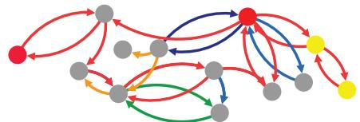
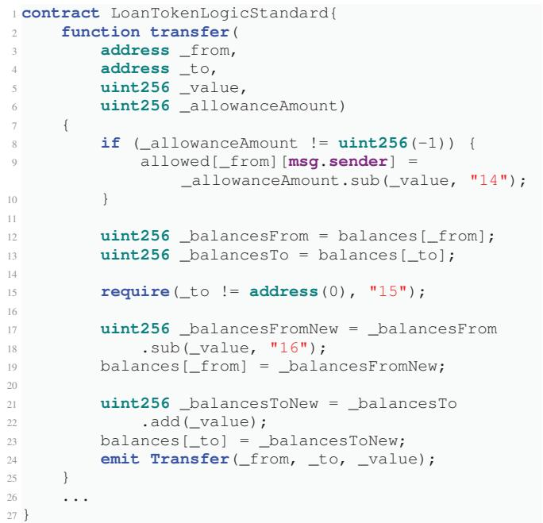
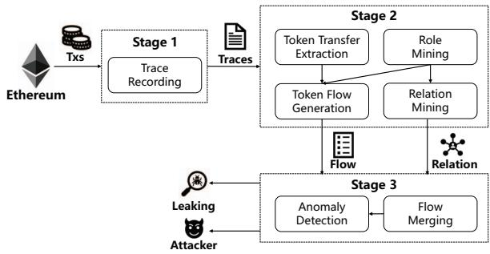
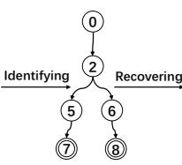
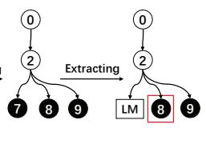
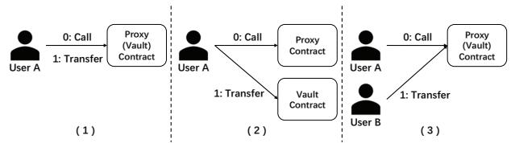
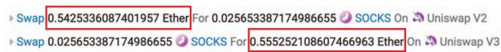

# DeFiWarder: Protecting DeFi Apps from Token Leaking Vulnerabilities

Jianzhong Su †<sup>,#</sup>, Xingwei Lin <sup>#</sup>, Zhiyuan Fang †, Zhirong Zhu †, Jiachi Chen †\*, Zibin Zheng †, Wei Lv <sup>#</sup>, Jiashui Wang ‡<sup>,#</sup>

†Sun Yat-sen University, <sup>#</sup>Ant Group, ‡Zhejiang University

sujzh3@mail2.sysu.edu.cn, xwlin.roy@gmail.com, {fangzhy27, zhuzhr7}@mail2.sysu.edu.cn, {chenjch86,zhzibin}@mail.sysu.edu.cn, {huaxing.lw, jiashui.wjs}@antgroup.com

Abstract—Decentralized Finance (DeFi) apps have rapidly proliferated with the development of blockchain and smart contracts, whose maximum total value locked (TVL) has exceeded 100 billion dollars in the past few years. These apps allow users to interact and perform complicated financial activities. However, the vulnerabilities hiding in the smart contracts of DeFi apps have resulted in numerous security incidents, with most of them leading to funds (tokens) leaking and resulting in severe financial loss. In this paper, we summarize Token Leaking vulnerability of DeFi apps, which enable someone to abnormally withdraw funds that far exceed their deposits. Due to the massive amount of funds in DeFi apps, it is crucial to protect DeFi apps from Token Leaking vulnerabilities. Unfortunately, existing tools have limitations in addressing this vulnerability.

To address this issue, we propose DeFiWarder, a tool that traces on-chain transactions and protects DeFi apps from Token Leaking vulnerabilities. Specifically, DeFiWarder first records the execution logs (traces) of smart contracts. It then accurately recovers token transfers within transactions to catch the funds flow between users and DeFi apps, as well as the relations between users based on role mining. Finally, DeFiWarder utilizes anomaly detection to reveal Token Leaking vulnerabilities and related attack behaviors. We conducted experiments to demonstrate the effectiveness and efficiency of DeFiWarder. Specifically, DeFi-Warder successfully revealed 25 Token Leaking vulnerabilities from 30 Defi apps. Moreover, its efficiency supports real-time detection of token leaking within on-chain transactions. In addition, we summarize five major reasons for Token Leaking vulnerability to assist DeFi apps in protecting their funds.

Index Terms—Smart Contract, DeFi, Token Leaking, Vulnerability

## I. INTRODUCTION

Blockchain and smart contracts have attracted significant attention from both industry and academia. Many popular applications have been implemented in smart contracts and running on Ethereum. Among these applications, Decentralized Finance (DeFi) [1] is one of the most popular types, with the maximum total value locked (TVL) of DeFi exceeding 100 billion dollars in recent years. However, the DeFi ecosystem is plagued by security incidents, such as front-running [2], Pump-and-Dump scams [3], and flash loan attacks [4].

DeFi apps usually utilize an interest mechanism to attract users to deposit funds, based on which they provide several financial services without a centralized entity, such as lending and exchange. Unfortunately, as the development of DeFi apps, the vulnerabilities hiding in smart contracts also become more varied and complex, with some causing the leakage of funds from DeFi apps. In this paper, we summarize the vulnerabilities that enable attackers to abnormally withdraw significantly more tokens (funds) than their deposit, as Token Leaking vulnerabilities of DeFi apps. Recently, due to Token Leaking vulnerabilities and the massive amount of funds in DeFi apps, DeFi apps have suffered several security incidents resulting in more than 29 billion dollars in financial loss [5]. Therefore, it is crucial to protect DeFi apps from Token Leaking vulnerabilities.

Token Leaking vulnerabilities are identified when the withdrawal of funds exceeds the deposit. However, the unique features of DeFi apps present new challenges in vulnerability detection. First, DeFi apps typically consist of multiple contracts and support several modes of deposit and withdrawal (as described in Section IV-C), making fund flows between users and DeFi apps more complicated. Second, DeFi apps may support the deposit and withdrawal of other multiple kinds of token in addition to Ether. Third, DeFi apps allow users to deposit funds and earn interest; users can legally withdraw more funds from DeFi apps than they deposit, which creates a new barrier to Token Leaking vulnerability detection.

Moreover, the root causes of Token Leaking vulnerabilities are complicated due to the various businesses of DeFi apps. On the one hand, some Token Leaking vulnerabilities result from common smart contract weaknesses [6], such as reentrancy and integer overflow. On the other hand, some Token Leaking vulnerabilities are caused by functional bugs, including price manipulation bug [7], etc. However, existing vulnerability detection tools [8]–[15] mainly focus on smart contract weaknesses and have limited ability to reveal functional bugs. Overall, they have limitations in addressing Token Leaking vulnerability.

To this end, we propose a tool called DeFiWarder to trace the on-chain transactions and protect DeFi apps from Token Leaking vulnerabilities. Based on the call flow trees extracted from transactions, DeFiWarder tracks the handlers of calls and mines the roles of related addresses (i.e., user or app); then, it accurately captures the relationship between users and the token flow between users and the DeFi app. Next, DeFiWarder merges the flow of different types of tokens (Ether and ERC20 tokens), calculates the return rates $( \frac { W i t h d r a w a l } { D e p o s i t } )$ , and hunts abnormal cases for revealing Token Leaking vulnerabilities.

To evaluate the effectiveness of DeFiWarder, we collect vulnerable DeFi apps from recent security incidents. According to our manual analysis, we build a benchmark with 30 DeFi apps that have suffered attacks due to Token Leaking vulnerabilities. We applied DeFiWarder exclusively to the historical transactions of these apps and successfully revealed 25 Token Leaking vulnerabilities among them. Furthermore, we evaluated the efficiency of DeFiWarder, and the results demonstrate that DeFiWarder can reveal attack transactions in real time. We also use our benchmark to evaluate the effectiveness of existing vulnerability detection tools and find that they are limited in detecting Token Leaking vulnerabilities.

In summary, our main contributions are as follows:

• <sup>We</sup> <sup>summarize</sup> <sup>Token</sup> <sup>Leaking</sup> <sup>vulnerability</sup> <sup>in</sup> <sup>DeFi</sup> <sup>apps</sup> and proposed a related benchmark for further research.

We design DeFiWarder to trace fund flow and protect DeFi apps from Token Leaking vulnerability. We exclusively applied DeFiWarder to our benchmark, and the experimental results demonstrated the effectiveness of DeFiWarder. In addition, DeFiWarder is efficient for realtime detection on Ethereum.

We manually analyze our benchmark and summarize five major reasons for Token Leaking vulnerabilities to assist DeFi apps in protecting their funds.

Our benchmark and implemented code are available at https://github.com/Demonhero0/DeFiWarder. The remainder of this paper is organized as follows. Section II gives the background related to our approach. Section III presents the definition of Token Leaking vulnerability and our motivation for this work. Section IV details the design of DeFiWarder. Section V presents an extensive experimental evaluation. Section VI summarizes the major reasons for Token Leaking vulnerabilities, discusses special cases of detection, and expands DeFiWarder to detect vulnerability before attacks. Section VIII surveys the related work. Section IX finally concludes this work.

## II. BACKGROUND

## A. Smart Contract and Transaction

In this paper, we focus on smart contracts in Ethereum, which are Turing-complete programs running on top of a blockchain. Once they are deployed, smart contracts run in Ethereum Virtual Machine (EVM) and perform specific behaviors (e.g., token transfer) according to the predefined code, which permanently changes world state (the storage of blockchain) [16]. There are two types of transactions, i.e., external transaction (initiated by an external owned account) and internal transaction (initiated by a smart contract). An external transaction can derive multi-layer internal transactions arranged in a tree structure. In addition, smart contracts may trigger predefined events during execution to record specific behaviors. For example, the ERC20 token contracts emit Transfer event when tokens are transferred [17].

## B. Ethereum Cryptocurrencies

Ether and ERC20 tokens are two common types of cryptocurrencies used on Ethereum and form the basis of economic activity within the platform. Ether is the native token of Ethereum, while ERC20 tokens are third-party tokens implemented by smart contracts that adhere to the ERC20 token standard [17]. We briefly introduce two kinds of tokens related to our work. Wrapped Ether (WETH) [18] is one of the most common ERC20 tokens in Ethereum, which is pegged to Ether and issued by depositing Ether to the corresponding ERC20 contract. Liquidity Provider (LP) Token serves as the pledged shares in the DeFi app and is used to withdraw funds from such applications.

## C. Decentralized Finance (DeFi)

Decentralized Finance (DeFi) apps offer financial services, e.g., lending and exchange, on the blockchain without the need for a centralized entity. Notably, some DeFi apps offer a non-collateral loan called flash loan [4], where the user could borrow and return funds in a single transaction. Similarly to traditional finance, DeFi apps also require investors to supply funds for their financial services. To attract investors, DeFi apps usually offer high interest to incentivize investors to stake funds in their smart contracts. When an investor stakes funds, the DeFi app records the pledged share of the investor by changing storage or issuing LP tokens. DeFi apps provide financial services to earn commissions and interest based on staked funds. Finally, investors can withdraw their funds and earn interest from DeFi apps.

In general, a DeFi app usually comprises multiple smart contracts to implement its functionality, with one of them serving as the proxy contract to handle business directly or forward transactions to other functional contracts.

## III. TOKEN LEAKING VULNERABILITY

In this section, we first define Token Leaking vulnerability of DeFi apps, based on which we summarize the new challenges of detecting Token Leaking. Then, we briefly analyze the causes of Token Leaking vulnerability and discuss the limitations of existing vulnerability detection tools.

## A. Token Leaking

Definition. According to the features of DeFi apps, we define Token Leaking vulnerability as follows,

Definition: A DeFi app contains Token Leaking vulnerability if the untrusted user has the ability to perform token leaking behavior that abnormally withdraw funds far exceed his deposits (i.e., abnormal return rate).

We further provide a detailed illustration of the features of Token Leaking vulnerability, which can be divided into three parts.

Fund flow between users and apps. Fig. 1 shows an example of a transaction that calls to a DeFi app. The nodes and edges in the figure represent addresses and fund transfers, respectively. The red and yellow nodes represent the addresses related to the user and the DeFi app, respectively. We notice that the transfer flow within the transaction is complicated and that only some are related to the DeFi app and the user. Therefore, it is crucial to accurately capture the fund flow between users and DeFi apps for extracting the deposit and withdrawal funds of users.

  
Fig. 1. The token transfers within an attack transaction to a DeFi app. The red nodes means the attacker and his malicious contracts. The yellow nodes means the vault contracts of DeFi app. The grey nodes means addresses other than attacker and the DeFi app. The edges with different colors means the token transfer with different kinds of tokens.

Type of funds. Some DeFi apps support the deposit and withdrawal of various tokens, as indicated by the edges of different colors in Fig. 1. For example, a DeFi app may allow users to deposit token A and withdraw token B through token swap functionality. Therefore, it is necessary to unify the value of different tokens for further analysis.

Abnormal return rate. Users can deposit funds to earn interest in DeFi apps, so it is normal for users to withdraw more funds than they initially deposited. Consequently, an anomaly detection mechanism is required to identify the token leaking against normal behavior.

In general, the unique features and businesses of DeFi apps bring new challenges to vulnerability detection.

## B. Motivation

Various Root Causes. Since DeFi apps provide various businesses based on complex smart contracts, the root causes of Token Leaking vulnerability are also complicated. Some Token Leaking vulnerabilities are caused by common smart contract weaknesses, such as integer underflow [19], and reentrancy [20].

In addition to smart contract weaknesses, most root causes of Token Leaking vulnerabilities are functional bugs. For instance, a DeFi app that uses LP tokens to record the pledged share of investors, which mints (burns) LP tokens when investors deposit (withdraw) tokens. Note that the LP token satisfies the ERC20 token standard, so users can transfer their LP tokens. The Solidity code<sup>1</sup> for the transfer function of LP token is shown in Fig. 2. The wrongly implemented transfer function (line 2) leads to a Token Leaking vulnerability. Assume a situation where the argument \_from (line 3) is equal to the argument \_to (line 4). In this situation, since the balances[\_from] (line 19) would be overwritten by balances[\_to] (line 23), balances[\_to] would be finally updated to balances[\_to] + \_value (line 23) while no user’s balances decreases. To this end, the attacker can exploit this vulnerability by first staking funds to gain X LP tokens, then transferring X LP tokens to himself so that the attacker can hold 2X LP tokens and further using 2X LP tokens to withdraw twice the amount of their initial deposit from the DeFi app.

  
Fig. 2. The simplified transfer function of LP token contract.

In addition, various functional bugs have caused Token Leaking vulnerabilities in security incidents. For example, the DeFi app may not check the success of the token transfer when users deposit funds [21]. In general, the variety of issues (including smart contract weaknesses and functional bugs) that lead to the Token Leaking vulnerability pose significant challenges in protecting DeFi apps from attacks.

Limitation of Existing Tool. Existing detection tools have demonstrated excellent performance in protecting smart contracts from vulnerabilities. However, most approaches (e.g., [8], [9], [13], [14], [22]) focus on smart contract weaknesses. Since they do not handle the transfers of ERC20 tokens and the special businesses of DeFi apps, they can only reveal a small part of the root causes of Token Leaking vulnerability. Furthermore, functional bugs are more common causes of Token Leaking vulnerabilities. These functional bugs are diverse and challenging to address systematically because they are often unique and difficult for researchers to propose the corresponding patterns to detect. Overall, existing tools are limited in their ability to detect Token Leaking vulnerabilities.

The variety of challenges in detecting Token Leaking vulnerability motivates us to design a tool that can effectively detect Token Leaking vulnerabilities in DeFi apps.

  
Fig. 3. Overview of DeFiWarder.

## IV. DEFIWARDER

## A. Overview

We propose DeFiWarder to trace the fund flow of DeFi apps and reveal their Token Leaking vulnerabilities. As shown in Fig. 3, DeFiWarder consists of three stages. It takes in the transaction data from Ethereum and outputs Token Leaking vulnerabilities and the corresponding attackers. The first stage records the execution traces DeFi apps by replaying transactions. The second stage extracts the token transfers and mines the roles (user or app) of related addresses and the relations between users, and then generates the token flow of users. The third stage merges the token flows and performs anomaly detection to reveal Token Leaking vulnerabilities and the corresponding attackers.

## B. Stage 1: Trace Recording

A trace is the execution log of an external transaction executed by smart contracts. Specifically, an external transaction sent to a smart contract may derive several internal transactions to invoke other smart contracts. Thus, the trace can be arranged in a Call Flow Tree (CFT) as shown in Fig. 4 (1). There are two types of nodes in CFT, i.e. transaction nodes and event nodes. Transaction nodes include the external transaction (e.g., 0 ) and the internal transaction (e.g., 1 ), where the directed edge between two transaction nodes indicates that the parent transaction derives an internal transaction. Each transaction node includes the address of the transaction caller and callee, the data carried by the transaction that specifies the invoked function and parameters, the value of the transaction, the type of call (i.e., CALL, CALLCODE, DELEGATECALL, STATICCALL and CREATE). Each event node includes the address of the initiator and the event data. The directed edge between the transaction node and the event node indicates that the event is emitted within the transaction. Using CFT, we can perform token transfer extraction and other in-depth analyzes.

In this stage, we modify the EVM to record the traces of transactions. More precisely, to extract the execution log of an external transaction, we insert the recording code into the function ApplyMessage() <sup>2</sup> that executes external transactions. To process internal transactions, we insert recording code into the call handlers of CALL, CALLCODE, DELEGATECALL, STATICCALL and CREATE, as they are the only ways to generate internal transactions. To record the events, we insert the recording code into the EVM operations of Log. Furthermore, we maintain a call stack to identify the corresponding transaction in which the events are triggered. Specifically, when one of the call handlers is triggered, we push the corresponding transaction onto the call stack. When the handler returns, we pop the top item of the call stack. Thus, we can know the transaction to which the events belong by checking the top item of the call stack.

```matlab
Algorithm 1: Flow and Relation Extraction.
input : Traces of transactions traces, Proxy contract proxy, LP tokens LPs
output: Users' Token flow flows, Users' relations relations
flows := map();
relations := set();
for trace in traces do
    relatedTrees := identify(proxy, traces);
    for tree in relatedTrees do
        tokenTxs := recoverTokenTx(tree);
        users, apps := roleMining(tree);
        rels := relMining(tree, tokenTxs, LPs);
        relations.update(rels);
        for tokenTx in tokenTxs do
            u, action := gen(users, apps, tokenTx);
            flows[u].add(action);
        end
    end
end
```

## C. Stage 2: Flow and Relation Extraction

DeFi apps are usually made up of multiple smart contracts that support various businesses, such as token exchange and lending. As a result, token transfers in DeFi apps have become more complex, making it challenging to extract token transfers between users and DeFi apps. For easier understanding, we define the case where a user transfers tokens in the DeFi app as a deposit action, while the case where the DeFi app transfers tokens to the user as a withdrawal action. For example, a token exchange contains a deposit action and a withdrawal action.

To extract deposit and withdrawal actions, we need to accurately find token transfers between users and DeFi apps and identify the exact token transfers that represent the users and the tokens of deposit (withdrawal) action. However, the various modes of deposit and withdrawal actions in the DeFi apps bring barriers to action extraction.

As shown in Fig. 5, we introduce three common deposit modes and explain the challenges of action extraction. The deposit mode (1) in Fig. 5 is the most straightforward deposit action, where User A directly calls and transfers tokens to Proxy Contract. In this case, we can easily find the exact token transfers. However, some token transfers between users and DeFi apps are complicated. For the deposit mode (2) in Fig. 5, User A calls Proxy Contract while tokens are transferred from User A to Vault Contract (i.e., the contract responsible for handling funds of the DeFi app). In this case, we need to distinguish the vault contract and other contracts related to the DeFi app as the basis for action extraction. For the deposit mode (3) in Fig. 5, User A calls Proxy Contract while the tokens are transferred from User B to Proxy Contract. In this case, caller User A and the depositor (User B) are separated, which means that there exists a relation between User A and User B, and User A may withdraw funds from the DeFi app based on the deposit belonging to User B. Thus, we need to identify the users and discover their relations during the extraction of deposit (withdrawal) actions for more accurate analysis.

  
	  


  
Fig. 4. The whole process of deposit and withdrawal action extraction. LM: LP token minting; 0 : Transaction node; 0 : Event node; 0 : Token transfer node.

In addition to token transfers between users and DeFi apps, there are other token transfers between users or within the DeFi apps, which interfere with analysis. In general, the various ways of deposit (withdrawal) actions make it difficult to capture the token flow between users and DeFi apps and the relations between users.

Based on the recorded traces in Stage 1, DeFiWarder first extracts token transfers, then performs role mining to identify the roles of addresses, discovers the relations between users, and finally captures the token flow between users and DeFi apps. The whole workflow is described in Algorithm 1.

1) Token Transfer Extraction: To extract related token transfers, we first identify all subtrees whose root nodes are the transactions calling to the proxy contracts of DeFi apps. Second, we traverse all related subtrees to recover token transfers, including the transfers of ERC20 tokens and Ether. Identifying Related Subtrees. To avoid interference and increase the efficiency of extraction, we reserve the subtrees that call to proxy contracts of DeFi apps and prune the irrelevant ones. As shown in Fig. 4 (2), we prune the irrelevant subtrees 1 and 3 and reserve the related subtree 2 . In particular, there may be multiple related subtrees in a CFT, and we reserve all of them for the following analysis.

Recovering Token Transfer. After pruning irrelevant subtrees, we recover token transfers within the related subtrees. There are two kinds of token transfers, i.e., ERC20 token and Ether transfers. For ERC20 token transfer, we use ERC20 token standard ABI to identify all events related to ERC20 token transfers and replace them with token transfer nodes that record the details of the token transfer (e.g., “Address A transfers Y token with the amount of X to address B”). For Ether transfer, we retrieve the Ether transfer information from transactions and insert a new token transfer node into the corresponding transaction node. Next, we lift the token transfer nodes as child nodes of the transaction node that calls the proxy contract. For example, in Fig. 4 (3), we replace event nodes 7 and 8 with token transfer nodes 7 and 8 , respectively, and lift them as child nodes of transaction node 2 . We also insert a token transfer node 9 to represent the Ether transfer. In the following parts, we refer to both ERC20 token transfer and Ether transfer as token transfer.

  
Fig. 5. Three common modes of deposit. Users interact with the DeFi app by calling its proxy contract.

2) Role Mining: To capture token transfers between users and DeFi apps, we need to identify the roles of addresses (i.e., user or app). Thus, we utilize a heuristic role-mining method by parsing the call flow. Specifically, we set the initiator of the external transaction (i.e., tx.origin) as the user role and the proxy contract as the app role. As the internal transaction is triggered, the callee is marked with the same role as the caller if the callee has not been marked with any role. For instance, initially, the caller of 0 is the user role, and the callee of 2 is the app role. Through role delivery, the callees of 0 , 1 and 3 become user roles, and the callees of 5 and 6 become app roles. Additionally, we perform a further analysis to refine the roles of addresses. For the app role, we consider the address as an app role if its token transfers are related to many addresses in historical transactions. For the user role, if the user role invokes the proxy contract, we parse the arguments with ABI and consider the address-type arguments as the user role if the addresses are without any role. As a result, we obtain the roles of addresses, based on which we can identify the exact token transfers between users and DeFi apps.

In particular, we exclude trusted addresses (e.g., the creator of proxy contracts) from the user group to avoid interference from privileged addresses. Specifically, we set the creator of proxy contracts as trusted addresses. As the trusted addresses call the proxy contract, we consider the address-type arguments in transactions as trusted addresses.

3) Relation Mining: We notice that several DeFi apps allow users to withdraw funds based on the deposits of other users. LP tokens are often used to record the pledged share of investors. These tokens are minted (burned) for investors during the deposit (withdrawal) process and are represented by tokens transferred from (to) the 0x0 address. As shown in Fig. 4 (4), we convert the token transfer node 7 to a liquidity minting (LM) node representing the minting of LP tokens. However, the use of LP tokens brings new barriers, since users can transfer their pledged shares to others. For the example in Fig. 5 (3), User B transfers funds to the DeFi app and LP tokens are minted for User A, then User A can withdraw the funds by burning the LP tokens. In this case, we may mistakenly attribute the token leaking to User A if we do not have information on the relation between User A and User B. Additionally, some DeFi apps implement this functionality by maintaining their storage, further complicating analysis.

To address this problem, we leverage the information of LP tokens and user roles to establish the relations between users for a more precise analysis. Based on LP tokens, we use the minting of LP tokens in the deposit (withdrawal) action’s subtree to determine the relations between users. For example, if user A calls the proxy contract and transfers tokens to the DeFi app while the LP tokens are minted to user B, we record the relation between user A and user B. In addition, LP tokens can be transferred between users, and we collect the transfers of LP tokens to establish the relations between users. For instance, if user A transfers LP tokens to user B, we record the relation between user A and user B. Moreover, based on the mined user roles, we record the relation between the caller of the proxy contract and the user that transfers tokens to (or receives tokens from) DeFi apps. For example, we record the relation between User A and User B for deposit mode (3) in Fig. 5. To this end, we build complete relations between users. The relations of users are expressed as follows,

$$
r e l s = \{(u s e r _ {A}, u s e r _ {B}, b l o c k, t x) \},
$$

which means the userA establishes a relation with userB at the position tx in the block height block. We describe how to use the relations between users in Section IV-D.

4) Token Flow Generation: Based on the roles of addresses, we capture exact token transfers between users and DeFi apps to generate token flows, as the 8 in Fig. 4 (4). In particular, there may be multiple exact token transfers in a related subtree. For each exact token transfer, we generate a tuple to express the deposit (withdrawal) action of the token sender, which is represented as:

$$
a c t i o n = (b l o c k, t x, a m o u n t, t o k e n, t y p e),
$$

where block is the block height, tx is the transaction’s position in block, amount is the amount of tokens, token is the kinds of the transferred token, and type is the type of action (deposit or withdrawal). And, we group the actions owned by the same user as the token flow (flow) of the user.

## D. Stage 3: Token Leaking Detection

Based on the token flow of users, we first merge the flows of different kinds of tokens. Then we calculate the return rates ( <sup>withdrawal</sup> ) of the merged flow and detect token leaking by deposit identifying the abnormal return rates. The complete workflow is described in Algorithm 2.

```matlab
Algorithm 2: Token Leaking Detection.
input : Users' Token flow flows, Users' relations
    relations, Bar Bar
output: The bool of existing token leaking flag
flag := false;
users := getUsers(flows);
mFlows := mergeFlow(flows);
rateSet := set();
for user in users do
    userFlow := getFlow(mFlows, user);
    for action in userFlow do
        group := getGroup(user, action, relations);
        rate := calRate(mFlows, group, action);
        rateSet.add(rate);
    end
end
Rate := evaluateNormalRate(rateSet, Bar);
for rate in rateSet do
    if rate > Rate then
        flag = true;
    end
end
```

Flow Merging. We notice that some DeFi apps support multiple kinds of token, which interferes with the calculation of return rates. For example, users may deposit token A but withdraw token B, whose value cannot be directly compared. Thus, we merge the flows of different kinds of token to calculate the correct return rates. However, there are numerous kinds of token in Ethereum (e.g., USDT, Ether) whose values differ significantly and may change over time.

To address this problem, we propose an approach to unify the value of tokens to calculate the return rates correctly. We use WETH [18] as the unit of value to calculate the value of tokens. Specifically, we build an exchange rate table between WETH and other tokens according to token swaps from Uniswap V2 (one of the most popular decentralized exchanges) [23]. Based on the exchange rate table, we utilize WETH to calculate the value of other tokens and merge the flows of different tokens into a single flow. Through this approach, we obtain a merged token flow for subsequent analysis. Particularly, if the token flow contains only one kind of token, we directly treat the token flow as a merged flow instead of converting it to WETH so that we can obtain more accurate return rates.

Anomaly Detection. Based on the merged token flows, we calculate return rates and reveal token leaking by detecting the abnormal return rates. We define cumulative deposit (Deposits), cumulative withdrawal (Withdrawals), and return rate (rate) as follows,

$$
\begin{array}{c} D e p o s i t s = \sum a c t i o n. a m o u n t \quad t y p e = d e p o s i t \\ W i t h d r a w l s = \sum a c t i o n. a m o u n t \quad t y p e = w i t h d r a w a l \end{array}
$$

$$
r a t e = \left\{ \begin{array}{l l} \frac {\text {Withdrawals}}{\text {Deposits}} & i f \quad \text {Deposits} > 0 \\ \infty & i f \quad \text {Deposits} = 0 \end{array} \right.
$$

For each user, we traverse his merged token flow and calculate the return rate at each action. For each action in flow, we first recursively search for related users that have a relation with user and group them together. Then we sum up their Deposits and Withdrawls respectively before the action, based on which we further calculate the return rate rate. There are three cases of return rates, 1) the return rate is less than or equal to 1, we ignore these cases; 2) the return rate is $\infty ,$ we directly report token leaking since the user withdraws tokens but deposits nothing; 3) the return rate is not ∞ and greater than 1, we collect these cases and hunt abnormal return rates among them. Specifically, we first include the return rates less than $B a r = 5$ and calculate their average value ave and standard deviation std. Then, we set the bar of normal return rate as $R a t e = a v e + 5 *$ std and identify token leaking if the return rate rate is greater than the bar Rate. In this way, we can effectively discover the abnormal cases produced by attackers.

In addition, some cases exist where the attacker obtains additional benefits within one transaction (e.g., flash load attack). These behaviors are unreasonable since DeFi apps normally require users to deposit their tokens in some time to receive benefits. Thus, we also consider them as token leaking behaviors. To detect this kind of behavior, if the user has not deposited any funds in the DeFi app or the user has withdrawn all deposits from the DeFi app, we perform the above-mentioned anomaly detection approach on the flow within a single transaction with $R a t e = 1$ so that DeFiWarder can reveal the abnormal behaviors in which users obtain additional benefits within one transaction if the return rates exceed Rate.

## V. EXPERIMENTAL EVALUATION

In this section, we conduct experiments to evaluate the performance of DeFiWarder and aim to answer the following research questions:

RQ1. How does DeFiWarder perform in detecting Token Leaking vulnerabilities?

RQ2. How do existing tools perform in Token Leaking vulnerabilities?

RQ3. What about the efficiency of DeFiWarder?

## A. Experimental Setup

1) Benchmark: To build the benchmark for the evaluation of DeFiWarder, we searched for security incidents from May 2020 to June 2022 in two well-known blockchain attack incident libraries, i.e., Slowmist [5] and Rekt [24]. We totally collected 30 attacked DeFi apps that satisfy the following conditions: 1) the funds leak due to bugs, excluding incidents related to social engineering (e.g., rug pull and private key leak); 2) the leaking funds involve only a single kind of token or the tokens allowed to swap in Uniswap ${ \tt V } 2 .$ Table I displays the vulnerable DeFi apps and their root causes. We observed several factors that resulted in Token Leaking vulnerabilities, such as Arithmetic weakness and Improper token transfer (cf. Section VI-A). These factors pose significant challenges to automated detection approaches.

2) Data Preparation: We manually collected the deployed block heights, proxy contracts, and LP tokens of DeFi apps. After that, we replayed their historical transactions and saved the related transactions that satisfy one of the following conditions: 1) include external or internal transactions calling proxy contracts; 2) involve token transfers from (to) proxy contracts; 3) include token transfers of the LP tokens. As a result, we obtain the related transactions of each DeFi app for further experiments.

To merge the flows of different types of tokens, we need to construct an exchange rate table between WETH and other tokens. Specifically, we searched for the factory contracts of Uniswap V2 that support the swapping of WETH and other tokens. Then, we replayed the historical transactions and collected Swap events (i.e., swap X amount of token A for Y amount of token B) of these contracts. Based on these events, we obtained the exchange rate between tokens over time and built the exchange rate table between WETH and other tokens. We also collected the ABIs of smart contracts from Etherscan (a leading block explorer and analytic platform for Ethereum)<sup>3</sup> for transaction parsing.

3) Implementation and Configurations: We implemented DeFiWarder on the top of an off-chain execution environment [25], which enables us to execute transactions with a predefined world state of Ethereum. Consequently, we could replay transactions and record traces for in-depth analysis. DeFiWarder is implemented in Go [26] with approximately 3000 lines of code.

To replay smart contract transactions, we prepared the Substate Database Snapshot [25], which divides the world state of Ethereum by recording the storage used in each transaction. To generate the snapshot, we first collected the raw blockchain data of Ethereum and then generated the Substate Database Snapshot from 0 to 15 million block heights. In addition, all experiments were conducted on a Ubuntu machine with an Intel(R) Core(TM) i9-10980XE(3.00GHz) CPU (36 cores and 72 threads) and 256GB of memory.

## B. RQ1: Effectiveness of DeFiWarder

In this RQ, we evaluate the effectiveness of DeFiWarder in detecting Token Leaking vulnerabilities. We used DeFiWarder to analyze the related historical transactions of DeFi apps in our benchmark. The RQ1 column of Table I demonstrates the experimental results. We note that the output of DeFiWarder are the transactions containing token leaking behaviors. Based on the collected security incidents and the Etherscan labels, we divided the reported token leaking behaviors into two types, 1) True positive means that the reported issue is caused by vulnerabilities. 2) False positive means that the reported issue is not caused by vulnerabilities. In particular, we do not consider the cases caused by the legal operation of maintainers as false positive. The DeFi app containing both TP and FP is the case where DeFiWarder reports both TP and FP token leaking behaviors.

THE EXPERIMENTAL RESULTS OF EVALUATING DEFIWARDER AND OTHER TOOLS ON OUR BENCHMARK. #TP MEANS THE NUMBER OF TRUE POSITIVES, #FP MEANS THE NUMBER OF FALSE POSITIVE. # ALL MEANS THE NUMBER OF ALL DEFI APPS WITH TOKEN LEAKING VULNERABILITY.  
TABLE I

<table><tr><td rowspan="2">Root Cause</td><td colspan="2">RQ1</td><td colspan="2">RQ2</td></tr><tr><td>#TP</td><td>#FP</td><td>#TP</td><td>#ALL</td></tr><tr><td>Arithmetic weakness</td><td>1</td><td>0</td><td>0</td><td>1</td></tr><tr><td>Access control</td><td>2</td><td>1</td><td>0</td><td>2</td></tr><tr><td>Control-flow hijack</td><td>6</td><td>2</td><td>4</td><td>8</td></tr><tr><td>Improper token transfer</td><td>4</td><td>0</td><td>/</td><td>6</td></tr><tr><td>Price manipulation</td><td>10</td><td>3</td><td>/</td><td>10</td></tr><tr><td>Other functional bugs</td><td>2</td><td>1</td><td>/</td><td>3</td></tr><tr><td>All</td><td>25</td><td>7</td><td>4</td><td>30</td></tr></table>

The experimental results demonstrated the effectiveness of DeFiWarder, it successfully revealed the Token Leaking vulnerabilities of 25 out of 30 DeFi apps from the historical transactions. Among them, 18 DeFi apps are only reported issues caused by vulnerabilities, which means that DeFiWarder can hunt Token Leaking vulnerabilities with acceptable precision. In particular, DeFiWarder successfully detected all Token Leaking vulnerabilities caused by Price manipulation bug, which is one of the most common vulnerabilities in DeFi apps. In addition, some DeFi apps have suffered multiple attacks, and DeFiWarder also accurately captured the token leaking behaviors of each attack. In general, DeFiWarder can reveal Token Leaking vulnerabilities regardless of their root causes, which is critical for automated detection approaches.

Within the reported token leaking behaviors, DeFiWarder reports false positives for 7 DeFi apps. We manually analyze them and list the reasons as follows, 1) The deposit certificate or LP tokens can be obtained from other DeFi apps. For instance, the user deposits tokens and obtains LP tokens from other DeFi app, then utilizes the LP tokens to withdraw funds from the detected DeFi app. In this case, DeFiWarder fails to obtain the deposited funds of the user and reports a false positive of token leaking; 2) The rise of the token price increases the calculated return rate. For example, if the tokens redeemed by users are twice as valuable as when deposited, DeFiWarder would consider the user withdrawing twice as many funds as deposited funds. Fortunately, these cases are unusual, since most users withdraw funds soon after deposit and the token prices do not change too much; 3) Some DeFi apps allow users to withdraw tokens based on deposited NFTs [27], whose value cannot be calculated by DeFiWarder.

Besides, DeFiWarder failed to reveal Token Leaking vulnerabilities in 5 DeFi apps. Through manual analysis of the extracted token flow and security incidents, we summarize the main reasons as follows: 1) Token Leaking vulnerabilities in the cross-chain DeFi apps (e.g., Qubit Bridge [28]) lead to token leak to other blockchain platforms, which require transactions on the target chains to detection; 2) The attacker steals the tokens approved by other users for the DeFi app, and the tokens are directly transferred from other users to the attacker without passing through the DeFi app.

## C. RQ2: Effect of Existing Tools

We also evaluate the effectiveness of existing tools in detecting Token Leaking vulnerabilities. We mainly consider smart contract vulnerability detection tools that satisfy the following conditions: 1) publicly available; 2) published at top conferences/journals or well known in industry (e.g., have received thousands of stars on Github). Consequently, we included Smartian [9], ConFuzzius [29], Securify [30], Sailfish [31], Mythril [32], Slither [33] and AChecker [34] for evaluation. To conduct the experiment, we first collected the Solidity code of contracts, bytecode, and ABIs of DeFi apps from Etherscan. Then, we ran these tools on each DeFi app for 30 minutes.

Since existing tools are not specifically designed to detect Token Leaking vulnerabilities, we evaluate their effectiveness in detecting the root causes of the Token Leaking vulnerabilities. The root causes and experimental results are shown in the RQ2 column of Table I. Note that the tools can only deal with Arithmetic weakness, Access control and Control-flow hijack. We found that the tools only successfully detected Controlflow hijack in 4 DeFi apps, while they failed to discover other root causes. This is because 1) these tools encountered errors during the detection process (e.g., some tools failed to deal with the smart contracts with some versions); 2) the complexity of contracts in DeFi apps made vulnerabilities hide in deep paths and hard to reveal; 3) these tools lack the ability to detect the functional bugs, which serve as the root causes of more than half of Token Leaking. Overall, the experimental results show that existing vulnerability detection tools have limited effectiveness in detecting Token Leaking vulnerabilities of DeFi apps. Furthermore, the various root causes of Token Leaking need to design the corresponding patterns to detect, while DeFiWarder can address these issues by directly hunting the token leaking behaviors.

## D. RQ3: Efficiency of DeFiWarder

To evaluate the efficiency of DeFiWarder in real-time detection, we conducted this experiment to evaluate its performance in extracting the traces and detecting Token Leaking vulnerabilities. Instead of replaying all historical transactions, we only replayed the related transactions of DeFi apps, since the sparsity of related transactions among all historical transactions would make the evaluation less effective. In total, we replayed more than 180,000 related transactions and recorded the average execution time of each stage per transaction.

TABLE II  
THE TIME CONSUMPTION OF ANALYING PER TRANSACTIONS BY DEFIWARDER. ”ORIGIN” MEANS THE ORIGINAL TIME CONSUMPTION OF EXECUTING TRANSACTIONS BY EVM. ”ADDITIONAL” MEANS THE MORE TIME CONSUMPTION OF DEFIWARDER THAN ”ORIGIN”.

<table><tr><td>Stage</td><td>Avg. Time ( $10^{-3}$  second)</td></tr><tr><td>Origin</td><td>4.86</td></tr><tr><td>Stage 1: Trace Recording</td><td>5.28</td></tr><tr><td>Stage 2: Flow and Relation Extraction</td><td>0.04</td></tr><tr><td>Stage 3: Token Leaking Detection</td><td>0.14</td></tr><tr><td>Total</td><td>5.46</td></tr><tr><td>Additional</td><td>0.6</td></tr></table>

We also recorded the original time consumption of executing transactions by the EVM for comparison. The experimental results are shown in Table II.

From the results, we observed that DeFiWarder has a minimal overhead, consuming only 12% $\big ( \frac { 0 . 6 } { 4 . 8 6 } \big )$ ) more time than the original EVM. It is worth noting that the average TPS (Transaction Per Second) of Ethereum is 12.4 [35], while the TPS of DeFiWarder is 183.2 $( \frac { 1 0 0 0 } { 5 . 4 6 } )$ ). Thus, through scanning and executing the transactions in the pending transaction pool (including the transactions waiting to be executed and recorded on blockchain), DeFiWarder has the ability to reveal the Token Leaking vulnerabilities before the attack transactions are recorded on blockchain. Moreover, even if the attack transactions are executed and recorded on blockchain, DeFi-Warder can immediately identify the token leaking behaviors in attack transactions and report them to DeFi apps to prevent subsequent attacks. In fact, some DeFi apps are attacked multiple times in a short time. For example, Akropolis app [20] had been attacked more than ten times in 15 minutes. If we can detect the first attack and implement emergency protective measures, a huge number of funds could be rescued.

## VI. DISCUSSION

## A. Causes of Token Leaking vulnerability

Arithmetic weakness. The incorrect implementation of arithmetic (e.g., integer underflow/overflow and imprecise arithmetic) is commonly exploited to steal funds from DeFi apps. For example, the attacker specifies an amount greater than his deposit to withdraw many tokens since the underflow of the variable recording the balance of the attacker [19].

Access control. Access control [34] is a common weakness in traditional programs and smart contracts. For example, lack of access control for essential functions (e.g., initialize) allows attackers to change the critical variable of the contract and withdraw huge funds from the DeFi app [36].

Control-flow hijack. Among the root causes in Table I, Control-flow hijack [37] is a common weakness that allows the attacker to steal funds from DeFi apps by hijacking the control flow of contract execution. In particular, reentrancy [38] is well-known that allows the attacker to make a recursive call back to the contracts for stealing funds. In addition, some attackers perform parameter injection attacks that use malicious parameters to call the vulnerable contracts for illegal benefits (e.g. make the contract transfer the approved tokens from other users to the attacker [39]).

  
Fig. 6. An arbitrage transaction.

Improper token transfer. Improper token transfers could lead to Token Leaking vulnerability. Most DeFi apps issue LP tokens to record the pledged share of investors. Consequently, functional bugs in the contracts of LP tokens may enable attackers to abnormally obtain a large number of LP tokens and withdraw funds from DeFi apps (as described in Section III. Additionally, some DeFi apps lack the check of deposited tokens, including the addresses and transfer of tokens. For example, since the DeFi app does not check the success of the token transfer to the DeFi app, the attacker can obtain LP tokens without depositing any tokens, based on which the attacker can withdraw funds from the DeFi app [21].

Price manipulation. The poor implementation of a price oracle allows attackers to initiate price manipulation attacks [7]. For example, the attacker firstly deposits some tokens in the DeFi app, then uses flash load to increase the price of the deposited tokens, and withdraws tokens from the DeFi app that far exceed his deposits.

## B. Special Cases

In addition to Token Leaking, DeFiWarder also found other special cases, i.e., arbitrage and air drop, in the historical transactions of DeFi apps.

Arbitrage means the user utilizes the price mechanism of DeFi apps to make a profit. For example, users can transfer tokens between exchanges to earn profit from the difference in exchange rate. As shown in Fig. 6, we use an example transaction [40] reported by DeFiWarder to explain. The user swaps 0.54 Ether to 0.026 SOCKS tokens in Uniswap V2, and then swaps 0.026 SOCKS tokens to 0.55 Ether in Uniswap v3. For detected Uniswap V3, DeFiWarder calculates the value of SOCKS as 0.54 Ether according to the exchange rate from Uniswap V2. Since the return rate $( \frac { 0 . 5 5 } { 0 . 5 4 } )$ of a single transaction is greater than 1, DeFiWarder also reported this case (cf. Section IV-D).

Air drop [41] means that the DeFi app distributes tokens to users that meet specific requirements, which serve as a common way of gaining attention and new followers. As a result, air drop tokens would be directly transferred from the DeFi app to the users who have not deposited any funds. DeFiWarder found these cases in some DeFi apps.

## C. Detecting Token Leaking Before Attacks

Despite its ability to reveal Token Leaking vulnerabilities in real-time, DeFiWarder is not able to prevent all attacks and financial losses. To further improve its usefulness, we aim to extend DeFiWarder to detect vulnerabilities before attacks take place. Specifically, we combine DeFiWarder with fuzzing, which is responsible for generating transactions to test DeFi apps in a simulated Ethereum environment. For each DeFi app in our benchmark, we first replay its related transactions to initialize the simulated Ethereum environment before the DeFi app is attacked. Then, we perform fuzzing on each DeFi app for 30 minutes. The results show that we successfully detected three vulnerable DeFi apps before they were attacked, which could prevent the loss of around 17 million dollars. Combining DeFiWarder with fuzzing demonstrates the feasibility of detecting Token Leaking vulnerabilities before they are exploited.

## VII. THREATS TO VALIDITY

Internal Validity. We collected DeFi apps’ proxy contracts and LP tokens for our study by manually analyzing their transactions. The accuracy of the collected data directly impacts the effectiveness of DeFiWarder. For example, if an LP token of a DeFi app is not collected, DeFiWarder may not accurately construct the relations between users and may report false positives. Therefore, our authors perform a double check to ensure the correctness of the data. Another aspect of internal validity concerns the evaluation on a limited benchmark. We had to devote considerable time to collecting the proxy contracts and LP tokens of DeFi apps, which limits the implementation of large-scale experiments. But various and representative DeFi apps in our benchmark can prove the validity of the evaluation. Fortunately, developers can easily and correctly provide these data and utilize DeFiWarder to protect DeFi apps in practice. External Validity. In this work, we focused on token flow that includes tokens with exchange rates, as the absence of an exchange rate would render value calculation and detection ineffective. Nevertheless, developers can provide exchange rates for the related tokens of DeFi apps to address these issues. Another aspect of external validity concerns the abnormal threshold Bar, we established a general threshold (Bar = 5) for DeFiWarder that is suitable for most of DeFi apps. Although the setting of the threshold may lead to false positives in some exceptional cases, developers can adjust the threshold according to the actual needs in practice.

## VIII. RELATED WORK

## A. Ether Leaking and Token Leaking

Ether Leaking [42] has been widely studied in previous studies. Nikolic et al. [42] summarized Ether Leaking that´ the untrusted user has the ability to arbitrarily withdraw Ether without any deposit. They further proposed MAIAN to precisely specify and reason about trace properties based on symbolic analysis. So et al. [9] utilized language models to guide symbolic execution to hunt vulnerable transaction sequences. Some approaches were based on fuzzing. He et al. [43] used imitation learning to make the fuzzer learn from a symbolic executor to increase efficiency. Choi et al. [10] combined static and dynamic analysis to promote fuzzer to generate test cases covering deep paths. And, Su et al. [8] proposed a vulnerability-guided fuzzer based on reinforcement learning. These approaches have demonstrated incredible effectiveness in detecting Ether Leaking. However,

Ether Leaking and Token Leaking are two different types of vulnerabilities in smart contracts.

Differences. First, Ether Leaking only considers the fund flow of a single contract, while Token Leaking considers the fund flow of multiple contracts. Second, Ether Leaking only considers the transfers of Ether, while Token Leaking considers the funds of multiple kinds of token (e.g., Ether and ERC20 tokens). Third, if the leaked fund to the user is greater than the fund sent from the user, it will be identified as an Ether Leaking, which is not suitable for Token Leaking because of the special business of DeFi apps (e.g., the user earns interest from DeFi apps). Thus, existing tools for Ether Leaking detection cannot be directly applied to Token Leaking detection.

## B. Transaction Analysis

Smart contracts execute specific behaviors according to the receiving transactions, and researchers use the execution information for in-depth analysis. Some approaches focus on revealing weaknesses within smart contracts [14], [44], [45]. For example, Zhou et al. [13] collect transaction logs and reveal adversarial transactions by matching the logs with adversarial transaction signatures. Zhang et al. [15] proposed a generic and logic-driven framework, TxSpector, to uncover past attacks in historical transactions. In addition, some approaches utilized the high-level DeFi semantics to analyze transactions [46]–[49]. For example, Zhou et al. [46] adopt the Bellman-Ford-Moore algorithm and the logical DeFi protocol models to discover profit-generating transactions. Wu et al. [7] proposed DeFiRanger that recovers high-level DeFi semantics by constructing a cash flow tree and detects price manipulation attacks using predefined patterns. Particularly, price manipulation is a common attack method of Token Leaking.

Differences. To protect the funds of DeFi apps, the abovementioned approaches design specific patterns for different kinds of vulnerability, and few of them detect functional bugs, while DeFiWarder directly hunts Token Leaking regardless of various root causes.

## IX. CONCLUSION

In this paper, we originally summarize Token Leaking vulnerability of DeFi apps and provide a benchmark for further research. Then, we propose DeFiWarder, which accurately mines the roles of related addresses and the relations between users, extracts the fund flow between users and DeFi apps, and reveals Token Leaking vulnerabilities by anomaly detection. We applied DeFiWarder to our benchmark to evaluate its effectiveness and efficiency. Specifically, DeFiWarder successfully revealed 25 Token Leaking with acceptable precision. Moreover, it is efficient enough to support real-time revealing token leaking behaviors in transactions on the Ethereum network. In addition, we evaluated the effectiveness of existing tools on our benchmark and found that they have limitations in detecting Token Leaking vulnerabilities of DeFi apps. We further summarize five major reasons for Token Leaking vulnerability to assist DeFi apps in protecting their funds.

## ACKNOWLEDGMENT

The research is supported by the National Key R&D Program of China (2020YFB1006002), the National Natural Science Foundation of China under project (62032025).

## REFERENCES

[1] F. Victor and A. M. Weintraud, “Detecting and quantifying wash trading on decentralized cryptocurrency exchanges,” ser. WWW ’21. New York, NY, USA: Association for Computing Machinery, 2021, p. 23–32. [Online]. Available: https://doi.org/10.1145/3442381.3449824

[2] P. Daian, S. Goldfeder, T. Kell, Y. Li, X. Zhao, I. Bentov, L. Breidenbach, and A. Juels, “Flash boys 2.0: Frontrunning in decentralized exchanges, miner extractable value, and consensus instability,” in 2020 IEEE Symposium on Security and Privacy (SP), 2020, pp. 910–927.

[3] J. Kamps and B. Kleinberg, “To the moon: defining and detecting cryptocurrency pump-and-dumps,” Crime Science, vol. 7, no. 1, pp. 1– 18, 2018.

[4] K. Qin, L. Zhou, B. Livshits, and A. Gervais, “Attacking the defi ecosystem with flash loans for fun and profit,” in Financial Cryptography and Data Security: 25th International Conference, FC 2021, Virtual Event, March 1–5, 2021, Revised Selected Papers, Part I. Springer, 2021, pp. 3–32.

[5] “Slowmist hacked events,” 2022. [Online]. Available: https://hacked.slowmist.io/

[6] “Swc registry,” 2022. [Online]. Available: https://swcregistry.io/

[7] S. Wu, D. Wang, J. He, Y. Zhou, L. Wu, X. Yuan, Q. He, and K. Ren, “Defiranger: Detecting price manipulation attacks on defi applications,” arXiv preprint arXiv:2104.15068, 2021.

[8] J. Su, H.-N. Dai, L. Zhao, Z. Zheng, and X. Luo, “Effectively generating vulnerable transaction sequences in smart contracts with reinforcement learning-guided fuzzing,” in 37th IEEE/ACM International Conference on Automated Software Engineering, ser. ASE22. New York, NY, USA: Association for Computing Machinery, 2023. [Online]. Available: https://doi.org/10.1145/3551349.3560429

[9] S. So, S. Hong, and H. Oh, “SmarTest: Effectively hunting vulnerable transaction sequences in smart contracts through language model-guided symbolic execution,” in 30th USENIX Security Symposium (USENIX Security 21), 2021, pp. 1361–1378.

[10] J. Choi, D. Kim, S. Kim, G. Grieco, A. Groce, and S. K. Cha, “Smartian: Enhancing smart contract fuzzing with static and dynamic data-flow analyses,” in 2021 36th IEEE/ACM International Conference on Automated Software Engineering (ASE), 2021, pp. 227–239.

[11] S. Kalra, S. Goel, M. Dhawan, and S. Sharma, “Zeus: analyzing safety of smart contracts.” in Ndss, 2018, pp. 1–12.

[12] J. Krupp and C. Rossow, “teEther: Gnawing at Ethereum to Automatically Exploit Smart Contracts,” in 27th USENIX Security Symposium (USENIX Security 18), 2018, pp. 1317–1333.

[13] S. Zhou, Z. Yang, J. Xiang, Y. Cao, M. Yang, and Y. Zhang, “An ever-evolving game: Evaluation of real-world attacks and defenses in ethereum ecosystem,” in Proceedings of the 29th USENIX Conference on Security Symposium, ser. SEC’20. USA: USENIX Association, 2020.

[14] L. Su, X. Shen, X. Du, X. Liao, X. Wang, L. Xing, and B. Liu, “Evil under the sun: Understanding and discovering attacks on ethereum decentralized applications.” in USENIX Security Symposium, 2021, pp. 1307–1324.

[15] M. Zhang, X. Zhang, Y. Zhang, and Z. Lin, “Txspector: Uncovering attacks in ethereum from transactions,” in Proceedings of the 29th USENIX Conference on Security Symposium, ser. SEC’20. USA: USENIX Association, 2020.

[16] “Solidity documentation,” 2022. [Online]. Available: https://docs.soliditylang.org/en/v0.8.16/

[17] “Erc-20 token standard,” 2022. [Online]. Available: https://ethereum.org/en/developers/docs/standards/tokens/erc-20/

[18] “Wrapped ether (weth),” 2023. [Online]. Available: https://etherscan.io/token/0xC02aaA39b223FE8D0A0e5C4F27eAD9083 C756Cc2

[19] “Umbrella network hacked,” 2022. [Online]. Available: https://medium.com/uno-re/umbrella-network-hacked-700k-lost 97285b69e8c7

[20] “Akropolis hacked,” 2020. [Online]. Available: https://akropolis.substack.com/p/delphi-savings-pool-exploit

[21] “Visor finance hacked events,” 2021. [Online]. Avail able: https://medium.com/visorfinance/post-mortem-for-vvisr-staking contract-exploit-and-upcoming-migration-7920e1dee55a

[22] Z. Liao, Z. Zheng, X. Chen, and Y. Nan, “Smartdagger: A bytecode-based static analysis approach for detecting cross-contract vulnerability,” in Proceedings of the 31st ACM SIGSOFT International Symposium on Software Testing and Analysis, ser. ISSTA 2022. New York, NY, USA: Association for Computing Machinery, 2022, p. 752–764. [Online]. Available: https://doi.org/10.1145/3533767.3534222

[23] “Uniswap v2,” 2022. [Online]. Available: https://uniswap.org/

[24] “Rekt,” 2022. [Online]. Available: https://rekt.news/

[25] Y. Kim, S. Jeong, K. Jezek, B. Burgstaller, and B. Scholz, “An off-the chain execution environment for scalable testing and profiling of smart contracts.” in USENIX Annual Technical Conference, 2021, pp. 565–579.

[26] “Go,” 2022. [Online]. Available: https://go.dev/doc/

[27] “Erc-721 token standard,” 2023. [Online]. Available: https://ethereum.org/en/developers/docs/standards/tokens/erc-721/

[28] “Qubit bridge hacked,” 2022. [Online]. Avail able: https://certik.medium.com/qubit-bridge-collapse-exploited-to-the tune-of-80-million-a7ab9068e1a0

[29] C. F. Torres, A. K. Iannillo, A. Gervais, and R. State, “Confuzzius: A data dependency-aware hybrid fuzzer for smart contracts,” in 2021 IEEE European Symposium on Security and Privacy (EuroS&P), 2021, pp. 103–119.

[30] P. Tsankov, A. Dan, D. Drachsler-Cohen, A. Gervais, F. Bunzli, and¨ M. Vechev, “Securify: Practical security analysis of smart contracts,” in Proceedings of the 2018 ACM SIGSAC Conference on Computer and Communications Security, ser. CCS ’18. New York, NY, USA: Association for Computing Machinery, 2018, p. 67–82. [Online]. Available: https://doi.org/10.1145/3243734.3243780

[31] P. Bose, D. Das, Y. Chen, Y. Feng, C. Kruegel, and G. Vigna, “Sailfish: Vetting smart contract state-inconsistency bugs in seconds,” in 2022 IEEE Symposium on Security and Privacy (SP), 2022, pp. 161–178.

[32] B. Mueller, “Smashing ethereum smart contracts for fun and real profit,” in 9th Annual HITB Security Conference (HITBSecConf), vol. 54, 2018.

[33] J. Feist, G. Grieco, and A. Groce, “Slither: a static analysis framework for smart contracts,” in 2019 IEEE/ACM 2nd International Workshop on Emerging Trends in Software Engineering for Blockchain (WETSEB). IEEE, 2019, pp. 8–15.

[34] A. Ghaleb, J. Rubin, and K. Pattabiraman, “Achecker: Statically detecting smart contract access control vulnerabilities,” in 2023 IEEE/ACM 45th International Conference on Software Engineering (ICSE), 2023, pp. 945–956.

[35] “Etherscan,” 2023. [Online]. Available: https://etherscan.io/

[36] “Punk hacked,” 2021. [Online]. Available: https://rekt.news/zh/punkprotocol-rekt/

[37] M. Ye, Y. Nan, Z. Zheng, D. Wu, and H. Li, “Detecting state inconsistency bugs in dapps via on-chain transaction replay and fuzzing,” in Proceedings of the 32nd ACM SIGSOFT International Symposium on Software Testing and Analysis, ser. ISSTA 2023. New York, NY, USA: Association for Computing Machinery, 2023, p. 298–309. [Online]. Available: https://doi.org/10.1145/3597926.3598057

[38] L. Luu, D.-H. Chu, H. Olickel, P. Saxena, and A. Hobor, “Making smart contracts smarter,” in Proceedings of the 2016 ACM SIGSAC Conference on Computer and Communications Security, ser. CCS ’16. New York, NY, USA: Association for Computing Machinery, 2016, p. 254–269. [Online]. Available: https://doi.org/10.1145/2976749.2978309

[39] “dydx hacked events,” 2021. [Online]. Available: https://dydx.exchange/blog/deposit-proxy-post-mortem

[40] “Arbitrage transaction example,” 2021. [Online]. Available: https://etherscan.io/tx/0x3e39eedbd070297eb4f9e608cc70a24a099817ec a7f5d54ed9339d1a8e7d4039

[41] “Air drop,” 2023. [Online]. Available: https://support.blockchain.com/hc/en-us/articles/4749069686812- What-is-an-airdrop-

[42] I. Nikolic, A. Kolluri, I. Sergey, P. Saxena, and A. Hobor, ´ “Finding the greedy, prodigal, and suicidal contracts at scale,” in Proceedings of the 34th Annual Computer Security Applications Conference, ser. ACSAC ’18. New York, NY, USA: Association for Computing Machinery, 2018, p. 653–663. [Online]. Available: https://doi.org/10.1145/3274694.3274743

[43] J. He, M. Balunovic, N. Ambroladze, P. Tsankov, and M. Vechev,´ “Learning to fuzz from symbolic execution with application to smart contracts,” in Proceedings of the 2019 ACM SIGSAC Conference on

Computer and Communications Security, ser. CCS ’19. New York, NY, USA: Association for Computing Machinery, 2019, p. 531–548. [Online]. Available: https://doi.org/10.1145/3319535.3363230

[44] C. F. Torres, R. Camino, and R. State, “Frontrunner jones and the raiders of the dark forest: An empirical study of frontrunning on the ethereum blockchain,” arXiv preprint arXiv:2102.03347, 2021.

[45] D. Perez and B. Livshits, “Smart contract vulnerabilities: Vulnerable does not imply exploited.” in USENIX Security Symposium, 2021, pp. 1325–1341.

[46] L. Zhou, K. Qin, A. Cully, B. Livshits, and A. Gervais, “On the justin-time discovery of profit-generating transactions in defi protocols,” in 2021 IEEE Symposium on Security and Privacy (SP), 2021, pp. 919– 936.

[47] T. Chen, Y. Zhang, Z. Li, X. Luo, T. Wang, R. Cao, X. Xiao, and X. Zhang, “Tokenscope: Automatically detecting inconsistent behaviors of cryptocurrency tokens in ethereum,” in Proceedings of the 2019 ACM SIGSAC Conference on Computer and Communications Security, ser. CCS ’19. New York, NY, USA: Association for Computing Machinery, 2019, p. 1503–1520. [Online]. Available: https://doi.org/10.1145/3319535.3345664

[48] Z. He, S. Song, Y. Bai, X. Luo, T. Chen, W. Zhang, P. He, H. Li, X. Lin, and X. Zhang, “Tokenaware: Accurate and efficient bookkeeping recognition for token smart contracts,” ACM Trans. Softw. Eng. Methodol., aug 2022, just Accepted. [Online]. Available: https://doi.org/10.1145/3560263

[49] L. Zhou, K. Qin, C. F. Torres, D. V. Le, and A. Gervais, “High-frequency trading on decentralized on-chain exchanges,” in 2021 IEEE Symposium on Security and Privacy (SP), 2021, pp. 428–445.