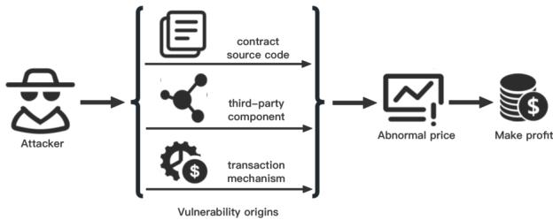
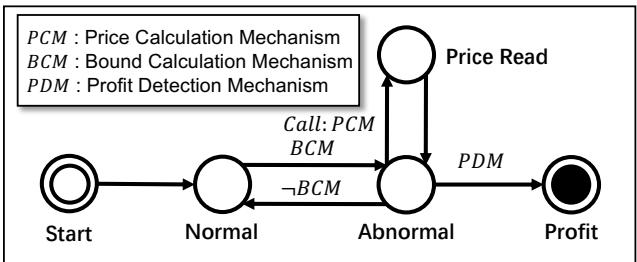

# DeFort: Automatic Detection and Analysis of Price Manipulation Aacks in DeFi Applications

Maoyi Xie Nanyang Technological University Singapore, Singapore maoyi001@e.ntu.edu.sg

Cen Zhang Nanyang Technological University Singapore, Singapore cen001@e.ntu.edu.sg

Yue Xue MetaTrust Labs Singapore, Singapore xueyue@metatrust.io

Ming Hu<sup>∗</sup> Nanyang Technological University Singapore, Singapore hu.ming@ntu.edu.sg

Yebo Feng Nanyang Technological University Singapore, Singapore yebo.feng@ntu.edu.sg

Hao Zhang MetaTrust Labs Singapore, Singapore zhanghao@metatrust.io

Yang Liu Nanyang Technological University Singapore, Singapore yangliu@ntu.edu.sg

Ziqiao Kong Nanyang Technological University Singapore, Singapore ziqiao001@e.ntu.edu.sg

Haijun Wang Xi’an Jiaotong University Xi’an, China haijunwang@xjtu.edu.cn

Ye Liu Nanyang Technological University Singapore, Singapore ye.liu@ntu.edu.sg

## ABSTRACT

Although Decentralized Finance (DeFi) applications facilitate tamper proof transactions among multiple anonymous users, since attack ers can access the smart contract bytecode directly, vulnerabilities in the transaction mechanism, contract code, or third-party compo nents can be easily exploited to manipulate token prices, leading to nancial losses. Since price manipulation often relies on specic states and complex trading sequences, existing detection tools have limitations in addressing this problem. In addition, to swiftly iden tify the root cause of an attack and implement targeted defense and remediation measures, auditors typically prioritize understanding the methodology behind the attack, emphasizing ‘how’ it occurred rather than simply conrming its existence. To address these prob lems, this paper presents a novel automatic price manipulation detection and analysis framework, named DeFort, which contains a price manipulation behavior model to guide on-chain detection, multiple price monitoring strategies to detect pools with abnormal token prices, and various prot calculation mechanisms to con-rm attacks. Based on behavioral models, DeFort can automatically locate transactions and functions that cause abnormal price uctuations and identify attackers and victims. Experimental results demonstrate that DeFort can outperform state-of-the-art price manipulation detection methods. Furthermore, after monitoring 441 real-world projects for two months, DeFort successfully detected ve price manipulation attacks.

## CCS CONCEPTS

• Security and privacy  Intrusion/anomaly detection and malware mitigation.

## KEYWORDS

blockchain, decentralized nance (DeFi), price manipulation attack, smart contract

## ACM Reference Format:

Maoyi Xie, Ming Hu, Ziqiao Kong, Cen Zhang, Yebo Feng, Haijun Wang, Yue Xue, Hao Zhang, Ye Liu, and Yang Liu. 2024. DeFort: Automatic Detection and Analysis of Price Manipulation Attacks in DeFi Applications. In Proceedings of the 33rd ACM SIGSOFT International Symposium on Software Testing and Analysis (ISSTA ’24), September 16–20, 2024, Vienna, Austria. ACM, New York, NY, USA, 13 pages. https://doi.org/10.1145/3650212.3652137

## 1 INTRODUCTION

With the advancement of blockchain and smart contract technologies, Decentralized Finance (DeFi) applications have found widespread use in web3 ecosystems. Typically, DeFi applications are implemented by smart contracts and deployed on blockchains. Due to the support for tamperproof and anonymous transactions, DeFi applications enable users to participate in multiple nance activities (e.g., token deposits, withdrawals, and exchanges) without relying on untrusted third parties. Recently, DeFi applications managed a total value of \$51 billion in digital assets and facilitated daily transactions totaling \$6 billion in assets [25].

However, since the bytecode of smart contracts can be accessed directly on the blockchain, potential vulnerabilities in DeFi applica tions can be easily exploited to manipulate the price of the token, resulting in nancial losses for users or fund pools. Typically, price manipulation attacks are mainly caused by unprotected trading mechanisms, vulnerable contract implementations, and untrusted third-party components. Specically, for the trading mechanisms, due to the lack of protection of corresponding parameters and behaviors, attackers can take advantage of legitimate operations present in the mechanism for arbitrage. For example, for sandwich attacks (a category of manipulation attack), attackers utilize exces sive slippage set by users to conduct front-running transactions and arbitrage. For contract implementations, a lack of expertise in smart contract development may result in the creation of vul nerable contracts. For example, coding errors can lead to incorrect price-calculation methods. Moreover, in many DeFi applications, the price of tokens is based on third-party Oracles. Attacking un trusted third-party Oracles can manipulate the price of tokens in related DeFi applications [50]. Things become even worse with the abuse of lending tools like Flashloans. Attackers can eortlessly borrow a signicant quantity of tokens, manipulating token prices for prot.

To detect price manipulation attacks in DeFi applications, exist ing methods can be classied into two categories, i.e., code-based methods [22] and behavior-based methods [78]. Code-based meth ods use static analysis or symbolic execution technologies to detect vulnerabilities in smart contract source code or bytecode rather than directly detect price manipulation attacks. Typically, the ef fectiveness of code-based methods is based on the design of their detection rules. Due to the lack of knowledge of business logic for specic DeFi applications, most code-based methods have to use some general detection rules to detect price manipulation caused by some classic smart contract bugs, such as integer overow and reentrancy. Therefore, existing code-based methods cannot deal with price manipulation attacks caused by specic function bugs. Moreover, due to the lack of implementation of third-party com ponents, code-based methods cannot still address dangerous price oracles. In addition, due to the lack of dynamic execution of contracts, code-based methods often generate a large number of false positives. Behavior-based methods analyze transactions rather than source code to identify attack behaviors. Typically, behavior-based detection methods trace transactions related to target accounts and use multiple specic patterns or rules to identify dangerous trading behaviors. However, since patterns or rules in existing behavior based methods are simple and limited, they cannot perform well in complex real-world price manipulation attacks, which usually involve multiple attack accounts and complex operations.

Although existing detection methods can identify some classic price manipulation attacks, they still suer from three challenges. ❶ Scalability. Existing methods often rely on specic detection rules, which are dicult to adapt to the business logic of dierent DeFi applications. ❷ On-chain Monitoring. The absence of on-chain attack detection support in many existing methods prevents the early detection of price manipulation attacks before their transac tions are packaged. Consequently, defenders are unable to employ blocking techniques to prevent attacks. ❸ Automatic Analysis.

Typically, auditors concentrate not only on whether a price manipulation attack occurred but also on ‘how’ the attack took place, which is crucial for implementing preventive measures and mitigating the spread of attacks. Unfortunately, current detection methods lack the ability to automatically analyze attack behaviors, making it challenging for auditors to quickly identify the root cause of the attack. Therefore, how to eectively detect and analyze complex real-world price manipulation attacks in real-time is an important challenge in the security ofDeFi applications.

To address the above challenges, we can intuitively address them by abstracting and modeling the behaviors of price manipulation attacks, thereby obtaining a comprehensive model for price manipulation detection. By incorporating various abnormal price detection and prot detection strategies into the model, the detector can be easily adapted to dierent business logic without altering the overall detection process. Moreover, based on the model, the detector can trace the whole attack process and analyze related operations, transactions, and accounts.

Inspired by the motivation above, we present a novel detection and analysis framework named DeFort for price manipulation attacks in DeFi applications. DeFort traces on-chain transactions for target DeFi applications and maintains a general behavior model to guide price manipulation attacks. Specically, DeFort integrates multiple price calculation strategies to monitor the price of dierent tokens and identify abnormal price uctuations. Based on abnormal price detection, DeFort tracks fund ow among related accounts and pools to detect prots and conrm price manipulation attacks. By analyzing the state transitions in the model and fund ows among accounts and pools, DeFort can obtain the whole process of attacks, locate dangerous transactions and functions, and identify attackers and victims. There are four main contributions of this paper as follows:

We present a novel framework named DeFort for the automatic on-chain price manipulation attack detection and analysis of DeFi applications.

• <sup>We</sup> <sup>present</sup> <sup>a</sup> <sup>general</sup> <sup>behavior</sup> <sup>model</sup> <sup>for</sup> <sup>price</sup> <sup>manipulation</sup> attacks to guide detection and analysis.

We integrate multiple abnormal price detection and prot detection strategies based on our behavior models to enhance the detection capability of DeFort.

We evaluated DeFort in an on-chain environment to monitor 441 real-world projects for two months. DeFort successfully detected ve price manipulation attacks.

The rest of the paper is organized as follows. After we introduce relevant background information in Section 2, we describe our price manipulation modeling and illustrate the detailed design of DeFort in Section 3. We then evaluate it in Section 4. Following that, in Section 5, we discuss its applications and limitations. Finally, we outline related work in Section 6 and conclude the paper in Section 7.

## 2 BACKGROUND

In this section, we present necessary background for detecting and analyzing price manipulation attacks to facilitate a clear comprehension of our proposed approach.

  
Figure 1: The process of price manipulation attack.

## 2.1 Smart Contract and Decentralized Finance (DeFi)

Smart contract [82] is a self-executing program with the terms of the agreement between the buyer and the seller being directly written into lines of code. These contracts run on blockchain [27] networks and automatically execute, control, or document legally relevant events and actions according to the coded terms, without requiring an intermediary or a central authority to enforce them [3].

DeFi is a blockchain-based form of nance which operates with out dependence on central nancial intermediaries like brokerages, exchanges, or banks for the provision of nancial services [76]. Instead, it utilizes smart contracts deployed on blockchain. Trans actions in the blockchain represent signed messages during the execution of contracts [23]. Due to DeFi’s rapid expansion and provision of services like lending, insurance, and trading, DeFi has encountered signicant challenges, notably in security and privacy [61], necessitating continual research and innovation.

Some DeFi applications oer a tool called ash loan [58], which transforms the ways of obtaining loans in the blockchain environ ment. Unlike traditional loans, ash loans enable users to borrow any amount of assets without requiring collateral, on the condition that the borrowed assets are returned within the same transaction [73]. This distinctive feature allows for a multitude of applications, such as arbitrage, collateral swapping, and self-liquidation. However, it also introduces or exacerbates a number of potential risks and attacks, like the notorious price manipulation attacks which could result in substantial nancial losses [75].

## 2.2 Price Manipulation Attacks

Price manipulation is a well-trodden ruse in conventional nancial markets. In the cryptocurrency space, price manipulation attack means that attackers gain execessive prot by using dierent decep tive strategies to articially inate or deate the price of cryptocur rencies [21, 41]. There are many ways to cause price manipulation attacks such as ash loan, oracle, pump and dump, front running, etc. The ash loan method [58] causes the token price to rise or fall sharply, and then attackers trade back assets to make a prot. This is due to the use of instantaneous prices, which is a problem with the contract code. The oracle approach [74] refers to manipulating oracles, which are third-party components, to feed abnormal prices, and attackers use the abnormal price to conduct transactions to make prots. Pump and dump [79] refers to a group of manipula tors who buy cryptocurrencies in large quantities to drive up the currency price in order to scam more investors into following suit to further increase the price, and then manipulators suddenly sell the currency for a prot, causing the price to fall rapidly. While front running [65] is when attackers execute the same or related transactions for prot before knowing what others are about to execute or the price movement. Both of these utilize transaction mechanisms. As shown in Fig. 1, all the above methods directly or indirectly change prices and then take advantage of abnormal prices to make prots.

## 3 METHODOLOGY

In this section, we rst present a general behavior model for the detection of price manipulation. Based on the behavior model, we propose our detection and analysis framework.

## 3.1 Modeling for Price Manipulation

Although the root causes of dierent price manipulation attacks in DeFi applications vary, all of these attacks have two common behavioral characteristics. The rst characteristic is to cause abnormal uctuations in token prices. For example, although the “pump and dump” and “ash loan” attacks utilize dierent mechanisms to manipulate the price, both of them lead to large uctuations in the price of tokens. The second characteristic is to take advantage of abnormal prices to make prots. Although the attacker uses multiple accounts to collaboratively achieve the attack process, a successful attack must mean that some accounts prot after the abnormal price uctuations. Therefore, by detecting abnormal prices of target tokens and prots of related accounts, the detector can detect dierent types of price manipulation attacks without using specic rules to match their unique attack process.

  
Figure 2: Behavior Model for Price Manipulation Detection.

To detect various price manipulation attacks, we model the detection of price manipulation attacks into an automaton based on the above two characteristics. Figure 2 presents the model for the detection of price manipulation, which consists of ve states, i.e., Start, Normal, Abnormal, Price Read, and Prot. The Start state denotes the start of detection. The Normal state denotes that the prices of all the tokens associated with target DeFi applications are within the normal uctuation range. The Abnormal state denotes that there exists a token from tokens associated with target DeFi applications whose price is out of the normal uctuation range. The Price Read state denotes that the victim reads the price of abnormal tokens. Typically, when an attacker makes a prot, the DeFi application will read the price of the abnormal token and transfer the corresponding token to the attacker’s account. Therefore, when the token price is in an abnormal range, the transactions that include price reading operations often involve prot making. The Prot state denotes that at least one account makes a prot from DeFi applications. Note that the scope of detection includes all the addresses of target DeFi applications and accounts that have interacted with the target DeFi applications. We dene three mechanisms, i.e., price calculation mechanism (PCM), bound calculation mechanism (BCM), and prot detection mechanism (PDM) to guide the state transitions, where the price calculation mechanism is used to calculate the price of to kens, the bound calculation mechanism is used to calculate whether the current price of the target token within a normal uctuation range, and the prot detection mechanism is used to detect whether an account makes a prot.

3.1.1 Modelingfor Normal state. Assume that 𝐷 is the set of target DeFi applications and 𝑋 is the set of pools or pairs associated with the target DeFi applications. $X _ { a } \subseteq X$ represents the set of pools or pairs whose associated tokens exhibit abnormal prices. $X _ { n } \subseteq X$ represents the set of pools or pairs whose associated tokens exhibit normal prices. 𝑇 denotes the set of associated tokens. We use the function $P C M ( P , T k _ { 1 } , T k _ { 2 } , t )$ to calculate the exchange rate $\mathrm { o f } \ T \boldsymbol { k } _ { 1 }$ relative to $T \boldsymbol { k } _ { 2 }$ in time 𝑡 in the pool or pair $P$ and use the function $H C M ( P , T k _ { 1 } , T k _ { 2 } , t ^ { \prime } )$ to calculate the historical exchange rate of $T { k _ { 1 } }$ relative to $T \boldsymbol { k } _ { 2 }$ from the historical time $t ^ { \prime }$ to the current time in the pool or pair 𝑃. When the model is in the normal state, all the associated tokens in DeFi applications must have normal prices. We dene the function 𝐵𝐶𝑀 to determine whether the current token price is in the normal price range. Specically, 𝐵𝐶𝑀 is dened as the following formula:

$$
\forall_ {x \in X}, \frac {1}{B (\alpha , T _ {h} , t)} \leq \frac {P C M (x , T k _ {1} , T k _ {2} , t)}{H C M (x , T k _ {1} , T k _ {2} , t)} \leq B (\alpha , T _ {h}, t),\tag{1}
$$

where 𝑡 denotes the current time, $t ^ { \prime }$ denotes the historical time, $T _ { h }$ denotes the list of historical price information. The element of $T _ { h }$ is a 2-tuple 𝑝, 𝑡 , where $\mathcal { P }$ indicates the historical price value and 𝑡 denotes the sampling time of historical price 𝑝. 𝐵 denotes an abnormal price bound calculation strategy, which calculates the change between the current price and historical price and is controlled by a hyperparameter 𝛼 and historical price information $T _ { h } .$

3.1.2 Modelingfor Abnormal state. In contrast, when the model is in the abnormal state, existing an associated token in DeFi applica tions has a normal price, which can be dened as follows:

$$
\begin{array}{c} \exists_ {x \in X}, \frac {1}{B (\alpha , T _ {h} (T k _ {1} , T k _ {2}) , t)} \geq \frac {P C M (x , T k _ {1} , T k _ {2} , t)}{H C M (x , T _ {h} (T k _ {1} , T k _ {2}) , t)} o r \\ \exists_ {x \in X}, B (\alpha , T _ {h}, t) \leq \frac {P C M (x , T k _ {1} , T k _ {2} , t)}{H C M (x , T _ {h} (T k _ {1} , T k _ {2}) , t)}. \end{array}\tag{2}
$$

When an abnormal price is detected, the model transitions to the Abnormal state. When the price returns to normal and no account makes a prot, the model transitions back to Normal state.

3.1.3 Modelingfor Price Read state. Since the price reading operation will be triggered when the attacker needs to use the abnormal token price for exchange operations, the detector can monitor price reading operations to detect potential attackers. Note that Price Read state is transient. In this state, the model adds the related address to read the price to the abnormal related address set $S _ { a }$ and then transitions back to the Abnormal state.

3.1.4 Modeling for Prot state. Assume that $S _ { a }$ is the set of addresses that have had transactions with the target DeFi applications. The prot of an address for a specic token is determined by the dierence between its deposited and withdrawn tokens from the target pool or pair. We dene the functions 𝐼𝑛 𝑥, 𝑎𝑑𝑑𝑟,𝑇𝑘 and 𝑂𝑢𝑡 𝑥, 𝑎𝑑𝑑𝑟,𝑇𝑘 to calculate the total number of tokens 𝑇𝑘 deposited and withdrawn by the address 𝑎𝑑𝑑𝑟 into/from the pool or pair 𝑥, respectively. The prot of 𝑎𝑑𝑑𝑟 for 𝑇𝑘 form 𝑥 is dened as follows:

$$
\text {Profit} (x, \text {addr}, T k) = \text {Out} (x, \text {addr}, T k) - \text {In} (x, \text {addr}, T k).\tag{3}
$$

Since an attacker can control multiple addresses to collaboratively perform price manipulation attacks, prot detection often needs to analyze a set of addresses related to the abnormal price token. Since the attack may be associated with multiple tokens, we can perform a general equivalent token $( \mathrm { e . g . }$ , USDT) to standardize the value of dierent tokens. By calculating the value of the tokens that each account ultimately gained or lost, we can conrm whether a price manipulation attack has occurred. We use the function 𝑃𝐷𝑀 for prot detection, which is dened as follows:

$$
\exists_ {A \subset S _ {a}}, \sum_ {a \in A} \sum_ {i = 1} ^ {| T |} P C M (x, T k _ {i}, T k, t) \times (P r o f i t (x, a, T k _ {i})) > 0.\tag{4}
$$

Note that when the model is in Abnormal state and the 𝑃𝐷𝑀 returns true, the model transitions to Prot state. When the model reaches Prot state, it means a price manipulation attack has been detected.

## 3.2 Overview of DeFort

Figure 3 presents the framework of our DeFort approach based on the prize manipulation detection model. As shown in Figure 3, DeFort consists of three key components, i.e., on-chain monitor, model-driven detector, and model-driven analyzer, respectively. The on-chain monitor acquires real-time transactions and token information related to target DeFi applications or accounts from the corresponding blockchains. The model-driven detector utilizes the obtained transactions and token information with a behavior model to identify price manipulation attacks. Specically, the detector employs a price calculation mechanism to assess target tokens and a bound calculation mechanism to determine whether the current token price falls within a normal range. If a token exhibits an abnormal price, the detector employs a prot calculation mechanism to verify whether existing accounts capitalize on the abnormal price to generate prots. The detector triggers a price manipulation attack alert when it detects prots. Note that to adapt to dierent DeFi applications, the model-driven detector integrates multiple price and bound calculation strategies. The model-driven analyzer analyzes the fund ow of relevant accounts and pools, attack and victim accounts, and related function calls based on the process of behavior model state transitions, related transactions, and abnormal token price changes.

## 3.3 On-chain Monitoring

In the scenario of on-chain monitoring, there are two ways to obtain real-time transactions. One is to use RPC provided by a third party, such as Alchemy [2], Infura [36] and QuickNode [59]; the second is to build a self-built node. Currently we use the rst one to implement on-chain monitoring scenarios. To avoid excessive API requests, we set dierent monitoring frequencies based on the transaction volumes and activity of dierent DeFi applications, and the conrmation times of blocks on dierent chains. We manually collect and store the information corresponding to DeFi applications, including the tokens held, the creator of the contract, etc.

  
Figure 3: Framework of DeFort.

## 3.4 Model-based Detection

The key for model-based detection is to calculate the token price, identify the abnormal price, and detect the prot. Since the imple mentations of dierent DeFi applications vary, to achieve detection for various price manipulation attacks, the model-based detector integrates multiple price, bound, and prot calculation strategies.

3.4.1 Price calculation mechanism. Most DeFi applications are im plemented based on specic DeFi protocols [26], such as Uniswap V2 [70], Uniswap V3 [71], and Curve [24], which include token price calculation methods. We integrate the price calculation meth ods in the mainstream DeFi protocols into our price calculation mechanism. Since dierent DeFi protocols have their unique func tions and variable names, DeFort scans the bytecode of target DeFi applications and matches the bytecode with protocol templates to identify the protocol used. In this way, DeFort can automatically select the specic price calculation strategy for DeFi applications.

Typically, price calculation functions in DeFi applications often contain common words [14], like “getLatestPrice( )”, “updatePrice( )”, and “getUnderlyingPrice( )”. Based on the above observations, for DeFi applications that do not use mainstream protocols, we con structed a signature library to store the function signatures of possible price calculation functions and use the library to match the bytecode. In this way, DeFort can automatically obtain price calcula tion functions and get the token price by executing these functions. Furthermore, DeFort supports the deployment of custom price cal culation functions and allows auditors to specify a price calculation strategy for detection. Note that since auditors can access the byte code and even the source code of DeFi applications, they can easily obtain their token price calculation functions.

3.4.2 Bound calculation mechanism. To determine whether the current token price is within a normal price range, DeFort utilizes the historical token price as a metric. Specically, DeFort records historical token prices in a list $T _ { h }$ while tracking transactions and calculates a normal token price based on historical price information

as follows:

$$
H C M (x, T _ {h}, t) = \frac {\sum_ {(p , t ^ {\prime}) \in T _ {h}} \frac {1}{\sqrt {t - t ^ {\prime} + \beta}} p}{\sum_ {(p , t ^ {\prime}) \in T _ {h}} \frac {1}{\sqrt {t - t ^ {\prime} + \beta}}},\tag{5}
$$

where $\beta > 0$ is a hyperparameter used to control the impact of time on the weight of historical prices. The higher the value of 𝛽, the lower the impact of the time factor on the weight. Here, the more recent the historical price is given a higher weight. Note that using multiple historical prices, rather than a single price from the previous time, is done to detect price manipulation by gradually increasing the price.

Based on the calculated normal price, we calculate the variance of historical prices and use the variance to calculate the bound of the normal price uctuation, which can be dened as follows:

$$
B (\alpha , T _ {h}, t) = 1 + \alpha \frac {\sqrt {\sum_ {p , t ^ {\prime} \in T _ {h}} \frac {(p - H C M (T _ {h} , t)) ^ {2}}{\sqrt {t - t ^ {\prime} + \beta}}}}{\sum_ {p , t ^ {\prime} \in T _ {h}} \frac {1}{\sqrt {t - t ^ {\prime} + \beta}} H C M (T _ {h} , t)},\tag{6}
$$

where 𝛼 is a hyperparameter and a higher 𝛼 determines a large uctuation range. According to the calculated normal price together with the bound of the normal price uctuation, DeFort can determine whether the current price is within a normal price range.

3.4.3 Profit calculation mechanism. For DeFi applications with abnormal token prices, by scanning related transactions, we obtain the addresses that interact with the application. Since the price manipulation attack may be associated with multiple DeFi applications, we track the transactions related to obtained addresses and analyze the fund ow of these addresses. To unify the prices of dierent tokens for prot calculation, DeFort calculates token prices using the generally equivalent token (e.g., USDT). Speci- cally, DeFort uses third-party price calculation platforms [18, 19] to obtain the exchange rate between the detected tokens and USDT. Since the attacker may use multiple accounts to collaboratively perform attacks, DeFort rst scans transactions that cause abnormal prices and obtains a set of accounts related to such transactions. DeFort then calculates the prot of the accounts obtained. Since the accounts used to make prots may be dierent from the accounts used to perform price manipulation, DeFort also calculates the prot of all the accounts that interact with DeFi applications after the model transitions to the Abnormal state. By combining protable accounts and accounts involved in price manipulation, DeFort detects whether there exists a group of accounts that can ultimately make a prot.

## 3.5 Model-based Analysis

To assist auditors in quickly nding the root cause, DeFort supports automated analysis of price manipulation attacks. Specically, DeFort analyzes attacks from three perspectives, i.e., fund ow, address, and function calls.

3.5.1 Address analysis. To ensure eciency, DeFort only obtains addresses related to the target DeFi application when the model is in Normal state. When the model transitions to Abormal state, DeFi obtains all the addresses that interact with the abnormal DeFi application or its related addresses. Note that DeFort obtains both account addresses and contract addresses, which may be related to DeFi applications. By calculating the prots of these addresses, DeFort identies the attackers and victims, where addresses that are not related to transactions that cause an abnormal token price and loss funds are identied to victims. On the contrary, addresses obtained that cause abnormal token prices or make prots are identied as attackers. Note that victims are typically associated with DeFi applications, which often are fund pools or pairs. Benign accounts may be involved in transactions during the attack. To avoid false positives, DeFort lters addresses that do not make prots or cause an abnormal token price. Considering that normal price uctuations can result in small prots, DeFort also lters addresses with minimal prots.

3.5.2 Fund flow analysis. For each target DeFi application, De-Fort monitors all the related transactions and extracts all the token transfer or swap operations. By analyzing the parameters of these operations, DeFort can obtain the number, source address, and destination address of the transferred token. Based on the infor mation extracted, DeFort can construct a fund ow among DeFi applications and its related accounts. In addition, when the model transitions to Abormal state, DeFort tracks the transactions of related accounts. For potential attackers, DeFort will analyze their historical transactions and trace their fund sources. This is because attackers may use other DeFi applications or ash loans to per form attacks and transfer prots to other accounts. Obtaining more transactions can better analyze the attack process.

3.5.3 Function call analysis. To analyze the reasons for price manipulation, DeFort extracted the sequence of function calls in the transaction. First, DeFort obtains the transactions that caused ab normal token prices and then extracts functions that could lead to price anomalies, such as swap, transfer, and balanceOf. Then, DeFort extracts all the functions related to token transfers in the transactions when the model in Abnormal state. In this way, DeFort can derive two sets of candidate functions: one that may result in abnormal token prices and the other that may yield prots. Based on address analysis and fund ow analysis, DeFort lters functions associated with benign accounts. Note that, since there exist nested calling relationships between functions, DeFort retains the function call sequence of the candidate function, which aids auditors in locating the function.

## 4 EVALUATION

In this section, we comprehensively evaluate DeFort with real world DeFi environments and data to answer the following research questions (RQs):

RQ1: How accurate is DeFort in detecting price manipulation attacks within DeFi applications?

RQ2: How eective is DeFort in the analysis of price manipulation attacks in DeFi applications?

RQ3: Is DeFort capable of detecting real-world price manipulation attacks during on-chain deployment?

## 4.1 Datasets

We conducted our experiments utilizing two datasets gathered from real-world DeFi environments. These datasets collectively contain data on 489 DeFi applications across four major Ethereumcompatible blockchain networks [80]. The rst dataset, referred to as D1, consists of 54 DeFi applications that have previously experienced price manipulation attacks. The second dataset, named D2, comprises 435 DeFi applications deemed highly unlikely to possess vulnerabilities.

In constructing D1, we initially incorporated all 23 vulnerable DeFi applications identied by DeFiTainter [41]. Subsequently, we collated all attack incidents reported in DeFiHackLabs [67] from April 1, 2022, to March 1, 2023. DeFiHackLabs, renowned for its comprehensive coverage of blockchain attack events and boasting 4.3k stars, serves as a well-acknowledged repository in this eld. From this source, we identied 128 incidents, each annotated with descriptive labels. Then, focusing on “price manipulation”, we extracted 19 incidents specically tagged with this attribute. Recog nizing that some price manipulation incidents might be categorized under alternative labels like “ashloan”, we performed a manual analysis of the remaining incidents without the “price manipulation” tag to ensure no relevant cases were overlooked. This process yielded 35 incidents associated with price manipulation vulnerabilities, with 4 already present in D1. After removing duplicates, these were added to D1, which nally contained 54 incidents. This dataset primarily serves to evaluate the true positive detection rate of DeFort.

The dataset D2 was constructed using high-quality DeFi applications sourced from DeLlama [25], often likened to the “Google Play” of the DeFi ecosystem. These applications have undergone rigorous audits and are deemed free of price manipulation vulnerabilities. As of early 2023, the total value locked (TVL) in these applications amounted to approximately 27.4 billion dollars. The rationale for selecting these applications is based on the premise that a higher TVL in a DeFi protocol correlates with increased developer attention and a lower likelihood of suering from price manipulation attacks. We tracked the activities of these 435 DeFi applications, capturing the transaction data from every block over a one-month period (from October 9, 2023, to November 9, 2023, UTC) through various block explorers and analytic platforms [13, 29, 30, 57]. This eort resulted in a comprehensive collection of 428,523 transactions. D2 is mainly employed to assess the false positive rate of DeFort’s detection capabilities.

## 4.2 Implementation

We implemented DeFort with approximately 4,500 lines of code (LOC). DeFort currently supports compatibility with ve blockchain chains—Ethereum [28], Binance [10], Fantom[31], Polygon [56], and Base [4]. For acquiring relevant state information from specic blocks, we employ blockchain node APIs facilitated by QuickNode [59], an external RPC service provider. All experimental evaluations of DeFort were conducted on a system running Ubuntu 20.04, powered by an Intel<sup>®</sup> Xeon<sup>®</sup> W-2235 CPU (3.80GHz, with 6 cores and 12 threads) and equipped with 32GB of memory.

## 4.3 RQ1: Ecacy of Attack Detection

To address RQ1, we conducted an evaluation of DeFort using the datasets D1 and D2. Table 1 presents the details of D1 alongside the detection outcomes of DeFort in comparison to other leading approaches, namely DeFiRanger [78], FlashSyn [16], and DeFiTainter [41]. DeFort attained a recall rate of 96.3%, outperforming all comparable state-of-the-art approaches. However, it missed detect ing two price manipulation attacks related to the “BeltFinance” and “Discover” DeFi applications. A subsequent in-depth analysis of the execution processes revealed the reasons for these false negatives. BeltFinance, a stableswap AMM protocol employing multi-strategy yield optimization with four assets and six strategies, presented a challenge. The core issue in the BeltFinance attack was its unique and intricate mechanism for calculating the MultiStrategyToken price by aggregating strategies, which DeFort could not accurately interpret from transaction execution traces. This limitation can po tentially be addressed by incorporating domain-specic knowledge manually or enhancing the price identication method, perhaps through leveraging the semantic comprehension abilities of large language models. In the case of Discover, the attackers exploited ash loans to manipulate prices, a tactic discernible through the contract function getprice() in ETHpledge. However, the transac tion trace lacked detailed function call information, including the return value of getprice(). Trace-based DeFort, in its current form, lacks access to such deeper call information and therefore could not detect the attack. This limitation is not inherent to DeFort’s methodology and could be resolved by broadening the tool’s reach to access relevant information.

As detailed in Table 1, we benchmark DeFort against three perti nent approaches—DeFiRanger, FlashSyn, and DeFiTainter—using the D1 dataset. DeFiRanger and FlashSyn, which are not opensource, detected four and eight price manipulation attacks, respectively, according to their published experimental results. All these attacks were also identied by DeFort. On the other hand, DeFiTain ter, an open-source tool and the current state-of-the-art solution in this eld, identied 27 out of 54 attacks. In contrast, DeFort suc cessfully detected 52 out of the 54 attacks, thus achieving a 92.6% higher detection rate than DeFiTainter, as highlighted in Table 1.

To assess the false positive rate, we subjected DeFort to an analy sis using the D2 dataset. Given that the DeFi applications in D2 are generally considered non-vulnerable and, consequently, unlikely targets for attacks, their transactional activities are presumed to be normal. In our commitment to a more thorough evaluation, we corroborated the status of these DeFi applications against security companies’ databases and attack reports [6, 20, 35, 47], conrming their non-involvement in any attacks during the period from October 9, 2023, to November 9, 2023, UTC. Subsequently, DeFort was tested on the validated D2 dataset, comprising 428,523 transac tions across 435 DeFi applications. The outcomes reveal that DeFort achieved a zero false positive rate on D2, underscoring its potential for extensive application in large-scale, on-chain monitoring scenarios.

Answers to RQ1: DeFort exhibits remarkable eectiveness in identifying price manipulation attacks, achieving a recall rate of 96.3% and a zero false positive rate, respectively. Notably, DeFort successfully detects attacks on dataset D1 that remain undetected by other tools, surpassing the performance of the current state-of-the-art tool by 92.6%.

## 4.4 RQ2: Ecacy of Attack Analysis

In RQ2, we evaluate DeFort’s ecacy in analyzing price manipulation attacks within the incidents identied by DeFort in RQ1.

DeFort’s analysis primarily utilizes transaction execution traces, focusing on surface-level code aspects such as function calls and variables. As a result, the functions pinpointed by DeFort often correlate with the vulnerability’s cause rather than representing its root cause. Therefore, we term the function identied by DeFort as the “associated function”. Furthermore, security analysts require not just the identication of this associated function but also a comprehensive description of the overall attack behavior. This holistic view aids in swiftly understanding the complete attack process. De-Fort addresses this need by providing a detailed description of the attack behavior, encompassing the attacker, victim, proteer, key function call sequence, and fund ow. This upper-level extraction and summarization of semantic information from attack transaction behaviors enable security researchers to conduct an in-depth analysis of the vulnerabilities underlying an attack event. Moreover, such explanatory information is crucial for strategizing defenses against certain types of price manipulation attacks, as discussed in Section 5.1.

We employed the associated function and behavior descriptions as metrics to evaluate DeFort’s analytical capabilities. An analysis was deemed eective if both the associated function and the behavior descriptions were accurate. To validate DeFort’s analysis, we compared its results with attack event analysis reports from thirdparty security rms [5, 9, 12, 49, 54]. This comparison involved a manual review to ensure the thoroughness of our assessment. De-Fort’s analysis was veried as accurate for 50 out of the 52 attacks. The analyses for the APC and ATK attacks were not conrmed due to the unavailability of the relevant vulnerability code as open source. For instance, the analysis of the ATK application is based on assumptions derived from available evidence and logical inferences, such as the signicant rewards received by the user and the prior price manipulation, suggesting that the contract likely issues payouts based on ATK’s current value [11].

We delve deeper into DeFort’s analysis of the BGLD attacks to further clarify its ndings. As depicted in Fig. 4, DeFort’s analysis on these attacks was veried as accurate through manual veri-cation. The root cause is that \$BGLD charges an extra fee on transferring [8]. In part 1 , Attacker1 rst borrowed 125 \$WBNB from DPPAdvanced through ash loan. Then Attacker1 called function swap() and exchanged 125 \$WBNB to 1,967,931 \$BGLD\_1 in 0x7526\_PancakePair. Next Attacker1 transferred 1,527,058 \$BGLD\_1 to 0x7526\_PancakePair and called 0x7526\_PancakePair’s function skim(), making Attacker1 get back 1,527,058 \$BGLD\_1. Note that in the previous operation, 0x7526\_PancakePair transferred 30,541 \$BGLD\_1 to the zero address, which means that 30,541 \$BGLD\_1 were burned. Then Attacker1 called function sync(). At this time, the liquidity in pool 0x7526\_PancakePair was extremely imbalanced, causing Attacker1 to swap out 133 \$WBNB using only 1 \$BGLD\_1. The attacker then repaid the ash loan to DPPAdvanced and transferred the prot of 8 \$WBNB to Attacker2. Immediately afterwards, in part 2 , Attacker1 called function migrate() ofERC1967Proxy and leveraged the same logic to launch an attack on 0x4293\_PancakePair. The other detailed information of this attack is shown in Fig. 4. Fi nally, in part 3 , Attacker1 gained a total of 18,476 \$BUSD. In this case, DeFort identify function skim() in 0x7526\_PancakePair as the associated function. This is reasonable because the attacker called function skim() that burned some tokens, unbalancing the liquidity, which in turn the attacker proted from.

Table 1: Information about price manipulation attacks on vulnerable DeFi applications and the corresponding detection results of dierent tools. The time indicates the attack time measured in UTC. The loss amount is in USD. DR refers to DeFiRanger [78], FS refers to FlashSyn [16], DT refers to DeFiTainter [41], DF refers to DeFort.

<table><tr><td>#</td><td>App</td><td>Time</td><td>Loss</td><td>Chain</td><td>DR</td><td>FS</td><td>DT</td><td>DF</td><td>#</td></tr><tr><td>1</td><td>bZx</td><td>2020/02/18</td><td>350K</td><td>ETH</td><td></td><td>✓</td><td></td><td>✓</td><td>2</td></tr><tr><td>2</td><td>Eminence</td><td>2020/09/29</td><td>7M</td><td>ETH</td><td></td><td>✓</td><td>✓</td><td>✓</td><td>2</td></tr><tr><td>3</td><td>Harvest</td><td>2020/10/26</td><td>21.5M</td><td>ETH</td><td>✓</td><td>✓</td><td>✓</td><td>✓</td><td>3</td></tr><tr><td>4</td><td>CheeseBank</td><td>2020/11/06</td><td>3.3M</td><td>ETH</td><td>✓</td><td>✓</td><td>✓</td><td>✓</td><td>3</td></tr><tr><td>5</td><td>ValueDeFi</td><td>2020/11/14</td><td>6M</td><td>ETH</td><td>✓</td><td></td><td>✓</td><td>✓</td><td>3</td></tr><tr><td>6</td><td>WarpFinance</td><td>2020/12/17</td><td>7.8M</td><td>ETH</td><td>✓</td><td>✓</td><td>✓</td><td>✓</td><td>3</td></tr><tr><td>7</td><td>PancakeBunny</td><td>2021/05/19</td><td>45M</td><td>BSC</td><td></td><td></td><td>✓</td><td>✓</td><td>3</td></tr><tr><td>8</td><td>AutoShark</td><td>2021/05/24</td><td>750K</td><td>BSC</td><td></td><td></td><td>✓</td><td>✓</td><td>3</td></tr><tr><td>9</td><td>BeltFinance</td><td>2021/05/29</td><td>6.23M</td><td>BSC</td><td></td><td></td><td>✓</td><td></td><td>3</td></tr><tr><td>10</td><td>ApeRocket</td><td>2021/07/14</td><td>1.26M</td><td>BSC</td><td></td><td>✓</td><td>✓</td><td>✓</td><td>3</td></tr><tr><td>11</td><td>PancakeBunny</td><td>2021/07/16</td><td>2.4M</td><td>POL</td><td></td><td></td><td>✓</td><td>✓</td><td>3</td></tr><tr><td>12</td><td>SanshuInu</td><td>2021/07/20</td><td>111K</td><td>ETH</td><td></td><td></td><td>✓</td><td>✓</td><td>3</td></tr><tr><td>13</td><td>DotFinance</td><td>2021/08/25</td><td>430K</td><td>BSC</td><td></td><td></td><td>✓</td><td>✓</td><td>4</td></tr><tr><td>14</td><td>PancakeHunny</td><td>2021/10/20</td><td>1.93M</td><td>BSC</td><td></td><td></td><td></td><td>✓</td><td>4</td></tr><tr><td>15</td><td>CreamFinance</td><td>2021/10/27</td><td>130M</td><td>ETH</td><td></td><td></td><td>✓</td><td>✓</td><td>4</td></tr><tr><td>16</td><td>OneRing</td><td>2022/03/21</td><td>1.45M</td><td>FTM</td><td></td><td>✓</td><td></td><td>✓</td><td>4</td></tr><tr><td>17</td><td>GYMNetwork</td><td>2022/04/09</td><td>312K</td><td>BSC</td><td></td><td></td><td></td><td>✓</td><td>4</td></tr><tr><td>18</td><td>ElephantMoney</td><td>2022/04/12</td><td>11.2M</td><td>BSC</td><td></td><td></td><td></td><td>✓</td><td>4</td></tr><tr><td>19</td><td>RikkeiFinance</td><td>2022/04/15</td><td>1.1M</td><td>BSC</td><td></td><td></td><td></td><td>✓</td><td>4</td></tr><tr><td>20</td><td>WienerDOGE</td><td>2022/04/25</td><td>30K</td><td>BSC</td><td></td><td>✓</td><td>✓</td><td>✓</td><td>4</td></tr><tr><td>21</td><td>Fortress</td><td>2022/05/08</td><td>3M</td><td>BSC</td><td></td><td></td><td></td><td>✓</td><td>4</td></tr><tr><td>22</td><td>Hackerdao</td><td>2022/05/24</td><td>65K</td><td>BSC</td><td></td><td></td><td></td><td>✓</td><td>4</td></tr><tr><td>23</td><td>NOVO</td><td>2022/05/29</td><td>65K</td><td>BSC</td><td></td><td></td><td></td><td>✓</td><td>5</td></tr><tr><td>24</td><td>Discover</td><td>2022/06/06</td><td>11K</td><td>BSC</td><td></td><td></td><td></td><td></td><td>5</td></tr><tr><td>25</td><td>Equalizer</td><td>2022/06/07</td><td>72K</td><td>POL</td><td></td><td></td><td>✓</td><td>✓</td><td>5</td></tr><tr><td>26</td><td>InverseFinance</td><td>2022/06/16</td><td>1M</td><td>ETH</td><td></td><td></td><td></td><td>✓</td><td>5</td></tr><tr><td>27</td><td>SpaceGodzilla</td><td>2022/07/13</td><td>25K</td><td>BSC</td><td></td><td></td><td></td><td>✓</td><td>5</td></tr></table>

<table><tr><td>App</td><td>Time</td><td>Loss</td><td>Chain</td><td>DR</td><td>FS</td><td>DT</td><td>DF</td></tr><tr><td>EGDFinance</td><td>2022/08/07</td><td>36K</td><td>BSC</td><td></td><td></td><td>✓</td><td>✓</td></tr><tr><td>ANCH</td><td>2022/08/09</td><td>107K</td><td>BSC</td><td></td><td></td><td>✓</td><td>✓</td></tr><tr><td>XSTABLE</td><td>2022/08/09</td><td>56k</td><td>ETH</td><td></td><td></td><td></td><td>✓</td></tr><tr><td>Cupid</td><td>2022/08/31</td><td>78k</td><td>BSC</td><td></td><td></td><td>✓</td><td>✓</td></tr><tr><td>Zoompro</td><td>2022/09/05</td><td>61K</td><td>BSC</td><td></td><td></td><td></td><td>✓</td></tr><tr><td>BXH</td><td>2022/09/28</td><td>40K</td><td>BSC</td><td></td><td></td><td>✓</td><td>✓</td></tr><tr><td>ATK</td><td>2022/10/12</td><td>61K</td><td>BSC</td><td></td><td></td><td></td><td>✓</td></tr><tr><td>INUKO</td><td>2022/10/14</td><td>50K</td><td>BSC</td><td></td><td></td><td></td><td>✓</td></tr><tr><td>PLTD</td><td>2022/10/17</td><td>24K</td><td>BSC</td><td></td><td></td><td></td><td>✓</td></tr><tr><td>BDEX</td><td>2022/10/30</td><td>3K</td><td>BSC</td><td></td><td></td><td>✓</td><td>✓</td></tr><tr><td>BBOX</td><td>2022/11/16</td><td>12K</td><td>BSC</td><td></td><td></td><td></td><td>✓</td></tr><tr><td>MBC</td><td>2022/11/29</td><td>5.9K</td><td>BSC</td><td></td><td></td><td>✓</td><td>✓</td></tr><tr><td>APC</td><td>2022/12/01</td><td>6K</td><td>BSC</td><td></td><td></td><td></td><td>✓</td></tr><tr><td>AES</td><td>2022/12/07</td><td>60K</td><td>BSC</td><td></td><td></td><td></td><td>✓</td></tr><tr><td>BGLD</td><td>2022/12/12</td><td>18K</td><td>BSC</td><td></td><td></td><td>✓</td><td>✓</td></tr><tr><td>Nmbplatform</td><td>2022/12/14</td><td>76K</td><td>BSC</td><td></td><td></td><td>✓</td><td>✓</td></tr><tr><td>DFS</td><td>2022/12/30</td><td>2K</td><td>BSC</td><td></td><td></td><td></td><td>✓</td></tr><tr><td>GDS</td><td>2023/01/03</td><td>180K</td><td>BSC</td><td></td><td></td><td>✓</td><td>✓</td></tr><tr><td>RoeFinance</td><td>2023/01/11</td><td>80K</td><td>ETH</td><td></td><td></td><td></td><td>✓</td></tr><tr><td>Upswing</td><td>2023/01/17</td><td>36K</td><td>ETH</td><td></td><td></td><td>✓</td><td>✓</td></tr><tr><td>UPSToken</td><td>2023/01/18</td><td>45K</td><td>ETH</td><td></td><td></td><td>✓</td><td>✓</td></tr><tr><td>BonqDAO</td><td>2023/02/01</td><td>88M</td><td>POL</td><td></td><td></td><td>✓</td><td>✓</td></tr><tr><td>FDP</td><td>2023/02/06</td><td>4K</td><td>BSC</td><td></td><td></td><td></td><td>✓</td></tr><tr><td>Sheep</td><td>2023/02/10</td><td>3K</td><td>BSC</td><td></td><td></td><td></td><td>✓</td></tr><tr><td>Starlink</td><td>2023/02/16</td><td>12K</td><td>BSC</td><td></td><td></td><td></td><td>✓</td></tr><tr><td>SwapX</td><td>2023/02/27</td><td>1M</td><td>BSC</td><td></td><td></td><td></td><td>✓</td></tr><tr><td>LaunchZone</td><td>2023/02/27</td><td>320K</td><td>BSC</td><td></td><td></td><td></td><td>✓</td></tr></table>

Answers to RQ2: DeFort proves to be eective in analyzing price manipulation attacks, with its analysis veried as accurate for 50 out of the 52 attacks. This level of eectiveness signicantly aids security analysts in swiftly unraveling and understanding the attack process.

## 4.5 RQ3: Ecacy in Detecting and Analyzing Real-world Attacks during On-Chain Deployment

To estimate RQ3, we further deployed DeFort to ve real chains for real-time monitoring, targeting 441 high-value DeFi applications from DeLlama. DeFort successfully identied and analyzed ve price manipulation attacks on ve dierent DeFi applicaitons and promptly issued relevant alerts on Twitter (X). The information about these attacks is shown in Table 2.

For the attack on Carson, hackers utilized ash loans to continuously invoke the function swapExactTokensForTokensSupportingFeeOnTransferTokens() in a closed-source contract (0x2bdf...341a). This process involved swapping from token \$BSC-USD to token \$Carson and swapping back repeatedly to burn token \$Carson. Following this, hackers consistently inated the price of token \$Carson for prots. In terms of the incident related to MagnateFi, project owners manipulated the price through function setDirectPrice() and subsequently absconded with funds. This type of fraud is also known as "rug pull". The other three attacks have similar behaviors. As for the attack on FFIST, attackers called the function transfer() and triggered the internal function \_airdrop() to set token number of predictable address to one, which caused a liquidity imbalance in the pool. Then attackers made a lot of prots by taking advantage of the price anomaly at this moment. This kind of attack has also been used in the AI-Doge, QX and Utopia programs [7]. Regarding the attack that occurred on Uwerx, the vulnerability primarily orig inates from the susceptible function \_transfer() and its implications when interacting with the specied variable uniswapPoolAddress. Although the tokenomics were initially structured to support the project by burning tokens and reallocating funds for marketing purposes, the vulnerability was utilized to cause imbalances and manipulate market prices [52]. Following this, we take the attack on LeetSwap as an example to show DeFort’s detection and analysis of the attack in detail.

  
Figure 4: Core steps of the attack on BGLD. For operations bounded the box, they are sub-operations under a particular function. Red lines indicate fund ows. The process is from top to bottom. The function marked in blue is the associated function.

DeFort deduced that function sync() as the associated function and the key function call sequence is swapExactTokensFor-TokensSupportingFeeOnTransferTokens(), \_transferFeesSupporting-TaxTokens(), sync() and swapExactTokensForTokensSupportingFeeOn-TransferTokens(). Other behavior descriptions provided by DeFort, which are correct after manual proofreading, are shown in Fig. 5. Firstly, attacker1 deposited 0.001 \$WETH to attacker2. Then, attacker2 initiated a normal micro-swap operation in a contract called LeetSwapV2Pair, which is the victim, exchanging token \$WETH for token \$axlUSDC. This step resulted in a tiny lift of \$axlUSDC price. Subsequently, attacker2 invoked a call to vulnerable function \_transferFeesSupportingTaxTokens shown in Listing 1 to transfer almost all \$axlUSDC tokens from LeetSwapV2Pair to LeetSwapV2Fees, leading an extremely imbalance in LeetSwapV2Pair. Following that, attacker2 triggered function sync() to synchronize. At this moment, the price of token \$axlUSDC became very high. Finally, attacker2 executed a reverse swap to acquire a greater amount of \$WETH and transferred money to the proteer.

  
Figure 5: Core steps of the attack on LeetSwap. For operations bounded the box, they are sub-operations under a particular function. Red lines indicate fund ows. The process is from top to bottom. The function marked in blue is the associated function.

```txt
function _transferFeesSupportingTaxTokens(address
    token, uint256 amount) public returns (uint256) {
    if (amount == 0) {
        return 0;
    }
    uint256 balanceBefore =
        IERC20(token).balanceOf(fees);
    _safeTransfer(token, fees, amount);
    uint256 balanceAfter = IERC20(token).balanceOf(fees);
    return balanceAfter - balanceBefore;
}
```

## Listing 1: Vulnerable \_transferFeesSupportingTaxTokens() in LeetSwapV2Pair contract.

After analyzing the source code, we found that the root cause behind the attack is that the function \_transferFeesSupportingTax-Tokens() was mistakenly assigned a ’public’ visibility specier, as shown in the rst line of Listing 1. Therefore, anyone could invoke a call to this function to transfer tokens from LeetSwapV2Pair to LeetSwapV2Fees. DeFort determined function sync() as the associated function, following function \_transferFeesSupportingTaxTokens(). Since function sync() exists to set the reserves of the contract to the current balances [72], we can assume that function sync() demonstrates the impact of calling function \_transferFeesSupportingTaxTokens(), which in turn allows subsequent function swapExactTokensForTokensSupportingFeeOnTransferTokens() to utilize that impact. Therefore, function sync() is indeed related to the vulnerabil ity in this attack and can be regarded as the associated function. In conclusion, the eective information provided by DeFort can help security researchers to further investigate vulnerabilities behind attacks.

Answers to RQ3: DeFort demonstrates its capability to detect real-world price manipulation attacks in an on-chain deployment. Furthermore, it oers crucial insights for attack analysis, thereby assisting security analysts in rapidly deciphering the underlying vulnerabilities of such attacks.

## 5 DISCUSSION

## 5.1 Application to Attack Blocking

The accurate detection and eective analysis provided by DeFort can help block certain types of price manipulation attacks, such as those related to Automated Market Maker based Decentralized Exchanges (AMM-DEXs). AMM-DEXs allow digital assets to be traded in a permissionless and automated way by using liquid ity pools rather than a traditional market of buyers and sellers. LeetSwapV2Pair on LeetSwap incidents shown in Fig. 5 is AMM DEX. DeFort detected an attack on the LeetSwap program and regarded LeetSwapV2Pair as the victim. With the above information, if we have the authority granted by the project, we are able to withdraw some or all ofthe tokens from LeetSwapV2Pair in a timely manner before the transaction is conrmed, making it impossible for the attacker to complete the attack. Since most on-chain attack transactions are conrmed within tens of seconds to minutes, rapid and accurate automated detection and analysis are critical for attack blocking. Excluding APIs request time, DeFort’s running time on dataset D1 is 0.01-0.2 seconds, which takes up very little time before attack blocking is implemented.

## 5.2 Limitation in Design and Implementation

DeFort’s analysis is based on transaction execution, not deep into the source code level, and the analysis granularity is coarse. In the future, by accessing the source code analysis technology, we can further locate the functions and variables that are not reected in the transaction execution path to obtain more detailed analysis information. For specic DeFi applications, DeFort relies on prior knowledge in the database to recognize variables representing prices. To mitigate this problem, we can access a large language model to help understand the semantics of recognizing relevant price variables. In addition, DeFort supports detecting and analyzing transaction behaviors on ve chains, and we will extend DeFort to support DeFi applications on other chains in the future.

## 6 RELATED WORK

## 6.1 Detection of Price Manipulation Attacks

To ensure the security of funds and privacy in DeFi applications, various tools have been developed to detect vulnerabilities hidden in contract programs. Static analysis tools like Slither [32], VeriSmart [63], Zeus [39], and Securify [69] analyze programs at source code and bytecode level. Symbolic execution tools such as Mythril [22], Oyente [46], Manticore [51], VerX [55] and DefectChecker [15] use symbolic values instead of specic values during the execution. Besides, dynamic fuzzing tools [17, 33, 37, 45, 62, 68] automated generate input data and monitor the abnormal results of target programs at runtime [60]. Recently, GPTScan [66] combines LLM [40] to detect logic vulnerabilities in contracts.

Dierent from above work, we concentrate on the detection of price manipulation attacks in DeFi applications. Existing tools with the ability to detect attacks or vulnerabilities related to price manipulation include DeFiRanger [78], FlashSyn [16], DeFiTainter [41] and GPTScan [66]. DeFiRanger constructs cash ow trees(CFT) from trasaciton sequences, lifts the semantic of CFT to high-level DeFi actions and subsequently employs specic patterns to identify price manipulation attacks. However, DeFiRanger is greatly limited by its templates. FlashSyn applys numerical approximation strategies to synthesize adversarial contracts that potentially exploit DeFi applications with price manipulation attacks. Nonetheless, there is a gap between synthesized contracts and the ones that launch attacks on the real chain. DeFiTainter builds call graph based on contract state and transactions, then conducts inter-contract taint analysis to analyze all execution paths and disclose price manipulation attacks. Despite that, DeFiTainter requires manual analysis and labeling of taint sources and taint sinks, which is not trivial work. GPTScan utilizes GPT [53] to match candidate vulnerable functions and recognize key variables and statements which are associated with price manipulation vulnerabilities.

Table 2: Price manipulation attacks detected by DeFort. The attack time is in UTC. The loss amount is in USD.

<table><tr><td>#</td><td>Application</td><td>Attack Time</td><td>Loss</td><td>Chain</td><td>Block</td><td>Attack Transaction Hash</td></tr><tr><td>1</td><td>FFIST</td><td>2023/07/20</td><td>230K</td><td>BSC</td><td>30113118</td><td>0x199c4b88cab6b4b495b9d91af98e746811dd8f82f43117c48205e6332db9f0e0</td></tr><tr><td>2</td><td>Carson</td><td>2023/07/26</td><td>143K</td><td>BSC</td><td>30306325</td><td>0x37d921a6bb0ecdd8f1ec918d795f9c354727a3ff6b0dba98a512fceb9662a3ac</td></tr><tr><td>3</td><td>LeetSwap</td><td>2023/08/01</td><td>620K</td><td>BASE</td><td>2031747</td><td>0xbb837d417b76dd237b4418e1695a50941a69259a1c4dee561ea57d982b9f10ec</td></tr><tr><td>4</td><td>Uwerx</td><td>2023/08/02</td><td>324K</td><td>ETH</td><td>17826203</td><td>0x3b19e152943f31fe0830b67315ddc89be9a066dc89174256e17bc8c2d35b5af8</td></tr><tr><td>5</td><td>MagnateFi</td><td>2023/08/25</td><td>6.4M</td><td>BASE</td><td>3073444</td><td>0x39555e75d76b294248a434fdfe9640e0cfe3f22bd7fceb675fd4ef4b5e02f719</td></tr></table>

## 6.2 Analysis of Attacks

To the best of our knowledge, DeFort is the rst tool that can automatically analyze attacks in DeFi application scenarios. A similar technique is fault localization, which can be divided into three categories: program spectrum [1, 38, 77, 81], mutation analy sis [34, 44], and learning to rank [42, 43, 48, 64]. Program spectrum method [1, 38, 77, 81]. Due to the characteristics of blockchain and smart contracts, the above methods cannot be directly used in DeFi applications. Joran et al. [34] and Li et al. [44] design specic muta tion operators based on mutation-based fault localization methods to extend traditional mutation analysis to DeFi applications fault localization tasks. However, mutation-based techniques require hours to locate potential faults in single DeFi application. Besides, the above methods lack the capacity to provide a comprehensive analysis of attack happened in DeFi applications.

## 7 CONCLUSION

In this paper, we proposed DeFort, a novel, automatic price manipulation attack detection and analysis approach. With a price manipulation behavior model, Defort can detect price manipulation attacks on blockchains and conduct a comprehensive analysis, in cluding pinpointing the associated function and generating attack behavior descriptions. Our evaluation using collected datasets and real-world deployments demonstrates that DeFort achieves high precision both in detection and analysis, outperforming state-ofthe-art approaches in almost all metrics.

## 8 DATA AVAILABILITY

DeFort has been integrated as a part of MetaScout<sup>1</sup>, an industry leading, real-time contract security monitoring platform. To facili tate future research, we have made the dataset publicly available on our GitHub website at https://github.com/maoyixie/DeFort.

## ACKNOWLEDGMENTS

We thank anonymous reviewers for their constructive feedback. This research/project is supported by the National Research Foundation, Singapore, and the Cyber Security Agency under its National Cybersecurity R&D Programme (NCRP25-P04-TAICeN). Any opinions, ndings and conclusions or recommendations expressed in this material are those of the author(s) and do not reect the views of National Research Foundation, Singapore and Cyber Security Agency of Singapore.

## REFERENCES

[1] Rui Abreu, Peter Zoeteweij, and Arjan JC Van Gemund. 2006. An evaluation of similarity coecients for software fault localization. In 2006 12th Pacic Rim International Symposium on Dependable Computing (PRDC’06). IEEE, 39–46.

[2] Alchemy. 2023. Alchemy. https://www.alchemy.com/. Accessed on 2023-11-27.

[3] Sanidhay Arora, Yingjiu Li, Yebo Feng, and Jiahua Xu. 2024. SecPLF: Secure Protocols for Loanable Funds against Oracle Manipulation Attacks. In Proceedings of the 19th ACM Asia Conference on Computer and Communications Security (ASIACCS 2024).

[4] base. 2023. base. https://base.org/. Accessed on 2023-11-27.

[5] Beosin. 2023. Beosin. https://beosin.com/?lang=en-US. Accessed on 2023-12-15.

[6] beosin. 2023. Blockchain Security Recap of October: \$51.61M Lost in Attacks. https://medium.com/@Beosin\_com/blockchain-security-recap-ofoctober-51-61m-lost-in-attacks-19babb116cac. Accessed on 2023-11-09.

[7] BeosinAlert. 2023. FFist attack analysis. https://twitter.com/BeosinAlert/status/ 1681848899802214401?s=20. Accessed on 2023-11-10.

[8] blocksec. 2023. bgld analysis. https://twitter.com/BlockSecTeam/status/ 1602335214356660225. Accessed on 2023-12-15.

[9] BlockSec. 2023. BlockSec. https://blocksec.com/. Accessed on 2023-12-15.

[10] bnbchain. 2023. bnbchain. https://www.bnbchain.org/en/bnb-smart-chain. Ac cessed on 2023-11-27.

[11] certik. 2023. atk analysis. https://www.certik.com/resources/blog/ 1YsQo8TnxCvwalqvtkFLtC-journey-of-awakening-incident-analysis. Accessed on 2023-12-15.

[12] Certik. 2023. Certik. https://www.certik.com/. Accessed on 2023-12-15.

[13] BNB Smart Chain. 2023. BscScan. https://bscscan.com/. Accessed on 2023-11-27.

[14] Chainlink. 2023. How to Fetch the Current Price of Ethereum, Bitcoin, and Other Cryptocurrencies in Solidity. https://blog.chain.link/fetch-current-crypto-pricedata-solidity/. Accessed on 2023-11-27.

[15] Jiachi Chen, Xin Xia, David Lo, John Grundy, Xiapu Luo, and Ting Chen. 2021. Defectchecker: Automated smart contract defect detection by analyzing evm bytecode. IEEE Transactions on Software Engineering 48, 7 (2021), 2189–2207.

[16] Zhiyang Chen, Sidi Mohamed Beillahi, and Fan Long. 2022. FlashSyn: Flash Loan Attack Synthesis via Counter Example Driven Approximation. arXiv preprint arXiv:2206.10708 (2022).

[17] Jaeseung Choi, Doyeon Kim, Soomin Kim, Gustavo Grieco, Alex Groce, and Sang Kil Cha. 2021. Smartian: Enhancing smart contract fuzzing with static and dynamic data-ow analyses. In 2021 36th IEEE/ACM International Conference on Automated Software Engineering (ASE). IEEE, 227–239.

[18] coingecko. 2023. coingecko. https://www.coingecko.com/. Accessed on 2023-12- 15.

[19] coinmarketcap. 2023. coinmarketcap. https://coinmarketcap.com/. Accessed on 2023-12-15.

[20] coinpaper. 2023. October Web3 Exploits Lead to Over \$32 Million Losses. https:// coinpaper.com/2531/october-web3-exploits-lead-to-over-32-million-losses. Ac cessed on 2023-11-09.

[21] cointelegraph. 2023. market manipulation. https://cointelegraph.com/explained/ what-is-market-manipulation-in-cryptocurrency. Accessed on 2023-12-06.

[22] Consensys. [n. d.]. Mythril. https://github.com/Consensys/mythril. Accessed on 2023-12-05.

[23] Covalent. 2023. Understanding Dierent Types of Blockchain Transactions with Covalent. https://www.covalenthq.com/docs/unied-api/guides/understandingblockchain-transactions-with-covalent/. Accessed on 2023-12-05.

[24] curve. 2023. Understanding Curve. https://resources.curve./base-features/ understanding-curve/. Accessed on 2023-12-15.

[25] DeLlama. 2023. DeFi Dashboard. https://dellama.com/. Accessed on 2023-06- 20.

[26] deprime. 2023. Uniswap Alternatives. https://deprime.com/uniswapalternatives. Accessed on 2023-11-27.

[27] Tien Tuan Anh Dinh, Rui Liu, Meihui Zhang, Gang Chen, Beng Chin Ooi, and Ji Wang. 2018. Untangling blockchain: A data processing view of blockchain systems. IEEE transactions on knowledge and data engineering 30, 7 (2018), 1366– 1385.

[28] ethereum. 2023. ethereum. https://ethereum.org/en/. Accessed on 2023-11-27

[29] Ethereum. 2023. Etherscan. https://etherscan.io/. Accessed on 2023-11-27.

[30] Fantom. [n. d.]. FTMScan. https://ftmscan.com/. Accessed on 2023-11-27.

[31] fantom. 2023. fantom. https://fantom.foundation/. Accessed on 2023-11-27.

[32] Josselin Feist, Gustavo Grieco, and Alex Groce. 2019. Slither: a static analysis framework for smart contracts. In 2019 IEEE/ACM 2nd International Workshop on Emerging Trends in Software Engineering for Blockchain (WETSEB). IEEE, 8–15.

[33] Jingxuan He, Mislav Balunović, Nodar Ambroladze, Petar Tsankov, and Martin Vechev. 2019. Learning to fuzz from symbolic execution with application to smart contracts. In Proceedings ofthe 2019 ACM SIGSAC Conference on Computer and Communications Security. 531–548.

[34] Joran J Honig, Maarten H Everts, and Marieke Huisman. 2019. Practical mutation testing for smart contracts. In International Workshop on Data Privacy Management, International Workshop on Cryptocurrencies and Blockchain Technology. Springer, 289–303.

[35] immunebytes. 2023. List of Crypto Hacks in the Month of October. https://www. immunebytes.com/blog/list-of-crypto-hacks-in-october/#Oct\_11. Accessed on 2023-11-09.

[36] Infura. 2023. Infura. https://www.infura.io/. Accessed on 2023-11-27.

[37] Bo Jiang, Ye Liu, and Wing Kwong Chan. 2018. Contractfuzzer: Fuzzing smart contracts for vulnerability detection. In Proceedings ofthe 33rd ACM/IEEE International Conference on Automated Software Engineering. 259–269.

[38] James A Jones and Mary Jean Harrold. 2005. Empirical evaluation of the tarantula automatic fault-localization technique. In Proceedings ofthe 20th IEEE/ACM international Conference on Automated software engineering. 273–282.

[39] Sukrit Kalra, Seep Goel, Mohan Dhawan, and Subodh Sharma. 2018. Zeus: analyzing safety of smart contracts.. In Ndss. 1–12.

[40] Takeshi Kojima, Shixiang Shane Gu, Machel Reid, Yutaka Matsuo, and Yusuke Iwasawa. 2022. Large language models are zero-shot reasoners. Advances in neural information processing systems 35 (2022), 22199–22213.

[41] Queping Kong, Jiachi Chen, Yanlin Wang, Zigui Jiang, and Zibin Zheng. 2023. DeFiTainter: Detecting Price Manipulation Vulnerabilities in DeFi Protocols. In Proceedings of the 32nd ACM SIGSOFT International Symposium on Software Testing and Analysis. 1144–1156.

[42] Xia Li, Wei Li, Yuqun Zhang, and Lingming Zhang. 2019. Deep: Integrating multiple fault diagnosis dimensions for deep fault localization. In Proceedings of the 28th ACM SIGSOFT international symposium on software testing and analysis. 169–180.

[43] Yi Li, Shaohua Wang, and Tien Nguyen. 2021. Fault localization with code coverage representation learning. In 2021 IEEE/ACM 43rd International Conference on Software Engineering (ICSE). IEEE, 661–673.

[44] Zixin Li, Haoran Wu, Jiehui Xu, Xingya Wang, Lingming Zhang, and Zhenyu Chen. 2019. Musc: A tool for mutation testing of ethereum smart contract. In 2019 34th IEEE/ACM International Conference on Automated Software Engineering (ASE). IEEE, 1198–1201.

[45] Chao Liu, Han Liu, Zhao Cao, Zhong Chen, Bangdao Chen, and Bill Roscoe. 2018. Reguard: nding reentrancy bugs in smart contracts. In Proceedings ofthe 40th International Conference on Software Engineering: Companion Proceeedings. 65–68.

[46] Loi Luu, Duc-Hiep Chu, Hrishi Olickel, Prateek Saxena, and Aquinas Hobor. 2016. Making smart contracts smarter. In Proceedings ofthe 2016 ACM SIGSAC conference on computer and communications security. 254–269.

[47] medium. [n. d.]. More Than \$22M Stolen from Web3 Platforms in Oc tober. https://medium.com/@zokyo.io/more-than-22m-stolen-from-web3- platforms-in-october-f33271e7fb91. Accessed on 2023-11-09.

[48] Xiangxin Meng, Xu Wang, Hongyu Zhang, Hailong Sun, and Xudong Liu. 2022. Improving fault localization and program repair with deep semantic features and transferred knowledge. In Proceedings ofthe 44th International Conference on Software Engineering. 1169–1180.

[49] MetaTrust. 2023. MetaTrust. https://metatrust.io/. Accessed on 2023-12-15.

[50] Yifan Mo, Jiachi Chen, Yanlin Wang, and Zibin Zheng. 2023. Toward Automated Detecting Unanticipated Price Feed in Smart Contract. In Proceedings of the 32nd ACM SIGSOFT International Symposium on Software Testing and Analysis. 1257–1268.

[51] Mark Mossberg, Felipe Manzano, Eric Hennenfent, Alex Groce, Gustavo Grieco, Josselin Feist, Trent Brunson, and Artem Dinaburg. 2019. Manticore: A user friendly symbolic execution framework for binaries and smart contracts. In 2019 34th IEEE/ACM International Conference on Automated Software Engineering (ASE). IEEE, 1186–1189.

[52] Neptune Mutual. 2023. How Was the Uwerx Network Exploited? https: //neptunemutual.com/blog/how-was-the-uwerx-network-exploited/. Accessed on 2023-11-10.

[53] openai. 2023. chatgpt. https://chat.openai.com/. Accessed on 2023-12-06.

[54] PeckShield. 2023. PeckShield. https://peckshield.com/. Accessed on 2023-12-15.

[55] Anton Permenev, Dimitar Dimitrov, Petar Tsankov, Dana Drachsler-Cohen, and Martin Vechev. 2020. Verx: Safety verication of smart contracts. In 2020 IEEE symposium on security and privacy (SP). IEEE, 1661–1677.

[56] polygon. 2023. polygon. https://polygon.technology/. Accessed on 2023-11-27.

[57] Polygon. 2023. polygonscan. https://polygonscan.com/. Accessed on 2023-11-27.

[58] Kaihua Qin, Liyi Zhou, Benjamin Livshits, and Arthur Gervais. 2021. Attacking the de ecosystem with ash loans for fun and prot. In International conference on nancial cryptography and data security. Springer, 3–32.

[59] quicknode. 2023. quicknode. https://www.quicknode.com/. Accessed on 2023- 12-04.

[60] Meng Ren, Zijing Yin, Fuchen Ma, Zhenyang Xu, Yu Jiang, Chengnian Sun, Huizhong Li, and Yan Cai. 2021. Empirical evaluation of smart contract testing: What is the best choice?. In Proceedings ofthe 30th ACM SIGSOFT International Symposium on Software Testing and Analysis. 566–579.

[61] Fabian Schär. 2021. Decentralized nance: On blockchain-and smart contractbased nancial markets. FRB ofSt. Louis Review (2021).

[62] Chaofan Shou, Shangyin Tan, and Koushik Sen. 2023. Ityfuzz: Snapshot-based fuzzer for smart contract. In Proceedings ofthe 32nd ACM SIGSOFT International Symposium on Software Testing and Analysis. 322–333.

[63] Sunbeom So, Myungho Lee, Jisu Park, Heejo Lee, and Hakjoo Oh. 2020. VeriSmart: A highly precise safety verier for Ethereum smart contracts. In 2020 IEEE Symposium on Security and Privacy (SP). IEEE, 1678–1694.

[64] Jeongju Sohn and Shin Yoo. 2017. Fluccs: Using code and change metrics to improve fault localization. In Proceedings ofthe 26th ACM SIGSOFT International Symposium on Software Testing and Analysis. 273–283.

[65] Chrysoula Stathakopoulou, Signe Rüsch, Marcus Brandenburger, and Marko Vukolić. 2021. Adding fairness to order: Preventing front-running attacks in bft protocols using tees. In 2021 40th International Symposium on Reliable Distributed Systems (SRDS). IEEE, 34–45.

[66] Yuqiang Sun, Daoyuan Wu, Yue Xue, Han Liu, Haijun Wang, Zhengzi Xu, Xiaofei Xie, and Yang Liu. 2023. When GPT Meets Program Analysis: Towards Intelligent Detection of Smart Contract Logic Vulnerabilities in GPTScan. arXiv preprint arXiv:2308.03314 (2023).

[67] SunWeb3Sec. 2023. DeFiHackLabs. https://github.com/SunWeb3Sec/ DeFiHackLabs. Accessed on 2023-11-27.

[68] Christof Ferreira Torres, Antonio Ken Iannillo, Arthur Gervais, and Radu State. 2021. Confuzzius: A data dependency-aware hybrid fuzzer for smart contracts. In 2021 IEEE European Symposium on Security and Privacy (EuroS&P). IEEE, 103–119.

[69] Petar Tsankov, Andrei Dan, Dana Drachsler-Cohen, Arthur Gervais, Florian Buenzli, and Martin Vechev. 2018. Securify: Practical security analysis of smart contracts. In Proceedings of the 2018 ACM SIGSAC conference on computer and communications security. 67–82.

[70] uniswap. 2023. Uniswap V2. https://docs.uniswap.org/contracts/v2/concepts/ protocol-overview/smart-contracts. Accessed on 2023-12-15.

[71] uniswap. 2023. Uniswap V3. https://docs.uniswap.org/contracts/v3/reference/ overview. Accessed on 2023-12-15.

[72] UniswapV2. 2023. Uniswap v2 Core. https://docs.uniswap.org/whitepaper.pdf. Accessed on 2023-11-10.

[73] Dabao Wang, Siwei Wu, Ziling Lin, Lei Wu, Xingliang Yuan, Yajin Zhou, Haoyu Wang, and Kui Ren. 2020. Towards understanding ash loan and its applications in de ecosystem. arXiv preprint arXiv:2010.12252 (2020).

[74] Shih-Hung Wang, Chia-Chien Wu, Yu-Chuan Liang, Li-Hsun Hsieh, and Hsu-Chun Hsiao. 2021. ProMutator: Detecting vulnerable price oracles in DeFi by mutated transactions. In 2021 IEEE European Symposium on Security and Privacy Workshops (EuroS&PW). IEEE, 380–385.

[75] web3sec. 2023. DeFi Hacks Analysis. https://web3sec.notion.site/web3sec/ c582b99cd7a84be48d972ca2126a2a1f?v=4671590619bd4b2ab16a15256e4fbba1. Accessed on 2023-12-05.

[76] Sam Werner, Daniel Perez, Lewis Gudgeon, Ariah Klages-Mundt, Dominik Harz, and William Knottenbelt. 2022. Sok: Decentralized nance (de). In Proceedings ofthe 4th ACM Conference on Advances in Financial Technologies. 30–46.

[77] W Eric Wong, Vidroha Debroy, Ruizhi Gao, and Yihao Li. 2013. The DStar method for eective software fault localization. IEEE Transactions on Reliability 63, 1 (2013), 290–308.

[78] Siwei Wu, Dabao Wang, Jianting He, Yajin Zhou, Lei Wu, Xingliang Yuan, Qinming He, and Kui Ren. 2021. Deranger: Detecting price manipulation attacks on de applications. arXiv preprint arXiv:2104.15068 (2021).

[79] Jiahua Xu and Benjamin Livshits. 2019. The anatomy of a cryptocurrency Pumpand-Dump scheme. In 28th USENIX Security Symposium (USENIX Security 19). 1609–1625.

[80] Xiao Yi, Yuzhou Fang, Daoyuan Wu, and Lingxiao Jiang. 2022. BlockScope: Detecting and Investigating Propagated Vulnerabilities in Forked Blockchain Projects. arXiv preprint arXiv:2208.00205 (2022).

[81] Mengshi Zhang, Yaoxian Li, Xia Li, Lingchao Chen, Yuqun Zhang, Lingming Zhang, and Sarfraz Khurshid. 2019. An empirical study of boosting spectrumbased fault localization via pagerank. IEEE Transactions on Software Engineering 47, 6 (2019), 1089–1113.

[82] Weiqin Zou, David Lo, Pavneet Singh Kochhar, Xuan-Bach Dinh Le, Xin Xia, Yang Feng, Zhenyu Chen, and Baowen Xu. 2019. Smart contract development: Challenges and opportunities. IEEE Transactions on Software Engineering 47, 10

(2019), 2084–2106.

Received 16-DEC-2023; accepted 2024-03-02