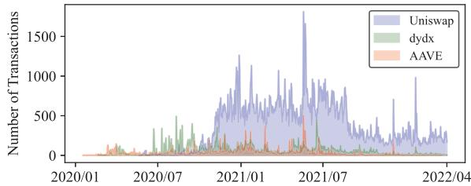
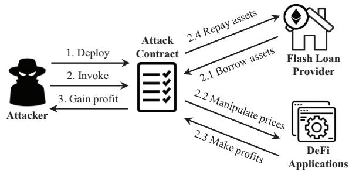
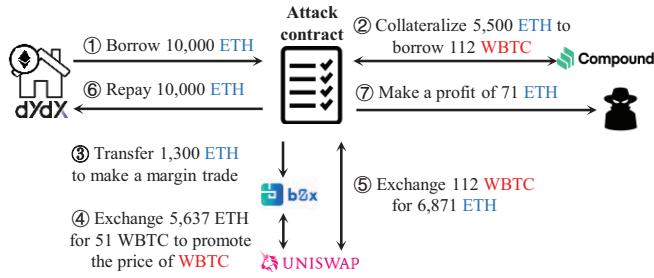
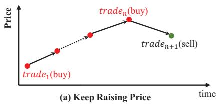
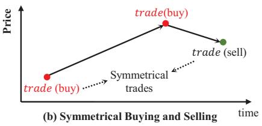
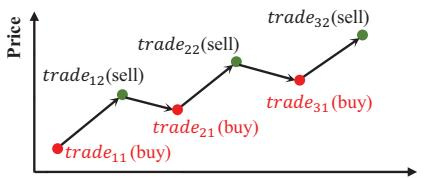
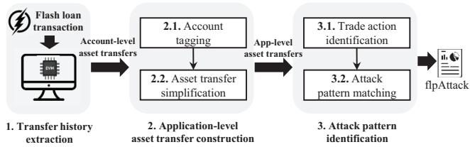
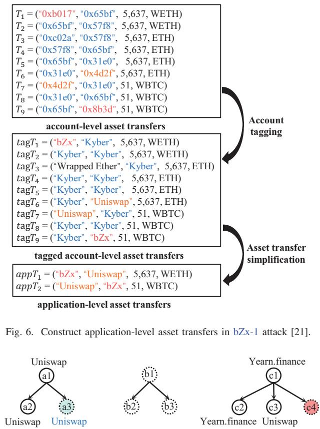
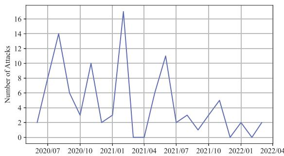

# Detecting Flash Loan Based Attacks in Ethereum

Qing Xia1, Zhirong Huang1, Wensheng Dou1∗, Yafeng Zhang1, Fengjun Zhang1, Geng Liang1, Chun Zuo2

1Institute of Software, Chinese Academy of Sciences

2Sinosoft Company Limited

xiaqing2018, huangzhirong2022, wensheng, yafeng, fengjun, lianggeng @iscas.ac.cn

zuochun@sinosoft.com.cn

Abstract—Decentralized Finance (DeFi) ecosystem has grown rapidly in the past few years. In the DeFi ecosystem, flash loan is a novel type of uncollateralized loan with nearly negligible lending costs. Malicious attackers can easily borrow a large number of crypto assets, and utilize them to disrupt the price of crypto assets to make a profit. Many flash loan based price manipulation attacks have been reported recently, and caused immense economic losses, e.g., 30 million USD in a single attack. In this paper, we conduct an empirical study on real-world flash loan based attacks in the past two years and present three attack patterns for price manipulation attacks. Then, we propose an approach, LeiShen, to automatically detect price manipulation attacks with asset transfers. We evaluate LeiShen on the first 14,500,000 blocks in Ethereum, and detect 180 attacks with a precision of 78.9%. Among our newly-found attacks, the severest attack has caused a total loss of more than 6.1 million USD.

Index Terms—Flash loan, Price manipulation attack, Decentralized Finance, Ethereum

## I. INTRODUCTION

Ethereum is an open-source decentralized blockchain system [1]. Powered by Ethereum, developers can build decentralized applications with smart contracts. In recent years, Decentralized Finance (DeFi) [2] is developing rapidly and a novel financial ecosystem is forming. Unlike traditional finance, DeFi applications can provide a broad range of financial services such as exchanging and lending crypto assets without trust or dependency on third-party intermediaries. In early 2022, the crypto assets locked by DeFi ecosystem reached a peak of over 180 billion USD [3].

Flash loan is a nascent uncollateralized loan in DeFi [4]. Users can utilize flash loans to borrow a large number of crypto assets without depositing any assets as collateral. The security of flash loan is guaranteed by the atomicity property of Ethereum transactions. Specifically, users must borrow assets and pay them back within a single transaction, i.e., flash loan transaction. If a user fails to repay the borrowed assets, the flash loan transaction will be aborted and the borrowed assets will be returned to the flash loan provider. If the user repays, the flash loan transaction is successful and the flash loan provider charges a fee, e.g., 0.3% of borrowed assets in Uniswap [5]. Currently, flash loans have been widely used for arbitrage, liquidation and collateral swaps [6]. As Fig. 1 shows, since the first flash loan transaction from AAVE [7] appeared in early 2020, the past two years have witnessed a rapid growth of flash loan transactions.

  
Fig. 1. Weekly flash loan transactions from three popular DeFi applications.

However, malicious attackers can utilize borrowed assets from flash loans to disrupt asset prices, and make a profit [8]–[10]. In DeFi, automatic pricing algorithms are widely used to trade assets, in which the price of an asset is related to its quantity reserved in the liquidity pool. Generally, the price of an asset decreases when its quantity increases. Therefore, attackers can maliciously fluctuate an asset’s price by manipulating its quantity with a large number of borrowed assets from flash loans. During the manipulating process, the attacker can make a profit from the price difference. We named these attacks as flash loan based price manipulation attacks (flpAttack for short).

FlpAttacks have been widely reported recently. Until June 2022, we have found 44 real-world flash loan based attacks disclosed by security teams and DeFi developers, in which half of them are flpAttacks. These attacks have caused serious economic losses, e.g., the economic loss in the Spartan attack reaches up to 30 million USD [11]. FlpAttacks can also severely threaten users’ confidence in DeFi applications. For example, after Harvest Finance was exploited by a flpAttack, users took back 570 million USD worth of their assets from the liquidity pool [12].

FlpAttack is a subtype of price manipulation attack. Over the past few years, a handful of researchers focus on price manipulation attacks, such as Pump-and-Dump attacks [13]– [17] and sandwich attacks [18]–[20]. These works either utilize abnormal price movements in open markets or the transaction order to detect attacks, which are not targeted to detect price manipulations in a single transaction. Therefore, they cannot be used to detect flpAttacks.

After the first known flpAttack [21] appeared in early 2020, several works contribute to the detection of flpAttacks. Wu et al. [22] proposed DeFiRanger to detect price manipulation

∗Corresponding author.

attacks within a transaction, which can detect four flpAttacks until Dec 2020. However, their attack patterns only consider two trades and cannot depict attackers’ behavior well, e.g., their patterns cannot depict the attack of buying assets in batches and selling them together. In addition, DeFiRanger does not consider the relationship between accounts in asset transfers. Hence, it cannot detect a flpAttack if the attacker exploits different accounts of the same DeFi application. Xue et al. [23] utilized price inquiry methods provided by DeFi applications to monitor the price volatility caused by a transaction. If the price volatility exceeds a pre-defined threshold, e.g., 99%, they consider it a flpAttack. This work only utilizes the feature of price volatility instead of attack patterns to detect flpAttacks. Therefore, it cannot detect flpAttacks with slight price movements. Our empirical study shows that not all flpAttacks can cause large price movements. Additionally, the semi-automatic work requires manual analysis of contract codes, which can only handle three crypto assets on two applications at that time.

In this paper, we present three attack patterns summarized from 22 real-world flpAttacks in the past two years, i.e., Keep Raising Price, Symmetrical Buying and Selling, Multi-Round Buying and Selling. Each attack pattern consists of a series of trading behaviors, and reveals how the attacker manipulates asset prices to make a profit. For example, in the pattern of Keep Raising Price, the attacker keeps raising the price of an asset by continuously buying the asset, and then sells them at a high price.

According to the attack patterns, we propose LeiShen. to automatically detect flpAttacks in Ethereum. First, we identify flash loan transactions from three popular DeFi applications. For each flash loan transaction, we replay it to extract its asset transfers between two Ethereum accounts, which are called account-level asset transfers. Second, we analyze the relationship between accounts to tag accounts with their DeFi applications and further apply several simplification rules, which convert these transfers to application-level asset transfers. Third, based on the application-level asset transfers, we identify key trading behaviors from the flash loan borrower, and check whether there exists an attack pattern. If true, we report the flash loan transaction as a flpAttack.

We evaluate LeiShen on the first 14,500,000 blocks in Ethereum and detect 180 attacks, of which 142 attacks are verified as true attacks with a precision of 78.9%. Among 142 true attacks, 33 attacks are known, including 22 collected real-world flpAttacks and 11 identical repeat attacks. The rest 109 attacks are previously unknown and first detected. These unknown attacks result in a total economic loss of over 21 million USD.

In summary, we make the following contributions.

We conduct an empirical study on real-world flash loan attacks in the past two years and present three attack patterns to reveal attackers’ behaviors in flpAttacks.

• We propose an approach to automatically detect flpAt- tacks conforming to the three attack patterns by utilizing asset transfers of a flash loan transaction.

We identify a total of 142 true attacks in the first 14,500,000 blocks in Ethereum, including 109 previously-unknown attacks.

## II. BACKGROUND

In this section, we briefly introduce Ethereum and DeFi.

## A. Ethereum

Ethereum is an open-source decentralized blockchain that supports smart contracts. There are two types of Ethereum accounts: user account (externally owned account) and contract account. A user account is controlled by private keys, while a contract account is controlled by contract codes. Both accounts are identified by a unique 160-bit address. User accounts can send transactions to deploy and invoke smart contracts. Smart contracts can also invoke each other via internal transactions.

Currently, there are two main types of crypto assets in Ethereum: Ether and ERC20 token. Ether (ETH) is the native crypto asset built on Ethereum. An ERC20 token is a fungible crypto asset that can be issued by any smart contract following the ERC20 standard [24]. Once crypto assets are transferred, the transfer information is recorded on the blockchain.

## B. Decentralized Finance

There are three main DeFi applications, i.e., decentralized exchanges, lending platforms and yield aggregators.

Decentralized exchanges (DEXs) facilitate the non-custodial exchange of crypto assets mainly through Automated Market Maker (AMM) mechanisms. Instead of matching buy and sell orders, AMMs determine exchange rates with a pricing algorithm. For example, one of the well-known AMMs is the constant product formula, in which the product of quantities of two assets in a liquidity pool remains constant [25]. Hence, a trade can lead to price volatility if it significantly impacts the relative quantities of assets. Currently, some DEXs also serve as on-chain Oracles for other DeFi applications, i.e., feeding the price of crypto assets. Therefore, price volatility on DEXs may affect other applications. In addition to exchanging assets, DEXs also support mint liquidity and remove liquidity. Mint liquidity means users can deposit tokens to mint LP tokens (Liquidity Provider tokens). Remove liquidity means users return the minted tokens to redeem their assets.

A lending platform can be used to lend and borrow crypto assets, which is similar to a bank in centralized finance [26]. To avoid a debt default, a borrower is generally required to deposit assets as collateral whose value is higher than borrowed assets. Once the value of collateral drops below a threshold, the lending platform sells them in the open market to pay off debts. Different from collateralized lending, flash loans do not require any collateral and utilize transaction atomicity to guard against the risk of debt defaults.

Currently, a broad range of DeFi applications provides financial services with different exchange rates and interest rates. To maximize yield on users’ capital, yield aggregators [27] play a key role to bridge users and DeFi applications. For example, yield aggregators can help users to find the most favorable exchange rate across different DEXs.

## III. EMPIRICAL STUDY ON REAL-WORLD FLASH LOAN BASED ATTACKS

## A. Attack Collection

We collected flash loan based attacks against two popular blockchains, i.e., Ethereum and BNB Smart Chain (a blockchain forked from Ethereum) [28]. These two blockchains share the majority of TVL (Total Value Locked) in DeFi. We collected attacks by keyword search from four sources, i.e., Google Search, Bing, Facebook and Twitter. We matched the compound search keywords “flash loan attack AND (Ethereum OR Binance)” in a report or a post, and obtained 83 potential attacks. We then applied the following two exclusion criteria (EC1–EC2) in stages to further refine the initial set. (1) EC1: exclude duplicated attacks when multiple reports refer to the same attack. (2) EC2: exclude an attack if its report mentions no issue on the attack transaction. Eventually, we obtained 44 attacks for further analysis.

## B. Flash Loan Analysis

We analyze the flash loan provider and the value of borrowed assets in flash loans. For 44 real-world flash loan based attacks, there are 23 attacks against Ethereum and 21 attacks against BNB Smart Chain. In 23 Ethereum attacks, 18 attackers take flash loans from Uniswap, dYdX and AAVE. Therefore, in this paper, we detect flpAttacks in the wild on flash loan transactions from the three popular platforms. In 21 attacks on BNB Smart Chain, 15 attackers take flash loans from PancakeSwap.

Among 44 attacks, 37 attackers borrow only one type of crypto asset from a single flash loan provider. While in seven attacks, attackers borrow a variety of crypto assets from more than one flash loan provider. For example, in the Beanstalk attack, the attacker borrows five types of assets from three flash loan providers simultaneously. For each attack, we measure the value of borrowed assets in flash loans with their historical prices on the attack day. We find that borrowed assets in 38 attacks are worth more than one million USD. Notably, the attacker in the PancakeBunny attack borrows the most, reaching 1.2 billion USD. In addition, we notice that borrowed assets in six attacks are worth less than one million USD and all these attacks are not price manipulation attacks.

## C. Attack Pattern Analysis

The collected attacks were manually analyzed by four authors following the structure suggested by Seaman [29]. For each attack, we made the attack analysis independently and understand the attack process. According to the attack process, we divided 44 attacks into two categories: 22 price manipulation attacks and 22 non-price manipulation attacks. In a price manipulation attack, the attacker utilizes flash loans to manipulate the price of crypto assets to make a profit.

TABLE I  
REAL-WORLD FLASH LOAN BASED ATTACKS FROM FEB 2022.

<table><tr><td>ID†</td><td>Attacked app.‡</td><td>Price volatility</td><td>KRP</td><td>SBS</td><td>MBS</td><td></td></tr><tr><td>1</td><td>bZx-1</td><td>ETH-WBTC (125%)</td><td></td><td>✓</td><td></td><td></td></tr><tr><td>2</td><td>bZx-2</td><td>ETH-sUSD (136%)</td><td>✓</td><td></td><td></td><td></td></tr><tr><td>3</td><td>Balancer</td><td>SNX-STA ( $8.2 \times 10^{5}$ % )LINK-STA ( $8.2 \times 10^{5}$ % )ETH-STA ( $6.5 \times 10^{28}$ % )WBTC-STA ( $3.3 \times 10^{6}$ % )BPT-STA ( $5.5 \times 10^{21}$ % )</td><td>✓</td><td></td><td></td><td></td></tr><tr><td>4</td><td>Eminence</td><td>DAI-EMN (124%)EAAVE-EMN (18.6%)</td><td></td><td></td><td>✓</td><td></td></tr><tr><td>5</td><td>Harvest Finance</td><td>fUSDC-USDC (0.5%)</td><td></td><td></td><td>✓</td><td></td></tr><tr><td>6</td><td>Cheese Bank</td><td>ETH-CHEESE ( $1.5 \times 10^{4}$ % )</td><td></td><td>✓</td><td></td><td></td></tr><tr><td>7</td><td>Value DeFi</td><td>3Crv-mvUSD (27.6%)</td><td></td><td></td><td></td><td></td></tr><tr><td>8</td><td>Yearn Finance</td><td>DAI-3Crv (402.3%)</td><td></td><td>✓</td><td></td><td></td></tr><tr><td>9</td><td>Spartan Protocol</td><td>SPARTA-WBNB ( $1.6 \times 10^{4}$ % )WBNB-(SPT1-WBNB) (500.5%)SPARTA-(SPT1-WBNB) (124.6%)</td><td>✓</td><td></td><td></td><td></td></tr><tr><td>10</td><td>XToken-1</td><td>WETH-xSNXa ( $2.8 \times 10^{6}$ )SNX-xSNXa ( $4.9 \times 10^{5}$ )</td><td></td><td></td><td></td><td></td></tr><tr><td>11</td><td>PancakeBunny</td><td>WBNB-Bunny( $5.1 \times 10^{3}$ % )</td><td></td><td></td><td></td><td></td></tr><tr><td>12</td><td>JulSwap</td><td>WBNB-JULb (288.2%)</td><td></td><td>✓</td><td></td><td></td></tr><tr><td>13</td><td>Belt Finance</td><td>BUSD-beltBU (3.1%)</td><td></td><td></td><td>✓</td><td></td></tr><tr><td>14</td><td>xWin Finance</td><td>BNB-XWIN ( $2.5 \times 10^{3}$ % )</td><td></td><td></td><td>✓</td><td></td></tr><tr><td>15</td><td>Wault Finance</td><td>BUSD-WEX (246.8%)</td><td>✓</td><td></td><td></td><td></td></tr><tr><td>16</td><td>Twindex</td><td>TWX-KUSD (514.8%)</td><td></td><td></td><td></td><td></td></tr><tr><td>17</td><td>AutoShark-2</td><td>BNB-USDC (7%)</td><td></td><td></td><td>✓</td><td></td></tr><tr><td>18</td><td>MY FARM PET</td><td>BUSD-MyFarmPET ( $1.9 \times 10^{3}$ % )</td><td></td><td></td><td></td><td></td></tr><tr><td>19</td><td>PancakeHunny</td><td>WBNB-TUSD ( $4.8 \times 10^{5}$ % )</td><td></td><td>✓</td><td></td><td></td></tr><tr><td>20</td><td>AutoShark-3</td><td>WBNB-JAWS ( $4.7 \times 10^{3}$ % )</td><td></td><td>✓</td><td></td><td></td></tr><tr><td>21</td><td>Ploutoz Finance</td><td>BUSD-DOP ( $3.8 \times 10^{3}$ % )</td><td></td><td>✓</td><td></td><td></td></tr><tr><td>22</td><td>Saddle Finance</td><td>saddleUSD-sUSD (86.5%)</td><td></td><td>✓</td><td>✓</td><td></td></tr><tr><td>23-44 *</td><td colspan="5">Akropolis, OriginProtocol, WarpFinance, RariCapital, bEarnFiBoggedFinance, Autoshark, BurgerSwap, ElevenFinance, AlphaFinanceImpossibleFinance, DeFiPie, ApeRocket, ArrayFinance, PopsicleFinanceXSURGE, DotFinance, CreamFinance, XToken-2, SashimiSwap,Beanstalk, RariCapital-2</td><td></td></tr></table>

While in a non-price manipulation attack, the attacker utilizes flash loans to exploit other contract vulnerabilities instead of manipulating prices. For example, in the Akropolisattack, the attacker exploits reentrancy bug to withdraw twice the assets borrowed from flash loans. And in the Beanstalkattack, the attacker borrows governance tokens in the flash loan in order to launch governance attacks.

The non-price manipulation attacks have been studied by many researchers with various methods, such as symbolic execution [30], abstract interpretation [31], formal verification [32] and fuzzing [33]. However, these real-world price manipulation attacks have not been deeply studied and the attack behaviors are still unknown. Therefore, we mainly focus on 22 price manipulation attacks, i.e., flpAttacks, as listed in Table I.

For a flpAttack, we read its analysis report and understand the manipulation steps. To ensure the correctness of the analysis, for each manipulation step, we located the corresponding trades in asset transfers of the attack transaction. For example, the analysis report on the second bZx attack, i.e.,bZx-2 attack, mentions that “The second batch sells 18 times of 20 ETH, ..., and gets 63,584 sUSD in return”, but misses the detailed information for each trade. Hence, for this key manipulation step, we checked asset transfers to obtain the necessary information for these 18 trades, e.g., the traders and the exchange rate.

Finally, for each flpAttack, we obtained a list of trades on different token pairs. For these token pairs that appeared at least two times, we drew a figure to show their price movements. After cross-checking the price movements of 22 real-world flpAttacks, we summarized three attack patterns. Four, eight and six attacks are conforming to the pattern of Keep Raising Price (KRP), Symmetrical Buying and Selling (SBS) and Multi-Round Buying and Selling (MBS). Note that, the Saddle Finance attack conforms to SBS and MBS patterns simultaneously. For the remaining five attacks, we cannot observe clear attack patterns. We describe these attack patterns in detail in Section IV-B.

  
Fig. 2. The attack model of flpAttacks.

## D. Price Volatility Analysis

We analyze the price volatility within the attack transaction. Price volatility is calculated with the formula of $( ( r a t e _ { m a x } -$ $r a t e _ { m i n } ) / r a t e _ { m i n } ) * 1 0 0 \%$ , in which $r a t e _ { m a x }$ and $r a t e _ { m i n }$ denote the maximum and minimum exchange rates for the same token pair, respectively. Table I shows some attacks caused surprising price movements, while some attacks have only slight price movements. For example, the price volatility reaches $6 . 5 * 1 0 ^ { 2 8 0 \% }$ in the Balancer attack, while it is only 0.5% in the Harvest Finance attack.

## IV. FLPATTACKS

We first explain flpAttacks’ attack model, and then describe three attack patterns summarized from real-world flpAttacks.

## A. Attack Model

In a flpAttack, the flash loan borrower (attacker) utilizes crypto assets borrowed from flash loan providers to exploit vulnerable DeFi applications (victims) to make a profit. Fig. 2 depicts the attack model of a flpAttack.

1) The attacker deploys an attack contract for preparation.

2) The attacker invokes the attack contract to trigger a flash loan transaction. In the transaction, the contract borrows crypto assets from flash loan providers and utilizes these assets to manipulate the prices of crypto assets in DeFi applications. After making profits, the contract repays borrowed assets and fees to flash loan providers.

3) The attack contract transfers profit to the attacker.

We take the first flpAttack, i.e., bZx-1 attack [9], [21], as a motivating example to illustrate the attack process. As Fig. 3 shows, the attacker first borrows 10,000 ETH from a flash loan provider, i.e., dYdX [34]. Then, the attacker collateralizes 5,500 ETH to borrow 112 WBTC at the price of 49.1 ETH/WBTC on Compound. Next, the attacker transfers 1,300 ETH to make a margin trade on bZx. Financed by bZx, the margin trade exchanges 5,637 ETH for 51 WBTC on Uniswap, which promotes the price of WBTC up to 110.5 ETH/WBTC. Finally, the attacker exchanges previously borrowed 112 WBTC for 6,871 ETH on Uniswap at the price of 61.3 ETH/WBTC. After repaying borrowed assets and fees, the attacker makes a profit of 71 ETH, and bZx suffers economic losses due to the margin trade.

  
Fig. 3. The attack process of the bZx-1 attack.

## B. Attack Patterns

There are 17 real-world attacks conforming to three attack patterns.

1) Keep Raising Price (KRP): As Fig. 4 (a) shows, in a KRP attack, the attacker first raises the price of a target token by continuously buying the target token, and then sells the target token at a high price.

Four real-world flpAttacks conform to this attack pattern. We take the bZx-2 attack as an example to illustrate this attack pattern. First, the attacker utilizes ETH tokens borrowed from bZx, a flash loan provider, to launch 18 repeated trades on Uniswap. In each trade, the attacker exchanges 20 ETH for the target token sUSD. This process raises the price of sUSD from 0.0038 ETH/sUSD to 0.009 ETH/sUSD on Uniswap. Since Uniswap provides Oracle service for bZx, the price of sUSD in bZx is the same as that in Uniswap. Then, the attacker swaps these exchanged sUSD for more ETH on bZx with an average price of 0.0062 ETH/sUSD.

We detect this attack pattern by iterating over all trades in a flash loan transaction and checking whether a series of trades, $\mathrm { i . e . , } t r a d e _ { i ( i = 1 , \dots , N + 1 ) }$ , exist. A trade is denoted as a tuple of (buyer, seller, amountSell, tokenSell, amountBuy, tokenBuy) which means a buyer exchanges amoun $t _ { S e l l }$ amount of token $t o k e n _ { S e l l }$ for amount $B u y$ amount of token $t o k e n _ { B u y }$ with a seller. In a KRP attack, the flash loan borrower buys a specific token in $t r a d e _ { i ( i = 1 , \dots , N ) }$ and sells the token in $t r a d e _ { N + 1 }$ . In addition, three conditions are satisfied: a) tra $d e _ { 1 } . s e l l e r ~ = ~ \ t r a d e _ { i ( i = 2 , . . . , N ) }$ .seller; b) trade .amountSell < . . . < tradeN.amountSell c) $N \ \geq \ 5 .$ trade1.amountBuy tradeN.amountBuy

Wrapped Bitcoin (WBTC) is an ERC20 compatible token backed 1:1 with Bitcoin.

  
(c) Multi-Round Buying and Selling  
Fig. 4. Three attack patterns summarized from real-world flpAttacks.

We set N as 5 since it is the minimum value in real-world flpAttacks conforming to this attack pattern.

2) Symmetrical Buying and Selling (SBS): As Fig. 4(b) shows, in the SBS attack, the attacker first buys the target token at a low price and then sells the same amount of the target token at a high price. These two trades are referred to as a pair of symmetrical trades. Moreover, between the symmetrical trades, there exists another trade to buy the target token, which leads to an increase in the price of the target token. Therefore, the attacker can make a profit from price differences in symmetrical trades.

Eight real-world flpAttacks conform to this attack pattern. We take the bZx-1 attack as an example to describe the attack process. As Fig. 3 shows, two trades in Step 2 and Step 5 form the symmetrical trades. In Step 2, the attacker collateralizes 5,500 ETH to borrow 112 WBTC, with an average price of 49.1 ETH/WBTC. In Step 5, the attacker sells the borrowed 112 WBTC for 6,871 ETH with an average price of 61.3 ETH/WBTC. Between the two trades, in Step 4, the attacker raises the price of WBTC.

We detect the attack pattern by iterating over all trades in a flash loan transaction and checking whether there exist three trades, i.e., $t r a d e _ { i ( i = 1 , \dots , 3 ) }$ . The flash loan borrower buys a specific token in trade1 and trade2, and sells the token in trade3. Moreover, three conditions are satisfied: a) trade1.amountBuy = trade3.amountSell; C

b) trade .amountSell trade .amountBuy < < trade .amountBuy trade .amountSell trade .amountSell trade .amountSell trade2.amountSelltrade .amountBu ; c) trade2.amountBuy − trade1.amountBuytrade .amountSell ≥ trade .amountBuy 28%. We set a threshold of price volatility between trade and trade as 28% because it is the minimum value in real-world flpAttacks conforming to this attack pattern.

3) Multi-Round Buying and Selling (MBS): As Fig. 4(c) shows, in an MBS attack, the attacker repeats the process of buying and selling the target token multiple rounds. In each round, the attacker utilizes a large amount of borrowed assets to buy the target token to raise its price, and then sells the target token at a high price.

Six real-world flpAttacks conform to this attack pattern. We take the Harvest Finance attack as the example. In this attack, the attacker borrows 50 million USDC from Uniswap, a flash loan provider, to repeatedly buy and sell fUSDC for three rounds. In each round, the attacker exchanges USDC for fUSDC and then exchanges fUSDC for more USDC back. For example, in the first round, the attacker exchanges

  
Fig. 5. The analysis pipeline of LeiShen.

49,977,468 USDC for 51,456,280 fUSDC and then exchanges these fUSDC for 50,298,684 USDC.

We detect this pattern by iterating over all trades and checking whether there exist two trades, i.e., $t r a d e _ { i ( i = 1 , 2 ) }$ , appearing at least N times. The flash loan borrower buys the target token in $t r a d e _ { 1 }$ and sells the target token in trade . Moreover, three rules are satisfied: a) trade .seller = trade .seller; b) trade .amountSell trade2.amoun $\begin{array} { r } { \frac { B u y } { ! S e l l } ; \mathrm {  ~ c ~ } ) \ N \ge 3 . } \end{array}$ We set N trade .amountBuy trade .amoun as 3 since it is the minimum value in real-world flpAttacks.

## V. DETECTING FLPATTACKS

Fig. 5 shows the overall architecture and pipeline of the detection approach for flpAttacks, i.e., LeiShen. LeiShen takes a flash loan transaction as input and returns a detailed report regarding attack patterns as output. There are three main steps: transfer history extraction (Section V-A),applicationlevel asset transfer construction (Section V-B) and attack pattern identification (Section V-C).

In the first step, we extract the whole history of asset transfers between two Ethereum accounts. In the second step, we convert account-level asset transfers to application-level (app-level for short) asset transfers, which consist of two substeps, i.e., account tagging and asset transfer simplification. In the account tagging step, we tag all accounts in asset transfers with DeFi application names, and then convert these tagged asset transfers into app-level asset transfers with simplification rules in the asset transfer simplification step. Finally, we utilize app-level asset transfers to detect attack patterns with two sub-step, i.e., trade action identification and attack pattern matching. In the trade action identification, we detect key trade actions between the flash loan borrower and DeFi applications. Then, in the attack pattern matching, we check whether these trade actions match attack patterns.

FUNCTIONS AND EVENTS USED BY FLASH LOAN TRANSACTIONS.  
TABLE II

<table><tr><td>Provider</td><td>Function</td><td>Event</td></tr><tr><td>Uniswap</td><td>swapuniswapV2Call</td><td></td></tr><tr><td>AAVE</td><td>flashLoan</td><td>FlashLoan</td></tr><tr><td rowspan="4">dYdX</td><td>Operate</td><td>LogOperation</td></tr><tr><td>Withdraw</td><td>LogWithdraw</td></tr><tr><td>callFunction</td><td>LogCall</td></tr><tr><td>Deposit</td><td>LogDeposit</td></tr></table>

## A. Extracting Transfer History

We utilize asset transfers of a flash loan transaction to detect flpAttacks. Therefore, we need to identify flash loan transactions and extract their asset transfers.

We identify flash loan transactions from three popular flash loan providers, i.e., Uniswap, AAVE and dYdX [6]. As Table II shows, a flash loan transaction can be identified by its called functions or event logs. In Uniswap, a flash loan transaction first invokes swap function and then invokes uniswapV2Call function [5]. In AAVE, a flash loan transaction invokes flashLoan function, which emits a FlashLoan event log. In dYdX, a flash loan transaction invokes the listed four functions in sequence (i.e., Operate, Withdraw, callFunction and Deposit), which emit four corresponding event logs.

For a flash loan transaction, we replay it in a modified Ethereum client, i.e., Geth [35], to obtain the history of asset transfers. In Ethereum, Ether transfer information is recorded in internal transactions, while ERC20 token transfer information is recorded in event logs. However, Geth does not provide the happened-before relationship between these two types of transfers. To solve the problem, we modified Geth to automatically record the happened-before relationship between internal transactions and event logs.

As Fig. 6 shows, the ith asset transfer is denoted as a tuple of Ti = (sender, receiver, amount, token), which indicates a sender transfers some amount of tokens to a receiver. Both sender and receiver are 160-bit Ethereum accounts . We call these asset transfers account-level asset transfers.

## B. Constructing Application-Level Asset Transfers

Identifying trade actions between the flash loan borrower and DeFi applications is significant for attack detection. However, in account-level asset transfers, all accounts are represented as 160-bit addresses, and the relationship between accounts and DeFi applications is unknown. To solve the problem, we propose an account tagging approach based on the account creation relationship. To detect trade actions correctly and efficiently, we simplify these tagged accountlevel asset transfers to application-level asset transfers by removing redundant transfers and merging related transfers.

1) Account Tagging: In this step, we aim to tag an Ethereum account with a DeFi application name. We notice that some accounts have been tagged in Etherscan [36], while most accounts are not tagged, e.g., account 0xb017 in Fig. 6.

  
(a) A tree with a single tag (b) A tree without tag (c) A tree with different tags  
Fig. 7. Tag unknown accounts.

To tag all accounts including unknown ones, we collect a total of 52,500 tagged accounts of 119 DeFi applications from Etherscan to observe the tagging rule. We find that 52,482 tagged accounts follow the same tagging rule, i.e., accounts with the creation relationship have the same application name tag. For example, an EOA account “Uniswap: Deployer 1” creates a contract account “Uniswap: Factory Contract”. The contract account further creates 427 contracts to implement different liquidity pools, all of which are tagged with “Uniswap”.

Based on this finding, we propose a new account tagging approach. First, we construct a tree structure for untagged accounts with creation relationships. Fig. 7 shows three cases including unknown accounts, where root nodes are user accounts, and non-root nodes are contract accounts. Arrows denote creation relationships, e.g., a user account a1 creates a contract account a2. Solid line accounts have been tagged, while dashed accounts are not. Note that, these three cases can cover all possible situations, i.e., a tree with a unique tag, no tag and conflicting tags. Although the last case seems a bit suspicious, it does exist in DeFi applications. The reason is that some contracts can be open to public deployment. For example, account 0x2D40 tagged with Yearn.finance creates a Uniswap contract 0xBb49 . The reason is that the Yearn.finance deployer deployed a Uniswap pool using the functions provided by Uniswap. However, statistics show this situation is rare and only accounts for less than 0.1% of tagged accounts we collected.

With the tree structure, we assign the unknown account a tag set, including tags of its ancestors and descendants, $\mathrm { e . g . }$ , the tag set of $a _ { 3 }$ is (“Uniswap”). Finally, we tag an unknown account with its tag set. If the set only contains one application name, the unknown account has a high probability of belonging to this application. Therefore, the unknown account $a _ { 3 }$ is tagged with “Uniswap”. However, if the tag set is empty, there is no clue about the possible application. In this case, we tag the unknown account with the address of its ancestor, i.e., the root node of the tree, to show their creation relationship. For example, in Fig. 7(b), all accounts are tagged with $b _ { 1 } ^ { \prime } s$ address. However, if the tag set has more than one application name, we cannot determine which application the unknown account belongs to, e.g., c cannot be tagged.

With the account tagging approach, we tag all accounts with application names in Fig. 6. Accounts that are colored the same belong to the same application. The $i _ { t h }$ tagged asset transfer is denoted as a tuple of $\begin{array} { r l } { t a g T _ { i } } & { { } = } \end{array}$ (tag sender, tag receiver, amount, token), which means a tagged sender transfers some tokens to a tagged receiver.

2) Asset Transfer Simplification: In this step, we aim to convert the tagged account-level asset transfers into application-level asset transfers with three simplification rules, including remove intra-app transfers, remove WETH related transfers and merge inter-app transfers.

Remove intra-app transfers. An intra-app transfer is a tagged transfer that satisfies the condition “tag sender = tag receiver”, e.g., tagT2 in Fig. 6. These transfers show asset flows inside an application, and do not contribute to the identification of trade actions between applications. Therefore, we remove them as redundant transfers.

Remove WETH related transfers. A WETH related transfer is a tagged transfer that satisfies the condition $^ { 6 6 } ( t a g .$ sender tag receiver) = Wrapped Ether”, e.g., $t a g T _ { 3 }$ in Fig. 6. That is, either the sender or the receiver is tagged with “Wrapped Ether”. The “Wrapped Ether” contract provides the exchange of WETH and ETH tokens at a 1:1 ratio. When a user deposits WETH into the contract, he obtains the same amount of ETH (and vice versa). Therefore, after unifying WETH and ETH tokens into one token, e.g., ETH, these transfers can be removed as redundant transfers.

Merge inter-app transfers. Inter-app transfers are two consecutive transfers that satisfies $\begin{array}{c} ^ { \begin{array} { l l } { { \bf { \Sigma } } ^ {  } ( t a g T _ { i } . t o k e n } & { = } \end{array} } { \bf { \Sigma } } \end{array}$ $t a g T _ { i + 1 } . t o k e n ) \ \wedge \ ( t a g T _ { i }$ .amount  tagTi+1.amount) $\wedge$ $\begin{array} { l l l } { ( t a g T _ { i } . t a g _ { - } r e c e v i e r } & { = } & { t a g T _ { i + 1 } . t a g _ { - } s e n d e r ) ^ { \prime } } \end{array}$ . That is,

0x2D407dDb06311396fE14D4b49da5F0471447d45C 0xBb49b4554671A7E87FdEC0b183c73bC42b3DCA9A nearly the same amount of the same asset is transferred through an intermediary, i.e., tagTi.tag recevier. For example, in Fig. 6, Kyber in $t a g T _ { 7 }$ and $t a g T _ { 9 }$ behaves as an intermediary to transfer 51 WBTC. In real-world attacks, the intermediary account generally belongs to yield aggregators, which help users to make a trade with the highest yield but do not participate in the trade. Therefore, to reveal the real counterparties, we merge inter-app transfers into one transfer by ignoring intermediaries. Since the intermediary generally charges a small fee, we set the difference in the number of assets between inter-app transfers to be less than 0.1%.

## C. Identifying Attack Patterns

Based on application-level asset transfers, we identify a list of key trades, and check whether these trades conform to an attack pattern. Since the attack pattern matching is discussed in Section IV-B, we illustrate how to identify trades. Table III summarizes three key trade actions, including swap, mint liquidity and remove liquidity. Each trade is detected with two or three continuous application-level asset transfers.

Swap. In a swap, a trader swaps an asset for another asset with a recipient. Table III shows two conditions to detect swaps. We take the first condition as an example. It shows that application A transfers $a _ { 1 }$ amount of token $t _ { 1 }$ to application B and receives $a _ { 2 }$ amount of token $t _ { 2 }$ from B, which is denoted as a trade, $\mathrm { i . e . , } \left( A , B , a _ { 1 } , t _ { 1 } , a _ { 2 } , t _ { 2 } \right)$

Mint liquidity. In a mint liquidity, a trader deposits assets to a DeFi application to mint new assets. Table III shows two conditions to detect mint liquidity. For example, the first condition shows that application A transfers $a _ { 1 }$ amount of token $t _ { 1 }$ to application B and mints $a _ { 2 }$ amount of token $t _ { 2 }$ , which is denoted as a trade, i.e., $( A , B , a _ { 1 } , t _ { 1 } , a _ { 2 } , t _ { 2 } )$ . Note that, newly minted tokens are transferred from the BlackHole address .

Remove liquidity. In a remove liquidity, a trader returns minted assets to a DeFi application and takes previously deposited assets back. Table III shows two conditions to detect removing liquidity. We take the first condition as an example. In the first condition, application A transfers $a _ { 1 }$ amount of token $t _ { 1 }$ to the BlackHole and receives $a _ { 2 }$ amount of token $t _ { 2 }$ from application B, which is also denoted as a trade.

The definition for the above three key trades is similar to that in [22]. However, conditions listed in Table III have been updated according to the development of DeFi applications. Specifically, we consider the situation of three continuous asset transfers.

## VI. EVALUATION

In this section, we evaluate the correctness and effectiveness of LeiShen and measure the overall prevalence of flpAttacks in Ethereum.

TABLE III  
THREE KEY TRADE ACTIONS IN DEFI APPLICATIONS.

<table><tr><td>Action</td><td>Condition</td><td>Example</td><td>Explanation</td></tr><tr><td rowspan="2">Swap</td><td> $appT_1.tag sender = appT_2.tag_receiver$  $appT_1.tag_receiver = appT_2.tag_sender$  $appT_1.token \neq appT_2.token$ </td><td> $appT_1 = (A, B, a_1, t_1)$  $appT_2 = (B, A, a_2, t_2)$ </td><td>Application  $A$  swaps  $a_1$  amount of token  $t_1$  for  $a_2$  amount of token  $t_2$  with application  $B$ </td></tr><tr><td> $appT_1.tag_sender = appT_2.tag_receiver = appT_3.tag_receiver$  $appT_1.tag_receiver = appT_2.tag_sender = appT_3.tag_sender$  $appT_1.token \neq appT_2.token \neq appT_3.token$ </td><td> $appT_1 = (A, B, a_1, t_1)$  $appT_2 = (B, A, a_2, t_2)$  $appT_3 = (B, A, a_3, t_3)$ </td><td>Application  $A$  swaps  $a_1$  amount of token  $t_1$  for  $a_2$  amount of token  $t_2$  and  $a_3$  amount of token  $t_3$  with application  $B$ </td></tr><tr><td rowspan="2">Mint liquidity</td><td> $appT_1.tag_sender = appT_2.tag_receiver$  $appT_2.tag_sender = BlackHole$  $appT_1.token \neq appT_2.token$ (Order of  $appT_1$  and  $appT_2$  can be reversed)</td><td> $appT_1 = (A, B, a_1, t_1)$  $appT_2 = (0, A, a_2, t_2)$ </td><td>Application  $A$  provides  $a_1$  amount of token  $t_1$  to mint  $a_2$  amount of token  $t_2$  with application  $B$ </td></tr><tr><td> $appT_1.tag_sender = appT_2.tag_sender = appT_3.tag_receiver$  or  $appT_2.tag_sender = BlackHole$  $appT_1.tag_receiver = appT_2.tag_receiver$  $appT_3.tag_sender = BlackHole$  $appT_1.token \neq appT_2.token \neq appT_3.token$ </td><td> $appT_1 = (A, B, a_1, t_1)$  $appT_2 = (A, B, a_2, t_2)$  $appT_3 = (0, A, a_3, t_3)$ </td><td>Application  $A$  provides  $a_1$  amount of token  $t_1$  and  $a_2$  amount of token  $t_2$  to mint  $a_3$  amount of token  $t_3$  with application  $B$ </td></tr><tr><td rowspan="2">Remove liquidity</td><td> $appT_1.tag_sender = appT_2.tag_receiver$  $appT_1.tag_receiver = BlackHole$  $appT_1.token \neq appT_2.token$ (Order of  $appT_1$  and  $appT_2$  can be reversed)</td><td> $appT_1 = (A, 0, a_1, t_1)$  $appT_2 = (B, A, a_2, t_2)$ </td><td>Application  $A$  removes  $a_1$  amount of token  $t_1$  to get  $a_2$  amount of token  $t_2$  back with application  $B$ </td></tr><tr><td> $appT_1.tag_sender = appT_2.tag_receiver = appT_3.tag_receiver$  or  $appT_2.tag_receiver = BlackHole$  $appT_1.tag_receiver = BlackHole$  $appT_2.tag_sender = appT_3.tag_sender$  $appT_1.token \neq appT_2.token \neq appT_3.token$ </td><td> $appT_1 = (A, 0, a_1, t_1)$  $appT_2 = (B, A, a_2, t_2)$  $appT_3 = (B, A, a_3, t_3)$ </td><td>Application  $A$  removes  $a_1$  amount of token  $t_1$  to get  $a_2$  amount of token  $t_2$  and  $a_3$  amount of token  $t_3$  back with application  $B$ </td></tr></table>

TABLE IV  
DETECTION RESULTS ON KNOWN FLPATTACKS.

<table><tr><td>ID</td><td>Attacks</td><td>DeFi-Ranger</td><td>Explorer+ LeiShen</td><td>LeiShen</td></tr><tr><td>1</td><td>bZx-1</td><td></td><td></td><td>✓</td></tr><tr><td>2</td><td>bZx-2</td><td></td><td>✓</td><td>✓</td></tr><tr><td>3</td><td>Balancer</td><td></td><td>✓</td><td>✓</td></tr><tr><td>4</td><td>Eminence</td><td></td><td></td><td>✓</td></tr><tr><td>5</td><td>Harvest Finance</td><td>✓</td><td>✓</td><td>✓</td></tr><tr><td>6</td><td>Cheese Bank</td><td>✓</td><td></td><td>✓</td></tr><tr><td>7</td><td>Value DeFi</td><td>✓</td><td></td><td></td></tr><tr><td>8</td><td>Yearn Finance</td><td>✓</td><td></td><td>✓</td></tr><tr><td>9</td><td>Spartan Protocol</td><td></td><td></td><td>✓</td></tr><tr><td>10</td><td>XToken-1</td><td></td><td></td><td></td></tr><tr><td>11</td><td>PancakeBunny</td><td></td><td></td><td></td></tr><tr><td>12</td><td>JulSwap</td><td></td><td></td><td></td></tr><tr><td>13</td><td>Belt Finance</td><td>✓</td><td></td><td>✓</td></tr><tr><td>14</td><td>xWin Finance</td><td>✓</td><td>✓</td><td>✓</td></tr><tr><td>15</td><td>Wault Finance</td><td></td><td></td><td>✓</td></tr><tr><td>16</td><td>Twindex</td><td></td><td></td><td></td></tr><tr><td>17</td><td>AutoShark-2</td><td></td><td></td><td>✓</td></tr><tr><td>18</td><td>MY FARM PET</td><td></td><td></td><td></td></tr><tr><td>19</td><td>PancakeHunny</td><td></td><td></td><td></td></tr><tr><td>20</td><td>AutoShark-3</td><td>✓</td><td></td><td>✓</td></tr><tr><td>21</td><td>Ploutoz Finance</td><td>✓</td><td></td><td>✓</td></tr><tr><td>22</td><td>Saddle Finance</td><td>✓</td><td></td><td>✓</td></tr></table>

## A. Experimental Setup

We implemented LeiShen using Go language with roughly 5,400 lines of code. All experiments were conducted on the machine with 2.10 GHz Intel Xeon E5-2683 v4 CPU, 128 GB of RAM and 12 TB SSD, running 64-bit Windows 10 system. We used version v1.10.14 of Geth to synchronize Ethereum blockchain and replay transactions, and obtain the creation relationship between accounts from the data set provided in [37].

## 0x0000000000000000000000000000000000000000

We conduct two experiments with LeiShen, i.e., detecting known flpAttacks and unknown flpAttacks. Known flpAttacks include 22 real-world flpAttacks listed in Table IV, in which 17 attacks conform to three attack patterns. Unknown flpAttacks include 272,984 flash loan transactions filtered from the first 14,500,000 blocks in Ethereum, in which 208,342, 41,741, 22,959 flash loan transactions are from Uniswap, dYdX and AAVE, respectively. The total number of flash loan transactions is less than the sum of flash loan transactions from each platform because borrowers sometimes take flash loans from more than one platform. On average, LeiShen took 10 milliseconds to detect three attack patterns for a flash loan transaction. For 75% of the transactions, the detection can be finished within the time bound of 16 milliseconds.

As Fig. 1 shows, AAVE provides flash loans first and its first flash loan transaction appeared on Jan 18, 2020. After the well-known decentralized exchange, i.e., Uniswap, supports flash loans, the number of flash loan transactions has increased significantly. Until now, the flash loan transactions from Uniswap still account for the majority of all flash loan transactions. We observe that since October 2021, the number of flash loan transactions drops. However, during the same period, the price of Ether and the TVL (Total Value Locked) of DeFi in Ethereum increases. And we do not find reasons to explain the decrease.

## B. Detecting Known FlpAttacks

Among 22 known flpAttacks, 17 attacks conform to three attack patterns. As Table IV shows, LeiShen can detect 14 flpAttacks with correct attack patterns except for the JulSwap attack and the PancakeHunny attack. The reason is that asset transfers in these two attacks involve unknown accounts that cannot be tagged, which hinders the correct detection of trade actions. This implies that the effectiveness of our tool can be affected by unknown accounts. Moreover, since most attackers’ accounts are tagged after those attacks, we remove attackers’ tags during the detection.

TABLE V  
DETECTION RESULTS ON ETHEREUM TRANSACTIONS.

<table><tr><td>Attack pattern</td><td>N</td><td>TP</td><td>FP</td><td>P(%)</td></tr><tr><td>KRP</td><td>21</td><td>21</td><td>0</td><td>100%</td></tr><tr><td>SBS</td><td>79</td><td>68</td><td>11</td><td>86.1%</td></tr><tr><td>MBS</td><td>107</td><td>60</td><td>47</td><td>56.1%</td></tr></table>

DeFiRanger aims to detect price manipulation attacks, which can also detect some flpAttacks. The experiment in [22] is applied on Ethereum transactions from Nov. 25, 2019, to Dec. 17, 2020. To ensure the fairness of the experiment, we applied DeFiRanger on all known attacks from Ethereum and BNB Smart Chain. Compared with DeFiRanger [22], LeiShen can detect six more known attacks. Since DeFiRanger does not convert the account-level asset transfers to application-level asset transfers, it cannot detect some key trade actions, e.g. the trade between “bZx” and “Uniswap” in Fig. 6. In addition, DeFiRanger cannot depict the attacker’s behaviors well, such as continuously buying assets and then selling them.

We notice that two popular explorers, i.e., Etherscan and BscScan, provide the functionality of trade actions [38] for transactions in Ethereum and BNB Smart Chain. We use these trades of a flash loan transaction to detect our defined attack patterns. The fourth column (Explorer+LeiShen) in Table IV shows that Etherscan and BscScan combined with LeiShen can detect four flpAttacks. The low accuracy is due to the reason that the two explorers extract trade actions from event logs. However, some DeFi applications do not implement trade events in their smart contracts.

## C. Detecting Unknown FlpAttacks

Out of 272,984 flash loan transactions, a total of 180 transactions have been detected as flpAttacks, including 21 Keep Raising Price (KRP), 79 Symmetrical Buying and Selling (SBS), 107 Multi-Round Buying and Selling (MBS). The sum of attacks conforming to three attack patterns is greater than the total number of attacks, because some flpAttacks conform to multiple attack patterns. While many flpAttacks are found to be MBS and SBS attacks, only a small number of attacks are KRP attacks.

To confirm the correctness of LeiShen, we performed a manual inspection on detected attacks with three criteria.

We check the asset transfers of the attack to ensure it does conform to the corresponding attack pattern.

The attacker made a net profit from the attack.

The attacker does not disclose the source code of the attack contract.

Table V summarizes our verification in terms of detected attacks, including true positives (TP), false positives (FP) and precision p (in %). The precision is computed by $T P / ( T P + F P )$ . A true positive means the attack is an indeed flpAttack concerning the reported attack pattern. A false positive means that the attack is not a real flpAttack concerning the attack pattern. We cannot evaluate the true negative and false negative metrics since we do not have the complete attack dataset.

TABLE VI  
THE TOP THREE MOST ATTACKED APPLICATIONS.

<table><tr><td>Attacked applications</td><td>Attacks</td><td>Attackers</td><td>Attack contracts</td><td>Attacked assets</td></tr><tr><td>Balancer</td><td>31</td><td>5</td><td>14</td><td>13</td></tr><tr><td>Uniswap</td><td>16</td><td>6</td><td>8</td><td>5</td></tr><tr><td>Yearn</td><td>11</td><td>1</td><td>1</td><td>1</td></tr></table>

Among 180 attacks, a total of 142 attacks were verified as true positives, with an overall precision of 78.9%. For KRP and SBS patterns, our tool achieves the highest precision of 100% and 86.1%, respectively. The reason is that we set strict conditions on the thresholds of the number of trades and price volatility. However, for the MBS pattern, our tool only achieves a precision of 56.1%. The reason is that the investment strategy of yield aggregators can also show the behavior of Multi-Round Buying and Selling. When we apply a heuristics rule on the detection result, i.e., we assume that a transaction initiated from yield aggregators is not an attack, the precision for the MBS pattern can increase to 80%.

## D. Analyzing Unknown FlpAttacks

Among 142 true attacks, 33 attacks are known attacks, including 22 real-world flpAttacks and 11 identical repeat attacks. We analyze the rest 109 previously unknown attacks.

Fig. 8 depicts the number of monthly unknown flpAttacks until Apr 2022. It shows that the first unknown attack we detected appeared in June 2020. It means that we do not detect any new attacks before the first flpAttack, i.e., the bZx-1 attack, which happens on Feb 15, 2020. In addition, we observe a sudden increase in the number of attacks between Aug 2020 to Feb 2021. We suspect that this inflation is related to the increase in the number of total flash loan transactions.

However, since the beginning of 2021, the number of attacks has gradually decreased. In 2020, an average of 6.5 attacks are detected per month, whereas in 2021, the number decreases to 4.3. We guess the possible reason is that DeFi applications gradually deploy defenses against flpAttacks after a series of attacks happen. For example, since price volatility is an important feature of flpAttacks, Harvest Finance and Uniswap set a threshold for the price difference between deposits and withdraws [39], [40]. However, the defense cannot prevent attacks with small price volatility below the threshold. For example, 28 attacks out of 97 unknown attacks have price volatility of less than 1%, whereas the threshold in Harvest Finance is 3%.

Next, we analyze 97 unknown attacks to acquire insights on attacked applications, attacker behaviors and profitability.

1) Attacked Applications: Table VI lists the top three most attacked applications, including the number of attacks, attackers, attack contracts and attacked assets. We notice that all these three applications, i.e., Balancer, Uniswap and Yearn, are well-known decentralized exchanges. In Balancer attacks, five attackers deploy 14 attack contracts to launch 31 attacks on 13 assets. Similarly, in Uniswap, six attackers deploy eight attack contracts to launch 16 attacks. In Yearn, an attacker repeatedly launches 11 attacks with a single attack contract. It shows that attackers generally invoke the same attack contract multiple times. Additionally, these repeated attacks happen in a short period. For example, attacker 0xF224 launches 25 attacks in ten minutes, and attacker 0x14EC launches 11 attacks in 40 minutes.

  
Fig. 8. Monthly flpAttacks in Ethereum.

Among these unknown attacks, we surprisingly find that four attacks that are missed in our empirical study have already been tagged as real-world attacks in Etherscan, including attacks against BT.Finance, Indexed Finance, Punk protocol and Yearn. This result further demonstrates the reliability of our tool.

2) Attacker Behaviors: After reviewing the attack process, we obtain two main findings about attackers’ behaviors. First, after finishing an attack, some attackers call the selfdestruct function to remove the storage and code from the Ethereum state [41]. The attacker seems to try to hide its attack traces as much as possible because a removed contract will be no longer accessible. However, the contract code remains in the entire blockchain history and can be replayed exactly. Second, almost all attackers transfer their attack profit with the method of money laundering. Specifically, some attackers transfer profits through multi-level intermediary accounts, which are also controlled by the attacker. And some attackers utilize coinmixing services, e.g., Tornado Cash [42], to avoid tracking by mixing their attack profits with honest users’ assets.

3) Profitability: Table VII lists the yield rate and net profit of unknown attacks. We calculate a net profit with average asset prices on the attack day, and measure the yield rate by dividing the value of net profit by the value of borrowed assets. The result shows that the yield rate and net profit in different attacks vary widely. For example, the minimum yield rate and net profit are 0.003% and 23 USD, while the maximum value is $2 . 2 * 1 0 ^ { 5 0 } \%$ and 6,102,198 USD. In summary, all attacks result in a total profit of over 21.8 million USD.

TABLE VII  
ATTACK PROFIT ANALYSIS ON DETECTED FLPATTACKS.

<table><tr><td></td><td>Yield rate (%)</td><td>Net profit ($)</td></tr><tr><td>Mean</td><td>0.3%</td><td>3,509</td></tr><tr><td>Min.</td><td>0.003%</td><td>23</td></tr><tr><td>Max.</td><td> $2.2 \times 10^{5}\%$ </td><td>6,102,198</td></tr><tr><td>TOP 10% in AVG</td><td> $5.7 \times 10^{4}\%$ </td><td>257,078</td></tr><tr><td>TOP 20% in AVG</td><td> $3.0 \times 10^{4}\%$ </td><td>135,522</td></tr></table>

## VII. DISCUSSION

In this section, we discuss threats and limitations of our work.

Threats. This paper includes a qualitative exploration study on real-world attacks, and the results depend on the collected attacks and involved researchers. We follow the structure suggested by Seaman [43] to perform our empirical study. However, the replicability and reproducibility of qualitative exploration studies are common and recognized threats. To reduce the threat, all studied attacks have been discussed and confirmed by at least four authors. For attacks that we still labeled in conflict after the discussion, we asked security teams to help us reach a consensus. We are very confident that all attacks have been thoroughly studied. In addition, we have made our studied attacks publicly available at github for other researchers to validate.

Limitations. We study 22 real-world flpAttacks that are collected from multiple sources with the method of keyword matching. While we endeavor to collect attacks without bias, we cannot ensure all attacks are collected. We acknowledge that the attack pattern can be influenced by the completeness of attack samples. Therefore, more attack patterns beyond the scope of 22 flpAttacks may be missed. Additionally, we have used several parameters for attack patterns, e.g., the minimum of buy trades in the KRP attack pattern is five. This means our detected attacks in the wild constitute the lower bound of the actual extent of flpAttacks. If we set these parameters in a more relaxed way, e.g., considering a KRP attack with at least three buy trades instead of five, the number of detected flpAttacks would be higher. However, the false positive rate would increase at the same time.

## VIII. RELATED WORK

In this section, we discuss related works that are close to ours.

Price manipulation on crypto assets. The rise in the market cap of cryptocurrencies has been accompanied by a series of price manipulations, such as Pump-and-Dump (P&D for short) activities and sandwich attacks. In a P&D activity, an individual/group organizes as many pump participants as possible to buy a target crypto asset to inflate its price. When the price reaches the peak, the organizer sells the asset to dump its price and makes a profit. Over the past few years, a handful of researchers [13]–[17] detected P&D activities with the abnormal movement of cryptocurrency prices in the open market. In a sandwich attack, attackers strategically insert their transactions between victim transactions to benefit from the price volatility generated by victim transactions. Some researchers proposed several heuristics rules for transaction orders to detect sandwich attacks [18]–[20]. In addition, some studies [44]–[46] utilized the price movement on centralized exchanges to identify suspicious price manipulation activity. However, these studies focusing on price movements or transaction orders cannot detect price manipulations within a flash loan transaction.

Flash loan. Related work captures a preliminary understanding of the nascent flash loan and flash loan based attacks. Wang et al. [6] proposed identification methods for flash loan transactions, which are similar to the identification method in this paper. Cao et al. [10] proposed a prototype to illustrate asset flows across smart contracts in a standardized diagram for flash loan transactions. Qin et al. [9] optimized two flpAttacks to maximize the attack profit. However, all of them [6], [9], [10] cannot detect flpAttacks. Wang et al. [47] considered a transaction that made a large profit as an abnormal transaction. Xue et al. [23] utilized inquiry methods provided by Uniswap and PancakeSwap to detect flpAttacks against three assets, i.e., ETH, BNB and USDT. Compared with [23], our tool can achieve a better universality without relying on manual analysis for specific platforms. Wu et al. [22] proposed DeFiRanger to detect price manipulation attacks, which cannot depict attackers’ behaviors well. We have compared LeiShen with DeFiRanger in this paper. Moreover, we notice that flash loans have also been used to borrow NFTs temporarily, whose implementation is similar to that for ERC20 tokens [48].

## IX. CONCLUSION

In this work, we investigate an emerging new type of attack in Decentralized Finance (DeFi) ecosystem, i.e., flash loan based price manipulation attacks. Through investigating realworld attacks in the past two years, we present three attack patterns and propose a detection approach that utilizes asset transfers to detect these attacks automatically. Experimental results show that our approach can effectively detect flash loan based price manipulation attacks in the wild with high precision. We expect that our approach will enable improving the ability to combat flash loan based price manipulation attacks in Ethereum.

## ACKNOWLEDGEMENT

We thank Dong Wang, Yu Gao, Tao Wang for helping revise the paper, and thank Peilin Zheng for his contribution in providing partial experimental data. This work was partially supported by the National Key Research and Development Program of China (2020YFC1523203).

## REFERENCES

[1] G. Wood, “Ethereum: A secure decentralised generalised transaction ledger,” Ethereum project yellow paper, vol. 151, pp. 1–32, 2014.

[2] S. M. Werner, D. Perez, L. Gudgeon, A. Klages-Mundt, D. Harz, and W. J. Knottenbelt, “Sok: Decentralized finance (defi),” arXiv preprint arXiv:2101.08778, 2021.

[3] (2023) Total value locked in defi ecosystem. https://defillama.com/.

[4] M. Bartoletti, J. H.-y. Chiang, and A. L. Lafuente, “Sok: Lending pools in decentralized finance,” in Proceedings of International Conference on Financial Cryptography and Data Security (FC), 2021, pp. 553–578.

[5] (2023) Uniswap flash loan. https://docs.uniswap.org/protocol/V2/guides/ smart-contract-integration/using-flash-swaps.

[6] D. Wang, S. Wu, Z. Lin, L. Wu, X. Yuan, Y. Zhou, H. Wang, and K. Ren, “Towards a first step to understand flash loan and its applications in defi ecosystem,” in Proceedings of International Workshop on Security in Blockchain and Cloud Computing (SBC), 2021, pp. 23–28.

[7] (2023) Aave flash loan. https://docs.aave.com/developers/guides/flash loans.

[8] L. Zhou, X. Xiong, J. Ernstberger, S. Chaliasos, Z. Wang, Y. Wang, K. Qin, R. Wattenhofer, D. Song, and A. Gervais, “Sok: Decentralized finance (defi) incidents,” arXiv preprint arXiv:2208.13035, 2022.

[9] K. Qin, L. Zhou, B. Livshits, and A. Gervais, “Attacking the defi ecosystem with flash loans for fun and profit,” in Proceedings of International Conference on Financial Cryptography and Data Security (FC), 2021, pp. 3–32.

[10] Y. Cao, C. Zou, and X. Cheng, “Flashot: A snapshot of flash loan attack on defi ecosystem,” arXiv preprint arXiv:2102.00626, 2021.

[11] (2023) Spartan protocol attack. https://peckshield-94632.medium.com/ the-spartan-incident-root-cause-analysis-b14135d3415f.

[12] (2023) Harvest finance: \$24m attack triggers \$570m bank run in latest defi exploit. https://www.coindesk.com/tech/2020/10/26/harvest finance-24m-attack-triggers-570m-bank-run-in-latest-defi-exploit/.

[13] J. Kamps and B. Kleinberg, “To the moon: Defining and detecting cryptocurrency pump-and-dumps,” Crime Science, vol. 7, no. 1, pp. 1– 18, 2018.

[14] T. Li, D. Shin, and B. Wang, “Cryptocurrency pump-and-dump schemes,” Available at SSRN 3267041, 2021.

[15] F. Victor and T. Hagemann, “Cryptocurrency pump and dump schemes: Quantification and detection,” in Proceedings of International Confer ence on Data Mining Workshops (ICDMW), 2019, pp. 244–251.

[16] J. Xu and B. Livshits, “The anatomy of a cryptocurrency pump-anddump scheme,” in Proceedings of USENIX Conference on Security (Security), 2019, pp. 1609–1625.

[17] M. La Morgia, A. Mei, F. Sassi, and J. Stefa, “Pump and dumps in the bitcoin era: Real time detection of cryptocurrency market manipulations,” in Proceedings of International Conference on Computer Communications and Networks (ICCCN), 2020, pp. 1–9.

[18] L. Zhou, K. Qin, C. F. Torres, D. V. Le, and A. Gervais, “High-frequency trading on decentralized on-chain exchanges,” in 2021 IEEE Symposium on Security and Privacy (SP). IEEE, 2021, pp. 428–445.

[19] C. F. Torres, R. Camino, and R. State, “Frontrunner jones and the raiders of the dark forest: An empirical study of frontrunning on the ethereum blockchain,” in Proceedings of USENIX Conference on Security (Security), 2021, pp. 1343–1359.

[20] P. Daian, S. Goldfeder, T. Kell, Y. Li, X. Zhao, I. Bentov, L. Breidenbach, and A. Juels, “Flash boys 2.0: Frontrunning in decentralized exchanges, miner extractable value, and consensus instability,” in 2020 IEEE Symposium on Security and Privacy (SP). IEEE, 2020, pp. 910–927.

[21] (2023) The first bzx attack. https://peckshield.medium.com/bzx-hackfull-disclosure-with-detailed-profit-analysis-e6b1fa9b18fc.

[22] S. Wu, D. Wang, J. He, Y. Zhou, L. Wu, X. Yuan, Q. He, and K. Ren, “Defiranger: Detecting price manipulation attacks on defi applications,” arXiv preprint arXiv:2104.15068, 2021.

[23] Y. Xue, J. Fu, S. Su, Z. A. Bhuiyan, J. Qiu, H. Lu, N. Hu, and Z. Tian, “Preventing price manipulation attack by front-running,” in International Conference on Artificial Intelligence and Security (ICAIS). Springer, 2022, pp. 309–322.

[24] (2023) Ethereum improvement proposals. https://eips.ethereum.org/ EIPS/eip-20.

[25] M. Egorov, “Stableswap-efficient mechanism for stablecoin liquidity,” 2019.

[26] L. Gudgeon, S. Werner, D. Perez, and W. J. Knottenbelt, “Defi protocols for loanable funds: Interest rates, liquidity and market efficiency,” in Proceedings ofACM Conference on Advances in Financial Technologies (AFT), 2020, pp. 92–112.

[27] S. Cousaert, J. Xu, and T. Matsui, “Sok: yield aggregators in defi,” arXiv preprint arXiv:2105.13891, 2021.

[28] (2023) Binance smart chain. https://docs.binance.org/smart-chain/ guides/bsc-intro.html.

[29] C. B. Seaman, “Qualitative methods in empirical studies of software engineering,” IEEE Transactions Software Engineering (TSE), vol. 25, no. 4, pp. 557–572, 1999.

[30] J. Krupp and C. Rossow, “teether: Gnawing at ethereum to automatically exploit smart contracts,” in Proceedings of USENIX Conference on Security (Security), 2018, pp. 1317–1333.

[31] S. Kalra, S. Goel, M. Dhawan, and S. Sharma, “Zeus: Analyzing safety of smart contracts,” in Proceedings of the Network and Distributed Systems Security Symposium (NDSS), 2018, pp. 1–12.

[32] D. Park, Y. Zhang, M. Saxena, P. Daian, and G. Ros¸u, “A formal verification tool for ethereum vm bytecode,” in Proceedings of ACM Joint Meeting on European Software Engineering Conference and Symposium on the Foundations of Software Engineering (ESEC/FSE), 2018, pp. 912–915.

[33] B. Jiang, Y. Liu, and W. K. Chan, “Contractfuzzer: Fuzzing smart contracts for vulnerability detection,” in Proceedings of IEEE/ACM International Conference on Automated Software Engineering (ASE), 2018, pp. 259–269.

[34] (2023) dydx flash loan. https://defiprime.com/flahloans-comparison.

[35] (2023) Geth. https://github.com/ethereum/go-ethereum.

[36] (2023) Label word cloud in etherscan. https://etherscan.io/labelcloud uniswap.

[37] P. Zheng, Z. Zheng, J. Wu, and H.-N. Dai, “Xblock-eth: Extracting and exploring blockchain data from ethereum,” IEEE Open Journal of the Computer Society, vol. 1, pp. 95–106, 2020.

[38] (2023) Transaction action in etherscan. https://info.etherscan.com transaction-action/.

[39] (2023) Harvest finance hack explained simply. https://www.finder.com. au/harvest-finance-farm-hack-explained-simply.

[40] (2023) Price slippage in uniswap. https://support.uniswap.org/hc/en-us articles/8643879653261-What-is-Price-Slippage-.

[41] (2023) Self-destruct in solidity language. https://docs.soliditylang.org en/develop/introduction-to-smart-contracts.html.

[42] A. Pertsev, R. Semenov, and R. Storm, “Tornado cash privacy solution,” 2019.

[43] W. Claes, P. Runeson, M. Host, O. Bj¨ orn Regnell, and A. Wessl¨ en,´ Experimentation in software engineering, 2012.

[44] N. Gandal, J. Hamrick, T. Moore, and T. Oberman, “Price manipulation in the bitcoin ecosystem,” Journal of Monetary Economics, vol. 95, pp. 86–96, 2018.

[45] G. Le Pennec, I. Fiedler, and L. Ante, “Wash trading at cryptocurrency exchanges,” Finance Research Letters, vol. 43, p. 101982, 2021.

[46] F. Victor and A. M. Weintraud, “Detecting and quantifying wash trading on decentralized cryptocurrency exchanges,” in Proceedings of the Web Conference (WWW), 2021, pp. 23–32.

[47] B. Wang, H. Liu, C. Liu, Z. Yang, Q. Ren, H. Zheng, and H. Lei, “Blockeye: Hunting for defi attacks on blockchain,” in Proceedings of International Conference on Software Engineering: Companion Proceedings (ICSE Companion), 2021, pp. 17–20.

[48] (2023) Nft flash loan. https://medium.com/nft20/introducing-nft-flashloans-97ff8c9298d4.