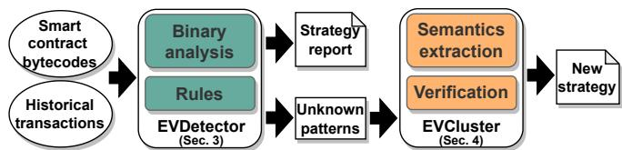
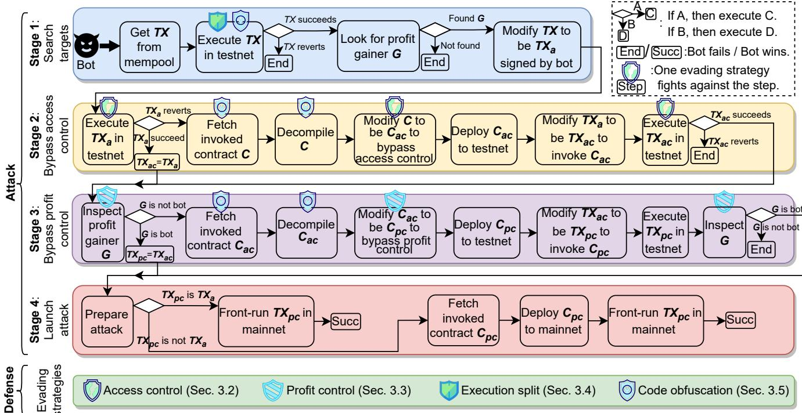
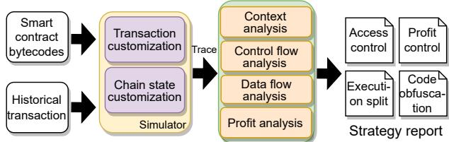
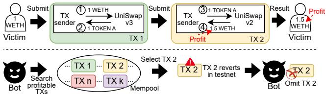
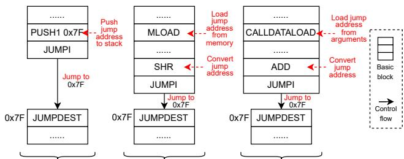
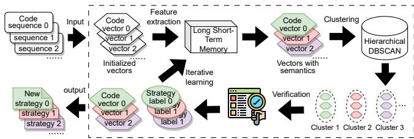
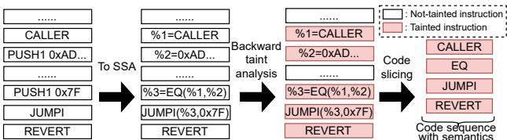
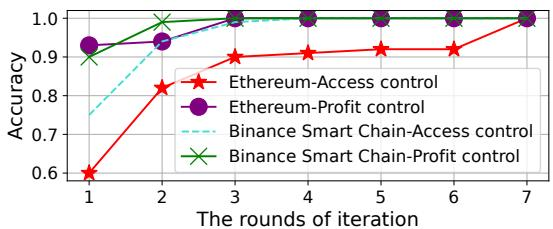

USENIX

THE ADVANCED COMPUTING SYSTEMS ASSOCIATION

# Surviving in Dark Forest: Towards Evading the Attacks from Front-Running Bots in Application Layer

Zuchao Ma, Muhui Jiang, Feng Luo, and Xiapu Luo, The Hong Kong Polytechnic University; Yajin Zhou, Zhejiang University https://www.usenix.org/conference/usenixsecurity25/presentation/ma-zuchao

# This paper is included in the Proceedings of the 34th USENIX Security Symposium.

August 13–15, 2025 • Seattle, WA, USA 978-1-939133-52-6

Open access to the Proceedings of the 34th USENIX Security Symposium is sponsored by USENIX.

# Surviving in Dark Forest: Towards Evading the Attacks from Front-Running Bots in Application Layer

Zuchao Ma<sup>1</sup>, Muhui Jiang<sup>1</sup>‡, Feng Luo<sup>1</sup>, Xiapu Luo<sup>1</sup>‡, Yajin Zhou<sup>2</sup>

<sup>1</sup>The Hong Kong Polytechnic University <sup>2</sup>Zhejiang University

## Abstract

Blockchains face significant risks from front-running attacks, leading to multi-billion USD losses. These attacks are often executed by front-running bots, automated tools that operate at high speed to execute transactions, exacerbating the threat landscape. Consequently, it is crucial for blockchain devel opers to design strategies at the application layer to mitigate these attacks. Interestingly, real-world strategies for evading front-running remain under-explored in their taxonomy and distribution due to their covert nature. Understanding these evasion tactics is vital for assessing the resilience of the current blockchain application layer and identifying areas for po tential enhancement, thereby strengthening the ecosystem. In this work, we take the first step to demystify evading strategies in Ethereum and BNB Smart Chain. We propose EVScope , a novel framework combining binary analysis and machine learning to detect known and unknown evading strategies. Using EVScope , we examine 6,761,186 arbitrage transactions and 71 significant attack transactions that evaded the front-running attacks from bots in the wild. Our findings un cover 32 refined strategies involving access control, profit control, execution split, and code obfuscation. 25/32 are first introduced in this work, and 28/32 are first applied in evading front-running, which fills a critical gap in the literature.

## 1 Introduction

Blockchains underpin Decentralized Finance (DeFi), generating economic value in the multi-billion USD range. The blockchain ecosystem predominantly relies on smart contracts, Turing-complete programs that execute on distributed network nodes. Users trigger specific actions, like token transfers, by invoking smart contract functions with designated arguments submitted to network nodes. These arguments are encapsulated within a transaction. Once a transaction is submitted, it resides in the mempool [24] of the network nodes as a pending transaction, awaiting execution.

Front-running attacks. Blockchains, often referred to as "dark forest", are highly susceptible to front-running attacks, a significant threat within DeFi. For instance, such attacks caused 675 million USD before Sep. 2022, and 224K ethers (around 599 million USD) from Sep. 2022 to July 2023 in Ethereum [58]. Front-running involves exploiting knowledge of pending transactions to gain an unfair advantage: attackers monitor the network for pending transactions and then quickly submit their own ones to be processed first, often utilizing faster communication channels to achieve this [37]. This tactic is especially prevalent in DeFi, where transactions involve substantial assets and present numerous arbitrage opportunities ripe for exploitation by front-runners [37].

Front-running bots. A front-running bot is a software tool engineered to monitor and analyze smart contract execution on blockchain networks to exploit potential profits via frontrunning attacks. A bot can sniff each pending transaction in the public mempool by listening to the broadcast messages of blockchain P2P networks. Before these transactions are confirmed, the bot executes them in a local testnet to simulate their outcome. If the simulation indicates a profitable opportunity, the bot attempts to tamper the original transaction by modifying its parameters or altering contract code to redirect the profit to itself. Subsequently, the bot can send the tampered transaction to gain profit by imitating the pending one [47,48,60]. If this tampered transaction is executed before the original one, the bot gains the profit, while the original profit gainer loses the expected profit. To achieve this, bots compete fiercely to submit their transactions at speeds, leveraging high-cost physical network infrastructures that enable near speed-of-light data transmission [37], and often colluding with powerful miners to ensure their transactions are prioritized [46]. Consequently, these bots substantially threaten blockchain users seeking to profit from this ecosystem.

Motivations. Some users prevent bots from sniffing their transactions in network layer by sending transactions directly to private miners [46], e.g., Flashbots [7]. However, this cannot eliminate front-running attacks due to the following concerns. Firstly, the private channel incurs additional costs (e.g., average 0.2ETH/block in Flashbots [4]), which is not friendly for Web3 grassroots pursuing piecemeal profit. Secondly, private channels present a steep learning curve for Web3 juniors, posing numerous challenges [21, 27, 28]. Thirdly, private miners could also become front-runners [11]. Thus, it is crucial to develop evading strategies at application layer that is mastered by users.

This leads to key research questions: what strategies are employed in the real world to evade front-running attacks, and how are they distributed? The answer is significant, as for M1: evaluating whether the current application ecosystem is robust against front-running attacks and identifying areas needing enhancement; M2: revealing novel evading strategies in the wild, providing guidance for Web3 developers in constructing defenses for their applications, thereby accelerat ing ecosystem growth. Research gap. Unfortunately, current works mainly explore how to synthesize arguments or smart contracts to launch front-running attacks [47, 48, 60], leaving evading strategies under-explored. To fill this gap, this work takes the first step to demystify evading strategies employed in the real world.

Challenges. C1: Lacking ground truth. We lack analyzed targets in the wild because there is no ground truth that reveals how many transactions or smart contracts evade the front-running attacks from bots. Furthermore, the scope of potential evading strategies is unknown, which makes it hard to systematically summarize deterministic patterns for detec tion. C2: High analysis bar. The evading strategies are often deeply embedded within smart contract executions, which involve complex arguments and intricate contract codes, making accurate identification non-trivial. Moreover, the source code of these contracts is rarely disclosed, as it often contains proprietary logic that developers are reluctant to share, particularly when it reveals profit-generating mechanisms [51]. Eventually, evading strategies, the secret weapon for defending against attacks, becomes challenging to analyze.

Our approach. To tackle C1, we construct a new dataset for strategy demystification. Firstly, we collect profitable transactions likely targeted by bots, such as arbitrage and im pactful attack transactions submitted to the public mempool. Then we filter out the transactions whose senders are bots, thereby collecting the transactions that successfully evade bots’ attacks. These transactions are expected to equip with evading strategies to protect themselves. To regulate our detection scope, we conducted a literature review on front-running attacks from top security conferences S&P, USENIX Secu rity, CCS, and NDSS (e.g., [47, 48, 60]), as well as security bulletins from prominent blockchain auditors like Certik [16], Slowmist [31], and Blocksec [17] covering 2022-2024. Based on this review, we summarize an advanced and representative front-runner. By analyzing its attack workflow, we delve into the rationale of the attack steps, and systematically summarize the strategy taxonomy that impedes these steps (Sec. 2). As it is not trivial to detect comprehensive evading strategies in the wild by limited preset rules (Sec. 3), we adopt machine learning to scale the detection scope up (Sec. 4).

To tackle C2, we propose EVScope that automatically investigates the evading strategies by conducting dynamic binary analysis. Given the bytecodes of smart contracts and their historical transactions, EVScope dynamically executes these contracts, and forces them to expose the behaviors for evading attacks, which makes it possible to lock evading strategies hidden in codes. EVScope integrates EVDetector module (Sec. 3), which analyzes execution contexts, control/data flows, and profit delivery to detect known strategies. To identify previously unknown tactics that elude EVDetector, we introduce the EVCluster module (Sec. 4). It leverages feature extraction techniques to automatically derive the semantics of unidentified behaviors, facilitating the discovery of new strategies, as shown in Fig. 1.

  
Figure 1: The workflow of EVScope

Contributions. The contributions of the work can be summarized as follows:

• New topic. We take the first step to demystify evading strategies of real world, digging out insightful findings. This work unveils novel strategies, assesses their susceptibility about getting bypassed, offers suggestions for enhancing defense, and thereby promotes the growth of ecosystem security.

• New methodology. We propose EVScope, the first framework that leverages dynamic binary analysis to lift evading strategies, tackling their covert nature (Sec. 3). EVScope can detect unknown strategies by employing machine learning to extract code semantics and summarize new types (Sec. 4). The F1-measure of EVScope reaches 0.97 on average (Sec. 5).

• New findings. We propose the strategy taxonomy that covers the defense throughout front-running workflow, which involves access control, profit control, transaction split, and code obfuscation (Sec. 3.2-3.5). The taxonomy integrates 32 refined strategies (Sec. 5), with 25 being first introduced, and 28 being first applied in evading front-running.

• New dataset. We propose the first evading strategy dataset, derived from an in-depth analysis of 6,761,186 arbitrage transactions and 71 impactful real-world attacks on Ethereum and BNB smart chain. The dataset is released in the artifact for promoting future research.

## 2 Preliminary

In this section, we introduce the threat model concerning an attacker and a defender, by illustrating their war during the workflow of a front-running attack, where the attacker (a bot, denoted by A) tries to front-run a profitable transaction to gain profit, and a defender (a developer, denoted by O) aims at preventing potential front-running behaviors. Fig. 2 shows a A’s workflow of conducting a front-running attack, which consists of four stages: S1 searching targets, S2 bypassing access control designed by O, S3 bypassing profit control of O, and S4 launching an attack. To defend against the attacks from A, O design four kinds of evading strategies: access control, profit control, execution split, and code obfuscation. In the following sections, we introduce the steps of different stages, the definition of evading strategies, as well as how these strategies fight against these steps, as shown in Fig. 2.

  
Figure 2: The workflow of a front-running attack, and the defense against it

## 2.1 Front-running workflow

Stage 1 (S1). In S1, A searches the profitable transactions as its targets to front-run, by examining the pending transactions of public mempool. Specifically, A can execute a pending transaction (denoted by TX) in its testnet that forks the state of mainnet to foresee the execution result without cost. If TX reverts during the execution, A will give up front-running TX because front-running TX that is meant to fail cannot bring profit. If TX is executed successfully, A looks for the account (denoted by G) that gains profit (also called profit gainer) by executing TX. If A cannot find G, it will also give up front running TX, as TX cannot bring profit. Otherwise, A copies the data of TX that includes the recipient, call arguments, call value, etc., to generate a new transaction $\mathrm { T X } _ { \tt a }$ . Copying TX is for imitating the behaviors that lead to gaining profit, as A tries to gain profit with $\mathrm { T X } _ { \mathtt { a } } ,$ just like the sender of TX did with TX. Note that A can tamper the data of $\mathrm { T X } _ { \tt a }$ on its demand.

Stage 2 (S2). Definition 1: Access control. To prevent A from employing TX<sub>a</sub> to gain profit, O designs access control that only allows a legitimate sender to submit TX , by checking the sender of $\mathrm { T X } _ { \tt a }$ during its execution. If the sender is not legitimate, then $\mathrm { T X } _ { \tt a }$ will revert. To implement the strategy, the defender plants specific code snippets in the smart contracts C invoked by TX to check the sender. Note that $\mathrm { T X } _ { \tt a }$ triggers access control because $\mathrm { T X } _ { \tt a }$ invokes C like TX did. In S2, if $\mathrm { \dot { T } X _ { a } }$ reverts, then A attempts to bypass access control, by modifying C to remove corresponding code snippets, and deploying modified ones to invoke. Specifically, A bypass it with the following steps. A fetches C, and tries to decompile them. Because C can be closed source, and decompiling C guides A to locate the code snippets working for access control. Then A modifies C to remove the snippets, and the modified one is denoted by $\complement _ { \mathsf { a c } } .$ A deploys $\complement _ { \mathsf { a c } }$ to its testnet, and inspects whether $\complement _ { \mathsf { a c } }$ enable it to bypass access control. A changes TX<sub>a</sub> to be $\mathrm { T X } _ { \mathsf { a c } }$ to invoke $\complement _ { \mathsf { a c } } .$ If $\mathrm { T X } _ { \tt d C }$ succeeds, A bypasses access control. If $\mathrm { T X } _ { \mathsf { a c } }$ reverts, A gives up this front-running attack.

Stage 3 (S3). After bypassing access control, to obtain profit, A must become the profit gainer (denoted by G) of $\mathrm { T X } _ { \mathsf { a c } }$ . Definition 2: Profit control. To stop A, O develops profit control to guarantee that profit can only be transferred to a legitimate account. In implementing profit control, O plants code snippets in the smart contracts C to force profit to be delivered to a legitimate account. Note that contracts $\complement _ { \mathsf { a c } }$ invoked by $\mathrm { T X } _ { \mathsf { a c } }$ also inherit these snippets because $\complement _ { \mathsf { a c } }$ is modified based on C. In S3, A inspects whether the gainer G of $\mathrm { T X } _ { \mathsf { a c } }$ is A itself. If not, it means the code snippets of profit control embedded in $\complement _ { \mathsf { a c } }$ prevent A from getting profit. To bypass profit control, A is going to modify the snippets, i.e., replacing the legitimate gainer to be A. Let A modify $\complement _ { \mathsf { a c } }$ to be $\complement _ { \mathfrak { p c } }$ to bypass profit control, and deploy $\complement _ { \mathfrak { p c } }$ to its testnet to verify whether the modification works. A changes $\mathrm { T X } _ { \mathsf { a c } }$ to be $\mathrm { T X } _ { \mathrm { p c } }$ to invoke $\complement _ { \mathfrak { p c } }$ . If the gainer G of $\mathrm { T X } _ { \mathrm { p c } }$ is A, then A bypasses profit control. If not, A gives up this front-running attack.

Stage 4 (S4). If A bypasses access control and profit control in its testnet, it can front-run $\mathrm { T X } _ { \mathsf { p c } }$ in mainnet to gain profit. Specifically, if $\mathrm { T X } _ { \mathrm { p c } }$ is equal to $\mathrm { T X } _ { \mathsf { a } } .$ this means A gains profit by $\mathrm { T X } _ { \mathrm { p c } }$ (TX<sub>a</sub>), without deploying modified smart contracts. Therefore, A can directly front-runs $\mathrm { T X } _ { \mathrm { p c } }$ in mainnet. Once $\mathrm { T X } _ { \mathrm { p c } }$ is confirmed faster than TX, then A can gain profit. On the other hand, if $\mathrm { T X } _ { \mathrm { p c } }$ is not equal to $\mathrm { T X } _ { \mathsf { a } }$ , A needs to deploy $\complement _ { \mathfrak { p c } }$ to mainnet, and then front-run $\mathrm { T X } _ { \mathrm { p c } }$ in mainnet to invoke $\complement _ { \mathfrak { p c } }$ to gain profit.

## 2.2 Defense against front-running attacks

In this section, we introduce how the defender (O) can evade the front-running attack of bot (A), in terms of different attack stages. Defense within S1. In S1, since A does not regard a transaction that reverts as its target. Therefore, if O is capable of forcing TX to revert when TX is executed in testnet, while TX succeeds when it is executed in mainnet, then TX can evade the search of O, and finally evades the front-running attack. To achieve this, there are two strategies. One is Definition 3: Execution split. O can split the execution of TX to be the execution of multiple dependent transactions $\mathrm { T X } _ { \mathrm { X } } , . . . ,$ and $\mathrm { T X } _ { \mathrm { Y } } .$ and gaining profit is finished by TX<sub>y</sub>. Since $\mathrm { T X } _ { \mathrm { Y } }$ depends on its preceding transactions (e.g., TX<sub>x</sub>), $\mathrm { T X } _ { \mathrm { Y } }$ will revert when it is executed by A in the testnet if A does not execute the preceding transactions in advance. The other strategy is Definition 4: code obfuscation. The codes of the contracts C invoked by TX, can be obfuscated to interfere with the analysis of A. That is, TX does not present the behavior (i.e., control flow) of gaining profit, if TX is executed in A’s testnet.

Defense within S2. In S2, the code snippets of C for implementing access control, guide $\mathrm { T X } _ { \tt a }$ and $\mathrm { T X } _ { \mathsf { a c } }$ to revert when A executes them. Besides, when A attempts to modify C to be $\complement _ { \mathsf { a c } }$ to bypass access control, well-designed access control can increase the bar of modification. In addition, code obfuscation can be applied to prevent C from being fetched and being decompiled by A.

Defense within S3. In S3, the code snippets of $\complement _ { \mathsf { a c } }$ for supporting profit control, force $\mathrm { T X } _ { \mathsf { a c } }$ and $\mathrm { T X } _ { \mathsf { P C } }$ to deliver profit to a legitimate account, instead of A. Similarly to the case of S2, code obfuscation can applied to prevent $\complement _ { \mathsf { a c } }$ from being fetched and being decompiled by A.

## 3 EVDetector

In this section, we introduce EVDetector, a component of EVScope designed to identify evading strategies using deterministic patterns derived from both contract and transaction analysis. An overview of EVDetector is shown in Fig. 3. The inputs to EVDetector are smart contract bytecodes and the historical transactions invoking them. Historical transactions serve two purposes: 1) identifying specific strategies, such as execution splitting, and 2) driving the bytecodes’ execution, enabling EVDetector to perform dynamic analysis and capture accurate control and data flow information. To facilitate dynamic analysis, EVDetector simulates arbitrary transactions and blockchain states, generating execution traces for further analysis. These traces include executed EVM instructions and modifications to the EVM stack, memory, and storage. Using this data, EVDetector conducts various analyses to extract patterns and infer evading strategies.

  
Figure 3: The workflow of EVDetector

## 3.1 Preparation

To uncover the four evading strategies: access control, profit control, execution splitting, and code obfuscation, EVDetector performs the following analyses to extract relevant patterns. Context analysis. Smart contract execution may involve nested calls to different contracts, with each call creating a new context that includes an isolated stack, memory, and storage. Distinguishing between these contexts is crucial for analyzing complex cross-contract executions. Control/Data flow analysis. To reveal strategies hidden in closed-source contracts, EVDetector extracts precise control and data flow through dynamic analysis, reflecting the contract’s actual behavior and reducing false positives that static analysis might produce.

Profit analysis. To track how profits are distributed during contract execution, EVDetector records fund transfers and calculates the profit for each account involved. Specifically, it logs the sender, recipient, and amount of native tokens (e.g., ETH on Ethereum) stored in the EVM stack when the CALL or CALLCODE instructions are executed. For non-native tokens (e.g., ERC-20 tokens), EVDetector decodes events like Transfer emitted by LOG instructions to extract the sender, recipient, and amount. Since token precision varies (i.e., different decimal points), EVDetector queries the token contracts decimals() function for accuracy. After recording the transfers, EVDetector retrieves token prices from providers such as Moralis [10] and Coingecko [5] to assess their value. Typ ically, the account with the highest profit in a transaction is considered the profit recipient. However, popular Web3 projects like Uniswap [13] may also hold the highest profit in arbitrage or attack transactions, potentially leading to misidentification. To address this, EVDetector excludes these projects using labels from Etherscan [23] and Bscscan [20].

Datalog. Based on the results of the previous analysis, EVDetector uses Datalog [59] to assist in uncovering evading strategies. Datalog is a declarative logic language commonly used in program analysis [41,52,59] for its expressiveness and formal semantics. This language allows software analyzers to define facts and rules to infer new facts, thereby enabling the execution of analyses. The syntax of a rule is: Factα ⇐ Factβ, Factγ, ..., which represents Factα can be inferred by Factβ, Factγ, ... , meaning Factα can be inferred from Factβ, Factγ, and so on. For clarity in this paper, we also use Datalog to formally describe the patterns used to identify evading strategies. The previous analyses provide the facts shown in Tab. 1, which can be used to infer these strategies. In the following sections, we introduce the strategies and explain how EVDetector identifies them.

Table 1: The definition of facts

<table><tr><td>Fact</td><td>Meaning</td></tr><tr><td>Flow(X, Y)</td><td>There is a data flow from variable X to variable Y.</td></tr><tr><td>Control(X, BLK)</td><td>The value of variable X controls the execution of block BLK.</td></tr><tr><td>Blk_Addr(BLK, ADDR)</td><td>The EVM instruction in address ADDR belongs to block BLK.</td></tr><tr><td>Addr_Name(ADDR, NAME)</td><td>The EVM instruction in address ADDR is NAME.</td></tr><tr><td>Addr_Arg(ADDR, ARG)</td><td>The EVM instruction in address ADDR has an argument ARG.</td></tr><tr><td>Addr_Ret(ADDR, RET)</td><td>The EVM instruction in address ADDR has an output RET.</td></tr><tr><td>Constant(X)</td><td>Variable X is a constant encoded in EVM bytecode.</td></tr><tr><td>Calldata(X)</td><td>Variable X is a part of calldata of a EVM call.</td></tr><tr><td>Memory(X)</td><td>Variable X is read from EVM memory.</td></tr><tr><td>Storage(X)</td><td>Variable X is read from EVM storage.</td></tr><tr><td>Gainer(X)</td><td>Variable X is a profit-gainer.</td></tr><tr><td>Revert_Blk(BLK)</td><td>Block BLK contains a REVERT instruction.</td></tr><tr><td>Par_Chi(ADDRp, ADDRc)</td><td>The call in address ADDRc is invoked by the call in ADDRp.</td></tr><tr><td>ProfitCall(ADDR)</td><td>The call in address ADDR delivers profit to profit-gainer.</td></tr><tr><td>ProfitCall(ADDRp)</td><td>If there is ProfitCall(ADDRc), Par_Chi(ADDRp, ADDRc), Addr_Arg(ADDRp, X), and Gainer(X).</td></tr></table>

```solidity
contract ProfitLogic{
function gainProfit(...) {
    ...
    require(msg.sender == address(0x33..f7));
    ...
}}
```

Figure 4: The code snippet of hard-coded access control. gainProfit can be executed to gain profit.

```solidity
contract ProfitLogic{
    address owner;
function gainProfit(...){
    ...
    require(msg.sender == owner);
    ...
}}
```  
Figure 5: The code snippet of storage-based access control. gainProfit can be executed to gain profit.

## 3.2 Strategy 1: Access control

Access control ensures that the transaction sender (i.e., tx.origin in EVM) or contract caller (i.e., msg.sender in EVM) is a legitimate account. The sender refers to the account that initiates a transaction, while the caller refers to the account that initiates one of the calls during the transaction’s execution. If the code detects that the sender or caller is not legitimate, the transaction will be reverted. There are two main approaches to this strategy: hard-coded access control and storage-based access control.

Hard-coded access control. In this schema, a defender hard-codes the legitimate account in contract bytecode to verify a transaction sender/contract caller must be the legitimate one. For instance, in the gainProfit function of ProfitLogic contract shown in Fig. 4, line 4 checks the caller of the contract (denoted by msg.sender) must be equal to a hard-coded address (i.e., 0x33...f7).

Storage-based access control. In this schema, the legitimate account is stored in contract storage to verify whether a transaction sender/contract caller is legitimate. Take the gainProfit function of ProfitLogic contract shown in Fig. 5 as an example, line 5 checks the caller of the contract (denoted by msg.sender) should be equal to a value (denoted by owner) in contract storage.

Detection methodology. An intuitive method to identify access control is to trigger it and then analyze how it functions. To do this, EVDetector modifies the sender of a historical transaction that invoked the contract in question, then executes the altered transaction in the same blockchain state as the original. Running the altered transaction in the same state eliminates other factors that might interfere with contract execution. If the altered transaction is reverted, access control has been triggered. EVDetector then collects the execution trace to analyze how the access control verifies the transaction sender or contract caller.

We use AC\_Constant(ADDR) to represent hard-coded access control is detected, and the EVM instruction in address ADDR verifies whether a transaction sender/contract caller is legitimate. The rule to infer AC\_Constant(ADDR) is shown in Tab. 2. The rule describes that if the transaction sender/- contract caller (or their converted form) is compared with a constant, and the compared result guides the smart contract to execute REVERT instruction, then it is hard-coded access control. Similarly, we use AC\_Storage(ADDR) to denote storagebased access control, which is also shown in Tab. 2.

## 3.3 Strategy 2: Profit control

Profit control ensures that profits are only transferred to legitimate accounts. Profit transfers can be classified into two types: 1) native token transfers and 2) non-native token transfers. Each blockchain has a native token (e.g., ETH on Ethereum) and various non-native tokens (e.g., ERC-20 tokens like WETH). For native token transfers, a smart contract directly transfers profit to the recipient’s address. For non native tokens, the contract must interact with another contract managing those tokens to transfer the profit by specifying the arguments. There are three main approaches to profit control: hard-coded, argument-based, and storage-based.

Table 2: The rules to demystify strategies (facts c.f. Tab. 1)  
```txt
Strategy Facts to infer the strategy on the left
AC_Constant(ADDR) Control(X, BLK), Revert_Blk(BLK), Addr_Ret(ADDR, X), Addr_Name(ADDR, "EQ"), Addr_Arg(ADDR, ARG0), Addr_Arg(ADDR, ARG1), Flow("ORIGIN/CALLER", ARG0), Constant(ARG1).
AC_Storage(ADDR) Control(X, BLK), Revert_Blk(BLK), Addr_Ret(ADDR, X), Addr_Name(ADDR, "EQ"), Addr_Arg(ADDR, ARG0), Addr_Arg(ADDR, ARG1), Flow("ORIGIN/CALLER", ARG0), Storage(ARG1).
PC_Constant(X) ProfitCall(ADDR), ![ProfitCall(ADDRp), Par_Chi(ADDRp, ADDR)], Gainer(X), Addr_Arg(ADDR,X), Constant(X).
PC_Argument(X) ProfitCall(ADDR), ![ProfitCall(ADDRp), Par_Chi(ADDRp, ADDR)], Gainer(X), Addr_Arg(ADDR,X), Calldata(X).
PC_Storage(X) ProfitCall(ADDR), ![ProfitCall(ADDRp), Par_Chi(ADDRp, ADDR)], Gainer(X), Addr_Arg(ADDR,X), Storage(X).
OB_Memory(JMP) Addr_Arg(ADDR, JMP), Addr_Name(ADDR, "JUMP/JUMPI"), Memory(X), Flow(X, JMP).
OB_Argument(JMP) Addr_Arg(ADDR, JMP), Addr_Name(ADDR, "JUMP/JUMPI"), Calldata(X), Flow(X, JMP).
```  
![Factβ, Factγ, ...] represents there is no condition that Factβ, Factγ, ... exist in the same time.

Hard-coded profit control. In a smart contract, this schema specifies a constant address as the account to receive profit. For instance, Fig. 6 presents gainProfit function (line 2) that can be invoked to gain profit. gainer is the account that receives the profit, which is a constant value written by the developer of contract ProfitLogic. Line 5 delivers the profit of 1 ETH (i.e., 1e18 wei) to gainer. Therefore, the execution of gainProfit guarantees the profit must be transferred to a legitimate account.

```txt
contract ProfitLogic{
function gainProfit(...){
    ...//gainer is the account gaining profit
    address gainer = address(0x33...f7));
    gainer.call{value: 1e18}("");
    ...
}
Figure 6: The code snippet of a smart contract using hard-coded profit control. 0x33...f7 is the hard-coded address.
```

Argument-based profit control. This schema adopts the function arguments to specify the legitimate account that receives profit. Fig. 7 illustrates gainProfit function of ProfitLogic contract that can be called to deliver the profit to account gainer (line 2 and line 6).

Storage-based profit control. This schema employs con tract storage to specify the legitimate account that receives profit. When a smart contract transfers profit, it needs to read the storage to get the account. For example, in Fig. 8, gainProfit (line 3) is the function that can be called to deliver profit to a specified account. gainer (line 2 and line 5) is the first argument of swap function, which specifies the account that executes the swap action to gain profit.

```solidity
contract ProfitLogic{
function gainProfit(..., address gainer){
    ...//WETH_C: the contract managing WETH tokens
    ...//gainer is the account receiving profit
    ...//amount is the number of transferred
    tokens (i.e., profit)
    WETH_C.transferFrom(.., gainer,amount);
    ...
}}
```  
Figure 7: The code snippet of argument-based profit control

```solidity
contract ProfitLogic{
    address gainer;//the account gaining profit
function gainProfit(...){
    ...//Uniswap: the contract for swapping token
    Uniswap.swap(gainer, ...);
    ...
}}
```  
Figure 8: The code snippet of storage-based profit control.

Detection methodology. To investigate profit control, EVDetector monitors the execution of historical transactions that invoke the target contract and analyzes how the profit recipient’s address is introduced during execution. EVDetector identifies the profit recipient and pinpoints the call (e.g., CALL or CALLCODE instruction) that transfers profit to this address, using profit analysis (c.f. Sec. 3.1). Tracing profit control crossing contexts. To trace how the profit recipient is introduced, EVDetector backtracks the execution trace from the call that transfers the profit, until it finds the source of the recipient’s address. Since smart contract execution may involve nested calls across different contracts (i.e., crossing contexts), the profit recipient may be passed across isolated contexts as an argument. EVDetector traces back to the first call introducing the recipient and inspects its source, which could come from a constant (hard-coded profit control), function arguments (argument-based profit control), or EVM storage (storage-based profit control).

We use PC\_Constant(X) to represent hard-coded profit control, and X is the profit gainer. PC\_Constant(X) can be inferred by the rule shown in Tab. 2. The rule describes that if the profit gainer is first introduced in the form of a constant, and the gainer is delivered to the call employed for transferring profit, then this is hard-coded profit control. Similarly, we use PC\_Argument(X) and PC\_Storage(X) to represent argumentbased and storage-based profit control individually. The rules to infer these strategies are shown in Tab. 2.

## 3.4 Strategy 3: Execution split

This strategy divides arbitrage/attack execution into multiple parts triggered by different transactions. Due to the dependency among these transactions, they must be executed following an expected order to achieve the arbitrage/attack. If not, the arbitrage/attack transaction reverts, which disguises it as a non-profitable transaction to evade the search of attackers.

Take Fig. 9 as an instance, assuming an arbitrage action contains two swap actions that are included in TX1 and TX2 individually. In TX1, the sender (i.e., victim) swaps 1 WETH, a popular ERC-20 token, for 1 TOKEN A, with UniSwap V3 contract ( 1 2 ). In TX2, the sender swaps 1 TOKEN A for 1.5 WETH with UniSwap V2 contract ( 3 4 ). If TX1 and TX2 both get executed following the order TX1 → TX2, then the victim will have 1.5 WETH that is more than the victim’s initial asset (i.e., 1 WETH), which means TX2 is a profitable transaction. Since a bot will search profitable transactions from public mempool to front-run, when TX2 are submitted to mempool, TX2 will be inspected by the bot. When the bot executes TX2 in its testnet to observe whether TX2 is profitable, without executing TX1 in advance, TX2 reverts because the victim does not have 1 TOKEN A. In this way, TX2 disguises itself as a failed transaction, which misleads the bot to omit it.

A. No obfuscation B. Memory based obfuscation C. Argument based obfuscation  
  
Figure 9: Execution split strategy

Detection methodology. It is not trivial to directly identify execution split on smart contracts, as the ’split’ is reflected in transactions. Therefore, EVDetector detects the strategy on transactions, by searching whether a transaction has at least one partner within the same block. For each transaction α being analyzed, its partner satisfies the criteria that (1) the partner is a preceding transaction of α in the same block; (2) the recipient of the partner is a contract invoked by α, and the recipient is not a public DEX project; (3) α will fail if the partner is not executed in advance. If such a partner is found, then EVDetector reports it as an execution split sample. Criterion (2) mitigates false positive cases caused by, misclassifying the back-running scenario (α is profiting by back-running its preceding transaction β) to be execution split. (2) can filter out the scenario because if α back-runs β, it signifies that β does not collude with α, suggesting that the recipient of β is unlikely invoked by α. An exception may arise if the recipient is a public DEX project (such as Uniswap), which is also eliminated by (2). The algorithm of the detection is shown in Algorithm 1.

## 3.5 Strategy 4: Code obfuscation

Bots modify smart contracts to bypass their evading strategies by conducting in-depth analysis of the bytecodes. Code obfuscation disrupts this process by (1) making it harder for bots to understand the semantics of the contract, and more ef fectively, (2) hiding code snippets to prevent them from being retrieved and analyzed. Advanced bots can use state-of-the-art decompilers (e.g., Vandal [35] and Gigahorse [41]) to recover source code from bytecode. This is feasible because decompilation can be conducted offline in advance by scanning existing arbitrage contracts to eliminate time cost. Besides, online decompilation can take seconds to finish [45]. Source code provides rich semantic information that helps bots engineer solutions, such as identifying access control logic to bypass defenses. Since control flow obfuscation is known to effectively hinder decompilers [55], EVDetector identifies two main types: memory-based control flow obfuscation and argument-based control flow obfuscation. Interestingly, this is the first time that control flow obfuscation is discovered in evading front-running attacks.

```txt
Algorithm 1: Identifying execution split strategy
Data: α ;                      /* The analyzed transaction */
Result: output ;           /* True if the strategy is identified */
block ← [tx0,tx1,tx2,...,α,...] ;          /* The block of α */
for ( i = 0; block[i] ≠ α; i++) {
    if block[i].recipient ∈ Callees(α) then
        // Callees(α): the callees of α (excluding public projects)
        state ← forking the state where block[i] executes;
        for ( j = i + 1; block[j] ≠ α; j++) {
            state ← executing block[j] on state;
        }
        if executing α on state is failed then
            return output ← True;
        end
    end
}
return output ← False;
```

Memory-based control flow obfuscation. Decompilers reconstruct the control flow of smart contracts by analyzing the jump addresses used by the JUMP or JUMPI instructions to guide EVM execution between basic blocks. Specifying jump addresses by EVM memory prevents decompilers from statically identifying these addresses, as they are dynamically loaded or generated from memory, making it an effective strategy to disrupt decompilation [55]. In case B of Fig. 10, for example, the jump address 0x7F is loaded from EVM memory using the MLOAD instruction and then transformed by a SHR (right shift) instruction. Unlike in case A, where the jump address 0x7F is explicitly exposed, case B conceals the address within the basic block, making analysis more challenging.

  
Figure 10: Control flow obfuscation (0x7F is the jump address)

Argument-based control flow obfuscation. Similarly, an other strategy to obfuscate control flow is specifying jump addresses by contract function arguments. As these jump addresses are dynamically loaded or generated from arguments, it is hard for decompilers to evaluate them by only analyzing smart contracts. Take case C of Fig. 10 as an example, the jump address 0x7F is loaded by CALLDATALOAD instruction from function arguments, and then ADD instruction convert the address to be its final form.

Another strategy to evade bot analysis is to hide smart contract code when bots attempt to fetch it. The most widely used API for retrieving contract bytecode, eth\_getCode [26], is provided by popular blockchain clients (e.g., Go ethereum [8] and Erigon [6]) and data providers (e.g., Etherscan [23] and Bscscan [20]). However, contract code can evade detection using two techniques: (1) hiding code within the contract constructor, and (2) destructing the contract after use. In (1), the code in the constructor is not stored on the blockchain as part of the contract bytecode, though it remains Turing complete and fully functional. In (2), the contract is destroyed using the EVM selfdestruct instruction, removing itself from blockchain storage, which evades the retrieval of eth\_getCode. These two methods are summarized as constructor-based obfuscation and destruction-based obfusca tion.

Constructor-based obfuscation. When a smart contract is created, its creation code consisting of its constructor and its runtime bytecode is submitted to blockchain. Then, the constructor is executed to support gaining profit, and finally gets abandoned. Only the runtime bytecode is stored as the code of the smart contract. Take Fig. 11 as an example, gainProfit (line 4) is the function containing profit-gaining code, which is embedded in constructor to avoid being fetched.

```solidity
contract ProfitLogic{
constructor(...) {
    ...
    gainProfit(...); //function for gaining profit
    ...
}}
```  
Figure 11: The code snippet of constructor-based obfuscation.

Destruction-based obfuscation. Bots can search for historically profitable transactions and front-run them on another blockchain with the same runtime. This means a bot can replicate a historical contract execution across different blockchains to gain profit. Cross-chain front-running attacks are feasible, as demonstrated by real-world incidents. For ex ample, a transaction executed on Ethereum was transplanted to Optimism [29], resulting in a profit of 35 million dollars [9]. Another transaction on Ethereum can be transplanted to Arbitrum [14], yielding 6.5 million dollars [30]. To prevent cross-chain front-running attacks on historical transactions, destructing contracts after use can prevent bots from accessing them.

Detection methodology. To demystify control flow obfus cation of a smart contract, EVDetector executes its historical transaction to obtain the execution trace. By locating the arguments of each JUMPI and JUMP instruction within the trace, EVDetector identifies all jump addresses. If a jump address is specified from memory, then it is memory-based control flow obfuscation. Furthermore, since a jump address may be converted to be its final form after loaded from memory (e.g., case B in Fig. 10), EVDetector identifies such conversion by analyzing the dataflow from memory to the address. We adopt OB\_Memory(JMP) to represent a jump address JMP is obfuscated with memory. Similarly, if EVDetector finds a jump address from function arguments, then it is argument-based control flow obfuscation (represented by OB\_Argument(JMP)). The detection rules are illustrated in Tab. 2.

To detect constructor-based obfuscation in a smart contract, EVDetector first identifies the transaction that creates the contract, as the constructor is only executed during this transaction. EVDetector then checks whether the logic to support gaining profit is hidden in the constructor. If so, it reports constructor-based obfuscation. Since constructors cannot be retrieved by existing APIs (e.g., eth\_getCode), EVDetector locates the context generated by the CREATE and CREATE2 instructions during transaction execution and captures the instructions executed within this context, identifying them as the constructor. This is because EVM uses CREATE and CREATE2 to generate a new contract and context for executing the constructor. If EVDetector finds that the constructor of a contract is executed in a profitable transaction, while the runtime bytecode is not, this suggests that the logic supporting gaining profit may be hidden in the constructor rather than in the runtime bytecode. To increase the confidence that the constructor contains profit-related logic, EVDetector focuses on the constructor that executes SSTORE, CALL, or DELEGATECALL instructions, as these can modify contract state and influence the transfer of funds.

To detect destruction-based obfuscation intuitively, EVDetector identifies whether analyzed contracts get destructed after they are invoked, by querying eth\_getCode API. Given the address of an analyzed contract, if the API returns an empty string, it means the contract is destructed.

## 4 EVCluster

EVCluster enhances EVDetector’s detection capabilities by identifying unknown evading strategies. It achieves this by mining the semantics of evading strategies from code sequences and distinguishing them through semantic learning, ultimately uncovering new strategies and their respective sam ples. The overview of EVCluster is shown in Fig. 12. The input consists of code sequences containing evading strategy semantics, and the output is newly identified strategies. These sequences are collected from contract execution traces when evading strategies are triggered. EVCluster converts the sequences into initialized vectors and uses feature extraction to embed strategy semantics into these vectors. By leveraging Long Short-Term Memory (LSTM) [42], EVCluster gener ates semantic code vectors, which are then clustered using Hierarchical DBSCAN [36]. This clustering process groups code sequences based on their strategy semantics, guiding EVCluster in discovering new evading strategies.

  
Figure 12: The workflow of EVCluster

## 4.1 Code sequence collection

Code sequences directly collected from execution traces cannot be immediately used for extracting features related to evading strategies, as these traces often contain noise, i.e., instructions irrelevant to evading attacks. This noise creates a challenge for machine learning models in understanding the semantics of evading strategies. To focus only on the instructions reflecting strategy semantics, EVCluster uses backward taint analysis to prune the code sequences.

Specifically, EVCluster locates the instruction that indicates an evading strategy has been triggered and marks it as the end of the sequence. For example, a REVERT instruction signals that access control has been triggered, while a CALL instruc tion delivering profit indicates profit control. Starting from this endpoint, EVCluster performs backward taint analysis, tracing the arguments and outputs of instructions to include all relevant instructions involved in triggering the strategy in the sequence. To further refine the sequences, EVCluster con verts EVM instructions into SSA (Static Single Assignment) infinite register form, optimizing the SSA by removing PUSH, DUP, POP and SWAP instructions to shorten the sequence, as illustrated in Fig. 13.

  
Figure 13: The workflow of code sequence collection

## 4.2 Feature extraction

Since code sequences can be represented as vectors, EVClus ter applies feature extraction to embed the semantics of evading strategies into these vectors. This enables clustering models to differentiate vectors belonging to different strategies and ultimately uncover new ones. To achieve feature extraction, EVCluster uses a time series model for representation learning, optimized for classification, as inspired by [34, 43]. A time series model is chosen over a spatial pattern model (e.g., Convolutional Neural Networks) because code sequences have inherent temporal properties related to instruction execution, making a time series model more suitable for capturing execution semantics. EVCluster uses Long Short Term Memory (LSTM) [42] as its time series model, as LSTM has demonstrated superior performance over other models (e.g., Transformer) in scenarios with limited datasets [39, 49]. Given the challenge of constructing a large-scale dataset of new evading strategies, LSTM was selected to maintain EVCluster’s performance under these constraints.

Given the initialized vectors, EVCluster trains the LSTM to classify these vectors, by connecting a fully connected layer to the model. The initialized labels for guiding the classification, are collected from the detection of EVDetector (Sec. 3). For those samples that cannot be identified by EVDetector, EVCluster assigns an ’unknown’ label to them. To classify the vectors correctly within training, LSTM extracts the features filled with semantics to guide it in distinguishing the vectors, and the features are output to be new vectors. By this way, LSTM injects the semantics of code sequences to the new vectors that can be clustered to discover new strategies.

## 4.3 Clustering and Iterative learning

By clustering the vectors, EVCluster groups code sequences based on their semantics, significantly reducing the manual effort required to identify new evading strategies. EVCluster uses Hierarchical DBSCAN (HDBSCAN) [36], a densitybased clustering algorithm, for two key reasons. First, HDB-SCAN does not require specifying a fixed number of clusters for initialization, making it more robust in scenarios where EV Cluster lacks domain-specific knowledge about the types or number of evading strategies. This contrasts with models like K-Means [44], which depend on setting an appropriate number of clusters. Second, unlike other density-based models such as DBSCAN [50], HDBSCAN does not rely on defining a maximum distance between samples within the same cluster—a parameter that is often difficult to determine in practice. This flexibility makes HDBSCAN better suited for the discovery of new strategies.

EVCluster operates in a semi-automatic, iterative manner. The goal of the clustering model is to create an efficient taxonomy that minimizes the manual effort required to verify and label new strategies. During manual verification, new insights into evading strategy semantics are incorporated into EVCluster, allowing it to iteratively optimize the learning of both LSTM and HDBSCAN, leading to a more accurate taxonomy. This integration is achieved by providing new labels to LSTM for feature extraction. In each iteration, to improve efficiency, only the clusters where more than 50% of samples share similar patterns (i.e., denser clusters) are manually inspected, while the remaining clusters are analyzed in subsequent rounds. This approach reduces unnecessary costs, especially in the early stages of EVCluster, when insufficient knowledge may lead to less accurate clustering.

## 5 Evaluation

In this research, we answer the following research questions: RQ1: What are the taxonomy and distribution of evading strategies in the wild?

RQ2: What are the findings from these evading samples? RQ3: What are the suggestions for current application layers to evade bots?

RQ4: How is the accuracy of EVScope on demystifying strategies?

## 5.1 Dataset collection

We collect representative samples equipped with evading strategies, by inspecting the samples that successfully evade the attacks from bots in Ethereum [22] and BNB smart chain (BSC) [19]. Specifically, we scan the arbitrage transactions and impactful attack transactions whose senders are not bots, as these profitable transactions are attractive to bots but bots fail to front-run them. We filter out the transactions submit ted to private miners, as these private transactions are not observed by bots when they are pending, which implies they may not rely on evading strategies for protection. We collect the arbitrage transactions across 2022-Jan. 2024 following the methodology proposed in [53]. We collect attack transactions from the reports of popular blockchain auditors Certik [16], Slowmist [31], and Blocksec [17] across 2021-2023. The account labels of bot are collected from Etherscan [23] and Bscscan [20]. We filter the private transactions of Ethereum according to the labels of Etherscan. As Bscscan does not provide such labels, we filter the private transactions if their miners belong to 48Club [25], bloXroute [18], or TxBoost [32], the most popular private miners of BSC. Finally, we obtain 223,536 arbitrage transactions, and 50 attack transactions from Ethereum, 6,537,650 arbitrage transaction, and 21 at tack transactions from BNB smart chain.

## 5.2 Evading strategies in the wild (RQ1)

Access control distribution. Tab. 3 shows the distribution of evading strategies. Access control is used in 43.37%/46.82% of arbitrage contracts on Ethereum/BSC, with most cases relying on hard-coded access control (19.9%) in Ethereum, and storage-based access control (21.3%) in BSC. In attack contracts, 59.18%/72.22% implement access control, favoring storage-based methods (34.7%/61.1%). This suggests attack contracts are more resilient to front-running, as storage-based access control is harder to bypass (see strategy security analysis later).

Profit control distribution. 59.77%/51.34% of arbitrage contracts on Ethereum/BSC use profit control, compared to 75.5%/66.7% of attack contracts. This indicates that developers launching attacks are more conscious of controlling profit gainer. Execution split distribution. Only 2.26%/4.71% of arbitrage contracts and 4.08%/5.56% of attack contracts use execution splitting strategies. The low adoption may be due to increased transaction fees from additional transactions and the added complexity in contract design, which burdens developers. Code obfuscation distribution. 2.26% of arbitrage contracts (9.64% of arbitrage transactions) on Ethereum employ control flow obfuscation, which is greater than the 0.47% of arbitrage contracts (0.8% of arbitrage transactions) on BSC. Code obfuscation is not commonly adopted, and the reason could be the challenge that requiring a deep understanding on contract binary for developers.

Strategy security. To assess the security of different strategies, specifically, how difficult they are to analyze and bypass by bots, we use three dimensions: Dynamic detection, which determines whether bots must perform dynamic analysis to locate bytecode snippets for modification; Symbol analysis, which checks if bots need symbolic analysis [33] to tamper with the bytecode; and Tamper storage, which evaluates whether bots need to modify contract storage. These dimensions correspond to the key barriers in bypassing strategies, which involve (1) locating the bytecode to be tampered with, (2) determining how to modify it, and (3) tampering with contract storage, if necessary.

For (1), bots can locate snippets using static analysis. For example, in hard-coded access control (c.f. Sec. 3.2), the caller is authenticated by comparing the caller from the CALLER instruction with a constant loaded by the PUSH instruction using the EQ instruction. Bots can identify these snippets through static analysis by searching for CALLER-PUSH-EQ pat terns. However, static analysis may fail when instructions operate on memory or storage, as their operands are dynamically loaded. In such cases, bots must use dynamic analysis, which increases the effort required (e.g., through code instrumentation) to locate the snippets.

For (2), bots tamper with bytecode snippets on the offsets identified in (1). In the case of hard-coded access control, a bot could bypass it by simply replacing the operand of the PUSH instruction with the bot’s account (e.g., 0xABC). However, this simple replacement fails when value conversions are involved. For instance, if the strategy shifts the caller right by 1 bit before comparison, the bot must replace the operand of PUSH with 0xAB instead of 0xABC. To address this, bots can use symbolic analysis [33] to assign an expression to the PUSH operand and build constraints to bypass the strategy. With this approach, automated solvers [38] can find the correct operand, like 0xAB. However, symbolic analysis requires time [33], making it more challenging for bots to bypass the strategy

Arb-SC/Arb-Tx ratio: the ratio of arbitrage smart contracts/transactions. Att-SC/Att-Tx ratio: the ratio of attack smart contracts/transactions. Dynamic detection, Symbol analysis, Tamper storage: engineering to bypass strategies. More engineering implies more difficult to bypass the strategy (Sec. 5.2)  
Table 3: Evading strategies adopted in the wild (Ethereum / BNB smart chain)

<table><tr><td>No.</td><td>Type</td><td>Strategy</td><td>Design schema</td><td>Arb-SC ratio</td><td>Arb-Tx ratio</td><td>Att-SC ratio</td><td>Att-Tx ratio</td><td>Dynamic detection</td><td>Symbol analysis</td><td>Tamper storage</td></tr><tr><td>1</td><td>Access</td><td>cons_eq</td><td>Authenticating caller or tx sender by comparing them with constants</td><td>1.99e-01/7.74e-02</td><td>4.12e-01/1.07e-01</td><td>2.04e-01/5.56e-02</td><td>2.00e-01/4.76e-02</td><td>×</td><td>×</td><td>×</td></tr><tr><td>2</td><td>Access</td><td>store_eq</td><td>Authenticating caller or tx sender by comparing them with value of fixed storage slots</td><td>9.48e-02/1.67e-01</td><td>4.69e-03/1.43e-02</td><td>3.47e-01/6.11e-01</td><td>3.40e-01/5.24e-01</td><td>×</td><td>√</td><td>√</td></tr><tr><td>3</td><td>Access</td><td>store_map</td><td>Authenticating caller or tx sender by comparing with value of mapping</td><td>1.02e-01/2.13e-01</td><td>3.13e-02/2.38e-01</td><td>——/5.56e-02</td><td>——/4.76e-02</td><td>√</td><td>√</td><td>√</td></tr><tr><td>4</td><td>Access</td><td>cons_shl_eq</td><td>Authenticating caller or tx sender by comparing them with a value generated by shifting left operation</td><td>1.17e-02/5.33e-03</td><td>9.57e-04/3.53e-04</td><td>2.04e-02/——</td><td>2.00e-02/——</td><td>×</td><td>√</td><td>×</td></tr><tr><td>5</td><td>Access</td><td>cons_sub</td><td>Authenticating caller or tx sender by conducting subtraction with constants</td><td>8.02e-03/3.27e-03</td><td>1.77e-02/1.91e-02</td><td>——/——</td><td>——/——</td><td>×</td><td>√</td><td>×</td></tr><tr><td>6</td><td>Access</td><td>bind_xor</td><td>Authenticating caller or tx sender by XOR them with contract bytecode</td><td>2.92e-03/——</td><td>7.16e-05/——</td><td>——/——</td><td>——/——</td><td>√</td><td>√</td><td>×</td></tr><tr><td>7</td><td>Access</td><td>bind_sub</td><td>Authenticating caller or tx sender by conducting subtraction with contract bytecode</td><td>5.10e-03/——</td><td>1.58e-02/——</td><td>——/——</td><td>——/——</td><td>√</td><td>√</td><td>×</td></tr><tr><td>8</td><td>Access</td><td>bind_eq</td><td>Authenticating caller or tx sender by comparing them with contract bytecode</td><td>3.64e-03/3.27e-04</td><td>3.18e-02/7.80e-06</td><td>——/——</td><td>——/——</td><td>√</td><td>×</td><td>×</td></tr><tr><td>9</td><td>Access</td><td>cons_xor_eq</td><td>Authenticating caller or tx sender by comparing them with a value generated by XOR operation</td><td>1.46e-03/3.27e-04</td><td>8.95e-06/1.07e-06</td><td>2.04e-02/——</td><td>2.00e-02/——</td><td>×</td><td>√</td><td>×</td></tr><tr><td>10</td><td>Access</td><td>store_caller</td><td>Using caller or tx sender as the storage address to record authentication</td><td>2.92e-03/——</td><td>1.48e-04/——</td><td>——/——</td><td>——/——</td><td>×</td><td>√</td><td>√</td></tr><tr><td>11</td><td>Access</td><td>cons_xor</td><td>Authenticating caller or tx sender by XOR them with constants</td><td>7.29e-04/4.35e-04</td><td>1.92e-04/4.74e-06</td><td>——/——</td><td>——/——</td><td>×</td><td>√</td><td>×</td></tr><tr><td>12</td><td>Access</td><td>val_num</td><td>Authenticating call value should be equal to block number</td><td>7.29e-04/——</td><td>5.92e-03/——</td><td>——/——</td><td>——/——</td><td>×</td><td>√</td><td>×</td></tr><tr><td>13</td><td>Access</td><td>store_sub</td><td>Authenticating caller or tx sender by conducting subtraction with the value from storage</td><td>7.29e-04/8.71e-04</td><td>1.79e-05/8.29e-05</td><td>——/——</td><td>——/——</td><td>√</td><td>√</td><td>√</td></tr><tr><td>14</td><td>Access</td><td>store_xor</td><td>Authenticating caller or tx sender by XOR value of storage with them</td><td>——/2.18e-04</td><td>——/6.12e-07</td><td>——/——</td><td>——/——</td><td>×</td><td>√</td><td>√</td></tr><tr><td>15</td><td>Profit</td><td>cons_pro</td><td>Profit gainer is hard-encoded as a constant</td><td>1.68e-01/1.13e-01</td><td>1.79e-01/1.63e-01</td><td>2.24e-01/1.11e-01</td><td>2.20e-01/9.52e-02</td><td>×</td><td>×</td><td>×</td></tr><tr><td>16</td><td>Profit</td><td>arg_pro</td><td>Profit gainer is specified by call arguments</td><td>3.16e-01/6.72e-02</td><td>5.94e-01/1.10e-01</td><td>2.86e-01/2.78e-01</td><td>3.00e-01/8.10e-01</td><td>√</td><td>×</td><td>×</td></tr><tr><td>17</td><td>Profit</td><td>store_cons_pro</td><td>Profit gainer is specified by the value of a fixed storage slot</td><td>9.33e-02/2.75e-01</td><td>4.17e-02/3.03e-01</td><td>2.45e-01/2.78e-01</td><td>2.40e-01/2.38e-01</td><td>×</td><td>√</td><td>√</td></tr><tr><td>18</td><td>Profit</td><td>store_dyna_pro</td><td>Profit gainer is specified by the value of a dynamic storage slot</td><td>1.17e-02/1.95e-02</td><td>9.08e-04/1.29e-03</td><td>——/——</td><td>——/——</td><td>√</td><td>√</td><td>√</td></tr><tr><td>19</td><td>Profit</td><td>call_pro</td><td>Profit gainer is specified by the return value of an external call</td><td>4.37e-03/1.28e-02</td><td>8.50e-05/1.25e-03</td><td>——/——</td><td>——/——</td><td>√</td><td>√</td><td>×</td></tr><tr><td>20</td><td>Profit</td><td>bind_pro</td><td>Profit gainer is specified by dynamic loading from contract bytecode</td><td>2.92e-03/2.32e-02</td><td>1.79e-04/2.28e-02</td><td>——/——</td><td>——/——</td><td>√</td><td>×</td><td>×</td></tr><tr><td>21</td><td>Profit</td><td>xor_pro</td><td>Profit gainer is generated with XOR instruction</td><td>7.29e-04/6.53e-04</td><td>4.47e-06/3.90e-05</td><td>——/——</td><td>——/——</td><td>×</td><td>√</td><td>×</td></tr><tr><td>22</td><td>Profit</td><td>val_pro</td><td>Profit gainer can be loaded only when call value is a specific value</td><td>7.29e-04/——</td><td>1.34e-04/——</td><td>——/——</td><td>——/——</td><td>×</td><td>×</td><td>×</td></tr><tr><td>23</td><td>Profit</td><td>create_pro</td><td>Profit gainer is generated by creating a new contract</td><td>——/8.71e-04</td><td>——/9.48e-06</td><td>——/——</td><td>——/——</td><td>√</td><td>√</td><td>×</td></tr><tr><td>24</td><td>Profit</td><td>store_add_pro</td><td>Profit gainer is specified by adding a value on another value read from storage</td><td>——/1.20e-03</td><td>——/3.67e-06</td><td>——/——</td><td>——/——</td><td>×</td><td>√</td><td>√</td></tr><tr><td>25</td><td>Split</td><td>split</td><td>Execution is split into multiple transactions</td><td>2.26e-02/4.71e-02</td><td>1.06e-02/2.42e-03</td><td>4.08e-02/5.56e-02</td><td>4.00e-02/4.76e-02</td><td>√</td><td>√</td><td>√</td></tr><tr><td>26</td><td>Obfus.</td><td>arg_ob</td><td>Jump address is specified by call arguments</td><td>2.19e-02/1.09e-04</td><td>9.63e-02/1.53e-07</td><td>——/——</td><td>——/——</td><td>√</td><td>×</td><td>×</td></tr><tr><td>27</td><td>Obfus.</td><td>mem_ob</td><td>Jump address is specified by memory</td><td>5.10e-03/4.57e-03</td><td>2.87e-02/8.03e-03</td><td>——/——</td><td>——/——</td><td>√</td><td>×</td><td>×</td></tr><tr><td>28</td><td>Obfus.</td><td>store_ob</td><td>Jump address is specified by storage</td><td>——/1.85e-03</td><td>——/2.80e-03</td><td>——/——</td><td>——/——</td><td>√</td><td>×</td><td>×</td></tr><tr><td>29</td><td>Obfus.</td><td>chain_ob</td><td>Jump address is generated only in main-net</td><td>2.19e-03/——</td><td>6.71e-04/——</td><td>——/——</td><td>——/——</td><td>√</td><td>×</td><td>×</td></tr><tr><td>30</td><td>Obfus.</td><td>val_ob</td><td>Jump address is generated only when call value is a specific value</td><td>7.29e-04/——</td><td>3.13e-02/——</td><td>——/——</td><td>——/——</td><td>√</td><td>×</td><td>×</td></tr><tr><td>31</td><td>Obfus.</td><td>constrt_ob</td><td>Hiding logic in constructor</td><td>7.29e-04/5.44e-03</td><td>4.47e-06/2.46e-05</td><td>2.04e-02/——</td><td>2.00e-02/——</td><td>√</td><td>×</td><td>×</td></tr><tr><td>32</td><td>Obfus.</td><td>destrt_ob</td><td>Destructing contracts after gaining profit</td><td>4.37e-03/4.59e-02</td><td>8.32e-04/1.30e-02</td><td>4.08e-02/1.67e-01</td><td>4.00e-02/1.43e-01</td><td>×</td><td>×</td><td>×</td></tr></table>

quickly.

For (3), if the evading strategy involves contract storage, bots must tamper with storage to bypass it, which is more complex than modifying code snippets. For example, storagebased access control (c.f. Sec. 3.2) authenticates the caller by using the EQ instruction to compare the caller from the CALLER instruction with a legitimate account loaded from storage via the SLOAD instruction. To bypass this, a bot would need to replace the legitimate account in storage with its own by identifying the correct storage slot and appending an SSTORE instruction to write the bot’s account. Appending the SSTORE and triggering its execution is challenging because modifying the bytecode offsets can lead to complex binary rewriting issues [54]. Additionally, the bot may need to invoke a separate transaction to trigger the SSTORE, further increasing the difficulty in executing front-running attacks.

## 5.3 Findings from evading strategies (RQ2)

We introduce interesting findings and provide case study in this section. To better map findings and related strategies, we use line number of Tab. 3 as the index to guide readers to locate strategies. For the concise expression, we use TX to represent transaction, and SC to represent smart contract.

Finding 1: hard-coding is more popular in Ethereum. Hard-coded access control and profit control are the most basic designs, making them easier to bypass as they directly expose tamperable information in bytecode. On Ethereum, 19.9% of arbitrage contracts and 20.4% of attack contracts hard-code the legitimate caller (line 1), while 16.8% of arbitrage contracts and 22.4% of attack contracts hard-code the profit gainer (line 15). In BSC, 7.74% of arbitrage contracts and 5.56% of attack contracts hard-code the caller, while 11.3% of arbitrage and 11.1% of attack contracts hard-code the profit gainer. This suggests Ethereum developers tend to favor this approach more.

Finding 2: storage-based solution is more widely used in BSC. Storage-based access control and profit control are harder for bots to bypass, as they require tampering with contract storage through additional instructions and transactions (c.f. Sec. 5.2). On BSC, 38% of arbitrage contracts use storage-based access control (lines 2-3), and 27.5% employ storage-based profit control (line 17), which is significantly more common than on Ethereum. Besides, we observe storage-based control flow obfuscation on BSC (line 28), while it is not found on Ethereum. We believe this is because the storage operations on Ethereum cost more gas fee than BSC.

Finding 3: diverse value conversion. Value conversion refers to strategies that use operations, e.g., SHL (shift-left) and XOR, to transform values used for verification or specification, forcing bots to reverse the conversion to bypass them. For example, in a strategy where a value α is shifted left using SHL and then compared to the caller to verify legitimacy, a bot must find an α such that SHL(α) matches its account. This adds complexity for the bot in finding the correct value. Compared to other strategies, like storage-based ones that incur higher gas costs, value conversion is more efficient. It is employed in various strategies (lines 4-7, 9, 11, 13, 14, 21, 24).

Finding 4: Ingenious code integrity protection. We observe that some strategies (lines 6-8, 20) use the entire contract bytecode for verification or specification, which implicitly protects the bytecode’s integrity by preventing tampering. Specifically, these strategies utilize the CODECOPY instruction to load the entire contract bytecode into EVM memory, then extract information, such as the legitimate account or profit gainer, from a specified offset. If bots attempt to tamper with the bytecode to bypass these strategies, they may alter instruc tion offsets (e.g., [47]), causing the information extraction to fail and preventing successful bypass.

Finding 5: control flow obfuscation preference. We find that Ethereum developers tend to specify jump addresses by function arguments (line 26), with 2.19% of arbitrage contracts, covering 9.63% of arbitrage transactions. This is likely because function arguments offer a more flexible interface for controlling jump addresses compared to memory-based (line 27) or storage-based strategies (line 28).

Finding 6: runtime environment check. We found that some smart developers implement runtime environment checks in smart contracts, allowing the contracts to modify their execution based on the environment (line 29). This strategy helps prevent exposing profit-gaining behavior when contracts detect they are being inspected by bots. For example, TX 0x6522 is an arbitrage transaction that invokes SC 0x93ff, which is equipped with a runtime environment check. Specifically, SC 0x93ff uses the CHAINID instruction to retrieve the blockchain ID during execution, and only when the ID is 1, indicating it is on the Ethereum mainnet, will a correct jump address be generated to trigger profit-gaining actions. If bots inspect TX 0x6522 on a testnet, such as Sepolia [12] or Goerli [1], they will not observe the expected behavior.

Finding 7: crafty execution split. Interestingly, 5.56% of attack contracts on the BNB Smart Chain adopt an execution split strategy (line 25) designed to mislead bots into perceiving them as failed transactions. For example, TX 0x93ae is an attack [15] that caused a loss of 43,629 USD on BSC, using a clever execution split strategy to avoid front-running. The attack is split into TX 0x9308 and TX 0x93ae within block 34506417, where TX 0x9308 sets a contract variable to be read by TX 0x93ae. If TX 0x9308 is not executed before TX 0x93ae, the latter reverts due to a failed read. As a result, when bots inspect TX 0x93ae without first executing TX 0x9308 on their testnet, they see a reverted transaction. This strategy answers the question posed in [15]: ’Why did the transaction go through the public mempool without being front-run by bots?’

Finding 8: attack contracts prefers hiding logic in constructor. 2.04% of attack contracts on Ethereum hide their attack logic in the constructor due to its concealment (line 31), which is significantly more common than in arbitrage contracts. This is likely because the constructor is used only once, meaning the logic can only be triggered during its initial execution. This makes it more suitable for one-time attacks, whereas arbitrage contracts require ongoing functionality.

Finding 9: call value check. Some strategies require a caller to set a specific call value to enable contract logic, in terms of access control (line 12), profit control (line 22), and control flow obfuscation (line 30).

## 5.4 Suggestions for evading bots (RQ3)

Suggestion 1: Avoiding exposing secret in bytecode. Hardcoded access control and profit control are used in approximately 20% and 16.8% of arbitrage contracts in Ethereum, which exposes the secret (e.g., legitimate accounts, profit gainers, or critical jump addresses) directly in contract bytecode. This allows bots to easily bypass protections by locating the secret and tampering it. An intuitive improvement is storing the secret in contract storage, which may increase the gas cost in execution. The other gas-efficient solution is convert ing the secret before encoding it in bytecode, with delicate bit-operations (e.g., shift or XOR), as shown in Finding 3 of RQ2.

Suggestion 2: Binding functionality with bytecode integrity. Since bots tamper bytecode to bypass protection, an effective strategy is automatically disabling contract functionality (e.g., gaining profit) when the bytecode is tampered. However, directly verifying bytecode integrity in contracts is gas-expensive. As inspired by Finding 4 of RQ2, this strategy can be achieved by storing the data (e.g., legitimate accounts or profit gainers) that supports contract functionality in spe cific bytecode offsets, which maintains a customized bytecode layout. Once the layout is disrupted by bot-driven code engi neering, the data cannot be loaded correctly, which leads to disabling functionality.

Suggestion 3: Verifying runtime environment in execution. As bots execute transactions in testnets to analyze their behavior, another suggestion is hiding contract behavior if contracts are not executed in mainnet. This can be achieved by explicitly verifying the runtime environment with CHAINID instruction, as shown in Finding 6 of RQ2. Besides, inspired by the execution split of Finding 7, contracts can implicitly examine the environment by checking whether a split transaction is executed in advance.

## 5.5 The accuracy of EVScope (RQ4)

Verification dataset. To evaluate the accuracy of EVScope on detecting evading strategies, we manually construct a verification dataset consisting of 400 random samples: 100 sam ples each for 4 primary types - access control, profit control, execution split, and code obfuscation. We used state-of-theart decompilers such as Gigahorse [41], Panoramix of [23], Ethervm.io [3], and Rattle [2] to aid in our verification for maintaining the correctness. The dataset is representative for validating the effectiveness of EVScope. Because each 100 samples contains 50 positive samples and 50 negative samples, each invoking distinct smart contracts. Positive/negative represents that a sample is equipped/not-equipped with the evading strategies belonging to the primary type. The 50 positive samples cover all refined subtypes of the primary type, ensuring comprehensively validating the detection effectiveness for the primary type.

The False-positive (FP)/False-negative (FN) of EVScope. As shown in Tab. 4, EVScope achieves zero FP/FN for access control and code obfuscation, as its dynamic analysis captures concrete execution traces across the EVM stack, memory, and storage, enabling precise control/data flow analysis and value tracking. For profit control, it has 5 FP and 7 FN cases, as it fails to identify the correct profit gainer. This stems from incorrectly evaluating the profit gained by the profit gainer, as the price providers, Moralis and Coingecko [5, 10] fail to provide relevant data, leading to 4 FP and 3 FN cases. The other root cause is that public DeFi projects are identified as the profit gainers due to their highest profit, as Etherscan and Bscscan do not provide labels for EVScope to filter out these projects (c.f. Sec. 3.1), leading to 2 FP and 5 FN cases. To address this, we plan to integrate additional price and label providers into EVScope in the future.

In detecting execution split, EVScope achieves zero FP by applying criterion (2) of Sec. 3.4 to correctly exclude backrunning cases that could be misclassified as execution split. Specifically, EVScope effectively handles all 13 back-running cases in the verification dataset. EVScope misses 1 FN case, attack TX 0x2b02. Because its partner TX 0xb268 does not meet criterion (2). While this criterion may occasionally lead to FN cases, it ensures high precision in detecting execution split, representing a necessary trade-off.

Comparison with straw-man approach. While no existing work detects evading strategies, we design a straw-man approach (SA) as a baseline to highlight EVScope’s methodological innovation. SA works by decompiling smart contracts and performing code search on the decompiled results to iden tify evading strategies. We use Panoramix, the official decom pilation tool of Etherscan and Bscscan, due to its widespread use and ability to produce decompiled results closer to source code, enabling more effective code search. Based on the insights from reviewing the verification dataset, we craft strategy patterns and design 82 regular expression rules to detect evading strategies for access control and profit control. For example, a pattern like require 0xABC == caller identifies hard-coded access control.

As shown in Tab. 4, SA achieves a precision of 0.34 and a recall of 0.32 for access control. The 31 FP and 34 FN cases occur because SA fails to identify the correct control flow for access control, and reports unrelated patterns as strategies. In contrast, EVScope dynamically triggers the access control in smart contracts, capturing precise control flow for analysis, which enables significantly higher precision and recall.

Table 4: The effectiveness of detecting evading strategies  
More false positive samples lead to the lower precision (Prec.). More false negative samples lead to the lower recall.

<table><tr><td rowspan="2">Approach</td><td colspan="3">Access control</td><td colspan="3">Profit control</td><td colspan="3">Execution split</td><td colspan="3">Code obfuscation</td></tr><tr><td>F1</td><td>Prec.</td><td>Recall</td><td>F1</td><td>Prec.</td><td>Recall</td><td>F1</td><td>Prec.</td><td>Recall</td><td>F1</td><td>Prec.</td><td>Recall</td></tr><tr><td>Straw-man</td><td>0.33</td><td>0.34</td><td>0.32</td><td>0.27</td><td>0.33</td><td>0.22</td><td>-</td><td>-</td><td>-</td><td>0.00</td><td>0.00</td><td>0.00</td></tr><tr><td>EVScope</td><td>1.00</td><td>1.00</td><td>1.00</td><td>0.88</td><td>0.90</td><td>0.86</td><td>0.98</td><td>1.00</td><td>0.98</td><td>1.00</td><td>1.00</td><td>1.00</td></tr></table>

In detecting profit control, SA achieves a precision of 0.33 and a recall of 0.22, with 22 FP and 39 FN cases. All FP cases arise because SA misidentifies unrelated external calls (e.g., transfer or swap) as profit delivery mechanisms. This also introduce 19 FN cases. In contrast, EVScope accurately iden tifies profit delivery calls by locating the exact profit gainer, and then back-tracing the calls that transfer the profit. The remaining 20 FN cases occur because SA fails to capture the data flow that delivers the profit gainer for transferring profit, as the flow may span stack, memory, storage, and contract interaction. To tackle this challenge, EVScope dynamically executes transactions for extracting the precise data flow.

SA cannot detect execution split, as identifying it requires inspecting the interactions between colluding transactions. Additionally, SA fails to detect code obfuscation because (1) jump address obfuscation disrupts decompilation, and (2) decompiled results cannot effectively illustrate constructors or determine whether contracts have been destructed on-chain.

The accuracy of clustering process. The clustering process is iterative, and we use Adjusted Rand Index (ARI) to evaluate its accuracy, as shown in Fig. 14. Identifying access control strategies requires more rounds compared to profit control, due to the greater number of the refined patterns (14 vs. 10). Additionally, distinguishing access control strategies on Ethereum takes more rounds than on BSC, as the insights gained from Ethereum samples improve our efficiency in identifying BSC samples.

  
Figure 14: The accuracy of clustering process

## 6 Discussion

Soundness. To mitigate the inherently high false positive rate of static program analysis [40], EVScope employs dynamic analysis by executing targeted smart contracts using historical transactions. This approach provides precise control and data flow, ensuring the accuracy of the demystified results. Additionally, the performance of the machine learning techniques used in EVScope , such as feature extraction and clustering, affects the efficiency of manual verification but does not compromise the accuracy of the demystified results.

Completeness. The findings of this paper may be limited by data collection. Firstly, private transactions are excluded because they cannot validate the effectiveness of evading strategies. Despite this, private transactions may employ redundant strategies that fall outside the scope of this paper. Secondly, the arbitrage between centralized exchange (CEX) and decentralized exchange (DEX) is not included, as CEX data is not publicly accessible. Thirdly, the current work has not involved arbitrage across multiple chains, due to the significantly challenging collection effort. Considering this is the first work to demystify real-world evading strategies, we leave improving completeness as future work.

Construct validity. In collecting profitable transactions that evade front-running attacks, we use labels from Etherscan [23] and Bscscan [20] to 1) determine whether a profitable transaction was visible to bots while pending, and 2) identify whether the transaction was initiated by a bot. While the accuracy of the collected data may depend on the labels provided by Etherscan and Bscscan, we argue that any potential bias should not significantly impact the overall results, as these are the most authoritative data providers available. Besides, the dataset of this paper may miss the latest labels at the time when readers access this work, as the labels are continuously updated by Etherscan and Bscscan. Additionally, we retrieve token prices from Moralis [10] and Coingecko [5] to assess the profits of accounts involved in the transactions. Although the queried prices may introduce some bias, we believe this represents the best practice currently available, as Moralis and Coingecko are the most widely used price providers in the ecosystem.

External validity. EVScope is general and can be scaled to other chains such as Solana, Starknet, Sui, etc. Because the utilized methodologies (e.g., program analysis, profit analysis, and machine learning) are not EVM-specific. Transplanting EVScope to other chains mainly includes (1) modeling instruction semantics to extract control/data flow, (2) evaluating profit delivery, and (3) slicing code to extract strategy features.

## 7 Related works

State-of-the-art front-running attacks. Qin et al. are the first to propose an adversarial model for front-running profitable transactions by replaying them [48]. In their model, a front runner attempts to modify the transaction proposer and arguments to replay the transaction and gain profit. However, this strategy can fail due to protections built into smart contracts. To address this, Qin et al. introduced APE, which synthesizes smart contracts designed to bypass these protections [47]. Similarly, Zhang et al. developed counterattack smart contracts to front-run transactions initiated by attackers [60], using symbolic validation to uncover exploitable front-running vulnerabilities in smart contracts [57, 58]. While these studies provide a deep exploration of how advanced adversaries may launch front-running attacks, they do not extensively investi gate how smart contracts evade such attacks—this is the gap that our work aims to address.

Countermeasures for front-running attacks. One approach to defending against front-running attacks is to prevent bots from seeing transactions by sending them directly to private miners [46]. However, this private channel could not eliminate front-running attacks (c.f. motivation in Sec. 1). Thus, it is still crucial to develop evading strategies at the application layer, highlighting the importance of this work. Yang et al. proposed time-based and content-agnostic ordering mechanisms to prevent front-running attacks [56], but have yet to see widespread adoption.

## 8 Conclusion

In this work, we present EVScope , a framework that uncovers evading strategies designed to defend against front-running attacks by bots in Ethereum/BNB smart chain, focusing on access control, profit control, execution splitting, and code obfuscation. Additionally, we evaluate the reliability of smart contracts in the ecosystem and highlight areas for improve ment. We believe this work helps illuminate the dark forest of blockchain security.

## Acknowledgments

We are deeply grateful to our shepherd and the reviewers for their invaluable insights and thoughtful comments. This work is supported by Hong Kong RGC Projects (PolyU15224121, PolyU15231223), Hong Kong ITF Project (No. PRP/005/23FX), and Hong Kong RGC TRS Project (No. T43-513/23-N).

## 9 Ethics Considerations

This paper focuses on uncovering evading strategies adopted in defending front-running attacks from bots. The paper aims to (1) evaluate the ecosystem’s resilience against attacks, and (2) guide Web3 juniors to learn state-of-the-art defense and enhance application security.

Potential risk 1. Attackers (bots) may also improve their knowledge by learning this paper, and enhance their attack capabilities, which potentially increases the risk for those users relying on strategies to protect applications. Therefore, we do not disclose any codes applied in implementation to bypass existing strategies.

Potential risk 2. Disclosing evading strategies may share the methodologies of designing defense to the public, which may present the idea of developers in their engineering. Therefore, we do not release any source codes that are applied in engineering to achieve the defense.

Potential risk 3. Contract codes could be the profit-gaining products of persons or companies, and researching contract codes could disclose information of their owners. Therefore, all contract data used in this paper is collected from public chains (Ethereum and Binance Smart Chain) that insist on the spirit of data openness and verification.

In conclusion, this work considers these potential risks, and minimizes the corresponding negative impacts.

## 10 Open Science

This research complies with the open science policy. The artifacts in https://zenodo.org/records/14735789 include:

· code: the source code of EVScope,

· dataset: the transactions that adopt evading strategies, and

· document: the guidance to recreate results and run tools.

## References

[1] Goerli testnet. https://goerli.net/, 2018. Accessed Apr. 17th, 2024.

[2] Rattle: Evm binary static analysis framework. https: //github.com/crytic/rattle, 2018. Accessed Apr. 17th, 2024.

[3] Ethereum virtual machine opcodes. https://www.et hervm.io/, 2021. Accessed Apr. 17th, 2024.

[4] Flashbots transparency report. https://medium.c om/flashbots/flashbots-transparency-report -march-2021-d3930b4b98a9, 2021. Accessed Apr. 17th, 2024.

[5] Coingecko: View top cryptocurrency prices live, crypto charts, market cap, and trading volume. https://www. coingecko.com/, 2022. Accessed Apr. 17th, 2024.

[6] Erigon: an implementation of ethereum on the efficiency frontier. https://github.com/erigontech/erigon, 2022. Accessed Apr. 17th, 2024.

[7] Flashbots docs. https://docs.flashbots.net/fla shbots-auction/overview/, 2022. Accessed Apr. 17th, 2024.

[8] Go implementation of the ethereum protocol. https: //github.com/ethereum/go-ethereum, 2022. Ac cessed Apr. 17th, 2024.

[9] An in-depth analysis of how 20 million op got stolen. https://mirror.xyz/0xbuidlerdao.eth/lOE5VN -BHI0olGOXe27F0auviIuoSlnou\_9t3XRJseY, 2022. Accessed Apr. 17th, 2024.

[10] Moralis web3 - enterprise-grade web3 apis. https: //moralis.io/, 2022. Accessed Apr. 17th, 2024.

[11] Nodereal validator is not respecting the gas ordering in block. https://github.com/bnb-chain/bsc/i ssues/699, 2022. Accessed Apr. 17th, 2024.

[12] Sepolia testnet explorer. https://sepolia.ethersca n.io/, 2022. Accessed Apr. 17th, 2024.

[13] Uniswap protocol. https://uniswap.org/, 2022. Accessed Apr. 17th, 2024.

[14] Arbitrum — the future of ethereum. https://arbitr um.io/, 2023. Accessed Apr. 17th, 2024.

[15] Attack towards transitfinance went through the public mempool, but no mev bot frontrun. https://x.com/sh oucccc/status/1737355359172563108, 2023. Accessed Apr. 17th, 2024.

[16] Certik - securing the web3 world. https://www.cert ik.com, 2023. Accessed Apr. 17th, 2024.

[17] Blocksec: Security-incidents. https://app.blocks ec.com/explorer/security-incidents, 2024. Accessed Apr. 17th, 2024.

[18] bloxroute: A faster networking infrastructure. https: //docs.bloxroute.com/, 2024. Accessed Apr. 17th, 2024.

[19] Bnb chain ecosystem. https://www.binance.com/ en/bnb, 2024. Accessed Apr. 17th, 2024.

[20] Bscscan: a block explorer and analytics platform for bnb smart chain. https://bscscan.com/, 2024. Accessed Apr. 17th, 2024.

[21] The discord channel of flashbots. http://discord.gg /flashbots, 2024. Accessed Apr. 17th, 2024.

[22] Ethereum. https://ethereum.org/en/, 2024. Accessed Apr. 17th, 2024.

[23] Etherscan: a block explorer and analytics platform for ethereum. https://etherscan.io/, 2024. Accessed Apr. 17th, 2024.

[24] Etherscan: Pending transactions. https://etherscan. io/txsPending, 2024. Accessed Apr. 17th, 2024.

[25] Front-run protection of bsc. https://docs.48.club /buidl/infrastructure/bsc-rpc/front-run-pr otection, 2024. Accessed Apr. 17th, 2024.

[26] Infura api: Json-rpc methods. https://docs.infur a.io/api/networks/ethereum/json-rpc-method s/eth\_getcode, 2024. Accessed Apr. 17th, 2024.

[27] The issues of flashbots on stack overflow. https://et hereum.stackexchange.com/search?q=flashbot, 2024. Accessed Apr. 17th, 2024.

[28] The issues of using flashbots on github. https://github.com/flashbots/web3-flas hbots/issues?q=is%3Aissue+is%3Aclosed, 2024. Accessed Apr. 17th, 2024.

[29] Optimism: the fastest growing evm ecosystems. http s://www.optimism.io/, 2024. Accessed Apr. 17th, 2024.

[30] Senecausd is being exploited due to an open external call vulnerability. https://x.com/SlowMist\_Team/ status/1762865505042645010, 2024. Accessed Apr. 17th, 2024.

[31] Slowmist: Security-incidents. https://hacked.slo wmist.io/?c=ETH, 2024. Accessed Apr. 17th, 2024.

[32] Txboost: Boost your geth with faster and more transactions. http://txboost.com/, 2024. Accessed Apr. 17th, 2024.

[33] Roberto Baldoni, Emilio Coppa, Daniele Cono D’elia, Camil Demetrescu, and Irene Finocchi. A survey of symbolic execution techniques. ACM Computing Surveys (CSUR), 51(3):1–39, 2018.

[34] Yoshua Bengio, Aaron Courville, and Pascal Vincent. Representation learning: A review and new perspectives. IEEE transactions on pattern analysis and machine intelligence, 35(8):1798–1828, 2013.

[35] Lexi Brent, Anton Jurisevic, Michael Kong, Eric Liu, Francois Gauthier, Vincent Gramoli, Ralph Holz, and Bernhard Scholz. Vandal: A scalable security analysis framework for smart contracts. arXiv preprint arXiv:1809.03981, 2018.

[36] Ricardo JGB Campello, Davoud Moulavi, and Jörg Sander. Density-based clustering based on hierarchical density estimates. In Pacific-Asia conference on

knowledge discovery and data mining, pages 160–172. Springer, 2013.

[37] Philip Daian, Steven Goldfeder, Tyler Kell, Yunqi Li, Xueyuan Zhao, Iddo Bentov, Lorenz Breidenbach, and Ari Juels. Flash boys 2.0: Frontrunning in decentralized exchanges, miner extractable value, and consensus instability. In 2020 IEEE symposium on security and privacy (SP), pages 910–927. IEEE, 2020.

[38] Leonardo De Moura and Nikolaj Bjørner. Z3: An effi cient smt solver. In International conference on Tools and Algorithms for the Construction and Analysis of Systems, pages 337–340. Springer, 2008.

[39] Aysu Ezen-Can. A comparison of lstm and bert for small corpus. arXiv preprint arXiv:2009.05451, 2020.

[40] Asem Ghaleb and Karthik Pattabiraman. How effec tive are smart contract analysis tools? evaluating smart contract static analysis tools using bug injection. In Proceedings ofthe 29th ACM SIGSOFT International Symposium on Software Testing and Analysis, pages 415–427, 2020.

[41] Neville Grech, Lexi Brent, Bernhard Scholz, and Yannis Smaragdakis. Gigahorse: thorough, declarative decompilation of smart contracts. In 2019 IEEE/ACM 41st International Conference on Software Engineering (ICSE), pages 1176–1186. IEEE, 2019.

[42] Klaus Greff, Rupesh K Srivastava, Jan Koutník, Bas R Steunebrink, and Jürgen Schmidhuber. Lstm: A search space odyssey. IEEE transactions on neural networks and learning systems, 28(10):2222–2232, 2016.

[43] Zihao Li, Jianfeng Li, Zheyuan He, Xiapu Luo, Ting Wang, Xiaoze Ni, Wenwu Yang, Xi Chen, and Ting Chen. Demystifying defi mev activities in flashbots bundle. In Proceedings of the 2023 ACM SIGSAC Conference on Computer and Communications Security, pages 165–179, 2023.

[44] Aristidis Likas, Nikos Vlassis, and Jakob J Verbeek. The global k-means clustering algorithm. Pattern recogni tion, 36(2):451–461, 2003.

[45] Xia Liu, Baojian Hua, Yang Wang, and Zhizhong Pan. An empirical study of smart contract decompilers. In 2023 IEEE International Conference on Software Analy sis, Evolution and Reengineering (SANER), pages 1–12. IEEE, 2023.

[46] Xingyu Lyu, Mengya Zhang, Xiaokuan Zhang, Jianyu Niu, Yinqian Zhang, and Zhiqiang Lin. An empirical study on ethereum private transactions and the security implications. arXiv preprint arXiv:2208.02858, 2022.

[47] Kaihua Qin, Stefanos Chaliasos, Liyi Zhou, Benjamin Livshits, Dawn Song, and Arthur Gervais. The blockchain imitation game. In 32nd USENIX Security Symposium (USENIX Security 23), pages 3961–3978, 2023.

[48] Kaihua Qin, Liyi Zhou, and Arthur Gervais. Quantifying blockchain extractable value: How dark is the forest? In 2022 IEEE Symposium on Security and Privacy (SP), pages 198–214. IEEE, 2022.

[49] GVSSN Srirama Sarma, B Ravindranath Reddy, Pradeep M Nirgude, and P Vasudeva Naidu. Performance assessment of customized lstm based deep learning model for predictive maintenance of transformer. International journal of electrical & electronics research, 2023.

[50] Erich Schubert, Jörg Sander, Martin Ester, Hans Peter Kriegel, and Xiaowei Xu. Dbscan revisited, revisited: why and how you should (still) use dbscan. ACM Transactions on Database Systems (TODS), 42(3):1–21, 2017.

[51] Christof Ferreira Torres, Ramiro Camino, et al. Frontrunner jones and the raiders of the dark forest: An empirical study of frontrunning on the ethereum blockchain. In 30th USENIX Security Symposium (USENIX Security 21), pages 1343–1359, 2021.

[52] Petar Tsankov, Andrei Dan, Dana Drachsler-Cohen, Arthur Gervais, Florian Buenzli, and Martin Vechev. Securify: Practical security analysis of smart contracts. In Proceedings ofthe 2018 ACM SIGSAC conference on computer and communications security, pages 67–82, 2018.

[53] Ben Weintraub, Christof Ferreira Torres, Cristina Nita-Rotaru, and Radu State. A flash(bot) in the pan: Measuring maximal extractable value in private pools. In Proceedings of the 22nd ACM Internet Measurement Conference (IMC ’22), Nice, France, 2022. Association for Computing Machinery.

[54] Matthias Wenzl, Georg Merzdovnik, Johanna Ullrich, and Edgar Weippl. From hack to elaborate technique—a survey on binary rewriting. ACM Computing Surveys (CSUR), 52(3):1–37, 2019.

[55] Wentian Yan, Jianbo Gao, Zhenhao Wu, Yue Li, Zhi Guan, Qingshan Li, and Zhong Chen. Eshield: protect smart contracts against reverse engineering. In Proceedings of the 29th ACM SIGSOFT International Symposium on Software Testing and Analysis, pages 553–556, 2020.

[56] Sen Yang, Fan Zhang, Ken Huang, Xi Chen, Youwei Yang, and Feng Zhu. Sok: Mev countermeasures: Theory and practice. arXiv preprint arXiv:2212.05111, 2022.

[57] Wuqi Zhang, Lili Wei, Shing-Chi Cheung, Yepang Liu, Shuqing Li, Lu Liu, and Michael R Lyu. Combatting front-running in smart contracts: Attack mining, bench mark construction and vulnerability detector evaluation. IEEE Transactions on Software Engineering, 2023.

[58] Wuqi Zhang, Zhuo Zhang, Qingkai Shi, Lu Liu, Lili Wei, Yepang Liu, Xiangyu Zhang, and Shing-Chi Cheung. Nyx: Detecting exploitable front-running vulnerabilities in smart contracts. In 2024 IEEE Symposium on Secu rity and Privacy (SP), pages 146–146. IEEE Computer Society, 2024.

[59] Xin Zhang, Ravi Mangal, Radu Grigore, Mayur Naik, and Hongseok Yang. On abstraction refinement for program analyses in datalog. In Proceedings of the 35th ACM SIGPLAN Conference on Programming Language Design and Implementation, pages 239–248, 2014.

[60] Zhuo Zhang, Zhiqiang Lin, Marcelo Morales, Xiangyu Zhang, and Kaiyuan Zhang. Your exploit is mine: In stantly synthesizing counterattack smart contract. In 32nd USENIX Security Symposium (USENIX Security 23), pages 1757–1774, 2023.