# Time-travel Investigation: Toward Building a Scalable Atack Detection Framework on Ethereum

SIWEI WU, Zhejiang University & Key Laboratory of Blockchain and Cyberspace Governance

of Zhejiang Province

LEI WU, YAJIN ZHOU, and RUNHUAI LI, Zhejiang University

ZHI WANG, Florida State University

XIAPU LUO, The Hong Kong Polytechnic University

CONG WANG, City University of Hong Kong

KUI REN, Zhejiang University

Ethereum has been attracting lots of attacks, hence there is a pressing need to perform timely investigation and detect more attack instances. However, existing systems sufer from the scalability issue due to the fol lowing reasons. First, the tight coupling between malicious contract detection and blockchain data importing makes them infeasible to repeatedly detect diferent attacks. Second, the coarse-grained archive data makes them ineficient to replay transactions. Third, the separation between malicious contract detection and runtime state recovery consumes lots of storage.

In this article, we propose a scalable attack detection framework named EthScope, which overcomes the scalability issue by neatly re-organizing the Ethereum state and eficiently locating suspicious transactions. It leverages the fine-grained state to support the replay of arbitrary transactions and proposes a well-designed schema to optimize the storage consumption. The performance evaluation shows that EthScope can solve the scalability issue, i.e., eficiently performing a large-scale analysis on billions of transactions, and a speedup of around 2,300 when replaying transactions. It also has lower storage consumption compared with existing systems. Further analysis shows that EthScope can help analysts understand attack behaviors and detect more attack instances.

CCS Concepts: • Security and privacy Distributed systems security;

Additional Key Words and Phrases: Ethereum, attack detection, vulnerability

## ACM Reference format:

Siwei Wu, Lei Wu, Yajin Zhou, Runhuai Li, Zhi Wang, Xiapu Luo, Cong Wang, and Kui Ren. 2022. Time-travel Investigation: Toward Building a Scalable Attack Detection Framework on Ethereum. ACM Trans. Softw. Eng. Methodol. 31, 3, Article 54 (April 2022), 33 pages. https://doi.org/10.1145/3505263

## 1 INTRODUCTION

With an explosive growth of the blockchain technique, Ethereum [2] has become one of the representative platforms. One reason is due to its inborn support of smart contracts. Developers use smart contracts to build Decentralized Applications (DApps), ranging from gaming, lottery, Decentralized Finance (DeFi), and cryptocurrency, e.g., ERC20 tokens [6].

At the same time, attacks targeting Ethereum are increasing. By exploiting the vulnerabilities of smart contracts, attackers could make huge profits in a short time. For instance, in April 2016, attackers exploited the re-entrancy vulnerability in the DAO smart contract and stole around 3.6 million Ether [53]. Attackers used the similar vulnerability to attack the decentralized exchange Uniswap [34] (July 2019) and DeFi application Lend.Me [33] (April 2020). Besides, lots of other types of attacks have been observed in the wild [19–21].

Accordingly, there is a pressing need for the security community to perform timely investigations on attacks and detect more attack instances that were not revealed. This requires the capability to quickly locate suspicious transactions based on various types of public information. For instance, suppose there is a reported attack to a smart contract (the victim contract) on a public forum, but the details of such an attack are unknown. To understand the attack, an analyst needs to locate suspicious transactions that interact with the victim contract, and further construct the callgraph between the victim contract and others to understand their behaviors. After that, the analyst may need to detect more attack instances. In particular, he or she further locates candidate transactions1 that are potentially related to the attack and replay them. By doing so, the analyst can monitor the runtime states of a smart contract and hook into its execution to detect more attacks. Figure 1 shows this flow.

Note that the investigation may continuously repeat the steps in Figure 1. That is because the understanding of an attack needs multiple rounds of querying and analyzing transactions. This raises the challenge that the analysis framework should be scalable to a large number of transactions (until July 5, 2020, Ethereum has 754,614,255 normal transactions and 962,171,044 internal transactions, respectively), i.e., eficiently locating and replaying transactions.2

Limitations of existing systems. Though multiple systems [38, 43, 44, 52, 58] have been proposed to detect malicious smart contracts,3 the scalability issue makes them inefective to perform the time-travel investigation due to the following reasons.

Limitation I: Tight Coupling between malicious contract detection and blockchain data importing. Some systems import the entire blockchain data from the genesis block and replay historical transactions. During this process, malicious contracts are detected based on predefined rules. The importing process is time-consuming (about ten days) and cannot be repeated. It is inflexible to repeatedly replay transactions, revise and debug detection rules, a considerable limitation to detect new attack instances.

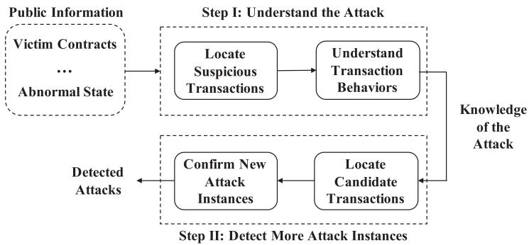  
Fig. 1. The typical flow of an investigation of atacks on Ethereum.

Limitation II: Coarse-grained archive data. To solve the previous limitation, systems could leverage the archive mode [23] of popular Ethereum clients to repeatedly replay arbitrary transactions, after importing the data once. However, the historical states are too coarsegrained to eficiently replay transactions, since unnecessary transactions are executed (Section 3.1). Our evaluation shows that it costs more than 47 min to replay 100 normal transactions. This is not scalable for real attack detection, which needs to replay tens of thousands and even millions of transactions (Section 5.1.3).

Limitation III: Huge storage requirements. Instead of using the coarse-grained archive data, recent systems recover and store the runtime information (called “logical relation” in Reference [58]) into a database. The further detection is based on the stored logical relation. This avoids the cost of repeatedly replaying transactions. However, the storage for the logical relation is huge. For instance, the logical relation database for blocks ranging from 7,000,000 to 7,200,000 consumes 2,949 GB [58]. Given the fact that Ethereum has around 10,400,000 blocks (as of July 5, 2020) and this number is still increasing, it is not practical to detect attacks in the whole Ethereum blocks.

Our approach. Our system takes the following approaches to overcome the limitations.

Solution to limitation I: Our system does not perform the detection during the blockchain importing process. Instead, we save the Ethereum states, e.g., internal transactions, created smart contract code, into a database. Further detection is based on the saved states to locate suspicious transactions. This decouples the detection and the importing process.

Solution to limitation II: Our system replays arbitrary transactions in a scalable way. This is due to the well-designed and fine-grained states that have been retrieved in the previous step. By doing so, there is no need to replay unnecessary transactions in our system. For instance, our system only needs around one second to replay the same 100 normal transactions that consumed 47 min in the archive mode (Table 6).

Solution to limitation III: Our detection is performed at the same time when replaying transactions. It provides a practical way for an analyst to specify detection rules, which are executed when replaying transactions. Thanks to the eficient replay engine, our system does not need to save unnecessary runtime information. For instance, our system only consumes 1,844 GB storage for the historical states in the 10 5 million blocks (as of July 22, 2020), compared with 2,949 GB needed for 0.2 million blocks in TxSpector [58]. This makes the detection spanning all Ethereum blocks possible.

System Implementation. With the scalability requirement in mind, we have implemented an analysis framework named EthScope with three components.

Specifically, the first component, i.e., data aggregator, collects and recovers the critical blockchain state, including internal transactions, self-destructed smart contracts, the account balance of each block, and so on. The database is used to quickly locate suspicious transactions, and more importantly, provides fine-grained states that are needed by the replay engine.

The second component, i.e., replay engine, is able to eficiently and repeatedly replay arbitrary and a large number of transactions. This is critical to solve the scalability issue in existing systems. The saved blockchain states are carefully designed to replay transactions without executing unnecessary ones.

The third component, i.e., instrumentation framework, exposes interfaces for an analyst to dynamically instrument smart contracts and introspect the execution of transactions. An analyst can develop analysis scripts (using the JavaScript language) to analyze transactions and detect malicious smart contracts. Our framework reduces the performance overhead by a fine-grained design of instrumentation points and minimizes context switches between the Ethereum Virtual Machine (EVM) and the analysis script. Compared with JSTracer [17], our framework is more flexible and eficient (Table 6).

Evaluation. We evaluate our system from two perspectives. We first evaluate the eficiency of our system. The performance evaluation shows that our system solves the scalability problem. Specifically, our system consumes 1,844 GB for the states of 10,400,000 blocks. It is more eficient (around 2,300 speedup) than existing ones when replaying (100) transactions. Then, we use three diferent types of public information to detect attacks on Ethereum. Specifically, we leverage a victim smart contract, a reported suspicious transaction, and the abnormal blockchain states as inputs to understand the attack and further detect more attack instances. The comparison between our system and other ones on the detection of the re-entrancy attack shows the accuracy of our system.

In summary, this article makes the following main contributions:

We present the flow of an investigation of attacks on Ethereum and summarize the limitations of existing systems and their reasons.

We propose multiple methods to solve the scalability issue and present the design of a scalable framework to detect real attacks on Ethereum (Section 3).

We implement a prototype and illustrate methods to address three technical challenges (Section 4).

• We evaluate the performance and efectiveness of our system with comprehensive experi- ments (Section 5).

To engage the community, we will release the source code of EthScope and a dataset of detected attacks on https://github.com/blocksecteam/ethscope. We also have a trial system with a Docker image on https://hub.docker.com/r/swaywu/ethscope-trial.

## 2 BACKGROUND

## 2.1 Ethereum Accounts

Each account in Ethereum has an address and associated balance in Ether. There exist two types of accounts, i.e., externally owned account (EOA) and smart contract account, respectively. EOAs are controlled by private keys, while smart contract accounts are controlled by their contract code [3]. Note that, both accounts can have Ether and other tokens, thus are associated with balances.4

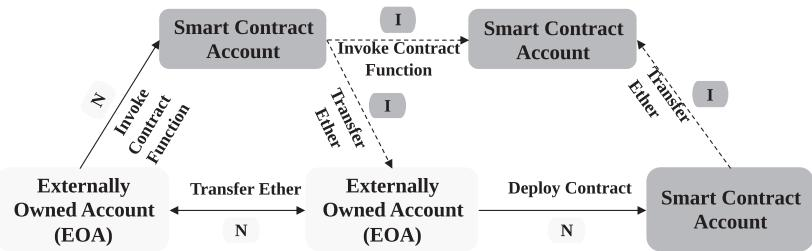  
Fig. 2. Normal and internal transactions. N: normal transactions; I: internal transactions.

The address of a new smart contract is calculated from the number of transactions being sent (nonce) and the address of its creator, which is the account that creates the smart contract. Due to this, the newly created contract address is predictable by its creator. We will illustrate an attack that exploits this property in Section 5.2.

## 2.2 Transactions

A transaction is a type of message call that serves three purposes, including transferring Ether, deploying a smart contract, and invoking functions of a smart contract. Transactions on Ethereum are normally initiated from EOAs, hence the name normal transactions.

Besides, there exists another type of transactions that are initiated from a smart contract. They are called internal transactions, which are used to invoke functions inside another smart contract, or transfer Ether to other accounts. For instance, the opcode CALL can be used to invoke a function of another smart contract, thus creating an internal transaction.

Note that, an internal transaction is always initiated from a normal transaction, since the smart contract that creates an internal transaction should be executed in the first place (from an EOA using a normal transaction). Moreover, a normal transaction could create numerous internal transactions, if the invoked smart contract does so (invoking functions of other smart contracts). Figure 2 shows an overview of normal and internal transactions.

## 2.3 Ethereum State

Ethereum’s nodes are devices participating in validating transactions. There are four types ofstates in Ethereum, which are useful to analyze and replay transactions. They include block information, normal transaction information, internal transaction information and accounts, as shown in the following.

(1) Block information. The block information includes block number, block hash, and so on.

(2) Normal transaction information. The normal transaction information include addresses of the sender and the receiver, transaction hash, transaction data, transaction values, and so on.

(3) Internal transaction information. The internal transaction information is basically the same as the normal transaction, plus the depth of the call stack of EVM.

(4) Account state. The account states include balance, nonce, code and storage of each account (including EOAs and smart contract accounts).

Normally, a full Ethereum node only permanently stores the block information, normal transaction information and the account states of the latest blocks. When synchronizing from the network, users can specify an option, e.g., -gcmode=archive in Geth, to retain a snapshot of accounts’ states for each block. With the time-serial accounts’ state, users can use the API debug.trace\_transaction to replay arbitrary transactions in the exact manner as it was executed on the network. However, this method is not scalable. We will discuss the way used in our system to improve the performance of the replay process in Section 3.1.

## 2.4 Smart Contracts

Ethereum virtual machine. A smart contract is a program that runs on an underlying EVM to transit the global states of the Ethereum network. A smart contract is usually programmed using a high-level language, e.g., Solidity, and then is compiled into low-level machine instructions (called opcodes), which will be fetched, decoded and executed by EVM.

EVM is a stack-based virtual machine. It has a virtual stack with 1,024 elements. All computations are performed on the stack. It means the operands and the result of intermediate operations are stored on the stack. For instance, when executing the ADD opcode to add two operands, EVM will pop two values from the stack, add them together and then push the result on the stack.

Besides the stack, there are four other types of data locations in EVM including memory, storage, input field, and ret field. The memory, input data and ret field are used to store temporary data such as function arguments, local variables, and return values. They are volatile, which means their values will be lost when the execution of a smart contract is finished. In contrast, the storage is a (per-account) persistent key-value store. For instance, a gaming smart contract could leverage the storage to maintain the balance of each player.

Function invocation. As discussed in Section 2.2, internal transactions are used to invoke smart contract functions. This is achieved through executing a message call [24] launched by six opcodes, including CALL, CALLCODE, DELEGATECALL, STATICCALL, CREATE and CREATE2.

In a smart contract, there is a signature hash (four bytes) to denote the destination function that will be invoked. The signature hash is defined as the first four bytes of the function signature’s hash value (SHA3). Since this is a one-way function, it is hard to retrieve the function name from the signature. However, there is an online service [22] that we can look up the function name given a signature.

Smart contract creation and destruction. A smart contract could be created using two opcodes, i.e., CREATE and CREATE2. Both opcodes behave similarly, except the way to calculate the address of the newly created smart contract [16].

A smart contract can be self-destructed through the opcode SELFDESTRUCT. This opcode destroys the smart contract itself and transfers all the Ether inside the contract to the address specified in the parameters of this opcode (the target address). However, if the account with the target address does not exist, then this opcode will create a new account with this address. This means that the SELFDESTRUCT opcode implicitly creates a new account. Moreover, self-destructing a smart contract reclaims the gas, since it frees the resources on the blockchain.

## 2.5 Ethereum Cryptocurrencies

Besides Ether, the native currency built on Ethereum, there also exist other tokens that can be transferred and regarded as digital assets. The most popular token standard is ERC20 [6], which defines a common list of interfaces tokens shall be in compliance with. By doing so, these tokens can be exchanged and traded in an easy way. There are a few tokens involved in this article.

$\triangle ^ { \mathrm { a . } }$ : The account states are coarse-grained that unnecessary transactions will be replayed (Section 5.1.3).

Table 1. Comparison of States that Could Be Retrieved by Existing Systems

<table><tr><td></td><td>Block</td><td>NT</td><td>IT</td><td>Account</td><td>Interface</td></tr><tr><td>Ethereum full node</td><td>✓</td><td>✓</td><td>×</td><td>×</td><td>×</td></tr><tr><td>Archive node [23]</td><td>✓</td><td>✓</td><td>×</td><td> $\Delta^{a}$ </td><td>×</td></tr><tr><td>Etherscan [28]</td><td>✓</td><td>✓</td><td> $\Delta^{b}$ </td><td> $\Delta^{c}$ </td><td> $\Delta^{d}$ </td></tr><tr><td>BigQuery [36]</td><td>✓</td><td>✓</td><td>✓</td><td>×</td><td>✓</td></tr><tr><td>Our system</td><td>✓</td><td>✓</td><td>✓</td><td>✓</td><td>✓</td></tr></table>

$\triangle ^ { \mathrm { b } }$ : Etherscan does not provide the invocation data of internal transactions.  
$\triangle ^ { \mathrm { c } . }$ The account states provided by Etherscan does not support the replay of transactions.  
$\triangle ^ { \mathrm { d . } }$ : Etherscan does not support customized query for a large number of transactions, such as SQL.  
Block: block information; NT: Normal transaction information; IT:  
internal transaction information; Account: Account states  
(Section 2.3). -: support; ×: not support; : partial support.

Particularly, USDC [12] and USDT [13] are two famous stable-coins, which peg their value against the U.S. dollar.

## 2.6 Decentralized Financial (DeFi)

DeFi often refers to the peer-to-peer finance enabled by decentralized technologies, such as Ethereum blockchain. The DeFi ecosystem on Ethereum contains various types of projects. Automated Market Maker (AMM) and yield farming projects are two types of DeFi projects this article targets. Specifically, Curve [27] is an AMM, which maintains a few liquidity pools. A liq uidity pool contains a few assets, and the relative percentage of each asset in that pool is used to determine the price of a particular asset. The AMM provides users with cryptocurrencies exchange services. Harvest [30] is a yield farming project, which finds the DeFi projects providing the highest Annual Percentage Yields (APY) and helps clients to invest. The yield farming project acts as an investment manager. Harvest will mint fUSDC as certificates for clients who deposited USDC as the investment funds. After harvesting the investment profits, the clients can withdraw their deposited funds and profits by burning certificates.

## 3 SYSTEM DESIGN

In the following, we will first illustrate technical challenges and then present the overall design of EthScope.

## 3.1 Technical Challenges

There are three technical challenges for building a scalable attack detection framework on Ethereum.

Incomplete blockchain state. First, our system needs to provide a flexible interface to query the Ethereum state. For instance, when being used to understand and detect an attack, our system shall have the capability to quickly locate suspicious transactions from diferent perspectives, e.g., the values in the transactions or the number of internal transactions that exceed a certain threshold. Although there exist many methods that could be leveraged to explore Ethereum state, few of them fulfill our requirements. The details are shown in Table 1. Among them, Ethereum in BigQuery [36] maintains the Ethereum states into seven tables and provides an SQL interface to query the state. However, it lacks the account states that are critical for replaying transactions.

Scalability. Our system needs to replay and analyze a large number of transactions. There exist three diferent methods that are adopted by existing systems [38, 43, 44]. All of them sufer from the scalability issue.

The first one is to import the whole blockchain data with a customized EVM, which will execute all transactions (normal and internal ones) from the genesis block (the first block on the chain). Dur ing this process, attack-specific rules are executed. Representative tools include ECFChecker [44], ÆGIS [43] and SODA [38]. This method cannot selectively replay interested transactions. Thus, many unrelated ones have been executed, consuming lots of time. Moreover, the coupling between the detection and the importing process makes the detection of new attack instances hard, since the time-consuming importing process cannot be executed repeatedly.

The second way is to use the debug.trace\_transaction API [15] exposed by Geth [4] to replay a transaction with the Ethereum archive node [52]. Though this method is more eficient than the previous one, it still sufers from the scalability issue. That is because the granularity of the historical state maintained by the Ethereum archive node is a block rather than a transaction. To replay a transaction, all the (unnecessary) transactions before it inside the same block will be executed. Our system solves this challenge by recovering a transaction-level historical state.

The third one is first replaying all transactions and recording all the runtime information [58]. The following detection is on the recorded information. However, this method consumes lots of storage. According to the data reported in Reference [58], performing the attack detection in 0 2 millions blocks cost at least 2,949 GB. It is not scalable to analyze all the Ethereum blocks (more than 10 millions blocks).

Extensibility to detect diferent attacks. Our system should be extensible to detect various attacks with analyst-provided scripts. Geth has a mechanism called JSTracer [17] to introspect the execution of a smart contract. It allows users to specify a JavaScript file that will be invoked for every opcode executed. However, frequent switches between the EVM and the JavaScript file make it impractical to analyze a large number of transactions. Our system addresses this challenge with two optimizations. First, it has well-defined instrumentation points to minimize the number of context switches. The analysis script will be invoked on-demand (instead of each opcode) when defined instrumentation points are hit. Second, our framework is equipped with a dynamic taint analysis engine inside the EVM. Analysts do not need to implement their own taint engine using JavaScript files, which further reduces the number of context switches.

## 3.2 Overall Design

We address these challenges with three components, i.e., data aggregator, replay engine, and instrumentation framework. The overall system architecture is shown in Figure 3.

Specifically, data aggregator imports the whole blockchain data and collects the Ethereum state. The Ethereum states are collected by modifying the EVM. The collected states are stored in a cluster database equipped with a flexible query interface. An analyst could perform customized queries to locate transactions that are needed for further analysis. Note that the process to import the blockchain data is a one-time efort. All the saved states could be queried without the need to import the blockchain data again. Our system also takes a careful design of the stored states to save the storage consuming. In fact, it consumes less storage than the Ethereum archive mode (Section 5.1.1).

The second component, i.e., replay engine, is used to replay arbitrary transactions. An analyst first locates candidate transactions and then feeds them to the engine. The replay engine obtains the related states including related accounts’ states for each transaction from the data aggregator. After that, it re-executes the transactions. Thanks to the transaction-level Ethereum states recovered by the data aggregator, our system to replay unnecessary transactions (Section 5.1.3).

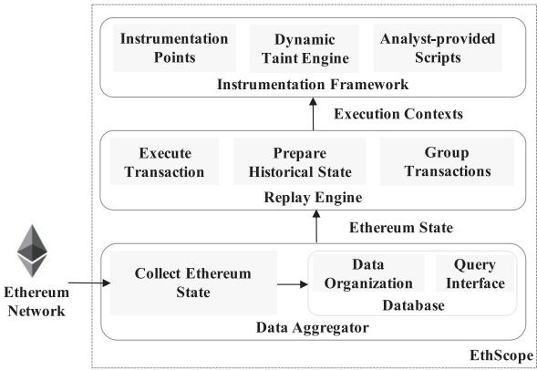  
Fig. 3. The overall architecture of EthScope.

The third component, i.e., instrumentation framework, provides a mechanism to customize the analysis. Specifically, an analyst can develop analysis scripts by defining callback functions for instrumentation points. For instance, a specific callback function could be defined and will be invoked if and only if the CALL opcode is executed. By doing so, our system avoids unnecessary context switches between EVM and the analysis script. During this process, the EVM state, including related stack and memory values, is provided to the script. Moreover, to facilitate the analysis, a dynamic taint engine is provided with well-defined APIs.

## 4 IMPLEMENTATION DETAILS

We have implemented a prototype named EthScope. The data aggregator is implemented with around 1,137 lines changes to the Geth client. Our system uses the distributed search and analyt ics engine ElasticSearch [7] to store the Ethereum states and provide an interface to query them. The replay engine and instrumentation framework are implemented with 5,191 lines changes to EVM. In the following, we will elaborate the implementation of each component.

## 4.1 Data Aggregator

States collection. The collection of block information and normal transaction information is straightforward. Our system changes the EVM to collect the data before the execution of each block (block information) and after the execution of each normal transaction (normal transaction information).

Collecting internal transaction information and accounts’ states requires our system to hook into the process of executing smart contracts. For instance, when the opcode SSTORE is executed, the method setState in EVM is triggered. We change this method and add the code to capture the state. Note that, the states are not immediately stored into the underlying database. Instead, we create a bufer and save the states into the database when the bufer is full.

One challenge is how to ensure the completeness and correctness of the collected state. In our system, we solve this challenge by comparing the collected state with ground truths. Specifically, for block information and normal transaction information, we can easily compare them with the data stored inside the Ethereum full node. For internal transaction information, we compare our data with the data provided by online services, e.g., Etherscan [28]. However, there are no ground truths for the transaction-grained historical accounts’ state. We solve it in the replay engine (States verification in Section 4.2).

Data organization and query interface. Our system takes the following methods to avoid the scalability issue caused by storage-consuming, while providing enough information to replay a transaction. Global variables of smart contracts consume lots of storage. That is because they are updated frequently in diferent blocks.

Theoretically, we need to store all the global variables for each transaction in each block. However, when replaying a transaction, only the variables touched by that transaction are needed. Thus, for each transaction, we only store the used global variables (storage values in Ethereum) in the database.

Table 2 shows the detailed data schema. Specifically, the Code index5 stores the smart contracts code and the State index records the information about creating and destructing accounts. Remaining ones are stored in the Block index.

Thanks to ElasticSearch, an analyst could leverage the Query DSL based on JSON to define queries [8] for customized analysis.

## 4.2 Replay Engine

To monitor the transaction behaviors at the runtime, we build an engine that is capable of replaying arbitrary transactions on Ethereum. Our engine is based on the EVM of Geth, with modifications to add support to retrieve the states from the data aggregator. Moreover, it provides interfaces to communicate with instrumentation framework (Section 4.3).

Group transactions. The input to replay engine is a list of hash values for the transactions to be analyzed. To speed up the process of obtaining related data from data aggregator, our system divides transactions into diferent groups, with a threshold that each group contains no more than 10,000 transactions. This threshold is related to the size of the system memory. For each group, replay engine first retrieves the historical states in a batch, and then replays transactions in the group.

Retrieve Ethereum historical state. To replay a normal transaction, we need to retrieve the Ethereum historical states from data aggregator. First, we get the block and transaction information such as Difficulty and GasLimit from the Block index. Second, we retrieve the code of smart contracts that are related to this normal transaction in the nested field GetCodeList inside the field Transactions. That is because a normal transaction could involve multiple smart contracts. We retrieve the code for all the smart contracts. Third, we obtain all accounts’ state: nonce, balance and storage values that the transaction will load. When the normal transaction is to create a new smart contract, we need to retrieve the deploying code of the new smart contract from the index Code, which is also the input of this normal transaction. Table 2 shows the details of the mentioned fields and indices.

Execute transactions. After retrieving the historical state, replay engine executes the transactions. During this process, callback functions defined in the analysis script will be invoked. To speed up the process, our system further divides transactions in a group into diferent clusters according to the number of CPU cores, and executes transactions inside diferent clusters in parallel.

Verify state. After replaying each normal transaction, replay engine will compare the used gas and output of this transaction with the same fields in the normal transaction information in data aggregator, which can ensure the correctness of the replay process. Note that, the normal transaction information in data aggregator has been verified (States collection in Section 4.1). Besides, to ensure the correctness of historical states collected by data aggregator, replay engine is used to perform the verification when new states are stored into the database. If the replay process is incorrect, then data aggregator will be interrupted until the problem is located and solved. In fact, this interrupting will only occur after a hard fork that changes EVM, which requires updating data aggregator.

Table 2. ElasticSearch Indices

<table><tr><td>Index Name</td><td>Field</td><td>Field of Nested Field</td><td>Field of Nested Field of Nested Field</td><td>Field of Nested Field of Nested Field of Nested Field</td></tr><tr><td rowspan="8">Block</td><td>Difficulty $^R$ ExtraDataGasLimit $^R$ GasUsedHash $^R$ Miner $^R$ Number $^R$ Timestamp $^R$ TxnCount</td><td></td><td rowspan="2"></td><td rowspan="5"></td></tr><tr><td rowspan="7">Transaction</td><td>CallFunction $^R$ ConAddressCumGasUsedFromAddress $^R$ GasLimit $^R$ GasPrice $^R$ GasUsed $^R$ GetCodeList $^R$ Hash $^R$ IntTxnCountNonce $^R$ StatusToAddress $^R$ TxnIndexValue $^R$ </td></tr><tr><td>InternalTxns</td><td>CallFunctionCallParameterConAddressEvmDepthFromAddressGasLimitOutputToAddressTxnIndexTypeValue</td></tr><tr><td>Logs</td><td>AddressTopicsData</td></tr><tr><td rowspan="2">ReadCommittedState $^R$ </td><td>AddressBalanceCodeHashCodeSizeNonce</td></tr><tr><td>Storage</td><td>KeyValue</td></tr><tr><td rowspan="2">ChangedState</td><td>AddressBalanceNonce</td><td></td></tr><tr><td>Storage</td><td>KeyValue</td></tr><tr><td rowspan="3">Code</td><td>NumberTimestamp</td><td></td><td rowspan="2"></td><td rowspan="3"></td></tr><tr><td rowspan="2">Transaction</td><td>HashTxnIndexInput $^R$ </td></tr><tr><td>Contract $^R$ </td><td>AddressHashCode</td></tr><tr><td rowspan="2">State</td><td>NumberTimestamp</td><td></td><td rowspan="2"></td><td rowspan="2"></td></tr><tr><td>Transaction</td><td>HashTxnIndexCreateResetSuicide $^R$ </td></tr></table>

R Fields that are necessary for replaying transactions.

Table 3. Three Types of Instrumentation Points Supported in Our System

<table><tr><td>Instrumentation Points</td><td>Type</td><td>Description</td></tr><tr><td>{op}after{Op}</td><td>O</td><td>before and after the opcode {op} is executed</td></tr><tr><td>transactionStarttransactionEnd</td><td>T</td><td>before and after an external transaction is executed</td></tr><tr><td>contractStartcontractEnd</td><td>C</td><td>before and after a new contract is executed</td></tr></table>

O: opcode-orientated; T: transaction-oriented; C: context-oriented.

## 4.3 Instrumentation Framework

The instrumentation framework aims to provide extensible APIs for an analyst to develop anal ysis scripts to detect new attack instances. Besides, instrumentation framework provides a dy namic taint engine to facilitate the analysis of control dependency and data dependency.

Overview. The framework is hooked into the replay engine and provides JavaScript interfaces. Our system uses the Duktape JavaScript engine binding for Go [10] to execute JavaScript functions inside the EVM developed in Go. Specifically, it defines instrumentation points, where the replay process will be suspended and user-specific callback functions (in JavaScript) will be invoked. At the same time, it provides the interfaces for analysis scripts to access the current execution context, such as stack values and memory values. When the callback function finishes its execution, the replay engine continues the smart contract’s execution from the instruction after the instrumentation point.

Instrumentation points. Our system supports three types of instrumentation points, i.e., opcode-, transaction-, and contract-oriented ones. Table 3 shows an overview of these instrumentation points.

First, the opcode-oriented instrumentation links with two callback functions for each opcode, {op} and after {op}. They are launched before and after executing the opcode {op}.

Second, the transaction-oriented callbacks, including transactionStart and transactionEnd, are launched before and after the execution of a normal transaction. These two instrumentation points are usually used for the initialization and processing results in the analysis script. Note that, this type of instrumentation points only works for normal transactions, which are initialized from EOAs. For internal transactions that are initialized from smart contracts, they are covered in the contract-oriented instrumentation point.

Third, the contract-oriented callback functions, including contractStart and contractEnd, deal with function calls crossing smart contracts (internal transactions). These two functions are invoked at the start and at the end of the execution of a smart contract function.

Figure 4 shows the sequence of invoking callback functions at diferent instrumentation points. When an EOA issues a normal transaction, transactionStart will be invoked, and then contractStart is executed. That is because the normal transaction initializes the execution of smart contract A. Then the callback functions for each opcode are launched, until finishing the

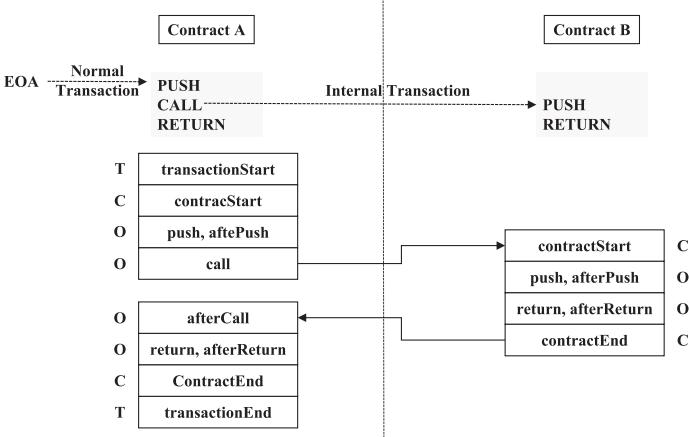  
Fig. 4. The sequence of invoking callback functions at diferent types of instrumentation points. The code of the smart contract is for illustration only. O: opcode-oriented; T: transaction-oriented; C: contract-oriented.

Table 4. APIs Provided by Our Instrumentation Framework

<table><tr><td colspan="7">APIs to retrieve execution context</td></tr><tr><td>op.getN()op.toNumber()op.toString()</td><td>stack.length()stack.peek(n)</td><td>memory.slice(start, end)memory.getUint(offset)</td><td>contract.getSelfAddress()contract.getCodeAddress()contract.getValue()contract.getInputStream()</td><td>getBalance(addr)getNonce(addr)getCode(addr)getStorage(addr)</td><td>getBlockNumber() getTxnIndex() getTxnHash()</td><td>getPc() getGas() getDepth() getReturnData()</td></tr><tr><td colspan="7">Other APIs</td></tr><tr><td colspan="3">cfg.hijack(isJump)</td><td colspan="4">params.get(key)</td></tr><tr><td colspan="7">APIs to assign, clear, and check taint tags</td></tr><tr><td>labelStack(n,tag)clearStack(n)peekStack(n)</td><td>labelMemory(offset,size,tag)clearMemory(offset,size)peekMemory(offset)peekMemorySlice(offset,size)</td><td>labelInput(o,s,t)clearInput(o,s)peekInput(o)peekInputSlice(o,s)</td><td colspan="2">labelReturnData(o,s,t)clearReturnData(o,s)peekReturnData(o)peekReturnDataSlice(o,s)</td><td colspan="2">labelStorage(addr,slot,tag)clearStorage(addr,slot)peekStorage(addr,slot)</td></tr></table>

CALL opcode. This opcode invokes the function inside the smart contract B and creates the internal transaction. Since the smart contract B is executed, contractStart will be invoked again. After that, callback functions for diferent opcodes will be invoked accordingly.

Note that, the execution context is switched from the EVM to the Duktape JavaScript engine, only when a callback function is defined and the instrumentation point is hit at runtime. This minimizes the number of context switches between EVM and Duktape. Compared with the JSTracer inside the Geth, our implementation is more eficient (Section 5.1.3).

APIs to retrieve the execution context. Our system provides multiple APIs to get the information of the current execution context. Table 4 shows an overview of these APIs. We elaborate some of them in the following.

Normal transactions. Attributes of normal transactions are obtained by invoking getBlockNumber, getTxnIndex, and getTxnHash. These attributes are used to distinguish different normal transactions.

Internal transactions. Two APIs contract.getSelfAddress and contract.getCodeAddress are used to retrieve the context contract and code contract. The code contract is the address of the callee smart contract. However, the context contract can be the caller and the callee smart contract, depending on the opcode used to invoke the contract. This complies with the definition in Geth [5]. The API contract.getValue returns the amount of Ether that is transferred into the code contract.

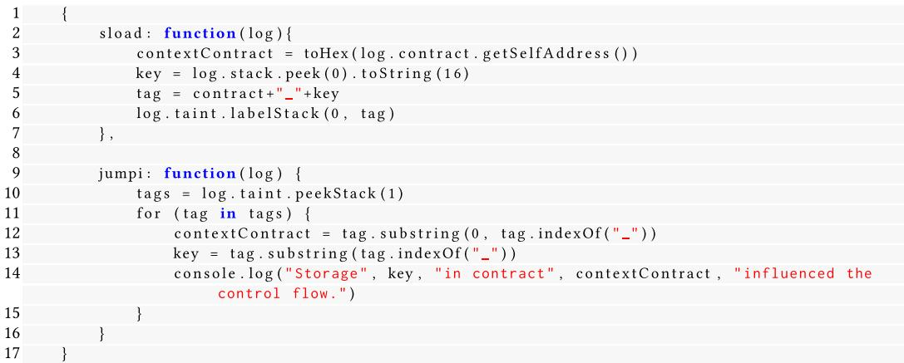  
Fig. 5. An example of how to use the dynamic taint engine to assign and check taint tags.

Every time an internal transaction starts, the EVM stack depth will be increased by one. On the contrary, every time an internal transaction ends, it will be decreased by one. The API getDepth is provided to get current EVM stack depth. By using this information, we can detect the occurrence of a recursive function call.

Parameters and return values. The API contract.getInput returns the input data (parameters) when invoking a function, while getReturnData obtains return values.

• The program counter and remaining gas. APIs getPc and getGas return the current program counter and remaining gas.

Accounts. APIs getBalance, getCode, getStorage return the current states of an account at any time.

Dynamic taint engine. Dynamic taint analysis has been widely used for security applications. Our framework implements a dynamic taint engine that facilitates the development of analysis scripts.

Our taint analysis engine supports the taint tag propagation crossing diferent smart contracts. When the EVM triggers an internal transaction, it will pass input values from the caller’s memory to the callee’s input field. After the invocation, the return value is put into the caller’s ret field. We propagate the taint tags in opcodes CALLDATALOAD, CALLDATACOPY, and RETURNDATACOPY that operate stack, memory, ret, and input field, respectively. Table 4 summarizes APIs to assign, clear, and check taint tags. APIs label\* allow an analyst to assign taint tags. APIs peek\* and clear\* allow an analyst to check and clear tags.

Figure 5 shows an example of how to use these APIs. Specifically, two callback functions sload and jumpi are invoked before executing opcodes SLOAD and JUMPI, respectively. Inside the callback function sload, it assigns the taint tag to the value on the top of the stack (index 0) us ing log.taint.labelStack(0, tag). Then the taint engine will propagate the tag, even crossing diferent contracts. When the callback function jumpi is executed, the log.taint.peekStack(1) checks whether the second value on the stack (index 1) has the taint tag. If so, then it changes the program counter. Thus, by checking the taint tag, an analyst can get the storage variables that can influence the control flow.

## 5 EVALUATION

This section presents the evaluation results of EthScope by answering the following research questions. If not otherwise specified, then the evaluation is performed on the dataset that contains the Ethereum statess from the genesis block (mined on July 30, 2015) to the 10,400,000th one (mined on July 5, 2020).

R1 What is the performance of EthScope and whether EthScope solves the scalability issue?

R2 Whether EthScope can help understand the behaviors of suspicious transactions and detect more attack instances?

R3 Whether EthScope performs better than previous systems in terms of detected attacks?

• R4 Whether EthScope can be used to facilitate the analysis of DeFi attacks exploiting seman- tic/logic vulnerabilities?

To answer R1, we report the comparison result of the storage consumption and the time used to replay transactions. The result shows that EthScope consumes less storage and has a speedup of around 2300x when replying transactions. This demonstrates the capability of our system to perform the analysis on a large number of transactions.

To answer R2, we use three diferent types of public information as inputs, including a victim smart contract, a reported suspicious transaction, and the abnormal blockchain state. For each type of information, our system first understands attack behaviors, and then detect more attack instances. We report the results in Sections 5.2, 5.3, and 5.4, respectively.

To answer R3, we compare the detection result of the re-entrancy attack with previous systems. Our evaluation shows that our system is more accurate than previous ones. We report the results in Section 5.5.

To answer R4, we elaborate the analysis of Harvest attack [31], which is a classic price manipulation attack [57] on Ethereum. We report the results in Section 5.6.

## 5.1 Performance and Scalability

In this section, we demonstrate the scalability of our system via evaluating its performance from the following perspectives. First, the storage use is more eficient than previous systems, while at the same it can support the replay of arbitrary transactions. Second, the data aggregator can help locate suspicious and candidate transactions in an eficient way. Third, the replay engine can replay arbitrary transactions, with a 2,300 speedup. All experiments were performed on a machine with four CPUs (Intel Xeon Silver 4110 CPU @ 2 10 GHz) and 128 GB memory. The ElasticSearch database is built from a cluster of 12 machines, and each one has a CPU (Intel i7- 8700 @ 3 2 GHz) and 32 GB memory.

5.1.1 Storage Use. The data aggregator in our system stores the saved Ethereum state. We compare the storage use of our system with other ones that also store the Ethereum state. Specifically, ECFCHecker, Sereum, and SODA leverage the archive node of Geth to perform the analysis. TxSpector replays historical transactions in Ethereum to record EVM bytecode-level traces into a trace DB, and stores the logic relations into a logic relation DB [58].

As shown in Table 5, the Geth archive node [23] of the first 7 635 million blocks uses 2,320 GB.6 The trace DB of TxSpector and logic relation DB of TxSpector consume 1,577 GB, and 2,949 GB for 7 2 and 0 2 million blocks, respectively. Obviously, TxSpector requires more space to support its analysis.

Table 5. Comparison of the Storage Usage

<table><tr><td></td><td>Blocks</td><td>Storage</td></tr><tr><td>Geth Archive Node</td><td>0-7,635,000</td><td>2,320 GB</td></tr><tr><td>Trace DB of TxSPECTOR</td><td>0-7,200,000</td><td>1,577 GB</td></tr><tr><td>Logic Relation DB of TxSPECTOR</td><td>7,000,000-7,200,000</td><td>2,949 GB</td></tr><tr><td>data aggregator</td><td>0-10,507,977</td><td>1,844 GB</td></tr></table>

Table 6. Comparison of JSTracer and Our System to Replay 100 Normal Transactions

<table><tr><td colspan="2">Tools</td><td>Retrieve State</td><td>Execute Script</td><td>Other</td></tr><tr><td rowspan="2">JSTracer</td><td></td><td>39 min 6 s 997 ms</td><td>0 min 16 s 984 ms</td><td>8 min 13 s 467 ms</td></tr><tr><td>Total</td><td colspan="3">47m 37s 448ms</td></tr><tr><td rowspan="2">Our system</td><td></td><td>0 min 0 s 446 ms</td><td>0 min 0 s 217 ms</td><td>0 min 0 s 544 ms</td></tr><tr><td>Total</td><td colspan="3">0 min 1 s 207 ms</td></tr></table>

Our system costs only 1,844 GB after collecting the Ethereum states for 10 5 million blocks. In comparison with the Geth archive node, EthScope collects states information only necessary to perform the security analysis and replay transactions. Hence, our system saves storage use by avoiding storing unnecessary data, such as transaction signatures and merkle-tree [35] structures. Besides, EthScope also outperforms TxSpector. TxSpector stores a lot of intermediate information during transaction execution to support its analysis, which is separated from the runtime states recovery. Such a strategy requires a lot of storage, because the recovered information must be rich enough to cope with various future analyses. On the contrary, EthScope adopts a diferent strategy to reduce the storage consumption: (1) it only stores accounts’ states necessary to replay transactions; and (2) it analyzes transactions while replaying transactions simultaneously.

5.1.2 Query Transactions. The data aggregator provides an interface to locate transactions by querying the saved Ethereum state, e.g., a normal transaction with more than 1,000 internal transactions whose transferred Ether is large than a certain amount. Our evaluation shows that most querying tasks can be finished in seconds, while complicated ones may last for a few minutes. For instance, the collection of candidate transactions for the re-entrancy attack (Section 5.3) and the bad randomness attack (Section 5.2) both take less than 5 min (retrieved 209,227 and 10,296,519 candidates from 754,614,255 normal transactions) in our experiments.

5.1.3 Replay Transactions. In the following, we will compare the performance of our system with JSTracer (in the archive mode) supported by Geth [4]. To the best of our knowledge, this is the only comparable counterpart that can repeatedly replay and instrument transactions.

First, we randomly pick 100 normal transactions that have triggered internal transactions. Then, we develop a script that has an equivalent functionality with the example [14] (4byte\_tracer.js) provided by Geth. Finally, we use the JSTracer and our system to replay 100 normal transactions. Note that, a normal transaction could trigger multiple internal transactions, thereby the total number of replayed transactions is 2,519.

Table 6 shows the comparison result of the transaction replay time between JSTracer and our system. Specifically, JSTracer spends more than 47 min to replay the transactions, while our system takes only around 1 s to replay them. The result suggests that our system outperforms JSTracer with an around 2,300 speedup. We further explore the possible reasons.

Granularity of the Ethereum historical state. To retrieve the Ethereum historical states of the 100 normal transactions, JSTracer had to replay 3,289 additional normal transactions.

However, EthScope can directly query fine-grained accounts’ states information from the data aggregator.

Number of context switches. JSTracer needs to switch to the JavaScript environment for every opcode. Alternatively, our instrumentation framework only performs context-switch when instrumentation points are hit. That is why JSTracer performed 1,305,864 context switches, while EthScope only performed 2,502 ones.

The result demonstrates that our system can replay a large number of transactions. In fact, for the 10,296,519 normal transactions used to detect the new instances of the bad randomness attack, our system took 12 h and 7 min to replay all of them, which is quite dificult (if not impossible) for other systems to complete such a task

Answers to Q1: In summary, EthScope solves the scalability issues to detect attacks from the whole Ethereum blocks, and it outperforms the existing systems with lower storage consumption and eficient replay engine. Specifically, EthScope uses an efective strategy to solves the scalability issue caused by huge storage consumption: (1) it only stores accounts’ states necessary to replay transactions; and (2) it analyzes transactions while replaying transactions simultaneously. Furthermore, EthScope leverages the fine-grained accounts’ states, optimization of JSTracer, and parallel strategy to lift the replaying speed by around 2,300, which solves the scalability issue caused by low replaying eficiency.

## 5.2 Type-I Input: A Victim Contract

An analyst may receive incomplete information, e.g., a smart contract is being attacked. However, there is no detailed information about the vulnerability of the victim contract, nor the information on how the attack works. Our system can help an analyst understand the attack and detect more attack instances. We use Fomo3D [26] as an example to illustrate how EthScope helps analysts reveal attacks from a victim smart contract. The input to our system is the address7 of the victim smart contract.

5.2.1 Understand the Atack. As shown in Figure 1, an analyst leverages our system to understand the attack behaviors.

Locate suspicious transactions. To locate suspicious transactions that may involve in the attack, our first step is to construct the money flow graph to locate suspicious accounts. That is because Fomo3D is a gambling app. The money will flow into (successful) attackers (and other lucky players). Figure 6 shows the money flow graph constructed using transactions retrieved from the data aggregator. Specifically, nodes in the graph represent accounts, and edges represent the direct and indirect transactions with the Fomo3D game. The size of each node denotes the number of Ether it receives.

We observe that several accounts have a much larger size than others. It means these accounts have received much more Ether from the game than others. Initial analysis shows that three of them belong to Fomo3D (numbers 0, 1, and 6). We then take further analysis for other accounts.

Understand suspicious transactions. We analyze a normal transaction8 that invokes the smart contract (index 2 in the money flow graph)9 to receive Ether from Fomo3D. To this end, we construct the dynamic call graph in Figure 7. The nodes in the graph represent accounts (both EOA and smart contracts), and the edges denote Ether transfer or function invocation.

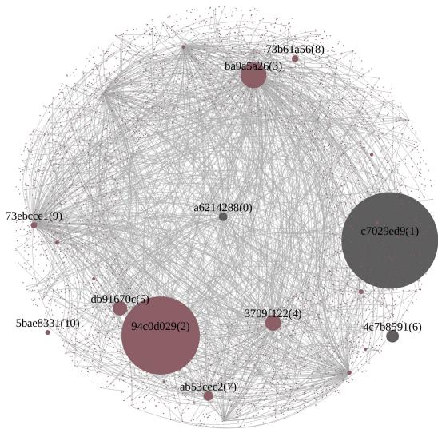  
Fig. 6. The money flow graph of the Fomo3D smart contract. For beter illustration, we use 180,244 transactions to generate this graph. The total number of transactions with Fomo3D is much larger.

The call sequence of this graph shows that, the contract (0x94c0d0) transfers 0 1 Ether to the contract (0x50ac2e) (index 4), which further creates a new smart contract (0x78414f) (index 6). This new contract buys the key (index 9) with 0 1 Ether and then receives 0 126 Ether (index 17) from the game. The received Ether is transferred back to the contract (0x94c0d0) with a SELFDESTRUCT operation (index 18). During this process, it obtains a profit of 0 026 Ether.

There also exist many similar transactions related to the contract (0x94c0d0). These transactions get a lot of rewards from the Fomo3D game. We suspect the contract (0x94c0d0) has a mechanism to predict whether it can win the bonus before playing the game. Otherwise, it can not win every time. After locating all the transactions and smart contracts created from this account by querying the data aggregator, we find that the contract (0x94c0d0) indeed can predict whether it can win. That is because the Fomo3D game uses the address of the player (controlled by the attacker) as one of the sources to generate the random number that determines the winner.

Figure 8 shows (a simplified version of) the attack flow. There is a controller contract, which creates a lot of proxy contracts (more than 1,000) in advance. Then during the attack, the controller attack loops through each proxy contract. It calculates the address of a newly created smart contract (but does not create it), because the address is predictable (Section 2.1). Then it uses this address and the block information to predict whether it will get the bonus by executing the same logic with the Fomo3D game. If so, then the proxy smart contract creates the attacking contract, which further buys the key to play the game and win the bonus. After that, the attacking contract self-destructs to transfer the earned bonus to the controller smart contract.

Because the attack exploits the vulnerable process of the smart contract to generate a random number, we name this attack as the bad randomness attack.

5.2.2 Detect More Atack Instances. After understanding the above attack, we then use our system to detect more bad randomness attacks. Specifically, we first use the data aggregator to filter out transactions that are not related to the attack. Then, we use the replay engine to replay the remaining transactions and the instrumentation framework to confirm new attack instances at runtime.

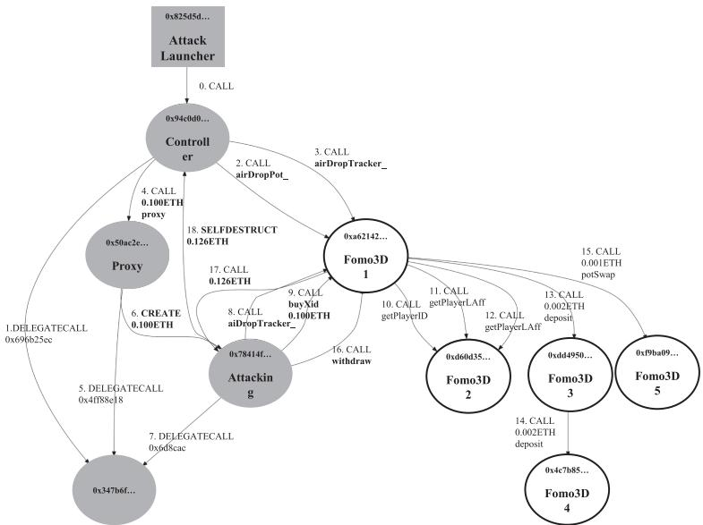  
Fig. 7. The dynamic call graph of a suspicious transaction. We draw three types of information for an internal transaction: 1. Serial number and the opcode to trigger an internal transaction; 2. Transferred Ether, null means no Ether transferred; 3. Invoked function (we search the name from the 4byte function signature database [22]), null means that the input data is empty. (Square: EOA, circle: smart contract; grey box: atacker, white box: victim.)

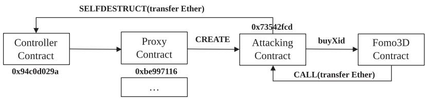  
Fig. 8. The flow of the bad randomness atack.

Locate candidate transactions. To avoid replaying unnecessary transactions (costing lots of time), we first use the data aggregator to remove transactions that are not related to the bad randomness attack.

We label normal transactions that fulfill the following requirements as candidate transactions. First, it has triggered more than one internal transaction. Second, the triggered internal transaction has transferred Ether to another smart contract. That is because to launch the attack, attackers have to use a contract to transfer Ether to play the game, thus creating an internal transaction. This rule is conservative. It may label some benign transactions as candidates. However, we want to include as many candidate transactions as possible in this step and leverage the replay engine to confirm whether they are real attacks. In total, our system locates 10,296,519 candidate transactions.

Confirm the bad randomness attack. After locating the candidate transactions, we then use the replay engine to replay them and confirm attacks at runtime.

The key observation of this attack is that the malicious contract is using the same algorithm to generate the random number as the victim contract. We develop the detection script as follows.

(1) First, we find all the variables that are generated from block information, e.g., coinbase, gaslimit, and so on. This is implemented using our taint analysis engine by setting the block information as taint sources.

(2) Second, for each variable v found in the previous step, we check whether it influences the control flow of the smart contract. That is because we only care about the variables that can determine the winner. If so, then we log its execution context C.

(3) If there exist two same execution contexts in diferent internal transactions that are triggered by a same normal transaction, then the normal transaction is a malicious one that launches the attack. That is because two smart contracts are executing the same algorithm that uses the same random number sources to generate a variable that can influence the control flow to determine the winner.

Detection result. We replayed 10,296,519 candidate transactions with our analysis script. After that, 40,449 normal transactions are labeled as malicious ones. During this process, 272 malicious smart contracts are detected. We then group them based on their creators, i.e., EOAs that create these contracts. In total, we get 79 groups. We manually checked the malicious smart contracts created in each group and found that 74 of them are true positives. In total, they have initialized 40,358 normal transactions to attack 95 victim smart contracts, which includes various gambling games. Table 7 shows the detailed information of victim contracts and the false positives.

## 5.3 Type-II Input: A Reported Suspicious Transaction

Besides the victim contract, an analyst may receive the information that a malicious transaction is attacking a smart contract. Though there may exist partial information of the attack, the details of the attack are unknown.

5.3.1 Understand the Atack. Attackers leveraged the re-entrancy vulnerability to launch the attack toward the DAO smart contract and stole 3 6 million Ether [53]. In this following, we will elaborate on the process to understand the attack by leveraging a reported transaction.10 Then, we will leverage the gained knowledge to detect more re-entrancy attacks.

Understand suspicious transactions. The input is a reported transaction, e.g., from a public forum. An analyst needs to understand how the attack works.

We construct a dynamic call graph in Figure 9. The serial numbers of transactions are in chronological order. The 0th transaction is a normal transaction, and others are internal transactions triggered by the normal transaction. For better illustration, we only use the first 20 internal transactions to draw the graph. The actual number of internal transactions is 185.

By analyzing this graph, we can find two distinct features of transactions that launch the attack. First, there exists a loop in the graph. This is reasonable, since the call to the fallback function that further invokes the vulnerable contracts will create a loop in the call graph. For instance, internal transactions 2, 7, and 8 create a loop that starts from and ends at the malicious contract (0xc0ee9db). Second, there should exist a special smart contract called reentry point, which is the smart contract that will be invoked again before its previous invocation completes. For instance, the DAO contract (0xbb9bc2) is a reentry point, since the EVM stack depths of internal transactions (indexes 3–9) are all bigger than internal transaction 2. That means before an invocation to the DAO contract 0xbb9bc2 (internal transaction 2) returns, another invocation (internal transaction 9) to the same contract happens.

Table 7. 102 contracts Susceptible to the Bad Randomness Atack

<table><tr><td>Contract Address</td><td>Contract Name</td></tr><tr><td colspan="2">Ponzi Game</td></tr><tr><td>1. 0xa62142888aba8370742be823c1782d17a0389da1</td><td>FoMo3D Long Official (F3D)</td></tr><tr><td>2. 0x205718799d502fe2c45d3afc91c3c8ccb5c0836f</td><td>Vote Bhelp (Bhelp)</td></tr><tr><td>3. 0xcb47c89cb17c10b719fc5ed9665bae157cac2cb1</td><td>FoMoJP</td></tr><tr><td>4. 0x29488e24cfdaa52a0b837217926c0c0853db7962</td><td>SuperCard</td></tr><tr><td>5. 0x0fc53f7c2659a708f46d0c4336eb8c1e0f551307</td><td>Bingo3D (B3D)</td></tr><tr><td>6. 0xdd9fd6b6f8f7ea932997992bbe67eabb3e316f3c</td><td>Last Winner (LW)</td></tr><tr><td>7. 0xcc8aabf5199a93c6cff2495761cbb70e056b41a5</td><td>MC2long</td></tr><tr><td>8. 0x8a883a20940870dc055f2070ac8ec847ed2d9918</td><td>RatScam</td></tr><tr><td>9. 0x0ad3227eb47597b566ec138b3afd78cfea752de5</td><td>FoMo3Dshort</td></tr><tr><td>10. 0x9872ffc47ff6ae0cbdec2f68bb88ad3169d69afc</td><td>FoMo4D (F4D)</td></tr><tr><td>11. 0x86d179c28cceb120cd3f64930cf1820a88b77d60</td><td>FoMoGame</td></tr><tr><td>12. 0x460a5098248f4aa1a46eec6aac78b7819ea01c42</td><td>Suoha</td></tr><tr><td>13. 0x7ebd56cc7c1d14788ed09179f67cdcf2778c6535</td><td>JCLYLong</td></tr><tr><td>14. 0x52083b1a21a5abc422b1b0bce5c43ca86ef74cd1</td><td>FoMo3Dshort</td></tr><tr><td>15. 0x24da016c06941ec2c92be28e0a2b2e679f0d1dc7</td><td>FoMo3DLightning</td></tr><tr><td>16. 0x9edc05176ae3bba98c3112ac842269b225e55722</td><td>JCLYLong</td></tr><tr><td>17. 0x0b5da756938e334c97ce20715e32a4a8fea12ba9</td><td>F3Dultra</td></tr><tr><td>18. 0x6de7fd35c2f9b25b0efe85621306e9de41eab97f</td><td>F3DGo</td></tr><tr><td>19. 0xb73f8f75cc233ec7a451d44859e06167e47c1942</td><td>LastUnicorn</td></tr><tr><td>20. 0xf9ba0955b0509ac6138908ccc50d5bd296e48d7d</td><td>FoMo3D Fast Official (F3D)</td></tr><tr><td>21. 0x0f90ef4e2526e3d1791862574f9fb26a0f39ec86</td><td>F3DPLUS</td></tr><tr><td>22. 0x58232003b3d18021acfc9213d27d6f8b72f4f029</td><td>Rich3D</td></tr><tr><td>23. 0x820dfa17d30f938dc2c172b716630a06ec759d99</td><td>FullFOMO</td></tr><tr><td>24. 0xa9b9805d0fed371cec8fb8a8f2300f279c47ba53</td><td>F4Kings</td></tr><tr><td>25. 0x3664be8ec8a66e8dab9dfa48e5092f576edab746</td><td>FOMO Loop (LOOP)</td></tr><tr><td>26. 0xab4e6f106fff4e80f8d0689c61d235fc430f629e</td><td>HX</td></tr><tr><td>27. 0x51a5271ec514c3065d9de2d8e95051989f7d53ab</td><td>imfomo Long Official (imfomo)</td></tr><tr><td>28. 0x39ffccecc551f35f8dfcb52c8c01060919aed1ea</td><td>FoMo3DUnlimited</td></tr><tr><td>29. 0x43312c23f2e8fe11390329c15079717c5b27b8b9</td><td>F3DLink</td></tr><tr><td>30. 0xda87ff0d043848a689125e2c7ab87b16a0cbe81</td><td>SnowStorm</td></tr><tr><td>31. 0xb2b30d39074c52a60283a26f238abff31fcb4217</td><td>SnowStorm</td></tr><tr><td>32. 0x103d98686ced96f1d2cf1a0d1eabdd63c9c027e4</td><td>F3DShop</td></tr><tr><td>33. 0xcc55c087d027c5dd3b0f3c28280c3a3fdd798c8b</td><td>FoMo4D (F4D)</td></tr><tr><td>34. 0xf5ad74c2a4deeeffd1e5e27d1221a4ca33214277</td><td>NTE 3D Official (NTE3D)</td></tr><tr><td>35. 0x05aa2fdf9f58b426b49900834cce0565d88e52eb</td><td>Bingo4Beast Long Official (B4B)</td></tr><tr><td>36. 0xfc812ef2661a99cd21ab452edcbab505583fe40b</td><td>Famo</td></tr><tr><td>37. 0x202d16c018d31d60fe179a67901444565e0f0cc7</td><td>FoMo6D (F6D)</td></tr><tr><td>38. 0xb6cadfb7d4d900f8152954a58bff03901a57c2e2</td><td>FoMo3K</td></tr><tr><td>39. 0x7b20471396cedf00cd1f65eca27fdb3ca1643b6c</td><td>SpicyPot</td></tr><tr><td>40. 0x7802b44acc5f37b4843d10f7c4eaec1c36bc7d2d</td><td>OK3D (OK3D)</td></tr><tr><td>41. 0xb3640c4e8b8317cbe65aa4f20c7851996e6b406c</td><td>NTech3DLong</td></tr><tr><td>42. 0x5cd17346bc2b8b3b04251dfea7763dbc70cceaf7</td><td>FoMo3D Asia (Official) (F3DA)</td></tr><tr><td>43. 0x20c3811a83fad33dc7a0c8ee2d1e773ddf3b7d44</td><td>Damo</td></tr><tr><td>44. 0xe69ba47f38ee8ab38696014c19b547a4aa955480</td><td>XMG Long Official (XMG)</td></tr><tr><td>45. 0x603f234b6c1cf8104a0791a1cc32ee73cd73cab7</td><td>FoMo6D (F6D)</td></tr><tr><td>46. 0x1ca95b07290cf6b91f9efc9060a8df2a8eaff00</td><td>F5D (F5D)</td></tr><tr><td>47. 0xf1ae594cefee0bf519f227f3262ee2a851b14b9a</td><td>FoMo3D World (F3DW)</td></tr><tr><td>48. 0xe19c616ff1efc079792df6b5583d2cf3e6e77d10</td><td>The Winner (WINNER)</td></tr><tr><td>49. 0x8c74f1ed536e79de5cb225f035bc989ae84493f7</td><td>FomoSuper</td></tr><tr><td>50. 0x6db943251e4126f913e9733821031791e75df713</td><td>ReadyPlayerONE</td></tr><tr><td>51. 0x2a71ae354d82c16233416e96374ef324b12a5646</td><td>Must Be Hit 4D (MBT4D)</td></tr><tr><td>52. 0xf5fe6b716c0cd0e88059dB8b3d8385c086012eb0e</td><td>Gold medal winner Official (Gold)</td></tr><tr><td>53. 0x3bb5e74f7ff56e0b64d326f8ec07236aa4a07260</td><td>Greedy</td></tr><tr><td colspan="2">Russian Roulette</td></tr><tr><td>54. 0x0ab2c9e20aa31fd3a3728a86f2526cca06a2b76d</td><td>RussianRoulette</td></tr><tr><td>55. 0xef02c45c5913629dd12e7a9446455049775eec32</td><td>RuletkaIo</td></tr><tr><td colspan="2">Airdrop Mechanism of BEB Token</td></tr><tr><td>56. 0x4669f488ce2df5b95ced6c058eca6034b9c25921</td><td>LUCK</td></tr><tr><td>57. 0x2e72dd0a0fb5d4f40d3c68f42a4abef2a99075fc</td><td>LUCK</td></tr><tr><td>58. 0xf64094e8cd7100b8cda6352a5954c0f6217659f1</td><td>LUCK</td></tr></table>

(Continued)

## 5.3.2 Detect More Atack Instances. After understanding the re-entrancy attack, we detect more attack instances.

ACM Transactions on Software Engineering and Methodology, Vol. 31, No. 3, Article 54. Publication date: April 2022.

Table 7. Continued

<table><tr><td>Contract Address</td><td>Contract Name</td></tr><tr><td colspan="2">Slot Machine</td></tr><tr><td>59. 0x71c11a3b3a13a2e4a23c760722691952319ac7b9</td><td>Roulette</td></tr><tr><td>60. 0x5cfa2f4ff77bbd15d6415e33c16c2c85096cce4a</td><td>MyDice</td></tr><tr><td>61. 0x510467f65a600926af2ed565419ad98cf1f706ed</td><td>Slotthereum</td></tr><tr><td>62. 0x755ebf95883f9167d51a4ea95035e16421be865d</td><td>EtherDie</td></tr><tr><td>63. 0x419a058dca91d152d36c4c6888aafd3890ce7429</td><td>EtherDie</td></tr><tr><td>64. 0x0b2d2b5e550f77ee125d3898ead74331ccf1da76</td><td>EtherDie</td></tr><tr><td>65. 0x8eb58b6239cc369ef8bf0bc5f41d8b5aac5f8b90</td><td>EtherDie</td></tr><tr><td>66. 0x13fbea6f440c2fa56ff8f90ff984118a2df0500</td><td>ETHGIVER</td></tr><tr><td>67. 0x9d8542f45611e043a0379779eadc1071c6332763</td><td>Anonymous</td></tr><tr><td>68. 0x28cc60c7c651f3e81e4b85b7a66366df0809870f</td><td>Ethereum_doubler</td></tr><tr><td>69. 0x233820087a752349ee20daab1c18e0b7c546d3f6</td><td>Anonymous</td></tr><tr><td>70. 0x87f31ab270ecf848663d64d3ab0998de2088a226</td><td>SlotMachine</td></tr><tr><td>71. 0x2e089902dec3406b548b6a014516695a1e5e3104</td><td>PIPOTFlip</td></tr><tr><td>72. 0xcb4fc459c926e5e10b698009f6f3c1ed658faef7</td><td>Coinflip</td></tr><tr><td>73. 0x9ac63e7a52247b05ac878f1ede7b1e1285a54843</td><td>BountyHunter</td></tr><tr><td>74. 0xf767fca8e65d03fe16d4e38810f5e5376c3372a8</td><td>LuckyDoubler</td></tr><tr><td>75. 0x46ee746d396bb2808e8fa41dc658036aee51d857</td><td>EthMash</td></tr><tr><td>76. 0xdbac44c23964a8913ac102b78bb85bf58b01e5c6</td><td>EJackpot</td></tr><tr><td>77. 0x30fe5c5197a761ac173bd29869d2c7a9e1770126</td><td>InstaLottos</td></tr><tr><td>78. 0x4429d240b0ef7617cb415edaec5e9050eee943bf</td><td>Anonymous</td></tr><tr><td>79. 0x5caeefbaf3cd8655e04692351237efb7462c9d8f</td><td>VfSE_Lottery</td></tr><tr><td>80. 0x46b6434711a2dfab29a7069844968752db387ddc</td><td>DiceRoll</td></tr><tr><td>81. 0x9d8542f45611e043a0379779eadc1071c6332763</td><td>Anonymous</td></tr><tr><td>82. 0xb0e6cebb35fbe4a946b568cced98173c58f36de</td><td>Anonymous</td></tr><tr><td>83. 0x48198311ac8d81929c0e67e00dfc789b706178e9</td><td>Slot</td></tr><tr><td>84. 0xd6b3d9e44f767f0c178f60d24fb186ba49bc444a</td><td>Slot</td></tr><tr><td>85. 0xf509f55692aeab739605a1815562c2f898fa6fd4</td><td>LuckyNumbers</td></tr><tr><td colspan="2">Dragon King</td></tr><tr><td>86. 0xa03b5ea89ede664ccb3b4a49c5b25f6a4658e174</td><td>DragonKing</td></tr><tr><td>87. 0x0c7f4cdbd7460ec4170466634f97cfbbeeda1961</td><td>Anonymous</td></tr><tr><td>88. 0x0aad44d047661bd190fb45640072c949d8129ef3</td><td>Anonymous</td></tr><tr><td>89. 0x3bc5bd64fff1b1a4054732abf23d8b100d991031</td><td>FootBall</td></tr><tr><td>90. 0x9ce0b408a4f15d222f6624895687efa1e1a4247b</td><td>ETHERKUN</td></tr><tr><td colspan="2">Lottery</td></tr><tr><td>91. 0x3d60f58f8bf0c4d45646116257f2717281a3d471</td><td>BREBuy</td></tr><tr><td>92. 0x103992432927f7ed1a5b3dc0e34186f80b16d93c</td><td>Tiles</td></tr><tr><td>93. 0x6a21a83da9863d929a3d70c55bee2536fa48d544</td><td>GalaxyETHNormalJackpot</td></tr><tr><td>94. 0xb3ac6256c0dcaaf45b1e7c60993ed5edee10e1fa</td><td>Revolution</td></tr><tr><td>95. 0x6dcdce5853cfbcbe4e3eb15c9ab2277983387cd9</td><td>Revolution</td></tr><tr><td colspan="2">False Positives</td></tr><tr><td>96. 0x2248bfa3babbf53fdc058167584a642d13eebfed</td><td>Anonymous</td></tr><tr><td>97. 0x7c91ca2620cfbaabdf440007c3b0ef5a4ac22370</td><td>Anonymous</td></tr><tr><td>98. 0x2fc79fa0f714d588835698ebe1965c511c03bb57</td><td>Anonymous</td></tr><tr><td>99. 0xc89137ceeb35115ed3a3cb0e3f5e865da963c51c</td><td>Anonymous</td></tr><tr><td>100. 0x8c60d767daf8cbc8e9a4899fb2eb0bbf9bbf8c20</td><td>Anonymous</td></tr><tr><td>101. 0xb77feddb7e627a78140a2a32cac65a49ed1dba8e</td><td>GeneScience</td></tr><tr><td>102. 0x7c91ca2620cfbaabdf440007c3b0ef5a4ac22370</td><td>Anonymous</td></tr></table>

\*False positive.

Locate candidate transactions. According to the gained knowledge of the attack in the previous step, we use the following two rules to locate candidate transactions. We label a normal transaction as a candidate when it satisfies the following two conditions.

(1) First, internal transactions triggered by this normal transaction create a loop that contains at least one reentry point. This detects the existence of reentrant function calls.

(2) Second, there is at least one internal transaction that involves the Ether or ERC20 token transfer. This rule is to remove transactions that do not cause any change to the Ether or

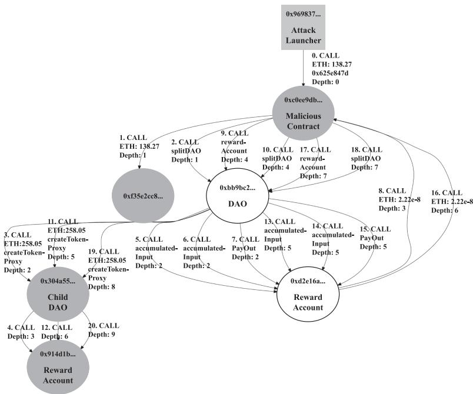  
Fig. 9. The dynamic call graph of a suspicious transaction that exploits the DAO smart contract. We use four lines to describe an internal transaction: 1. Serial number and the opcode to trigger an internal transaction; 2. Transferred Ether, null means no Ether transferred; 3. Invoked function (we search the name from the 4byte function signature database [22]), null means that the input data is empty; 4. EVM stack depth. (Square: EOA, circle: smart contract; grey box: atacker, white box: victim.)

ERC20 tokens. They are not real attacks, since no financial benefits are achieved during this process.

Thanks to the query interface provided by the data aggregator, we can easily locate candidate transactions and remove unrelated ones. In total, we get 209,227 candidate transactions.

Confirm the re-entrancy attack. We further replay candidate transactions to confirm the reentrancy attack at runtime. During this process, an analysis script is invoked. Our system first constructs a set of variables that could influence jump targets of the JUMPI opcode or values of transferred Ether. Thanks to the dynamic taint engine of our system, we can check whether a variable could influence the control flow by checking the taint tag of the second top value on the stack (taint.peekStack(1)). For each variable v in this set, we define the callback function for the SSTORE opcode to monitor whether the variable has been updated after the re-entrant point. If so, then we will label the normal transaction as malicious.

Detection result. EthScope locates 209,227 candidate transactions. After replaying them, our system detected 2,973 malicious normal transactions in the wild. Attackers are targeting 52 victim contracts, which are shown in Table 8.

We manually analyze each detected attack. During the analysis, we only consider transactions that have caused financial loss as true positives (real attacks). Our analysis shows that 46 transactions are false positives, which are related to four victims (marked with \* in Table 8). We show a detailed analysis of one false positive in the following.

Table 8. 52 Contracts Susceptible to the Re-entrancy Vulnerability Reported by Our System

<table><tr><td>Contract Address</td><td>Contract Name</td></tr><tr><td>1. 0xbb9bc244d798123fde783fcc1c72d3bb8c189413</td><td>TheDAO</td></tr><tr><td>2. 0xffcf45b540e6c9f094ae656d2e34ad11cdfdb187</td><td>Uniswap: imBTC</td></tr><tr><td>3. 0x5a6aefc503df1be6559d1e9850b5ce44f0aa7c4e</td><td>Uniswap: pBTC</td></tr><tr><td>4. 0x009211344ee05ff3f69d9aadf0d3a0ab099c5363</td><td>Uniswap: eINV</td></tr><tr><td>5. 0x0eee3e3828a45f7601d5f54bf49bb01d1a9df5ea</td><td>Lend.Me</td></tr><tr><td>6. 0xd654bdd32fc99471455e86c2e7f7d7b6437e9179</td><td>Anonymous</td></tr><tr><td>7. 0xbf78025535c98f4c605fbe9eaf672999abf19dc1</td><td>Anonymous</td></tr><tr><td>8. 0xf91546835f756da0c10cfa0cda95b15577b84aa7</td><td>LedgerChannel</td></tr><tr><td>9. 0x304a554a310c7e546dfe434669c62820b7d83490</td><td>TheDarkDAO</td></tr><tr><td>10. 0xdf4b83a451ef20b925ce39f4da2a021722688370</td><td>M_BANK</td></tr><tr><td>11. 0xcead721ef5b11f1a7b530171aab69b16c5e66b6e</td><td>WALLET</td></tr><tr><td>12. 0x83a3a9b3068911b55a3989df0e642f487d08e424</td><td>CA_BANK</td></tr><tr><td>13. 0xcb6fe98097fe7d6e00415bb6623d5fc3effa4e83</td><td>THE_BANK</td></tr><tr><td>14. 0xa4e1cbf64c3b5db2a6e6f23cb5286b97d80b86e3</td><td>WWW_wallet</td></tr><tr><td>15. 0xfe1b613f17f984e27239b0b2dccfb1778888dfae</td><td>InstaDice</td></tr><tr><td>16. 0xf5cff81d51e81596519ecf61830cb084037a2218</td><td>Anonymous</td></tr><tr><td>17. 0x55791ea128a7b7fc871272d9147435a3abb3d1eb</td><td>Anonymous</td></tr><tr><td>18. 0x7c6220c9537946a0861d7e86f6423af526f41375</td><td>Anonymous</td></tr><tr><td>19. 0xac629878277bf6a2fc46857eac4d4dd17bfa330f</td><td>Anonymous</td></tr><tr><td>20. 0x23a91059fdc9579a9fbd0edc5f2ea0bfdb70deb4</td><td>PrivateBank</td></tr><tr><td>21. 0xb4c05e6e4cdb07c15095300d96a5735046eef999</td><td>PrivateBank</td></tr><tr><td>22. 0xb93430ce38ac4a6bb47fb1fc085ea669353fd89e</td><td>PrivateBank</td></tr><tr><td>23. 0x95d34980095380851902ccd9a1fb4c813c2cb639</td><td>Private_Bank</td></tr><tr><td>24. 0xd116d1349c1382b0b302086a4e4219ae4f8634ff</td><td>Private_Bank</td></tr><tr><td>25. 0x4a8d3a662e0fd6a8bd39ed0f91e4c1b729c81a38*</td><td>HODLWallet</td></tr><tr><td>26. 0x4122073496955adb48e9a1dfaf6e456631b595a1</td><td>Anonymous</td></tr><tr><td>27. 0x2d5df43d54ae164a912db8de092cf707b446f693</td><td>CA_BANK</td></tr><tr><td>28. 0x463f235748bc7862deaa04d85b4b16ac8fafef39</td><td>PrivateBank</td></tr><tr><td>29. 0xa5d6accc5695327f65cbf38da29198df53efdcf0</td><td>Private_accumulation_fund</td></tr><tr><td>30. 0x59752433dbe28f5aa59b479958689d353b3dee08</td><td>Anonymous</td></tr><tr><td>31. 0xaae1f51cf3339f18b6d3f3bdc75a5facd744b0b8</td><td>DEP_BANK</td></tr><tr><td>32. 0x6e3c384480e71792948c29e9fc8d7b9c9d75ae8f</td><td>p_bank</td></tr><tr><td>33. 0xe610af01f92f19679327715b426c35849c47c657</td><td>PIGGY_BANK</td></tr><tr><td>34. 0xbabfe0ae175b847543724c386700065137d30e3b</td><td>PrivateBank</td></tr><tr><td>35. 0xdd71e35f680bb5adc77c6d1d9ef5793598e613dc</td><td>Piggy_BanK</td></tr><tr><td>36. 0x62781f11b58e2caf8f28eaebc73fe711c634dcff*</td><td>WRD Genesis (WRD)</td></tr><tr><td>37. 0xf01fe1a15673a5209c94121c45e2121fe2903416</td><td>Anonymous</td></tr><tr><td>38. 0x903643251af408a3c5269c836b9a2a4a1f04d1cf</td><td>SysEscrow</td></tr><tr><td>39. 0xb7c5c5aa4d42967efe906e1b66cb8df9cebf04f7</td><td>keepMyEther</td></tr><tr><td>40. 0xb3e396f500df265cdfde30ec6e80dbf99bee9e96</td><td>pg_bank</td></tr><tr><td>41. 0x8ce53575e1ce89131b370ced602ce8cfa4f7805</td><td>Anonymous</td></tr><tr><td>42. 0x26b8af052895080148dabbc1007b3045f023916e</td><td>Anonymous</td></tr><tr><td>43. 0x0eb68f34efa0086e4136bca51fc4d0696580643e</td><td>BetingHouse</td></tr><tr><td>44. 0x72f60eca0db6811274215694129661151f97982e</td><td>DecentralizedExchanges</td></tr><tr><td>45. 0xd4cd7c881f5ceece4917d856ce73f510d7d0769e</td><td>DecentralizedExchanges</td></tr><tr><td>46. 0x3ac969b43affc4e0684dc52dc3072b109d0e348d</td><td>Bank</td></tr><tr><td>47. 0x3e64b1a66f3aa6f0765b093540481aa690c2b9b7</td><td>Anonymous</td></tr><tr><td>48. 0x4b23577c0672ab1e436097b7daceadb75e5721c6</td><td>Pg_Bank</td></tr><tr><td>49. 0x857a8d8aa8d83562f9118405335bd4a1fb523317</td><td>I_bank</td></tr><tr><td>50. 0xfbdb27beadaad89f8282c51f5e5a4e77c1f19d7220</td><td>CB_Bank</td></tr><tr><td>51. 0x5d84fc93a6a8161873a315c233fbd79a88280079*</td><td>Exchange</td></tr><tr><td>52. 0x772da237fc93ded712e5823b497db5991cc6951e*</td><td>EverDragons (ED)</td></tr></table>

\*False positives.

Our system reported one attack targeting HODLWallet. However, it is a false positive, since it does not cause financial loss. Figure 10 shows the code snippet of the doWithdraw function. Specifically, the variable withdrawalCount[from] in line 8 influences the control flow. Also, this variable is updated after the reentry point in line 13. Thus, our system detects this as a re-entrancy attack. However, the transaction does not cause any financial loss, since the balance balances[from] has been updated in line 10 (before the reentry point.) This is a false positive, though technically it is still a re-entrancy attack that targets withdrawalCount[from] instead of balances[from].

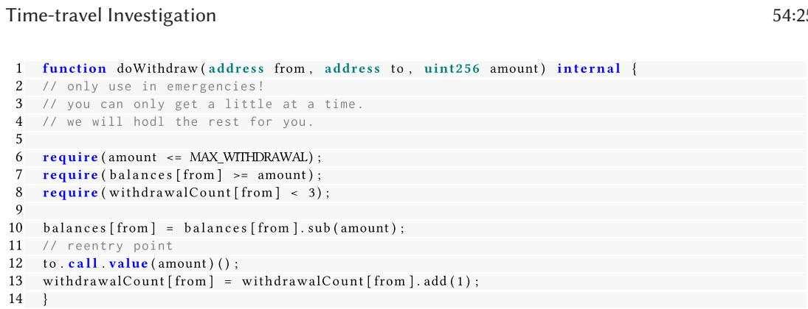  
Fig. 10. The code snippet of HODLWallet.

Since the DAO attack, the security community has paid lots of attention to detect this vulnerability. However, the re-entrancy attack still happened recently. Specifically, our system detected 579 re-entrancy attacks after the 9,200,000th block (January 2, 2020), in which 46 attacks are targeting Lend.Me [33] and 529 attacks are targeting Uniswap [34]. Both of them are DeFi applications. These two attacks caused significant financial loss.

## 5.4 Type-III Input: Abnormal Blockchain State

Besides the reported victim smart contracts and malicious transactions, an analyst can leverage the data aggregator to observe the blockchain states and use multiple heuristics to locate suspicious transactions. In the following, we elaborate the method of using the number of smart contract creation and self-destructing to locate suspicious transactions, and the process of understanding these transactions to detect multiple types of attacks.

5.4.1 Understand the Atack. Some attacks may lead to abnormal blockchain state, which can be used by an analyst to perform the detection. In the following, we illustrate how our system leverages the abnormal blockchain states to detect attacks.

Locate suspicious transactions. Attackers often create malicious smart contracts to automatically launch attacks. After that, they often destroy these contracts to save cost or hide traces. For instance, attackers ofthe bad randomness attack create a large number ofsmart contracts to launch the attack and destruct them afterwards (Section 5.2).

Inspired by this observation, we draw a trend graph of smart contract creation and selfdestructing shown in Figure 11. From the figure, we can find that there exist several abnormal points where the numbers of new smart contracts (and destroyed ones) are much larger than those of the neighbors (marked with red circles in the figure).

These three abnormal points appear in blocks ranging from 2,000,000th to 3,000,000th, 6,500,000th to 7,500,000th, and 8,900,000th to 10,110,000th, respectively. We use data aggregator to lookup transactions and accounts that create or destroy these smart contracts and label them as suspicious.

Understand suspicious transactions. After analyzing suspicious transactions, we observe two types of attacks and an automated arbitrage trading behavior. We illustrate them in the following.

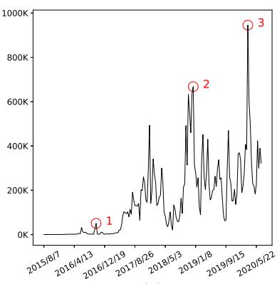  
(a)

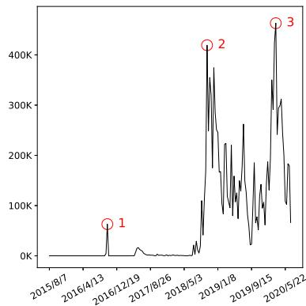  
(b)  
Fig. 11. The trend graph of smart contract creation (a) and self-destruction (b). The y-axes show the total number of newly created smart contracts and destroyed ones for every ten days, respectively.

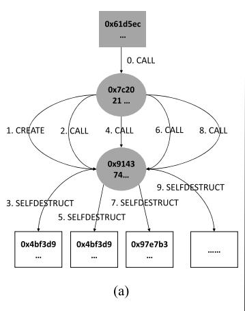

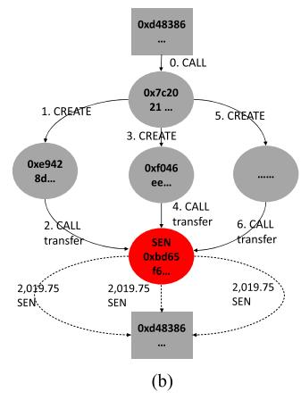  
Fig. 12. The dynamic call graph of a suicide bomb DoS atack and an ERC20 airdrop hunting atack. Square: EOA, circle: smart contract; grey box: atacker, red box: victim; solid line: transaction, doted lines: ERC20 token transfer; the number before the opcode is the execution order for each opcode.

Suicide bomb DoS attack. From blocks ranging from 2,000,000 to 3,000,000, there exists a smart contract11 that contributes 34,148 and 33,980 times of smart contract creation and selfdestructing, respectively. The only functionality of the newly created smart contract is to self-destruct and transfer its balance (1 Wei or 0 Wei) to a non-existent account.

We take a transaction12 as an example to illustrate its purpose. Figure 12(a) shows the dynamic call graph. The EOA (0x61d5ec) first invokes (index 0) a smart contract (0x7c2021) to create (index 1) a very simple contract (0x914374). Its functionality is to self-destruct itself, and transfer its balance (0 Wei in this example) to a non-existent account.

For simplicity, we only draw the first ten transactions, and this normal transaction actually triggered 320 times of self-destructing.

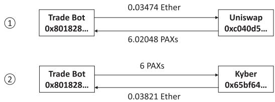  
Fig. 13. The trades in an arbitrage (normal transaction). The number in circle represents the execution order.

It is worth noting that the destruction of a smart contract actually happens only when the execution of the normal transaction (index 0) that initiates these internal transactions finishes. Thus, the contract 0x914374 can execute the opcode SELFDESTRUCT multiple times before it is actually self-destructed. Moreover, according to the definition of the opcode SELFDESTRUCT, it will create a new EOA account (Section 2.1), without paying for the 25,000 gas charge,13 which is the gas needed to create a new account. These newly created accounts will consume lots of storage resources on the blockchain. This is called the suicide bomb DoS attack [39].

Airdrop hunting attack. In blocks ranging from 6,500,000 to 7,500,000, there is a smart contract account14 that contributes 501,919 creation and 526,079 times ofsmart contract creation and self-destructing, respectively. We randomly pick a normal transaction,15 and draw the dynamic call graph in Figure 12(b) to help us understand its purpose. As shown in the graph, the smart contract (0x7c2021) continually creates new smart contracts to transfer 2,019.75 SEN tokens to the EOA (0xd48386) that initiates this transaction. The SEN token has an aggressive marketing strategy, which will reward a few tokens for every new account that has made a transaction with SEN. This strategy is adopted by many token smart contracts. The purpose of creating so many new smart contracts is abusing this strategy to obtain rewards. Destroying these new smart contracts is not necessary but can save cost. This kind ofreward is usually called airdrop reward. Therefore, this attack is called an airdrop hunting attack.

Automated arbitrage trading. In blocks ranging from 8,900,000 to 10,110,000, there is a smart contract account16 that contributes 510,390 creation and 537,992 times of smart contract creation and self-destructing, respectively. After analyzing the suspicious transactions, we find this is a trade bot, which buys and sells digital assets among decentralized exchanges using arbitrage. Though this cannot be considered as an attack, this still shows the capability of our system to understand the behaviors of smart contracts.

Figure 13 shows the digital assets transfer in an arbitrage (normal) transaction,17 which includes two trades. The trade bot (0x801828) first exchanges 6.02048 PAXs [32] with 0.03474 Ether from Uniswap [34], and then it exchanges 0 03821 Ether with 6 PAXs from Kyber [11]. As a result, the trade bot gets 0 003 Ether and 0 02 PAXs due to the exchange rate diferences between the two exchanges Kyber and Uniswap.

We further analyze the purpose of the self-destructing of smart contracts. The trade bot first created lots of smart contracts in advance with lower gas prices. When performing arbitrage, attackers will set up a higher gas price so that their trade transactions have a higher priority when being packed. That is because miners tend to pack transactions with

Table 9. Comparison between our System and Others in Detecting the Re-entrancy Atacks

<table><tr><td>Block Range</td><td># of Normal Transactions</td><td>Tools</td><td># of Flagged Contracts</td><td># of True Positives</td></tr><tr><td rowspan="2">0-3,918,380</td><td rowspan="2">32,048,852</td><td>ECFChecker [44]</td><td>9</td><td>5</td></tr><tr><td>EthScope</td><td>6</td><td>6</td></tr><tr><td colspan="5"># Flagged Normal Transactions</td></tr><tr><td rowspan="2">0-9,000,000</td><td rowspan="2">590,040,664</td><td>Sereum [52]</td><td>245,519</td><td>—</td></tr><tr><td>EthScope</td><td>2,392</td><td>2,347</td></tr><tr><td colspan="5"># Flagged Contracts</td></tr><tr><td rowspan="2">0-8,180,000</td><td rowspan="2">500,930,221</td><td>SODA [38]</td><td>31</td><td>27</td></tr><tr><td>EthScope</td><td>29</td><td>27</td></tr><tr><td colspan="5"># Flagged Contracts</td></tr><tr><td rowspan="2">0-4,500,000</td><td rowspan="2">78,141,322</td><td> $\mathcal{A}$ GIS [43]</td><td>7</td><td>7</td></tr><tr><td>EthScope</td><td>7</td><td>7</td></tr><tr><td colspan="5"># Flagged Contracts</td></tr><tr><td rowspan="2">7,000,000-7,200,000</td><td rowspan="2">9,661,593</td><td>TXSPECTOR [58]</td><td>30</td><td>0</td></tr><tr><td>EthScope</td><td>1</td><td>1</td></tr></table>

higher gas prices. After that, they self-destruct the smart contracts to receive the returned gas at a higher gas price, since the current gas price used in the transaction is high.

Answers to Q2: With three diferent types of inputs, our system can help understand the suspicious transactions and further detect new attacks by locating and replaying candidate transactions. This demonstrates the efectiveness of our system to facilitate the attack investigation and detect new attack instances.

## 5.5 Comparison with Existing Systems

In this section, we compare EthScope with existing systems. We use the re-entrancy attack to perform the comparison, because it is the only attack type that is investigated by all the previous studies. Table 9 shows the overall result. For each system, we use the same dataset and compare the detected attacks. The result shows that our system has lower false positives and false negatives.

ECFCHecker. ECFCHecker [44] reports nine malicious smart contracts before 3,918,380th block (Jun 23, 2017). Among them, five are true positives and four are false positives. Our system detects six malicious smart contracts. All of them are true positives. Specifically, five false positives are the same smart contracts detected by ECFCHecker. One true positive18 (a malicious smart contract in the 1,743,596th block) is missed by ECFCHecker. Besides, our system does not flag the four false positives reported by ECFCHecker.

Sereum. Sereum [52] has released the evaluation result for the first 9 million blocks on GitHub. It flags 245,519 normal transactions as re-entrancy attacks. Among the first 9 million blocks, 2,392 are detected by our system. Besides, among 2,392 normal transactions, 12 are not flagged by Sereum.

First, we manually confirm that these 12 normal transactions are true positives. That means they have been missed by Sereum. Second, for the 243,139 normal transactions that are flagged by Sereum, we randomly pick up 10 transactions. The manual analysis shows that they are all false positives.

SODA. For the first 8 18 million blocks, SODA [38] reports 31 vulnerable contracts, with 5 false positives and 26 true positives. After double-checking the 31 contracts, we find two of them are false positives19 and one is true positive20 (reported as the false positive by SODA). Therefore, the result is 27 true positives and four false positives. EthScope detects the same 27 true positives.

ÆGIS. ÆGIS [43] reports that seven smart contracts are victims of the re-entrancy attack during the first 4 5 million blocks. EthScope detects the same victimized smart contracts. However, ÆGIS marks fewer attack transactions (1,118 vs. 2,301) than EthScope. That is because ÆGIS limits their analysis to the first 10,000 normal transactions of each contract to reduce the execution time. Our system does not have this limitation, thanks to the eficient replay engine.

TxSpector. Due to the storage consumption, TxSpector detects the re-entrancy attack from 7,000,000th block to 7,200,000th block. It flags 3,357 normal transactions as malicious and 30 vulnerable smart contracts. Among them, they manually labeled 17 ones as true positives. EthScope flags one malicious normal transaction21 and one victim contract.22 It is the re-entrancy attack to SpankChain [1].

The authors of the TxSpector kindly provide their dataset for us. We manually analyze the 17 smart contracts that are reported as true positives by TxSpector. However, they are not vulnerable and cannot be victims of the re-entrancy attack according to our definition (causing a financial loss). Moreover, one true positive (the SpankChain re-entrancy attack) reported by our system is not detected by TxSpector.

Answers to Q3: Comparing with previous systems, EthScope has lower false positives and false negatives when detecting the re-entrancy attack.

## 5.6 Analysis of Atacks Exploiting Logic Vulnerabilities

In this section, we demonstrate the capability of EthScope in analyzing attacks exploiting new logic vulnerabilities, which have been observed in the wild in recent months.

Similar to the investigation discussed earlier, we also construct a dynamic call graph (like Figures 7 and 9) for the attack transaction. However, the complicated interactions between DeFi projects may make the dynamic call graph too huge to analyze, i.e., the intentions of the malicious contracts are submerged by numerous invocations between DeFi projects. To address this issue, we first feed the ABIs of related smart contracts to EthScope, and then extract the high-level se mantic from the raw invocations. By doing so, we can identify and focus on the core logic of the malicious contract.

Here, we use a reported transaction23 in Harvest hack [31] as an example to elaborate the process. Figure 14 depicts the core logic of this transaction extracted by EthScope. Specifically, EthScope facilitates identifying the behavior ofthe malicious contract by merging numerous internal transactions that were triggered by internal transactions 156, 201, 372 and 467. Besides, EthScope decodes the auxiliary data (including function names, event names, function parameters and event param eters) to help better understand the details of DeFi services invoked by the malicious contract.

As shown in Figure 14, the malicious contract continuously invokes three DeFi services in the following four steps:

(1) Exchanging 17.9M USDT for 17.9M USDC in Curve [27].24

(2) Depositing 60 2M USDC to Harvest [30] and receiving 69 7M minted fUSDC as certificates.

(3) Exchanging 17.9M USDC for 17.9M USDT in Curve.

(4) Withdrawing 60.6M USDC from Harvest after burning 69.7M fUSDC.

The malicious contract profits 0 4M USDC from Harvest after the above four steps. Note that in step 2, it gets 69 7M fUSDC minted by Harvest as certificates of the deposited 60 2m USDC. However, in step 4, it withdraws 60 6M USDC (0 4M more than the amount of deposit) from Harvest by burning 69 7M fUSDC. Obviously, such a derivation becomes a clue to focus on the interaction between Harvest and Curve (from step 2 to step 4). Based on this observation, it is not dificult for an experienced analyst to identify the root cause, i.e., Harvest’s price mechanism depends on the real-time prices provided by Curve.

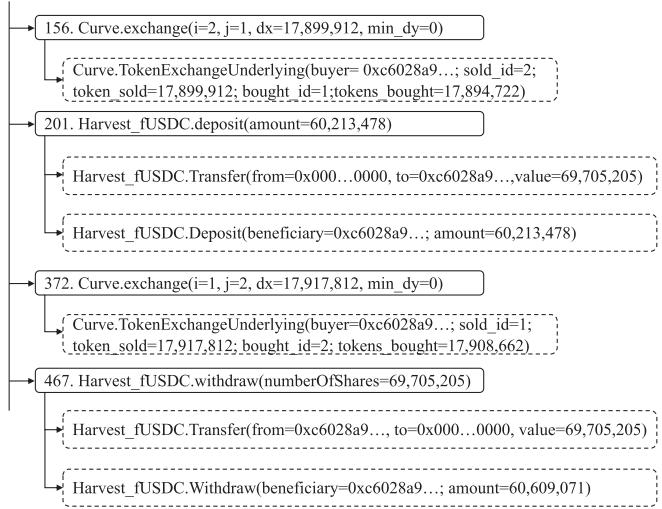  
Fig. 14. The core part of decoded information in an atack transaction of Harvest hack [31]. The solid box represents a function invocation decoded by an internal transaction; the doted box represents a contract event decoded by a log. The number before invocation is the invocation sequence number.

Answers to Q4: EthScope is capable of facilitating analyzing new attacks targeting semantic/logic vulnerabilities in DeFi projects. Specifically, it extracts high-level semantics from (high volumes of) raw transactions to quickly locate vulnerabilities.

## 6 DISCUSSION

The purpose of our system is to detect real attacks. Compared with other static analysis tools [37, 42, 46–49, 51, 54–56], our system may miss some vulnerable smart contracts that are not exploited in the wild. Nevertheless, our system does not intend to replace existing static tools. Instead, these tools are complementary to our system. For instance, the vulnerable smart contracts reported by them [37, 42, 46–49, 51, 54–56] could be one type of inputs (as shown in Section 5.2) to locate real attacks.

Though the main usage of our system is to perform investigation on attacks that have happened, it can be extended to conduct real-time detection of attacks. We can continuously monitor the blockchain states and use some heuristics to locate suspicious transactions. For instance, we can continuously monitor the transactions that are involved in big-amount Ether transfer. We can mark them as suspicious and understand the purpose of such transactions using our system. Another example is monitoring the transactions with smart contracts that may potentially be attacked, e.g., DeFi applications. That is because such applications are high-value targets for attackers to make profits. We leave the real-time detection of new attacks as one of the future work.

Though we have demonstrated the efectiveness of our system, an analyst still needs some public information as inputs, e.g., victim contracts. One potential direction is to use new techniques, e.g., machine learning algorithms to automatically locate suspicious transactions. Currently, our system provides a dynamic taint engine to facilitate the analysis. In the future, we can integrate more components, e.g., dynamic symbolic execution, into the system to ease the development of analysis scripts.

## 7 RELATED WORK

Data analysis frameworks of Ethereum. Chen et al. [41] proposed a graph-analysis-based approach to analyze Ethereum from diferent aspects, including money flow, account creation, and contract invocation. DataEther [40] first instruments an Ethereum full node to collect data and then uses ElasticSearch [7] to store the collected data. Similar to EthScope, these systems can be used to locate suspicious transactions. However, they are not capable of introspecting the execution of smart contracts to understand and detect more attacks.

Static analysis tools of Ethereum smart contracts. A number ofstatic analysis tools have been proposed to detect vulnerabilities of Ethereum smart contracts, including Oyente [48], Mythril [18], Osiris [55], MAIAN [49], ContractFuzzer [46], ILF Fuzzer [45], Securify [56], and ZEUS [47]. These systems only provide a static view of smart contracts, i.e., whether they are vulnerable or not. They cannot provide a dynamic view of contract interactions (or transactions), which is useful to analyze and understand attacks. Our system does not intend to replace existing static tools. Instead, they are complementary to our system. For instance, the vulnerable smart contracts reported could be one type of inputs (as shown in Section 5.2) to locate real attacks.

Dynamic analysis tools of Ethereum smart contracts. Dynamic analysis has been regarded as an efective complement to static analysis for security purposes. ECFChecker [44], Sereum [52], SODA [38], and ÆGIS [43] are representative tools to analyze Ethereum smart contracts. On one side, both Sereum [52] and ECFChecker [44] focus on the detection of the re-entrancy attack. On the other side, SODA [38] and ÆGIS [43] provide extensible interfaces to detect multiple types of attacks. Unfortunately, these tools sufer from the scalability issue. They are not suitable to perform the large-scale detection.

Pérez et al. [50] presented the first work that adopts the datalog-based approach to analyze vulnerabilities of smart contracts. However, it only analyzes transactions related to the smart contracts flagged by other tools. TxSpector [58] also relies on datalog and supports customized rules to analyze diferent types of vulnerabilities and attacks. However, TxSpector is not scalable to perform the large-scale detection, due to the heavy storage consumption. Zhou et al. [29] investigated attacks in the wild. They leveraged internal transactions information (named trace in the paper) and transaction logs to measure six types of vulnerabilities, including call injection, re-entrancy, integer overflow, airdrop hunting, honeypot, and call-after-destruct. Our system has a diferent purpose. It focuses on building a scalable framework to understand and detect diferent types of attacks.

## 8 CONCLUSION

In this article, we present the design of a scalable attack detection framework on Ethereum. It overcomes the scalability issue of existing systems that it can perform timely attack investigation and detect more attacks. We implement a prototype named EthScope and solve three technical challenges. The performance evaluation shows that our system can solve the scalability issue. The result with three diferent types of information as inputs shows that it can help an analyst understand attack behaviors and further detect more attacks.

## ACKNOWLEDGMENTS

We thank the anonymous reviewers for their comments that greatly helped improve the presentation of this article.

ACM Transactions on Software Engineering and Methodology, Vol. 31, No. 3, Article 54. Publication date: April 2022.

## REFERENCES

[1] 2018. We Got Spanked: What We Know So Far, https://medium.com/spankchain/we-got-spanked-what-we-know-sofar-d5ed3a0f38fe.

[2] 2014. Ethereum Oficial Website. Retrieved from https://www.ethereum.org/.

[3] 2014. Ethereum White Paper. Retrieved from https://github.com/ethereum/wiki/wiki/White-Paper.

[4] 2014. Go Ethereum. Retrieved from https://geth.ethereum.org.

[5] 2015. Code address and self address in contract type of Go-Ethereum. Retrieved from https://github.com/ethereum/goethereum/blob/master/core/vm/contract.go.

[6] 2015. ERC20 Token Standard. Retrieved from https://github.com/ethereum/EIPs/blob/master/EIPS/eip-20.md.

[7] 2015. Open Source Search & Analytics—ElasticSearch. Retrieved from https://www.elastic.co.

[8] 2015. Query DSL. Retrieved from https://www.elastic.co/guide/en/elasticsearch/reference/current/query-dsl.html.

[9] 2016. eip-150. Retrieved from https://github.com/ethereum/EIPs/blob/master/EIPS/eip-150.md.

[10] 2017. Duktape JavaScript engine bindings for Go. Retrieved from https://github.com/olebedev/go-duktape. (2017).

[11] 2017. Kyber Network. Retrieved from https://blog.kyber.network/.

[12] 2017. USDC. Retrieved from https://www.circle.com/en/usdc.

[13] 2017. USDT. Retrieved from https://tether.to.

[14] 2018. 4byte tracer. Retrieved from https://github.com/ethereum/go-ethereum/blob/master/eth/tracers/internal/tracers/ 4byte\_tracer.js.

[15] 2018. debug\_traceTransaction. Retrieved from https://github.com/ethereum/go-ethereum/wiki/Management-APIs# debug\_tracetransaction.

[16] 2018. eip-1014. Retrieved from https://github.com/ethereum/EIPs/blob/master/EIPS/eip-1014.md.

[17] 2018. JS tracer. Retrieved from https://github.com/ethereum/go-ethereum/wiki/Management-APIs#debug\_ tracetransaction.

[18] 2018. Mythril. Retrieved from https://github.com/ConsenSys/mythril.

[19] 2018. New batchOverflow Bug in Multiple ERC20 Smart Contracts (CVE-2018–10299). Retrieved from https://blog. peckshield.com/2018/04/22/batchOverflow/.

[20] 2018. New ceoAnyone Bug Identified in Multiple Crypto Game Smart Contracts (CVE-2018–11329). Retrieved from https://medium.com/@peckshield/new-ceoanyone-bug-identified-in-multiple-crypto-/game-smart-contractscve-2018-11329-898cdceac7e0.

[21] 2018. New proxyOverflow Bug in Multiple ERC20 Smart Contracts (CVE-2018–10376). Retrieved from https://blog. peckshield.com/2018/04/25/proxyOverflow/.

[22] 2018. Welcome to the Ethereum Function Signature Database. Retrieved from https://www.4byte.directory/.

[23] 2019. Ethereum Archive Data. Retrieved from https://infura.io/docs/ethereum/add-ons/archiveData.

[24] 2019. Ethereum Yellow Paper. Retrieved from https://ethereum.github.io/yellowpaper/paper.pdf.

[25] 2019. Geth v1.9.0 Foundation Blog. Retrieved from https://blog.ethereum.org/2019/07/10/geth-v1-9-0/.

[26] 2019. How to PWN FoMo3D, a beginners guide. Retrieved from https://www.reddit.com/r/ethereum/comments/ 916xni/how\_to\_pwn\_fomo3d\_a\_beginners\_guide/.

[27] 2020. Curve. Retrieved from https://curve.fi.

[28] 2020. Etherscan. Retrieved from https://etherscan.io.

[29] 2020. An ever-evolving game: Evaluation of real-world attacks and defenses in ethereum ecosystem. In Proceedings of the 29th USENIX Security Symposium (USENIX Security’20). USENIX Association. Retrieved from https://www.usenix. org/conference/usenixsecurity20/presentation/zhou-shunfan.

[30] 2020. Harvest. Retrieved from https://harvest.finance.

[31] 2020. Harvest hack. Retrieved from https://www.coindesk.com/harvest-finance-24m-attack-triggers-570m-bankrun-in-latest-defi-exploit.

[32] 2020. Paxos Standard. Retrieved from https://www.paxos.com/pax/.

[33] 2020. Understanding the Lend.Me Attack. Retrieved from https://hackernoon.com/how-did-lendfme-lose-dollar25- million-to-a-reentrancy-/attack-an-analysis-091iy32s7.

[34] 2020. Understanding the Uniswap Attack. Retrieved from https://blog.openzeppelin.com/exploiting-uniswap-fromreentrancy-to-actual-profit/.

[35] 2021. Merkle tree. Retrieved from https://en.wikipedia.org/wiki/Merkle\_tree.

[36] Evgeny Medvedev and Allen Day. 2018. Ethereum in BigQuery: a Public Dataset for smart contract analyt ics. Retrieved from https://cloud.google.com/blog/products/data-analytics/ethereum-bigquery-public-dataset-smartcontract-analytics.

[37] Lexi Brent, Anton Jurisevic, Michael Kong, Eric Liu, François Gauthier, Vincent Gramoli, Ralph Holz, and Bernhard Scholz. 2018. Vandal: A scalable security analysis framework for smart contracts. Retrieved from http://arxiv.org/abs 1809.03981.

[38] Ting Chen, Rong Cao, Ting Li, Xiapu Luo, Guofei Gu, Yufei Zhang, Zhou Liao, Hang Zhu, Gang Chen, Zheyuan He, Yuxing Tang, Xiaodong Lin, and Xiaosong Zhang. 2020. SODA: A generic online detection framework for smart contracts. In Proceedings of the 27th Network and Distributed System Security Symposium.

[39] Ting Chen, Xiaoqi Li, Ying Wang, Jiachi Chen, Zihao Li, Xiapu Luo, Man Ho Au, and Xiaosong Zhang. 2017. An adaptive gas cost mechanism for ethereum to defend against under-priced dos attacks. In Proceedings of the International Conference on Information Security Practice and Experience. Springer, 3–24.

[40] Ting Chen, Zihao Li, Yufei Zhang, Xiapu Luo, Ang Chen, Kun Yang, Bin Hu, Tong Zhu, Shifang Deng, Teng Hu, Jiachi Chen, and Xiaosong Zhang. 2019. DataEther: Data exploration framework for ethereum. In Proceedings of the IEEE International Conference on Distributed Computing Systems.

[41] Ting Chen, Yuxiao Zhu, Zihao Li, Jiachi Chen, Xiaoqi Li, Xiapu Luo, Xiaodong Lin, and Xiaosong Zhang. 2018. Understanding ethereum via graph analysis. In Proceedings of the IEEE International Conference on Computer Communications.

[42] Weili Chen, Zibin Zheng, Jiahui Cui, Edith Ngai, Peilin Zheng, and Yuren Zhou. 2018. Detecting Ponzi schemes on ethereum: Towards healthier blockchain technology. In Proceedings of the World Wide Web Conference.

[43] Christof Ferreira Torres, Mathis Baden, Robert Norvill, and Hugo Jonker. 2019. ÆGIS: Smart shielding of smart contracts. In Proceedings ofthe ACM SIGSAC Conference on Computer and Communications Security. 2589–2591.

[44] Shelly Grossman, Ittai Abraham, Guy Golan-Gueta, Yan Michalevsky, Noam Rinetzky, Mooly Sagiv, and Yoni Zohar. 2017. Online detection of efectively callback free objects with applications to smart contracts. Proc. ACM Program. Lang. 2 (2017), 1–28.

[45] Jingxuan He, Mislav Balunović, Nodar Ambroladze, Petar Tsankov, and Martin Vechev. 2019. Learning to fuzz from symbolic execution with application to smart contracts. In Proceedings of the ACM SIGSAC Conference on Computer and Communications Security. 531–548.

[46] Bo Jiang, Ye Liu, and W. K. Chan. 2018. ContractFuzzer: Fuzzing smart contracts for vulnerability detection. In Pro ceedings of the 33rd ACM/IEEE International Conference on Automated Software Engineering.

[47] Sukrit Kalra, Seep Goel, Mohan Dhawan, and Subodh Sharma. 2018. Zeus: Analyzing safety of smart contracts. In Proceedings ofthe 25th Annual Network and Distributed System Security Symposium.

[48] Loi Luu, Duc-Hiep Chu, Hrishi Olickel, Prateek Saxena, and Aquinas Hobor. 2016. Making smart contracts smarter. In Proceedings of the 23rd ACM Conference on Computer and Communications Security.

[49] Nvica Nikolic, Aashish Kolluri, Ilya Sergey, Prateek Saxena, and Aquinas Hobor. 2018. Finding the greedy, prodigal, and suicidal contracts at scale. In Proceedings of the 34th Annual Computer Security Applications Conference.

[50] Daniel Pérez and Benjamin Livshits. 2019. Smart contract vulnerabilities: Does anyone care? Retrieved from http: //arxiv.org/abs/1902.06710.

[51] Anton Permenev, Dimitar Dimitrov, Petar Tsankov, Dana Drachsler-Cohen, and Martin Vechev. 2020. VerX: Safety verification of smart contracts. In Proceedings of the 41st IEEE Symposium on Security and Privacy.

[52] Michael Rodler, Wenting Li, Ghassan O. Karame, and Lucas Davi. 2019. Sereum: Protecting existing smart contracts against re-entrancy attacks. In Proceedings ofthe Network and Distributed Systems Security Symposium.

[53] David Siegel. 2016. Understanding The DAO Attack. Retrieved from https://www.coindesk.com/understanding-daohack-journalists.

[54] Sunbeom So, Myungho Lee, Jisu Park, Heejo Lee, and Hakjoo Oh. 2020. VeriSmart: A highly precise safety verifier for ethereum smart contracts. In Proceedings ofthe 41st IEEE Symposium on Security and Privacy.

[55] Christof Ferreira Torres, Julian Schutte, and Radu State. 2018. Osiris: Hunting for integer bugs in ethereum smart contracts. In Proceedings ofthe 34th Annual Computer Security Applications Conference.

[56] Petar Tsankov, Andrei Dan, Dana Drachsler-Cohen, Arthur Gervais, Florian Bunzli, and Martin Vechev. 2018. Securify: Practical security analysis of smart contracts. In Proceedings ofthe 25th ACM Conference on Computer and Communications Security.

[57] Siwei Wu, Dabao Wang, Jianting He, Yajin Zhou, Lei Wu, Xingliang Yuan, Qinming He, and Kui Ren. 2021. DeFiRanger: Detecting price manipulation attacks on DeFi applications. Retrieved from https://arXiv:2104.15068.

[58] Mengya Zhang, Xiaokuan Zhang Zhang, Yinqian Zhang, and Zhiqiang Lin. 2020. TXSPECTOR: Uncovering attacks in ethereum from transactions. In Proceedings of the 29th USENIX Security Symposium (USENIX Security’20). USENIX Association. Retrieved from https://www.usenix.org/conference/usenixsecurity20/presentation/zhang-mengya.