# EVOPOC: Automated Exploit Synthesis for DeFi Smart Contracts via Hierarchical Knowledge Graphs

Ruichao Liang<sup>∗</sup>, Jing Chen<sup>†</sup>, Xianglong Li<sup>†</sup>, Huangpeng Gu<sup>†</sup>, Yebo Feng<sup>∗</sup>, Yue Xue<sup>‡</sup>, Cong Wu<sup>†</sup>, Yang Liu<sup>∗</sup>

<sup>∗</sup>School of Computer Science and Engineering, Nanyang Technological University, Singapore

<sup>†</sup>School of Cyber Science and Engineering, Wuhan University, Wuhan, China

<sup>‡</sup>MetaTrust Labs, Singapore

Abstract—Smart contract vulnerabilities in Decentralized Finance (DeFi) caused over billions of dollars losses every year, yet the security community faces a critical bottleneck: identifying a vulnerability is not the same as proving it is exploitable. Without an executable proof-of-concept (PoC) exploit, reported findings remain theoretical, leaving auditors unable to prioritize remediation. Manual PoC construction is prohibitively laborintensive, leaving most disclosed vulnerabilities unverified and protocols exposed long before mitigation is applied. While recent LLM-based approaches show promise, naive prompting falls short of producing reliable PoCs.

In this paper, we propose EVOPOC, a knowledge-driven agentic system for end-to-end contract vulnerability detection and exploit synthesis. Our core insight is that exploit synthesis is not a code generation task but a structured reasoning problem that requires grounded knowledge of protocol semantics, failure root cause, and exploit primitives. EVOPOC organizes this knowledge into a Hierarchical Knowledge Graph (HKG) that serves as structured memory for LLM-guided multi-hop reasoning, enabling the model to compose exploit strategies from reusable, semantically grounded primitives rather than unconstrained token generation. To validate exploit feasibility beyond code synthesis, EVOPOC employs a two-stage validation framework that checks exploitpath reachability via SMT solving and profit realizability via asset-level state simulation, ensuring generated PoCs satisfy both logical and economic viability constraints. Evaluated on 88 realworld DeFi attacks and 72 audited projects (2,573 contracts), EVOPOC achieves 98% recall and 0.9 F1-score in detection, and a 96.6% exploit success rate (ESR), reproducing 85 historical exploits and recovering over \$116.2M revenue. EVOPOC outperforms SOTA fuzzers (VERITE, ITYFUZZ) by up to 5× in ESR and 300× in recoverable value, and the LLM-based exploit generator A1 by 2× and 8.5× respectively. In bug bounty evaluation, EVOPOC identified 16 confirmed 0-day vulnerabilities, helping secure over \$70.6M and earning \$2,900 in bounties.

## I. INTRODUCTION

DeFi protocols have become one of the most lucrative targets for adversarial exploitation in the history of software security, with an estimated \$3.6 billion lost to smart contract flaws in 2025 alone [1]. Numerous automated techniques, including static analysis [2], [3], [4], [5], fuzzing [6], [7], and formal verification [8], [9], [10], [11], have been proposed to identify potential vulnerabilities. However, in practice, these tools produce large volumes of unverified alerts, and security teams must manually assess each finding to determine whether it represents an actual vulnerability. This manual triage process is slow, expensive, and error-prone.

Large language models (LLMs) offer a promising path toward automating this confirmation step. However, existing LLM-based approaches [12], [13], [14], [15], [16] focus narrowly on vulnerability detection and lack the capability for end-to-end exploit synthesis. Gervais et al. [17] take a step toward exploit generation via tool-calling, but their system relies predominantly on the LLM’s intrinsic capability, making it prone to hallucination, unstable reasoning, and limited robustness and reproducibility in complex scenarios. The fundamental problem is that exploit generation in DeFi is not a code completion task: it is a multi-step reasoning problem that requires precise knowledge of protocol semantics, economic models, and end-to-end executability.

To fill the gap, we propose EVOPOC, a knowledge-driven agentic system for automated end-to-end smart contract exploit synthesis. Rather than viewing exploit generation as a direct extension of vulnerability detection or a one-shot code generation, we formulates it as a structured reasoning problem that retrieves semantic context from grounded domain knowledge, synthesizes exploit primitives through multi-hop reasoning, and verifies their logical and economic feasibility. Specifically, we make several innovations to address three core challenges:

i) The semantic gap between vulnerability detection and exploit synthesis. Since LLM training knowledge is implicitly distributed across model parameters, its reasoning capability largely manifests as probabilistic navigation in high-dimensional semantic spaces [18]. In complex DeFi protocols, however, vulnerability detection and exploitation are separated by a substantial semantic distance: the former focuses on localized anomalies within contract implementations [19], [20], [12], whereas the latter requires synthesizing multi-contract interactions, protocol states, and economic constraints to construct executable attack strategies [21]. This mismatch significantly amplifies reasoning errors as the model attempts to navigate sparse semantic connections, which is a phenomenon known as probability diffusion [22]. To bridge this gap, we define an ontology schema that organizes DeFi domain knowledge into a structured, explicit representation called Hierarchical Knowledge Graph (HKG). By structuring knowledge along three dimensions: contract semantics, failure modes, and exploit primitives, the HKG provides reusable symbolic anchors that enable multi-hop reasoning and guide LLMs from vulnerability detection through root cause analysis to composition of exploit primitives.

ii) Hallucination amplification in long-horizon reasoning chains. The effectiveness of LLM-based approaches [17], [12], [13], [14], [15] is often limited by hallucinations when reasoning over multi-step chains: a single fabricated primitive or misinterpreted protocol behavior compounds across subsequent steps, collapsing the entire exploit logic. The challenge intensifies as novel DeFi attack patterns continually outpace model training data. To address this, we develop an evolving agentic memory mechanism built upon the HKG, consisting of long-term memory (LTM) and working memory (WM). The system continuously updates LTM by extracting structured and reusable knowledge from the latest audit reports and exploits under the predefined HKG ontology, and dynamically instantiates task-specific working memory during contract analysis. This mechanism assists in establishing a coherent and grounded reasoning chain, significantly reducing hallucinations with up-to-date domain expertise.

iii) Lack of practical exploit validity guarantees. LLMgenerated PoCs are frequently syntactically plausible but semantically invalid: they reference non-existent execution paths, fail to satisfy state prerequisites, or produce no net profit under realistic execution conditions. To address this, EVOPOC incorporates a two-stage validation framework that verifies exploit-path reachability via SMT constraint checking and profit realizability via asset-level state simulation, filtering infeasible candidates before Foundry execution and providing informative feedback for iterative refinement.

EVOPOC ’s long-term memory is bootstrapped from audit reports and real-world exploit analyses across multiple sources [23], [24], [25], [26], [27] through automated knowledge extraction, and can be continuously updated. We evaluated EVOPOC on 88 real-world DeFi attack incidents and 72 audited projects comprising 2,573 contracts<sup>1</sup>, comparing it with state-of-the-art (SOTA) tools, including LLMbased scanner GPTSCAN [12], the fuzzers ITYFUZZ [6] and VERITE [28], and the LLM-based exploit generation tool A1 [17]. EVOPOC outperforms GPTSCAN by achieving a recall of 98% and an F1-score of 90% in vulnerability detection. Its generated PoCs successfully reproduce 85 historical real-world exploits, yielding a total profit of \$116.2 million. EVOPOC attains about 5× higher exploit success than ITY-FUZZ, and 2× higher than VERITE and A1, while achieving over 300×, 2×, and 8.5× higher revenue, respectively. In addition, EVOPOC discovered 21 0-day vulnerabilities, 16 of which have been acknowledged or patched, helping secure \$70.6 million and earning \$2,900 in bug bounties.

Contributions. This paper makes following contributions.

• We demystify three root causes that make automated exploit synthesis fundamentally harder than vulnerability detection in DeFi: ① the semantic distance between localized flaw identification and complex PoC composition; ② LLM susceptibility to hallucination and knowledge staleness during long-horizon security reasoning; and ③ the absence of executable validity guarantees for LLM-generated PoCs in realistic execution environments.

• We make three innovations to address these gaps, including ① a hierarchical knowledge graph that encoding DeFi security knowledge as structured reasoning anchors to bridge vulnerability detection and exploit synthesis; ② an evolving agentic memory mechanism to ground LLM reasoning and reduce hallucinations with up-to-date knowledge distilled from real-world audits and exploits; and ③ a two-stage feasibility validation framework combining SMT-based reachability checking with profit realizability simulation.

• We build and evaluate EVOPOC, an agentic system for end-to-end vulnerability identification and exploit synthesis. Experiments show that it outperforms SOTA vulnerability scanner in detection accuracy, surpasses leading fuzzers and PoC generators in exploit effectiveness, reproduces 85 realworld exploits extracting over \$116.2M, and discovers 16 0-day vulnerabilities yielding \$2,900 in bug bounties.

## II. BACKGROUND

## A. Smart Contract and Decentralized Finance

Smart contracts manage digital assets on the blockchain via predefined logic [29], underpinning the DeFi ecosystem of lending, trading, and asset management [30], [31]. Logic vulnerabilities are frequently exploited, causing substantial losses [32]. Validating such vulnerabilities requires a proofof-concept (PoC) exploit, yet PoC construction demands deep DeFi expertise and compositional reasoning, making it costly and hard to scale.

## B. LLM-based Vulnerability Detection

LLMs have been applied to vulnerability detection via fine-tuning, chain-of-thought reasoning, and integration with static analysis or symbolic execution [33], [34], [12], [13], [14]. However, these methods identify potential vulnerabilities but struggle to assess exploitability or generate valid PoCs, limiting their practical utility.

## III. THREAT MODEL

Adversary model. We consider an adversary seeking financial gain by exploiting vulnerabilities in publicly deployed DeFi smart contracts. The adversary has read access to onchain bytecode, contract ABIs, historical transactions, and public disclosures, and aims to construct transaction sequences that triggers a target vulnerability and extracts unauthorized profit. This model captures the real-world attacker profile observed in historical DeFi incidents.

Defender model. EVOPOC is designed as a proactive defensive security tool that enables authorized security practitioners to stay ahead of adversaries through an end-toend pipeline covering both vulnerability identification and exploit confirmation. Intended users include security auditors, bug bounty hunters, and protocol teams conducting internal reviews. In all cases, practitioners operate on contracts they are authorized to test, and exploits execute only in controlled local fork environments.

```txt
function buyTokenAndFees(address from, address to,
    uint256 amount) internal {
    uint256 burnAmount = amount.mul(3).div(100);
    uint256 otherAmount = amount.mul(1).div(100);
    uint256 feeAmount = amount.mul(10).div(100);
    amount = amount.sub(feeAmount);
    swapFeeTotal = swapFeeTotal.add(otherAmount);
    super._burn(from, burnAmount);
    super._transfer(from, to, amount);}
function distributeFee() public {
    uint256 mokeyFeeTotal = swapFeeTotal.mul(2);
    super._transfer(uniswapV2Pair, monkeyWallet,
        mokeyFeeTotal);
    super._transfer(uniswapV2Pair, birdWallet,
        swapFeeTotal);
    super._transfer(uniswapV2Pair, foundationWallet,
        swapFeeTotal);
    super._transfer(uniswapV2Pair, technologyWallet,
        swapFeeTotal);
    super._transfer(uniswapV2Pair, marketingWallet,
        swapFeeTotal);
    swapFeeTotal = 0;}
```  
Listing 1: Fee-on-transfer token with delayed distribution causing reserve imbalance and price manipulation.

```txt
CoT-based-only Prompt Template
System: You are a professional smart contract auditor ...
Step 1: Review the contract code [%CODE%] and identify any logic flaws or security issues that could lead to unexpected or exploitable behavior. Report only the most confident and impactful finding.
Step 2: Based on the identified issue, analyze its root cause and evaluate whether it can be exploited for financial gain or manipulation in a DEX or liquidity pool setting. If so, outline a high-level attack strategy.
Step 3: Based on the strategy, generate a concise proof-of-concept in Solidity that demonstrates the sequence of interactions an attacker would use. Use the environment assumptions [%ENV%] during PoC generation.
```  
Fig. 1: Step-wise prompt for guiding LLMs to identify and exploit the vulnerability in the motivating example.

## IV. MOTIVATING EXAMPLE

Despite the capabilities of LLMs in understanding smart contract code, a substantial gap remains between identifying potential vulnerabilities and generating practical PoCs. Here, we show how structured and reusable knowledge enables compositional reasoning in LLMs and bridge this gap.

## A. Detection-to-Exploitation Gap

Listing 1 shows a token contract snippet from a real-world price manipulation incident. The token implements a fee-ontransfer mechanism that deducts 10% per transfer, burning 3% and redistributing the remaining 7% to designated wallets. In practice, the 7% is temporarily held in sender’s account and only released via distributeFee, creating a mismatch between the sender’s actual balance and deserved balance.

While detecting this anomaly in buyTokenAndFees is straightforward for LLMs, exploiting it is more complex.

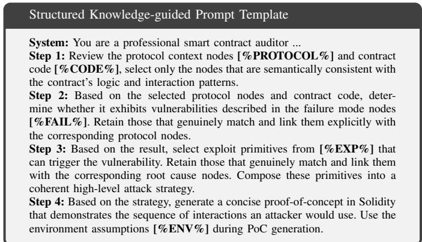  
Fig. 2: Structured knowledge as reasoning primitives for vulnerability detection and exploitation.

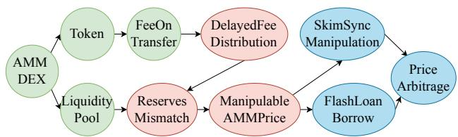  
Fig. 3: Reasoning chains from structured knowledge nodes to guide exploit synthesis. Green, red, and blue nodes represent [%PROTOCOL%], [%FAIL%], and [%EXP%] types.

An attacker must first locate an AMM pair, obtain capital via a flash loan, and repeatedly transfer tokens into the pair to accumulate the retained 7% fees inside, and then invoke skim to reclaim the transferred amount. Finally, the attacker triggers distributeFee to induce a sharp reserve imbalance, and distort the AMM price to arbitrage profits. Notably, although the vulnerability originates from the token’s fee-handling logic, the exploitation does not manifest locally. Instead, it unfolds within an external AMM pair through a sequence of coordinated interactions across contracts. The attack requires reasoning over fee-on-transfer semantics, AMM pricing, flash loan, and adversarial state manipulation. This separation between localized vulnerability detection and crosscontract, stateful exploitation illustrates a substantial semantic gap that is difficult to bridge through LLM reasoning alone.

We further use a CoT-based prompt (Figure 1) and GPT-5 to conduct an evaluation on this example. Table I summarizes the model’s performance across successive reasoning stages. While the model consistently recognizes the presence of the price manipulation vulnerability (5/5), its performance degrades sharply when deeper causal reasoning (3/5) and exploit construction (0/5) are required, and no executable PoC is produced (0/5). This result provides concrete evidence of a substantial reasoning gap between vulnerability detection and practical exploitation.

## B. Structured Knowledge as Semantic Link

We augment the LLM with structured domain knowledge relevant to this example. Specifically, we abstract DeFi protocol context, token–AMM interactions, typical fee-on-transfer flaw root causes, and common state manipulation and arbitrage strategies into structured knowledge entries. As shown in Figure 2, these entries are exposed to the LLM as candidate reasoning primitives during inference, allowing the model to select and compose them rather than being directly guided toward the ground-truth exploit. As illustrated in Figure 3, the LLM selectively extracts relevant knowledge nodes and composes them into explicit reasoning chains. These chains operationalize structured knowledge as intermediate reasoning steps rather than implicit heuristics. As shown in Table 1, this knowledge-guided setting (K-G) consistently outperforms the baseline (C-B), achieving higher success rates across all reasoning stages while requiring fewer iterations.

TABLE I: Evaluation of LLM reasoning progression on the motivating example. C-B (CoT-based-only) and K-G (Knowledgeguided) were each tested in 5 runs with up to 5 iterations.

<table><tr><td rowspan="2">Reasoning Stage</td><td colspan="2">Result</td><td colspan="2">Iteration</td><td rowspan="2">Notes</td></tr><tr><td>C-B</td><td>K-G</td><td>C-B</td><td>K-G</td></tr><tr><td>Vulnerability Identification</td><td>5/5</td><td>5/5</td><td>1.8</td><td>1</td><td>Correctly recognizes the presence and category of the vulnerability.</td></tr><tr><td>Root Cause Analysis</td><td>3/5</td><td>5/5</td><td>4</td><td>1.4</td><td>Correctly analyze the root cause of the vulnerability.</td></tr><tr><td>Exploit Strategy Synthesis</td><td>0/5</td><td>5/5</td><td>5</td><td>2</td><td>Synthesizes the attack strategy spanning flash loans, token transfers, and AMM interactions.</td></tr><tr><td>Executable PoC Generation</td><td>0/5</td><td>4/5</td><td>5</td><td>2</td><td>Produces an executable PoC that succeeds under realistic environment.</td></tr></table>

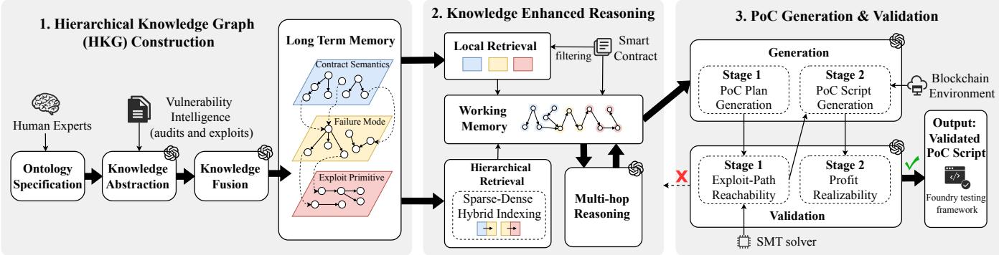  
Fig. 4: Overview of EVOPOC.

The result demonstrates that structured and reusable knowledge can provide semantic link that enable LLMs to perform compositional inference and supply the necessary reasoning primitives, effectively bridging the gap between vulnerability detection and exploit construction.

## V. METHODOLOGY

## A. Overall Workflow

As shown in Figure 4, EVOPOC consists of three phases: hierarchical knowledge graph (HKG) construction, knowledgeenhanced multi-hop reasoning, as well as two-stage PoC generation and validation.

In the first phase, EVOPOC constructs HKG in three steps. i) For ontology specification, ontology schema is defined to specify a three-layer structure, including node and edge types and their connection constraints, establishing an inductive schema for knowledge construction. ii) In knowledge abstraction, guided by this ontology, the LLM extracts structured nodes and edges from real-world vulnerability intelligence such as audit reports and exploits, transforming unstructured text into reusable abstract knowledge. iii) Finally, knowledge from multiple sources is merged by aligning nodes, removing redundancies, and resolving conflicts, producing a unified and consistent HKG that serves as long-term memory.

The second phase illustrates the knowledge-enhanced reasoning process of EVOPOC. Given a contract project, EVOPOC first filters candidate functions to exclude non-Solidity files, test code, and trusted libraries. It then builds a task-specific working memory by incrementally retrieving relevant HKG nodes to improve LLM reasoning. The process starts with local retrieval of a candidate node in the first HKG layer. Based on this node, the LLM performs multi-hop reasoning to identify additional relevant nodes, which are incorporated into the working memory to incrementally build the layer-specific subgraph. After completing reasoning within a layer, hierarchical retrieval selects candidate nodes for the next layer, and the interleaved, memory-guided retrieval–reasoning process repeats, gradually constructing a coherent reasoning subgraph that serves as the working memory for subsequent PoC generation.

In the third phase, EVOPOC interleaves PoC generation and validation. Leveraging the reasoning subgraph and contract code in the working memory, the LLM first produces a high-level exploit plan, which is validated through path-level analysis to ensure reachability. Based on the validated plan, a concrete exploit script is generated and further verified through state-based analysis by tracking account-level fund flows and state transitions to confirm the intended exploit effects. Only PoCs that pass both validation stages are retained for execution

in an on-chain environment.

## B. Hierarchical Knowledge Graph

Hierarchical knowledge graph serves as the core representation in EVOPOC ’s memory. It abstracts concrete DeFi semantics and vulnerability intelligence into structured, reusable knowledge, which can be continuously refined through automated knowledge construction and fusion.

Ontology schema. As shown in Figure 5, we model the HKG ontology as a typed directed graph $\mathcal { O } = \langle \nu , \mathcal { E } , \mathcal { T } \rangle$ , where V denotes a set of nodes, E denotes a set of directed edges, and T defines node types, edge types, and their admissible connections. Nodes are organized into three semantic layers: contract semantics, failure mode, and exploit primitive, corresponding to progressively deeper stages of vulnerability understanding.

i) For the contract semantics layer, we define $s \_ =$ $\{ P r o t , A c c , E c o , D e p \}$ as the set of node types, corresponding to protocol, access control, economic model, and dependency, respectively. Protocol node $p \in \ P r o t$ serves as a semantic anchor, connected to other semantic nodes via typed relations:

$$
\text {enforces}: \text {Prot} \to \text {Acc}, \quad \text {adopts}: \text {Prot} \to \text {Eco},
$$

$$
d e p e n d s \_ o n: P r o t \rightarrow D e p.\tag{1}
$$

To support fine-grained abstraction, each semantic node $c \in \mathcal { C }$ is internally structured as $\begin{array} { r c l } { c } & { = } & { \langle c _ { p } , c _ { s } , l \rangle } \end{array}$ , where $c _ { p } \in \mathsf { \Gamma }$ PrimaryCategory, $c _ { s } \in S u b C a t e g o r y$ , and $l \in$ ImplementLogic. The hierarchical relations explicitly encode this decomposition:

$$
\text {subsume:PrimaryCategory} \to \text {SubCategory},
$$

$$
i m p l e m e n t s: S u b C a t e g o r y \rightarrow I m p l e m e n t L o g i c\tag{2}
$$

ii) For the failure mode layer, we define ${ \mathcal { F } } =$ $\{ F P $ , Cond, Imp, RC , Inv} as the set of node types, corresponding to failure pattern, condition, impact, root cause, and invariant violation, respectively. Each failure pattern $f p \in F P$ is connected by typed relations:

$$
\begin{array}{l} \text {caused\_by}: F P \to R C, \quad \text {needs}: F P \to C o n d, \\ \text {can\_cause}: F P \to I m p. \end{array}\tag{3}
$$

Root cause $r c \in R C$ is connected to an invariant violation by:

$$
l e a d s \_ t o: R C \to I n v.\tag{4}
$$

iii) For the exploit primitive layer, let $\begin{array} { r l } { \mathcal { X } } & { { } = } \end{array}$ $\{ S k e l , P r i m , E x \}$ denote the set of node types in the exploit primitive layer. Each exploit skeleton $s k \in \ S k e l$ is connected to a sequence of exploit primitives: $\langle p _ { 0 } , p _ { 1 } , \ldots , p _ { n } \rangle$ where $p _ { i } \in P r i m$ , via typed relations:

$$
\text {start\_at}: \text {Skel} \to \text {Prim}, \quad \text {next}: \text {Prim} \to \text {Prim}.\tag{5}
$$

Exploit primitive $p \in P r i m$ is assigned a semantic role from:

$$
\{  \text {Setup},   \text {EnvironmentManipulation},
$$

$$
\text {ExploitationAndAmplification, ArbitrageAndExit} \}.\tag{6}
$$

Each skeleton is further linked to few-shot examples by:

$$
i l l u s t r a t e d \_ b y: S k e l \rightarrow E x.\tag{7}
$$

Cross-layer edges are introduced selectively to encode causal relevance rather than exhaustive linkage. Specifically, a contract semantics node is linked to a failure pattern only if it contributes to the pattern’s root cause, and a failure pattern is linked to an exploit skeleton only if the pattern is necessary for the exploit. This design supports structured reasoning from high-level semantics to concrete exploit realizations.

HKG construction and evolution. Based on the ontology schema, we leverage LLMs to instantiate concrete nodes and edges in the HKG. Input knowledge is collected from realworld vulnerability intelligence, including audit reports [23], [24], attack incident disclosures [25], [27], and technical analysis blogs [26]. A case is selected if it satisfies at least two of the following criteria: i) availability of the vulnerable contract source code, ii) detailed analysis of the vulnerability or attack event, and iii) explicit descriptions of exploitation steps or exploit script. The construction process consists of knowledge abstraction and knowledge fusion.

In the abstraction stage, given unstructured textual intelligence for a case, we prompt LLMs with chain-of-thought instructions to extract ontology-conformant nodes and relations. The model is explicitly required to assign each extracted element a node type in $s , { \mathcal { F } } ,$ or X , a relation type in E, and a concise semantic description. For contract semantics, node descriptions include the intended functionality and potential defect-prone aspects. For failure mode nodes, descriptions encode the failure pattern together with its semantic context and triggering conditions. For exploit primitive nodes, descriptions summarize the exploit behavior, the exploited failure mode, and the resulting impact. When certain ontology elements are missing from the input intelligence, the model may infer and complete them through contextual reasoning. Each case is instantiated as an individual, case-level subgraph of O.

In the fusion stage, case-level subgraphs are incrementally integrated into the global HKG. For each newly generated node $v \in \mathcal { V } .$ , the LLM determines whether it corresponds to an existing node by jointly considering its node type, semantic descriptions, and neighboring relations. Candidate matching proceeds in two stages: a type-filtered sparse lookup first restricts the search to nodes within the same ontology sublayer, and a Faiss ANN search [35] over node-description embeddings then retrieves the top-k semantic neighbors. This design avoids pairwise comparison across the full graph, allowing fusion cost to scale sub-linearly with graph size. Nodes judged semantically equivalent are merged with their incident edges. Nodes sharing high-level intent but differing in scope or granularity are preserved as parallel variants. Edges are merged only when both endpoints are aligned. The same abstraction and fusion procedures incorporate newly collected vulnerability intelligence, allowing the graph to evolve continuously as new cases emerge.

The complete ontology schema, node type definitions, and HKG statistics are provided in Appendix B.

## C. Memory-Enhanced Multi-hop Reasoning

The HKG constitutes the long-term memory (LTM) of EVOPOC. It is maintained as a graph that encodes ontologyconformant nodes and their relations, with node descriptions indexed by vector embeddings. Given a target contract, relevant knowledge is selectively retrieved from the LTM and instantiated into the working memory (WM), enabling the LLM to perform agentic multi-hop reasoning. This process produces a case-specific, holistic understanding of the contract, including its semantics, relevant failure modes, and corresponding exploit strategies.

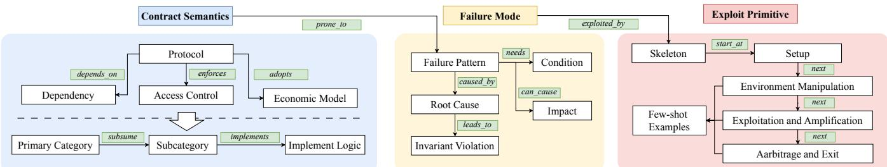  
Fig. 5: Overview of the hierarchical knowledge graph (HKG) ontology schema.

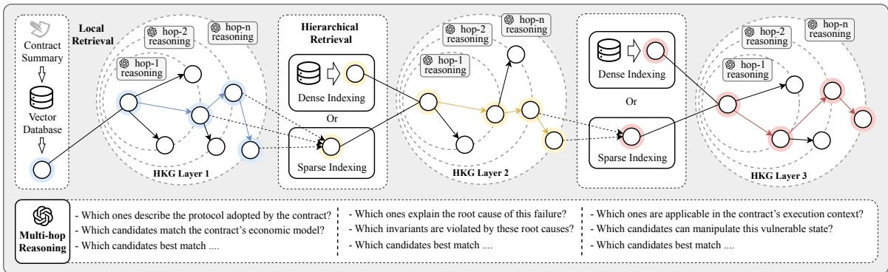  
Fig. 6: Multi-hop reasoning workflow based on agentic memory, where retrieved knowledge from the HKG (LTM) is organized into a task-specific subgraph as EVOPOC’s working memory (WM).

As shown in Figure 6, reasoning is initiated by generating a semantic summary of the target contract. In the contract semantics layer, similarity-based retrieval identifies the most relevant protocol-level primary category nodes, which serve as initial reasoning seeds. Starting from these seeds, the LLM incrementally expands a protocol-level subgraph via multi-hop traversal of graph relations, guided by the contract context. At each hop, one-hop neighboring nodes are retrieved as candidates and evaluated under CoT reasoning to determine their relevance. This iterative expansion completes local retrieval within the layer. Cross-layer transitions are realized through hierarchical retrieval using a sparse-dense hybrid strategy. To move from the contract semantics layer to the failure mode layer, sparse retrieval first checks whether multiple selected semantic nodes converge on the same failure pattern through existing cross-layer links. If a candidate exceeds a predefined confidence threshold, it is selected as the next reasoning seed. When sparse retrieval yields no candidate, dense retrieval is applied by performing similarity search over failure pattern nodes using semantic embeddings, from which the LLM selects the most plausible node conditioned on the contract context. The same retrieval-and-selection procedure is applied when transitioning from the failure mode layer to the exploit primitive layer.

Within each layer, reasoning follows a breadth-first strategy. At each step, candidate nodes are evaluated against layerspecific criteria. In the contract semantics layer, the LLM assesses whether the contract adopts the protocol type, economic model, or access control pattern represented by a candidate node. In the failure mode layer, it evaluates whether the contract behavior aligns with the vulnerability pattern captured by the candidate. In the exploit primitive layer, it selects exploitation strategies that are consistent with the identified failure modes. Reasoning within a layer terminates when no candidate nodes remain consistent with the contract context or when further expansion is deemed uninformative.

## D. Exploit Synthesis with Feasibility Checking

As shown in Algorithm 1, this process is formalized as an iterative search for a valid exploit sequence P satisfying reachability and profitability constraints, instantiated into a feasible exploit script.

Two-stage generation. The two stages refer to: (1) PoC plan generation, which produces a high-level, human-readable attack strategy specifying the sequence of protocol interactions, asset flows, and exploitation steps; and (2) PoC script generation, which instantiates the validated plan into a concrete, executable Solidity test script instrumented for Foundry. Rather than relying on rigid templates, synthesis utilizes exploit primitives grounded in EVOPOC’s working memory and the LLM’s generative capabilities. It begins with an exploit plan $P = \{ t _ { 1 } , t _ { 2 } , . . . , t _ { n } \}$ , organizing the attack into three phases: preparation (environment setup and asset acquisition), exploitation (triggering the vulnerability), and extraction (profit realization). Each transaction $t _ { i }$ is represented as $\langle { \mathcal { C } } , f , \sigma , { \mathcal { K } } \rangle$ , where C is the target contract, f the entrance function, σ the parameters (concrete or symbolic), and K the primary target operation (state modification, external call, or fund transfer). Once validated, the LLM integrates the plan with the execution environment E (ABIs, contract addresses, block heights) to synthesize a Foundry-based [36] PoC script instrumented with diagnostic oracles for verifiable proof of exploit success.

<div class="mineru-algorithm" style="white-space: pre-wrap; font-family:monospace;">
Algorithm 1: Executable exploit synthesis with feasibility
Input: Working memory $\mathcal{W}\mathcal{M}$, execution environment $\mathcal{E}$
Output: Exploit script: script or Failure
Procedure EXPLOITSYNTHESIS($\mathcal{W}\mathcal{M}, \mathcal{E}$):
    $\mathcal{P} \leftarrow$ GENERATEEXPLOITPLAN($\mathcal{W}\mathcal{M}$);
    reachable $\leftarrow$ CHECKPATHREACHABILITY($\mathcal{P}, \mathcal{E}$);
    if reachable = true then
        script $\leftarrow$ GENERATEEXPLOITSCRIPT($\mathcal{P}, \mathcal{E}$);
        if VALIDATEPROFITABILITY($script, \mathcal{E}$) = true then
            DEPLOYTOFOUNDRY($script$); /* Forward for execution */
        else return Failure /* Not profitable */;
    else return Failure /* Path infeasible */;
Procedure CHECKPATHREACHABILITY($\mathcal{P}, \mathcal{E}$):
    foreach $t = \langle \mathcal{C}, f, \sigma, \mathcal{K} \rangle \in \mathcal{P}$ do
        $\pi \leftarrow$ SEMANTICTRAVERSAL($\mathcal{C}, f, \mathcal{K}$);
        $\Phi \leftarrow$ COLLECTPREDICATES($\pi$);
        if not SMTSATISFIABLE($\bigwedge \Phi$) then
            return false /* Unreachable sink */
    return true
Procedure VALIDATEPROFITABILITY($script, \mathcal{E}$):
    Initialize $S = \langle \mathcal{B}_{init}, \Omega_{init} \rangle$;
    SIMULATEEXECUTION($script, \mathcal{S}$); /* Over-approximate asset transitions */
    $\Delta W \leftarrow \text{Val}(\mathcal{B}_{final}, \Omega_{final}) - \text{Val}(\mathcal{B}_{init}, \Omega_{init})$;
    if $\Delta W &gt; 0$ then
        return true
    else return false ;
</div>

Reachability and profitability validation. This stage combines LLM-guided semantic reasoning with formal constraint solving to prune infeasible PoC candidates before Foundry execution. We avoid heavyweight symbolic verification: the goal is cheap pruning that produces actionable failure signals for iterative refinement, since pure Foundry failures offer little insight into why a candidate fails. The two stages target the two dimensions exploits must satisfy: logical reachability and economic viability.

In the reachability validation, for each transaction $t \_ =$ $\langle { \mathcal { C } } , f , { \boldsymbol { \sigma } } , { \mathcal { K } } \rangle \in { \mathcal { P } }$ , we evaluate whether K is logically reachable from f at the inter-procedural constraint level. SEMANTIC-TRAVERSAL performs LLM-guided traversal of C, expanding callees, tracking how symbolic parameters σ propagate across scopes and contract boundaries, and emitting an ordered call sequence $\pi ~ = ~ \langle f _ { 0 } , \ldots , f _ { k } \rangle$ with associated data-flow edges. COLLECTPREDICATES then walks π and encodes each require/assert/branch condition as a $^ { \mathrm { Z 3 } }$ formula $\phi _ { i } .$ treating attacker-controlled inputs and relevant protocol state as symbolic. A satisfying assignment for $\Lambda ^ { \Phi }$ concretizes σ and confirms reachability; UNSAT certifies that the path cannot be executed under any input and the candidate is pruned. The check focuses on logic within the target protocol’s own contracts, where exploit-relevant predicates concentrate; behaviors of unrelated external contracts encountered along π are assigned conservative defaults that may admit additional candidates but never spuriously reject feasible ones. Within these bounds, an UNSAT verdict from Z3 reliably eliminates infeasible paths once $( \pi , \Phi )$ is extracted.

The profitability stage filters candidates that are reachable but cannot yield positive net wealth. We maintain an abstract asset state $\mathcal { S } = \langle \boldsymbol { B } , \boldsymbol { \Omega } \rangle$ , where B tracks token balances of the attacker and relevant contracts, and Ω captures price-relevant state from AMM reserves or external oracles. The LLM simulates script execution at the asset layer only: recording balance and price transitions while abstracting control flow under idealized conditions such as zero slippage and successful branch completion. A candidate proceeds to Foundry if

$$
\Delta W = \mathrm{Val} (\mathcal {B} _ {f i n a l}, \Omega_ {f i n a l}) - \mathrm{Val} (\mathcal {B} _ {i n i t}, \Omega_ {i n i t}) > 0.\tag{8}
$$

The filter is optimistic: idealized assumptions favor the exploitation, so the gate admits any candidate profitable under at least one plausible execution and rejects only those with no path to a positive ∆W. A walk-through of both validation stages on a flash-loan governance exploit candidate is provided in Appendix ??.

## VI. IMPLEMENTATION

The system is implemented in Python with approximately 12K lines of code, using LangChain [37] to orchestrate multistep LLM interactions and state management.

Contract preprocessing is implemented using ANTLR [38] to extract structural metadata (functions, visibility, and state variables) and generate abstract syntax trees (ASTs). For multi-file projects, we use a lightweight call-graph–based pruning to identify core logic contracts, reducing token overhead and improving analysis stability.

Knowledge storage and indexing. The hierarchical knowledge graph is implemented through a dual-storage architecture. We use Neo4j [39] as the graph database to store the graph topology for efficient traversal and reasoning across connected nodes. Complementary to the graph, node descriptions are indexed in Faiss [35], which serves as the RAG vector store to enable similarity-based retrieval for both initial reasoning seeds and cross-layer node discovery.

Verification engine. The reachability check requires translating Solidity-level predicates into a form consumable by Z3. We implement a normalization layer that flattens mapping accesses, resolves type casts, rewrites Solidity-specific arithmetic into Z3-compatible expressions, and applies conservative defaults for undeclared external returns. Predicate extraction uses a structured prompt that asks the LLM to emit each branch condition in a fixed form, which the layer then parses and assembles into the SMT query. The profitability check is realized as an LLM-driven simulator that maintains the abstract state S across simulated calls, with placeholderaware handling of unresolved external values and standardized asset-accounting templates to keep ∆W comparable across heterogeneous protocols.

TABLE II: Performance of EVOPOC in detecting vulnerabilities within dataset D1.

<table><tr><td rowspan="2">Dataset</td><td rowspan="2">Model</td><td colspan="8">Result</td></tr><tr><td>TP</td><td>FN</td><td>FP</td><td>TN</td><td>Precision</td><td>Accuracy</td><td>Recall</td><td>F1-score</td></tr><tr><td rowspan="4">D1</td><td>GPT-5</td><td>47</td><td>1</td><td>10</td><td>29</td><td>0.82</td><td>0.87</td><td>0.98</td><td>0.90</td></tr><tr><td>GPT-4o</td><td>44</td><td>4</td><td>13</td><td>25</td><td>0.77</td><td>0.80</td><td>0.92</td><td>0.84</td></tr><tr><td>GPT-o3</td><td>47</td><td>1</td><td>12</td><td>25</td><td>0.80</td><td>0.85</td><td>0.98</td><td>0.88</td></tr><tr><td>GPT-3.5</td><td>45</td><td>3</td><td>15</td><td>27</td><td>0.75</td><td>0.80</td><td>0.94</td><td>0.83</td></tr></table>

## VII. EVALUATION

## A. Evaluation Setups

Datasets. D1 is built from 72 Code4rena-audited projects in the Web3Bugs dataset collected by Sun et al. [12], comprising 2,573 smart contracts. It includes 41 projects with 48 verified vulnerability types and 31 vulnerability-free projects. Dataset D2 contains 88 real-world attack cases collected from DeFiHackLabs [40], covering those used in VERITE and A1. Dataset D3 consists of contract bounty projects from the Secure3 [41] platform.

Research questions. Based on the above datasets, we aim to answer these research questions:

• RQ1: How effective is EVOPOC in identifying and exploiting real-world vulnerabilities, and how efficient is it in terms of runtime performance and token consumption?

• RQ2: How does EVOPOC perform compared to state-ofthe-art approaches including fuzzers as well as the LLMbased scanner and exploit generator?

• RQ3: How does hierarchical knowledge and the validation module affect EVOPOC’s performance?

• RQ4: Can EVOPOC detect previously unknown (0-day) vulnerabilities in real-world projects?

Baselines. To ensure a comprehensive evaluation, we compare EVOPOC with four representative tools across different technical paradigms. For vulnerability identification, we use GPTSCAN [12], which represents the current SOTA LLMbased vulnerability scanner as our baseline. For vulnerability exploitation, we select ITYFUZZ [6], VERITE [28], and A1 [17]. ITYFUZZ and VERITE are SOTA fuzzers capable of triggering profitable vulnerabilities, while A1 is an LLMbased PoC generator.

LLM selection. We employ five widely used LLMs as the backbone models of EVOPOC, namely GPT-5.2, GPT-5, GPT-4o, GPT-o3, and GPT-3.5-turbo. These models cover a broad parameter range from tens of billions to several trillion parameters and include both general-purpose and inferenceoptimized variants, enabling a comprehensive evaluation of EVOPOC across different model capacities. For all models, we use their publicly available API endpoints with a temperature of 0.2 to ensure deterministic behavior across runs.

## B. RQ1: Effectiveness in Real-world Scenarios

We evaluate EVOPOC on datasets D1 and D2 under different LLMs as the base model. D1 consists of audited projects and is used to evaluate EVOPOC’s effectiveness in vulnerability identification. D2 contains historical Defi attack incidents with confirmed profits as ground truth and is used to assess whether the PoCs generated by EVOPOC can reproduce the exploits and yield profits.

Vulnerability detection performance (D1). Table II summarizes the vulnerability detection performance of EVOPOC on D1. TP and FN denote the numbers of detected and missed vulnerabilities among the 48 kinds of vulnerabilities in D1. FP denotes the false alarms during EVOPOC’s analysis, and TN denotes benign projects correctly identified as non-vulnerable. Overall, EVOPOC demonstrates strong detection capability across all base models, achieving high recall (up to 0.98) and F1-scores between 0.83 and 0.90. Notably, with GPT-5 as the base model, EVOPOC detects 47 out of 48 vulnerability types while maintaining a moderate false positive rate.

This high recall stems from the HKG’s contract semantics layer, which encodes protocol-level behavioral patterns that pure static analysis typically misses. Rather than relying on predefined syntactic rules, EVOPOC retrieves semantically relevant protocol and dependency nodes and performs multi-hop reasoning to connect localized code anomalies to broader vulnerability contexts, enabling detection of complex logic flaws that manifest only through cross-contract or cross-function interactions. The moderate false positive rate reflects two failure modes. First, EVOPOC occasionally misinterprets intentionally permissive access-control designs as vulnerabilities, as the underlying developer intent is not always recoverable from code alone. Second, some potential vulnerabilities are not practically exploitable, such as reentrancy where existing guards or rollback mechanisms prevent actual exploit.

Real-world exploitation performance (D2). Table III presents the exploitation results and revenue achieved by EVOPOC on dataset D2, which consists of real-world attack incidents spanning from 2022 to December 2025. Overall, the PoCs generated by EVOPOC successfully reproduced 85 out of 88 historical exploits, yielding an exploit success rate (ESR) of 96.6% and a total reproduced revenue of \$116,225.3K. The largest reproduced profit is observed on uwerx, reaching \$63,797.5K, which exceeds the profit obtained by the realworld attacker in the original incident. The iteration refers to the repetitive generation process triggered when the initial PoC fails our two-step verification, and a task is marked as a failure if it exceeds a maximum of 5 iterations. The strong ESR reflects several complementary design choices. HKG provides semantic context, links vulnerable logic to root causes, and offers high-level exploit guidance, enabling EVOPOC to compose structured PoCs grounded in real-world precedents rather than generating exploit code from scratch. The two-stage validation further filters structurally infeasible and economically non-viable candidates before Foundry execution, focusing refinement on plausible PoCs and providing informative feedback for iterative repair.

TABLE III: Exploitation performance and revenue of EVOPOC on Dataset D2. ESR denotes the Exploit Success Rate. Asterisks (\*) denote projects where PoC failed to achieve exploitation.

<table><tr><td>ID</td><td>Name</td><td>Max Revenue</td><td>Avg Iter</td><td>Avg Token</td><td>ID</td><td>Name</td><td>Max Revenue</td><td>Avg Iter</td><td>Avg Token</td><td>ID</td><td>Name</td><td>Max Revenue</td><td>Avg Iter</td><td>Avg Token</td></tr><tr><td>1</td><td>aes</td><td>$61.6K</td><td>1.3</td><td>148.9K</td><td>31</td><td>zeed</td><td>$124.5K</td><td>4.0</td><td>106.0K</td><td>61</td><td>opyn</td><td>$9.9K</td><td>2.3</td><td>293.6K</td></tr><tr><td>2</td><td>apemaga</td><td>$57.4K</td><td>2.3</td><td>61.0K</td><td>32</td><td>bno</td><td>$0.0K</td><td>3.3</td><td>132.0K</td><td>62</td><td>allbridge</td><td>$5.5K</td><td>1.8</td><td>380.6K</td></tr><tr><td>3</td><td>axioma</td><td>$18.9K</td><td>2.0</td><td>69.5K</td><td>33</td><td>curve01</td><td>$2,504.5K</td><td>1.8</td><td>136.4K</td><td>63</td><td>annex</td><td>$6.6K</td><td>3.5</td><td>182.8K</td></tr><tr><td>4</td><td>bamboo</td><td>$205.2K</td><td>1.5</td><td>148.5K</td><td>34</td><td>cover</td><td>$1,274.4K</td><td>1.0</td><td>81.3K</td><td>64</td><td>apedao</td><td>$7.5K</td><td>1.3</td><td>132.3K</td></tr><tr><td>5</td><td>bego</td><td>$10.9K</td><td>1.5</td><td>156.2K</td><td>35</td><td>newfi</td><td>$30.5K</td><td>3.0</td><td>143.1K</td><td>65</td><td>bigfi</td><td>$30.3K</td><td>2.5</td><td>164.1K</td></tr><tr><td>6</td><td>bevo</td><td>$130.7K</td><td>1.8</td><td>158.7K</td><td>36</td><td>utopia</td><td>$446.6K</td><td>2.3</td><td>105.7K</td><td>66</td><td>cs</td><td>$684.2K</td><td>2.0</td><td>168.3K</td></tr><tr><td>7</td><td>bunn</td><td>$47.2K</td><td>3.5</td><td>130.7K</td><td>34</td><td>wgpt</td><td>$76.9K</td><td>4.5</td><td>95.0K</td><td>67</td><td>depusdt</td><td>$106.1K</td><td>1.8</td><td>72.1K</td></tr><tr><td>8</td><td>cellframe</td><td>$222.8K</td><td>3.8</td><td>49.8K</td><td>38</td><td>myai</td><td>$9.8K</td><td>2.5</td><td>65.4K</td><td>68</td><td>discover*</td><td>$0.0K</td><td>5.0</td><td>122.1K</td></tr><tr><td>9</td><td>dfs</td><td>$1.5K</td><td>3.5</td><td>115.1K</td><td>39</td><td>ddcoin</td><td>$126.4K</td><td>3.8</td><td>80.3K</td><td>69</td><td>dpc</td><td>$10.8K</td><td>3.0</td><td>223.0K</td></tr><tr><td>10</td><td>fapen</td><td>$10.9K</td><td>1.5</td><td>45.9K</td><td>40</td><td>cfc</td><td>$19.1K</td><td>3.8</td><td>116.8K</td><td>70</td><td>gds</td><td>$207.2K</td><td>4.0</td><td>154.9K</td></tr><tr><td>11</td><td>fil314</td><td>$12.8K</td><td>4.0</td><td>74.2K</td><td>41</td><td>babydoge</td><td>$401.1K</td><td>4.3</td><td>170.7K</td><td>71</td><td>gym_1</td><td>$1,246.6K</td><td>2.0</td><td>61.9K</td></tr><tr><td>12</td><td>game</td><td>$99.0K</td><td>2.0</td><td>58.1K</td><td>42</td><td>bzx</td><td>$9,486.7K</td><td>2.8</td><td>94.5K</td><td>72</td><td>hackdao</td><td>$148.5K</td><td>2.3</td><td>112.0K</td></tr><tr><td>13</td><td>gss</td><td>$24.9K</td><td>3.8</td><td>248.9K</td><td>43</td><td>mamo</td><td>$5.3K</td><td>3.5</td><td>99.7K</td><td>73</td><td>inuko</td><td>$5,019.5K</td><td>2.3</td><td>135.6K</td></tr><tr><td>14</td><td>health</td><td>$15.1K</td><td>2.3</td><td>131.5K</td><td>44</td><td>hypr</td><td>$1.4K</td><td>3.5</td><td>65.0K</td><td>74</td><td>lusd</td><td>$9.5K</td><td>1.8</td><td>69.1K</td></tr><tr><td>15</td><td>hpay</td><td>$103.9K</td><td>3.3</td><td>52.0K</td><td>45</td><td>compound</td><td>$45.1K</td><td>4.5</td><td>330.7K</td><td>75</td><td>lw</td><td>$83.5K</td><td>4.0</td><td>137.0K</td></tr><tr><td>16</td><td>mbc</td><td>$5.9K</td><td>4.0</td><td>144.1K</td><td>46</td><td>ffist</td><td>$207.2K</td><td>1.3</td><td>107.5K</td><td>76</td><td>neverfall</td><td>$74.3K</td><td>3.0</td><td>177.1K</td></tr><tr><td>17</td><td>melo</td><td>$250.4K</td><td>1.0</td><td>58.5K</td><td>47</td><td>laeeb</td><td>$43.2K</td><td>1.5</td><td>176.2K</td><td>77</td><td>omniestate</td><td>$0.1K</td><td>1.0</td><td>131.3K</td></tr><tr><td>18</td><td>olife</td><td>$29.3K</td><td>3.5</td><td>116.4K</td><td>48</td><td>juice</td><td>$98.3K</td><td>2.3</td><td>59.6K</td><td>78</td><td>res</td><td>$184.4K</td><td>2.5</td><td>152.6K</td></tr><tr><td>19</td><td>pledge</td><td>$15.0K</td><td>1.5</td><td>198.0K</td><td>49</td><td>smartmesh</td><td>$0.5K</td><td>2.5</td><td>66.8K</td><td>79</td><td>roi</td><td>$152.5K</td><td>2.0</td><td>198.5K</td></tr><tr><td>20</td><td>pltd</td><td>$244.5K</td><td>1.0</td><td>102.5K</td><td>50</td><td>spankchain</td><td>$506.0K</td><td>2.8</td><td>146.1K</td><td>80</td><td>safemoon*</td><td>$0.0K</td><td>5.0</td><td>112.1K</td></tr><tr><td>21</td><td>rfb</td><td>$5.6K</td><td>2.0</td><td>102.1K</td><td>51</td><td>yearn_ydai</td><td>$185.1K</td><td>4.8</td><td>58.8K</td><td>81</td><td>sdao</td><td>$13.7K</td><td>1.3</td><td>106.9K</td></tr><tr><td>22</td><td>seama</td><td>$7.8K</td><td>2.0</td><td>149.5K</td><td>52</td><td>spartan</td><td>$1,529.4K</td><td>1.8</td><td>57.9K</td><td>82</td><td>selltoken</td><td>$10.9K</td><td>2.8</td><td>74.1K</td></tr><tr><td>23</td><td>shadowfi</td><td>$978.9K</td><td>1.0</td><td>150.6K</td><td>53</td><td>bearn</td><td>$123.1K</td><td>4.0</td><td>78.7K</td><td>83</td><td>sheep</td><td>$20.0K</td><td>2.3</td><td>162.3K</td></tr><tr><td>24</td><td>sut</td><td>$29.6K</td><td>1.5</td><td>56.4K</td><td>54</td><td>hunny</td><td>$5.2K</td><td>4.0</td><td>546.8K</td><td>84</td><td>sheepfarm</td><td>$0.1K</td><td>3.0</td><td>101.4K</td></tr><tr><td>25</td><td>swapos</td><td>$9.5K</td><td>1.8</td><td>68.3K</td><td>55</td><td>popsicle</td><td>$2.2K</td><td>4.8</td><td>404.0K</td><td>85</td><td>starlink</td><td>$34.8K</td><td>1.3</td><td>169.0K</td></tr><tr><td>26</td><td>uerii</td><td>$5.9K</td><td>1.0</td><td>80.1K</td><td>56</td><td>nimbus</td><td>$4.6K</td><td>3.5</td><td>92.1K</td><td>86</td><td>tinu</td><td>$70.0K</td><td>2.3</td><td>243.8K</td></tr><tr><td>27</td><td>upswing</td><td>$1.0K</td><td>3.8</td><td>59.2K</td><td>57</td><td>ploutoz*</td><td>$0.0K</td><td>5.0</td><td>57.5K</td><td>87</td><td>ufdao</td><td>$227.1K</td><td>3.3</td><td>67.1K</td></tr><tr><td>28</td><td>uranium</td><td>$8,772.6K</td><td>3.0</td><td>69.9K</td><td>58</td><td>yeth</td><td>$1,077.0K</td><td>4.5</td><td>183.9K</td><td>88</td><td>valuedefi</td><td>$359.6K</td><td>1.3</td><td>100.6K</td></tr><tr><td>29</td><td>uwerx</td><td>$63,797.5K</td><td>1.5</td><td>102.1K</td><td>59</td><td>drlvaultv3</td><td>$13,980.8K</td><td>3.5</td><td>127.2K</td><td></td><td></td><td></td><td></td><td></td></tr><tr><td>30</td><td>wifcoin</td><td>$10.8K</td><td>2.3</td><td>141.0K</td><td>60</td><td>bancor</td><td>$0.2K</td><td>2.0</td><td>187.2K</td><td></td><td></td><td></td><td></td><td></td></tr><tr><td colspan="15">Total | Exploted: 85/88 ESR:96.6% Revenue: $116,225.3K</td></tr></table>

TABLE IV: Exploitation performance of EVOPOC on Dataset D2 across different underlying LLMs.

<table><tr><td rowspan="2">Dataset</td><td rowspan="2">Model</td><td colspan="8">Result</td></tr><tr><td>Det.</td><td>Rec.</td><td>Exp.</td><td>ESR</td><td>Avg. Iteration</td><td>Avg. Time</td><td>Avg. Token</td><td>Total Revenue</td></tr><tr><td rowspan="4">D2</td><td>GPT-5.2</td><td>82</td><td>93.2%</td><td>76</td><td>86.4%</td><td>2.84</td><td>296.50</td><td>151,278</td><td>$110,960,607.9</td></tr><tr><td>GPT-5</td><td>82</td><td>93.2%</td><td>69</td><td>78.4%</td><td>2.32</td><td>119.48</td><td>114,889</td><td>$107,626,754.2</td></tr><tr><td>GPT-o3</td><td>85</td><td>96.6%</td><td>79</td><td>89.8%</td><td>2.49</td><td>178.94</td><td>142,827</td><td>$86,384,234.5</td></tr><tr><td>GPT-4o</td><td>77</td><td>87.5%</td><td>70</td><td>79.5%</td><td>2.86</td><td>100.69</td><td>119,502</td><td>$94,936,898.2</td></tr></table>

Det., Exp., and Rec. denote the number of detected vulnerabilities, exploited vulnerabilities, and recall rate, respectively.

We also analyze the three failed exploit cases. In the project discover, EVOPOC triggers the unfair exchange rate but fails to construct a profit-realizing multi-contract exploit due to ambiguity between price-manipulation logic and arithmetic errors. In project ploutoz, the vulnerability lies in low-level mint/burn arithmetic corner cases unrelated to function semantics, causing EVOPOC to miss the relevant execution path. In project safemoon, publicly exposed mint and burn interfaces in a proxy contract are vulnerable, but EVOPOC focuses on proxy risks, leading to an incorrect contract-type abstraction and missed trigger.

Cross-LLM effectiveness and efficiency analysis. We break down EVOPOC’s performance on D2 across LLMs and summarize it in Table IV and visualized in Figures 7 and 8.

i) For exploitation effectiveness, the results show that EVOPOC is effective and robust across all evaluated LLMs. All models achieve an ESR above 78% and identify more than \$86M in total revenue, indicating that the framework consistently bridges the gap between raw LLM reasoning and practical exploit generation. Among the models, GPTo3 achieves the highest ESR (89.8%), benefiting from its reasoning-oriented architecture which exhibits stronger capability in HKG knowledge retrieval. GPT-5.2 performs best in high-impact cases, reaching the highest total Revenue of \$110M, which can be attributed to its stronger state modeling and strategy optimization ability.

ii) For efficiency and resource overhead, GPT-4o is the most time-efficient among all models, requiring only 100.69s per task on average. GPT-5 is the most resource-economical, utilizing the lowest iterations (2.32) and tokens (114,889). In contrast, GPT-5.2 incurs the heaviest overhead, with the longest time cost (296.50s) and highest token consumption (151,278). This trade-off indicates that stronger models improve the ability to exploit more vulnerabilities with more profits but require more extensive reasoning, leading to higher runtime and token consumption.

iii) For distributional characteristics, in Figure 8 (a) and (b), models exhibit a long-tail distribution, reflecting its extensive reasoning process when handling highly complex projects. In Figure 8 (c), all models follow a power-law distribution where a small number of incidents account for the majority of total revenue, reflecting the reality of DeFi security incidents. GPT-5 and GPT-o3 show tighter distributions in Figure 8 (d), with most PoCs generated within 1–2 iterations, demonstrating higher determinism compared to the wider distributions of GPT-4o and GPT-5.2.

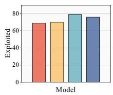  
(a) Exploited Project

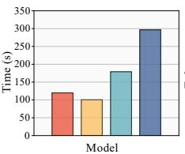  
(b) Average Time Cost

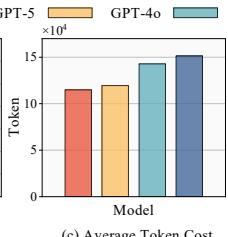  
(c) Average Token Cost

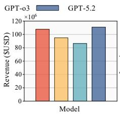  
(d) Total Revenue

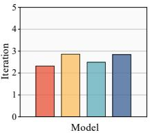  
(e) Average Iteration  
Fig. 7: Performance metrics of EVOPOC across various LLM backends.

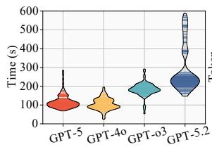  
(a) Time Distribution

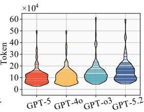  
(b) Token Distribution

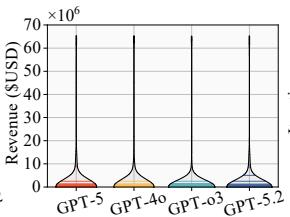  
(c) Revenue Distribution

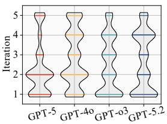  
(d) Iteration Distribution  
Fig. 8: Distribution analysis of performance indicators for each model.

TABLE V: Comparison of vulnerability detection performance between EVOPOC and GPTSCAN on D1.

<table><tr><td rowspan="2">Dataset</td><td rowspan="2">Tool</td><td rowspan="2">Model</td><td colspan="4">Result</td></tr><tr><td>Precision</td><td>Accuracy</td><td>Recall</td><td>F1-score</td></tr><tr><td rowspan="2">D1</td><td>GPTSCAN</td><td>GPT-3.5</td><td>57.1%</td><td>62.4%</td><td>83.3%</td><td>67.8%</td></tr><tr><td>EvoPOC (Ours)</td><td>GPT-3.5</td><td>75.0%</td><td>80.0%</td><td>93.8%</td><td>83.3%</td></tr></table>

Answer to RQ1: EVOPOC is highly effective, achieving a 0.98 recall and 0.90 F1-score in detection, and a 96.6% exploit success rate with \$116.2M revenue. It also maintains consistent performance across various LLM backends with moderate overhead in terms of runtime and token consumption.

## C. RQ2: Comparison with SOTA Approaches

Comparison with vulnerabiliy scanner. Table V reports the performance of EVOPOC and GPTSCAN on the D1 dataset. GPTSCAN achieves a high recall of 0.83 but suffers from relatively low precision (0.57), indicating a considerable number of false positives. Specifically, it detects 40 out of 48 vulnerability types while missing 8 cases and producing 30 false positives. In contrast, EVOPOC consistently outperforms GPTSCAN across all evaluation metrics, achieving higher precision (0.75), accuracy (0.80), recall (0.94), and F1-score (0.83). These results demonstrate that EVOPOC leverages its memory mechanism and knowledge-based reasoning chains to substantially mitigate LLM hallucinations, resulting in fewer false positives and more dependable detection.

TABLE VI: Exploitation performance comparison between EVOPOC and SOTA fuzzers and PoC generator on D2.

<table><tr><td rowspan="2">Dataset</td><td rowspan="2">Tool</td><td rowspan="2">Model</td><td colspan="4">Result</td></tr><tr><td>Exploited</td><td>ESR</td><td>Total Revenue</td><td>Average Revenue</td></tr><tr><td rowspan="3">D2 (s1)</td><td>ITYFUZZ</td><td rowspan="3">N\A</td><td>10</td><td>19.2%</td><td>$106,473.8</td><td>$10,647.4</td></tr><tr><td>VERITE</td><td>25</td><td>48.1%</td><td>$18,225,320.8</td><td>$729,012.8</td></tr><tr><td>EVOPOC</td><td>50</td><td>96.2%</td><td>$35,308,169.5</td><td>$706,163.4</td></tr><tr><td rowspan="2">D2 (s2)</td><td>A1</td><td>GPT-o3</td><td>15</td><td>48.4%</td><td>$8,839,461.0</td><td>$589,297.4</td></tr><tr><td>EVOPOC</td><td>GPT-o3</td><td>29</td><td>93.5%</td><td>$75,018,779.7</td><td>$2,586,854.5</td></tr></table>

Comparison with exploitation generator. Our dataset D2 encapsulates the benchmarks used by compared tools. Specifically, we derived D2 (s1) by incorporating all incidents from ITYFUZZ and VERITE, retaining 52 cases after excluding those where source code is no longer available. Similarly, D2 (s2) includes the incidents from the A1 benchmark, with 31 cases remaining. As shown in Table VI, EVOPOC achieves an ESR of 96.2% and 93.5% on D2 (s1) and D2 (s2), nearly 2× of VERITE’s 48.1% and A1’s 48.4%, and 5× of ITYFUZZ. EVOPOC also demonstrates a massive lead in profitability. Compared to its LLM-based counterpart A1, it achieves 8.5× the total revenue and 4.4× the average revenue. VERITE achieves a slightly higher average revenue by employing a profit maximizer. In contrast, EVOPOC generates PoCs through knowledge-driven logic reasoning without specific optimization for profit maximization.

Answer to RQ2: EVOPOC significantly outperforms SOTA baselines, surpassing GPTSCAN with an 0.83 F1-score, 2× the exploit success rate of VERITE and A1, and 8.5× the total revenue of A1, proving its superior effectiveness in both vulnerability detection and high-profit exploit generation.

TABLE VII: Ablation study results. CS, FM, and EP denote Contract Semantics, Failure Mode, and Exploit Primitive. Num denotes the successful exploits, and Degr denotes the degradation over baseline.

<table><tr><td rowspan="2">Tool</td><td rowspan="2">Model</td><td colspan="3">Knowledge</td><td colspan="2">Detected</td><td colspan="2">Exploited</td><td colspan="2">Result Total Revenue</td><td colspan="2">Average Revenue</td></tr><tr><td>CS</td><td>FM</td><td>EP</td><td>Num</td><td>Degr</td><td>Num</td><td>Degr</td><td>Num</td><td>Degr</td><td>Num</td><td>Degr</td></tr><tr><td>EvoPoC-SF</td><td>GPT-5</td><td>×</td><td>×</td><td>✓</td><td>17</td><td>-79%</td><td>11</td><td>-84%</td><td>$2,465,360</td><td>-98%</td><td>$224,123</td><td>-86%</td></tr><tr><td>EvoPoC-EP</td><td>GPT-5</td><td>✓</td><td>✓</td><td>×</td><td>80</td><td>-2%</td><td>1</td><td>-99%</td><td>$931,177</td><td>-99%</td><td>$931,177</td><td>-40%</td></tr><tr><td>EvoPoC-NO</td><td>GPT-5</td><td>×</td><td>×</td><td>×</td><td>16</td><td>-80%</td><td>0</td><td>-100%</td><td>0</td><td>-100%</td><td>0</td><td>-100%</td></tr><tr><td>EvoPoC</td><td>GPT-5</td><td>✓</td><td>✓</td><td>✓</td><td>82</td><td>N/A</td><td>69</td><td>N/A</td><td>$107,626,754</td><td>N/A</td><td>$1,559,808</td><td>N/A</td></tr></table>

## D. RQ3: Ablation Study

We conduct ablation studies to assess the contribution of EVOPOC’s knowledge layers and validation module to vulnerability detection, exploit generation, and refinement efficiency.

HKG ablation. We construct three variants by selectively removing HKG layers: EVOPOC-SF removes the contract semantics and failure mode layers, EVOPOC-EP removes the exploit primitive layer, and EVOPOC-NO removes all layers. As shown in Table VII, all layers are necessary for endto-end exploit synthesis. Removing the semantic and failure mode layers (EVOPOC-SF) reduces detection by 79% and total revenue by 98%. This suggests that exploit primitives alone are insufficient: without semantic context and failure-mode guidance, the model struggles to identify protocol-specific vulnerable logic and thus misses most exploitable cases. In contrast, removing the exploit primitive layer (EVOPOC-EP) retains 80 detected vulnerabilities but reduces successful exploits by 99%. This indicates that semantic and failure-mode knowledge mainly support vulnerability discovery, whereas exploit primitives are critical for transforming detected flaws into executable PoCs. Removing all layers (EVOPOC-NO) leads to zero successful exploits, further confirming that the three layers jointly bridge code understanding, vulnerability reasoning, and exploit construction.

Validation ablation. Table VIII evaluates the reachabilityprofitability validation module from two aspects. Panel (a) shows that two-stage validation reduces average Foundry iterations from 13.8 to 2.3 and runtime from 309s to 117s, despite introducing 4.3 lightweight internal iterations. This suggests that the dominant cost in refinement comes from coarse execution-level feedback. In direct-to-Foundry refinement, a failed PoC only reveals that the complete script does not work, but does not isolate whether the failure comes from an infeasible path, wrong parameters, incorrect transaction ordering, or non-profitable asset movement. The model therefore tends to revise the script by trial and error, often remaining in the same invalid search region. Two-stage validation changes this process by moving part of the refinement to the plan level. Reachability and profitability checks expose failures before script execution and provide more localized correction signals. Thus, the additional internal iterations are cheaper and more informative, replacing many expensive trial-error attempts.

Panel (b) shows that validation removes all 8 false positives while preserving all 22 true positives. This is because LLMgenerated false positives are often not arbitrary mistakes, but partial exploits that are semantically plausible yet violate necessary exploit conditions. For example, a candidate may match a known vulnerability pattern but fail to reach the target operation, or it may reach relevant logic without yielding positive net wealth. By enforcing path feasibility and economic gain before Foundry execution, the validation module filters these structurally invalid candidates early. Therefore, it improves precision by reducing the number of plausible-butinvalid PoCs entering the execution loop, rather than by simply duplicating Foundry’s role.

TABLE VIII: Ablation of the reachability-profitability validation module on D2 with GPT-5.  
(a) Efficiency vs. direct Foundr

<table><tr><td>Setting</td><td>Int.Iter</td><td>Fdry.Iter</td><td>Time</td></tr><tr><td>Direct-to-Foundry</td><td>0</td><td>13.8</td><td>309s</td></tr><tr><td>Two-stage</td><td>4.3</td><td>2.3</td><td>117s</td></tr></table>

(b) Filtering quality

<table><tr><td>Setting</td><td>Passed</td><td>TP</td><td>FP</td><td>FN</td><td>Prec.</td></tr><tr><td>No validation</td><td>30</td><td>22</td><td>8</td><td>-</td><td>73%</td></tr><tr><td>Two-stage</td><td>22</td><td>22</td><td>0</td><td>0</td><td>100%</td></tr></table>

Answer to RQ3: Each HKG layer is indispensable: semantic layers drive vulnerability detection while exploit primitives enable successful PoC generation. The two-stage validation module further improves synthesis by moving refinement from expensive Foundry-level trial-and-error to more diagnostic reachability-profitability checks.

## E. RQ4: Discovery of 0-day Vulnerabilities

We apply EVOPOC to the open bug bounty program of Secure3 [41], aiming to evaluate whether EVOPOC, equipped with specialized domain knowledge, can identify previously undiscovered 0-day vulnerabilities and validate them through proofs of concept like experienced human experts.

Overall results. EVOPOC identified a total of 21 0-day vulnerabilities across five projects. To date, 16 of these vulnerabilities were either confirmed or fixed by the developers, resulting in a total bounty reward of \$2,900. As shown in Table IX, these 16 vulnerabilities include 2 high-severity, 11 mediumseverity, and 3 low-severity issues. The detected vulnerabilities span various categories, such as accounting errors, unprotected initialization, and reentrancy. Notably, all high-severity and the majority of medium-severity vulnerabilities have been remediated by the developers, securing approximately \$70.6M in on-chain assets.

TABLE IX: 0-day vulnerabilities found by EVOPOC

<table><tr><td>ID</td><td>Location</td><td>Description</td><td>Risk</td><td>Status</td><td>Project</td><td>TVL</td></tr><tr><td>1</td><td>calculateReward()</td><td>Precision loss from integer truncation causing zero rewards.</td><td>M</td><td>Fixed</td><td rowspan="2">cudis_bsc</td><td rowspan="2">$839K</td></tr><tr><td>2</td><td>emergencyWithdraw()</td><td>Missing blacklist check allows sanction bypass.</td><td>M</td><td>Fixed</td></tr><tr><td>3</td><td>removeSourceToken()</td><td>Reflexive token check causes DoS.</td><td>M</td><td>Fixed</td><td rowspan="3">zklinkMergeToken</td><td rowspan="3">$37.6M</td></tr><tr><td>4</td><td>deposit()</td><td>Ignored transfer fees cause over-minting.</td><td>M</td><td>Fixed</td></tr><tr><td>5</td><td>withdraw()</td><td>Transfer-tax tokens break accounting, causing inflated balance.</td><td>M</td><td>Fixed</td></tr><tr><td>6</td><td>openEnvelope()</td><td>Missing signature verification enables replay and fund theft.</td><td>H</td><td>Fixed</td><td rowspan="6">AkiProtocol</td><td rowspan="6">$128K</td></tr><tr><td>7</td><td>openEnvelope()</td><td>Reentrancy with ERC777 tokens allows repeated withdrawals.</td><td>H</td><td>Fixed</td></tr><tr><td>8</td><td>addEnvelope()</td><td>Missing ID existence check allows overwrite and fund theft.</td><td>M</td><td>Fixed</td></tr><tr><td>9</td><td>moneyThisOpen()</td><td>Bad randomness enables MEV manipulation.</td><td>M</td><td>Fixed</td></tr><tr><td>10</td><td>openEnvelope()</td><td>Reentrancy allows repeated unauthorized withdrawals.</td><td>M</td><td>Fixed</td></tr><tr><td>11</td><td>addEnvelope()</td><td>Front-running ID registration causes user DoS.</td><td>L</td><td>ACK</td></tr><tr><td>12</td><td>unwhitelistTarget()</td><td>Incorrect mapping update prevents proper whitelist removal.</td><td>M</td><td>ACK</td><td rowspan="2">Klydo</td><td rowspan="2">Unk.</td></tr><tr><td>13</td><td>getTarget()</td><td>Calldata decoding flaw bypasses whitelist checks.</td><td>L</td><td>ACK</td></tr><tr><td>14</td><td>init_insurance()</td><td>Missing init guard allows state overwrite and manipulation.</td><td>M</td><td>ACK</td><td rowspan="3">CookingCity</td><td rowspan="3">$32M</td></tr><tr><td>15</td><td>transfer()</td><td>Fee precision loss enables fee evasion via dust attacks.</td><td>M</td><td>ACK</td></tr><tr><td>16</td><td>init_config()</td><td>Unprotected initialization allows admin takeover.</td><td>L</td><td>ACK</td></tr></table>

TABLE X: Key nodes retrieved from HKG during EVOPOC’s analysis of the fee-on-transfer token incompatibility vulnerability.  
```txt
Contract Semantics
    + Protocol
        + TokenWrapping
            + Portal
                + DepositMint

    + Economic Model
        + AssetBacking
            + DeterministicMinting
                + BalanceDeltaBased

    + Dependency
        + ERC20Token
            + NonStandardERC20
                + FeeOnTransfer

Failure Mode
    + Failure Pattern
        + ERC20Incompatibility
            + AccountingMismatch
                + Root Cause
                    + FullTransferAssumption
                + Invariant Violation
                    + CollateralConsistency
                    + Redeemability

    + Impact
        + OverMinting
            + DoS

    + Setup
        + TokenDeployment
            + TokenRegistration

    + Exploitation
        + RepeatedDeposits
            + Arbitrage and Exit
                + RepeatedWithdrawals
```

Case study: over-minting vulnerability causing portal insolvency. We analyze a 0-day vulnerability in the MergeTokenPortal.sol contract from the zkLink MergeToken project. As shown in Listing 2, the contract functions as a portal, enabling asset conversion through a deposit–withdraw mechanism. Users deposit a source token to receive a synthetic token, and can later burn the synthetic token to redeem the underlying asset. However, this design is incompatible with fee-on-transfer tokens, which deduct a fee on each transfer. Because the deposit function mints synthetic tokens according to the \_amount rather than the actual amount received (Line 5), each deposit increases the synthetic token supply beyond the underlying collateral. This discrepancy accumulates over time, ultimately resulting in insufficient reserves, failed withdrawals, and permanent losses for merge token holders.

Identifying this vulnerability is non-trivial for LLM-based analysis because it results from a compound semantic mismatch among external token behavior, fee-on-transfer mechanics, and internal collateral accounting, rather than from a naive local implementation flaw. When reasoning is confined to the local MergeTokenPortal, the model lacks the necessary context to infer that an external token’s economic behavior can invalidate the portal’s internal accounting assumptions.

Table X illustrates the key nodes retrieved by EVOPOC from the hierarchical knowledge graph during its analysis of the MergeTokenPortal contract, highlighting how structured knowledge supports multi-hop, cross-domain reasoning. EVOPOC first classifies the contract under the Token-Wrapping protocol category and further identifies it as a Portal implementing a DepositMint pattern. By analyzing the deposit and withdraw functions, EVOPOC infers that the contract adopts a balance-delta-based deterministic minting model with a strict 1:1 collateral backing assumption. Through dependency-level retrieval, EVOPOC identifies the involvement of a FeeOnTransfer token, whose economic model imposes a fee on each transfer. This behavior violates the portal’s implicit full-transfer assumption, revealing a semantic inconsistency between the contract’s internal accounting model and its external token dependency. Guided by this semantic conflict, EVOPOC reasons across the contract semantics layers to identify the contract’s failure pattern, characterized by an AccountingMismatch that leads to systematic OverMinting and violation of CollateralConsistency, ultimately breaking Redeemability. Building on this identified failure mode, EVOPOC links it to the corresponding exploit primitives in the HKG to generate a plausible PoC. The PoC was validated through local execution, confirming the correctness of the inferred vulnerability, which was later acknowledged by the developers and fixed in a subsequent revision.

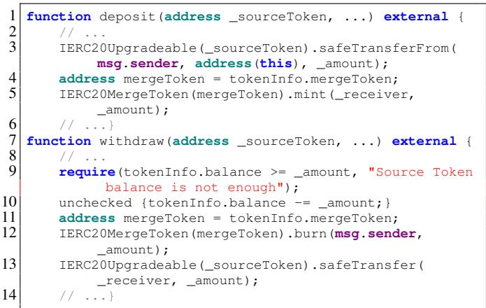  
Listing 2: Simplified code snippet of the over-minting vulnerability in MergeTokenPortal.sol.

TABLE XI: Cases post-dating GPT-5 knowledge cutoff (May 2024). ✓/✗ denotes exploit success with/without HKG.

<table><tr><td>Case</td><td>Disclosure</td><td>Lag (mo.)</td><td>w/ HKG</td><td>w/o HKG</td></tr><tr><td>wifcoin</td><td>Jun 2024</td><td>+1</td><td>✓</td><td>✗</td></tr><tr><td>pledge</td><td>Dec 2024</td><td>+7</td><td>✓</td><td>✗</td></tr><tr><td>drlvaultv3</td><td>Nov 2025</td><td>+18</td><td>✓</td><td>✗</td></tr><tr><td>yeth</td><td>Dec 2025</td><td>+19</td><td>✓</td><td>✗</td></tr></table>

Answer to RQ4: EVOPOC demonstrates its real-world impact by detecting 16 previously unknown vulnerabilities, resulting in \$2,900 USD awards and securing protocols managing over \$70.6M USD.

## VIII. DISCUSSION

## A. Data Leakage and Generalization Capability

The risk of data leakage is a threat to validity of experi mental results in LLM-based systems. We address this from three complementary angles.

HKG construction data isolation. The long-term memory of EVOPOC is constructed from data entirely disjoint from the evaluation datasets and stores only abstracted, reusable knowledge rather than instance-level code.

Post-training cutoff cases. Table XI lists four cases of D2 whose public disclosure post-dates GPT-5’s knowledge cutoff (May 2024), meaning the model cannot have seen their exploit details during pretraining. EVOPOC successfully generates valid PoCs for all four cases with HKG guidance, while the no-HKG baseline produces none, directly ruling out memorization as the driver for these results.

Memorization test. To further distinguish memorization from generalization, our ablation VII-D already provides this test: the no-HKG baseline, which reduces EVOPOC to direct LLM reasoning over raw contract code, produces zero successful exploits across all 88 cases (Table VII).

## B. Reliability of Memory Evolution

The effectiveness of EVOPOC ’s evolving memory is influenced by the quality of the underlying domain knowledge and vulnerability intelligence, which constitutes a potential threat to validity. To mitigate this issue, we adopt a selection mechanism in Section V-B, which requires candidate intelligence to satisfy at least two of three predefined criteria, thereby filtering out noisy or incomplete inputs. Naturally, the system exhibits its strongest performance when provided with ”gold-standard” intelligence that meets all three criteria.

## IX. RELATED WORK

LLM-based smart contract auditing leverages models understanding of code to detect vulnerabilities [12], [42], [43], [44], [45]. GPTSCAN [12] is the first to detect logical vulnerabilities in contracts using LLMs. IAUDIT [15] combines fine-tuning and LLM-based agents for intuitive auditing with explanations, while SMART-LLAMA-DPO [46] introduces preference-based optimization to improve vulnerability detection. However, these approaches still face a semantic gap to bridge vulnerability identification and exploitable PoC generation. EVOPOC address this via a structured hierarchical knowledge graph and agentic memory, enabling reliable vulnerability detection and PoC synthesis.

Smart contract fuzzing constructs transaction sequences to detect vulnerabilities during execution [47]. Early approaches [48], [49], [50], [51], [52] use control and data flow patterns as oracles, but are limited by predefined templates. Recent methods [53], [28] adopt profit-driven oracles to detect profitable vulnerabilities, serving partially as PoC generators. However, these fuzzers rely on hard-coded heuristics, limiting coverage and scalability, and struggle with complex contextual reasoning. EVOPOC leverages domain knowledge-guided LLMs with verification process and an evolving memory to generate reliable PoCs and handle a broader range of contracts and vulnerabilities.

Automated exploit generation has been extensively studied in binary and web security, with systems such as AEG [54] and Q [55] combining symbolic execution with vulnerability signatures to automatically produce working exploits from detected flaws. These works share the core challenge that motivates EVOPOC: bridging the gap between a detected vulnerability and an executable attack artifact. However, DeFi exploits differ fundamentally: they involve inter-contract economic state manipulation, profitability requirements, and protocolspecific interaction semantics that have no direct analogue in traditional binary or web exploitation.

## X. CONCLUSION

We present EVOPOC, a knowledge-driven agentic system for end-to-end smart contract vulnerability detection and PoC generation. By organizing vulnerability intelligence into a hierarchical knowledge graph and leveraging self-evolving agentic memory with two-step verification, EVOPOC achieves robust reasoning and exploit synthesis. Experiments show that EVOPOC outperforms SOTA vulnerability scanners, fuzzers, and PoC generators in both vulnerability identification and exploit success rate. EVOPOC also discovered 16 0-day vulnerabilities across five real-world projects.

## ETHICS CONSIDERATIONS

Research Scope and Ethical Boundaries. This research strictly adheres to ethical standards for security and AI system evaluation. EVOPOC is designed and presented solely for the purpose of analyzing and improving the robustness of DeFi protocol security. Our work aims to reveal the inherent limitations of current smart contract auditing practices and demonstrate the feasibility of automated exploit synthesis as a means to accelerate vulnerability validation. All experiments were conducted in controlled, locally hosted environments built upon Foundry’s fork simulation framework. No live, online, or third-party blockchain systems were accessed, attacked, tested, or influenced at any stage of this research. All exploit scripts execute against a locally forked blockchain state and do not submit any transactions to mainnet or any testnet.

Zero-day Disclosure and Responsible Use. The 0-day vulnerabilities discovered by EVOPOC during our evaluation were responsibly disclosed to the respective project developers prior to public reporting. We reported all findings through official channels, including direct developer contact and the Secure3 bug bounty platform, and withheld technical details until developers had sufficient time to acknowledge and remediate the issues. To date, 16 vulnerabilities have been confirmed or patched by the respective teams. Only the highlevel descriptions of vulnerability categories are included in the paper; no functional exploit code targeting any real-world deployed contract is distributed.

Dual-use Considerations. We acknowledge that automated exploit generation tools carry inherent dual-use risks. To mitigate potential misuse, the full system is intended for release to vetted security researchers and auditors only, with usage restricted to contracts for which the user holds authorization. We encourage the community to adopt EVOPOC as a standard component in pre-deployment security audits, thereby strengthening the defensive posture of DeFi protocols before adversarial exploitation occurs.

## REFERENCES

[1] C. Intelligence, “Gpt-4 technical report,” 2025. [Online]. Available: https://crystalintelligence.com/thought-leadership/ 22-7b-in-stolen-digital-assets-since-2011

[2] J. Feist, G. Grieco, and A. Groce, “Slither: A static analysis framework for smart contracts,” in Proceedings of the IEEE/ACM International Workshop on Emerging Trends in Software Engineering for Blockchain (WETSEB), 2019.

[3] A. Ghaleb, J. Rubin, and K. Pattabiraman, “Achecker: Statically detecting smart contract access control vulnerabilities,” in Proceedings of the IEEE/ACM International Conference on Software Engineering (ICSE), 2023.

[4] K. Qin, Z. Ye, Z. Wang, W. Li, L. Zhou, C. Zhang, D. Song, and A. Gervais, “Enhancing smart contract security analysis with execution property graphs,” in Proceedings of the ACM SIGSOFT International Symposium on Software Testing and Analysis (ISSTA), 2025.

[5] M. Xie, M. Hu, Z. Kong, C. Zhang, Y. Feng, H. Wang, Y. Xue, H. Zhang, Y. Liu, and Y. Liu, “Defort: Automatic detection and analysis of price manipulation attacks in defi applications,” in Proceedings of the ACM SIGSOFT International Symposium on Software Testing and Analysis (ISSTA), 2024.

[6] C. Shou, S. Tan, and K. Sen, “Ityfuzz: Snapshot-based fuzzer for smart contract,” in Proceedings of the ACM SIGSOFT International Symposium on Software Testing and Analysis (ISSTA), 2023.

[7] R. Liang, J. Chen, R. Cao, K. He, R. Du, S. Li, Z. Lin, and C. Wu, “Smartshot: Hunt hidden vulnerabilities in smart contracts using mutable snapshots,” in Proceedings of the ACM International Conference on the Foundations of Software Engineering (FSE), 2025.

[8] J. Stephens, K. Ferles, B. Mariano, S. Lahiri, and I. Dillig, “Smartpulse: automated checking of temporal properties in smart contracts,” in Proceedings ofthe IEEE Symposium on Security and Privacy (SP), 2021.

[9] P. Bose, D. Das, Y. Chen, Y. Feng, C. Kruegel, and G. Vigna, “Sailfish: Vetting smart contract state-inconsistency bugs in seconds,” in Proceedings of the IEEE Symposium on Security and Privacy (SP), 2022.

[10] Y. Liu, Y. Xue, D. Wu, Y. Sun, Y. Li, M. Shi, and Y. Liu, “Propertygpt: Llm-driven formal verification of smart contracts through retrievalaugmented property generation,” in Proceedings of the Annual Network and Distributed System Security Symposium (NDSS), 2025.

[11] B. Zhang, “Towards finding accounting errors in smart contracts,” in Proceedings of the IEEE/ACM International Conference on Software Engineering (ICSE), 2024.

[12] Y. Sun, D. Wu, Y. Xue, H. Liu, H. Wang, Z. Xu, X. Xie, and Y. Liu, “Gptscan: Detecting logic vulnerabilities in smart contracts by combining gpt with program analysis,” in Proceedings ofthe IEEE/ACM International Conference on Software Engineering (ICSE), 2024.

[13] J. Kevin and P. Yugopuspito, “Smartllm: Smart contract auditing using custom generative ai,” in Proceedings of the International Conference on Computer Sciences, Engineering, and Technology Innovation (ICoC-SETI), 2025.

[14] Y. Jin, C. Li, P. Fan, P. Liu, X. Li, C. Liu, and W. Qiu, “Llm-bscvm: An llm-based blockchain smart contract vulnerability management framework,” arXiv preprint arXiv:2505.17416, 2025.

[15] W. Ma, D. Wu, Y. Sun, T. Wang, S. Liu, J. Zhang, Y. Xue, and Y. Liu, “Combining fine-tuning and llm-based agents for intuitive smart contract auditing with justifications,” in Proceedings of the IEEE/ACM International Conference on Software Engineering (ICSE), 2025.

[16] I. David, L. Zhou, K. Qin, D. Song, L. Cavallaro, and A. Gervais, “Do you still need a manual smart contract audit?” arXiv preprint arXiv:2306.12338, 2023.

[17] A. Gervais and L. Zhou, “Ai agent smart contract exploit generation,” arXiv preprint arXiv:2507.05558, 2025.

[18] N. Dziri, X. Lu, M. Sclar, X. L. Li, L. Jiang, B. Y. Lin, P. West, C. Bhagavatula, R. Le Bras, J. D. Hwang, S. Sanyal, S. Welleck, X. Ren, A. Ettinger, Z. Harchaoui, and Y. Choi, “Faith and fate: limits of transformers on compositionality,” in Proceedings of the International Conference on Neural Information Processing Systems (NIPS), 2023.

[19] L. Yu, Z. Huang, H. Yuan, S. Cheng, L. Yang, F. Zhang, C. Shen, J. Ma, J. Zhang, J. Lu, and C. Zuo, “Smart-llama-dpo: Reinforced large language model for explainable smart contract vulnerability detection,” in Proceedings of the ACM SIGSOFT International Symposium on Software Testing and Analysis (ISSTA), 2025.

[20] K. Qin, Z. Ye, Z. Wang, W. Li, L. Zhou, C. Zhang, D. Song, and A. Gervais, “Enhancing smart contract security analysis with execution property graphs,” in Proceedings of the ACM SIGSOFT International Symposium on Software Testing and Analysis (ISSTA), 2025.

[21] H. Wen, H. Liu, J. Song, Y. Chen, W. Guo, and Y. Feng, “Foray: Towards effective attack synthesis against deep logical vulnerabilities in defi protocols,” in Proceedings of the ACM SIGSAC Conference on Computer and Communications Security (CCS), 2024.

[22] J. Ho, A. Jain, and P. Abbeel, “Denoising diffusion probabilistic models,” in Proceedings of the International Conference on Neural Information Processing Systems (NIPS), 2020.

[23] Z. Group, “Openzeppelin research,” 2025. [Online]. Available: https://www.openzeppelin.com/research

[24] Chainalysis, “Chainalysis blog crime,” 2025. [Online]. Available: https://www.chainalysis.com/blog/category/crime/

[25] CertiK, “Web3 resources,” 2025. [Online]. Available: https://www. certik.com/resources

[26] Medium, “Medium,” 2025. [Online]. Available: https://medium.com/

[27] X, “X,” 2025. [Online]. Available: https://x.com

[28] Z. Kong, C. Zhang, M. Xie, M. Hu, Y. Xue, Y. Liu, H. Wang, and Y. Liu, “Smart contract fuzzing towards profitable vulnerabilities,” in Proceedings of the ACM International Conference on the Foundations of Software Engineering (FSE), 2025.

[29] S. Werner, D. Perez, L. Gudgeon, A. Klages-Mundt, D. Harz, and W. Knottenbelt, “Sok: Decentralized finance (defi),” in Proceedings of the ACM Conference on Advances in Financial Technologies (AFT), 2023.

[30] K. John, L. Kogan, and F. Saleh, “Smart contracts and decentralized finance,” Annual Review of Financial Economics, vol. 15, 2023.

[31] J. C. Leon and A. Lehar, “What data have told us about decentralized´ finance,” Journal of Corporate Finance, 2025.

[32] L. Zhou, X. Xiong, J. Ernstberger, S. Chaliasos, Z. Wang, Y. Wang, K. Qin, R. Wattenhofer, D. Song, and A. Gervais, “ SoK: Decentralized Finance (DeFi) Attacks ,” in Proceedings of the IEEE Symposium on Security and Privacy (SP), 2023.

[33] A. Khare, S. Dutta, Z. Li, A. Solko-Breslin, R. Alur, and M. Naik, “Understanding the effectiveness of large language models in detecting security vulnerabilities,” in Proceedings of the IEEE Conference on Software Testing, Verification and Validation (ICST), 2025.

[34] J. Lin and D. Mohaisen, “From large to mammoth: A comparative evaluation of large language models in vulnerability detection,” in Proceedings of the Network and Distributed System Security Symposium (NDSS), 2025.

[35] Meta, “Faiss: A library for efficient similarity search and clustering of dense vectors.” 2025. [Online]. Available: https://github.com/ facebookresearch/faiss

[36] Foundry, “Foundry: Ethereum development framework,” 2025. [Online]. Available: https://getfoundry.sh/

[37] I. LangChain, “Langchain,” 2025. [Online]. Available: https://www. langchain.com

[38] ANTLR, “Another tool for language recognition,” 2025. [Online]. Available: https://github.com/antlr/antlr4

[39] Neo4j, “Neo4j graph database & analytics,” 2025. [Online]. Available: https://neo4j.com

[40] SunSec, “Defihacklabs,” 2025. [Online]. Available: https://github.com/ SunWeb3Sec/DeFiHackLabs

[41] Secure3, “Comprehensive security audits for the web3 ecosystems,” 2025. [Online]. Available: https://app.secure3.io

[42] Y. Wu, X. Xie, C. Peng, D. Liu, H. Wu, M. Fan, T. Liu, and H. Wang, “Advscanner: Generating adversarial smart contracts to exploit reentrancy vulnerabilities using llm and static analysis,” in Proceedings of the IEEE/ACM International Conference on Automated Software Engineering (ASE), 2024.

[43] L. Yu, S. Cheng, Z. Huang, J. Zhang, C. Shen, J. Lu, L. Yang, F. Zhang, and J. Ma, “Sael: Leveraging large language models with adaptive mixture-of-experts for smart contract vulnerability detection,” in Proceedings of the IEEE International Conference on Software Maintenance and Evolution (ICSME), 2025.

[44] L. Zhang, K. Li, K. Sun, D. Wu, Y. Liu, H. Tian, and Y. Liu, “Acf ix: Guiding llms with mined common rbac practices for contextaware repair of access control vulnerabilities in smart contracts,” IEEE Transactions on Software Engineering, 2025.

[45] Z. Wei, J. Sun, Y. Sun, Y. Liu, D. Wu, Z. Zhang, X. Zhang, M. Li, Y. Liu, C. Li et al., “Advanced smart contract vulnerability detection via llm-powered multi-agent systems,” IEEE Transactions on Software Engineering, 2025.

[46] L. Yu, Z. Huang, H. Yuan, S. Cheng, L. Yang, F. Zhang, C. Shen, J. Ma, J. Zhang, J. Lu et al., “Smart-llama-dpo: Reinforced large language model for explainable smart contract vulnerability detection,” in Proceedings of the ACM SIGSOFT International Symposium on Software Testing and Analysis (ISSTA), 2025.

[47] S. Wu, Z. Li, L. Yan, W. Chen, M. Jiang, C. Wang, X. Luo, and H. Zhou, “Are we there yet? unraveling the state-of-the-art smart contract fuzzers,” in IEEE/ACM International Conference on Software Engineering (ICSE), 2024.

[48] Z. Liu, P. Qian, J. Yang, L. Liu, X. Xu, Q. He, and X. Zhang, “Rethinking smart contract fuzzing: Fuzzing with invocation ordering and important branch revisiting,” IEEE Transactions on Information Forensics and Security (TIFS), 2023.

[49] J. Lin, Q. Zhang, J. Li, C. Sun, H. Zhou, C. Luo, and C. Qian, “Automatic library fuzzing through api relation evolvement,” in Network and Distributed System Security Symposium (NDSS), 2025.

[50] X. Lin, Q. Xie, B. Zhao, Y. Tian, S. Zonouz, N. Ruan, J. Li, R. Beyah, and S. Ji, “Promfuzz: Leveraging llm-driven and bug-oriented composite analysis for detecting functional bugs in smart contracts,” in Proceedings of the IEEE/ACM International Conference on Automated Software Engineering (ASE), 2025.

[51] M. Rodler, D. Paaßen, W. Li, L. Bernhard, T. Holz, G. Karame, and L. Davi, “Ef/cf: High performance smart contract fuzzing for exploit generation,” in Proceedings of the IEEE European Symposium on Security and Privacy (EuroS&P), 2023.

[52] Y. Xue, J. Ye, W. Zhang, J. Sun, L. Ma, H. Wang, and J. Zhao, “xfuzz: Machine learning guided cross-contract fuzzing,” IEEE Trans. Dependable Secur. Comput., vol. 21, 2024.

[53] M. Ye, X. Lin, Y. Nan, J. Wu, and Z. Zheng, “Midas: Mining profitable exploits in on-chain smart contracts via feedback-driven fuzzing and differential analysis,” in ACM SIGSOFT International Symposium on Software Testing and Analysis (ISSTA), 2024.

[54] T. Avgerinos, S. K. Cha, A. Rebert, E. J. Schwartz, M. Woo, and D. Brumley, “Automatic exploit generation,” Communications of the ACM, vol. 57, 2014.

[55] E. J. Schwartz, T. Avgerinos, and D. Brumley, “Q: Exploit hardening made easy,” in Proceedings of the USENIX Security Symposium (USENIX Security), 2011.

## APPENDIX A

## WALK-THROUGH OF TWO-STAGE VALIDATION

This appendix illustrates how EVOPOC validates an exploit candidate using a real-world signature-bypass minting vulnerability. The vulnerable token contract exposes a privileged mint function that is intended to be protected by a multisignature authorization check. The exploit candidate bypasses this check using empty signature arrays, mints 10<sup>12</sup> BEGO tokens to the attacker, and then liquidates the minted tokens through the BEGO/WBNB AMM pair to realize profit.

## A. Victim Contract Semantics

Listing 3 shows the simplified vulnerable logic. The contract provides a mint function that takes a mint amount, a replayprotection identifier, a receiver address, and three arrays representing ECDSA signature components. The intended design is that mint should only proceed when the submitted signatures are produced by authorized signers. To prevent replay, the function records used identifiers in txHashes.

However, the authorization logic is flawed. The modifier isSigned first checks only whether the three signature arrays have equal lengths. It then allocates an array of recovered signers with length \_r.length, fills this array by iterating over the submitted signatures, and finally calls isSigners to verify whether all recovered addresses are authorized signers. When the attacker submits empty arrays, the length check succeeds because all three arrays have length zero. The recovery loop is skipped, and isSigners receives an empty signer array. Since isSigners only rejects explicitly invalid signers inside the loop, the loop is also skipped and the function returns true. As a result, the signature check is bypassed and the privileged minting sink becomes reachable without any valid signature.

## B. Candidate Exploit Plan

For readability, we use swapBEGOToWBNB to denote the PancakeSwap V2 router call that liquidates the minted BEGO tokens into WBNB. Given the above semantics, EVOPOC constructs the following high-level exploit plan:

$$
\begin{array}{l} P = \langle t _ {1}, t _ {2}, t _ {3} \rangle , \\ t _ {1} = \langle C _ {\mathrm{BEGO}}, \mathrm{mint}, \sigma_ {\mathrm{mint}}, K _ {\mathrm{mint}} \rangle , \\ t _ {2} = \langle C _ {\mathrm{BEGO}}, \mathrm{approve}, \sigma_ {\mathrm{approve}}, K _ {\mathrm{allowance}} \rangle , \\ t _ {3} = \langle C _ {\mathrm{Router}}, \mathrm{swapBEGOToWBNB}, \sigma_ {\mathrm{swap}}, K _ {\mathrm{profit}} \rangle . \end{array}
$$

```solidity
function mint(
    uint256 _amount,
    string memory _txHash,
    address _receiver,
    bytes32[] memory _r,
    bytes32[] memory _s,
    uint8[] memory _v
) isSigned(_txHash, _amount, _r, _s, _v)
  external returns (bool)
{
    require(!txHashes[_txHash], "tx-hash-used");
    txHashes[_txHash] = true;

    _mint(_receiver, _amount);
    return true;
}

modifier isSigned(
    string memory _txHash,
    uint256 _amount,
    bytes32[] memory _r,
    bytes32[] memory _s,
    uint8[] memory _v
) {
    require(checkSignParams(_r, _s, _v), "bad-sign-
      params");

    bytes32 _hash =
        keccak256(abi.encodePacked(bsc, msg.sender,
            _txHash, _amount));

    address[] memory _signers = new address[](_r.length
    );

    for (uint8 i = 0; i < _r.length; i++) {
        _signers[i] = ecrecover(_hash, _v[i], _r[i], _s
            [i]);
    }

    require(isSigners(_signers), "bad-signers");
   _;
}

function checkSignParams(
    bytes32[] memory _r,
    bytes32[] memory _s,
    uint8[] memory _v
) internal pure returns (bool) {
    return _r.length == _s.length && _s.length == _v.
      length;
}

function isSigners(address[] memory _signers)
    public view returns (bool)
{
    for (uint8 i = 0; i < _signers.length; i++) {
        if (!_containsSigner(_signers[i])) {
            return false;
        }
    }
    return true;
}
```  
Listing 3: Simplified signature-bypass minting vulnerability.

The first interaction targets the vulnerable token contract and attempts to reach the privileged minting operation. The mint sink and its symbolic input are:

$$
\begin{array}{l} K _ {\mathrm{mint}} = \_ \mathrm{mint} (a t t a c k e r, M _ {\mathrm{raw}}), \\ \sigma_ {\mathrm{mint}} = (M _ {\mathrm{raw}}, h, a t t a c k e r, R, S, V). \end{array}
$$

Here, h is an attacker-chosen replay-protection identifier that has not been used before, and $\vec { R , S , V }$ are attacker-controlled signature arrays. The candidate assigns:

$$
\begin{array}{l} {M = 1 0 ^ {1 2} \mathrm{BEGO},} \\ {M _ {\mathrm{raw}} = 1 0 ^ {1 2} \times 1 0 ^ {1 8},} \\ {| R | = | S | = | V | = 0.} \end{array}
$$

We use M for the human-readable token amount and $M _ { \mathrm { r a w } }$ for the 18-decimal ERC-20 base-unit amount. After minting, the attacker approves the PancakeSwap V2 router to spend the minted BEGO tokens and swaps all received BEGO for WBNB. The resulting exploit path is:

<div class="mineru-algorithm" style="white-space: pre-wrap; font-family:monospace;">
BEGO.mint($M_{\text{raw}}$, $h$, attacker, [], [], [])
$\rightarrow$ isSigned $\rightarrow$ checkSignParams $\rightarrow$ skip-ecrecover-loop
$\rightarrow$ isSigners([]) $\rightarrow$ _mint($attacker$, $M_{\text{raw}}$)
$\rightarrow$ BEGO.approve(Router, $\infty$) $\rightarrow$ Router.swapBEGOToWBNB.
</div>

## C. Stage 1: Exploit-path Reachability

The first validation stage checks whether the privileged minting sink is logically reachable from the public entry function mint. For the candidate above, EVOPOC performs semantic traversal from mint through the isSigned modifier and collects the branch predicates that guard mint. The extracted path is:

<div class="mineru-algorithm" style="white-space: pre-wrap; font-family:monospace;">
$\pi = \langle$ mint,isSigned,checkSignParams, skip-ecrecover-loop,isSigners,_mint\rangle .
</div>

The path predicates collected from the contract are:

$$
\begin{array}{l} \phi_ {1}: | R | = | S |, \\ \phi_ {2}: | S | = | V |, \\ \phi_ {3}: \neg \mathrm{txHashes} [ h ]. \end{array}
$$

The candidate-controlled assignments are:

$$
\begin{array}{l} {| R | = | S | = | V | = 0,} \\ {r e c e i v e r = a t t a c k e r,} \\ {M _ {\mathrm{raw}} = 1 0 ^ {1 2} \times 1 0 ^ {1 8}.} \end{array}
$$

The signature recovery loop is guarded by $0 \leq i < | R |$ . Since $| R | = { \ddot { 0 } }$ , the loop has no feasible iteration:

$$
\forall i, \neg (0 \leq i <   0).
$$

Therefore, no call to ecrecover is required, and the recovered signer array remains empty. Since the rejection condition in isSigners is only evaluated inside the loop, the empty signer array is accepted:

$$
s i g n e r s = \llbracket \Longrightarrow \text {isSigners} (s i g n e r s) = \text {true}.
$$

The SMT query used for this path consists of the collected predicates instantiated with the empty-array assignment:

$$
\Phi = \phi_ {1} \land \phi_ {2} \land \phi_ {3} \land (| R | = 0) \land (| S | = 0) \land (| V | = 0).
$$

A satisfying assignment is:

$$
\begin{array}{l l} | R | = | S | = | V | = 0, & M _ {\mathrm{raw}} = 1 0 ^ {1 2} \times 1 0 ^ {1 8}, \\ \text {receiver} = \text {attacker}, & \text {txHashes}[ h ] = \textbf {f a l s e}. \end{array}
$$

Thus, the result is $\mathrm { \bf S A T } ( \Phi ) = \mathrm { t r u e } .$ , which confirms that the exploit-critical sink in $t _ { 1 }$ is reachable: mint $( a t t a c k e r , M _ { \mathrm { { r a w } } } )$ The remaining approval and swap interactions are then handled in the asset-level profitability simulation.

TABLE XII: Step-wise asset-state simulation for the BEGO signature-bypass minting exploit.

<table><tr><td>Step</td><td>Operation</td><td>Attacker BEGO</td><td>Attacker WBNB</td><td>AMM state Ω</td></tr><tr><td> $S_0$ </td><td>Initial state</td><td>0</td><td>0</td><td> $(R_{\text{BEGO}}, R_{\text{WBNB}})$ </td></tr><tr><td> $S_1$ </td><td>Prepare empty signatures</td><td>0</td><td>0</td><td> $(R_{\text{BEGO}}, R_{\text{WBNB}})$ </td></tr><tr><td> $S_2$ </td><td>Pass isSigned</td><td>0</td><td>0</td><td> $(R_{\text{BEGO}}, R_{\text{WBNB}})$ </td></tr><tr><td> $S_3$ </td><td>Execute mint sink</td><td> $10^{12}$ </td><td>0</td><td> $(R_{\text{BEGO}}, R_{\text{WBNB}})$ </td></tr><tr><td> $S_4$ </td><td>Approve router</td><td> $10^{12}$ </td><td>0</td><td> $(R_{\text{BEGO}}, R_{\text{WBNB}})$ </td></tr><tr><td> $S_5$ </td><td>Transfer BEGO to pair</td><td>≈0</td><td>0</td><td> $(R_{\text{BEGO}} + x, R_{\text{WBNB}})$ </td></tr><tr><td> $S_6$ </td><td>Pair outputs WBNB</td><td>≈0</td><td> $out_{\text{WBNB}}$ </td><td> $(R_{\text{BEGO}} + x, R_{\text{WBNB}} - out_{\text{WBNB}})$ </td></tr><tr><td> $S_f$ </td><td>Final state</td><td>≈0</td><td> $out_{\text{WBNB}}$ </td><td> $\Omega_f$ </td></tr></table>

## D. Stage 2: Profit Realizability

The second validation stage checks whether the reachable minting sink can be converted into positive asset-level profit. EVOPOC tracks the attacker’s BEGO and WBNB balances, as well as the BEGO/WBNB AMM state, throughout the candidate exploit. Unlike flash-loan-based candidates, this exploit does not require upfront capital in the abstract asset model; the input BEGO is created by the vulnerable mint operation.

We model the asset state as $S = \langle B , \Omega \rangle$ , where $\dot { B }$ records account-level token balances and Ω records the BEGO/WBNB AMM state. The initial state is:

$$
\begin{array}{l} \Omega_ {0} = (R _ {\mathrm{BEGO}}, R _ {\mathrm{WBNB}}), \\ B _ {0} (\text {attacker}, \text {BEGO}) = 0, \\ B _ {0} (\text {attacker}, \text {WBNB}) = 0. \end{array}
$$

After Stage 1 proves that empty signature arrays satisfy the authorization modifier, the attacker calls mint $\dot { ( } M _ { \mathrm { r a w } } , h$ , attacker , $[ ] , [ ] , [ ] )$ ). This increases the attacker’s BEGO balance by M:

$$
B _ {3} (\text {attacker}, \text {BEGO}) = 1 0 ^ {1 2}, \quad B _ {3} (\text {attacker}, \text {WBNB}) = 0.
$$

The subsequent approval only updates allowance and does not change token balances, so $\bar { B _ { 4 } } \bar { = } \bar { B _ { 3 } } .$ . During liquidation, the router transfers the minted BEGO from the attacker to the BEGO/WBNB pair. Let x denote the actual amount of BEGO credited to the pair. For a standard ERC-20 transfer, $x = 1 0 ^ { 1 2 } \mathrm { B E G O } ;$ if the token applies transfer-side deductions, x denotes the post-transfer amount received by the pair. The AMM output is:

$$
o u t _ {\mathrm{WBNB}} = \frac {\gamma x R _ {\mathrm{WBNB}}}{R _ {\mathrm{BEGO}} + \gamma x},
$$

where $\gamma$ is the fee-adjusted input ratio. After the swap:

$$
B _ {f} (\text {attacker}, \mathrm{BEGO}) \approx 0, \quad B _ {f} (\text {attacker}, \mathrm{WBNB}) = o u t _ {\mathrm{WBNB}}.
$$

Using WBNB as the numeraire and ignoring gas in the abstract simulation, the asset-level wealth change is:

$$
\Delta W = \mathrm{Val} (B _ {f}, \Omega_ {f}) - \mathrm{Val} (B _ {0}, \Omega_ {0}) = o u t _ {\mathrm{WBNB}}.
$$

When $o u t _ { \mathrm { W B N B } } > 0$ , the candidate is economically viable and passes the second validation stage. Table XII summarizes the step-wise asset-state simulation. The simulation includes the authorization steps for continuity; they do not change asset balances. The concrete asset transition is:

$$
(0 \text {BEGO}, 0 \text {WBNB}) \rightarrow (\approx 0 \text {BEGO}, o u t _ {\text {WBNB}} \text {WBNB}).
$$

Since out<sub>WBNB</sub> $> 0$ , the exploit realizes positive profit and is forwarded for concrete Foundry execution.

TABLE XIII: Bootstrapped HKG node statistics and crosslayer edge statistics.

<table><tr><td>Layer</td><td>Nodes</td><td>Cross-layer Edges</td></tr><tr><td>Contract Semantics</td><td>144</td><td>CS→FM: 165</td></tr><tr><td>Failure Mode</td><td>107</td><td>FM→EP: 132</td></tr><tr><td>Exploit Primitive</td><td>523</td><td>-</td></tr><tr><td>Total</td><td>774</td><td>297</td></tr></table>

This walk-through demonstrates how the two-stage validation framework separates exploit feasibility into two complementary checks. The first stage verifies that the security-critical sink is reachable under attacker-controlled inputs, while the second stage verifies that reaching this sink yields a positive asset-level outcome.

## APPENDIX B

## HKG ONTOLOGY SCHEMA DETAILS

Table XIV provides the complete ontology schema of the Hierarchical Knowledge Graph, including all node types, their semantic roles, intra-layer edge types, and cross-layer linking constraints. The schema is fixed prior to HKG construction and is not modified during knowledge abstraction or fusion; see Section V-B for the formal definition.

Node type assignment. During knowledge abstraction, the LLM assigns each extracted element a node type from the predefined schema via chain-of-thought prompting. A node receives type T only if its semantic description matches the role definition of T and its incident edges are admissible under the schema constraints. Cases where two candidate types score within a confidence margin of 0.1 are flagged as ambiguous and resolved during fusion by adopting the most consistent typing across similar cases.

HKG statistics. As shown in Table XIII, the bootstrapped HKG contains 774 nodes across three layers: 144 contract semantics nodes, 107 failure mode nodes, and 523 exploit primitive nodes. It also includes 297 cross-layer edges, with 165 CS→FM edges and 132 FM→EP edges. This moderate graph density reflects the design principle of encoding causal relevance rather than exhaustive linkage.

TABLE XIV: HKG ontology schema: node types, semantic roles, and cross-layer edge types.

<table><tr><td>Layer</td><td>Node Type</td><td>Semantic Role</td></tr><tr><td rowspan="4">Contract Semantics (CS)</td><td>Protocol</td><td>Top-level protocol category; serves as semantic anchor linked to all other CS nodes via enforces, adopts, depends_on.</td></tr><tr><td>Access Control</td><td>Permission structure and role enforcement logic of the contract (e.g., owner-only guards, proxy admin).</td></tr><tr><td>Economic Model</td><td>Fee structures, tokenomics, reserve accounting, and incentive mechanisms (e.g., fee-on-transfer, rebase).</td></tr><tr><td>Dependency</td><td>External contract and non-standard token dependencies that affect protocol behavior.</td></tr><tr><td rowspan="5">Failure Mode (FM)</td><td>Failure Pattern</td><td>Named vulnerability pattern (e.g., price manipulation, accounting mismatch); causally linked to root cause via caused_by.</td></tr><tr><td>Condition</td><td>Preconditions in the execution environment required to trigger the failure (e.g., flash loan availability).</td></tr><tr><td>Root Cause</td><td>Underlying implementation or design flaw that enables the vulnerability (e.g., full-transfer assumption).</td></tr><tr><td>Impact</td><td>Observable consequence of a successful exploit: fund drainage, over-minting, DoS, unauthorized withdrawal.</td></tr><tr><td>Invariant Violation</td><td>Protocol-level invariant broken when the failure manifests (e.g., collateral consistency, reserve balance).</td></tr><tr><td rowspan="4">Exploit Primitive (EP)</td><td>Exploit Behavior</td><td>Generic, reusable exploit action template covering preparation, exploitation, and arbitrage phases.</td></tr><tr><td>Specific Plan</td><td>Case-specific exploit step sequence grounded in a concrete DeFi incident; composed from exploit behaviors.</td></tr><tr><td>PoC Framework</td><td>High-level Foundry test scaffold that assembles specific plans into a complete executable PoC.</td></tr><tr><td>Few-shot Example</td><td>Concrete Solidity snippet grounding abstract exploit behaviors in real attack code for LLM reasoning.</td></tr><tr><td colspan="3">Cross-layer Edge Types</td></tr><tr><td colspan="2">related_exploit: CS → FM</td><td>Links a CS node to failure patterns it is implicated in.</td></tr><tr><td colspan="2">caused_by: FP → RC</td><td>Failure pattern is caused by a specific root cause.</td></tr><tr><td colspan="2">leads_to: RC → Inv</td><td>Root cause leads to a protocol invariant violation.</td></tr><tr><td colspan="2">related_exploit: FM → EP</td><td>Root cause pattern linked to corresponding exploit primitives.</td></tr><tr><td colspan="2">start_at: PocFrame → SpecificPlan</td><td>PoC framework references specific plans as composable phases.</td></tr></table>