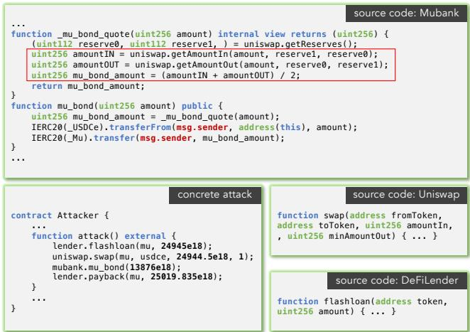
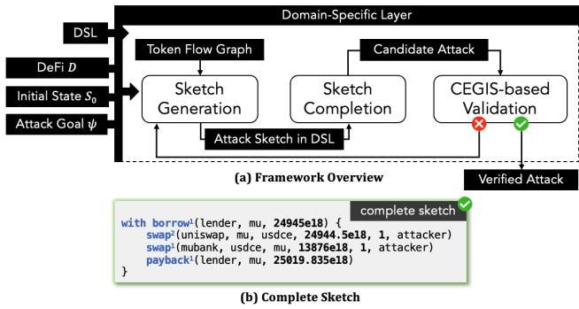
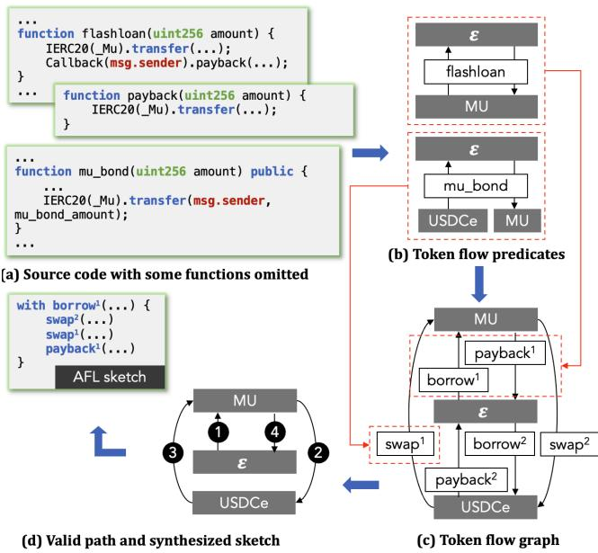
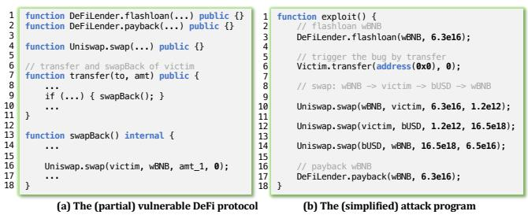

# FORAY: Towards Efective Atack Synthesis against Deep Logical Vulnerabilities in DeFi Protocols

Hongbo Wen hongbowen@ucsb.edu University of California, Santa Barbara Santa Barbara, California, USA

Yanju Chen yanju@cs.ucsb.edu University of California, Santa Barbara Santa Barbara, California, USA

Hanzhi Liu hanzhi@ucsb.edu University of California, Santa Barbara Santa Barbara, California, USA

Wenbo Guo henrygwb@ucsb.edu University of California, Santa Barbara Santa Barbara, California, USA

Jiaxin Song jiaxins8@illinois.edu University of Illinois Urbana-Champaign Champaign, Illinois, USA

Yu Feng yufeng@cs.ucsb.edu University of California, Santa Barbara Santa Barbara, California, USA

## Abstract

Blockchain adoption has surged with the rise of Decentralized Finance (DeFi) applications. However, the significant value of dig ital assets managed by DeFi protocols makes them prime targets for attacks. Current smart contract vulnerability detection tools struggle with DeFi protocols due to deep logical bugs arising from complex financial interactions between multiple smart contracts. These tools primarily analyze individual contracts and resort to brute-force methods for DeFi protocols crossing numerous smart contracts, leading to ineficiency.

We introduce Foray, a highly efective attack synthesis frame work against deep logical bugs in DeFi protocols. Foray proposes a novel attack sketch generation and completion framework. Specif ically, instead of treating DeFis as regular programs, we design a domain-specific language (DSL) to lift the low-level smart contracts into their high-level financial operations. Based on our DSL, we first compile a given DeFi protocol into a token flow graph, our graphical representation of DeFi protocols. Then, we design an eficient sketch generation method to synthesize attack sketches for a certain attack goal (e.g., price manipulation, arbitrage, etc.). This algorithm strategically identifies candidate sketches by finding reachable paths in Token Flow Graph (TFG), which is much more efi cient than random enumeration. For each candidate sketch written in our DSL, Foray designs a domain-specific symbolic compila tion to compile it into SMT constraints. Our compilation simplifies the constraints by removing redundant smart contract semantics. It maintains the usability of symbolic compilation, yet scales to problems orders of magnitude larger. Finally, the candidates are completed via existing solvers and are transformed into concrete attacks via direct syntax transformation. Through extensive experi ments on real-world security incidents, we demonstrate that Foray significantly outperforms Halmos and ItyFuzz, the state-of-the-art (SOTA) tools for smart contract vulnerability detection, in both efectiveness and eficiency. Specifically, out of 34 benchmark DeFi logical bugs that happened in the last two years, Foray synthesizes 27 attacks, whereas ItyFuzz and Halmos only synthesize 11 and 3, respectively. Furthermore, Foray also finds ten zero-day vulnerabilities in the BNB chain. Finally, we demonstrate the efectiveness of our key components and Foray’s capability of avoiding false positives.

## CCS Concepts

• Security and privacy → Vulnerability scanners; Logic and verification; Economics of security and privacy.

## Keywords

Blockchain; Smart Contract; DeFi; Attack Synthesis

## ACM Reference Format:

Hongbo Wen, Hanzhi Liu, Jiaxin Song, Yanju Chen, Wenbo Guo, and Yu Feng. 2024. FORAY: Towards Efective Attack Synthesis against Deep Logical Vulnerabilities in DeFi Protocols. In Proceedings ofthe 2024 ACM SIGSAC Conference on Computer and Communications Security (CCS ’24), October 14–18, 2024, Salt Lake City, UT, USA. ACM, New York, NY, USA, 16 pages. https://doi.org/10.1145/3658644.3690293

## 1 Introduction

Decentralized Finance (DeFi) applications have driven a surge in blockchain adoption by ofering real-world financial services like lending, borrowing, and trading on blockchain networks. This has brought in a broader user base and increased interest in blockchain technology, with a total funding amount of more than \$90 billion locked in DeFi applications as of March 2023 [24]. Nonetheless, the substantial value of digital assets under the management of DeFis renders them an enticing target for potential attacks. For instance, the recent price manipulation vulnerability [9, 21, 54] allows malicious actors to induce DeFi protocols (a set of smart contracts that realize a certain financial model) to execute transactions that are detrimental to user’s funds. Furthermore, attackers can manipulate DeFi protocols to instigate exchanges from lower-valued assets to higher-valued ones or to secure significant loans, often using low-value assets as collateral. This manipulation is achieved by tampering with the circulation of tokens, thus influencing token prices in the process. Statistics from the incomplete hack event database [23] show that attacks exploiting logical flaws offinancial models behind DeFis (denoted as deep logical bugs) have resulted in a cumulative loss of up to \$200 million over the past two years.

Improving the robustness of DeFi protocols is thus a pressing concern and there has been a flurry of research [10, 19, 31, 42, 57] in the past few years. However, the majority of current detection tools primarily concentrate on code vulnerabilities of a single contract, such as re-entrancy, integer overflow, access control, etc. Therefore, it is unsurprised that these tools cannot be employed efectively to identify DeFi attacks stemming from logic flaws. The complexity of multiple contracts in DeFi and their interactions dramatically increase the search space that goes beyond the capability of exist ing analyzers. To make things even worse, the smart contracts in DeFis are immutable – once they are deployed, fixing their bugs is extremely dificult due to the design of the consensus protocol.

We introduce Foray, a synthesizer for automatically generat ing exploits against deep logical bugs in DeFi protocols. Foray introduces an attack sketch generation and completion framework. It first generates incomplete attack sketches written in our DSL. Then, it leverages our proposed domain-specific symbolic compilation approach to compile the attack sketches with logical holes into constraints that can be solved by of-the-shelf solvers. Finally, it fills the holes with a SOTA solver and transforms the complete sketches into concrete attacks through a direct syntax transformation.

The key technical challenges are two-fold. First, existing tools cannot strategically generate sketches for DeFi beyond random enu meration. Second, current symbolic compilation tools treat DeFi as a collection of regular smart contracts, disregarding the high level financial models in DeFi protocols. To mitigate the first chal lenge, given a DeFi protocol, Foray first compiles it into a Token Flow Graph (TFG), our proposed high-level semantic representation for DeFi protocols. Here, nodes represent diferent tokens (USDC, WETH, USDT, etc.) and edges are labeled with constructs from Foray’s abstractfinancial language, which provides high-level oper ators (e.g., lend/borrow/pay/swap) over financial assets. Now, given a particular attack goal (e.g., price manipulation, arbitrage, etc.) in the form of a logical formula, Foray models the attack sketch generation as a reachability problem in TFG. Instead of random enumeration, Foray devises an efective sketch generation algo rithm that strategically enumerates relevant attack sketches using a type-directed graph reachability algorithm over the TFG.

To tackle the second challenge, Foray employs a domain-specific symbolic compilation strategy, which maintains the usability of symbolic compilation, yet scales to problems orders of magnitude larger. For each candidate attack sketch, Foray leverages the abstract semantics of our proposed DSL to compile possible completions of the sketch into SMT constraints that can be eficiently solved by of-the-shelf solvers [20]. Here, our domain-specific sym bolic compilation can filter out low-level smart contract semantics and thus significantly simplify the constraints. Because both our sketch generation and sketch completion overapproximate the con crete semantics of DeFis, Foray may generate spurious attacks that fail to achieve the goal. We mitigate this problem by incorporating a CEGIS (Counter Example-Guided Inductive Synthesis) loop that iteratively adds the root cause of the failed attempt to Foray’s knowledge base, which avoids similar mistakes in future iterations.

We implement Foray and compare it against Halmos [2] and ItyFuzz [52], the state-of-the-art tools for analyzing smart contracts and DeFi protocols. Our experiment shows that our tool is eficient and efective. On the set of 34 security incidents in the past two years, Foray manages to synthesize attacks for 79% of the benchmarks with an average synthesis time of 105.9 seconds. On the other hand, Halmos can only solve 10% of the benchmarks with an average running time of 8085.0 seconds, which demonstrates that Foray’s domain-specific symbolic compilation accelerates synthesis several orders of magnitude compared to the general-purpose compilation to an SMT solver. Furthermore, we also apply Foray to DeFi protocols on the BNB chain [7] and uncover ten zero-day vulnerabilities with concrete attacks. Finally, we verify the efectiveness of sketch generation and completion through an ablation study and demonstrate Foray’s capability in alleviating false positives. Overall, Foray provides a novel attack synthesis technique against various types of deep logical bugs in DeFis protocols.

In summary, this paper makes the following contributions:

• We propose Abstract Financial Language, a DSL that describes high-level financial operators in DeFis. We also design Token Flow Graph, a semantic representation that summarizes the financial model of a DeFi protocol.

• We propose an efective CEGIS framework for DeFi attack synthesis. In particular, our sketch generation leverages a type-directed graph reachability over a token flow graph and our sketch completion designs a domain-specific symbolic compilation strategy that results in easy-to-solve constraints.

• We implement the proposed ideas in a tool called Foray and demonstrate that it achieves several orders of magnitude speed-up compared to general-purpose symbolic compilation. Furthermore, Foray not only generated 80% security incidents in the past two years (2022-2023) but also detected ten zero-day DeFi vulnerabilities from popular blockchains.

## 2 Background

## 2.1 Blockchain basis.

Ethereum. Blockchain functions as a decentralized record-keeping platform that chronicles and disseminates transaction data among multiple users. It is an expand-only chain of interconnected blocks, managed by a consensus mechanism, where each block contains a collection of transactions. Among various blockchain systems, Ethereum [61] is the first blockchain capable of storing, managing, and running Turing-complete scripts, termed smart contracts. Ethereum operates on a comprehensive state system updated via transaction execution. The transactions are initiated by and received by users through their accounts. Ethereum has two principal types of accounts: those owned by users and those governed by smart contracts, each associated with a distinct address. Besides making transactions, users can also develop customized smart contracts that are programmed to execute transactions autonomously.

Tokens and cryptocurrencies. Among diferent types of smart contracts, Tokens are a specific type that represents cryptocurrencies. Each Token contract must adhere to standardized interfaces like ERC20 [59], ERC721 [27], and ERC1155 [51], which define how users interact with the corresponding token. For Ethereum, ERC20 is the most widely adopted interface. To tether the value of cryp tocurrencies to fiat currency, stablecoins—like USDT [55], which is implemented as an ERC20 token–have been created. They are pegged to the dollar reserves held by the issuer, providing a stable reference point for the value of other cryptocurrencies.

## 2.2 Decentralized Finance (DeFi)

Decentralized Finance (DeFi) refers to a set of financial applications built on blockchain technology. They aim to recreate traditional financial systems, such as banking and lending, but without the need for intermediaries like banks or brokers. Instead, each DeFi service is implemented as a protocol that amalgamates various smart contracts. Users access a DeFi service by engaging with the corresponding protocol through transactions. According to a recent survey [22], over 200 DeFi applications have been launched on the Ethereum platform. Here we list three major DeFi applications:

Lending. platforms (such as Aave [3], MakerDAO [43]) enable users to obtain on-chain cryptocurrencies as loans by depositing collateral into the system. The interest rates for borrowing are set by the DeFi protocols while maintaining transparency for users. As market conditions fluctuate, the collateral’s value may fall below or rise above a certain threshold. When this happens, either the application or other users can liquidate or sell the collateral to gain profits.

Flash loans. (e.g., dYdX [25], Uniswap [58]) represent a collateralfree borrowing model. This enables the borrower to run custom code through a callback function, with the stipulation that the loan must be repaid within the same transaction. If the borrower fails to return the loaned tokens, the lender will automatically reverse the lending transaction, ensuring that no permanent changes (to storage variables) are made by this transaction.

Decentralized exchanges (DEXs). function as cryptocurrency exchanges that enable users to trade various tokens through direct interaction with smart contracts. These platforms incentivize users to deposit pairs or multiple tokens into a liquidity pool. As long as the pool maintains suficient token volume, users can execute token swaps within it. The exchange rate for these trades is deter mined autonomously by the application’s built-in pricing algorithm. Popular DEXs protocols include 1inch [1], PancakeSwap [49].

DeFi vulnerabilities. At a high level, there are two types of vul nerabilities in DeFi protocols. The first type refers to vulnerabilities in individual smart contracts, including assertion failures, arbitrary writes, control-flow hijacking, etc (denoted as common vulnerabilities). These vulnerabilities are similar to traditional software security bugs and are possible to be automatically detected by ana lyzing the smart contract code. As discussed in Section 10, existing research works propose a number of tools that utilize static and dynamic program analysis to automatically identify such vulnera bilities. The second type of vulnerability exploits logical flaws in a DeFi protocol, which we refer to as deep logical bugs in this paper. As demonstrated in Section 3, these deep logical bugs exploit public functions across multiple smart contracts within the DeFi protocol to maliciously increase an attacker’s profits. Identifying such vulnerabilities is extremely challenging because it requires a deep understanding of the semantics and business logic of the DeFi protocol, as well as the composition of transaction sequences. As shown in recent studies [65, 67], most existing tools designed for smart contract vulnerabilities fail to detect deep logical bugs.

  
Figure 1: Illustration of MUMUG and a concrete exploit against it. IERC20().transferFrom and IERC20().transfer are standard APIs that enable the withdraw and deposit of tokens for one address. uniswap.getAmountIn and uniswap.getAmountOut are uniswap APIs that calculate the required amount to swap one type of token for another based on their current reserves.

## 3 Problem Definition and Existing Solutions

In this section, we begin by specifying our problem scopes and demonstrating a deep logical bug of a simplified DeFi protocol, MUMUG, which was hacked in 2022, resulting in the loss of nearly all its stablecoins. Then, we formally define DeFi attack synthesis and discuss the limitations of existing solutions.

## 3.1 Problem Scope and Technical Challenges

Threat model. Our goal is to detect deep logical bugs in a DeFi protocol by synthesizing a sequence of attack transactions that can exploit the DeFi protocol to gain profits maliciously. We assume an entirely trustless setup where an attacker can access all public information, including but not limited to on-chain blockchain states and the victim contracts’ source code. For contracts with only bytecodes, their source code can be obtained via reserve engineering, which is not our focus. Additionally, beyond directly interacting with the victim contracts, we assume the attacker can deploy their own contract, which can invoke public transactions of the target victim contracts (either directly or through callbacks). The attacker’s goal is to synthesize a sequence of transactions that exploit the logical flaws in the target DeFi protocol to gain extra profit. We do not consider the common vulnerabilities.

MUMUG protocol and an attack. As shown in Figure 1, the protocol is composed of three key smart contracts: a) DeFiLender provides the flashloan function to enable the borrower to get tokens without collateral; b) Mubank with two functionalities. The internal function (\_mu\_bond\_quote) manages the sale and price of MU tokens based on the current reserves of MU and USDCe. It takes as input the amount of USDCe and outputs the corresponding amount of MU in the same value. The public function (mu\_bond) enables users to withdraw MU by providing the same value of USDCe determined by \_mu\_bond\_quote. c) Uniswap is a popular protocol, which defines swap pairs for two types of tokens (e.g., MU and USDCe). Its swap function enables users to exchange tokens in a swap pair. These three smart contracts define the MUMUG DeFi protocol where benign users can borrow, withdraw, and exchange MU with USDCe.

The susceptibility of MUMUG lies in the pricing mechanism in the Mubank contract (highlighted in Figure 1). Given that the price of MU is determined by the reserve of USDCe and MU within the swap pair. A significant fluctuation in the reserve level can result in an unexpectedly high volume of MU tokens and significantly lower its price. An attack can leverage the price diference to withdraw the MU bank’s stablecoins. A concrete attack is shown in Figure 1. 1 Borrow a huge amount of MU tokens through the flashloan function in DeFiLender. 2 Swap those MU tokens to a large amount of USDCe at the swap pair. This will dramatically increase the reserve balance ratio of MU to $\mathrm { U S D C e , }$ devaluing the MU. 3 Leverage the abnormal reserve balance ratio to swap a tiny amount of USDCe for a huge amount of MU tokens at MuBank. 4 Pay MU tokens back to the flash loan lender, keeping the majority of USDCe acquired at step 2 as the profit. Through this process, the attacker harvested approximately 57,660 USDCe from the MuBank.

Formal definition of attack synthesis for deep logical bugs. Automatic attack synthesis in DeFi is equivalent to finding a se quence of function calls that exploit deep logical bugs of the DeFi protocol. This can be formally defined as

Definition 3.1 (DeFi Attack Synthesis). An attack synthesis for a DeFi protocol � is a tuple $( L , S _ { 0 } , \psi )$ , where � is the domain-specific language (DSL) for constructing the attack program. For instance, a list of public functions is provided by the victim DeFi protocol. $S _ { 0 }$ is the initial and public blockchain state, and � is the attack goal written in a logical formula. DeFi attack synthesis is equivalent to finding an attack program � written in DSL �, such that $P ( S _ { 0 } ) \left. = \psi \right.$ where $P ( S _ { 0 } )$ denotes the resulting state after executing � on $S _ { 0 }$

Technical challenges. It is extremely challenging for the follow ing two reasons. First, the search space is huge. In fact, MUMUG pro tocol itself contains 26 public functions and the attackers can freely call public functions of other smart contracts (e.g., uniswap.swap). Even when we constrain the length of the function call sequence, the number of possible sequences is still extremely huge. Searching a malicious function call sequence in such a huge search space is equivalent to finding a needle in a haystack. Second, smart contracts and DeFi protocols have complicated semantics. This imposes extra challenges to automatically represent a DeFi protocol with logical representations, making it hard to reason and synthesize attacks.

## 3.2 Existing Solutions and Limitations

While attack synthesis is a novel concept in DeFi, it has been explored in traditional software security and program synthesis domains [29–31]. Without any heavy customization, we can draw inspiration from traditional program synthesis and try to solve the problem with the following two solutions.

Static analysis and symbolic execution based-sketch genera tion and completion. Given that synthesizing the entire attack program from scratch is unlikely to scale, existing works in program synthesis usually decompose the synthesis into two phases sketch generation and sketch completion. Here, an attack sketch refers to a sequence of actions, where each action is a function call to a certain smart contract. Formally, we define an attack sketch $\tilde { P }$ as a sequence of invocations to constructs in � where some of the constructs contain holes or symbolic variables yet to fill in.

To avoid exploring sketches doomed to fail, existing approaches typically leverage the abstract semantics to only preserve sketches whose abstract semantics are consistent with the attack goal $\psi ,$ ${ \tilde { P } } ( S _ { 0 } ) \Rightarrow \psi _ { : }$ , where $\tilde { P } ( S _ { 0 } )$ corresponds to the program state by abstractly evaluating the sketch $\tilde { P }$ on $S _ { 0 }$ . Then, the sketch completion step fills in the holes ⋄ in each feasible sketch $\tilde { P } _ { \mathrm { \ell } } ( P = \tilde { P } [ \mu / \diamond ] )$ with language constructs $\mu$ in � using symbolic execution, such that $P ( S _ { 0 } ) \left. = \psi \right.$ . Each hole in Foray represents a function parameter. By resolving these parameters, the attack sketch is transformed into a concrete program and its execution result satisfies the attack goal.

The main challenges of this solution are as follows: First, there are no existing tools in DeFi that can efectively generate feasible attack sketches. The only way is to randomly select and combine function calls, which is extremely ineficient given the huge search space. Second, due to the complex semantics of DeFi protocols, the corresponding symbolic constraints of attack goals are intricate and often beyond the reasoning capacity of SOTA SMT solvers. Specifically, to verify $P ( S _ { 0 } ) \left| = \psi _ { : } \right.$ , existing approaches have to reason about program � by faithfully following the operational semantics of the host language $L ,$ which contains language features (e.g., gas consumption and memory models in Solidity.) and low-level details irrelevant to the synthesis goal. As demonstrated in Section 8, it is extremely dificult for Halmos [2], a SOTA symbolic testing tool for Ethereum smart contracts [19, 31, 46], to solve the constraints for common attacks within a feasible time limit.

Fuzzing. SOTA fuzzers (e.g., ItyFuzz [52] and Smartian [18]) in smart contracts support synthesizing sequences of actions that lead to vulnerabilities (violation of DeFi protocol). Fuzzing is more computationally eficient than symbolic execution-based solutions but it relies more on random generations and mutations. In addition, due to DeFis’ complex semantics, existing fuzzers do not have fitness functions or testing oracles that correspond to specific attack goals and thus cannot provide proper feedback signals of whether the current input is valid, making it even more dificult to find valid attacks through random mutations.

Note that as discussed in Section 10, there are some recent tools for automatically detecting DeFi protocol vulnerabilities. Most tools rely on summarizing attack patterns from past attack incidents and thus are hindered by the limited scope of these patterns. They can only detect limited types of vulnerabilities and struggle to iden tify unseen ones. Among existing tools, DeFiPoser [66] adopts the methodology of automatic sketch generation and completion. However, its sketches are generated based on limited heuristics, limiting its ability to synthesize anything beyond arbitrage scenarios.

Overall, due to the lack in efective searching strategies for attack generation and domain-specific attack validation mechanism, existing tools cannot efectively synthesize complicated DeFi attacks.

  
Figure 2: Overview of Foray with the demonstrated com pleted sketch for the example in Figure 1. In the sketch, swap1 refers to the mn\_bond function. swap2 is achieved through the uniswap.swap function.

## 4 Overview of Foray

To mitigate the limitations of existing solutions, we design and develop Foray, a novel DeFi-specific attack synthesis technique to uncover various deep logical vulnerabilities in DeFi applications. At a high level, Foray follows the attack sketch generation and completion methodology but includes multiple customized designs to enable more efective sketch search and verification. As shown in Figure 2, we design a domain-specific language to lift the low-level smart contracts into their high-level financial semantics and models (e.g., exchanges, lenders, loans). Based on our DSL, we first com pile DeFi protocols into abstract representations (token flow graph construction), which filter out low-level semantics and constrain the attack sketch space. We design an eficient sketch generation method based on the graph reachability in the TFG (sketch gener ation). Then, we complete a sketch by compiling it into symbolic constraints and replacing the symbolic variables with concrete assignments using an of-the-shelf solver [20] (sketch completion). Finally, we conduct direct syntax transformation to transform the complete sketches into concrete attacks. Given that the abstraction process may over-simplify blockchain states and concrete smart contract semantics, we conduct an additional validation step to actually run the synthesized attack. If an attack cannot satisfy the attack goal, our CEGIS loop will add additional constraints corresponding to the root causes to the solver and avoid similar mistakes in future iterations.

Token Flow Graph construction (Section 5). The insight of this component is to lift the low-level semantics of smart contracts to their high-level financial models. This process filters out a signifi cant portion of solidity semantics, reducing the synthesis space and simplifying the validation process. To do so, we first define Abstract Financial Language, a domain-specific language for describing high level financial operations commonly used by DeFis such as swap, borrow, payback, transfer, etc. Then given a DeFi protocol, Foray lifts it to a Token Flow Graph (TFG). As we will show later, this TFG helps develop efective strategies for attack sketch synthesis. Motivating by prior work [30, 36, 44] in type-directed program synthesis, we design each node to represent a certain type of token in DeFi. To avoid and simplify the complexity due to multi-party communication, we also introduce the � token, a special node that represents tokens from parties other than the current attacker. Each edge refers to an operation in our abstract financial language and its source and target nodes represent the tokens that the operation needs to consume and produce, respectively. Figure 3 shows the TFG of the MUMUG protocol. Here the nodes are MU, USDCe, and � (i.e., lender of flash loan). The edges are possible operations invoking the three smart contracts in MUMUG. For example, the edge borrow1 from � to MU represents one functionality in flashloan function, which enables borrowing a certain amount of MU tokens from the lender, i.e., DeFiLender.

## Sketch generation (Section 6.2).

Given a TFG of a victim protocol, an attack goal $\psi$ and an initial state $S _ { 0 }$ are both expressed as first-order logic constraints, with $S _ { 0 }$ being satisfied by the initial blockchain state and $\psi$ being expected to be satisfied after the attack program’s execution. The goal of this step is to synthesize an incomplete program $P$ in abstract financial language such that $P ( S _ { 0 } ) \left. = \psi _ { \ast } \right.$

Intuitively, an attack sketch � outlines the key financial steps to achieve the attack goal �. Given the huge space, we need to develop an efective search strategy that only enumerates the sketches that are likely to be successful. To do so, we model the problem of achieving the attack goal as a readability problem in our TFG. We then design a customized graph readability algorithm to eficiently enumerate candidate sketches that conform with the attack goal.

In our motivating example, the attack goal is:

$$
B _ {t _ {2}} ^ {u s d c e} - B _ {t _ {1}} ^ {u s d c e} > 0,\tag{1}
$$

stating states the attacker’s balance of USDCe at the end of the execution $\left( t _ { 2 } \right)$ should be greater than his initial balance $\left( t _ { 1 } \right)$ . The details of how to infer the attack goal will be introduced in Section 7.

The attack sketch shown in Figure 2 is a feasible candidate sketch by taking the reachable path of $\epsilon  M U  U S D C e  M U  \epsilon$ in the TFG.

Sketch completion (Section 6.3). After synthesizing feasible attack sketches, our next step is to complete the feasible attack sketches by substituting all symbolic variables with concrete assignments with constants or storage variables. At a high level, we first design a domain-specific symbolic compilation procedure (motivated by existing solutions [15, 41, 50]) that soundly compiles a candidate sketch into a set of constraints that represent the space of all possible concrete attacks. Then, we conduct the completion by solving the constraints using an of-the-shelf solver [20]. The first challenge in this procedure is to constrain the complexity of symbolic constraints such that they are feasible for existing solvers. As mentioned above, our abstract financial language and token flow graph are proposed for tackling this challenge. Representing the victim protocol and attack sketches in our abstract financial language significantly simplifies the constraints. The second challenge is how to leverage cases that fail to pass the verification. We tackle this by integrating a CEGIS (Counter Example-Guided Inductive Synthesis) loop into the synthesis process. This step first conducts direct syntax transformation to map the synthesized attack from our abstract financial language back to solidity code. It then deploys and executes the attack code using foundry framework [32] to test whether the attack goal is achieved in a simulated environment. It constructs a knowledge base and iteratively adds the root causes of the failed attempts. We will transform root causes as additional constraints to avoid failed sketches in future attempts. Figure 2 demonstrates a complete attack sketch given by a constrained solver, where the symbolic variables are filled with concrete values.

Figure 3: Demonstration of token flow graph construction, graph reachability, and valid attack sketch of MUMUG in Figure 1. In the TFG, the token nodes (except �) represent tokens owned by the attacker and edges are financial operators (constructs in abstract financial language).

<table><tr><td> $\langle prog\rangle$ </td><td>::=  $\langle stmt\rangle +$ </td></tr><tr><td> $\langle stmt\rangle$ </td><td>::=  $\langle transfer\rangle \mid \langle burn\rangle \mid \langle mint\rangle \mid \langle swap\rangle \mid \langle borrow\rangle$ </td></tr><tr><td> $\langle transfer\rangle$ </td><td>::= transfer(token:  $\langle token\rangle$ , from:  $\langle addr\rangle$ , to:  $\langle addr\rangle$ ,amt:  $\langle expr\rangle$ )</td></tr><tr><td> $\langle burn\rangle$ </td><td>::= burn(token:  $\langle token\rangle$ , from:  $\langle addr\rangle$ , amt:  $\langle expr\rangle$ )</td></tr><tr><td> $\langle mint\rangle$ </td><td>::= mint(token:  $\langle token\rangle$ , from:  $\langle addr\rangle$ , amt:  $\langle expr\rangle$ )</td></tr><tr><td> $\langle swap\rangle$ </td><td>::= swap(market:  $\langle addr\rangle$ , src:  $\langle token\rangle$ , tgt:  $\langle token\rangle$ , in: $\langle expr\rangle$ , minout:  $\langle expr\rangle$ , to:  $\langle addr\rangle$ )</td></tr><tr><td> $\langle borrow\rangle$ </td><td>::= with borrow(lender:  $\langle addr\rangle$ , token:  $\langle token\rangle$ , amt: $\langle expr\rangle$ )  $\{ \langle stmt\rangle + \langle payback\rangle \}$ </td></tr><tr><td> $\langle payback\rangle$ </td><td>::= payback(lender:  $\langle addr\rangle$ , token:  $\langle token\rangle$ , amt:  $\langle expr\rangle$ )</td></tr><tr><td> $\langle balance\rangle$ </td><td>::= balance(token:  $\langle token\rangle$ , of:  $\langle addr\rangle$ )</td></tr><tr><td> $\langle expr\rangle$ </td><td>::=  $\langle const\rangle \mid \langle op\rangle (\langle expr\rangle +) \mid \langle balance\rangle$ </td></tr><tr><td></td><td> $\langle const\rangle \in constants \quad \langle op\rangle \in operators$  $\langle addr\rangle \in addresses \quad \langle token\rangle \in tokens$ </td></tr></table>

Figure 4: Syntax for our abstract financial language.

As demonstrated Figure 2, Foray also requires inputs � and � written in first-order logic and a final transformation and validation component (See Section 6 for more details of these two parts).

## 5 Token Flow Graph

In this section, we present a new graph abstraction for modeling flows of tokens within a DeFi environment, which is used to sum marize common DeFi behavior, as well as searching for potential program sketches that satisfy a given attack goal.

## 5.1 Abstract Financial Language (AFL)

As shown in Figure 4, Abstract Financial Language (AFL) is a domain-specific language that is designed to model token flows of common financial operations achieved by DeFi protocols. A program ⟨prog⟩ written in AFL corresponds to a sequence of statements composed by the following commonly used financial operators:

• ⟨transfer⟩ models a single transfer of a specific amount of a token from one address to another.

• ⟨burn⟩ models the destruction of a certain amount of a token from an address.

• ⟨mint⟩ models the generation of a certain amount of a token from an address.

• ⟨swap⟩ models the exchange of a certain amount of one token to another for an address.

• ⟨borrow⟩ models a temporary transfer behavior of a certain amount of a token from a lender to a borrower’s address. A ⟨payback⟩ statement should always be paired at the end to model the return of the borrowed tokens.

Note that ⟨burn⟩ and ⟨mint⟩ functions are implemented to control the total token supply and liquidity, aiming to stabilize its price. These operations are restricted to specific authorized users. However, attackers may also leverage these functions via exploitation.

AFL also provides easy syntax and interface for accessing diferent entities from a DeFi environment, including:

• ⟨addr⟩ for referring to one of all available addresses in a given DeFi environment.

• ⟨token⟩ for referring to one of all available types of tokens in a given DeFi environment.

• ⟨balance⟩ accesses a token’s balance in a given address.

Note that AFL can represent both benign and malicious behaviors. We mainly use it to model attackers in this work.

Example 5.1 (AFL attack program). As shown in Figure 3(d), an AFL program may include ⟨borrow⟩ and ⟨payback⟩, interspersed with several ⟨swap⟩ operators in the context. It represents the following attack behavior: initially, borrowing MU tokens from another party �, then exchanging MU tokens for USDCe tokens, subsequently swapping these back via another exchange contract, and finally, repaying the borrowed MU tokens to the environment �.

## 5.2 Definition of Token Flow Graph

We propose a Token Flow Graph (TFG) to model changes in amounts ofabstract tokens owned by the attacker when interacting with public functions of DeFi protocols. It helps filter out low-level semantics of smart contracts and guides the synthesis of attack sketches. To formally define TFG, we first introduce the following domains:

• � is a set of public DeFi functions accessible by the attacker. We assume all non-public functions are resolved by inlining.

• ℙ contains all AFL operators, e.g., borrow.

• � is a set of diferent tokens appearing in a given DeFi protocol, i.e., nodes in TFG.

• � is a set of edges in TFG.

• Φ is a set ofbehavioral constraints about logical relations between tokens, addresses, and AFL operators.

Given the above domains, we define a token flow graph as a tuple �(�, ℙ, �, Φ). In particular, $\mathbb { E } \subseteq \times \mathbb { T } \times \mathbb { T } \times \mathbb { P } \times \Phi$ is a set of edges connecting tokens, where each edge is associated with an AFL operator. For clarity in presentation, edges are attached with superscripts, denoting diferent functions that they are inferred from.

Special node �. Intuitively, the nodes of a token flow graph repre sent assets of the user currently interacting with the DeFi. To reflect and simplify the interactions of other participants $( \mathrm { e . g . }$ , contract owners, other users), each token flow graph has a built-in node � ∈ � that represents tokens ofall participants other than the one of interest (i.e., attacker in our problem). Such tokens are not directly related to the attacker’s goal but are necessary for the construction of an attack.

Example 5.2 (TFG for an attacker). Figure 3(c) depicts a TFG of the MUMUG protocol. For example, an edge labeled with swap1 indicates that the attacker could exchange USDCe for MU through the function mu\_bond in Figure 1.

## 5.3 Construction of Token Flow Graph

Given a DeFi protocol, the key to constructing a token flow graph for one specific user is to generate edges among tokens that the user holds or wants to acquire. Foray employs an edge discovery procedure based on program analysis. It has two steps, first, we define flow predicate and influence rules for generating flow predi cates from concrete programs of a DeFi protocol. Then, we generate edges from the predicates using edge inference rules. Each generated edge comes with a semantically equivalent AFL operation with its corresponding constraints. As illustrated in Figure 3, we first identify the flow predicates in the flashloan and mu\_bank function, represented as an initial graph. Then, we apply the edge inference rules to generate the TFG from flow predicates. For example, the swap1 is deduced from two token flows in mu\_bank. Meanwhile, the borrow1 and payback1 are inferred from the flashloan function. To avoid the confusion between AFL statements and actual (solidity) program statements, we use “operator” to represent AFL statements $\boldsymbol { p } \in \mathbb { P }$ and “statement” to represent actual program statements �. In what follows, we elaborate on the procedure for flow predicate and edge construction.

Flow redicate. denoted by flow(�, �, �, �), indicates � amount of token � flows from address � to address �. A flow predicate serves as a basic building block of AFL operators. Figure 5 shows the rules for generating flow predicates from actual (solidity) programs. First, we define a flow state W that contains a collection of �� : �� pairs where each pair $s _ { i } : w _ { i }$ represents a statement $s _ { i }$ together with its flow predicate $w _ { i } .$ Note that W is diferent from the blockchain state �. For each public function $f \in \mathbb { F } ,$ the func rule processes its statements sequentially by performing a sequence of flow state transitions. Specifically, given the original state W and a statement �, we model the state transition via $\mathbb { W } \overset { s } {  } \mathbb { W } ^ { \prime }$ , which indicates that the analysis of statement � results in a new version $\mathbb { W } ^ { \prime }$ by adding the flow predicate corresponding to � to W. Similar to classical symbolic executions [19, 31, 42], all loops are bounded and unrolled to their corresponding branch statements. The branch rule then merges updates of $\mathbb { W }$ from both branches. Other rules that update W are: flow-from, flow-to, flow-mint and flow-burn, which correspond to public functions in standard interfaces (e.g., ERC20):

$$
\begin{array}{l}\frac {f \in \mathbb {F} \quad f \equiv s _ {0} ; . . . ; s _ {n} \quad \mathbb {W} _ {0} \stackrel {{s _ {0}}} {{\rightsquigarrow}} \mathbb {W} _ {1} \quad \dots \quad \mathbb {W} _ {n} \stackrel {{s _ {n}}} {{\rightsquigarrow}} \mathbb {W} _ {n + 1}}{\mathbb {W} _ {0} \stackrel {{f}} {{\rightsquigarrow}} \mathbb {W} _ {n + 1}} (\text {func})\\\frac {s \equiv \text {if} _ {-} \text {then} f _ {0} \text {else} f _ {1} \quad \mathbb {W} \stackrel {{f _ {0}}} {{\rightsquigarrow}} \mathbb {W} _ {0} \quad \mathbb {W} \stackrel {{f _ {1}}} {{\rightsquigarrow}} \mathbb {W} _ {1}}{\mathbb {W} \stackrel {{s}} {{\rightsquigarrow}} \mathbb {W} _ {0} \cup \mathbb {W} _ {1}} (\text {branch})\\\frac {s \equiv u . \text {transferFrom} (a , b , x) \quad w \equiv \text {flow} (u , x , a , b)}{\mathbb {W} \stackrel {{s}} {{\rightsquigarrow}} \mathbb {W} \cup \{s : w \}} (\text {flow - from})\\\frac {s \equiv u . \text {transfer} (b , x) \quad a = \text {this} \quad w \equiv \text {flow} (u , x , a , b)}{\mathbb {W} \stackrel {{s}} {{\rightsquigarrow}} \mathbb {W} \cup \{s : w \}} (\text {flow - to})\\\frac {s \equiv u . \text {mint} (a , x) \quad w \equiv \text {flow} (u , x , \bullet , a)}{\mathbb {W} \stackrel {{s}} {{\rightsquigarrow}} \mathbb {W} \cup \{s : w \}} (\text {flow - mint})\\\frac {s \equiv u . \text {burn} (a , x) \quad w \equiv \text {flow} (u , x , a , \bullet)}{\mathbb {W} \stackrel {{s}} {{\rightsquigarrow}} \mathbb {W} \cup \{s : w \}} (\text {flow - burn})\end{array}
$$

Figure 5: Flow predicates inference rules. • indicates a special address. Note that mint and burn has an implicit constraint that � must belong to a set of authorized addresses.

• The flow-from rule can be triggered by invocations of ERC20’s transferFrom (or other similar) interface, $\mathrm { { e . g . , } }$ IERC20(u).transferF $\mathsf { r o m } ( \mathsf { a } , \mathsf { b } , \mathsf { x } )$ , which transfers � amount of token � from address � to address �.

• The flow-to rule can be triggered by invocations of ERC20’s transfer (or other similar) interface, e.g., IERC20(u).transfer(b,x), which transfers � amount of token � from the current caller (i.e., the address pointed by this keyword) to address �.

• The flow-mint rule matches invocations of ERC20’s mint (or other similar) interface, e.g., IERC20(u).mint(a,x), which produces � amount of� token for address �.

• The flow-burn rule matches invocations of ERC20’s burn (or other similar) interface, e.g., IERC20(u).burn(a,x), which destroys � amount of� token from address �.

After parsing the programs of a DeFi protocol with rules in Figure 5, we get a set of flow predicates that summarize critical financial behaviors within that protocol. Foray then constructs the token flow graph on top of these predicates.

Edge construction. Figure 6 shows the rules for constructing edges in a token flow graph. Recall that the nodes in a TFG are the tokens that the user holds or wants to acquire, as well as the ���� node, representing all other parties. The underlying mechanism of the edge construction procedure is to identify semantic patterns of flow predicates for each AFL construct. An edge is represented by edge(�, $v , p , \Phi )$ , where � and � are addresses, $\boldsymbol { p } \in \mathbb { P }$ corresponds to an AFL operator and Φ is a set of �’s behavioral constraints. We have six types of edges corresponding to diferent financial operators in Figure 4. We elaborate on their inference rules as follows:

• The user could exchange tokens with DeFi functions or thirdparty APIs from Uniswap, decentralized exchanges, etc. The edge-swap rule captures such a pattern by looking for a pair of consecutive back-and-forth flows between two addresses. When a swap edge is fired, e.g., edge(�, �, swap, Φ), � tokens are sent in exchange for � tokens. We describe such change of tokens for address � using constraints stored in Φ: $\Phi \equiv u [ a ] \geq x \land u ^ { \prime } [ a ] \leq$ �[� $| \land , v ^ { \prime } [ a ] \lor \geq y \land v ^ { \prime } [ a ] \leq v [ a ]$ , where �[�] and � [�] denote �’s balances of token � and � respectively, while �′ [�] and $v ^ { \prime } [ a ]$ denote corresponding balances after firing the edge. This indicates that � needs at least � amount of� token before swapping, and will get at least � amount of � token after. The invocation of such an operation increases $\arcsin ^ { \prime } s$ balance of token � but decreases its balance of token �.

$f \equiv ...; s_1; s_2; ...$ $s_1: \text{flow}(u, x, a, b) \in \mathbb{W} \quad s_2: \text{flow}(v, y, b, a) \in \mathbb{W}$ $\frac{\Phi \equiv u[a] \geq x \land u'[a] \leq u[a] \land v'[a] \geq y \land v'[a] \geq v[a]}{\text{edge}(u, v, \text{swap}, \Phi)}$ (edge-swap)

$f \equiv ...; s_1; ...; s_2; ...\quad s_3 \in g \quad \text{callback}(s_2, g)$ $s_1: \text{flow}(u, x, a, b) \in \mathbb{W} \quad s_3: \text{flow}(u, y, b, a) \in \mathbb{W}$ $\text{loan}(s_1, s_2, s_3)$ (loan)

$\begin{array}{c} \text{loan}(s, _, _, ) \quad s: \text{flow}(u, x, b, a) \in \mathbb{W} \\ \Phi \equiv u'[a] \geq x \land u'[a] \geq u[a] \\ \hline \text{edge}(\epsilon, u, \text{borrow}, \Phi) \end{array}$ (edge-borrow)

$\begin{array}{c} \text{loan}(_-, _, s) \quad s: \text{flow}(u, x, a, b) \in \mathbb{W} \\ \Phi \equiv u[a] \geq x \land u'[a] \leq u[a] \\ \hline \text{edge}(u, \epsilon, \text{payback}, \Phi) \end{array}$ (edge-payback)

$\frac{s: \text{flow}(u, x, \bullet, a) \in \mathbb{W} \quad \Phi \equiv u'[a] \geq x \land u'[a] \geq u[a]}{\text{edge}(\epsilon, u, \text{mint}, \Phi)}$ (edge-mint)

$\frac{s: \text{flow}(u, x, a, \bullet) \in \mathbb{W} \quad \Phi \equiv u[a] \geq x \land u'[a] \leq u[a]}{\text{edge}(u, \epsilon, \text{burn}, \Phi)}$ (edge-burn)

$\frac{s: \text{flow}(u, x, a, b) \in \mathbb{W} \quad \Phi \equiv u[a] \geq x \land u'[a] \leq u[a]}{\text{edge}(u, \epsilon, \text{transfer}, \Phi)}$ (edge-transfer)

Figure 6: Edge inference rules. We omit the constraint for � in edge-swap, edge-borrow, edge-payback, and �, � in loan.

• As mentioned in Section 2, many DeFis provide flash loans, a unique feature that enables a (malicious or benign) user to borrow tokens without collateral, as long as the user pays back the loan and its interest within one single transaction. To under stand the edge-borrow and edge-payback rules, we first introduce an auxiliary predicate loan $( s _ { 1 } , s _ { 2 } , s _ { 3 } )$ for identifying flash loan patterns in DeFi. In particular, the loan rule first looks for a state ment $s _ { 1 }$ together with its corresponding flow. Following $s _ { 1 } ,$ a callback statement $s _ { 2 }$ is then invoked to register a callback func tion ${ \mathit { g } } ,$ which allows the borrower to execute dedicated business logic and produce another flow (from statement � ) that pays the original loan. Once a loan pattern is established, the edge-borrow and edge-payback will be triggered simultaneously and generate corresponding borrow and payback edges. As tokens borrowed could come from diferent sources, we model the type of token to borrow from and return to using the special node �.

• Flows of tokens from the special address • are directly translated into mint edges via the edge-mint rule. The edge goes from � to � token with constraints ensuring suficient � tokens after the call. Similarly, flows of tokens to the special address • directly construct burn edges via the edge-burn rule.

• Other flows that do not fall into the above categories will gen erate transfer edges via the edge-transfer rule. Specifically, give a flow predicate flow(�, �, �, �), the rule generates a token flow edge (from token � to other participants’ token clustered in �) labeled with the transfer operator. The constraint on the edge

Algorithm 1 Attack Synthesis
procedure AtkSyn($D, S_0, \psi$)
    Input: DeFi $D$, Initial State $S_0$, Attack Goal $\psi$
    Output: Attack Program $P$ or $\bot$ $\kappa \leftarrow \top$ $\triangleright$ initialize knowledge base
    $\mathbf{G} \leftarrow \texttt{GRAPHGEN}(D, S_0)$ $\triangleright$ construct token flow graph
    while $\tilde{P} \leftarrow \texttt{SKETCHGEN}(S_0, \psi, \mathbf{G}, \kappa)$ do $\triangleright$ enumerate AFL sketch
        $\delta \leftarrow \texttt{CNSTGEN}(\phi, R)$ $\triangleright$ generate constraints from sketch
        while $\mu \leftarrow \texttt{solve}(S_0 \land \psi \land \kappa \land \delta)$ do $\triangleright$ get model
            if $P \leftarrow \texttt{complete}(S_0, \tilde{P}, \mu)$ then $\triangleright$ attack instantiation
                if $P(S_0) \models \psi$ then $\triangleright$ validate attack program $P$
                    return $P$
                else
                    $\kappa \leftarrow \kappa \land \neg\texttt{muc}(P(S_0) \models \psi)$ $\triangleright$ update KB
    return $\bot$

Figure 7: Syntax for attack goal language. $\vec { x }$ and �® represent none or more parameters.

asserts that ➀ the sender should have suficient tokens and $\textcircled{2}$ the sender’s remaining � tokens decrease after the call.

## 6 Attack Synthesis

Like prior sketch-based synthesizers [29, 53, 56], Foray synthesizes candidate attacks through sketch generation and completion. The core insight behind Foray’s synthesis algorithm is two-folded. The search space of sketch generation is constrained by graph reachabil ity over a DeFi’s TFG (Section 6.2), and the state explosion problem in sketch completion is mitigated by our domain-specific compilation rules over AFL’s properties (Section 6.3). In what follows, we first give an overview of Foray’s synthesis algorithm (Section 6.1), followed by our attack sketch generation (Section 6.2) and sketch completion (Section 6.3) algorithms.

## 6.1 Overview of the Synthesis Algorithm

Algorithm 1 shows Foray’s top-level attack synthesis algorithm. Given a DeFi protocol, its initial state, and an attack goal (in firstorder logic), the synthesis algorithm incorporates a two-phased loop, where phase one (line 6) enumerates attack sketches and phase two (line 8) completes concrete attack programs.

Initial state and attack goal. Figure 7 shows our specification language for expressing initial states and attack goals. Initial states and attack goals are expressed through logical expressions over storage variables $x _ { i }$ or constants � in the DeFi environment, $\mathrm { { e . g . , } }$ user balances $( B _ { t _ { 2 } } ^ { u s d c e } )$ , blockchain timestamps, msg.sender etc. A complex logical expression � can be composed by arithmetic and logical operators over atomic expressions and custom predicates. Foray converts attack goals into their corresponding first-order logic formulas via syntax-directed translation. For queries that refer to symbols and quantifiers in the program, Foray uses skolemization to make them quantifier-free or reject them otherwise.

Algorithm 2 Attack Sketch Enumeration
procedure SKETCHGEN($S_0$, $\psi$, $\mathbb{G}$, $\kappa$)
    Input: Initial State $S_0$, Attack Goal $\psi$, TFG $\mathbb{G}$, Knowledge Base $\kappa$
    Output: Attack Sketch $\tilde{P}$ or $\bot$
    Assume: $\mathbb{G} = (\mathbb{T}, \mathbb{P}, \mathbb{E}, \Phi)$ $R \leftarrow \{\}$ $\triangleright$ initialize reachable path as ordered set
    $T, \Omega \leftarrow \text{init}(\mathbb{G}, S_0)$ $\triangleright$ initialize token worklist $T$ and constraint store $\Omega$
    while choose $t \in T$ do $\triangleright$ choose and remove a token from $T$ $E \leftarrow \{e \mid \forall e \in \mathbb{E} . e \equiv \text{edge}(t, *, *, *)\}$ $\triangleright$ neighboring edges
        for each $e \in E$ do
            if unsat($\Omega \land \kappa \land e.\Phi$) then continue
            $T \leftarrow T \cup \{e.\text{out}\}$ $\triangleright$ include output node to worklist
            $\Omega \leftarrow \Omega \land e.\Phi$ $\triangleright$ update constraint store
            $R \leftarrow R \cup \{e\}$ $\triangleright$ add edge to reachable path
            if $\alpha(\psi) \subseteq T$ then
                $\tilde{P} \leftarrow (e.\text{op} \mid \forall e \in R)$ $\triangleright$ convert graph to sketch
                return $\tilde{P}$
    return $\bot$

The main loops. Using the rules in Figure $^ { 6 , }$ the algorithm first constructs a token flow graph from the given DeFi protocol and initial state (line 5). It then invokes an enumeration procedure SketchGen (Section 6.2) that iteratively searches for candidate attack sketches �˜ (line 6). Each sketch �˜ is then compiled by CnstGen into constraints � that form SMT queries whose solution corresponds to the choices of missing arguments in the attack sketch (line 7). Foray enumerates the solution (a.k.a. model) of these queries (line 8). Then, Foray completes the attack sketch �˜ and transforms it into a concrete attack program � through direct syntax transformation (line 9). The algorithm then validates the efectiveness of the attack, by executing it from the initial state and checking whether the attack goal is satisfied (line 10). It returns the concrete attack program � upon passing the validation; otherwise, it invokes a conflict-driven clause learning (CDCL) call (line 13) and moves to the next available candidate.

Conflict-driven learning and knowledge base. To avoid past mistakes, the algorithm also incorporates a knowledge base � (line 4) that keeps track of constraint clauses that are responsible for each failed validation (line 13).1 Similar to previous works on conflict driven program synthesis [16, 29], this allows Foray’s synthesis algorithm to avoid previously failed cases (by associating the “root cause” with corresponding constructs in a candidate program) and refine them for better candidates. As such, the knowledge base � is passed as the argument of sketch generation (line 6).

## 6.2 Attack Sketch Generation via Graph Reachability Analysis

To generate an attack sketch, Foray performs reachability analysis over the TFG and enumerates a reachable path that consists of multiple edges in the TFG. The path points from some initial token node (typically ����, indicating the attacker does not hold that token) to a target token node that the attacker aims to acquire. Here, each edge is attached with an AFL operator � and a behavioral constraint Φ that encodes the pre- and post-condition of triggering � (Figure 6).

Goal-directed reachability analysis. An attack goal� in Figure 7 specifies a logic formula over account balances with target token(s) of interest to the attacker. To satisfy the goal, a feasible sketch has to end up with states that "produce" the target token(s) in $\psi ,$ by firing a sequence of AFL operators in a path �. Formally speaking, a feasible sketch corresponds to a path in the token flow graph that satisfies the following conditions:

(1) Satisfiability condition: whether the behavioral constraints Φ along the path � can be satisfied, and

(2) Coverage condition: whether the path � covers the target token(s) in the attack goal (denoted by �(�)).

Sketch enumeration. Given a token flow graph along with its initial state, attack goal, and knowledge base, the algorithm returns an attack sketch $\tilde { P }$ corresponding to a reachable path. It consists of a sequence of AFL operators on tokens defined in the TFG. The algorithm’s main loop (line 7-16) is based on a worklist mechanism that gradually refines the current path until a reachable one is constructed. Initially an empty path �, together with the token worklist � and constraint store Ω is created (line 5-6), where � is initialized as tokens that the attacker holds, and Ω stores constraints converted from initial state $S _ { 0 } .$ If the attacker does not hold any tokens in the TFG, we initialize � with �.

At each step of the main loop, a token � is first chosen from the worklist � (line 7). Then, for each edge � that starts from � (lines 8-9), the algorithm ensures the satisfiability condition is met by checking the conjunction of three sets of constraints using the Z3 solver (line 10); otherwise, it continues with the next available edge. For a satisfiable edge �, the algorithm updates the token worklist by adding its output token �.�, the constraint store by adding its constraint �.� (the constraint of triggering its corresponding operator), and the reachable path set � by adding � (lines 11-13). Then, it checks for the coverage condition by seeking the existence of target tokens from � (line 14). The path � is finally converted into an attack sketch �˜ and return if the coverage condition is met (line 15); otherwise, the algorithm keeps trying for the next pair token � and edge � until it finds a satisfiable one or terminate by exhaustion. Note that every time a valid sketch $\tilde { P }$ is found and returned, the following lines in Algorithm 1 will be invoked. If �˜ fails to achieve the attack goal, the corresponding root cause will be added to � and fed back to SketchGen. The �, �, Ω will be reinitialized for generating a new sketch and � ensures that the algorithm avoids the previously failed sketches.

Example 6.1 (Attack sketch generation). In Figure 3(d), a reachable path on the token flow graph begins at the � node, representing a common scenario where the attacker initially possesses no tokens and must borrow from other entities (❶). Navigating through the graph (❷ - ❸), the attacker is then required to repay the borrowed tokens to prevent execution failure by ending with calling payback and going back to the start node . The sequence of corresponding operators (borrow -> swap -> payback) along this generated path constitutes a viable sketch candidate for executing the attack.

## 6.3 Sketch Completion via Domain-Specific Compilation

We aim to compile the sketch into a constraint system whose solution results in the completion of an attack program. In particular, using our AFL semantics, we derive a domain-specific compilation that translates the invocation of each AFL operator into high-level constraints. Our constraints are much easier to solve as they only track the side efects of AFL operators over the attacker’s account balances and filter out low-level semantics of the original DeFi.

Figure 8 shows the inference rules for generating constraints of diferent AFL operators defined in Figure 4. The rules derive judgments of the form $p \Downarrow C ,$ where � corresponds to the set of constraints obtained by symbolically evaluating an AFL operator $\mathcal { P } \cdot$ For simplicity, we use two macros $\uparrow ( u , a , x )$ and $\downarrow ( u , a , x )$ to denote the constraints for describing a balance increase and decrease of amount � of the token � at address $^ { a , }$ which compiles to $u ^ { \prime } [ a ] =$ �[�] + � and $u ^ { \prime } [ a ] = u [ a ] - x ,$ , where �[�] and $u ^ { \prime } [ a ]$ denotes the balance of token � for address � before and after evaluating the corresponding operator ${ \mathfrak { p } } .$

Each inference rule in Figure 8 models the change of account balances caused by the corresponding AFL operator. For instance, the c-transfer rule generates constraints to assert the increased and decreased amounts of recipient and sender, respectively. The c-swap rule states that from a sender’s view (address �), the balance of its source token will decrease and its target token will increase. The recipient’s (address �) case is the inverse.

In addition to modeling balance changes, the rules also model financial features for certain operators. For example, for swap operator, besides the macro $\varsigma ( a , u , v , x , y , b )$ that describes mutual balance changes between address � and $\bar { b } , ^ { 2 }$ we introduce $\rho ( x , y )$ to model the invariant between token pairs in modern automated market makers $( \mathrm { e . g . , } x \cdot y = k$ in Uniswap).

Meanwhile, for tokens that provide flash loans, the constraint of an additional fee is modeled via $\vartheta ( x , y )$ , where � is the amount of flash loan and $y$ is the amount of repayment, and $y > x$ in most cases means additional interest is charged in payback.

Such constraints are inferred in a data-driven way via analysis of massive amounts of real-world transaction data. Since the argu ments of an AFL operator may refer to local variables, we leverage of-the-shelf pointer analysis to resolve their actual locations.

Given a sketch $\tilde { P } ~ = ~ ( p _ { 1 } , p _ { 2 } , . . . ) .$ , the constraints of $\tilde { P }$ are obtained by 1) applying the inference rule on each $\phi _ { i }$ and then 2) conjoining all the resulting constraints together: $\mathrm { C N S T G E N } ( S _ { 0 } , \tilde { P } ) =$ $\mathrm { f o l d l } ( S _ { 0 } , \operatorname* { m a p } ( \tilde { P } , \Downarrow ) , \wedge )$

## 7 Implementation

We have implemented Foray in Python with a back-end constraint solver (Z3 [20] version 4.12.2). To fetch the concrete state and verify the feasibility of the attack sketches, Foray integrates Foundry [32] to interact with the blockchain. In what follows, we elaborate on various aspects of our implementation.

Attack goal generation. In real-world cases, an attack who seeks for financial gains would try spending no assets when launching an attack (i.e., launching an attack with no cost), which requires

$$
\begin{array}{c} \frac {p \equiv \text {transfer} (u , a , b , x)}{p \Downarrow \downarrow (u , a , x) \wedge \uparrow (u , b , x)} \quad (\text {c - transfer}) \quad \frac {p \equiv \text {burn} (u , a , x)}{p \Downarrow \downarrow (u , a , x)} \quad (\text {c - burn}) \\ \frac {p \equiv \text {mint} (u , a , x)}{p \Downarrow \uparrow (u , a , x)} \quad (\text {c - mint}) \quad \frac {p \equiv \text {swap} (a , u , v , x , y , b)}{p \Downarrow \varsigma (a , u , v , x , y , b) \wedge \rho (x , y)} \quad (\text {c - swap}) \\ \frac {p \equiv \text {borrow} (u , a , b , x)}{p \Downarrow \downarrow (u , a , x) \wedge \uparrow (u , b , x)} \quad (\text {c - borrow}) \\ \frac {p \equiv \text {payback} (u , a , b , y)}{p \Downarrow \downarrow (u , a , y) \wedge \uparrow (u , b , y) \wedge \vartheta (x , y)} \quad (\text {c - payback}) \end{array}
$$

Figure 8: Domain-specific constraint compilation rules.

appropriate choices of an attack goal. To achieve this, Foray automatically gathers all stablecoins involved in the target DeFi protocol from their on-chain storage variables, and includes them as potentially hackable assets into the attack goal. Foray then tries to solve a feasible attack program for each hackable asset.

For example, in the MUMUG protocol mentioned in Section 3, users could spend USDCe to buy MU without any incentivization. We abbreviate the beginning and ending balance of USDCe of an attacker as $B _ { t _ { 1 } } ^ { u s d c e }$ and $B _ { t _ { 2 } } ^ { u s d c \epsilon }$ , accordingly. The contract invariant can then be formalized as:

$$
B _ {t _ {2}} ^ {u s d c e} - B _ {t _ {1}} ^ {u s d c e} \leq 0,
$$

and the attack goal, formalized as (1), is to find a concrete exploit that violates the above invariant.

Inference of token flow. Foray compiles a DeFi protocol (e.g., in Solidity) to its AFL representation via the following steps:

• A static analysis procedure (e.g., provided by Slither [28]) is invoked to first generate machine-readable intermediate representation (IR), e.g., Slither IR, of the DeFi protocol.

• Token flows can then be identified from the generated IR via standard interfaces, e.g., ERC20 [59], ERC721 [27], and ERC1155 [51] in Solidity/EVM, and extracted on statement level, as described by Figure 5.

• Foray then infers the corresponding AFL functions from the identified token flows via rules defined in Figure 6.

## 8 Evaluation

All experiments are conducted on an Amazon EC2® instance with an AMD EPYC 7000® CPU, 8 Cores, and 64G ofmemory running on Ubuntu 20.04. We set the default timeout for the solver as 3 hours. This number is obtained by observing the performance of Halmos. In most cases, it either finishes the process at around 2-3 hours or fails completely. Our evaluation plans to answer the following research questions:

• (RQ1): How does Foray perform compared to SOTA tools?

• (RQ2): Is Foray efective in detecting known vulnerabilities?

• (RQ3): How efective are the two key designs of Foray and whether Foray will introduce false positives?

• (RQ4): Can Foray be useful in detecting zero-day vulnerabilities?

## 8.1 Detecting Known Vulnerability (RQ1&RQ2)

Benchmark. To evaluate Foray on known vulnerabilities, we select our benchmarks from the DeFiHackLabs dataset [23], which keeps track of all DeFi hack incidents in the past. The DeFiHack-Labs dataset records 389 incidents (at the time of the submission).

We consider a subset of 200 benchmarks from Jan 2022 to July 2023 and exclude old benchmarks before 2022 because they depend on outdated versions of the Solidity compiler. Furthermore, we exclude benchmarks from one of these categories: a) closed source, b) common vulnerabilities (as referred in Section 2) such as integer overflow, reentrancy, access controls, etc., and c) insider hacks due to losing primary keys or misconfiguration. Our dataset ends up with 34 representative benchmarks. To get better insights into the root causes of the benchmarks, we also categorize them into four types of logical flaws: 1 Token Burn (TB), where the attack can indirectly mint or burn the victim’s tokens by calling the corresponding mint or burn function through other public functions (similar to privilege escalation); 2 Pump & Dump (P&D): inflating the price of a token through abnormal financial transactions (e.g., spitefully inflates the token price through substantial purchases); 3 Price Discrepancy (PP), which allows the attack to generate profits based on the price diference of the same token pair in diferent smart contracts (e.g., MUMUG); 4 Swap Rate Manipulation (SR): the attack can directly or indirectly influence the swap rate between multiple token pairs in the same smart contract. In total, the selected benchmark vulnerabilities have cost > \$21M of losses.

Baseline. As discussed in Section 3, there are two possible existing solutions for our problem. We select one SOTA tool for each solu tion as our baseline method. For sketch generation and completion, we use our sketch generation method (given that no existing tool can strategically generate sketches) and use Halmos [2], the SOTA symbolic reasoning tool for DeFi, for sketch completion. We select ItyFuzz [52], the SOTA tool for cross-contract fuzzing, as our base line method for the fuzzing solution. Note that an existing DeFi security tool, DeFiPoser [66], also follows the sketch generation and completion methodology but can only be applied to arbitrage (PP in our benchmark). Due to its limited scope and lack of open-source implementation, we do not include it as our comparison baseline.

We run Foray, Halmos, and ItyFuzz on the selected benchmarks using the same computational resource and timeout limit mentioned above. We report the runtime needed for each method to detect each selected vulnerability. We also report the average run time over the success cases (the vulnerabilities that are detected within the time limit) and the overall success rate to assess the efectiveness and eficiency of each tool.

Results. Table 1 shows the main results of the three tools on the selected 34 benchmarks. Here, the first two columns represent the name and category of each benchmark. Columns 3-5 show the running time of Foray, Halmos, and ItyFuzz, respectively. We treat “TO” and “NA” as failure cases. Foray successfully synthesizes the attack programs for 79% benchmarks whereas Halmos and ItyFuzz only solve 9% and 32% benchmarks, respectively. This result demon strates that by modeling financial logic, Foray is significantly more efective in synthesizing DeFi logical bugs compared to SOTA tools. These tools often struggle to capture application logic and rely on brute-force solutions. Furthermore, Foray is also more eficient than baseline approaches in that it takes an average time of 105.9 seconds to solve 27 benchmarks. In comparison, Halmos takes an average time of 8,085.0 seconds to solve three benchmarks and Ity-Fuzz takes an average time of 307.1 seconds to solve 11 benchmarks from our dataset. Foray’s high eficiency benefits from its strategical sketch generation, which improves the search eficiency, and its domain-specific compilation, which simplifies the constraints. The "# of Sketches" column shows the number of sketches generated by Foray. On average, 31.7 sketches are generated, with a maximum of 180 for benchmark SellToken02 and a minimum of 16.

Table 1: Running time of Foray vs. Halmos and ItyFuzz on the selected benchmark. “TO” means the tool cannot find a valid attack for the corresponding vulnerability within the time limit, and “NA” means the benchmark is not supported.

<table><tr><td>Name</td><td>Category</td><td>FORAY</td><td>ITYFUZZ</td><td>HALMOS</td><td># of Sketches</td></tr><tr><td>AES</td><td>TB</td><td>25.1s</td><td>27.0s</td><td>TO</td><td>16</td></tr><tr><td>BGLD</td><td>TB</td><td>25.1s</td><td>172.0s</td><td>TO</td><td>16</td></tr><tr><td>BIGFI</td><td>TB</td><td>25.1s</td><td>511.0s</td><td>TO</td><td>16</td></tr><tr><td>BXH</td><td>P&amp;D</td><td>350.5s</td><td>TO</td><td>TO</td><td>38</td></tr><tr><td>Discover</td><td>PP</td><td>325.1s</td><td>NA</td><td>10251.3s</td><td>16</td></tr><tr><td>EGD</td><td>P&amp;D</td><td>25.6s</td><td>2.0s</td><td>TO</td><td>56</td></tr><tr><td>MUMUG</td><td>PP</td><td>300.2s</td><td>NA</td><td>7681.7s</td><td>16</td></tr><tr><td>NOVO</td><td>TB</td><td>25.1s</td><td>81.0s</td><td>TO</td><td>16</td></tr><tr><td>OneRing</td><td>P&amp;D</td><td>25.3s</td><td>TO</td><td>TO</td><td>32</td></tr><tr><td>RADTDAO</td><td>TB</td><td>25.1s</td><td>627.0s</td><td>TO</td><td>16</td></tr><tr><td>RES</td><td>SR</td><td>25.2s</td><td>3.0s</td><td>TO</td><td>16</td></tr><tr><td>SGZ</td><td>SR</td><td>25.2s</td><td>TO</td><td>TO</td><td>30</td></tr><tr><td>ShadowFi</td><td>TB</td><td>25.1s</td><td>1757.0s</td><td>TO</td><td>16</td></tr><tr><td>Zoompro</td><td>SR</td><td>25.2s</td><td>TO</td><td>TO</td><td>36</td></tr><tr><td>NXUSD</td><td>P&amp;D</td><td>TO</td><td>TO</td><td>TO</td><td>-</td></tr><tr><td>NMB</td><td>P&amp;D</td><td>626.3s</td><td>TO</td><td>TO</td><td>21</td></tr><tr><td>Lodestar</td><td>P&amp;D</td><td>TO</td><td>TO</td><td>TO</td><td>-</td></tr><tr><td>SafeMoon</td><td>TB</td><td>25.1s</td><td>TO</td><td>TO</td><td>16</td></tr><tr><td>Allbridge</td><td>PP</td><td>TO</td><td>NA</td><td>TO</td><td>-</td></tr><tr><td>Swapos V2</td><td>SR</td><td>25.7s</td><td>182.3</td><td>6322.0s</td><td>80</td></tr><tr><td>Axioma</td><td>P&amp;D</td><td>25.7s</td><td>TO</td><td>TO</td><td>22</td></tr><tr><td>0vix</td><td>PP</td><td>TO</td><td>NA</td><td>TO</td><td>-</td></tr><tr><td>NeverFall</td><td>P&amp;D</td><td>100.7s</td><td>TO</td><td>TO</td><td>16</td></tr><tr><td>SellToken02</td><td>P&amp;D</td><td>26.0s</td><td>TO</td><td>TO</td><td>180</td></tr><tr><td>LW</td><td>PP</td><td>25.1s</td><td>NA</td><td>TO</td><td>16</td></tr><tr><td>UN</td><td>TB</td><td>25.1s</td><td>10.1s</td><td>TO</td><td>16</td></tr><tr><td>CFC</td><td>TB</td><td>625.2s</td><td>TO</td><td>TO</td><td>90</td></tr><tr><td>Themis</td><td>P&amp;D</td><td>TO</td><td>TO</td><td>TO</td><td>-</td></tr><tr><td>Bamboo</td><td>TB</td><td>25.1s</td><td>5.2s</td><td>TO</td><td>16</td></tr><tr><td>LUSD</td><td>P&amp;D</td><td>25.1s</td><td>TO</td><td>TO</td><td>16</td></tr><tr><td>RodeoFinance</td><td>PP</td><td>TO</td><td>NA</td><td>TO</td><td>-</td></tr><tr><td>Carson</td><td>PP</td><td>TO</td><td>TO</td><td>TO</td><td>-</td></tr><tr><td>XAI</td><td>TB</td><td>25.1s</td><td>TO</td><td>TO</td><td>16</td></tr><tr><td>Hackathon</td><td>TB</td><td>25.1s</td><td>TO</td><td>TO</td><td>16</td></tr><tr><td></td><td>Succ. rate</td><td>79% (27/34)</td><td>32% (11/34)</td><td>9% (3/34)</td><td>Avg. #</td></tr><tr><td></td><td>Avg. Time</td><td>105.9s</td><td>307.1s</td><td>8085.0s</td><td>31.7</td></tr></table>

We took a closer look at Foray’s performance regarding diferent categories of benchmarks and realized that Foray performs better on TB and SR than PD and PP. Compared to other types of vulnerabilities, PD and PP usually require a series of repeated arbitrages and flash loans to reach the preset profit in the attack goal. Therefore, the number of parameters and steps in those bench marks is larger and it takes longer for the synthesizer to enumerate and verify candidate attacks.

## 8.2 Ablation Study and False Positive (RQ3)

Benefit of domain-specific compilation. Given that Halmos and Foray use the same sketch generation procedure, Halmos is equivalent to the ablative version of Foray without domain-specific compilation. In other words, the diference in their performance as shown in Table 1 is mainly caused by the diferent mechanisms of symbolic compilation. Halmos uses a general-purpose compilation to symbolically evaluate each benchmark using concrete semantics of solidity. It only solves the three easiest benchmarks. Halmos generates 1,360 and 2,179 constraints for Discover and MUMUG, whereas Foray only generates 64 and 120 constraints, respectively. This confirms that our domain-specific compilation significantly reduces the amount of generated constraints, greatly simplifies the solving process, and thus enables more successful cases.

  
Figure 9: A zero-day vulnerability detected by Foray. “victim” stands for the address of the token issued by the Victim contract.

Benefits of sketch generation. To further evaluate the efec tiveness of our attack generation algorithm, we replace it with a straightforward breadth-first search and keep all other comments the same. This method brute forces all operators to have a certain length, starting from a length of one, where each operator is treated as a program sketch. Our result shows that Foray times out on all benchmarks. This is due to the straightforward solution enumerat ing a huge number of sketches, causing time out. The result verifies the necessity of our sketch generation method in improving the overall eficiency of the synthesis process.

False positives. We run Foray on 50 benign DeFi protocols, which contain the 34 benchmarks in Table 1 after fixing the bugs and ten popular DeFi protocols from Defillama (Lido [40], MakerDAO [43], Aave [3], etc.). We treat the 10 popular protocols as benign because they pass commercial auditing. Our results show that Foray timed out (even after we increased the timeout time to 6 hours) on all those benchmarks and did not find any attacks. This result validates Foray’s capability of avoiding false positives.

## 8.3 Detecting Zero-day Vulnerability (RQ4)

The BNB chain has gained significant traction recently due to its low transaction fees. However, it also accounts for 30% of recent exploits, according to professional web3 security reports [11, 45]. To explore more potential issues, we applied Foray to 5,000 high profile DeFi protocols on the BNB chain and uncovered 10 previously unknown vulnerabilities, ranging from diferent types of logical flaws (TB/P&D/PP/SR). These vulnerable DeFi protocols have a total TVL of 1.1M USD, with the maximum, minimum, and average TVLs being 398K, 2.7K, and 10.7K, respectively. In terms of transactions, these protocols have a total of 1.4M transactions, with the most popular one having 1.3M transactions and the most recently deployed one having only 28 transactions. On average, these protocols have 140K transactions, indicating their activity levels.

This result confirms Foray’s capability of discovering diverse unseen vulnerabilities, which are challenging for existing pattern matching-based approaches (e.g., DeFiRanger [62] and DeFiTain ter [38]). Furthermore, the attack synthesized by our tool typically involves more than five transaction actions, which are challenging for general-purpose symbolic execution (e.g., Halmos and DeFi-Poser [66]) and fuzzing tools (e.g., ItyFuzz).

All bugs found by Foray are reported to, confirmed, and fixed by corresponding project developers through private channels. We help project developers avoid financial loss via three ways:

• Use the administrative functions of the protocol to disable the vulnerable public functions.

• Lock the protocol and return assets to users.

• Upgrade their smart contracts if possible.

Here, we illustrate one major vulnerability belonging to SR to show how Foray synthesizes the exploit. Figure 9 shows the buggy protocol and its exploit generated by Foray. The victim protocol has a logical flaw in its token swap mechanism, i.e., swapBack function that will cause a price change between victim and wBNB. Specifically, as shown in Figure 9(b), Foray generates a program with six concrete function calls. Here is the logic to trigger the vulnerability: 1 The attacker takes a flash loan of some WBNB tokens by calling DeFiLender.flashloan. 2 The attacker then calls Victim.transfer to trigger the swapBack. As shown in Figure 9(a), the internal function swapBack swaps a certain amount amt\_1 of victim to wBNB, causing a devalue of victim and increasing value of wBNB in the Uniswap contract. 3 the attacker leverage the price change to swap more victim with the loaned wBNB. 4 5 Attacker sequentially swaps Victim to bUSD and bUSD to wBNB. Given that the attacker gets more victim than usual cases after 3 This enables the attacker to get more wBNBs than its original loaned amount. 6 Eventually, attacker calls DeFiLender.payback to pay back the flash loan and keep the extra 0.2�16 wBNB as the profit. The exploit program plunderers approximately 11% of the valuable stablecoins (BUSD) in the liquidity pool as the profit. Foray spent 318.4 seconds synthesizing this program while neither Halmos nor ItyFuzz synthesizes a comparable solution within the allotted time frame.

## 9 Discussion

Generalizability and scalability. As illustrated in Section 8, Foray can synthesize attacks for various types of logical bugs that current tools cannot detect. However, we acknowledge that there are more types of deep logical bugs that our tool has not yet addressed [65, 67]. So far, these vulnerabilities have been discovered by highly experienced human auditors. By extending our TFG construction and compilation rules, Foray can be generalized to address other vulnerabilities as well. For example, we can introduce a higher order operator that conducts individual AFL operators multiple times to handle erroneous accounting [65], which requires accumulating a small computational discrepancy multiple times. Similarly, Foray can also be generalized to common vulnerabilities although they are not our focus. Our future work will extend Foray to more types of deep logical vulnerabilities.

Section 8 demonstrates that Foray significantly outperforms existing tools in synthesizing complicated logical bugs (e.g., the zero-day bug in Section 8.3). However, we also notice that Foray still fails to synthesize some ultra-complicated cases (Table 1) due to the limited capability of the SOTA solver. In our future work, we will explore hybrid approaches that leverage symbolic execution and fuzzing for sketch completion to improve scalability. Note that our sketch generation would still be valuable in that it is challenging for fuzzing to generate valid transaction sequences.

Manual eforts. So far Foray still requires certain manual eforts for the generation of the attack goal and initial state specification, as well as additional function mappings. Here, additional function mappings refer to the auxiliary parameters and extra function calls that must be incorporated when mapping an AFL action back to concrete functions. These manual eforts are still way lower than the amount of efort needed to summarize patterns from historical attacks or manual auditing. In addition, pattern summarization and matching have limited generalizability. Our future works will explore automating these steps, such as leveraging deep learning to generate specifications [39] and data mining to extract additional function mappings [5].

Defense. As an ofensive defense work, our ultimate goal is to uncover more attacks before they actually happen and provide such attacks to DeFi developers and users so that they can improve their protocol or transaction safety. Foray’s capability of providing exploits makes it easier for developers to analyze the root cause and apply proper defenses. In general, we can patch the vulnerable protocol or add run-time assertions. For example, we can fix the bug in MUMUG by upgrading the way of deciding converting price between MU and USDCe such that the price is robust against the dramatic changes in their reservations.

DSL design choices and VM compatibility. The design of the existing DSL (Figure 4) as well as the token flow graph (Section 5), considers a balance among generality, eficiency, and the amount of domain knowledge incorporated. As we show the flexibility of Foray, in practice, one can always lean towards diferent design choices (e.g., towards more precise domain knowledge) and adjust the DSL and graph structure accordingly. Foray is instantiated in Solidity in our evaluation, which is a programming language supported by any EVM-compatible VMs. Since our DSL is language agnostic, with suficient engineering efort, Foray can be instanti ated with other VMs (e.g., MoveVM [8], SVM [64], etc.) as well.

Extension with data-driven approaches. During synthesis, Foray has to make decisions on which DeFi protocols and functions to enumerate. While this is still an open problem, compared to a brute-force enumeration, the key insight of Foray is to leverage the token flow graph and attack goal to avoid enumerating choices doomed to fail. Such a core insight naturally gives a potential fu ture extension that leverages data-driven approaches to explore candidates that maximally align with the application logic. We be lieve the modularity of Foray’s procedures opens up new room for enhancement and integration of data-driven approaches.

Complex path conditions and statements. Flow predicates are used to construct token flow graphs, which are used by sketch enumeration. Since a token flow graph over-approximates the behavior of a Solidity program, most complex path conditions and statements, including modeling of access-controls are abstracted away conservatively during the sketch enumeration phase and the precision loss will be recovered in a goal-driven way during the sketch completion phase via a CEGIS procedure.

## 10 Related Work

Smart contract vulnerability analysis. Existing tools for detecting and analyzing smart contract vulnerabilities can be categorized into either static analysis [4, 33, 34] or dynamic analysis [18, 37, 52] approaches. Static tools conduct static analysis or symbolic execution to detect the common vulnerability (mentioned in Section 2) that does not require a deep understanding of a DeFi protocol. Notably, Securify [57] analyzes a smart contract’s bytecode and finds pre-defined patterns in its control flow graph corresponding to certain bug types. Slither [28] (also used in Foray) is the most stable and frequently maintained static analysis framework to analyze smart contracts. Notable symbolic execution tools include Manticore [46], Mythril [19], Solar [31], and Halmos [2] (the SOTA). As demonstrated in Section 8, without efective sketch generation and domain-specific compilation, solely relying on symbolic execution cannot handle deep logical bugs in DeFi protocols. Most dynamic and hybrid analysis tools are designed to be used within one smart contract [10, 37, 47, 63]. Without an understanding of protocol logic, the fuzzers that support cross-contract fuzzing (e.g., ItyFuzz [52]) cannot maintain their efectiveness in DeFi attack synthesis.

DeFi Security. The key challenge for DeFi security lies in the larger size and broader scope beyond individual smart contracts as well as the complicated semantics and logic involved. Aside from Zhou et al. [67] which conducts a comprehensive summary of existing DeFi attacks, existing works in this domain mainly follow the methodology of summarizing patterns from existing attack instances and building attack detection tools via pattern matching. Specifically, DeFiRanger [62] lifts the low-level smart contract semantics to high-level ones and uses them to summarize and express patterns. FlashSyn [17] leverages numerical approximation to extract patterns from attack transaction sequences and detect suspicious transactions during run time. UnifairTrade [13] identifies fragile swap pair implementations as patterns. DeFiTainter [38] conducts taint analysis with taint source and target summarized from standard smart contract API templates. The capability and scalability of these approaches are constrained by the pattern extraction step. In fact, the above approach can only detect a certain type of price manipulation vulnerability that leverages swap to manipulate token prices (e.g., MUMUG). More recent tools also extend this methodology to other vulnerabilities. For example, DeFiCrisis [35] introduces strategies for exploiting DeFi governance mechanisms by arranging funding to gain profits. TokenScope [14] is designed to detect any inconsistent and phishing behaviors in token applications. The technique that most aligned with Foray is DeFiPoser [66], which proposes two strategies to facilitate the generation of exploit for profit. The first strategy creates sketches using heuristics and then completes them with an SMT solver, while the second strategy identifies potential trades through a method known as negative cycle arbitrage detection. Due to the limitation in sketch generation, this tool can only work with arbitrage detection, whereas Foray can be applied to a variety of DeFi protocols, detect diferent financial flaws, and synthesize complex trading sequences.

Attack synthesis and exploit generation. The synthesis of cyber-attacks and the automated generation of exploits have been subjects of significant research interest, aiming to understand and mitigate security vulnerabilities. The seminal work, AEG [6], used symbolic execution techniques to generate the exploit for the shell program. Attack synthesis techniques have been applied to many domains, such as Mayhem [12] using concolic execution for Linux Kernel, Intellidroid [60] using dynamic analysis and fuzzing for An droid, HeapHopper [26] using bounded model checking for Memory allocator, AASFSM [48] using NLP techniques for TCP and DCCP protocols and etc. Symbolic execution is a well-adopted technique to generate a specific exploit, which creates a set of constraints based on the original program and then solves them by delegating SMT solvers. Compared with a general symbolic execution technique, Foray first benefits from general financial knowledge to eliminate the search space of synthesis eficiently, then do the domain-specific compilation to generate more lightweight constraints for existing SMT solvers to solve, eventually becoming scalable in the DeFi attack synthesis domain.

## 11 Conclusion

We present Foray, a highly efective attack synthesis framework against deep logical bugs in DeFi protocols. Diferent from existing tools that only detect common vulnerabilities in individual smart contracts, Foray efectively models the financial logic in DiFi proto cols and synthesizes exploits against logical flows accordingly. Our evaluation of 34 benchmark DeFi security attacks demonstrates the advantage of Foray over existing smart contract bug-haunting approaches. We further show that Foray can uncover ten zero-day vulnerabilities from the BNB chain. Finally, we demonstrate the efectiveness of Foray’s two key designs (sketch generation and completion) and its capability of avoiding false positives. From extensive evaluation, we can safely conclude that with domain specific modeling and compilation, symbolic reasoning can be an efective approach for exploit synthesis against deep logical bugs in DeFi protocols.

## 12 Acknowledgements

We are truly grateful for the time and efort that the anonymous reviewers invested in reviewing our work and ofering valuable feedback. This work is supported in part by Google Faculty Research Award, Ethereum Foundation Academic Award, NSF 1908494, and DARPA N66001-22-2-4037. The views and conclusions contained in this document are those of the authors. They should not be in terpreted as representing the oficial policies, expressed or implied, of the funding agencies.

## References

[1] 1inch. 2023. One-stop access to decentralized finance. https://1inch.io/.

[2] a16z. 2023. Halmos: A symbolic testing tool for EVM smart contracts. https: //github.com/a16z/halmos

[3] AAVE. 2023. Aave: Open Source Liquidity Protocol. https://aave.com/.

[4] Elvira Albert, Shelly Grossman, Noam Rinetzky, Clara Rodríguez-Núñez, Albert Rubio, and Mooly Sagiv. 2020. Taming Callbacks for Smart Contract Modularity. Proc. ACM Program. Lang. 4, OOPSLA, Article 209 (nov 2020), 30 pages. https: //doi.org/10.1145/3428277

[5] Glenn Ammons, Rastislav Bodík, and James R Larus. 2002. Mining specifications. In Proceedings of the 29th ACM SIGPLAN-SIGACT symposium on Principles of programming languages (Portland, Oregon) (POPL ’02). Association for Computing Machinery, New York, NY, USA, 4–16

[6] Thanassis Avgerinos, Sang Kil Cha, Alexandre Rebert, Edward J Schwartz, Mav erick Woo, and David Brumley. 2014. Automatic exploit generation. Commun. ACM 57, 2 (2014), 74–84.

[7] Binance Smart Chain Developers. 2017. Binance Smart Chain Whitepaper. https: //github.com/bnb-chain/whitepaper/blob/master/WHITEPAPER.md.

[8] Sam Blackshear, Evan Cheng, David L Dill, Victor Gao, Ben Maurer, Todd Nowacki, Alistair Pott, Shaz Qadeer, Dario Russi Rain, Stephane Sezer, et al. 2019. Move: A language with programmable resources. Libra Assoc (2019), 1.

[9] blockworks. 2023. Mango Markets Mangled by Oracle Manipulation for \$112M. https://blockworks.co/news/mango-markets-mangled-by-oraclemanipulation-for-112m/.

[10] Priyanka Bose, Dipanjan Das, Yanju Chen, Yu Feng, and Christopher Kruegel. 2022. SAILFISH: Vetting Smart Contract State-Inconsistency Bugs in Seconds. In 2022 IEEE Symposium on Security and Privacy (SP).

[11] CertiK. 2023. Hack3d: The Web3 Security Report 2023. https: //www.certik.com/resources/blog/7BokMhPUgfqEvyvXgHNaq-hack3dthe-web3-security-report-2023. Accessed: 2024-07-24.

[12] Sang Kil Cha, Thanassis Avgerinos, Alexandre Rebert, and David Brumley. 2012. Unleashing mayhem on binary code. In 2012 IEEE Symposium on Security and Privacy. IEEE, 380–394.

[13] Jiaqi Chen, Yibo Wang, Yuxuan Zhou, Wanning Ding, Yuzhe Tang, XiaoFeng Wang, and Kai Li. 2023. Understanding the Security Risks of Decentralized Exchanges by Uncovering Unfair Trades in the Wild. In 2023 IEEE 8th European Symposium on Security and Privacy (EuroS&P). 332–351. https://doi.org/10.1109/ EuroSP57164.2023.00028

[14] Ting Chen, Yufei Zhang, Zihao Li, Xiapu Luo, Ting Wang, Rong Cao, Xiuzhuo Xiao, and Xiaosong Zhang. 2019. TokenScope: Automatically Detecting Inconsistent Behaviors of Cryptocurrency Tokens in Ethereum. In Proceedings ofthe 2019 ACM SIGSAC Conference on Computer and Communications Security (London, United Kingdom) (CCS ’19). Association for Computing Machinery, New York, NY, USA, 1503–1520. https://doi.org/10.1145/3319535.3345664

[15] Yanju Chen, Junrui Liu, Yu Feng, and Rastislav Bodik. 2022. Tree Traversal Synthesis Using Domain-Specific Symbolic Compilation. In Proceedings ofthe 27th ACM International Conference on Architectural Supportfor Programming Languages and Operating Systems (Lausanne, Switzerland) (ASPLOS ’22). Association for Computing Machinery, New York, NY, USA, 1030–1042.

[16] Yanju Chen, Chenglong Wang, Osbert Bastani, Isil Dillig, and Yu Feng. 2020. Program Synthesis Using Deduction-Guided Reinforcement Learning. In Computer Aided Verification, Shuvendu K Lahiri and Chao Wang (Eds.). Springer International Publishing, Cham, 587–610.

[17] Zhiyang Chen, Sidi Mohamed Beillahi, and Fan Long. 2022. FlashSyn: Flash Loan Attack Synthesis via Counter Example Driven Approximation. arXiv:2206.10708 [cs.PL]

[18] Jaeseung Choi, Doyeon Kim, Soomin Kim, Gustavo Grieco, Alex Groce, and Sang Kil Cha. 2021. SMARTIAN: Enhancing Smart Contract Fuzzing with Static and Dynamic Data-Flow Analyses. In 2021 36th IEEE/ACM International Conference on Automated Software Engineering (ASE). 227–239. https://doi.org/10.1109/ ASE51524.2021.9678888

[19] ConsenSys. 2020. Mythril: Security Analysis Tool for Ethereum Smart Contracts. https://github.com/ConsenSys/mythril.

[20] Leonardo de Moura and Nikolaj Bjørner. 2008. Z3: An Eficient SMT Solver. In Tools and Algorithms for the Construction and Analysis ofSystems. Springer Berlin Heidelberg, 337–340.

[21] decrypt. 2023. Zunami Protocol Loses Over \$2.1 Million in Price Manipulation Hack. https://decrypt.co/152366/zunami-protocol-curve-finance-hack/.

[22] DeFi Prime. 2023. Ethereum DeFi Ecosystem. https://defiprime.com/ethereum [22] DeFi Prime. 2023. Ethereum DeFi Ecosystem. https://defiprime.com/ethereum

[23] DeFiHackLabs. 2023. DeFi Hacks Reproduce - Foundry. https://github.com/ SunWeb3Sec/DeFiHackLabs

[24] defillama. 2023. DefiLlama - DeFi Dashboard. https://defillama.com/.

[25] DYDX. 2023. dYdX: Trade Perpetuals on the most powerful trading platform. https://dydx.exchange/.

[26] Moritz Eckert, Antonio Bianchi, Ruoyu Wang, Yan Shoshitaishvili, Christopher Kruegel, and Giovanni Vigna. 2018. {HeapHopper}: Bringing bounded model checking to heap implementation security. In 27th USENIX Security Symposium (USENIX Security 18). 99–116.

[27] William Entriken, Dieter Shirley, Jacob Evans, and Nastassia Sachs. 2018. ERC-721: Non-Fungible Token Standard. Ethereum Improvement Proposals. [Online serial]. Available: https://eips.ethereum.org/EIPS/eip-721.

[28] Josselin Feist, Gustavo Grieco, and Alex Groce. 2019. Slither: A Static Analysis Framework for Smart Contracts. In 2019 IEEE/ACM 2nd International Workshop on Emerging Trends in Software Engineering for Blockchain (WETSEB). IEEE. https: //doi.org/10.1109/wetseb.2019.00008

[29] Yu Feng, Ruben Martins, Osbert Bastani, and Isil Dillig. 2018. Program Synthesis Using Conflict-Driven Learning. In Proceedings of the 39th ACM SIGPLAN Conference on Programming Language Design and Implementation (Philadelphia, PA, USA) (PLDI 2018). Association for Computing Machinery, New York, NY, USA, 420–435.

[30] Yu Feng, Ruben Martins, Jacob Van Gefen, Isil Dillig, and Swarat Chaudhuri. 2017. Component-Based Synthesis of Table Consolidation and Transformation Tasks from Examples. In Proceedings of the 38th ACM SIGPLAN Conference on Programming Language Design and Implementation (Barcelona, Spain) (PLDI 2017). Association for Computing Machinery, New York, NY, USA, 422–436.

[31] Yu Feng, Emina Torlak, and Rastislav Bodik. 2021. Summary-Based Symbolic Evaluation for Smart Contracts. In Proceedings ofthe 35th IEEE/ACM International Conference on Automated Software Engineering (Virtual Event, Australia) (ASE ’20). Association for Computing Machinery, New York, NY, USA, 1141–1152. https://doi.org/10.1145/3324884.3416646

[32] foundry team. 2021. Foundry: A Blazing Fast, Portable and Modular Toolkit for Ethereum Application Development. https://github.com/foundry-rs/foundry.

[33] Neville Grech, Michael Kong, Anton Jurisevic, Lexi Brent, Bernhard Scholz, and Yannis Smaragdakis. 2018. MadMax: Surviving out-of-Gas Conditions in Ethereum Smart Contracts. Proc. ACM Program. Lang. 2, OOPSLA, Article 116 (oct 2018), 27 pages. https://doi.org/10.1145/3276486

[34] Shelly Grossman, Ittai Abraham, Guy Golan-Gueta, Yan Michalevsky, Noam Rinetzky, Mooly Sagiv, and Yoni Zohar. 2017. Online Detection of Efectively Callback Free Objects with Applications to Smart Contracts. Proc. ACM Program. Lang. 2, POPL, Article 48 (dec 2017), 28 pages. https://doi.org/10.1145/3158136

[35] Lewis Gudgeon, Daniel Perez, Dominik Harz, Benjamin Livshits, and Arthur Gervais. 2020. The Decentralized Financial Crisis. arXiv:2002.08099 [cs.CR]

[36] Zheng Guo, Michael James, David Justo, Jiaxiao Zhou, Ziteng Wang, Ranjit Jhala, and Nadia Polikarpova. 2019. Program synthesis by type-guided abstraction refinement. Proc. ACM Program. Lang. 4, POPL (Dec. 2019), 1–28.

[37] Bo Jiang, Ye Liu, and W. K. Chan. 2018. ContractFuzzer: Fuzzing Smart Contracts for Vulnerability Detection. In Proceedings ofthe 33rd ACM/IEEE International Conference on Automated Software Engineering (Montpellier, France) (ASE ’18). Association for Computing Machinery, New York, NY, USA, 259–269. https: //doi.org/10.1145/3238147.3238177

[38] Queping Kong, Jiachi Chen, Yanlin Wang, Zigui Jiang, and Zibin Zheng. 2023. DeFiTainter: Detecting Price Manipulation Vulnerabilities in DeFi Protocols. In Proceedings ofthe 32nd ACM SIGSOFT International Symposium on Software Testing and Analysis (Seattle, WA, USA) (ISSTA 2023). Association for Computing Machinery, New York, NY, USA, 1144–1156. https://doi.org/10.1145/3597926. 3598124

[39] Tien-Duy B Le and David Lo. 2018. Deep specification mining. In Proceedings of the 27th ACM SIGSOFT International Symposium on Software Testing and Analysis (Amsterdam, Netherlands) (ISSTA 2018). Association for Computing Machinery, New York, NY, USA, 106–117.

[40] Lido. 2023. Lido - Liquid Staking for Digital Tokens. https://lido.fi/.

[41] Junrui Liu, Yanju Chen, Eric Atkinson, Yu Feng, and Rastislav Bodik. 2023. Conflict-Driven Synthesis for Layout Engines. Proc. ACM Program. Lang. 7, PLDI (June 2023).

[42] Loi Luu, Duc-Hiep Chu, Hrishi Olickel, Prateek Saxena, and Aquinas Hobor. 2016. Making Smart Contracts Smarter. In Proceedings of the 2016 ACM SIGSAC Conference on Computer and Communications Security (Vienna, Austria) (CCS ’16). Association for Computing Machinery, New York, NY, USA, 254–269. https: //doi.org/10.1145/2976749.2978309

[43] MakerDAO. 2023. MakerDAO: An Unbiased Global Financial System. https: //makerdao.com/.

[44] David Mandelin, Lin Xu, Rastislav Bodík, and Doug Kimelman. 2005. Jungloid Mining: Helping to Navigate the API Jungle. In Proceedings ofthe 2005 ACM SIG-PLANConference on Programming Language Design and Implementation (Chicago, IL, USA) (PLDI ’05). Association for Computing Machinery, New York, NY, USA, 48–61. https://doi.org/10.1145/1065010.1065018

[45] Merkle Science. 2022. Hack Track: Analysis of the BNB Smart Chain Ex ploit. https://blog.merklescience.com/general/hack-track-analysis-of-the-bnbsmart-chain-exploit. Accessed: 2024-07-24.

[46] Mark Mossberg, Felipe Manzano, Eric Hennenfent, Alex Groce, Gustavo Grieco, Josselin Feist, Trent Brunson, and Artem Dinaburg. 2019. Manticore: A User Friendly Symbolic Execution Framework for Binaries and Smart Contracts. In 2019 34th IEEE/ACM International Conference on Automated Software Engineering (ASE). 1186–1189. https://doi.org/10.1109/ASE.2019.00133

[47] Tai D. Nguyen, Long H. Pham, Jun Sun, Yun Lin, and Quang Tran Minh. 2020. SFuzz: An Eficient Adaptive Fuzzer for Solidity Smart Contracts. In Proceedings ofthe ACM/IEEE 42nd International Conference on Software Engineering (Seoul, South Korea) (ICSE ’20). Association for Computing Machinery, New York, NY, USA, 778–788. https://doi.org/10.1145/3377811.3380334

[48] Maria Leonor Pacheco, Max von Hippel, Ben Weintraub, Dan Goldwasser, and Cristina Nita-Rotaru. 2022. Automated Attack Synthesis by Extracting Finite State Machines from Protocol Specification Documents. arXiv:2202.09470 [cs.CR]

[49] PancakeSwap. 2023. Everyone’s Favorite DEX. https://pancakeswap.finance/.

[50] Phitchaya Mangpo Phothilimthana, Michael Schuldt, and Rastislav Bodik. 2016. Compiling a Gesture Recognition Application for a Low-Power Spatial Architecture. SIGPLAN Not. 51, 5 (jun 2016), 102–112. https://doi.org/10.1145/2980930. 2907962

[51] Witek Radomski, Andrew Cooke, Philippe Castonguay, James Therien, Eric Binet, and Ronan Sandford. 2018. ERC-1155: Multi Token Standard. Ethereum Improvement Proposals. [Online serial]. Available: https://eips.ethereum.org/ EIPS/eip-1155.

[52] Chaofan Shou, Shangyin Tan, and Koushik Sen. 2023. ItyFuzz: Snapshot-Based Fuzzer for Smart Contract. In Proceedings ofthe 32nd ACM SIGSOFT International

Symposium on Software Testing and Analysis (Seattle, WA, USA) (ISSTA 2023). Association for Computing Machinery, New York, NY, USA, 322–333. https: //doi.org/10.1145/3597926.3598059

[53] Armando Solar-Lezama, Liviu Tancau, Rastislav Bodik, Sanjit Seshia, and Vijay Saraswat. 2006. Combinatorial sketching for finite programs. In Proceedings ofthe 12th international conference on Architectural support for programming languages and operating systems (San Jose, California, USA) (ASPLOS XII). Association for Computing Machinery, New York, NY, USA, 404–415.

[54] solidityscan. 2023. ROE Finance hack Analysis — Price Manipulation. https://blog.solidityscan.com/roe-finance-hack-analysis-price-manipulation-6993fbea0d7c/.

[55] Tether Developers. 2014. Tether: Fiat currencies on the Bitcoin blockchain. https://tether.to/en/.

[56] Emina Torlak and Rastislav Bodik. 2014. A Lightweight Symbolic Virtual Machine for Solver-Aided Host Languages. In Proceedings of the 35th ACM SIGPLAN Conference on Programming Language Design and Implementation (Edinburgh, United Kingdom) (PLDI ’14). Association for Computing Machinery, New York, NY, USA, 530–541.

[57] Petar Tsankov, Andrei Dan, Dana Drachsler-Cohen, Arthur Gervais, Florian Bünzli, and Martin Vechev. 2018. Securify: Practical Security Analysis of Smart Contracts. In Proceedings ofthe 2018 ACM SIGSAC Conference on Computer and Communications Security (Toronto, Canada) (CCS ’18). Association for Computing Machinery, New York, NY, USA, 67–82. https://doi.org/10.1145/3243734.3243780

[58] Uniswap. 2023. The Uniswap Protocol. https://uniswap.org/.

[59] Fabian Vogelsteller and Vitalik Buterin. 2015. ERC-20: Token Standard. Ethereum Improvement Proposals 20 (Nov 2015). [Online serial]. Available: https://eips. ethereum.org/EIPS/eip-20.

[60] Michelle Y Wong and David Lie. 2016. Intellidroid: a targeted input generator for the dynamic analysis of android malware.. In NDSS, Vol. 16. 21–24.

[61] Gavin Wood et al. 2014. Ethereum: A secure decentralised generalised transaction ledger. Ethereum project yellow paper 151, 2014 (2014), 1–32.

[62] Siwei Wu, Dabao Wang, Jianting He, Yajin Zhou, Lei Wu, Xingliang Yuan, Qinming He, and Kui Ren. 2021. DeFiRanger: Detecting Price Manipulation Attacks on DeFi Applications. arXiv:2104.15068 [cs.CR]

[63] Valentin Wüstholz and Maria Christakis. 2020. Harvey: A Greybox Fuzzer for Smart Contracts. In Proceedings of the 28th ACM Joint Meeting on European Software Engineering Conference and Symposium on the Foundations ofSoftware Engineering (Virtual Event, USA) (ESEC/FSE 2020). Association for Computing Machinery, New York, NY, USA, 1398–1409. https://doi.org/10.1145/3368089. 3417064

[64] Anatoly Yakovenko. 2018. Solana: A new architecture for a high performance blockchain. Whitepaper (2018).

[65] Zhuo Zhang, Brian Zhang, Wen Xu, and Zhiqiang Lin. 2023. Demystifying exploitable bugs in smart contracts. In 2023 IEEE/ACM 45th International Conference on Software Engineering (ICSE). IEEE, 615–627.

[66] L Zhou, K Qin, A Cully, B Livshits, and A Gervais. 2021. On the just-in-time discovery of profit-generating transactions in DeFi Protocols. 919–936. https: //doi.org/10.1109/SP40001.2021.00113

[67] Liyi Zhou, Xihan Xiong, Jens Ernstberger, Stefanos Chaliasos, Zhipeng Wang, Ye Wang, Kaihua Qin, Roger Wattenhofer, Dawn Song, and Arthur Gervais. 2023. Sok: Decentralized finance (defi) attacks. In 2023 IEEE Symposium on Security and Privacy (SP). IEEE, 2444–2461.

## A Glossary

Table 2: Summary of Notations

<table><tr><td>Variables</td><td>Definition</td><td>Reference</td></tr><tr><td>D</td><td>the DeFi protocol</td><td>definition 3.1</td></tr><tr><td>L</td><td>the domain-specific language (DSL)</td><td>definition 3.1</td></tr><tr><td> $S_0$ </td><td>the initial and public blockchain state</td><td>definition 3.1</td></tr><tr><td>ψ</td><td>the attack goal</td><td>definition 3.1</td></tr><tr><td> $P(S_0)$ </td><td>the resulting state after executing  $P$  on  $S_0$ </td><td>definition 3.1</td></tr><tr><td> $\tilde{P}$ </td><td>the attack sketch</td><td>Section 3.2</td></tr><tr><td> $\tilde{P}(S_0)$ </td><td>the program state by evaluating  $\tilde{P}$  on  $S_0$ </td><td>Section 3.2</td></tr><tr><td>◇</td><td>a hole in the attack sketch</td><td>Section 3.2</td></tr><tr><td>μ</td><td>a symbolic representation in L</td><td>Section 3.2</td></tr><tr><td> $\tilde{P}[\mu/\diamond]$ </td><td>the sketch after filling the hole ◇ with μ</td><td>Section 3.2</td></tr><tr><td>F</td><td>the set of public DeFi functions accessible to the attacker</td><td>Section 5.2</td></tr><tr><td>P</td><td>the set of AFL operators</td><td>Section 5.2</td></tr><tr><td>T</td><td>the set of different tokens appeared in the given DeFi protocol</td><td>Section 5.2</td></tr><tr><td>E</td><td>the set of edges in TFG</td><td>Section 5.2</td></tr><tr><td>Φ</td><td>the set of behavioral constraints</td><td>Section 5.2</td></tr><tr><td>ε</td><td>the special node in TFG</td><td>Section 5.2</td></tr><tr><td>G</td><td>the token flow graph (TFG)</td><td>Section 5.2</td></tr><tr><td>u</td><td>indicates a token contract</td><td>Section 5.3</td></tr><tr><td> $flow(u, x, a, b)$ </td><td>indicates x amount of token u flows from address a to address b</td><td>Section 5.3</td></tr><tr><td>W</td><td>the flow state</td><td>Figure 5</td></tr><tr><td> $W \stackrel{s}{\rightsquigarrow} W'$ </td><td>the state transition from W to W&#x27; after executing the statement s</td><td>Figure 5</td></tr><tr><td>u[a]</td><td>the balance of token u of address a</td><td>Figure 5</td></tr><tr><td>•</td><td>the dead address</td><td>Figure 5</td></tr><tr><td>κ</td><td>the knowledge base of constraint clauses</td><td>Algorithm 1</td></tr><tr><td>δ</td><td>the constraints of a given sketch</td><td>Algorithm 1</td></tr><tr><td>R</td><td>a path consisting of a set of edges</td><td>Algorithm 2</td></tr><tr><td>T</td><td>the token worklist</td><td>Algorithm 2</td></tr><tr><td>Ω</td><td>the constraint store as the feedback</td><td>Algorithm 2</td></tr><tr><td>α(ψ)</td><td>the coverage condition</td><td>Algorithm 2</td></tr><tr><td>↑(u, a, x)</td><td>the constraint of describing a balance increase of x of the token u at address a</td><td>Figure 8</td></tr><tr><td>↓(u, a, x)</td><td>the constraint of describing a balance decrease of x of the token u at address a</td><td>Figure 8</td></tr><tr><td>p ↓ C</td><td>program p derives the constraint set C by transition rules</td><td>Figure 8</td></tr><tr><td> $\varsigma(a, u, v, x, y, b)$ </td><td>the constraint describing balance changes between address a and b during swap operation</td><td>Figure 8</td></tr><tr><td>ρ(x, y)</td><td>the invariant between the balance x and y of two tokens</td><td>Figure 8</td></tr><tr><td> $\vartheta(x, y)$ </td><td>the constraint of additional fee</td><td>Figure 8</td></tr></table>

Table 2 summarizes the notations used in our paper and their initial appearances. These notations can be categorized into four types:  
(1) Notations for defining the attack synthesis process.  
(2) Notations for describing the token flow graph.  
(3) Notations for indicating the inference rules of flow predicates.  
(4) Notations for outlining the domain-specific compilation process.