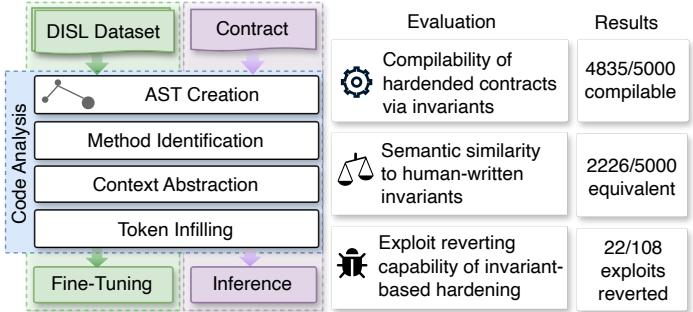
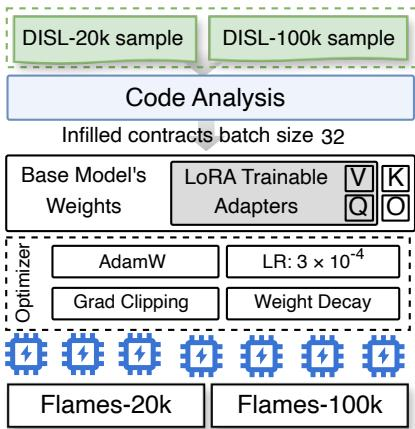
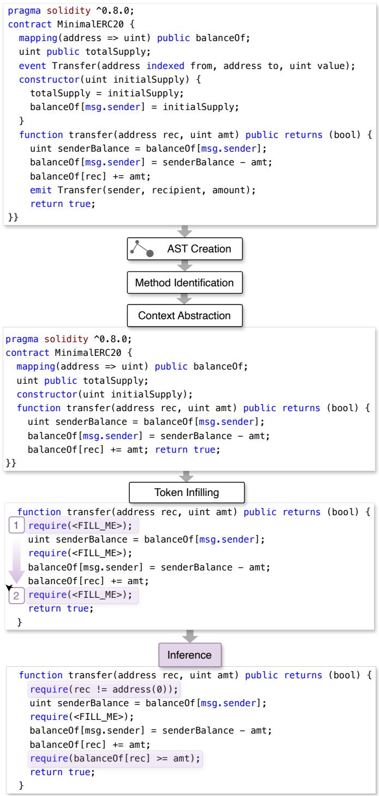
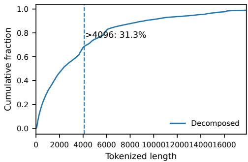
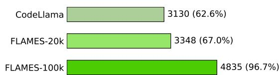
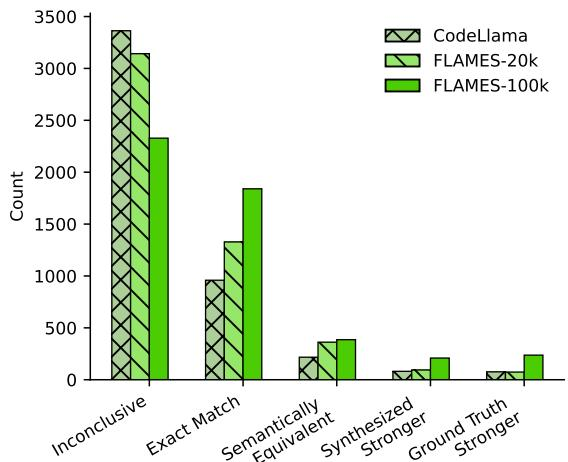

# FLAMES: Fine-tuning LLMs to Synthesize Invariants for Smart Contract Security

Mojtaba Eshghie <sup>1</sup>, Gabriele Morello<sup>2</sup>, Matteo Lauretano<sup>2</sup>, Alexandre Bartel<sup>1</sup>, Martin Monperrus<sup>2</sup>

<sup>1</sup>Umea University ˚ , Umea, Sweden˚

<sup>2</sup>KTH Royal Institute of Technology, Stockholm, Sweden

Abstract—Smart contract vulnerabilities cost billions of dollars annually, yet existing automated analysis tools fail to generate deployable defenses. We present FLAMES, a novel automated approach that synthesizes executable runtime guards as Solidity require statements to harden smart contracts against exploits. Unlike prior work that relies on vulnerability labels, symbolic analysis, or natural language specifications, FLAMES employs domain-adapted large language models trained through fill-inthe-middle supervised fine-tuning on real-world invariants extracted from 514,506 verified contracts. Our extensive evaluation across three dimensions demonstrates FLAMES’s effectiveness: (1) Compilation: FLAMES achieves 96.7% compilability for synthesized invariant (2) Semantic Quality: on a curated test set of 5,000 challenging invariants, FLAMES produces exact or semantically equivalent matches to ground truth in 44.5% of cases; (3) Exploit Mitigation: FLAMES prevents 22 out of 108 real exploits (20.4%) while preserving contract functionality, and (4) FLAMES successfully blocks the real-world APEMAGA incident by synthesizing a pre-condition that mitigates the attack. FLAMES establishes that domain-adapted LLMs can automatically generate production-ready security defenses for smart contracts without requiring vulnerability detection, formal specifications, or human intervention. We release our code, model weights, datasets, and evaluation infrastructure to enable reproducible research in this critical domain.

Index Terms—Smart Contracts, Invariant Synthesis, Program Hardening, Large Language Models, Blockchain Security

## I. INTRODUCTION

Smart contracts underpin blockchain applications for managing digital assets. Despite the progress in automated smart contract analysis, billions of dollars are lost every year due to exploits abusing smart contract vulnerabilities [1], [2]. Most smart contract vulnerability detectors produce unreliable verdicts and do not generate deployable defenses [3]–[5]. As a result, there is strong demand for practical techniques to generate concrete security mitigations.

A promising solution is invariant-based defense: pre-/postconditions that revert dangerous executions at runtime [6]. This is implemented in the widely used require statement in the Solidity language for smart contracts [7]. Recent work further confirms that attacks are preventable by invariants [8]. However, automatically obtaining useful invariants for real contracts is a hard open research problem. Dynamic invariant mining from on-chain transaction traces can surface likely properties [9], but are noisy and miss important security aspects [8].

  
Fig. 1: FLAMES architecture, evaluation, and results overview.

Our core insight is to use Large Language Models (LLM) to synthesize invariants. Yet, off-the-shelf code LLMs are not good at handling Solidity smart contracts without domain adaptation [10]–[12]. We propose FLAMES<sup>1</sup>, a novel training and inference pipeline to synthesize high-quality invariants as Solidity pre-/post-conditions. FLAMES (i) analyzes the contract to extract a contract context to be given as input to the LLM; (ii) FLAMES uses fill-in-the-middle supervised fine-tuning (SFT) over real-world require(<invariant>) statements to train the model to reconstruct missing invariants; and (iii) at inference, FLAMES synthesizes require invariant statements at function entry (pre-conditions) and exit (postconditions) locations. Crucially, FLAMES does not require vulnerability labels, vulnerability detectors, or natural-language description, it does fully automated invariant synthesis for contract hardening.

Prior work have mined invariants from transaction traces [8], [9], used symbolic analysis to infer invariants [13], or prompted LLMs with vulnerability labels to propose invariants [14]–[16]. In contrast, FLAMES generates concrete executable invariants as Solidity require statements; with no need for specifications or vulnerability labels or hints.

Three research questions guide our extensive experimental evaluations:

• RQ1 (Compilation). What percentage of invariants synthesized by FLAMES compile when injected into real contracts? Answer: up to 96.7% synthesized invariants compile (vs. 62.6% for the non–domain-adapted baseline).

• RQ2 (Semantic Quality). How close are the synthesized invariants to human-written ones? Answer: on a 5k hardinvariant set, FLAMES attains 44.5% exact-or-equivalent matches to ground truth (vs. 23.5% baseline).

• RQ3 (Exploit Mitigation). To what extent do injected invariants prevent exploits while preserving functionality? Answer: the best configuration prevents 22/108 exploits without negatively affecting contract’s functionality (vs 16/108 baseline).

• RQ4 (Real Incident Hardening). How effective is FLAMES at synthesizing a deployable invariant in blocking a successful attack? Answer: In a reproduction of the real-world APEMAGA incident, FLAMES-100k synthesizes a pre-condition semantically equivalent to the ground-truth patch, reverting the attack transaction.

To sum up, our contributions are:

• We introduce FLAMES, a novel pipeline for invariantbased smart contract hardening, based on LLM fine-tuning. FLAMES generates valuable pre-/post-conditions using only source code as input.

• We curate DISL, a dataset of 514 506 unique, verified Solidity files and a 5k DISL-HARDINV test set for rigorous evaluation.

• We deliver a comprehensive evaluation demonstrating the high compilability, semantic quality , and exploit mitigation effectiveness of FLAMES invariants.

• We release our code, model weights<sup>2</sup>, and evaluation harnesses for reproducibility and future research in this area.

Section II describes the design of FLAMES, Section III expands the details of the collection, deduplication, and contents of our DISL dataset, Section IV describes the experimental protocol to answer RQ1–RQ4, Section V provide our results to the RQs, Section VII provides an account of the most relevant scientific papers, Section VI discusses the threats to validity, and Section VIII concludes the paper.

## II. FLAMES ARCHITECTURE

We propose FLAMES, a novel smart contract hardening pipeline via specialized LLMs. FLAMES follows a multistage process: a code analysis stage (Section II-B), a one-time supervised fine-tuning stage (Section II-C), and an inference stage (Section II-D) to synthesize missing invariants in smart contracts.

## A. Overview

The core idea of FLAMES is to inject invariants to harden<sup>fi</sup> smart contracts. Invariants are boolean conditions that must hold at specific program points, such as pre-conditions at function entry and post-conditions at function exit. In Solidity, they are written with require(<invariant>) statements. When a require statetement is evaluated as false, transaction execution reverts, preventing any state changes with guarantees.



Fig. 2: The supervised fine-tuning pipeline yields to FLAMES models, specialized for Solidity.  
```txt
function batchTransfer(address[] _rec, uint256 _value)
    public whenNotPaused returns (bool) {
require(_rec.length == 0||_value <= type(uint256).max/_rec.length);
uint cnt = _rec.length;
uint256 amount = uint256(cnt) * _value;
require(cnt > 0 && cnt <= 20);
require(_value > 0 && balances[msg.sender] >= amount);
balances[msg.sender] = balances[msg.sender].sub(amount);
for (uint i = 0; i < cnt; i++) {
    balances[_rec[i]] = balances[_rec[i]].add(_value);
    Transfer(msg.sender, _rec[i], _value);
}
return true;
}
```  
Fig. 3: Preventing the BeautyChain attack with a pre-condition invariant.

In April 2018, the BeautyChain contract suffered a attack abusing an overflow vulnerability in its code [17]. As Figure 3 shows, BeautyChain implemented a batchTransfer that computed amount = \_value \* \_rec.length before any overflow check. The attacker exploited this publicly callable vulnerable function by sending a transaction with a very large \_value resulting in an overflow and wrap around letting attackers mint gigantic balances. The one-line pre-condition invariant in Section II-A would have blocked the attack transaction. Invariants at the right point can stop exploits mid-flight.

Figure 1 shows our proposed solution, called FLAMES. It follows a three-stage pipeline to harden smart contracts without any prior vulnerability information: (i) code analysis (§II-B), (ii) supervised fine-tuning (§II-C), and (iii) invariant synthesis (§II-D). Given a contract, the code-analysis stage parses the source into an AST, determines the invariant synthesis location, builds a compact version of the contract and then, the extracted data is used to fine-tune the LLM or to synthesize the invariants.

Fine-tuning. During the fine-tuning stage, we mine realworld invariants of the form of require(...) statements and conduct supervised fine-tuning to obtain a model specialized for generating smart-contract invariants.

Inference. At inference time (Figure 4), a user specifies one or more synthesis locations and asks the model to generates the missing invariant(s). The synthesized invariants are then injected into the full source in order to permanently harden the contract.

  
Fig. 4: FLAMES synthesis stage illustrated with an example.

## B. Code Analysis Stage

In FLAMES, the same code analysis is applied at training time, to prepare the data, and at inference time, to synthesize new invariants. FLAMES first parses the smart contract into an

Abstract Syntax Tree (AST). The AST representation helps manipulate the code programmatically [18].

A key challenge with using LLMs both during the finetuning and inference stage is their limited context window. Indeed, many real-world smart-contracts do not fit into this context, which is a blocker for both fine-tuning and inference. As the token length distribution of the sources in DISL in Figure 5 shows, more than 31% of the dataset overflows 4096 which is the maximum token length of many base LLM models. This is a major problem for both training and inference This token length typically represents ≈300 lines of code for Solidity smart contracts. To handle contracts more than 4096 tokens, we employ a context abstraction technique adapted from prior work [19]. It consists of only keeping the most important parts of the code relevant to the task at hand. FLAMES abstracts the smart contract as follows: 1) it retains the full body of the function containing the current invariant (to be learned or to be synthesized at training and inference time respectively); 2) it retains all function definitions that call the target function, 3) it keeps modifier definitions applied on the mentioned functions 4) it only keeps signature of the other functions. 5) it keeps state variable declarations, and 6) it removes event definition. All this is done precisely based on AST manipulation.

Analysis at training time. FLAMES conducts contract analysis to prepare the code for the fine-tuning pipeline. It first extracts the require statements to be fine-tuned on. Given the require statements, it determines their enclosing function and prepares the abstract contract context based on the identified function. The rest of the procedure is described in subsection II-C.

Analysis at inference time. Figure 4 shows an instance of this code analysis abstraction during the inference stage. FLAMES only keeps the state variable declarations balancedOf and totalSupply, preserves the signature of the constructor, and the full definition of the transfer function which is target of invariant synthesis.

## C. Supervised Fine-Tuning Stage

FLAMES specializes a base LLM for invariant generation via supervised fine-tuning. Each training sample is built from a real require(<invariant>) taken from the training dataset (see §IV-A). The training sample is generated as follows (i) we use the abstract context of the contract (§II-B); (ii) we replace the invariant with the placeholder token <FILL\_ME> and keep the surrounding code intact. This is the fill-in-the-middle (FIM) training objective [20]. Each invariant inside a require statement in the training dataset is meant to be recreated at the FIM location, based and the surrounding contract.

## D. Invariant Synthesis Stage

During the inference stage (Figure 4), a user provides a full smart contract and specifies a target function for smart-contract synthesis. FLAMES extracts this function, then prepares the abstracted version of the contract keeping the identified function with its full implementation. It then infills the function by require(<FILL\_ME>) statement at the desired invariant locations, one location to be inferred at a time. The FLAMES model then generates the boolean predicate to fill the mask. Finally, FLAMES replaces the placeholder with the synthesized invariant and reconstructs the full, hardened smart contract code. Then, it compiles and returns the hardened contract to the user.

  
Fig. 5: Cumulative distribution of the token length of DISL contracts.

1) Invariant Synthesis Locations: FLAMES considers two places for synthesis, where invariants can revert harmful transactions: pre-condition (function entry point) and postcondition (function exit point), FLAMES supports synthesizing invariants at the mentioned locations.

2) Inference Strategies: Single-turn: When injecting multiple invariants in the contract, on can prompt the model each time with the original version of the contract.

Multi-turn: When generating multiple invariants (e.g., preand post-condition in the same contract or function), synthesized invariants are kept in the context for subsequent generations. In other words, if the synthesis task consists of generating multiple pre-/post-conditation, the model will be prompted multiple times, and at each turn, it is given the contract containing the newly synthesized invariants from previous turns [21], [22].

## E. Implementation

We implement our fine-tuning stage using the Parameter-Efficient Fine-Tuning (PEFT) library of Huggingface [23]. We use CODELLAMA2-7B as base model, in 4-bit quantization. We employ the QLoRA technique and LoRA adapters for fine-tuning. This parameter-efficient fine tuning (i) reduces the training memory footprint enabling us to use larger training corpora on commodity multi-GPU machines; (ii) constrains parameter updates to a low-rank subspace while preserving the base model’s capabilities. We use AdamW optimizer with a learning rate of $3 \times 1 0 ^ { - 4 }$ and a batch size of 32 (with two batches per device), and gradient clipping for stability. Table I details the system setup for the fine-tuning stage. The training runs for one epoch on the selected subset of the DISL dataset (see §IV). We fine-tune two versions of FLAMES, one with 20 000 samples (FLAMES-20k), another with 100 000 samples (FLAMES-100k).

TABLE I: Training parameters of supervised fine-tuning for FLAMES

<table><tr><td colspan="2">Hardware and Runtime</td></tr><tr><td>Train GPUs</td><td>4× Nvidia A100 (80 GB each)</td></tr><tr><td>Precision</td><td>4-bit quantized load (nf4) with mixed precision (fp16) for training</td></tr><tr><td>Optimizer</td><td>AdamW</td></tr><tr><td>Batch size</td><td>32 (per-device batch: 2; gradient accumulation: 16)</td></tr><tr><td>Epochs</td><td>1 (for both FLAMES-20k and FLAMES-100k)</td></tr><tr><td>Learning rate</td><td> $3 \times 10^{-4}$ </td></tr><tr><td colspan="2">Model and PEFT Configuration</td></tr><tr><td>Base model</td><td>CodeLlama2-7B</td></tr><tr><td>LoRA</td><td>rank  $r=8$ ,  $\alpha=16$ ; injected in attention Q/V projections</td></tr><tr><td>Context length</td><td>4096 tokens</td></tr><tr><td>Infilling mode</td><td>Fill-in-the-Middle (FIM) with</td></tr></table>

III. DISL: FINE-TUNING DATASET

A major challenge in applying machine learning to smart contract security is the lack of unique large datasets of realworld contracts. Recent studies indicate that synthetic, small, or non-diverse datasets are not satisfactory [3], [24].

To address this gap, we create DISL, the largest dataset of unique Solidity smart contracts that serves as the foundation for training and evaluating FLAMES. DISL is designed to be diverse, recent, and suitable for AI tasks. It focuses exclusively on real-world contract with verified source code.

## A. Data Collection

To ensure clarity, we define the following terms:

• Deployed contract: A smart contract address on the Ethereum mainnet associated with executable bytecode.

• Raw contract: The complete, concatenated source code retrieved from Etherscan for a single deployed contract, which may include multiple files.

• Solidity file: A single “.sol” source file, which may itself contain multiple contract or library definitions.

Our collection process was executed in two phases:

a) Initial Seeding and Expansion: We began with the Storhaug et al.’s dataset [25], [26], which contains 2 217 692 raw contract records up to April 1, 2022. To capture more recent contracts, we queried the Google BigQuery Ethereum database for all contracts deployed between April 1, 2022, and January 15, 2024, that had at least one on-chain transaction [27]. This query yields 2 709 030 contract addresses.

b) Source Code Retrieval: Using the Etherscan API, we fetched the verified source code for these addresses. A contract is “verified” if its uploaded source compiles to the exact bytecode on the blockchain, ensuring authenticity. After filtering out unverified contracts, this step yielded 1 080 579 new raw contract records. Merging these with the seed dataset resulted in a total raw collection of 3 298 271 deployed contracts.

After this curation, we obtain the final, unique DISL dataset. DISL consists of two collections: i) decomposed set containing 12 931 943 Solidity files which is the result of splitting each raw contract record into its individual Solidity files. This process expanded our collection to a total of 12 931 943 Solidity files. and ii) the decomposed and duduplicated (unique) set consisting of 514 506 Solidity files: to eliminate redundant code, we used the Jaccard similarity index with a 90% threshold to compare the sets of tokens in each file [28]. This way, we identify and remove near-duplicates and preserve unique implementations. This step was critical as it revealed that over 96% of the decomposed files were duplicates.

TABLE II: The other smart contract datasets. DISL is foundational for future learning-based approaches on smart contracts.

<table><tr><td>Dataset</td><td>Year</td><td>Size</td></tr><tr><td>Storhaug (deduplicated) [25]</td><td>2022</td><td>186 397</td></tr><tr><td>Fiesta $^{1}$  (deduplicated) [29]</td><td>2023</td><td>149 386</td></tr><tr><td>Sanctuary [30]</td><td>2022</td><td>144 857</td></tr><tr><td>SmartBugs-Wild [31], [32]</td><td>2020</td><td>47 587</td></tr><tr><td>Ren et al. [24], [33]</td><td>2021</td><td>46 186</td></tr><tr><td>DAppSCAN [34]</td><td>2023</td><td>39 904</td></tr><tr><td>DISL (decomposed)</td><td></td><td>12 931 943</td></tr><tr><td>DISL (decomposed &amp; deduplicated)</td><td></td><td>514 506</td></tr></table>

1. Uses exact match for deduplication

Each entry of DISL is enriched with valuable metadata (see repository), which is crucial for tasks requiring compilation and metadata analysis, as we do in FLAMES. As Table II shows, DISL is the largest Solidity smart contract dataset to date based on number of files, recency, uniqueness, and diversity.

Our analysis shows the deduplicated subset of DISL contains 5 276 315 require statements. We use these require statements for both the supervised fine-tuning and evaluation of FLAMES (RQ1 and RQ2), with seggegration to avoid data leakage.

## IV. EXPERIMENTAL EVALUATION

We design a comprehensive set of experiments to evaluate FLAMES, addressing the following research questions:

• RQ1 Compilation: To what extent do invariants synthesized by FLAMES real smart contracts compile when injected back in the code?

• RQ2 Semantic Quality: How semantically close are the FLAMES invariants compared to human-written ones?

• RQ3 Mitigation: To what extent do FLAMES invariants prevent exploits while preserving functionality?

• RQ4 (Real Incident Hardening). How effective is FLAMES at synthesizing a deployable invariant to block a real-world incident?

This section details the datasets (Section IV-A) and the experimental protocols for RQ1–RQ3 (Sections IV-B to IV-D).

## A. Datasets Used for Experiments

1) Fine Tuning Datasets: We train FLAMES-20k and FLAMES-100k on 20 000 and 100 000 samples, respectively, from the DISL deduplicated set. Each sample is a full contract file from DISL with one of its invariants randomly selected for the supervised fine-tuning stage.

2) Benchmarkfor RQ1 & RQ2: To rigorously code generation quality, we create a challenging test set by filtering DISL and selecting 5000 unique, non-trivial invariants. We do so by removing the ones that contain only variable identifiers, simple comparisons, negations, straightforward function calls, or hardcoded addresses. To prevent data leakage, they are not picked from the fine-tuning corpus. We publish DISL-HARDINV on our repository<sup>3</sup>.

3) Benchmark for RQ3: To evaluate real-world effectiveness, we use 108 vulnerable contracts from the SB-Heist benchmark [35], which are written in Solidity and come with ground-truth exploits. We chose this benchmark since it provides read-to-use proof-of-concept exploits and functionality tests that would capture if hardening has changed the nominal behavior of the contract.

## B. Protocol for RQ1

We evaluate the compilability of the synthesized invariants on DISL-HARDINV dataset (see §IV-A). Then, we replace all invariants in DISL-HARDINV with <FILL\_ME> token, and infer the missing invariant. We use CODELLAMA (as baseline), FLAMES-20k, and FLAMES-100k to recreate the invariant. We then compile the contract, using its original compiler configuration. To prevent data leakage, these contracts are distinct from the fine-tuning dataset presented in Section IV-A.

We report the number of successful compilations for each model. A build succeeds if, under the contract’s original compiler configuration (pragma/version), solc compiler exits without errors and produces artifacts. A high compilation success post-hardening indicates that the model’s synthesized predicates are syntactically valid and are consistent with the surrounding context from a typing, naming and scoping perspective. A high compilation rate is a necessary condition for deployable hardening but not a guarantee of semantic correctness or security: those are evaluated separately in RQ2 (semantic relation to human invariants) and RQ3 (exploit prevention).

## C. Protocol for RQ2

To assess how well the generated invariants match the human-written ones, we use the DISL-HARDINV dataset (see §IV-A). For each sample, we prompt the models to generate the missing invariant. We then compare the synthesized invariant with the ground-truth using SINDI [36], a semantic equivalence checker tool for Solidity. SINDI uses a combination of SMT-solving and rewrite rules to determine the semantic relationship of two given invariants. Using SINDI, we classify the relationship of the invariant and its ground truth into five categories: exact match, semantically equivalent, synthesized or ground truth stronger, inconclusive. For each ⟨synthesized, ground truth⟩ pair, we assign one of five verdicts.

Exact Match. We first compare the invariants in textual form after stripping whitespaces. If they are equal, they are classified as an exact match, otherwise, we move to using SINDI for the semantic comparison.

Semantically equivalent. SINDI proves semantic equivalence through mutual logical implication (when syn: synthesized invariant and gt: ground truth then syn ⇒ gt and gt ⇒ syn): \_\_msgSender() == owner ≡ msg.sender == owner.

Synthesized / ground truth stronger. SINDI proves syn ⇒ gt but not the inverse; this means one of the invariants accepts a smaller set of states:

paidCount \* mintPrice == msg.value ⇒ msg.value >= paidCount \* mintPrice.

Inconclusive. Neither implication is provable within SINDI’s logic or given the solver time budget, or the invariants are over unrelated variables so that no implication holds:

IERC20(token).balanceOf(msg.sender)>= amount vs. whitelist[msg.sender].

## D. Protocol for RQ3

We use a dataset of vulnerable smart contracts and their exploit to measure security effectiveness of the synthesized invariants [5], [37]. Each one of the 108 contracts in this benchmark contains one or more vulnerabilities in one or more lines in the source code.

For each of these vulnerability locations, we synthesize invariants with three different injection strategies: pre-condition, post-condition, and both pre and post for the same contract. For each injection strategy and inference strategy (single- and multi-turn), we synthesize the missing invariants, and inject them at their determined location.

For each candidate hardened version, we then execute:

1) The contract’s functional tests to check if the invariant introduces any regression.

2) We run the ground-truth exploit on the hardened contract to determine whether the FLAMES invariant mitigates the exploit.

If the hardened contract compiles, passes all functional tests, and successfully stops the exploit, the hardening task is considered successful.

We benchmark our models against CODELLAMA [38]. We evaluate CODELLAMA and FLAMES using the exact same harness. This gives an insight about FLAMES’s performance against a non–domain-adapted model on the hardening task. The Python notebooks used in our experiments are publicly available<sup>4</sup>.

## E. Protocol for RQ4

In this RQ, we check whether FLAMES is able to prevent a real-world smart contract incident. We choose an attack based on two criteria: i) the concrete exploit proof-of-concept is available to reproduce the incident ii) it is in nature preventable using an invariant. After careful review of multiple incidents, we select the APEMAGA protocol incident that happened in June, 2024 leading to a ∼9.4 ETH loss. The manual review of the public attack transaction<sup>5</sup> and the exploit reproduction script <sup>6</sup> reveals the flow of the attack, and the function(s) where the synthesis of a precise invariant would deter the attack transaction. The patch of the attack is also published and gives us the location of the missing invariant.

  
Fig. 6: RQ1: Compilation success rate of synthesized invariants for different models.

We use FLAMES to synthesize the invariant and put it back in the contract. We compile the hardened contract. After hardening, we evaluate the hardening effectiveness by running the exploit PoC on the hardened version with the real state of the blockchain pre-incident. To do this, we fork Ethereum mainnet at block prior the attack transaction, replace the token’s runtime at the APEMAGA address, preserving its storage. Then, we run the exploit script to check the effectiveness of the invariant against the attack.

## V. EXPERIMENTAL RESULTS

## A. RQ1: Well-formedness of Synthesized Invariants

We measure whether the FLAMES synthesized invariants are correct per the syntactic and semantic checks of the compiler. Figure 6 shows the compilability results of 5000 synthesized invariants for the DISL-HARDINV dataset. The bars show from top to bottom number of contracts compiled without any modification, the number of them compiled after a random require statement is replaced by its synthesized version, and the two bottom bars pertain to FLAMES models.

As Figure 6 shows, our best model FLAMES-100k, generates require statements that compile at least 4835/5000 of the times with showing significant improvement over both the baseline and the less fine-tuned variant (FLAMES-20k). CODELLAMA performs poorly with 3130/5000 compiled cases post-hardening, demonstrating the effectiveness of the training loop.

Figure 7a presents one failed synthesis result where CODELLAMA continues to generate a function declaration within another function body leading to a parser error during compilation. CODELLAMA is not able to output a stop token appropriately. Compared to CODELLAMA, FLAMES-100k does not generate such multi-line generation errors due to incorrect end of generation.

<sup>4</sup>https://github.com/ASSERT-KTH/FLAMES/blob/master/ raw-validation-results/sb-heists/

```solidity
contract Vault {
  mapping(address => uint256) public balances;  // ...
  function withdraw(uint256 amount) external {
    require(balances[msg.sender] >= amount);
    function _safeSub(uint256 a, uint256 b) internal pure returns
      (uint256) { return a - b; }
    balances[msg.sender] -= amount;
    (bool ok, ) = msg.sender.call{value: amount}("");
    require(ok); }  // ...
}
```

(a) Invariant synthesized by CODELLAMA failing compilation. After infilling the require, CODELLAMA appends a function inside the body of another function, making the contract uncompilable (line breaks added for clarity).

```solidity
contract Vault {
  mapping(address => uint256) public balances; // ...
  function withdraw(uint256 amount) external {
    require(amount <= balances[msg.sender]);
    // same as (a)
}
```

(b) FLAMES returns a single well-formed compilable invariant at the mask location.

## RQ1 Answer: Compilability

Invariants synthesized by FLAMES compile in 96.7 of cases, versus 62.6% for the baseline. This indicates that domainspecific fine-tuning with FLAMES yields invariants that are of much higher usability. Fine-tuning enables the model to capture the syntactic (e.g., scoping) and semantic (e.g., typing) constraints of invariants in the considered smart contract language, Solidity.

## B. RQ2: Comparison Against Human-Generated Invariants

Next, we compare the 5000 synthesized invariants for DISL-HARDINV against the original one written by a developer. Figure 8 shows our results for the five categories of semantic relationship between the synthesized invariants and their ground truths for DISL-HARDINV. FLAMES monotonically improves semantic alignment of synthesized invariants with human-written ones. Moving from the base model to FLAMES trained on 20k and 100k samples monotonically raises exact matches (from 959 to 1328 to 1840). We observe the same improvement via fine-tuning when generating invariants that are textually different but semantically equivalent (from 217 to 362 to 386).

Fine-tuning also increases the number of cases where the invariant does not semantically or textually equal to the ground truth but still has a semantic relationship (stronger/weaker bars in Figure 8) with its ground truth (157 such cases for CODEL-LAMA to 168 for FLAMES-20k to 446 cases for FLAMES-100k). Generating invariants that have semantic relationship with their ground truth counts as partial success as stronger synthesized invariants could subsume the allowed behavior of their ground truth and synthesis of multiple weaker invariants (compared to their ground truth) can resolve some security issues.

Fig. 7: Synthesized invariants (a) failure by CODELLAMA; (b) success by FLAMES (compiles).  
  
Fig. 8: Semantic Similarity of FLAMES invariants .

The number of cases where the invariants are stronger/weaker are balanced for the two categories for all models (e.g., out of 446 such cases for FLAMES-100k, in 209 cases the synthesized invariants are stronger and 237 vice versa). Table III presents five synthesized invariants (right) from each of the four semantic categories and their ground truth (left).

Equivalent Invariants. Equivalences arise from algebraic normalization, commutativity, and popular library alias substitutions. In Table III, ID 1 swaps sides of equality (\_msgSender()== ownerOf(..) ≡ ownerOf(..)== msg.sender) while also replacing the \_msgSender() with the equivalent msg.sender. ID 3 replaces a SafeMath idiom a.add(b)>= a with its native form a + b >= a. ID 4 distributes constants and rewrites >= cost \* (\_mintAmount - 1) as >= (cost \* \_mintAmount)- (cost \* 1). ID 5 flips both inequalities while preserving the same closed interval. ID 2 shows an aliasing pattern (token().transfer vs. \_token.transfer) which resolve to the same callee. As these examples show, supervised finetuning helps the model learn semantics-preserving rewrites, yielding invariants that are functionally equivalent.

FLAMES Strengthening. Several pairs in Table III demonstrate semantic strengthening by narrowing admissible states. In ID 6, the model tightens a payment invariant from msg.value>=mintPrice\*paidCount to paidCount \* mintPrice == msg.value, which reverts transactions where the human-written one would allow. ID 7 removes the self-call: msg.sender==ctrl || msg.sender==gov making it strictly stronger than the developer’s require(gov || ctrl || address(this)). The stronger one is useful when re-entry between contract’s own functions is undesired. ID 10 collapses a disjunction of “time still within cancel window or already cancelled” to only a.cancel. Finally, ID 8 illustrates an strengthening via units: multiplying \_amount by 1e18 (>= \_amount \* 1e18) silently assumes base units and can overconstrain transfers if \_amount is already in wei. Overall, strengthening can emerge from equalities replacing inequalities, removing disjunctive invariants, or hard-coding units. While these may block attacks, they may also induce false positives if the human-written invariant intentionally permitted the broader state.

TABLE III: RQ2. Comparison of Ground Truth and Synthesized Invariants, categorized by their logical relationship.

<table><tr><td>ID</td><td>Ground Truth</td><td>Synthesized</td></tr><tr><td colspan="3">Equivalent</td></tr><tr><td>1</td><td>_msgSender()==hashesToken.ownerOf(_hashesTokenId)</td><td>hashesToken.ownerOf(_hashesTokenId)==msg.sender</td></tr><tr><td>2</td><td>token().transfer(beneficiary,tokensToUnlock)</td><td>token.transfer(beneficiary,tokensToUnlock)</td></tr><tr><td>3</td><td>balanceOf[_to].add(_value)&gt;=balanceOf[_to]</td><td>BalanceOf[_to]+_value&gt;=balanceOf[_to]</td></tr><tr><td>4</td><td>msg.value&gt;=(cost*(mintAmount-1))</td><td>msg.value&gt;=((cost*_mintAmount)-(cost*1))</td></tr><tr><td>5</td><td>getBlockTimestamp( )&gt;=_payload.valid_from &amp;&amp; getBlockTimestamp()&lt;=_payload.valid_to</td><td>_payload.valid_from&lt;=getBlockTimestamp() &amp;&amp; payload.valid_to&gt;=getBlockTimestamp()</td></tr><tr><td colspan="3">Synthesized is stronger</td></tr><tr><td>6</td><td>msg.value&gt;=mintPrice*paidCount</td><td>paidCount*mintPrice==msg.value</td></tr><tr><td>7</td><td>msg.sender==gov || msg.sender==ctrl || msg.sender==address(this)</td><td>msg.sender==ctrl || msg.sender==gov</td></tr><tr><td>8</td><td>coinMap[c].cContract.balanceOf(msg.sender)&gt;=_amount</td><td>coinMap[c].cContract.balanceOf(msg.sender)&gt;=_amount*1e18</td></tr><tr><td>9</td><td>offer.offeredTo==address(0x0)||offer.offeredTo==msg.sender</td><td>offer.offeredTo==msg.sender</td></tr><tr><td>10</td><td>block.timestamp&lt;acdot</td><td>a.cancel</td></tr><tr><td colspan="3">Synthesized is weaker</td></tr><tr><td>11</td><td>_userMinted[block.number]&lt;Num() &amp;&amp; _userForFree[tx.origin]&lt;maxFreePerTx</td><td>userForFree[tx.origin]&lt;maxFreePerTx</td></tr><tr><td>12</td><td>IsEndStage &amp;&amp; enterEndTime&gt;0 &amp;&amp; now-enterEndTime&gt;END_STAGE_DURATION</td><td>IsEndStage</td></tr><tr><td>13</td><td>(amount&gt;0) &amp;&amp; (GAMintCounter+amount) &lt;= GASupply</td><td>amount&gt;0</td></tr><tr><td>14</td><td>block.timestamp&gt;partyTime &amp;&amp; hodlers[msg.sender]&gt;0</td><td>now&gt;=partyTime</td></tr><tr><td>15</td><td>_redisFeeOnBuy+_redisFeeOnSell+_taxFeeOnBuy+_taxFeeOnSell&lt;=25</td><td>_redisFeeOnBuy+_redisFeeOnSell+_taxFeeOnBuy+_taxFeeOnSell&lt;=50</td></tr><tr><td colspan="3">Inconclusive</td></tr><tr><td>16</td><td>(from==owner)||(crowdSalesCompleted&gt;0)</td><td>tokens&lt;=allowed[from][msg.sender]</td></tr><tr><td>17</td><td>_tx.deadline==0 || tx.deadline&gt;block.timestamp</td><td>_tx.to!=address(0)</td></tr><tr><td>18</td><td>_raffle.end==0 || block.timestamp&gt;_raffle.end</td><td>_raffle.isClosed</td></tr><tr><td>19</td><td>_maxTransactionAmountBuy&gt;=(totalSupply() / (10**decimals()))/1_000 &amp;&amp; _maxTransactionAmountSell&gt;=(totalSupply() / (10**decimals()))/1_000</td><td>maxTransactionLimitEnabled</td></tr><tr><td>20</td><td>payable(teamWallet).send(bal*4/10)&amp;&amp;payable(msg.sender).send(bal*2/10) &amp;&amp; payable(developmentWallet).send(bal*4/10)</td><td>payable(developmentWallet).send(bal)</td></tr></table>

FLAMES Weakening. Weakening typically results from dropping parts of conjunctive invariants, relaxing thresholds, or replacing compound progress conditions with a single flag. In ID 11, the model only synthesize the free-mint quota \_userForFree[tx.origin] < maxFreePerTx and omits the perblock mint cap, admitting transactions the ground truth would forbid. ID 13 retains amount > 0 but omits the supply bound, risking overflow. ID 14 replaces a conjunction over time and balance with a pure time check; ID 12 reduces a three-part end-stage condition to a bare isEndStage; and ID 15 doubles the allowed aggregate fee cap from <= 25 to <= 50. These weakenings preserve compilability but affect security.

Inconclusive IDs 16–20 illustrate predicates over orthogonal state dimensions where neither implication is expected (e.g., authorization/timing vs. allowance/limit toggles). For instance, ID 16 (from == owner || crowdSalesCompleted>0) and tokens <= allowed[from][msg.sender] constrain unrelated facets (authority/progress vs. approval), and ID 20’s human guard enforces a three-way split of bal, while the synthesized check covers only one leg. In such cases, SINDI conservatively reports “inconclusive”. Here, inconclusive may not mean “wrong” as it flags non-comparable properties. These cases may require multi-turn prompting or composition when multiple orthogonal properties (e.g., authorization and accounting invariants together) must jointly hold.

## RQ2 Answer: Semantic Quality

FLAMES increases the semantic quality of synthesized invariants. FLAMES invariants are significantly more semantically accurate than those of the baseline model. Increasing the fine-tuning data size improves the model to synthesize invariants that exactly match with their human-written counterparts ( 1328 in baseline → 1840 FLAMES-100k). The same improvement is observed in generating invariants that are semantically equivalent to the human-written ones (217 → 386).

## C. RQ3: Vulnerability Mitigation via Hardening

We assess exploit mitigation entry (pre), exit (post), and their combination (pre+post) with two multi-turn and singleturn inference strategies. Table IV shows the results of these experiments. Here, the colored headers show the exact type of synthesis (pre, post, or pre+post) on contracts containing a specific type of vulnerability (first column). Recall that no label is given as input to Flames, corresponding to a true hardening technique when one does not know the vulnerability. The numbers in the inner cells show the cases where the synthesized invariants 1) prevent the vulnerability and 2) pass all functionality tests for the multi-turn inference. For conciseness, we only present the total numbers for the singleturn strategy at the bottom of the table below the total for the multi-turn strategy.

Under the multi-turn setting, FLAMES-20k prevents 16/108, 20/108, and 22/108 exploits for pre, post, and pre+post respectively, while FLAMES-100k prevents 21/108, 22/108, and 20/108. The non–domain-adapted baseline (CODELLAMA-7B) reaches 16/108, 10/108, and 13/108. This means that domain-adapted fine-tuning clearly allows end-to-end exploit mitigation. FLAMES-20k needs multi-turn pre+post to reach its maximum potential and FLAMES-100k attains the same performance with a single post-condition invariant (22/108). This is significant because it shows that specialization, rather than sheer model size drives exploit mitigation. It also shows that a post-condition is often the most effective placement in practice.

TABLE IV: Effectiveness of the FLAMES invariants to harden smart contracts and mitigate the actual, reproducible exploit. The numbers represent cases where both the exploit transaction is reverted and the functional tests are successful. The colored headers represent condition combinations, where a dot signifies presence: • pre-condition • post-condition.

<table><tr><td rowspan="2">Vulnerability</td><td colspan="3">CodeLlama-7B</td><td colspan="3">FLAMES-20k</td><td colspan="3">FLAMES-100k</td></tr><tr><td>●</td><td>●</td><td>●</td><td>●</td><td>●</td><td>●</td><td>●</td><td>●</td><td>●</td></tr><tr><td>Access control (16)</td><td>4</td><td>3</td><td>3</td><td>5</td><td>5</td><td>6</td><td>7</td><td>7</td><td>7</td></tr><tr><td>Arithmetic (20)</td><td>6</td><td>1</td><td>4</td><td>4</td><td>7</td><td>5</td><td>3</td><td>7</td><td>6</td></tr><tr><td>Bad randomness (8)</td><td>0</td><td>1</td><td>1</td><td>2</td><td>3</td><td>4</td><td>1</td><td>1</td><td>1</td></tr><tr><td>Denial of service (4)</td><td>1</td><td>0</td><td>1</td><td>1</td><td>0</td><td>0</td><td>2</td><td>0</td><td>1</td></tr><tr><td>Front running (6)</td><td>0</td><td>0</td><td>0</td><td>0</td><td>0</td><td>0</td><td>0</td><td>0</td><td>0</td></tr><tr><td>Other (2)</td><td>0</td><td>0</td><td>0</td><td>0</td><td>0</td><td>0</td><td>0</td><td>0</td><td>0</td></tr><tr><td>Reentrancy (26)</td><td>1</td><td>0</td><td>0</td><td>1</td><td>4</td><td>7</td><td>7</td><td>2</td><td>3</td></tr><tr><td>Time manipulation (4)</td><td>0</td><td>1</td><td>0</td><td>0</td><td>1</td><td>0</td><td>1</td><td>2</td><td>2</td></tr><tr><td>Unchecked Low Level Call (22)</td><td>4</td><td>4</td><td>4</td><td>0</td><td>0</td><td>0</td><td>0</td><td>0</td><td>0</td></tr><tr><td>Total of 108 (single-turn)</td><td>16</td><td>10</td><td>12</td><td>16</td><td>20</td><td>17</td><td>21</td><td>22</td><td>21</td></tr><tr><td>Total of 108 (multi-turn)</td><td>16</td><td>10</td><td>13</td><td>16</td><td>20</td><td>22</td><td>21</td><td>22</td><td>20</td></tr></table>

Effectiveness varies by vulnerability class. For access control, FLAMES-100k consistently reaches 7 across all invariant locations, indicating robustness to whether the guard sits at entry, exit, or both. Arithmetic benefits most from post conditions (FLAMES-100k: 7 vs. 3 and 6). Reentrancy shows the opposite pattern: pre is strongest for FLAMES-100k (7 vs. 2 and 3). Time manipulation remains modest but still FLAMES could prevent 2/4 of exploits. For unchecked low-level calls, entry/exit guards are largely ineffective (all zeros across pre, post, pre+post for both FLAMES variants). Front running and the others class remain at zero for all models and placements which indicates the limitation of purely pre-/post-condition based hardening for this vulnerability type.

Multi-turn synthesis helps when composing multiple invariant placements. For FLAMES-20k, pre+post improves from 17/108 (single-turn) to 22/108 (multi-turn), indicating that carrying earlier guards into the next generation improves protection. For FLAMES-100k, totals are essentially flat between single- and multi-turn (pre: 21/21, post: 22/22, pre+post: 21 vs. 20), suggesting the larger fine-tuned model maintains coherence even without the stacking the previous generations.

Our protocol includes running regression tests. Now we measure the proportion of invariants which break some functionality. We observe that 41.3% (134/324) of invariants generated by the baseline preserve the functionality of the contracts. In comparison, this number for FLAMES-20k and FLAMES-100k is 64.5% (209/324) and 67.9% (220/324), respectively. This demonstrates that FLAMES generates invariants that do not negatively affect the contract’s functionality. A significant portion of these are benign with respect to the contract’s functionality but are also incapable of stopping the exploit. Figure 9 shows a contract vulnerable to reentrancy. FLAMES-100k’s synthesized pre-condition (\_am > 0) and postcondition (balances[msg.sender] >= MinDeposit) for the function CashOut [39]. The invariants do not affect the normal functionality, yet they are orthogonal to the exploit path as during reentrancy the state update balances[msg.sender]-=\_am happens after the external call, so repeated callbacks can extract value while the post-condition only constrains to remain above a threshold after the external call. If the attacker selects a small-enough \_am, the post-condition still holds even though multiple value transfers may have already been performed; hence the exploit is not prevented, while ordinary withdrawals are unaffected.

```javascript
function CashOut(uint _am) public payable {
    require(_am > 0);
    if (_am <= balances[msg.sender]) {
        if (msg.sender.call.value(_am)()) {
            balances[msg.sender] -= _am;
            TransferLog.AddMessage(msg.sender, _am, "CashOut");
        }
    }
    require(balances[msg.sender] >= MinDeposit);
}
```  
Fig. 9: A functionality-preserving synthesized invariant that fails to deter the exploit.

## RQ3 Answer: Hardening Effectiveness

FLAMES generates vulnerability-mitigating invariants without any prior knowledge of the vulnerabilities. To our knowledge, we are the first to show that LLM-synthesized invariants both maintain functionality and mitigate actual end-to-end executable smart contract exploits. FLAMES is the only technique in the literature to not require any vulnerability label or hint.

## D. RQ4: Hardening Against a Real-World Attack

The Attack. At its core, the APEMAGA incident was due to a flaw that allowed the attacker to burn all tokens via the contract’s publicly callable method family(address). The vulnerable contract contains an external family function which calls to an internal \_approve\_ method (Figure 10a) that burns nearly all of the account’s balance. There is no authorization implemented in the family function.

To attack, the attacker first acquires a small APEMAGA token which seeds the inventory for a later dump. Then, to deflate the token pair balance, the attacker calls family(address(PAIR)) repeatedly. Each call burns ∼ 99.9% of the pair’s APEMAGA balance (by design of the \_approve\_ method in Figure 10a). Three calls to this function are sufficient to reduce it to nearzero. Next, the attacker invokes pair.sync() to synchronize reserves. The Uniswap pair now records a near-zero APEMAGA reserve, while the WETH reserve is unchanged, causing the onchain ratio to appear extremely high. Then, the attacker sells at a skewed price by executing APEMAGA → WETH swap. Because the pool believes APEMAGA is very scarce, the trade pays out disproportionate WETH for the attacker’s tokens.

Hardening Using FLAMES Following the RQ1–RQ3 setup, we construct an abstract context (that keeps the full implementation of thefamily function, relevant state and signatures) and insert a single masked require as a pre-condition (Figure 10c).

```solidity
function _approve_(address owner, address spender,
    uint256 amount) internal virtual {
require(owner != address(0), "Burn from the 0 address");
require(owner == spender, "Burn to the owner address");
uint256 accountBalance = (_balances[owner] + trading())
* 999 / 1000;
_beforeTokenTransfer(owner, address(0), accountBalance);
require(accountBalance>=amount, "Amt exceeds balance");
_balances[owner] -= accountBalance;
_totalSupply -= accountBalance;
_afterTokenTransfer(owner, address(0), accountBalance);
}
```

```solidity
contract ERC20 is Context, IERC20 { ... }
contract Tonken_patch is ERC20 {
  constructor(
    string memory name_,
    string memory symbol_,
    uint8 decimals_,
    uint256 totalSupply_
) ERC20(name_, symbol_, decimals_, totalSupply_) {}
  receive() external payable {}
  function family(address account) external {
    require(msg.sender==account, "caller != token owner");
    super._approve_(account, account, 0);
  }
}

(b) Ground-truth pre-condition guarding family().

function family(address account) external {
  require(account==_msgSender());
  super._approve_(account, account, 0);
}
```  
Fig. 10: APEMAGA hardening with FLAMES: (a) vulnerable internal burn; (b) ground-truth fix; (c) FLAMES-generated invariant.

Using FLAMES-100k, the model synthesizes account == \_msgSender() (Section V-D) which is semantically equivalent to the ground-truth patch invariant presented in Figure 10b. The hardened contract compiles under the original settings. The synthesized FLAMES invariant reverts the exploit’s call, rendering the attack unsuccessful.

```txt
RQ4 Answer: Hardening against a Real-World Attack
FLAMES-100k is capable of generating an invariant that protects against the real-world APEMAGA attack. The synthesized invariant is fully validated by reverting the proof-of-concept exploit of the attack. The FLAMES invariant is semantically equivalent to the ground truth APEMAGA mitigating invariant.
```

## VI. THREATS TO VALIDITY

Although we use context abstraction (Section II-B), very large contracts can still exceed the model’s token limit, leading to truncated context and potentially incorrect invariants.

Some generated invariants may over-/under-constrain a contract (stronger/weaker cases in §III). To mitigate that, another method of validation (e.g., replaying transaction history in case of invariant-based hardening for upgraded contracts [40]) is a valid solution.

All three models in all strategies occasionally generate two instances of trivial invariants: require(false) and require(true). require(false) reverts the transaction regardless of the state and require(true) has no other effect except consuming gas. CODELLAMA, FLAMES-20k, and FLAMES-100k each generate 24, 20, and 20 cases of require(false). Fine-tuning further from FLAMES-20k to FLAMES-100k does not reduce the synthesis of require(false) but eliminates require(true). Out of the 20 cases where CODELLAMA generates require(true), 14 of them are false negatives (the code requires an invariant, but CODELLAMA generates require(true) with no effect on the vulnerable control flow). Furthermore, in both FLAMES models, for all cases of generating trivial require(false), they generate them as postconditions.

## VII. RELATED WORK

We review the prior works on generating invariants using LLMs (§VII-B), smart contract invariant generation (§VII-C), and using invariants for smart contract security (§VII-A).

## A. Usage of Invariants for Smart Contract Security

Li et al. inject executable checks into smart contracts to prevent known exploits at runtime [41]. The main difference is that FLAMES automatically synthesizes the invariants whereas they rely on user-written ones.

PROMFUZZ [42] uses six hand-crafted invariant templates as analysis oracles to detect functional bugs. These templates could be backed by a FLAMES-style invariant generator, removing static templates that limit the scope of their analysis while retaining the bug-oriented placement and their validation loop. Fuzzers like Echidna [43] and ItyFuzz [44] use userprovided invariants as falsification oracles to guide vulnerability analysis. Provers such as Certora Prover [45] and solcverify [46] relies on provided pre-/post-conditions for property verification. HighGuard [47] uses business-logic invariants to monitor contracts and catch exploits. XploGen [48] uses invariants as oracles to synthesize exploits. Contrary to them, FLAMES generate invariants and do not expect engineer to write them. FLAMES can feed consumers of invariants such as fuzzers and provers.

## B. Generating Invariants Using LLMs

Pei et al. synthesize invariants using fine-tuned LLMs for Java programs [49]. They use Daikon-mined templates as supervision labels. Unlike this work, which evaluates agreement with Daikon and does not produce deployable code, FLAMES targets executable Solidity defenses by infilling concrete require statements, enforcing compilability. Furthermore, we measure downstream security impact (regression tests, exploit replays, and a real incident case study). The supervision also differs as Pei et al. train against Daikon [50] templates, whereas FLAMES learns from actual human-written invariants extracted at scale from DISL dataset.

Here, we review the research on LLM-based invariant generation for general programming languages. ClassInvGen [51] couples GPT models with testing to synthesize executable invariants, outperforming both a pure LLM baseline and dynamic invariant mining with Daikon [50].

Translating informal intent into formal specifications is also beneficial. Previous work has demonstrated that LLMgenerated invariants can catch real defects [52]. There has also been work on fine-tuning LLMs for Java/JML [53]. SpecGen [54] employs a two-phase LLM generation and verification: conversational specification drafting is followed by solver-based filtering which outperforms vanilla prompting and classical invariant mining. In contrast to prior LLM-based invariant generators, FLAMES targets the different domain of smart contract hardening. FLAMES fine-tunes a code model to produce require(...) statements at pre-/post-conditions. FLAMES does not assume any natural-language specification or vulnerability labels.

## C. Smart Contract Invariant Generation

Prior research as used the contract’s transaction history to mine likely invariants for smart contracts. InvCon [55] adapts Daikon-style mining to smart contract traces and mines ERC20 invariants. InvCon+ [9] filters the mined candidate invariants to eliminate false positives. Reinforcement learning policies trained against verifiers can suggest arithmetic-safety invari ants for smart conrtacts [56]. VeriSmart [13] uses symbolic analysis to discover arithmetic invariants. Instead of proving absence of arithmetic faults, FLAMES synthesizes concrete invariants to prevent them, and it is evaluated across vulnerability classes beyond arithmetic. PropertyGPT [15] retrieves known specifications for LLM-based Solidity auditing and refines the auditing results with analyzer feedback. SmartInv [14] targets detection of business logic flaws, by prompting LLMs with Solidity code enhanced with protocol documentation and a Tier-of-Thought strategy. SmartOracle [57] mines likely invariants from contract transaction history and uses them as analysis oracles to flag violations in new transactions. Assuming that future behavior should subsume the transaction history, SmartOracle can act as a runtime monitor. Com pared to SmartOracle [57], FLAMES hardens the contracts even when there is no or limited transaction history (predeployment) or the future transaction history subsumption assumption is invalid for the contract. TrustLLM [16] fine tune a detector LLM to label functions as vulnerable and then use agentic critics to produce natural-language justifications. LLM-based detectors that fine-tune on smart contract audit reports show promising detection and explanation results especially on functional bugs (aka business logic flaws) which are often overlooked by classic runtime/static analysis but they stop at detection and do not generate deployable defenses or validate exploit mitigation end-to-end [14], [58], [59]. In comparison, FLAMES conducts defensive code synthesis given only source code, it synthesize tthe missing Solidity invariants at strategic placements without relying on prior vulnerability knowledge, label or documentation. We note that FLAMES and TrustLLM [16] are complementary as TrustLLM can prioritize functions for hardening and prepare the ground for FLAMES to synthesize invariants specific locations (pre vs. post vs. both).

## VIII. CONCLUSION

We have presented FLAMES, a fne-tuning approach for synthesizing Solidity invariants for defensive hardening of smart contracts. Across three axes, we have demonstrated FLAMES’s capabilities. First, it produces usable invariants compiling in real-world smart contracts : FLAMES generates 96.7% compilable invariants. Second, fine-tuning largely improves semantic similarity to human-written ground truth (2226/5000 equivalent) over the baseline model (1176/5000). Third, in end-to-end exploit prevention on 108 vulnerable contracts, FLAMES has been shown to produce invariants that prevent exploits while preserving functionality. Lastly, our case study of using FLAMES on a real DeFi incident demonstrates its capability in reverting the actual attack’s transaction.

Our study shows that placement matters. A potential future direction is to learn the invariant synthesis location itself. This requires learning objectives about where to synthesize the invariants. To foster future research, we release the FLAMES model weights, fine-tuning, and evaluation pipelines.

## REFERENCES

[1] H. Rezaei, M. Eshghie, K. Anderesson, and F. Palmieri, “Sok: Root cause of \$1 billion loss in smart contract real-world attacks via a systematic literature review of vulnerabilities,” 2025. [Online]. Available: https://arxiv.org/abs/2507.20175

[2] L. Zhou, X. Xiong, J. Ernstberger, S. Chaliasos, Z. Wang, Y. Wang, K. Qin, R. Wattenhofer, D. Song, and A. Gervais, “SoK: Decentralized Finance (DeFi) Attacks,” in 2023 IEEE Symposium on Security and Privacy (SP), May 2023, pp. 2444–2461.

[3] A. Ghaleb and K. Pattabiraman, “How effective are smart contract analysis tools? evaluating smart contract static analysis tools using bug injection,” in Proceedings of the 29th ACM SIGSOFT International Symposium on Software Testing and Analysis, ser. ISSTA 2020. New York, NY, USA: Association for Computing Machinery, Jul. 2020, pp. 415–427.

[4] S. Chaliasos, M. A. Charalambous, L. Zhou, R. Galanopoulou, A. Gervais, D. Mitropoulos, and B. Livshits, “Smart contract and defi security tools: Do they meet the needs of practitioners?” in Proceedings of the IEEE/ACM 46th International Conference on Software Engineering, ser. ICSE ’24. New York, NY, USA: Association for Computing Machinery, 2024. [Online]. Available: https://doi.org/10.1145/3597503.3623302

[5] S. Bobadilla, M. Jin, and M. Monperrus, “Do automated fixes truly mitigate smart contract exploits?” 2025. [Online]. Available: https://arxiv.org/abs/2501.04600

[6] B. Meyer, “Applying ’design by contract’,” Computer, vol. 25, no. 10, pp. 40–51, Oct. 1992.

[7] “Ethereum Yellow Paper,” Dec. 2022. [Online]. Available: https: //github.com/ethereum/yellowpaper

[8] Z. Chen, Y. Liu, S. M. Beillahi, Y. Li, and F. Long, “Demystifying invariant effectiveness for securing smart contracts,” Proc. ACM Softw. Eng., vol. 1, no. FSE, Jul. 2024. [Online]. Available: https://doi.org/10.1145/3660786

[9] Y. Liu, C. Zhang, and Y. Li, “Automated invariant generation for solidity smart contracts,” IEEE Transactions on Dependable and Secure Computing, pp. 1–17, 2025.

[10] Z. Chen, H. Qin, N. Chen, X. Zhao, L. Xue, X. Luo, and X.-M. Wu, “Solbench: A dataset and benchmark for evaluating functional correctness in solidity code completion and repair,” 2025. [Online]. Available: https://arxiv.org/abs/2503.01098

[11] Z. Peng, X. Yin, R. Qian, P. Lin, Y. Liu, H. Zhang, C. Ying, and Y. Luo, “Soleval: Benchmarking large language models for repository-level solidity code generation,” 2025. [Online]. Available: https://arxiv.org/abs/2502.18793

[12] A. Dinaburg, “Evaluating solidity support in ai coding assistants,” Trail ofBits Blog, November 2024. [Online]. Available: https://blog.trailofbits. com/2024/11/19/evaluating-solidity-support-in-ai-coding-assistants/

[13] S. So, M. Lee, J. Park, H. Lee, and H. Oh, “Verismart: A highly precise safety verifier for ethereum smart contracts,” in 2020 IEEE Symposium on Security and Privacy (SP), 2020, pp. 1678–1694.

[14] S. J. Wang, K. Pei, and J. Yang, “SMARTINV: Multimodal Learning for Smart Contract Invariant Inference.” IEEE Computer Society, Feb. 2024, pp. 125–125, iSSN: 2375-1207. [Online]. Available: https://www.computer.org/csdl/proceedings-article/sp/2024/ 313000a126/1Ub23GNTAeQ

[15] Y. Liu, Y. Xue, D. Wu, Y. Sun, Y. Li, M. Shi, and Y. Liu, “PropertyGPT: LLM-driven Formal Verification of Smart Contracts through Retrieval-Augmented Property Generation,” in Proceedings of the 2025 Network and Distributed System Security Symposium (NDSS). Internet Society, 2025.

[16] W. Ma, D. Wu, Y. Sun, T. Wang, S. Liu, J. Zhang, Y. Xue, and Y. Liu, “Combining fine-tuning and llm-based agents for intuitive smart contract auditing with justifications,” in Proceedings of the 47th International Conference on Software Engineering (ICSE 2025), 2025.

[17] S. Team. A disastrous vulnerability found in smart contracts of beautychain (bec). Accessed: 2025-10-03. [Online]. Available: https://medium.com/secbit-media/dbf24ddbc30e

[18] M. Eshghie, V. Aryd, C. Artho, and M. Monperrus, “Solidiffy: Ast<sup>˚</sup> differencing for solidity smart contracts,” 2025. [Online]. Available: https://arxiv.org/abs/2411.07718

[19] Z. Chen, S. Kommrusch, M. Tufano, L.-N. Pouchet, D. Poshyvanyk, and M. Monperrus, “SequenceR: Sequence-to-Sequence Learning for Endto-End Program Repair,” IEEE Transactions on Software Engineering, vol. 47, no. 9, pp. 1943–1959, 2021.

[20] M. Bavarian, H. Jun, N. Tezak, J. Schulman, C. McLeavey, J. Tworek, and M. Chen, “Efficient training of language models to fill in the middle,” 2022. [Online]. Available: https://arxiv.org/abs/2207.14255

[21] A. Madaan, N. Tandon, P. Gupta, S. Hallinan, L. Gao, S. Wiegreffe, U. Alon, N. Dziri, S. Prabhumoye, Y. Yang, S. Gupta, B. P. Majumder, K. Hermann, S. Welleck, A. Yazdanbakhsh, and P. Clark, “Self-Refine: Iterative Refinement with Self-Feedback,” in Advances in Neural Information Processing Systems, A. Oh, T. Naumann, A. Globerson, K. Saenko, M. Hardt, and S. Levine, Eds., vol. 36. Curran Associates, Inc., 2023, pp. 46 534–46 594. [Online]. Available: https://proceedings.neurips.cc/paper files/paper/ 2023/file/91edff07232fb1b55a505a9e9f6c0ff3-Paper-Conference.pdf

[22] E. Nijkamp, B. Pang, H. Hayashi, L. Tu, H. Wang, Y. Zhou, S. Savarese, and C. Xiong, “Codegen: An open large language model for code with multi-turn program synthesis,” 2023. [Online]. Available: https://arxiv.org/abs/2203.13474

[23] N. Houlsby, A. Giurgiu, S. Jastrzebski, B. Morrone, Q. De Laroussilhe, A. Gesmundo, M. Attariyan, and S. Gelly, “Parameter-efficient transfer learning for NLP,” in Proceedings of the 36th International Conference on Machine Learning, ser. Proceedings of Machine Learning Research, K. Chaudhuri and R. Salakhutdinov, Eds., vol. 97. PMLR, 09–15 Jun 2019, pp. 2790–2799. [Online]. Available: https://proceedings.mlr.press/v97/houlsby19a.html

[24] M. Ren, Z. Yin, F. Ma, Z. Xu, Y. Jiang, C. Sun, H. Li, and Y. Cai, “Empirical evaluation of smart contract testing: What is the best choice?” in Proceedings of the 30th ACM SIGSOFT International Symposium on Software Testing and Analysis. Virtual Denmark: ACM, Jul. 2021, pp. 566–579.

[25] Andre Storhaug,´ “smart contracts (revision 448b3e9),” https://huggingface.co/datasets/andstor/smart contracts, 2023.

[26] A. Storhaug, J. Li, and T. Hu, “ Efficient Avoidance of Vulnerabilities in Auto-completed Smart Contract Code Using Vulnerability-constrained Decoding ,” in 2023 IEEE 34th International Symposium on Software Reliability Engineering (ISSRE). Los Alamitos, CA, USA: IEEE Computer Society, Oct. 2023, pp. 683–693. [Online]. Available: https://doi.ieeecomputersociety.org/10.1109/ISSRE59848.2023.00035

[27] “Ethereum in BigQuery: A Public Dataset for smart contract analytics,” https://cloud.google.com/blog/products/data-analytics/ ethereum-bigquery-public-dataset-smart-contract-analytics.

[28] M. Allamanis, “The adverse effects of code duplication in machine learning models of code,” in Proceedings of the 2019 ACM SIGPLAN International Symposium on New Ideas, New Paradigms, and Reflections on Programming and Software, ser. Onward! 2019. New York, NY, USA: Association for Computing Machinery, Oct. 2019, pp. 143–153.

[29] “Zellic/smart-contract-fiesta · Datasets at Hugging Face,” https:// huggingface.co/datasets/Zellic/smart-contract-fiesta.

[30] M. Ortner and S. Eskandari, “Smart contract sanctuary.” [Online]. Available: https://github.com/tintinweb/smart-contract-sanctuary

[31] “Smartbugs/smartbugs-wild,” https://github.com/smartbugs/ smartbugs-wild, Feb. 2024.

[32] T. Durieux, J. F. Ferreira, R. Abreu, and P. Cruz, “Empirical review of automated analysis tools on 47,587 Ethereum smart contracts,” in Proceedings of the ACM/IEEE 42nd International Conference on Software Engineering, ser. ICSE ’20. New York, NY, USA: Association for Computing Machinery, Oct. 2020, pp. 530–541.

[33] “Renardbebe/Smart-Contract-Benchmark-Suites: A unified smart contract standard data set.” https://github.com/renardbebe/ Smart-Contract-Benchmark-Suites/tree/master.

[34] “InPlusLab/DAppSCAN: DAppSCAN: Building Large-Scale Datasets for Smart Contract Weaknesses in DApp Projects.” https://github.com/ InPlusLab/DAppSCAN.

[35] S. Bobadilla, M. Jin, and M. Monperrus, “Do automated fixes truly mitigate smart contract exploits?” 2025. [Online]. Available: https://arxiv.org/abs/2501.04600

[36] M. Eshghie, “Sindi: Semantic invariant differencing for solidity smart contracts,” accessed: 2025-10-02. [Online]. Available: https: //github.com/mojtaba-eshghie/Sindi

[37] S. Bobadilla, M. Jin, and M. Monperrus, “sb-heists: A scientific dataset of smart contract exploits.” [Online]. Available: https: //github.com/ASSERT-KTH/sb-heists

[38] B. Roziere, J. Gehring, F. Gloeckle, S. Sootla, I. Gat, X. E. Tan,\` Y. Adi, J. Liu, R. Sauvestre, T. Remez, J. Rapin, A. Kozhevnikov, I. Evtimov, J. Bitton, M. Bhatt, C. C. Ferrer, A. Grattafiori, W. Xiong, A. Defossez, J. Copet, F. Azhar, H. Touvron, L. Martin, N. Usunier,´ T. Scialom, and G. Synnaeve, “Code llama: Open foundation models for code,” 2024. [Online]. Available: https://arxiv.org/abs/2308.12950

[39] M. Eshghie, W. Ahrendt, C. Artho, T. T. Hildebrandt, and G. Schneider, “Capturing Smart Contract Design with DCR Graphs,” in Software Engineering and Formal Methods, C. Ferreira and T. A. C. Willemse, Eds. Cham: Springer Nature Switzerland, 2023, pp. 106–125.

[40] M. Eshghie, W. Ahrendt, C. Artho, T. Troels Hildebrandt, and G. Schneider, “Formalizing Smart Contract Design Patterns with DCR Graphs,” 2025.

[41] A. Li, J. A. Choi, and F. Long, “Securing smart contract with runtime validation,” in Proceedings of the 41st ACM SIGPLAN Conference on Programming Language Design and Implementation, ser. PLDI 2020. New York, NY, USA: Association for Computing Machinery, 2020, p. 438–453. [Online]. Available: https://doi.org/10.1145/3385412.3385982

[42] X. Lin, Q. Xie, B. Zhao, Y. Tian, S. Zonouz, N. Ruan, J. Li, R. Beyah, and S. Ji, “Promfuzz: Leveraging llm-driven and bug-oriented composite analysis for detecting functional bugs in smart contracts,” in Proceedings of the 40th IEEE/ACM International Conference on Automated Software Engineering (ASE 2025), Research Papers Track. Seoul, South Korea: IEEE/ACM, Nov. 2025, to appear.

[43] G. Grieco, W. Song, A. Cygan, J. Feist, and A. Groce, “Echidna: effective, usable, and fast fuzzing for smart contracts,” in Proceedings of the 29th ACM SIGSOFT International Symposium on Software Testing and Analysis, ser. ISSTA 2020. New York, NY, USA: Association for Computing Machinery, Jul. 2020, pp. 557–560. [Online]. Available: https://dl.acm.org/doi/10.1145/3395363.3404366

[44] C. Shou, S. Tan, and K. Sen, “ItyFuzz: Snapshot-Based Fuzzer for Smart Contract,” Jun. 2023.

[45] “The Certora Verification Language — Certora Prover Documentation,” accessed: 2025-04-11. [Online]. Available: https://docs.certora.com/en/ latest/docs/cvl/index.html

[46] A. Hajdu and D. Jovanovi<sup>´</sup> c, “solc-verify: A modular verifier for solidity´ smart contracts,” in Verified Software. Theories, Tools, and Experiments, S. Chakraborty and J. A. Navas, Eds. Cham: Springer International Publishing, 2020, pp. 161–179.

[47] M. Eshghie, C. Artho, H. Stammler, W. Ahrendt, T. Hildebrandt, and G. Schneider, “Highguard: Cross-chain business logic monitoring of smart contracts,” in Proceedings of the 39th IEEE/ACM International Conference on Automated Software Engineering, 2024, pp. 2378–2381.

[48] M. Eshghie and C. Artho, “Oracle-guided vulnerability diversity and exploit synthesis of smart contracts using llms,” in Proceedings of the 39th IEEE/ACM International Conference on Automated Software Engineering, 2024, pp. 2240–2248.

[49] K. Pei, D. Bieber, K. Shi, C. Sutton, and P. Yin, “Can large language models reason about program invariants?” in Proceedings of the 40th In-

ternational Conference on Machine Learning, ser. ICML’23. JMLR.org, 2023.

[50] M. D. Ernst, J. H. Perkins, P. J. Guo, S. McCamant, C. Pacheco, M. S. Tschantz, and C. Xiao, “The Daikon System for Dynamic Detection of Likely Invariants,” Science of Computer Programming, vol. 69, no. 1, pp. 35–45, Dec. 2007. [Online]. Available: https: //www.sciencedirect.com/science/article/pii/S016764230700161X

[51] C. Sun, V. Agashe, S. Chakraborty, J. Taneja, C. Barrett, D. Dill, X. Qiu, and S. K. Lahiri, “Classinvgen: Class invariant synthesis using large language models,” 2025. [Online]. Available: https: //arxiv.org/abs/2502.18917

[52] M. Endres, S. Fakhoury, S. Chakraborty, and S. K. Lahiri, “Can large language models transform natural language intent into formal method postconditions?” Proc. ACM Softw. Eng., vol. 1, no. FSE, Jul. 2024. [Online]. Available: https://doi.org/10.1145/3660791

[53] S. Greiner, N. Buhlmann, M. Ohrndorf, C. Tsigkanos, O. Nierstrasz,¨ and T. Kehrer, “Automated generation of code contracts: Generative ai to the rescue?” in Proceedings of the 23rd ACM SIGPLAN International Conference on Generative Programming: Concepts and Experiences, ser. GPCE ’24. New York, NY, USA: Association for Computing Machinery, 2024, p. 1–14. [Online]. Available: https://doi.org/10.1145/3689484.3690738

[54] L. Ma, S. Liu, Y. Li, X. Xie, and L. Bu, “Specgen: Automated generation of formal program specifications via large language models,” 2025. [Online]. Available: https://arxiv.org/abs/2401.08807

[55] Y. Liu and Y. Li, “InvCon: A Dynamic Invariant Detector for Ethereum Smart Contracts,” in Proceedings of the 37th IEEE/ACM International Conference on Automated Software Engineering, ser. ASE ’22. New York, NY, USA: Association for Computing Machinery, Jan. 2023, pp. 1–4. [Online]. Available: https://doi.org/10.1145/3551349.3559539

[56] J. Liu, Y. Chen, B. Tan, I. Dillig, and Y. Feng, “Learning Contract Invariants Using Reinforcement Learning,” in Proceedings of the 37th IEEE/ACM International Conference on Automated Software Engineering, ser. ASE ’22. New York, NY, USA: Association for Computing Machinery, Jan. 2023, pp. 1–11. [Online]. Available: https://dl.acm.org/doi/10.1145/3551349.3556962

[57] J. Su, J. Chen, Z. Fang, X. Lin, Y. Tang, and Z. Zheng, “SmartOracle: Generating Smart Contract Oracle via Fine-Grained Invariant Detection,” IEEE Transactions on Software Engineering, pp. 1–13, 2025.

[58] J. Bu, W. Li, Z. Li, Z. Zhang, and X. Li, “Enhancing smart contract vulnerability detection in dapps leveraging fine-tuned llm,” 2025. [Online]. Available: https://arxiv.org/abs/2504.05006

[59] L. Yu, Z. Huang, H. Yuan, S. Cheng, L. Yang, F. Zhang, C. Shen, J. Ma, J. Zhang, J. Lu, and C. Zuo, “Smart-llama-dpo: Reinforced large language model for explainable smart contract vulnerability detection,” Proc. ACM Softw. Eng., vol. 2, no. ISSTA, Jun. 2025. [Online]. Available: https://doi.org/10.1145/3728878