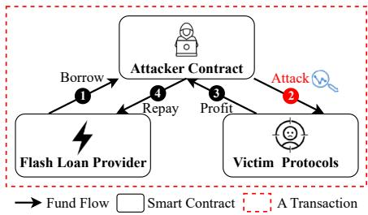
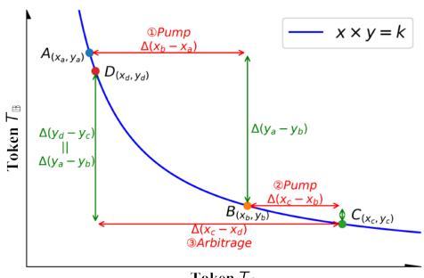
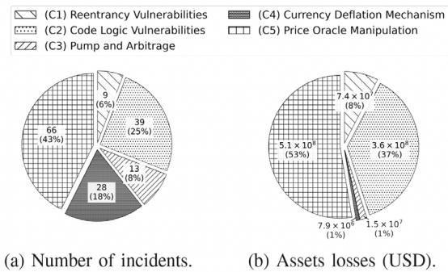
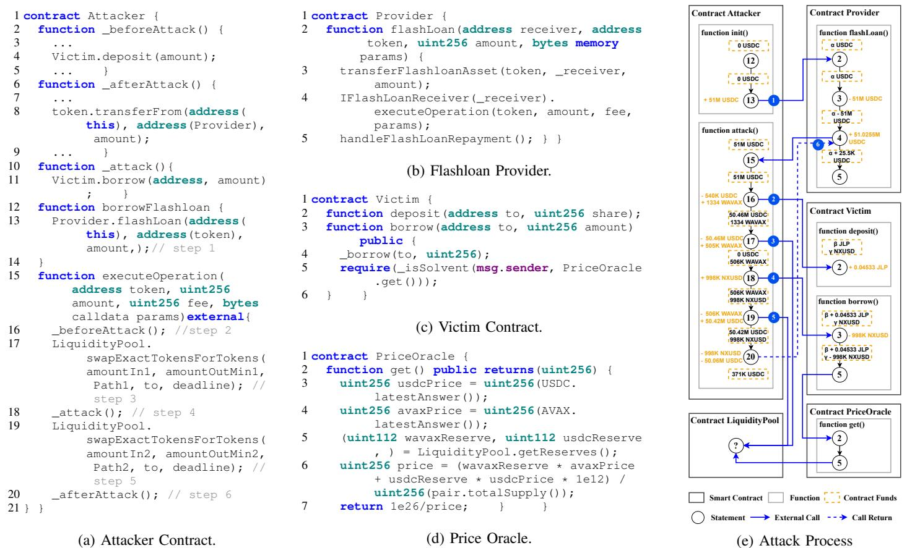
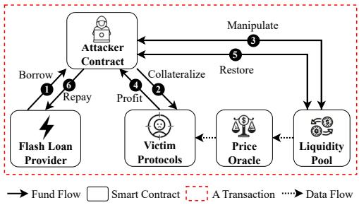

# Flash Loan Attack Is More Than Just Price Oracle Manipulation: A Comprehensive Empirical Study

Cuifeng Gao<sup>1,2</sup>, Jiajun Ye<sup>1,2</sup>, Wenzhang Yang<sup>3,</sup>∗, and Yinxing Xue<sup>1,2,3</sup>

<sup>1</sup>School of Computer Science and Technology, University of Science and Technology of China, Hefei, Anhui, China <sup>2</sup>Suzhou Institute for Advanced Research, University of Science and Technology of China, Suzhou, Jiangsu, China <sup>3</sup>Institute of AI for Industries, Nanjing, Jiangsu, China

gcf20225162@mail.ustc.edu.cn, jun9908@mail.ustc.edu.cn, yywwzz@mail.ustc.edu.cn, yxxue@ustc.edu.cn \*corresponding author

Abstract—The rapid growth of the decentralized finance (DeFi) ecosystem has given rise to flash loan, a type of uncollateralized loan service that enables users to easily borrow substantial amounts of funds. However, this has prompted attackers to conduct malicious arbitrage within DeFi protocols, known as notorious flash loan attacks, resulting in significant asset losses. Existing works primarily focus on investigating price oracle manipulation, a common tactic in flash loan attacks, but lack a comprehensive understanding regarding the entire process of flash loan attacks and the diverse range of attack methods. In this paper, we empirically study 155 real-world flash loan attack incidents, representing the largest-scale study to date. We first categorize these incidents into five types based on their root causes and compile statistics on their distribution, then elucidate the vulnerable code and finance mechanisms exploited in each category. Subsequently, we identify the symptoms of codebased vulnerabilities and summarize the abstract attack models for the entire process. Finally, we evaluate the effectiveness of state-of-the-art off-chain tools in detecting code-based vulnerabilities within their scope of capabilities. We find that SLITHER performs the best in detecting 22% of temporal reentrancy vulnerabilities, and DEFITAINTER has a 52% false negative rate in detecting price oracle manipulation, mainly attributed to three limitations.

Keywords–smart contract; flash loan attack; security

## 1. INTRODUCTION

Smart contracts are self-executing programs on the blockchain. It is initially enabled in the Ethereum blockchain platform to be implemented using a Turing-complete programming language (e.g., Solidity [1]). This led to the emergence of thousands of decentralized finance (DeFi) protocols and applications that gained significant popularity [2], such as flash loan, decentralized exchange (DEX), lending and yield farming. However, as reported by the renowned blockchain security company SlowMist Technology [3], flash loan attacks (FLAs) rank as the third most common type based on the number of occurrences (123 incidents up to 2023). An in-depth understanding of flash loan attacks is essential to guarantee the security of DeFi protocols and maintain social stability. In recent years, several studies have gradually emerged investigating topics related to flash loan attacks and associated means of exploitation, such as price oracle manipulation. In 2021, the work [4] first formulated flash loan attacks as an optimization problem to effectively maximize attack profits. DEFIRANGER [5] and PROMUTATOR [6] detected price oracle manipulation based on historical transaction information rather than contract code, using rule-based static approaches and mutation-based dynamic approaches, respectively. In 2023, DEFITAINTER [7] employed a taint analysis technique to detect price oracle manipulation at the bytecode level. The empirical study [8] summarized three transaction patterns of flash loan attacks based on 22 real-world incidents associated with price oracle manipulation. In 2024, FLASHSYN [9] synthesized the flash loan attack vector to maximize profits using mathematical approximation, making it more general than the work [4]. OVER [10] utilized symbolic execution approaches to assist developer in defending against unexpected price deviations.

However, there are three critical limitations in existing work. (1) Existing work is narrowly confined to price oracle manipulation and specific victim DeFi protocols (e.g., lending protocols [11]), leaving a significant gap in the comprehensive understanding of flash loan attacks. (2) Existing work is limited to a small scope of incidents of flash loan attacks (no more than 30 real-world incidents) , leading to incomplete coverage of case studies and a lack of in-depth analysis. (3) Considering the multitude of existing smart contract automatic analysis tools [12] [13] [14], there is a research gap in evaluating their effectiveness in emerging flash loan attacks.

Therefore, to gain a comprehensive understanding of flash loan attacks, we empirically studied a wide range of real-world flash loan attack incidents and are committed to answer the following questions. (1) What are the root causes, categories, and distributions of flash loan attacks? (2) What are the code symptoms and abstract attack model of flash loan attacks? (3) How effective are existing analysis tools in detecting different types of flash loan attacks?

In this paper, we first gather 155 real-world incidents of flash loan attacks from the Web3rekt [15] website and the DeFiHackLabs [16] GitHub repository to construct our dataset. All incidents are cross-verified by third-party proof (e.g., online blog articles, block transaction records). This dataset surpasses the scale of all current work in this field. Then, these incidents are classified into five categories. We provide comprehensive explanations for the root causes and distributions of each category. We find that 74% of the incidents exploited code-based vulnerabilities, resulting in 98% of the asset losses. Furthermore, we present the symptoms of codebased vulnerabilities exploited by flash loan attacks, and the abstract attack models of entire attack process to facilitate future research on automatic analysis tools. Finally, we evaluate the effectiveness of state-of-the-art security tools (e.g., SLITHER [12], MYTHRIL [13] and MANTICORE [14]) in detecting reentrancy vulnerabilities [17] category. Moreover, we evaluate DEFITAINTER in detecting price oracle manipulation category. Given its 48% accuracy on 60 incidents, we critically examine its limitations and explore avenues for future improvement. Specifically, we categorize its potential limitations into three main aspects, each supported by representative examples.

To sum up, we make the following contributions.

We collect 155 incidents of flash loan attacks, establishing the most comprehensive and largest dataset [18] on the subject within existing work.

We conduct a thorough empirical study on all publicly available real-world incidents, elucidating their categories, root causes, and distributions.

We investigate vulnerable code symptoms and abstract attack models across different categories of flash loan attacks. Furthermore, we evaluate the effectiveness of existing tools in detecting code-based vulnerabilities.

## 2. BACKGROUND

In this section, we provide background knowledge related to DeFi protocols and flash loan attacks.

## 2.1 DeFi Protocols

Decentralized Finance (DeFi) is a novel financial paradigm powered by smart contracts, which encompasses a variety of financial services. DeFi protocols implement their functions by combining multiple smart contracts, each responsible for specific tasks and operations, and interacting through mutual calls. In general, the critical DeFi protocols involved in flash loan attacks contain flash loan services [19], victimized protocols (e.g., Decentralized Exchange (DEX) [20], liquidity pools (LP) [21], Lending [11], and Yield Farming [22]), and exploitable financial mechanisms (e.g., Deflationary Token [23] and Price Oracle [24]).

## 2.2 Flash Loan Attack

We define the flash loan attack in the broadest sense as follows. Definition 2.1. A flash loan attack is a type of exploit conducted within a single blockchain transaction, where the attacker borrows a substantial amount of funds from a flash loan protocol, manipulates markets or exploits code vulnerabilities to obtain illicit profits, and subsequently repays the loan.

The threat model of flash loan attacks is illustrated in Figure 1. In a single transaction of a flash loan attack, three primary roles implemented through smart contracts are involved: the attacker, the flash loan provider, and the victim protocols (e.g., DEXs, lending, and yield farming). The attack process consists of four key steps: 1 The attacker borrows a large sum from the flash loan provider. 2 The attacker uses these funds to exploit market or code vulnerabilities to arbitrage against the victim protocols. 3 The attacker secures substantial profits. 4 The attacker repays the loan. Note that the second step involves varying complex processes depending on the target contracts and the vulnerabilities. We are committed to illustrating how attackers conduct attack processes and the reasons behind their success in this work.

  
Figure 1: The threat model of flash loan attacks.

## 2.3 Related Work

Recently, flash loan attacks have captured the attention of the academia due to significant security threats. To gain an in-depth understanding of flash loan attacks, LEISHEN [8] conducts an empirical study based on 22 real-world flash loan attack incidents associated with price oracle manipulation, but this work simply summarizes three transaction patterns of attacks without delving into their underlying causes.

Furthermore, some existing studies are respectively related to attack [4], [9], detection [5], [6], [7], and defense against flash loan attacks [10]. Specifically, to maximize profit via flash loan attacks, the work [4] quantitatively analyzed the profit mechanisms in two case studies of flash loan attacks and proposed more optimal attack strategies for these cases. FLASHSYN [9] employs a mathematical approximation approach to synthesize the flash loan attack vector that yields the highest gain from the vulnerable contract. To guarantee the security of DeFi protocols, DEFIRANGER [5] analyzes historical transaction data and employs pattern matching to detect whether a DeFi protocol has experienced price oracle manipulation attacks. PROMUTATOR simulates price oracle manipulation attacks by mutating the oracle’s output. It compares the behavior of the DeFi protocol under normal conditions with its behavior under price oracle manipulation to detect attacks. DEFITAINTER [7] employs taint analysis technique on the bytecode to detect price oracle manipulation in smart contracts. To mitigate price deviations potentially caused by flash loan attacks, OVER [10] provides a symbolic analysis framework that helps adjust price fluctuation parameters in lending protocols.

To the best of our knowledge, there is currently no comprehensive and thorough study on flash loan attacks. Hence, investigating the scope, types, and root causes of flash loan attacks is pivotal for aiding researchers in comprehensively understanding these attacks and ensuring the security of DeFi protocols. Furthermore, it is essential to assess the effectiveness of existing security tools in countering emerging flash loan attacks to promote further research.

TABLE I: Dataset Collection.

<table><tr><td>Method</td><td>Description</td><td>Number</td></tr><tr><td rowspan="2">Collection</td><td>From the Web3Rekt website.</td><td>189</td></tr><tr><td>From the DefiHackLabs repository.</td><td>48</td></tr><tr><td>Deduplication</td><td>Compare the addresses of the victim contracts.</td><td>21</td></tr><tr><td rowspan="2">Exclusion</td><td>Lack of source code for the attacked contract.</td><td>15</td></tr><tr><td>Insufficient or non-existent online reports to confirm the occurrence of flash loan attacks.</td><td>46</td></tr><tr><td>Total</td><td></td><td>155</td></tr></table>

## 3. RESEARCH QUESTION AND DATASET COLLECTION

In this section, we first introduce the key research questions of this study. Then, the method of dataset collection is presented.

## 3.1 Research Question

In this work, we are dedicated to exploring the following three primary research questions.

RQ1: What are the root causes, categories, and distributions of flash loan attacks?

RQ2: What are the code symptoms and abstract attack model of flash loan attacks?

<sub>•</sub> RQ3: How effective are existing analysis tools in detecting different types of flash loan attacks?

In RQ1, we first categorize flash loan attacks based on their different root causes. Then, for each type of flash loan attack, we further elaborate on explaining its root cause and distribution. In RQ2, we depict the symptoms of vulnerable code in victim contracts and outline the abstract attack models to facilitate the design of analysis and testing tools. In RQ3, we evaluate the effectiveness of the state-of-the-art tools in detecting flash loan attacks.

## 3.2 Dataset Collection

Our dataset is constructed by collecting real-world flash loan attack incidents from two distinct sources: Web3Rekt [15] and DeFiHackLabs [16]. (1) Web3Rekt has been dedicated to educating and raising awareness of various blockchain events since 2012. It maintains a repository of blockchain security incidents, helping blockchain participants better understand and analyze the risks associated with cryptocurrencies and various blockchain projects. (2) DeFihacklabs is a GitHub repository with 4.6K stars, serving as a platform dedicated to blockchain security education. It reproduces DeFi hack incidents using the popular smart contract development toolchain FOUNDRY [25], which provides the proof of concepts showcasing past flash loan attack incidents.

Table I presents an overview of the dataset collection method. Specifically, we first utilize the filtering function on the Web3Rekt website to screen all incidents recorded in Web3Rekt. We select “flash loan” as the attack method to filter incidents, resulting in a total of 189 incidents. Similarly, in DefiHackLabs, incidents are labeled with their root causes. We extract incidents tagged with phrases related to “flash loan”, resulting in a total of 48 cases. Both collections are up to April 15, 2024.

Then, after performing a deduplication by comparing the address of the victim contracts, we eliminated 21 incidents reported redundantly by two sources and ended up with a total of 216 incidents. Lastly, we exclude 15 attack incidents that lack source code for the attacked contract, which prevents the manual code audit. In addition, we exclude 46 incidents due to insufficient or non-existent online reports, as the root causes cannot be confirmed without the manual cross-verification of the authenticity of flash loan attacks. In the end, we retained 155 incidents in our dataset.

Each incident is cross-verified for authenticity by third-party proof (e.g., project issues, online blog articles, block transaction records, etc.), providing detailed analysis of the flash loan attacks, and by two authors with at least three years of smart contract research experience. In cases where disagreement arises, the incident is forwarded to the third author for evaluation of the fundamental cause and classification. The manual audit process lasted three months in total. We strive to provide uniform resource locations (URLs) associated with flash loan attack incidents to ensure traceability for each incident. Detailed information about the dataset is publicly available at the GitHub repository [18].

## 4. RQ1: THE ROOT CAUSES, CATEGORIES, AND DISTRIBU-TIONS OF FLAS

In this section, we categorize the 155 flash loan attack incidents according to their root causes and present their distributions.

## 4.1 Root Causes and Categorization

We adopt the open card sorting [26] method, a widely used approach for classification tasks [27] [28], to organize all 155 flash loan attack incidents into five categories: (C1) Reentrancy Vulnerabilities, (C2) Code Logic Vulnerabilities, (C3) Pump and Arbitrage, (C4) Currency Deflation Mechanism, and (C5) Price Oracle Manipulation.

## 4.1.1 (C1) Reentrancy Vulnerabilities.

The root cause of this type of flash loan attack lies in the presence of reentrancy vulnerabilities [17] in victim contracts. In this type of flash loan attacks, exploiting reentrancy vulnerabilities requires an upfront cost, such as making an initial deposit and subsequently receiving corresponding rewards, which is a significant characteristic that distinguishes it from traditional reentrancy vulnerabilities [29]. In general, the higher the upfront cost, the greater the profit from a single exploitation. Consequently, attackers commonly use flash loan services to obtain significant initial capital, enabling rapid and substantial profits. This type of attack can be prevented by utilizing stateof-the-art automated detection tools (e.g., SLITHER [12] and MYTHRIL [13]) or conducting manual audits to ensure that contracts are free from reentrancy vulnerabilities.

## 4.1.2 (C2) Code Logic Vulnerabilities.

The root causes of this type of flash loan attack are typically project-specific, primarily stemming from logic-related flaws that developers do not thoroughly consider, which are beyond

(C3)

  
Figure 2: The graph of the constant product formula utilized by automated market maker.

the scope of existing automatic tools. Building on the broad framework established by the work [30] for understanding code logic vulnerabilities in smart contracts, this type of flash loan attack can be further categorized into four subtypes: accounting errors [31] [32], permission escalation [33], state inconsistency issues [30], and contract implementation-specific bugs [34]. In particular, accounting errors typically require attackers to possess significant funds to trigger, necessitating the use of flash loans. Moreover, attackers cannot profit from DeFi protocols by the other three subtypes of attacks (i.e., permission escalation, state inconsistency, and contract implementation-specific bugs) without incurring costs. Hence, attackers need to use flash loans to obtain substantial capital to maximize their profits. This type of attack can be prevented by performing a manual audit of the code logic before deploying the contract to ensure that there are no logical flaws.

## 4.1.3 (C3) Pump and Arbitrage.

The root cause of pump and arbitrage is the price slippage inherent in DEXs based on the automated market maker (AMM) mechanism. The AMM mechanism relies on the constant product formula x $y = k ,$ , where x and y denote the quantities of two different tokens in the LP and k is a constant. This means that the ratio of tokens changes as the exchange occurs, but their product remains unchanged, maintaining liquidity. Figure 2 illustrates the graph of the constant product formula utilized by AMMs. Assume that a DEX facilitates the exchange of Token $T _ { \mathbb { A } }$ and Token $T _ { \mathbb { B } } .$ . At a specific moment, say point $A ( x _ { a } , y _ { a } )$ , the LP in the DEX contains $x _ { a }$ tokens of $T _ { \mathbb { A } }$ and $y _ { a }$ tokens of $T _ { \mathbb { B } }$ , Then, the attacker conducts the following steps: 1 Pump: purchasing $\Delta ( y _ { a } - y _ { b } )$ tokens of $T _ { \mathbb { B } }$ with $\Delta ( x _ { b } - x _ { a } )$ tokens of $T _ { \mathbb { A } }$ borrowed from flash loan in the liquidity pool, causing price slippage. 2 Pump: prompting the victim to purchase $\Delta ( y _ { b } - y _ { c } )$ tokens of $T _ { \mathbb { B } }$ with $\Delta ( x _ { c } - x _ { b } )$ tokens of $T _ { \mathbb { A } }$ in the same liquidity pool, further exacerbating the slippage. 3 Arbitrage: selling $\Delta ( y _ { a } - y _ { b } )$ tokens of $T _ { \mathbb { B } }$ purchased in the fist step, equivalent to $\Delta ( y _ { d } - y _ { c } )$ , in exchange for $\Delta ( x _ { c } - x _ { d } )$ tokens of $T _ { \mathbb { A } }$ from the liquidity pool. This action capitalizes on the price slippage, as $\Delta ( x _ { c } - x _ { d } ) > \Delta ( x _ { b } - x _ { a } )$ resulting in profit. As a result, the victim encounters a higher price of $T _ { \mathbb { B } }$ at point D than at point $B .$ . This results in the sale of $\Delta ( y _ { b } - y _ { c } )$ tokens of $T _ { \mathbb { B } }$ purchased in the second step, yielding only $\Delta ( x _ { d } - x _ { a } )$ tokens of $T _ { \mathbb { A } }$ . This amount is less than the cost $\Delta ( x _ { c } - x _ { b } )$ tokens of $T _ { \mathbb { A } }$ in the second step.

TABLE II: A simulated flash loan attack demonstration caused by the currency deflation mechanism.

<table><tr><td rowspan="2">Step</td><td colspan="2">Attacker&#x27;s Assets</td><td colspan="2">Liquidity Pool&#x27;s Assets</td></tr><tr><td> $T_{\mathbb{D}}^{\text{a}}$ </td><td> $T_{\mathbb{G}}^{\text{b}}$ </td><td> $T_{\mathbb{D}}^{\text{a}}$ </td><td> $T_{\mathbb{G}}^{\text{b}}$ </td></tr><tr><td>(1) Initiate</td><td>0</td><td>0</td><td>1,000</td><td>100</td></tr><tr><td>(2) Borrow</td><td>x</td><td>0</td><td>1,000</td><td>100</td></tr><tr><td>(3) Deposit</td><td>x-9,990-999(burn)</td><td>0</td><td>1,000 [+9,990] $^{\text{c}}$ </td><td>100</td></tr><tr><td>(4) Withdraw</td><td>x-9,990-999(burn)+9,990=x-999(burn)</td><td>0</td><td>1,000-999(burn)[+9,990-9,990] $^{\text{c}}$ = 1</td><td>100</td></tr><tr><td>(5) Exchange</td><td>x-999(burn)-1-0.1(burn)= x-1000.1</td><td>50</td><td>1+1 = 2</td><td>50</td></tr></table>

T denotes a type of deflationary token with 10% deflation rate.  
<sup>b</sup> T<sub>G</sub> denotes a type of general token.  
[] denotes the assets are not confirmed to reserve.

For example, in the incident of the Wault Finance attack [35], the victim, Wault Finance, is a yield farming protocol that offers staking and redemption services for tokens BUSD and WUSD. However, to market its own issued token WEX, Wault automatically exchanges 10% of the BUSD tokens staked by users in WEX tokens from the LP and exchanges 90% of WUSD back into BUSD and the remaining 10% into WEX to return to users utilizing the redemption service. Consequently, attackers can exploit this by preemptively pumping WEX tokens $( T _ { \mathbb { A } } )$ and then arbitraging BUSD tokens (T<sub>B</sub>) as described in the attack process above. The attack process can be abstracted into the following sequence of function calls, where denotes the order of function calls, LP.swap() represents the token exchange function in an LP, and Victim.stake() represents the token stake function in a target contract.

## LP.swap()  V ictim.stake()  LP.swap()  Attack

In this type of flash loan attacks, attackers utilize flash loan services to create significant price slippage, ensuring that the profit exceeds the cost. Victims are typically DeFi protocols that use LPs for token exchange, such as DEX, lending, and yield farming. This type of attack can be prevented by detecting if an impending transaction is taking place under conditions of price slippage and examining whether the LP is already experiencing price deviation.

## 4.1.4 (C4) Currency Deflation Mechanism.

The root cause of this type of flash loan attack stems from the token burning mechanisms of the deflationary token (DT) [23]. Therefore, if an LP permits users to withdraw previously deposited DTs at no cost, it must bear the loss associated with returning DTs to users. This can be exploited by attackers to cause DTs to evaporate from the LP, resulting in profit.

As shown in Table II, we provide a simulated attack demonstration caused by the currency deflation mechanism. Given a deflationary token $T _ { \mathbb { D } }$ with 10% deflation rate, and a liquidity pool provides the exchange of $T _ { \mathbb { D } }$ and a general token $T _ { \mathbb { G } }$ . The process of the attack primarily unfolds as follows: (1) The LP is initially set up with 1000 units of token $T \_ { \mathbb { D } }$ and 100 units of token $T \_ { \mathbb { G } }$ . The attacker starts with no assets. (2) The attacker borrows a large sum (x) of $T _ { \mathbb { D } }$ from a flash loan service. (3) The attacker deposits a premeditated amount (9, 990) of $T _ { \mathbb { D } }$ into the LP. (4) The attacker requests to withdraw the previously deposited $T _ { \mathbb { D } }$ , causing the LP to burn an additional amount (999) of $T _ { \mathbb { D } }$ at a certain deflation rate (10%) and the amount of $T _ { \mathbb { D } }$ reserved in the LP decreases sharply (1 $T _ { \mathbb { D } }$ remains). After affecting the LP, the attacker deposits only 1 of $T _ { \mathbb { D } }$ . (5) Finally, the attacker can exchange $T _ { \mathbb { G } }$ at a low price. Specifically, before the attack, the attacker must pay $1 , 1 0 0 \ ( 1 , 0 0 0 + 1 , 0 0 0 \ast 1 0 \% )$ $T _ { \mathbb { D } }$ to exchange for 50 $T _ { \mathbb { G } } ,$ , while after the attack, the attacker only pays 1,000.1 $T _ { \mathbb { D } }$ to exchange for $5 0 ~ T _ { \mathbb { G } }$

For example, in the incident of the BGLD attack [36], the BGLD token is a deflationary token and the victim is the LP that supports the exchange of BGLD tokens. Firstly, the attacker transfers BGLD tokens to the LP. The attacker then invokes the skim function to reverse the transaction of BGLD tokens, causing the LP to need to transfer the BGLD tokens to the attacker. Due to token burning mechanisms, the original tokens in the LP have unexpected evaporation. Subsequently, the attacker invokes the swap function to extract profits from the liquidity pool. The attack process can be abstracted into the following sequence of function calls, where denotes the order of function calls, $T o k e n . t r a n s f e r ( )$ represents the transfer function of a deflationary token, LP.skim() represents the reversal function of the token in an LP, and LP.swap() represents the exchange function of the token in an LP.

$$
\text {Token.transfer()} \succ L P. s k i m () \succ L P. s w a p () \Rightarrow A t t a c k \tag {C4}
$$

In this type of flash loan attacks, flash loan services are utilized to acquire the necessary funds to reduce the $T _ { \mathbb { D } }$ tokens in the LP to an expected minimal value. As seen in the example above, when the $T _ { \mathbb { D } }$ tokens in the LP decrease, the attacker also loses an equivalent amount of $T _ { \mathbb { D } }$ tokens. Therefore, the attacker must ensure that they possess a sufficient quantity of $T _ { \mathbb { D } }$ tokens to execute the attack. To prevent this type of flash loan attack, LPs should carefully consider supporting deflationary token exchange, and deflationary token designers should consider avoiding imposing fees on LPs.

## 4.1.5 (C5) Price Oracle Manipulation.

The root cause of this type of flash loan attack stems from victim protocols using price information provided by a manipulable price oracle as the basis for their financial decisions. Incorrect prices led to flawed financial decisions, which in turn caused losses for victims.

For example, in the Nereus Finance incident [37], the victim, Nereus Finance, is a lending DeFi protocol that offers an investment service and a lending service. Users can invest by collateralizing assets in a DeFi protocol and may also borrow other tokens using these collateralized assets to engage in other investment activities. To create significant price deviations, attackers must secure substantial funds through flash loans. The DeFi protocols (e.g., DEX, lending, and yield farming) that rely on price oracles are often susceptible contracts of this type. The price oracle could be manipulated in various ways depending on their use case, and further details and abstract attack model could be found in § 5-C.

This type of attack can be prevented by the following three aspects: (1) Developers must perform manual audits or use automatic tools [7] to assess whether their price calculation foundations are susceptible to manipulation. (2) DeFi protocols can implement better oracle paradigms, such as price oracle networks [38]. (3) DeFi protocols can adopt weighted average prices, such as time-weighted average prices [39] or volumeweighted average prices [40] instead of prices at specific moments, because the manipulated prices can only be maintained for a brief period.

  
Figure 3: The categories and distributions of FLAs.

TABLE III: Distribution of subcategories of code logic vulnerabilities (C3).

<table><tr><td>Categories</td><td>Number</td><td>Assets lost</td></tr><tr><td>Accounting Errors</td><td>13 (33%)</td><td> $4.4 \times 10^{7}$  (12%)</td></tr><tr><td>Permission Escalation</td><td>12 (31%)</td><td> $1.0 \times 10^{8}$  (28%)</td></tr><tr><td>State Inconsistency Issues</td><td>9 (23%)</td><td> $1.4 \times 10^{7}$  (4%)</td></tr><tr><td>Contract Implementation Specific Bugs</td><td>5 (13%)</td><td> $2.0 \times 10^{8}$  (56%)</td></tr></table>

## 4.2 Distributions in Different Types of Flash loan Attacks

Figure 3 shows the number of incidents in our dataset for categories C1 to C5 and the corresponding real-world asset losses they incurred. Among them, the price oracle manipulation category (C5) has the most incidents, which are 66 (43%) and represents the largest share (53%) of total asset losses (507,136,170 USD). Despite this, the number of incidents and asset losses for other categories together still account for about half, indicating that a deeper understanding of attack principles beyond price oracle manipulation is crucial for researching flash loan attacks.

Furthermore, the number of incidents (39) in the code logic vulnerabilities category (C2) and the resulting asset losses (359,266,837 USD) are second only to those in the price oracle manipulation category (C5). Notably, the average loss per C2 incident is greater than that of C5, indicating that C2 attacks have a more severe impact. Therefore, as shown in Table III, we proceeded to further analyze the distribution of subcategories within C2. Among them, the number of accounting errors 13 (33%) is the largest, because this vulnerability typically requires that attackers possess significant funds to be exploited, causing the use of flash loans. Moreover, there are 12 (31%) incidents of permission escalation and 9 (23%) incidents of state inconsistency issues. In these incidents, the higher the cost of a single attack, the greater the potential arbitrage. Therefore, attackers often use flash loans to acquire large amounts of capital rapidly and without upfront cost, enabling rapid and substantial arbitrage. In addition, we find 5 (13%) incidents related to contract implementation specific bugs. Despite being the fewest in number, they result in the highest asset losses (56%), suggesting that vulnerable business logic are more detrimental than code bugs.

```matlab
function depositFor(address token, uint _amount,address
    user ) public {
    uint256 _pool = balance();
    IERC20(token).safeTransferFrom(msg.sender, address(this
        ), _amount);
    uint256 _after = balance();
    _amount = _after.sub(_pool);
    shares = (_amount.mul(totalSupply()).div(_pool);
    _mint(user, shares);    }
```  
Figure 4: An example of reentrancy vulnerability (C1).

```txt
Answer to RQ1: Flash loan attacks can be categorized into five types (C1-C5) according to their root causes. C1, C2, and C5 exploit code vulnerabilities, representing 74% incidents and causing 98% asset losses, while C3 and C4 exploit finance mechanisms vulnerabilities, resulting in minor asset losses.
```

## 5. (RQ2) THE CODE SYMPTOMS AND ABSTRACT ATTACK MODELS OF FLAS

In this section, we use real-world examples to illustrate the symptoms present in code-based vulnerabilities exploited by flash loan attacks (C1, C2, and C5). Furthermore, we outline the abstract attack model to facilitate the development of future automatic analysis tools and detection oracles.

## 5.1 Reentrancy Vulnerabilities (C1)

## 5.1.1 Real-World Code Example

In the Grim Finance attack incident [41], the reentrancy vulnerability resides within a single function named depositFor, as shown in Figure 4. This function allows any user to deposit funds into Grim Finance by an external call (line 3), and in return, Grim Finance mints its own tokens GBF to users as collateral certificates by modifying the users’ balances (line 7). However, changing storage states after an external call aligns with the classic symptom of a reentrancy vulnerability, as identified by SWC [42] and existing works [12] [43] [44]. In particular, this function lacks address authentication, enabling the caller to set any target address for the external call. Consequently, the attacker designed a malicious IERC20 contract, where the safeTransferFrom function (line 3) will call this function back. The attacker can then deposit funds once, but receive multiple shares. Specifically, in this incident, the attacker borrowed 30 BTC and 937,830 WFTM from the flash loan, and then exchanged them in the LP for 0.0476 SPIRIT LP as the funds deposited in Grim Finance. Finally, the attacker re-entered the depositFor function eight times and gained a profit of 300 GBF tokens.

## 5.1.2 Abstract Attack Model.

Given a flash loan provider, a victim protocol with a reentrancy vulnerability, the attack process comprises three steps: 1 The attacker borrows the necessary funds for the attack through a flash loan. 2 The attacker exploits the reentrancy vulnerability to make a profit. 3 The attacker repays the flash loan.

```matlab
function donateToReserves(uint subAccountId, uint amount)
    external nonReentrant { ...
    uint origBalance = assetStorage.users[accountw].balance
        ;
    uint newBalance;
    require(origBalance >= amount);
    unchecked { newBalance = origBalance - amount; }
    assetStorage.users[account].balance = encodeAmount(
        newBalance); ...      }
```  
Figure 5: An example of code logic vulnerability (C2).

## 5.2 Code Logic Vulnerabilities (C2)

## 5.2.1 Real-World Code Example

In the Euler Finance attack incident [34], the code logic vulnerabilities reside within the function donateToReserves, as shown in Figure 5. This function allows users to donate their assets to Euler Finance and reduces their balances by the corresponding amount (line 6). However, it fails to assess whether the donation amount is reasonable. As a result, the attacker uses an account in a borrowed state to call the function donateToReserves, transforming a normal account into an under-collateralized account. Subsequently, the attacker liquidates the under-collateralized account to obtain liquidation profits, leaving Euler Finance with bad debt.

The attacker built two contracts, $C _ { 1 }$ and $C _ { 2 } .$ , to attack. It first borrowed 30M DAI through a flash loan and utilized $C _ { 1 }$ to apply for leverage in Euler Finance as much as possible. As a result, the contract $C _ { 1 }$ held 410M DAI in assets and 390M DAI in liabilities. Subsequently, the attacker called the donateToReserves function, donating 100M DAI, which maliciously triggered liquidation. Ultimately, the attacker used contract $C _ { 2 }$ to liquidate contract $C _ { 1 }$ , gaining 38M DAI.

## 5.2.2 Abstract Attack Model.

Given a flash loan provider, a victim protocol with a code logic vulnerability, the attack process comprises the following three steps: 1 The attacker borrows the necessary funds for the attack through a flash loan. 2 The attacker exploits the code logic vulnerability to gain profit. 3 The attacker repays the flash loan.

## 5.3 Price Oracle Manipulation (C5)

By analyzing 66 price oracle manipulation incidents in our dataset, we identify that the victim DeFi protocols mainly fall into three types: DEX, lending, and yield farming. Among these, DEXs and yield farming protocols share a similar code logic in utilizing price oracles, which differs from that of lending protocols. Consequently, we categorize the former and the latter into two distinct subcategories: (A) collateralized lending and (B) collateralized redemption, which encompass 20 (30.3%) and 46 (69.7%) incidents, respectively.

However, previous papers [7] [10] [30] present examples from only one type, with a primary focus on the code relevant to price oracle utility. Thus, in the following sections, we analyze the symptoms of these two subcategories individually, demonstrating the interactions between various smart contracts and their funds flows throughout the entire attack process.

  
Figure 6: A real-world example of price oracle manipulation (C5).

## 5.3.1 Real-World Code Examples

(A) Collateralized Lending (CL). The CL protocol allows users to collateralize funds of a specific token and then apply for a loan for multiple types of tokens. For instance, Nereus finance [37] only accept JLP tokens as collateral, allowing users to lend out tokens such as NXUSD, USDC, etc. It uses price oracles to appraise the value of the collateral and determine whether users are eligible for the loan. Hence, the price oracles are usually called in conditional statements (e.g., if and require) in CL protocols, representing key information on the control flow of the code.

Figure 6 shows a real-world example of a flash loan attack on CL DeFi protocols and its simplified source code. Moreover, to clearly outline how attackers utilize flash loans to attack vulnerable contracts, Figure 6e provides the control flow graph of attack code execution and the fund flow of the contract. Specifically, the flash loan attack primarily comprises six steps:

Step 1.Requesting a flash loan. The attacker invokes the borrowFlashloan function (Figure 6a, line 12) to apply for a flash loan (Figure 6b, line 2) from the flash loan provider (borrow 51M USDC from Aave [45]).

Step 2. Collateralization within the victim contract. The attacker calls the \_beforeAttack function (Figure 6a, line

16) to deposit (line 4) a specific collateral token into the victim contract (deposit 0.04533 JLP into Nereus [46]).

Step 3. Manipulating the price oracle. The attacker invokes the swapExactTokensForTokens function (Figure 6a, line 17) to modify the quantity of tokens in the LP (Figure 6d), resulting in an inflated valuation of collateral tokens (exchange 50.46M USDC for 505K WAVAX in the Uniswap [47]).

Step 4. Profiting from the victim. The attacker invokes borrow function of the victim contract (Figure 6c, line 3) to make a profit (998K NXUSD).

Step 5. Restoring the manipulation. The attacker again invokes the swapExactTokensForTokens function (Figure 6a, line 19) as a restoration of the manipulation of the price oracle (exchange 506K WAVAX into 50.43M USDC).

Step 6. Repayment of the flash loan. The attacker calls the \_afterAttack function (Figure 6a, line 20), repaying the flash loan (51M USDC) along with fees (25.5K USDC) (line 8), and withdrawing the remaining funds (371K USDC).

(B) Collateralized Redemption (CR). CR protocols (e.g., DEX and yield farming) allow users to collateralize multiple types of tokens into a LP, which then automatically transfer a specific token issued by the CR protocol to the users. Hence, the collateral certificate of CR protocols is a specific type of liquidity token rather than a record in the lending protocols. Users can redeem their staked funds using the obtained tokens.

```solidity
function _deposit(uint256 _amount, uint256 _minShares) {
    sharesToMint = ... // Using oracle for calculate.
    _mint(msg.sender, sharesToMint);      }
function _withdraw(uint256 shares) {
    shares = .. // Using oracle for calculate.
    tokenB.safeTransfer(msg.sender, shares);      }
```  
Figure 7: An victim example of collateralized redemption.

  
Figure 8: Price Oracle Manipulation

Since the market is volatile, the number of tokens that users receive upon collateralization and redemption can fluctuate and should reflect current market information. Therefore, price oracles are used to calculate the token exchange amounts, representing crucial information about the code data flow.

The difference between flash loan attacks against CL and CR protocols is mainly in the process of interacting with the victim contract (step 2 and 4) and manipulating the price oracle (step 3). Moreover, in attacks against CL protocols, the attacker can only profit by inflating the value of the collateral. In contrast, in attacks against CR protocols, the attacker can profit by manipulating the price of the token issued by the CR protocol either up or down, similar to the long and short positions in the stock market [48]. Consequently, if the attacker intends to manipulate the price upward (step 3) [49], the attack process is similar to the attack against CL protocols. In Step 4, the attacker calls the \_withdraw function (line 4 in Figure 7) to redeem funds and profit. On the contrary, if the attacker intends to manipulate the price downwards [50], the attack skips collateralizing funds (step 2) and proceeds directly to manipulation (step 3). In Step 4, the attack calls the \_deposit function (line 1 in Figure 7) to profit.

## 5.3.2 Abstract Attack Model.

As illustrated in Figure 8, given a flash loan provider, a victim protocol that obtains information from a price oracle that relies on a liquidity pool, the attack process comprises the following six steps: 1 The attacker borrows the necessary funds for the attack through a flash loan. 2 The attacker collateralizes some of the funds into the victim protocols, preparing for the subsequent attack. 3 The attacker manipulates the price oracle, primarily by altering the data sources used to calculate prices, such as the quantity of a token in a liquidity pool. 4 The attacker transacts with the victim protocols, profiting from them. 5 The attacker restores the manipulation of the price oracle. 6 The attacker repays the flash loan.

TABLE IV: Results of SLITHER, MYTHRIL and MANTICORE.

<table><tr><td>Victim Contract</td><td>Compiler Version</td><td>SLITHER</td><td>MYTHRIL</td><td>MANTICORE</td></tr><tr><td>XSURGE [54]</td><td>v0.8.5</td><td>✓</td><td>×</td><td>×</td></tr><tr><td>Grim Finance [41]</td><td>v0.6.12</td><td>×</td><td>×</td><td>TIMEOUT</td></tr><tr><td>Paraluni [55]</td><td>v0.6.12</td><td>×</td><td>×</td><td>TIMEOUT</td></tr><tr><td>Rari Protocol [56]</td><td>v0.5.17</td><td>×</td><td>×</td><td>TIMEOUT</td></tr><tr><td>OUSD [57]</td><td>v0.5.11</td><td>×</td><td>×</td><td>TIMEOUT</td></tr><tr><td>Cream [58]</td><td>v0.6.10</td><td>×</td><td>×</td><td>TIMEOUT</td></tr><tr><td>Sturdy Finance [59]</td><td>v0.7.1</td><td>✓</td><td>×</td><td>TIMEOUT</td></tr><tr><td>Libertify [60]</td><td>v0.8.17</td><td>×</td><td>×</td><td>TIMEOUT</td></tr><tr><td>Earning Farm [61]</td><td>v0.8.3</td><td>×</td><td>×</td><td>×</td></tr></table>

Answer to RQ2: C1 presents a more complex context than traditional research. C2 is project-specific and needs a custom automated oracle for detection. C5 involves multiple contracts, highlighting the challenge of crosscontract analysis.

## 6. (RQ3) THE EVALUATION OF EXISTING ANALYZING TOOLS

In this section, we evaluate the effectiveness of state-of-the-art analysis tools on code-based vulnerabilities. As discussed in § 4-A2, C2 falls outside the detection scope of existing tools, while C3 and C4 are rooted in flaws in the market finance mechanism. Therefore, we concentrate on the ability of analysis tools to detect flash loan attack incidents of C1 and C5.

## 6.1 Reentrancy Vulnerabilities (C1)

We evaluate the accuracy of the state-of-the-art tools that are continuously maintained and widely adopted.

## 6.1.1 Experiment Setup

Evaluated Tools. According to the paper [51] that investigates successful smart contract security tools, the top five tools are OYENTE [52], ECHIDNA [53], SLITHER [12], MYTHRIL [13], and MANTICORE [14]. However, since OYENTE only support contracts for the solc-0.4.x version as reported by [29], and ECHIDNA requires manual authoring of security properties for detection, we exclude these two tools. Consequently, we select a static analysis tool, SLITHER (v0.10.1), and two symbolic execution tools, MYTHRIL (v0.23.15), MANTICORE (v0.3.7), to detect reentrancy vulnerabilities.

Dataset. The dataset consists of 9 victim contracts collected from the 9 flash loan attack incidents rooted in reentrancy vulnerabilities (C1), as mentioned in § 4-B. All contracts are programmed in Solidity version 0.5.x or higher.

Experimental Environment. All experiments are conducted on an Ubuntu 18.04 LTS machine equipped with an Intel(R) Xeon(R) Platinum 8160 CPU @ 2.10GHz and 376 GB of memory.

## 6.1.2 Experiment Results

The detection results are depicted in Table IV. In the experiment, timeout is set to be 2 hours for each tool to test a single contract. Overall, SLITHER correctly reports 2 (22%) highimpact reentrancy vulnerabilities, while MYTHRIL executes successfully, but does not report any reentrancy vulnerabilities.

TABLE V: The results of the DEFITAINTER.

<table><tr><td>Category</td><td>False Negative</td><td>True Positive</td><td>Total</td></tr><tr><td>Collateralized Lending</td><td>12 (71%)</td><td>5 (29%)</td><td>17</td></tr><tr><td>Collateralized Redemption</td><td>19 (44%)</td><td>24 (56%)</td><td>43</td></tr><tr><td>Total</td><td>31 (52%)</td><td>29 (48%)</td><td>60</td></tr></table>

MANTICORE times out in 7 contracts, and does not report any reentrancy vulnerabilities.

The results indicate that state-of-the-art tools exhibit poor effectiveness in detecting reentrancy vulnerabilities exploited by flash loan attacks. Moreover, we find that in addition to two true positives, SLITHER warns about some low-impact reentrancy occurrences in the contract functions, which are coincided with the causes of the attack. Therefore, we would emphasize the importance of static analysis tools in reporting reentrancy vulnerabilities, and developers need to take such information seriously.

## 6.2 Price Oracle Manipulation (C5)

## 6.2.1 Experiment Setup

Evaluated Tools. There are five existing tools related to price oracle manipulation as mentioned in § 2-C. However, FLASHSYN, PROMUTATOR and DEFIRANGER identifies price oracle manipulation based on historical transaction information rather than the specific contract code. Moreover, OVER aims to analyze the range of price deviations that a DeFi protocol can tolerate, but it lacks the automated oracles to detect vulnerabilities. Therefore, we select only DEFITAINTER, a static taint analysis tool at the bytecode level, to detect price oracle manipulation and evaluate its accuracy in flash loan attack incidents in our dataset.

Dataset. According to § 4-B, we collect 66 incidents caused by price oracle manipulation. For each victim contract, DE-FITAINTER requires an input that includes chain ID, logic contract address, proxy contract address, function signature, and block number [62]. We utilize the TENDERLY [63], a full-stack infrastructure for Ethereum development, to analyze the attack transactions of incidents to obtain the required information. However, there are 6 incidents occurring on some non-Ethereum-compatible blockchain platforms (e.g., Celo [64] and Solana [65]) that are not supported by TENDERLY, resulting in the information of victim contracts cannot be obtained. Hence, the evaluation dataset consists the contracts related to the remaining 60 incidents.

Experimental Environment. Although the DEFITAINTER is available on GitHub as open-source [62], it cannot be directly executed successfully. We reproduce DEFITAINTER by rolling back to the dependency of the previous version of GIGA-HORSE [66], and utilizing the modified “gigahorse.py” and “price manipulation analysis.dl” files provided by the authors. Finally, DEFITAINTER is successfully executed based on the decompiler GIGAHORSE (#055ffb6) and Python (v3.8.18).

## 6.2.2 Experiment Results

Table V shows the evaluation result on price oracle manipulation detection of DEFITAINTER. DEFITAINTER correctly identified 29% of incidents in collateralized lending category, and 56% of incidents in collateralized redemption category, leading to an overall correct detection rate of 48% for incidents of price oracle manipulation.

```solidity
function getTokenAmountForToken(address tokenSrc, address
    tokenDest, uint256 tokenAmount) public view returns (
    uint) { ...
    if (usePriceFeeds && address(priceFeed)!=address(0)) {
        (uint256 rate, uint256 precision) = priceFeed.queryRate
        (tokenSrc, tokenDest);
        return tokenAmount * rate / precision;   } ... }
```  
Figure 9: Example of limitation 1.

DEFITAINTER performs better in detecting collateralized redemption protocols than collateralized lending protocols, suggesting that detecting flash loan attacks on collateralized lending protocols is more challenging than on collateralized redemption protocols because the former utilizes price oracles in complex control conditions, whereas the latter only employs them for calculations. Furthermore, there are a total of 31 (52%) false negatives, indicating that the generality of DEFITAINTER needs to be improved. The specific reasons are detailed below.

## 6.2.3 Limitations of DEFITAINTER.

The workflow of DEFITAINTER comprises four steps: (1) bytecode collection, (2) taint source identification, (3) taint propagation analysis and (4) taint sink detection. We thoroughly analyze the reasons for the 31 false negatives (52%) of DEFITAINTER to facilitate further improvement. In total, we identify the following three limitations, resulting in 4 (13%), 18 (58%), and 9 (29%) false negatives, respectively.

Limitation 1: Incorrect external call address recovery. In the process of bytecode collection, since DeFi protocols are composed of multiple contracts, DEFITAINTER gathers the bytecode of external call contracts involved in the input contract under test to build a comprehensive cross-contract analysis. To automatically identify the address of external call contracts, DEFITAINTER designs a recovery function, which primarily addresses three scenarios: (1) the target address is hardcoded within the code, (2) the target address is stored in a global variable, and (3) the target address is stored in a specific slot, which pertains to the issue of storage conflicts in proxy contracts. In the first scenario, the address can be easily identified directly in the code, whereas the address must be retrieved from the storage slots in the latter two scenarios. Note that the global variables are stored in storage slots with offsets, which do not exist in the third scenario. However, when analyzing the bytecode, DEFITAINTER mistakenly recognizes the second scenario as the third scenario, leading to issues when retrieving target addresses.

For example, Figure 9 shows the simplified vulnerable code exploited in the Nimbus Finance attack incident [67]. In detail, the function getTokenAmountForToken contains an external call to the global variable priceFeed (line 3). However, DEFITAINTER disregards its offsets in storage, leading to incorrect address retrieval.

Limitation 2: Hard-coded rules for taint source and sink.

```txt
function _mint(address account, uint256 amount)internal{
    _totalSupply = _totalSupply.add(amount);
    _balances[account] = _balances[account].add(amount);}

Figure 10: Example of limitation 2.

function sell(bool max) public returns (uint256
    amountReturnedLP) {
    uint256 mountArray = balanceOf(msg.sender);
    amountReturnedLP = _sell(amountArray);    }
```  
Figure 11: Example of limitation 3.

DEFITAINTER designates external calls with specific function signatures, such as the function used to transfer cryptocurrency, as taint sources and taint sinks. However, due to the diversity in DeFi protocol implementations, functions achieving the same functionality might be defined with different function names. These different names result in distinct function signatures, making hard-coded methods incomplete for analysis.

For example, Figure 10 shows the simplified vulnerable code exploited in the xToken Finance attack incident [68]. In detail, the \_mint function is called to issue tokens to users by increasing the user’s token balance, which is similar to the transfer function that conforms to the ERC20 standard. However, DEFITAINTER hardcodes the signature of the transfer function(“0x4e6ec247”) as taint sink, resulting in the failure to recognize the \_mint function.

Limitation 3: Lack of cross-function call analysis within a contract. When identifying taint sources, DEFITAINTER only accounts for external calls that cross contracts, neglecting internal cross-function calls. DEFITAINTER defines the return values of specific external calls as taint sources. However, at the bytecode level, cross-function calls are implemented by the JUMP opcode rather than a function signature, leading to the overlook of cross-function calls. Besides, the potential modification of a tainted global variable across functions is not adequately considered.

For example, Figure 11 shows the simplified vulnerable code exploited in the Array Finance attack incident [69]. In detail, the balanceOf function (line 2) is called the basis for determining the amount of tokens to transfer. This code pattern aligns with the detection rules that are used in DEFITAINTER, but because the function is internal, DEFITAINTER fails to recognize it as a taint source.

Answer to RQ3: Existing tools exhibit poor effectiveness in detecting reentrancy vulnerabilities (C1), suggesting that their simplistic oracles are inadequate for handling complicate DeFi protocols. DEFITAINTER identifies only 48% price oracle manipulations (C5), suggesting a lack of generality.

## 7. DISCUSSION

## 7.1 Threats to Validity

Threats to internal validity arise from possible human errors in interpreting the DeFi project code and classifying bugs, possibly overlooking some categories. To mitigate this, at least two authors reviewed each error. Moreover, in our experimental study, the dataset exclusively includes vulnerable cases, since the majority of victim DeFi protocols are abandoned without any subsequent remediation. Threats to external validity arise from inaccuracies in online reports. We addressed this by cross-verifying information from blockchain security analysis team blogs, post-attack analyzes by targeted DeFi projects, and open-source blockchain code.

## 7.2 Challenges in Defending Against FLAs.

Flash loan attacks typically exploit vulnerable financial mechanisms associated with the market or vulnerabilities in smart contract code. Mitigating financial market risks depends on developers’ extensive experience and profound understanding of the principles underlying financial mechanisms. The security of smart contracts is commonly guaranteed by manual audits by reputable security companies [70] or state-of-the-art automated security analysis tools.

However, the code-based vulnerabilities exploited by flash loan attacks presents three significant challenges to the design and implementation of automatic tools. (1) The vulnerabilities are hard to define. For example, the distinction between legitimate arbitrage caused by price oracle manipulation and attack is blurred, as protocols susceptible to arbitrage may not necessarily suffer from attacks. (2) Flash loan attacks often target DeFi protocols, which involve interactions between multiple contracts. Hence, automatically collecting the complete code of the analysis target becomes challenging, greatly impacting the effectiveness of the tools. (3) There is no simple general code pattern for vulnerability symptoms, even for the same type of attack, due to the involvement of complex fund flows that necessitate consideration. In particular, the funds consist of various types of tokens with different implementations.

## 8. CONCLUSION

This paper empirically studied 155 real-world incidents of flash loan attacks, and classified them into five categories based on their root causes. Among them, incidents exploiting codebased vulnerabilities represent the highest proportion (74%), causing 98% of asset losses. Subsequently, we demonstrate the symptoms of the code-based vulnerabilities and abstract attack models of the entire process of flash loan attacks to facilitate the development of future automatic analysis tools. Finally, we evaluate the effectiveness of existing tools. SLITHER outperforms MYTHRIL and MANTICORE in detecting 22% of reentrancy vulnerabilities. DEFITAINTER achieves a detection accuracy of only 48% for price oracle manipulation. We summarize three limitations of it that need improvement.

## ACKNOWLEDGMENT

This work was supported in part by the National Natural Science Foundation of China under Grant 61972373, in part by the Anhui Provincial Department of Science and Technology under Grant 202103a05020009, the Basic Research Program of Jiangsu Province under Grant BK20201192.

[1] E. Foundation, “Solidity programming language,” https: //docs.soliditylang.org/en/stable/, 2024.

[2] S. Werner, D. Perez, L. Gudgeon, A. Klages-Mundt, D. Harz, and W. Knottenbelt, “Sok: Decentralized finance (defi),” in Proceedings of the 4th ACM Conference on Advances in Financial Technologies, 2022, pp. 30–46.

[3] SlowMist., “Slowmist hacked,” https://hacked.slowmist. io/, 2024.

[4] K. Qin, L. Zhou, B. Livshits, and A. Gervais, “Attacking the defi ecosystem with flash loans for fun and profit,” in International conference on financial cryptography and data security. Springer, 2021, pp. 3–32.

[5] S. Wu, D. Wang, J. He, Y. Zhou, L. Wu, X. Yuan, Q. He, and K. Ren, “Defiranger: Detecting price manipulation attacks on defi applications,” arXiv preprint arXiv:2104.15068, 2021.

[6] S.-H. Wang, C.-C. Wu, Y.-C. Liang, L.-H. Hsieh, and H.-C. Hsiao, “Promutator: Detecting vulnerable price oracles in defi by mutated transactions,” in 2021 IEEE European Symposium on Security and Privacy Workshops (EuroS&PW). IEEE, 2021, pp. 380–385.

[7] Q. Kong, J. Chen, Y. Wang, Z. Jiang, and Z. Zheng, “Defitainter: Detecting price manipulation vulnerabilities in defi protocols,” in Proceedings of the 32nd ACM SIGSOFT International Symposium on Software Testing and Analysis, 2023, pp. 1144–1156.

[8] Q. Xia, Z. Huang, W. Dou, Y. Zhang, F. Zhang, G. Liang, and C. Zuo, “Detecting flash loan based attacks in ethereum,” in 2023 IEEE 43rd International Conference on Distributed Computing Systems (ICDCS). IEEE, 2023, pp. 154–165.

[9] Z. Chen, S. M. Beillahi, and F. Long, “Flashsyn: Flash loan attack synthesis via counter example driven approximation,” in Proceedings of the IEEE/ACM 46th International Conference on Software Engineering, 2024, pp. 1–13.

[10] X. Deng, S. M. Beillahi, C. Minwalla, H. Du, A. Veneris, and F. Long, “Safeguarding defi smart contracts against oracle deviations,” in Proceedings of the IEEE/ACM 46th International Conference on Software Engineering, 2024, pp. 1–12.

[11] M. Bartoletti, J. H.-y. Chiang, and A. L. Lafuente, “Sok: lending pools in decentralized finance,” in Financial Cryptography and Data Security. FC 2021 International Workshops: CoDecFin, DeFi, VOTING, and WTSC, Virtual Event, March 5, 2021, Revised Selected Papers 25. Springer, 2021, pp. 553–578.

[12] J. Feist, G. Grieco, and A. Groce, “Slither: a static analysis framework for smart contracts,” in Proceedings of the 2nd International Workshop on Emerging Trends in Software Engineering for Blockchain, WETSEB@ICSE 2019, Montreal, QC, Canada, May 27, 2019. IEEE / ACM, 2019, pp. 8–15. [Online]. Available: https://doi.org/10.1109/WETSEB.2019.00008

[13] Consensys., “Mythril.” https://github.com/Consensys/ mythril, 2024.

[14] M. Mossberg, F. Manzano, E. Hennenfent, A. Groce, G. Grieco, J. Feist, T. Brunson, and A. Dinaburg, “Manticore: A user-friendly symbolic execution framework for binaries and smart contracts,” in 2019 34th IEEE/ACM International Conference on Automated Software Engineering (ASE). IEEE, 2019, pp. 1186–1189.

[15] Web3rekt, “Blockchain hacks and scams,” https://www. web3rekt.com/, 2024.

[16] DeFiHackLabs, “Defi hacks reproduce - foundry,” https: //github.com/SunWeb3Sec/DeFiHackLabs, 2024.

[17] SmartContractSecurity, “Reentrancy,” https://swcregistry. io/docs/SWC-107/, 2024.

[18] flainsight, “flainsight,” https://github.com/FLAInsight/ FLAInsight, 2024.

[19] D. Wang, S. Wu, Z. Lin, L. Wu, X. Yuan, Y. Zhou, H. Wang, and K. Ren, “Towards a first step to understand flash loan and its applications in defi ecosystem,” in Proceedings of the Ninth International Workshop on Security in Blockchain and Cloud Computing, 2021, pp. 23–28.

[20] S. Malamud and M. Rostek, “Decentralized exchange,” American Economic Review, vol. 107, no. 11, pp. 3320– 3362, 2017.

[21] B. Blog, “Liquidity pools explained: Simplifying defi for beginners,” https://bitpay.com/blog/liquidity-poolsexplained/, 2024.

[22] Unchained, “Yield farming: What is it and how does it work?” https://www.coindesk.com/learn/yield-farmingwhat-is-it-and-how-does-it-work/, 2024.

[23] U. d, “Yield farming: What is it and how does it work?” https://www.antiersolutions.com/understandingdeflationary-tokens-and-their-benefits/, 2024.

[24] A. Beniiche, “A study of blockchain oracles,” arXiv preprint arXiv:2004.07140, 2020.

[25] foundry rs, “foundry,” https://github.com/foundry-rs/ foundry, 2024.

[26] D. Spencer, Card sorting: Designing usable categories. Rosenfeld Media, 2009.

[27] M. Huang, J. Chen, Z. Jiang, and Z. Zheng, “Revealing hidden threats: An empirical study of library misuse in smart contracts,” in Proceedings of the 46th IEEE/ACM International Conference on Software Engineering, 2024, pp. 1–12.

[28] J. Chen, “Finding ethereum smart contracts security issues by comparing history versions,” in Proceedings of the 35th IEEE/ACM International Conference on Automated Software Engineering, 2020, pp. 1382–1384.

[29] T. Durieux, J. F. Ferreira, R. Abreu, and P. Cruz, “Empirical review of automated analysis tools on 47,587 ethereum smart contracts,” in Proceedings of the ACM/IEEE 42nd International conference on software engineering, 2020, pp. 530–541.

[30] Z. Zhang, B. Zhang, W. Xu, and Z. Lin, “Demystifying exploitable bugs in smart contracts,” in 2023 IEEE/ACM 45th International Conference on Software Engineering (ICSE). IEEE, 2023, pp. 615–627.

[31] investopedia, “Understanding accounting errors, how to detect and prevent them,” https://www.investopedia.com/ terms/a/accounting-error.asp, 2024.

[32] Extropy.IO, “Rounding errors: Minor but major hacks,” https://extropy-io.medium.com/rounding-errorsminor-but-major-hacks-445dc9996ecc, 2024.

[33] Akshata, “Access control vulnerabilities in smart contracts,” https://metaschool.so/articles/access-controlvulnerabilities-in-smart-contracts/, 2024.

[34] E. Finance, “Euler,” https://mp.weixin.qq.com/s/ wP3rpdhs0X3ppoxttOLdlQ, 2024.

[35] W. Finance, “Wusdmaster,” https://medium.com/ @Knownsec Blockchain Lab/wault-finance-flash-loansecurity-incident-analysis-368a2e1ebb5b, 2024.

[36] BlackGold, “Pancakepair,” https://medium.com/@d.e.b. t./bgld-the-black-gold-project-explained-f99eb9d1650e, 2024.

[37] NereusFinance, “Cauldronv2,” https://medium.com/ nereus-protocol/post-mortem-flash-loan-exploit-insingle-nxusd-market-343fa32f0c6, 2024.

[38] Chainlink, “Decentralized data feeds,” https://data.chain. link/, 2024.

[39] Wikipedia, “Time-weighted average price,” https://en. wikipedia.org/wiki/Time-weighted average price, 2024.

[40] J. Fernando, “Volume-weighted average price,” https:// www.investopedia.com/terms/v/vwap.asp, 2024.

[41] G. Finance, “Grimboostvault,” https://learnblockchain.cn/ article/3628, 2024.

[42] G. Wagner, “Eip-1470,” https://eips.ethereum.org/EIPS/ eip-1470, 2021, online; accessed 12 October 2021.

[43] P. Tsankov, A. Dan, D. Drachsler-Cohen, A. Gervais, F. Buenzli, and M. Vechev, “Securify: Practical security analysis of smart contracts,” in Proceedings of the 2018 ACM SIGSAC conference on computer and communications security, 2018, pp. 67–82.

[44] C. Gao, W. Yang, J. Ye, Y. Xue, and J. Sun, “sguard+: Machine learning guided rule-based automated vulnerability repair on smart contracts.” ACM Trans. Softw. Eng. Methodol., feb 2024, just Accepted.

[45] Aave, “Aave liquidity protocol,” https://aave.com/, 2025.

[46] Nereus, “Nereus finance,” https://www.nereus.finance/, 2025.

[47] uniswap, “Uniswap protocol,” https://uniswap.org/, 2024.

[48] investopedia, “Long position vs. short position: What’s the difference?” https://www.investopedia.com/ask/ answers/100314/whats-difference-between-long-andshort-position-market.asp, 2024.

[49] ValueDeFi, “Multistablesvault,” https://peckshield. medium.com/value-defi-incident-root-cause-analysisfbab71faf373, 2024.

[50] A. Project, “Anchstakepool,” https://www.web3rekt.com/ hacksandscams/anch-project-1008, 2024.

[51] C. Y. M. Chee, S. Pal, L. Pan, and R. Doss, “An analysis of important factors affecting the success of blockchain smart contract security vulnerability scanning tools,” in Proceedings of the 5th ACM International Symposium on Blockchain and Secure Critical Infrastructure, 2023, pp. 105–113.

[52] L. Luu, D.-H. Chu, H. Olickel, P. Saxena, and A. Hobor, “Making smart contracts smarter,” in Proceedings of the 2016 ACM SIGSAC conference on computer and communications security, 2016, pp. 254–269.

[53] G. Grieco, W. Song, A. Cygan, J. Feist, and A. Groce, “Echidna: effective, usable, and fast fuzzing for smart contracts,” in Proceedings of the 29th ACM SIGSOFT international symposium on software testing and analysis, 2020, pp. 557–560.

[54] XSURGE, “Surgetoken,” https://beosin.medium.com/asweet-blow-fb0a5e08657d, 2024.

[55] Paraluni, “Masterchef,” https://www.halborn.com/blog/ post/explained-the-paraluni-hack-march-2022, 2024.

[56] R. Protocol, “Cetherdelegate,” https://medium.com/ blockapex/rari-capital-hack-analysis-poc-3f0328e555d9, 2024.

[57] OUSD, “Vaultcore,” https://medium.com/@matthewliu/ urgent-ousd-has-hacked-and-there-has-been-a-loss-offunds-7b8c4a7d534c, 2024.

[58] Cream, “Amp,” https://medium.com/cream-finance/c-re-a-m-finance-post-mortem-amp-exploit-6ceb20a630c5, 2024.

[59] S. Finance, “Vault,” https://www.immunebytes.com/blog/ sturdy-finance-hack-june-12-2023-detailed-analysis/, 2024.

[60] Libertify, “Libertivault,” https://neptunemutual.com/blog/ taking-a-closer-look-at-libertify-exploit/, 2024.

[61] E. Farm, “Efvault,” https://neptunemutual.com/blog/howwas-the-earning-farm-exploited/, 2024.

[62] defitainter, “defitainter,” https://github.com/kongqp/ DeFiTainter, 2024.

[63] tenderly, “dashboard tenderly,” https://dashboard.tenderly. co/explorer, 2024.

[64] Celo, “Celo,” https://celo.org/, 2024.

[65] Solana, “Solana,” https://solana.com/, 2024.

[66] N. Grech, “gigahorse-toolchain,” https: //github.com/nevillegrech/gigahors-toolchain/tree/ 055ffb6c776a74055c2b85e9b4b52d8850142616, 2024.

[67] N. Finance, “Stakingrewardfixedapy,” https: //neptunemutual.com/blog/nimbus-platform-flashloan-attack/, 2024.

[68] xToken Finance, “xsnx,” https://rekt.news/xtoken-rekt/, 2024.

[69] A. Finance, “Arrayfinance,” https://blocksecteam.medium. com/the-analysis-of-the-array-finance-security-incidentbcab555326c1, 2024.

[70] Etherscan, “Smart contracts audit and security,” https://etherscan.io/directory/Smart Contracts/Smart Contracts Audit And Security, 2024.