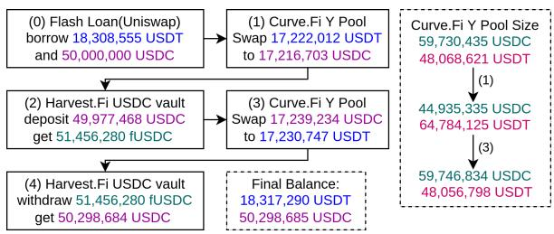
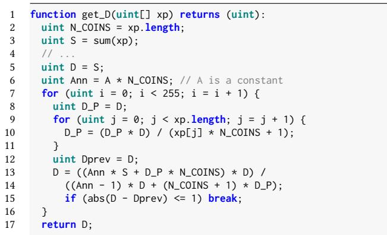
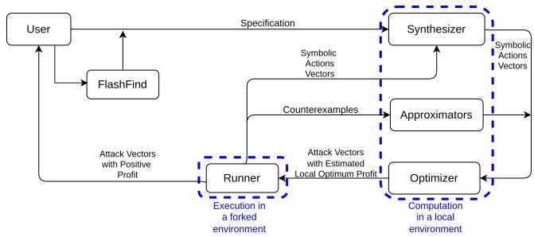

# FlashSyn: Flash Loan Atack Synthesis via Counter Example Driven Approximation

Zhiyang ChenUniversity of TorontoToronto, Ontario, Canadazhiychen@cs.toronto.edu

Sidi Mohamed Beillahi University of Toronto Toronto, Ontario, Canada sm.beillahi@utoronto.ca

Fan Long University of Toronto Toronto, Ontario, Canada fanl@cs.toronto.edu

## ABSTRACT

In decentralized finance (DeFi), lenders can ofer flash loans to bor-rowers, i.e., loans that are only valid within a blockchain transaction and must be repaid with fees by the end of that transaction. Unlike normal loans, flash loans allow borrowers to borrow large assets without upfront collaterals deposits. Malicious adversaries use flash loans to gather large assets to exploit vulnerable DeFi protocols.

In this paper, we introduce a new framework for automated syn thesis of adversarial transactions that exploit DeFi protocols using flash loans. To bypass the complexity ofa DeFi protocol, we propose a new technique to approximate the DeFi protocol functional behaviors using numerical methods (polynomial approximation and nearest-neighbor interpolation). We then construct an optimization query using the approximated functions of the DeFi protocol to find an adversarial attack constituted of a sequence of functions invocations with optimal parameters that gives the maximum profit. To improve the accuracy of the approximation, we propose a novel counterexample driven approximation refinement technique. We implement our framework in a tool named FlashSyn. We evaluate FlashSyn on 16 DeFi protocols that were victims to flash loan at tacks and 2 DeFi protocols from Damn Vulnerable DeFi challenges. FlashSyn automatically synthesizes an adversarial attack for 16 of the 18 benchmarks, demonstrating its efectiveness in finding possible flash loan attacks.

## CCS CONCEPTS

• Security and privacy → Software security engineering; • Software and its engineering → Software testing and debug ging.

## KEYWORDS

program synthesis, program analysis, blockchain, smart contracts, vulnerability detection, flash loan

## ACM Reference Format:

Zhiyang Chen, Sidi Mohamed Beillahi, and Fan Long. 2024. FlashSyn: Flash Loan Attack Synthesis via Counter Example Driven Approximation. In 2024 IEEE/ACM 46th International Conference on Software Engineering (ICSE ’24),

April 14–20, 2024, Lisbon, Portugal. ACM, New York, NY, USA, 13 pages. https://doi.org/10.1145/3597503.3639190

## 1 INTRODUCTION

Blockchain technology enables the creation of decentralized, re- silient, and ro rammable led ers on a lobal scale. Smart con- tracts, which can be deployed onto a blockchain, allow developers to encode intricate transaction rules that govern the ledger. These features have made blockchains and smart contracts essential in- frastructure for a variety of decentralized financial services (DeFi). As of April 1st, 2023, the Total Value Locked (TVL) in 1,417 DeFi smart contracts had reached 50.15 billion [22].

However, security attacks are critical threats to smart contracts. Attackers can exploit vulnerabilities in smart contracts by sending malicious transactions, potentially stealing millions of dollars from users. Particularly, a new type of security threat has emerged, ex-ploiting design flaws in DeFi contracts by leveraging large amounts of digital assets. These attacks, commonly referred to as flash loan attacks [54, 67, 82], typically involve borrowing the required large amount ofassets from flash loan contracts. Among the top 200 costli- est attacks recorded in Rekt Database, the financial loss caused by 36 flash loan attacks exceeds 418 million USD [54].

A typical flash loan attack transaction consists of a sequence of actions, or function calls to smart contracts. The first action involves borrowing a substantial amount of digital assets from a flash loan contract, while the last action returns these borrowed assets. The sequence of actions in the middle interacts with multiple DeFi contracts, using the borrowed assets to exploit their design flaws. When a DeFi contract fails to consider corner cases created by the large volume of the borrowed assets, the attacker may ex- tract prohibitive profits. For example, many flash loan attacks use borrowed assets to temporarily manipulate asset prices in a DeFi contract to trick the contract to make unfavorable trades with the attacker [12, 59]. Although researchers have developed many automated program analysis and verification techniques [2, 36, 45, 56] to detect and eliminate bugs in smart contracts, these techniques cannot handle flash loan attack vulnerabilities. This is because such vulnerabilities are design flaws rather than implementation bugs. Moreover, these techniques typically operate with one contract at a time, but flash loan attacks almost always involve multiple DeFi contracts interacting with each other.

FlashSyn: We present FlashSyn, the first automated end-to-end program synthesis tool for detecting flash loan attack vulnerabili- ties. Given a set of smart contracts and candidate actions in these contracts, FlashSyn automatically synthesizes an action sequence along with all action parameters to interact with the contracts to exploit potential flash loan vulnerabilities. Additionally, FlashSyn can analyze past blockchain transaction history, assisting users in identifying candidate actions for synthesis.

The primary challenge FlashSyn faces is that the underlying logic of DeFi actions is often too sophisticated for standard solvers to handle. Even if the action sequence was already known, a naive application of symbolic execution might not be able to find action parameters because it may need to extract overly complicated sym bolic constraints causing the solvers to time out. Moreover, FlashSyn synthesizes the action sequence and the action parameters together and therefore faces an additional search space explosion challenge.

FlashSyn addresses these challenges with its novel synthesis-viaapproximation technique. Instead of attempting to extract accurate symbolic expressions from smart contract code, FlashSyn collects data points to approximate the efect of contract functions with numerical methods. FlashSyn then uses the approximated expres sions to drive the synthesis. FlashSyn also incrementally improves the approximation with its novel counterexample driven approximation refinement techniques, i.e., if the synthesis fails because of a large deviation caused by the approximations, FlashSyn collects the corresponding data points as counterexamples to iteratively refine the approximations. The combination of these techniques allows the underlying optimizer of FlashSyn to work with more tractable expressions. It also decouples the two dificult tasks, finding the action sequence and finding the action parameters. When working with a set of coarse-grained approximated expressions, FlashSyn can filter out unproductive action sequences with a small cost.

Experimental Results: We evaluate FlashSyn on 16 DeFi bench mark protocols that were victims to flash loan attacks and 2 DeFi benchmark protocols from Damn Vulnerable DeFi challenges [19]. FlashSyn synthesizes adversarial attacks for 16 out of the 18 bench marks. For comparison, a baseline with manually crafted accurate action summaries only synthesizes attacks for 7 out of the 18. Contributions: This paper makes the following contributions:

• FlashSyn: The first automated end-to-end program synthesis tool for detecting flash loan attack vulnerabilities. It enables approximate attack synthesis without diving into sophisticated logics of DeFi contracts.

• Synthesis-via-approximation: A novel synthesis-via-approxi mation techni ue to handle so histicated lo ics of DeFi contracts.

• Counterexample Driven Approximation Refinement: A novel counterexample driven approximation refinement tech nique to incrementally improve the approximation during the synthesis process.

• Experimental Evaluation: We implemented FlashSyn in a tool and evaluated it on 16 protocols that were victims to flash loan attacks and 2 fictional flash loan attacks.

Our solution, FlashSyn has been adopted and further developed by Quantstamp, a leading smart contract auditing company for the detection of flash loan vulnerabilities in DeFi contracts [53, 60, 61].

## 2 BACKGROUND

Blockchain: Blockchain is a distributed ledger that broadcasts and stores information of transactions across diferent parties. A blockchain consists of a growing number of blocks and a consensus algorithm determining block order. Each block is constituted of transactions. Ethereum [11, 77] is the first blockchain to support, store, and execute Turing complete programs, known as smart contracts. Many new blockchains use the Ethereum virtual machine (EVM) for execution due to its popularity among developers.

Smart Contracts: Each smart contract is associated with a uni ue address, a persistent account’s storage trie, a balance of native tokens, e.g., Ether in Ethereum, and bytecode (e.g., EVM bytecode [11, 77]) that executes incoming transactions to change the storage and balance. Users interact with a smart contract by issuing transactions from their user accounts to the contract address. Smart contracts can also interact with other smart contracts as function calls. Currently, there are several human-readable high-level pro- gramming languages, e.g., Solidity [37] and Vyper [38], to write smart contracts that compile to the EVM bytecode.

Decentralized Finance (DeFi): DeFi is a peer-to-peer financial ecosystem built on top of blockchains [78]. The building blocks of DeFi are smart contracts that manage digital assets. A few DeFi pro- tocols dominate the DeFi market and serve as references for other decentralized applications: stable coins (e.g., USDC and USDT), price oracles, decentralized exchanges, and lending and borrowing platforms. In DeFi, a special type of loan called flash loan allows lenders to ofer loans to borrowers without upfront collaterals de- posits. The loan is only valid within a single transaction and must be repaid with fees before the completion of the transaction.

## 3 ILLUSTRATIVE EXAMPLE

We next present a motivating example to describe the complexity of flash loan attacks and our proposed approach to synthesize them. Background: On October 26th 2020, an attacker exploited the USDC and USDT vaults of Harvest Finance, causing a financial loss of about 33.8 million USD. In this section, we will focus on the attack on the USDC vault. The attacker repeatedly executed the same attack vector 17 times targeting the USDC vault. Fig. 1 summarizes the attack vector. The attack vector contains a sequence of actions that interact with the following contracts:

• Uniswap: Uniswap is a protocol with flash loan services.

• Curve: Curve is an exchange protocol for stable coins like USDT, USDC, and DAI, whose market prices are close to one USD. It maintains pools of stable coins and users can interact with these pools to exchange one kind of stable coins to another. For exam- ple, Y Pool in Curve contains both USDC and USDT. Users can put USDC into the pool to exchange USDT out. The exchange rate fluctuates around one, which is determined by the current ratio of USDC and USDT in the pool. Note that internally Y pool automatically deposits USDT and USDC to Yearn,1 keeps yUSDT and yUSDC tokens, and retrieves them back when the users withdraw. We omit this complication for simplicity.

• Harvest: Harvest is an asset management protocol and the victim contract of this attack. Users can deposit USDC and USDT into Harvest and receive fUSDC and fUSDT tokens which users can later use to retrieve their deposit back. Harvest will invest the deposited USDC and USDT from users to other DeFi protocols to generate profit. Note that the exchange rate between fUSDC and USDC is also not fixed. It is determined by a vulnerable closed source oracle contract, which ultimately uses Curve Y pool ratios to calculate the exchange rate.

  
Figure 1: Harvest USDC Vault Price Manipulation Attack.

Attack Actions: The attack vector shown in Fig. 1 first flash loaned 18.3M USDT and 50M USDC, then called 4 methods (actions) to exploit the design flaw in Harvest. The first action, action 1, swaps 17 222 012 USDT for 17 216 703 USDC via Curve.Fi YPool. Action 1 reduces the estimated value of USDT based on the ratio in Y pool as the amounts of USDT in Y Pool considerably increases. This in turn reduces Harvest Finance’s evaluation of its invested assets. Action 2 deposits 49, 977, 468 USDC into Harvest Finance USDC vault and due to the reduced evaluation of the invested underlying assets, the attacker receives 51, 456, 280 fUSDC back, which is abnormally large. Similar to action 1, action 3 then swaps 17, 239, 234 USDC back to 17, 230, 747 USDT via Curve.Fi Y Pool, which normalized the manipulated USDT/USDC rate in the pool. It also brings Harvest Finance’s evaluation of its invested underlying asset back to normal. Finally, action 4 withdraws 50, 298, 684 USDC (using 51, 456, 280 fUSDC) from Harvest Finance USDC vault. Assuming 1 USDC = 1 USDT = 1 USD, the profit of the above attack vector is 307, 420 USD.

This attack is a typical case of oracle manipulation. The exploiter manipulated the USDT/USDC rate in Curve.Fi Y Pool by swapping a large amount between USDC and USDT back and forth, which caused Harvest Finance protocol to incorrectly evaluate the value of its asset, leaving large arbitrage space for the exploiter. The actions sequence and particularly the parameters are carefully chosen by the attacker to yield best profit. There are multiple challenges FlashSyn faces to synthesize this attack.

Challenge 1 - Sophisticated Interactions: The attack involves several smart contracts that interact with each other and with other contracts outside the attack vector. The state changes caused by one action influence the behavior of other actions. This makes the synthesis problem of finding an attack vector more complicated as the efect of an action depends on its predecessor actions thus actions cannot be treated separately.

Challenge 2 - Close Source: Some external smart contracts that a DeFi protocol interacts with are not open-source. For instance, the source code of the external smart contract PriceConverter2 of Harvest Finance protocol is not available on Etherscan [34], and it is called by actions 2 and 4 to determine the exchange rate between fUSDC and USDC. This impedes the complete understanding of the DeFi protocol implementation and to reason about its correctness to anticipate attacks vectors.

Challenge 3 - Mathematical Complexity: DeFi contracts use mathematical models that are too complex to reason about. For instance, actions 2 and 4 swap an amount of token � to token �, while maintaining the following StableSwap invariant [23]:

  
Figure 2: get\_D Method to Compute D.

$\begin{array} { r l } { \boldsymbol { A } \cdot \boldsymbol { n } ^ { n } \sum _ { i } x _ { i } + \boldsymbol { D } = \boldsymbol { A } \cdot \boldsymbol { n } ^ { n } \cdot \boldsymbol { D } + \frac { \boldsymbol { D } ^ { n + 1 } } { \boldsymbol { n } ^ { n } \prod _ { i } x _ { i } } } & { { } } \end{array}$ where � is a constant, � is number of token types in the pool(4 for Curve.Fi Y Pool),3 �� is token �’s liquidity, � is the total amount of tokens at equal prices. There does not exist a closed-form solution for � as it requires finding roots of a quintic equation. In the actual implementation, � is calculated iteratively on the fly via Newton’s method (see extended version [13] Appendix A).

To demonstrate the complexity of DeFi protocols, we run an ex-periment with Manticore [56], a symbolic execution tool for smart contracts, to execute the function get\_D, for computing D as shown in Fig. 2, with symbolic inputs and explore all possible reachable states. Manticore fails and throws a solver-related exception to- gether with an out of memory error. We then simplified get\_D by removing the outer for loop and bounding the length of xp to 2, Manticore still fails and throws the same error.

## 3.1 Apply FlashSyn

We will now show how FlashSyn synthesizes the Harvest USDC vault attack from the identified set of actions listed in Table 1.4 The first two input arguments to exchange specify the token types to be swapped. The third argument specifies the quantity to swap.5 Table 1 lists each action’s token flow, along with the number of data points collected initially (without counterexamples) and the total number of data points for polynomial and interpolation, respectively. The amounts of tokens transferred in/out for each action are calculated based on its contract’s member variables or read-only functions. We refer these variables and functions as states of an action. A prestate refers to the state before the execution of an action. Executin an action will also alter states, which are denoted as poststates. The states not altered by any action are ignored.

For example, exchange(USDT,USDC,v) leverages two states, balances[USDC] and balances[USDT], to calculate the amounts of token exchanges. Upon execution, this function also modifies these two states. Consequently, these two states act as both the prestates and poststates of exchange(USDT,USDC,v).

Table 1: Actions in Harvest USDC Vault Attack. IDP and TDP denotes the initial and total number of datapoints. USDT(-) (resp., USDC(+)) denotes USDT (resp., USDC) tokens transferred out (reps., in).

<table><tr><td>Action</td><td>Token Flow</td><td>IDP</td><td>TDP-Poly</td><td>TDP-Inter</td></tr><tr><td>exchange (USDT, USDC, v)</td><td>USDT(-), USDC(+)</td><td>2000</td><td>2238</td><td>2792</td></tr><tr><td>exchange (USDC, USDT, v)</td><td>USDC(-), USDT(+)</td><td>2000</td><td>2148</td><td>2888</td></tr><tr><td>deposit(v)</td><td>USDC(-), fUSDC(+)</td><td>2000</td><td>2162</td><td>2358</td></tr><tr><td>withdraw(v)</td><td>fUSDC(-), USDC(+)</td><td>2000</td><td>2364</td><td>2876</td></tr></table>

Initial Approximation: To generate the initial approximation of the state transition functions of each action, FlashSyn first collects data points where each data point is an input-output pair. The input is the action’s prestates and parameters, and the output is its poststates and the outputted values. To collect data points, FlashSyn executes the associated contracts on a private blockchain (a forked blockchain environment) with diferent parameters to reach input-output pairs with diferent prestates and poststates. FlashSyn then uses the collected data points to find the approximated state transition functions. We consider two techniques to solve the above multivariate approximation problem: linear regression based polynomial features and nearest neighbor interpolation [55, 64]. The following example is one of exchange(USDT,USDC,v)’s state transition functions approximated by polynomials: $\mathbf { s } _ { 1 } ^ { \prime } = 0 . 7 3 2 4 4 4 5 5 \times \mathbf { s } _ { 1 } - 0 . 2 3 6 5 5 2 0 2 \times \mathbf { s } _ { 2 } - 0 . 8 5 9 1 5 5 3 1 \times$ � + 27351279.416023515 where $s _ { 1 }$ and $s _ { 1 } ^ { \prime }$ are the prestate and poststate balances[USDC], s2 is the prestate balances[USDT], and � is the third argument of the action exchange(USDT,USDC,v). Enumerate and Filter Action Sequences: After capturing an initial approximation of state transition functions, FlashSyn lever ages an enumeration-based top-down algorithm to synthesize diferent action sequences. FlashSyn applies several pruning heuristics to filter unpromising sequences. For each enumerated action sequence, FlashSyn uses the approximated state transition functions to construct an optimization problem, consisting of constraints and an objective function that represents profit. FlashSyn then applies an of-the-shelf optimizer to obtain a list of parameters that maximize the profit estimated using approximated transition functions.

Counterexample Driven Refinement: After obtaining a list of parameters that maximize the estimated profit of an action sequence, FlashSyn proceeds to verify the synthesized attack vectors by executing them on a private blockchain and check their actual profits. If the diference between the actual profit and the estimated profit of an attack vector is greater than 5%, FlashSyn reports it as a counterexample, indicating inaccuracy of our approximated transition functions. To correct this inaccuracy, FlashSyn employs counterexample driven approximation refinement technique. FlashSyn utilizes the reported counterexamples to collect new data points and refine the approximations. The revised approximations are subsequently used to search for parameters in next loops. For example, FlashSyn with polynomial approximations collects 238 additional data points for the action exchange(USDT, USDC, v) throughout 7 refinement loops.

Synthesized Attack: In the Harvest USDC example, FlashSyn successfully found the following attack vector that yields an adjusted profit of 110051 USD using the interpolation technique with the counterexample driven refinement loop.

exchange(USDT, USDC, 15192122) · deposit(45105321) · exchange(USDC, USDT, 11995404) · withdraw(46198643)

## 4 PRELIMINARY

Labeled Transition Systems (LTS). We use LTS to model behaviors of smart contracts. A LTS $A = ( Q , \Sigma , { \mathfrak { q } } _ { 0 } , \delta )$ over the possibly- infinite alphabet Σ is a possibly-infinite set � of states with an initial state ${ \mathsf { q } } _ { 0 } \in Q ,$ and a transition relation $\delta \subseteq Q \times \Sigma \times Q$ Execution. An execution of � is a sequence of states and transition labels (actions) $\rho = { \tt q } _ { 0 } , \mathsf { a } _ { 0 } , { \tt q } _ { 1 } \ldots \mathsf { a } _ { k - 1 } , { \tt q } _ { k }$ for � > 0 such that $\delta ( \mathsf { q } _ { i } , \mathsf { a } _ { i } , \mathsf { q } _ { i + 1 } )$ for each $0 \leq i < k .$ . We write $\mathfrak { q } _ { i } \xrightarrow { \mathfrak { a } _ { i } . . . \mathfrak { a } _ { j - 1 } } _ { A } \mathfrak { q } _ { j }$ to denote the subsequence $\ P i , \mathsf { a } i , . . . , \mathsf { q } j - 1 , \mathsf { a } j - 1 , \mathsf { q } j$ of $\rho .$ Invocation Label. Formally, an invocation label adr.�(®�) consists of a method name � of a contract address adr, accompanied by a vector �® containing argument values.

Operation Label. An operation label $\ell : = \mathsf { a d r } . m ( \vec { u } ) \Rightarrow ( I , v ) \cup \bot$ is an invocation label adr.�(®�) along with a return value � , and � is a sequence of operation labels representing the “inter- nal” calls made during the invocation of �. The distinguished invocation outcome ⊥ is associated to invocations that revert. Interface. The interface $\Sigma _ { \mathrm { a d r } }$ is the set of non-read-only op- eration labels in the contract adr. We assume w.l.o.g. that the preconditions are satisfied for all the operations in $\Sigma _ { \mathrm { a d r } }$ , other- wise, the external invocation adr.�( ®�) reverts. $\Sigma _ { \mathrm { a d r } }$ is a superset of the set of action candidates of FlashSyn. Smart Contract. A smart contract at an address adr is an LTS $C _ { \mathrm { a d r } } = ( Q _ { \mathrm { a d r } } , \Sigma _ { \mathrm { a d r } } , \ L _ { \mathrm { q 0 } } , \delta _ { \mathrm { a d r } } )$ over the interface $\Sigma _ { \mathrm { a d r } }$ where $Q _ { \mathrm { a d r } }$ is the set states and $\delta _ { \mathrm { a d r } }$ is the transition relation. Symbolic Actions Vector. We define the notion of a symbolic actions vector $\mathbf { S } = \ell _ { \mathrm { a d r } 1 } \ldots \ell _ { \mathrm { a d r } n }$ s.t. $\ell _ { \mathrm { a d r } i } \in \Sigma$ for $1 \leq i < n$ as the sequence of operation labels (possibly from diferent contracts) associated with the execution $\rho ,$ i.e., $\rho = { \tt q } _ { 1 } , \ell _ { \mathrm { a d r } 1 } , { \tt q } _ { 1 } \ldots \ell _ { \mathrm { a d r } n } , { \tt q } _ { n } .$ Balance. We define the balance of address adr in a blockchain state q as the mapping $\mathcal { B } : Q \times \mathbf { A } \implies \mathbf { V }$ that maps the pair (q, adr) $\in { \cal Q } \times { \bf A }$ to the weighted sum of tokens the address adr holds at $\begin{array} { r } { \mathbf { q } , \ \mathrm { i . e . , } \ \mathcal { B } ( \mathbf { q } , \mathbf { a d r } ) = \sum _ { \mathrm { t \in T } } \mathbf { M } ( \mathbf { q } , \mathbf { a d r } , \mathbf { t } ) \cdot \mathbf { P } ( \mathbf { t } ) } \end{array}$ , where T represents tokens hold by adr, M(q, adr, t) represents the amount of token t hold by adr at the blockchain state q, and $\mathbf { P } ( \mathbf { q } , \mathbf { t } )$ represents the price of token t at the blockchain state q. Attack Vector. An attack vector by an adversary adr consists of a symbolic actions vector S where the symbolic arguments are replaced by concrete values (integer values) and S transforms a blockchain state q to another state $\mathsf { q } ^ { \prime }$ such that $\mathcal { B } ( \boldsymbol { \mathsf { q } } ^ { \prime } , \mathsf { a d r } ) -$ $\mathcal { B } ( \boldsymbol { \mathbf { \rho } } _ { \mathbb { q } } , \mathsf { a d r } ) > 0 ,$ i.e., the adversary adr generates profit when the sequence of actions S is executed with the concrete values.

Problem formulation. Given a specification $\varphi$ (which contains vulnerable contract addresses or action candidates) and a blockchain state q, the objective is to find an attack vector consisting of a concretization of the symbolic actions vector $\mathbf { S } = \ell _ { \mathrm { a d r } 1 } \ldots \ell _ { \mathrm { a d r } n }$ s.t. $\ell _ { \mathrm { a d r } i } \in \Sigma \cap \varphi$ for $1 \leq i < n$ , transforming the state q to a state $\mathsf { q ^ { \prime } } ,$ , and that maximizes the profit of an adversary adr, $\mathcal { B } ( \boldsymbol { \mathrm { q } } ^ { \prime } , \mathrm { a d r } ) - \mathcal { B } ( \boldsymbol { \mathrm { q } } , \mathrm { a d r } )$

## 5 FLASHSYN

Algorithm 1 gives the overall synthesis procedure of FlashSyn. FlashSyn first collects initial data points to approximate the actions in Act (line 3) where FlashSyn uses the state q as a starting blockchain state. Then, using the sub-procedure Ap proximate FlashSyn generates the approximations ApproxAct of the actions in Act using the collected data points (line 5). FlashSyn uses the sub-procedure ActionsVectors to generate all possible symbolic actions vectors of length less than len (line 6). FlashSyn then iterates over the generated actions vectors and uses some heuristics im lemented in the sub- rocedure IsFeasible to prune actions vectors (line 8). For instance, an actions vector containing two adjacent actions invoking the same method can be runed to an actions vector where the two adjacent actions are merged. Afterwards, using the actions vector and approximated transition functions, the sub-procedure Construct constructs the optimization framework $\mathcal { P }$ for the actions vector (line 9). Then, FlashSyn uses the optimization sub-procedure Optimize (line 10) to find the optimal concrete values to pass as input parameters to the methods in the actions vector that satisfy the constraints of P. FlashSyn then validate whether the attack vector generated by the optimizer indeed generates the profit with the sub-procedure QueryOracle to execute the generated attack vectors on the blockchain. If the query is successful, i.e., the actual profit closely matches the profit found by the optimizer, FlashSyn adds the attack vector to the list of discovered attacks. Otherwise, FlashSyn consid- ers the attack vector to be a counterexample, and uses it to generate new data points to refine the approximation in the sub sequent iterations, within the sub-procedure CEGDC (referenced in line 14 and introduced later in Section 5.3). FlashSyn repeats the process until the number of iterations reaches n (line 4).

Algorithm 1: Attack vectors synthesis procedure. Its inputs are actions Act, the maximum length len, a blockchain state q, and a threshold number of iterations n. Its outputs are attack vectors that yield profits.

procedure SYNTHESIZE(Act, len, P, q, n)
    for each a ∈ Act
        datapoints[a] ← DATACOLLECT(q, a);
    for each i ∈ [0; n]
        ApproxAct ← APPROXIMATE(Act, datapoints);
        wlist ← ACTIONSVECTORS(ApproxAct, len);
        for each p ∈ wlist
            if ISFEASIBLE(p)
                $\mathcal{P} \leftarrow CONSTRUCT(p, ApproxAct)$
                (p*, profit) ← OPTIMIZE(p, $\mathcal{P}$);
                if QUERYORACLE(q, p*, profit)
                    answerlist.add(p*, profit);
                else
                    datapoints := datapoints ∪ CEGDC(p*, q);
    return answerlist;

## 5.1 Pruning Symbolic Actions Vectors

The sub-procedure IsFeasible implements some heuristics to prune undesired symbolic actions vectors.

Heuristic 1: no duplicate adjacent actions. Two successive calls to the same method in a DeFi smart contract are usually equivalent to a single call with larger parameters. Thus, we discard actions vectors containing duplicate, successive actions. Heuristic 2: limited usage of a single action. Using the observation that attack vectors do not contain repetitions, we fix a maximum number of calls to a single method an attack can contain and discard actions vectors that do not satisfy this criterion, $\mathrm { e . g . , }$ an actions vector of length 4 cannot contain more than 2 calls to the same method.

Heuristic 3: necessary preconditions. Based on the observation that owning certain tokens is a necessary precondition for invoking some actions, FlashSyn prunes symbolic actions vectors that contain actions requiring tokens6 not yet owned. In Harvest USDC example, invoking withdraw method requires users own some share tokens (fUSDC) beforehand. The only action candidate that mints fUSDC for users is deposit; thus, this heuristic mandates that deposit must be called before invoking withdraw.

## 5.2 Optimization

Given a symbolic actions vector and their approximated transit functions, the sub-procedure Construct constructs an opti-mization framework to find optimal values for the parameters for the actions. Recall that given a blockchain state q and an address adr, the actions vector S transforms q to another state ${ \boldsymbol { \mathsf { q } } } ^ { \prime } .$ The objective function in the optimization problem targets to increase the tokens values in the balance of the address adr, i.e., $y = \mathcal { B } ( \boldsymbol { \mathrm { q } } ^ { \prime } , \mathrm { a d r } ) - \mathcal { B } ( \boldsymbol { \mathrm { q } } , \mathrm { a d r } )$ . The optimization problem is ac-companied by constraints on the symbolic values to be inferred. For instance, the balance of any token t for any address $\mathsf { a d r ^ { \prime } }$ must always be non-negative, i.e., the adversary and the smart contracts cannot use more tokens than what they have in their balances, otherwise the transaction reverts. In the following, we give the definition of the optimization problem.

$$
\mathcal {P}: \quad \left\{ \begin{array}{l} \max _ {p _ {0}, p _ {1}, \dots , p _ {n}} y = \mathcal {B} (\mathrm{q} ^ {\prime}, \mathrm{adr}) - \mathcal {B} (\mathrm{q}, \mathrm{adr}) \\ \text {subject to:} \forall \mathrm{t} \in \mathrm{T}, \mathrm{adr} ^ {\prime} \in \mathrm{A}. \mathrm{M} (\mathrm{q} ^ {\prime}, \mathrm{adr} ^ {\prime}, \mathrm{t}) \geq 0 \end{array} \right.
$$

## 5.3 Counterexample Guided Data Collection

The optimization sub-procedure might explore parts of the states space not explored during the initial data points collection. This might challenge the accuracy of the approximations and result in mismatch between the estimated and the actual values. Thus, it is necessary to collect new data points based on the counterexamples that show the mismatch between the estimated and the actual values, to refine the approximations. Therefore, we propose counterexample guided data collection (CEGDC), inspired of counterexample guided abstraction refinement [17], to refine approximations when mismatches are identified.

We use C to denote the attack vector s.t. ${ \sf q } \stackrel { { \bf C } } {  } { \sf q ^ { \prime } } . { \sf q ^ { \prime } } _ { e }$ and ${ \mathsf { q } } _ { a } ^ { \prime }$ denote the estimated value for the state $\mathsf { q } ^ { \prime }$ found by the optimizer and the actual value obtained when executing C on the actual protocol on the blockchain, respectively. $\mathcal { P } _ { e } ( \mathbf { C } ) =$ $\mathcal { B } ( \boldsymbol { \mathbf { \mathit { q } } } _ { e } ^ { \prime } , \boldsymbol { \mathbf { \mathit { a d r } } } ) - \mathcal { B } ( \boldsymbol { \mathbf { \mathit { q } } } ,$ adr) and $\mathscr { P } _ { a } ( { \mathbf { C } } ) = \mathcal { B } ( \mathfrak { q } _ { a } ^ { \prime } , \mathrm { a d r } ) - \mathcal { B } ( \mathfrak { q } ,$ adr) denote the estimated profit and actual profit, respectively.

Definition 5.1. A counterexample is an attack vector C whose estimated profit $\mathcal { P } _ { e } ( \mathbf { C } )$ is diferent from its actual profit $\mathcal { P } _ { a } ( \mathbf { C } )$ . Formally, $| \mathcal { P } _ { e } ( \mathbf { C } ) - \mathcal { P } _ { a } ( \mathbf { C } ) | \geq \varepsilon \cdot \left( | \mathcal { P } _ { e } ( \mathbf { C } ) | + | \mathcal { P } _ { a } ( \mathbf { C } ) | \right)$ , where � is a small constant representing accuracy tolerance.

Algorithm 2: Counterexample guided data collection procedure. It takes a counterexample C and a state q, and returns datapoints. $k \in [n;1]$ means that in the first iteration $k = n &gt; 0$.

procedure CEGDC(C, q)
    datapoints $\leftarrow [\ ]$;
    for each $k \in [len(C); 1]$;
    $q_e' \leftarrow ESTIMATE(q, C, k)$;
    $q_a' \leftarrow EXECUTE(q, C, k)$;
    if IsAccURATE($q_e', q_a'$)
        returns datapoints ;
    else
        (a, paras) $\leftarrow C[k]$;
        datapoints[a] $\leftarrow (q, paras, q_a')$;
    return datapoints;

In Al orithm 2, we resent the sub- rocedure CEGDC for collecting new data points from a counterexample. CEGDC takes as in uts a counterexam le C which is known to have an inaccurate profit estimation, and a blockchain state. The for loop on line 3 is used to locate approximation errors backward from the last action to the first action and collect new data points accordingly. In a loop iteration �, FlashSyn checks if the estimated methods of the action at the index � of C are accurate. First, FlashSyn computes the estimated state ${ \boldsymbol { \mathsf { q } } } _ { e } ^ { \prime }$ reached by executing C until reaching the action indexed � (line 4) using the approximated transition functions. Second, FlashSyn fetches the actual state ${ \mathsf { q } } _ { a } ^ { \prime }$ reached by executing C until reaching the action indexed � (line 5) on the actual smart contracts on the blockchain. Then, FlashSyn compares the estimated and actual execution results (line 6). If the estimation is accurate, this indicates that the transition functions of the action at the index � of C and its predecessors are accurate; so the procedure breaks the loop and returns the data points computed in the previous iterations (line 7). Otherwise, it indicates inaccurate transition functions of this action or/and its predecessors. Thus, we add a new data point associated with the action at the index � of C (lines 9 and 10) and proceed to the next iteration of the loop to explore the action predecessors.

## 5.4 FlashFind: Action Candidates Identification

Flash loan attacks typically focus on victim contracts containing functions capable of transferring tokens,7 which can be invoked by regular users. The attacker manipulates the transfer amount under specific conditions to make profit.

We designed and built a tool FlashFind to assist users of FlashSyn to select action candidates likely to be involved in an attack vector. Given a set of target smart contracts, FlashFind identifies action candidates in the following steps.

5.4.1 Selecting Action Candidates from Contract Application Binary Interfaces (ABIs). The Application Binary Interface (ABI) serves as an interpreter enabling communication with the EVM bytecode. For all verified smart contracts, their ABIs are publicly available.

An ABI typically comprises (public or external) function names, argument names/types, function state mutability, and return types. During the process of selecting action candidates, certain functions can be safely ignored: (1) Functions with the view or pure mutability can be excluded. (2) Functions that can only be invoked by privileged users, such as transferOwnership and changeAdmin, can also be disregarded since they are unlikely to be accessed by regular users.8 (3) Token permission management functions/parameters, such as the function approve or parameter deadline, are excluded.9 These functions/parameters solely control whether a transaction will be reverted or not and do not afect the behaviors of contracts.

5.4.2 Learning Special Parameters from Transaction History. After selecting a set of action candidates from contracts’ ABIs, some non-integer parameters(eg. bytes, string, address, array, enum) can still be unknown. FlashFind collects past transactions of the target contracts and extracts function level trace data from these transactions, and utilizes the trace data to learn the special parameters from previous function calls made to the contract.

5.4.3 Local Execution and Intra-dependency Analysis. After learning special parameters, each action candidate is executed at a given block to verify its executability. An action candidate may not be executable due to various reasons: (1) the function is disabled by the owner or admin; (2) internal function calls to other contracts are disabled b the owners or admins of those contracts; (3) the function is not valid under current blockchain states. The inexecutability due to these reasons cannot be identi- fied by static analysis and can only be determined by executions. All such inexecutable functions are filtered out.

FlashFind automatically collects storage read/write informa- tion during the execution of these functions and infers the Read-After-Write (RAW) dependencies10 between diferent action candidates. An action A has a RAW dependency (or equivalently, is RAW dependent) on action B if the execution of action A reads the storage written by action $\mathrm { { B } } . ^ { 1 1 }$ From the RAW dependencies, it is possible to observe that certain functions behave independently, meaning they do not have any RAW dependencies on other functions, and other functions do not have any RAW dependencies on them either. Consequently, these independent functions can be safely ignored.

After analyzing ABIs, transaction history, and local executions, FlashFind generates a list of action candidates with only their integer arguments left undetermined. These action candidates are then input into FlashSyn for further synthesis.

## 6 IMPLEMENTATION

FlashSyn is implemented in Python. Figure 3 shows an overview of our implementation. The components Runner, Synthesizer,

  
Figure 3: An Overview of FlashSyn Implementation

Approximator, and Optimizer implement the FlashSyn synthesis procedure presented in Algorithm 1. An optional component FlashFind is used to automatically identify action candidates.

(1) Approximator. Approximator approximates the transition functions using data points collected by Runner. The approxi mated transition functions are then given to Optimizer to construct the optimization framework. In Approximator, all transition functions of an action are approximated unless the transition functions are straightforward assignment/addition/subtraction (by simple inspection of smart contract codes), or the action is very common (such as Uniswap that has been widely studied [59, 79, 81]). FlashSyn implements two numerical methods using external libraries. FlashSyn-poly utilizes sklearn [10, 58], and FlashSyn-inter employs scipy [71]. The choice of polynomial and interpolation methods is motivated by several considera- tions. First, FlashSyn requires fast evaluation of approximated functions, as thousands of evaluations are performed in the opti mization process. Second, when provided with an input not seen before, the approximation method needs to yield a reasonable estimation based on the nearest points. Lastly, given that a typi cal FlashSyn process involves learning dozens of approximated formulas, the approximation process for one formula should not exceed a few seconds. Polynomial and interpolation methods are the two most popular approximation approaches that meet all of these criteria and there are of-the-shelf tools like sklearn and scipy that are easy to intergate in FlashSyn.

(2) Optimizer. Optimizer automatically builds an optimization problem using the approximated transition functions returned by Approximator and the symbolic actions vectors enumerated by Synthesizer and performs global optimization on it. The obtained attack vector that yields a positive profit is then exe cuted by Runner to confirm the accuracy of the estimation. If the estimation is inaccurate, the attack vector is treated as a counterexample and is used to collect new data points by Runner that are used by Approximator to refine the approximation. We built Optimizer on top of an of-the-self global optimizer scipy.optimize.shgo [24, 47, 72], which solves the simplicial homology global optimization algorithm to find the optimal parameters.12 In FlashSyn-poly, we parallelized Optimizer component using up to 18 processes where Optimizer is run over multiple symbolic actions vectors in parallel.

(3) Runner. Runner executes transactions on a forked blockchain. It performs both initial and counterexample based data collection, and validates results of Optimizer. We implemented Runner on top of Foundry [39], a toolkit written in Rust for smart contracts development that allow to interact with EVM based blockchains. (4) Synthesizer. Synthesizer first enumerates and prunes symbolic actions vectors using heuristics. Then, during counterexam-ple guided loops, it employs priority scoring to gradually drop actions vectors based on their scores. Synthesizer uses iterative synthesis. Optimizer can be configured with diferent hyperpa-rameters to perform diferent strengths of parameter search. We designed 3 sets of hyperparameters which represent diferent strengths of parameter search. Synthesizer first conducts a weak-est parameter search on all enumerated symbolic actions vectors using Optimizer. After Runner validates the results, Synthesizer ranks symbolic actions vectors and drops the ones with low priority scores. The actions vector with high priority score will be searched with higher strengths. Specifically, if a symbolic actions vector yields a positive profit P in iteration �, its priority score of iteration � + 1 is P. If a symbolic actions vector does not yield a positive profit in iteration �, it is given a small priority score between 1 and 10 based on Optimizer results. An actions vector will also be dropped when its priority score does not increase between iterations. When all actions vectors are dropped, the whole synthesis procedure stops, and FlashSyn returns all the profitable attack vectors it found.

(5) FlashFind. We also implemented FlashFind as an optional component. FlashFind uses TrueBlocks [65] and blockchain ex-plorers [9, 34, 42] to collect past transactions of the target contracts. FlashFind employs Phalcon [1] and Foundry [39] to extract function level trace data from those transactions and perform analysis on storage accesses. Our evaluation shows that FlashFind is able to identify action candidates and helps FlashSyn discovers alternative attack vectors (see RQ4 in Section 7).

FlashSyn does not require prior knowledge of a vulnerable location or contract. Given a set of DeFi lego user interface contracts, action candidates and their special parameters such as strings are given by the users or automatically extracted from transaction history using FlashFind. FlashSyn utilizes these action candidates to synthesize attack vectors and search for optimal numerical values. Note that these action candidates are not necessarily the ones that contain the vulnerability. Rather, they serve as user interfaces for interacting with the protocol. The vulnerability may reside in any contract invoked through nested calls originating from these action candidates. If FlashFind is not utilized, users can consult the protocol documentation to identify the appropriate user-interface contracts and functions (action candidates), as well as how to select special parameters for invoking these functions. Such information is essential for any user interacting with the protocol, and is generally available in the documentations of DeFi protocols.

## 7 EVALUATION

We aim to answer the following research questions:

RQ 1: How efective is FlashSyn in synthesizing flash loan attack vectors?

Table 2: Benchmark of Attacks Used in the Evaluation.

<table><tr><td></td><td>Benchmark</td><td> $\#C^{+}$ </td><td> $LoC^{*}$ </td><td>Vulnerability Type</td><td>Tx</td></tr><tr><td rowspan="9">ETH</td><td>bZx1</td><td>6</td><td>4964</td><td>pump&amp;arbitrage</td><td>[25]</td></tr><tr><td>Harvest_USDT</td><td>6</td><td>6446</td><td>manipulate oracle</td><td>[28]</td></tr><tr><td>Harvest_USDC</td><td>6</td><td>4095</td><td>manipulate oracle</td><td>[29]</td></tr><tr><td>Eminence</td><td>2</td><td>489</td><td>design  $flaw^{\dagger}$ </td><td>[27]</td></tr><tr><td>ValueDeFi</td><td>8</td><td>7043</td><td>manipulate oracle</td><td>[31]</td></tr><tr><td>Cheesebank</td><td>12</td><td>1246</td><td>manipulate oracle</td><td>[26]</td></tr><tr><td>Warp</td><td>11</td><td>13139</td><td>manipulate oracle</td><td>[32]</td></tr><tr><td>Yearn</td><td>5</td><td>2200</td><td>forced investment</td><td>[33]</td></tr><tr><td>inverseFi</td><td>7</td><td>5734</td><td>manipulate oracle</td><td>[30]</td></tr><tr><td rowspan="6">BSC</td><td>bEarnFi</td><td>3</td><td>3007</td><td>asset mismatch</td><td>[5]</td></tr><tr><td>AutoShark</td><td>6</td><td>8052</td><td>design  $flaw^{\dagger}$ </td><td>[4]</td></tr><tr><td>ElevenFi</td><td>7</td><td>5613</td><td>design  $flaw^{\dagger}$ </td><td>[6]</td></tr><tr><td>ApeRocket</td><td>7</td><td>1562</td><td>design  $flaw^{\dagger}$ </td><td>[3]</td></tr><tr><td>WDoge</td><td>2</td><td>788</td><td>deflationary token</td><td>[8]</td></tr><tr><td>Novo</td><td>4</td><td>7080</td><td>design  $flaw^{\dagger}$ </td><td>[7]</td></tr><tr><td>FTM</td><td>OneRing</td><td>14</td><td>5386</td><td>design  $flaw^{\dagger}$ </td><td>[41]</td></tr><tr><td rowspan="2">DVD</td><td>Puppet</td><td>2</td><td>742</td><td>manipulate oracle</td><td>[20]</td></tr><tr><td>PuppetV2</td><td>1</td><td>161</td><td>manipulate oracle</td><td>[21]</td></tr><tr><td colspan="4">Total Financial Loss in History</td><td colspan="2">82.5 million USD</td></tr></table>

+: #C denotes number of the victim protocol’s contracts invoked in exploits. ∗: LoC denotes total number of lines of code in the contracts identified by #C, excluding closed-source contracts.  
†: The logic designs of one or more functions in the victim contracts is flawed, with highly specific case-by-case vulnerabilities.

RQ 2: How well does the synthesis-via-approximation technique perform compared to precise baselines?

RQ 3: How much does counterexample driven approximation refinement improve FlashSyn’s results?

RQ 4: How efective is the combination of FlashFind and Flash Syn to synthesize attack vectors end-to-end?

Scope: FlashSyn focuses on flash loan attacks that generate positive profit by sequentially invoking functions within existing DeFi contracts. Security attacks that require exploiting other vul nerabilities such as re-entrance or conducting social engineering are outside the scope of FlashSyn and our evaluation. The goal of FlashSyn is to prove the existence and the exploitability of flash loan vulnerabilities. Consequently, activities such as getting and repaying the flash loan are not part of our synthesis task.

Benchmarks: We investigated historical flash loan attacks that span from 02/14/2020 to 06/16/2022 across Ethereum, Binance Smart Chain (BSC), and Fantom (FTM) and attempted to reproduce each of them in our environment. In the end, we reproduced 16 attacks that are within our scope and collected them as our benchmark attacks. These attacks invoked 2-14 contracts of the victim protocol in the nested invocation tree per attack, consisting of a total of 489 to 13, 139 lines of code, reflecting the multifaceted nature of the DeFi protocols exploited in real-world flash loan attacks. Also, protocols in our bench- mark contain up to 15 action candidates from which FlashSyn needs to find an attack vector. Altogether, the 16 historical flash loan attacks in our benchmark have caused over 82.5 million US dollars in losses and include widely-known cases such as Harvest, bZx, and Eminence. Additionally, we include 2 fictional attacks from the Damn Vulnerable DeFi (DVD) challenges [19].

Ground Truth: For historical flash loan attacks, we forked the corresponding blockchain at one block prior to the attack trans- action and replayed the attacker’s attack vector as the ground truth. For DVD benchmarks, we select community solutions as ground truth. Note that in a flash loan attack, if the same attack vector is repeated multiple times, we remove the loop and only consider the first attack vector as the ground truth.

Precise Baseline: To demonstrate the efectiveness of synthesisvia-approximation techniques, we implemented a baseline synthesizer that works with manual summaries of smart contract actions. Specifically, we manually inspected all benchmarks whose relevant smart contracts that are all open-source and for each benchmark we allocated more than 4 manual analy- sis hours to extract the precise mathematical summaries. The baseline synthesizer then uses the manually extracted precise summaries to drive the synthesis.

Environment Setup: We assume that the flash loan providers are generally available, and we do not consider the borrow and the return as the part of the synthesis task. To facilitate FlashSyn experimentation, we manually annotated the prestates and poststates for each action. The details of this annotation process are described in the extended version [13] Appendix C. Although this manual efort is required, it’s worth noting that automation of this step is possible. Techniques such as dynamic taint anal sis and forward s mbolic execution can be em lo ed to automatically identify which storage variables influence the change in token balances, thereby streamlining the annotation of prestates and poststates. The experiments are conducted on an Ubuntu 22.04 server, with an AMD Ryzen Threadripper 2990WX 32-Core Processor and 128 GB RAM.

Experiment Overview. To answer RQ 1, we apply FlashSyn to the 18 benchmarks with the same set of candidate actions in ground truths. For each candidate action, the prestates and poststates are annotated for FlashSyn to drive the approximated formula for this action. We set a timeout of 3 hours for FlashSyn- poly and 4 hours for FlashSyn-inter. FlashSyn does not know a priori whether a benchmark has an attack vector with a positive profit, and it does not set any bounds on the profit. It tries iteratively to synthesize an attack vector with a maximum profit. FlashSyn’s refinement loop is guided by intermediate results and FlashSyn stops when it cannot improve the profit or the above timeouts are reached. To answer RQ 2, we replace Approximator component of FlashSyn with manually extracted precise mathematical summaries, and conduct the same experiment with 4 hours timeout. To answer RQ 3, we evaluate FlashSyn with diferent initial data points and with CEGDC enabled/disabled. To answer RQ 4, we first use FlashFind to identify candidate actions from given contract addresses which the hacker used in history, manually annotate them as in RQ 1, and then apply FlashSyn with this new set of candidate actions to synthesize attack vectors under the same setting as in RQ 1. The results for RQ 1+RQ 2, RQ 3, RQ 4 are summarized in Table 3, Table 4, and Table 5, respectively.

RQ1: Efectiveness of FlashSyn. Table 3 summarizes the re-sults of the experiment. The first five columns of Table 3 list benchmark information including the number of actions to be approximated and the length of the ground truths. The four columns under FlashSyn-poly list data concerning the synthe- sis using polynomial approximations. The four columns under FlashSyn-inter list data concerning the synthesis using interpolation based approximation.

Table 3: Summary of FlashSyn Results. AC denotes the number of action candidates. AP denotes the number of action candidates to approximate. GL and GP denote the length and the profit of the ground truth attack vector, respectively. IDP and TDP denote the initial and total number of collected of data points, respectively. Time denotes the time spent in seconds.

<table><tr><td colspan="6"></td><td colspan="3">FlashSyn-poly</td><td colspan="3">FlashSyn-inter</td><td>Precise</td></tr><tr><td>Benchmark</td><td>AC</td><td>AP</td><td>GL</td><td>GP</td><td>IDP</td><td>TDP</td><td>Profit</td><td>Time</td><td>TDP</td><td>Profit</td><td>Time</td><td>Profit</td></tr><tr><td>bZx1</td><td>3</td><td>3</td><td>2</td><td>1194</td><td>5192</td><td>5849</td><td>2392</td><td>422</td><td>6373</td><td> $2302^†$ </td><td>441</td><td>cs</td></tr><tr><td>Harvest_USDT</td><td>4</td><td>4</td><td>4</td><td>338448</td><td>8000</td><td>9325</td><td> $110139^†$ </td><td>670</td><td>10289</td><td> $86798^†$ </td><td>7579</td><td>cs</td></tr><tr><td>Harvest_USDC</td><td>4</td><td>4</td><td>4</td><td>307416</td><td>8000</td><td>8912</td><td> $59614^†$ </td><td>677</td><td>10914</td><td> $110051^†$ </td><td>8349</td><td>cs</td></tr><tr><td>Eminence</td><td>4</td><td>4</td><td>5</td><td>1674278</td><td>8000</td><td>8780</td><td>1507174</td><td>1191</td><td>8104</td><td>/</td><td>/</td><td>1606965</td></tr><tr><td>ValueDeFi</td><td>6</td><td>6</td><td>6</td><td>8618002</td><td>12000</td><td>19975</td><td> $8378194^†$ </td><td>4691</td><td>15758</td><td> $6428341^†$ </td><td>11089</td><td>cx</td></tr><tr><td>CheeseBank</td><td>8</td><td>3</td><td>8</td><td>3270347</td><td>2679</td><td>2937</td><td> $1946291^†$ </td><td>4391</td><td>2715</td><td> $1101547^†$ </td><td>10942</td><td> $2816762^†$ </td></tr><tr><td>Warp</td><td>6</td><td>3</td><td>6</td><td>1693523</td><td>6000</td><td>6000</td><td> $2773345^†$ </td><td>1164</td><td>6000</td><td>/</td><td>/</td><td> $2645640^†$ </td></tr><tr><td>bEarnFi</td><td>2</td><td>2</td><td>4</td><td>18077</td><td>4000</td><td>4854</td><td>13770</td><td>470</td><td>4652</td><td>12329</td><td>688</td><td>13832</td></tr><tr><td>AutoShark</td><td>8</td><td>3</td><td>8</td><td>1381</td><td>2753</td><td>2753</td><td> $1372^†$ </td><td>5484</td><td>2753</td><td>/</td><td>/</td><td>cx</td></tr><tr><td>ElevenFi</td><td>5</td><td>2</td><td>5</td><td>129741</td><td>4000</td><td>4070</td><td>129658</td><td>409</td><td>4326</td><td>85811</td><td>898</td><td>cx</td></tr><tr><td>ApeRocket</td><td>7</td><td>3</td><td>6</td><td>1345</td><td>6000</td><td>6402</td><td> $1333^†$ </td><td>733</td><td>6235</td><td> $1037^†$ </td><td>3238</td><td>cs</td></tr><tr><td>Wdoge</td><td>5</td><td>1</td><td>5</td><td>78</td><td>2000</td><td>2001</td><td>75</td><td>272</td><td>2080</td><td>75</td><td>289</td><td>75</td></tr><tr><td>Novo</td><td>4</td><td>2</td><td>4</td><td>24857</td><td>4000</td><td>4164</td><td>20210</td><td>702</td><td>4031</td><td>23084</td><td>861</td><td>cx</td></tr><tr><td>OneRing</td><td>2</td><td>2</td><td>2</td><td>1534752</td><td>4000</td><td>4710</td><td>1814882</td><td>585</td><td>4218</td><td>1942188</td><td>367</td><td>cx</td></tr><tr><td>Puppet</td><td>3</td><td>3</td><td>2</td><td>89000</td><td>6000</td><td>6301</td><td> $89000^†$ </td><td>1203</td><td>6452</td><td> $87266^†$ </td><td>1238</td><td> $89000^†$ </td></tr><tr><td>PuppetV2</td><td>4</td><td>3</td><td>3</td><td>953100</td><td>4491</td><td>4836</td><td> $747799^†$ </td><td>2441</td><td>5061</td><td> $362541^†$ </td><td>2835</td><td> $647894^†$ </td></tr><tr><td colspan="6"></td><td colspan="3">Solved:16/18 Avg. Time: 1594</td><td colspan="3">Solved:13/18 Avg. Time: 3754</td><td></td></tr></table>

†: FlashSyn’s results include at least one attack vector that difers from the ground truth.

Table 4: Summary of FlashSyn Results under Diferent Settings (see extended version [13] Appendix F for detailed results). n+x: n denotes the settings of initial number of data points and +x denotes whether FlashSyn uses counterexample driven loops.

<table><tr><td></td><td colspan="8">FlashSyn-poly</td><td colspan="8">FlashSyn-inter</td></tr><tr><td></td><td>200</td><td>200+x</td><td>500</td><td>500+x</td><td>1000</td><td>1000+x</td><td>2000</td><td>2000+x</td><td>200</td><td>200+x</td><td>500</td><td>500+x</td><td>1000</td><td>1000+x</td><td>2000</td><td>2000+x</td></tr><tr><td>Avg. Time (s)</td><td>632</td><td>893</td><td>1120</td><td>1747</td><td>842</td><td>1397</td><td>982</td><td>1594</td><td>2601</td><td>3509</td><td>3180</td><td>3917</td><td>3022</td><td>3845</td><td>3200</td><td>3754</td></tr><tr><td>Avg. Data Points</td><td>584</td><td>1042</td><td>1432</td><td>2376</td><td>2795</td><td>3571</td><td>5445</td><td>6367</td><td>584</td><td>1338</td><td>1432</td><td>2450</td><td>2795</td><td>3656</td><td>5445</td><td>6248</td></tr><tr><td>Avg. Norm. Profit</td><td>0.793</td><td>0.829</td><td>0.846</td><td>0.922</td><td>0.762</td><td>0.786</td><td>0.717</td><td>0.945</td><td>0.539</td><td>0.555</td><td>0.630</td><td>0.634</td><td>0.535</td><td>0.580</td><td>0.594</td><td>0.641</td></tr><tr><td>Benchmarks Solved</td><td>15</td><td>15</td><td>15</td><td>16</td><td>15</td><td>15</td><td>15</td><td>16</td><td>13</td><td>13</td><td>14</td><td>14</td><td>13</td><td>13</td><td>13</td><td>13</td></tr></table>

Our results show that FlashSyn can efectively synthesize flash loan attack vectors. FlashSyn-poly (resp., FlashSyn-inter) synthesizes profitable attack vectors for 16 (resp., 13) benchmarks with an average normalized profit (w.r.t. the ground truth profit) of 0.945 (resp., 0.641). For three cases (ApeRocket, ElevenFi, and AutoShark) the profits found by FlashSyn-poly are within 99% of the profits in the original attacks vectors. Surprisingly in another three cases (bZx1, Warp, and OneRing) the profits found by FlashSyn are bigger than the profits in the original attacks vectors. For instance, in the Warp case the profit is roughly double the ground truth profit (see extended version [13] Appendix B for Warp case study). On average, FlashSyn-poly is ×2 faster than FlashSyn-inter, because we used parallelism in FlashSyn-poly which is not possible for FlashSyn-inter.

For 10 benchmarks, FlashSyn successfully discovers new prof itable symbolic actions vectors that are diferent from the ground truths. These vectors either exploit the same vulnerability but in a diferent order of actions, or represent arbitrage opportunities that were not exploited by the original attackers. For the remaining 6 benchmarks, FlashSyn discovers exactly the same symbolic actions vectors as the ground truths but with diferent parameters. Note that FlashSyn is not able to solve Yearn and InverseFi which are not shown in Table 3. These two benchmarks put high requirements on the precision of the approximation and small miss-approximation errors caused FlashSyn to miss finding attack vectors and accurate parameters.

To evaluate the eficacy of the pruning heuristics introduced in Section 5.1, we conduct experiments comparing the search space sizes when using FlashSyn with and without the application of some of the heuristics. Our results indicate that Heuristic 1 leads to an average reduction of 57% in the search space size. Subsequently, Heuristic 2 further reduces the remaining search space by an additional 34%, and Heuristic 3 contributes an additional reduction of 65% to the remaining search space.

To compare FlashSyn with existing static analyzers, we manu-ally select contracts containing vulnerabilities in the benchmarks and apply the popular smart contracts static analyzer Slither [35] to them. In the experiments, we identify contracts that contain the root cause of the vulnerabilities as the target contracts for Slither to analyze. Note that in practice, identifying target contracts for Slither is much harder than that for FlashFind. For FlashFind, the target contracts are simply user-interface contracts. In contrast, identifying the contract with the actual vulnerability, such as a contract invoked in a deeply nested call chain, can be tedious. Slither fails to detect vulnerabilities for all 18 benchmarks, among them Slither fails to parse 2 benchmarks (Novo and Yearn). The possible reasons include: (i) Slither’s inability to reason across multi-contract interactions, common in flash loan attacks; and (ii) its lack of context awareness, such as not detecting Uniswap [70] when used as an oracle.

RQ2: Comparison with Precise Baseline. The last column of Table 3 lists data when the approximation component of FlashSyn is replaced with precise mathematical summaries for actions. Note that 4 benchmarks are partially closed-source (cs), and 5 benchmarks are too complicated (cx), thus we are not able to extract mathematical precise summaries for them. For others, we list the profit generated using the manually extracted mathematical expressions in the synthesizer and optimizer.

Our results in Table 3 show that the synthesis-via-approxima tion approach performs well compared to precise baselines. For the 9 cases that the precise baseline failed due to either close source (cs) or complicated contract logics (cx), FlashSyn found attack vectors that generate positive profits. On average, for the 7 cases that the precise baseline succeeds, the best profit from FlashSyn is 0.97 of the profit returned by the precise baseline. In particular, for Warp and PuppetV2 FlashSyn synthesizes an attack vector with a profit higher than that obtained by the precise approach. This is because the approximations used in FlashSyn are simpler than the mathematical summaries used in precise baseline. This enables the optimizer to converge faster and find better parameter values within the fixed time budget. RQ3: Counterexample Driven Approximation Refinement. Table 4 summarizes the evaluation of FlashSyn under diferent settings. In particular, we evaluated FlashSyn with 200, 500, 1000, and 2000 initial data points threshold per action to be approxi mated without and with counterexample loop. The Avg. rows in Table 4 are calculated based on the 16 benchmarks excluding Yearn and InverseFi. The Avg. Norm. Profit is calculated as the average of normalized profits, i.e., profit / ground truth profit.

For FlashSyn-poly, the results in Table 4 show that only with counterexample loop we are able to solve the 16 benchmarks (Columns 500+x and 2000+x). Also, the maximum average of normalized profits is achieved with counterexample loop (Column 2000+x) which improved from 0.717 (Column 2000) without counterexample loop to 0.945 with counterexample loop. For FlashSyn-inter, the maximum average of normalized profits is also achieved with counterexample loop (Column 2000+x) which improved from 0.594 (Column 2000) without counterexample loop to 0.641 with counterexample loop.

RQ4: Efectiveness of FlashFind. In this experiment, we eval uate the combination of FlashFind and FlashSyn on the 14 benchmarks that FlashSyn was able to synthesize a profitable attack vector in Table 3 excluding the two fictional DVD bench- marks.13 In particular, only contract addresses are provided to FlashFind and FlashFind identifies candidate actions for FlashSyn to synthesize attack vectors with the 2000 initial data points threshold per action configuration. Table 5 presents the results.

FlashFind successfully identifies a reasonable number of action candidates for 11 out of the 14 benchmarks from given contract addresses. Among them, FlashFind identifies additional candidate actions for 7 benchmarks. For instance, FlashFind identifies 6 additional candidate actions for OneRing. The remaining 3 benchmarks contains action candidates whose arguments are non-primitive types, and FlashFind identifies an excessive and impractical number of choices from transaction history.14

Even with the extra candidate actions FlashSyn was able to synthesize profitable attack vectors for all 11 benchmarks. Surprisingly in 6 benchmarks, FlashSyn finds attack vectors that contains new action candidates from FlashFind that are not in the ground truth. There are two possibilities: First, the new action candidates identified by FlashFind are functionally similar to one action in ground truths (e.g, withdraw and withdrawSafe for OneRing). Replacing old actions with new ones gives new attack vectors. Second, the new action candidates represent another way of draining assets which the attacker failed to identify. For example, in the Warp benchmark, the attacker only invoked borrowSC(USDC, v) and borrowSC(DAI, v) to drain USDC and DAI [32, 63], however, FlashFind identifies borrowSC(USDT, v) as another candidate action, which could have been used to drain USDT as well in the same transaction.

Impact. One author of this paper collaborated with Quantstamp for applying FlashSyn for 3 months. We discovered two zero-day flash loan vulnerabilities in two protocols under audit.

Threats to Validity: The internal threat to validity mainly lies in human mistakes in the study. Note that all authors have extensive smart contract security analysis experience and software engineering expertise in general. To further reduce this threat, we manually check the balance changes for the best results given by FlashSyn in each benchmark. We verify that with the help of on-chain exchanges, these attack vectors can generate a post-balance strictly larger than initial capital (see extended version [13] Appendix E). The external threat to validity mainly lies in the subjects used in our study. The flash loan attacks we study might not be representative. We mitigate this risk by using diverse and reputable data sources, including academic papers [12, 59] and an industrial database [67].

Limitations: Like most synthesis tools, FlashSyn faces scalability challenges. The search space grows exponentially with the number of actions and attack vector length. A practical approach is to assess protocols on a module by module basis. By focus- ing only on inter-dependent actions within, we can maintain both the number of actions and the attack vector length at manageable levels, thereby mitigating the scaling issue.

Table 5: Summary of Evaluation Results of Combining FlashSyn with FlashFind. AC is the number of action candidates. AP is the number of action candidates to approximate. GL and GP are the length and the profit of the ground truth attack vector, respectively. IDP and TDP are the initial and total number of collected of data points, respectively. Time is measured in seconds.

<table><tr><td colspan="3"></td><td colspan="6">FlashFind + FlashSyn-poly</td><td colspan="6">FlashSyn-poly</td></tr><tr><td>Benchmark</td><td>GL</td><td>GP</td><td>AC</td><td>AP</td><td>IDP</td><td>TDP</td><td>Profit</td><td>Time</td><td>AC</td><td>AP</td><td>IDP</td><td>TDP</td><td>Profit</td><td>Time</td></tr><tr><td>bZx1</td><td>2</td><td>1194</td><td>3</td><td>3</td><td>5192</td><td>5849</td><td>2392</td><td>422</td><td>3</td><td>3</td><td>5192</td><td>5849</td><td>2392</td><td>422</td></tr><tr><td>Harvest_USDT</td><td>4</td><td>338448</td><td>15</td><td>15</td><td>30000</td><td>34052</td><td> $85593^{\ddagger}$ </td><td>5514</td><td>4</td><td>4</td><td>8000</td><td>9325</td><td> $110139^{\dagger}$ </td><td>670</td></tr><tr><td>Harvest_USDC</td><td>4</td><td>307416</td><td>15</td><td>15</td><td>30000</td><td>51726</td><td> $33645^{\ddagger}$ </td><td>3630</td><td>4</td><td>4</td><td>8000</td><td>8912</td><td> $59614^{\dagger}$ </td><td>677</td></tr><tr><td>Eminence</td><td>4</td><td>1674278</td><td>4</td><td>4</td><td>8000</td><td>8780</td><td>1507174</td><td>1191</td><td>4</td><td>4</td><td>8000</td><td>8780</td><td>1507174</td><td>1191</td></tr><tr><td>ValueDeFi</td><td>6</td><td>8618002</td><td>6</td><td>6</td><td>12000</td><td>19975</td><td> $8378194^{\dagger}$ </td><td>4691</td><td>6</td><td>6</td><td>12000</td><td>19975</td><td> $8378194^{\dagger}$ </td><td>4691</td></tr><tr><td>Warp</td><td>6</td><td>1693523</td><td>8</td><td>5</td><td>7772</td><td>7772</td><td> $2776351^{\ddagger}$ </td><td>3129</td><td>6</td><td>3</td><td>6000</td><td>6000</td><td> $2776351^{\dagger}$ </td><td>1164</td></tr><tr><td>bEarnFi</td><td>4</td><td>18077</td><td>2</td><td>2</td><td>4000</td><td>4854</td><td>13770</td><td>470</td><td>2</td><td>2</td><td>4000</td><td>4854</td><td>13770</td><td>470</td></tr><tr><td>ApeRocket</td><td>6</td><td>1345</td><td>11</td><td>5</td><td>10000</td><td>10706</td><td> $1179^{\ddagger}$ </td><td>3064</td><td>7</td><td>3</td><td>6000</td><td>6402</td><td> $1333^{\dagger}$ </td><td>733</td></tr><tr><td>Wdoge</td><td>5</td><td>78</td><td>7</td><td>2</td><td>4000</td><td>4107</td><td> $75^{\ddagger}$ </td><td>769</td><td>5</td><td>1</td><td>2000</td><td>2001</td><td>75</td><td>272</td></tr><tr><td>Novo</td><td>4</td><td>24857</td><td>6</td><td>2</td><td>4000</td><td>4172</td><td>15183</td><td>791</td><td>4</td><td>2</td><td>4000</td><td>4164</td><td>20210</td><td>702</td></tr><tr><td>OneRing</td><td>2</td><td>1534752</td><td>8</td><td>8</td><td>16000</td><td>16614</td><td> $1814877^{\ddagger}$ </td><td>1104</td><td>2</td><td>2</td><td>4000</td><td>4710</td><td>1814882</td><td>585</td></tr></table>

†: FlashSyn’s results include at least one attack vector that difers from the ground truth.  
‡: FlashSyn’s results include at least one attack vector that contains an action not present in the ground truth.

## 8 RELATED WORK

Parametric optimization: For some flash loan attack cases, researchers [12, 59] manually extracted math formulas of function candidates, manually defined related parameter constraints, and used an of-the-shelf optimizer to search for parameters which yield the best profit. However, this technique requires significant manual eforts and expert knowledge of the under- lying DeFi protocols. Consequently, it becomes impractical for checking a large number of potential attack vectors. Note that our benchmark set contains significantly more flash loan attacks than prior work [12, 59], i.e., 18 versus 2 in [59] and 9 in [12]. Static Analysis: Slither [35], Securify [69], Zeus [48], Park [83] and SmartCheck [68] apply static analysis techniques to verify smart contracts. There are also several works that use symbolic execution [49] to explore the program states of a smart contract, looking for an execution path that violates a user-defined invari- ant, e.g., Mythril [18], Oyente [52], FairCon [51], ETHBMC [40], SmartCopy [36], and Manticore [56]. These techniques tend to operate with one contract at a time and therefore cannot handle flash loan attacks that involve multiple contracts. These techniques also may sufer from the complicated logics of the DeFi contracts, and cause path explosion. FlashSyn uses its novel synthesis-via-approximation techniques to avoid these issues. Fuzzing: ContractFuzzer [46], sFuzz [57], ContraMaster [75], SMARTIAN [16] and ItyFuzz [66] introduce novel fuzzing techniques to discover vulnerabilities in smart contracts. However, these techniques either only work on one contract or focus on specific vulnerabilities like re-entrancy. Moreover, flash loan attack vectors can contain up to 8 actions and 7 integer param eters, which is unlikely to be found by random fuzzing.

Flash Loan Attacks: Prior works [12, 59, 76] study specific flash loan attacks and manually analyze the attack vectors. Some tools [62, 73, 80] are designed to monitor flash loan attacks after they happened. Some researchers investigate other usage of flash loans including arbitrage [74] or wash trading [43].

To the best of our knowledge, FlashSyn is the first tool that automatically synthesizes complicated flash loan attack traces. It shows successes in real-world DeFi protocols under audit.

## 9 CONCLUSION

We have proposed an automated synthesis framework based on numerical approximation to generate the flash loan attack vectors on DeFi protocols. Our results of FlashSyn show that the proposed framework is practical and FlashSyn can automatically synthesize attack vectors for real world attacks. Our results also highlight the efectiveness of the synthesis-via-approximation approach. The approach helps FlashSyn to overcome the chal- lenges posed by complicated functions in DeFi protocols and our results demonstrate that using approximations of these functions is suficient to drive the synthesis process. FlashSyn has been adopted by a top smart contract auditing company to detect flash loan vulnerabilities. The paper also points out a new promising direction, synthesis-via-approximation, for solving trace synthesis problems when facing complicated functions.

## 10 DATA AVAILABILITY

The benchmarks, source code and experimental data of our artifacts are publicly accessible on [14] and have been archived on [15]. Additionally, additional materials of this research are available at the extended version of this paper [13] and the website https://sites.google.com/view/FlashSyn.

## ACKNOWLEDGEMENT

We thank anonymous reviewers for their insightful comments on the early version of the paper. We thank Dr. Martin Derka and auditors from Quantstamp for adopting and testing FlashSyn on projects under audit. This research is supported by NSERC Discovery Grant and MITACS Accelerate program. Sidi Mohamed Beillahi is also supported by NSERC Postdoctoral Fellowship.

## REFERENCES

[1] BlockSec. 2023. Phalcon: Powerful Transaction Explorer Designed for DeFi community. https://phalcon.xyz/ Accessed: 2023-03-27.

[2] Lexi Brent, Neville Grech, Sifis Lagouvardos, Bernhard Scholz, and Yannis Smarag- dakis. 2020. Ethainter: a smart contract security analyzer for composite vulner abilities. In Proceedings ofthe 41st ACM SIGPLAN Conference on Programming Language Design and Implementation. 454–469.

[3] BscScan. 2021. ApeRocket Attack Transaction. https://bscscan.com/tx/0x701a3 08fba23f9b328d2cdb6c7b245f6c3063a510e0d5bc21d2477c9084f93e0.

[4] BscScan. 2021. AutoShark Attack Transaction. https://bscscan.com/tx/0xfbe65ad 3eed6b28d59bf6043debf1166d3420d214020ef54f12d2e0583a66f13.

[5] BscScan. 2021. bEarnFi Attack Transaction. https://bscscan.com/tx/0x603b2bbe2 a7d0877b22531735f686a7caad866f6c0435c37b7b49e4bfd9a36c.

[6] BscScan. 2021. ElevenFi Attack Transaction. https://bscscan.com/tx/0x16c87d9c4 eb3bc6c4e5fbba789f72e8bbfc81b3403089294a81f31b91088fc2f.

[7] BscScan. 2022. Novo Attack Transaction. https://bscscan.com/tx/0xc346adf14e5 082e6df5aeae650f3d7f606d7e08247c2b856510766b4dfcdc57f.

[8] BscScan. 2022. WDoge Attack Transaction. https://bscscan.com/tx/0x4f2005e38 15 15d1 9 bd8588dd1464769 00414 6b7 d bfd75 5331d378 1d

[9] BscScan. 2023. The BNB Smart Chain Explorer. https://bscscan.com/

[10] Lars Buitinck, Gilles Louppe, Mathieu Blondel, Fabian Pedregosa, Andreas Mueller, Olivier Grisel, Vlad Niculae, Peter Prettenhofer, Alexandre Gramfort, Jaques Grobler, Robert Layton, Jake VanderPlas, Arnaud Joly, Brian Holt, and Gaël Varoquaux. 2013. API design for machine learning software: experiences from the scikit-learn project. In ECML PKDD Workshop: Languages for Data Mining and Machine Learning. 108–122.

[11] Vitalik Buterin. 2014. Ethereum: A next-generation smart contract and decen tralized application platform. https://ethereum.org/en/whitepaper/.

[12] Yixin Cao, Chuanwei Zou, and Xianfeng Cheng. 2021. Flashot: a snapshot of flash loan attack on DeFi ecosystem. arXiv preprint arXiv:2102.00626 (2021).

[13] Zhiyang Chen, Sidi Mohamed Beillahi, and Fan Long. 2022. FlashSyn: Flash Loan Attack Synthesis via Counter Example Driven Approximation. arXiv preprint arXiv:2206.10708 (2022). https://arxiv.org/pdf/2206.10708.pdf

[14] Zhiyang Chen, Sidi Mohamed Beillahi, and Fan Long. 2024. GitHub Artifact for FlashSyn: Flash Loan Attack Synthesis via Counter Example Driven Approximation. https://github.com/FlashSyn-Artifact/FlashSyn-Artifact-ICSE24

[15] Zhiyang Chen, Sidi Mohamed Beillahi, and Fan Long. 2024. Zenodo Artifactfor FlashSyn: Flash Loan Attack Synthesis via Counter Example Driven Approximation. htt s://zenodo.or /records/10458602

[16] Jaeseung Choi, Doyeon Kim, Soomin Kim, Gustavo Grieco, Alex Groce, and San Kil Cha. 2021. SMARTIAN: Enhancin smart contract fuzzin with static and d namic data-flow anal ses. In 2021 36th IEEE/ACM International Conference on Automated Software Engineering (ASE). IEEE, 227–239.

[17] Edmund Clarke, Orna Grumberg, Somesh Jha, Yuan Lu, and Helmut Veith. 2000. Counterexample-guided abstraction refinement. In International Conference on Computer Aided Verification. Springer, 154–169.

[18] ConsenSys. 2022. Mythril. https://github.com/ConsenSys/mythril. Accessed: 2022-06-06.

[19] Damn Vulnerable DeFi. 2023. https://www.damnvulnerabledefi.xyz/. Accessed: 2023-01-31.

[20] Damn Vulnerable DeFi. 2023. Challenge #8 - Puppet. https://www.damnvulner abledefi.xyz/challenges/8.html. Accessed: 2023-01-31.

[21] Damn Vulnerable DeFi. 2023. Challenge #9 - Puppet v2. https://www.damnvuln erabledefi.x z/challen es/9.html. Accessed: 2023-01-31.

[22] DefiLlama. 2023. DefiLlama. htt s://defillama.com/. Accessed: 2023-04-01.

[23] Michael Egorov. 2019. StableSwap-eficient mechanism for Stablecoin liquidity. Retrieved Feb 24 (2019), 2021

[24] Stefan C Endres, Carl Sandrock, and Walter W Focke. 2018. A simplicial homology algorithm for Lipschitz optimisation. Journal ofGlobal Optimization 72, 2 (2018), 181–217.

[25] Etherscan. 2020. bZx1 Attack Transaction. https://etherscan.io/tx/0xb5c8bd9430 b6cc87a0e2fe110ece6bf527fa4f170a4bc8cd032f768fc5219838.

[26] Etherscan. 2020. Cheesebank Attack Transaction. https://etherscan.io/tx/0x600a 869aa3a259158310a233b815f67ca41eab8961a49918c2031297a02f1cc.

[27] Etherscan. 2020. Eminence Attack Transaction. https://etherscan.io/tx/0x350325 3131644dd9f52802d071de74e456570374d586ddd640159cf6fb9b8ad8.

[28] Etherscan. 2020. Harvest\_USDC Attack Transaction. https://etherscan.io/tx/0x 35f8d2f572fceaac9288e5d462117850ef2694786992a8c3f6d02612277b0877.

[29] Etherscan. 2020. Harvest\_USDT Attack Transaction. https://etherscan.io/tx/0x0f c6d2ca064fc841bc9b1c1fad1fbb97bcea5c9a1b2b66ef837f1227e06519a6.

[30] Etherscan. 2020. inverseFi Attack Transaction. htt s://etherscan.io/tx/0x958236 266991bc3fe3b77feaacea120f172c0708ad01c7a715b255f218f9313c.

[31] Etherscan. 2020. ValueDeFi Attack Transaction. https://etherscan.io/tx/0x46a034 88247425f845e444b9c10b52ba3c14927c687d38287c0faddc7471150a.

[32] Etherscan. 2020. Warp Attack Transaction. https://etherscan.io/tx/0x8bb8dc5c7c 830bac85fa48acad2505e9300a91c3f239c9517d0cae33b595090.

[33] Etherscan. 2021. Yearn Attack Transaction. https://etherscan.io/tx/0xf6022012b7 3770e7e2177129e648980a82aab555f9ac88b8a9cda3ec44b30779.

[34] Etherscan. 2023. The Ethereum Blockchain Ex lorer. htt s://etherscan.io/

[35] Josselin Feist, Gustavo Grieco, and Alex Groce. 2019. Slither: a static analysis framework for smart contracts. In 2019 IEEE/ACM 2nd International Workshop on Emerging Trends in Software Engineering for Blockchain (WETSEB). IEEE, 8–15.

[36] Yu Feng, Emina Torlak, and Rastislav Bodik. 2019. Precise attack synthesis for smart contracts. arXiv preprint arXiv:1902.06067 (2019).

[37] Ethereum Foundation. 2023. Solidity Programming Language. https://docs.solid itylang.org/en/v0.8.14/. Accessed: 2023-03-24.

[38] Ethereum Foundation. 2023. Vyper Programming Language. https://vyper.read thedocs.io/en/stable/. Accessed: 2023-02-24.

[39] Foundry Contributors. 2023. Foundry. https://github.com/foundry-rs/foundry/. Accessed: 2023-01-31.

[40] Joel Frank, Cornelius Aschermann, and Thorsten Holz. 2020. {ETHBMC}: A Bounded Model Checker for Smart Contracts. In 29th USENIXSecurity Symposium (USENIX Security 20). 2757–2774.

[41] FtmScan. 2022. OneRing Attack Transaction. https://ftmscan.com/tx/0xca8dd33 850e29cf138c8382e17a19e77d7331b57c7a8451648788bbb26a70145.

[42] FTMScan. 2023. The Fantom Blockchain Explorer. https://ftmscan.com/

[43] Rundong Gan, Le Wang, Xiangyu Ruan, and Xiaodong Lin. 2022. Understanding Flash-Loan-based Wash Trading. In Proceedings ofthe 4th ACM Conference on Advances in Financial Technologies. 74–88.

[44] Asem Ghaleb, Julia Rubin, and Karthik Pattabiraman. 2023. AChecker: Staticall Detectin Smart Contract Access Control Vulnerabilities. Proc. ACM ICSE (2023).

[45] Gustavo Grieco, Will Song, Artur Cygan, Josselin Feist, and Alex Groce. 2020. Echidna: efective, usable, and fast fuzzing for smart contracts. In Proceedings of the 29th ACM SIGSOFT International Symposium on Software Testing and Analysis. 557–560.

[46] Bo Jian , Ye Liu, and Win Kwon Chan. 2018. Contractfuzzer: Fuzzin smart contracts for vulnerability detection. In 2018 33rd IEEE/ACM International Conference on Automated Software Engineering (ASE). IEEE, 259–269.

[47] Stephen Joe and Frances Y Kuo. 2008. Constructing Sobol sequences with better two-dimensional projections. SIAM Journal on Scientific Computing 30, 5 (2008), 2635–2654.

[48] Sukrit Kalra, See Goel, Mohan Dhawan, and Subodh Sharma. 2018. Zeus: analyzing safety of smart contracts.. In Ndss. 1–12.

[49] James C King. 1976. Symbolic execution and program testing. Commun. ACM 19, 7 (1976), 385–394.

[50] Ye Liu, Yi Li, Shang-Wei Lin, and Cyrille Artho. 2022. Finding permission bugs in smart contracts with role mining. In Proceedings ofthe 31st ACM SIGSOFT International Symposium on Software Testing and Analysis. 716–727.

[51] Ye Liu, Yi Li, Shang-Wei Lin, and Rong Zhao. 2020. Towards automated verification of smart contract fairness. In Proceedings ofthe 28th ACM Joint Meeting on European Software Engineering Conference and Symposium on the Foundations of Software Engineering. 666–677.

[52] Loi Luu, Duc-Hiep Chu, Hrishi Olickel, Prateek Saxena, and Aquinas Hobor. 2016. Makin smart contracts smarter. In Proceedings ofthe 2016 ACM SIGSAC conference on computer and communications security. 254–269.

[53] Quantstamp Martin Derka. 2023. Automated Flash Loan Attack Synthesis. https: //www.youtube.com/watch?v=e6VR7Rv-jiY&t=100s&ab\_channel=DeFiSecuri tySummit.

[54] Jack McKay. 2022. DeFi-ing Cyber Attacks. (2022).

[55] Douglas C Montgomery, Elizabeth A Peck, and G Geofrey Vining. 2021. Introduction to linear regression analysis. John Wiley & Sons

[56] Mark Mossberg, Felipe Manzano, Eric Hennenfent, Alex Groce, Gustavo Grieco, Josselin Feist, Trent Brunson, and Artem Dinaburg. 2019. Manticore: A userfriendl s mbolic execution framework for binaries and smart contracts. In 2019 34th IEEE/ACM International Conference on Automated Software Engineering (ASE). IEEE, 1186–1189.

[57] Tai D Nguyen, Long H Pham, Jun Sun, Yun Lin, and Quang Tran Minh. 2020. sfuzz: An eficient adaptive fuzzer for solidity smart contracts. In Proceedings of the ACM/IEEE 42nd International Conference on Software Engineering. 778–788.

[58] F. Pedregosa, G. Varoquaux, A. Gramfort, V. Michel, B. Thirion, O. Grisel, M. Blondel, P. Prettenhofer, R. Weiss, V. Dubourg, J. Vanderplas, A. Passos, D. Cournapeau, M. Brucher, M. Perrot, and E. Duchesnay. 2011. Scikit-learn: Machine Learning in Python. Journal ofMachine Learning Research 12 (2011), 2825–2830.

[59] Kaihua Qin, Liyi Zhou, Benjamin Livshits, and Arthur Gervais. 2021. Attacking the defi ecosystem with flash loans for fun and profit. In International Conference on Financial Cryptography and Data Security. Springer, 3–32.

[60] Quantstamp. 2023. Economic Exploit Analysis. https://quantstamp.com/econo mic-exploits.

[61] Quantstamp. 2023. Web3 Security Firm Quantstamp Launches Novel Economic Exploit Analysis Service to Combat Flash Loan Attacks. https://www.newswire .ca/news-releases/web3-security-firm-quantstamp-launches-novel-economic- exploit-analysis-service-to-combat-flash-loan-attacks-833815039.html.

[62] Shahin Ramezany, Rachsuda Setthawong, and Pisal Setthawong. 2023. Midnight: An Eficient Event-driven EVM Transaction Security Monitoring Approach For

Flash Loan Detection. In 2023 20th International Joint Conference on Computer Science and Software Engineering (JCSSE). IEEE, 237–241.

[63] Rekt. 2020. WARP FINANCE - REKT. https://rekt.news/warp-finance-rekt/.

[64] Olivier Rukundo and Hanqiang Cao. 2012. Nearest neighbor value interpolation. arXiv preprint arXiv:1211.1768 (2012).

[65] Thomas Jay Rush. 2023. TrueBlocks. https://trueblocks.io/

[66] Chaofan Shou, Shangyin Tan, and Koushik Sen. 2023. ItyFuzz: Snapshot-Based Fuzzer for Smart Contract. In Proceedings ofthe 32nd ACM SIGSOFT International Symposium on Software Testing and Analysis. 322–333.

[67] SlowMist. 2023. The 10 most common attacks. https://hacked.slowmist.io/en/st atistics/?c=all&d=all. Accessed: 2023-02-01.

[68] Sergei Tikhomirov, Ekaterina Voskresenskaya, Ivan Ivanitskiy, Ramil Takhaviev, Evgeny Marchenko, and Yaroslav Alexandrov. 2018. Smartcheck: Static analysis of ethereum smart contracts. In Proceedings ofthe 1st International Workshop on Emerging Trends in Software Engineering for Blockchain. 9–16

[69] Petar Tsankov, Andrei Dan, Dana Drachsler-Cohen, Arthur Gervais, Florian Buenzli, and Martin Vechev. 2018. Securify: Practical security analysis of smart contracts. In Proceedings ofthe 2018 ACM SIGSAC Conference on Computer and Communications Security. 67–82.

[70] Uniswap Labs. 2023. Uniswap Protocol. https://uniswap.org/. Accessed: 2023-11-08.

[71] Pauli Virtanen, Ralf Gommers, Travis E. Oli hant, Matt Haberland, T ler Reddy, David Cournapeau, Evgeni Burovski, Pearu Peterson, Warren Weckesser, Jonathan Bri ht, Stéfan J. van der Walt, Matthew Brett, Joshua Wilson, K. Jar rod Millman, Nikola Ma orov, Andrew R. J. Nelson, Eric Jones, Robert Kern, Eric Larson, C J Care , İlhan Polat, Yu Fen , Eric W. Moore, Jake VanderPlas, Denis Laxalde, Josef Perktold, Robert Cimrman, Ian Henriksen, E. A. Quintero, Charles R. Harris, Anne M. Archibald, Antônio H. Ribeiro, Fabian Pedregosa, Paul van Mulbregt, and SciPy 1.0 Contributors. 2020. SciPy 1.0: Fundamental Al gorithms for Scientific Computing in Python. Nature Methods 17 (2020), 261–272. htt s://doi.or /10.1038/s41592-019-0686-2

[72] DJ Wales. 2015. Perspective: Insight into reaction coordinates and dynamics from the potential energy landscape. The Journal ofchemical physics 142, 13 (2015), 130901.

[73] Bin Wang, Xiaohan Yuan, Li Duan, Hongliang Ma, Chunhua Su, and Wei Wang. 2022. DeFiScanner: Spotting DeFi Attacks Exploiting Logic Vulnerabilities on Blockchain. IEEE Transactions on Computational Social Systems (2022)

[74] Dabao Wang, Siwei Wu, Ziling Lin, Lei Wu, Xingliang Yuan, Yajin Zhou, Haoyu Wang, and Kui Ren. 2021. Towards a first step to understand flash loan and its applications in defi ecosystem. In Proceedings ofthe Ninth International Workshop on Security in Blockchain and Cloud Computing. 23–28.

[75] Haijun Wang, Ye Liu, Yi Li, Shang-Wei Lin, Cyrille Artho, Lei Ma, and Yang Liu. 2020. Oracle-supported dynamic exploit generation for smart contracts. IEEE Transactions on Dependable and Secure Computing (2020).

[76] Warodom Werapun, Tanakorn Karode, Tanwa Arpornthip, Jakapan Suaboot, Esther Sangiamkul, and Pawita Boonrat. 2022. The Flash Loan Attack Analysis (FAA) Framework—A Case Study ofthe Warp Finance Exploitation. In Informatics, Vol. 10. MDPI, 3.

[77] Gavin Wood. 2012. Ethereum: A Secure Decentralised Generalised Transaction Led er. htt s://ethereum. ithub.io/ ellow a er/ a er. df.

[78] Karl Wüst and Arthur Gervais. 2018. Do you need a blockchain?. In 2018 Crypto Valley Conference on Blockchain Technology (CVCBT). IEEE, 45–54.

[79] Pengcheng Xia, Haoyu Wang, Bingyu Gao, Weihang Su, Zhou Yu, Xiapu Luo, Chao Zhang, Xusheng Xiao, and Guoai Xu. 2021. Trade or Trick? Detecting and Characterizing Scam Tokens on Uniswap Decentralized Exchange. Proceedings ofthe ACM on Measurement and Analysis ofComputing Systems 5, 3 (2021), 1–26.

[80] Qing Xia, Zhirong Huang, Wensheng Dou, Yafeng Zhang, Fengjun Zhang, Geng Lian , and Chun Zuo. 2023. Detectin Flash Loan Based Attacks in Ethereum. In 2023 IEEE 43rd International Conference on Distributed Computing Systems (ICDCS). IEEE, 154–165.

[81] Jiahua Xu, Krzysztof Paruch, Simon Cousaert, and Yebo Feng. 2021. Sok: Decentralized exchanges (dex) with automated market maker (AMM) protocols. arXiv preprint arXiv:2103.12732 (2021).

[82] Zhuo Zhang, Brian Zhang, Wen Xu, and Zhiqiang Lin. 2023. Demystifying Ex loitable Bugs in Smart Contracts. ICSE.

[83] Peilin Zheng, Zibin Zheng, and Xiapu Luo. 2022. Park: accelerating smart contract vulnerability detection via parallel-fork symbolic execution. In Proceedings of the 31st ACM SIGSOFT International Symposium on Software Testing and Analysis. 740–751.