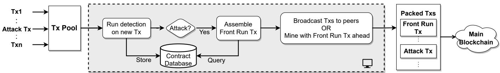
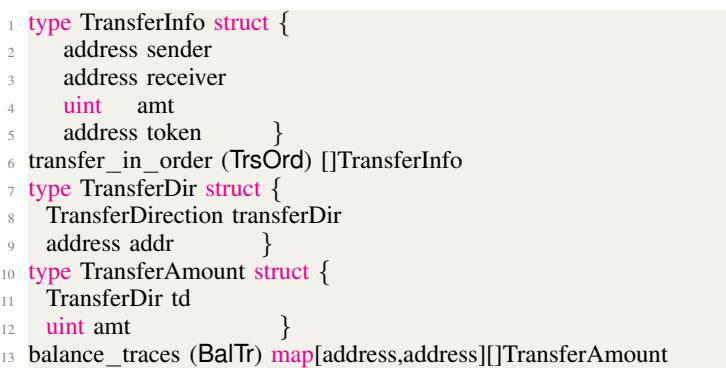
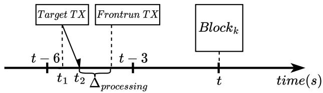

# A Robust Front-Running Methodology for Malicious Flash-Loan DeFi Attacks

Xun Deng University of Toronto xun.deng@mail.utoronto.ca

Cyrus Minwalla Bank of Canada cminwalla@bank-banque-canada.ca

Zihan Zhao University of Toronto simonzihan@gmail.com

Keerthi Nelaturu University of Toronto keerthi.nelaturu@mail.utoronto.ca

Sidi Mohamed Beillahi University of Toronto sm.beillahi@utoronto.ca

Andreas Veneris University of Toronto veneris@eecg.utoronto.ca

Han Du Bank of Canada hdu@bank-banque-canada.ca

Fan Long University of Toronto fanl@cs.toronto.edu

Abstract—This paper presents FrontDef, a security system to detect and front-run malicious transactions to mitigate financial loss caused by smart contract attacks. FrontDef monitors each transaction in the pending transaction pool to detect potential attacks. For each suspicious transaction, FrontDef analyzes the bytecode of the contract the transaction attempts to interact and assembles a sequence of mimic transactions to replicate the attack strategy. FrontDef then uses the assembled transactions to frontrun the suspicious attack transaction to prevent financial loss. Empirical results show that FrontDef can successfully detect and assemble mimic transactions for all of the 24 benchmark cases that includes 21 historical attacks that occurred on Ethereum and Binance Smart Chain (BSC). They also confirm that FrontDef can process up to 1230 transactions per second, which currently is greater than the maximum throughput of Ethereum and BSC.

Index Terms—Smart Contracts, Decentralized Finance Smart Contracts, Smart Contracts Analysis, Smart Contracts Security, Real-Time Monitoring, Front-Running.

## I. INTRODUCTION

Decentralized Finance (DeFi) has become one of the most important applications of blockchain technology. A DeFi protocol encodes sophisticated transaction rules as smart contract programs to manage digital assets. Smart contracts enable users to interact with the protocol to perform various financial activities such as trading, lending, and investing in a completely decentralized and trustless way. DeFi contracts on blockchain platforms are now managing digital assets worth tens of billions of dollars [1].

One critical challenge for the further adoption of DeFi and blockchain technology is smart contracts security. Because smart contracts are software modules that encode transaction rules, just like any other programs they may also contain bugs and/or errors. Errors in DeFi contracts are particularly severe because attackers may craft malicious transactions to exploit and/or steal the underlying digital assets managed by those contracts, hence causing significant financial losses [2], [3].

Researchers have developed many program analysis [4]– [16], verification [17]–[20], and runtime validation [21], [21]– [23] techniques to detect and prevent such smart contract errors. In practice, however, these techniques cannot fully stop increasingly complicated attacks against modern DeFi protocols. Among other, they are often not accurate enough to handle sophisticated DeFi contracts, not scalable enough to reason about interactions between multiple contracts, and/or require too much engineering overhead to be practically useful.

This paper presents FrontDef, a security system to detect and front-run malicious transactions to prevent financial loss caused by smart contract attacks. While one way to eliminate errors is to perform formal verification, it is unrealistic to expect one to formally verify every single contract deployed on a blockchain. Therefore, FrontDef attempts to stop malicious attacks as they occur in “real-time”.

FrontDef first monitors pending transactions in the mempool (i.e., pending transaction pool) of the blockchain to detect potentially malicious attack transactions on the fly. FrontDef locally executes pending transactions and analyzes tokens flows in the execution traces to flag suspicious transactions with prohibitive large profits. FrontDef then analyzes a flagged transaction and its associated contracts to assemble mimic (replica) transactions that copy the attacker’s strategy. It then attempts to front-run the attack transaction with its replica transactions to secure the digital assets at risk before the malicious entity gets access to those assets.

FrontDef provides an easy to integrate mechanism that allows entities managing blockchain platforms to protect against malicious attacks that caused hundreds of millions of dollars in losses in recent years [2]. As another use-case, FrontDef allows central banks that experiment with Central Bank Digital Currencies (CBDC) using permissioned blockchains [24], [25] to monitor transactions before adding them to the chain.

One challenge FrontDef faces is that as attack strategies against DeFi protocols become increasingly complicated, attackers often develop and deploy their own smart contracts to initiate their attacks. Therefore, directly copying the detected malicious transactions will not work because these transactions depend on prior initialization transactions. Naively copying both the transactions and the associated attack contract may also fail because the attack contract may contain control flow statements to prevent unauthorized usage of the contract. To address those challenges, FrontDef analyzes the dependencies of a suspicious transaction to identify its associated attack contract and all prior related initialization transactions. FrontDef then generates a sequence of mimic transactions to appropriately copy the strategy from the attacker. FrontDef also operates with a novel Ethereum Virtual Machine (EVM) code analysis to detect any hidden access control checks in the attack contract and modifies the contract accordingly to nullify the checks automatically.

This paper also presents empirical results as we evaluate FrontDef on a benchmark set constituted of 21 past DeFi protocol attacks that occurred on the Ethereum network and the Binance Smart Chain (BSC) and three attacks exploiting vulnerabilities in DeFi protocols that were described in [26], [27]. Our results show that FrontDef can successfully detect and assemble replica transactions for all the 24 cases.

In particular, this paper makes the following contributions:

• FrontDef: We present FrontDef, a generalized frontrunning defense platform for attacks against DeFi protocols that steal digital assets.

• Replica Transaction Generation: We present novel techniques to generate a sequence of replica transactions from a suspicious attack transaction.

• Generalized Front-running Defense: Our results demonstrate the effectiveness of FrontDef and validate generalized front-running as a new defense mechanism against DeFi protocol attacks.

The rest of the paper is organized as follows. We give an overview of DeFi protocols and characteristics of the DeFi ecosystem in Section II. We provide an overview of FrontDef in Section III. Sections IV and V describe the algorithms implementing FrontDef that are devised to detect attacks and generate counter transactions. We present the experimental results in Section VI, discuss related work in Section VII, and conclude the paper in Section VIII

## II. BACKGROUND

Blockchain networks, such as Ethereum, that support software modules to manage complex transactions (i.e., smart contracts) have become very popular [28]. In particular, the invention of smart contracts enables the execution of compli cated transactions that power Decentralized Finance (DeFi). DeFi is one of the most important applications of blockchain networks as it involve financial transactions on assets that often are in the hundreds of billions of dollars. DeFi protocols have various functionalities [29], including Decentralized EXchange (DEX) platforms that exchange between digital assets. A popular application of DEXes are Automated Market Maker (AMM) algorithms. More specifically, in an AMM protocol, the exchange rate between two digital assets X and Y is determined by a mathematical formula based on the amounts of X and Y held by the protocol. Like in traditional finance, DeFi includes protocols that offer loaning services, known as Protocols for Loanable Funds (PLF). An PLF protocol supports over-collateralized loans where borrowers place assets as collateral.

In recent years, a new type of loan evolved in the DeFi ecosystem called flash loans. A flash loan is characterized by no upfront collateral and atomicity. In particular, with no collateral one can borrow via a flash loan as long as they will pay the loan transaction fee/interest within the same transaction. The lenders are protected as well since if the loan is not repaid, the flash loan transaction is reverted and the lenders get their funds back. Flash loan has boosted financial activities in DeFi and increased the popularity of DeFi as it allows anyone to participate with minimal cost(s).

With the increasing popularity of DeFi, the number of attacks exploiting the vulnerabilities present in the smart contracts has increased as well. In particular, in recent years several DeFi attacks caused severe losses in hundreds of millions of dollars using flash loans to provide the attackers with large amounts of initial capital to manipulate the states of smart contracts to their advantage.

## III. METHODOLOGY OVERVIEW

In this section, we present an overview of our proposed approach to front-run attacks on DeFi protocols. In a standard blockchain network, pending transactions in the network are added to a mem-pool (transaction pool) and later get packed by miners into blocks and appended to the main chain. Our approach proposes a policing system (monitor program) in the mem-pool to identify potential malicious transactions exploiting DeFi protocols and front-run them. If a transaction is flagged as an “attack transaction,” we assemble a countertransaction to replicate and “front-run” the attack. We call this counter-transaction as front-run transaction.

The proposed detection and replication mechanisms are modular and can be applied in both permissioned and permissionless blockchain networks. For instance, in a permissioned network, the controlled validator nodes can run the detection algorithm on pending transactions and if needed, pack the front-run transaction into the next block. On the other hand, in a permissionless network, a white-hat entity can use the detection mechanism to flag a suspected attack transaction and broadcast the counter-transaction with a higher gas fee to the peers to get priority. The goal is to increase the chances of getting the counter-transaction packed before the attack one.

In Fig. 1, we depict an overview of our proposed system to detect and front run attacks on DeFi protocols. For instance, for the case of a flash loan attack transaction Tx, once the transaction is received in the pending transaction pool, we run the detection algorithm. In particular, in the detection algorithm we analyze token flows to find whether the transaction exhibits a flash loan pattern. For instance, whether the transaction takes and repays a loan from a flash loan provider address. Furthermore, we also use the token-flow analysis to check whether an account controlled by the attacker, e.g., the attacker’s account, or the account of the contract used to launch the attack transaction, gains large amount of profit while the flash loan providers, or other victim accounts, yield great losses in cases where the profit exceeds a parameterized threshold. Note that our proposed approach is also able to detect the case where the attacker moves stolen assets to another account which they control.

  
Fig. 1: Overview of the monitor system

When a transaction Tx is marked as an attack transaction, we next proceed to assemble a replica transaction Tx<sup>′</sup> to front run Tx. To create the replica transaction, we may need to deploy a replica of the contract used to launch Tx and initialize it before launching Tx . For this purpose, we build a contract database and store the parameters used in the creation of the contract associated with Tx, and a potential initialization call to it. During the replication of Tx, we query the database and copy the contract creation transaction, initialization call, and the attack transaction Tx, replacing any hard-coded attacker address with our an account address that we control. We first locally execute the above transactions in the following order: contract creation, initialization call, and the replica of Tx (i.e., Tx<sup>′</sup>). We then verify that Tx<sup>′</sup> replicates the original attack transaction Tx by gaining the same amount of profit. Further, we make sure that receiver of the profit is the account address we control. Note that for some attack cases, the attacker protects their contract against white hat entities using some guard mechanism. To disable this guard mechanism, we analyze and modify the bytecode of the contract before deploying it. Once we confirm that Tx<sup>′</sup> is working, we broadcast it to the network with higher gas fee than Tx to gain priority over Tx. If our transaction is packed before the attack transaction, then this will recover the assets and eliminate the losses caused by the attack.

In the following sections, we describe in detail how the detection algorithm analyzes token flows to identify potential attack transactions. We then describe the front-run algorithm to replicate attack transactions and front-run them.

## IV. DETECTION ALGORITHM

In this section, we first outline the detection procedure to find transactions performing flash loan attacks. We then describe an extension of this procedure to protect against attacks on Non-Fungible Token (NFT) contracts.

## A. Detection of Flash Loan Attacks

In a nutshell, our detection procedure, defined in Algorithm 1, consists of collecting and executing pending transactions in the transaction pool then analyzing their execution traces. Particularly, we are interested in the transfer order and balances of accounts involved. We use the above information to determine whether a transaction took a flash loan and to calculate the total amount of assets gained by the transaction.

Token flow. Since all existing token protocols follow some type of logging mechanisms, we can use this as a criterion to detect whether a transaction results in a profit. For instance, in ERC-20 token standard, a Transfer event will be triggered by token transfers [30], and it records the sender, receiver, and the amount involved. Thus, we utilize event logs to identify token flow. Specifically we track three types of events: Transfer, Withdraw, and Deposit. For each event, we record sender address, receiver address, amount transferred, and token address. For this purpose, we define a new data type to store the information for each token called TransferInfo (line 1 in Listing 1.) Note that for the Withdraw and Deposit events, the receiver (to) and sender (from) address, respectively, are the 0x0 address.

We use a list data structure transfer in order (line 6 in Listing 1) to store the records of emitted events. To process the data stored in transfer in order, we define two new data types; TransferDir (line 7) to store information about the direction of the transfer and TransferAmount (line 10) to store the amounts involved and direction. We then use the mapping balance traces (line 13 in Listing 1) to map each tuple consisting of an account and a token addresses to a list of TransferAmount that records all flows of this token that the account is involved in. For each token transfer, both the sender’s and the receiver’s balance - traces will be updated. In the case of sender’s balance - traces, we store receiver’s address in TransferDir and the field transferDir is set to the value to. On the other hand, when updating sender’s balance traces, TransferDir will include the sender’s address and the field transferDir is set to the value from. At line 3 in Algorithm 1, we use the sub-procedure EXTTOKENSFLOW to extract balance traces (BalTr) and transfer in - order (TrsOrd) from the execution trace stored in val.

  
Listing 1: Data structures used to store token flows.

Finding flash loan patterns. We analyze whether the transaction performs a borrow action and repay action afterwards to identify potential flash loans. For this analysis, we use data stored in transfer in order and balance traces. The borrow action can be characterized as a transfer from a flash loan provider’s address with some borrowed amount.

In particular, in our procedure (ISFLASHLOAN at line 4 in Algorithm 1) we use a register of flash loan providers addresses, FLPrvs, that we compare against. Then, a repay action is a transfer to the same flash loan provider with the borrowed amount plus interests.

Analyzing net profit. After determining that a transaction takes a flash loan, we then use balance traces to calculate the net profit of the transaction (procedure COMPPROFIT at line 5). Since there can be different types of tokens involved in the transfer, we calculate net profit in USD using USD stablecoin tokens such as USDT and USDC [31], [32]. For this reason, we keep a register containing tokens conversion rates to USD stablecoins, i.e., CvRts. We then identify any potential victim and beneficiary. If the transaction’s sender or the contract used to send the transaction is the beneficiary, and the net profit exceeds a fixed threshold that is parameterizable (PftTh), we mark it as a flash loan attack transaction.

```txt
Algorithm 1 Detection procedure. It takes the candidate attack transaction FLTx, list of flash loan providers FLPrvs, list of tokens conversion rates CvRts, and the net profit threshold PftTh. The procedure returns true if FLTx is a flash loan attack.
procedure DETECALGO(FLTx, FLPrvs, CvRts, PftTh)
    val ← EXECUTE(addr, FLTx)
    (BalTr, TrsOrd, AtAds) ← EXTTOKENSFLOW(val)
    if ISFLASHLOAN(AtAds, BalTr, TrsOrd, FLPrvs)
        NetPft ← COMPPROFIT(AtAds, BalTr, TrsOrd)
        if NetPft > PftTh
            return true
end procedure
```

Remark 4.1: In certain cases, attackers may move their profit to other accounts of their control to complicate tracing the attack. Thus, to account for those cases we check if an account’s address is a beneficiary, and it only receives transfers from the transaction’s sender or the contract used to launch the flash loan transaction. If this is the case we mark the transaction as a flash loan attack transaction as well.

## B. Detection of NFT Attacks

Here, we extend our detection procedure to find attacks on NFT contracts. Specifically, we monitor NFT tokens transfer flows. Similar to ERC-20 standard for regular tokens, in ERC-721 standard for NFT tokens, when an NFT token is transferred a Transfer event must be triggered [33]. Thus, we can detect any NFT transfer event without payment, e.g., no ERC-20 tokens transfer to the seller. This will allow us to monitor and detect different types of NFT exploitations such as selling NFT without payment, unauthorized change of NFT ownership, and unauthorized NFT minting/burning.

For instance, in Listing 2, we show a case of an NFT exploitation extracted from the Damn Vulnerable Defi challenge benchmark set [26]. In this case, the NFT token is transferred before the seller is paid. Line 5 transfers the ownership of the NFT token from the seller to the buyer. Thus, the owner of the token becomes the buyer, i.e., tokenOwner[tokenID]:= msg.sender. Then, the payment occurs in line 7. However, the receiver of the payment is the current owner of the NFT, i.e., tokenOwner[tokenID], which is the buyer, i.e., msg.sender, because of the ownership transfer that happened at line 5. Obviously, line 7 should be placed before line 5, otherwise the buyer will get the NFT token for free. Our detection system would be able to detect the transfer of the NFT token and also that no payment has been made to the seller’s address, thus marking those types of transactions as suspicious.

```txt
function buy(uint tokenID) public payable {
    ...
    //transfer the token to buyer
    transferFrom(tokenOwner[tokenID], msg.sender, tokenID);
    //pay seller
    tokenOwner[tokenID].transfer(msg.value);
}
```

## Listing 2: Free buyer.

## V. FRONT-RUN TRANSACTION ASSEMBLY ALGORITHM

When it is determined that a pending transaction is an attack transaction, we generate a replica transaction to front-run the attack. Here, we describe how to do this. In summary, we first check whether the attack transaction was originated from some contract created by the adversary. If it is not, to replicate the attack transaction it is enough to copy it and replace the beneficiary’s address with our own address in the transaction call data field. On the other hand, if the attack transaction originates from an adversary contract, which is the actual case for most attacks in practice, the replication process is a bit more involved. In particular, the attacker usually creates a contract and later calls this contract to attack. In this case, we first find the bytecode of this contract so we can be able to deploy a replica of it. To achieve this, we maintain a contract’s database to store the data of contract creation (deployment) transactions. In Algorithm 2, we give the procedure for frontrunning flash loan transactions that are flagged as malicious by our detection procedure.

## A. Contract Database

Each contract is added to the database at the time of creation. We store the data of the contract creation transaction such as gas price, gas limit, value, and call data. In Listing 3, we show an excerpt of the structure of the fields stored in the database. The database maps each contract address to the corresponding fields shown in Listing 3.

```shell
gas_price      //32 bytes
gas          //32 bytes
gas_fee_cap   //32 bytes
gas_tip_cap   //32 bytes
value       //32 bytes
is_create    //1 bytes
caller address //20 bytes
offest     //32 bytes
deployment data   //variable length
init call fields...
```  
Listing 3: Contract database.

In certain attacks, the adversary makes an initialization transaction call to the contract after its creation. To be able to replicate those attacks, we also store the data of initialization transaction call if they exist in the contracts database.

For each contract creation, the size of the deployment transaction fields is 213 Bytes plus the size of contract bytecode (in Ethereum, the maximum bytecode size is 24 KBytes). We also use 192 Bytes to store data of initialization transaction call. We assume that the call data for an initialization transaction is 32 Bytes.

## B. Generating Front-Run Transactions

Before generating a front-run transaction that replicates the attack transaction, we might need to generate two additional transactions. The first transaction creates the attacker contract that the attack transaction is launched through. The second transaction initializes the attacker contract. To generate those transactions (shown in Listing 4), we query the contract database to get the parameters used for contract creation and initialization if there is an initialization transaction. To ensure the success of our front-running mechanism, we analyze bytecode to find hardcoded beneficiary’s address that the attacker uses and replace it with our own front-run address. We then generate the front-running transaction that calls the newly created and if needed initialized contract.

```txt
new_contract_creation_transaction (CCTx)
contract_init_transaction (CITx)
flash_loan_transaction (FLTx)
```

## C. Front-Running Algorithm

Before broadcasting the front-run transaction, we first locally execute the transaction and verify whether our replication exhibits the same behavior as the original transaction. In particular, if the transaction does not call a contract, we only execute the flash loan transaction (line 3 in Algorithm 2). We then call the detection algorithm to identify flash loan pattern and beneficiary (line 4). If our address is the beneficiary, we conclude that our replication is successful and we broadcast the new transaction (line 5). If the transaction interacts with another contract, we first deploy a copy of the contract and if needed we add the contract init transaction before the flash loan transaction (lines 7-8 in Algorithm 2).

## D. Disabling Guard System

Recent flash loan attacks use sophisticated mechanisms to prevent unauthorized interactions, e.g., white hats frontrunning the attack. A popular mechanism used for this purpose is the usage of a guard mechanism in a smart contract, e.g., if owner != caller then revert, or require(owner == caller). This allows the attacker to specify its address in the field owner. Then, when the caller address which is stored in the field caller is different from the owner the execution halts.

When the attacker’s address is hard-coded in the smart contract code, replacing it with our own address will disable

Algorithm 2 Front-running procedure. It takes the attack transaction FLTx, our front-running address addr, and the contract database DB.

```txt
transaction FLTx, our front-running address addr, and the
contract database DB.
procedure FRONTRUNALGO(FLTx, addr, DB)
    if ISNOCONTRACTINVOLVED(FLTx)
        val ← EXECUTE(addr, FLTx)
        if ISSUCCFLASHLOANREPLICA(addr, val)
            BROADCAST(addr, FLTx)
    else
        (CCTx, CITx) ← FINDPREDTXS(DB, FLTx)
        val ← EXECUTE(addr, CCTx, CITx, FLTx)
        if ISREVERT(val)
            CCTx ← FINDDISGUARDSTMS(CCTx)
            val ← EXECUTE(addr, CCTx, CITx, FLTx)
        if ISSUCCFLASHLOANREPLICA(addr, val)
            BROADCAST(addr, CCTx, CITx, FLTx)
end procedure
```

the check during front-running. However, some attackers use more sophisticated mechanisms to protect the transaction by computing the value of the owner address during the execution. For instance, we show in Listing 5 an example where the attacker passes some arguments from which the owner (signer) address is recovered. The contract calls a function to recover the signer address (line 3) and compares it with the caller (line 4). In this case a simple search and replace of the owner address in the bytecode will not work.

```c
func attack_routine(param1, param2, param3...) {
...
signer= erecover(param1, param2, param3) //address recovery
if address(signer) != caller:
  revert with 0, 'invalid signature'
...
}

//The generated bytecode
...
SHL
SUB
AND
EQ
PUSH 0x284
JUMPI
PUSH1 0x40
```  
Listing 5: Attacker’s address recovered from an encrypted signature.

Our proposed solution for those cases, implemented in the sub-procedure FINDDISGUARDSTMS at line 10 in Algorithm 2, is based on an analysis and instrumentation of the byte-code and replacing some instructions with others. In particular, at the bytecode level, the not-equal condition at line 4 in Listing 5 is compiled to an equal operation (line 14 in Listing 5) followed by a conditional jump (line 16). For the front-running transaction to not revert, we need the equal operation to be always true to continue execution, i.e, jump to address 0x284. Intuitively, if two values A and B are not equal, then A should be less than or greater than B. Thus, our proposed instrumentation idea is to record the last equal operation and its operands, and change the equal operation to either less than or greater than operation by changing the bytecode of the operation. We assume that if the check failed, execution reverts but does not return; and there is no equal operator in the revert routine, so that we can locate the failed condition. One advantage of this solution is that it does not introduce large overhead, compared with comprehensive stack and byte-code analysis. We only need to perform one additional execution as we can locate the failed EQ operation and do the fix in the first retry.

## VI. EMPIRICAL EVALUATION

In this section, we present an evaluation of the effectiveness of FrontDef. We perform two core experiments. First, we simulate past attacks on smart contracts. Second, we perform a real-time front-running experiment.

## A. Implementation

We implement FrontDef in clients of two popular blockchain platforms: BNB Smart Chain [34], the client of Binance Smart Chain (BSC), and OpenEthereum [35], a client of Ethereum. Experiments in the BNB Smart Chain are in Go programming language while those in OpenEthereum are in Rust. We extend the module responsible for executing the EVM codes in both clients to record the metadata of tokens flow and contract database. To implement the contract database in OpenEthereum, we use the Rust library sled<sup>1</sup>. For BNB Smart Chain, we use the Go library Bitcask<sup>2</sup>. We also extend the EVM module client to record equal operations and operands in order to implement the mechanism to disable guard statements. In order to perform a real-time front-run experiment on BNB Smart Chain, we implement real-time monitoring and modify the transaction broadcast strategy in the client to improve front-running success rate.

## B. Benchmark

To facilitate experimentation, we collect a benchmark set of historical flash loan attacks. In particular, the set contains 12 attacks that occurred on Ethereum and nine attacks that occurred on BSC between February 15th, 2020 and August 31st, 2022, listed in the first column of Tables I, II, and IV. The benchmark set covers a wider variety of flash loan attacks and vulnerabilities including re-entrancy (OriginDollar) price manipulation (ElephantMoney), oracle manipulation (Harvest-USDC), pump/arbitrage (bZx1), design flaw of total supply (Eminence), forced investment (Yearn), design flaw in the reward minting process (ApeRocket), and design flaw in fund withdrawal and shares burning (ElevenFinance). On the other hand, existing works can only handle three kinds of design flaws and vulnerabilities; re-entrancy, oracle manipulation and arbitrage. Note that several attacks in our benchmark set, e.g., Harvest, bZx, Eminence, and Yearn, have caused news headlines with over 50 millions dollars in crypto assets lost.

## C. Experimental Setup

To perform the first experiment, we use an archive node to download all previous states from the genesis block on both chains. This is because to evaluate historical attacks we need to sync to the states where those attacks occurred, and we could not find old blockchain snapshots with timestamps close to when the attacks occurred. To be able to simulate past attacks, we modify the clients’ block syncing module. After syncing to the block containing the flash loan attack transaction, we apply FrontDef, i.e., run the detection and front-running algorithms. We check whether FrontDef can successfully detect the attack and generate a front-run transaction. We then execute the newly assembled transaction and verify that it replicates the attack and measure the overhead introduced by our detection mechanism.

Two important components of the detection algorithm are the detection of a flash loan pattern and the analysis of net profit. For the first component, we monitor a list of 180 flash loan providers, collected from Pancake Swap V1 and V2, for BSC and eight flash loan providers for Ethereum. For the second component, we store the exchange rates for 76 ERC-20 tokens in BSC and 1733 ERC-20 tokens in Ethereum that cover popular token pairs.

The BSC experiments are run on an AWS EC2 m5.2xlarge instance with 16 vCPU, 32 GB memory, and 4TB SSD storage. The Ethereum experiments are run on an AWS EC2 m5.2xlarge instance with 16 vCPU, 32 GB memory, and 8TB SSD storage.

## D. Flash Loan Attacks

In the first experiment, we evaluate the algorithms on the set of 21 flash loan attacks benchmarks without implementing the procedure FINDDISGUARDSTMS. In Table I and II, we report the results of the experiment. In particular, we measure 5 metrics in our evaluation: old transaction execution time (OFLTxExT column), contract deployment time (CDepT column), new flash loan transaction execution time (NFLTxExT column), the total overhead of the system (ToOvHd column), total execution time of the system (ToExT column). We are able to front-run 19 out of the 21 benchmarks. For the 12 Ethereum benchmarks, the total overhead (ToOvHd column) shows that the overall overhead of FrontDef, i.e., analysis of the old transaction execution trace, new contract deployment, and creation of new init and flash loan transaction, is less than 300ms for all benchmarks. Note that the block generation time is around 12s on Ethereum chain.

In all benchmarks, the total execution time of FrontDef, including the old flash loan transaction execution, is less than 2.1s. On average, the overhead introduced by FrontDef is around 7% of the old transaction execution time. Thus, our mechanism will not significantly adversely affect the processing time of transactions and there will be enough time period to broadcast the front-run transactions. We also observe similar results on Binance chain in Table II. More specifically, in Binance the total overhead introduced is less than 80ms for all benchmarks and the total execution is less than 200ms. Given that the block generation time on Binance is around

TABLE I: Ethereum benchmarks results.

<table><tr><td>Benchmark</td><td>OFLTxExT [s]</td><td>CDepT [μs]</td><td>NFLTxExT [ms]</td><td>ToOvHd [ms]</td><td>ToExT [s]</td></tr><tr><td>bZx1 [36]</td><td>0.9311</td><td>2.5762</td><td>45.7699</td><td>71.3572</td><td>1.0239</td></tr><tr><td>bZx2 [37]</td><td>0.5037</td><td>3.6906</td><td>87.5521</td><td>106.3972</td><td>0.6194</td></tr><tr><td>Balancer-STA [38]</td><td>0.3465</td><td>3.4394</td><td>82.3610</td><td>101.3880</td><td>0.4529</td></tr><tr><td>Balancer-STONK [39]</td><td>0.1738</td><td>3.6385</td><td>34.2710</td><td>53.2027</td><td>0.2356</td></tr><tr><td>Eminence [40]</td><td>0.0998</td><td>N/A</td><td>25.6289</td><td>32.9568</td><td>0.1468</td></tr><tr><td>Harvest-USDC [41]</td><td>1.1029</td><td>3.9546</td><td>23.2480</td><td>42.0973</td><td>1.1519</td></tr><tr><td>ValueDeFi [42]</td><td>0.9970</td><td>3.7680</td><td>63.4882</td><td>81.6281</td><td>1.0863</td></tr><tr><td>CheeseBank [43]</td><td>0.5242</td><td>3.4939</td><td>85.2817</td><td>112.0340</td><td>0.6498</td></tr><tr><td>OriginDollar [44]</td><td>1.6827</td><td>28.3736</td><td>110.7969</td><td>154.2283</td><td>1.8623</td></tr><tr><td>WarpFinance [45]</td><td>0.5504</td><td>3.8863</td><td>53.9494</td><td>71.7541</td><td>0.6269</td></tr><tr><td>Yearn [46]</td><td>1.1146</td><td>71.6744</td><td>147.7280</td><td>235.2005</td><td>1.3763</td></tr><tr><td>xToken [47]</td><td>1.7638</td><td>24.3256</td><td>252.6508</td><td>290.6131</td><td>2.0714</td></tr></table>

TABLE II: Binance benchmarks results.

<table><tr><td>Benchmark</td><td>OFLTxExT [ms]</td><td>CDepT [μs]</td><td>NFLTxExT [ms]</td><td>ToOvHd [ms]</td><td>ToExT [ms]</td></tr><tr><td>BoggedFinance [48]</td><td>68.3082</td><td>447.9683</td><td>67.5360</td><td>79.7665</td><td>156.4862</td></tr><tr><td>JulSwap [49]</td><td>7.1878</td><td>1019.6620</td><td>1.7426</td><td>10.0940</td><td>29.9626</td></tr><tr><td>BeltFinance [50]</td><td>56.9382</td><td>1084.4376</td><td>42.9525</td><td>52.6918</td><td>119.3485</td></tr><tr><td>ElevenFinance [51]</td><td>5.6641</td><td>292.2740</td><td>5.6486</td><td>12.8426</td><td>25.5922</td></tr><tr><td>ApeRocket [52]</td><td>7.9224</td><td>319.8738</td><td>5.6693</td><td>13.3542</td><td>40.9196</td></tr><tr><td>GymNetwork [53]</td><td>2.4141</td><td>649.9098</td><td>3.8667</td><td>14.9547</td><td>26.6054</td></tr><tr><td>ElephantMoney [54]</td><td>42.7627</td><td>504.5196</td><td>40.0271</td><td>53.0831</td><td>111.9332</td></tr></table>

3s, it is possible for FrontDef to front-run attacks as there is enough time period to broadcast the front-run transactions.

Remark 6.1: We note that the time overhead between the original flash loan transaction execution time (OFLTxExT column) and the new flash loan transaction execution time (NFLTxExT column) for the Ethereum benchmarks exists primarily due to the OpenEthereum client. Ideally, since the new flash loan transaction is just a copy with minor modifications of the original one, the execution times of the two should be similar. However, this is not the case for the Ethereum benchmarks. On the other hand, for Binance benchmarks the two execution times are similar. Note that Binance client is based on an optimized version of Go Ethereum (geth) [55].

We believe the overhead in the execution time of the original transaction in OpenEthereum is caused by the time consumed to load contract data into memory from storage. Since the contract data which the replica transaction interacts with are cached (the same contracts as the original transaction), then during the execution of this transaction there is no storage access overhead like in the execution of the original transaction. To validate our observation, we run an experiment where we execute the same transaction twice sequentially for a set of six benchmarks on OpenEthereum. In particular, we select benchmarks with considerable execution times overheads in Table I. In Table III, we report the results of this experiment where we measure the execution time of the second transaction. Indeed, the execution time decreased significantly in the second run as shown in Table III as we expected.

Benchmarks with a caller check. For the two cases that are not handled because the procedure FINDDISGUARDSTMS is not implemented correspond to cases with caller check in the contract code. In particular, for those two cases simple searchreplace of hard coded attacker address is not enough. Thus, with the procedure FINDDISGUARDSTMS implemented our system is able to successfully disable the caller check and handle the two benchmarks. The generated front-run transactions result in the same profit as the original transaction. In Table IV, we report the results of the experiment. Notice that the total overhead increased slightly as we perform two attempts. In the first attempt we only perform simple search-replace of hard coded attacker address as in previous benchmarks. In the second, we apply the bytecode analysis and transformation implemented in the procedure FINDDISGUARDSTMS. Note that since the first attempt of execution the flash loan transaction reverted, it took less than 1ms. The main reason for the increase in time overhead in the code logic. However, the increase is still reasonable, and the time overhead is less than 250ms and is in an acceptable range for Binance chain.

TABLE III: Transaction re-execution time on OpenEthereum.

<table><tr><td>Benchmark</td><td>second run execution time [ms]</td></tr><tr><td>bZx1 [36]</td><td>13.126375</td></tr><tr><td>Harvest Finance(USDC) [41]</td><td>5.471455</td></tr><tr><td>Value DeFi [42]</td><td>26.813386</td></tr><tr><td>Original Dollar (OUSD) [44]</td><td>78.08366233</td></tr><tr><td>Yearn Finance [46]</td><td>69.1817</td></tr><tr><td>xToken [47]</td><td>52.5130</td></tr></table>

TABLE IV: Binance benchmarks with a caller check results.

<table><tr><td>Benchmark</td><td>OFLTxExT [ms]</td><td>CDepT [ms]</td><td>NFLTxExT [ms]</td><td>ToOvHd [ms]</td><td>ToExT [ms]</td></tr><tr><td>WienerDOGE [56]</td><td>12.9818</td><td>0.1709</td><td>8.4872</td><td>20.4124</td><td>43.2572</td></tr><tr><td>Cupid [57]</td><td>54.2658</td><td>0.1713</td><td>43.5031</td><td>181.0046</td><td>233.614</td></tr></table>

## E. Attacks on NFT contracts

We evaluate the extension of FrontDef to front-run attacks on NFT smart contracts. In addition to the free buyer benchmark described in Section IV, we also evaluate our algorithms on the unsafe TransferFrom and unsafe Mint benchmark cases described in [27]. In the unsafe TransferFrom benchmark, an attacker can exploit a missing check of a flag to transfer a NFT token ownership without payment to the original NFT token owner. In the unsafe Mint benchmark, a missing check results in an unauthorized entity minting NFT tokens. In this experiment, we set up a private chain using the Go-Ethereum client [55]. We then deploy the NFT contracts with the vulnerabilities described above. Since the attack can be achieved through a simple call to the vulnerable function in the NFT contract, then deploying a new contract specific for the attack routine is not needed. Our detection algorithm is successfully able to detect the three benchmarks. In Table V, we give the old NFT transaction execution time (ONFTTxExT column), the new NFT transaction execution time (NNFTTxExT column), the total front-run overhead (TFROvHd column), and the total execution time of the system (ToExT column).

TABLE V: NFT benchmarks results.

<table><tr><td>Benchmark</td><td>ONFTTxExT [ms]</td><td>NNFTTxExT [ms]</td><td>TFROvHd [ms]</td><td>ToExT [ms]</td></tr><tr><td>Free Buyer</td><td>113.7424</td><td>76.4197</td><td>164.9435</td><td>343.0717</td></tr><tr><td>Unprotected Mint</td><td>98.0351</td><td>64.3193</td><td>147.0057</td><td>307.8673</td></tr><tr><td>UnsafeTransferFrom</td><td>113.6202</td><td>75.7253</td><td>166.5651</td><td>391.7890</td></tr></table>

## F. Real time front-running

In this experiment, we test in a real time setting on BSC the practicality of a front-running mechanism with time overheads similar to the ones we obtained in the previous experiments. In particular, we front-run an arbitrary transaction. This is because attacks are rare compared to normal transactions, thus it is simpler to test the front-running success rate in real time on an arbitrary transaction. In the experiment, we randomly pick a transaction and mark it as ”target”. We try to frontrun it with a simple transfer transaction with a higher gas fee. This is to ensure that the execution of the front-run transaction will not alter the execution of the original transaction. We introduce a delay period before the front-run transaction. This delay period is to account for the front-run overhead we would have for running the detection and front-running algorithms. If the front-run transaction appears before the ”target” on the chain, we conclude that the front-running succeeds. On the other hand, if the front-run transaction is dropped or mined after the ”target”, we conclude that front-running failed.

An important factor that impacts the success rate of real time front-running is the number of peers our node is connected to. The higher the number of peers, the higher the probability our front-run transaction will be picked up first. On average, we perform the experiment with around 150 peers connected and we use five values for the delay period between 0ms and 200ms. For each delay period, we try the front-running 50 times. In Table VI, we report the success rates obtained in the experiment. The results show that when the delay period is less than 50ms, the success rate is around 50%. For 200ms delay period, the success rate drop to around 24%.

TABLE VI: Real-time front-running performance analysis.

<table><tr><td>delay [ms]</td><td># peers connected</td><td>success rate (percent)</td></tr><tr><td>0</td><td>171</td><td>50%</td></tr><tr><td>25</td><td>158</td><td>48%</td></tr><tr><td>50</td><td>156</td><td>46%</td></tr><tr><td>100</td><td>154</td><td>32%</td></tr><tr><td>200</td><td>167</td><td>24%</td></tr></table>

Another factor for consideration is the time interval between receiving the ”target” transaction and the next block generation time. Indeed, the more time we have the higher the chances of the front-running succeeding. On the other hand, if we receive the ”target” transaction late, for example, if we receive the transaction 3s or more later than its generation time, then most likely the transaction will appear before the front-run transaction. Thus, connecting more peers will also help us to receive new transactions early and broadcast the front-run transactions in time. For instance, as shown in Fig 2, suppose the next block k will be generated at a time instant t. On Binance chain, validators will pick transactions received before t − 3s and pack them into the block k. Assume the transaction we would like to front-run is generated at $\mathrm { t _ { 1 } }$ in the time interval $[ \mathrm { t } - 6 , \mathrm { t } - 3 ]$ , and normally it would be packed into the block k. Suppose we receive the transaction at $\mathbf { t } _ { 2 } .$ , where $\mathrm { t - 6 } \leq \mathrm { t _ { 1 } } < \mathrm { t _ { 2 } } < \mathrm { t } - 3 . \mathrm { I f } \ ( \mathrm { t _ { 2 } } + \Delta _ { \mathrm { p r o c e s s i n g } } ) < \mathrm { t } - 3 ,$ , where $\Delta _ { \mathsf { p r o c e s s i n g } }$ is the time delay period to process a transaction and generate a front-run transaction, then the front-running is possible. The interval $\mathrm { \small { [ t _ { 2 } + \Delta \Delta \Delta _ { p r o c e s s i n g } , t - 3 ] } }$ represents the time period we have to broadcast the front-run transaction to the network. Thus, the success probability of the frontrunning is proportional to the length of this interval. In the experiment, we pick random ”target” transactions to front-run that include late-received transactions that cannot be front-run (i.e., $\left( \mathrm { t _ { 2 } } + \Delta _ { \mathrm { p r o c e s s i n g } } \right) > \mathrm { t } - \mathrm { 3 } )$ . Experiments show that we can achieve a 50% front-run success rate when $\Delta _ { \mathrm { p r o c e s s i n g } } \leq 5 0 \mathrm { m s }$

  
Fig. 2: Transaction generation timeline

## G. FrontDef Throughput

In this experiment, we estimate the throughput of FrontDef on BSC to show that FrontDef is practical and will not affect existing blockchains throughputs. In the experiment, we measure the time to run the detection algorithm on mined blocks of transactions. On average, we are able to process 1230 transactions per second, which is greater than the maximum throughput of Binance chain (around 300 transactions per second). Therefore, deploying our system in a Binance validator node client to monitor the mem-pool is practical and will not influence the performance and functioning of the client.

## VII. RELATED WORK

Analysis of Smart Contracts Pre-Deployment. There is plenty of prior art that proposes methodologies for the analysis and verification of smart contracts, including using static analysis methods to detect vulnerabilities in smart contracts, e.g., [4]–[8]. The above techniques are ideal to identify bugs in smart contracts before deployment, however, their soundness and completeness predominantly depends on the level of complexity of those contracts. For complicated contracts, they usually resort to over/under-approximations that may either lead to false positives or to miss bugs. Other alternative techniques to identify bugs in smart contracts before deployment use symbolic execution engines [9]–[15] or dynamic analysis [16]. However, for programs like DeFi contracts, those techniques may suffer from the path explosion and the complicated logics implemented in those contracts, thus, they resort to incomplete analysis and can only establish correctness for bounded executions. Therefore, a detection technique likes ours that bypasses the complexity of DeFi contracts by focusing on the analysis of token flows is crucial and complements the above mentioned techniques.

Securing Smart Contracts Post-Deployment. An alternative approach to the above techniques is run time validation. Existing works in this area, , e.g., [21]–[23], analyze contract execution traces to enforce state invariants. For instance, [21] proposes a tool to enforce invariants with quantifiers on the state of smart contract. The work in [22] monitors data flows during execution and analyzes state changes to prevent reentrancy attacks at the EVM level, while [23] implements a transaction monitor that inserts instructions at the start and end of a transaction to enforce invariants. Our work follows the dynamic analysis approach and analyzes transaction execution traces. However, we do not enforce any invariants or add run time checks (instrumentation) in the original smart contract. Thus, it can be applied to varieties of logic and design bugs in DeFi contracts that are susceptible to exploitation.

Front-Run. Front-running is a well studied mechanism in the crypto and security community [58]–[63]. This is because there are several types of popular attacks that use frontrunning as the attack mechanism such as DEX arbitrage bots and sandwich attacks [58], [62]. There are also works that propose mitigation mechanisms to prevent front-running attacks [61], [63]. The above works study front-running as an attack mechanism and how to defend against it. In this paper, front-running is used as a defense mechanism to stop attacks on Defi protocols. This is also a useful tactic for permissioned networks such as CBDC platforms.

Flash Loan and DeFi Attacks. There are works that study flash loan attacks and DeFi attacks in general, e.g., [64]– [69]. In [64], the authors recover DeFi contracts semantics from raw transactions and pattern matches price manipulation attacks. In [69], the author uses anomaly detection based on assets flows in a transaction and then use front-running. However, both works are limited to price or oracle manipulation, while our proposed approach can be used for all types of vulnerabilities that are exploitable. For instance, in the evaluation we applied FrontDef to detect and front-run flash loan attacks that exploit various kinds of design flaws in smart contracts including five types of vulnerabilities never addressed in previous works (Section VI-B). In [67], the authors propose a framework to automatically synthesize flash loan attacks against vulnerable protocols. While most work focus on analyzing the logic behind such attacks and finding vulnerabilities in smart contracts to fix before deployment, we propose a solution to mitigate flash loan attacks.

## VIII. CONCLUSION

Malicious attacks against DeFi contracts often cause significant financial loss. FrontDef detects malicious attack transactions in the pending transaction pool and then assembles transactions to front-run the attack. Our evaluation results demonstrate that FrontDef’s approach based on detect-andfront-run is a promising strategy to mitigate DeFi attacks. In a permissioned blockchain platform, e.g., a CBDC network, FrontDef can be easily integrated by the entity managing the platform. However, in a permissionless blockchain where we cannot guarantee front-running will always succeed, FrontDef may fail to replicate the attack transactions if attackers use new techniques to protect their transactions from replication and front-running. Furthermore, FrontDef may not have full access to transactions in the mem-pool because of the presence of Flashbots and face extremely high transactions fee. In the future we might extend our detection mechanism with a more involved analysis of transaction execution traces and bytecode to complement the token flow analysis.

## REFERENCES

[1] “Defillama dashboard.” 2022. [Online]. Available: https://defillama.com/ [2] J. McKay, “Defi-ing cyber attacks,” 2022.

[3] “10 most common attacks,” 2022. [Online]. Available: https: //hacked.slowmist.io/en/statistics/?c=all&d=al

[4] J. Feist, G. Grieco, and A. Groce, “Slither: a static analysis framework for smart contracts,” in 2019 IEEE/ACM 2nd International Workshop on Emerging Trends in Software Engineering for Blockchain (WETSEB). IEEE, 2019, pp. 8–15.

[5] N. Grech, M. Kong, A. Jurisevic, L. Brent, B. Scholz, and Y. Smaragdakis, “Madmax: surviving out-of-gas conditions in ethereum smart contracts,” Proc. ACM Program. Lang., vol. 2, no. OOPSLA, pp. 116:1– 116:27, 2018.

[6] S. Kalra, S. Goel, M. Dhawan, and S. Sharma, “ZEUS: analyzing safety of smart contracts,” in 25th Annual Network and Distributed System Security Symposium, NDSS 2018, San Diego, California, USA, February 18-21, 2018. The Internet Society, 2018.

[7] S. Tikhomirov, E. Voskresenskaya, I. Ivanitskiy, R. Takhaviev, E. Marchenko, and Y. Alexandrov, “Smartcheck: Static analysis of ethereum smart contracts,” in 1st IEEE/ACM International Workshop on Emerging Trends in Software Engineering for Blockchain, WET-SEB@ICSE 2018, Gothenburg, Sweden, May 27 - June 3, 2018. ACM, 2018, pp. 9–16.

[8] P. Tsankov, A. M. Dan, D. Drachsler-Cohen, A. Gervais, F. Bunzli, and¨ M. T. Vechev, “Securify: Practical security analysis of smart contracts,” in Proceedings of the 2018 ACM SIGSAC Conference on Computer and Communications Security, CCS 2018, Toronto, ON, Canada, October 15-19, 2018. ACM, 2018, pp. 67–82.

[9] M. Mossberg, F. Manzano, E. Hennenfent, A. Groce, G. Grieco, J. Feist, T. Brunson, and A. Dinaburg, “Manticore: A user-friendly symbolic execution framework for binaries and smart contracts,” in 2019 34th IEEE/ACM International Conference on Automated Software Engineering (ASE). IEEE, 2019, pp. 1186–1189.

[10] ConsenSys, “Mythril,” https://github.com/ConsenSys/mythril, 2022, accessed: 2022-06-06.

[11] J. He, M. Balunovic, N. Ambroladze, P. Tsankov, and M. T. Vechev, “Learning to fuzz from symbolic execution with application to smart contracts,” in Proceedings of the 2019 ACM SIGSAC Conference on Computer and Communications Security, CCS 2019, London, UK, November 11-15, 2019. ACM, 2019, pp. 531–548.

[12] J. Krupp and C. Rossow, “teether: Gnawing at ethereum to automatically exploit smart contracts,” in 27th USENIX Security Symposium, USENIX Security 2018, Baltimore, MD, USA, August 15-17, 2018. USENIX Association, 2018, pp. 1317–1333.

[13] L. Luu, D. Chu, H. Olickel, P. Saxena, and A. Hobor, “Making smart contracts smarter,” in Proceedings of the 2016 ACM SIGSAC Conference on Computer and Communications Security, Vienna, Austria, October 24-28, 2016. ACM, 2016, pp. 254–269.

[14] I. Nikolic, A. Kolluri, I. Sergey, P. Saxena, and A. Hobor, “Finding the greedy, prodigal, and suicidal contracts at scale,” in Proceedings of the 34th Annual Computer Security Applications Conference, ACSAC 2018, San Juan, PR, USA, December 03-07, 2018. ACM, 2018, pp. 653–663.

[15] C. F. Torres, J. Schutte, and R. State, “Osiris: Hunting for integer bugs in¨ ethereum smart contracts,” in Proceedings of the 34th Annual Computer Security Applications Conference, ACSAC 2018, San Juan, PR, USA, December 03-07, 2018. ACM, 2018, pp. 664–676.

[16] S. Grossman, I. Abraham, G. Golan-Gueta, Y. Michalevsky, N. Rinetzky, M. Sagiv, and Y. Zohar, “Online detection of effectively callback free objects with applications to smart contracts,” Proc. ACM Program. Lang., vol. 2, no. POPL, pp. 48:1–48:28, 2018.

[17] L. P. A. da Horta, J. S. Reis, M. Pereira, and S. M. de Sousa, “Whylson: Proving your michelson smart contracts in why3,” arXiv preprint arXiv:2005.14650, 2020.

[18] M. Di Angelo and G. Salzer, “A survey of tools for analyzing ethereum smart contracts,” in 2019 IEEE international conference on decentralized applications and infrastructures (DAPPCON). IEEE, 2019, pp. 69–78.

[19] T. Dickerson, P. Gazzillo, M. Herlihy, V. Saraph, and E. Koskinen, “Proof-carrying smart contracts,” in International Conference on Financial Cryptography and Data Security. Springer, 2018, pp. 325–338.

[20] W. Duo, H. Xin, and M. Xiaofeng, “Formal analysis of smart contract based on colored petri nets,” IEEE Intelligent Systems, vol. 35, no. 3, pp. 19–30, 2020.

[21] A. Li, J. A. Choi, and F. Long, “Securing smart contract with runtime validation,” in Proceedings of the 41st ACM SIGPLAN Conference on Programming Language Design and Implementation, ser. PLDI 2020. New York, NY, USA: ACM, 2020, pp. 438–453.

[22] M. Rodler, W. Li, G. O. Karame, and L. Davi, “Sereum: Protecting existing smart contracts against re-entrancy attacks,” 2018.

[23] M. Capretto, M. Ceresa, and C. Sanchez, “Transaction monitoring of´ smart contracts,” in Runtime Verification - 22nd International Conference, RV 2022, Tbilisi, Georgia, September 28-30, 2022, Proceedings, ser. LNCS, vol. 13498. Springer, 2022, pp. 162–180.

[24] J. Lovejoy, C. Fields, M. Virza, T. Frederick, D. Urness, K. Karwaski, A. Brownworth, and N. Narula, “A High Performance Payment Processing System Designed for Central Bank Digital Currencies,” MIT, Tech. Rep., February 2022.

[25] F. Reserve, 2022. [Online]. Available: https://www.federalreserve.gov/c entral-bank-digital-currency.htm

[26] Damn Vulnerable DeFi, https://www.damnvulnerabledefi.xyz/, 2022, accessed: 2022-11-30.

[27] BlockSec and NFTGO, “NFT Security Report 2022: Risk Detection, Quantifying and Solutions,” BlockSec, Tech. Rep., September 2022.

[28] G. Wood, “Ethereum: A secure decentralised generalised transaction ledger,” 2017, https://ethereum.github.io/yellowpaper/paper.pdf.

[29] S. M. Werner, D. Perez, L. Gudgeon, A. Klages-Mundt, D. Harz, and W. J. Knottenbelt, “Sok: Decentralized finance (defi),” 2021.

[30] F. Vogelsteller and V. Buterin, “Eip-20: Token standard,” 2015. [Online]. Available: https://eips.ethereum.org/EIPS/eip-20

[31] T. Limited, “Tether token,” https://tether.to/en/, 2022.

[32] CENTRE Consortium, “USD Coin (USDC),” https://www.circle.com/e n/usdc, 2022.

[33] W. Entriken, D. Shirley, J. Evans, and N. Sachs, “Eip-721: Non-fungible token standard,” 2018. [Online]. Available: https: //eips.ethereum.org/EIPS/eip-721

[34] “BNB Smart Chain,” https://github.com/bnb-chain/bsc.

[35] “OpenEthereum,” https://github.com/openethereum/openethereum.

[36] “bZx Attack Transaction (case 1),” https://etherscan.io/tx/0xb5c8bd94 30b6cc87a0e2fe110ece6bf527fa4f170a4bc8cd032f768fc5219838, 2020.

[37] “bZx Attack Transaction (case 2),” https://etherscan.io/tx/0x762881b0 7feb63c436dee38edd4ff1f7a74c33091e534af56c9f7d49b5ecac15, 2020.

[38] “Balancer Pool (STA) Attack,” https://etherscan.io/tx/0x013be97768b7 02fe8eccef1a40544d5ecb3c1961ad5f87fee4d16fdc08c78106, 2020.

[39] “Balancer Pool (STONK) Attack,” https://etherscan.io/tx/0xeb008786a7 d230180dbd890c76d6a7735430e836d55729a3ff6e22e254121192, 2020.

[40] “Eminence Attack,” https://etherscan.io/tx/0x35f8d2f572fceaac9288e5 d462117850ef2694786992a8c3f6d02612277b0877, 2020.

[41] “Harvest Finance (USDC) Attack,” https://etherscan.io/tx/0x35f8d2f572 fceaac9288e5d462117850ef2694786992a8c3f6d02612277b0877, 2020.

[42] “Value DeFi Attack,” https://etherscan.io/tx/0x46a03488247425f845e4 44b9c10b52ba3c14927c687d38287c0faddc7471150a, 2020.

[43] “Cheese Bank Attack,” https://etherscan.io/tx/0x600a869aa3a2591583 10a233b815ff67ca41eab8961a49918c2031297a02f1cc, 2020.

[44] “Origin Dollar (OUSD) Attack,” https://etherscan.io/tx/0xe1c76241dd a7c5fcf1988454c621142495640e708e3f8377982f55f8cf2a8401, 2020.

[45] “Warp Finance Attack,” https://etherscan.io/tx/0x8bb8dc5c7c830bac85 fa48acad2505e9300a91c3ff239c9517d0cae33b595090, 2020.

[46] “Yearn Finance Attack,” https://etherscan.io/tx/0xf6022012b73770e7e2 177129e648980a82aab555f9ac88b8a9cda3ec44b30779, 2021.

[47] “xToken Attack,” https://etherscan.io/tx/0x7cc7d935d895980cdd905b2a 134597fb91004b5d551d6db0fb265e3d9840da22, 2021.

[48] “Bogged Finance Attack,” https://bscscan.com/tx/0xa9860033322aefa 39538db51a1ed47cfae7e4b161254d53dbf735f1f16502710, 2021.

[49] “JulSwap Attack,” https://bscscan.com/tx/0x1751268e620767ff117c5c2 80e9214389b7c1961c42e77fc704fd88e22f4f77a, 2021.

[50] “Belt Finance Attack,” https://bscscan.com/tx/0x50b0c05dd326022cae7 74623e5db17d8edbc41b4f064a3bcae105f69492ceadc, 2021.

[51] “Eleven Finance Attack,” https://bscscan.com/tx/0x16c87d9c4eb3bc6c4 e5fbba789f72e8bbfc81b3403089294a81f31b91088fc2f, 2021.

[52] “ApeRocket Attack,” https://bscscan.com/tx/0x16c87d9c4eb3bc6c4e5fb ba789f72e8bbfc81b3403089294a81f31b91088fc2f, 2021.

[53] “GymNetwork Attack,” https://bscscan.com/tx/0xa5b0246f2f8d238bb56 c0ddb500b04bbe0c30db650e06a41e00b6a0fff11a7e5, 2022.

[54] “ElephantMoney Attack,” https://bscscan.com/tx/0xec317deb2f3efdc1d bf7ed5d3902cdf2c33ae512151646383a8cf8cbcd3d4577, 2022.

[55] “Go Ethereum (geth),” https://geth.ethereum.org/.

[56] “Wiener DOGE Attack,” https://bscscan.com/tx/0x4f2005e3815c15d1a 9abd8588dd1464769a00414a6b7adcbfd75a5331d378e1d, 2022.

[57] “Cupid Attack,” https://bscscan.com/tx/0xed348e1d6ef1c26e0040c6c3f 933ea51f953bdbafad7fb11c593f6837909c079, 2022.

[58] P. Daian, S. Goldfeder, T. Kell, Y. Li, X. Zhao, I. Bentov, L. Breidenbach, and A. Juels, “Flash boys 2.0: Frontrunning in decentralized exchanges, miner extractable value, and consensus instability,” in 2020 IEEE Symposium on Security and Privacy, SP 2020, San Francisco, CA, USA, May 18-21, 2020. IEEE, 2020, pp. 910–927.

[59] C. F. Torres, R. Camino, and R. State, “Frontrunner jones and the raiders of the dark forest: An empirical study of frontrunning on the ethereum blockchain,” in 30th USENIX Security Symposium, USENIX Security 2021, August 11-13, 2021. USENIX, 2021, pp. 1343–1359.

[60] S. Eskandari, S. Moosavi, and J. Clark, “Sok: Transparent dishonesty: front-running attacks on blockchain,” Springer, pp. 170–189, 2019.

[61] C. Baum, J. H. yu Chiang, B. David, T. K. Frederiksen, and L. Gentile, “Sok: Mitigation of front-running in decentralized finance,” Cryptology ePrint Archive, Paper 2021/1628, 2021.

[62] L. Zhou, K. Qin, C. F. Torres, D. V. Le, and A. Gervais, “High-frequency trading on decentralized on-chain exchanges,” in 42nd IEEE Symposium on Security and Privacy, SP 2021, San Francisco, CA, USA, 24-27 May 2021. IEEE, 2021, pp. 428–445.

[63] I. Bentov, Y. Ji, F. Zhang, L. Breidenbach, P. Daian, and A. Juels, “Tesseract: Real-time cryptocurrency exchange using trusted hardware,” in Proceedings of the 2019 ACM SIGSAC Conference on Computer and Communications Security, CCS 2019, London, UK, November 11-15, 2019. ACM, 2019, pp. 1521–1538.

[64] S. Wu, D. Wang, J. He, Y. Zhou, L. Wu, X. Yuan, Q. He, and K. Ren, “Defiranger: Detecting price manipulation attacks on defi applications,” CoRR, vol. abs/2104.15068, 2021.

[65] B. Wang, H. Liu, C. Liu, Z. Yang, Q. Ren, H. Zheng, and H. Lei, “BLOCKEYE: hunting for defi attacks on blockchain,” in 43rd IEEE/ACM International Conference on Software Engineering: Companion Proceedings, ICSE Companion 2021, Madrid, Spain, May 25-28, 2021. IEEE, 2021, pp. 17–20.

[66] K. Qin, L. Zhou, B. Livshits, and A. Gervais, “Attacking the defi ecosystem with flash loans for fun and profit,” in Financial Cryptography and Data Security - 25th International Conference, FC 2021, Virtual Event, March 1-5, 2021, Revised Selected Papers, Part I, ser. Lecture Notes in Computer Science, vol. 12674. Springer, 2021, pp. 3–32.

[67] Z. Chen, S. M. Beillahi, and F. Long, “Flashsyn: Flash loan attack synthesis via counter example driven approximation,” CoRR, vol. abs/2206.10708, 2022.

[68] Y. Cao, C. Zou, and X. Cheng, “Flashot: a snapshot of flash loan attack on defi ecosystem,” arXiv preprint arXiv:2102.00626, 2021.

[69] Y. Xue, J. Fu, S. Su, Z. A. Bhuiyan, J. Qiu, H. Lu, N. Hu, and Z. Tian, “Preventing price manipulation attack by front-running,” in Advances in Artificial Intelligence and Security. Cham: Springer International Publishing, 2022, pp. 309–322.