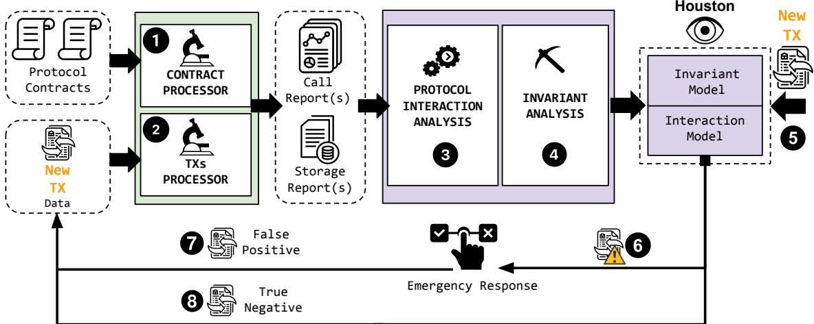
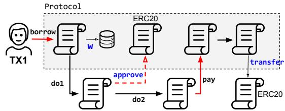
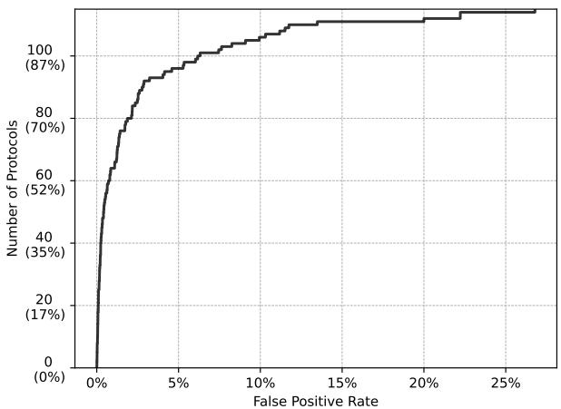
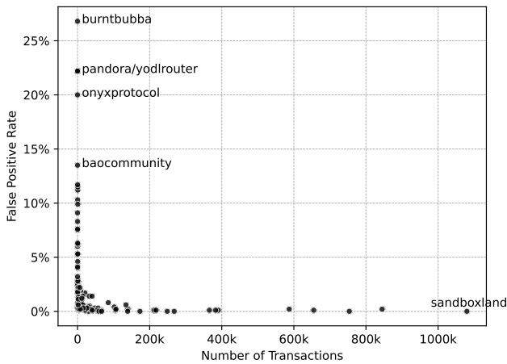
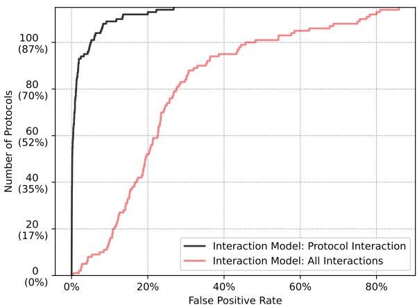

# HOUSTON: Real-Time Anomaly Detection of Attacks against Ethereum DeFi Protocols

Dongyu Meng<sup>1\*</sup>, Fabio Gritti<sup>1\*</sup>, Robert McLaughlin<sup>1</sup>, Nicola Ruaro<sup>1</sup>,

Ilya Grishchenko<sup>2</sup>, Christopher Kruegel<sup>1</sup>, and Giovanni Vigna<sup>1</sup>

<sup>1</sup>University of California, Santa Barbara

{dmeng, degrigis, robert349, ruaronicola, chris, vigna}@ucsb.edu

<sup>2</sup>University of Toronto

ilya.grishchenko@utoronto.ca

Abstract—As decentralized finance (DeFi) continues to innovate the financial system, the security of its building blocks remains a critical concern to its large-scale adoption. In DeFi, the stakes are exceptionally high, marked by recurring instances of financial losses totaling millions of dollars every week. All major blockchain-based financial applications (i.e., DeFi protocols) are built from – and interact with – programs known as smart contracts. While many security tools have been developed to identify specific classes of vulnerabilities (e.g., reentrancy) in individual smart contracts, considerably less effort has been invested in automatically identifying – in real time – attacks against DeFi protocols.

In this paper, we propose a novel approach for real-time, generic, explainable identification of attacks against DeFi protocols. Specifically, we identify potentially risky transactions without relying on any known vulnerability patterns. Our approach, implemented in HOUSTON, first automatically identifies the set of smart contracts that together implement a DeFi application and then, while monitoring new relevant transactions, builds and updates custom anomaly-detection models. Our models include information about typical execution paths (control flows) as well as information about how the protocol processes data, captured as likely invariants between the contract functions’ arguments and storage variables. HOUSTON offers explainable warnings that can be used for attack triaging.

We evaluated HOUSTON on a large corpus of over 22 million transactions, covering 115 DeFi incidents. In our experiments, HOUSTON achieved a detection true-positive rate of 94.8% while maintaining a low false-positive rate. When compared with state-of-the-art anomaly detection systems, HOUSTON achieves a higher number of true positives and lower false-positive rates. Finally, we deployed HOUSTON in a real-world setting, where it demonstrated real-time monitoring capabilities on commodity hardware while sustaining high accuracy.

## I. INTRODUCTION

Decentralized Finance (DeFi) drives a revolutionary paradigm shift in the financial l a n dscape. U n l ike traditional financial s y stems t h at r e ly o n c e ntralized a u thorities (e. banks), DeFi leverages blockchain technology to establish a transparent and decentralized financial e c o system [54]. Ethereum is one of the most widely used blockchains (with a market cap of 450 billion USD at the time of writing [81]) and arguably the most popular environment for deploying DeFi applications. Hundreds of DeFi applications have been developed on Ethereum to provide financial services with a Total Value Locked (TVL) of almost 82 billion USD [17]. At their core, DeFi applications (or protocols) are implemented through one or more smart contracts. These smart contracts are immutable programs stored on the blockchain as bytecode and executed by the Ethereum Virtual Machine (EVM) [78]. For instance, a user may request to borrow a certain amount of cryptocurrency from a DeFi lending protocol and provide collateral in a different cryptocurrency as a security deposit. To fulfill this request, the protocol might involve several contracts, such as the “risk-manager contract” (to check for the safety of the borrower’s position), the “oracle contract” (to report the correct price for the exchanged digital goods), and the “vault contract” (to transfer the funds).

While DeFi holds substantial promise, its proponents and users have learned a harsh lesson: Like all software, smart contracts have bugs, and these bugs can be (and have been) exploited by attackers to launch attacks that directly steal money from DeFi protocols [61], [13], [14]. At the time of writing, DeFi hacks have resulted in financial losses of more than 5 billion USD [7], [71]. Some of these stolen funds are known to sustain the activities of criminal groups [24] and dangerous nuclear programs [39]. A smart contract can be affected by multiple types of vulnerabilities [86]. Some of these vulnerabilities are basic implementation flaws (such as integer overflows and reentrancy). These bugs are fairly well-understood by the security community, and in recent years, both academia and industry have proposed a plethora of security tools to identify them [40], [26], [4], [50], [5], [30], [15], [32], [58]. Unfortunately, despite the use of these tools to secure smart contracts, attacks continue to occur. One reason is that certain bugs are tightly coupled to the business logic of individual DeFi protocols. The identification of such logic bugs requires a deep understanding of the protocol’s functionality, which is beyond the reach of most existing automated analysis systems [86].

An alternative approach to identifying (and fixing) bugs is to detect attacks against vulnerable contracts after deployment.

To this end, researchers have proposed systems that monitor blockchain transactions. Some systems examine the behavior of transactions that have already been executed with the idea of identifying attacks a posteriori [79], [68]. Other systems aim to detect attack transactions before they are committed to the blockchain (while they are still waiting in the public queue) [27]. When such pending attacks are detected, one can attempt to preempt (front-run) the attack transaction with a “defensive” transaction that rescues the funds held by the victim [84], [52], [80].

There are two main approaches for detecting attack transactions: pattern-based techniques and anomaly-based techniques. Pattern-based techniques leverage rules or heuristics that are applied to the execution traces of transactions [53], [82]. For example, DeFiRanger [79] introduces money-flow patterns that capture symptoms of price manipulation attacks. These techniques are generally precise and tend to produce few false alerts, but they are limited to detecting attacks that match known patterns. A second set of detection systems relies on anomaly detection [27], [48]. Their goal is to identify transactions that result in execution traces, data flows, or other aspects that are sufficiently different from those of benign transactions. Anomaly-based techniques are vulnerability-agnostic and can detect attacks that produce previously unseen anomalous behaviors. However, existing systems often lack explainability and typically generate a substantial number of false positives.

In this paper, we present HOUSTON, a novel anomaly detection system that performs real-time identification of attack transactions that target DeFi applications on Ethereum. Our key insight and contribution is the automated extraction and modeling of semantically meaningful signals from protocol executions. That is, we analyze transaction execution traces and focus on behaviors that reflect the core functionalities of a DeFi application. By doing so, we establish a robust baseline for normal behavior, enhancing our ability to detect outliers that are more likely to be attacks.

We model the behavior of a DeFi protocol by analyzing how functions within the protocol are historically invoked and how the persistent storage of the protocol’s contracts is manipulated. More precisely, our system comprises two distinct models, which are built and continually refined by monitoring live transactions involving the protocol under analysis: The Interaction Model and the Invariant Model. Here, we use the term “model” not in the machine learning sense, but to describe two purpose-built components: The Interaction Model is a control-flow-centric model that captures patterns of function invocations that perform sensitive operations. The Invariant Model is a data-state-centric model that infers relationships, in the form of likely invariants, between the inputs of smart contract functions and the values of the permanent storage of the contract. During live monitoring, HOUSTON continually consults and updates each model to examine the incoming stream of transactions. If a transaction is flagged as anomalous by any model, it is then escalated for evaluation by human experts or passed to automated response systems to mitigate the attack (e.g., by front-running the transaction [84], [52], [80]). Transactions deemed non-anomalous are instead utilized to refine the models, enhancing their accuracy and reducing the likelihood of future false positives. Importantly, assessments made by the models are executed rapidly, concluding well within the block generation time, before the possible inclusion of the attack transaction in the blockchain.

In summary, this paper makes the following contributions:

• We introduce models to capture the normal behavior of DeFi applications and leverage them to quickly detect when and how a DeFi protocol is under attack.

• Based on our models, we develop HOUSTON, an anomaly-detection system that can be automatically tailored to protect any given DeFi protocol on Ethereum.

• We compile 115 DeFi protocol incidents into a comprehensive benchmark, drawing from public datasets and incident reports. For each attack, we provide the address of the contract being attacked, the block and date of the incident, and the hash of the attack transaction. To the best of our knowledge, this is the most precise publicly available dataset on DeFi attacks.

• We compare the results of HOUSTON (94.8% truepositive rate, 0.16% false-positive rate) against state-ofthe-art systems and demonstrate its superior performance.

• We deploy HOUSTON as a real-time monitoring solution and evaluate its performance while monitoring 20 DeFi protocols, showing that real-time analysis is achievable with modest hardware requirements.

## II. MOTIVATION

HOUSTON helps administrators of DeFi protocols to protect their smart contracts against attacks. An attack consists of one or more malicious transactions that an adversary uses to trigger unintended functionality in a DeFi protocol, typically with the intent to steal assets or disrupt its operations. Frequently, an attack will exploit some smart contract vulnerability, either a basic implementation bug or a logic flaw, to perform actions that the protocol developers did not expect.

HOUSTON is an off-chain monitoring solution that provides real-time attack detection by continuously monitoring transactions and identifying anomalies. Our system can analyze both transactions that are pending (in the mempool) and confirmed (appear in a block). The mempool is a publicly observable queue of transactions that have been submitted to the blockchain but have not yet been included in a block. If an attack transaction is submitted to the mempool, HOUSTON can simulate the execution of the transaction before it is confirmed, and raise an alert if an anomaly is detected. This alert can be used to prevent the attack: For example, administrators could implement an automatic emergency pause mechanism triggered by the alert [87], or the alert could drive automated systems that front-run suspicious transactions [80], [52], [84].

Unfortunately, transactions can bypass the mempool by using a private transaction relay, which forwards transactions to block producers in secrecy [1]. These transactions are generally referred to as private transactions, as they are first observed by the public only when they are announced as confirmed in a block. While originally designed to improve the privacy of the blockchain, private transactions are commonly abused to launch stealth attacks [44]. In these cases, our system cannot detect the attack before it is included in a block without cooperation from the private relay. However, even in such cases, an anomaly detection system can provide value. For instance, the attack against the Revest protocol [3] was carried out with four different private transactions (sent in two different blocks) over ∼17 minutes. HOUSTON can detect the first attack transaction (included in a block) and alert the protocol administrators. Thus, if HOUSTON had been deployed, the administrator would have had time to react and (potentially) mitigate the subsequent attacks.

Threat Model. DeFi is sometimes referred to as the “Wild West of Crypto” [10]. This is because the ecosystem is plagued by many threats and risks, including hacks, scams, and cryptowallet thefts. However, different threat categories require distinct identification approaches. In this paper, we design an anomaly detection system for the real-time identification of attacks (adversarial transactions) that target any code defect in smart contracts – such as improper access control, reentrancy, undefined behaviors, and even protocol-specific logical bugs. Consider, for example, the attack against the Euler protocol [11]: A logic error in the function DonateToReserve allowed the attacker to artificially inflate the conversion rate between the borrowed and collateralized assets, leading to the theft of approximately 200 million USD. In §V, we show that HOUSTON detects this and other similar attacks.

We consider out-of-scope other threats whose root cause is related to malicious administration (i.e., rug-pulls [66]), loss of private keys [12], or loss of administrative control due to a governance takeover [37]. These threats generally involve actions performed by entities (e.g., protocol administrators) with a high level ofprivilege over the protocol. As a result, an anomaly detection system has limited efficacy in addressing such issues, because past actions that were considered “normal” (e.g., updating of an administration key by the protocol administrator) can now turn out to be malicious. Finally, HOUSTON is not designed to detect MEV activities (e.g.,frontrunning/sandwich attacks), which are typically attacks that do not target code defects in smart contracts.

Technical Challenges. Our core challenge is to design an attack-detection tool for Ethereum transactions that achieves both generalization and precision, while being real-timecapable. (1) Generalizability across attack types with precise detection: Existing detectors often rely on manually crafted, attack-specific rules or on machine-learning features with no clear semantic meaning (e.g., high-dimensional embeddings), limiting both adaptability and interpretability. HOUSTON instead derives vulnerability-agnostic signals from automatically mined invariants and control-flow patterns intrinsic to each protocol. These protocol-specific and semantically meaningful signals produce precise, interpretable alerts, facilitating efficient alert triage and maintaining low false-positive rates over long-term monitoring. (2) Real-time operation on live transaction streams: Detailed data- and control-flow analysis must run within the brief window of block production. HOUSTON achieves this through a lightweight, incremental design that continuously processes traces, detecting exploits in near realtime with bounded computation and memory overhead.

  
Fig. 1: TicketMonster’s Web2 frontend.

```solidity
struct Ticket { uint id; bool vip; }

contract TicketMonster {
    bool is_open;                      // slot 0x0
    address admin;                    // slot 0x0
    uint basePriceInUSD;                // slot 0x1
    uint vipTicketSurcharge;            // slot 0x2
    uint ticketId;                     // slot 0x3
    mapping(address => mapping(uint => Ticket))
        userTickets;                       // slot 0x4
    mapping(address => uint) balances; // slot 0x5

    // ... Bug(A): wrong visibility for function
    function setVipTicket(address user, uint ticketId,
        bool isvip) public {
        // ... logic to handle tickets upgrade
        userTickets[user][ticketId].vip = isvip; }

    function buy(address token, bool isvip) public
        returns (uint) {
        // ... Bug(B): missing address validation
        IERC20 _token = IERC20(token);
        uint totUSD = basePriceInUSD;
        // apply VIP rate
        if (isvip) totUSD += vipTicketSurcharge;
        // call to oracle to get ticketPriceInTokens
        uint amount = getTokAmount(token, totUSD);
        require(_token.balanceOf(msg.sender)>=amount, "
               Insufficient balance");
        require(_token.transferFrom(msg.sender,address(
            this), amount), "Transfer failed");
        ticketId += 1;
        Ticket ticket = Ticket(ticketId, false);
        userTickets[msg.sender][ticket.id] = ticket;
        setVipTicket(msg.sender, ticket.id, isvip);
        balances[msg.sender] += 1;
        return ticketId; }}
```  
Fig. 2: TicketMonster’s backend handling ticket sales.

## III. RUNNING EXAMPLE: TI C K E TMO N S T E R

To help demonstrate our system, we introduce a hypothetical DeFi protocol that sells event tickets. Figure 2 presents the code snippets of the protocol. TicketMonster provides a Web2 user interface (Figure 1) that allows customers to buy event tickets (one per transaction) at a given USD price using stable coins: USDC or USDT. For simplicity, every ticket has a fixed price of \$224, with a surcharge of \$500 for VIP service. In a typical use case, customers purchase tickets using the website: They would link their crypto wallet (e.g., Metamask [2]), and submit requests to the Web2 website, which, in turn, generates a transaction for the Web3 backend. Importantly, while the transactions generated by the website can be considered safe (i.e., crafted by the developer’s code), nothing prevents more sophisticated users from sending requests directly to the smart contract, bypassing any constraints enforced by the Web2 UI.

It is easy to note how the Web3 backend contract fails to enforce certain assumptions made by its frontend UI.

Bug (A) The function setVipTicket (Line 13) has the wrong visibility: It is supposed to be internal rather than public. Because of this, attackers could first buy non-VIP (basic price) tickets and then upgrade with no surcharge by directly calling setVipTicket.

Bug (B) The second oversight is the absence of validation for the token parameter of function buy supplied by users (Line 17). An attacker can simply deploy a malicious ERC20 token contract and use the fake token (instead of USDC or USDT) for payments. More specifically, when the TicketMonster’s contract calls to balanceOf (Line 25) and transferFrom (Line 26), it interacts with the attacker’s token, thus the execution happens according to the attacker’s code. This allows attackers to manipulate the return values of these calls and make the purchase succeed without actually paying [69]. Either bug, if exploited, can cause severe financial damage. In the following sections, we show how HOUSTON can identify attack transactions exploiting these bugs.

## IV. SYSTEM DESIGN

Our goal is to design an anomaly detector that identifies attack transactions by monitoring contract executions. Instead of relying on predefined attack patterns or entity reputation, the system extracts high-quality, protocol-specific signals from execution traces to produce timely, accurate alerts. Given a DeFi protocol, HOUSTON builds and continuously updates customized anomaly-detection models as part of its ongoing monitoring process. These models are used to evaluate new transactions directed to the protocol. If an anomaly is detected, the system raises an alert. Figure 3 presents an overview of our system and outlines its operational stages. In the following paragraphs, we describe each of these stages.

1 Contract Processor. First, we compile a list of all smart contracts that belong to a protocol. When HOUSTON is deployed, we assume that this list can be easily provided by administrators. For our experiments, however, we developed an approach to determine this list ourselves (see §V for details). Then, given the set of smart contracts that compose a protocol, we examine the contracts’ source code and use the Solidity compiler toolchain to extract relevant metadata, such as their public functions, argument types, and storage layouts [65]. We assume that our system typically has access to the contracts’ source code, since HOUSTON users are supposed to be the protocol’s administrators (or developers).

2 Transactions Processor. Given the output of the previous step and a transaction that interacted with the protocol (i.e., a transaction that triggered the execution of at least one of the contracts in the protocol), we first collect a detailed execution trace of the transaction, Then, we process this data and extract the necessary features that form the basis for our detection models (see §IV-B for details).

3 Protocol Interaction Analysis. The first detection model (Interaction Model) leverages the sequences of function calls. Intuitively, a protocol’s control flow reflects its core actions and their ordering. However, we are not interested in all calls. Instead, we focus on externally initiated calls to the protocol’s public interface that either modify persistent storage or trigger key external operations such as token transfers.

4 Invariant Analysis. For our second model (Invariant Model), we focus on the values that are written to persistent storage and those passed as arguments to function calls. Specifically, we establish “normal” patterns for these values and their inter-relationships. We believe that the semantics of contracts can be meaningfully captured by the values of their state (storage) variables, their function arguments, as well as the relationship between these variables. To do this, we employ likely-invariant inference techniques [19] to capture important protocol properties automatically.

5 HOUSTON Anomaly Detection. When a new transaction (that targets the protocol) is spotted, HOUSTON (locally) runs the transaction and analyzes the resulting execution trace. Specifically, the two models independently examine various aspects of the transaction trace, including the involved smart contract functions, their argument values, and their validity against the invariants identified in 4 . The outputs from both models are then combined to determine a final verdict. If the transaction is found to be anomalous, we raise an alert.

6 HOUSTON Alerts. Whenever an alert is raised, it can be evaluated by a human analyst or used as a trigger by an automated system to initiate a response. In the event of a confirmed attack (a true positive), administrators can initiate incident response procedures, such as an emergency pause of the protocol [87]. Alternatively, the transaction can be frontrun by one of the recently proposed systems that aim to rescue funds [52], [85], [80]. Conversely, if the transaction was erroneously flagged as anomalous (a false positive), it will be incorporated into the transaction corpus 7 . The system will automatically update its models, eliminating the recurrence of similar false positives in subsequent analyses.

8 HOUSTON Continuous Updates. If HOUSTON’s models do not raise any alert for a transaction, HOUSTON automatically adds this transaction to its baseline corpus and updates its models with this new information.

## A. Contract Processor

Recall that most DeFi protocols consist of multiple smart contracts. When protecting a protocol, our system monitors (and takes as input) all the smart contracts associated with this protocol. These contracts constitute the protocol’s footprint on the blockchain. For each contract, we extract its ABI [64], as well as determine its storage layout [65]. These metadata are needed to extract (1) the typed function’s arguments from the raw bytes of a transaction’s CALLDATA, and (2) to obtain precise information regarding which storage variables are modified during a contract’s execution. To extract these data, we use the off-the-shelf contract’s ABI decoder [64], and a custom procedure named Storage Variables Decoder (SVD). Storage Variables Decoder. We design this procedure to extract precise modifications to state variables. More specifically, the SVD takes as input an arbitrary slot id, the

  
Fig. 3: HOUSTON Overview. The analyses described in 1 - 2 - 3 - 4 are used to provide data to the models employed by HOUSTON. In 5 , a new transaction is ready to be examined by HOUSTON. In 6 , a transaction is considered to be anomalous, and it is sent to an emergency response system. If the transaction is deemed to be a false positive, it is added to the corpus 7 . HOUSTON will start to generate a new knowledge base automatically. Transactions that do not raise any alert 8 are also added to the corpus to update HOUSTON’s models.

StorageLayout of a contract, and a description of the KECCAK256 operations (i.e., KeccakInfo) executed during a transaction (available after tracing a transaction in 2 ) and returns fine-grained information about the variables stored in a given slot. This process is necessary because variables in the EVM can be packed together in the same storage slot [65]. Without this distinction, proper annotation and invariant calculation would be impossible. For instance, in TicketMonster (Figure 2), the slot id 0x0 contains a Boolean value (i.e., the variable is\_open) at offset 0 and an address (i.e., admin) at offsets 1→21. Computing SVD(0x1, StorageLayout, KeccakInfo) results in {v1 = 1, v2 = 0xADMIN}. Note that we need KeccakInfo to only resolve accesses to dynamic slots (e.g., slots 0x4 and 0x5 in Figure 2). For additional details see Appendix A. Binary-only Contracts. Currently, if a protocol includes some binary-only contracts, HOUSTON simply avoids calculating the likely invariants in 4 for those contracts. However, these contracts are still considered for the Interaction Model in 3 . We discuss the impact of source code availability in §VI.

## B. Transaction Processor

We employ an Ethereum archive node [41] to trace a transaction relevant to a protocol – i.e., one that includes any direct or indirect calls to the protocol’s smart contracts. Specifically, we design a custom tracing plugin to obtain information about the following opcodes: SSTORE, CALL, DELEGATECALL, STATICCALL, and KECCAK256.

SSTORE. For SSTORE operations, our custom tracer collects the following information: The slot id being written, the prior value of the storage slot, the new value, the identifier of the function in which this operation happens, the address of the contract executing the opcode (i.e., the code address), and the address of the contract whose storage is being referenced.

CALL. When executing a call (CALL, DELEGATECALL, or STATICCALL), we extract the sender address, the destination address, and the raw bytes of the CALLDATA.

KECCAK256. The KECCAK256 opcode applies the KEC-CAK256 hash function to its input (the pre-image) and produces as output a hash value (the image). It is commonly used to compute the address of elements within lists and mappings. For example, consider the mapping balances stored at slot id 5 (Line 10, Figure 2). To retrieve the balance of a user (i.e., purchased tickets) with key USER, the EVM will compute KECCAK256(USER.5) and use the result as an address to access the contract’s storage. When tracing a transaction, we record all the pre-images (inputs) for all KECCAK256 opcodes. This information allows us to determine whether writes to different memory locations (i.e., slot IDs represented by different KECCAK256 images) target the same dynamic variable (e.g., a mapping storing users’ balances).

For a given transaction, the Transaction Processor outputs a Call Report and a Storage Report. The Call Report contains all the calls performed by all the contracts involved in the transaction execution. The arguments for each function call are annotated by the contract’s ABI decoder. The Storage Report contains all the available information on SSTORE and KECCAK256 operations, as annotated by the SVD procedure. In particular, SVD refines the accessed slot id into the corresponding variables that are modified (in case there are multiple variables packed into a slot). As a result, the Storage Report contains detailed information on every variable modified in the storage of any contract in the protocol. For instance, in TicketMonster (§III), we would annotate a Ticket purchase with its corresponding id and vip flag.

## C. Protocol Interaction Analysis

The sequence of function calls executed by the protocol’s smart contracts (throughout a transaction) provides valuable insights into a protocol’s behavior. Intuitively, if a sequence of function calls deviates from typical and common patterns, it is an outlier, and, often, these outliers are attack attempts [27]. However, the entire call sequence of executed functions (within a transaction) can be very long (e.g., hundreds of nested function calls), may include activities unrelated to a monitored protocol, or may contain uninteresting protocol actions (i.e., a call to a function that simply returns the balance of a user). This can add noise to a model and lead to false positives. Thus, unlike prior work that inspects all function calls, we focus only on “critical” function calls that are relevant to the monitored protocol. We name the list of critical function calls Protocol Interaction. Our Protocol Interaction analysis unfolds in four steps:

(1) Call Direction Identification. The analysis first categorizes all calls (that are part of a transaction trace) according to the “direction” of the call. Specifically, we only keep incoming calls, that is, calls from a smart contract (or externally owned account) whose address is not part of the protocol, to a smart contract within the protocol. By retaining only incoming calls, we construct protocol interactions that account for actions initiated by entities external to the protocol. This significantly diminishes the noise caused by outgoing and internal calls (see our ablation study in Appendix B).

(2) Critical Call Identification. Based on the execution tree provided by the Call Report, and the storage writes reported in the Storage Report, this analysis marks any incoming function call as critical if either the called function itself (or any other function within its call tree), (1) triggers storage changes (performs an SSTORE operation) in any of the smart contracts belonging to the DeFi protocol or (2) initiates the execution of a function matching a predefined list of identifiers. Currently, this list includes four standard ERC20 token [21] functions: transfer, transferFrom, safeTransferFrom, and approve. Intuitively, these functions are important because they capture token transfer and approval mechanisms, thereby capturing the movements of digital assets.

(3) Direct ERC20 Token Operation Filtering. Many DeFi protocols include one or more ERC20 token contracts. External users (and contracts) can directly interact with these token contracts, performing operations (e.g., transfer) without involving the rest of the protocol’s logic. These operations tend to occur in large volumes and generally do not correlate to potential attacks but rather add substantial noise to the model. Therefore, HOUSTON filters out all incoming ERC20 calls from the protocol interaction pattern. Importantly, we only exclude incoming ERC20 operations (e.g., approve in Figure 4). If a call to a non-ERC20 function triggers downstream token movements (e.g., a call to transfer), HOUSTON still considers it as a part of the protocol interaction, e.g., in Figure 4, the incoming call to function pay triggers an ERC20 transfer, thus, it is part of the final fingerprint.

  
Fig. 4: Protocol Interaction Analysis. The protocol’s smart contracts are in the gray area. Function borrow triggers a storage write in one of the protocols of the contract. Function approve is filtered out. The function pay leads to an ERC20 transfer. The fingerprint of TX1 is [borrow, pay], but we save function selectors instead of their names.

(4) Interaction Pattern Identification. We use the sequence of critical function calls as a fingerprint of the transaction. Specifically, from the Call Reports of historical transactions, the Protocol Interaction Analysis builds a database of all observed interaction fingerprints (later used by the Interaction Model). For example, in TicketMonster (§III), as benign users buy tickets via the Web2 UI, the protocol interaction database would contain only one fingerprint: [buy]. The reason is that neither the call to the price oracle (Line 24) nor the call to function setVipTicket (Line 30) is an incoming call (i.e., a call coming from outside the protocol and directed to it), thus, they are not considered in the final fingerprints. To better illustrate our algorithm, Figure 4 shows a more complete example of how we reduce a complex sequence of calls (in and out of a protocol) to the signature [borrow,pay]. By focusing on critical functions, we significantly reduce the complexity of call sequences while preserving the relevant information regarding the protocol’s function calls. For example, in the Euler protocol attack, the attack transaction made 150 calls, whereas the Protocol Interaction representation of the attack comprises only 8 calls. These 8 calls outline the exact steps of the attack as security experts described in their writeups [55]. In our experiments (§V), HOUSTON successfully detects the attack transaction with the help of these fingerprints. Moreover, we show that the focus on critical functions (rather than modeling the entire function call trace) is critical to the accuracy of this model (Appendix B).

## D. Invariant Analysis

Program Invariants. Invariants represent properties within a program’s code that always hold at a program point or a set of program points [19]. Commonly, identifying program invariants requires static analysis techniques, such as symbolic execution and abstract interpretation [60]. However, those techniques suffer from scalability limitations when used to analyze complex contracts. Moreover, for our purposes, we are not interested in proving that certain program invariants always hold. Instead, our focus is on identifying relationships between variables that consistently hold in incoming transactions, reflecting the intended behavior of a smart contract’s execution. These relationships, when violated, may indicate an attack. Hence, for HOUSTON, we collect likely invariants [19].

Likely invariants are properties that are dynamically inferred from values observed during multiple program executions. For instance: in TicketMonster, the argument token has been historically observed to be equal to 0xUSDC or 0xUSDT (these are the only two currencies allowed for payment by the Web2 UI, Figure 1). This dynamic inference approach generally produces relevant relationships, but it comes at the cost of soundness (that is, a likely invariant may not hold true for all executions). Nevertheless, given enough observations of a likely invariant, the confidence of the observed property increases [20]. The goal of the program invariant analysis is to automatically identify likely invariants at the function boundaries of a smart contract. Specifically, we infer relationships between a function’s inputs (its arguments and initial storage state) and its outputs (represented by the resulting storage state). Unlike return values alone, storage updates capture meaningful behavioral effects because persistent state changes influence both the current execution and future interactions.

Likely-Invariants Class Selection. The selection of likelyinvariant classes requires considering a wide range of possibilities. Intuitively, mining all possible unary and binary relationships among all the variables in a smart contract would rapidly make the problem intractable (e.g., the Daikon [19] engine offers more than 200 invariant classes). To reduce the number of invariant classes, we initially experimented with a broad range of them on a pilot dataset of 16 DeFi incidents covering diverse attack types. While experimenting with different invariants on our pilot dataset, we observed several practical challenges: Some invariant types were overly sensitive and triggered frequent false positives (e.g., the UpperBound invariant, which alerts whenever a variable exceeds its historical maximum); others (e.g., ternary invariants) led to a combinatorial explosion in run-time or lacked clear semantic interpretation. We iteratively filtered out such invariant classes and focused on those that both: (1) showed violations during real attacks, and (2) had clear, human-interpretable semantics. This trial-and-error process led us to the following four simple invariant classes used in the final system:

(C1) For individual integer variables, the analysis checks whether a variable is never zero. An unexpected zero may signal abnormal behavior in arithmetic operations.

(C2) For individual address and bytes variables, the analysis determines if the address or bytes variable always equals a specific value, or if it is drawn from a set of possible values.

(C3) For relationships between two integer variables, the analysis checks if any of the ordering relations (=,≥,≤) always hold. For example, an invariant may state that the amount of redeemable tokens is always less than the user’s balance.

(C4) For relationships between two strings, addresses, or bytes, we evaluate whether the two variables are always the same. This invariant type can help when, for example, the developers assume that two addresses should always be identical to ensure that a transaction originates from the same source, but fail to enforce the assumption.

Selective Mining for Binary Likely Invariants. The attentive reader may have noticed that our method for generating likely invariants over the contracts’ variables adopts a “bruteforce” strategy. Specifically, HOUSTON checks all possible relationships or properties (of types C1–4) over variables and variable pairs as they are observed during the processing of a protocol’s transactions. While this approach is acceptable for unary invariants, it quickly leads to the generation of numerous spurious binary invariants that lack any real semantic meaning (e.g., timeStamp < reserve). Although many of these invariants are unlikely to ever be violated, some may introduce false positives. To address this, we precompute all variable pairs in each contract that the Invariant Model might compare and use an LLM (GPT-4.1 [47]) to check if each comparison is semantically meaningful in the context of the contract. During monitoring, the Invariant Model only mines (and checks) over the variable pairs deemed semantically meaningful. We quantify the effectiveness of this selection step in §V-C.

Likely-Invariants Inference. To identify likely invariants, we combine the information from Call Reports and Storage Reports (generated in 2 ) to create data traces of function arguments and storage variables at the entrance and exit of all function calls. The Invariant Analysis then determines, for each invariant category of interest, whether an invariant over a single variable, or between two (semantically comparable) variables, consistently holds across all executions at a specific program point. If this consistency is verified, we record the invariant and the number of transactions supporting it (as a metric of confidence) for future reference. Importantly, our current invariant inference algorithm is not designed to extract sophisticated invariants of the kind that a developer might manually specify (e.g., collateralValue × collateralFactor ÷ debtValue ≥ 1, which was violated in the Euler incident). Instead, its goal is to mine a large number of simpler candidate likely invariants. While some may be quickly violated (and thus deemed unlikely), others capture meaningful properties with broad coverage, emerging as valuable indicators for detecting attacks, either directly or through the side effects of malicious transactions. Our invariant extraction algorithm can be easily extended with more advanced systems [42] if required by the protocol.

## E. HOUSTON Anomaly Detection

For every new transaction, HOUSTON creates an execution trace and consults its models to identify anomalies.

Interaction Model. The Interaction Model computes the transaction’s fingerprint as described in §IV-C and compares it against those in the database. The model reports an anomaly if the fingerprint has not been seen before. For example, if an attacker tries to exploit TicketMonster using Bug (A) (Figure 2, Line 13) by first calling the buy function and then, in another transaction, calling setVipTicket to upgrade their ticket, they would generate an unseen fingerprint [setVipTicket]. Invariant Model. The Invariant Model observes all protocol transactions and computes the likely invariants. Then, it uses such invariants to detect anomalies (invariant violations) in new transactions. In the ideal case, where the monitored application is stable and has seen significant usage, a transaction should be flagged as anomalous if any of the computed invariants is violated. For instance, in our TicketMonster example, an attacker attempting to exploit Bug (B) by providing a token address other than 0xUSDC or 0xUSDT would violate the invariant token ∈ {0xUSDC, 0xUSDT}, which is an invariant of category C2 as described in §IV-D. For newly deployed contracts or functions that see limited use, the supporting observations for an invariant may be minimal. This scarcity of data can make it challenging to determine whether an inferred likely invariant accurately reflects the core semantics of the contract or whether the invariant is merely incidental due to insufficient transaction diversity, suggesting that alerts on its violation may be groundless. To address this, the Invariant Model enforces a waiting period for each likely invariant, allowing more user interactions with the protocol. During this period, any violation will lead HOUSTON to discard the invariant without triggering an alert. The waiting period is defined by two hyperparameters: the minimum transaction count supporting the invariant (N) and the minimum contract age (T). A violation is within the waiting period only if both conditions are met. In this study, we set N = 10 and T = 12 hours, but our experiments show that detection outcomes are stable across various settings. The final decision is simple: If at least one of the two models report(s) an anomaly, HOUSTON triggers an alarm.

## F. HOUSTON Continuous Updates

HOUSTON continuously incorporates new interaction fingerprints and updates invariants, keeping its behavioral models aligned with the protocol as it evolves. This incremental learning is essential to maintaining a low false-positive rate. Interaction Model Update. Whenever a new protocol interaction is observed, HOUSTON raises a warning and then simply adds the interaction fingerprint to its database.

Invariant Model Update. This involves three main operations: mining new invariants, discarding any that have been violated, and increasing the confidence of existing invariants by incorporating additional observations. For example, assume the invariant token ∈ {0xUSDC} has been established for TicketMonster. If a new transaction uses 0xUSDT as token (Figure 2, Line 18), HOUSTON will raise a warning, discard the previous invariant, and establish the new invariant: token ∈ {0xUSDC, 0xUSDT}. To enable continuous updates of the Invariant Model, we implemented our own invariant mining engine inspired by Daikon, a state-of-the-art system for inferring likely invariants [19]. Our invariant miner adds support for incremental invariant inference, which enables HOUSTON to quickly incorporate new information into its models.

## V. EVALUATION

## A. DeFi Attacks Dataset

To evaluate HOUSTON, we compiled 115 DeFi protocol incidents into a comprehensive benchmark, drawing from both previous work [27], [87] and public reports of security incidents [56], [70]. We curated our dataset to be as comprehensive as possible by including all incidents within the defined scope. Only those incidents that fell outside this scope (as outlined in §II) or occurred on non-Ethereum chains were excluded. Our dataset includes protocols of varying application types and exploits against a diverse set of vulnerabilities. Note that each incident corresponds to a distinct protocol. For incidents with multiple attack transactions, we label the earliest transaction as the ground truth, as detecting this initial action allows administrators to respond swiftly, for instance, by pausing the protocol to prevent further damage. Notably, this approach is more challenging than merely identifying any one of the attack transactions. For each attack, we report the address of the contract being attacked, the block and date of the incidents, and the hash of the first attack transaction.

Identify Smart Contracts of a Protocol. In §IV, we described how our system takes as input the addresses of the smart contracts belonging to a DeFi protocol and then uses incoming transactions to build its models. In practice, protocol administrators can (easily) identify the involved contracts. For our evaluation, however, this information is not readily available. We therefore approximate protocol membership as follows. We first identify the deployer of the attacked (victim) contract, i.e., the account that created it. We then include all contracts directly deployed by this account as part of the protocol. Since contracts may also be created through internal transactions, we further inspect the deployer’s internal transactions and include any contracts created in this way.

## B. Experimental Setup

We evaluate our system on a server with dual Intel Xeon Gold 6330 processors, 512 GB of RAM, and 20 TB of SSD storage. To evaluate HOUSTON’s capabilities, we design two experiments: the Historical Evaluation and the Live Performance Evaluation. The goal of the former is to demonstrate the system’s high precision and recall across 115 historical attacks, while the latter aims to showcase its effectiveness in real-time scenarios when monitoring 20 protocols in parallel.

## C. HOUSTON Historical Evaluation

Given a protocol, we first collect all past transactions that interacted with any of its contracts, up to the point of the first known attack (as per our dataset V-A). HOUSTON then analyzes these transactions in chronological order to identify anomalies. We record whenever an alert is produced, and we stop our evaluation after processing the reference attack transaction. In this evaluation, we consider any alert that does not correspond to the reference attack transaction to be a false positive. While this approach may be imprecise—particularly if there are unknown attacks preceding the reference incident—it provides an upper bound on the number of false positives generated by HOUSTON. It is also worth noting that while an alert from HOUSTON might be considered a false positive, the flagged transaction may still exhibit anomalous features that can offer valuable insights, e.g., a new behavior used in the protocol, or a new contract appeared in the protocol that is interacting with it in new ways. Finally, when evaluating the attack transaction, if HOUSTON flags the transaction as anomalous, we consider it a true positive; otherwise, we consider it a false negative. Our results show that HOUSTON is effective in detecting attacks for a diverse set of protocols. Specifically, out of 115 DeFi protocol incidents in our dataset, HOUSTON detected 109 attacks (∼94.8%). HOUSTON also exhibited a low false positive rate of 0.16%. We present a per-protocol results overview in Table IV in Appendix D.

True Positives. In contrast to detection systems based on neural networks [27], the alerts produced by HOUSTON have a high level of explainability. That is, they directly show which calls are anomalous or which invariants have been violated. This makes it much easier for human analysts to determine the root cause of an attack and to discard potential false positives. This level of explainability enables us to systematically examine how HOUSTON ’s detected anomalies align with the actual exploit mechanisms. Specifically, we analyzed all 109 detected incidents and compared our alerts with the corresponding public postmortem reports. For each incident, we examined alerts from both models and used the more conclusive one as its representative signal. Among these incidents, HOUSTON produces causal detections in 57 (52%) cases, where the invariant violation or interaction pattern directly pinpoints the root cause of the vulnerability. In these situations, the abnormal behavior exposed by HOUSTON is so fundamental to the exploit that carrying out the attack without triggering such an alert would have been impossible. Another 43 (39%) incidents fall into the indicative category, where the detected violation reflects a consequence of the attacker rather than the immediate exploitation of the bug. These alerts often capture secondary effects that reveal the attacker’s intent or correspond to side effects of the exploit. While such signals might be avoided by a highly sophisticated attacker, it depends on the specific circumstances or goals of the attack, and doing so would significantly increase its difficulty. Finally, 9 (8%) incidents are incidental detections, where the triggered signal is unrelated to the exploit and uninformative for triage. Most of these cases are in protocols exploited early in their deployment, and the alerts are raised because the transaction paths are novel.

Below, we discuss two interesting true positives cases.

(1) RevestFinance. This attack was detected by both of HOUSTON’s models. Specifically, the invariant violation points to a mismatch between the two storage variables fnftID and fnft\_created, which are supposed to be equal when entering the function mint (C3, §IV-D). This mismatch was caused by the exploitation of a reentrancy vulnerability, and the attack could not have succeeded without triggering this condition (causal). For the Interaction Model, no previous transaction ever called mintAddressLock twice in its protocol interaction (hinting at possible reentrancy) and thus triggered a warning (indicative).

(2) Euler. Both HOUSTON’s models identified the attack. Specifically, the Interaction Model reported a new protocol interaction where a call to donateToReserves preceded a call to liquidate, which is essential for the exploit to succeed (causal). At the same time, the invariant model reported a violation during the execution of liquidate. In all prior executions, deferLiquidityStatus was never zero for liquidate (C1, §IV-D). This violation arose because the attacker deliberately skipped deferLiquidityChecks, which is normally invoked by all legitimate users. Although the exploit could still succeed even with this check in place, omitting it reflects a distinct behavioral deviation – an attacker’s willingness to bypass standard safety routines. Therefore, we classify Invariant Model’s detection as indicative.

False Negatives. HOUSTON failed to detect an attack in only 6 incidents out of 115 (5.2%). After manual investigation, we observed that four incidents would require mining additional types of invariants. For instance, for the nomad incident [13], it would be necessary to infer invariants on values read from the storage (currently, we focus only on storage writes, as discussed in §IV-B). Of the remaining two cases: azukidao was exploited too soon (4 days) after deployment, and, therefore, HOUSTON simply did not have enough data to learn anything meaningful; snood’s exploit directly targeted a buggy reimplementation of a transferFrom in the protocol, and since incoming ERC20 calls are filtered to reduce false positives (as explained in §IV-C), this attack was not detected.

False Positives. Overall, HOUSTON had 13,827 false positives out of 8,586,421 transactions evaluated across all 115 protocols over their entire history (false-positive rate 0.16%, 0.4 false positive per protocol per day on average). As is shown in Figure 5, 64 (55.7%) protocols have ≤ 1% false positive rate; 92 (80.0%) protocols have ≤ 3% false positive rate. Table IV in Appendix D shows the detailed false-positive numbers (and rates) for each protocol. We investigated these false positives and identified two main reasons for these errors:

(1) Historical Data Availability. When there are too few observations (or no observations in the case of new contracts), HOUSTON has very little information to learn from and will suffer from false positives during a short initialization period. Luckily, as transactions accumulate, HOUSTON’s invariants and interaction fingerprints become more reliable, and the false positive rate drops quickly. In Figure 6, we show the correlation between the number of transactions available for a protocol and the false positive rate. Notably, all of the 23 protocols with a false positive rate exceeding 3% had fewer than 800 total transactions. In practice, developers can mitigate this cold-start effect by bootstrapping HOUSTON with their own test cases or simulation traces prior to deployment. These synthetic transactions provide initial behavioral diversity for the model to learn from, allowing it to establish preliminary invariants and interaction patterns and, thereby, significantly reducing false positives during the early monitoring phase.

(2) Likely-Invariant Quality. In §IV-D, we described how we used an LLM to selectively mine binary invariants to avoid nonsensical pairs. We found that this selection step reduced the number of false positive alerts in the Invariant Model by 27.2% (from 10,579 to 7, 702), while preserving the model’s detection capability (true positives remain unchanged). Because our filtering is purposefully conservative, some spurious relationships might persist. We manually analyzed a random sample of 100 mined invariants from the Invariant Model. Of these, 84 were deemed meaningful: we could imagine plausible scenarios in which violations of these invariants can be indicative of abnormal executions (even if such violations may never occur in practice). Among the remaining 16 that we found to be spurious, two were unary invariants that asserted unjustified restrictions on free parameters. For instance, one such invariant incorrectly assumed that the spender parameter in the allowance function must belong to a small, fixed set of addresses. The remaining 14 were binary invariants involving variable pairs that are not semantically comparable. This could be further resolved by utilizing a better reasoning model at the cost of a more expensive pre-filtering step (the process cost ∼\$100 of LLM credits across the entire dataset).

(3) Operation Repetition and Permutation. The Interaction Model drastically reduces the call trace of a transaction to a few, meaningful operations. However, the repetition (and permutation) of such operations can lead to new interaction fingerprints that cause false alarms. For instance, if a user performs five deposits and one withdraw against a monitored protocol, depending on where the withdraw is placed among the five deposits, the transaction may generate six unique fingerprints. Regardless, these false alarms appear less frequently as transactions accumulate. To mitigate this, one may associate each operation with the underlying logical entity it acts upon (e.g., a stake or lien). This entitylevel grouping effectively partitions long, flattened parallel sequences into independent sub-sequences, thereby preventing the combinatorial explosion of possible interaction patterns.

Given the statistics and root-cause patterns above, it is useful to consider the operational impact of false alerts. Although HOUSTON produces false alerts on the historical dataset, this does not undermine its practicality. Most false positives occur during the initial (learning) phase, after which the rate stabilizes at very low levels, with mature protocols typically seeing fewer than one non-exploit alert per day (see Figure 6, Table IV). Because alerts are explainable and closely aligned with actual exploit mechanisms, HOUSTON remains effective despite the presence of false positives. To further evaluate the false positive rate of HOUSTON on mature, high-quality protocols without known history of exploitation, we collected all transactions up to the time of experiment (block 20400000, totaling over 13 million) of an additional set of popular Ethereum DeFi protocols with Total Value Locked greater than \$500M [17]. Then, we performed the same experiment as the one for the DeFi attacks dataset. For this experiment, we reported an aggregate false-positive rate of 0.08%, which is significantly lower than that for the DeFi attacks dataset. This supports our observation that, for well-used protocols, falsepositive rates drop significantly, indicating that HOUSTON is effective in real-world settings, where accuracy is essential. Finally, to reduce false positives, one could also initialize HOUSTON’s models with existing benign transactions.

  
Fig. 5: Cumulative distribution of false positive rates.

  
Fig. 6: Overview of the correlation of false positive rates with the total number of transactions available per protocol. Note that protocols with high false-positive rates are evaluated with an exceptionally low number of transactions. See Appendix D Table IV for detailed per-protocol results.

## D. Comparison with Existing Systems

APE. APE is a system that automatically synthesizes adversarial smart contracts to imitate (and front-run) profitable transactions in real-time [52]. Although HOUSTON and APE pursue fundamentally different objectives (anomaly detection vs. profitability detection), a comparison between the two is still meaningful, as Qin et al. suggest that APE can also be leveraged as a defensive mechanism. For this comparison, we were unable to run APE directly (the system is not opensourced); however, the authors provided us with the list of transactions that APE historically replayed on the Ethereum mainnet. This transaction set spans from block 12936340 to block 15253305, overlapping with our dataset. The overlap includes 2.4M transactions, among which there are 20 attacks. Out of these 20 attacks, APE successfully countered 4, while HOUSTON flagged 19 (both systems share a false negative). Within the same reference time frame, APE exhibited a false positive rate of 0.15%, compared to 0.10% for HOUSTON. Theoretically, HOUSTON can enhance APE’s attack capabilities when both target the same DeFi protocol. Upon receiving a transaction, APE synthesizes a frontrun, while HOUSTON checks if the activity is malicious. If confirmed, APE can promptly deploy the crafted transaction.

BlockGPT. Gai et al. proposed BlockGPT [27], a generic approach for DeFi anomaly detection based on neural networks. At the time of writing, the authors have not yet made their system available as open source. Thus, we chose to compare our results based on the protocol attacks reported in their paper in Figures 5, 10, and 11. Also, the authors did not disclose the exact transaction hashes that BlockGPT marked as attacks. Thus, we must assume that BlockGPT identified the same transactions as our investigation. While we understand this can create discrepancies in the comparison results, this is our best attempt to make a fair comparison. To compare with BlockGPT, we selected the 28 attacks that are both in scope for HOUSTON (i.e., on Ethereum) and present in BlockGPT’s dataset. Overall, our system detects 27 attacks across these 28 protocols, whereas BlockGPT detects only 15. Our only false negative is 88mph. Unfortunately, it is not clear why BlockGPT would detect an anomaly against 88mph because (1), the system naturally suffers from limited explainability, and (2) we have no information regarding the transaction hash labeled as an attack by the authors. Table IV shows a detailed comparison between the detection results for HOUSTON and BlockGPT. Since we do not have access to BlockGPT, we cannot run it directly on our dataset to determine its false positives. Instead, we look at the reported results in Figure 4 of the paper. Overall, BlockGPT achieves a false positive rate of less than 10% for 58% of the protocols in its scope. As a comparison, HOUSTON has a false-positive rate of less than 10% for 92.2% of the protocols. Notably, HOUSTON achieves a false positive rate of 1% or less for 55.7% of the protocols. TXSPECTOR. TXSPECTOR [82] is a logic-driven framework that detects attacks by analyzing execution traces. It relies on user-defined control and data dependencies rules tailored to specific attack patterns (the original paper covered, for example, re-entrancy, unchecked call, and suicidal vulnerabilities). As a consequence, the range of attack types TXSPECTOR can detect is limited. When applied to our dataset, it identified only 25 out of 115 attack transactions (21.7%), whereas HOUSTON achieved a true-positive rate of 94.8%. Moreover, not all vulnerability types can easily fit into the framework, making it impractical to rely solely on writing additional custom rules to achieve more generic detection coverage.

DefiRanger. The system targets price manipulation attacks on DeFi applications [79] by constructing and analyzing a cash flow tree. It successfully identifies attacks on several protocols in our dataset, as detailed in Section 6.2, Table 5 of their paper. Of the 9 reported attacks, we excluded Plouto (Binance chain), DRC, and MET (missing transactions’ hashes). Our evaluation shows that HOUSTON detected all 6 remaining attacks and flagged the correct transaction as anomalous. Additionally, our dataset includes 23 other price manipulation attacks not included in DeFiRanger’s dataset, which it could plausibly detect (though this is unverified due to lack of open source). The remaining 86 attacks (74.8%) in our dataset involve other vulnerability classes and would likely be false negatives for DeFiRanger (out of scope).

Transaction Length Baseline. It seems to be common wisdom in the blockchain community that it is sufficient to look for abnormally long transactions to detect attacks. While this might be true for some exploits, we argue that transaction length is generally a weak signal. To demonstrate this, we evaluate the transaction-length-based approach by using a simple heuristic that just measures the length of a transaction (in terms of the number of function calls performed) and compares it to the maximum length observed up to that point. We raise an alert whenever a new transaction is longer than any observed before. As expected, this basic approach detects only 46 attacks (40%) out of the total 115.

## E. HOUSTON Live Performance Evaluation

It is essential for anomaly detection systems in DeFi to keep pace with block production. Specifically, in the context of Ethereum, a system must be able to evaluate all the transactions committed to the latest block in less than 12 seconds (block-time). Moreover, to offer attack-prevention capabilities (i.e., identifying attack transactions in the mempool before they are committed to a block), a system must also manage the influx of transactions sent to the mempool. Therefore, it is necessary to test HOUSTON in a real-life setting to demonstrate how it can keep up with both the pace of the live production of blocks and the transactions sent to the mempool. To evaluate HOUSTON as a real-time anomaly detector, we deploy it live against 20 randomly selected protocols (from our dataset) that are operational at the time of this experiment (protocols marked with ⋆ in Table IV, Appendix D). We deployed HOUSTON to monitor new incoming transactions as discussed in §IV. HOUSTON analyzed all mainnet transactions from April 9th to April 28th, 2024 (20 days). This includes transactions in the mempool and committed blocks.

Transactions Filtering. HOUSTON observed a total of 42.6M transactions.We discarded 50.2% of them either because they perform simple ETH transfers (no smart contract involvement), or because they directly invoke basic functions of wellestablished token contracts (e.g., USDC transfer). This step took a few nanoseconds per transaction, which is negligible. Tracing Performance. To check if a transaction calls the monitored protocols, HOUSTON must replay it to collect a trace. This is because simply checking for direct invocations is insufficient; internal transactions also need to be considered. On average, we observed ∼13 transactions per second. Given the average tracing time of 3 ms per transaction, a single tracing worker can handle this load in 39 ms when monitoring all 20 protocols simultaneously. Note that a tracing worker only requires ∼150MB of RAM and 25% of a CPU core.

Processing Performance. If a transaction involves any of the contracts in a monitored protocol, HOUSTON needs to extract the Call Report and the Storage Report 2 . Overall, during live experiments, we observed a total of 95.6K transactions directed to the monitored protocols. On average, the number of transactions for which this step is required is about one transaction per block. Given our average processing time of 180ms, this load can be handled by one processing worker equipped with ∼1.5GB of RAM and 1 CPU core.

Detection Performance. After processing, HOUSTON performs the following two steps: (1) HOUSTON consults its models to make a detection decision 5 , and (2), it updates the models with the new transaction’s information 7 / 8 . Together, these two operations take, on average, ∼28ms per transaction. The resources required by a detection worker are 2GB of RAM and 2 cores. Each monitored protocol needs at least one dedicated detection worker.

Worst Case Performance. The average load for HOUSTON to monitor 20 protocols is light and could be handled by one tracing worker, one processing worker, and 20 detection workers. Of course, our system cannot just be built for the average case. We also need to take into account bursts of transactions. During our live monitoring, we observed the following peak instances: A maximum of 362.9 transactions/second that needed to be traced, as well as 2.2 transactions/second that required further processing. Moreover, we observed individual worst-case processing times of 337ms for the tracing worker, 2.9s for the processing worker, and 810ms for the detection worker. See Appendix C for a summary of average and worstcase performance (Table II) and transaction load (Table III). Overall, combining all worst-case instances, HOUSTON would require 121 tracers, 8 processing workers, and 40 detection workers (2 per protocol). Given these requirements, HOUSTON needs ∼110GB of memory and 120 cores to keep pace with real-world Ethereum mainnet traffic. These requirements can be matched by a single modern server, such as the one we used in our evaluation, where we never encountered all worstcase instances simultaneously. Importantly, we think this experiment provides evidence of feasible real-world deployment. Should HOUSTON be adopted in an industrial setting, there are clear engineering venues for achieving faster tracing and detection times (e.g., using reth [49] instead of Erigon [41], and re-implementing HOUSTON in Rust [59]).

Live Setup. Our live evaluation used 8 tracers, 4 processing workers, and 20 detection workers (one per protocol). The system showed no latency or resource issues: The transaction queues remained empty, memory peaked at ∼80GB, and CPU load averaged 8.0 across 112 cores.

Live Monitoring Warnings. During the live evaluation, HOUSTON kept low false positive rates. Overall, HOUSTON raised a total of 75 warnings (0.08% of the 95.6K transactions directed to monitored protocols). For 9 of the 20 monitored protocols, HOUSTON never raised an alert. For 10 of them, HOUSTON raised fewer than 10 alerts throughout the 20- day period. The only exception is conicfinance, which reported 24 warnings over 901 transactions (2.7%). The reason for this is that a newly introduced ConicPool address triggered multiple invariant violations at various program points. Additional Monitoring. We conducted an additional threeweek live experiment (October 27th to November 16th, 2025) on the same 20 protocols. Across 108.5K related transactions, HOUSTON generated 71 alerts (0.07%), consistent with the false-positive rate in the previous period. Manual analysis confirmed that none were attacks, and no external sources reported incidents during this period.

## F. HOUSTON for other EVM-compatible chains

To further validate the generality of our approach, we ported HOUSTON to another major EVM-compatible blockchain: Binance Smart Chain (BSC [6]). In general, three key components are required to adapt our system to a new EVMcompatible chain: (1) a native transaction tracer, (2) a blockchain index database, and (3) a contract analysis tool capable of fetching and inspecting smart contracts to extract their storage layouts and ABIs. To this end, we ported our Erigon plugin to bsc-erigon [46], we used Dune Analytics [18] to fetch the protocol’s boundaries and related transactions, and we adapted the toolchain in Figure 3, Step 1 , to work with BSC. For this experiment, we consider the incidents listed on DeFiHackLab [70] that occurred on BSC between May and October 2025 (20 incidents over six months). Among these, we discard seven incidents because the vulnerable contracts are available only in binary form, and an additional one due to insufficient information about the vulnerable contract. HOUSTON successfully identifies attacks in 11 of the remaining 12 incidents, with a low false positive rate of 0.19%. The only undetected case (pdz) does not represent a genuine detection failure: HOUSTON instead flags an earlier transaction (0x88f8741d) that occurred 202 days before the labeled incident and exhibited a highly similar pricemanipulation pattern. Notably, this earlier attack was never publicly reported; the protocol’s maintainers appear to have been unaware of it and continued normal operation.

## VI. DISCUSSION AND LIMITATIONS

Source Code Availability. The precision of HOUSTON’s models depends on the availability of contract ABIs and storage layouts. Although partial information can be inferred through binary-only analysis [30], [58], [32], accuracy generally degrades. Accordingly, we assume developers using HOUSTON have access to their own source code. However, third parties analyzing unverified contracts must rely on decompilers to recover ABIs and storage layouts. Notably, recent advances [22] leveraging LLMs have achieved up to 49.8% success in recompiling binary-only contracts, enabling the extraction of ABIs and storage layouts. Practically, our contract processor (Step 1 in Figure 3) would need to be modified to automatically decompile and recompile unverified contracts to produce the required artifacts. Once these artifacts are obtained, the rest of HOUSTON’s pipeline is unchanged. Private Transactions. HOUSTON can prevent or detect abnormal transactions, whether before mining or after inclusion in a block. Clearly, prevention requires the ability to observe transactions in the mempool. However, under certain circumstances, this may not be feasible. For example, users might utilize private relayers (e.g., Flashbots [1]) or verifiers could insert transactions themselves before proposing a block. In such scenarios, a transaction will not be visible in the mempool, preventing HOUSTON from facilitating preemptive measures. This limitation could be mitigated if private relayers and/or verifiers adopt HOUSTON. Notably, the private industry is currently deploying systems similar to HOUSTON [25], [34], [36], [51], as a defense-in-depth strategy, demonstrating the value of such a system. These systems differentiate L2 services, which might censor attack transactions at the sequencer level, and support L1 blockchains in implementing protective measures when direct censorship is impractical.

Dynamic Adversary (Poisoning). Poisoning HOUSTON is possible in principle, but not without difficulty. Consider a contract where functions A and B can change the openMarket flag. While both functions should be protected by onlyAdmin, only A enforces it. An attacker observes that invoking B can close the market and impact the protocol, but the direct invocations of B would trigger an alert. A feasible poisoning strategy is to wait for an admin action executed via A that violates a C1 invariant and, thus, generates an alert. If that alert is dismissed as an intentional admin action, HOUSTON would integrate the event into its notion of “normal” behavior. As a result, future transactions exhibiting the same behavior will not be flagged, allowing the attacker to call B to close the market without triggering an alert. This example shows that even when poisoning is feasible, HOUSTON still raises the difficulty of successful attacks: Adversaries must align their actions with rare administrative events and rely on the security team inadvertently dismissing the initial warning.

## VII. RELATED WORK

Smart Contract Security. The most effective way to protect DeFi protocols is to identify vulnerabilities during development, before deployment. To support this goal, the research community has explored several approaches: static analysis, formal verification, symbolic execution, and fuzzing. Static analysis is a technique used to scrutinize a program’s content and structure without executing it [29], [76], [77], [28], [5], [23]. Formal verification uses mathematical methods to prove adherence to certain security properties [60], [26], [67]. Symbolic execution explores a program’s behavior by executing code using symbolic inputs [4], [43], [32], [45], [74], [63], [75], [15], [50], [58]. Lastly, fuzzing involves repeatedly executing a target contract with many different generated inputs. [73], [57], [31], [33]. All these techniques have been used alone or in combination to identify both simple and complex bugs, such as integer overflows, reentrancy, excessive gas usage, and unsanitized calls. While identifying attacks before deployment is an important goal, it is often unattainable. Therefore, complementary approaches are required, such as detection (which is the focus of this work) and prevention.

Attack Detection. Several prior works detect attacks by characterizing the patterns of actions performed by a user or a smart contract [48], [83], [35], [68]. These papers primarily focus on detecting Ponzi schemes, phishing, and other scams directed toward end users. DeFiRanger is a specialized tool to detect price manipulation attacks [79]. A handful of recent works attempt to tackle the topic of generalized anomaly detection for smart contracts. In this work, we discussed BlockGPT and APE [27], [52]. Other frameworks perform on-chain anomaly detection, but the alert conditions (i.e., assertions) must be manually annotated [8], [62], [16], [82]. Conversely, HOUSTON, does not need any transaction annotations to deliver off-chain anomaly detection. Several commercial anomaly detectors have also been developed in the past few years [38], [51], [34], [25], [36]. These products generally require developers to manually define custom conditions that specify which behaviors should be permitted (or prohibited) during executions, or they rely on flagging transactions originating from suspicious sources such as sanctioned accounts or crypto mixers [72]. These conditions are evaluated either on-chain or off-chain, and any detected violation typically results in a warning or in the transaction being blocked. HOUSTON fundamentally differs from these approaches, as it eliminates the need for manually specified detection rules. Instead, HOUSTON’s models automatically infer the relevant signals for a given protocol. Furthermore, HOUSTON does not depend on external metadata such as transaction provenance, which is generally an unreliable signal prone to both false positives and false negatives.

Attack Prevention. Various methods exist to prevent or mitigate an attack once it is recognized. Zhou et al. observe that about half of the DeFi protocols they surveyed include an emergency pause mechanism [87]. Other works develop automated syntheses of attack-stealing transactions, which are capable of performing the attack as “white hat” instead of the true attacker [52], [85], [80]. Notably, HOUSTON can act as the detection component that triggers such front-running tools. Invariant Inference. Daikon is a system that infers likely invariants from program traces [19]. Liu et al. applied Daikon to smart contracts through their tool, InvCon, which extracts simple invariants from ERC20 token contracts. However, InvCon has limitations, as it requires manual interpretation of invariant violations by a human operator. In contrast, HOUS-TON provides a generic analysis to extract likely invariants from any smart contract, which can be continuously refined at runtime. This allows the invariants to adapt dynamically during live monitoring. Furthermore, HOUSTON automatically checks for violations, facilitating the timely detection of anomalous behavior. Chen et al. [9] utilized invariant templates to identify exploits related to known smart contract vulnerabilities, which requires manual annotation of template-relevant variables. In contrast, HOUSTON’s models are fully automated and can detect attack transactions as anomalies without requiring adaptation to specific attack types.

## VIII. CONCLUSIONS

In this paper, we introduce HOUSTON, a novel anomaly detection system for identifying attacks against Ethereum-based DeFi protocols. HOUSTON focuses on detecting deviations in protocol execution rather than recognizing known vulnerability patterns. HOUSTON distinguishes itself by (1) detecting anomalies through the analysis of the protocol interactions and likely invariants, and (2) adapting and evolving by ingesting new data from transactions. For evaluation, we used a comprehensive dataset of 115 attacks on DeFi protocols. The efficacy of HOUSTON, demonstrated through a comparative analysis with state-of-the-art systems, shows its superior detection rate of 94.8% with a low false-positives rate of 0.16%. Experiments on live traffic confirm HOUSTON’s efficiency and its low falsepositive rate in real-world deployments.

## ACKNOWLEDGMENTS

This material is based upon work supported by the National Science Foundation under grant numbers CNS-2334709 and IIS-2229876 and is supported in part by funds provided by the National Science Foundation, by the Department of Homeland Security, and by IBM. Any opinions, findings, and conclusions or recommendations expressed in this material are those of the author(s) and do not necessarily reflect the views of the National Science Foundation or its federal agency and industry partners.

## REFERENCES

[1] Flashbots. https://www.flashbots.net/.

[2] Metamask. https://metamask.io/.

[3] blocksecteam. Revest Finance Vulnerability, 2022.

[4] Priyanka Bose, Dipanjan Das, Yanju Chen, Yu Feng, Christopher Kruegel, and Giovanni Vigna. Sailfish: Vetting smart contract stateinconsistency bugs in seconds. In IEEE SP, 2022.

[5] Lexi Brent, Neville Grech, Sifis Lagouvardos, Bernhard Scholz, and Yannis Smaragdakis. Ethainter: a smart contract security analyzer for composite vulnerabilities. In PLDI, 2020.

[6] BSC. Bnb chain. https://www.bnbchain.org/en/bnb-smart-chain, 2025.

[7] chainsec. Timeline of defi exploits. https://chainsec.io/defi-hacks/.

[8] Ting Chen, Rong Cao, Ting Li, Xiapu Luo, Guofei Gu, Yufei Zhang, Zhou Liao, Hang Zhu, Gang Chen, Zheyuan He, Yuxing Tang, Xiaodong Lin, and Xiaosong Zhang. SODA: A generic online detection framework for smart contracts. In NDSS, 2020.

[9] Zhiyang Chen, Ye Liu, Sidi Mohamed Beillahi, Yi Li, and Fan Long. Demystifying invariant effectiveness for securing smart contracts. In ESEC/FSE 2024, 2024.

[10] CNBC. Defi is the wild-west of crypto, 2021.

[11] Coinbase. Euler Compromise Investigation, 2023.

[12] Coindesk. Axie infinity ronin network suffers 625m exploit, 2022.

[13] Coindesk. Nomad Drained of Nearly \$200M in Exploit, 2022.

[14] Cointelegraph. Euler finance attack how it happened and what can be learned, 2023.

[15] ConsenSys. Mythril. https://github.com/ConsenSys/mythril, 2022.

[16] Thomas Cook, Alex Latham, and Jae Hyung Lee. Dappguard: Active monitoring and defense for solidity smart contracts. 2017.

[17] DeFiLlama. Dashboard. https://defillama.com/chain/Ethereum, 2024.

[18] dune.com. Dune. https://dune.com/, 2025.

[19] Michael D Ernst, Jake Cockrell, William G Griswold, and David Notkin. Dynamically discovering likely program invariants to support program evolution. In proceedings of ICSE, 1999.

[20] Michael D Ernst, Adam Czeisler, William G Griswold, and David Notkin. Quickly detecting relevant program invariants. In Proceedings of the 22nd international conference on Software engineering, 2000.

[21] Ethereum. ERC-20 Token Standard, 2023.

[22] evmdecompiler. evmdecompiler. https://evmdecompiler.com/, 2025.

[23] Josselin Feist, Gustavo Grieco, and Alex Groce. Slither: A static analysis framework for smart contracts. In International Workshop on Emerging Trends in Software Engineering for Blockchain (WETSEB), 2019.

[24] Forbes. Terrorists, north korea and other illicit actors move beyond bitcoin, 2023.

[25] Forta. What is forta firewall: Redefining onchain security, 2025.

[26] Joel Frank, Cornelius Aschermann, and Thorsten Holz. ETHBMC: A bounded model checker for smart contracts. In USENIX Security Symposium, 2020.

[27] Yu Gai, Liyi Zhou, Kaihua Qin, Dawn Song, and Arthur Gervais. Blockchain large language models. arXiv:2304.12749, 2023.

[28] Asem Ghaleb, Julia Rubin, and Karthik Pattabiraman. Etainter: Detecting gas-related vulnerabilities in smart contracts. ISSTA 2022. ACM.

[29] Neville Grech, Michael Kong, Anton Jurisevic, Lexi Brent, Bernhard Scholz, and Yannis Smaragdakis. Madmax: Analyzing the out-of-gas world of smart contracts. Commun. ACM, 63(10), 2020.

[30] Neville Grech, Sifis Lagouvardos, Ilias Tsatiris, and Yannis Smaragdakis. Elipmoc: advanced decompilation of ethereum smart contracts. Proceedings of the ACM on Programming Languages, 2022.

[31] Gustavo Grieco, Will Song, Artur Cygan, Josselin Feist, and Alex Groce. Echidna: Effective, usable, and fast fuzzing for smart contracts. In ISSTA. ACM, 2020.

[32] Fabio Gritti, Nicola Ruaro, Robert McLaughlin, Priyanka Bose, Dipanjan Das, Ilya Grishchenko, Christopher Kruegel, and Giovanni Vigna. Confusum contractum: confused deputy vulnerabilities in ethereum smart contracts. In USENIX Security Symposium, 2023.

[33] Jingxuan He, Mislav Balunovic, Nodar Ambroladze, Petar Tsankov,´ and Martin Vechev. Learning to fuzz from symbolic execution with application to smart contracts. In ACM CCS, 2019.

[34] hexagate. Hexagate, 2025.

[35] Teng Hu, Xiaolei Liu, Ting Chen, Xiaosong Zhang, Xiaoming Huang, Weina Niu, Jiazhong Lu, Kun Zhou, and Yuan Liu. Transactionbased classification and detection approach for ethereum smart contract. Information Processing & Management, 2021.

[36] hypernative. Hypernative, 2025.

[37] Immunefi. Hack Analysis: Beanstalk Governance attack, 2022.

[38] ironblocks. ironblocks. https://ironblocks.com/, 2025.

[39] Wall Street Journal. How north korea’s hacker army stole \$3 billion in crypto, funding nuclear program, 2023.

[40] Johannes Krupp and Christian Rossow. teEther: Gnawing at ethereum to automatically exploit smart contracts. In USENIX Security Symposium, 2018.

[41] ledgerwatch. Erigon. https://github.com/ledgerwatch/erigon, 2023.

[42] Junrui Liu, Yanju Chen, Bryan Tan, Isil Dillig, and Yu Feng. Learning contract invariants using reinforcement learning. In Proceedings of the 37th IEEE/ACM International Conference on Automated Software Engineering, 2022.

[43] Loi Luu, Duc-Hiep Chu, Hrishi Olickel, Prateek Saxena, and Aquinas Hobor. Making smart contracts smarter. In ACM CCS. ACM, 2016.

[44] Xingyu Lyu, Mengya Zhang, Xiaokuan Zhang, Jianyu Niu, Yinqian Zhang, and Zhiqiang Lin. An empirical study on ethereum private transactions and the security implications. arXiv:2208.02858, 2022.

[45] Ivica Nikolic, Aashish Kolluri, Ilya Sergey, Prateek Saxena, and Aquinas´ Hobor. Finding the greedy, prodigal, and suicidal contracts at scale. ACSAC 18. ACM, 2018.

[46] node real. bsc-erigon. https://github.com/node-real/bsc-erigon, 2025.

[47] OpenAI. Gpt-4.1. OpenAI API, April 2025. Large language model; context window 1 million tokens; API access.

[48] Bofeng Pan, Natalia Stakhanova, and Zhongwen Zhu. Ethershield: Time interval analysis for detection of malicious behavior on ethereum. ACM Trans. Internet Technol., 2023.

[49] paradigm. Blazing-fast implementation of the Ethereum protocol, 2025.

[50] Anton Permenev, Dimitar Dimitrov, Petar Tsankov, Dana Drachsler-Cohen, and Martin Vechev. Verx: Safety verification of smart contracts. In 2020 IEEE symposium on security and privacy. IEEE, 2020.

[51] phylax. Phylax firewall. https://phylax.systems/, 2025.

[52] Kaihua Qin, Stefanos Chaliasos, Liyi Zhou, Benjamin Livshits, Dawn Song, and Arthur Gervais. The blockchain imitation game. arXiv:2303.17877, 2023.

[53] Kaihua Qin, Zhe Ye, Zhun Wang, Weilin Li, Liyi Zhou, Chao Zhang, Dawn Song, and Arthur Gervais. Towards automated security analysis of smart contracts based on execution property graph. arXiv:2305.14046, 2023.

[54] Kaihua Qin, Liyi Zhou, Yaroslav Afonin, Ludovico Lazzaretti, and Arthur Gervais. Cefi vs. defi–comparing centralized to decentralized finance. arXiv:2106.08157, 2021.

[55] QuillAudits. Decoding euler finance’s \$197 million exploit, 2023.

[56] Rekt. Rekt, leaderboard. https://rekt.news/leaderboard/, 2022.

[57] Michael Rodler, David Paaßen, Wenting Li, Lukas Bernhard, Thorsten Holz, Ghassan Karame, and Lucas Davi. Efcf: High performance smart contract fuzzing for exploit generation. In EuroS&P, 2023.

[58] Nicola Ruaro, Fabio Gritti, Robert McLaughlin, Ilya Grishchenko, Christopher Kruegel, and Giovanni Vigna. Not your type! detecting storage collision vulnerabilities in ethereum smart contracts. In Network and Distributed Systems Security Symposium 2024, 2024.

[59] Rust-lang. Rust language. https://www.rust-lang.org/, 2025.

[60] Clara Schneidewind, Ilya Grishchenko, Markus Scherer, and Matteo Maffei. Ethor: Practical and provably sound static analysis of ethereum smart contracts. In CCS, 2020.

[61] Kudelski Security. The poly network attack, 2021.

[62] R. K. Shyamasundar. A framework of runtime monitoring for correct execution of smart contracts. In Blockchain ICBC 2022, 2022.

[63] Sunbeom So, Seongjoon Hong, and Hakjoo Oh. SmarTest: Effectively hunting vulnerable transaction sequences in smart contracts through language Model-Guided symbolic execution. In USENIX Security Symposium, 2021.

[64] soliditylang. Contract ABI Specification, 2023.

[65] soliditylang. Storage Layout, 2023.

[66] Soliduslabs. Rug pull crypto scams, 2022.

[67] Jon Stephens, Kostas Ferles, Benjamin Mariano, Shuvendu Lahiri, and Isil Dillig. Smartpulse: Automated checking of temporal properties in smart contracts. In 2021 IEEE SP, 2021.

[68] Liya Su, Xinyue Shen, Xiangyu Du, Xiaojing Liao, XiaoFeng Wang, Luyi Xing, and Baoxu Liu. Evil under the sun: understanding and discovering attacks on ethereum decentralized applications. In USENIX Security Symposium, 2021.

[69] Tianle Sun, Ningyu He, Jiang Xiao, Yinliang Yue, Xiapu Luo, and Haoyu Wang. All your tokens are belong to us: Demystifying address verification vulnerabilities in solidity smart contracts. arXiv:2405.20561, 2024.

[70] SunWeb3Sec. DeFiHackLabs, 2025.

[71] thestreet.com. Crypto stolen in 2024 tops 1.2 billion, 2024.

[72] TornadoCash. Tornadocash. https://tornado.cash/, 2025.

[73] Christof Ferreira Torres, Antonio Ken Iannillo, Arthur Gervais, and Radu State. Confuzzius: A data dependency-aware hybrid fuzzer for smart contracts. In EuroS&P, 2021.

[74] Christof Ferreira Torres, Julian Schutte, and Radu State. Osiris: Hunting¨ for integer bugs in ethereum smart contracts. In ACSAC 18. ACM, 2018.

[75] Christof Ferreira Torres, Mathis Steichen, and Radu State. The art of the scam: Demystifying honeypots in ethereum smart contracts. In USENIX Security Symposium, 2019.

[76] Petar Tsankov, Andrei Dan, Dana Drachsler-Cohen, Arthur Gervais, Florian Bunzli, and Martin Vechev. Securify: Practical security analysis¨ of smart contracts. In ACM CCS, 2018.

[77] Shuai Wang, Chengyu Zhang, and Zhendong Su. Detecting nondeterministic payment bugs in ethereum smart contracts. Proc. ACM Program. Lang., 3(OOPSLA), 2019.

[78] Gavin Wood et al. Ethereum: A secure decentralised generalised transaction ledger. Ethereum project yellow paper, 2014.

[79] Siwei Wu, Dabao Wang, Jianting He, Yajin Zhou, Lei Wu, Xingliang Yuan, Qinming He, and Kui Ren. Defiranger: Detecting price manipulation attacks on defi applications. arXiv:2104.15068, 2021.

[80] Yue Xue, Jialu Fu, Shen Su, Zakirul Alam Bhuiyan, Jing Qiu, Hui Lu, Ning Hu, and Zhihong Tian. Preventing price manipulation attack by front-running. In International Conference on Artificial Intelligence and Security. Springer, 2022.

[81] ycharts. Ethereum Market Cap, 2024.

[82] Mengya Zhang, Xiaokuan Zhang, Yinqian Zhang, and Zhiqiang Lin. TXSPECTOR: Uncovering attacks in ethereum from transactions. In USENIX Security Symposium, 2020.

[83] Yanmei Zhang, Wenqiang Yu, Ziyu Li, Salman Raza, and Huaihu Cao. Detecting Ethereum Ponzi Schemes Based on Improved LightGBM Algorithm. IEEE Transactions on Computational Social Systems, 2022.

[84] Zhuo Zhang, Zhiqiang Lin, Marcelo Morales, Xiangyu Zhang, and Kaiyuan Zhang. Your exploit is mine: Instantly synthesizing counterattack smart contract. In USENIX Security Symposium, 2023.

[85] Zhuo Zhang, Zhiqiang Lin, Marcelo Morales, Xiangyu Zhang, and Kaiyuan Zhang. Your exploit is mine: Instantly synthesizing counterattack smart contract. In USENIX Security Symposium, 2023.

[86] Zhuo Zhang, Brian Zhang, Wen Xu, and Zhiqiang Lin. Demystifying exploitable bugs in smart contracts. In ICSE, 2023.

[87] Liyi Zhou, Xihan Xiong, Jens Ernstberger, Stefanos Chaliasos, Zhipeng Wang, Ye Wang, Kaihua Qin, Roger Wattenhofer, Dawn Song, and Arthur Gervais. Sok: Decentralized finance (defi) attacks. In 2023 IEEE Symposium on Security and Privacy (SP). IEEE, 2023.

## APPENDIX A STORAGE VARIABLES DECODER

The storage layout report emitted by the compiler provides a high-level overview of the storage structure. However, this report does not allow direct mapping of a given storage access (i.e., SSTORE) to the associated source code variables. For example, the storage layout may show that at slot id 0 there is a static array my\_struct[100] with 100 contiguous elements – where my\_struct is a simple data structure with few fields packed in a single storage slot. Given an SSTORE to slot 0x3, to understand which variables are being overwritten, one would need to automatically recognize that slot id 0x3 still falls within the definition of the static array. To perform the translation from the compiler-generated storage report to a programmatically usable data structure, we implemented an algorithm that recursively resolves every type definition within the storage layout and provides a “flat” view of the contract’s storage structure.

Complex Variable Types. Complex variable types, such as mappings, and nested data structures are characterized by storage access patterns that use the KECCAK256 hash function to derive the accessed slot id. These ids are calculated using either the accessed index (for a dynamic array) or the accessed key (for a dynamic mapping). As a result, since there are countless ways to access the same data structure, it is impractical to enumerate all of them in the storage layout report. Instead, we characterize accesses to dynamic slots by analyzing the sequence of operations that the EVM executes (during a transaction) to calculate the slot id. For example, consider the KECCAK256 look-up table structure shown in Table I, resulting from the look-up users[“admin”][“savings”]. In this example, users is a nested data structure defined as map1[string:map2[string:uint256]]. To perform the look-up, the following operations are executed: KECCAK256(KEY2.(KECCAK256(KEY1.BASE1)),

where KEY1= “admin”, BASE1=0x0, KEY2=“savings”, and BASE2=0xbc36789e. In this example, the elements nested

TABLE I: Example of the KECCAK256 look-up table collected during the transaction tracing (hashes are truncated for readability). To resolve an SSTORE that writes at slot id 0xd44ee5c9, one can do a reverse-lookup in the table and extract the BASE in the pre-image until we identify a static slot. For example, here the look-up sequence would be: 0xd44ee5c9→0xbc36789e→0x0. This shows the access pattern [0x0, KECCAK256, KECCAK256] that reveals access to an element of a nested mapping.

<table><tr><td>Preimage</td><td>Image</td></tr><tr><td>admin.0x0</td><td>0xbc36789e</td></tr><tr><td>savings.0xbc36789e</td><td>0xd44ee5c9</td></tr></table>

within map2 are uniquely identified by the access pattern [0x0, KECCAK256, KECCAK256].

Given a slot id, the (flattened) contract’s storage layout, and the KECCAK256 look-up table collected during the transaction tracing, the function SVD will: (1) if the slot id corresponds to a static slot, simply return the corresponding slot information from the storage layout; otherwise, (2) if the slot id is calculated using the KECCAK256 hash function (e.g., 0xd44ee5c9 in TableI), iteratively perform reverse-lookups of the image within the KECCAK256 look-up table (Table I) to identify the corresponding dynamic data structure and its base slot id. Once this is identified, the SVD procedure returns precise slot packing information using the storage layout.

## APPENDIX B ABLATION STUDY

In this paper, we argue that high-quality signals are critical for obtaining accurate detection results. To support this claim, this section presents the results of two ablation studies.

Protocol Interaction versus All Interactions. First, we show how focusing on critical functions (§ IV-C) – rather than on all function calls – in a trace is crucial to lower false positives. To this end, we rerun our experiments with an Interaction Model that computes fingerprints based on all function calls. Figure 7 shows the results and demonstrates that the false positives drastically increases when using the full call trace. Specifically, without focusing on critical functions, Interaction Model produces 192 times more false positives (1,258,841) than the paper setup that facilities the interaction simplification techniques. This highlights the importance of selective attention to relevant interactions for achieving accurate detection. Fine- versus Coarse-Grained Storage Analysis. The ability to identify the type and layout of storage variables (finegrained storage analysis) is important for precise invariant generation, especially when protocols pack multiple variables in the same storage slot. For example, the value 0x40301020 might represent two different uint16 variables – 0x4030 and 0x1020 – used in two different parts of the program. Interpreting the whole slot as a single uint256 variable (coarse-grained storage analysis) would lead to imprecise (or incomplete) invariants that negatively affect the decisions of the Invariant Model. To assess the impact of the analysis granularity, we modify the function SVD (§ IV-A) to always report one single variable per slot of type uint256.

The Invariant Model detected four additional attacks with fine-grained storage analysis. We use the sealfinance incident to illustrate how coarse-grained analysis can lead to imprecise detection. The attack transaction violated the invariant in function swap: the argument amountOut must be less or equal to storage variable reserve. The coarse-grained analysis failed to identify this invariant because reserve was packed in the same slot with two other variables.

For false positive, the two configurations had similar performances, with fine-grained analysis yielding a slightly lower (0.7%) total number of false alarms. With more refined storage understanding, the precision of invariants improves. Meanwhile, the sheer number of variables and invariants also grows, which inevitably leads to an increase in false positives. These two opposing forces play out differently across protocols, and tend to balance out when considered across the entire dataset.

TABLE II: HOUSTON execution time (in second).

<table><tr><td></td><td>Trace</td><td>Process</td><td>Detect</td><td>End-to-End</td></tr><tr><td>mean</td><td>0.003</td><td>0.180</td><td>0.028</td><td>0.211</td></tr><tr><td>median</td><td>0.003</td><td>0.133</td><td>0.013</td><td>0.148</td></tr><tr><td>99%</td><td>0.006</td><td>1.105</td><td>0.191</td><td>1.165</td></tr><tr><td>max</td><td>0.337</td><td>2.912</td><td>0.810</td><td>3.085</td></tr></table>

TABLE III: Transaction load for HOUSTON during live experiments (number of transactions per second).

<table><tr><td></td><td>Filter</td><td>Trace</td><td>Process / Detect</td></tr><tr><td>mean</td><td>24.9</td><td>12.5</td><td>0.1</td></tr><tr><td>median</td><td>24.2</td><td>12.1</td><td>0.0</td></tr><tr><td>99%</td><td>46.4</td><td>24.1</td><td>0.4</td></tr><tr><td>max</td><td>725.0</td><td>362.9</td><td>2.2</td></tr></table>

## APPENDIX C

## LIVE EXPERIMENTS PERFORMANCE STATISTICS

HOUSTON performs the following procedures during operation: (1) Trace: Upon spotting a new transaction, HOUSTON collects the execution trace (using our custom plugin) from the Ethereum node. (2) Process: HOUSTON parses the raw execution trace, extracts relevant information, and turns it into the format needed for further analysis. (3) Detect: The Interaction Model and the Invariant Model check for anomaly and raise warnings if necessary. HOUSTON then integrates new transaction data into its models.

The time statistics for these procedures, along with the endto-end execution time (the cumulative time taken by steps (1)- (3)), are detailed in Table II. We also provide statistics about the load of Ethereum mainnet traffic HOUSTON handled during the live experiments in Table III.

  
Fig. 7: Cumulative distribution of false positive rates of the Interaction Model with two different configurations.

## APPENDIX D HOUSTON RESULTS OVERVIEW

TABLE IV: HOUSTON Historical Evaluation Results. ✓ represents true positive, ✗ represents false negative. Column Tot TXs is the total amount of transactions available for the protocol. Column Lifespan represents the number of days the protocol had been active prior to the attack. Column FP shows the total amount (and percentage) of false positive transactions in the Tot TXs. Column FP/d shows the average daily false positive alerts for a protocol. Column Inv. FP is the absolute number of false positives reported by the Invariant Model. Column Int. FP reports the absolute number of false positives reported by the Interaction Model. Column Inv. and Int. represents the decision of each model regarding the attack transaction. Column HOUSTON is the final decision taken by our system. The BlockGPT [27], APE [52], TXSPECTOR [82], and DeFiRanger [79] columns show the results of corresponding systems. Symbol - means that the protocol was not in their dataset (when we do not have access to the tool to apply to our dataset). Specifically, for BlockGPT, $\checkmark _ { 1 }$ shows that the attack was ranked as the most abnormal transaction, $\checkmark _ { 2 }$ as the second most abnormal transaction, and $\check { \mathbf { \Omega } } _ { 3 }$ as the third most abnormal one. Column Longest reports the results of the transaction length baseline. Finally, we use the symbol ⋆ to identify protocols that were part of our live monitoring evaluation.

<table><tr><td></td><td>Protocol</td><td>Tot TXs</td><td>Lifespan</td><td colspan="2">FP (%)</td><td>FP/d</td><td>Inv. FP</td><td>Int. FP</td><td colspan="2">Inv. Int.</td><td>HOUSTON</td><td>BlockGPT</td><td>APE</td><td>TXSPECTOR</td><td>DeFiRanger</td><td>Longest</td></tr><tr><td>1</td><td>polynetwork ★</td><td>57,140</td><td>363</td><td colspan="2">3 (0.0%)</td><td>0.0</td><td>0</td><td>3</td><td>✓</td><td>✘</td><td>✓</td><td>✘</td><td>✘</td><td>✘</td><td>✘</td><td>✘</td></tr><tr><td>2</td><td>grok</td><td>66,790</td><td>6</td><td colspan="2">7 (0.0%)</td><td>1.2</td><td>0</td><td>7</td><td>✘</td><td>✓</td><td>✓</td><td>-</td><td>-</td><td>✓</td><td>✘</td><td>✘</td></tr><tr><td>3</td><td>teamfinance ★</td><td>30,619</td><td>456</td><td colspan="2">15 (0.0%)</td><td>0.0</td><td>0</td><td>15</td><td>✘</td><td>✓</td><td>✓</td><td>-</td><td>-</td><td>✘</td><td>✘</td><td>✓</td></tr><tr><td>4</td><td>mcc</td><td>59,801</td><td>536</td><td colspan="2">26 (0.0%)</td><td>0.0</td><td>12</td><td>14</td><td>✓</td><td>✓</td><td>✓</td><td>-</td><td>-</td><td>✓</td><td>✓</td><td>✓</td></tr><tr><td>5</td><td>loopring ★</td><td>248,781</td><td>1142</td><td colspan="2">36 (0.0%)</td><td>0.0</td><td>13</td><td>26</td><td>✓</td><td>✘</td><td>✓</td><td>-</td><td>-</td><td>✘</td><td>✓</td><td>✘</td></tr><tr><td>6</td><td>umbrellanetwork ★</td><td>139,042</td><td>405</td><td colspan="2">42 (0.0%)</td><td>0.1</td><td>27</td><td>15</td><td>✓</td><td>✘</td><td>✓</td><td>-</td><td>✘</td><td>✘</td><td>✘</td><td>✘</td></tr><tr><td>7</td><td>shanshu ★</td><td>173,121</td><td>91</td><td colspan="2">42 (0.0%)</td><td>0.5</td><td>28</td><td>15</td><td>✘</td><td>✓</td><td>✓</td><td>-</td><td>-</td><td>✘</td><td>✓</td><td>✘</td></tr><tr><td>8</td><td>audius</td><td>268,109</td><td>640</td><td colspan="2">77 (0.0%)</td><td>0.1</td><td>45</td><td>33</td><td>✓</td><td>✓</td><td>✓</td><td>-</td><td>✘</td><td>✘</td><td>✘</td><td>✘</td></tr><tr><td>9</td><td>kashi ★</td><td>753,725</td><td>531</td><td colspan="2">128 (0.0%)</td><td>0.2</td><td>35</td><td>97</td><td>✓</td><td>✓</td><td>✓</td><td>-</td><td>-</td><td>✘</td><td>✓</td><td>✘</td></tr><tr><td>10</td><td>sandboxland</td><td>1,079,908</td><td>833</td><td colspan="2">231 (0.0%)</td><td>0.3</td><td>105</td><td>134</td><td>✘</td><td>✓</td><td>✓</td><td>-</td><td>✘</td><td>✘</td><td>✘</td><td>✘</td></tr><tr><td>11</td><td>game</td><td>4,276</td><td>1</td><td colspan="2">6 (0.1%)</td><td>6.0</td><td>0</td><td>6</td><td>✘</td><td>✓</td><td>✓</td><td>-</td><td>-</td><td>✓</td><td>✘</td><td>✓</td></tr><tr><td>12</td><td>dexible</td><td>22,609</td><td>1074</td><td colspan="2">24 (0.1%)</td><td>0.0</td><td>5</td><td>19</td><td>✘</td><td>✓</td><td>✓</td><td>-</td><td>-</td><td>✘</td><td>✘</td><td>✘</td></tr><tr><td>13</td><td>btc20</td><td>55,054</td><td>66</td><td colspan="2">30 (0.1%)</td><td>0.5</td><td>12</td><td>21</td><td>✘</td><td>✓</td><td>✓</td><td>-</td><td>-</td><td>✘</td><td>✓</td><td>✓</td></tr><tr><td>14</td><td>compounderfinance</td><td>40,993</td><td>942</td><td colspan="2">37 (0.1%)</td><td>0.0</td><td>20</td><td>20</td><td>✓</td><td>✓</td><td>✓</td><td>-</td><td>-</td><td>✘</td><td>✓</td><td>✘</td></tr><tr><td>15</td><td>kyberswap</td><td>59,986</td><td>767</td><td colspan="2">42 (0.1%)</td><td>0.1</td><td>20</td><td>22</td><td>✘</td><td>✓</td><td>✓</td><td>-</td><td>-</td><td>✘</td><td>✘</td><td>✘</td></tr><tr><td>16</td><td>nftrader</td><td>42,115</td><td>998</td><td colspan="2">45 (0.1%)</td><td>0.0</td><td>23</td><td>22</td><td>✓</td><td>✓</td><td>✓</td><td>-</td><td>-</td><td>✘</td><td>✘</td><td>✘</td></tr><tr><td>17</td><td>balancer</td><td>61,931</td><td>31</td><td colspan="2">57 (0.1%)</td><td>1.8</td><td>16</td><td>41</td><td>✓</td><td>✓</td><td>✓</td><td>✘</td><td>-</td><td>✓</td><td>✓</td><td>✓</td></tr><tr><td>18</td><td>coverprotocol</td><td>105,424</td><td>64</td><td colspan="2">61 (0.1%)</td><td>1.0</td><td>18</td><td>45</td><td>✓</td><td>✘</td><td>✓</td><td>✘</td><td>-</td><td>✘</td><td>✘</td><td>✘</td></tr><tr><td>19</td><td>sealfinance</td><td>65,593</td><td>53</td><td colspan="2">96 (0.1%)</td><td>1.8</td><td>73</td><td>25</td><td>✓</td><td>✘</td><td>✓</td><td>-</td><td>-</td><td>✓</td><td>✓</td><td>✘</td></tr><tr><td>20</td><td>thorchain ★</td><td>213,250</td><td>191</td><td colspan="2">120 (0.1%)</td><td>0.6</td><td>93</td><td>30</td><td>✓</td><td>✘</td><td>✓</td><td>✘</td><td>-</td><td>✘</td><td>✘</td><td>✘</td></tr><tr><td>21</td><td>harvestfinance ★</td><td>217,992</td><td>56</td><td colspan="2">151 (0.1%)</td><td>2.7</td><td>137</td><td>16</td><td>✘</td><td>✓</td><td>✓</td><td>✘</td><td>-</td><td>✓</td><td>✓</td><td>✓</td></tr><tr><td>22</td><td>indexedfinance ★</td><td>211,104</td><td>317</td><td colspan="2">214 (0.1%)</td><td>0.7</td><td>89</td><td>132</td><td>✓</td><td>✓</td><td>✓</td><td>✓3</td><td>✘</td><td>✓</td><td>✘</td><td>✓</td></tr><tr><td>23</td><td>mimspell</td><td>390,419</td><td>980</td><td colspan="2">376 (0.1%)</td><td>0.4</td><td>115</td><td>280</td><td>✓</td><td>✓</td><td>✓</td><td>-</td><td>-</td><td>✘</td><td>✘</td><td>✘</td></tr><tr><td>24</td><td>wiselending</td><td>382,780</td><td>2133</td><td colspan="2">415 (0.1%)</td><td>0.2</td><td>173</td><td>259</td><td>✘</td><td>✓</td><td>✓</td><td>-</td><td>-</td><td>✘</td><td>✘</td><td>✘</td></tr><tr><td>25</td><td>valuedefi ★</td><td>655,019</td><td>90</td><td colspan="2">489 (0.1%)</td><td>5.4</td><td>384</td><td>110</td><td>✓</td><td>✓</td><td>✓</td><td>✓1</td><td>-</td><td>✘</td><td>✓</td><td>✘</td></tr><tr><td>26</td><td>bzxprotocol</td><td>365,787</td><td>1239</td><td colspan="2">515 (0.1%)</td><td>0.4</td><td>338</td><td>199</td><td>✘</td><td>✓</td><td>✓</td><td>-</td><td>-</td><td>✘</td><td>✓</td><td>✘</td></tr><tr><td>27</td><td>visorfinance</td><td>1,745</td><td>110</td><td colspan="2">3 (0.2%)</td><td>0.0</td><td>0</td><td>3</td><td>✘</td><td>✓</td><td>✓</td><td>✓1</td><td>✘</td><td>✘</td><td>✘</td><td>✓</td></tr><tr><td>28</td><td>tinu</td><td>3,668</td><td>586</td><td colspan="2">6 (0.2%)</td><td>0.0</td><td>1</td><td>5</td><td>✓</td><td>✓</td><td>✓</td><td>-</td><td>-</td><td>✘</td><td>✓</td><td>✘</td></tr><tr><td>29</td><td>shoco</td><td>7,760</td><td>594</td><td colspan="2">16 (0.2%)</td><td>0.0</td><td>12</td><td>6</td><td>✓</td><td>✓</td><td>✓</td><td>-</td><td>-</td><td>✓</td><td>✓</td><td>✘</td></tr><tr><td>30</td><td>ktaf</td><td>37,104</td><td>1291</td><td colspan="2">89 (0.2%)</td><td>0.1</td><td>40</td><td>50</td><td>✓</td><td>✓</td><td>✓</td><td>-</td><td>-</td><td>✘</td><td>✓</td><td>✓</td></tr><tr><td>31</td><td>conicfinance ★</td><td>47,208</td><td>477</td><td colspan="2">111 (0.2%)</td><td>0.2</td><td>53</td><td>67</td><td>✓</td><td>✓</td><td>✓</td><td>-</td><td>-</td><td>✘</td><td>✘</td><td>✓</td></tr><tr><td>32</td><td>klondikefinance</td><td>60,204</td><td>231</td><td colspan="2">129 (0.2%)</td><td>0.6</td><td>98</td><td>38</td><td>✓</td><td>✓</td><td>✓</td><td>✓1</td><td>✓</td><td>✘</td><td>✘</td><td>✘</td></tr><tr><td>33</td><td>alphafinance ★</td><td>57,424</td><td>130</td><td colspan="2">135 (0.2%)</td><td>1.0</td><td>98</td><td>48</td><td>✓</td><td>✓</td><td>✓</td><td>✘</td><td>-</td><td>✘</td><td>✘</td><td>✘</td></tr><tr><td>34</td><td>floorprotocol</td><td>106,524</td><td>65</td><td colspan="2">226 (0.2%)</td><td>3.5</td><td>191</td><td>35</td><td>✘</td><td>✓</td><td>✓</td><td>-</td><td>-</td><td>✘</td><td>✘</td><td>✘</td></tr><tr><td>35</td><td>inversefinance ★</td><td>139,687</td><td>478</td><td colspan="2">247 (0.2%)</td><td>0.5</td><td>136</td><td>123</td><td>✘</td><td>✓</td><td>✓</td><td>✓2</td><td>✘</td><td>✘</td><td>✓</td><td>✘</td></tr><tr><td>36</td><td>creamfinance ★</td><td>587,106</td><td>393</td><td colspan="2">958 (0.2%)</td><td>2.4</td><td>717</td><td>275</td><td>✘</td><td>✓</td><td>✓</td><td>✘</td><td>✘</td><td>✘</td><td>✘</td><td>✘</td></tr><tr><td>37</td><td>penpiexyzio</td><td>844,841</td><td>688</td><td colspan="2">2,010 (0.2%)</td><td>2.9</td><td>1,333</td><td>713</td><td>✘</td><td>✓</td><td>✓</td><td>-</td><td>-</td><td>✘</td><td>✓</td><td>✘</td></tr><tr><td>38</td><td>deeznutz</td><td>860</td><td>1</td><td colspan="2">3 (0.3%)</td><td>3.0</td><td>0</td><td>3</td><td>✘</td><td>✓</td><td>✓</td><td>-</td><td>-</td><td>✘</td><td>✘</td><td>✓</td></tr><tr><td>39</td><td>btfinance</td><td>11,483</td><td>69</td><td colspan="2">38 (0.3%)</td><td>0.6</td><td>20</td><td>18</td><td>✘</td><td>✓</td><td>✓</td><td>✓1</td><td>-</td><td>✘</td><td>✓</td><td>✓</td></tr><tr><td>40</td><td>xstableprotocol</td><td>15,735</td><td>563</td><td colspan="2">48 (0.3%)</td><td>0.1</td><td>26</td><td>24</td><td>✓</td><td>✓</td><td>✓</td><td>-</td><td>-</td><td>✘</td><td>✘</td><td>✓</td></tr><tr><td>41</td><td>revestfinance ★</td><td>22,438</td><td>187</td><td colspan="2">57 (0.3%)</td><td>0.3</td><td>30</td><td>31</td><td>✓</td><td>✓</td><td>✓</td><td>✓1</td><td>✘</td><td>✓</td><td>✘</td><td>✘</td></tr><tr><td>42</td><td>floordao</td><td>25,605</td><td>1081</td><td colspan="2">78 (0.3%)</td><td>0.1</td><td>27</td><td>56</td><td>✓</td><td>✓</td><td>✓</td><td>-</td><td>-</td><td>✓</td><td>✘</td><td>✓</td></tr><tr><td>43</td><td>saddlefinance</td><td>47,308</td><td>466</td><td colspan="2">132 (0.3%)</td><td>0.3</td><td>95</td><td>43</td><td>✘</td><td>✓</td><td>✓</td><td>✘</td><td>✓</td><td>✓</td><td>✘</td><td>✘</td></tr><tr><td>44</td><td>uniclynft</td><td>56,558</td><td>900</td><td colspan="2">149 (0.3%)</td><td>0.2</td><td>77</td><td>80</td><td>✘</td><td>✓</td><td>✓</td><td>-</td><td>-</td><td>✓</td><td>✘</td><td>✘</td></tr><tr><td>45</td><td>hypr</td><td>1,137</td><td>29</td><td colspan="2">5 (0.4%)</td><td>0.2</td><td>0</td><td>5</td><td>✓</td><td>✓</td><td>✓</td><td>-</td><td>-</td><td>✘</td><td>✘</td><td>✓</td></tr><tr><td>46</td><td>veth</td><td>7,729</td><td>52</td><td colspan="2">33 (0.4%)</td><td>0.6</td><td>21</td><td>13</td><td>✓</td><td>✘</td><td>✓</td><td>✓3</td><td>-</td><td>✓</td><td>✘</td><td>✘</td></tr><tr><td>47</td><td>raftfi</td><td>31,214</td><td>750</td><td colspan="2">128 (0.4%)</td><td>0.2</td><td>69</td><td>70</td><td>✘</td><td>✓</td><td>✓</td><td>-</td><td>-</td><td>✘</td><td>✓</td><td>✓</td></tr><tr><td>48</td><td>euler ★</td><td>101,868</td><td>469</td><td colspan="2">421 (0.4%)</td><td>0.9</td><td>257</td><td>182</td><td>✓</td><td>✓</td><td>✓</td><td>-</td><td>-</td><td>✘</td><td>✘</td><td>✘</td></tr><tr><td>49</td><td>0x0dex</td><td>2,590</td><td>106</td><td colspan="2">12 (0.5%)</td><td>0.1</td><td>8</td><td>4</td><td>✓</td><td>✓</td><td>✓</td><td>-</td><td>-</td><td>✘</td><td>✘</td><td>✓</td></tr></table>

Continued on next page

TABLE IV – continued from previous page

<table><tr><td></td><td>Protocol</td><td>Tot TXs</td><td>Lifespan</td><td colspan="2">FP (%)</td><td>FP/d</td><td>Inv. FP</td><td>Int. FP</td><td>Inv.</td><td>Int.</td><td>HOUSTON</td><td>BlockGPT</td><td>APE</td><td>TXSPECTOR</td><td>DeFiRanger</td><td>Longest</td></tr><tr><td>50</td><td>sodafinance</td><td>7,566</td><td>2</td><td>40</td><td>(0.5%)</td><td>20.0</td><td>28</td><td>16</td><td>✗</td><td>✓</td><td>✓</td><td>✗</td><td>-</td><td>✗</td><td>✗</td><td>✗</td></tr><tr><td>51</td><td>dodo ★</td><td>19,218</td><td>46</td><td>94</td><td>(0.5%)</td><td>2.0</td><td>42</td><td>55</td><td>✓</td><td>✓</td><td>✓</td><td>✓1</td><td>-</td><td>✗</td><td>✗</td><td>✗</td></tr><tr><td>52</td><td>picklefinance</td><td>33,367</td><td>54</td><td>182</td><td>(0.5%)</td><td>3.4</td><td>139</td><td>56</td><td>✓</td><td>✓</td><td>✓</td><td>✗</td><td>-</td><td>✗</td><td>✗</td><td>✗</td></tr><tr><td>53</td><td>qtntoken</td><td>1,877</td><td>541</td><td>12</td><td>(0.6%)</td><td>0.0</td><td>5</td><td>8</td><td>✗</td><td>✓</td><td>✓</td><td>-</td><td>-</td><td>✗</td><td>✗</td><td>✓</td></tr><tr><td>54</td><td>thenftv2</td><td>14,194</td><td>923</td><td>88</td><td>(0.6%)</td><td>0.1</td><td>50</td><td>45</td><td>✗</td><td>✓</td><td>✓</td><td>-</td><td>-</td><td>✗</td><td>✗</td><td>✗</td></tr><tr><td>55</td><td>prismafi</td><td>134,389</td><td>248</td><td>871</td><td>(0.6%)</td><td>3.5</td><td>144</td><td>743</td><td>✗</td><td>✓</td><td>✓</td><td>-</td><td>-</td><td>✗</td><td>✗</td><td>✗</td></tr><tr><td>56</td><td>bbt</td><td>140</td><td>54</td><td>1</td><td>(0.7%)</td><td>0.0</td><td>0</td><td>1</td><td>✓</td><td>✓</td><td>✓</td><td>-</td><td>-</td><td>✓</td><td>✗</td><td>✗</td></tr><tr><td>57</td><td>jay</td><td>1,000</td><td>747</td><td>8</td><td>(0.8%)</td><td>0.0</td><td>1</td><td>7</td><td>✓</td><td>✓</td><td>✓</td><td>-</td><td>-</td><td>✗</td><td>✗</td><td>✗</td></tr><tr><td>58</td><td>xtoken</td><td>9,206</td><td>116</td><td>73</td><td>(0.8%)</td><td>0.6</td><td>33</td><td>42</td><td>✓</td><td>✓</td><td>✓</td><td>✗</td><td>✗</td><td>✓</td><td>✗</td><td>✓</td></tr><tr><td>59</td><td>zenterest</td><td>85,332</td><td>1325</td><td>716</td><td>(0.8%)</td><td>0.5</td><td>651</td><td>82</td><td>✗</td><td>✓</td><td>✓</td><td>-</td><td>-</td><td>✗</td><td>✗</td><td>✗</td></tr><tr><td>60</td><td>pineprotocol</td><td>10,749</td><td>684</td><td>92</td><td>(0.9%)</td><td>0.1</td><td>25</td><td>70</td><td>✗</td><td>✓</td><td>✓</td><td>-</td><td>-</td><td>✗</td><td>✗</td><td>✗</td></tr><tr><td>61</td><td>n00dtoken</td><td>2,016</td><td>49</td><td>22</td><td>(1.1%)</td><td>0.4</td><td>12</td><td>10</td><td>✓</td><td>✓</td><td>✓</td><td>-</td><td>-</td><td>✓</td><td>✗</td><td>✓</td></tr><tr><td>62</td><td>popsiclefinance</td><td>3,909</td><td>40</td><td>43</td><td>(1.1%)</td><td>1.1</td><td>38</td><td>5</td><td>✓</td><td>✓</td><td>✓</td><td>✓1</td><td>✓</td><td>✗</td><td>✗</td><td>✓</td></tr><tr><td>63</td><td>blueberryprotocol</td><td>1,520</td><td>32</td><td>19</td><td>(1.2%)</td><td>0.6</td><td>9</td><td>11</td><td>✓</td><td>✓</td><td>✓</td><td>-</td><td>-</td><td>✓</td><td>✗</td><td>✗</td></tr><tr><td>64</td><td>dfxfinance</td><td>3,243</td><td>344</td><td>39</td><td>(1.2%)</td><td>0.1</td><td>10</td><td>29</td><td>✗</td><td>✓</td><td>✓</td><td>-</td><td>-</td><td>✓</td><td>✗</td><td>✗</td></tr><tr><td>65</td><td>olympusdao ★</td><td>3,557</td><td>254</td><td>44</td><td>(1.2%)</td><td>0.2</td><td>5</td><td>40</td><td>✗</td><td>✓</td><td>✓</td><td>-</td><td>-</td><td>✗</td><td>✗</td><td>✗</td></tr><tr><td>66</td><td>convergence</td><td>11,960</td><td>184</td><td>147</td><td>(1.2%)</td><td>0.8</td><td>46</td><td>105</td><td>✓</td><td>✗</td><td>✓</td><td>-</td><td>-</td><td>✗</td><td>✗</td><td>✗</td></tr><tr><td>67</td><td>deusdao</td><td>1,339</td><td>209</td><td>18</td><td>(1.3%)</td><td>0.1</td><td>9</td><td>12</td><td>✓</td><td>✗</td><td>✓</td><td>-</td><td>-</td><td>✗</td><td>✗</td><td>✗</td></tr><tr><td>68</td><td>barleyfinance</td><td>2,294</td><td>3</td><td>29</td><td>(1.3%)</td><td>9.7</td><td>10</td><td>19</td><td>✓</td><td>✓</td><td>✓</td><td>-</td><td>-</td><td>✗</td><td>✗</td><td>✓</td></tr><tr><td>69</td><td>affinedefi</td><td>4,532</td><td>523</td><td>60</td><td>(1.3%)</td><td>0.1</td><td>11</td><td>51</td><td>✓</td><td>✓</td><td>✓</td><td>-</td><td>-</td><td>✗</td><td>✗</td><td>✗</td></tr><tr><td>70</td><td>paraspenften</td><td>40,264</td><td>106</td><td>574</td><td>(1.4%)</td><td>5.4</td><td>72</td><td>518</td><td>✓</td><td>✓</td><td>✓</td><td>-</td><td>-</td><td>✗</td><td>✓</td><td>✗</td></tr><tr><td>71</td><td>luckytigernft</td><td>579</td><td>28</td><td>10</td><td>(1.7%)</td><td>0.4</td><td>4</td><td>6</td><td>✗</td><td>✓</td><td>✓</td><td>-</td><td>-</td><td>✗</td><td>✗</td><td>✓</td></tr><tr><td>72</td><td>fulcrum ★</td><td>20,309</td><td>421</td><td>349</td><td>(1.7%)</td><td>0.8</td><td>270</td><td>81</td><td>✗</td><td>✓</td><td>✓</td><td>✗</td><td>-</td><td>✗</td><td>✗</td><td>✗</td></tr><tr><td>73</td><td>filxdn404</td><td>339</td><td>107</td><td>6</td><td>(1.8%)</td><td>0.1</td><td>0</td><td>6</td><td>✓</td><td>✓</td><td>✓</td><td>-</td><td>-</td><td>✗</td><td>✗</td><td>✓</td></tr><tr><td>74</td><td>sturdyfinance</td><td>8,479</td><td>384</td><td>159</td><td>(1.9%)</td><td>0.4</td><td>75</td><td>99</td><td>✓</td><td>✓</td><td>✓</td><td>-</td><td>-</td><td>✗</td><td>✓</td><td>✓</td></tr><tr><td>75</td><td>auctus</td><td>4,617</td><td>675</td><td>98</td><td>(2.1%)</td><td>0.1</td><td>58</td><td>44</td><td>✓</td><td>✓</td><td>✓</td><td>-</td><td>✓</td><td>✗</td><td>✗</td><td>✓</td></tr><tr><td>76</td><td>punkprotocol</td><td>322</td><td>113</td><td>7</td><td>(2.2%)</td><td>0.1</td><td>2</td><td>5</td><td>✓</td><td>✓</td><td>✓</td><td>✓1</td><td>✗</td><td>✗</td><td>✗</td><td>✓</td></tr><tr><td>77</td><td>gain</td><td>1,574</td><td>581</td><td>34</td><td>(2.2%)</td><td>0.1</td><td>12</td><td>28</td><td>✗</td><td>✓</td><td>✓</td><td>-</td><td>-</td><td>✓</td><td>✗</td><td>✓</td></tr><tr><td>78</td><td>zunamiprotocol</td><td>5,850</td><td>522</td><td>127</td><td>(2.2%)</td><td>0.2</td><td>44</td><td>91</td><td>✓</td><td>✗</td><td>✓</td><td>-</td><td>-</td><td>✗</td><td>✓</td><td>✗</td></tr><tr><td>79</td><td>baconprotocol</td><td>1,148</td><td>220</td><td>27</td><td>(2.4%)</td><td>0.1</td><td>5</td><td>22</td><td>✗</td><td>✓</td><td>✓</td><td>-</td><td>✗</td><td>✗</td><td>✗</td><td>✗</td></tr><tr><td>80</td><td>warpfinance</td><td>475</td><td>2</td><td>12</td><td>(2.5%)</td><td>6.0</td><td>4</td><td>8</td><td>✗</td><td>✓</td><td>✓</td><td>✓1</td><td>-</td><td>✗</td><td>✓</td><td>✓</td></tr><tr><td>81</td><td>rubic</td><td>725</td><td>122</td><td>18</td><td>(2.5%)</td><td>0.1</td><td>9</td><td>9</td><td>✓</td><td>✓</td><td>✓</td><td>-</td><td>-</td><td>✗</td><td>✗</td><td>✓</td></tr><tr><td>82</td><td>monoxfinance</td><td>1,066</td><td>46</td><td>27</td><td>(2.5%)</td><td>0.6</td><td>14</td><td>13</td><td>✓</td><td>✓</td><td>✓</td><td>-</td><td>✗</td><td>✗</td><td>✗</td><td>✓</td></tr><tr><td>83</td><td>xcarnival</td><td>1,149</td><td>21</td><td>30</td><td>(2.6%)</td><td>1.4</td><td>17</td><td>15</td><td>✗</td><td>✓</td><td>✓</td><td>-</td><td>✗</td><td>✗</td><td>✗</td><td>✓</td></tr><tr><td>84</td><td>paraswap</td><td>686</td><td>7</td><td>19</td><td>(2.8%)</td><td>2.7</td><td>6</td><td>13</td><td>✗</td><td>✓</td><td>✓</td><td>-</td><td>-</td><td>✗</td><td>✗</td><td>✗</td></tr><tr><td>85</td><td>wildcredit</td><td>2,913</td><td>33</td><td>83</td><td>(2.8%)</td><td>2.5</td><td>37</td><td>50</td><td>✓</td><td>✓</td><td>✓</td><td>✓1</td><td>-</td><td>✗</td><td>✗</td><td>✗</td></tr><tr><td>86</td><td>cheesebank</td><td>1,800</td><td>41</td><td>52</td><td>(2.9%)</td><td>1.3</td><td>37</td><td>16</td><td>✗</td><td>✓</td><td>✓</td><td>✓1</td><td>-</td><td>✗</td><td>✓</td><td>✓</td></tr><tr><td>87</td><td>juice</td><td>93</td><td>1</td><td>3</td><td>(3.2%)</td><td>3.0</td><td>0</td><td>3</td><td>✗</td><td>✓</td><td>✓</td><td>-</td><td>-</td><td>✗</td><td>✗</td><td>✗</td></tr><tr><td>88</td><td>astridprotocol</td><td>371</td><td>22</td><td>15</td><td>(4.0%)</td><td>0.7</td><td>8</td><td>9</td><td>✗</td><td>✓</td><td>✓</td><td>-</td><td>-</td><td>✓</td><td>✗</td><td>✓</td></tr><tr><td>89</td><td>uwerx</td><td>145</td><td>161</td><td>6</td><td>(4.1%)</td><td>0.0</td><td>4</td><td>2</td><td>✓</td><td>✓</td><td>✓</td><td>-</td><td>-</td><td>✗</td><td>✗</td><td>✗</td></tr><tr><td>90</td><td>templedao</td><td>545</td><td>133</td><td>25</td><td>(4.6%)</td><td>0.2</td><td>5</td><td>23</td><td>✓</td><td>✓</td><td>✓</td><td>-</td><td>-</td><td>✗</td><td>✗</td><td>✗</td></tr><tr><td>91</td><td>particletrade</td><td>303</td><td>161</td><td>16</td><td>(5.3%)</td><td>0.1</td><td>2</td><td>15</td><td>✓</td><td>✓</td><td>✓</td><td>-</td><td>-</td><td>✗</td><td>✗</td><td>✗</td></tr><tr><td>92</td><td>peapodsfinance</td><td>712</td><td>641</td><td>38</td><td>(5.3%)</td><td>0.1</td><td>8</td><td>34</td><td>✗</td><td>✓</td><td>✓</td><td>-</td><td>-</td><td>✗</td><td>✗</td><td>✗</td></tr><tr><td>93</td><td>ruggedart</td><td>116</td><td>10</td><td>7</td><td>(6.0%)</td><td>0.7</td><td>0</td><td>7</td><td>✗</td><td>✓</td><td>✓</td><td>-</td><td>-</td><td>✓</td><td>✗</td><td>✗</td></tr><tr><td>94</td><td>gooddollar</td><td>778</td><td>752</td><td>48</td><td>(6.2%)</td><td>0.1</td><td>16</td><td>35</td><td>✗</td><td>✓</td><td>✓</td><td>-</td><td>-</td><td>✓</td><td>✗</td><td>✓</td></tr><tr><td>95</td><td>hopelend</td><td>538</td><td>73</td><td>34</td><td>(6.3%)</td><td>0.5</td><td>11</td><td>25</td><td>✓</td><td>✓</td><td>✓</td><td>-</td><td>-</td><td>✗</td><td>✗</td><td>✓</td></tr><tr><td>96</td><td>omninft</td><td>255</td><td>26</td><td>19</td><td>(7.5%)</td><td>0.7</td><td>3</td><td>16</td><td>✓</td><td>✓</td><td>✓</td><td>-</td><td>✗</td><td>✗</td><td>✗</td><td>✓</td></tr><tr><td>97</td><td>levusdc</td><td>118</td><td>213</td><td>9</td><td>(7.6%)</td><td>0.0</td><td>3</td><td>7</td><td>✗</td><td>✓</td><td>✓</td><td>-</td><td>-</td><td>✓</td><td>✗</td><td>✗</td></tr><tr><td>98</td><td>dappsocial</td><td>109</td><td>59</td><td>9</td><td>(8.3%)</td><td>0.2</td><td>0</td><td>9</td><td>✗</td><td>✓</td><td>✓</td><td>-</td><td>-</td><td>✗</td><td>✗</td><td>✓</td></tr><tr><td>99</td><td>vinu</td><td>22</td><td>1</td><td>2</td><td>(9.1%)</td><td>2.0</td><td>0</td><td>2</td><td>✗</td><td>✓</td><td>✓</td><td>-</td><td>-</td><td>✗</td><td>✓</td><td>✓</td></tr><tr><td>100</td><td>pawnfi</td><td>775</td><td>55</td><td>77</td><td>(9.9%)</td><td>1.4</td><td>40</td><td>40</td><td>✓</td><td>✓</td><td>✓</td><td>-</td><td>-</td><td>✗</td><td>✗</td><td>✓</td></tr><tr><td>101</td><td>mahalend</td><td>223</td><td>334</td><td>23</td><td>(10.3%)</td><td>0.1</td><td>8</td><td>17</td><td>✓</td><td>✓</td><td>✓</td><td>-</td><td>-</td><td>✗</td><td>✓</td><td>✓</td></tr><tr><td>102</td><td>earningfram</td><td>635</td><td>306</td><td>71</td><td>(11.2%)</td><td>0.2</td><td>23</td><td>50</td><td>✓</td><td>✓</td><td>✓</td><td>-</td><td>-</td><td>✗</td><td>✗</td><td>✓</td></tr><tr><td>103</td><td>shata</td><td>556</td><td>140</td><td>64</td><td>(11.5%)</td><td>0.5</td><td>21</td><td>45</td><td>✗</td><td>✓</td><td>✓</td><td>-</td><td>-</td><td>✗</td><td>✗</td><td>✗</td></tr><tr><td>104</td><td>cowswap</td><td>298</td><td>206</td><td>35</td><td>(11.7%)</td><td>0.2</td><td>0</td><td>35</td><td>✗</td><td>✓</td><td>✓</td><td>-</td><td>-</td><td>✗</td><td>✗</td><td>✗</td></tr><tr><td>105</td><td>baocommunity</td><td>89</td><td>134</td><td>12</td><td>(13.5%)</td><td>0.1</td><td>1</td><td>12</td><td>✗</td><td>✓</td><td>✓</td><td>-</td><td>-</td><td>✗</td><td>✓</td><td>✓</td></tr><tr><td>106</td><td>onyxprotocol</td><td>5</td><td>6</td><td>1</td><td>(20.0%)</td><td>0.2</td><td>0</td><td>1</td><td>✗</td><td>✓</td><td>✓</td><td>-</td><td>-</td><td>✓</td><td>✗</td><td>✓</td></tr><tr><td>107</td><td>pandora</td><td>9</td><td>1</td><td>2</td><td>(22.2%)</td><td>2.0</td><td>0</td><td>2</td><td>✗</td><td>✓</td><td>✓</td><td>-</td><td>-</td><td>✗</td><td>✗</td><td>✓</td></tr><tr><td>108</td><td>yodlrouter</td><td>45</td><td>54</td><td>10</td><td>(22.2%)</td><td>0.2</td><td>4</td><td>6</td><td>✗</td><td>✓</td><td>✓</td><td>-</td><td>-</td><td>✗</td><td>✗</td><td>✗</td></tr><tr><td>109</td><td>burntbubba</td><td>56</td><td>985</td><td>15</td><td>(26.8%)</td><td>0.0</td><td>0</td><td>15</td><td>✗</td><td>✓</td><td>✓</td><td>-</td><td>-</td><td>✗</td><td>✓</td><td>✗</td></tr><tr><td>110</td><td>minerercx</td><td>20,844</td><td>3</td><td>15</td><td>(0.1%)</td><td>5.0</td><td>3</td><td>12</td><td>✗</td><td>✗</td><td>✗</td><td>-</td><td>-</td><td>✗</td><td>✗</td><td>✓</td></tr><tr><td>111</td><td>nomad</td><td>63,880</td><td>203</td><td>40</td><td>(0.1%)</td><td>0.2</td><td>24</td><td>21</td><td>✗</td><td>✗</td><td>✗</td><td>-</td><td>-</td><td>✗</td><td>✗</td><td>✗</td></tr><tr><td>112</td><td>azukidao</td><td>3,182</td><td>1</td><td>6</td><td>(0.2%)</td><td>6.0</td><td>4</td><td>2</td><td>✗</td><td>✗</td><td>✗</td><td>-</td><td>-</td><td>✗</td><td>✗</td><td>✗</td></tr><tr><td>113</td><td>snood</td><td>12,042</td><td>347</td><td>42</td><td>(0.3%)</td><td>0.1</td><td>30</td><td>12</td><td>✗</td><td>✗</td><td>✗</td><td>-</td><td>✗</td><td>✗</td><td>✗</td><td>✗</td></tr><tr><td>114</td><td>88mph ★</td><td>14,257</td><td>509</td><td>198</td><td>(1.4%)</td><td>0.4</td><td>108</td><td>92</td><td>✗</td><td>✗</td><td>✗</td><td>✓1</td><td>-</td><td>✗</td><td>✗</td><td>✗</td></tr><tr><td>115</td><td>bzx</td><td>32,553</td><td>456</td><td>440</td><td>(1.4%)</td><td>1.0</td><td>352</td><td>90</td><td>✗</td><td>✗</td><td>✗</td><td>✗</td><td>-</td><td>✓</td><td>✓</td><td>✗</td></tr><tr><td></td><td>TOTAL</td><td>8,586,421</td><td></td><td colspan="2">13,827 (0.16%)</td><td></td><td colspan="2">7,702 6,568</td><td></td><td></td><td></td><td></td><td></td><td></td><td></td><td></td></tr></table>