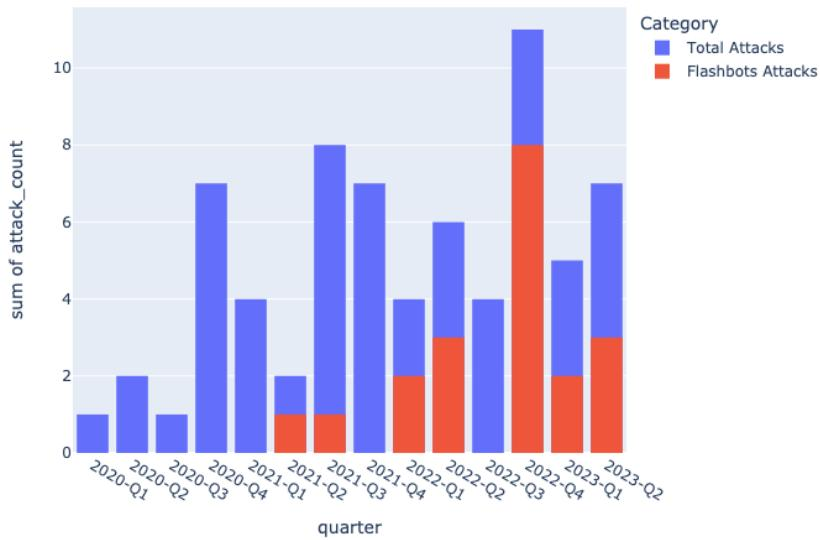
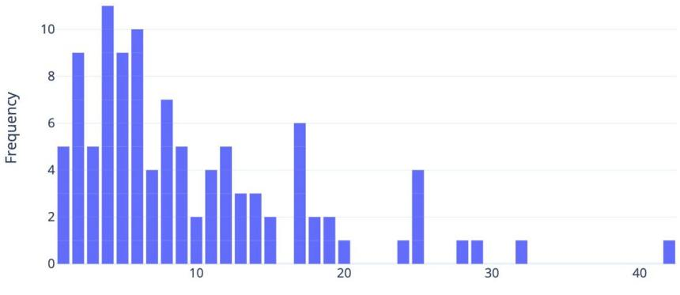
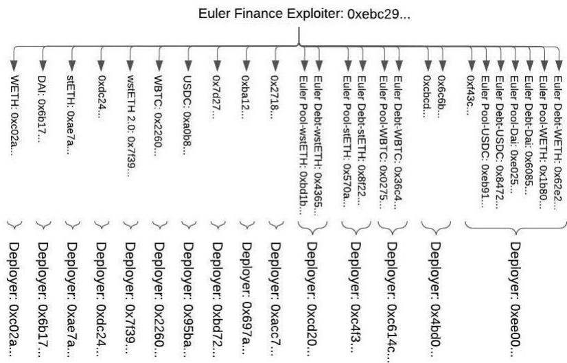

# Timely Identification of Victim Addresses in DeFi Attacks

Bahareh Parhizkari1[0009−0006−3819−7939], Antonio Ken

Iannillo1[0000−0001−9358−7100], Christof Ferreira Torres2[0000−0001−6992−703X], Sebastian Banescu3[0000−0003−0771−4826], Joseph Xu3[0000−0001−8831−4298], and Radu State1[0000−0002−4751−9577]

1 SnT, University of Luxembourg 2 ETH Zurich Quantstamp, Inc

Abstract. Over the past years, Decentralized Finance (DeFi) protocols have sufered from several attacks. As a result, multiple solutions have been proposed to prevent such attacks. Most solutions rely on identifying malicious transactions before they are included in blocks. However, with the emergence of private pools, attackers can now conceal their exploit transactions from attack detection. This poses a significant challenge for existing security tools, which primarily rely on monitoring transactions in public mempools. To efectively address this challenge, it is crucial to develop proactive methods that predict malicious behavior before the actual attack transactions occur. In this work, we introduce a novel methodology to infer potential victims by analyzing the deployment bytecode of malicious smart contracts. Our idea leverages the fact that attackers typically split their attacks into two stages, a deployment stage, and an attack stage. This provides a small window to analyze the attacker’s deployment code and identify victims in a timely manner before the actual attack occurs. By analyzing a set of past DeFi attacks, this work demonstrates that the victim of an attack transaction can be identified with an accuracy of almost 70%.

Keywords: Ethereum · Smart Contracts · DeFi · Victims · Attacks.

## 1 Introduction

Blockchain and smart contract-based financial systems and applications, commonly called Decentralized Finance (DeFi) protocols, have made remarkable progress in capturing usage and attracting investments, resulting in exponential growth in the amount of capital staked within them. A persistent problem in these financial systems is the loss of funds through the unintended use of smart contracts. These are often referred to as hacks and exploits.

Companies providing DeFi services employ various strategies to protect their products against hacks. These encompass a range of approaches, such as developing secure development practices, conducting security audits, and bug bounties.

However, it is crucial to note that despite utilizing these methods, achieving 100% security cannot be guaranteed. They must acquire information about ongoing security incidents as soon as possible to ensure they can take appropriate actions, such as pausing the protocols to limit the damage before significant financial damage occurs.

Numerous studies focus on designing tools to detect attacks on smart contracts by monitoring transactions on the public mempool and avoiding suspicious transactions from being recorded on the ledger [12,14,18,29,30,35]. However, these defensive methods become useless when attacker execute their transactions via private pools. It could impede companies from reacting against attacks promptly, particularly during the execution phase.

An essential aspect of DeFi security is detecting exploits while they are happening or before they happen (i.e., prevention). Typical exploits generally involve the following steps: deployment of malicious contracts, attack execution, and funds extraction. In a recent attack on Euler Finance[1], hackers utilized private pools to drain \$197 million. However, they deployed the malicious smart contract a few blocks prior to initiating the attack transaction, providing a crucial window for intervention and prevention. Another instance is the attack on the Rubic exchange[7], resulting in a \$1.4 million loss. During this incident, attackers deployed a malicious contract and promptly executed the attack transaction after deploying it via private pools. However, prevention could be achieved since the attack transaction occurred one block after the contract creation transaction. In such situations, the most viable option is detecting attack characteristics during the rescue time window between creating a malicious smart contract and the execution of the first exploit transaction. This can be achieved by analyzing the features of newly created smart contracts to distinguish malicious smart contracts from benign ones. For example, Forta recently introduced an ML bot [17] that utilizes machine learning prediction models to analyze the deployment bytecode (i.e., binary code sent to the network for the creation of a smart contract) of newly created smart contracts. Nevertheless, an important aspect is still lacking: when an ongoing attack is detected, what actions can we take to prevent the attacker from further exploiting the victim? This involves a combination of the following steps: 1) stopping the execution of malicious transactions, 2) detecting and informing the victim of the attack, and promptly notifying them about the ongoing attack. This enables the victim to take remedial actions, including identifying and fixing the exploited vulnerabilities. While Forta’s ML bot [17] provides alerts on potential attacks, it does not ofer an approach to identify the victims of the attacks.

In this work, we aim to address this limitation by proposing a solution that automates the identification of targeted addresses by analyzing malicious smart contracts deployed by attackers. We aim to quantify the percentage of victims that could be identified and alerted before an attack occurs, allowing for proactive intervention to minimize the hack’s impact. In both previously explained attacks on Euler Finance and Robic Exchange, the victim’s address was hardcoded inside the deployment bytecode of the malicious contract. Therefore, the victim could be identified prior to the attack transaction. Through exploring 117 attacks across four chains, we discovered that in almost 80% of cases, the victim’s address emerged before the first attack transaction. Nevertheless, numerous attack contracts contain a large number of potential victims to consider. In this research, our goal is to overcome the limitations of existing attack detection methodologies on DeFi by solving the victim identification problem. The contributions of this paper are the following:

1. We investigate the usage of private pools for malicious purposes in the DeFi ecosystem.

2. We propose a novel methodology to identify victims before being exploited by malicious contracts.

3. We evaluate and compare two methods used to extract the victims’ addresses from the set of potential victims of a malicious contract.

The paper is organized as follows. Section 2 provides information on smart contracts, including their bytecode and an explanation of private and public transaction pools. Section 3 discusses our motivations for performing this research and examines the current trend of utilizing private pools for malicious purposes. Section 4 outlines our methodology and algorithms. Section 5 presents the evaluation of our results. In Section 6, we compare our findings with relevant existing works. Finally, Section 7 concludes the paper.

## 2 Background

## 2.1 DeFi and Smart Contracts

Smart contracts are lines of code that are stored within a blockchain and can be executed through transactions. Ethereum [33] was the first blockchain to introduce Turing-complete smart contracts, and its implementation has been crucial in the development of decentralized finance (DeFi)[32]. Smart contracts are executed within decentralized blockchains. Without the requirement for a trusted third-party involvement, they lead to a less costly and more eficient execution.[37] Ethereum leverages the Ethereum Virtual Machine (EVM) for the execution of smart contracts, which are compiled to EVM bytecode. DeFi encompasses various financial services enabled through smart contracts, such as lending, borrowing, and trading.

Smart contracts hold a balance of cryptocurrency or tokens, and this capability is particularly relevant in DeFi. For example, users might deposit funds into a smart contract to participate in a lending pool. The smart contract holds these funds and manages their distribution according to its programmed logic. DeFi allows for functionalities such as liquidity pools, where multiple users deposit funds, and the smart contract automatically handles the pooling and distribution of assets.

A smart contract can also store data, known as the contract’s state. For example, in a lending protocol, a smart contract could store information regarding the total amount of funds lent out and the interest rates. These state variables can be read or modified through functions within the smart contract. When a user interacts with the contract, for instance, by lending assets, the contract updates the relevant state variables by changing, for instance, the total amount of funds lent.

Smart contracts can also call functions and send transactions to other smart contracts. This ability to interact, often referred to as composability, is crucial for building complex decentralized applications where multiple smart contracts work together. For instance, a decentralized exchange might use one smart contract to manage user balances, another to handle order matching, and another to execute trades. These contracts need to communicate with each other to function cohesively.

Following Ethereum, several other blockchains have also adopted smart contracts with EVM compatibility, enabling developers to deploy Ethereum smart contracts with minimal modifications. As the pioneer of smart contracts, Ethereum is the most adopted blockchain for DeFi applications. However, it often sufers from high transaction fees and network congestion due to its popularity. In this paper, we consider three other EVM-compatible blockchains: Binance Chain [3], Polygon [6], Arbitrum [2]. At the time of writing, Ethereum has a Total Value Locked (TVL) of about 24B USD, BSC has a TVL of about 3B USD, Polygon has a TVL of about 884M USD, and Arbitrum has a TVL of about 2B USD [4]. TVL refers to the amount of cryptocurrency or assets held within a smart contract, a set of smart contracts, or a whole blockchain and it’s usually expressed in USD.

## 2.2 Attacker Model

When examining DeFi attacks on EVM-compatible blockchains, the attack process can typically be divided into three main stages: deployment of malicious contract, attack execution, and funds extraction.

In the deployment stage, the attacker deploys a malicious smart contract onto the blockchain. The smart contract contains the logic and instructions required to exploit vulnerabilities contained within the victim’s smart contract.

After deployment, the attacker executes the attack by triggering the logic contained in the malicious smart contract. This can be performed either at deployment time via the constructor or via a separate transaction. The constructor embeds code that is executed only once, namely during deployment. Attackers might embed the attack logic within the constructor itself to execute the attack during deployment. Alternatively, the attacker embeds the attack logic into a normal function and invokes it via a separate transaction after the malicious contract has been deployed. This method gives the attacker more control over the timing of the attack. It may be used to exploit more complex vulnerabilities or to coordinate with other events on the blockchain. During the attack execution, the malicious contract may interact with the victim contracts in various ways, such as by manipulating oracle data, performing reentrancy attacks, or exploiting flaws in the business logic of the contract to bypass access control checks, all aiming to create an illicit advantage for the attacker.

After the successful exploitation, the attacker seeks ways to extract the illegally obtained funds or assets. This might involve: extracting funds directly to the attacker’s wallet address, using additional smart contracts to obscure the source of the transactions to make tracing more dificult, or converting the stolen assets through decentralized exchanges and mixing services to obfuscate the traces further.

## 2.3 Private Pools

Maximal Extractable Value (MEV) is a concept that refers to the profit a user can make through their ability to include, exclude, or reorder transactions within certain blocks [22]. For instance, users can engage in practices like front-running, where they observe a profitable transaction in the mempool and create another transaction with a higher gas price to benefit from the knowledge of the pending transaction[31]. MEV has implications for blockchain security, fairness, and transaction finality.

Flashbots [15] is a research and development organization aiming to mitigate the negative externalities of MEV. It provides a communication channel called Flashbots Relay, through which users can send their transactions directly to block producers without broadcasting them via the public mempool. This mechanism allows for a more eficient way to capture MEV. In 2022, more than 80% of MEV extraction was happening via Flashbots and 13.2% was coming from other private pools [31].

Attackers can also leverage private pools and transaction relay systems to conduct their malicious activities with more privacy and precision [21]. Indeed, private pools allow transactions to be executed privately before being broadcast to the public blockchain. Thus, attackers can hide their activities until the attack has been completed, obscuring the malicious contract’s interactions from any tools that monitor the public mempool. Some private transaction pool providers, such as Flashbots and Eden Networks are already operating on Ethereum, and we expect this trend to grow in other chains, either.

## 3 Motivation

Despite the emergence of numerous attack analysis and detection tools over the past years, the DeFi ecosystem continues to experience a growing trend in both the rate of attacks and loss of funds. According to Immunefi’s 2022 crypto loss report [20], hackers exploited vulnerabilities in 134 diferent contracts of several chains, including Ethereum and BSC, resulting in \$3,773,906,837 in losses throughout the year. It highlights that even though we can detect attacks, we still lack in preventing attackers from fulfilling their malicious intentions and protecting funds against such exploitation. While various existing tools identify suspicious behavior by monitoring chain activities, they still fall short in automatically detecting the actual victims and notifying them on time.

We investigated a dataset of 69 attacks on Ethereum occurred between 2020 and 2023 on the Ethereum blockchain to determine if they utilized private pools for execution (Figure 1). To do this, we focused on Flashbots [15] and Eden networks [16] as two major private pool providers on Ethereum. We extracted the attack transactions and checked whether they were relayed through Flashbots or Eden network’s private pools. We found that none of these attacks originated from Eden networks. However, we observed a rising trend in attacks executed on Flashbots’ private pools. Out of all 26 attacks we analyzed in 2022, 13 or 50% of them were executed through Flashbots, while only 2 out of 21 attacks in 2021 were executed through Flashbots. Considering the available data, we expect a potential increase in the future usage of Flashbots’ private pool.

Our analysis revealed that attackers increasingly utilize private pools to execute malicious transactions, allowing them to conceal their malicious activities from monitoring tools. This highlights the importance of proactively analyzing malicious contracts and preventing such attacks. Research by Zhou et al. [38] analyzed 192 attacks and discovered that 56% of the hackers are not executing attacks automatically, providing defenders with a rescue time frame. Rescue time is the time frame between deploying a malicious smart contract and the first malicious transaction. This rescue time window provides an opportunity to prevent malicious activities. For instance, for the recent attack on Euler Finance [1], the attackers managed to drain \$197,000,000 through a flash loan attack. Even though the hackers used private pools to execute attack transactions, they deployed the attack contract a few blocks before executing the actual attack transactions, providing a short rescue time window.

The increasing use of private pools by attackers and a rescue time window highlight the importance of identifying victims’ addresses in malicious contracts. Identifying the addresses of potential victims makes it possible to notify them and take proactive measures to protect their funds before the attack is executed.

## 4 Methodology

To achieve the goal of identifying victims’ addresses prior to hack transactions and through the analysis of malicious smart contracts, we have developed a novel methodology consisting of the following three consecutive steps: (1) extracting potential victims’ addresses; (2) extracting deployers’ addresses; (3) determining the actual victims.

## 4.1 Extracting Potential Victims’ Addresses

To execute a malicious transaction targeting specific victims, the victims’ addresses should be provided to the malicious contract beforehand. There are four diferent approaches for a hacker to communicate victims’ addresses to malicious contracts:

1. Including victim addresses in the deployment bytecode during contract creation. In this way, the victim addresses are hardcoded into the bytecode of the malicious contract itself.

  
Fig. 1. The progression of attacks performed through private pools and on Ethereum over time, compared to the total number of attacks. Each bar represents the number of attacks that occurred within one quarter of the year.

2. Importing them during the deployment of the malicious contract. Victim addresses can be passed as parameters to the constructor of the malicious contract during its creation.

3. Sending them by some other initialization transactions before malicious transaction.

4. Sending victim addresses as parameters during the execution of the malicious transaction.

We manually analyzed all malicious contracts in our dataset over four diferent chains and we realized that in the majority of attacks (79.49%), the hackers specify the victim’s address either in the malicious smart contracts or its constructor’s parameters. Only 20.51% of attacks rely on the attack transaction to specify the victim as well. None of these attackers transmitted the victim’s address for the first time through any transaction other than the first attack transaction or the contract creation transaction.

Thus, the first step of our methodology is to extract all hardcoded addresses from the deployment bytecode and the parameters of the malicious contract’s constructor. To achieve this goal, we extract the deployment bytecode of malicious smart contracts, convert them to readable opcodes, and extract all hex strings with a length of 20 that was loaded with the operand of Push20. Additionally, we extracted all 20-byte values found within the inputs of the contract creation transaction. Then, we examined each extracted address to determine if an active contract was associated with it. For our analysis, we define an active contract as a contract with at least one transaction.

From the creation transactions of the malicious contract, we extracted a set of active contracts, which we refer to as potential victims. Note that externalowned accounts (EOAs), non-active contracts, and non-addresses were excluded as potential victims, as they cannot be targeted in an attack.

## 4.2 Extracting Deployers’ Addresses

The average number of potential victims for a malicious smart contract is 9.63, making extracting the actual victim challenging. To visually represent this distribution, we present the figure 2, illustrating the frequency of the potential victims associated with each malicious contract. In the worst-case scenario, a malicious contract included more than 40 potential victims.

  
Number of Potential Victims per Contract  
Fig. 2. Frequency of Number of Potential Victims in Diferent Attacks.

Note that the number of actual victim addresses in a single attack often exceeds one. However, we have observed that all victim addresses are usually associated with the same project. For example, let us consider the recent attack on Euler Finance[1], an Ethereum-based borrowing and lending platform. It suffered from a Flash loan attack on 13th March 2023, resulting in a substantial loss of \$196,000,000. Through the analysis of the deployment bytecode of the corresponding malicious smart contract, we extracted 25 potential victims. Out of all these potential victims, we discovered that only five unique deployers deployed 15. Figure 3 represents all the potential victims of the attack on Euler Finance. Seven are deployed by the same deployer address, all belonging to the victim project.

Therefore, the methodology’s second step extracts each potential victim’s deployer address, indicating afiliation to a specific DeFi project.

  
Fig. 3. Potential victims of Attack on Euler Finance clustered by their deployers.

## 4.3 Determining Actual Victims

The third stage of our methodology involves analyzing the potential victims identified in the preceding steps in order to detect the actual victims. This stage is based on the hypothesis that a significant association exists between the number of contracts deployed by a particular deployer and the probability of that deployer being the victim.

This subsection presents the Dominant Deployer Identification (DDI) method, which can be enhanced with the ERC20 exclusion criterion.

The DDI method focuses on the number of contracts deployed by each deployer. By examining the deployment bytecode of malicious smart contracts, this method aims to identify the deployer associated with the highest number of deployed contracts within each malicious smart contract and designate all of their contracts as victims. One key advantage of this method is its simplicity. It relies on a straightforward metric, the number of contracts deployed, to determine the deployer with the highest deployment activity. The method provides a direct approach to identifying victim addresses by singling out this deployer. In cases where there is a tie between two or more diferent deployers for the highest number of deployed contracts, the method does not label any deployer as a victim. This limitation may result in the omission of potential victim addresses, potentially reducing the efectiveness of the identification process. We introduced the following method to fix the limitations of tied deployers for the highest number of deployed contracts. This method aim to filter out potential victims that are less likely to be the actual victim.

The DDI method with the ERC20 exclusion criterion considers that ERC20 tokens are often implemented using smart contract libraries that have undergone extensive code audits and are considered more robust and secure. This method leverages this characteristic by filtering out ERC20 token contracts from the pool of potential victims associated with deployers. By excluding ERC20 tokens, the method aims to narrow down the set of potential victim addresses to those less likely to have vulnerabilities or be targets of attacks. This filtering process assumes that reusing well-audited smart contract libraries reduces the risk of exploitation. After the filtering phase, the method counts the number of contracts deployed by each deployer and follows the same procedure as the DDI method without the ERC20 exclusion criterion. The advantage of adding this filtering is that it introduces an additional layer of consideration by prioritizing contracts that are more likely to be secure. By excluding ERC20 tokens, the method focuses on contracts with a higher likelihood of being victims. However, it is essential to acknowledge that this method assumes ERC20 token contracts are more secure due to extensive code audits. While this assumption is generally valid, it does not guarantee absolute certainty.

In the next section, we will evaluate the application of this methodology and compare the efectiveness of the two proposed methods.

## 5 Evaluation

## 5.1 Dataset

To perform our analysis, we manually collected and labeled a dataset consisting of 117 smart contract attacks. All these attacks occurred between 2020 and 2023, and we gathered them from four diferent blockchains: 69 attacks occurred on Ethereum, 28 of them were on BSC, 13 on Polygon, and finally 7 occurred on Arbitrum. We analyzed the attacks documented in the Rekt database [8] and extracted various data points such as deployment bytecode, runtime bytecode, constructor parameters, and victim addresses of each attack. Table 1 provides a detailed overview of our dataset and depicts the distribution of extracted attacks across each chain.

According to our findings, out of all 117 attacks analyzed in our dataset, we discovered that in 86 cases, the victim addresses were communicated through deployment bytecode, and in 7 cases it was communicated through the constructor’s parameters. during contract creation; while initial hack transactions revealed victim addresses in the remaining 24 attacks. We found that in all 117 attacks, the victim address could be found in the malicious contract’s deployment bytecode, the constructor’s inputs, or the initial attack transaction. Our results clearly indicate that by analyzing contract creation transactions, we have the potential to detect victim addresses for almost 80% of the attacks. However, in the remaining attacks, the victim’s address remains unknown until the occurrence of the initial attack transaction.

Table 1. Number of smart contract attacks in our dataset, categorized by chain name.

<table><tr><td>Chain</td><td colspan="3">Victim address&#x27;s communication method</td><td>Total</td></tr><tr><td></td><td>Deployment Bytecode</td><td>Constructor Parameters</td><td>Attack Tx</td><td></td></tr><tr><td>Ethereum</td><td>53</td><td>3</td><td>13</td><td>69</td></tr><tr><td>Binance</td><td>17</td><td>3</td><td>8</td><td>28</td></tr><tr><td>Polygon</td><td>10</td><td>1</td><td>2</td><td>13</td></tr><tr><td>Arbitrum</td><td>6</td><td>0</td><td>1</td><td>7</td></tr><tr><td>Total</td><td>86</td><td>7</td><td>24</td><td>117</td></tr><tr><td></td><td>73.50%</td><td>5.98%</td><td>20.51%</td><td>100%</td></tr></table>

## 5.2 Results

We implemented a script to execute our methodology on smart contracts’ deployment bytecode. The script extracts all potential victims, cluster them based on deployer addresses, and utilizes the Dominant Deployer Identification (DDI) technique on these potential victims. If there is a single dominant set of addresses, the script labels them as the victim. This means we identified a single deployer who deployed the highest number of deployed contracts within the malicious smart contract. Otherwise, if multiple sets of addresses are dominant, we will analyze them using the two specified victim determination methods we explained in Section 4.3.

We evaluated the script on all 117 malicious contracts and calculated the confusion matrix for each of the two methods. Table 2, demonstrates the corresponding measures. As can be observed, we successfully identified the victims of 62 attacks out of all 117 attacks, using the DDI approach and without the ERC20 exclusion criterion. The DDI approach combined with the ERC20 exclusion criterion was able to identify the victims of 65 attacks. Furthermore, the DDI approach without the ERC20 exclusion criterion correctly identified 21 attacks where the victim’s address wasn’t present in the deployment bytecode. However, when using the DDI approach with the ERC20 exclusion criterion, we identified 19 attacks where the victim’s address was not present in the deployment bytecode.

We can assess the efectiveness of the two methods by comparing their precision and recall. As predicted, incorporating the filtering analysis method resulted in an increase in the number of false positives but a decrease in the number of false negatives, resulting in a higher recall, but lower precision. Note that the importance of recall’s absolute value is greater than that of precision. This is because false negatives can lead to significant financial loss. False positives, on the other hand, are relatively less costly. Until a specific threshold, such as a weekly occurrence, is crossed, project owners might tolerate false positive reports; however, a false negative report could directly result in a huge financial loss and warrants closer attention.

Table 2. Results on the comparison of DDI Performance, with and without ERC20 exclusion criterion on the Dataset of hacks, across four diferent chains.

<table><tr><td>Chain</td><td>Measure</td><td colspan="2">Methods</td></tr><tr><td></td><td></td><td>DDI</td><td>DDI + ERC20 exclusion criterion</td></tr><tr><td rowspan="6">Ethereum</td><td>Number of Attacks</td><td>69</td><td>69</td></tr><tr><td>True Positive</td><td>33</td><td>36</td></tr><tr><td>False Positive</td><td>7</td><td>9</td></tr><tr><td>False Negative</td><td>16</td><td>13</td></tr><tr><td>True Negative</td><td>13</td><td>11</td></tr><tr><td>Accuracy</td><td>66.67%</td><td>68.12%</td></tr><tr><td rowspan="6">Binance</td><td>Number of Attacks</td><td>28</td><td>28</td></tr><tr><td>True Positive</td><td>17</td><td>17</td></tr><tr><td>False Positive</td><td>3</td><td>3</td></tr><tr><td>False Negative</td><td>3</td><td>3</td></tr><tr><td>True Negative</td><td>5</td><td>5</td></tr><tr><td>Accuracy</td><td>78.57%</td><td>78.57%</td></tr><tr><td rowspan="6">Polygon</td><td>Number of Attacks</td><td>13</td><td>13</td></tr><tr><td>True Positive</td><td>6</td><td>6</td></tr><tr><td>False Positive</td><td>0</td><td>0</td></tr><tr><td>False Negative</td><td>5</td><td>5</td></tr><tr><td>True Negative</td><td>2</td><td>2</td></tr><tr><td>Accuracy</td><td>61.54%</td><td>61.54%</td></tr><tr><td rowspan="6">Arbitrum</td><td>Number of Attacks</td><td>7</td><td>7</td></tr><tr><td>True Positive</td><td>6</td><td>6</td></tr><tr><td>False Positive</td><td>0</td><td>0</td></tr><tr><td>False Negative</td><td>0</td><td>0</td></tr><tr><td>True Negative</td><td>1</td><td>1</td></tr><tr><td>Accuracy</td><td>100%</td><td>100%</td></tr><tr><td rowspan="10">Total</td><td>Number of Attacks</td><td>117</td><td>117</td></tr><tr><td>Attacks with Hardcoded Victims</td><td>93</td><td>93</td></tr><tr><td>True Positive</td><td>62</td><td>65</td></tr><tr><td>False Positive</td><td>10</td><td>12</td></tr><tr><td>False Negative</td><td>24</td><td>21</td></tr><tr><td>True Negative</td><td>21</td><td>19</td></tr><tr><td>Precision</td><td>86.11%</td><td>84.42%</td></tr><tr><td>Recall</td><td>72.09%</td><td>75.58%</td></tr><tr><td>Accuracy</td><td>70.94%</td><td>71.79%</td></tr><tr><td>F1 score</td><td>78.48%</td><td>79.75%</td></tr></table>

Nonetheless, when evaluating the F1 score, which represents the harmonic mean of precision and recall, we observe that the F1 score of DDI with the ERC20 exclusion criterion is 79.75%, hence surpassing the F1 score of DDI without the ERC20 exclusion criterion which is 78.48%.

We have identified some limitations that challenge our ability to identify the victims of all attacks. The first limitation refers to attacks where the actual victim’s address is transmitted solely through the first attack transaction. It makes it impossible to identify the victims in the contract creation phase. Second, attackers might combine the contract creation and execution in a single transaction, leaving no rescue time to identify the attack before the execution of the attack. Within our dataset, we found only one instance of such an attack where contract creation and the malicious transaction occurred in the same transaction. It was the Reentrancy attack on Rari Fuse on Arbitrum [5], which took place on 30th April 2022. Another limitation is the dataset size. As shown in the table, the ERC20 exclusion criterion yielded noticeable improvements in the True Positive rate for Ethereum but did not afect Polygon. It is due to the volume of data available on Ethereum compared to Polygon and BSC. However, it is worth noting that our DDI method successfully extracted all victim addresses of attacks in Arbitrum, despite the smaller dataset for that chain.

## 6 Related Work

Smart Contract Attacks. A plethora of tools have been proposed to detect and analyze attacks on smart contracts. ECFChecker [19] was the first tool to enable the runtime detection of reentrancy attacks via a modified version of the EVM. Sereum [28] also proposed a modified version of the EVM, but which could protect already deployed smart contracts by blocking reentrancy attacks. ÆGIS [13,12] generalize Sereum’s idea by leveraging a smart contract to maintain and distribute a list of rules that are written using a domain-specific language to detect and block smart contract attacks at runtime. Perez et al. [23] use Datalog to study and analyze the bytecode of vulnerable smart contracts of past attacks. Similar to ECFChecker and Sereum, SODA [11] uses a modified Ethereum client to inject custom modules for the online detection of malicious transactions. EthScope [34] adds dynamic taint analysis to an Ethereum client and replays historical transaction data which then stores traces into an Elasticsearch database which can be queried for past attacks. Zhou et al. [39] analyzed real-world attacks and defenses adopted in the wild based on the transaction logs produced by an uninstrumented EVM and decoupling decoupling adversarial actions from adversarial consequences. TxSpector [35] adopts the Datalog facts proposed by Brent et al. [9] to detect and analyze malicious transactions postmortem. Similarly, Horus [14] also leverages Datalog to detect attacks against smart contracts but leverages dynamic taint analysis to capture attacks that span across multiple transactions. [36] Zheng et al. present XBlock-ETH – a framework that generates Ethereum datasets in the form of CSV files consisting of transactions, smart contracts, and token transfers, which can then be further leveraged to detect attacks. Wang et al. [29] propose BlockEye a real-time attack detection system for DeFi projects, which performs symbolic reasoning on the data flow of smart contract states, e.g., asset price, and flags a transaction as a potential attack if a violation is detected on a critical invariant. Zhou et al. [38] analyzed close to 200 real-world incidents and concluded that the average rescue time frame for most smart contract attacks is 1±4.1 hours, with the longest rescue time frame being 26.5 hours. Forta [17] tries to leverage the same fact as we do, namely that there is a rescue window that allows them to detect malicious deployment bytecode before an attacker can perform the actual attack. They use a detection bot that uses a machine learning model to detect malicious smart contract creations based on a contract’s disassembled EVM opcodes. Wang et al. [30] propose a deep-learning-based attack detection system called DeFiScanner that leverages information emitted via events during transaction execution to cluster if a transaction is an attack or not. Gai et al. [18] present a tool called BlockGPT, which leverages a large language model to detect abnormal transactions from traces that are captured during the execution of a transaction. Qin et al. [25] describe a methodology for whitehat hackers to monitor the public mempool and to copy and frontrun attacker transactions before they can have an impact on the victim contracts. Moreover, Qin et al. [26] introduce execution property graphs for EVM transactions and leverage graph traversal techniques to detect if a transaction is malicious or not. Most of the solutions that been proposed so far either take too long to analyze transaction which makes them impractical to be used as real-time attack detection systems, or they depend on the monitoring of pending transactions in the mempool which attackers can avoid by leveraging private pools. Moreover, most of the aforementioned tools focus on detecting attacks but not identifying victim addresses. However, identifying victim addresses is crucial as this allows for them to be rescued.

Private Transactions. Lyu et al. [21] collected private transactions at a large scale and performed analysis on their characteristics, such as transaction costs, miner profits, as well as security impacts. Lyu et al. [21] find that although private transactions were proposed to protect end users from attacks, they find that only 18.1% of private transactions have been used for that purpose. Qin et al. [27] provide a theoretical analysis of network congestion in the presence of private pools, and conclude that as opposed to Flashbots’ claims, private pools do not reduce network congestion. Weintraub et al. [31] show however that Flashbots does at least reduce gas prices in some instances. Moreover, they also show that a large number of MEVs are being extracted via private pools such as Flashbots. Piet et al. [24] and Capponi et al. [10] analyze the profit distribution within Flashbots and conclude, similarly to Weintraub et al. [31], that miners are making most of the profit. Weintraub et al. [31] measures MEV ex- traction before and after the inception of Flashbots and concludes that searchers were making more profit prior to Flashbot sand that the number of searchers using Flashbots is decreasing.

## 7 Conclusion

We investigated whether we can identify victims of attacks by analyzing the deployment bytecode of malicious smart contracts. We introduced a comprehensive methodology that involved extracting potential victims from deployment bytecode and identifying the actual victims. By analyzing 117 attacks on DeFi across four diferent blockchain networks, we discovered that in over 80% cases, the victim address is present within the malicious smart contracts even before the first attack transaction occurs. To refine our approach, we introduced a technique that involved identifying the dominant deployer among all potential victims and filtering out ERC20 tokens, considered proven secure tokens, to improve the accuracy of our findings. In future work, we aim to improve accuracy by formalizing heuristics, refining analysis methods, and expanding our dataset.

## References

1. \$197 million stolen: Euler finance flash loan attack explained, https://blog. chainalysis.com/reports/euler-finance-flash-loan-attack, Last accessed 26 Jun 2023

2. Arbitrum: Scaling Ethereum, https://arbitrum.io, Last accessed 29 Jun 2023

3. BNB Smart Chain: A Parallel BNB Chain to Enable Smart Contracts, https: //www.bnbchain.org/en/smartChain, Last accessed 29 Jun 2023

4. DefiLlama, https://defillama.com, Last accessed 29 Jun 2023

5. Fuse Exploit Post Mortem, https://medium.com/@JackLongarzo/ fuse-exploit-post-mortem-76ce18d8974, Last accessed 30 Jun 2023

6. Polygon: Blockchains for mass adoption, https://polygon.technology, Last accessed 29 Jun 2023

7. Rubic dex aggregator hack leads to \$1.4m of user funds stolen, https://www. binance.com/en/feed/post/134920, Last accessed 16 Aug 2023

8. Top crypto hacks-rekt database, https://defiyield.app/rekt-database, Last accessed 29 Jun 2023

9. Brent, L., Jurisevic, A., Kong, M., Liu, E., Gauthier, F., Gramoli, V., Holz, R., Scholz, B.: Vandal: A scalable security analysis framework for smart contracts. arXiv preprint arXiv:1809.03981 (2018)

10. Capponi, A., Jia, R., Wang, Y.: The evolution of blockchain: from lit to dark. arXiv preprint arXiv:2202.05779 (2022)

11. Chen, T., Cao, R., Li, T., Luo, X., Gu, G., Zhang, Y., Liao, Z., Zhu, H., Chen, G., He, Z., et al.: Soda: A generic online detection framework for smart contracts. In: Proceedings of the Network and Distributed System Security Symposium (NDSS’20) (2020)

12. Ferreira Torres, C., Baden, M., Norvill, R., Fiz Pontiveros, B.B., Jonker, H., Mauw, S.: Ægis: Shielding vulnerable smart contracts against attacks. In: Proceedings of the 15th ACM Asia Conference on Computer and Communications Security. pp. 584–597 (2020)

13. Ferreira Torres, C., Baden, M., Norvill, R., Jonker, H.: ÆGIS: Smart Shielding of Smart Contracts. In: Proceedings of the 2019 ACM SIGSAC Conference on Computer and Communications Security. pp. 2589–2591 (2019)

14. Ferreira Torres, C., Iannillo, A.K., Gervais, A., State, R.: The eye of horus: Spotting and analyzing attacks on ethereum smart contracts. In: Financial Cryptography and Data Security: 25th International Conference, FC 2021, Virtual Event, March 1–5, 2021, Revised Selected Papers, Part I 25. pp. 33–52. Springer (2021)

15. Flashbots: Flashbots docs, https://docs.flashbots.net/flashbots-auction/ overview, Last accessed 29 Jun 2023

16. Flashbots: Flashbots docs, https://docs.edennetwork.io, Last accessed 26 Jun 2023

17. Forta-Network: How forta’s predictive ml models detect attacks before exploitation, https://forta.org/blog/ how-fortas-predictive-ml-models-detect-attacks-before-exploitation, Last accessed 13 Jun 2023

18. Gai, Y., Zhou, L., Qin, K., Song, D., Gervais, A.: Blockchain large language models. arXiv preprint arXiv:2304.12749 (2023)

19. Grossman, S., Abraham, I., Golan-Gueta, G., Michalevsky, Y., Rinetzky, N., Sagiv, M., Zohar, Y.: Online detection of efectively callback free objects with applications to smart contracts. Proceedings of the ACM on Programming Languages 2(POPL), 48 (2017)

20. Immunefi: Immunefi crypto losses report, https://immunefi.com/reports, Last accessed 26 Jun 2023

21. Lyu, X., Zhang, M., Zhang, X., Niu, J., Zhang, Y., Lin, Z.: An empirical study on ethereum private transactions and the security implications. arXiv preprint arXiv:2208.02858 (2022)

22. Mazorra, B., Reynolds, M., Daza, V.: Price of mev: towards a game theoretical approach to mev. In: Proceedings of the 2022 ACM CCS Workshop on Decentralized Finance and Security. pp. 15–22 (2022)

23. Perez, D., Livshits, B.: Smart contract vulnerabilities: Vulnerable does not imply exploited. In: 30th USENIX Security Symposium (USENIX Security 21). USENIX Association, Vancouver, B.C. (Aug 2021)

24. Piet, J., Fairoze, J., Weaver, N.: Extracting godl [sic] from the salt mines: Ethereum miners extracting value. CoRR abs/2203.15930 (2022)

25. Qin, K., Chaliasos, S., Zhou, L., Livshits, B., Song, D., Gervais, A.: The blockchain imitation game. arXiv preprint arXiv:2303.17877 (2023)

26. Qin, K., Ye, Z., Wang, Z., Li, W., Zhou, L., Zhang, C., Song, D., Gervais, A.: Towards automated security analysis of smart contracts based on execution property graph. CoRR abs/2305.14046 (2023)

27. Qin, K., Zhou, L., Gervais, A.: Quantifying blockchain extractable value: How dark is the forest? In: 43rd IEEE Symposium on Security and Privacy, SP 2022, San Francisco, CA, USA, May 22-26, 2022. pp. 198–214. IEEE (2022)

28. Rodler, M., Li, W., Karame, G., Davi, L.: Sereum: Protecting existing smart contracts against re-entrancy attacks. In: Proceedings of the Network and Distributed System Security Symposium (NDSS’19) (2019)

29. Wang, B., Liu, H., Liu, C., Yang, Z., Ren, Q., Zheng, H., Lei, H.: Blockeye: Hunting for defi attacks on blockchain. In: 2021 IEEE/ACM 43rd International Conference on Software Engineering: Companion Proceedings (ICSE-Companion). pp. 17–20. IEEE (2021)

30. Wang, B., Yuan, X., Duan, L., Ma, H., Su, C., Wang, W.: Defiscanner: Spotting defi attacks exploiting logic vulnerabilities on blockchain. IEEE Transactions on Computational Social Systems (2022)

31. Weintraub, B., Torres, C.F., Nita-Rotaru, C., State, R.: A flash(bot) in the pan: measuring maximal extractable value in private pools. In: Barakat, C., Pelsser, C., Benson, T.A., Chofnes, D.R. (eds.) Proceedings of the 22nd ACM Internet Measurement Conference, IMC 2022, Nice, France, October 25-27, 2022. pp. 458– 471. ACM (2022)

32. Werner, S., Perez, D., Gudgeon, L., Klages-Mundt, A., Harz, D., Knottenbelt, W.: Sok: Decentralized finance (defi). In: Proceedings of the 4th ACM Conference on Advances in Financial Technologies. pp. 30–46 (2022)

33. Wood, G., et al.: Ethereum: A secure decentralised generalised transaction ledger. Ethereum project yellow paper 151(2014), 1–32 (2014)

34. Wu, L., Wu, S., Zhou, Y., Li, R., Wang, Z., Luo, X., Wang, C., Ren, K.: Ethscope: A transaction-centric security analytics framework to detect malicious smart contracts on ethereum. arXiv preprint arXiv:2005.08278 (2020)

35. Zhang, M., Zhang, X., Zhang, Y., Lin, Z.: Txspector: Uncovering attacks in ethereum from transactions. In: USENIX Security Symposium (2020)

36. Zheng, P., Zheng, Z., Wu, J., Dai, H.: Xblock-eth: Extracting and exploring blockchain data from ethereum. IEEE Open J. Comput. Soc. 1, 95–106 (2020)

37. Zheng, Z., Xie, S., Dai, H.N., Chen, W., Chen, X., Weng, J., Imran, M.: An overview on smart contracts: Challenges, advances and platforms. Future Generation Computer Systems 105, 475–491 (2020)

38. Zhou, L., Xiong, X., Ernstberger, J., Chaliasos, S., Wang, Z., Wang, Y., Qin, K., Wattenhofer, R., Song, D., Gervais, A.: Sok: Decentralized finance (defi) attacks. Cryptology ePrint Archive (2022)

39. Zhou, S., Yang, Z., Xiang, J., Cao, Y., Yang, Z., Zhang, Y.: An ever-evolving game: Evaluation of real-world attacks and defenses in ethereum ecosystem. In: 29th USENIX Security Symposium (USENIX Security 20). pp. 2793–2810. USENIX Association (Aug 2020)