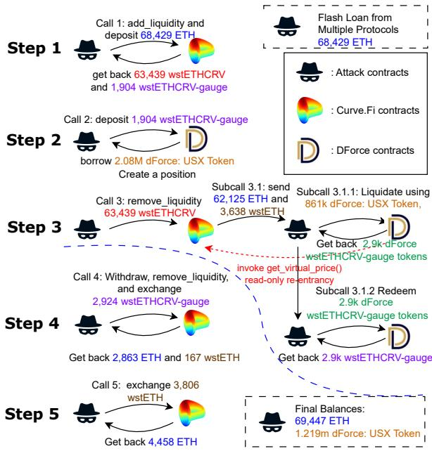
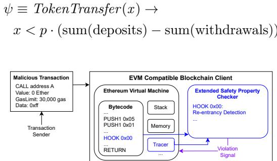

# Instrumenting Transaction Trace Properties in Smart Contracts: Extending the EVM for Real-Time Security

Zhiyang Chen jeff@zircuit.com

Jan Gorzny jan@zircuit.com

Martin Derka martin@zircuit.com

15 July 2024

## Abstract

In the realm of smart contract security, transaction malice detection has been able to leverage properties of transaction traces to identify hacks with high accuracy. However, these methods cannot be applied in realtime to revert malicious transactions. Instead, smart contracts are often instrumented with some safety properties to enhance their security. However, these instrumentable safety properties are limited and fail to block certain types of hacks such as those which exploit read-only re-entrancy. This limitation primarily stems from the Ethereum Virtual Machine’s (EVM) inability to allow a smart contract to read transaction traces in real-time. Additionally, these instrumentable safety properties can be gas-intensive, rendering them impractical for on-the-fly validation. To address these challenges, we propose modifications to both the EVM and Ethereum clients, enabling smart contracts to validate these transaction trace properties in real-time without afecting traditional EVM execution. We also use past-time linear temporal logic (PLTL) to formalize transaction trace properties, showcasing that most existing detection metrics can be expressed using PLTL. We also discuss the potential implications of our proposed modifications, emphasizing their capacity to significantly enhance smart contract security.

## 1 Introduction

Smart contracts are self-executing programs that run on blockchain networks. They are essential infrastructure for blockchain based applications like Decentralized Financial (DeFi) [1] applications. As of July 1, 2024, the Total Value Locked (TVL) in 3,871 DeFi protocols has reached an impressive \$83.57 billion USD [2]. However, the landscape faces significant challenges. Security hacks are a major concern for the integrity of smart contracts. Malicious hackers can exploit various vulnerabilities by executing hack transactions, potentially resulting in the theft of millions of dollars. As of July 1, 2024, financial losses due to security attacks on DeFi protocols have surpassed \$8.3 billion USD [3].

Current methods to prevent these attacks on the fly are limited. The prevailing strategy involves instrumenting safety properties within smart contracts to automatically revert transactions if these properties are violated. Yet, this approach has failed to completely prevent real-world exploits. Conversely, various detection metrics have been developed to analyze transaction execution traces and identify malicious activities. These metrics typically examine certain properties of transaction trace and may also reference external sources like price oracles to assess potential threats. These detection metrics have been proved efective in identifying malicious transactions. For example, Forta [4] attack detectors have detected 75% of major on-chain hacks in 2023 [5]. Despite their analytical capabilities, these detection metrics cannot be used on the fly and are not capable of stopping attacks in real-time.

The lack of real-time prevention is primarily due to the limitations of the Ethereum Virtual Machine (EVM) and the absence of a comprehensive system architecture that can validate trace properties on the fly. The EVM restricts users’ ability to define complex smart contract safety properties and instrument them in smart contracts as a defense mechanism. These limitations are inherent to Ethereum’s design and exist in many EVM-compatible blockchains. We propose a novel industrial solution to allow the definition of complex trace properties and validate them in real-time to prevent or suspend malicious transactions. Our solution fills the gap between current efective detection techniques and the low eficiency of real-time prevention.

Unlike traditional software systems, where the execution trace could be private and inaccessible to the public, the execution traces (transactions) of smart contracts is completely transparent and accessible to everyone. These traces are accessible by any node in the network even when the transactions are pending and have not been included in a block. Other works such as front-running [6] utilizes the transparency of the transaction trace to detect profitable transactions and front-run them. However, front-running may not always be possible (e.g., if the block builder is the one who introduced the malicious transaction in private). Our work leverages the transparency of the transaction trace to define and validate trace properties in real-time.

Contributions This paper makes the following contributions:

• We propose an innovative industrial solution that modifies the EVM to support the definition and real-time validation of trace properties, aiming to halt or suspend malicious transactions on the fly.

• We introduce a formalism of trace properties using past-time linear temporal logic, demonstrating that it can efectively represent the majority of trace properties utilized in current real-world detection metrics.

• We provide comprehensive discussions on practical use cases, potential impacts, and prospective directions for future research derived from our findings.

## 2 Related Work

In this section, we review the existing literature and prior developments in the field of blockchain security and malice detection, identifying the gaps that our research addresses.

## 2.1 Smart Contract Safety Property Runtime Validation

There is a significant body of work exploring safety properties that can be directly instrumented in smart contracts to revert malicious transactions [7, 8, 9, 10, 11]. Although these approaches represent best practices in both academia and industry for stopping hacks in real-time, they face practical challenges when applied by developers to smart contracts. Specifically, the runtime guards utilized in these works can be gas-intensive, thereby increasing the cost for users to interact with these instrumented contracts. Our work allows developers to define trace properties that can be validated in real-time without the need for runtime guards, thereby reducing the gas cost for users.

## 2.2 Transaction Trace Properties for Malice Detection

Detecting anomalous transactions on blockchain platforms, such as Ethereum, has been a central focus of research aimed at improving the security and integrity of smart contracts. Prior works like TxSpector [12] pioneered the bytecode-level analysis of Ethereum transactions to identify attacks. This was followed by advancements like The Eye of Horus [13] and Time-Travel Investigation [14], which further refined attack detection mechanisms for smart contracts and blockchain transactions. The detection metrics used in these works can be translated into the trace properties defined in our work to not only detect but also prevent malicious transactions in real-time. In industry, Forta Network [4] attack detectors have detected 75% of major on-chain hacks in 2023 [5].

## 2.3 Linear Temporal Logic for Smart Contract Formal Specification

Linear Temporal Logic (LTL) is extensively employed to define the temporal properties of smart contracts. It characterizes the safety and liveness of transition-system models, which are validated using model checkers [15, 16, 17, 18, 19, 20]. However, existing research focuses on verifying the correctness of smart contracts rather than identifying malicious transactions as they occur. Our research shifts this focus towards transaction trace properties. Specifically, we examine properties associated with the execution trace up to a certain step (defined as “hooks”), reasoning about a determined path rather than all possible paths.

  
Figure 1: The dForce incident, illustrated. The entire exploit takes place during a single transaction on Arbitrum. The view function get virtual price() is accessed when executing the remove liquidity() function, and is used as an oracle by dForce.

## 3 Motivating Example

The dForce attack on February 13, 2023 exploited a read-only reentrancy vulnerability within the dForce’s integration with Curve Finance on the Arbitrum and Optimism blockchains, leading to a substantial financial impact of approximately \$3.6 million USD [21]. Figure 1 details the sequence of events in the exploit on Arbitrum, as pieced together from various post-mortem analyses [21, 22] and on-chain data [23].

Step 0. The attacker begins by borrowing 68,429 ETH (worth approximately \$105 Million USD) via flash loans across multiple flash loan providers.

Step 1. The attacker deposits the borrowed 68,429 ETH into the Curve Finance wstETH/ETH pool through the add liquidity() function and receives 63,439 wstETHCRV and 1,904 wstETHCRV-gauge tokens in return.

Step 2. Using the newly acquired wstETHCRV-gauge tokens, the attacker creates leveraged positions within dForce, borrowing 2.08M dForce: USX Token. This step is crucial as it establishes a big debt position that can be liquidated later in the exploit.

Step 3. The attacker invokes the remove liquidity() function from the Curve Finance contract, burning their 63,439 wstETHCRV tokens to withdraw ETH and wstETH. This action triggers the fallback function within their malicious contract when ETH is sent to the attacker. It is important to note that the get virtual price() function, which computes asset prices, is a readonly function and uses the total token supply for its calculation. However, remove liquidity() function does not strictly follow the Checks-Efects-Interactions pattern, and the get virtual price() function is called before the total supply changes are made. Thus, during this re-entry, the return value of get virtual price() is wrong and significantly smaller than the actual price. This incorrect pricing, subsequently accessed by dForce as an oracle, enables the attacker to liquidate positions at a falsely low cost. Using just 2.08M dForce: USX Token, the attacker liquidates not only their own position in Step 2 but also liquidates other users’ positions, getting a liquidation reward of 2.9k dForce wstETHCRV-gauge tokens. The hacker then exchanges these tokens for 2.9k wstETHCRV-gauge tokens.

Step 4. The dForce wstETHCRV-gauge tokens are then exchanged back to ETH and wstETH through Curve.

Step 5. The attacker completes the exploit by converting all wstETH to ETH, including the liquidated assets, and repaying the initial flash loans. The final profit, after all transactions, totals 1018 ETH (worth approximately \$1.57 Million USD) and 1.219m dForce: USX Token (worth approximately \$1.22 Million USD).

From the analysis of the exploit steps, it becomes apparent that the underlying cause of the incident was the misplaced trust by dForce in the oracle price provided by Curve Finance’s get virtual price() function. The attacker strategically timed their re-entry into the Curve contract during the liquidity removal process, allowing them to manipulate this price. This artificial inflation of the oracle price enabled the attacker to liquidate positions within dForce at significantly distorted rates, exacerbating the financial impact of the attack.

## 3.1 Challenges for Runtime Validation

To prevent re-entrancy and oracle manipulation, smart contracts typically employ invariant guards such as re-entrancy guards [24] and oracle deviation checks (e.g., [7]). In the dForce incident, re-entrancy guards would not have been efective since it was Curve Finance’s contracts that were re-entered, not dForce’s. dForce could not detect re-entrancy in Curve Finance unless Curve updated its implementation and added re-entrancy guards in their contracts. Oracle deviation checks could have been partially efective; dForce would have noticed a significant deviation from previous oracle prices when checked against the manipulated prices. However, attackers could still access and manipulate the oracle price to lesser extents, repeating their attack vectors multiple times, albeit with reduced profits and increased transaction costs. Nonetheless, dForce could still sufer significant exploitation. Furthermore, oracle deviation checks require continuous monitoring by developers to ensure that the recorded oracle prices remain current. Infrequent checks could lead to outdated data and numerous transaction reversions.

Due to the limitations of the EVM, a contract cannot access the execution traces of other contracts executed before it. For instance, dForce contracts could not determine whether the Curve Finance contract, which served as their oracle, had been re-entered. Moreover, they cannot access, via the EVM, that the transaction involved a flash loan of over 68,429 ETH from various providers, which should be considered highly abnormal and suspicious.

Given these challenges, we propose a new system that extends the EVM, enabling smart contracts to access transaction trace prior to their execution. Our system permits developers to integrate ”hooks” into smart contracts and specify trace properties that must be met at these points. For instance, dForce could implement a trace property to verify whether a transaction involves a flash loan or exhibits a re-entrancy pattern at a hook right before a token transfer. If a violation occurs, the transaction is immediately reverted. This mechanism could have preemptively thwarted and mitigated incidents like the dForce hack.

## 4 Example Safety Properties

There are safety properties that can be instrumented directly in smart contracts to revert malicious transactions, as detailed in Section 2. Despite these advances, as noted in the previous section, these EVM-instrumentable safety properties fall short in preventing hacks. Attacks such as read-only re-entrancy attacks are dificult to prevent primarily due to the limitations inherent in the EVM.

A variety of approaches for detecting transaction malice exist both in academia [12] and in industry [25, 4]. These methods efectively identify transaction trace properties; however, they typically report malicious transactions post-execution, by which point financial losses have already occurred. In Section 6, we discuss a novel system architecture that transcends EVM constraints, allowing for the pre-execution enforcement of transaction trace properties by integrating hooks into the EVM.

To illustrate the practical implications and motivate our proposed design, we conducted a systematic analysis of 188 malice detectors from the Forta network [4]. We highlight 3 transaction trace properties that, while currently utilized for malice detection, are impossible or challenging to instrument within the EVM. Our discussion centers on how these properties can be leveraged in our system to thwart attacks like the dForce incident.

Flashloan Detection [26]: This transaction trace property monitors for flashloan usage during critical protocol functions, such as minting or redeeming. Under standard EVM architecture, a victim contract cannot read the entire call stack to detect if it is being triggered via a flashloan callback function, hence unable to proactively flag such transactions as malicious. Our enhanced system, however,

allows victim contracts to read all prior execution steps including the entire call stack through embedded hooks upon invocation. This capability enables the system to automatically detect and flag the involvement of flashloan providers and the extent of flashloan used, thus preventing malicious transactions in realtime.

Re-entrancy Detection [27]: This transaction trace property is designed to identify re-entrancy during the execution of token transfer functions. It checks whether a contract is re-entered within the call stack during a token transfer operation and flags the transaction if re-entrancy is detected. In our system, for instance, when dForce initiates the transfer of 2.9k wstETHCRV-gauge tokens to a hacker, integrated hooks empower the dForce contract to detect and flag any re-entrancy activities in real-time, including those targeting specific functions like the Curve Fi’s get virtual price().

TVL Abrupt Change Detection [28]: This transaction trace property actively monitors for significant changes in the TVL within protocols. In the EVM, detecting such changes requires reading token prices from oracle contracts where it could be potentially outdated or manipulable. Unlike the conventional system, our proposed architecture is not confined to smart contract-based oracles; it instead supports integrating reliable endpoints or third-party oracles. This enhancement allows for real-time, accurate monitoring of TVL shifts, enabling the system to promptly flag transactions that result in abrupt TVL changes as malicious.

## 5 Logic

We use Past-time Linear Temporal Logic (PLTL) to specify properties of smart contracts. PLTL allows us to express temporal properties about the execution of smart contracts, including conditions that must hold at diferent points in time. Notably, PLTL has the same expressiveness as Linear Temporal Logic (LTL) [29]. Moreover, algorithms exist to translate PLTL formulas into LTL formulas, such as those presented in [30]. We choose PLTL here because, when reasoning about smart contract execution, it is often more intuitive to consider past-time properties (i.e., the outcomes of previous executions) when determining whether the current smart contract is under attack.

Definition 5.1 (P LT L). Let $A P$ be a set of atomic propositions, and let $q , p \in A P$ . PLTL is defined with the followng syntax:

$$
\phi , \psi : := \neg \phi \mid (\phi \land \psi) \mid \mathbf {X} \phi \mid (\phi \mathbf {U} \psi) \mid (\phi \mathbf {S} \psi) \mid \mathbf {X} ^ {- 1} \phi \mid p \mid q \mid \dots
$$

The syntax of PLTL includes all the elements of LTL, with additional pasttime modalities. The semantics of LTL fragment of PLTL are the classical ones. For the past-time modalities, given a path σ and a position $i ,$ we have:

• since: $\sigma , i \models \phi \mathbf { S } \psi$ if and only if there exists $k \leq i$ such that $\sigma , k \vdash \psi$ and for all $j$ with $k < j \leq i , \sigma , j \models \phi$

• previously: $\boldsymbol { \sigma } , i \left| = \mathbf { X } ^ { - 1 } \boldsymbol { \phi } \right.$ if and only if $i \geq 1$ and $\sigma , i - 1 \models \phi .$

The classical abbreviations F (eventually), G (always), and their pasttime counterparts, $\mathbf { F } ^ { - 1 }$ (Once) and $\mathbf { G } ^ { - 1 }$ (Historically), can be defined in terms of the other operators: (1) $\mathbf { F } \varphi \ { \stackrel { \mathrm { d e f } } { = } } \ { \mathsf { T } } \mathbf { U } \varphi \ ( 2 ) \ \mathbf { G } \varphi \ { \stackrel { \mathrm { d e f } } { = } } \ { \mathsf { \neg F } } { \boldsymbol { \neg } } \varphi \ ( 3 ) \ \mathbf { F } ^ { - 1 } \varphi$ def = $\mathsf { T } \mathbf { S } \varphi \left( 4 \right) \mathbf { G } ^ { - 1 } \varphi \overset { \mathrm { d e f } } { = } \mathsf { \neg F } ^ { - 1 } \mathsf { \neg } \varphi$

Extend PLTL with Quantifiers To match the expressiveness of PLTL with the detection metrics used in practice, we extend PLTL with quantifiers. We introduce the universal quantifier ∀ and the existential quantifier ∃ to reason about all or some paths, respectively. The syntax of the extended PLTL is as follows:

$$
\phi , \psi : := \dots \mid \forall x \phi \mid \exists x \phi \mid \dots
$$

where x ranges over a domain of variables specific to the transaction trace $( \mathrm { e . g . }$ 2 addresses or function selectors).

## 5.1 Expressing Real-world Transaction Trace Properties with Past-Time Linear Temporal Logic

We aim to explore how many real-world detection metrics can be expressed using PLTL. Forta [4], a malice detection service provider, employs numerous detectors to identify anomalies and allows users to define custom detection rules. We systematically collected 188 Forta attack detectors listed in [5]. Among these, we found that 42 can be used for runtime validation, meaning they can be instrumented in a smart contract to serve as invariant guards. However, it is important to note that while these can be instrumented, it does not necessarily mean they are practical as runtime guards due to potentially high gas costs, which users are reluctant to incur. This is why only a few runtime validation techniques are used in practice, and these are typically very simple invariant guards.

Furthermore, we discovered that 186 detectors can be expressed using PLTL. These detectors are all related to reasoning about the past trace of the current transaction. There are 2 detectors that cannot be expressed using PLTL. The first involves checking the Matic 1 price, and the second involves checking pending transactions. Expressing these two detectors requires accessing external resources such as ofchain oracles and the Ethereum client mempool. While incorporating this external information into our transaction trace properties could be an interesting topic, it is beyond the scope of this work.

Our study has demonstrated the substantial expressiveness of PLTL. In the following, we demonstrate how to use PLTL to define three sample transaction trace properties of smart contracts as shown in Section 4. We assume developers add hooks before every token transfer invocation in their smart contract code, denoted as TokenTransfer(x) where x is the amount of tokens. We also assume that the transaction trace are already parsed into an invocation tree, and the CallStack represents a list of tuples of contract addresses and function selectors. Flashloan Detection: Flashloan detection involves ensuring that no flashloan functions are invoked before executing critical protocol functions such as TokenTransfer(x). Let InFlashLoanProviders $( c , s )$ be a predicate that is true if the contract c and selector s represent a function that provides flashloan.

$$
\begin{array}{l} \psi \equiv T o k e n T r a n s f e r (x) \to \\ \quad \neg \mathbf {F} ^ {- 1} \left(\forall (c, s) \in C a l l S t a c k. \neg I n F l a s h L o a n P r o v i d e r s (c, s)\right) \end{array}
$$

Re-entrancy Detection: Re-entrancy detection involves ensuring that no contract has been entered twice before during the execution of token transfer functions.

$$
\begin{array}{l} \psi \equiv T o k e n T r a n s f e r (x) \to \\ \quad \neg \mathbf {F} ^ {- 1} \left(\forall (c _ {i}, s _ {i}), (c _ {j}, s _ {j}), i \neq j \in C a l l S t a c k. \neg (c _ {i} = c _ {j} \land s _ {i} = s _ {j})\right) \end{array}
$$

TVL Abrupt Change Detection: TVL abrupt change detection involves monitoring significant changes in the TVL within protocols. We define the TVL as the diference between the sum of past deposits and the sum of past withdrawals. Let p be a threshold value that represents the maximum allowable change in TVL. The property can be defined as follows:

  
Figure 2: Modified Geth client to support checking transaction trace properties. The client is extended with a new module that allows smart contracts to check transaction trace safety properties. The module is responsible for maintaining the state of the contract and checking the properties. The module is triggered by hooks in the EVM execution.

## 6 Extending EVM to Check Transaction Trace Properties

In the previous sections, we formalized the use of PLTL for defining transaction trace properties and demonstrated how these properties can be utilized to enhance the security of smart contracts. This section delves into the practical implementation of such a system within a blockchain environment, using the Geth execution client as an example. As shown in Figure 2, to enable the real-time verification of transaction trace properties, we propose extending the Geth client with a new module. This module is designed to maintain the state of the smart contract and check the defined safety properties during execution. The module is activated by hooks integrated into the EVM execution process, allowing it to monitor and enforce safety properties dynamically.

## 6.1 EVM Execution Modifications

A new module tracer is added to the Geth client. It will track every execution steps of the EVM and collects the transaction trace. Note similar module has existed in the Geth client for debugging purposes. The tracer, when encountering a hook, will send all the collected transaction trace to the hook for checking.

The hook is defined by the smart contract developers and is embedded in the contract code. These hooks can be triggered at any step during the VM execution, enabling the real-time checking of safety properties. This implementation requires creating a modified fork of the EVM that supports these additional capabilities. Here we introduce a new opcode HOOK that allows users to add hooks to their contract code. When the EVM encounters this opcode, it triggers the safety property checking module, which then evaluates the defined properties.

## 6.2 Use Cases

When writing smart contracts, developers can incorporate hooks into their code, potentially using varying keywords specific to each smart contract language. Alongside the contract, developers are required to author an additional code file dedicated to defining the transaction trace properties they wish to monitor in each hook. These trace properties are designed to only read from the transaction trace and are restricted from modifying the blockchain state directly. This feature serves as a runtime guard, enabling developers to preemptively block malicious transactions. Furthermore, it allows for the exploration of transaction trace properties that are beyond the current implementation capabilities of the EVM. This proactive approach enhances security and extends the functional breadth of smart contract monitoring.

This approach can be used in multiple ways. First, such an opcode could be integrated into Ethereum nodes so that smart contracts compiled with it are not rejected. This will require nodes to upgrade their software and accept this new method. One could sidestep this by replacing the the HOOK opcode with a no-op that compiles but signals to nodes running such an implementation to perform additional analysis and only include any calling transactions if the analysis reports no issues. For example, smart contract developers could call keccak256(bytes(‘‘HOOK’’)) and relevant nodes could watch for the call to trigger analysis (though this particular example requires a relatively large amount of gas). However, rollups and other layer two solutions [31] provide a perfect opportunity to implement this system. In particular, rollups which try to enforce security at the sequencer level can use a modified version of their execution client to support this additional opcode [32].

## 6.3 Overhead Analysis

The primary bottlenecks in blockchain systems are consensus and storage [33]. Notably, our approach does not introduce additional consensus requirements, as the safety properties are checked locally by the module within the EVM. Additionally, since checking safety properties does not modify the blockchain state, it does not exacerbate storage issues. Once a hook is triggered, we can spawn another process to check whether the safety properties are satisfied. This process can be run in parallel with the EVM execution, ensuring that the safety properties are verified without afecting the performance of the blockchain.

## 7 Conclusion

In this paper, we point out an interesting industrial fact: while the detection techniques of smart contract hacks using transaction trace properties have been very successful, these techniques are not able to be applied in real-time to prevent the hacks, mainly due to the limitations of the EVM on limiting smart contracts to read transaction trace on the fly. We formalize the transaction trace properties using the past-time linear temporal logic, and demonstrate most detection metrics can be expressed using it. We show that how to modify EVM and the Ethereum client to allow smart contracts to check these properties on the fly. We also provide insightful discussions on the implications and implementations of the proposed system.

## References

[1] Liyi Zhou, Xihan Xiong, Jens Ernstberger, Stefanos Chaliasos, Zhipeng Wang, Ye Wang, Kaihua Qin, Roger Wattenhofer, Dawn Song, and Arthur Gervais. SoK: Decentralized finance (DeFi) attacks. In 44th IEEE Symposium on Security and Privacy, SP 2023, San Francisco, CA, USA, May 21-25, 2023, pages 2444–2461. IEEE, 2023.

[2] DeFiLlama. https://defillama.com/, 2024. DeFi Overview.

[3] DeFiLlama. https://defillama.com/hacks, 2024. Total Value Hacked in DeFi.

[4] Forta. Forta Network Bots, 2024. Available at https://hacken.io/ hacken-news/extractor-forta-attack-detector/. Accessed: 2024-07- 08.

[5] Hacken. Major Product Release: Extractor Integrates Forta Attack Detector, 2024. Available at https://app.forta.network/bots. Accessed: 2024-06-21.

[6] Shayan Eskandari, Seyedehmahsa Moosavi, and Jeremy Clark. Sok: Transparent dishonesty: front-running attacks on blockchain. In Financial Cryptography and Data Security: FC 2019 International Workshops, VOTING and WTSC, St. Kitts, St. Kitts and Nevis, February 18–22, 2019, Revised Selected Papers 23, pages 170–189. Springer, 2020.

[7] Zhiyang Chen, Ye Liu, Sidi Mohamed Beillahi, Yi Li, and Fan Long. Demystifying invariant efectiveness for securing smart contracts. arXiv preprint arXiv:2404.14580, 2024.

[8] Shunfan Zhou, Malte M¨oser, Zhemin Yang, Ben Adida, Thorsten Holz, Jie Xiang, Steven Goldfeder, Yinzhi Cao, Martin Plattner, Xiaojun Qin, et al. An ever-evolving game: Evaluation of real-world attacks and defenses in ethereum ecosystem. In 29th USENIX Security Symposium (USENIX Security 20), pages 2793–2810, 2020.

[9] Junrui Liu, Yanju Chen, Bryan Tan, Isil Dillig, and Yu Feng. Learning contract invariants using reinforcement learning. In Proceedings of the 37th IEEE/ACM International Conference on Automated Software Engineering, pages 1–11, 2022.

[10] Ye Liu, Yi Li, Shang-Wei Lin, and Cyrille Artho. Finding permission bugs in smart contracts with role mining. In Proceedings of the 31st ACM SIG-SOFT International Symposium on Software Testing and Analysis, pages 716–727, 2022.

[11] Valerian Callens, Zeeshan Meghji, and Jan Gorzny. Temporarily restricting solidity smart contract interactions. arXiv preprint arXiv:2405.09084, 2024.

[12] Mengya Zhang, Xiaokuan Zhang, Yinqian Zhang, and Zhiqiang Lin. {TXSPECTOR}: Uncovering attacks in ethereum from transactions. In 29th USENIX Security Symposium (USENIX Security 20), pages 2775– 2792, 2020.

[13] Christof Ferreira Torres, Antonio Ken Iannillo, Arthur Gervais, and Radu State. The eye of Horus: Spotting and analyzing attacks on Ethereum smart contracts. In Nikita Borisov and Claudia D´ıaz, editors, Financial Cryptography and Data Security - 25th International Conference, FC 2021, Virtual Event, March 1-5, 2021, Revised Selected Papers, Part I, volume 12674 of Lecture Notes in Computer Science, pages 33–52. Springer, 2021.

[14] Siwei Wu, Lei Wu, Yajin Zhou, Runhuai Li, Zhi Wang, Xiapu Luo, Cong Wang, and Kui Ren. Time-travel investigation: Toward building a scalable attack detection framework on Ethereum. ACM Trans. Softw. Eng. Methodol., 31(3):54:1–54:33, 2022.

[15] Yang Boxin. Research on dynamic detection of vulnerabilities in smart contracts based on machine learning. In 2024 IEEE 3rd International Conference on Electrical Engineering, Big Data and Algorithms (EEBDA), pages 219–223. IEEE, 2024. To appear.

[16] Sarra Alqahtani, Xinchi He, Rose Gamble, and Papa Mauricio. Formal verification of functional requirements for smart contract compositions in supply chain management systems. 2020.

[17] Nicola Atzei, Massimo Bartoletti, Stefano Lande, Nobuko Yoshida, and Roberto Zunino. Developing secure bitcoin contracts with bitml. In Proceedings of the 2019 27th acm joint meeting on european software engineering conference and symposium on the foundations of software engineering, pages 1124–1128, 2019.

[18] Xiaomin Bai, Zijing Cheng, Zhangbo Duan, and Kai Hu. Formal modeling and verification of smart contracts. In Proceedings of the 2018 7th international conference on software and computer applications, pages 322–326, 2018.

[19] Massimo Bartoletti and Roberto Zunino. Verifying liquidity of bitcoin contracts. In International Conference on Principles of Security and Trust, pages 222–247. Springer, 2019.

[20] Carlos Molina-Jimenez, Ioannis Sfyrakis, Ellis Solaiman, Irene Ng, Meng Weng Wong, Alexis Chun, and Jon Crowcroft. Implementation of smart contracts using hybrid architectures with on and of–blockchain components. In 2018 IEEE 8th International Symposium on Cloud and Service Computing (SC2), pages 83–90. IEEE, 2018.

[21] Dforce network - rekt, Feb 2023. Available at https://rekt.news/ dforce-network-rekt/. Accessed: 2024-06-14.

[22] Exploit post-mortem, Feb 2023. Available at https://hackmd.io/ @dforce/H1VuJNmpi. Accessed: 2024-06-14.

[23] Transaction details, Jun 2024. Available at https://app.blocksec.com/explorer/tx/arbitrum/ 0x5db5c2400ab56db697b3cc9aa02a05deab658e1438ce2f8692ca009cc45171dd. Accessed: 2024-06-14.

[24] OpenZeppelin. ReentrancyGuard.sol, 2021. Available at https: //github.com/OpenZeppelin/openzeppelin-contracts/blob/v4.5.0/ contracts/security/ReentrancyGuard.sol. Accessed: 2023-12-08.

[25] Hypernative. Hypernative: Real-time Security Operations, 2024. Available at https://www.hypernative.io/. Accessed: 2024-06-21.

[26] Flashloan detection bot. https://app.forta.network/bot/ 0x7311e01fac81668d5ccfd8b3420a6d29a85d080abdfa82348d3632b8f4182428. Accessed: 2024-06-21.

[27] Token transfer re-entrancy bot. https://app.forta.network/bot/ 0x36c6cf54f2177d84754ce8e35510b55d3c5cfeffae7b602025664124f7193d6d/ documentation. Accessed: 2024-06-21.

[28] Tvl abrupt change detection bot. https://app.forta.network/bot/ 0x1b73d0e4a59b3e4b804d0e26c19754a0ba2e2831a700506d7b7c0fb21717e7d0. Accessed: 2024-06-21.

[29] Dov Gabbay, Amir Pnueli, Saharon Shelah, and Jonathan Stavi. On the temporal analysis of fairness. In Proceedings of the 7th ACM SIGPLAN-SIGACT symposium on Principles of programming languages, pages 163– 173, 1980.

[30] Dov Gabbay. The declarative past and imperative future: Executable temporal logic for interactive systems. In Temporal Logic in Specification: Altrincham, UK, April 8–10, 1987 Proceedings, pages 409–448. Springer, 1989.

[31] Lewis Gudgeon, Pedro Moreno-Sanchez, Stefanie Roos, Patrick McCorry, and Arthur Gervais. SoK: Layer-two blockchain protocols. In Joseph Bonneau and Nadia Heninger, editors, Financial Cryptography and Data Security - 24th International Conference, FC 2020, Kota Kinabalu, Malaysia, February 10-14, 2020 Revised Selected Papers, volume 12059 of Lecture Notes in Computer Science, pages 201–226. Springer, 2020.

[32] Martin Derka, Jan Gorzny, Diego Siqueira, Donato Pellegrino, Marius Guggenmos, and Zhiyang Chen. Sequencer level security. CoRR, abs/2405.01819, 2024.

[33] Ao Li, Jemin Andrew Choi, and Fan Long. Securing smart contract with runtime validation. In Proceedings of the 41st ACM SIGPLAN Conference on Programming Language Design and Implementation, pages 438– 453, 2020.