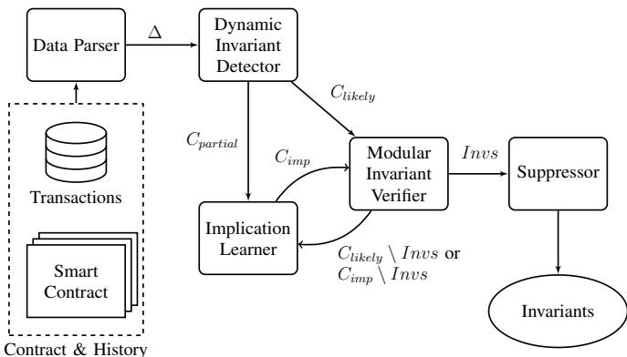
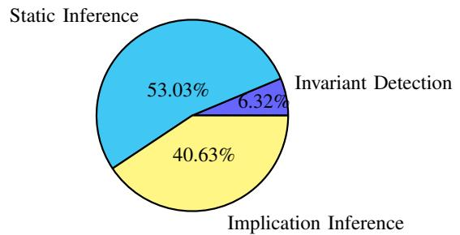
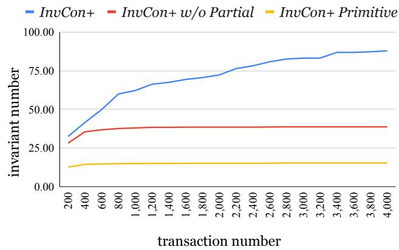
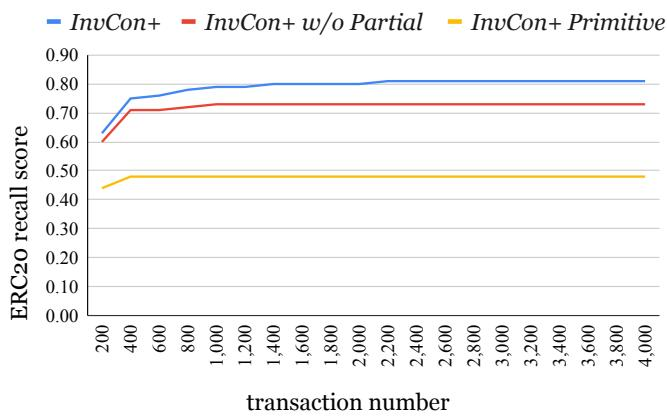

# Automated Invariant Generation for Solidity Smart Contracts

Ye Liu, Chengxuan Zhang, Yi Li Nanyang Technological University, Singapore {ye.liu, chengxua001, yi li}@ntu.edu.sg

Abstract—Smart contracts are computer programs running on blockchains to automate the transaction execution between users. The absence of contract specifications poses a real challenge to the correctness verification of smart contracts. Program invariants are properties that are always preserved throughout the execution, which characterize an important aspect of the program behaviors. In this paper, we propose a novel invariant generation framework, INVCON+, for Solidity smart contracts. INVCON+ extends the existing invariant detector, InvCon, to automatically produce verified contract invariants based on both dynamic inference and static verification. Unlike INVCON+, InvCon only produces likely invariants, which have a high probability to hold, yet are still not verified against the contract code. Particularly, INVCON+ is able to infer more expressive invariants that capture richer semantic relations of contract code. We evaluate INVCON+ on 361 ERC20 and 10 ERC721 real-world contracts, as well as common ERC20 vulnerability benchmarks. The experimental results indicate that INVCON+ efficiently produces high-quality invariant specifications, which can be used to secure smart contracts from common vulnerabilities.

Index Terms—Smart contract, invariant detection.

## I. INTRODUCTION

Smart contracts are computer programs that operate on blockchain networks. They are used to facilitate the management of substantial financial assets and the automated execution of agreements among multiple parties who lack inherent trust. Notably, blockchain networks such as Ethereum [1] and BSC [2] are widely recognized as leading platforms supporting smart contracts, with applications spanning diverse domains such as supply-chain management, finance, energy, games, and digital artworks. While smart contracts hold promise for facilitating value transfer among users, those that deviate from their specifications may harbor bugs or vulnerabilities. Numerous implementations of ERC20 contracts diverge from common expectations, as exemplified by standard non-compliance of ERC20 [3], particularly concerning event emission, balance updates, and the transaction fee mechanisms.

Even well-established standard ERC20 implementations exhibit inconsistencies [4]. The root cause lies in the limited semantic specifications outlined in the ERC20 standard proposal document [5]. Take the transfer function as an illustration— it is designed to move a specified amount of tokens from the sender to the recipient while triggering the Transfer event and should throw an error if the sender lacks adequate tokens for the transfer. Nevertheless, the ERC20 proposal provides only simple textual descriptions of the function, leading to semantic disparities across various ERC implementations and even different versions of the same implementation. For instance, the widely used ERC20 implementation from OpenZeppelin initially did not permit a return value for the transfer function until a later commit,<sup>1</sup> causing incompatibility issues with renowned tokens like BNB, as reported by the reputable security company SECBIT [4]. In cases where a contract necessitates checking the return value of an external call to a transfer function of ERC20 contracts, even if the transfer is successful, it may revert due to the absence of a return value, resulting in compatibility problems [6]. However, removing the return value check exposes contracts to a potential vulnerability known as the fake deposit attack [7].

Ensuring the correctness of smart contracts poses a significant challenge, especially in the absence of contract specifications. On the one hand, the documentation for most smart contracts is scant, with even widely recognized smart contract libraries like OpenZeppelin [8], [9] found to have errors and deficiencies in their documentation [10]. On the other hand, the absence of contract specifications hampers the widespread adoption of formal verification tools in the realm of smart contracts. To address this issue, the commercial formal verification company Certora<sup>2</sup> has adopted a crowd sourcing approach—they hosted numerous competitions on well-known bug bounty platforms, such as Code4Rena,<sup>3</sup> to engage third-party security experts in the formulation of contract specifications. Yet, manual creation of formal specifications for smart contracts remains costly and error-prune.

Many automated techniques [11], [12] have been proposed to generate formal specifications in various forms to support the testing, verification, and validation of software programs. Among them, program invariants, which are enduring properties maintained throughout program execution, inherently serve as excellent candidates for enhancing and reinforcing program specifications. Program invariants have been used for vulnerability detection [13], conformance checking [3], runtime protection [14], type checking [15], and formal verification [16], [17] for smart contracts. Established tools, such as Daikon [11], can identify likely program invariants for Java programs through the execution of their test cases. The process involves statistically inferring the invariants that hold based on predefined templates, while discarding those refuted by the data trace records. The complete historical transaction data of smart contracts is consistently stored on blockchains, encapsulating all execution data since contract deployment, serving as a valuable data source for mining invariants.

In our prior work, INVCON [18] utilized Daikon to identify likely invariants for smart contracts, all of which are primitive predicates hold throughout the existing transaction histories. Moreover, Liu et al. [19] employed reinforcement learning to learn contract invariants critical to safely performing arithmetic operations, with focus on preventing integer overflow and underflow. Despite their usefulness, the correctness of such inferred invariants remains unverified. In particular, an invariant which holds in past transactions may not always hold in the future—this may be due to the limited contract interactions observed in the transaction histories so far.

In this paper, we expand upon INVCON to generate verified contract invariants utilizing both dynamic inference and static verification. We introduce a specialized invariant specification language tailored for Solidity smart contracts and propose a novel approach for inferring high-quality verified invariants. Specifically, we design a Houdini-like [12] algorithm to generate verified invariants for smart contracts. To address the explosion problem in searching for richer invariant candidates, such as implications that prevail in ERC20 and ERC721 [20], [21], [22] specifications, we introduce an iterative and incremental process for exploring these candidates on demand. We also apply control- and data-flow analyses to eliminate meaningless candidates and further improve the invariant generation efficiency. Our approach is implemented as an automated tool called INVCON+. Through evaluation on 361 ERC20 contracts and 10 ERC721 real-world Solidity contracts, we demonstrate that INVCON+ produces comprehensive contract invariant specifications with no false positives. Furthermore, our analysis of real-world vulnerable ERC20 contracts underscores the potential of INVCON+ in safeguarding these contracts through the application of mined invariant specifications.

In summary, we make the following contributions:

• We introduce a comprehensive invariant specification language designed for expressing operational semantics in Solidity smart contracts. This language enables logical operations on variables of primitive types and commonly used data structures like structs, arrays, and mappings in Solidity.

• We present a unified framework for generating verified invariants in Solidity smart contracts, combining dynamic invariant detection and static invariant verification. Specifically, we develop a custom algorithm inspired by the Houdini algorithm to verify invariants for smart contracts and introduce an iterative process to derive a richer class of invariants.

• Our proposed approach is implemented in INVCON+, and its effectiveness is evaluated on 361 ERC20 contracts and 10 ERC721 contracts, along with vulnerable ERC20 contracts involving 25 types of vulnerabilities. The results demonstrate that INVCON+ can generate high-quality and comprehensive invariant specifications for smart contracts. The dataset, raw results, and the prototype used in our experiments are available online at: https://sites.google.com/view/invconplus/.

<div class="mineru-algorithm" style="white-space: pre-wrap; font-family:monospace;">
$a, v \in Variable ::= address | uint | int | string | bytes |$  
    byte | bool | array | mapping | struct{$\vec{v}$}  
$f \in Function ::= func(\vec{a}) \ \{ \vec{s} \}$ $s \in Statement ::= v | v := e | \textbf{if}(e) \ \{ \vec{s} \} \textbf{else} \ \{ \vec{s} \}|$ $\textbf{call}(\vec{e}) | \textbf{return} e |$ $\textbf{require}(e) | \textbf{assert}(e) | \textbf{revert}$ $e \in Expr ::= v | const | e[e] | e.v | e \bowtie e$
</div>

Fig. 1: The core grammar of the Solidity language.

Organizations. The rest of the paper is organized as follows. Section II provides the background about smart contracts and invariant inference. Section III defines the invariant specification language. Then, Sect. IV introduces our invariant generation approach. Section V describes our implementation framework, INVCON+, and Sect. VI demonstrates our evaluation results. The related work is discussed in Sect. VII and we conclude the paper in Sect. VIII.

## II. BACKGROUND

## A. Solidity Smart Contracts

Figure 1 presents the foundational grammar of the Solidity language, with certain features, such as event emission, intentionally excluded for the sake of clarity. Solidity encompasses various primitive data types, including integer, string, and Boolean. Distinguishing itself from other programming languages like Java, Solidity does not permit floating-point numbers and incorporates a distinctive address type. This design choice is rooted in the interaction pattern between contracts and blockchain users, each possessing a unique address. Moreover, the majority of contracts are developed with the primary goal of tokenizing digital assets.

A Solidity smart contract comprises a collection of state variables and a set of functions. Statements within each function can take the form of variable assignments, conditional statements, internal or external function calls, requirement or assertion statements, and reversion or return statements. Notably, the require and assert statements can be employed to enforce program invariants at runtime. In the realm of expressions, ▷◁ denotes a binary operator encompassing $\{ + , - , * , / , > , < , \geq , \leq , = , \neq , \wedge , \vee \}$

Smart Contract Execution. The execution of a smart contract function can be triggered by sending a blockchain transaction to the contract address. Typically, each transaction incorporates one or more contract calls, potentially leading to alterations in contract state variables unless the transaction undergoes a reversion. To ease the discussion in this paper, we model a smart contract $S C$ as a tuple $( \vec { v } , \vec { f } )$ , where ⃗v is a vector of state variables and $\vec { f }$ is a list of public functions.

Definition II.1 (Contract Execution). Let $D o m ( v )$ be the domain of a variable v and $D o m ( \vec { v } ) = \prod _ { v \in \vec { v } } D o m ( \vec { v } )$ . Then, $\delta , \delta ^ { \prime } \in D o m ( \vec { v } )$ represent two reachable contract states. For a function invocation $f ( \vec { a } )$ , calling function f with parameters values ${ \vec { a } } ,$ we define its high-level execution semantics as a state transition $\delta \xrightarrow { f ( \vec { a } ) } \delta ^ { \prime }$

```txt
const ∈ Int, Bool, Addr, Str  x ∈ FreeVar   v ∈ Var
e ∈ Expr ::= const | v | old(v) | len(v) | SumMap(v) |
        e.x | e[x] | e ⊗ e
p ∈ Predicate ::= ⊥ | e | eimplies e
Statement ::= Requires p | Ensures p | ContractInv p
```  
Fig. 2: The invariant specification language.

Note that since a contract execution is triggered by a transaction recorded into a specific block of the blokchain, the parameter values ⃗a also includes implicit transaction and block parameters, e.g., msg.sender and block.number.

Transaction Histories. The execution of a smart contract is intricately linked to its transaction histories on the blockchain. The transaction histories record every contract execution, capturing function calls, state transitions, and modification to state variables from the contract deployment onward. It encapsulates the evolution of the contract state, reflecting the cumulative effect of all transactions. This historical traceability is fundamental for auditing, debugging, and understanding the operational dynamics of smart contracts on the blockchain.

## B. Invariant Inference

In this paper, we aim to mine contract-level and functionlevel invariant specifications.

Definition II.2 (Function Pre/Post-conditions). Let f be a contract function, and predicates $p$ and q be the pre/postconditions of $f ,$ respectively, which can be represented as a Hoare triple $\{ p \} f \{ q \}$ . Then the following condition should be satisfied.

$$
\forall \delta , \forall \vec {a} \cdot \delta \models p \land \delta \xrightarrow {f (\vec {a})} \delta^ {\prime} \implies \delta^ {\prime} \models q\tag{1}
$$

Definition II.3 (Contract Invariant). Given a smart contract SC, its contract invariant I is a predicate that must hold for any contract function execution. More formally, we have $\forall f \in$ SC · {I}f{I}.

Invariant inference techniques can be broadly categorized as static and dynamic. Static invariant inference (e.g., Houdini [12]) identifies function pre/post-conditions and contract invariants that hold for any program execution. On the other hand, dynamic invariant inference (e.g., Daikon [11]) identifies likely invariants that hold for specific contract executions (e.g., executions of a test case).

Let ∆ denotes a set of program executions $\{ ( \delta , f ( \vec { a } ) , \delta ^ { \prime } ) \}$ which bring the contract state from δ to $\delta ^ { \prime } .$ The likely function pre/post-conditions of f, i.e., {pˆ}f{qˆ}, hold for $\Delta$ if $\forall ( \delta , f ( \vec { a } ) , \delta ^ { \prime } ) \in \Delta , \delta \vdash \hat { p } \land \delta \xrightarrow { f ( \vec { a } ) } \delta ^ { \prime } \implies \delta ^ { \prime } \vdash \hat { q } .$ . The likely contract invariants of a smart contract is defined in a similar way, which is omitted here for brevity.

## III. INVARIANT SPECIFICATION LANGUAGE

Figure 2 introduces our invariant specification language designed for Solidity smart contracts. The language accommodates variables of four types: integer, Boolean, address, and string, encompassing all primitive Solidity types illustrated in Fig. 1. We facilitate two types of variables. The first, denoted as v, pertains to function input parameters or contract state variables maintained in the persistent storage of the blockchain. The second, denoted as x, is reserved for free variables exclusively utilized to index structure members or items within arrays and mappings. Each invariant predicate is expressed as either a primitive logical expression or an implication expression. Furthermore, valid specification statements encompass function-level precondition invariant predicates (Requires) and postcondition invariant predicates (Ensures), and contract-level invariant predicates (ContractInv).

The expressions within the language may take the form of constants, variables, structure members, array items, and binary expressions. The old(·) notation is employed to differentiate between the value of a variable before entering the function and its value upon exiting the function, while len(·) refers to the array length or mapping size. Additionally, the language incorporates the widely used SumMap(·) operator for computing the arithmetic sum over mapping items. The notation “e ▷◁ e” represents arithmetic or logical binary operations, where the operator “▷◁” corresponds to the set defined in Solidity as shown in Fig. 1.

Utilizing this invariant language, we can articulate a diverse range of function

and contract invariants. To exemplify its application, we present a simple illustration. In Fig. 3, a basic ERC20 contract is depicted, featuring three state variables—totalSupply, balances, allows (standing for allowances)—and a function, transferFrom. The purpose of the transferFrom function is to transfer a specified amount of tokens from the account addressed at from to another account at to. An extensively studied ERC20 contract invariant of this example can be succinctly expressed as: “SumMap(balances) = totalSupply”. This assertion signifies that the total sum of items within the mapping variable balances must be equal to the value of totalSupply. Additionally, the function pre/post-conditions can be articulated as follows.

Requires ⊥

$$
\begin{array}{r l} \text {① Ensures} & t o \neq 0 \Longrightarrow \text {allows[from][msg.sender]} = \\ & \text {old(allows[from][msg.sender]) - tokens} \end{array}
$$

$$
\begin{array}{l} \text {② Ensures to\neq 0\land from\neq to\implies balance[from] = old(balance[}\ \\ \quad \text {from]) - tokens\land balance[to] = old(balance[to]) + tokens} \\ \text {③ Ensures to\neq 0\land from = to\implies balance[from] =} \\ \quad \text {old(balance[from])\land balance[to] = old(balance[to])} \end{array}
$$

In this instance, it is straightforward to ascertain that there are no preconditions for the transferFrom function, assuming that all function preconditions are primitive predicates. The function is characterized by three postconditions. The first postcondition ⃝1 specifies that allows will undergo an update (Line 11) when to is a non-zero address. Additionally, in cases where from and to represent distinct addresses, the second postcondition $\textcircled{2}$ dictates that the balances should be adjusted accordingly (Lines 12–13). Conversely, when from and to are identical, the last postcondition $\textcircled{3}$ emphasizes that the net effect on balance changes should be nullified. A detailed exploration of how these invariants are mined will be provided in Sect. IV-E.

```solidity
contract ERC20 {
  // state variables
  uint totalSupply;
  mapping(address=>uint) balances;
  mapping(address=>mapping(address=>uint)) allows;
  ...
  function transferFrom(address from, address to,
    uint tokens) public returns (bool) {
    if (to == address(0)) {
        return false;
    }
    allows[from][msg.sender] =
      allows[from][msg.sender].sub(tokens);
    balances[from] = balances[from].sub(tokens);
    balances[to] = balances[to].add(tokens);
    return true;
  }
}
```  
Fig. 3: A simple ERC20 contract.

## IV. INVARIANT GENERATION APPROACH

In this section, we present our algorithm for generating verified invariants in smart contracts and elaborate on the techniques employed to infer implication invariants. For simplicity in presentation, we use the term “invariants” to collectively denote both function pre/post-conditions and contract invariants when explicit characterization is unnecessary.

## A. Algorithm

Algorithm 1 outlines our approach to invariant generation. The algorithm takes a smart contract SC , a sequence of contract transactions T, and a set of invariant templates Q as input. The output, denoted as Invs, comprises a set of verified invariants, encompassing both primitive and implication invariants.

In this algorithm, Invs is initialized as an empty set (Line 1). Subsequently, we initialize a set $C$ that encompasses all potential invariant candidates under the given input (Line 2), similar to Daikon’s initialization process [11], which instantiates all the parameterized invariant templates with concrete contract state variables and function input variables. For example, ${ } ^ { 6 6 } X = Y ^ { 5 }$ is a binary equation template where X and Y are placeholders that can be filled by two concrete variables: $v _ { x }$ and $v _ { y }$ whenever $D o m ( v _ { x } ) \equiv D o m ( v _ { y } )$ . It is important to note that here C excludes implication invariant candidates due to the exponential complexity of traversing all implication candidates. Instead, implication invariants will be generated on demand. Moreover, the execution trace set ∆ is initialized as an empty set (Line 3).

The algorithm processes the transaction histories to extract corresponding execution traces. For each transaction $t _ { i } ,$ , the algorithm parses it to extract the invoked function f and parameters values ⃗a (Line 5). Additionally, the old and present contract states (i.e., values of the contract state variables), denoted as δ and $\delta ^ { \prime } ,$ respectively, are recorded. The tuple (δ, $f ( \vec { a } ) , \delta ^ { \prime } )$ is added to the execution trace set $\Delta$ (Line 6).

Next, the algorithm executes the dynamic invariant detection procedure INVDETECT (Line 8) to obtain two classes of invariant candidates:

$C _ { l i k e l y } .$ , likely invariant candidates that hold for the entire transaction histories.

$C _ { p a r t i a l }$ , partially supported invariant candidates that hold for a subset of transaction histories.

<div class="mineru-algorithm" style="white-space: pre-wrap; font-family:monospace;">
Algorithm 1: Contract Invariant Inference
Inputs : $SC = \{\vec{v}, \vec{f}\}$, where each element $v_i \in \vec{v}$ is a contract state variable and each element $f_i \in \vec{f}$ is a public contract function; $T = \{t_i | 1 \le i \le n\}$, where each element $t_i$ is a contract transaction; $Q$, a set of invariant templates.
Outputs: Invs, a set of verified invariants.
Invs := $\emptyset$;
$C := \text{INITIALIZECANDIDATES}(\vec{v}, \vec{f}, Q)$ ; //primitive candidates
$\Delta := \emptyset$ ; //execution trace set
foreach $t_i \in T$ do
    $(\delta, f(\vec{a}), \delta') \leftarrow \text{PARSE}(t_i)$ ;
    $\Delta \leftarrow \Delta \cup (\delta, f(\vec{a}), \delta')$;
end foreach
$C_{likely}$, $C_{partial}$ ← INVDETECT ($\Delta$, $C$);
Invs ← STATICINFER($C_{likely}$) ;
$C_{imp} \leftarrow \text{FINDIMPLICATIONS}(C_{likely} \setminus Invs, C_{partial})$ ;
//implication candidates
while $C_{imp} \neq \emptyset$ do
    Invs ← Invs ∪ STATICINFER($C_{imp}$) ;
    $C_{imp} \leftarrow \text{WEAKENIMPLICATIONS}(C_{imp} \setminus Invs)$;
end while
return Invs
$\frac{\perp}{C_{imp} := \{(\eta \implies \tau) | \eta, \tau \in C_{likely} \setminus Invs \cup C_{partial}, \eta \neq \tau\}$ $(\eta \implies \tau) \in C_{imp} \quad \begin{array}{c} \forall a \in vars(\eta), \forall b \in vars(\tau). \\ \neg dep(a, b) \\ C_{imp} \leftarrow C_{imp} \setminus (\eta \implies \tau) \end{array}$ Delete
Fig. 4: FINDIMPLICATIONS
</div>

Subsequently, a primitive invariant inference technique, detailed in Sect. IV-B, is applied to infer the standing invariants out of $C _ { l i k e l y } .$ and all the verified invariants are included in Invs (Line 9). The unverified likely invariant candidates, $C _ { l i k e l y } \backslash$ Invs, and $C _ { p a r t i a l }$ are used to derive implication candidates assigned to $C _ { i m p }$ (Line 10) via FINDIMPLICATIONS, which will be detailed in Sect. IV-C. Additionally, it is important to note that the found implications may not always hold. An iterative process is in place to validate these implications (Line 12) or weaken these implications via WEAKENIMPLICATIONS (Line 13) to identify new ones. This iterative process continues until all valid candidates are examined (Line 11). Finally, the algorithm returns Invs, which includes all the correctly mined invariants from transaction histories (Line 15).

## B. Primitive Invariant Inference

Algorithm 2 illustrates our Houdini-like algorithm to infer verified primitive invariants from the candidates mined from contract transaction histories. First, we enable all the candidates in $S C$ via contract instrumentation (Line 1); each candidate is explicitly labeled by the added keywords, e.g., ContractInv for contract invariant, Requires for function precondition, and Ensures for function postcondition. Next, we invoke a modular verifier to statically verify these enabled candidates (Line 3), i.e., verifying each function in isolation where all the corresponding candidates are examined against the function implementation. When there is a failed invariant candidate c violating the verification condition, c will be disabled in SC (Line 7). This process will continue until all the enabled candidates are verified successfully (Line 4) and then returned (Line 5). Particularly, whenever there is a failed assertion in SC, i.e., a violated condition e in the assert(e) statement, the algorithm terminates with an error raised (Line 9). This happens in Solidity contracts, because assert(e) is often misused to replace require(e) that enforces program requirements due to their similar effects on transaction reversion. For smart contracts without failed assertions, the verified invariants is a maximal subset of the candidates whose conjunction is an inductive invariant.

<div class="mineru-algorithm" style="white-space: pre-wrap; font-family:monospace;">
$\frac{\perp}{C_{imp}^{\hat{}}} \text{ Init }$ $(\eta_1 \implies \tau), (\eta_2 \implies \tau) \in C_{imp} \setminus \text{Invs} \quad \eta_1 \land \eta_2 \not\equiv \text{false}$ $\frac{C_{imp}^{\hat{}} \leftarrow C_{imp}^{\hat{}} \cup (\eta_1 \land \eta_2 \implies \tau)}{(\eta \implies \tau_1), (\eta \implies \tau_2) \in C_{imp} \setminus \text{Invs} \quad \tau_1 \lor \tau_2 \not\equiv true}$ $\frac{C_{imp}^{\hat{}} \leftarrow C_{imp}^{\hat{}} \cup (\eta \implies \tau_1 \lor \tau_2)}{\text{Fig. 5: WEAKENIMPLICATIONS.}}$
</div>

```txt
Algorithm 2: STATICINFER(Candidates)
Instrument SC to enable each candidate from Candidates;
while true do
    result = MODULARVERIFY(SC) ;
    if result = CORRECT then
        return enabled candidates ; //verified
            invariants
    else if result = INCORRECT due to failed candidate c then
        disable c in SC;
    else
        raise Error ; //INCORRECT due to failed assertion in SC
    end if
end while
```

## C. Implication Invariant Inference

Figures 4 and 5 illustrate the two procedures for identifying implication candidates, respectively. In Fig. 4, FINDIMPLICA-TIONS employs two straightforward inference rules. The first rule explores all the potential implication candidates from the unverified likely invariants $C _ { l i k e l y } \backslash$ Invs and partial invariant candidates $C _ { p a r t i a l } ,$ , including them in $C _ { i m p } .$ An implication invariant takes the form of $\eta \implies \tau$ , where η and τ comes from the existing the unverified and partial invariant candidates.

However, not all of the implication candidates constructed this way are relevant in terms of the contract semantics. An implication can possibly hold (i.e., relevant) if its precondition and postcondition align with the data/control-flow of the contracts, and irrelevant implications should be discarded. The notation $v a r s ( p )$ represents variables appearing in an invariant predicate $p ;$ for instance, $v a r s ( p ) = \{ f r o m , t o \}$ when $p$ is $^ { * } f r o m \neq t o ^ { * }$ . Additionally, $\mathbf { d e p } ( a , b )$ denotes whether variable a depends on variable b in terms of control-flow or data-flow in smart contract functions. To determine the valid implications, we leverage the well-known static analysis tool Slither [23] to trace data-flow and control-flow in smart contract functions. Therefore, in Fig. 4, a Delete rule is applied to eliminate implications that do not adhere to the data-flow and controlflow relationship. This rule is iteratively applied until no further implications can be eliminated.

Some implication candidates may be too strong and cannot be proved. Figure 5 illustrates how we derive a weaker set of implication candidates $\hat { C _ { i m p } }$ from those unverified implication candidates denoted as $C _ { i m p } \backslash I n v s .$ . In Fig. 5, WEAKENIMPLICATIONS comprises three inference rules. It initially sets $\hat { C _ { i m p } }$ to an empty set. Then the rules Append-1 and Append-2 generate weaker implications by combing two unverified implication candidates. In essence, $\eta _ { 1 } \wedge \eta _ { 2 } \implies \tau$ is weaker than either $\eta _ { 1 } \implies \tau \ \mathrm { o r } \ \eta _ { 2 } \ \implies \ \tau$ . Similarly, $\begin{array} { r l } { \eta } & { { } \Longrightarrow \quad \tau _ { 1 } \vee \tau _ { 2 } } \end{array}$ is weaker than both $\eta \quad \implies \quad \tau _ { 1 }$ and $\eta \quad \implies \quad \tau _ { 2 } .$ To eliminate useless implications that are tautologies, we impose restrictions on the original implications, such as $\eta _ { 1 } \wedge \eta _ { 2 } \not \equiv$ false and $\tau _ { 1 } \vee \tau _ { 2 } \not \equiv$ true. It is evident that the weaker implications are also relevant as they satisfy the same control/data-flow dependencies as the original ones.

## D. Termination

The termination of Alg. 1 can be ensured by the fact that INVCON+ can only produce a finite set of primitive invariant predicates. The conclusion regarding the termination of Alg. 1 hinges on whether the loop (Lines 11-14) comes to an end. In each iteration of the loop, we possess at least one implication candidate, constructed by WEAKENIMPLICATIONS (refer to Sect. IV-C). Regarding WEAKENIMPLICATIONS, it consistently generates weaker implication candidates than the previous ones, utilizing conjunctions over premises or disjunctions over consequences. Assuming INVDETECT yields n primitive invariant predicates $C _ { l i k e l y } \cup C _ { p a r t i a l } = \{ p _ { 1 } , . . . , p _ { n } \}$ then the weakest implication will be at least as strong as $p _ { 1 } \wedge \cdot \cdot \cdot \wedge p _ { n } \implies p _ { 1 } \vee \cdot \cdot \cdot \vee p _ { n }$ . Consequently, the loop will finish in no more than $2 \times n$ iterations, establishing the termination of this algorithm.

## E. Running Example

We illustrate our algorithm using the example presented in Fig. 3. The details regarding our transaction parsing and invariant detection will be elaborated in Sect. V. For the sake of simplicity in the illustration, assume that we have already acquired a set of likely and partially supported invariants through invariant detection on the transaction histories. In Table I, the invariants labeled with $\checkmark$ are successfully verified by the static verifier, while the ones with ✗ are unverified. In Step ⃝1 , we perform a Houdini-like static inference on these detected invariant candidates. Consequently, three likely invariants are verified, excluding $t o \neq 0$ . In the subsequent step (Step ⃝2 ), nine additional implication invariant candidates are generated from the previously unverified likely invariants and partially supported invariants, according to the rules in FINDIMPLICATIONS (see Fig. 4). However, after the modular verification, only one implication is confirmed. Furthermore, we weaken these unverified implication invariants in Step ⃝3 using WEAKENIMPLICATIONS (see Fig. 5) to derive four new implication candidates for further validation. Eventually, all the invariants listed in Sect. III are successfully recovered (in a logically equivalent form). Moreover, two other invariants, balances[to] ≥ old(balances[to]) and balances[from] ≤ old(balances[from]), are verified, which provide additional insights on how the balances of the sender and the receiver should change when transferFrom is called, beyond the standard specifications.

  
Fig. 6: The architecture overview of INVCON+.

## V. IMPLEMENTATION

## A. Overview

Figure 6 demonstrates the high-level architecture of IN-VCON+, our automated invariant detection tool for Solidity smart contracts. The inputs to INVCON+ include a set of historical transactions and the corresponding contract source code, while its output is a collection of smart contract invariant specifications or the accordingly annotated contract code. INVCON+ comprises four modules: (1) a data parser that decodes contract code and transaction histories to extract concrete execution trace set; (2) a dynamic invariant detector that generates a set of likely and partially supported invariants; (3) a modular invariant verifier and an implication learner that verify and learn contract invariants, respectively; and (4) a suppressor that simplifies the results by removing redundant invariants. Notably, the implication learner has already been detailed in Sect. IV-C.

## B. Data Parser

Given a contract, we first collect all of its historical transactions. For each transaction, we decode the specific function input based on the contract’s Application Binary Interface (ABI), and we interpret the transaction output in accordance with the contract’s storage layout specifications. This layout dictates where each state variable is stored in the blockchain database. For instance, as shown in Fig. 1, the first declared state variable totalSupply is stored at the first slot (0x0) in the contract’s blockchain database.

The input of a contract transaction is represented as a tuple (sender, function, parameters), which encapsulates the transaction’s sender, the invoked function’s name, and the corresponding input parameters. Conversely, the transaction’s output is denoted as (status, storageChanges). Here, status signifies the transaction’s success or failure, while storageChanges details the alterations in the contract’s storage across various slots. By aligning storage slots with the contract’s storage layout, one can effectively interpret these storage modifications as changes in the values of the contract’s state variables. Employing the previously described preprocessing technique enables the extraction of a sequence of data triples (i.e., execution traces). These triples consist of the actual values of state variables and function input variables at the point of function entry, as well as the most recent values of state variables at the point of function exit. It is important to note that any misrecognition of variables can lead to incorrect invariant results. We have implemented measures to ensure the accuracy of variable recognition. For state variables of primitive types, we directly ascertain their values, as the storage layout for these variables remains constant during runtime. In the case of non-primitive, dynamic state variables, to reduce computational cost, we initially utilize the known variable values to hypothesize a correlation between the altered storage slots and the dynamic state variables. However, if this approach fails to produce an accurate mapping, it becomes necessary to replay the entire transaction. This replay process enables us to track the comprehensive execution information, including storage modifications, thus allowing for the accurate determination of the correct mapping.

## C. Dynamic Invariant Detector

The effectiveness of dynamic invariant detection largely depends on the diversity and scale of the customized invariant templates used. In our methodology, these invariant templates are required to conform to the invariant specification language outlined in Fig. 2. However, it is both impossible and impractical to cover every conceivable invariant template. Our approach, akin to that of INVCON [18], limits the scope to unary, binary, and ternary invariant templates. Unlike INVCON, our templates are specifically designed for Solidity smart contracts, which are predominantly used for financial applications. These contracts often entail intricate scientific computations on scalar variables. Furthermore, Solidity features an array of complex data structures, such as mapping and struct. To effectively infer invariants related to these structures, we have incorporated several derivation templates, such as MemberItem and MappingItem, which facilitate access to elements within these data structures. Additionally, drawing inspiration from the significance of balance invariants as highlighted by Wang et al. [24], we have introduced a SumMap derivation template. This template is specifically designed to aggregate the values contained within a mapping variable.

Dynamic invariant detection employs a statistical methodology to generate likely primitive invariants with a certain degree of statistical confidence. Contrasting with the approach of IN-VCON, our method retains invariants that are refuted by certain transactions in the final results. This is because less stringent forms of these invariants, expressed as implications, may still hold true for certain contracts. Both the likely invariants and the falsified ones constitute a high-quality set of primitive predicates. Each of these predicates has been empirically verified through historical transaction data of smart contracts. In our evaluation setting, each valid primitive invariant must be supported by at least three historical transactions.

TABLE I: Illustration example of invariant verification.  
```toml
Step Invariants
① Likely Contract Invariants: Partially Supported Function Pre/post-conditions:
totalSupply = SumMap(balances) ✓ from ≠ to
Likely Function Pre/post-conditions: from = to
to ≠0 ✗ balances[from] = old(balances[from]) - tokens
balances[to] ≥ old(balances[to]) ✓ balances[to] = old(balances[to]) + tokens
balances[from] ≤ old(balances[from]) ✓ allows[from][msg.sender] = old(allows[from][msg.sender]) - tokens
balances[from] = old(balances[from])
balances[to] = old(balances[to])
② Implication Invariant Candidates:
to ≠0 ⇒ allows[from][msg.sender] = old(allows[from][msg.sender]) - tokens ✓
to ≠0 ⇒ balances[from] = old(balances[from]) - tokens ✗
to ≠0 ⇒ balances[to] = old(balances[to]) + tokens ✗
to ≠0 ⇒ balances[from] = old(balances[from] ✗
to ≠0 ⇒ balances[to] = old(balances[to]) ✗
from ≠to ⇒ balances[from] = old(balances[from]) - tokens ✗
from ≠to ⇒ balances[to] = old(balances[to]) + tokens ✗
from = to ⇒ balances[from] = old(balances[from] ✗
from = to ⇒ balances[to] = old(balances[to]) ✗
③ Weakened Implication Invariant Candidates:
to ≠0 ∧ from ≠to ⇒ balances[from] = old(balances[from]) - tokens ✓
to ≠0 ∧ from ≠to ⇒ balances[to] = old(balances[to]) + tokens ✓
to ≠0 ∧ from = to ⇒ balances[from] = old(balances[from]) ✓
to ≠0 ∧ from = to ⇒ balances[to] = old(balances[to]) ✓
```

## D. Modular Invariant Verifier

The Houdini algorithm [12] is a widely recognized technique commonly used in program annotation and validation processes. Its primary objective is to automatically generate invariant annotations from a group of candidates. To adapt Houdini algorithm for Solidity contracts, we initially instrument the contracts with the mined invariants. This entails converting the invariants into a compatible format and then embedding them into the contract. The annotations are strategically placed at the beginning of functions to align with their specific names and arguments. Subsequently, we transform the instrumented contracts into Boogie [25] programs, leveraging the existing formal verification tool VeriSol [26] for Solidity smart contracts. We have refined the Boogie translator in VeriSol to better accommodate contracts with inheritance and polymorphism features. For instance, the original translator lacked support for unnamed parent contract calls using the “super” keyword in Solidity, and it did not handle function overloading where a contract includes multiple functions with the same name. We have enhanced its translation rules to effectively translate these complex contracts into Boogie programs. Finally, we utilize Boogie’s own Houdini modular verifier to infer among the aforementioned invariant annotations, resulting in a set of verified invariants.

## E. Suppressor

An invariant is deemed redundant if it can be derived from another invariant. The invariants verified by INVCON+ may contain such redundancies. Instead of eliminating redundancies in the dynamically detected invariants (as what Daikon [11] does), we only remove redundancies from the invariants that are successfully verified. This design leaves more choices to the implication learner, when synthesizing implication invariants. Among the verified invariants, we utilize the Z3 solver [27] to determine if one invariant predicate can be deduced from another. Following this analysis, we retain only the strongest invariant predicates in our final results.

## VI. EVALUATION

In this section, we evaluate INVCON+ to answer the following research questions:

1) RQ1: How effectively does INVCON+ generate invariants for smart contracts?

2) RQ2: How does the length of transaction histories used affect the performance of INVCON+?

3) RQ3: How effective are the invariants detected by IN-VCON+ in preventing real-world security attacks?

## A. Methodology

Benchmark. To answer RQ1 and RQ2, we collected real-world smart contracts implementing the most popular ERC20 and ERC721 standards, which have been studied extensively in previous works [3], [4], [14], [28], [29]. The most important reason of choosing smart contracts implementing common standards is that their invariant specifications are better understood, making it easier to obtain the ground truth. First, we queried the public Ethereum ETL dataset hosted on the Google BigQuery platform [30] and then identified 13,116 contract addresses flagged as ERC20 deployed between 2021 and 2022. Then, we identified 2,689 ERC721 contract addresses deployed between 2020 and 2022. To facilitate our analysis, we kept only open-source contracts written in Solidity versions ranging between 0.5.0 and 0.5.17, which are currently supported by VERISOL. Finally, we obtained 361 ERC20 contracts and 10

ERC721 contracts for the experimental evaluation, where each contract has at least 50 historical transactions as of June 2023.

To establish the ground truth for ERC20 and ERC721 contract specifications and ensure the included invariants are comprehensive, we investigated multiple external sources. These include the formal specifications referenced in the existing literature [4], [14], popular smart contract libraries, such as OpenZeppelin [8], and online documentations provided by smart contract formal verification companies. We list the collected ERC20 and ERC721 invariant specifications in Table II and Table III, respectively. These specifications are mainly based on Certora [20], [21], [31], KEVM [22], [28], and OpenZeppelin API documentations [32], [33]. We analyzed each of the collected invariants and manually translated it into our own specification language (C.f. Fig. 2), which is a straightforward exercise in most cases. We categorized these invariant specification into contract invariants, function preconditions and postconditions in Tables II and III. The functions listed in each table are the most commonly used standard functions for ERC20 and ERC721 contracts. Some specifications documented in external sources were omitted, e.g., “Emitting a Transfer event” for the transfer function, because the particular language features are not supported by our specification language.

Evaluation Metrics. We use two evaluation metrics to evaluate INVCON+ on the ERC20 and ERC721 contracts. Particularly, we use Precision and $\mathbf { R e c a l l _ { E R C 2 0 } }$ (Recall<sub>ERC721</sub>) to measure the effectiveness of the generated invariants, denoted as $X _ { p r o v e d }$ . We denote the ground truth invariants (e.g., ERC20) as Y . Formally,

$$
\text {Precision} = \frac {| X _ {\text {proved}} |}{| X |},\tag{2}
$$

$$
\text {Recall} _ {\mathrm{ERC20}} (\text {Recall} _ {\mathrm{ERC721}}) = \frac {| X _ {\text {proved}} \cap Y |}{| Y |},\tag{3}
$$

where precision refers to the proportion of the generated invariants which are correct and recall is the proportion of the ground truth invariants which can be successfully generated. Since the contract execution trace set $\Delta$ from transaction histories may only contain a subset of functions invocations, i.e., some functions are never invoked. For a fair comparison, let Y ⇂ ∆ represent the ground truth invariants for the functions appeared in the histories, and we use the adjusted recall in our experiments: $\frac { | X _ { p r o v e d } \cap Y | } { | Y \left| \Delta \right| }$

Note that although the ground truth invariants are derived based on multiple external sources and widely deemed to be standard, they may still be incomplete, as there are infinitely many correct invariants in theory. The purpose of collecting the ground truth invariants is to include the list of common expectations that are needed for contract safety and reliability. On the other hand, certain smart contracts may not faithfully implement the ERC standards, and as a result, either some ground-truth invariants may not hold for them or they satisfy additional invariants not included in the ground truth. Nevertheless, an ideal invariant generation tool should be able to recover as many ground-truth invariants as possible, and meanwhile, recover other relevant invariants that are correct and useful in describing unique smart contract behaviors.

## B. Experiment Setup

All the experiments were conducted on a desktop computer with the Ubuntu 20.04 OS, an Intel Core Xeon 3.50GHx processor, and 32GB of RAM. To facilitate the evaluation, we have crawled and cached all transaction histories in advance for the contracts used in our experiments.

## C. RQ1: Effectiveness of Invariant Generation

Baseline. To evaluate the performance of INVCON+, we used INVCON as our baseline. INVCON uses Daikon as the back-end invariant detection engine and more implementation details can be found in the previous work [18]. To the best of our knowledge, Cider [19] is the only automated invariant generation tool for smart contracts besides INVCON. We have contacted the authors of Cider to obtain a copy of the tool,<sup>4</sup> but failed to set it up. We will discuss and compare with this work in Sect. VII.

Additionally, we compared INVCON+ with its two variants: INVCON+ Naive, which performs only dynamic invariant detection tailored to Solidity contracts, and INVCON+ Primitive, which employs the Houdini algorithm to generate verified invariants based only on dynamically detected invariant candidates.

Results. Table IV presents the comparison results for 361 ERC20 contracts, with a constraint of utilizing a maximum of 200 transactions per contract. The first column displays the names of the tools, while the second column enumerates the averaged number of invariants generated by each respective tool per contract. The middle two columns showcase the overall Precision and Recall<sub>ERC20</sub> scores, and the last column provides the averaged time usage for each tool.

INVCON+ achieves the highest recall score, reaching 0.80, and generates approximately 46 invariants per contract, all of which are successfully verified by VeriSol. Notably, INVCON performs the least favorably in terms of the invariants generated, even when compared with INVCON+ Naive. Specifically, INVCON produces the second-highest number of invariants, yet its recall score is significantly lower than that of INVCON+ Naive, while maintaining a similar precision score of less than 0.1. The poor performance is primarily attributed to the fact that INVCON’s underlying invariant detection engine, Daikon, supports only Boolean, integer/float, and string types native to Java. Consequently, the address type (20 bytes long) in the Solidity language cannot be seamlessly converted into a Java integer (8 bytes long). Its conversion to the Java string type discards semantic information, rendering the straightforward production of common invariants (e.g., a1, a2 in Table II) unattainable for INVCON. Additionally, Daikon employs floating-point operations in arithmetic invariant templates (e.g., linear equation templates), which is not allowed in the Solidity semantics, leading to incorrect invariants for b6, b10 in Table II.

INVCON+ Primitive exhibits a slightly lower recall score than INVCON+ Naive, because some ground truth invariants

TABLE II: Common ERC20 Invariants.

<table><tr><td>Categories</td><td>Preconditions</td><td>Postconditions</td></tr><tr><td>transfer(to, amount)</td><td>[a1] msg.sender ≠ 0[a2] to ≠ address(0)[a3] amount ≥ 0[a4] amount ≤ balances[msg.sender][a5] balances[to] + amount ≤ MAXVALUE</td><td>[b1] to ≠ msg.sender ⇒ balances[msg.sender] = old(balances[msg.sender]) - amount[b2] to ≠ msg.sender ⇒ balances[to] = old(balances[to]) + amount[b3] to = msg.sender ⇒ balances[to] = old(balances[to])[b4] to = msg.sender ⇒ balances[msg.sender] = old(balances[msg.sender])[b5] totalSupply = old(totalSupply)</td></tr><tr><td>transferFrom (from, to, amount)</td><td>[a6] from ≠ address(0)[a7] to ≠ address(0)[a8] amount ≥ 0[a9] amount ≤ balances[from][a10] amt ≤ allowed[from][msg.sender][a11] balances[to] + amount ≤ MAXVALUE</td><td>[b6] allowed[from][msg.sender] = old(allowed[from][msg.sender]) - amount[b7] from ≠ to ⇒ balances[from] = old(balances[from]) - amount[b8] from ≠ to ⇒ balances[to] = old(balances[to]) + amount[b9] from = to ⇒ balances[from] = old(balances[from])[b10] allowed[from][msg.sender] = old(allowed[from][msg.sender]) - amount[b11] totalSupply = old(totalSupply)</td></tr><tr><td>approve(spender, amount)</td><td>[a12] amount ≥ 0[a13] spender ≠ address(0)</td><td>[b12] allowed[msg.sender][spender] = amount[b13] totalSupply = old(totalSupply)</td></tr><tr><td>increaseAllowance(spender, amount)</td><td>[a14] spender ≠ address(0)[a15] amount ≥ 0[a16] allowed[msg.sender][spender] + amount ≤ MAXVALUE</td><td>[b14] allowed[msg.sender][spender] = old(allowed[msg.sender][spender]) + amount[b15] totalSupply = old(totalSupply)</td></tr><tr><td>decreaseAllowance(spender, amount)</td><td>[a17] spender ≠ address(0)[a18] amount ≥ 0[a19] allowed[msg.sender][spender] ≥ amount</td><td>[b16] allowed[msg.sender][spender] = old(allowed[msg.sender][spender]) - amount[b17] totalSupply = old(totalSupply)</td></tr><tr><td>mint(account, amount)</td><td>[a20] account ≠ address(0)[a21] amount ≥ 0[a22] balances[account] + amount ≤ MAXVALUE</td><td>[b18] balances[account] = old(balances[account]) + amount[b19] totalSupply = old(totalSupply) + amount</td></tr><tr><td>burn(from, amount)</td><td>[a23] from ≠ address(0)[a24] amount ≥ 0[a25] balances[from] ≥ amount</td><td>[b20] balances[from] = old(balances[from]) - amount[b21] totalSupply = old(totalSupply) + amount</td></tr><tr><td>pause()</td><td>[a26] paused = false</td><td>[b22] paused = true</td></tr><tr><td>unpause()</td><td>[a27] paused = true</td><td>[b23] paused = false</td></tr><tr><td>Contract Invariant</td><td colspan="2">[c1] totalSupply = SumMap(balances)</td></tr></table>

TABLE III: Common ERC721 Invariants.

<table><tr><td>Categories</td><td>Preconditions</td><td>Postconditions</td></tr><tr><td>(safe)-transferFrom(from,to, tokenId)</td><td>[a28] from = _tokenOwner[tokenId][a29] from ≠ address(0)[a30] to ≠ address(0)[a31] (msg.sender = from ∨ msg.sender = _tokenApprovals[tokenId] ∨ _operatorApprovals[from][msg.sender] = true)</td><td>[b24] from ≠ to ⇒ _ownedTokensCount[from] = old( _ownedTokensCount[from]) - 1[b25] from ≠ to ⇒ _ownedTokensCount[to] = old( _ownedTokensCount[to]) + 1[b26] from = to ⇒ _ownedTokensCount[from] = old( _ownedTokensCount[from])[b27] from = to ⇒ _ownedTokensCount[to] = old( _ownedTokensCount[to])[b28] _tokenOwner[tokenId] = to[b29] _tokenApprovals[tokenId] = address(0)</td></tr><tr><td>approve(to, tokenId)</td><td>[a32] _tokenOwner[tokenId] ≠ address(0)[a33] (msg.sender = _tokenOwner[tokenId] ∨ _operatorApprovals[_tokenOwner[tokenId] ][msg.sender] = true)</td><td>[b30] _tokenApprovals[tokenId] = to</td></tr><tr><td>setApproveForAll(operator, _approved)</td><td>[a34] operator ≠ msg.sender</td><td>[b31] _operatorApprovals[msg.sender][operator] = _approved</td></tr><tr><td>Contract Invariant</td><td colspan="2">[c2] len(_tokenOwner) = SumMap(_ownerTokenCount)</td></tr></table>

TABLE IV: The comparison results on ERC20 contracts.

<table><tr><td>Tool</td><td>#Inv</td><td>Prec.</td><td> $Rec_{ERC20}$ </td><td>Avg.time (s)</td></tr><tr><td>INVCON</td><td>413.23</td><td>0.095</td><td>0.19</td><td>13.99</td></tr><tr><td>INVCON+ Naive</td><td>480.89</td><td>0.094</td><td>0.63</td><td>15.25</td></tr><tr><td>INVCON+ Primitive</td><td>22.49</td><td>1.000</td><td>0.61</td><td>20.57</td></tr><tr><td>INVCON+</td><td>46.12</td><td>1.000</td><td>0.80</td><td>250.25</td></tr></table>

that are inferred as likely invariants by INVCON+ Naive may not be verified by INVCON+ Primitive. This may be due to contract implementations slightly deviating from the standard. For example, many ERC20 tokens do not enforce the precondition a2 of the transfer function in Table II, because transferring token to zero address could be used to implement the token burning functionality. The verified invariants are a more accurate reflection of the actual contract implementations, compared with the likely invariants. Leveraging an algorithm capable of producing implications that widely exist in ERC20 invariants (C.f. Table II), INVCON+ outperforms all the baseline tools, yielding 100% precise invariant results.

Regarding the time usage, it is unsurprising that INVCON+ takes the most time, whereas INVCON and INVCON+ Naive finish the fastest. In our experiments, we observed that the static inference process consumes the majority of the time, constituting nearly 53% of the overall time usage, as depicted in Fig. 9. This is primarily due to the iterative application of static inference until no more implication candidates are provided. Moreover, implication invariants generated in later iterations tend to be more intricate, resulting in more complicated SMT formulas which take more time to solve. To enhance the efficiency of INVCON+, we recommend capping the iterations used in the verification process to four; under such a setting, INVCON+ demonstrates an averaged time savings of one minute in the entire verification process without compromising the quality of resulting invariants.

```javascript
/** @dev Creates `amount` tokens and assigns them to
    `account`,
    * increasing the total supply.
    * Requirements
    * - `to` cannot be the zero address.*/
function _mint(address account, uint256 amount) internal
    {
    require(account != address(0), "ERC20: mint to the zero
        address");
    _totalSupply = _totalSupply.add(amount);
    _balances[account] = _balances[account].add(amount);
    _balances[Account] = _totalSupply/100;
}
```  
Fig. 7: TokenMintERC20Token contract violating c1.

TABLE V: The mutation testing results on ERC20 contracts against the verified invariants by INVCON+.

<table><tr><td>Categories</td><td>approve</td><td>transfer</td><td>transferFrom</td></tr><tr><td>No. total mutants</td><td>1,539</td><td>1,141</td><td>297</td></tr><tr><td>No. killed mutants</td><td>998 (64.8 %)</td><td>624 (54.6 %)</td><td>101 (34.0 %)</td></tr><tr><td>P1. Contract invariants</td><td>245 (24.5 %)</td><td>344 (55.1 %)</td><td>55 (54.4 %)</td></tr><tr><td>P2. Function pre/post</td><td>763 (76.4 %)</td><td>465 (74.5 %)</td><td>61 (60.4 %)</td></tr><tr><td>P3. ERC20 standard</td><td>751 (75.2 %)</td><td>266 (42.6 %)</td><td>43 (42.5 %)</td></tr><tr><td>P4. Non-ERC20 standard</td><td>995 (99.7 %)</td><td>601 (96.3 %)</td><td>98 (97.0 %)</td></tr></table>

Additionally, we investigated further on the contracts for which INVCON+ generated additional invariants deviating from the ground-truth ones. Many of these contracts are found to be non-compliant with ERC20 specifications. As illustrated in Fig. 7, we examined a real-world contract, TokenMintERC20Token<sup>5</sup>, where the mint function deviates from the contract invariant c1—the sum of account balances always equals to the total supply—indicating noncompliance with the standard. This discrepancy arises because only 1% of the total supply tokens have been distributed to the Account (Line 9).

Invariant Quality. Furthermore, to assess the significance of the invariants generated by INVCON+, we conducted mutation testing on the same benchmark and computed the corresponding mutation scores against these invariants. Table V presents the mutation testing results on ERC20 contracts, specifically focusing on the three most important functions: approve, transfer, and transferFrom. We introduced six mutation operators, such as binary/unary-op-mutation and require-mutation, along with the others, based on the mutation generator Gambit [34] developed by Certora.<sup>6</sup> This mutation-based approach was also adopted by Certora to evaluate the quality of smart contract specifications.<sup>7</sup> In total, we generated 1, 539, 1, 141, and 297 mutants for approve, transfer, and transferFrom, respectively. Table V shows that 64.8 %, 54.6 %, and 34.0 % mutants of approve, transfer, and transferFrom are successfully killed, respectively.

```javascript
function _transfer(address sender, address recipient,
    uint256 amount) internal {
    require(sender!=address(0), "zero address");
    require(recipient!=address(0), "zero address");

    _balances[sender]=_balances[sender].sub(amount);
    _balances[recipient]=_balances[recipient].add(amount);
    emit Transfer(sender, recipient, amount);
}
function _approve(address owner, address spender,
    uint256 value) internal {
    require(owner!=address(0), "zero address");
    require(spender!=address(0), "zero address");

    _allowances[owner][spender] = value;
    emit Approval(owner, spender, value);
}

function transferFrom(address sender, address recipient,
    uint256 amount) public returns (bool) {
    _transfer(sender, recipient, amount);
    _approve(sender, msg.sender,
    _allowances[sender][msg.sender].sub(amount));
    return true;
}
```  
Fig. 8: Illustration of the overprotected transferFrom function.

To delve into those killed mutants, in Table V, we use P1, P2, P3, and P4 to denote different types of invariants and the corresponding rows show the number of killed mutants by these invariants. Although the contract invariants (P1) accounts for 24.5 % to 54,4 % of the killed mutants, function pre/post-conditions (P2) demonstrate a more substantial impact occupying at most 76.4 % of the killed mutants. Moreover, non-ERC20 standard invariants successfully eliminate nearly the entire set (96 % more) of the total killed mutants. In contrast, ERC20 standard invariants eliminate a smaller set of mutants. This suggests that the invariants generated by INVCON+ capture richer program semantics, contributing to a more comprehensive set of invariant specifications for smart contracts.

Interestingly, Table V reveals that only 34% of mutants related to the transferFrom function are successfully eliminated. Upon investigation, we discovered that transferFrom is overprotected, where one of its function-level preconditions is redundant. Figure 8 depicts a common implementation of transferFrom, facilitating token transfer on behalf of the token owner through two internal functions, transfer and approve. This design rationale primarily aims at direct code reuse for the other two public functions, transfer and approve. However, in the transferFrom function, both requirements (Line 2 and Line 10) check if the sender parameter is a zero address. Consequently, mutations on either Line 2 or Line 10 do not diminish the requirements that transferFrom should adhere to, resulting in a low mutation score for transferFrom. It is noteworthy that redundant requirements in smart contracts lead to higher gas consumption during transaction execution and should be minimized whenever possible.

Invariant Crowdsourcing. Less popular smart contracts may have scarce transaction histories. For example, many ERC721 contract instances may not have enough transactions to infer high-quality invariants. Each contract instance can slightly deviate from the standard specifications, therefore, we hypothesize that reverse engineering invariants from a single contract and its limited transaction histories is inferior to that from multiple contracts. We validate this hypothesize on a set of 10 ERC721 contracts, restricting the evaluation to at most 200 transactions per contract. The objective is to examine IN-VCON+’s effectiveness in recovering the ground truth invariants listed in Table III by combining invariant results from multiple contracts. Notably, to achieve meaningful combination, every invariant result will be normalized according to a universal ERC721 definition on the name of state variables and the name of function input variables.

TABLE VI: ERC721 invariants generated by INVCON+.

<table><tr><td>Category</td><td>Preconditions</td><td>Postconditions</td></tr><tr><td>(safe)-transferFrom</td><td>[a28, a29, a30]</td><td>[b24, b25, b26, b27, b28, b29]</td></tr><tr><td>approve</td><td>[a32]</td><td>[b30]</td></tr><tr><td>setApproveForAll</td><td>[a34]</td><td>[b31]</td></tr><tr><td>Contract Invariant</td><td></td><td>[c2]</td></tr></table>

  
Fig. 9: The time usage by different components of INVCON+.

Table VI presents the combined invariant results from all ERC721 contracts. It demonstrates that INVCON+ successfully recovers the contract invariants, all postconditions, and nearly all preconditions except a31 and a33, which contain disjunctions over predicates. Consequently, the combination of invariant results from multiple contracts significantly improves the overall recall rate (14/16).

Answer to RQ1: INVCON+ is able to reverse engineer standard invariant specifications from contract transaction histories and takes no more than five minutes per contract. Additionally, the uncommon invariants generated for ERC20 contracts capture important program semantics beyond the established standards. Moreover, the evaluation on ERC721 contracts demonstrates the advantage to mine common invariants from multiple contracts and their transaction histories.

## D. RQ2: Impact of Transaction Histories

The length of the transaction histories used can influence the effectiveness of INVCON+. To investigate this impact, we selected the top 10 ERC20 contracts with the longest transaction histories, ensuring that all the chosen contracts have a history of at least 10,000 transactions. In evaluating the influence of transaction history length, we employed the earliest 4,000 transactions and divided them into 20 groups, each subsequent group having 200 more transactions than the previous one.

  
Fig. 10: The averaged number of invariants generated with different number of transactions.

  
Fig. 11: The averaged ERC20 recall score of the invariant results generated with different number of transactions.

We utilized INVCON+ Primitive as the baseline and compared with it on the number of verified invariants and the corresponding recall score. Additionally, to explore the effect of applying the detected partially supported invariant candidates, which hold for a subset of the transaction histories, we compared INVCON+ with a variant, INVCON+ w/o Partial, that does not use these partial candidates. In this experiment, we considered the ground truth invariants from the functions which are observed in the earliest 4,000 transactions, when computing the recall score, i.e., Recall<sub>ERC20</sub>.

Figure 10 illustrates the number of verified invariants per contract corresponding to the use of different transaction history lengths. The impact of transaction history size on the number of verified invariants is evident, with INVCON+ generating the most invariants, followed by INVCON+ INVCON+ w/o Partial. This demonstrates that the partially supported invariant candidates, although do not hold on their own, may be useful in constructing richer implication invariants. By incorporating partial invariant candidates, INVCON+ captures subtle contract behaviors more effectively, resulting in more comprehensive invariant specifications—approximately two times and one time more than INVCON+ w/o Partial and INVCON+ Primitive, respectively.

In Fig. 11, the recall score of invariant results is presented for varying transaction history lengths. Clearly, all recall scores increase with longer transaction histories, as more function invocations are observed. Notably, INVCON+ achieves a higher recall score compared to the baselines. The figure also indicates a more significant gain in recall score from 200 to 400 transactions, with negligible gains after 400, 1,000, and 2,200 transactions for INVCON+ Primitive, INVCON+ w/o Partial, and INVCON+, respectively. This observed difference suggests that INVCON+ has a higher chance of capturing more comprehensive invariant specifications with increased transaction histories. Additionally, to effectively apply INVCON+, it is recommended to use around 2,000 transactions for invariant detection.

Answer to RQ2: The scale of transaction histories affect the invariant results of INVCON+, while longer histories empower INVCON+ to generate more comprehensive invariant specifications.

## E. RQ3: Application in Securing Smart Contracts

The invariants generated by INVCON+ capture the key semantics of smart contracts under normal executions, which may serve as a basis for formal contract specifications. Highquality contract specifications have been shown to be effective in securing smart contracts through runtime validation [14] and static verification [26]. To answer RQ3, we evaluated INVCON+ on a set of benchmark contracts from SECBIT [35], which contains 25 types of vulnerabilities in real-world ERC20 contracts exposed to security attacks that have resulted in significant financial losses.

Table VII provides an overview of the verification results for the evaluated ERC20 contracts, categorized by vulnerability types. It contains information about the overall count of vulnerabilities and the effectiveness of our generated invariants in detecting them. The benchmark contracts used in our evaluation encompass 9 instances of integer overflow vulnerabilities and 16 other vulnerability types. However, certain vulnerabilities are beyond the scope of formal specifications, such as v14, v21, and v24 which are related to constructor naming, v15 and v16 which are associated with different Solidity versions, and v23 which pertains to function visibility. We focused on the remaining 18 types of vulnerabilities. Note that some of the vulnerabilities identified are beyond the specifications outlined in the ERC20 standard (see Table II) and they can only be detected using richer customized specifications.

For each of vulnerability types, we evaluated the verification results of the invariants generated by INVCON+ on the corresponding benchmark contracts. We selected the top three contracts with the highest occurrence of each vulnerability type and assessed whether the invariants detected by INVCON+ could prevent the corresponding attacks on these contracts. The results are shown in Table VII. We found that INVCON+ was able to detect all overflow vulnerabilities in the benchmark contracts. For instance, Fig. 12 demonstrated that INVCON+ detected the integer overflow vulnerability (CVE-2018-10299) in the batchTransfer function of the BEC contract. This vulnerability is caused by the unchecked multiplication of cnt and value in Line 3. If an attacker calls batchTransfer with a large cnt value, the unsigned integer amount will overflow, potentially allowing the attacker to receive more tokens than intended. However, such a transaction would violate invariant c1 in Table II, as the totalSupply would no longer equal to the sum of all balances. Thus, such an attack can be effectively prevented, if the generated invariants are enforced for each function execution.

```txt
function batchTransfer(address[] _receivers,
    uint256 _value) public whenNotPaused returns
    (bool) {
uint cnt = _receivers.length;
uint256 amount = uint256(cnt) * _value;
require(cnt > 0 && cnt <= 20);
require(_value > 0 && balances[msg.sender] >=
    amount);

[msg.sender] = balances[msg.sender].sub(amount);
for (uint i = 0; i < cnt; i++) {
balances[_receivers[i]] =
    balances[_receivers[i]].add(_value);
Transfer(msg.sender, _receivers[i], _value);
}
return true;
}
```  
Fig. 12: batchTransfer function in BEC contract.

INVCON+ is unable to detect some remarkable mistakes that totally deviate from programmer expectations. For example, v11 is a vulnerability that allows any party to halt the token transfer process. This issue arises from the modification of the onlyFromWallet modifier, wherein “==” was mistakenly replaced with “!=”. Consequently, anyone other than walletAddress can arbitrarily invoke the two permissioned functions: enableTokenTransfer and disableTokenTransfer. INVCON+ failed to detect this vulnerability for two primary reasons. First, the onlyFromWallet function is not specified in the ERC20 standard, preventing the application of the existing invariant templates. Second, the contract histories contain many irregular behaviors exploiting these functions, hindering INVCON+ from inferring correct invariants related to onlyFromWallet.

Answer to RQ3: INVCON+ is able to detect invariants that are useful for preventing real-world smart contract vulnerabilities. Enforcing invariants in contract executions may ensure the security and reliability of smart contracts.

## VII. RELATED WORK

The related works can be broadly categorized into smart contract security analysis and invariant inference.

## A. Smart Contract Security Analysis

The security analysis primarily focuses on detecting smart contract vulnerabilities. Common vulnerabilities in smart contracts include integer overflow/underflow [36], reentrancy [37], and dangerous delegatecall operations [38]. For instance, in 2017, the Parity wallet contract was hacked due to missing protection for the delegatecall operation, a feature that allows one contract to securely delegate part of its functionality to another contract. As a result, the attacker gained control of the wallet and stole 150,000 ETH, valued at approximately \$30 million USD at the time.

TABLE VII: Common ERC20 vulnerabilities.

<table><tr><td>ID</td><td>Vulnerability Types</td><td>Total</td><td>Detected</td></tr><tr><td>v1</td><td>batchTransfer-overflow</td><td>13</td><td>Yes</td></tr><tr><td>v2</td><td>totalsupply-overflow</td><td>521</td><td>Yes</td></tr><tr><td>v3</td><td>verify-invalid-by-overflow</td><td>2</td><td>Yes</td></tr><tr><td>v4</td><td>owner-control-sell-price-for-overflow</td><td>1</td><td>Yes</td></tr><tr><td>v5</td><td>owner-overweight-token-by-overflow</td><td>9</td><td>Yes</td></tr><tr><td>v6</td><td>owner-decrease-balance-by-mint-by-overflow</td><td>487</td><td>Yes</td></tr><tr><td>v7</td><td>excess-allocation-by-overflow</td><td>1</td><td>Yes</td></tr><tr><td>v8</td><td>excess-mint-token-by-overflow</td><td>9</td><td>Yes</td></tr><tr><td>v9</td><td>excess-buy-token-by-overflow</td><td>4</td><td>Yes</td></tr><tr><td>v10</td><td>verify-reverse-in-transferFrom</td><td>79</td><td>Yes</td></tr><tr><td>v11</td><td>pauseTransfer-anyone</td><td>1</td><td>No</td></tr><tr><td>v12</td><td>transferProxy-keccak256</td><td>10</td><td>Yes</td></tr><tr><td>v13</td><td>approveProxy-keccak256</td><td>10</td><td>Yes</td></tr><tr><td>v14</td><td>constructor-case-insensitive</td><td>4</td><td>N/A</td></tr><tr><td>v15</td><td>custom-fallback-bypass-ds-auth</td><td>1</td><td>N/A</td></tr><tr><td>v16</td><td>custom-call-abuse</td><td>144</td><td>N/A</td></tr><tr><td>v17</td><td>setowner-anyone</td><td>3</td><td>Yes</td></tr><tr><td>v18</td><td>allowAnyone</td><td>4</td><td>Yes</td></tr><tr><td>v19</td><td>approve-with-balance-verify</td><td>18</td><td>Yes</td></tr><tr><td>v20</td><td>check-effect-inconsistency</td><td>1</td><td>Yes</td></tr><tr><td>v21</td><td>constructor-mistyping</td><td>4</td><td>N/A</td></tr><tr><td>v22</td><td>fake-burn</td><td>2</td><td>Yes</td></tr><tr><td>v23</td><td>getToken-anyone</td><td>3</td><td>N/A</td></tr><tr><td>v24</td><td>constructor-naming-error</td><td>1</td><td>N/A</td></tr></table>

These common vulnerabilities have been extensively studied in [13], [39], [40], [41], [42], [43], [44], [45], [46], [47], [48], [49], [50]. Most static analysis tools, such as Slither [23], Securify [42], Zeus [47], and Ethainter [40], utilize controlflow, data-flow, or taint-flow analysis for vulnerability detection, usually achieving a high recall but low precision rate. In contrast, the others [45], [46], [51] use symbolic execution for program path exploration to identify contract vulnerabilities, along with a higher precision but lower recall rate. There are also formal verification tools for ensuring the correctness of functional properties [16], [17], [52], and workflow policy [26] in smart contracts. The dynamic analyses [48], [50], [53], [54], [55] perform random or model-based testing on smart contracts and then check execution result against predefined oracles for finding a wide range of vulnerabilities. Although these tools have been proven effective in detecting common vulnerabilities, unfortunately, Zhang et al. [56] found that only 20.5% of realworld smart contract bugs can be successfully detected by state-of-the-art tools. This is because the existing tools use simple, generic, and hard-coded security patterns or oracles, which are ineffective to recognize subtle logic bugs on specific contracts.

Because there is no one-for-all patterns or oracles for identifying contract logic bugs, most valued Web3 projects hire third-party security auditing companies to manually review their contracts. Despite undergoing costly code auditing, numerous projects still fall victim to security breaches [57]. In our opinion, one root cause is that contract developers and the corresponding auditors may have divergent expectations on smart contracts, which are not easy to pinpoint without sufficient contract specifications. Therefore, apart from enhancing existing security tools, the invariants generated by INVCON+ can reinforce contract specifications to mitigate the incompleteness and inaccuracy issues of automated verification and contract auditing.

## B. Invariant Inference

The static and dynamic invariant inference have been wellstudied for traditional programs. ESC/Java [58] is a wellknown static checking tool for Java programs. It leverages invariant annotations to define properties in the code, improving the precision of static checking. ESC/Java’s emphasis on invariants helps developers express expectations precisely, allowing potential issues to be detected early in development. Daikon [11] is a well-known dynamic invariant detection tool to automatically infer likely invariants from program executions. Daikon takes program execution traces as input, which are typically obtained through testing. These execution traces consist of sequences of program states and variable values observed during the program’s runtime. InvCon [18] was the first tool that generates likely invariants for smart contracts. With Daikon as the back-end invariant detection engine, InvCon implemented an intermediary input transformer that coverts historic contract transactions to the compatible data trace files accepted by Daikon. In addition, some invariant templates are customized to support unique Solidity features, e.g., MappingItem.

There also exist other works related to invariant generation for smart contracts. SolType [15] is a type checking tool for Solidity smart contracts. It enables developers to add refinement type annotations to smart contracts, incorporating static analysis to prove that arithmetic operations are safe from integer overflows or underflows. SolType can infer useful type annotations, but they are limited to only contract-level invariants related to arithmetic operation. Using SolType as a verifier to learn a policy, Cider [19] applys deep reinforcement learning to automatically learn contract invariants. The learned contract invariants are mainly used to guard arithmetic operations in smart contracts to avoid integer overflows and underflows. However, the correctness of the learned contract invariants is still not formally verified.

Distinguished from the aforementioned works, INVCON+ is the first to implement a unified invariant generation framework for Solidity contracts encompassing techniques from both dynamic detection and static inference, where the the generated invariants are verified against the contract code.

## VIII. CONCLUSION

We have presented INVCON+, a novel invariant generation framework for Solidity smart contracts where the invariants result from the integration between dynamic invariant detection and static inference. Because implication invariants are important to capture more fine-grained program semantics of smart contracts, INVCON+ devises an iterative process to repeat the generation and verification of implications to overcome its combination explosion problem. We have evaluated INVCON+ on real-world ERC20 and ERC721 contracts and demonstrated that INVCON+ is able to achieve good recall to recover common specifications. In addition, the experiments on mutation testing and vulnerable benchmark contracts have shown that the invariant specifications generated are effective to exclude program mistakes and make contracts secure from vulnerabilities.

## REFERENCES

[1] G. Wood, “Ethereum: A secure decentralised generalised transaction ledger,” Ethereum project yellow paper, vol. 151, pp. 1–32, 2014.

[2] “Binance Smart Chain,” https://docs.binance.org/smart-chain/guides/bscintro.html, 2020, introduction of Binance Smart Chain.

[3] T. Chen, Y. Zhang, Z. Li, X. Luo, T. Wang, R. Cao, X. Xiao, and X. Zhang, “Tokenscope: Automatically detecting inconsistent behaviors of cryptocurrency tokens in Ethereum,” in Proceedings of the 2019 ACM SIGSAC conference on computer and communications security, 2019, pp. 1503–1520.

[4] H.-A. Moon and S. Park, “Conformance evaluation of the top-100 Ethereum token smart contracts with Ethereum Request for Comment-20 functional specifications,” IET Software, vol. 16, no. 2, pp. 233–249, 2022.

[5] “EIP-20: A standard interface for tokens,” https://eips.ethereum.org/EIPS/ eip-20, 2015.

[6] Y. Guo, An Incompatibility in Ethereum Smart Contract Threatening dApp Ecosystem, 2018. [Online]. Available: https://medium.loopring.io/an-incompatibility-in-smart-contractthreatening-dapp-ecosystem-72b8ca5db4da

[7] A. Hui, “Ethereum tokens worth \$1b vulnerable to ‘Fake Deposit Attack’,” 2020. [Online]. Available: https://www.coindesk.com/tech/2020/08/25/ ethereum-tokens-worth-1b-vulnerable-to-fake-deposit-attack/

[8] “OpenZeppelin,” https://github.com/OpenZeppelin/openzeppelincontracts, 2022, openZeppelin contracts.

[9] “Inconsistency between the code and the doc of VestingWallet.release,” https://github.com/OpenZeppelin/openzeppelin-contracts/ issues/3368, 2022.

[10] C. Zhu, Y. Liu, X. Wu, and Y. Li, “Identifying Solidity smart contract API documentation errors,” in Proceedings of the 37th IEEE/ACM International Conference on Automated Software Engineering (ASE), Oct. 2022.

[11] “Daikon,” http://plse.cs.washington.edu/daikon/, 2021, the Daikon invariant detector.

[12] C. Flanagan and K. R. M. Leino, “Houdini, an annotation assistant for esc/java,” in International Symposium of Formal Methods Europe. Springer, 2001, pp. 500–517.

[13] H. Wang, Y. Liu, Y. Li, S.-W. Lin, C. Artho, L. Ma, and Y. Liu, “Oracle-supported dynamic exploit generation for smart contracts,” IEEE Transactions on Dependable and Secure Computing, 2020.

[14] A. Li, J. A. Choi, and F. Long, “Securing smart contract with runtime validation,” in Proceedings of the 41st ACM SIGPLAN Conference on Programming Language Design and Implementation, 2020, pp. 438–453.

[15] B. Tan, B. Mariano, S. K. Lahiri, I. Dillig, and Y. Feng, “Soltype: refinement types for arithmetic overflow in solidity,” Proceedings of the ACM on Programming Languages, vol. 6, no. POPL, pp. 1–29, 2022.

[16] S. So, M. Lee, J. Park, H. Lee, and H. Oh, “VeriSmart: A highly precise safety verifier for Ethereum smart contracts,” in 2020 IEEE Symposium on Security and Privacy (SP). IEEE, 2020, pp. 1678–1694.

[17] A. Hajdu and D. Jovanovi<sup>´</sup> c, “solc-verify: A modular verifier for solidity´ smart contracts,” in Verified Software. Theories, Tools, and Experiments: 11th International Conference, VSTTE 2019, New York City, NY, USA, July 13–14, 2019, Revised Selected Papers 11. Springer, 2020, pp. 161–179.

[18] Y. Liu and Y. Li, “Invcon: A dynamic invariant detector for ethereum smart contracts,” in Proceedings of the 37th IEEE/ACM International Conference on Automated Software Engineering, 2022, pp. 1–4.

[19] J. Liu, Y. Chen, B. Tan, I. Dillig, and Y. Feng, “Learning contract invariants using reinforcement learning,” in Proceedings of the 37th IEEE/ACM International Conference on Automated Software Engineering, 2022, pp. 1–11.

[20] “Openzeppelin erc20 contract specifications.” [Online]. Available: https://github.com/OpenZeppelin/openzeppelin-contracts/blob/ master/certora/specs/ERC20.spec

[21] “Openzeppelin erc721 contract specifications.” [Online]. Available: https://github.com/OpenZeppelin/openzeppelin-contracts/blob/ master/certora/specs/ERC721.spec

[22] G. Rosu, “ERC20-K: Formal Executable Specification of ERC20,” Mar. 2023, original-date: 2017-11-20T22:28:46Z. [Online]. Available: https://github.com/runtimeverification/erc20-semantics

[23] “Slither,” https://github.com/crytic/slither, 2021, the Solidity Source Analyzer.

[24] H. Wang, Y. Li, S.-W. Lin, L. Ma, and Y. Liu, “VULTRON: Catching vulnerable smart contracts once and for all,” in Proceedings of the 41st International Conference on Software Engineering: New Ideas and Emerging Results (ICSE-NIER). IEEE Press, 5 2019, pp. 1–4.

[25] M. Barnett, B.-Y. E. Chang, R. DeLine, B. Jacobs, and K. R. M. Leino, “Boogie: A modular reusable verifier for object-oriented programs,” in Formal Methods for Components and Objects: 4th International Symposium, FMCO 2005, Amsterdam, The Netherlands, November 1-4, 2005, Revised Lectures 4. Springer, 2006, pp. 364–387.

[26] Y. Wang, S. K. Lahiri, S. Chen, R. Pan, I. Dillig, C. Born, and I. Naseer, “Formal specification and verification of smart contracts for Azure blockchain,” arXiv preprint arXiv:1812.08829, 2018.

[27] M. Research, “Z3,” https://github.com/Z3Prover/z3, 2022, accessed: December 15, 2023.

[28] E. Hildenbrandt, M. Saxena, N. Rodrigues, X. Zhu, P. Daian, D. Guth, B. Moore, D. Park, Y. Zhang, A. Stefanescu et al., “KEVM: A complete formal semantics of the Ethereum virtual machine,” in 2018 IEEE 31st Computer Security Foundations Symposium (CSF). IEEE, 2018, pp. 204–217.

[29] X. Li, C. Su, Y. Xiong, W. Huang, and W. Wang, “Formal verification of bnb smart contract,” in 2019 5th International Conference on Big Data Computing and Communications (BIGCOM). IEEE, 2019, pp. 74–78.

[30] E. ETL, “Ethereum in BigQuery: a public dataset for smart contract analytics,” https://cloud.google.com/blog/products/data-analytics/ethereumbigquery-public-dataset-smart-contract-analytics, 2017.

[31] “Openzeppelin pausable contract specifications.” [Online]. Available: https://github.com/OpenZeppelin/openzeppelin-contracts/blob/ master/certora/specs/Pausable.spec

[32] OpenZeppelin, “ERC 20 - OpenZeppelin Docs.” [Online]. Available: https://docs.openzeppelin.com/contracts/3.x/api/token/ERC20

[33] “ERC 721 - OpenZeppelin Docs.” [Online]. Available: https: //docs.openzeppelin.com/contracts/2.x/api/token/ERC721

[34] Certora, “Gambit: Mutant generation for Solidity,” https://github.com/ Certora/gambit, 2022, accessed: December 9, 2023.

[35] S. Labs, “sec-bit/awesome-buggy-erc20-tokens: A Collection of Vulnerabilities in ERC20 Smart Contracts With Tokens Affected,” Aug. 2018. [Online]. Available: https://github.com/sec-bit/awesome-buggyerc20-tokens

[36] Blockchain-Projects, “Overflow attack in Ethereum smart contracts,” https://blockchain-projects.readthedocs.io/overflow.html, 2020.

[37] D. Siegel, Understanding The DAO Attack, 2016. [Online]. Available: https://www.coindesk.com/understanding-dao-hack-journalists

[38] P. Santiago, The Parity Wallet Hack Explained, 2017. [Online]. Available: https://blog.openzeppelin.com/on-the-parity-wallet-multisighack-405a8c12e8f7/

[39] J. Feist, G. Grieco, and A. Groce, “Slither: A static analysis framework for smart contracts,” in 2019 IEEE/ACM 2nd International Workshop on Emerging Trends in Software Engineering for Blockchain (WETSEB). IEEE, 2019, pp. 8–15.

[40] L. Brent, N. Grech, S. Lagouvardos, B. Scholz, and Y. Smaragdakis, “Ethainter: a smart contract security analyzer for composite vulnerabilities,” in Proceedings of the 41st ACM SIGPLAN Conference on Programming Language Design and Implementation, 2020, pp. 454–469.

[41] S. Tikhomirov, E. Voskresenskaya, I. Ivanitskiy, R. Takhaviev, E. Marchenko, and Y. Alexandrov, “Smartcheck: Static analysis of Ethereum smart contracts,” in Proceedings of the 1st International Workshop on Emerging Trends in Software Engineering for Blockchain, 2018, pp. 9–16.

[42] Securify, Sofware Reliability Lab, 2019. [Online]. Available: https: //securify.ch/

[43] Y. Feng, E. Torlak, and R. Bodik, “Precise Attack Synthesis for Smart Contracts,” arXiv preprint arXiv:1902.06067, 2019.

[44] L. Luu, D.-H. Chu, H. Olickel, P. Saxena, and A. Hobor, “Making smart contracts smarter,” in Proceedings of the 2016 ACM SIGSAC conference on computer and communications security. ACM, 2016, pp. 254–269.

[45] “Manticore,” https://github.com/trailofbits/manticore, 2019, symbolic Execution Tool for Smart Contracts.

[46] “Mythril,” https://github.com/ConsenSys/mythril, 2019, a Security Analysis Tool for EVM Bytecode.

[47] S. Kalra, S. Goel, M. Dhawan, and S. Sharma, “Zeus: Analyzing safety of smart contracts,” in Ndss, 2018, pp. 1–12.

[48] B. Jiang, Y. Liu, and W. Chan, “Contractfuzzer: Fuzzing smart contracts for vulnerability detection,” in Proceedings of the 33rd ACM/IEEE International Conference on Automated Software Engineering. ACM, 2018, pp. 259–269.

[49] V. Wustholz and M. Christakis, “Harvey: A greybox fuzzer for smart ¨ contracts,” in Proceedings of the 28th ACM Joint Meeting on European Software Engineering Conference and Symposium on the Foundations of Software Engineering, 2020, pp. 1398–1409.

[50] Echidna, Trail of Bits, 2019. [Online]. Available: https://github.com/ trailofbits/echidna

[51] “Oyente,” https://github.com/melonproject/oyente, 2019, an Analysis Tool for Smart Contracts.

[52] A. Permenev, D. Dimitrov, P. Tsankov, D. Drachsler-Cohen, and M. Vechev, “Verx: Safety verification of smart contracts,” in 2020 IEEE symposium on security and privacy (SP). IEEE, 2020, pp. 1661–1677.

[53] H. Wang, Y. Liu, Y. Li, S.-W. Lin, C. Artho, L. Ma, and Y. Liu, “Oracle-supported dynamic exploit generation for smart contracts,” IEEE Transactions on Dependable and Secure Computing, 2020.

[54] T. D. Nguyen, L. H. Pham, J. Sun, Y. Lin, and Q. T. Minh, “sfuzz: An efficient adaptive fuzzer for solidity smart contracts,” in Proceedings of the ACM/IEEE 42nd International Conference on Software Engineering, 2020, pp. 778–788.

[55] Y. Liu, Y. Li, S.-W. Lin, and C. Artho, “Finding permission bugs in smart contracts with role mining,” in Proceedings of the 31st ACM SIGSOFT International Symposium on Software Testing and Analysis (ISSTA). New York, NY, USA: ACM, Jul. 2022, pp. 716–727.

[56] Z. Zhang, B. Zhang, W. Xu, and Z. Lin, “Demystifying exploitable bugs in smart contracts.” ICSE, 2023.

[57] Sayfer, “3 Hacks an Audit Could Not Find,” https://sayfer.io/blog/3- hacks-an-audit-could-not-find/, 2023, accessed: December 18, 2023.

[58] C. Flanagan, K. R. M. Leino, M. Lillibridge, G. Nelson, J. B. Saxe, and R. Stata, “Extended static checking for java,” in Proceedings of the ACM SIGPLAN 2002 Conference on Programming language design and implementation, 2002, pp. 234–245.