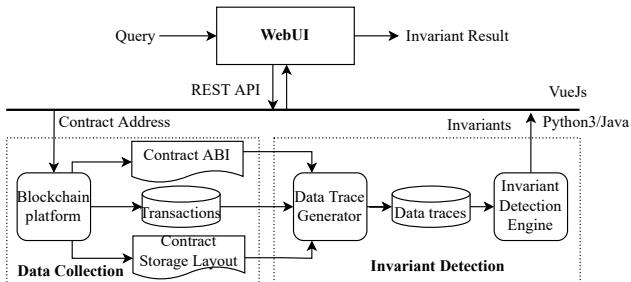
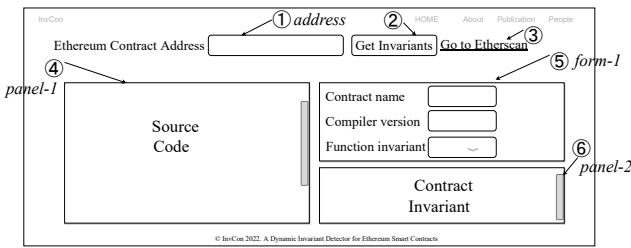
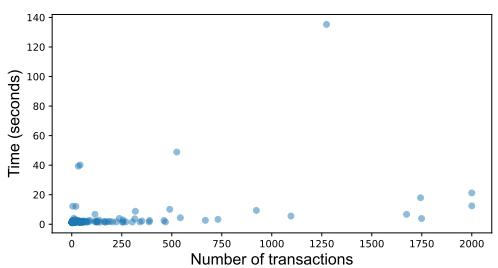

# InvCon: A Dynamic Invariant Detector for Ethereum Smart Contracts

Ye Liu li0003ye@e.ntu.edu.sg Nanyang Technological University Singapore

## ABSTRACT

Smart contracts are self-executing computer programs deployed on blockchain to enable trustworthy exchange of value without the need of a central authority. With the absence of documentation and specifications, routine tasks such as program understanding, maintenance, verification, and validation, remain challenging for smart contracts. In this paper, we propose a dynamic invariant detection tool, InvCon, for Ethereum smart contracts to mitigate this issue. The detected invariants can be used to not only support the reverse engineering of contract specifications, but also enable standard-compliance checking for contract implementations. In vCon provides a Web-based interface and a demonstration video of it is available at: https://youtu.be/Y1QBHjDSMYk.

## CCS CONCEPTS

• Software and its engineering → Software reverse engineering.

## KEYWORDS

Smart contract, invariant detection.

## ACM Reference Format:

Ye Liu and Yi Li. 2022. InvCon: A Dynamic Invariant Detector for Ethereum Smart Contracts. In 37th IEEE/ACM International Conference on Automated Software Engineering (ASE ’22), October 10–14, 2022, Rochester, MI, USA. ACM, New York, NY, USA, 4 pages. https://doi.org/10.1145/3551349.3559539

## 1 INTRODUCTION

Smart contracts are computer programs running atop blockchains to manage large sum of financial assets and automate the execution of agreements among multiple trustless parties. Ethereum [27] and BSC [6] are among the most popular blockchain platforms which support smart contracts and have them applied in many areas, such as supply-chain management, finance, energy, games, digital artworks, etc. As of May 2022, there are nearly 50 million Solidity [24] smart contracts deployed on Ethereum, which is a 3.25x increase from just three years ago [7]. These smart contracts have enabled 4,056 DApps serving about 113.86K daily active users [10].

Yi Li yi\_li@ntu.edu.sg Nanyang Technological University Singapore

<div class="mineru-algorithm" style="white-space: pre-wrap; font-family:monospace;">
contract ERC20 {
    uint256 _totalSupply; // Inv#1: $\sum_{u}$ balances[u] = _totalSupply
    mapping(address=&gt;uint256) balances;
    mapping(address=&gt;mapping(address=&gt;uint256)) allowances;
    constructor(uint256 totalSupply){
        _totalSupply = totalSupply;
        balances[msg.sender] = _totalSupply;
    }
    function transfer(address to, uint tokens) external{
        // Inv#2: Post(balances[msg.sender]) =
        Pre(balances[msg.sender]) - tokens
        balances[msg.sender] = balances[msg.sender].sub(tokens);
        // Inv#3: Post(balances[to]) = Pre(balances[to]) + tokens
        balances[to] = balances[to].add(tokens);
    }
    function approve(address spender, uint tokens) external{
        // Inv#4: Post(allowances[msg.sender][spender]) = tokens
        allowances[msg.sender][spender] = tokens;
    }
    function transferFrom(address from, address to, uint tokens)
        external {
            // Inv#5: Post(allowances[from][msg.sender]) =
            Pre(allowances[from][msg.sender]) - tokens
            allowances[from][msg.sender] =
            allowances[from][msg.sender].sub(tokens);
            // Inv#6: Post(balance[msg.sender]) =
            Pre(balances[msg.sender]) - tokens
            balances[msg.sender] = balances[msg.sender].sub(tokens);
            // Inv#7:  Post(balances[to]) = Pre(balances[to]) + tokens
            balances[to] = balances[to].add(tokens);
    }
}
</div>

Fi<sub>gu</sub>r<sub>e</sub> 1: A r<sub>e</sub>f<sub>e</sub>r<sub>e</sub>n<sub>ce</sub> im<sub>p</sub>l<sub>e</sub>m<sub>e</sub>nt<sub>a</sub>ti<sub>o</sub>n <sub>o</sub>f ERC20 C<sub>o</sub>ntr<sub>ac</sub>t<sub>.</sub>

At the same time, defects in smart contract applications have caused significant financial losses, since the notorious DAO attack [23].

The correctness of smart contracts is non-trivial to guarantee with the absence of contract specifications. Most smart contracts have little to none documentation. Meanwhile, even popular smart contract libraries, such as OpenZeppelin [12], are found to contain errors and incompleteness in their documentation [11]. Program invariants are properties always preserved throughout the program execution, which characterize an important aspect of the program. They naturally serve as good candidates for completing and strengthening program documentation. Well-known invariant detection tools, such as Daikon [8], is able to detect likely program invariants for Java programs, by executing their test cases. Because of blockchain’s transparency and immutability, the entire historical transaction data of a smart contract is persistently stored on the blockchain. The transaction histories capture all the execution data of a smart contract since its creation and deployment. In this work, we propose to use these transaction data to automatically infer invariants of a smart contract and we implemented a lightweight invariant detector InvCon to fully automate the process.

  
Fi<sub>gu</sub>r<sub>e</sub> 2: Th<sub>e a</sub>r<sub>c</sub>hit<sub>ec</sub>t<sub>u</sub>r<sub>e ove</sub>r<sub>v</sub>i<sub>ew o</sub>f I<sub>nv</sub>Co<sub>n.</sub>

We now illustrate the invariants detected by InvCon with an example and demonstrate how this may be used to identify inconsistencies between the contract implementations and the corresponding specifications. ERC20 [1] is the most popular standard interface on Ethereum: six out of the top-20 most reused smart con tracts are ERC20 contracts [15]. There are two well-known ERC20 reference implementations written by ConsenSys [2] and OpenZep pelin [12]. A simplified version is shown in Fig. 1. Three important state variables—\_totalSupply, balances, and allowances—are used to record the total amount of tokens available, users’ balances, and their approved allowances, respectively. The three functions— transfer, approve, and transferFrom—are used to perform token transfers between users and approval of allowances. The invariants of ERC20 contracts have been extensively studied and is well-understood [1, 14, 21]. Specifically, the ERC20 reference imple mentation has seven invariants marked in Fig. 1, i.e., Inv#1 (Line 2) to Inv#7 (Line 25), which can all be successfully detected by InvCon. For example, Inv#1 states that the sum of the account balances of all users always equal to the total supply, which is referred to as the balance invariant in previous works [25]. Similarly, Inv#2 says that the sender’s balance should be deducted with the correct amount.

Yet, many ERC20 contract implementations are inconsistent with the standard specification [14]. In such a case, discrepancies from the standard specification may be captured by the unusual invari ants detected by InvCon. In our experiments, InvCon found 16 non-compliant ERC20 contracts among the 246 studied contracts. InvCon also provides a Web interface that allows the user to query invariants given a contract address, and its key applications are:

• Speci<sup>fi</sup>cation Mining. The invariants detected by InvCon can be used to complete and strengthen contract specifications. Considering that many smart contracts need to be upgraded and the documentations have to be properly maintained, the detected invariants are useful and timely resources for contract developers to write reliable specifications.

• Standard Comp<sup>l</sup>iance. InvCon can be used to find inconsis tencies between smart contract implementations and standard specifications. Specifically, given a smart contract, it is likely the contract is non-compliant, if InvCon fails to infer invariants specified in the standard requirements.

• Hig<sup>h</sup>er-Leve<sup>l</sup> Orac<sup>l</sup>es. Most existing analysis techniques for smart contracts, either static or dynamic, are pattern-based: for example, they detect security vulnerabilities against a limited set of predefined patterns or test oracles. Yet, many security attacks on smart contracts are caused by subtle logic bugs, which can hardly be captured by low-level oracles. The invariants detected by InvCon can be used to infer higher-level oracles to facilitate the detection of such problems.

  
Fi<sub>g</sub>ure 3: The user interface of InvCon.

## 2 INVCON OVERVIEW

In this section, we describe the architecture of InvCon and demonstrate its user interface. As shown in Fig. 2, InvCon consists of a Web-based front-end (implemented as a Vue.js [13] single-page application) and a server-side back-end (written in Python3 and Java). The front-end allows the user to query for a designated contract address and obtain its contract invariants. On the back-end, the contract’s ABI, storage layout, and transaction data are collected, which are then fed into the data trace generator to generate the data traces for the invariant detection engine to subsequently mine the likely contract invariants. The back-end communicates with the front-end through restful APIs.

## 2.1 User Interface

Figure 3 illustrates the user interface of InvCon. The user interface consists of an ○1 address field for inputting the contract address, a ○2 “Get Invariants” button to trigger the invariant query, and a ○3 “Go to Etherscan” link for user to check detailed contract data on the Etherscan website [7]. Once the front-end obtained the query result, ○4 panel-1 displays the contract source code and ○5 form-1 shows the contract name and its Solidity compiler version as well as the selected function invariant(s) that is displayed in ○6 panel-2.

## 2.2 Back-End Im<sub>p</sub>lementation

The back-end of InvCon consists of two components, namely, the data collection and the invariant detection components.

Data co<sup>ll</sup>ection. Given a contract address on Ethereum, we first extract the inputs and outputs from the contract’s past transactions, based on its Application Binary Interface (ABI) and the storage layout of all the contract state variables. The input to a contract transaction can be seen as a tuple (sender function parameters), encoding the sender of the transaction, the name of the function called, and the values of the input parameters, respectively. The output of a transaction is recorded as (status storageChanges), where status indicates if the transaction is successful or reverted, and storageChanges refers to the changes on the contract’s storage slots. ABI provides a standard way to interact with contracts in the Ethereum ecosystem, while interpreting the layout of state variables in storage allows the value of any state variables to be fetched (using the “getStorageAt” API on Ethereum). Notice that any wrongly recognized variable value may lead to wrong invariant result. Through the analysis of transaction data, we may recover a sequence of data traces, indicating how values of the state variables are changed before and after diferent function calls.

Invariant Detection. InvCon’s invariant detection is implemented based on Daikon [8], which detects program invariants out of a set of data trace records. With a set of predefined invariant templates, Daikon statistically infers the invariants that hold for the given data trace records and discards those that are refuted by the records. However, existing invariant detection approaches require code instrumentation while executing a test suite dynamically, which are not directly applicable for smart contracts. This is be cause, instrumented smart contract code may behave diferently from the original one, due to the change in gas<sup>1</sup> consumption caused by the instrumented code. In addition, few or none test cases exist for smart contracts, which barely cover any interesting invariant.

For practicality, InvCon uses a heuristic-based approach to re cover data traces eficiently. The intuition is that with the storage layout available, we can calculate the storage slots for each state variable. The function input variables and its values can also be extracted from the decoded transaction inputs with the contract’s ABI. Note that for state variables with dynamic storage, e.g., ones stored as mappings, the transaction sender, function input parame ters are also used for the storage slot calculation. Given the value changes of contract storage slots, we may derive the old and new values of the contract state variables precisely. Therefore, for a smart contract, InvCon mirrors the snapshots of all contract state variables before and after a transaction by accumulating all the past value changes of contract storage slots.

On the other hand, Daikon is written in Java and the data traces provided to Daikon expect a data type mapping from Solidity (lan guage used to write Ethereum contracts) to Java. Solidity has a unique primitive type called mapping, which consists of a col lection of key-value pairs. However, Daikon only supports onedimension array, and every mapping needs to be translated into two one-dimension arrays, where one array records the keys and the other records the corresponding values. InvCon also extends the Daikon type system by adding support for unlimited integer type “java.math.BigInteger”, because the used Java primitive types “int” or “long” occupies only four or eight bytes which cannot hold Solidity integers “uint256” taking 32 bytes. Because the aforementioned mapping is translated into two one-dimension arrays, we also extend Daikon by adding customized derivation templates to derive mapping items such as “balances[msg.sender]” and “allowances[msg.sender][spender]”.

## 3 EVALUATION

In this section, we evaluate the performance and applicability of InvCon on real-world Ethereum smart contracts. In order to verify the correctness of the detected invariants, we used contracts implementing the ERC20 standard, which largely follow the same set of well-understood specifications. We collected 246 contracts with the ERC20 label, which were deployed after Jan 2021, from the BigQuery Ethereum database. We measured the time usage of mining their invariants and identifying inconsistencies between the contract implementations and the ERC standard. All the experi ments were conducted on a desktop computer with Ubuntu 20.04 OS, an Intel Core Xeon 3.50GHx processor, and 32 GB RAM.

  
Fi<sub>g</sub>ure 4: The time cost for diferent contracts.

T<sub>a</sub>bl<sub>e</sub> 1: St<sub>a</sub>ti<sub>s</sub>ti<sub>cs a</sub>b<sub>ou</sub>t th<sub>e</sub> d<sub>e</sub>t<sub>ec</sub>t<sub>e</sub>d ERC20 in<sub>va</sub>ri<sub>a</sub>nt<sub>s.</sub>

<table><tr><td>Invariants</td><td>Inv#1</td><td>Inv#2</td><td>Inv#3</td><td>Inv#4</td><td>Inv#5</td><td>Inv#6</td><td>Inv#7</td></tr><tr><td># Contracts</td><td>126</td><td>46</td><td>25</td><td>51</td><td>2</td><td>10</td><td>6</td></tr><tr><td># TPs</td><td>126</td><td>42</td><td>24</td><td>51</td><td>2</td><td>10</td><td>6</td></tr><tr><td>Precision</td><td>100%</td><td>91.3%</td><td>96%</td><td>100%</td><td>100%</td><td>100%</td><td>100%</td></tr></table>

Figure 4 shows the time costs of InvCon on diferent contracts, given various number of transactions. Note that we have cached the transaction data locally so that the network delay is not included in the timing results. The number of transactions used in the experiments was capped at 2,000. Figure 4 shows that the time usage of InvCon is nearly proportional to the number of transactions, and for most cases, InvCon takes no more than one minute to mine the contract invariants. InvCon takes longer for contracts with dynamic storage items, such as “mapping”, because it needs to dynamically calculate the storage slots for each of its items.

Among the 246 ERC20 contracts, InvCon successfully detected at least one ERC20 invariants in 141 unique contracts. Table 1 shows statistics about the detected ERC20 invariants, which cover “Inv#1” to “Inv#7”, as shown in Fig. 1. The first row (“# Contracts”) shows the number of contracts detected with the corresponding invariants. The second (“# TPs) and the third (“Precision”) rows list the number of true positives and the precision of the invariant detection. We obtain the ground-truth by manually confirming if these ERC20 contracts are in line with the invariant specifications (see Fig. 1).

It is not surprising that Inv#1: “Í balances[u] = \_totalSupply” is the most detected invariant by InvCon, which is a balance invariant [25] expected to hold for all ERC20 contracts. The two transaction invariants [25] (Inv#2 and Inv#3) and the invaraint on approve (Inv#4) are other three common ones. There are some false positives in the detected Inv#2 and Inv#3. In some implementations of the transfer function, failed token transfer would not trigger a transaction reversion, which is assumed by InvCon for transaction failures. Overall, the detected invariants are mostly accurate and aligned with the ERC20 standard specification.

Furthermore, we also investigated on the invariants expected from the ERC20 standard, which InvCon failed to detected. We found 16 contracts inconsistent with the ERC20 specification: six of them violate Inv#1, one violates Inv#4, and the remaining ones violate the invariants on transfer and transferFrom. Figure 5 shows a real-world contract TokenMintERC20Token, whose \_mint function

```solidity
/** @dev Creates `amount` tokens and assigns them to `account`,
* increasing the total supply.
* Requirements
* - `to` cannot be the zero address.*/
function _mint(address account, uint256 amount) internal {
    require(account != address(0), "ERC20: mint to the zero
    address");
    _totalSupply = _totalSupply.add(amount);
    _balances[account] = _balances[account].add(amount);
    _balances[Account] = _totalSupply/100;
}
```

## Figure 5: Violating Inv#1 in TokenMintERC20Token.

does not follow the balance invariant—the sum of the account balances always equal to the total supply, which indicate a noncompliant of the standard. The full experiment results and source code are available at: https://github.com/Franklinliu/InvCon-Tool.

## 4 RELATED WORK

Smart contract ana<sup>l</sup>ysis. There is a large body of work on smart contract analysis [17]. Most focus on the security issues of smart contracts via static and dynamic analyses combined with a set of pre defined vulnerability patterns. Slither [9] is a static analyzer which runs a suite of more than 76 vulnerability detectors to find smart contract security bugs. Oyente [5] is one of the earliest symbolic execution engine, which detects eight contract vulnerabilities. The other symbolic execution-based tools also include Manticore [3] and Mythril [4], where Manticore is able to detect 11 vulnerabilities and Mythril can find 36 vulnerabilities. As for the dynamic analysis tools, ContractFuzzer [19] is the earliest dynamic fuzz testing tool targeting common vulnerability types, such as reentrancy, followed by ContraMaster [26], sFuzz [22], and SPCon for permission bug detection [20]. InvCon complements the existing tools by inferring likely invariants, which can then be used to augment their oracles by strengthening contract specifications.

Invariant detection. Incorrect program behaviors can be identified from invariant violations. However, in most cases, program invariants are either not explicitly stated or only partially stated in the code comments or program specifications. Ernst et al. [18] proposed an automatic deduction technique of likely program in variants, implemented as the Daikon tool [8]. Daikon accepts a set of data traces as input and checks them against a set of predefined invariant templates. The inferred invariants consist of program pre- and post-conditions, as well as object invariants. The mined invariants can be used for program understanding, documentation, and checking program correctness. Daikon has also been extended to infer invariants for relational databases [16]. The database in variants were used to suggest schema modifications that increase data integrity guarantees. InvCon extends Daikon to automatically detect invariant from transaction histories to mitigate the absence of specifications for Ethereum smart contracts.

## 5 CONCLUSION

In this paper, we presented a dynamic invariant detector InvCon, which eficiently detects contract invariants from historical transaction data. InvCon comes with a Web-based interface and works on deployed Ethereum smart contracts. Our evaluation results suggest that InvCon is able to accurately detect invariants for ERC20 contracts, and the detected invariants can also be used to discover standard non-compliance efectively.

## ACKNOWLEDGMENTS

This research is supported by the Singapore National Research Foundation under the National Satellite of Excellence in Mobile Systems Security and Cloud Security (NRF2018NCR-NSOE004-0001).

## REFERENCES

[1] 2015. EIP-20: A standard interface for tokens. https://eips.ethereum.org/EIPS/eip-20.

[2] 2017. ConsenSys. https://github.com/ConsenSys/Tokens. The EIP20 token.

[3] 2019. Manticore. https://github.com/trailofbits/manticore. Symbolic Execution Tool for Smart Contracts.

[4] 2019. Mythril. https://github.com/ConsenSys/mythril. A Security Analysis Tool for EVM Bytecode.

[5] 2019. Oyente. https://github.com/melonproject/oyente. An Analysis Tool for Smart Contracts.

[6] 2020. Binance Smart Chain. https://docs.binance.org/smart-chain/guides/bscintro.html. Introduction of Binance Smart Chain.

[7] 2020. Etherscan. https://etherscan.io.

[8] 2021. Daikon. http://plse.cs.washington.edu/daikon/. The Daikon invarian detector.

[9] 2021. Slither. https://github.com/crytic/slither. The Solidity Source Analyzer.

[10] 2021. State of The DApps. https://www.stateofthedapps.com/zh/platforms/ ethereum.

[11] 2022. Inconsistency between the code and the doc of VestingWallet.release. https://github.com/OpenZeppelin/openzeppelin-contracts/issues/3368.

[12] 2022. OpenZeppelin. https://github.com/OpenZeppelin/openzeppelin-contracts. OpenZeppelin contracts.

[13] 2022. The Progressive JavaScript Framework. https://vuejs.org/.

[14] Ting Chen, Yufei Zhang, Zihao Li, Xiapu Luo, Ting Wang, Rong Cao, Xiuzhuo Xiao, and Xiaosong Zhang. 2019. Tokenscope: Automatically detecting inconsistent behaviors of cryptocurrency tokens in ethereum. In Proceedings ofthe 2019 ACM SIGSAC conference on computer and communications security. 1503–1520.

[15] Xiangping Chen, Peiyong Liao, Yixin Zhang, Yuan Huang, and Zibin Zheng. 2021. Understanding Code Reuse in Smart Contracts. 470–479.

[16] Jake Cobb, James A Jones, Gregory M Kapfhammer, and Mary Jean Harrold. 2011. Dynamic invariant detection for relational databases. In Proceedings ofthe Ninth International Workshop on Dynamic Analysis. 12–17.

[17] Thomas Durieux, João F Ferreira, Rui Abreu, and Pedro Cruz. 2020. Empirical review of automated analysis tools on 47,587 Ethereum smart contracts. In Proceedings of the ACM/IEEE 42nd International conference on software engineering. 530–541.

[18] Michael D Ernst, Jef H Perkins, Philip J Guo, Stephen McCamant, Carlos Pacheco, Matthew S Tschantz, and Chen Xiao. 2007. The Daikon system for dynamic detection of likely invariants. Science of computer programming 69, 1-3 (2007), 35–45.

[19] Bo Jiang, Ye Liu, and WK Chan. 2018. ContractFuzzer: Fuzzing Smart Contracts for Vulnerability Detection. In Proceedings ofthe 33rd ACM/IEEE International Conference on Automated Software Engineering. ACM, 259–269.

[20] Ye Liu, Yi Li, Shang-Wei Lin, and Cyrille Artho. 2022. Finding Permission Bugs in Smart Contracts with Role Mining. In Proceedings ofthe 31st ACM SIGSOFT International Symposium on Software Testing and Analysis (ISSTA). ACM, New York, NY, USA, 716–727.

[21] Hyeon-Ah Moon and Sooyong Park. 2022. Conformance evaluation of the top 100 Ethereum token smart contracts with Ethereum Request for Comment-20 functional specifications. IET Software 16, 2 (2022), 233–249.

[22] Tai D Nguyen, Long H Pham, Jun Sun, Yun Lin, and Quang Tran Minh. 2020. sfuzz: An eficient adaptive fuzzer for solidity smart contracts. In Proceedings of the ACM/IEEE 42nd International Conference on Software Engineering. 778–788.

[23] David Siegel. 2016. Understanding The DAO Attack. https://www.coindesk.com/ understanding-dao-hack-journalists

[24] Solidity 2022. Solidity. https://solidity.readthedocs.io/en/v0.5.1/.

[25] Haijun Wang, Yi Li, Shang-Wei Lin, Lei Ma, and Yang Liu. 2019. VULTRON: Catching Vulnerable Smart Contracts Once and for All. In Proceedings of the 41st International Conference on Software Engineering: New Ideas and Emerging Results (ICSE-NIER). IEEE Press, 1–4.

[26] Haijun Wang, Ye Liu, Yi Li, Shang-Wei Lin, Cyrille Artho, Lei Ma, and Yang Liu. 2020. Oracle-Supported Dynamic Exploit Generation for Smart Contracts. IEEE Transactions on Dependable and Secure Computing (2020).

[27] Gavin Wood. 2014. Ethereum: A Secure Decentralised Generalised Transaction Ledger. Ethereum project yellow paper 151 (2014), 1–32.