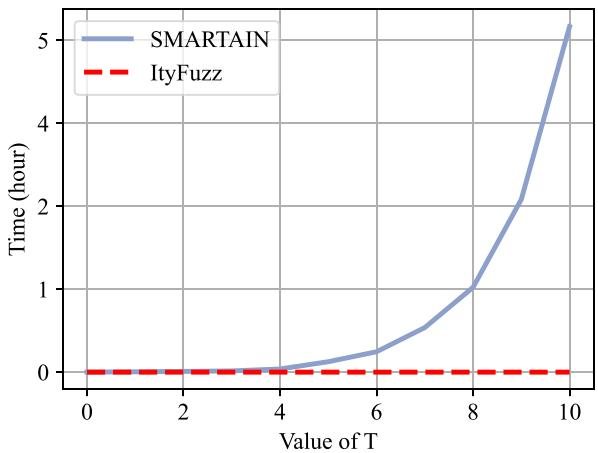
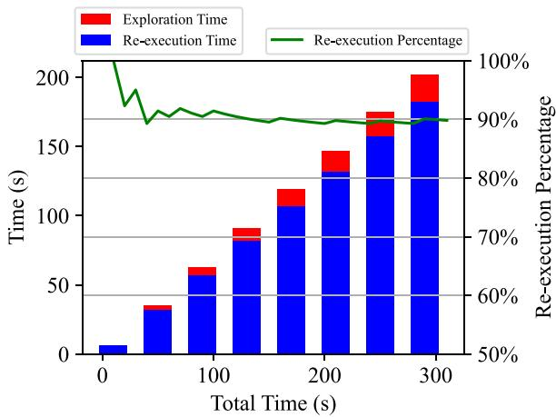
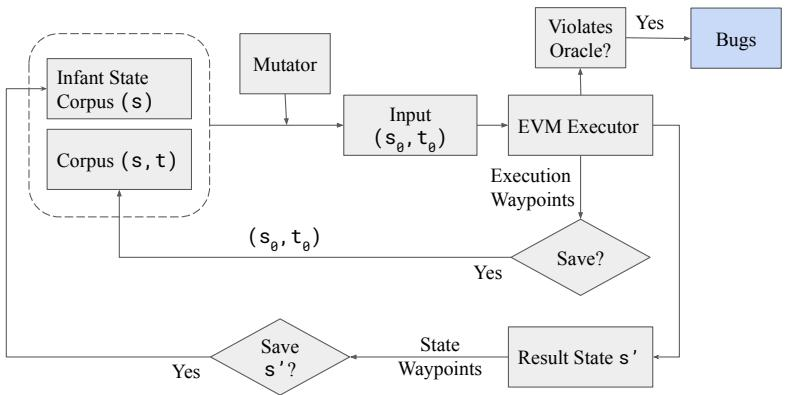
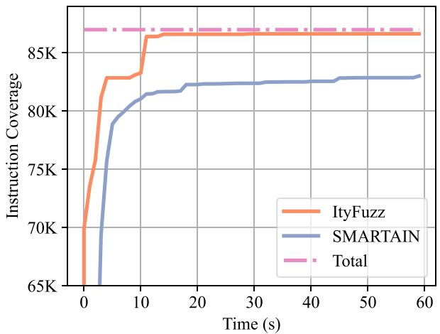
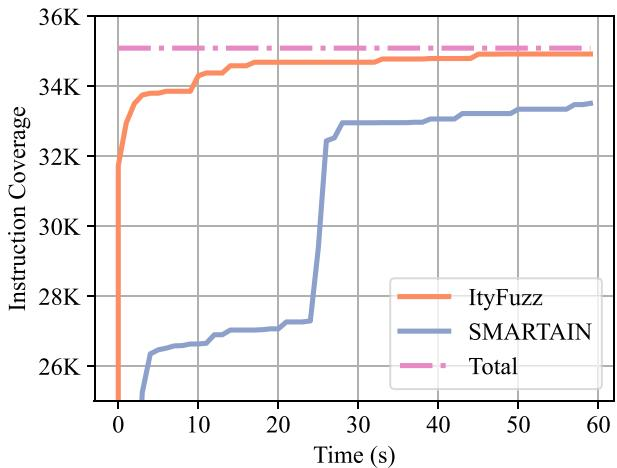
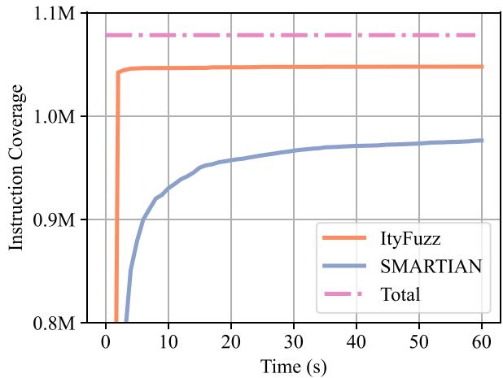
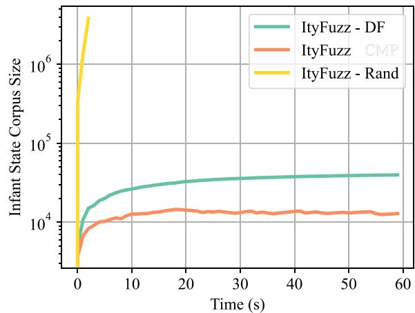
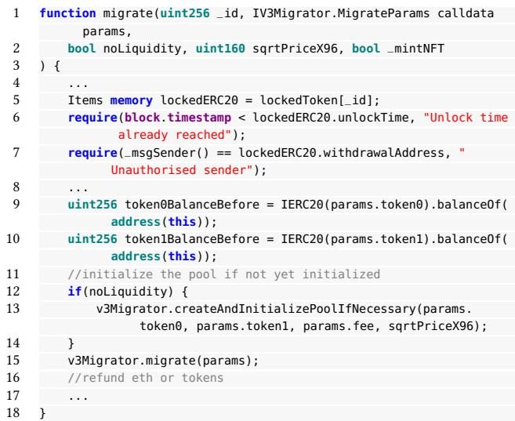

# ItyFuzz: Snapshot-Based Fuzzer for Smart Contract

Chaofan Shou shou@berkeley.edu UC Berkeley Berkeley, CA, USA

Shangyin Tan shangyin@berkeley.edu UC Berkeley Berkeley, CA, USA

Koushik Sen ksen@berkeley.edu UC Berkeley Berkeley, CA, USA

## ABSTRACT

Smart contracts are critical financial instruments, and their security is of utmost importance. However, smart contract programs are dificult to fuzz due to the persistent blockchain state behind all transactions. Mutating sequences of transactions are complex and often lead to a suboptimal exploration for both input and program spaces. In this paper, we introduce a novel snapshot-based fuzzer ItyFuzz for testing smart contracts. In ItyFuzz, instead of storing sequences of transactions and mutating from them, we snapshot states and singleton transactions. To explore interesting states, ItyFuzz introduces a dataflow waypoint mechanism to identify states with more potential momentum. ItyFuzz also incorporates comparison waypoints to prune the space of states. By maintaining snapshots of the states, ItyFuzz can synthesize concrete exploits like reentrancy attacks quickly. Because ItyFuzz has second-level response time to test a smart contract, it can be used for on-chain testing, which has many benefits compared to local development testing. Finally, we evaluate ItyFuzz on real-world smart contracts and some hacked on-chain DeFi projects. ItyFuzz outperforms existing fuzzers in terms of instructional coverage and can find and generate realistic exploits for on-chain projects quickly.

## CCS CONCEPTS

• Software and its engineering → Software testing and debug ging.

## KEYWORDS

fuzzing, on-chain testing, smart contract, blockchain, DeFi security

## ACM Reference Format:

Chaofan Shou, Shangyin Tan, and Koushik Sen. 2023. ItyFuzz: Snapshot-Based Fuzzer for Smart Contract. In Proceedings ofthe 32nd ACM SIGSOFT International Symposium on Software Testing and Analysis (ISSTA ’23), July 17–21, 2023, Seattle, WA, USA. ACM, New York, NY, USA, 12 pages. https: //doi.org/10.1145/3597926.3598059

## 1 INTRODUCTION

Smart contract auditing has become a billion-dollar industry with the increasing adoption of Web 3.0 technology and the growing number of attacks. Smart contracts are programs deployed on the blockchain and can accept transactions from any party. Transactions are calls to public functions or token transfers to the deployed smart contract. Each transaction serves as an input and can modify the smart contract’s state. Auditing means ensuring a smart contract has no vulnerabilities to losing assets stored inside it. Smart contracts can be audited by automated fuzzing tools, but all fuzzing tools for smart contracts only support testing in the local deploy ment, not on the blockchain. Fuzzing on the blockchain requires high exploration speed for a given state, because (1) the state of the blockchain is constantly changing, and (2) attacker exploits can happen at any time. Current smart contract fuzzers are not eficient enough to fetch the states from the blockchain and finish the auditing quickly. However, on-chain auditing, or directly performing fuzz testing with the states fetched from the blockchain continuously, is critical in the following scenarios. First, when certain code locations are only reachable from specific on-chain states, local or development setting fuzzing is useless. Second, modern smart contracts often leverage external contracts as sources of information. With on-chain auditing, we can pull these data from the blockchain dynamically in real-time.

Despite all the benefits, on-chain auditing becomes useless when the fuzzers can not provide a real-time response, as the ultimate goal is to pause the contract before the attackers identify or conduct the attack. Existing fuzzers are mostly under-optimized for response time. For achieving full coverage of smart contracts, existing fuzzers have to spend a significant period (hours or days) while on-chain auditing needs second-level response time. In this paper, we propose a new snapshot-based fuzzing technique and develop a fuzzer called ItyFuzz. ItyFuzz can achieve high coverage over code and states of smart contracts in just a few seconds and thus support on-chain auditing on many smart contracts.

Although the amount of source code of most smart contracts is trivial compared to complex software like browsers and operating systems, they are stateful and have complex dependencies with other smart contracts, which makes them hard to fuzz. Aiming to tackle the stateful nature of smart contracts, some previous works start from a fresh state for each fuzz run with a sequence of transactions as input. During the mutation phase, parts of this sequence are mutated. This way, existing tools have high overhead on reexecuting transactions to return to a previous state. For exploring programs with a deeper state, which needs to be built up with several transactions, re-execution cost grows linearly. Additionally, existing tools only have feedback mechanisms for transactions but not for states, yet states and transactions have diferent exploration dificulties. We argue that the interestingness of states is equally important as transactions for stateful fuzzing, and such feedback mechnisms to choose interesting states to explore is non-existent in current stateful fuzzing tools.

Instead of re-executing inputs to build up previous states, we propose snapshot-based fuzzing. Snapshots are essentially replicas of intermediate states built from some transactions. By storing all interesting snapshots into a state corpus, ItyFuzz can “time travel” to previous states with constant complexity (�(1)). Time traveling allows for eficient exploration for search space of both transactions and states. To support fast snapshotting, we refactor an existing Ethereum Virtual Machine (EVM) implementation. How ever, storing all snapshots into the corpus is still not practical due to limited runtime memory resources, while the number of snapshots increases linearly with the total execution time. The size of the stored snapshots could grow to several gigabytes in a few seconds. To resolve this issue and prioritize explorations of the most interest ing states, we design two feedback mechanisms (i.e., waypoints) to classify interesting states and a corpus pruning technique to reduce the number of interesting states when necessary.

By reducing overhead from re-execution and improving the feed back mechanism, we can reduce fuzzer time significantly so that most vulnerabilities can be uncovered instantly. Thus, ItyFuzz can support the on-chain auditing goal, which requires fast response time to front run the attackers.

Although ItyFuzz focuses on smart contract fuzzing, the snap shot fuzzing idea we developed can be applied to other domains as well. For example, modern hardware designs are highly stateful programs, where some bugs are only reachable through specific sequences of input signals. Traditional software fuzzing does not work well when the bug-triggering signal sequence becomes longer, but snapshot-based fuzzing can discover the more interesting state spaces that potentially lead to the desired bug. The only require ments for our current snapshot fuzzing algorithm are an eficient representation of the program state and the ability to observe the state during program execution.

Contributions. In summary, we make the following contributions:

• We present a novel snapshot-based fuzzing algorithm to reduce re-execution overhead for stateful smart contract fuzzing (Section 4.2).

• We create new waypoint mechanisms optimized for prioritizing the exploration of interesting snapshot states, allowing eficient program exploration:

(1) Dataflow waypoint (Section 4.3) evaluates the interestingness of states based on “future” memory load.

(2) Comparison waypoint (Section 4.4) compresses the state cor pus by probabilistic sampling and hard comparison feedback.

• We develop a fast and eficient smart contract fuzzer ItyFuzz (Section 5) and demonstrate its efectiveness (Section 6).

• Based on ItyFuzz, we propose a new auditing method for smart contracts to conduct testing based on state fetched from the blockchain on the fly (Section 6.4). Using this method, we detect and reproduce exploits of on-chain projects worth millions of dollars.

## 2 BACKGROUND

## 2.1 Fuzzing

Coverage-guidedfuzzing. Fuzz testing or fuzzing is a technique to automatically find vulnerabilities and bugs in software by providing random inputs to the target program. To better explore the target program, a fuzzer often employs heuristics and feedback from test executions to generate lots of new interesting inputs by mutating existing test inputs. To this date, coverage-guided fuzzers have found numerous bugs in many real-world software systems.

We show a simplified algorithm for coverage-guided fuzzer in Figure 1. The fuzzer starts with an initial corpus I, which contains a set of initial inputs, where in each iteration, an input � from the corpus is selected. � is then randomly mutated to produce several mutated inputs. The fuzzer then executes each mutated input $i _ { m }$ and checks whether the execution is interesting. An execution is interesting if it covers new coverage points that have not been covered by existing inputs. If the execution is interesting, the fuzzer adds the mutated input $i _ { m }$ to the corpus I and updates the coverage information. The addition of $i _ { m }$ to the corpus ensures that the input gets further chance to mutate in future. Thus the fuzzer can explore the target programs more eficiently using coverage feedback while ignoring redundant (or uninteresting) inputs. In Section 2.2, we describe a more general feedback called Waypoint first proposed in [21].

<div class="mineru-algorithm" style="white-space: pre-wrap; font-family:monospace;">
$I \leftarrow initial\_corpus$
coverage $\leftarrow \emptyset$

while true:
    i $\leftarrow random.choice(\bar{I})$ $I \leftarrow I \setminus \{i\}$
    for $i_m$ in Mutation(i):
        f $\leftarrow execute(i_m)$
        if f increases coverage:
            $I \leftarrow I \cup t$
            coverage $\leftarrow coverage \cup f$
</div>

Figure 1: Coverage-guided fuzzing algorithm (simplified)

Fuzz Smart Contract. Although fuzzing techniques have been widely adopted to test traditional software systems, smart contracts pose new challenges to the current coverage-guided fuzzing techniques. As discussed in Section 2.3, smart contracts are stateful programs. Because smart contracts have access to persistent memory on the blockchain, constructing inputs individually to test smart contracts in a given persistent state is inefective. To address this issue, smart contract fuzzers must produce a sequence of inputs (transactions) to test the smart contract.

## 2.2 <sup>W</sup>a<sub>yp</sub>o<sup>i</sup>nts

Fuzzfactory [21] summarized a generalized feedback mechanism called waypoint. Waypoints are intermediate inputs that provide interesting feedback after executing the target program. For example, in coverage-guided fuzzing algorithm Figure 1, new inputs (waypoints) are recorded if running the target program produces new coverage. However, waypoints are not limited to the coverage points—some other common waypoints include execution time, memory usage, and distance between two compared values waypoint. To implement customized waypoints, we need to collect other targeted, dynamic information during the execution of the program and provide a new predicate function is<sup>\_</sup>interesting to replace line 9 in Figure 1. Unlike traditional fuzzers that use waypoints to test the interestingness of inputs, in ItyFuzz, we design novel state comparison and dataflow waypoints to decide if output states are interesting for snapshot-based fuzzing. We will discuss dataflow and comparison waypoints for states in more detail in Section 4.3 and Section 4.4.

## 2.3 Smart Contract

Smart contracts are computer programs deployed on the blockchain. The inputs to smart contracts are typically called transactions. Once a transaction is executed and posted on the blockchain, it is immutable and irreversible, and the state change caused by the transaction adds to the persistent state of the blockchain. Because blockchain and smart contracts are immutable and decentralized, many applications, including decentralized finance, voting, gaming, etc., have been built with smart contracts.

As we discussed before, smart contracts are on-chain computer programs. Many programming languages can be used to write smart contracts. Among them, Solidity is arguably one of the most popular languages for writing smart contracts. Solidity is a high-level language inspired by famous languages like Javascript, Python, and C++. Solidity programs are deployed and executed on a special blockchain called Ethereum. To run Solidity programs on the Ethereum blockchain, one has to compile Solidity programs into Ethereum Virtual Machine (EVM) bytecode. We show one example of a Solidity program in Figure 2, and we will explain it in more detail in Section 3.

## 3 MOTIVATING EXAMPLE

To see why current sequence-based fuzzers fail to exploit some vul nerabilities, consider a simple yet realistic smart contract program in Figure 2 with s a single state variable counter. The function incr increases the counter by one when the argument is smaller than the current counter, and similarly, decr decreases the counter when the argument is greater than counter. Function buggy introduces a bug when counter reaches some constant T.

The inputs to this program are sequences of transactions, where each transaction is simply the function to execute and its corresponding parameters. For example, when T == 2, a bug-triggering transaction sequence is [(incr, 0), (incr, 1), (buggy, )]. This sequence first calls incr with valid inputs two times to increase the counter to 2. Then, the last transaction calls buggy, which will trigger the bug.

Although the above input sequence seems simple and easy to syn thesize, constructing a more complex transaction sequence when T is large is non-trivial. The bug-triggering transaction sequence can be very long and complex in real-world scenarios. For instance, hackers leveraged six transactions, each with on average 40 function calls to build up the state that makes Team Finance decentralized finance (DeFi) platform vulnerable to attack [30].

When exploring the transaction sequence space of this simple smart contract, previous state-of-the-art smart contract fuzzers like SMARTIAN [5] fail to quickly detect a bug as T increases (Figure 3). This is because when evaluating a transaction sequence, the fuzzer needs to re-execute the entire sequence of transactions from the very beginning, including deploying the transaction to be tested. Time spent executing a transaction in an arbitrary state needs to include the time spent re-executing the sequence of transactions required to reach the arbitrary state.

```solidity
contract SimpleState {
    int256 counter = 0;

    function incr(int256 x) public {
        require(x <= counter);
        counter += 1;
    }

    function decr(int256 x) public {
        require(x >= counter);
        counter -= 1;
    }

    function buggy() public {
        if (counter == T) {
            bug>();
        }
    }
}
```  
<sup>Fi</sup>gure 2: <sup>S</sup>mart contract w<sup>i</sup>t<sup>h</sup> a s<sup>i</sup>mp<sup>l</sup>e pers<sup>i</sup>stent state counter

  
Figure 3: Time (hours) to find a bug-triggering transaction sequence <sup>f</sup>or SimpleState w<sup>i</sup>t<sup>h dif</sup>erent T va<sup>l</sup>ues

To empirically study how re-execution slows down the overall performance, we run SMARTIAN with default mode on the SimpleState contract and set T = 10. We recorded the re-execution time and their percentage to the total fuzzing time in Figure 4. Re-execution times are recorded when the EVM executor executes a seen (state, transaction) pair, and exploration times are recorded otherwise. In SMARTIAN, re-execution takes more than 90 percent of the total fuzzing time.

The amortized re-execution time grows exponentially as the length of the sequence of transactions grows linearly. Fortunately, the re-execution time can be eliminated if the state reached after executing a sequence of transactions can be memoized. However, memoization requires saving the number of states that is exponential in the number of transaction sequences. The key insight in ItyFuzz is that we can only memoize a set of “interesting states”, called snapshots, instead of memoizing all intermediate states and using these interesting states only to explore new states without re-execution. The “interestingness” of a state is defined using two novel waypoint ideas. We discuss the snapshot-based fuzzing technique in detail in Section 4.2.

  
Figure 4: Re-execution time (y-axis) and percentages when runn<sup>i</sup>ng SimpleState on SM<sup>A</sup>RTI<sup>A</sup>N

## 4 METHODOLOGY

This section introduces our methodology to build ItyFuzz. We first describe the overall architecture of ItyFuzz (Section 4.1). Then we describe three crucial building blocks for ItyFuzz: snapshot based fuzzing (Section 4.2), dataflow waypoint (Section 4.3), and comparison waypoint (Section 4.4).

## 4<sub>.</sub>1 ItyF<sub>u</sub>zz A<sub>rc</sub>hit<sub>ec</sub>t<sub>ure</sub>

We present the general architecture of ItyFuzz in Figure 5. To under stand the architecture of ItyFuzz, recall that Solidity smart contract programs are executed on Ethereum Virtual Machine (EVM). EVM can be viewed as a function $E V M : ( S \times T )  S .$ , which maps a state $s \in S$ and a transaction $t \in T$ to a new state in � which we denote by $s _ { t } .$ Note that the target program is an immutable part of the initial state �. Like conventional coverage-guided fuzzers, ItyFuzz starts the fuzzing loop with a corpus of seed inputs (shown in the left-top corner of Figure 5). In each iteration, a transaction and state pair is selected from the corpus and mutated to generate a pair, say $( \mathsf { s } _ { 0 } , \mathsf { t } _ { 0 } )$ . The mutated input is executed by the EVM executor. After the execution, ItyFuzz utilizes the execution waypoints to decide if the trace collected during the execution is “interesting". An input is said to be interesting if it increases the coverage of some waypoint. If yes, ItyFuzz adds the mutated input pair (s<sub>0</sub>, t<sub>0</sub>) to the corpus. Unlike conventional converage-guided fuzzers, the EVM executor also returns the updated state. We employ the state waypoints to save snapshots of interesting result states.

## 4.2 Sna<sub>p</sub>shot-Based Fuzzin<sub>g</sub>

In smart contract executions, a state � can be constructed by exe cuting a sequence of transactions from an initial state. To travel back to some intermediate state, a common practice for existing stateful fuzzers is to re-execute the transactions to construct the specific state from the initial state. Instead of re-executing the previous transactions, we directly snapshot the state and save the unique states. We maintain a corpus $c$ that stores pairs of the form $( s , t )$ , where � ∈ � and $t \in T .$ . Specifically, given an execution $E V M ( s , t ) \mapsto s ^ { \prime }$ , where $s ^ { \prime }$ ∈ � is the new state after execution of� on $s ,$ the pair (�, �) is added to the corpus when the combination of feedback (waypoints) for C reported by the execution of the transaction on that state is interesting. We employ multiple waypoint mechanisms, including coverage-guided feedback, dataflow waypoint (Section 4.3), and comparison waypoint (Section 4.4). Since ItyFuzz always adds interesting pairs to the corpus, future exploration with the mutants of these pairs may also be rewarding.

Since ItyFuzz adds the state before a transaction to the corpus C, the state obtained after executing the transaction is lost. Therefore, if ItyFuzz keeps mutating the states from the corpus, it is only going to explore the initial state with random transactions. The subsequent states built with transactions on the initial states are never explored, undermining the purpose of stateful fuzzing, which is to explore all potential states. To make our exploration more eficient and to avoid re-execution, ItyFuzz maintains a separate corpus of states to memorize the states after execution, which we call the “infant state corpus”, say $C _ { s }$ . Specifically, given an execution $E V M ( s , t ) \mapsto s ^ { \prime }$ , the state �<sup>′</sup> is added to the infant state corpus when ItyFuzz finds it interesting using a combination of waypoints. Note that the waypoints for the infant state corpus are diferent from that of C—they determine whether the current execution is interesting, but waypoints for the infant state corpus determine whether such a state can lead to future interesting executions. We discuss how to compute the waypoints for the infant state-corpus in Section 4.3 and Section 4.4.

The pseudo-code in Figure 6 summarizes ItyFuzz’s snapshotbased fuzzing algorithm . During each iteration of the fuzz loop, the fuzzer first picks a state and transaction pair from the corpus C. The fuzzer then either mutates the transaction � structurally to $t _ { m u t }$ or replaces the state � with a state, say $s _ { m u t } .$ stored in the infant state corpus $C _ { s } .$ . The new mutant is always sound (i.e. reachable in the input space) because the selected state from the infant state corpus can be constructed by a sequence of transactions, and the state allows the execution of a new transaction. The mutant is executed by the EVM, which yields a new state. After the execution, ItyFuzz saves the state and transaction pair $( s _ { m u t } , t _ { m u t } )$ to corpus C if the observed waypoints are interesting. ItyFuzz adds the the resulting state $s ^ { \prime }$ to the infant state corpus $C _ { s } \mathrm { i f } s ^ { \prime }$ may lead to a potentially interesting executions with new transactions. In Section 4.3 and Section 4.4, we will discuss the details of two types of state waypoints, dataflow waypoint and comparison waypoint, to decide if $s ^ { \prime }$ are interesting.

## 4.3 Dataflow Wa<sub>yp</sub>oint

Defining waypoints for measuring the interestingness of an input during execution has been explored by Padhye et al. in FuzzFactory [21] (e.g., recording coverage and memory-related instruction call patterns). Yet, there has been no work on how to define waypoints for states. The goal for the waypoints is to save resulting states in the corpus only if future executions from these states are interesting. Therefore, testing if a state is interesting also requires semantic information about the state in order to capture "future interestingness".

  
Fi<sub>g</sub>ure 5: Architecture of ItyFuzz

<div class="mineru-algorithm" style="white-space: pre-wrap; font-family:monospace;">
$C \leftarrow$ Corpus() # transaction and state pair corpus
$C_s \leftarrow$ Corpus() # infant state corpus

while true:
    $(s, t) \leftarrow$ Next($C$)
    if Random(0, 1) &gt; P:
        $t_{mut} \leftarrow$ Mutation(t) # mutate transaction
        $s_{mut} \leftarrow$ s
    else
        $s_{mut} \leftarrow$ Next($C_s$) # mutate state by fetching from infant state corpus
        $t_{mut} \leftarrow$ t

# execute transaction $t_{mut}$ on state $s_{mut}$
# $f$ represents waypoints, $s'$ is the resulting state
$f, s' \leftarrow EVM(s_{mut}, t_{mut})$
if $W_{(s, t)}(f)$ is interesting: # get feedback for waypoints of execution
    $C \leftarrow C \cup (s_{mut}, t_{mut})$
if $W_{(s)}(f, s')$ is interesting: # get feedback for waypoints of infant state corpus
    $C_s \leftarrow C_s \cup s'$
</div>

Fi<sub>g</sub>ure 6: ItyFuzz Fuzzin<sub>g</sub> Al<sub>g</sub>orithm

We define two waypoints for states. One is called dataflow waypoint. With dynamic dataflow information, we know a memory location is interesting if it appears as the argument of the load instruction in the future. If a state change contains unique writes to interesting memory locations, we can conclude that the state is interesting for future exploration. We leverage bytecode instru mentation to conduct dynamic dataflow analysis by observing load and store instructions on the fly. Note that conventional way to perform dataflow analysis is through static analysis of the source code. However, static analysis tools do not work well with smart contract fuzzers because smart contract may call external contracts dynamically. However, the static dataflow information gained only from the target contract is not suficient.

Since load instructions which determine the interestingness of a memory location happen in the future, the determination of a store instruction’s “interestingness” at present is impossible. To resolve this issue, we propose to approximate the future interesting load locations using past load locations. The key insight here is that if a memory location has been written with interesting values in the past, then it is very likely to be written in the future. Therefore, ItyFuzz tracks the memory locations that were loaded in the past and the abstraction of the values being loaded. If a store of a value in the current execution writes such a memory location and the abstraction of the value being written is diferent from all previous abstract values stored at the location, then we say that the store is interesting and the resulting state after the store is also interesting.

<div class="mineru-algorithm" style="white-space: pre-wrap; font-family:monospace;">
Algorithm 1: Algorithm for dataflow waypoint instrumentation
Result: $L, S$
while EVM is Executing do
    if Current Instruction is load(Loc) then
        $\lfloor L \text{ (Loc \% MAP\_SIZE)} \leftarrow \text{true}$ ;
    if Current Instruction is store(Loc, Value) then
        $\lfloor S(\text{Loc \% MAP\_SIZE})(\text{BucketOf(Value)}) \leftarrow \text{true};$
</div>

```typescript
Algorithm 2: Algorithm for dataflow waypoint evaluation
Data: L, S
Result: IsStateInteresting
/* Interesting if the bucket changes from false to true */
if ∃Bucket ∈ S s.t. Bucket changes from false to true then
    /* Interesting if the location has been loaded before */
    if L at the index of Bucket then
        IsStateInteresting = true;
```

We show the dataflow waypoint algorithm in Algorithm 1 and Algorithm 2. During the execution of transactions, we maintain two maps (Algorithm 1) that record abstraction of past memory locations of load and store instructions separately. As discussed before, we use past load locations to determine whether a memory location is interesting. We can then check whether a store instruction in an execution is writing a new abstract value to the interesting memory location. Specifically, the check for whether a location is interesting or not happens as follows. Load map � maps an abstract memory location to a Boolean value initialized to false. When a load instruc tion Load(Loc) is executed, �(Loc % MAP<sup>\_</sup>SIZE) is set to true. Loc % MAP<sup>\_</sup>SIZE is a course abstraction of Loc which is necessary to create a small abstract address space. A small abstract address space helps lower storage and lookup overhead. Store map � maps each abstract memory location to a bucket abstraction of values. The bucket ab straction of a value is similar to the bucketing mechanism used in AFL [33]. Bucketing helps reduce the amount of total value inserted into the map, thus reducing the storage and evaluation cost, with the trade of for losing granularity of the inserted data. Each bucket is a partition of the domain of the actual value being stored, which is a 256-bit integer in the context of EVM. For instance, one parti tion plan for 256-bit integer could be $[ 2 ^ { 0 } , 2 ^ { 8 } ) , [ 2 ^ { 8 } , 2 ^ { 1 6 } ) , [ 2 ^ { 2 } 4 , \dot { 2 } ^ { 2 5 6 } )$ which split the domain into three partitions. We use buckets to avoid storing the entire states, because storing all unique states is not efective. When a Store(Loc, Value) is executed, Value is first abstracted to determine its bucket. If� ∈ � is the bucket abstraction of Value, �(Loc % MAP<sup>\_</sup>SIZE)(�) is set to true. After execution, if a bucket in the store map � changes from false to true, and the corresponding location in �(Loc % MAP<sup>\_</sup>SIZE) is also true (line 2 at Algorithm 2), then the new state is considered as interesting. The size and the range of each bucket can be fine-tuned as a hyper parameter. With more number of buckets in each slot, more states would be evaluated to be interesting, increasing the size of $C _ { s } .$ . As size of $C _ { s }$ increases, it becomes harder to efectively choose the next state to explore and causes storage overhead.

## 4.4 Com<sub>p</sub>arison Wa<sub>yp</sub>oint

<div class="mineru-algorithm" style="white-space: pre-wrap; font-family:monospace;">
Algorithm 3: Algorithm for comparison waypoint instru-
mentation
Result: $C_{\text{local}}$ $C_{\text{local}} \leftarrow \text{Vec} &lt; U256&gt; = U256::\text{max}$
while EVM is Executing do
    if Current Instruction is lt(Lhs, Rhs) then
        $C_{\text{local}}$ (PC % MAP_SIZE) ← Lhs - Rhs ;
    if Current Instruction is eq(Lhs, Rhs) then
        $C_{\text{local}}$ (PC % MAP_SIZE) ← abs(Lhs - Rhs) ;
</div>

<div class="mineru-algorithm" style="white-space: pre-wrap; font-family:monospace;">
Algorithm 4: Algorithm for comparison waypoint evaluation
Data: $C, C_{\text{local}}, s$
for $c \in C, c_{\text{local}} \in C_{\text{local}}$ do
    /* When the current execution minimizes a slot in comparison map */
    if $c &gt; c_{\text{local}}$ then
        $c \leftarrow c_{\text{local}}$;
        $s.votes = s.votes + 1$ /* Vote for the state */
    */
</div>

Since ItyFuzz is not sending a sequence of transactions to the smart contract, all intermediate states needed to construct a crucial state, must be included in either of the two corpuses. Consider the SimpleState example in Figure 2, if ItyFuzz only stores 0, 1, 2 in counter and never saves 3 for counter because it falls in the range 2 to 4, which is already filled by 2, then ItyFuzz is never able to build up a state where counter is 4 or even the bug-triggering state (where counter is 10). If only dataflow waypoint is used, the inclusion of certain states may not be possible if the partition of the domain (i.e., buckets) is not fine-grained enough for the target smart contract.

Nevertheless, the problem with fine-grained partitioning is the significant amount of states in the infant state corpus, which leads to huge memory usage overhead over time for large smart contracts. To eficiently tackle this overhead, we propose to use comparison waypoints. Comparison waypoints only considers all intermediate states, having some comparison instruction operands growing closer to each other than previous executions, which is required for reaching higher coverage, to be interesting. For instance, in fig. 2, comparison waypoint considers all states having counter growing from 0 to 10 one by one as interesting because counter grows towards the comparison target on line 16.

We show a simple algorithm in Algorithm 3 to build the comparison waypoint. First ItyFuzz initializes a map local to the current execution $C _ { \mathrm { l o c a l } }$ with maximum possible value (line 1). Then during execution, for every comparison instructions, ItyFuzz updates the distance at key Program Counter % MAP\_SIZE (i.e., the location of the comparison instruction) as in line 4 and 6. The distance reflects the proximity of two sides to achieve parity in a comparison, determined by the absolute value of their diference. For example, if ItyFuzz processes the EQ(1, 3) operation, the distance would be 2. An execution is deemed interesting when it has a higher likelihood of any comparison being true than all previous ones. In another word, as depicted in algorithm 4, if the current execution displays a smaller distance in the local map $( C _ { \mathrm { l o c a l } } )$ compared to the map that records the smallest distance ever recorded in previous executions (�), the execution is considered interesting.

Surprisingly, the comparison waypoint is useful to determine whether a state should be pruned from the infant state corpus to solve the memory overhead arising from fine-grained partitioning. Intuitively, to prune the infant state space using comparison waypoint, ItyFuzz simply prune states with less “interestingness” feedback from the comparison waypoints. In detail, we illustrate a voting algorithm in algorithm 4 to track how interesting an infant is: each time when execution on an initial state (state before execution) minimizes the comparison map (line 2), ItyFuzz increases the votes for that initial state by 1. The number of votes encodes the interestingness of the state.

Now, recall the problem of the infant state corpus growing quickly when using dataflow waypoint with fine-grained partitions. This problem causes two issues:

```txt
(1) There are too many states to select from for exploration and most states are likely similar to other states. A naive queue polling algorithm is not effective. (i.e., search space grows too large).
```

(2) The infant state corpus grows too large to be stored in the fuzzing host.

To resolve issue (1), ItyFuzz needs to prioritize more interesting states in the infant corpus in terms of comparison waypoint. Naturally, we propose to use a probabilistic sampling algorithm that prioritizes the exploration of states that have greater votes. By intuition, if the future executions of the state minimize comparison map for more time, it should be selected more for exploration as it has greater potential to cover more code locations and gener ate other interesting states (according to the dataflow waypoint). To avoid being greedy (i.e., mostly exploring a specific state), the algorithm switches between random sampling and probabilistic sampling during each epoch. It is analogous to having two phases where one is in charge of maximizing rewards, and the other one is in charge of probing.

To resolve issue (2), ItyFuzz prunes the infant state corpus when its size reaches a threshold. We want to prune least inter esting yet most explored states inside the corpus. Similar to the previous solution, ItyFuzz sorts the states with respect to their votes/visits, where visits is the number of times this state has been chosen and executed. Then, ItyFuzz discards � states with lowest votes/visits and have visits greater than a threshold �. If a state can not minimize comparison map over � visits, then it is highly likely that either this state could be represented by another state or maximum coverage has been achieved for such a state regardless of how transactions are mutated. The pruning algorithm is expensive, but it is only called when the infant state corpus reaches the threshold, which only occurs less often during fuzzing.

## 5 IMPLEMENTATION

To implement the snapshot-based fuzzing algorithm and both the dataflow and comparison waypoints, we build ItyFuzz from scratch. We use LibAFL [7] as a backbone and implement a separate state corpus to support snapshotting the states. We also incorporate the dataflow and comparison waypoints into ItyFuzz using customized feedback. Because ItyFuzz is implemented in Rust, we use revm [2] as the EVM executor for convenience. We also leverage revm’s interpreter hook to perform dynamic instrumentation, collect dataflow and comparison information, and conduct fast snapshotting. Ity Fuzz also supports starting from a state pulled from a specific block from any blockchains supporting Geth client.

ItyFuzz is modularized. It can be easily extended to support fuzzing smart contracts on other chains like Solana by adding new executor components. New domain-specific feedback or waypoints can also be added quite easily. ItyFuzz is opensourced at https: //github.com/fuzzland/ityfuzz

## 6 EVALUATION

Research questions. In this section, we show the performance brought by snapshot-based fuzzing and various waypoint mecha nisms. We aim to answer the following research questions:

RQ 1: Does ItyFuzz perform better than other tools with regards to instruction coverage?

RQ 2: Can ItyFuzz identify and generate exploit for real-world vulnerabilities?

RQ 3: Does storing state instead of a sequence of transactions incur high memory overhead and can this be resolved by using waypoints?

RQ 4: Is on-chain auditing beneficial for uncovering vulnerabilities ignored during the development cycle?

RQ 5: Can the response time of ItyFuzz support on-chain auditing?

Experimental setup. We leverage three datasets (B1, B2, and B3) to evaluate our tool. B1 (extracted from VERISMART [28]) contains 57 smart contracts supporting ERC20 standard interface (i.e., tokens). B2 and B3 contains 72 and 500 smart contracts crawled from the Ethereum chain. We build ItyFuzz as described in Section 5, and to evaluate the efectiveness ofeach technique, we create two ablations of ItyFuzz:

• ItyFuzz- Rand: snapshots states and stores them into the infant state corpus with a likelihood of 50%.

• ItyFuzz- DF: snapshots states and stores them into the infant state corpus based on only dataflow waypoint.

We perform all experiments on a machine with AMD Epyc CPUs (128 cores) and 256 GB memory. All ablations and other tools used in the evaluation are compiled with optimization (-O3).

## 6.1 Coverage

To answer RQ 1, whether our tool performs well on coverage metrics, we compare our tool with the state-of-the-art smart contract fuzzer SMARTIAN [5] using dataset B1, B2, and B3. We do not compare with other fuzzers mentioned in Section 7 because SMARTIAN has already been shown to significantly outperform all these tools. For each dataset, only instruction coverage is used for comparison since control flow cannot represent of statefulness of smart contract programs. We count the total possible coverage by summing number of instructions in all deployed contract bytecode. As neither our tool nor SMARTIAN supports mutating function hash and generating spurious input data not conforming to the structural requirement, we do not count instructions in the basic block that validates input structure and function hash. We also removed unreachable code (i.e., metadata) that present after the last Return instruction in the program.

Figure 7, Figure 8, Figure 9 show the total instruction coverage over time for each tool on the B1, B2, and B3 datasets respectively. Even though SMARTIAN uses concolic execution, ItyFuzz performs significantly better than SMARTIAN regarding the instruction coverage versus time. Time improvement can be justified by using snapshots of states instead of building up states with reexecution, as re-execution incurs significant time overhead. For the smart contracts in B1, ItyFuzz covers almost all instructions after 10 seconds while SMARTIAN can not do so in one minute. This is because comparison waypoints prioritize explorations of states that can potentially improve future coverage.

## 6<sub>.</sub>2 V<sub>u</sub>l<sub>nera</sub>biliti<sub>es</sub>

To answer RQ 2, we tested ItyFuzz on real-world smart contract projects. We gathered 42 previously exploited projects and fuzzed each project with a one-hour time limit. Among them, ItyFuzz was able to identify concrete exploits for 36 of them, with an average time of 13.8 seconds. SMARTIAN failed to reach vulnerable states in 24 hours for Bacon Protocol and EGD Finance (determined by our custom oracle). Due to lack of automation, creating oracles becomes tedious and almost impossible for all 42 projects. Additionally, reputable firms audited most of the 42 projects, further showcasing our tool’s efectiveness. There is no false positive as ItyFuzz identified actual exploits that could be executed on a fork. The main reason for false negatives was that certain projects required input of an address (160 bits) or a signature (>256 bits) with no hints (i.e., no comparison with a constant), making it dificult to brute-force using the fuzzer. We believe that concolic execution can resolve this problem easily and leave it as potential future work.

  
Fi<sub>g</sub>ure 7: Instruction covera<sub>g</sub>e for diferent tools over time f<sub>or</sub> B1<sub>,</sub> T<sub>o</sub>t<sub>a</sub>l i<sub>s</sub> th<sub>e</sub> t<sub>o</sub>t<sub>a</sub>l <sub>num</sub>b<sub>er o</sub>f i<sub>ns</sub>t<sub>ruc</sub>ti<sub>ons,</sub> hi<sub>g</sub>h<sub>er</sub> i<sub>s</sub> b<sub>e</sub>tt<sub>er</sub>

  
Fi<sub>g</sub>ure 8: Instruction covera<sub>g</sub>e for diferent tools over time f<sub>or</sub> B2<sub>,</sub> T<sub>o</sub>t<sub>a</sub>l i<sub>s</sub> th<sub>e</sub> t<sub>o</sub>t<sub>a</sub>l <sub>num</sub>b<sub>er o</sub>f i<sub>ns</sub>t<sub>ruc</sub>ti<sub>ons,</sub> hi<sub>g</sub>h<sub>er</sub> i<sub>s</sub> b<sub>e</sub>tt<sub>er</sub>

We also applied our tool to 45000 smart contract projects (with more than 150k smart contracts) received >100 transactions on both Binance Smart Chain and Ethereum. Fuzzing each project for five minutes, ItyFuzz is able to generate concrete exploits for stealing assets valued at over \$500k (approximated using Uniswap data) among 21 vulnerable projects, consisting of liquidity pools, ERC20 tokens, and a GameFi. Additionally, ItyFuzz can also find common vulnerabilities like arbitrary external calls and arbitrary ERC20 token burning in 1384 projects, holding assets valued at over \$8M.

  
Fi<sub>g</sub>ure 9: Instruction covera<sub>g</sub>e for diferent tools over time f<sub>or</sub> B3<sub>,</sub> T<sub>o</sub>t<sub>a</sub>l i<sub>s</sub> th<sub>e</sub> t<sub>o</sub>t<sub>a</sub>l <sub>num</sub>b<sub>er o</sub>f i<sub>ns</sub>t<sub>ruc</sub>ti<sub>ons,</sub> hi<sub>g</sub>h<sub>er</sub> i<sub>s</sub> b<sub>e</sub>tt<sub>er</sub>

We are unable to compare our tools with previous works. All existing tools do not support multiple-contract fuzzing, require huge amount of manual efort to create harness and invariant, or can not generate concrete exploits (e.g., only report all potential bug locations via static analysis). Thus, we present an ablation study with each project and report the time to identify the bug. The result is shown in Table 1.

For most vulnerabilities, ItyFuzz outperforms all its ablations. Especially when the contract is complex and has deep state space, ItyFuzz can find the vulnerabilities in a short time while ItyFuzz-Rand and ItyFuzz- DF time out after one hour.

Rarely, ItyFuzz- DF times out while ItyFuzz- Rand does not. This is because ItyFuzz- DF, based on dataflow waypoints (Section 4.3) may fail to include a crucial state to build up the final state of which the vulnerability is found. This happens because a state is only added to the corpus when its dataflow value falls into a unique bucket. States falling into the same bucket, despite with diferent values, are ignored although sometimes such states are interesting and important. On other hand, ItyFuzz Rand does not block any state from inclusion into the corpus. ItyFuzz prevents this issue by providing higher granularity for what states are considered to be interesting, allowing these states ignored by ItyFuzz DF to be stored in the infant state corpus, thus facilitating the exploration.

## 6<sub>.</sub>3 St<sub>a</sub>t<sub>e</sub> O<sub>ver</sub>h<sub>ea</sub>d

To answer RQ 3, whether storing states incur memory overhead, we conduct an ablation study of ItyFuzz. We count the total amount of items in the infant state corpus over time for executing ItyFuzz and its ablations on dataset B1. The result is shown in Figure 10.

Table 1: Ablation Stud<sub>y</sub> of Vulnerabilit<sub>y</sub> Detection Time<sub>,</sub> OOM stands for out of memor<sub>y</sub>

<table><tr><td>Project</td><td>Exploit Type</td><td>ITYFuzz Rand</td><td>ITYFuzz DF</td><td>ITYFuzz</td></tr><tr><td>DVD - Unstoppable</td><td>DoS</td><td>1.4s</td><td>Timeout</td><td>1.3s</td></tr><tr><td>Bacon Protocol</td><td>Reentrancy</td><td>OOM</td><td>Timeout</td><td>16.4s</td></tr><tr><td>N00d Token</td><td>Reentrancy</td><td>OOM</td><td>Timeout</td><td>28.2s</td></tr><tr><td>EGD Finance</td><td>Price Manipulation</td><td>OOM</td><td>6.2min</td><td>9.3s</td></tr><tr><td>Contract 1 (Undisclosed)</td><td>Access Control</td><td>0.7s</td><td>0.6s</td><td>0.7s</td></tr><tr><td>Contract 2 (Undisclosed)</td><td>Reentrancy</td><td>OOM</td><td>54.7s</td><td>1.6s</td></tr></table>

  
Fi<sub>g</sub>ure 10: Infant State Cor<sub>p</sub>us Stora<sub>g</sub>e O<sub>v</sub>erhead<sub>,</sub> Y axis is th<sub>e num</sub>b<sub>er o</sub>f <sub>un</sub>i<sub>que s</sub>t<sub>a</sub>t<sub>es s</sub>t<sub>ore</sub>d i<sub>n</sub> th<sub>e</sub> i<sub>n</sub>f<sub>an</sub>t <sub>s</sub>t<sub>a</sub>t<sub>e corpus</sub>

ItyFuzz- Rand crashes because of out-of-memory (OOM) after approximately three seconds for most smart contracts. This happens because ItyFuzz- Rand keeps adding states into the infant state corpus, meaning that a constant fraction of all execution resultant states are stored in the corpus. On the other hand, states added to the corpus of ItyFuzz- DF increases gradually for the first 20 seconds and converges to an approximate constant. This is because at first, the dataflow waypoint collects the states that store to interesting locations according to the load map and set the corresponding entry in the store map’s bucket to true. After that, states are less likely to be added to the corpus unless the load map changes. This is because if the state does store at an interesting location, but the store map entry is already set to true, we do not save the state to corpus again. ItyFuzz actively prunes the infant state corpus so that the size ultimately converges to a constant.

## 6<sub>.</sub>4 On-Ch<sub>a</sub>in A<sub>u</sub>ditin<sub>g</sub>

To answer the last two research questions RQ 4 and RQ 5, whether fast vulnerability discovery can prevent the attack, we evaluate our implementation on two previously hacked DeFi projects: Nomad Bridge and Team Finance. The result is shown in Table 2.

Nomad Bridge is a cross-chain bridge allowing for fund transfer. On August 1st, 2022, 41 days after the vulnerable contract is deployed, attackers exploited the bridge and stole \$190M assets. The vulnerability occurred because of an incorrect initialization on the chain.

When we ran ItyFuzz on their test deployment script from commit hash 3a997a44 $( \mathrm { i . e . , }$ one day before the attack happens), ItyFuzz could not find the vulnerability. Similarly, CI for 3a997a44, which contains dynamic and static analysis, had not reported any vulnerability. This is because their deployment script initializes correctly. If we fork the actual chain from block 15259103 (after the deployment of the new contracts) and perform fuzzing based on that state, ItyFuzz can identify the vulnerability in 0.3s. This example illustrates that testing in the development environment is not enough, especially for code that manages huge amounts of real-world assets. As the production environment may difer from the testing and staging environment, using ItyFuzz- On-chain can account for these diferences.

Moreover, as the techniques adopted by hackers are also evolving, such a vulnerability is likely to be discovered and exploited in a few minutes. As we reduced the vulnerability discovery time to a suficiently low value (0.3s), contract deployers can leverage our tool to continuously monitor after the deployment, and gain concrete exploitation information before the hackers do.

Team Finance is a DeFi platform for token storing and vesting. It was hacked on October 7th, 2022 and hackers stole \$15.8M worth of assets [30]. The vulnerability is simple yet ignored by manual auditors. Specifically, in their migrate fund contract, there is a vulnerable function migrate (Figure 11), whose argument sqrtPriceX96 controls the swapping rate of the liquidity pool (i.e., the argument can control the swapping price between two tokens). sqrtPriceX96 should only be gained from trusted entities, not arbitrary callers. If a hacker creates a skewed swapping rate via sqrtPriceX96 between a token they can control and a token with real value, then they can generate huge refunds of that token with real value from the migration and earn from the refunds.

ItyFuzz cannot find it ofline in one hour because building up a state that allows conditions in lines 6 to 9 to be true is nontrivial. To build such a state, the message sender has first to gain balance � of tokens, approve contract with $k ^ { \prime }$ token, deposit into the contract through calling lockToken with the correct amount of ETH sent for locking fee and �, such that $v < k ^ { \prime } \land v < k$ and finally call extendLockDuration with the correct ID gained from lockToken and the timestamp to increase locking time greater than current time stamp. After reaching this state, hackers also need to generate a correct sqrtPriceX96 to profit from the attack. Still, given a longer time to run and build up states, ItyFuzz can discover such a vulnerability. However, longer vulnerability discovery time is not desirable for contract deployers.

T<sub>a</sub>bl<sub>e</sub> 2<sub>:</sub> V<sub>u</sub>l<sub>nera</sub>bilit<sub>y</sub> D<sub>e</sub>t<sub>ec</sub>ti<sub>on</sub> Ti<sub>me</sub>

<table><tr><td>Project</td><td>Exploit Type</td><td>Reaction Time</td><td>ITYFuzz (Dev)</td><td>ITYFuzz (On-chain)</td></tr><tr><td>Nomad Bridge</td><td>Incorrect Initialization</td><td>41 Days</td><td>Timeout</td><td>0.3s</td></tr><tr><td>Team Finance</td><td>Logic Flaw</td><td>1.12 Hour</td><td>Timeout</td><td>2.2s</td></tr></table>

  
Fi<sub>gure</sub> 11<sub>:</sub> Mi<sub>gra</sub>t<sub>e</sub> f<sub>unc</sub>ti<sub>on</sub> <sub>o</sub>f T<sub>eam</sub> Fi<sub>nance</sub>

In reality, the attack initiated by a hacker at block 15837893 (Oct 27-2022 07:22:59 AM +UTC) (creating a token, transferring balance, and locking the amount) finalized at block 15838225 (Oct-27-2022 08:29:23 AM +UTC). If we start from block 15837893 and use the attacker address as the address controlled by the ItyFuzz, ItyFuzz can identify the vulnerability in 2.2s on average, which is less than the time (1 hour 7 minutes) before the exploit finalizes. ItyFuzz On-chain can give developers enough time to prevent the final harmful transaction from being successfully executed by pausing the contract or even fixing the vulnerability. As a result, ItyFuzz On-chain is beneficial for exploring previously unexplored code locations made possible by the attackers.

Lastly, there has not yet been any attack that manipulates price oracle on EVM-based chains. However, Mango Market, which is a Solana smart contract project, has been recently exploited because the attacker controlled a price oracle, and the smart contract become vulnerable after the price is skewed. ItyFuzz- On-chain can prevent these vulnerabilities since it is based on a real-time price oracle and can conduct analysis when the price becomes skewed. We envision the number of vulnerabilities related to oracle manipulation will grow over time as there are more and more state-sponsored hackers, who are equipped with assets enough to manipulate oracles, joined such a realm [29] [17].

## 7 RELATED WORK

## 7<sub>.</sub>1 F<sub>ee</sub>db<sub>ac</sub>k<sub>-</sub>d<sub>r</sub>i<sub>ven</sub> F<sub>uzz</sub>i<sub>ng</sub>

Coverage-guided fuzzing. To increase the search eficiency for fuzzers, various feedbacks are collected dynamically during the execution process. One of the most popular and efective feedback is coverage, i.e., how many instructions or control flow edges have been covered by the current execution. By prioritizing inputs that led to new coverage, the fuzzers can widely explore the whole execution space. Most, if not all, modern software fuzzers (e.g. AFL [33], HonggFuzz [8], FairFuzz [15]) incorporate coverage-feedback into the search process. However, coverage feedback is not always efective for stateful smart contracts. For example, in the Figure 2 example, almost all smart contract fuzzers can easily reach all coverage in both incr and decr functions, but since our goal (bug) is embedded in the buggy function with a hard-to-solve stateful guard, coverage-guided fuzzers are not able to proceed further.

Customized Waypoints. To address the coverage-guided fuzzing issue, some fuzzers introduce more exotic feedback. For example, Validity fuzzing [20] incorporates the feedback of the validity of the inputs with respect to the target program, e.g. whether the input has a valid HTTP header to a web server. SlowFuzz [23] tracks the execution path length in order to prioritize inputs that lead to deeper execution spaces. To find performance bugs, PerfFuzz [14] improves SlowFuzz by taking multi-dimensional feedback from the execution including execution counts at all program locations. Another powerful feedback extensively used by the security community is the comparison feedback [16, 22, 24, 32]. In real-world software, many hard comparison constraints are dificult to solve, and comparison feedback partially solves this issue by recording inputs that are closer to the hard condition constants. Finally, FuzzFatory[21] formalizes the concept of waypoints which provide customization of feedbacks. However, all these feedbacks and waypoints are designed for general traditional software which difers substantially from smart contracts. Inspired by the above work, we propose two novel feedback mechanisms tailored for stateful smart contract programs in Section 4.3 and Section 4.4 and demonstrate their efectiveness in Section 6.

## 7.2 Stateful Fuzzin<sub>g</sub>

SMARTIAN [5] starts from a clean state and sends a sequence of transactions to build up the state. Nyx [25] implements a fast OS-level snapshotting strategy and subsequent work Nyx-Net [26] leverages this snapshotting techniques to reset the state for complex stateful targets eficiently. Additionally Nyx-Net stores snapshots incrementally (i.e., stores snapshots after executing every K inputs). Similarly, Dong et al. incrementally snapshots Android OS for effective time travelling to previous state during testing Android applications. Storing snapshots every K inputs is impractical in our scenarios, as illustrated by section 6.3. To resolve state explosion,

ItyFuzz stores states in infant state corpus only when waypoints consider the state as interesting. ItyFuzz also leverages schedulers for polling the corpus and corpus culling techniques to further ensure we are exploring interesting states. CorbFuzz [27] is a web application fuzzer. It tackles the statefulness of web applications by modeling the states and synthesizing a result for each data load query. These synthesized data can be spurious since they are not built from concrete store queries. Yet, ItyFuzz builds the state from concrete transactions and each state can be reproduced via a se quence of transactions. It is impossible for ItyFuzz to generate false positives.

## 7.3 Smart Contract Securit<sub>y</sub> Tools

To secure economically crucial smart contract applications, various fuzzers and dynamic analysis tools have been developed to detect security bugs in smart contract programs. ContractFuzzer [12] is a black-box contract fuzzer with relatively low overall coverage. Echidna [10] and Harvey [31] are two industrial-adopted fuzzers. More recently, SMARTIAN [5] is a hybrid smart contract fuzzer that also leverages static and dynamic data-flow analysis. However, all these tools fail to efectively reuse intermediate states and thus have large re-execution overhead. We solve this issue by introducing a novel snapshot-based fuzzing technique (Section 4.2) and develop a blazing fast fuzzer called ItyFuzz.

Beyond fuzzers, other program analysis tools have been developed for smart contracts as well, including symbolic execution tools like Mythril [19], Manticore [18], verification approaches [1, 11, 13], static analysis frameworks [3, 4, 6, 9]. A common problem among these tools is the human-in-the-loop requirement, which is less de sired because real-world smart contract exploits are time-sensitive and only highly eficient automated tools can detect them in time. On the other hand, ItyFuzz is a fully automated fuzzer that can detect security bugs in smart contracts without human intervention in only a few seconds.

## 8 CONCLUSION

In conclusion, we design a new snapshot-based fuzzer ItyFuzz for testing smart contracts that efectively stores intermediate states to reduce re-execution overhead. We define multiple customized waypoint mechanisms to eficient categorize and store interesting states for better program explorations. We also demonstrate state snapshots enable fast reentrancy exploits synthesis. Finally, we show that with our low response time fuzzer ItyFuzz, we can perform on-chain auditing to identity and prevent exploits for realworld smart contract applications.

## ACKNOWLEDGEMENTS

This work was supported in part by NSF grants CCF-1900968, CCF-1908870, and CNS1817122 and SKY Lab industrial sponsors and afiliates Astronomer, Google, IBM, Intel, Lacework, Microsoft, Mo hamed Bin Zayed University of Artificial Intelligence, Nexla, Sam sung SDS, Uber, and VMware. Any opinions, findings, conclusions, or recommendations in this paper are solely those of the authors and do not necessarily reflect the position or the policy of the sponsors.

## REFERENCES

[1] Sidney Amani, Myriam Bégel, Maksym Bortin, and Mark Staples. 2018. Towards verifying ethereum smart contract bytecode in Isabelle/HOL. In Proceedings of the 7th ACM SIGPLAN International Conference on Certified Programs and Proofs, CPP 2018, Los Angeles, CA, USA, January 8-9, 2018, June Andronick and Amy P. Felty (Eds.). ACM, 66–77. https://doi.org/10.1145/3167084

[2] bluealloy. 2022. revm - Rust Ethereum Virtual Machine. https://github.com/ bluealloy/revm

[3] Lexi Brent, Anton Jurisevic, Michael Kong, Eric Liu, François Gauthier, Vincent Gramoli, Ralph Holz, and Bernhard Scholz. 2018. Vandal: A Scalable Security Analysis Framework for Smart Contracts. CoRR abs/1809.03981 (2018). arXiv:1809.03981 http://arxiv.org/abs/1809.03981

[4] Krishnendu Chatterjee, Amir Kafshdar Goharshady, and Yaron Velner. 2018. Quantitative Analysis of Smart Contracts. In Programming Languages and Systems - 27th European Symposium on Programming, ESOP 2018, Held as Part ofthe European Joint Conferences on Theory and Practice ofSoftware, ETAPS 2018, Thessaloniki, Greece, April 14-20, 2018, Proceedings (Lecture Notes in Computer Science, Vol. 10801), Amal Ahmed (Ed.). Springer, 739–767. https://doi.org/10.1007/978-3- 319-89884-1\_26

[5] Jaeseung Choi, Doyeon Kim, Soomin Kim, Gustavo Grieco, Alex Groce, and Sang Kil Cha. 2021. SMARTIAN: Enhancing Smart Contract Fuzzing with Static and Dynamic Data-Flow Analyses. In 36th IEEE/ACM International Conference on Automated Software Engineering, ASE 2021, Melbourne, Australia, November 15-19, 2021. IEEE, 227–239. https://doi.org/10.1109/ASE51524.2021.9678888

[6] Josselin Feist, Gustavo Grieco, and Alex Groce. 2019. Slither: a static analysis framework for smart contracts. In Proceedings ofthe 2nd International Workshop on Emerging Trends in Software Engineering for Blockchain, WETSEB at ICSE 2019, Montreal, QC, Canada, May 27, 2019. IEEE / ACM, 8–15. https://doi.org/10.1109/ WETSEB.2019.00008

[7] Andrea Fioraldi, Dominik Maier, Dongjia Zhang, and Davide Balzarotti. 2022. LibAFL: A Framework to Build Modular and Reusable Fuzzers. In Proceedings of the 29th ACM conference on Computer and communications security (CCS) (Los Angeles, U.S.A.) (CCS ’22). ACM.

[8] Google. 2022. HonggFuzz. https://github.com/google/honggfuzz

[9] Neville Grech, Michael Kong, Anton Jurisevic, Lexi Brent, Bernhard Scholz, and Yannis Smaragdakis. 2018. MadMax: surviving out-of-gas conditions in Ethereum smart contracts. Proc. ACM Program. Lang. 2, OOPSLA (2018), 116:1–116:27. https://doi.org/10.1145/3276486

[10] Gustavo Grieco, Will Song, Artur Cygan, Josselin Feist, and Alex Groce. 2020. Echidna: efective, usable, and fast fuzzing for smart contracts. In ISSTA ’20: 29th ACM SIGSOFT International Symposium on Software Testing and Analysis, Virtual Event, USA, July 18-22, 2020, Sarfraz Khurshid and Corina S. Pasareanu (Eds.). ACM, 557–560. https://doi.org/10.1145/3395363.3404366

[11] Ákos Hajdu and Dejan Jovanovic. 2019. solc-verify: A Modular Verifier for Solidity Smart Contracts. In Verified Software. Theories, Tools, and Experiments - 11th International Conference, VSTTE 2019, New York City, NY, USA, July 13- 14, 2019, Revised Selected Papers (Lecture Notes in Computer Science, Vol. 12031), Supratik Chakraborty and Jorge A. Navas (Eds.). Springer, 161–179. https: //doi.org/10.1007/978-3-030-41600-3\_11

[12] Bo Jiang, Ye Liu, and W. K. Chan. 2018. ContractFuzzer: fuzzing smart contracts for vulnerability detection. In Proceedings ofthe 33rd ACM/IEEE International Conference on Automated Software Engineering, ASE 2018, Montpellier, France, September 3-7, 2018, Marianne Huchard, Christian Kästner, and Gordon Fraser (Eds.). ACM, 259–269. https://doi.org/10.1145/3238147.3238177

[13] Sukrit Kalra, Seep Goel, Mohan Dhawan, and Subodh Sharma. 2018. ZEUS: Analyzing Safety of Smart Contracts. In 25th Annual Network and Distributed System Security Symposium, NDSS 2018, San Diego, California, USA, February 18-21, 2018. The Internet Society. http://wp.internetsociety.org/ndss/wp-content/ uploads/sites/25/2018/02/ndss2018\_09-1\_Kalra\_paper.pdf

[14] Caroline Lemieux, Rohan Padhye, Koushik Sen, and Dawn Song. 2018. PerfFuzz: automatically generating pathological inputs. In Proceedings ofthe 27th ACM SIGSOFT International Symposium on Software Testing and Analysis, ISSTA 2018, Amsterdam, The Netherlands, July 16-21, 2018, Frank Tip and Eric Bodden (Eds.). ACM, 254–265. https://doi.org/10.1145/3213846.3213874

[15] Caroline Lemieux and Koushik Sen. 2018. FairFuzz: a targeted mutation strategy for increasing greybox fuzz testing coverage. In Proceedings ofthe 33rd ACM/IEEE International Conference on Automated Software Engineering, ASE 2018, Montpellier, France, September 3-7, 2018, Marianne Huchard, Christian Kästner, and Gordon Fraser (Eds.). ACM, 475–485. https://doi.org/10.1145/3238147.3238176

[16] Yuekang Li, Bihuan Chen, Mahinthan Chandramohan, Shang-Wei Lin, Yang Liu, and Alwen Tiu. 2017. Steelix: program-state based binary fuzzing. In Proceedings ofthe 2017 11th Joint Meeting on Foundations ofSoftware Engineering, ESEC/FSE 2017, Paderborn, Germany, September 4-8, 2017, Eric Bodden, Wilhelm Schäfer, Arie van Deursen, and Andrea Zisman (Eds.). ACM, 627–637. https://doi.org/10. 1145/3106237.3106295

[17] Decrypt / Sander Lutz. 2022. North Korean Attackers Behind \$100M Harmony Hack: Report. https://decrypt.co/104138/north-korean-attackers-behind-100m-

harmony-hack-report

[18] Mark Mossberg, Felipe Manzano, Eric Hennenfent, Alex Groce, Gustavo Grieco, Josselin Feist, Trent Brunson, and Artem Dinaburg. 2019. Manticore: A User Friendly Symbolic Execution Framework for Binaries and Smart Contracts. In 34th IEEE/ACM International Conference on Automated Software Engineering, ASE 2019, San Diego, CA, USA, November 11-15, 2019. IEEE, 1186–1189. https: //doi.org/10.1109/ASE.2019.00133

[19] Bernhard Mueller. 2018. Smashing Ethereum Smart Contracts for Fun and AC TUAL Profit. In Proceedings ofthe HITB Security Conference,.

[20] Rohan Padhye, Caroline Lemieux, Koushik Sen, Mike Papadakis, and Yves Le Traon. 2019. Validity fuzzing and parametric generators for efective random testing. In Proceedings ofthe 41st International Conference on Software Engineering: Companion Proceedings, ICSE 2019, Montreal, QC, Canada, May 25-31, 2019, Joanne M. Atlee, Tevfik Bultan, and Jon Whittle (Eds.). IEEE / ACM, 266–267. https://doi.org/10.1109/ICSE-Companion.2019.00107

[21] Rohan Padhye, Caroline Lemieux, Koushik Sen, Laurent Simon, and Hayawardh Vijayakumar. 2019. FuzzFactory: domain-specific fuzzing with waypoints. Proc. ACM Program. Lang. 3, OOPSLA (2019), 174:1–174:29. https://doi.org/10.1145/ 3360600

[22] Hui Peng, Yan Shoshitaishvili, and Mathias Payer. 2018. T-Fuzz: Fuzzing by Program Transformation. In 2018 IEEE Symposium on Security and Privacy (SP). 697–710. https://doi.org/10.1109/SP.2018.00056

[23] Theofilos Petsios, Jason Zhao, Angelos D. Keromytis, and Suman Jana. 2017. SlowFuzz: Automated Domain-Independent Detection ofAlgorithmic Complexity Vulnerabilities. In Proceedings ofthe 2017 ACM SIGSAC Conference on Computer and Communications Security, CCS 2017, Dallas, TX, USA, October 30 - November 03, 2017, Bhavani Thuraisingham, David Evans, Tal Malkin, and Dongyan Xu (Eds.). ACM, 2155–2168. https://doi.org/10.1145/3133956.3134073

[24] Sanjay Rawat, Vivek Jain, Ashish Kumar, Lucian Cojocar, Cristiano Giufrida, and Herbert Bos. 2017. VUzzer: Application-aware Evolutionary Fuzzing. In NDSS.

[25] Sergej Schumilo, Cornelius Aschermann, Ali Abbasi, Simon Wör-ner, and Thorsten Holz. 2021. Nyx: Greybox Hypervisor Fuzzing using Fast Snapshots and Afine Types. In 30th USENIX Security Symposium (USENIX Security 21). USENIX

Association, 2597–2614. https://www.usenix.org/conference/usenixsecurity21/ presentation/schumilo

[26] Sergej Schumilo, Cornelius Aschermann, Andrea Jemmett, Ali Abbasi, and Thorsten Holz. 2022. Nyx-Net: Network Fuzzing with Incremental Snapshots. In Proceedings ofthe Seventeenth European Conference on Computer Systems (Rennes, France) (EuroSys ’22). Association for Computing Machinery, New York, NY, USA, 166–180. https://doi.org/10.1145/3492321.3519591

[27] C. Shou, I. Kadron, Q. Su, and T. Bultan. 2021. CorbFuzz: Checking Browser Security Policies with Fuzzing. In 2021 36th IEEE/ACM International Conference on Automated Software Engineering (ASE). IEEE Computer Society, Los Alamitos, CA, USA, 215–226. https://doi.org/10.1109/ASE51524.2021.9678636

[28] Sunbeom So, Myungho Lee, Jisu Park, Heejo Lee, and Hakjoo Oh. 2020. VERIS-MART: A Highly Precise Safety Verifier for Ethereum Smart Contracts. In 2020 IEEE Symposium on Security and Privacy, SP 2020, San Francisco, CA, USA, May 18-21, 2020. IEEE, 1678–1694. https://doi.org/10.1109/SP40000.2020.00032

[29] USGovernment. 2022. North Korea Designation Update. https://home.treasury. gov/policy-issues/financial-sanctions/recent-actions/20220414

[30] Ibiam Wayas. 2022. DeFi liquidity locker Team Finance exploited for \$15 million. https://www.cryptopolitan.com/team-finance-exploited-for-15-million/

[31] Valentin Wüstholz and Maria Christakis. 2020. Harvey: a greybox fuzzer for smart contracts. In ESEC/FSE ’20: 28th ACM Joint European Software Engineering Conference and Symposium on the Foundations ofSoftware Engineering, Virtual Event, USA, November 8-13, 2020, Prem Devanbu, Myra B. Cohen, and Thomas Zimmermann (Eds.). ACM, 1398–1409. https://doi.org/10.1145/3368089.3417064

[32] Insu Yun, Sangho Lee, Meng Xu, Yeongjin Jang, and Taesoo Kim. 2018. QSYM : A Practical Concolic Execution Engine Tailored for Hybrid Fuzzing. In 27th USENIX Security Symposium, USENIX Security 2018, Baltimore, MD, USA, August 15-17, 2018, William Enck and Adrienne Porter Felt (Eds.). USENIX Association, 745–761. https://www.usenix.org/conference/usenixsecurity18/presentation/yun

[33] Michał Zalewski. 2017. Technical “Whitepaper” for AFL. https://lcamtuf. coredump.cx/afl/technical\_details.txt

Received 2023-02-16; accepted 2023-05-03