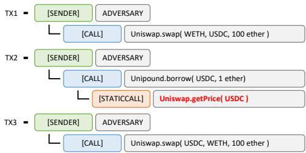
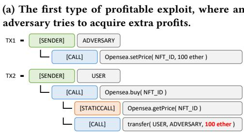
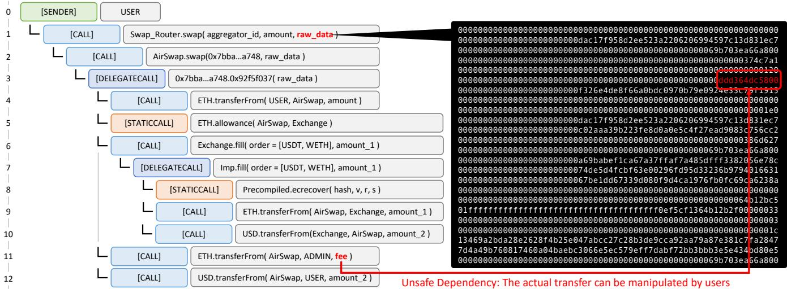
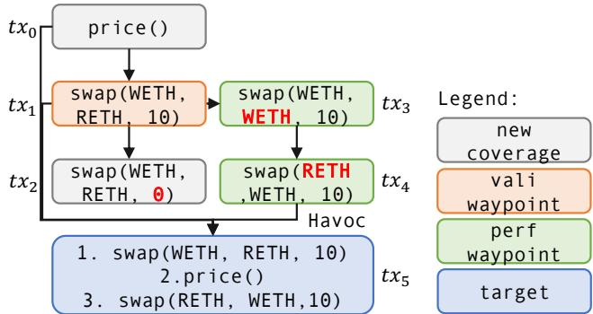
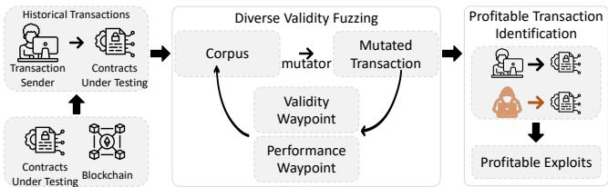
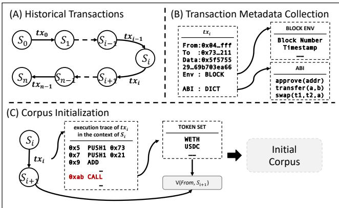
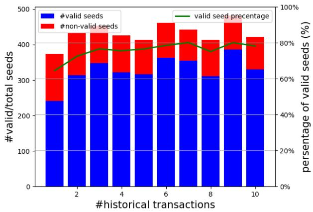

# Midas: Mining Profitable Exploits in On-Chain Smart Contracts via Feedback-Driven Fuzzing and Diferential Analysis

Mingxi Ye Sun Yat-sen University Guangzhou, China yemx6@mail2.sysu.edu.cn

Xingwei Lin Zhejiang University Hangzhou, China xwlin.roy@zju.edu.cn

Jiajing Wu<sup>∗</sup> Sun Yat-sen University Guangzhou, China wujiajing@mail.sysu.edu.cn

Yuhong Nan Sun Yat-sen University Guangzhou, China nanyh@mail.sysu.edu.cn

## Abstract

Zibin Zheng Sun Yat-sen University Guangzhou, China zhzibin@mail.sysu.edu.cn

In the context of boosting smart contract applications, prioritiz ing their security becomes paramount. Smart contract exploits often result in notable financial losses. Ensuring their security is by no means trivial. Rather than resulting in program crashes, most attacks in on-chain smart contracts aim to induce financial loss, referred to as profitable exploits. By constructing seemingly in nocuous inputs, profitable exploits try to extract extra profit or compromise the interests of others. However, due to the complexity of call chains in on-chain smart contracts and the need for efective oracles for profitable exploits, smart contract fuzzing sufers from low eficiency and low efectiveness in finding profitable exploits.

In this paper, we present Midas, a novel feedback-driven fuzzing framework to mine profitable exploits in on-chain smart contracts efectively. Midas consists of two modules: diverse validity fuzzing and profitable transaction identification. The diverse validity fuzzing module applies two waypoints to eficiently generate valid trans actions, addressing the complexity of on-chain smart contract call chains. The profitable transaction identification module applies dif ferential analysis to efectively identify profitable exploits, address ing the limitation of ad-hoc oracles. Evaluation of Midas over on chain smart contracts showed it efectively identified 40 real-world exploits with a precision of 80%, outperforming state-of-the-art tools (i.e., ItyFuzz and Slither) in both eficiency and efectiveness. Particularly, Midas efectively mines five unknown exploits in valu able smart contracts, and two of them have already been confirmed by their DApp developers.

## CCS Concepts

• Software and its engineering → Software testing and debugging.

<sup>∗</sup>Jiajing Wu is the corresponding author.

Keywords On-Chain Smart Contract; Vulnerability Detection; Feedback-Driven Fuzzing; Diferential Analysis

ACM Reference Format: Mingxi Ye, Xingwei Lin, Yuhong Nan, Jiajing Wu, and Zibin Zheng. 2024. Midas: Mining Profitable Exploits in On-Chain Smart Contracts via Feedback-Driven Fuzzing and Diferential Analysis. In Proceedings ofthe 33rd ACM SIGSOFT International Symposium on Software Testing and Analysis (ISSTA ’24), September 16–20, 2024, Vienna, Austria. ACM, New York, NY, USA, 12 pages. https://doi.org/10.1145/3650212.3680321

## 1 Introduction

In the current blockchain landscape, on-chain smart contracts collaboratively achieve diverse and sophisticated functionalities. For example, lending applications integrate with exchange applications, utilizing their infrastructure to acquire up-to-the-minute collateral values. With the boost of the decentralized application (DApp) ecosystem [4], on-chain smart contracts pile up like Lego. Enabling a fundamental exchange between two distinct cryptocurrency tokens requires the integration of multiple on-chain smart contract functionalities, posing noteworthy complexity and significant challenges to the security of these contracts.

Profitable exploits. In contrast to conventional bugs that cause application crashes, smart contract attacks primarily aim at inducing financial losses. Profitable exploits involve seemingly innocuous behaviors that extract additional profit beyond normal circumstances. In particular, profitable exploits enable adversaries to illicitly acquire extra profits or directly steal valuable assets from users through meticulously crafted transactions (i.e., inputs for smart contracts).

Many attacks resulting in significant losses are caused by profitable exploits targeting on-chain smart contracts. For instance, a legitimate transaction in cryptocurrency token exchange markets [33] involves paying a proper handling fee. However, inadequate access control allows adversaries to circumvent fee collection, resulting in substantial losses for the project. As another example, in the price manipulation attack [39], a legitimate transaction entails borrowing from a lending app with depositing suficient collateral. However, due to unsafe data dependencies, adversaries can manipulate the collateral prices, enabling them to borrow more tokens beyond normal circumstances.

Challenges. Previous research [5, 16, 29] primarily addresses de tecting bugs/vulnerabilities from an of-chain perspective. However, profitable exploits stem from erroneous logic across multiple on chain smart contracts and can hardly be identified by such of-chain analysis techniques. The buggy code associated with profitable ex ploits requires precise triggering contexts. As contracts interact in various ways, the number of possible paths between them multiplies rapidly, causing path explosion for techniques such as symbolic ex ecution. Existing static analysis and of-chain fuzzing frameworks, such as Oyente [27], Slither [13], and sFuzz [29], primarily focus on constructing call chains or fuzzing within a predefined set of smart contracts, thereby overlooking the exploitable call chain. In particular, we summarise two challenges in fuzzing on-chain smart contracts for mining profitable exploits:

• Low eficiency due to complex call chains. While generating inputs for on-chain smart contracts, fuzzers encounter a series of checks (e.g., conducting access control policies) in each internal invocation within call chains. Thus, fuzzers may spend significant eforts in generating test seeds that get rejected by those checks. Moreover, identifying buggy code under innocuous internal calls results in disregarding it within an exploitable context.

• Low efectiveness due to ad-hoc oracles. In contrast to conventional software defects, such as memory leaks [7] and use-after-free vulnerabilities [22] encountered in other pro gramming languages, profitable exploits stem from diverse exploitable logic bugs. Existing fuzzers [5, 20, 29] focus on manually defining ad-hoc oracles tailored for specific vulner abilities. Such a design can hardly extend to identify other profitable exploits with new patterns.

Our work. In this paper, we introduce Midas<sup>1</sup>, a novel feedbackdriven fuzzing framework that employs diferential analysis to efectively identify profitable exploits in on-chain smart contracts. To address the previously mentioned challenges, Midas proposes two key modules: (1) diverse validity fuzzing (DVF) for eficiently generating diverse valid transactions for complex call chains and (2) profitable transaction identification (PTI) for efectively identifying profitable exploits.

Midas first conducts a preprocessing procedure to collect essential information for subsequent fuzzing and diferential analysis. Specifically, Midas collects historical transactions for corpus initial ization and profitable situation identification.

In the DVF module, Midas applies a feedback-driven fuzzing framework based on intermediate inputs called waypoints [30]. By inspecting such waypoints (i.e., validity waypoint and performance waypoint, as detailed in Section 5.2), Midas adds seed inputs to the corpus [14] if they are interesting enough. For the validity waypoint, Midas records jump-related information in control flow graphs, including the origin and destination of jumps. In addition, we inspect the execution result to check if the execution is reverted or not. This information aids in identifying seed inputs that are more likely to generate new valid seeds. For the performance waypoint, Midas records the origin and destination of each token flow, along with the corresponding amount. This information aids in generating new seeds with diverse behaviors (i.e., diverse token flows).

In the PTI module, Midas applies diferential analysis to efectively identify profitable exploits, addressing the low efectiveness of ad-hoc oracles. By formulating a threat model specific to profitable exploits, Midas identifies profitable transactions based on whether an adversary extracts additional profit or an honest user bears unnecessary loss. To detail, Midas observes the token flow diference in the execution result between an original transaction and generated transactions. Midas inspects whether an adversary manages to acquire extra profit than the original transaction or directly steal valuable assets from others. If so, Midas considers the generated transaction profitable. Thus, a profitable bug is identified in the corresponding smart contracts.

We collect two datasets for our experiments to evaluate the efectiveness of Midas. The first dataset is collected by DeFiHackLabs [9] from Ethereum [4], which includes 103 historical attacks with 107 exploitable smart contracts once hacked. The second dataset is collected from the most famous Web3 bug bounty platforms, Immunefi [19]. The second dataset consists of 2,263 smart contracts in Ethereum. In the first dataset, Midas identifies 40 profitable exploits on average, reaching 80% TP, compared to 14 in ItyFuzz and 8 in Slither. Moreover, we conduct ablation studies over Midas to show the efectiveness of our fuzzing strategies. In addition, Midas identifies five profitable exploits in the second dataset. Two of them have been confirmed by the developers.

In the spirit of open science, we release the artifact of Midas, which can be accessed via the following anonymized repository: https://github.com/MingxiYe/Midas.

The contributions of this paper are summarized as follows:

• We propose a novel framework for mining profitable exploits in on-chain smart contracts.

• We design a feedback-driven fuzzing mechanism with two waypoints for on-chain smart contracts, allowing eficient program exploration.

• We adopt a more generic approach for profitable exploit identification through diferential analysis, which does not rely on vulnerability-specific patterns or oracles.

• We conduct extensive experiments to evaluate the efectiveness of Midas over real-world smart contracts. Results showed that Midas outperforms other state-of-the-art tools and identifies five unreported profitable exploits.

The rest of this paper is organized as follows: Section 2 gives some background knowledge. Section 3 shows a motivating example to show the key idea of Midas. Section 4 gives an overview of Midas. Section 5 elaborates on the detailed design of Midas. Section 6 clarifies implementation details. Section 7 presents the experimental setup and evaluation of Midas. Section 9 discusses related work, and Section 10 concludes the paper.

## 2 Background

Blockchain and smart contracts. Blockchain systems, such as Ethereum [4], are distributed databases collectively maintained by all network participants. Developers can build a self-host blockchain locally and conduct analysis or testing. With mechanisms like Ethereum Virtual Machine (EVM), users can change blockchain states (i.e., data stored in the blockchain), such as deploying smart contracts by storing bytecode to the blockchain. Through trans actions (i.e., inputs for smart contracts), users can encode their function calls, including function signatures and parameters, and modify the state of specific smart contracts.



  
(b) The second type of profitable exploit, where an adversary directly steals from an honest user.  
Figure 1: The demonstration examples for profitable exploits.

Profitable exploits. In contrast to conventional bugs that cause system crashes, the most critical vulnerabilities in smart contracts, such as profitable exploits, result in direct financial losses (e.g., los ing on-chain cryptocurrency tokens). Based on our observations, profitable exploits can be classified into two categories according to the execution result. Each profitable exploit either results in an adversary acquiring extra profit or an honest user bearing unnec essary losses. Figure 1 presents two demonstration examples. Each example consists of multiple transactions, showcasing the execu tion traces of malicious attacks. Note that we simplify each example for better understanding.

Figure 1(a) illustrates a demonstration example for the first type of profitable exploits. In this case, an adversary acquires extra profit beyond normal circumstances, deviating from legitimate behav iors expected by developers. Considering a user seeking to borrow USDC token [34] from the Unipound app, a legitimate behavior is to directly invoke the borrow() function with TX2. However, an ad versary exploits unsafe dependencies, temporarily increasing the value of USDC token (TX1). After that, the adversary borrows extra USDC through manipulated price (highlighted in red within TX2) and restores the price in TX3.

Figure1(b) illustrates another demonstration example for the second type of profitable exploits. An honest user is bearing un necessary losses beyond normal circumstances. In this case, a user engages in buying an NFT token [37] from the Opensea market (TX2). Recognizing this transaction, an adversary (i.e., the owner of NFT or administrator) front-runs the payment (TX2) and increases the price of the targeted NFT token (TX1). Consequently, the user purchases the NFT token at an unexpectedly high price (highlighted in red within TX2) and bears unnecessary losses.

On-chain smart contract fuzzing. A common scheme of smart contract testing is to deploy targeted contracts on a locally selfhost blockchain and repeatedly send transactions. Although the on-chain smart contracts are already deployed to blockchains such as Ethereum, conducting tests on Ethereum can incur significant expenses, notably transaction fees. Under such circumstances, existing works deploy targeted contracts locally and start fuzzing from scratch. However, in the current smart contract ecosystem, on-chain smart contracts interact with each other to achieve diverse functionalities. The absence of comprehensive on-chain environment simulation in current fuzzers results in over-approximations when addressing non-deterministic scenarios. An example includes assuming a constant return value for arbitrary external calls.

The comprehensive simulation of the on-chain environment improves fuzzing accuracy but introduces substantial storage overhead. To address this issue, ItyFuzz [35] introduces a snapshot-based fuzzing framework for smart contracts. Through blockchain snapshots, ItyFuzz accurately simulates the execution of smart contracts locally with acceptable overhead. However, the need for eficient fuzzing strategies becomes apparent as the smart contract landscape evolves. A targeted smart contract may spawn numerous associated contracts, each serving as potential fuzzing targets. Common test objectives, such as coverage, lead to exploring shallow paths of newly identified smart contracts while overlooking vulnerabilities in previously discovered contracts (see more details in Section 3).

## 3 Motivation

## 3.1 Motivating Example

Figure 2 illustrates the execution trace of a real-world exploitable example. Note that we simplify this example for better understanding and responsible disclosure. Each row represents an internal call across diferent contracts. The invocation types are of all kinds, including CALL, DELEGATECALL, and STATICCALL [38]. For example, line 1 shows that the transaction sender (i.e., USER) calls to the Swap\_Router contract and invokes the swap() function. In this example, the Swap\_Router contract allows token exchanges at real-time market rates. Similar to other contracts, the front-end website of this contract would provide a convenient way to construct the function parameter, sparing users the manual encoding task. Users are only required to input the desired tokens and their corresponding concrete values for exchange. The front-end website would automatically generate the corresponding transaction parameters for users, as showcased by the right-hand-side hexadecimal representation in Figure 2.

Note that the Swap\_Router contract collects handling fees for each exchange. These fees are essential for compensating the contract’s computational eforts in searching on-chain market situations to ofer optimal exchange prices. The fee is collected in line 11. However, the actual transfer value (i.e., fee) depends on the parameters provided by users (i.e., raw\_data of the swap() function). The corresponding data is red-highlighted in Figure 2. Such a design is for easy adjustment of fees. However, a malicious user can circumvent fee collection by setting the corresponding parameter value to zero. Even worse, an adversary may construct an alternative contract ofering a competitive price by eliminating the handling fee, posing a substantial risk of financial loss to the contract.

  
Figure 2: The execution trace of a real-world exploitable example in Ethereum.

## 3.2 Limitations of Existing Works

Based on the motivating example in Figure 2, we systematically summarize two limitations of existing works.

Low eficiency due to complex call chains. For the case in Figure 2, the root cause of this bug lies in line 11, where the trans ferred value (i.e., fee) depends on the parameter in line 1 (i.e., raw\_data). Notably, this parameter can be arbitrarily manipulated by external users. Existing fuzzing tools, such as ItyFuzz [35] and IcyChecker [43], primarily focus on generating transactions toward the Swap\_Router contract and fuzzing identified branches that remain uncovered. However, each internal call encounters many conditional checks, such as validating the inclusion of exchanged tokens. Consequently, considerable efort is spent exploring shallow paths involving these checks, resulting in the generation of test seeds that get rejected. Thus, fuzzers fail to eficiently execute the core logic of smart contracts.

Moreover, the critical code must be executed under a specific context to identify profitable exploits. However, the critical code may be executed multiple times under diferent contexts. Thus, fuzzers cover the critical code under innocuous scenarios while overlooking it in the exploitable context. In this case, the critical code is invoked in lines 4, 9, and 11. However, the exploit only hap pens under the context of line 11. During fuzzing the function call in line 11, fuzzers overlook the critical code as it has already been covered. In addition, identifying this profitable situation requires proper inputs, such as changing the critical parameters in raw\_data (highlighted in red) to zero in this case.

Low efectiveness due to ad-hoc oracles. In this case, the prof itable bug is a logic error hidden within multiple contracts. Existing tools [20, 29] focus on manually defining oracles while overlooking such a corner case with domain-specific patterns. The unsafe de pendency in Figure 2 demands extra information for accurate bug classification. Labeling all parameter dependencies as vulnerabilities leads to false positives, as such dependencies are considered reasonable in certain scenarios. As an example, the input parameter aggregator\_id in line 1 determines the invocation of contracts in line 2 and line 3. However, manipulating such a parameter incurs no loss except for the adversary’s burning of gas (i.e., the fee required to conduct a transaction on blockchains).

Our solution. Midas integrates feedback-driven fuzzing and dif ferential analysis to mine profitable exploits in on-chain smart contracts. For this case, Midas takes the Swap\_Router contract as a target as well as a set of historical transactions toward the contract. For each transaction, Midas would add it to the corpus and start fuzzing. During fuzzing, Midas implements the validity waypoint to avoid storing useless test seeds that get rejected. Midas implements the performance waypoint to repeatedly execute critical locations (e.g., the code in lines 4, 9, and 11) under diferent contexts. Thus, Midas eficiently generates diverse valid transactions for profitable situation identification. For each original on-chain transaction and the corresponding generated transactions, Midas would calculate the asset value change in real-time to identify unusual profits or losses. That is, identifying the bypass of the handling fee in this case. With such a design, Midas addresses the previous two challenges for existing works.

## 4 Overview

## 4.1 Fuzzing with Waypoints

A common fuzzing objective entails achieving high coverage, a metric not universally efective for certain domain-specific issues (e.g., the performance problems [23]). With new feedback-driven fuzzers being proposed, FuzzFactory [30] has introduced the concept of waypoints, allowing users to specify runtime feedback. To detail, waypoints are intermediate inputs collected during testing, subsequently utilized to determine whether the seed input is interesting.

Based on the following key observations, Midas applies waypoints as the feedback for seed inputs. That is, Midas implements (a) The simplified code under testing, with two contracts (i.e., Restaking and Exchanging) deployed in separate addresses.

```solidity
contract Restaking {
    function price() public view returns (uint256) {
        return pool.price(RETH, WETH);
    }
}

contract Exchanging {
    mapping(token0 => mapping(token1 => uint256)) price;

    function swap(address tokenIn, address tokenOut,
        uint256 amount) public {
        if(amount == 0) revert;
        tokenIn.transferFrom(msg.sender,this ,amount);
        uint256 reserveIn = tokenIn.balanceOf(this);
        uint256 reserveOut = tokenOut.balanceOf(this);
        uint256 out = reserveOut/(reserveIn*amount);
        tokenOut.transferFrom(this, msg.sender, out);
        uint256 reserveOut = tokenOut.balanceOf(this);

        price[tokenIn][tokenOut] = reserveIn / reserveOut;
        price[tokenOut][tokenIn] = reserveOut / reserveIn;
    }

    function price(address tokenA, address tokenB) public
        view returns (uint256) {
        return price[tokenA][tokenB];
    }
}
```

  
(b) Fuzzed inputs starting with initial seed ��<sub>0</sub>. Arrows indicates mutations  
Figure 3: The demonstration example of waypoint design adopted by Midas.

the validity waypoint to avoid corpus explosion with useless test seeds that get rejected. Meanwhile, Midas implements the perfor mance waypoint to repeatedly execute critical code under diferent contexts (see Section 5.2 for detailed design).

Figure 3(a) shows a demonstration example to clarify the needs and advantages of our waypoint design. Note that the vulnerability lies on line 3, where the price oracle functionality of the Restaking contract depends on the transient state of an external contract (i.e., Exchanging). We omit details of how this manipulated price causes financial losses while focusing on illustrating how this price is manipulated. In addition, Figure 3(b) depicts the seed inputs that may be saved during fuzzing.

Observation-1. In Figure 3(a), the contract uses $\mathrm { i } \mathsf { f } \cdot$ -revert construct to realize access control policies. The execution of transactions will directly revert if critical conditions are not satisfied (e.g., line 11 of Figure 3(a)). This design choice is due to the transparency of smart contact. Any entity can send transactions to invoke arbitrary public functions of contracts. Under such circumstances, the access control policy must be encoded in the program, triggering a revert if essential conditions are not met. However, this results in fuzzers wasting a lot of time fuzzing reverted test seeds.

Given an initial seed input price() (i.e., ��<sub>0</sub> in Figure 3(b)), Midas identifies an external contract (i.e., Exchanging) and tries to fuzz its public interfaces. A common fuzzing objective is to maximize code coverage of contracts. Thereafter, Midas adds $t x _ { 1 }$ and $t x _ { 2 }$ to the corpus based on increasing coverage. However, as depicted in Figure 3(b), in the following mutational stage, �� makes little contribution to generate interesting seed inputs and trigger bugs.

In this case, Midas excludes �� from the corpus based on the validity waypoint, as it does not identify new interesting locations and gets rejected by critical checks. The validity waypoint prevents Midas from fuzzing useless seeds, ensuring the eficient generation of test inputs that satisfy specified constraints.

Observation-2. Given the test seed ��<sub>1</sub>, the critical locations (i.e., line 12 and line 16 where cryptocurrency tokens are transferred) are already covered. Fuzzers will focus on identifying other uncovered locations while overlooking these critical code locations. To identify profitable exploits, we aim to increase the volume sent to the adversary while reducing associated costs. However, maximizing or minimizing the token flow based solely on participant (i.e., sender and receiver) roles proves inadequate. Some exploits require the adversary to transfer a substantial token amount while simultaneously receiving more, such as price manipulation attacks. Under such circumstances, our strategy is to save newly discovered token flow (i.e., new token transfer behaviors) to increase the diversity of token flow and generate diverse valid seeds (i.e., �� and �� ) under diferent contexts through the mutational stage (e.g., havoc).

To detail, the initial seed inputs are �� and �� . Through coverage feedback and the validity waypoint, it is dificult for fuzzers to generate ��<sub>5</sub> because ��<sub>3</sub> and $t x _ { 4 }$ do not contribute to coverage while $t x _ { 4 }$ is necessary for the exploit. Through the performance waypoint, Midas adds ��<sub>3</sub> and $t x _ { 4 }$ to the corpus, as they present new token flows in line 16 and line 12, respectively. After that, through havoc, we generate $t x _ { 5 }$ to trigger the bug. That is, Midas manages to generate inputs manipulating the price.

## 4.2 Diferential Analysis

To efectively identify profitable exploits, Midas formally models the token flow of transactions and applies diferential analysis based on the proposed threat model.

System model. For a transaction $t x = ( s e n d e r , S _ { p r e } , S _ { p o s t } )$ , ������ represents the sender of the �� transaction while $S _ { p r e }$ and $S _ { p o s t }$ represent the blockchain state before and after the execution of the transaction. Furthermore, we denote �(����, �) as the real-time value of the user’s assets under the blockchain state �.

Threat model. We focus on synthesizing profitable transactions under the hypothesis that the most critical and common vulnerabilities on blockchain result in financial loss. Given a transaction $t x = ( u s e r , S _ { p r e } , S _ { p o s t } )$ , if the user can gain extra profit or the adver sary can cause unnecessary loss to the user by another transaction, we consider the transaction as a profitable exploit.

  
Figure 4: The architecture of Midas.

That is, we consider there are two types of profitable exploits. In the first type, Given the transaction $t x = ( u s e r , S _ { p r e } , S _ { p o s t } )$ , we assume there exists another transaction $t x _ { 0 } = ( u s e r , S _ { p r e } , S _ { p o s t } ^ { \prime } )$ . If $V ( u s e r , S _ { p o s t } ^ { \prime } ) > V ( u s e r , S _ { p o s t } )$ , we consider the transaction �� as a profitable exploit since it gains extra profit beyond the normal situation. In the second type, considering there exists a transaction sequence ��<sub>0</sub> $\ l \to \ t x \ \to \ t x _ { 1 }$ , where $t x _ { 0 } = ( a d v e r s a r y , S _ { 0 } , S _ { 1 } )$ , �� $\mathbf { \Sigma } = \ ( u s e r , S _ { 1 } , S _ { 2 } )$ and $t x _ { 2 } =$ (��������<sub>�</sub>, $S _ { 2 } , S _ { 3 } )$ . If $V ( u s e r , S _ { p o s t } ) ~ >$ $V ( u s e r , S _ { 3 } )$ , we also consider this is a profitable exploit. Although we do not exactly know who profits from these transactions, we identify this exploit as it directly results in extra loss to an honest user.

## 5 Detailed Design

Figure 4 shows the overall architecture of Midas. This section elabo rates on the detailed design ofMidas, including a data preprocessing procedure (Section 5.1), the diverse validity fuzzing (DVF) module where Midas implements two waypoints to eficiently generate di verse valid transactions (Section 5.2), as well as the profitable transaction identification (PTI) module where Midas applies diferential analysis to efectively identify profitable situations (Section 5.3).

## 5.1 Data Preprocessing

As shown in Figure 5, Midas first collects all contracts’ historical transactions under testing from blockchain peers, who make all his torical data publicly accessible. In detail, Midas queries blockchain peers through the JSON-RPC APIs [11] and collects transactions in JSON format. Furthermore, Midas extracts the metadata of each transaction. After that, Midas inspects the execution trace of the transaction to initialize the corpus.

Transaction metadata extraction. Midas extracts historical transaction details and the corresponding execution environment (i.e., the block snapshot) to precisely re-execute historical transactions and inspect the change of token flow. Note that Midas filters out all reverted historical transactions since reverted function calls are useless for later diferential analysis.

Midas collects the necessary metadata of the transaction, including all participant addresses, the transaction data being sent, and the sent value. All information would be used to faithfully re-execute the historical transactions. For blockchain states, rather than forking the whole blockchain snapshot locally at first, Midas only records necessary information about the blockchain snapshot, such as the block number and the block timestamp.

  
Figure 5: The pipeline of data preprocessing in Midas.

Corpus initialization. With previously collected information, Midas initialize the corpus for the generation and identification of exploitable transactions (see details in Section 5.2 and Section 5.3). More specifically, Midas initializes the corpus with collected historical transaction metadata as well as their corresponding block environment to faithfully re-execute the transactions. In addition, by inspecting internal calls (i.e., the CALL opcode and the DELEGATECALL opcode), Midas collects all involved token addresses and records the detailed token flows.

Note that Midas can initialize the corpus with arbitrary amounts of historical transactions. We randomly selected 50 transactions for each contract. Our experiments (see Section 7.2) show that such a strategy is suficiently efective.

## 5.2 Diverse Validity Fuzzing

In order to avoid the fuzzer over-exploring useless code location and increase the diversity of the token flow in the corpus, Midas proposes two waypoints, namely the validity waypoint and performance waypoint, to determine whether a test seed is interesting enough. Based on our observations in Section 4.1, this section elaborates on the detailed designs of two waypoints.

Validity waypoint. To address the ineficiency caused by various checks, the key idea of the validity waypoint is to discard useless reverted seed inputs. Algorithm 1 demonstrates the instrumentation procedure. For each seed input, Midas hooks all jump-related opcodes (i.e., JUMP and JUMPI) and records the details by inspecting the stack data. The $B r _ { l o c a l }$ and $C _ { l o c a l }$ store the program counter of the jump-related opcodes and jump destination (i.e., PC % MAP\_SIZE and ������� % MAP\_SIZE), respectively.

Algorithm 2 demonstrates the overall evaluation procedure, where �� and � represent the global situations under testing, while $B r _ { l o c a l } , C _ { l o c a l }$ , and ��\_�������� represent the situation for the current seed input. If a new jump-related opcode is identified, the seed input is considered interesting. Otherwise, only when the seed input increases overall coverage and is not reverted, Midas adds the seed input to the corpus.

Performance waypoint. Midas applies the performance waypoint to identify interesting seed input with new cryptocurrency token transfer behaviors, namely unseen token flows conducted in the same program locations. As depicted in the Algorithm 3, Midas hooks two call-related opcodes (i.e., CALL and DELEGATECALL) and record the details about token flows. The $F _ { l o c a l }$ stores the token flow indexed by the program counter (i.e., PC). To identify ifthe call related opcodes trigger any token flows, Midas inspects memory and stack information during execution, checking the invocation parameters and the call value. If the invocation is relevant to token transfer functions (i.e., transfer or transferFrom functions) or the call value is not zero, we consider it as a token flow. We omitted implementation details in the pseudocode for better understanding.

<div class="mineru-algorithm" style="white-space: pre-wrap; font-family:monospace;">
Algorithm 1 Algorithm for validity waypoint instrumentation.
Output: $Br_{local}, C_{local}$
for opcode in trace do
    if opcode in {JUMP, JUMPI} then
        $Br_{local}[PC \% MAP\_SIZE] \leftarrow true$ $Counter \leftarrow Stack$ ▷ Get jump destination from stack
        $C_{local}[Counter \% MAP\_SIZE] \leftarrow true$
    end if
end for
return $Br_{local}, C_{local}$
</div>

<div class="mineru-algorithm" style="white-space: pre-wrap; font-family:monospace;">
Algorithm 2 Algorithm for validity waypoint evaluation.
Input: $Br, Br_{local}, C, C_{local}, is\_reverted$
Output: $is\_waypoint$ $is\_waypoint \leftarrow false$
    for $i$ in [0, MAP_SIZE] do
        if !$Br[i]$ and $Br_{local}[i]$ then
            $is\_waypoint \leftarrow true$ $Br[i] \leftarrow true$
        else if !$C[i]$ and $C_{local}[i]$ and !$is\_reverted$ then
            $is\_waypoint \leftarrow true$ $C[i] \leftarrow true$
        end if
    end for
    return $is\_waypoint$
</div>

Algorithm 4 demonstrates the overall evaluation procedure, where � represents the global token flow set for the corpus and $F _ { l o c a l }$ represents the token flow for the current seed input. If a new token flow is found, Midas adds the seed input to the corpus and updates the global token flow.

Mutation strategies. Midas applies two mutation strategies to incorporate with the waypoints for each test seed (i.e., a transaction sequence), including (1) mutating parameters of transactions (i.e., function calls) and (2) using havoc to combine two test seeds and generate new seed inputs.

In addition, on-chain smart contracts may interact with external contracts (e.g., Exchanging in Figure 3(a)). Such external contracts do not belong to the project under testing while playing a critical role in exploiting. For this case, during execution, Midas inspects the execution trace and identifies every called external contract. With the external contract addresses, Midas performs function calls to the corresponding public interfaces with default parameters and adds these external calls to the corpus.

<div class="mineru-algorithm" style="white-space: pre-wrap; font-family:monospace;">
Algorithm 3 Algorithm for performance waypoint instrumentation.
Output: $F_{local}$ $F_{local} \leftarrow \text{Vec&lt;U256&gt; = U256::ZERO}$
for opcode in trace do
    if opcode in { CALL, DELEGATECALL } then
        $token_{flow} \leftarrow Memory&amp;Stack$ ▷ Get the token flow
        $F_{local}[\text{PC \% MAP\_SIZE}] \leftarrow token_{flow}$
    end if
end for
return $F_{local}$

Algorithm 4 Algorithm for performance waypoint evaluation.
Input: $F, F_{local}$
Output: is_waypoint
is_waypoint ← false
for i in [0, MAP_SIZE] do
    if $F_{local}[i]$ not in $F[i]$ then
        is_waypoint ← true
        $F[i].append(F_{local}[i])$ ▷ Identify new token flow
    end if
end for
return is_waypoint
</div>

## 5.3 Profitable Transaction Identification

By inspecting the token balance diference between the historical transaction and generated transactions, Midas identifies profitable situations. Based on the threat model in Section 4.2, we implement diferential analysis to efectively identify exploits by calculating asset value and identifying profitable transactions.

Asset value calculation. Rather than traversing all on-chain tokens to calculate the real-time profit, Midas only considers relevant tokens (i.e., tokens that appeared during execution) to avoid high computation overhead. More specifically, for each relevant token, Midas records the details of token flows (i.e., the change of token balance). Midas calculates the balance change in each transaction. Thereafter, Midas represents the balance changes of all token changes as native tokens, based on real-time price rate.

Exploits identification. Midas intends to disclose whether an adversary can acquire extra profit or cause loss to faithful users. More specifically, given the initial seed input for comparison, Midas formulates two types of exploits by executing the generated transaction with diferent callers (i.e., the sender of the initial transaction or a random adversary). If one of the following rules is satisfied, we consider a profitable exploit is found.

• Given an initial transaction from a user, Midas impersonates the user to execute those generated transactions. Under such circumstances, if the profit (i.e., the diference between the post-balance and the pre-balance) of the user in the generated transactions is larger than the profit in the original transaction.

• Given an initial transaction from a user, Midas impersonates a random adversary to execute those generated transactions.

If the adversary successfully decreases the balance of the user, Midas also considers a profitable exploit is found.

Note that the profits may not necessarily be positive. For example, the token exchange scenario in Section 3.1 would naturally cause asset loss due to the handling fee of the protocol. However, if an adversary successfully decreases such a loss significantly, either the user bears unnecessary losses or the adversary can acquire extra profits from the protocols (i.e., the DApps). Thus, Midas considers it a profitable exploit.

In addition, the root causes of profitable transactions may vary from functional errors to arbitrage opportunities. In some cases, arbitrage within a reasonable range is allowed to ensure the proper functionalities. Midas considers arbitrage over 0.1 ETH or 1% of the total fund as unusual and flags it as an exploit.

## 6 Implementation

Midas is built on top of LibAFL [14] and ItyFuzz [35]. To detail, we utilize ItyFuzz to faithfully fuzz on-chain smart contracts with blockchain snapshots. Based on the reusable modules in LibAFL, we implement two waypoints specific to smart contracts in the feedback module. Additionally, we apply diferential analysis for testing oracles in the mutational stage. For each newly generated test case, Midas first executes it to determine whether it should be added to the corpus based on two waypoints. Thereafter, Midas per forms the diferential analysis to identify whether it is a profitable exploit.

In addition, the data preprocessing procedure in Midas is imple mented with Python, which is a one-time efort. More specifically, we collect all blockchain data until the 18,500,000-th block (i.e., as of Nov. 4th, 2023). Then, we split the transactions based on the contract address of the transaction and cached all data in JSON format. During the testing procedure, Midas inspects the JSON files to identify historical transactions.

Lastly, Midas requests the application binary interface (ABI) of the contracts under testing from Etherscan [12], a well-known web site for requesting smart contract ABIs. The targeted contract is sometimes a proxy contract [2], which only exposes its fallback function as interfaces and transmits all transactions to the imple mentation contract. In this case, Midas will dynamically analyze the implementation address and use its ABI for invoking the proxy contract under testing. Note that, when no ABI is found, Midas applies a decompilation tool (i.e., heimdall-rs [1]) to automatically infer function signatures.

## 7 Evaluation

To evaluate Midas, we collect real-world benchmarks (i.e., on-chain smart contracts) and compare the performance between Midas and state-of-the-art tools, including static analyzers as well as fuzzers. Evaluation setup. We collect 103 historical attacks in Ethereum from the DeFiHackLabs dataset [9]. Each attack case consists of the block number of the attack, the corresponding vulnerable smart contracts, and a proof-of-concept script. Overall, there are 107 vul nerable smart contracts in the DeFiHackLabs dataset. In addition, we collect 2,263 smart contracts from a well-known bug bounty platform for smart contracts, namely Immunefi [19], which consists of 138 projects. We use the dataset to evaluate the performance of Midas in detecting unknown vulnerabilities.

Table 1: The average number of identified exploits of Midas and comparison tools, along with the number of true positives. Higher is better.

<table><tr><td rowspan="2"></td><td colspan="2">Slither</td><td colspan="2">ItyFuzz</td><td colspan="2">Midas</td></tr><tr><td># Total</td><td># TP</td><td># Total</td><td># TP</td><td># Total</td><td># TP</td></tr><tr><td>Average</td><td>102</td><td>8</td><td>19</td><td>14</td><td>50</td><td>40</td></tr><tr><td>Total (in three runs)</td><td>102</td><td>8</td><td>20</td><td>15</td><td>54</td><td>42</td></tr></table>

To illustrate the performance of Midas in finding on-chain smart contract exploits, particularly on how two waypoints and diferential analysis enhance it, we summarize the following four research questions:

RQ1: Can Midas outperforms in finding exploits for real-world attacks comparing to state-of-the-art tools?

RQ2: Do our fuzzing strategies benefit to better find exploits?

RQ3: Can Midas identify unreported exploits in valuable on-chain smart contracts without predefined patterns?

RQ4: Which vulnerabilities can result in profitable exploits in realworld smart contracts?

All experiments in our evaluation are conducted on a machine with Intel Xeon CPUs (40 cores) and 256GB memory running Ubuntu 20.04 OS.

## 7.1 Efectiveness

To answer RQ1, whether Midas can identify more vulnerabilities than state-of-the-art tools within the same period of time, we compare Midas with a fuzz testing tool ItyFuzz [35] and a static analyzer Slither [13]. To the best of our knowledge, they are the most popular fuzzing tool and static analyzer, respectively. These tools are consistently developed by security company and open source in Github with 4.7k+ stars<sup>2</sup> and 400+ stars<sup>3</sup>. We omit other tools such as Smartian [5], Securify [36], and IcyChecker [43], as previous research [47] has shown that 80% of real-world exploits cannot be detected due to inadequate descriptions of domain-specific properties, including missing access control policies, variable semantics, and implicit correlations between variables. In particular, we select ItyFuzz and Slither as they define various oracles for detection.

In addition, we use the dataset maintained by DeFiHackLabs [9] as a benchmark, as it is the largest dataset for historically attacked contracts in Ethereum, with detailed proof-of-concept scripts, to the best of our knowledge. Note that a real-world hack may leverage bugs in several smart contracts to perform exploits. The following evaluation considers each historical attack as a single vulnerability. A reported risk is considered a true positive if a buggy code is located or a profitable trace is found. More specifically, for each reported bug, Slither would pinpoint the buggy code locations. Based on the proof-of-concept scripts in the DeFiHackLabs dataset, we manually check if Slither pinpointed the right location. Meanwhile, ItyFuzz and Midas would generate test inputs for bug reproduction. By running the generated test inputs and inspecting the execution result and execution trace, we check if a profitable situation is met. To minimize systematic errors, two skilled researchers with smart contract CTF experience double-checked the experiment results.

We run each tool over the corresponding contracts with a 12-hour timeout and manually identify the correctness of each positive case. We repeat experiments for three runs. Table 1 shows the overall results, including the average and total number of reported bugs, along with confirmed true positives. As can be seen from the table, Midas successfully finds 40 real-world exploits on average, which is 26 and 32 more than ItyFuzz and Slither, respectively. Due to the benefit of our diferential analysis, the true positive rate is also higher than comparison tools (with 80% TP on average, compared to 73% in ItyFuzz and 8% in Slither).

False positive. Within 54 cases identified as profitable by Midas in total, we identify 12 false positives. During our manual inspec tion, we noticed that the false positives are caused mainly by two reasons. (1) In some cases, Midas mistakes tokens as valueless. For example, some tokens (e.g., Liquidity Provider Tokens [33]) can not be directedly converted to the native token (i.e., ETH of Ethereum). However, such tokens can be exchanged for other tokens with explicit value. Thus, Midas mistakes the exchange transactions as profitable. This situation can be addressed with a more complicated asset value calculation algorithm, but it brings higher computation overhead. Due to the minority of these cases, we consider it accept able. (2) While Midas focus on finding profitable exploits, in some case, Midas synthesizes reasonable profitable transactions. For ex ample, some smart contracts allow depositing valuable tokens and claiming interests at any time. Although we consider these cases as false positives, they are beneficial for better understanding the smart contracts and assisting auditing.

True negative. Apart from true negatives caused by time constraints, Midas failed to identify some bugs as it does not directly cause loss or gain profit. For example, in some cases, an adversary borrows a large number of tokens to vote for a malicious proposal (i.e., a deliberately designed smart contract) and changes the func tionalities of DApps through the proposal contract. Also, Midas fails to generate inputs related to further encryption or decryption (e.g., provide the corresponding signature to withdraw tokens). Based on our inspection of historical attacks, these cases are a minority.

Overall, we consider Midas outperforming state-of-the-art tools in finding profitable exploits of on-chain smart contracts, as Midas finds 42 profitable exploits in less than 12 hours within three runs, compared to 15 in ItyFuzz and 8 in Slither.

## 7.2 Ablation Study

To answer RQ2, whether our fuzzing strategies benefit Midas, we propose two ablations of Midas, namely Midas-valid and Midasperf. More specifically, we only implement the validity waypoint in Midas-valid and the performance waypoint in Midas-perf.

With the DeFiHackLabs dataset, we compare Midas with two ablations and ItyFuzz to inspect their capability in generating valid test cases with diverse token flow. More specifically, rather than increasing overall coverage, we consider generating more valid test cases with diverse token flow more important for finding on-chain smart contract exploits. However, it is not trivial to directly evaluate the token flow of each test seed. We evaluate the performance based on generated valid test seeds, as the diversity of token flow can be reflected in the number of valid test seeds. Under such circumstances, we run each tool for 12 hours and record the number of valid test seeds in the corpus. Note that we do not choose Slither for comparison as a static analyzer can easily model all possible paths while spending most of the time analyzing variable dependencies and solving path constraints.

Table 2: Number of valid seeds generated by Midas and comparison tools, along with the percentage of the total number of seeds. Higher is better.

<table><tr><td></td><td>ItyFuzz</td><td>Midas-valid</td><td>Midas-perf</td><td>Midas</td></tr><tr><td>Average</td><td>84.2 (31.1%)</td><td>889.7 (51.4%)</td><td>711.6 (34.3%)</td><td>2.2K (51.5%)</td></tr><tr><td>Median</td><td>44 (31.6%)</td><td>286 (47.1%)</td><td>262 (30.7%)</td><td>1,378 (51.7%)</td></tr><tr><td>Total</td><td>8.7K (31.1%)</td><td>91.6K (51.4%)</td><td>73.3K (34.3%)</td><td>229.0K (51.5%)</td></tr></table>

Table 3: Average number of branches covered by test seeds, along with the number of identified smart contracts . Higher is better.

<table><tr><td></td><td>ItyFuzz</td><td>Midas-valid</td><td>Midas-perf</td><td>Midas</td></tr><tr><td>Average</td><td>3.9K (50)</td><td>5.5K (60)</td><td>5.4K (58)</td><td>7.5K (82)</td></tr><tr><td>Median</td><td>773 (9)</td><td>1,416 (16)</td><td>1,489 (17)</td><td>1,917 (23)</td></tr><tr><td>Total</td><td>404K (5.1K)</td><td>565K (6.2K)</td><td>560K (6.0K)</td><td>768K (8.4K)</td></tr></table>

Table 2 shows the average and median number of valid test seeds for each on-chain smart contract and the total number of valid test seeds for the whole benchmark, along with the corresponding percentage in the corpus. Note that Midas outperforms comparison tools with two waypoints, boosting the efectiveness for valid exploit generation. Moreover, the performance of Midas-valid is better than Midas-perf, as the latter one spends so much time mutating useless test seeds that get rejected (see details in Section 4.1).

Table 3 presents the number of branches each tool covers. Note that Midas does not focus on increasing coverage, while the increase of valid test seeds results in the increase of covered branches, demonstrating the efectiveness of two waypoints. Moreover, as on-chain smart contract exploits consist of complicated call chains, we evaluate the number of identified smart contracts (in brackets) to demonstrate the capability of Midas in quickly discovering profitable exploits with complex call chains.

Figure 6 demonstrates a small-scale experiment to evaluate the eficiency of the corpus initialization strategy in Section 5.1. In order to evaluate the impact of the corpus initialization strategy for valid transaction generation, we inspect the change of valid seeds versus the number of historical transactions for initialization. For the Dexible DApp, we initialize the corpus with a diferent number of randomly selected historical transactions, ranging from one to ten. By running each case for three hours, we inspect the number of valid test seeds along with the percentage of valid seeds. Figure 6 demonstrates our experiment result, where the number of historical transactions does not largely impact the generation of valid test seeds. Thus, it is reasonable for Midas to randomly select the latest historical transaction.

  
Figure 6: The number of valid and non-valid seeds versus the number of historical transactions for corpus initialization, in the Dexible DApp.

Overall, we consider both waypoints to make significant contributions to finding valid test seeds with diverse token flow, thus leading to a better exploit detection capability.

## 7.3 Real-World Auditing

To answer RQ3, whether Midas can identify unseen attack patterns in the wild, we run Midas on another dataset. To detail, we collect 2,263 smart contracts from a bug bounty platform and see if Midas could identify profitable exploits in real-world contracts. Due to the limitation of computation resources, we run Midas over these smart contracts with a 30-minute timeout. Overall, Midas finds five exploits and two are confirmed by the corresponding project.

In detail, we manually collect smart contract addresses from each targeted project under testing. Each project may consist of more than one smart contract. During fuzzing, Midas may discover new relevant contracts and add them to the corpus as targets. Thus, Midas may report bugs outside of the initial collected contracts. For each reported bug, Midas generates the test input for reproduction and the corresponding execution trace for inspection. We manually identify the corresponding root causes of each reported case and write the corresponding proof-of-concept exploit.

Overall, we conclude that Midas can eficiently identify profitable exploits with unseen attack patterns in valuable on-chain smart contracts, with five profitable exploits being found. Additionally, we clarify the capability ofMidas to efectively identify exploits without predefined patterns by inspecting detected exploits in Section 7.4.

## 7.4 Case Study

To answer RQ4, we manually inspect discovered exploits and classify them into three categories, including privilege escalation, in consistent state updates, and centralized risks. These types of bugs are dificult to audit based on previous research [47]. We review two representative cases and discuss how our designs benefit Midas. Note that we eliminate irrelevant details for better understanding and responsible disclosure. The motivating example in Section 3 demonstrates the privilege escalation situations. We focus on inconsistent state updates and centralized risks.

```solidity
contract TokenA {
    uint256 nextId = 0;
    uint256 MAX_MINT = 100;

    function mint(uint8 numTokens) external payable {
        require(nextId + numTokens <= MAX_MINT);
        _safeMint(msg.sender, ++nextId);
    }
}

contract TokenB {
    uint256 nextId = 100;
    uint256 MAX_MINT = 200;

    function mint(uint8 numTokens) external payable {
        require(nextId + numTokens <= MAX_MINT);
        _safeMint(msg.sender, ++nextId);
    }
}
```  
Figure 7: Simplified real-world smart contracts with inconsistent state updates.

```solidity
contract Swapper {
    function call(address in, address out, uint256 min)
        public {
            SmartVault.swap(in, out, min);
        }
}

contract SwapVault {
    function swap(address in, address out, uint256 min)
        public auth {
            ...
            uint256 preOut = IERC20(out).balanceOf(address(this));
            require(preOut >= min);

            uint256 swapFeeAmount = _payFee(out, swapFee);
            // swapFee can be changed by owner
            actualOut = preOut - swapFeeAmount;
        }
}
```  
Figure 8: Simplified real-world smart contracts with centralized risks.

Figure 7 shows two simplified contracts with profitable bugs. More specifically, these two contracts are used to maintain the same type of token. In TokenA contract, users can mint tokens with ID from one to 100. Meanwhile, TokenB contract allows users to mint tokens with ID from 101 to 200. However, due to the incorrect implementation in line 6, users can pass a zero parameter to mint() and mint the 101st token. Thus, the token minted by an honest user in TokenB can be stolen by an adversary through TokenA. Such a case is dificult for existing tools to find, as it requires simulating an accurate blockchain state and associating these two contracts.

More specifically, we investigated NFTGuard [42], the state-ofthe-art detector for NFT contracts, to identify its eficacy in handling this case. Through comprehensive manual analysis of existing research, the authors have identified five types of NFT bugs, with Unlimited Minting being the most relevant to our case. However,

NFTGuard categorizes Unlimited Minting as a failure to verify the maximum supply of NFTs. Consequently, it overlooks the new attack pattern depicted in Figure 7, where conflicts arise exclusively within a specific NFT with ID 101. In addition, Midas identifies these exploitable bugs through diferential analysis.

Figure 8 shows another real-world profitable exploit with necessary simplification. Under normal circumstances, users invoke the call() function in the Swapper contract to swap between two distinct tokens. During execution, the Swapper contract internally calls the swap() function in the SwapVault contract. However, the vulnerability lies on line 11, where the contract checks whether the output token amount satisfies the minimum requirements of users. However, the SwapVault contract uses the output token amount before paying the handling fee. An adversary can increase the swapFee to steal all users’ tokens without breaking the requirement in line 11. Note that, in this case, the adversary can only be users hold administrative privileges. However, considering the decentralized nature of blockchain, we must also mitigate centralized risks, in cluding altering fees and leading to financial losses for users. This is aligned with existing research [28]. This case not only involves multiple contracts but also has a complicated dependency. Midas firstly generate a valid transaction calling to the call function and another transaction to manipulate the swapFee.

Overall, the root cause of profitable exploits varies from accounting errors to logical defects. Instead of pinpointing specific design faults within smart contracts, Midas inspects the execution result of transactions and identifies whether there are profitable situations.

## 8 Discussion

Midas inherits some limitations which can be further improved by future works. Firstly, akin to other fuzzers, Midas aims to conduct a complete analysis rather than a sound analysis. Consequently, Midas can not provide false negative assurance.

Secondly, some vulnerabilities do not lead to a profitable situation. For example, in voting applications, an adversary borrows a considerable amount of tokens to vote for a malicious proposal and manipulates critical state variables (e.g., the owner of the applica tions). However, such a defect may not necessarily result in financial loss. Thus, with existing oracles, Midas can not identify such a de fect. To mitigate this issue, Midas can be extended with new oracles. In addition, we also apply oracles from previous research [35] to our tool artifact, such as arbitrary transfer and reentrancy.

Additionally, Midas maintains some potential applications. For example, except for triggering vulnerabilities within smart con tracts to gain extra profit, Midas can be applied to fuzz malicious contracts (e.g., MEV bot contracts) and block the corresponding attack transaction. By generating profitable transactions conducted via malicious contracts, Midas can be extended to block attack transactions and rescue financial property from being stolen.

## 9 Related Work

Smart contract vulnerability detection. In terms of dynamic testing, ContractFuzzer [20] brings forward a black-box fuzzer spe cific for smart contracts, instrumenting EVM to identify vulnerabilities. Due to the ineficiency of black-box fuzzing, sFuzz [29] and Harvey [40] are two grey-box fuzzers with seed generation strategies to increase coverage. Moreover, to tackle the challenge that critical vulnerabilities require multiple transactions to trigger, Smartian [5] combines static and dynamic data-flow analysis for efective fuzzing. At the same time, ILF [18] applies transfer learning to learn from symbolic execution for better generating high-coverage test cases. However, these researches are designed to detect bugs in an of-chain manner while failing to handle multiple on-chain contracts efectively. To faithfully fuzzing on-chain smart contracts, ItyFuzz [35] implements snapshot-based fuzzing while IcyChecker [43] applies a transaction replay mechanism but introducing great computation overhead.

In terms of static analysis for smart contract vulnerability detection, Oyente [27] is the very first static analyzer for smart contract vulnerabilities. Through symbolic execution [21] and SMT solver [8], Oyente traverses each identified path and detects bugs based on predefined patterns. After that, several researches [13, 15] addressed the semantic lacking problem of smart contract bytecode through binary lifting. In detail, Slither [13] and Gigahorse [15] decompile bytecode into costumed high-level three-address code representation for better static analysis. To better handle crosscontract analysis, Xue et al. [41] analyze the drawbacks of existing research and propose a more accurate analysis framework.

In terms of transaction analysis, Zhou et al. conducted evaluations on real-world attacks via transaction logs [49]. Zhang et al. and Qin et al. imitate malicious transactions to block attacks in real-time [32, 46]. And Midas aims at identifying bugs proactively. Feedback-driven fuzzing. A common testing objective for fuzzers is achieving high coverage to trigger more bugs. However, due to the lack of program internal information, black-box fuzzing may only discover shallow bugs. Meanwhile, white-box fuzzing (e.g., concolic testing) sufers from high computation overhead. Then, various strategies, such as Peach [10], AFL [44], and libfuzzer [25] are designed to guide the generation, selection as well as the mutation of seed inputs, with coverage-related feedback. In addition, to address domain-specific problems that coverage-guided fuzzers cannot properly handle, such as performance problems and algorithmic complexity vulnerabilities, tools like PerfFuzz [23] and Slowfuzz [31] are proposed. To unify, FuzzFactory [30] came up with the idea of waypoints for easily designed costumed feedback.

## 10 Conclusion

In this paper, we present Midas, a novel fuzzing framework for finding profitable exploits in on-chain smart contracts. Unlike most existing tools focusing on fuzzing smart contracts in an of-chain manner, Midas intends to directly fuzz on-chain smart contracts. With two waypoints to guide the fuzzing, Midas generates valid test cases with diverse token flow to eficiently identify critical locations. With the diferential analysis, Midas identifies profitable transactions to efectively find profitable exploits. We conduct experiments to show that Midas outperforms state-of-the-art tools in terms of finding profitable exploits in on-chain smart contracts.

## Acknowledgments

This research is supported by the National Key Research and Development Program ofChina (No. 2023YFB2704801), the National Natural Science Foundation ofChina (No. 62032025, 62332004, 62372485).

## References

[1] Jonathan Becker. 2024. Heimdall - an advanced EVM toolkit. https://github. com/Jon-Becker/heimdall-rs

[2] William E Bodell III, Sajad Meisami, and Yue Duan. 2023. Proxy hunting: understanding and characterizing proxy-based upgradeable smart contracts in blockchains. In 32nd USENIX Security Symposium (USENIX Security 23). 1829– 1846.

[3] BugCrowd. 2023. BugCrowd: Bug Bounty Platform. https://www.bugcrowd.com

[4] Vitalik Buterin et al. 2014. A next-generation smart contract and decentralized application platform. white paper 3, 37 (2014), 2–1.

[5] Jaeseung Choi, Doyeon Kim, Soomin Kim, Gustavo Grieco, Alex Groce, and Sang Kil Cha. 2021. Smartian: Enhancing smart contract fuzzing with static and dynamic data-flow analyses. In 2021 36th IEEE/ACM International Conference on Automated Software Engineering (ASE). IEEE, 227–239.

[6] David LEE Kuo Chuen, Li Guo, and Yu Wang. 2017. Cryptocurrency: A new investment opportunity? The journal of alternative investments 20, 3 (2017), 16–40.

[7] James Clause and Alessandro Orso. 2010. Leakpoint: pinpointing the causes of memory leaks. In Proceedings ofthe 32nd ACM/IEEE International Conference on Software Engineering-Volume 1. 515–524

[8] Leonardo De Moura and Nikolaj Bjørner. 2008. Z3: An eficient SMT solver. In International conference on Tools and Algorithms for the Construction and Analysis of Systems. Springer, 337–340.

[9] DeFiHackLabs. 2023. DeFi Hacks Reproduce - Foundry. https://github.com/ SunWeb3Sec/DeFiHackLabs/tree/c9b3939abaccef5242d36cc6e47cb50c6fb7e3a0

[10] M Eddington. [n. d.]. Peach fuzzer. http://peachfuzzer.com/

[11] Ethereum. 2024. Ethereum - JSON-RPC API. https://ethereum.org/en/developers docs/apis/json-rpc

[12] Etherscan. 2023. Etherscan - The Ethereum Blockchain Explorer. https:// etherscan.io/

[13] Josselin Feist, Gustavo Grieco, and Alex Groce. 2019. Slither: a static analysis framework for smart contracts. In 2019 IEEE/ACM 2nd International Workshop on Emerging Trends in Software Engineering for Blockchain (WETSEB). IEEE, 8–15.

[14] Andrea Fioraldi, Dominik Maier, Dongjia Zhang, and Davide Balzarotti. 2022. LibAFL: A Framework to Build Modular and Reusable Fuzzers. In Proceedings of the 29th ACM conference on Computer and communications security (CCS) (Los Angeles, U.S.A.) (CCS ’22). ACM.

[15] Neville Grech, Lexi Brent, Bernhard Scholz, and Yannis Smaragdakis. 2019. Giga horse: thorough, declarative decompilation of smart contracts. In 2019 IEEE/ACM 41st International Conference on Software Engineering (ICSE). IEEE, 1176–1186.

[16] Gustavo Grieco, Will Song, Artur Cygan, Josselin Feist, and Alex Groce. 2020. Echidna: efective, usable, and fast fuzzing for smart contracts. In Proceedings of the 29th ACM SIGSOFT International Symposium on Software Testing and Analysis. 557–560.

[17] HackerOne. 2023. HackerOne - Bug Bounty Platform. https://www.hackerone. com/

[18] Jingxuan He, Mislav Balunović, Nodar Ambroladze, Petar Tsankov, and Martin Vechev. 2019. Learning to fuzz from symbolic execution with application to smart contracts. In Proceedings ofthe 2019 ACM SIGSAC Conference on Computer and Communications Security. 531–548.

[19] Immunefi. 2023. Immunefi - Explore Bounties. https://immunefi.com/explore/

[20] Bo Jiang, Ye Liu, and Wing Kwong Chan. 2018. Contractfuzzer: Fuzzing smart contracts for vulnerability detection. In Proceedings ofthe 33rd ACM/IEEE International Conference on Automated Software Engineering. 259–269.

[21] James C King. 1976. Symbolic execution and program testing. Commun. ACM 19, 7 (1976), 385–394.

[22] Byoungyoung Lee, Chengyu Song, Yeongjin Jang, Tielei Wang, Taesoo Kim, Long Lu, and Wenke Lee. 2015. Preventing use-after-free with dangling pointers nullification.. In NDSS. Citeseer.

[23] Caroline Lemieux, Rohan Padhye, Koushik Sen, and Dawn Song. 2018. Perfuzz: Automatically generating pathological inputs. In Proceedings ofthe 27th ACM SIGSOFT International Symposium on Software Testing and Analysis. 254–265.

[24] Zeqin Liao, Zibin Zheng, Xiao Chen, and Yuhong Nan. 2022. SmartDagger: a bytecode-based static analysis approach for detecting cross-contract vulnerability. In Proceedings of the 31st ACM SIGSOFT International Symposium on Software Testing and Analysis. 752–764.

[25] libfuzzer@googlegroups.com. 2019. Libfuzzer - a library for coverage-guided fuzz testing. http://llvm.org/docs/LibFuzzer.html

[26] Zhenguang Liu, Peng Qian, Xiaoyang Wang, Yuan Zhuang, Lin Qiu, and Xun Wang. 2021. Combining graph neural networks with expert knowledge for smart contract vulnerability detection. IEEE Transactions on Knowledge and Data Engineering (2021).

[27] Loi Luu, Duc-Hiep Chu, Hrishi Olickel, Prateek Saxena, and Aquinas Hobor. 2016. Making smart contracts smarter. In Proceedings ofthe 2016 ACM SIGSAC conference on computer and communications security. 254–269.

[28] Fuchen Ma, Meng Ren, Lerong Ouyang, Yuanliang Chen, Juan Zhu, Ting Chen, Yingli Zheng, Xiao Dai, Yu Jiang, and Jiaguang Sun. 2023. Pied-piper: Revealing the backdoor threats in ethereum erc token contracts. ACM Transactions on Software Engineering and Methodology 32, 3 (2023), 1–24.

[29] Tai D Nguyen, Long H Pham, Jun Sun, Yun Lin, and Quang Tran Minh. 2020. sfuzz: An eficient adaptive fuzzer for solidity smart contracts. In Proceedings of the ACM/IEEE 42nd International Conference on Software Engineering. 778–788.

[30] Rohan Padhye, Caroline Lemieux, Koushik Sen, Laurent Simon, and Hayawardh Vijayakumar. 2019. Fuzzfactory: domain-specific fuzzing with waypoints. Proceedings of the ACM on Programming Languages 3, OOPSLA (2019), 1–29.

[31] Theofilos Petsios, Jason Zhao, Angelos D Keromytis, and Suman Jana. 2017. Slowfuzz: Automated domain-independent detection of algorithmic complexity vulnerabilities. In Proceedings of the 2017 ACM SIGSAC conference on computer and communications security. 2155–2168.

[32] Kaihua Qin, Stefanos Chaliasos, Liyi Zhou, Benjamin Livshits, Dawn Song, and Arthur Gervais. 2023. The blockchain imitation game. In 32nd USENIX Security Symposium (USENIX Security 23). 3961–3978.

[33] Kaihua Qin, Liyi Zhou, Pablo Gamito, Philipp Jovanovic, and Arthur Gervais. 2021. An empirical study of defi liquidations: Incentives, risks, and instabilities. In Proceedings ofthe 21st ACM Internet Measurement Conference. 336–350.

[34] Mahesh Shirole, Maneesh Darisi, and Sunil Bhirud. 2020. Cryptocurrency token: An overview. In IC-BCT 2019: Proceedings of the International Conference on Blockchain Technology. Springer, 133–140.

[35] Chaofan Shou, Shangyin Tan, and Koushik Sen. 2023. Ityfuzz: Snapshot-based fuzzer for smart contract. In Proceedings ofthe 32nd ACM SIGSOFT International Symposium on Software Testing and Analysis. 322–333

[36] Petar Tsankov, Andrei Dan, Dana Drachsler-Cohen, Arthur Gervais, Florian Buenzli, and Martin Vechev. 2018. Securify: Practical security analysis of smart contracts. In Proceedings ofthe 2018 ACM SIGSAC conference on computer and communications security. 67–82.

[37] Qin Wang, Rujia Li, Qi Wang, and Shiping Chen. 2021. Non-fungible token (NFT): Overview, evaluation, opportunities and challenges. arXiv preprint arXiv:2105.07447 (2021).

[38] Gavin Wood et al. 2014. Ethereum: A secure decentralised generalised transaction ledger. Ethereum project yellow paper 151, 2014 (2014), 1–32.

[39] Siwei Wu, Dabao Wang, Jianting He, Yajin Zhou, Lei Wu, Xingliang Yuan, Qinming He, and Kui Ren. 2021. Defiranger: Detecting price manipulation attacks on defi applications. arXiv preprint arXiv:2104.15068 (2021).

[40] Valentin Wüstholz and Maria Christakis. 2020. Harvey: A greybox fuzzer for smart contracts. In Proceedings ofthe 28th ACMJointMeeting on European Software Engineering Conference and Symposium on the Foundations of Software Engineering. 1398–1409.

[41] Yinxing Xue, Mingliang Ma, Yun Lin, Yulei Sui, Jiaming Ye, and Tianyong Peng. 2020. Cross-contract static analysis for detecting practical reentrancy vulnerabilities in smart contracts. In Proceedings of the 35th IEEE/ACM International Conference on Automated Software Engineering. 1029–1040

[42] Shuo Yang, Jiachi Chen, and Zibin Zheng. 2023. Definition and Detection of Defects in NFT Smart Contracts. arXiv preprint arXiv:2305.15829 (2023).

[43] Mingxi Ye, Yuhong Nan, Zibin Zheng, Dongpeng Wu, and Huizhong Li. 2023. Detecting State Inconsistency Bugs in DApps via On-Chain Transaction Replay and Fuzzing. In Proceedings of the 32nd ACM SIGSOFT International Symposium on Software Testing and Analysis. 298–309.

[44] Michał Zalewski. 2017. Technical "Whitepaper" for AFL. https://lcamtuf. coredump.cx/afl/technical\_details.txt

[45] Dirk A Zetzsche, Douglas W Arner, and Ross P Buckley. 2020. Decentralized finance (defi). Journal ofFinancial Regulation 6 (2020), 172–203.

[46] Zhuo Zhang, Zhiqiang Lin, Marcelo Morales, Xiangyu Zhang, and Kaiyuan Zhang. 2023. Your exploit is mine: Instantly synthesizing counterattack smart contract. In 32nd USENIX Security Symposium (USENIX Security 23). 1757–1774.

[47] Zhuo Zhang, Brian Zhang, Wen Xu, and Zhiqiang Lin. 2023. Demystifying Exploitable Bugs in Smart Contracts. ICSE.

[48] Zibin Zheng, Shaoan Xie, Hong-Ning Dai, Xiangping Chen, and Huaimin Wang. 2018. Blockchain challenges and opportunities: A survey. International journal ofweb and grid services 14, 4 (2018), 352–375.

[49] Shunfan Zhou, Malte Möser, Zhemin Yang, Ben Adida, Thorsten Holz, Jie Xiang, Steven Goldfeder, Yinzhi Cao, Martin Plattner, Xiaojun Qin, et al. 2020. An ever-evolving game: Evaluation of real-world attacks and defenses in ethereum ecosystem. In 29th USENIX Security Symposium (USENIX Security 20). 2793–2810.