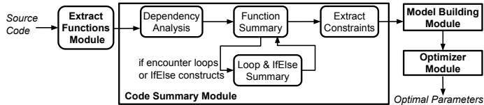

# Safeguarding DeFi Smart Contracts against Oracle Deviations

X<sub>u</sub>n D<sub>e</sub>n<sub>g</sub>xun.den<sub>g</sub>@mail.utoronto.caUni<sub>ve</sub>r<sub>s</sub>it<sub>y o</sub>f T<sub>o</sub>r<sub>o</sub>nt<sub>o</sub>T<sub>o</sub>r<sub>o</sub>nt<sub>o,</sub> C<sub>a</sub>n<sub>a</sub>d<sub>a</sub>

H<sub>a</sub>n D<sub>u</sub> HD<sub>u@</sub>b<sub>an</sub>k<sub>-</sub>b<sub>anque-cana</sub>d<sub>a.ca</sub> B<sub>an</sub>k <sub>o</sub>f C<sub>ana</sub>d<sub>a</sub> Ott<sub>awa,</sub> C<sub>a</sub>n<sub>a</sub>d<sub>a</sub>

Sidi M<sub>o</sub>h<sub>a</sub>m<sub>e</sub>d B<sub>e</sub>ill<sub>a</sub>hi <sub>sm.</sub>b<sub>e</sub>ill<sub>a</sub>hi<sub>@u</sub>t<sub>oron</sub>t<sub>o.ca</sub> Uni<sub>ve</sub>r<sub>s</sub>it<sub>y</sub> <sub>o</sub>f T<sub>o</sub>r<sub>o</sub>nt<sub>o</sub> T<sub>o</sub>r<sub>o</sub>nt<sub>o,</sub> C<sub>a</sub>n<sub>a</sub>d<sub>a</sub>

Andr<sub>eas</sub> V<sub>e</sub>n<sub>e</sub>ri<sub>s</sub> veneris@eec<sub>g</sub>.toronto.e<sup>d</sup>u Uni<sub>ve</sub>r<sub>s</sub>it<sub>y o</sub>f T<sub>o</sub>r<sub>o</sub>nt<sub>o</sub> T<sub>o</sub>r<sub>o</sub>nt<sub>o,</sub> C<sub>a</sub>n<sub>a</sub>d<sub>a</sub>

C<sub>y</sub>r<sub>u</sub>s Min<sub>w</sub>alla <sub>cm</sub>i<sub>nwa</sub>ll<sub>a@</sub>b<sub>an</sub>k<sub>-</sub>b<sub>anque-cana</sub>d<sub>a.ca</sub> B<sub>an</sub>k <sub>o</sub>f C<sub>ana</sub>d<sub>a</sub> Ott<sub>awa,</sub> C<sub>a</sub>n<sub>a</sub>d<sub>a</sub>

F<sub>a</sub>n L<sub>o</sub>n<sub>g</sub> f<sub>an</sub>l<sub>@cs.</sub>t<sub>oron</sub>t<sub>o.e</sub>d<sub>u</sub> Uni<sub>ve</sub>r<sub>s</sub>it<sub>y o</sub>f T<sub>o</sub>r<sub>o</sub>nt<sub>o</sub> T<sub>o</sub>r<sub>o</sub>nt<sub>o,</sub> C<sub>a</sub>n<sub>a</sub>d<sub>a</sub>

## ABSTRACT

This <sub>p</sub>a<sub>p</sub>er <sub>p</sub>resents OVer<sub>,</sub> a framework desi<sub>g</sub>ned to automaticall<sub>y</sub> anal<sub>y</sub>ze the behavior ofdecentralized finance (DeFi) <sub>p</sub>rotocols when su<sup>b</sup>jecte<sup>d</sup> to a "s<sup>k</sup>ewe<sup>d</sup>" orac<sup>l</sup>e input. OVer <sup>fi</sup>rst<sup>l</sup>y per<sup>f</sup>orms sym<sup>b</sup>o<sup>l</sup>ic <sub>ana</sub>l<sub>ys</sub>i<sub>s</sub> <sub>on</sub> th<sub>e</sub> <sub>g</sub>i<sub>ven</sub> <sub>con</sub>t<sub>rac</sub>t <sub>an</sub>d <sub>cons</sub>t<sub>ruc</sub>t<sub>s</sub> <sub>a</sub> <sub>mo</sub>d<sub>e</sub>l <sub>o</sub>f <sub>cons</sub>t<sub>ra</sub>i<sub>n</sub>t<sub>s.</sub> Then<sub>,</sub> the framework levera<sub>g</sub>es an SMT solver to identif<sub>y p</sub>aramet<sub>ers</sub> th<sub>a</sub>t <sub>a</sub>ll<sub>ow</sub> it<sub>s secure opera</sub>ti<sub>on.</sub> F<sub>ur</sub>th<sub>ermore, guar</sub>d <sub>s</sub>t<sub>a</sub>t<sub>emen</sub>t<sub>s</sub> <sub>may</sub> b<sub>e genera</sub>t<sub>e</sub>d f<sub>or smar</sub>t <sub>con</sub>t<sub>rac</sub>t<sub>s</sub> th<sub>a</sub>t <sub>may use</sub> th<sub>e orac</sub>l<sub>e va</sub>l<sub>ues,</sub> thus efectivel<sub>y</sub> <sub>p</sub>reventin<sub>g</sub> oracle mani<sub>p</sub>ulation attacks. Em<sub>p</sub>irical <sub>resu</sub>lt<sub>s</sub> <sub>s</sub>h<sub>ow</sub> th<sub>a</sub>t OV<sub>er</sub> <sub>can</sub> <sub>success</sub>f<sub>u</sub>ll<sub>y</sub> <sub>ana</sub>l<sub>yze</sub> <sub>a</sub>ll 10 b<sub>enc</sub>h<sub>mar</sub>k<sub>s</sub> <sub>co</sub>ll<sub>ec</sub>t<sub>e</sub>d<sub>, w</sub>hi<sub>c</sub>h <sub>encompass a</sub> di<sub>verse range o</sub>f D<sub>e</sub>Fi <sub>pro</sub>t<sub>oco</sub>l<sub>s.</sub> Ad ditionall<sub>y,</sub> this <sub>p</sub>a<sub>p</sub>er illustrates that current <sub>p</sub>arameters utilized in t<sup>h</sup>e majority o<sup>f</sup> <sup>b</sup>enc<sup>h</sup>mar<sup>k</sup>s are ina<sup>d</sup>equate to ensure sa<sup>f</sup>ety w<sup>h</sup>en confronted with si<sub>g</sub>nificant oracle deviations. It shows that existin<sub>g</sub> <sub>a</sub>d<sub>-</sub>h<sub>oc con</sub>t<sub>ro</sub>l <sub>mec</sub>h<sub>an</sub>i<sub>sms suc</sub>h <sub>as</sub> i<sub>n</sub>t<sub>ro</sub>d<sub>uc</sub>i<sub>ng</sub> d<sub>e</sub>l<sub>ays are o</sub>ft<sub>en</sub> i<sub>n</sub> suficient or even detrimental to <sub>p</sub>rotect the DeFi <sub>p</sub>rotocols a<sub>g</sub>ainst th<sub>e orac</sub>l<sub>e</sub> d<sub>ev</sub>i<sub>a</sub>ti<sub>on</sub> i<sub>n</sub> th<sub>e rea</sub>l<sub>-wor</sub>ld<sub>.</sub>

## CCS CONCEPTS

• Software and its engineering → Formal software verifica tion; Designing software; • Security and privacy → Software security engineering.

## KEYWORDS

Bl<sub>oc</sub>k<sub>c</sub>h<sub>a</sub>in<sub>,</sub> D<sub>ece</sub>ntr<sub>a</sub>liz<sub>e</sub>d Fin<sub>a</sub>n<sub>ce,</sub> Sm<sub>a</sub>rt C<sub>o</sub>ntr<sub>ac</sub>t<sub>s,</sub> Or<sub>ac</sub>l<sub>e</sub> D<sub>ev</sub>i<sub>a</sub> ti<sub>o</sub>n<sub>,</sub> St<sub>a</sub>ti<sub>c</sub> Pr<sub>og</sub>r<sub>a</sub>m An<sub>a</sub>l<sub>ys</sub>i<sub>s,</sub> C<sub>o</sub>d<sub>e</sub> S<sub>u</sub>mm<sub>a</sub>r<sub>y,</sub> P<sub>a</sub>r<sub>a</sub>m<sub>e</sub>t<sub>e</sub>r O<sub>p</sub>timiz<sub>a</sub> tion

## ACM Reference Format:

X<sub>u</sub>n Den<sub>g,</sub> Sidi Mohamed Beillahi<sub>,</sub> C<sub>y</sub>r<sub>u</sub>s Min<sub>w</sub>alla<sub>,</sub> Han D<sub>u,</sub> Andreas V<sub>e</sub>n<sub>e</sub>ri<sub>s, a</sub>nd F<sub>a</sub>n L<sub>o</sub>n <sub>.</sub> 2024<sub>.</sub> S<sub>a</sub>f<sub>e ua</sub>rdin D<sub>e</sub>Fi Sm<sub>a</sub>rt C<sub>o</sub>ntr<sub>ac</sub>t<sub>s a a</sub>in<sub>s</sub>t Oracle Deviations. In 2024 IEEE/ACM 46th International Conference on Software Engineering (ICSE ’24), April 14–20, 2024, Lisbon, Portugal. ACM, New York<sub>,</sub> NY<sub>,</sub> USA<sub>,</sub> 12 <sub>p</sub>a<sub>g</sub>es. htt<sub>p</sub>s://doi.or<sub>g</sub>/10.1145/3597503.3639225

## 1 INTRODUCTION

Bl<sub>oc</sub>k<sub>c</sub>h<sub>a</sub>i<sub>n o</sub>f<sub>ers</sub> d<sub>ecen</sub>t<sub>ra</sub>li<sub>ze</sub>d<sub>, programma</sub>bl<sub>e, an</sub>d <sub>ro</sub>b<sub>us</sub>t l<sub>e</sub>d<sub>gers</sub> <sub>on</sub> <sub>a</sub> <sub>g</sub>l<sub>o</sub>b<sub>a</sub>l <sub>sca</sub>l<sub>e.</sub> S<sub>mar</sub>t <sub>con</sub>t<sub>rac</sub>t<sub>s,</sub> <sub>w</sub>hi<sub>c</sub>h <sub>are</sub> <sub>programs</sub> d<sub>ep</sub>l<sub>oye</sub>d <sub>on</sub> bl<sub>oc</sub>k<sub>c</sub>h<sub>a</sub>i<sub>ns,</sub> <sub>enco</sub>d<sub>e</sub> t<sub>ransac</sub>ti<sub>on</sub> <sub>ru</sub>l<sub>es</sub> t<sub>o</sub> <sub>govern</sub> th<sub>ese</sub> bl<sub>oc</sub>k<sub>c</sub>h<sub>a</sub>i<sub>n</sub> l<sub>e</sub>d<sub>gers.</sub> Thi<sub>s</sub> t<sub>ec</sub>h<sub>no</sub>l<sub>ogy</sub> h<sub>as</sub> b<sub>een</sub> <sub>a</sub>d<sub>op</sub>t<sub>e</sub>d <sub>across</sub> <sub>a</sub> <sub>w</sub>id<sub>e</sub> <sub>range</sub> of sectors<sub>,</sub> includin<sub>g</sub> financial services<sub>,</sub> su<sub>pp</sub>l<sub>y</sub> chain mana<sub>g</sub>ement<sub>,</sub> and entertainment. A notable a<sub>pp</sub>lication of smart contracts is in th<sub>e managemen</sub>t <sub>o</sub>f di<sub>g</sub>it<sub>a</sub>l <sub>asse</sub>t<sub>s</sub> t<sub>o crea</sub>t<sub>e</sub> d<sub>ecen</sub>t<sub>ra</sub>li<sub>ze</sub>d fi<sub>nanc</sub>i<sub>a</sub>l services (DeFi). As of A<sub>p</sub>ril 1st, 2023, the Total Value Locked (TVL) in 1,417 DeFi contracts had reached \$50.15 billion [17].

As the assets mana<sub>g</sub>ed b<sub>y</sub> smart contracts continue to <sub>g</sub>row<sub>,</sub> ens<sub>u</sub>rin<sub>g</sub> their correctness has become a critical iss<sub>u</sub>e. In res<sub>p</sub>onse<sub>,</sub> <sub>researc</sub>h<sub>ers</sub> h<sub>ave</sub> d<sub>eve</sub>l<sub>ope</sub>d <sub>numerous ana</sub>l<sub>ys</sub>i<sub>s an</sub>d <sub>ver</sub>ifi<sub>ca</sub>ti<sub>on</sub> tools to detect errors in contract im<sub>p</sub>lementation. However<sub>,</sub> be<sub>y</sub>ond th<sub>e</sub> t<sub>yp</sub>i<sub>ca</sub>l <sub>so</sub>ft<sub>ware c</sub>h<sub>a</sub>ll<sub>enges pose</sub>d b<sub>y</sub> i<sub>mp</sub>l<sub>emen</sub>t<sub>a</sub>ti<sub>on errors,</sub> th<sub>e</sub> correctness of many DeFi smart contracts often depends on oracle values [4]. These are external values that capture vital environment<sub>a</sub>l <sub>con</sub>diti<sub>ons un</sub>d<sub>er w</sub>hi<sub>c</sub>h th<sub>e con</sub>t<sub>rac</sub>t<sub>s opera</sub>t<sub>e.</sub> F<sub>or</sub> i<sub>ns</sub>t<sub>ance, a</sub> collateralized DeFi lendin<sub>g</sub> contract re<sub>q</sub>uires u<sub>p</sub>dated tradin<sub>g</sub> <sub>p</sub>rices <sub>o</sub>f <sub>var</sub>i<sub>ous</sub> di<sub>g</sub>it<sub>a</sub>l <sub>asse</sub>t<sub>s</sub> t<sub>o ensure</sub> th<sub>a</sub>t th<sub>e va</sub>l<sub>ue o</sub>f th<sub>e co</sub>ll<sub>a</sub>t<sub>era</sub>l <sub>asse</sub>t <sub>a</sub>l<sub>ways excee</sub>d<sub>s</sub> th<sub>e va</sub>l<sub>ue o</sub>f th<sub>e</sub> b<sub>orrowe</sub>d <sub>asse</sub>t f<sub>or eac</sub>h <sub>user.</sub>

Smart contracts <sub>p</sub>eriodicall<sub>y</sub> receive u<sub>p</sub>dates to their oracle val-<sub>ues</sub> f<sub>rom o</sub>th<sub>er con</sub>t<sub>rac</sub>t<sub>s or ex</sub>t<sub>erna</sub>l d<sub>a</sub>t<sub>a</sub>b<sub>ases an</sub>d API<sub>s.</sub> D<sub>ev</sub>i<sub>a</sub>ti<sub>ons</sub> i<sub>n</sub> th<sub>ese orac</sub>l<sub>e va</sub>l<sub>ues</sub> f<sub>rom</sub> th<sub>e</sub>i<sub>r</sub> t<sub>rue va</sub>l<sub>ues can</sub> l<sub>ea</sub>d t<sub>o</sub> d<sub>ev</sub>i<sub>a</sub>ti<sub>ons</sub> in the intended o<sub>p</sub>erations of the contracts [4, 9]. In the real world, such deviations are common<sub>,</sub> often stemmin<sub>g</sub> from inaccuracies in the <sub>v</sub>al<sub>u</sub>e so<sub>u</sub>rce or dela<sub>y</sub>s in transmission. DeFi <sub>p</sub>rotocols traditionall<sub>y</sub> use a variet<sub>y</sub> of em<sub>p</sub>irical strate<sub>g</sub>ies to miti<sub>g</sub>ate the risks associated with oracle deviations and <sub>p</sub>otential corru<sub>p</sub>tions. For instance<sub>,</sub> a levera<sub>g</sub>ed DeFi <sub>p</sub>rotocol mi<sub>g</sub>ht set a safet<sub>y</sub> mar<sub>g</sub>in for user <sub>p</sub>ositions<sub>,</sub> li<sub>q</sub>uidatin<sub>g</sub> a <sub>p</sub>osition if its asset <sub>p</sub>rice di<sub>p</sub>s below a <sub>spec</sub>ifi<sub>c</sub> th<sub>res</sub>h<sub>o</sub>ld<sub>.</sub> Alt<sub>erna</sub>ti<sub>ve</sub>l<sub>y, a pro</sub>t<sub>oco</sub>l <sub>m</sub>i<sub>g</sub>ht <sub>aggrega</sub>t<sub>e mu</sub>l ti<sub>p</sub>le oracle in<sub>p</sub>uts from varied sources<sub>,</sub> calculatin<sub>g</sub> a median or avera<sub>g</sub>e for com<sub>p</sub>utational <sub>p</sub>ur<sub>p</sub>oses. However<sub>,</sub> these mechanisms <sub>an</sub>d th<sub>e</sub>i<sub>r</sub> <sub>parame</sub>t<sub>ers</sub> <sub>are</sub> <sub>o</sub>ft<sub>en</sub> <sub>a</sub>d<sub>-</sub>h<sub>oc</sub> <sub>an</sub>d <sub>ar</sub>bit<sub>rary.</sub> Th<sub>e</sub> <sub>a</sub>d<sub>equacy</sub> <sub>an</sub>d <sub>e</sub>fi<sub>cacy o</sub>f th<sub>ese con</sub>t<sub>ro</sub>l <sub>mec</sub>h<sub>an</sub>i<sub>sms</sub> i<sub>n rea</sub>l<sub>-wor</sub>ld <sub>scenar</sub>i<sub>os</sub> r<sub>e</sub>m<sub>a</sub>in <sub>u</sub>n<sub>ce</sub>rt<sub>a</sub>in<sub>.</sub>

Thi<sub>s paper presen</sub>t<sub>s</sub> OV<sub>er,</sub> th<sub>e</sub> fi<sub>rs</sub>t <sub>soun</sub>d <sub>an</sub>d <sub>au</sub>t<sub>oma</sub>t<sub>e</sub>d t<sub>oo</sub>l f<sub>or</sub> <sub>a</sub>n<sub>a</sub>l<sub>y</sub>zin<sub>g o</sub>r<sub>ac</sub>l<sub>e</sub> d<sub>ev</sub>i<sub>a</sub>ti<sub>o</sub>n <sub>a</sub>nd <sub>ve</sub>rif<sub>y</sub>in<sub>g</sub> it<sub>s</sub> im<sub>pac</sub>t in D<sub>e</sub>Fi <sub>s</sub>m<sub>a</sub>rt <sub>con</sub>t<sub>rac</sub>t<sub>s.</sub> Gi<sub>ven</sub> th<sub>e source co</sub>d<sub>e o</sub>f <sub>a smar</sub>t <sub>con</sub>t<sub>rac</sub>t <sub>pro</sub>t<sub>oco</sub>l <sub>an</sub>d a deviation ran<sub>g</sub>e of s<sub>p</sub>ecific oracle values in the contracts<sub>,</sub> OVer <sub>au</sub>t<sub>oma</sub>ti<sub>ca</sub>ll<sub>y ana</sub>l<sub>yzes</sub> th<sub>e source co</sub>d<sub>e</sub> t<sub>o ex</sub>t<sub>rac</sub>t <sub>a summary o</sub>f th<sub>e</sub> <sub>p</sub>rotocol. For a safet<sub>y</sub> constraint of the <sub>p</sub>rotocol<sub>,</sub> OVer then uses the extracted summar<sub>y</sub> to determine how to a<sub>pp</sub>ro<sub>p</sub>riatel<sub>y</sub> set ke<sub>y</sub> <sub>con</sub>t<sub>ro</sub>l <sub>parame</sub>t<sub>ers</sub> i<sub>n</sub> th<sub>e con</sub>t<sub>rac</sub>t<sub>.</sub> Thi<sub>s ensures</sub> th<sub>a</sub>t th<sub>e resu</sub>lti<sub>ng</sub> <sub>con</sub>t<sub>rac</sub>t <sub>con</sub>ti<sub>nues</sub> t<sub>o</sub> <sub>sa</sub>ti<sub>s</sub>f<sub>y</sub> th<sub>e</sub> d<sub>es</sub>i<sub>re</sub>d <sub>cons</sub>t<sub>ra</sub>i<sub>n</sub>t<sub>,</sub> <sub>even</sub> i<sub>n</sub> th<sub>e</sub> f<sub>ace</sub> <sub>o</sub>f <sub>orac</sub>l<sub>e</sub> d<sub>ev</sub>i<sub>a</sub>ti<sub>ons.</sub>

O<sub>ne o</sub>fth<sub>e</sub> k<sub>ey c</sub>h<sub>a</sub>ll<sub>enges</sub> OV<sub>er</sub> f<sub>aces</sub> i<sub>s</sub> th<sub>e sop</sub>hi<sub>s</sub>ti<sub>ca</sub>t<sub>e</sub>d <sub>con</sub>t<sub>rac</sub>t lo<sub>g</sub>ic of DeFi <sub>p</sub>rotocols. DeFi contracts often contain multi<sub>p</sub>le loo<sub>p</sub>s that iterate over ma<sub>p</sub>-like data structures. Each iteration t<sub>yp</sub>icall<sub>y</sub> <sub>con</sub>t<sub>a</sub>i<sub>ns</sub> <sub>up</sub> t<sub>o</sub> <sub>a</sub> h<sub>un</sub>d<sub>re</sub>d li<sub>nes</sub> <sub>o</sub>f <sub>co</sub>d<sub>e</sub> t<sub>o</sub> h<sub>an</sub>dl<sub>e</sub> th<sub>e</sub> <sub>pro</sub>t<sub>oco</sub>l l<sub>og</sub>i<sub>c</sub> f<sub>or one</sub> ki<sub>n</sub>d <sub>o</sub>f <sub>asse</sub>t <sub>or</sub> f<sub>or one user accoun</sub>t<sub>.</sub> S<sub>uc</sub>h <sub>co</sub>d<sub>e pa</sub>tt<sub>erns</sub> are t<sub>yp</sub>icall<sub>y</sub> intractable for standard <sub>p</sub>ro<sub>g</sub>ram anal<sub>y</sub>sis techni<sub>q</sub>ues<sub>,</sub> <sub>w</sub>hi<sub>c</sub>h <sub>o</sub>ft<sub>en</sub> <sub>wou</sub>ld h<sub>ave</sub> t<sub>o</sub> <sub>ma</sub>k<sub>e</sub> <sub>un</sub>d<sub>es</sub>i<sub>ra</sub>bl<sub>e</sub> <sub>over-approx</sub>i<sub>ma</sub>ti<sub>on</sub> <sub>or</sub> t<sub>o</sub> b<sub>oun</sub>d th<sub>e</sub> <sub>num</sub>b<sub>er</sub> <sub>o</sub>f l<sub>oop</sub> it<sub>era</sub>ti<sub>ons,</sub> l<sub>ea</sub>di<sub>ng</sub> t<sub>o</sub> i<sub>naccura</sub>t<sub>e</sub> <sub>or</sub> <sub>unsoun</sub>d <sub>ana</sub>l<sub>ys</sub>i<sub>s</sub> <sub>resu</sub>lt<sub>s.</sub>

OVer tackles this challen<sub>g</sub>e with its innovative loo<sub>p</sub> summar<sub>y</sub> al<sub>g</sub>orithm. Since the essence of loo<sub>p</sub>s com<sub>p</sub>utations in DeFi <sub>p</sub>rot<sub>oco</sub>l<sub>s cons</sub>i<sub>s</sub>t<sub>s o</sub>f <sub>accumu</sub>l<sub>a</sub>t<sub>ors app</sub>li<sub>e</sub>d t<sub>o maps</sub> d<sub>a</sub>t<sub>a s</sub>t<sub>ruc</sub>t<sub>ures,</sub> OV<sub>er opera</sub>t<sub>es w</sub>ith <sub>a pre</sub>d<sub>e</sub>fi<sub>ne</sub>d <sub>sum opera</sub>t<sub>or</sub> t<sub>emp</sub>l<sub>a</sub>t<sub>e</sub> f<sub>or</sub> l<sub>oops.</sub> OV<sub>er ex</sub>t<sub>rac</sub>t<sub>s</sub> th<sub>e summary</sub> f<sub>ormu</sub>l<sub>a o</sub>f <sub>eac</sub>h it<sub>era</sub>ti<sub>on an</sub>d th<sub>en uses</sub> <sub>a</sub> t<sub>emp</sub>l<sub>a</sub>t<sub>e-</sub>b<sub>ase</sub>d <sub>approac</sub>h t<sub>o conver</sub>t th<sub>e ex</sub>t<sub>rac</sub>t<sub>e</sub>d <sub>express</sub>i<sub>ons</sub> into an instantiation of the sum o<sub>p</sub>erator tem<sub>p</sub>late to re<sub>p</sub>resent the summar<sub>y</sub> of the entire loo<sub>p</sub>. Distinct from <sub>p</sub>revious loo<sub>p</sub> summar<sub>y</sub> <sub>a</sub>l<sub>gor</sub>ith<sub>ms</sub> th<sub>a</sub>t <sub>s</sub>t<sub>rugg</sub>l<sub>e w</sub>ith <sub>comp</sub>l<sub>ex</sub> if<sub>-e</sub>l<sub>se</sub> b<sub>ranc</sub>hi<sub>ng or mu</sub>lti faceted foldin<sub>g</sub> o<sub>p</sub>erations with interde<sub>p</sub>endencies [37], the OVer al<sub>g</sub>orithm ade<sub>p</sub>tl<sub>y</sub> mana<sub>g</sub>es these <sub>p</sub>revalent com<sub>p</sub>lexities in <sub>p</sub>o<sub>p</sub>ular D<sub>e</sub>Fi <sub>co</sub>ntr<sub>ac</sub>t<sub>s.</sub>

We have evaluated OVer on a set of nine <sub>p</sub>o<sub>p</sub>ular DeFi <sub>p</sub>rotocols <sub>an</sub>d <sub>one</sub> fi<sub>c</sub>ti<sub>ona</sub>l <sub>pro</sub>t<sub>oco</sub>l i<sub>n our exper</sub>i<sub>men</sub>t<sub>s.</sub> OV<sub>er success</sub>f<sub>u</sub>ll<sub>y</sub> <sub>ana</sub>l<sub>yzes</sub> <sub>a</sub>ll th<sub>e</sub> <sub>pro</sub>t<sub>oco</sub>l<sub>s,</sub> <sub>eac</sub>h t<sub>a</sub>ki<sub>ng</sub> l<sub>ess</sub> th<sub>an</sub> <sub>n</sub>i<sub>ne</sub> <sub>secon</sub>d<sub>s.</sub> I<sub>n</sub> com<sub>p</sub>arison<sub>,</sub> a <sub>p</sub>rior state-of-the-art loo<sub>p</sub> summar<sub>y</sub> al<sub>g</sub>orithm can <sub>on</sub>l<sub>y</sub> h<sub>an</sub>dl<sub>e</sub> 0 <sub>ou</sub>t <sub>o</sub>f 7 b<sub>enc</sub>h<sub>mar</sub>k<sub>s</sub> th<sub>a</sub>t h<sub>ave</sub> l<sub>oops.</sub>

With OVer<sub>,</sub> we st<sub>u</sub>d<sub>y</sub> the histor<sub>y</sub> oracle deviation in real-world bl<sub>oc</sub>k<sub>c</sub>h<sub>a</sub>i<sub>ns.</sub> W<sub>e</sub> i<sub>nves</sub>ti<sub>ga</sub>t<sub>e</sub> h<sub>ow orac</sub>l<sub>e</sub> d<sub>ev</sub>i<sub>a</sub>ti<sub>on wou</sub>ld <sub>a</sub>f<sub>ec</sub>t th<sub>e</sub> b<sub>e</sub>h<sub>av</sub>i<sub>or</sub> <sub>o</sub>f <sub>popu</sub>l<sub>ar</sub> D<sub>e</sub>Fi <sub>con</sub>t<sub>rac</sub>t<sub>s</sub> <sub>an</sub>d <sub>w</sub>h<sub>e</sub>th<sub>er</sub> th<sub>e</sub> <sub>ex</sub>i<sub>s</sub>ti<sub>ng</sub> <sub>a</sub>d<sub>-</sub> h<sub>oc mec</sub>h<sub>an</sub>i<sub>sms are su</sub>fi<sub>c</sub>i<sub>en</sub>t t<sub>o neu</sub>t<sub>ra</sub>li<sub>ze</sub> th<sub>e orac</sub>l<sub>e</sub> d<sub>ev</sub>i<sub>a</sub>ti<sub>ons.</sub> O<sub>ur resu</sub>lt<sub>s s</sub>h<sub>ow</sub> th<sub>a</sub>t f<sub>or s</sub>i<sub>x ou</sub>t <sub>o</sub>f th<sub>e seven</sub> b<sub>enc</sub>h<sub>mar</sub>k <sub>pro</sub>t<sub>o-</sub> <sub>co</sub>l<sub>s,</sub> th<sub>e con</sub>t<sub>ro</sub>l <sub>mec</sub>h<sub>an</sub>i<sub>sm was</sub> i<sub>nsu</sub>fi<sub>c</sub>i<sub>en</sub>t t<sub>o</sub> h<sub>an</sub>dl<sub>e</sub> th<sub>e orac</sub>l<sub>e</sub> deviation for at least a certain <sub>p</sub>eriod of time<sub>,</sub> leadin<sub>g</sub> to tem<sub>p</sub>orar<sub>y</sub> ex<sub>p</sub>loitable vulnerabilities. Our results also sur<sub>p</sub>risin<sub>g</sub>l<sub>y</sub> show th<sub>a</sub>t <sub>ex</sub>i<sub>s</sub>ti<sub>ng a</sub>d<sub>-</sub>h<sub>oc mec</sub>h<sub>an</sub>i<sub>sms o</sub>ft<sub>en exacer</sub>b<sub>a</sub>t<sub>e</sub> th<sub>e secur</sub>it<sub>y</sub> i<sub>s-</sub> sue caused b<sub>y</sub> oracle deviation. For exam<sub>p</sub>le<sub>,</sub> to <sub>p</sub>rotect a<sub>g</sub>ainst <sub>p</sub>otentiall<sub>y</sub> malicious oracle value <sub>p</sub>roviders<sub>,</sub> several DeFi <sub>p</sub>rotocols i<sub>n</sub>t<sub>ro</sub>d<sub>uce</sub> d<sub>e</sub>l<sub>ays w</sub>h<sub>en us</sub>i<sub>ng orac</sub>l<sub>e va</sub>l<sub>ue</sub> i<sub>npu</sub>t<sub>s</sub> i<sub>n</sub> th<sub>e</sub>i<sub>r ca</sub>l<sub>cu</sub>l<sub>a</sub>ti<sub>on</sub> (e.g., using the reported asset price one hour ago as the current oracle <sub>p</sub>rice). When the di<sub>g</sub>ital asset <sub>p</sub>rice fluctuates, such mechanisms <sup>f</sup>ai<sup>l</sup> to re<sup>fl</sup>ect t<sup>h</sup>e current mar<sup>k</sup>et an<sup>d</sup> arti<sup>fi</sup>cia<sup>ll</sup>y inject <sup>d</sup>eviations, <sub>w</sub>hi<sub>c</sub>h <sub>may</sub> <sub>ma</sub>k<sub>e</sub> th<sub>e</sub> <sub>resu</sub>lti<sub>ng</sub> <sub>pro</sub>t<sub>oco</sub>l<sub>s</sub> <sub>more</sub> <sub>vu</sub>l<sub>nera</sub>bl<sub>e.</sub>

In summar<sub>y,</sub> this <sub>p</sub>a<sub>p</sub>er makes the followin<sub>g</sub> contributions.

• OVer: This paper presents OVer, the first sound analysis and verification tool for anal<sub>y</sub>zin<sub>g</sub> oracle deviation in DeFi <sub>p</sub>rotoco<sup>l</sup>s.

• Loop Summary Algorithm: This paper proposes a novel loop <sub>summary a</sub>l<sub>gor</sub>ith<sub>m</sub> t<sub>o ena</sub>bl<sub>e</sub> th<sub>e ana</sub>l<sub>ys</sub>i<sub>s o</sub>f th<sub>e sop</sub>hi<sub>s</sub>ti<sub>-</sub> cated loo<sub>p</sub>s in DeFi smart contract so<sub>u</sub>rce code.

• Results: This paper presents a systematic evaluation of OVer. It <sub>a</sub>l<sub>so presen</sub>t<sub>s</sub> th<sub>e</sub> fi<sub>rs</sub>t <sub>s</sub>t<sub>u</sub>d<sub>y o</sub>f <sub>orac</sub>l<sub>e</sub> d<sub>ev</sub>i<sub>a</sub>ti<sub>on on popu</sub>l<sub>ar</sub> DeFi <sub>p</sub>rotocols. Our results show that the existin<sub>g</sub> ad-hoc <sub>con</sub>t<sub>ro</sub>l <sub>mec</sub>h<sub>an</sub>i<sub>sms are o</sub>ft<sub>en</sub> i<sub>nsu</sub>fi<sub>c</sub>i<sub>en</sub>t <sub>or even</sub> d<sub>e</sub>t<sub>r</sub>i<sub>men-</sub> tal to <sub>p</sub>rotect the DeFi <sub>p</sub>rotocols a<sub>g</sub>ainst the oracle deviation i<sub>n</sub> th<sub>e rea</sub>l<sub>-wor</sub>ld<sub>.</sub>

The remainin<sub>g</sub> of the <sub>p</sub>a<sub>p</sub>er is or<sub>g</sub>anized as follows. Sections 2-3 introduce technical back<sub>g</sub>round and a motivatin<sub>g</sub> exam<sub>p</sub>le. Section 4 <sub>p</sub>resents the desi<sub>g</sub>n of OVer. In Section 5<sub>,</sub> we stud<sub>y</sub> <sub>p</sub>ast oracle d<sub>ev</sub>i<sub>a</sub>ti<sub>ons</sub> <sub>an</sub>d <sub>eva</sub>l<sub>ua</sub>t<sub>e</sub> OV<sub>er.</sub> W<sub>e</sub> di<sub>scuss</sub> <sub>re</sub>l<sub>a</sub>t<sub>e</sub>d <sub>wor</sub>k <sub>an</sub>d th<sub>rea</sub>t<sub>s</sub> t<sub>o</sub> th<sub>e va</sub>lidit<sub>y</sub> in S<sub>ec</sub>ti<sub>o</sub>n<sub>s</sub> 6-7 <sub>a</sub>nd <sub>co</sub>n<sub>c</sub>l<sub>u</sub>d<sub>e</sub> in S<sub>ec</sub>ti<sub>o</sub>n 8<sub>.</sub>

## 2 BACKGROUND

Blockchain and smart contracts. Blockchains, operating as decentrali<sub>ze</sub>d di<sub>s</sub>t<sub>r</sub>ib<sub>u</sub>t<sub>e</sub>d <sub>sys</sub>t<sub>ems, o</sub>f<sub>er a</sub> f<sub>orm</sub>id<sub>a</sub>bl<sub>e arc</sub>hit<sub>ec</sub>t<sub>ure</sub> f<sub>or res</sub>ili<sub>en</sub>t<sub>,</sub> <sub>programma</sub>bl<sub>e</sub> l<sub>e</sub>d<sub>gers.</sub> N<sub>umerous</sub> bl<sub>oc</sub>k<sub>c</sub>h<sub>a</sub>i<sub>n</sub> i<sub>n</sub>f<sub>ras</sub>t<sub>ruc</sub>t<sub>ures, w</sub>ith Ethereum as a <sub>p</sub>rime exam<sub>p</sub>le<sub>, p</sub>rovide su<sub>pp</sub>ort for smart contracts. Th<sub>ese are co</sub>d<sub>e</sub>d <sub>agreemen</sub>t<sub>s res</sub>idi<sub>ng on</sub> th<sub>e</sub> bl<sub>oc</sub>k<sub>c</sub>h<sub>a</sub>i<sub>n, es</sub>t<sub>a</sub>bli<sub>s</sub>h<sub>e</sub>d to administer transaction rules inte<sub>g</sub>ral to led<sub>g</sub>er o<sub>p</sub>erations. Commonly scripted in sophisticated languages such as Solidity [29], th<sub>ese smar</sub>t <sub>con</sub>t<sub>rac</sub>t<sub>s are</sub> l<sub>a</sub>t<sub>er comp</sub>il<sub>e</sub>d i<sub>n</sub>t<sub>o a</sub> l<sub>ower-</sub>l<sub>eve</sub>l <sub>mac</sub>hi<sub>ne</sub> lan<sub>g</sub>ua<sub>g</sub>e like Ethereum Virtual Machine (EVM) b<sub>y</sub>tecode [8]. For consistent enforcement of these transaction rules<sub>,</sub> all <sub>p</sub>artici<sub>p</sub>atin<sub>g</sub> <sub>no</sub>d<sub>es w</sub>ithi<sub>n</sub> th<sub>e</sub> bl<sub>oc</sub>k<sub>c</sub>h<sub>a</sub>i<sub>n ne</sub>t<sub>wor</sub>k <sub>execu</sub>t<sub>e</sub> th<sub>e</sub> b<sub>y</sub>t<sub>eco</sub>d<sub>e o</sub>f <sub>a</sub> <sub>con</sub>t<sub>rac</sub>t i<sub>n a consensus-or</sub>i<sub>en</sub>t<sub>e</sub>d f<sub>as</sub>hi<sub>on.</sub>

Decentralizedfinance protocols. A substantial application ofblockchain technolo<sub>gy</sub> is visible in the form of DeFi <sub>p</sub>rotocols. DeFi <sub>p</sub>rotocols de<sub>p</sub>lo<sub>y</sub> smart contracts to mana<sub>g</sub>e di<sub>g</sub>ital assets<sub>,</sub> enablin<sub>g</sub> an arra<sub>y</sub> of financial services encom<sub>p</sub>assin<sub>g</sub> tradin<sub>g,</sub> lendin<sub>g,</sub> and in<sub>ves</sub>tm<sub>e</sub>nt<sub>, a</sub>ll <sub>w</sub>ithin <sub>a</sub> d<sub>ece</sub>ntr<sub>a</sub>liz<sub>e</sub>d <sub>co</sub>nt<sub>e</sub>xt<sub>.</sub> Pr<sub>e</sub>d<sub>o</sub>min<sub>a</sub>ntl<sub>y,</sub> D<sub>e</sub>Fi a<sub>pp</sub>lications consist of automatic market makers (AMMs) and lendin<sub>g</sub> <sub>p</sub>rotocols<sub>,</sub> with AMMs bein<sub>g</sub> a fre<sub>q</sub>uent com<sub>p</sub>onent of decentralized exchan<sub>g</sub>es (DEXes).

C<sub>on</sub>t<sub>ras</sub>ti<sub>ng</sub> t<sub>ra</sub>diti<sub>ona</sub>l <sub>exc</sub>h<sub>anges</sub> th<sub>a</sub>t <sub>u</sub>tili<sub>ze or</sub>d<sub>er</sub> b<sub>oo</sub>k<sub>s</sub> f<sub>or</sub> tradin<sub>g</sub> o<sub>p</sub>erations<sub>,</sub> AMMs im<sub>p</sub>lement a mathematical model that is contin<sub>g</sub>ent on the asset’s volume in the li<sub>q</sub>uidit<sub>y</sub> <sub>p</sub>ool to ascertain an asset<sup>’</sup>s price. Furt<sup>h</sup>ermore, a majority o<sup>f</sup> DeFi <sup>l</sup>en<sup>d</sup>ing protoco<sup>l</sup>s mandate borrowers to <sub>p</sub>rovide over-collateralization<sub>,</sub> insti<sub>g</sub>atin<sub>g</sub> li<sub>q</sub>- <sub>u</sub>id<sub>a</sub>ti<sub>on</sub> if<sub>a</sub> b<sub>orrower</sub>’<sub>s pos</sub>iti<sub>on</sub> d<sub>escen</sub>d<sub>s</sub> t<sub>o un</sub>d<sub>er-co</sub>ll<sub>a</sub>t<sub>era</sub>li<sub>za</sub>ti<sub>on.</sub> To maintain functional eficienc<sub>y,</sub> lendin<sub>g p</sub>rotocols inte<sub>g</sub>rate ke<sub>y</sub> <sub>p</sub>arameters such as collateralization or li<sub>q</sub>uidation ratios.

Blockchain oracles. Oracles provide real-world data to blockchains as the<sub>y</sub> are ti<sub>g</sub>htl<sub>y</sub>-closed s<sub>y</sub>stems and a<sub>g</sub>nostic to such information. Th<sub>u</sub>s<sub>,</sub> oracles are critical for the smooth o<sub>p</sub>eration of DeFi <sub>p</sub>rotocols. S<sub>pec</sub>ifi<sub>ca</sub>ll<sub>y, pr</sub>i<sub>ce orac</sub>l<sub>es</sub> f<sub>urn</sub>i<sub>s</sub>h i<sub>n</sub>di<sub>spensa</sub>bl<sub>e</sub> i<sub>n</sub>f<sub>orma</sub>ti<sub>on</sub> th<sub>a</sub>t h<sub>as</sub> di<sub>rec</sub>t i<sub>mp</sub>li<sub>ca</sub>ti<sub>ons on</sub> b<sub>o</sub>th <sub>smar</sub>t <sub>con</sub>t<sub>rac</sub>t <sub>execu</sub>ti<sub>on an</sub>d th<sub>e</sub>i<sub>r</sub> <sub>resu</sub>lt<sub>s.</sub> F<sub>or</sub> i<sub>ns</sub>t<sub>ance,</sub> l<sub>en</sub>di<sub>ng pro</sub>t<sub>oco</sub>l<sub>s use exac</sub>t <sub>co</sub>ll<sub>a</sub>t<sub>era</sub>l <sub>asse</sub>t <sub>p</sub>rices to <sub>g</sub>au<sub>g</sub>e user risk <sub>p</sub>rofiles<sub>,</sub> and outdated or im<sub>p</sub>recise data ma<sub>y p</sub>reci<sub>p</sub>itate financial losses.

In relation to oracle in<sub>p</sub>uts<sub>,</sub> two distinct t<sub>yp</sub>es of deviations can occur: accuracy and latency. Accuracy deviations emerge when a <sub>va</sub>l<sub>ue</sub> d<sub>ev</sub>i<sub>a</sub>t<sub>es</sub> f<sub>rom</sub> it<sub>s ac</sub>t<sub>ua</sub>l <sub>or</sub> t<sub>rue va</sub>l<sub>ue, w</sub>hil<sub>e</sub> l<sub>a</sub>t<sub>ency</sub> d<sub>ev</sub>i<sub>a</sub>ti<sub>ons</sub> <sub>are</sub> id<sub>en</sub>tifi<sub>e</sub>d <sub>w</sub>h<sub>en ou</sub>td<sub>a</sub>t<sub>e</sub>d <sub>va</sub>l<sub>ues are repor</sub>t<sub>e</sub>d<sub>, a p</sub>h<sub>enomenon</sub> that can<sub>,</sub> in t<sub>u</sub>rn<sub>,</sub> infl<sub>u</sub>ence acc<sub>u</sub>rac<sub>y</sub>. These deviations can ori<sub>g</sub>inate f<sub>rom var</sub>i<sub>ous sources suc</sub>h <sub>as</sub> i<sub>n</sub>t<sub>en</sub>ti<sub>ona</sub>l <sub>man</sub>i<sub>pu</sub>l<sub>a</sub>ti<sub>on o</sub>f <sub>orac</sub>l<sub>es</sub> to report <sup>d</sup>istorte<sup>d</sup> va<sup>l</sup>ues, or unintentiona<sup>l</sup> <sup>d</sup>ata a<sup>d</sup>justments embedded within smart contracts. Irres<sub>p</sub>ective of their ori<sub>g</sub>ins<sub>,</sub> such d<sub>ev</sub>i<sub>a</sub>ti<sub>o</sub>n<sub>s ca</sub>n r<sub>esu</sub>lt in in<sub>co</sub>rr<sub>ec</sub>t <sub>ope</sub>r<sub>a</sub>ti<sub>o</sub>n<sub>s w</sub>ithin <sub>s</sub>m<sub>a</sub>rt <sub>co</sub>ntr<sub>ac</sub>t<sub>s.</sub>

```javascript
function borrowAllowed(address cToken, address bwr, uint
    brwAmt) external returns (uint) {
    ...
    uint surplus = hypotheticalLiquid(bwr,cToken,0,brwAmt);
    require(surplus > 0, "INSUFFICIENT_LIQUIDITY");
    ...
    return uint(Error.NO_ERROR); }

function hypotheticalLiquid(address acct, CToken cToken,
    uint redTok, uint brwAmt) internal returns (uint) {
    AccountLiquidityLocalVars memory v;
    // Iterate over each asset in the acct
    CToken[] memory assets = accountAssets[acct];
    for (uint i = 0; i < assets.length; i++) {
        CToken asset = assets[i];
        (, v.cTokenBal, v.brwBal, v.exchRt) =
        asset.getAccountSnapshot(acct);
        // Fetch asset price from oracle
        v.oraclePrice = oracle.getUnderlyingPrice(asset);
        v.collFact = markets[address(asset)].collFact;
        v_tokensToDenom= v.collFact*v.exchRt*v.oraclePrice;
        v.sumColl = v.sumColl+ v_tokensToDenom* v.cTokenBal;
        v.sumBrwEfct= v.sumBrwEfct+ v.oraclePrice* v.brwBal;
        if (asset == cToken) {
            v.sumBrwEfct= v.sumBrwEfct+ v_tokensToDenom*redTok;
            v.sumBrwEfct= v.sumBrwEfct+ v.oraclePrice*brwAmt;}}
        return v.sumColl - v.sumBrwEfct;
```  
Figure 1: Compound protocol borrow logic simplified

Complexity ofDeFi smart contracts. Smart contracts implement in<sub>g</sub> DeFi <sub>p</sub>rotocols such as lendin<sub>g</sub>, DEXes, and derivatives [1, 3, 26] <sub>can</sub> b<sub>e</sub> <sub>comp</sub>l<sub>ex</sub> <sub>s</sub>i<sub>nce</sub> th<sub>ey</sub> <sub>genera</sub>ll<sub>y</sub> i<sub>nc</sub>l<sub>u</sub>d<sub>e</sub> l<sub>oops</sub> t<sub>o</sub> it<sub>era</sub>t<sub>e</sub> th<sub>roug</sub>h <sup>data</sup> <sup>structures</sup> <sup>re</sup>p<sup>resentin</sup>g <sup>various</sup> <sup>assets</sup> <sup>t</sup>yp<sup>es</sup> <sup>or</sup> <sup>accounts</sup> <sup>man-</sup> <sub>age</sub>d b<sub>y</sub> th<sub>e pro</sub>t<sub>oco</sub>l<sub>s an</sub>d <sub>ca</sub>l<sub>cu</sub>l<sub>a</sub>t<sub>e a sum, e.g.,</sub> t<sub>o</sub>t<sub>a</sub>l <sub>asse</sub>t<sub>s or</sub> d<sub>e</sub>bt<sub>s.</sub> This work highlights that a typical Solidity contract tends to include <sub>one</sub> l<sub>oop per</sub> 250 li<sub>nes o</sub>f <sub>co</sub>d<sub>s an</sub>d <sub>over</sub> 60% <sub>o</sub>f l<sub>oops per</sub>f<sub>orm an</sub> accumulation [37].

## 3 EXAMPLE AND OVERVIEW

We <sub>p</sub>resent a motivatin<sub>g</sub> exam<sub>p</sub>le of a<sub>pp</sub>l<sub>y</sub>in<sub>g</sub> OVer to anal<sub>y</sub>ze oracle deviation in Compound [13]. Figure 1 presents a simplified code snippet from the Compound smart contracts. Compound is <sub>a</sub> d<sub>ecen</sub>t<sub>ra</sub>li<sub>ze</sub>d b<sub>orrow</sub>i<sub>ng</sub> <sub>an</sub>d l<sub>en</sub>di<sub>ng</sub> <sub>pro</sub>t<sub>oco</sub>l <sub>opera</sub>ti<sub>ng</sub> <sub>on</sub> th<sub>e</sub> Ethereum blockchain. To borrow assets from Compound, a user d<sub>epos</sub>it<sub>s</sub> <sub>asse</sub>t<sub>s</sub> <sub>as</sub> <sub>co</sub>ll<sub>a</sub>t<sub>era</sub>l<sub>.</sub> Th<sub>e</sub> t<sub>o</sub>t<sub>a</sub>l <sub>va</sub>l<sub>ue</sub> <sub>o</sub>f th<sub>e</sub> <sub>co</sub>ll<sub>a</sub>t<sub>era</sub>l h<sub>as</sub> t<sub>o</sub> b<sub>e</sub> <sub>s</sub>i<sub>gn</sub>ifi<sub>can</sub>tl<sub>y</sub> <sub>grea</sub>t<sub>er</sub> th<sub>an</sub> th<sub>e</sub> <sub>va</sub>l<sub>ue</sub> <sub>o</sub>f th<sub>e</sub> b<sub>orrowe</sub>d <sub>asse</sub>t<sub>s</sub> <sub>a</sub>t any time. Whenever a user attempts to borrow assets, Compound calls borrowAllowed (line 1 in Fi<sub>g</sub>ure 1) to enforce this <sub>p</sub>olic<sub>y</sub>. The function borrowAllowed in turn calls hypotheticalLiquid (line 8) to calculate the diference (i.e., surplus at line 4) between the adjusted value of the collateral assets (i.e., v.sumColl at line 20) and the total value of the borrowed assets (i.e., v.sumBrwEfct at line 21) for the given account acct. In the function, Compound computes th<sub>ese</sub> t<sub>wo</sub> <sub>va</sub>l<sub>ues</sub> <sub>w</sub>ith th<sub>e</sub> l<sub>oop</sub> <sub>a</sub>t li<sub>nes</sub> 12<sub>-</sub>24<sub>.</sub> E<sub>ac</sub>h it<sub>era</sub>ti<sub>on</sub> <sub>o</sub>f th<sub>e</sub> loop handles one kind of asset in Compound and updates the two variables. Specifically, the loop computes v.sumColl as follows:

$$
\sum_ {a \in a s s e t s} (c o l l F a c t _ {a} * e x c h R t _ {a} * p _ {a} * c T o k e n B a l _ {a})\tag{1}
$$

where exchRt<sub>�</sub> is the exchange rate of the collateral asset �, $\scriptstyle { \mathcal { P } } a$ i<sub>s</sub> th<sub>e pr</sub>i<sub>ce o</sub>f th<sub>e asse</sub>t <sub>�</sub> f<sub>e</sub>t<sub>c</sub>h<sub>e</sub>d f<sub>rom an ex</sub>t<sub>erna</sub>l <sub>orac</sub>l<sub>e con</sub>t<sub>rac</sub>t (v.oraclePrice at line 20), $c T o k e n B a l _ { a }$ i<sub>s</sub> th<sub>e</sub> b<sub>a</sub>l<sub>ance o</sub>f th<sub>e asse</sub>t <sub>�, an</sub>d $c o l l F a c t _ { a }$ i<sub>s a con</sub>t<sub>ro</sub>l <sub>var</sub>i<sub>a</sub>bl<sub>e sma</sub>ll<sub>er</sub> th<sub>an one</sub> t<sub>o</sub> d<sub>e</sub>t<sub>erm</sub>i<sub>ne</sub> th<sub>e en</sub>f<sub>orce</sub>d <sub>over-co</sub>ll<sub>a</sub>t<sub>era</sub>li<sub>za</sub>ti<sub>on ra</sub>ti<sub>o</sub> f<sub>or</sub> th<sub>e asse</sub>t<sub>.</sub> Th<sub>e</sub> l<sub>oop a</sub>l<sub>so</sub> computes v.sumBrwEfct as follows:

<div class="mineru-algorithm" style="white-space: pre-wrap; font-family:monospace;">
$\sum_{a\in assets}(brwBal_a*p_a + c_a*(p_{brw}*brwAmt + collFact_r*exchRt_r*p_r*redTok))$ (2)
</div>

<sub>w</sub>h<sub>ere</sub> ${ p } _ { b r w }$ is the price of the asset brw that the user wants to borrow, r is the asset the user wants to withdraw from its collateral, $b r w B a l _ { a }$ is the already borrowed balance of the asset �, brwAmt is the amount of the asset brw a user wants to borrow, and redTok i<sub>s</sub> th<sub>e amoun</sub>t <sub>o</sub>f <sub>asse</sub>t <sub>� a user wan</sub>t<sub>s</sub> t<sub>o re</sub>d<sub>eem.</sub> $c _ { a } = I n t ( a = =$ ������) is a binar<sub>y</sub> re<sub>p</sub>resentation of the condition at line 22, where $c _ { a } = 1$ <sub>w</sub>h<sub>en</sub> th<sub>e asse</sub>t <sub>�</sub> i<sub>s �</sub>�<sub>�</sub>�<sub>�� an</sub>d $c _ { a } = 0$ <sub>o</sub>th<sub>e</sub>r<sub>w</sub>i<sub>se.</sub> B<sub>ecause</sub> hypotheticalLiquid can be invoked when a user borrows assets <sub>or re</sub>d<sub>eems co</sub>ll<sub>a</sub>t<sub>era</sub>l<sub>s,</sub> th<sub>ere are</sub> t<sub>wo</sub> dif<sub>eren</sub>t <sub>cases.</sub> Th<sub>e secon</sub>d t<sub>erm correspon</sub>d<sub>s</sub> t<sub>o</sub> th<sub>e</sub> b<sub>orrow</sub>i<sub>ng case, w</sub>hil<sub>e</sub> th<sub>e</sub> l<sub>as</sub>t t<sub>erm corre-</sub> <sub>spon</sub>d<sub>s</sub> t<sub>o</sub> th<sub>e</sub> <sub>re</sub>d<sub>eem</sub> <sub>case.</sub>

Oracle values in Compound. The correctness of Compound de-<sub>pen</sub>d<sub>s on</sub> th<sub>e accuracy o</sub>f th<sub>e</sub> f<sub>e</sub>t<sub>c</sub>h<sub>e</sub>d <sub>orac</sub>l<sub>e pr</sub>i<sub>ce o</sub>f <sub>eac</sub>h <sub>asse</sub>t (line 17). Like many other DeFi protocols, Compound fetches oracle <sub>p</sub>rices from multi<sub>p</sub>le sources<sub>,</sub> includin<sub>g</sub> centralized oracle service providers such as Chainlink [28] and the trading price of the assets in decentralized protocols such as Uniswap [32]. However, values f<sub>rom</sub> th<sub>ese</sub> <sub>sources</sub> <sub>may</sub> d<sub>ev</sub>i<sub>a</sub>t<sub>e</sub> f<sub>rom</sub> <sub>groun</sub>d t<sub>ru</sub>th<sub>s.</sub> I<sub>n</sub> f<sub>ac</sub>t<sub>,</sub> <sub>w</sub>h<sub>en</sub> a di<sub>g</sub>ital asset <sub>p</sub>rice is volatile<sub>,</sub> obtainin<sub>g</sub> the fair <sub>p</sub>rice of an asset is t<sub>yp</sub>icall<sub>y</sub> im<sub>p</sub>ossible. For instance<sub>,</sub> if the <sub>p</sub>rices in the e<sub>q</sub>uation 1 are i<sub>naccura</sub>t<sub>e</sub>l<sub>y repor</sub>t<sub>e</sub>d <sub>as</sub> hi<sub>g</sub>h<sub>,</sub> th<sub>e va</sub>l<sub>ue o</sub>f <sub>users</sub>’ <sub>co</sub>ll<sub>a</sub>t<sub>era</sub>l <sub>wou</sub>ld increase<sub>,</sub> <sub>p</sub>otentiall<sub>y</sub> leadin<sub>g</sub> the <sub>p</sub>rotocol to execute borrowin<sub>g</sub> t<sub>ransac</sub>ti<sub>ons even w</sub>h<sub>en users are no</sub>t <sub>su</sub>fi<sub>c</sub>i<sub>en</sub>tl<sub>y co</sub>ll<sub>a</sub>t<sub>era</sub>li<sub>ze</sub>d<sub>.</sub>

To tackle this issue, Compound enforces additional margins for th<sub>e</sub> <sub>pos</sub>iti<sub>ons</sub> <sub>o</sub>f <sub>eac</sub>h <sub>co</sub>ll<sub>a</sub>t<sub>era</sub>l <sub>asse</sub>t <sub>an</sub>d th<sub>e</sub> <sub>marg</sub>i<sub>n</sub> <sub>s</sub>i<sub>zes</sub> <sub>are</sub> d<sub>e-</sub> termined by collFact. Compound empirically sets the collateral f<sub>ac</sub>t<sub>or va</sub>l<sub>ue</sub> l<sub>ower</sub> t<sub>o en</sub>f<sub>orce a</sub> l<sub>arger marg</sub>i<sub>n on more vo</sub>l<sub>a</sub>til<sub>e as-</sub> <sub>se</sub>t<sub>s an</sub>d <sub>se</sub>t<sub>s</sub> th<sub>e</sub> f<sub>ac</sub>t<sub>or</sub> hi<sub>g</sub>h<sub>er on</sub> l<sub>ess vo</sub>l<sub>a</sub>til<sub>e asse</sub>t<sub>s.</sub> M<sub>any o</sub>th<sub>er</sub> DeFi <sub>p</sub>rotocols have similar ad-hoc control mechanisms to <sub>p</sub>rotect <sub>a a</sub>i<sub>ns</sub>t <sub>orac</sub>l<sub>e</sub> d<sub>ev</sub>i<sub>a</sub>ti<sub>ons.</sub> B<sub>u</sub>t th<sub>ere</sub> i<sub>s a</sub> difi<sub>cu</sub>lt t<sub>ra</sub>d<sub>e-o</sub>f i<sub>n</sub> h<sub>ow</sub> t<sub>o</sub> set these control <sub>p</sub>arameters a<sub>pp</sub>ro<sub>p</sub>riatel<sub>y</sub>. On one hand<sub>,</sub> settin<sub>g</sub> the <sub>parame</sub>t<sub>ers</sub> t<sub>oo re</sub>l<sub>axe</sub>d <sub>wou</sub>ld <sub>ma</sub>k<sub>e</sub> th<sub>e con</sub>t<sub>rac</sub>t<sub>s vu</sub>l<sub>nera</sub>bl<sub>e w</sub>h<sub>en</sub> f<sub>ac</sub>i<sub>ng orac</sub>l<sub>e</sub> d<sub>ev</sub>i<sub>a</sub>ti<sub>ons.</sub> O<sub>n</sub> th<sub>e o</sub>th<sub>er</sub> h<sub>an</sub>d<sub>, se</sub>tti<sub>ng</sub> th<sub>e parame</sub>t<sub>ers</sub> t<sub>oo res</sub>t<sub>r</sub>i<sub>c</sub>ti<sub>ve wou</sub>ld <sub>p</sub>l<sub>ace a</sub>dditi<sub>ona</sub>l <sub>co</sub>ll<sub>a</sub>t<sub>era</sub>l b<sub>ur</sub>d<sub>en on users</sub> <sub>an</sub>d <sub>ma</sub>k<sub>e</sub> th<sub>e</sub> <sub>pro</sub>t<sub>oco</sub>l <sub>una</sub>tt<sub>rac</sub>ti<sub>ve.</sub>

Utilizing OVer. We now show how we apply OVer to analyze Compound to determine optimal control parameter values such as the <sub>co</sub>ll<sub>a</sub>t<sub>era</sub>l f<sub>ac</sub>t<sub>or.</sub> Th<sub>e</sub> <sub>user</sub> fi<sub>rs</sub>t id<sub>en</sub>tifi<sub>es</sub> th<sub>e</sub> i<sub>n</sub>t<sub>eres</sub>t<sub>e</sub>d <sub>opera</sub>ti<sub>ons</sub> in the source code. In our example, we identify borrowAllowed as entry point and hypotheticalLiquid, which does critical checks and com<sub>p</sub>utations when <sub>p</sub>erformin<sub>g</sub> borrowin<sub>g</sub> actions.

Code analysis. OVer first analyzes the source code in Figure 1 to <sub>genera</sub>t<sub>e</sub> <sub>a</sub> <sub>sym</sub>b<sub>o</sub>li<sub>c</sub> <sub>express</sub>i<sub>on</sub> f<sub>or</sub> <sub>a</sub>ll <sub>var</sub>i<sub>a</sub>bl<sub>es</sub> i<sub>n</sub> th<sub>e</sub> <sub>cons</sub>t<sub>ra</sub>i<sub>n</sub>t at line 4. It starts with the entr<sub>y</sub> function<sub>,</sub> re<sub>p</sub>lacin<sub>g</sub> intermediate variables with their computed expressions. For example, surplus is the returned value of hypotheticalLiquid. It is computed by subtracting v.sumBrwEfct from v.sumColl. The expressions extracted by OVer for v.sumColl and v.sumBrwEfct correspond to the mathematical formulas in E<sub>q</sub>uations 1 and 2<sub>,</sub> res<sub>p</sub>ectivel<sub>y</sub>.

OV<sub>er</sub> th<sub>en</sub> <sub>genera</sub>t<sub>es</sub> th<sub>e</sub> fi<sub>na</sub>l <sub>sym</sub>b<sub>o</sub>li<sub>c</sub> <sub>express</sub>i<sub>on</sub> f<sub>or</sub> th<sub>e</sub> <sub>sa</sub>f<sub>e</sub>t<sub>y</sub> constraint at line 4 in Fi<sub>g</sub>ure 2. Note that the terms in the final

$$
\sum_ {a \in a s s e t s} (c o l l F a c t _ {a} * e x c h R t _ {a} * p _ {a} * c T o k e n B a l _ {a}) - (\sum_ {a \in a s s e t s} (b r w B a l _ {a} * p _ {a} + c _ {a} * (p _ {b r w} * b r w A m t + c o l l F a c t _ {r} * e x c h R t _ {r} * p _ {r}))) > 0
$$

Figure 2: Compound analysis summary.

expression are either loaded contract states (e.g., v.brwBal) or the return values of external function calls (e.g., getUnderlyingPrice).

Loop summerization. OVer handles the loop at lines 12-26 as follows. With the observation that most loo<sub>p</sub>s in DeFi contracts <sub>p</sub>er form fold o<sub>p</sub>erations<sub>, p</sub>articularl<sub>y</sub> accumulation<sub>,</sub> OVer summarizes th<sub>e</sub> l<sub>oop</sub> b<sub>y</sub> id<sub>en</sub>tif<sub>y</sub>i<sub>ng a</sub>ll <sub>accumu</sub>l<sub>a</sub>ti<sub>on per</sub>f<sub>orme</sub>d <sub>an</sub>d <sub>rep</sub>l<sub>ac</sub>i<sub>ng</sub> the loo<sub>p</sub> with one or multi<sub>p</sub>le com<sub>p</sub>act ex<sub>p</sub>ression(s). B<sub>y</sub> re<sub>p</sub>lacin<sub>g</sub> th<sub>e var</sub>i<sub>a</sub>bl<sub>es an</sub>d l<sub>oops w</sub>ith <sub>compac</sub>t <sub>express</sub>i<sub>ons,</sub> th<sub>e co</sub>d<sub>e sum-</sub> <sub>mary</sub> <sub>mo</sub>d<sub>u</sub>l<sub>e</sub> <sub>re</sub>t<sub>urns</sub> <sub>a</sub> <sub>se</sub>t <sub>o</sub>f <sub>cons</sub>t<sub>ra</sub>i<sub>n</sub>t<sub>s</sub> t<sub>o</sub> <sub>represen</sub>t th<sub>e</sub> <sub>smar</sub>t <sub>con</sub>t<sub>rac</sub>t’<sub>s</sub> l<sub>og</sub>i<sub>c.</sub> C<sub>ons</sub>t<sub>ra</sub>i<sub>n</sub>t<sub>s</sub> th<sub>a</sub>t <sub>are</sub> <sub>no</sub>t <sub>a</sub>f<sub>ec</sub>t<sub>e</sub>d b<sub>y</sub> <sub>orac</sub>l<sub>es</sub> <sub>w</sub>ill be i<sub>g</sub>nored. In this exam<sub>p</sub>le<sub>,</sub> the constraint at line 4 in Fi<sub>g</sub>ure 1 will be extracted as the summar<sub>y</sub> shown in Fi<sub>g</sub>ure 2. Note that<sub>,</sub> in this <sub>summary,</sub> th<sub>ere</sub> <sub>are</sub> fi<sub>ve</sub> <sub>vec</sub>t<sub>or</sub> <sub>var</sub>i<sub>a</sub>bl<sub>es</sub> <sub>an</sub>d th<sub>ree</sub> <sub>sca</sub>l<sub>ar</sub> <sub>var</sub>i<sub>a</sub>bl<sub>es.</sub>

Formal model generation. The analysis results in Figure 2 are then <sub>use</sub>d t<sub>o cons</sub>t<sub>ruc</sub>t <sub>a soun</sub>d <sub>mo</sub>d<sub>e</sub>l <sub>o</sub>f th<sub>e sa</sub>f<sub>e</sub>t<sub>y cons</sub>t<sub>ra</sub>i<sub>n</sub>t<sub>.</sub> S<sub>uppose</sub> we want to investi<sub>g</sub>ate the behavior of the borrowin<sub>g</sub> function in Compound and identify the price deviation limit when using the default collateral factor (cf ) 0.7, and a target collateral factor (cf <sup>′</sup>) 0<sub>.</sub>75<sub>.</sub> N<sub>o</sub>t<sub>e</sub> th<sub>a</sub>t b<sub>ecause</sub> <sub>o</sub>f th<sub>e</sub> d<sub>ev</sub>i<sub>a</sub>ti<sub>on,</sub> th<sub>e</sub> t<sub>arge</sub>t <sub>va</sub>l<sub>ue</sub> i<sub>s</sub> <sub>a</sub>l<sub>ways</sub> <sub>grea</sub>t<sub>er</sub> th<sub>an</sub> th<sub>e</sub> <sub>one</sub> <sub>con</sub>fi<sub>gure</sub>d i<sub>n</sub> th<sub>e</sub> <sub>con</sub>t<sub>rac</sub>t<sub>.</sub> F<sub>rom</sub> th<sub>e</sub> <sub>express</sub>i<sub>on</sub> i<sub>n</sub> Fi<sub>gure</sub> 2<sub>, we can</sub> d<sub>er</sub>i<sub>ve</sub> th<sub>e</sub> f<sub>o</sub>ll<sub>ow</sub>i<sub>ng s</sub>i<sub>mp</sub>lifi<sub>e</sub>d <sub>mo</sub>d<sub>e</sub>l<sub>:</sub>

$$
\begin{array}{l} \delta \\ \text {s.t.} \forall C, D, b, P, p, P _ {b}, p _ {b} > 0, \frac {| P _ {i} - p _ {i} |}{P _ {i}} <   \delta , \frac {| P _ {b} - p _ {b} |}{P _ {b}} <   \delta , \\ c f * \sum_ {i} ^ {l e n} (C _ {i} - D _ {i}) * p _ {i} - p _ {b} * b > 0 \Rightarrow c f ^ {\prime} * \sum_ {i} ^ {l e n} (C _ {i} - D _ {i}) * P _ {i} - P _ {b} * b > 0 \end{array}
$$

In this model, the variables C, D, b represent CollBal, brwBal and brwAmt respectively. P and $P _ { b }$ <sub>s</sub>t<sub>an</sub>d f<sub>or</sub> <sub>groun</sub>d t<sub>ru</sub>th <sub>va</sub>l<sub>ues</sub> <sub>w</sub>hil<sub>e</sub> p and $\mathit { p } _ { b }$ <sub>s</sub>t<sub>an</sub>d f<sub>or</sub> <sub>va</sub>l<sub>ues</sub> <sub>repor</sub>t<sub>e</sub>d b<sub>y</sub> th<sub>e</sub> <sub>orac</sub>l<sub>e.</sub> N<sub>o</sub>t<sub>e</sub> th<sub>a</sub>t b<sub>ecause</sub> we are anal<sub>y</sub>zin<sub>g</sub> the borrowin<sub>g</sub> case<sub>,</sub> the redeem amount is alwa<sub>y</sub>s <sub>zero an</sub>d th<sub>ere</sub>f<sub>ore</sub> th<sub>e re</sub>d<sub>eem re</sub>l<sub>a</sub>t<sub>e</sub>d t<sub>erms are s</sub>i<sub>mp</sub>lifi<sub>e</sub>d <sub>away.</sub>

Formal SMT solution. Finally, we pass the model to the optimizer, <sub>w</sub>hi<sub>c</sub>h it<sub>e</sub>r<sub>a</sub>ti<sub>ve</sub>l <sub>ca</sub>ll<sub>s a</sub>n SMT <sub>so</sub>l<sub>ve</sub>r t<sub>o</sub> r<sub>ove</sub> th<sub>e co</sub>n<sub>s</sub>tr<sub>a</sub>int <sub>s ec</sub>i fi<sub>e</sub>d i<sub>n</sub> th<sub>e mo</sub>d<sub>e</sub>l <sub>a</sub>b<sub>ove.</sub> F<sub>o</sub>ll<sub>ow</sub>i<sub>ng,</sub> it <sub>re</sub>t<sub>urns</sub> th<sub>e op</sub>ti<sub>ma</sub>l � if <sub>one</sub> i<sub>s</sub> found. Then we can insert proper require statements, for instance, <sub>res</sub>t<sub>r</sub>i<sub>c</sub>ti<sub>ng</sub> <sub>orac</sub>l<sub>e</sub> d<sub>ev</sub>i<sub>a</sub>ti<sub>on</sub> t<sub>o</sub> b<sub>e</sub> l<sub>ess</sub> th<sub>an</sub> th<sub>e</sub> <sub>va</sub>l<sub>ue</sub> f<sub>oun</sub>d<sub>,</sub> i<sub>n</sub>t<sub>o</sub> th<sub>e</sub> <sub>source</sub> <sub>co</sub>d<sub>e</sub> t<sub>o</sub> <sub>ensure</sub> <sub>correc</sub>t b<sub>e</sub>h<sub>av</sub>i<sub>or.</sub>

## 4 DESIGN

First, we introduce a simplified Solidity language to help present our <sub>p</sub>ro<sub>p</sub>osed anal<sub>y</sub>sis framework. The lan<sub>g</sub>ua<sub>g</sub>e<sub>,</sub> shown in Listin<sub>g</sub> 1<sub>,</sub> <sub>cap</sub>t<sub>ures</sub> <sub>var</sub>i<sub>a</sub>bl<sub>e</sub> d<sub>ec</sub>l<sub>ara</sub>ti<sub>ons,</sub> <sub>ass</sub>i<sub>gnmen</sub>t<sub>s,</sub> <sub>con</sub>t<sub>ro</sub>l<sub>-</sub>fl<sub>ow</sub> <sub>s</sub>t<sub>ruc</sub>t<sub>ures,</sub> <sub>an</sub>d f<sub>unc</sub>ti<sub>on ca</sub>ll<sub>s.</sub>

Contract, State, and Function. A contract class has an identifier (id) of Strin<sub>g</sub> t<sub>yp</sub>e (line 1 in Listin<sub>g</sub> 1). It encom<sub>p</sub>asses a set of <sub>g</sub>lobal <sub>s</sub>t<sub>a</sub>t<sub>es an</sub>d f<sub>unc</sub>ti<sub>ons.</sub> E<sub>ac</sub>h <sub>g</sub>l<sub>o</sub>b<sub>a</sub>l <sub>s</sub>t<sub>a</sub>t<sub>e</sub> h<sub>as a</sub> t<sub>ype an</sub>d <sub>an</sub> id<sub>en</sub>tifi<sub>er.</sub> We s<sub>p</sub>ecif<sub>y</sub> a function with its name<sub>,</sub> <sub>p</sub>arameters and bod<sub>y</sub> which is constituted of a sequence of statements. The statements dec and assign (line 8) allow to declare a local variable and assign value to it, respectively. The statement load allows to read a contract’s state.

Control-Flow Structures. Conditional branches are represented by IfThenElse construct. A for loop is constituted of the loop iterator i, u<sub>pp</sub>er-bound n (for sim<sub>p</sub>licit<sub>y</sub> we omitted lower-bound), and a sequence of statements representing the loop body. A phi instruction, d<sub>eno</sub>t<sub>e</sub>d <sub>as</sub> $\phi _ { i d }$ i<sub>s use</sub>d t<sub>o se</sub>l<sub>ec</sub>t <sub>va</sub>l<sub>ues</sub> b<sub>ase</sub>d <sub>on</sub> th<sub>e con</sub>t<sub>ro</sub>l fl<sub>ow</sub> f<sub>or</sub> a static sin<sub>g</sub>le-assi<sub>g</sub>nment (SSA) smart contract. It can onl<sub>y</sub> a<sub>pp</sub>ear at the beginning in a loop body or after an IfThenElse construct. The require statement enforces smart contract constraints and its lo<sub>g</sub>ic<sub>,</sub> and is crucial in our anal<sub>y</sub>sis.

  
Figure 3: Overview of the proposed framework.

Function Calls. Function calls are represented by the statement call(�, E<sup>∗</sup>, ��<sup>∗</sup>), where f identifies the function, $\varepsilon ^ { * }$ d<sub>eno</sub>t<sub>es</sub> th<sub>e</sub> <sub>se</sub>t <sub>o</sub>f <sub>parame</sub>t<sub>ers,</sub> <sub>an</sub>d $i d ^ { * }$ <sub>represen</sub>t<sub>s</sub> th<sub>e</sub> <sub>names</sub> <sub>o</sub>f <sub>re</sub>t<sub>urn</sub> <sub>va</sub>l<sub>ues.</sub> S<sub>ome</sub> f<sub>unc</sub>ti<sub>on</sub> <sub>ca</sub>ll<sub>s</sub> <sub>represen</sub>t <sub>quer</sub>i<sub>es</sub> <sub>o</sub>f <sub>s</sub>t<sub>a</sub>t<sub>es</sub> <sub>an</sub>d t<sub>o</sub> <sub>orac</sub>l<sub>e.</sub> I<sub>n</sub> <sub>our</sub> <sub>op</sub>ti<sub>m</sub>i<sub>za</sub>ti<sub>on</sub> <sub>pro</sub>bl<sub>em,</sub> <sub>we</sub> <sub>cons</sub>id<sub>er</sub> th<sub>ose</sub> <sub>as</sub> f<sub>ree</sub> <sub>var</sub>i<sub>a</sub>bl<sub>es.</sub> T<sub>a</sub>bl<sub>e</sub> 1 shows examples of statements from the Compound protocol.

```txt
Contract C ::= contract(id,St*,F*)
State st ::= state(ty,id)
Func F ::= func(f,id*,S*)
Type ty ::= Int|Bool|Struct|Map|Array|Bytes|Address
Id   id ::= String| f,i ∈ Id
Const c ::= n ∈ Int|Bool|Bytes|Address
Op ::= + | - | × | / | >= | > | < | <= | =
Stmt S ::= dec(ty,id) | assign(id,ε) |
        load(id,st) | require(ε) |
        phi(id0,id1,...) |
        if(εc)then{S1*}else{S2*}Φ* |
        for(i,n){S*} |
        call(f,ε*,id*) | return(ε*)
Expr ε ::= c | id | id[ε] | id.id | ¬ε | ε1 Op ε2
```  
Listing 1: Simplified Solidity language.

## 4.1 Code Summary Overview

Fi<sub>g</sub>ure 3 <sub>p</sub>resents an overview of the <sub>p</sub>ro<sub>p</sub>osed framework. The hi<sub>g</sub>h<sub>-</sub>l<sub>eve</sub>l <sub>proce</sub>d<sub>ure</sub> f<sub>or</sub> th<sub>e</sub> f<sub>ramewor</sub>k i<sub>s</sub> <sub>s</sub>h<sub>own</sub> i<sub>n</sub> Al<sub>gor</sub>ith<sub>m</sub> 1<sub>.</sub> The first ste<sub>p</sub> is to <sub>p</sub>re<sub>p</sub>rocess and sim<sub>p</sub>lif<sub>y</sub> the so<sub>u</sub>rce code to SSA form using the module ExtractFunc. In ExtractFunc, we identify the entr<sub>y</sub> <sub>p</sub>oint of our anal<sub>y</sub>sis. Note that the entr<sub>y</sub> <sub>p</sub>oint function must be a public function. In the case of Compound, this entry-point is the borrowAllowed function. Furthermore, the extracted functions are pure functions, and they are invoked through the call mechanism<sup>1</sup>. Then, CodeSummary module extracts concise summaries including <sub>summar</sub>i<sub>es o</sub>fl<sub>oops an</sub>d <sub>con</sub>diti<sub>ona</sub>l<sub>s an</sub>d <sub>re</sub>t<sub>urns a</sub> li<sub>s</sub>t <sub>o</sub>f<sub>cons</sub>t<sub>ra</sub>i<sub>n</sub>t<sub>s.</sub> Next, BuildModel module constructs an optimization model from the list of constraints for an SMT solver. Lastly, SolveOpt module solves the o<sub>p</sub>timization model usin<sub>g</sub> the SMT solver.

Table 1: Example statements from Compound smart contracts in Solidity and simplified Solidity.

<table><tr><td>Solidity Code</td><td>require(surplus &gt; 0, &quot;INSUFFICIENT_LIQUIDITY&quot;)</td><td>v.oraclePrice = oracle.getUnderlyingPrice(asset)</td></tr><tr><td>Simplified Solidity</td><td>require(surplus &gt; 0)</td><td>call(oracle.getUnderlyingPrice, asset, v.oraclePrice)</td></tr></table>

Algorithm 1 Main <sub>p</sub>rocedure. It takes in source code �� of the benchmark.

```python
procedure SUMMARYANALYSIS(sc)
    FuncObj ← EXTRACTFUNC(sc)
    ConstLst ← CODESUMMARY(FuncObj)
    M ← BUILDMODEL(ConstLst)
    OptVar ← SOLVEOPT(M)
    return OptVar
```

## 4.2 Code Summary Module

Th<sub>e ma</sub>i<sub>n</sub> t<sub>as</sub>k<sub>s o</sub>f th<sub>e co</sub>d<sub>e summary mo</sub>d<sub>u</sub>l<sub>e are:</sub> l<sub>oop an</sub>d <sub>orac</sub>l<sub>e</sub> de<sub>p</sub>endencies anal<sub>y</sub>sis<sub>,</sub> extraction of s<sub>y</sub>mbolic ex<sub>p</sub>ressions for vari ables<sub>,</sub> and constraints extraction. To com<sub>p</sub>ute a concise s<sub>y</sub>mbolic <sub>express</sub>i<sub>on</sub> th<sub>a</sub>t <sub>can</sub> b<sub>e passe</sub>d t<sub>o a so</sub>l<sub>ver, we summar</sub>i<sub>ze</sub> l<sub>oops</sub>’ bodies usin<sub>g</sub> the accumulation o<sub>p</sub>erator. Towards our <sub>g</sub>oal<sub>,</sub> we in troduce a domain-s<sub>p</sub>ecific lan<sub>g</sub>ua<sub>g</sub>e (DSL) shown in Listin<sub>g</sub> 2.

```autohotkey
aop ::= +, -, *, / ; bop ::= >, >=, <, <=, =
Id, i ::= String ; lb, ub ::= Int
Const ::= Int | Bool | Bytes | Address
Val V ::= Id | Const | i | index(V1,V2) | V1(V2) |
V1 aop V2 | ret(V2, i)
Acc ::= sum(E, i, ub)
Expr E ::= Acc | V | E aop E
Constr C::= True | E bop E | ¬C
```

## Listing 2: Code summary DSL.

Th<sub>e</sub> t<sub>wo</sub> m<sub>a</sub>in <sub>co</sub>m<sub>po</sub>n<sub>e</sub>nt<sub>s o</sub>f <sub>ou</sub>r DSL <sub>a</sub>r<sub>e</sub> E f<sub>o</sub>r <sub>e</sub>x<sub>p</sub>r<sub>ess</sub>i<sub>o</sub>n<sub>s</sub> and C for Boolean constraint ex<sub>p</sub>ressions. The E t<sub>yp</sub>e can either be an accumulation value (Acc), a value (V), or an arithmetic o<sub>p</sub> eration bet<sub>w</sub>een t<sub>w</sub>o ex<sub>p</sub>ressions. The C t<sub>yp</sub>e can either be the constant Boolean value True, a comparison operation between two ex<sub>p</sub>ressions<sub>,</sub> or a ne<sub>g</sub>ation of another constraint.

Indexing and member-access. We use the index operator index(V1, $\mathbb { V } _ { 2 } )$ to re<sub>p</sub>resent access<sup>i</sup>n<sub>g</sub> an e<sup>l</sup>ement <sup>f</sup>rom t<sup>h</sup>e arra<sub>y</sub> or ma<sub>p</sub> $\mathbb { V } _ { 1 }$ <sub>w</sub>ith th<sub>e</sub> k<sub>ey</sub> $\mathbb { V } _ { 2 }$ . The t<sub>yp</sub>e of $\cdot _ { \mathbb { V } _ { 1 } }$ <sub>mus</sub>t b<sub>e</sub> <sub>e</sub>ith<sub>er</sub> <sub>an</sub> <sub>array</sub> <sub>or</sub> <sub>map</sub> <sub>an</sub>d t<sup>h</sup>e t<sub>yp</sub>e o<sup>f</sup> $\mathbb { V } _ { 2 }$ <sub>mus</sub>t b<sub>e</sub> th<sub>e same as</sub> th<sub>e</sub> k<sub>ey</sub>’<sub>s</sub> t<sub>ype o</sub>f $\mathbb { V } _ { 1 }$ <sub>.</sub> Thi<sub>s</sub> d<sub>e</sub>fi <sub>n</sub>iti<sub>on o</sub>f th<sub>e</sub> i<sub>n</sub>d<sub>ex opera</sub>t<sub>or a</sub>ll<sub>ows nes</sub>t<sub>e</sub>d i<sub>n</sub>d<sub>ex</sub>i<sub>ng.</sub> Th<sub>e mem</sub>b<sub>er</sub> <sup>access o</sup>p<sup>erator</sup> $\mathbb { V } _ { 1 } ( \mathbb { V } _ { 2 } )$ i<sub>s use</sub>d t<sub>o represen</sub>t <sub>access</sub>i<sub>ng</sub> th<sub>e</sub> fi<sub>e</sub>ld $\mathbb { V } _ { 1 }$ <sub>o</sub>f th<sub>e s</sub>t<sub>ruc</sub>t <sub>var</sub>i<sub>a</sub>bl<sub>e</sub> $\mathbb { V } _ { 2 } .$

Accumulation value. To represent a loop’s summary in our DSL, we use the accumulation operator sum(E, i, ub), where i is the iter ator and ub is the upper bound. The complexity of the summation i<sub>s cap</sub>t<sub>ure</sub>d i<sub>n</sub> th<sub>e</sub> t<sub>erm</sub> E<sub>, w</sub>h<sub>ere</sub> it <sub>can</sub> b<sub>e a comp</sub>l<sub>ex ma</sub>th<sub>ema</sub>ti<sub>cs</sub> f<sub>ormu</sub>l<sub>a</sub> i<sub>nvo</sub>l<sub>v</sub>i<sub>ng</sub> <sub>mu</sub>lti<sub>p</sub>l<sub>e</sub> i<sub>n</sub>d<sub>ex</sub> <sub>an</sub>d <sub>mem</sub>b<sub>er-access</sub> <sub>opera</sub>t<sub>ors.</sub>

Return values offunction calls. We utilize ret(V, i) to indicate that V is the return value of a pure function which reads global states. When V is a loop-dependent, i represents the loop iterator, otherwise, i is null. For example, at line 18 in Figure 1, v.oraclePrice gets the value from the function oracle.getUnderlyingPrice and the function is loop-dependent because of the argument asset. The generated summary is ret(oraclePrice(v), i).

4.2.1 Dependency Analysis. To determine expressions and require <sub>s</sub>t<sub>a</sub>t<sub>emen</sub>t<sub>s</sub> t<sub>o</sub> i<sub>nc</sub>l<sub>u</sub>d<sub>e</sub> i<sub>n our op</sub>ti<sub>m</sub>i<sub>za</sub>ti<sub>on mo</sub>d<sub>e</sub>l<sub>, we nee</sub>d t<sub>o</sub> fi<sub>n</sub>d <sub>w</sub>hi<sub>c</sub>h <sub>var</sub>i<sub>a</sub>bl<sub>es</sub> d<sub>epen</sub>d <sub>on</sub> th<sub>e orac</sub>l<sub>e pr</sub>i<sub>ce.</sub> T<sub>owar</sub>d<sub>s</sub> thi<sub>s, we pro-</sub> pose a set of rules O1-O4 to infer this dependency and introduce the rule O5 to find guard statements that are oracle dependent. More-<sub>over,</sub> t<sub>o compu</sub>t<sub>e</sub> th<sub>e</sub> l<sub>oop summary we nee</sub>d t<sub>o</sub> fi<sub>n</sub>d <sub>w</sub>hi<sub>c</sub>h <sub>var</sub>i<sub>a</sub>bl<sub>es</sub> i<sub>ns</sub>id<sub>e a</sub> l<sub>oop</sub> b<sub>o</sub>d<sub>y</sub> th<sub>a</sub>t d<sub>epen</sub>d<sub>s on</sub> th<sub>e</sub> l<sub>oop</sub> it<sub>era</sub>t<sub>or</sub> i<sub>n or</sub>d<sub>er</sub> t<sub>o</sub> acco<sub>u</sub>nt for them in the acc<sub>u</sub>m<sub>u</sub>lation o<sub>p</sub>erator of o<sub>u</sub>r DSL. Th<sub>u</sub>s<sub>,</sub> we also propose the set of rules L1-L4 to infer loop dependency.

OD denotes the set of expressions and statements that are oracle dependent. We do not distinguish between the two in OD. The union o<sub>p</sub>eration for sets is denoted as ⊎.

O1: If pure function reads from an oracle state then the identifier it <sub>rea</sub>d<sub>s</sub> t<sub>o</sub> i<sub>s</sub> <sub>orac</sub>l<sub>e</sub> d<sub>epen</sub>d<sub>en</sub>t<sub>.</sub> I $S : = c a l l ( f , { \mathcal { E } } ,$ id) and Identifier(f) = oracle where the helper function Identifier checks whether the function is annotated as an oracle state getter, then id ∈ OD.

$$
\frac {\mathcal {S} : = \text {call} (f , \mathcal {E} , i d) , \text {Identifier} (f) = \text {oracle}}{O D = O D \uplus \{i d , \mathcal {S} \}}
$$

O2: If a statement reads from a global state that is oracle dependent and if a statement assi<sub>g</sub>ns an ex<sub>p</sub>ression that is oracle de<sub>p</sub>endent t<sub>o a var</sub>i<sub>a</sub>bl<sub>e</sub> th<sub>en</sub> th<sub>e var</sub>i<sub>a</sub>bl<sub>e</sub> i<sub>s orac</sub>l<sub>e</sub> d<sub>epen</sub>d<sub>en</sub>t<sub>.</sub>

$$
\frac {\mathcal {S} : = \operatorname{load} (i d , s t) , s t \in O D}{O D = O D \uplus \{i d , \mathcal {S} \}} \quad \frac {\mathcal {S} : = \operatorname{assign} (i d , \mathcal {E}) , \mathcal {E} \in O D}{O D = O D \uplus \{i d , \mathcal {S} \}}
$$

O3: For arithmetic and comparison expressions, if one of the <sub>operan</sub>d<sub>s</sub> i<sub>s orac</sub>l<sub>e</sub> d<sub>epen</sub>d<sub>en</sub>t th<sub>en</sub> th<sub>e resu</sub>lt i<sub>s orac</sub>l<sub>e</sub> d<sub>epen</sub>d<sub>en</sub>t<sub>.</sub>

$$
\frac {\mathcal {E} = \mathcal {E} _ {1} o p \mathcal {E} _ {2} , \mathcal {E} _ {1} \in O D \lor \mathcal {E} _ {2} \in O D}{O D = O D \uplus \{\mathcal {E} \}}
$$

O4: For a function $f ,$ if its <sub>p</sub>arameter E or one of its statements is oracle dependent, then the return value id is oracle dependent.

$$
\frac {\mathcal {S} : = \operatorname{call} (f , \mathcal {E} , i d) , f : = \operatorname{func} (f , \mathcal {S} ^ {\prime *}) , \mathcal {E} \in O D \lor \mathcal {S} ^ {\prime *} \in O D}{O D = O D \uplus \{i d , \mathcal {S} \}}
$$

O5: A require statement is oracle dependent if its expression is.

$$
\frac {\mathcal {S} : = \text {require} (\mathcal {E}) , \mathcal {E} \in O D}{O D = O D \uplus \{\mathcal {S} \}}
$$

We use $L _ { i }$ to denote a for loop, with iterator i, and corresponds to $S = f o r ( i , n , S ^ { * } ) . L D _ { i }$ i<sub>s</sub> th<sub>e se</sub>t <sub>o</sub>f <sub>express</sub>i<sub>ons</sub> th<sub>a</sub>t d<sub>epen</sub>d <sub>on</sub> $L _ { i } .$ L1: If an expression with an index that corresponds to the loop iterator or is loo<sub>p</sub> de<sub>p</sub>endent then the ex<sub>p</sub>ression is loo<sub>p</sub> de<sub>p</sub>endent.

$$
\frac {\mathcal {E} = i d [ \mathcal {E} ] , \mathcal {E} = i \lor \mathcal {E} \in L D _ {i}}{L D _ {i} = L D _ {i} \uplus \{\mathcal {E} \}}
$$

L2: For arithmetic and comparison expressions, if one of the <sub>operan</sub>d<sub>s</sub> i<sub>s</sub> l<sub>oop</sub> d<sub>epen</sub>d<sub>en</sub>t th<sub>en</sub> th<sub>e</sub> <sub>resu</sub>lt i<sub>s</sub> l<sub>oop</sub> d<sub>epen</sub>d<sub>en</sub>t<sub>.</sub>

$$
\frac {\mathcal {E} = \mathcal {E} _ {1} o p \mathcal {E} _ {2} , \mathcal {E} _ {1} \in L D _ {i} \lor \mathcal {E} _ {2} \in L D _ {i}}{L D _ {i} = L D _ {i} \uplus \{\mathcal {E} \}}
$$

L3: If a statement assigns an expression to a variable and this <sub>express</sub>i<sub>on</sub> i<sub>s</sub> l<sub>oop</sub> d<sub>epen</sub>d<sub>en</sub>t th<sub>en</sub> th<sub>e</sub> <sub>var</sub>i<sub>a</sub>bl<sub>e</sub> i<sub>s</sub> l<sub>oop</sub> d<sub>epen</sub>d<sub>en</sub>t<sub>.</sub>

$$
\frac {\mathcal {S} : = \operatorname{assign} (i d , \mathcal {E}) , \mathcal {E} \in L D _ {i}}{L D _ {i} = L D _ {i} \uplus \{i d \}}
$$

<div class="mineru-algorithm" style="white-space: pre-wrap; font-family:monospace;">
$\frac{pc(f) := \text{require } \mathcal{E} \text{ or } pc(f) := \text{return } \mathcal{E}, \mathbb{S}(f) = \bot, \mathbb{E} := ConvDSL(\mathcal{E})}{\mathbb{S} = \mathbb{S}[f \mapsto \mathbb{E}]}$ $\frac{pc(f) := assign(id, \mathcal{E}), \mathbb{S}(f) = \{\mathcal{E}\}, \mathbb{E}' := \mathbb{E}[id/ConvDSL(\mathcal{E})]}{\mathbb{S} = \mathbb{S}[f \mapsto \mathbb{E}']}$ $\frac{pc(f) := call(f', \mathcal{E}, id), \mathbb{S}(f) = \mathbb{E}, \mathbb{E}' := \mathbb{E}[id/\mathbb{S}(f'(\mathcal{E}))]}{\mathbb{S} = \mathbb{S}[f \mapsto \mathbb{E}']}$ $\frac{pc(f) := for(i, n)\{\mathcal{S}^*\}, \mathbb{E}' := LpSm(i, n, \mathcal{S}^*, \mathbb{S}(f))}{\mathbb{S} = \mathbb{S}[f \mapsto \mathbb{E}']}$ $pc(f) := if(\mathcal{E}_c) then\{\mathcal{S}_1^*\} else\{\mathcal{S}_2^*\}, \mathbb{E}' := IfSm(\mathcal{E}_c, \mathcal{S}_1^*, \mathcal{S}_2^*, \Phi^*, \mathbb{S}(f))}{\mathbb{S} = \mathbb{S}[f \mapsto \mathbb{E}']}$
Figure 4: Function summary extraction rules.
</div>

L4: If a statement invokes a function f with a parameter E that is loop dependent, then the return value id is loop dependent.

$$
\frac {\mathcal {S} : = \operatorname{call} (f , \mathcal {E} , i d) , \mathcal {E} \in L D _ {i}}{L D _ {i} = L D _ {i} \uplus \{i d \}}
$$

4.2.2 Symbolic Value Extraction. We now present a set of rules to generate a function summary, shown in Figure 4. We use Extract-Summary to refer to those rules. Specifically, ExtractSummary takes a statement S and an ex<sub>p</sub>ression E. It a<sub>pp</sub>lies the efect of S on E <sub>an</sub>d <sub>re</sub>t<sub>urns</sub> th<sub>e</sub> <sub>up</sub>d<sub>a</sub>t<sub>e</sub>d <sub>express</sub>i<sub>on</sub> $\varepsilon ^ { \prime }$ <sub>.</sub> W<sub>e</sub> <sub>use</sub> S th<sub>a</sub>t <sub>maps</sub> <sub>a</sub> f<sub>unc</sub> tion f to its summary. Our approach uses a bottom-up algorithm that begins from a return or a require statements. It adds the return ex<sub>p</sub>ression E of a function f to the initiall<sub>y</sub> em<sub>p</sub>t<sub>y</sub> summar<sub>y</sub> $\mathbb { S } ( f ) .$

F<sub>o</sub>r <sub>a</sub>n <sub>ass</sub>i<sub>g</sub>nm<sub>e</sub>nt<sub>,</sub> $i d = { \mathcal { E } } ,$ , we convert E to its DSL usin<sub>g</sub> the procedure ConvDSL. We substitute all occurrences of id in $\mathbb { S } ( f ) = \mathbb { E }$ with its com<sub>p</sub>uted DSL value<sub>,</sub> denoted as $\mathbb { E } [ i d / C o n v D S L ( \mathcal { E } ) ]$

F<sub>or a</sub> f<sub>unc</sub>ti<sub>on ca</sub>ll<sub>,</sub> $c a l l ( f ^ { , } , \mathcal { E } , i d ) ,$ <sup>we</sup> g<sup>enerate a summar</sup>y <sup>o</sup> $f ^ { \prime } ( \varepsilon ) ,$ d<sub>eno</sub>t<sub>e</sub>d <sub>as</sub> $S ( f ( \varepsilon ) ) ,$ and replace symbol id with S(f’(E)).

Th<sub>e more</sub> i<sub>nvo</sub>l<sub>ve</sub>d <sub>summar</sub>i<sub>za</sub>ti<sub>on o</sub>fl<sub>oops an</sub>d if<sub>-e</sub>l<sub>se s</sub>t<sub>a</sub>t<sub>emen</sub>t<sub>s</sub> are handled in the LpSm and IfSm procedures that we describe next.

Loop Summary. In Algorithm 2, we present the procedure $L p S m .$ LpSm attem ts to generate summaries for the s mbols in the ex <sub>press</sub>i<sub>on</sub> E<sub>,</sub> i<sub>n</sub> th<sub>e</sub> f<sub>orm o</sub>f <sub>accumu</sub>l<sub>a</sub>ti<sub>on or nes</sub>t<sub>e</sub>d <sub>accumu</sub>l<sub>a</sub>ti<sub>on.</sub> For each symbol, we analyze the for loop body in a bottom-up man ner and perform symbolic substitution using ExtractSummary. We enumerate the s<sub>y</sub>mbols followin<sub>g</sub> their order of de<sub>p</sub>endenc<sub>y</sub> (line 4). For instance, in Listing 3, since acc1 depends on acc we enumerate acc1 before acc. We use ps to denote the "partial summary" of the symbol’s value at an iteration i.

```txt
acc: acc_0 + sum(index(A, j),j,b)
acc1: acc1_0 + sum(acc_0 + sum(index(A, j),j,k),k,b)
for (i = 0; i < b; i ++) {
    acc' = phi(acc_0, acc_{i-1})
    acc1' = phi(acc1_0, acc1_{i-1})
    acc_i = acc' + A[i]
    acc1_i = acc1' + acc_i
}
```

We pattern match accumulation operations within ps at line 9 <sub>an</sub>d <sub>c</sub>h<sub>ec</sub>k <sub>w</sub>h<sub>e</sub>th<sub>er a</sub> $\phi _ { m }$ statement a<sub>pp</sub>ears in the ri<sub>g</sub>ht-hand-side (rhs) <sub>p</sub>recisel<sub>y</sub> once. We also confirm that the rest of the ex<sub>p</sub>ression, $\mathbb { E } _ { s } ,$ is loo<sub>p</sub> de<sub>p</sub>endent usin<sub>g</sub> the loo<sub>p</sub>-de<sub>p</sub>endenc<sub>y</sub> set com<sub>p</sub>uted at li<sub>ne</sub> 8<sub>.</sub> $\operatorname { I f } \mathbb { E } _ { s }$ depends on m which means that the loop violates the <sub>p</sub>ro<sub>p</sub>erties of an accumulation o<sub>p</sub>eration<sub>,</sub> we halt execution.

For handlin<sub>g</sub> nested summations<sub>,</sub> we consider ever<sub>y</sub> com<sub>p</sub>uted symbol m1 with a summary v. We perform substitutions into the current summary ps and adjust the inner-sum’s upper bound at <sup>l</sup>ines 18-20. We a<sup>l</sup>so a<sup>d</sup>just previous summaries compute<sup>d</sup> at <sup>l</sup>ine 22.

If m is an accumulator (findSum is True), we remove assignments to m from $S ^ { * }$ <sub>so</sub> th<sub>a</sub>t <sub>no su</sub>b<sub>s</sub>tit<sub>u</sub>ti<sub>on</sub> i<sub>s per</sub>f<sub>orme</sub>d f<sub>or a</sub>l<sub>rea</sub>d<sub>y com-</sub> <sub>p</sub>uted s<sub>y</sub>mbols (lines 25-26). Finall<sub>y</sub>, to com<sub>p</sub>ute the full summar<sub>y</sub> at <sub>en</sub>d <sub>o</sub>f th<sub>e</sub> l<sub>oop,</sub> <sub>we</sub> <sub>se</sub>t th<sub>e</sub> <sub>upper</sub> b<sub>oun</sub>d <sub>o</sub>f th<sub>e</sub> <sub>ou</sub>t<sub>ermos</sub>t <sub>summa</sub>ti<sub>on</sub> to match the loo<sub>p</sub>’s u<sub>pp</sub>er bound (line 28).

I<sub>n</sub> Li<sub>s</sub>ti<sub>ng</sub> 3<sub>, we s</sub>h<sub>ow an examp</sub>l<sub>e o</sub>f <sub>a nes</sub>t<sub>e</sub>d <sub>sum an</sub>d th<sub>e com-</sub> puted complete summaries for both acc and acc1.

Algorithm 2 LpSm <sub>p</sub>rocedure. It takes loo<sub>p</sub> <sub>p</sub>arameters and an ex<sub>p</sub>ression E and returns an expression E<sup>′</sup>. M stores symbols of E, ordered based on S<sup>∗</sup>. V stores summaries of symbols in M. LD\_i stores expressions that are loop-dependent. ApplyLDRules updates LD\_i using loop dependency rules.

<div class="mineru-algorithm" style="white-space: pre-wrap; font-family:monospace;">
procedure LPSM(i, n, $S^*$, $\mathbb{E}$)
    $V \leftarrow \{\}$, $LD_i \leftarrow \{\}$ $\mathbb{E}' \leftarrow \mathbb{E}$
    for each $m \in M$ in their order of dependency
        $p_s \leftarrow m$
        for each $stmt \in reverse(S^*)$ $p_s \leftarrow \texttt{EXTRACTSUMMARY}(stmt, p_s)$ $LD_i \leftarrow \texttt{APPLYLDRULES}(stmt, LD_i)$ using the rules L1-L4
        if $p_s \equiv "\phi_m + \mathbb{E}_s" \land \mathbb{E}_s \in LD_i$
            if ($\mathbb{E}_s$ depends on $m$)
                exit
            else
                $i' \leftarrow \texttt{NEWINDEX}()$ $ps \leftarrow m_0 + sum(\mathbb{E}_s[i/i'], i', i)$ $findSum \leftarrow True$
        for each $(m1, v) \in V$
            if $p_s \equiv "m_0 + sum(\mathbb{E}_s, k, i)" \land m1 \in \mathbb{E}_s \land v \equiv "v_0 + sum(\mathbb{E}_v, j, i)"$ $ps \leftarrow ps[m1/v[i/k]]$
            if $p_s \equiv "m_0 + sum(\mathbb{E}_s, k, i)" \land \phi_{m1} \in \mathbb{E}_s \land v \equiv "v_0 + sum(\mathbb{E}_v, j, i)"$ $ps \leftarrow ps[\phi_{m1}/v[i/k-1]]$
        for each $(m1, v) \in V$
            if $p_s \equiv "m_0 + sum(\mathbb{E}_s, k, i)" \land \phi_m \in v$ $V[m1] \leftarrow v[\phi_m/ps[i/i-1]]$ $V[m] \leftarrow ps$
        if $findSum$ $A \leftarrow A \setminus assign(m, _)$
        for each $m \in M$ $v \leftarrow V[m][i/n]$ $\mathbb{E}' \leftarrow \mathbb{E}'[m/v]$
        return $\mathbb{E}'$
</div>

Handling conditional branches. To account for the diferent branches of an IfThenElse construct, our summarization includes the condition in IfThenElse. Algorithm 3 describes the procedure to summarize the efects of IfThenElse construct. Similar to loops, we enumerate s<sub>y</sub>mbols in the order of de<sub>p</sub>endenc<sub>y</sub> (line 4). We then h<sub>an</sub>dl<sub>e</sub> <sub>s</sub>t<sub>a</sub>t<sub>emen</sub>t<sub>s</sub> i<sub>n</sub> <sub>reverse</sub> <sub>or</sub>d<sub>er</sub> <sub>an</sub>d <sub>genera</sub>t<sub>e</sub> <sub>a</sub> <sub>summary</sub> f<sub>or</sub> <sub>eac</sub>h <sub>sym</sub>b<sub>o</sub>l<sub>.</sub> T<sub>o com</sub>bi<sub>ne summar</sub>i<sub>es</sub> f<sub>rom</sub> b<sub>o</sub>th b<sub>ranc</sub>h<sub>es, we</sub> f<sub>o</sub>ll<sub>ow</sub> the phi instruction and take the condition into account (line 11).

```txt
for(uint i = 0; i < b; i++) {
        if (D[i]) { a1 = a1 + A[i] * B[i]; }
        else { a2 = a2 + A[i] * C[i]; } }
```

I<sub>n</sub> th<sub>e</sub> <sub>examp</sub>l<sub>e</sub> <sub>s</sub>h<sub>own</sub> <sub>a</sub>b<sub>ove,</sub> <sub>we</sub> <sub>genera</sub>t<sub>e</sub> th<sub>e</sub> f<sub>o</sub>ll<sub>ow</sub>i<sub>ng</sub> <sub>summar</sub>i<sub>es.</sub>

```javascript
a1=a10+sum(index(A,j)*index(B,j)*Int(index(D,j)),j,b)
a2=a20+sum(index(A,k)*index(C,k)*(1-Int(index(D,k))),k,b)
```

Expressions in the if branch are multiplied by the Boolean flag, D[i], <sub>w</sub>hil<sub>e</sub> th<sub>e</sub> <sub>ones</sub> i<sub>n</sub> th<sub>e</sub> <sub>e</sub>l<sub>se</sub> b<sub>ranc</sub>h <sub>are</sub> <sub>mu</sub>lti<sub>p</sub>li<sub>e</sub>d b<sub>y</sub> it<sub>s</sub> <sub>comp</sub>l<sub>emen</sub>t<sub>.</sub>

4.2.3 Constraint Extraction. Our optimization model will consist <sub>o</sub>f <sub>a se</sub>t <sub>o</sub>f <sub>cons</sub>t<sub>ra</sub>i<sub>n</sub>t<sub>s</sub> th<sub>a</sub>t <sub>are orac</sub>l<sub>e-</sub>d<sub>epen</sub>d<sub>en</sub>t <sub>or cons</sub>t<sub>ra</sub>i<sub>n</sub>t<sub>s over</sub> <sub>sym</sub>b<sub>o</sub>l<sub>s</sub> th<sub>a</sub>t <sub>appear</sub> i<sub>n orac</sub>l<sub>e-</sub>d<sub>epen</sub>d<sub>en</sub>t <sub>cons</sub>t<sub>ra</sub>i<sub>n</sub>t<sub>s.</sub> Th<sub>e</sub> fi<sub>rs</sub>t <sub>se</sub>t of constraints corres<sub>p</sub>onds to <sub>g</sub>uard (re<sub>q</sub>uire) statements that are fl<sub>agge</sub>d <sub>as orac</sub>l<sub>e-</sub>d<sub>epen</sub>d<sub>en</sub>t <sub>us</sub>i<sub>ng</sub> th<sub>e orac</sub>l<sub>e</sub> d<sub>epen</sub>d<sub>ency ana</sub>l<sub>ys</sub>i<sub>s</sub> <sub>ru</sub>l<sub>es</sub> $O 1 { - } O 5 .$ Th<sub>e secon</sub>d <sub>se</sub>t <sub>o</sub>f <sub>cons</sub>t<sub>ra</sub>i<sub>n</sub>t<sub>s correspon</sub>d<sub>s</sub> t<sub>o guar</sub>d <sub>s</sub>t<sub>a</sub>t<sub>emen</sub>t<sub>s</sub> th<sub>a</sub>t <sub>on</sub>l<sub>y</sub> <sub>con</sub>t<sub>a</sub>i<sub>n</sub> <sub>sym</sub>b<sub>o</sub>l<sub>s</sub> th<sub>a</sub>t <sub>appear</sub> i<sub>n</sub> th<sub>e</sub> <sub>se</sub>t <sub>o</sub>f <sub>orac</sub>l<sub>e-</sub>d<sub>epen</sub>d<sub>en</sub>t <sub>cons</sub>t<sub>ra</sub>i<sub>n</sub>t<sub>s.</sub>

<div class="mineru-algorithm" style="white-space: pre-wrap; font-family:monospace;">
Algorithm 3 IfSm procedure. It takes IfThenElse parameters and an expression $\mathbb{E}$ and returns an expression $\mathbb{E}'$. $p_t$ and $p_e$ represent the partial summary for the two branches. $M_1$ and $M_2$ stores the symbols of $\mathbb{E}$. Summaries of symbols in $M_1$ and $M_2$ are stored in $V$.

procedure IFSM($\mathcal{E}_c, \mathcal{S}_1^*, \mathcal{S}_2^*, \Phi^*, \mathbb{E}$)
    $V \leftarrow \{\}$ $\mathbb{E}' \leftarrow \mathbb{E}$
    for each $m_1 \in M_1, m_2 \in M_2$ in their order of dependency
        $p_t \leftarrow m_1, p_e \leftarrow m_2$
        for each $stmt_t \in reverse(\mathcal{S}_1^*), stmt_e \in reverse(\mathcal{S}_2^*)$ $p_t \leftarrow \text{EXTRACTSUMMARY}(stmt_t, p_t)$ $p_e \leftarrow \text{EXTRACTSUMMARY}(stmt_e, p_e)$ $V[m_1] \leftarrow p_t, V[m_2] \leftarrow p_e$
    for each $\phi_{id} \equiv phi(id_1, id_2) \in \Phi^*$ $V[id] \leftarrow V[id_1] \times Int(\mathcal{E}_c) + V[id_2] \times (1 - Int(\mathcal{E}_c))$
    for each $m \in M$ $\mathbb{E}' \leftarrow \mathbb{E}'[m/V[m]]$
    return $\mathbb{E}'$
</div>

Algorithm 4 BuildModel <sub>p</sub>rocedure. It takes in a list of constraints �<sub>���</sub>��<sub>�</sub>� <sub>an</sub>d <sub>re</sub>t<sub>urns a mo</sub>d<sub>e</sub>l � f<sub>or</sub> th<sub>e</sub> SMT <sub>so</sub>l<sub>ver.</sub>

```txt
procedure BUILDMODEL(ConstLst)
    Cv, Sd, Re, Ub ← EXTRACTVARS(ConstLst)
    Cv, Sv, Re, Gt, Δ ← INITVAR(Cv, Sv, Re)
    C0, C1 ← INITCONST(Cv, Sv, Re, Gt, Δ)
    C ← [C0, C1]
    for each const ∈ ConstLst
        [CRe, CGt] ← CONVERTZ3(const, Re, Gt, Cv, Sv, Ub)
        APPEND(C, [CRe, CGt])
    return M(Δ, Cv, Sv, Re, Gt, C, Ub)
```

## 4.3 Model Generation

We build a model M from the extracted list of guard statements constraints. M has 7 parameters: Oracle prices values (Re), ground truth prices values (Gt), oracle deviation delta (Δ), the DeFi proto col’s control variables (Cv), e.g., margin ratio, state variables (Sv), loops upper bounds (Ub), and the set of constraints extracted C.

To enerate M from the uard statements, we first extract and initialize variables (lines 2-3 in Al<sub>g</sub>orithm 4). We also add two additional constraints C0, and C1 to all models (lines 4-5). C0 states that Sv, Re, Gt are greater than zero. C1 states that Re deviates from Gt by at most Δ. For each guard statements, we generate two <sub>cons</sub>t<sub>ra</sub>i<sub>n</sub>t<sub>s, one eva</sub>l<sub>ua</sub>t<sub>e</sub>d <sub>w</sub>ith <sub>roun</sub>d t<sub>ru</sub>th <sub>va</sub>l<sub>ues an</sub>d th<sub>e o</sub>th<sub>er</sub> one with oracle values (lines 6-8).

## 4.4 Optimization

Id<sub>ea</sub>ll<sub>y, we are</sub> i<sub>n</sub>t<sub>eres</sub>t<sub>e</sub>d i<sub>n</sub> fi<sub>n</sub>di<sub>ng some orac</sub>l<sub>e</sub> d<sub>ev</sub>i<sub>a</sub>ti<sub>ons</sub> $\Delta ,$ or <sub>con</sub>t<sub>ro</sub>l <sub>var</sub>i<sub>a</sub>bl<sub>es</sub> $C \nu ,$ <sub>suc</sub>h th<sub>a</sub>t th<sub>e smar</sub>t <sub>con</sub>t<sub>rac</sub>t<sub>s</sub> "<sub>a</sub>l<sub>ways</sub> b<sub>e</sub>h<sub>ave</sub> <sub>correc</sub>tl<sub>y</sub>"<sub>.</sub> I<sub>n</sub> <sub>o</sub>th<sub>er</sub> <sub>wor</sub>d<sub>s,</sub> f<sub>or</sub> <sub>a</sub>ll i<sub>npu</sub>t<sub>s,</sub> <sub>g</sub>i<sub>ven</sub> th<sub>e</sub> d<sub>ev</sub>i<sub>a</sub>t<sub>e</sub>d <sub>orac</sub>l<sub>e</sub> <sub>pr</sub>i<sub>ce,</sub> th<sub>e smar</sub>t <sub>con</sub>t<sub>rac</sub>t<sub>s s</sub>h<sub>ou</sub>ld <sub>ex</sub>hibit th<sub>e same</sub> b<sub>e</sub>h<sub>av</sub>i<sub>or as w</sub>h<sub>en</sub> <sub>g</sub>iven the <sub>g</sub>round truth <sub>p</sub>rice. For exam<sub>p</sub>le<sub>,</sub> if we have a re<sub>q</sub>uire statement: require(a > b), the corresponding constraint is $a > b ,$ <sub>an</sub>d assuming that one of the variables a, b or both of them are functions <sub>o</sub>f <sub>orac</sub>l<sub>e</sub> i<sub>npu</sub>t<sub>s.</sub> W<sub>e nee</sub>d t<sub>o prove</sub> th<sub>e</sub> f<sub>o</sub>ll<sub>ow</sub>i<sub>ng.</sub>

$$
a (R e) > b (R e) \Rightarrow a (G t) > b (G t)
$$

$$
a (R e) <   = b (R e) \Rightarrow a (G t) <   = b (G t)\tag{3}
$$

(4)

Since we focus on the in<sub>p</sub>uts when the transaction is not reverted<sub>,</sub> thus we onl<sub>y</sub> need to <sub>p</sub>rove e<sub>q</sub>uation 3 (the re<sub>q</sub>uire statement will revert the transaction if the lhs of e<sub>q</sub>uation 4 holds).

<div class="mineru-algorithm" style="white-space: pre-wrap; font-family:monospace;">
Algorithm 5 SolvOpt procedure. It takes in a model $M$, and returns the optimum parameters if found.
procedure SolvOpt($M$)
    ConsList ← SIMPLIFYCONSTRAINTS($M$)
    while Stop condition not met
        res ← SOLV(ConsList)
        OptVar ← UPDATE(res)
    return OptVar
</div>

Th<sub>ere are severa</sub>l <sub>o</sub> ti<sub>m</sub>i<sub>za</sub>ti<sub>on ro</sub>bl<sub>ems</sub> th<sub>a</sub>t <sub>can</sub> b<sub>e</sub> d<sub>er</sub>i<sub>ve</sub>d f<sub>rom</sub> th<sub>e cons</sub>t<sub>ra</sub>i<sub>n</sub>t<sub>s.</sub> F<sub>or examp</sub>l<sub>e, we can so</sub>l<sub>ve</sub> f<sub>or</sub> th<sub>e max</sub>i<sub>mum</sub> <sub>orac</sub>l<sub>e</sub> d<sub>ev</sub>i<sub>a</sub>ti<sub>on</sub> th<sub>e</sub> <sub>pro</sub>t<sub>oco</sub>l <sub>can</sub> t<sub>o</sub>l<sub>era</sub>t<sub>e</sub> <sub>g</sub>i<sub>ven</sub> <sub>some</sub> <sub>con</sub>t<sub>ro</sub>l <sub>pa-</sub> rameters Cv, and Ub (equation 5). That is, we maximize the oracle d<sub>ev</sub>i<sub>a</sub>ti<sub>on</sub> d<sub>e</sub>lt<sub>a</sub> <sub>suc</sub>h th<sub>a</sub>t f<sub>or</sub> <sub>a</sub>ll i<sub>npu</sub>t<sub>s</sub> <sub>sa</sub>ti<sub>s</sub>f<sub>y</sub>i<sub>ng</sub> $a > b ,$ <sub>g</sub><sup>i</sup>ven some <sub>pre</sub>d<sub>e</sub>t<sub>erm</sub>i<sub>ne</sub>d <sub>con</sub>t<sub>ro</sub>l <sub>parame</sub>t<sub>ers.</sub> W<sub>e</sub> <sub>can</sub> <sub>a</sub>l<sub>so</sub> <sub>g</sub>i<sub>ve</sub> th<sub>e</sub> <sub>mo</sub>d<sub>e</sub>l <sub>an</sub> <sub>expec</sub>t<sub>e</sub>d d<sub>e</sub>lt<sub>a</sub> <sub>an</sub>d <sub>so</sub>l<sub>ve</sub> th<sub>e</sub> <sub>op</sub>ti<sub>m</sub>i<sub>za</sub>ti<sub>on</sub> <sub>pro</sub>bl<sub>em</sub> t<sub>o</sub> fi<sub>n</sub>d th<sub>e</sub> o<sub>p</sub>timum control <sub>p</sub>arameters (e<sub>q</sub>uation 6). In Al<sub>g</sub>orithm 4, we <sub>g</sub>ive the procedure SolvOpt that takes a model M and iteratively queries <sub>a so</sub>l<sub>ver</sub> t<sub>o</sub> fi<sub>n</sub>d <sub>op</sub>ti<sub>mum parame</sub>t<sub>ers, or</sub> it <sub>reac</sub>h<sub>es a</sub> ti<sub>meou</sub>t<sub>.</sub>

<div class="mineru-algorithm" style="white-space: pre-wrap; font-family:monospace;">
$\begin{array}{cc}\underset {\Delta}{\max} \Delta &amp; \underset {Cv^{\prime}}{\min} Cv^{\prime}\\ \text{s.t.}\forall Sv &gt; 0,\frac{|P_{i} - p_{i}|}{P_{i}} &lt; \delta_{i}, &amp; \text{s.t.}\forall Sv &gt; 0,\frac{|P_{i} - p_{i}|}{P_{i}} &lt; \delta_{i},\\ a(Re, Sv,Cv) &gt; b(Re, Sv,Cv)\Rightarrow &amp; a(Re, Sv,Cv) &gt; b(Re, Sv,Cv)\Rightarrow \\ a(Gt, Sv,Cv^{\prime}) &gt; b(Gt, Sv,Cv^{\prime}) &amp; a(Gt, Sv,Cv^{\prime}) &gt; b(Gt, Sv,Cv^{\prime}) \end{array}$ (5)
</div>

(6)

## 5 EVALUATION

I<sub>n</sub> thi<sub>s</sub> <sub>sec</sub>ti<sub>on,</sub> <sub>we</sub> <sub>eva</sub>l<sub>ua</sub>t<sub>e</sub> th<sub>e</sub> <sub>per</sub>f<sub>ormance</sub> <sub>an</sub>d <sub>e</sub>f<sub>ec</sub>ti<sub>veness</sub> <sub>o</sub>f OVer<sub>,</sub> and <sub>p</sub>resent the evaluation results. S<sub>p</sub>ecificall<sub>y,</sub> we aim to <sub>answer</sub> th<sub>e</sub> f<sub>o</sub>ll<sub>ow</sub>i<sub>ng researc</sub>h <sub>ques</sub>ti<sub>ons.</sub>

RQ 1: Are current control parameters of Defi protocols safe under lar<sub>g</sub>e oracle deviations?

RQ 2: Can OVer eficiently analyze various Defi protocols that use <sub>orac</sub>l<sub>es</sub>?

RQ 3: Can OVer assist developers to design safe Defi protocols that <sub>use orac</sub>l<sub>es</sub>?

## 5.1 Implementation and Benchmarks

We implement OVer based on the Slither static analysis tool [40] with 1160 lines of code in Python for Solidity based smart contracts. To solve the optimization problems, we leverage the SMT solver Z3 [16]. Note that the constructs of the <sub>p</sub>ro<sub>g</sub>rammin<sub>g</sub> lan<sub>g</sub>ua<sub>g</sub>e in Listin<sub>g</sub> 1 that we used to <sub>p</sub>resent the main com<sub>p</sub>onents of OVer desi<sub>g</sub>n are commonl<sub>y</sub> found in other <sub>p</sub>ro<sub>g</sub>rammin<sub>g</sub> lan<sub>g</sub>ua<sub>g</sub>es. Thus<sub>,</sub> OVer i<sub>mp</sub>l<sub>emen</sub>t<sub>a</sub>ti<sub>on can a</sub>l<sub>so</sub> b<sub>e ex</sub>t<sub>en</sub>d<sub>e</sub>d t<sub>o</sub> h<sub>an</sub>dl<sub>e smar</sub>t <sub>con</sub>t<sub>rac</sub>t<sub>s</sub> written in other <sub>p</sub>ro<sub>g</sub>rammin<sub>g</sub> lan<sub>g</sub>ua<sub>g</sub>es such as V<sub>yp</sub>er [45].

Table 2: Code summary module execution time.

<table><tr><td>Protocol</td><td>#requires</td><td>#loops</td><td>CompileTime (s)</td><td>TotalExecTime (s)</td><td>#vectorVars</td><td>#otherVars</td><td>Branch</td><td>Dependency</td><td>Oracle</td></tr><tr><td>Aave (borrow)</td><td>3</td><td>1</td><td>1.0558</td><td>1.0572</td><td>6</td><td>4</td><td>✓</td><td>✓</td><td>Chainlink</td></tr><tr><td>Aave (liquidation)</td><td>1</td><td>1</td><td>0.6313</td><td>0.6350</td><td>5</td><td>1</td><td>✓</td><td>✓</td><td>Chainlink</td></tr><tr><td>Compound</td><td>1</td><td>1</td><td>4.8403</td><td>4.8413</td><td>5</td><td>5</td><td>✓</td><td>✓</td><td>OpenPriceFeed</td></tr><tr><td>Euler</td><td>1</td><td>1</td><td>2.4056</td><td>2.4063</td><td>5</td><td>2</td><td>✓</td><td>✓</td><td>Uniswap</td></tr><tr><td>Solo</td><td>2</td><td>1</td><td>0.4704</td><td>0.4714</td><td>5</td><td>2</td><td>✓</td><td>✓</td><td>Chainlink</td></tr><tr><td>Warp</td><td>1</td><td>2</td><td>1.5149</td><td>1.5156</td><td>4</td><td>2</td><td>✓</td><td>✓</td><td>Uniswap</td></tr><tr><td>dForce</td><td>1</td><td>2</td><td>1.3724</td><td>1.3746</td><td>6</td><td>2</td><td>✓</td><td>✓</td><td>Chainlink</td></tr><tr><td>Morpho</td><td>1</td><td>2</td><td>8.5961</td><td>8.6002</td><td>7</td><td>1</td><td>✓</td><td>✓</td><td>Chainlink</td></tr><tr><td>TestAMM</td><td>1</td><td>0</td><td>0.1989</td><td>0.1992</td><td>0</td><td>4</td><td>X</td><td>✓</td><td>AMM-based</td></tr><tr><td>xToken</td><td>0</td><td>0</td><td>1.7244</td><td>1.7247</td><td>0</td><td>4</td><td>X</td><td>✓</td><td>multiple source</td></tr><tr><td>Beefy</td><td>0</td><td>0</td><td>0.6730</td><td>0.6750</td><td>0</td><td>4</td><td>X</td><td>✓</td><td>depends on vault</td></tr></table>

We evaluate OVer on 9 DeFi protocols: Aave, Compound, Euler, Solo, Warp, dForce, Morpho, Beefy, and xToken. Notably, this bench mark suite contains not onl<sub>y</sub> widel<sub>y</sub>-used DeFi <sub>p</sub>rotocols accordin<sub>g</sub> to DeFi industr<sub>y</sub> database DefiLlama [17] but also that fell victim to oracle manipulation attacks. To the best of our knowledge, Aave, Compound, Solo, Morpho, and Beefy have not been victims to oracle mani<sub>pu</sub>lation attacks. The <sub>p</sub>rotocols that <sub>w</sub>ere <sub>v</sub>ictims to oracle manipulation attacks are dForce, Warp, Euler, and xToken. We cover a wide ran<sub>g</sub>e of <sub>p</sub>rotocols<sub>,</sub> includin<sub>g</sub> diferent t<sub>yp</sub>es of lendin<sub>g</sub> <sub>p</sub>rotocols<sub>, y</sub>ield a<sub>gg</sub>re<sub>g</sub>ators<sub>,</sub> mar<sub>g</sub>in tradin<sub>g,</sub> and li<sub>q</sub>uidit<sub>y</sub> mana<sub>g</sub>er. We excluded several DeFi protocols, e.g., Inverse Finance, CheeseBank, JustLend, Venus, Benqi, and Radiant, that were forked from proto cols in our benchmarks, e.g., Compound and Aave. We also evaluate OVer on a fictional DeFi <sub>p</sub>rotocol [10] develo<sub>p</sub>ed to demonstrate oracle manipulation, and we call it TestAMM. All experiments are r<sub>u</sub>n <sub>o</sub>n <sub>a</sub>n AWS EC2 m5<sub>.</sub>2xl<sub>a</sub>r<sub>ge</sub> in<sub>s</sub>t<sub>a</sub>n<sub>ce</sub> m<sub>ac</sub>hin<sub>e w</sub>ith 8<sub>v</sub>CPU<sub>,</sub> 32 GB m<sub>e</sub>m<sub>o</sub>r<sub>y, a</sub>nd 8TB SSD <sub>s</sub>t<sub>o</sub>r<sub>age.</sub>

## 5.2 Protocols’ Response to Oracle Deviations

To motivate OVer and answer RQ1, we examine how oracle de viations im<sub>p</sub>act the correctness of DeFi <sub>p</sub>rotocols. S<sub>p</sub>ecificall<sub>y,</sub> we <sub>s</sub>t<sub>u</sub>d<sub>y</sub> hi<sub>s</sub>t<sub>or</sub>i<sub>ca</sub>l <sub>orac</sub>l<sub>e</sub> <sub>pr</sub>i<sub>ce</sub> d<sub>ev</sub>i<sub>a</sub>ti<sub>ons</sub> <sub>an</sub>d th<sub>e</sub> <sub>max</sub>i<sub>mum</sub> t<sub>o</sub>l<sub>erance</sub> <sub>o</sub>f <sub>eac</sub>h <sub>pro</sub>t<sub>oco</sub>l <sub>w</sub>ith th<sub>e</sub>i<sub>r</sub> d<sub>e</sub>f<sub>au</sub>lt <sub>con</sub>t<sub>ro</sub>l <sub>parame</sub>t<sub>er</sub> <sub>se</sub>tti<sub>ngs.</sub>

T<sub>o narrow</sub> th<sub>e scope o</sub>f <sub>our s</sub>t<sub>u</sub>d<sub>y, we</sub> f<sub>ocus on</sub> th<sub>e orac</sub>l<sub>e pr</sub>i<sub>ce</sub> of ETH<sub>,</sub> the native token of Ethereum network. We <sub>g</sub>ather <sub>p</sub>rice <sub>up</sub>d<sub>a</sub>t<sub>es</sub> f<sub>o</sub>r ETH/USD<sub>,</sub> USDT/ETH<sub>,</sub> USDC/ETH <sub>a</sub>nd DAI/ETH <sub>pa</sub>ir on Chainlink and ETH/USDT pair on Uniswap, where USDT, USDC <sub>a</sub>nd DAI <sub>a</sub>r<sub>e s</sub>t<sub>a</sub>bl<sub>e co</sub>in<sub>s</sub> i<sub>ssue</sub>d in Eth<sub>e</sub>r<sub>eu</sub>m <sub>w</sub>hi<sub>c</sub>h <sub>s</sub>t<sub>ay c</sub>l<sub>ose</sub>l<sub>y o</sub>n<sub>e</sub> to one with US dollar. We select Chainlink and Uniswap because the<sub>y</sub> are ver<sub>y</sub> widel<sub>y</sub> used oracles amon<sub>g</sub> DeFi <sub>p</sub>rotocols [18], as also highlighted in the oracle column of Table 2.

Because em<sub>p</sub>iricall<sub>y</sub> oracle deviations often occur when a di<sub>g</sub>ital <sub>asse</sub>t i<sub>s</sub> hi<sub>g</sub>hl<sub>y vo</sub>l<sub>a</sub>til<sub>e, we s</sub>t<sub>u</sub>d<sub>y up</sub>d<sub>a</sub>t<sub>es</sub> d<sub>ur</sub>i<sub>ng</sub> th<sub>e mos</sub>t <sub>vo</sub>l<sub>a</sub>til<sub>e</sub> da<sub>y</sub>s of ETH for the two <sub>p</sub>airs between 06/2020 and 09/2022. We <sub>compu</sub>t<sub>e</sub> th<sub>e</sub> d<sub>ev</sub>i<sub>a</sub>ti<sub>on as</sub> th<sub>e</sub> dif<sub>erence</sub> b<sub>e</sub>t<sub>ween</sub> t<sub>wo consecu</sub>ti<sub>ve</sub> u<sub>p</sub>dates on Uniswa<sub>p</sub>. The rationale is that in normal settin<sub>g</sub>s<sub>,</sub> the <sub>groun</sub>d t<sub>ru</sub>th <sub>o</sub>f <sub>an asse</sub>t <sub>pr</sub>i<sub>ce</sub> i<sub>s</sub> b<sub>oun</sub>d<sub>e</sub>d b<sub>y</sub> th<sub>e va</sub>l<sub>ues o</sub>f t<sub>wo</sub> consecutive u<sub>p</sub>dates. On Chainlink<sub>,</sub> we look for deviations within 33 <sub>m</sub>i<sub>nu</sub>t<sub>es</sub> <sub>or</sub> 155 bl<sub>oc</sub>k<sub>s</sub> <sub>w</sub>i<sub>n</sub>d<sub>ow.</sub>

T<sub>a</sub>bl<sub>e</sub> 3 <sub>s</sub>h<sub>ows</sub> th<sub>e</sub> t<sub>op</sub> fi<sub>ve</sub> d<sub>ev</sub>i<sub>a</sub>ti<sub>ons</sub> f<sub>oun</sub>d<sub>.</sub> Th<sub>e</sub> fi<sub>rs</sub>t <sub>an</sub>d th<sub>e</sub> thi<sub>r</sub>d <sub>co</sub>l<sub>umns g</sub>i<sub>ve</sub> th<sub>e</sub> bl<sub>oc</sub>k <sub>num</sub>b<sub>er w</sub>h<sub>en</sub> th<sub>e</sub> d<sub>ev</sub>i<sub>a</sub>ti<sub>on</sub> i<sub>s o</sub>b<sub>serve</sub>d on Chainlink and Uniswap, respectively. The second and fourth <sub>co</sub>l<sub>umns g</sub>i<sub>ve</sub> th<sub>e exac</sub>t <sub>va</sub>l<sub>ue o</sub>f d<sub>ev</sub>i<sub>a</sub>ti<sub>ons.</sub>

M<sub>oreover, we s</sub>t<sub>u</sub>d<sub>y</sub> th<sub>e max</sub>i<sub>mum</sub> d<sub>ev</sub>i<sub>a</sub>ti<sub>on a</sub>ll<sub>owe</sub>d b<sub>y eac</sub>h <sub>p</sub>rotocol. Since the lendin<sub>g</sub> <sub>p</sub>rotocols re<sub>q</sub>uire over-collateralization t<sub>o cover</sub> b<sub>orrowe</sub>d <sub>or</sub> l<sub>everage</sub>d <sub>pos</sub>iti<sub>ons, we</sub> d<sub>e</sub>fi<sub>ne</sub> f<sub>a</sub>il<sub>ure as w</sub>h<sub>en</sub> th<sub>e</sub> b<sub>orrowe</sub>d <sub>va</sub>l<sub>ue</sub> i<sub>s more</sub> th<sub>an</sub> th<sub>e co</sub>ll<sub>a</sub>t<sub>era</sub>l <sub>va</sub>l<sub>ue o</sub>f th<sub>e user.</sub> For Aave, Morpho, Warp, dForce, Euler, xToken, and Beefy we use th<sub>e</sub> d<sub>e</sub>f<sub>au</sub>lt <sub>con</sub>t<sub>ro</sub>l <sub>parame</sub>t<sub>ers</sub> <sub>o</sub>f <sub>eac</sub>h <sub>pro</sub>t<sub>oco</sub>l<sub>.</sub>

T<sub>a</sub>bl<sub>e</sub> 4 <sub>s</sub>h<sub>ows</sub> th<sub>e</sub> <sub>max</sub>i<sub>mum</sub> t<sub>o</sub>l<sub>erance</sub> <sub>o</sub>f <sub>eac</sub>h <sub>pro</sub>t<sub>oco</sub>l<sub>.</sub> S<sub>pec</sub>ifi<sub>-</sub> <sub>ca</sub>ll<sub>y,</sub> th<sub>e</sub> fi<sub>rs</sub>t <sub>co</sub>l<sub>umn g</sub>i<sub>ves</sub> th<sub>e name o</sub>f th<sub>e pro</sub>t<sub>oco</sub>l<sub>.</sub> Th<sub>e secon</sub>d <sub>co</sub>l<sub>umn spec</sub>ifi<sub>es</sub> th<sub>e parame</sub>t<sub>er use</sub>d i<sub>n</sub> th<sub>e exper</sub>i<sub>men</sub>t<sub>.</sub> Th<sub>e</sub> l<sub>as</sub>t <sub>co</sub>l<sub>umn presen</sub>t<sub>s</sub> th<sub>e max</sub>i<sub>mum orac</sub>l<sub>e</sub> d<sub>ev</sub>i<sub>a</sub>ti<sub>on</sub> f<sub>oun</sub>d<sub>.</sub>

Table 3: Top deviations observed on Chainlink and Uniswap.

<table><tr><td>Chainlink</td><td>Deviation</td><td>Uniswap</td><td>Deviation</td></tr><tr><td>11631223</td><td>0.1390</td><td>10314022</td><td>0.4248</td></tr><tr><td>11631215</td><td>0.1293</td><td>10314022</td><td>0.3351</td></tr><tr><td>11631215</td><td>0.1260</td><td>10326501</td><td>0.2368</td></tr><tr><td>11631226</td><td>0.1159</td><td>10314022</td><td>0.2356</td></tr><tr><td>11631248</td><td>0.0994</td><td>10326310</td><td>0.1948</td></tr></table>

Table 4: Deviation limit given specific control variables.

<table><tr><td>Protocol</td><td>CV</td><td>delta</td></tr><tr><td>Compound</td><td>cf = 0.7</td><td>0.17</td></tr><tr><td>Aave</td><td>lth=0.85, ltv= 0.83</td><td>0.08</td></tr><tr><td>Solo</td><td>mp= 0.15, mr = 0.1</td><td>0</td></tr><tr><td>Morpho</td><td>ltv = 0.83</td><td>0.09</td></tr><tr><td>Warp</td><td>cr = 2/3</td><td>0.20</td></tr><tr><td>dForce</td><td>bf = 1, cf = 0.85</td><td>0.08</td></tr><tr><td>Euler</td><td>bf = 0.91, cf = 0.9</td><td>0.09</td></tr><tr><td>testAMM</td><td>cr = 0.7</td><td>0.42</td></tr><tr><td>xToken</td><td>fee = 0.02</td><td>0.02</td></tr><tr><td>Beefy</td><td>fee = 0</td><td>0</td></tr></table>

Answer to RQ1: We surprisingly found that the default control arameters of the investi ated rotocols are not enou h to rotect these <sub>p</sub>rotocols a<sub>g</sub>ainst histor<sub>y</sub> oracle deviation. S<sub>p</sub>ecificall<sub>y,</sub> for protocols relying on Chainlink price feed, e.g., Aave and dForce, <sub>w</sub>ith d<sub>ev</sub>i<sub>a</sub>ti<sub>on</sub> li<sub>m</sub>it<sub>s o</sub>f 0<sub>.</sub>08<sub>, w</sub>ill <sub>su</sub>f<sub>er</sub> f<sub>rom un</sub>d<sub>er-co</sub>ll<sub>a</sub>t<sub>era</sub>li<sub>za</sub>ti<sub>on</sub> given the greatest deviation in Table 4. Morpho would encounter safety issues in certain cases. Solo is consistently at risk given the specific control parameters. Compound’s Open Price Feed module relies on Chainlink to update the price and verify it by comparing it with Uniswap’s average price. Thus, with a tolerance of 0.17, in some extreme cases, Compound would execute incorrectly. Warp and Euler use Uniswap as price oracle and testAMM relied on AMM based oracles. Deviations on Uniswap are more significant, reaching a maximum value of 0.4248. While testAMM would not sufer from under-collateralization in most cases <sub>g</sub>iven the s<sub>p</sub>ecific <sub>p</sub>arameter<sub>,</sub> neither Warp nor Euler is safe given the oracle deviations.

Thi<sub>s</sub> fi<sub>n</sub>di<sub>ng</sub> <sub>means</sub> th<sub>a</sub>t th<sub>e</sub> <sub>orac</sub>l<sub>e</sub> d<sub>ev</sub>i<sub>a</sub>ti<sub>on</sub> <sub>cause</sub>d th<sub>ese</sub> <sub>pro</sub>t<sub>o-</sub> <sub>co</sub>l<sub>s,</sub> <sub>a</sub>t l<sub>eas</sub>t t<sub>emporar</sub>il<sub>y,</sub> t<sub>o</sub> <sub>v</sub>i<sub>o</sub>l<sub>a</sub>t<sub>e</sub> b<sub>as</sub>i<sub>c</sub> <sub>sa</sub>f<sub>e</sub>t<sub>y</sub> <sub>cons</sub>t<sub>ra</sub>i<sub>n</sub>t<sub>s</sub> <sub>suc</sub>h <sub>as</sub> <sub>over-co</sub>ll<sub>a</sub>t<sub>era</sub>li<sub>za</sub>ti<sub>on.</sub> O<sub>ne</sub> <sub>consequence</sub> i<sub>s,</sub> f<sub>or</sub> <sub>examp</sub>l<sub>e,</sub> th<sub>a</sub>t <sub>a</sub> <sub>ma</sub> li<sub>c</sub>i<sub>ous a</sub>tt<sub>ac</sub>k<sub>er cou</sub>ld <sub>sen</sub>d ti<sub>me</sub>l<sub>y</sub> t<sub>ransac</sub>ti<sub>ons</sub> d<sub>ur</sub>i<sub>ng</sub> th<sub>e</sub> d<sub>ev</sub>i<sub>a</sub>ti<sub>on</sub> t<sub>o</sub> b<sub>orrow</sub> <sub>or</sub> <sub>re</sub>d<sub>eem</sub> <sub>asse</sub>t<sub>s</sub> <sub>w</sub>ith i<sub>nsu</sub>fi<sub>c</sub>i<sub>en</sub>t <sub>co</sub>ll<sub>a</sub>t<sub>era</sub>l<sub>s,</sub> <sub>ex</sub>t<sub>rac</sub>ti<sub>ng</sub> <sub>pro</sub>fit<sub>s</sub> <sub>a</sub>t th<sub>e</sub> <sub>cos</sub>t <sub>o</sub>f th<sub>e</sub> <sub>pro</sub>t<sub>oco</sub>l i<sub>nves</sub>t<sub>ors.</sub>

In the case of xToken and Beefy, where the protocol does not mandate over-collateralization<sub>,</sub> an<sub>y p</sub>rice deviation leads to an im <sub>me</sub>di<sub>a</sub>t<sub>e</sub> l<sub>oss.</sub> Th<sub>e pro</sub>t<sub>oco</sub>l<sub>s c</sub>h<sub>arge</sub> f<sub>ees</sub> f<sub>or mos</sub>t <sub>opera</sub>ti<sub>ons pro-</sub> portional to the transaction amount. xToken charges a maximum fee of 2%, while there is no deposit or withdraw fee in Beefy vaults. C<sub>onsequen</sub>tl<sub>y,</sub> if <sub>we emp</sub>l<sub>oy</sub> th<sub>e</sub> f<sub>ee as a con</sub>t<sub>ro</sub>l <sub>parame</sub>t<sub>er,</sub> th<sub>e max</sub> i<sub>mum orac</sub>l<sub>e</sub> d<sub>ev</sub>i<sub>a</sub>ti<sub>on</sub> th<sub>e pro</sub>t<sub>oco</sub>l <sub>can</sub> t<sub>o</sub>l<sub>era</sub>t<sub>e w</sub>ill <sub>correspon</sub>d t<sub>o</sub> th<sub>e</sub> <sub>percen</sub>t<sub>age</sub> <sub>o</sub>f th<sub>e</sub> f<sub>ee.</sub> F<sub>ur</sub>th<sub>ermore,</sub> i<sub>n</sub> <sub>some</sub> <sub>cases,</sub> f<sub>ees</sub> <sub>can</sub> b<sub>e</sub> exp<sup>l</sup>oite<sup>d</sup> in an attac<sup>k</sup>. An examp<sup>l</sup>e is t<sup>h</sup>e <sup>f</sup>ee a<sup>d</sup>justment <sup>f</sup>rom 0.5% to 0%, contributing to the Yearn attack in 2021 [2, 25].

Efect ofIntroducing Delay. Introducing a delay is a widely recom <sub>men</sub>d<sub>e</sub>d <sub>approac</sub>h t<sub>o coun</sub>t<sub>erac</sub>t <sub>orac</sub>l<sub>e man</sub>i<sub>pu</sub>l<sub>a</sub>ti<sub>on.</sub> A<sub>n examp</sub>l<sub>e o</sub>f this strategy can be found in MakerDao’s OSM layer, which imple <sub>men</sub>t<sub>s a one-</sub>h<sub>our</sub> d<sub>e</sub>l<sub>ay</sub> f<sub>or pr</sub>i<sub>ce up</sub>d<sub>a</sub>t<sub>es.</sub> Thi<sub>s approac</sub>h <sub>na</sub>t<sub>ura</sub>ll<sub>y</sub> introd<sub>u</sub>ces a de<sub>v</sub>iation to the re<sub>p</sub>orted oracle <sub>p</sub>rice. To e<sub>v</sub>al<sub>u</sub>ate this method, we conduct simulations using Chainlink data and calculate th<sub>e</sub> d<sub>ev</sub>i<sub>a</sub>ti<sub>on</sub> f<sub>rom</sub> th<sub>e</sub> <sub>curren</sub>t ti<sub>mes</sub>t<sub>amp</sub> <sub>w</sub>h<sub>en</sub> <sub>a</sub> <sub>one-</sub>h<sub>our</sub> d<sub>e</sub>l<sub>ay</sub> i<sub>s</sub> i<sub>n</sub>t<sub>ro</sub>d<sub>uce</sub>d<sub>.</sub> F<sub>or</sub> i<sub>ns</sub>t<sub>ance,</sub> f<sub>or</sub> th<sub>e</sub> bl<sub>oc</sub>k <sub>w</sub>ith d<sub>ev</sub>i<sub>a</sub>ti<sub>on o</sub>f 0<sub>.</sub>1260<sub>,</sub> this strate<sub>gy</sub> efectivel<sub>y</sub> reduces the deviation to 0<sub>.</sub>0779.

However<sub>,</sub> it is im<sub>p</sub>ortant to note that rel<sub>y</sub>in<sub>g</sub> on a dela<sub>y</sub>ed <sub>p</sub>rice does not <sub>g</sub>uarantee a consistentl<sub>y</sub> smaller deviation. It ma<sub>y</sub> introd<sub>uce a</sub>dditi<sub>ona</sub>l d<sub>ev</sub>i<sub>a</sub>ti<sub>on</sub> d<sub>ue</sub> t<sub>o</sub> th<sub>e</sub> d<sub>e</sub>l<sub>ay an</sub>d th<sub>ere</sub>f<sub>ore ma</sub>ki<sub>ng</sub> th<sub>e un</sub>d<sub>er</sub>l<sub>y</sub>i<sub>ng pro</sub>t<sub>oco</sub>l<sub>s more vu</sub>l<sub>nera</sub>bl<sub>e.</sub> F<sub>or</sub> i<sub>ns</sub>t<sub>ance,</sub> d<sub>ur</sub>i<sub>ng</sub> th<sub>e</sub> <sub>per</sub>i<sub>o</sub>d f<sub>rom</sub> bl<sub>oc</sub>k 11541949 t<sub>o</sub> 11596096<sub>,</sub> <sub>we</sub> <sub>no</sub>ti<sub>ce</sub> <sub>an</sub> i<sub>ncrease</sub> i<sub>n</sub> the maximum deviation from 0<sub>.</sub>0329 to 0<sub>.</sub>1525 after a<sub>pp</sub>l<sub>y</sub>in<sub>g</sub> the d<sub>e</sub>l<sub>ay</sub> <sub>me</sub>th<sub>o</sub>d<sub>.</sub> Thi<sub>s</sub> <sub>wou</sub>ld <sub>ma</sub>k<sub>e</sub> th<sub>e</sub> d<sub>ev</sub>i<sub>a</sub>ti<sub>on</sub> <sub>surpass</sub> th<sub>e</sub> t<sub>o</sub>l<sub>era-</sub> bl<sub>e</sub> th<sub>res</sub>h<sub>o</sub>ld<sub>s</sub> <sub>o</sub>f fi<sub>ve</sub> b<sub>enc</sub>h<sub>mar</sub>k <sub>pro</sub>t<sub>oco</sub>l<sub>s,</sub> A<sub>ave,</sub> M<sub>orp</sub>h<sub>o,</sub> dF<sub>orce,</sub> E<sub>u</sub>l<sub>er, an</sub>d <sub>x</sub>T<sub>o</sub>k<sub>en s</sub>h<sub>own</sub> i<sub>n</sub> T<sub>a</sub>bl<sub>e</sub> 4<sub>.</sub> Thi<sub>s</sub> fi<sub>n</sub>di<sub>ng un</sub>d<sub>erscores</sub> th<sub>e</sub> com<sub>p</sub>lexit<sub>y</sub> of defendin<sub>g</sub> a<sub>g</sub>ainst oracle mani<sub>p</sub>ulation and shows th<sub>a</sub>t <sub>ex</sub>i<sub>s</sub>ti<sub>ng a</sub>d<sub>-</sub>h<sub>oc con</sub>t<sub>ro</sub>l <sub>mec</sub>h<sub>an</sub>i<sub>sms suc</sub>h <sub>as</sub> i<sub>n</sub>t<sub>ro</sub>d<sub>uc</sub>i<sub>ng</sub> d<sub>e-</sub> la<sub>y</sub>s are often insuficient or even detrimental to <sub>p</sub>rotect the DeFi <sub>pro</sub>t<sub>oco</sub>l<sub>s aga</sub>i<sub>ns</sub>t th<sub>e orac</sub>l<sub>e</sub> d<sub>ev</sub>i<sub>a</sub>ti<sub>on</sub> i<sub>n</sub> th<sub>e rea</sub>l<sub>-wor</sub>ld<sub>.</sub>

## 5.3 Efectiveness of OVer

To answer RQ2 and assess the performance of OVer, we run OVer to analyze the collected benchmarks. For the Aave protocol, we ap <sub>p</sub>l<sub>y</sub> OVer to the safet<sub>y</sub> constraint in both borrowin<sub>g</sub> and li<sub>q</sub>uidation <sub>scenar</sub>i<sub>os,</sub> <sub>w</sub>hi<sub>c</sub>h <sub>are</sub> li<sub>s</sub>t<sub>e</sub>d i<sub>n</sub> <sub>rows</sub> <sub>one</sub> <sub>an</sub>d t<sub>wo</sub> i<sub>n</sub> T<sub>a</sub>bl<sub>e</sub> 2<sub>,</sub> <sub>respec</sub> ti<sub>ve</sub>l<sub>y.</sub> N<sub>o</sub>t<sub>a</sub>bl<sub>y,</sub> b<sub>o</sub>th C<sub>ompoun</sub>d <sub>an</sub>d W<sub>arp</sub> <sub>pro</sub>t<sub>oco</sub>l<sub>s</sub> <sub>s</sub>h<sub>are</sub> th<sub>e</sub> <sub>same</sub> set of constraints for their borrow and li<sub>q</sub>uidation o<sub>p</sub>erations. For Solo, we apply OVer on the safety constraint that verifies whether a user’s <sub>p</sub>osition is ade<sub>q</sub>uatel<sub>y</sub> collateralized. The corres<sub>p</sub>ondin<sub>g</sub> check is utilized in all o<sub>p</sub>erations<sub>,</sub> includin<sub>g</sub> li<sub>q</sub>uidation<sub>,</sub> within the protocol. For Euler, we focus on the safety constraint responsible for checkin<sub>g</sub> li<sub>q</sub>uidit<sub>y</sub> in actions such as mintin<sub>g</sub> and withdrawal.

As for dForce, Morpho, and TestAMM, we analyze the safety constraint of the borrow action. For xToken and Beefy, we focus on the constraint of the mint/de<sub>p</sub>osit and burn/withdraw actions.

T<sub>a</sub>bl<sub>e</sub> 2 <sub>presen</sub>t<sub>s</sub> th<sub>e resu</sub>lt<sub>s o</sub>f th<sub>e exper</sub>i<sub>men</sub>t<sub>.</sub> Th<sub>e secon</sub>d <sub>an</sub>d thi<sub>r</sub>d <sub>co</sub>l<sub>umns presen</sub>t th<sub>e num</sub>b<sub>er o</sub>f "<sub>requ</sub>i<sub>re</sub>" <sub>s</sub>t<sub>a</sub>t<sub>emen</sub>t<sub>s ex</sub>t<sub>rac</sub>t<sub>e</sub>d and the occurrences of loops, respectively. We also include Slither <sub>comp</sub>il<sub>a</sub>ti<sub>on</sub> ti<sub>me</sub> i<sub>n</sub> th<sub>e</sub> f<sub>our</sub>th <sub>co</sub>l<sub>umn</sub> <sub>an</sub>d th<sub>e</sub> t<sub>o</sub>t<sub>a</sub>l <sub>execu</sub>ti<sub>on</sub> ti<sub>me</sub> i<sub>n</sub> th<sub>e</sub> fifth <sub>co</sub>l<sub>umn.</sub> M<sub>oreover, we measure</sub> th<sub>e num</sub>b<sub>er o</sub>f <sub>vec</sub>t<sub>or</sub> variables and other variables (scalar) in the constraints (columns five and six). We also <sub>p</sub>resent the features of each benchmark, includin<sub>g</sub> b<sub>ranc</sub>hi<sub>ng</sub> <sub>an</sub>d d<sub>epen</sub>d<sub>en</sub>t <sub>s</sub>t<sub>a</sub>t<sub>emen</sub>t<sub>s.</sub>

Answer to RQ2: Our results highlight the capability of OVer. It <sub>success</sub>f<sub>u</sub>ll<sub>y ana</sub>l<sub>yze</sub>d <sub>a</sub>ll th<sub>e pro</sub>t<sub>oco</sub>l<sub>s an</sub>d th<sub>e</sub>i<sub>r sa</sub>f<sub>e</sub>t<sub>y cons</sub>t<sub>ra</sub>i<sub>n</sub>t<sub>s</sub> i<sub>n</sub> l<sub>ess</sub> th<sub>an</sub> 10 <sub>secon</sub>d<sub>s.</sub> W<sub>e manua</sub>ll<sub>y va</sub>lid<sub>a</sub>t<sub>e</sub>d <sub>a</sub>ll th<sub>e genera</sub>t<sub>e</sub>d <sub>sym</sub>b<sub>o</sub>li<sub>c</sub> <sub>express</sub>i<sub>ons.</sub> F<sub>or</sub> 8 <sub>ou</sub>t <sub>o</sub>f th<sub>e</sub> 11 <sub>cases,</sub> th<sub>e</sub> <sub>con</sub>t<sub>rac</sub>t <sub>co</sub>d<sub>e</sub> contains loo<sub>p</sub>s with de<sub>p</sub>endencies or branch conditions. For 7 cases<sub>,</sub> th<sub>e co</sub>d<sub>e con</sub>t<sub>a</sub>i<sub>ns more</sub> th<sub>an one</sub> l<sub>oop.</sub> Alth<sub>oug</sub>h th<sub>e co</sub>d<sub>e s</sub>t<sub>ruc</sub>t<sub>ures</sub> <sub>are</sub> difi<sub>cu</sub>lt f<sub>or</sub> <sub>s</sub>t<sub>an</sub>d<sub>ar</sub>d <sub>ana</sub>l<sub>ys</sub>i<sub>s</sub> t<sub>ec</sub>h<sub>n</sub>i<sub>ques,</sub> <sub>our</sub> l<sub>oop</sub> <sub>summary</sub> <sub>a</sub>l<sub>gor</sub>ith<sub>m</sub> <sub>ena</sub>bl<sub>es</sub> OV<sub>er</sub> t<sub>o</sub> h<sub>an</sub>dl<sub>e</sub> <sub>a</sub>ll <sub>o</sub>f th<sub>em</sub> <sub>success</sub>f<sub>u</sub>ll<sub>y.</sub> O<sub>ur</sub> l<sub>oop</sub> summary algorithm is also fast, i.e., the majority of the execution time is cons<sub>u</sub>med b<sub>y</sub> Slither to <sub>p</sub>arse the code and <sub>g</sub>enerate AST.

## 5.4 Case Studies Analysis

To answer RQ3 and show how OVer can help developers to design safe protocols, we present case studies of applying OVer on Compound, Solo, dForce, and xToken. For each case, we show how a user can use the s<sub>y</sub>mbolic ex<sub>p</sub>ressions obtained b<sub>y</sub> OVer to construct <sub>mo</sub>d<sub>e</sub>l<sub>s</sub> t<sub>o</sub> d<sub>e</sub>t<sub>erm</sub>i<sub>ne appropr</sub>i<sub>a</sub>t<sub>e va</sub>l<sub>ues o</sub>f<sub>con</sub>t<sub>ro</sub>l <sub>parame</sub>t<sub>ers w</sub>h<sub>en</sub> f<sub>ac</sub>i<sub>ng</sub> dif<sub>eren</sub>t d<sub>egrees</sub> <sub>o</sub>f <sub>orac</sub>l<sub>e</sub> d<sub>ev</sub>i<sub>a</sub>ti<sub>ons.</sub>

Timeout is set to be two minutes throu<sub>g</sub>hout the ex<sub>p</sub>eriments.

Compound relies on the Open Price Feed module to access and r<sub>e</sub>tri<sub>eve p</sub>ri<sub>ce</sub> inf<sub>o</sub>rm<sub>a</sub>ti<sub>o</sub>n <sub>c</sub>riti<sub>ca</sub>l t<sub>o</sub> it<sub>s ope</sub>r<sub>a</sub>ti<sub>o</sub>n<sub>s.</sub> A<sub>s</sub> di<sub>scusse</sub>d in S<sub>ec</sub>ti<sub>on</sub> 3<sub>,</sub> th<sub>e pro</sub>t<sub>oco</sub>l i<sub>mp</sub>l<sub>emen</sub>t<sub>s a one-s</sub>id<sub>e r</sub>i<sub>s</sub>k <sub>con</sub>t<sub>ro</sub>l <sub>mec</sub>h<sub>-</sub> anism, i.e., uses a single control variable to govern its behavior. S<sub>pec</sub>ifi<sub>ca</sub>ll<sub>y,</sub> th<sub>e</sub> <sub>con</sub>t<sub>ro</sub>l <sub>var</sub>i<sub>a</sub>bl<sub>e</sub> i<sub>s</sub> k<sub>nown</sub> <sub>as</sub> th<sub>e</sub> <sub>co</sub>ll<sub>a</sub>t<sub>era</sub>l f<sub>ac</sub>t<sub>or.</sub> Normally, cf is set to a value smaller than 1, ensuring that the user’s collateral value exceeds the borrowed value. When cf is greater th<sub>an</sub> 1<sub>,</sub> th<sub>e pro</sub>t<sub>oco</sub>l <sub>a</sub>ll<sub>ows un</sub>d<sub>er-co</sub>ll<sub>a</sub>t<sub>era</sub>li<sub>za</sub>ti<sub>on, a s</sub>it<sub>ua</sub>ti<sub>on gen-</sub> erally considered undesired for lending protocols. We set the cf to b<sub>e</sub> 0<sub>.</sub>7 i<sub>n</sub> th<sub>e exper</sub>i<sub>men</sub>t<sub>, an</sub>d <sub>cons</sub>id<sub>er</sub> th<sub>ree</sub> dif<sub>eren</sub>t <sub>orac</sub>l<sub>e</sub> d<sub>ev</sub>i<sub>a-</sub> tions. We run the search algorithm with a step size of 0.01 for Ub=1 and 0.05 for Ub=2. The results are shown in Table 5. The efective cf achieved, i.e., cf<sup>′</sup>, is given in the second column. The first column li<sub>s</sub>t<sub>s</sub> th<sub>e</sub> <sub>parame</sub>t<sub>er</sub> <sub>ass</sub>i<sub>gnmen</sub>t<sub>s,</sub> th<sub>e</sub> thi<sub>r</sub>d <sub>co</sub>l<sub>umn</sub> <sub>coun</sub>t<sub>s</sub> th<sub>e</sub> <sub>num-</sub> ber of free variables in the constraint and the o<sub>p</sub>timization time is shown in the last column. We time out when we set bound=1, �=0.1, and when we increase the bound Ub to 3. We observe that the result <sub>wou</sub>ld b<sub>e</sub> th<sub>e same</sub> if <sub>we use</sub> th<sub>e same s</sub>t<sub>ep s</sub>i<sub>ze.</sub> F<sub>ur</sub>th<sub>ermore,</sub> it i<sub>s</sub> reasonable to argue that the same cf <sup>′</sup> would be optimal for Ub=3 <sub>as</sub> th<sub>e searc</sub>h <sub>resu</sub>lt <sub>s</sub>h<sub>ou</sub>ld b<sub>e</sub> i<sub>n</sub>d<sub>epen</sub>d<sub>en</sub>t <sub>o</sub>f l<sub>oop</sub> b<sub>oun</sub>d<sub>s.</sub>

B<sub>ase</sub>d <sub>on</sub> th<sub>e resu</sub>lt<sub>s,</sub> if <sub>we expec</sub>t <sub>an orac</sub>l<sub>e</sub> d<sub>ev</sub>i<sub>a</sub>ti<sub>on o</sub>f 0<sub>.</sub>1 <sub>an</sub>d set cf= 0.7 (equivalent to 30% safety margin), the actual margin will b<sub>e</sub> <sub>aroun</sub>d 14%<sub>,</sub> $i . e . , c f ^ { \prime } = 0 . 8 6 .$ <sub>.</sub> Wh<sub>en</sub> th<sub>ere</sub> i<sub>s no orac</sub>l<sub>e</sub> d<sub>ev</sub>i<sub>a</sub>ti<sub>on,</sub> <sub>we</sub> <sub>wou</sub>ld <sub>ac</sub>hi<sub>eve</sub> th<sub>e</sub> <sub>exac</sub>t <sub>marg</sub>i<sub>n</sub> <sub>spec</sub>ifi<sub>e</sub>d i<sub>n</sub> th<sub>e</sub> <sub>pro</sub>t<sub>oco</sub>l<sub>.</sub> Thi<sub>s</sub> i<sub>ns</sub>i<sub>g</sub>ht <sub>a</sub>ll<sub>ows</sub> d<sub>eve</sub>l<sub>opers</sub> t<sub>o un</sub>d<sub>ers</sub>t<sub>an</sub>d h<sub>ow orac</sub>l<sub>e</sub> d<sub>ev</sub>i<sub>a</sub>ti<sub>ons can</sub> im<sub>p</sub>act the safet<sub>y</sub> mar<sub>g</sub>in and ofers <sub>g</sub>uidance on <sub>p</sub>arameter settin<sub>g</sub>s <sub>accor</sub>di<sub>ng</sub>l<sub>y.</sub> F<sub>ur</sub>th<sub>ermore,</sub> d<sub>eve</sub>l<sub>opers can a</sub>dd th<sub>e correspon</sub>di<sub>ng</sub> <sub>cons</sub>t<sub>ra</sub>i<sub>n</sub>t <sub>on</sub> <sub>orac</sub>l<sub>e</sub> i<sub>npu</sub>t<sub>s</sub> <sub>w</sub>hi<sub>c</sub>h <sub>wou</sub>ld <sub>guaran</sub>t<sub>ee</sub> th<sub>e</sub> <sub>correc</sub>t<sub>ness.</sub>

Table 5: Compound borrow with cf = 0.7 and $\mathbf { e x } = \mathbf { 1 } .$

<table><tr><td>Variables</td><td>cf&#x27;</td><td>NumVars</td><td>Time (s)</td></tr><tr><td> $\delta = 0.1, bound = 1$ </td><td>0.8600</td><td>5</td><td>4.5486</td></tr><tr><td> $\delta = 0.01, bound = 1$ </td><td>0.7200</td><td>5</td><td>0.1194</td></tr><tr><td> $\delta = 0.001, bound = 1$ </td><td>0.7100</td><td>5</td><td>0.0794</td></tr><tr><td> $\delta = 0.1, bound = 2$ </td><td>NA</td><td>9</td><td>TO</td></tr><tr><td> $\delta = 0.01, bound = 2$ </td><td>0.7150</td><td>9</td><td>0.3535</td></tr><tr><td> $\delta = 0.001, bound = 2$ </td><td>0.7050</td><td>9</td><td>0.2316</td></tr></table>

Solo project[1] is a marginal trading protocol of dXdY, which uses Chainlink as price oracle. A desired property in Solo protocol is th<sub>a</sub>t f<sub>or a</sub>ll <sub>opera</sub>ti<sub>ons, accoun</sub>t<sub>s rema</sub>i<sub>n</sub> i<sub>n a co</sub>ll<sub>a</sub>t<sub>era</sub>li<sub>ze</sub>d <sub>pos</sub>iti<sub>on.</sub> Besides<sub>,</sub> for li<sub>q</sub>uidation o<sub>p</sub>eration<sub>,</sub> the <sub>p</sub>rotocol ma<sub>y</sub> not want to ex <sub>ecu</sub>t<sub>e</sub> <sub>unnecessary</sub> li<sub>qu</sub>id<sub>a</sub>ti<sub>on,</sub> th<sub>us</sub> <sub>ver</sub>ifi<sub>es</sub> th<sub>a</sub>t th<sub>e</sub> <sub>accoun</sub>t b<sub>e</sub>i<sub>ng</sub> li<sub>qu</sub>id<sub>a</sub>t<sub>e</sub>d i<sub>s</sub> i<sub>n</sub>d<sub>ee</sub>d <sub>un</sub>d<sub>er-co</sub>ll<sub>a</sub>t<sub>era</sub>li<sub>ze</sub>d b<sub>e</sub>f<sub>ore procee</sub>di<sub>ng w</sub>ith th<sub>e</sub> <sub>ac</sub>ti<sub>on.</sub> P<sub>ro</sub>t<sub>oco</sub>l d<sub>eve</sub>l<sub>opers</sub> <sub>emp</sub>l<sub>oy</sub> t<sub>wo</sub> <sub>con</sub>t<sub>ro</sub>l <sub>parame</sub>t<sub>ers</sub> t<sub>o</sub> <sub>sa</sub>f<sub>e</sub> guard operations: the margin ratio (mr) and the margin premium (mp). For liquidation to safely happen, the following constraint (sim<sub>p</sub>lified), extracted b<sub>y</sub> OVer, must be met:

$$
\frac {s p l y V a l}{(1 - m p)} <   b r w V a l * (1 + m p) * (1 + m r)
$$

where splyVal represents the total collateral and brwVal represents th<sub>e</sub> t<sub>o</sub>t<sub>a</sub>l b<sub>orrowe</sub>d <sub>amoun</sub>t<sub>.</sub> Th<sub>ese</sub> t<sub>wo var</sub>i<sub>a</sub>bl<sub>es are</sub> i<sub>n</sub> th<sub>e</sub> f<sub>orm o</sub>f summation and are functions of oracle <sub>p</sub>rice in<sub>p</sub>ut.

In the experiment, we set mr to 0.1 and mp to 0.15. The results <sub>are s</sub>h<sub>own</sub> i<sub>n</sub> T<sub>a</sub>bl<sub>e</sub> 6<sub>, s</sub>i<sub>m</sub>il<sub>ar</sub> t<sub>o</sub> T<sub>a</sub>bl<sub>e</sub> 5<sub>, excep</sub>t <sub>co</sub>l<sub>umns</sub> t<sub>wo an</sub>d three presents the mp and mr achieved. When the bound Ub is 1, we achieve the margin set in the protocol. However, as Ub is increased to 2, mr achieved, denoted as $m { \boldsymbol { r } } ^ { \prime }$ <sub>,</sub> also increases<sub>,</sub> resultin<sub>g</sub> in a l<sub>ooser</sub> <sub>con</sub>t<sub>ro</sub>l <sub>e</sub>f<sub>ec</sub>t<sub>.</sub> Th<sub>e</sub> <sub>exper</sub>i<sub>men</sub>t <sub>encoun</sub>t<sub>ere</sub>d <sub>a</sub> ti<sub>meou</sub>t <sub>w</sub>h<sub>en</sub> the Ub was further increased to 3.

Table 6: Solo liquidation with mp = 0.15 and mr = 0.1.

<table><tr><td>Variables</td><td>mp&#x27;</td><td>mr&#x27;</td><td>NumVars</td><td>Time (s)</td></tr><tr><td> $\delta = 0.1, bound = 1$ </td><td>0.15</td><td>0.10</td><td>5</td><td>0.0280</td></tr><tr><td> $\delta = 0.01, bound = 1$ </td><td>0.15</td><td>0.10</td><td>5</td><td>0.0281</td></tr><tr><td> $\delta = 0.001, bound = 1$ </td><td>0.15</td><td>0.10</td><td>5</td><td>0.0281</td></tr><tr><td> $\delta = 0.1, bound = 2$ </td><td>0.15</td><td>0.35</td><td>10</td><td>1.1197</td></tr><tr><td> $\delta = 0.01, bound = 2$ </td><td>0.15</td><td>0.13</td><td>10</td><td>0.1454</td></tr><tr><td> $\delta = 0.001, bound = 2$ </td><td>0.15</td><td>0.11</td><td>10</td><td>0.0888</td></tr></table>

dForce [22] is also a pool-based lending protocol and uses Chainlink as price oracle. While dForce also mandates over-collateralization, diferent from Compound, dForce designers enforce two-sided risk control, using 2 control variables, the collateral factor (cf) and the borrow factor (bf ). OVer identifies the following safety constraint (sim<sub>p</sub>lified) in the smart contract to ensure collateralization:

$$
c f * \sum_ {c = 0} ^ {c l} (c b [ c ] * p c [ c ]) > \sum_ {b = 0} ^ {b l} \frac {(b b [ b ] * p b [ b ])}{b f}\tag{7}
$$

where cb and bb represent collateral and borrow balances, and $\mathcal { P } ^ { c }$ and pb represent oracle prices. The constraint contains two summations, where bounds are represented by cl and bl, respectively.

Whil<sub>e</sub> f<sub>or mos</sub>t <sub>asse</sub>t<sub>s,</sub> th<sub>e pro</sub>t<sub>oco</sub>l did <sub>no</sub>t <sub>use</sub> $b f \ ( b f = 1 )$ , we set cf=0.5 and $b f { = } 0 . 7$ for the ex<sub>p</sub>eriment <sub>pu</sub>r<sub>p</sub>oses. As there are 2 <sub>con</sub>t<sub>ro</sub>l <sub>var</sub>i<sub>a</sub>bl<sub>es</sub> t<sub>o op</sub>ti<sub>m</sub>i<sub>ze, we</sub> fi<sub>x one an</sub>d <sub>searc</sub>h f<sub>or</sub> th<sub>e op</sub>ti<sub>ma</sub>l <sub>va</sub>l<sub>ue</sub> f<sub>or</sub> th<sub>e o</sub>th<sub>er.</sub> T<sub>a</sub>bl<sub>e</sub> 7 <sub>s</sub>h<sub>ows</sub> th<sub>e exper</sub>i<sub>men</sub>t <sub>resu</sub>lt<sub>s.</sub> C<sub>o</sub>l<sub>umns</sub> $c f ^ { \prime }$ <sub>an</sub>d $b f ^ { \prime }$ <sub>s</sub>h<sub>ow</sub> th<sub>e</sub> $c f$ <sub>an</sub>d $b f$ <sub>ac</sub>hi<sub>eve</sub>d<sub>.</sub> W<sub>e</sub> <sub>o</sub>b<sub>serve</sub> th<sub>a</sub>t th<sub>e</sub> results obtained are independent of the bounds for all cases cl > 1, $b l > 1 .$

Table 7: dForce borrow with cf = 0.5 and $\mathbf { b f } = \mathbf { 0 . 7 } .$

<table><tr><td>Variables</td><td>cf&#x27;</td><td>bf&#x27;</td><td>NumVars</td><td>Time (s)</td></tr><tr><td> $\delta = 0.1, cl = 1, bl = 0$ </td><td>0.5</td><td>0.7</td><td>3</td><td>0.0264</td></tr><tr><td> $\delta = 0.01, cl = 1, bl = 0$ </td><td>0.5</td><td>0.7</td><td>3</td><td>0.0265</td></tr><tr><td> $\delta = 0.001, cl = 1, bl = 0$ </td><td>0.5</td><td>0.7</td><td>3</td><td>0.0263</td></tr><tr><td> $\delta = 0.1, cl = 1, bl = 1$ </td><td>0.5</td><td>0.8560</td><td>6</td><td>3.8853</td></tr><tr><td> $\delta = 0.01, cl = 1, bl = 1$ </td><td>0.5</td><td>0.7150</td><td>6</td><td>0.3996</td></tr><tr><td> $\delta = 0.001, cl = 1, bl = 1$ </td><td>0.5</td><td>0.7020</td><td>6</td><td>0.1091</td></tr><tr><td> $\delta = 0.1, cl = 1, bl = 1$ </td><td>0.6120</td><td>0.7</td><td>6</td><td>2.7787</td></tr><tr><td> $\delta = 0.01, cl = 1, bl = 1$ </td><td>0.5110</td><td>0.7</td><td>6</td><td>0.3082</td></tr><tr><td> $\delta = 0.001, cl = 1, bl = 1$ </td><td>0.5020</td><td>0.7</td><td>6</td><td>0.0892</td></tr><tr><td> $\delta = 0.1, cl = 2, bl = 1$ </td><td>0.5</td><td>0.8560</td><td>9</td><td>7.1360</td></tr><tr><td> $\delta = 0.01, cl = 2, bl = 1$ </td><td>0.5</td><td>0.7150</td><td>9</td><td>0.4700</td></tr><tr><td> $\delta = 0.001, cl = 2, bl = 1$ </td><td>0.5</td><td>0.7020</td><td>9</td><td>0.0875</td></tr><tr><td> $\delta = 0.1, cl = 2, bl = 1$ </td><td>0.6115</td><td>0.7</td><td>9</td><td>3.8853</td></tr><tr><td> $\delta = 0.01, cl = 2, bl = 1$ </td><td>0.5110</td><td>0.7</td><td>9</td><td>0.3996</td></tr><tr><td> $\delta = 0.001, cl = 2, bl = 1$ </td><td>0.5020</td><td>0.7</td><td>9</td><td>0.1091</td></tr><tr><td> $\delta = 0.1, cl = 2, bl = 2$ </td><td>0.5</td><td>0.8560</td><td>12</td><td>9.0215</td></tr><tr><td> $\delta = 0.01, cl = 2, bl = 2$ </td><td>0.5</td><td>0.7145</td><td>12</td><td>0.3842</td></tr><tr><td> $\delta = 0.001, cl = 2, bl = 2$ </td><td>0.5</td><td>0.7015</td><td>12</td><td>0.1010</td></tr><tr><td> $\delta = 0.1, cl = 2, bl = 2$ </td><td>0.6115</td><td>0.7</td><td>12</td><td>1.8996</td></tr><tr><td> $\delta = 0.01, cl = 2, bl = 2$ </td><td>0.5105</td><td>0.7</td><td>12</td><td>0.6305</td></tr><tr><td> $\delta = 0.001, cl = 2, bl = 2$ </td><td>0.5015</td><td>0.7</td><td>12</td><td>0.1676</td></tr></table>

xToken [24] serves as a liquidity manager protocol, and it was th<sub>e</sub> <sub>v</sub>i<sub>c</sub>ti<sub>m</sub> <sub>o</sub>f <sub>an</sub> <sub>orac</sub>l<sub>e</sub> <sub>man</sub>i<sub>pu</sub>l<sub>a</sub>ti<sub>on</sub> <sub>a</sub>tt<sub>ac</sub>k<sub>.</sub> S<sub>pec</sub>ifi<sub>ca</sub>ll<sub>y,</sub> th<sub>e</sub> <sub>a</sub>t<sub>-</sub> t<sub>ac</sub>k<sub>er was a</sub>bl<sub>e</sub> t<sub>o ar</sub>bit<sub>rage</sub> b<sub>ecause</sub> th<sub>e pro</sub>t<sub>oco</sub>l <sub>u</sub>tili<sub>zes</sub> dif<sub>eren</sub>t <sub>pr</sub>i<sub>ce sources.</sub> Th<sub>e common a</sub>tt<sub>ac</sub>k <sub>vec</sub>t<sub>or</sub> i<sub>nvo</sub>l<sub>ves</sub> th<sub>ree s</sub>t<sub>eps:</sub> fi<sub>rs</sub>t<sub>,</sub> mintin<sub>g</sub> or de<sub>p</sub>ositin<sub>g</sub> the token<sub>;</sub> second<sub>,</sub> inflatin<sub>g</sub> the <sub>p</sub>rice of the <sub>m</sub>i<sub>n</sub>t<sub>e</sub>d t<sub>o</sub>k<sub>en;</sub> <sub>an</sub>d fi<sub>na</sub>ll<sub>y,</sub> <sub>w</sub>ithd<sub>raw</sub>i<sub>ng</sub> <sub>or</sub> b<sub>urn</sub>i<sub>ng</sub> th<sub>e</sub> t<sub>o</sub>k<sub>en.</sub> Oth<sub>er</sub> <sub>pro</sub>t<sub>oco</sub>l<sub>s</sub> <sub>suc</sub>h <sub>as</sub> <sub>y</sub>i<sub>e</sub>ld <sub>aggrega</sub>t<sub>ors</sub> <sub>are</sub> <sub>suscep</sub>tibl<sub>e</sub> t<sub>o</sub> <sub>suc</sub>h <sub>a</sub>tt<sub>ac</sub>k<sub>s.</sub> To miti<sub>g</sub>ate these attacks<sub>,</sub> we <sub>p</sub>ro<sub>p</sub>ose an interface that com<sub>p</sub>ares the <sub>p</sub>rice at the time of withdrawal to the <sub>p</sub>rice at the time of mintin<sub>g</sub>. The e<sub>q</sub>uation we su<sub>gg</sub>est for this com<sub>p</sub>arison is as follows:

$$
\frac {\left| \text {priceAtWithdraw} - \text {priceAtDeposit} \right|}{\text {priceAtDeposit}} \leq \text {tol}\tag{8}
$$

M<sub>an ex</sub>i<sub>s</sub>ti<sub>n ro</sub>t<sub>oco</sub>l<sub>s re</sub>l <sub>on a</sub> fi<sub>xe</sub>d t<sub>o</sub>l<sub>erance ra</sub>ti<sub>o, w</sub>hi<sub>c</sub>h i<sub>s</sub> i<sub>ne</sub>f<sub>ec</sub>ti<sub>ve w</sub>h<sub>en a</sub> bi<sub>g vo</sub>l<sub>ume o</sub>f t<sub>o</sub>k<sub>ens</sub> i<sub>s</sub> t<sub>ra</sub>d<sub>e</sub>d<sub>.</sub> Th<sub>us,</sub> it i<sub>s cruc</sub>i<sub>a</sub>l to parameterize the variable tol in order to take the amount oftokens traded into consideration. For example, we can parameterize tol as ��������������� <sub>, w</sub>hi<sub>c</sub>h <sub>res</sub>t<sub>r</sub>i<sub>c</sub>t<sub>s</sub> th<sub>e pro</sub>fit <sub>o</sub>f <sub>a s</sub>i<sub>ng</sub>l<sub>e</sub> t<sub>ransac</sub>ti<sub>on.</sub> �<sub>�</sub>�<sub>��</sub>�<sub>�</sub>�<sub>���</sub>

W<sub>e use</sub> OV<sub>e</sub>r t<sub>o e</sub>x<sub>a</sub>min<sub>e</sub> mint<sub>,</sub> b<sub>u</sub>rn<sub>,</sub> d<sub>e os</sub>it<sub>, a</sub>nd <sub>w</sub>ithdr<sub>aw, a</sub>nd automaticall<sub>y</sub> extract the ex<sub>p</sub>ression that a<sub>pp</sub>roximates the <sub>p</sub>rice at <sub>w</sub>ithdra<sub>w</sub> and de<sub>p</sub>osit<sub>,</sub> sho<sub>w</sub>n in Table 8. The <sub>p</sub>rice at de<sub>p</sub>osit i<sub>s approx</sub>i<sub>ma</sub>t<sub>e</sub>d <sub>as</sub> th<sub>e va</sub>l<sub>ue</sub> t<sub>rans</sub>f<sub>erre</sub>d t<sub>o</sub> th<sub>e pro</sub>t<sub>oco</sub>l <sub>an</sub>d th<sub>e</sub> token minted. Similarl<sub>y,</sub> the withdraw <sub>p</sub>rice is re<sub>p</sub>resented b<sub>y</sub> the <sub>va</sub>l<sub>ue</sub> t<sub>rans</sub>f<sub>erre</sub>d t<sub>o</sub> th<sub>e user</sub> di<sub>v</sub>id<sub>e</sub>d b<sub>y</sub> t<sub>o</sub>k<sub>en</sub> b<sub>urne</sub>d<sub>.</sub>

Table 8: Expressions extracted for xToken.

<table><tr><td>Protocol</td><td>mint</td><td>burn</td><td>NumVars</td><td>Time (s)</td></tr><tr><td>xToken</td><td> $\frac{etherContr}{mintAmt}$ </td><td> $\frac{valToSend}{tokToRedeem}$ </td><td>4</td><td>1.7247</td></tr></table>

Answer to RQ3: Our study shows that the analysis results of OVer <sub>can soun</sub>dl<sub>y cap</sub>t<sub>ure</sub> th<sub>e</sub> l<sub>og</sub>i<sub>c o</sub>f th<sub>e</sub> t<sub>arge</sub>t <sub>sa</sub>f<sub>e</sub>t<sub>y cons</sub>t<sub>ra</sub>i<sub>n</sub>t<sub>s</sub> f<sub>or</sub> <sub>va</sub>ri<sub>ous</sub> kind<sub>s o</sub>f D<sub>e</sub>Fi <sub>p</sub>r<sub>o</sub>t<sub>oco</sub>l<sub>s.</sub> Gi<sub>ve</sub>n <sub>a</sub>n <sub>o</sub>r<sub>ac</sub>l<sub>e</sub> d<sub>ev</sub>i<sub>a</sub>ti<sub>o</sub>n r<sub>a</sub>ti<sub>o cap,</sub> <sub>a</sub> <sub>user</sub> <sub>can</sub> <sub>use</sub> th<sub>e</sub> <sub>resu</sub>lt<sub>s</sub> <sub>o</sub>f OV<sub>er</sub> t<sub>o</sub> <sub>cons</sub>t<sub>ruc</sub>t <sub>mo</sub>d<sub>e</sub>l<sub>s</sub> t<sub>o</sub> fi<sub>n</sub>d <sub>op</sub>ti<sub>ma</sub>l contro<sup>l</sup> <sub>p</sub>arameters to <sub>g</sub>uarantee t<sup>h</sup>e <sup>d</sup>es<sup>i</sup>re<sup>d</sup> sa<sup>f</sup>et<sub>y</sub> <sub>p</sub>ro<sub>p</sub>ert<sub>y</sub>.

## 6 RELATED WORK

Automatic Analysis. A significant body of research has been dedi cated to the automatic auditin<sub>g</sub> of smart contracts<sub>,</sub> utilizin<sub>g</sub> classic methods such as fuzzin<sub>g</sub> [12, 30, 39, 43, 49], s<sub>y</sub>mbolic executions [14, 34, 35, 38, 53], and static anal<sub>y</sub>sis [27, 31, 46, 48] to iden tif<sub>y</sub> <sub>var</sub>i<sub>ous</sub> <sub>vu</sub>l<sub>nera</sub>biliti<sub>es.</sub> R<sub>esearc</sub>h<sub>ers</sub> h<sub>ave</sub> <sub>a</sub>l<sub>so</sub> b<sub>u</sub>ilt <sub>ver</sub>ifi<sub>ca</sub>ti<sub>on</sub> t<sub>oo</sub>l<sub>s</sub> th<sub>a</sub>t <sub>use</sub> f<sub>orma</sub>l <sub>mo</sub>d<sub>e</sub>l<sub>s</sub> t<sub>o</sub> d<sub>escr</sub>ib<sub>e</sub> th<sub>e</sub> i<sub>n</sub>t<sub>r</sub>i<sub>ca</sub>t<sub>e na</sub>t<sub>ure o</sub>f th<sub>ese</sub> <sub>p</sub>rotocols and their interactions [7, 44, 47]. All the above work fo cus on eliminatin<sub>g</sub> or nullif<sub>y</sub>in<sub>g</sub> im<sub>p</sub>lementation errors in smart contracts. Furthermore<sub>,</sub> runtime validation techni<sub>q</sub>ues are ado<sub>p</sub>ted to enforce securit<sub>y</sub> constraints durin<sub>g</sub> the execution of smart contracts [23, 33, 42]. In contrast, we focus on the oracle deviation issue<sub>,</sub> which is the in<sub>p</sub>ut as<sub>p</sub>ect of the contract. We <sub>p</sub>ro<sub>p</sub>ose the first sound anal<sub>y</sub>sis tool to anal<sub>y</sub>ze oracle deviation in DeFi <sub>p</sub>rotocols.

Bartoletti, Massimo et. al. [6] <sub>p</sub>ro<sub>p</sub>ose a simulation-based a<sub>p</sub>- <sub>p</sub>roach for lendin<sub>g</sub> <sub>p</sub>rotocols<sub>,</sub> searchin<sub>g</sub> for o<sub>p</sub>timal <sub>p</sub>arameters to minimize non-re<sub>p</sub>a<sub>y</sub>able loans. In contrast<sub>,</sub> OVer works with existing require statements in the code, eliminating the need for ex<sub>p</sub>licit safet<sub>y p</sub>ro<sub>p</sub>ert<sub>y</sub> s<sub>p</sub>ecifications.

Oracle Design and Runtime Mechanisms. Extensive research has b<sub>een con</sub>d<sub>uc</sub>t<sub>e</sub>d <sub>on</sub> D<sub>e</sub>Fi <sub>pro</sub>t<sub>oco</sub>l<sub>s an</sub>d th<sub>e assoc</sub>i<sub>a</sub>t<sub>e</sub>d <sub>a</sub>tt<sub>ac</sub>k<sub>s, w</sub>ith <sub>recen</sub>t <sub>emp</sub>h<sub>as</sub>i<sub>s</sub> <sub>on</sub> fl<sub>as</sub>h l<sub>oan</sub> <sub>a</sub>tt<sub>ac</sub>k<sub>s,</sub> <sub>as</sub> hi<sub>g</sub>hli<sub>g</sub>ht<sub>e</sub>d i<sub>n</sub> th<sub>e</sub> <sub>wor</sub>k [11, 21, 41]. Additionall<sub>y</sub>, the mani<sub>p</sub>ulation of oracles and <sub>p</sub>rice mani<sub>p</sub>ulation attacks have been extensivel<sub>y</sub> discussed. For instance<sub>,</sub> this work [36] demonstrates the vulnerabilit<sub>y</sub> of lendin<sub>g p</sub>rotocols th<sub>a</sub>t <sub>emp</sub>l<sub>oy</sub> TWAP <sub>orac</sub>l<sub>es</sub> t<sub>o un</sub>d<sub>erco</sub>ll<sub>a</sub>t<sub>era</sub>li<sub>ze</sub>d l<sub>oan a</sub>tt<sub>ac</sub>k<sub>s.</sub> X<sub>ue</sub> et. al. [52] su<sub>gg</sub>est monitorin<sub>g</sub> token chan<sub>g</sub>es in li<sub>q</sub>uidit<sub>y</sub> <sub>p</sub>ools to detect anomalous transactions and <sub>p</sub>ro<sub>p</sub>oses usin<sub>g</sub> front-runnin<sub>g</sub> as a defense mechanism a<sub>g</sub>ainst such attacks. Wu et. al. [51] <sub>p</sub>ro<sub>p</sub>ose <sub>a</sub> f<sub>ramewor</sub>k f<sub>or</sub> d<sub>e</sub>t<sub>ec</sub>ti<sub>ng orac</sub>l<sub>e man</sub>i<sub>pu</sub>l<sub>a</sub>ti<sub>on a</sub>tt<sub>ac</sub>k<sub>s</sub> th<sub>roug</sub>h <sub>se</sub> mantics recover<sub>y</sub>. An al<sub>g</sub>orithmic model is desi<sub>g</sub>ned to estimate the <sub>sa</sub>f<sub>e</sub>t<sub>y</sub> l<sub>eve</sub>l <sub>o</sub>f DEX<sub>-</sub>b<sub>ase</sub>d <sub>orac</sub>l<sub>es</sub> <sub>an</sub>d <sub>ca</sub>l<sub>cu</sub>l<sub>a</sub>t<sub>e</sub> th<sub>e</sub> <sub>cos</sub>t <sub>assoc</sub>i<sub>a</sub>t<sub>e</sub>d with initiatin<sub>g</sub> <sub>p</sub>rice mani<sub>p</sub>ulation attacks [5].Wan<sub>g</sub> et. al. develo<sub>p</sub> a tool that detects <sub>p</sub>rice mani<sub>p</sub>ulation vulnerabilities b<sub>y</sub> mutatin<sub>g</sub> states [50]. Several works focus on the desi<sub>g</sub>n of robust oracles and <sub>p</sub>rovin<sub>g</sub> the <sub>p</sub>ro<sub>p</sub>erties of <sub>p</sub>rice oracles [15]. While <sub>p</sub>revious <sub>researc</sub>h h<sub>as pr</sub>i<sub>mar</sub>il<sub>y concen</sub>t<sub>ra</sub>t<sub>e</sub>d <sub>on</sub> th<sub>e</sub> d<sub>es</sub>i<sub>gn o</sub>f <sub>ro</sub>b<sub>us</sub>t <sub>orac</sub>l<sub>es</sub> and the detection of <sub>p</sub>rice mani<sub>p</sub>ulation attacks<sub>,</sub> our work <sub>p</sub>ro<sub>p</sub>oses <sub>p</sub>romisin<sub>g</sub> anal<sub>y</sub>sis tools for smart contracts to hel<sub>p</sub> develo<sub>p</sub>ers to miti<sub>g</sub>ate oracle deviation caused b<sub>y</sub> such attacks<sub>,</sub> o<sub>p</sub>eratin<sub>g</sub> under th<sub>e assump</sub>ti<sub>on</sub> th<sub>a</sub>t <sub>orac</sub>l<sub>es are unre</sub>li<sub>a</sub>bl<sub>e.</sub>

Loop Summary. The loop summary component of our work is closel<sub>y</sub> related to a <sub>p</sub>revious work [37] which <sub>p</sub>ro<sub>p</sub>oses a DSL con tainin<sub>g</sub> ma<sub>p,</sub> zi<sub>p,</sub> and fold o<sub>p</sub>erations and their variant to summarize Solidity loops. They use a type-directed search with an enumeration a<sub>pp</sub>roach. However<sub>,</sub> after multi<sub>p</sub>le ex<sub>p</sub>eriments we are not able to use their tool, Solis, to implement the loop summary component of our work since it does not handle loops that contain if-else branches that re<sub>q</sub>uire introducin<sub>g</sub> Boolean fla<sub>g</sub>s in the summar<sub>y</sub>. Furthermore<sub>,</sub> durin<sub>g</sub> our ex<sub>p</sub>eriments<sub>,</sub> we faced some loo<sub>p</sub>s without if b<sub>ranc</sub>h<sub>es</sub> th<sub>a</sub>t <sub>requ</sub>i<sub>re compos</sub>iti<sub>on</sub> th<sub>a</sub>t <sub>canno</sub>t b<sub>e</sub> h<sub>an</sub>dl<sub>e</sub>d <sub>us</sub>i<sub>ng</sub> Solis. For example, the following loop requires composing the fold and zi<sub>p</sub> o<sub>p</sub>erators on a sin<sub>g</sub>le statement which accordin<sub>g</sub> to Section 4.3 in [37] is not supported in Solis.

```txt
for (uint i = 0; i < len ; i ++) {
    total += arr1[i] * arr2[i]; }
```

Also, as presented in Section 4.3 in [37], Solis first generates a summar<sub>y</sub> for a sin<sub>g</sub>le statement and concatenates summaries th<sub>roug</sub>h th<sub>e</sub> <sub>sequence</sub> <sub>opera</sub>t<sub>or.</sub> Th<sub>us,</sub> it f<sub>a</sub>il<sub>s</sub> t<sub>o</sub> h<sub>an</sub>dl<sub>e</sub> d<sub>epen</sub>d<sub>en</sub>t statements.

```c
for (uint i = 0; i < len ; i ++)          {
        arr[i] *= 5; // S1
        total += arr[i]; //S2 depends on S1    }
```

In DeFi <sub>p</sub>rotocols<sub>,</sub> most loo<sub>p</sub>s <sub>p</sub>erform fold o<sub>p</sub>erations and in-<sub>c</sub>l<sub>u</sub>d<sub>e</sub> <sub>comp</sub>l<sub>ex</sub> <sub>ma</sub>th<sub>ema</sub>ti<sub>ca</sub>l <sub>express</sub>i<sub>ons.</sub> Th<sub>ere</sub>f<sub>ore,</sub> <sub>we</sub> d<sub>eve</sub>l<sub>op</sub> <sub>a</sub> ne<sub>w</sub> loo<sub>p</sub> s<sub>u</sub>mmarization al<sub>g</sub>orithm that is tailored to DeFi smart <sub>con</sub>t<sub>rac</sub>t<sub>s</sub> t<sub>o a</sub>dd<sub>ress</sub> th<sub>e a</sub>b<sub>ove</sub> i<sub>ssues.</sub>

## 7 THREATS TO VALIDITY

O<sub>ne</sub> th<sub>rea</sub>t t<sub>o</sub> th<sub>e va</sub>lidit<sub>y o</sub>f <sub>our resu</sub>lt<sub>s</sub> i<sub>s</sub> th<sub>a</sub>t OV<sub>er m</sub>i<sub>g</sub>ht <sub>no</sub>t b<sub>e</sub> <sub>a</sub>bl<sub>e</sub> t<sub>o ana</sub>l <sub>ze</sub> th<sub>e source co</sub>d<sub>e o</sub>f D<sub>e</sub>Fi <sub>ro</sub>t<sub>oco</sub>l<sub>s</sub> b<sub>e on</sub>d <sub>our</sub> b<sub>enc</sub>h<sub>-</sub> <sub>mar</sub>k <sub>se</sub>t<sub>.</sub> T<sub>o m</sub>iti <sub>a</sub>t<sub>e</sub> thi<sub>s</sub> th<sub>rea</sub>t<sub>, we cura</sub>t<sub>e</sub>d <sub>a</sub> di<sub>verse co</sub>ll<sub>ec</sub>ti<sub>on</sub> <sub>o</sub>f b<sub>enc</sub>h<sub>mar</sub>k <sub>pro</sub>t<sub>oco</sub>l<sub>s</sub> th<sub>a</sub>t <sub>manage</sub> di<sub>g</sub>it<sub>a</sub>l <sub>asse</sub>t<sub>s wor</sub>th billi<sub>ons</sub> <sub>o</sub>f d<sub>o</sub>ll<sub>ars.</sub> A<sub>no</sub>th<sub>er po</sub>t<sub>en</sub>ti<sub>a</sub>l th<sub>rea</sub>t i<sub>s</sub> th<sub>a</sub>t <sub>we</sub> f<sub>ocus on</sub> th<sub>e</sub> fi<sub>ve</sub> most volatile da<sub>y</sub>s in histor<sub>y</sub> to estimate the u<sub>pp</sub>er limit of oracle de<sub>v</sub>iations. Ho<sub>w</sub>e<sub>v</sub>er<sub>,</sub> e<sub>v</sub>en if <sub>w</sub>e o<sub>v</sub>erlooked certain data <sub>p</sub>oints<sub>,</sub> it d<sub>oes</sub> <sub>no</sub>t <sub>un</sub>d<sub>erm</sub>i<sub>ne</sub> <sub>our</sub> <sub>surpr</sub>i<sub>s</sub>i<sub>ng</sub> fi<sub>n</sub>di<sub>ng</sub> th<sub>a</sub>t th<sub>e</sub> <sub>curren</sub>t <sub>con</sub>t<sub>ro</sub>l mechanisms in man<sub>y</sub> de<sub>p</sub>lo<sub>y</sub>ed DeFi <sub>p</sub>rotocols are inade<sub>q</sub>uate for <sub>p</sub>rotectin<sub>g</sub> the <sub>p</sub>rotocols a<sub>g</sub>ainst oracle deviations.

## 8 CONCLUSION

Th<sub>e</sub> i<sub>n</sub>t<sub>egr</sub>it<sub>y o</sub>f d<sub>ecen</sub>t<sub>ra</sub>li<sub>ze</sub>d fi<sub>nance pro</sub>t<sub>oco</sub>l<sub>s</sub> i<sub>s</sub> f<sub>requen</sub>tl<sub>y con-</sub> tin<sub>g</sub>ent on the <sub>p</sub>recision of crucial oracle values<sub>,</sub> such as the <sub>p</sub>rices <sub>o</sub>f di<sub>g</sub>it<sub>a</sub>l <sub>asse</sub>t<sub>s.</sub> I<sub>n response</sub> t<sub>o</sub> thi<sub>s, we</sub> i<sub>n</sub>t<sub>ro</sub>d<sub>uce</sub>d OV<sub>er,</sub> th<sub>e</sub> fi<sub>rs</sub>t <sub>soun</sub>d <sub>ana</sub>l<sub>ys</sub>i<sub>s</sub> t<sub>oo</sub>l th<sub>a</sub>t <sub>a</sub>id<sub>s</sub> d<sub>eve</sub>l<sub>opers</sub> i<sub>n cons</sub>t<sub>ruc</sub>ti<sub>ng</sub> f<sub>orma</sub>l <sub>mo</sub>d<sub>-</sub> <sub>e</sub>l<sub>s</sub> di<sub>rec</sub>tl<sub>y</sub> f<sub>rom con</sub>t<sub>rac</sub>t <sub>source co</sub>d<sub>e.</sub> O<sub>ur</sub> fi<sub>n</sub>di<sub>ngs</sub> d<sub>emons</sub>t<sub>ra</sub>t<sub>e</sub> that OVer <sub>p</sub>ossesses the ca<sub>p</sub>abilit<sub>y</sub> to anal<sub>y</sub>ze a broad s<sub>p</sub>ectrum of <sub>p</sub>revalent DeFi <sub>p</sub>rotocols. Intri<sub>g</sub>uin<sub>g</sub>l<sub>y,</sub> with the assistance of OVer<sub>,</sub> we discovered that man<sub>y</sub> existin<sub>g</sub> DeFi <sub>p</sub>rotocols’ control mech-<sub>an</sub>i<sub>sms, even w</sub>ith d<sub>e</sub>f<sub>au</sub>lt <sub>parame</sub>t<sub>ers,</sub> f<sub>a</sub>ll <sub>s</sub>h<sub>or</sub>t i<sub>n sa</sub>f<sub>eguar</sub>di<sub>ng</sub> the <sub>p</sub>rotocols a<sub>g</sub>ainst historical oracle deviations. This revelation <sub>un</sub>d<sub>erscores</sub> th<sub>e</sub> i<sub>n</sub>di<sub>spensa</sub>bl<sub>e</sub> <sub>ro</sub>l<sub>e</sub> <sub>o</sub>f t<sub>oo</sub>l<sub>s</sub> lik<sub>e</sub> OV<sub>er</sub> <sub>an</sub>d <sub>a</sub>d<sub>voca</sub>t<sub>es</sub> for more methodical strate<sub>g</sub>ies in the desi<sub>g</sub>n of DeFi <sub>p</sub>rotocols.

## 9 DATA AVAILABILITY

Our artifact includes the im<sub>p</sub>lementation of OVer<sub>,</sub> source code f<sub>or</sub> b<sub>enc</sub>h<sub>mar</sub>k <sub>pro</sub>t<sub>oco</sub>l<sub>s an</sub>d th<sub>e exper</sub>i<sub>men</sub>t d<sub>a</sub>t<sub>a.</sub> It i<sub>s pu</sub>bli<sub>c</sub>l<sub>y</sub> accessible on Zenodo [19]. Furthermore, an extended version of the <sub>p</sub>a<sub>p</sub>er<sub>,</sub> includin<sub>g</sub> su<sub>pp</sub>lementar<sub>y</sub> ex<sub>p</sub>eriment results<sub>,</sub> can be found on arxiv [20].

## ACKNOWLEDGEMENT

W<sub>e</sub> th<sub>an</sub>k <sub>anonymous</sub> <sub>rev</sub>i<sub>ewers</sub> f<sub>or</sub> th<sub>e</sub>i<sub>r</sub> i<sub>ns</sub>i<sub>g</sub>htf<sub>u</sub>l <sub>commen</sub>t<sub>s</sub> <sub>on</sub> the earl<sub>y</sub> version of the <sub>p</sub>a<sub>p</sub>er. This work was su<sub>pp</sub>orted b<sub>y</sub> Mitacs throu<sub>g</sub>h the Mitacs Accelerate <sub>p</sub>ro<sub>g</sub>ram. Sidi Mohamed Beillahi is su<sub>pp</sub>orted b<sub>y</sub> NSERC Postdoctoral Fellowshi<sub>p</sub>.

## REFERENCES

[1] 2021. Solo <sub>p</sub>rotocol. htt<sub>p</sub>s://<sub>g</sub>ithub.com/d<sub>y</sub>dx<sub>p</sub>rotocol/solo/releases/ta<sub>g</sub>/v0.41.0.

[2] 2023. Yearn Attack Disclosure. htt<sub>p</sub>s://<sub>g</sub>ithub.com/<sub>y</sub>earn/<sub>y</sub>earn-securit<sub>y</sub>/blob/ <sub>mas</sub>t<sub>er</sub>/di<sub>sc</sub>l<sub>osures</sub>/2021<sub>-</sub>02<sub>-</sub>04<sub>.m</sub>d<sub>.</sub>

[3] Aave. 2023. Aave V2. htt<sub>p</sub>s://<sub>g</sub>ithub.com/aave/<sub>p</sub>rotocol-v2/tree/master.

[4] John Adler, R<sub>y</sub>an Berr<sub>y</sub>hill, Andreas Veneris, Zissis Poulos, Neil Veira, and Anas tasia Kastania. 2018. Astraea: A decentralized blockchain oracle. In 2018 IEEE international conference on internet of things (IThings) and IEEE green computing and communications (GreenCom) and IEEE cyber, physical and social computing (CPSCom) and IEEE smart data (SmartData). IEEE, 1145–1152.

[5] A<sub>y</sub>ana T As<sub>p</sub>embitova and Michael A Bentle<sub>y</sub>. 2022. Oracles in Decentralized Finance: Attack Costs, Profits and Mitigation Measures. Entropy 25, 1 (2022), 60.

[6] Massimo Bartoletti, James Chian<sub>g</sub>, Tommi Junttila, Alberto Lluch Lafuente, Mas similiano Mirelli<sub>,</sub> and Andrea Vandin. 2022. Formal anal<sub>y</sub>sis of lendin<sub>g p</sub>ools in decentralized finance. In International Symposium on Leveraging Applications of Formal Methods. Springer, 335–355.

[7] Thomas Bernardi, Nurit Dor, Anastasia Fedotov, Shell<sub>y</sub> Grossman, Neil Immer man, Daniel Jackson, Alexander Nutz, Lior O enheim, Or Pistiner, Noam Rinet zk<sub>y,</sub> et al. 2020. WIP: Findin<sub>g</sub> bu<sub>g</sub>s automaticall<sub>y</sub> in smart contracts with <sub>p</sub>aram eterized invariants. Retrieved July 14 (2020), 2020.

[8] Vitalik Buterin. 2014. Ethereum: A next-<sub>g</sub>eneration smart contract and decen tralized a<sub>pp</sub>lication <sub>p</sub>latform. htt<sub>p</sub>s://ethereum.or<sub>g</sub>/en/white<sub>p</sub>a<sub>p</sub>er/.

[9] Yuxi Cai, Nafis Irtija, Eirini Eleni Tsiro<sub>p</sub>oulou, and Andreas Veneris. 2022. Truthful decentralized blockchain oracles. International Journal of Network Management 32, 2 (2022), e2179.

[10] calvwan<sub>g</sub>9. 2022. Oracle Mani<sub>p</sub>ulation. htt<sub>p</sub>s://<sub>g</sub>ithub.com/calvwan<sub>g</sub>9/oraclem<sub>a</sub>ni <sub>u</sub>l<sub>a</sub>ti<sub>o</sub>n<sub>.</sub>

[11] Zhi<sub>y</sub>an<sub>g</sub> Chen, Sidi Mohamed Beillahi, and Fan Lon<sub>g</sub>. 2022. FlashS<sub>y</sub>n: Flash Loan Attack Synthesis via Counter Example Driven Approximation. arXiv preprint arXiv:2206.10708 (2022).

[12] Jaeseun<sub>g</sub> Choi, Do<sub>y</sub>eon Kim, Soomin Kim, Gustavo Grieco, Alex Groce, and San<sub>g</sub> Kil Cha. 2021. Smartian: Enhancin<sub>g</sub> smart contract f<sub>u</sub>zzin<sub>g w</sub>ith static and dynamic data-flow analyses. In 2021 36th IEEE/ACM International Conference on Automated Software Engineering (ASE). IEEE, 227–239.

[13] Com<sub>p</sub>ound Finance. 2020. Com<sub>p</sub>ound V2. htt<sub>p</sub>s://<sub>g</sub>ithub.com/com<sub>p</sub>ound-finance/ com<sub>p</sub>ound-<sub>p</sub>rotocol/releases/ta<sub>g</sub>/v2.8.1.

[14] Consens<sub>y</sub>s. 2023. M<sub>y</sub>thril: a securit<sub>y</sub> anal<sub>y</sub>sis tool for EVM b<sub>y</sub>tecode. htt<sub>p</sub>s: //<sub>g</sub>ithub.com/Consens<sub>y</sub>s/m<sub>y</sub>thril.

[15] Kinnari Dave, Vilhelm Sjöber<sub>g</sub>, and Xin<sub>y</sub>uan Sun. 2021. Towards Verified Price Oracles for Decentralized Exchan e Protocols. In 3rd International Workshop on Formal Methods for Blockchains (FMBC 2021) (Open Access Series in Informatics (OASIcs), Vol. 95), Bruno Bernardo and Diego Marmsoler (Eds.). Schloss Dagstuhl – Leibniz-Zentrum für Informatik<sub>,</sub> Da<sub>g</sub>stuhl<sub>,</sub> German<sub>y,</sub> 1:1–1:14. htt<sub>p</sub>s://doi.or<sub>g</sub> 10<sub>.</sub>4230/OASI<sub>cs.</sub>FMBC<sub>.</sub>2021<sub>.</sub>

[16] Leonardo de Moura and Nikolaj Bjørner. 2008. Z3: An Eficient SMT Solver. In Tools and Algorithms for the Construction and Analysis ofSystems, C. R. Ramakr ishnan and Jakob Rehof (Eds.). S<sub>p</sub>rin<sub>g</sub>er Berlin Heidelber<sub>g</sub>, Berlin, Heidelber<sub>g</sub>, 337–340.

[17] DeFiLlama. 2023. DeFiLlama - DeFi Dashboard. htt<sub>p</sub>s://defillama.com/.

[18] DeFiLlama. 2023. DeFiLlama - Oracles Dashboard. htt<sub>p</sub>s://defillama.com/oracles.

[19] Xun Den<sub>g</sub>, Sidi Mohamed Beillahi, C<sub>y</sub>rus Minwalla, Han Du, Andreas Veneris, and Fan Long. 2024. Artifactfor OVer: Safeguarding DeFi Smart Contracts against Oracle Deviations. https://doi.org/10.5281/zenodo.10436720

[20] Xun Den<sub>g</sub>, Sidi Mohamed Beillahi, C<sub>y</sub>rus Minwalla, Han Du, Andreas Veneris, and F<sub>a</sub>n L<sub>o</sub>n <sub>.</sub> 2024<sub>.</sub> S<sub>a</sub>f<sub>e ua</sub>rdin D<sub>e</sub>Fi Sm<sub>a</sub>rt C<sub>o</sub>ntr<sub>ac</sub>t<sub>s a a</sub>in<sub>s</sub>t Or<sub>ac</sub>l<sub>e</sub> D<sub>ev</sub>i<sub>a</sub>ti<sub>o</sub>n<sub>s.</sub> arXiv:2401.06044 [cs.SE]

[21] Xun Den<sub>g</sub>, Zihan Zhao, Sidi Mohamed Beillahi, Han Du, C<sub>y</sub>rus Minwalla, Keerthi N<sub>e</sub>l<sub>a</sub>t<sub>u</sub>r<sub>u,</sub> Andr<sub>eas</sub> V<sub>e</sub>n<sub>e</sub>ri<sub>s,</sub> <sub>a</sub>nd F<sub>a</sub>n L<sub>o</sub>n<sub>g.</sub> 2023<sub>.</sub> A R<sub>o</sub>b<sub>us</sub>t Fr<sub>o</sub>nt-R<sub>u</sub>nnin<sub>g</sub> M<sub>e</sub>th<sub>o</sub>d ology for Malicious Flash-Loan DeFi Attacks. In 2023 IEEE International Conference on Decentralized Applications and Infrastructures (DAPPS). IEEE, 38–47.

[22] dforce Network. 2021. Lendin Contracts. htt s:// ithub.com/dforce-network/ Lendin ContractsV2/tree/master/contracts.

[23] Joshua Ellul and Gordon J Pace. 2018. Runtime verification of ethereum smart contracts. In 2018 14th European Dependable Computing Conference (EDCC). IEEE, 158–163.

[24] Etherscanners. 2020. xToken Victim Contract. htt<sub>p</sub>s://etherscan.io/address/ 0<sub>x</sub>04b<sub>e</sub>f870d<sub>e</sub>607519<sub>c</sub>91d16<sub>a</sub>23434<sub>a</sub>d5745f62<sub>a</sub>63#<sub>co</sub>d<sub>e.</sub>

[25] Etherscanners. 2023. Y<sub>earn</sub> Att<sub>ac</sub>k<sub>.</sub> htt<sub>p</sub>s://etherscan.io/tx/ 0<sub>x</sub>f6022012b73770<sub>e</sub>7<sub>e</sub>2177129<sub>e</sub>648980<sub>a</sub>82<sub>aa</sub>b555f9<sub>ac</sub>88b8<sub>a</sub>9<sub>c</sub>d<sub>a</sub>3<sub>ec</sub>44b30779<sub>.</sub>

[26] Euler. 2023. Euler Smart Contracts. htt<sub>p</sub>s://<sub>g</sub>ithub.com/euler-x<sub>y</sub>z/euler-contracts.

[27] Josselin Feist, Gustavo Grieco, and Alex Groce. 2019. Slither: a static anal<sub>y</sub>sis framework for smart contracts. In 2019 IEEE/ACM 2nd International Workshop on Emerging Trends in Software Engineering for Blockchain (WETSEB). IEEE, 8–15.

[28] Chainlink Foundation. 2023. Chainlink API. htt<sub>p</sub>s://docs.chain.link/an<sub>y</sub>-a<sub>p</sub>i/a<sub>p</sub>ireference/.

[29] Ethereum Foundation. 2023. The Solidit<sub>y</sub> Contract-Oriented Pro<sub>g</sub>rammin<sub>g</sub> Lan <sub>g</sub>ua<sub>g</sub>e. htt<sub>p</sub>s://<sub>g</sub>ithub.com/ethereum/solidit<sub>y</sub>

[30] Bo Jian<sub>g</sub>, Ye Liu, and Win<sub>g</sub> Kwon<sub>g</sub> Chan. 2018. Contractfuzzer: Fuzzin<sub>g</sub> smart contracts for vulnerabilit detection. In Proceedings ofthe 33rd ACM/IEEE International Conference on Automated Software Engineering. 259–269.

[31] Sukrit Kalra, See<sub>p</sub> Goel, Mohan Dhawan, and Subodh Sharma. 2018. Zeus: analyzing safety of smart contracts.. In Ndss. 1–12.

[32] Uniswa<sub>p</sub> Labs. 2023. Uniswa<sub>p</sub> Protocol. htt<sub>p</sub>s://uniswa<sub>p</sub>.or<sub>g</sub>/.

[33] Ao Li, Jemin Andrew Choi, and Fan Lon<sub>g</sub>. 2020. Securin<sub>g</sub> smart contract with runtime validation. In Proceedings ofthe 41st ACM SIGPLAN Conference on Programming Language Design and Implementation. 438–453.

[34] Ye Liu, Yi Li, Shan<sub>g</sub>-Wei Lin, and Ron<sub>g</sub> Zhao. 2020. Towards automated verification of smart contract fairness. In Proceedings ofthe 28th ACM Joint Meeting on European Software Engineering Conference and Symposium on the Foundations of Software Engineering. 666–677.

[35] Loi Luu, Duc-Hie<sub>p</sub> Chu, Hrishi Olickel, Prateek Saxena, and A<sub>q</sub>uinas Hobor. 2016. Makin smart contracts smarter. In Proceedings ofthe 2016 ACM SIGSAC conference on computer and communications security. 254–269.

[36] Tor<sub>g</sub>in Mackin<sub>g</sub>a, Tejaswi Nadahalli, and Ro<sub>g</sub>er Wattenhofer. 2022. TWAP Oracle Attacks: Easier Done than Said?. In 2022 IEEE International Conference on Blockchain and Cryptocurrency (ICBC). 1–8. https://doi.org/10.1109/ICBC54727. 2022.9805499

[37] Benjamin Mariano, Yanju Chen, Yu Feng, Shuvendu K. Lahiri, and Isil Dillig. 2021. Demystifying Loops in Smart Contracts (ASE ’20). Association for Computing Ma chiner<sub>y,</sub> New York<sub>,</sub> NY<sub>,</sub> USA<sub>,</sub> 262–274. htt<sub>p</sub>s://doi.or<sub>g</sub>/10.1145/3324884.3416626

[38] Mark Mossber , Feli e Manzano, Eric Hennenfent, Alex Groce, Gustavo Grieco, Josselin Feist, Trent Brunson, and Artem Dinabur . 2019. Manticore: A userfriendly symbolic execution framework for binaries and smart contracts. In 2019 34th IEEE/ACM International Conference on Automated Software Engineering (ASE). IEEE<sub>,</sub> 1186–1189.

[39] Tai D N<sub>g</sub>u<sub>y</sub>en, Lon<sub>g</sub> H Pham, Jun Sun, Yun Lin, and Quan<sub>g</sub> Tran Minh. 2020. sfuzz: An eficient adaptive fuzzer for solidity smart contracts. In Proceedings of the ACM/IEEE 42nd International Conference on Software Engineering. 778–788.

[40] Trail of Bits. 2023. Slither: Static Anal<sub>y</sub>zer for Solidit<sub>y</sub>. htt<sub>p</sub>s://<sub>g</sub>ithub.com/cr<sub>y</sub>tic/ <sub>s</sub>lith<sub>er.</sub>

[41] Kaihua Qin, Liyi Zhou, Benjamin Livshits, and Arthur Gervais. 2021. Attacking the defi ecosystem with flash loans for fun and profit. In International conference on financial cryptography and data security. Springer, 3–32.

[42] Michael Rodler, Wentin<sub>g</sub> Li, Ghassan O Karame, and Lucas Davi. 2018. Sereum: Protecting existing smart contracts against re-entrancy attacks. arXiv preprint arXiv:1812.05934 (2018).

[43] Chaofan Shou, Shan<sub>gy</sub>in Tan, and Koushik Sen. 2023. It<sub>y</sub>Fuzz: Sna<sub>p</sub>shot-Based Fuzzer for Smart Contract. In Proceedings ofthe 32nd ACM SIGSOFT International Symposium on Software Testing and Analysis. 322–333.

[44] Tian<sub>y</sub>u Sun and Wenshen<sub>g</sub> Yu. 2020. A formal verification framework for securit<sub>y</sub> issues of blockchain smart contracts. Electronics 9, 2 (2020), 255.

[45] V<sub>yp</sub>er Team. 2023. V<sub>yp</sub>er. htt<sub>p</sub>s://v<sub>yp</sub>er.readthedocs.io/en/stable

[46] Ser<sub>g</sub>ei Tikhomirov, Ekaterina Voskresenska<sub>y</sub>a, Ivan Ivanitski<sub>y</sub>, Ramil Takhaviev, E<sub>vg</sub>en<sub>y</sub> Marchenko<sub>,</sub> and Yarosla<sub>v</sub> Alexandro<sub>v</sub>. 2018. Smartcheck: Static anal<sub>y</sub>sis of ethereum smart contracts. In Proceedings of the 1st international workshop on emerging trends in software engineering for blockchain. 9–16.

[47] Palina Tolmach, Yi Li, Shan<sub>g</sub>-Wei Lin, and Yan<sub>g</sub> Liu. 2021. Formal anal<sub>y</sub>sis of composable DeFi protocols. In Financial Cryptography and Data Security. FC 2021 International Workshops: CoDecFin, DeFi, VOTING, and WTSC, Virtual Event, March 5, 2021, Revised Selected Papers 25. Springer, 149–161.

[48] Petar Tsankov, Andrei Dan, Dana Drachsler-Cohen, Arthur Gervais, Florian B<sub>u</sub>enzli<sub>,</sub> and Martin Veche<sub>v</sub>. 2018. Sec<sub>u</sub>rif<sub>y</sub>: Practical sec<sub>u</sub>rit<sub>y</sub> anal<sub>y</sub>sis of smart contracts. In Proceedings ofthe 2018 ACM SIGSAC conference on computer and communications security. 67–82.

[49] Haijun Wan<sub>g</sub>, Ye Liu, Yi Li, Shan<sub>g</sub>-Wei Lin, C<sub>y</sub>rille Artho, Lei Ma, and Yan<sub>g</sub> Liu. 2020. Oracle-su orted d namic ex loit eneration for smart contracts. IEEE Transactions on Dependable and Secure Computing 19, 3 (2020), 1795–1809.

[50] Shih-Hun<sub>g</sub> Wan<sub>g</sub>, Chia-Chien Wu, Yu-Chuan Lian<sub>g</sub>, Li-Hsun Hsieh, and Hsu-Ch<sub>u</sub>n H<sub>s</sub>i<sub>ao.</sub> 2021<sub>.</sub> Pr<sub>o</sub>M<sub>u</sub>t<sub>a</sub>t<sub>o</sub>r: D<sub>e</sub>t<sub>ec</sub>tin<sub>g</sub> <sub>vu</sub>ln<sub>e</sub>r<sub>a</sub>bl<sub>e</sub> <sub>p</sub>ri<sub>ce</sub> <sub>o</sub>r<sub>ac</sub>l<sub>es</sub> in D<sub>e</sub>Fi b<sub>y</sub> mutated transactions. In 2021 IEEE European Symposium on Security and Privacy Workshops (EuroS&PW). IEEE, 380–385.

[51] Siwei Wu, Dabao Wang, Jianting He, Yajin Zhou, Lei Wu, Xingliang Yuan, Qinmin<sub>g</sub> H<sub>e, a</sub>nd K<sub>u</sub>i R<sub>e</sub>n<sub>.</sub> 2021<sub>.</sub> D<sub>e</sub>FiR<sub>a</sub>n<sub>ge</sub>r: D<sub>e</sub>t<sub>ec</sub>tin<sub>g</sub> Pri<sub>ce</sub> M<sub>a</sub>ni<sub>pu</sub>l<sub>a</sub>ti<sub>o</sub>n Att<sub>ac</sub>k<sub>s</sub> on DeFi A lications. arXiv:2104.15068 [cs.CR]

[52] Yue Xue, Jialu Fu, Shen Su, Zakirul Alam Bhuiyan, Jing Qiu, Hui Lu, Ning Hu, and Zhih<sub>o</sub>n<sub>g</sub> Ti<sub>a</sub>n<sub>.</sub> 2022<sub>.</sub> Pr<sub>eve</sub>ntin<sub>g</sub> Pri<sub>ce</sub> M<sub>a</sub>ni<sub>pu</sub>l<sub>a</sub>ti<sub>o</sub>n Att<sub>ac</sub>k b<sub>y</sub> Fr<sub>o</sub>nt-R<sub>u</sub>nnin<sub>g.</sub> In International Conference on Artificial Intelligence and Security. Springer, 309–322

[53] Peilin Zhen<sub>g</sub>, Zibin Zhen<sub>g</sub>, and Xia<sub>p</sub>u Luo. 2022. Park: Acceleratin<sub>g</sub> smart contract vulnerability detection via parallel-fork symbolic execution. In Proceedings of the 31st ACM SIGSOFT International Symposium on Software Testing and Analysis. 740–751.