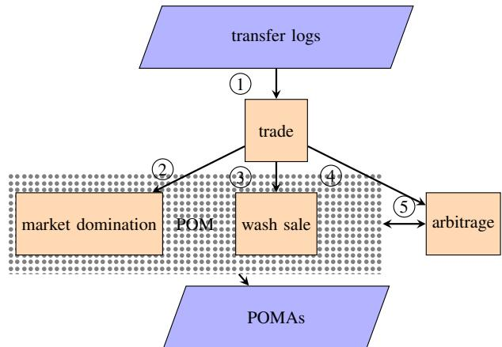
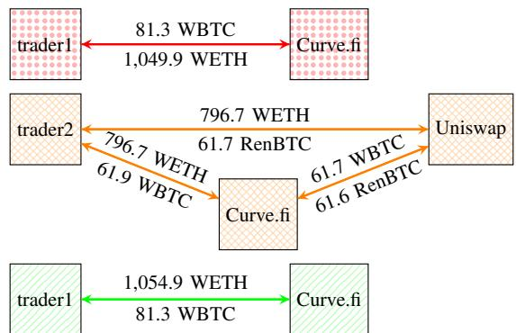
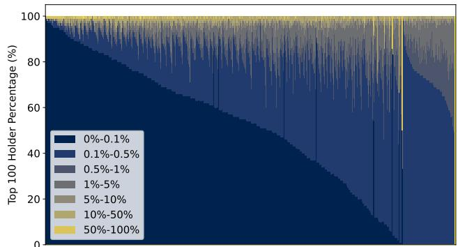
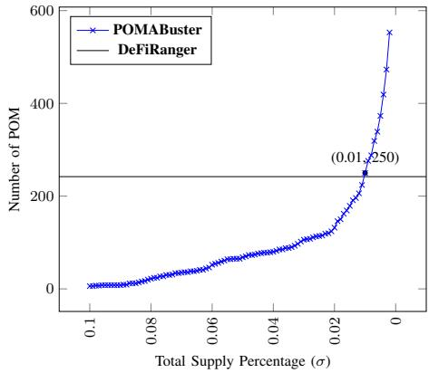
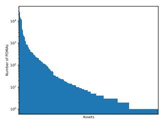
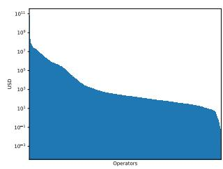
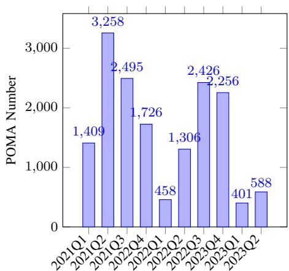

# POMABuster: Detecting Price Oracle Manipulation Attacks in Decentralized Finance

Rui Xi, Zehua Wang, Karthik Pattabiraman

Department of Electrical and Computer Engineering

University of British Columbia (UBC)

Vancouver, Canada

{xirui801, zwang, karthikp}@ece.ubc.ca

Abstract—Price Oracle Manipulation Attacks (POMAs) are increasingly occurring in blockchain systems, and result in significant financial loss. Prior work on detecting POMAs only considers single-transaction attacks, in which the entire attack is contained within a single transaction. We systematically study POMAs in blockchain systems (Ethereum). We find that POMAs that span multiple transactions have become much more frequent than single-transaction POMAs. Thus, there is a compelling need for a framework that can detect POMAs spanning multiple transactions. Moreover, there is a need to come up with generic rules for detecting POMAs rather than rely on past attack patterns like prior work has done.

We first devise first-principle rules for detecting POMAs based on traditional stock market manipulation attacks. We then propose POMABuster, which leverages these rules to detect POMAs spanning both single and multiple transactions. POMABuster leverages common characteristics of POMA attackers’ behavior to optimize its detection. We evaluate POMA-Buster on 2.5 years’ worth of transactions from the blockchain, as well as a dataset compiled from the Code4rena audit reports. Our results demonstrate that POMABuster detects nearly 6.5X more POMAs than prior work. Further, POMABuster has a 1% worst-case false positive rate, and zero false negative rate, both of which significantly outperform prior work.

Index Terms—Ethereum, Decentralized Finance, Price Oracle Manipulation Attack

## 1. Introduction

Decentralized Finance (DeFi) has rapidly grown in recent years, transforming conventional financial systems by offering accessible, transparent, and efficient alternatives. As of April 2023, the DeFi market boasts over 48.73 billion U.S. Dollar (USD) in Total Value Locked (TVL) [1]. Unfortunately, DeFi’s proliferation have led to an increase in protocol layer attacks. Protocol layer attacks refer to attacks that exploit flaws in the DeFi protocol logic [2]. They are different from traditional attacks on smart contracts as they exploit vulnerabilities in DeFi protocols built on top of smart contracts. Therefore, they cannot be detected by techniques that analyze smart contracts for vulnerabilities [2], [3].

Price Oracle Manipulation Attack (POMA) are examples of protocol layer attacks. They constitute about 15% of attacks on blockchain systems [2], and are not addressed well by most existing tools [3]. POMAs involve exploiting external data sources on the blockchain (i.e., oracles) to artificially alter the price information of cryptocurrencies. Malicious actors can manipulate the oracle data, causing smart contracts to reference the incorrect prices when users interact with DeFi applications (e.g., decentralized exchanges).

We focus on detecting POMAs. A typical POMA consists of two steps. The first step is the price manipulation of the oracle, as explained above. The second step is arbitrage trading, which is a method used by traders to profit from price differences in various markets. In the context of DeFi, the attacker would exploit the manipulated prices resulting from the POMA to execute profitable arbitrage trades. For example, Deus Finance lost over 3 million USD due to a POMA [4], in which attackers manipulated the oracle data with a large volume trade (Step 1), resulting in a cascade of liquidations. Attackers then seized the liquidations and took advantage of the price differences for performing arbitrage transactions, thereby earning a profit (Step 2).

In the past, the price manipulation and arbitrage steps in a POMA were typically executed in a single transaction. A transaction includes a series of operations, each of which may interact with different entities, and are executed atomically. However, a mechanism called Flashbots has been introduced since 2021, where users can submit immutable bundles of transactions and broadcast them to participating miners. Flashbots enables the splitting of POMAs over multiple transactions, with one transaction performing the price manipulation and another one performing the arbitrage.

There are three challenges in detecting POMAs. First, the immense scale of DeFi assets and activities, with approximately a million daily transactions over 800,000 cryptocurrencies on the Ethereum blockchain [5], makes identifying suspicious activity difficult. Second, the attacker can use Flashbots to separate the POMA into multiple transactions, making the search space even larger. Finally, a POMA often consists of a series of legitimate operations, which are difficult to distinguish from attack transactions. Learning specific patterns of operations that represent attacks is brittle and error-prone, and does not scale to new types of attacks.

Prior work, DeFiRanger [6] uses existing trading patterns of transactions in Ethereum to detect POMAs. However, it has three limitations. First, DeFiRanger searches through all transactions on the blockchain, and hence incurs significant performance overhead. Further, DeFiRanger assumes that the entire POMA occurs within a single transaction. As we discussed, this assumption is no longer valid with the advent of Flashbots. Therefore, DeFiRanger cannot detect POMAs that are split over multiple transactions. Finally, DeFiRanger’s patterns are learned from existing attacks, and hence it cannot find new POMAs.

We leverage three insights that address the previous challenges to detect POMAs that span multiple transactions. First, it is sufficient to focus on high-value cryptocurrencies. There are 833, 766 cryptocurrencies in Ethereum [5], which exhibit a wide variation in prices [7]. However, attackers typically focus on cryptocurrencies with high prices to maximize their profits [8]. We focus on high-value cryptocurrencies, which significantly decreases our search space.

The second insight is that even when attackers split a POMA into multiple transactions, they keep these transactions close in time for the arbitrage trading opportunity. This is because the price imparity will likely be discovered and arbitraged by another arbitrageur once the attack transaction is made (as all blockchain transactions are public), which would mean the attacker loses the profit opportunity. Thus, it is sufficient to focus on a small time window in our analysis. This make it more manageable for us to analyze and identify suspicious transaction patterns in a timely fashion.

Finally, the attack patterns in the DeFi market can be derived from first-principles, based on suspicious trading operations in traditional stock markets, as defined by the US Securities and Exchange Commission (SEC). We propose first-principle definitions to identify suspicious patterns associated with POMAs, instead of relying on existing attacks.

Using the above three insights, we develop, POMA-Buster, a system that monitors and analyzes transfers of cryptocurrency tokens to identify POMAs. Unlike prior work, POMABuster is not limited to single transaction POMAs, and does not rely on prior attack patterns to detect POMAs. Further, it incurs low performance overheads.

To the best of our knowledge, POMABuster is the first technique to detect a wide range of POMAs that span multiple transactions, without relying on pre-existing attack patterns, and incurring only modest performance overheads.

1) Propose first-principle definitions of POMAs based on the SEC’s identification of suspicious trading patterns in traditional stock markets, which can detect both single and multi-transaction POMAs in a generic way.

2) Identify characteristics of typical POMAs for efficient detection, namely (1) POMA attackers favour valuable tokens as targets (for 98.4% of POMAs) over others (Section 5.2), and (2) POMAs that span multiple transactions typically do so within a small time window, i.e., two blocks, for 98.7% of POMAs (Section 4.3).

3) Leveraging these insights, we develop POMABuster, a POMA detection engine to efficiently identify potential POMAs based on the blockchain’s transactions at runtime. POMABuster requires no prior knowledge of attack patterns, as it is based on first-principle definitions, and can hence detect new types of POMAs (Section 3).

4) Evaluate the efficiency and effectiveness of POMA-Buster by analyzing 2.5 years’ worth of transactions data on the Ethereum blockchain, consisting of over 800 million transfer logs. We also compare POMABuster with DeFiRanger, the only other POMA detector (to the best of our knowledge) on another manually validated dataset consisting of real POMAs. Finally, we analyze the POMAs identified by POMABuster (Section 4).

Our results are as follows. (1) More than 74% of the POMAs are split across multiple transactions, and would not be detected by prior work, necessitating a technique like POMABuster to detect them (Section 4.5). (2) The results also highlight POMABuster’s advantages in achieving a lower False Positive Rate (FPR) (at 1% in the worst case) than DeFiRanger [6] (at 28.5%), and a zero False Negative Rate (FNR) compared to DeFiRanger (at 74%) (Section 4.6). (3) POMABuster took about 68 hours to analyze this dataset, while DeFiRanger took over 85 hours, despite detecting fewer attacks. When only single-transaction POMAs are considered, POMABuster was 10x faster than DeFiRanger (Section 4.5). (4) Our analysis of the set of all POMAs detected by POMABuster reveals that the Price Oracle Manipulation (POM) traders tend to use contract addresses once, while the arbitragers often reuse the same address. This can be used to find POMA attackers’ identities, and ban them from trading in the future. Finally, we find that the amount of POMAs is correlated with the state of the cryptocurrency market at that point in time. (Section 4.7).

## 2. Background

## 2.1. Basic Concepts of Decentralized Finance

Blockchain is a distributed ledger that enables secure and transparent record-keeping without the need for intermediaries such as banks or governments. Blockchain was initially designed for a cryptocurrency, Bitcoin [9], but now supports a wide range of applications beyond cryptocurrencies.

One of the most popular blockchain platforms today is Ethereum [10]. Ethereum differs from Bitcoin in that it supports programmable smart contracts that enable developers to build decentralized applications on top of the blockchain. Smart contracts are self-executing programs that execute automatically when certain conditions are met.

DeFi refers to a new category of financial applications that run on top of blockchain platforms like Ethereum. These applications provide traditional financial services, such as lending, borrowing, and trading, without intermediaries such as banks or brokers. DeFi applications are built as smart contracts and are available to anyone on the Internet.

Cryptocurrency. Cryptocurrency is a type of digital currency that is secured by cryptography and operates independently of a central bank. There are two main categories of cryptocurrencies: native tokens and ERC20 tokens [11]. Native tokens are also referred to as coins, which are standalone cryptocurrencies (e.g., Bitcoin and Ethereum) that have their own independent blockchain networks. ERC20 tokens, on the other hand, are built on top of existing blockchain networks and represent assets or utilities, such as stock. Ethereum is the most popular blockchain network for creating ERC20 tokens. ERC20 tokens are fungible, meaning that one unit of the token is interchangeable with another, and they can be traded on exchanges.

Exchange and liquidity. Cryptocurrency exchanges are digital platforms where users can buy, sell, and trade various cryptocurrencies. These exchanges allow users to exchange one form of token for another, or exchange cryptocurrencies for fiat currency, e.g., USD or EUR. Exchanges are platforms for trading that enable buyers and sellers to connect.

There are two types of exchanges: Centralized Exchange (CEX) and Decentralized Exchange (DEX). CEX is a traditional exchange model in which a centralized authority manages the order book and facilitates trading between buyers and sellers. CEXes often use sophisticated trading tools, e.g., order books, price charts, and order matching algorithms, to allow traders to make informed decisions.

On the other hand, DEX is a type of exchange that operates on a decentralized network. A DEX relies on smart contracts to execute trades automatically, without the need for an intermediary. One of the most popular protocols for DEX is the Auto Market Maker (AMM) model. This model enables users to trade tokens with each other without an order book. Instead of the traditional order book model where buyers and sellers place bids and ask for orders, an AMM uses a mathematical algorithm to price assets using a liquidity pool based on the total demand and supply in the pool, as we explain below with an example.

AMM Example. Assume that the current price of 1 Ether (ETH) is 2,000 USD Coin (USDC), and the liquidity pool currently has 1,000 ETH and 2,000,000 USDC. Therefore, the price of ETH is 2,000 USDC/ETH (2,000,000 USDC / 1000 ETH). Assume a user buys 10 ETH from the pool. Let $\cal { L } _ { U S D C }$ denote the liquidity of USDC. Using the AMM formula, we can determine the price paid by the user.

$$
K = 2, 0 0 0, 0 0 0 \times 1, 0 0 0 = 1, 0 1 0 \times L _ {U S D C},\tag{1}
$$

where K is a constant determined by the liquidity pool, we can calculate $L _ { U S D C } = 2 , 0 2 0 , 2 0 2$ and thus the user pays 20,202 USDC for 10 ETH. Finally, the pool will have 990 ETH and 2,020,202 USDC. Hence, the new price of 1 ETH using the new pool balances, can be calculated as:

$$
P _ {E T H} = \frac {L _ {U S D C}}{L _ {E T H}} = \frac {2 , 0 2 0 , 2 0 2}{9 9 0} = 2 0 4 0. 6.\tag{2}
$$

Thus, the new price of ETH is 2040.6 USDC/ETH. Similarly, if a user sells 10 ETH to the pool for USDC, the price would adjust in the opposite direction.

Arbitrage. Arbitrage is an investment strategy where investors purchase and sell the same security in different markets for advantageously different prices [12]. An arbitrage opportunity represents a disparity between prices in the markets. However, the disparity does not last a long time because arbitrageurs will typically drive prices together [13]. For example, if the ETH price 2,000 USDC in Uniswap [14] and 2,040.6 USDC in Aave [15], an arbitrageur can make a profit by buying in Uniswap and selling it in Aave.

## 2.2. Flashbots, Price Oracles and Manipulation

Flashbots serves as a relay to Ethereum, allowing features such as transaction prioritization and transactions bundling. We focus on the latter use of Flashbots in this paper. We elaborate on Flashbots in Appendix A.

Price Oracle. Oracles are data feeds that bring data sources from outside of the blockchain (off-chain data) and serve them on the blockchain (on-chain) for other smart contracts [16], [17]. A price oracle is a specialized oracle that provides the price feed of a given cryptocurrency. The price of a cryptocurrency can be represented as a trading pair of two currencies. Recall that the AMM algorithm calculates the price based on the supply and demand of that token pair. Price oracles provided by DEX are called on-chain oracles, e.g., Uniswap. The price provided by a price oracle is then used as a reference price for other DeFi applications.

Price Oracle Manipulation Attacks. By buying or selling a cryptocurrency in a large volume, the attacker can tilt the balance of a trading pair in a DEX. If the victim smart contract is using the tilted DEX as its price oracle, there will be a huge opportunity for arbitrage.

In general, a POMA consists of two separate steps.

1. Price Oracle Manipulation (POM). The attacker aims to manipulate the price of the cryptocurrency in the DEX that the victim smart contract uses as its price oracle. To do so, the attacker trades a large volume of the cryptocurrency within the DEX, which influences its price in the liquidity pool. By increasing (decreasing) the supply of the cryptocurrency in the pool, the attacker decreases (increases) the price of the cryptocurrency in the DEX, creating a disparity between the actual and manipulated prices.

2. Arbitrage. The attacker then realizes the profit by taking the arbitrage opportunity created by POM, i.e., taking advantage of the disparity in prices between the actual and manipulated price. Since the victim smart contract relies on the manipulated price provided by the DEX, the attacker can use this to their advantage and obtain the cryptocurrency at the lower, manipulated price. The attacker can then sell the cryptocurrency at the actual market price, and profit from the price difference. Note that arbitrage is common in many markets and does not cause any damage in and of itself.

The attacker faces two issues in mounting a POMA, $i . e .$ , profit and stealthiness. Both POM and arbitrage are necessary for a profitable POMA. Therefore, to secure their profit from carrying out the attack, attackers can carry out two steps in a single transaction, by taking advantage of smart contracts. However, this can be detected by current approaches such as DeFiRanger [6]. To evade detection, attackers can instead use Flashbots, and split the attack into multiple transactions, package the transactions into a transaction bundle, and submit them via different addresses to the blockchain. Time-Windowed Average Price (TWAP) claimed to provide solution to POM by averaging the price changes over a few blocks, however, with the capability of bundling a series of transaction, manipulating a TWAP oracle is as easy as manipulating a regular oracle [18].

## 3. POMABuster Methodology

We first explain the challenges in identifying POMAs. We then apply the U.S. Securities and Exchange Commission (SEC)’s strategies for detecting market manipulation to POMAs. We also discuss how POMABuster addresses the challenges, and explain the workflow of POMABuster. Finally, provide an example of POMABuster’s operation, and present its algorithms.

## 3.1. Challenges in POMA Identification

1. DeFi operations are high volume and difficult to reconstruct from transactions. DeFi operations rely on interactions among various DeFi applications (i.e., smart contracts). Due to the hard limit in the smart contract size in Ethereum, an application usually includes tens of smart contracts. Furthermore, a DeFi operation often involves more than one application to maximize the revenue of the operator, which exacerbates its complexity. For example, a typical transaction [19] involves 17 contracts and 165 function calls. Reconstructing the call graph of this transaction takes 2.85 seconds by Tenderly [20], a popular commercial tool to analyze transactions. In Ethereum, about one million transactions are issued every day. Thus, brute-force searching POMA transactions is not scalable as it takes more than a month $( 2 . 8 5 \mathrm { s } \times 1 \mathrm { M } )$ to reconstruct call graphs of just a day’s worth of transactions. Constructing the call-graph is necessary but not sufficient for analyzing the transaction.

2. POM and arbitrage can be separated. As mentioned, the POM and the arbitrage operations can be separated into multiple transactions, thus making POMAs harder to be detected. Even though the attacker risks the profit being captured by a third party during the time between the POM and the arbitrage, they can use other techniques to reduce the likelihood of this happening. As mentioned in Section 2, Flashbots allows a series of transactions to be executed together in a bundle, thus minimizing the risk.

3. Lack of criteria to distinguish POMAs from other operations. As mentioned in Section 2, POMA usually consists of a series of legitimate DeFi operations $( e . g .$ , exchanging, providing liquidity, and transferring). The sequence and nature of operations are flexible, making them challenging to detect, $e . g .$ , liquidity minting and liquidity cancellation can be replaced by a loop of trades [6]. Moreover, new DeFi operations are being constantly introduced, for example, Futures [21] and Options [22]. Therefore, defining POMA criteria based on specific patterns will make them outdated when new operators are introduced in the future.

Example. In 2022, there was a successful POMA involving three transactions [23]–[25]. All three transactions were mined and executed in the same block. The attack involved two DEXes, which provide liquidity pools of Wrapped Ether (WETH)-WBTC, and one derivative platform, which uses the second DEX as its price oracle.

The attacker initiated the attack by purchasing a large amount of WBTC (at 81.39, equivalent to 1.9 million USD at the time of the attack) using the first account and routing the transaction through Curve.fi [23]. As a result of the first transaction, the price of WBTC became inflated. Subsequently, the attacker used another account, in the second transaction to sell 61.7 RenBTC with 796.7 WETH [24]. Finally, the attacker sold the WBTC to cancel the disparity in prices created in the first transaction [25]. As a result, the attacker earned a profit of 5.03 WETH from the POMA.

When we ran DeFiRanger [6] on the above transactions, it failed to detect this POMA. Instead, it classified the first and the third transactions as legitimate exchanges, and the second transaction as an arbitrage, due to the separation of the arbitrage transaction from the POM transaction, as well as the lack of criteria to distinguish POMAs. However, POMABuster detects this attack - we explain in Section 3.5.

## 3.2. Adopting SEC’s Definition and Strategies

Effective detection of POMA relies on accurate POMA definitions. Because the DeFi market shares many similarities with the stock market, we leverage the SEC’s policies for identifying stock market manipulation. SEC’s policy lists six methods of market manipulation, i.e., arbitrary quotes, wash sales, marking the close, market domination, layering, and misinformation. However, not all methods can be applied in the DeFi market to carry out POMAs. We therefore investigate whether POMA attackers can adopt these methods. We identify two methods that are applicable to POMA attackers (all six methods are summarized in Appendix B). The two methods that are applicable are Wash Sales and Market Domination. We summarize them below.

Wash Sales. A wash sale is the act of repeatably placing buy and sell orders of the same asset. A wash sale usually involves no change of beneficial ownership of the asset. In both the stock and DeFi markets, the trading volume is one of the critical measures of the popularity of an asset. By performing wash sales, the trading volume will soar, and thus more investors will be attracted to the trade. Eventually, the price is pumped up. In the DeFi market, a wash sale is not limited to buy and sell orders; instead, it can be adding and cancelling liquidity, borrowing, lending, and auctioning. Therefore, we adapt this definition to the DeFi market.

Market Domination. When a trader controls a significant amount of an asset, they can control its market. Once they establish control, the traders can arbitrarily move the spot price upwards without reference to the market forces of supply and demand. Domination can be established in the DeFi market much easier than in the stock market due to the decentralized and fragmented nature of the DeFi market. DEXes provide a price feed based on their spot price (Section 2). In a blockchain system, anyone can open their own exchange, and so the market is sliced, resulting in multiple small markets. These are easier to dominate.

For example, the USDC-WETH market in Uniswap [26], the largest DEX in Ethereum, has only 820,000 USDC (819,754 USD) and 760 WETH (1,450,060 USD) in the liquidity pool. In this case, exchanging 41 WETH (78,226 USD) to USDC decreases the USDC price by 10%. Therefore, we include market domination for the DeFi market.

## 3.3. How POMABuster Addresses Challenges

As mentioned in Section 3.1, the high-volume of DeFi operations (challenge 1) and the separated POMA steps due to Flashbots (challenge 2) increase the runtime overhead of POMABuster. Further, the lack of clear criteria can lead to ineffective POMA detection (challenge 3). In this section, we outline how POMABuster addresses the challenges.

POMABuster addresses challenge 1 by narrowing the large volume of transactions down to transactions that only interact with valuable cryptocurrencies. In Ethereum, there are a million daily transactions interacting with 833, 766 cryptocurrencies in Ethereum [5]. However, most cryptocurrencies have very low values, and are hence unlikely to fall prey to POMA attacks. Hence, we exclude transactions that do not interact with valuable cryptocurrencies. We use a threshold to determine whether a cryptocurrency is valuable.

For challenge 2, namely finding separated POMAs, POMABuster links POM transactions and arbitrage transactions after detection (see workflow in Section 3.4). However, the linking process necessitates searching over an extensive set of transaction pairs. This has a complexity of $O ( n ^ { 2 } )$ , which can be prohibitive for large values of n. If we apply POMABuster to all transactions on the blockchain, the value of n is very large (on the order of millions). However, we find that (Section 4.3) searching for the transactions in a limited time span is sufficient to link the POMA transactions in almost all cases. Therefore, by restricting the value of n, this overhead can be kept low.

To address challenge 3 (ineffective POMA detection), we derived a set of detection rules for POMAs based on the SEC’s detection rules for wash sales and market domination, adapted to the DeFi ecosystem. Section 3.4 discusses these rules. We use the global total supply parameter σ to detect POM transactions (Section 3.2). Total supply is an attribute defined in the smart contract of cryptocurrencies - it represents how many tokens are minted. We determine the empirical value of the above parameters based on our datasets in Section 4.3 and in Section 4.8.

## 3.4. POMABuster Workflow

To deal with the challenge that POMAs can be executed in different transactions by different accounts, POMA-Buster also separates the detection logic into two parts, corresponding to POM transactions and arbitrage transactions respectively. The flagged POMs and arbitrages are grouped together later. Figure 1 shows POMABuster’s workflow.

In the previous sections, we interchangeably use $\cdots { \mathrm { e x - } }$ change”, “trade”, “buy” and “sell” to represent the DeFi operations that trade one token for another. In this section, we formalize the attributes of trade in the DeFi ecosystem, and describe how to use attributes in trade to detect POMAs.

  
Figure 1: The workflow of POMABuster.

1 Defining trade. POMABuster starts with the transfer log of cryptocurrencies in a blockchain system (explained in Section 4). Let $\mathcal { U } \triangleq \{ 0 , 1 , \dotsc , \bar { U } - 1 \}$ denote the set of users in the blockchain system. Let $\kappa \triangleq$ $\{ 0 , 1 , \ldots , K - 1 \}$ denote the cyptocurrenties $( i . e . ,$ tokens) in the blockchain system. Let $\overset { \vartriangle } { \mathcal { A } } \triangleq \{ 0 , 1 , \ldots , A - 1 \}$ denote the set of addresses in the blockchain system. We further define $\mathsf { a d d } \mathsf { x } ( \cdot )$ as the function that returns the address of either a user or a smart contract. The set of transfer logs can be defined as the Cartesian product $\mathcal { L } \triangleq \mathcal { A } ^ { 3 } \times \mathbb { N } .$ , where N denotes the set of natural numbers.1 For each transfer log in ${ \mathcal { L } } ,$ it is a 4-tuple vector consisting of the sender’s address, receiver’s address, address of the token involved, and the amount of token that has been transferred.

The transfer log is the basic data structure compatible with token standards in major blockchain systems, including the ERC20. Specifically, any ERC20- compatible token transfer emits a transfer log automatically. For example, consider users $u _ { 1 } , u _ { 2 } \ \in \mathcal { U } , \ u _ { 1 }$ transfers 2,000 USDC to $u _ { 2 }$ . We have transfer log $\begin{array} { r l } { l } & { { } = } \end{array}$ (addr(u1), addr(u2), addr(USDC), 2, 000). Denote $s \triangleq$ $\mathcal { L } \mapsto \mathcal { U } , r \triangleq \mathcal { L } \mapsto \mathcal { U } , k \triangleq \mathcal { L } \mapsto \mathcal { K }$ and m $\triangleq { \mathcal { L } } \mapsto \mathbb { N }$ as the functions to determine the sender, receiver, token involved, and the amount of token been transferred for each transfer log, respectively. We have $s ( l ) = u _ { 1 } , r ( l ) = u _ { 2 }$ $k ( l ) = \mathrm { U S D C }$ and $m ( l ) = 2 , 0 0 0$

The trade is a higher level DeFi operation than the transfer log. Instead of a one-directional transfer, a trade consists of two transfer logs, $i . e .$ , sending the token to the DEX, and receiving another token from the DEX in exchange. Let $\tau$ denote the set of trades, which is defined as $\mathcal { T } \triangleq \mathcal { H } \times \mathcal { A } ^ { 4 } \times \mathbb { N } ^ { 2 } \times \mathcal { A } .$ where $\mathcal { H } \triangleq \{ 0 , 1 , \dots , H - 1 \}$ denotes the set of hash values. For each trade in set $\tau _ { \ast }$ it is an 8-tuple vector consisting of the transaction hash, operator address, recipient address, addresses of the tokens that the trade issuer transfers in and the recipient receives, the numbers of tokens that the trade issuer transfers in and the recipient receives, and the address of the liquidity pool.

1. For simplicity, we omit the storage capacity limit in the smart contract.

A trade represents the operator’s interaction with the pool. For example, consider user $u _ { 1 } \in \ U _ { }$ . User $u _ { 1 }$ trades 10 WETH for USDC in Uniswap’s liquidity pool WETH-USDC at price 2040.6 USDC per WETH. The trade $t \in \tau$ is given as

$$
\begin{array}{c} t = (\text {HASH} _ {t}, \text {addr} (u _ {1}), \text {addr} (u _ {1}), \text {addr} (\text {WETH}), \\ \text {addr} (\text {USDC}), 1 0, 2 0 4 0 6, \text {addr} (\text {WETH - USDC})). \end{array}
$$

Denote $h \ \triangleq \ { \mathcal { T } } \ \mapsto \ { \mathcal { H } } , \ o \ \triangleq \ { \mathcal { T } } \ \mapsto \ { \mathcal { U } } , \ e \ \triangleq \ { \mathcal { T } } \ \mapsto \ { \mathcal { U } } ,$ $a _ { \mathrm { i n } } \triangleq \mathcal T \mapsto \mathcal K , \ : a _ { \mathrm { o u t } } \triangleq \mathcal T \mapsto \mathcal K , \ : m _ { \mathrm { i n } } \triangleq \mathcal T \mapsto \mathbb N , \ : m _ { \mathrm { o u t } } \triangleq$ $\tau \mapsto \mathbb { N } ,$ , and $p \triangleq \tau \mapsto \mathcal { P }$ , where $\mathcal { P } \triangleq \{ 0 , 1 , \hdots , P - 1 \}$ denotes all the liquidity pools in the system, as the functions return the hash value, operator, recipient, the token that the operator transfers in, the token that the recipient receives, the number of tokens that the operator transfers in, the number of tokens that the recipient receives, and the liquidity pool that the trade interacts with, respectively. We have $h ( t ) =$ $\mathrm { H A S H } _ { t } , ~ o ( t ) ~ { = } ~ u _ { 1 } , ~ e ( t ) ~ { = } ~ \tilde { u _ { 1 } } , ~ a _ { \mathrm { i n } } ( t ) ~ \overline { { { = } ~ \mathsf { a d d r } ( \mathrm { W E T H } ) } }$ $a _ { \mathrm { o u t } } ( t ) = \mathsf { a d d r } ( \mathrm { U S D C } ) , m _ { \mathrm { i n } } ( t ) = 1 0 , m _ { \mathrm { o u t } } ( t ) = 2 0 4 0 6 ,$ and $p ( t ) = \mathsf { a d d r } ( \mathrm { W E T H \mathrm { \mathrm { - } U S D C } } )$ . Note that the operator and the recipient are the same (which is $u _ { 1 } )$ because the user sets itself as the recipient of the trade. The recipient can be different if the operator so chooses, however.

A trade can be extracted from transfers, as illustrated in 1 in Fig. 1. User $u _ { 1 } \mathrm { ^ { \prime } s }$ trade contains two transfer logs as follows. The first one is

$$
\begin{array}{l} l _ {u _ {1} \to \text {WETH - USDC}} \\ = (\mathbf {a d d r} (u _ {1}), \mathbf {a d d r} (\text {WETH - USDC}), \mathbf {a d d r} (\text {WETH}), 1 0), \end{array}
$$

which transfers WETH to the liquidity pool at the address addr(WETH-USDC). The second one is

$$
\begin{array}{l}l _ {\mathrm{WETH-USDC} \rightarrow u _ {1}}\\= (\mathbf {a d d r} (\mathrm{WETH-USDC}), \mathbf {a d d r} (u _ {1}), \mathbf {a d d r} (\mathrm{USDC}), 2 0 4 0 6).\end{array}
$$

which transfers USDC from the liquidity pool at the address addr(WETH-USDC) to $u _ { 1 } . ^ { 2 }$ We define a trade $t \in \tau$ consisting of two transfer logs $l _ { 1 } , l _ { 2 } \in \mathcal { L }$ , denoted by $t \sim ( l _ { 1 } , l _ { 2 } )$ , as follows:

Definition 1. For a trade $t \sim ( l _ { 1 } , l _ { 2 } ) , \forall t \in \mathcal { T } , \forall ( l _ { 1 } , l _ { 2 } ) \in$ $\textstyle { \mathcal { L } } ^ { 2 } , \ i f$ and only if addr $\begin{array} { l c l } { \widehat { \mathbf { \xi } } ( r ( \widehat { l _ { 1 } } ) ) } & { = } & { a d d \mathbf { \xi } ( s ( \widehat { l _ { 2 } } ) ) } \end{array}$ and $a d d r ( k ( l _ { 1 } ) ) \neq a d d \pmb { c } ( k ( l _ { 2 } ) )$ ).

The algorithm for reconstructing trades from transfer logs is shown in Section 3.6. The algorithm iterates over all combinations of two log entries in the transaction, and checks if they are from and to the same liquidity pool and transfer different tokens. If so, the entries constitute a trade.

2 Defining market domination. Recall that market domination requires attackers to trade a large number of tokens to control the market. The optimal solution is to compare this amount with the liquidity of the market $( { \mathrm { S e c } } -$ tion 3.1). If the amount takes a significant portion of liquidity, the trade is a POM, which is shown in $\textcircled{2}$ in Fig.1. We define a market domination trade $t ^ { D O M }$ as follows:

Definition 2. A trade $\begin{array} { r l r l r l } { t } & { { } } & { \in } & { { } } & { { \mathcal { T } } } & { { } i s } & { { } a } \end{array}$ market domination trade if and $o n l y i f = m l y . r n _ { i n } ( t ) \hspace \qquad \ge$ $\sigma _ { t } \qquad \times \qquad b a l a n c e ( a d d { \bf r } ( k _ { i n } ( t ) ) , a d d { \bf r } ( p ( t ) ) ) \qquad o r$ $m _ { o u t } ( t ) \geq \sigma _ { t } \times b a l a n c e ( a d d r ( k _ { o u t } ( t ) ) , a d d r ( p ( t ) ) )$

in which balance $( a _ { 1 } , a _ { 2 } ) , \forall ( a _ { 1 } , a _ { 2 } ) \in \mathcal { A } ^ { 2 }$ evaluates the balance of $a _ { 2 }$ for the token with contract address at $a _ { 1 }$ and $\sigma _ { t }$ is a system parameter w.r.t. trade t that represents a percentage threshold may unbalance the pool when exceeded.

However, getting the value of pool balance requires reading historical Ethereum data, and hence requires a local archive node, which takes up to 12TB storage space [27]. Moreover, measuring liquidity also requires continuously querying the liquidity pools, whose interfaces vary from each other, and is cumbersome to measure. In contrast, the total supply of a token can be retrieved via the uniform interface due to the ERC20 token standard specification [11].

Therefore, we employ the percentage of the total supply of the token, denoted sup(a) as the function that returns the total supply of token with contract address at $a , \forall a \in \mathcal { A } . \mathbb { W } \mathrm { e }$ use the total supplies of the tokens $k _ { \mathrm { i n } } ( t )$ and $k _ { \mathrm { o u t } } ( t )$ as the proxies for the values of balance $\mathbf { \dot { \mathbf { \rho } } } ( \mathbf { a d d } \mathbf { r } ( k _ { \mathrm { i n } } ( t ) ) , \mathbf { a d d } \mathbf { r } ( p ( t ) ) )$ and $\mathtt { b a l a n c e ( a d d r ( } k _ { \mathrm { o u t } } ( t ) ) , \mathsf { a d d r ( } p ( t ) ) )$ w.r.t. trade t. The total supply is an attribute that is defined in the ERC20 [11] token standard, which all ERC20 tokens in Ethereum have implemented, which indicates the total amount of supply. Thus, we relax Definition 2 as follows.

Definition 3. A trade $t \in \tau$ is a market domination trade if and only $i f \ m _ { i n } ( t ) \ \geq \ \sigma _ { k _ { i n } ( t ) } \times s u p ( a d d r ( k _ { i n } ( t ) ) )$ or $m _ { o u t } ( t ) \geq \sigma _ { k _ { o u t } ( t ) } \times s u p ( a d d r ( k _ { o u t } ( t ) ) )$

in which $\sigma _ { k _ { \mathrm { i n } } ( t ) }$ and $\sigma _ { k _ { \mathrm { o u t } } ( t ) }$ are system parameters determined for each of the two tokens been involved.

3 Detecting wash sales. Recall that a wash sale creates fake trading volume by repeatedly buying and selling the same asset, $e . g .$ ., exchanging two tokens back and forth, adding liquidity then canceling it, and bidding Non-Fungible Token (NFT) using the same account as the seller. We derive the definition of wash sale trade $\scriptstyle { \mathcal { T } } ^ { W A S H }$ , which consists of a set of single trades as follows:

Definition 4. A trade $t \in \mathcal { T }$ is a part of wash sale trade $\mathcal { T } _ { i } ^ { W A S H } ( i = 1 , 2 , . . . )$ if and only if

$$
\sum_ {t \in \mathcal {T} _ {i} ^ {W A S H}} m _ {i n} (t) \geq \tilde {\sigma} _ {i} \times \textbf {b a l a n c e} (\textbf {a d d r} (k _ {i n} (t)), \textbf {a d d r} (p (t)))\tag{3}
$$

or

$$
\sum_ {t \in \mathcal {T} _ {i} ^ {W A S H}} m _ {o u t} (t) \geq \tilde {\sigma} _ {i} \times \textbf {b a l a n c e} (\textbf {a d d r} (k _ {o u t} (t)), \textbf {a d d r} (p (t))).\tag{4}
$$

in which ${ \tilde { \sigma } } _ { i }$ is a system parameter with respect to the wash sale $\mathcal { T } _ { i } ^ { W A S H }$ that represents a percentage threshold which may unbalance the pool when exceeded.

Our observation in market domination also applies to wash sales: the trades indicate the washed token is being transferred from the attacker’s address to another address, then back to the attacker’s address or a third address. Because the attacker can hide behind multiple addresses, we do not limit the final recipient to the attacker’s address.

As before, we use the percentage of total supply of the washed tokens to distinguish wash sales from regular trades:

Definition 5. A trade $t \in \tau$ is a part of wash sale trade $\mathcal { T } _ { i } ^ { \mathtt { W A S H } } \left( i \in \mathbb { N } \right)$ if and only if

$$
\sum_ {t \in \mathcal {T} _ {i} ^ {\text {WASH}}} m _ {i n} (t) \geq \tilde {\sigma} _ {k _ {i n} (t)} \times \sup (\boldsymbol {a d d r} (k _ {i n} (t))),\tag{5}
$$

or

$$
\sum_ {t \in \mathcal {T} _ {i} ^ {\text {WASH}}} m _ {\text {out}} (t) \geq \tilde {\sigma} _ {k _ {\text {out}} (t)} \times \mathbf {s u p} (\mathbf {a d d r} (k _ {\text {out}} (t))).\tag{6}
$$

in which $\tilde { \sigma } _ { k _ { \mathrm { i n } } ( t ) }$ and $\tilde { \sigma } _ { k _ { \mathrm { o u t } } ( t ) }$ are system parameters determined for each of the two tokens been involved.

4 Detecting arbitrage. Arbitraging has two features in the DeFi context. The arbitrager explores the price disparity of a token among DEXes and takes advantage of buying at a lower price and selling at the higher price. The “transfer loop” in the buy-sell operations is the first feature of an arbitrage [6]. Moreover, a successful arbitrage must generate revenue for the arbitrager. Hence, a profit in the transaction is the second feature of an arbitrage. We define an arbitrage trade $\mathcal { T } ^ { A R B }$ as follows:

Definition 6. An arbitrage trade $\mathcal { T } _ { i } ^ { A R B } ~ ( i \in \mathbb { N } )$ is defined as a vector of trades $\pmb { t } _ { i } \triangleq ( t _ { i , 0 } , t _ { i , 1 } , \dots , t _ { i , N _ { i } - 1 } )$ if and only $i f$

$$
k _ {o u t} (t _ {i, j - 1}) = k _ {i n} (t _ {i, j}), \forall   j \in \{1, \dots , N - 1 \},\tag{7}
$$

and

$$
\begin{array}{l} \sum_ {j = 0} ^ {N - 1} a _ {i n} (t _ {i, j}) b (k _ {i n} (t _ {i, j}), k) \\ \qquad - \sum_ {j = 0} ^ {N - 1} a _ {o u t} (t _ {i, j}) b (k _ {o u t} (t _ {i, j}), k) \geq 0, \forall k \in \mathcal {K}, \end{array}\tag{8}
$$

and

$$
\begin{array}{c} \sum_ {k \in \mathcal {K}} \bigg (\sum_ {j = 0} ^ {N - 1} a _ {i n} (t _ {i, j}) b (k _ {i n} (t _ {i, j}), k) \\ \qquad \qquad \qquad \qquad - \sum_ {j = 0} ^ {N - 1} a _ {o u t} (t _ {i, j}) b (k _ {o u t} (t _ {i, j}), k) \bigg) > 0. \end{array}\tag{9}
$$

in which $b ( k _ { 1 } , k _ { 2 } ) = 1$ if $k _ { 1 } ~ = ~ k _ { 2 }$ and $b ( k _ { 1 } , k _ { 2 } ) = 0$ if $k _ { 1 } \neq k _ { 2 } , \forall ( k _ { 1 } , k _ { 2 } ) \in K ^ { 2 }$

Note that in this case, we do not require the operator and recipient addresses addr $\left( o ( t _ { i , j } ) \right)$ and $\mathtt { a d d r } ( e ( t _ { i , j } ) )$ in arbitrage $\mathcal { T } _ { i } ^ { A R B }$ to be the same address $( \forall j \in \{ 0 , \ldots , N _ { i } -$ 1}), because multiple addresses may be controlled by the arbitrager. Also, we require a non-negative amount outcome for each token involved in the arbitrage trade $\mathcal { T } ^ { A R B } \left( \mathrm { E q . ~ 8 } \right)$ and a positive outcome for the sum of all tokens (Eq. 9).

5 Linking POM and arbitrage transactions. In Section 2, we saw that a successful POMA not only includes the POM transaction itself but also the following arbitrage transaction that redeems the profit from the victim. Thus, POMs and arbitrages should be linked together to form a complete attack. The connection between POM and arbitrages is the token - the manipulated token in POM must be traded in the arbitrages so the attackers can profit from a price disparity. However, the profit yielded from arbitrages must be different from the manipulated token, because market forces will eventually push the manipulated token’s price to its actual price, thereby negating any resulting profit for the attacker.

Definition 7. A successful attack occurs when a price oracle manipulation trade $\begin{array} { r } { \mathcal { T } ^ { P \overset { . } { O } M } \in \bigcup _ { x \in \mathbb { N } } \mathcal { T } _ { x } ^ { D O M } \cup \bigcup _ { y \in \mathbb { N } } \mathcal { T } _ { y } ^ { W A S H } } \end{array}$ and an arbitrage trade $\mathcal { T } _ { z } ^ { A R B } ( z \in \mathbb { N } )$ happen chronologically and the price manipulated tokens

$$
\mathcal {K} ^ {M A N I} \triangleq \{k _ {i n} (t), \forall t \in \mathcal {T} ^ {P O M} \} \cup \{k _ {o u t} (t), \forall t \in \mathcal {T} ^ {P O M} \}\tag{10}
$$

and intermediate tokens

$$
\begin{array}{c} \{k _ {i n} (t), \forall t \in \mathcal {T} ^ {A R B} \} \cup \{k _ {o u t} (t), \\ \quad \forall t \in \mathcal {T} ^ {A R B} a n d t \neq t _ {z, N _ {z} - 1} \}, \end{array}\tag{11}
$$

with a non-empty intersection, i.e., ${ \cal K } ^ { M A N I } \cap { \cal K } ^ { I N T R } \neq \emptyset .$

## 3.5. Example

Recall the real-world POMA example we presented in Section 3.1. In this section, we illustrate how POMABuster processes the transactions and detects the attack in Fig. 2.

  
Figure 2: Example of a separate-transaction POMA attack and how POMABuster detects it. Market domination is shown in red (dot), arbitrage transaction is shown in orange (crosshatch), and benign transaction in green (stripe).

There are three transactions in the attack. The first transaction (red boxes) includes only one trade, which exchanges

81.3 WBTC for 1049.9 WETH. Assume we set 2% as the threshold σ in deciding market domination. We see that the trading WBTC amount has exceeded the threshold (2,596 \* $2 \% = 5 1 . 9 2 )$ in the market domination rule (red arrow), and thus the transaction is flagged as a potential POM.

The second transaction contains 10 trades, from WETH to WBTC to RenBTC. For simplicity, we merge the trades with the same pair of trading tokens (orange boxes). Meanwhile, the second transaction yielded a positive income for WBTC and zero changes to both WETH and RenBTC. Therefore, POMABuster classifies the second transaction as an arbitrage transaction (shown in orange arrows). After locating the POM transaction and the arbitrage transaction, POMABuster inspects the relation between them. The POM transaction manipulated the price of WBTC, and the arbitrage transaction exploited the price to buy RenBTC using WBTC as an intermediate. Thus, the first and second transactions are both flagged as an attack by POMABuster.

The third transaction (green boxes) is also marked as a POM by POMABuster; however, since there is no subsequent arbitrage, POMABuster does not include the third transaction in the attack, and instead marks it as benign.

## 3.6. Algorithms

We present the algorithm to reconstruct trades and to detect POM in Algorithm 1 and Algorithm 2, respectively. Algorithm 1 reconstructs trades from the transfer logs. It takes all transfer logs of a transactions as input, and then examines each pair of transfer logs if they can form a trade according to Definition 1. Finally, the algorithm returns all trades extracted from the transfer logs. Note that we preserve the pool attribute p(t) of a trade t, however, this attribute can not only refer to the pool address in AMM DEX, but also to the counterparty (i.e., the user who filled the order) address in order book DEX.

Algorithm 2 detects POM using the first principle rules defined in Definition 2 and Definition 4. It takes all trades constructed by Algorithm 1 as input, then detects if the trade contain market domination and wash sales behaviors. If so, the trade will be marked as a POM. The total supply percentage σ is a configurable parameter.

## 4. Evaluation

We first describe our experimental setup and datasets, and then how we optimize POMABuster by choosing the appropriate parameters. Finally, we present the research questions (RQ), and the results obtained for each RQ, followed by an ablation study of the different parameters.

## 4.1. Experimental Setup

Hardware and Software: We run all experiments on an AMD R7-2700X at 3.7GHz with 32 GB of RAM and 22 TB of hard drive running Unraid 6.12. The Ethereum transaction data we used in the experiment are downloaded from Google

Algorithm 1 Reconstructing trade
function TOTRADE(logs)
    trades ← list of trade
    for two logs ($l_1, l_2$) in $\mathcal{L}^2$ do
        if $r(l_1) = s(l_2)$ and $k(l_1) \neq k(l_1)$ then
            $t$ ← new trade
            $o(t) = s(l_1)$ $e(t) = r(l_2)$ $a_{\text{in}}(t) = k(l_1)$ $a_{\text{out}}(t) = k(l_2)$ $m_{\text{in}}(t) = m(l_1)$ $m_{\text{out}}(t) = m(l_2)$ $p(t) = r(l_1)$
            trades ← $t$
        end if
    end for
    return trades
end function

Algorithm 2 Detecting POM
function ISMARKETDOMINATION($\mathcal{T}$, $\sigma$)
    for trade $t$ in $\mathcal{T}$ do
        if $m_{\text{in}}(t) \geq \sigma \times \sup(\text{addr}(k_{\text{in}}(t)))$
        or $m_{\text{out}}(t) \geq \sigma \times \sup(\text{addr}(k_{\text{out}}(t)))$ then
            return True
        end if
    end for
    return False
end function
function ISWASHSALE($\mathcal{T}$, $\sigma$)
    amounts $\leftarrow$ mappings(tokens$\Leftarrow$ total trading amount)
    for trade $t$ in $\mathcal{T}$ do
        amounts[$k_{\text{in}}(t)$] += $m_{\text{in}}(t)$
        amounts[$k_{\text{out}}(t)$] += $m_{\text{out}}(t)$
    end for
    if amounts[$k_{\text{in}}(t)$] ≥ $\sigma \times \sup(\text{addr}(k_{\text{in}}(t)))$
        or amounts[$k_{\text{out}}(t)$] ≥ $\sigma \times \sup(\text{addr}(k_{\text{out}}(t)))$ then
            return True
        end if
    return False
end function

BigQuery’s public data on token transfer logs. The POMA contracts are collected from the GitHub repository of Zhang et al. [28] at commit 3a557a7 [29]. We also deploy a private Ethereum blockchain node for verifying the POMA transactions, called the archive node. This node uses Erigon v2.45.0. POMABuster is written in Python 3.11.0. 1

Comparison: We compared POMABuster with De-FiRanger, as it was the only prior work that detected POMA transactions [6]. However, we had to implement DeFiRanger ourselves, as the authors of DeFiRanger provided neither their source code nor the dataset, despite our requests. We denote this as DeFiRanger(o). We followed the specifications of DeFiRanger in their paper [6], and tuned the parameters of our technique to match their results for single-transaction POMAs on our datasets (Section 4.3).

## 4.2. Datasets

We use two datasets in our work for different purposes.

1. POMABuster’s source code and its datasets are available at: https: //github.com/DependableSystemsLab/POMABuster.

1. Transaction Dataset. For this dataset, we gathered the transfer logs in Ethereum spanning a two-and-a-halfyear period between Jan. 1, 2021, and May. 31, 2023. It contains a total of 887,911,178 logs. We chose this time period because we observed that the frequency of separatetransactions POMA started to increase in early 2021, likely because Flashbots were introduced in December 2020. Other recent work [30], [31] uses the same time period.

To make the analysis process computationally tractable, we decided to focus only on the most valuable tokens, as we describe in Section 3.3. To accomplish this, we first determined the circulating market capacity of each token by multiplying the total circulating amount of the token by its unit price. The Etherscan platform provides a real-time token tracker [7], which monitors the market capacity of all tokens being traded on Ethereum. Using this tool, we crawled the tokens listed on Etherscan, and filtered out those with a market capacity less than 1,000,000 USD (at the time of the data extraction), narrowing it down to a list of 758 tokens. Consequently, we obtained a total of 434,387,877 transfer logsfrom the transaction dataset. We use this dataset in part to tune the other two empirical parameters of POMABuster in Section 4.3, and to evaluate the coverage and performance of POMABuster and DeFiRanger(o) (Section 4.5).

2. Code4rena POMA Dataset. The Code4rena POMA dataset serves as a ground truth for POMA attack transactions. This dataset is derived from audit reports submitted to Code4rena [32], an open audit platform enabling auditors to examine DeFi applications and compete for bounties offered by stakeholders. We collected nine contests that were labeled as POMA vulnerability by prior work [28], and obtain two distinct mutations for each original attack, resulting in a total of $9 \times 3 ~ = ~ 2 7$ unique attacks. Finally, this dataset is externally validated by an auditor to ensure that the mutations comply with the original attacks. This provides the ground truth for the FNR evaluation of POMABuster and DeFiRanger(o) (Section 4.6). Appendix C describes the procedure of building the Code4rena POMA dataset.

## 4.3. Parameter Optimization

In Section 3.3, we discussed the parameters, i.e., total supply percentage parameter σ, and block time span parameter n. To determine the values of the parameters σ and n, we conduct an empirical study of Ethereum transfer logs. For this study, we used only a subset of our transaction dataset, to avoid overfitting. We include the transfer logs from June 1, 2022, to Dec. 31, 2022, consisting of of 57,119,458 transfer logs, which constitutes 13.1% of the transaction dataset (we call this the partial transaction dataset).

Total supply percentage parameter. As discussed in the workflow, we employ the percentage of the total supply of a token as the measure of possible market domination and wash sales. The optimal percentage parameter would cover as many POMs as needed to find the attacks, but no more. Note that the higher the value of the percentage parameter, the fewer transactions will be flagged as POMA candidates, and thus POMABuster will be more conservative.

  
Figure 3: The percentage of total supply held by the top 100 holders of valuable tokens. The color of each bar shows the holder distribution of the token: the blue parts indicate holders who have a small percentage (less than 1%) of the token total supply, while the yellow parts indicate holders who have a large percentage (more than 5%) of the supply.

We use the POMA transactions detected by DeFi-Ranger(o) in the partial transaction dataset as the baseline. Our goal is to attempt to replicate their results for singletransactions POMA with POMABuster (as this is what De-FiRanger supports), so that we perform a fair comparison. We tune the percentage parameter to match the coverage of DeFiRanger for single-transaction POMAs as follows.

We start with a σ value of 1%, which means that only trades exceeding 1% of the total supply of the trading token will be flagged as POM. Fig. 3 shows the distribution of tokens by users in the Blockchain. As we can see from Fig. 3, for most of the valuable tokens, their top 100 holders have less than 1% total supply of the token. We then decrease the value of σ with a step at 0.001% in every iteration until POMABuster captures all transactions that are flagged as POMA by DeFiRanger(o). The blue line in Fig. 4 shows the change in the number of POM candidates with the percentage parameter σ. When the parameter value decreases to 0.01% (which is marked by a black circle), the POM candidates detected by POMABuster (at 250) subsume all the POMA candidates detected by DeFiRanger(o) (at 242). However, if we further decrease it, the number of POM candidates detected by POMABuster increases sharply, which indicates POMABuster is including benign transactions, which would result in FPs. Hence, we set the optimal total supply percentage parameter to 0.01%.

Block time span parameter. As mentioned, linking POMs with arbitrages requires searching over the set of all arbitrage transactions. However, the search space increases quadratically with the number of transactions considered in the search. Choosing too short a time span will result in POMABuster missing potential POMAs, while choosing too long a time span will increase its running time.

To find the optimal parameter block time span n, we start with a relatively small block time span of 5 blocks, and gradually increase the block time span to capture as many as arbitrages that have relation to POMs. We stop when the number of arbitrages saturates over time.

We then isolate the POM transactions and arbitrage transactions using our detection rules. Subsequently, we attempt to link arbitrage transactions to each POM transaction by utilizing Definition 7. If a link exists between an arbitrage transaction and a POM transaction, we compute the block time span n by subtracting the block number of the arbitrage transaction from the block number of the POM transaction.

  
Figure 4: The number of detected POM increases with σ decreases. The x-axis shows σ, which denotes the total supply percentage parameter and the y-axis shows the number of detected POM under given σ.

When POMs and arbitrages occur within the same block, we set $n = 0 .$ . We set $n = - 1$ when the POMs and arbitrages occur within the same transaction (this is what DeFiRanger supports). Finally, we compute the block time spans for each POM and arbitrage transaction pair to find the value of n.

TABLE 1: The percentage of transactions Vs. time span between POM and arbitrage transactions.

<table><tr><td>Block Time Span</td><td>-1</td><td>0</td><td>1</td><td>2</td><td> $\cdots$ </td><td>200</td><td>&gt;200</td></tr><tr><td>Percentage(%)</td><td>4.1</td><td>92.1</td><td>2.5</td><td>0</td><td> $\cdots$ </td><td>0</td><td>1.3</td></tr></table>

Table 1 shows the distribution of arbitrage transaction numbers with respect to the block time span. As can be seen in the table, for 98.7% of the POMs, most arbitrages occur within a time span of two blocks after the POM is launched $( i . e . , n = 2 )$ . This is likely because the arbitrage opportunity will be filled within a short time by others if the attacker does not take advantage of it, and hence attackers would like to minimize their risk by keeping the time as short as possible. We continued to captured arbitrages with $n \ > \ 2$ and tried to find related arbitrages for all POMs. However, for the remaining 1.3% POMs, we did not observe any related arbitrage transaction even up to 200 blocks. Therefore, we stop at the time span of 200 blocks $( i . e . , n = 2 0 0 )$ ). Though we mark the remaining 1.3% as $> 2 0 0$ , we could not find any arbitrage transaction for these transactions. Therefore, we choose n = 2 (i.e., two blocks) as the optimal block time span parameter for POMABuster.

## 4.4. Research Questions (RQs)

We pose three RQs that we answer with our evaluation: RQ1: How does POMABuster compare with DeFi-Ranger(o) in terms of identifying POMAs?

To answer RQ1, we first run POMABuster and De-FiRanger(o) on the transaction dataset, and then compare the number of detected POMAs by each tool. To separate the effect of multi-transaction POMAs on POMABuster’s detection capability, we build a variant, POMABustersingle, which only detects POMAs that occur in a single transaction (similar to DeFiRanger(o)). We compare the number of detected POMAs between POMABuster-single and DeFiRanger(o). We also compare their running times.

RQ2: What is the FNR and FPR of POMABuster?

To answer RQ2, we calculate the False Negative Rate (FNR) and False Positive Rate (FPR) of POMABuster. To calculate the FNR of POMABuster, we use the Code4rena POMA dataset as it has the ground truth. Subsequently, we measure how many of the 27 transactions does POMA-Buster accurately label in the dataset. We calculate the FNR by dividing the number of false negatives by the aggregate number of transactions in the POMA dataset.

To calculate the FPR of POMABuster, we use the POMAs identified by POMABuster in RQ1, and strategically sample a subset of POMA transactions from it for examination. We then investigate if each of these sampled transactions is a true positive by assessing the price influence of the POMA transaction on the targeted DEX. If we find that the price influence is greater than or equal to the strike percentage, we categorize the POMA as a true positive. Otherwise, it is a false positive. The strike percentage is a water mark to alert abnormal price movement in DeFi [33]. Finally, we compute the FPR by dividing the number of false positives by the number of sampled POMA transactions.

We also calculate the FPR and FNR of DeFiRanger(o) using the same process and same datasets.

RQ3: What are the common statistical characteristics of the POMAs flagged by POMABuster?

To answer RQ3, we analyze the POMAs flagged by POMABuster, using the Python Pandas package. Specifically, we analyze the time correlation between POMs and arbitrage transactions, the distribution of price manipulation methods, and the attackers’ address characteristics. We also study the distribution of POMAs over time.

## 4.5. RQ1: Comparison with DeFiRanger

TABLE 2: Comparing the number of detected POMAs and runtime overhead of POMABuster, POMABuster-single and DeFiRanger(o) after performing our optimizations.

<table><tr><td>Tools</td><td>Num. Detected</td><td>Processing time</td></tr><tr><td>POMABuster</td><td>16,581</td><td>67.9 hours</td></tr><tr><td>POMABuster-single</td><td>4,279</td><td>8.5 hours</td></tr><tr><td>DeFiRanger(o)</td><td>5,371</td><td>85 hours</td></tr></table>

Table 2 shows the number of POMA cases detected by the three tools, POMABuster, DeFiRanger(o), and POMABuster-single, and their processing times. We find that POMABuster detects 6.5x the number of cases as De-FiRanger(o), identifying 16,581 incidents as opposed to the 5,371 found by DeFiRanger(o) on the transactions dataset. This is because DeFiRanger(o) does not consider multitransaction POMAs. POMABuster-single, which does not consider any multi-transaction POMAs either, also detected 4,279 incidents - this is 79.7% of the number of transactions that DeFiRanger(o) reports. Further, the transactions reported by POMABuster-single are a proper subset of those reported by DeFiRanger(o).

We discuss the FPR and FNR of both DeFiRanger(o) and POMABuster in RQ2. We find that POMABuster has a very low FPR ( 1%), and hence 99% of the 16,581 POMAs it found are likely to be TPs. In contrast, DeFiRanger has an FPR of about 29%, and hence the real number of POMAs among the 5371 it found is approximately 3813.

Moreover, among all 16,581 POMAs detected by POMABuster, 13,302 of them (74.2%) have POM and arbitrage executed in separate transactions (i.e., multitransaction POMAs), while only 4,279 POMAs are mounted in the single-transaction fashion. Unsurprisingly, the single-transaction POMA count of POMABuster matches the number of single-transaction POMAs detected by POMABuster-single. Thus, any single transaction POMA detection tool will have a FNR of at least 74%.

Furthermore, POMABuster completed the analysis of the entire transaction dataset in about 67.9 hours. However, when we ran DeFiRanger(o) on the same dataset, it did not complete at all as it timed out when parsing the transaction call traces. To fix this problem in DeFiRanger(o), we applied the same optimization as POMABuster does to the transaction dataset for DeFiRanger(o), i.e., filtering out tokens with less than 1, 000, 000 USD market capability. This optimization allows DeFiRanger(o) to complete in 85 hours. Note that POMABuster is 25% faster than even the optimized version of DeFiRanger(o), despite it detecting significantly more POMAs than DeFiRanger(o).

Finally, we find that POMABuster-single takes only 8.5 hours to detect 4,279 POMAs - it is 10X faster than POMA-Buster as it only detects POMAs within a single transaction and does not have to pay the cost of linking POM and arbitrages across multiple transactions. Moreover, it is also 10X faster than DeFiRanger(o) (even after optimization), despite both tools targeting single-transaction POMAs. This is due to the efficient POM detection rules in POMABuster.

## 4.6. RQ2: Accuracy Measurement

False Positive Rate. To calculate the FPR, we sampled 835 POMAs from the 16,581 POMAs (about 5%) flagged by POMABuster and analyzed them. Note that inspecting all 16,581 POMAs is very time and effort intensive because it requires a complete collection of DEXes’ APIs to perform the price queries. Therefore, we focused on the APIs of Uniswap [26], the most popular DEX, for our analysis.

In the inspection, we examine how these POMA transactions have influenced the spot price within a DEX. By definition, each POMA has a significant price impact on the DEX. We used a threshold of 2%, a commonly used strike percentage in the DeFi insurance industry [33], to determine if a POMA is a true positive. For example, if a user buys insurance for her USDC holdings, and USDC price drops below the strike percentage (2%) within the period, the insurance company will reimburse her. Note that the strike percentage is different from the total supply percentage σ, because the latter considers only the token amount, while the former considers token price in a specific market. Hence, transactions that cause price deviations greater than 2%, are marked true positives (TP), and others false positives (FP).

We use the information fetched from the archive node to determine the influence of POMAs on the spot price within the DEX. For every POMA, we first extract the timestamp (block number) of the POM transaction. Second, we retrieve the spot price of the target DEX and calculate the spot price right before the POM transaction was executed. Third, we calculate the updated spot price after including the POM transaction. We then check whether the previous spot price and the updated spot price have a difference more than 2%. Finally, we check whether the arbitrage transaction exploited the price deviation created by the POM transaction.

We statistically estimate the worst-case FPR of POMA-Buster based on our sampling. Given that POMABuster flags N = 16, 581 transactions as POMAs, we strategically sample n = 835 POMAs without replacement based on their underlying oracles. We found that all 835 POMAs were in fact true positives, and we denote this number as X. We use that to estimate the number of true positives in the population, p. Our goal is to estimate the probability of all 16,581 transactions being true positives, i.e., $P ( X { \bar { \ } } = N ) \ = \ p ^ { N }$ with 99% confidence.

Let $\begin{array} { r } { \hat { p } = \frac { X } { n } } \end{array}$ denote the sample proportion of true positive transactions. We use the sample proportion $\hat { p }$ to estimate the true proportion p and provide a confidence interval for $p .$ For a binomial proportion confidence interval at the confidence level 1 − α, we use the Agresti-Coull method [34] to calculate the 99% confidences interval for the true proportion p. This comes to (0.9905, 1). Therefore, the worst-case FPR of POMABuster is 0.95% with 99% confidence.

For DeFiRanger, we repeat the same procedure on the 5,371 POMA transactions it flagged, N = 5, 371. Within the sampled n = 294 POMAs in this set, we found that 64 were FPs, and the remaining 230 were TPs (so X = 230). Hence, the 99% confidences interval of the true TP proportion falls between (0.7142, 0.8380). Therefore, with 99% confidence, the worst-case FPR ofDeFiRanger(o) is 28.58%. This FPR is about 30X the worst-case FPR ofPOMABuster (0.95%).

The most frequent FP observed in the DeFiRanger(o) cases is lending transactions, which is in line with the paper’s observation [6]. A detailed analysis of the false positives of DeFiRanger is presented in Appendix D.

False Negative Rate. We calculate the FNR using the transactions from the Code4rena POMA dataset as it has ground truth associated with it. Similar to how POMA-Buster processes the transfer logs from the transaction dataset, we manually extract the transfer logs from the transactions in the Code4rena POMA dataset and feed them to both POMABuster and DeFiRanger(o). Because all the transactions in the Code4rena POMA dataset are POMAs (these have been validated by a domain expert), any transaction missed by either tool represents a false negative (FN). We find that POMABuster detects all POMAs in the Code4rena POMA dataset, and hence has 0% FNR. However, DeFiRanger(o) missed 20 out of 27 POMAs, and hence has a 74.1% FNR. This is in line with our estimate of an FNR of at least 74% for DeFiRanger(o) in RQ1.

We find that 18 of the 20 missed cases by DeFi-Ranger(o) were due to multi-transactional POMAs. Because DeFiRanger(o) cannot detect multi-transactional PO-MAs, we excluded the 20 transactions from the Code4rena dataset. We find that DeFiRanger(o) detected 7 attacks of the remaining 9 POMAs. Therefore, DeFiRanger(o) has a 22.2% FNR even when considering only single-transaction POMAs, which are within its scope.

The two FNs of DeFiRanger(o) are due to the limitation in its POMA patterns that ignore trades to order book DEXes (Section 2). According to their paper [6], DeFiRanger fails to recognize the exchange via an order book DEX as orderbook DEXes do not maintain liquidity pools; instead, all the exchanges go directly from sellers to buyers. DeFiRanger’s POMA patterns utilize the pool address for detection, and hence, it does not detect these two FNs. In contrast, POMABuster (and POMABustersingle) use first-principle rules which are not influenced by types of DEXes. Appendix D analyzes the false negatives of DeFiRanger.

## 4.7. RQ3: Findings

In this section, we report some interesting findings from the POMAs detected by POMABuster in four categories.

1. The POMA target assets and profit. Among all 16,581 POMAs detected by POMABuster, we identified 335 assets involved (Figure 5a) and 77,841,492,976 USD revenue realized by 3,434 operators (Figure 5b). Both of them represent a long-tail effect, i.e., the majority of POMAs use only a few popular assets, and the majority of the profit from POMAs is realized by only a few operators.

Among all the assets, the most popular one is WETH, which is involved in 11,997 POMAs. WETH is equivalent to ETH, i.e., they can be redeemed interchangeably without requiring an authority, and thus make it an ideal media to mount the POMA. The other popular target assets are USDC (in 6023 POMAs), WBTC (in 4115), USDT (in 3350), and DAI (in 3315). All USDC, USDT, and DAI are stable assets pegged to the USD, whose values are backed by their issuing companies. They are preferred cryptocurrencies by DeFi products to avoid value fluctuations. However, their relative stability also makes them an attractive target for POMAs.

Further, we find that a single operator’s address [35] has made more than 60 billion worth of USD over the past 2 years and a half via POMAs. We cannot identify the owner behind this address. However, some of the comments on Etherscan about the identity of the owner are interesting [35], e.g., a user suspects it is a price-manipulating bot from Coinbase. Note that we avoid using the term attacker profit because we cannot say for certain that arbitragers are colluding with the POM transaction address, as they may be bonafide third parties (who got lucky). Therefore, we named the revenue generated from the POMAs operator profit.

  
(a) Assets involved.

  
(b) Profit realized.  
Figure 5: The distribution (log-scale) of assets involved in POMAs (5a) and profit realized by the POMA operators (5b), in decreasing order. The y-axis is the number of POMAs in which the asset is involved, and the x-axises are each asset and the profit in USD realized by the address.

## 2. Relation between POM and arbitrage transactions

Firstly, for the POM transactions in the POMAs detected by POMABuster, we observe that 92% of the POMs are of the market domination category, while only 8% are of the wash sales category. This is because wash sales usually require frequent and even simultaneous transactions, and hence increase the transaction fee (i.e., gas cost) due to multiple transactions and blockchain network congestion. In contrast, market domination requires only a single large volume transaction, and hence costs less than the wash sale.

Furthermore, when comparing the frequency of arbitrage transactions to POMAs, we find that only 2% of arbitrage transactions are associated with POMA incidents. This indicates that while arbitrage transactions are more prevalent, the majority of them are not involved in POMAs. This suggests that most arbitrages are benign unless they are associated with POM transactions (and become POMAs).

3. Behaviors of POM operators and arbitragers. We analyzed the transaction frequency and cryptocurrency mixing service and made two observations that may help reveal the identity of the attackers. The first observation is that the majority of POM operators and arbitragers actively reuse their addresses. More than 95% of the addresses (3282 out of 3434) have more than five transaction records each over the past two and a half years. The top POM operator [35] has more than 185,000 transaction records in this time period. This observation indicates that the operators are unlikely to be aware of being tracked by their transaction features. We describe a possible way to identify POM operators based on this observation in Section 5.2.

Our second observation further supports our hypothesis: only 1.8% of the addresses used Tornado Cash [36] to mix the source and destination of their asset. Tornado Cash is a cryptocurrency mixing service that allows its users to launder the “tainted” cryptocurrency and then send to (receive from) another address secretly. Both observations indicate that it is possible to reveal the identity of POMA attackers even though the POMs and arbitrages are separated.

## 4. POMA amount Vs the cryptocurrency market

Our final observation demonstrates a correlation between the amount of POMAs and the market popularity of cryptocurrency at a given time. Figure 6 shows the number of the POMAs detected by POMABuster over time. The 2.5- year duration is divided into 10 equal slices of 3 months each. We observe that the numbers of detected POMAs are not evenly distributed. For example, in 2022Q1 and 2023Q1, the numbers of POMAs were lower than other slices. We speculate that the drop in 2022Q1 is due to the pessimistic market resulting from military conflict in Eastern Europe and surging inflation [37]; and the drop in 2023Q1 is due to the FTX collapse at the end of 2022 when DeFi partitioners were becoming more conservative, and hence trading less [38]. Thus, the amount of POMAs are correlated with the state of the cryptocurrency market at that time.

  
Figure 6: The distribution of the number of POMAs found by POMABuster at 3-month time slices from 2021-2023.

## 4.8. Ablation Study on Different Parameters

Although we selected the most recent transaction dataset and the highest-value tokens at the time of writing, it is possible that the attackers may change their tactics in the future. Therefore, we perform an ablation study to analyze the coverage of POMABuster under different parameters. We first study how the token value threshold influences the POMA results (Section 4.2), then analyze how the total supply percentage parameter (ϕ) and block time span parameter (n) (Section 4.3).

We change the market capacity threshold to understand how the token value influences the coverage of POMA-Buster. In our original setting, the threshold was set to 1 million US dollars, resulting in a list of 758 tokens, and we focused only on the POMAs that targeted them. In this study, we raise the threshold to 10 million, 100 million, and 1 billion, narrowing it down to 436, 132, and 27 tokens, respectively. However, the number of POMA detected only decreases to 16,323 (from 16,581, about 1.6%) even when the most aggressive threshold is adopted (i.e., 1 billion). For the other thresholds, the number is the same as that under the original setting (i.e., 16,581 POMAs are detected). This observation further supports our first insight $( i . e . ,$ , attackers only focus on the cryptocurrencies with high prices).

We also consider varying the parameter values used in Section 4.3. For the total supply percentage parameter, we chose $\phi = 0 . 0 1 \%$ , and so we rerun the experiment on the full transactional dataset with $\phi = 0 . 0 0 5 \%$ and $\phi = 0 . 0 1 5 \%$

Recall the definition in Section 3: POMABuster with a smaller ϕ captures more POM transactions and hence fewer POMAs. POMABuster with $\phi = 0 . 0 0 5 \%$ captures 23,146 POMAs (6,565 more than optimal POMABuster at 16,581), while POMABuster with $\phi ~ = ~ 0 . 0 1 5 \%$ captures 12,423 POMAs (4,158 less). We also rerun the experiment in RQ2 in Section 4.6 to validate the POMAs detected under different settings. The worst-case FPR of POMABuster at 22% with $\phi = 0 . 0 0 5 \%$ is 22%, and that of POMABuster with $\phi \ : = \ : 0 . 0 1 5 \%$ is 0.95% (same as that of POMABuster). Therefore, there is a big gain in going from ϕ value of 0.005% to 0.01%, but not in going from 0.01% to 0015%.

Recall that we chose a block time span parameter value of n = for POMABuster. We also tried other block time span parameters $( n = 3$ and $n = 5 )$ . The number of POMAs slightly increased to 16,829 (248 more cases) and 17,182 (601 more cases), respectively. However, the processing time significantly increases to 74.5 hours and 93.7 hours, respectively, in each case (from 68 hours). The vast majority of POMAs (97%) still fall within $n = 2 ,$ , though we observed POMAs beyond this time span. Further investigation of the outliers reveals that all these cases are mounted before 2022. We suspect that the outliers resulted from the imperfect competition among arbitragers, where the arbitrage opportunities persisted over a longer time span $( e . g . , n \ : = \ : 5 )$ However, in 2022 and 2023, the competition became more intense, so all the opportunities were seized immediately $( i . e . , n \leq 2 )$ . This observation further supports our second insight (i.e., arbitrage transactions are close to the profit opportunities.) The results in processing time are in line with our parameter optimization in Section $4 . 6 , i . e .$ , larger block time span parameters result in a quadratically larger search space, and hence require more processing time.

## 5. Discussion

## 5.1. Threats to Validity

1. Code4rena dataset may include bias. An external threat to validity is the limited size and range of the Code4rena dataset. We used this dataset as it had the ground truth, and was validated by a domain expert, unlike the real-world dataset. However, the POMAs generated from the dataset target applications in a test blockchain. This may introduce bias because of the ideal settings in the test blockchain, $e . g .$ , the attacker has ample initial funds and thus does not require any Flashloans operations. Hence, the POMAs on these applications may not represent actual POMAs targeting production applications. Also, we mount POMAs on the test blockchain due to ethical considerations in replaying them on the Ethereum. Note that a Flashloans is not necessary for POMAs and POMABuster does not rely on separate patterns of Flashloans to detect POMAs.

2. Difference between our implementation of De-FiRanger(o) and the original version. Another external threat to validity is that we re-implemented DeFiRanger because the authors denied our request for their code, and thus there may be differences between our implementation and the original version. Because DeFiRanger is the only existing tool which detects POMAs (to the best of our knowledge), we had to reimplement it for comparison purposes. However, we tried to be faithful to the original tool.

3. High-Value cryptocurrencies may change over time. An internal threat to validity is that cryptocurrencies change in value over time. Our study focuses on cryptocurrencies with a market capacity greater than 1,000,000 USD as of May 31, 2023, and only considers transactions that trade those selected cryptocurrencies within the time period from January 1, 2021, to May 31, 2023. This may exclude cryptocurrencies that had a market capacity greater than 1,000,000 USD at some point during the study period but did not meet that threshold on May 31, 2023. Consequently, by excluding these potentially relevant cryptocurrencies, our findings may exclude the potential POMAs to those cryptocurrencies. This issue can be alleviated by tracking the market capacity changes, and selecting cryptocurrencies accordingly (but incurs higher costs).

## 5.2. Online Detection

POMABuster performs offline detection of POMAs, similar to other techniques in this space such as DeFi-Ranger. However, online detection is feasible with adequate computation power and parallelism. We estimate the size of computational resources needed for achieving this goal. According to Etherscan’s monitoring [39], the number of pending transactions in the memory pool is 195, 000. Each pending transaction needs to be proceeded because we do not know apriori which group of transaction will be included in the block and in what order.

The online detection procedure first includes a simulated execution of all pending transactions to obtain the transfer logs of each transaction. Then, the logs are fed to POMA-Buster for POM and arbitrage detection. Note however that during the POM-arbitrage linking process, the arbitrage transactions do not necessarily occur after the POM transaction, as the transaction order is unconfirmed yet. Moreover, the linking process should also consider the latest confirmed blocks in case of separate-block POMAs. Thus, we expect a non-linear growth of computational resources for the online POMA detection with POMABuster.

## 5.3. Identity Behind Addresses

Detecting POMAs is only the first step of the process for achieving secure DeFi. Another important aspect is finding the attackers and instituting punitive measures against them. Though POMABuster links the POM and arbitrage with trade bindings, it is not clear if the two addresses are intentionally colluding with each other, as blockchain addresses are anonymous.

In Section 4.7, we propose a possible approach for identifying a POMA attacker. We assume that the attacker uses two addresses $( a _ { 1 }$ and $a _ { 2 } )$ in the attack, with $a _ { 1 }$ being used to operate the POM and $a _ { 2 }$ being used for arbitrage.

Both addresses are initially clean. For example, $a _ { 1 }$ received its initial funds from Tornado Cash. After performing the attack, the attacker held the profit in $a _ { 2 } .$ . The attacker may consider $a _ { 2 }$ to be still clean, as it did not directly interact with $a _ { 2 } .$ Therefore, the attacker may cash out the profit using a CEX, such as Binance. During the cash-out process, the attacker needs to deposit the assets to a smart contract controlled by Binance. Since the deposit smart contract is unique to other Binance users, $a _ { 2 }$ can be easily connected with a Binance user. Furthermore, since Binance requires Know Your Customer (KYC) checks, the identity of the attacker can be requested by regulators. Therefore, the combination of specific smart contract and KYC regulations can effectively reveal the identity of the POMA attacker.

Prior work [40]–[42] has looked into deanonymization in blockchain using the main graph-based method, which means that the proposed tools only group addresses rather than linking them to a specific individual. Even though the identity information may be obtained via cookies [43], this method is limited to those addresses that interact with thirdparty cookies, which is not always the case.

## 6. Related Work

Network Layer and Smart Contract Layer Security. Security issues on the Blockchain can occur in the network layer and the smart contract layer [2]. One of the most wellknown network layer issues is the 51% attack to compromise the network’s immutability [44]. Other prevalent network layer issues, the Eclipse Attack [45] and the Selfish Minings [46] both occur when a malicious actor manipulates the information the honest blockchain nodes receive, and wastes resources on solving the proof-of-work problem.

Smart contract vulnerabilities are a significant source of security issues, including reentrancy [47], integer overflow [48], out-of-gas [48] and the use of low-level functions [49]. These vulnerabilities exploit the features of the Solidity language for writing smart contracts on Ethereum.

To address the network layer and the smart contract layer vulnerabilities, researchers have proposed several solutions including new blockchain designs [46], [50], [51], static analyzers [52]–[54] and dynamic analyzers [55]–[57]. In contrast, we focus on a protocol layer security issue, POMA, which is fundamentally different from these other issues.

Protocol Layer Security. Protocol layer issues are typically business logic-related. Researchers have extensively studied protocol layer issues under different names: miner extractable value [58], Flashloans attack, pump and arbitrage attack, price manipulation attack, liquidation and sandwich [30]. Each of these has significant limitations.

Daian et al. [58] systematically study arbitrages in DeFi and miner extractable value. The miner extractable value can be regarded as an arbitrage opportunity for miner specifically. The authors monitored exchange transactions that are above the spot price in order book DEXes submitted (but not necessarily accepted) to Ethereum and analyzed the revenues made in arbitraging them. However, they focused only on arbitrages in order book DEXes, which are fundamentally different from the AMM-based DEX, which is more popular nowadays [1]. Further, only the native token (ETH) is considered in their work, and ERC20 tokens are neglected.

Zhou et al. [59] formalized the sandwich attack, in which the attacker squeezes the victim transaction by placing an order just before the transaction (i.e.front-run) and one order just after it (i.e., back-run). Sandwich attacks share some similarities with POMAs. The attacker first mounts POM via the front-run, then arbitrage with the back-run. However, the authors focus on sandwich attacks targeting Uniswap in Ethereum and ignored all internal transactions via Uniswap (e.g.use a smart contract to call Uniswap). Therefore, it is unclear whether the results can be applied to other DEXes. Moreover, their goal is to maximize the sandwich attack instead of detecting existing sandwich attacks.

Qin et al. [30] performed a comprehensive study on miner extractable value; however, their work is presented from the viewpoint of an attacker, which means that the analysis focuses on how to maximize the attacker’s profit, instead of detecting or preventing attacks. Similar to Zhou et al. [59], the authors limit their analysis to a small group of DEXes, which undermines the generalizability of their conclusions. Moreover, they overlook the origin of arbitrage and liquidation opportunity, which prevent them from discovering a broader POMA category. They also consider Flashbots, but from the perspective of how private transactions affect the attacker’s profit, rather than detection.

Zhang et al. [31] analyzed front-running attacks - these are identical to the sandwich attack defined in Zhou et al. [59], and proposed protection of the DeFi applications from such attacks. To identify sandwich attacks, Zhang et al.proposed two properties to match transactions across blocks. However, the authors failed to consider other representations of POMA, e.g., arbitrage and liquidation. Furthermore, their analysis is very expensive. For example, analyzing 800,000 blocks (about 140 days worth of data) took about 70 days for their tool. In comparison, POMABuster takes only 67.9 hours to analyze 2.5 years’ worth of data.

Different from transaction-based analysis, ProMutator [60] and VeriOracle [61] detect price oracle contract vulnerabilities on price oracle based on mutation testing and formal verification. However, both ProMutator and VeriOracle focus on detecting the inaccurate oracle data instead of detecting the manipulated price. Unfortunately however, an accurate price oracle will honestly report the manipulated price [62], which would still result in a POMA. Therefore, detecting price oracle contract vulnerabilities is different from detecting POMAs, as the former focuses on oracle design while the latter focuses on market behaviors.

Aside from detection, many papers focus on finding the optimal arbitrage strategies [63]–[66]. In contrast, we focus on analyzing existing arbitrages to detect POMAs.

## 7. Conclusion

We focus on the detection of Price Oracle Manipulation Attacks (POMAs) on blockchain systems. Prior work on finding POMAs is confined to single-transaction POMAs, and uses existing attack patterns to detect POMAs, making it brittle. However, through the use of Flashbots, a recently introduced mechanism for bundling transactions in blockchains, attackers are able to separate the POMA into multiple transactions. We proposed POMABuster, an automated POMA detection tool that adapts attack detection criteria from the stock market to the DeFi market, to identify both single- and multi-transaction POMAs. Further, POMABuster uses fundamental principles to identify PO-MAs instead of learning from existing attacks.

We evaluate POMABuster on a dataset consisting of more than 800 million transfer logs on Ethereum over 2.5 years, and 27 POMA transactions derived from the Code4rena smart contract audit contest. We observe that more than 74% of the POMAs are mounted in separatetransactions, and hence cannot be detected by DeFi-Ranger, which focuses on single-transaction POMAs. Further, POMABuster achieves a worst-case FPR of 0.95%, an FNR of 0%, and takes about 68 hours to analyze the entire transaction dataset. Ultimately, POMABuster takes us closer to a secure DeFi market by detecting POMAs, which yielded 77.8 billion attacker profit in the past 2.5 years.

## Acknowledgements

This research was funded in part by the Natural Sciences and Engineering Research Council of Canada (NSERC), and the UBC Blockchain research cluster. We thank the anonymous reviewers of IEEE Security and Privacy 2024 for their insightful comments.

## References

[1] Defillama. (2023) Defillama. Defillama. Accessed: 2023-05-13. [Online]. Available: https://web.archive.org/web/20230513235426/ https://defillama.com/

[2] L. Zhou, X. Xiong, J. Ernstberger, S. Chaliasos, Z. Wang, Y. Wang, K. Qin, R. Wattenhofer, D. Song, and A. Gervais, “Sok: Decentralized finance (defi) attacks,” Cryptology ePrint Archive, 2022.

[3] S. Chaliasos, M. A. Charalambous, L. Zhou, R. Galanopoulou, A. Gervais, D. Mitropoulos, and B. Livshits, “Smart contract and defi security: Insights from tool evaluations and practitioner surveys,” arXiv preprint arXiv:2304.02981, 2023.

[4] A. Gallagher. (2022) Deus finance suffers 3m oracle exploit. Crypto Briefing. Accessed: 2023-05-13. [Online]. Available: https://web.archive.org/web/20230514001607/https://cr yptobriefing.com/deus-finance-suffers-3m-oracle-exploit

[5] Google. (2018) Ethereum in bigquery: a public dataset for smart contract analytics. Google. Accessed: 2023-05-13. [Online]. Available: https://cloud.google.com/blog/products/data-analytics/et hereum-bigquery-public-dataset-smart-contract-analytics

[6] S. Wu, D. Wang, J. He, Y. Zhou, L. Wu, X. Yuan, Q. He, and K. Ren, “Defiranger: Detecting price manipulation attacks on defi applications,” arXiv preprint arXiv:2104.15068, 2021.

[7] Google. (2023) Token tracker (erc-20). Etherscan. Accessed: 2023-05-13. [Online]. Available: https://web.archive.org/web /20230514002500/https://etherscan.io/tokens

[8] H. T. Heinonen, A. Semenov, and V. Boginski, “Collective behavior of price changes of erc-20 tokens,” in Computational Data and Social Networks: 9th International Conference, CSoNet 2020, Dallas, TX, USA, December 11–13, 2020, Proceedings 9. Springer, 2020, pp. 487–498.

[9] S. Nakamoto, “Bitcoin whitepaper,” URL: https://bitcoin. org/bitcoin. pdf-(: 17.07. 2019), 2008.

[10] V. Buterin, “Ethereum white paper: A next generation smart contract & decentralized application platform,” 2013. [Online]. Available: https://github.com/ethereum/wiki/wiki/White-Paper

[11] F. Vogelsteller, “Erc: Token standard,” URL https://github.com /ethereum /EIPs /issues /20, 2015.

[12] W. F. Sharpe, G. J. Alexander, and J. V. Bailey, Investment. Prentice Hall Incorporated, 1999.

[13] P. H. Dybvig and S. A. Ross, “Arbitrage,” in Finance. Springer, 1989, pp. 57–71.

[14] Uniswap. (2023) Uniswap protocol. Uniswap. Accessed: 2023-05-13. [Online]. Available: https://uniswap.org

[15] Aave. (2023) Aave liquidity protocol. Aave. Accessed: 2023-05-13. [Online]. Available: https://aave.com/

[16] A. Florath. (2022) Oracles. [Online]. Available: https://ethereum.o rg/en/developers/docs/oracles

[17] I. Homoliak, S. Venugopalan, D. Reijsbergen, Q. Hum, R. Schumi, and P. Szalachowski, “The security reference architecture for blockchains: Toward a standardized model for studying vulnerabilities, threats, and defenses,” IEEE Communications Surveys & Tutorials, vol. 23, no. 1, pp. 341–390, 2020.

[18] T. Mackinga, T. Nadahalli, and R. Wattenhofer, “Twap oracle attacks: Easier done than said?” in 2022 IEEE International Conference on Blockchain and Cryptocurrency (ICBC). IEEE, 2022, pp. 1–8.

[19] Ethereum. (2023) Ethereum transaction. Tenderly. Accessed: 2023-05-13. [Online]. Available: https://dashboard.tenderly.co/tx/mainnet/0xf9f20949ed9989978d2b e9f55b3ff827871c50ee25dbd3cf9a94b69794589779

[20] Tenderly. (2023) Tenderly: All-in-one development platform. Tenderly. Accessed: 2023-05-13. [Online]. Available: https://dashboard.tenderly.co/explorer

[21] dYdX Exchange. (2023) dydx exchange. dYdX Exchange. Accessed: 2023-05-13. [Online]. Available: https://dydx.exchange/

[22] Hegic. (2023) Hegic: One-click options trading. Hegic. Accessed: 2023-05-13. [Online]. Available: https://www.hegic.co/

[23] Ethereum. (2023) Ethereum transaction. Etherscan. Accessed: 2023- 05-13. [Online]. Available: https://etherscan.io/tx/0xbe703f0e1e8b7f ee37e22a5acb413ce13270611dc7c03e9f9885d55aea30553c

[24] ——. (2023) Ethereum transaction. Etherscan. Accessed: 2023- 05-13. [Online]. Available: https://etherscan.io/tx/0x0f1758027c2e 65699897d22cdfee171e0e33a80b186e460f14d594ba143846b0

[25] ——. (2023) Ethereum transaction. Etherscan. Accessed: 2023- 05-13. [Online]. Available: https://etherscan.io/tx/0x22016bcf480b b296d07e27557451a02fa27657810a8be584a10293887ef999db

[26] Uniswap. (2023) Uniswap usdc-eth market. Uniswap. Accessed: 2023-05-13. [Online]. Available: https://info.uniswap.org/#/pools/0x 7bea39867e4169dbe237d55c8242a8f2fcdcc387

[27] Ethereum.org. (2023) Ethereum archieve node. Ethereum.org. Accessed: 2023-05-13. [Online]. Available: https://ethereum.org/en/ developers/docs/nodes-and-clients/archive-nodes/

[28] Z. Zhang, B. Zhang, W. Xu, and Z. Lin, “Demystifying exploitable bugs in smart contracts.”

[29] ZhangZhuoSJTU, “Web3bugs,” GitHub, 2023. [Online]. Available: https://github.com/ZhangZhuoSJTU/Web3Bugs/commit/3a557a711e 722ccfa2e883223d930e78df02f3ee

[30] K. Qin, L. Zhou, and A. Gervais, “Quantifying blockchain extractable value: How dark is the forest?” in 2022 IEEE Symposium on Security and Privacy (SP). IEEE, 2022, pp. 198–214.

[31] W. Zhang, L. Wei, S.-C. Cheung, Y. Liu, S. Li, L. Liu, and M. R. Lyu, “Combatting front-running in smart contracts: Attack mining, benchmark construction and vulnerability detector evaluation,” IEEE Transactions on Software Engineering, 2023.

[32] code4rena. (2023) code4rena. [Online]. Available: https://code4ren a.com/

[33] Y2KFinance. (2023) Stable assets’ volatility. [Online]. Available: https://www.y2k.finance/#Volatility

[34] C. R. Blyth and H. A. Still, “Binomial confidence intervals,” Journal ofthe American Statistical Association, vol. 78, no. 381, pp. 108–116, 1983.

[35] Ethereum. (2023) Ethereum address. Etherscan. Accessed: 2023-05- 13. [Online]. Available: https://etherscan.io/address/0x56178a0d5f 301baf6cf3e1cd53d9863437345bf9

[36] T. Cash. (2023) Tornado cash. Tornado Cash. Accessed: 2023-05-13. [Online]. Available: https://tornadocash.eth.link/

[37] U. S. Government. (2023) 12-month percentage change, consumer price index. U.S. Bureau of Labor Statistics. Accessed: 2023-11-25. [Online]. Available: https://www.bls.gov/regions/west/news-release /consumerpriceindex losangeles.htm

[38] N. Reiff. (2023) The collapse of ftx: What went wrong with the crypto exchange? Investopedia. Accessed: 2023-11-18. [Online]. Available: https://www.investopedia.com/what-went-wrong-with-ftx-6828447

[39] Etherscan. (2023) Ethereum network pending transactions chart. Etherscan. Accessed: 2023-05-13. [Online]. Available: https: //etherscan.io/chart/pendingtx

[40] W. Chan and A. Olmsted, “Ethereum transaction graph analysis,” in 2017 12th international conference for internet technology and secured transactions (ICITST). IEEE, 2017, pp. 498–500.

[41] A. Biryukov and S. Tikhomirov, “Deanonymization and linkability of cryptocurrency transactions based on network analysis,” in 2019 IEEE European symposium on security and privacy (EuroS&P). IEEE, 2019, pp. 172–184.

[42] F. Beres, I. A. Seres, A. A. Bencz ´ ur, and M. Quintyne-Collins,´ “Blockchain is watching you: Profiling and deanonymizing ethereum users,” in 2021 IEEE International Conference on Decentralized Applications and Infrastructures (DAPPS). IEEE, 2021, pp. 69–78.

[43] S. Goldfeder, H. Kalodner, D. Reisman, and A. Narayanan, “When the cookie meets the blockchain: Privacy risks of web payments via cryptocurrencies,” arXiv preprint arXiv:1708.04748, 2017.

[44] I. Eyal and E. G. Sirer, “Majority is not enough: Bitcoin mining is vulnerable,” Communications of the ACM, vol. 61, no. 7, pp. 95–102, 2018.

[45] E. Heilman, A. Kendler, A. Zohar, and S. Goldberg, “Eclipse attacks on bitcoin’s peer-to-peer network,” in 24th USENIX Security Symposium (USENIX Security 15), 2015, pp. 129–144. [Online]. Available: https://www.usenix.org/system/files/conference/usenixse curity15/sec15-paper-heilman.pdf

[46] R. B. Zur, I. Eyal, and A. Tamar, “Efficient mdp analysis for selfishmining in blockchains,” in Proceedings of the 2nd ACM Conference on Advances in Financial Technologies, 2020, pp. 113–131.

[47] V. Buterin. (2016) Critical update re: Dao vulnerability. Ethereum. Accessed: 2023-05-13. [Online]. Available: https://blog.ethereum.o rg/2016/06/17/critical-update-re-dao-vulnerability

[48] ConsenSys. (2018) Ethereum smart contract best practices. ConsenSys. Accessed: 2023-05-13. [Online]. Available: https://web.archive.org/web/20180515160838/https: //consensys.github.io/smart-contract-best-practices/known attacks/#i nteger-overflow-and-underflow

[49] R. Xi and K. Pattabiraman, “When they go low: Automated replacement of low-level functions in ethereum smart contracts,” in 2022 IEEE International Conference on Software Analysis, Evolution and Reengineering (SANER). IEEE, 2022, pp. 995–1005.

[50] V. Buterin. (2017) Proof of stake faq. Ethereum. Accessed: 2023- 05-13. [Online]. Available: https://vitalik.ca/general/2017/12/31/po s faq.html

[51] Q. Bai, X. Zhou, X. Wang, Y. Xu, X. Wang, and Q. Kong, “A deep dive into blockchain selfish mining,” in ICC 2019-2019 IEEE International Conference on Communications (ICC). IEEE, 2019, pp. 1–6.

[52] P. Tsankov, A. Dan, D. Drachsler-Cohen, A. Gervais, F. Buenzli, and M. Vechev, “Securify: Practical security analysis of smart contracts,” in Proceedings of the 2018 ACM SIGSAC Conference on Computer and Communications Security, 2018, pp. 67–82.

[53] L. Luu, D.-H. Chu, H. Olickel, P. Saxena, and A. Hobor, “Making smart contracts smarter,” in Proceedings of the 2016 ACM SIGSAC conference on computer and communications security, 2016, pp. 254– 269.

[54] ConsenSys. (2018) Mythril github repository. [Online]. Available: https://github.com/ConsenSys/mythril

[55] C. F. Torres, J. Schutte, and R. State, “Osiris: Hunting for integer¨ bugs in ethereum smart contracts,” in Proceedings of the 34th Annual Computer Security Applications Conference, 2018, pp. 664–676.

[56] J. Krupp and C. Rossow, “teether: Gnawing at ethereum to automatically exploit smart contracts,” in 27th {USENIX} Security Symposium ({USENIX} Security 18), 2018, pp. 1317–1333.

[57] S. Kalra, S. Goel, M. Dhawan, and S. Sharma, “Zeus: Analyzing safety of smart contracts.” in Ndss, 2018, pp. 1–12.

[58] P. Daian, S. Goldfeder, T. Kell, Y. Li, X. Zhao, I. Bentov, L. Breidenbach, and A. Juels, “Flash boys 2.0: Frontrunning in decentralized exchanges, miner extractable value, and consensus instability,” in 2020 IEEE Symposium on Security and Privacy (SP). IEEE, 2020, pp. 910–927.

[59] L. Zhou, K. Qin, C. F. Torres, D. V. Le, and A. Gervais, “Highfrequency trading on decentralized on-chain exchanges,” in 2021 IEEE Symposium on Security and Privacy (SP). IEEE, 2021, pp. 428–445.

[60] S.-H. Wang, C.-C. Wu, Y.-C. Liang, L.-H. Hsieh, and H.-C. Hsiao, “Promutator: Detecting vulnerable price oracles in defi by mutated transactions,” in 2021 IEEE European Symposium on Security and Privacy Workshops (EuroS&PW). IEEE, 2021, pp. 380–385.

[61] Y. Mo, J. Chen, Y. Wang, and Z. Zheng, “Toward automated detecting unanticipated price feed in smart contract,” in Proceedings of the 32nd ACM SIGSOFT International Symposium on Software Testing and Analysis, 2023, pp. 1257–1268.

[62] K. Kistner. (2020) Post-mortem. Bzx. Accessed: 2023-05-13. [Online]. Available: https://web.archive.org/web/20200218051557/ https://bzx.network/blog/postmortem-ethdenver

[63] N. Boonpeam, W. Werapun, and T. Karode, “The arbitrage system on decentralized exchanges,” in 2021 18th International Conference on Electrical Engineering/Electronics, Computer, Telecommunications and Information Technology (ECTI-CON). IEEE, 2021, pp. 768– 771.

[64] Y. Wang, Y. Chen, S. Deng, and R. Wattenhofer, “Cyclic arbitrage in decentralized exchange markets,” arXiv preprint arXiv:2105.02784, 2021.

[65] L. Zhou, K. Qin, A. Cully, B. Livshits, and A. Gervais, “On the justin-time discovery of profit-generating transactions in defi protocols,” in 2021 IEEE Symposium on Security and Privacy (SP). IEEE, 2021, pp. 919–936.

[66] K. Qin, L. Zhou, B. Livshits, and A. Gervais, “Attacking the defi ecosystem with flash loans for fun and profit,” in Financial Cryptography and Data Security: 25th International Conference, FC 2021, Virtual Event, March 1–5, 2021, Revised Selected Papers, Part I. Springer, 2021, pp. 3–32.

[67] T. Swiers. (2023) Market manipulation. U.S. Securities and Exchange Commission. Accessed: 2023-05-13. [Online]. Available: https://www.sec.gov/files/Market%20Manipulations%20and%20Cas e%20Studies.pdf

[68] code4rena. (2023) code4rena. [Online]. Available: https://gist.githu b.com/CamdenClark/932d5fbeecb963d0917cb1321f754132

[69] Ethereum. (2023) Ethereum transaction. Tenderly. Accessed: 2023-05-13. [Online]. Available: https://dashboard.tenderly.co/tx/mainnet/0xa2966f4a58d8062f4340e 03d31f90da4379b6833a322a0a140db603ec01fc708

[70] Uniswap. (2024) Uniswap usdc-usdt pool. Uniswap. Accessed: 2024-04-01. [Online]. Available: https://info.uniswap.org/#/pools/0x 3416cf6c708da44db2624d63ea0aaef7113527c6

## Appendix A. Flashbots

Recall from Section 2, Flashbots serve as relays to Ethereum, allowing features such as transaction prioritization and transactions bundling. A use case of Flashbots is arbitraging. For example, Alice discovers an arbitrage opportunity between two DEXes for a ETH-USDC pair. To efficiently capitalize on this, she needs to execute both transactions (buying on one DEX and selling on the other) within the same block, minimizing risks of the price changing before her second transaction is confirmed. This because other arbitrageurs may also spot this opportunity, resulting in a race to have their transactions included faster. By using Flashbots however, Alice can bundle her transactions and offer miners an additional incentive for fast inclusion, guaranteeing the successful same-block execution of her transactions.

## Appendix B.

## Price Oracle Manipulation Methods

In Table 3, we present a complete list of market manipulation methods outlined by the SEC [67], their applicability to price manipulation in DeFi and the reason. Among the six methods, only two (i.e., market domination and wash sales) is applicable to perform POM in DeFi market. The remaining four methods, namely arbitrary quotes, marking the close, layering and misinformation are not applicable to the DeFi market. Table 3 explains the reasons for the same.

## Appendix C. Processing Code4rena POMA Dataset

During the Code4rena contest, stakeholders submit their codebase to a GitHub repository, with bug reports recorded in the repository’s ”issue” section. Upon contest completion, human judges summarize the issues in a comprehensive report containing all approved vulnerabilities. A valid vulnerability typically includes the source code snippet, root cause explanations, proof-of-concept attacks, and a bugfix.

We collect DeFi applications with POMA vulnerabilities and compose POMA transactions based on the proofof-concept attack written by the authors of the reports. Zhang et al. [28] collected and scrutinized 193 audit reports from 2020 to 2022, categorizing all vulnerabilities based on their scope. In their documentation, the S1 category refers to POMA vulnerabilities consisting of 11 applications. To process them, we clone each application’s repository, deploy them on our local test node using their deployment scripts, and execute the proof-of-concept attack scripts in the report. We then extract transfer logs from our local test node - this constitutes our Code4rena POMA dataset. We extracted 11 applications; however, after examination, we found that two applications do not fit this category, thus finalizing the dataset with 9 applications. For example, Sandclock was found to have a POMA vulnerability with an attack script [68] to demonstrate the POMA vulnerability. We deployed Sandclock and the attack script on our private node and obtained six transfer logs from the transaction.

TABLE 3: Six methods SEC used to detect price manipulation, with their DeFi applicability (tick/cross), original definition in the stock market and the reason why it is applicable/inapplicable in DeFi market.

<table><tr><td>Method</td><td>Applicability</td><td>Definition</td><td>Reason</td></tr><tr><td>Wash Sales</td><td>✓</td><td>Refer to Section 3.2.</td><td>Refer to Section 3.2.</td></tr><tr><td>Market Domination</td><td>✓</td><td>Refer to Section 3.2.</td><td>Refer to Section 3.2.</td></tr><tr><td>Arbitrary Quotes</td><td>✗</td><td>Arbitrary quotes refer to trading practices that are not logically linked to the fundamental factors of the issuer&#x27;s business, such as its history, earnings, assets, and products.</td><td>DeFi traders can have multiple pseudo-anonymous addresses and can open new accounts, making it difficult to attribute a particular arbitrary quote to a specific individual or entity.</td></tr><tr><td>Marking the Close</td><td>✗</td><td>Marking the Close refers to a manipulative trading practice where a trader artificially drives up the price of a security by placing large buy orders at or near the market close.</td><td>Marking the Close is not applicable as a market manipulation method in DeFi because DeFi is a 24/7 market with no specific closing hours.</td></tr><tr><td>Layering</td><td>✗</td><td>Layering is a manipulative trading practice that involves deceiving the counterparty by upping the bid with fake orders.</td><td>Transactions are recorded only when the order is executed, and if a fake order is not executed, it will not be captured in the blockchain.</td></tr><tr><td>Misinformation</td><td>✗</td><td>Misinformation is the intentional spreading of false or misleading information through fake news, paid promoters, and public relations tactics.</td><td>Misinformation is a usual market manipulation in DeFi as well. We do not include it because it inevitably includes social media analysis and transaction analysis itself cannot provide much information to it.</td></tr></table>

In our analysis of the Code4rena POMA dataset, we noticed that all nine original attack scripts perform POMA within a single transaction, without considering the potential involvement of Flashbots. This is likely because these scripts serve as proof-of-concepts, and do not require further complexity by dividing the attack into multiple transactions. To increase the diversity of potential scenarios within the dataset, we generate mutations of these attacks by incorporating Flashbots. Specifically, we introduce two types of mutations: attacks spanning two transactions (1) within the same block, and (2) across consecutive blocks. Using Sandclock as the example again, we separate the attack script endpoint [68] into two distinct transactions. The first transaction encompasses the exchange operation, while the second transaction involves arbitrage within Sandclock, such as cashing out by calling the withdraw function. In the first mutation, both transactions are included in the same block, while in the second mutation, transactions are placed in consecutive blocks.

## Appendix D.

## False Positives, False Negatives of DeFiRanger

In Section 4.6, DeFiRanger reports 64 false positives out of 294 sampled POMAs transaction. We consider an example below. One of the false positives mistakenly recognizes platform reward as the arbitrage profit, and hence misclassifies the transaction as a POMA [69]. The transaction utilizes Flashloans to earn the reward provided by a lending platform. The user first borrowed an asset from the platform, then exchanges it with another asset. Finally, the user repays the Flashloans, earning a few USDC as reward. This transaction does not involve any arbitraging; instead, the profit is provided by the lending platform. However, DeFiRanger recognizes the first (lending) and the last operations (repaying) as the price manipulation, and the benign exchange is regarded as the profiting arbitrage. Therefore, DeFiRanger misclassifies this transaction as POMA.

DeFiRanger reports two false negatives out of nine POMA transactions in the Code4rena dataset without mutation. Both of the cases interact with orderbook DEX. The root cause of the failure is that DeFiRanger’s patterns consider AMM DEX as a requirement for POMA, which need not be the case. For example, consider users $u _ { 1 } , u _ { 2 } \in \mathcal { U }$ in orderbook DEX, Tracer [29]. User $u _ { 1 }$ first submits a sell order in Tracer to sell an asset to another. Note that at the time of order submission, $u _ { 1 } \mathrm { ^ { * } s }$ asset is still sitting on its wallet util the sell order is filled. Then, user $u _ { 2 }$ fills this order. At this moment, the exchange transaction is created and two transfer logs are submitted: one is the transfer from $u _ { 1 }$ to $u _ { 2 }$ , another is the transfer from $u _ { 2 }$ to u1. According to DeFiRanger’s definition [6], the pool attribute of this trade is the address of $u _ { 2 } .$ , as it is the recipient of the first transfer.

As per Tracer’s Code4rena report, the POMA attacker first creates two accounts $a _ { 1 }$ and $a _ { 2 } .$ , and then trades two tokens $k _ { i n }$ and $k _ { o u t }$ in large volume to manipulate the price in the oracle, Tracer, using $a _ { 1 }$ and $a _ { 2 } .$ . Next, the attacker arbitrages from the price imparity and finally, reverses the trade $k _ { i n }$ and $k _ { o u t }$ to cancel the imparity. We focus on the first trade $t _ { 1 }$ and its reverse trade $t _ { 2 } { \mathrm { : } }$ for $t _ { 1 } ,$ the pool attribute is $a _ { 2 }$ (assuming $a _ { 1 }$ opens the sell order and $a _ { 2 }$ fills it). Similarly, in $t _ { 2 } ,$ the pool is $a _ { 1 }$ . However, in DeFiRanger, the transaction must have two trades that share the same pool to be identified as a POMA [6], i.e., only when $a _ { 1 } = a _ { 2 }$ Therefore, the POMA transaction to Tracer is neglected by DeFiRanger and this leads to a false negative.

## Appendix E. Meta-Review

The following meta-review was prepared by the program committee for the 2024 IEEE Symposium on Security and Privacy (S&P) as part of the review process as detailed in the call for papers.

## E.1. Summary

This paper focuses on the detection of Price Oracle Manipulation Attacks (POMAs) that span both single and multiple blockchain transactions. The authors adapt the US Securities and Exchange Commission’s policies for detecting traditional stock market manipulation to generalize the detection of POMAs in decentralized finance. As a result, the authors present a tool called POMABuster and demonstrate its effectiveness at detecting both single and multitransaction POMAs by comparing with prior work, capable of only detecting single transaction POMAs.

## E.2. Scientific Contributions

• Creates a New Tool to Enable Future Science

• Addresses a Long-Known Issue

• Independent Confirmation of Important Results with Limited Prior Research

## E.3. Reasons for Acceptance

1) The paper creates a new tool to enable future science. The paper presents the first tool to detect both single and multi-transaction POMAs that does not rely on preexisting attack patterns. The authors use public datasets to evaluate their tool as well as make the source code of POMABuster available, enabling future research and independent confirmation of their results.

2) The paper addresses a long-known issue. Price Oracle Manipulation Attacks (POMAs) can result in significant financial losses and have been a serious issue since DeFi’s inception. However, prior work is limited to detecting POMAs executed in a single transaction. With the addition of mechanisms like Flashbots, it is possible to execute POMAs over multiple transactions making detection difficult. This paper builds upon prior work by presenting a tool capable of detecting both single and multi-transaction POMAs.

3) The paper independently confirms important results with limited prior research. The authors implemented DeFiRanger, the only prior work capable of detecting POMAs, based on the specifications in the DeFiRanger paper and were able to confirm the limitations of DeFiRanger to only single transaction POMAs based on known pre-existing attack patterns.

## E.4. Noteworthy Concerns

1) The detection technique can only efficiently detect POMAs on high-value cryptocurrencies. There is a concern that attackers can subvert the detection mechanism by executing POMAs on less popular, lowervalued cryptocurrencies. The contributions of this paper would be stronger if the detection technique were more efficient to include a wider range of cryptocurrencies.

2) In addition to the previous concern, the paper uses a threshold value of total supply in its detection technique to determine whether a cryptocurrency is high value. While this technique may be effective at reducing the search space, as previously noted, an attacker may be able to successfully execute POMAs on cryptocurrencies below the threshold. While such attacks may not be as profitable as attacks on cryptocurrencies at or above the threshold, over time small profits can add up. The paper can be strengthened by discussing how secure using such a threshold is.

3) The technique, as presented, is not efficient enough to detect POMAs in real time, thereby limiting its utility to deter attackers from carrying out POMAs. However, this paper takes a step towards the development of such real-time detection techniques and can enable future research.

## Appendix F.

## Response to the Meta-Review

1) The meta-review says that POMABuster only detects POMA on high-value tokens, and hence attackers can easily switch targets to low-level ones and evade detection. We acknowledge that we test POMABuster on high-value tokens only for efficiency reasons. However, the high-value tokens included in our work cover 758 out of 1,255 tokens listed on Etherscan, and out of 833, 766 tokens ever created on Ethereum, taking 99.96% of the total market capacity (see Section 4.2). It is therefore fair to exclude the lowvalue tokens. Our contribution is both identifying the time-proximity of POM and arbitrage transactions, and identifying the high-value tokens that are likely to be targeted by the attacker. This combination results in significant speedup.

2) Meta-review raises a concern that attackers can bypass our detection by staying below the threshold. Even though the profit of low-profile POMAs is small, it accumulates. We acknowledge this is possible, but the attacker will get 1000x less profit as such transactions will not have much effect on the price. Take the USDC-USDT pool at Uniswap [70] as an example: at the time of writing, there are 2.093 million USDC and 2.086 million in the pool and the total supply of USDC and USDT are 1.408 billion and 1.620 billion, respectively. By adopting a 0.01% threshold, the maximum USDC the attacker can get is 140.8k. Let’s say the attacker chooses to use half of it (70.4k) to manipulate the price, which results in a new price $( P _ { n e w } )$ of USDC/USDT at 1.071. The attacker then uses the second half as arbitrage, resulting in an arbitrage profit of 4,787.2 USDT, which is about \$4,780. Even if all 16,581 POMAs we detected adopt this strategy, the total profit would be \$79.14 million in the 2.5 years. In contrast, we observed a profit of \$77.8 billion, which is 1000x more. Note that this is a worst-case estimate: the attacker uses the two most popular stable coins (which have huge total supplies) and the capital is at the cap. With that said, this issue can be addressed by using adaptive thresholds.

3) The meta-review raises concerns about the runtime performance and real-time detection capability of POMABuster. POMABuster can perform real-time detection on the committed blocks. The throughput of POMABuster is 0.042 seconds per block $( = 6 7 . 9 $ hours / 5817246 blocks) (Section 4.2 and 4.5). Ethereum generates a committed block every 12 seconds, and a block usually contains 10-100 transactions. However, for real-time deployment, we also need to consider the pending blocks, which contain 160,000 pending transactions each (Appendix 5.2). This would lead to a significant slowdown of POMABuster, and hence it cannot be run in real-time. However, we can improve the performance of POMABuster by parallelizing it.