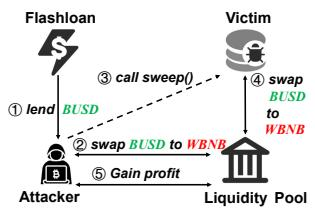
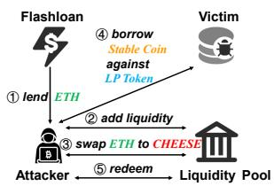
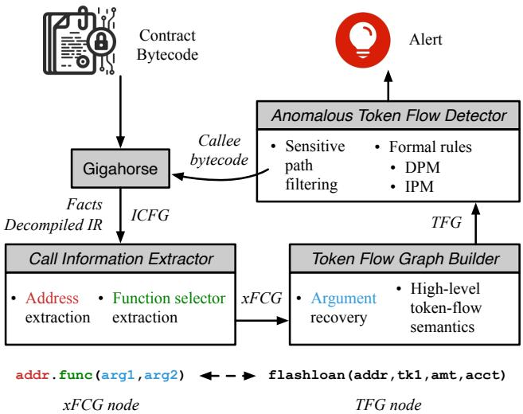
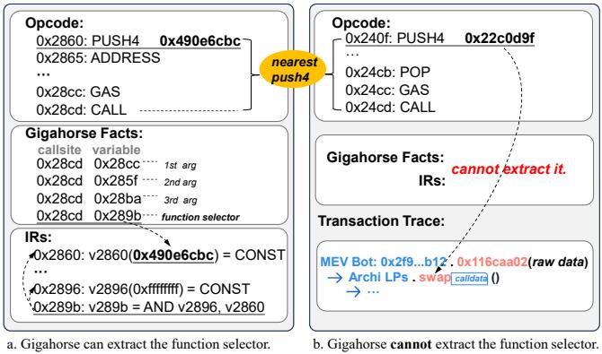
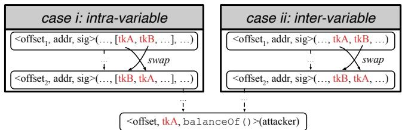
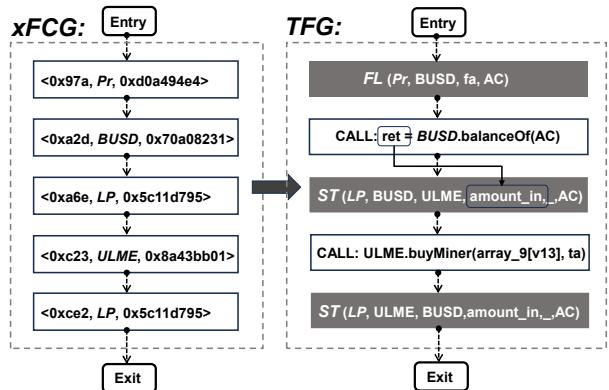
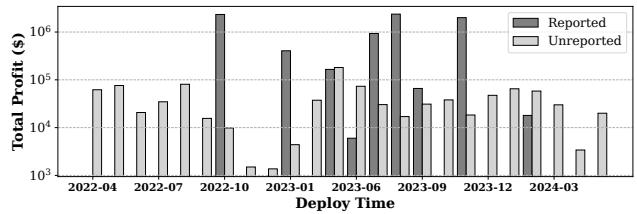
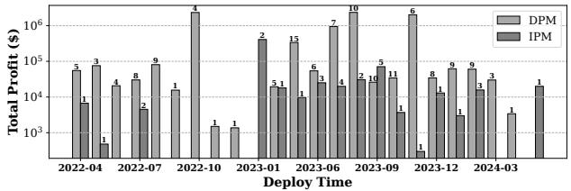
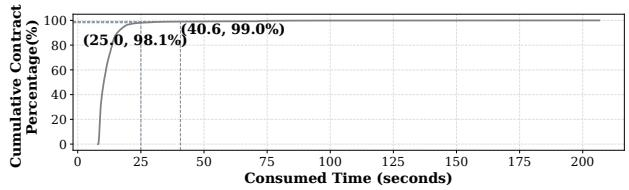
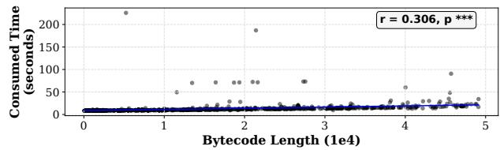

の

USENIX

THE ADVANCED COMPUTING SYSTEMS ASSOCIATION

# Following Devils’ Footprint: Towards Real-time Detection of Price Manipulation Attacks

Bosi Zhang, Huazhong University of Science and Technology; Ningyu He, The Hong Kong Polytechnic University; Xiaohui Hu, Kai Ma, and Haoyu Wang, Huazhong University of Science and Technology https://www.usenix.org/conference/usenixsecurity25/presentation/zhang-bosi

# This paper is included in the Proceedings of the 34th USENIX Security Symposium.

August 13–15, 2025 • Seattle, WA, USA 978-1-939133-52-6

Open access to the Proceedings of the 34th USENIX Security Symposium is sponsored by USENIX.

# Following Devils’ Footprint: Towards Real-time Detection of Price Manipulation Attacks

Bosi Zhang<sup>1</sup>, Ningyu He<sup>2</sup>‡, Xiaohui Hu<sup>1</sup>, Kai Ma<sup>1</sup> , Haoyu Wang<sup>1</sup>‡ <sup>1</sup> Huazhong University of Science and Technology <sup>2</sup> The Hong Kong Polytechnic University ‡Co-corresponding authors: ningyu.he@polyu.edu.hk, haoyuwang@hust.edu.cn

## Abstract

Price manipulation attack is one of the notorious threats in de centralized finance (DeFi) applications, which allows attack ers to exchange tokens at an extensively deviated price from the market. Existing efforts usually rely on reactive methods to identify such kind of attacks after they have happened, e.g., detecting attack transactions in the post-attack stage, which cannot mitigate or prevent price manipulation attacks timely. From the perspective of attackers, they usually need to de ploy attack contracts in the pre-attack stage. Thus, if we can identify these attack contracts in a proactive manner, we can raise alarms and mitigate the threats. With the core idea in mind, in this work, we shift our attention from the victims to the attackers. Specifically, we propose SMARTCAT, a novel approach for identifying price manipulation attacks in the preattack stage proactively. For generality, it conducts analysis on bytecode and does not require any source code and trans action data. For accuracy, it depicts the control- and data-flow dependency relationships among function calls into a token flow graph. For scalability, it filters out those suspicious paths, in which it conducts inter-contract analysis as necessary. To this end, SMARTCAT can pinpoint attacks in real time once they have been deployed on a chain. The evaluation results illustrate that SMARTCAT significantly outperforms existing baselines with 91.6% recall and ∼100% precision. Moreover, SMARTCAT also uncovers 616 attack contracts in-the-wild, accounting for \$9.25M financial losses, with only 19 cases publicly reported. By applying SMARTCAT as a real-time detector in Ethereum and Binance Smart Chain, it has raised 14 alarms 99 seconds after the corresponding deployment on average. These attacks have already led to \$641K financial losses, and seven of them are still waiting for their ripe time.

## 1 Introduction

Since the emergence of Ethereum, smart contracts have been its killer application, i.e., the feature distinguishes it from oldschool Bitcoin [57]. By decoupling complex interactions into different smart contracts, developers are able to build Decentralized Applications (DApps) [60], and even Decentralized Finance (DeFi) [76], which specifically provides financial services, like lending, exchanging, and even insurance, in a decentralized manner [62]. In 2024, the total value locked, one of the critical metrics to reflect the prosperity, in DeFi protocols has surged to over \$90 billion [13].

Unfortunately, due to the anonymity and immutability of Ethereum smart contracts, numerous DeFi projects are exploited by unidentifiable accounts, leading to \$473 million financial losses in 2024 [14]. Among all vulnerabilities in DeFi protocols, price manipulation must be one of the most notorious ones [78]. In short, attackers can obtain massive profits from token transfers or exchanges at a price far from the market’s normal fluctuation. Various reasons could finally lead to a price manipulation attack, e.g., incorrect slippage settings, unprotected public functions, and reliance on untrusted price oracles [55]. Furthermore, cunning attackers would take advantage of the Flashloan mechanism [59] to conduct exploitation to ensure that the whole attack transaction can be rolled back promptly if any condition is not met.

Existing studies against price manipulation are in two forms, i.e., either reactively identifying attacks in the postattack stage according to transaction data or detecting ifthere are price manipulation vulnerabilities in DeFi protocols. As for the former one, DeFiRanger [71] constructs a cash flow tree from transaction traces, while DeFiGuard [68] extracts behavioral patterns from transactions and combines them with a graph neural network. However, neither tool can mitigate such attacks proactively. As for the latter form, FlashSyn [36] uses a numerical approximation to synthesize transactions for exploiting Flashloan-based price manipulation vulnerabilities, and DeFiTainter [50] detects vulnerabilities in DeFi projects using generic rules. However, most price manipulation attacks stem from poorly designed contract business logic, which have to be manually modeled one by one in these methods, significantly impacting their scalability.

In other words, current work cannot mitigate or prevent price manipulation attacks effectively and timely. Therefore, standing from the attackers’ perspective, in this work, we proactively detect these attacks in the pre-attack stage. We focus on newly deployed Ethereum contracts and uncover if they possess such malicious intent. However, two main chal lenges arise. On the one hand, in Ethereum, only 2% contracts are open-sourced [10]. Furthermore, to cover their malicious intent, such attack contracts typically avoid releasing their implementations. We have to precisely recover their behavioral semantics without introducing too many false positives and negatives. On the other hand, currently, there are around 39K newly deployed contracts a day in Ethereum [15]. We have to precisely identify these attack contracts out of numerous benign ones. Moreover, rational attackers must initiate attacks once everything is settled down, which also requires the timeliness of our detecting methods.

This Work. In this work, we propose SMARTCAT, a static analysis framework to identify price manipulation attack contracts. To recover the behavioral semantics, it extracts the callee address and invoked function for each function call. We also propose a data-flow-based heuristic arguments recovery algorithm to recover the arguments for these function calls. Based on the inter-procedural control flow graph (ICFG), we construct cross-function callsite graph (xFCG) and tokenflow graph (TFG) to depict the control- and data-flow dependency relations among function calls. To enable efficient analysis, we propose a sensitive path filtering method to selectively conduct cross-contract analysis on the TFG. Additionally, we formalize a set of rules to characterize two types of price manipulation attack behaviors in a sound and precise manner.

In the evaluation, we construct a ground truth dataset con sisting of 84 price manipulation attack contracts and 8,000 benign contracts. The results show that SMARTCAT can correctly identify 77 out of the 84 attack contracts, with a negligible false positive rate, extensively outperforming the existing three available baselines. We then apply SMARTCAT on a large-scale dataset with over 77K real-world contracts. It identifies 616 price manipulation attacks, where only 19 cases were reported previously, causing \$9.25M financial losses in total. Furthermore, to evaluate its timeliness, we deploy SMARTCAT on Ethereum and Binance Smart Chain for 50 days. In total, SMARTCAT has raised 14 alarms 99 seconds after the corresponding contract deployment on average. These attacks have led to \$641K financial losses already, and seven contracts are still waiting for the ripe time.

We summarize our contributions as follows:

• We propose SMARTCAT for identifying price manip ulation attack contracts through anomalous token flow. To the best of our knowledge, this is the first work to identify such attack contracts on the bytecode level.

• Based on an extensively constructed ground truth dataset, the precision and recall of SMARTCAT are ∼100% and 91.6%, respectively, significantly outperforming existing available baselines and demonstrating robustness against obfuscation techniques.

• SMARTCAT have identified 616 price manipulation attack contracts out of 770K real-world deployed contracts, where only 19 were reported publicly. SMARTCAT can analyze 99% cases within 40.6 seconds.

• As a real-time detector, SMARTCAT has raised alarms 14 times in Ethereum and BSC. These attacks have led to \$641K financial losses already.

## 2 Background

## 2.1 Smart Contracts & Decentralized Finance

Ethereum smart contracts are self-executing programs typically implemented in high-level languages like Solidity [38]. They are compiled into bytecode, deployed, and executed in the Ethereum Virtual Machine (EVM) [48], a stack-based virtual machine. The immutable nature of the blockchain makes smart contracts susceptible to vulnerabilities once deployed. To address this, smart contracts often utilize proxy mechanisms [5] for upgrading their logic or fixing bugs. Smart contracts use three data structures to maintain data: Memory, Storage, and Calldata. Memory holds temporary data required during function execution, Storage stores data permanently on-chain, and Calldata contains read-only function arguments passed from external calls initiated by opcodes like CALL and DELEGATECALL.

DeFi, an emerging financial ecosystem built on smart contracts, showcases immense potential. We highlight some widely-adopted DeFi protocols in the following.

Token. Except for the native token in Ethereum, accounts are allowed to create and issue tokens by implementing some standards, e.g., ERC-20 [1] and ERC-721 [3]. Moreover, DeFi widely leverages stablecoins and liquidity provider (LP) tokens. Specifically, stablecoins can ensure price stability by anchoring specific currencies, like USD, offering a reliable medium for value exchange. LP tokens are issued by DeFi projects to represent someone’s shares and benefits.

Decentralized Exchange. Decentralized exchange (DEX) uses smart contracts for token exchange, ensuring transparency, openness, and trustlessness. Lots of well-known DEXes exist in Ethereum, like Uniswap [31]. DEX typically employs the automated market maker (AMM) mechanism, dynamically adjusting token prices based on the token reserve in liquidity pools. Users can deposit tokens into DEXes to provide liquidity and earn interest in an LP token form.

  
(a) DPM in ElephantStatus.

  
(b) IPM in Cheese Bank.  
Figure 1: Two types of price manipulation.

Flashloan. Flashloan is a form of uncollateralized loan that must be taken and Protocols such as Aave [11] and Uniswap [31] provide flashloan services, allowing users to borrow large amounts without upfront collateral. Though flashloan provides convenience, it has also led to various at tack incidents in recent years [59, 69].

## 2.2 Price Manipulation

Price manipulation in DeFi is basically achieved by exploiting how DEXes calculate token prices. Typically, for a token in a liquidity pool, the lower the supply, the higher the price. When the supply balance between tokens is disrupted, price deviations may occur. The existence of flashloan further worsens this issue by enabling someone to borrow large amounts of assets without collateral, i.e., causing rapid and significant price fluctuation before the loan is repaid. Based on how the victim contract is affected, it is divided into direct price manipulation (DPM) and indirect price manipulation (IPM). Direct Price Manipulation (DPM). By exploiting calculation errors or access control issues within the victim contract, attackers can directly perform price manipulation in the liq uidity pools of DEXes. This typically involves three steps: i) the attacker uses a large amount of token A to exchange for token B in the liquidity pool, causing the price of token B to increase; ii) the attacker further decreases the liquidity of token B by exploiting the victim contract, e.g., let the victim purchase a large amount of token B, driving up the price of token B; and iii) the attacker sells the acquired token B and profits from the price manipulation.

Figure 1(a) illustrates a real-world example of direct price manipulation, where ElephantStatus was exploited on Dec. 6th, 2023, resulting in approximately \$165K finan cial losses [9]. As we can see, the attacker borrows a large amount of BUSD tokens via flashloan (step ①), which are then swapped to WBNB tokens (step ②). The attacker then calls sweep in the victim contract (step ③), which transfers a large amount of BUSD into the liquidity pool and withdraws an equivalent value of WBNB from the pool (step ④). This operation artificially inflates the price of WBNB in the liquidity pool. Finally, the attacker swaps the previously acquired WBNB back to BUSD (step ⑤), a stablecoin, obtaining profits by such a direct price manipulation. Note that, there is a variant of DPM, where attackers can also directly leverage flashloans to significantly impact the asset reserves in the liquidity pool, subsequently profiting from the price fluctuations. In this situation, the victim is the liquidity pool itself.

Indirect Price Manipulation (IPM). Instead of directly exploiting the victim contract, attackers conduct indirect price manipulation by disturbing token prices in DEXes, which are adopted as price oracles by victim contracts. Specifically, it generally consists of three steps: i) the attacker intentionally creates an imbalance in the token reserves of a liquidity pool; ii) the attacker interacts with the victim contract, which calculates the token prices in real-time based on the oracle exposed by the liquidity pool. To this end, the attacker can sell or stake tokens to the victim contract at an inflated price; and iii) the attacker restores the balance of the liquidity pool.

Figure 1(b) illustrates a concrete example of an indirect price manipulation, which occurred on Nov. 6th, 2020, leading to financial losses of Cheese Bank estimated at \$3.3M [6]. Specifically, the attacker first borrows a large amount of ETH via flashloan (step ①). Then, the attacker deposits ETH and CHEESE tokens to the liquidity pool in exchange for the corresponding number of LP tokens (step ②). The attacker further swaps a large amount of ETH for CHEESE tokens (step ③). Since Cheese Bank calculates the price of LP tokens based on the amount of ETH in the liquidity pool, through a legitimate external call, the attacker drains the victim contract, which is tricked into thinking that the price of LP tokens is extremely high (step ④). Finally, the attacker redeems ETH from the liquidity pool (step ⑤).

## 2.3 Threat Model

As for conducting price manipulation attacks, compared to ordinary accounts in Ethereum, attackers have no other extra privileges. All attack logic is embedded in the deployed contract, and the attack is launched by initiating a transaction. As illustrated in §2.2, both liquidity pools and contracts that have the ability to interact with the pools can be potential victims. Leveraging the time window between the attack contract deployment and the attack launch is critical. In the real world, attackers may delay the attack until certain conditions are met or until the profit is maximized.

## 3 Motivation

In this section, we first demonstrate what a price manipulation attack contract looks like. Then, we summarize the challenges in identifying these contracts on the contract bytecode level and illustrate our solution in a high-level manner.

## 3.1 Motivating Example

ULME project has been attacked in a DPM way on Oct. 25th, 2022, suffering from \$50K financial losses [30]. Listing 1 illustrates an attacker-defined private function, which is invoked by the callback function once the attacker takes out a flashloan. The function is shown in a simplified and decompiled way. As we can see, the attacker first extracts the addresses of BUSDT and ULME token from Storage, stores them into a newly initialized array, and then calls the token swap function in the liquidity pool (L3 – L7).<sup>1</sup> In this example, the attacker exchanges BUSDT for ULME token. Subsequently, the attacker iterates array\_9 (L8), consisting of pre-identified users who have approved the BUSDT contract, to filter out those with non-zero balances by calling allowance() and balance() (L9 – L13). Unlike IPM, where the victim indirectly relies on the liquidity pool as the oracle to calculate the price of ULME, the attacker invokes buyMiner() of the ULME contract. This step directly uses the victim’s BUSDT to swap out ULME from the liquidity pool, sharply reducing its ULME supply and further destabilizing the pool’s state. The attacker then exchanges ULME back for BUSDT token (L17 – L21). Such a swap obtains a large amount of BUSDT at an unfair price, profiting from the imbalance in the pool.

```javascript
function 0x9e1() private {
    if (stor_a) {
        v2 = new address[](2);
        v2[0] = stor_2; v2[1] = stor_5;
        v4 = new address[](v2.length);
    // Step_1: exchange BUSDT for ULME
        v11 = stor_4.swapExactTokensForXXX(stor_a, 0, v4,
            address(this), block.timestamp + 1000, v12, stor_2
            ).gas(msg.gas);}
    while (v13 < array_9.length){
        v15, v16 = stor_2.allowance(address(array_9[v13]),
            stor_5).gas(msg.gas);
        if (v16) {
            v17, v18 = stor_2.balanceOf(address(array_9[v13])). 
            gas(msg.gas);
            v19 = v20 = v18 > 0;
            if (v19) {
                require(bool(stor_5.code.size));
    // Step_2: manipulate users into swapping out their ULME
                v22 = stor_5.buyMiner(address(array_9[v13]), v18
                    * 100/110 + ~0).gas(msg.gas);}}}
    v26 = new address[](2);
    v26[0] = stor_5; v26[1] = stor_2;
    v28 = new address[](v26.length);
    // Step_3: exchange ULME for BUSDT at an unfair price
    v35 = stor_4.swapExactTokensForXXX(v25, 0, v28, address(
        this), block.timestamp + 1000, v12, stor_5).gas(msg.gas
        );
}
```  
Listing 1: Attack contract against ULME.

## 3.2 Challenges & Solution

Through this example, we can find that attackers will leave traces in their contracts, including token manipulation, the use of Flashloan services, and interactions with liquidity pools. Due to the transparency of the blockchain, these features can be obtained at the time of contract deployment, allowing us to promptly raise alarms for suspicious attack contracts. However, two key challenges need to be addressed.

Challenge 1: Unclear semantics. Attack contracts are typically close-sourced to conceal their malicious intent, limiting analysis to the bytecode level. To recover semantics, existing bytecode-based tools either elevate the bytecode to an intermediate representation (IR) [41] or adopt static analysis methods, like symbolic execution [4]. However, on the one hand, the obtained IR is limited to the contract itself and does not provide cross-contract semantics. On the other hand, the complexity of cross-contract calls and state dependencies between contracts can lead to path explosion during symbolic execution. As shown in Listing 1, recovering and identifying semantics at both intra- and inter-contract function calls is crucial for accurately determining the contract’s behavior.

Challenge 2: Scalability issue. Detecting price manipulation attack contracts requires exploring the paths corresponding to conducting attacks. In Listing 1, we only illustrate the function that performs attacks and omits other auxiliary functions, which could introduce complexity through loops, conditional branches, and even inter-contract calls. Thus, we have to thoroughly analyze all defined functions within the contract and effectively identify the attack path among numerous paths. Furthermore, as timeliness is crucial for avoiding under-reporting, we must efficiently explore paths and minimize interference from irrelevant ones.

Our Solution: Against Challenge 1, we first extract both callee addresses and invoked functions from intra- and intercontract function calls, where we propose a fine-grained argument recovery algorithm to retrieve concrete values of their arguments. Furthermore, we take advantage of the function signature database and heuristic rules to capture the operational semantics of all function calls. As for Challenge 2, rather than relying on machine learning or heuristic rule based methods, we adopt a formal approach to model price manipulation attack behaviors. To improve efficiency, we filter out all suspicious sensitive paths based on characteristics of DeFi attacks and limit the scope of cross-contract analysis.

## 4 Methodology

To identify attack contracts, we propose SMARTCAT, whose workflow and architecture are shown in Figure 2. As we can see, SMARTCAT is composed of three modules, i.e., Call Information Extractor (short as Extractor), Token Flow Graph Builder (short as Builder) and Anomalous Token Flow Detector (short as Detector). Specifically, Extractor is built upon Gigahorse [41, 43], a well-known tool that can decompile and produce intermediate representation (IR) in three-address code format. Extractor takes the contract bytecode as input and decompiles it to obtain the IR and control flow information on the function level. To address Challenge 1, based on the inter-procedural control flow graph, Extractor firstly constructs a cross-function callsite graph (xFCG) consisting of nodes, each of which encompasses information of the callsite, callee address, and invoked function signature. The generated xFCG will be transmitted to Builder, which employs a dataflow-based heuristic arguments recovery algorithm to retrieve arguments’ values of invoked functions. By combining the token-flow-related semantics of involved functions, Builder further builds a token flow graph (TFG). To address Challenge 2, Detector filters out and traverses those suspicious sensitive paths in the TFG. By adopting a set of formal de tecting rules, Detector can finally identify price manipulation attack contracts in an effective and efficient manner.

  
Figure 2: Workflow and architecture of SMARTCAT.

## 4.1 Call Information Extractor

As illustrated in §3.1, invoking functions in both intra- and inter-contract manner is necessary for profiting from conducting price manipulation, making the extraction of call information important. To achieve this, we leverage Gigahorse [41] and introduce a Cross-Function Callsite Graph (xFCG) based on the inter-procedural control flow graph to efficiently depict and extract this information.

## 4.1.1 Address & Function Extraction

Extracting callee addresses for function calls is the prerequisite for the following analysis. In Ethereum, callee addresses can be specified in three different data structures: Calldata, Memory, and Storage (see §2.1). Since Calldata is provided at runtime, which is unpredictable, we assign a placeholder in the form of calldata\_0xN, where 0xN corresponds to its offset in Calldata. For the other two cases, we leverage thefacts generated by Gigahorse based on the decompiled code. Specif ically, if the callee address is stored in Memory, we either directly extract the address (when hard-encoded in bytecode) or assign a placeholder, the same as Calldata. Otherwise, i.e., the callee address is stored in Storage, we extract the hardencoded callee address from the facts or retrieve it from a slot number via the getStorageAt() API. Note that some contracts adopt the proxy design pattern, where the actual function resides in another contract that the proxy points to.

  
Figure 3: Extract function signature by Gigahorse and our heuristic method.

Since EIP-1967 is the most widely-adopted proxy standard in Ethereum [5], whose Storage structure is fixed, we heuristically investigate if the EIP-1967-specific slot exists [24]. If it is, we take the current contract as a proxy and extract the real callee address from the slot.

Instead of the callee address, we also need to identify the invoked function to recover the developers’ intent. In Ethereum contract bytecode, each function call consists of the function signature and its arguments. As shown in Figure 3(a), we leverage the facts generated by Gigahorse to directly extract the 4-byte function signature. However, Gigahorse may fail to generate such facts when branch-dependent Memory read and write operations obscure the exact Memory layout [41, 77].To address this, we propose a heuristic method: backtracing the control flow to extract the operand of the most recent PUSH4 opcode before the function call, treating it as the function signature. As shown in Figure 3(b), in this case, Gigahorse fails in this MEV bot contract due to frequent branch jumps [12], whereas our method correctly identifies the callee function as swap(), confirmed by the transaction trace.

## 4.1.2 Cross-Function Callsite Graph Construction

To illustrate relationships among function calls, based on the inter-procedural control flow graph (ICFG), we propose and build the cross-function callsite graph (xFCG). Specifically, we only consider the basic blocks that contain function calls. We adopt a triplet to refer to each of them, defined as:

## < callsite, callee\_address, function\_selector >

where callsite is the offset of the call-related opcode, and callee\_address and function\_selector refer to the corresponding information extracted in §4.1.1. For those basic blocks without function calls, we directly remove them and link their preceding and successive blocks. Note that both intra-contract and inter-contract function calls are taken into consideration in building xFCG, i.e., the callee\_address can be the address of the current or another contract. If an inter-contract function call happens, a recursive inter-contract xFCG build will only happen on those nodes located in suspicious paths, whose selection rules will be detailed in §4.3.1.

## 4.2 Token Flow Graph Builder

Identifying the value of arguments in function calls can recover the original intents more precisely. Thus, we propose a data-flow-based heuristic arguments recovery algorithm. Moreover, we focus on five types of token-flow related semantics, e.g., swap token and add liquidity, which are combined on nodes in xFCG to construct the tokenflow graph (TFG).

## 4.2.1 Argument Recovery

The xFCG we built can only reflect the control flow dependency relationships among function calls. To more effectively address Challenge 1, we will also recover data flow dependency relationships, whose very first step is to recover the values or variables associated with arguments in function calls. In EVM bytecode, call instructions do not explicitly declare them. Instead, it points a piece of bytes in Memory through an offset and length. While we can obtain parameter information through Gigahorse’s facts, as introduced in §4.1.1, its limitations in handling complex Memory operations can result in incomplete or inaccurate extraction [41, 77].

```txt
Algorithm 1: Data-flow-based heuristic arguments
recovery
Input: CS, the callsite of a function call
Output: Args, argument positions and values
PC ← FreeMemPointer(CS)
base ← GetBase(PC)
idx ← 0,Args ← []
for pc from PC to CS do
    if isMSTORE(pc) then
        (ptr, Var) ← ParseMSTORE(pc)
        offset ← ptr - base
        value, flag ← DataFlowRecover(Var)
        if !(offset = 0x4 and idx = 0) then
            if flag = True then
                err ← TypeCheck(idx, value)
                if err != 0 then
                    ReportError(err)
                    continue
            else
                value ← GetSymbolicValue()
                Args.append((value, idx))
            idx += 1
return Args
```

To address this, we present a data-flow-based heuristic arguments recovery algorithm. The EVM manages Memory using a free memory pointer, typically designating the offset at position 0x40 as the pointer to the next available memory location [28, 58]. Based on this heuristic, Algorithm 1 presents the overview of how we extract arguments from Memory. Specifically, given a function callsite, we backtrace to find the nearest MLOAD instruction that loads a value from 0x40 (L1) and consider the loaded value as the base for arguments (L2). Then, we traverse all MSTORE instructions between the MLOAD and the callsite and extract the target position (ptr) and the to-be-stored variable (Var) (L4 – L6). To this end, we can extract the offset of the variable by subtracting base from ptr (L7), and calculate the concrete value of the variable through data flow analysis (L8). If this step fails due to complex control flow, a unique symbolic value is assigned to the argument to maintain its positional information (L16). However, due to stack operations and untyped Memory accesses in the EVM [52], the algorithm may violate our assumptions, resulting in mismatches between the recovered values and their expected types. Therefore, we handle errors based on type checking (L11 – L14), where we compare the recovered argument types at the same index with those declared in the function declaration. For example, if the type of the argument calculated based on the offset is identified as address with the length of 0x20, but should be uint256 with the length of 0x32 in the function declaration, the types are considered mismatched. Then an error is reported, and the recovery process for the argument is skipped. Consequently, the remaining function arguments are identified by their index positions and returned (L17 and L19).

## 4.2.2 High-Level Semantics Combining

Current recovered information does not reveal the specific behavior of function calls. To identify attack intentions, we need to incorporate high-level semantics to extract token-related op erations within the contract. We propose two complementary approaches, i.e., 1) leveraging function signature templates and 2) utilizing argument positional analysis.

As for the first approach, we heuristically consider that attackers frequently interact with Flashloan and DEXes to construct attack chains. To identify such interactions, we utilize function signature templates associated with widely adopted token standards, including ERC20 [1], ERC721 [3], and ERC1155 [2]. Moreover, we extract and validate the semantics of functions from commonly used Flashloan and DEXes services based on total value locked (TVL) and transaction volume [18], e.g., Aave [11], Pancake [25], and Uniswap [31], by referring to their official documentation.

If no templates are matched, we take another heuristic, i.e., the order of involved tokens would be swapped in price manipulation. Therefore, we adopt an argument positional analysis to identify potential token swaps for cases where function signature templates are unavailable, as illustrated in Figure 4. Specifically, we consider whether the extracted xFCG has the following features. There exist two nodes with identical callee addresses and function selectors, while the order of any two address-type variables is reversed. The reverse can happen on the intra-variable (case i) or inter-variable (case ii) level. We heuristically consider these two addresses to be involved in a token swap. As a rational attacker, confirming whether obtaining profits is necessary. We heuristically take the invocation to balanceOf() of a swapped address as necessary in the xFCG. If both above rules meet in the xFCG, we reckon there exists a token swap of the involved two addresses.

  
Figure 4: Heuristically infer potential token swap actions.

Consequently, within all collected templates as well as the identified token swap behaviors, we have summarized five token action related semantics into consideration, i.e., transfer, flashloan, and liquidity-related operations, whose formal definitions are shown in Figure 5:

• Transfer (Tr). Transfer a specified amount (amt) of a token from one address (from) to another one (to).

• Swap token (ST.) In a liquidity pool (pr), swap an amount of input token (tk\_in, amt\_in) to output token (tk\_out, amt\_out), which is sent to an address (to).

• Add liquidity (AL). Against a liquidity pool (pr), deposit some token (amt\_in, tk\_in) to mint some LP token (amt\_out, tk\_out) to an address (to).

• Remove liquidity (RL). Against a liquidity pool (pr), burn some LP token (amt\_in, tk\_in) to transfer some token (amt\_out, tk\_out) to an address (to).

• Flashloan (FL). A flashloan pr lends a specific amount (amt) of token to an account (to).

## 4.2.3 Token Flow Graph Construction

With the identified semantics, we construct the token flow graph (TFG) based on the xFCG to analyze the contract behavior. It helps guide the identification of critical execution paths in attacks. To formally define TFG, we begin by the following notations:

• N , the set of nodes in TFG, representing function calls along with their recovered arguments and semantics.

• E, the set of edges in TFG, E ⊆ N × N , corresponding to the control flow or data dependencies among nodes.

```txt
⟨addr⟩ ::= addresses
⟨arg⟩ ::= consts | vars
Op ::= ST | AL | RL
transfer ::= Tr (token: ⟨addr⟩, from: ⟨addr⟩, to: ⟨addr⟩,
                  amt: ⟨arg⟩)
flashloan ::= FL (pr: ⟨addr⟩, token: ⟨addr⟩, amt: ⟨arg⟩,
                  to: ⟨addr⟩)
liquidity ::= Op (pr: ⟨addr⟩, tk_in: ⟨addr⟩, tk_out: ⟨addr⟩,
                  amt_in: ⟨arg⟩, amt_out: ⟨arg⟩, to: ⟨addr⟩)
```  
Figure 5: The definition of token action related semantics.

  
Figure 6: The xFCG and TFG of the attack contract in the ULME incident, where AC denotes the attack contract, and the dotted and solid lines refer to control- and data-flow dependencies, respectively.

• A, the token action related semantics label defined in §4.2.2.

• T : N → A, a mapping function from nodes to the corresponding semantics labels.

Token flow graph is defined as $\mathcal { G } = ( \mathcal { N } , \mathcal { E } , \mathcal { A } , \mathcal { T } )$ . Figure 6 shows the generated TFG of the ULME incident introduced in §3.1. As we can see, we retain the control flow dependency relations in the original xFCG and extend nodes with their corresponding token action related semantics. Additionally, we parse the data flow dependencies among nodes, as the solid line in Figure 6, representing the result of balanceOf is used for swapped amount. Integrating data flow analysis enables us to precisely track how token-related data propagates, offering insights into the dependencies and effects of each token action. For instance, this allows us to trace whether a user manipulates the liquidity pool with borrowed funds following a Flashloan.

## 4.3 Anomalous Token Flow Detector

To improve the detection efficiency, we perform crosscontract analysis as necessary. Thus, we propose a sensitive path filtering method to avoid getting stuck in those meaningless and recursive paths. Moreover, we design a set of formal rules to robustly identify both direct and indirect price manipulation behaviors introduced in §2.2.

## 4.3.1 Sensitive Path Filtering

As stated in Challenge 2, performing cross-contract analysis for every external call is highly time-consuming and contradicts the timeliness required for identifying attack contracts. Therefore, we only initiate cross-contract analysis on those suspicious sensitive paths. Based on previous empirical studies and analysis against DeFi attacks [64, 71, 79], a DeFi attack typically consists of three stages, i.e., fund preparation, token exchange, and fund transfer. Hence, when traversing TFG, cross-contract analysis will only be conducted on the corresponding nodes. For a clear illustration, we define the following notations:

• Entry and Exit represent the starting and ending nodes of TFG, respectively, to facilitate analysis.

$p = ( N _ { 1 } , N _ { 2 } , . . . , N _ { \mathrm { k } } )$ , a k-tuple to represent a path in TFG, where $N _ { i } \in \mathcal { N }$ . For convenience, we adopt $N \in p$ to represent the node N is included in the path $p . N _ { 1 } \prec N _ { 2 }$ indicates that $N _ { 1 }$ is a predecessor of $N _ { 2 }$ in a path.

We use $S _ { p }$ to represent the set of sensitive paths and σ denotes the sender address or contract address. Let $p = ( N _ { \mathrm { s t a r t } } ,$ $\ldots , N _ { \mathrm { e n d } } ) , p \subseteq S _ { p }$ once if any the following conditions holds:

• Fund preparation: $\mathcal { T } ( N _ { \mathrm { s t a r t } } ) = F L ( . . . , . . , \mathfrak { O } ) \wedge N _ { \mathrm { e n d } } = E x i t .$

• Token exchange: $\mathcal { T } ( N _ { \mathrm { s t a r t } } ) = S T ( . . . , . . , . . , . . ) \wedge \mathcal { T } ( N _ { \mathrm { e n d } } )$ 1 $\mathbf { \Sigma } = S T ( \mathbf { \Sigma } _ { -- } , \mathbf { \Sigma } _ { -- } , \mathbf { \Sigma } _ { -- } )$

• Fund transfer: N<sub>start</sub> = Entry∧T (N<sub>end</sub>) = Tr(\_,\_,σ,\_).

The complexity of the naive implementation of identifying sensitive paths is $O ( n ^ { 2 } )$ . Thus, to improve efficiency, we only keep the longest path. That is, if $\forall N \in p , N \in p ^ { \prime }$ and $p ^ { \prime } \subseteq S _ { p }$ , only $p ^ { \prime }$ will be kept. The cross-contract analysis will be conducted on external calls in $p ^ { \prime }$ . For example, because buyMiner() in Figure 6 lies on both the fund-preparation and token-exchange sensitive paths, we will perform the crosscontract analysis to the ULME contract.

## 4.3.2 Detecting Rules

According to the definition of price manipulation, as we illus trated in §2.2, we can identify the attack behavior based on the following rules.

Rule 1: Pump-and-Dump. We first identify if there are two $S T$ actions interacting with an identical liquidity pool and drain and deposit tokens to potentially manipulate the token price. As shown in Rule 1, we use the predicate $P _ { P D }$ to rep resent the path p along with the two related ST actions that hold this property. Note that, $a  a ^ { \prime }$ indicates there is a data flow dependency relationship from a to $a ^ { \prime }$

$$
\begin{array}{c} N _ {1} \in p, N _ {2} \in p, N _ {1} \prec N _ {2}, p \subseteq \mathcal {S} _ {p} \\ \mathcal {T} (N _ {1}) = S T (p r, \_, t, \_, a, \_), \mathcal {T} (N _ {2}) = S T (p r, t, \_, a ^ {\prime}, \_, \sigma) \\ a \to a ^ {\prime} \\ \hline P _ {P D} (p, N _ {1}, N _ {2}) \end{array}\tag{1}
$$

Rule 2&3: Direct Price Manipulation. Based on Rule 1, we can formally define how direct price manipulation is identified. As shown in Rule 2, we adopt the predicate DPM to capture the price of tokens (t and $t ^ { \prime } )$ of which the liquidity pool $( p r )$ is manipulated. Such direct price manipulation should be completed by taking advantage of flashloan services, where the borrowed tokens will be directly used in $N _ { 1 }$

$$
\begin{array}{c} P _ {P D} (p, N _ {1}, N _ {2}), N _ {0} \in p, N _ {0} \prec N _ {1} \\ \mathcal {T} (N _ {0}) = F L (t, \_, \sigma , a), \mathcal {T} (N _ {1}) = S T (p r, t, t ^ {\prime}, a ^ {\prime}, \_, \sigma) \\ a \to a ^ {\prime} \\ \hline D P M (p r, t, t ^ {\prime}) \end{array}\tag{2}
$$

Except for Rule 2, Rule 3 also demonstrates a type of direct price manipulation. Their distinction exists in whether a victim is involved (the entity shown in Figure 1(a) in §2.2). If a victim exists, there will be another action between the two in $P _ { P D } .$ . As shown in Rule 3, the victim should be involved in a token swap between itself and the pool or add / remove liquidity to / from the pool to manipulate the token price. Finally, the DPM predicate records the victim address (vc) and both involved tokens.

$$
\begin{array}{c} P _ {P D} (p, N _ {1}, N _ {3}), N _ {2} \in p, N _ {1} \prec N _ {2} \prec N _ {3} \\ \mathcal {T} (N _ {1}) = S T (p r, t, t ^ {\prime}, \_, a, \_) \\ \mathcal {T} (N _ {2}) = T r (t, v c, p r, \_) \lor A L (p r, t, \_, \_, \_, v c) \lor R L (p r, \_, t ^ {\prime}, \_, \_, v c) \\ \hline D P M (v c, t, t ^ {\prime}) \end{array}\tag{3}
$$

Rule 4: Indirect Price Manipulation. As for indirect price manipulation, we adopt IPM to capture its characteristics, whose formal definition is shown in Rule 4. As we can see, it looks similar to Rule 3. The difference is located on whether the price fluctuation is caused by the victim address (vc) or the attacker itself (σ).

$$
\begin{array}{c} P _ {P D} (p, N _ {1}, N _ {3}), N _ {2} \in p, N _ {1} \prec N _ {2} \prec N _ {3} \\ \mathcal {T} (N _ {1}) = S T (p r, t, t ^ {\prime}, \_, a, \_) \\ \mathcal {T} (N _ {2}) = T r (\_, v c, \sigma , \_) \lor A L (v c, t, \_, \_, \_, \sigma) \lor R L (v c, \_, t ^ {\prime}, \_, \_, \sigma) \\ \hline I P M (v c, t, t ^ {\prime}) \end{array}\tag{4}
$$

## 5 Implementation & Experimental Setup

Dataset. To comprehensively evaluate SMARTCAT, we have collected two datasets, i.e., a ground-truth dataset $( \mathcal { D } _ { G } )$ and a large-scale contracts dataset $( \mathcal { D } _ { L } )$ . Specifically, $\mathcal { D } _ { G }$ consists of two sub-datasets. $\mathcal { D } _ { G 1 }$ comprises 84 attack events labeled as price manipulation, sourced from various mainstream platforms [17, 26, 27], the publicly released datasets of FlashSyn [36] and DeFiRanger [71], and manually verified by two of our authors specializing in DeFi security<sup>2</sup>.

Moreover, we heuristically take the number of transactions generated by a contract as the criterion to determine its benign nature. Thus, we use APIs from Etherscan [19] and data from TokenTerminal [29] to select the top 8,000 active contracts by transaction volume as non-malicious cases $( { \mathcal { D } } _ { G 2 } ) . { \mathcal { D } } _ { L }$ encompasses all contracts deployed in the recent two years, from April 2022 to June 2024, covering over 770K contracts in total. We deploy an Ethereum archive node using Geth [22] to replay transactions and collect them. Finally, to demonstrate SMARTCAT’s capability in real-time detection, we define the attack time window as the period from the contract’s deployment to the initiation of a price manipulation attack that results in a profitable transaction against the victim contract. Baseline Selection. To the best of our knowledge, there is no tool that supports detecting price manipulation attack contracts based solely on the contract bytecode. To evaluate the effectiveness of SMARTCAT, we select three the most relevant state-of-the-art tools as baselines, i.e., DeFiRanger (DR) [71], FlashSyn (FS) [36], and DeFiTainter (DT) [50]. Because DR and FS are close-sourced and detect price manipulation based on transaction data, we directly take the results from their papers. Moreover, DT is an open-source tool that can detect the potential victims of price manipulation on the bytecode level. Thus, we provide all victims contract bytecode of inci dents in $\mathcal { D } _ { G 1 }$ to evaluate its effectiveness. Note that though DeFiGuard [68] claims it can extract behavioral features from transactions and use graph neural networks to identify price manipulation attacks, its model is close-sourced and it does not release the corresponding dataset. Thus, we exclude De-FiGuard from baselines.

Implementation. Based on the facts and IR generated from Gigahorse [41], SMARTCAT is implemented in Python3, comprising 1.8K lines of code. Additionally, SMARTCAT utilizes custom declarative rules to obtain more detailed data flow and call stack information, implemented through 500 lines of Datalog. All our experiments are conducted on a 96- core server equipped with dual Intel(R) Xeon(R) Gold 6248R CPUs and 256GB RAM running Ubuntu 22.04.1 LTS. The timeout for Gigahorse decompilation is set to 120 seconds. The recursive cross-contract analysis depth in SMARTCAT is configurable and is set to three in the following evaluation. Research Questions. We aim to explore the following re search questions (RQs):

RQ1 Is SMARTCAT effective and robust in identifying price manipulation attack contracts on the bytecode level?

RQ1.1 What about the performance improvements of SMARTCAT over baselines?

RQ1.2 Do the introduced methods, i.e., argument recovery algorithm and sensitive path filtering module, contribute positively to the final results?

RQ1.3 How robust is SMARTCAT against obfuscation?

Table 1: Comparison of detecting results on $\mathcal { D } _ { G }$ among SMARTCAT and baselines. ST represents our tool SMART-CAT, ST w/o R, ST w/o S, and ST w/o B excludes the argument recovery algorithm module, the sensitive path module, and both of them, respectively.

<table><tr><td rowspan="2">Metrics</td><td rowspan="2">#Detect</td><td colspan="4"> $\mathcal{D}_{G1}$ </td><td colspan="3"> $\mathcal{D}_{G2}$ </td></tr><tr><td>TP</td><td>FN</td><td>Recall</td><td>Time (s)</td><td>#Alert</td><td>FP</td><td>Precision</td></tr><tr><td>ST</td><td>79</td><td>77</td><td>7</td><td>91.7%</td><td>32.18</td><td>68</td><td>2</td><td>99.975%</td></tr><tr><td>ST w/o R</td><td>49</td><td>47</td><td>37</td><td>56.0%</td><td>28.79</td><td>40</td><td>2</td><td>99.975%</td></tr><tr><td>ST w/o S</td><td>83</td><td>77</td><td>7</td><td>91.7%</td><td>86.36</td><td>52</td><td>6</td><td>99.925%</td></tr><tr><td>ST w/o B</td><td>53</td><td>47</td><td>37</td><td>56.0%</td><td>79.59</td><td>30</td><td>6</td><td>99.925%</td></tr><tr><td>DR</td><td>23</td><td>23</td><td>19</td><td>54.8%</td><td>N/A</td><td>N/A</td><td>N/A</td><td>N/A</td></tr><tr><td>FS</td><td>9</td><td>9</td><td>12</td><td>42.9%</td><td>N/A</td><td>N/A</td><td>N/A</td><td>N/A</td></tr><tr><td>DT</td><td>60</td><td>14</td><td>70</td><td>16.7%</td><td>N/A</td><td>N/A</td><td>46</td><td>99.425%</td></tr></table>

RQ2 How many price manipulation attack contracts exist in the wild? What are their characteristics?  
RQ3 Can SMARTCAT be taken as a real-time detector?

## 6 RQ1: Effectiveness and Robustness

To answer RQ1, we apply SMARTCAT and other baselines on $\mathcal { D } _ { G }$ to quantitatively evaluate their effectiveness. We also conduct an ablation study to evaluate the contribution of the argument recovery algorithm and sensitive path filtering to the final results. Finally, we assess SMARTCAT’s robustness by applying it to obfuscated smart contracts.

## 6.1 RQ1.1: Comparison with Baselines

Overall Results. Table 1 illustrates the overall results of SMARTCAT and the other three baselines on $\mathcal { D } _ { G } { } ^ { 3 }$ . Because both DR and FS are close-sourced, we can only evaluate their performance according to the results in their papers. According to their data, out of 42 and 21 incidents, DR and FS only detect 23 and 9 ones, respectively. As for DT, it can only detect 14 vulnerable contracts out of 84 cases in $\mathcal { D } _ { G 1 }$ We observe that DT cannot deal with recent attack incidents (see Table 6 in Appendix). We speculate the reason is that it relies on manually crafted expert knowledge, while these new cases integrate more advanced and complicated business logic. In contrast, SMARTCAT successfully identifies 77 price manipulation attack contracts and demonstrates its effectiveness on recent attack incidents. In other words, in terms of recall, SMARTCAT (91.7%) outperforms the other three baselines (54.8%, 42.9%, and 16.7%) significantly. As for the efficiency, the average detection time of SMARTCAT is only 32.18 seconds. According to the results, SMARTCAT can alert the attack within the attack time window for 68 out of 84 cases (81.0%). For the remaining 16 cases, 7 are due to detection failures, while the other 9 have an attack window of less than 20 seconds, which poses further challenges to detection efficiency and also points out our future research direction.

As for $\mathcal { D } _ { G 2 }$ , among 8,000 benign contracts, SMARTCAT only generates 2 false positives. DT, however, produces 46 false positives. A manual review confirmed that these con tracts do not contain vulnerabilities detected by DT. This is because DT only considers the token balance of external addresses as a taint source without accounting for constraints such as slippage protection or maximum swap limits, leading to a higher rate of false positives. Overall, SMARTCAT demonstrates a higher precision (99.975% vs. 99.425%) compared to the state-of-the-art baseline.

False Negative Analysis. We manually investigate seven false negatives in $\mathcal { D } _ { G 1 }$ and summarize three root causes. First, SMARTCAT relies on the decompilation results of Gigahorse, which have inherent limitations. As its authors said [41], Gigahorse cannot decompile all valid Ethereum contracts. For example, case $\# 1 ^ { 4 }$ is written in Vyper [32], another valid programming language for Ethereum contracts but not widelyadopted, which is not supported by Gigahorse. Moreover, Gigahorse cannot correctly decompile case #51 even if we extend the timeout to 60 minutes. Second, SMARTCAT depends on accurately recovering function calls and arguments. In cases #19 and #48, the attack contracts adopt obfuscation techniques in MEV bots [23], dynamically passing offset values from Calldata and calculating function selectors with predefined magic numbers, which invalidate SMARTCAT. In case #18, the function arguments involve complex dynamic types or custom structures, which render our heuristic argument recovery algorithm ineffective, leading to the failure to correctly identify the semantics. Third, SMARTCAT does not consider those attacks that require multiple transactions. In case #23, the attacker completes the attack through two transactions, i.e., calling stake() to deposit and exchange tokens and then calling harvest() to execute the attack. Case #28 is similar. SMARTCAT fails to detect these attacks because it focuses on those attack contracts that embed their logic within a single transaction for rapid exploitation. We further discuss these limitations in §9.

```solidity
function swapTokenForFund(uint256 tokenAmount) private {
    path[0] = address(this);
    path[1] = usdt;
    _swapRouter.swapExactTokensForXXX(amount1, 0, path,
        tokenDistributor);
    uint256 usdtBalance = USDT.balanceOf(tokenDistributor);
    USDT.transferFrom(tokenDistributor, address(this),
        usdtBalance);
    ...
    uint256 rewardUsdt = usdtBalance-fundUsdt-lpUsdt;
    if (rewardUsdt > 0 && usdt != _rewardToken) {
        path[0] = usdt;
        path[1] = _rewardToken;
        _swapRouter.swapExactTokensForXXX(rewardUsdt,0,path,
            address(this));}
}
```  
Listing 2: The swapTokenForFund() function.  
<sup>4</sup>Indexed in Table 6 in Appendix, same notations hereafter.

False Positive Analysis. As for the two false positives in $\mathcal { D } _ { G 2 }$ further investigation reveals that both contracts implement the swapTokenForFund() function, as shown in Listing 2. Its token flow aligns with the indirect price manipulation behavior (step i to iii in §2.2). Specifically, the function first executes a swap operation to exchange for USDT tokens (L2-L4), which might affect its price in the liquidity pool (step i). It then transfers USDT from a third-party address to the contract (L5), potentially staking the tokens at an unfairly calculated price (step ii). Finally, the function calculates the reward tokens to be returned to the caller based on a predefined fee ratio (L7- L10) and returns a portion of the USDT to the liquidity pool (L12) (step iii). Consequently, SMARTCAT mistakenly identifies it as an attack contract. The original intent of this function is to distribute the incoming tokenAmount by converting it to USDT, allocating portions to designated addresses, managing liquidity, and finally swapping any remaining USDT back to the contract. Though we can add extra rules to eliminate such false positives, it may lead to other unexpected false negatives. As a detector specifically designed for identifying attack contracts with timely alerts, we choose to accept false alarms to mitigate possible attacks more proactively.

## 6.2 RQ1.2: Ablation Study

We perform an ablation study by removing the argument recovery algorithm (see §4.2.1) and the sensitive path filtering module (see §4.3.1) to evaluate their contributions. As shown in Table 1, ST w/o R can only detect 47 attack contracts out of 84 cases in $\mathcal { D } _ { G 1 }$ , mainly due to its inability to accurately identify token actions for specific function calls, resulting in an incomplete TFG. This means that integrating the argument recovery algorithm introduces 63.8% more true positive cases, while only introducing the runtime overhead of 3.4 seconds. As for ST w/o S, the number of detected attacks on $\mathcal { D } _ { G 1 }$ is consistent with SMARTCAT. However, removing it dramatically increases the average detection time by 1.7×, i.e., 16 attacks cannot be alerted in time. Moreover, on $\mathcal { D } _ { G 2 }$ ST w/o S introduces 4 additional false positives. We find that these four cases invoke the two false positives identified by SMARTCAT. Since all execution paths are treated as potentially sensitive paths, the cross-contract operations are also incorrectly considered part of the attack. This demonstrates that the sensitive path filtering module helps our tool focus on suspicious paths, significantly reducing cross-contract analysis time. Intuitively, ST w/o B, which does not integrate both modules, performs poorly in terms of efficiency, precision, and recall, underlining the significance of integrating these two modules in SMARTCAT.

## 6.3 RQ1.3: Robustness

We further evaluate the robustness of SMARTCAT against code obfuscation. Currently, two mature obfuscators for

Table 2: Performance of SMARTCAT under obfuscation.

<table><tr><td>Mode</td><td>None</td><td>LAO</td><td>DFO</td><td>LDO</td></tr><tr><td>FN</td><td>0 / 20</td><td>0 / 20</td><td>0 / 20</td><td>0 / 20</td></tr><tr><td>Avg. Time (s)</td><td>45.1</td><td>45.8</td><td>47.2</td><td>47.5</td></tr></table>

Ethereum smart contracts are available, i.e., BOSC [75] and BiAn [77]. As BOSC performs on the deployed bytecode but does not guarantee the deployability after obfuscation, we adopt BiAn as the obfuscator. To be specific, BiAn performs source-level obfuscation with three modes: Layout Obfuscation (LAO), Data Flow Obfuscation (DFO), and Control Flow Obfuscation (CFO). We note that 1) the replaceVarName option of LAO changes external interface definitions, causing mismatched function selectors of cross-contract calls; and 2) the maintainer has also acknowledged that CFO is not yet functional [7]. Thus, to ensure the contract functionality, we only consider LAO, DFO, and LDO (combined with LAO and DFO) as the obfuscation methods, consistent with a previous work [35]. Since most attack contracts are only available as bytecode, we construct a dataset of 20 contracts by i.e., 1) reverse-engineering the bytecode of detected attack cases to reproduce their source code; and 2) modifying PoCs of attacks reported by security platforms [17]. We use Foundry [21] to deploy the obfuscated contracts on a forked private chain, simulating on-chain real-time detection scenarios. Note that the environment is reinitialized before testing each case to prevent caching from disturbing the final results. As shown in Table 2, SMARTCAT accurately identifies all contracts obfuscated by all three modes with acceptable runtime overhead. Such robustness can be explained by two factors, i.e., 1) LAO’s variable name replacement does not affect bytecode analysis; and 2) Gigahorse provides a robust data flow analysis, while SMARTCAT focuses on semantic information that remains unchanged during DFO. We further discuss conducting obfuscation on attack contracts in §9.

## Answer to RQ1

Based on our comprehensive dataset, SMARTCAT outperforms all state-of-the-art baselines, effectively identifying price manipulation attack contracts with 91.6% recall and ∼100% precision. Additionally, it can alert 81.0% of attack contracts within the attack window and demonstrate robustness against obfuscation techniques. The ablation study confirms the significant role of the argument recovery algorithm and sensitive path filtering module.

## 7 RQ2: Real-world Price Manipulation

To answer RQ2, we apply SMARTCAT on over 770K contracts in D , and characterize the financial impacts of identi fied attack contracts. Moreover, we also quantify the efficiency of SMARTCAT on a large-scale experiment.

Overall Results. In total, we have identified 616 price manip ulation attack contracts, none of which are linked with source code on Etherscan. We utilized auxiliary information, like transaction traces and account labels to confirm the detection results. Specifically, we tracked whether transactions involved in any swap token operations and profited from price fluctuations. We also take advantage of labels on Etherscan [19] and reports from security service platforms [17, 26, 27].

Among them, till May 2024, 214 have already launched the corresponding attack, accounting for 34.7%, where 19 of them were reported in public. SMARTCAT can promptly raise alerts within the attack window for 195 cases (91.1%), with an average detection time of 27.6 seconds. Interestingly, out of 214 cases, we have investigated 40 failed attack contracts and 8 successful but no-profit contracts. After investigating their decompiled bytecode and transactions, we identified two primary reasons, i.e., 1) insufficient prerequisite conditions, such as inadequate funds to destabilize liquidity pools or lack of access control permissions, and 2) changes in on-chain states that caused attackers to miss profit opportunities.

For the remaining 402 cases without initiating attack transactions, to further analyze the effectiveness of our tool, we randomly sampled 20 contracts. Taking advantage of an online tool [16], we obtained the decompiled code of these contracts for examination. Inspired by previous studies [20, 61], we also consider flashloan services, deployer information, bytecode length, and function signatures. Ultimately, among the 20 sampled contracts, we confirmed 16 as price manipulation attack contracts as they demonstrated clear attack intent, such as implementing functions related to flashloan callback, asset transfer, and interaction with liquidity pool. The remaining 4 are inconclusive because either their code is obfuscated or there is no additional information about the deployer. We speculate there are two reasons why so many attack contracts remain in the pre-attack stage. On the one hand, to ensure timeliness and profitability, many attack contracts may deploy attack templates in advance, allowing attackers to initiate exploitation at any time by passing in the address of the target liquidity pool. On the other hand, we found delayed attacks in D , where one case occurred 44 days after deployment. Thus, we speculate attackers may have missed the opportunity or are still waiting for the ripe time to maximize their profits. Financial Impacts. In total, attackers have obtained \$9.25M in profits through 166 price manipulation attack contracts<sup>5</sup>, out of which \$0.96M are not reported at all (related to 147 successful contracts). Though the reported attacks have accounted for 89.6% of financial losses, we cannot neglect the impact of unreported ones. Figure 7(a) illustrates the distribution of attack profits. As we can see, price manipulation attacks have persisted alongside the growth of Ethereum, indicating that attackers have consistently targeted potential vulnerabilities in the DeFi ecosystem with the intent to steal funds. There is a noticeable trough in late-2022, which may be linked to the collapse of the FTX project and the increased scrutiny by the U.S. Securities and Exchange Commission on crypto institutions [8]. This has led to a more conservative approach to the development of the DeFi ecosystem. It reflects that the activity level of price manipulation attacks is closely related to the growth and evolution of DeFi. Additionally, Figure 7(b) illustrates the number and profitability of the two types of price manipulation attacks. In total, 136 direct price manipulation (DPM) attack contracts generated a profit of \$8.60M, far exceeding the \$0.65M from 30 indirect price manipulation (IPM) attack contracts. This disparity arises because attackers often use flashloans to directly manipulate the number of tokens in liquidity pools, causing price fluctuations. In contrast, IPM attacks interact with third-party addresses, requiring more effort and costs for attackers.

  
(a) Distribution of profits for reported and unreported attack contracts.

  
(b) Distribution of profits for two types of price manipulation attack contracts, with numbers on bars indicating contract count.

Figure 7: Distribution of attack profits by deployment time.  
  
Figure 8: Distribution of contract runtimes.

Efficiency. We further analyze the efficiency of SMARTCAT on D<sub>L</sub>. We sampled 15K contracts from D<sub>L</sub>, assigning a separate process to each contract for analysis. The distribution of the used time is shown in Figure 8. As we can see, 98.1% contracts can be finished within 25 seconds. If we extend the runtime to 40.6 seconds, 99% of the contracts can be covered. Our statistics further show that the average time for a contract is only 12.1 seconds. Figure 9 illustrates the relationship be tween the consumed time and the length of the bytecode based on randomly sampled 1,000 contracts. We can observe that there is no exponential relationship between these two metrics. This is because SMARTCAT only performs cross-contract analysis on nodes within sensitive paths during execution (see §4.3.1), thereby reducing the time overhead and improving its scalability. For the top-left outliner that takes 226 seconds<sup>6</sup>, we find that SMARTCAT does not perform additional crosscontract analysis. Instead, 158 seconds are spent on Gigahorse inlining small functions to produce a higher-level IR, and 65 seconds are used for generating facts for client execution. The correlation analysis only illustrates the weak linear relationship between them, where r is 0.306 with $p < 0 . 0 0 1$ , further proving the efficiency of SMARTCAT.

  
Figure 9: The relationship between the consumed time and the length of the bytecode on each case.

## Answer to RQ2

SMARTCAT has identified 616 price manipulation attack contracts in total, accounting for \$9.25M in financial losses, where only 19 cases were reported publicly. Moreover, SMARTCAT can analyze 98.1% of cases within 25 seconds, and there is only a weak linear relationship between the consumed time and bytecode length $( r = 0 . 3 0 6$ with $p < 0 . 0 0 1 $ ), demonstrating the efficiency and scalability of SMARTCAT on real-world tasks.

## 8 RQ3: Real-time Detection

To answer RQ3, we have deployed SMARTCAT on Ethereum and Binance Smart Chain (BSC) as a real-time detector since July 11th, 2024. We monitor the latest blocks using Geth RPC nodes [22] and extract contract bytecode from contract creation transactions. To accelerate the analysis, we have deployed 15 instances in parallel. Additionally, the number of deployed instances can be dynamically scaled based on the volume of newly created contracts.

Overall Results. In total, SMARTCAT has reported 14 cases, as shown in Table 3 and Table 4, illustrating the completed attacks and failed/unfinished ones, respectively.

As we can see from Table 3, three successful cases were all performed on BSC. Compared to their corresponding attack window, we can conclude that SMARTCAT is efficient enough to identify contracts’ semantics and raise alarms for the upcoming price manipulation attack. According to our statistics, these three cases have resulted in financial losses worth more than \$641K.

Moreover, Table 4 illustrates four failed and seven unfinished price manipulation attempts. We manually investigated the bytecode and transaction of four failed attempts. We found that three of them reverted due to an inability to repay the flashloan, and one was due to running out of gas as a result of multiple transfer loops within the transaction. As for all seven unfinished ones, we have observed explicit attack in tent, as the ones we stated in the Overall Results part in RQ2. Interestingly, we have noticed that the unfinished case located at 0xd270 has another contract (0xb7f2) with identi cal bytecode that is reported by Etherscan. We have noticed that 0xb7f2 is involved in a real-world price manipulation attack<sup>7</sup> which is identified in RQ2. The attack was launched 110 days after the contract deployment and led to around \$1.1M in financial losses. 0xd270 is deployed six minutes after the attack. Thus, we infer that 0xd270 is either another try from the same team and waiting for the ripe time, or a test contract used by the victim to analyze the cause of the attack.

Table 3: Successfully conducted price manipulation attacks alerted by SMARTCAT. All times are in 2024 and are presented in UTC. Numbers in parenthesis are time windows since deployment in seconds.

<table><tr><td>Victim DApp</td><td>Type</td><td>Deploy Time</td><td>Alert Time</td><td>Attack Time</td><td>Loss ($)</td><td>Attack Transaction Hash</td></tr><tr><td>UPS (BSC)</td><td>IPM</td><td>07/12 11:09:12</td><td>07/12 11:10:32 (80)</td><td>07/12 11:12:24 (192)</td><td>521K</td><td>0x1ddf415a4b18d25e87459ad1416077fe7398d5504171d4ca36e757b1a889f604</td></tr><tr><td>TokenStake (BSC)</td><td>DPM</td><td>08/05 18:52:25</td><td>08/05 18:55:02 (157)</td><td>08/05 19:11:49 (1,164)</td><td>110K</td><td>0x94ff0c3f3177a6ffd3365652ae2dc1f0a4ecf5f5758df1fdc3339303992a2ae4</td></tr><tr><td>FXS (BSC)</td><td>DPM</td><td>08/21 11:56:43</td><td>08/21 11:57:21 (38)</td><td>08/21 11:58:04 (81)</td><td>10K</td><td>0xa479ae7d0b53ec8049de7f4556aa9b1d406f51dacd027ebe60f9f45788b7deb2</td></tr></table>

Table 4: Failed and unfinished price manipulation attempts detected by SMARTCAT. Same notations with Table 3.

<table><tr><td>Status</td><td>Address</td><td>Type</td><td>Deploy Time</td><td>Alert Time</td><td>Chain</td></tr><tr><td rowspan="4">Failed(4)</td><td>0xDd02...</td><td>DPM</td><td>07/26 06:50:35</td><td>07/26 06:52:05 (90)</td><td>BSC</td></tr><tr><td>0xE39b...</td><td>IPM</td><td>08/02 18:37:06</td><td>08/02 18:37:32 (26)</td><td>BSC</td></tr><tr><td>0x5dB0...</td><td>IPM</td><td>08/16 16:26:11</td><td>08/16 16:28:02 (111)</td><td>ETH</td></tr><tr><td>0xbc3E...</td><td>DPM</td><td>08/25 08:14:38</td><td>08/25 08:16:43 (125)</td><td>BSC</td></tr><tr><td rowspan="7">Unfinished(7)</td><td>0x0EBD...</td><td>DPM</td><td>07/17 05:41:52</td><td>07/17 05:42:39 (47)</td><td>BSC</td></tr><tr><td>0x7707...</td><td>DPM</td><td>08/05 19:17:58</td><td>08/05 19:19:56 (118)</td><td>BSC</td></tr><tr><td>0xd270...</td><td>DPM</td><td>08/13 11:15:59</td><td>08/13 11:16:50 (51)</td><td>ETH</td></tr><tr><td>0x2F6C...</td><td>DPM</td><td>08/13 15:26:45</td><td>08/13 15:31:14 (269)</td><td>BSC</td></tr><tr><td>0x85Ea...</td><td>DPM</td><td>08/16 08:16:47</td><td>08/16 08:17:49 (62)</td><td>BSC</td></tr><tr><td>0x02F8...</td><td>DPM</td><td>08/17 09:01:02</td><td>08/17 09:03:53 (171)</td><td>BSC</td></tr><tr><td>0x35Be...</td><td>DPM</td><td>08/21 11:59:55</td><td>08/21 12:00:36 (41)</td><td>BSC</td></tr></table>

```txt
// Step_0: use flashloan to borrow BUSD token
function pancakeV3FlashCallback(uint256 varg0, uint256 varg1,
    bytes _) public nonPayable {
    v1 = BUSD.balanceOf(address(this));
    // Step_1: swap BUSD to UPS
    v2, v3 = sto_2.swapExactTokensForTokens(v1, 1, [BUSD, UPS],
        address(this), _);
    v4 = UPS.balanceOf(address(sto_0));
    // Step_2: Get UPS token from another contract
    UPS.transferFrom(sto_0, address(this), v4);
    v5 = UPS.balanceOf(address(sto_5));
    // Calculate swap amount for price manipulation
    v6 = (v5 - 1) * 20 / 19;
    // step_3: swap UPS to BUSD at a very low price
    v7, v8 = sto_2.swapExactTokensForTokens(v6, 1, [UPS, BUSD],
        address(this), _);
    BUSD.transfer(sto_9, varg1 + 1000);
    v9 = BUSD.balanceOf(address(this));
    BUSD.transfer(msg.sender, v9);
}
```  
Listing 3: Attack contract against UPS.

Case Study. To better illustrate the effectiveness of SMART CAT, we conducted a case study of the attack against UPS on

BSC (first data row in Table 3), which has led to \$521K financial losses. Since the contract does not release its source code, we use an online tool [16] to obtain its decompiled representation, as shown in Listing 3. We perform some necessary simplifications to clearly demonstrate the attack.

The attacker first borrows a large amount of BUSD tokens through a flashloan and then executes the attack logic in pancakeV3FlashCallback() (L2). The attacker swaps the borrowed BUSD tokens to UPS tokens and transfers them to the attack contract itself (L6). Another bunch of UPS tokens are transferred from a third-party address to the attack contract (L9). Finally, the attacker swaps all UPS tokens back to BUSD and transfers them to the call sender (L15 – L19). This matches the pattern of indirect price manipulation (see §2.2), thus SMARTCAT raises the alarm and marks the UPS token as the manipulated token.

```solidity
function _update(address from, address to, uint256 amount)
    internal virtual override {
    if (inSwapAndLiquify || whiteMap[from] || whiteMap[to] || !(from == pairAddress || to == pairAddress)) {
        super._update(from, to, amount);
        ...
    } else if (to == pairAddress) {
        uint256 fee = amount * 5 / 100;
        if (!inSwapAndLiquify) {
            // Vulnerable point.
                _swapBurn(amount - fee);}}
        ...
}
```  
Listing 4: Vulnerable \_update() in UPS.

To analyze the root cause of this attack, we have tracked to a customized \_update() function in the UPS’s transferFrom() function, whose source code is shown in Listing 4. Specifically, it calculates the number of UPS token needed to burn based on an externally provided amount (L9). This operation affects the contract’s reserve calculations, thereby manipulating the token exchange price. In this case, the attacker passed a predetermined number of UPS tokens, as shown at L13 in Listing 3. This operation has led to the reser vation of UPS token dropping to 1 during the second token exchange. As a result, the attacker exchanges a large amount of BUSD by taking advantage of indirect price manipulation.

## Answer to RQ3

Within 50 days, SMARTCAT has raised 14 alarms about potential price manipulation attacks on Ethereum and BSC 99 seconds after the corresponding contract deployment on average. Notably, these attacks have already led to \$641K financial losses, and seven of them are still waiting for their ripe time.

## 9 Discussion

In this section, we will discuss some limitations of our work.

Firstly, SMARTCAT does not consider path feasibility, which may lead to false positives when raising alarms. However, deploying contracts requires gas fees, and attackers generally aim for profit. It is unlikely that attackers would intro duce dead loops or unreachable code in their attack contracts. Therefore, we assume that attackers maintain full control over their contracts and ensure all branches are reachable to execute the attack effectively.

Secondly, SMARTCAT utilizes function signature templates combined with heuristic rules to extract token flow related semantics in §4.2.2, which is unable to infer those uncommon function signatures. However, attack contracts typically rely on well-established and widely-used DEXes, which lowers the chances of such oversights. Additionally, integrating large language models in future work could help in identifying the semantics and parameter information of these external calls more accurately as illustrated in [70].

Thirdly, SMARTCAT relies on accurate decompilation and argument recovery, where complex obfuscation techniques may cause Gigahorse to fail. Attackers may also employ un known evasion techniques to bypass detection. Since attackers rarely disclose their obfuscation methods, existing research in this area is limited. However, attack contracts are typically one-time-use and lack reusability, making obfuscated attack contracts rare. Moreover, adopting obfuscation incurs extra gas costs, further reducing attackers’ willingness to use them. Additionally, SMARTCAT may struggle to recover arguments correctly when dealing with complex dynamic types or custom structures. Due to the EVM stack and low-level operations, recovering function arguments and types remains an open challenge, as highlighted by VarLifter [52].

Another limitation is that SMARTCAT does not account for attacks conducted across multiple transactions. However, it is intuitive that attackers prefer quick attacks executed within a single transaction to avoid state changes in the victim con tracts. We admit that some attackers would perform deployment and attack within the same block, resulting in an extremely short attack window. Due to the current time con straints of SMARTCAT in detecting attacks, it may fail to issue timely alerts for such cases, as it relies on Gigahorse for decompiling bytecode, which is time-consuming. In the future, we plan to accelerate analysis by simulating the EVM stack directly and filtering out long or irrelevant paths that do not match attack patterns for faster detection.

## 10 Related work

Smart Contract Vulnerability Detection. Various studies and tools have been proposed to detect hidden vulnerabili ties in smart contracts to prevent asset loss for users. Static analysis tools like Slither [39], SAILFISH [33], Securify [67],

VETEOS [51], and Ethainter [34] analyze source code or bytecode. Gigahorse [41, 43] and MadMax [42] offer a decompilation framework that translates bytecode to a custom IR. AVVERIFIER [65] performs taint analysis by simulating the process of EVM stack execution. Symbolic execution tools like Mythril [4], Oyente [53], ETHBMC [40], EOSAFE [46] and Manticore [56] explore potentially vulnerable paths using constraint solvers. Dynamic analysis approaches, such as fuzzing tools [37, 44, 45, 49, 54, 63, 72, 74], generate random inputs or reorder historical transaction sequences to test contracts. Furthermore, GPTScan [66] leverages large language models [47] to localize vulnerabilities by defining vulnerability scenarios.

Price Manipulation Detection. Price manipulation attacks have long posed a serious threat to the DeFi ecosystem. Existing tools like DeFiRange[71], DeFiGuard [68], and Flash-Syn [36] detect such attacks based on transaction information. DeFiTainter [50] starts from contract bytecode, using crosscontract taint analysis to explore all execution paths and locate entry points of vulnerable functions.

Attack Contract Identification. Attackers increasingly prefer to launch attacks through contracts. Su et al. [64] collect key threat intelligence related to DApp attack incidents through measurements and implement an automated tool for large-scale discovery of attack incidents. Forta [20] and Lookahead [61] extract statistical features of attack contracts and train machine learning models to develop classifiers. Yang et al. [73] construct call chains from attack contracts to victim contracts and locate vulnerable functions based on the characteristics of reentrancy attacks.

## 11 Conclusion

In this work, we propose SMARTCAT, an effective and efficient static analyzer to identify price manipulation attack contracts solely on the bytecode level. Based on the decompiled intermediate representation, with the help of the data-flowbased heuristic arguments recovery algorithm and sensitive path filtering method, SMARTCAT successively builds the cross-function callsite graph and token flow graph to characterize the control- and data-flow dependency relationships among function calls. According to the formally defined rules, SMARTCAT can achieve 91.6% recall and ∼100% precision on a ground truth dataset, while also demonstrating robustness against obfuscation techniques. Furthermore, SMART-CAT has revealed 616 potential price manipulation attack contracts, accounting for \$9.25M financial losses, where only 19 cases were reported publicly. By adopting SMARTCAT on Ethereum and BSC, SMARTCAT has raised 14 alarms 99 seconds after the corresponding deployment on average. These alarmed ones have already led to \$641K financial losses, while seven of them are still waiting for their ripe time.

## Ethical Consideration

In RQ1, both $\mathcal { D } _ { G }$ and $\mathcal { D } _ { L }$ used in our study are sourced from publicly available blockchain service platforms or social me dia. The attack contracts in $\mathcal { D } _ { G }$ have already been thoroughly verified by security professionals and are no longer capable of causing further economic harm to the DeFi ecosystem.

During our large-scale analysis of deployed contracts in RQ2, SMARTCAT successfully identified 616 attack contracts, where only 19 cases were reported previously. We tested these contracts on a private blockchain and confirmed that some of them still have the potential to launch profitable attacks. We are in the process of contacting the relevant project teams through various channels, including project websites and community platforms. Considering that publicly disclosing the addresses of these attack contracts could attract malicious attempts, this part of the data is excluded from our open-sourced dataset.

In RQ3, during the real-time monitoring of the Ethereum and Binance Smart Chain, SMARTCAT has successfully raised 14 alerts. Unfortunately, due to the short window between contract deployment and attack execution for the three cases in Table 3, attackers were able to launch and obtain prof its before we could establish contact with the project teams. As for the seven unfinished ones, we have contacted the relevant project teams once after the alarm is raised. We strongly encourage stakeholders in the community to integrate tools like SMARTCAT to prevent or mitigate such kinds of threats.

## Data Availability

We have released SMARTCAT and the ground-truth dataset $( \mathcal { D } _ { G } )$ at https://figshare.com/articles/ online\_resource/SMARTCAT\_Artifact/28192028.

## Acknowledgment

We are grateful to our shepherd and anonymous reviewers for their thoughtful comments. This work was supported in part by the National Key R&D Program of China (2021YFB2701000), the Key R&D Program of Hubei Province (2023BAB017, 2023BAB079), HKPolyU Grant (P0054144), HUST CSE-HongXin Joint Institute for Cyber Security, HUST CSE-FiberHome Joint Institute for Cyber Security, and the Xiaomi Young Talents Program.

## References

[1] Erc-20 token standard. https://eips.ethereum.org/ EIPS/eip-20, 2015.

[2] Erc-1155 multi token standard. https: //eips.ethereum.org/EIPS/eip-1155, 2018.

[3] Erc-721 non-fungible token standard. https:// eips.ethereum.org/EIPS/eip-721, 2018.

[4] Mythril: Security analysis tool for ethereum smart contracts. https://github.com/ConsenSys/mythril, 2018.

[5] Eip-1967. https://eips.ethereum.org/EIPS/eip-1967, 2019.

[6] The cheese bank incident. https:// peckshield.medium.com/cheese-bank-incidentroot-cause-analysis-d076bf87a1e7, 2020.

[7] https://github.com/xf97/BiAn/, 2021.

[8] The collapse of ftx. https://www.investopedia.com/ what-went-wrong-with-ftx-6828447, 2023.

[9] The elephantstatus incident. https://x.com/ Phalcon\_xyz/status/1732354930529435940, 2023.

[10] Smart contract sanctuary. https://github.com/ tintinweb/smart-contract-sanctuary, 2023.

[11] Aave. https://aave.com, 2024.

[12] Attack contract example. https: //etherscan.io/address/ 0x2F99fb66Ea797E7fA2d07262402Ab38bd5e53B12, 2024.

[13] Biance. https://www.binance.com/en/square/ post/8851640245434, 2024.

[14] Coindesk. https://www.coindesk.com, 2024.

[15] Daily contract deployment. https://dune.com/ queries/4037888, 2024.

[16] Dedaub decompiler. https://app.dedaub.com/ decompile, 2024.

[17] Defihacklab. https://github.com/SunWeb3Sec/ DeFiHackLabs, 2024.

[18] Defillama. https://defillama.com, 2024.

[19] Etherscan api documentation. https: //docs.etherscan.io, 2024.

[20] Forta. https://forta.org/blog/how-fortaspredictive-ml-models-detect-attacksbefore-exploitation/, 2024.

[21] The foundry book. https://book.getfoundry.sh/, 2024.

[22] Geth. https://github.com/ethereum/goethereum, 2024.

[23] Mev smart contract obfuscation techniques. https://degatchi.com/articles/mev-smartcontract-obfuscation, 2024.

[24] Openzeppelin proxies document. https: //docs.openzeppelin.com/contracts/4.x/api/ proxy, 2024.

[25] Pancakeswap. https://pancakeswap.finance, 2024.

[26] Rekt. https://rekt.news, 2024.

[27] Slowmist. https://www.slowmist.com/, 2024.

[28] Solidity. https://docs.soliditylang.org/en/ v0.8.26/, 2024.

[29] Token terminal. https://tokenterminal.com/ terminal/datasets/trending-contracts, 2024.

[30] The ulme attack. https://x.com/BeosinAlert/ status/1584888021299916801, 2024.

[31] Uniswap protocol. https://docs.uniswap.org, 2024.

[32] Vyper documentation. https://vyperlang.org/, 2024.

[33] Priyanka Bose, Dipanjan Das, Yanju Chen, Yu Feng, Christopher Kruegel, and Giovanni Vigna. Sailfish: Vet ting smart contract state-inconsistency bugs in seconds. In 2022 IEEE Symposium on Security and Privacy (SP), pages 161–178. IEEE, 2022.

[34] Lexi Brent, Neville Grech, Sifis Lagouvardos, Bern hard Scholz, and Yannis Smaragdakis. Ethainter: a smart contract security analyzer for composite vulnerabilities. In Proceedings of the 41st ACM SIGPLAN Conference on Programming Language Design and Implementation, pages 454–469, 2020.

[35] Weimin Chen, Xinran Li, Yuting Sui, Ningyu He, Haoyu Wang, Lei Wu, and Xiapu Luo. Sadponzi: Detecting and characterizing ponzi schemes in ethereum smart contracts. Proceedings of the ACM on Measurement and Analysis of Computing Systems, 5(2):1–30, 2021.

[36] Zhiyang Chen, Sidi Mohamed Beillahi, and Fan Long. Flashsyn: Flash loan attack synthesis via counter ex ample driven approximation. In Proceedings of the IEEE/ACM 46th International Conference on Software Engineering, pages 1–13, 2024.

[37] Jaeseung Choi, Doyeon Kim, Soomin Kim, Gustavo Grieco, Alex Groce, and Sang Kil Cha. Smartian: Enhancing smart contract fuzzing with static and dynamic data-flow analyses. In 2021 36th IEEE/ACM International Conference on Automated Software Engineering (ASE), pages 227–239. IEEE, 2021.

[38] Chris Dannen. Introducing Ethereum and solidity, volume 1. Springer, 2017.

[39] Josselin Feist, Gustavo Grieco, and Alex Groce. Slither: a static analysis framework for smart contracts. In 2019 IEEE/ACM 2nd International Workshop on Emerging Trends in Software Engineering for Blockchain (WETSEB), pages 8–15. IEEE, 2019.

[40] Joel Frank, Cornelius Aschermann, and Thorsten Holz. {ETHBMC}: A bounded model checker for smart contracts. In 29th USENIX Security Symposium (USENIX Security 20), pages 2757–2774, 2020.

[41] Neville Grech, Lexi Brent, Bernhard Scholz, and Yannis Smaragdakis. Gigahorse: thorough, declarative decompilation of smart contracts. In 2019 IEEE/ACM 41st International Conference on Software Engineering (ICSE), pages 1176–1186. IEEE, 2019.

[42] Neville Grech, Michael Kong, Anton Jurisevic, Lexi Brent, Bernhard Scholz, and Yannis Smaragdakis. Madmax: Surviving out-of-gas conditions in ethereum smart contracts. Proceedings of the ACM on Programming Languages, 2(OOPSLA):1–27, 2018.

[43] Neville Grech, Sifis Lagouvardos, Ilias Tsatiris, and Yannis Smaragdakis. Elipmoc: advanced decompilation of ethereum smart contracts. Proceedings of the ACM on Programming Languages, 6(OOPSLA1):1–27, 2022.

[44] Gustavo Grieco, Will Song, Artur Cygan, Josselin Feist, and Alex Groce. Echidna: effective, usable, and fast fuzzing for smart contracts. In Proceedings of the 29th ACM SIGSOFT international symposium on software testing and analysis, pages 557–560, 2020.

[45] Jingxuan He, Mislav Balunovic, Nodar Ambroladze,´ Petar Tsankov, and Martin Vechev. Learning to fuzz from symbolic execution with application to smart contracts. In Proceedings of the 2019 ACM SIGSAC conference on computer and communications security, pages 531–548, 2019.

[46] Ningyu He, Ruiyi Zhang, Haoyu Wang, Lei Wu, Xiapu Luo, Yao Guo, Ting Yu, and Xuxian Jiang. {EOSAFE}: security analysis of {EOSIO} smart contracts. In 30th USENIX security symposium (USENIX Security 21), pages 1271–1288, 2021.

[47] Zheyuan He, Zihao Li, and Sen Yang. Large language models for blockchain security: A systematic literature review. arXiv preprint arXiv:2403.14280, 2024.

[48] Yoichi Hirai. Defining the ethereum virtual machine for interactive theorem provers. In Financial Cryptography and Data Security: FC 2017 International Workshops, WAHC, BITCOIN, VOTING, WTSC, and TA, Sliema,

Malta, April 7, 2017, Revised Selected Papers 21, pages 520–535. Springer, 2017.

[49] Bo Jiang, Ye Liu, and Wing Kwong Chan. Contractfuzzer: Fuzzing smart contracts for vulnera bility detection. In Proceedings of the 33rd ACM/IEEE international conference on automated software engineering, pages 259–269, 2018.

[50] Queping Kong, Jiachi Chen, Yanlin Wang, Zigui Jiang, and Zibin Zheng. Defitainter: Detecting price manipu lation vulnerabilities in defi protocols. In Proceedings of the 32nd ACM SIGSOFT International Symposium on Software Testing and Analysis, pages 1144–1156, 2023.

[51] Levi Taiji Li, Ningyu He, Haoyu Wang, and Mu Zhang. Veteos: Statically vetting eosio contracts for the “ground hog day” vulnerabilities.

[52] Yichuan Li, Wei Song, and Jeff Huang. Varlifter: Recov ering variables and types from bytecode of solidity smart contracts. Proceedings of the ACM on Programming Languages, 8(OOPSLA2):1–29, 2024.

[53] Loi Luu, Duc-Hiep Chu, Hrishi Olickel, Prateek Saxena, and Aquinas Hobor. Making smart contracts smarter. In Proceedings of the 2016 ACM SIGSAC conference on computer and communications security, pages 254– 269, 2016.

[54] Valentin JM Manes, HyungSeok Han, Choongwoo Han, Sang Kil Cha, Manuel Egele, Edward J Schwartz, and Maverick Woo. Fuzzing: Art, science, and engineering. arXiv preprint arXiv:1812.00140, 2018.

[55] Yifan Mo, Jiachi Chen, Yanlin Wang, and Zibin Zheng. Toward automated detecting unanticipated price feed in smart contract. In Proceedings of the 32nd ACM SIGSOFT International Symposium on Software Testing and Analysis, pages 1257–1268, 2023.

[56] Mark Mossberg, Felipe Manzano, Eric Hennenfent, Alex Groce, Gustavo Grieco, Josselin Feist, Trent Brunson, and Artem Dinaburg. Manticore: A userfriendly symbolic execution framework for binaries and smart contracts. In 2019 34th IEEE/ACM International Conference on Automated Software Engineering (ASE), pages 1186–1189. IEEE, 2019.

[57] Satoshi Nakamoto. Bitcoin: A peer-to-peer electronic cash system. Satoshi Nakamoto, 2008.

[58] Yu Pan, Zhichao Xu, Levi Taiji Li, Yunhe Yang, and Mu Zhang. Automated generation of security-centric descriptions for smart contract bytecode. In Proceedings of the 32nd ACM SIGSOFT International Symposium on Software Testing and Analysis, pages 1244–1256, 2023.

[59] Kaihua Qin, Liyi Zhou, Benjamin Livshits, and Arthur Gervais. Attacking the defi ecosystem with flash loans for fun and profit. In International conference on financial cryptography and data security, pages 3–32. Springer, 2021.

[60] Siraj Raval. Decentralized applications: harnessing Bitcoin’s blockchain technology. " O’Reilly Media, Inc.", 2016.

[61] Shoupeng Ren, Tianyu Tu, Jian Liu, Di Wu, and Kui Ren. Lookahead: Preventing defi attacks via unveiling adversarial contracts. arXiv preprint arXiv:2401.07261, 2024.

[62] Kaushal Shah, Dhruvil Lathiya, Naimish Lukhi, Keyur Parmar, and Harshal Sanghvi. A systematic review of decentralized finance protocols. International Journal of Intelligent Networks, 2023.

[63] Chaofan Shou, Shangyin Tan, and Koushik Sen. Ityfuzz: Snapshot-based fuzzer for smart contract. In Proceedings of the 32nd ACM SIGSOFT International Symposium on Software Testing and Analysis, pages 322–333, 2023.

[64] Liya Su, Xinyue Shen, Xiangyu Du, Xiaojing Liao, XiaoFeng Wang, Luyi Xing, and Baoxu Liu. Evil under the sun: Understanding and discovering attacks on ethereum decentralized applications. In 30th USENIX Security Symposium (USENIX Security 21), pages 1307–1324, 2021.

[65] Tianle Sun, Ningyu He, Jiang Xiao, Yinliang Yue, Xiapu Luo, and Haoyu Wang. All your tokens are belong to us: Demystifying address verification vulnerabilities in solidity smart contracts. In The 33rd USENIX Security Symposium, 2024.

[66] Yuqiang Sun, Daoyuan Wu, Yue Xue, Han Liu, Haijun Wang, Zhengzi Xu, Xiaofei Xie, and Yang Liu. Gptscan: Detecting logic vulnerabilities in smart contracts by combining gpt with program analysis. In Proceedings of the IEEE/ACM 46th International Conference on Software Engineering, pages 1–13, 2024.

[67] Petar Tsankov, Andrei Dan, Dana Drachsler-Cohen, Arthur Gervais, Florian Buenzli, and Martin Vechev. Securify: Practical security analysis of smart contracts. In Proceedings of the 2018 ACM SIGSAC conference on computer and communications security, pages 67–82, 2018.

[68] Dabao Wang, Bang Wu, Xingliang Yuan, Lei Wu, Yajin Zhou, and Helei Cui. Defiguard: A price manipulation detection service in defi using graph neural networks. arXiv preprint arXiv:2406.11157, 2024.

[69] Dabao Wang, Siwei Wu, Ziling Lin, Lei Wu, Xingliang Yuan, Yajin Zhou, Haoyu Wang, and Kui Ren. Towards understanding flash loan and its applications in defi ecosystem. arXiv preprint arXiv:2010.12252, 2020.

[70] Sally Junsong Wang, Kexin Pei, and Junfeng Yang. Smartinv: Multimodal learning for smart contract invari ant inference. In 2024 IEEE Symposium on Security and Privacy (SP), pages 126–126. IEEE Computer Society, 2024.

[71] Siwei Wu, Zhou Yu, Dabao Wang, Yajin Zhou, Lei Wu, Haoyu Wang, and Xingliang Yuan. Defiranger: Detect ing defi price manipulation attacks. IEEE Transactions on Dependable and Secure Computing, 2023.

[72] Valentin Wüstholz and Maria Christakis. Harvey: A greybox fuzzer for smart contracts. In Proceedings of the 28th ACM Joint Meeting on European Software Engineering Conference and Symposium on the Foundations of Software Engineering, pages 1398– 1409, 2020.

[73] Shuo Yang, Jiachi Chen, Mingyuan Huang, Zibin Zheng, and Yuan Huang. Uncover the premeditated attacks: Detecting exploitable reentrancy vulnerabilities by iden tifying attacker contracts. In Proceedings of the IEEE/ACM 46th International Conference on Software Engineering, pages 1–12, 2024.

[74] Mingxi Ye, Yuhong Nan, Zibin Zheng, Dongpeng Wu, and Huizhong Li. Detecting state inconsistency bugs in dapps via on-chain transaction replay and fuzzing. In Proceedings of the 32nd ACM SIGSOFT International Symposium on Software Testing and Analysis, pages 298–309, 2023.

[75] Qifan Yu, Pengcheng Zhang, Hai Dong, Yan Xiao, and Shunhui Ji. Bytecode obfuscation for smart con tracts. In 2022 29th Asia-Pacific Software Engineering Conference (APSEC), pages 566–567. IEEE, 2022.

[76] Dirk A Zetzsche, Douglas W Arner, and Ross P Buckley. Decentralized finance. Journal of Financial Regulation, 6(2):172–203, 2020.

[77] Pengcheng Zhang, Qifan Yu, Yan Xiao, Hai Dong, Xi apu Luo, Xiao Wang, and Meng Zhang. Bian: smart contract source code obfuscation. IEEE Transactions on Software Engineering, 2023.

[78] Zhuo Zhang, Brian Zhang, Wen Xu, and Zhiqiang Lin. Demystifying exploitable bugs in smart contracts. In 2023 IEEE/ACM 45th International Conference on Software Engineering (ICSE), pages 615–627. IEEE, 2023.

[79] Liyi Zhou, Xihan Xiong, Jens Ernstberger, Stefanos Chaliasos, Zhipeng Wang, Ye Wang, Kaihua Qin, Roger Wattenhofer, Dawn Song, and Arthur Gervais. Sok: Decentralized finance (defi) attacks. In 2023 IEEE Symposium on Security and Privacy (SP), pages 2444– 2461. IEEE, 2023.

## APPENDIX

## A Detailed Detection Results

Table 5: The attack incidents that are in the released datasets of FlashSyn and DeFiRanger but are not selected.

<table><tr><td>Dataset</td><td>Chain</td><td>App</td><td>Reason</td></tr><tr><td rowspan="5">FlashSyn</td><td>ETH</td><td>Eminence</td><td>Design Flaw</td></tr><tr><td>ETH</td><td>Yearn</td><td>Design Flaw</td></tr><tr><td>ETH</td><td>bearFi</td><td>Design Flaw</td></tr><tr><td>BSC</td><td>AutoShark</td><td>Non-Contract</td></tr><tr><td>BSC</td><td>ElevenFi</td><td>Design Flaw</td></tr><tr><td rowspan="2">DeFiRanger</td><td>ETH</td><td>Dracula</td><td>Undisclosed</td></tr><tr><td>BSC</td><td>Belt Finance</td><td>Non-Contract</td></tr></table>

Table 5 lists seven attack events that are included in the released datasets of FlashSyn and DeFiRanger but are not selected by this study. We summarize the following three reasons:

• Design Flaw: the incident, which is exclusively the focus of FlashSyn, differs from price manipulation. It arises from flawed logic in one or more functions of the victim contracts, leading to highly specific vulnerabilities.

• Non-Contract: the incident is initiated by an EOA instead of a smart contract, which is out of our scope.

• Undisclosed: the incident is not reported on any blockchain security platforms/forums or other social media, which cannot 100% guarantee its existence.

Table 6: Detecting results for different tools on $\mathcal { D } _ { G 1 }$ , where ✓indicates the corresponding attack/vulnerable contract can be detected. DR, FS, DT, and SC refer to DeFiRanger, FlashSyn, DeFiTainter, and SMARTCAT, respectively.

<table><tr><td>#</td><td>Victim App</td><td>Attack Time</td><td>Loss</td><td>Chain</td><td>DR*</td><td>FS*</td><td>DT</td><td>SC</td><td>#</td><td>Victim App</td><td>Attack Time</td><td>Loss</td><td>Chain</td><td>DR*</td><td>FS*</td><td>DT</td><td>SC</td></tr><tr><td>1</td><td>bZx</td><td>2020/02/18</td><td>350.0K</td><td>ETH</td><td>✓</td><td>✓</td><td></td><td></td><td>43</td><td>MCC</td><td>2023/05/09</td><td>19.0K</td><td>BSC</td><td></td><td></td><td></td><td>✓</td></tr><tr><td>2</td><td>Balancer</td><td>2020/06/28</td><td>447.0K</td><td>ETH</td><td>✓</td><td></td><td></td><td>✓</td><td>44</td><td>HODLCapital</td><td>2023/05/09</td><td>4.3K</td><td>ETH</td><td></td><td></td><td></td><td>✓</td></tr><tr><td>3</td><td>Loopring</td><td>2020/09/30</td><td>29.0K</td><td>ETH</td><td>✓</td><td></td><td></td><td>✓</td><td>45</td><td>SellToken</td><td>2023/05/11</td><td>95.0K</td><td>BSC</td><td></td><td></td><td></td><td>✓</td></tr><tr><td>4</td><td>Harvest</td><td>2020/10/26</td><td>21.5M</td><td>ETH</td><td>✓</td><td>✓</td><td>✓</td><td>✓</td><td>46</td><td>LW</td><td>2023/05/12</td><td>50.0K</td><td>BSC</td><td></td><td></td><td></td><td>✓</td></tr><tr><td>5</td><td>PloutoFinance</td><td>2020/10/29</td><td>650.0K</td><td>ETH</td><td>✓</td><td></td><td></td><td>✓</td><td>47</td><td>CS</td><td>2023/05/23</td><td>714.0K</td><td>BSC</td><td></td><td></td><td></td><td>✓</td></tr><tr><td>6</td><td>CheeseBank</td><td>2020/11/06</td><td>3.3M</td><td>ETH</td><td>✓</td><td>✓</td><td>✓</td><td>✓</td><td>48</td><td>EBPools</td><td>2023/05/31</td><td>111.0K</td><td>ETH</td><td></td><td></td><td></td><td></td></tr><tr><td>7</td><td>ValueDefi</td><td>2020/11/24</td><td>6.0M</td><td>ETH</td><td>✓</td><td></td><td>✓</td><td>✓</td><td>49</td><td>Cellframe</td><td>2023/06/01</td><td>76.0K</td><td>BSC</td><td></td><td></td><td>✓</td><td>✓</td></tr><tr><td>8</td><td>SealFinance</td><td>2020/11/15</td><td>4.3K</td><td>ETH</td><td>✓</td><td></td><td></td><td>✓</td><td>50</td><td>VINU</td><td>2023/06/06</td><td>6.0K</td><td>ETH</td><td></td><td></td><td></td><td>✓</td></tr><tr><td>9</td><td>WarpFinance</td><td>2020/12/17</td><td>7.8M</td><td>ETH</td><td>✓</td><td>✓</td><td>✓</td><td>✓</td><td>51</td><td>UN</td><td>2023/06/06</td><td>26.0K</td><td>BSC</td><td></td><td></td><td></td><td></td></tr><tr><td>10</td><td>ApeRocket</td><td>2021/07/14</td><td>1.3M</td><td>BSC</td><td></td><td>✓</td><td>✓</td><td>✓</td><td>52</td><td>SellToken</td><td>2023/06/11</td><td>106.0K</td><td>BSC</td><td></td><td></td><td></td><td>✓</td></tr><tr><td>11</td><td>ArrayFinance</td><td>2021/07/18</td><td>516.0K</td><td>ETH</td><td>✓</td><td></td><td></td><td>✓</td><td>53</td><td>CFC</td><td>2023/06/15</td><td>16.0K</td><td>BSC</td><td></td><td></td><td></td><td>✓</td></tr><tr><td>12</td><td>Zenon</td><td>2021/11/20</td><td>1.0M</td><td>BSC</td><td>✓</td><td></td><td></td><td>✓</td><td>54</td><td>IPO</td><td>2023/06/20</td><td>483.0K</td><td>BSC</td><td></td><td></td><td></td><td>✓</td></tr><tr><td>13</td><td>CollectCoin</td><td>2021/12/01</td><td>1.0M</td><td>BSC</td><td>✓</td><td></td><td></td><td>✓</td><td>55</td><td>SHIDO</td><td>2023/06/23</td><td>230.0K</td><td>BSC</td><td></td><td></td><td></td><td>✓</td></tr><tr><td>14</td><td>IVM</td><td>2021/12/17</td><td>1.0M</td><td>BSC</td><td>✓</td><td></td><td></td><td>✓</td><td>56</td><td>LUSD</td><td>2023/07/07</td><td>16.0K</td><td>BSC</td><td></td><td></td><td></td><td>✓</td></tr><tr><td>15</td><td>MIGE</td><td>2022/02/09</td><td>42</td><td>BSC</td><td>✓</td><td></td><td></td><td>✓</td><td>57</td><td>WGPT</td><td>2023/07/12</td><td>80.0K</td><td>BSC</td><td></td><td></td><td></td><td>✓</td></tr><tr><td>16</td><td>OneRing</td><td>2022/03/21</td><td>1.5M</td><td>FTM</td><td></td><td>✓</td><td></td><td>✓</td><td>58</td><td>ApeDAO</td><td>2023/07/18</td><td>7.0K</td><td>BSC</td><td></td><td></td><td></td><td>✓</td></tr><tr><td>17</td><td>WienerDOGE</td><td>2022/04/25</td><td>30.0K</td><td>BSC</td><td></td><td>✓</td><td>✓</td><td>✓</td><td>59</td><td>ConicFinance</td><td>2023/07/23</td><td>934.0K</td><td>ETH</td><td></td><td></td><td></td><td>✓</td></tr><tr><td>18</td><td>bDollar</td><td>2022/05/21</td><td>2.3K</td><td>BSC</td><td>✓</td><td></td><td></td><td></td><td>60</td><td>Uwerx</td><td>2023/08/02</td><td>324.0K</td><td>ETH</td><td></td><td></td><td></td><td>✓</td></tr><tr><td>19</td><td>Novo</td><td>2022/05/29</td><td>89.6K</td><td>BSC</td><td>✓</td><td>✓</td><td></td><td></td><td>61</td><td>Zunami</td><td>2023/08/14</td><td>2.0M</td><td>ETH</td><td></td><td></td><td></td><td>✓</td></tr><tr><td>20</td><td>Fswap</td><td>2022/06/13</td><td>432K</td><td>BSC</td><td>✓</td><td></td><td></td><td>✓</td><td>62</td><td>BTC20</td><td>2023/08/19</td><td>30.0K</td><td>ETH</td><td></td><td></td><td></td><td>✓</td></tr><tr><td>21</td><td>InverseFi</td><td>2022/06/16</td><td>1.3M</td><td>ETH</td><td>✓</td><td>✓</td><td>✓</td><td>✓</td><td>63</td><td>EHIVE</td><td>2023/08/21</td><td>15.0K</td><td>BSC</td><td></td><td></td><td></td><td>✓</td></tr><tr><td>22</td><td>SpaceGodzilla</td><td>2022/07/13</td><td>25.0K</td><td>BSC</td><td>✓</td><td></td><td></td><td>✓</td><td>64</td><td>GSS</td><td>2023/08/24</td><td>24.8K</td><td>BSC</td><td></td><td></td><td></td><td>✓</td></tr><tr><td>23</td><td>EGDFinance</td><td>2022/08/07</td><td>36.0K</td><td>BSC</td><td></td><td></td><td>✓</td><td></td><td>65</td><td>EAC</td><td>2023/08/29</td><td>6.3K</td><td>BSC</td><td></td><td></td><td></td><td>✓</td></tr><tr><td>24</td><td>ZFinance</td><td>2022/09/05</td><td>61.0K</td><td>BSC</td><td></td><td></td><td></td><td>✓</td><td>66</td><td>JumpFarm</td><td>2023/09/05</td><td>4.0K</td><td>ETH</td><td></td><td></td><td></td><td>✓</td></tr><tr><td>25</td><td>NewFreeDAO</td><td>2022/09/08</td><td>1.9M</td><td>BSC</td><td></td><td></td><td>✓</td><td>✓</td><td>67</td><td>HCT</td><td>2023/09/07</td><td>6.5K</td><td>BSC</td><td></td><td></td><td></td><td>✓</td></tr><tr><td>26</td><td>BXH</td><td>2022/09/28</td><td>40.0K</td><td>BSC</td><td></td><td></td><td>✓</td><td>✓</td><td>68</td><td>UniclyNFT</td><td>2023/09/16</td><td>6.0K</td><td>ETH</td><td></td><td></td><td></td><td>✓</td></tr><tr><td>27</td><td>TempleDao</td><td>2022/10/11</td><td>2.3M</td><td>ETH</td><td></td><td></td><td></td><td>✓</td><td>69</td><td>KubSplit</td><td>2023/09/24</td><td>78.0K</td><td>BSC</td><td></td><td></td><td></td><td>✓</td></tr><tr><td>28</td><td>ATK</td><td>2022/10/12</td><td>127.0K</td><td>BSC</td><td></td><td></td><td></td><td></td><td>70</td><td>BH</td><td>2023/10/11</td><td>1.3M</td><td>BSC</td><td></td><td></td><td></td><td>✓</td></tr><tr><td>29</td><td>MToken</td><td>2022/10/16</td><td>1.0M</td><td>BSC</td><td></td><td></td><td>✓</td><td>✓</td><td>71</td><td>MicDao</td><td>2023/10/18</td><td>13.0K</td><td>BSC</td><td></td><td></td><td></td><td>✓</td></tr><tr><td>30</td><td>PlantWorld</td><td>2022/10/17</td><td>24.5K</td><td>BSC</td><td></td><td></td><td></td><td>✓</td><td>72</td><td>UniverseToken</td><td>2023/10/27</td><td>1.5M</td><td>BSC</td><td></td><td></td><td></td><td>✓</td></tr><tr><td>31</td><td>HEALTH</td><td>2022/10/20</td><td>8.8K</td><td>BSC</td><td>✓</td><td></td><td></td><td>✓</td><td>73</td><td>OnyxProtocol</td><td>2023/11/01</td><td>2.0M</td><td>ETH</td><td></td><td></td><td></td><td>✓</td></tr><tr><td>32</td><td>Market</td><td>2022/10/24</td><td>65.0K</td><td>POL</td><td></td><td></td><td></td><td>✓</td><td>74</td><td>3913Token</td><td>2023/11/02</td><td>31.3K</td><td>BSC</td><td></td><td></td><td></td><td>✓</td></tr><tr><td>33</td><td>n00dleswap</td><td>2022/10/25</td><td>31.0K</td><td>ETH</td><td></td><td></td><td>✓</td><td>✓</td><td>75</td><td>Grok</td><td>2023/11/10</td><td>56.0K</td><td>ETH</td><td></td><td></td><td></td><td>✓</td></tr><tr><td>34</td><td>ULME</td><td>2022/10/25</td><td>50.0K</td><td>BSC</td><td>✓</td><td></td><td></td><td>✓</td><td>76</td><td>Token8633</td><td>2023/11/17</td><td>52.0K</td><td>BSC</td><td></td><td></td><td></td><td>✓</td></tr><tr><td>35</td><td>VTFToken</td><td>2022/10/27</td><td>111.0K</td><td>BSC</td><td></td><td></td><td></td><td>✓</td><td>77</td><td>ElephantStatus</td><td>2023/12/06</td><td>165.0K</td><td>BSC</td><td></td><td></td><td></td><td>✓</td></tr><tr><td>36</td><td>UPSToken</td><td>2023/01/18</td><td>405.0K</td><td>ETH</td><td></td><td></td><td>✓</td><td>✓</td><td>78</td><td>BurnsDefi</td><td>2024/02/05</td><td>67.0K</td><td>BSC</td><td></td><td></td><td></td><td>✓</td></tr><tr><td>37</td><td>BscAnt3</td><td>2023/01/19</td><td>426K</td><td>BSC</td><td>✓</td><td></td><td></td><td>✓</td><td>79</td><td>GAIN</td><td>2024/02/21</td><td>18.0K</td><td>ETH</td><td></td><td></td><td></td><td>✓</td></tr><tr><td>38</td><td>SHEEP</td><td>2023/02/10</td><td>3.0K</td><td>BSC</td><td></td><td></td><td></td><td>✓</td><td>80</td><td>WSM</td><td>2024/04/04</td><td>18.0K</td><td>BSC</td><td></td><td></td><td></td><td>✓</td></tr><tr><td>39</td><td>DYNA</td><td>2023/02/22</td><td>23.0K</td><td>BSC</td><td></td><td></td><td></td><td>✓</td><td>81</td><td>UPS</td><td>2024/04/09</td><td>28.0K</td><td>BSC</td><td></td><td></td><td></td><td>✓</td></tr><tr><td>40</td><td>AToken</td><td>2023/03/21</td><td>28.4K</td><td>BSC</td><td></td><td></td><td></td><td>✓</td><td>82</td><td>MARS</td><td>2024/04/16</td><td>100.0K</td><td>BSC</td><td></td><td></td><td></td><td>✓</td></tr><tr><td>41</td><td>BIGFI</td><td>2023/03/22</td><td>30.0K</td><td>BSC</td><td></td><td></td><td></td><td>✓</td><td>83</td><td>SATX</td><td>2024/04/16</td><td>27.6K</td><td>BSC</td><td></td><td></td><td></td><td>✓</td></tr><tr><td>42</td><td>SFM</td><td>2023/03/28</td><td>8.0M</td><td>BSC</td><td>✓</td><td></td><td></td><td>✓</td><td>84</td><td>Z123</td><td>2024/04/22</td><td>135.0K</td><td>BSC</td><td></td><td></td><td></td><td>✓</td></tr></table>

<sup>∗</sup> Due to their closed-source nature, DeFiRanger and FlashSyn cannot be tested on incidents occurring after 2023/3/28 and 2022/6/16, respectively.