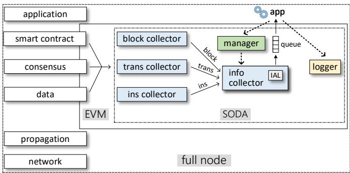
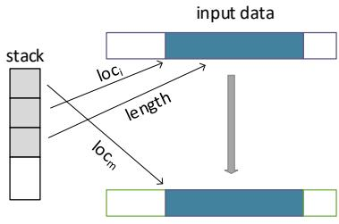
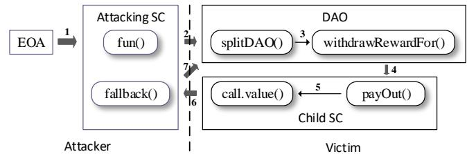
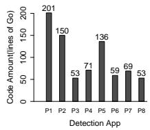
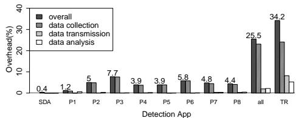
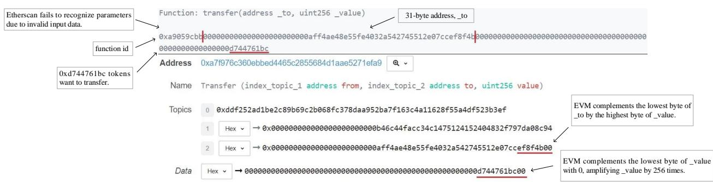

# SODA: A Generic Online Detection Framework for Smart Contracts

Ting Chen<sup>∗</sup>, Rong Cao<sup>∗</sup>, Ting Li<sup>∗</sup>, Xiapu Luo<sup>†k</sup>, Guofei Gu<sup>‡</sup>, Yufei Zhang<sup>∗</sup>, Zhou Liao<sup>∗</sup>, Hang Zhu<sup>∗</sup>, Gang Chen<sup>§</sup>, Zheyuan He<sup>∗</sup>, Yuxing Tang<sup>∗</sup>, Xiaodong Lin<sup>¶</sup>, and Xiaosong Zhang<sup>∗</sup>

<sup>∗</sup>Center for Cybersecurity, University of Electronic Science and Technology of China, China, brokendragon@uestc.edu.cn

<sup>†</sup>Hong Kong Polytechnic University, Hong Kong, daniel.xiapu.luo@polyu.edu.hk

<sup>‡</sup>SUCCESS Lab, Texas A&M University, USA, guofei@cse.tamu.edu

<sup>§</sup>Chengdu Kongdi Technology Inc., China, 975868494@qq.com

<sup>¶</sup>University of Guelph, Canada, xlin08@uoguelph.ca

Abstract—Smart contracts have become lucrative and profitable targets for attackers because they can hold a great amount of money. Unfortunately, existing offline approaches for discovering the vulnerabilities in smart contracts or checking the correctness of smart contracts cannot conduct online detection of attacking transactions. Besides, existing online approaches only focus on specific attacks and cannot be easily extended to detect other attacks. Moreover, developing a new online detection system for smart contracts from scratch is time-consuming and requires deep understanding of blockchain internals, thus making it difficult to quickly implement and deploy mechanisms to detect new attacks. In this paper, we propose a novel generic online detection framework named SODA for smart contracts on any blockchains that support Ethereum virtual machine (EVM). SODA distinguishes itself from existing online approaches through its capability, efficiency, and compatibility. First, SODA empowers users to easily develop apps for detecting various attacks online (i.e., when attacks happen) by separating information collection and attack detection with layered design. At the higher layer, SODA provides unified interfaces to develop detection apps against various attacks. At the lower layer, SODA instruments EVM to collect all primitive information necessary to detect various attacks and constructs 11 kinds of structural information for the ease of developing apps. Based on SODA, users can develop new apps in a few lines of code without modifying EVM. Second, SODA is efficient, because we design on-demand information retrieval to reduce the overhead of information collection and adopt dynamic linking to eliminate the overhead of inter-process communication. Such design allows users to develop detection apps using any programming languages that can generate dynamic link libraries. Third, since more and more blockchains adopt EVM as smart contract runtime, SODA can be easily migrated to such blockchains without modifying apps. Based on SODA, we develop 8 detection apps to detect the attacks exploiting major vulnerabilities in smart contracts, and integrate SODA (including all apps) into 3 popular blockchains: Ethereum, Expanse and Wanchain. The extensive experimental results demonstrate the effectiveness and efficiency of SODA and our detection apps.

## I. INTRODUCTION

Background. Many blockchains support smart contracts, which are autonomous programs executing the predefined logic automatically and mandatorily [1]. Smart contracts have become lucrative and profitable targets for attackers because they can hold a great amount of money. For example, the most valuable smart contract on Ethereum holds about 1.8 million ETH [2], the native cryptocurrency of Ethereum which is worthy of about 400 million USD [3]. Many attacks happened in recent years, resulting in severe financial loss. For example, by exploiting the re-entrancy vulnerability in the DAO smart contract, an attacker caused 70 million USD financial loss [4]. Besides, without proper authority management, a critical function of the Parity multisig wallet contract led to 31 million USD financial loss [5]. The same smart contract has another vulnerability that allows hackers to kill the smart contract and therefore 153 million USD were frozen [6]. Additionally, the EOSBet smart contract did not handle notifications properly so that attackers incurred 0.5 million USD financial loss by exploiting such vulnerability [7]. Negative impacts will be persistent because attacking transactions cannot be deleted after they are added to the blockchain, and even extended because other blockchains adopt Ethereum virtual machine (EVM) as the runtime of smart contracts, given more than 20 million smart contracts have been deployed into Ethereum.

Existing approaches. Existing approaches for protecting smart contracts can be roughly divided into offline and online. Offline approaches analyze smart contracts to discover vulnerabilities [8]–[17], check their correctness [18]–[21], reverse engineer the bytecode of smart contracts [22]–[26], detect malicious smart contracts [27], [28], to name a few. However, offline methods cannot guarantee that all vulnerabilities can be detected and removed due to the lack of runtime information and the inherent limitations of the selected techniques. Therefore the smart contracts after processing by these approaches can still be attacked. Online approaches attempt to detect attacks targeting smart contracts or protect smart contracts from attacks after deployment [29]–[37], which can be classified into two categories. The first category inserts protection code into the source/bytecode of smart contracts [29], [31]–[33]. However, their capabilities [29], [31]–[33] are restricted by the size limit of EVM bytecode [38] and the gas mechanism [39]. The second category inserts protection code into the runtime of smart contracts (e.g., EVM) [30], [34]–[37]. However, these approaches cannot be easily extended to detect new attacks [30], [35], or lack detailed design, implementations and evaluations [34], [36], or are resource-consuming and could miss many attacks [37]. We detail existing approaches in §VIII.

Our approach. We propose a novel generic online detection framework named SODA (i.e., Smart contract Online Detection framework against Attacks.) for smart contracts on any EVMcompatible blockchains. How to extend SODA to protect smart contracts from attacks is discussed in §VII. SODA distinguishes itself from existing online approaches through its capability, efficiency, and compatibility. First, SODA is an extensible framework that empowers users to easily develop apps for online detection of various attacks. To achieve this goal, SODA separates information collection and attack detection with layered design (§III-A). At the higher layer, SODA provides unified interfaces for developing detection apps. At the lower layer, SODA instruments EVM to collect all primitive information necessary to detect attacks (§III-C). Moreover, we construct 11 kinds of structural information (§III-D) to ease the development of detection apps. Based on SODA, users can develop new apps in a few lines of code without modifying EVM. To demonstrate it, we develop 8 apps to detect attacks that exploit major vulnerabilities in smart contracts, including re-entrancy, unexpected function invocation, invalid input data, incorrect check for authorization, no check after contract invocation, missing the Transfer event, strict check for balance, and dependency of block number and timestamp, respectively.

Second, SODA is efficient, because we design on-demand information retrieval which just collects the information required by the registered apps, to reduce the overhead of information collection. Besides, SODA runs apps asynchronously to further reduce overhead because the execution of smart contracts needs not to wait for the outcomes of apps. Furthermore, SODA adopts dynamic linking to eliminate the overhead of inter-process communication (IPC). Thus, users can develop detection apps using any programming languages that can generate dynamic link libraries (DLLs). Such design enables installing/removing detection apps during the execution of the blockchain, and thus facilitates quick response to new attacks. Extensive experiments show that the overhead of SODA without/with 8 detection apps in processing historical blocks is 0.4%/25.5%, respectively (§V-D), which is acceptable for retrospective analysis (e.g., attack forensics). Besides, the overhead of SODA with all 8 apps in processing newly mined blocks is negligible because block mining is more timeconsuming than attack detection (§V-D). The experimental results also demonstrate that the proposed on-demand information retrieval is effective to reduce overhead (§V-E) and the detection latency is negligible (§V-F).

Third, SODA is compatible with any blockchain that adopts EVM as its smart contract runtime. EVM was first designed for Ethereum and then quickly adopted by many other blockchains (e.g., Expanse [40], Wanchain [41], Tomochain [42], SmartMesh [43], CPChain [44], Thunder-Core [45]). Therefore, SODA can be used by them. To demonstrate its compatibility, we integrate SODA including 8 detection apps into 3 blockchains, namely Ethereum, Expanse and Wanchain. After running these blockchains with SODA, we detect many attacks. It is worth noting that SODA is the first online detection system for Expanse and Wanchain.

The potential users of SODA include, but is not limited to, security analysts who concern with security events/attacks happened on blockchains, the developers of smart contracts, and third parties that assess smart contracts in the private chain. Therefore, we assume that the users of SODA are trusted and the detection apps running on SODA are benign.

Contributions. This work has three major contributions:

• We design and implement SODA, a novel generic online framework for detecting attacks happened on EVM-compatible blockchains. SODA distinguishes itself from existing online approaches through its capability, efficiency, and compatibility.

• Based on SODA, we develop 8 apps with new methods to detect attacks exploiting major vulnerabilities in smart contracts. Moreover, we integrate SODA into 3 popular EVM-compatible blockchains. SODA, the detection apps and experimental results will be released at https://github.com/pandabox-dev/SODA.

• Conducting extensive experiments to evaluate SODA, we observe that SODA along with the detection apps detected many attacks with low overhead.

## II. BACKGROUND

Block. A blockchain is a growing list of blocks [46], each of which contains a cryptographic hash of the previous block for linking the previous block, a timestamp when the block was mined, and transactions [46]. Blocks are produced by mining.

Account. There are two kinds of accounts in Ethereum: external owned account (EOA) and smart contract [39]. An EOA is controlled by a private key and does not contain the EVM bytecode. A smart contract account contains its EVM bytecode of executable code, and it should be created by an EOA or another smart contract. Each account is referred to by its address, a 20-byte value.

Smart Contract. A smart contract is typically developed in a high-level language (e.g., Solidity [47]), and then compiled into EVM bytecode, which is a sequence of EVM instructions. EVM uses its interpreter to execute EVM instructions and it currently supports more than 130 unique EVM instructions [39]. Before invoking a smart contract, its EVM bytecode should be deployed on the blockchain. To call a function in a smart contract, the function id rather than the function name of the callee should be provided. The function id is the first 4 bytes of the hash of the function signature which is the function name with the list of parameter types [48].

Stack, Memory, Storage. EVM is a stack-based virtual machine, and it uses a stack to record the operands, computation results of EVM instructions, function parameters etc [39]. Memory is a temporary space to store function parameters, function return values etc [39]. Storage is a database-like permanent space to store key-value pairs [39].

Transaction. A transaction is a message sent by an account [49], [50]. There are two types of transactions differentiated by senders. More precisely, an EOA sends an external transaction and a smart contract sends an internal transaction [49]. A block only records external transactions because internal transactions can be reproduced by executing smart contracts. A transaction carries critical information, e.g., the amount of ETH to send, the EVM bytecode of a smart contract to be deployed, the parameters for invoking a smart contract.

Event. Smart contracts emit events using logging instructions, i.e., LOG0, LOG1, LOG2, LOG3, and LOG4 [47]. An event consists of zero or more topics and a data field [47].

ETH, Token. ETH is the native cryptocurrency of Ethereum. When a block is mined, the miner will be rewarded with ETH. Ethereum supports numerous tokens, which are cryptocurrencies implemented as smart contracts. A token should usually be compatible with some token standards, e.g., ERC-20 [51], ERC-721 [52]. Otherwise, third-party tools (e.g., wallets, exchange markets) cannot interact with it properly [53].

Full node. To mine and verify blocks, a blockchain full node downloads all historical blocks from the other nodes and replays the transactions contained in the blocks. A full node is equipped with an EVM for running smart contracts. Therefore, a full node can observe all information of blocks, transactions, and the execution of smart contracts.

## III. DESIGN AND IMPLEMENTATION OF SODA

## A. Architecture



## Fig. 1. Architecture of SODA

As shown in Fig. 1, SODA is integrated into a full node of any EVM-compatible blockchain, because only a full node can mine blocks. It separates the information collection and attack detection with layered design for the ease of developing detection apps. More precisely, SODA uses three modules, namely block collector, trans collector and ins collector, to collect the primitive information of blocks, transactions, and executed EVM instructions, respectively, from the smart contract layer, the consensus layer and the data layer of a full node. Note that EVM serves the data, consensus, and application layers [54], where the data layer contains the defined data structures and the data types (e.g., account, transactions), the consensus layer regulates how nodes reach consensus, and the smart contract layer stores smart contracts [54]. The primitive information will be sent to the module info collector (§III-C), which will provide the required information to the detection apps. For the ease of understanding the behaviors of smart contracts, we abstract 11 kinds of structural information and develop the module, information abstraction layer (IAL, §III-D) to construct them by summarizing the primitive information from the info collector. The collected runtime information is maintained EVM managerin the information queue, from which detection apps consume runtime information asynchronously.

A detection app can obtain both the primitive information collected by the info collector and the structural information provided by the IAL for detecting specific attacks. More precisely, the app should be first registered through the unified interface provided by the module manager (§III-B), and then the manager will inform the info collector about what information should be sent to the app. An app will inform the logger if it detects an anomaly (e.g., an attack, a vulnerable smart contract), and the logger raises an alert with the description of the abnormal situations. All detection apps run inside the process of a full node but in a different thread from the thread running the EVM, as shown in Fig. 1. Such design has three advantages. First, costly IPC is eliminated. Second, it is allowed to run apps asynchronously. Third, it empowers users to develop detection apps without modifying the EVM.

## B. Manager

The manager is responsible for registering and unregistering detection apps. When the full node starts, the manager loads all DLLs in a default folder into the memory, and executes the function register() in each DLL, which provides the information for registering and initializing the app, including the runtime information needed by the app, the block number indicating when the app should be launched, and the functions used to receive different runtime information. The manager uses a dictionary to maintain the registration information of all apps. The dictionary records key-value pairs, where the key is the type of runtime information and the value is the list of apps that need such runtime information. If the full node is not running, unregistering an app simply removes the corresponding DLL from the default folder.

A detection app can be dynamically registered when the full node is running by sending the manager a registration message, which carries the full path of the app, the runtime information required by the app, the block number denoting when the app should be launched, and the functions used to receive different runtime information. Similarly, an app can be dynamically unregistered when the full node is running by sending the manager a deregistration message, which carries the information about the app to be unregistered and the block number indicating when the app should be stopped. For ease of use, we add two APIs, registerApp() and unregisterApp() to EVM for registering and unregistering an app, respectively. Then, users can just call them in the console of the full node to register or unregister apps.

## C. Info Collector

The info collector obtains all runtime information, including the information of blocks, transactions and the executed EVM instructions by customizing EVM and taking into account the effects that can be made by each transaction and each executed EVM instruction. More precisely, SODA records all fields of each block and each transaction. If an EVM instruction reads a value, SODA records the value and the location being read. Similarly, if an EVM instruction writes a value, SODA records the value, the location being written and the previous value stored in that location. Note that the location being read or written can be a field of a block (e.g., <sup>ll</sup> <sup>node</sup>the hash of a block), a transaction, or a stack item, a memory region, or a storage slot of a smart contract.

Block Collector. The block collector obtains all fields of each block. After studying the official source code of EVM developed in Go, We learn that a block consists of a block header and a block body defined in block.go. The block header contains useful metadata, such as the block number, the difficulty to mine the block, the miner who produces the block, the mining reward to the miner, the timestamp when the block was mined. The block body contains external transactions. A block can have 0 transaction so that the block body is empty. To achieve consensus, EVM verifies blocks in the function Process() in state processor.go, which will be invoked for each downloaded block. Hence, we add code in Process() to record all fields of each block.

Trans Collector. The trans collector obtains all fields of each external and internal transaction by different processes. An external transaction carries much information, including the addresses of the transaction sender and the transaction receiver, the amount of ETH to send, and the input data. If the transaction is used to deploy a smart contract, the input data contains the bytecode of the smart contract [39]. If the transaction is used to call a function, the input data contains the function id indicating which function should be invoked and function arguments [39]. We add code into the function ApplyTransaction() in state processor.go, which executes each external transaction in a block, to record all fields of an external transaction. The information carried by an internal transaction carries is similar to that of an external transaction. We record all fields of each internal transaction by adding code into the interpretation handlers of the EVM instructions CREATE, CALL, CALLCODE, DELEGATECALL, STATICCALL, SELF-DESTRUCT which can produce internal transactions [39].

Ins Collector. There are more than 130 EVM instructions supported by an EVM [39]. We add code into the interpretation handlers of all EVM instructions to record the runtime information of all executed EVM instructions. To avoid missing any useful information, we record all the effects that can be made by each instruction. The kinds of instruction information that can be obtained by SODA are as follows.

(1) SODA records the name of a field, the location in the field to be read and the read value, if an instruction reads a field of a block, a transaction or the executed smart contract. For example, for the instruction BLOCKHASH, which gets the blockhash of a given block [39], SODA records the name of the field, “block hash”, and its value.

(2) SODA records the original balance and the new balance if an instruction changes the balance of an account. For example, for the instruction CALL which can send ETH from the account A to the account B [39], SODA records the original balances and the new balances of A and B, respectively.

(3) SODA records the stack items consumed or added by an instruction. For example, since the instruction ADD consumes the top two stack items to get the summation and pushes the result on the stack top [39], SODA records the two addends which are the two consumed stack items and the one added stack item which is the summation.

(4) SODA records the value and its location in the memory or the storage, if an instruction reads the memory or the storage. For example, for the instruction MLOAD, which reads 32 bytes from the memory, SODA records the 32 bytes and the first stack item indicating the location in the memory to read [39].

(5) SODA records the original value, the new value and its location, if an instruction writes the memory or the storage. For example, for the instruction SSTORE which writes 32 bytes to the storage, SODA records the first stack item which indicates the location in the storage from where to write, the original value by reading the specified location in the storage, and the second stack item which stores the new value [39].

We use the instruction CALLDATACOPY to demonstrate what information will be recorded by SODA. In Fig. 2, CALLDATA-COPY copies some data from the input data of an external transaction to the memory [39]. It consumes three stack items, which indicate the location in the memory to store data $( l o c _ { m } )$ the location in the input data to read data (loc ), and the length of data (length), respectively [39]. SODA records these three stack items, the value read from the input data and the original value stored in the memory before data copy.

  
Fig. 2. The effects made by CALLDATACOPY

On-demand Information Retrieval. Since obtaining and sending all runtime information to detection apps will incur unnecessary high overhead. To reduce such overhead, we design on-demand information retrieval based on the fact that an app may just need partial information to fulfill its functionality. For example, we develop an app to detect re-entrancy attacks (§IV-B) and this app just needs transaction information, so on-demand information retrieval does not collect and send the information of blocks and executed EVM instructions. SODA coordinates apps, the manager and the info collector to realize on-demand retrieval. More precisely, an app informs the manager about the required information during registration. By aggregating the registration messages from all apps, the manager maintains a dictionary which maps each kind of information to the apps needing such information. The info collector collects the required information and sends them to apps according to this dictionary.

## D. IAL

To ease the development of apps, besides the primitive information, IAL abstracts 11 kinds of structural information from the info collector and provides them to apps. We briefly introduce each structural information here and explain how IAL constructs them in Appendix A.

(1) Contract bytecode. IAL obtains the bytecode of a smart contract and its address when the smart contract is created.

(2) Contract invocation. IAL collects the information of contract invocation, including how to invoke the contract (e.g., by executing CALL or CALLCODE), the addresses of the caller and the callee, the function id and arguments, the amount of ETH sent along with contract invocation, whether the invocation is successful or failed.

(3) Stack access. IAL obtains the information of stack access whenever a smart contract accesses it, including the executed EVM instruction, the stack items popped from the stack and the stack items pushed on the stack.

(4) Memory access. IAL obtains the information of memory access whenever a smart contract accesses the memory, including the executed EVM instruction, the memory location to be read/written, the value being read/written, and the new value that will be written in the memory.

(5) Storage access. IAL gets the information of storage access whenever a smart contract accesses the storage, including the executed EVM instruction, the storage slot being read/written, the value being read/written, the new value that will be written in the storage slot.

(6) ETH transfer. IAL obtains the information of ETH transfer whenever ETH is transferred, including how to transfer ETH (e.g., by an external transaction or executing CALL), the addresses of the ETH sender and the ETH receiver, and the amount of ETH.

(7) Balance change. IAL obtains the information of balance change whenever the balance of an account changes, including the account address, the original balance and the new balance.

(8) Control flow transfer. IAL obtains the information of control flow transfer whenever the control flow of the executed smart contract transfers, including the executed EVM instruction, the current program counter and the program counter of the next executed instruction.

(9) Comparison. IAL obtains the information of comparison whenever a smart contract executes comparison instructions, including the executed instruction, the operands being compared and the comparison result.

(10) Arithmetic operation. IAL obtains the information of arithmetic operations whenever a smart contract executes arithmetic instructions, including the executed arithmetic instruction, the operands and the result.

(11) Event. IAL obtains the information of an event whenever a smart contract emits it, including the executed instruction, the topics and the data of the event.

## E. Logger

Logger will be called to produce a warning if an anomaly is detected. The warning contains the app that captures the anomaly, the runtime information required by the app, the hash of the external transaction that triggers the anomaly, and the number of the block containing such external transaction. The warning can facilitate anomaly investigation and smart contracts debugging.

## IV. DETECTION APPS BASED ON SODA

To demonstrate how to quickly develop useful detection apps on SODA, we implement 8 apps (§IV-B – §IV-I) to detect the attacks exploiting major vulnerabilities in smart contracts. Before introducing our apps, we first describe how apps communicate with SODA (§IV-A) without IPC.

## A. Communicate between Detection Apps with SODA

The detection apps run within the same process with SODA and therefore their communications are intra-process which are faster than inter-process communications (IPC). Communications are required in three scenarios. First, an app registers and unregisters to the manager by invoking two APIs, registerApp() and unregisterApp() provided by SODA. Second, the info collector sends the required information to apps. Technically, it sends the information to a queue, then the thread running apps asynchronously get the information from the queue and invokes the apps who need such information. Third, the thread running apps receives the results from apps, which are the return values of the invoked functions. Then, the thread invokes the logger if an anomaly is detected.

Listing 1 shows the core code of an example app which writes the bytecode of deployed smart contracts into the disk. When the full node starts, the manager invokes register() (Line 1) to get registration information including the information needed by the app (i.e., contract bytecode provided by the IAL) and the function to process the runtime information (i.e., handleBytecode()) (Line 2). Then, register() initializes the app by opening a file for recording the bytecode (Line 3). handleBytecode() (Line 6) will be invoked by the thread running apps whenever a smart contract is deployed, and then it writes the address and the bytecode of each smart contract into a file (Line 7). Finally, handleBytecode() returns 0 (Line 8) indicating that no anomaly is detected.

```go
func register() map[string]string{
    registerInfo := map[string]string{"bytecode":"handleBytecode"}
    fd := os.OpenFile(...)
    return registerInfo
}
func handleBytecode(info *collector.CollectorDataT) (byte){
    io.WriteString(fd, info.addr+":"+info.bytecode+"\n")]
    return 0x0
}
```  
Listing 1. An example app to record the bytecode of deployed smart contracts

## B. P1: Re-entrancy

  
Fig. 3. A practical attack to steal the DAO contract

Problem Description. A re-entrancy occurs if a smart contract is called again before the previous call to the smart contract returns. Re-entrancy can cause severe financial loss. For example, an attacker stole 3.6 million ETH worthy of 70 million USD by re-entering the DAO contract [4]. Fig. 3 shows a practical attack process. The attacker controls an EOA to create and invoke an attacking smart contract, which calls the function splitDAO() in the DAO contract. SplitDAO() calls withdrawRewardFor() where the function payOut() of a smart contract created by the DAO is invoked. After that, payOut() calls call.value() to send ETH to the attacking smart contract belonging to the attacker. Since call.value() will invoke the fallback function in the callee contract [49], the attacking smart contract can call splitDAO() again. Consequently, the attacking smart contract can withdraw more ETH than the proper amount by repeatedly executing the steps 3 – 7 as shown in Fig. 3.

App. To detect a malicious re-entrancy aiming at stealing ETH, P1 exploits two invariants: execution cycles and ETH transfer, because the attacker will let the cycle (e.g., steps 3 – 7, Fig. 3) execute repeatedly and force ETH transfer from a victim smart contract to the attacker when the victim is re-entered to make a profit. Note that a loop can also form the repeatedly executed cycle. For example, a smart contract A has a loop and in each iteration, A invokes another smart contract B which calls back to A. If the loop body executes multiple times, the cycle will be executed repeatedly. P1 removes irrelevant cycles by introducing a counter which increases when an internal transaction begins and decreases when it ends. If the cycle is caused by re-entrancy, the counter will increase when the cycle iterates because the caller will wait for the callee to finish [8]. On the contrary, the counter will be reset when the loop starts a new iteration, because all internal transactions produced in a loop end their executions before a new loop iteration.

P1 needs the transaction information, especially the addresses of the transaction sender and the transaction receiver, the ETH to send, when the transaction starts and ends. Unlike Sereum, P1 focuses on the re-entrancy that transfers ETH from the victim, and it does not consider a re-entrancy as malicious if the victim sends ETH only during its first invocation. Sereum considers a re-entrancy as malicious if two requirements are satisfied: (1) a storage variable is used for control-flow decisions when a smart contract is re-entered; (2) such storage variable is updated after the re-entrancy returns [30]. Therefore, Sereum does not limit to detect reentrancy attack for stealing ETH (§VI). P1 can detect all four re-entrancy patterns mentioned in the Sereum paper [30] if they steal ETH during re-entrancy, because all these patterns form cycles. Appendix B discusses the extension of P1 to detect malicious re-entrancy for stealing tokens.

## C. P2: Unexpected Function Invocation

Problem Description. The bytecode of a smart contract contains a dispatch routine which reads the function id from the input data of a transaction and then determines the function to be invoked by matching such function id with the function ids encoded in the dispatch routine [55]. If no match is found, the fallback function will be invoked [49]. We call such function invocation as unexpectedfunction invocation, because the fallback function is not the expected one. Unexpected function invocation can incur severe consequences, as shown in Listing 7 that an unexpected function invocation detected by P2 can steal tokens.

<table><tr><td>1</td><td>CALLDATALOAD</td><td>8</td><td>PUSH4 0x06fdde03</td></tr><tr><td>2</td><td>PUSH29 0x01...</td><td>9</td><td>EQ</td></tr><tr><td>3</td><td>SWAP1</td><td>10</td><td>PUSH2 0x00e2</td></tr><tr><td>4</td><td>DIV</td><td>11</td><td>JUMPI</td></tr><tr><td>5</td><td>PUSH4 0xffffffff</td><td>12</td><td>......</td></tr><tr><td>6</td><td>AND</td><td></td><td rowspan="2">Listing 2. The dispatch routine of a practical smart contract</td></tr><tr><td>7</td><td>DUP1</td><td></td></tr></table>

App. P2 obtains 2 kinds of information from the IAL, including contract bytecode and contract invocation, and detects an unexpected function invocation through four steps. In the first step, for each invoked smart contract, P2 locates its dispatch routine and obtains all function ids. Then, P2 uses a dictionary to record the address of each executed smart contract and its function ids. Listing 2 presents the dispatch routine of a practical smart contract. Line 1 reads the first 32 bytes from the input data, and Line 2 – Line 6 extract the first 4 bytes of the

32 bytes. Therefore, the stack top is the function id supplied in the input data. Line 7 – Line 9 compare the function id with 0x06fdde03. If they are equal, the EVM jumps to the instruction located at 0x00e2 from the start of the bytecode. 0x06fdde03 is a function id encoded in the dispatch routine and 0x00e2 is the start of a function whose id is 0x06fdde03. P2 searches the contract bytecode for the instruction sequence: PUSH4 x; EQ; PUSH2 y; JUMPI. If an instruction sequence is found, we obtain an encoded function id, x.

In the second step, P2 extracts the function id which is the first 4 bytes of the input data, indicating the expected function to invoke [55]. In the third step, for each function invocation, P2 checks whether the extracted function id exists in the dispatch routine of the invoked smart contract by looking for the dictionary. If not, the function invocation may be an unexpected one. The fourth step removes false positives from the results of the third step if users attempt to invoke the fallback function. The input data of a function invocation to the fallback function can be non-empty in two cases. First, the fallback function can take in parameters by explicitly reading them from the input data, although its parameter list is empty. Second, a transaction can send customized information (e.g., who and why to send this transaction) to the fallback function. In the two cases, the third step will generate false positives, because the first 4 bytes of the input data are not a function id. P2 considers an unexpected function invocation discovered by the third step as a false positive, if the length of the input data is not 32x + 4, x ≥ 0, which is the length of the input data of an invocation to a non-fallback function, because a function id is 4 bytes and each parameter is a multiple of 32 bytes [48].

## D. P3: Invalid Input Data

Problem Description. CALLDATALOAD reads 32 bytes from the input data, and it adds zero-value bytes if the input data does not have enough data [39]. Such design can be exploited by attackers to steal tokens through the short address attack [56]. We use a practical attack detected by P3 (shown in Fig. 6) to explain it. The attacker sends a 31-byte address and a 32- byte integer value which denotes the amount of tokens, to the victim. The victim constructs a transaction based on the short address and the value and sends it to transfer tokens of the value amount to the attacker. The EVM handles the transaction by complementing the short address with the highest byte of the second parameter, and then complementing the lowest byte of the second parameter with one byte of 0. Hence, the amount of tokens is amplified by 256. Consequently, the attacker collects more tokens from the victim.

App. P3 monitors the invocation of two functions, transfer() and transferFrom(), which are standard functions for transferring tokens in ERC-20 [51]. More functions can be easily included. P3 detects an invalid input data by two steps. First, P3 obtains the function id from the information of contract invocation, and checks whether the invoked function is transfer() or transferFrom(). Since the two functions are standard [51], their function ids are known. If so, in the second step, P3 checks whether the length of arguments is shorter than it should be. If so, a short address attack may occur. Specifically, the correct lengths of arguments to transfer() and transferFrom() are 64 and 96 bytes, respectively, because the

2 functions take in 2 and 3 parameters, respectively, and each parameter is 32 bytes [51].

## E. P4: Incorrect Check for Authorization

Problem Description. A smart contract needs to check permissions before performing sensitive operations, such as sending ETH. Some smart contracts check whether tx.orgin, which is the account who initializes the external transaction, is the expected account. Unfortunately, such smart contracts are at risk of phishing attacks [57]. A more secure programming practice is to check whether the sender of the current external/internal transaction, msg.sender, is from the expected account [57]. Fig. 8 shows that a phishing attack detected by P4 can tamper the core data structure of a vulnerable smart contract by bypassing the insecure permission check.

App. P4 detects an incorrect check for authorization in four steps. First, P4 records the address of the account from the information of ORIGIN. Then, it checks whether the sender is involved in the execution of EQ. If so, P4 checks whether the two operands of EQ are equal. If that is the case, the check for authorization is passed. Then, P4 checks whether tx.origin is equal to msg.sender which is supplied in the information of contract invocation. If not, P4 detects the problem, because the incorrect check using tx.origin is passed, but the correct check using msg.sender cannot be passed.

## F. P5: No Check after Contract Invocation

Problem Description. When a smart contract calls another one, the return value should be checked because the exception raised in the callee will not propagate to the caller [8]. Without checking the return value, the failure of the callee may cause unexpected issues to the caller because the caller does not know whether the callee executes successfully.

App. After obtaining contract bytecode from the IAL, P5 scans the bytecode to find a check after each contract invocation. If no check is found, P5 detects a problematic smart contract. Since a smart contract can be invoked by one of the four instructions, including CALL, CALLCODE, DELEGATECALL, and STATICCALL [39], we look for the instructions for checking return values right after these 4 instructions. However, it is nontrivial to determine which instructions can be used to check the return value. To address this issue, we reverse engineering the bytecode of the source code for checking the return value, and summarize 7 instruction patterns, as shown in Listing 3.

```asm
CALL*; ISZERO
CALL*; SWAPn; POP; ...; POP; ISZERO
CALL*; SWAPn; POP; ...; POP; PUSH1 0x0/0x1; EQ
CALL*; SWAPn; POP; ...; POP; SWAP1; POP; DUP1; ISZERO
CALL*; SWAPn; POP; ...; POP; xxx; SWAP2; POP; DUP2; ISZERO
CALL*; xxx; PUSH1 0x0; DUP2; EQ
CALL*; xxx; DUP1; ISZERO
```

CALL\* represents CALL, CALLCODE, DELEGATECALL, and STATICCALL. The stack top is the return value after contract invocation and ISZERO checks whether the stack top is zero [39], so pattern 1 checks whether the return value is false. Two consecutive ISZEROs are needed to check whether the return value is true, but we just need to look for one ISZERO because we are interested in whether there is a check rather than how to check. SWAPn, $1 \leq n \leq 1 6$ , exchanges the stack top with the (n+1)th stack item [39]. “POP, ..., POP” are n consecutive

POPs which pop n items from the stack. Therefore, P2 checks the return value because after executing “SWAPn; POP, ..., POP”, the stack top is the return value. PUSH1 0x0/0x1 means pushing a 0 or a 1 on the stack. EQ compares the top two stack items which are the return value and the pushed value (i.e., 0 or 1). Hence, pattern 3 can check the return value. DUPn, $1 \leq n \leq 1 6$ duplicates the nth stack item [39], so pattern 4 checks the return value which is a duplication by executing “SWAP1; POP; DUP1”. “xxx” stands for an instruction sequence, after executing, the stack does not change. Since before executing “xxx”, the stack top is the return value, after executing “SWAP2; POP; DUP2;”, “PUSH1 0x0; DUP2;” and DUP1 respectively, the return value is duplicated. Therefore, patterns 5, 6, 7 check the duplication of the return value. A problematic smart contract is found if it contains a contract invocation but does not match any pattern in Listing 3. During pattern matching, P5 skips the instruction sequence “xxx” by stack simulation. According to the information of contract invocation from the IAL, P5 can detect the transactions which lead to the failure of the contract invocation without checking its return value. For such transactions, the caller smart contract may perform abnormally because it is not aware of the failure.

## G. P6: Missing the Transfer Event

Problem Description. The implementation of a token should follow any token standard which defines standard functions and standard events. Otherwise, third-party tools cannot interact with the token properly, because they observe token behaviors (e.g., token transfer) typically by monitoring the invocation of standard functions and the emission of standard events [53]. ERC-20, the most popular token standard, requires a token to emit the standard event, Transfer, if either of the two standard functions, transfer() and transferFrom() is invoked [51]. If the Transfer event is not emitted, third-party tools may not observe token transfers. The “fake deposit” attack [58] exploits the missing of the Transfer event to cheat exchange markets.

App. After obtaining the information of contract invocation and events from the IAL, P6 first checks whether the invoked function is transfer() or transferFrom(). If so, P6 checks whether the invoked function emits the Transfer event. If not, P6 finds that the Transfer event is not emitted. Since transfer(), transferFrom() and Transfer are well defined in ERC-20 [51], P6 can recognize them from the received information easily.

## H. P7: Strict Check for Balance

Problem Description. A smart contract can check whether its balance is equal to a specified amount, and execute some sensitive operations (e.g., sending ETH) after the comparison. However, such check is insecure because the balance can be manipulated by others. For example, when a smart contract self-destructs, all ETH in it can be sent to a specified account [49], and thus an attacker can execute self-destruction in its smart contract to affect the comparison result.

App. P7 needs the information of BALANCE, which gets the balance of the executing smart contract, and EQ from the info collector. P7 first records the balance from the runtime information of BALANCE, and then checks whether the balance is involved in EQ. If so, P7 discovers a strict check for balance.

## I. P8: Timestamp Dependency & Block Number Dependency

Problem Description. Timestamp dependency means that a comparison in a smart contract depends on the timestamp [8]. Similarly, if a comparison depends on the block number, the contract has the problem of block number dependency [8]. Dependency may incur security risks because miners can control block numbers and timestamps [12], and therefore miners can affect the execution of the smart contract.

App. P8 detects timestamp dependency and block number dependency in two steps. First, it records the timestamp and the block number from the information of TIMESTAMP and NUMBER provided by the info collector. Second, it checks whether the timestamp or the block number is involved in any comparison operation which is provided by the IAL. If so, P8 detects a dependency problem.

## V. EVALUATION OF SODA

## A. Research Questions

We conduct extensive experiments to answer six research questions. RQ1: Can SODA be easily integrated into any EVM-compatible blockchains? RQ2: Can SODA facilitate the development of detection apps? RQ3: What is the overhead of SODA? RQ4: Can on-demand information retrieval reduce the overhead of SODA? RQ5: What is the detection latency? RQ6: Can SODA easily integrate third-party tools?

## B. Integrating SODA into Blockchains

Although there are many EVMs developed in different languages, SODA can be integrated into any EVM as long as it follows the same protocol [39]. In this paper, we first implement SODA in about 2,200 lines of Go based on the EVM in Geth v1.9.0, because Ethereum is the most popular EVM-compatible blockchain. Then we migrate SODA into Expanse v1.8.23 and Wanchain v1.1.1. We find that Expanse and Wanchain customize the EVM of Ethereum slightly, so we modify the original SODA in 27 and 164 lines of Go respectively to make it work on them. More precisely, since Expanse and Wanchain change the paths of some packages which are necessary for the EVM, we provide the correct paths of packages. Besides, Expanse and Wanchain slightly customize the interpretation handlers of some EVM instructions, and therefore we modify these handlers. For example, the interpretation handler of Expanse for executing ADDRESS returns the address of the executed smart contract as a big integer. However, the same handler of Ethereum returns the address as a byte sequence.

Answer to RQ1: SODA can be easily integrated into EVMcompatible blockchains, such as Expanse and Wanchain.



  
Fig. 4. Code amount Fig. 5. Overhead of SODA

## C. Amount of Code of Detection Apps

Fig. 4 shows the code amount of 8 detection apps, ranging from 53 to 201 lines of Go, which are much fewer than the code amount of the framework. Moreover, the implementations of 8 apps are the same for 3 blockchains.

Answer to RQ2: SODA can facilitate the development of detection apps.

## D. Overhead of SODA

We define the overhead of SODA and the detection apps as $( T _ { t } - T _ { b } ) / T _ { b }$ , where $T _ { t }$ is the running time of the blockchain with SODA and 0 or more apps, $T _ { b }$ is the running time of the blockchain without SODA. All experiments are conducted on a desktop equipped with an Intel Xeon CPU E5-2640, 8GB main memory and 1TB hard disk. Note that $T _ { b }$ for processing historical transactions is different from that for processing new transactions, because historical transactions had been added to the blockchain while it takes time for new transactions to be included in new blocks through mining.

Processing historical transactions. We let Geth download the first 1 million blocks, and the results are shown in the overall bars of Fig. 5. SODA without any apps introduces 0.4% overhead, and the overhead of SODA with one detection app ranges from 1.2% to 7.7%. The overhead of SODA with all 8 apps is 25.5%, that is acceptable for retrospective analysis, e.g., attack forensics. Fig. 5 also presents the overheads of three parts of SODA, collecting runtime information, enveloping and transmitting information from SODA to apps, and data analysis by apps. The overhead of each part is defined as $T _ { p } / T _ { b } ,$ where $T _ { p }$ is the time consumption of that part. Unsurprisingly, data collection is more time-consuming than the other two parts, because the info collector has to access various fields of core data structures (e.g., an external transaction) of Ethereum and parse the raw data (e.g., extract the bytecode of a smart contract from the input data). Moreover, the overhead of the data analysis by apps does not contribute much to the overall overhead, because apps run asynchronously in a different thread from EVM.

Processing new transactions. To evaluate the overhead of SODA when processing new transactions, we first let pure Geth download all historical blocks. After that, we copy Geth to get two identical instances. We equip the first Geth instance with SODA as well as 8 detection apps. Then, we run the two instances at the same time to download new transactions. Experiments last about two weeks and the two instances download the same number of new blocks, 90,000. The overhead is almost unnoticeable, about 0.00003%, because the average time for mining a block is about 14 seconds [59], which are much longer than the time needed by SODA with 8 apps to process transactions. Our observation is accordant with a recent work that block mining is the primary performance bottleneck of existing blockchain systems [32].

Answer to RQ3: The overhead of SODA with 8 detection apps is low when processing historical transactions, and the overhead is negligible when processing new transactions.

## E. Effectiveness of On-demand Information Retrieval

To evaluate the effectiveness of on-demand information retrieval, we implement a tracer which takes in all information that can be provided by the framework, and returns immediately. Therefore, the tracer disables the on-demand information retrieval. The overhead of SODA equipped with the tracer is shown in the TR bar of Fig. 5, which is about 1.3x larger than the overhead of SODA equipped with 8 apps.

Answer to RQ4: On-demand information retrieval is effective in reducing the overhead of SODA.

## F. Detection Latency

SODA obtains the detection result of a transaction after its termination because EVM continues the processing of the subsequent transactions when apps analyze the data from the current transaction in asynchronous mode. We define the detection latency of a transaction as the time difference between when apps complete the analysis of the transaction and when the transaction terminates. We insert code into theaddress report EVM to record the two corresponding timestamps. The latency<sup>0xbb9bc244d798123fde783f</sup> depends on the data analysis of apps, because apps run after<sup>cc1c72d3bb8c189413</sup> receiving the runtime information in a different thread fromSereum paper the thread running the EVM while the runtime information<sub>0xf01fe1a15673a5209c9412 https://www.palkeo.com/en/projets/ethereum/st</sub> is collected, enveloped, and transmitted during the processing1c45e2121fe2903416 n\_ether.html of transactions by the EVM. Note that the detection latency<sup>0x59752433dbe28f5aa59b47 https://www.palkeo.com/en/projets/ethereum/st</sup> of a transaction will be 0 if the app needs not to process the<sup>9958689d353b3dee08 n\_ether.html</sup> transaction. For example, the latency incurred by P7 is 0 for a transaction if it does not lead to the execution of BALANCE and EQ, because P7 will not run if SODA does not collect theCb7DD4D04dE3DF254D0 information of BALANCE and EQ. Table I shows that the latency per transaction is negligible, ranging from 1 to 35 µs.

TABLE I. DETECTION LATENCY PER TRANSACTION (×µS)

<table><tr><td>P1</td><td>P2</td><td>P3</td><td>P4</td><td>P5</td><td>P6</td><td>P7</td><td>P8</td><td>P1-P8</td></tr><tr><td>10</td><td>5</td><td>2</td><td>4</td><td>1</td><td>2</td><td>6</td><td>8</td><td>35</td></tr></table>

Answer to RQ5: The detection latency is negligible.

## G. Integrating With Third-party Tools

We integrate SODA with three third-party tools, Madmax [17] for discovering gas-focused vulnerabilities, EVM Bytecode Decompiler (EBD) [22] for decompiling EVM bytecode and Osiris [15] for discovering integer overflow vulnerabilities using the same amount of code, i.e., 75 lines of Go. Detailed description is presented in Appendix C.

Answer to RQ6: SODA can be easily extended by integrating third-party tools with it.

## VI. RESULTS OF DETECTION APPS

We run SODA with 8 detection apps on Ethereum, Expanse and Wanchain public chains to detect attacks and problematic smart contracts. Table II lists the results. Row 2 shows the number of blocks downloaded by their full nodes, and the days when the last downloaded blocks were mined. Row 3 gives the number of external transactions contained in the downloaded blocks. Row 4 presents the number of smart contracts created by the download blocks. The remaining rows show the results of detection apps.

Results of P1. P1 detects 31 smart contracts whose ETH are stolen by re-entrancy attacks on Ethereum. No re-entrancy attacks are found in Expanse and Wanchain. 24 out of them are open-source, including the DAO. The number after “|”

TABLE II. RESULTS OF DETECTION APPS ON 3 BLOCKCHAINS

<table><tr><td>1</td><td colspan="2">blockchains</td><td>Ethereum</td><td>Expanse</td><td>Wanchain</td></tr><tr><td>2</td><td></td><td># blocks</td><td>8.18M(Jul. 19, 2019)</td><td>2.17M(Jul. 20, 2019)</td><td>3.75M(Jul. 19, 2019)</td></tr><tr><td>3</td><td></td><td># external trans</td><td>501,676,297</td><td>5,919,098</td><td>145,497</td></tr><tr><td>4</td><td></td><td># created contracts</td><td>16,958,741</td><td>1,601</td><td>2,333</td></tr><tr><td>5</td><td rowspan="2">P1</td><td># contracts</td><td>31|24</td><td>0</td><td>0</td></tr><tr><td>6</td><td># trans</td><td>1,976</td><td>/</td><td>/</td></tr><tr><td>7</td><td></td><td># contracts</td><td>1,264,335|9,014</td><td>23</td><td>5</td></tr><tr><td>8</td><td>P2</td><td># trans</td><td>9,208,836</td><td>350</td><td>9</td></tr><tr><td>9</td><td></td><td># function ids</td><td>41,999</td><td>10</td><td>5</td></tr><tr><td>10</td><td rowspan="2">P3</td><td># contracts</td><td>726|358</td><td>0</td><td>0</td></tr><tr><td>11</td><td># trans</td><td>6,599</td><td>/</td><td>/</td></tr><tr><td>12</td><td rowspan="2">P4</td><td># contracts</td><td>30,278|58</td><td>0</td><td>0</td></tr><tr><td>13</td><td># trans</td><td>442,762</td><td>/</td><td>/</td></tr><tr><td>14</td><td rowspan="2">P5</td><td># contracts</td><td>1,106|105</td><td>18</td><td>0</td></tr><tr><td>15</td><td># trans</td><td>609,313</td><td>46</td><td>0</td></tr><tr><td>16</td><td rowspan="2">P6</td><td># contracts</td><td>20,608|2,175</td><td>1,202</td><td>1</td></tr><tr><td>17</td><td># trans</td><td>1,637,002</td><td>3,403</td><td>1</td></tr><tr><td>18</td><td rowspan="2">P7</td><td># contracts</td><td>14,592|133</td><td>0</td><td>0</td></tr><tr><td>19</td><td># trans</td><td>40,389</td><td>/</td><td>/</td></tr><tr><td>20</td><td rowspan="2">P8</td><td># contracts</td><td>135,949|13,527</td><td>63</td><td>19</td></tr><tr><td>21</td><td># trans</td><td>48,033,077</td><td>22,324</td><td>7,095</td></tr></table>

indicates the number of open-source smart contracts detected by apps. Besides, P1 detects 1,976 external transactions which exploit the re-entrancy vulnerability of the 31 smart contracts to steal ETH. Appendix D lists the addresses of all detected smart contracts and the number of attacking transactions. We also present detailed results of P1 including the addresses of the detected smart contracts and the transaction hashes of the detected transactions on https://github.com/pandabox-dev/ SODA. Then, we manually check the false positives of P1. For 24 open-source smart contracts, we inspect their source code manually, and for 7 closed-source smart contracts, we first decompile them by Online Solidity Decompiler [60] and then inspect the decompiled code. Manual audit shows that P1 produces 5 false positives, and therefore the false positive rate of P1 is 16%.

```solidity
function doWithdraw(address from, address to, uint256 amount) internal{
    require(amount <= MAX_WITHDRAWAL);
    require(balances[from] >= amount);
    require(withdrawalCount[from] < 3);
    balances[from] = balances[from].sub(amount);
    to.call.value(amount();
    withdrawalCount[from] = withdrawalCount[from].add(1);
}

Listing 4. A false positive of P1

function sell(bytes32 hash, uint amount) public{
......
ERC20(info.token).safeTransferFrom(msg.sender, this, tradeAmount);
uint total = info.eth.mul(tradeAmount).div(info.amount);
msg.sender.transfer(total);
......
}
```

## Listing 5. Another two false positives of P1

Two false positives are due to the same reason. Listing 4 presents one which uses a mapping balances[] to records the amount of ETH that a user can withdraw. Therefore, attackers cannot steal ETH by re-entrancy because balances[] reduces the amount before transferring ETH (Line 5). Two another false positives have the same bytecode, and their source code is shown in Listing 5. Users can invoke sell() to trade their tokens with the ETH of this smart contract. More specifically, msg.sender sends tokens to the smart contract (Line 3), and this smart contract sends ETH back to msg.sender (Line 5). Therefore, attackers cannot steal ETH, because they must pay for the ETH. The reason for the last false positive is that the receiver sends ETH back to the detected smart contract immediately after it receives ETH, so the detected smart contract does not lose ETH. We plan to eliminate the false positives of P1 automatically in our future work by checking whether attackers withdraw more ETH than the amount belonging to them and taking token transfers into consideration.

We thank the authors of Sereum for providing their results so that we can make a comparison. Sereum detects 284 smart contracts which are re-entered before 8.18 million blocks. By manual analysis, we find that 29 out of them send ETH when they are re-entered, and these 29 smart contracts are also detected by P1. Since P1 and Sereum use different criteria and techniques to detect malicious re-entrancies, they have different sets of false positives. One one hand, 3 out of 5 false positives of P1 are also detected by Sereum. The remaining 2 false positive of P1 are not flagged by Sereum because the detected smart contracts do not update storage after reentrancy which is a necessary requirement of Sereum to detect re-entrancy attacks. On the other hand, P1 does not suffer from the false positives reported in the paper about Sereum [30], because P1 does not need to track the accessing of storage variables which is challenging.

Listing. 6 presents the decompiled code of a detected smart contract. Line 3 sends ETH to msg.sender, and the amount of ETH is recorded in the storage. After sending ETH, Line 5 resets the storage slot for recording the amount of ETH. This smart contract is susceptible to re-entrancy attacks because the storage slot is reset after sending ETH. More precisely, if msg.sender is the hacker, Line 3 will invoke the fallback function of the hacker’s smart contract. If the fallback function calls back to the function 01CB(), the vulnerable smart contract will send ETH to the hacker again. Consequently, the hacker can receive ETH repeatedly before resetting the storage slot by exploiting the vulnerability.

```matlab
function 01CB(){
......
    memory[...] = address(msg.sender).call.gas(...).value(storage[keccak256(memory[0x00:0x40]))]...
......
    storage[keccak256(memory[0x00:0x40])] = 0x00;
}
```

Results of P2. P2 detects 1,264,335, 23, and 5 smart contracts with the issue of unexpected function invocation on Ethereum, Expanse, and Wanchain, respectively. It also detects 9,208,836, 350, and 9 external transactions that call the unexpected function (i.e., the fallback function) on 3 blockchains, respectively. For each detected external transaction, we extract the function id of the expected function from its input data , and we obtain 41,999, 10, and 5 function ids on 3 blockchains, respectively.

Please recall that P2 requires the length of the input data to be 32x + 4, x ≥ 0. But, it will produce a false positive if a transaction attempts to invoke the fallback function with the length of its input data being 32x + 4, x ≥ 0 by chance. Unfortunately, it is difficult to accurately identify the false positives of P2 because we do not know the real intention of transaction senders. We propose to consider an external transaction detected by P2 as a true positive, if the function id extracted from the input data is a valid function id which is computed from a function signature. We check whether an extracted function id is valid by leveraging a function signature database which records valid function ids [61]. After searching the database, we find 8,390,172 transactions with valid function ids. Therefore, the false positive rate of P2 should not be higher than 9% (1 − 8, 390, 172/(9, 208, 836 + 350 + 9)), because the database may be incomplete.

Fig. 7 presents a detected smart contract, whose fallback function is invoked unexpectedly. The caller is an exchange market EtherDelta, which invokes depositToken() to deposit some amount of a specific token into EtherDelta, by invoking the standard function, transferFrom() of the token (Line 3). However, P2 finds that an attacker invokes depositToken() of EtherDelta to deposit a token whose transferFrom() is not implemented and thus the fallback function of the token is invoked. Consequently, the attacker does not deposit tokens into EtherDelta. However, EtherDelta records that tokens are successfully deposited at Line 4. Once the hacker invokes withdrawToken() of EtherDelta (Line 7), the hacker can steal tokens from EtherDelta because the token implements another standard function transfer() (Line 11).

```javascript
function depositToken(address token, uint amount){
    if (msg.value>0 || token==0) throw;
    if (!Token(token).transferFrom(msg.sender, this, amount)) throw;
    tokens[token][msg.sender] = safeAdd(tokens[token][msg.sender], amount);
    Deposit(token, msg.sender, amount, tokens[token][msg.sender]);
}
function withdrawToken(address token, uint amount){
    if (msg.value>0 || token==0) throw;
    if (tokens[token][msg.sender] < amount) throw;
    tokens[token][msg.sender] = safeSub(tokens[token][msg.sender], amount);
    if (!Token(token).transfer(msg.sender, amount)) throw;
    Withdraw(token, msg.sender, amount, tokens[token][msg.sender]);
}
```

## Listing 7. A smart contract detected by P2

Results of P3. P3 detects 6,599 external transactions that invoke 726 smart contracts with invalid input data on Ethereum, and no such transactions on Expanse and Wanchain. Then, we investigate whether the detected transactions are false positives by leveraging Etherscan [62], which can recognize arguments of the invocation to a known function but cannot recognize arguments to unknown functions or from invalid input data. Please recall that P3 detects the invocations to transfer() and transferFrom() defined in ERC-20, which are known by Ethereum. We find that, for all detected transactions, Etherscan cannot recognize arguments. That is, Etherscan confirms that P3 does not produce false positives.

Fig. 6 presents the screenshot of a detected transaction from Etherscan, which is a short address attack happened in practice. The subfigure above presents the input data of the attacking transaction. We can see that Etherscan cannot recognize arguments because the input data is shorter than a valid input data. After manual interpretation of the input data, we find that 0xa9059cbb is the function id of transfer(), to is a 31-byte short address, and value is 0xd744761bc. The subfigure below presents the Transfer event which reflects the token behavior incurred by the attack. Obviously, the missing byte of to is complemented by the highest byte of value, and the lowest byte of value is appended with one byte of zeros by EVM. Consequently, 0xd744761bc00 tokens are transferred, which is 256 times larger than the intended amount.

Results of P4. P4 detects 30,278 smart contracts on Ethereum, each of which uses the result of ORIGIN to check permissions, and no problematic smart contracts on Expanse and Wanchain. P4 also detects 442,762 external transactions, each of which passes the vulnerable permission check and tx.origin is not the same account with msg.sender. 58 out of 30,278 detected smart contracts are open-source. To study the false positives of P4, we manually inspect all 58 open-source smart contracts and 200 randomly selected closed-source smart contracts detected by P4. By checking these 258 smart contracts and corresponding transactions, we found that P4 produces no false positives.

  
Fig. 6. Screenshot of a short address attack Fig. 6. Screenshot of a short address attack

Listing 8 presents a detected smart contract, which belongs to a decentralized application providing a reputation score to an address [63]. The function add() adds a score to a given address provided by the transaction sender (i.e., msg.sender), and thus only privileged accounts can invoke add(). Line 9 checks whether an account is a privileged account. However, this contract is susceptible to phishing attacks because tx.origin is used to check permissions. P4 detects an external transaction whose tx.origin is the privileged account, manager, and thus the transaction passes the permission check and adds a score to an address specified by msg.sender. Interestingly, we find that the detected external transaction invokes another smart contract, which invokes add(). Therefore, msg.sender is not equal to tx.origin in this transaction. If this external transaction comes from a phishing attack, the attacker can add an arbitrary score to an arbitrary address.

```javascript
function add(address target, int wScore) external restricted{
    if (!scores[target].exists) {
        scores[target] = Score(true, 0, 0);
    }
    scores[target].cumulativeScore += wScore;
    scores[target].totalRatings += 1;
}
modifier restricted() {
    require(msg.sender == manager || tx.origin == manager || msg.sender == controller);
};
}
```

## Listing 8. A smart contract detected by P4

Results of P5. P5 detects 1,106 and 18 problematic smart contracts on Ethereum and Expanse, respectively, and no problematic smart contracts on Wanchain. P5 identifies 609,313 and 46 external transactions on Ethereum and Expanse, respectively, each of which leads to the failure of the contract invocation without checking its return value. 105 out of 1,124 detected smart contracts are open-source. To study the false positive rate of P5, we manually examine all 105 open-source smart contracts and 200 randomly-selected closed-source smart contracts, and find that P5 produces no false positives.

Listing 9 presents a detected smart contract. Line 2 sends m txs[ h].value ETH to the account m txs[ h].to without checking the return value. P5 also detects external transactions which lead to the failure of ETH transfer at Line 2. These transactions may result in severe consequences to third-party tools and the executed smart contract itself. Line 3 emits an event, MultiTransact to notify third-party tools that ETH has been transferred. However, the notification will mislead third-party tools, because ETH transfer fails. m txs[] is the core data structure to record the account which should receive ETH. Line 4 deletes the account h from m txs[] because the smart contract considers that h has already received ETH, which is contrary to the fact. Consequently, the smart contract will execute incorrectly if subsequent execution needs to read m txs[ h] which was mistakenly removed.

```txt
if(m_txs[_h].to != 0) {
    m_txs[_h].to.call.value(m_txs[_h].value)(m_txs[_h].data);
    MultiTransact(msg.sender, _h, m_txs[_h].value, m_txs[_h].to, m_txs[_h].data);
    delete m_txs[_h];
    return true;
}
```

## Listing 9. A smart contract detected by P5

Results of P6. P6 detects 20,608, 1,202, and 1 smart contracts whose transfer() or transferFrom() can be executed without emitting the Transfer event on Ethereum, Expanse and Wanchain, respectively. 2,175 out of them are opensource. Besides, P6 detects 1,637,002, 3,403 and 1 external transactions which execute transfer() or transferFrom() and no Transfer is emitted. To estimate the false positive rate of P6, we randomly select 1,000 open-source smart contracts and 200 closed-source smart contracts detected by P6. After checking these 1,200 smart contracts and the corresponding transactions, we find that 26 smart contracts do not implement transfer() or/and transferFrom(), and 125 transactions attempt to invoke the missing functions. However, the fallback function is invoked instead [49]. For these 125 transactions, P6 produces false positives because the fallback function is not required to emit the Transfer event [51]. Hence, the false positive rate of P6 is 0.03% (125/368, 619).

```javascript
function transfer(address _to, uint256, _value) returns(bool success) {
    if(balances[msg.sender] >= _value && _value > 0) {
        balances[msg.sender] = substractSafely(balances[msg.sender, _value]);
        balances[_to] = addSafely(balances[_to], _value);
        Transfer(msg.sender, _to, _value);
    }
    else{
        success = false;
    }
    return success;
}
```

## Listing 10. A smart contract detected by P6

Listing 10 presents a detected smart contract. If the transaction sender has sufficient tokens and the amount of tokens to be sent is larger than 0 (Line 2), tokens will be sent (Lines 3, 4) and a Transfer event will be emitted (Line 5). However, if the requirements at Line 2 are not satisfied, tokens will not be sent and the Transfer event will not be emitted (Lines 7 – 9). By executing Lines 7 – 9, hackers can launch fake deposit attacks to cheat the exchange markets which observe token transfers by parsing the arguments of transfer(), because no tokens are transferred in practice.

Results of P7. P7 detects 14,592 smart contracts on Ethereum, each of which checks whether the result of BALANCE is strictly equal to a specific value, and no problematic smart contracts on Expanse and Wanchain. Besides, P7 detects 40,389 external transactions on Ethereum triggering the strict check for balance. To evaluate the false positive rate of P7, we manually inspect all 133 open-source smart contracts and 200 randomly selected closed-source smart contracts detected by P7. 14,019 transactions are involved in these 333 smart contracts. We found that 101 transactions are false positives, and hence the false positive rate of P7 is 0.7% (101/14, 019). The reason is that P7 does not use precise data-flow tracking; instead, P7 checks whether one operand of EQ is equal to the result of BALANCE. We find that, for all false positives, the result of BALANCE is 0 and one operand of an irrelevant EQ is also 0.

Listing 11 presents a detected smart contract. The fallback function stops receiving ETH, if a flag, isPreIco is false (Line 2). isPreIco is set to false (Line 5), if the balance of this smart contract is strictly equal to maxAmountSupply (Line 4). However, this smart contract is vulnerable to attacks. More specifically, when the balance of this smart contract is close to maxAmountSupply, a hacker can make the balance surpass maxAmountSupply by self-destruction, and therefore isPreIco cannot be set to false. Such attack can break the functionality of this smart contract to stop receiving ETH, because we find that the smart contract does not have a function to decrease the amount of ETH from the hacker.

```txt
function() payable {
    if(isPreIco == false) throw;
......
    if(this.balance == maxAmountSupply){
        isPreIco = false;
    }
}

Listing 11. A smart contract detected by P7
function CancelMyInvestment() external noEther {
......
    if(investers[InvestorID].timestamp > now && ContractEnabled){throw;}
......
}
```

Results of P8. P8 detects 135,949, 63 and 19 smart contracts on Ethereum, Expanse and Wanchain, respectively, each of which contains a comparison depending on the block number or the timestamp. Moreover, P8 detects 48,033,077, 22,324, and 7,095 external transactions on three blockchains, each of which triggers the execution of such comparison. 13,527 out of all detected smart contracts are open-source. To estimate the false positive rate of P8, we randomly select 1,000 opensource smart contracts and 200 closed-source smart contracts. Manual investigation of these 1,200 smart contracts and the corresponding transactions shows that P8 does not produce false positives. The reason why P8 is accurate without precise data-flow tracking is that the values of timestamps and block numbers are specific, so it is very unlikely that the operands of unrelated comparisons are equal to timestamps or block numbers by chance. Listing 12 shows a detected smart contract. Line 3 compares the timestamp (i.e., now) with a specific value. Since the timestamp is set by the miner, the execution of the smart contract may be terminated (i.e., throw, Line 3) by a malicious miner.

False Negative Analysis. Lacking the ground truth of all problematic smart contracts, we cannot conduct a comprehensive analysis on false negatives. Instead, we try our best to search the Internet for vulnerable smart contracts mentioned in articles, reports, and papers. Eventually, we found 5 smart contracts exploited by re-entrancy attacks and 1 smart contract containing a call without checking its return value. The addresses and the sources of these reported smart contracts are presented in Appendix E. Our apps can detect all of them.

In summary, our 8 detection apps can detect problematic smart contracts and the corresponding transactions with high accuracy, though their implementations are simple.

## VII. DISCUSSION

Precise data-flow tracking. Currently, SODA does not support precise data-flow tracking and thus apps may produce false positives (e.g., §VI, results of P7) and false negatives. We will develop a data-flow tracking module for SODA and expose APIs to apps, allowing them to check data dependency.

Implementation of detection apps. We present 8 apps just for demonstrating how to quickly develop useful apps on SODA with a few lines of code. Therefore, these apps are not fully optimized and could be further improved. Moreover, more detection apps can be developed on SODA. By releasing the source code of our framework and the apps later, we will encourage others to develop apps for the framework in addition to implementing more apps by ourselves in future work.

Applications of SODA. Besides security applications, SODA can be used in any scenarios requiring the runtime information of blocks, transactions, or smart contracts. For example, it can be used to profile the behaviors of ETH/token transfer and measure the performance of blockchains, e.g., the evolving of the difficulty and the time needed to mine blocks.

Extension to online protection. To protect smart contracts from attacks, SODA should be modified from several aspects. First, apps should be run synchronously so that SODA can stop the execution of problematic smart contracts. Second, the code of apps should be audited by trusted parties to eliminate flawed or malicious apps. Third, we need a mechanism to deploy SODA and apps on blockchain nodes, because two nodes may not achieve consensus if only one is equipped with SODA or they install different apps.

## VIII. RELATED WORK

## A. Online Approaches

Sereum protects smart contracts with re-entrancy vulnerabilities from being exploited by leveraging taint analysis [30]. There are four major differences between SODA with Sereum. First, SODA is a framework, on which various apps can be developed, whereas Sereum focuses on re-entrancy attacks. Second, Sereum does not limit to detect re-entrancy attacks for stealing ETH. Third, SODA can be easily integrated into any EVM-compatible blockchains, and we conduct experiments on Ethereum, Expanse and Wanchain. Sereum, however, focuses on Ethereum. Fourth, P1 and Sereum have different sets of false positives because they apply different techniques [30]. EVM<sup>∗</sup> inserts protection code into EVM to prevent integer overflow bugs and timestamp bugs from being exploited [35]. However, the extension of EVM<sup>∗</sup> to support other attacks is not easy because EVM should be modified by inserting new protection code, which is technically challenging. Besides,

EVM<sup>∗</sup> lacks comprehensive evaluations about its effectiveness and efficiency; instead, EVM<sup>∗</sup> is tested by just 10 selected smart contracts [35].

ÆGIS proposes an extensible framework based on a smart contract for maintaining patterns [34]. However, ÆGIS does not disclose its design, implementations and evaluation [34]. DappGuard aims at preventing various attacks by integrating OYENTE, an anomaly detection engine and a rule-based detection engine [36]. But, its companion paper does not present technical details and evaluation results [36]. FSFC is an extensible framework which implements filter smart contracts to prevent bad inputs [37]. However, FSFC will consume considerable computing resources to deploy filter contracts, because a filter contract can protect only one smart contract, given the huge number of smart contracts in Ethereum. Moreover, some attacks cannot be detected by simply checking their inputs. For example, to detect a re-entrancy attack, we need to monitor the execution of the victim smart contract, but its input (e.g., the address, the amount of ETH) is insufficient to distinguish attacks from normal transactions.

ContractLarva inserts protection code into the source code of smart contracts so that the corresponding EVM bytecode can prevent attacks [29]. Solythesis inserts user-supplied invariants into the source code of smart contracts [32]. The instrumented smart contracts will reject all transactions that violate the invariants [32]. ContractGuard inserts runtime checks into the bytecode of smart contracts, and the instrumented smart contracts will reject all transactions that hijack the control flow of smart contracts [31]. Ayoade et al.’s work inserts protection code into the bytecode of smart contracts to prevent integer overflow/underflow attacks [33]. However, the protection abilities of these approaches [29], [31]–[33] are restricted by the blockchain architecture for two reasons. First, complicated runtime checks may not be inserted into smart contracts, because the bytecode of a smart contract must not exceed 24KB [38]. Second, large smart contracts always cost high execute fee, which may be a disincentive to a big-size smart contract with runtime checks.

## B. Offline Approaches

There are already many offline analysis studies on smart contracts, such as vulnerability discovery [8]–[17], [64]–[67], correctness verification [18]–[21], [53], [68], [69], reverse engineering [22]–[26], [70], detection of malicious smart contracts [27], [28], identification of gas-inefficient patterns [71], [72], to name a few. OYENTE applies symbolic execution (SE) to interpret the bytecode of smart contracts, and it can discover four kinds of vulnerabilities [8]. Manticore [9], MAIAN [11] and MythX [10] also leverages SE to discover vulnerabilities with different implementations and focus on different kinds of vulnerabilities. ETHRACER applies SE and partial-order reduction to discover event-ordering bugs arising from the unexpected ordering of events [16]. SMARTSCOPY not only discovers vulnerabilities, but also synthesizes adversarial smart contracts to exploit vulnerable smart contracts [64]. teEther leverages SE to discover vulnerabilities and generate transactions which can attack vulnerable smart contracts [65]. sCompile ranks the program paths according to their criticalness, and applies SE to discover vulnerabilities by exploring the topranked critical paths [14]. ContractFuzzer leverages fuzzing to reveal vulnerabilities [12]. MadMax conducts static analysis to detect gas-focused vulnerabilities [17]. Osiris combines taint analysis and SE to discover integer overflow vulnerabilities [15]. ReGuard applies fuzzing to detect re-entrancy bugs [66]. SmartCheck discovers 21 kinds of problems from the source code of smart contracts [13].

SOLAR leverages SE to check whether the implementation of a token violates any token standard [68]. TokenScope automatically checks inconsistent token behaviors by comparing real token transfer behaviors with those behaviors suggested by standard functions and standard events [53]. Given a smart contract, Vultron checks whether the mismatch between the actual transferred amount and the amount reflected on the contract’s internal bookkeeping will happen [69]. ZEUS [19], K framework [20], [21], and Securify [18] check the correctness of smart contracts through formal verification. EBD [22], Vandal [23], Porosity [24], Erays [25] and Gigahorse [26] are decompilers which convert the bytecode of smart contracts into human-readable representations. ETHIR extends OYENTE by translating the control flow graph into a rule-based representation [70]. HONEYBADGER applies SE to detect the honeypot smart contracts, which lure their victims into traps by deploying seemingly vulnerable smart contracts that contain hidden traps [27]. Chen et al. apply machine learning to detect the smart contracts implementing Ponzi schemes [28].

However, after being processed by offline analysis, smart contracts may still contain vulnerabilities, and thus still be susceptible to attacks for two reasons. The first is lacking runtime information. For example, OYENTE fails to find 3 kinds of re-entrancy bugs due to the lack of runtime information [30]. The inherent limitations of the selected techniques is another reason. For instance, symbolic-execution-based tools, such as OYENTE [8], Manticore [9], MythX [10], MAIAN [11], Osiris [15] may not discover all vulnerabilities due to path explosion. As another example, ContractFuzzer [12] is unlikely to reveal all vulnerabilities due to the low code coverage of black-box fuzzing. Therefore, online approaches can complement offline approaches.

## IX. CONCLUSION

We propose and develop SODA, a novel generic online detection framework for detecting various attacks. SODA is superior to existing online approaches due to its capability, efficiency, and compatibility. With SODA, users can quickly develop detection apps to detect new attacks. For demonstration, we develop 8 apps with new detection methods to detect attacks exploiting major vulnerabilities in smart contracts. Moreover, we integrate SODA into three popular blockchains supporting EVM. By conducting extensive experiments to evaluate SODA, we observe that it along with the detection apps can effectively detect many attacks with low overhead.

## ACKNOWLEDGEMENT

Ting Chen is partially supported by National Natural Science Foundation of China (61872057) and National Key R&D Program of China (2018YFB0804100). Xiapu Luo is partially supported by Hong Kong RGC Project (No. 152193/19E). Guofei Gu is partially supported by the US National Science Foundation (No. 1617985 and No. 1700544).

[1] J. Kehrli, “Blockchain 2.0 – from Bitcoin transactions to smart contract applications,” https://www.niceideas.ch/blockchain 2.0.pdf, 2016.

[2] Etherscan, “Top accounts by ETH balance,” https://etherscan.io/accounts, 2019.

[3] CoinMarketCap, “Top 100 cryptocurrencies by market capitalization,” https://coinmarketcap.com/, 2019.

[4] S. Falkon, “The story of the DAO — its history and consequences,” https://medium.com/swlh/the-story-of-the-dao-its-history-andconsequences-71e6a8a551ee, 2017.

[5] H. Qureshi, “A hacker stole \$31m of ether —- how it happened, and what it means for Ethereum,” https://www.freecodecamp.org/news/ahacker-stole-31m-of-ether-how-it-happened-and-what-it-means-forethereum-9e5dc29e33ce/, 2017.

[6] T. O’Ham, “Parity multisig wallet bug freezes over \$153 million dollars in Ethereum,” https://bitsonline.com/parity-bug-ethereum/, 2017.

[7] M. Sotnichek, “How EOS casinos lost \$562,000 to smart contract vulnerabilities,” https://www.apriorit.com/dev-blog/588-eos-smartcontract-vulnerabilities, 2018.

[8] L. Luu, D.-H. Chu, H. Olickel, P. Saxena, and A. Hobor, “Making smart contracts smarter,” in CCS, 2016.

[9] M. Mossberg, F. Manzano, E. Hennenfent, A. Groce, G. Grieco, J. Feist, T. Brunson, and A. Dinaburg, “Manticore: A user-friendly symbolic execution framework for binaries and smart contracts,” https://arxiv.org/pdf/1907.03890.pdf, 2019.

[10] MythX, “Smart contract security tool for Ethereum,” https://mythx.io/, 2019.

[11] I. Nikolic, A. Kolluri, I. Sergey, P. Saxena, and A. Hobor, “Finding the greedy, prodigal, and suicidal contracts at scale,” in ACSAC, 2018.

[12] B. Jiang, Y. Liu, and W. K. Chan, “ContractFuzzer: fuzzing smart contracts for vulnerability detection,” in ASE, 2018.

[13] S. Tikhomirov, E. Voskresenskaya, I. Ivanitskiy, R. Takhaviev, E. Marchenko, and Y. Alexandrov, “SmartCheck: Static analysis of Ethereum smart contracts,” in WETSEB, 2018.

[14] J. Chang, B. Gao, H. Xiao, J. Sun, and Z. Yang, “sCompile: Critical path identification and analysis for smart contracts,” in ICFEM, 2019.

[15] C. F. Torres, J. Schutte, and R. State, “Osiris: Hunting for integer bugs¨ in Ethereum smart contracts,” in ACSAC, 2018.

[16] A. Kolluri, I. Nikolic, I. Sergey, A. Hobor, and P. Saxena, “Exploiting the laws of order in smart contracts,” in ISSTA, 2019.

[17] N. Grech, M. Kong, A. Jurisevic, L. Brent, B. Scholz, and Y. Smaragdakis, “MadMax: Surviving out-of-Gas conditions in Ethereum smart contracts,” in OOPSLA, 2018.

[18] P. Tsankov, A. Dan, D. Drachsler-Cohen, A. Gervais, F. Bunzli, and¨ M. Vechev, “Securify: Practical security analysis of smart contracts,” in CCS, 2018.

[19] S. Kalra, S. Goel, M. Dhawan, and S. Sharma, “Zeus: Analyzing safety of smart contracts,” in NDSS, 2018.

[20] G. Rosu, “Formal design, implementation and verification of blockchain languages (invited talk),” in LIPIcs, 2018.

[21] ——, K: A Semantic Framework for Programming Languages and Formal Analysis Tools, 2017.

[22] L. Hollander, “EVM bytecode decompiler,” https://github.com/MrLuit/evm, 2019.

[23] L. Brent, A. Jurisevic, M. Kong, E. Liu, F. Gauthier, V. Gramoli, R. Holz, and B. Scholz, “Vandal: A scalable security analysis framework for smart contracts,” https://arxiv.org/pdf/1809.03981.pdf, 2019.

[24] M. Suiche, “Porosity: A decompiler for blockchain-based smart contracts bytecode,” in DEFCON 25, 2017.

[25] Y. Zhou, D. Kumar, S. Bakshi, J. Mason, A. Miller, and M. Bailey, “Erays: reverse engineering Ethereum’s opaque smart contracts,” in USENIX Security, 2018.

[26] N. Grech, L. Brent, B. Scholz, and Y. Smaragdakis, “Gigahorse: thorough, declarative decompilation of smart contracts,” in ICSE, 2019.

[27] C. F. Torres and M. Steichen, “The art of the scam: Demystifying honeypots in Ethereum smart contracts,” in USENIX Security, 2019.

[28] W. Chen, Z. Zheng, J. Cui, E. Ngai, P. Zheng, and Y. Zhou, “Detecting ponzi schemes on Ethereum: Towards healthier blockchain technology,” in WWW, 2018.

[29] S. Azzopardi, J. Ellul, and G. J. Pace., “Monitoring smart contracts: ContractLarva and open challenges beyond,” in RV, 2018.

[30] M. Rodler, W. Li, G. O. Karame, and L. Davi, “Sereum: Protecting existing smart contracts against re-Entrancy attacks,” in NDSS, 2019.

[31] X. Wang, J. He, Z. Xie, G. Zhao, and S.-C. Cheung, “ContractGuard: Defend ethereum smart contracts with embedded intrusion detection,” 2019.

[32] A. Li, J. A. Choi, and F. Long, “Securing smart contract on the fly,” https://arxiv.org/pdf/1911.12555.pdf, 2019.

[33] G. Ayoade, E. Bauman, L. Khan, and K. Hamlen, “Smart contract defense through bytecode rewriting,” in Blockchain, 2019.

[34] C. F. Torres, M. Baden, R. Norvill, and H. Jonker, “Poster: ÆGIS: Smart shielding of smart contracts,” in CCS, 2019.

[35] F. Ma, Y. Fu, M. Ren, M. Wang, Y. Jiang, K. Zhang, H. Li, and X. Shi., “EVM<sup>∗</sup>: From offline detection to online reinforcement for Ethereum virtual machine.” in SANER, 2019.

[36] T. Cook, A. Latham, and J. H. Lee, “DappGuard : Active monitoring and defense for solidity smart contracts,” https://courses.csail.mit.edu/6.857/2017/project/23.pdf, 2017.

[37] X. Wang, J. He, Z. Xie, G. Zhao, and S.-C. Cheung, “FSFC: An input filter-based secure framework for smart contract,” 2020.

[38] V. Buterin, “Contract code size limit,” https://github.com/ethereum/EIPs/blob/master/EIPS/eip-170.md, 2016.

[39] G. Wood, “Ethereum: a secure decentralised generalised transaction ledger — byzantium version 4d0f368,” https://ethereum.github.io/yellowpaper/paper.pdf, 2019.

[40] expanse, “Expanse tech,” https://expanse.tech/, 2019.

[41] wanchain, “wanchain – build the future of finance,” https://wanchain.org/, 2019.

[42] TomoChain, “TomoChain – the most efficient blockchain for the token economy,” https://tomochain.com/, 2019.

[43] SmartMesh, “SmartMesh – smartMesh opens up a world parallel to the internet,” https://smartmesh.io, 2019.

[44] CPCHAIN, “CPCHAIN – cyber physical chain,” https://www.cpchain.io/, 2019.

[45] ThunderCore, “ThunderCore – decentralized future. today,” https://www.thundercore.com/, 2019.

[46] Wikipedia, “Blockchain,” https://en.wikipedia.org/wiki/Blockchain, 2019.

[47] Solidity, “Solidity documentation v0.5.10,” https://solidity.readthedocs.io/en/v0.5.10/, 2019.

[48] “Contract ABI specification,” https://solidity.readthedocs.io/en/latest/abi-spec.html, 2019.

[49] Ethereum, “Ethereum homestead documentation,” http://www.ethdocs.org/en/latest//, 2019.

[50] T. Chen, Y. Zhu, Z. Li, J. Chen, X. Li, X. Luo, X. Lin, and X. Zhang, “Understanding Ethereum via graph analysis,” in INFOCOM, 2018.

[51] F. Vogelsteller and V. Buterin, “ERC-20 token standard,” https://github.com/ethereum/EIPs/blob/master/EIPS/eip-20.md, 2015.

[52] W. Entriken, J. Evans, and N. Sachs, “ERC-721 non-fungible token standard,” https://github.com/ethereum/EIPs/blob/master/EIPS/eip-721.md, 2018.

[53] T. Chen, Y. Zhang, Z. Li, X. Luo, T. Wang, R. Cao, X. Xiao, and X. Zhang, “TokenScope: Automatically detecting inconsistent behaviors of cryptocurrency tokens in Ethereum,” in CCS, 2019.

[54] M. Bez, G. Fornari, and T. Vardanega, “The scalability challenge of Ethereum: An initial quantitative analysis,” in SOSE, 2019.

[55] B. ARVANAGHI, “Reversing Ethereum smart contracts,” https://arvanaghi.com/blog/reversing-ethereum-smart-contracts/, 2018.

[56] P. Vessenes, “The ERC20 short address attack explained,” https://vessenes.com/the-erc20-short-address-attack-explained/, 2017.

[57] C. Coverdale, “Solidity: Tx origin attacks,” https://medium.com/coinmonks/solidity-tx-origin-attacks-58211ad95514, 2018.

[58] chinabtcnews, “Slowmist: 3,619 ETH-based tokens are affected by fake deposit vulnerability,” https://news.8btc.com/slowmist-3619-eth-basedtokens-are-affected-by-fake-deposit-vulnerability, 2018.

[59] Ethereum, “Ethereum block time history,” https://etherscan.io/chart/blocktime, 2019.

[60] “Online solidity decompiler (OSD),” https://ethervm.io/decompile.

[61] 4byte, “Welcome to the ethereum function signature database,” https://www.4byte.directory/, 2019.

[62] Ethereum, “Ethereum blockchain explorer,” https://etherscan.io/, 2019.

[63] etherep, “etherep – simple Ethereum reputation address,” https://www.etherep.com/, 2019.

[64] Y. Feng, E. Torlak, and R. Bodik, “Precise attack synthesis for smart contracts,” https://arxiv.org/pdf/1902.06067.pdf, 2019.

[65] J. Krupp and C. Rossow, “teEther: Gnawing at Ethereum to automatically exploit smart contracts,” in USENIX Security, 2018.

[66] C. Liu, H. Liu, Z. Cao, Z. Chen, B. Chen, and B. Roscoe, “Reguard: finding reentrancy bugs in smart contracts,” in ICSE-Companion, 2018.

[67] T. Chen, Z. Li, Y. Zhang, X. Luo, T. Wang, T. Hu, X. Xiao, D. Wang, J. Huang, and X. Zhang, “A large-scale empirical study on control flow identification of smart contracts,” in ESEM, 2019.

[68] A. Li and F. Long, “Detecting standard violation errors in smart contracts,” https://arxiv.org/pdf/1812.07702.pdf, 2019.

[69] H. Wang, Y. Li, S.-W. Lin, L. Ma, and Y. Liu, “Vultron: catching vulnerable smart contracts once and for all,” in ICSE-NIER, 2019.

[70] E. Albert, P. Gordillo, B. Livshits, A. Rubio, and I. Sergey, “ETHIR: A framework for high-level analysis of Ethereum bytecode,” in ATVA, 2018.

[71] T. Chen, X. Li, X. Luo, and X. Zhang, “Under-optimized smart contracts devour your money,” in SANER, 2017.

[72] T. Chen, Z. Li, H. Zhou, J. Chen, X. Luo, X. Li, and X. Zhan, “Towards saving money in using smart contracts,” in ICSE(NIER), 2018.

[73] T. Chen, Z. Li, Y. Zhang, X. Luo, A. Chen, K. Yang, B. Hu, T. Zhu, S. Deng, T. Hu, J. Chen, and X. Zhang, “Dataether: Data exploration framework for Ethereum,” in ICDCS, 2019.

## APPENDIX

## A. Detailed Description of IAL

(1) Contract bytecode. IAL obtains the bytecode of a smart contract and its address when the smart contract is created. Many detection apps need the bytecode of smart contracts. For example, from the bytecode, P2 extracts all encoded function ids (§IV-C) and P5 looks for a check after a contract invocation (§IV-F). To obtain the bytecode of smart contracts, IAL abstracts the information of external transactions and the instruction CREATE from the info collector, because they can create smart contracts [39]. Technically, the bytecode is extracted from the input data of external transactions and internal transactions which are triggered by executing CREATE. The address of a smart contract is returned after the smart contract is successfully deployed. Hence, IAL obtains the address from the return values of evm.create() which is the internal function of the EVM to create smart contracts.

(2) Contract invocation. IAL collects the information of contract invocation, including how to invoke the contract (e.g., by executing CALL or CALLCODE), the addresses of the caller and the callee, the function id and arguments, the amount of ETH sent along with contract invocation, whether the invocation is successful or failed. Such information is useful for attack detection. For instance, P2 needs to know the function id of the function to be invoked (§IV-C). To construct the information of contract invocation, IAL abstracts the information of external transactions and 4 EVM instructions, CALL, CALLCODE, DEL-EGATECALL, and STATICCALL from the info collector, because they can call smart contracts [39].

(3) Stack access. IAL obtains the information of stack access whenever a smart contract accesses it, including the executed EVM instruction, the stack items popped from the stack and the stack items pushed on the stack. EVM is a stack-based virtual machine, and hence all EVM instructions except STOP, JUMPDEST and INVALID will access the stack.

(4) Memory access. IAL obtains the information of memory access whenever a smart contract accesses the memory, including the executed EVM instruction, the memory location to be read/written, the value being read/written, and the new value that will be written in the memory. Such information is useful, because the memory stores the parameters and the return values of smart contracts, the bytecode of smart contracts, etc. To construct such information, IAL aggregates the information of 13 EVM instructions, SHA3, CALLDATACOPY, CODECOPY, RETURNDATACOPY, MLAOD, MSTORE, MSTORE8, CREATE, CALL, CALLCODE, DELEGATECALL, STATICCALL, RE-TURN, because they can access the memory [39].

(5) Storage access. IAL gets the information of storage access whenever a smart contract accesses the storage, including the executed EVM instruction, the storage slot being read/written, the value being read/written, the new value that will be written in the storage slot. Such information is useful, because attackers often attempt to access the important data in the storage. To construct the information of storage, IAL abstracts the information of 2 EVM instructions, SLOAD, SSTORE, because they read and write the storage, respectively [39].

(6) ETH transfer. IAL obtains the information of ETH transfer whenever ETH is transferred, including how to transfer ETH (e.g., by an external transaction or executing CALL), the addresses of the ETH sender and the ETH receiver, and the amount of ETH. The information of ETH transfer is crucial for many apps because ETH is a major target of hackers. For example, P1 needs to know ETH transfer to detect re-entrancy attacks (§IV-B). To construct the information of ETH transfer, IAL abstracts the information of external transactions, 4 EVM instructions, CREATE, CALL, CALLCODE and SELFDESTRUCT, because they can transfer ETH [39].

(7) Balance change. IAL obtains the information of balance change whenever the balance of an account changes, including the account address, the original balance and the new balance. The information of balance change is useful because many attacks will cause balance change (e.g., ETH steal). To construct the information of balance change, IAL abstracts the information of which accounts receive mining reward, which transactions send ETH, and 4 EVM instructions, CREATE, CALL, CALLCODE, and SELFDESTRUCT, because they can change balances [39].

(8) Control flow transfer. IAL obtains the information of control flow transfer whenever the control flow of the executed smart contract transfers, including the executed EVM instruction, the current program counter and the program counter of the next executed instruction. With such information, controlflow hijacking can be detected [31]. To construct the information of control flow transfer, IAL abstracts the information of

2 EVM instructions, JUMP and JUMPI, because the control flow can be transferred after executing these instructions [39].

(9) Comparison. IAL obtains the information of comparison whenever a smart contract executes comparison instructions, including the executed instruction, the operands being compared and the comparison result. The information of comparison is useful for many apps because the comparison result can affect the subsequent execution. For example, Sereum detects whether re-entrancy attacks bypass validity checks, which are comparisons in bytecode [30]. As another example, P8 needs the information of comparison to check whether the comparison depends on the timestamp or the block number (§IV-I). To construct the information of comparison, IAL abstracts the information of 6 EVM instructions, LT, GT, SLT, SGT, EQ, ISZERO, because they are used for comparison [39].

(10) Arithmetic operation. IAL obtains the information of arithmetic operations whenever a smart contract executes arithmetic instructions, including the executed arithmetic instruction, the operands and the result. Such information is useful to detect integer overflows where the results are outside of the range that can be represented with a given number of digits [15]. To construct the information of arithmetic operations, IAL abstracts the information of 10 EVM instructions, ADD, MUL, SUB, DIV, SDIV, MOD, SMOD, ADDMOD, MULMOD and EXP, which are arithmetic instructions supported by EVM [39].

(11) Event. IAL obtains the information of an event whenever a smart contract emits it, including the executed instruction, the topics and the data of the event. Event is a mechanism designed for the interaction between a smart contract and the outside world [47]. That is, third-party tools can know what happens in a smart contract by listening to the events emitted by the smart contract. Therefore, the information of events is useful. For example, P6 checks whether a standard function transfer() or transferFrom() of a token emits a standard Transfer event. To construct the information of events, IAL abstracts the information of 5 EVM instructions, LOG0, LOG1, LOG2, LOG3 and LOG4, because these 5 instructions are used to emit events [39].

## B. Extending P1 to Detect Re-entrancy Attacks for Stealing Tokens

To detect malicious re-entrancies for stealing tokens, P1 checks whether tokens are transferred when a token contract is re-entered. Therefore, the extension is straightforward if we know the addresses of token contracts and token transfer behaviors. To do so, we reuse the results of TokenScope, our automated tool for detecting inconsistent token behaviors [53]. TokenScope has analyzed all transactions before 6 million blocks, and for every analyzed transaction, TokenScope checks whether it triggers token transfer behaviors. If so, it outputs the address of the token contract and token transfer behaviors. With the results of TokenScope, P1 analyzes all transactions in the first 6 million blocks and it detects token steal due to re-entrancy from 3 smart contracts, as shown in Table III. By comparing with the results of Sereum, We find that such 3 smart contracts are also detected by Sereum, and Sereum detects no more smart contracts whose tokens are transferred when they are re-entered in the first 6 million blocks.

TABLE III. RE-ENTRANCY ATTACKS TO STEAL TOKENS

<table><tr><td>vulnerable smart contract</td><td># trans</td></tr><tr><td>0xbb9bc244d798123fde783fcc1c72d3bb8c189413 (DAO)</td><td>2,105</td></tr><tr><td>0xd654bdd32fc99471455e86c2e7f7d7b6437e9179</td><td>8</td></tr><tr><td>0x304a554a310c7e546dfe434669c62820b7d83490</td><td>174</td></tr></table>

## C. Detailed Description of Integrating SODA with Third-party Tools

There are lots of third-party tools for discovering vulnerabilities, checking the correctness or reverse engineering of smart contracts. If SODA can easily integrate third-party tools, the application sceneries of SODA can be largely extended. Moreover, by integrating third-party tools, repeated development can be avoided. In this section, we describe how SODA integrates 3 third-party tools. Madmax is an offline tool for discovering vulnerabilities in the bytecode of smart contracts [17]. EVM Bytecode Decompiler (EBD) [22] is a decompiler of EVM bytecode, which has many functionalities, such as decompiling bytecode into readable Solidity-like pseudocode, parsing functions and events, getting the locations of all jump targets etc. Osiris [15] leverages taint analysis and symbolic execution to discover integer overflow vulnerabilities from the bytecode of smart contracts.

We integrate the 3 tools by implementing 3 detection apps for each tool. The code of the 3 apps is almost the same because both of them need the bytecode of smart contracts provided by the IAL. After receiving the bytecode, the 3 apps invoke Madmax, EBD and Osiris fed with the bytecode, respectively. Moreover, the 3 apps cache the results to avoid repeated analysis of the same bytecode. The code amount of the 3 detection apps is the same: 75 lines of Go. On the contrary, Madmax, EBD and Osiris themselves have 3,773 lines of Python, 4,004 lines of TypeScript, and 14,568 lines of Python respectively, which are far more than the code amount of the 3 apps. Therefore, by integrating Madmax, EBD and Osiris into SODA, we obtain their capabilities without repeated development. We then present the experimental results of SODA integrated with Osiris in more detail.

We run SODA with Osiris to discover integer overflow vulnerabilities in 222,493 unique bytecode of all smart contracts deployed in the first 8.18 million blocks, and it finds 52,660 vulnerable smart contracts, accounting for 23.7% (52, 660/222, 493). DogeToken is a vulnerable smart contract flagged by SODA integrated with Osiris, whose flawed code is shown in Listing 13. To protect fund safety, Lines 5 – 8 attempt to check whether from is allowed to transfer value tokens to to. However, an implementation bug makes such protection useless. Consequently, integer overflows will happen at Lines 9 and 10 by providing a huge value. We can fix the bug by replacing the comparisons at Lines 5 –7 with “≥”, “≥”, and “<”, respectively.

```solidity
function transferFrom(address _from, address _to, uint256 _value)...{
......
    uint256 fromBalance = balances[_from];
    uint256 allowance = allowed[_from][msg.sender];
    bool sufficientFunds = fromBalance <= _value;
    bool sufficientAllowance = allowance <= _value;
    bool overflowed = balances[_to] + _value > balances[_to];
    if(sufficientFunds && sufficientAllowance && !overflowed){
        balances[_to] += _value;
        balances[_from] + _value;
......
}
```

Listing 13. A smart contract with an integer overflow vulnerability

## D. Re-entrancy Attacks Detected by P1

TABLE IV. RE-ENTRANCY ATTACKS DETECTED BY P1

<table><tr><td>vulnerable smart contract</td><td># trans</td></tr><tr><td>0xbb9bc244d798123fde783fcc1c72d3bb8c189413 (DAO)</td><td>1,915</td></tr><tr><td>0xd654bdd32fc99471455e86c2e7f7d7b6437e9179</td><td>8</td></tr><tr><td>0xf01fe1a15673a5209c94121c45e2121fe2903416</td><td>1</td></tr><tr><td>0x59752433dbe28f5aa59b479958689d353b3dee08</td><td>1</td></tr><tr><td>0xbf78025535c98f4c605fbe9eaf672999abf19dc1</td><td>10</td></tr><tr><td>0x26b8af052895080148dabbc1007b3045f023916e</td><td>1</td></tr><tr><td>0xbabfe0ae175b847543724c386700065137d30e3b</td><td>1</td></tr><tr><td>0x463f235748bc7862deaa04d85b4b16ac8fafef39</td><td>1</td></tr><tr><td>0xb93430ce38ac4a6bb47fb1fc085ea669353fd89e</td><td>1</td></tr><tr><td>0x23a91059fdc9579a9fbd0edc5f2ea0bfdb70deb4</td><td>1</td></tr><tr><td>0xb4c05e6e4cdb07c15095300d96a5735046eef999</td><td>1</td></tr><tr><td>0x95d34980095380851902ccd9a1fb4c813c2cb639</td><td>1</td></tr><tr><td>0xd116d1349c1382b0b302086a4e4219ae4f8634ff</td><td>1</td></tr><tr><td>0xa5d6accc5695327f65cbf38da29198df53efdcf0</td><td>1</td></tr><tr><td>0xe610af01f92f19679327715b426c35849c47c657</td><td>1</td></tr><tr><td>0x903643251af408a3c5269c836b9a2a4a1f04d1cf</td><td>1</td></tr><tr><td>0x4a8d3a662e0fd6a8bd39ed0f91e4c1b729c81a38*</td><td>5</td></tr><tr><td>0xb7c5c5aa4d42967efe906e1b66cb8df9cebf04f7</td><td>1</td></tr><tr><td>0xfe1b613f17f984e27239b0b2dccfb1778888dfae</td><td>5</td></tr><tr><td>0xaae1f51cf3339f18b6d3f3bdc75a5facd744b0b8</td><td>1</td></tr><tr><td>0xd4cd7c881f5ceece4917d856ce73f510d7d0769e*</td><td>1</td></tr><tr><td>0x72f60eca0db6811274215694129661151f97982e*</td><td>1</td></tr><tr><td>0xc6b330df38d6ef288c953f1f2835723531073ce2*</td><td>1</td></tr><tr><td>0xf91546835f756da0c10cfa0cda95b15577b84aa7</td><td>8</td></tr><tr><td>0x0eb68f34efa0086e4136bca51fc4d0696580643e</td><td>1</td></tr><tr><td>0xcb6fe98097fe7d6e00415bb6623d5fc3effa4e83</td><td>1</td></tr><tr><td>0xdf4b83a451ef20b925ce39f4da2a021722688370</td><td>1</td></tr><tr><td>0xcead721ef5b11f1a7b530171aab69b16c5e66b6e</td><td>1</td></tr><tr><td>0xa4e1cbf64c3b5db2a6e6f23cb5286b97d80b86e3</td><td>1</td></tr><tr><td>0xe752b7d837a6969a5986467b0109bdf052e45bdb*</td><td>1</td></tr><tr><td>0x59abb8006b30d7357869760d21b4965475198d9d</td><td>1</td></tr></table>

## \*: false positives

Table IV presents the addresses of vulnerable smart contracts and the number of external transactions exploiting the re-entrancy bugs detected by P1. Comparing Table III to Table IV, 2,105 transactions steals tokens from the DAO and 1,915 transactions steals ETH from the DAO. After manual investigation, we find that 1,915 transactions steal both ETH and tokens, and 190 (2, 105 − 1, 915) transactions just steal tokens. We then decompile the bytecode of the attacking smart contracts, and we find that the attacker re-enters two different functions in the DAO using different attacking smart contracts. As shown in Fig. 3, the attacker re-enters splitDAO(), and the decompiled code of the attacking smart contract is shown in Listing 14. If the if branch is taken (Line 2) during the first call to the fallback function, tokens will be transferred by invoking the transfer() function in the DAO (Line 4) and then the transaction completes. In this case, only tokens are stolen. If the else branch is taken (Line 7) during the first call to the fallback function, the DAO is re-entered by invoking its splitDAO() function. In this case, the if branch will be taken during the final call to fallback function, and therefore both ETH and tokens will be stolen.

Moreover, the attacker steals ETH by re-entering another function, getMyReward() in the DAO. Our observation is consistent with a recent study that getMyReward() is reentered by attackers [73]. The attacking smart contract is similar with the one re-entering splitDAO() except that it reenters getMyReward() rather than splitDAO(). Therefore, this attacking smart contract also has two paths, one steals tokens only and the other steals both ETH and tokens.

```python
def _fallback() payable:
  if stor4 <= 0:
......
    call addr(stor1).transfer(address to, uint256 value) with:
      gas gas_remaining - 25050 wei
      args addr(stor2), ext_call.return_data[0]
  else:
    stor4-- -
    call addr(stor1).splitDAO(uint256 proposalID, address newCurator) with:
      gas gas_remaining - 25050 wei
      args stor3, addr(stor5)
    require ext_call.success
  return 1
```  
Listing 14. The smart contract attacks the DAO

## E. Reported Problematic Smart Contracts

TABLE V. REPORTED PROBLEMATIC SMART CONTRACTS

<table><tr><td>type</td><td>address</td><td>report</td></tr><tr><td rowspan="5">P1</td><td>0xbb9bc244d798123fde783fcc1c72d3bb8c189413</td><td>http://hackingdistributed.com/2016/06/18/analysis-of-the-dao-exploit/</td></tr><tr><td>0xd654bdd32fc99471455e86c2e7f7d7b6437e9179</td><td>Sereum paper</td></tr><tr><td>0xf01fe1a15673a5209c94121c45e2121fe2903416</td><td>https://www.palkeo.com/en/projets/ethereum/stolen_ether.html</td></tr><tr><td>0x59752433dbe28f5aa59b479958689d353b3dee08</td><td>https://github.com/b9lab/ing-hack-challenge</td></tr><tr><td>0xf91546835f756da0c10cfa0cda95b15577b84aa7</td><td>https://medium.com/spankchain/we-got-spanked-what-we-know-so-far-d5ed3a0f38fe</td></tr><tr><td>P5</td><td>0xb336a86e2Feb1E87a328FCb7DD4D04dE3DF254D0</td><td>https://www.kingoftheether.com/postmortem.html</td></tr></table>