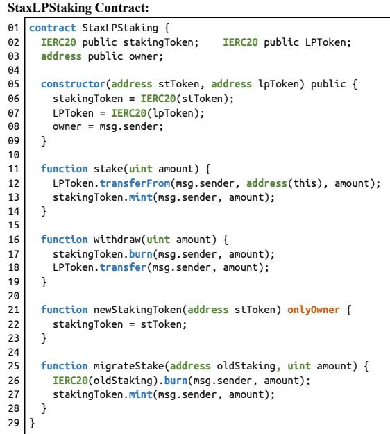
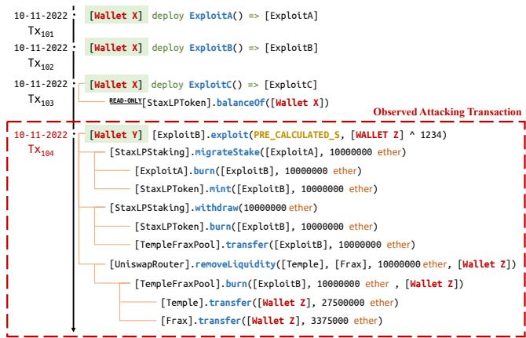
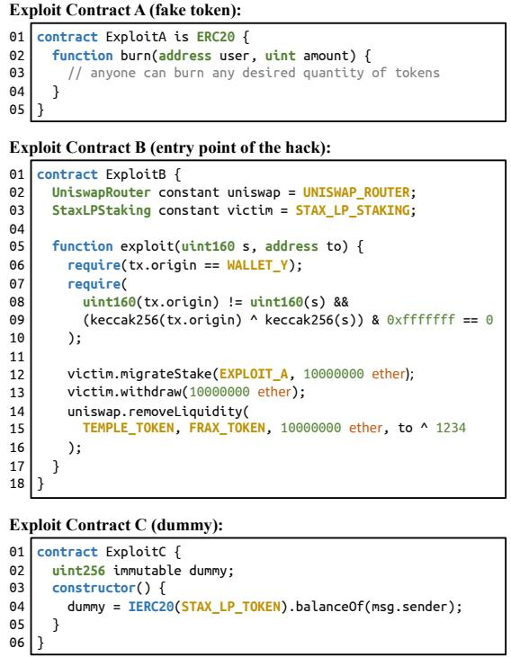
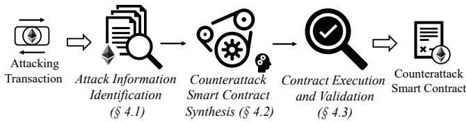
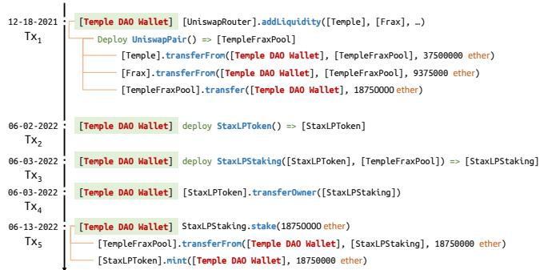
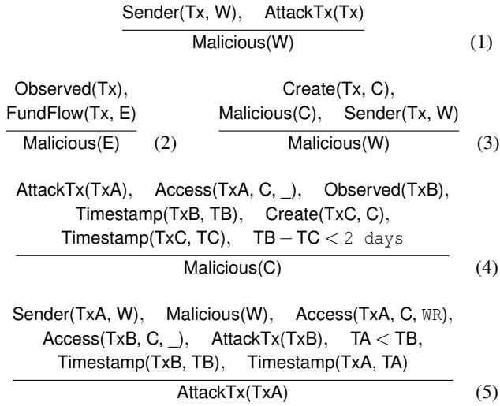
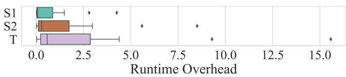

# Your Exploit is Mine: Instantly Synthesizing Counterattack Smart Contract

Zhuo Zhang, Purdue University; Zhiqiang Lin and Marcelo Morales, Ohio State University; Xiangyu Zhang and Kaiyuan Zhang, Purdue University https://www.usenix.org/conference/usenixsecurity23/presentation/zhang-zhuo-exploit

This paper is included in the Proceedings of the 32nd USENIX Security Symposium. August 9–11, 2023 • Anaheim, CA, USA 978-1-939133-37-3

Open access to the Proceedings of the 32nd USENIX Security Symposium is sponsored by USENIX.

# Your Exploit is Mine: Instantly Synthesizing Counterattack Smart Contract

Zhuo Zhang Purdue University zhan3299@purdue.edu

Zhiqiang Lin The Ohio State University zlin@cse.ohio-state.edu

Xiangyu Zhang Purdue University xyzhang@cs.purdue.edu

Marcelo Morales The Ohio State University morales.374@osu.edu

Kaiyuan Zhang Purdue University zhan4057@purdue.edu

## Abstract

Smart contracts are susceptible to exploitation due to their unique nature. Despite efforts to identify vulnerabilities using fuzzing, symbolic execution, formal verification, and manual auditing, exploitable vulnerabilities still exist and have led to billions of dollars in monetary losses. To address this issue, it is critical that runtime defenses are in place to minimize exploitation risk. In this paper, we present STING, a novel runtime defense mechanism against smart contract exploits. The key idea is to instantly synthesize counterattack smart contracts from attacking transactions and leverage the power of Maximal Extractable Value (MEV) to front run attackers. Our evaluation with 62 real-world recent exploits demonstrates its effectiveness, successfully countering 54 of the exploits (i.e., intercepting all the funds stolen by the attacker). In comparison, a general front-runner defense could only handle 12 exploits. Our results provide a clear proof-of-concept that STING is a viable defense mechanism against smart contract exploits and has the potential to significantly reduce the risk of exploitation in the smart contract ecosystem.

## 1 Introduction

Smart contracts are special programs that execute on decentralized blockchain platforms such as Ethereum. Their executions are in the form of transactions (txs for short), i.e., atomic sequences of remote function calls. They offer a secure, transparent and efficient way for multiple parties to negotiate and enforce business rules without the need for intermediaries. Today, numerous smart contracts have been created for decentralized applications (DApp) [17]. These DApps offer a variety of applications, including decentralized exchanges, prediction markets, and token offerings, among others. As of January 2023, the cryptocurrency industry has surpassed a market capitalization of 1 trillion USD [18].

Unfortunately, despite their increasing popularity, smart contracts are prone to various types of attacks due to their decentralized complex nature. In particular, the openness of the blockchain and the trustlessness of the ecosystem make smart contracts susceptible to exploitation. The immutability of the code further strengthens this vulnerability, making it difficult to fix once they are deployed. As a result, numerous attacks have been discovered, such as reentrancy attacks [41, 44, 59, 77], flash loan attacks [1–3, 53, 81, 88], front running attacks [58, 85, 95], rug pull attacks [15, 51, 62, 83], denial of service attacks [8, 48, 69, 70, 72], and so forth. These attacks can have significant consequences, such as the loss of funds or assets stored in contracts.

Therefore, it is crucial to have protections in place to defend against smart contract attacks and minimize the risk of exploitation. Existing efforts have largely focused on the use of static analysis (e.g., [84, 87]), fuzzing (e.g., [52, 65]), symbolic execution (e.g., [5, 73]) and formal verification (e.g., [40, 45]). While these techniques have identified numerous security vulnerabilities in smart contracts, many vulnerabilities can still remain hidden due to the complexity of protocols [93]. Consequently, we have to live with the fact that smart contracts will have exploitable vulnerabilities, so additional defenses are required, particularly during the running time of the smart contract.

In this paper, we propose a new runtime defense named STING by inStantly synthesizing counterattack smart contract and then utilizing the power of Maximal Extractable Value (MEV) [58, 80, 89, 94] to front run attackers. Note that MEV has used complex algorithms on blockchain data to identify profitable txs and have built automated bots to modify and execute these txs for financial gain. MEV has been estimated to have extracted more than 1 billion US dollars [39]. However, current MEV bots are primarily designed for front running and modifying trading txs. Although these bots can observe at tacking txs carried out by smart contract attackers (since they produce a significant amount of profit), these bots can hardly be used to counterattack real-world exploits, which are often too complex for existing MEV bots. Therefore, the key insight of STING is to construct a new defense technique by reusing MEV bots’s ability to recognize attacking txs and extend it with instant contract analysis and on-the-fly synthesis of counterattack smart contracts. The synthesized contracts can be launched to front run attacks and protect “stolen” funds.

However, multiple challenges need to be addressed when building STING. First, most attacks consist of multiple txs, and only the last one generates a gain that can be identified by MEV bots. Therefore, it requires dedicated analysis techniques to follow all preceding txs. Second, many attacks utilize exploit contracts, making it difficult for generalized MEV bots to decipher the complex logic encoded in the exploit contracts’ bytecode. Finally, attackers are cognizant of the potential threat posed by MEV bots, and have incorporated front-running protection into their exploits.

STING addresses these challenges to front-run attacking txs. To do so, assume there is an attacking tx (which can be identified by existing techniques such as [94]), STING first pinpoints all malicious entities (e.g., wallet address and exploit contract address) involved in the attack, traces their related txs, and thoroughly analyzes the bytecode logic of the involved exploit contracts (without the need to analyze the victim contracts at all). Then, it automatically synthesizes counterattack smart contracts that are able to evade front running protections and secure the attacking assets (e.g., transferring to our own account instead of attackers).

We have developed and evaluated STING with a total of 62 Ethereum mainnet attacks that include most of the real-world attacks between 2021 and 2022. Our results show that STING was able to successfully counterattack 54 of these attacks, while a general front-runner defense could only handle 12. We believe that STING has shown the potential to provide an additional layer of defense, which could prevent losses of more than 1.5 billion USD if deployed. In addition, we undertake a comprehensive ablation study of the techniques we have developed to identify attack information and synthesize counterattack contracts, as well as shed light on how real attackers are currently protecting their exploits.

Contributions. In short, we make the following contributions.

• Active Defense. We propose a runtime counterattack defense to protect the assets of victim smart contract from being stolen by attackers.

• Novel Techniques. We develop a series of novel techniques to precisely identify attacking txs and related malicious entities, effectively synthesize exploit contracts in a timely manner, and predictably deploy counterattack contracts.

• Empirical Evaluations. We have thoroughly evaluated STING using 62 real-world attacks and demonstrated that it can successfully defend against 87.1% of them.

## 2 Background

Ethereum. Ethereum is a blockchain platform designed to be more flexible and programmable than its predecessor, Bitcoin [74]. Ethereum has two types of addresses: accounts and contracts. Accounts are controlled by private keys and represent individuals. Contracts are self-executing programs that automatically enforce agreements, without the use of a third party. The execution of smart contract bytecode is performed by the Ethereum Virtual Machine (EVM).

Transactions (txs). Tx refers to an action that occurs on the Ethereum blockchain. It typically involves transferring ether (ETH), the native cryptocurrency of the Ethereum network, between accounts. It can also involve interactions with smart contracts, such as invoking a function of a smart contract. Upon submitting a tx, the tx does not become finalized immediately; instead, it is placed in a pool of pending txs known as a mempool, which is publicly accessible worldwide. Block builders subsequently select txs from the mempool to finalize them onto the blockchain. In essence, a time gap exists between a transaction becoming publicly known and its finalization on the blockchain.

Tokens. Tokens are smart contracts that are used to represent digital assets. The three common types of tokens on the Ethereum network are ERC20 [20], ERC721 [22], and ERC1155 [19]. The first type is the most common token in Ethereum, as shown in line 2 in Figure 1; it represents a fungible asset similar to a currency. The second type, ERC721, is used for non-fungible assets; similar to a collectable item. Lastly, ERC1155, is known as the hybrid token; it allows the creation of both fungible and non-fungible tokens.

Front-running and MEV. Front-running originates from Wall Street traders who profit by executing actions ahead of other investors’ orders. In the context of blockchain, front-running typically refers to monitoring the network for high-value transactions and creating new ones based on the information of the observed transaction. This enables the front-runner to strategically hijack the transaction for their own benefit. Such benefits are commonly referred to as Miner Extractable Value (MEV), which has garnered attention in recent years due to its potential impact on the blockchain ecosystem [54, 64, 91]. A recent study [80] demonstrates that a generalized MEV bot can copy a subject transaction and front-run it to earn substantial profits. Although MEV is often regarded as a malicious act, it has exhibited positive effects within the blockchain ecosystem. For instance, a generalized MEV bot unintentionally front-ran an attacking transaction targeting the Punk Protocol [79], thereby thwarting the attack. The MEV bot returned the funds afterward. Note that the MEV bot was not designed as a defense mechanism but rather protected the funds by chance. However, our evaluation (§5) reveals that most attacks cannot be front-run by general MEV bots due to the implementation of front-running protections, highlighting the practical value of our proposed technique.

Proactive Threat Alert and Prevention. The concept of proactive threat detection and mitigation within the blockchain industry traces its roots back to 2021. Notably, OfficerCia, a well-respected figure in the DeFi world, proposed the innovative idea of utilizing front-running bots as protective shields against financial loss in specific scenarios [4]. This concept inspired the creation of numerous blockchain monitoring services [9, 11, 13, 16, 33, 35], which opened up significant possibilities for identifying potential threats. Build ing on this idea, several measures for proactive threat mitigation have been suggested. Among these, Spotter [28] stands out as it aims to thwart attacks prior to their actual occurrence. The team behind Spotter noted that over 53% of DeFi attacks occur in stages such as fund preparation, exploit execution, and money laundering. In response to this observation, Spotter is architected with an emphasis on early-stage threat recognition, intended to intercept these attacks prior to their malicious activities reaching the blockchain. Our research goal is orthogonal to Spotter, targeting the recognition and disruption of active threats. The work undertaken by BlockSec [12] war rants recognition due to their substantive contribution to the field. They successfully defused a real-world attack in 2022, a significant achievement that resulted in the preservation of an approximate 3.8 million USD [7]. However, it is crucial to recognize that, despite the growing awareness of proactive threat detection and prevention strategies, their practical deployment remains complex and somewhat opaque. Our research addresses this knowledge gap, offering a novel solution and elucidating its intricate technical details.

## 3 Overview

## 3.1 The Goal of STING

STING is designed to front-run attacking transactions in order to rescue funds before they are stolen, while subsequently returning the funds to the victims. We refer to this rescue process as a counterattack. To achieve this, upon observing an attacking transaction, STING first identifies all contracts deployed by the attacker to facilitate the exploit, which we term exploit contracts. For each exploit contract, STING aims to synthesize a counterattack contract that possesses the same functionality but is under our control and serves our purpose. Following the synthesis process, STING creates a counterattack transaction that deploys all counterattack contracts and exploits the same vulnerability. By front-running the attacking transaction with the counterattack transaction, STING effectively rescues all funds at risk.

## 3.2 Threat Model, Scope, and Assumptions

STING focuses on generating counterattack txs for attacks that exploit vulnerabilities in on-chain smart contracts. Attacks with different root causes, such as private key leaks and off-chain component compromise, are out of the scope of this paper. Additionally, attacks launched by privileged users, such as rug pulls, are not within the scope of this study. We assume that the attacks are not adaptively obfuscated, meaning the attacker does not introduce new techniques to evade the counterattack defense. However, we anticipate that STING will spur research and development of new obfuscation techniques for web3.0 attacks, leading to an arms race similar to that between exploit and defense techniques in traditional software.

  
Figure 1: The source code of StaxLPStaking contract

We also assume that there is an identified attacking tx which generates a considerable amount of profits, and this tx can be detected by MEV bots while pending in the mempool. Note that the detection of profitable txs is widely discussed in the MEV community [58, 80, 94], which is orthogonal to STING and not addressed in this paper. Also, it is worth to note that false positive detections, i.e., classifying benign profitable txs as attack txs, do not affect STING’s effectiveness, as it will simply fail to synthesize such benign txs and take no action.

## 3.3 Challenges

The goal of this work is to design a counterattack runtime defense that can proactively front run malicious txs and protect the victim’s assets. However, it is nontrivial to front run attacking txs. To shed light on the challenges involved, we turn to a recent real-world example, i.e., the Temple Dao exploit [31]. This Web3.0 attack, which happened in October 2022, resulted in a considerable loss of about 2.3 million USD. We have slightly modified this example for illustrative purpose.

The Vulnerabilities Explained with Source Code. The source code for the vulnerable StaxLPStaking contract can be found in Figure 1, with slight modifications for demonstration purposes. It is important to note that our proposed technique operates entirely without any knowledge or understanding of the vulnerabilities, or access to any source code. The inclusion of the vulnerability explanation is solely to improve comprehension. Specifically, as shown in Figure 1, StaxLPStaking incentivizes users to lock their liquid ity provider tokens (LP tokens [10]) in exchange for stak ing tokens, as a type of staking contract [36]. The contract constructor, outlined in lines 5-9, specifies the required LP token (LPToken) and the staking token that can be earned (stakingToken). Through the stake function (lines 11-14), users can lock their LP tokens and receive a corresponding amount of staking tokens. The withdraw function (lines 16- 19) allows for the retrieval of staked LP tokens. Although staking contracts usually offer interest, this feature has been omitted in this example as it is not relevant to the attack.

  
Figure 2: Timeline of Temple Dao attack

The newStakingToken function (lines 21-23) enables the migration of staking tokens in case the Temple DAO community decides to switch to a new staking token. This is a privileged function that can only be invoked by the project owner. Once a new staking token has been set, users can migrate their old tokens to the new one by invoking the migrateStake function (lines 25-29). Unfortunately, func tion migrateStake contains several security weaknesses. First, it lacks proper verification of whether a new staking token has been set, enabling this function to be executed at any time. Second, it does not adequately assess the validity of the oldStaking token provided, making it possible for an attacker to exploit this vulnerability by submitting a fake token to function migrateStake. As such, the attacker can accumulate a significant amount of stakingToken by minting fake tokens and invoking the migrateStake function. Finally, the attacker can utilize function withdraw to drain all of the locked LP tokens.

The Exploit. We then proceed to outline the steps involved in the attack and discuss the challenges associated with a coun terattack. For clarity, some modifications have been made to the original process. The progression of the attack is illustrated in Figure 2, while Figure 3 showcases the contracts deployed by the attacker to carry out the attack, namely the

Exploit Contract. It is worth noting again that the source code presented in Figure 3 serves merely as an illustration and STING does not require access to it at all.

The attack timeline is outlined in Figure 2. Specifically, the attacker initiated the attack by deploying two exploit contracts, ExploitA and ExploitB, through tx<sub>101</sub> and tx<sub>102</sub>, respectively. tx<sub>103</sub> was sent from the same wallet address (Wallet X) but is unrelated to the attack. The exploitation occurred in tx , where the attacker invoked the exploit function of the ExploitB contract to exploit vulnerabilities in the StaxLPStaking contract. The attack took place four months after the deployment of the StaxLPStaking contract.

• Tx<sub>101</sub>: Fake Token. Recall that, to exploit the vulnerability, the attacker must provide a fake token (as oldStaking) and burn as many fake tokens as possible (line 26 in Figure 1), thereby earning an equivalent amount of staking tokens (line 27 of Figure 1). To accomplish this, the attacker used Wallet X to deploy the ExploitA contract, the source code of which is presented at the top of Figure 3. This contract is a standard ERC20 [21] token with a custom burn function (lines 2-4) that does essentially nothing. Such a custom burn function enables anyone to burn any desired quantity of tokens.

• Tx<sub>102</sub>: Entry Point Contract. The attacker deployed ExploitB, a second exploit contract, which is to carry out the future exploitation. The source code of the exploit is depicted in the center of Figure 3, and the exploit function (lines 5-17) executes the attack. To start, the function uses a hard-coded address (line 6) to confirm that the origin of the transaction, tx.origin, is from Wallet Y. This serves as a safeguard against any potential generalized front-runners who might attempt to replay the attacking transaction. Additionally, lines 7-10 impose an extra layer of protection by requiring the transaction sender to furnish an integer s. The provided s must differ from tx.origin, yet the lower 28 bits of their keccak256 hashes must be congruent. Given the strong collision resistance of the keccak256 hash function, the value of s cannot be directly calculated and must instead be found through a brute-force search of possible values, which is estimated to take between 10 and 30 minutes. This ensures that any front-runner will not be able to calculate a valid s before the original attacking transaction has been confirmed. These two front-running protections are referred to as Control-Flow-based Front-running Protection (CFFP), given that they block the execution of the attacking transaction if their corresponding checks fail.

The exploitation is executed in lines 12-13 by passing ExploitA as a counterfeit token and siphoning a significant amount of LP tokens. Subsequently, at line 14, the LP tokens are redeemed as Temple and Frax tokens, with the recipient address computed as to ˆ 1234. This approach makes it difficult for front-runners to substitute the to address with their own wallet address. It is worth noting that prevalent front-runners primarily concentrate on replaying trading txs and lack the ability to decipher code semantics from smart contract bytecode. This type of protection, which we refer to as Data-Flow-based Front-running Protection (DFFP), differs from the CFFP in that it obfuscates the recipient address of funds or txs, instead of blocking the execution.

• Tx<sub>103</sub>: Dummy Contract. The dummy contract, shown at the bottom of Figure 3, is deployed by a wallet address of the attacker, but not related to the attack.

• Tx<sub>104</sub>: Attacking Transaction. The concluding stage of the attack is executed through the transaction, designated as tx<sub>104</sub>, which serves as the attacking transaction. This is the only attack-related transaction that will be pending and observed within the mempool. All previous txs have been finalized. The attacker employs a separate wallet address, Wallet Y, in this transaction in order to conceal the deployment history of Wallet X. The transaction invokes the exploit function within the ExploitB contract, specifying Wallet Z ˆ 1234 as the recipient address. This is due to the processing of the recipient address through a bitwise XOR operation with the value 1234, as seen at line 15 of the ExploitB contract. The outcome is the transfer of a substantial amount of Temple and Frax tokens to Wallet Z, which is the third wallet utilized by the attacker.

The Challenges. Observe that the success of the exploiting transaction, tx<sub>104</sub>, is contingent upon the actions of both tx<sub>101</sub> and tx<sub>102</sub>. To construct a counterattack transaction, it is necessary to recreate the behavior of both of these txs. To this end, we must address the following challenges:

(C1) Identifying malicious entities from the attacking tx. As depicted in Figure 2, over 10 entities are involved in the attacking tx (tx<sub>104</sub>), including but not limited to Wallet Y, ExploitA, and StaxLPToken, many of which have quite similar behaviors (e.g., ExploitA and StaxLPToken). Identifying malicious entities (e.g., Wallet Y and ExploitA) from benign entities (e.g., StaxLPToken) in the attack synthesis process is therefore a challenge. Note that it is crucial to retrieve txs only from the malicious entities, as retrieval from benign entities would significantly increase analysis overhead and decrease the chances of a successful front-running counterattack. Furthermore, the success of the attacking tx<sub>104</sub> depends on other txs, i.e., tx<sub>101</sub> and tx<sub>102</sub>. To counterattack tx<sub>104</sub>, STING needs to identify all such attack-related txs, and exclude the unrelated ones, e.g., tx<sub>103</sub>.

  
Figure 3: Exploit contracts deployed by the attacker

(C2) Bypassing CFFP and DFFP. After the relevant information about the attack has been retrieved, the Front-running Protections act as a barrier to constructing counterattack txs. Specifically, CFFP blocks the execution of the constructed txs, and DFFP diverts the assets involved in the attack to an undesired account. How can the counterattack be performed in a timely manner despite the presence of CFFP, and how to secure the attacking assets despite the presence of DFFP, are non-trivial challenges.

## 3.4 STING Overview

We have addressed these challenges when building STING (details of how we address them are presented in §4). At a high level, STING consists of three key components, as shown in Figure 4.

Attack Information Identification (§4.1). Given a pending attacking transaction in the mempool, the first step involves utilizing the attack information identification to identify all relevant information, including the addresses of malicious entities and related transactions.

Counterattack Smart Contract Synthesis (§4.2). The identified attack information is then used by the counterattack smart contract synthesis to create new smart contracts that aim to front-run the original attack.

Contract Execution and Validation (§4.3). The synthesized smart contract will be locally validated to verify its profitability for our account. If the outcome is favorable, the transaction is then executed on the blockchain.

  
Figure 4: Workflow of STING

## 4 Detailed Design

## 4.1 Attack Information Identification

The objective of attack information identification is to acquire comprehensive information about a given attack, including the determination of malicious entities involved and the identification of related txs (C1). In the following, we first provide our key observation, and then describe our techniques in detail.

Key Observations. We observe that attacking txs are often initiated shortly after the deployment of exploit contracts, typically within two days, whereas benign entities, such as victim contracts, have a longer deployment history. This phenomenon can be attributed to the highly adversarial environment of the Ethereum blockchain, which is commonly known as a “dark forest” [23]. If a smart contract is vulnerable to exploitation for profit, it is only a matter of time before it is targeted by one or more attackers. Given the substantial profit that can be gained from exploiting a smart contract, attackers are motivated to act quickly and not risk losing the opportunity to others. For instance, as depicted in Figure 2, the Temple Dao attacker deployed both ExploitA and ExploitB and launched the attack on the same day (10/11/2022). Conversely, benign entities typically have a longer lifetime due to the time required to accumulate funds and for attackers to discover vulnerabilities. As shown in Figure 5, StaxLPStaking was exploited four months after its deployment. Our evaluation (§5.3) also confirmed that all exploit contracts were deployed at most two days before the attack tx, while almost all benign entities had a longer life of more than ten days. This simple but effective observation allows us to quickly distinguish malicious entities, such as ExploitA and ExploitB, from the attacking tx tx<sub>104</sub>.

In addition to entity lifespan, other distinct attributes can contribute to the differentiation between benign and malicious entities and can be instrumental in spotting exploit contracts. We compile these key heuristics, applied within our system, in Table 1, omitting further details for conciseness. It is worth mentioning that, even though our discussion going forward will primarily be centered around the lifespan heuristic, each of the listed attributes carries considerable weight in our system’s overall analysis and decision-making process.

  
Figure 5: Timeline of Temple Dao project

Table 1: Attributes used by STING

<table><tr><td>Name</td><td>Description</td></tr><tr><td>Lifespan Balance</td><td>Contracts deployed shortly before an attack are likely malicious. Contracts whose initial assets exceed the attack profit are likely to be victims.</td></tr><tr><td>Fund Source</td><td>Contracts and Wallets funded from mixing servers (e.g., Tornado Cash) are likely malicious.</td></tr><tr><td>Activities</td><td>Contracts that frequently interact with users exhibiting diverse behaviors are likely benign.</td></tr><tr><td>Source Code</td><td>Contracts with unverified source code are likely malicious.</td></tr></table>

Our second key observation is that attack-related txs are linked to each other through either data dependencies orfinancialflow, and by leveraging such relations, we can trace back to all related entities. For example, in Figure 2, Wallet Z was identified by the transfer of attacking funds to it, and Wallet X was identified as the creator of the exploit contracts. tx is excluded from our analysis as there was no data dependency from tx<sub>104</sub> to it. Note tx<sub>103</sub> only read data and did not alter the state of StaxLPToken. As a result, we were able to trace back to all related txs (tx<sub>101</sub>, tx<sub>102</sub>, and tx<sub>104</sub>).

Approach. We therefore developed a system to identify attacks that combines a custom Ethereum archive node and a flexible reasoning mechanism [29], e.g., Datalog [47]. An archive node is an instance of an Ethereum client specifically configured to construct a comprehensive record of all historical states. As per requirement, the information stored in the archive node is then transformed into predicates, which can be processed by the reasoning mechanism. We have also established inference rules to guide the process of tracing back attack-related txs through data dependency and fund flow. By applying these rules to the collected predicates, the reasoning mechanism can automatically identify the necessary information about the attack for our synthesis.

Predicates. The predicates used by STING are presented in Table 2. The first column lists the names of the predicates and the second column provides a description for each. Observed(Tx) denotes that the transaction Tx is flagged as an attacking transaction by the detection phrase. Sender(Tx, W) signifies that a wallet address W is the origin of transaction Tx, represented by tx.origin. For example, in the Temple

Table 2: Predicates used by STING

<table><tr><td>Name</td><td>Description</td></tr><tr><td>Observed(Tx, F)</td><td>Transaction Tx is a potential attacking tx observed by the detection phrase.</td></tr><tr><td>Sender(Tx, W)</td><td>Wallet address W is the sender of transaction Tx.</td></tr><tr><td>Create(Tx, C)</td><td>Contract C is created by transaction Tx.</td></tr><tr><td>Access(Tx, C, M)</td><td>Contract C is accessed in transaction Tx, with mode M.A mode can be either RO (read-only) or RW (read-and-write).</td></tr><tr><td>Timestamp(Tx, T)</td><td>Transaction Tx is minted at time T.</td></tr><tr><td>FundFlow(Tx, E)</td><td>In transaction Tx, funds are sent to an entity E.An entity can be either a wallet address W or a contract C .</td></tr><tr><td>AttackTx(Tx)</td><td>Transaction Tx is a transaction related to the subject attact.</td></tr><tr><td>Malicious(E)</td><td>Entity E is malicious during the subject attack.</td></tr></table>

  
Figure 6: Inference rules used by STING

DAO attack (Figure 2), we have Sender(Tx<sub>104</sub>, Wallet Y). The deployment of a contract is represented by Create(Tx, C), indicating that contract C was deployed by transaction Tx, e.g., Create(tx , ExploitB). The predicate Access(Tx, C, M) indicates that transaction Tx accesses the data of contract C. This can be either read-only access, such as Access(tx<sub>103</sub>, StaxLPToken, RO), or read-and-write access, such as Access(tx , StaxLPStaking, RW). The timestamp of transaction Tx is represented by Timestamp(Tx, T). The transfer of funds to an entity E in transaction Tx is represented by FundFlow(Tx, E). An entity can be either a wallet address or a contract. For instance, in transaction tx , a large amount of Frax tokens were transferred to Wallet Z, resulting in FundFlow(tx<sub>104</sub>, Wallet Z). These five predicates are automatically collected by our custom Ethereum archive node. We then introduce two predicates, AttackTx(Tx) and Malicious(E), to represent the identified results. Specifically, AttackTx(Tx) denotes that the transaction is related to the subject attack (e.g., AttackTx(tx )) and Malicious(E) indicates that entity E is malicious (e.g., Malicious(ExploitB)). Note that the observed attacking tx will be labeled as AttackTx.

Rules. Figure 6 illustrates the inference rules employed by STING. These rules are expressed in the following format:

$$
\frac {\mathsf {P} _ {1} , \quad \mathsf {P} _ {2} , \quad \mathsf {P} _ {3} , \quad \ldots , \quad \mathsf {P} _ {n}}{\mathsf {C}}
$$

where $\mathsf { P } _ { i }$ denotes the i-th premise of the rule and C represents the conclusion. When all the premises are present in the current fact base, STING adds the conclusion to the fact base as well. To provide a better understanding, we will use examples from the Temple DAO attack (Figure 2) to explain the rules.

• Rule (1) indicates that if a Tx is related to the attack, then its sender, W, is a malicious entity. This rule allows us to infer that Wallet Y is malicious as the pending attack tx was sent from it.

• Rule (2) posits that if there is a transfer of funds to an entity E within a pending attack Tx, the entity E is malicious. This is because the attacker will transfer the attack’s profit to an entity under their control. For instance, in $\mathrm { \ t x _ { 1 0 4 } , }$ , a large amount of Frax tokens are transferred to Wallet Z, enabling us to infer that Wallet Z is malicious.

• Rule (3) states that the creator of a malicious contract C is a malicious entity. In the case of the ExploitA contract, once we identify it as malicious, we can further infer that its creator, Wallet X, is also malicious.

• Rule (4) is used to distinguish between benign and malicious entities. Specifically, AttackTx(TxA) and Access(TxA, C, \_) suggest that an attack-related transaction TxA interacts with a smart contract C. However, being accessed by an attack-associated transaction does not inherently imply that contract C is malicious. Recall that the contract C’s timespan can assist in determining its malicious nature. To achieve this, we first employ the pending attack transaction TxB (Observed(TxB)) and its associated timestamp (Timestamp(TxB, TB)) to determine the current timestamp. Subsequently, we inquire about the creation time TC of contract C using Create(TxC, C) and Timestamp(TxC, TC). If the difference between TB (i.e., the current time) and TC is less than 2 days, we categorize contract C as malicious. Note that other attributes as referenced in Table 1 also play a role in this rule’s execution, with detailed elided.

• Rule (5) leverages the data dependence to identify attack-related txs. This rule considers two txs, TxA and TxB, which both access a contract C. If TxA is initiated by a malicious entity W and modifies the state of C (i.e., accessing C in a read-and-write mode), and TxB is a later transaction that is identified to be related to the attack, STING then infers that TxA is also related to the attack.

With the identification of all malicious entities, STING will proceed to create a corresponding entity for each, for instance, a counterpart wallet address under our control for a malicious wallet address and a counterpart synthesized contract for an exploit contract.

## 4.2 Counterattack Smart Contract Synthesis

Counterattack smart contract synthesis refers to the synthesis of a new smart contract that can front-run the original attacking txs and secure the attacking funds (e.g., by transferring them to a secure account). To this end, it is necessary to by pass the CFFP and DFFP (C2). We present the details of how we achieve these in this section.

As mentioned in §3, both CFFP and DFFP prevent generalized front-runners from mimicking the original attack txs, since overcoming such protections requires a thorough analy sis of the exploit contracts through binary (bytecode) analysis. However, the limited time window for front-runners to mimic a new transaction makes complex techniques like symbolic execution and constraint solving infeasible. In the following, we first present our key observations, and then describe in detail our technical approach.

Key Observations. We observe that predicates related to CFFP consistently evaluate to the same value throughout the execution of all related transactions. For instance, in Figure 3, the two instances of CFFP in lines 6 and 7-10 always evaluate to True, given the attacker’s goal of a successful attack. As a result, we can identify all predicates that consistently yield the same value throughout the attacking trace as CFFP-related predicates and rewrite each predicate with the value it yields. Note that during the synthesis, STING has access to the dynamic trace of the subject transactions, eliminating the need to statically infer jump targets. Furthermore, false positives (i.e., normal predicates being misclassified as CFFP-related) are tolerable, as our goal is to mimic the original attack and maintain the same trace. In other words, even with false positives, both executions remain consistent. Figure 7 illustrates the counterattack contract generated for ExploitB. We use SY\_EXPLOIT\_A to denote the address of the counterattack contract for ExploitA (at line 9). Note that at lines 6-7, the original CFFP-related predicates have been changed to require(True). To clarify, although it is difficult to avoid this observation (since CFFP ultimately requires a conditional statement to block execution), we acknowledge that future obfuscation techniques may be developed to counteract this observation.

In addition, we also observe that during the exploit contract execution, the actual recipient addresses offunds or txs are revealed at the points of external calls, regardless of the presence ofDFFP. That is, even with the presence of DFFP, the dynamic execution of attack txs still reveals valid recipient addresses. For instance, in Figure 2, the recipient address of the funds is Wallet Z, despite the obfuscation present in line 12 of Figure 3. We hence consider forcibly overwriting the external calls by the desired recipient addresses, regardless of the original semantics of the exploit contracts. For example, as shown in line 12 of Figure 7, the original semantics of to ˆ 1234 is overwritten as WALLET\_OURS. To accomplish this, we need to identify the original calling context of each external call instance, e.g.,

```clojure
[UniswapRouter].removeLiquidity(
  [Temple], [Frax], 10000000 ether, [Wallet Z]
)

and decide the corresponding new context, e.g.,

[UniswapRouter].removeLiquidity(
  [Temple], [Frax], 10000000 ether, [Wallet Ours]
)
```

Note that it should be done in a timely manner, without leveraging heavy-weight techniques.

Approach. We hence develop a calibratedforced-execution engine within our custom Ethereum archive node. This engine aims to determine the original outcomes of control-flow transfer opcodes during an attack and calculate the corresponding new outcomes required for executing counterattacks. To do so, the engine hooks the interpretation of these opcodes, including, but not limited to, the CALL and JUMP opcodes. The engine then performs two rounds of execution of the attackrelated txs. During the first round, the original transaction senders are preserved, and the outcomes of each control-flow transfer are recorded. In the second round, our wallet addresses are used as tx.origin, and the outcomes of each control-flow transfer are forcibly changed to match the previously recorded outcomes. This helps to establish the mapping between the original calling context and the new ones. Note that the engine only hooks opcodes in malicious entities, since the synthesis of STING only works on malicious entities.

We use the following notation to describe an execution trace:

$$
\begin{array}{c} J \in \text {Jump Instance}: := \langle \text {Address, Offset, Offset} \rangle \\ C \in \text {Call Instance}: := \langle \text {Address, Offset, Address, Call Data} \rangle \\ T \in \text {Trace} := [   J \mid C   ] \end{array}
$$

The symbol J represents a jump instance during execution, which is defined as a tuple comprising the contract address, the offset of the relevant JUMP opcode, and the destination offset. Similarly, the symbol C represents a call instance, which is defined as a tuple consisting of the caller contract address, the offset of the relevant CALL opcode, the receipt address, and the call data. Finally, the symbol T represents the full execution trace of a subject attack, which is an array of call or jump instances. It is important to note that T is cross-transaction in nature, as the attack can be carried out across multiple txs, such as tx<sub>101</sub>, tx<sub>102</sub>, and tx<sub>104</sub> in Figure 2. The trace T of an attack can be acquired by the first round of the engine.

The following code snippet presents the pseudocode of the operation of the forced-execution engine when hooking the JUMP opcode.

```solidity
contract SyExploitB {
  UniswapRouter constant uniswap = UNISWAP_ROUTER;
  StaxLPStaking constant victim = STAX_LP_STAKING;

  function exploit(uint160 s, address to) {
    require(True);
    require(True);

    victim.migrateStake(SY_EXPLOIT_A, 10000000 ether);
    victim.withdraw(10000000 ether);
    uniswap.removeLiquidity(
      TEMPLE_TOKEN, FRAX_TOKEN, 10000000 ether, WALLET_OURS,
    );
  }
}
```  
Figure 7: Synthesized exploit contracts

```python
def jump_hook(_J, T):
    J = T.pop()
    <_, _, offset> = J
    jump_to(offset)
```

The function jump\_hook takes the current jump instance \_J and the previously recorded trace T as input. It then forces the jump instance to follow the trace T by overwriting the target of the jump.

The following code snippet presents the pseudocode for how our forced-execution engine hooks the CALL opcode. The function call\_hook takes the actual call instance \_C and the previously-recorded trace T as input. A dictionary S is used to store the mapping from the original calling context to the new one.

```python
S = {}
def call_hook(_C, T):
    C = T.pop()
    if C.callee().is_benign():
        sy_calldata = C.calldata().synthesize()
        S[_C] = <C.callee(), sy_calldata>
    else:
        sy_callee = C.callee().synthesize()
        S[_C] = <sy_callee, _C.calldata)>
    call_to(s[_C])
```

The function first checks if the callee is a benign entity. If so, the function proceeds to synthesize the calldata. This is achieved by syntactically substituting all instances of mali cious entity addresses, alongside other related parameters such as NFT ID, with their synthesized equivalents represented in byte format. This effectively addresses the problem outlined in Figure 3, by substituting any parameter that signifies an attacker’s wallet address with our wallet address. This approach works because there is no DFFP in benign entities. If the callee is not a benign entity, the function finds the address of the callee’s synthesized counterpart and retains the original call data. The function then calls the synthesized callee with the same call data. The reason for retaining the original call data is that, even though the call data may be obfuscated at this point, it will eventually be de-obfuscated when calling a benign entity (e.g., when transferring funds). Therefore, there is no need to handle the call data at the time of calling a malicious entity, but only at the later time of calling a benign entity. The calling context transaction is recorded in S.

Dealing with CFFP. With the collected T, we identify all JUMP opcodes which constantly jump to the same target and rewrites them as constant jumps (i.e., jumping to that fixed address).

Dealing with DFFP. With the identification of S, we adopts the following rewriting strategies:

• If the callsite only occurs once within the trace T (as the call instance C), we statically overwrite the call to the corresponding synthesized instance S[C]. This is illustrated in line 12 of Figure 7.

• If the callsite occurs multiple times within the trace T, for example, within a loop, we use an on-the-fly dispatch mechanism to dynamically find the actual synthesized call instance [43, 92].

It is important to note that STING relies on dynamic analysis, which simplifies the task of accessing runtime information, such as determining the calldata even if it is passed as parameters.

## 4.3 Contract Execution and Validation

STING ensures the success of the counterattack by locally deploying the synthesized contract to ensure that it will result in a profit to our addresses. If the results are favorable, STING then employs the front-runner to execute the counterattack, effectively front-running the original tx and capturing the intended profit. Such a local validation mechanism also enables us to try different synthesis strategies simultaneously.

Multilevel synthesis. We have observed that not all attacking txs are fully protected by CFFP and DFFP. For instance, there have been reports of certain attacks being front-run by generalized MEV bots. Additionally, some attacks only implement basic CFFP, such as the one at line 6 in ExploitB in Figure 3 (require(tx.origin == WALLET\_Y)). Such attacks can be overkilled by STING, resulting in wasted time and a reduced success rate in front-running. To address this issue, we propose a multi-level synthesis structure. Given an attack tx that is pending in the mempool, we perform three parallel synthesis methods:

• Single-Tx Synthesis, which is a generalized transaction replay algorithm proposed by [80]. It takes a transaction as input and simply replaces the sender address with ours in the payload. While being widely adopted by general

MEV bots, this method does not rely on other analy sis results and, as a result, cannot effectively identify malicious entities or synthesize exploit contracts.

• Syntactic Synthesis, which uses the results of attack in formation identification (§4.1) and syntactically replaces the addresses of malicious entities with their counterpart addresses. This method is sufficient for attacks that only implement basic CFFP.

• Semantic Synthesis, which is the most comprehensive analysis performed by STING, and it has the ability to handle attacks protected by CFFP and DFFP. However, this method may take a longer time to complete (com pared to the previous two).

Any counterattack tx generated by one of the three synthesis methods will be locally executed to verify that the modified tx results in a profit for our account. If this is the case, the coun terattack tx will be initiated immediately and all other running syntheses will be terminated. Otherwise, STING discards the tx and waits for results from other syntheses. By employing this multi-level synthesis technique, we are able to generate counterattack txs with minimal effort and processing time.

Soundness. While we have not encountered a failure case caused by heuristics of forced-execution [78, 90] so far, we also implemented a fine-grained taint analysis as a backup solution. Taint analysis can accurately identify the obfuscation introduced by DFFP with relatively higher runtime overhead. We add an additional taint-based synthesis layer to the multilevel synthesis architecture, in case of the unsoundness issue leading to failed counterattack.

## 5 Evaluation

We have developed STING within a custom geth [25] archive node, supported by an Erigon database [26]. In this section, we present the evaluation results. We first present our exper iment setup such as how we collected the dataset in §5.1, then present the overall results of our counterattacks in §5.2, and finally we conduct a series of ablation studies to further validate our findings in §5.3. A case study regarding frontrunning techniques employed by real-world Web 3.0 attacks is presented in the supplementary material [38].

## 5.1 Experiment Setup

Dataset. We used a comprehensive dataset of historical attacks on the Ethereum mainnet to evaluate STING. In particular, our dataset, which consists of all the attacks that took place in 2021 and 2022, is drawn from well-known sources [14, 24, 30, 32, 37]. Those sources are widely used in literature [50, 67, 86, 96]. In addition, we have also included some of the most infamous attacks (with significant financial losses) prior to 2021. In total, our investigation covers a total of 86 attacks, of which 24 were deemed out of scope for the purposes of this study. Specifically, 17 of these attacks were due to private key compromise or rug pulls, 4 were related to off-chain components, and 3 did not result in fund loss on the Ethereum mainnet, but rather on other chains. The detailed list of these attacks is presented in Table 3. We therefore have 62 attacks in scope, which induced a total fund loss of around 2.5 billion USD.

Table 3: Details of out-of-scope attacks

<table><tr><td>Attack</td><td>Date</td><td>Loss</td><td>Root Cause</td></tr><tr><td>Wintermute</td><td>09/20/22</td><td>160.0M</td><td>Key compromised or rugged</td></tr><tr><td>SudoRare</td><td>08/23/22</td><td>800.0K</td><td>Key compromised or rugged</td></tr><tr><td>Curve Finance</td><td>08/09/22</td><td>575.0K</td><td>Off-chain component compromise</td></tr><tr><td>Harmony Bridge</td><td>06/24/22</td><td>100.0M</td><td>Key compromised or rugged</td></tr><tr><td>Ronin Network</td><td>03/29/22</td><td>624.0M</td><td>Key compromised or rugged</td></tr><tr><td>BuildFinance</td><td>02/14/22</td><td>470.0K</td><td>Key compromised or rugged</td></tr><tr><td>Dego Finance</td><td>02/10/22</td><td>10.0M</td><td>Key compromised or rugged</td></tr><tr><td>Meter</td><td>02/06/22</td><td>7.7M</td><td>No fund lost on the mainnet</td></tr><tr><td>Qubit Finance</td><td>01/28/22</td><td>80.0M</td><td>No fund lost on the mainnet</td></tr><tr><td>Crypto.com</td><td>01/18/22</td><td>33.7M</td><td>Key compromised or rugged</td></tr><tr><td>LCX</td><td>01/08/22</td><td>7.9M</td><td>Key compromised or rugged</td></tr><tr><td>Vulcan Forged</td><td>12/13/21</td><td>140.0M</td><td>Key compromised or rugged</td></tr><tr><td>Bitmart</td><td>12/04/21</td><td>196.0M</td><td>Key compromised or rugged</td></tr><tr><td>Badger</td><td>12/02/21</td><td>120.0M</td><td>Off-chain component compromise</td></tr><tr><td>AnubisDAO</td><td>10/29/21</td><td>60.0M</td><td>Key compromised or rugged</td></tr><tr><td>JayPegs Automart</td><td>09/17/21</td><td>3.1M</td><td>Key compromised or rugged</td></tr><tr><td>DAO Maker</td><td>08/12/21</td><td>7.0M</td><td>Key compromised or rugged</td></tr><tr><td>Thorchain</td><td>07/22/21</td><td>8.0M</td><td>Off-chain component compromise</td></tr><tr><td>Thorchain</td><td>07/15/21</td><td>5.0M</td><td>Off-chain component compromise</td></tr><tr><td>Bondly</td><td>07/15/21</td><td>5.9M</td><td>Key compromised or rugged</td></tr><tr><td>Anyswap</td><td>07/10/21</td><td>7.9M</td><td>Key compromised or rugged</td></tr><tr><td>Chainswap</td><td>07/02/21</td><td>800.0K</td><td>No fund lost on the mainnet</td></tr><tr><td>Roll</td><td>03/14/21</td><td>5.7M</td><td>Key compromised or rugged</td></tr><tr><td>Paid Network</td><td>03/05/21</td><td>3.0M</td><td>Key compromised or rugged</td></tr></table>

Environment Setup. We calibrate the block height to correspond with the specific attack under examination, setting the gas limit to 30 million to reflect the post-London Fork conditions of Ethereum [34]. We then replaced the attacking transaction with synthesized ones to check if profits remain unaltered. In certain attacks, the attackers may need to possess specific NFT tokens. We assume that the defenders cannot hold NFTs with the exact same ID as the required tokens, but they can have alternative NFTs with different IDs.

## 5.2 Overall Results

Among these 62 attacks, STING successfully synthesized 54 counterattack smart contacts, as shown in the last four columns in Table 4. It is worth mentioning that, some of attacks are indeed front-run by acutal MEV bots in real world. We hence include such attacks into the report of Single-Tx synthesis (column S0). Also, out of the 62 attacks that took place, 12 attacks can be front-run by MEV bots. This showcases the challenges of launching a successful counterattack with generalized bots. The results from Syntactic Synthesis (column S1) are relatively encouraging, with 45 out of 62 attacks being successfully counterattacked. This suggests that attackers are still relying on simple CFFP techniques to prevent front-running. Semantic Synthesis (column S2) was able to generate counterattacks for 54 out of the 62 attacks. We further analyzed all the

Table 4: Evaluation of 63 Web 3.0 Attacks. The first three columns show the names, dates, and lost funds for each attack. Columns 4 to 10 show the results for §4.1. Column 4 shows the number of attack-related transactions and column 5 shows the number of entities involved. Columns 6 to 8 categorize entities based on their relationships, with DD, MF, and TK representing data dependency, fund recipients, and tokens, respectively. Columns 9 and 10 categorize entities by their labels, with BN indicating benign entities and ML indicating malicious entities. Columns 11 to 15 show the results for §4.2. Columns 11 and 12 show the number of external calls, with column 11 showing the total and column 12 showing the hooked ones. Columns 13 to 14 show front-running protection, with C and D representing CFFP and DFFP. Columns 15 to 18 show the results for §4.3, where S0, S1, S2, and T denote Single-Tx, Syntactic, Semantic, and Taint-based syntheses.

<table><tr><td rowspan="3">Attack (63)</td><td rowspan="3">Date</td><td rowspan="3">Loss ($ 2.5B)</td><td colspan="6">Attack Information Identification (§4.1)</td><td colspan="4">Counterattack Smart Contract Synthesis (§4.2)</td><td colspan="4">Contract Execution and Validation (§4.3)</td></tr><tr><td rowspan="2"># Txs</td><td rowspan="2"># Entity</td><td colspan="3">by Relation</td><td>by Label</td><td colspan="2"># Call</td><td colspan="2">Protection</td><td>S0 (12)</td><td rowspan="2">S1 (45)</td><td rowspan="2">S2 (54)</td><td rowspan="2">T (54)</td></tr><tr><td>DD</td><td>MF</td><td>TK</td><td>BN</td><td>ML</td><td>Total</td><td>Hooked</td><td>C</td><td>D</td></tr><tr><td>JAY</td><td>12/29/22</td><td>18.4K</td><td>2</td><td>8</td><td>7</td><td>2</td><td>2</td><td>6</td><td>2</td><td>43</td><td>17</td><td></td><td></td><td>✓</td><td>✓</td><td>✓</td></tr><tr><td>Rubic</td><td>12/25/22</td><td>1.5M</td><td>3</td><td>36</td><td>9</td><td>29</td><td>2</td><td>34</td><td>2</td><td>206</td><td>82</td><td>✓</td><td>✓</td><td></td><td></td><td>✓</td></tr><tr><td>ElasticSwap</td><td>12/13/22</td><td>845.0K</td><td>3</td><td>17</td><td>14</td><td>5</td><td>3</td><td>14</td><td>3</td><td>120</td><td>28</td><td></td><td></td><td>✓</td><td>✓</td><td>✓</td></tr><tr><td>NUM</td><td>11/23/22</td><td>13.0K</td><td>2</td><td>13</td><td>11</td><td>5</td><td>3</td><td>11</td><td>2</td><td>59</td><td>10</td><td></td><td></td><td>✓</td><td>✓</td><td>✓</td></tr><tr><td>DFX</td><td>11/10/22</td><td>4.0M</td><td>3</td><td>36</td><td>28</td><td>11</td><td>9</td><td>34</td><td>2</td><td>181</td><td>32</td><td>✓</td><td></td><td></td><td>✓</td><td>✓</td></tr><tr><td>BrahTOPG</td><td>11/09/22</td><td>89.0K</td><td>2</td><td>15</td><td>11</td><td>9</td><td>4</td><td>13</td><td>2</td><td>85</td><td>15</td><td>✓</td><td></td><td></td><td>✓</td><td>✓</td></tr><tr><td>Kashi</td><td>11/08/22</td><td>110.0K</td><td>2</td><td>19</td><td>18</td><td>6</td><td>3</td><td>17</td><td>2</td><td>85</td><td>30</td><td></td><td></td><td>✓</td><td>✓</td><td>✓</td></tr><tr><td>Team Finance</td><td>10/27/22</td><td>15.8M</td><td>7</td><td>37</td><td>32</td><td>14</td><td>13</td><td>32</td><td>5</td><td>392</td><td>79</td><td>✓</td><td></td><td></td><td>✓</td><td>✓</td></tr><tr><td>N00d</td><td>10/26/22</td><td>29.0K</td><td>3</td><td>11</td><td>10</td><td>5</td><td>5</td><td>9</td><td>2</td><td>368</td><td>107</td><td>✓</td><td></td><td></td><td>✓</td><td>✓</td></tr><tr><td>Bond Protocol</td><td>10/21/22</td><td>300.0K</td><td>2</td><td>5</td><td>4</td><td>2</td><td>1</td><td>3</td><td>2</td><td>14</td><td>2</td><td>✓</td><td></td><td></td><td>✓</td><td>✓</td></tr><tr><td>OlympusDAO</td><td>10/21/22</td><td>292.0K</td><td>3</td><td>5</td><td>4</td><td>3</td><td>1</td><td>3</td><td>2</td><td>15</td><td>4</td><td>✓</td><td></td><td></td><td>✓</td><td>✓</td></tr><tr><td>Uerii Token</td><td>10/17/22</td><td>2.4K</td><td>2</td><td>10</td><td>9</td><td>4</td><td>3</td><td>8</td><td>2</td><td>36</td><td>11</td><td>✓</td><td></td><td></td><td>✓</td><td>✓</td></tr><tr><td>EFleverVault</td><td>10/14/22</td><td>972.5K</td><td>3</td><td>13</td><td>10</td><td>4</td><td>2</td><td>9</td><td>4</td><td>67</td><td>39</td><td></td><td></td><td>✓</td><td>✓</td><td>✓</td></tr><tr><td>MEVBOTa47b</td><td>10/14/22</td><td>241.0K</td><td>2</td><td>18</td><td>17</td><td>7</td><td>2</td><td>16</td><td>2</td><td>60</td><td>3</td><td>✓</td><td></td><td></td><td></td><td>✓</td></tr><tr><td>Rabby Wallet</td><td>10/11/22</td><td>200.0K</td><td>2</td><td>39</td><td>7</td><td>34</td><td>2</td><td>36</td><td>3</td><td>860</td><td>186</td><td>✓</td><td></td><td></td><td>✓</td><td>✓</td></tr><tr><td>Temple DAO</td><td>10/11/22</td><td>2.3M</td><td>4</td><td>20</td><td>18</td><td>8</td><td>6</td><td>17</td><td>3</td><td>63</td><td>23</td><td>✓</td><td></td><td></td><td>✓</td><td>✓</td></tr><tr><td>Xave Finance</td><td>10/09/22</td><td>30.0M</td><td>2</td><td>10</td><td>9</td><td>1</td><td>1</td><td>8</td><td>2</td><td>43</td><td>16</td><td>✓</td><td></td><td></td><td></td><td></td></tr><tr><td>MEVBOTbadc</td><td>09/28/22</td><td>1.5M</td><td>3</td><td>8</td><td>7</td><td>3</td><td>1</td><td>6</td><td>2</td><td>16</td><td>13</td><td>✓</td><td></td><td></td><td>✓</td><td>✓</td></tr><tr><td>Bad Guys</td><td>09/02/22</td><td>NFT</td><td>1</td><td>2</td><td>2</td><td>1</td><td>1</td><td>1</td><td>1</td><td>2</td><td>0</td><td></td><td></td><td></td><td></td><td></td></tr><tr><td>LuckyTiger</td><td>08/24/22</td><td>NFT</td><td>3</td><td>4</td><td>4</td><td>4</td><td>1</td><td>2</td><td>2</td><td>203</td><td>50</td><td>✓</td><td></td><td></td><td>✓</td><td>✓</td></tr><tr><td>XSTABLE</td><td>08/10/22</td><td>46.2K</td><td>3</td><td>11</td><td>8</td><td>8</td><td>2</td><td>9</td><td>2</td><td>241</td><td>40</td><td>✓</td><td></td><td></td><td>✓</td><td>✓</td></tr><tr><td>Nomad Bridge</td><td>08/02/22</td><td>152.0M</td><td>1</td><td>14</td><td>14</td><td>2</td><td>1</td><td>13</td><td>1</td><td>16</td><td>0</td><td></td><td></td><td></td><td></td><td></td></tr><tr><td>Audius</td><td>07/23/22</td><td>1.1M</td><td>5</td><td>7</td><td>6</td><td>0</td><td>0</td><td>5</td><td>2</td><td>9</td><td>2</td><td>✓</td><td></td><td></td><td></td><td></td></tr><tr><td>Omni NFT</td><td>07/10/22</td><td>1.4M</td><td>4</td><td>48</td><td>48</td><td>13</td><td>5</td><td>45</td><td>3</td><td>1140</td><td>111</td><td>✓</td><td></td><td></td><td>✓</td><td>✓</td></tr><tr><td>FlippazOne</td><td>07/06/22</td><td>1.3K</td><td>1</td><td>4</td><td>4</td><td>1</td><td>1</td><td>3</td><td>1</td><td>7</td><td>1</td><td></td><td></td><td>✓</td><td>✓</td><td>✓</td></tr><tr><td>XCarnival</td><td>06/26/22</td><td>3.9M</td><td>16</td><td>71</td><td>71</td><td>59</td><td>1</td><td>12</td><td>59</td><td>2713</td><td>426</td><td>✓</td><td>✓</td><td></td><td></td><td>✓</td></tr><tr><td>SNOOD</td><td>06/18/22</td><td>103.4K</td><td>1</td><td>12</td><td>8</td><td>5</td><td>2</td><td>10</td><td>2</td><td>40</td><td>6</td><td>✓</td><td></td><td></td><td></td><td>✓</td></tr><tr><td>Inverse Finance</td><td>06/16/22</td><td>1.3M</td><td>2</td><td>47</td><td>46</td><td>10</td><td>8</td><td>45</td><td>2</td><td>232</td><td>29</td><td>✓</td><td></td><td></td><td>✓</td><td>✓</td></tr><tr><td>ApeCoin</td><td>05/17/22</td><td>1.1M</td><td>1</td><td>26</td><td>24</td><td>11</td><td>4</td><td>23</td><td>3</td><td>291</td><td>17</td><td>✓</td><td>✓</td><td></td><td></td><td>✓</td></tr><tr><td>Fei Protocol</td><td>04/30/22</td><td>80.0M</td><td>4</td><td>38</td><td>38</td><td>8</td><td>4</td><td>35</td><td>3</td><td>1408</td><td>39</td><td>✓</td><td></td><td></td><td>✓</td><td>✓</td></tr><tr><td>Saddle Finance</td><td>04/30/22</td><td>11.0M</td><td>2</td><td>32</td><td>31</td><td>8</td><td>7</td><td>30</td><td>2</td><td>408</td><td>43</td><td>✓</td><td></td><td></td><td>✓</td><td>✓</td></tr><tr><td>BeanstalkFarms</td><td>04/16/22</td><td>182.0M</td><td>2</td><td>24</td><td>24</td><td>2</td><td>7</td><td>21</td><td>3</td><td>74</td><td>12</td><td>✓</td><td></td><td></td><td></td><td></td></tr><tr><td>Inverse Finance</td><td>04/02/22</td><td>15.6M</td><td>2</td><td>4</td><td>3</td><td>0</td><td>0</td><td>2</td><td>2</td><td>4</td><td>0</td><td></td><td></td><td></td><td></td><td></td></tr><tr><td>Revest Finance</td><td>03/27/22</td><td>11.2M</td><td>2</td><td>12</td><td>11</td><td>5</td><td>2</td><td>10</td><td>2</td><td>106</td><td>11</td><td>✓</td><td></td><td></td><td>✓</td><td>✓</td></tr><tr><td>Auctus</td><td>03/26/22</td><td>726.0K</td><td>2</td><td>11</td><td>5</td><td>9</td><td>1</td><td>9</td><td>2</td><td>95</td><td>22</td><td>✓</td><td></td><td></td><td></td><td>✓</td></tr><tr><td>Li.Fi</td><td>03/20/22</td><td>570.0K</td><td>1</td><td>57</td><td>21</td><td>39</td><td>10</td><td>55</td><td>2</td><td>85</td><td>1</td><td></td><td></td><td>✓</td><td>✓</td><td>✓</td></tr><tr><td>Umbrella Network</td><td>03/20/22</td><td>700.0K</td><td>3</td><td>5</td><td>5</td><td>2</td><td>1</td><td>2</td><td>3</td><td>6</td><td>1</td><td>✓</td><td>✓</td><td></td><td></td><td>✓</td></tr><tr><td>Bacon Protocol</td><td>03/05/22</td><td>1.0M</td><td>2</td><td>8</td><td>8</td><td>4</td><td>2</td><td>6</td><td>2</td><td>44</td><td>13</td><td>✓</td><td></td><td></td><td>✓</td><td>✓</td></tr><tr><td>Multichain</td><td>01/18/22</td><td>1.4M</td><td>2</td><td>6</td><td>5</td><td>6</td><td>1</td><td>4</td><td>2</td><td>13</td><td>5</td><td>✓</td><td></td><td></td><td>✓</td><td>✓</td></tr><tr><td>Visor Finance</td><td>12/21/21</td><td>8.2M</td><td>3</td><td>5</td><td>5</td><td>1</td><td>1</td><td>3</td><td>2</td><td>17</td><td>2</td><td>✓</td><td></td><td></td><td>✓</td><td>✓</td></tr><tr><td>MonoX Finance</td><td>11/30/21</td><td>31.0M</td><td>2</td><td>22</td><td>18</td><td>10</td><td>10</td><td>19</td><td>3</td><td>981</td><td>219</td><td>✓</td><td></td><td></td><td>✓</td><td>✓</td></tr><tr><td>Cream Finance</td><td>10/27/21</td><td>130.0M</td><td>2</td><td>130</td><td>129</td><td>36</td><td>28</td><td>127</td><td>3</td><td>3358</td><td>93</td><td>✓</td><td></td><td></td><td></td><td>✓</td></tr><tr><td>Indexed Finance</td><td>10/14/21</td><td>16.0M</td><td>2</td><td>35</td><td>34</td><td>14</td><td>9</td><td>33</td><td>2</td><td>881</td><td>238</td><td>✓</td><td></td><td></td><td>✓</td><td>✓</td></tr><tr><td>Nimbus</td><td>09/15/21</td><td>5.2K</td><td>2</td><td>7</td><td>7</td><td>4</td><td>2</td><td>5</td><td>2</td><td>82</td><td>24</td><td>✓</td><td></td><td></td><td>✓</td><td>✓</td></tr><tr><td>NowSwap</td><td>09/15/21</td><td>1.1M</td><td>2</td><td>5</td><td>5</td><td>3</td><td>2</td><td>3</td><td>2</td><td>396</td><td>154</td><td>✓</td><td></td><td></td><td>✓</td><td>✓</td></tr><tr><td>DAO Maker</td><td>09/03/21</td><td>4.0M</td><td>2</td><td>4</td><td>4</td><td>2</td><td>1</td><td>3</td><td>1</td><td>11</td><td>2</td><td></td><td></td><td>✓</td><td>✓</td><td>✓</td></tr><tr><td>Cream Finance</td><td>08/30/21</td><td>18.0M</td><td>2</td><td>20</td><td>20</td><td>7</td><td>3</td><td>18</td><td>2</td><td>148</td><td>11</td><td>✓</td><td></td><td></td><td>✓</td><td>✓</td></tr><tr><td>xToken</td><td>08/29/21</td><td>4.5M</td><td>2</td><td>158</td><td>156</td><td>30</td><td>9</td><td>156</td><td>2</td><td>1868</td><td>66</td><td>✓</td><td></td><td></td><td></td><td>✓</td></tr><tr><td>Poly Network</td><td>08/11/21</td><td>611.0M</td><td>2</td><td>5</td><td>5</td><td>1</td><td>0</td><td>4</td><td>1</td><td>16</td><td>0</td><td></td><td></td><td></td><td></td><td></td></tr><tr><td>Punk Protocol</td><td>08/10/21</td><td>9.0M</td><td>3</td><td>17</td><td>17</td><td>8</td><td>6</td><td>15</td><td>2</td><td>226</td><td>32</td><td></td><td></td><td>✓</td><td>✓</td><td>✓</td></tr><tr><td>Popsicle Finance</td><td>08/03/21</td><td>20.0M</td><td>2</td><td>81</td><td>80</td><td>27</td><td>20</td><td>76</td><td>5</td><td>1195</td><td>311</td><td>✓</td><td></td><td></td><td>✓</td><td>✓</td></tr><tr><td>xToken</td><td>05/12/21</td><td>24.0M</td><td>2</td><td>127</td><td>125</td><td>28</td><td>10</td><td>125</td><td>2</td><td>1215</td><td>86</td><td>✓</td><td></td><td></td><td>✓</td><td>✓</td></tr><tr><td>Rari Capital</td><td>05/09/21</td><td>15.0M</td><td>5</td><td>28</td><td>25</td><td>9</td><td>5</td><td>25</td><td>3</td><td>212</td><td>20</td><td>✓</td><td></td><td></td><td>✓</td><td>✓</td></tr><tr><td>DODO</td><td>03/08/21</td><td>700.0K</td><td>24</td><td>11</td><td>11</td><td>3</td><td>4</td><td>7</td><td>4</td><td>87</td><td>40</td><td></td><td></td><td>✓</td><td>✓</td><td>✓</td></tr><tr><td>Furucombo</td><td>02/27/21</td><td>14.0M</td><td>3</td><td>11</td><td>9</td><td>3</td><td>1</td><td>9</td><td>2</td><td>33</td><td>3</td><td>✓</td><td></td><td></td><td></td><td></td></tr><tr><td>Alpha Finance</td><td>02/13/21</td><td>37.5M</td><td>2</td><td>24</td><td>24</td><td>7</td><td>5</td><td>22</td><td>2</td><td>113</td><td>16</td><td>✓</td><td></td><td></td><td>✓</td><td>✓</td></tr><tr><td>Yearn</td><td>02/05/21</td><td>11.0M</td><td>2</td><td>53</td><td>50</td><td>20</td><td>9</td><td>51</td><td>2</td><td>1214</td><td>83</td><td>✓</td><td></td><td></td><td>✓</td><td>✓</td></tr><tr><td>Pickle Finance</td><td>11/21/20</td><td>20.0M</td><td>2</td><td>23</td><td>22</td><td>7</td><td>3</td><td>20</td><td>3</td><td>713</td><td>16</td><td>✓</td><td></td><td></td><td>✓</td><td>✓</td></tr><tr><td>Harvest Finance</td><td>10/26/20</td><td>83.8M</td><td>3</td><td>71</td><td>71</td><td>10</td><td>7</td><td>69</td><td>2</td><td>1443</td><td>50</td><td>✓</td><td></td><td></td><td>✓</td><td>✓</td></tr><tr><td>Opyn Protocol</td><td>08/04/20</td><td>371.0K</td><td>4</td><td>11</td><td>11</td><td>5</td><td>2</td><td>9</td><td>2</td><td>46</td><td>15</td><td>✓</td><td></td><td></td><td>✓</td><td>✓</td></tr><tr><td>Bancor Protocol</td><td>06/18/20</td><td>135.2K</td><td>1</td><td>5</td><td>3</td><td>2</td><td>1</td><td>3</td><td>2</td><td>2</td><td>1</td><td></td><td></td><td>✓</td><td>✓</td><td>✓</td></tr><tr><td>Beauty Chain</td><td>04/22/18</td><td>900.0M</td><td>1</td><td>4</td><td>2</td><td>3</td><td>1</td><td>2</td><td>2</td><td>1</td><td>1</td><td></td><td></td><td>✓</td><td>✓</td><td>✓</td></tr></table>

  
Figure 8: Runtime Overhead

8 failed cases, and we found that 5 of these failed syntheses were due to cross-block txs being required for the attacks to be successful. This means that the attacker needs to imitate multiple txs minted in different blocks, and since our front-running counterattacks mint all txs in a single block, these counterat tacks were unsuccessful. The remaining 3 attacks that failed to be counterattacked were related to bridge and cryptography vulnerabilities, which require the attacker to provide cryptography signatures and proofs for his wallet addresses. To replace these wallet addresses, the associated proofs and signatures must also be modified accordingly. However, STING currently lacks the capability to automatically infer the cryptography operations involved, and therefore cannot counterattack these attacks. It is worth noting that neither the crossblock requirements nor the cryptographic requirements are front-running protections implemented by the attacker, but rather intrinsic features of the vulnerabilities themselves. The Taint-based Synthesis (column T) approach yields the same results of success in countering attacks as Semantic Synthesis.

Overhead. Figure 8 illustrates the runtime overhead incurred by STING. Specifically, the median runtime overhead for S1, S2, and T is 0.08, 0.29, and 0.59 seconds, respectively. In terms of worst-case scenarios, these values rise to 4.26, 8.51, and 15.57 seconds, respectively. A closer examination of these worst-case scenarios reveals that the native execution of the attack transaction within our customized archive nodes con sumes around 3.3 seconds, a delay that may be attributed to our implementation (\$6.3). We do not report the analysis time for S0, as it was performed through a straightforward string replacement technique. Note that both S1 and S2 exhibit efficient processing times, while T requires a relatively longer duration and may exceed the 12-second block interval in its worst-case scenario. Therefore, the performance of T may not meet desired standards and should be considered as a backup solution only.

## 5.3 Ablation Study

Number of Attack-Related Transactions. Our analysis of the distribution of attack-related transactions (txs) is outlined in Column 4 of Table 4. We found that most attacks involve only a few attack-related transactions, typically 2 to 3. These patterns are relatively easy for STING to track. There were exceptions in the DODO and XCarnival attacks where multiple transactions were needed to gather enough funds for the attack, not for obfuscation. These findings suggest that current attacks are usually straightforward and do not use complex obfuscation techniques.

Analysis of Entities Involved in Attacks. Our study delves into the distribution and roles of entities associated with different attacks. This information is collated in Columns 5 to 10 of Table 4. Specifically, Column 5 illustrates the total count of entities implicated in each attack, while Columns 6 to 8 classify these entities based on their associations with the attack in terms of data dependency (DD), recipients of funds (MF), and tokens (TK). It should be noted that an entity can simultaneously belong to multiple categories. The majority of entities demonstrate involvement via data dependency, and on average, only about four tokens are implicated in each attack. Further classification of entities based on their labeling is demonstrated in Columns 9 and 10, where BN stands for benign entities, and ML represents malicious entities. Compared to benign entities, our results indicate that a limited number of malicious entities participate in each attack. An exception is the XCarnival attack, where approximately 60 malicious entities were involved due to a particular vulnerability that necessitated multiple exploit contracts, rather than an intentional obfuscation attempt by the attacker. Our findings imply that complex transaction-level obfuscation is infrequently adopted in the current landscape. This observation also supports the notion that attackers do not typically undertake substantial efforts to obscure their attack traces.

Assessment of External Calls. The distribution of external calls is documented in Columns 11 and 12. The results indicate that, despite the high volume of external calls made by various entities, a relatively small proportion require intervention by the forced-execution engine. This observation highlights the fact that exploit contracts tend to have limited connections with the external world, as their primary objective is to exploit target contracts. This discovery presents an opportunity to further optimize STING by providing pre-attack summaries for benign entities particularly when there is such a need.

Analysis of Front-Running Protection. Columns C and D in Table 4 present the front-running protection analysis results for CFFP and DFFP, respectively. Our findings reveal that almost all attacks employ CFFP (Column C), indicating that attackers are aware of front-running and MEV bots and seek protection against them. Further analysis reveals that the most common CFFP is basic access control (e.g., comparing msg.sender or tx.origin to a constant value or an owner address), which can be easily bypassed by replacing the wallet address during contract deployment. However, 7 out of 62 analyzed attacks used more complex CFFP that cannot be bypassed this way; we discuss these cases in detail in the supplementary material [38]. Meanwhile, only 4 attacks made use of DFFP (Column D), indicating that the adoption of these advanced protective mechanisms by attackers is not yet widespread.

## 6 Limitations and Future Work

In this section, we discuss the limitation as well as the possible future work of STING.

## 6.1 Detection Capability

The implementation of STING is currently not end-to-end yet, as it depends on the assumption that MEV bots can efficiently identify attacking transactions. As a result, the effectiveness of STING is limited by the capabilities of detecting and identifying attacking transactions.

In future work, we aim to identify transactions with signifi cant profits as potential attacks by leveraging the methodology presented in [80]. It is important to note that while legitimate high-value transactions may occasionally be flagged, this is not expected to cause real-world issues. Specifically, a counterattack transaction originating from a legitimate transaction will be invalidated locally (§4.3) by STING before submission. This is due to the fact that legitimate transactions typically need to meet specific preconditions (defined by the project’s business model) to yield substantial profits. For instance, although a lottery reward claim transaction often results in considerable profit, it requires that the user has indeed purchased the winning lottery ticket. When a counterattack transaction is synthesized for the lottery transaction, it fails to meet the preconditions (i.e., holding a winning ticket) and will consequently be invalidated by the local validation. Exceptional (and rare) cases involve high-profit arbitrages. While the legitimacy of such arbitrages remains debatable [55, 57], we retain the ability to return the funds.

As detecting malicious transactions continues to be an active research area [80, 94], we acknowledge that STING is limited by detection capabilities and look forward to future advancements in this field.

## 6.2 Adaptive Evasion

Multiple adaptive evasion techniques may exist against STING, enabling attacks to circumvent our defense mech anism.

Delayed Attacks. Delayed attacks could pose challenges for STING. As previously noted, the time gap between the deployment of a vulnerable contract and its exploitation is often significant. In some scenarios, attackers might deploy an attack-related contract and then patiently bide their time before initiating the actual attack. While the other heuristics in Table 1 can assist STING in circumventing these challenges, it might also be beneficial for STING to enforce a longer cut-off threshold. It is crucial to note that the configuration of heuristics, including the cut-off threshold, should remain concealed from the attackers. This creates a game-theoretic scenario [61] between defenders and attackers. Furthermore, the longer the attacker delays, the higher the probability of another attacker exploiting the same vulnerability, making the situation harder for the attackers.

The development of more advanced techniques for identifying exploit contracts, such as leveraging machine learningbased approaches, is also a promising avenue for future work.

Code Obfuscation and Mixing Servers. Code obfuscation techniques, such as control flow flattening [66], can obscure the execution trace of the exploit contract, making it difficult for STING to determine predicates related to CFFP. As a result, STING may be unable to bypass CFFP in the presence of code obfuscation. Furthermore, mixing servers, which mix funds from multiple users, pose challenges for STING in tracking malicious wallet accounts. Attackers can leverage these obfuscation techniques to undermine STING’s defense. While we have not yet observed such obfuscation in real-world exploit contracts, we anticipate our work will stimulate research in obfuscation, subsequently driving research in de-obfuscation. A similar pattern can be observed in traditional software, characterized by a continuous arms race between obfuscation and de-obfuscation. We leave this topic to future work.

Active Defense. As counterattacks synthesized by STING can be further counterattacked, our active defense may not provide complete guarantees. Nevertheless, we believe that STING offers an extra layer of protection for smart contract users. In our evaluation, STING successfully executed counterattacks against 54 previous attacks, which led to losses totaling 1.5 billion USD. Even with a 1% success rate in practice, STING could help secure over 15 million USD. Furthermore, we anticipate that the development of STING will elevate the difficulties associated with launching attacks. As such, we expect the emergence of new attack and defense techniques, signifying the beginning of a arms race in this domain.

Flashbots. Flashbots is a research and development organization focusing on reducing the negative consequences of MEV. It provides a mechanism for blockchain users to execute private transactions that remain hidden until being confirmed. While private transactions serve a noble purpose, their covert nature could be exploited by adversaries to launch attacks by sending their attacking transactions via Flashbots. As STING cannot monitor these private attacking transactions, it is unable to defend against them. However, we also see great potential in collaborating with Flashbots to counter any attacks executed through private transactions (by STING). Furthermore, such collaboration could enhance STING’s success rate in practice, as our counterattack transactions would not be exposed to front-runners.

## 6.3 Performance

Currently, the execution overhead of STING is not optimal for MEV bots to initiate front-running transactions, with a worst-case duration of 8.51 seconds in contrast to Ethereum’s 12-second block interval. This suboptimal runtime overhead consequently reduces the likelihood of successful counterattacks in real-world scenarios. Furthermore, extra time is required for the initial phase of attack identification.

Fortunately, according to [80], the initial detection duration is expected to be minimal, with an estimated average of 0.18 seconds. This leads to a worst-case time of 8.69 seconds for Semantic-Synthesis, which remains within Ethereum’s block interval. The parallel execution of counterattacks presents another opportunity for enhancing STING. It is crucial to acknowledge that while a block may consist of approximately 150 transactions, the synthesis operations for each transaction are independent. Consequently, STING can function concurrently to assess all potential attack transactions, ensuring sufficient time is allocated for each synthesis instance. Fur thermore, it is essential to recognize that not every transaction will be deemed a potential attack.

We also foresee potential performance improvements through the optimization of our prototype implementation. The current implementation of STING serves as a proof of concept and relies on a customized geth archive node supported by an Erigon database. This architecture introduces additional overhead due to data format conversions during processing. For instance, the overhead becomes noticeable when comparing the replication time of a sophisticated transaction (0x0fe25420) using reth [27], which only takes 0.74 seconds, with our node, which takes 3.3 seconds. Integrating STING directly into standard geth or reth could substantially decrease the runtime overhead by obviating the need for data format conversions.

## 6.4 Blind Spots

STING does not provide comprehensive protection against all DeFi attacks.

As outlined in Section 3.2, STING primarily aims to counteract attacks that exploit code vulnerabilities in on-chain smart contracts. Consequently, it is unable to prevent attacks derived from compromises in off-chain components. These attacks include, but are not limited to, private key leaks and scams. Additionally, STING is incapable of preventing attacks initiated by privileged users, such as rug pulls.

Moreover, as discussed in Section 5.2, STING encounters challenges when the exploitation of a subject vulnerability ne cessitates cross-block transactions or cryptographic signatures from the attacker’s wallet. To clarify, these requirements are imposed by the vulnerable contract, rather than the attacker’s exploit contract. In other words, these limitations depend on the vulnerability’s nature rather than the attacks. For instance, if a targeted project requires cross-block transactions to reach a vulnerable program point, STING may be unable to execute a counterattack. This is due to STING submitting all transactions within a single block, and being unable to circumvent the aforementioned check, as it cannot modify the victim project’s code. However, if it is the exploit contract that enforces a cross-block transaction requirement, STING can synthesize its own exploit contract with the requirement nullified.

## 7 Related Work

Static Analysis. Smart contract static analysis is a technique for evaluating the composition of a smart contract without executing it. This can be achieved through an examination of the source code, bytecode, or other representation of the contract. Remix [6], Securify [87], SmartCheck [84], Slither [60], and Vandal [46] are examples of static analysis tools. STING complements these works since it does not access any source code, and instead it focuses on both bytecode and txs.

Fuzzing. Fuzzing has been shown to be an effective technique to find vulnerabilities. In the context of smart contracts, fuzzing has been used to test the contracts with random and un expected inputs to uncover vulnerabilities. Several smart contract fuzzing tools, such as ContractFuzzer [65], Echidna [63], Smartian [52], and SFuzz [75]. STING differs from fuzzing since we do not require the need of random input, and instead we determine input values based on txs.

Symbolic Execution. This technique enables a systematic and comprehensive examination of various aspects of smart contract security, including the execution of the contract code and the handling of inputs. Various tools developed for this purpose include Maian [76], Mythril [5], MantiCore [73], Oyente [71], Scompile [49], Teether [68]. Although we wish to adopt symbolic execution to analyze the attacking smart contract, we feel it is too heavy and instead resort to more practical techniques such as forced execution [56, 78].

Bytecode Rewriting. Ayodae et al. [42] rewrote Ethereum bytecode with the goal of securing smart contracts without access to the source code. Rodler et al. [82] presented EVM-PATCH, a framework for automatically patching smart contracts on the Ethereum blockchain. It uses a bytecode rewriting engine to upgrade contracts that are vulnerable to attacks. Our work differs from these techniques since we do not aim to modify the contract being exploited. Instead, we rewrite the exploit contract in order to counter attack the original attack.

## 8 Conclusion

We have presented STING, a novel defense mechanism for mitigating smart contract exploits in real-time. Our evaluation results with 64 recent attacks demonstrate its efficacy against real-world exploits, with a counterattack success rate of 87%. This is significantly higher compared to the general front-runner defense, which only had a success rate of 14%. We believe that the instant synthesis of counterattack smart contracts from attacking txs is a promising step towards runtime defense in smart contract security, and STING represents a viable addition to the current arsenal.

## Acknowledgements

We express our gratitude to the anonymous reviewers for their comprehensive feedback and valuable suggestions, which have significantly improved the quality and robustness of our paper. Additionally, we extend our appreciation to Wuqi Zhang for providing technical expertise and solutions con cerning the archive node.

## References

[1] Attacker drains \$182m from beanstalk stablecoin protocol. https://www.coindesk.com/tech/2022/04/ 17/attacker-drains-182m-from-beanstalk-sta blecoin-protocol/.

[2] Defi protocol cream finance loses \$130 million in latest crypto hack - bloomberg. https://www.bloomberg. com/news/articles/2021-10-27/defi-protoco l-cream-finance-loses-130-million-in-lates t-hack#xj4y7vzkg.

[3] Pancakebunny tanks 96% following \$200m flash loan exploit. https://cointelegraph.com/news/panca kebunny-tanks-96-following-200m-flash-loa n-exploit.

[4] From Zapper Post-Mortem to using Front-run in project defense. https://www.smartcontractresearch. org/t/from-zapper-post-mortem-to-using-fro nt-run-in-project-defense-theory-post/545, 2021.

[5] Consensys/mythril. https://github.com/ConsenS ys/mythril, 2022.

[6] ethereum/remix-project. https://github.com/eth ereum/remix-project, 2022.

[7] Stablecoin DEX Saddle Finance hacked for \$10 million. https://www.theblock.co/linked/144491/stab lecoin-dex-saddle-finance-hacked-for-10-m illion, 2022.

[8] Wasabi Wallet Discloses DOS Vulnerability After Re leasing Bug Fix. https://www.btctimes.com/news/ wasabi-wallet-discloses-dos-vulnerability, July 2022.

[9] Anchain.AI. https://www.anchain.ai/, 2023.

[10] Automated market makers | chainlink. https://chai n.link/education-hub/what-is-an-automated -market-maker-amm, 2023.

[11] Blocknative. https://www.blocknative.com/, 2023.

[12] Blocksec. https://blocksec.com/, 2023.

[13] Blocksec Mopsus. https://mopsus.blocksec.com/, 2023.

[14] Blog - Web3 Security Leadboard. https://www.cert ik.com/resources, February 2023.

[15] Chef Nomi Pulls the SUSHI Rug on SushiSwap LPs. ht tps://milkroad.com/news/sushiswap-rug-pull, February 2023.

[16] CUBE3. https://www.cube3.ai/, 2023.

[17] Decentralized applications (dapps) | ethereum.org. ur l={https://ethereum.org/en/dapps/#what-are -dapps}, February 2023.

[18] DeFi Market Commentary | January 2023 | ConsenSys. https://consensys.net/blog/cryptoeconomi c-research/defi-market-commentary-january -2023/?utm\_source=rss&utm\_medium=rss&utm\_c ampaign=defi-market-commentary-january-202 3, February 2023.

[19] ERC 1155 - OpenZeppelin Docs. https://docs.ope nzeppelin.com/contracts/3.x/api/token/erc1 155, February 2023.

[20] ERC 20 - OpenZeppelin Docs. https://docs.openz eppelin.com/contracts/2.x/api/token/erc20, February 2023.

[21] Erc-20 token standard | ethereum.org. https://ethe reum.org/en/developers/docs/standards/toke ns/erc-20/, 2023.

[22] ERC 721 - OpenZeppelin Docs. https://docs.openz eppelin.com/contracts/3.x/api/token/erc721, February 2023.

[23] Ethereum is a dark forest - paradigm. https://www. paradigm.xyz/2020/08/ethereum-is-a-dark-f orest, 2023.

[24] Hacks - DefiLlama. https://defillama.com/hacks, February 2023.

[25] Home | go-ethereum. https://geth.ethereum.org/, February 2023.

[26] ledgerwatch/erigon. https://github.com/ledgerw atch/erigon, 2023.

[27] paradigmxyz/reth. https://github.com/paradigmx yz/reth, 2023.

[28] Pessimistic Spotter. https://spotter.pessimisti c.io/, 2023.

[29] Reasoning system - wikipedia. https://en.wikiped ia.org/wiki/Reasoning\_system, 2023.

[30] Rekt - Home. https://rekt.news/, February 2023.

[31] Rekt - templedao - rekt. https://rekt.news/temple dao-rekt/, 2023.

[32] SunWeb3Sec/DeFiHackLabs: Reproduce DeFi hacked incidents using Foundry. https://github.com/Sun Web3Sec/DeFiHackLabs, February 2023.

[33] Tenderly. https://tenderly.co/monitoring, 2023.

[34] The history of Ethereum. https://ethereum.org/e n/history/, 2023.

[35] Valid.Network. https://valid.network/platfom/ runtime-protection, 2023.

[36] What is staking? | chainlink. https://chain.link/e ducation-hub/what-is-staking-crypto, 2023.

[37] Writing - Paradigm. https://www.paradigm.xyz/w riting, February 2023.

[38] ZhangZhuoSJTU/STING. https://github.com/Zha ngZhuoSJTU/STING, 2023.

[39] Amber Group. Extractable Value - Amber Group - Medium. https://medium.com/amber-group/e xtractable-value-7b0d4356a843, November 2022.

[40] Danil Annenkov, Jakob Botsch Nielsen, and Bas Spitters. Concert: a smart contract certification framework in coq. In Proceedings of the 9th ACM SIGPLAN International Conference on Certified Programs and Proofs, pages 215–228, 2020.

[41] Nicola Atzei, Massimo Bartoletti, and Tiziana Cimoli. A survey of attacks on ethereum smart contracts (sok). In Principles of Security and Trust: 6th International Conference, POST 2017, Held as Part of the European Joint Conferences on Theory and Practice of Software, ETAPS 2017, Uppsala, Sweden, April 22-29, 2017, Proceedings 6, pages 164–186. Springer, 2017.

[42] Gbadebo Ayoade, Erick Bauman, Latifur Khan, and Kevin Hamlen. Smart contract defense through bytecode rewriting. In 2019 IEEE International Conference on Blockchain (Blockchain), pages 384–389. IEEE, 2019.

[43] Erick Bauman, Zhiqiang Lin, Kevin W Hamlen, et al. Superset disassembly: Statically rewriting x86 binaries without heuristics. In NDSS, 2018.

[44] Beosin. XSURGE on the BSC Chain was Attacked by Lightning Loans — A Full Analysis. https://be osin.medium.com/a-sweet-blow-fb0a5e08657d, January 2022.

[45] Karthikeyan Bhargavan, Antoine Delignat-Lavaud, Cé- dric Fournet, Anitha Gollamudi, Georges Gonthier, Nadim Kobeissi, Natalia Kulatova, Aseem Rastogi, Thomas Sibut-Pinote, Nikhil Swamy, et al. Formal verification of smart contracts: Short paper. In Proceedings of the 2016 ACM workshop on programming languages and analysisfor security, pages 91–96, 2016.

[46] Lexi Brent, Anton Jurisevic, Michael Kong, Eric Liu, Francois Gauthier, Vincent Gramoli, Ralph Holz, and Bernhard Scholz. Vandal: A scalable security analysis framework for smart contracts. arXiv preprint arXiv:1809.03981, 2018.

[47] Stefano Ceri, Georg Gottlob, Letizia Tanca, et al. What you always wanted to know about datalog(and never dared to ask). IEEE transactions on knowledge and data engineering, 1(1):146–166, 1989.

[48] Raj Chaganti, Rajendra V Boppana, Vinayakumar Ravi, Kashif Munir, Mubarak Almutairi, Furqan Rustam, Ernesto Lee, and Imran Ashraf. A comprehensive review of denial of service attacks in blockchain ecosystem and open challenges. IEEE Access, 2022.

[49] Jialiang Chang, Bo Gao, Hao Xiao, Jun Sun, Yan Cai, and Zijiang Yang. scompile: Critical path identification and analysis for smart contracts. In International Conference on Formal Engineering Methods. Springer, 2019.

[50] Zhiyang Chen, Sidi Mohamed Beillahi, and Fan Long. Flashsyn: Flash loan attack synthesis via counter example driven approximation. arXiv preprint arXiv:2206.10708, 2022.

[51] Amy Cheng. ‘Squid Game’-inspired cryptocurrency that soared by 23 million percent now worthless after apparent scam, November 2021.

[52] Jaeseung Choi, Doyeon Kim, Soomin Kim, Gustavo Grieco, Alex Groce, and Sang Kil Cha. Smartian: Enhancing smart contract fuzzing with static and dynamic data-flow analyses. In 2021 36th IEEE/ACM International Conference on Automated Software Engineering (ASE), pages 227–239. IEEE, 2021.

[53] Jamie Crawley. BurgerSwap Hit by Flash Loan Attack Netting Over \$7M. https://www.coindesk.com/m arkets/2021/05/28/burgerswap-hit-by-flash -loan-attack-netting-over-7m, September 2021.

[54] Philip Daian, Steven Goldfeder, Tyler Kell, Yunqi Li, Xueyuan Zhao, Iddo Bentov, Lorenz Breidenbach, and Ari Juels. Flash Boys 2.0: Frontrunning, Transaction Reordering, and Consensus Instability in Decentralized Exchanges. arXiv, April 2019.

[55] Primavera De Filippi, Morshed Mannan, Jack Hender son, Tara Merk, Sofia Cossar, and Kelsie Nabben. Report on blockchain technology & legitimacy. Robert Schuman Centrefor Advanced Studies Research Paper Forthcoming, 2022.

[56] Manuel Egele, Maverick Woo, Peter Chapman, and David Brumley. Blanket execution: Dynamic similarity testing for program binaries and components. In 23rd {USENIX} Security Symposium ({USENIX} Security 14), pages 303–317, 2014.

[57] Felix Eigelshoven, Andre Ullrich, and Douglas A Parry. Cryptocurrency market manipulation: A systematic lit erature review. In International Conference on Informa tion Systems, 2021.

[58] Shayan Eskandari, Seyedehmahsa Moosavi, and Jeremy Clark. Sok: Transparent dishonesty: front-running attacks on blockchain. In Financial Cryptography and Data Security: FC 2019 International Workshops, VOT-ING and WTSC, St. Kitts, St. Kitts and Nevis, February 18–22, 2019, Revised Selected Papers 23, pages 170– 189. Springer, 2020.

[59] Samuel Falkon. The Story of the DAO — Its History and Consequences. Medium, August 2018.

[60] Josselin Feist, Gustavo Grieco, and Alex Groce. Slither: a static analysis framework for smart contracts. In 2019 IEEE/ACM 2nd International Workshop on Emerging Trends in Software Engineeringfor Blockchain (WET SEB). IEEE, 2019.

[61] Drew Fudenberg and Jean Tirole. Game theory. MIT press, 1991.

[62] George Georgiev. BNB HACK INU: How Someone Stole 60 ETH Following the BNB Chain Hack. Cryp toPotato, October 2022.

[63] Gustavo Grieco, Will Song, Artur Cygan, Josselin Feist, and Alex Groce. Echidna: effective, usable, and fast fuzzing for smart contracts. In Proceedings of the 29th ACM SIGSOFT International Symposium on Software Testing and Analysis, pages 557–560, 2020.

[64] Lioba Heimbach and Roger Wattenhofer. Eliminating sandwich attacks with the help of game theory. In Pro ceedings of the 2022 ACM on Asia Conference on Computer and Communications Security, pages 153–167, 2022.

[65] Bo Jiang, Ye Liu, and Wing Kwong Chan. Contractfuzzer: Fuzzing smart contracts for vulnerability detection. In Proceedings of the 33rd ACM/IEEE Interna tional Conference on Automated Software Engineering, pages 259–269, 2018.

[66] Pascal Junod, Julien Rinaldini, Johan Wehrli, and Julie Michielin. Obfuscator-LLVM – software protection for the masses. In Brecht Wyseur, editor, Proceedings of the IEEE/ACM 1st International Workshop on Software Protection, SPRO’15, Firenze, Italy, May 19th, 2015, pages 3–9. IEEE, 2015.

[67] Ping Fan Ke and Ka Chung Boris Ng. Bank error in whose favor? a case study of decentralized finance misgovernance. 2022.

[68] Johannes Krupp and Christian Rossow. {teEther}: Gnawing at ethereum to automatically exploit smart contracts. In 27th USENIX Security Symposium (USENIX Security 18), 2018.

[69] Kai Li, Jiaqi Chen, Xianghong Liu, Yuzhe Richard Tang, XiaoFeng Wang, and Xiapu Luo. As strong as its weak est link: How to break blockchain dapps at rpc service. In NDSS, 2021.

[70] Kai Li, Yibo Wang, and Yuzhe Tang. Deter: Denial of ethereum txpool services. In Proceedings of the 2021 ACM SIGSAC Conference on Computer and Communications Security, pages 1645–1667, 2021.

[71] Loi Luu, Duc-Hiep Chu, Hrishi Olickel, Prateek Saxena, and Aquinas Hobor. Making smart contracts smarter. In Proceedings ofthe 2016 ACM SIGSAC conference on computer and communications security, 2016.

[72] Michael Mirkin, Yan Ji, Jonathan Pang, Ariah Klages-Mundt, Ittay Eyal, and Ari Juels. Bdos: Blockchain denial-of-service. In Proceedings of the 2020 ACM SIGSAC conference on Computer and Communications Security, pages 601–619, 2020.

[73] Mark Mossberg, Felipe Manzano, Eric Hennenfent, Alex Groce, Gustavo Grieco, Josselin Feist, Trent Brunson, and Artem Dinaburg. Manticore: A user-friendly symbolic execution framework for binaries and smart contracts. In 2019 34th IEEE/ACM International Conference on Automated Software Engineering (ASE). IEEE, 2019.

[74] Satoshi Nakamoto. Bitcoin: A peer-to-peer electronic cash system. Decentralized business review, page 21260, 2008.

[75] Tai D Nguyen, Long H Pham, Jun Sun, Yun Lin, and Quang Tran Minh. sfuzz: An efficient adaptive fuzzer for solidity smart contracts. In Proceedings of the ACM/IEEE 42nd International Conference on Software Engineering, pages 778–788, 2020.

[76] Ivica Nikolic, Aashish Kolluri, Ilya Sergey, Prateek Sax-´ ena, and Aquinas Hobor. Finding the greedy, prodigal, and suicidal contracts at scale. In Proceedings of the

34th annual computer security applications conference, pages 653–663, 2018.

[77] PeckShield. Uniswap/Lendf.Me Hacks: Root Cause and Loss Analysis. Medium, December 2021.

[78] Fei Peng, Zhui Deng, Xiangyu Zhang, Dongyan Xu, Zhiqiang Lin, and Zhendong Su. X-force: Forceexecuting binary programs for security applications. In 23rd {USENIX} Security Symposium ({USENIX} Secu rity 14), pages 829–844, 2014.

[79] Punk Protocol. Punk Protocol Fair Launch Incident Report - Punk Protocol - Medium. https://medium.c om/punkprotocol/punk-finance-fair-launch-i ncident-report-984d9e340eb, January 2022.

[80] Kaihua Qin, Liyi Zhou, and Arthur Gervais. Quantifying blockchain extractable value: How dark is the forest? In 2022 IEEE Symposium on Security and Privacy (SP), pages 198–214. IEEE, 2022.

[81] Kaihua Qin, Liyi Zhou, Benjamin Livshits, and Arthur Gervais. Attacking the defi ecosystem with flash loans for fun and profit. In Financial Cryptography and Data Security: 25th International Conference, FC 2021, Virtual Event, March 1–5, 2021, Revised Selected Papers, Part I, pages 3–32. Springer, 2021.

[82] Michael Rodler, Wenting Li, Ghassan O Karame, and Lucas Davi. Evmpatch: Timely and automated patch ing of ethereum smart contracts. In USENIX Security Symposium, pages 1289–1306, 2021.

[83] Stefan Stankovic. NFT Exchange SudoRare Goes Dark After \$820,000 Rug Pull, August 2022.

[84] Sergei Tikhomirov, Ekaterina Voskresenskaya, Ivan Ivanitskiy, Ramil Takhaviev, Evgeny Marchenko, and Yaroslav Alexandrov. Smartcheck: Static analysis of ethereum smart contracts. In Proceedings ofthe 1st In ternational Workshop on Emerging Trends in Software Engineeringfor Blockchain, 2018.

[85] Christof Ferreira Torres, Ramiro Camino, and Radu State. Frontrunner jones and the raiders of the dark forest: An empirical study of frontrunning on the ethereum blockchain. arXiv preprint arXiv:2102.03347, 2021.

[86] Cong Cuong Truong. Empirical analysis with decentral ized finance. 2022.

[87] Petar Tsankov, Andrei Dan, Dana Drachsler-Cohen, Arthur Gervais, Florian Buenzli, and Martin Vechev. Securify: Practical security analysis of smart contracts. In Proceedings ofthe 2018 ACM SIGSAC Conference on Computer and Communications Security, 2018.

[88] Dabao Wang, Siwei Wu, Ziling Lin, Lei Wu, Xingliang Yuan, Yajin Zhou, Haoyu Wang, and Kui Ren. Towards a first step to understand flash loan and its applications in defi ecosystem. In Proceedings ofthe Ninth International Workshop on Security in Blockchain and Cloud Computing, pages 23–28, 2021.

[89] Yue Xue, Jialu Fu, Shen Su, Zakirul Alam Bhuiyan, Jing Qiu, Hui Lu, Ning Hu, and Zhihong Tian. Preventing price manipulation attack by front-running. In Advances in Artificial Intelligence and Security: 8th International Conference on Artificial Intelligence and Security, ICAIS 2022, Qinghai, China, July 15–20, 2022, Proceedings, Part III, pages 309–322. Springer, 2022.

[90] Wei You, Zhuo Zhang, Yonghwi Kwon, Yousra Aafer, Fei Peng, Yu Shi, Carson Harmon, and Xiangyu Zhang. Pmp: Cost-effective forced execution with probabilistic memory pre-planning. In 2020 IEEE Symposium on Security and Privacy (SP), pages 1121–1138. IEEE, 2020.

[91] Haoqian Zhang, Louis-Henri Merino, Vero Estrada-Galinanes, and Bryan Ford. Flash freezing flash boys: Countering blockchain front-running. In 2022 IEEE 42nd International Conference on Distributed Computing Systems Workshops (ICDCSW), pages 90–95. IEEE, 2022.

[92] Zhuo Zhang, Wei You, Guanhong Tao, Yousra Aafer, Xuwei Liu, and Xiangyu Zhang. Stochfuzz: Sound and cost-effective fuzzing of stripped binaries by incremental and stochastic rewriting. In 2021 IEEE Symposium on Security and Privacy (SP), pages 659–676. IEEE, 2021.

[93] Zhuo Zhang, Brian Zhang, Wen Xu, and Zhiqiang Lin. Demystifying exploitable bugs in smart contracts. In Proceedings ofthe ACM/IEEE 45th International Conference on Software Engineering, 2023.

[94] Liyi Zhou, Kaihua Qin, Antoine Cully, Benjamin Livshits, and Arthur Gervais. On the just-in-time discovery of profit-generating transactions in defi protocols. In 2021 IEEE Symposium on Security and Privacy (SP), pages 919–936. IEEE, 2021.

[95] Liyi Zhou, Kaihua Qin, Christof Ferreira Torres, Duc V Le, and Arthur Gervais. High-frequency trading on decentralized on-chain exchanges. In 2021 IEEE Symposium on Security and Privacy (SP), pages 428–445. IEEE, 2021.

[96] Liyi Zhou, Xihan Xiong, Jens Ernstberger, Stefanos Chaliasos, Zhipeng Wang, Ye Wang, Kaihua Qin, Roger Wattenhofer, Dawn Song, and Arthur Gervais. Sok: Decentralized finance (defi) attacks. Cryptology ePrint Archive, 2022.