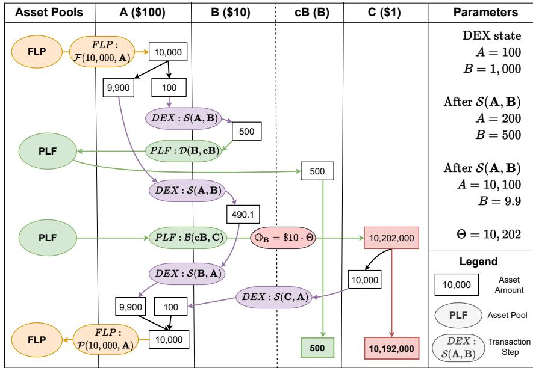
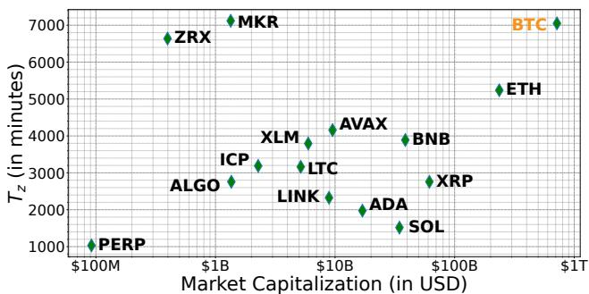
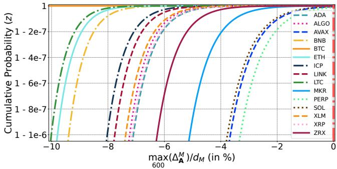

# SecPLF: Secure Protocols for Loanable Funds against Oracle Manipulation Atacks

Sanidhay Arora University of Oregon Eugene, USA sanidhay@uoregon.edu

Yebo Feng Nanyang Technological University Singapore yebo.feng@ntu.edu.sg

## ABSTRACT

The evolving landscape of Decentralized Finance (DeFi) has raised critical security concerns, especially pertaining to Protocols for Loanable Funds (PLFs) and their dependency on price oracles, which are susceptible to manipulation. The emergence of flash loans has further amplified these risks, enabling increasingly complex oracle manipulation attacks that can lead to significant financial losses. Responding to this threat, we first dissect the attack mechanism by formalizing the standard operational and adversary models for PLFs. Based on our analysis, we propose SecPLF, a robust and prac tical solution designed to counteract oracle manipulation attacks eficiently. SecPLF operates by tracking a price state for each crypto asset, including the recent price and the timestamp of its last update. By imposing price constraints on the price oracle usage, SecPLF ensures a PLF only engages a price oracle if the last recorded price falls within a defined threshold, thereby negating the profitability of potential attacks. Our evaluation based on historical market data confirms SecPLF’s eficacy in providing high-confidence prevention against arbitrage attacks that arise due to minor price diferences. SecPLF delivers proactive protection against oracle manipulation attacks, ofering ease of implementation, oracle-agnostic property, and resource and cost eficiency.

## CCS CONCEPTS

• Social and professional topics → Financial crime; • Security and privacy → Distributed systems security; • Information systems → World Wide Web;

## KEYWORDS

blockchain, flash loan, oracle manipulation attack, Decentralized Finance (DeFi), Protocols for Loanable Funds (PLF)

## 1 INTRODUCTION

Decentralized Finance (DeFi) has dramatically reshaped the land scape of the financial sector in recent years, introducing a paradigm shift toward an inclusive and highly programmable system of fi- nance [42–44]. Rooted in the underlying technology, DeFi enables the execution of smart contracts that automate the delivery of fi nancial services, rendering intermediaries unnecessary. While this democratizes access to financial instruments, it also introduces unique security risks and vulnerabilities. Attacks on DeFi platforms

Yingjiu Li University of Oregon Eugene, USA yingjiul@uoregon.edu

Jiahua Xu University College London, The DLT Science Foundation London, UK jiahua.xu@ucl.ac.uk

have become more and more frequent, sophisticated, and damag- ing [46]. Collectively, reported DeFi attacks have resulted in the loss of over \$3B in funds to date [10], leading to substantial financial setbacks for investors. It is therefore of paramount importance to develop practical and efective strategies to defend against such attacks.

Among the myriad challenges that DeFi protocols face, a critical vulnerability in Protocols for Loanable Funds (PLFs) lies in their dependence on price oracles [46]. These external data sources, es-sential in furnishing market price data, have regrettably become a target for manipulation, thereby exposing associated PLFs to potential exploitation. A tampered oracle can trigger erroneous market price signals, inflicting severe repercussions across the DeFi landscape. This issue is particularly pronounced with the advent of flash loans, a novel smart contract functionality that can facilitate oracle manipulation attacks on PLFs.

Emerging in recent years within the DeFi arena, flash loans [41] have empowered users with the capabilities to borrow significant capital amounts while incurring only gas fees. Given the fact that all entities—including flash loan providers, price oracles, and PLFs— operate on publicly accessible smart contracts, a malicious user could craft programs that leverage flash loans to manipulate a price oracle deftly. This manipulation sets the stage for considerable exploitation of any PLF relying on the compromised oracle [35]. Recent instances have seen several significant attacks on PLFs, with crypto-asset losses surpassing the \$100M mark [10].

Regrettably, the prevention oforacle manipulation attacks proves to be challenging [46], mainly as these attacks occur within a single transaction, inherently leaving little room for mitigation. Further complicating matters is the intricate interaction between multiple smart contracts across various DeFi platforms, amplifying the com-plexity offinancial transactions and inhibiting the discovery ofsecurity vulnerabilities. Although some approaches have been proposed (e.g., multiple oracle sources [11], price feeds and averaging [14], timelock mechanism [23], staking and reputation system [32]), or-acle manipulation attacks have not been fully addressed. On the other hand, similar price manipulation problems have been studied and addressed in centralized finance (CeFi). For instance, traditional finance uses circuit breakers to pause trading amid significant price fluctuations or manipulations to protect investors [37]. However, this approach has not been properly explored in DeFi.

In this paper, we seek to counteract oracle manipulation attacks on PLFs, particularly those facilitated by flash loans. We propose SecPLF, a robust approach specifically designed to provide an effective and cost-eficient solution. This approach, which PLFs can easily implement, serves as a powerful tool to combat and avert these potentially catastrophic attacks, thereby enhancing the over all security of the DeFi landscape.

The key idea of SecPLF lies in tracking a price state for each crypto-asset. This state comprises of (i) the spot price of a cryptoasset, and (ii) the timestamp of the block in which this price state was last updated. SecPLF imposes specific constraints on this price state and the usage of the price oracle. These constraints are de signed to ensure that the PLF only engages a price oracle if the last recorded price of the asset is within a defined threshold. We calibrate this threshold to be equivalent to the minimum price distortion an adversary needs to attain a profit from the attack transaction. This strategy efectively deters attackers, as it renders the attack unprofitable, thereby ensuring they are discouraged from initiating it in the first place. In contrast with existing solutions, SecPLF presents the following contributions:

(1) Proactive Safeguarding: SecPLF provides robust and efective prevention against oracle manipulation attacks. Consequently, attackers are unable to successfully launch an attack initially, causing negligible impacts on the DeFi protocol operations.

(2) Re-configurable and Steerable: With two hyper-parameters, � and �, SecPLF enables a PLF to quantify its security in terms of arbitrage risk (�) and under-collateralization risk (�). The flexi bility of these parameters provides the PLF with configuration control over their protocol based on these risks.

(3) Ease of Implementation: SecPLF only employs fundamental smart contract functionalities for implementation, requiring minimal modifications to adapt to a variety of DeFi systems.

(4) Resource Eficiency: The computational resources required for the SecPLF algorithm are minor compared to the overall expenses of operating a PLF.

(5) Oracle Agnostic: SecPLF functions as an integral security measure in the architecture of a standard PLF, irrespective of the oracle source. This oracle-agnostic property allows SecPLF to integrate into any standard PLF, enhancing its applicability.

Our analysis and evaluation have demonstrated the aforemen- tioned advantages. Drawing upon market data from the last three years, we have found that SecPLF can achieve high levels of confi dence (e.g., 1−10−5) in fending of potential arbitrage opportunities, provided the parameters are appropriately configured. Furthermore, SecPLF stands out as a resource and cost-eficient solution. Even when we consider a worst-case scenario overhead costs, these costs remain considerably minor when compared to the operational costs of a PLF. Thus, SecPLF ofers practical, robust, and economical pro tection against flash loan-driven oracle manipulation attacks.

The remainder of this paper is structured as follows: Section 2 provides a survey of related work, while Section 3 introduces the necessary background information required for understanding our methodology. We then formalize the operational model for a stan dard PLF in Section 4 and describe the adversary model in Section 5. Section 6 details our proposed solution, SecPLF. We evaluate our approach in Section 7 and draw conclusions in Section 8.

## 2 RELATED WORK

This section presents the related work, including DeFi security, oracle manipulation attacks, and traditional finance security.

## 2.1 Decentralized Finance Security

DeFi security, a burgeoning research area, addresses the challenges posed by the rapid growth and adoption of DeFi platforms and the increasing complexity of financial attacks targeting them [28, 39, 46]. The “blockchain oracle problem” is a pivotal concern, leading to significant losses in DeFi projects [17, 18]. Solutions like decentralized oracles and security platforms are suggested but not widely implemented [19]. SecPLF ofers an innovative solution for preventing oracle manipulation attacks in this context.

Oracle manipulation attacks in PLFs are of particular concern, causing substantial damages [10]. Massimo et al. highlighted the security issues in PLFs, including smart contract vulnerabilities and oracle manipulation attacks [16]. SecPLF targets these flash loan-driven attacks.

## 2.2 Price Oracles and Manipulation Attacks

There is an increasing focus on oracle manipulation attacks, especially involving flash loans [15, 20, 35, 40]. Early research by Yixin et al. demonstrated the potential for rapid exploitation through atomic transactions, though without proposing countermeasures [35]. Various strategies have emerged to protect PLFs, focusing on the integrity of oracle data:

• Price Feeds and Averaging: Strategies like time-weighted average price (TWAP) introduced by Uniswap V3 aim to mitigate outliers [14], but Makinga et al. show some manipulative activities can bypass TWAP oracles [31].

• Timelock Mechanisms: Delaying oracle usage can mitigate attacks, but may not always be efective [23].

• Staking and Reputation Systems: These systems incentivize accuracy but are susceptible to manipulative behaviors [32].

• Multiple Oracle Sources: Using a weighted average from various sources increases accuracy but adds complexity [8, 11].

## 2.3 Traditional Finance Security

In traditional finance, circuit breakers prevent significant price manipulations [34]. Studies afirm their efectiveness in combating short-term manipulations [27, 29, 37]. However, despite their eficacy, the adaptation of circuit breakers to the DeFi environment has not yet been achieved. SecPLF adapts a similar concept for the DeFi space to counter oracle manipulation attacks.

## 3 BACKGROUND

This section provides essential background on blockchains and DeFi applications to facilitate a better understanding of SecPLF.

## 3.1 Decentralized Finance (DeFi)

DeFi is a blockchain-based form of finance that doesn’t rely on central financial intermediaries such as brokerages, exchanges, or banks to ofer financial services [42]. Instead, it utilizes smart contracts [24] on blockchains, predominantly Ethereum. Ofering services like lending, insurance, and trading, DeFi’s growth has been exponential, leading to considerable challenges, particularly in se curity and privacy [38], necessitating continual research.

## 3.2 Oracles

An oracle serves as a bridge between the blockchain environment and the real world [22, 30]. As blockchain systems are designed to be isolated from external influences to ensure security, most blockchain applications, particularly in DeFi projects, require spe-cific information from outside the blockchain to trigger the exe- cution of smart contracts. Oracles fulfill this need, operating as on-chain APIs that bring external information into the smart contracts. They can report on a wide array of data, such as the exchange rate of ETH/USD on Binance or the winners of the 2021 NBA Cham pionship. Moreover, oracles can be bi-directional, not only fetching data but also transmitting information out to the real world.

## 3.3 Flash Loans

Flash loans, a novel DeFi tool, have transformed the ways of obtain- ing loans in the blockchain environment. Unlike traditional loans, flash loans allow users to borrow any amount of assets without collateral, provided that the borrowed assets are returned within the same transaction [21, 40]. This unique feature enables a myr iad of use cases, including arbitrage, collateral swapping, and self- liquidation, among others. However, it also introduces new types of risks and attacks, like the notorious oracle manipulation attacks that could lead to significant financial losses [10].

## 3.4 Automated Market Maker-based Decentralized Exchanges (AMM DEXs)

AMM DEXs represent a novel approach to decentralized trading, which eliminates the need for an order book [45]. Instead of match ing buyers and sellers to determine prices and execute trades, AMM DEXs use a mathematical formula to set the price of a token. AMMs allow digital assets to be traded in a permissionless and automated way by using liquidity pools rather than a traditional market of buy- ers and sellers. Popular examples include Uniswap [13], Curve [7], Balancer [2], Bancor [3], TerraSwap[12], and Raydium [9].

## 3.5 Protocols for Loanable Funds (PLFs)

PLFs are a critical component of the DeFi ecosystem, facilitating the majority of lending and borrowing activities within blockchain networks [25]. Through automated and programmatically-enforced smart contracts, PLFs allow users to lend their crypto assets in a pool from which borrowers can borrow, often requiring over- collateralization [33]. PLFs dynamically adjust interest rates based on supply and demand, aiming to balance the liquidity in the lending pools. Some notable examples of PLFs include Aave, Compound, and MakerDAO. While these protocols have democratized access to financial services, they are not without risk, as seen in several instances of security breaches and manipulative attacks.

## 4 STANDARD PLF MODEL

This section formalizes a standard model that PLFs utilize in practice. First, we introduce the risk considerations and define the security notion of safe collateralization that a standard PLF uses to mitigate these risks. Next, we describe the factors and mechanisms a PLF employs and define a collateralization-safe PLF model based on this security notion. Finally, we highlight the benefits and potential risks of the usage of price oracles for this PLF model.

## 4.1 Standard Risks in PLFs

The two primary risks that lead to insolvency and concern a stan- dard PLF—highlighted by Kao et al. in [26]—are as follows.

(1) Arbitrage risk: It refers to the potential of traders and participants to exploit the price rate discrepancies between PLFs, creating profit opportunities. To avoid these price discrepancies, PLFs use price oracles to fetch the latest market price for each asset. These discrepancies typically arise for a short time based on the frequency of price oracle usage.

(2) Under-collateralization risk: It occurs when the collateral value held by a borrower is insuficient to cover the value of the bor- rowed assets, including interest accrued. If a borrower becomes under-collateralized, the PLF may not be able to fully recover the loans, leading to potential losses for lenders and liquidity providers. It threatens the stability and solvency of the PLF.

## 4.2 Safe Collateralization Approach

In the next two sub-sections, we model a ��� that addresses the risk of under-collateralization using a safe collateralization approach. The definition of Safe collateralization is as follows.

Definition 4.1 (Safe collateralization). It refers to an over-collateralization approach that aims to ensure that the protocol remains solvent. Specifically, this approach ensures that the total value of outstand- ing loans and obligations does not exceed the available funds and assets.1

This model involves the calculation of a liquidation threshold to secure the PLF from under-collateralization. The formal definition of the liquidation threshold is as follows.

Definition 4.2 (Liquidation threshold). It is the specified value at which an asset must be sold or liquidated to limit additional losses or manage risk. When a collateral value drops below this threshold, PLF liquidates the collateral to mitigate losses.

A PLF employing the safe collateralization approach assumes that loans are secured by collateral. Therefore, liquidations are incentivized to recover loans if borrowers fail to repay. However, collateral liquidation is exposed to risks. The incentive to liquidate is only efective if the liquidated value of seized collateral is higher than the value of the repaid loan amount, implying a profit. Smart contracts are used to automate the liquidation process which re- duces the risk offraud or manipulation. We now describe the factors and mechanisms that PLFs use to determine these thresholds in case of liquidations.

4.2.1 Liquidation threshold calculation factors. Intuitively, the liq-uidation threshold is a balance between minimizing the risk of default and maximizing the protocols’ profitability. The liquida- tion threshold for a PLF is typically determined by two parameters, which are:

Table 1: PLF: State parameter notations

<table><tr><td>Notation</td><td>Meaning</td></tr><tr><td>c</td><td>Value of a collateral asset held by user</td></tr><tr><td>l</td><td>Value of an outstanding loan</td></tr><tr><td>E</td><td>Collateralization ratio;  $E = \frac{c}{l}$ </td></tr><tr><td> $\epsilon$ </td><td>Safe collateralization ratio</td></tr><tr><td>LT</td><td>Liquidation threshold;  $LT = \epsilon \cdot l$ </td></tr></table>

• Value of a collateral asset (�): It refers to the value of a collater-alized asset held by a borrower. If the protocol has a low value for �, it may indicate that the PLF is close to the risk of under collateralization.

• Value of an outstanding loan (�): It refers to the value of the collateralized loan. If the protocol has a high value for �, it may indicate the risk of under-collateralization.

4.2.2 Liquidation threshold calculation mechanism. Table 1 pro-vides a brief description of the PLF parameters relevant to the calculation of the liquidation threshold (�� ). The key idea of the algorithm to calculate �� in a PLF using “Safe collateralization" (Definition 4.1) is described below. A safe collateralization ratio � is established for a PLF based on the volatility of the collateral asset and the desired level of risk [1]. �� is then set at a level that en sures that the collateralization ratio (�) does not fall below the safe collateralization ratio (�), i.e. $E \geq \epsilon .$ In the case of a standard PLF using a safe collateralization approach, the liquidation threshold for a loan � can be defined as the safe collateralization ratio (�) times the value of the loan (�) i.e. $L T = \epsilon \cdot l .$

## 4.3 Collateralization-safe PLF Model

To model ��� using safe collateralization, we use the parameters defined in Table 1 to define the safe-collateralization rule i.e. $E \geq \epsilon .$ The safe-collateralization rule ensures that the total value of the collateral is greater than or equal to the safe collateralization ratio times the value of the total loan. We now define collateralization safe PLF which employs the security notions provided in Defini tions 4.1, and 4.2. 2

Definition 4.3 (Collateralization-safe PLF). A ��� is collateralization-safe if the safe-collateralization rule is satisfied, i.e.

$$
\text {RULE 1.} E \geq \epsilon \iff c \geq L T \iff c \geq \epsilon \cdot l.
$$

The safe-collateralization rule can be used to monitor the state of PLF and ensure that it remains solvent and secure from under- collateralization. If the rule is violated, it indicates that the protocol is at risk of under-collateralization, and corrective measures need to be taken. If any collateral � falls below their liquidation threshold �� i.e. $c < \epsilon \cdot l ,$ PLF liquidates � in time so that no loss is incurred [1, 5]. The main focus of this security model is to ensure that the PLF remains solvent and follows the security notions of Defini tions 4.1, 4.2, and 4.3. This model allows for quantification of the degree of security against under-collateralization using the safe collateralization ratio �.

Table 2: Blockchain and adversary model notations

<table><tr><td>Notation</td><td>Meaning</td></tr><tr><td> $S_i$ </td><td> $i^{th}$  state of the blockchain</td></tr><tr><td> $\mathcal{T}_i$ </td><td> $i^{th}$  sub-transaction;  $\mathcal{T}_i: S_{i-1} \to S_i$ </td></tr><tr><td> $\mathcal{T}$ </td><td>Attack transaction:  $(\mathcal{T}_1, \cdots, \mathcal{T}_n)$ </td></tr><tr><td> $\tau_i$ </td><td> $i^{th}$  transaction-step</td></tr></table>

## 4.4 Price Oracle Usage in PLFs

Several PLFs employing the safe collateralization approach use price oracles to fetch the spot price of crypto-assets. PLFs use these oracles to monitor safe collateralization at least every 10 hours [1, 5]. Later, we use this minimum frequency of price oracle usage (of 10 hours) in our practicality analysis (Section 7.2). Additionally, PLFs use these price oracles to keep up with the latest market price, reducing the risk of arbitrage attacks caused due to price shocks.

However, the usage of price oracles may introduce the risk of arbitrage from a novel type of attack observed in recent years, called an oracle manipulation attack. Since price oracles are critical in the calculation of the liquidation threshold, and henceforth the borrowing limit on any loans, it can lead to under-collateralization if this price is manipulated. In addition, a novel DeFi service called flash loans can help facilitate oracle manipulation attacks with essentially no risk to the attacker. Moving forward, we consider this collateralization-safe PLF (from Definition 4.3) using price oracles as the model for a standard PLF. We refer to it as ��� (italic) for simplicity.

Further, we consider this ��� to always satisfy Rule 1. This rule ensures that in case ��� uses an oracle price that contradicts Rule 1, that is if the price of a collateral drops below the liquida- tion threshold, it liquidates the collateral immediately. Hence, this standard ��� is secure from under-collateralization according to Definition 4.3. Next, in Section 5, we present an adversary model for this ��� formalizing the aforementioned flash loan-driven oracle manipulation attack.

## 5 ADVERSARY MODEL

In this section, we first define a basic model of blockchains and the adversary. Next, we define relevant notations and formalize an ora- cle manipulation attack on a standard ��� defined in Section 4. We then model a general flash loan-driven oracle manipulation attack transaction T, provide its formal attack steps, and define an oracle manipulation-secure ���. Moreover, we illustrate an example of a formal oracle manipulation attack transaction T in Figure 1.

## 5.1 Basic Blockchain and Adversary Model

We model the interaction between users and the blockchain as a state transition system. We assume one computationally bounded and economically rational adversary A. The adversary is not re- quired to provide its collateral to perform the attacks described below. We assume that the adversary is financially capable of pay- ing any transaction fees associated with the network. Now, consider A creates a set � of� malicious smart contracts. It is reasonable to assume that the adversary A and all � malicious smart contracts can interact with each other according to A’s wish.

Table 3: Transaction-steps (��)

<table><tr><td>Notation</td><td>Meaning</td></tr><tr><td> $\mathcal{F}(X, A)$ </td><td>Take X amount of A as flash loan</td></tr><tr><td> $\mathcal{D}(A, cA)$ </td><td>Deposit A as collateral to get cA</td></tr><tr><td> $\mathcal{S}(A, B)$ </td><td>Swap: Sell A to buy B</td></tr><tr><td> $\mathcal{B}(cA, B)$ </td><td>Borrow B using cA on PLF</td></tr><tr><td> $\mathcal{P}(X, A)$ </td><td>Payback the flash loan with X amount of A</td></tr></table>

Here we define the notations of the adversary model summarized in Table 2. Let the initial state of the blockchain be denoted by ${ \sf S } _ { \mathrm { 0 } } .$ . To execute an attack, A initiates a transaction $\mathcal { T }$ by calling a malicious smart contract belonging to �. A transaction is defined as an indexed-sequence of� atomic state-transition-functions, i.e. $\mathcal { T } =$ $( { \mathcal { T } } _ { 1 } , \cdots , { \mathcal { T } } _ { n } )$ . Atomic state transitions are indivisible and irreducible series of state-change operations on the blockchain such that either all occurs, or nothing occurs. Here, $\mathcal { T } _ { i } : \mathsf { S } _ { i - 1 } \to \mathsf { S } _ { i }$ represents an atomic state transition function, i.e. it is a definite series of operations on the blockchain state. Let $\mathcal { T } _ { i }$ be referred to as $i ^ { t h }$ subtransaction. The state of the blockchain after transaction $\mathcal { T }$ is $S _ { n } .$ i.e. $\mathcal { T } : S _ { 0 }  S _ { n }$

Now consider an equivalent indexed-sequence of the transaction as $\mathcal { T } = ( \tau _ { 1 } , \tau _ { 2 } , \cdot \cdot \cdot , \tau _ { k } )$ . Here, �� is an indexed sequence of sub transactions, i.e. $\tau _ { i } = ( \mathcal { T } _ { x } , \cdot \cdot \cdot , \mathcal { T } _ { y } )$ where $0 < x < y \leq n$ and $x , y \in$ $\mathbb { Z } ^ { + } . \mathbb { S } _ { y }$ denotes the state of the blockchain after the transaction step $\tau _ { i } ,$ , i.e. $\tau _ { i } : { \mathsf { S } } _ { x - 1 } \to { \mathsf { S } } _ { y }$ where $i < x < y \leq n .$ Trivially, this sequence must be mutually exclusive, topologically sorted, and completely exhaustive for a given transaction T.

## 5.2 Formalizing Oracle Manipulation Attack

���s using price oracles may be vulnerable to flash loan-driven oracle manipulation attacks. In this attack, the adversary can ma- nipulate the price oracle of a collateralized asset by using flash loans. This manipulation is done by executing a large trade on a ��� that provides the oracle that ��� uses. The attacker can use the flash loan to borrow large amounts of cryptocurrency assets. This borrowed asset may be used to deposit on the PLF as collateral for loans, which is also the cost of this attack. The adversary then uses the majority of the flash loan amount to execute trades on a DEX that relies on the same oracle used by ��� . By executing a large enough trade on ���, the adversary can manipulate the price of the collateral, causing it to appear more valuable than it is. Once the price of the collateral has been manipulated, the attacker can use it to secure a loan on the PLF, borrowing a larger amount of funds. The adversary profits an amount equal to this loan minus the cost of the attack, as her profit.

5.2.1 Formal atack transaction steps. Here, we model a formal general flash loan-driven oracle manipulation attack transaction $\mathcal { T } .$ Table 3 summarizes a short description of the crucial transaction steps that are necessary for an oracle manipulation attack. Consider a PLF using a price oracle $\mathbb { O } _ { \mathbf { A } }$ provided by a Decentralized Exchange ��� to determine the price of an asset A. The adversary A initiates a transaction $\mathcal { T } _ { : }$ , an indexed sequence of � transaction steps i.e. $\mathcal { T } = ( \tau _ { 1 } , \cdots , \tau _ { k } )$ . The critical transaction steps, along with their reasoning, that are necessary for the attack are described below in topological order:

Table 4: Formal attack transaction notations

<table><tr><td>Notation</td><td>Meaning</td></tr><tr><td> $\mathbb{O}_{\text{B}}$ </td><td>Oracle price of asset B before the transaction  $\mathcal{T}$ </td></tr><tr><td>Y</td><td>Amount of B deposited in  $\mathcal{D}(\text{B}, \text{cB})$ </td></tr><tr><td> $\Theta$ </td><td>Distortion factor of  $\mathbb{O}_{\text{B}}$  right before  $\mathcal{B}(\text{cB}, \text{C})$ </td></tr><tr><td>max(L)</td><td>Borrowing limit of A (in USD) right before  $\mathcal{B}(\text{cB}, \text{C})$ </td></tr><tr><td>L</td><td>Amount of loan in C borrowed in step  $\mathcal{B}(\text{C}, \text{cB})$ </td></tr><tr><td>G</td><td>Profit (or gain) of A from the transaction  $\mathcal{T}$ </td></tr></table>

F (�, A); Take � amount of asset A in flash loan as �1.

S (A, B); This transaction-step must use a small fraction of �.

D (B, cB); A deposits $Y$ amount of asset B on $P L F ,$ which is the cost of this attack. Here $\cdot _ { \mathbf { c } } ,$ in cA denotes a collateralized-asset. A plans to distort $\mathbb { O } _ { \mathbf { B } }$ by distorting the price of the pair $\mathbf { A } / \mathbf { B }$ on $D E X ,$ , which is used in the price oracle ${ \mathbb { O } } _ { \mathbf { B } }$

S (A, B); A distorts the price of OB by a factor of Θ using the remaining amount of A. ��� receives $\mathbb { O } _ { \mathbf { B } }$ as input which rep- resents the price of cB (linearly proportional). Note that the majority of the flash loan amount goes here.

B (cB, C); A redeems the collateral cB at the distorted price to borrow a loan � in asset C. Here, A can borrow this loan up to her maximum borrowing limit from Definition 4.3.

S $( \mathbf { B } , \mathbf { A } ) ;$ ; This step is reverting the swap in which the adversary manipulated the price to get back � amount of A to pay back the flash loan.

P (�, A); Payback the flash loan in asset A as $\tau _ { k }$ . The adversary gains a profit � which is calculated as the borrowed loan � minus the cost of the attack.

5.2.2 Formal atack transaction notations. Table 4 summarizes the notations used in the aforementioned formal attack transaction T. Let $\mathbb { O } _ { \mathbf { B } }$ be the initial oracle price of asset B before the transaction T. In transaction step ${ \mathcal { S } } ( \mathbf { A } , \mathbf { B } )$ , A distorts this initial price by a factor of Θ. This distortion increases $\mathbb { A } ^ { * } s$ borrowing limit max(�) by the same factor. It is calculated from Definition 4.3 as the USD value of the deposited collateral � B after a distortion of Θ in ${ \mathbb { O } } _ { \mathbf { B } }$ over the safe collateralization ratio $\epsilon ,$ i.e.

$$
\max (L) = \frac {\mathbb {O} _ {\mathbf {B}} \cdot Y \cdot \Theta}{\epsilon}.\tag{1}
$$

To gain a profit from the attack transaction $\mathcal { T }$ , A borrows a loan � in asset C. Here � calculates using max(�) (from Equation 1) as

$$
L = \frac {\max (L)}{\mathbb {O} _ {\mathbf {C}}}.\tag{2}
$$

A’s profit (or gain) can be calculated in USD as her borrowing limit minus the cost of the attack. Let � be the profit (in USD) of A in T. Hence, � calculates as max(�) (from Equation 1) minus the value of the de osited collateral � (which is the cost of the attack), i.e.

$$
G = \mathbb {O} _ {\mathbf {B}} \cdot Y \cdot \left(\frac {\Theta}{\epsilon} - 1\right).\tag{3}
$$

We now calculate an upper bound for $\mathbb { A } ^ { \prime } s$ profit � as max(�) (from Equation 3) using the maximum values of� and Θ as max(�)

  
Figure 1: Flash loan-driven oracle manipulation attack example of transaction T: A distorts the initial price of B (\$10) by a factor of $\Theta = 1 0 , 2 0 2$ . A profits (�) 10, 192, 000 amount of C priced at 1 USD (highlighted in red).

and max(Θ), respectively. Here, max(�) calculates as

$$
\max (G) = \mathbb {O} _ {\mathbf {B}} \cdot \max (Y) \cdot \left(\frac {\max (\Theta)}{\epsilon} - 1\right).\tag{4}
$$

Note that, since A uses a negligible fraction of the flash loan to get the collateral � B, max(�) highly depends on max(Θ).

5.2.3 Oracle-manipulation-secure PLF. Here we define an Oracle manipulation-secure PLF based on the adversary model, the formal attack transaction T, and the upper bound on A’s profit max(�).

Definition 5.1 (Oracle-manipulation-secure PLF). A ��� is secure against flash loan-driven oracle manipulation attacks if the attack transaction $\mathcal { T }$ is unsuccessful. Equivalently, $\mathrm { i f } \ \mathbb { A } ^ { \prime } s$ maximum profit max(�) (from Equation 4) in the transaction T is 0, i.e.

$$
\text {RULE 2.} \mathbb {O} _ {\mathbf {B}} \cdot \max (Y) \cdot \left(\frac {\max (\Theta)}{\epsilon} - 1\right) = 0 \iff \max (\Theta) = \epsilon .
$$

Intuitively, Definition 5.1 states that a PLF is secure against the attack transaction T if the maximum price distortion factor (max(Θ)) is equal to the safe collateralization ratio (�) i.e. (Rule 2)

$$
\max (\Theta) = \epsilon \iff \max (G) = 0.
$$

## 5.3 Oracle Manipulation Attack Example

5.3.1 Atack example illustration. Figure 1 illustrates a flash loandriven oracle manipulation attack on a PLF. We utilize the Flashot diagram provided by Yixin et al. [20] to illustrate the attack trans action $\mathcal { T }$ as described in Section 5.2.1. Below, we describe the terms and notations along with some key ideas of the attack example in Figure 1. The initial market price of assets A, B, and C are \$100, \$10, and \$1 before the transaction $\mathcal { T } ,$ , respectively (mentioned after the assets). The timeline of the transaction $\mathcal { T }$ is shown from top to bottom. Asset pools like Flash Loan Provider (���), and $P L F$ are on the left. The parameters shown on the right are the number of liquidity reserves of asset pool A/B on the Decentralized Exchange (���) which is initially set as $A = 1 0 0$ and $B = 1 , 0 0 0$ . The values of the parameters are calculated by ��� using its AMM algorithm, which operates using a conservation function. In this example, we use Uniswap’s conservation function: $A \times B = K$ , where � is a constant $( K = 1 0 0 , 0 0 0 )$ .

��� receives the price of asset B from the price oracle provided by ��� as its input, $\mathbb { O } _ { \mathbf { B } } . \mathbb { A }$ wants to manipulate the price of asset cB, which is proportional to $\mathbb { O } \mathbf { \mathbf { \mathbf { B } } } .$ . After this price is manipulated, A can then borrow any asset on ��� up to its borrowing limit. This borrowing limit is directly proportional to (i) the price of cB, which was manipulated; and (ii) inversely proportional to the safe collateralization ratio � (from Definition 4.3). Since, A can profit an amount up to this borrowing limit, we take $\epsilon = 5 0 0 \%$ as it is significantly more than the typical upper bound used for this ratio [1]. This case represents the worst-case scenario for the adversary as the more the safe collateralization ratio, the less the borrowing limit, implying less profit for the adversary A.

5.3.2 Transaction steps in $\mathcal { T } .$ . The transaction steps $( \tau _ { i } \in \mathcal { T } )$ of the attack transaction $\mathcal { T } = \left( \tau _ { 1 } , \cdots , \tau _ { k } \right)$ shown in Figure 1 are explained as follows.

F (�, A); A borrows a flash loan of $X = 1 0 , 0 0 0 \mathbf { A }$ in $\tau _ { 1 }$

S (A, B); A swaps 100 A on ��� providing the price oracle to get 500 B.

D (B, cB); A deposits $Y = 5 0 0$ B on ��� to get 500 cB.

S (A, B); A uses the remaining flash loan amount of 9, 900 A to get 490.1 B. A distorts the price of asset B on ���, which is proportional to the reserve amount of A over the reserve amount of B. The distortion in $\mathbb { O } _ { \mathbf { B } }$ calculates as

$$
\Theta = \frac {1 0 , 1 0 0}{9 . 9} \cdot \frac {1 , 0 0 0}{1 0 0} \approx 1 0, 2 0 2.
$$

B (cB, C); A borrows a loan � against the collateral cB to gain a profit � from the attack transaction T i.e $G > 0 . { \cal P } L { \cal F }$ receives the distorted oracle price $\mathbb { O } _ { \mathbf { B } } = \$ 10\cdot\Theta$ as input (highlighted in red). The borrowing limit of � is calculated in USD (from Equation 1) as the value of 500 cB at the distorted price over the safe collateralization ratio �, i.e.

$$
\max (L) = \frac {\$ 10 \cdot 500 \cdot 10, 202}{500 \%} = \$ 10, 202, 000.
$$

A borrows a loan � up to this borrowing limit in an asset C (from Equation 2), i.e.

$$
L = \frac {\max (L)}{\mathbb {O} _ {\mathrm{C}}} = 1 0, 2 0 2, 0 0 0 \mathrm{C}.
$$

S (B, A); A swaps back 490.1 B on ��� to get 9, 900 A.

S (C, A); A uses 10, 000 C to get 100 A. This amount is the cost of the attack, which is equivalent to the value of deposited collateral 500 B i.e. $1 0 0 \cdot { \mathbb { O } } _ { \mathbf { A } }$ (in USD).

P (�, A); Finally, A pays back the flash loan in $\tau _ { k }$ . A’s profit � (highlighted in red) is calculated from Equation 3 as

$$
G = 1 0 \cdot 5 0 0 \cdot \left(\frac {1 0 , 2 0 2}{5 0 0 \%} - 1\right) = 1 0, 1 9 2, 0 0 0.
$$

The collateral provided to $P L F ,$ that is 500 cB, remains there (highlighted in green). This amount is the cost of the attack, which is negligible compared to A’s profit. Hence, it can be ignored and left as locked collateral in ���. Moreover, flash loan providers might require a small fraction of the fee to use their service. Typically this fee is less than 0.1% of the flash loan borrowed. Since this fraction is negligible to the price distortion and $\mathbb { A } ^ { \star }$ return on investment, we neglect this fee for simplicity.

## 6 SECPLF: ORACLE MANIPULATION SECURE PLF SOLUTION

In this section, we present SecPLF which is an algorithm designed to secure a standard ��� from flash loan-driven oracle manipula tion attacks according to Definition 5.1. Given an input price oracle $\mathbb { O } _ { \mathbf { A } }$ , SecPLF algorithm outputs a price $P _ { \mathbf { A } }$ , which is based on a safe threshold to prevent the attack transaction T. We first present an overview of SecPLF explaining the key ideas behind this algorithm. Next, we proceed by presenting the SecPLF algorithm. Then, we provide a Theorem stating that SecPLF is an oracle-manipulation secure PLF according to Definition 5.1 and show that SecPLF pre vents the attack transaction illustrated in Figure 1. Further, we quantify the arbitrage risk resulting from the price diferentials caused due to the imposed constraints on the output price. Later, in Section 7, we quantify this risk based on this diference and use it in practicality analysis of SecPLF.

## 6.1 Overview

Following is a brief overview of the algorithm. The notations used in SecPLF are summarized in Table 5. This algorithm takes in three inputs $( i ) \mathbb { O } _ { \mathbf { A } }$ , which is the price oracle of an asset A that ��� uses; (ii) B, the block in which $P L F$ receives the oracle; and (iii) �, the safe collateralization ratio. It stores a state A for each asset A, in case $\mathbb { O } _ { \mathbf { A } }$ is not safe to use. Finally, it gives an output $P _ { \mathbf { A } } ,$ , which denotes a safe price for asset A that prevents oracle manipulation attacks on $P L F$

Table 5: SecPLF Algorithm Notations

<table><tr><td>Notation</td><td>Meaning</td></tr><tr><td> $\mathbb{O}_{\text{A}}$ </td><td>Price of asset A provided by the oracle (input)</td></tr><tr><td> $P_{\text{A}}$ </td><td>The price of asset A that SecPLF uses (output)</td></tr><tr><td> $\mathbb{B}$ </td><td>Block in which the PLF receives  $\mathbb{O}_{\text{A}}$  as input</td></tr><tr><td>A</td><td>State of asset A: ( $id, p$ ); the block index in which it was last updated, and price of asset A</td></tr></table>

The algorithm is explained as follows. Initialize a state $\mathsf { A } = ( i d , p )$ in the PLF smart contract state for each asset A on ���. Here, $\mathcal { P }$ is the last stored price of asset A, and �� is the block index in which A was last updated. After fetching the price oracle $\mathbb { O } _ { \mathbf { A } } .$ , update A if and only if the block index of the price oracle is greater than the last updated �� in A. This condition ensures that the state A updates at most once during the execution of each attack transaction $\mathcal { T }$ Update this state with the minimum of the oracle price $\mathbb { O } _ { \mathbf { A } }$ and � times $\mathsf { A } . p .$ . Then, use the minimum of Oracle price $\mathbb { O } _ { \mathbf { A } }$ and the last updated price state $\mathsf { A } . p$ as the output $P _ { \mathbf { A } }$ of the algorithm. This restriction on the Oracle price ensures that A is unable to gain any profits from the transaction T, which prevents oracle manipulation attacks (according to Definition 5.1).

However, using a stored price with the imposed constraints instead of the latest oracle price might allow some arbitrage attack opportunities on ��� . We define the Price-discrepancy case in Section 6.5. It is the only case in the SecPLF algorithm that allows arbitrage opportunities. Then, we introduce a parameter $\Delta _ { \mathbf { A } } ^ { \mathbb { B } }$ to quantify this risk. Further, in Section 7, we show that this arbitrage case occurs with minimal probability in the practical setting.

## 6.2 SecPLF Algorithm

The SecPLF algorithm, given in Algorithm 1, prevents oracle manipulation attacks according to Definition 5.1. The algorithm is summarized as follows:

(1) Let $\mathbb { O } _ { \mathbf { A } }$ denote the oracle price of asset A as the input. And, let $P _ { \mathbf { A } }$ denote the price of asset A that ��� uses to prevent oracle manipulation attacks, as the output of the algorithm.

(2) Store a state $\mathsf { A } = ( i d , p )$ for each asset A. A.� stores the price of A, and A.�� stores the index of the block in which A was last updated.

(3) Let B.�� denote the index of the current block in which ��� receives the oracle $\mathbb { O } _ { \mathbf { A } }$ as input. Update the state A if and only if the block index B.�� is greater than the stored state index A.��, i.e.

$$
\text {RULE 3.} \mathrm{A} \leftarrow (\mathbb {B}. i d, \min (\mathbb {O} _ {\mathrm{A}}, \mathrm{A}. p \cdot \epsilon)) \iff \mathbb {B}. i d > \mathrm{A}. i d.
$$

(4) Note that, in SecPLF, the safe collateralization ratio � is also the maximum factor of change allowed in $\mathsf { A } . p$ from its last updated state (from Rule 3).

(5) Now, update $P _ { \mathbf { A } }$ as the minimum of oracle price $\mathbb { O } _ { \mathbf { A } }$ and last updated price state $\mathsf { A } . p _ { \cdot }$ , i.e.

Rule 4. $P _ { \mathbf { A } } \gets \operatorname* { m i n } ( \mathbb { O } _ { \mathbf { A } } , \mathsf { A } . p )$

<table><tr><td colspan="2">Algorithm 1 SecPLF: Secure Price Oracle Algorithm for asset A</td></tr><tr><td>Input:  $\mathbb{O}_{\text{A}}, \mathbb{B}, \epsilon$ </td><td> $\triangleright$  Oracle price of asset A, block in which the PLF receives the oracle, and safe collateralization ratio, respectively.</td></tr><tr><td>Output:  $P_{\text{A}}$ </td><td> $\triangleright$  The price of asset A that the PLF uses as a safe price against oracle manipulation attacks.</td></tr><tr><td>1: if  $\mathbb{B}.id > \text{A.id}$  then</td><td> $\triangleright$  Update the state A if and only if the input is received in a new block.</td></tr><tr><td>2: A  $\leftarrow (\mathbb{B}.id, \min(\mathbb{O}_{\text{A}}, \text{A}.p \cdot \epsilon))$ </td><td> $\triangleright$  Maximum discrepancy in price after  $(\mathbb{B}.id - \text{A.id})$  block(s) is  $\max(0, \mathbb{O}_{\text{A}} - \text{A}.p \cdot \epsilon)$ .</td></tr><tr><td>3: end if</td><td></td></tr><tr><td>4:  $P_{\text{A}} \leftarrow \min(\mathbb{O}_{\text{A}}, \text{A}.p)$ </td><td> $\triangleright$  Update the output with the minimum of stored price A. $p$  and oracle price  $\mathbb{O}_{\text{A}}$ .</td></tr><tr><td>5: return  $P_{\text{A}}$ </td><td></td></tr></table>

(6) Finally, return $P _ { \mathbf { A } }$ as the output, denoting the safe-to-use price of asset A against oracle manipulation attacks according to Definition 5.1.

## 6.3 SecPLF Theorem

In this subsection, we provide a theorem to show that SecPLF is an Oracle-manipulation-secure PLF according to Definition 5.1. We start by stating a proposition on the SecPLF algorithm below.

Proposition 1. The SecPLF algorithm ensures that the maximum achievable distortion max(Θ) in the attack transaction T is equal to the safe collateralization ratio �, i.e. max $( \Theta ) = \epsilon ( R u l e \ : 2 ) .$

To prove this proposition, we first define the following lemma and consequently prove it.

Lemma 1. The SecPLF algorithm ensures that the state A updates at most once during the execution ofeach attack transaction T. Specifically, the state A updates at most once for all the � sub-transactions in $\mathcal { T } = ( \mathcal { T } _ { 1 } , \cdots , \mathcal { T } _ { n } )$ , i.e.

$$
\mathrm{A} \leftarrow (\mathbb {B}. i d, \cdot) \iff \exists ! i \in [ 1.. n ] \forall_ {i = 1} ^ {n} \mathcal {T} _ {i} \in \mathcal {T}.
$$

Proof. The price state A only updates if the index of the current block is greater than the index of the block where it last updated, i.e. (Rule 3)

$$
\mathrm{A} \leftarrow (\mathbb {B}. i d, \cdot) \iff \mathbb {B}. i d > \mathrm{A}. i d.
$$

Once it updates, i.e. A.�� $ \mathbb { B } . i d ,$ it can no longer be updated in the same transaction T. To prove this, consider a transaction $\mathcal { T }$ consisting of � sub-transactions, i. $\ni T = \left( { \mathcal { T } } _ { 1 } , \cdot \cdot \cdot , { \mathcal { T } } _ { n } \right)$ . Now trivially, all sub-transactions in the same transaction must share the same block index B.��, i.e.

$$
\mathcal {T} _ {i}. \mathrm{id} = \mathcal {T} _ {j}. \mathrm{id} = \mathbb {B}. i d \forall i, j \in [ 1.. n ],\tag{5}
$$

where T�.id denotes the index ofthe block stored in the sub-transaction $\mathcal { T } _ { i } \in \mathcal { T }$ . After the first update $\mathsf { A } . i d = \mathbb { B } . i d$ , and since A only updates if $\mathbb { B } . i d > \mathsf { A } . i d$ (from Rule 3) Equation 5 and Rule 3 implies the aforementioned rule, i.e.

$$
\text {RULE 5.} \mathrm{A} \leftarrow (\mathbb {B}. i d, \cdot) \iff \exists ! i \in [ 1.. n ] \forall_ {i = 1} ^ {n} \mathcal {T} _ {i} \in \mathcal {T}.
$$

Therefore, Rule 5 ensures that A updates at most once during the execution of each attack transaction T. Hence proved. □

The proof of Proposition 1 is as follows.

Proof. Given $\mathcal { T } = ( \tau _ { 1 } , \cdots , \tau _ { k } )$ , Lemma 1 shows that any up- date in B happens at most once during the execution of the attack transaction T. After the first update, the maximum value of $\mathsf { B } . p$ is restricted by a factor of � from its last value (from Rule 3), i.e.

$$
\text {RULE 6. B.} p \leftarrow \min (\mathbb {O} _ {\mathbf {B}}, \mathrm{B}. p \cdot \epsilon) \implies \max (\mathrm{B}. p) \leftarrow \mathrm{B}. p \cdot \epsilon .
$$

Rule 6 and Lemma 1 show that SecPLF ensures that $\mathsf { B } . p$ cannot be distorted by more than a factor of � in transaction T.

Since $P _ { \mathbf { B } } \gets \operatorname* { m i n } ( \mathbb { O } _ { \mathbf { B } } , \mathbf { B } . p )$ (from Rule 4), � is equivalent to the maximum distortion factor max(Θ) of ${ \mathbb { O } } _ { \mathbf { B } }$ . This rule is implied in SecPLF as it uses the price $P _ { \mathbf { B } }$ instead of the oracle price ${ \mathbb { O } } _ { \mathbf { B } }$ as the output of the algorithm, i.e.

$$
\text {Rule 7.} P _ {\mathbf {B}} \leftarrow \min (\mathbb {O} _ {\mathbf {B}}, \mathrm{B}. p) \implies \max (\Theta) = \epsilon .
$$

Therefore, Rule 7 ensures that the maximum achievable dis- tortion max(Θ) in the attack transaction $\mathcal { T }$ is equal to the safe collateralization ratio $\epsilon ,$ i.e. max $\left( \Theta \right) = \epsilon .$ Hence proved. □

The theorem is stated as follows.

Theorem 6.1. A standard ��� employing the SecPLF algorithm, using � as safe collateralization ratio and $\mathbb { O } _ { \mathbf { A } }$ as a price oracle for asset A, is Oracle-manipulation-secure according to Definition 5.1.

Proof. Proposition 1 states that in SecPLF, max $( \Theta ) = \epsilon$ . This rule implies that A’s maximum profit max(�) from the transaction T is 0, i.e. (Rule 2 from Definition 5.1)

$$
\max (\Theta) = \epsilon \iff \max (G) = 0.
$$

Since the adversary cannot gain any profits, she would be unable to pay back the flash loan, which would result in an unsuccessful transaction. Hence proved. □

## 6.4 Example of Attack Prevention

Here we show that SecPLF algorithm prevents the attack transaction T demonstrated in the oracle manipulation attack example in Figure 1. Notice that SecPLF algorithm takes afect in the trans- action step $\mathcal { B } ( \mathbf { c B } , { \mathbf C } )$ . Specifically, when ��� fetches the distorted price oracle $\mathbb { O } _ { \mathbf { B } } = \$ 10\cdot\Theta$ (highlighted in red). In this example, the distortion factor Θ = 10, 202. Here, ��� fetches the distorted price oracle $\mathbb { O } _ { \mathbf { B } }$ as its input. The output of the SecPLF algorithm, that is $P _ { \mathbf { B } } ,$ , denotes the safe price of asset B that ��� must use to prevent the transaction T.

For the attack transaction $\mathcal { T } = ( \tau _ { 1 } , \cdots , \tau _ { k } )$ in Figure 1, the maximum value of $P _ { \mathbf { B } }$ is restricted by the upper bound $\mathsf { B } . \boldsymbol { p } \cdot \epsilon$ (from Rule 3 and 4 in the SecPLF algorithm). Because the distortion created by A, that is Θ, is more than the maximum allowed distortion in ������, that is $\epsilon , P L F$ uses the output price as $\mathsf { B } . p \cdot \epsilon :$ i.e.

$$
\Theta > \epsilon \implies P _ {\mathbf {B}} \leftarrow \mathrm{B}. p \cdot \epsilon ,
$$

where $\Theta = 1 0$ , 202 and $\epsilon = 5 \AA$

The constraint max $\left( \Theta \right) = \epsilon$ in Rule 2, and the equivalence of max(Θ) and � in Rule 7 implies that A is unable to gain a profit, i.e.

$$
\max (\Theta) = \epsilon \iff \max (G) = 0.
$$

Therefore, SecPLF prevents the transaction $\mathcal { T }$ as A would fail to execute the final transaction-step $\tau _ { k } = \mathscr { P } ( 1 0 , 0 0 0 , \mathbf { A } )$ to pay back the flash loan.

## 6.5 Quantifying the Arbitrage Risk of SecPLF

The primary reason ���s use price oracles is to mitigate the risk of potential arbitrage attacks caused due to price shocks in the market. Although Theorem 6.1 proves that SecPLF is an Oracle manipulation-secure PLF according to Definition 5.1, it may al low for rare arbitrage opportunities in case of price shocks. The constraints imposed on the oracle price $\mathbb { O } _ { \mathbf { A } }$ may introduce price diferences in the output price $P _ { \mathbf { A } }$ , creating arbitrage opportunities.

To quantify this arbitrage risk, we first define the Price-discrepancy case in SecPLF as the only case in which arbitrage risk is possible. Specifically, there is an arbitrage opportunity in SecPLF if and only if the algorithm receives an input price oracle $\mathbb { O } _ { \mathbf { A } }$ such that $\mathbb { O } _ { \mathbf { A } } > \mathsf { A } . p$ in Rule 4. We refer to this case as the Price-discrepancy case, i.e.

$$
\text {CASE 1 (PRICE - DISCREPANCY).} \mathbb {O} _ {\mathrm{A}} > \mathrm{A}. p.
$$

To quantify the risk in the Price-discrepancy case, given the inputs $\mathbb { O } _ { \mathbf { A } } , \mathbb { B }$ , and �, let $\Delta _ { \mathbf { A } } ^ { \mathbb { B } }$ denote the price diference between the input oracle price $\mathbb { O } _ { \mathbf { A } }$ and the output price $P _ { \mathbf { A } }$ in block B. Since $\mathbb { O } _ { \mathbf { A } } > \mathbf { A } . p .$ the output price $P _ { \mathbf { A } }$ gets the value $\mathsf { A } . p$ (from Rule 4). Therefore, $\Delta _ { \mathbf { A } } ^ { \mathbb { B } }$ calculates as

$$
\Delta_ {\mathbf {A}} ^ {\mathbb {B}} = \mathbb {O} _ {\mathbf {A}} - \mathrm{A}. p.\tag{6}
$$

Here, $\Delta _ { \mathbf { A } } ^ { \mathbb { B } }$ denotes the price diference created in block B due to the constraints imposed on $\mathbb { O } _ { \mathbf { A } }$ . Therefore, the parameter $\Delta _ { \mathbf { A } } ^ { \mathbb { B } }$ quantifies the potential arbitrage risk in the Price-discrepancy case.

Further, to analyze the arbitrage risk using $\Delta _ { \mathbf { A } } ^ { \mathbb { B } } .$ , we must use the maximum possible value of this parameter in each block B, which calculates as

$$
\max (\Delta_ {\mathbf {A}} ^ {\mathbb {B}}) = \max (\mathbb {O} _ {\mathbf {A}} - \mathrm{A}. p).\tag{7}
$$

Next, in Section 7, we use this parameter in our empirical analysis to show that the Price-discrepancy case (Case 1) does not occur in the real-world setting with high confidence of $z = 1 - 1 0 ^ { - 5 }$ . We refer to this case as the Confidence case, i.e.

$$
\text {Case 2 (Confidence).} \mathbb {P} (\max (\Delta_ {\mathbf {A}} ^ {\mathbb {B}}) \leq 0) \geq z.
$$

In frequent statistics, confidence value (�) refers to the probability that a population parameter (max $( \Delta _ { \mathbf { A } } ^ { \mathbb { B } } ) )$ will fall within a specific range a certain proportion of times. We calculate this probability value using the Cumulative Density Function (CDF) of $\operatorname* { m a x } ( \Delta _ { \mathbf { A } } ^ { \mathbb { B } } )$

## 7 SECPLF: ANALYSIS

In this section, we present the practical analysis of SecPLF. We illustrate that the arbitrage opportunities generated due to the potential price diferences caused by the SecPLF algorithm do not occur with high confidence. We do this by providing an empirical analysis of the market data collected over the past three years. Next, we analyze the practicality of the SecPLF algorithm to justify our contributions. Finally, we provide a comparative study among the existing solutions introduced in Section 2 and SecPLF.

Table 6: Price-discrepancy case (Case 1) analysis notations

<table><tr><td>Notation</td><td>Meaning</td></tr><tr><td> $D_{\text{A}}$ </td><td> $D_{\text{A}} = (d_1, \cdots, d_N); N$  minutes of market price data of A since September 1, 2020, where  $N \approx 1.57 \cdot 10^6$ </td></tr><tr><td>z</td><td>Confidence value  $z = 1 - 10^{-5}$ ; the probability of the non-occurrence of Price-discrepancy case</td></tr><tr><td>T</td><td>Maximum number of minutes after which PLF receives  $\mathbb{O}_{\text{A}}$  as input for each asset A</td></tr><tr><td> $T_z$ </td><td>Maximum number of minutes T such that the Confidence case (Case 2) is satisfied</td></tr><tr><td> $\max(\Delta_{\text{A}}^{M})$ </td><td>A’s maximum possible price difference at the  $M^{th}$  minute in the Price-discrepancy case</td></tr></table>

## 7.1 Price-discrepancy Case Risk Analysis

Table 6 summarizes the notations used in the Price-discrepancy case risk analysis. To demonstrate that the arbitrage risk due to price shocks is minimal in the real-world setting, we aim to illustrate that based on the past three years of market data, the Price-discrepancy case does not occur with a high confidence of �, i.e. the Confidence case is satisfied. Since we set $z = 1 - 1 0 ^ { - 5 }$ , it ensures that the probability of non-occurrence of the Price-discrepancy case is $z ,$ which is suficiently high for any practical purposes.

7.1.1 Data collection. We collect the market price data of 15 cryptoassets from the Crpyto-compare API [6]. We choose a market capitalization value ranging from \$90 Million (PERP) to \$750 Billion (BTC). As of September 2023, this range accounts for over 99% of the total cryptocurrency market capitalization value. Specifically, we store this data as $D _ { \mathbf { A } }$ , a per-minute time-series of � data points for each asset A i.e. $D _ { \mathrm { { A } } } = \left( d _ { 1 } , \cdots , d _ { N } \right)$ . Here, $d _ { i } \in D _ { \mathbf { A } }$ stores the close-price data of A in the $i ^ { t h }$ minute starting from September 1st, 2020. We collect this data from September 1st, 2020, to September 1st, 2023, which amounts to approximately 1.57 million data points for each crypto-asset A, or a total of approximately 23.55 million data points i.e. $N \approx 1 . 5 7 \cdot 1 0 ^ { 6 }$

To anal ze the arbitra e risk, we must anal ze the value of the parameter max $( \Delta _ { \mathbf { A } } ^ { \mathbb { B } } )$ (from Equation 7) for each data set $D _ { \mathbf { A } }$ . To calculate the value of max $( \Delta _ { \mathbf { A } } ^ { \mathbb { B } } )$ , where $\mathbb { B } . i d = M$ , we can replace $\mathbb { O } _ { \mathbf { A } }$ with the market price of A in that block. However, since we are unable to ain access to the market rice data for each block, we calculate the value of max $( \Delta _ { \mathbf { A } } ^ { \mathbb { B } } )$ for each minute as max $( \Delta _ { \mathbf { A } } ^ { M } )$ instead of each block. Thus, the value of max $\langle \Delta _ { \mathbf { A } } ^ { M } \rangle$ at the $M ^ { t h }$ minute from Se tember 1st 2020, calculates from E uation 7 as

$$
\max (\Delta_ {\mathbf {A}} ^ {M}) = \max (d _ {M} - \mathsf {A}. p) = d _ {M} - \min (\mathsf {A}. p),\tag{8}
$$

where $d _ { M } \in D _ { \mathbf { A } }$ and $M \in [ 1 , \cdots , N ]$

7.1.2 Assumption. To calculate the value of max $( \Delta _ { \mathbf { A } } ^ { M } )$ in Equa- tion 8 for � data points, we assume that ��� updates the state A at least once every $T \in \mathbb { Z } ^ { * }$ minutes for each asset A. Using this assumption, we calculate the value of max $( \Delta _ { \mathbf { A } } ^ { M } )$ (from Rule 3) at the $M ^ { t h }$ minute over the last � minute(s) as

$$
\max _ {T} (\Delta_ {\mathbf {A}} ^ {M}) = d _ {M} - \min _ {i} (d _ {i}) \cdot \epsilon \forall i \in [ M - T, \dots , M ].\tag{9}
$$

  
Figure 2: � (in minutes) vs Market Capitalization (in USD) for 15 crypto-assets. The confidence value $z = 1 - 1 0 ^ { - 5 }$ . The safe collateralization ratio $\epsilon = 1 . 2 5$

7.1.3 Empirical analysis. Moving forward, we aim to show that based on this assumption and three years of market data, the Confi dence case (Case 2) is satisfied for a reasonable value of� for each dataset $D _ { \mathbf { A } }$ . Hence, we replace max $( \Delta _ { \mathbf { A } } ^ { \mathbb { B } } )$ with max� $( \Delta _ { \mathbf { A } } ^ { M } )$ from Equation 9 to get Case 2 as

$$
\mathbb {P} (\max _ {T} (\Delta_ {\mathbf {A}} ^ {M}) \leq 0) \geq z.
$$

The aforementioned assumption implies that the lower the value of � , the higher the resources needed by ��� to ensure security. Hence, to analyze this parameter, we calculate the maximum value of� such that the Confidence case (Case 2) is satisfied as $T _ { z }$ . Here $T _ { z }$ calculates as

$$
T _ {z} = \max (T) \text {if} \mathbb {P} (\max _ {T} (\Delta_ {\mathbf {A}} ^ {M}) \leq 0) \geq z.\tag{10}
$$

Intuitively, it implies that assuming a $P L F$ uses $\mathbb { O } _ { \mathbf { A } }$ as input at least once every $T _ { z }$ minute(s), the Price-discrepancy case does not occur with a high probability of �, i.e. the Confidence case is satisfied.

Figure 2 shows a plot of $T _ { z } \ \mathrm { ( Y - a x i s ) }$ vs Market Capitalization (X-axis) for each asset A (from Equation 10), where $\epsilon = 1 . 2 5 \& z =$ $1 - 1 0 ^ { - 5 }$ . Here, we take $\epsilon = 1 . 2 5$ as it is a typical lower bound used for the safe collateralization ratio by a standard ��� [1]. This value of � represents the worst-case scenario for ��� as the lower the value of $\mid \epsilon ,$ the higher is the value of max $( \Delta _ { \mathbf { A } } ^ { M } )$ , implying more arbitrage risk. The figure illustrates that for each asset A, the maximum value of� such that the Confidence case (Case 2) is satisfied is well over 1, 000 minutes, which is approximately 16 hours i.e. $T _ { z } > 1 , 0 0 0 .$ . In the next sub-section, we show that this maximum value of�, which is at least 1, 000 minutes $( T _ { z } > 1 , 0 0 0 )$ , is more than the practical upper bound of� based on factual evidence.

## 7.2 Practicality Analysis

In this sub-section, we justify the practicality of SecPLF by justifying its (i) adaptability in case of price shocks in the market; (ii) re-configurability in terms of � and �; and (iii) scalability in terms of algorithm complexities, and ease-of-implementation and integration with a standard ��� .

7.2.1 Adaptability of SecPLF in case of price shocks. To justify the adaptability of SecPLF, we aim to justify our assumption, that a ��� uses an oracle price as an input for each asset A at least once every � minute(s). Since $T _ { z }$ is the maximum value of� in SecPLF such that the Confidence case is satisfied (i.e. Equation 10), the value of � in our assumption must be less than or equal to $T _ { z } ,$ i.e. $T \leq T _ { z }$

  
Figure 3: Cumulative Probability of max $6 0 0 \big ( \Delta _ { \mathbf { A } } ^ { M } \big ) / d _ { M }$ for each data set $D _ { \mathbf { A } } = \left( d _ { 1 } , \cdots , d _ { N } \right)$ , where � ≈ 1.57 · 106. The safe collateralization ratio $\epsilon = 1 . 2 5$

Observe that for each asset in Figure 2, the value of $T _ { z }$ is over 1, 000 minutes, i.e. $T _ { z } > 1 , 0 0 0$ . Therefore, to justify our assumption, we must show that $T \leq 1 , 0 0 0$ in the real-world setting. Since ���s use these price oracles to monitor safe collateralization [1, 5], a standard ��� must use the oracle price of each asset at least once every 10 hours. Thus, implying that $T \leq 6 0 0$ (in minutes), which justifies our assumption.

Further, figure 3 shows a plot of the Cumulative Density Function (CDF) of max600 $( \Delta _ { \mathbf { A } } ^ { M } ) / d _ { M }$ for each data set $D _ { \mathrm { { A } } } = \left( d _ { 1 } , \cdots , d _ { N } \right)$ , where $N \ \approx \ 1 . 5 7 \cdot 1 0 ^ { 6 }$ . It illustrates that max� $( \Delta _ { \mathbf { A } } ^ { M } ) \ \leq \ 0$ ∀� ∈ $\left[ 1 , \cdots , 6 0 0 \right]$ with a high probability of at least $1 - 2 \cdot 1 0 ^ { - 7 }$ for each dataset $D _ { \mathbf { A } } .$ . This probability is approximately two factors more than the � value in the Confidence case (Case 2), i.e.

$$
\mathbb {P} (\max _ {t} (\Delta_ {\mathbf {A}} ^ {M}) \leq 0) \geq 1 - 2 \cdot 1 0 ^ {- 7} \gg z   \forall t \in [ 1, \dots , 6 0 0 ]   \forall D _ {\mathbf {A}},
$$

where $z = 1 - 1 0 ^ { - 5 }$ and $\epsilon = 1 . 2 5$

Hence, the Confidence case is justified with a reasonable margin even in the worst-case scenario for ���. This justification shows that, along with being a practical solution to tackle oracle manipu- lation attacks, SecPLF is adaptable to the arbitrage risk that may arise in the Price-discrepancy case due to price shocks.

7.2.2 Re-configurability of SecPLF. The re-configurability of Sec-PLF is established through the incorporation of two crucial parameters, i.e. � and �. These two parameters are designed to quantify distinct dimensions of risk for a standard ��� (Section 4).

The safe collateralization ratio � serves as a metric to quantify under-collateralization risk, providing a comprehensive assessment of the protocol’s exposure to potential financial vulnerabilities aris- ing from under-collateralization. On the other hand, the confidence value � quantifies the probability of arbitrage risk, addressing the susceptibility of the protocol to arbitrage opportunities that may arise due to price shocks in the market.

Integrating these two parameters in SecPLF, provides a versatile and flexible solution for $P L F s ,$ enabling them to dynamically con- figure and fine-tune these risk parameters in response to evolving market conditions. The re-configurable nature of SecPLF thus posi tions it as a robust and responsive solution capable of mitigating the aforementioned two risk factors, enhancing the overall security and stability of the DeFi landscape.

7.2.3 ScalabilityofSecPLF. We justify SecPLF as a scalable solution for standard ���s (as modeled in Section 4), underpinned by careful consideration of key implementation details. The algorithmic com plexities of SecPLF exhibit linear storage complexity, contingent upon the number of assets on ���. Further, the SecPLF algorithm runs in a constant time complexity. This design ensures that the protocol can eficiently accommodate a growing number of assets without sacrificing computational eficiency.

Similar to the TWAP oracles in [31] and the Timelock mecha nisms in [23], SecPLF algorithm seamlessly integrates as an inde pendent layer solution in-between the oracle receive function and the oracle usage function of a standard ��� as modeled in Section 4. This integration method minimizes disruption to existing ��� s, allowing for a straightforward adoption process.

Moreover, the overhead cost of implementing SecPLF can be evaluated with a focus on the storage of additional � states in the smart contract for � assets on ���. It is noteworthy that this overhead cost is minimal relative to the existing operational costs of ���s [4, 36]. Thus, reinforcing the scalability of SecPLF as an economically viable and operationally eficient solution for ��� s to tackle flash loan-driven oracle manipulation attacks.

## 7.3 Comparative Analysis

In this sub-section, we provide a comparative analysis of SecPLF among the existing solutions introduced in Section 2.

7.3.1 TWAP oracles and timelock mechanisms. In contrast to existing solutions leveraging TWAP oracles ([14]) and timelock mechanisms within PLFs [23], SecPLF introduces a novel solution that addresses the vulnerabilities associated with these approaches. The susceptibility of TWAP oracles to oracle manipulation attacks, as demonstrated in [31], underscores their inherent security risks. Ad ditionally, Timelock mechanisms remain susceptible to arbitrage attacks in case of price shocks as they introduce a delay in oracle price usage [23].

SecPLF strategically mitigates these vulnerabilities by providing robust security against oracle manipulation attacks (Theorem 6.1), and adaptability to price shocks in the market (Case 2). The re configurable nature of SecPLF, quantified through parameters � and �, positions it as a superior alternative capable of handling dynamic market conditions with heightened security. Moreover, SecPLF can be easily integrated with any standard ��� as modeled in Section 4, further justifying its applicability.

7.3.2 Staking and reputation systems. Furthering the comparative analysis, SecPLF betters itself from existing solutions relying on staking and reputation systems. While staking and reputation sys tems are vulnerable to Sybil attacks, which introduces the risk of manipulation as evidenced in [32]; SecPLF stands resilient against oracle manipulation attacks, as afirmed by the SecPLF Theorem. This fundamental security feature positions SecPLF as a trustworthy solution that does not compromise integrity even in the face of adversaries attempting to subvert the system.

7.3.3 Multiple oracle sources. In fortifying PLFs against oracle manipulation attacks, SecPLF and the approach of using multiple oracle sources represent two distinctive strategies. SecPLF relies on a formal security theorem, ofering a theoretical foundation for its resilience to flash loan-driven oracle manipulation attacks. Conversely, the usage of multiple oracle sources adopts a pragmatic approach, which introduces weighted averages of price data from multiple oracles. This strategy seeks to thwart manipulation by requiring consensus or majority agreement among participating oracles. However, reliance on weighted averages of multiple oracle sources may be vulnerable to Sybil attacks, hence undermining its practicality. While SecPLF emphasizes theoretical security, the selection between these approaches hinges on the specific needs and risk preferences of a PLF implementation.

Moreover, SecPLF leverages the strengths of the solutions based on multiple oracle sources. As evidenced in [8, 11], multiple oracle usage improves the reliability and redundancy of ���, enhancing overall security. SecPLF prioritizes the oracle-agnostic property, that is the usage of an independent oracle price as an input to generate a safe-to-use price as an output. This oracle-agnostic property allows SecPLF to leverage the strategy of multiple oracle sources, further justifying its practicality.

7.3.4 Circuit breakers. In the landscape of risk management, Sec-PLF and circuit breakers in traditional finance [27, 29, 34, 37] em-ploy distinct strategies to tackle market volatility. Traditional circuit breakers, prevalent in established financial markets, temporarily halt trading during extreme price fluctuations to mitigate panicdriven behavior. In contrast, SecPLF is a re-configurable and proactive safe-guarding solution in decentralized finance (DeFi) ofering zero downtime. Thus, along with being resistant to oracle manipulation attacks, SecPLF maintains the availability of ��� in case of price shocks, unlike circuit breakers.

Further, SecPLF’s decentralized nature difers markedly from the centralized control of traditional circuit breakers, aligning with DeFi’s core principles. Its reconfigurability allows dynamic adjustments to primary risk parameters � and �. Thus, SecPLF allows ��� to monitor itself based on the desired level of arbitrage (�) and under-collateralization (�) risks, a unique feature absent in circuit breakers in centralized finance.

## 8 CONCLUSION

This paper set out to tackle oracle manipulation attacks on PLFs, which have been exacerbated with the advent of flash loans in the recent DeFi landscape. Through an in-depth analysis of the attack mechanism, formalizing both operational and adversary models for PLFs, we identify specific vulnerabilities that could be exploited. This understanding led to the development of SecPLF, a robust and eficient solution specifically tailored to counteract these attacks.

At the core of SecPLF is the concept of tracking a price state for each crypto-asset and introducing specific price constraints to output a safe-to-use price, efectively rendering the oracle manip- ulation attack impossible to execute. This methodology ensures that a PLF only engages a price oracle if the last recorded price is within a defined threshold, efectively making potential attacks unprofitable. The attributes of SecPLF were discussed, emphasiz- ing its proactive protection against attacks, adaptability in case of price shocks, re-configurability, and scalability. Further, SecPLF provides a holistic and secure approach to handling oracle price data, surpassing the limitations of existing solutions.

In conclusion, SecPLF provides a robust, adaptable, and cost efective solution against flash loan-driven oracle manipulation attacks. Addressing one of the significant vulnerabilities in the DeFi landscape helps enhance the security and reliability of DeFi platforms, thereby contributing to the further growth and success of decentralized finance.

## REFERENCES

[1] 2023. AAVE V3. https://docs.aave.com/risk

[2] 2023. Balancer. https://balancer.fi

[3] 2023. Bancor Network. https://bancor.network/

[4] 2023. Chainlink Education Hub. https://chain.link/education-hub/blockchain-scalability

[5] 2023. Compound III. https://docs.compound.finance/liquidation

[6] 2023. Crpyto Compare API. https://min-api.cryptocompare.com

[7] 2023. Curve. https://curve.fi/

[8] 2023. HackMD. https://hackmd.io/@ZThiFotAQFOXxTphWq69uQ/S17-GbR-3

[9] 2023. Raydium. https://raydium.io/

[10] 2023. Rekt News. https://rekt.news/leaderboard/

[11] 2023. Synthetix. https://synthetix.io/

[12] 2023. TerraSwap. https://terraswap.io/

[13] 2023. Uniswap. https://uniswap.org/

[14] Austin Adams, Xin Wan, and Noah Zinsmeister. 2022. Uniswap v3 TWAP Oracles in Proof of Stake. Available at SSRN 4384409 (2022).

[15] Guillermo Angeris and Tarun Chitra. 2020. Improved price oracles: Constant function market makers. In Proceedings ofthe 2nd ACM Conference on Advances in Financial Technologies. 80–91.

[16] Massimo Bartoletti, James Hsin-yu Chiang, and Alberto Lluch Lafuente. 2021. SoK: lending pools in decentralized finance. In Financial Cryptography and Data Security. FC 2021. Springer, 553–578.

[17] Giulio Caldarelli. 2020. Understanding the blockchain oracle problem: A call for action. Information 11, 11 (2020), 509.

[18] Giulio Caldarelli and Joshua Ellul. 2021. The blockchain oracle problem in decentralized finance—a multivocal approach. Applied Sciences 11, 16 (2021), 7572.

[19] Giulio Caldarelli and Joshua Ellul. 2021. The Blockchain Oracle Problem in Decentralized Finance—A Multivocal Approach. Applied Sciences 11, 16 (2021). https://doi.org/10.3390/app11167572

[20] Yixin Cao, Chuanwei Zou, and Xianfeng Cheng. 2021. Flashot: a snapshot of flash loan attack on DeFi ecosystem. arXiv preprint arXiv:2102.00626 (2021). https://arxiv.org/abs/2102.00626

[21] Brad Chandler, Patrick Stiles, and Jared Blinken. 2022. DeFi Flash Loans: What’Atomicity’Makes Possible-Why Does This Innovation Not Already Exist in Traditional Finance? Available at SSRN 4116909 (2022).

[22] Shayan Eskandari, Mehdi Salehi, Wanyun Catherine Gu, and Jeremy Clark. 2021. SoK: Oracles from the Ground Truth to Market Manipulation. CoRR abs/2106.00667 (2021). https://arxiv.org/abs/2106.00667

[23] Shahinaz Kamal Ezzat, Yasmine N. M. Saleh, and Ayman A. Abdel-Hamid. 2022. Blockchain Oracles: State-of-the-Art and Research Directions. IEEE Access (2022). htt s://doi.or /10.1109/ACCESS.2022.3184726

[24] Ilya Grishchenko, Matteo Mafei, and Clara Schneidewind. 2018. A Semantic Framework for the Security Analysis of Ethereum Smart Contracts. In Principles ofSecurity and Trust, Lujo Bauer and Ralf Küsters (Eds.). Springer International Publishin , Cham, 243–269.

[25] Lewis Gudgeon, Sam Werner, Daniel Perez, and William J Knottenbelt. 2020. Defi protocols for loanable funds: Interest rates, liquidity and market eficiency. In Proceedings ofthe 2nd ACM Conference on Advances in Financial Technologies. 92–112.

[26] Hsien-Tang Kao, Tarun Chitra, Rei Chiang, John Morrow, and Gauntlet. 2020. An Analysis of the Market Risk to Participants in the Compound Protocol

[27] Beni Lauterbach and Uri Ben-Zion. 1993. Stock Market Crashes and the Performance of Circuit Breakers: Empirical Evidence. Journal of Finance 48 (1993), 1909–1925.

[28] Wenkai Li, Jiuyang Bu, Xiaoqi Li, and Xianyi Chen. 2022. Security analysis of DeFi: Vulnerabilities, attacks and advances. In 2022 IEEE International Conference on Blockchain (Blockchain). IEEE 488–493.

[29] Zeguang Li, Keqiang Hou, and Chao Zhang. 2021. The impacts of circuit breakers on China’s stock market. Pacific-Basin Finance Journal (2021).

[30] Bowen Liu and Pawel Szalachowski. 2020. A First Look into DeFi Oracles. CoRR abs/2005.04377 (2020). arXiv:2005.04377 https://arxiv.org/abs/2005.04377

[31] Torgin Mackinga, Tejaswi Nadahalli, and Roger Wattenhofer. 2022. TWAP Oracle Attacks: Easier Done than Said?. In 2022 IEEE ICBC. IEEE, 1–8.

[32] Pieter Pauwels, Joni Pirovich, Peter Braunz, and Jack Deeb. 2022. zkKYC in DeFi: An approach for implementing the zkKYC solution concept in Decentralized Finance. Cryptology ePrint Archive (2022).

[33] Daniel Perez, Sam M Werner, Jiahua Xu, and Benjamin Livshits. 2021. Liquidations: DeFi on a Knife-edge. In Financial Cryptography and Data Security: 25th International Conference, FC 2021. Springer, 457–476.

[34] Kaihua Qin, Liyi Zhou, Yaroslav Afonin, Ludovico Lazzaretti, and Arthur Gervais. 2021. CeFi vs. DeFi–Comparing Centralized to Decentralized Finance. arXiv preprint arXiv:2106.08157 (2021).

[35] Kaihua Qin, Liyi Zhou, Benjamin Livshits, and Arthur Gervais. 2021. Attacking the defi ecosystem with flash loans for fun and profit. In Financial Cryptography and Data Security. Springer, 3–32.

[36] Abdurrashid Ibrahim Sanka and Ray C.C. Cheung. 2021. A systematic review of blockchain scalability: Issues, solutions, analysis and future research. Journal of Network and Computer Applications 195 (2021), 103232. https://doi.org/10.1016/ j.jnca.2021.103232

[37] G. J. Santoni and Tung Liu. 1993. Circuit breakers and stock market volatility. Journal ofFutures Markets 13 (1993), 261–277.

[38] Fabian Schär. 2021. Decentralized Finance: On Blockchain- and Smart Contract-Based Financial Markets. Review 103, 2 (4 2021), 153–174. https://doi.org/10. 20955/r.103.153-74

[39] Bin Wang, Han Liu, Chao Liu, Zhiqiang Yang, Qian Ren, Huixuan Zheng, and Hon Lei. 2021. Blocke e: Huntin for defi attacks on blockchain. In 2021 IEEE/ACM 43rd International Conference on Software Engineering: Companion Proceedings (ICSE-Companion). IEEE.

[40] Dabao Wang, Siwei Wu, Ziling Lin, Lei Wu, Xingliang Yuan, Yajin Zhou, Haoyu Wang, and Kui Ren. 2020. Towards understanding flash loan and its applications in defi ecos stem. CoRR abs/2010.12252 (2020). htt s://arxiv.or /abs/2010.12252

[41] Dabao Wang, Siwei Wu, Ziling Lin, Lei Wu, Xingliang Yuan, Yajin Zhou, Haoyu Wang, and Kui Ren. 2021. Towards a first step to understand flash loan and its applications in defi ecosystem. In Proceedings of the Ninth International Workshop on Security in Blockchain and Cloud Computing. 23–28.

[42] Sam Werner, Daniel Perez, Lewis Gudgeon, Ariah Klages-Mundt, Dominik Harz, and William Knottenbelt. 2022. Sok: Decentralized finance (defi). In Proceedings ofthe 4th ACM Conference on Advances in Financial Technologies. 30–46.

[43] Gavin Wood et al. 2014. Ethereum: A secure decentralised generalised transaction ledger. Ethereum project yellow paper (2014).

[44] Jiahua Xu and Yebo Feng. 2022. Reap the Harvest on Blockchain: A Survey of Yield Farming Protocols. IEEE Transactions on Network and Service Management (2022).

[45] Jiahua Xu, Krzysztof Paruch, Simon Cousaert, and Yebo Feng. 2023. Sok: Decentralized exchanges (dex) with automated market maker (amm) protocols. Comput. Surveys 55, 11 (2023), 1–50.

[46] Liyi Zhou, Xihan Xiong, Jens Ernstberger, Stefanos Chaliasos, Zhipeng Wang, Ye Wang, Kaihua Qin, Roger Wattenhofer, Dawn Song, and Arthur Gervais. 2023. Sok: Decentralized finance (defi) incidents. In IEEE Symposium on Security and Privacy (SP). IEEE Computer Society, 2444–2461.