# Sereum: Protecting Existing Smart Contracts Against Re-Entrancy Attacks

Michael Rodler<sup>1</sup>, Wenting Li<sup>2</sup>, Ghassan O. Karame<sup>2</sup>, Lucas Davi<sup>1</sup>

<sup>1</sup>University of Duisburg-Essen, Germany

{michael.rodler,lucas.davi}@uni-due.de

<sup>2</sup>NEC Laboratories Europe, Germany

wenting.li@neclab.eu

ghassan@karame.org

Abstract—Recently, a number of existing blockchain systems have witnessed major bugs and vulnerabilities within smart contracts. Although the literature features a number of proposals for securing smart contracts, these proposals mostly focus on proving the correctness or absence of a certain type of vulnerability within a contract, but cannot protect deployed (legacy) contracts from being exploited. In this paper, we address this problem in the context of re-entrancy exploits and propose a novel smart contract security technology, dubbed Sereum (Secure Ethereum), which protects existing, deployed contracts against re-entrancy attacks in a backwards compatible way based on run-time monitoring and validation. Sereum does neither require any modification nor any semantic knowledge of existing contracts. By means of implementation and evaluation using the Ethereum blockchain, we show that Sereum covers the actual execution flow of a smart contract to accurately detect and prevent attacks with a false positive rate as small as 0.06% and with negligible runtime overhead. As a by-product, we develop three advanced reentrancy attacks to demonstrate the limitations of existing offline vulnerability analysis tools.

## I. INTRODUCTION

The massive adoption of Bitcoin has fueled innovation, and there are currently more than 500 alternative blockchains— most of which are simple variants of Bitcoin [9]. Bitcoin unveiled a key-enabling technology and a hidden potential, the blockchain. Indeed, the blockchain allows transactions, and any other data, to be securely stored and verified without the need of any centralized authority. Currently, a number of blockchains, such as Ethereum, provide means to execute programs on the blockchain. These programs are referred to as smart contracts and allow nearly arbitrary (Turing-complete) business logic to be implemented. In Ethereum, smart contracts are, besides the Ether cryptocurrency, a crucial part of the blockchain. Ethereum allows to attach a smart contract program to an address. When a transaction involves such an address, the nodes in the Ethereum network will execute the contract, which can trigger further transactions, update state on the blockchain, or simply abort the transaction.

In blockchain systems, such as Ethereum, smart contracts are capable of owning and autonomously transferring currency to other parties. As such, it is vital that smart contracts execute correctly and satisfy the intention of all stakeholders. Recently, the blockchain community has witnessed a number of major bugs and vulnerabilities within smart contracts. In some cases, vulnerabilities allowed an attacker to maliciously extract currency from a contract. For instance, the infamous attack on the “TheDAO” smart contract resulted in a loss of over 50 million US Dollars worth of Ether at the time the attack occurred [35]. The DAO attack is an instance of a re-entrancy attack where the main contract calls an external contract which again calls into the calling contract within the same transaction.

These attacks have fueled interest in the community to conduct research on solutions dedicated to enhance the security of smart contracts. Recently presented approaches range from devising better development environments to using safer programming languages [14], formal verification [25] and symbolic execution [29]. Prior work has focused primarily on techniques that detect and prevent possible vulnerabilities upfront. For instance, Oyente [29] proposed using symbolic execution to find vulnerabilities in smart contracts. ZEUS [25] uses model checking to verify the correctness of smart contracts, and Securify [42] performs advanced static analysis to infer semantic facts about data-flows in a smart contracts to prove the presence or absence of vulnerabilities. Other recent approaches use symbolic execution to automatically construct exploits in order to demonstrate the vulnerability of an analyzed smart contract [27], [32].

Challenges in Fixing Smart Contracts. We note that fixing discovered bugs in smart contracts is particularly challenging due to three key challenges: (1) the code of a smart contract is expected to be immutable after deployment, (2) smart contract owners are anonymous, i.e., responsible disclosure is usually infeasible, and (3) existing approaches are mostly performing offline analysis and are susceptible to missing unknown runtime attack patterns. As a consequence of (1), approaches that prove correctness or absence of a certain type of vulnerability [25], [29], [42] are only important for the development of future smart contracts, but leave already deployed (legacy) contracts vulnerable. More specifically, to deal with a vulnerable contract and restore a safe state, the owner of the contract must deprecate the vulnerable contract, move all funds out of the contract, deploy a new contract, and move the funds to the new contract. This process is largely cumbersome since the address of the vulnerable contract might be referenced by other contracts (see for example [39]). Even if this process could be simplified, it remains still unclear how to contact contract owners to inform them about contract vulnerabilities. For instance, a recent study was able to generate exploits to steal Ether from 815 existing smart contracts. However, the authors refrained from mentioning any particular smart contract as it was not possible to report the discovered bugs to any of the creators [27]. Finally, offline analysis techniques typically cannot fully cover the run-time behavior of a smart contract thereby missing novel attacks exploiting code constructs that were believed to be not exploitable.

Research Question. Given these challenges, this paper aims to answer the question whether we can protect legacy, vulnerable smart contracts from being exploited without (1) changing the smart contract code, and (2) possessing any semantic knowledge on the smart contract. To answer this question, we focus our analysis on re-entrancy attacks. Among the attack techniques proposed against smart contracts [10], re-entrancy attacks play a particular role as they have been leveraged in the DAO attack [35] which is undoubtedly the most popular smart contract attack until today. Recent studies also argue that many smart contracts are vulnerable to re-entrancy, e.g., Oyente reports 185 and Securify around 1,400 contracts as vulnerable to re-entrancy attacks [29], [42]. In addition, reentrancy attack patterns are suitable for run-time detection given the conditions mentioned in our research question (i.e., no code changes, no prior knowledge). Surprisingly, as our systematic investigation reveals, new classes of re-entrancy attacks, beyond DAO, can be developed without being detected by the plethora of existing defenses proposed in the literature, such as [25], [29], [42].

Contributions. In this paper, we present the design and implementation of a novel smart contract security technology, called Sereum (Secure Ethereum), which is able to protect existing, deployed contracts against re-entrancy attacks in a backwards compatible way by performing run-time monitoring of smart contract execution with negligible overhead. Given our run-time monitoring technique, Sereum is able to cover the actual execution flow of a smart contract to accurately detect and prevent attacks. As such, our approach also sheds important lights on the general problem of incompleteness of any offline, static analysis tool. To underline this fact, we develop three new re-entrancy attacks in Section III (crossfunction, delegated, and create-based re-entrancy) that undermine existing vulnerability detection tools [29], [42] but are detected in Sereum.

Our prototype implementation (cf. Section V) targets the Ethereum Virtual Machine (EVM) which is currently the most popular platform for running smart contracts. In this context, we introduce a hardened EVM which leverages taint tracking to monitor execution of smart contracts. While taint tracking is a well-known technique to detect leakage of private data [19] or memory corruption attacks [13], we apply it for the first time to a smart contract execution platform. Specifically, we exploit taint analysis to monitor data flows from storage variables to control-flow decisions. Our main idea (cf. Section IV) is to introduce write locks, which prevent the contract from updating storage variables in other invocations of the same contract of one Ethereum transaction. Sereum prevents any write to variables, which would render the contract’s state inconsistent with a different re-entered execution of the same contract. Sereum also rolls back transactions that trigger an invalid write to variables—thereby effectively preventing re-entrancy attacks. Sereum can also be used as a passive detection tool, where it does not rollback attack transactions, but only issues a warning for detected attacks.

We perform an extensive evaluation of our Sereum prototype by re-executing a large subset of transactions of the Ethereum blockchain (cf. Section VI). Our results show that Sereum detects all malicious transactions related to the DAO attack, and only incurs 9.6% run-time overhead; we further verify our findings by using existing vulnerability detection tools and manual code analysis on selected contracts. Although Sereum only results in 0.06% of false positives, we provide a thorough investigation of false positive associated with our approach and other existing static analysis tools [29], [42] thereby demonstrating that Sereum provides improved detection of re-entrancy attacks compared to existing approaches with negligible run-time overhead.

## II. BACKGROUND

In this section, we recall the basics of smart contracts and the Ethereum Virtual Machine (Section II-A). We also describe the implementation details of existing re-entrancy attacks (Section II-B), and discuss common defense techniques against these attacks (Section II-C).

## A. Smart Contracts and the Ethereum Virtual Machine

In general, the blockchain consists of a distributed ledger where transactions are committed in the same order across all nodes. Smart contracts typically consist of self-contained code that is executed by all blockchain nodes. The execution of smart contracts is typically confined to a deterministic context (e.g., based on the same input, ledger state, runtime environment) which is replicated on benign nodes. This ensures that the state update on the ledger is propagated to all nodes in the network.

The currently most popular blockchain technology for smart contracts is Ethereum [44]. Ethereum smart contracts receive and send the cryptocurrency Ether. Contracts are invoked through transactions which are issued either by Ethereum clients or other contracts. Transactions need to specify the invoked contract functions, which are public interfaces exposed by the target contracts. In order to incentivize the network to execute contracts, Ethereum relies on the mechanism of gas: the amount of gas corresponding to a contract relates to the cost of executing that contract and is paid along with the invocation transaction by the sender in Ether to fuel the execution of a contract. This mechanism also prevents vulnerable code (e.g., infinite loops) from harming the entire network.

Although Ethereum supports several programming languages and compilers, the most common language for Ethereum contracts is currently Solidity [5]. The bytecode of contracts (generated by the Solidity compiler solc) is distributed via dedicated contract creation transactions and gets executed by the EVM on each local node. Once the contract creation transaction is committed to the ledger, all nodes compute the contract address—which is required to invoke contracts—and initialize the contract code and data.

Ethereum Virtual Machine (EVM). The EVM follows the stack machine architecture, where instructions either pop operands from the data stack or use constant operands. The overall architecture of the EVM is tailored towards the peculiarities of blockchain environments [44]:

Execution Context: To ensure that a transaction execution is deterministically, all environmental information is fixed with respect to the block where the transaction is contained. For instance, a contract cannot use the system time. Instead, it must use the current block number and timestamp.

Memory: An EVM contract can use three different memory regions to store mutable data during the execution: stack, memory and storage. The stack is a volatile memory region whose content can only be changed with dedicated instructions. The EVM distinguishes the call stack (maximum depth 1024) from the data stack. The so-called memory is a volatile heap-like memory region, where every byte is addressable. The only state persistent across transactions is maintained in the storage region which can be thought of a key-value store that maps 256-bit words to 256-bit words.

Procedure Calls: The EVM CALL instruction can be considered as a Remote Procedure Call (RPC) as it transfers control to another (untrusted) contract. DELEGATECALL is similar to CALL with the difference that the invoked contract shares the same execution context as the caller. Consecutive calls are pushed to the EVM call stack; an exception will be thrown once the maximum call stack depth is reached.

## B. Re-entrancy Problem

Re-entrancy attacks emerge as one of the most severe and effective attack vectors against smart contracts. Re-entrancy of a contract occurs when a contract calls another (external) contract which again calls back into the calling contract. All these actions are executed within a single transaction. Legitimate re-entrancy often happens during normal contract execution, as it is part of common and officially supported programming patterns for Ethereum smart contracts [6]. Consider the common withdrawal pattern [6] depicted in Figure 1 which shows how contract A withdraws 100 wei from contract B. The key rationale of re-entrancy is to allow other contracts to withdraw funds from their balance. In Figure 1, contract A invokes the public withdraw function of contract B, whereas B subsequently invokes the msg.sender.send.value function to transfer the specified amount to A (i.e., msg.sender is representing the calling contract A). In Ethereum, Ether is transferred by means of a function call, e.g., contract B must call back (re-enter) into contract A’s fallback function to send the funds. The fallback function is indicated by the function without function name.

To support calling other contracts Solidity supports two high-level constructs for calling into another contract: send and call. Both are implemented as CALL instructions on the

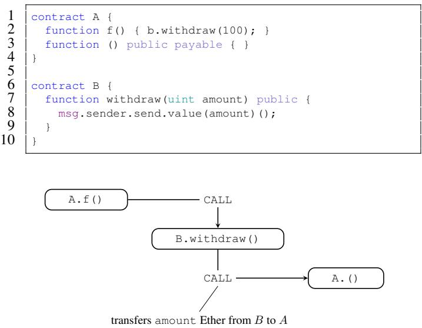  
Figure 1. Common withdrawal pattern in Solidity: the upper part shows the sample Solidity code, whereas the lower part shows the call chain. In this example contract A withdraws 100 wei from contract B.

EVM level. However, if the recipient account is another contract, send only invokes the fallback function of the recipient contract, while call allows the caller to specify any function signature of the recipient contract. Further, send only supplies a limited amount of gas. The limited amount of gas, which is provided by send, prevents the called contract from performing other gas-expensive instructions, such as performing further calls. While re-entrancy is necessary for the withdrawal pattern and several other programming patterns [6], it can be exploited if not carefully implemented, e.g., loss of 50 million US Dollars in the case of DAO [23], [35].

A malicious re-entrancy occurs when a contract is reentered unexpectedly and the contract operates on inconsistent internal state. More specifically, if a re-entrance call involves a control-flow decision that is based on some internal state of the victim contract, and the state is updated after the external call returns, then it implies that the re-entered victim contract operated based on an inconsistent state value, and thus the re-entrancy was not expected by the contract developer. For example, Figure 2 shows a simplified version of a contract (inspired by [10]), called Victim, which suffers from a reentrancy vulnerability. Victim keeps track of an amount (a) and features the withdraw function allowing other contracts to withdraw Ether (c). The withdraw function must perform three steps: ➀ check whether the calling contract is allowed to withdraw the requested amount of Ether, e.g., checking whether a ≤ c, ➁ send the amount of Ether to the calling contract and ➂ update the internal state to reflect the new amount, e.g., c − a. Note that step ➁ is performed before the state is updated in ➂. Hence, a malicious contract, can re-enter the contract and call withdraw based on the same conditions and amounts as for the first invocation. As such, an attacker can repeatedly re-enter into Victim to transfer large amounts of Ether until the Victim is drained of Ether. A secure version of our simple example requires swapping lines 3 and 4 to ensure that the second invocation of Victim operates on consistent state with updated amounts. In Section III, we elaborate on the challenges of fixing vulnerable contracts and the prevalence of re-entrancy vulnerabilities in existing contracts.

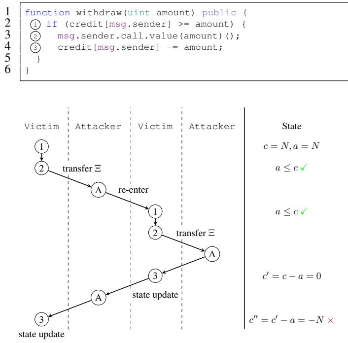  
Figure 2. Sample contract vulnerable to re-entrancy attacks [10]: the upper parts shows the Solidity code, whereas the lower part shows the call sequence between the vulnerable contract Victim and the attacker contract, and the state of the variable a (amount) and c (credit[msg.sender]). The amount a has not been updated for the second invocation of Victim thereby allowing a malicious re-entrancy.

## C. Common Defenses and Analysis Tools

While this paper puts its focus on re-entrancy vulnerabilities, other types of vulnerabilities have also been discovered (e.g., integer overflow, type confusion) that have been comprehensively surveyed in [10]. To combat smart contract vulnerabilities, the literature features a number of proposals and tools for identifying vulnerabilities in smart contracts. For instance, Oyente [29], Mythril [31] and Manticore [30] leverage symbolic execution [26] to detect various types of bugs (including re-entrancy) in Ethereum smart contracts. teEther [27] is a tool that automatically generates exploits for smart contracts. It defines the notion of vulnerable state, in which Ether can be transferred to an attacker-controlled address. By means of symbolic execution, a transaction sequence can be inferred to reach the vulnerable state. This transaction sequence is used to automatically generate the exploit. Similarly, Maian [32] relies on symbolic analysis, but aims at finding a sequence of invocations that construct traces that lead to vulnerabilities. However, symbolic execution techniques suffer from the wellknown path explosion problem for larger programs which is still an ongoing research topic [11], [28], [37], [41].

Zeus [25] introduces a policy language to assert the correctness as well as the security requirements of a contract. For this, it requires contract source code and user-defined policies. It applies static analysis based on symbolic verification to find assertion violations. SmartCheck [40] first converts the solidity contract source code to a XML-based parse-tree and then searches for vulnerable patterns through XPath queries. Securify [42] uses static analysis to infer semantic facts about smart contracts. These semantic facts are passed to a Datalog solver [24], which can prove whether a defined compliance pattern or violation pattern is satisfied thereby proving the absence or presence of certain vulnerabilities. Other works leverage translation to F\* to prove safety and security properties of smart contracts and to improve on existing static analysis tools [12], [20]. KEVM [22] defines executable formal semantics for EVM bytecode in the K-framework and presents an accompanying formal verification tool.

ECFChecker [21] is an analysis tool that detects reentrancy vulnerabilities by defining a new attribute, Effectively Callback Free (ECF). An execution is ECF when there exists an equivalent execution without callbacks that can achieve the same state transition. If all possible executions of a contract satisfy ECF, the whole contract is considered as featuring ECF. Non-ECF contracts are thus considered as vulnerable to re-entrancy, as callbacks can affect the state transition upon contract execution. Proving the ECF property statically was shown to be undecidable in general. However, Grossman et al. also developed a dynamic checker that can show whether a transaction violates the ECF property of a contract [21]. ECFChecker has been developed concurrently to Sereum and is, to the best of our knowledge, the only other runtime monitoring tool. However, as we argue in Section III, this approach does not cover the full space of re-entrancy attacks.

## III. PROBLEM STATEMENT AND NEW ATTACKS

In this paper, we set out to propose a defense (cf. Section IV) which protects existing, deployed smart contracts against re-entrancy attacks in a backwards-compatible way without requiring source code or any modification of the contract code. As mentioned earlier, re-entrancy patterns are prevalent in smart contracts and require developers to carefully follow the implementation guidelines [6].

As the attack against “TheDAO” demonstrated, contracts that are vulnerable re-entrancy attacks can be drained of all Ether. Until now, the only publicly documented re-entrancy attack, was against the “TheDAO” contract [35]. Our evaluation also shows that re-entrancy attacks have not yet been launched against other contracts (except some new minor incidents we will describe in Section VI). However, recent studies demonstrate that many already deployed contracts are vulnerable, e.g., Oyente flags 185 contracts as potentially vulnerable. These findings demonstrate that a systematic defense against re-entrancy attacks is urgently required to protect these contracts from being exploited.

As discussed in Section II-C, the majority of defenses deploy static analysis and symbolic execution techniques to identify re-entrancy vulnerabilities. While these tools surely help in avoiding re-entrancy for new contracts, it remains open how to protect existing contracts. That is, fixing smart contract vulnerabilities based on these tools is highly challenging owing to the immutability of smart contract code and anonymity of smart contract owners (cf. Section I).

Apart from these fundamental limitations, we also observe that existing approaches fail to effectively detect all re-entrancy vulnerabilities or suffer from a high number of false positives. More specifically, we note that existing approaches can be undermined by advanced re-entrancy attacks. To this end, we identify three re-entrancy patterns, which existing tools do not flag as re-entrancy vulnerabilities but are nevertheless exploitable. We call these patterns (1) cross-function reentrancy, (2) delegated re-entrancy and (3) create-based reentrancy. While cross-function re-entrancy vulnerabilities have been partially discussed in the Ethereum community (e.g., [15], [16]), we believe that this is first presentation of delegated and create-based re-entrancy attacks. All of these attacks are either missed or imprecisely detected by the state-of-the-art detection tools such as Oyente [29], Securify [42], and ZEUS [25].

In what follows, we present three attacks that exploit these re-entrancy patterns and discuss why existing tools cannot accurately mark the contract code as vulnerable. As we show, these attacks map to standard programming patterns and are highly likely to be included in existing contracts. For the purpose of re-producing our attacks and testing them against the public detection tools, the source codes of the vulnerable contracts and the corresponding attacks is available at [4].

## A. Cross-Function Re-Entrancy

The first attack that we developed exploits the fact that a re-entrancy attack spans over multiple functions of the victim contract. We show that such cross-function re-entrancy attacks are equally dangerous as traditional same-function reentrancy. In classical re-entrancy attacks the same function of the contract is re-entered again. In cross-function re-entrancy the same contract is re-entered in a different function. This attack exploits the fact that smart contracts often offer multiple interfaces, that read or write the same internal state variables.

For the sake of an example, consider the snippet from an ERC20 Token like contract depicted in Figure 3. The function withdrawAll performs a state update (the update of tokenBalance) after an external call. However, an attacker cannot simply re-enter the withdrawAll function since the etherAmount is set to zero before the external call. Thus, the condition check in line 7 cannot evaluate to true anymore thereby preventing reentrancy. However, the attacker can still trigger re-entrancy on other functions. For instance, the attacker can re-enter the transfer function, which uses the inconsistent tokenBalance variable. This allows the attacker to transfer tokens to another address, although the attacker should not have any token available anymore.

Unfortunately, existing academic static analysis tools do not accurately address cross-function re-entrancy. Namely, Oyente does not flag the code depicted in Figure 3 as vulnerable to re-entrancy. Securify and Mythril apply a too conservative policy with regards to re-entrancy in general: both flag any state update occurring after an external call as a bug not considering whether the state update actually causes inconsistent state. Hence, it suffers from significant false positive issues that we will discuss in more detail in Section VI.

In general, detecting cross-function re-entrancy is challenging for any static analysis tool due to the potential state explosion in case every external call is checked to be safe for every function of the contract. For exactly this reason, ZEUS omitted to perform any cross-function analysis [25]. However, recent work in symbolic execution tools allows detection of cross-function re-entrancy vulnerabilities. For example, Manticore [30] is able to detect cross-function re-entrancy attacks.

```solidity
mapping (address => uint) tokenBalance;
mapping (address => uint) etherBalance;

function withdrawAll() public {
    uint etherAmount = etherBalance[msg.sender];
    uint tokenAmount = tokenBalance[msg.sender];
    if (etherAmount > 0 && tokenAmount > 0) {
        uint e = etherAmount + (tokenAmount * currentRate);
        etherBalance[msg.sender] = 0;
        // cannot re-enter withdrawAll()
        // However, can re-enter transfer()
        msg.sender.call.value(e)();
        // state update causing inconsistent state
        tokenBalance[msg.sender] = 0;
    }
}
function transfer(address to, uint amount) public {
    // uses inconsistent tokenBalance (>0) when re-entered
    if (tokenBalance[msg.sender] >= amount) {
        tokenBalance[to] += amount;
        tokenBalance[msg.sender] -= amount;
    }
}
```

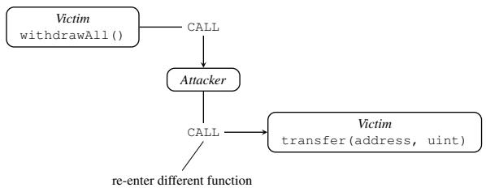  
Figure 3. The upper part shows the relevant code for a customized ERC20 Token with a cross-function re-entrancy bug. The lower part shows the call chain during the attack. The attacker cannot re-enter withdrawAll. However, the transferToken can still be re-entered and abused to transfer tokens to another attacker-controlled address. We assume the attacker is then able to exchange the tokens for Ether.

In general, ECFChecker is able to detect cross-function re-entrancy attacks. However, during our evaluation, we were able to construct a contract that can be exploited with a cross-function re-entrancy attack without being detected by ECFChecker. We include this specific contract as part of our set of vulnerable contracts [4].

## B. Delegated Re-Entrancy

Our second attack performs a new form of re-entrancy that hides the vulnerability within a DELETEGATECALL or CALLCODE instruction. These EVM instructions allow a contract to invoke code of another contract in the context of the calling contract. These instructions are mostly used to implement dynamic library contracts. In Ethereum libraries are simply other contracts deployed on the blockchain. When a contract invokes a library, they share the same execution context. A library has full control over the calling contracts funds and internal state, i.e., the storage memory region. Using libraries has the advantage that many contracts can re-use the same code, which is deployed only once on the blockchain.

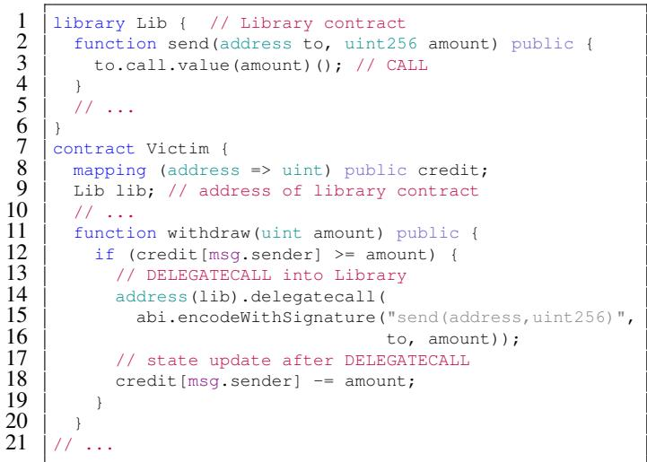

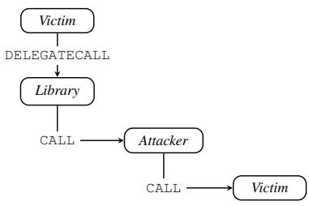  
Figure 4. The upper part show the relevant solidity source code. The lower part shows the call chain for a delegated re-entrancy attack. Analyzed in isolation, the Victim and the Library contract are not vulnerable to re-entrancy. However, when the Victim contract is combined with the Library contract, it becomes vulnerable. In this simplified case the Library contract is simply used for sending Ether.

Furthermore, it also allows a contract to update functionality by switching to a newer version of the library.

For a combination of contract and libraries to be vulnerable, the state-update and the external call must take place in different contracts. For example, the improper state-update happens in one library after the contract already performed the external call. When each one is analyzed in isolation, none of the contracts exhibit a re-entrancy vulnerability. However, when both contracts are combined, a new re-entrancy vulnerability emerges which we refer to as delegated re-entrancy. Figure 4 shows a simplified example of a contract, which uses a library contract for issuing external calls.

Existing static analysis tools cannot detect delegated reentrancy attacks: during offline analysis, it is not known which library contract will be used when actually executing the smart contract. Hence, existing analysis tools, such as Oyente or Securify, fail to identify the delegated re-entrancy vulnerability as they analyze contracts in isolation. Although symbolic execution techniques could potentially leverage the current blockchain state to infer which library is eventually called and dynamically fetch the code of the library contract, this is not a viable solution as a future (updated) version of the library might introduce a new vulnerability. To detect these attacks, a run-time solution emerges as one of the few workable and effective means to deter this attack. Due to its dynamic nature,

ECFChecker is able to detect delegated re-entrancy attacks, as it analyzes the actual combination of contracts and libraries.

## C. Create-Based Re-Entrancy

Similar to delegated re-entrancy attacks, our third type of attack exploits the fact that a contract’s constructor can issue further external calls. Recall that contracts can either be created by accounts (with a special transaction) or by other contracts. In solidity, a new contract can be created with the new keyword. On the EVM level, this is implemented with the CREATE instruction. Whenever a new contract is created, the constructor of that contract will be executed immediately. Usually, the newly created contract will be trusted and as such does not pose a threat. However, the newly created contract can issue further calls in its constructor to other, possibly malicious, contracts. To be vulnerable to a create-based reentrancy attack, the victim contract must first create a new contract and afterwards update its own internal state, resulting in a possible inconsistent state. The newly created contract must also issue an external call to an attacker-controlled address. This then allows the attacker to re-enter the victim contract and exploit the inconsistent state.

Create-based re-entrancy poses a significant problem for the state-of-the-art analysis tools. Securify and Mythril do not consider CREATE as an external call and thus do not flag subsequent state updates. Similarly, Oyente, Manticore, and ECFChecker consider only CALL instructions when checking for re-entrancy vulnerabilities. Hence, they all fail to detect create-based re-entrancy attacks. Similar to delegated re-entrancy, the create-based re-entrancy vulnerability emerges only when two contracts are combined. Thus, the contracts must be also analyzed in combination, which is challenging as the contract code might change after the analysis.

## IV. DESIGN OF Sereum

In this section, we devise a novel way to detect re-entrancy attacks based on run-time monitoring at the level of EVM bytecode instructions. Our approach, called Sereum (Secure Ethereum), is based on extending an existing Ethereum client, which we extend to perform run-time monitoring of contract execution.

Architecture. Figure 5 shows an overview of the Sereum architecture. For a standard Ethereum client, the EVM features a bytecode interpreter, which is responsible for executing the code of the smart contracts, and the transaction manager that executes, verifies and commits new and old transactions. Sereum extends the EVM by introducing two new components: (1) a taint engine, and (2) an attack detector. The taint engine performs dynamic taint-tracking; dynamic taint tracking assigns labels to data at pre-defined sources and then observes how the labeled data affects the execution of the program [37]. To the best of our knowledge Sereum is the first dynamic taint-tracking solution for smart contracts. The attack detector utilizes the taint engine to recognize suspicious states of program execution indicating that a re-entrancy attack is happening in the current transaction. It interfaces with the transaction manager of the EVM to abort transactions as soon as an attack is detected.

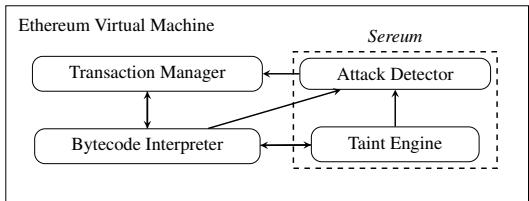  
Figure 5. Architecture of enhanced EVM with run-time monitoring.

Detecting Inconsistent State. To effectively reason about a malicious re-entrance into a contract, we need to detect whether a contract acts on inconsistent internal state (cf. Figure 2). Note that any persistent internal state is stored in the storage memory region of the EVM (cf. Section II). Variables which are shared between different invocations of a contract are always stored in the storage region. As such, only the storage region is relevant for re-entrancy detection. Thus, Sereum applies taint tracking to storage variables as these are the only internal state variables capable of affecting a contract’s control flow in a subsequent (re-entered) invocation of the contract. That said, only if a control-flow decision is dependent on storage variables, an attacker can manipulate the outcome of a conditional branch decision by re-entering the contract and thereby manipulate the behavior of the contract. Hence, re-entrancy attacks only apply to contracts that execute conditional branches dependent on persistent internal state, i.e., the storage region.

The main idea behind Sereum is to detect state updates, i.e., altering of storage variables, after a contract (denoted as Victim contract) calls into another contract (denoted as Attacker contract). Notice that not all state updates resemble malicious behavior, but only those where Victim is re-entered and acts upon the updated state. Typically, the goal of re-entrancy attacks is to bypass validity checks in the business logic of the Victim contract. As such, Sereum focuses only on conditional jumps and the data that influences the conditional jumps. Notice that it is also possible for a contract to transfer Ether without performing any validity check. Obviously, deploying such a contract would be highly dangerous and inefficient due to unnecessary consumption of gas. Hence, we do not explicitly capture such cases in Sereum. However, Sereum can be easily extended to cover this kind of re-entrancy attack by issuing write-locks not only for behavior-changing variables, but also for variables that are passed to other contracts during external calls (such as Ether amount or call input).

Consider the example shown in Figure 6, Victim calls into the Attacker contract. The Attacker then forces a reentrancy into the Victim contract by calling into the Victim again. The second re-entered invocation of Victim reads from a storage variable and takes a control-flow decision based on that variable. After the Attacker contract eventually returns again to Victim, the Victim contract will update the state. However, at this point, it is clear that the re-entered Victim used a wrong value read from inconsistent internal state for its conditional branch decision.

The key observation is that inconsistent state can only arise if (1) a contract executes an external call to another contract, (2) the storage variable causing inconsistency is used during the external call for a control-flow decision and (3) the variable is updated after the external call returns. Next, we describe in more details how the taint engine and the attack detector detect inconsistent state at the EVM level.

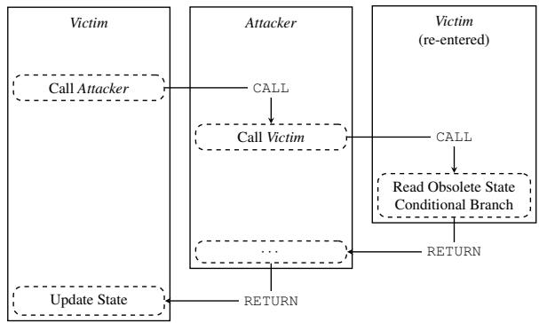  
Figure 6. Re-entrancy attack exploits inconsistent state among different invocations of a contract.

Taint Engine and Attack Detector. To detect state updates, which cause inconsistency, we need to know which storage variables were used for control-flow decisions. On the EVM bytecode level a smart contract implements any control-flow decision as a conditional jump instruction. Consequently, we leverage our taint engine to detect any data-flow from a storage load to the condition processed by a conditional jump instruction. This ensures that we only monitor those conditional jumps which are influenced by a storage variable. For every execution of a smart contract in a transaction, Sereum records the set of storage variables, which were used for controlflow decisions. Using this information, Sereum introduces a set of locks which prohibit further updates for those storage variables. If a previous invocation of the contract attempts to update one of these variables, Sereum reports a re-entrancy problem and aborts the transaction to avoid exploitation of the re-entrancy vulnerability.

In the simplest case, the attacker directly re-enters the victim contract. However, the attacker might try to obfuscate the re-entrant call by first calling an arbitrary long chain of nested calls to different attacker-controlled contracts. Furthermore, during the external call, the attacker can re-enter the victim contract several times, possibly in different functions (as shown in the cross-function re-entrancy attack described in Section III). This has to be taken into account when computing the set of locked storage variables. To tackle these attacks, Sereum builds a dynamic call tree during the execution of a transaction. Every node in the dynamic call tree, represents a call to a contract and the depth of the node in the tree is equal to the depth of the contract invocation in the call stack of the EVM. We store those storage variables which influence control-flow decisions as set $D _ { i }$ for every node i in the dynamic call tree. The set of storage variables $L _ { i }$ that are locked at node i is the union of $D _ { j }$ for any node j of the same contract as i that belongs to the sub-tree spanning from node i.

Example of Dynamic Call Tree. Figure 7 depicts an example for Sereum’s generation of a dynamic call tree for a given Ethereum transaction. A possibly malicious contract A reenters a vulnerable contract C multiple times at different entry points (functions). First, as shown on the left sub-tree, contract A calls C, C calls A, and A finally re-enters C. This sub-tree would be equivalent to a classical re-entrancy attack, as shown previously in Figure 2. The variables locked during the first execution of contract C (node marked with 2) are impacted only by the lower nodes in the call tree. The second execution of contract C (in node 4) uses the storage variable $V _ { 1 }$ for deciding a conditional control-flow. Hence, this variable must not be modified after the call in the execution of node 2.

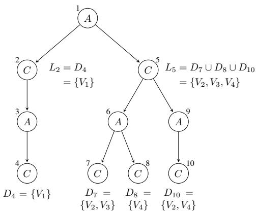  
Figure 7. Dynamic call tree of a Ethereum transaction. Contract A is re-entered several times. $V _ { k }$ are storage variables. $D _ { i }$ is the set of storage variables, which influence control-flow decisions in node $i , L _ { i }$ is the set of storage variables, which are locked at node i and cannot be updated anymore.

In contrast, the right side of the call tree contains a more diverse set of nodes. For instance, the right part of the calltree could be part of a cross-function re-entrancy attack. We can observe that different functions were called in the various re-entrant invocations of $C ,$ , because the variables used for conditional branches are different. Note that none of the sets $D _ { 5 } , D _ { 7 } , D _ { 8 }$ , and $D _ { 1 0 }$ are equal. Contract $C$ performs two calls into $A$ in node 5. These calls re-enter C in nodes 7, 8, and 10. For the execution of C from node 5, we lock all variables from the sub-calltree below node 5. Note that although variable $V _ { 1 }$ is locked in node 2, it is not in the set of locked variables $L _ { 5 }$ . This means that no further calls starting from node 5 have used the variable $V _ { 1 }$ for a control-flow decision; thus $V _ { 1 }$ can be safely updated in node 5, which will not change the behavior in any of the nodes 7, 8 and 10 unexpectedly.

A naive implementation of Sereum could just lock all variables which were used for control-flow decisions. However, as we can see from Figure 7, this would result in unnecessary locking of variables when complex transactions are executed. This would also result in a high number of false positives. For example, contract $C$ can safely update the state variables $V _ { 2 } , \ V _ { 3 } ,$ and $V _ { 4 }$ in node $2 ,$ because they were not used for conditional branches during the execution of node 4. Similarly, node 5 can safely update $V _ { 1 }$ even though it was used for a control-flow decision in a re-entrant call at node 4.

The dynamic call tree allows Sereum to tackle the challenging new re-entrancy attacks we developed in Section III. Recall that detecting cross-function re-entrancy is challenging for static analysis tools due to potential state explosion.

Since Sereum performs dynamic analysis, it does not suffer from such kind of weakness; it only analyzes those crossfunction re-entrant calls that actually occur at run-time. Similarly, delegated re-entrancy attacks are detected as Sereum –in contrast to existing tools– does not inspect contracts in isolation, but analyzes and monitors exactly the library code which is invoked when a transaction executes. That ${ \mathrm { i s } } ,$ as an extension to the Ethereum client, Sereum can easily access the entire blockchain state and hence retrieve the code of every invoked library contract. Our taint engine simply propagates the taints through the library. This also naturally covers any future updates of the library code. Next, we describe the implementation details of Sereum.

## V. IMPLEMENTATION

We implemented Sereum based on the popular $g o -$ ethereum<sup>1</sup> project, whose client for the Ethereum network is called geth. In our implementation, we extended the existing EVM implementation to include the taint engine and the reentrancy attack detector. We faced one particular challenge in our implementation: variables stored in the storage memory region are represented on the EVM bytecode level as load and store instructions to certain addresses, i.e., any type information is lost during compilation. Hence, only storage addresses are visible on the EVM level. Most storage variables, such as integers, are associated with one address in the storage area. However, other types, such as mapping of arrays, use multiple (not necessarily) adjacent storage addresses. As such, Sereum tracks data-flows and sets the write-locks on the granularity of storage addresses.

In the remainder of this section, we describe how Sereum tracks taints from storage load instructions to conditional branches to detect storage addresses that reference values that affect the contract’s control-flow. Furthermore, we show how Sereum performs attack detection by building the dynamic call tree and propagating the set of write-locked storage addresses.

## A. Taint Tracking EVM

Taint tracking is a popular technique for analyzing dataflows in programs [37]. First, a taint is assigned to a value at a pre-defined program point, referred to as the so-called taint source. The taint is propagated throughout the execution of the program along with the value it was assigned to. Taint sinks are pre-defined points in the program, e.g., certain instructions or function calls. If a tainted value reaches a taint sink, the Sereum taint engine will issue a report, and invoke the attack detection module. Taint analysis can be used for both static and dynamic data-flow analysis. Given that we aim to achieve run-time monitoring of smart contract, we leverage dynamic taint tracking in Sereum.

To do so, we modified the bytecode interpreter of geth ensuring that it is completely transparent to the executed smart contract. Our modified bytecode interpreter maintains shadow memory to store taints separated from the actual data values, which is a common approach for dynamic taint analysis. Sereum allocates shadow memory for the different types of mutable memory in Ethereum smart contracts (see Section II-A).

The stack region can be addressed at the granularity of 32-byte words. Thus, every stack slot is associated with one or multiple taints. The storage address space is also accessed at 32-byte word granularity, i.e., the storage can be considered as a large array of 32-byte words, where the storage address is the index into that array. As a result, we treat the storage region similar to the stack and associate one or multiple taints for every 32-byte word. However, unlike the stack and storage address space, the memory region can be accessed at byte granularity. Hence, we associate every byte in the memory address space with one or multiple taints. To reduce the memory overhead incurred by the shadow memory for the memory region, we store taints for ranges of the memory region. For example, if the same taint is assigned to memory addresses 0 to 32, we only store one taint for the whole range. When only the byte at address 16 is assigned a new taint, we split the range and assign the new taint only to the modified byte.

We propagate taints through the computations of a smart contract. As a general taint propagation rule for all instructions, we take the taints of the input parameters and assign them to all output parameters. Since the EVM is a stack machine, all instructions either use the stack to pass parameters or have constant parameters hard-coded in the code of the contract. Hence, for all of the computational instructions, such as arithmetic and logic instructions, the taint engine will pop the taints associated with the instruction’s input parameters from the shadow stack and the output of the instruction is then tainted with the union of all input taints. Constant parameters are always considered untainted. This ensures that we capture dataflows within the computations of the contract. One exception is the SWAP instruction family, which swaps two items on the stack. The taint engine will also perform an equivalent swap on the shadow stack without changing taint assignments. Whenever a value is copied from one of the memory areas to another area, we also copy the taint between the different shadow areas. For instance, when a value is copied from the stack to the memory area, i.e., the contract executes a MSTORE instruction, the taint engine will pop one taint from the shadow stack and store it to the shadow memory region. The EVM architecture is completely deterministic; smart contracts in the EVM can only access the blockchain state using dedicated instructions. That is, no other form of input or output is possible. This allows us to completely model the data-flows of the system by tracking data-flows at the EVM instruction level.

For re-entrancy detection, as described in Section IV, we only need one type of taint, which we call DependsOnStorage. The taint source for this taint is the SLOAD instruction. Upon encountering this instruction, the taint engine creates a taint, which consists of the taint type and the address passed as operand to the SLOAD instruction. The conditional JUMPI instruction is used as a taint sink. Whenever such a conditional jump is executed, the taint engine checks whether the condition value is tainted with a DependsOnStorage taint. If this is the case, the taint engine will extract the storage address from the taint and add it to the set of variables that influenced control-flow decisions. Our implementation supports an arbitrary number of different DependsOnStorage taints. This allows Sereum to support complex code constructs, e.g., control-flow decisions which depend on multiple different storage variables.

Example for Taint Assignment and Propagation. Figure 9 shows a snippet of Ethereum bytecode instructions. In this snippet of instructions, there exists a data-flow from the SLOAD instruction in line 1 to the conditional jump instruction in line 4. The SLOAD instruction will load a value from the storage memory region. The first and only parameter to SLOAD is the address in the storage area. The JUMPI instruction takes two parameters: the jump destination and the condition whether the jump is to be performed. Recall that all instruction operands except for the PUSH instruction are passed via the stack. Figure 8 shows the state of the normal data stack and the corresponding shadow stack, when the snippet in Figure 9 is executed. $S P$ denotes the stack pointer before the instruction is executed. The SLOAD instruction will pop an address A from the stack, load the value V (referenced by A) from storage, and then push it onto the stack. Since, the SLOAD instruction is defined as taint source, the taint engine will create a new DependsOnStorage taint, which we denote as $\tau _ { s } .$ This taint is assigned to the value V by pushing it onto the shadow stack. Note that in this case $V$ was not previously assigned a taint. The instruction LT (less-than) compares the value loaded from storage with the value C that was previously pushed on the stack. This comparison decides whether the conditional jump should be taken. Since the LT instruction takes two parameters from the stack $( V$ and $C ) .$ , the taint engine also pops two taints from the shadow stack $( \tau _ { s }$ and $\tau ^ { \prime } )$ . The result of the comparison is then tainted with both taints $( \tau _ { s }$ and $\tau ^ { \prime } )$ , so the taint engine pushes a merged taint $( \tau _ { s } , \tau ^ { \prime } )$ to the shadow stack. The PUSH2 instruction then pushes a 2-byte constant to the stack, which is assigned an empty taint $\tau _ { \varnothing } .$ . Finally, the JUMPI instruction takes a code pointer (dst) and a boolean condition as parameters from the stack. Since JUMPI is a taint sink, the taint engine will check the taints associated with the boolean condition. If this value is tainted with the $\tau _ { S }$ taint, it will compute the original storage address A based on the taint. At this point, we know that the value at storage address A influenced the control-flow decision. Hence, we add it to the set of control-flow influencing storage addresses, which is passed to the attack detection component later on.

Using the taint engine, Sereum records the set of storage addresses that reference values which influence control-flow decisions. This set of addresses is then forwarded to the attack detection component once the contract finishes executing.

## B. Attack Detection

To detect re-entrancy attacks, we lock the write-access to storage addresses that influence control-flow decisions. During execution of a contract, the taint engine detects and records storage addresses, which are loaded and then influence the outcome of a control-flow decision. As described in Section IV, Sereum uses a dynamic call-tree to compute the set of variables that are locked for writing. Sereum builds the dynamic calltree during execution of a transaction. This tree contains a node for every invocation of a contract during the transaction. The dynamic call-tree records how the call stack of the transaction evolves over time. The ordering of the child nodes in the dynamic call-tree corresponds to the order of execution during the transaction. The depth of the node in the tree corresponds to the depth in the call stack, i.e., the time when a contract was invoked. The dynamic call-tree is updated whenever a contract issues or returns from an external call. When the called contract completes execution, the set of control-flow influencing variables is retrieved from the taint engine and stored in the node of the call-tree.

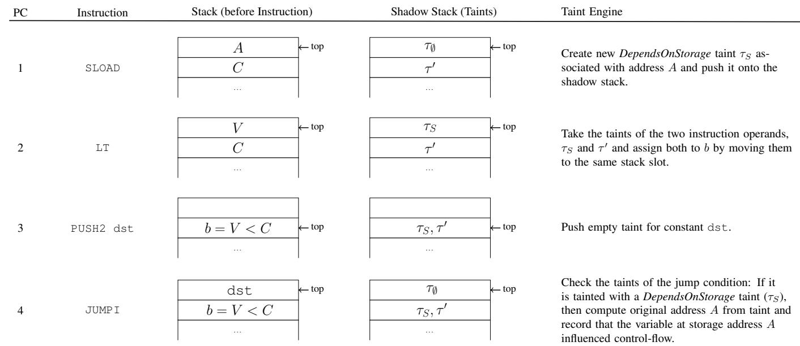  
Figure 8. The taint engine propagates the taints τ through the executed instructions and stores them on a shadow stack. The condition for the conditional jump b depends on the values C and the value V, which was loaded from storage address A. SP is the current stack pointer, pointing to the top of the data stack.

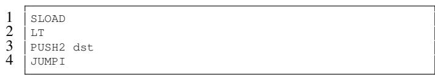  
Figure 9. Ethereum assembly snippet implementing a solidity if-statement with a conditional branch. The SLOAD Instruction in line 1 indirectly influences the control-flow decision in the JUMPI instruction in line 4 as it is used as a parameter in the LT instruction. LT performs a less-than comparison between the first and second operand on the stack.

Sereum locks only the set of variables, which were used for control-flow decisions during an external call. To compute this set, Sereum traverses the dynamic call-tree starting from the node corresponding to the current execution. During traversal, Sereum searches for nodes, which were part of executions of the same contract. When Sereum finds such a node, it retrieves the set of control-flow influencing variables previously recorded by the taint engine. Sereum updates the set of locked variables after every external call. Whenever a contract attempts to write to the storage area, i.e., executes the SSTORE instruction, Sereum intercepts the write and first checks whether the address is locked. If the variable is locked, Sereum reports a re-entrancy attack and then aborts execution of the transaction. This results in the EVM unwinding all state changes and Ether transfers.

## VI. EVALUATION

In this section, we evaluate the effectiveness and performance of Sereum based on existing Ethereum contracts deployed on the Ethereum mainnet. Since our run-time analysis is transparently enabled for each execution of a contract, we re-execute the transactions that are saved on the Ethereum blockchain. We compare our findings with state-of-the-art academic analysis tools such as Oyente [29], [34] and Securify [42]. Note that we do not compare with Zeus [25] and SmartCheck [40] since these require access to the source code of contracts which is rarely available for existing contracts. The latest version of Securify, which is only available through a web interface, does not support submitting bytecode contracts anymore. Therefore, we were not able to test all contracts with Securify. Furthermore, we do not compare with Mythril [31] and Manticore [30] as they follow the detection approach of Oyente (symbolic execution). We also conduct experiments based on the three new re-entrancy attack patterns we introduced in Section III—effectively demonstrating that only Sereum is able to detect them all.

## A. Run-time Detection of Re-Entrancy Attacks

We first connect our Sereum client with the public Ethereum network to retrieve all the existing blocks while keeping as many intermediate states in the cache as possible. Transaction re-execution requires the state of the context block. States are saved as nodes in the so-called state Patricia tree of the Ethereum blockchain. We run the geth (Go Ethereum) client with the options sync modefull, garbage collection mode archive, and assign as much memory as possible for the cache. During the block synchronization process, the taint tracking option of Sereum is disabled to ensure that the client preserves the original state at each block height.

We then replay the execution of each transaction in the blockchain. To reduce the execution time, we limit our testset until block number 4,500,000. Note that we skip those blocks which were target of denial-of-service attacks as they incur high execution times of transactions [43]. We replay the transactions using the debug module of the geth RPC API. This ensures that our replay of transactions does not affect the public saved blockchain data. We also retrieve an instructionlevel trace of the executed instructions and the corresponding storage values during the transaction execution. This allows us to step through the contract’s execution at the granularity of instructions.

We enable the taint tracking option in Sereum during the transaction replay to evaluate whether a transaction triggers a re-entrancy attack pattern; in this case, an exception will be thrown, the execution of the transaction gets invalidated, and an error is reported via the API. Sereum will then return the instruction trace up to the point where the re-entrancy attack is detected.

All in all, we re-executed 77,987,922 transactions involved in these 4.5 million blocks, and Sereum has flagged 49,080 (0.063%) of them as re-entrancy violation. Originally, we identified 52 involved contracts that count up to only 0.055% of the total number of 93,942 <sup>2</sup> created contracts in our testset. However, while manually analyzing these contracts, we discovered that many contracts are created by the same account and share the same contract code; they are only instantiated with different parameters. As such, we consider these contracts as being identical. More specifically, we found three groups of identical contracts involving 21, 4, and 3 contracts, respectively. Similarly, we identified that a number of contracts execute the same sequence of instructions that only differ in the storage addresses. We consider these contracts as alike contracts. In total, we found two groups of alike contracts of size 10 and 3, respectively. As a result, Sereum detected 16 identical or alike contracts that are invoked by transactions matching the re-entrancy attack pattern.

For 6 out of these 16 contracts, the source code is available on http://etherscan.io, thus allowing us to perform detailed investigation why they have been flagged. In what follows, we manually check whether a violating transaction resembles a real re-entrancy attack, and whether the concerned contract suffers from re-entrancy vulnerability that could potentially be exploited.

For contracts with Solidity source code, we perform source code review and check the contract logic provided the transaction input to manually identify re-entrancy attacks. We use the transaction trace as a reference to follow the control flow and observe the intra-contracts calls. For contracts with no source code, we cannot fully recover the contracts semantics for detected inconsistent state updates. In this case, we use the transaction trace and the ethersplay [3] disassembler tool to partially reverse-engineer the contracts.

Based on our investigation, we can confirm that two contracts were actually exploited by means of a re-entrancy attack. One of them is the known DAO [17] attack attributing to 2,294 attack transactions.<sup>3</sup> The second case involves a quite unknown re-entrancy attack. It occurred at contract address 0xd654bDD32FC99471455e86C2E7f7D7b6437e9179 and attributed to 43 attack transactions. After reviewing blog posts and GitHub repositories related to this contract [1], [8], we discovered that this contract is known as DSEthToken and is part of the maker-otc project. This series of attack transactions were initiated by the contract developers after they discovered a re-entrancy vulnerability. Since the related funds were drained by (benign) developers, the Ethereum community payed less attention to this incident. In total, Sereum incurs a false positive rate as low as 0.06% across all the re-run transactions. Figure 10 shows the number of transactions that match the re-entrancy attack pattern flagged by Sereum. Some of the results reflect false positives which will be discussed in detail in Section VI-B.

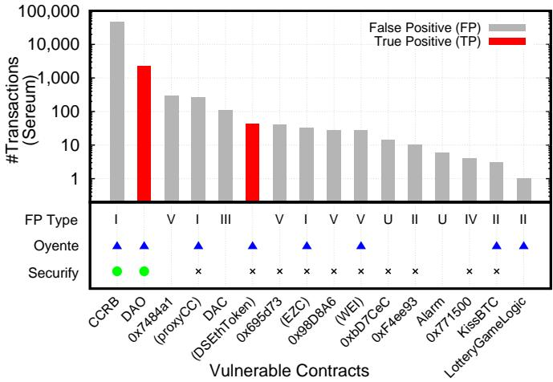  
Figure 10. The top plot shows the number of detected transactions triggering the re-entrancy vulnerability in the flagged contracts. Each contract is categorized by its false positive type described in Section VI-B. Type I corresponds to “lack of field-sensitivity”, Type II “storage deallocation”, Type III “constructor callbacks”, Type IV “tight contract coupling”, Type V “manual re-entrancy locking”, and U for Unknown. The contract name is shown for those where source code available. Contracts in parenthesis are known token contracts at http://etherscan.io although source code is not available. The bottom plot shows how the tools Oyente [34] and Securify [42] handle this subset of contracts. Since the last public version of Securify requires source code, we add a cross for those (bytecode) contracts we were not able to evaluate.

We also observe that Oyente flagged 8 of these contracts as vulnerable to re-entrancy attacks. Some contracts were not detected by Oyente since Oyente does not consider any of the advanced re-entrancy attacks we discussed in Section III. During our analysis we noticed that in some cases Oyente warned about re-entrancy problems, which are only exploitable with a cross-function re-entrancy attack. However, we believe this is due to Oyente incorrectly detecting a same-function re-entrancy vulnerability. Apart from the 6 false positives in our test set, the analysis performed by previous work [20], [42] demonstrated that re-entrancy detection in Oyente suffers from false positive issues.

With respect to Securify, the latest version of Securify requires the source code of a contract thereby impeding us from evaluating all contracts. We therefore have only examined the contracts whose source code is available. Securify defines a very conservative violation pattern for re-entrancy detection that forbids any state update after an external call. As such, 5.8% out of 24,594 tested contracts in the authors’ experiment (around 1,426 contracts) are flagged as vulnerable to reentrancy, which consequently results in a very high false positive rate.

Lastly, we evaluated our new re-entrancy attack patterns (Section III). For each contract, we crafted one attack transaction for Sereum to perform the check: Sereum successfully detects all attack transactions to the three vulnerable contracts. Table I shows an overview of various tools tested against the vulnerable contracts for the new re-entrancy attacks patterns. As discussed earlier, neither Oyente, Securify nor Manticore were able to detect delegated and create-based reentrancy vulnerabilities. While Oyente does not detect the cross-function re-entrancy attack, Securify is able to detect it due to its conservative policy. Similarly, Mythril detects cross-function and create-based re-entrancy, because it utilizes a similar policy to Securify, which is extremely conservative and therefore also results in a high number of false positives. ECFChecker detects the cross-function re-entrancy attack. However, during our evaluation, we crafted another contract, which is vulnerable to cross-function re-entrancy, but was not detected by ECFChecker. Recall that the delegated re-entrancy attack cannot be detected by any existing static off-line tool as it exploits a dynamic library which is either not available at analysis time or might be updated in the future. However, a dynamic tool, such as ECFChecker, can detect the delegated re-entrancy. The create-based re-entrancy attack is not detected by any of the existing analysis tools, as the instruction CREATE is currently not considered as an external call by none of the existing analysis tools.

In general, we argue that Sereum offers the advantage of detecting actual re-entrancy attacks and not possible vulnerabilities. As such, we can evaluate on a reduced set of only 16 contracts rather than 185 (Oyente) or 1,426 (Securify) contracts. In contrast to previous work [29], [42], this makes it feasible for us to exactly determine whether an alarm is a true or false positive. Moreover, some of the contracts are not flagged by Oyente and Securify as these do not cover the full space of re-entrancy attacks. As such, they naturally do not raise false positives for contracts that violate re-entrancy patterns that are closely related to the delegated and createbased re-entrancy (i.e., Type III and IV).

## B. False Positive Analysis

While investigating the 16 contracts which triggered the re-entrancy detection of Sereum, we discovered code patterns in deployed contracts (see Figure 10), which are challenging to accurately handle for any off-line or run-time bytecode analysis tool. These patterns are the root cause for the rare false positive cases we encountered during our evaluation of Sereum.

Table I. COMPARISON OF RE-ENTRANCY DETECTION TOOLS SUBJECT TO OUR TESTCASES FOR THE ADVANCED RE-ENTRANCY ATTACK PATTERNS. TOOLS MARKED WITH SUPPORT DETECTING THIS TYPE OF RE-ENTRANCY, WHILE TOOLS MARKED WITH DO NOT SUPPORT DETECTING THIS TYPE OF RE-ENTRANCY. TOOLS WITH AN OVERLY RESTRICTIVE POLICY ARE MARKED WITH .

<table><tr><td>Tool</td><td>Version</td><td>Cross-Function</td><td>Delegated</td><td>Create-based</td></tr><tr><td>Oyente</td><td>0.2.7</td><td>○</td><td>○</td><td>○</td></tr><tr><td>Mythril</td><td>0.19.9</td><td>○</td><td>○</td><td>○</td></tr><tr><td>Securify</td><td>2018-08-01</td><td>○</td><td>○</td><td>○</td></tr><tr><td>Manticore</td><td>0.2.2</td><td>●</td><td>○</td><td>○</td></tr><tr><td>ECFChecker</td><td>geth1.8port</td><td>●</td><td>●</td><td>○</td></tr><tr><td>Sereum</td><td>-</td><td>●</td><td>●</td><td>●</td></tr></table>

```txt
struct S {
    int128 a;  // 16 bytes
    int128 b;  // 16 bytes
}                 // total: 32 bytes (one word in storage)
```  
Figure 11. Solidity struct, where both a and b are at the same storage address. Therefore, any update to a or b includes loading and writing also the other.

However, since these code patterns are not only challenging for Sereum, but for other existing analysis tools such as Oyente [34], Mythril [31], Securify [42], or any reverseengineering tools operating at EVM bytecode level [3], [45], we believe that a detailed investigation of these cases is highly valuable for future research in this area. Our investigation also reveals for the first time why existing tools suffer from false alarms when searching for re-entrancy vulnerabilities. In what follows, we reflect on the investigation of the false positives that we encountered.

I. Lack of Field-Sensitivity on the EVM Level. Some false positives are caused by lack of information on fields at bytecode level for data structures. Solidity supports the keyword struct to define a data structure that is composed of multiple types, e.g., Figure 11 shows a sample definition of a struct S of size 32 bytes. Since the whole type can be stored within one single word in the EVM storage area, accessing either of the fields a or b ends up accessing the same storage address. In other words, on the EVM bytecode level, the taint-tracking engine of Sereum cannot differentiate the access to fields a and b. This leads to a problem called over-tainting, where taints spread to unrelated values and in turn causes false positives. Notice that this problem affects all analysis tools working on the EVM bytecode level. Some static analysis tools [38] use heuristics to detect the high-level types in Ethereum bytecode. The same approach could be used to infer the types of different fields of a packed data structure. However, for a run-time monitoring solution, heuristic approaches often incur unacceptable runtime overhead without guarantee of successful identification. To address this type of false positive, one would either require the source code of the contract or additional type information on the bytecode level.

II. Storage Deallocation. Recall that the EVM storage area is basically a key-value store that maps 256-bit words to 256- bit words. The EVM architecture guarantees that the whole storage area is initialized with all-zero values and is always available upon request. More specifically, no explicit memory allocation is required, while memory deallocation simply resets the value to zero. This poses a problem at the bytecode level: a memory deallocation is no different from a state update to value 0, though the semantics differ; especially when applying the re-entrancy detection logic. Consider the example of a map M in Figure 12. When the contract deallocates the element indexed by id from M (delete from a map), it basically has the same effect as setting the value of M[id] to 0 at the bytecode level. Here, the Solidity compiler will emit nearly identical bytecode for both cases. We encountered a contract<sup>4</sup> presenting this case which leads to a false alarm. Similar to field-sensitivity issues, correctly handling such cases requires the source code or an explicit EVM deallocation instruction.

```txt
mapping (uint => uint) M; // a hash map
// delete entry from mapping
delete M[id];
// on the EVM level this is equivalent to
M[id] = 0;
```  
Figure 12. Solidity storage delete is equivalent to storing zero.

III. Constructor Callbacks. Sereum considers calls to the constructor of contracts to be the same as calls to any other external contract. This allows Sereum to detect create-based reentrancy attacks (cf. Section III-C). However, detecting createbased re-entrancy comes at the cost of some false positives. During our evaluation<sup>5</sup>, we noticed that sub-contracts created by other contracts, tend to call back into their parent contracts. Usually, this is used to retrieve additional information from the parent contract: the parent creates the sub-contract, the sub-contract re-enters the parent contract to retrieve the value of a storage variable, and that same variable is then updated later by the parent. Consider the example in Figure 13, where contract A creates a sub-contract B. While the constructor executes, B re-enters the parent contract A, which performs a control-flow decision on the funds variable. This results in Sereum locking the variable funds. Since no call to another potentially malicious external contract is involved this example is not exploitable via re-entrancy. However, Sereum detects that the funds variable is possibly inconsistent due to the deferred state update. A malicious contract B could have re-entered A and modified the funds variable in the meantime.

We argue that this constructor callback pattern should be avoided by contract developers. All necessary information should be passed to the sub-contract’s constructor, such that no re-entrancy into the parent contract is needed. This does not only avoid false positives in Sereum, but also decreases the gas costs. External calls are one of the most expensive instructions in terms of gas requirements, which must be payed for in Ether and as such should be avoided as much as possible.

IV. Tight Contract Coupling. During our evaluation, we noticed a few cases where multiple contracts are tightly coupled with each other resulting in overly complex transactions, i.e., transactions that cause the contracts to be re-entered multiple times into various functions. This suggests that these contracts have a strong interdependency. Since Sereum introduces locks for variables that can be potentially exploited for re-entrancy and is not aware of the underlying trust relations among contracts, it reports a false alarm when a locked variable is updated. We consider these cases as an example for bad contract development practice since performing external calls is relatively expensive in terms of gas, and such also Ether, and could be easily avoided in these contracts. That is, if trusted contracts have internal state that depends on the state of other trusted contracts, we suggest developers to keep the whole state in one contract and use safe library calls instead.

```solidity
contract A {
    mapping (address => uint) funds;
    // ...
    function hasFunds(address a) public returns(bool) {
        // funds is used for control-flow decision
        if (funds[a] >= 1) { return true; }
        else { return false; }
    }
    function createB() {
        B b = new B(this, msg.sender);
        // ...
        // update state (locked due to call to hasFunds)
        funds[msg.sender] -= 1;
    }
}
contract B {
    constructor(A parent, address x) {
        // call back into parent
        if (parent.hasfunds(x)) { /* ... */ }
    }
}
```

Figure 13. Constructor callback. The sub-contract B calls back (re-enters) into the hasFunds function of the parent contract A. This type of false positive is similar to the create-based re-entrancy attack pattern.  
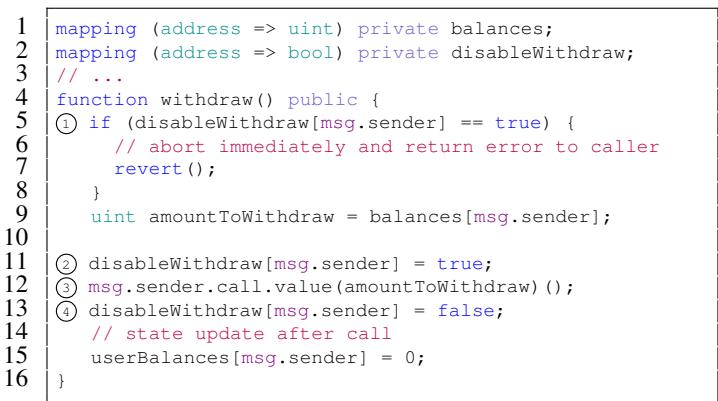  
Figure 14. Manual locking to guard against re-entrancy.

V. Manual Re-Entrancy Locking. To allow expected and safe re-entrancy, a smart contract can manually introduce lock variables (i.e., a mutex) to guard the entry of the function. In Figure 14), disableWithdraw enables a lock at ➁ before making an external call at ➂. The lock is reset after the call at ➃. This prevents any potential re-entrance at ➀. Hence, even though the balance is updated after the external call, the contract is still safe from re-entrancy attacks.

However, the access pattern to these lock variables during contract re-entrance matches an attack pattern, i.e., the internal state (the lock variable) that affects the control flow in subsequent (re-entered) invocation of the contract, is updated subsequently (at ➃). Operating at bytecode level, it is challenging to distinguish the benign state updates of locks from those of critical variables such as balances. Note that manual locking is an error-prone approach as it could allow an attacker to reenter other functions of the same contract, unless the entry of every function is guarded by the lock. In contrast, Sereum automatically introduces locks for all possibly dangerous variables (detected via taint tracking) across all functions thereby removing the burden from developers to manually determine all possible vulnerable functions and critical variables.

## C. Performance and Memory Overhead

Since there are no benchmarks, consisting of realistic contracts, available for EVM implementations, we measured the performance overhead by timing the execution of a subset of blocks from the Ethereum blockchain. We sampled blocks from the blockchain, starting from 460000, 450000, 440000, 4300000 and 4200000, we use 10 consecutive blocks. We run those 50 blocks in batch 10000 times, while accounting only for the EVM’s execution time. We perform one run with plain geth, on which Sereum is based, and one with Sereum with attack detection enabled. For the performance evaluation, we do not consider those transactions, which Sereum flags as a reentrancy attack. Sereum aborts those transactions early, which can result in much shorter execution time, compared to the normal execution. We measured the performance overhead of Sereum, compared with plain geth when running 50 blocks in batch. Here, we average the runtime over 10,000 runs of the same 50 blocks. We benchmarked on a 8-core Intel(R) Xeon(R) CPU E5-1630 v4 with 3.70GHz and 32 GB RAM. The mean runtime of geth was 2277.0 ms (σ = 146.7 ms). The mean runtime of Sereum was 2494.5 ms $( \sigma ~ = ~ 1 7 4 . 8$ ms). As such, Sereum incurred a mean overhead of 217.6 ms $( \sigma ~ = ~ 1 0 0 . 9$ ms) or 9.6%. While measuring the timing of the executed transactions, we additionally measured the memory usage of the whole Ethereum client. We used Linux cgroups to capture and measure the memory usage of Sereum and all subprocesses. We sample the memory usage every second while performing the runtime benchmarks. During our benchmark, Sereum required on average 9767 MB of memory with active attack detection, while the plain geth required 9252 MB.

This shows that Sereum can effectively detect re-entrancy attacks with a negligible overhead. In fact, the actual runtime overhead is not noticeable. The average time until the next block is mined in 14.5 seconds and contains 130 transactions on average (between Jan 1, 2018 until Aug 7, 2018). Given our benchmark results, a rough estimate of EVM execution time per block is 0.05 seconds, with Sereum adding 0.005 seconds overhead. Compared to the total block time the runtime overhead of Sereum is therefore not noticeable during normal usage.

## VII. RELATED WORK

In this section, we overview related work in the area— beyond the state of the art defenses and analysis tools that have been described in Section II.

Vyper [7] is an experimental language dedicated to maximize the difficulty of writing misleading code while ensuring human-readability to enable easy auditing of the contract. It achieves better code clarity by considerably limiting highlevel programming features such as class inheritance, function overloading, infinite loops, and recursive calls. This approach sacrifices the expressiveness of the language in exchange for gas predictability. Babbage [36] has been recently proposed by the Ethereum community as a visual programming language that consists of mechanical components aiming to help programmers to better understand the interactivity of components in a contract. Bamboo [2] is another contract programming language focusing on the state transition of contracts. A contract is described as a state machine whose state will change along with the contract signature. Obsidian [14] follows a similar approach and proposes a solidity-like language with the addition of state and state transitions as first-class constructs in the programming language. These proposals all aim to make the contracts more predictable. Simplicity [33] exhibits larger expressiveness yet allowing easy static analysis compared to EVM code. Static analysis provides useful upper bound computation estimation on the transactions, thus giving the peers more predictable views on the transaction execution. Simplicity also features self-contained transactions that exclude the global state in the contract execution.

Notice that such novel programming languages do make it simpler for developers to write correct contracts. However, wide-scale deployment of new programming models would require rewriting of all legacy software, which requires significant development effort.

## VIII. CONCLUSION

Re-entrancy attacks exploit inconsistent internal state of smart contracts during unsafe re-entrancy, allowing an attacker in the worst case to drain all available assets from a smart contract. So far, it was believed that advanced offline analysis tools can accurately detect these vulnerabilities. However, as we show, these tools can only detect basic re-entrancy attacks and fail to accurately detect new re-entrancy attack patterns, such as cross-function, delegated and create-based re-entrancy. Furthermore, it remains open how to protect existing contracts as smart contract code is supposed to be immutable and contract creators are anonymous, which impedes responsible disclosure and deployment of patched contract. To address the particular ecosystem of smart contracts, we introduce a novel run-time smart contract security solution, called Sereum, which exploits dynamic taint tracking to monitor data-flows during smart contract execution to automatically detect and prevent inconsistent state and thereby effectively prevent basic and advanced re-entrancy attacks without requiring any semantic knowledge of the contract. By running Sereum on almost 80 million Ethereum transactions involving 93,942 contracts, we show that Sereum can prevent re-entrancy attacks in existing contracts with negligible overhead. Sereum is designed to run in enforcement mode, protecting existing contracts, when Sereum is integrated into the blockchain ecosystem. However, Sereum can be particularly relevant for smart contract developers in order to identify attacks against their contracts and patch them accordingly. Namely, Sereum can also be executed locally by contract developers that are interested in ensuring the security of their deployed contracts. Lastly, we are the first in presenting and analyzing false positive cases when searching for re-entrancy vulnerabilities. We reveal root causes of false positive issues in existing approaches and give concrete advice to smart contract developers to avoid suspicious patterns during development.

## ACKNOWLEDGMENT

This work has been partially funded by the DFG as part of project S2 within the CRC 1119 CROSSING.

[1] https://github.com/nexusdev/hack-recovery, [Online; accessed Jul 28, 2018].

[2] “Bamboo: a language for morphing smart contracts,” https://github.com/ pirapira/bamboo, [Online; accessed Jul 24, 2018].

[3] “ethersplay: Evm disassembler and related analysis tools.” https:// github.com/trailofbits/ethersplay, [Online; accessed Jul 28, 2018].

[4] “Securing smart contracts project,” https://www.syssec.wiwi.uni-due.de/ en/research/research-projects/securing-smart-contracts/.

[5] “Solidity documentation,” [Online; accessed Aug 6, 2018]. [Online]. Available: http://solidity.readthedocs.io/

[6] “Solidity withdrawal from contracts,” [Online; accessed Jul 25, 2018]. [Online]. Available: https://solidity.readthedocs.io/en/develop/commonpatterns.html#withdrawal-from-contracts

[7] “Vyper,” https://github.com/ethereum/vyper.

[8] “Critical ether token wrapper vulnerability - eth tokens salvaged from potential attacks,” https://www.reddit.com/r/MakerDAO/ comments/4niu10/critical\_ether\_token\_wrapper\_vulnerability\_eth/, Jun. 2016, [Online; accessed Jul 28, 2018].

[9] “A list of altcoins,” https://www.investitin.com/altcoin-list/, 2018, [Online; accessed Aug 6, 2018].

[10] N. Atzei, M. Bartoletti, and T. Cimoli, “A survey of attacks on ethereum smart contracts (sok),” in Proceedings of the 6th International Conference on Principles of Security and Trust, 2017.

[11] T. Avgerinos, A. Rebert, S. K. Cha, and D. Brumley, “Enhancing symbolic execution with veritesting,” in Proceedings of the 36th International Conference on Software Engineering, ser. ICSE 2014. ACM, 2014.

[12] K. Bhargavan, A. Delignat-Lavaud, C. Fournet, A. Gollamudi, G. Gonthier, N. Kobeissi, N. Kulatova, A. Rastogi, T. Sibut-Pinote, N. Swamy, and S. Z. Béguelin, “Formal verification of smart contracts: Short paper,” in Proceedings of the 2016 ACM Workshop on Programming Languages and Analysis for Security, 2016.

[13] J. Clause, W. Li, and A. Orso, “Dytan: A generic dynamic taint analysis framework,” in Proceedings of the 2007 International Symposium on Software Testing and Analysis. ACM, 2007.

[14] M. Coblenz, “Obsidian: A safer blockchain programming language,” in 2017 IEEE/ACM 39th International Conference on Software Engineering Companion (ICSE-C), May 2017.

[15] ConsenSys Diligence, “Ethereum smart contract best practices,” [Online; accessed Jul 25, 2018]. [Online]. Available: https://consensys. github.io/smart-contract-best-practices/known\_attacks/

[16] P. Daian, “Chasing the dao attackers wake,” https://pdaian.com/blog/ chasing-the-dao-attackers-wake/, [Online; accessed Jul 26, 2018].

[17] “Dao contract address,” https://etherscan.io/address/ 0xBB9bc244D798123fDe783fCc1C72d3Bb8C189413, [Online; accessed Aug 1, 2018].

[18] “TheDarkDAO contract address.” [Online]. Available: https://etherscan. io/address/0x304a554a310C7e546dfe434669C62820b7D83490

[19] W. Enck, P. Gilbert, S. Han, V. Tendulkar, B.-G. Chun, L. P. Cox, J. Jung, P. McDaniel, and A. N. Sheth, “Taintdroid: an informationflow tracking system for realtime privacy monitoring on smartphones,” ACM Transactions on Computer Systems (TOCS), vol. 32, no. 2, 2014.

[20] I. Grishchenko, M. Maffei, and C. Schneidewind, “A semantic framework for the security analysis of ethereum smart contracts,” in Proceedings of the 7th International Conference on Principles of Security and Trust, 2018.

[21] S. Grossman, I. Abraham, G. Golan-Gueta, Y. Michalevsky, N. Rinetzky, M. Sagiv, and Y. Zohar, “Online detection of effectively callback free objects with applications to smart contracts,” Proceedings of the ACM on Programming Languages, 2017.

[22] E. Hildenbrandt, M. Saxena, X. Zhu, N. Rodrigues, P. Daian, D. Guth, and G. Rosu, “KEVM: A complete semantics of the ethereum virtual machine,” Tech. Rep., 2017.

[23] C. Jentzsch, “The History of the DAO and Lessons Learned,” Aug 2016, [Online; accessed Aug 1, 2018]. [Online]. Available: https: //blog.slock.it/the-history-of-the-dao-and-lessons-learned-d06740f8cfa5

[24] H. Jordan, B. Scholz, and P. Subotic, “Soufflé: On synthesis of program´ analyzers,” in International Conference on Computer Aided Verification. Springer, 2016.

[25] S. Kalra, S. Goel, M. Dhawan, and S. Sharma, “ZEUS: Analyzing safety of smart contracts,” in Proceedings 2018 Network and Distributed System Security Symposium. Internet Society, 2018.

[26] J. C. King, “Symbolic execution and program testing,” Communications of the ACM, vol. 19, no. 7, 1976.

[27] J. Krupp and C. Rossow, “TEETHER: Gnawing at ethereum to automatically exploit smart contracts,” in 27th USENIX Security Symposium (USENIX Security 18), 2018.

[28] V. Kuznetsov, J. Kinder, S. Bucur, and G. Candea, “Efficient state merging in symbolic execution,” in Proceedings of the 33rd ACM SIGPLAN Conference on Programming Language Design and Implementation, 2012.

[29] L. Luu, D. Chu, H. Olickel, P. Saxena, and A. Hobor, “Making smart contracts smarter,” in Proceedings ofthe 2016 ACM SIGSAC Conference on Computer and Communications Security, 2016.

[30] “Manticore symbolic execution tool v0.2.2.” [Online]. Available: https://github.com/trailofbits/manticore

[31] “Mythril v0.19.7.” [Online]. Available: https://github.com/ConsenSys/ mythril

[32] I. Nikolic, A. Kolluri, I. Sergey, P. Saxena, and A. Hobor, “Finding the greedy, prodigal, and suicidal contracts at scale,” in 34th Annual Computer Security Applications Conference (ACSAC’18), 2018.

[33] R. O’Connor, “Simplicity: A new language for blockchains,” in Proceedings of the 2017 Workshop on Programming Languages and Analysis for Security. ACM, Oct. 2017.

[34] “Oyente tool,” https://github.com/melonproject/oyente, [Online; accessed Jul 26, 2018].

[35] R. Price, “Digital currency ethereum is cratering because of a \$50 million hack,” https://www.businessinsider.com/dao-hacked-ethereumcrashing-in-value-tens-of-millions-allegedly-stolen-2016-6, Jun. 2016, [Online; accessed May 4, 2018].

[36] C. Reitwiessner, “Babbage – a mechanical smart contract language,” https://medium.com/@chriseth/babbage-a-mechanical-smart-contractlanguage-5c8329ec5a0e, 2017, [Online; accessed Jul 24, 2018].

[37] E. J. Schwartz, T. Avgerinos, and D. Brumley, “All you ever wanted to know about dynamic taint analysis and forward symbolic execution (but might have been afraid to ask),” in 31st IEEE Symposium on Security and Privacy, S&P, 2010.

[38] M. Suiche, “Porosity: A decompiler for blockchain-based smart contract bytecode,” 2017. [Online]. Available: https://github.com comaeio/porosity

[39] J. Tanner, https://blog.indorse.io/ethereum-upgradeable-smart-contractstrategies-456350d0557c, Mar 2018, [Online; accessed Aug 6, 2018].

[40] S. Tikhomirov, E. Voskresenskaya, I. Ivanitskiy, R. Takhaviev, E. Marchenko, and Y. Alexandrov, “Smartcheck: Static analysis of ethereum smart contracts,” in Proceedings of the 1st International Workshop on Emerging Trends in Software Engineering for Blockchain, 2018.

[41] D. Trabish, A. Mattavelli, N. Rinetzky, and C. Cadar, “Chopped symbolic execution,” in Proceedings of the 40th International Conference on Software Engineering, 2018.

[42] P. Tsankov, A. M. Dan, D. D. Cohen, A. Gervais, F. Buenzli, and M. T. Vechev, “Securify: Practical security analysis of smart contracts,” in Proceedings of the 2018 ACM Conference on Computer and Communications Security, CCS, 2018.

[43] J. Wilcke, https://blog.ethereum.org/2016/09/22/ethereum-networkcurrently-undergoing-dos-attack/, 2016, [Online; accessed Jul 28, 2018].

[44] G. Wood, “Ethereum: A secure decentralised generalised transaction ledger (EIP-150 revision),” 2016. [Online]. Available: http://gavwood. com/paper.pdf

[45] Y. Zhou, D. Kumar, S. Bakshi, J. Mason, A. Miller, and M. Bailey, “Erays: Reverse engineering ethereum’s opaque smart contracts,” in 27th USENIX Security Symposium, 2018.