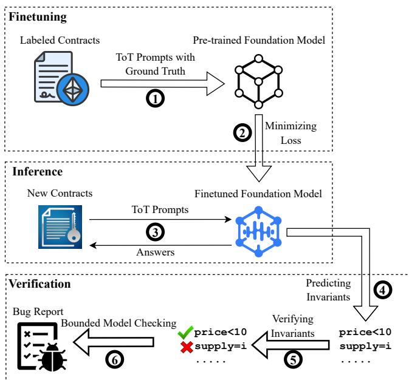
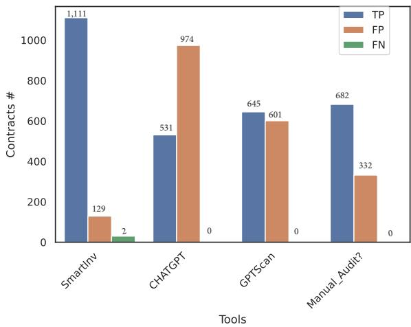

# SMARTINV: Multimodal Learning for Smart Contract Invariant Inference

Sally Junsong Wang<sup>∗</sup>, Kexin Pei<sup>∗†</sup>, Junfeng Yang<sup>∗</sup>

<sup>∗</sup>Columbia University, NY <sup>†</sup>The University of Chicago, IL

jw4074@columbia.edu, kpei@cs.uchicago.edu, junfeng@cs.columbia.edu

Abstract—Smart contracts are software programs that enable diverse business activities on the blockchain. Recent research has identified new classes of ”machine un-auditable” bugs that arise from both transactional contexts and source code. Existing detection methods require human understanding of underlying transaction logic and manual reasoning across different sources of context (i.e., modalities), such as code, dynamic transaction executions, and natural language specifying the expected transaction behavior.

To automate the detection of “machine un-auditable” bugs, we present SMARTINV, an accurate and fast smart contract invariant inference framework. Our key insight is that the expected behavior of smart contracts, as specified by invariants, relies on understanding and reasoning across multimodal information, such as source code and natural language. We propose a new prompting strategy to foundation models, Tier of Thought (ToT), to reason across multiple modalities of smart contracts and ultimately to generate invariants. By checking the violation of these generated invariants, SMARTINV can identify potential vulnerabilities.

We evaluate SMARTINV on real-world contracts and rediscover bugs that resulted in multi-million dollar losses over the past 2.5 years (from January 1, 2021 to May 31, 2023). Our extensive evaluation shows that SMARTINV generates (3.5×) more bug-critical invariants and detects (4×) more critical bugs compared to the state-of-the-art tools in significantly (150×) less time. SMARTINV uncovers 119 zero-day vulnerabilities from the 89,621 real-world contracts. Among them, five are critical zero-day bugs confirmed by developers as “high severity.”

## 1. Introduction

Bugs in smart contracts are often serious vulnerabilities that lead to significant loss of funds. In 2022 alone, \$2 billion was lost due to smart contract bugs [59], [90]. What makes smart contract bugs particularly damaging is the fact that once a smart contract is deployed, it becomes immutable, making it difficult to fix any vulnerabilities in the code.

Recent research has identified a new category of bugs known as “machine un-auditable” functional bugs. These bugs, as their name suggests, cannot be reliably detected using existing automated tools that rely on pre-defined bug patterns [90]. Unlike implementation bugs (e.g., integer overflows), which often exhibit universal patterns that can be easily checked, functional bugs arise from a failure to reason about extensive domain-specific properties, e.g., a specific transaction context. Detecting functional bugs require nontrivial reasoning across multiple sources of information or modalities, such as source code and domain-specific rules expressed in natural language documentation.

TABLE 1: Statistics on Bountied Vulnerabilities of Soliditybased Smart Contracts (from September, 2021 to May, 2023)

<table><tr><td>Implementation</td><td>Functional</td><td>Others</td><td>Total</td></tr><tr><td>929 (17.52%)</td><td>4,305 (81.20%)</td><td>68 (1.28%)</td><td>5,302</td></tr></table>

Unfortunately, traditional smart contract analyses rely heavily on manually-defined specifications by human experts [6], [32], [68], [85] and lack the ability to reason across multiple modalities [20], [26], [37], [52], [67]. As a result, existing approaches are often tailored for specific types of bugs and do not generalize to new types of bugs. Moreover, manual analysis is expensive, and thus not scalable to a large number of programs. While some tools [86] can find patterns in curated transactions of a limited class of functional bugs, none reliably detects functional bugs from source code due to functional bugs’ diverse behaviour. Yet source code level bug detection is critical for preventing financial losses before contract deployment. Functional bugs are also prevalent, accounting for 81% exploitable bugs to date according to our survey (Table 1).

Listing 1 shows an example of a functional bug. The getPrice() function computes price by the ratio of token0 and token1 values in address(this). Ideally, price is expected to remain stable within a range. However, as token0 and token1 are state variables, i.e., static variables, they can be easily manipulated by external parties. Therefore, when getPrice() is invoked to return price, its return value can fluctuate significantly, leading to the potential exploit of unexpected arbitrage trade on top of the newly manipulated price difference. The functional bug of getPrice() stems from not effectively meeting transactional requirements. For example, an outsized increase of token1’s balance value via another malicious contract can throw price off originally intended range (see §2.2 for details). Such functional bugs cannot be detected by existing automated tools that target low-level bugs, because the code shown does not contain implementation bugs.

We present SMARTINV, an automated, foundation model based framework to infer smart contract invariants and to detect bugs at scale. While there are machine learning approaches for generating invariants [31], [45], [61], [84], [87], they predate foundation models, and thus follow the typical paradigm in hand-engineering limited features that can be helpful for contract invariant inference. The unique feature of SMARTINV, which differentiates from existing analyzers, is that SMARTINV leverages foundation models to reason about multimodal inputs, such as source code and natural language (comments and documentations on domain-specific transactional contexts). Foundation models are particularly suited for analyzing multimodal information and domainspecific bug detection, because they are pretrained on natural language texts and code, and can be further finetuned for domain-specific knowledge.

```txt
uint price;
IERC20 token0, token1;

function getPrice() {
    //functional bug: price manipulation
    price = token1.balanceOf(address(this))/token0.balanceOf(address(this));
}
```  
Listing 1: functional bug example. An attacker can pump up price by inflating token1’s balance value.

To reason across multimodal information, we develop Tier of Thought (ToT), a new prompting strategy, that can be used to finetune and elicit explicit reasoning of foundation models on the program structures of smart contract. In contrast to other foundation-model-based approaches [13], [16], [70], ToT applies universally across contract types, eliminating the need for bug-specific reasoning heuristics. ToT breaks down the process of invariants generation into intermediate abstract tiers, based on the typical reasoning steps that human analyzers would take, such as predicting critical program points to check invariants, generating invariants associated with the predicted program points, and ranking the invariants by predicting their likelihood of preventing bugs. Based on the ranked invariants, SMARTINV can efficiently verify the invariants by prioritizing the invariants that are more likely bug-preventive using a bounded model checker, without exhaustively enumerating all of them.

Building SMARTINV was an engineering effort to unite the potential of finetuning foundation models with the soundness of formal verification. We do not claim that multimodal learning and prompting are superior to traditional static and dynamic analyses, or vice versa. The goal of this paper is to explain SMARTINV’s design and implementation regarding how it overcomes the challenges posed by functional bugs, annd hopefully to present one promising way forward.

Contributions. We make the following contributions:

• To our best knowledge, SMARTINV proposes the first finetuning approach that can both infer invariants and detect bugs by reasoning across multiple smart contract modalities, critical to detecting functional bugs pre-deployment.

• We design a new prompting approach to foundation models, Tier of Thought (ToT), to finetune and elicit their reasoning by following the thought process of human analyzers, significantly improving the accuracy of the generated invariants and detected bugs while reducing runtime overhead.

TABLE 2: SMARTINV detected bug classification. Modalities Required: the minimum modalities required to detect a given bug class. SC: source code. NL: natural langauge. Pattern Detectable: a bug class can be detected by identifying general patterns. ToT Detectable: a bug class can be detected by Tier of Thought. : a modality is sometimes required.

<table><tr><td rowspan="2"></td><td colspan="2">Modalities</td><td rowspan="2">Pattern Detectable</td><td rowspan="2">ToT Detectable</td></tr><tr><td>SC</td><td>NL</td></tr><tr><td colspan="5">Implementation Bugs</td></tr><tr><td>Reentrancy (RE) [43]</td><td>✓</td><td>✗</td><td>✓</td><td>✓</td></tr><tr><td>Integer overflow/underflow (IF) [12]</td><td>✓</td><td>✗</td><td>✓</td><td>✓</td></tr><tr><td>Arithmetic flaw (AF) [65]</td><td>✓</td><td>✗</td><td>✓</td><td>✓</td></tr><tr><td>Suicidal contract (SC) [53]</td><td>✓</td><td>✗</td><td>✓</td><td>✓</td></tr><tr><td>Ether leakage (EL) [53]</td><td>✓</td><td>✗</td><td>✓</td><td>✓</td></tr><tr><td>Insufficient gas (IG) [50]</td><td>✓</td><td>✗</td><td>✓</td><td>✓</td></tr><tr><td>Incorrect visibility/owner (IVO) [28]</td><td>✓</td><td>✗</td><td>✓</td><td>✓</td></tr><tr><td colspan="5">Functional Bugs</td></tr><tr><td>Price manipulation (PM) [82]</td><td>✓</td><td>✓</td><td>✗</td><td>✓</td></tr><tr><td>Privilege escalation (PE) [11]</td><td>✓</td><td>✓</td><td>✗</td><td>✓</td></tr><tr><td>Atomicity violation (AV) [63]</td><td>✓</td><td>✓</td><td>✗</td><td>✓</td></tr><tr><td>Business logic flaw (BLF) [27]</td><td>✓</td><td> $\textcircled{1}$ </td><td>✗</td><td>✓</td></tr><tr><td>Inconsistent state update (IS) [90]</td><td>✓</td><td>✓</td><td>✗</td><td>✓</td></tr><tr><td>Cross bridge (CB) [86]</td><td>✓</td><td> $\textcircled{1}$ </td><td>✗</td><td>✓</td></tr><tr><td>ID uniqueness violation (IDV) [90]</td><td>✓</td><td>✓</td><td>✗</td><td>✓</td></tr></table>

• We implement our approach in SMARTINV and demonstrate that SMARTINV outperforms prior tools in invariants generation and functional bug detection. Notably, SMART-INV has found 119 zero-day bugs in the wild. Among them, five are confirmed by the developers as high severity.

• We collect a large (2,173 samples) annotated smart contract invariant dataset for training and 89,621 real-world contracts for bug detection. We release the datasets and the tool for public use at https://github.com/columbia/SmartInv.

## 2. Overview

This section first introduces the necessary background (§2.1), two motivating examples (§2.2), followed by an overview of SMARTINV’s workflow (§2.3).

## 2.1. Background

This section introduces the modalities of smart contract, the definitions of implementation and functional bugs, smart contract invariants, and foundation models prompting.

Smart Contract Modalities. Smart contract modality can be broadly understood as sources of information under which bug-preventive invariants are generated. Accordingly, smart contracts contain two main modalities: i) contract source code; ii) natural language, usually in the form of implementation-related comments and domain-specific textual information. From the contracts we studied in Table 1, 5,265 contracts (99.31%) contain natural language related to code logic and expected transactional behavior. Existing invariants generators [8] and bug detectors [10], [67], [68] focus only on a single modality, namely contract source code. To our best knowledge, SMARTINV is the first smart contract analysis tool that can reason across both modalities.

Bug Taxonomy. As Table 2 demonstrates, SMARTINVdetected bugs can be categorized into two types:

• Implementation bugs: these bugs are generalizable by certain patterns in source code, such as reentrancy (RE), which can be generalized as a pattern of cyclic transactions. Reasoning about implementation bugs does not require domain-specific properties or multimodal information.

• Functional bugs: theses bugs are tied to highly specialized transaction contexts and domain-specific properties. Detect ing functional bugs requires understanding and reasoning across multimodal contract information. Functions bugs are usually not pattern detectable from source code.

Implementation bugs usually do not require domainspecific information, so they can be detected based on general patterns [15], [18], [22], [26], [51], [52], [67], [68], [73], [74], [77], [83] without relying on any multimodal hints. For example, integer over/underflows (IF) can be detected by general test suites similar to buffer overflow [40] used in traditional software. Reentrancy (RE) can be detected by testing general cyclic patterns of transactions.

Functional bugs arise from highly domain-specific transactional contexts and exhibit unintended behavior under dynamic transaction executions, i.e., incorrect stateful transitions and/or inter-contract communications given specific domains. Detecting functional bugs requires expert understanding of domain-specific properties and transaction contexts. For example, a smart contract may contain some formula to calculate price, and a comment describing the transaction context is that “price should stay within a certain range based on market trends from day 1 to day 30.” These transaction contexts cannot be easily captured by code and are often overlooked by developers.

Smart Contract Invariants. Invariants specify smart contract properties that should be held true throughout smart contract execution. Broadly, smart contract invariants can be categorized into two types, addressing implementation and functional bugs respectively. Invariants that track down implementation bugs can take the form of assertions specifying general patterns. Invariants that track down functional bugs often require templates tailored to domain-specific properties and transaction contexts. We have designed and built these invariant templates into SMARTINV via a novel finetuning process and will detail them in §3.2.

Prompting Foundation Models. Foundation models (or Large Language Models) are pre-trained on texts and code with a large number of parameters. A foundation model seeks to estimate probabilistic distribution over tokenized data and generate new information based on seen data [36]. Besides the “pre-train and finetune” paradigm, “pre-train, finetune, and prompt engineering” paradigm shows high potential for challenging reasoning tasks [46]. For example, given an invariant generation task, a prompt can be a question, such as “what are the invariants at line 1?” Recent research [80], [81] has constructed prompts in different formats such that these prompts elicit intermediate reasoning steps of foundation models. The prompts used in §3.1 elicit such intermediate reasoning steps.

## 2.2. Motivating Examples

We provide two real-world hacks (simplified for readability) as motivating examples in this section. We refer to the line number of a code statement as a program point and the line number where invariants should be inserted as a critical program point.

Example 1: Flashloan Primer. Flashloans in smart contracts are uncollateralized and allow users to borrow assets without any cost as long as users pay back within a single transaction. Tokens declared with IERC library contracts and assetswapping contracts that support external calls inherently support flashloans. The price manipulation (PM) bug in Listing 2 is confirmed by developers and multiple security firms [19], [21], [29]. Listing 2 demonstrates how malicious users take flashloans to exploit Visor, a money market contract providing liquidity services. Hackers first borrow a large token0 flashloan, swap token0 for token1 on the platform to pump the price of token1, and as a result, inflate the price calculations at line 12. When price is sufficiently large, an attacker can mint and later withdraw a drastically inflated amount of shares by calling deposit(), where a user can mint shares by depositing a small amount of undervalued token0 and a large amount of over-valued token1. Although this hack is exacerbated by reentrancy [9], [64], the root cause lies in flashloan based price manipulation.

For example, suppose the total balances of token0 and token1 are \$10 in address(this) with the token prices at \$1 each respectively. Without price manipulation, if Alice deposits \$10 deposit0 and \$10 deposit1, she can mint \$20 shares, since the current price is \$1=10/10. To make a higher profit, Alice decides to take a flashloan of 1,000 token0 (priced at \$1 per token0), swap flashloaned token0 for token1 in token pool reserves, resulting in inflated price of token1 and deflated price of token0. Suppose the token prices of token1 and token0 are now \$100 and \$0.1 after the swap. When Alice invokes deposit() post swap, The price becomes \$1,000=(100\*10)/(0.1\*10), because the number of token0 and token1 in address(this) are still 10 but their individual token prices are manipulated. After the swap, Alice owns 1,000 token1 (priced at \$100 per token1) and has 1,000 flashloaned token0 (priced at \$0.1 per token0) as debt. Alice dumps all her token1 as deposit1 at an inflated sum of \$100,000 = 100\*1000 and 10 token0 as deposit0 at \$1 = 10\*0.1 via the deposit() call. Given the formula at line 17, this transaction allows Alice to mint shares totaling \$101,000=\$100,000 + 1\*\$1,000. Alice pays back 1000 flashloaned under-valued token0 (now only worth \$1,00 = 1,000\* \$0.1), making a profit of \$100,900. Listing 2 is a highly simplified example. For interested readers, full mathematical details and developer’s solution to the bug can be found at [3], [4].

```solidity
contract simplifiedVisor{
    /*two types of token reserves */
    IERC20 token0, token1;
    /*reporting price at real time*/
    uint price;

    /* real-time price updates by the ratio of token
        reserves */
    function getRealPrice() internal {
        //SmartInv: possible flashloan
            injection
        price = token1.balanceOf(address(this))
            /token0.balanceOf(address(this));
    }
    //SmartInv: minting shares by deposits
    function deposit(uint deposit0, uint
        deposit1, address to) public {
        /* price may change */
        getRealPrice();
        uint deposit0PricedInToken1 = deposit0
            * price;
        uint shares = deposit1 +
            deposit0PricedInToken1;
        if (deposit0 > 0) {
            token0.safeTransferFrom(msg.sender,
                address(this), deposit0);
        }
        if (deposit1 > 0) {
            token1.safeTransferFrom(msg.sender,
                address(this), deposit1);
        }
        ...
        _mint(to, shares);
    }
}
```  
Listing 2: functional buggy snippet from the spot price manipulation of Visor [5], [21] (simplified for readability).

Existing prompting frameworks [13], [16], [70] specify no invariants and point to incorrect bugs such as reentrancy. Existing bug analyzers based on formal verification, symbolic execution, and other dynamic analysis [47], [67], [67], [68] report Listing 2 as a healthy contract, because they analyze only source code without considering the domain-specific price oracle context implied by the blue comments

However, analyzing the Listing 2 bug requires understanding the natural language hints indicating that the price oracle is vulnerable to real-time price volatility. Table 3 highlights SMARTINV’s solution using tailored invariant templates (discussion in §3) by reasoning across source code and natural language hints. SMARTINV infers the lines immediately after lines 15 as critical program points, and infers an invariant assert(price <= Old(price)<sub>\*</sub>k). Similar to the use of Orig() in Daikon [17] and Old() ESCJML [55], Old(price) returns the previous price point before the deposit() function is invoked. k has a default value of 2 in SMARTINV and can be updated based on developers’ desired volatility ratio. Any violation of the assertion invariant would signal price volatility exceeding user desired k and thus would signal price manipulation.

TABLE 3: SMARTINV inferred invariants in Listing 2. 15+ refers to the line-numbered location where the invariant should be inserted, e.g., 15+ means immediately after line 15. Old(price) evaluates a variable’s pre-state and returns the price point before liquidate function is called. k is an adjustable ratio, where SMARTINV sets default as k=2.  
```txt
Critical Program Points Inferred Invariants
15+ assert(price <= Old(price)*k);
```

One might argue that an attacker can manipulate the Old(price) first by taking flashloans and swapping tokens. However, our observation from thousands of blockchain transactions is that most users are honest. Therefore, before an attacker carries out such price manipulation attacks, Old(price) generally returns a non-manipulated price point reflecting honest transactional activities at that moment.

Example 2: Voting Fraud. The voting fraud bug [24], [90] in Listing 3 is officially recognized by the National Commmon Vulnerabilities and Exposures (CVE) with an assigned ID [57]. This hack was made possible by flashloans and classfied as priviledge escalation under functional bug types. The contract developers were aware of the potential for flashloan attacks, so they tried to mitigate the risk by restricting the order in which the startExecute(), execute(), and endExecute() functions could be invoked.

If a proposal is not ongoing and sTime = 0, then a message sender can invoke startExecute(). If a proposal is ongoing (sTime != 0 and sTime + 24 hours > block.timestamp), then a message sender can only invoke execute(). Otherwise (after 24 hours has passed), the proposal round can be ended by invoking endExecute(). As the contract developer(s) intended, startExecute() must be invoked before execute() within a proposal. execute() and endExecute() cannot be invoked within a single transaction (or within a 24-hour proposal round) to prevent flashloan attacks.

However, the key vulnerability lies in the developers’ assumption that the three functions, startExecute(), execute(), and endExecute(), would be invoked sequentially in a proposal round. Unfortunately, that assumption does not hold. An attacker can bypass the Execute() function by invoking the endExecute() directly after taking a flashloan to become the highest proposer.

The attack above is possible, because votingToken variable is declared with the IERC20 wraparound library contract, which tracks how many tokens a user would like to vote when calling the execute() function. The IERC20 wraparound library contract also has its own transferForm() function. As a result, any variable declared with IERC20 can invoke transferForm() directly.

Suppose a hacker borrows a large flashloan and injecting it into votingToken via the transferForm() function to make the highest bid. This bypasses the execute() function and allows the hacker to invoke transferForm() directly in the IERC20 library contract. After 24 hours, the hacker ends the proposal round by invoking the endExecute() function. This exploit allows the hacker to become the new owner of the contract at line 27, and thus to invoke the highly privileged getFunds() function at line 32. Then the hacker can obtain all locked tokens and pay back the flashloan with a profit.

```solidity
contract TimelockController {
    /*this is a bidding contract:
    watch out for flashloan */
    struct Proposal {
        uint sTime; address newOwner;
    }
    IERC20 votingToken; /*important variable */
    address owner;
    Proposal proposal;

    /*the following three functions should be executed atomically */
    function startExecute() external {
        require(proposal.sTime == 0, "on-going proposal");
        proposal = Proposal(block.timestamp, msg.sender);
    }

    function execute(uint amount) external {
        require(proposal.sTime + 24 hours > block.timestamp, "execution has ended");
        votingToken.transferFrom(msg.sender, address(this), amount);
    }

    function endExecute() external {
        require(proposal.sTime != 0, "no proposal");
        require(proposal.sTime + 24 hours < block.timestamp, "execution has not ended");
        require(votingToken.balanceOf(address(this)) * 2 > votingToken.totalSupply(), "execution failed");
        /*we're about to change the owner of the contract */
        owner = findHighest(_allProposals);
        delete proposal;
    }

    /*highest proposer becomes the new owner of the contract and gets all locked funds*/
    function getFunds() external onlyOwner {
        ...
        return allLockedTokens;
    }
}
```

Existing analyzers [51], [67], [68] mistakenly report that Listing 3 contract contains an integer overflow/underflow bug related to sTime at lines 23 and 24 (false positives because Solididy version ⩾ 0.8 automatically preempts operations causing integer overflow/underflow) while omitting the more damaging privilege escalation bug. Their mistaken reporting stems from relying on pattern-matching arithmetic operations without considering the underlying transactional logic.

SMARTINV’s solution is to reason across source code and natural language hints in blue (comments and variable names related to the transactional context). First, from

TABLE 4: SMARTINV inferred invariants in Listing 3. 19+ and 25+ refer to the line-numbered location where the invariant should be inserted, e.g., 19+ means immediately after line 19. Old(votingToken.balanceOf(address(this))) returns the votingToken balance in address(this) before the instrumented function is called. At 19+, inferred invariant specifies that the current balance of votingToken equals to the sum of transferred amount and the prior balance before the transfer. At 25+, the inferred invariant specifies that total balance of votingToken stays the same after a proposal round has ended, i.e., no flashloan transfers into votingToken.

```txt
Critical Program Points
Inferred Invariants
19+ assert(votingToken.balanceOf(
    address(this)))==
    Old(votingToken.balanceOf(
        address(this)))+amount);
25+ assert(Old(votingToken.balanceOf(
    address(this)))==votingToken.balanceOf(
        address(this)));
```

the source code and comments, SMARTINV infers that the transactional context is “bidding.” After predicting ”bidding” transactional context, SMARTINV infers critical program points and invariants as highlighted in Table 4. If a malicious actor bypasses the execute() function and injects a large flashloan in endExecute() function directly, then votingToken variable would transition to a wrong state that violates the assertion invariant (Old(votingToken.balanceOf(address(this)) ==votingToken.balanceOf(address(this)) after line 25.

## 2.3. SMARTINV Workflow

Figure 1 shows SMARTINV’s workflow. SMARTINV first finetunes the model on a dataset of labeled contracts with Tier of Thought (ToT) prompts and ground truth at ⃝1 . SMARTINV learns to minimize cross entropy loss [89] between ground truth and inferred answers at ⃝2 . During inference, SMARTINV takes a previously unseen new contract as input and prompts the finetuned model using ToT at ⃝3 . We develop a new iterative prompting process: SMARTINV uses the answers from prior easier tiers to guide answer generation for subsequent more challenging tiers. After the finetuned model generates invariants at ⃝4 , SMARTINV proceeds to verify inferred invariants by proving program correctness at ⃝5 first. If no proof of program correctness is found after the initial verification, SMARTINV uses a bounded model checker to seek violations (counterexamples) of inferred invariants at ⃝6 . As a final step, SMARTINV outputs a report on verified invariants and detected bugs. Once finetuned, SMARTINV is fully automated to detect bugs.

In building this workflow, there are two technical challenges. The first one is how to incorporate and represent multimodal information that also respects smart contract semantics during finetuning. Our evaluation shows that simply prompt engineering without customized training datasets cannot identify correct invariants in real-world contracts.

  
Figure 1: SMARTINV’s Workflow

To overcome the challenge, we have designed tailored invariant templates (in §3.2) and built a unique finetuning process (in §3.1) that incorporates multimodal information. Our finetuning process tailors answers to ToT-prompts. Furthermore, foundation models are known to have the hallucination problem [41]. Thus, a second challenge is to determine which invariants are correct during inference on previously unseen contracts without labeled ground truth. To overcome the second challenge, SMARTINV adopts novel invariants ranking strategy for effective verification (in §3.4). Finetuning and Ground Truth. Finetuning models to both consistently reason about diverse sets of invariants and to detect a wide range of real-world bugs is non-trivial. Given that no prior foundation-model-based work has done both (to our best knowledge), SmartInv presents the first multimodalreasoning-based finetuning approach for invariants generation and bug detection. We specifically focus on modalities helpful to detect functional bugs unique to smart contracts.

SMARTINV uses ToT’s step-by-step reasoning and tailored ground truth to finetune the pre-trained model. Each training sample consists of a smart contract file collected from Etherscan [2] and annotated ground truth of six labeled features (details in Table 5). During finetuning, an input contract, each ToT prompt, and corresponding ground truth are encoded as token sequences. For example, a ToT prompt with ground truth answers can be “What are the critical program points in the contract? Critical program points are [ground truth label].” SMARTINV splits the training dataset into train, validation, and test sets of 1381, 296, 296 contracts (70%, 15%, 15%) respectively.

Inference. The finetuning design above facilitates SMART-INV’s unique inference approach: using iterative and increasingly complex prompts that respect smart contracts’ domainspecific properties and semantics, e.g., transactional context and critical program points. During inference, the finetuned model is prompted with a previously unseen contract and a tiered prompt without any answers, such as “What are the critical program points in the contract?” The finetuned model can predict critical program points as an answer, because the model is finetuned for this specific downstream task. Then SMARTINV uses inferred answers from prior prompts to elicit answers on more challenging prompts.

Verifying Predicted Invariants. After inference, SMARTINV uses a new invariants ranking strategy for effective verification: it prompts the model to rank inferred invariants from most likely to be correct and bug preventive to the least likely. After ranking, SMARTINV automatically switches to a verifier that tries to prove for program correctness on ranked invariants. If such proofs can be found on an inferred invariant, SMARTINV marks that invariant as correct. Otherwise, SMARTINV uses bounded model checker to search for violations of inferred invariants. When violations are found, such violations signify two scenarios that warrant further review: i) a potential bug; or ii) potentially incorrect invariants. Therefore, we inspect the counterexamples to i) confirm the existence of bugs and thereby correct invariants or ii) confirm the incorrectness of inferred invariants. If no correctness proofs or counterexamples are found, SMARTINV discards that unproven invariant.

## 3. Methodology

We formally define the invariant inference problem in §3.1. SMARTINV is finetuned with customized invariant types in §3.2 to facilitate the unique Tier of Thought finetuning process in §3.1. As a result, SMARTINV learns to use these invariant types to answer prompted questions and to infer invariants in an iterative fashion during inference. With novel invariants ranking strategy, SMARTINV uses the verification algorithm in §3.4 to verify inferred invariants.

## 3.1. Problem Formulation

Let $M _ { \theta }$ be the pre-trained foundation model parameterized by θ and let S be tokenized input contract. Let C be tokenized program points (i.e., a line-numbered location of a code statement), V be invariants and instrumentations for invariant checks respectively. For simplicity, we refer to invariants and related instrumentations as invariants in this section. From input S, we finetune (train) the model $M _ { \theta }$ to generate critical program points $c _ { i }$ and associated invariants $v _ { i }$ as $( c _ { i } , v _ { i } )$ , where $c _ { i } \in C$ and $v _ { i } \in V$ . From predicted $( c _ { i } .$ $v _ { i } )$ , we further finetune $M _ { \theta }$ to predict vulnerabilities in S.

## 3.2. Invariant Types

Broadly, SMARTINV infers three types of invariants to capture functional bugs: assertions with special expressions, modifiers, and global invariants. These invariants are highly generalizable and can be easily verified by the state-of-the-art verifiers [1], [58], [78]. Listing 4 and Table 5 illustrate the use of a subset of these invariant types during finetuning.

```solidity
contract trainingExample {
    /* totalSupply and balances should be same before and after
        transfer */
    uint totalSupply, tokens;
    mapping(address === uint) balances;

    function transfer(address to) external {
        balances[to]= balances[to].add(tokens);
        balances[msg.sender]= balances[msg.sender].sub(tokens);
    }

    /* only contract owner should invoke tokenIncrease */
    function tokenIncrease() external {
        if (tokens <=100) {
            tokens+=1.1*tokens;
        }
        return tokens;
    }
    ...
}
```

A common invariant type inferred by SMARTINV is assert(expr1 op expr2) at a critical program point. expr1 and expr2 are legal Solidity expressions. op are binary operators, such as ==, >=, <=, !=. Assertions can also be replaced by pre-condition check Assume(expr), as well as post-condition checks Ensures(expr) and require(expr), because SMARTINV’s backend verifier also supports these additional checks. As part of assertions, SMARTINV also infers special expressions uniquely tailored to smart contracts, such as Old(expr), k<sub>\*</sub>Old(expr), and SumMapping(mappingVar).

The use of Old(expr) is similar to Daikon’s Orig(expr) [17]. It returns the previous state of a variable at the entry of a function. Ratio k allows users to specify an accepted volatility ratio for a variable, usually a price point. SMARTINV sets the default volatility ratio k to 2. Finetuning SMARTINV to learn Old(expr) and k enables invariant inference related to inconsistent state updates and price manipulation bugs. To check arithmetic operations across mapping and integer/byte types, SMARTINV sums up the values stored in multi-layered maps using customized SumMapping(mappingVar). This design enables SMARTINV to directly compare mapping type against other primitive types.

Modifiers are invariant-like Solidity functions that specify the behavior of other functions. SMARTINV infers function modifiers, because they are useful to express expected behavior of an entire function beyond assertions. Take Table 5 as an example. SMARTINV infers an onlyOwner modifier at critical program point 10+. When the tokenIncrease() unction at line 12 is instrumented with the modifier, only contract owner can invoke tokenIncrease() function. Intuitively, modifiers are function-level invariants.

TABLE 5: Labeled ground truth for the trainingExample contract. Repeated code fragments are replaced by ... in “Critical Invariants” and “Ranked Critical Invariants” labels. “Rank 1”,“Rank 2”, and “Rank3” refer to a group of invariants that can discover bugs in descending likelihood.  
```txt
Labeled Features Ground Truth
transactional context token transfer
critical program points 7+, 8+, 10+, 12, 17+
Invariants 7+ assert (balances[msg.sender]>=tokens);
8+ assert (sumMapping(balances)==totalSupply);
10+ modifier onlyOwner{
require(msg.sender==owner);};
12 function tokenIncrease()
onlyOwner external {...};
17+ Invariant(tokenIncrease()>100);
Critical Invariants 7+ assert(...);
8+ assert(...);
10+ modifier onlyOwner{...};
12 function tokenIncrease(uint tokens)
onlyOwner external {...};
Ranked Rank 1: 10+ modifier onlyOwner{...};
Critical 12 function tokenIncrease()
Invariants onlyOwner external {...};
Rank 1: 7+ assert(...);
Rank 2: 8+ assert(...);
Rank 3: 17+ Invariant(...);
Vulnerabilities incorrect visibility/ownership; arithmetic flaw;
```

To specify cross-function and cross-contract behavior, SMARTINV also learn Invariant(expr), a customized invariant function that specifies expected return values of a function during cross-contract calls. e.g., Invariant(func()==a). Compared to assertions that can only specify program behavior at a given program point, Invariant(expr) can also specify loop invariant when placed at the beginning of loops and specify state variables outside functions. Invariant(expr) is thus versatile.

## 3.3. Tier of Thought Finetuning and Inference

To guide a pre-trained foundation model towards generating bug-preventive invariants, the key innovation is to introduce increasingly complex thoughts to reason from contract source files to correct answers of each prompt. Given input contract, each thought is a tokenized sequence, such as “What is the transactional context in the contract? The transactional contract is token transfer.”

Finetuning with ToT. We finetune the model to generate one thought at a time, starting with the simplest and working our way up to the most complex thoughts. Taking Listing 4 and Table 5 as an illustrative training example for this section, the model learns to reason about smart contracts’ source code and natural language highlighted in blue (variable names and comments useful for program understanding and invariants generation). Using multimodal information, the model is finetuned to generate tokenized answers given a prompt. This design enables SMARTINV to predict domainspecific information (i.e., the ground truth of labeled features) on new contracts. SMARTINV adds “<end of text>” as a special token to separate each training sample.

Tier 1 Finetuning (Critical Program Points). In this tier, the model tokenizes contract source files, tier 1 prompts, and answers from labeled ground truth as sequences. The tier 1 thoughts below seek to finetune SMARTINV’s understanding of transactional contexts and critical program points from multimodal sources in the contract. The example below illustrates tier 1 training sample:

```txt
Contract trainingExample {...}
What's the transactional context of the contract? The transactional context is token transfer.
Given transactional context, what are the critical program points? Critical program points are 7+, 8+, 10+, 12, 17+.
<End of Text>
```

Tier 2 Finetuning (Invariants). At tier 2, the model tokenizes contract source files, tier 2 prompts, and the ground truth of “Invariants” and “Critical Invariants” labels for finetuning. Critical invariants refer to those that are likely to prevent bugs. SMARTINV’s tier 2 finetuning design continues the thoughts from tier 1 and facilitates invariants generation at correct program points during inference. The example in grey box illustrates the training sample design of tier 2:

```txt
Contract trainingExample {...}
Given inferred critical program points, what are the invariants? Invariants are [ground truth of “Invariants” label in Table 5].
Given inferred invariants, what are the critical invariants?
Critical invariants are [ground truth of “Critical Invariants” label in Table 5].
<End of Text>
```

assert(sumMapping(balances)== totalSupply) at critical program point 8+ in Table 5 is derived from both natural language cues and source code. This invariant checks that the condition specified in natural language at line 2 holds true. SMARTINV uses a special expression sumMapping(<sub>\*</sub>) to sum up all balances stored in the balances mapping. This way, SMARTINV can directly compare balances of mapping type with totalSupply of uint type. The second natural language inspired invariant is modifier onlyOwner(...) at critical program point 7+, with added onlyOwner modifier instrumentation to the tokenIncrease function at line 12. This pair checks that only the contract owner can invoke tokenIncrease function as hinted by comments at line 11. By these two invariant pairs, SMARTINV learns natural language hints and associated invariants during finetuning.

The remaining ground truth of the “Invariants” label in Table 5 are based on source code. The invariant assert(balances[msg.sender])>= tokens) at program point 7+ checks that a message sender has enough balance to make the transfer. Invariant(tokenIncrease()>100) at program point 17+ checks that the return value of tokenIncrease function is great than 100 during cross-contract calls.

After being finetuned to generate invariants, SMART-INV is also finetuned to generate critical invariants that can potentially identify bugs. The invariant assert(balances[msg.sender])>= tokens) checks against arithmetic flaws. The invariant modifier onlyOnwer{...} with function signature instrumentation checks against incorrect access control. Thus they are labeled as critical invariants for Listing 4 training contract. By comparison, the invariant at 17+ Invariant(tokenIncrease()>100) checks function return value without likely bugs in this sample. Therefore, 17+ Invariant(...) is not included in the ground truth of “Critical Invariant” label. With critical invariants, SMARTINV learns to reason about likely invariants that can guard vulnerable code fragments effectively.

Tier 3 Finetuning (Prioritized Invariants and Bugs). SMARTINV is also finetuned to rank/prioritize critical invariants and predict vulnerabilities in the contract from previously generated information. The example below illustrates the construction of tier 3 training sample:

```txt
Contract trainingExample {...}
What are the ranks of inferred critical invariants? The ranks of inferred critical invariants are [ground truth of "Ranked Critical Invariants" label in Table 5].
What are the vulnerabilities in the contract? The vulnerabilities are [ground truth of "vulnerabilities" label in Table 5].
<End of Text>
```

Specifically for Listing 4, the first rank 1 invariants at critical program points 10+ and 12 identify an incorrect visibility/ownership bug. The second rank 1 invariant at critical program points 7+ identifies an arithmetic flaw bug: the contract lacks proper guard to ensure that a message sender has sufficient balances to make a token transfer. Invariants of rank 2 and rank 3 are correct but trivial invariants that are less likely to find bugs.

Inference with ToT. The unique aspect of SMARTINV’s inference is to decompose the invariant inference problem into three-tiered tasks, thereby making an iterative process. SMARTINV uses inferred answers from the previous tier to generate answers for more challenging prompts of later tiers. At each tier, SMARTINV prompts the finetuned model on a previously unseen contract with two tailored prompts.

At tier 1, SMARTINV tackles the simple task by inferring transactional contexts and critical program points first. SMARTINV uses the answer generated for prompt A to continue generating critical program points for prompt B.

```txt
Tier 1 Prompts Prompt A: What's the transactional context of the contract? Prompt B: Given transactional context, what are the critical program points?
```

At tier 2, SMARTINV is given a slightly more complex task of inferring invariants at predicted critical program points and identifying critical invariants, i.e., bug-preventive invariants from all inferred invariants.

<div class="mineru-algorithm" style="white-space: pre-wrap; font-family:monospace;">
Algorithm 1 ToT Invariants Verification
Input: an input smart contract $S$, Tier 3 invariants ranking model $M_{\theta}$, and an initial set of assumed true positive candidate invariants $V$ generated by $M_{\theta}$.
Output: verification report $P$, a set of verified correct invariants $I_{correct}$, and a set of possibly correct invariants that require further inspection $I_{possible}$.
Syntax_Check($V$);
while $V \neq \emptyset$ do
    $v_i \leftarrow$ Tier3.rank(); $\triangleright$ ranking critical invariants
    $V \leftarrow V - v_i$;
    $\Pi(\sigma(v_i), \mu) = \text{Inductive\_Check}(S, v_i)$;
    if $\sigma(v_i) == \text{True}$ then $\triangleright$ proof of program correctness found
        $I_{correct}.append(v_i)$;
        $P = P.append(\Pi)$
    else $\triangleright$ proof of program correctness not found
        $\Pi(\phi, \overline{\mu}) = BMC(S, v_i, m)$; $\triangleright$ entering BMC phase
        $P = P.append(\Pi)$;
        if $\overline{\mu}$ is a counter example then
            $I_{possible}.append(v_i)$;
            break; $\triangleright$ manual inspection requested for counterexamples
        end if
        discard $v_i$; $\triangleright$ no counterexamples or correctness proof found
    end if
end while
return $P$, $I_{correct}$, and $I_{possible}$;
</div>

Prompt A: Given inferred critical program points, what are the invariants?

Prompt B: Given inferred invariants, what are the critical invariants?

At tier 3, SMARTINV is given the most challenging task: ranking critical invariants for verification and predicting vulnerabilities in a contract. SMARTINV reports verified invariants with predicted vulnerabilities as a final report. We highlight that buggy traces from a verifier is more sound than model inferred bugs. However, because verifiers frequently encounter incompatible Solidity compilers, SMARTINV reports predicted vulnerabilities as a remedy.

```txt
Tier 3 Prompts
Prompt A: What are the ranks of inferred critical invaraints?
Prompt B: What are the vulnerabilities in the contract?
```

## 3.4. ToT Invariants Verification Algorithm

Algorithm 1 has three phases to verify inferred invariants from ToT: candidate invariants ranking; proving program correctness by induction; bounded model checking. S denotes an input contract; $V$ denotes a set of candidate invariants; $v _ { i }$ denotes a tier-3 ranked critical invariant selected from $V ;$ $I _ { c o r r e c t }$ denotes verified correct invariants; $I _ { p o s s i b l e }$ denotes possibly correct invariants that require human inspection. From a set of candidate invariants V and an input contract S, the algorithm discards the invariants that cause compilation errors at line 1 first. Then tier 3 ranks critical invariants from candidate invariants at line 3. The novelty of Algorithm 1 is using foundation model guidance (critical invariants ranking) for verification, and as a result, increases verification efficacy.

Induction Phase. After SMARTINV unrolls ranked invariants at line 3 using tier $3 \mathrm { { } ^ { \circ } s }$ prompt A, the Inductive Check() function at line 5 maps Solidity to Boogie and uses Boogie’s monomial predicate abstraction [38], [42] to check whether $v _ { i }$ is inductively strong enough to prove program correctness. SMARTINV selects Boogie for two specific features: i) it has built-in map types, e.g., [int] bool. These map types correspond well to Solidity’s mapping types, $\mathrm { e . g . }$ , mapping(int=>bool). Smart contracts use mappings frequently. ii) Boogie produces precise failing traces for each buggy procedure. This enables easy tracking on what kind of input triggers invariant violations.

If an invariant is inductively strong enough, Boogie will generate a proof of correctness $\mu .$ In this case, SMARTINV adds $v _ { i }$ to $I _ { c o r r e c t }$ as verified correct invariants and the full verification result Π is added to the final report $P .$ If an invariant is not inductively strong enough, the bounded model checker will search for counterexamples.

Bounded Model Checking Phase. If invariant $v _ { i }$ cannot be proven inductive, i.e., $\sigma ( v _ { i } )$ is false, our bounded model checker $B M C ( \ldots )$ leverages CORRAL [39] to search for counterexamples ${ \overline { { \mu } } } .$ If counterexamples are found on $v _ { i } .$ there are two possible cases: i) v<sub>i</sub> is a correct (true positive) invariant and a bug is found by the merit of counterexamples; or ii) $v _ { i }$ is an incorrect invariant. Therefore, we break the loop for further inspection. This algorithm is applied iteratively until all ranked critical invariants are evaluated.

During verification, SMARTINV produced 51,505 counterexamples on 89,621 real-world contracts. Upon review, 46,360 (90.01%) counterexamples resulted from confirmed bugs and 5,145 (9.99%) counterexamples were due to incorrectly inferred invariants.

## 4. Implementation

We implemented SMARTINV’s training and inference in 4011 lines of Python, the invariant verification algorithm in 1322 lines on top of VERISOL [78].

Model Optimization and Hardware. We selected LLaMA-7B [76] as the backbone of SMARTINV. To enable memoryefficient training, we applied 8-bit quantization [23], Parameter Efficient Finetuning (PEFT) [44], and low-rank adaptation (LoRA) [34] to LLaMA-7B during finetuning. This optimization allowed our model to complete training within a single Nvidia RTX 2080Ti GPU, as opposed to usual requirements of 4 A6000 GPUs.

We ran all experiments and evaluations on a Linux Server with Intel Xeon 4214 at 2.20GHz with 48 virtual cores, 188GB RAM, and 4 Nvidia RTX 2080Ti GPUs, a Google coLab plus account with additional computation units, and a commercial server with 4 A6000 GPUs.

Dataset. We collected source files of 179,319 contracts in total, covering a period from January 1, 2016 to July 1, 2023. Of those 179,319 contracts, 175,991 contracts were crawled from Etherscan [2] via Google BigQuery and 3,328 contracts were crawled from 78 live decentralized applications (dApps)’ public git repositories. We selected 572 contracts (2,173 annotated samples post ToT data augmentation) that represented each bug type in Table 2 for training.

For evaluation, we excluded 89,698 contracts that are: i) duplicates; ii) require old Solidity compilers (< 0.3.x); iii) written in non-Solidity languages (Vyper and Go); iv) already included in our training dataset. Thus, our evaluation dataset consists of 89,621 Solidity contracts averaging 1,621 lines of code per contract and they are different from our training dataset. Following [10], we categorized our evaluation dataset into three subsets based on lines of code: i) small: [0, 500); ii) medium: [500, 1000); iii) large: [1000, ∞), consisting of 65,739, 12,011, and 11,871 contracts respectively.

Labeled Features. To provide domain-specific insights, we labeled the ground truth of each training contract with six features: transactional contexts, critical program points; all relevant invariants; critical invariants, ranked critical invariants; vulnerabilities if the contract contains any. As illustrated in §3, we embedded the ground truth via ToT prompts during training. Specifically, we have labeled contracts with the following ten transactional contexts in our training dataset: ERC libraries, token transfer, cross bridge, bidding, voting, lottery, healthcare, investing, price oracle, and other. These labels cover the top use cases as identified by Ethereum [30]. To ensure correct critical program points and invariant labels, we ran the verification algorithm in §3.4 and cross-checking with at least two researchers. To ensure correct vulnerabilities labels, we reproduced 3213 hacks in 4033 lines of Solidity on a forked ethereum virtual machine (EVM) [71] to confirm the existence of labeled vulnerabilities.

Hyperparameters. For model optimization, we set LoRA alpha = 32, lora dropout = 0.01, LoRA R = 8, learning rate = 3e-4, micro batch = 1. During inference, we set temperature, top-k, top-p, and repeated penalty to 0. The hyperparameters of other three finetuned foundation models are documented in our github README.

We also note that pre-trained LLaMA cannot process contracts beyond 20 lines due to limited token length. Finetuning breaks such limitation by adding additional token mappings from the initial 512 to 4096. Therefore, our finetuned LLaMA can reason about medium ([500, 1000) lines) contracts. On large ([1000, ∞) lines) contracts, finetuned LLaMA are still limited by available token length. In that case, we prompted the model to summarize imported modules, i.e., imported library and helper contracts, to fit in available tokens.

## 5. Evaluation

We evaluate SMARTINV to answer following questions:

• RQ1: In terms of bug detection, how does SMARTINV compare to six prior bug analyzers and three similar prompting-based tools?

• RQ2: In terms of invariants generation, how does SMART-INV compare to similar tools?

• RQ3: How much do our selected model LLaMA and optimizing strategies improve the accuracy of bug detection and invariants generation?

• RQ4: How fast is SMARTINV compared to similar tools?

Experiments Setup. To sufficiently represent available tools, we selected bug analyzers covering a wide range of techniques with minimal overlapping. We installed and followed the instructions of the latest versions (as of July 28, 2023) of each bug analyzer from their git repositories.

Ground Truth Measurement. We define ground truths in two relevant aspects: bugs and invariants. For bug detection, we conducted both large-scale and refined experiments. The large-scale experiment summarized each tools’ reported results. We further validated the reported results by manually reviewing a subset of projects in the refined experiment. For invariants generation, we inspected the invariants generated in the refined experiments to gain a granular understanding. The scale of our analysis and ground truth measurement are in line with previous work [10], [67], [68].

Each tool under evaluation scanned the 89,621 contracts in our large-scale experiment and we recorded their reported results in Table 6. We acknowledge that results in Table 6 summarize each tool’s reported bugs, which may not necessarily be true positive or exploitable. To gain more insights into each tool’s false positive/negative ratio, we conducted refined experiment on 60 well-known hacked projects (1,241 buggy contracts) and used their audit reports as ground truths for bugs. We recorded correct (TP), incorrect (FP), and missed (FN) alarms on bugs in the contract. To determine ground truth of detect bugs by each model, we defined “Accuracy (Acc.)” on a per-contract basis: we marked an output as accurate only when a model generated bugpreventive invariants at correct program points for an entire contract and inferred the correct bugs.

We reported three outcomes on each contract and grouped the results by bug type: i) bugs: the number of a given bug type is reported; ii) error: a tool aborted due implementation issues; for example, VERISMART and SMARTEST only process contracts matching pre-defined templates; VERISOL and INVCON are not compatible with Solidity compilers ⩾ 0.7.x; iii) timeout: a tool failed to produce any results within a 6-hour time budget. Symbolic execution tools MYTHRIL, MANTICORE and SMARTEST had frequent timeouts.

In terms of invariants generation ground truths, we evaluated them on a per invariant basis. That is, we manually inspected each generated invariant and considered it as accurate if it captured the correct properties without syntactical errors. We note that an accurate invariant can be trivial, meaning that correct invariants do not always prevent bugs.

## 5.1. RQ1: Effectiveness of Predicted Invariants for Bug Detection

We analyze SMARTINV’s bug-detection effectiveness by comparing it with six similar state-of-the-art tools: i) VERISOL(as is); ii) VERISMART [68], a CEGIS-style verifier; iii) SMARTEST [67], a language-model guided symbolic execution tool; iv) MYTHRIL [15], a commercial symbolic execution tool; v) MANTICORE [51], a commercial symbolic execution tool; vi) SLITHER [18], a static analyzer. We also compare SMARTINV with three other prompting based approaches [13], [16], [70]. Since [13], [16] do not have a named tool, we refer to [13] by their model in use as CHATGPT and refer to [16] by its abbreviated paper title as MANUAL AUDIT?. We refer to [70] by its tool GPTSCAN.

TABLE 6: Reported bugs breakdown by type from 89,621 contracts. The last seven rows capture reported functional bugs. Reported bugs are not necessarily true positive or exploitable. SMARTINV reported results include both bugs from the verifier and LLM reported bugs.

<table><tr><td>Bug Type</td><td>SMARTINV</td><td>VERISOL</td><td>SMARTEST</td><td>VERISMART</td><td>MYTHRIL</td><td>SLITHER</td><td>MANTICORE</td></tr><tr><td>RE</td><td>9,011</td><td>1,591</td><td>0</td><td>0</td><td>1,311</td><td>2,533</td><td>901</td></tr><tr><td>IF</td><td>13,531</td><td>2,031</td><td>31,655</td><td>29,015</td><td>602</td><td>952</td><td>421</td></tr><tr><td>AF</td><td>11,009</td><td>905</td><td>10,921</td><td>12,548</td><td>648</td><td>0</td><td>421</td></tr><tr><td>SC</td><td>908</td><td>0</td><td>452</td><td>366</td><td>99</td><td>972</td><td>122</td></tr><tr><td>EL</td><td>611</td><td>0</td><td>0</td><td>0</td><td>82</td><td>1,200</td><td>34</td></tr><tr><td>IG</td><td>494</td><td>0</td><td>0</td><td>2</td><td>12</td><td>78</td><td>122</td></tr><tr><td>IVO</td><td>1,022</td><td>4,899</td><td>3,091</td><td>3,001</td><td>23</td><td>79</td><td>90</td></tr><tr><td>PM</td><td>2,651</td><td>5</td><td>2</td><td>0</td><td>0</td><td>0</td><td>0</td></tr><tr><td>PE</td><td>3,019</td><td>0</td><td>0</td><td>0</td><td>0</td><td>0</td><td>0</td></tr><tr><td>BLF</td><td>1,091</td><td>84</td><td>0</td><td>0</td><td>0</td><td>0</td><td>0</td></tr><tr><td>IS</td><td>977</td><td>33</td><td>5</td><td>5</td><td>107</td><td>0</td><td>0</td></tr><tr><td>AV</td><td>2,065</td><td>0</td><td>0</td><td>0</td><td>0</td><td>0</td><td>0</td></tr><tr><td>CB</td><td>3,192</td><td>0</td><td>0</td><td>0</td><td>0</td><td>0</td><td>0</td></tr><tr><td>IDV</td><td>1,924</td><td>0</td><td>0</td><td>0</td><td>0</td><td>0</td><td>0</td></tr><tr><td>Total Bugs</td><td>51,505</td><td>1,924</td><td>46,126</td><td>44,937</td><td>2,884</td><td>5,814</td><td>2,111</td></tr></table>

TABLE 7: Report on total count of non-compilable error and timeout results from 89,621 contracts. SMARTINV result is from disabling verifier configuration.

<table><tr><td></td><td>SMARTINV</td><td>VERISOL</td><td>SMARTEST</td><td>VERISMART</td><td>MYTHRIL</td><td>SLITHER</td><td>MANTICORE</td></tr><tr><td>Error</td><td>13</td><td>18,769</td><td>11,859</td><td>11,859</td><td>14,211</td><td>83,807</td><td>23,301</td></tr><tr><td>Timeout</td><td>0</td><td>0</td><td>31,636</td><td>32,825</td><td>72,526</td><td>0</td><td>64,209</td></tr></table>

Figure 2: Comparison of SMARTINV with three promptingbased tools using the 1,241 contracts in the refined experiments of Table 8.  


We conducted both large-scale and refined analysis. In our large-scale experiment, we ran each tool on the entire dataset of 89,621 contracts until a tool terminated or timed out after 6 hours. We recorded the reported results by each bug type. In our refined experiment, we sampled 1241 contracts from 60 hacked live dApp projects between August 1, 2022 and July 1, 2023. To provide refined false positive and false negative analysis, we confirmed a total of 1,231 bugs from audit reports for the refined analysis.

Reported Bugs. Table 6 shows that SMARTINV, VERISOL(as is), SMARTEST, VERISMART, MYTHRIL, SLITHER, MAN-TICORE reported bugs of 57.47%, 10.65%, 51.47%, 50.14%, 3.22%, 6.49% on evaluated contracts. Compared to existing tools, SMARTINV found more bugs on 5,397 contracts with major performance gains from functional bugs, identifying 14,797 more functional bugs than existing tools.

Table 7 summarizes the number of errors and timeouts of each tool. The results of SMARTEST, VERISMART, MYTHRIL, and MANTICORE demonstrate limited scalability as a major drawback of symbolic execution tools. For tools employing symbolic execution, they had timeouts on at least 35% of evaluation contracts with a generous time budget of 6 hours. Evaluated verifiers and static analysis tool [18], [68], [78] have significant higher (up to 93.51% of evaluation contracts) errors due to incompatible Solidity versions. By comparison, SMARTINV has the lowest errors among evaluated tools, because the model is capable of reasoning contracts without requiring compiled source code. False Positive Analysis. Table 8 summarizes refined bug detection reports. SMARTINV, VERISOL, SMARTEST, VERIS-MART, MYTHRIL, SLITHER, MANTICORE had 10.39%, 12.28%, 41.67%, 42.18%, 35.46%, 36.07%, 47.57% false positive rate on our contracts. SMARTINV was able to analyze 85% more contracts than existing tools (up to 1,057 more contracts), because the latter had timeouts and errors.

Since existing tools relied on pattern matching for bug detection, we observed that the false positives of existing tools were largely due to matching of spurious patterns. For example, SMARTEST, MYTHRIL, MANTICORE, and VERISMART mistakenly consider line 18 in the motivating example Listing 3 as an integer overflow (IF) bug.

SMARTINV’s false positives resulted from bugs outside SMARTINV’s detection scope. For example, on Fei Protocol contracts, SMARTINV’s false positives were due to nine bugs arising from manipulated function selector hashing. SMARTINV mistakenly recognized these bugs as arithmetic flaws (AF) instead of precise hashing errors. For example, the buggy pattern in Listing 5 shows a common false positive result by SMARTINV. The first two functions A (uint x) and A (bytes32 x) have function selectors [69]: 0x2fbebd38 and 0xb42e8758, which should be the case for different functions. The bug lies in the third function A (uint x, uint y), which shares the same selector as A (uint x). When external accounts call them, clashing selectors can cause wrongly updated accounts. SMARTINV’s false positives arose from not recognizing such clashing.

False Negative Analysis. SMARTINV reported the lowest false negative rate, with only two missed bug and false negative rate of 0.3%. By comparison, existing tools’ results had false negative rate ranging from 6.20% to 33.36%. Existing tools mistook the majority of contracts containing functional bugs as negative (healthy contracts). For example, none of the existing tools could catch the price manipulation (PM) bug in the Visor Finance contract in Listing 2.

Comparisons with Prompting Based Tools. Since CHAT-

1241 contracts 1111 129 2 100 14 133 140 100 90 122 89 89 91 50 414 179 101 257 54 49 48

TABLE 8: Refined bug detection analysis on sampled 1,241 real-world functional buggy contracts with report on correct (TP), incorrect (FP), and missed (FN) bug alarms. ✗: a tool did not produce any results.

<table><tr><td rowspan="2">Contracts</td><td colspan="3">SMARTINV</td><td colspan="3">VeriSol</td><td colspan="3">SmarTest</td><td colspan="3">VeriSmart</td><td colspan="3">Mythril</td><td colspan="3">Slither</td><td colspan="3">Manticore</td></tr><tr><td>TP</td><td>FP</td><td>FN</td><td>TP</td><td>FP</td><td>FN</td><td>TP</td><td>FP</td><td>FN</td><td>TP</td><td>FP</td><td>FN</td><td>TP</td><td>FP</td><td>FN</td><td>TP</td><td>FP</td><td>FN</td><td>TP</td><td>FP</td><td>FN</td></tr><tr><td>hundredFinance</td><td>45</td><td>3</td><td>0</td><td></td><td>X</td><td></td><td>X</td><td></td><td></td><td>X</td><td></td><td></td><td>X</td><td></td><td></td><td>45</td><td>0</td><td>5</td><td></td><td>X</td><td></td></tr><tr><td>sherlockYields</td><td>31</td><td>5</td><td>0</td><td>1</td><td>1</td><td>3</td><td></td><td>X</td><td></td><td>X</td><td></td><td></td><td>3</td><td>1</td><td>0</td><td>30</td><td>0</td><td>4</td><td></td><td>X</td><td></td></tr><tr><td>dfxFinance</td><td>72</td><td>6</td><td>0</td><td>1</td><td>0</td><td>1</td><td></td><td>X</td><td></td><td>X</td><td></td><td></td><td>X</td><td></td><td></td><td></td><td>X</td><td></td><td></td><td>X</td><td></td></tr><tr><td>Bacon</td><td>92</td><td>0</td><td>0</td><td>1</td><td>0</td><td>1</td><td></td><td>X</td><td></td><td>X</td><td></td><td></td><td>X</td><td></td><td></td><td></td><td>X</td><td></td><td></td><td>X</td><td></td></tr><tr><td>AnySwap</td><td>91</td><td>0</td><td>0</td><td>1</td><td>0</td><td>0</td><td></td><td>X</td><td></td><td>X</td><td></td><td></td><td>2</td><td>1</td><td>5</td><td>9</td><td>1</td><td>6</td><td></td><td>X</td><td></td></tr><tr><td>Dodo</td><td>4</td><td>4</td><td>1</td><td>1</td><td>0</td><td>0</td><td>5</td><td>0</td><td>0</td><td>3</td><td>0</td><td>0</td><td>1</td><td>0</td><td>9</td><td>4</td><td>5</td><td>3</td><td></td><td>X</td><td></td></tr><tr><td>Dao</td><td>1</td><td>0</td><td>0</td><td></td><td>X</td><td></td><td>X</td><td></td><td></td><td>X</td><td></td><td></td><td>1</td><td>0</td><td>2</td><td>2</td><td>2</td><td>1</td><td></td><td>X</td><td></td></tr><tr><td>Bancor</td><td>24</td><td>1</td><td>0</td><td></td><td>X</td><td></td><td>X</td><td></td><td></td><td>X</td><td></td><td></td><td>1</td><td>0</td><td>9</td><td></td><td>X</td><td></td><td></td><td>X</td><td></td></tr><tr><td>beanStalk</td><td>41</td><td>2</td><td>0</td><td></td><td>X</td><td></td><td>X</td><td></td><td></td><td>X</td><td></td><td></td><td>1</td><td>0</td><td>10</td><td>4</td><td>2</td><td>3</td><td></td><td>X</td><td></td></tr><tr><td>BeautyChain</td><td>1</td><td>0</td><td>0</td><td></td><td>X</td><td></td><td>X</td><td></td><td></td><td>X</td><td></td><td></td><td>X</td><td></td><td></td><td>1</td><td>4</td><td>9</td><td></td><td>X</td><td></td></tr><tr><td>Melo</td><td>13</td><td>0</td><td>0</td><td></td><td>X</td><td></td><td>X</td><td></td><td></td><td>X</td><td></td><td></td><td>X</td><td></td><td></td><td>1</td><td>1</td><td>10</td><td>4</td><td>1</td><td>0</td></tr><tr><td>NoodleFinance</td><td>2</td><td>0</td><td>0</td><td>1</td><td>0</td><td>1</td><td>0</td><td>1</td><td>1</td><td>0</td><td>1</td><td>1</td><td>3</td><td>1</td><td>11</td><td>1</td><td>4</td><td>8</td><td>9</td><td>0</td><td>0</td></tr><tr><td>BGLD</td><td>2</td><td>0</td><td>0</td><td>1</td><td>0</td><td>4</td><td>4</td><td>0</td><td>0</td><td>4</td><td>0</td><td>0</td><td>0</td><td>1</td><td>23</td><td>1</td><td>4</td><td>2</td><td>3</td><td>0</td><td>0</td></tr><tr><td>GYMNetwork</td><td>1</td><td>0</td><td>0</td><td>2</td><td>0</td><td>3</td><td>2</td><td>0</td><td>0</td><td>2</td><td>0</td><td>0</td><td>1</td><td>1</td><td>20</td><td></td><td>X</td><td></td><td>2</td><td>2</td><td>0</td></tr><tr><td>eslasticSwap</td><td>2</td><td>0</td><td>0</td><td>1</td><td>0</td><td>5</td><td>9</td><td>0</td><td>2</td><td>5</td><td>0</td><td>2</td><td>4</td><td>0</td><td>19</td><td>5</td><td>3</td><td>12</td><td>5</td><td>0</td><td>0</td></tr><tr><td>EulerFinance</td><td>14</td><td>13</td><td>0</td><td>5</td><td>0</td><td>13</td><td>1</td><td>0</td><td>5</td><td>1</td><td>0</td><td>5</td><td>5</td><td>0</td><td>41</td><td>7</td><td>2</td><td>1</td><td>6</td><td>1</td><td>0</td></tr><tr><td>Meter</td><td>15</td><td>0</td><td>0</td><td>3</td><td>0</td><td>4</td><td>9</td><td>0</td><td>9</td><td>9</td><td>0</td><td>9</td><td></td><td>X</td><td></td><td>1</td><td>5</td><td>1</td><td></td><td>X</td><td></td></tr><tr><td>NXUSD</td><td>23</td><td>4</td><td>0</td><td>1</td><td>0</td><td>4</td><td>5</td><td>0</td><td>1</td><td>5</td><td>0</td><td>1</td><td></td><td>X</td><td></td><td></td><td>X</td><td></td><td></td><td>X</td><td></td></tr><tr><td>monoSwap</td><td>19</td><td>1</td><td>0</td><td>8</td><td>0</td><td>1</td><td>6</td><td>0</td><td>4</td><td>6</td><td>0</td><td>4</td><td></td><td>X</td><td></td><td></td><td>X</td><td></td><td></td><td>X</td><td></td></tr><tr><td>LIFI</td><td>18</td><td>0</td><td>0</td><td>0</td><td></td><td>X</td><td></td><td>6</td><td>2</td><td>5</td><td>4</td><td>2</td><td>5</td><td></td><td>X</td><td></td><td>X</td><td></td><td></td><td>X</td><td></td></tr><tr><td>MuBank</td><td>14</td><td>0</td><td>0</td><td>9</td><td>0</td><td>0</td><td>0</td><td>1</td><td>0</td><td>0</td><td>1</td><td>0</td><td></td><td>X</td><td></td><td>9</td><td>5</td><td>5</td><td></td><td>X</td><td></td></tr><tr><td>OneRing</td><td>12</td><td>0</td><td>0</td><td>5</td><td>0</td><td>0</td><td>0</td><td>5</td><td>0</td><td>0</td><td>5</td><td>0</td><td></td><td>X</td><td></td><td>2</td><td>4</td><td>9</td><td></td><td>X</td><td></td></tr><tr><td>Paraluni</td><td>6</td><td>0</td><td>0</td><td>6</td><td>0</td><td>0</td><td>0</td><td>1</td><td>0</td><td>0</td><td>1</td><td>0</td><td></td><td>X</td><td></td><td>1</td><td>1</td><td>8</td><td></td><td>X</td><td></td></tr><tr><td>InverseFinance</td><td>9</td><td>1</td><td>0</td><td>4</td><td>0</td><td>2</td><td>0</td><td>1</td><td>0</td><td>0</td><td>1</td><td>0</td><td></td><td>X</td><td></td><td>1</td><td>2</td><td>4</td><td></td><td>X</td><td></td></tr><tr><td>nimBus</td><td>3</td><td>0</td><td>0</td><td>0</td><td></td><td>X</td><td></td><td>0</td><td>1</td><td>0</td><td>0</td><td>1</td><td>0</td><td></td><td>X</td><td></td><td>1</td><td>1</td><td>10</td><td>9</td><td>0</td></tr><tr><td>moneyReserve</td><td>4</td><td>2</td><td>0</td><td>3</td><td>1</td><td>2</td><td>0</td><td>1</td><td>0</td><td>0</td><td>1</td><td>0</td><td></td><td>X</td><td></td><td>1</td><td>0</td><td>12</td><td>1</td><td>0</td><td>0</td></tr><tr><td>pancakeswap</td><td>18</td><td>7</td><td>0</td><td>7</td><td>1</td><td>7</td><td>0</td><td>2</td><td>1</td><td>0</td><td>2</td><td>1</td><td></td><td>X</td><td></td><td></td><td>X</td><td></td><td>3</td><td>1</td><td>1</td></tr><tr><td>uniswap</td><td>42</td><td>9</td><td>0</td><td>8</td><td>1</td><td>9</td><td>1</td><td>9</td><td>7</td><td>1</td><td>8</td><td>7</td><td></td><td>X</td><td></td><td>3</td><td>1</td><td>3</td><td>2</td><td>1</td><td>1</td></tr><tr><td>visor</td><td>31</td><td>12</td><td>0</td><td>7</td><td>0</td><td>9</td><td>9</td><td>6</td><td>8</td><td>6</td><td>6</td><td>7</td><td></td><td>X</td><td></td><td>2</td><td>8</td><td>15</td><td></td><td>X</td><td></td></tr><tr><td>DFX</td><td>2</td><td>9</td><td>0</td><td></td><td>X</td><td></td><td>7</td><td>4</td><td>4</td><td>0</td><td>4</td><td>4</td><td>5</td><td>2</td><td>22</td><td></td><td>X</td><td></td><td></td><td>X</td><td></td></tr><tr><td>Harvest</td><td>9</td><td>5</td><td>0</td><td>4</td><td>0</td><td>8</td><td>0</td><td>10</td><td>3</td><td>0</td><td>0</td><td>3</td><td>1</td><td>0</td><td>4</td><td>0</td><td>3</td><td>1</td><td></td><td>X</td><td></td></tr><tr><td>moon</td><td>13</td><td>3</td><td>0</td><td></td><td>0</td><td>7</td><td>2</td><td>0</td><td>9</td><td>2</td><td>0</td><td>9</td><td>1</td><td>0</td><td>19</td><td>1</td><td>2</td><td>4</td><td></td><td>X</td><td></td></tr><tr><td>VFT</td><td>2</td><td>2</td><td>0</td><td></td><td>X</td><td></td><td>10</td><td>1</td><td>2</td><td>10</td><td>1</td><td>2</td><td>1</td><td>0</td><td>31</td><td></td><td>X</td><td></td><td></td><td>X</td><td></td></tr><tr><td>proxyTransfer</td><td>4</td><td>1</td><td>0</td><td>0</td><td>1</td><td>1</td><td>1</td><td>0</td><td>8</td><td>1</td><td>0</td><td>8</td><td>1</td><td>0</td><td>6</td><td>1</td><td>0</td><td>13</td><td></td><td>X</td><td></td></tr><tr><td>Nomad</td><td>5</td><td>1</td><td>0</td><td>1</td><td>0</td><td>3</td><td>0</td><td>0</td><td>1</td><td>0</td><td>0</td><td>1</td><td>1</td><td>3</td><td>8</td><td>3</td><td>1</td><td>12</td><td></td><td>X</td><td></td></tr><tr><td>Fundstransfer</td><td>15</td><td>1</td><td>0</td><td>0</td><td>1</td><td>3</td><td>2</td><td>9</td><td>3</td><td>2</td><td>9</td><td>3</td><td>1</td><td>1</td><td>9</td><td>2</td><td>2</td><td>2</td><td>1</td><td>3</td><td>3</td></tr><tr><td>walnutFinance</td><td>23</td><td>1</td><td>1</td><td>0</td><td>1</td><td>3</td><td>3</td><td>0</td><td>1</td><td>3</td><td>0</td><td>1</td><td>0</td><td>0</td><td>1</td><td>5</td><td>2</td><td>5</td><td>1</td><td>2</td><td>5</td></tr><tr><td>Umbrella</td><td>19</td><td>1</td><td>0</td><td>1</td><td>0</td><td>3</td><td>5</td><td>0</td><td>0</td><td>5</td><td>0</td><td>0</td><td>1</td><td>1</td><td>5</td><td>9</td><td>2</td><td>4</td><td>1</td><td>1</td><td>10</td></tr><tr><td>Fortress Loan</td><td>5</td><td>2</td><td>0</td><td>1</td><td>0</td><td>3</td><td>1</td><td>8</td><td>0</td><td>1</td><td>8</td><td>0</td><td>1</td><td>0</td><td>7</td><td>0</td><td>2</td><td>3</td><td>1</td><td>2</td><td>3</td></tr><tr><td>ShadowFinance</td><td>4</td><td>0</td><td>0</td><td></td><td>X</td><td></td><td>1</td><td>0</td><td>0</td><td>1</td><td>0</td><td>0</td><td>1</td><td>0</td><td>1</td><td></td><td>X</td><td></td><td>1</td><td>1</td><td>3</td></tr><tr><td>FeiProtocol</td><td>9</td><td>9</td><td>0</td><td></td><td>X</td><td></td><td>1</td><td>0</td><td>0</td><td>1</td><td>0</td><td>0</td><td>1</td><td>0</td><td>5</td><td></td><td>X</td><td></td><td>1</td><td>7</td><td>1</td></tr><tr><td>Revest</td><td>10</td><td>3</td><td>0</td><td></td><td>X</td><td></td><td>1</td><td>0</td><td>0</td><td>1</td><td>0</td><td>0</td><td>1</td><td>0</td><td>9</td><td></td><td>X</td><td></td><td>1</td><td>7</td><td>1</td></tr><tr><td>Cartel</td><td>3</td><td>0</td><td>0</td><td></td><td>X</td><td></td><td>1</td><td>0</td><td>0</td><td>1</td><td>0</td><td>0</td><td>1</td><td>0</td><td>13</td><td>2</td><td>7</td><td>3</td><td>1</td><td>8</td><td>3</td></tr><tr><td>Qubit</td><td>11</td><td>2</td><td>0</td><td></td><td>X</td><td></td><td>1</td><td>0</td><td>0</td><td>1</td><td>0</td><td>0</td><td>1</td><td>0</td><td>11</td><td>1</td><td>2</td><td>8</td><td>1</td><td>2</td><td>5</td></tr><tr><td>ValueVaults</td><td>2</td><td>1</td><td>0</td><td></td><td>X</td><td></td><td></td><td>X</td><td></td><td></td><td>X</td><td></td><td></td><td>X</td><td></td><td>1</td><td>1</td><td>3</td><td></td><td>X</td><td></td></tr><tr><td>PancakeBunny</td><td>3</td><td>1</td><td>0</td><td></td><td>X</td><td></td><td></td><td>X</td><td></td><td></td><td>X</td><td></td><td>2</td><td>0</td><td>5</td><td>1</td><td>0</td><td>3</td><td></td><td>X</td><td></td></tr><tr><td>Nomad</td><td>13</td><td>2</td><td>0</td><td></td><td>X</td><td></td><td></td><td>X</td><td></td><td></td><td>X</td><td></td><td></td><td>X</td><td></td><td>1</td><td>0</td><td>5</td><td></td><td>X</td><td></td></tr><tr><td>SandleFinance</td><td>25</td><td>1</td><td>0</td><td>0</td><td>1</td><td>5</td><td>5</td><td>6</td><td>2</td><td>5</td><td>6</td><td>2</td><td>0</td><td>4</td><td>9</td><td>1</td><td>0</td><td>1</td><td></td><td>X</td><td></td></tr><tr><td>bunnyswap</td><td>16</td><td>1</td><td>0</td><td>2</td><td>0</td><td>6</td><td>2</td><td>1</td><td>1</td><td>2</td><td>1</td><td>1</td><td>1</td><td>3</td><td>10</td><td>1</td><td>0</td><td>0</td><td></td><td>X</td><td></td></tr><tr><td>MonoX</td><td>13</td><td>1</td><td>0</td><td>3</td><td>0</td><td>3</td><td>10</td><td>2</td><td>0</td><td>10</td><td>2</td><td>0</td><td>6</td><td>2</td><td>19</td><td></td><td>X</td><td>5</td><td></td><td>X</td><td></td></tr><tr><td>CreamFinance</td><td>52</td><td>0</td><td>0</td><td>0</td><td>4</td><td>6</td><td>9</td><td>9</td><td>1</td><td>9</td><td>9</td><td>1</td><td>1</td><td>1</td><td>3</td><td></td><td>X</td><td>9</td><td></td><td>X</td><td></td></tr><tr><td>Jay</td><td>12</td><td>2</td><td>0</td><td>1</td><td>0</td><td>9</td><td>0</td><td>4</td><td>1</td><td>0</td><td>4</td><td>1</td><td>9</td><td>2</td><td>12</td><td></td><td>X</td><td>7</td><td>1</td><td>3</td><td>1</td></tr><tr><td>sushiSwap</td><td>32</td><td>1</td><td>0</td><td></td><td>X</td><td></td><td>0</td><td>5</td><td>3</td><td>0</td><td>5</td><td>3</td><td>1</td><td>1</td><td>4</td><td>3</td><td>4</td><td>2</td><td>0</td><td>5</td><td>3</td></tr><tr><td>polynetwork</td><td>40</td><td>2</td><td>0</td><td></td><td>X</td><td></td><td></td><td>X</td><td></td><td></td><td>X</td><td></td><td>5</td><td>5</td><td>5</td><td>2</td><td>5</td><td>0</td><td>0</td><td>2</td><td>4</td></tr><tr><td>ChainSwap</td><td>18</td><td>3</td><td>0</td><td></td><td>X</td><td></td><td>2</td><td>9</td><td>4</td><td>2</td><td>9</td><td>4</td><td>4</td><td>9</td><td>9</td><td>3</td><td>6</td><td>5</td><td></td><td>X</td><td></td></tr><tr><td>grimFinance</td><td>22</td><td>1</td><td>0</td><td></td><td>X</td><td></td><td>9</td><td>1</td><td>1</td><td>9</td><td>1</td><td>1</td><td>1</td><td>0</td><td>14</td><td>1</td><td>5</td><td>2</td><td></td><td>X</td><td></td></tr><tr><td>Ragnarok</td><td>15</td><td>3</td><td>0</td><td>0</td><td>1</td><td>3</td><td>4</td><td>0</td><td>2</td><td>4</td><td>0</td><td>2</td><td>1</td><td>1</td><td>4</td><td>1</td><td>0</td><td>13</td><td></td><td>X</td><td></td></tr><tr><td>XSurge</td><td>41</td><td>0</td><td>0</td><td>5</td><td>0</td><td>1</td><td>6</td><td>1</td><td>1</td><td>6</td><td>1</td><td>1</td><td>3</td><td>5</td><td>13</td><td>4</td><td>0</td><td>0</td><td></td><td>X</td><td></td></tr><tr><td>templeDao</td><td>14</td><td>0</td><td>0</td><td>6</td><td>0</td><td>0</td><td></td><td></td><td></td><td></td><td></td><td></td><td></td><td></td><td></td><td></td><td></td><td></td><td></td><td></td><td></td></tr></table>

```solidity
function A(uint x) public returns (uint) {
    return x + 2;
}
function A(bytes32 x) public returns (bytes32) {
    return keccak256(abi.encodePacked(x));
}
function A(uint x, uint y) public returns (uint) {
    return x*y;
}
```

GPT and MANUAL AUDIT? do not offer open source implementation, we prompted the model by strictly following the format in the papers. As for GPTSCAN, we used the prompting templates in its git repositories. Figure 2 demonstrates SMARTINV’ effectiveness in detecting true positive bugs while minimizing false positives. CHATGPT, GPTSCAN, and MANUAL AUDIT? assume contracts under test are buggy, therefore they did not report negative and thus no false negative results.

Overall, SMARTINV found 2×, 1.5×, and 1.5× more bugs than CHATGPT, GPTSCAN, MANUAL AUDIT? respectively. This gain was driven by SMARTINV’ ability to detect functional bugs, as SMARTINV detected by up to 216 more functional bugs than the others.

Meanwhile, SMARTINV reported the lowest false positive rate of 10.39%, whereas CHATGPT, GPTSCAN, and MAN-UAL AUDIT? reported 7.4×, 3×, 2.2× more false positives respectively. This result shows the drawbacks of prompting alone: without targeted finetuning and verification, the model hallucinates more often, leading to higher false results.

TABLE 9: Mean Invariants detection Analysis. LOC (Avg.): average lines of code analyzed by a tool. #invariants/contract: average invariants generated per contract. #FP/contract: average incorrect invariants generated per contract.

<table><tr><td></td><td>SMARTINV</td><td>INVCON</td><td>VERISMART</td></tr><tr><td>LOC (Avg.)</td><td>1,621</td><td>862</td><td>354</td></tr><tr><td># Invariants / Contract</td><td>6.00</td><td>11.70</td><td>3.00</td></tr><tr><td>#FP / Contract</td><td>0.32</td><td>5.41</td><td>0.92</td></tr></table>

## 5.2. RQ2: Invariants Detection Accuracy

Invariants Inference Results. We compared SMARTINV’s invariants detection capability with INVCON, a Daikonadapted smart contract invariants detector, and VERISMART, a CEGIS-style verifier. We evaluated INVCON and VERIS-MART, because they were open-source and could be patched to generate invariants. We did not include CIDER [84], a similar learning-based tool, because its dependencies were outdated without replacement. Table 9 shows that SMARTINV outperforms INVCON and VERISMART by 41.91% and 64.00% in inferring bug-critical invariants. On average, SMARTINV analyzed 88.05% and 357.90% more lines of code than INVCON and VERISMART per contract, because existing tools had errors and timeouts on 1,102 more medium contracts and 967 more large contracts than SMARTINV.

False Positive Invariants Analysis. Each incorrect invariant was counted as a false positive invariant. SMARTINV’s overall pattern of false positive invariants was inferring correct invariants with respect to contracts at large but at wrong program points. INVCON’s results illustrated the downside of mapping invariants detectors designed for other programming langauges (Java) to Solidity. INVCON’s false positive patterns were invariants irrelevant to smart contract programs and invariants causing compilation errors. VERISMART’s false positive invariants pattern was that they gave false warnings to integer overflow/underflow bugs.

In terms of the number and quality of invariants inferred, SMARTINV inferred (up to 10×) more valid invariants than the state-of-the-arts. Table 9 shows that SMARTINV captured fewer but less trivial invariants compared to INVCON. For example, INVCON inferred existing invariants in the contract source code, e.g., if the source code contained from == orig(from), INVCON output from == orig(from) as an invariant. By comparison, SMARTINV could reason about algebraic and loop invariants not explicitly stated in contracts. Although VERISMART was highly effective in generating invariants against integer overflow/underflow (IF) bugs, VERISMART could not reason about invariants from multimodal information. That is why VERISMART produced more false positive invariants on contracts.

TABLE 10: Finetuned candidate model evaluation (\*GPT4 results were obtained from prompt engneering alone without finetuning on curated training dataset due to close source).

<table><tr><td>Model</td><td>Acc.</td><td>Prec.</td><td>Rec.</td><td>F1</td></tr><tr><td>Alpaca [72]</td><td>0.72</td><td>0.72</td><td>0.58</td><td>0.65</td></tr><tr><td>T5-Small [60]</td><td>0.81</td><td>0.81</td><td>0.70</td><td>0.75</td></tr><tr><td>GPT2 [25]</td><td>0.57</td><td>0.57</td><td>0.20</td><td>0.30</td></tr><tr><td>GPT4* [56]</td><td>0.44</td><td>0.43</td><td>0.32</td><td>0.19</td></tr><tr><td>OPT-350M [88]</td><td>0.53</td><td>0.53</td><td>0.25</td><td>0.34</td></tr><tr><td>LLaMA-7B [76]</td><td>0.89</td><td>0.89</td><td>0.83</td><td>0.82</td></tr></table>

TABLE 11: Ablation study. Natural Language: natural language modality. Labelled Features: labeled features in training data. ToT: tier of thought prompting. Optimization: model architectural optimization. Full SMARTINV: no strategy removed and SMARTINV is at the default setting of source code and natural language modalities. Full SMARTINV with Tx. Hist.: “Tx. Hist.” refers to deployed contracts’ transaction history. SMARTINV with Tx. Hist. is finetuned on source code, natural language, transaction history modalities.

<table><tr><td>Remove</td><td>Acc.</td><td>Prec.</td><td>Rec.</td><td>F1</td></tr><tr><td>All</td><td>0.12</td><td>0.15</td><td>0.10</td><td>0.14</td></tr><tr><td>Natural Language</td><td>0.62</td><td>0.60</td><td>0.30</td><td>0.45</td></tr><tr><td>Labeled Features</td><td>0.59</td><td>0.61</td><td>0.60</td><td>0.60</td></tr><tr><td>ToT</td><td>0.24</td><td>0.18</td><td>0.20</td><td>0.16</td></tr><tr><td>Optimization</td><td>0.89</td><td>0.88</td><td>0.85</td><td>0.82</td></tr><tr><td>Full SMARTINV</td><td>0.89</td><td>0.89</td><td>0.83</td><td>0.82</td></tr><tr><td>Full SMARTINV with Tx. Hist.</td><td>0.89</td><td>0.92</td><td>0.84</td><td>0.85</td></tr></table>

## 5.3. RQ3: Ablation Study

We considered six foundation models as our baselines: OPT-350M [88], Google’s T5-Small [60], OpenAI’s GPT2 [25] and GPT4 [56], Stanford’s Alpaca [72], and Meta’s LLaMA-7B [76]. Notably, GPT4 was not available for finetuning on customized datasets (as of July 31, 2023), so we supplied test contract source code and applied ToT prompting to GPT4 without finetuning. We finetuned the remaining five candidate models with multimodal information (without architectural optimization).

We quantified how much our key optimization strategies improved the end results. To evaluate each of SMARTINV’s strategies, we removed natural language modality in the dataset by deleting implementation-related comments and renaming function and variable names without giving away domain-specific information, e.g., we renamed “votingToken” variable to “var.” We removed ToT by using a one-shot general prompt as “What are the vulnerabilities and invariants in the contract?” As for labeled features, we removed all labeled features in the training dataset. For optimization, we compared SMARTINV’ performance on unmodified LLaMA-7B against the architecturally optimized model.

Model Selection Results. Table 10 demonstrates that finetuned LLaMA outperformed the second best candidate T5- Small by 8% in accuracy and precision, 13% in recall, and

7% in F1. This observation implies scaling law [79] also applies to smart contract invariant inference.

Effect of Natural Language Modality. Table 11 shows that once we removed natural language modality, the accuracy and F1 of SMARTINV dropped by 27% and 37% respectively. The loss in F1 was related to recall. SMARTINV’s recall dropped from 83% to 30% once we removed natural language. We also examined the effect of natural language modality on a per-contract basis. We observed that both SMARTINV with natural language information and without it detected implementation bugs equally well. However, SMARTINV with natural language modality detected far (40×) more functional bugs than single-modal SMARTINV, with major performance gain from natural language modality.

Effect of labeled Features. Without labeled features, SMART-INV’s accuracy, precision, recall and F1 dropped by 30%, 28%, 23%, and 22% respectively. After removing labeled features, SMARTINV lost the ability to precisely locate potentially vulnerable program points and thus predicted trivial invariants at incorrect prorgram points.

Effect of ToT. Table 11 demonstrates that ToT had a significant impact: SMARTINV’s accuracy, precision, recall, and F1 dropped by 65%, 71%, 63%, and 66% respectively when ToT was removed. Without ToT, SMARTINV repeated the invariants in the test contracts without generating bugpreventive invariants. This result shows that ToT was crucial to SMARTINV’s bug detection performance.

Effect of Quantization and PEFT. Table 11 shows architecturally optimized SMARTINV achieved comparable results as SMARTINV without architectural optimization. SMARTINV with optimization and that without had the same accuracy of 89%. While SMARTINV with optimization outperformed that without by 1% in precision, the latter outperformed the former by 2% in recall. Both had the same F1 score of 94%, indicating that Quantization and PEFT did not drastically increase false positives or false negatives. This result shows that architecturally optimized SMARTINV decreased the cost of finetuing computation and memory by 75% without incurring significant accuracy loss.

Transaction History as Additional Modality. We also conducted additional experiments on using transaction history as an additional modality for deployed contracts. We incorporated transaction history that covered a wide range of bugs as shown in Table 2 during finetuning and inference. Specifically, for finetuning, we crawled the transaction history of 329 deployed contracts from Etherscan and added them in the corresponding contracts in our training data. The included transaction history information were users’ addresses, call functions, and call data. For inference, we tested SMARTINV with transaction history on previously unseen deployed contracts in our evaluation dataset.

We modified prompt B in Tier 1 as “Given [transaction history] and transactional context, what are the critical program points?” With transaction history, SMARTINV’s precision and F1 score in Table 11 improves by 2.9 % and 3% respectively. This improvement applies universally to a broad range of functional bugs. Transaction history can be helpful for SMARTINV to focus on critical and bugprone functions. Given that SMARTINV’s key strength is to detect bugs in smart contracts’ source code pre-deployment, SMARTINV does not assume available transaction history modality by default. However, we expect that reasoning about transaction history can further improve SMARTINV’s bug detection performance on deployed contracts.

TABLE 12: Mean Runtime Analysis (in Seconds) of Each Tool on Evaluation Dataset.

<table><tr><td>#Contracts</td><td>Small 65,739</td><td>Medium 12,011</td><td>Large 11,871</td><td>Full 89,621</td></tr><tr><td>SMARTINV</td><td>15.02</td><td>32.98</td><td>37.77</td><td>28.59</td></tr><tr><td>VeriSol</td><td>232.51</td><td>1612.32</td><td>3933.21</td><td>2994.01</td></tr><tr><td>SmarTest</td><td>175.01</td><td>297.02</td><td>3908.32</td><td>2793.45</td></tr><tr><td>VeriSmart</td><td>27.21</td><td>33.76</td><td>4145.22</td><td>3105.40</td></tr><tr><td>Mythril</td><td>404.98</td><td>305.22</td><td>5031.33</td><td>3580.51</td></tr><tr><td>Slither</td><td>22.35</td><td>155.41</td><td>9080.62</td><td>3451.13</td></tr><tr><td>Manticore</td><td>301.33</td><td>562.21</td><td>7281.94</td><td>4715.16</td></tr></table>

## 5.4. RQ4: Runtime Performance

we ran each tool on the entire evaluation dataset and recorded the runtime accordingly. Before presenting the results, we note that training time is amortized into inference runtime. Since VERISOL requires manual specification, we thus approximated the manual effort of VERISOL by consulting multiple smart contract audit companies [33], [66]. We learned that each real-world contract takes an experienced auditor from 1 hour to 3 hours. We averaged 90 minutes per contract as manual specification estimate for VERISOL.

Table 12 shows the average runtime on a per contract basis. SMARTINV outperforms static tools (VERISMART, VERISOL, SLITHER) by up to 125× and outperforms dynamic tools (SMARTEST, MANTICORE, MYTHRIL) by up to 163×. Notably, SMARTINV’s runtime overhead does not increase by more than 17 seconds on average when the size of contracts increases by 500 lines of code. As an average speedup of SMARTINV on the entire evaluated dataset, SMARTINV reduces overhead by up to 150×.

## 6. Limitations

Token Length. Foundation models have limited token length available for finetuning. LLaMA models are limited to 4096 tokens (approximately 3000 words). Therefore, large contracts with more than 2000 lines are often cut short in the reasoning process. We made initial steps towards remedying token length limitations by prompting the model to summarize imported modules in a contract under test. For future work, we plan to incorporate other promising strategies such as retrieval augmented prompting [14].

Verifier Compatibility with Solidity Compilers. We design our verifier based on VERISOL’s mappings between solidity and Boogie. VERISOL is limited to solidity compiler between 0.4.0 and 0.7.0. Our verifier also inherits the limitation of VERISOL’s. We acknowledge that a large number of contracts do not have compatible compiler versions. In that case, we manually reviewed SMARTINV inferred invariants and vulnerabilities. As future work, we plan to expand our verifier across newer solidity compiler versions.

Exploitabiltiy of Zero-Day Bugs. We acknowledge that not all detected zero-day bugs are exploitable. For instance, integer overflow/underflow (IF) bugs only exist in contracts built on older solidity compilers (⩽ 0.6.0). New solidity compilers automatically checks for over/underflow and thus preempt such exploitability. Newly upgraded proxy contracts also prevent exploitable zero day bugs.

Threats to Validity. Our results were obtained on our evaluation dataset, which might not be representative of newer contracts. Secondly, we did not report results based on bugs’ exploitability and did not compare SMARTINV with other tools in that regard. Evaluation based on exploitable bugs may be different. Thirdly, despite of our best effort to be precise and accurate, manual inspection on SMARTINV’s inferred vulnerabilities and manual classification of reported results into true and false positives are inherently challenging and can be subjective in some cases.

Ethical Disclosure.

## 7. Case Study: Zero-Day Bugs

To illustrate SMARTINV-detected 119 zero-day bugs, this section provides two developer-confirmed examples. We reported the zero-day bugs and were rewarded bounty of \$17,600. We anonymized the contract in §7.1 at request.

## 7.1. Cross Bridge

Listing 6 provides a buggy code snippet of a cross bridge contract. SMARTINV discovers the zero-day vulnerability related to the assumed unique \_msgHash at line 20. Since the default value of unknown \_msgHash is 0x00 in Solidity, this bug can potentially greenlight a malicious actor’s \_msgHash value that defaults to 0x00 during cross bridge communication. As a result, the malicious actor can bypass the assertion check at line 20, where messages[0x00] is an acceptable root. SMARTINV detects this vulnerability with invariant (assert(\_msgHash != 0) to prevent incorrect default values.

## 7.2. Inefficient Gas

Listing 7 contains a gas inefficient remove() function that can lock users’ funds. A user can join the vault by first joining DepositQueue. While on the queue, users can choose to refund their deposit or to process it at end of a transaction round. However, line 7 uses a gas-expensive forloop implementation to remove each deposit on the queue. A long queue can easily exceed the 30 million per block gas limit even with a single deposit operation [62]. An attacker can send funds from different accounts to occupy the queue. As a result, the contract will lose the ability to refund or process users’ deposits, because all deposits are locked in DepositQueue due to insufficient gas.

```solidity
contract Bridge {
    function init(
        uint32 _callSite ,
        address _sender ,
        bytes32 _merkleRoot
    ) public {
        base_initialize(_sender);
        callSite = _callSite;
        committedRoot = _merkleRoot;
        //invariant #1: assert(_merkleRoot != 0);
        confirmAt[_merkleRoot] = 1;
    }
...
function process(bytes memory _message)
    public returns (bool _success) {
    ...
    // zero day vulnerability
    //invariant #2: assert(_msgHash != 0);
    assert(accept(messages[_msgHash]));
    }

function accept(bytes32 _root)
    public view returns (bool) {
    //invariant #3: assert(_root != 0);
    uint256 _time = confirmAt[_root];
    }

Listing 6: anonymized contract code snippet

abstract contract BaseVault {

    DepositQueueLib DepositQueue;

    function processQueuedDeposits(uint256 startIndex , uint256_endIndex) external {
        uint256 _totalAssets = totalAssets();
        for (uint256 i = startIndex ; i < endIndex; i++){
            uint256 currentAssets = _totalAssets +
                processedDeposits;
            depositEntry = depositQueue.get(i);
            processedDeposits += depositEntry.amount;
        }
        //invariant #1: require(depositQueue.size() ==1, "Cannot process multiple deposits");
        depositQueue.remove(startIndex , endIndex);
    }

Listing 7: code snippets of baseVault.sol
```

SMARTINV discovers this bug by generating an invariant after line 12 to check the size of DepositQueue. The inferred invariant require(depositQueue.size() == 1, "Cannot process multiple deposits") ensures that there is only one deposit on the queue each time. This specified property is important for safeguarding the remove() function from running out of gas.

## 8. Related Work

Smart Contract Static and Dynamic Analysis. SMARTEST [67], MYTHRIL [15], MANTICORE [51], MAIAN [54], TEETHER [37], and ETHBMC [20] are symbolic execution tools that generate vulnerable transaction sequences. SMARTEST utilizes language models to supplement symbolic execution on smart contracts. MAIAN and TEETHER focus on high-level bugs such as Ether-leaking and suicidal vulnerabilities. ETHBMC focuses on memory modeling and cryptographic hashing. They largely rely on pattern specific heuristics to detect certain classes of implementation bugs.

SLITHER [18], OYENTE [49], OSIRIS [74], and HONEY-BADGER [75] are static analysis tools that utilize data flow analysis. They analyze the source code of a smart contract to identify potential security vulnerabilities. Static analysis cannot reason about mutlimodal input. As a result, they are limited in their abilities to detect functional bugs.

Fuzzing is also common dynamic analysis used by smart contract security researchers. CONFUZZIUS [73], ECHIDNA [26], FLUFFY [83] and SFUZZ [52] are recently developed smart contract fuzzers. They send random inputs to a smart contract and try to trigger unexpected behavior and identify potential security vulnerabilities. Fuzzing-based tools tend to be slow, because they need to explore many possible transactional states of a contract.

Invariants Detectors and Verifiers. One popular program analysis approach is invariants detection. DAIKON [17] and INVCON [47] are both invariants detection tools. Daikon does not apply to Solidity and INVCON is a DAIKON-adapted tool that maps Solidity to Java. SMTCHECKER [6], SOLC-VERIFY [32], VERISOL [78], and ZEUS [35] are verification frameworks that require manually specifying invariants first and then automatically infer transaction invariants during verification. Manual specification is often error-prone.

ML-Based Tools. ML-based tools include SVCHECKER [85] and NEURAL CONTRACT GRAPH [91]. They use deep neural networks to discover limited sets of implementation bugs such as reentrancy based on general patterns. ESCORT [48] is based on byte-code level transfer learning and ETH2VEC [7] uses language models to detect code clones. Existing prompting-based tools [13], [16], [70] do not check for model hallucinated results, and therefore produce many false positives. Prior ML-based tools cannot reliably detect critical functional bugs, such as flashloan-based price manipulation and privilege escalation, because they rely bug-specific graph search heuristics.

## 9. Conclusion

This paper introduced SMARTINV, an automated framework for detecting both implementation and functional bugs in smart contracts. SMARTINV can reason across multiple modalities of smart contracts, including source code and natural language, and reason over them based on a new prompting strategy called Tier of Thoughts (TOT) to generate bug-preventive invariants. Evaluation of SMARTINV on realworld contracts revealed SMARTINV performed well on both invariants generation and bug detection tasks.

## Acknowledgement

We would like to express our sincere appreciation to Jianan Yao for his foundational guidance on this project and invaluable advice, as well as to Andreas Kellas, Chengzhi

Mao, and Zhuo Zhang for their extensive edits and feedback. We also extend our gratitude to the anonymous reviewers and our Shepherd for their constructive comments, which significantly improve this paper. This work was supported in part by Columbia Center for Digital Finance and Technologies and gifts from Google, Accenture, and DiDi.

## References

[1] Crytic safety properties: https://github.com/crytic/properties.

[2] Etherscan: https://etherscan.io/.

[3] Gemma strategies: https://github.com/gammastrategies/uniswapv3- risk-mitigation/blob/main/notes%20on%20uniswap%20v3 %20risk%20mitigation.md.

[4] Smart contract security field guide: https://scsfg.io/hackers/oraclemanipulation/.

[5] Visor attack address: 0x10c509aa9ab291c76c45414e7cdbd375e1d5ace8.

[6] Leonardo Alt and Christian Reitwiessner. SMT-based verification of solidity smart contracts. In Leveraging Applications of Formal Methods, Verification and Validation. Industrial Practice, 2018.

[7] Nami Ashizawa, Naoto Yanai, Jason Paul Cruz, and Shingo Okamura. Eth2vec: learning contract-wide code representations for vulnerability detection on ethereum smart contracts. In Proceedings of the 3rd ACM International Symposium on Blockchain and Secure Critical Infrastructure. BSCI’21, 2021.

[8] Davide Balzarotti. The use of likely invariants as feedback for fuzzers. In 30th USENIX Security Symposium. USENIX Security’21, 2021.

[9] BEOSIN. Two vulnerabilities in one function — the analysis of visor finance exploit. Medium: https://beosin.medium.com/twovulnerabilities-in-one-function-the-analysis-of-visor-finance-exploita15735e2492, 2021.

[10] Priyanka Bose, Dipanjan Das, Yanju Chen, Yu Feng, Christopher Kruegel, and Giovanni Vigna. Sailfish: Vetting smart contract stateinconsistency bugs in seconds. In 2022 IEEE Symposium on Security and Privacy. IEEE, 2022.

[11] Lexi Brent, Neville Grech, Sifis Lagouvardos, Bernhard Scholz, and Yannis Smaragdakis. Ethainter: a smart contract security analyzer for composite vulnerabilities. In Proceedings of the 41st ACM SIGPLAN Conference on Programming Language Design and Implementation, 2020.

[12] David Brumley, Tzi-cker Chiueh, Robert Johnson, Huijia Lin, and Dawn Song. Rich: Automatically protecting against integer-based vulnerabilities. 2007.

[13] Chong Chen, Jianzhong Su, Jiachi Chen, Yanlin Wang, Tingting Bi, Yanli Wang, Xingwei Lin, Ting Chen, and Zibin Zheng. When chatgpt meets smart contract vulnerability detection: How far are we? arXiv preprint arXiv:2309.05520, 2023.

[14] Xiang Chen, Lei Li, Ningyu Zhang, Xiaozhuan Liang, Shumin Deng, Chuanqi Tan, Fei Huang, Luo Si, and Huajun Chen. Decoupling knowledge from memorization: Retrieval-augmented prompt learning. Advances in Neural Information Processing Systems, 35, 2022.

[15] Consensys/mythril, 2022. https://github.com/ConsenSys/mythril.

[16] Isaac David, Liyi Zhou, Kaihua Qin, Dawn Song, Lorenzo Cavallaro, and Arthur Gervais. Do you still need a manual smart contract audit? arXiv preprint arXiv:2306.12338, 2023.

[17] Michael D Ernst, Jeff H Perkins, Philip J Guo, Stephen McCamant, Carlos Pacheco, Matthew S Tschantz, and Chen Xiao. The daikon system for dynamic detection of likely invariants. Science of computer programming, 69(1-3), 2007.

[18] Josselin Feist, Gustavo Grieco, and Alex Groce. Slither: a static analysis framework for smart contracts. In 2019 IEEE/ACM 2nd International Workshop on Emerging Trends in Software Engineering for Blockchain. IEEE, 2019.

[19] Visor Finance. Post-mortem for vvisr staking contract exploit and upcoming migration. Medium:https://medium.com/visorfinance/postmortem-for-vvisr-staking-contract-exploit-and-upcoming-migration-7920e1dee55a, 2021.

[20] Joel Frank, Cornelius Aschermann, and Thorsten Holz. Ethbmc: A bounded model checker for smart contracts. In Srdjan Capkun and Franziska Roesner. 29th USENIX Security Symposium, USENIX Security, 2020.

[21] Liam Frost. Defi token visr plunges by 95 Crypto Briefing: https://cryptoslate.com/defi-token-visr-plunges-by-95-following-8- million-hack/, 2021.

[22] Asem Ghaleb and Karthik Pattabiraman. How effective are smart contract analysis tools? evaluating smart contract static analysis tools using bug injection. In Proceedings of the 29th ACM SIGSOFT International Symposium on Software Testing and Analysis, 2020.

[23] Amir Gholami, Sehoon Kim, Zhen Dong, Zhewei Yao, Michael W Mahoney, and Kurt Keutzer. A survey of quantization methods for efficient neural network inference. arXiv preprint arXiv:2103.13630, 2021.

[24] Github. Timelockcontroller vulnerability in openzeppelin contracts. March 2022.

[25] OpenAI GPT2. Better language models and their implications. March 2022.

[26] Gustavo Grieco, Will Song, Artur Cygan, Josselin Feist, and Alex Groce. Echidna: effective, usable, and fast fuzzing for smart contracts. In Proceedings of the 29th ACM SIGSOFT International Symposium on Software Testing and Analysis, 2020.

[27] Alex Groce, Josselin Feist, Gustavo Grieco, and Michael Colburn. What are the actual flaws in important smart contracts (and how can we find them)? In Financial Cryptography and Data Security: 24th International Conference, FC 2020, Kota Kinabalu, Malaysia, February 10–14, 2020 Revised Selected Papers 24. Springer, 2020.

[28] Bishwas C Gupta, Nitesh Kumar, Anand Handa, and Sandeep K Shukla. An insecurity study of ethereum smart contracts. In Security, Privacy, and Applied Cryptography Engineering: 10th International Conference, SPACE 2020, Kolkata, India, December 17–21, 2020, Proceedings 10. Springer, 2020.

[29] Mudit Gupta. Visor finance hack proof of concept. Github link: https://gist.github.com/maxsam4/91704944a5d7b5923649ba7752f18f1a, 2021.

[30] Srajan Gupta. 10 real world use cases for ethereum. 2021.

[31] Seungwoong Ha and Hawoong Jeong. Discovering invariants via machine learning. Physical Review Research, 3(4).

[32] Akos Hajdu and Dejan Jovanovi<sup>´</sup> c. solc-verify: A modular verifier for´ solidity smart contracts. In Verified Software. Theories, Tools, and Experiments: 11th International Conference, VSTTE 2019, New York City, NY, USA, July 13–14, 2019, Revised Selected Papers 11, page 1. Springer, 2020.

[33] Chainlink: https://blog.chain.link/how-to-audit smartcontract. March.

[34] Edward J Hu, Yelong Shen, Phillip Wallis, Zeyuan Allen-Zhu, Yuanzhi Li, Shean Wang, Lu Wang, and Weizhu Chen. Lora: Low-rank adaptation of large language models. arXiv preprint arXiv:2106.09685, 2021.

[35] Sukrit Kalra, Seep Goel, Mohan Dhawan, and Subodh Sharma. Zeus: analyzing safety of smart contracts. In Ndss, 2018.

[36] Takeshi Kojima, Shixiang Shane Gu, Machel Reid, Yutaka Matsuo, and Yusuke Iwasawa. Large language models are zero-shot reasoners. arXiv preprint arXiv:2205.11916, 2022.

[37] Johannes Krupp and Christian Rossow. Teether: Gnawing at ethereum to automatically exploit smart contracts. In 27th USENIX Security Symposium, 2018.

[38] Shuvendu K. Lahiri and Shaz Qadeer. Complexity and algorithms for monomial and clausal predicate abstraction. In Renate A. Schmidt, editor, Automated Deduction – CADE-22, Berlin, Heidelberg, 2009. Springer Berlin Heidelberg.

[39] Akash Lal and Shaz Qadeer. Powering the static driver verifier using corral. In Proceedings of the 22nd ACM SIGSOFT International Symposium on Foundations of Software Engineering, FSE 2014, New York, NY, USA, 2014. Association for Computing Machinery.

[40] David Larochelle and David Evans. Statically detecting likely buffer overflow vulnerabilities. In 2001 USENIX Security Symposium, Washington, DC, 2001.

[41] Minhyeok Lee. A mathematical investigation of hallucination and creativity in gpt models. Mathematics, 11(10), 2023.

[42] K Rustan M Leino. This is boogie 2. manuscript KRML, 178(131), 2008.

[43] Chao Liu, Han Liu, Zhao Cao, Zhong Chen, Bangdao Chen, and Bill Roscoe. Reguard: finding reentrancy bugs in smart contracts. In Proceedings of the 40th International Conference on Software Engineering: Companion Proceeedings, 2018.

[44] Haokun Liu, Derek Tam, Mohammed Muqeeth, Jay Mohta, Tenghao Huang, Mohit Bansal, and Colin A Raffel. Few-shot parameter-efficient fine-tuning is better and cheaper than in-context learning. Advances in Neural Information Processing Systems, 35, 2022.

[45] Junrui Liu, Yanju Chen, Bryan Tan, Isil Dillig, and Yu Feng. Learning contract invariants using reinforcement learning. In Proceedings of the 37th IEEE/ACM International Conference on Automated Software Engineering, 2022.

[46] Pengfei Liu, Weizhe Yuan, Jinlan Fu, Zhengbao Jiang, Hiroaki Hayashi, and Graham Neubig. Pre-train, prompt, and predict: A systematic survey of prompting methods in natural language processing. ACM Computing Surveys, 55(9), 2023.

[47] Ye Liu and Yi Li. Invcon: A dynamic invariant detector for ethereum smart contracts. In 37th IEEE/ACM International Conference on Automated Software Engineering, 2022.

[48] Ning Lu, Bin Wang, Yongxin Zhang, Wenbo Shi, and Christian Esposit. Neucheck: A more practical ethereum smart contract security analysis tool. In Software: Practice and Experience, vol. 51, no. 10, 2021.

[49] Loi Luu, Duc-Hiep Chu, Hrishi Olickel, Prateek Saxena, and Aquinas Hobor. Making smart contracts smarter. In Proceedings of the 2016 ACM SIGSAC Conference on Computer and Communications Security. CCS ’16, 2016.

[50] Alexander Mense and Markus Flatscher. Security vulnerabilities in ethereum smart contracts. In Proceedings of the 20th international conference on information integration and web-based applications & services, 2018.

[51] Mark Mossberg, Felipe Manzano, Eric Hennenfent, Alex Groce, Gustavo Grieco, Josselin Feist, Trent Brunson, and Artem Dinaburg. Manticore: A user-friendly symbolic execution framework for binaries and smart contracts. In 2019 34th IEEE/ACM International Conference on Automated Software Engineering (ASE). IEEE, 2019.

[52] Tai D Nguyen, Long H Pham, Jun Sun, Yun Lin, and Quang Tran Minh. sfuzz: An efficient adaptive fuzzer for solidity smart contracts. In Proceedings of the ACM/IEEE 42nd International Conference on Software Engineering, 2020.

[53] Ivica Nikolic, Aashish Kolluri, Ilya Sergey, Prateek Saxena, and´ Aquinas Hobor. Finding the greedy, prodigal, and suicidal contracts at scale. In Proceedings ofthe 34th annual computer security applications conference, 2018.

[54] Ivica Nikolic, Aashish Kolluri, Ilya Sergey, Prateek Saxena, and Aquinas Hobor. Finding the greedy, prodigal, and suicidal contracts at scale. In Proceedings of the 34th Annual Computer Security Applications Conference. ACSAC ’18, 2018.

[55] Jeremy W Nimmer and Michael D Ernst. Static verification of dynamically detected program invariants: Integrating daikon and esc/java. Electronic Notes in Theoretical Computer Science, 55(2), 2001.

[56] OpenAI. Gpt4: https://openai.com/gpt-4. 2023.

[57] OpenZeppelin. Timelockcontroller. CVE-2021-39167, Common Vulnerabilities and Exposures Database, 2021.

[58] Anton Permenev, Dimitar Dimitrov, Petar Tsankov, Dana Drachsler-Cohen, and Martin Vechev. Verx: Safety verification of smart contracts. In 2020 IEEE symposium on security and privacy (SP). IEEE, 2020.

[59] Kudelski Security Research. The polynetwork hack explained. August 2022.

[60] Adam Roberts and Colin Raffel. Exploring transfer learning with t5: the text-to-text transfer transformer. March 2022.

[61] Gabriel Ryan, Justin Wong, Jianan Yao, Ronghui Gu, and Suman Jana. Cln2inv: learning loop invariants with continuous logic networks. arXiv preprint arXiv:1909.11542, 2019.

[62] Openzeppelin Security. Pods finance ethereum volatility vault audit #1. March 2022.

[63] Ilya Sergey and Aquinas Hobor. A concurrent perspective on smart contracts. In Financial Cryptography and Data Security: FC 2017 International Workshops, WAHC, BITCOIN, VOTING, WTSC, and TA, Sliema, Malta, April 7, 2017, Revised Selected Papers 21. Springer, 2017.

[64] SHARKTEAM. Reentrancy attack: Analysis of visorfinance’s uniswapv3 liquidity protocol hack. Medium: https://sharkteam.org/report/analysis/20211223001A en.pdf, 2021.

[65] Maheswar Sharma, Keerthana Kasthuri, Parvinder Singh, and Nynisha Akula. Smart contract vulnerabilities, attacks and auditing considerations. In The Auditor’s Guide to Blockchain Technology. CRC Press.

[66] Cypher Shield. How long does smart contract audit takes. March 2023.

[67] Sunbeom So, Seongjoon Hong, and Hakjoo Oh. Smartest: Effectively hunting vulnerable transaction sequences in smart contracts through language model-guided symbolic execution. In USENIX Security Symposium, 2021.

[68] Sunbeom So, Myungho Lee, Jisu Park, Heejo Lee, and Hakjoo Oh. Verismart: A highly precise safety verifier for ethereum smart contracts. In 2020 IEEE Symposium on Security and Privacy (SP). IEEE, 2020.

[69] Solidity by example: Function selector.

[70] Yuqiang Sun, Daoyuan Wu, Yue Xue, Han Liu, Haijun Wang, Zhengzi Xu, Xiaofei Xie, and Yang Liu. When gpt meets program analysis: Towards intelligent detection of smart contract logic vulnerabilities in gptscan. arXiv preprint arXiv:2308.03314, 2023.

[71] SunWeb3Sec. Defihacklabs git repository: https://github.com/sunweb3sec/defihacklabs/projects?query=is

[72] Rohan Taori, Ishaan Gulrajani, Tianyi Zhang, Yann Dubois, Xuechen Li, Carlos Guestrin, Percy Liang, and Tatsunori B. Hashimoto. Stanford alpaca: An instruction-following llama model. March 2022.

[73] Christof Ferreira Torres, Antonio Ken Iannillo, Arthur Gervais, and Radu State. Confuzzius: A data dependency-aware hybrid fuzzer for smart contracts. In 2021 IEEE European Symposium on Security and Privacy (EuroS&P). IEEE, 2021.

[74] Christof Ferreira Torres, Julian Schutte, and Radu State. Osiris:¨ Hunting for integer bugs in ethereum smart contracts. In Proceedings of the 34th Annual Computer Security Applications Conference, 2018.

[75] Christof Ferreira Torres, Mathis Steichen, and Radu State. The art of the scam: Demystifying honeypots in ethereum smart contracts. In Proceedings of the 28th USENIX Conference on Security Symposium. 2019.

[76] Hugo Touvron, Thibaut Lavril, Gautier Izacard, Xavier Martinet, Marie-Anne Lachaux, Timothee Lacroix, Baptiste Rozi´ ere, Naman\` Goyal, Eric Hambro, Faisal Azhar, Aurelien Rodriguez, Armand Joulin, Edouard Grave, and Guillaume Lample. Llama: Open and efficient foundation language models. arxiv.org, 2023.

[77] Shuai Wang, Chengyu Zhang, and Zhendong Su. Detecting nondeterministic payment bugs in ethereum smart contracts. Proceedings of the ACM on Programming Languages, 3(OOPSLA), 2019.

[78] Yuepeng Wang, Shuvendu K Lahiri, Shuo Chen, Rong Pan, Isil Dillig, Cody Born, Immad Naseer, and Kostas Ferles. Formal verification of workflow policies for smart contracts in azure blockchain. In Verified Software. Theories, Tools, and Experiments: 11th International Conference, VSTTE 2019, New York City, NY, USA, July 13–14, 2019, Revised Selected Papers 11. Springer, 2020.

[79] Jason Wei, Yi Tay, Rishi Bommasani, Colin Raffel, Barret Zoph, Sebastian Borgeaud, Dani Yogatama, Maarten Bosma, Denny Zhou, Donald Metzler, et al. Emergent abilities of large language models. arXiv preprint arXiv:2206.07682, 2022.

[80] Jason Wei, Xuezhi Wang, Dale Schuurmans, Maarten Bosma, Ed Chi, Quoc Le, and Denny Zhou. Chain of thought prompting elicits reasoning in large language models. arXiv preprint arXiv:2201.11903, 2022.

[81] Jules White, Quchen Fu, Sam Hays, Michael Sandborn, Carlos Olea, Henry Gilbert, Ashraf Elnashar, Jesse Spencer-Smith, and Douglas C Schmidt. A prompt pattern catalog to enhance prompt engineering with chatgpt. arXiv preprint arXiv:2302.11382, 2023.

[82] Siwei Wu, Dabao Wang, Jianting He, Yajin Zhou, Lei Wu, Xingliang Yuan, Qinming He, and Kui Ren. Defiranger: Detecting price manipulation attacks on defi applications. arXiv preprint arXiv:2104.15068, 2021.

[83] Youngseok Yang, Taesoo Kim, and Byung-Gon Chun. Finding consensus bugs in ethereum via multi-transaction differential fuzzing. In OSDI, pages 349–365, 2021.

[84] Jianan Yao, Gabriel Ryan, Justin Wong, Suman Jana, and Ronghui Gu. Learning nonlinear loop invariants with gated continuous logic networks. In Proceedings of the 41st ACM SIGPLAN Conference on Programming Language Design and Implementation, 2020.

[85] Ye Yuan and TongYi Xie. Svchecker: a deep learning-based system for smart contract vulnerability detection. In Proceedings Volume 12260, International Conference on Computer Application and Information Security. ICCAIS, 2021.

[86] Jiashuo Zhang, Jianbo Gao, Yue Li, Ziming Chen, Zhi Guan, and Zhong Chen. Xscope: Hunting for cross-chain bridge attacks. In 37th IEEE/ACM International Conference on Automated Software Engineering. ICSE’22, 2022.

[87] Pengfei Zhang, Huitao Shen, and Hui Zhai. Machine learning topological invariants with neural networks. Physical review letters, 120(6).

[88] Susan Zhang, Stephen Roller, Naman Goyal, Mikel Artetxe, Moya Chen, Shuohui Chen, Christopher Dewan, Mona Diab, Xian Li, Xi Victoria Lin, Todor Mihaylov, Myle Ott, Sam Shleifer, Kurt Shuster, Daniel Simig, Punit Singh Koura, Anjali Sridhar, Tianlu Wang, and Luke Zettlemoyer. Opt: Open pre-trained transformer language models. arxiv.org, 2022.

[89] Zhilu Zhang and Mert Sabuncu. Generalized cross entropy loss for training deep neural networks with noisy labels. Advances in neural information processing systems, 31, 2018.

[90] Zhuo Zhang, Brian Zhang, Wen Xu, and Zhiqiang Li. Demystifying exploitable bugs in smart contracts. In Proceedings of nternational Conference on Software Engineering. ICSE’23, 2023.

[91] Yuan Zhuang, Zhenguang Liu, Peng Qian, Qi Liu, Xiang Wang, and Qinming He. Smart contract vulnerability detection using graph neural networks. In Proceedings of the Twenty-Ninth International Joint Conference on Artificial Intelligence. IJCAI’20, 2020.

## Appendix A. Meta-Review

The following meta-review was prepared by the program committee for the 2024 IEEE Symposium on Security and Privacy (S&P) as part of the review process as detailed in the call for papers.

## A.1. Summary

The paper presents SMARTINV, a smart contract invariant inference framework to automate the detection. The key insight of the paper is that the expected behavior of smart contracts, as specified by invariants, relies on understanding multimodal information, such as source code and natural language. Thus, SMARTINV combines the analysis of source code and natural language document to detect bugs in smart contracts. It uses a tiered prompting strategy to identify invariants by applying machine learning on source code and relevant comments and documents. These invariants are then used to detect bugs, particularly functional bugs. SMARTINV is evaluated relatively thoroughly on bug detection, invariants generation, and performance.

## A.2. Scientific Contributions

• Provides a Valuable Step Forward in an Established Field.

## A.3. Reasons for Acceptance

• The paper develops Tier of Thought (ToT), a general prompting strategy, that can be used to fine tune and elicit explicit reasoning of foundation models on the program structures of smart contracts.

• SMARTINV extracts invariants for expected behaviors of smart contracts by leveraging foundation models to reason about multimodal information including source code and natural language documents.

• The comprehensive experiments demonstrate SMART-INV’s superiority over the state-of-the-art approaches in invariance inference.