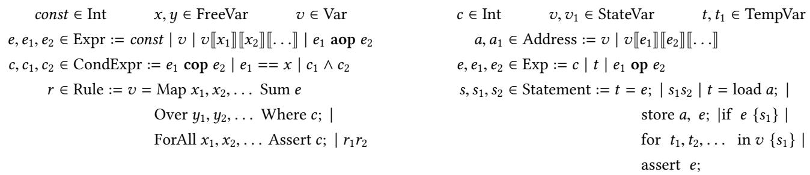
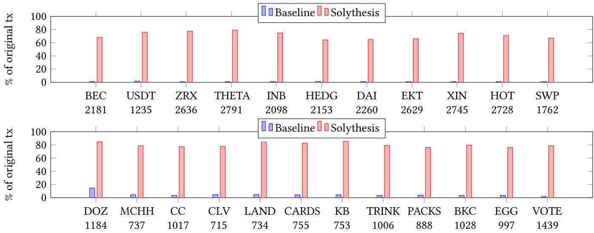

# Securing Smart Contract with Runtime Validation

Ao Li leo@cs.toronto.edu University of Toronto Canada

Jemin Andrew Choi choi@cs.toronto.edu University of Toronto Canada

Fan Long fanl@cs.toronto.edu University of Toronto Canada

## Abstract

We present Solythesis, a source to source Solidity compiler which takes a smart contract code and a user specified invariant as the input and produces an instrumented contract that rejects all transactions that violate the invariant. The design of Solythesis is driven by our observation that the consensus protocol and the storage layer are the primary and the secondary performance bottlenecks of Ethereum, respectively. Solythesis operates with our novel delta update and delta check techniques to minimize the overhead caused by the instrumented storage access statements. Our experimental results validate our hypothesis that the overhead of runtime validation, which is often too expensive for other domains, is in fact negligible for smart contracts. The CPU overhead of Solythesis is only 0.1% on average for our 23 benchmark contracts.

CCS Concepts: · Software and its engineering → Runtime environments; · Security and privacy → Domainspecific security and privacy architectures.

Keywords: runtime validation, smart contract, compiler

ACM Reference Format:

Ao Li, Jemin Andrew Choi, and Fan Long. 2020. Securing Smart Contract with Runtime Validation. In Proceedings ofthe 41st ACM SIGPLAN International Conference on Programming Language Design and Implementation (PLDI ’20), June 15ś20, 2020, London, UK. ACM, New York, NY, USA, 16 pages. htps://doi.org/10.1145/3385412. 3385982

## 1 Introduction

The capability of deploying smart contracts is one of the most important features of many blockchain systems [65]. A smart contract is a program that encodes a set of transaction rules. Once deployed to a blockchain, its encoded rules are enforced by all participants of the blockchain network, and therefore it eliminates counterparty risks in sophisticated transactions. People have applied smart contracts to a wide range of domains such as finance, supply chain management, and insurance.

Unfortunately, like other programs, smart contracts may contain errors. Errors inside smart contracts are particularly severe because 1) it is often impossible to change a smart contract once deployed; 2) smart contracts often store and manage critical information such as digital assets and identities; 3) errors are treated as intended behavior of the smart contract and faithfully executed by blockchain systems. As a result, errors inside smart contracts often lead to significant financial losses in the real world [21, 27].

To make smart contracts secure and correct, one approach is to build static analysis tools. But such static analysis tools are often inaccurate and generate a large number of false positives and/or false negatives [45, 61]. Another approach is to formally verify the consistency between the implementation and specification of a smart contract [20, 32, 46, 53]. But automated verification tools relying on theorem provers typically have narrow scopes and/or may fail to explore the verification search space, while mechanical verification techniques require human intervention and are often too expensive to apply in practice.

## 1.1 Runtime Validation with Solythesis

In this paper, we argue that runtime validation is an efective and eficient approach to secure smart contracts. With access to runtime information, runtime validation techniques can be fully automated and can typically achieve much higher coverage than static analysis techniques. The downside of runtime validation, for traditional programs, is its excessive performance overhead. However, our observation is that the Proof-of-Work consensus is the primary performance bottleneck of existing blockchain systems. For example, the consensus protocol of Ethereum can only process up to 38 transactions per second<sup>1</sup>, while the execution engine of Parity [10], a popular eficient Ethereum implementation, can process more than 700 transactions on an ordinary laptop with an SSD. Therefore, we hypothesize that the overhead ofruntime validation, which is often too expensive for other domains, is in fact negligible for smart contracts.

To validate our hypothesis, we design and implement Solythesis, a novel runtime validation tool for Ethereum smart contracts. Unlike static analysis and formal verification techniques that attempt to detect errors in smart contracts ofline, Solythesis works as a source to source Solidity com piler and detects errors at runtime. Solythesis provides an expressive language that includes quantifiers to allow users to specify critical safety invariants of smart contracts. Taking a potentially insecure smart contract and the specified invariants as inputs, Solythesis instruments the Solidity code of the smart contract with runtime checks to enforce the invariants. The instrumented contract is guaranteed to nullify all transactions that cause the contract to violate the specified invariants.

The design of Solythesis is driven by our observation that the storage layer is the secondary performance bottleneck of Ethereum after the consensus layer. Our program counter profiling results show that the execution engine of Parity spent over 67% of the running time on components that are relevant to blockchain state load and store operations. Such load and store operations are expensive because 1) it may be amplified to multiple slow disk I/O operations, 2) it is translated by the Solidity compiler into multiple instructions (up to 11 EVM instructions), and 3) the Solidity compiler uses expensive cryptographic hash functions to compute the address of accessed state objects. We therefore design the instrumentation algorithm of Solythesis to minimize the number ofblockchain state accesses.

One challenge Solythesis faces is how to eficiently enforce invariants for ledger-like data structures in smart contracts. Many contracts store critical data into ledger-like structures that map Ethereum addresses to balance-like val ues. A meaningful invariant for such a ledger will typically include quantifiers to specify constraints for all values in the ledger (e.g., the sum of all balances in a token contract ledger should equal to the total supply of the token). One naive approach to enforce the invariant is to instrument the runtime checks at the end of each transaction, but the runtime checks may have to use loops to access many blockchain state values, which will be extremely expensive.

To address this challenge, Solythesis instead uses a novel combination of delta update and delta check techniques. It statically analyzes the source code of each contract function to conservatively determine the set of state values that could be modified and the set ofsub-constraints that could be violated during a transaction. It then instruments the instruc tions to maintain these potentially changed values and to only check these potentially violated constraints. Our results show that these techniques enable Solythesis to generate secure contracts with negligible overhead on Ethereum. Even if Ethereum or future blockchain systems adopt fast consensus protocols [16, 30, 38, 43, 47, 54, 66], the instrumented contracts will still have an acceptable overhead.

## 1.2 Experimental Results

We evaluate Solythesis with 23 smart contracts from ERC20 [5], ERC721 [7], and ERC1202 [6] standards. ERC20 and ERC721 are two Ethereum smart contract standards for fungible and non-fungible tokens. ERC1202 is a draft standard for a voting system which is the key process to many blockchain applications. For each standard, we first compose an invariant and then apply Solythesis to instrument the smart contracts. Our experimental results show that Solythesis prevents all vulnerable contracts from violating the defined invariants. The results also validate our hypothesis Ð the instrumentation overhead is negligible with only 0.1% CPU usage overhead and 3.2KB/s disk write overhead on average. We believe our results encourage future explorations on new languages, new analyses, and new virtual machine designs that can further exploit rigorous runtime validation to secure smart contracts (see Section 7).

Our results also highlight the efectiveness of our instrumentation algorithm. Even if we turn of the consensus layer to simulate the case where the consensus protocol is no longer the performance bottleneck, the Solythesis instrumentation only causes 24% overhead in transaction through put on average. In comparison, if we use the naive approach that inserts runtime checks at the end ofeach transaction, the transaction throughput would be two orders of magnitude smaller. The naive approach can significantly slow down the transaction execution engine, overtaking the consensus layer to become the new performance bottleneck.

## 1.3 Contributions

This paper makes the following contributions:

• Solythesis: This paper presents Solythesis, the first source to source runtime validation tool that can enforce global invariants with quantifiers on smart contracts with low overhead.

• Runtime Validation for Smart Contracts: This paper presents the first systematic evaluation to show that runtime validation for smart contracts can have negligible overhead. Our results demonstrate that runtime validation is an efective and eficient approach to secure smart contracts.

• Instrumentation Optimizations: This paper presents novel delta update and delta check techniques to optimize runtime instrumentation for smart contracts. Our results show that these optimization techniques can improve the transaction processing throughput of the instrumented contracts by two orders of magnitude.

The remaining paper is organized as follows. Section 2 presents our observations on the blockchain system performance bottlenecks and discusses how it would influence the way we secure smart contracts. Section 3 presents a motivating example of Solythesis. Section 4 and Section 5 present the design and the implementation of Solythesis, respectively. We evaluate Solythesis in Section 6. Section 7 discusses future directions. In Section 8 we discuss related work. We finally conclude in Section 9.

<table><tr><td></td><td>ERC20</td><td>ERC721</td><td>ERC1202</td></tr><tr><td>Native</td><td>34</td><td>11</td><td>9</td></tr><tr><td>NoConsensus</td><td>2181</td><td>1184</td><td>1439</td></tr><tr><td>NoConsensus+Empty</td><td>3647</td><td>1869</td><td>2460</td></tr></table>

Figure 1. Number of transactions can be processed by Parity client with diferent configurations.

## 2 Observation

We next present our observations on Ethereum blockchain performance. Ethereum uses a modified version of Nakamoto consensus as its consensus protocol [50, 60, 65]. It stores transactions in a chain of blocks. Participants solve proof-ofwork (PoW) problems to generate new blocks to extend the chain.

Consensus Bottleneck: The chain structure of Nakamoto consensus limits the performance of Ethereum Ð it generates a new block every 13 seconds and the sizes of the blocks are limited by its gas mechanism, which measures the size and the complexity of a transaction [65]. When we ran our experiments, each Ethereum block had a gas limit of 8,000,000 [9]. A simple transaction that only transfers Ether consumes 21,000 gas, and the gas consumption for transactions calling smart contract functions is higher.

To understand the impact of the consensus layer on the overall performance of Ethereum, we run experiments with representative transaction traces for the following contracts: the BEC contract [2], an ERC-20 smart contract for managing fungible BEC tokens, the DozDoll contract [4], an ERC-721 smart contract for managing non-fungible DOZ tokens, and an example contract in the ERC-1202 contract standard [6], which is designed for hosting voting on Ethereum. We use Parity, the most eficient Ethereum client that is publicly available, to start a private Ethereum network to process these transactions. All experiments were performed on an AWS EC2 m5.xlarge virtual machine, which has 4 cores and 16GB RAM.

Figure 1 presents the number of transactions that can be processed per second for each contract. Note that we run our experiments with three diferent configurations: 1) we use the Ethereum state at the block height 5,052,259 as the initial state and run PoW consensus to pack and process transactions (corresponding to the group łNativež in Fig ure 1); 2) we remove the PoW consensus limit so that Parity can process as many transactions as its transaction execution engine allows (corresponding to the group łNoConsensusž in Figure 1); 3) we remove the PoW limit and start Parity with an empty genesis state instead (corresponding to the group łNoConsensus+Emptyž in Figure 1).

<table><tr><td></td><td>Storage</td><td>Verifier</td><td>EVM</td><td>Other</td></tr><tr><td>ERC20</td><td>67.0%</td><td>25.9%</td><td>3.9%</td><td>3.2%</td></tr><tr><td>ERC721</td><td>73.5%</td><td>18.3%</td><td>5.7%</td><td>2.5%</td></tr><tr><td>ERC1202</td><td>73.1%</td><td>20.5%</td><td>3.6%</td><td>2.8%</td></tr></table>

Figure 2. The performance counter results for diferent components of Parity client.

The results in Figure 1 show that Parity only processes 9 to 34 transactions per second for the ERC-20, ERC-721, and ERC-1202 contracts. If the consensus protocol is disabled, Parity processes 1184 to 2181 transactions per second for the same set of contracts. We therefore have the following observation and hypothesis:

Observation 1: The consensus protocol is the primary performance bottleneck of Ethereum clients. Hypothesis: The overhead of runtime validation can be negligible for smart contracts, because the transaction execution engine is not the primary bottleneck.

Storage Bottleneck: The results in Figure 1 show that Parity would run much faster with an empty initial state than with an initial state corresponding to the real Ethereum network at block 5,052,259. This is because all Ethereum clients, including Parity, store the blockchain state as a Merkle Patricia Tree (MPT) [65] on the disk. Each update on the blockchain state will be amplified to multiple disk I/O operations depending on the height of the MPT. When Parity starts with an empty state, the MPT is simpler. Therefore, there will be fewer I/O operations than starting with a complicated state.

To better understand the performance impact of the blockchain state updates (i.e., load/store EVM instructions), we profile Parity in our experimental runs to collect the performance counters of diferent components in Parity. Figure 2 presents the profiling results. It classifies the performance counters into four categories: 1) the modules for the blockchain state updates, including the RocksDB storage layer and the functions in the EVM interpreter for the load/store Solidity statements; 2) the modules for verifying signatures in transactions; 3) the modules for other EVM instructions except for loads/stores; 4) all remaining modules.

Our results show that the blockchain state updates account for more than 67% of the performance counters for all experimental runs of Parity when we turn of the consensus layer. The load and store operations to the blockchain state are particularly expensive because 1) these operations could trigger one or more disk I/O operations, 2) the Solidity compiler often generates expensive SHA3 EVM instructions to compute the address operands of these operations [42, 53], and 3) the Solidity compiler often translates one state load/store statement into multiple EVM instructions (up to eleven). We therefore have the following observation and the implied design decision:

```solidity
contract ERC1202Example {
    mapping(uint => uint[]) options;
    mapping(uint => bool) internal isOpen;
    mapping(uint => mapping(address => uint256)) public
    weights;
    mapping(uint => mapping(uint => uint256)) public
    weightedVoteCounts;
    mapping(uint => mapping(address => uint)) public
    ballots;
    function createIssue(...) public { ... }
    function winningOption(...) public returns (uint
    option) { ... }
    function vote(uint issueId, uint option) public
    returns (bool success) {
        require(isOpen[issueId]);
        uint256 weight = weights[issueId][msg.sender];
        // weightedVoteCounts[issueId]
        [ballots[issueId][msg.sender]] -= weight;
        weightedVoteCounts[issueId][option] += weight;
        // assert(weightedVoteCounts[issueId][option] >=
        weight);
        ballots[issueId][msg.sender] = option;
        emit OnVote(issueId, msg.sender, option);
        return true;
    }
}
```  
Figure 3. Simplified source code from a voting contract.

```txt
Observation 2: The state storage layer is the secondary performance bottleneck of Ethereum clients.
Design Decision: Runtime validation tools should minimize the number of instrumented load/store statements that access blockchain state.
```

## 3 Example

We next present a motivating example to illustrate the design of Solythesis. Figure 3 shows a simplified source code from the draft of ERC1202 [6], which is a technical standard draft that defines a set of function interfaces to implement a voting system. A voting system allows a user to vote on diferent issues and returns the winning option. This example is used for illustration purposes in the ERC1202 draft, but it contains a logic error.

In Figure 3, the vote() function (lines 9-18) updates the vote of a transaction initiator given an option and an issue. The contract implements vote() and other functions with five state variables. options (line 2) stores the available op tions of each issue; isOpen (line 3) stores the current status of the issue; weights (line 4) stores the weight of each voter on each issue; weightedVoteCount (line 5) stores the total weighted count of each option on each issue; ballots (line 6) stores the vote of each voter on each issue.

```javascript
s = Map (a, c) Sum weights[a][b] Over (b) Where
    ballots[a][b] == c;
ForAll (x, y) Assert y == 0 || s[x][y] ==
    weightedVoteCounts[x][y];
```

## Figure 4. Invariant for ERC1202.

In the implementation of the vote() function, it first fetches the weight of the transaction initiator and updates the weighted votes of the given option and issue (lines 11 and 13 in Figure 3). However, the implementation contains two errors: 1) the original implementation fails to consider the case where the transaction initiator votes multiple times on the same issue; 2) an attacker may trigger an overflow error at line 13 to illegally modify the weighted vote count. Note the original implementation misses line 12 and line 14 which are necessary to fix these errors. We next apply Solythesis to the contract and describe how Solythesis instruments the contract to nullify these errors.

Specify Invariant: Note that both of these errors cause the contract to potentially violate the ERC-1202 invariant where the total weighted count of an option on an issue should equal to the sum of all weights of voters who voted for the option. To apply Solythesis, we first specify this invariant shown as Figure 4. The first line in Figure 4 defines an intermediate map s that corresponds to the sum of all weights of the voters that voted for issue and option pairs. The free variable a iterates over issues; b iterates over voters; c iterates over options of an issue. For each map entry s[a][c], it iterates over all voters to sum the weights of those voters who voted for the option c on the issue a. The second line defines a constraint with the ForAll quantifier to specify that for all pairs of issues and options, the intermediate map s should equal to the calculated weightedVoteCount in the state. Note that in ERC-1202, zero is a special option id to denote that a voter did not vote yet. Therefore our invariant excludes the option id zero.

Figure 4 highlights the expressiveness of the invariant language in Solythesis. A user can refer to any state variable in the contract (e.g., weights, ballot, and weighted-VoteCount in Figure 4), define intermediate values including maps, and specify constraints on state variables and defined intermediate values. Solythesis supports sophisticated operations such as a conditional sum over values inside maps (e.g., line 1 in Figure 4) and a ForAll quantifier to define a group of constraints for multiple state values at once (e.g., line 2 in Figure 4).

Instrument the Contract: One naive approach to enforce the invariant in Figure 4 is to instrument a brute force check at the end of every transaction. This would cause prohibitive overhead because of the iterative sum operation and the quantifier constraint. It would cost two or even three nested loops to check the invariant for every transaction.

```solidity
contract ERC1202Example {
 mapping (uint => mapping(uint => uint)) s;
 uint256[] x_arr;
 uint256[] y_arr;
 ...
 function vote (uint issueId, uint option) public
  --> returns (bool success) {
    require(isOpen[issueId]);
    uint256 weight = weights[issueId][msg.sender];

    x_arr.push(issueId);
    y_arr.push(option);
    weightedVoteCounts[issueId][option] += weight;

    x_arr.push(issueId);
    y_arr.push(ballots[issueId][msg.sender]);
    assert(s[issueId] [ballots[issueId][msg.sender]] >= weights[issueId][msg.sender]);
    s[issueId] [ballots[issueId][msg.sender]] -= weights[issueId][msg.sender];
    ballots[issueId][msg.sender] = option;
    x_arr.push(issueId);
    y_arr.push(ballots[issueId][msg.sender]);
    s[issueId] [ballots[issueId][msg.sender]] += weights[issueId][msg.sender];
    assert(s[issueId] [ballots[issueId][msg.sender]] >= weights[issueId][msg.sender]);

    emit OnVote(issueId, msg.sender, option);
    for (uint256 index = 0; index < x_arr.length; index += 1)
        assert(y_arr[index] == 0 || s[
            x_arr[index]][y_arr[index]] ==
            weightedVoteCounts[x_arr[index]]
            [y_arr[index]]);
        x_arr.length = 0;
        y_arr.length = 0;
        return true;
    }
  ...
}
```  
Figure 5. Instrumented voting contract.

Solythesis instead instruments code to perform delta updates and delta checks to reduce the overhead. The intuition is to maintain intermediate values such as s incrementally and to instrument updates and checks only when necessary. Figure 5 presents the instrumented contract code generated by Solythesis for our example.

Instrument Delta Updates: For every intermediate value such as s in Figure 4, Solythesis instruments the contract to add it as a state variable. Then for every write operation to an original state variable in the contract (e.g., line 18 in Figure 5), Solythesis performs static analysis to determine whether modifying the original variable may cause the intermediate value to change. Ifso, Solythesis instruments code to update the intermediate value conditionally (e.g., lines 17 and 21 in Figure 5).

Compute Free Variable Bindings: For every state write operation in the contract, Solythesis computes free variable bindings against each rule in the invariant. For example, for the write operation to ballots at line 18 in Figure 5, Solythesis determines that the operation may change the intermediate value defined in the first line of the invariant. Solythesis also binds the free variable a in the invariant to issueId, binds b to msg.sender, and binds c to ballot[issueId][msg.sender]. These bindings indicate that the write to ballot[issueId][msg.sender] may only change the intermediate value s[issueId][ballot[issueId][msg.sender]]. Therefore Solythesis instruments code at lines 17 and 21 to only update this value.

Instrument Delta Check: For every state write operation, Solythesis also checks it against Assert constraints in the invariant. For example, for the write operation to ballots at line 18 in Figure 5, Solythesis first runs its binding analysis against the constraint at line 2 in Figure 4 which contains a ForAll quantifier. This analysis determines that the write operation may cause the contract to violate the constraint when x binds to issueId and y binds to ballot[issueId][msg.sender].

Solythesis defines additional arrays like x\_arr and y\_- arr to collect such free variable combinations that may lead to constraint violations lines 3 and 4 in Figure 5. Solythesis then instruments statements at lines 14-15 and 19-20 to appropriately maintain these arrays. Solythesis finally instruments a loop at the end of the transactions to only check these potentially violated constraints (lines 25-26). Note that Solythesis further optimizes the instrumentation to use global volatile memory to hold x\_arr and y\_arr to avoid blockchain state access (see Section 5.2). We omit this implementation detail in Figure 5 for brevity.

Nullify Errors: Solythesis generates the instrumented program as its output shown as Figure 5. This instrumented program will enforce the invariant faithfully during runtime and nullify any malicious transactions that cause the contract to violate the invariant. In our example, we deploy the instrumented contract to Ethereum and intentionally trigger the error by sending transactions to vote for an issue multiple times. The instrumented assertion at line 22 catches this error and aborts the ofending transactions. Therefore Solythesis successfully nullifies the error.

## 4 Design

We next formally present the design of Solythesis. In this section, we use the notation s[X/Y] to denote replacing every occurrence ofX in the statement s with Y. To avoid confusion, we will use łJKž instead of ł[]ž to denote the indexing of map variables. We also use the notation <sup>#»</sup>x to denote a list of variables x<sub>1</sub>, x<sub>2</sub>, . . ..

  
Figure 6. The invariant specification language.  
Figure 7. The core language for smart contracts.

## 4.1 Invariant and Contract Languages

Invariant Language: Figure 6 presents the syntax of our invariant specification language with integers, variables, arithmetic expressions, conditional expressions, intermediate value declarations, and constraints. There are three types of variables: state variables, intermediate variables, and free variables. State variables are variables declared in smart contracts and stored in persistent storage. Intermedi ate variables correspond to the intermediate values defined in the invariant rules of the form $^ { \ast } v = \mathrm { M a p } . . . ^ { \mathfrak { w } } .$ . Note that in our language we do not distinguish these two kinds of variables, because Solythesis instruments code to declare intermediate variables as state variables. Free variables are only used together with quantifiers in Map and ForAll rules. They act as indexes for a defined intermediate map, as iterators for a sum operation, or as quantifier variables to define a group of constraints at once.

Expressions are built out ofvariables and integer constants. aopž represents an arbitrary binary arithmetic operator; copž represents an arbitrary integer comparison operator. There are three possible types for expressions, integers for scalar values, maps that have integer keys, and booleans for conditional expressions. All variables and expressions should be well-typed. eJxK denotes accessing the map e at the index x, where e must be an expression with a map type and $x$ must be a free variable with the integer type. It is possible to have multi-dimensional maps. In the rest of this section, the notation eJ x K is an abbreviation of $e [ [ x _ { 1 } ] ] [ x _ { 2 } ] [ [ \dots ] ]$ for accessing such multi-dimensional maps.

The language has two kinds of rules: intermediate value declaration rules and constraint declaration rules. An intermediate value declaration can define a map value indexing over a list of free variables and can conditionally and iteratively sum over state variable values to compute each map entry. For a rule of the form $\mathbf { \omega } ^ { \ast } \boldsymbol { v } _ { } = \mathrm { M a p } \mathbf { \omega } \overrightarrow { x } _ { }$ Sum e Over $\vec { y }$ Where $c ^ { * } ,$ each entry of the intermediate map v is defined as follows:

$$
\forall \vec {x} v [   [ \vec {x} ]   ] = \sum_ {\vec {y}} \left\{ \begin{array}{l l} e (\vec {x}, \vec {y}) & \text {if} c (\vec {x}, \vec {y}) \text {is True} \\ 0 & \text {otherwise} \end{array} \right.
$$

A constraint declaration rule of the form łForAll <sup>#»</sup>x Assert $c ^ { \mathfrak { n } }$ checks all possible assignments of $\vec { x }$ to ensure that $c ( \vec { x } )$ is always satisfied. Note that free variable lists after Map and ForAll can be empty. Therefore, users can use these rules to define scalar values and simple constraints as well. Also note that free variables in invariants iterate over all defined keys in maps where those variables are used as indexes. For example, in łForAll $\vec { x }$ Assert $m [ [ { \boldsymbol { x } } ] ] > 0 ^ { \mathfrak { s } } ;$ , x should iterate over values that correspond to defined keys in m.

Smart Contract Language: Figure 7 presents the core language of smart contracts that we use to illustrate Solythesis. $\ " \mathbf { o p } \ "$ denotes an arbitrary binary operator. We do not distinguish normal expressions and conditional expressions in our contract language. There are two kinds of variables: state variables that may be referred in the invariant and temporary scalar variables that are local to the contract program.

łloadž and łstorež are statements for accessing blockchain state variables. Similar to Solidity, state variables can be either scalar values or maps. łfor $t _ { 1 } , t _ { 2 } , \ldots$ in $\boldsymbol { v } \left\{ s _ { 1 } \right\} ^ { \flat }$ would iterate over all possible assignment combinations oft<sub>1</sub>, $t _ { 2 } , . . . .$ based on how $t _ { 1 } , t _ { 2 } , . . .$ . are used as indexing variables for the map v in $s _ { 1 }$ . If any of these variables are not used as indexing variables for $v ,$ this statement is undefined. Loop statements in our language capture the most common usage of loops in Solidity contracts, and its syntax simplifies the presentation of our instrumentation algorithm. Note that in Solidity, every state variable has to be declared before its use. We omit the declaration syntax for brevity.

## 4.2 Instrumentation Algorithm

Figure 8 presents the Solythesis instrumentation algorithm. Given a program P as a list of contract statements and an invariant R as a list of rules, the algorithm produces an instrumented program $P ^ { \prime }$ that enforces the invariant dynamically. The algorithm has two parts. Lines 2-12 handle the intermediate value declarations in $R ,$ while lines 13-24 handle the quantifier constraint rules in R.

For every defined intermediate value v, the algorithm instruments a fresh state variable declaration for the value (line 4). The algorithm then inspects every store statement s in P and instruments the contract to maintain v (lines 5- 12). The algorithm first computes possible bindings of free variables in the definition ofv (lines 6-7). A binding is a set of pairs of free variables in the definition and expressions in the contract. The binding corresponds to possible entries of v (if v is a map) that s may influence via state variable write operations. The algorithm prepares statement templates for updating v (lines 8 and 10), rewrites free variables in these templates based on the computed bindings (lines 9 and 11), and then instruments the rewritten statements into $P ^ { \prime }$ (line 12). The update strategy is to first subtract the old expression value (e.g., pre in lines 8-9) before the execution of s, and then add the new expression value (e.g., post in lines 10-11) after the execution of s. See Section 4.3 for our binding and rewrite algorithms.

<div class="mineru-algorithm" style="white-space: pre-wrap; font-family:monospace;">
Input : Program $P$ as a list of statements and a list of invariant rules $R$
Output: The instrumented program as a list of statements
$P' \leftarrow P$
for $r \in R$ do
    if $r = "v = Map \vec{x} Sum e Over \vec{y} Where c;"$
        then
            Assume $v$ is fresh. Declare $v$ in $P'$.
            for $s = "store a, _; " \in P$ do
                $\mathcal{B} \leftarrow \text{BindExpr}(a, e) \cup \text{BindExpr}(a, c)$ $b \leftarrow \text{BindCond}(a, c)$ $pre \leftarrow "if c \{ t = load v[[\vec{x}]]; \\t' = t - e; store v[[\vec{x}]], t'; \}"$ $pre \leftarrow \text{Rewrite}(pre, \mathcal{B}, b)$ $post \leftarrow "if c \{ t = load v[[\vec{x}]]; \\t' = t + e; store v[[\vec{x}]], t'; \}"$ $post \leftarrow \text{Rewrite}(post, \mathcal{B}, b)$
                Insert $pre$ before $s$ and $post$ after $s$ into $P'$
    else if $r = "ForAll \vec{x} Assert c;"$ then
        Declare a fresh map $\alpha$ in $P'$ corresponding to $r$
        for $s = "store a, _" \in P$ do
            $\mathcal{B} \leftarrow \text{BindExpr}(a, c)$ $pre \leftarrow "α[[\vec{x}]] = 1"$ $pre \leftarrow \text{Rewrite}(pre, \mathcal{B}, \langle\bot, \bot\rangle)$
            Insert $pre$ before $s$ in $P'$ $P \leftarrow P'$
    for $r = "ForAll \vec{x} Assert c;" \in R$ do
        $\alpha \leftarrow$ The defined map that corresponds to $r$ $s' \leftarrow "for \vec{x} in \alpha \{ assert c; \}"$
        Insert $s' at the end of P'$
return $P'$
</div>

Figure 8. Instrumentation algorithm.

For every quantifier constraint rule r, the algorithm also instruments the declaration for a fresh state map variable α. Note that because of the ForAll quantifier, r may correspond to multiple constraint instances. To handle this, the algorithm inspects every store statement s in P and uses its binding algorithm to determine whether the execution of s may cause some previously satisfied constraint instance of r to be violated again. If so, the algorithm sets the corresponding entry in α (lines 16-19) to mark these instances. The algorithm finally instruments a for loop iterating over α at the end of the contract to check these potentially violated constraints (lines 21-24).

<div class="mineru-algorithm" style="white-space: pre-wrap; font-family:monospace;">
$\frac{\frac{const \in \text{Int}}{\text{BindExpr}(a, const) = \emptyset} \quad \frac{a = v}{\text{BindExpr}(a, v) = \{\emptyset\}}}{\frac{a = v' \quad v' \neq v}{\text{BindExpr}(a, v) = \emptyset} \quad \frac{a = v'[\ldots] \quad e = v[\ldots] \quad v' \neq v}{\text{BindExpr}(a, e) = \emptyset}}$ $\frac{\frac{a = v[x_1][\ldots][x_k] \quad e = v[e_1][\ldots][e_k]}{\text{BindExpr}(a, e) = \{\{\langle x_1, e_1 \rangle, \ldots, \langle x_k, e_k \rangle\}\}}}{\frac{e = e_1 \mathbf{aop} e_2}{\text{BindExpr}(a, e) = \text{BindExpr}(a, e_1) \cup \text{BindExpr}(a, e_2)}}$ $\frac{\frac{c = e_1 \mathbf{cop} e_2}{\text{BindExpr}(a, c) = \text{BindExpr}(a, e_1) \cup \text{BindExpr}(a, e_2)}}{\text{BindCond}(a, c) = \emptyset}$ $\frac{\frac{c = "e_1 == x" \quad e_1 \text{ contains } x}{\text{BindExpr}(a, c) = \text{BindExpr}(a, e_1) \quad \text{BindCond}(a, c) = \langle \bot, \bot\rangle}}{\frac{c = "e_1 == x" \quad e_1 \text{ does not contain } x}{\text{BindExpr}(a, c) = \text{BindExpr}(a, e_1) \quad \text{BindCond}(a, c) = \langle x, e_1\rangle}}$ $\frac{\frac{c = "c_1 \land c_2" \quad \text{BindCond}(a, c_1) \neq \langle \bot, \bot\rangle}{\text{BindExpr}(a, c) = \text{BindExpr}(a, c_1) \cup \text{BindExpr}(a, c_2)}}{\text{BindCond}(a, c) = \text{BindCond}(a, c_1)}$ $\frac{\frac{c = "c_1 \land c_2" \quad \text{BindCond}(a, c_1) = \langle \bot, \bot\rangle}{\text{BindExpr}(a, c) = \text{BindExpr}(a, c_1) \cup \text{BindExpr}(a, c_2)}}{\text{BindCond}(a, c) = \text{BindCond}(a, c_2)}$
</div>

Figure 9. Binding algorithm.

## 4.3 Binding and Rewrite Algorithms

Free Variable Binding: Figure 9 presents our binding algorithm. It defines two functions BindExpr() and BindCond() that are used in our instrumentation algorithm (see Figure 8). Given a modified address a in a contract store statement and an expression e in an invariant rule, BindExpr(a, e) returns a set of binding maps that maps free variables in e to indexing expressions in a. To compute BindExpr(a, e), Solythesis recursively traverses the structure of e and looks for the map indexing expressions that match the state variable in a. The fifth rule in Figure 9 creates a binding map for such matching index expressions for the matching free variables.

Note that because e is an expression from the invariant, it can have multiple instantiations with diferent free variable assignments. Intuitively, a binding map corresponds to possible free variable assignments for e that the state value at the address a may influence. Because one free variable may map to multiple indexing expressions in a binding map, in our notation we represent the binding map as a set of pairs of free variables and indexing expressions. For example, BindExpr $( a , e ) = \{ \{ \langle x _ { 1 } , e _ { 1 } \rangle , \langle x _ { 2 } , e _ { 2 } \rangle \} \}$ } means that state value changes at the address a may influence the evaluation of the instantiations of e in which we replace $x _ { 1 }$ with $e _ { 1 }$ and $x _ { 2 }$ with $e _ { 2 } .$ If BindExpr(a, e) returns a set that contains mul tiple binding maps, it means that the state value changes at a may influence instantiations that are represented by all of these maps.

Given a modified address a and a condition expression c in an invariant rule, BindCond(a, c) returns a tuple pair of a free variable and an expression. The instrumentation algorithm in Figure 8 uses BindCond() to handle intermediate value declaration rules only. The computation ofBindCond() scans for the condition of the form $e _ { 1 } \ = = \ x ,$ where x is a free variable. If an intermediate value declaration rule has such a condition, Solythesis can directly infer that the free variable x must equal to the expression $e _ { 1 }$ for all cases.

Free Variable Rewrite: Figure 10 presents the definition of Rewrite(). Given a statement template s that may contain free variables, a set of binding maps B extracted from expressions with BindExpr(), and a binding tuple b extracted from conditions with BindCond(), Rewrite(s, B, b) produces a new statement with all free variables being rewritten based on the provided bindings.

The Rewrite algorithm iterates over binding maps in B and generates one statement instantiation based on each binding map. For each free variable in s, it detects whether it has exactly one appearance in the binding map. If the free variable appears multiple times, i.e., the free variable maps to multiple indexing expressions, the algorithm instruments additional if statement guards to ensure that all of the matched indexing expressions have the same value (line 7). The algorithm then removes redundant tuples and only keeps one of these indexing expressions (line 8).

If the free variable does not appear in the binding map, the algorithm would conservatively wrap the statement with a for loop to handle this unbounded free variable and add a tu ple that maps the unbounded variable to the iterator variable of the loop (lines 10-13). Such a scenario is rare in practice because it often corresponds to awkward less-common constraints for smart contracts. At line 14, the binding map $B ^ { \prime }$ should map each free variable in s exactly to each expression. The algorithm then replaces these free variables with their corresponding expressions (lines 14-18).

<div class="mineru-algorithm" style="white-space: pre-wrap; font-family:monospace;">
Input : The original statement $s$, a set of binding maps $\mathcal{B}$ extracted from expressions, and a binding $b$ extracted from conditions.
Output: The rewritten statement respecting the bindings.
$s' \leftarrow \emptyset$
for $B \in \mathcal{B}$ do
    $s'' \leftarrow s$ $B' \leftarrow B \cup \{b\}$
    for $x \in \text{FreeVar}$, where $x$ appears in $s$ do
        if $x$ appears in $B'$ multiple times as $\langle x, e_1 \rangle, \ldots \langle x, e_k \rangle$ then
            $s'' \leftarrow$ "if $e_1 == e_2 \land \ldots \land e_1 == e_k \setminus \{s''\}"$ $B' \leftarrow B' - \{\langle x, e_2 \rangle, \ldots, \langle x, e_k \rangle\}$
        else if $x$ does not appear in $B'$ then
            Create a fresh variable $t$
            Find $v$ in $s$, where $x$ is used as its index
            $s'' \leftarrow$ "for $t$ in $v \setminus \{s''\}"$ $B' \leftarrow B' \cup \{\langle x, t \rangle\}$
        if $b = \langle x', e' \rangle \land x' \neq \bot$ then
            $s'' \leftarrow s''[x'/e']$ $B' \leftarrow B' - \{b\}$
    for $\langle x, e \rangle \in B'$ do
        $s'' \leftarrow s''[x/e]$ $s' \leftarrow s's''$
return $s'$
</div>

Figure 10. The definition of Rewrite().

## 5 Implementation

In our Solythesis implementation, we use Antlr [1] and the Solidity parser [12] to parse standard specifications and Solidity programs. Solythesis extends the language described in Section 4 to support all Solidity features including contract function calls.

## 5.1 Function Calls

Because state variables are often updated sequentially in a transaction and the invariant may be temporarily violated during the middle of the transaction, Solythesis should only check the constraints at the end of each transaction. For function calls, simply inserting those checks at the end of each function may cause those checks to be triggered multiple times during a transaction and result in false positives. To this end, Solythesis uses a global state variable $( \mathrm { i . e . , }$ , memory\_loc in Figure 11) to track whether the current function call is the execution entrance of a transaction. The instrumented constraint checks will only execute if it is so.

Solythesis uses Surya [13] to build the call graph of the smart contract. With the call graph information, Solythesis can obtain the set of functions that are reachable from an entry function. Solythesis then prunes away the instrumented checks in functions whose entrance status will never change (e.g., it is always an entrance function). Specially, smart contracts in Ethereum can call functions defined in other smart contracts. To guarantee correctness, Solythesis overestimates that the inter-contract calls will call back any function defined inside the contract when it builds the call graph.

```solidity
uint256 memory_loc;
function vote(...) {
    bool is_entry_function = false;
    uint[] memory x_arr;
    if (memory_loc == 0) {
        is_entry_function = true;
        assembly {
            let tmp := mload(0x40)
            mstore(0x40, add(tmp, 640))
            sstore(memory_loc_slot, tmp)
            mstore(add(tmp, 0), 19)
        }
    }
    assembly {
        x_arr := add(sload(memory_loc_slot), 0)
    }
    ...
    if (is_entry_function) {
        memory_loc = 0;
    }
}
```  
Figure 11. Inline assembly to initialize or load a global array.

## 5.2 Global Memory

Solythesis uses global memory arrays to store free vari able bindings for ForAll constraint rules (lines 10-11, 14-15, and 19-20 in Figure 5). It uses the global memory rather than the intra-procedure volatile memory or the blockchain state because 1) a transaction may contain multiple functions and the instrumented code of these functions all need to access these arrays and 2) accessing global memory is significantly cheaper than accessing the blockchain state.

Since the global memory array is not natively supported by Solidity, Solythesis uses inline EVM assembly to allocate the in-memory array as well as assigning the start location of the array to an array pointer. Figure 11 presents how Solythesis implements the instrumented array x\_arr in Figure 5 as a global array pointer. Solythesis uses the state variable memory\_loc to store the starting location of the Solythesis data section in the global memory. When it is zero (i.e., uninitialized default value), it indicates that the cur rent function call is the execution entrance of a transaction. Solythesis then allocates an array from the global memory and sets x\_arr to the start of the array (lines 6-12).

```matlab
uint opt_13 = ballots[issueId][msg.sender];
uint256 opt_14 = weights[issueId][msg.sender];
assert(sum_votes[issueId][opt_13] >= opt_14);
x_arr.push(issueId);
y_arr.push(opt_13);
sum_votes[issueId][opt_13] -= opt_14;
opt_13 = option;
x_arr.push(issueId);
y_arr.push(opt_13);
sum_votes[issueId][opt_13] += opt_14;
assert(sum_votes[issueId][opt_13] >= opt_14);
...
// Write back at the end of the function
ballots[issueId][msg.sender] = opt_13;
```  
Figure 12. Vote function with state variable caches.

Note that Solidity compiler has the following conventions: 1) it allocates global memory consecutively; 2) it uses the global memory location 0x40 to store the next available global memory location; 3) the first location of an array stores the length of the array. The code at lines 8-11 maintains these conventions. Once x\_arr is initialized, Solythesis uses mload and mstore instructions to load and store data from/to it. The initial size of every allocated array is 19 and Solythesis will expand the array if necessary.

## 5.3 State Variable Caches

As an optimization, Solythesis uses stack or volatile memory in Solidity to cache state variable values. Our second observation in Section 2 indicates that blockchain state load/store operations are very expensive, involving disk I/O, cryptographic computations, and multiple EVM instructions. On the other hand, loading/storing values from/to stack or memory only requires a single instruction.

Solythesis performs static analysis to determine whether the same blockchain state value is accessed multiple times in a function. For every such value, Solythesis creates a temporary variable to cache it. If multiple functions can access the state value, Solythesis will create the temporary variable in the global memory and will use the technique similar to Section 5.2 to enable all functions to access it. Otherwise, Solythesis creates the temporary variable in the stack. At the end of the function, Solythesis instruments code to write back cached values to the state variable. This enables the optimized code to only execute one state load operation and one state store operation for such a state value. Note that the optimized code is equivalent to the original code because in Ethereum, all transactions are executed sequentially, i.e., the blockchain state can only be read/written by a single transaction at one time.

Figure 12 presents the code after the state variable cache optimization of lines 14-21 from vote() in Figure 5. Solythesis creates two cache variables opt\_13 and opt\_- 14 for state variable ballots[issueId][msg.sender] and weights[issueId][msg.sender] (line 1-2). And the operations of those two state variables are replaced by cache variables. Note that not all state variables can be cached. For example, Solythesis does not cache the state variable sum\_votes[issueId][opt\_13] in line 6 because opt\_13 is updated in line 7 and the state variable in line 10 represents a diferent state variable. At the end of the function, Solythesis stores opt\_13 back to ballots[issueId][msg.sender]. It does not store opt\_14 back because opt\_14 is not updated.

## 6 Evaluation

We next evaluate Solythesis on three representative standards: ERC20 [5] for the fungible token standard, ERC721 [7] for the non-fungible token standard, and ERC1202 [6] for the voting standard. The goal of this evaluation is to measure the overhead introduced by runtime validation and to under stand the efectiveness of the Solythesis instrumentation optimizations. All experiments were performed on an AWS EC2 m5.xlarge virtual machine, which has 4 cores and 16GB RAM. We downloaded and modified Parity v2.6.0 [10] as the Ethereum client to run our experiments. The source code of Solythesis and all experiment contracts are available<sup>2</sup>.

## 6.1 Methodology

Benchmark Contracts: We have collected in total 23 smart contracts in ERC20, ERC721, and ERC1202 standards. We focus on these three standards because 1) they are widely adopted, 2) contracts in these standards contain known vul nerabilities, and/or 3) they have sophisticated invariants over map structures with quantifiers. Our benchmark set includes BecToken (an ERC20 contract) and DozerDoll (an ERC721 contract), two contracts that we successfully collect their history transactions from Ethereum. Our benchmark set also includes the ERC1202 example we described in Section 3. Besides the above three contracts, we crawled the top ten ERC-20 contracts and the top ten ERC-721 contracts ranked by Etherscan [8] and included these contracts into our benchmark set, because they correspond to most widely used contracts that represent digital assets with monetary values.

Note that BECToken implements a customized function, batchTransfer, which has an integer overflow error and violates the total supply invariant specified by ERC-20 standard. This error was exploited in 2018 and the market cap of BECToken was evaporated in days [21]. The ERC1202 exam ple has vulnerabilities that we described in Section 3. In our experiments, Solythesis successfully nullify errors in both of these two contracts. We validate that the instrumented contracts reject our crafted malicious transactions.

Standard Specifications: We specify invariants for ERC20, ERC721, and ERC1202 respectively using the language described in Section 4. ERC1202 is a smart contract standard for implementing a voting contract. The example in the ERC1202 standard draft unfortunately contains logic errors. See Section 3 for details.

```txt
sum_balance = Map () Sum balances[a] Over (a) Where true;
ForAll () Assert totalSupply == sum_balance;

Figure 13. Invariant for ERC20.

sum_tokenCount = Map () Sum _ownedTokensCount[a] Over
    ← (a) Where a != 0;
ForAll () Assert sum_tokenCount == _allTokens.length;
sum_ownersToken = Map (b) Sum 1 Over (a) Where
    ← _tokenOwner[a]==b && _tokenOwner[a] != 0;
ForAll (a) Assert _ownedTokensCount[a] ==
    ← sum_ownersToken[a];
```  
Figure 14. Invariant for ERC721.

ERC20: ERC20 is an important smart contract standard that defines the contract interface and specification for implementing fungible digital assets. Figure 13 shows the invariant for ERC20 standard. balances and totalSupply are two state variables in BECToken that store the balance of each address and the total supply of the token. The invariant specifies that the sum of account balances is equal to total supply.

ERC721: Similar to ERC20, ERC721 is a smart contract standard for implementing non-fungible digital assets. Figure 14 shows our invariant for the ERC721 standard. sum\_token-Count and sum\_ownersToken are two intermediate variables created by the invariant to track the state of the contract. sum\_tokenCount stores the number ofminted tokens, which is the number of tokens whose owner is not 0, and sum\_ownersToken stores the number of tokens owned by each address. The invariant specifies that sum\_tokenCount equals to the length of \_allTokens, and the number of tokens owned by each user equals to the values stored in \_ownedTokensCount. \_allTokens and \_ownedTokensCount are two state variables declared in ERC721 smart contracts.

Benchmark Trace Generation: We crawled the Ethereum blockchain and collected the real transaction history of Bec-Token and DozerDoll. We chose BecToken because its history contains attacks. We chose DozerDoll because it is an ERC721 token, and it has a long transaction history for our experiments. Note that the collected history transactions depend on the blockchain state (e.g., the token balance of accounts), so we cannot reproduce them directly. To address this issue, we first create a mapping that maps real-world addresses to local addresses that are managed by the Parity client. For each transaction, we replaced the addresses of the transaction sender and receiver, as well as addresses in transaction data.

For the remaining contracts, we developed a script to generate random transaction traces that exercise core functionalities of ERC20, ERC721, and ERC1202. For ERC20 and ERC721, the generated trace contains mainly transfer transactions. For ERC1202, the generated trace contains transac tions that call createIssue and vote functions repeatedly. Each createIssue transaction is accompanied by five vote transactions created by diferent voters respectively.

Contract Instrumentation: We apply Solythesis to instrument all of the 23 benchmark contracts. For comparison, we also instrument the contracts naively without delta update/checking techniques as the baseline, i.e., the instrumen tation iteratively checks invariants at the end of transactions. For each contract, we manually inspected the two instrumented contracts and validated that they are functionally equivalent.

Experiments with PoW Consensus: We apply Solythesis to instrument all of the 23 benchmark contracts. We then run Parity 2.6.0 to start a single node Ethereum network to measure the overhead of instrumented contracts. For BecTo ken and DozerToken, we use the collected Ethereum history trace. For the ERC1202 example contract and other contracts, we use the generated trace. To run a contract on a transaction trace, we initialize the network with the first 5,052,259 blocks downloaded from Ethereum main net. We then feed the transactions in the trace into the network.

In this experiment, we deploy the same smart contract to the blockchain multiple times and take the average results. To address the randomness of the PoW consensus process, we modified Parity client so that Parity generates new blocks at a fixed speed of 1 block per ten seconds, which is the generation speed upper bound Ethereum ever reaches with its dificulty adjustment mechanism. Note the gas usage for each transaction is set to the gas usage of executing the original smart contract, which allows Parity to pack the same number of transactions for both the instrumented and the original smart contract.

We first set the block gas limit to 8,000,000 and make Parity to pack as many transactions as possible for the native contract run. For the two instrumented runs, we make Parity to pack the exactly same set of transactions per block ignoring the gas limit. This is because we want to measure the runtime overhead and we want to avoid the artificial bottleneck of the gas limit. For each run, we monitor the CPU usage and disk IOs of the Parity client for 400 blocks (\~1.4 hours). Because the consensus is the performance bottleneck, there is no significant throughput diference between the original contracts and the instrumented contracts for the native con tract run and the Solythesis instrumentation. We therefore measure the resource consumption as the instrumentation overhead in this set of experiments. For the baseline instrumentation, the runtime overhead grows as the contract state grows with transactions. We also measure how many blocks after which the baseline instrumentation overhead causes Parity to slow down the block generation.

Experiments without PoW Consensus: We modified Parity to remove the proof of work consensus, but preserved all required computations and storage operations for the transaction execution. To evaluate the potential overhead of Solythesis when the consensus is no longer the performance bottleneck, we run the Solythesis instrumented contracts on the modified Parity client to measure the overhead. To evaluate the Solythesis instrumentation optimizations, we also run naively instrumented contracts for comparison. Specifically, we compare the transaction throughput of the original contracts and the instrumented contracts. Note that in these experiments, we initialize the Parity client with the first 5,052,259 blocks from the Ethereum main net.

## 6.2 Results with Consensus

Figure 15 shows the resources consumed by Parity for all benchmark contracts. For each experiment, we measure the performance of the Solythesis instrumented smart contract (S), the baseline smart contract (B), and the original smart contract (O) respectively. Rows 2-4 present the average CPU usage of Parity. Rows 5-7 present the average data written to the disk per second by Parity. For the original version and the Solythesis instrumented version of each contract, we run the Parity to pack 400 blocks of transactions in our experiments.

Our results show that for all contracts, the transaction execution consumes only a very small portion of the CPU and disk resources. We observe that the CPU usage of Parity is lower than 10% for 95% of the time and the average CPU usage of Parity is lower than 4% for the Solythesis instrumented and original benchmarks. The overhead introduced by Solythesis is negligible considering the current capacity of CPU and disk storage devices and the cost of solving proof-of-work. The results validate our previous observation again that the transaction execution is not the bottleneck of the Ethereum blockchain system. Thus, adding runtime validation will not downgrade the performance of Ethereum, but improves the security significantly.

On the other hand, our results show that the CPU and disk overhead introduced by the baseline instrumentation is significant. It increases over time as the contract state grows, because it often iterates over an entire ledger map to check the invariants. In our experiments, we observed that for some contracts the baseline may cause the transaction execution to overtake the consensus to become the new bottleneck, i.e., at a certain point it cannot process the packed transactions in each block even in 10 seconds (i.e., the block generation interval). Row 8 in Figure 15 presents the number of packed blocks for the baseline instrumentation of each contract before the transaction processing time of each block exceeds 10 seconds. For example, Parity cannot process one block within 10 seconds after 624 blocks for the USDT contract with the baseline instrumentation. Note that we do not observe such significant slowdowns in the Solythesis instrumented contracts and the native contracts.

<table><tr><td></td><td></td><td>BEC</td><td>USDT</td><td>ZRX</td><td>THETA</td><td>INB</td><td>HEDG</td><td>DAI</td><td>EKT</td><td>XIN</td><td>HOT</td><td>SWP</td></tr><tr><td rowspan="3">CPU (%)</td><td>S</td><td>1.27</td><td>3.35</td><td>3.49</td><td>3.14</td><td>3.08</td><td>3.40</td><td>3.33</td><td>3.33</td><td>3.43</td><td>3.33</td><td>3.45</td></tr><tr><td>B</td><td>4.15</td><td>23.2</td><td>19.6</td><td>19.5</td><td>19.2</td><td>18.8</td><td>23.3</td><td>19.8</td><td>18.6</td><td>19.2</td><td>19.4</td></tr><tr><td>O</td><td>1.19</td><td>3.40</td><td>3.33</td><td>2.92</td><td>2.90</td><td>3.40</td><td>3.27</td><td>3.32</td><td>3.28</td><td>3.86</td><td>3.27</td></tr><tr><td rowspan="3">Disk (KB/s)</td><td>S</td><td>43.7</td><td>96.6</td><td>95.5</td><td>95.5</td><td>95.9</td><td>96.2</td><td>95.6</td><td>95.8</td><td>95.3</td><td>95.7</td><td>96.5</td></tr><tr><td>B</td><td>78.0</td><td>149.1</td><td>148.1</td><td>147.4</td><td>149.4</td><td>148.4</td><td>147.7</td><td>147.6</td><td>148.8</td><td>148.5</td><td>150.0</td></tr><tr><td>O</td><td>44.1</td><td>95.9</td><td>95.3</td><td>95.3</td><td>95.7</td><td>96.0</td><td>95.4</td><td>95.3</td><td>95.1</td><td>95.3</td><td>95.9</td></tr><tr><td>Blocks</td><td>B</td><td>995</td><td>624</td><td>761</td><td>813</td><td>732</td><td>789</td><td>783</td><td>784</td><td>628</td><td>784</td><td>787</td></tr></table>

<table><tr><td></td><td></td><td>DOZ</td><td>MCHH</td><td>CC</td><td>CLV</td><td>LAND</td><td>CARDS</td><td>KB</td><td>TRINK</td><td>PACKS</td><td>BKC</td><td>EGG</td><td>VOTE</td></tr><tr><td rowspan="3">CPU (%)</td><td>S</td><td>1.26</td><td>2.39</td><td>1.98</td><td>2.32</td><td>2.16</td><td>2.00</td><td>2.27</td><td>1.99</td><td>1.98</td><td>1.89</td><td>1.96</td><td>2.18</td></tr><tr><td>B</td><td>2.20</td><td>8.01</td><td>7.68</td><td>7.98</td><td>7.96</td><td>7.97</td><td>8.20</td><td>7.55</td><td>8.17</td><td>7.96</td><td>7.53</td><td>6.77</td></tr><tr><td>O</td><td>1.29</td><td>2.01</td><td>2.16</td><td>2.25</td><td>2.09</td><td>2.30</td><td>2.25</td><td>2.14</td><td>1.82</td><td>1.82</td><td>1.69</td><td>2.19</td></tr><tr><td rowspan="3">Disk (KB/s)</td><td>S</td><td>57.5</td><td>80.00</td><td>81.40</td><td>81.03</td><td>81.60</td><td>80.50</td><td>81.80</td><td>80.66</td><td>88.76</td><td>82.35</td><td>82.87</td><td>40.0</td></tr><tr><td>B</td><td>67.4</td><td>126.5</td><td>126.4</td><td>124.2</td><td>121.3</td><td>125.1</td><td>123.1</td><td>121.0</td><td>127.4</td><td>124.9</td><td>121.4</td><td>44.6</td></tr><tr><td>O</td><td>53.8</td><td>68.73</td><td>73.64</td><td>68.68</td><td>72.01</td><td>71.87</td><td>70.80</td><td>72.56</td><td>77.57</td><td>71.15</td><td>68.27</td><td>35.3</td></tr><tr><td>Blocks</td><td>B</td><td>6536</td><td>359</td><td>359</td><td>359</td><td>359</td><td>359</td><td>359</td><td>359</td><td>359</td><td>359</td><td>322</td><td>240</td></tr></table>

Figure 15. Resource usage for Parity client. łSž corresponds to Solythesis results. łOž corresponds to original contract results. "B" corresponds to baseline results.

  
Figure 16. Overhead comparison with respect to the original contract for top ERC20, ERC721 and ERC1202 contracts.

## 6.3 Results without Consensus

To understand the overhead of the Solythesis instrumentation under fast consensus protocols, we run experiments on Parity when we turn of the consensus layer. We also compare the overhead of Solythesis with the baseline instrumentation algorithm (which naively performs iterative checks at the end of each transaction call) to evaluate the efectiveness of our optimizations.

Figure 16 presents our experimental results. The X axis corresponds to diferent smart contracts. The labels in the X axis include both the smart contract name and the TPS of the original contract. The Y axis corresponds to the transaction throughput in the number of transactions processed by Parity per second (TPS). The Y axis is normalized to the TPS of the original smart contracts. Red bars in Figure 16 correspond to the throughput results of Solythesis, while blue bars correspond to the results of the baseline algorithm.

Our results show that even in the extreme cases where the consensus is no longer the performance bottleneck, the instrumentation overhead of Solythesis would still be accept able. The average TPS slowdown caused by the Solythesis instrumentation in this set of experiments is 24%. Our results also highlight the importance of the delta update and delta check techniques in Solythesis. Without those optimizations, the naive instrumentation slows down the transaction throughput by two orders of magnitude. The Solythesis instrumentation is significantly faster because the delta update and delta check techniques enable the runtime check to only access a small fixed number of blockchain state entries per transaction. As the contract state grows, the instrumentation overhead of the baseline version grows linearly, while the overhead of Solythesis remains stable.

## 7 Discussion and Future Directions

Our experimental results demonstrate that runtime valida tion is much more afordable in smart contracts than in many other domains. Because ofthe performance bottlenecks at the consensus layer and the storage layer, lightweight runtime instrumentations can have small or even negligible overhead. Our results reveal several future research directions on how to improve the security of smart contracts and blockchain platforms.

New Languages with Runtime Validation: To secure smart contracts, people are designing new smart contract languages that can eliminate certain classes of errors at the compile time, at the cost of limiting language expressiveness [22, 26, 57]. Our results imply that making the dificult trade-of between the correctness and the expressiveness may not be necessary. One possible future direction is to de sign new languages that can better utilize rigorous runtime validation to enforce correctness and security instead.

Static Analysis and Verification: Developing static analysis and verification techniques to secure smart contracts is both an active research topic and an industrial trend [3, 11, 20, 32, 36, 39, 42, 45, 46, 48, 52, 61, 63]. Like similar tech niques in traditional programs, static analysis techniques often have inaccurate results, while verification techniques typically require human intervention. One possible future direction is to combine runtime validation with these static analysis and verification techniques. Because of the inexpensive cost, runtime validation can act as a backup technique to cover scenarios that static analysis techniques fail to fully analyze or that verification techniques cannot fully prove.

Runtime Validation in Blockchain VM: Solythesis implements runtime checks via Solidity source code instrumentation. It is possible to implement some of the runtime checks in the blockchain virtual machine to further reduce the overhead, but this would require a hard fork for existing blockchains like Ethereum to adopt the technique.

New Gas Mechanism: Each EVM instruction charges gas and the fee of an Ethereum smart contract transaction is determined by the total gas the transaction consumes. In our experiments, the average gas overhead of the instrumented contracts is 77.8%, which is significantly higher than the actual resource consumption overhead (which is negligible). One possible explanation is that the gas schedule in Ethereum does not correctly reflect the execution cost of each EVM instruction. The gas overhead would cause the users of the instrumented contracts to pay additional transaction fees. In the light of our results, we believe Ethereum and future blockchain systems should adopt a more flexible gas mechanism to facilitate runtime validation techniques.

## 8 Related Work

Runtime Validation for Smart Contracts: Contract-Larva [28] allows users to supply pre- and post-conditions for smart contract transactions and enforces them at runtime. Unlike Solythesis, it does not support quantifiers natively. Note that quantifiers are important because many contracts store critical data into ledgers that map each Ethereum address to balance-like values. Without quantifiers, it is not possible to write many meaningful global invariants (e.g., all evaluated invariants in our experiments) for such ledger data structures. Users may write looped pre/post-conditions instead to simulate such invariants in ContractLarva, but that would be equivalent to the naive approach in our paper and would cause very high overhead. The ContractLarva paper evaluates the system on one sample ERC-20 contract with no end-to-end runtime overhead result.

Sereum [55] is a new design and implementation of Ethereum virtual machine which tracks the storage operations of each transaction to prevent re-entrancy attacks. Modifying the EVM implementation to perform runtime checks may further reduce the overhead, but it would require a blockchain hard-fork. On the other hand, Solythesis inserts runtime checks at the Solidity level, which does not require any modification of the existing blockchain system.

SODA [24] is an EVM online detection platform in which users can develop monitor programs for deployed smart contracts. It acts as a plugin to the full node of Ethereum to fetch the states of smart contracts. The monitor programs then run on the fetched states to detect errors and anomalies. Unlike Solythesis which turns the ofending transactions into no-ops, SODA cannot mitigate the detected errors, i.e., the ofending transactions will be processed by Ethereum and the attacks will still succeed.

Static Analysis and Verification for Smart Contracts: There is a rich body of work on detecting vulnerable smart contracts with diferent techniques such as symbolic execution [36, 39, 42, 45, 48, 51ś53, 63], fuzzing [31, 34], domain-specific static analysis [61], and formal verification [20, 25, 32, 46]. Oyente [45] detects transaction-order dependency attacks, re-entrance attacks, and mishandled exception attacks using symbolic execution. Verx [53] uses delayed abstraction to detect and verify temporal safety properties automatically. He et al. present a new fuzzing technique that learns from symbolic execution traces to achieve both high coverage and high speed [31]. Securify presents a domain-specific formal verification technique that translates Solidity smart contract into Datalog and verifies security properties such as restricted storage writes and ether transfers [61].

Solythesis difers from these previous static analysis, fuzzing, and symbolic execution approaches in that it inserts runtime checks to enforce user-specified invariants. Unlike these approaches, Solythesis does not sufer from false positives and false negatives. Compared to most formal verification approaches, Solythesis is fully automated and does not require human intervention. Securify is an automated verification tool using SMT solvers, but it may not scale to complicated contracts due to the potential SMT expression explosion problem. Also, unlike Solythesis, it cannot support sophisticated constraints like quantifiers.

Runtime Validation in Other Domains: Runtime vali dation techniques have been used to enforce security constraints in other general-purpose languages [15, 17, 18, 35, 58]. Tracematches [15] and JavaMop [35] focus on the expressiveness of the specification language. QEA [17] and DITTO [58] allow users to write potentially complicated specifications while allowing for optimizations.

Runtime checks are also useful for detecting and mitigating memory errors in C/C++ applications [14, 19, 23, 33, 40, 49, 59]. Control-flow integrity is a runtime mechanism to prevent attackers from hijacking the control flow of a program [14, 29]. Simpson and Barua enforce both spatial and temporal memory safety of C programs without introducing high overhead by modelling temporal errors as spatial errors and removing redundant checks [59]. Similarly, Frama-C generates runtime memory monitors automatically to check E-ACSL specifications [40]. Chandola et al. describe that patterns in data that do not conform to expected behavior can help the system detect intrusions, frauds and faults [23]. Berger and Zorn, for example, implement a runtime system that executes multiple replicas of the same application simultaneously to detect memory errors [19]. RCV uses light weight binary instrumentations to enable applications to safely recover from null-dereference and divide-by-zero errors with negligible overhead [44]. Researchers have also used runtime checks to detect side-channel attacks [64] and isolate errors [62].

Comparing to other general-purpose languages, the uniqueness of the smart contract setting is that blockchain state access operations are significantly more expensive than other types of operations, and they dominate the EVM execution as shown in Section 2. This phenomenon drives the design of Solythesis. The delta update techniques in Solythe sis focuses on minimizing the usage of state access operations as much as possible, while the runtime validation techniques in other tools have a diferent design focus.

Blockchain Consensus: The consensus layer is the primary performance bottleneck for many existing blockchain systems including Ethereum. Developing fast consensus protocols for blockchain is an active research topic. Several new high-performance consensus protocols have been proposed and implemented [16, 30, 38, 43, 47, 54, 66]. Many of these new protocols can support hundreds to thousands of transactions per second. Our experimental results show that Solythesis will have low overhead when applying on future blockchain systems built on these fast consensus protocols. New Language Design: Many new programming languages have been recently proposed to improve smart contract security. Scilla [57] is a low-level smart contract language with a refined type system that is easy to verify. Move [22] introduces resource types and uses linear logic to enforced access control policies for digital assets. Obsidian [26] uses typestate and linear type to enforce static checks. The trend of these new languages is to sacrifice expressiveness (e.g., no longer Turing-complete) to gain correctness or security guarantees. Interestingly, our results reveal an alternative path Ð one possible future direction is to design new languages that can better utilize rigorous runtime validation to enforce correctness and security.

K-framework is a rewrite-based semantic framework that allows developers to specify semantics of a programming language formally [56], which could be used to design and implement such new languages that facilitate runtime validation. KEVM [32] defines the semantic of EVM in K and verifies the smart contract against user-defined specifications. IELE [37] presents a smart contract virtual machine with a formal specification described in K which achieves similar performance as the EVM and provides verifiability.

## 9 Conclusion

Runtime validation is an efective and eficient approach to secure smart contracts. With the delta update and delta check techniques, Solythesis can eficiently enforce powerful invariants with quantifiers for the state of a smart contract. The experimental results of Solythesis validate our hypothesis that because the transaction execution is not the performance bottleneck in Ethereum, the overhead of runtime validation, which is often too expensive for other domains, is in fact negligible for smart contracts. In the light of our results, we believe that new languages, new analyses, and new virtual machine designs that can further exploit rigorous runtime validation are promising future directions to secure smart contracts.

## Acknowledgments

We thank Ming Wu and the anonymous reviewers for their insightful comments on the early draft of this paper. This research was supported by Connaught Fund #507141 and Tri-Council Bridge Funding from University of Toronto. Note that an early version of this paper appears in arXiv [41].

## References

[1] [n. d.]. ANTLR: ANother Tool for Language Recognition. htps: //www.antlr.org/.

[2] [n. d.]. Beauty Chain: The world’s first blockchain platform dedicated to the beauty ecosystem. htp://www.beauty.io/.

[3] [n. d.]. Certik: World’s most advanced formal verification technology for smart contracts. htps://www.certik.org/.

[4] [n. d.]. CryptoDozer. htps://cryptodozer.io/.

[5] [n. d.]. EIP 1202: Token Standard. htps://eips.ethereum.org/EIPS/eip-20.

[6] [n. d.]. EIP 1202: Voting Standard. htps://eips.ethereum.org/EIPS/eip-1202.

[7] [n. d.]. EIP 721: Non-Fungible Token Standard. htps://eips.ethereum. org/EIPS/eip-721.

[8] [n. d.]. Ethereum (ETH) Blockchain Explorer. htps://etherscan.io/.

[9] [n. d.]. Ethereum Gas Limit History. htps://etherscan.io/chart/ gaslimit.

[10] [n. d.]. Parity: The fastest and most advanced Ethereum client. htps: //www.parity.io/ethereum/.

[11] [n. d.]. Quantstamp: Leaders in blockchain security and solutions. htps://quantstamp.com/.

[12] [n. d.]. solidity-parser-antlr. htps://github.com/federicobond/solidityparser-antlr.

[13] [n. d.]. Surya, The Sun God: A Solidity Inspector. htps://github.com/ ConsenSys/surya.

[14] Martin Abadi, Mihai Budiu, Ulfar Erlingsson, and Jay Ligatti. 2005. Control-flow Integrity. In Proceedings of the 12th ACM Conference on Computer and Communications Security (CCS ’05). ACM, New York, NY, USA, 340ś353. htps://doi.org/10.1145/1102120.1102165

[15] Chris Allan, Pavel Avgustinov, Aske Simon Christensen, Laurie Hen dren, Sascha Kuzins, Ondřej Lhoták, Oege de Moor, Damien Sereni, Ganesh Sittampalam, and Julian Tibble. 2005. Adding Trace Match ing with Free Variables to AspectJ. SIGPLAN Not. 40, 10 (Oct. 2005), 345ś364. htps://doi.org/10.1145/1103845.1094839

[16] Vivek Kumar Bagaria, Sreeram Kannan, David Tse, Giulia C. Fanti, and Pramod Viswanath. 2018. Deconstructing the Blockchain to Approach Physical Limits. CoRR abs/1810.08092 (2018). arXiv:1810.08092 htp: //arxiv.org/abs/1810.08092

[17] Howard Barringer, Yliès Falcone, Klaus Havelund, Giles Reger, and David Rydeheard. 2012. Quantified Event Automata: Towards Ex pressive and Eficient Runtime Monitors. In FM 2012: Formal Methods, Dimitra Giannakopoulou and Dominique Méry (Eds.). Springer Berlin Heidelberg, Berlin, Heidelberg, 68ś84.

[18] David A. Basin, Matús Harvan, Felix Klaedtke, and Eugen Zalinescu. 2011. MONPOLY: Monitoring Usage-Control Policies. In RV.

[19] Emery D. Berger and Benjamin G. Zorn. 2006. DieHard: Probabilistic Memory Safety for Unsafe Languages. In Proceedings ofthe 27th ACM SIGPLAN Conference on Programming Language Design and Implementation (PLDI ’06). ACM, New York, NY, USA, 158ś168. htps://doi.org/10.1145/1133981.1134000

[20] Karthikeyan Bhargavan, Antoine Delignat-Lavaud, Cedric Fournet, Anitha Gollamudi, Georges Gonthier, Nadim Kobeissi, Natalia Kula tova, Aseem Rastogi, Thomas Sibut-Pinote, Nikhil Swamy, and Santi ago Zanella-Béguelin. 2016. Formal Verification of Smart Contracts: Short Paper. In Proceedings ofthe 2016 ACM Workshop on Programming Languages and Analysis for Security (PLAS ’16). ACM, New York, NY, USA, 91ś96. htps://doi.org/10.1145/2993600.2993611

[21] John Biggs. 2018. Overflow error shuts down token trad ing. htps://techcrunch.com/2018/04/25/overflow-error-shuts-downtoken-trading/.

[22] Sam Blackshear, Evan Chengand David L. Dill, Victor Gao, Ben Maurer, Todd Nowacki, Alistair Pott, Shaz Qadeer, Rain, Dario Russi, Stephane Sezer, Tim Zakian, and Runtian Zhou. 2019.

Move: A Language With Programmable Resources. Technical Report. htps://developers.libra.org/docs/assets/papers/libra-move-alanguage-with-programmable-resources.pdf

[23] Varun Chandola, Arindam Banerjee, and Vipin Kumar. 2009. Anomaly Detection: A Survey. ACM Comput. Surv. 41, 3, Article 15, 58 pages. htps://doi.org/10.1145/1541880.1541882

[24] Ting Chen, Rong Cao, Ting Li, Xiapu Luo, Guofei Gu, Yufei Zhang, Zhou Liao, Hang Zhu, Gang Chen, Zheyuan He, Yuxing Tang, Xiaodong Lin, and Xiaosong Zhang. 2020. SODA: A Generic Online Detection Framework for Smart Contracts. htps://doi.org/10.14722 ndss.2020.24449

[25] Xiaohong Chen, Daejun Park, and Grigore Roşu. 2018. A Language-Independent Approach to Smart Contract Verification. In Leveraging Applications of Formal Methods, Verification and Validation. Industrial Practice, Tiziana Margaria and Bernhard Stefen (Eds.). Springer International Publishing, Cham, 405ś413.

[26] Michael J. Coblenz, Reed Oei, Tyler Etzel, Paulette Koronkevich, Miles Baker, Yannick Bloem, Brad A. Myers, Joshua Sunshine, and Jonathan Aldrich. 2019. Obsidian: Typestate and Assets for Safer Blockchain Programming. ArXiv abs/1909.03523 (2019).

[27] Phil Daian. 2016. Analysis of the DAO exploit. htp:// hackingdistributed.com/2016/06/18/analysis-of-the-dao-exploit/.

[28] J. Ellul and G. J. Pace. 2018. Runtime Verification of Ethereum Smart Contracts. In 2018 14th European Dependable Computing Conference (EDCC). 158ś163. htps://doi.org/10.1109/EDCC.2018.00036

[29] Isaac Evans, Fan Long, Ulziibayar Otgonbaatar, Howard Shrobe, Martin Rinard, Hamed Okhravi, and Stelios Sidiroglou-Douskos. 2015. Control Jujutsu: On the Weaknesses of Fine-Grained Control Flow Integrity. In Proceedings ofthe 22nd ACM SIGSAC Conference on Computer and Communications Security (CCS ’15). Association for Computing Machinery, New York, NY, USA, 901ś913. htps://doi.org/10.1145/2810103.2813646

[30] Yossi Gilad, Rotem Hemo, Silvio Micali, Georgios Vlachos, and Nickolai Zeldovich. 2017. Algorand: Scaling Byzantine Agreements for Cryptocurrencies. In Proceedings ofthe 26th Symposium on Operating Systems Principles (SOSP ’17). Association for Computing Machinery, New York, NY, USA, 51ś68. htps://doi.org/10.1145/3132747.3132757

[31] Jingxuan He, Mislav Balunović, Nodar Ambroladze, Petar Tsankov, and Martin Vechev. 2019. Learning to Fuzz from Symbolic Execution with Application to Smart Contracts. In Proceedings ofthe 2019 ACM SIGSAC Conference on Computer and Communications Security (CCS ’19). ACM, New York, NY, USA, 531ś548. htps://doi.org/10.1145/3319535.3363230

[32] E. Hildenbrandt, M. Saxena, N. Rodrigues, X. Zhu, P. Daian, D. Guth, B. Moore, D. Park, Y. Zhang, A. Stefanescu, and G. Rosu. 2018. KEVM: A Complete Formal Semantics of the Ethereum Virtual Machine. In 2018 IEEE 31st Computer Security Foundations Symposium (CSF). 204ś217. htps://doi.org/10.1109/CSF.2018.00022

[33] Yuseok Jeon, Priyam Biswas, Scott Carr, Byoungyoung Lee, and Mathias Payer. 2017. HexType: Eficient Detection of Type Confusion Errors for C++. In Proceedings ofthe 2017 ACM SIGSAC Conference on Computer and Communications Security (CCS ’17). ACM, New York, NY, USA, 2373ś2387. htps://doi.org/10.1145/3133956.3134062

[34] Bo Jiang, Ye Liu, and W. K. Chan. 2018. ContractFuzzer: Fuzzing Smart Contracts for Vulnerability Detection. In Proceedings ofthe 33rd ACM/IEEE International Conference on Automated Software Engineering (ASE 2018). ACM, New York, NY, USA, 259ś269. htps://doi.org/10. 1145/3238147.3238177

[35] Dongyun Jin, Patrick Meredith, Choonghwan Lee, and Grigore Roşu. 2012. JavaMOP: Eficient parametric runtime monitoring framework. Proceedings - International Conference on Software Engineering (06 2012), 1427ś1430. htps://doi.org/10.1109/ICSE.2012.6227231

[36] Sukrit Kalra, Seep Goel, Mohan Dhawan, and Subodh Sharma. 2018. Zeus: Analyzing safety of smart contracts. NDSS.

[37] Theodoros Kasampalis, Dwight Guth, Brandon Moore, Traian Florin S<sub>,</sub> erbănut<sub>,</sub>ă, Yi Zhang, Daniele Filaretti, Virgil S<sub>,</sub> erbănut<sub>,</sub>ă, Ralph Johnson,

and Grigore Roşu. 2019. IELE: A Rigorously Designed Language and Tool Ecosystem for the Blockchain. In Formal Methods ś The Next 30 Years, Maurice H. ter Beek, Annabelle McIver, and José N. Oliveira (Eds.). Springer International Publishing, Cham, 593ś610.

[38] E. Kokoris-Kogias, P. Jovanovic, L. Gasser, N. Gailly, E. Syta, and B. Ford. 2018. OmniLedger: A Secure, Scale-Out, Decentralized Ledger via Sharding. In 2018 IEEE Symposium on Security and Privacy (SP). 583ś598. htps://doi.org/10.1109/SP.2018.000-5

[39] Aashish Kolluri, Ivica Nikolic, Ilya Sergey, Aquinas Hobor, and Prateek Saxena. 2018. Exploiting The Laws of Order in Smart Contracts. CoRR abs/1810.11605 (2018). arXiv:1810.11605 htp://arxiv.org/abs/1810. 11605

[40] Nikolai Kosmatov, Guillaume Petiot, and Julien Signoles. 2013. An Optimized Memory Monitoring for Runtime Assertion Checking of C Programs. In Runtime Verification, Axel Legay and Saddek Bensalem (Eds.). Springer Berlin Heidelberg, Berlin, Heidelberg, 167ś182.

[41] Ao Li, Jemin Andrew Choi, and Fan Long. 2019. Securing Smart Contract On The Fly. arXiv:cs.PL/1911.12555

[42] Ao Li and Fan Long. 2018. Detecting Standard Violation Errors in Smart Contracts. CoRR abs/1812.07702 (2018). arXiv:1812.07702 htp: //arxiv.org/abs/1812.07702

[43] Chenxing Li, Peilun Li, Wei Xu, Fan Long, and Andrew Chi-Chih Yao. 2018. Scaling Nakamoto Consensus to Thousands of Transactions per Second. CoRR abs/1805.03870 (2018). arXiv:1805.03870 htp: //arxiv.org/abs/1805.03870

[44] Fan Long, Stelios Sidiroglou-Douskos, and Martin C. Rinard. 2014. Au tomatic runtime error repair and containment via recovery shepherd ing. In ACM SIGPLAN Conference on Programming Language Design and Implementation, PLDI’14, Edinburgh, United Kingdom - June 09- 11, 2014, Michael F. P. O’Boyle and Keshav Pingali (Eds.). ACM, 227ś238. htps://doi.org/10.1145/2594291.2594337

[45] Loi Luu, Duc-Hiep Chu, Hrishi Olickel, Prateek Saxena, and Aquinas Hobor. 2016. Making Smart Contracts Smarter. In Proceedings of the 2016 ACM SIGSAC Conference on Computer and Communications Security (CCS ’16). ACM, New York, NY, USA, 254ś269. htps: //doi.org/10.1145/2976749.2978309

[46] Anastasia Mavridou, Aron Laszka, Emmanouela Stachtiari, and Ab hishek Dubey. 2019. VeriSolid: Correct-by-Design Smart Contracts for Ethereum. CoRR abs/1901.01292 (2019). arXiv:1901.01292 htp: //arxiv.org/abs/1901.01292

[47] Libra Association Members. 2019. An Introduction to Libra. Technical Report. htps://libra.org/en-US/wp-content/uploads/sites/23/2019/ 06/LibraWhitePaper\_en\_US.pdf

[48] Bernhard Mueller. [n. d.]. Mythril Classic: Security analysis tool for Ethereum smart contracts. htps://github.com/ConsenSys/mythrilclassic.

[49] Santosh Nagarakatte, Milo M. K. Martin, and Steve Zdancewic. 2015. Everything You Want to Know About Pointer-Based Checking. In 1st Summit on Advances in Programming Languages (SNAPL 2015) (Leibniz International Proceedings in Informatics (LIPIcs)), Thomas Ball, Rastislav Bodik, Shriram Krishnamurthi, Benjamin S. Lerner, and Greg Morrisett (Eds.), Vol. 32. Schloss DagstuhlśLeibniz-Zentrum fuer Informatik, Dagstuhl, Germany, 190ś208. htps://doi.org/10.4230/LIPIcs.SNAPL. 2015.190

[50] Satoshi Nakamoto. [n. d.]. Bitcoin: A peer-to-peer electronic cash system,ž http://bitcoin.org/bitcoin.pdf.

[51] Ivica Nikolic, Aashish Kolluri, Ilya Sergey, Prateek Saxena, and Aquinas Hobor. 2018. Finding The Greedy, Prodigal, and Suicidal Contracts at Scale. CoRR abs/1802.06038 (2018). arXiv:1802.06038 htp://arxiv.org/ abs/1802.06038

[52] Trail of Bits. [n. d.]. Manticore: Symbolic Execution for Humans. htps://github.com/trailofbits/manticore.

[53] Anton Permenev, Dimitar Dimitrov, Petar Tsankov, Dana Drachsler-Cohen, and Martin Vechev. [n. d.]. VerX: Safety Verification of Smart Contracts. ([n. d.]).

[54] Team Rocket, Maofan Yin, Kevin Sekniqi, Robbert van Renesse, and Emin Gun Sirer. 2019. Scalable and Probabilistic Leaderless BFT Consensus through Metastability. CoRR abs/1906.08936 (2019). arXiv:1906.08936 htp://arxiv.org/abs/1906.08936

[55] Michael Rodler, Wenting Li, Ghassan O. Karame, and Lucas Davi. 2018. Sereum: Protecting Existing Smart Contracts Against Re-Entrancy Attacks. arXiv:cs.CR/1812.05934

[56] G. Rosu. 2017. K: A semantic framework for programming languages and formal analysis tools. 186ś206. htps://doi.org/10.3233/978-1- 61499-810-5-186

[57] Ilya Sergey, Vaivaswatha Nagaraj, Jacob Johannsen, Amrit Kumar, Anton Trunov, and Ken Chan Guan Hao. 2019. Safer Smart Contract Programming with Scilla. Proc. ACM Program. Lang. 3, OOPSLA, Article 185 (Oct. 2019), 30 pages. htps://doi.org/10.1145/3360611

[58] Ajeet Shankar and Rastislav Bodik. 2007. DITTO: Automatic Incrementalization of Data Structure Invariant Checks (in Java). SIGPLAN Not. 42, 6 (June 2007), 310ś319. htps://doi.org/10.1145/1273442.1250770

[59] M. S. Simpson and R. K. Barua. 2010. MemSafe: Ensuring the Spatial and Temporal Memory Safety of C at Runtime. In 2010 10th IEEE Working Conference on Source Code Analysis and Manipulation. 199ś 208. htps://doi.org/10.1109/SCAM.2010.15

[60] Yonatan Sompolinsky and Aviv Zohar. 2015. Secure High-Rate Transaction Processing in Bitcoin. In Financial Cryptography and Data Security, Rainer Böhme and Tatsuaki Okamoto (Eds.). Springer Berlin Heidelberg, Berlin, Heidelberg, 507ś527.

[61] Petar Tsankov, Andrei Dan, Dana Drachsler-Cohen, Arthur Gervais, Florian Bunzli, and Martin Vechev. 2018. Securify: Practical Security Analysis of Smart Contracts. In Proceedings ofthe 2018 ACM SIGSAC Conference on Computer and Communications Security (CCS ’18). ACM, New York, NY, USA, 67ś82. htps://doi.org/10.1145/3243734.3243780

[62] Robert Wahbe, Steven Lucco, Thomas E. Anderson, and Susan L. Graham. 1993. Eficient Software-based Fault Isolation. SIGOPS Oper. Syst. Rev. 27, 5 (Dec. 1993), 203ś216. htps://doi.org/10.1145/173668.168635

[63] Shuai Wang, Chengyu Zhang, and Zhendong Su. 2019. Detecting Nondeterministic Payment Bugs in Ethereum Smart Contracts. Proc. ACM Program. Lang. 3, OOPSLA, Article 189 (Oct. 2019), 29 pages. htps://doi.org/10.1145/3360615

[64] Conrad Watt, John Renner, Natalie Popescu, Sunjay Cauligi, and Deian Stefan. 2019. CT-wasm: Type-driven Secure Cryptography for the Web Ecosystem. Proc. ACM Program. Lang. 3, POPL, Article 77 (Jan. 2019), 29 pages. htps://doi.org/10.1145/3290390

[65] Gavin Wood. 2014. Ethereum: A secure decentralised generalised transaction ledger. Ethereum project yellow paper 151 (2014), 1ś32.

[66] Haifeng Yu, Ivica Nikolic, Ruomu Hou, and Prateek Saxena. 2018. OHIE: Blockchain Scaling Made Simple. CoRR abs/1811.12628 (2018). arXiv:1811.12628 htp://arxiv.org/abs/1811.12628