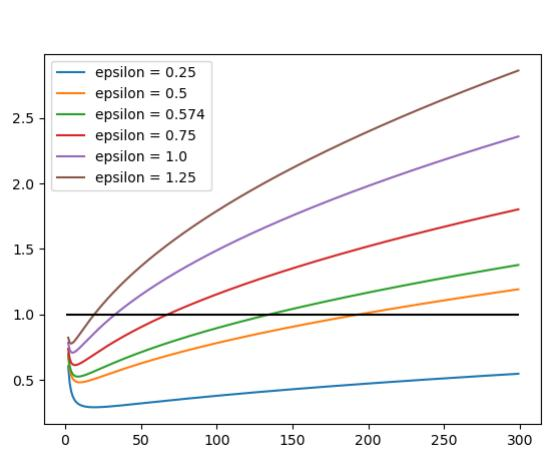
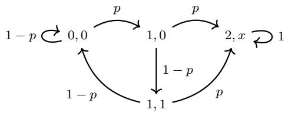
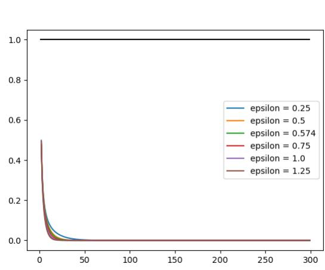

# TWAP Oracle Attacks: Easier Done than Said?

Torgin Mackinga

ETH Zurich¨

Tejaswi Nadahalli

ETH Zurich ¨

Roger Wattenhofer

ETH Zurich¨

Abstract—Blockchain “on-chain” oracles are critical to the functioning of many Decentralized Finance (DeFi) protocols. We analyze these oracles for manipulation resistance. Specifically, we analyze the cost of manipulating on-chain time-weighted average price (TWAP) oracles that use the arithmetic mean. It has been assumed that manipulating a TWAP oracle with the well-known multi-block attack is expensive and scales linearly with the length of the TWAP. We question this assumption with two novel results. First, we describe a single-block attack that works under the same setting as the multi-block attack but costs less to execute. Second, we describe a multi-block MEV (MMEV) style attack where the attacker colludes with a miner/proposer who can mine/propose two blocks in a row. This MMEV style attack makes oracle manipulation orders of magnitude cheaper than previously known attacks. In the proof-of-work setting, MMEV can be done by selfish mining even with very low shares of hashpower.

Index Terms—TWAP, Oracles, DeFi, MEV, MMEV

## I. INTRODUCTION

Smart contract platforms such as Ethereum [1] have allowed for the creation of decentralized finance (DeFi), which aims to recreate financial services such as lending [2], [3], exchanges [4], [5], asset management [6], [7], insurance [8], and more in a fully transparent, trustless, and censorship-resistant way. The total value locked in DeFi has grown to \$108 billion as of December 2021 [9]. Lending and (decentralized) exchange protocols lead the DeFi ecosystem with lending protocols locking around \$51 billion and exchanges locking around \$33 billion in assets. Lending protocols and exchanges enable each other in a bi-directional relationship, with exchanges informing lending protocols about exchange rates and lending protocols providing liquidity to exchanges. The former relationship is often called an oracle, where the exchange acts as an oracle and provides market data to the lending protocol. Lending protocols crucially depend on oracles for their price feeds, and if these oracles are driven by on-chain exchanges, their price feed can be manipulated by bad actors to attack the lending protocols. In the rest of this paper, we see how onchain exchange based oracles can be manipulated to carry out such attacks on the lending protocol.

## A. Lending

Lending protocols are smart contracts that allow borrowers to borrow funds at an interest rate. The borrowed assets come from a pool of assets that creditors have deposited as their investments. If this pool suffers a loss due to a bad debt, the loss is distributed among these creditors. If the borrower pays back the debt on time, the interest is divided among the creditors who contributed to the pool from which the loan was made from. Due to the inability of these protocols to take action against loan defaulters (borrowers are just public keys on a blockchain), they use over-collateralization to keep the protocols liquid. The borrower first deposits a units of collateral of asset A (with dollar value $V _ { A }$ per unit) and then borrows b units of some other asset B (with dollar value $V _ { B }$ per unit), with $a \cdot V _ { A } > b \cdot V _ { B }$ . Collateralization ratio (C) is defined as $\begin{array} { r } { C = \frac { a \cdot V _ { A } } { b \cdot V _ { B } } } \end{array}$ . If the borrower does not repay the loan, the protocol allows any liquidator (a disinterested third party observing the blockchain) to pay back the borrowed asset and redeem the collateral at a discounted price. For this to be effective, during the period of the loan, C should not fall below 1. If it does, the loan becomes undercollateralized. This can happen if the collateral loses value relative to the borrowed asset or the borrowed asset appreciates against the collateral asset. As C tends closer to 1, the lending protocol tries to use the remaining collateral value to make itself whole again with respect to the borrowed asset. Before a loan gets fully undercollateralized $( C < 1 )$ it can go through a period of “bad health”, where its C has fallen from the time when the loan was made and is now too close to 1 (with some tolerance). To avoid the risk of going fully undercollateralized, the protocol offers liquidators a chance to pay back the loan at a discount, and redeem the remaining collateral for themselves. This makes the protocol whole again, the liquidator gets collateral for a slightly cheaper price, and the borrower is liquidated. The borrower is thus motivated to “top-up” the collateral to make sure that the loan never becomes unhealthy.

Over-collateralization can work only if the lending protocol knows the dollar values $V _ { a } , V _ { b }$ of assets A, B. These assets are traded on many centralized exchanges which operate in the real world, outside of the blockchain. Through trusted third parties, it is possible to get these exchange rates into the lending protocol. These trusted third parties are also called off-chain oracles. They are dependent on a trusted third party, so they are not fully on-chain. Their operation is not fully governed by a smart contract that can be audited by users and about which users can have assurances of immutability. Lending protocols, which are themselves deployed as auditable smart contracts on-chain, could prefer on-chain oracles, which are deployed as smart contracts, but can still report market-based exchange rates of assets. Automated market makers (AMMs), a type of exchange, serve as a natural on-chain price oracle. They support trades between many pairs of assets and can report the relative exchange rates between asset pairs through state variables available on-chain.

## B. Constant Function Automated Market Makers

Constant Function AMMs [4] are a type of decentralized exchange that uses a well-known, simple formula to trade one asset for another. An AMM trading pair is a liquidity pool containing reserves $R _ { A } , R _ { B }$ of two different assets A and B. If the AMM is using the constant product model, the reserves have a constant product $R _ { A } \cdot R _ { B } = K$ . There is a percentage fee $( 1 - \gamma )$ that is collected for every trade. When a user sells b units of B, they get a units of A such that the constant-product function $( R _ { B } + \gamma \cdot b ) ( R _ { A } - a ) = K$ is preserved. The spot price of asset A is given by $\frac { R _ { A } } { R _ { B } }$ , the spot price of asset $B$ is $\textstyle { \frac { R _ { B } } { R _ { A } } }$ . To see how an entirely on-chain artifact like the ratio of the size of two pools can reflect the true market price $( m _ { p } )$ of an asset, we have to look at arbitrageurs who constantly watch AMM liquidity pools and other exchanges. Whenever the AMM price deviates from $m _ { p } { \mathrm { . } }$ there is an arbitrage opportunity. An arbitrageur could buy assets on the cheaper market, then sell them immediately on the more expensive market for a risk-free profit. In an efficient market, no such arbitrage opportunities should exist, and price imbalances are quickly resolved. The no-arbitrage condition describes a market in which no arbitrage opportunities exist. Assuming the no-arbitrage condition holds, Angeris et al. [10] show that the Uniswap V2 market price deviates from $m _ { p }$ by at most $( 1 - \gamma ) m _ { p }$ . Thus, lending protocols can use Constant Function AMM’s like Uniswap V2 as their oracles to build over-collateralization mechanisms using artifacts that are entirely on-chain.

## II. ATTACKS ON LENDING PROTOCOLS

First, we describe two well known attacks on lending protocols that can happen when their price oracles are manipulated to report the wrong price of the collateral asset vis-a-vis the borrowed asset. Later, we describe how these\` oracle manipulations can occur. During the lifetime of a loan, there is complex interplay between creditors, the borrower, the liquidator, the lending protocol, and the AMM oracle. If the on-chain price of the collateral can be manipulated by a bad actor, the bad actor can also act as a borrower or liquidator to exploit the lending smart contract to make excess profits at the expense of the creditors. In the next sections, we describe two such attacks.

## A. Undercollateralized loan attack

A bad actor assumes the role of a borrower to execute this attack. The attacker allots some capital upfront to the attack, which they divide into two pools: attack capital and manipulation capital. They first use their manipulation capital to buy an asset A from the AMM to move the price of the asset higher. The lending protocol under attack uses this artificially inflated price of A from the AMM to inform its own collateralization ratio. Now, the attacker can use their attack capital as collateral on the lending protocol and borrow the loan asset B. If the price of A had not been manipulated, the attacker would have been allowed to borrow less of B. The manipulation of the price of A allows the attacker to borrow more of B. The attacker then does not repay the loan, and instead sells B in the open market. If the attacker can also sell A that they had bought earlier (which they did to manipulate A’s price) at market price, they make a net profit with the attack.

Let’s consider an example lending protocol that accepts ETH as collateral and lets anyone borrow USDC. Let the collateralization ratio of this protocol be fixed to 0.8. Let the market price of ETH/USDC be \$3000. If this correct price is used by the lending protocol, the attacker can only borrow up to \$2400 worth of USDC for every 1 ETH they deposit as collateral. The attacker manipulates the price to \$4000, deposits the same 1 ETH, but is now able to borrow \$3200 worth of USDC from the lending protocol. They can now sell this USDC in the open market and pocket a profit of \$200.

The attack’s profitability also rests on whether the attacker can “de-manipulate” the price of A back to market price without other users front-running the attacker. The profit gained by selling B at a higher value should not be offset by the manipulation capital lost moving the price of A. Further in the paper, we will see how the attacker manages to execute the de-manipulation transaction. The calculation of this attacks profits are further elaborated in Appendix A. Such an attack was performed on Inverse Finance DAO’s Anchor lending protocol, resulting in a loss of USD 15.6 million to the protocol [11].

## B. Liquidation Attack

A bad actor assumes the role of a liquidator to execute this attack. In a typical loan, collateral asset A is backing the loan asset B. The loan can be made to appear to be in “bad health” by manipulating the price of A lower or the price of B higher. The oracle, which feeds the price ratio of A vs. B to the lending protocol, has to be manipulated to give the impression to the lending protocol that the price of A has gone lower with respect to the price of B. The smart contract will then allow liquidators to settle the loan back in asset B and take asset A out of the protocol, and the liquidator who manages to get this transaction confirmed will successfully make a profit. Unlike the undercollateralized loan attack, in this case, the attacker has to buy asset B from an external exchange to pay back the loan and claim the collateral asset A with profit.

There is one aspect of the open nature of blockchains that attackers need to grapple with. As soon as the new price is effective on the on-chain oracle, other actors also see this and are incentivized to profit from it. The oracle manipulator now competes with other rational actors to execute either the undercollateralized loan attack or the liquidation attack, and has to bid up their transactions to get included in the next block. As we see in later sections, if the attacker uses our multi-block MEV attack, both attacks become executable without getting into a race with other actors.

## C. Spot Price Manipulation

In the attacks described in Sections II-A and II-B, the attacker manipulates the price of an asset on the lending protocol’s reference AMM. If the lending protocol uses the na¨ıve spot price of an asset as per its AMM, it is straightforward to manipulate this spot price. In this case, the steps of in Sections II-A and II-B: manipulation, borrow/liquidate, and de-manipulation can be done atomically in a single blockchain transaction. Atomicity ensures that arbitrageurs cannot front-run the attacker’s de-manipulate transaction. This makes the manipulation cheap. To make matters even worse, the manipulate and de-manipulate steps can be funded by a so-called “flash-loan” [12]. Flash loans are when a lending protocol lets users borrow large amounts of assets without collateral if they are returned back in the same transaction with a small fee. These flash loans remove the attack capital requirements. This type of naive attack is thwarted by wellknown AMMs like Uniswap V2 [13] by not allowing spot prices of assets to be recorded in the middle of a block and only recording the price value at the end of a block (refer to Appendix B for details). This forces the manipulate and de-manipulate steps into different blocks, and flash-loans are no longer an option. Additionally, the de-manipulate step can be front-run by arbitrageurs who notice the manipulate step and want to make a profit by bringing back the manipulated price to the true market price $m _ { p }$ . This effect can be made even stronger by not only relying on the price recorded in one block but as the arithmetic mean of the price recorded in many blocks in sequence, leading to the Time-Weighted Average Price (TWAP) oracle.

## III. TWAP ORACLES

TWAP oracles double down on the effect mentioned in the previous section, allowing arbitrageurs to front-run demanipulating transactions so as to keep the manipulation expensive for the attacker. If the classic AMM price is read by the lending protocol in its arithmetic mean setting, we get the advantage of having the two-block defense against attackers, where the attacker has to manipulate the price in a block and wait for the next block to de-manipulate the price. If we extend this to multiple blocks, where the lending protocol reads the price of an asset averaged over many blocks, the attacker has to keep the manipulation going for that entire duration and pay the price for it.

One example of an on-chain price oracle is the Uniswap V2 oracle [13]. It records the price of a particular Uniswap V2 trading pair’s smart contract before the first trade of each block. This price, multiplied by the number of seconds that have passed since the last update, is observation p . All observations get stored in an accumulator $a _ { t }$ with $\begin{array} { r } { \boldsymbol { a } _ { t } ~ = ~ \sum _ { i = 1 } ^ { t } p _ { i } } \end{array}$ . The accumulator should always reflect the sum of the spot price at each second in the history of the contract. An external caller (the lending protocol, for example) can checkpoint the accumulator’s value at time $t _ { 1 }$ , then again at $t _ { 2 }$ . Using these values, it calculates a time-weighted average price (specifically, arithmetic mean), or TWAP, from $t _ { 1 }$ to $t _ { 2 }$ (with $L _ { T } = t _ { 2 } - t _ { 1 } )$ as:

$$
\mathrm{TWAP} _ {t _ {1}, t _ {2}} = \frac {a _ {t _ {2}} - a _ {t _ {1}}}{L _ {T}}
$$

Taking an average over many blocks allows arbitrageurs more time to successfully front-run an attacker’s demanipulation transaction. In the worst case for the attacker, arbitrageurs will front-run the de-manipulation transaction in every block. TWAP oracles have a clear tradeoff between manipulation resistance and freshness. Using a larger $L _ { T }$ in the TWAP increases the cost of manipulation, while a shorter TWAP follows the spot price more closely. Using a longer duration TWAP comes with the risk of the TWAP not reflecting the true spot price of an asset, and the lending protocol not responding to real market conditions that cause loans to get under-collateralized. In the rest of this paper, we assume that the TWAP uses the arithmetic mean over its range.

## A. TWAP manipulation cost

Let $m _ { p }$ be the true market price of an asset A. Let $\epsilon > 0$ be some desired constant on which we want to parameterize the cost of manipulation $C _ { 1 }$ of A for just one block to the new price $( 1 + \epsilon ) \cdot m _ { p } .$ . Angeris et al. [10] have shown this one-block manipulation cost to be:

$$
C _ {1} (\epsilon) = R _ {B} (\sqrt {1 + \epsilon} + (\sqrt {1 + \epsilon}) ^ {- 1} - 2)\tag{1}
$$

where $R _ { B }$ is the Uniswap V2 trading pair’s liquidity reserve of asset B. This cost is the amount of tokens of the asset $B$ that the attacker has to deposit in the AMM contract to move the price of asset A to $( 1 + \epsilon ) \cdot m _ { p }$ . This cost takes into account the value of asset A tokens that the attacker received for that specific manipulating trade. This equation assumes no fees, an infinitely liquid reference market, and the no-arbitrage condition, meaning that arbitrageurs are assumed to de-manipulate the price every block. As seen, independently of $\epsilon ,$ this cost also scales linearly with the size of the pool (reflected in the parameter $R _ { B } )$

$C _ { 1 } ( \epsilon )$ is the cost for the attacker to manipulate the oracle for a single block. If the lending protocol uses a TWAP, the attacker (who wants to use attacks from Sections II-A and II-B) must keep this manipulation ongoing for multiple blocks $L _ { T }$ , where $L _ { T }$ is the length of the TWAP. The total cost of the multi-block attack is $C _ { m } = L _ { T } \cdot C _ { 1 } ( \epsilon )$ . The cost $C _ { 1 } ( \epsilon )$ is incurred as arbitrage loss every time an arbitrageur demanipulates the price instead of the attacker. This result (1) has led to the generally accepted conclusion that “the cost of manipulating the Uniswap V2 price [oracle] to any fixed amount scales linearly with the reserves and the number of blocks” [14]. Next, we show with our first novel result that an AMM-based price oracle can be manipulated for higher profits with lower costs.

## B. Single-block attack

The multi-block attack model is assumed to be manipulation-resistant if the AMM pools have large liquidity reserves. Optimistic users assume that the attacker needs to pay a huge price of $C _ { m } = L _ { T } \cdot C _ { 1 } ( \epsilon )$ to manipulate $m _ { p }$ to $( 1 + \epsilon ) \cdot m _ { p }$ over $L _ { T }$ successive blocks. Our insight is that the same effect can be seen if the attacker can manipulate $m _ { p }$ for just one block to $( 1 + L _ { T } \cdot \epsilon ) \cdot m _ { p }$ . We call this the single-block attack. We now show that this attack is cheaper than the multi-block attack under some circumstances.

The attacker chooses just one block over the range $L _ { T }$ and in that one block makes a trade in the AMM to manipulate the price of the asset from $m _ { p }$ to $( 1 + L _ { T } \cdot \epsilon ) \cdot m _ { p }$ . The attacker “de-manipulates” the price back to $m _ { p }$ in the next block. Assuming the price is $m _ { p }$ in all other blocks, the oracle will report a TWAP price of

$$
\frac {L _ {T} + L _ {T} \cdot \epsilon}{L _ {T}} \cdot m _ {p} = (1 + \epsilon) \cdot m _ {p}
$$

just like the multi-block attack. The cost of manipulation for the single-block attack is given by $C _ { 1 } ( L _ { T } \cdot \epsilon )$ , while the multiblock attack had cost $L _ { T } \cdot C _ { 1 } ( \epsilon )$ . The single-block attack is cheaper when $L _ { T }$ and ϵ are such that:

$$
\frac {L _ {T} \cdot C _ {1} (\epsilon)}{C _ {1} (L _ {T} \cdot \epsilon)} > 1\tag{2}
$$

We plot this ratio of multi-block to single-block attacks for

  
Figure 1: Cost comparison between the multi-block and singleblock attack. The y-axis shows how much cheaper the singleblock attack is. The single-block attack is more expensive when the cost reduction is less than 1. The x-axis is L .

$L _ { T }$ ranging from 1 to 300 and multiple values of $\epsilon ^ { \mathrm { ~ 1 ~ } }$ to get the graph in Figure 1. The break-even point, where both attacks have an equal cost for a 135 block TWAP oracle (which is a commonly used value in practice), is at $\epsilon = 0 . 5 7 4$ . For higher ϵ, the single-block attack is cheaper than the multiblock attack. For lower $\epsilon ,$ the single-block attack is more expensive. Ironically, an attacker that wants to manipulate an asset’s price higher to achieve a larger profit can do so in a proportionately cheaper way.

## C. Failed Assumptions

The idea that the only way to manipulate a TWAP oracle is through the expensive multi-block attack already makes a few assumptions, like the no-arbitrage condition, an infinitely liquid external market for asset A which arbitrageurs can tap into, and that arbitrageurs can always front-run the attacker’s de-manipulation transaction. These assumptions have to be true to make the multi-block attack expensive for an attacker, thereby making the TWAP oracle safe to use. If the assumptions do not hold, the multi-block attack might already not be as expensive as previously thought. The single block attack, which is cheaper for larger manipulations, also makes the same assumptions. In this case, the assumptions are even less likely to hold – thereby making the single block attack even cheaper to execute.

No-arbitrage condition: For the single-block attack, the no-arbitrage assumption is less likely to hold than for the multi-block attack. Arbitrageurs only have a single block to act, ruling out manual arbitrage and forcing bot-based arbitrage. This general-purpose arbitrage bot needs instant access to a large amount of asset A. This eliminates all offchain exchanges as reference markets since it would take at least one block to transfer funds out of the exchange.

Infinitely liquid external market: Eliminating off-chain exchanges also makes the assumption that arbitrageurs have access to an infinitely liquid external market less likely to hold. If arbitrageurs are unable to react within a single block, the manipulation is free.

Transaction Ordering: Transaction ordering within the block is even more important in the single block attack than in the multi-block attack. If the attacker can get a demanipulation transaction included in the second block before the arbitrageur can, the attack is also free.

Additionally, against a multi-block attack, a DeFi protocol admin has an entire TWAP length to notice that a price is being manipulated and trigger emergency shutdown procedures if they exist. In a single-block attack, the oracle already reports the manipulated price in the very next block, and an exploit can take place immediately with no prior warning. Even if all assumptions hold, the novel result we arrive at is that for large enough ϵ and $L _ { T }$ , the cost of manipulation of a TWAP oracle only scales with the square root, not linearly with the TWAP length. If some of the assumptions do not hold, an attack may be dramatically cheaper than expected.

In the next section, we look at a scenario where all these safety assumptions fail. The attacker controls a miner/proposer and can propose two blocks in a row: one with the manipulating transaction and one with the de-manipulating transaction.

## IV. MULTI-BLOCK MEV

Miner Extractable Value (MEV) is the value that can be extracted by miners/proposers who decide which transactions go into a block and in what order. This ordering gives them the power to include their own transactions ahead of other users’ transactions and thereby extract value out of the ordering process, which goes beyond their usual rewards of fees and block subsidies. Daian et al. [15] first explored the many ways in which transaction ordering can be used to extract more value. If an attacker could specify a transaction ordering over not just one but multiple blocks in a row, they would no longer need to compete with arbitrageurs. We call this Multi-block MEV, or MMEV.

In the proof-of-work setting, it is not known ahead of time which miner will mine the next block. However, if a miner does selfish mining [16]–[18] and maintains a private chain, they can publish the private chain judiciously to extract more value than their share of hash power would warrant. In our case, the selfish miner has an even simpler goal – to include their own transactions in two blocks in a row and make these two blocks get into the main blockchain. The MMEV, in this case, is the ability to cheaply manipulate a TWAP oracle, and additionally, also execute an under-collateralized loan attack or liquidation attack on a lending protocol that uses this oracle. We show that selfish mining to enable such MMEV is feasible with much lower shares of total hash power than what is traditionally expected for profitable selfish mining. Selfish mining attacks on the Uniswap V2 TWAP oracle are acknowledged in the Uniswap V2 whitepaper [13] and its security audit [19], but has not been studied formally before.

## A. Manipulation Capital

As before, the total cost of the attack consists of the manipulation capital and the attack capital. First, we assume that the attacker controls the contents of two blocks in a row and is able to execute the single block attack described earlier. This makes the manipulation capital reduce to the fees of the AMM, as there are no arbitrageurs to fight off because of selfish mining. Selfish mining itself has a cost that is independent of the attack, and we will look at that in subsequent sections.

The attacker controls two blocks. In the first block, the attacker buys $a _ { m }$ of asset A, increasing the market price to $( 1 + L _ { T } \cdot \epsilon ) \cdot m _ { p } ,$ , as required by the single block attack. This costs b of asset B. In the first transaction in the second block, the attacker sells $a _ { m }$ units of asset A, returning the market price to $m _ { p } ,$ receiving b units of B. Under normal circumstances, the transaction in the first block would be vulnerable to arbitrage. Controlling two consecutive blocks allows an attacker to be immune to arbitrage and makes the manipulation cost reduce to the AMM fee. Note that the attacks on the lending protocol require separate attack capital that is independent of the manipulation capital we are discussing here. An MMEV attack is cheaper than a singleblock attack if it is cheaper to create two blocks in a row than being vulnerable to an arbitrage that nullifies the attacker’s de-manipulation transaction. The cost of selfishly mining two blocks in a row is fixed. It does not depend on $L _ { T }$ or ϵ. Assuming a constant product AMM like Uniswap V2, we have $R _ { A } \cdot R _ { B } = K$ , we can calculate the required number of tokens of asset B to achieve a price for A of $( 1 + L _ { T } \cdot \epsilon ) \cdot m _ { p }$ from Equation 1.

Ignoring the AMM fee and assuming a TWAP length of 135 blocks (30 minutes, if we assume Ethereum as the smart contract platform), we calculate values of b required for different values of ϵ. Table I shows that doubling the TWAP price of A for a 30-minute TWAP (by setting ϵ = 1) on a pair with \$2,000,000 of total liquidity, \$1,000,000 worth of A and B respectively, would require temporary capital of \$9,750,000. Increasing TWAP to $1 0 0 \cdot m _ { p }$ (setting $\epsilon = 9 9 )$ ) would require temporary manipulation capital of \$113,000,000. The amount of manipulation capital required is likely a bigger limiting factor for an attacker than the cost in fees. This is an illustrative example using values for liquidity and TWAP length that could be used in practice. The manipulation capital required scales linearly with total liquidity and scales with the square root of TWAP length and ϵ. Note that using a flash loan to acquire the needed funds is not an option, as this attack spans two blocks.

<table><tr><td> $\epsilon$ </td><td> $b$ </td></tr><tr><td>0.5</td><td>6,400,000</td></tr><tr><td>1</td><td>9,750,000</td></tr><tr><td>9</td><td>33,000,000</td></tr><tr><td>99</td><td>113,000,000</td></tr></table>

Table I: Amounts and trading fee costs for different ϵ

## B. Selfish Mining Cost

Selfish mining cost is given by the opportunity cost of not mining blocks on the main chain. We model the following miner strategy S: The selfish miner M mines on the main chain until he successfully mines a block $B _ { 1 }$ . M does not publish $B _ { 1 }$ and continues mining on top of $B _ { 1 }$ . If M finds a second block $B _ { 2 }$ , M immediately publishes both $B _ { 1 }$ and $B _ { 2 }$ M’s chain is now longer than the main chain, and all honest miners will continue mining on $M \mathbf { \bar { s } }$ chain. We call this a success. If two blocks are added to the main chain without M finding a block $B _ { 2 }$ , M publishes $B _ { 1 }$ . This will turn $B _ { 1 }$ into an uncle block. Then M starts over and returns to mining the main chain.

  
Figure 2: Markov chain model of strategy S

Let p be the share of the total hash rate that M controls. The probability of M mining any block is $p ,$ and the probability of all other miners mining that block is $1 - p$ . We assume that the propagation of newly published blocks to the network is instantaneous. Let E[S] be the expected number of blocks it takes to have success when following strategy S. We use the Markov chain given in Figure 2 to model strategy S. The states of the Markov chain contain pairs of $( n _ { 1 } , n _ { 2 } )$ with $n _ { 1 } =$ number of blocks on the private chain and $n _ { 2 } =$ number of blocks on the main chain. The absorbing state $( 2 , x )$ is the state where the selfish miner is leading with the required length 2 and will release both blocks to the main chain. As this is a finite discrete absorbing Markov chain, we can calculate the expected hitting time E[S] of state (2, x) given the initial state is (0, 0) as:

$$
\mathbb {E} [ S ] = \frac {1 + 2 p - p ^ {2}}{2 p ^ {2} - p ^ {3}}
$$

Opportunity Cost: In the original selfish mining research on Bitcoin [16], the selfish miner forgoes mining rewards if the miner’s private blocks do not make it to the main blockchain. In Ethereum, there is a way to reduce this opportunity cost by making these private blocks into public uncle blocks and collect uncle block rewards. It takes E[S] blocks for MMEV success. During this time, the miner has a p chance of mining a block. This makes their uncle block opportunity E[S] $p -$ 2. The last two blocks cannot count as uncle blocks as the selfish miner releases them as part of the main blockchain. Uncle blocks mitigate the attack cost even more, at the risk of exposing the fact that the attack is happening to the world at large.

Total Cost: In Ethereum, blocks are generated every 15 seconds, leading to 240 blocks per hour.2 The dollar cost of selfish mining is calculated based on Ethereum’s total hash rate of 715 terahashes/s [20], and the cost of renting hash power at \$60,000 for one terahash/s for 24 hours [21]. As we see, an attacker can rent 1.5% hash rate for 9 hours by paying \$258,000 and expect to selfishly mine two blocks in a row. As the MMEV selfish miner has different goals than the traditional selfish miner, a much lower share of the total hash rate is enough for success. This is important because renting a higher hash rate can distort the inelastic hash rate market, and the price per hash will go up. Uncle rewards are reduced by 0.25 ETH for each generation that they are late. We remove 0.25 ETH from the average uncle block reward, putting the uncle block reward at 1.46 ETH. If we look at low values for $p ,$ the expected time to success (in hours) and the approximate total cost in dollars for the attack are shown in Table II.

<table><tr><td>p</td><td> $\mathbb{E}[S]$  in hours</td><td>Cost in dollars</td><td>Uncle Rewards</td><td>Total Cost</td></tr><tr><td>0.25%</td><td>335</td><td>$1,499,000</td><td>$598,000</td><td>$901,000</td></tr><tr><td>0.50%</td><td>84</td><td>$754,000</td><td>$298,000</td><td>$456,000</td></tr><tr><td>0.75%</td><td>37</td><td>$506,000</td><td>$198,000</td><td>$308,000</td></tr><tr><td>1.00%</td><td>21</td><td>$382,000</td><td>$148,000</td><td>$234,000</td></tr><tr><td>1.25%</td><td>13</td><td>$307,000</td><td>$118,000</td><td>$189,000</td></tr><tr><td>1.50%</td><td>9</td><td>$258,000</td><td>$98,000</td><td>$160,000</td></tr></table>

Table II: Selfish Mining MMEV hash rates, costs, and rewards

## C. MMEV in Proof of Stake

In the proof-of-stake algorithm currently proposed for Ethereum [22], block proposers per epoch are known in advance. Two block proposers could collude and perform MMEV style oracle manipulation. These attacks do not go against standard consensus rules of blockchains, and hence, colluding proposers will escape slashing, or even detection.

In proof-of-stake systems that use verifiable randomness functions (Algorand, Ouroboros family), block proposers cannot be predicted in advance and MMEV attacks are not possible in the algorithms’ ideal settings. However if the previous block is used to generate the seed used in the verifiable randomness function, block proposers could try a “grinding attack”, where they try to improve their odds of proposing two blocks in a row to enable the MMEV style attack. The incentives for traditional selfish mining and “stake grinding” attacks are specified in terms of block rewards. However, an MMEV style attack is entirely independent of block rewards and can be orders of magnitude more profitable due to DeFi rewards. These out-sized rewards might make it worthwhile to game the verifiable randomness functions. This is an area of future research.

## V. RESULTS

We compare the three different TWAP manipulation attacks we have seen so far. We again use the example where we want to double the price of an asset which uses a 30-minute TWAP that uses a pair with \$2,000,000 of total liquidity reserves. The cost of the MMEV single-block attack with 1.5% hash rate is \$160,000. Based on equation 1, the cost of the singleblock attack is $C _ { 1 } ( 1 3 5 \cdot 1 ) = \ S 9 , 7 5 0 , 0 0 0$ and the cost of the multi-block attack is $1 3 5 \cdot C _ { 1 } ( 1 ) = \ S 1 6 { , } 2 0 0 { , } 0 0 0$

All attacks ignore the rather small AMM trading fee of around \$35,000. The multi-block attack (previous best known attack) cost scales linearly with the TWAP length $L _ { T }$ , whereas the single-block attack costs only scale with the square root of $L _ { T }$ . The MMEV single-block attack avoids this cost entirely as it has no arbitrageurs to worry about. The cost of selfish mining-based MMEV single block attacks only depends on the share of hash power required to pull off the attack in a reasonable time. Even with a conservative estimate of 1.5%, it is almost two orders of magnitude cheaper than the other attacks.

## A. Solution 1: Median

First, as seen in commentary on Equation (1), an asset pair having high liquidity $R _ { A } , R _ { B }$ makes the costs of the non-MMEV attacks scale linearly with $\mathrm { i t } ,$ which mitigates the attack to some extent. In the MMEV single-block attack, only the cost of trading fees scales with liquidity. For all attacks, the amount of temporary capital required scales linearly with liquidity. Illiquid assets are more likely to get attacked in the ways discussed above. Using a longer length for the TWAP is not ideal mitigation against the standard and MMEV versions of the single-block attack, as the cost and capital requirements only scale with the square root of the TWAP length in the best case. The fundamental issue that these attacks exploit is that a TWAP can be affected significantly by manipulating a single block’s price. This could be solved by using a median price instead of an average. A median is largely unaffected by outlier prices in single blocks. This eliminates the single-block attack and requires the MMEV attack to take place over many blocks and not just two. It is important to note that a median is less resilient to the multi-block attack than a TWAP. To manipulate a median, it is sufficient to manipulate only half the blocks it encompasses. Consequently, the multi-block attack becomes cheaper by 50% if the median is used instead of the average.

Using a median oracle does not seem practical, as the calling contract would need to store checkpoints of the accumulator every single block and would need to load all checkpoints from storage to calculate the median, which would be very expensive in terms of gas costs.

A more economic solution could be to use a median of averages with a small number of averages. One would split the block range of interest into n smaller ranges using n+1 checkpoints and calculate the average of each range. This would mean the majority of ranges would need to contain at least one block that is manipulated to manipulate the median. Further work would be needed to analyze the properties of such a median of averages in worst-case conditions compared to a standard median or average.

## B. Solution 2: Geometric Mean

Uniswap V3 stores the cumulative logarithm (to some base b) of the price of every pool’s assets instead of the sum as in Uniswap V2. As before, we denote the length of the TWAP to be $L _ { T }$ . Say, the accumulated value of the logarithm of an asset at time $t _ { i }$ as

$$
A _ {t} = \sum_ {i = 0} ^ {j = t _ {i}} \log_ {b} P _ {i}
$$

This allows a consumer protocol (like a lending protocol) to use the geometric mean of the pool as

$$
P _ {t _ {1}, t _ {2}} = B ^ {\frac {A _ {t _ {2}} - A _ {t _ {1}}}{L _ {T}}}
$$

In effect, the geometric mean of the individual prices can also be written as

$$
P _ {t _ {1}, t _ {2}} = \sqrt [ L _ {T} ]{\prod_ {i = t _ {1}} ^ {t _ {2}} P _ {i}}
$$

To compare TWAPs with arithmetic mean and geometric mean, we assume the price of an asset to be constant (say $m _ { p } )$ over the TWAP period $( L _ { T } )$ and hence TWAPs with both arithmetic and geometric means return the same price. We now try to manipulate the TWAPs in both cases using the single block attack to reflect a price of $( 1 + \epsilon ) \cdot m _ { p }$ . In the case of the arithmetic mean TWAP, the price of the asset in one block has to be manipulated to $( 1 + L _ { T } \cdot \epsilon ) \cdot m _ { p }$ . In the case of geometric mean TWAP, the price of the asset in one block has to be manipulated to $( 1 + \epsilon ) ^ { L _ { T } } \cdot m _ { p }$

As can be seen in Figure 3, manipulating the geometric mean by manipulating the price of an asset in a single block is more expensive than multi-block manipulation. This means that Uniswap V3 oracles are not affected by the single-block attack described in this paper, while Uniswap V2 oracles are. However, using MMEV to avoid arbitrageurs while executing the multi-block attack could reduce its costs significantly. This would likely require controlling many blocks within the TWAP period, not just two. This makes the attack more difficult and thus more expensive. Analysing this use-case of MMEV is a topic for future research.

  
Figure 3: Cost comparison between the multi-block and singleblock attack with geometric mean. The y-axis shows how much cheaper the single-block attack is. The single-block attack is more expensive when the cost reduction is less than 1. The x-axis is $\mathbf { L } _ { T }$

## VI. CONCLUSION

We illustrated the need for a manipulation-resistant oracle with the under-collateralized loan attack on a lending protocol. Any protocol that relies in the same way on a TWAP oracle is vulnerable. We analyzed the manipulation resistance of TWAP oracles against different types of attacks and showed that the cost of manipulation for TWAP oracles is lower than expected. We introduced the single-block attack, which for longer TWAPs is cheaper to execute than the previously known multi-block attack. Previously, it was assumed that a TWAP oracle is safe because the multi-block attack is expensive to execute because the safeguards against the attack are assumed to work. We show that the single block attack is not only cheaper to execute, but the assumed safeguards do not work. One of the safeguards assumed in the multi-block attack’s “infeasibility bubble” is that arbitrageurs can get assets from external off-chain exchanges to revert the manipulated price back to the market price. The single block attack leaves no time for arbitrageurs to do this, thereby restricting this assumption to just on-chain exchanges.

Another safeguard that is assumed in the multi-block attack’s “infeasibility bubble” is that arbitrageurs will always arbitrage the manipulated price back to the market price. Under the MMEV setting, we show that if an attacker can mine two blocks in a row, this no-arbitrage condition fails, and the attack gets dramatically cheaper. The area of MMEV is under-explored and should be analyzed for other exploits that are only possible when an attacker controls multiple blocks in a row.

These attacks do not target a specific victim transaction. The goal is to manipulate an oracle that a DeFi protocol relies upon and exploit the protocol. A protocol’s structural reliance on an oracle does not change much with time, and this attack is always available for the taking, based on the attacker’s ability to acquire capital to pull off the attack.

As a solution, we also suggest that TWAP oracles should rather use the median or the geometric mean as a manipulation-resistant statistic instead of a mean. An interesting open research question is to analyze the effect of MMEV attacks on geometric mean TWAPs or other types of metrics that also reflect an asset’s true market price.

## REFERENCES

[1] G. Wood et al., “Ethereum: A secure decentralised generalised transaction ledger,” Ethereum project yellow paper, vol. 151, no. 2014, pp. 1–32, 2014.

[2] R. Leshner and G. Hayes, “Compound: The money market protocol,” Feb 2019. [Online]. Available: https://compound.finance/documents/ Compound.Whitepaper.pdf

[3] Aave Protocol Whitepaper V1.0. [Online]. Available: https://github.com/aave/aave-protocol/blob/master/docs/Aave Protocol Whitepaper v1 0.pdf

[4] Y. Zhang, X. Chen, and P. Daejun, “Formal specification of constant product (xy=k) market maker model and implementation,” Oct 2018. [Online]. Available: https://github.com/runtimeverification/ verified-smart-contracts/blob/uniswap/uniswap/x-y-k.pdf

[5] W. Warren and A. Bandeali, “0x: An open protocol for decentralized exchange on the ethereum blockchain,” pp. 04–18, Feb 2017. [Online]. Available: https://github.com/0xProject/whitepaper

[6] Yearn Finance. [Online]. Available: https://docs.yearn.finance/

[7] Convex Finance. [Online]. Available: https://www.convexfinance.com

[8] H. Karp and R. Melbardis. Nexus Mutual. [Online]. Available: https://nexusmutual.io/assets/docs/nmx white paperv2 3.pdf

[9] Total Value Locked (USD) in DeFi. [Online]. Available: https: //defipulse.com/

[10] G. Angeris, H.-T. Kao, R. Chiang, C. Noyes, and T. Chitra, “An analysis of Uniswap markets,” arXiv e-prints, p. arXiv:1911.03380, Nov. 2019.

[11] “Inverse Finance got flipped for \$15M.” https://rekt.news/ inverse-finance-rekt/, [Accessed: 2022-04-04].

[12] K. Qin, L. Zhou, B. Livshits, and A. Gervais, “Attacking the defi ecosystem with flash loans for fun and profit,” 2021.

[13] H. Adams, N. Zinsmeister, and R. Dan. (2020, Mar) Uniswap V2 Core. [Online]. Available: https://uniswap.org/whitepaper.pdf

[14] G. Angeris. (2020, Feb) When is Uniswap a good oracle? [Online]. Available: https://medium.com/gauntlet-networks/ why-is-uniswap-a-good-oracle-22d84e5b0b6c

[15] P. Daian, S. Goldfeder, T. Kell, Y. Li, X. Zhao, I. Bentov, L. Breidenbach, and A. Juels, “Flash boys 2.0: Frontrunning, transaction reordering, and consensus instability in decentralized exchanges,” 2019.

[16] I. Eyal and E. G. Sirer, “Majority is not enough: Bitcoin mining is vulnerable,” in International conference on financial cryptography and data security. Springer, 2014, pp. 436–454.

[17] A. Sapirshtein, Y. Sompolinsky, and A. Zohar, “Optimal selfish mining strategies in bitcoin,” in International Conference on Financial Cryptography and Data Security. Springer, 2016, pp. 515–532.

[18] F. Ritz and A. Zugenmaier, “The impact of uncle rewards on selfish mining in ethereum,” 2018 IEEE European Symposium on Security and Privacy Workshops (EuroS&PW), Apr 2018. [Online]. Available: http://dx.doi.org/10.1109/EuroSPW.2018.00013

[19] Dapp.org. (2020) Uniswap V2 Audit Report. [Online]. Available: https://uniswap.org/audit.html

[20] Ethereum Network Hash Rate. [Online]. Available: https://ycharts.com/ indicators/ethereum network hash rate

[21] Nicehash Hash power Marketplace. [Online]. Available: https://www. nicehash.com/marketplace

[22] V. Buterin, D. Hernandez, T. Kamphefner, K. Pham, Z. Qiao, D. Ryan, J. Sin, Y. Wang, and Y. X. Zhang, “Combining GHOST and casper,” CoRR, vol. abs/2003.03052, 2020. [Online]. Available: https://arxiv.org/abs/2003.03052

## APPENDIX A UNDERCOLLATERALIZED ATTACK

A bad actor assumes the role of a borrower to execute this attack. We define the collateral factor f (ranging from 0 to 1) of an asset A as the ratio that governs how much value can be borrowed against A. If one deposits a units of collateral A at price $V _ { A } .$ , they have a borrowing capacity of $B _ { c } = f \cdot a \cdot V _ { A }$ Let $m _ { p }$ be the true market price of A and $\epsilon > 0$ be an arbitrary constant. The attacker does the following steps:

1) Set aside capital C for the attack. Divide the capital into two piles $C _ { c }$ and $C _ { m } .$ , such that $C _ { c } + C _ { m } = C \ ( C _ { c }$ is the capital cost and $C _ { m }$ is the manipulation cost).

2) Using $C _ { c } ,$ purchase an amount $a _ { c }$ of asset A at price $m _ { p }$ from any unrelated exchange. $C _ { c } = \boldsymbol { a } _ { c } \cdot \boldsymbol { m } _ { p } .$

3) Using $C _ { m } .$ , manipulate the AMM price oracle to report the price of A as $( 1 + \epsilon ) \cdot m _ { p }$ by purchasing an amount $a _ { m }$ of A on the AMM.

4) Deposit $a _ { c }$ of A (bought in step 2) as collateral and borrow another asset B up to the borrowing capacity $f \cdot a _ { c } \cdot ( 1 + \epsilon ) \cdot m _ { p } . \mathrm { ~ I f ~ } ( 1 + \epsilon ) > \frac { 1 } { f }$ , this is an undercollateralized loan.

5) Never pay back the loan. Sell $a _ { c } \cdot ( 1 + \epsilon ) \cdot m _ { p } \cdot f$ worth of B and book profit P.

6) (Optional) “De-manipulate” the price of A on the AMM back to $m _ { p }$ by selling $a _ { m }$ of $A .$ , receiving back $C _ { m }$

To simplify, we set $\textstyle 1 + \epsilon = { \frac { 1 + \delta } { f } }$ , with δ being another arbitrary constant. The collateral factor f cancels out. Step 6 can be difficult to do in practice due to front-running by arbitrageurs. Assuming the attacker can do step 6, the manipulation has no cost and we get the profit P as:

$$
\begin{array}{l} P = a _ {c} \cdot (\delta + 1) \cdot m _ {p} - C _ {c}, \\ P = \delta \cdot C _ {c}. \end{array}
$$

In this case, any attack with $\delta \cdot C _ { c } > C _ { m }$ has a positive profit. To disincentivize such an attack, $C _ { m }$ needs to be high for non-negligible positive values of δ (ϵ is linearly related to δ). Oracle designs try to keep $C _ { m }$ high and to make it difficult to execute step 6.

## APPENDIX B

## UNISWAP V2 ORACLE PRICE RECORDING

Uniswap swap pairs are independent smart contracts that have internal state variables. To enable this “end of a block” trick, Uniswap stores the timestamp (overwriting the previous one) of each Uniswap smart contract call. This variable, called, blockTimestampLast, always has the last smart contract call timestamp. It is used in conjunction with the most recently mined block’s timestamp to record the oracle prices in state variables. For reference, the actual function code is at https://github.com/Uniswap/v2-core/blob/ 4dd59067c76dea4a0e8e4bfdda41877a6b16dedc/contracts/ UniswapV2Pair.sol#L73.