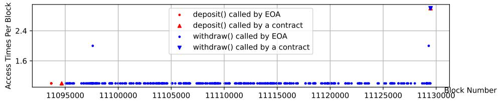
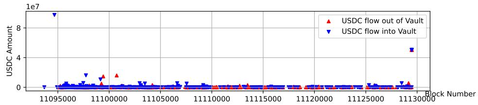
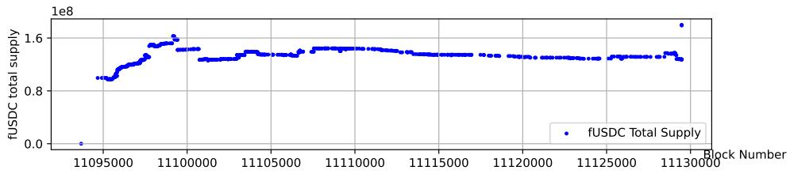
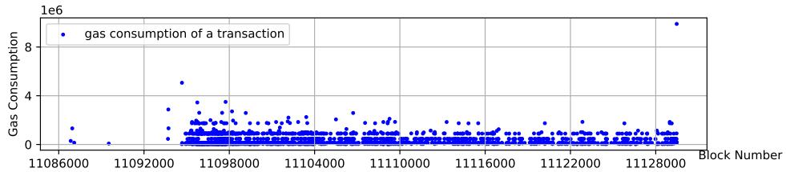
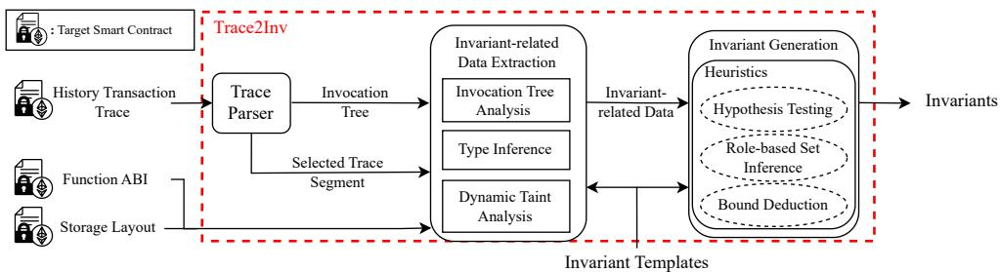

# Demystifying Invariant Efectiveness for Securing Smart Contracts (Extended Version)

ZHIYANG CHEN, University of Toronto, Canada

YE LIU, Nanyang Technological University, Singapore

SIDI MOHAMED BEILLAHI, University of Toronto, Canada

YI LI, Nanyang Technological University, Singapore

FAN LONG, University of Toronto, Canada

Smart contract transactions associated with security attacks often exhibit distinct behavioral patterns compared with historical benign transactions before the attacking events. While many runtime monitoring and guarding mechanisms have been proposed to validate invariants and stop anomalous transactions on the fly, the empirica efectiveness ofthe invariants used remains largely unexplored. In this paper, we studied 23 prevalent invariants of 8 categories, which are either deployed in high-profile protocols or endorsed by leading auditing firms and security experts. Using these well-established invariants as templates, we developed a tool Trace2Inv which dynamically generates new invariants customized for a given contract based on its historical transaction data. We evaluated Trace2Inv on 42 smart contracts that fell victim to 27 distinct exploits on the Ethereum blockchain. Our findings reveal that the most efective invariant guard alone can successfully block 18 of the 27 identified exploits with minimal gas overhead. Our analysis also shows that most of the invariants remain efective even when the experienced attackers attempt to bypass them. Additionally, we studied the possibility of combining multiple invariant guards, resulting in blocking up to 23 of the 27 benchmark exploits and achieving false positive rates as low as 0.28%. Trace2Inv significantly outperforms state-of-the-art works on smart contract invariant mining and transaction attack detection in accuracy. Trace2Inv also surprisingly found two previously unreported exploit transactions.

CCS Concepts: • Security and privacy → Software security engineering; • Software and its engineering → Software testing and debugging.

Additional Key Words and Phrases: runtime validation, invariant generation, dynamic analysis, flash loan

## ACM Reference Format:

Zhiyang Chen, Ye Liu, Sidi Mohamed Beillahi, Yi Li, and Fan Long. 2024. Demystifying Invariant Efectiveness for Securing Smart Contracts (Extended Version). Proc. ACM Softw. Eng. 1, FSE, Article 79 (July 2024), 26 pages. https://doi.org/10.1145/3660786

## 1 INTRODUCTION

Blockchain technology has paved the way for decentralized, resilient, and programmable ledgers on a global scale. One of its most impactful applications is smart contracts. These smart contracts allow developers to encode intricate transaction rules that govern the ledger. This innovation has made both blockchains and smart contracts essential infrastructure for decentralized financial services, commonly known as DeFi. As of Sept 25th, 2023, the Total digital asset Value Locked (TVL) in 2, 933 DeFi protocols has reached an impressive 48.58 billion [def 2023a].

Authors’ Contact Information: Zhiyang Chen, University of Toronto, Toronto, Canada, zhiychen@cs.toronto.edu; Ye Liu, Nanyang Technological University, Singapore, Singapore, ye.liu@ntu.edu.sg; Sidi Mohamed Beillahi, University of Toronto, Toronto, Canada, sm.beillahi@utoronto.ca; Yi Li, Nanyang Technological University, Singapore, Singapore, yi\_li@ntu.edu.sg; Fan Long, University of Toronto, Toronto, Canada, fanl@cs.toronto.edu

Permission to make digital or hard copies of all or part of this work for personal or classroom use is granted without fee provided that copies are not made or distributed for profit or commercial advantage and that copies bear this notice and the full citation on the first page. Copyrights for third-party components of this work must be honored. For all other uses, contact the owner/author(s).

However, the landscape is not without its challenges. Security attacks pose a significant threat to the security of smart contracts. Attackers can exploit various vulnerabilities by sending malicious transactions, potentially leading to the theft of millions of dollars. As of Sept 25th, 2023, the financial losses attributed to security attacks on DeFi protocols exceeded 5.53 billion USD [def 2023b].

One key observation is that transactions initiated by attackers often display abnormal behaviors when compared to standard transactions from regular DeFi contract users. These malicious transactions may exploit control flows in corner cases, use abnormally large values to trigger overflows, or manipulate a large volume of digital assets to distort the market in DeFi contracts. In fact, industry experts have been actively monitoring abnormal digital asset movements on-chain to report malicious activities. For example, Forta Network [Network 2023] deploys monitoring bots to detect on-chain security-related events in real-time. Driven by this observation, smart contract developers have proposed deploying runtime checks to detect transactions leading to abnormal be haviors to neutralize malicious attacks. These checks involve enforcing various runtime invariants, such as restricting the maximum number of digital asset deposits or withdrawals in a contract to prevent market manipulation. Another example is to limit the interaction between contracts to prevent attackers from crafting sophisticated attack strategies. However, these mechanisms are often manually designed and tailored for specific DeFi protocols. This raises questions about their efectiveness across diferent types of contracts and whether they maintain an acceptable false positive rate without hindering normal user activities.

Smart Contract Invariant Study: This paper presents the first comprehensive, quantitative analysis focused on the utilization of dynamically inferred invariants to enhance smart contract security. We examine 23 invariant templates, which are advocated by leading auditing firms, academic research, and DeFi protocol developers. Our findings indicate that dynamically inferred dynamic invariants serve as efective mechanisms for thwarting security breaches. This paper then proposes new strategies to combine multiple invariants efectively. Our combined invariants can neutralize over 74.1% of malicious attacks while maintaining a false positive rate of less than 0.28%. Trace2Inv: To facilitate this study, we have developed Trace2Inv, a scalable and extensible invariant synthesis framework. Trace2Inv is designed to automatically derive invariants from transaction traces through the use of trace and dynamic taint analysis. Trace2Inv leverages the main feature of public blockchains, transparent databases of transactions histories containing well-organized transaction execution data. Then, for each invariant template under consideration, Trace2Inv employs a specialized inference algorithm to dynamically generate the corresponding invariant based on historical transaction data.

Experimental Results: We evaluate Trace2Inv on a benchmark set of 42 smart contracts that have previously fallen victim to security attacks. Our results show that properly constructed invariants are efective in neutralizing security threats in 39 out of the 42 benchmark contracts.

In the course of our study, we categorized the 23 invariant templates into eight distinct groups based on their underlying design principles: access control, time lock, gas control, re-entrancy, oracle, storage, money flow, and data flow. Subsequently, we conducted a series of in-depth analyses to compare the eficacy of invariants within each group. We also manually scrutinized the transactions flagged by each invariant template, leading to several key findings:

• Finding 1: Certain invariant outperform others in terms of efectiveness. Within each invariant group, we identified at least one invariant template that is quantitatively superior, neutralizing a greater number of attacks while generating fewer false positives. See Section 6.1.

• Finding 2: Invariants remain efective even when attackers are aware of them in the majority of cases. A common concern regarding runtime invariants is their potential vulnerability to informed attackers. Our study reveals that selected invariants in the access control, time lock, gas control, money flow, and data flow groups often directly counter critical elements of attack strategies, such as flash loans and transaction atomicity. These invariants not only neutralize the malicious transactions but also render the attack strategies unfeasible or non-profitable in 84.21% of cases. See Section 6.2.

• Finding 3: Normal users can possibly circumvent invariant guards, thereby mitigating the impact on user experience. For example, in the case of data flow and money flow invariants, a user can divide a large transaction into smaller segments to bypass the invariant guard in 80% false positive instances. See Section 6.2.

• Finding 4: Combined invariants, formed through disjunction or conjunction, ofer enhanced security coverage with lower false positive rate. Diferent groups of invariants address diferent attack scenarios. A combined invariant formed through conjunction can cover more attack vectors, while one formed through disjunction may reduce the false positive rate, as malicious attacks often exhibit multiple abnormal behaviors. See Section 6.3.

Contributions: This paper presents the following contributions:

• Invariant Inference: This paper conducts an extensive study of 23 invariant templates, categorized into 8 distinct groups. Additionally, we introduce innovative techniques for the efective inference of invariants across all studied templates from transaction history.

• Trace2Inv: This paper presents the design and implementation of Trace2Inv, a specialized tool for smart contract trace analysis that is capable of inferring the invariants under study from transaction history.

• Experimental Results: This paper presents the first systematic and quantitative evaluation of the efectiveness of runtime invariants on 42 victim contracts in 27 real-world exploits with high financial losses.

• Invariant Study Findings: Our research uncovers a series of critical insights that will inform the future application and development of dynamic invariants.

## 2 BACKGROUND

Blockchain is a distributed and immutable ledger technology that records transactions across multiple nodes in a network. It employs cryptographic techniques to ensure data integrity and consensus algorithms to maintain final consistency across all participating nodes. Smart contracts are self-executing programs with the terms of the agreement directly written into code. Deployed on blockchains, they are immutable and transparent, enabling trustless transactions without the need for intermediaries. Invariant guards (also called circuit breakers) are runtime checks around contract invariant conditions that shall always hold during contract execution, aiming to secure smart contracts on the fly.

Ethereum Virtual Machine (EVM) is the runtime environment for smart contract execution on Ethereum. It is a Turing-complete virtual machine that interprets and executes the bytecode compiled from contracts programmed in a high-level language like Solidity. Gas is a unit of transaction fee on Ethereum, used to quantify the computational eforts for the execution of EVM operations. It is paid in Ether, the native cryptocurrency ofEthereum. Externally Owned Account (EOA) and contract account are two types of accounts on Ethereum. EOAs are owned by normal users only who have the right to send transactions to blockchains, while contract accounts are controlled by the code deployed at a certain blockchain address and its code will be executed when the contract function is invoked. ERC20 is a standard interface for fungible tokens on Ethereum. Almost all valuable tokens on Ethereum are ERC20 tokens.

Common smart contract vulnerabilities include integer overflow/underflow [Blockchain-Projects 2020], reentrancy [Siegel 2016], dangerous delegatecall [Santiago 2017], etc. DeFi vul nerabilities are smart contract vulnerabilities that are specific to DeFi applications. They are more subtle to detect and attacks usually involve more sophisticated steps [Zhou et al. 2023]. DeFi protocols are major targets for smart contract attacks, which have experienced \$5.53 billion loss out of the overall \$6.94 billion caused by recent blockchain incidents [def 2023b].

## 3 MOTIVATING EXAMPLE

In this section, we present a motivating example to illustrate how an exploit transaction behave diferently from other benign transactions in histories and how dynamically inferred transactions can neutralize the exploit transaction to enhance smart contract security.

Exploit Transaction: Harvest Finance is a Decentralized Finance (DeFi) protocol deployed on Ethereum to manage and auto-invest stable coins for users. On October 26, 2020, USDC and USDT vaults of the Harvest Finance were exploited, causing a financial loss of about USD \$33.8 million. Harvest Finance internally uses the market data of Curve, another DeFi stable coin trading protocol, to determine the market prices of USDC and USDT. In the exploit transaction, the attacker distorts the market of Curve to cause the Harvest Finance to make sub-optimal investment decisions.

Specifically, the attack transaction first borrows a large amount of digital assets and uses the borrowed asset to buy USDC in Curve to inflate its price. Then it deposits 49.98M USDC into Harvest vault contract, which increases its USDC balance from 72.83M to 122.51M. Due to the manipulated oracle price of USDC, Harvest vault contract erroneously mints the attacker an inflated 51.46M fUSDC, which increases the total fUSDC supply from 127.58M to 179.04M. The attacker then restores the USDC by selling the USDC in Curve, and redeems all its fUSDC tokens for 50.30M USDC, yielding a 32k surplus compared to the initial deposit. This redemption decreases the Harvest vault’s USDC balance from 122.81M to 72.51M and restores the total fUSDC supply to its original value of 127.58M. Remarkably, this identical attack vector is executed three times within one exploit transaction, consuming an unusually high gas count of 9, 895, 111, narrowly within the gas limit of 12, 065, 986 at the time. More details of this example can be found at the website [Chen et al. 2024e]. Abnormal Behaviors: We identify four distinct dimensions of abnormal behavior: a high frequency of user interactions with the Harvest vault contract, an exceptionally large volume of token flow, abrupt fluctuations in the total supply of fUSDC tokens, and remarkably high gas consumption. To better understand the abnormality of the exploit transaction, we collect and analyze all transaction history of the Harvest vault contract up to the point of the exploit, as illustrated in Figure 1.

As shown in Figure 1, the last data point in each sub-figure, representing the exploit transaction, consistently emerges as an outlier. Specifically, we have observed that the exploit transaction is the first in the contract’s history to: (1) invoke the withdraw function from a contract rather than from a user address, (2) call both deposit and withdraw functions 3 times within one transaction, (3) consume more gas than any previous transaction, (4) withdraw more USDC from the protocol than any other transaction, (5) elevate the total supply of fUSDC tokens to an all-time high.

We observed several other outlier data points besides the last data point. For access frequency, two blocks contained two withdraw invocations within the same block, which, upon investigation, were found to originate from separate addresses. We believe it was a coincidence that two users withdrew their funds in the same block. For token flow, a very large USDC deposit occurred immediately after the contract’s deployment, which, upon manual analysis, was identified as an initial liquidity provided by the Harvest Finance team. Similarly, the abrupt jump in the total supply of fUSDC tokens in the early stage was also due to this initial liquidity provision. Since users receive fUSDC tokens when they deposit USDC into the vault and these tokens are burned upon withdrawal of USDC, a large initial deposit would lead to a corresponding increase in the total supply of fUSDC tokens. For gas consumption, a transaction at block 11094671 consumed 5,062,934 gas, which, after manual analysis, was found to be sent by the Harvest Finance team for migrating old vaults to new ones. This migration process involved numerous operations in a single transaction to ensure atomicity, leading to high gas consumption. Overall, while there were anomalies during the early stage of the contract’s deployment, the diferent transaction metrics stabilized after some blocks until significantly changed by the exploit transaction. If contract maintainers can identify the "stable" stage and use these transactions to infer invariants, the inferred invariants can be much more accurate. However, in this paper, we assume such information is not available.

  
Fig. 1. Statistics of Transactions on Harvest USDC Vault Contract.

Apply Inferred Invariants: The multi-dimensional abnormalities observed in the exploit transaction highlight a stark departure from typical transactional behaviors. This divergence suggests the feasibility of crafting and applying runtime invariants that are capable of flagging and blocking transactions exhibiting such anomalous characteristics. For example, suppose we inferred and enforced an invariant stating that the withdraw function may only be invoked by an Externally Owned Account (EOA), the exploit transaction could be blocked. This is because the exploit relies on a contract to execute complex logic designed to extract funds from the vault. Likewise, if we inferred an invariant that the total supply of fUSDC should not surpass 160M, the profitability of each round of the exploit would be significantly reduced, making it unable to cover the cost of manipulating the market of Curve. Importantly, both invariants do not afect any normal user’s transaction in histories, making them practical for real-world deployment.

Patch Smart Contracts Post-Deployment: Despite the immutable nature of deployed smart contracts, developers still have diferent methods to alter their behavior post-deployment, allowing for the addition or modification of invariant guards to shield against future exploits: (1) Upgradable or Modular Contract Design: Upgradable contract standards such as ERC897 [ERC 2024b] and ERC1167 [ERC 2024a] incorporate a proxy and an execution contract. The proxy contract delegates function calls to the execution contract, whose address can be modified within the proxy, allowing developers to update their smart contracts after deployment. Similarly, developers can segment a protocol into multiple contracts as diferent modules. A primary contract interfaces with users, subsequently interact with other modular contracts that handle distinct functionalities including invariant checking. The addresses of modular contracts could be updated in the primary contract. (2) Application Interface Adjustments: For deployed protocols with neither upgradable nor modular contract designs, addressing vulnerabilities or enforcing invariants can still be achieved by launching a revised protocol version and redirecting users through website or application interfaces.

Research Questions: Inspired by these observations and their implications for enhancing smart contract security, we are motivated to explore the following research questions:

RQ1: Given the fact that exploit transactions often exhibit abnormal behaviors, what kinds of invariant guards are most efective at stopping exploit transactions?

RQ2: If an exploit transaction or benign transaction violates invariant guards, how dificult is it for an attacker or a regular user to bypass them?

RQ3: As multiple dimensions of abnormality may be associated with an exploit transaction, how efective is the combination of diferent invariant guards in preventing exploits?

RQ4: Invariant guards require additional gas at runtime. What are the gas overheads of diferent types of invariant guards?

RQ5: In terms of enhancing smart contract security, how does this work compare to other state-of-the-art works in contract invariant generation or transaction anomaly detection?

## 4 INVARIANTS

Scope. Our research focuses on the invariants that can be used to distinguish between benign and malicious transactions. Particularly, we focus on the invariants that are broadly applicable to most common DeFi protocols. Invariants that are not for security purposes or highly specific to a single protocol are outside the scope of our study.

Methodology. In our efort to build a comprehensive list of smart contract transaction guards, we carried out an analysis of existing research papers on smart contract security [Breidenbach et al. 2021; Choi et al. 2021; Ghaleb et al. 2023; Liu et al. 2022b; Rodler et al. 2018].

Additionally, we conducted a qualitative study on both audit reports and source code of the 63 audited projects from ConsenSys, a leading smart contract auditing firm, from May 2020 to March 2023 [con 2023]. One author extracted 2, 181 enforced invariants from the audit reports and smart contracts under audit by searching for keywords such as “require” and “assert”, after eliminating any duplicates. The author then manually reviewed these invariants to extract templates for pattern matching against remaining uncategorized invariants. This iterative process continued until no new templates could be extracted, and all remaining invariants were also deemed uncategorized for specific reasons. This task took three weeks. Following this, another author reviewed and validated both the categorized and uncategorized invariants for accuracy. In cases of disagreement, a third author was consulted to resolve the issue. This review process lasted two weeks. All three authors have over two years of smart contract security research experience.

The above process resulted in 826 invariants under 8 categories, which represent 37.87% of the 2181 invariants, as shown in Table 1. Access Control and Data Flow are the two common categories. The remaining invariants (62.13%) were not categorized for various reasons. The most common reason is that invariants are specific to a particular protocol. For example, the invariant “require(validUniswapPath(bAsset))” checks whether “bAsset” is a valid Uniswap path. However, this invariant can only apply to protocols involving Uniswap, thus limiting its applicability. Other uncategorized invariants are used for checking array lengths, byte operations, and arithmetic safety, which target specific data structures or operations. Such invariants of low-level operations are hard to apply as security guards because they are unable to capture the high-level user intentions.

Table 1. Qualitative Study Statistics Overview+ (The table’s left section presents key statistics from the qualitative study. The middle section presents categorized instances across invariant categories. The right section presents instances for various reasons why these invariants remain uncategorized.)

<table><tr><td>Statistics</td><td>Count</td><td>Category</td><td>Count</td><td>Reason</td><td>Count</td></tr><tr><td># Audits</td><td>63</td><td>Access Control</td><td>283</td><td>Protocol Specific</td><td>1098</td></tr><tr><td># Code Repositories</td><td>49</td><td>Time Lock</td><td>158</td><td>Array Length Check</td><td>200</td></tr><tr><td># Invariants in Total</td><td>2181</td><td>Gas Control</td><td>2</td><td>Byte Operation</td><td>44</td></tr><tr><td># Invariants Categoried</td><td>826</td><td>Re-entrancy</td><td>12</td><td>Safe Math</td><td>13</td></tr><tr><td># Invariants Uncategorized</td><td>1355</td><td>Oracle Slippage</td><td>15</td><td></td><td></td></tr><tr><td></td><td></td><td>Special Storage</td><td>24</td><td></td><td></td></tr><tr><td></td><td></td><td>Money Flow</td><td>151</td><td></td><td></td></tr><tr><td></td><td></td><td>Data Flow</td><td>181</td><td></td><td></td></tr></table>

+:All study results and collected invariant instances can be found at [Chen et al. 2024d].

Invariant Templates. Table 2 summarizes the results of our study. In the table, the Category column groups invariant templates based on their application domains, such as Access Control, Time Lock, etc. The ID column assigns a unique identifier to each invariant, while the Name column provides a human-readable description. The Template column contains formal representation of the invariant templates. Specifically, we use x to denote a contract state record maintained by invariant templates. We use r to represent a local variable and \_? as the undetermined parameter to be inferred. The Parameter column shows the type of the undetermined parameter. The References column lists the academic or industry sources of each invariant template.

Table 2. Invariants. (We use x to denote a contract state variable, r to denote a local variable, and \_? to denote a hole in the template to fill during the synthesis. |\_| denotes the absolute value.)

<table><tr><td>Category</td><td>ID</td><td>Name</td><td>Template</td><td>Parameter</td><td>References</td></tr><tr><td rowspan="5">Access Control</td><td>EOA</td><td>onlyEOA</td><td>msg.sender = tx.origin</td><td>-</td><td rowspan="5">[Liu et al. 2022b][Ghaleb et al. 2023]</td></tr><tr><td>SO</td><td>isSenderOwner</td><td>msg.sender = owner?</td><td>address</td></tr><tr><td>SM</td><td>isSenderManager</td><td>msg.sender =  $\bigcup_{i=1}^{n?}$  mgr $_{i}$ ?</td><td>addresses</td></tr><tr><td>OO</td><td>isOriginOwner</td><td>tx.origin = owner?</td><td>address</td></tr><tr><td>OM</td><td>isOriginManager</td><td>tx.origin =  $\bigcup_{i=1}^{n?}$  mgr $_{i}$ ?</td><td>addresses</td></tr><tr><td rowspan="3">Time Lock</td><td>SB</td><td>isSameSenderBlock</td><td>xentrySdrBlk ≠ rexitSdrBlk</td><td>-</td><td rowspan="2">[idl 2023]</td></tr><tr><td>OB</td><td>isSameOriginBlock</td><td>xentryOrgBlk ≠ rexitOrgBlk</td><td>-</td></tr><tr><td>LU</td><td>lastUpdate</td><td>rcurtBlk - xlstBlk ≥ nbBlks?</td><td>Integer</td><td>[fei 2023a,b; mst 2023]</td></tr><tr><td rowspan="2">Gas Control</td><td>GS</td><td>GasStartUpperBound</td><td>gasStart ≤ gas?</td><td>Integer</td><td rowspan="2">motivated by Section 3</td></tr><tr><td>GC</td><td>GasConsumedUpperBound</td><td>gasStart - gasEnd ≤ gas?</td><td>Integer</td></tr><tr><td>Re-entrancy</td><td>RE</td><td>nonReEntrant</td><td>xlock = true</td><td>-</td><td>[Rodler et al. 2018]</td></tr><tr><td rowspan="2">Oracle Slippage</td><td>OR</td><td>OracleRange</td><td>prLB ? ≤ rnewPr ≤ prUB ?</td><td>Integer</td><td>[dfo 2023b]</td></tr><tr><td>OD</td><td>OracleDeviation</td><td> $| (r_{newPr} - x_{oldPr}) / x_{oldPr} | \leq pr_{Dev} ?$ </td><td>Integer</td><td>[dfo 2023b][Breidenbach et al. 2021]</td></tr><tr><td rowspan="2">Special Storage</td><td>TSU</td><td>TotalSupplyUpperBound</td><td>xtotSup ≤ totSup?</td><td>Integer</td><td>[Aav 2023] [dfo 2023a]</td></tr><tr><td>TBU</td><td>TotalBorrowUpperBound</td><td>xtotBor ≤ totBor?</td><td>Integer</td><td>[Aav 2023] [dfo 2023a]</td></tr><tr><td rowspan="4">Money Flow</td><td>TIU</td><td>TokenInUpperBound</td><td>rtokenIn ≤ v?</td><td>Integer</td><td>[bal 2023] [dfo 2023a]</td></tr><tr><td>TIRU</td><td>TokenInRatioUpperBound</td><td>rtokenIn ≤ v?</td><td>Integer</td><td>[bal 2023]</td></tr><tr><td>TOU</td><td>TokenOutUpperBound</td><td>rtokenOut/btoken,adr ≤ v?</td><td>Integer</td><td>[bal 2023] [dfo 2023a]</td></tr><tr><td>TORU</td><td>TokenOutRatioUpperBound</td><td>rtokenOut/btoken,adr ≤ v?</td><td>Integer</td><td>[bal 2023]</td></tr><tr><td rowspan="4">Data Flow</td><td>MU</td><td>MappingUpperBound</td><td>map?[index?] ≤ v?</td><td>Integer</td><td rowspan="4">[Choi et al. 2021]</td></tr><tr><td>CVU</td><td>CallValueUpperBound</td><td>msg.value ≤ v?</td><td>Integer</td></tr><tr><td>DFU</td><td>DataFlowUpperBound</td><td>var? ≤ v?</td><td>Integer</td></tr><tr><td>DFL</td><td>DataFlowLowerBound</td><td>var? ≥ v?</td><td>Integer</td></tr></table>

## 4.1 Access Control (also called Permission Control)

Many research papers have conducted extensive studies on the access control [Ghaleb et al. 2023; Liu et al. 2022b]. Access control governs the privileges associated with the transaction’s sender and origin, dictating which addresses are authorized to invoke specific smart contract functions.

Note that transaction’s sender and origin could be diferent in Ethereum. The sender is the address which invokes the contract function, while the origin is the address who initiates the entire transaction. For example, if user address � calls contract � which in turn calls contract �, during the execution of �, the sender address is � while the origin address is �.

onlyEOA (EOA)1 This template verifies that the transaction’s origin matches the sender’s address, thereby confirming it was initiated from an externaly owned user address (i.e., EOA address) rather than a contract address. The intuition of this invariant template is that many attack strategies involves multiple sophisticated interactions and therefore attackers often have to write their own contracts. This template can neutralize such attack strategies.

isSenderOwner (SO) and isOriginOwner (OO): These templates restrict function execution to a predefined address (owner?) that are registered as owners.

isSenderManager (SM) and isOriginManager (OM): These templates only allow function calls from a set of predefined manager addresses mgri?.

The access control invariants are typically inserted at the beginning of non-read-only functions to immediately halt unauthorized attempts to alter contract state.

## 4.2 Time Lock

The Time Lock category of invariants serves as a temporal gating mechanism for smart contract functions. This category contains three invariants.

isSameSenderBlock (SB) and isSameOriginBlock (OB): These templates limit the ability to execute specific paired functions within the same block by the same sender or origin. For example, to inhibit the same sender or origin address from invoking both the deposit and withdraw functions consecutively within a single block. The intuition is that normal users are unlikely to initiate multiple interactions with the same function in a few seconds, while malicious attackers often use iterative loops to drain funds from a victim contract. To implement these invariants, a state variable x t Sd Blk (resp., x t O Blk) stores a hashed combination of the transaction sender (resp., origin) address and the current block number upon entry into a function (e.g., deposit). In the exit function (e.g., withdraw), this stored value is compared against a freshly computed hash, stored in rexitSdrBlk (resp., r xitOr Blk), to ensure that they difer. These two invariants are designed to be updated at the entry point of enter functions, i.e., functions that accept tokens from users. Then verified at the start of exit functions, i.e., functions that are responsible for disbursing tokens back to users.

lastUpdate (LU): These template moderates the frequency with which a given function can be invoked. It inserts guard at the beginning of non-read-only functions to mandate that a specified number of blocks, denoted as nbBlks?, must elapse between two consecutive calls to the same function. To enforce this, the state variable xlstBlk captures the timestamp of the last block where the function was invoked. Subsequent calls to the function check this stored timestamp against the current block timestamp. The diference must meet or exceed the nbBlks? threshold.

## 4.3 Re-entrancy

The Re-Entrancy class of invariants tackles re-entrancy vulnerabilities in smart contracts. Represented by a single invariant template, nonReEntrant (RE), this category utilizes a state variable $\mathbf { \boldsymbol { x } } _ { | \mathbf { \boldsymbol { o c k } } }$ as a lock to prevent a transaction from entering a set of key functions of a contract more than once. $\mathbf { \boldsymbol { x } } _ { | \mathbf { \boldsymbol { o c k } } }$ will be set to ���� when a function is invoked and reset to ����� when a function returns. The RE guard is usually placed at the beginning of enter and exit functions of a contract to efectively mitigate re-entrancy risks.

## 4.4 Gas Control

We propose the Gas Control category of invariants, motivated by the Harvest example. The intuition is that malicious attacks tend to have significantly more complicated logic to consume a large amount of gas. This class consists of two invariants: GasStartUpperBound (GS) and GasConsumedUpperBound (GC). As illustrated in Table 2, the GS invariant sets an upper limit on the remaining gas at the entry point of a function, using the variable gasStart, whereas the GC invariant sets an upper bound on the total gas consumed within the function by comparing the remaining gas at the entry and exit point of a function, gasStart and gasEnd. These invariants are designed to be placed at the beginning and end of non-read-only functions.

## 4.5 Oracle Slippage

The Oracle Slippage category mitigates risks tied to price oracles in DeFi applications. The intuition of templates in this category is to detect potential price manipulation by malicious attacks. This class includes two invariant templates: OracleRange (OR) and OracleDeviation (OD). The OR template enforces a bounded range for the oracle prices. It utilizes two parameters, $\mathsf { p r } _ { \mathsf { L B } } ?$ and prUB?. The OD template enforces a specific percentage deviation limit between the current and last price provided by the oracle. The parameter $\mathsf { p r } _ { \mathsf { D e v } } ?$ is employed to define a permissible deviation rate. These invariants are usually inserted right after the oracle is called.

## 4.6 Special Storage

The Special Storage class of invariant templates is concerned with constraining global storage variables that are crucial to the contract’s state or logic. The intuition of this is after an exploit, the contract’s state variables are often in an abnormal state. Thus, by constraining the state variables, we can prevent the exploit. This class features two main invariants: TotalSupplyUpperBound (TSU) and TotalBorrowUpperBound (TBU). The TSU invariant imposes an upper bound (denoted as totSup?) on the contract’s totalSupply variable, while TBU sets a ceiling (denoted as totBor?) for the contract’s totalBorrow variable which represents the total amount that can be borrowed from the contract. To preserve the integrity of these important state variables, these invariants are inserted at the functions that could modify the total supply or total borrow balances.

## 4.7 Money Flow(also called Token Flow)

The Money Flow class focuses on the flow of tokens within the smart contract, particularly for functions involving token deposits and withdrawals. The intuition of these templates is that malicious transactions tend to cause abnormally large amount of digital asset movement.

TokenInUpperBound (TIU) and TokenOutUpperBound (TOU): This template caps the number of tokens flowing into or out of the contract each time by using an integer parameter $\mathsf { v ? }$

TokenInRatioUpperBound (TIRU) and TokenOutRatioUpperBound (TORU): These templates constrain the ratio of tokens flowing into or out of the contract, in relation to the contract’s current token balance. They also employ an integer parameter $\mathsf { v ? }$

To ensure efective governance of money flow, these invariants are placed within functions that handle token transfers. The TIU and TIRU invariants are applied right before a token deposit, while the TOU and TORU invariants are applied before a token withdrawal.

## 4.8 Data Flow

Smartian [Choi et al. 2021] leverages dynamic taint analysis to detect whether a block state can afect an ether transfer. We extend their work to include all data flows afecting both ether and ERC20 token transfers. This allows us to set constraints on values that could potentially be controlled by an attacker to manipulate transfer amounts. The Data Flow category is subdivided into four specific invariants, each designed to address a particular type of variables in the data flow.

MappingUpperBound (MU): This invariant focuses on values stored in the contract’s mapping data structure, often representing a user’s property(e.g., a user’s shares/balances). To constrain such user-specific values, we introduce a parameter v? to set an upper limit on these mappings.

CallValueUpperBound (CVU): Call values signify the amount of ether transferred during a function call. Because these values directly afect the contract’s ether balance, we list it as a separate invariant. We employ a parameter, denoted as v?, to cap the incoming ether to mitigate risks of abnormal or malicious deposits.

DataFlowUpperBound (DFU) and DataFlowLowerBound (DFL): These invariants apply to all other data flow variables, whether derived from external calls, storage loads, or calldata. To regulate these variables, we use a parameter v?, setting either upper or lower bounds on these values to thwart unauthorized manipulations.

The above invariants are inserted at the locations where data flow variables are first read. This is often in functions that initiate token transfers. These invariants help the contract ensure that every value used for the calculation of token transfers is within the normal range.

## 5 TRACE2INV

We present Trace2Inv, shown in Figure 2, a framework to infer concrete invariants as introduced in Section 4 for a contract by analyzing its transaction traces. Trace2Inv consists of three modules: trace parser, invariant-related data extraction, and invariant generation. The second module consists of three submodules: invocation tree analysis, type inference, and dynamic taint analysis.

  
Fig. 2. An Overview of Trace2Inv

## 5.1 Trace Parser

A transaction’s trace data, denoted as structLogs, contains a sequence of executed EVM instructions and each instruction is a six-item tuple ⟨pc, op, gasLeft, gasCost, stack, memory⟩ that includes the current program counter, the EVM opcode to execute, the amount of the remaining gas and the gas consumed by current opcode execution, the full view of current EVM stack and memory. In trace parser, we reconstruct the functional context information from structLogs as an invocation tree where each node represents an external function call and the node hierarchy reflects the call-chain relationship. In particular, each tree node is a seven-item tuple ⟨addr, func, args, ret\_data, ins, gasEntry, gasExit⟩ that records the current contract address, function name, corresponding arguments, returned data, the set of executed EVM instructions belonging to the function, and the amount of the remaining gas at the entry and exit points of the function. The invocation tree also contains metadata of the transaction, such as the transaction hash, the block number, and the origin address. The trace parser leverages the target contract address to isolate a selected trace segment corresponding to the target contract’s execution. This invocation tree and the segmented trace data are then passed to the next module for further analysis.

## 5.2 Invocation Tree Analysis

Invocation tree analysis extracts invariant-related data from the invocation tree, that is suficient to collect data for access control, time lock, gas control, re-entrancy, oracle, and money flow invariants. For instance, for the sender opcode, its results is extracted from the invocation tree by searching for parent node of the target contract node. Moreover, the invocation tree is also used to identify locations of re-entrancy by capturing nested and recursive calls to the target contract. Oracle values are also obtained by traversing the invocation tree to locate calls to the oracle. For money flow invariants, the required values are also read from function calls of transferring Ether/ERC20.

## 5.3 Type Inference

Type inference in Trace2Inv infers the type of storage slot when it is accessed. It is essential for extracting data relevant to both special storage and data flow invariants, as accurately decoding storage accesses with the correct type is necessary for those invariants. Decoding storage slots is straightforward when they are listed in the contract’s storage layout, which is typically the case for special storage invariants. However, the challenge arises with complex data structures like mapping, often used in data flow invariants. These structures may reference storage slots not explicitly present in the contract’s storage layout, which are instead computed through operations such as sha3 and arithmetic functions. To solve this issue, Trace2Inv maintains a preimage dictionary to track the key’s computation. When we encounter a sha3 opcode, the mapping positions and slots are recorded. In Solidity, the first 32-bytes represent the mapping slot, and the next 32-bytes serve as the mapping position. In Vyper, these roles are reversed. Anytime a 64-byte sha3 hash is encountered, both its hash value and origin are recorded. When a sload operation has a key that is not present in the storage layout, the preimage dictionary is consulted. We recursively trace back the computation steps until we identify a mapping data structure that is in the storage layout. Using the types of the mapping data structure, we infer the type of storage slot accessed.

## 5.4 EVM-level Dynamic Taint Analysis

Dynamic taint analysis in Trace2Inv operates at the EVM opcode level to track data sources. It is used to extract data for data flow invariants. Given a target contract, a corresponding trace segment, and the invocation tree of the transaction, the taint analyzer collects all accessible information pertaining to that contract. The analyzer also infers the data types of recorded tainted data or taint sources. It accomplishes this by utilizing storage layouts and function ABIs thereby providing a comprehensive, type-aware taint analysis tailored for smart contracts.

Table 3. Instructions Defined as Sources and Sinks.

<table><tr><td></td><td>Category</td><td>Opcodes and Locations</td></tr><tr><td rowspan="6">Sources</td><td>External Address</td><td>balance, extcodesize, extcodecopy, extcodehash</td></tr><tr><td>Execution Context</td><td>origin, caller, address, codesize, selfbalance, pc, msize, gas</td></tr><tr><td>Call Data</td><td>callvalue, calldataload, calldatasize, calldatacopy</td></tr><tr><td>Return Data</td><td>returndatasize, returndatacopy</td></tr><tr><td>Block</td><td>blockhash, coinbase, timestamp, number, prevrandao, gasprice, gaslimit, chainid</td></tr><tr><td>Storage</td><td>sload(untainted)</td></tr><tr><td rowspan="4">Sinks</td><td>ether transfer</td><td>address.call{value: uint256}</td></tr><tr><td>ether transferFrom</td><td>callvalue</td></tr><tr><td>ERC20 transfer</td><td>ERC20.transfer(address, uint256), ERC20 = token</td></tr><tr><td>ERC20 transferFrom</td><td>ERC20.transferFrom(address1,address2, uint256), ERC20 = token, address2 = this</td></tr></table>

Taint Sources and Sinks. Table 3 lists the EVM instructions that our dynamic taint analyzer identifies as sources and sinks for taint propagation. The table is divided into two categories: Sources and Sinks. In the Sources category, we outline various sub-categories of taint sources, which include external address, execution context, call and return data, block variables, and storage. Opcodes like balance, extcodesize, and sload are some of EVM opcodes that load new taint sources into the stack or memory. They are key to the taint propagation as they introduce data that could potentially influence other data points or outcomes in the contract.

On the other hand, the Sinks category highlights areas where tainted data may potentially lead to undesired or vulnerable behaviors. These include operations like ether transfers and ERC20 token transfers. Notably, the locations of these sinks are marked in bold text, such as address.call{value : uint256} and transfer(address, uint256), emphasizing their critical role in the taint analysis. Through these identified sources and sinks, our taint analyzer can efectively trace the flow of sensitive information within the smart contract, providing a robust framework for dynamic invariant inference and validation.

Bit Level Taint Propagation. Our taint analyzer maintains three distinct taint trackers: the stack, the memory, and the storage trackers. Initially, all these trackers are empty. Each tracker records taint information at the bit level, enabling granular analysis. For instance, sload and sstore opcodes can only read and write 32-byte chunks, but the taint status is stored for each individual bit. Our propagation of taints follows a set of rules based on prior work [Ghaleb et al. 2022]:

R1: A value derived from one or more operands becomes tainted if any of the operands is tainted. R2: For sload, if the storage slot loaded is tainted, the 32-byte stack entry receives the corresponding taint information. If not, the sload acts as a new taint source and taints the stack entry. For sstore, the 32-byte entry in the storage tracker is overwritten with the taint information from the stack.

R3: For instructions that read data from memory (e.g., mload), the result value is tainted if the read data is tainted. The same logic applies for data loaded from storage using the sload opcode.

R4: In external calls, if the arguments in memory are tainted, the return data will also be tainted.

## 5.5 Invariant Generation

Using the extracted data by the previous module, the invariants’ inference module uses the templates provided in Table 2 to generate concrete invariants where all holes are filled with concrete values. The synthesis heuristic of generating invariants varies based on their category:

Hypothesis Testing: For EOA, SB, OB, and RE invariants, which act as assumptions regarding the contract’s behaviors, no parameters need to be learned. If no data points violate these invariants (i.e, all transactions in the training set satisfy the invariant), they are then directly applied to the contract. Otherwise, the violated invariant is not applied.

Role-based Set Inference: For address-based invariants such as SO, SM, OO, and OM, we adopt a set-based heuristic. We analyze the set of senders or origins associated with each function call. If the size of this set exceeds a certain threshold (greater than 1 for owners or 5 for managers), we consider it as a violation, and the corresponding invariant is not applied to that function.

Bound Deduction: Invariants in the categories of gas control, oracle slippage, special storage, and money flow require learning the bounds of certain integer parameters. For those, the maximum and minimum values are chosen among the collected data points, provided the data contains at least two distinct values. Particularly for the oracle slippage invariant (OR), an additional tolerance of 20% is included for the upper and lower bounds, in accordance with prior research [Tolmach et al. 2021]. For TIRU and TORU invariants, we filter outliers using a z-score threshold of 3.

Hybrid: Lastly, for the LU invariant, which deals with the block gap between calls to the same function, we calculate the smallest block gap among the data points. If any two data points have a block gap of zero, the invariant is not applied to the corresponding function. Otherwise, the smallest block gap is used as the parameter for the invariant.

## 5.6 Trace2Inv Implementation

Trace2Inv’s input, transaction trace data, can be obtained from Ethereum via its API debug\_trace-Transaction. Within the Trace Parser module, Trace2Inv queries EtherScan [Eth 2020] to gather additional transaction metadata not directly available in the trace data, such as block number and transaction origin. This metadata provides the execution context crucial for generating certain invariants, like EOA and LU. Additionally, Trace2Inv also queries EtherScan [Eth 2020] to fetch the contract’s source code. The code is then compiled locally using the appropriate versions of the Solidity [sol 2018] or Vyper [vyp 2018] compilers to obtain the contract’s function ABI. With this ABI, Trace2Inv leverages Slither [sli 2021] to decode function names, their arguments, and return values present in the trace. Within Invariant Related Data Extraction Module, Trace2Inv compiles source code of target smart contract, and reads the compiler’s output to obtain its storage layout. However, some old versions of Solidity and Vyper compilers do not support this functionality. In such cases, Trace2Inv fetches the storage layout from EVM Storage [EVM 2024].

Several optimizations are incorporated into Trace2Inv to enhance its performance. First, when fetching trace data from an Ethereum archive node, we optimize the process by using batching RPC requests. This significantly reduces the overhead associated with individual API calls. Second, we use parallelization techniques to speed up the fetching and parsing trace data. Specifically, multiprocessing is used to concurrently handle diferent segments of trace data, converting them into summaries in a time-eficient manner. Third, caching is utilized to further optimize performance; the system caches query results from EtherScan, archive nodes, and compilers. This minimizes redundant executions and API calls, thereby accelerating the overall analysis process.

## 6 EVALUATION

In this section, we aim to empirically answer the research questions raised in Section 3 by applying invariant guards to real-world exploits on Ethereum Blockchain. We systematically collected economic exploit incidents that cost greater than 300K USD financial loss from February 14, 2020, to August 1, 2022 on Ethereum Blockchain. Our benchmark is compiled from a diverse set of sources including academic publications [Chen et al. 2022; Qin et al. 2021], industry databases [BlockSec 2023; SlowMist 2023], and open-source GitHub repositories [Contributors 2023a,b]. It is worth noting that we exclude from our benchmarks any hacks targeting individual user wallets, as these are primarily the result of private key leakage, rather than protocol vulnerabilities. We also exclude hacks where the victim contracts are close-source, as our manual analysis requires the source code of the victim contracts. Note that Trace2Inv can also be applied to close-source contracts, as long as their function ABIs and storage layout are available.

Table 4 presents the benchmark dataset in our study. It comprises 27 hacks which resulted in financial losses over 2 billion USD. The column FL denotes whether the exploit involves flash loans, which require atomicity for the hack transactions. The column Type denotes the type of victim contracts. For each hack, two types of victim contracts are manually identified: payload (P) refers to the contract that eventually transfers abnormal amounts of tokens out of the protocol, and interface (I) refers to the contract that is directly invoked by users to initiate this transfer. The History column gives the length of the transaction history up to the hack transaction for each victim contract.

## 6.1 RQ1: Efectiveness of Smart Contract Invariants

Experiment. In our first experiment, we utilize 23 pre-defined invariant templates, as detailed in Section 4, to dynamically infer invariants from the transaction histories of 42 diferent victim contracts, using the invariant generation methods as described in Section 5.5. We divide each contract’s transaction history into two distinct sets: 70% of the transactions are allocated for training set, while the remaining 30% are used as the test set.

To validate the efectiveness of the invariants dynamically inferred, we employ the transaction trace data in the test set for evaluation. Utilizing the same parser and dynamic taint analyzer, we obtain the invocation tree and data points pertinent to the particular invariant for each transaction. With these, we can evaluate whether a transaction violates any of the invariant guards in place. If a transaction is blocked by these invariant guards, it serves as a positive example for the efectiveness

Table 4. Benchmarks+. (Exploit: the first exploit transaction during the incident. FL: whether the exploit transaction uses flash loan. Contracts: the victim contracts involved in the exploit. Type: the type of the contract, either interface (I) or payload (P). PL: the programming language of the contract, either Solidity (S) or Vyper (V). History: the number of transactions in the history of the contract up to the exploit transaction.)

<table><tr><td>Kind</td><td>Victim Protocol</td><td>Root Cause</td><td>Date</td><td>Loss</td><td>Exploit</td><td>FL</td><td>Contracts</td><td>Type</td><td>PL</td><td>History</td></tr><tr><td rowspan="4">Bridges</td><td>RoninNetwork</td><td>keys compromised</td><td>22/03/29</td><td>624M</td><td>[Ron 2023]</td><td></td><td>RoninNetwork</td><td>I+P</td><td>S</td><td>95345</td></tr><tr><td>HarmonyBridge</td><td>keys compromised</td><td>22/06/24</td><td>100M</td><td>[Har 2023a]</td><td></td><td>HarmonyBridge</td><td>P</td><td>S</td><td>32149</td></tr><tr><td>Nomad</td><td>zero hash as a valid root</td><td>22/08/01</td><td>152M</td><td>[Nom 2023]</td><td></td><td>Nomad</td><td>I+P</td><td>S</td><td>15630</td></tr><tr><td>PolyNetwork</td><td>hash collision</td><td>21/08/10</td><td>611M</td><td>[Pol 2023]</td><td></td><td>PolyNetwork</td><td>I+P</td><td>S</td><td>44509</td></tr><tr><td rowspan="9">Lending</td><td>bZx2</td><td>oracle manipulation</td><td>20/02/18</td><td>630K</td><td>[bZx 2023]</td><td>✓</td><td>bZx2</td><td>I+P</td><td>S</td><td>711</td></tr><tr><td>Warp</td><td>oracle manipulation</td><td>20/12/17</td><td>8M</td><td>[War 2023]</td><td>✓</td><td>WarpWarp_I</td><td>PI</td><td>SS</td><td>14831</td></tr><tr><td>CheeseBank</td><td>oracle manipulation</td><td>20/11/06</td><td>3.3M</td><td>[Che 2023]</td><td>✓</td><td>CheeseBank_1CheeseBank_2CheeseBank_3</td><td>I+PI+PI+P</td><td>SSS</td><td>615593557</td></tr><tr><td>InverseFi</td><td>oracle manipulation</td><td>22/06/16</td><td>1.26M</td><td>[Inv 2023]</td><td>✓</td><td>InverseFi</td><td>I+P</td><td>S</td><td>7590</td></tr><tr><td>CreamFi1</td><td>cross contract re-entrancy</td><td>21/08/30</td><td>18M</td><td>[Cre 2023a]</td><td>✓</td><td>CreamFi1_1CreamFi1_2</td><td>I+PI+P</td><td>SS</td><td>558184</td></tr><tr><td>CreamFi2</td><td>oracle manipulation</td><td>21/10/27</td><td>130M</td><td>[Cre 2023b]</td><td>✓</td><td>CreamFi2_1CreamFi2_2CreamFi2_3CreamFi2_4</td><td>I+PI+PI+PI+P</td><td>SSS</td><td>127089826198</td></tr><tr><td>RariCapital1</td><td>read-only re-entrancy</td><td>21/05/09</td><td>10M</td><td>[Rar 2023a]</td><td>✓</td><td>RariCapital1</td><td>I+P</td><td>S</td><td>667</td></tr><tr><td>RariCapital2</td><td>cross contract re-entrancy</td><td>22/04/30</td><td>80M</td><td>[Rar 2023b]</td><td>✓</td><td>RariCapital2_1RariCapital2_2RariCapital2_3RariCapital2_4</td><td>I+PI+PI+PI+P</td><td>SSS</td><td>614752404776</td></tr><tr><td>XCarnival</td><td>logic error</td><td>22/06/26</td><td>3.87M</td><td>[XCa 2023]</td><td></td><td>XCarnival</td><td>I+P</td><td>S</td><td>342</td></tr><tr><td rowspan="7">Yield-Earning</td><td>Harvest1</td><td>oracle manipulation</td><td>20/10/26</td><td rowspan="2">33.8M</td><td>[Har 2023b]</td><td>✓</td><td>Harvest1</td><td>I+P</td><td>S</td><td>2050</td></tr><tr><td>Harvest2</td><td>oracle manipulation</td><td>20/10/26</td><td>[Har 2023c]</td><td>✓</td><td>Harvest2</td><td>I+P</td><td>S</td><td>2161</td></tr><tr><td>ValueDeFi</td><td>oracle manipulation</td><td>20/11/14</td><td>7.4M</td><td>[Val 2023]</td><td>✓</td><td>ValueDeFi</td><td>I+P</td><td>S</td><td>295</td></tr><tr><td>Yearn</td><td>forced investment</td><td>21/02/04</td><td>11M</td><td>[Yea 2024]</td><td>✓</td><td>YearnYearn_I</td><td>PI</td><td>SS</td><td>67226688</td></tr><tr><td>VisorFi</td><td>re-entrancy</td><td>21/12/21</td><td>8.2M</td><td>[Vis 2023]</td><td></td><td>VisorFi</td><td>I+P</td><td>S</td><td>1693</td></tr><tr><td>UmbrellaNetwork</td><td>underflow bug</td><td>22/03/20</td><td>700K</td><td>[Umb 2023]</td><td></td><td>UmbrellaNetwork</td><td>I+P</td><td>S</td><td>59</td></tr><tr><td>PickleFi</td><td>access control</td><td>20/11/21</td><td>20M</td><td>[Pic 2023]</td><td></td><td>PickleFi</td><td>I+P</td><td>S</td><td>5439</td></tr><tr><td rowspan="7">Others</td><td>Eminence</td><td>logic error</td><td>20/09/29</td><td>7M</td><td>[Emi 2023]</td><td>✓</td><td>Eminence</td><td>I+P</td><td>S</td><td>20589</td></tr><tr><td>Opyn</td><td>logic error</td><td>20/08/04</td><td>371k</td><td>[Opy 2023]</td><td></td><td>Opyn</td><td>I+P</td><td>S</td><td>67</td></tr><tr><td>IndexFi</td><td>logic error</td><td>21/10/15</td><td>16M</td><td>[Ind 2023]</td><td>✓</td><td>IndexFi</td><td>I+P</td><td>S</td><td>20641</td></tr><tr><td>RevestFi</td><td>re-entrancy</td><td>22/03/27</td><td>11.2M</td><td>[Rev 2023]</td><td>✓</td><td>RevestFiRevestFi_I</td><td>PI</td><td>SS</td><td>16351463</td></tr><tr><td>DODO</td><td>access control</td><td>21/03/08</td><td>700K</td><td>[DOD 2023]</td><td>✓</td><td>DODO</td><td>I+P</td><td>S</td><td>42</td></tr><tr><td>Punk</td><td>access control</td><td>21/08/10</td><td>8.9M</td><td>[Pun 2023]</td><td></td><td>Punk_1Punk_2Punk_3</td><td>I+PI+PI+P</td><td>SSS</td><td>284237</td></tr><tr><td>BeanstalkFarms</td><td>flashloan assisted commit</td><td>22/04/16</td><td>182M</td><td>[Bea 2023]</td><td>✓</td><td>BeanstalkFarmsBeanstalkFarms_I</td><td>PI</td><td>VS</td><td>5785306</td></tr></table>

+: All contracts and transactions within these benchmarks can be found at [Chen et al. 2024c].  
of the invariants. The validation process discriminates between diferent kinds of positives. Specifically, if the exploit transaction is successfully blocked by the invariant, it is categorized as a True Positive. On the other hand, any non-exploit transactions blocked are counted as False Positives.

Table 5. Complete Results of Invariant Efectiveness Evaluation. ( Gray cells indicate the exploit transaction is blocked b corres ondin invariant uard(True Positives). The number in the cell re resents the number of non-exploit transactions blocked by corresponding invariant guard(False Positives). Symbol - represents that the invariant is by nature not applicable to the benchmark contract. Symbol ✗ represents that the transactions in the trainin set violate the invariant. S mbol ∅ re resents the transactions in the trainin set do not have enou h data oints to learn the invariant.)

<table><tr><td rowspan="2">Kind</td><td rowspan="2">Benchmarks</td><td colspan="5">Access Control</td><td colspan="3">Time Lock</td><td colspan="2">Gas Control</td><td>Re</td><td colspan="2">Oracle</td><td colspan="2">Storage</td><td colspan="4">Money Flow</td><td colspan="3">Data Flow</td><td></td></tr><tr><td>EOA</td><td>SO</td><td>SM</td><td>OO</td><td>OM</td><td>SB</td><td>OB</td><td>LU</td><td>GS</td><td>GC</td><td>RE</td><td>OR</td><td>OD</td><td>TSU</td><td>TBU</td><td>TIV</td><td>TOU</td><td>TIRU</td><td>TORY</td><td>MW</td><td>CVD</td><td>DFU</td><td>DFL</td></tr><tr><td rowspan="4">Bridges</td><td>RoninNetwork</td><td>0</td><td>X</td><td>X</td><td>X</td><td>X</td><td>X</td><td>X</td><td>X</td><td>0</td><td>0</td><td>0</td><td>-</td><td>-</td><td>-</td><td>-</td><td>0</td><td>0</td><td>0.4</td><td>0.1</td><td>-</td><td>0</td><td>0</td><td>0</td></tr><tr><td>HarmonyBridge</td><td>0</td><td>0</td><td>X</td><td>X</td><td>0</td><td>0</td><td>0</td><td>X</td><td>2.8</td><td>2.8</td><td>0</td><td>-</td><td>-</td><td>-</td><td>-</td><td>0</td><td>0</td><td>0</td><td>0</td><td>-</td><td>0</td><td>0</td><td>0</td></tr><tr><td>Nomad</td><td>0</td><td>X</td><td>0</td><td>X</td><td>X</td><td>0</td><td>0</td><td>X</td><td>0</td><td>0</td><td>0</td><td>-</td><td>-</td><td>-</td><td>-</td><td>0</td><td>0</td><td>0</td><td>0</td><td>-</td><td>-</td><td>0</td><td>0</td></tr><tr><td>PolyNetwork</td><td>0</td><td>0</td><td>X</td><td>0</td><td>X</td><td>0</td><td>X</td><td>0</td><td>0</td><td>0</td><td>0</td><td>-</td><td>-</td><td>-</td><td>-</td><td>0</td><td>0</td><td>0</td><td>0</td><td>-</td><td>0</td><td>-</td><td>-</td></tr><tr><td rowspan="18"></td><td>bZx2</td><td>0</td><td>0</td><td>2.3</td><td>0</td><td>2.3</td><td>0</td><td>0</td><td>3.3</td><td>1.4</td><td>1.9</td><td>0</td><td>Ø</td><td>Ø</td><td>0.5</td><td>0</td><td>0</td><td>0</td><td>-</td><td>-</td><td>0</td><td>-</td><td>0</td><td>0.5</td></tr><tr><td>Warp</td><td>0</td><td>0</td><td>X</td><td>0</td><td>2.3</td><td>0</td><td>0</td><td>0</td><td>6.8</td><td>6.8</td><td>0</td><td>-</td><td>-</td><td>-</td><td>93.2</td><td>0</td><td>4.5</td><td>0</td><td>0</td><td>-</td><td>-</td><td>4.5</td><td>0</td></tr><tr><td>Warp_I</td><td>0</td><td>0</td><td>11.1</td><td>0</td><td>33.3</td><td>-</td><td>-</td><td>0</td><td>22.2</td><td>33.3</td><td>-</td><td>88.9</td><td>44.4</td><td>-</td><td>-</td><td>-</td><td>-</td><td>-</td><td>-</td><td>-</td><td>-</td><td>-</td><td>-</td></tr><tr><td>CheeseBank_1</td><td>0</td><td>0</td><td>X</td><td>0</td><td>X</td><td>0</td><td>0</td><td>0.5</td><td>0.5</td><td>4.3</td><td>0</td><td>7.1</td><td>1.6</td><td>0</td><td>33.2</td><td>2.2</td><td>1.1</td><td>2.2</td><td>1.6</td><td>-</td><td>-</td><td>3.3</td><td>0.5</td></tr><tr><td>CheeseBank_2</td><td>0</td><td>0</td><td>X</td><td>0</td><td>X</td><td>0</td><td>0</td><td>0.6</td><td>1.1</td><td>1.1</td><td>0</td><td>10.2</td><td>2.8</td><td>0</td><td>7.9</td><td>0</td><td>0</td><td>0</td><td>0</td><td>-</td><td>-</td><td>0</td><td>0</td></tr><tr><td>CheeseBank_3</td><td>0</td><td>0</td><td>X</td><td>0</td><td>X</td><td>0</td><td>0</td><td>0</td><td>1.8</td><td>1.8</td><td>0</td><td>10.8</td><td>1.8</td><td>0</td><td>7.8</td><td>3</td><td>0</td><td>3</td><td>0</td><td>-</td><td>-</td><td>3</td><td>3.6</td></tr><tr><td>InverseFi</td><td>0</td><td>0</td><td>0</td><td>0.1</td><td>0.1</td><td>0</td><td>0</td><td>0.3</td><td>0.1</td><td>0</td><td>0</td><td>0</td><td>0</td><td>1.9</td><td>16.3</td><td>1.5</td><td>0</td><td>1.3</td><td>0.1</td><td>-</td><td>-</td><td>2</td><td>0.2</td></tr><tr><td>CreamFi1_1</td><td>0</td><td>0</td><td>Ø</td><td>0</td><td>Ø</td><td>0</td><td>0</td><td>Ø</td><td>Ø</td><td>Ø</td><td>0</td><td>-</td><td>-</td><td>-</td><td>-</td><td>-</td><td>-</td><td>-</td><td>-</td><td>-</td><td>-</td><td>Ø</td><td>Ø</td></tr><tr><td>CreamFi1_2</td><td>0.5</td><td>0.5</td><td>0.1</td><td>0.5</td><td>0</td><td>X</td><td>X</td><td>0.5</td><td>0.1</td><td>0.3</td><td>0</td><td>-</td><td>-</td><td>0</td><td>0</td><td>0</td><td>0</td><td>0.1</td><td>0.2</td><td>-</td><td>0</td><td>0</td><td>0</td></tr><tr><td>CreamFi2_1</td><td>0</td><td>0.3</td><td>0</td><td>0.3</td><td>0.3</td><td>0</td><td>0</td><td>0.8</td><td>1.1</td><td>1.1</td><td>0</td><td>0</td><td>0</td><td>2.9</td><td>9.5</td><td>1.8</td><td>0</td><td>0</td><td>0.8</td><td>2.6</td><td>-</td><td>0.8</td><td>0.5</td></tr><tr><td>CreamFi2_2</td><td>0</td><td>0</td><td>1.5</td><td>0</td><td>1.9</td><td>0</td><td>0</td><td>3.7</td><td>3.3</td><td>2.6</td><td>0</td><td>0</td><td>0</td><td>0</td><td>0</td><td>0</td><td>0</td><td>0</td><td>0.4</td><td>2.6</td><td>-</td><td>0</td><td>1.1</td></tr><tr><td>CreamFi2_3</td><td>3.8</td><td>0</td><td>9</td><td>0</td><td>12.8</td><td>0</td><td>0</td><td>7.7</td><td>3.8</td><td>2.6</td><td>0</td><td>-</td><td>-</td><td>10.3</td><td>0</td><td>3.8</td><td>0</td><td>3.8</td><td>0</td><td>0</td><td>-</td><td>3.8</td><td>1.3</td></tr><tr><td>CreamFi2_4</td><td>0</td><td>0</td><td>X</td><td>0</td><td>X</td><td>0</td><td>0</td><td>0</td><td>0</td><td>0</td><td>0</td><td>0</td><td>0</td><td>-</td><td>20.7</td><td>0</td><td>3.4</td><td>0</td><td>3.4</td><td>3.4</td><td>-</td><td>3.4</td><td>0</td></tr><tr><td>RariCapital1</td><td>0</td><td>0</td><td>6</td><td>0</td><td>4.5</td><td>0</td><td>0</td><td>6.5</td><td>1.5</td><td>0</td><td>0</td><td>-</td><td>-</td><td>-</td><td>-</td><td>0.5</td><td>0</td><td>-</td><td>-</td><td>-</td><td>0.5</td><td>0.5</td><td>0</td></tr><tr><td>RariCapital2_1</td><td>0</td><td>0</td><td>0</td><td>0</td><td>0</td><td>0</td><td>0</td><td>1.1</td><td>1.1</td><td>0.5</td><td>0</td><td>-</td><td>-</td><td>10.9</td><td>6</td><td>0.5</td><td>0.5</td><td>0</td><td>0</td><td>-</td><td>0.5</td><td>0.5</td><td>0</td></tr><tr><td>RariCapital2_2</td><td>1.8</td><td>0</td><td>0.4</td><td>0</td><td>0.4</td><td>0</td><td>0</td><td>1.8</td><td>0.4</td><td>0.4</td><td>0</td><td>-</td><td>-</td><td>6.7</td><td>2.2</td><td>0.9</td><td>0</td><td>0.9</td><td>0.4</td><td>1.3</td><td>-</td><td>0.9</td><td>2.7</td></tr><tr><td>RariCapital2_3</td><td>0</td><td>0</td><td>0</td><td>0</td><td>0</td><td>0</td><td>0</td><td>0</td><td>0.8</td><td>1.7</td><td>0</td><td>-</td><td>-</td><td>0</td><td>0</td><td>0</td><td>0</td><td>0.8</td><td>0</td><td>1.7</td><td>-</td><td>0</td><td>0</td></tr><tr><td>RariCapital2_4</td><td>0</td><td>0</td><td>0</td><td>0</td><td>0</td><td>0</td><td>0</td><td>0.4</td><td>0.4</td><td>2.6</td><td>0</td><td>-</td><td>-</td><td>0</td><td>0</td><td>0</td><td>0</td><td>0</td><td>0</td><td>0.9</td><td>-</td><td>0</td><td>0</td></tr><tr><td rowspan="8"></td><td>XCarnival</td><td>0</td><td>6.9</td><td>X</td><td>5.9</td><td>X</td><td>0</td><td>0</td><td>2</td><td>11.8</td><td>8.8</td><td>0</td><td>-</td><td>-</td><td>0</td><td>4.9</td><td>3.9</td><td>1</td><td>4.9</td><td>28.4</td><td>3.9</td><td>3.9</td><td>1</td><td>1</td></tr><tr><td>Harvest1</td><td>0</td><td>0.5</td><td>0</td><td>0</td><td>0</td><td>0</td><td>0</td><td>0.2</td><td>0</td><td>0</td><td>0</td><td>29.3</td><td>0</td><td>1.1</td><td>-</td><td>0</td><td>0.2</td><td>0</td><td>0.2</td><td>-</td><td>-</td><td>2.6</td><td>0.2</td></tr><tr><td>Harvest2</td><td>0</td><td>0</td><td>0</td><td>0</td><td>0</td><td>0</td><td>0</td><td>0</td><td>0</td><td>0</td><td>0</td><td>34.7</td><td>0</td><td>0</td><td>-</td><td>0</td><td>0</td><td>0.2</td><td>0.2</td><td>-</td><td>-</td><td>1.2</td><td>0.2</td></tr><tr><td>ValueDeFi</td><td>0</td><td>0</td><td>X</td><td>0</td><td>X</td><td>0</td><td>0</td><td>3.4</td><td>1.1</td><td>2.3</td><td>0</td><td>64.8</td><td>0</td><td>73.9</td><td>-</td><td>0</td><td>0</td><td>0</td><td>0</td><td>-</td><td>-</td><td>8</td><td>1.1</td></tr><tr><td>Yearn1</td><td>0</td><td>0</td><td>X</td><td>0</td><td>0</td><td>0</td><td>0</td><td>0</td><td>0</td><td>0</td><td>0</td><td>-</td><td>-</td><td>-</td><td>-</td><td>-</td><td>-</td><td>-</td><td>-</td><td>-</td><td>-</td><td>Ø</td><td>Ø</td></tr><tr><td>Yearn1_I</td><td>0</td><td>0</td><td>X</td><td>0</td><td>X</td><td>X</td><td>X</td><td>0</td><td>0.1</td><td>0.1</td><td>0</td><td>-</td><td>-</td><td>-</td><td>-</td><td>0</td><td>0.1</td><td>0.1</td><td>1.8</td><td>0</td><td>-</td><td>4.4</td><td>0</td></tr><tr><td>VisorFi</td><td>0</td><td>0</td><td>X</td><td>0</td><td>X</td><td>0</td><td>0</td><td>0</td><td>0</td><td>0</td><td>0</td><td>-</td><td>-</td><td>-</td><td>-</td><td>0</td><td>1.2</td><td>0</td><td>0</td><td>-</td><td>-</td><td>4.2</td><td>0</td></tr><tr><td>UmbrellaNetwork</td><td>0</td><td>11.8</td><td>X</td><td>11.8</td><td>X</td><td>0</td><td>0</td><td>5.9</td><td>0</td><td>0</td><td>0</td><td>-</td><td>-</td><td>-</td><td>-</td><td>5.9</td><td>0</td><td>5.9</td><td>0</td><td>-</td><td>-</td><td>5.9</td><td>17.6</td></tr><tr><td rowspan="12"></td><td>PickleFi</td><td>0</td><td>0</td><td>0</td><td>0</td><td>0</td><td>0</td><td>0</td><td>0</td><td>0.1</td><td>0.1</td><td>0</td><td>-</td><td>-</td><td>-</td><td>-</td><td>0</td><td>0.1</td><td>-</td><td>-</td><td>-</td><td>-</td><td>0.1</td><td>0.1</td></tr><tr><td>Eminence</td><td>0</td><td>X</td><td>X</td><td>0</td><td>X</td><td>0</td><td>0</td><td>0</td><td>0.1</td><td>0</td><td>0</td><td>-</td><td>-</td><td>20.5</td><td>-</td><td>0</td><td>0.5</td><td>0.1</td><td></td><td>-</td><td>-</td><td>0.4</td><td>0</td></tr><tr><td>Opyn</td><td>0</td><td>0</td><td>0</td><td>0</td><td>0</td><td>0</td><td>0</td><td>0</td><td>0</td><td>0</td><td>0</td><td>-</td><td>-</td><td>-</td><td>-</td><td>-</td><td>-</td><td>-</td><td></td><td>-</td><td>-</td><td>Ø</td><td>Ø</td></tr><tr><td>IndexFi</td><td>0</td><td>0</td><td>0</td><td>0</td><td>0</td><td>0</td><td>0</td><td>0</td><td>0.7</td><td>0.1</td><td>0</td><td>-</td><td>-</td><td>6.6</td><td>-</td><td>0</td><td>0</td><td>0.1</td><td>0</td><td>0.4</td><td>-</td><td>0</td><td>0</td></tr><tr><td>RevestFi</td><td>0</td><td>0</td><td>X</td><td>0</td><td>3.7</td><td>0</td><td>0</td><td>4.1</td><td>0.4</td><td>1.8</td><td>0</td><td>-</td><td>-</td><td>-</td><td>-</td><td>-</td><td>-</td><td>-</td><td></td><td>-</td><td>-</td><td>Ø</td><td>Ø</td></tr><tr><td>RevestFi_I</td><td>1.4</td><td>0</td><td>0</td><td>0</td><td>4.1</td><td>0</td><td>0</td><td>4.6</td><td>0.5</td><td>2.1</td><td>0</td><td>-</td><td>-</td><td>-</td><td>-</td><td>-</td><td>-</td><td>-</td><td></td><td>-</td><td>-</td><td>-</td><td></td></tr><tr><td>DODO</td><td>0</td><td>0</td><td>8.3</td><td>0</td><td>X</td><td>0</td><td>0</td><td>0</td><td>33.3</td><td>25</td><td>0</td><td>-</td><td>-</td><td>0</td><td>-</td><td>-</td><td>-</td><td></td><td></td><td>-</td><td>-</td><td>Ø</td><td></td></tr><tr><td>Punk_1</td><td>0</td><td>0</td><td>Ø</td><td>0</td><td>Ø</td><td>-</td><td>-</td><td>25</td><td>0</td><td>0</td><td>0</td><td>-</td><td>-</td><td>-</td><td>-</td><td>0</td><td>0</td><td></td><td></td><td>-</td><td>-</td><td>0</td><td></td></tr><tr><td>Punk_2</td><td>0</td><td>0</td><td>Ø</td><td>0</td><td>0</td><td>-</td><td>-</td><td>X</td><td>0</td><td>0</td><td>0</td><td>-</td><td>-</td><td></td><td></td><td></td><td></td><td></td><td></td><td></td><td></td><td></td><td></td></tr><tr><td>Punk_3</td><td>0</td><td>0</td><td>Ø</td><td>0</td><td>Ø</td><td>-</td><td></td><td></td><td></td><td></td><td></td><td></td><td></td><td></td><td></td><td></td><td></td><td></td><td></td><td></td><td></td><td></td><td></td></tr><tr><td>BeanstalkFarms</td><td>0</td><td>0</td><td>0.2</td><td>0</td><td>0.4</td><td>X</td><td>0</td><td>0.2</td><td>0.7</td><td>0.6</td><td>0</td><td>-</td><td></td><td></td><td></td><td></td><td></td><td></td><td></td><td></td><td></td><td></td><td></td></tr><tr><td>BeanstalkFarms_I</td><td>0</td><td>2.2</td><td>0</td><td>2.2</td><td>0</td><td></td><td></td><td></td><td></td><td></td><td></td><td></td><td></td><td></td><td></td><td></td><td></td><td></td><td></td><td></td><td></td><td></td><td></td></tr><tr><td rowspan="4"></td><td># Contracts Applied</td><td>42</td><td>39</td><td>22</td><td>39</td><td>25</td><td>33</td><td>33</td><td>37</td><td>41</td><td>41</td><td>40</td><td>11</td><td>11</td><td>21</td><td>16</td><td>34</td><td>34</td><td>28</td><td>28</td><td>11</td><td>7</td><td>33</td><td>33</td></tr><tr><td># Contracts Protected</td><td>23</td><td>6</td><td>7</td><td>5</td><td>9</td><td>11</td><td>13</td><td>12</td><td>30</td><td>23</td><td>2</td><td>7</td><td>6</td><td>8</td><td>12</td><td>9</td><td>22</td><td>5</td><td>22</td><td>1</td><td>2</td><td>23</td><td>1</td></tr><tr><td># Hacks Blocked</td><td>15</td><td>4</td><td>6</td><td>3</td><td>8</td><td>9</td><td>11</td><td>10</td><td>18</td><td>15</td><td>2</td><td>5</td><td>4</td><td>7</td><td>6</td><td>8</td><td>17</td><td>5</td><td>15</td><td>1</td><td>2</td><td>18</td><td>1</td></tr><tr><td>Average FP(%)</td><td>0.2</td><td>0.6</td><td>1.8</td><td>0.5</td><td>2.6</td><td>0</td><td>0</td><td>2.4</td><td>2.4</td><td>2.6</td><td>0</td><td>22.3</td><td>4.6</td><td>7.9</td><td>12.6</td><td>0.7</td><td>0.4</td><td>0.8</td><td>1.4</td><td>1.5</td><td>0.7</td><td>1.6</td><td>0.9</td></tr></table>

Table 6. Summarized Results of Invariants Efectiveness Evaluation.

<table><tr><td></td><td colspan="5">AccessControl</td><td colspan="3">TimeLock</td><td colspan="2">GasCtrl</td><td>Re</td><td colspan="2">Oracle</td><td colspan="2">Storage</td><td colspan="4">Money Flow</td><td colspan="4">Data Flow</td></tr><tr><td></td><td>EOA</td><td>SO</td><td>SM</td><td>OO</td><td>OM</td><td>SB</td><td>OB</td><td>LU</td><td>GS</td><td>GC</td><td>RE</td><td>OR</td><td>OD</td><td>TSU</td><td>TBU</td><td>TIU</td><td>TOU</td><td>TIRU</td><td>TORU</td><td>MU</td><td>CVU</td><td>DFU</td><td>DFL</td></tr><tr><td># Contracts Applied(42)</td><td>42</td><td>39</td><td>22</td><td>39</td><td>25</td><td>33</td><td>33</td><td>37</td><td>41</td><td>41</td><td>40</td><td>11</td><td>11</td><td>21</td><td>16</td><td>34</td><td>34</td><td>28</td><td>28</td><td>11</td><td>7</td><td>33</td><td>33</td></tr><tr><td># Contracts Protected(42)</td><td>23</td><td>6</td><td>7</td><td>5</td><td>9</td><td>11</td><td>13</td><td>12</td><td>30</td><td>23</td><td>2</td><td>7</td><td>6</td><td>8</td><td>12</td><td>9</td><td>22</td><td>5</td><td>22</td><td>1</td><td>2</td><td>23</td><td>1</td></tr><tr><td># Hacks Blocked(27)</td><td>15</td><td>4</td><td>6</td><td>3</td><td>8</td><td>9</td><td>11</td><td>10</td><td>18</td><td>15</td><td>2</td><td>5</td><td>4</td><td>7</td><td>6</td><td>8</td><td>17</td><td>5</td><td>15</td><td>1</td><td>2</td><td>18</td><td>1</td></tr><tr><td>Average FP(%)</td><td>0.2</td><td>0.6</td><td>1.8</td><td>0.5</td><td>2.6</td><td>0</td><td>0</td><td>2.4</td><td>2.4</td><td>2.6</td><td>0</td><td>22.3</td><td>4.6</td><td>7.9</td><td>12.6</td><td>0.7</td><td>0.4</td><td>0.8</td><td>1.4</td><td>1.5</td><td>0.7</td><td>1.6</td><td>0.9</td></tr></table>

Results. Table 5 provides a detailed breakdown of the efectiveness evaluation for each invariant applied across the 42 contracts. The table lists the number of contracts on which an invariant is applied, the number of contracts successfully protected by the invariants, the number of hacks blocked, and the false positive rate for each invariant. The row # Hacks Blocked stands out as the most crucial metric as it directly measures the capability of each invariant to block exploits. The average false positive rate is also an important metric as it quantifies the potential impact on regular users, reflecting the trade-of between security and usability.

Table 6 provides a comprehensive summary of the efectiveness evaluation for the invariants applied across various contracts. The table lists several key metrics: the number of contracts on which an invariant is applied, the number of contracts successfully protected by the invariants, the number of hacks blocked, and the average false positive (FP) rate. Among these, the row # Hacks Blocked stands out as the most crucial metric as it directly measures the capability of each invariant to block exploits. The average FP rate is also an important metric as it quantifies the potential impact on regular users, reflecting the trade-of between security and usability.

The applicability of the invariants varies across diferent categories. Access Control, Time Lock, Gas Control, Money Flow, and Data Flow are universally applicable, protecting a broad range of contracts and blocking numerous hacks. On the contrary, categories such as ReEntrancy, Oracle, and Storage have narrower scopes, applicable only to specific types of contracts. For instance, the ReEntrancy invariant we studied is efective only against common single-contract reentrancy attacks. Other attack types, such as read-only or cross-contract reentrancy seen in CreamFi1, RariCapital1, and RariCapital2, require more specialized invariants and are left as future work.

For true positives, in each category of Access Control, Time Lock, Gas Control, Data Flow, and Money Flow, there is a standout invariant that proves most efective at blocking hacks: EOA for Access Control, OB for Time Lock, GS for Gas Control, TOU for Money Flow, and DFU for Data Flow. These invariants block the highest number of hacks in their respective categories.

For false positives, EOA, OB and TOU have an average FP rate below 0.4%, while GS and DFU have a low FP rate below 2.4%. This low rate indicates that these invariants have a small impact on regular user transactions, thereby making them practical for real-world deployment. The elevated false positive rates observed for OR, TSU, and TBU are primarily because of the fluctuating nature of oracle values, total supply, and total borrow. Using upper-bound or range-based invariants for these categories could inadvertently block all transactions once these values exceed a certain threshold.

Answer to RQ1: EOA in Access Control, OB in Time Lock, GS in Gas Control, TOU in Money Flow, and DFU in Data Flow are the most efective in blocking hacks with low false positive rates.

## 6.2 RQ2: Stud of False Positives and True Positives

Case Studies. In our second research question (RQ2), we explore the bypassability of the invariants for both malicious hackers and normal users. Hackers will be informed when the invariants are deployed in the target contract from the source code or the bytecode. It is natural to ask whether malicious hackers can bypass the invariants and still gain profit if they realize the existence of such invariant guards. We manually analyze every exploit transaction blocked by each invariant (true positives) to check its bypassability. For each case, we assign one of three categories: C1: the exploit is entirely blocked, and the hacker can no longer gain any profit; C2: the exploit is partially blocked, resulting in significantly reduced profits for the hacker; and C3: the hacker can still achieve profits similar to historical data, with some adjustments to their exploit code.

We also manually analyze the false positives generated by our invariants to assess their impact on regular users. For this, we sample up to 10 transactions from the false positives for each invariant and evaluate their bypassability. We operate under the assumption that regular users have the option to split transactions with large parameters into transactions with smaller parameters, lower the gas for their transactions, or simply wait for some time to transact again after their transaction is blocked. Based on these criteria, we categorize the false positives into three groups: D1: transaction is completely blocked and cannot be bypassed through simple means; D2: transaction can be bypassed by breaking it down into smaller transactions; and D3: users can bypass the transaction by reducing the gas or waiting for some time. For both true and false positives, two authors independently labeled the bypassability results with the third author to resolve divergence of views.

Table 7. Bypassability Results of Hacks Blocked (TPs) and Sampled Normal Transactions Blocked (FPs).

<table><tr><td></td><td></td><td colspan="5">Access Control</td><td colspan="3">Time Lock</td><td colspan="2">GasCtrl</td><td>Re</td><td colspan="2">Oracle</td><td colspan="2">Storage</td><td colspan="4">Money Flow</td><td colspan="4">Data Flow</td></tr><tr><td></td><td></td><td>EOA</td><td>SO</td><td>SM</td><td>OO</td><td>OM</td><td>SB</td><td>OB</td><td>LU</td><td>GS</td><td>GC</td><td>RE</td><td>OR</td><td>OD</td><td>TSU</td><td>TBU</td><td>TTU</td><td>TOU</td><td>TIRU</td><td>TORU</td><td>MU</td><td>CVU</td><td>DFU</td><td>DFL</td></tr><tr><td rowspan="3">TPs</td><td>C1</td><td>15</td><td>4</td><td>6</td><td>3</td><td>8</td><td>2</td><td>10</td><td>5</td><td>0</td><td>15</td><td>2</td><td>3</td><td>2</td><td>2</td><td>3</td><td>7</td><td>12</td><td>2</td><td>7</td><td>1</td><td>1</td><td>12</td><td>1</td></tr><tr><td>C2</td><td>0</td><td>0</td><td>0</td><td>0</td><td>0</td><td>0</td><td>0</td><td>0</td><td>1</td><td>0</td><td>0</td><td>2</td><td>2</td><td>5</td><td>3</td><td>0</td><td>0</td><td>2</td><td>8</td><td>0</td><td>0</td><td>0</td><td>0</td></tr><tr><td>C3</td><td>0</td><td>0</td><td>0</td><td>0</td><td>0</td><td>7</td><td>1</td><td>5</td><td>17</td><td>0</td><td>0</td><td>0</td><td>0</td><td>0</td><td>0</td><td>1</td><td>5</td><td>1</td><td>0</td><td>1</td><td>1</td><td>6</td><td>0</td></tr><tr><td rowspan="3">FPs</td><td>D1</td><td>10</td><td>10</td><td>10</td><td>10</td><td>10</td><td>0</td><td>0</td><td>1</td><td>0</td><td>10</td><td>0</td><td>10</td><td>10</td><td>10</td><td>10</td><td>0</td><td>0</td><td>0</td><td>1</td><td>10</td><td>0</td><td>4</td><td>10</td></tr><tr><td>D2</td><td>0</td><td>0</td><td>0</td><td>0</td><td>0</td><td>0</td><td>0</td><td>0</td><td>0</td><td>0</td><td>0</td><td>0</td><td>0</td><td>0</td><td>0</td><td>10</td><td>10</td><td>10</td><td>9</td><td>0</td><td>8</td><td>6</td><td>0</td></tr><tr><td>D3</td><td>0</td><td>0</td><td>0</td><td>0</td><td>0</td><td>0</td><td>0</td><td>9</td><td>10</td><td>0</td><td>0</td><td>0</td><td>0</td><td>0</td><td>0</td><td>0</td><td>0</td><td>0</td><td>0</td><td>0</td><td>0</td><td>0</td><td>0</td></tr></table>

Results. Table 7 ofers a comprehensive view of how both attackers and normal users can potentially bypass the invariant guards. The table is divided into two major rows: True Positives (TPs) and False Positives (FPs). For TPs, we have further categorized the efectiveness of the invariant guards as C1, C2, and C3, signifying the level of success the hacker has in bypassing the guard. For FPs, we use tags D1, D2, and D3 to illustrate how easily normal users can circumvent these guards.

Some invariant categories can easily be bypassed by both hackers and normal users. For example, GS, though it blocks the most hacks in RQ1, can be easily bypassed by changing the gas passed to the specific function call of the target contract. Some other invariants, such as GC, cannot be bypassed by either hackers or normal users. EOA also fall into this category. OB interestingly has no false positives, but in practice it is very hard to be bypassed by normal users.

For certain invariants such as TOU and DFU, there is a dichotomy where they block exploit transactions efectively, but normal users can still bypass them. They make certain exploits impossible by preventing hackers from reaching specific contract states required for profitability. Regular users, who usually do not attempt to manipulate contract states for exploitative gains, can often bypass these invariants by simply splitting their larger transactions into smaller ones. Though this results in more transactions and higher gas costs, it does not impede their primary objectives.

Answer to RQ2: Most of invariants behave similarly for both hackers and normal users, either being easily bypassed (such as GS) or not bypassable at all (such as EOA, OB, GC). Some invariants could block hackers while allowing normal users to circumvent them (such as TOU and DFU).

## 6.3 RQ3: Efectiveness of Combination of Invariants

Experiment. In RQ3, we look into the efectiveness of various invariant combinations in safeguarding smart contracts. Building on insights from RQ1 and RQ2, we identify a set of five efective invariants (EOA, SO, GC, TOU, and DFU), replacing GS with GC considering that it can be easily bypassed. Our aim is to explore whether these invariants, each efective in its own domain, can be combined to provide a more robust defense against hacks while maintaining a low FP rate.

After investigating the exploits blocked by each of these five invariants in RQ1, we have observed that (1) EOA and GC can uniquely block 2 and 1 hacks, respectively; (2) no exploits can uniquely be blocked by OB, TOU or DFU; (3) all exploits blocked by MFU can be blocked by DFU.

We then designed an experiment that combines four invariants—EOA, GC, OB, and DFU—each chosen for its eficacy in blocking hacks and resistance to bypass. We consider two logical operators: conjunction (∧) and disjunction (∨). By enumerating all logical combinations of invariants up to a length of 4, we can evaluate their collective True Positives (TPs) and False Positives (FPs) based on two metrics: (1) their ability to block the maximum number of hacks (2) their ability to block the maximum number of hacks while maintaining a false positive rate below 1%.

Results. Table 8 shows the validation results of the best combined invariants based on metrics

Table 8. Validation Results of the Best Combined Invariants.

<table><tr><td colspan="4">EOA ∧ GC ∧ DFU</td><td colspan="4">EOA ∧ (OB ∨ DFU)</td></tr><tr><td># Contracts Applied</td><td>42</td><td>C1</td><td>20</td><td># Contracts Applied</td><td>42</td><td>C1</td><td>18</td></tr><tr><td># Contracts Protected</td><td>35</td><td>C2</td><td>0</td><td># Contracts Protected</td><td>31</td><td>C2</td><td>0</td></tr><tr><td># Hacks Blocked</td><td>23</td><td>C3</td><td>3</td><td># Hacks Blocked</td><td>20</td><td>C3</td><td>2</td></tr><tr><td>Average FP rate(%)</td><td>3.99</td><td>D1</td><td>8</td><td>Average FP rate(%)</td><td>0.28</td><td>D1</td><td>10</td></tr><tr><td></td><td></td><td>D2</td><td>2</td><td></td><td></td><td>D2</td><td>0</td></tr><tr><td></td><td></td><td>D3</td><td>0</td><td></td><td></td><td>D3</td><td>0</td></tr></table>

(1) and (2), using the same evaluation methodology as described in RQ1 and RQ2.

The combination EOA ∧ GC ∧ DFU emerges as the most efective one according to the metric (1). This result is intuitive, as this combined invariant efectively reverts a transaction when any one of EOA, GC, or DFU is violated. Our early observation that EOA and GC can uniquely block 2 and 1 hacks, also justifies their inclusion in this composite invariant. However, this comes at the expense of a higher false positive rate of 3.99%.

The combination EOA ∧ (OB ∨ DFU) maintains an impressively low false positive rate of 0.28%, making it superior based on the metric (2). Its eficacy is due in part to OB’s inherent low false positive rate and to the complementary nature of OB and DFU in the context of token transfer functions. Both combined invariants are better at stopping hacks than individual invariants. This is because they can work together in diferent parts of the smart contract code, making it more likely they will catch harmful actions. Sometimes a function in the contract may only be protected by one invariant, if other invariants are not applicable to this function. In those cases, both hackers and normal users may still find a way to bypass the security measures.

Answer to RQ3: The invariant guards studied and generated by Trace2Inv are complimentary and their combinations are promising to be more efective on contract protection and hack prevention with lower false positive rates.

## 6.4 RQ4: Gas Overhead of Invariant Guards

Experiment. In RQ4, we examine the gas overhead incurred by the deployment of individual and combined invariants. We select four benchmark contracts that represent diferent kinds of protocols and programming languages. The target smart contract is instrumented with the generated invariants studied in RQ3 and then compiled by either a Solidity or Vyper compiler. This process is carried out for both the original and the instrumented versions of the contract. The compiler returns an estimate of the gas consumption for each function in the contract, allowing us to calculate the gas overhead for each inserted invariant by comparing the two versions. Subsequently, we replay all transactions within the test set on these instrumented contracts. For each transaction, we add the corresponding gas overhead when the transaction reaches where the invariants are inserted.

The total gas overhead is calculated as, Total Gas After Instrumentation−Total Gas Before Instrumentation . This Total Gas Before Instrumentation provides a quantitative measure of the computational burden imposed by the invariant guards, aiding in the cost-benefit analysis of their deployment.  
Table 9. Runtime Gas Overhead (%) of Diferent Types of Invariant Guards.

<table><tr><td>Kind</td><td>Benchmark</td><td>Compiler</td><td>EOA</td><td>OB*</td><td>GC</td><td>DFU</td><td>EOA ∧ GC ∧ DFU</td><td>EOA ∧ (OB ∨ DFU)</td></tr><tr><td>Bridge</td><td>HarmonyBridge</td><td>Solidity 0.5.17</td><td>0.04</td><td> $0.59 \rightarrow 0.12^{+}$ </td><td>0.02</td><td>0.01</td><td>0.07</td><td> $0.63 \rightarrow 0.16$ </td></tr><tr><td>Lending</td><td>Harvest1</td><td>Solidity 0.5.18</td><td>0.00</td><td> $0.96 \rightarrow 0.02$ </td><td>0.01</td><td>0.01</td><td>0.02</td><td> $0.97 \rightarrow 0.04$ </td></tr><tr><td>Yield-Earning</td><td>CreamFi2_1</td><td>Solidity 0.5.17</td><td>0.00</td><td> $0.14 \rightarrow 0.01$ </td><td>0.01</td><td>0.00</td><td>0.01</td><td> $0.15 \rightarrow 0.01$ </td></tr><tr><td>Others</td><td>BeanstalkFarms</td><td>Vyper 0.2.8</td><td>0.00</td><td> $4.09 \rightarrow 0.68$ </td><td>/</td><td>0.00</td><td>0.00</td><td> $4.09 \rightarrow 0.68$ </td></tr></table>

∗: OB is relatively gas-expensive due to the use of SLOAD and SSTORE operations. We optimize this by omitting OB for transactions initiated by an EOA, which is also validated on the fly  
+: The Ethereum Cancun upgrade on March 13, 2024, implemented EIP-1153 [EIP 2024a], which added TLOAD and TSTORE opcodes. These can replace SLOAD and SSTORE in OB invariant to further reduce its gas overhead. As of May 1, 2024, Solidity and Vyper compilers have not fully supported EIP-1153; estimates are based on potential opcode replacements in OB invariant. See updated gas overheads after →.

Results. Table 9 lists four benchmark contracts and shows the runtime gas overhead incurred by the application of various individual and combined invariant guards. Specifically, the OB invariant introduces the highest gas overhead among all individual invariants. This is attributable to the fact that OB utilizes a new contract state variable in storage to store its hash and, therefore, necessitates a storage load or store each time it is executed. In contrast, other invariants do not require additional storage variable access. DFU has the least impact on gas overhead, largely because it merely sets an upper bound on already accessed values, whereas other invariants typically fetch opcode results for comparison. The combined invariants do not have a gas overhead significantly higher than the individual invariants. This is because the combined invariants do not access new variables, but rather utilize the existing variables to perform additional comparisons.

Answer to RQ4: The gas overheads of these invariant guards are as low as 0% - 0.68%.

## 6.5 RQ5: Comparative Analysis with Other State-of-the-art (SOTA) Tools

Experiment 1: Compare with InvCon+, a SOTA invariant mining tool. InvCon+ [Liu et al. 2024], a direct follow-up work ofInvCon [Liu and Li 2022], leverages transaction pre/post conditions to generate invariants aimed at mitigating real-world smart contract vulnerabilities. InvCon only infers likely invariants and only produces raw results from Daikon [Ernst et al. 2007]. In contrast, InvCon+ generates accurate invariants that are verified against the contract’s transaction history. Similar to Trace2Inv, InvCon+ takes a target contract and its transaction history as inputs and automatically generates invariants. We obtained InvCon+ [inv 2024] from its authors, and applied it on our benchmarks in Table 4. Following the same methodology of RQ1 and RQ3, we used 70% of the transaction history for training, testing the generated invariants on the remaining 30%.

Experiment 2: Compare with TxSpector, a SOTA transaction attack detection tool. Though Trace2Inv is not primarily designed for transaction anomaly detection, we explored its capability to identify attack transactions. TxSpector [Zhang et al. 2020] identifies attacks using eight detectors: reentrancy, unchecked call, failed send, timestamp dependency, unsecured balance, misuse of origin, suicidal, and gas-related re-entrancy. We obtained TxSpector from its public repository [txs 2020]. TxSpector operates with a modified Geth archive node to produce transaction traces that are fed into the detectors. Using components of Trace2Inv along with an unmodified Geth archive node, we generated equivalent transaction traces for the testing sets of our benchmarks, and applied TxSpector detectors to analyze them. We also patch TxSpector to support new EVM opcodes introduced after its last update. Consistent with the setup in the TxSpector paper [Zhang et al. 2020], we set a timeout of 60 seconds for all benign transactions. We extended this to 2 hours for hack transactions, which are typically more complex, when applying the detectors.

Results. As shown in Table 10, InvCon+ was applied to 27 contracts. The other 15 contracts in our benchmarks, which utilize a proxy-implementation pattern as described in Section 3, could not be processed by InvCon+ due to its requirement for contract logic and storage to be unified. InvCon+ encountered errors for 16 benchmarks when processing their transaction histories, and successfully generated invariants for 11 victim contracts. These invariants secured 8 contracts across 3 hack incidents (Cheesebank, Punk, Warp). However, the enhanced security comes at a substantial cost: an average of 2054 invariants per contract and a false positive rate of 73.55% if directly applying all of the invariants. This makes InvCon+ not suitable for practical application without significant human eforts to filter out unproductive invariants.

Table 10. Comparison among Trace2Inv, InvCon+, and TxSpector. (TxSpector only takes transactions as input, thus it does not have statistics about contracts.)

<table><tr><td></td><td>TRACE2INV</td><td>InvCon+</td><td>TxSpector</td></tr><tr><td># Contracts Applied(42)</td><td>42</td><td>27</td><td>-</td></tr><tr><td># Contracts Protected(42)</td><td>31</td><td>8</td><td>-</td></tr><tr><td># Hacks(27)</td><td>20 Blocked</td><td>3 Blocked</td><td>7 Detected</td></tr><tr><td>Average # Invariants per Contract</td><td>12</td><td>2054</td><td>-</td></tr><tr><td>Average FP rate(%)</td><td>0.28</td><td>73.55</td><td>15.30</td></tr></table>

TxSpector correctly identified 7 out of 27 transactions as malicious. For the remaining 20 hack transactions, TxSpector experienced a timeout on 1 transaction and failed to flag 19 transactions. Although TxSpector reliably identifies single contract re-entrancy attacks, it struggles with detecting other attack types such as cross-contract re-entrancy and oracle manipulation. Additionally, it inaccurately marked 15.30% of benign transactions as malicious, compromising its real-world utility.

In contrast, Trace2Inv, utilizing the invariant template EOA ∧ (OB ∨ DFU), efectively secured 31 of 42 victim contracts across 20 hacks with a remarkably low FP rate of just 0.28%. Moreover, Trace2Inv demonstrated enhanced practicality by generating an average of only 12 invariants per contract, significantly outperforming InvCon+ in terms of real-world viability. Unlike TxSpector, which only detects hacks, Trace2Inv not only blocks a greater number of hacks but also achieves this with a significantly lower FP rate, indicating its efectiveness in anomaly detection as well.

Identifying New Exploits: In the development of Trace2Inv, we surprisingly found two previously unreported exploit transactions, earlier than any reported exploit transactions against RariCapital1 [Rar 2023a] and Yearn [Yea 2024]. The two transactions were initially reported by Trace2Inv as false positives, because they were not flagged as hacks when we collected benchmarks. However, after manual investigation, we found the two transactions caused a huge financial loss and the addresses of the originators of the two transactions are flagged on EtherScan as “Rari Capital Exploiter” and “Yearn (yDai) Exploiter”, respectively. Thus, we believe they are indeed exploit transactions. This discovery underscores Trace2Inv’s potential in unveiling new exploits.

Answer to RQ5: Trace2Inv outperforms current SOTA works on smart contract invariant mining and transaction attack detection in terms of both practicality and accuracy.

## 6.6 Threats to Validity

The internal threat to validity mainly lies in human mistakes in the study. Specifically, when analyzing the possibilities of bypassing invariant guards, we may miss some possible bypassing strategies. To mitigate this threat, two ofthe authors independently labeled the results, and whenever a conflict arises, it was resolved by the third author. All authors have more than two years’ smart contract security analysis experience.

The external threat to validity lies in the subject selection of our study. The type of hacks studied in our experiments may be limited and biased. To mitigate this issue, we systematically collected all the well-known hacks from a diverse set of sources and finally included 27 representative hacks in our benchmark. These attacks attribute to many diferent root causes, including compromised keys, hash collisions, oracle manipulation, etc. Their afected contracts are from diverse application domains, e.g., bridges, lending, and yield-earning. Therefore, we believe they are representative and can be used to evaluate the efectiveness of the invariant guards.

## 7 DISCUSSION

In this section, we discuss some key takeaways of this work and their implications in the context of invariant-based security measures for decentralized finance (DeFi) protocols.

Choosing Complementary Invariants. Our findings underscore the importance of selecting a diverse set of invariants to safeguard smart contracts. Each type of invariant serves as a unique line of defense against abnormal transactions. For instance, invariants in time lock category act as temporal barriers, making it dificult for attackers to execute key functions like withdraw multiple times within one transaction. On the other hand, invariants in data and money flows categories limit the token amounts that can be withdrawn in one function call. By employing a combination of these invariants, developers force attackers to only withdraw a controlled amount of tokens per transaction, which may disrupt the mechanism the attack relies on, thereby blocking the attack.

Dynamic Parameter Updates for Invariants. Another key insight is the need for dynamic parameter updates for certain types of invariants. For invariants that are tied to variables that change over time—like oracle prices or storage values—parameters can quickly become obsolete. If such an invariant is violated, it could lead to a cascade of failed transactions, causing a high FP rate. Thus, it is crucial for developers to monitor these variables and adjust the invariant parameters. Conversely, for invariants related to independent actions like token transfers, the parameters can remain relatively stable, as user behavior in these domains tends to be stable over time.

Mitigating Flash Loan Attacks. Our benchmarks indicate a significant prevalence of flash loanbased hacks, with 17 of 27 examined hacks leveraging flash loan. Flash loans enable users to borrow large amounts of tokens for the duration of one transaction, providing attackers with substantial resources to execute complex hacks. Our approach can efectively mitigate the risk posed by flash loans. Invariants like EOA and OB block flash loan hacks by enforcing attackers to split their transaction into multiple ones. Without flash loan, the attacker would need to use their own assets to execute the hack with the uncertainty of other bots’ back-running between the hackers transactions. This raise not only the technical but also financial barriers to successful attacks.

Impact of Invariants on Contract Composability. Incorporating invariant guards into smart contracts may limit their adaptability and integration with other DeFi protocols. However, our study in Section 4 reveals that many invariants stem from existing DeFi protocols requirements, underscoring the preference of developers for security benefits over flexibility. Moreover, our findings in RQ2, as discussed in Section 6, show that certain invariants, e.g., OB, have almost no FP, while others, e.g., TOU and DFU, can possibly block malicious transactions while allowing normal users to circumvent them. These insights imply that with careful selection and understanding of user behaviors, developers can devise invariant guards that minimally afect contract composability.

## 8 RELATED WORK

Smart Contract Invariants. k h d d h et al. [Zhou et al. 2020] introduces six invariants to defend against diferent hacks. Cider [Liu et al. 2022a] uses deep reinforcement learning to learn invariants that prevent arithmetic overflows, while SPCon [Liu et al. 2022b] recovers likely access control models from function callers in past transactions. Over [Deng et al. 2024] infers safety constraints on oracles using contract source code and oracle update history. In contrast, Trace2Inv explores a broader range of invariants and assesses their efectiveness and bypassability against real-world attacks.

Smart Contract Security Analysis. There is a large body of works on the detection of security vul nerabilities in smart contracts. Oyente [Luu et al. 2016] is one of the first symbolic execution-based security tools to detect reentrancy, mishandled exception, transaction order dependency, and timestamp dependency. It has been extended to detect greedy, prodigal and suicidal contracts [Nikolić et al. 2018]. Other well-known symbolic-execution tools include Manticore [man 2019] and Mythril [myt 2019] which are able to find other types of vulnerabilities, e.g., dangerous delegatecall, integer overflow, etc. Slither [sli 2021] is another popular static security analysis tool for smart contracts. It performs data flow and control flow dependency analysis to support up to 87 bug detectors. Other static analyzers include SmartCheck [Tikhomirov et al. 2018] mainly targeting bad coding practices, Securify [Sofware Reliability Lab 2019] and Ethainter [Brent et al. 2020] for finding information-flow vulnerabilities. Moreover, dynamic analysis tools [Atzei et al. 2017; Jiang et al. 2018; Liu et al. 2020; Nguyen et al. 2020; Trail of Bits 2019; Wang et al. 2020; Wüstholz and Christakis 2020] were proposed to detect smart contract vulnerabilities through fuzzing and model-based testing.

There is a substantial body of work focusing on the detection and exploitation of DeFi vulnerabili ties. Qin et al. [Qin et al. 2021] and Zhou et al. [Zhou et al. 2021] manually formulated vulnerabilities such as oracle price manipulation and arbitrage into an optimization problem. FlashSyn [Chen et al. 2022] proposed a framework that automatically formulates flash loan attacks as a synthesis problem, by approximating the functions of DeFi protocols. Wu et al. [Wu et al. 2021] identified several oracle price manipulation patterns from on-chain transaction data to detect real-world attacks while Kong et al. [Kong et al. 2023] detects price manipulation vulnerabilities in DeFi applications through inter-contract taint analysis. Also, Gudgeon et al. [Gudgeon et al. 2020] showcased how to use flashloan to conduct governance attack. Baum et al. [Baum et al. 2022] surveyed the state-of-the-art mitigation techniques for front-running in DeFi. Interestingly, several works [Deng et al. 2023; Xue et al. 2022; Zhang et al. 2023] explored front-running as a defense mechanism against smart contract exploits. Diferent from the over-generalized security patterns used by the existing tools, our invariant guards capture the subtle semantic constraints of specific smart contracts.

Runtime Verification and Validation. Runtime verification has been used for validation purpose where the runtime checks are on properties from users’ expectation rather than from formal program specifications [Magazzeni et al. 2017]. Sereum [Rodler et al. 2018] is a general runtime validation framework to protect deployed contracts against reentrancy attacks. Solythesis [Li et al. 2020] provides a source-to-source compiler that compiles smart contracts with user-specified invariants to reject unexpected transactions [Li et al. 2020]. In contrast, Trace2Inv is not limited to predefined attack types and has demonstrated efectiveness in mitigating a wide range of sophisticated attacks.

## 9 CONCLUSION

In this paper, we present the first comprehensive study of the efectiveness of practical invariant guards on preventing DeFi smart contract attacks. Our large-scale experiments on real-world DeFi hacks demonstrate that the inferred invariant guards are very efective in stopping the existing hacks, but some invariant guards can be bypassed by experienced attackers. We also show combining multiple invariants can be more efective than individual invariants with a lower false positive rate.

## 10 DATA AVAILABILITY

All benchmarks, source code, and study statistics are available at our repositories [Chen et al. 2024a,b,c,d]. Additional materials of this paper are available in the website [Chen et al. 2024e].

## ACKNOWLEDGEMENT

This work was supported by MITACS Accelerate program, NSERC Postdoctoral Fellowship, Singapore Ministry of Education Academic Research Fund Tier 1 (RG12/23), and Nanyang Technological University Centre in Computational Technologies for Finance (NTU-CCTF).

## REFERENCES

2018. Solidity. https://solidity.readthedocs.io/en/v0.5.1/.

2018. Vyper. https://docs.vyperlang.org/en/stable/.

2019. Manticore. https://github.com/trailofbits/manticore. Symbolic Execution Tool for Smart Contracts.

2019. Mythril. https://github.com/ConsenSys/mythril. A Security Analysis Tool for EVM Bytecode

2020. Etherscan. https://etherscan.io

2020. TxSpector Artifact. https://github.com/OSUSecLab/TxSpector.

2021. Slither. https://github.com/crytic/slither. The Solidity Source Analyzer.

2023. Aave V3 Protocol Contract. https://github.com/aave/aave-v3-core/blob/27a6d5c83560694210849d4abf09a09dec8da388 /contracts/protocol/libraries/logic/ValidationLogic.sol#L83

2023. balancer Protocol Contract 1. https://github.com/balancer/balancer-core/blob/f4ed5d65362a8d6cec21662fb6eae233b0 babc1f/contracts/BPool.sol.

2023. BeanstalkFarms Attack Transaction. https://etherscan.io/tx/0xcd314668aaa9bbfebaf1a0bd2b6553d01dd58899c508d472 9fa7311dc5d33ad7.

2023. bZx Attack Transaction. https://etherscan.io/tx/0x762881b07feb63c436dee38edd4ff1f7a74c33091e534af56c9f7d49b5ec ac15.

2023. CheeseBank Attack Transaction. https://etherscan.io/tx/0x600a869aa3a259158310a233b815f67ca41eab8961a49918c2 031297a02f1cc.

2023. Consensys Audits. https://consensys.io/diligence/audits/.

2023a. CreamFi Attack Transaction 1. https://etherscan.io/tx/0x0016745693d68d734faa408b94cdf2d6c95f511b50f47b03909d c599c1dd9ff6.

2023b. CreamFi Attack Transaction 2. https://etherscan.io/tx/0xab486012f21be741c9e674ffda227e30518e8a1e37a5f1d58d0b0 d41f6e76530.

2023a. DeFiLlama. https://defillama.com/. DeFi Overview.

2023b. DeFiLlama. https://defillama.com/hacks. Total Value Hacked in DeFi.

2023a. dForce Protocol Controller Contract. https://github.com/dforce-network/LendingContractsV2/blob/55da73310d1968 49213da2e2357572afdb6d663a/contracts/Controller.sol.

2023b. dForce Protocol PriceOracleExOpt Contract. https://github.com/dforce-network/xswap/blob/2f86672fc4e2b1b12d18f cbeb19aee4ee8173b4c/contracts/Mockup/PriceOracleExOpt.sol.

2023. DODO Attack Transaction. https://etherscan.io/tx/0x395675b56370a9f5fe8b32badfa80043f5291443bd6c827390047688 0fb5221e.

2023. Eminence Attack Transaction. https://etherscan.io/tx/0x3503253131644dd9f52802d071de74e456570374d586ddd64015 9cf6fb9b8ad8.

2023a. Fei Protocol Audit. https://consensys.net/diligence/audits/2021/09/fei-protocol-v2-phase-1/.

2023b. Fei Protocol Contract. https://github.com/fei-protocol/fei-protocol-core/blob/be704ad65a84edfafcc09e3e5fa78865f6 a1de18/contracts/pcv/balancer/BalancerLBPSwapper.sol#L281.

2023a. HarmonyBridge Attack Transaction. https://etherscan.io/tx/0x27981c7289c372e601c9475e5b5466310be18ed10b59d1 ac840145f6e7804c97.

2023b. Harvest Attack Transaction 1. https://etherscan.io/tx/0x0fc6d2ca064fc841bc9b1c1fad1fbb97bcea5c9a1b2b66ef837f12 27e06519a6.

2023c. Harvest Attack Transaction 2. https://etherscan.io/tx/0x35f8d2f572fceaac9288e5d462117850ef2694786992a8c3f6d026 12277b0877.

2023. idle Finance Contract. https://github.com/Idle-Labs/idle-tranches/blob/8740aa6847391a1ee1cb9ca222558643de37f556 /contracts/IdleCDO.sol#L1014.

2023. IndexFi Attack Transaction. https://etherscan.io/tx/0x44aad3b853866468161735496a5d9cc961ce5aa872924c5d78673076 b1cd95aa.

2023. InverseFi Attack Transaction. https://etherscan.io/tx/0x600373f67521324c8068cfd025f121a0843d57ec813411661b07ed c5f781842

2023. mStable Contract. https://github.com/mstable/mStable-contracts/blob/master/contracts/savings/SavingsManager.sol #L232.

2023. Nomad Attack Transaction. https://etherscan.io/tx/0x61497a1a8a8659a06358e130ea590e1eed8956edbd99dbb2048cfb46 850a8f17.

2023. Opyn Attack Transaction. https://etherscan.io/tx/0x56de6c4bd906ee0c067a332e64966db8b1e866c7965c044163a503de 6ee6552a.

2023. PickleFi Attack Transaction. https://etherscan.io/tx/0xe72d4e7ba9b5af0cf2a8cfb1e30fd9f388df0ab3da79790be842bfbe d11087b0.

2023. PolyNetwork Attack Transaction. https://etherscan.io/tx/0xad7a2c70c958fcd3effbf374d0acf3774a9257577625ae4c838e 24b0de17602a.

2023. Punk Attack Transaction. https://etherscan.io/tx/0x597d11c05563611cb4ad4ed4c57ca53bbe3b7d3fefc37d1ef0724ad589 04742b.

2023a. RariCapital Attack Transaction 1. https://etherscan.io/tx/0x4764dc6f f19a64fc1b0e57e735661f64d97bc1c44e026317be 8765358d0a7392.

2023b. RariCapital Attack Transaction 2. https://etherscan.io/tx/0x0fe2542079644e107cbf13690eb9c2c65963ccb79089f96bfa f8dced2331c92.

2023. RevestFi Attack Transaction. https://etherscan.io/tx/0xe0b0c2672b760bef4e2851e91c69c8c0ad135c6987bbf1f43f5846d8 9e691428.

2023. RoninNetwork Attack Transaction. https://etherscan.io/tx/0xc28fad5e8d5e0ce6a2eaf67b6687be5d58113e16be590824d6 cfa1a94467d0b7.

2023. UmbrellaNetwork Attack Transaction. https://etherscan.io/tx/0x33479bcfbc792aa0f8103ab0d7a3784788b5b0e1467c81 fbed1b7682660b4fa.

2023. ValueDeFi Attack Transaction. https://etherscan.io/tx/0x46a03488247425f845e444b9c10b52ba3c14927c687d38287c0fad dc7471150a.

2023. VisorFi Attack Transactions. https://etherscan.io/tx/0x69272d8c84d67d1da2f6425b339192fa472898dce936f24818fda415 c1c1f3f and https://etherscan.io/tx/0x6eabef1bf310a1361041d97897c192581cd9870f6a39040cd24d7de2335b4546.

2023. Warp Attack Transaction. https://etherscan.io/tx/0x8bb8dc5c7c830bac85fa48acad2505e9300a91c3f239c9517d0cae33b5 95090.

2023. XCarnival Attack Transaction. https://etherscan.io/tx/0x51cbfd46f21afb44da4fa971f220bd28a14530e1d5da5009cfbdfe e012e57e35.

2024a. EIP-1153: Transient storage opcodes. https://eips.ethereum.org/EIPS/eip-1153.

2024b. EIP-3074: AUTH and AUTHCALL opcodes. https://eips.ethereum.org/EIPS/eip-3074.

2024a. ERC-1167: Minimal Proxy Contract. https://eips.ethereum.org/EIPS/eip-1167.

2024b. ERC-897: DelegateProxy. https://eips.ethereum.org/EIPS/eip-897.

2024. EVM-Storage. https://evm.storage/.

2024. InvCon+ Artifact. https://github.com/Franklinliu/InvConPlus-Tool.

2024. Yearn Attack Transaction. https://etherscan.io/tx/0x59faab5a1911618064f1fa1e4649d85c99cfd9f0d64dcebbc1af7d7630 da98b.

Nicola Atzei, Massimo Bartoletti, and Tiziana Cimoli. 2017. A survey of attacks on Ethereum smart contracts (SoK). In International conference on principles of security and trust. Springer, 164–186.

Carsten Baum, James Hsin-yu Chiang, Bernardo David, Tore Kasper Frederiksen, and Lorenzo Gentile. 2022. Sok: Mitigation of front-running in decentralized finance. In International Conference on Financial Cryptography and Data Security. Springer, 250–271.

Blockchain-Projects. 2020. Overflow Attack in Ethereum Smart Contracts. https://blockchainprojects.readthedocs.io/overflow.html.

BlockSec. 2023. SlowMist Medium Articles. https://blocksecteam.medium.com/.

Lorenz Breidenbach, Christian Cachin, Benedict Chan, Alex Coventry, Steve Ellis, Ari Juels, Farinaz Koushanfar, Andrew Miller, Brendan Magauran, Daniel Moroz, et al. 2021. Chainlink 2.0: Next steps in the evolution of decentralized oracle networks. Chainlink Labs 1 (2021), 1–136.

Lexi Brent, Neville Grech, Sifis Lagouvardos, Bernhard Scholz, and Yannis Smaragdakis. 2020. Ethainter: a smart contract security analyzer for composite vulnerabilities. In Proceedings ofthe 41st ACM SIGPLAN Conference on Programming Language Design and Implementation. 454–469.

Zhiyang Chen, Sidi Mohamed Beillahi, and Fan Long. 2022. FlashSyn: Flash Loan Attack Synthesis via Counter Example Driven Approximation. arXiv preprint arXiv:2206.10708 (2022).

Zhiyang Chen, Ye Liu, Sidi Mohamed Beillahi, Yi Li, and Fan Long. 2024a. Trace2Inv Artifact. https://github.com/Trace2Inv-Artifact/Trace2Inv-Artifact-FSE24.

Zhiyang Chen, Ye Liu, Sidi Mohamed Beillahi, Yi Li, and Fan Long. 2024b. Trace2Inv Artifact (Archived). https://doi.org/10 .5281/zenodo.11194557. https://doi.org/10.5281/zenodo.11194557

Zhiyang Chen, Ye Liu, Sidi Mohamed Beillahi, Yi Li, and Fan Long. 2024c. Trace2Inv Benchmarks. https://github.com/Trace 2Inv-Artifact/Trace2Inv-Benchmarks

Zhiyang Chen, Ye Liu, Sidi Mohamed Beillahi, Yi Li, and Fan Long. 2024d. Trace2Inv Empirical Study. https://github.com/T race2Inv-Artifact/Trace2Inv-Invariant-Study-FSE24

Zhiyang Chen, Ye Liu, Sidi Mohamed Beillahi, Yi Li, and Fan Long. 2024e. Trace2Inv Website. https://sites.google.com/view/ trace2inv/home.

Jaeseung Choi, Doyeon Kim, Soomin Kim, Gustavo Grieco, Alex Groce, and Sang Kil Cha. 2021. Smartian: Enhancing smart contract fuzzing with static and dynamic data-flow analyses. In 2021 36th IEEE/ACM International Conference on Automated Software Engineering (ASE). IEEE, 227–239.

Many Contributors. 2023a. DeFi Hacks Reproduce - Foundry. https://github.com/SunWeb3Sec/DeFiHackLabs.

Many Contributors. 2023b. Learn EVM Attacks. https://github.com/coinspect/learn-evm-attacks.

Xun Deng, Sidi Mohamed Beillahi, Cyrus Minwalla, Han Du, Andreas Veneris, and Fan Long. 2024. Safeguarding DeF Smart Contracts against Oracle Deviations. arXiv preprint arXiv:2401.06044 (2024).

Xun Deng, Zihan Zhao, Sidi Mohamed Beillahi, Han Du, Cyrus Minwalla, Keerthi Nelaturu, Andreas Veneris, and Fan Long. 2023. A Robust Front-Running Methodology for Malicious Flash-Loan DeFi Attacks. In 2023 IEEE International Conference on Decentralized Applications and Infrastructures (DAPPS). IEEE, 38–47.

Michael D Ernst, Jef H Perkins, Philip J Guo, Stephen McCamant, Carlos Pacheco, Matthew S Tschantz, and Chen Xiao. 2007. The Daikon system for dynamic detection of likely invariants. Science ofcomputer programming 69, 1-3 (2007), 35–45.

Asem Ghaleb, Julia Rubin, and Karthik Pattabiraman. 2022. eTainter: detecting gas-related vulnerabilities in smart contracts. In Proceedings ofthe 31st ACM SIGSOFT International Symposium on Software Testing and Analysis. 728–739.

Asem Ghaleb, Julia Rubin, and Karthik Pattabiraman. 2023. AChecker: Statically Detecting Smart Contract Access Contro Vulnerabilities. Proc. ACM ICSE (2023).

Lewis Gudgeon, Daniel Perez, Dominik Harz, Benjamin Livshits, and Arthur Gervais. 2020. The decentralized financia crisis. In 2020 crypto valley conference on blockchain technology (CVCBT). IEEE, 1–15.

Bo Jiang, Ye Liu, and WK Chan. 2018. ContractFuzzer: Fuzzing Smart Contracts for Vulnerability Detection. In Proceedings ofthe 33rd ACM/IEEE International Conference on Automated Software Engineering. ACM, 259–269.

Queping Kong, Jiachi Chen, Yanlin Wang, Zigui Jiang, and Zibin Zheng. 2023. DeFiTainter: Detecting Price Manipulation Vulnerabilities in DeFi Protocols. In Proceedings of the 32nd ACM SIGSOFT International Symposium on Software Testing and Analysis. 1144–1156.

Ao Li, Jemin Andrew Choi, and Fan Long. 2020. Securing smart contract with runtime validation. In Proceedings of the 41s ACM SIGPLAN Conference on Programming Language Design and Implementation. 438–453.

Junrui Liu, Yanju Chen, Bryan Tan, Isil Dillig, and Yu Feng. 2022a. Learning Contract Invariants Using Reinforcement Learning. In Proceedings of the 37th IEEE/ACM International Conference on Automated Software Engineering. 1–11.

Ye Liu and Yi Li. 2022. InvCon: A Dynamic Invariant Detector for Ethereum Smart Contracts. In Proceedings of the 37th IEEE/ACM International Conference on Automated Software Engineering. 1–4.

Ye Liu, Yi Li, Shang-Wei Lin, and Cyrille Artho. 2022b. Finding permission bugs in smart contracts with role mining. In Proceedings of the 31st ACM SIGSOFT International Symposium on Software Testing and Analysis. 716–727.

Ye Liu, Yi Li, Shang-Wei Lin, and Qiang Yan. 2020. ModCon: A Model-Based Testing Platform for Smart Contracts. In Proceedings of the 28th ACM Joint Meeting on European Software Engineering Conference and Symposium on the Foundations of Software Engineering. 1601–1605.

Ye Liu, Chengxuan Zhang, et al. 2024. Automated Invariant Generation for Solidity Smart Contracts. arXiv preprint arXiv:2401.00650 (2024).

Loi Luu, Duc-Hiep Chu, Hrishi Olickel, Prateek Saxena, and Aquinas Hobor. 2016. Making Smart Contracts Smarter. In Proceedings ofthe 2016 ACM SIGSAC conference on computer and communications security. ACM, 254–269.

Daniele Magazzeni, Peter McBurney, and William Nash. 2017. Validation and verification of smart contracts: A research agenda. Computer 50, 9 (2017), 50–57.

Forta Network. 2023. Forta Network. https://forta.org/.

Tai D Nguyen, Long H Pham, Jun Sun, Yun Lin, and Quang Tran Minh. 2020. sfuzz: An eficient adaptive fuzzer for solidity smart contracts. In Proceedings ofthe ACM/IEEE 42nd International Conference on Software Engineering. 778–788.

Ivica Nikolić, Aashish Kolluri, Ilya Sergey, Prateek Saxena, and Aquinas Hobor. 2018. Finding The Greedy, Prodigal, and Suicidal Contracts at Scale. In Proceedings ofthe 34th Annual Computer Security Applications Conference. ACM, 653–663.

Kaihua Qin, Liyi Zhou, Benjamin Livshits, and Arthur Gervais. 2021. Attacking the defi ecosystem with flash loans for fun and profit. In International conference on financial cryptography and data security. Springer, 3–32.

Michael Rodler, Wenting Li, Ghassan O Karame, and Lucas Davi. 2018. Sereum: Protecting Existing Smart Contracts against Re-Entrancy Attacks. arXiv preprint arXiv:1812.05934 (2018).

Palladino Santiago. 2017. The Parity Wallet Hack Explained. https://blog.openzeppelin.com/on-the-parity-wallet-multisighack-405a8c12e8f7/

David Siegel. 2016. Understanding The DAO Attack. https://www.coindesk.com/understanding-dao-hack-journalists

SlowMist. 2023. SlowMist Hacked Database. https://hacked.slowmist.io/.

Sofware Reliability Lab 2019. Securify. Sofware Reliability Lab. https://securify.ch/

Sergei Tikhomirov, Ekaterina Voskresenskaya, Ivan Ivanitskiy, Ramil Takhaviev, Evgeny Marchenko, and Yaroslav Alexan drov. 2018. Smartcheck: Static Analysis of Ethereum Smart Contracts. In Proceedings ofthe 1st International Workshop on

Emerging Trends in Software Engineering for Blockchain. 9–16.

Palina Tolmach, Yi Li, Shang-Wei Lin, and Yang Liu. 2021. Formal analysis of composable DeFi protocols. In Financial Cryptography and Data Security. FC 2021 International Workshops: CoDecFin, DeFi, VOTING, and WTSC, Virtual Event, March 5, 2021, Revised Selected Papers 25. Springer, 149–161.

Trail of Bits 2019. Echidna. Trail of Bits. https://github.com/trailofbits/echidna

Haijun Wang, Ye Liu, Yi Li, Shang-Wei Lin, Cyrille Artho, Lei Ma, and Yang Liu. 2020. Oracle-Supported Dynamic Exploit Generation for Smart Contracts. IEEE Transactions on Dependable and Secure Computing (2020).

Siwei Wu, Dabao Wang, Jianting He, Yajin Zhou, Lei Wu, Xingliang Yuan, Qinming He, and Kui Ren. 2021. Defiranger: Detecting price manipulation attacks on defi applications. arXiv preprint arXiv:2104.15068 (2021).

Valentin Wüstholz and Maria Christakis. 2020. Harvey: A Greybox Fuzzer for Smart Contracts. In Proceedings of the 28th ACM Joint Meeting on European Software Engineering Conference and Symposium on the Foundations of Software Engineering. 1398–1409.

Yue Xue, Jialu Fu, Shen Su, Zakirul Alam Bhuiyan, Jing Qiu, Hui Lu, Ning Hu, and Zhihong Tian. 2022. Preventing Price Manipulation Attack by Front-Running. In International Conference on Artificial Intelligence and Security. Springer, 309–322.

Mengya Zhang, Xiaokuan Zhang, Yinqian Zhang, and Zhiqiang Lin. 2020. {TXSPECTOR}: Uncovering attacks in ethereum from transactions. In 29th USENIX Security Symposium (USENIX Security 20). 2775–2792.

Zhuo Zhang, Zhiqiang Lin, Marcelo Morales, Xiangyu Zhang, and Kaiyuan Zhang. 2023. Your Exploit is Mine: Instantly Synthesizing Counterattack Smart Contract. In 32nd USENIX Security Symposium (USENIX Security 23). 1757–1774.

Liyi Zhou, Kaihua Qin, Antoine Cully, Benjamin Livshits, and Arthur Gervais. 2021. On the just-in-time discovery of profit-generating transactions in defi protocols. In 2021 IEEE Symposium on Security and Privacy (SP). IEEE, 919–936.

Liyi Zhou, Xihan Xiong, Jens Ernstberger, Stefanos Chaliasos, Zhipeng Wang, Ye Wang, Kaihua Qin, Roger Wattenhofer, Dawn Song, and Arthur Gervais. 2023. Sok: Decentralized finance (defi) attacks. In 2023 IEEE Symposium on Security and Privacy (SP). IEEE, 2444–2461.

Shunfan Zhou, Malte Möser, Zhemin Yang, Ben Adida, Thorsten Holz, Jie Xiang, Steven Goldfeder, Yinzhi Cao, Martin Plattner, Xiaojun Qin, et al. 2020. An ever-evolving game: Evaluation of real-world attacks and defenses in ethereum ecosystem. In 29th USENIX Security Symposium (USENIX Security 20). 2793–2810.

Received 2023-09-28; accepted 2024-04-16