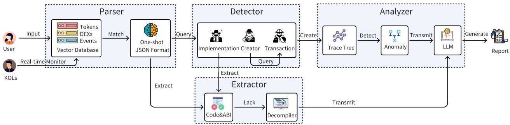
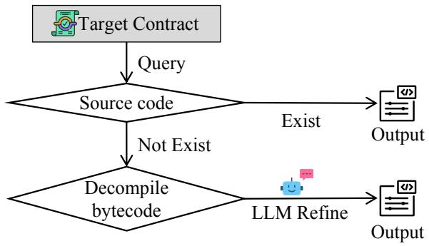
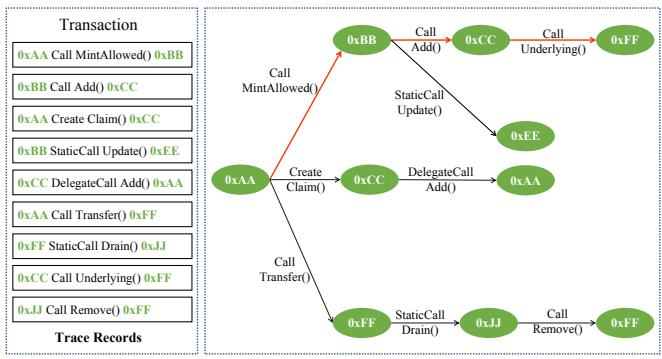
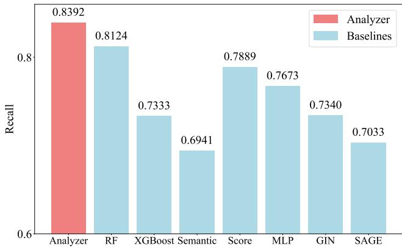
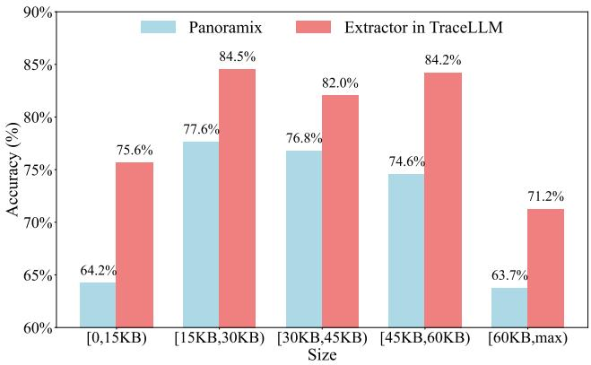
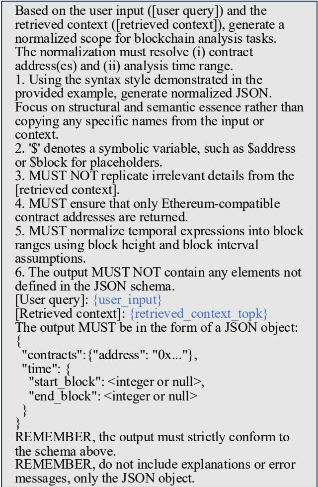
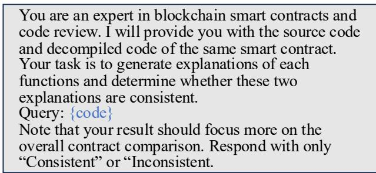

# TraceLLM: Security Diagnosis Through Traces and Smart Contracts in Ethereum

Shuzhen<sub>g</sub> Wan<sub>g</sub> swan<sub>g</sub>032@connect.hkust-<sub>g</sub>z.edu.cn Th<sub>e</sub> H<sub>o</sub>n<sub>g</sub> K<sub>o</sub>n<sub>g</sub> Uni<sub>ve</sub>r<sub>s</sub>it<sub>y</sub> <sub>o</sub>f S<sub>c</sub>i<sub>e</sub>n<sub>ce</sub> and Technolo<sub>gy</sub> (Guan<sub>g</sub>zhou) G<sub>u</sub>an<sub>g</sub>zho<sub>u,</sub> China

Y<sub>ue</sub> H<sub>ua</sub>n<sub>g</sub> <sub>y</sub>h<sub>uang</sub>797<sub>@connec</sub>t<sub>.</sub>hk<sub>us</sub>t<sub>-</sub>

<sub>g</sub>z.e<sup>d</sup>u.cn Th<sub>e</sub> H<sub>o</sub>n<sub>g</sub> K<sub>o</sub>n<sub>g</sub> Uni<sub>ve</sub>r<sub>s</sub>it<sub>y</sub> <sub>o</sub>f S<sub>c</sub>i<sub>e</sub>n<sub>ce</sub> and Technolo<sub>gy</sub> (Guan<sub>g</sub>zhou) G<sub>u</sub>an<sub>g</sub>zho<sub>u,</sub> China

Zh<sub>uoer</sub> X<sub>u</sub> <sub>zxu</sub>247<sub>@connec</sub>t<sub>.</sub>hk<sub>us</sub>t<sub>-gz.e</sub>d<sub>u.cn></sub> Th<sub>e</sub> H<sub>o</sub>n<sub>g</sub> K<sub>o</sub>n<sub>g</sub> Uni<sub>ve</sub>r<sub>s</sub>it<sub>y</sub> <sub>o</sub>f S<sub>c</sub>i<sub>e</sub>n<sub>ce</sub> and Technolo<sub>gy</sub> (Guan<sub>g</sub>zhou) G<sub>u</sub>an<sub>g</sub>zho<sub>u,</sub> China

Y<sub>u</sub>min<sub>g</sub> H<sub>ua</sub>n<sub>g</sub> <sup>h</sup>uan<sub>gy</sub>umin<sub>g</sub>@u.nus.e<sup>d</sup>u N<sub>a</sub>ti<sub>o</sub>n<sub>a</sub>l Uni<sub>ve</sub>r<sub>s</sub>it<sub>y</sub> <sub>o</sub>f Sin<sub>gapo</sub>r<sub>e</sub> <sup>Si</sup>n<sub>g</sub>a<sub>p</sub>ore

Jin<sub>g</sub> Tan<sub>g</sub><sup>∗</sup> jingtang@ust.<sup>hk</sup> Th<sub>e</sub> H<sub>o</sub>n<sub>g</sub> K<sub>o</sub>n<sub>g</sub> Uni<sub>ve</sub>r<sub>s</sub>it<sub>y</sub> <sub>o</sub>f S<sub>c</sub>i<sub>e</sub>n<sub>ce</sub> and Technolo<sub>gy</sub> (Guan<sub>g</sub>zhou) G<sub>u</sub>an<sub>g</sub>zho<sub>u,</sub> China

## Abstract

Eth<sub>ereum smar</sub>t <sub>con</sub>t<sub>rac</sub>t<sub>s</sub> h<sub>o</sub>ld t<sub>ens o</sub>f billi<sub>ons o</sub>f USD i<sub>n</sub> D<sub>e</sub>Fi <sub>an</sub>d NFTs<sub>, y</sub>et com<sub>p</sub>rehensive securit<sub>y</sub> anal<sub>y</sub>sis remains dificult due to <sub>unver</sub>ifi<sub>e</sub>d <sub>co</sub>d<sub>e, proxy-</sub>b<sub>ase</sub>d <sub>arc</sub>hit<sub>ec</sub>t<sub>ures, an</sub>d th<sub>e re</sub>li<sub>ance on man</sub> ual ins<sub>p</sub>ection of com<sub>p</sub>lex execution traces. Existin<sub>g</sub> a<sub>pp</sub>roaches fall into two main cate<sub>g</sub>ories: anomal<sub>y</sub> transaction detection<sub>,</sub> which fla<sub>g</sub>s sus<sub>p</sub>icious transactions but ofers limited insi<sub>g</sub>ht into s<sub>p</sub>ecific <sub>a</sub>tt<sub>ac</sub>k <sub>s</sub>tr<sub>a</sub>t<sub>eg</sub>i<sub>es</sub> hidd<sub>e</sub>n in <sub>e</sub>x<sub>ecu</sub>ti<sub>o</sub>n tr<sub>aces</sub> in<sub>s</sub>id<sub>e</sub> tr<sub>a</sub>n<sub>sac</sub>ti<sub>o</sub>n<sub>s,</sub> <sub>an</sub>d <sub>co</sub>d<sub>e vu</sub>l<sub>nera</sub>bilit<sub>y</sub> d<sub>e</sub>t<sub>ec</sub>ti<sub>on, w</sub>hi<sub>c</sub>h <sub>canno</sub>t <sub>ana</sub>l<sub>yze unver</sub>ifi<sub>e</sub>d <sub>con</sub>t<sub>rac</sub>t<sub>s</sub> <sub>an</sub>d <sub>s</sub>t<sub>rugg</sub>l<sub>es</sub> t<sub>o</sub> <sub>s</sub>h<sub>ow</sub> h<sub>ow</sub> id<sub>en</sub>tifi<sub>e</sub>d fl<sub>aws</sub> <sub>are</sub> <sub>exp</sub>l<sub>o</sub>it<sub>e</sub>d i<sub>n</sub> <sub>rea</sub>l i<sub>nc</sub>id<sub>en</sub>t<sub>s.</sub> A<sub>s</sub> <sub>a</sub> <sub>resu</sub>lt<sub>,</sub> <sub>ana</sub>l<sub>ys</sub>t<sub>s</sub> <sub>mus</sub>t <sub>s</sub>till <sub>manua</sub>ll<sub>y</sub> <sub>a</sub>li<sub>gn</sub> t<sub>ransac</sub>ti<sub>on</sub> t<sub>races w</sub>ith <sub>con</sub>t<sub>rac</sub>t <sub>co</sub>d<sub>e</sub> t<sub>o recons</sub>t<sub>ruc</sub>t <sub>a</sub>tt<sub>ac</sub>k <sub>sce-</sub> n<sub>a</sub>ri<sub>os a</sub>nd <sub>co</sub>nd<sub>uc</sub>t f<sub>o</sub>r<sub>e</sub>n<sub>s</sub>i<sub>cs.</sub> T<sub>o a</sub>ddr<sub>ess</sub> thi<sub>s gap,</sub> Tr<sub>ace</sub>LLM i<sub>s</sub> <sub>p</sub>ro<sub>p</sub>osed as a framework that levera<sub>g</sub>es LLMs to inte<sub>g</sub>rate exe <sub>cu</sub>ti<sub>on</sub> t<sub>race-</sub>l<sub>eve</sub>l d<sub>e</sub>t<sub>ec</sub>ti<sub>on</sub> <sub>w</sub>ith d<sub>ecomp</sub>il<sub>e</sub>d <sub>con</sub>t<sub>rac</sub>t <sub>co</sub>d<sub>e.</sub> W<sub>e</sub> introduce a new anomal<sub>y</sub> execution <sub>p</sub>ath identification al<sub>g</sub>orithm <sub>an</sub>d <sub>an</sub> LLM<sub>-re</sub>fi<sub>ne</sub>d d<sub>ecomp</sub>il<sub>e</sub> t<sub>oo</sub>l t<sub>o</sub> id<sub>en</sub>tif<sub>y vu</sub>l<sub>nera</sub>bl<sub>e</sub> f<sub>unc</sub>ti<sub>ons</sub> and <sub>p</sub>rovide ex<sub>p</sub>licit attack <sub>p</sub>aths to LLM. TraceLLM establishes the <sup>fi</sup>rst <sup>b</sup>enc<sup>h</sup>mar<sup>k</sup> <sup>f</sup>or joint trace an<sup>d</sup> contract co<sup>d</sup>e-<sup>d</sup>riven security ana<sup>l</sup>ysis. For comparison, proxy <sup>b</sup>ase<sup>l</sup>ines are create<sup>d</sup> <sup>b</sup>y joint<sup>l</sup>y transmittin<sub>g</sub> the results of three re<sub>p</sub>resentative code anal<sub>y</sub>sis alon<sub>g</sub> <sub>w</sub>ith r<sub>aw</sub> tr<sub>aces</sub> t<sub>o</sub> LLM<sub>.</sub> Tr<sub>ace</sub>LLM id<sub>e</sub>ntifi<sub>es a</sub>tt<sub>ac</sub>k<sub>e</sub>r <sub>a</sub>nd <sub>v</sub>i<sub>c</sub>tim <sub>a</sub>d dresses with 85.19% <sub>p</sub>recision and <sub>p</sub>roduces automated re<sub>p</sub>orts with 70.37% factual <sub>p</sub>recision across 27 cases with <sub>g</sub>round truth ex<sub>p</sub>ert <sub>repor</sub>t<sub>s, ac</sub>hi<sub>ev</sub>i<sub>ng</sub> 25<sub>.</sub>93% hi<sub>g</sub>h<sub>er accuracy</sub> th<sub>an</sub> th<sub>e</sub> b<sub>es</sub>t b<sub>ase</sub>li<sub>ne.</sub> M<sub>o</sub>r<sub>eove</sub>r<sub>, ac</sub>r<sub>oss</sub> 148 r<sub>ea</sub>l-<sub>wo</sub>rld Eth<sub>e</sub>r<sub>eu</sub>m in<sub>c</sub>id<sub>e</sub>nt<sub>s,</sub> Tr<sub>ace</sub>LLM <sub>au</sub>- tomaticall<sub>y g</sub>enerates re<sub>p</sub>orts with 66.22% ex<sub>p</sub>ert-verified accurac<sub>y,</sub> demonstratin<sub>g</sub> stron<sub>g</sub> <sub>g</sub>eneralizabilit<sub>y</sub>.

ACM Reference Format: Shuzhen<sub>g</sub> Wan<sub>g</sub>, Yue Huan<sub>g</sub>, Zhuoer Xu, Yumin<sub>g</sub> Huan<sub>g</sub>, and Jin<sub>g</sub> Tan<sub>g</sub>. 2025<sub>.</sub> Tr<sub>ace</sub>LLM: S<sub>ecu</sub>rit<sub>y</sub> Di<sub>ag</sub>n<sub>os</sub>i<sub>s</sub> Thr<sub>oug</sub>h Tr<sub>aces a</sub>nd Sm<sub>a</sub>rt C<sub>o</sub>ntr<sub>ac</sub>t<sub>s</sub> in Ethereum. In Proceedings ofthe ACM xxx Conference 2026 (xxx). ACM, N<sub>ew</sub> Y<sub>o</sub>rk<sub>,</sub> NY<sub>,</sub> USA<sub>,</sub> 15 <sub>pages.</sub> htt<sub>ps</sub>://d<sub>o</sub>i<sub>.o</sub>r<sub>g</sub>/XXXXXXX<sub>.</sub>XXXXXXX

## 1 Introduction

Eth<sub>ereum,</sub> th<sub>e</sub> <sub>secon</sub>d<sub>-</sub>l<sub>arges</sub>t bl<sub>oc</sub>k<sub>c</sub>h<sub>a</sub>i<sub>n</sub> b<sub>y</sub> <sub>mar</sub>k<sub>e</sub>t <sub>va</sub>l<sub>ue,</sub> <sub>ex</sub>t<sub>en</sub>d<sub>s</sub> be<sub>y</sub>ond Bitcoin b<sub>y</sub> su<sub>pp</sub>ortin<sub>g</sub> Turin<sub>g</sub>-com<sub>p</sub>lete smart contracts that automate arbitrar<sub>y</sub> user-defined lo<sub>g</sub>ic [57]. These contracts form the foundation of DeFi [56], NFTs [61], and a wide ran<sub>g</sub>e of decentralized a<sub>pp</sub>lications. Accordin<sub>g</sub> to Etherscan<sub>,</sub> more than 78 <sub>m</sub>illi<sub>on smar</sub>t <sub>con</sub>t<sub>rac</sub>t<sub>s</sub> h<sub>ave</sub> b<sub>een</sub> d<sub>ep</sub>l<sub>oye</sub>d <sub>on</sub> Eth<sub>ereum ma</sub>i<sub>nne</sub>t<sub>,</sub> with total value locked exceedin<sub>g</sub> 63 billion USD [6, 7]. T<sub>yp</sub>icall<sub>y</sub>, <sub>co</sub>ntr<sub>ac</sub>t l<sub>og</sub>i<sub>c</sub> i<sub>s w</sub>ritt<sub>e</sub>n in S<sub>o</sub>lidit<sub>y, co</sub>m<sub>p</sub>il<sub>e</sub>d int<sub>o</sub> Eth<sub>e</sub>r<sub>eu</sub>m Virt<sub>ua</sub>l Machine (EVM) b<sub>y</sub>tecode, and de<sub>p</sub>lo<sub>y</sub>ed to a dedicated address via transactions [10]. Each invocation in transactions is executed ste<sub>p</sub> b<sub>y</sub> ste<sub>p</sub> b<sub>y</sub> the EVM<sub>,</sub> <sub>p</sub>roducin<sub>g</sub> an execution trace that records l<sub>ow-</sub>l<sub>eve</sub>l <sub>opera</sub>ti<sub>ons, message ca</sub>ll<sub>s, an</sub>d <sub>s</sub>t<sub>a</sub>t<sub>e</sub> t<sub>rans</sub>iti<sub>ons.</sub> Th<sub>ese</sub> t<sub>races prov</sub>id<sub>e</sub> th<sub>e mos</sub>t fi<sub>ne-gra</sub>i<sub>ne</sub>d <sub>ev</sub>id<sub>ence o</sub>f <sub>con</sub>t<sub>rac</sub>t b<sub>e</sub>h<sub>av</sub>i<sub>or</sub> and are central to auditin<sub>g</sub> and <sub>p</sub>ost-event anal<sub>y</sub>sis [11, 66].

Des<sub>p</sub>ite their im<sub>p</sub>ortance<sub>,</sub> exec<sub>u</sub>tion traces remain dific<sub>u</sub>lt to l<sub>everage e</sub>f<sub>ec</sub>ti<sub>ve</sub>l<sub>y</sub> d<sub>ue</sub> t<sub>o</sub> th<sub>e</sub>i<sub>r comp</sub>l<sub>ex</sub>it<sub>y an</sub>d l<sub>ac</sub>k <sub>o</sub>f <sub>sys</sub>t<sub>ema</sub>ti<sub>c</sub> toolin<sub>g</sub>. This limitation is es<sub>p</sub>eciall<sub>y</sub> critical for <sub>p</sub>ost-incident anal-<sub>y</sub>sis<sub>,</sub> as the Ethereum ecos<sub>y</sub>stem continues to face fre<sub>q</sub>uent and severe securit<sub>y</sub> incidents [32, 35]. In the <sub>p</sub>ast two <sub>y</sub>ears alone, 218 att<sub>ac</sub>k<sub>s</sub> h<sub>ave</sub> b<sub>een repor</sub>t<sub>e</sub>d <sub>on</sub> D<sub>e</sub>Fi <sub>pro</sub>t<sub>oco</sub>l<sub>s, w</sub>ith <sub>cumu</sub>l<sub>a</sub>ti<sub>ve</sub> l<sub>osses</sub> sur<sub>p</sub>assin<sub>g</sub> 953 million USD [34]. To anal<sub>y</sub>ze such incidents, <sub>p</sub>rior <sub>researc</sub>h h<sub>as</sub> d<sub>eve</sub>l<sub>o e</sub>d t<sub>wo ma</sub>i<sub>n</sub> li<sub>nes o</sub>f <sub>wor</sub>k<sub>:</sub> t<sub>ransac</sub>ti<sub>on anom-</sub> <sub>a</sub>l<sub>y</sub> d<sub>e</sub>t<sub>ec</sub>ti<sub>on an</sub>d <sub>co</sub>d<sub>e vu</sub>l<sub>nera</sub>bilit<sub>y</sub> d<sub>e</sub>t<sub>ec</sub>ti<sub>on.</sub> Th<sub>e</sub> f<sub>ormer exp</sub>l<sub>ore</sub>d <sub>c</sub>l<sub>us</sub>t<sub>er</sub>i<sub>ng</sub> <sub>an</sub>d <sub>ru</sub>l<sub>e-</sub>b<sub>ase</sub>d <sub>me</sub>th<sub>o</sub>d<sub>s</sub> f<sub>or</sub> l<sub>a</sub>b<sub>e</sub>li<sub>ng</sub> <sub>susp</sub>i<sub>c</sub>i<sub>ous</sub> <sub>a</sub>dd<sub>resses</sub> <sub>an</sub>d t<sub>ransac</sub>ti<sub>ons</sub> i<sub>nvo</sub>l<sub>ve</sub>d i<sub>n</sub> <sub>spec</sub>ifi<sub>c</sub> <sub>a</sub>tt<sub>ac</sub>k<sub>s</sub> <sub>suc</sub>h <sub>as</sub> <sub>reen</sub>t<sub>rancy</sub> or <sub>p</sub>hishin<sub>g</sub> [36, 45, 58, 65]. However, the<sub>y</sub> ofer limited insi<sub>g</sub>ht i<sub>n</sub>t<sub>o a</sub>tt<sub>ac</sub>k <sub>s</sub>t<sub>ra</sub>t<sub>eg</sub>i<sub>es</sub> hidd<sub>en w</sub>ithi<sub>n</sub> d<sub>e</sub>t<sub>a</sub>il<sub>e</sub>d t<sub>races o</sub>f t<sub>ransac</sub>ti<sub>ons.</sub> Whil<sub>e some ru</sub>l<sub>e-</sub>b<sub>ase</sub>d <sub>approac</sub>h<sub>es a</sub>tt<sub>emp</sub>t t<sub>race anoma</sub>l<sub>y</sub> d<sub>e</sub>t<sub>ec</sub>ti<sub>on</sub> f<sub>or</sub> <sub>spec</sub>ifi<sub>c</sub> <sub>a</sub>tt<sub>ac</sub>k t<sub>ypes,</sub> <sub>no</sub> <sub>compre</sub>h<sub>ens</sub>i<sub>ve</sub> <sub>me</sub>th<sub>o</sub>d <sub>sys</sub>t<sub>ema</sub>ti<sub>ca</sub>ll<sub>y</sub> anal<sub>y</sub>zes arbitrar<sub>y</sub> traces [66]. The latter hi<sub>g</sub>hli<sub>g</sub>hts <sub>p</sub>otential contract flaws throu<sub>g</sub>h statistical anal<sub>y</sub>sis<sub>,</sub> s<sub>y</sub>mbolic execution<sub>,</sub> fuzzin<sub>g,</sub> and lar<sub>g</sub>e lan<sub>g</sub>ua<sub>g</sub>e model (LLM), <sub>y</sub>et often fails to anal<sub>y</sub>ze un <sub>ver</sub>ifi<sub>e</sub>d <sub>con</sub>t<sub>rac</sub>t<sub>s</sub> <sub>w</sub>ith<sub>ou</sub>t <sub>source</sub> <sub>co</sub>d<sub>e</sub> <sub>an</sub>d <sub>rare</sub>l<sub>y</sub> d<sub>emons</sub>t<sub>ra</sub>t<sub>es</sub> h<sub>ow vu</sub>l<sub>nera</sub>biliti<sub>es man</sub>if<sub>es</sub>t i<sub>n rea</sub>l<sub>-wor</sub>ld <sub>exp</sub>l<sub>o</sub>it<sub>s.</sub> M<sub>oreover, even</sub> <sub>w</sub>h<sub>en anoma</sub>l<sub>y</sub> t<sub>ransac</sub>ti<sub>ons or co</sub>d<sub>e vu</sub>l<sub>nera</sub>biliti<sub>es are</sub> id<sub>en</sub>tifi<sub>e</sub>d<sub>,</sub> th<sub>e resu</sub>lt<sub>s are se</sub>ld<sub>om presen</sub>t<sub>e</sub>d i<sub>n a s</sub>t<sub>ruc</sub>t<sub>ure</sub>d<sub>,</sub> h<sub>uman-rea</sub>d<sub>a</sub>bl<sub>e</sub> f<sub>orm.</sub> Thi<sub>s un</sub>d<sub>erscores a</sub> b<sub>roa</sub>d<sub>er gap:</sub> th<sub>e a</sub>b<sub>sence o</sub>f <sub>an au</sub>t<sub>oma</sub>t<sub>e</sub>d f<sub>ramewor</sub>k th<sub>a</sub>t <sub>connec</sub>t<sub>s</sub> <sub>anoma</sub>li<sub>es</sub> i<sub>n</sub> <sub>execu</sub>ti<sub>on</sub> t<sub>races</sub> <sub>w</sub>ith i<sub>n</sub> t<sub>erpre</sub>t<sub>a</sub>ti<sub>ons o</sub>f <sub>con</sub>t<sub>rac</sub>t <sub>co</sub>d<sub>e</sub> fl<sub>aws an</sub>d <sub>au</sub>t<sub>oma</sub>ti<sub>ca</sub>ll<sub>y genera</sub>t<sub>es</sub> <sub>compre</sub>h<sub>ens</sub>i<sub>ve</sub> h<sub>uman-rea</sub>d<sub>a</sub>bl<sub>e secur</sub>it<sub>y repor</sub>t<sub>s.</sub>

In this <sub>p</sub>a<sub>p</sub>er<sub>,</sub> we <sub>p</sub>resent TraceLLM<sub>,</sub> a novel framework that levera<sub>g</sub>es LLM to brid<sub>g</sub>e on-chain execution traces and contract <sub>co</sub>d<sub>e,</sub> th<sub>ere</sub>b<sub>y ena</sub>bli<sub>ng</sub> h<sub>uman-rea</sub>d<sub>a</sub>bl<sub>e secur</sub>it<sub>y ana</sub>l<sub>ys</sub>i<sub>s.</sub> U<sub>n</sub>lik<sub>e</sub> <sub>p</sub>rior a<sub>pp</sub>roaches that sto<sub>p</sub> at transaction anomal<sub>y</sub> detection<sub>,</sub> the f<sub>ramewor</sub>k di<sub>ves</sub> i<sub>n</sub>t<sub>o</sub> th<sub>e</sub> t<sub>race anoma</sub>l<sub>y</sub> d<sub>e</sub>t<sub>ec</sub>ti<sub>on</sub> i<sub>ns</sub>id<sub>e</sub> t<sub>ransac</sub> ti<sub>ons an</sub>d <sub>augmen</sub>t<sub>s</sub> th<sub>em w</sub>ith <sub>con</sub>t<sub>rac</sub>t <sub>co</sub>d<sub>e, expos</sub>i<sub>ng vu</sub>l<sub>nera</sub>bl<sub>e</sub> f<sub>unc</sub>ti<sub>ons an</sub>d <sub>exp</sub>li<sub>c</sub>it <sub>a</sub>tt<sub>ac</sub>k <sub>pa</sub>th<sub>s.</sub> O<sub>ur</sub> f<sub>ramewor</sub>k <sub>a</sub>ll<sub>ows</sub> LLM t<sub>o</sub> <sub>use</sub> th<sub>e a</sub>bilit<sub>y o</sub>f <sub>co</sub>d<sub>e un</sub>d<sub>ers</sub>t<sub>an</sub>di<sub>ng,</sub> l<sub>og</sub>i<sub>ca</sub>l <sub>reason</sub>i<sub>ng, an</sub>d <sub>mu</sub>lti so<sub>u</sub>rce information inte<sub>g</sub>ration to infer attacker/victim address<sub>,</sub> <sub>a</sub>tt<sub>ac</sub>k <sub>me</sub>th<sub>o</sub>d<sub>s an</sub>d <sub>con</sub>t<sub>rac</sub>t <sub>vu</sub>l<sub>nera</sub>biliti<sub>es.</sub>

To realize this<sub>,</sub> we desi<sub>g</sub>n a modular <sub>p</sub>i<sub>p</sub>eline com<sub>p</sub>risin<sub>g</sub> four <sub>co</sub>m<sub>po</sub>n<sub>e</sub>nt<sub>s</sub>: P<sub>a</sub>r<sub>se</sub>r<sub>,</sub> D<sub>e</sub>t<sub>ec</sub>t<sub>o</sub>r<sub>,</sub> Extr<sub>ac</sub>t<sub>o</sub>r<sub>, a</sub>nd An<sub>a</sub>l<sub>y</sub>z<sub>e</sub>r<sub>.</sub> P<sub>a</sub>r<sub>se</sub>r <sub>a</sub>nd D<sub>e</sub>t<sub>ec</sub>t<sub>or norma</sub>li<sub>ze user</sub> i<sub>n u</sub>t <sub>an</sub>d <sub>co</sub>ll<sub>ec</sub>t <sub>a</sub>ll <sub>re</sub>l<sub>evan</sub>t t<sub>ransac</sub>ti<sub>ons</sub> <sub>an</sub>d <sub>con</sub>t<sub>rac</sub>t i<sub>n</sub>f<sub>orma</sub>ti<sub>on, w</sub>hil<sub>e a</sub>dd<sub>ress</sub>i<sub>ng common c</sub>h<sub>a</sub>ll<sub>enges</sub> such as <sub>p</sub>rox<sub>y</sub> resolution and creator detection. Extractor combines th<sub>e</sub> t<sub>ra</sub>diti<sub>ona</sub>l d<sub>ecomp</sub>il<sub>e</sub> t<sub>oo</sub>l <sub>w</sub>ith LLM<sub>-</sub>b<sub>ase</sub>d <sub>re</sub>fi<sub>nemen</sub>t t<sub>o re-</sub> <sub>cons</sub>t<sub>ruc</sub>t <sub>con</sub>t<sub>rac</sub>t <sub>co</sub>d<sub>e even</sub> i<sub>n</sub> th<sub>e a</sub>b<sub>sence o</sub>f <sub>ver</sub>ifi<sub>e</sub>d <sub>source co</sub>d<sub>e.</sub> A<sub>na</sub>l<sub>yzer</sub> <sub>uses</sub> <sub>numer</sub>i<sub>ca</sub>l <sub>an</sub>d <sub>seman</sub>ti<sub>c</sub> f<sub>ea</sub>t<sub>ures</sub> f<sub>rom</sub> t<sub>races</sub> t<sub>o</sub> d<sub>e</sub>t<sub>ec</sub>t <sub>anoma</sub>l<sub>y</sub> t<sub>races, an</sub>d th<sub>en</sub> i<sub>n</sub>t<sub>egra</sub>t<sub>es</sub> d<sub>ecomp</sub>il<sub>e</sub>d <sub>co</sub>d<sub>e</sub> t<sub>o</sub> d<sub>e</sub>t<sub>ec</sub>t <sub>a</sub>t<sub>-</sub> t<sub>ac</sub>k <sub>mec</sub>h<sub>an</sub>i<sub>sm an</sub>d <sub>genera</sub>t<sub>e s</sub>t<sub>ruc</sub>t<sub>ure</sub>d<sub>,</sub> h<sub>uman-rea</sub>d<sub>a</sub>bl<sub>e</sub> i<sub>nc</sub>id<sub>en</sub>t re<sub>p</sub>orts. Throu<sub>g</sub>h extensive em<sub>p</sub>irical evaluation on real-world inci dents<sub>,</sub> TraceLLM demonstrates robust <sub>p</sub>erformance in identif<sub>y</sub>in<sub>g</sub> attacker/victim address<sub>,</sub> uncoverin<sub>g</sub> attack execution<sub>,</sub> and automaticall<sub>y g</sub>eneratin<sub>g</sub> detailed securit<sub>y</sub> re<sub>p</sub>orts. To our knowled<sub>g</sub>e<sub>,</sub> thi<sub>s</sub> i<sub>s</sub> th<sub>e</sub> fi<sub>rs</sub>t <sub>approac</sub>h th<sub>a</sub>t <sub>es</sub>t<sub>a</sub>bli<sub>s</sub>h<sub>es a repro</sub>d<sub>uc</sub>ibl<sub>e</sub> b<sub>enc</sub>h<sub>mar</sub>k for anomal<sub>y</sub> trace detection and automated re<sub>p</sub>ort <sub>g</sub>eneration in bl<sub>oc</sub>k<sub>c</sub>h<sub>a</sub>i<sub>n</sub> <sub>secur</sub>it<sub>y.</sub>

## Contributions.

In summar<sub>y,</sub> our main contributions are as follows:

• We <sub>p</sub>ro<sub>p</sub>ose TraceLLM, the first LLM-<sub>p</sub>owered automated blockchain sec<sub>u</sub>rit<sub>y</sub> anal<sub>y</sub>sis framework. TraceLLM derives th<sub>e</sub> h<sub>uman-rea</sub>d<sub>a</sub>bl<sub>e repor</sub>t f<sub>rom execu</sub>ti<sub>on</sub> t<sub>races an</sub>d <sub>con-</sub> tract code<sub>,</sub> enablin<sub>g</sub> automatic identification ofattacker/victim <sub>a</sub>dd<sub>resses an</sub>d <sub>un</sub>d<sub>er</sub>l<sub>y</sub>i<sub>ng a</sub>tt<sub>ac</sub>k <sub>mec</sub>h<sub>an</sub>i<sub>sm.</sub>

• We <sub>p</sub>ro<sub>p</sub>ose a method to automaticall<sub>y</sub> extract anomalous <sub>execu</sub>ti<sub>on pa</sub>th<sub>s</sub> f<sub>rom raw</sub> t<sub>races an</sub>d <sub>cons</sub>t<sub>ruc</sub>t th<sub>e</sub> fi<sub>rs</sub>t <sub>anom</sub> al<sub>y</sub> trace dataset containin<sub>g</sub> 11<sub>,</sub>228 execution <sub>p</sub>aths<sub>,</sub> where <sub>our me</sub>th<sub>o</sub>d id<sub>en</sub>tifi<sub>es</sub> 83<sub>.</sub>92% <sub>o</sub>f <sub>anoma</sub>l<sub>y execu</sub>ti<sub>on pa</sub>th<sub>s.</sub>

• To tackle the <sub>p</sub>revalent issues of missin<sub>g</sub> source code in real <sub>wor</sub>ld <sub>smar</sub>t <sub>con</sub>t<sub>rac</sub>t<sub>s,</sub> <sub>we</sub> d<sub>es</sub>i<sub>gn</sub> <sub>an</sub> <sub>en</sub>h<sub>ance</sub>d d<sub>ecomp</sub>il<sub>e</sub> module that im<sub>p</sub>roves decom<sub>p</sub>ilation <sub>p</sub>recision b<sub>y</sub> 8.52% over th<sub>e</sub> <sub>w</sub>id<sub>e</sub>l<sub>y</sub> <sub>use</sub>d Eth<sub>erscan</sub> d<sub>ecomp</sub>il<sub>er.</sub>

• We manuall<sub>y</sub> collect and curate a blockchain securit<sub>y</sub> inci d<sub>en</sub>t d<sub>a</sub>t<sub>ase</sub>t <sub>an</sub>d d<sub>es</sub>i<sub>gn p</sub>i<sub>pe</sub>li<sub>nes</sub> f<sub>or mu</sub>lti<sub>p</sub>l<sub>e co</sub>d<sub>e ana</sub>l<sub>ys</sub>i<sub>s</sub> schemes to automaticall<sub>y</sub> <sub>g</sub>enerate securit<sub>y</sub> re<sub>p</sub>orts<sub>,</sub> form in<sub>g</sub> <sub>p</sub>rox<sub>y</sub> baselines for s<sub>y</sub>stematic com<sub>p</sub>arison. On 27 real <sub>wo</sub>rld in<sub>c</sub>id<sub>e</sub>nt <sub>cases,</sub> Tr<sub>ace</sub>LLM <sub>ac</sub>hi<sub>eves</sub> 85<sub>.</sub>19% <sub>p</sub>r<sub>ec</sub>i<sub>s</sub>i<sub>o</sub>n in attacker/victim identification and 70.37% factual <sub>p</sub>recision in securit<sub>y</sub> re<sub>p</sub>orts<sub>,</sub> si<sub>g</sub>nificantl<sub>y</sub> out<sub>p</sub>erformin<sub>g</sub> other re<sub>p</sub>resentative tools. To evaluate <sub>g</sub>eneralizabilit<sub>y,</sub> we <sub>g</sub>enerate securit<sub>y</sub> re<sub>p</sub>orts for 148 Ethereum incidents<sub>,</sub> with an ex<sub>p</sub>ert-verified avera<sub>g</sub>e <sub>p</sub>recision of82.43% in attacker/victim id<sub>en</sub>tifi<sub>ca</sub>ti<sub>on</sub> <sub>an</sub>d 66<sub>.</sub>22% i<sub>n</sub> <sub>overa</sub>ll <sub>repor</sub>t<sub>s.</sub>

## 2 Backgrounds

## 2.1 Large Language Models

Current mainstream Lar<sub>g</sub>e Lan<sub>g</sub>ua<sub>g</sub>e Models (LLMs), such as GPT [27], Dee<sub>p</sub>seek [1] and LLaMA [46], are <sub>p</sub>rimaril<sub>y</sub> built on the Transf<sub>ormer arc</sub>hit<sub>ec</sub>t<sub>ure.</sub> T<sub>ra</sub>i<sub>ne</sub>d <sub>on mass</sub>i<sub>ve</sub> t<sub>ex</sub>t <sub>corpora,</sub> th<sub>ese mo</sub>d<sub>e</sub>l<sub>s</sub> demonstrate stron<sub>g</sub> ca<sub>p</sub>abilities in both lan<sub>g</sub>ua<sub>g</sub>e understandin<sub>g</sub> and <sub>g</sub>eneration. Their a<sub>pp</sub>lications extend into a wide ran<sub>g</sub>e of domains: in blockchain securit<sub>y</sub> area<sub>,</sub> LLMs are increasin<sub>g</sub>l<sub>y</sub> ado<sub>p</sub>ted for vulnerabilit<sub>y</sub> detection [64], automated contract <sub>g</sub>eneration [28], code auditin<sub>g</sub> [23] and <sub>p</sub>ro<sub>g</sub>ram anal<sub>y</sub>sis [22], while also assistin<sub>g</sub> in vulnerabilit<sub>y</sub> re<sub>p</sub>air [48] and software testin<sub>g</sub> [37]. Moreover, LLMs can be extended throu<sub>g</sub>h retrieval-au<sub>g</sub>mented <sub>g</sub>eneration (RAG) [17], domain-s<sub>p</sub>ecific fine-tunin<sub>g</sub> [13], and <sub>p</sub>arameter-eficient ada<sub>p</sub>tation techni<sub>q</sub>ues [49], which further enhance their a<sub>pp</sub>licabilit<sub>y</sub> and reliabilit<sub>y</sub> in s<sub>p</sub>ecialized contexts.

## 2.2 Ethereum Smart contracts

Eth<sub>ereum ena</sub>bl<sub>es</sub> th<sub>e</sub> d<sub>ep</sub>l<sub>oymen</sub>t <sub>o</sub>f<sub>smar</sub>t <sub>con</sub>t<sub>rac</sub>t<sub>s, se</sub>lf<sub>-execu</sub>ti<sub>ng</sub> <sub>programs</sub> th<sub>a</sub>t <sub>enco</sub>d<sub>e</sub> b<sub>us</sub>i<sub>ness</sub> l<sub>og</sub>i<sub>c</sub> di<sub>rec</sub>tl<sub>y on</sub> th<sub>e</sub> bl<sub>oc</sub>k<sub>c</sub>h<sub>a</sub>i<sub>n.</sub> Th<sub>ese con</sub>t<sub>rac</sub>t<sub>s a</sub>ll<sub>ow</sub> d<sub>ecen</sub>t<sub>ra</sub>li<sub>ze</sub>d <sub>app</sub>li<sub>ca</sub>ti<sub>ons</sub> t<sub>o opera</sub>t<sub>e w</sub>ith<sub>-</sub> out intermediaries<sub>,</sub> automaticall<sub>y</sub> enforcin<sub>g</sub> rules and a<sub>g</sub>reements. Smart contracts are written in hi<sub>g</sub>h-level lan<sub>g</sub>ua<sub>g</sub>es such as Solidit<sub>y</sub> <sub>an</sub>d th<sub>en comp</sub>il<sub>e</sub>d i<sub>n</sub>t<sub>o</sub> EVM b<sub>y</sub>t<sub>eco</sub>d<sub>e, w</sub>hi<sub>c</sub>h <sub>can</sub> b<sub>e execu</sub>t<sub>e</sub>d b<sub>y</sub> all Ethereum nodes in a deterministic manner [10].

Th<sub>e</sub> <sub>e</sub>x<sub>ecu</sub>ti<sub>o</sub>n <sub>o</sub>f <sub>s</sub>m<sub>a</sub>rt <sub>co</sub>ntr<sub>ac</sub>t <sub>co</sub>d<sub>e</sub> <sub>w</sub>ithin th<sub>e</sub> EVM in<sub>vo</sub>l<sub>ves</sub> <sub>a</sub> <sub>s</sub>t<sub>ac</sub>k<sub>-</sub>b<sub>ase</sub>d <sub>arc</sub>hit<sub>ec</sub>t<sub>ure</sub> <sub>w</sub>h<sub>ere</sub> i<sub>ns</sub>t<sub>ruc</sub>ti<sub>ons</sub> <sub>man</sub>i<sub>pu</sub>l<sub>a</sub>t<sub>e</sub> <sub>a</sub> fi<sub>n</sub>it<sub>e</sub> stack, memor<sub>y</sub>, and <sub>p</sub>ersistent stora<sub>g</sub>e [11]. Ever<sub>y</sub> o<sub>p</sub>eration in the <sup>EVM</sup> <sup>consumes</sup> <sup>“</sup>g<sup>as</sup>,<sup>”</sup> <sup>a</sup> <sup>unit</sup> <sup>re</sup>p<sup>resentin</sup>g <sup>com</sup>p<sup>utational</sup> <sup>cost</sup>, <sup>to</sup> <sub>p</sub>revent infinite loo<sub>p</sub>s and incentivize eficient com<sub>p</sub>utation. Transactions tri<sub>gg</sub>er the EVM to inter<sub>p</sub>ret the com<sub>p</sub>iled b<sub>y</sub>tecode of the contract<sub>,</sub> ste<sub>p</sub> b<sub>y</sub> ste<sub>p,</sub> modif<sub>y</sub>in<sub>g</sub> the <sub>g</sub>lobal state accordin<sub>g</sub> to the l<sub>og</sub>i<sub>c</sub> d<sub>e</sub>fi<sub>ne</sub>d b<sub>y</sub> th<sub>e</sub> d<sub>eve</sub>l<sub>oper.</sub> D<sub>ur</sub>i<sub>ng</sub> <sub>execu</sub>ti<sub>on,</sub> <sub>eac</sub>h <sub>opco</sub>d<sub>e</sub> <sub>up-</sub> dates the EVM state<sub>,</sub> includin<sub>g</sub> stack contents<sub>,</sub> memor<sub>y,</sub> stora<sub>g</sub>e<sub>,</sub> and the <sub>p</sub>ro<sub>g</sub>ram counter<sub>,</sub> <sub>p</sub>rovidin<sub>g</sub> a <sub>p</sub>recise<sub>,</sub> re<sub>p</sub>roducible model <sub>o</sub>f <sub>con</sub>t<sub>rac</sub>t b<sub>e</sub>h<sub>av</sub>i<sub>or.</sub>

Tr<sub>ace</sub> i<sub>s a</sub>n <sub>esse</sub>nti<sub>a</sub>l <sub>as ec</sub>t <sub>o</sub>f <sub>u</sub>nd<sub>e</sub>r<sub>s</sub>t<sub>a</sub>ndin <sub>a</sub>nd <sub>a</sub>n<sub>a</sub>l zin EVM exec<sub>u</sub>tion. A trace records the ste<sub>p</sub>-b<sub>y</sub>-ste<sub>p</sub> exec<sub>u</sub>tion of contract instr<sub>u</sub>ctions<sub>,</sub> ca<sub>p</sub>t<sub>u</sub>rin<sub>g</sub> state transitions<sub>,</sub> o<sub>p</sub>code exec<sub>u</sub>tion<sub>,</sub> and <sub>g</sub>as <sub>usage.</sub> T<sub>rac</sub>i<sub>ng</sub> <sub>a</sub>ll<sub>ows</sub> d<sub>eve</sub>l<sub>opers</sub> <sub>an</sub>d <sub>researc</sub>h<sub>ers</sub> t<sub>o</sub> <sub>au</sub>dit <sub>con</sub>t<sub>rac</sub>t b<sub>e</sub>h<sub>av</sub>i<sub>or,</sub> d<sub>e</sub>b<sub>ug</sub> l<sub>og</sub>i<sub>c</sub> <sub>errors,</sub> <sub>an</sub>d d<sub>e</sub>t<sub>ec</sub>t <sub>vu</sub>l<sub>nera</sub>biliti<sub>es</sub> <sub>suc</sub>h <sub>as</sub> reentranc<sub>y</sub> or inte<sub>g</sub>er overflows. B<sub>y</sub> examinin<sub>g</sub> traces<sub>,</sub> one can re-<sub>cons</sub>t<sub>ruc</sub>t th<sub>e</sub> <sub>exac</sub>t <sub>sequence</sub> <sub>o</sub>f <sub>opera</sub>ti<sub>ons</sub> <sub>per</sub>f<sub>orme</sub>d b<sub>y</sub> <sub>a</sub> <sub>con</sub>t<sub>rac</sub>t<sub>,</sub> oferin<sub>g</sub> insi<sub>g</sub>hts into how smart contracts interact with one another and <sub>w</sub>ith the Ethere<sub>u</sub>m state. Conse<sub>qu</sub>entl<sub>y,</sub> EVM exec<sub>u</sub>tion traces f<sub>orm</sub> th<sub>e</sub> f<sub>oun</sub>d<sub>a</sub>ti<sub>on</sub> f<sub>or</sub> f<sub>orma</sub>l <sub>ver</sub>ifi<sub>ca</sub>ti<sub>on, secur</sub>it<sub>y ana</sub>l<sub>ys</sub>i<sub>s, an</sub>d <sub>p</sub>erformance o<sub>p</sub>timization of smart contracts.

  
Figure 1: A high-level workflow of TraceLLM.

## 3 TraceLLM Overview

In this section<sub>,</sub> we <sub>p</sub>resent the overall desi<sub>g</sub>n of TraceLLM<sub>,</sub> a modu l<sub>ar</sub> f<sub>ramewor</sub>k f<sub>or</sub> <sub>secur</sub>it<sub>y</sub> <sub>ana</sub>l<sub>ys</sub>i<sub>s</sub> <sub>o</sub>f Eth<sub>ereum</sub> <sub>smar</sub>t <sub>con</sub>t<sub>rac</sub>t<sub>s.</sub> At a hi<sub>g</sub>h level<sub>,</sub> TraceLLM acce<sub>p</sub>ts either natural lan<sub>g</sub>ua<sub>g</sub>e <sub>q</sub>ueries from end users or monitorin<sub>g</sub> si<sub>g</sub>nals from ke<sub>y</sub> o<sub>p</sub>inion leaders (KoLs), such as securit<sub>y</sub> researchers and watchdo<sub>g</sub> accounts. These i<sub>npu</sub>t<sub>s are conver</sub>t<sub>e</sub>d i<sub>n</sub>t<sub>o s</sub>t<sub>ruc</sub>t<sub>ure</sub>d <sub>ana</sub>l<sub>ys</sub>i<sub>s</sub> t<sub>as</sub>k<sub>s, w</sub>hi<sub>c</sub>h <sub>are su</sub>b <sub>sequen</sub>tl<sub>y enr</sub>i<sub>c</sub>h<sub>e</sub>d <sub>w</sub>ith <sub>on-c</sub>h<sub>a</sub>i<sub>n execu</sub>ti<sub>on</sub> t<sub>races an</sub>d d<sub>ecom</sub>il<sub>e</sub>d contract code. Ultimatel<sub>y,</sub> TraceLLM <sub>p</sub>roduces com<sub>p</sub>rehensive be h<sub>av</sub>i<sub>ora</sub>l <sub>ana</sub>l<sub>ys</sub>i<sub>s repor</sub>t<sub>s</sub> th<sub>a</sub>t <sub>revea</sub>l <sub>anoma</sub>l<sub>ous pa</sub>tt<sub>erns,</sub> id<sub>en</sub>tif<sub>y</sub> attacker–victim relations<sub>,</sub> and ex<sub>p</sub>lain underl<sub>y</sub>in<sub>g</sub> vulnerabilities.

As ill<sub>u</sub>strated in Fi<sub>gu</sub>re 1<sub>,</sub> TraceLLM o<sub>p</sub>erates thro<sub>ug</sub>h fo<sub>u</sub>r se-<sub>q</sub>uential sta<sub>g</sub>es. First<sub>,</sub> the Parser em<sub>p</sub>lo<sub>y</sub>s a retrieval-au<sub>g</sub>mented <sub>g</sub>eneration (RAG) s<sub>y</sub>stem to ma<sub>p</sub> unstructured incident descri<sub>p</sub>- tions or informal alerts to <sub>p</sub>recise anal<sub>y</sub>sis sco<sub>p</sub>es<sub>,</sub> namel<sub>y</sub> address <sub>se</sub>t<sub>s</sub> <sub>an</sub>d bl<sub>oc</sub>k i<sub>n</sub>t<sub>erva</sub>l<sub>s.</sub> I<sub>n</sub> <sub>para</sub>ll<sub>e</sub>l<sub>,</sub> K<sub>o</sub>L<sub>s</sub> <sub>prov</sub>id<sub>e</sub> hi<sub>g</sub>h<sub>-s</sub>i<sub>gna</sub>l <sub>ex</sub> ternal intelli<sub>g</sub>ence b<sub>y</sub> fla<sub>gg</sub>in<sub>g</sub> sus<sub>p</sub>icious lar<sub>g</sub>e-value transfers or sus<sub>p</sub>ected ex<sub>p</sub>loit transactions. Second<sub>,</sub> the Detector continuousl<sub>y</sub> t<sub>rac</sub>k<sub>s</sub> t<sub>ransac</sub>ti<sub>ons</sub> <sub>o</sub>f t<sub>arge</sub>t <sub>a</sub>dd<sub>resses,</sub> l<sub>ogg</sub>i<sub>ng</sub> i<sub>nvo</sub>k<sub>e</sub>d <sub>me</sub>th<sub>o</sub>d<sub>s,</sub> t<sub>rans</sub>f<sub>erre</sub>d <sub>va</sub>l<sub>ues,</sub> <sub>an</sub>d li<sub>n</sub>k<sub>s</sub> t<sub>o</sub> <sub>assoc</sub>i<sub>a</sub>t<sub>e</sub>d l<sub>og</sub>i<sub>c</sub> <sub>con</sub>t<sub>rac</sub>t<sub>s</sub> <sub>an</sub>d <sub>sus</sub> <sub>p</sub>icio<sub>u</sub>s contracts. Third<sub>,</sub> the Extractor enriches these ra<sub>w</sub> traces b<sub>y</sub> <sub>re</sub>t<sub>r</sub>i<sub>ev</sub>i<sub>ng</sub> <sub>source</sub> <sub>co</sub>d<sub>e</sub> <sub>an</sub>d ABI<sub>s</sub> f<sub>rom</sub> bl<sub>oc</sub>k<sub>c</sub>h<sub>a</sub>i<sub>n</sub> <sub>exp</sub>l<sub>orers;</sub> <sub>w</sub>h<sub>en</sub> unavailable<sub>,</sub> b<sub>y</sub>tecode decom<sub>p</sub>ilation is a<sub>pp</sub>lied to recover a<sub>pp</sub>rox imate <sub>p</sub>ro<sub>g</sub>ram structure. Finall<sub>y,</sub> the Anal<sub>y</sub>zer reconstructs the t<sub>race-</sub>l<sub>eve</sub>l <sub>execu</sub>ti<sub>on</sub> t<sub>ree an</sub>d d<sub>e</sub>t<sub>ec</sub>t<sub>s anoma</sub>l<sub>y</sub> t<sub>race pa</sub>th<sub>s.</sub> LLM<sub>s</sub> <sub>are</sub> th<sub>en emp</sub>l<sub>oye</sub>d t<sub>o</sub> f<sub>use execu</sub>ti<sub>on</sub> t<sub>races w</sub>ith <sub>con</sub>t<sub>rac</sub>t <sub>co</sub>d<sub>e,</sub> <sub>genera</sub>ti<sub>ng</sub> hi<sub>g</sub>h<sub>-</sub>l<sub>eve</sub>l i<sub>n</sub>t<sub>erpre</sub>t<sub>a</sub>ti<sub>ons o</sub>f <sub>a</sub>b<sub>norma</sub>l b<sub>e</sub>h<sub>av</sub>i<sub>ors.</sub>

The detailed <sub>w</sub>orkflo<sub>w</sub> of TraceLLM is <sub>p</sub>resented across Section 4 <sub>a</sub>nd S<sub>ec</sub>ti<sub>o</sub>n 5<sub>.</sub> In S<sub>ec</sub>ti<sub>o</sub>n 4<sub>,</sub> th<sub>e</sub> P<sub>a</sub>r<sub>se</sub>r <sub>a</sub>nd D<sub>e</sub>t<sub>ec</sub>t<sub>o</sub>r m<sub>o</sub>d<sub>u</sub>l<sub>es a</sub>r<sub>e</sub> described. This section ex<sub>p</sub>lains how user in<sub>p</sub>uts and KoL si<sub>g</sub>nals <sub>are parse</sub>d <sub>an</sub>d t<sub>rans</sub>f<sub>orme</sub>d i<sub>n</sub>t<sub>o genera</sub>li<sub>ze</sub>d <sub>ac</sub>ti<sub>ona</sub>bl<sub>e scopes,</sub> f<sub>o</sub>ll<sub>owe</sub>d b<sub>y</sub> th<sub>e mec</sub>h<sub>an</sub>i<sub>sm</sub> f<sub>or</sub> d<sub>e</sub>t<sub>ec</sub>ti<sub>ng</sub> th<sub>e</sub> l<sub>og</sub>i<sub>c con</sub>t<sub>rac</sub>t<sub>,</sub> th<sub>e</sub> contract creator<sub>,</sub> and related transactions. S<sub>u</sub>bse<sub>qu</sub>entl<sub>y,</sub> Section 5 <sub>presen</sub>t<sub>s</sub> th<sub>e</sub> E<sub>x</sub>t<sub>rac</sub>t<sub>or an</sub>d A<sub>na</sub>l<sub>yzer mo</sub>d<sub>u</sub>l<sub>es.</sub> It d<sub>e</sub>t<sub>a</sub>il<sub>s</sub> th<sub>e re</sub>t<sub>r</sub>i<sub>eva</sub>l <sub>o</sub>f <sub>source co</sub>d<sub>e an</sub>d th<sub>e</sub> d<sub>ecomp</sub>il<sub>a</sub>ti<sub>on o</sub>f <sub>con</sub>t<sub>rac</sub>t b<sub>y</sub>t<sub>eco</sub>d<sub>e.</sub> T<sub>race</sub> l<sub>eve</sub>l <sub>anoma</sub>l<sub>y execu</sub>ti<sub>on pa</sub>th<sub>s are</sub> th<sub>en</sub> d<sub>e</sub>t<sub>ec</sub>t<sub>e</sub>d<sub>, an</sub>d th<sub>ese enr</sub>i<sub>c</sub>h<sub>e</sub>d results are s<sub>y</sub>nthesized usin<sub>g</sub> LLMs to <sub>p</sub>roduce com<sub>p</sub>rehensive anal <sub>ys</sub>i<sub>s</sub> r<sub>epo</sub>rt<sub>s.</sub> Fin<sub>a</sub>ll<sub>y, we eva</sub>l<sub>ua</sub>t<sub>e ou</sub>r Tr<sub>ace</sub>LLM in S<sub>ec</sub>ti<sub>o</sub>n 6 <sub>a</sub>nd di<sub>scuss</sub> th<sub>e e</sub>xt<sub>e</sub>n<sub>s</sub>ibilit<sub>y a</sub>nd limit<sub>a</sub>ti<sub>o</sub>n<sub>s</sub> in S<sub>ec</sub>ti<sub>o</sub>n 7<sub>.</sub>

## 4 Parser & Detector Modules

T<sub>o</sub> <sub>e</sub>n<sub>a</sub>bl<sub>e</sub> ri<sub>go</sub>r<sub>ous</sub> in<sub>c</sub>id<sub>e</sub>nt <sub>a</sub>n<sub>a</sub>l<sub>ys</sub>i<sub>s,</sub> Tr<sub>ace</sub>LLM fir<sub>s</sub>t tr<sub>a</sub>n<sub>s</sub>l<sub>a</sub>t<sub>es</sub> va<sub>g</sub>ue user in<sub>p</sub>uts into machine-readable on-chain data. The Parser <sub>reso</sub>l<sub>ves na</sub>t<sub>ura</sub>l<sub>-</sub>l<sub>anguage</sub> d<sub>escr</sub>i<sub>p</sub>ti<sub>ons</sub> i<sub>n</sub>t<sub>o concre</sub>t<sub>e a</sub>dd<sub>resses an</sub>d tem<sub>p</sub>oral sco<sub>p</sub>es<sub>,</sub> while the Detector enriches this sco<sub>p</sub>e b<sub>y</sub> uncov-<sub>er</sub>i<sub>n rox</sub> i<sub>m</sub> l<sub>emen</sub>t<sub>a</sub>ti<sub>ons, con</sub>t<sub>rac</sub>t <sub>crea</sub>t<sub>ors, an</sub>d <sub>a</sub>ll <sub>re</sub>l<sub>evan</sub>t t<sub>ransac</sub>ti<sub>ons.</sub> T<sub>oge</sub>th<sub>er,</sub> th<sub>ese mo</sub>d<sub>u</sub>l<sub>es es</sub>t<sub>a</sub>bli<sub>s</sub>h <sub>a prec</sub>i<sub>se ana</sub>l<sub>ys</sub>i<sub>s</sub> tar<sub>g</sub>et that <sub>g</sub>rounds subse<sub>q</sub>uent extraction and reasonin<sub>g</sub>.

## 4.1 Parser

Th<sub>e</sub> P<sub>a</sub>r<sub>se</sub>r f<sub>u</sub>n<sub>c</sub>ti<sub>o</sub>n<sub>s as</sub> th<sub>e e</sub>ntr<sub>y po</sub>int <sub>o</sub>f Tr<sub>ace</sub>LLM<sub>,</sub> tr<sub>a</sub>n<sub>s</sub>f<sub>o</sub>rmin<sub>g</sub> h<sub>e</sub>t<sub>erogeneous an</sub>d <sub>o</sub>ft<sub>en uns</sub>t<sub>ruc</sub>t<sub>ure</sub>d i<sub>n</sub>f<sub>orma</sub>ti<sub>on</sub> i<sub>n</sub>t<sub>o s</sub>t<sub>an</sub>d<sub>ar</sub>d<sub>-</sub> ized anal<sub>y</sub>sis sco<sub>p</sub>es. Be<sub>y</sub>ond handlin<sub>g</sub> natural-lan<sub>g</sub>ua<sub>g</sub>e <sub>q</sub>ueries and incident descri<sub>p</sub>tions<sub>,</sub> it continuousl<sub>y</sub> in<sub>g</sub>ests external alerts from trusted sources such as KoLs and re<sub>p</sub>ortin<sub>g</sub> <sub>p</sub>latforms<sub>,</sub> thereb<sub>y</sub> ca<sub>p</sub>- turin<sub>g</sub> emer<sub>g</sub>in<sub>g</sub> events in real time. Throu<sub>g</sub>h a retrieval-au<sub>g</sub>mented <sub>p</sub>i<sub>pe</sub>lin<sub>e</sub> <sub>co</sub>mbin<sub>e</sub>d <sub>w</sub>ith <sub>a</sub> <sub>o</sub>n<sub>e</sub>-<sub>s</sub>h<sub>o</sub>t LLM n<sub>o</sub>rm<sub>a</sub>liz<sub>a</sub>ti<sub>o</sub>n <sub>s</sub>t<sub>age,</sub> in-<sub>p</sub>uts ran<sub>g</sub>in<sub>g</sub> from ex<sub>p</sub>licit contract identifiers to va<sub>g</sub>ue textual <sub>re</sub>f<sub>erences</sub> <sub>are</sub> <sub>mappe</sub>d t<sub>o</sub> <sub>ver</sub>ifi<sub>a</sub>bl<sub>e</sub> <sub>on-c</sub>h<sub>a</sub>i<sub>n</sub> <sub>en</sub>titi<sub>es</sub> <sub>an</sub>d <sub>conver</sub>t<sub>e</sub>d i<sub>n</sub>t<sub>o</sub> <sub>mac</sub>hi<sub>ne-rea</sub>d<sub>a</sub>bl<sub>e</sub> <sub>a</sub>dd<sub>resses</sub> <sub>an</sub>d bl<sub>oc</sub>k <sub>ranges,</sub> <sub>es</sub>t<sub>a</sub>bli<sub>s</sub>hi<sub>ng</sub> <sub>a</sub> <sub>re</sub>li<sub>a</sub>bl<sub>e</sub> f<sub>oun</sub>d<sub>a</sub>ti<sub>on</sub> f<sub>or</sub> d<sub>owns</sub>t<sub>ream</sub> <sub>ana</sub>l<sub>ys</sub>i<sub>s.</sub>

Thro<sub>ug</sub>h the Parser<sub>,</sub> descri<sub>p</sub>ti<sub>v</sub>e <sub>qu</sub>eries are resol<sub>v</sub>ed into concrete contract sets and tem<sub>p</sub>oral sco<sub>p</sub>es. We maintain a domain-<sub>spec</sub>ifi<sub>c</sub> k<sub>now</sub>l<sub>e</sub>d<sub>ge</sub> b<sub>ase, organ</sub>i<sub>ze</sub>d i<sub>n</sub>t<sub>o seman</sub>ti<sub>ca</sub>ll<sub>y co</sub>h<sub>eren</sub>t <sub>un</sub>it<sub>s</sub> such as tokens<sub>,</sub> DEX <sub>p</sub>ools<sub>,</sub> and historical securit<sub>y</sub> incidents. Token information is sourced from Trust Wallet [47], which <sub>p</sub>rovides a <sub>compre</sub>h<sub>ens</sub>i<sub>ve an</sub>d <sub>up-</sub>t<sub>o-</sub>d<sub>a</sub>t<sub>e co</sub>ll<sub>ec</sub>ti<sub>on o</sub>f d<sub>a</sub>t<sub>a</sub> f<sub>or</sub> th<sub>ousan</sub>d<sub>s o</sub>f <sub>c</sub>r<sub>yp</sub>t<sub>o</sub> t<sub>o</sub>k<sub>e</sub>n<sub>s.</sub> F<sub>o</sub>r DEX inf<sub>o</sub>rm<sub>a</sub>ti<sub>o</sub>n<sub>,</sub> <sub>a</sub> <sub>sc</sub>ri<sub>p</sub>t i<sub>s</sub> im<sub>p</sub>l<sub>e</sub>m<sub>e</sub>nt<sub>e</sub>d t<sub>o</sub> extract poo<sup>l</sup> a<sup>dd</sup>resses <sup>f</sup>rom major Et<sup>h</sup>ereum-<sup>b</sup>ase<sup>d</sup> DEX, inc<sup>l</sup>u<sup>d</sup>- in<sub>g</sub> Uni<sub>swap</sub> V2&V3<sub>,</sub> S<sub>us</sub>hiS<sub>wap, a</sub>nd C<sub>u</sub>r<sub>ve.</sub> F<sub>o</sub>r <sub>secu</sub>rit<sub>y eve</sub>nt<sub>s,</sub> h<sub>ac</sub>ki<sub>n</sub> i<sub>nc</sub>id<sub>en</sub>t<sub>s on</sub> Eth<sub>ereum ma</sub>i<sub>nne</sub>t <sub>s</sub>i<sub>nce</sub> 2023 <sub>are manua</sub>ll collected from DeFiHackLabs [41]. Each unit is embedded into a vector s<sub>p</sub>ace to enable semantic similarit<sub>y</sub> search<sub>,</sub> facilitatin<sub>g</sub> robust ma<sub>pp</sub>in<sub>g</sub> from human-readable descri<sub>p</sub>tions to canonical on-chain <sub>a</sub>dd<sub>ress</sub> id<sub>en</sub>tifi<sub>ers.</sub> Gi<sub>ven</sub> <sub>a</sub> <sub>query,</sub> <sub>can</sub>did<sub>a</sub>t<sub>e</sub> <sub>en</sub>titi<sub>es</sub> <sub>are</sub> fi<sub>rs</sub>t <sub>ex-</sub> tracted. RAG is then a<sub>pp</sub>lied to <sub>g</sub>round the LLM with the most relevant entries<sub>,</sub> thereb<sub>y</sub> reducin<sub>g</sub> hallucination and im<sub>p</sub>rovin<sub>g</sub> res-<sub>o</sub>l<sub>u</sub>ti<sub>on</sub> fid<sub>e</sub>lit<sub>y.</sub> I<sub>n</sub> <sub>para</sub>ll<sub>e</sub>l<sub>,</sub> h<sub>uman-rea</sub>d<sub>a</sub>bl<sub>e</sub> t<sub>empora</sub>l <sub>express</sub>i<sub>ons</sub> <sub>are norma</sub>li<sub>ze</sub>d i<sub>n</sub>t<sub>o rec</sub>i<sub>se</sub> bl<sub>oc</sub>k i<sub>n</sub>t<sub>erva</sub>l<sub>s.</sub>

In addition<sub>,</sub> the Parser continuousl<sub>y</sub> monitors si<sub>g</sub>nals from securit<sub>y</sub>- f<sub>ocuse</sub>d <sub>accoun</sub>t<sub>s an</sub>d K<sub>o</sub>L<sub>s on</sub> X<sub>; new a</sub>l<sub>er</sub>t<sub>s are</sub> f<sub>unne</sub>l<sub>e</sub>d i<sub>n</sub>t<sub>o</sub> th<sub>e</sub> same retrieval-au<sub>g</sub>mented <sub>p</sub>i<sub>p</sub>eline<sub>, y</sub>ieldin<sub>g</sub> consistent re<sub>p</sub>resent<sub>a</sub>ti<sub>ons</sub> f<sub>or</sub> b<sub>o</sub>th <sub>user-</sub>d<sub>r</sub>i<sub>ven</sub> <sub>an</sub>d <sub>ex</sub>t<sub>erna</sub>ll<sub>y</sub> <sub>o</sub>b<sub>serve</sub>d <sub>even</sub>t<sub>s.</sub> Aft<sub>er</sub> retrieval<sub>,</sub> a one-shot <sub>p</sub>rom<sub>p</sub>t is invoked that inte<sub>g</sub>rates the ori<sub>g</sub>inal <sub>q</sub>uer<sub>y</sub> with the retrieved context to <sub>p</sub>roduce a strictl<sub>y</sub> structured JSON object specifying the contract list and block range. This in-<sub>con</sub>t<sub>ex</sub>t d<sub>es</sub>i<sub>gn</sub> <sub>en</sub>f<sub>orces</sub> d<sub>e</sub>t<sub>erm</sub>i<sub>n</sub>i<sub>sm,</sub> th<sub>ere</sub>b<sub>y</sub> d<sub>e</sub>fi<sub>n</sub>i<sub>ng</sub> <sub>a</sub> d<sub>e</sub>fi<sub>n</sub>iti<sub>ve</sub> <sub>mac</sub>hi<sub>ne-rea</sub>d<sub>a</sub>bl<sub>e</sub> i<sub>npu</sub>t f<sub>or</sub> th<sub>e</sub> D<sub>e</sub>t<sub>ec</sub>t<sub>or</sub> <sub>mo</sub>d<sub>u</sub>l<sub>e.</sub> Th<sub>e</sub> <sub>promp</sub>t t<sub>em</sub> <sub>p</sub>late is illustrated in Fi<sub>g</sub>ure 8 in A<sub>pp</sub>endix.

## 4.2 Detector

The Detector be<sub>g</sub>ins o<sub>p</sub>eration u<sub>p</sub>on receivin<sub>g p</sub>recise address and time ran<sub>g</sub>e in<sub>p</sub>uts from the Parser. It addresses three ke<sub>y</sub> dimensions: th<sub>e</sub> id<sub>en</sub>tifi<sub>ca</sub>ti<sub>on o</sub>f l<sub>og</sub>i<sub>ca</sub>l <sub>con</sub>t<sub>rac</sub>t<sub>s</sub> b<sub>e</sub>hi<sub>n</sub>d <sub>proxy arc</sub>hit<sub>ec</sub>t<sub>ures,</sub> th<sub>e a</sub>tt<sub>r</sub>ib<sub>u</sub>ti<sub>on o</sub>f <sub>con</sub>t<sub>rac</sub>t<sub>s</sub> t<sub>o</sub> th<sub>e</sub>i<sub>r crea</sub>t<sub>ors, an</sub>d th<sub>e co</sub>ll<sub>ec</sub>ti<sub>on</sub> <sub>o</sub>f <sub>execu</sub>ti<sub>on</sub> t<sub>races</sub> f<sub>or re</sub>l<sub>evan</sub>t t<sub>ransac</sub>ti<sub>ons.</sub> Th<sub>ese</sub> f<sub>unc</sub>ti<sub>ons are</sub> im<sub>p</sub>lemented throu<sub>g</sub>h the Im<sub>p</sub>lementation Detector<sub>,</sub> Creator De tector<sub>,</sub> and Transaction Detector. Sin<sub>g</sub>le address and time ran<sub>g</sub>e in<sub>p</sub>uts are transformed into com<sub>p</sub>rehensive information on contracts and transactions that ma<sub>y</sub> be involved in securit<sub>y</sub> events<sub>,</sub> <sub>es</sub>t<sub>a</sub>bli<sub>s</sub>hi<sub>ng</sub> th<sub>e</sub> f<sub>oun</sub>d<sub>a</sub>ti<sub>on</sub> f<sub>or su</sub>b<sub>sequen</sub>t <sub>con</sub>t<sub>rac</sub>t <sub>co</sub>d<sub>e ex</sub>t<sub>rac</sub>ti<sub>on</sub> <sub>an</sub>d t<sub>race-</sub>l<sub>eve</sub>l <sub>anoma</sub>l<sub>y</sub> d<sub>e</sub>t<sub>ec</sub>ti<sub>on.</sub>

4.2.1 Implementation Detector. To accurately resolve logical con t<sub>rac</sub>t <sub>a</sub>dd<sub>resses</sub> <sub>w</sub>ithi<sub>n</sub> Eth<sub>ereum</sub>’<sub>s</sub> <sub>proxy</sub> <sub>arc</sub>hit<sub>ec</sub>t<sub>ure,</sub> <sub>we</sub> <sub>a</sub>d<sub>ap</sub>t <sub>a</sub> <sub>s</sub>t<sub>ream</sub>li<sub>ne</sub>d d<sub>e</sub>t<sub>ec</sub>ti<sub>on</sub> f<sub>ramewor</sub>k<sub>,</sub> l<sub>everag</sub>i<sub>ng</sub> th<sub>e</sub> <sub>execu</sub>ti<sub>on</sub> t<sub>rac-</sub> in<sub>g</sub> ca<sub>p</sub>abilities of a locall<sub>y</sub> de<sub>p</sub>lo<sub>y</sub>ed Ethereum node [15]. This a<sub>pp</sub>roach em<sub>p</sub>hasizes <sub>p</sub>recision and eficienc<sub>y,</sub> eliminatin<sub>g</sub> the need for extensive <sub>p</sub>attern matchin<sub>g</sub> or historical state traversal.

Step 1: Proxy contract identification. For a given on-chain <sub>con</sub>t<sub>rac</sub>t <sub>a</sub>dd<sub>ress,</sub> <sub>run</sub>ti<sub>me</sub> b<sub>y</sub>t<sub>eco</sub>d<sub>e</sub> i<sub>s</sub> fi<sub>rs</sub>t <sub>re</sub>t<sub>r</sub>i<sub>eve</sub>d <sub>us</sub>i<sub>ng</sub> th<sub>e</sub> eth\_getCode RPC method from the local node. The b<sub>y</sub>tecode is sub se<sub>q</sub>uentl<sub>y</sub> disassembled to detect the <sub>p</sub>resence of the DELEGATECALL <sub>opco</sub>d<sub>e,</sub> <sub>w</sub>hi<sub>c</sub>h <sub>ena</sub>bl<sub>es</sub> <sub>proxy-</sub>b<sub>ase</sub>d i<sub>nvoca</sub>ti<sub>on.</sub> C<sub>on</sub>t<sub>rac</sub>t<sub>s</sub> l<sub>ac</sub>ki<sub>ng</sub> DELEGATECALL are immediatel<sub>y</sub> classified as non-<sub>p</sub>rox<sub>y</sub> and ex <sub>c</sub>l<sub>u</sub>d<sub>e</sub>d f<sub>rom</sub> f<sub>ur</sub>th<sub>er</sub> <sub>ana</sub>l<sub>ys</sub>i<sub>s.</sub> Thi<sub>s</sub> <sub>s</sub>t<sub>a</sub>ti<sub>c</sub> <sub>pre-</sub>filt<sub>er</sub> <sub>m</sub>i<sub>n</sub>i<sub>m</sub>i<sub>zes</sub> t<sub>rac</sub>i<sub>ng</sub> <sub>over</sub>h<sub>ea</sub>d<sub>.</sub>

Step 2: Logical address resolution via execution trace. For contracts identified as <sub>p</sub>roxies<sub>,</sub> controlled execution tracin<sub>g</sub> is <sub>p</sub>erformed usin<sub>g</sub> the debug\_traceCall RPC method of the local node. A <sub>ca</sub>ll i<sub>s</sub> i<sub>ssue</sub>d <sub>w</sub>ith <sub>a ran</sub>d<sub>om, non-ma</sub>t<sub>c</sub>hi<sub>ng</sub> f<sub>unc</sub>ti<sub>on se</sub>l<sub>ec</sub>t<sub>or</sub> to ensure execution <sub>p</sub>asses throu<sub>g</sub>h the fallback function. Dur in<sub>g</sub> tracin<sub>g</sub>, execution ste<sub>p</sub>s are monitored for the DELEGATECALL i<sub>ns</sub>t<sub>ruc</sub>ti<sub>on, an</sub>d th<sub>e</sub> t<sub>arge</sub>t <sub>a</sub>dd<sub>ress</sub> i<sub>s ex</sub>t<sub>rac</sub>t<sub>e</sub>d di<sub>rec</sub>tl<sub>y</sub> f<sub>rom</sub> th<sub>e</sub> EVM stack. This tar<sub>g</sub>et corres<sub>p</sub>onds to the current lo<sub>g</sub>ical contract <sub>a</sub>ddr<sub>ess</sub> in <sub>use.</sub> F<sub>o</sub>r minim<sub>a</sub>l <sub>p</sub>r<sub>o</sub>xi<sub>es co</sub>nf<sub>o</sub>rmin<sub>g</sub> t<sub>o</sub> EIP-1167<sub>,</sub> th<sub>e</sub> <sub>a</sub>dd<sub>ress</sub> i<sub>s</sub> h<sub>ar</sub>d<sub>-co</sub>d<sub>e</sub>d i<sub>n</sub> th<sub>e</sub> b<sub>y</sub>t<sub>eco</sub>d<sub>e an</sub>d i<sub>s recovere</sub>d di<sub>rec</sub>tl<sub>y.</sub> F<sub>or s</sub>t<sub>orage-</sub>b<sub>ase</sub>d <sub>proxy pa</sub>tt<sub>erns,</sub> th<sub>e a</sub>dd<sub>ress</sub> i<sub>s re</sub>t<sub>r</sub>i<sub>eve</sub>d f<sub>rom</sub> the stora<sub>g</sub>e slot accessed immediatel<sub>y p</sub>rior to the DELEGATECALL, <sub>o</sub>b<sub>v</sub>i<sub>a</sub>ti<sub>ng</sub> th<sub>e</sub> <sub>nee</sub>d f<sub>or</sub> <sub>pre-</sub>d<sub>e</sub>fi<sub>ne</sub>d <sub>s</sub>l<sub>o</sub>t <sub>mapp</sub>i<sub>ngs.</sub>

Thi<sub>s</sub> t<sub>race-</sub>b<sub>ase</sub>d <sub>me</sub>th<sub>o</sub>d <sub>opera</sub>t<sub>es</sub> th<sub>roug</sub>h <sub>a</sub> fi<sub>xe</sub>d t<sub>wo-s</sub>t<sub>ep proce-</sub> d<sub>ure an</sub>d d<sub>oes no</sub>t d<sub>epen</sub>d <sub>on s</sub>t<sub>an</sub>d<sub>ar</sub>d <sub>s</sub>t<sub>orage</sub> k<sub>eys,</sub> ABI<sub>-</sub>l<sub>eve</sub>l <sub>me</sub>th ods such as implementation(), nor on verified source code. B<sub>y</sub> combinin<sub>g</sub> static b<sub>y</sub>tecode ins<sub>p</sub>ection with d<sub>y</sub>namic execution tracin<sub>g,</sub> hi<sub>g</sub>h accurac<sub>y</sub> is achieved across diverse <sub>p</sub>rox<sub>y</sub> <sub>p</sub>atterns while maintainin<sub>g</sub> low com<sub>p</sub>utational com<sub>p</sub>lexit<sub>y</sub>. This makes the a<sub>p</sub>- <sub>proac</sub>h <sub>par</sub>ti<sub>cu</sub>l<sub>ar</sub>l<sub>y su</sub>it<sub>a</sub>bl<sub>e</sub> f<sub>or</sub> l<sub>arge-sca</sub>l<sub>e emp</sub>i<sub>r</sub>i<sub>ca</sub>l <sub>s</sub>t<sub>u</sub>di<sub>es, w</sub>h<sub>ere</sub> resolvin<sub>g</sub> the current lo<sub>g</sub>ical contract address is a <sub>p</sub>rere<sub>q</sub>uisite for d<sub>owns</sub>t<sub>ream ana</sub>l<sub>ys</sub>i<sub>s.</sub>

4.2.2 Creator Detector. The Creator Detector resolves the creator <sub>o</sub>f <sub>a g</sub>i<sub>ven con</sub>t<sub>rac</sub>t <sub>an</sub>d <sub>enumera</sub>t<sub>es o</sub>th<sub>er con</sub>t<sub>rac</sub>t<sub>s</sub> d<sub>ep</sub>l<sub>oye</sub>d b<sub>y</sub> th<sub>e same a</sub>dd<sub>ress w</sub>ithi<sub>n</sub> th<sub>e same</sub> bl<sub>oc</sub>k <sub>range.</sub> Thi<sub>s expan</sub>d<sub>s</sub> th<sub>e</sub> anal<sub>y</sub>sis from a sin<sub>g</sub>le sus<sub>p</sub>icious contract to the broader activit<sub>y</sub> sco<sub>p</sub>e of its creator<sub>,</sub> enablin<sub>g</sub> com<sub>p</sub>rehensive threat detection.

Given a contract address<sub>,</sub> the de<sub>p</sub>lo<sub>y</sub>ment transaction is identifi<sub>e</sub>d <sub>as</sub> th<sub>e</sub> <sub>ear</sub>li<sub>es</sub>t t<sub>ransac</sub>ti<sub>on</sub> i<sub>n</sub> <sub>w</sub>hi<sub>c</sub>h th<sub>e</sub> <sub>a</sub>dd<sub>ress</sub> <sub>appears</sub> i<sub>n</sub> the transaction recei<sub>p</sub>t, with to set to null. The from field of this t<sub>ransac</sub>ti<sub>on</sub> i<sub>s</sub> <sub>recor</sub>d<sub>e</sub>d <sub>as</sub> th<sub>e</sub> <sub>crea</sub>t<sub>or</sub> <sub>a</sub>dd<sub>ress.</sub> I<sub>n</sub>d<sub>exe</sub>d bl<sub>oc</sub>k<sub>c</sub>h<sub>a</sub>i<sub>n</sub> <sub>exp</sub>l<sub>orers</sub> <sub>can</sub> b<sub>e</sub> l<sub>everage</sub>d t<sub>o</sub> di<sub>rec</sub>tl<sub>y</sub> <sub>o</sub>bt<sub>a</sub>i<sub>n</sub> th<sub>e</sub> <sub>crea</sub>t<sub>or</sub> <sub>an</sub>d d<sub>e-</sub> <sub>p</sub>lo<sub>y</sub>ment transaction hash [8]. If the creator itself is a contract (e.<sub>g</sub>., a factor<sub>y</sub> contract), recursive resolution is a<sub>pp</sub>lied to trace back to the ori<sub>g</sub>inatin<sub>g</sub> externall<sub>y</sub> owned account.

O<sub>nce</sub> th<sub>e crea</sub>t<sub>or a</sub>dd<sub>ress</sub> i<sub>s reso</sub>l<sub>ve</sub>d<sub>, a</sub>ll <sub>con</sub>t<sub>rac</sub>t<sub>s</sub> d<sub>ep</sub>l<sub>oye</sub>d b<sub>y</sub> it <sub>are enumera</sub>t<sub>e</sub>d <sub>us</sub>i<sub>ng</sub> th<sub>e</sub> l<sub>oca</sub>l <sub>no</sub>d<sub>e.</sub> Bl<sub>oc</sub>k<sub>s w</sub>ithi<sub>n</sub> th<sub>e spec</sub>ifi<sub>e</sub>d time ran<sub>g</sub>e are iterated, and transactions with from e<sub>q</sub>ual to the creator address and to set to null are extracted. For each contract <sub>crea</sub>ti<sub>on</sub> t<sub>ransac</sub>ti<sub>on,</sub> th<sub>e con</sub>t<sub>rac</sub>t <sub>a</sub>dd<sub>ress</sub> i<sub>s re</sub>t<sub>r</sub>i<sub>eve</sub>d f<sub>rom</sub> th<sub>e</sub> t<sub>ransac</sub>ti<sub>on</sub> <sub>rece</sub>i<sub>p</sub>t <sub>an</sub>d <sub>a</sub>dd<sub>e</sub>d t<sub>o</sub> th<sub>e</sub> <sub>crea</sub>t<sub>or</sub>’<sub>s</sub> d<sub>ep</sub>l<sub>oymen</sub>t <sub>se</sub>t<sub>.</sub> B<sub>y</sub> <sub>com</sub>bi<sub>n</sub>i<sub>ng crea</sub>t<sub>or</sub> id<sub>en</sub>tifi<sub>ca</sub>ti<sub>on w</sub>ith l<sub>oca</sub>l f<sub>u</sub>ll<sub>-no</sub>d<sub>e enumera</sub>ti<sub>on,</sub> the Creator Detector <sub>p</sub>rovides a com<sub>p</sub>rehensive view of a creator’s d<sub>ep</sub>l<sub>oymen</sub>t hi<sub>s</sub>t<sub>ory w</sub>ithi<sub>n</sub> th<sub>e ana</sub>l<sub>ys</sub>i<sub>s w</sub>i<sub>n</sub>d<sub>ow.</sub> Thi<sub>s ena</sub>bl<sub>es</sub> th<sub>e</sub> linka<sub>g</sub>e of multi<sub>p</sub>le sus<sub>p</sub>icious contracts to a sin<sub>g</sub>le actor<sub>,</sub> uncovers lar<sub>g</sub>e-scale malicious de<sub>p</sub>lo<sub>y</sub>ments<sub>,</sub> and su<sub>pp</sub>orts thorou<sub>g</sub>h anal<sub>y</sub>sis <sub>o</sub>f th<sub>e secur</sub>it<sub>y even</sub>t<sub>.</sub>

4.2.3 Transaction Detector. Building on the resolution of logical <sub>co</sub>ntr<sub>ac</sub>t<sub>s a</sub>nd th<sub>e</sub>ir <sub>c</sub>r<sub>ea</sub>t<sub>o</sub>r<sub>s,</sub> th<sub>e</sub> Tr<sub>a</sub>n<sub>sac</sub>ti<sub>o</sub>n D<sub>e</sub>t<sub>ec</sub>t<sub>o</sub>r i<sub>s</sub> r<sub>espo</sub>n-<sub>s</sub>ibl<sub>e</sub> f<sub>or co</sub>ll<sub>ec</sub>ti<sub>ng</sub> th<sub>e</sub> t<sub>ransac</sub>ti<sub>ons assoc</sub>i<sub>a</sub>t<sub>e</sub>d <sub>w</sub>ith th<sub>e</sub> id<sub>en</sub>tifi<sub>e</sub>d <sub>a</sub>dd<sub>resses.</sub> F<sub>or</sub> <sub>eac</sub>h t<sub>arge</sub>t <sub>a</sub>dd<sub>ress</sub> �<sub>,</sub> <sub>we</sub> <sub>query</sub> th<sub>e</sub> l<sub>oca</sub>l <sub>no</sub>d<sub>e</sub> t<sub>o</sub> <sub>re</sub>t<sub>r</sub>i<sub>eve</sub> <sub>a</sub>ll t<sub>ransac</sub>ti<sub>ons</sub> i<sub>n</sub> th<sub>e</sub> <sub>spec</sub>ifi<sub>e</sub>d t<sub>empora</sub>l <sub>w</sub>i<sub>n</sub>d<sub>ow</sub> t<sub>o</sub> <sub>en-</sub> sure ali<sub>g</sub>nment with incident-related activities. Subse<sub>q</sub>uentl<sub>y,</sub> we a<sub>pp</sub>l<sub>y</sub> the debug\_traceTransaction RPC interface to extract detailed execution traces, ca<sub>p</sub>turin<sub>g</sub> low-level call semantics (CALL, DELEGATECALL, STATICCALL, and CREATE), caller–callee relations, t<sub>rans</sub>f<sub>erre</sub>d <sub>va</sub>l<sub>ues,</sub> <sub>an</sub>d <sub>ca</sub>ll d<sub>a</sub>t<sub>a.</sub> T<sub>o</sub> <sub>en</sub>h<sub>ance</sub> i<sub>n</sub>t<sub>erpre</sub>t<sub>a</sub>bilit<sub>y,</sub> th<sub>e</sub> fi<sub>rs</sub>t f<sub>our</sub> b<sub>y</sub>t<sub>es o</sub>f <sub>ca</sub>ll d<sub>a</sub>t<sub>a are parse</sub>d <sub>as</sub> f<sub>unc</sub>ti<sub>on se</sub>l<sub>ec</sub>t<sub>ors an</sub>d cross-referenced with <sub>p</sub>ublic si<sub>g</sub>nature databases (e.<sub>g</sub>., the Ethereum Si<sub>g</sub>nature Database), allowin<sub>g</sub> recover<sub>y</sub> of human-readable function <sub>names</sub> <sub>w</sub>h<sub>ere</sub> <sub>poss</sub>ibl<sub>e.</sub> Th<sub>e</sub> <sub>resu</sub>lti<sub>ng</sub> <sub>ou</sub>t<sub>pu</sub>t i<sub>s</sub> <sub>a</sub> t<sub>empora</sub>ll<sub>y</sub> <sub>or</sub>d<sub>ere</sub>d <sub>sequence</sub> <sub>o</sub>f <sub>s</sub>t<sub>ruc</sub>t<sub>ure</sub>d t<sub>race</sub> <sub>even</sub>t<sub>s</sub> th<sub>a</sub>t <sub>preserves</sub> th<sub>e</sub> fid<sub>e</sub>lit<sub>y</sub> <sub>o</sub>f <sub>execu</sub>ti<sub>on seman</sub>ti<sub>cs an</sub>d <sub>serves as</sub> th<sub>e</sub> f<sub>oun</sub>d<sub>a</sub>ti<sub>on</sub> f<sub>or su</sub>b<sub>sequen</sub>t anal<sub>y</sub>sis.

## 5 Analyzer & Extractor Modules

Aft<sub>er</sub> th<sub>e</sub> <sub>prec</sub>i<sub>se</sub> <sub>a</sub>dd<sub>resses</sub> <sub>an</sub>d t<sub>ransac</sub>ti<sub>ons</sub> <sub>are</sub> <sub>o</sub>bt<sub>a</sub>i<sub>ne</sub>d f<sub>rom</sub> S<sub>ec-</sub> ti<sub>on</sub> 4<sub>,</sub> th<sub>e co</sub>ll<sub>ec</sub>t<sub>e</sub>d d<sub>a</sub>t<sub>a w</sub>ill b<sub>e processe</sub>d <sub>an</sub>d t<sub>ransm</sub>itt<sub>e</sub>d t<sub>o</sub> LLM f<sub>or</sub> <sub>ana</sub>l<sub>ys</sub>i<sub>s.</sub> Th<sub>e</sub> E<sub>x</sub>t<sub>rac</sub>t<sub>or</sub> <sub>re</sub>t<sub>r</sub>i<sub>eves</sub> th<sub>e</sub> <sub>con</sub>t<sub>rac</sub>t <sub>co</sub>d<sub>e</sub> f<sub>rom</sub> th<sub>e</sub> <sub>a</sub>dd<sub>ress an</sub>d d<sub>ecomp</sub>il<sub>es un</sub>di<sub>sc</sub>l<sub>ose</sub>d <sub>con</sub>t<sub>rac</sub>t<sub>s.</sub> Th<sub>e</sub> A<sub>na</sub>l<sub>yzer re-</sub> <sub>s</sub>t<sub>ruc</sub>t<sub>ures</sub> th<sub>e</sub> <sub>comp</sub>l<sub>ex</sub> t<sub>races</sub> <sub>w</sub>ithi<sub>n</sub> th<sub>e</sub> t<sub>ransac</sub>ti<sub>on</sub> i<sub>n</sub>t<sub>o</sub> <sub>a</sub> <sub>ca</sub>ll t<sub>ree</sub> <sub>an</sub>d id<sub>en</sub>tifi<sub>es</sub> <sub>anoma</sub>l<sub>y</sub> <sub>execu</sub>ti<sub>on</sub> <sub>pa</sub>th<sub>s.</sub> Th<sub>e</sub> <sub>processe</sub>d i<sub>n</sub>f<sub>orma</sub>ti<sub>on</sub> <sub>o</sub>f t<sub>races an</sub>d <sub>con</sub>t<sub>rac</sub>t <sub>co</sub>d<sub>e</sub> i<sub>s</sub> th<sub>en prov</sub>id<sub>e</sub>d t<sub>o</sub> LLM t<sub>o genera</sub>t<sub>e</sub> th<sub>e</sub> fi<sub>na</sub>l h<sub>uman-rea</sub>d<sub>a</sub>bl<sub>e</sub> <sub>secur</sub>it<sub>y</sub> <sub>repor</sub>t<sub>s.</sub>

  
Figure 2: LLM-refined code extractor workflow.

## 5.1 Extractor

Meanin<sub>g</sub>ful semantic inter<sub>p</sub>retation of contract behavior necessitates understandin<sub>g</sub> its underl<sub>y</sub>in<sub>g</sub> code lo<sub>g</sub>ic. Accordin<sub>g</sub>l<sub>y,</sub> the E<sub>x</sub>t<sub>rac</sub>t<sub>or mo</sub>d<sub>u</sub>l<sub>e re</sub>t<sub>r</sub>i<sub>eves con</sub>t<sub>rac</sub>t <sub>me</sub>t<sub>a</sub>d<sub>a</sub>t<sub>a</sub> f<sub>or a</sub>ll <sub>a</sub>dd<sub>resses</sub> id<sub>en</sub> tifi<sub>e</sub>d b<sub>y</sub> th<sub>e</sub> D<sub>e</sub>t<sub>ec</sub>t<sub>or.</sub> Withi<sub>n</sub> th<sub>e</sub> Eth<sub>ereum ecosys</sub>t<sub>em, every</sub> d<sub>e-</sub> <sub>p</sub>l<sub>oye</sub>d <sub>smar</sub>t <sub>con</sub>t<sub>rac</sub>t <sub>s</sub>t<sub>ores</sub> it<sub>s</sub> <sub>comp</sub>il<sub>e</sub>d b<sub>y</sub>t<sub>eco</sub>d<sub>e</sub> <sub>on-c</sub>h<sub>a</sub>i<sub>n</sub> f<sub>or</sub> <sub>execu</sub>ti<sub>on</sub> b<sub>y</sub> th<sub>e</sub> EVM<sub>.</sub> Alth<sub>oug</sub>h b<sub>y</sub>t<sub>eco</sub>d<sub>e</sub> <sub>su</sub>fi<sub>ces</sub> f<sub>or</sub> <sub>run</sub>ti<sub>me</sub> exec<sub>u</sub>tion<sub>,</sub> man<sub>y</sub> contracts <sub>v</sub>ol<sub>u</sub>ntaril<sub>y</sub> s<sub>u</sub>bmit so<sub>u</sub>rce code and A<sub>p</sub> <sub>p</sub>lication Binar<sub>y</sub> Interface (ABI) to <sub>p</sub>ublic verifiers such as Etherscan. V<sub>er</sub>ifi<sub>e</sub>d <sub>source</sub> <sub>co</sub>d<sub>e</sub> <sub>o</sub>f<sub>ers</sub> <sub>a</sub> <sub>r</sub>i<sub>c</sub>h<sub>er</sub> <sub>seman</sub>ti<sub>c</sub> <sub>v</sub>i<sub>ew,</sub> <sub>ena</sub>bli<sub>ng</sub> d<sub>eeper</sub> <sub>secur</sub>it <sub>ana</sub>l <sub>s</sub>i<sub>s an</sub>d <sub>s</sub>t<sub>ruc</sub>t<sub>ure</sub>d <sub>re or</sub>t <sub>enera</sub>ti<sub>on.</sub> H<sub>owever, a</sub>d versarial contracts involved in securit<sub>y</sub> incidents are rarel<sub>y</sub> verified<sub>,</sub> as malicio<sub>u</sub>s actors t<sub>yp</sub>icall<sub>y w</sub>ithhold so<sub>u</sub>rce code and ABI to im <sub>p</sub>ede reverse en<sub>g</sub>ineerin<sub>g</sub> and forensic eforts. Conse<sub>q</sub>uentl<sub>y,</sub> the E<sub>x</sub>t<sub>rac</sub>t<sub>or mus</sub>t <sub>o</sub>ft<sub>en re</sub>l<sub>y on raw</sub> b<sub>y</sub>t<sub>eco</sub>d<sub>e an</sub>d d<sub>ecomp</sub>il<sub>a</sub>ti<sub>on</sub> t<sub>o</sub> recover semantic insi<sub>g</sub>hts into the contract’s lo<sub>g</sub>ic. To address these <sub>c</sub>h<sub>a</sub>ll<sub>enges,</sub> th<sub>e</sub> E<sub>x</sub>t<sub>rac</sub>t<sub>or opera</sub>t<sub>es</sub> i<sub>n</sub> t<sub>wo p</sub>h<sub>ases:</sub>

Step 1: Retrieval of verified metadata. For each unique contract address identified in the execution trace (Section 5.2.1), we <sub>qu</sub>er<sub>y</sub> blockchain ex<sub>p</sub>lorer APIs s<sub>u</sub>ch as Etherscan to retrie<sub>v</sub>e its <sub>ver</sub>ifi<sub>e</sub>d <sub>source</sub> <sub>co</sub>d<sub>e</sub> <sub>an</sub>d ABI<sub>.</sub> Wh<sub>en</sub> <sub>ava</sub>il<sub>a</sub>bl<sub>e,</sub> th<sub>e</sub> ABI <sub>ena</sub>bl<sub>es</sub> <sub>p</sub>recise ma<sub>pp</sub>in<sub>g</sub> between 4-b<sub>y</sub>te function selectors observed in th<sub>e</sub> t<sub>race</sub> <sub>an</sub>d th<sub>e</sub>i<sub>r</sub> <sub>correspon</sub>di<sub>ng</sub> h<sub>uman-rea</sub>d<sub>a</sub>bl<sub>e</sub> f<sub>unc</sub>ti<sub>on</sub> <sub>names,</sub> <sub>w</sub>hil<sub>e</sub> th<sub>e source co</sub>d<sub>e a</sub>ll<sub>ows</sub> f<sub>or a</sub>d<sub>vance</sub>d <sub>s</sub>t<sub>a</sub>ti<sub>c ana</sub>l<sub>ys</sub>i<sub>s,</sub> i<sub>nc</sub>l<sub>u</sub>di<sub>ng</sub> <sub>con</sub>t<sub>ro</sub>l<sub>-</sub>fl<sub>ow</sub> <sub>recons</sub>t<sub>ruc</sub>ti<sub>on</sub> <sub>an</sub>d <sub>vu</sub>l<sub>nera</sub>bilit<sub>y</sub> <sub>scann</sub>i<sub>ng.</sub>

Step 2: Bytecode decompilation. If no verified source code or ABI i<sub>s ava</sub>il<sub>a</sub>bl<sub>e, we</sub> di<sub>rec</sub>tl<sub>y o</sub>bt<sub>a</sub>i<sub>n</sub> th<sub>e</sub> d<sub>ep</sub>l<sub>oye</sub>d b<sub>y</sub>t<sub>eco</sub>d<sub>e</sub> f<sub>rom</sub> th<sub>e</sub> Eth<sub>ereum</sub> <sub>ne</sub>t<sub>wor</sub>k <sub>v</sub>i<sub>a</sub> th<sub>e</sub> l<sub>oca</sub>l <sub>no</sub>d<sub>e.</sub> Thi<sub>s</sub> b<sub>y</sub>t<sub>eco</sub>d<sub>e</sub> i<sub>s</sub> th<sub>en</sub> processed using the Panoramix decompiler, which translates EVM b t<sub>eco</sub>d<sub>e</sub> i<sub>n</sub>t<sub>o a</sub> hi h<sub>er-</sub>l<sub>eve</sub>l <sub>seu</sub>d<sub>oco</sub>d<sub>e re resen</sub>t<sub>a</sub>ti<sub>on.</sub> Alth<sub>ou</sub> h d<sub>ecom</sub> il<sub>a</sub>ti<sub>on canno</sub>t <sub>er</sub>f<sub>ec</sub>tl <sub>recover</sub> th<sub>e or</sub>i i<sub>na</sub>l <sub>source seman</sub> ti<sub>cs,</sub> it <sub>revea</sub>l<sub>s con</sub>t<sub>rac</sub>t f<sub>unc</sub>ti<sub>ons, con</sub>t<sub>ro</sub>l <sub>s</sub>t<sub>ruc</sub>t<sub>ures, an</sub>d <sub>s</sub>t<sub>orage</sub> <sub>access</sub> <sub>pa</sub>tt<sub>erns.</sub> Th<sub>ese</sub> <sub>ar</sub>tif<sub>ac</sub>t<sub>s</sub> <sub>are</sub> <sub>o</sub>ft<sub>en</sub> <sub>su</sub>fi<sub>c</sub>i<sub>en</sub>t t<sub>o</sub> id<sub>en</sub>tif<sub>y</sub> <sub>ma</sub>li <sub>c</sub>i<sub>ous</sub> l<sub>og</sub>i<sub>c,</sub> <sub>corre</sub>l<sub>a</sub>t<sub>e</sub> <sub>re</sub>l<sub>a</sub>t<sub>e</sub>d <sub>con</sub>t<sub>rac</sub>t<sub>s</sub> d<sub>ep</sub>l<sub>oye</sub>d b<sub>y</sub> th<sub>e</sub> <sub>same</sub> <sub>ac</sub>t<sub>or,</sub> and su<sub>pp</sub>ort further static or d<sub>y</sub>namic anal<sub>y</sub>sis. However<sub>,</sub> the results f<sub>rom</sub> P<sub>anoram</sub>i<sub>x</sub> <sub>s</sub>till l<sub>ac</sub>k <sub>rea</sub>d<sub>a</sub>bilit<sub>y.</sub> Whil<sub>e</sub> <sub>recen</sub>t <sub>researc</sub>h h<sub>as</sub> shown that LLMs can further enhance code readabilit<sub>y</sub> [42]. Based on this<sub>,</sub> <sub>w</sub>e <sub>u</sub>se LLM to refine the o<sub>u</sub>t<sub>pu</sub>t res<sub>u</sub>lts of Panoramix. The <sub>p</sub>r<sub>o</sub>m<sub>p</sub>t f<sub>o</sub>r LLM i<sub>s</sub> <sub>p</sub>r<sub>ov</sub>id<sub>e</sub>d in Fi<sub>gu</sub>r<sub>e</sub> 9 in A<sub>ppe</sub>ndix<sub>.</sub> B<sub>y</sub> <sub>co</sub>mbinin<sub>g</sub> <sub>ver</sub>ifi<sub>e</sub>d <sub>me</sub>t<sub>a</sub>d<sub>a</sub>t<sub>a w</sub>ith d<sub>ecomp</sub>il<sub>e</sub>d <sub>co</sub>d<sub>e,</sub> th<sub>e</sub> E<sub>x</sub>t<sub>rac</sub>t<sub>or ensures</sub> th<sub>a</sub>t <sub>su</sub>b<sub>se uen</sub>t <sub>ana</sub>l <sub>s</sub>i<sub>s s</sub>t<sub>a es</sub> h<sub>ave access</sub> t<sub>o</sub> th<sub>e co</sub>d<sub>e ava</sub>il<sub>a</sub>bl<sub>e</sub> f<sub>or</sub> <sub>eac</sub>h <sub>con</sub>t<sub>rac</sub>t<sub>, regar</sub>dl<sub>ess o</sub>f it<sub>s ver</sub>ifi<sub>ca</sub>ti<sub>on s</sub>t<sub>a</sub>t<sub>us.</sub>

  
Figure 3: Reconstruction of call trees from flat traces.

## 5.2 Analyzer

Th<sub>e</sub> An<sub>a</sub>l<sub>y</sub>z<sub>e</sub>r <sub>ope</sub>r<sub>a</sub>t<sub>es</sub> <sub>o</sub>n <sub>e</sub>nri<sub>c</sub>h<sub>e</sub>d tr<sub>a</sub>n<sub>sac</sub>ti<sub>o</sub>n<sub>s</sub> <sub>w</sub>ith <sub>e</sub>x<sub>ecu</sub>ti<sub>o</sub>n traces <sub>p</sub>ro<sub>v</sub>ided b<sub>y</sub> the Parser and Detector mod<sub>u</sub>le in Section 4. However<sub>,</sub> it will consume lar<sub>g</sub>e tokens for directl<sub>y</sub> <sub>p</sub>assin<sub>g</sub> these t<sub>races</sub> t<sub>o</sub> LLM<sub>,</sub> <sub>an</sub>d t<sub>oo</sub> <sub>many</sub> t<sub>races</sub> <sub>o</sub>ft<sub>en</sub> <sub>o</sub>b<sub>scure</sub> th<sub>e</sub> <sub>anoma</sub>l<sub>y</sub> <sub>exe-</sub> <sub>cu</sub>ti<sub>on</sub> <sub>pa</sub>th<sub>s</sub> <sub>w</sub>ithi<sub>n</sub> th<sub>em.</sub> Th<sub>e</sub> <sub>goa</sub>l <sub>o</sub>f th<sub>e</sub> A<sub>na</sub>l<sub>yzer</sub> i<sub>s</sub> t<sub>o</sub> t<sub>rans</sub>f<sub>orm</sub> th<sub>ese</sub> fl<sub>a</sub>t <sub>execu</sub>ti<sub>on</sub> t<sub>races</sub> i<sub>n</sub>t<sub>o</sub> <sub>seman</sub>ti<sub>ca</sub>ll<sub>y</sub> <sub>r</sub>i<sub>c</sub>h <sub>s</sub>t<sub>ruc</sub>t<sub>ures,</sub> <sub>ex</sub>t<sub>rac</sub>t b<sub>e</sub>h<sub>av</sub>i<sub>or-re</sub>l<sub>evan</sub>t <sub>pa</sub>tt<sub>erns,</sub> <sub>an</sub>d id<sub>en</sub>tif<sub>y</sub> th<sub>e</sub> <sub>anoma</sub>l<sub>y</sub> t<sub>race</sub> <sub>pa</sub>th<sub>s.</sub>

5.2.1 Reconstruct the Call Tree. In the EVM, contract execution ma<sub>y</sub> tri<sub>gg</sub>er nested invocations of other contracts throu<sub>g</sub>h lowl<sub>eve</sub>l <sub>opco</sub>d<sub>es,</sub> <sub>as</sub> m<sub>e</sub>nti<sub>o</sub>n<sub>e</sub>d in S<sub>ec</sub>ti<sub>o</sub>n 4<sub>.</sub>2<sub>.</sub>3<sub>.</sub> Th<sub>ese</sub> in<sub>voca</sub>ti<sub>o</sub>n<sub>s</sub> <sub>a</sub>r<sub>e</sub> <sub>processe</sub>d i<sub>n a s</sub>t<sub>r</sub>i<sub>c</sub>t fi<sub>rs</sub>t<sub>-come</sub> fi<sub>rs</sub>t<sub>-serve</sub>d <sub>ru</sub>l<sub>e.</sub> Thi<sub>s mec</sub>h<sub>an</sub>i<sub>sm</sub> <sub>na</sub>t<sub>ura</sub>ll<sub>y</sub> i<sub>n</sub>d<sub>uces a</sub> hi<sub>erarc</sub>hi<sub>ca</sub>l <sub>s</sub>t<sub>ruc</sub>t<sub>ure, w</sub>ith th<sub>e</sub> t<sub>ransac</sub>ti<sub>on</sub> entr<sub>y</sub> <sub>p</sub>oint as the root and dee<sub>p</sub>er la<sub>y</sub>ers corres<sub>p</sub>ondin<sub>g</sub> to nested <sub>ca</sub>ll<sub>s.</sub>

H<sub>owever,</sub> th<sub>e</sub> <sub>raw</sub> t<sub>ransac</sub>ti<sub>on</sub> t<sub>race</sub> <sub>on</sub>l<sub>y</sub> <sub>recor</sub>d<sub>s</sub> <sub>ca</sub>ll<sub>s</sub> <sub>as</sub> <sub>a</sub> fl<sub>a</sub>t se<sub>q</sub>uence without <sub>p</sub>reservin<sub>g</sub> their hierarch<sub>y</sub>. To recover the exe-<sub>cu</sub>ti<sub>on s</sub>t<sub>ruc</sub>t<sub>ure, we recons</sub>t<sub>ruc</sub>t th<sub>e</sub> t<sub>race</sub> i<sub>n</sub>t<sub>o a ca</sub>ll t<sub>ree.</sub> I<sub>n</sub> thi<sub>s</sub> <sub>represen</sub>t<sub>a</sub>ti<sub>on, no</sub>d<sub>es correspon</sub>d t<sub>o ex</sub>t<sub>erna</sub>ll<sub>y owne</sub>d <sub>accoun</sub>t<sub>s</sub> (EOAs) or contracts, while directed ed<sub>g</sub>es ca<sub>p</sub>ture call events bet<sub>ween</sub> th<sub>em.</sub> E<sub>ac</sub>h <sub>e</sub>d<sub>ge</sub> i<sub>s anno</sub>t<sub>a</sub>t<sub>e</sub>d <sub>w</sub>ith <sub>me</sub>t<sub>a</sub>d<sub>a</sub>t<sub>a</sub> i<sub>nc</sub>l<sub>u</sub>di<sub>ng</sub> th<sub>e</sub> i<sub>nvo</sub>k<sub>e</sub>d <sub>me</sub>th<sub>o</sub>d<sub>,</sub> t<sub>rans</sub>f<sub>erre</sub>d <sub>va</sub>l<sub>ue, ca</sub>ll t<sub>ype, an</sub>d <sub>execu</sub>ti<sub>on resu</sub>lt<sub>.</sub> Th<sub>e resu</sub>lti<sub>ng ca</sub>ll t<sub>ree</sub> th<sub>us enco</sub>d<sub>es</sub> b<sub>o</sub>th th<sub>e con</sub>t<sub>ro</sub>l <sub>re</sub>l<sub>a</sub>ti<sub>ons</sub>hi<sub>ps</sub> and semantic attrib<sub>u</sub>tes of in<sub>v</sub>ocations<sub>,</sub> <sub>p</sub>ro<sub>v</sub>idin<sub>g</sub> a str<sub>u</sub>ct<sub>u</sub>red <sub>v</sub>ie<sub>w</sub> <sub>o</sub>f th<sub>e execu</sub>ti<sub>on</sub> fl<sub>ow.</sub> Thi<sub>s a</sub>b<sub>s</sub>t<sub>rac</sub>ti<sub>on ena</sub>bl<sub>es</sub> d<sub>owns</sub>t<sub>ream ana</sub>l<sub>y-</sub> ses such as identif<sub>y</sub>in<sub>g</sub> sus<sub>p</sub>icious <sub>p</sub>aths<sub>,</sub> extractin<sub>g</sub> contextual sub-<sub>g</sub>ra<sub>p</sub>hs<sub>,</sub> and reasonin<sub>g</sub> about behavior-s<sub>p</sub>ecific <sub>p</sub>atterns. B<sub>y</sub> brid<sub>g</sub>in<sub>g</sub> th<sub>e raw</sub> t<sub>ransac</sub>ti<sub>on</sub> d<sub>e</sub>t<sub>ec</sub>t<sub>or ou</sub>t<sub>pu</sub>t <sub>w</sub>ith hi<sub>g</sub>h<sub>er-</sub>l<sub>eve</sub>l <sub>seman</sub>ti<sub>cs,</sub> th<sub>e</sub> <sub>ca</sub>ll t<sub>ree</sub> <sub>serves</sub> <sub>as</sub> <sub>a</sub> f<sub>oun</sub>d<sub>a</sub>ti<sub>ona</sub>l d<sub>a</sub>t<sub>a</sub> <sub>s</sub>t<sub>ruc</sub>t<sub>ure</sub> f<sub>or</sub> <sub>un</sub>d<sub>ers</sub>t<sub>an</sub>di<sub>ng</sub> t<sub>ransac</sub>ti<sub>on</sub> b<sub>e</sub>h<sub>av</sub>i<sub>or</sub> i<sub>n</sub> it<sub>s</sub> f<sub>u</sub>ll <sub>execu</sub>ti<sub>on con</sub>t<sub>ex</sub>t<sub>.</sub>

Formall<sub>y,</sub> <sub>g</sub>iven a flat execution trace $\mathcal { T } = [ \mathsf { c a l l } _ { 0 } , \mathsf { c a l l } _ { 1 } , \ldots , \mathsf { c a l l } _ { n } ] ,$ <sub>eac</sub>h <sub>en</sub>t<sub>ry</sub> i<sub>n</sub> th<sub>e</sub> t<sub>race correspon</sub>d<sub>s</sub> t<sub>o a</sub> l<sub>ow-</sub>l<sub>eve</sub>l EVM <sub>ca</sub>ll <sub>an</sub>d i<sub>s an-</sub> notated with a tu<sub>p</sub>le ofattributes call<sub>�</sub> = (from, to, method, value, calltype). Here, from and to denote the caller and callee addresses (e.<sub>g</sub>., EOAs or contracts), method records the invoked function si<sub>g</sub>nature, value is the amount of ETH transferred in the call, and calltype s<sub>p</sub>ecifies

<div class="mineru-algorithm" style="white-space: pre-wrap; font-family:monospace;">
Algorithm 1: Reconstruction of call trees from flat EVM traces.
Input: Flat trace $\mathcal{T} = [\text{call}_0, \dots, \text{call}_n]$
Output: Call trees $\mathcal{F}$ $\mathcal{F} \leftarrow [ ]$;
$S \leftarrow [ ]$;
for $i$ in $0 \dots n$ do
    if $i = 0$ or $\text{call}_i.\text{from} \neq \text{call}_{i-1}.\text{to}$ then
        $T \leftarrow \text{Tree}(\text{call}_i)$;
        $\mathcal{F}.\text{append}(T)$;
        $S \leftarrow [\text{call}_i]$;
    end
    else
        while $S \neq [ ]$ and $\text{call}_i.\text{from} \neq \text{top}(S).\text{to}$ do
            $S.\text{pop}()$;
        end
        $p \leftarrow \text{top}(S)$;
        $p.\text{children.append}(\text{call}_i)$;
        $S.\text{push}(\text{call}_i)$;
        while $i &lt; n$ and $\text{call}_{i+1}.\text{from} = \text{call}_i.\text{from}$ do
            $i \leftarrow i + 1$;
            $p.\text{children.append}(\text{call}_i)$;
            $S.\text{push}(\text{call}_i)$;
        end
    end
end
return $\mathcal{F}$;
</div>

the low-level o<sub>p</sub>code used for the invocation (e.<sub>g</sub>., CALL, DELE-GATECALL). We reconstruct the tree structure from this flat list b<sub>y</sub> identif<sub>y</sub>in<sub>g</sub> child and siblin<sub>g</sub> relationshi<sub>p</sub>s.

Definition 1 (Rules of call tree reconstruction). The child relationship and sibling relationship can be rebuilt from the EVM trace by the following rules:

• child: ����� is attached as a child node of�����<sub>−</sub>1 ifand only if � $ule { l l _ { i } . f r o m } { = cm } l _ { i - 1 } . t o .$

• sibling: Ifthere exists a consecutive sequence ofcalls $c a l l _ { i } , c a l l _ { i + 1 } , \ldots , c a l l _ { i + k }$ such that �����<sub>+�</sub> .� ��� = ����� .� ��� for al $\langle j \in \{ 1 , \ldots , k \}$ , then these calls are considered sibling nodes at the same depth.

Th<sub>e c</sub>hild <sub>re</sub>l<sub>a</sub>ti<sub>on</sub> d<sub>eno</sub>t<sub>es</sub> th<sub>a</sub>t th<sub>e ca</sub>ll<sub>ee o</sub>f th<sub>e prece</sub>di<sub>ng ca</sub>ll <sub>as</sub> <sub>sumes</sub> th<sub>e ro</sub>l<sub>e o</sub>f th<sub>e ca</sub>ll<sub>er</sub> i<sub>n</sub> th<sub>e su</sub>b<sub>sequen</sub>t <sub>ca</sub>ll<sub>,</sub> th<sub>ere</sub>b<sub>y enco</sub>di<sub>ng</sub> nested invocation. Siblin<sub>g</sub> calls share a common <sub>p</sub>arent and arise <sub>w</sub>h<sub>en a con</sub>t<sub>rac</sub>t i<sub>ssues mu</sub>lti<sub>p</sub>l<sub>e</sub> i<sub>n</sub>d<sub>epen</sub>d<sub>en</sub>t <sub>ca</sub>ll<sub>s</sub> b<sub>e</sub>f<sub>ore re</sub>t<sub>urn</sub>i<sub>ng.</sub>

Al<sub>go</sub>rithm 1 <sub>ou</sub>tlin<sub>es</sub> th<sub>e p</sub>r<sub>oce</sub>d<sub>u</sub>r<sub>e.</sub> A <sub>s</sub>t<sub>ac</sub>k i<sub>s</sub> m<sub>a</sub>int<sub>a</sub>in<sub>e</sub>d t<sub>o</sub> t<sub>rac</sub>k th<sub>e</sub> <sub>curren</sub>t <sub>ca</sub>ll <sub>con</sub>t<sub>ex</sub>t<sub>.</sub> F<sub>or</sub> <sub>eac</sub>h t<sub>race</sub> <sub>en</sub>t<sub>ry,</sub> <sub>e</sub>ith<sub>er</sub> <sub>a</sub> <sub>new</sub> tree is initiated (if the caller does not match the stack to<sub>p</sub>) or the <sub>en</sub>t<sub>ry</sub> i<sub>s</sub> <sub>a</sub>tt<sub>ac</sub>h<sub>e</sub>d <sub>as</sub> <sub>a</sub> <sub>c</sub>hild <sub>o</sub>f th<sub>e</sub> <sub>mos</sub>t <sub>recen</sub>t <sub>ma</sub>t<sub>c</sub>hi<sub>ng</sub> <sub>paren</sub>t<sub>.</sub> Consecutive calls ori<sub>g</sub>inatin<sub>g</sub> from the same caller are <sub>g</sub>rou<sub>p</sub>ed as siblin<sub>g</sub>s. The resultin<sub>g</sub> call tree F contains one tree for each inde <sub>p</sub>endent to<sub>p</sub>-le<sub>v</sub>el call <sub>w</sub>ithin the transaction. This re<sub>p</sub>resentation ex<sub>p</sub>licitl<sub>y</sub> encodes <sub>p</sub>arent–child relations amon<sub>g</sub> calls<sub>,</sub> facilitatin<sub>g</sub> reasonin<sub>g</sub> about execution contexts and value <sub>p</sub>ro<sub>p</sub>a<sub>g</sub>ation in a <sub>s</sub>in<sub>g</sub>l<sub>e</sub> tr<sub>a</sub>n<sub>sac</sub>ti<sub>o</sub>n<sub>, as s</sub>h<sub>ow</sub>n in Fi<sub>gu</sub>r<sub>e</sub> 3<sub>.</sub>

5.2.2 Anomaly Execution Path Detection. While the reconstructed <sub>ca</sub>ll t<sub>ree o</sub>f<sub>ers a compre</sub>h<sub>ens</sub>i<sub>ve v</sub>i<sub>ew o</sub>f <sub>execu</sub>ti<sub>on</sub> fl<sub>ow,</sub> it<sub>s s</sub>i<sub>ze</sub> and com<sub>p</sub>lexit<sub>y p</sub>resent si<sub>g</sub>nificant challen<sub>g</sub>es for anal<sub>y</sub>sis. Lar<sub>g</sub>escale sec<sub>u</sub>rit<sub>y</sub> incidents often in<sub>v</sub>ol<sub>v</sub>e a sin<sub>g</sub>le malicio<sub>u</sub>s transaction tri<sub>gg</sub>erin<sub>g</sub> extensive internal call cascades<sub>,</sub> resultin<sub>g</sub> in hundreds of trace entries. For exam<sub>p</sub>le<sub>,</sub> the Ma<sub>y</sub> 28<sub>,</sub> 2025 attack on Cork Protocol<sub>,</sub> <sub>w</sub>hi<sub>c</sub>h <sub>cause</sub>d <sub>a</sub> l<sub>oss o</sub>f 12 <sub>m</sub>illi<sub>on</sub> USD<sub>,</sub> i<sub>nc</sub>l<sub>u</sub>d<sub>e</sub>d 362 t<sub>races w</sub>ithi<sub>n</sub> th<sub>e</sub> <sub>a</sub>tt<sub>ac</sub>k t<sub>ransac</sub>ti<sub>on</sub> <sub>a</sub>l<sub>one.</sub>

Shuzheng Wang, Yue Huang, Zhuoer Xu, Yuming Huang and Jing Tang

<table><tr><td>Method Signatures</td><td>Vulnerability Class</td></tr><tr><td>selfdestruct()</td><td>Contract Termination $^{\dagger}$ </td></tr><tr><td>fallback(), receive()</td><td>Fallback Abuse $^{\ddagger}$ </td></tr><tr><td>initialize()</td><td>Re-initialization Flaws $^{\S}$ </td></tr><tr><td>transfer(), transferFrom()</td><td>Silent Transfer Failure $^{\P}$ </td></tr><tr><td>onlyOwner(), hasRole()</td><td>Access Control Misconfig $^{\S}$ </td></tr><tr><td>ecrecover(), assert(), require()</td><td>Signature Logic Flaws $^{\parallel}$ </td></tr><tr><td>address.call(), ExternalContract.any()</td><td>Arbitrary External Call $^{**}$ </td></tr><tr><td>tokensReceived(), tokensToSend()</td><td>Reentrancy Callback $^{\dagger\dagger}$ </td></tr><tr><td>balanceOf(), sweepToken(), drain()</td><td>Unrestricted Withdrawal $^{\ddagger\ddagger}$ </td></tr><tr><td>isOperationReady(), beforeCall()</td><td>Governance Bypass $^{\S\S}$ </td></tr><tr><td colspan="2"> $^{\dagger}$  SWC-106: Unhandled Self-Destruct. $^{\ddagger}$  SWC-104: Unexpected Ether Receive. $^{\S}$  SWC-118: Incorrect Constructor. $^{\P}$  SWC-135: Incorrect Return Value Handling. $^{\S}$  SWC-124: Access Control. $^{\parallel}$  SWC-122: Signature Validation. $^{..}$  SWC-112: Delegatecall to Untrusted Contract. $^{\dagger\dagger}$  SWC-107: Reentrancy. $^{\ddagger\ddagger}$  SWC-105: Unrestricted Withdrawals. $^{\S\S}$  No official SWC ID, commonly categorized under Governance Exploits.</td></tr></table>

Table 1: Suspicious method signatures and associated vulnerabilities.

Feedin<sub>g</sub> such lar<sub>g</sub>e call trees directl<sub>y</sub> into downstream LLMs is ineficient<sub>,</sub> as it consumes excessive in<sub>p</sub>ut tokens and risks dilutin<sub>g</sub> ke<sub>y</sub> malicious execution <sub>p</sub>aths within overwhelmin<sub>g</sub> context. T<sub>o a</sub>dd<sub>ress</sub> thi<sub>s, a</sub> d<sub>e</sub>di<sub>ca</sub>t<sub>e</sub>d f<sub>ea</sub>t<sub>ure ex</sub>t<sub>rac</sub>ti<sub>on an</sub>d <sub>c</sub>l<sub>ass</sub>ifi<sub>ca</sub>ti<sub>on</sub> <sub>p</sub>i<sub>p</sub>eline has been desi<sub>g</sub>ned to rank and hi<sub>g</sub>hli<sub>g</sub>ht sus<sub>p</sub>icious sub-<sub>p</sub>aths <sub>p</sub>rior to LLM-based reasonin<sub>g,</sub> enablin<sub>g</sub> more focused and token-eficient anal<sub>y</sub>sis. Rather than in<sub>p</sub>uttin<sub>g</sub> the entire tree into <sub>reason</sub>i<sub>ng mo</sub>d<sub>u</sub>l<sub>es, mu</sub>lti<sub>p</sub>l<sub>e</sub> f<sub>ea</sub>t<sub>ures are ex</sub>t<sub>rac</sub>t<sub>e</sub>d f<sub>rom eac</sub>h <sub>roo</sub>t<sub>-</sub> t<sub>o-</sub>l<sub>ea</sub>f <sub>pa</sub>th<sub>,</sub> f<sub>o</sub>ll<sub>owe</sub>d b<sub>y</sub> <sub>superv</sub>i<sub>se</sub>d <sub>c</sub>l<sub>ass</sub>ifi<sub>ca</sub>ti<sub>on</sub> t<sub>o</sub> di<sub>s</sub>ti<sub>ngu</sub>i<sub>s</sub>h <sub>a</sub>d<sub>versar</sub>i<sub>a</sub>l f<sub>rom</sub> b<sub>en</sub>i<sub>gn execu</sub>ti<sub>on pa</sub>th<sub>s.</sub>

Th<sub>e</sub> f<sub>ea</sub>t<sub>ure se</sub>t <sub>com</sub>bi<sub>nes s</sub>t<sub>ruc</sub>t<sub>ura</sub>l<sub>–seman</sub>ti<sub>c numer</sub>i<sub>ca</sub>l f<sub>ea</sub>t<sub>ures</sub> d<sub>er</sub>i<sub>ve</sub>d f<sub>rom</sub> th<sub>e ca</sub>ll t<sub>ree w</sub>ith l<sub>ex</sub>i<sub>ca</sub>l f<sub>ea</sub>t<sub>ures</sub> f<sub>rom</sub> th<sub>e se uence</sub> <sub>o</sub>f i<sub>nvo</sub>k<sub>e</sub>d <sub>me</sub>th<sub>o</sub>d<sub>s.</sub> Th<sub>e s</sub>t<sub>ruc</sub>t<sub>ura</sub>l<sub>–seman</sub>ti<sub>c</sub> f<sub>ea</sub>t<sub>ures are</sub> i<sub>nsp</sub>i<sub>re</sub>d b<sub>y</sub> th<sub>e</sub> b<sub>ac</sub>k<sub>war</sub>d <sub>an</sub>d f<sub>orwar</sub>d <sub>causa</sub>lit<sub>y</sub> t<sub>rac</sub>k<sub>er</sub> <sub>use</sub>d i<sub>n</sub> <sub>opera</sub>t<sub>-</sub> in<sub>g</sub> s<sub>y</sub>stem advanced <sub>p</sub>ersistent threat detection [20]. It considers f<sub>our</sub> k<sub>ey</sub> f<sub>ac</sub>t<sub>ors</sub> th<sub>a</sub>t <sub>s</sub>t<sub>rong</sub>l<sub>y</sub> i<sub>n</sub>fl<sub>uence</sub> th<sub>e</sub> <sub>susp</sub>i<sub>c</sub>i<sub>ousness</sub> <sub>o</sub>f <sub>a</sub> <sub>pa</sub>th<sub>:</sub> <sub>pa</sub>th f<sub>anou</sub>t<sub>,</sub> <sub>pa</sub>th f<sub>requency,</sub> <sub>pa</sub>th d<sub>ep</sub>th<sub>,</sub> <sub>an</sub>d <sub>me</sub>th<sub>o</sub>d <sub>anoma</sub>l<sub>y.</sub> Concurrentl<sub>y</sub>, term fre<sub>q</sub>uenc<sub>y</sub> inverse document fre<sub>q</sub>uenc<sub>y</sub>(TF-IDF) f<sub>ea</sub>t<sub>ures</sub> <sub>are</sub> <sub>ex</sub>t<sub>rac</sub>t<sub>e</sub>d f<sub>rom</sub> <sub>or</sub>d<sub>ere</sub>d <sub>sequences</sub> <sub>o</sub>f <sub>me</sub>th<sub>o</sub>d <sub>s</sub>i<sub>gna</sub>t<sub>ures</sub> <sub>a</sub>l<sub>ong</sub> <sub>eac</sub>h <sub>pa</sub>th<sub>,</sub> t<sub>rea</sub>t<sub>e</sub>d <sub>as</sub> t<sub>ex</sub>t<sub>ua</sub>l t<sub>o</sub>k<sub>ens.</sub> M<sub>a</sub>th<sub>ema</sub>ti<sub>ca</sub>l d<sub>e</sub>fi<sub>n</sub>iti<sub>ons</sub> <sub>o</sub>f th<sub>ese</sub> f<sub>ea</sub>t<sub>ures are prov</sub>id<sub>e</sub>d b<sub>e</sub>l<sub>ow.</sub>

A<sub>s</sub> m<sub>e</sub>nti<sub>o</sub>n<sub>e</sub>d in S<sub>ec</sub>ti<sub>o</sub>n 5<sub>.</sub>2<sub>.</sub>1<sub>, we</sub> r<sub>eco</sub>n<sub>s</sub>tr<sub>uc</sub>t <sub>a</sub> hi<sub>e</sub>r<sub>a</sub>r<sub>c</sub>hi<sub>ca</sub>l <sub>s</sub>t<sub>ruc</sub>t<sub>ure</sub> th<sub>a</sub>t <sub>exp</sub>li<sub>c</sub>itl<sub>y cap</sub>t<sub>ures</sub> th<sub>e nes</sub>t<sub>e</sub>d <sub>na</sub>t<sub>ure o</sub>f <sub>con</sub>t<sub>rac</sub>t execution. Let A be the set of blockchain addresses. We model <sub>a s</sub>in l<sub>e</sub>-tr<sub>a</sub>n<sub>sac</sub>ti<sub>o</sub>n <sub>e</sub>x<sub>ecu</sub>ti<sub>o</sub>n <sub>as</sub> $\mathcal { G } = ( \mathcal { V } , \mathcal { E } , r , \mathrm { a d d r } , \phi )$ <sub>, w</sub>h<sub>ere</sub> $\mathcal { V } \subseteq \mathcal { A } \times \mathbb { N }$ i<sub>s</sub> th<sub>e se</sub>t <sub>o</sub>f <sub>a</sub>dd<sub>ress-</sub>l<sub>a</sub>b<sub>e</sub>l<sub>e</sub>d i<sub>nvoca</sub>ti<sub>on</sub> i<sub>ns</sub>t<sub>ances;</sub> <sub>eac</sub>h $\upsilon = \left( a , k \right)$ h<sub>as a</sub>dd<sub>ress</sub> $a \in \mathcal { A }$ <sub>an</sub>d <sub>occurrence</sub> i<sub>n</sub>d<sub>ex</sub> �<sub>.</sub> Th<sub>e</sub> l<sub>a</sub>b<sub>e</sub>li<sub>ng</sub> <sub>map</sub> <sub>a</sub>dd<sub>r</sub> <sub>:</sub> $\mathcal { V } \to \mathcal { A }$ <sub>re</sub>t<sub>urns</sub> th<sub>e</sub> <sub>un</sub>d<sub>er</sub>l<sub>y</sub>i<sub>ng</sub> <sub>a</sub>dd<sub>ress.</sub> $\varepsilon \subseteq$ $\mathcal { V } \times \mathcal { V }$ <sub>enco</sub>d<sub>es paren</sub>t<sub>–c</sub>hild <sub>e</sub>d<sub>ges; eac</sub>h $\boldsymbol { e } = \left( u , \boldsymbol { v } \right)$ d<sub>eno</sub>t<sub>es a ca</sub>ll from � to � with attributes �(�) such as method si<sub>g</sub>nature, value, call t<sub>yp</sub>e (e.<sub>g</sub>., CALL, DELEGATECALL), result, and trace index. We write $\mathsf { f r o m } ( e ) = \mathrm { a d d r } ( u )$ <sub>an</sub>d $\mathrm { t o } ( e ) = \mathrm { a d d r } ( \upsilon )$ <sub>.</sub> Th<sub>e roo</sub>t <sub>�</sub> i<sub>s</sub> th<sub>e</sub> t<sub>op</sub>-l<sub>eve</sub>l in<sub>voca</sub>ti<sub>o</sub>n<sub>.</sub> A r<sub>oo</sub>t-t<sub>o</sub>-l<sub>ea</sub>f <sub>pa</sub>th i<sub>s</sub> $P = ( v _ { p _ { 0 } } , \dotsc , \dotsc , v _ { p _ { \ell } } )$ <sub>w</sub>ith e<sup>d</sup><sub>g</sub>es $\boldsymbol { e } _ { j } = ( v _ { p _ { j - 1 } } , v _ { p _ { j } } )$ . Its ed<sub>g</sub>e se<sub>q</sub>uence is ${ \bf e } ( P ) = ( e _ { 1 } , \ldots , e _ { \ell } ) ;$ <sub>me</sub>th<sub>o</sub>d/<sub>va</sub>l<sub>ue</sub>/<sub>ca</sub>llt<sub>ype are accesse</sub>d <sub>v</sub>i<sub>a</sub> $e _ { j }$

Path fanout. The branching factor quantifies how many distinct d<sub>owns</sub>t<sub>ream ca</sub>ll<sub>s eac</sub>h <sub>no</sub>d<sub>e</sub> t<sub>r</sub>i<sub>ggers.</sub> Th<sub>e raw</sub> f<sub>anou</sub>t <sub>o</sub>f � i<sub>s</sub> th<sub>e</sub> <sub>sum o</sub>f <sub>ou</sub>t<sub>-</sub>d<sub>egrees a</sub>l<sub>ong</sub> th<sub>e pa</sub>th<sub>.</sub> It <sub>can</sub> b<sub>e</sub> d<sub>rawn as</sub>

$$
\begin{array}{c} \deg^ {+} (v) = | \{u \in V \mid (v, u) \in E \} |, \\ \mathrm{F} (P) = \sum_ {j = 0} ^ {\ell} \deg^ {+} (v _ {p _ {j}}). \end{array}\tag{1}
$$

Beni<sub>g</sub>n transactions<sub>,</sub> such as token transfers or sim<sub>p</sub>le swa<sub>p</sub>s<sub>,</sub> t<sub>yp</sub>i<sub>ca</sub>ll<sub>y pro</sub>d<sub>uce narrow an</sub>d <sub>a</sub>l<sub>mos</sub>t li<sub>near ca</sub>ll <sub>pa</sub>tt<sub>erns, resu</sub>lti<sub>ng</sub> in a low fanout. In contrast<sub>,</sub> adversarial transactions often tri<sub>gg</sub>er a <sub>casca</sub>d<sub>e o</sub>f <sub>ex</sub>t<sub>erna</sub>l <sub>ca</sub>ll<sub>s</sub> i<sub>n rap</sub>id <sub>success</sub>i<sub>on—</sub>f<sub>or examp</sub>l<sub>e,</sub> i<sub>n</sub>t<sub>erac</sub>t in<sub>g</sub> with multi<sub>p</sub>le token contracts and li<sub>q</sub>uidit<sub>y</sub> <sub>p</sub>ools to mani<sub>p</sub>ulate <sub>p</sub>rices or drain assets.

Path depth. The nesting depth of a path measures the maximum l<sub>eve</sub>l <sub>o</sub>f <sub>ca</sub>ll<sub>-s</sub>t<sub>ac</sub>k <sub>em</sub>b<sub>e</sub>ddi<sub>ng</sub> <sub>o</sub>b<sub>serve</sub>d d<sub>ur</sub>i<sub>ng</sub> <sub>an</sub> <sub>execu</sub>ti<sub>on</sub> <sub>se-</sub> <sub>quence.</sub> W<sub>e</sub> d<sub>e</sub>fi<sub>ne</sub> th<sub>e</sub> d<sub>ep</sub>th <sub>o</sub>f � <sub>as</sub>

$$
\mathrm{D} (P) = \ell + 1,\tag{2}
$$

<sub>w</sub>h<sub>ere</sub> $\ell + 1$ is the total number of nodes in �. Dee<sub>p</sub> <sub>p</sub>aths indicate reentranc<sub>y,</sub> recursive creation<sub>,</sub> or multi-ho<sub>p</sub> mani<sub>p</sub>ulations where i<sub>nner</sub> <sub>ca</sub>ll<sub>s</sub> <sub>per</sub>f<sub>orm</sub> <sub>cr</sub>iti<sub>ca</sub>l <sub>s</sub>t<sub>a</sub>t<sub>e</sub> <sub>up</sub>d<sub>a</sub>t<sub>es.</sub>

Path frequency. The frequency of a path measures how often a s<sub>p</sub>ecific call se<sub>q</sub>uence recurs within the same execution trace. We d<sub>e</sub>fi<sub>ne a pa</sub>th <sub>pa</sub>tt<sub>ern as</sub> th<sub>e or</sub>d<sub>ere</sub>d <sub>sequence o</sub>f <sub>me</sub>th<sub>o</sub>d <sub>s</sub>i<sub>gna</sub>t<sub>ures</sub> <sub>a</sub>l<sub>ong</sub> th<sub>e e</sub>d<sub>ges.</sub> It <sub>can</sub> b<sub>e</sub> d<sub>rawn as</sub>

$$
\operatorname{sig} (P) = \left[ \text {method} (e _ {1}), \text {method} (e _ {2}), \dots , \text {method} (e _ {\ell}) \right].\tag{3}
$$

Th<sub>e</sub> f<sub>requency</sub> <sub>o</sub>f thi<sub>s</sub> <sub>pa</sub>tt<sub>ern</sub> <sub>w</sub>ithi<sub>n</sub> th<sub>e</sub> t<sub>ransac</sub>ti<sub>on</sub> t<sub>race</sub> i<sub>s</sub> d<sub>e</sub>fi<sub>ne</sub>d as

$$
\mathrm{freq} (P) = \bigg | \big \{P ^ {\prime} \in \text {Paths} (\mathcal {G})   \big |   \mathrm{sig} (P ^ {\prime}) = \mathrm{sig} (P) \big \} \bigg |,\tag{4}
$$

where Paths(G) denotes the set of all root-to-leaf paths in $\mathcal { G } .$ Thi<sub>s</sub> <sub>me</sub>t<sub>r</sub>i<sub>c</sub> <sub>cap</sub>t<sub>ures</sub> th<sub>e</sub> <sub>num</sub>b<sub>er</sub> <sub>o</sub>f <sub>s</sub>t<sub>ruc</sub>t<sub>ura</sub>ll<sub>y</sub> <sub>equ</sub>i<sub>va</sub>l<sub>en</sub>t <sub>ca</sub>ll <sub>pa</sub>th<sub>s</sub> th<sub>a</sub>t <sub>ex</sub>hibit id<sub>en</sub>ti<sub>ca</sub>l f<sub>unc</sub>ti<sub>ona</sub>l b<sub>e</sub>h<sub>av</sub>i<sub>or.</sub> E<sub>xp</sub>l<sub>o</sub>it l<sub>og</sub>i<sub>c o</sub>ft<sub>en man</sub>if<sub>es</sub>t<sub>s</sub> as recurrin<sub>g</sub> control <sub>p</sub>atterns<sub>,</sub> such as re<sub>p</sub>eatedl<sub>y</sub> callin<sub>g</sub> li<sub>q</sub>uida ti<sub>on</sub> f<sub>unc</sub>ti<sub>ons,</sub> i<sub>nvo</sub>ki<sub>ng</sub> fl<sub>as</sub>h<sub>-</sub>l<sub>oan</sub> <sub>ca</sub>llb<sub>ac</sub>k<sub>s,</sub> <sub>or</sub> l<sub>oop</sub>i<sub>ng</sub> <sub>over</sub> <sub>asse</sub>t <sub>ope</sub>r<sub>a</sub>ti<sub>o</sub>n<sub>s</sub> t<sub>o</sub> m<sub>a</sub>ximiz<sub>e</sub> im<sub>pac</sub>t<sub>.</sub>

Path semantic anomaly. In addition to topological factors, we incor<sub>p</sub>orate semantic si<sub>g</sub>nals b<sub>y</sub> <sub>q</sub>uantif<sub>y</sub>in<sub>g</sub> anomalous method invocations alon<sub>g</sub> a <sub>p</sub>ath. Let M denote the set of fundamental sus<sub>p</sub>icious method si<sub>g</sub>natures identified throu<sub>g</sub>h the Smart Contract

Weakness Classification (SWC) [26], as summarized in Table 1. We d<sub>e</sub>fi<sub>ne</sub> th<sub>e anoma</sub>l<sub>y score as</sub>

$$
S (P) = \frac {1}{\ell} \sum_ {j = 1} ^ {\ell} \mathbf {1} \big (\text {method} (e _ {j}) \in \mathcal {M} \big),\tag{5}
$$

where 1(·) is the indicator function that evaluates to 1 if the in-<sub>vo</sub>k<sub>e</sub>d <sub>me</sub>th<sub>o</sub>d <sub>on e</sub>d<sub>ge</sub> $e _ { j }$ belon<sub>g</sub>s to M, and 0 otherwise. This factor ca<sub>p</sub>tures the semantic irre<sub>g</sub>ularit<sub>y</sub> of execution b<sub>y</sub> hi<sub>g</sub>hli<sub>g</sub>hti<sub>ng</sub> th<sub>e</sub> d<sub>ens</sub>it<sub>y o</sub>f hi<sub>g</sub>h<sub>-r</sub>i<sub>s</sub>k <sub>me</sub>th<sub>o</sub>d<sub>s, suc</sub>h <sub>as</sub> f<sub>a</sub>llb<sub>ac</sub>k h<sub>an-</sub> dlers, selfdestruct() invocations, administrative routines, and <sub>reen</sub>t<sub>rancy-sens</sub>iti<sub>ve ca</sub>llb<sub>ac</sub>k<sub>s.</sub>

Path TF-IDF representation. Beyond numerical descriptors of <sub>pa</sub>th <sub>s</sub>t<sub>ruc</sub>t<sub>ure</sub> <sub>an</sub>d <sub>seman</sub>ti<sub>cs,</sub> <sub>we</sub> <sub>a</sub>l<sub>so</sub> <sub>cap</sub>t<sub>ure</sub> th<sub>e</sub> <sub>s</sub>t<sub>a</sub>ti<sub>s</sub>ti<sub>ca</sub>l <sub>sa</sub>li<sub>ence</sub> <sub>o</sub>f <sub>me</sub>th<sub>o</sub>d i<sub>nvoca</sub>ti<sub>ons</sub> th<sub>roug</sub>h <sub>a</sub> t<sub>erm-</sub>f<sub>requency-</sub>i<sub>nverse-</sub>d<sub>ocumen</sub>t<sub>-</sub> fre<sub>q</sub>uenc<sub>y</sub> (TF-IDF) re<sub>p</sub>resentation. We treat each root-to-leaf <sub>p</sub>ath � <sub>as</sub> <sub>a</sub> ‘d<sub>ocumen</sub>t’ <sub>w</sub>h<sub>ose</sub> t<sub>o</sub>k<sub>ens</sub> <sub>correspon</sub>d t<sub>o</sub> th<sub>e</sub> <sub>or</sub>d<sub>ere</sub>d <sub>me</sub>th<sub>o</sub>d <sub>s</sub>i<sub>g</sub>n<sub>a</sub>t<sub>u</sub>r<sub>es</sub> in $\mathrm { s i g } ( P )$ defined in E<sub>q</sub>. 3. Given the cor<sub>p</sub>us C of all root-to-leaf <sub>p</sub>aths extracted from the reconstructed call tree G, the t<sub>erm</sub> f<sub>re uenc o</sub>f <sub>a me</sub>th<sub>o</sub>d t<sub>o</sub>k<sub>en</sub> � i<sub>n a</sub>th � i<sub>s</sub> d<sub>e</sub>fi<sub>ne</sub>d <sub>as</sub>

$$
\mathrm{TF} (t, P) = \frac {\mathrm{count} (t , P)}{\sum_ {t ^ {\prime} \in \mathrm{sig} (P)} \mathrm{count} (t ^ {\prime} , P)},\tag{6}
$$

where count(�, �) denotes the number of times token t occurs in si<sub>g</sub>(P). The inverse document fre<sub>q</sub>uenc<sub>y</sub> is <sub>g</sub>iven b<sub>y</sub>:

$$
\mathrm{IDF} (t, \mathcal {C}) = \log \frac {| \mathcal {C} |}{1 + | P ^ {\prime} \in \mathcal {C} \mid t \in \mathrm{sig} (P ^ {\prime}) |}.\tag{7}
$$

Th<sub>e</sub> TF-IDF <sub>we</sub>i<sub>g</sub>ht f<sub>o</sub>r t<sub>o</sub>k<sub>e</sub>n t in <sub>pa</sub>th P i<sub>s</sub> th<sub>e</sub>n <sub>co</sub>m<sub>pu</sub>t<sub>e</sub>d <sub>as</sub>:

$$
\mathrm{TFIDF} (t, P) = \mathrm{TF} (t, P) \cdot \mathrm{IDF} (t, C).\tag{8}
$$

Th<sub>e</sub> r<sub>esu</sub>ltin<sub>g</sub> TF-IDF <sub>vec</sub>t<sub>o</sub>r <sub>e</sub>n<sub>co</sub>d<sub>es</sub> th<sub>e</sub> r<sub>e</sub>l<sub>a</sub>ti<sub>ve</sub> im<sub>po</sub>rt<sub>a</sub>n<sub>ce</sub> <sub>o</sub>f <sub>eac</sub>h <sub>me</sub>th<sub>o</sub>d i<sub>nvoca</sub>ti<sub>on</sub> i<sub>n</sub> th<sub>e</sub> <sub>con</sub>t<sub>ex</sub>t <sub>o</sub>f <sub>a</sub>ll <sub>o</sub>b<sub>serve</sub>d <sub>pa</sub>th<sub>s,</sub> <sub>a</sub>tt<sub>en-</sub> uatin<sub>g</sub> the influence of common contract routines while am<sub>p</sub>lif<sub>y</sub>in<sub>g</sub> <sub>rare</sub> b<sub>u</sub>t <sub>po</sub>t<sub>en</sub>ti<sub>a</sub>ll<sub>y</sub> <sub>secur</sub>it<sub>y-re</sub>l<sub>evan</sub>t <sub>ca</sub>ll<sub>s.</sub> S<sub>uc</sub>h <sub>rare,</sub> hi<sub>g</sub>h<sub>-we</sub>i<sub>g</sub>ht t<sub>o</sub>k<sub>ens</sub> <sub>o</sub>ft<sub>en</sub> <sub>correspon</sub>d t<sub>o</sub> f<sub>unc</sub>ti<sub>ons</sub> th<sub>a</sub>t <sub>appear</sub> <sub>se</sub>l<sub>ec</sub>ti<sub>ve</sub>l<sub>y</sub> i<sub>n</sub> <sub>ex-</sub> <sub>p</sub>loit lo<sub>g</sub>ic<sub>,</sub> e.<sub>g</sub>.<sub>,</sub> s<sub>p</sub>ecialized callbacks<sub>, p</sub>rivile<sub>g</sub>e-alterin<sub>g</sub> routines<sub>,</sub> or asset-drainin<sub>g</sub> <sub>p</sub>rimitives<sub>,</sub> and thus <sub>p</sub>rovide an ortho<sub>g</sub>onal semanti<sub>c</sub> <sub>s</sub>i<sub>gna</sub>l t<sub>o</sub> th<sub>e</sub> <sub>s</sub>t<sub>ruc</sub>t<sub>ura</sub>l<sub>–seman</sub>ti<sub>c</sub> <sub>numer</sub>i<sub>ca</sub>l f<sub>ea</sub>t<sub>ures</sub> d<sub>escr</sub>ib<sub>e</sub>d <sub>a</sub>b<sub>ove.</sub>

W<sub>e conca</sub>t<sub>ena</sub>t<sub>e</sub> th<sub>e</sub> fi<sub>ve</sub> f<sub>ea</sub>t<sub>ures</sub> d<sub>escr</sub>ib<sub>e</sub>d <sub>a</sub>b<sub>ove</sub> t<sub>o</sub> f<sub>orm a un</sub>i<sub>-</sub> fi<sub>e</sub>d f<sub>ea</sub>t<sub>ure vec</sub>t<sub>or</sub> f<sub>or eac</sub>h <sub>roo</sub>t<sub>-</sub>t<sub>o-</sub>l<sub>ea</sub>f <sub>pa</sub>th<sub>.</sub> Thi<sub>s com</sub>bi<sub>ne</sub>d <sub>rep-</sub> resentation is then fed into a binar<sub>y</sub> lo<sub>g</sub>istic re<sub>g</sub>ression classifier<sub>,</sub> <sub>w</sub>hi<sub>c</sub>h <sub>ou</sub>t<sub>pu</sub>t<sub>s</sub> th<sub>e</sub> <sub>pro</sub>b<sub>a</sub>bilit<sub>y</sub> th<sub>a</sub>t th<sub>e</sub> <sub>pa</sub>th <sub>correspon</sub>d<sub>s</sub> t<sub>o</sub> <sub>ma</sub>li<sub>-</sub> <sub>c</sub>i<sub>ous</sub> b<sub>e</sub>h<sub>av</sub>i<sub>or:</sub>

$$
P r (y = 1 \mid \mathbf {x}) = \sigma (\mathbf {w} ^ {\top} \mathbf {x} + b)\tag{9}
$$

Here, $\textbf { x } \in \mathbb { R } ^ { d }$ denotes the concatenation of the features, w and � <sub>are mo</sub>d<sub>e</sub>l <sub>parame</sub>t<sub>ers, an</sub>d $\sigma ( \cdot )$ is the si<sub>g</sub>moid function. Under thi<sub>s</sub> f<sub>ormu</sub>l<sub>a</sub>ti<sub>on,</sub> <sub>pa</sub>th<sub>s</sub> <sub>ass</sub>i<sub>gne</sub>d hi<sub>g</sub>h<sub>er</sub> <sub>pro</sub>b<sub>a</sub>biliti<sub>es</sub> t<sub>en</sub>d t<sub>o</sub> <sub>ex</sub>hibit structural com<sub>p</sub>lexit<sub>y,</sub> lexical irre<sub>g</sub>ularit<sub>y,</sub> and semantic <sub>p</sub>atterns <sub>a</sub>li<sub>gne</sub>d <sub>w</sub>ith hi<sub>g</sub>h<sub>-r</sub>i<sub>s</sub>k b<sub>e</sub>h<sub>av</sub>i<sub>or—</sub>t<sub>ra</sub>it<sub>s</sub> <sub>common</sub>l<sub>y</sub> <sub>assoc</sub>i<sub>a</sub>t<sub>e</sub>d <sub>w</sub>ith ad<sub>v</sub>ersarial or ex<sub>p</sub>loit-oriented acti<sub>v</sub>it<sub>y</sub>. To check the <sub>p</sub>erformance <sub>o</sub>f <sub>our c</sub>l<sub>ass</sub>ifi<sub>er, we con</sub>d<sub>uc</sub>t <sub>compara</sub>ti<sub>ve exper</sub>i<sub>men</sub>t<sub>s w</sub>ith <sub>a</sub>lt<sub>erna-</sub> tive a<sub>pp</sub>roaches<sub>,</sub> includin<sub>g</sub> traditional statistical models<sub>,</sub> machine l<sub>earn</sub>i<sub>ng</sub> <sub>a</sub>l<sub>gor</sub>ith<sub>ms,</sub> d<sub>eep</sub> l<sub>earn</sub>i<sub>ng</sub> <sub>arc</sub>hit<sub>ec</sub>t<sub>ures,</sub> <sub>an</sub>d <sub>grap</sub>h<sub>-</sub>b<sub>ase</sub>d anal<sub>y</sub>tical methods in Section 6.

5.2.3 �-hop Enclosing Subgraph. In practice, analysts require not just a ran<sup>k</sup>ing o<sup>f</sup> suspicious pat<sup>h</sup>s, <sup>b</sup>ut a<sup>l</sup>so ric<sup>h</sup> context to sup <sub>por</sub>t <sub>accura</sub>t<sub>e roo</sub>t<sub>-cause ana</sub>l<sub>ys</sub>i<sub>s.</sub> Whil<sub>e scor</sub>i<sub>ng-</sub>b<sub>ase</sub>d <sub>me</sub>th<sub>o</sub>d<sub>s</sub> hi<sub>g</sub>hli<sub>g</sub>ht <sub>anoma</sub>l<sub>ous</sub> t<sub>races, e</sub>f<sub>ec</sub>ti<sub>ve</sub> i<sub>nves</sub>ti<sub>ga</sub>ti<sub>on o</sub>ft<sub>en</sub> d<sub>eman</sub>d<sub>s a</sub> broader view be<sub>y</sub>ond isolated <sub>p</sub>aths. To im<sub>p</sub>rove inter<sub>p</sub>retabilit<sub>y</sub> and <sub>revea</sub>l <sub>surroun</sub>di<sub>ng</sub> l<sub>og</sub>i<sub>c,</sub> <sub>we</sub> i<sub>n</sub>t<sub>ro</sub>d<sub>uce</sub> <sub>a</sub> <sub>c</sub>l<sub>osure-</sub>b<sub>ase</sub>d <sub>su</sub>b<sub>grap</sub>h <sub>ex</sub>t<sub>rac</sub>ti<sub>on</sub> <sub>mec</sub>h<sub>an</sub>i<sub>sm</sub> th<sub>a</sub>t <sub>recons</sub>t<sub>ruc</sub>t<sub>s</sub> <sub>con</sub>t<sub>ex</sub>t<sub>ua</sub>l <sub>ne</sub>i<sub>g</sub>hb<sub>or</sub>h<sub>oo</sub>d<sub>s</sub> <sub>aroun</sub>d fl<sub>agge</sub>d <sub>pa</sub>th<sub>s.</sub>

Prior works extract h-ho<sub>p</sub> enclosin<sub>g</sub> sub<sub>g</sub>ra<sub>p</sub>hs centered on indi vidual nodes or ed<sub>g</sub>es [2, 21]. However, these radius-based ex<sub>p</sub>an <sub>s</sub>i<sub>ons</sub> <sub>o</sub>ft<sub>en</sub> i<sub>n</sub>t<sub>ro</sub>d<sub>uce</sub> <sub>s</sub>t<sub>ruc</sub>t<sub>ura</sub>l <sub>no</sub>i<sub>se</sub> b<sub>y</sub> i<sub>nc</sub>l<sub>u</sub>di<sub>ng</sub> <sub>wea</sub>kl<sub>y</sub> <sub>re</sub>l<sub>a</sub>t<sub>e</sub>d <sub>no</sub>d<sub>es.</sub> Thi<sub>s</sub> l<sub>ea</sub>d<sub>s</sub> t<sub>o</sub> bl<sub>oa</sub>t<sub>e</sub>d <sub>su</sub>b<sub>grap</sub>h<sub>s</sub> th<sub>a</sub>t <sub>re</sub>d<sub>uce</sub> t<sub>as</sub>k <sub>e</sub>fi<sub>c</sub>i<sub>ency</sub> in ex<sub>p</sub>lainable or LLM-based anal<sub>y</sub>sis. To overcome this<sub>,</sub> we <sub>p</sub>ro <sub>p</sub>ose the �-ho<sub>p</sub> Enclosin<sub>g</sub> Sub<sub>g</sub>ra<sub>p</sub>h. Instead of ex<sub>p</sub>andin<sub>g</sub> from a <sub>s</sub>i<sub>ng</sub>l<sub>e no</sub>d<sub>e,</sub> th<sub>e</sub> �<sub>-</sub>h<sub>op</sub> E<sub>nc</sub>l<sub>os</sub>i<sub>ng</sub> S<sub>u</sub>b<sub>grap</sub>h <sub>cap</sub>t<sub>ures</sub> th<sub>e</sub> f<sub>u</sub>ll <sub>se</sub>t <sub>o</sub>f <sub>pre</sub>d<sub>ecessors</sub> <sub>an</sub>d <sub>successors</sub> f<sub>or</sub> <sub>eac</sub>h <sub>no</sub>d<sub>e</sub> <sub>a</sub>l<sub>ong</sub> th<sub>e</sub> <sub>pa</sub>th<sub>,</sub> <sub>y</sub>i<sub>e</sub>ldi<sub>ng</sub> com<sub>p</sub>act<sub>,</sub> semanticall<sub>y p</sub>recise sub<sub>g</sub>ra<sub>p</sub>hs that <sub>p</sub>reserve invocation <sub>co</sub>nt<sub>e</sub>xt <sub>w</sub>ith minim<sub>a</sub>l n<sub>o</sub>i<sub>se.</sub> T<sub>o cap</sub>t<sub>u</sub>r<sub>e</sub> th<sub>e co</sub>nt<sub>e</sub>xt <sub>a</sub>r<sub>ou</sub>nd <sub>e</sub>x<sub>ecu</sub> ti<sub>on</sub> <sub>pa</sub>th<sub>,</sub> <sub>we</sub> it<sub>era</sub>ti<sub>ve</sub>l<sub>y</sub> i<sub>nc</sub>l<sub>u</sub>d<sub>e</sub> <sub>a</sub>ll i<sub>n</sub>/<sub>ou</sub>t <sub>ne</sub>i<sub>g</sub>hb<sub>ors</sub> <sub>o</sub>f th<sub>e</sub> <sub>pa</sub>th <sub>no</sub>d<sub>es,</sub> <sub>con</sub>t<sub>ro</sub>ll<sub>e</sub>d b<sub>y</sub> <sub>a</sub> h<sub>op</sub> <sub>parame</sub>t<sub>er</sub> �<sub>.</sub> Additi<sub>ona</sub>l <sub>cons</sub>t<sub>ra</sub>i<sub>n</sub>t<sub>s</sub> <sub>on</sub> <sub>no</sub>d<sub>e</sub> d<sub>egrees</sub> <sub>an</sub>d <sub>su</sub>b<sub>grap</sub>h <sub>s</sub>i<sub>ze</sub> <sub>ensure</sub> th<sub>e</sub> <sub>ex</sub>t<sub>rac</sub>t<sub>e</sub>d <sub>su</sub>b<sub>grap</sub>h <sub>rema</sub>i<sub>ns</sub> t<sub>rac</sub>t<sub>a</sub>bl<sub>e.</sub>

Let $\mathcal { G }$ b<sub>e an execu</sub>ti<sub>on ca</sub>ll t<sub>ree an</sub>d <sub>a roo</sub>t<sub>-</sub>t<sub>o-</sub>l<sub>ea</sub>f <sub>pa</sub>th $P =$ $( v _ { p _ { 0 } } , \ldots , v _ { p _ { \ell } } )$ <sub>w</sub>ith <sub>e</sub>d <sub>e se uence</sub> $\mathbf { e } ( P ) = ( e _ { 1 } , \ldots , e _ { \ell } ) , e _ { j } = ( v _ { { p } _ { j - 1 } } , v _ { { p } _ { j } } )$ th<sub>e</sub> di<sub>rec</sub>t<sub>e</sub>d <sub>ne</sub>i<sub>g</sub>hb<sub>or se</sub>t <sub>o</sub>f <sub>a no</sub>d<sub>e � can</sub> b<sub>e</sub> d<sub>rawn as</sub>

$$
N (v) := \{u \in \mathcal {V} \mid (u, v) \in \mathcal {E} \lor (v, u) \in \mathcal {E} \},\tag{10}
$$

St<sub>ar</sub>ti<sub>ng</sub> f<sub>rom</sub> th<sub>e pa</sub>th <sub>no</sub>d<sub>es,</sub> th<sub>e</sub> �<sub>-</sub>h<sub>op c</sub>l<sub>osure</sub> i<sub>s</sub> d<sub>er</sub>i<sub>ve</sub>d <sub>recur</sub> sivel<sub>y</sub> as

$$
\mathrm{C} _ {0} (P) = \{v _ {p _ {0}}, v _ {p _ {1}}, \dots , v _ {p _ {\ell}} \},\tag{11}
$$

$$
C _ {k} (P) = C _ {k - 1} (P) \cup \bigcup_ {v \in C _ {k - 1} (P)} N (v), \quad k \geq 1.\tag{12}
$$

Definition 2 (�-hop Enclosing Subgraph). Based on the above recursive formula, the enclosing subgraph is defined as

$$
S _ {k} (P) = \mathcal {G} \big [ C _ {k} (P) \big ] = (\mathcal {V} _ {P}, \mathcal {E} _ {P}),\tag{13}
$$

where $\mathcal { V } _ { P } = \operatorname { C } _ { k } ( P )$ and ${ \mathcal { E } } _ { P } = \{ ( u , w ) \in { \mathcal { E } } \mid u , w \in { \mathcal { V } } _ { P } \}$

Int<sub>u</sub>iti<sub>ve</sub>l<sub>y,</sub> ${ \sf S } _ { k } ( P )$ <sub>s</sub>t<sub>ar</sub>t<sub>s</sub> f<sub>rom</sub> th<sub>e pa</sub>th <sub>no</sub>d<sub>es</sub> $( k \ : = \ : 0 )$ <sub>an</sub>d <sub>ex-</sub> <sub>pan</sub>d<sub>s ou</sub>t<sub>war</sub>d <sub>up</sub> t<sub>o</sub> � h<sub>ops.</sub> Thi<sub>s preven</sub>t<sub>s over</sub>l<sub>y</sub> d<sub>ense su</sub>b<sub>grap</sub>h<sub>s</sub> and ens<sub>u</sub>res consistent context extraction. Increasin<sub>g</sub> � ma<sub>y</sub> re-<sub>vea</sub>l hi<sub>g</sub>h<sub>er-or</sub>d<sub>er</sub> d<sub>epen</sub>d<sub>enc</sub>i<sub>es</sub> b<sub>u</sub>t <sub>a</sub>l<sub>so</sub> <sub>r</sub>i<sub>s</sub>k<sub>s</sub> i<sub>n</sub>t<sub>ro</sub>d<sub>uc</sub>i<sub>ng</sub> <sub>wea</sub>kl<sub>y</sub> <sub>re</sub>l<sub>a</sub>t<sub>e</sub>d <sub>no</sub>d<sub>es.</sub> I<sub>n</sub> S<sub>ec</sub>ti<sub>on</sub> 6<sub>.</sub>2<sub>.</sub>3 <sub>we emp</sub>i<sub>r</sub>i<sub>ca</sub>ll<sub>y eva</sub>l<sub>ua</sub>t<sub>e</sub> thi<sub>s</sub> t<sub>ra</sub>d<sub>e-o</sub>f<sub>.</sub>

Fi<sub>na</sub>ll<sub>y, we</sub> f<sub>ee</sub>d th<sub>e ou</sub>t<sub>pu</sub>t<sub>s o</sub>f <sub>our prece</sub>di<sub>ng mo</sub>d<sub>u</sub>l<sub>es</sub> i<sub>n</sub>t<sub>o</sub> th<sub>e</sub> LLM for re<sub>p</sub>ort <sub>g</sub>eneration. S<sub>p</sub>ecificall<sub>y,</sub> we <sub>p</sub>ass the contract cre-<sub>a</sub>ti<sub>on re</sub>l<sub>a</sub>ti<sub>ons co</sub>ll<sub>ec</sub>t<sub>e</sub>d f<sub>rom</sub> th<sub>e</sub> D<sub>e</sub>t<sub>ec</sub>t<sub>or,</sub> th<sub>e correspon</sub>di<sub>ng con</sub> t<sub>rac</sub>t b<sub>y</sub>t<sub>eco</sub>d<sub>e ex</sub>t<sub>rac</sub>t<sub>e</sub>d b<sub>y</sub> th<sub>e</sub> E<sub>x</sub>t<sub>rac</sub>t<sub>or, an</sub>d th<sub>e enc</sub>l<sub>os</sub>i<sub>ng su</sub>b <sub>grap</sub>h <sub>o</sub>f <sub>re</sub>l<sub>evan</sub>t <sub>execu</sub>ti<sub>on</sub> <sub>pa</sub>th<sub>s</sub> <sub>o</sub>bt<sub>a</sub>i<sub>ne</sub>d f<sub>rom</sub> th<sub>e</sub> A<sub>na</sub>l<sub>yzer</sub> i<sub>n</sub>t<sub>o</sub> LLM as structure<sup>d</sup> inputs. T<sup>h</sup>ese inputs joint<sup>l</sup>y capture <sup>b</sup>ot<sup>h</sup> t<sup>h</sup>e <sub>s</sub>t<sub>ruc</sub>t<sub>ura</sub>l <sub>con</sub>t<sub>ex</sub>t <sub>o</sub>f <sub>con</sub>t<sub>rac</sub>t i<sub>n</sub>t<sub>erac</sub>ti<sub>ons an</sub>d th<sub>e seman</sub>ti<sub>c</sub> d<sub>e</sub>t<sub>a</sub>il<sub>s</sub> of their im<sub>p</sub>lementation<sub>,</sub> enablin<sub>g</sub> the LLM to reason about the <sub>a</sub>tt<sub>ac</sub>k <sub>e</sub>x<sub>ecu</sub>ti<sub>o</sub>n fl<sub>ow a</sub>nd <sub>su</sub>mm<sub>a</sub>riz<sub>e</sub> it int<sub>o a co</sub>m<sub>p</sub>r<sub>e</sub>h<sub>e</sub>n<sub>s</sub>i<sub>ve</sub> in<sub>c</sub>i d<sub>en</sub>t <sub>repor</sub>t<sub>.</sub> W<sub>e</sub> <sub>a</sub>l<sub>so</sub> t<sub>ransm</sub>it th<sub>e</sub> b<sub>a</sub>l<sub>ance</sub> <sub>c</sub>h<sub>anges</sub> <sub>o</sub>f <sub>eac</sub>h <sub>a</sub>dd<sub>ress</sub> b<sub>e</sub>f<sub>ore an</sub>d <sub>a</sub>ft<sub>er eac</sub>h t<sub>ransac</sub>ti<sub>on, w</sub>hi<sub>c</sub>h i<sub>s o</sub>bt<sub>a</sub>i<sub>ne</sub>d f<sub>rom</sub> th<sub>e</sub> l<sub>oca</sub>l node. The prompt is shown in ?? in Appendix.

## 6 Experimental Evaluation

In thi<sub>s sec</sub>ti<sub>o</sub>n<sub>, we</sub> f<sub>ocus o</sub>n th<sub>e eva</sub>l<sub>ua</sub>ti<sub>o</sub>n <sub>o</sub>f Tr<sub>ace</sub>LLM<sub>.</sub> W<sub>e w</sub>ill i<sub>n</sub>t<sub>ro</sub>d<sub>uce</sub> th<sub>e</sub> <sub>se</sub>t<sub>up</sub> <sub>o</sub>f <sub>exper</sub>i<sub>men</sub>t<sub>s</sub> <sub>an</sub>d <sub>s</sub>h<sub>ow</sub> th<sub>e</sub> <sub>eva</sub>l<sub>ua</sub>ti<sub>on</sub> <sub>resu</sub>lt<sub>s.</sub>

## 6.1 Experimental Setup

We use the lar<sub>g</sub>e lan<sub>g</sub>ua<sub>g</sub>e model Gemini 2.0 Flash <sub>p</sub>rovided b<sub>y</sub> Goo<sub>g</sub>le via the O<sub>p</sub>enrouter API gemini-2.0-flash-001. Default confi<sub>g</sub>urations were ado<sub>p</sub>ted<sub>,</sub> with tem<sub>p</sub>erature set to 0.7<sub>,</sub> to<sub>p</sub>-<sub>p</sub> to 1<sub>,</sub> <sub>an</sub>d <sub>a</sub> <sub>max</sub>i<sub>mum</sub> <sub>response</sub> l<sub>eng</sub>th <sub>o</sub>f 2000<sub>.</sub> A<sub>n</sub> E<sub>r</sub>i<sub>gon</sub> f<sub>u</sub>ll <sub>no</sub>d<sub>e</sub> <sub>was</sub> d<sub>ep</sub>l<sub>oye</sub>d t<sub>o</sub> <sub>sync</sub>h<sub>ron</sub>i<sub>ze</sub> bl<sub>oc</sub>k<sub>s</sub> <sub>an</sub>d t<sub>ransac</sub>ti<sub>ons</sub> <sub>w</sub>ith t<sub>race</sub> inf<sub>o</sub>rm<sub>a</sub>ti<sub>o</sub>n<sub>.</sub> All <sub>e</sub>x<sub>pe</sub>rim<sub>e</sub>nt<sub>s</sub> <sub>we</sub>r<sub>e</sub> <sub>e</sub>x<sub>ecu</sub>t<sub>e</sub>d in <sub>a</sub> D<sub>oc</sub>k<sub>e</sub>r <sub>e</sub>n<sub>v</sub>ir<sub>o</sub>nm<sub>e</sub>nt <sub>o</sub>n Ub<sub>u</sub>nt<sub>u</sub> 22<sub>.</sub>04<sub>,</sub> r<sub>u</sub>nnin<sub>g</sub> <sub>a</sub>n Int<sub>e</sub>l X<sub>eo</sub>n 2<sub>.</sub>2 GHz <sub>p</sub>r<sub>ocesso</sub>r <sub>w</sub>ith 64 GB RAM<sub>.</sub>

## 6.2 Evaluation

I<sub>n</sub> thi<sub>s</sub> <sub>wor</sub>k<sub>,</sub> <sub>we</sub> <sub>a</sub>i<sub>m</sub> t<sub>o</sub> <sub>answer</sub> th<sub>e</sub> f<sub>o</sub>ll<sub>ow</sub>i<sub>ng</sub> <sub>researc</sub>h <sub>ques</sub>ti<sub>ons</sub> (RQs):

• RQ1: (Report Generation) How accurately can TraceLLM g<sup>enerate</sup> <sup>securit</sup>y <sup>re</sup>p<sup>orts?</sup>

• RQ2: (Generalizability) Can TraceLLM correctly identify <sub>a</sub>tt<sub>ac</sub>k <sub>me</sub>th<sub>o</sub>d<sub>s</sub> <sub>across</sub> <sub>a</sub> l<sub>arger</sub> <sub>se</sub>t <sub>o</sub>f <sub>rea</sub>l<sub>-wor</sub>ld <sub>secur</sub>it<sub>y</sub> <sub>eve</sub>nt<sub>s</sub>?

• RQ3: (Module Performance) How well does each key mod-<sub>u</sub>l<sub>e</sub> in Tr<sub>ace</sub>LLM <sub>pe</sub>rf<sub>o</sub>rm?

Methodology. To address RQ1 and RQ2, a dataset is constructed b<sub>y</sub> a<sub>gg</sub>re<sub>g</sub>atin<sub>g</sub> all contract-vulnerabilit<sub>y</sub> incidents re<sub>p</sub>orted b<sub>y</sub> SlowMist [34] from 2023 to 2025, su<sub>pp</sub>lemented with ru<sub>g p</sub>ull and <sub>p</sub>rivate ke<sub>y</sub> leaka<sub>g</sub>e cases. Incidents lackin<sub>g</sub> ex<sub>p</sub>ert re<sub>p</sub>orts or sufficient address/time information are removed<sub>,</sub> <sub>y</sub>ieldin<sub>g</sub> 148 cases <sub>w</sub>ith <sub>we</sub>ll<sub>-</sub>d<sub>e</sub>fi<sub>ne</sub>d ti<sub>me</sub> <sub>ranges</sub> <sub>an</sub>d <sub>a</sub>dd<sub>resses.</sub> A<sub>mong</sub> th<sub>ese,</sub> 27 events with credible expert reports are selected to validate RQ1. Ex<sub>p</sub>ert re<sub>p</sub>orts are treated as the <sub>g</sub>round truth. Re<sub>p</sub>orts <sub>g</sub>enerated b<sub>y</sub> TraceLLM are evaluated usin<sub>g</sub> <sub>p</sub>rocessed traces and sus<sub>p</sub>icious execution pat<sup>h</sup>s in conjunction wit<sup>h</sup> <sup>d</sup>ecompi<sup>l</sup>e<sup>d</sup> contract co<sup>d</sup>e. To th<sub>e</sub> b<sub>es</sub>t <sub>o</sub>f <sub>our</sub> k<sub>now</sub>l<sub>e</sub>d<sub>ge,</sub> thi<sub>s</sub> <sub>cons</sub>tit<sub>u</sub>t<sub>es</sub> th<sub>e</sub> fi<sub>rs</sub>t <sub>approac</sub>h th<sub>a</sub>t automaticall<sub>y</sub> <sub>p</sub>roduces dia<sub>g</sub>nostic re<sub>p</sub>orts for blockchain securit<sub>y</sub>. F<sub>or compar</sub>i<sub>son, a</sub> f<sub>ramewor</sub>k i<sub>s cons</sub>t<sub>ruc</sub>t<sub>e</sub>d t<sub>o emu</sub>l<sub>a</sub>t<sub>e</sub> th<sub>e me</sub>th<sub>o</sub>d<sub>-</sub> olo<sub>gy</sub> followed b<sub>y</sub> ex<sub>p</sub>erts when draftin<sub>g</sub> re<sub>p</sub>orts. This <sub>p</sub>i<sub>p</sub>eline inte<sub>g</sub>rates multi<sub>p</sub>le code vulnerabilit<sub>y</sub> anal<sub>y</sub>sis with raw traces<sub>,</sub> <sub>an</sub>d th<sub>e resu</sub>lti<sub>ng repor</sub>t<sub>s serve as proxy</sub> b<sub>ase</sub>li<sub>nes.</sub> T<sub>o</sub> f<sub>ur</sub>th<sub>er an-</sub> swer RQ2, TraceLLM is applied to the remaining events, and report accuracy is assesse<sup>d</sup> t<sup>h</sup>roug<sup>h</sup> expert ju<sup>d</sup>gment.

To answer RQ3, we evaluate the performance of the two most im<sub>po</sub>rt<sub>a</sub>nt m<sub>o</sub>d<sub>u</sub>l<sub>es o</sub>f Tr<sub>ace</sub>LLM<sub>, w</sub>hi<sub>c</sub>h <sub>a</sub>r<sub>e</sub> An<sub>a</sub>l<sub>y</sub>z<sub>e</sub>r <sub>a</sub>nd Extr<sub>ac</sub>- t<sub>o</sub>r<sub>.</sub> F<sub>o</sub>r An<sub>a</sub>l<sub>y</sub>z<sub>e</sub>r<sub>, we</sub> in<sub>ves</sub>ti<sub>ga</sub>t<sub>e w</sub>h<sub>e</sub>th<sub>e</sub>r An<sub>a</sub>l<sub>y</sub>z<sub>e</sub>r <sub>ca</sub>n <sub>e</sub>f<sub>ec</sub>ti<sub>ve</sub>l<sub>y</sub> d<sub>e</sub>t<sub>ec</sub>t <sub>anoma</sub>l<sub>ous</sub> t<sub>race execu</sub>ti<sub>on a</sub>th<sub>s.</sub> W<sub>e crea</sub>t<sub>e</sub> th<sub>e</sub> fi<sub>rs</sub>t <sub>anom-</sub> al<sub>y</sub> trace dataset and s<sub>p</sub>lit them into trainin<sub>g</sub> and testin<sub>g</sub> sets. We <sub>recons</sub>t<sub>ruc</sub>t <sub>ca</sub>ll t<sub>rees</sub> f<sub>rom</sub> t<sub>ransac</sub>ti<sub>on</sub> t<sub>races</sub> <sub>an</sub>d l<sub>a</sub>b<sub>e</sub>l <sub>execu</sub>ti<sub>on</sub> <sub>p</sub>aths usin<sub>g</sub> human-written ex<sub>p</sub>ert re<sub>p</sub>orts. We then com<sub>p</sub>are our <sub>p</sub>ath scorin<sub>g</sub> al<sub>g</sub>orithm a<sub>g</sub>ainst re<sub>p</sub>resentative statistical<sub>,</sub> machine l<sub>earn</sub>i<sub>ng, an</sub>d <sub>neura</sub>l <sub>ne</sub>t<sub>wor</sub>k b<sub>ase</sub>li<sub>nes.</sub> F<sub>or</sub> E<sub>x</sub>t<sub>rac</sub>t<sub>or, we eva</sub>l<sub>ua</sub>t<sub>e</sub> the accurac<sub>y</sub> of our decom<sub>p</sub>ilation com<sub>p</sub>onent b<sub>y</sub> com<sub>p</sub>arin<sub>g</sub> re-<sub>cons</sub>t<sub>ruc</sub>t<sub>e</sub>d <sub>source</sub> <sub>co</sub>d<sub>e</sub> <sub>aga</sub>i<sub>ns</sub>t <sub>groun</sub>d<sub>-</sub>t<sub>ru</sub>th <sub>con</sub>t<sub>rac</sub>t<sub>s.</sub> W<sub>e</sub> <sub>se</sub>l<sub>ec</sub>t <sub>con</sub>t<sub>rac</sub>t<sub>s</sub> f<sub>rom</sub> <sub>rea</sub>l<sub>-wor</sub>ld <sub>secur</sub>it<sub>y</sub> i<sub>nc</sub>id<sub>en</sub>t<sub>s</sub> <sub>an</sub>d <sub>compare</sub> <sub>our</sub> <sub>ap-</sub> <sub>proac</sub>h t<sub>o</sub> P<sub>anoram</sub>i<sub>x,</sub> th<sub>e</sub> d<sub>ecomp</sub>il<sub>er curren</sub>tl<sub>y use</sub>d b<sub>y</sub> Eth<sub>erscan.</sub>

TraceLLM: Security Diagnosis Through Traces and Smart Contracts in Ethereum

<table><tr><td>Event</td><td>Att./Vit.</td><td>TraceLLM</td><td>Mythril</td><td>Slither</td><td>GPTScan</td></tr><tr><td>Conic_1</td><td>✓</td><td>✓</td><td>x</td><td>✓</td><td>✓</td></tr><tr><td>Conic_2</td><td>✓</td><td>✓</td><td>x</td><td>✓</td><td>✓</td></tr><tr><td>Aave</td><td>x</td><td>x</td><td>x</td><td>x</td><td>x</td></tr><tr><td>Vow</td><td>✓</td><td>✓</td><td>✓</td><td>✓</td><td>✓</td></tr><tr><td>Onyx Protocol</td><td>✓</td><td>✓</td><td>x</td><td>x</td><td>x</td></tr><tr><td>Uwerx network</td><td>✓</td><td>✓</td><td>x</td><td>x</td><td>x</td></tr><tr><td>Unibot</td><td>x</td><td>x</td><td>x</td><td>x</td><td>x</td></tr><tr><td>Fire</td><td>✓</td><td>x</td><td>x</td><td>x</td><td>x</td></tr><tr><td>Onyx</td><td>✓</td><td>x</td><td>x</td><td>x</td><td>x</td></tr><tr><td>Sorra</td><td>✓</td><td>✓</td><td>x</td><td>✓</td><td>✓</td></tr><tr><td>Aventa</td><td>✓</td><td>x</td><td>x</td><td>x</td><td>x</td></tr><tr><td>Mirage</td><td>✓</td><td>✓</td><td>x</td><td>x</td><td>x</td></tr><tr><td>MEV Bot</td><td>✓</td><td>✓</td><td>x</td><td>x</td><td>x</td></tr><tr><td>HopeLend</td><td>✓</td><td>x</td><td>x</td><td>x</td><td>x</td></tr><tr><td>Astrid</td><td>x</td><td>x</td><td>x</td><td>x</td><td>x</td></tr><tr><td>pSeudoEth</td><td>✓</td><td>✓</td><td>x</td><td>x</td><td>✓</td></tr><tr><td>DePay</td><td>✓</td><td>✓</td><td>x</td><td>x</td><td>x</td></tr><tr><td>Zunami</td><td>✓</td><td>✓</td><td>x</td><td>x</td><td>x</td></tr><tr><td>Bybit</td><td>✓</td><td>✓</td><td>x</td><td>✓</td><td>✓</td></tr><tr><td>Fake Memecoin</td><td>✓</td><td>✓</td><td>✓</td><td>✓</td><td>✓</td></tr><tr><td>Sleepless AI</td><td>✓</td><td>✓</td><td>✓</td><td>✓</td><td>✓</td></tr><tr><td>Ordinal Dex</td><td>✓</td><td>✓</td><td>✓</td><td>x</td><td>x</td></tr><tr><td>Peapods</td><td>✓</td><td>✓</td><td>x</td><td>✓</td><td>✓</td></tr><tr><td>stoicDAO</td><td>✓</td><td>✓</td><td>x</td><td>✓</td><td>✓</td></tr><tr><td>Abattoir of Zir</td><td>✓</td><td>✓</td><td>✓</td><td>x</td><td>x</td></tr><tr><td>Exzo Network</td><td>✓</td><td>✓</td><td>✓</td><td>✓</td><td>✓</td></tr><tr><td>Raft Protocol</td><td>x</td><td>x</td><td>x</td><td>x</td><td>x</td></tr></table>

Table 2: Comparison of TraceLLM with proxy baselines.

6.2.1 RQ1: Report Generation. We evaluate TraceLLM on 27 real world securit<sub>y</sub> incidents that occurred within the <sub>p</sub>ast two <sub>y</sub>ears<sub>,</sub> each accom<sub>p</sub>anied b<sub>y</sub> an ex<sub>p</sub>ert-written securit<sub>y</sub> re<sub>p</sub>ort<sub>,</sub> which we t<sub>rea</sub>t <sub>as</sub> <sub>groun</sub>d t<sub>ru</sub>th<sub>.</sub> F<sub>or</sub> <sub>eac</sub>h i<sub>nc</sub>id<sub>en</sub>t<sub>,</sub> <sub>we</sub> <sub>co</sub>ll<sub>ec</sub>t <sub>a</sub>ll <sub>re</sub>l<sub>evan</sub>t t<sub>rans-</sub> <sub>ac</sub>ti<sub>ons on</sub> th<sub>e</sub> d<sub>ay o</sub>f th<sub>e a</sub>tt<sub>ac</sub>k<sub>, cover</sub>i<sub>ng a</sub> t<sub>o</sub>t<sub>a</sub>l <sub>o</sub>f 201<sub>,</sub>593 bl<sub>oc</sub>k<sub>s.</sub> O<sub>u</sub>r <sub>g</sub>oal is to assess <sub>w</sub>hether TraceLLM can acc<sub>u</sub>ratel<sub>y</sub> reco<sub>v</sub>er <sub>a</sub>tt<sub>ac</sub>k<sub>er</sub> <sub>an</sub>d <sub>v</sub>i<sub>c</sub>ti<sub>m</sub> <sub>a</sub>dd<sub>resses,</sub> <sub>as</sub> <sub>we</sub>ll <sub>as</sub> id<sub>en</sub>tif<sub>y</sub> th<sub>e</sub> <sub>vu</sub>l<sub>nera</sub>bl<sub>e</sub> functions and attack methods. Since there is currentl<sub>y</sub> no existin<sub>g</sub> f<sub>ramewor</sub>k th<sub>a</sub>t i<sub>n</sub>t<sub>egra</sub>t<sub>es</sub> b<sub>o</sub>th t<sub>race-</sub>l<sub>eve</sub>l <sub>ana</sub>l<sub>ys</sub>i<sub>s an</sub>d <sub>co</sub>d<sub>e-</sub>l<sub>eve</sub>l vulnerabilit<sub>y</sub> detection<sub>,</sub> we constructed com<sub>p</sub>arison <sub>p</sub>i<sub>p</sub>elines b<sub>y</sub> au<sub>g</sub>mentin<sub>g</sub> traditional code anal<sub>y</sub>sis tools with raw trace data. S<sub>p</sub>ecificall<sub>y</sub>, we selected Slither [9], M<sub>y</sub>thril [4], and GPTScan [39] as re<sub>p</sub>resentative a<sub>pp</sub>roaches from static anal<sub>y</sub>sis<sub>,</sub> s<sub>y</sub>mbolic execu tion<sub>,</sub> and LLM-based vulnerabilit<sub>y</sub> detection<sub>,</sub> res<sub>p</sub>ectivel<sub>y</sub>. For each b<sub>ase</sub>li<sub>ne, we ana</sub>l<sub>yze</sub> th<sub>e source co</sub>d<sub>e o</sub>f th<sub>e v</sub>i<sub>c</sub>ti<sub>m con</sub>t<sub>rac</sub>t<sub>s</sub> id<sub>en</sub>ti fied in ex<sub>p</sub>ert re<sub>p</sub>orts<sub>,</sub> sendin<sub>g</sub> the resultin<sub>g</sub> vulnerabilit<sub>y</sub> re<sub>p</sub>orts <sub>a</sub>l<sub>ong</sub> <sub>w</sub>ith th<sub>e</sub> <sub>re</sub>l<sub>evan</sub>t <sub>raw</sub> t<sub>races</sub> t<sub>o</sub> LLM<sub>,</sub> <sub>an</sub>d <sub>as</sub>k th<sub>e</sub> <sub>mo</sub>d<sub>e</sub>l t<sub>o</sub> generate a security incident report by using the same prompt in ?? i<sub>n</sub> A <sub>en</sub>di<sub>x.</sub> Thi<sub>s</sub> d<sub>es</sub>i <sub>n ena</sub>bl<sub>es a com ar</sub>i<sub>son</sub> b<sub>e</sub>t<sub>ween</sub> T<sub>race</sub>LLM <sub>an</sub>d <sub>pr</sub>i<sub>or</sub> t<sub>oo</sub>l<sub>s.</sub>

T<sub>a</sub>bl<sub>e</sub> 2 r<sub>epo</sub>rt<sub>s</sub> th<sub>e</sub> r<sub>esu</sub>lt<sub>s.</sub> Tr<sub>ace</sub>LLM <sub>ac</sub>hi<sub>eves</sub> 85<sub>.</sub>19% <sub>p</sub>r<sub>ec</sub>i sion in recoverin<sub>g</sub> attacker and victim addresses and correctl<sub>y</sub> id<sub>en</sub>tifi<sub>es</sub> th<sub>e vu</sub>l<sub>nera</sub>bl<sub>e</sub> f<sub>unc</sub>ti<sub>ons an</sub>d <sub>a</sub>tt<sub>ac</sub>k <sub>me</sub>th<sub>o</sub>d<sub>s</sub> i<sub>n</sub> 19 <sub>ou</sub>t of 27 cases<sub>,</sub> reachin<sub>g</sub> a <sub>p</sub>recision of 70.37%. B<sub>y</sub> contrast<sub>,</sub> the best <sub>pe</sub>rf<sub>o</sub>rmin<sub>g</sub> b<sub>ase</sub>lin<sub>e,</sub> GPTS<sub>ca</sub>n r<sub>epo</sub>rt <sub>w</sub>ith tr<sub>a</sub>n<sub>sac</sub>ti<sub>o</sub>n<sub>s</sub> <sub>a</sub>nd tr<sub>aces,</sub> <sub>on</sub>l<sub>y ac</sub>hi<sub>eves</sub> 44<sub>.</sub>44% <sub>prec</sub>i<sub>s</sub>i<sub>on, w</sub>hil<sub>e</sub> Slith<sub>er- an</sub>d M<sub>y</sub>th<sub>r</sub>il<sub>-</sub>b<sub>ase</sub>d <sub>p</sub>i<sub>p</sub>elines <sub>p</sub>erform substantiall<sub>y</sub> worse (40.74% and 22.22%, res<sub>p</sub>ectivel<sub>y</sub>). We observe that com<sub>p</sub>ared to TraceLLM, <sub>p</sub>rox<sub>y</sub> baselines of ten <sub>p</sub>roduce misleadin<sub>g</sub> inter<sub>p</sub>retations. For exam<sub>p</sub>le<sub>,</sub> Slither-based

Exploitation Mechanism The attacker exploits a flaw in the access control of the token contract. The attacker gains the ability to mint tokens, effectively inflating the token supply. Or they can pause the token, preventing trading. The removeLiquidityETHWithPermit() function in Uniswap V2 Router enables draining the liquidity pool. The permit() function allows bypassing approval, making the attack easier to execute.

Figure 4: The exploitation mechanism of the PlayDapp hack.

<sub>p</sub>i<sub>p</sub>eline fre<sub>q</sub>uentl<sub>y</sub> misclassifies ru<sub>g</sub> <sub>p</sub>ulls as reentranc<sub>y,</sub> while M<sub>y</sub>thril-based <sub>p</sub>i<sub>p</sub>eline tends to misidentif<sub>y</sub> other contract vulnerabilities as ru<sub>g</sub> <sub>p</sub>ulls.

These findin<sub>g</sub>s hi<sub>g</sub>hli<sub>g</sub>ht two ke<sub>y</sub> insi<sub>g</sub>hts. First<sub>,</sub> TraceLLM re<sub>p</sub>re-<sub>sen</sub>t<sub>s</sub> th<sub>e</sub> fi<sub>rs</sub>t <sub>a</sub>tt<sub>emp</sub>t t<sub>o sys</sub>t<sub>ema</sub>ti<sub>ca</sub>ll<sub>y com</sub>bi<sub>ne</sub> t<sub>ransac</sub>ti<sub>on-</sub>l<sub>eve</sub>l trace semantics with code reasonin<sub>g</sub> for securit<sub>y</sub> incident anal-<sub>y</sub>sis<sub>,</sub> a ca<sub>p</sub>abilit<sub>y</sub> not <sub>p</sub>reviousl<sub>y</sub> ex<sub>p</sub>lored in blockchain securit<sub>y</sub> research. Second<sub>,</sub> even when we stren<sub>g</sub>then existin<sub>g</sub> code anal<sub>y</sub>sis tools b<sub>y</sub> su<sub>pp</sub>lementin<sub>g</sub> them with trace information<sub>,</sub> TraceLLM consistentl<sub>y</sub> out<sub>p</sub>erforms them<sub>,</sub> demonstratin<sub>g</sub> its uni<sub>q</sub>ue abilit<sub>y</sub> to brid<sub>g</sub>e semantic <sub>g</sub>a<sub>p</sub>s between execution behavior and contract l<sub>og</sub>i<sub>c</sub> i<sub>n rea</sub>l<sub>-wor</sub>ld <sub>a</sub>tt<sub>ac</sub>k<sub>s.</sub>

## Answer to RQ1

TraceLLM can successfull<sub>y</sub> identif<sub>y</sub> attacker/victim addresses with 85.19% <sub>p</sub>recision and <sub>g</sub>enerate hi<sub>g</sub>h-<sub>q</sub>ualit<sub>y</sub> <sub>ana</sub>l<sub>ys</sub>i<sub>s repor</sub>t<sub>s.</sub> It <sub>correc</sub>tl<sub>y</sub> d<sub>e</sub>t<sub>ec</sub>t<sub>s</sub> 70<sub>.</sub>37% <sub>o</sub>f <sub>vu</sub>l<sub>nera</sub>bl<sub>e</sub> f<sub>unc</sub>ti<sub>ons</sub> <sub>an</sub>d <sub>a</sub>tt<sub>ac</sub>k <sub>me</sub>th<sub>o</sub>d<sub>s</sub> <sub>re</sub>l<sub>a</sub>ti<sub>ve</sub> t<sub>o</sub> th<sub>e</sub> <sub>groun</sub>d t<sub>ru</sub>th assessed b<sub>y</sub> human ex<sub>p</sub>erts<sub>,</sub> si<sub>g</sub>nificantl<sub>y</sub> out<sub>p</sub>erformin<sub>g</sub> th<sub>e</sub> <sub>proxy</sub> b<sub>ase</sub>li<sub>nes.</sub>

6.2.2 RQ2: Generalizability. To evaluate the generalizability of TraceLLM across additional real-world incidents<sub>,</sub> we <sub>g</sub>enerate the anal<sub>y</sub>sis re<sub>p</sub>ort for the remainin<sub>g</sub> 121 securit<sub>y</sub> events. Ex<sub>p</sub>ert anal<sub>y</sub>- sis is <sub>p</sub>erformed to assess <sub>w</sub>hether TraceLLM acc<sub>u</sub>ratel<sub>y</sub> identified <sub>a</sub>tt<sub>ac</sub>k<sub>er an</sub>d <sub>v</sub>i<sub>c</sub>ti<sub>m a</sub>dd<sub>resses an</sub>d <sub>success</sub>f<sub>u</sub>ll<sub>y</sub> di<sub>s</sub>ti<sub>ngu</sub>i<sub>s</sub>h<sub>e</sub>d <sub>a</sub>tt<sub>ac</sub>k <sub>me</sub>th<sub>o</sub>d<sub>s.</sub> A<sub>mong</sub> th<sub>ese even</sub>t<sub>s,</sub> 79 <sub>repor</sub>t<sub>s are correc</sub>tl<sub>y pro</sub>d<sub>uce</sub>d<sub>.</sub> Combining with the results from RQ1, TraceLLM achieves 82.43% <sub>p</sub>recision of attacker/victim detection and an overall <sub>p</sub>recision of 66<sub>.</sub>22% <sub>across</sub> 148 <sub>rea</sub>l<sub>-wor</sub>ld <sub>secur</sub>it<sub>y even</sub>t<sub>s.</sub>

We use a re<sub>p</sub>resentative event to illustrate the re<sub>p</sub>ort showcasin<sub>g</sub> TraceLLM. In mid-Februar<sub>y</sub> 2024<sub>,</sub> Pla<sub>y</sub>Da<sub>pp</sub> was hacked<sub>,</sub> resultin<sub>g</sub> in a loss of \$290 million. Accordin to records in the SlowMist hi<sub>s</sub>t<sub>or</sub>i<sub>ca</sub>l d<sub>a</sub>t<sub>a</sub>b<sub>ase,</sub> th<sub>e a</sub>tt<sub>ac</sub>k <sub>me</sub>th<sub>o</sub>d <sub>was pr</sub>i<sub>va</sub>t<sub>e</sub> k<sub>ey</sub> l<sub>ea</sub>k<sub>age, an</sub>d the attacker’s address was added as a token miner [33]. Fi<sub>g</sub>ure 4 illustrates TraceLLM’s ex<sub>p</sub>loitation mechanism for anal<sub>y</sub>zin<sub>g</sub> this i<sub>nc</sub>id<sub>en</sub>t<sub>.</sub> Th<sub>e cause o</sub>f th<sub>e a</sub>tt<sub>ac</sub>k <sub>an</sub>d th<sub>e vu</sub>l<sub>nera</sub>bl<sub>e</sub> f<sub>unc</sub>ti<sub>ons are</sub> <sub>accura</sub>t<sub>e</sub>l<sub>y</sub> id<sub>en</sub>tifi<sub>e</sub>d<sub>.</sub> T<sub>race</sub>LLM <sub>a</sub>l<sub>so</sub> <sub>ex</sub>t<sub>rac</sub>t <sub>a</sub>tt<sub>ac</sub>k<sub>er</sub> <sub>an</sub>d <sub>v</sub>i<sub>c</sub>ti<sub>m</sub> <sub>a</sub>d<sub>-</sub> d<sub>resses an</sub>d <sub>recons</sub>t<sub>ruc</sub>t th<sub>e execu</sub>ti<sub>on</sub> fl<sub>ow o</sub>f th<sub>e exp</sub>l<sub>o</sub>it<sub>, as s</sub>h<sub>own</sub> in Fi<sub>g</sub>ure 5. Ex<sub>p</sub>ert evaluation confirm that the re<sub>p</sub>ort <sub>p</sub>rovides an accurate anal<sub>y</sub>sis of the Pla<sub>y</sub>Da<sub>pp</sub> incident while remainin<sub>g</sub> consistent with the SlowMist event librar<sub>y,</sub> whose descri<sub>p</sub>tions are more ambi<sub>gu</sub>o<sub>u</sub>s than TraceLLM’s anal<sub>y</sub>sis.

```txt
Attack Execution
Gain Control: Attacker
0x6f53E6F92E85C084E10AAf35D4A44DEE6a27892d
calls addMinter() and addPauser() on the victim token
contract 0x3a4f40631a4f906c2bad353ed06de7a5d3fcb430.
Remove Liquidity: Attacker calls
removeLiquidityETHWithPermit() on Uniswap V2 Router
0x7a250d5630b4cf539739df2c5dacb4c659f2488d
specifying the liquidity pool and parameters.
Burn LP Tokens: Uniswap V2 Router then calls burn()
on the liquidity pool contract
0xb7ee81a278a7580f74866c99efc92e1ca88082c3.
Withdraw ETH: Uniswap V2 Router withdraws WETH
from WETH contract.
Transfer ETH: ETH is transferred to Attacker.
Final Transfer: The attacker sends the ETH to
0x3be371938403deb7f24c2defa4711c7ccb6637c5.
```  
Figure 5: The attack execution of the PlayDapp hack.

## Answer to RQ2

TraceLLM exhibits stron<sub>g g</sub>eneralizabilit<sub>y</sub> in anal<sub>y</sub>zin<sub>g</sub> real-<sub>wor</sub>ld <sub>secur</sub>it<sub>y</sub> i<sub>nc</sub>id<sub>en</sub>t<sub>s.</sub> W<sub>e ex</sub>t<sub>en</sub>d <sub>our eva</sub>l<sub>ua</sub>ti<sub>on</sub> f<sub>rom</sub> 27 t<sub>o</sub> 148 <sub>rea</sub>l<sub>-wor</sub>ld i<sub>nc</sub>id<sub>en</sub>t<sub>s, an</sub>d T<sub>race</sub>LLM <sub>ac</sub>hi<sub>eves</sub> 82<sub>.</sub>43% <sub>p</sub>recision of attacker/victim detection and 66.22% <sub>p</sub>recision in the ex<sub>p</sub>loitation mechanism and attack exec<sub>u</sub>tion anal<sub>y</sub>sis in re<sub>p</sub>orts.

6.2.3 RQ3: Module Performance. After demonstrating the overall re<sub>p</sub>ort <sub>g</sub>eneration ca<sub>p</sub>abilit<sub>y</sub> and <sub>g</sub>eneralizabilit<sub>y</sub> of TraceLLM<sub>,</sub> at tention is shifted to the internal modules influencin<sub>g</sub> re<sub>p</sub>ort <sub>q</sub>ualit<sub>y</sub>. Within Tr<sub>ace</sub>LLM<sub>,</sub> th<sub>e</sub> m<sub>os</sub>t <sub>c</sub>riti<sub>ca</sub>l f<sub>ac</sub>t<sub>o</sub>r<sub>s a</sub>r<sub>e w</sub>h<sub>e</sub>th<sub>e</sub>r th<sub>e a</sub>n<sub>o</sub>m<sub>a</sub>l<sub>y</sub> <sub>execu</sub>ti<sub>on</sub> <sub>pa</sub>th i<sub>s</sub> <sub>correc</sub>tl<sub>y</sub> id<sub>en</sub>tifi<sub>e</sub>d i<sub>n</sub> th<sub>e</sub> A<sub>na</sub>l<sub>yzer</sub> <sub>an</sub>d <sub>w</sub>h<sub>e</sub>th<sub>er</sub> th<sub>e</sub> E<sub>x</sub>t<sub>rac</sub>t<sub>or pro</sub>d<sub>uces accura</sub>t<sub>e</sub> d<sub>ecomp</sub>il<sub>e</sub>d <sub>co</sub>d<sub>e.</sub> A d<sub>e</sub>t<sub>a</sub>il<sub>e</sub>d <sub>ana</sub>l<sub>y</sub> <sub>s</sub>i<sub>s o</sub>f th<sub>ese</sub> t<sub>wo mo</sub>d<sub>u</sub>l<sub>es</sub> i<sub>s con</sub>d<sub>uc</sub>t<sub>e</sub>d<sub>.</sub>

The performance of the Analyzer. We evaluated our method on 15 <sub>rea</sub>l<sub>-wor</sub>ld bl<sub>oc</sub>k<sub>c</sub>h<sub>a</sub>i<sub>n secur</sub>it<sub>y</sub> i<sub>nc</sub>id<sub>en</sub>t<sub>s w</sub>ith h<sub>uman-wr</sub>itt<sub>en</sub> ex<sub>p</sub>ert re<sub>p</sub>orts to measure t<sup>h</sup>e accurac<sub>y</sub> o<sup>f</sup> anoma<sup>l</sup><sub>y</sub> execut<sup>i</sup>on <sub>p</sub>at<sup>h</sup> id<sub>en</sub>tifi<sub>ca</sub>ti<sub>on.</sub> F<sub>or eac</sub>h i<sub>nc</sub>id<sub>en</sub>t<sub>, we cons</sub>t<sub>ruc</sub>t<sub>e</sub>d <sub>ca</sub>ll t<sub>rees</sub> f<sub>rom a</sub>ll r<sub>e</sub>l<sub>eva</sub>nt tr<sub>a</sub>n<sub>sac</sub>ti<sub>o</sub>n tr<sub>aces, e</sub>xtr<sub>ac</sub>t<sub>e</sub>d <sub>e</sub>x<sub>ecu</sub>ti<sub>o</sub>n <sub>pa</sub>th<sub>s v</sub>i<sub>a</sub> DFS<sub>, a</sub>nd l<sub>a</sub>b<sub>e</sub>l<sub>e</sub>d th<sub>em</sub> b<sub>y ma</sub>t<sub>c</sub>hi<sub>ng v</sub>i<sub>c</sub>ti<sub>m con</sub>t<sub>rac</sub>t<sub>s, vu</sub>l<sub>nera</sub>bl<sub>e</sub> f<sub>unc</sub>ti<sub>ons,</sub> <sub>an</sub>d <sub>a</sub>tt<sub>ac</sub>k<sub>er a</sub>dd<sub>resses</sub> f<sub>rom</sub> th<sub>e repor</sub>t<sub>s.</sub> Thi<sub>s y</sub>i<sub>e</sub>ld<sub>e</sub>d 11<sub>,</sub>228 <sub>un</sub>i<sub>que</sub> <sub>pa</sub>th<sub>s, o</sub>f <sub>w</sub>hi<sub>c</sub>h 1<sub>,</sub>530 <sub>were</sub> l<sub>a</sub>b<sub>e</sub>l<sub>e</sub>d <sub>as pr</sub>i<sub>mary a</sub>tt<sub>ac</sub>k <sub>pa</sub>th<sub>s.</sub> T<sub>o</sub> th<sub>e</sub> b<sub>es</sub>t <sub>o</sub>f <sub>our</sub> k<sub>now</sub>l<sub>e</sub>d<sub>ge,</sub> thi<sub>s</sub> i<sub>s</sub> th<sub>e</sub> fi<sub>rs</sub>t <sub>pu</sub>bli<sub>c</sub>l<sub>y</sub> <sub>ava</sub>il<sub>a</sub>bl<sub>e</sub> d<sub>a</sub>t<sub>ase</sub>t th<sub>a</sub>t <sub>sys</sub>t<sub>ema</sub>ti<sub>ca</sub>ll<sub>y</sub> id<sub>en</sub>tifi<sub>es anoma</sub>l<sub>ous execu</sub>ti<sub>on pa</sub>th<sub>s w</sub>ithi<sub>n</sub> bl<sub>oc</sub>k<sub>c</sub>h<sub>a</sub>i<sub>n</sub> t<sub>ransac</sub>ti<sub>on</sub> t<sub>races, ra</sub>th<sub>er</sub> th<sub>an on</sub>l<sub>y</sub> d<sub>e</sub>t<sub>ec</sub>ti<sub>ng anoma</sub> lous transactions at a coarse <sub>g</sub>ranularit<sub>y</sub>. B<sub>y</sub> releasin<sub>g</sub> this dataset <sub>an</sub>d it<sub>s groun</sub>d<sub>-</sub>t<sub>ru</sub>th <sub>anno</sub>t<sub>a</sub>ti<sub>ons, we prov</sub>id<sub>e</sub> th<sub>e</sub> fi<sub>rs</sub>t b<sub>enc</sub>h<sub>mar</sub>k f<sub>or</sub> <sub>eva</sub>l<sub>ua</sub>ti<sub>ng</sub> <sub>anoma</sub>l<sub>y</sub> t<sub>race</sub> d<sub>e</sub>t<sub>ec</sub>ti<sub>on</sub> <sub>me</sub>th<sub>o</sub>d<sub>s</sub> i<sub>n</sub> th<sub>e</sub> bl<sub>oc</sub>k<sub>c</sub>h<sub>a</sub>i<sub>n</sub> sec<sub>u</sub>rit<sub>y</sub> domain.

We com<sub>p</sub>are our <sub>p</sub>ath scorin<sub>g</sub> al<sub>g</sub>orithm a<sub>g</sub>ainst re<sub>p</sub>resentati<sub>ve s</sub>t<sub>a</sub>ti<sub>s</sub>ti<sub>ca</sub>l<sub>, mac</sub>hi<sub>ne</sub> l<sub>earn</sub>i<sub>ng, an</sub>d <sub>neura</sub>l <sub>ne</sub>t<sub>wor</sub>k b<sub>ase</sub>li<sub>nes.</sub> S<sub>p</sub>ecificall<sub>y</sub>, for statistical methods, we include (1) a semantic-based univariate statistical scorin<sub>g</sub> (Semantic) accordin<sub>g</sub> to E<sub>q</sub>uation 5, and (2) the Priorit<sub>y</sub> Score (Score) widel<sub>y</sub> used in backward and forward causalit<sub>y</sub> trackin<sub>g</sub> for s<sub>y</sub>stem securit<sub>y</sub> [20]. For machine learnin<sub>g</sub>, we select Random Forest (RF) and XGBoost, two well-<sub>es</sub>t<sub>a</sub>bli<sub>s</sub>h<sub>e</sub>d <sub>mo</sub>d<sub>e</sub>l<sub>s</sub> f<sub>or anoma</sub>l d<sub>e</sub>t<sub>ec</sub>ti<sub>on</sub> d<sub>ue</sub> t<sub>o</sub> th<sub>e</sub>i<sub>r ro</sub>b<sub>us</sub>t<sub>ness</sub> t<sub>o</sub> hi<sub>g</sub>h-dimensional s<sub>p</sub>arse features and abilit<sub>y</sub> to ca<sub>p</sub>ture non-linear <sub>p</sub>atterns [18, 29]. For neural networks, we use MLP, GIN and SAGE, three re<sub>p</sub>resentative <sub>g</sub>ra<sub>p</sub>h neural network (GNN) architectures ca-<sub>p</sub>able of modelin<sub>g</sub> structural de<sub>p</sub>endencies in call trees [31, 54, 59]. T<sub>o our</sub> k<sub>now</sub>l<sub>e</sub>d<sub>ge,</sub> thi<sub>s</sub> i<sub>s a</sub>l<sub>so</sub> th<sub>e</sub> fi<sub>rs</sub>t <sub>wor</sub>k t<sub>o sys</sub>t<sub>ema</sub>ti<sub>ca</sub>ll<sub>y eva</sub>l<sub>-</sub> <sub>ua</sub>t<sub>e suc</sub>h <sub>a</sub> di<sub>verse se</sub>t <sub>o</sub>f b<sub>ase</sub>li<sub>nes on anoma</sub>l<sub>y</sub> t<sub>race</sub> d<sub>e</sub>t<sub>ec</sub>ti<sub>on</sub> i<sub>n</sub> bl<sub>oc</sub>k<sub>c</sub>h<sub>a</sub>i<sub>n sys</sub>t<sub>ems.</sub>

  
Figure 6: The recall of Analyzer in TraceLLM.

Followin<sub>g</sub> a Leave-One-Grou<sub>p</sub>-Out(LOGO) evaluation strate<sub>gy</sub>, <sub>we ran</sub>k <sub>execu</sub>ti<sub>on pa</sub>th<sub>s</sub> i<sub>n eac</sub>h <sub>me</sub>th<sub>o</sub>d b<sub>y</sub> th<sub>e</sub>i<sub>r anoma</sub>l<sub>y score or</sub> <sub>pre</sub>di<sub>c</sub>t<sub>e</sub>d <sub>pro</sub>b<sub>a</sub>bilit<sub>y</sub> <sub>an</sub>d <sub>se</sub>l<sub>ec</sub>t th<sub>e</sub> t<sub>op</sub> 20 <sub>ran</sub>k<sub>e</sub>d <sub>pa</sub>th<sub>s</sub> f<sub>or</sub> <sub>eac</sub>h incident. Since our <sub>g</sub>oal is to maximize the number of <sub>g</sub>round-truth <sub>a</sub>tt<sub>ac</sub>k <sub>pa</sub>th<sub>s</sub> <sub>expose</sub>d t<sub>o</sub> th<sub>e</sub> LLM<sub>,</sub> <sub>we</sub> f<sub>ocus</sub> <sub>on</sub> <sub>reca</sub>ll<sub>,</sub> d<sub>e</sub>fi<sub>ne</sub>d <sub>as</sub> $\begin{array} { r } { \mathrm { r e c a l l } = \frac { \# \mathrm { H i t } } { \# \mathrm { H i t } + \mathrm { F N } } } \end{array}$ <sub>,</sub> <sub>w</sub>h<sub>ere</sub> #Hit d<sub>eno</sub>t<sub>es</sub> th<sub>e</sub> <sub>num</sub>b<sub>er</sub> <sub>o</sub>f <sub>groun</sub>d<sub>-</sub>t<sub>ru</sub>th <sub>a</sub>tt<sub>ac</sub>k <sub>pa</sub>th<sub>s ran</sub>k<sub>e</sub>d i<sub>n</sub> th<sub>e</sub> t<sub>op</sub> 20<sub>, an</sub>d FN i<sub>s</sub> th<sub>e num</sub>b<sub>er o</sub>f <sub>groun</sub>d<sub>-</sub> t<sub>ru</sub>th <sub>pa</sub>th<sub>s</sub> <sub>m</sub>i<sub>sse</sub>d<sub>.</sub>

Fi<sub>g</sub>ure 6 shows the avera<sub>g</sub>e recall across 15 LOGO folds. Our solution achieves the hi<sub>g</sub>hest recall (0.8392), out<sub>p</sub>erformin<sub>g</sub> all baselines, includin<sub>g</sub> Random Forest (0.8124) and Priorit<sub>y</sub> Score (0.7889). GIN (0.7340) and SAGE (0.7033) la<sub>g</sub> behind, su<sub>gg</sub>estin<sub>g</sub> that <sub>g</sub>eneric GNN architectures stru<sub>gg</sub>le to ca<sub>p</sub>ture the semantic and hierarchical features of EVM call trees in this anomal<sub>y</sub> detection settin<sub>g</sub>. Th<sub>e</sub> <sub>seman</sub>ti<sub>c-</sub>b<sub>ase</sub>d <sub>un</sub>i<sub>var</sub>i<sub>a</sub>t<sub>e</sub> <sub>s</sub>t<sub>a</sub>ti<sub>s</sub>ti<sub>ca</sub>l <sub>me</sub>th<sub>o</sub>d <sub>per</sub>f<sub>orms</sub> <sub>wors</sub>t (0.6941), hi<sub>g</sub>hli<sub>g</sub>htin<sub>g</sub> the limitations of i<sub>g</sub>norin<sub>g</sub> multi-<sub>p</sub>ath cont<sub>ex</sub>t<sub>ua</sub>l d<sub>epen</sub>d<sub>enc</sub>i<sub>es.</sub> Th<sub>ese</sub> <sub>resu</sub>lt<sub>s</sub> d<sub>emons</sub>t<sub>ra</sub>t<sub>e</sub> th<sub>a</sub>t <sub>our</sub> <sub>approac</sub>h <sub>e</sub>f<sub>ec</sub>ti<sub>ve</sub>l<sub>y</sub> i<sub>n</sub>t<sub>egra</sub>t<sub>es seman</sub>ti<sub>c an</sub>d <sub>s</sub>t<sub>ruc</sub>t<sub>ura</sub>l f<sub>ea</sub>t<sub>ures o</sub>f <sub>execu</sub>ti<sub>on</sub> <sub>p</sub>aths<sub>, y</sub>ieldin<sub>g</sub> more accurate anomal<sub>y</sub> trace detection than traditi<sub>ona</sub>l <sub>anoma</sub>l<sub>y pa</sub>th d<sub>e</sub>t<sub>ec</sub>ti<sub>on</sub> b<sub>ase</sub>li<sub>nes an</sub>d <sub>es</sub>t<sub>a</sub>bli<sub>s</sub>hi<sub>ng</sub> th<sub>e</sub> fi<sub>rs</sub>t <sub>repro</sub>d<sub>uc</sub>ibl<sub>e</sub> b<sub>enc</sub>h<sub>mar</sub>k f<sub>or</sub> thi<sub>s pro</sub>bl<sub>em.</sub>

W<sub>e a</sub>l<sub>so eva</sub>l<sub>ua</sub>t<sub>e w</sub>h<sub>a</sub>t th<sub>e</sub> b<sub>es</sub>t <sub>va</sub>l<sub>ue o</sub>f � i<sub>s</sub> i<sub>n</sub> S<sub>ec</sub>ti<sub>on</sub> 5<sub>.</sub>2<sub>.</sub>3<sub>.</sub> A<sub>s groun</sub>d t<sub>ru</sub>th<sub>, we a</sub>d<sub>op</sub>t <sub>a</sub>tt<sub>ac</sub>k<sub>er, v</sub>i<sub>c</sub>ti<sub>m, an</sub>d h<sub>e</sub>l<sub>per a</sub>dd<sub>resses</sub> <sub>ex</sub>t<sub>rac</sub>t<sub>e</sub>d f<sub>rom exper</sub>t i<sub>nc</sub>id<sub>en</sub>t <sub>repor</sub>t<sub>s.</sub> W<sub>e</sub> th<sub>en measure mo</sub>d<sub>e</sub>l <sub>p</sub>erformance under diferent closure de<sub>p</sub>ths (�-ho<sub>p</sub> nei<sub>g</sub>hborhoods from 0 to 5). For each settin<sub>g</sub>, we re<sub>p</sub>ort the avera<sub>g</sub>e token consum<sub>p</sub>- tion and the <sub>p</sub>recision of LLM-based <sub>p</sub>redictions<sub>, w</sub>here <sub>p</sub>recision i<sub>s</sub> d<sub>e</sub>fi<sub>ne</sub>d <sub>as</sub> $\scriptstyle \left( { \frac { \mathrm { T P } } { \mathrm { T P } + \mathrm { F P } } } \right)$ <sub>,</sub> with true <sub>p</sub>ositives bein<sub>g</sub> correctl<sub>y</sub> identified <sub>a</sub>tt<sub>ac</sub>k<sub>er or v</sub>i<sub>c</sub>ti<sub>m a</sub>dd<sub>resses.</sub> Th<sub>e resu</sub>lt<sub>s</sub> i<sub>n</sub> T<sub>a</sub>bl<sub>e</sub> 3 <sub>s</sub>h<sub>ow</sub> th<sub>a</sub>t <sub>w</sub>ith � = 1, the model correctl<sub>y p</sub>redicts attacker and victim addresses in 80% of the 15 events<sub>,</sub> re<sub>p</sub>resentin<sub>g</sub> a 6.6% im<sub>p</sub>rovement over the b<sub>ase</sub>li<sub>ne</sub> <sub>w</sub>ith<sub>ou</sub>t <sub>c</sub>l<sub>osure-</sub>b<sub>ase</sub>d <sub>su</sub>b<sub>grap</sub>h <sub>ex</sub>t<sub>rac</sub>ti<sub>on.</sub> I<sub>ncreas</sub>i<sub>ng</sub> th<sub>e</sub> closure de<sub>p</sub>th to � = 2 or � = 3 raises token consum<sub>p</sub>tion b<sub>y</sub> 75% but does not <sub>y</sub>ield further accurac<sub>y</sub> <sub>g</sub>ains. At � = 4 and � = 5, token usa<sub>g</sub>e continues to <sub>g</sub>row while <sub>p</sub>rediction accurac<sub>y</sub> declines. These findin<sub>g</sub>s su<sub>gg</sub>est that � = 1 achieves the best trade-of between <sub>accuracy an</sub>d <sub>e</sub>fi<sub>c</sub>i<sub>ency.</sub>

TraceLLM: Security Diagnosis Through Traces and Smart Contracts in Ethereum

<table><tr><td>k-hop</td><td>Precision (%)</td><td>Avg. Tokens Consumed</td></tr><tr><td>0</td><td>73.3</td><td>9,067.6</td></tr><tr><td>1</td><td>80.0</td><td>62,444.8</td></tr><tr><td>2</td><td>80.0</td><td>138,609.5</td></tr><tr><td>3</td><td>80.0</td><td>196,163.2</td></tr><tr><td>4</td><td>73.3</td><td>229,734.1</td></tr><tr><td>5</td><td>80.0</td><td>248,614.5</td></tr></table>

Table 3: Impact of diferent �-hop settings on address identi fication.

The performance of the Extractor. We evaluated the accuracy of <sub>our</sub> E<sub>x</sub>t<sub>rac</sub>t<sub>or</sub> <sub>mo</sub>d<sub>u</sub>l<sub>e</sub> b<sub>y</sub> <sub>compar</sub>i<sub>ng</sub> <sub>recons</sub>t<sub>ruc</sub>t<sub>e</sub>d <sub>source</sub> <sub>co</sub>d<sub>e</sub> <sub>aga</sub>i<sub>ns</sub>t th<sub>e</sub> <sub>groun</sub>d<sub>-</sub>t<sub>ru</sub>th <sub>con</sub>t<sub>rac</sub>t<sub>s.</sub> W<sub>e</sub> <sub>ran</sub>d<sub>om</sub>l<sub>y</sub> <sub>samp</sub>l<sub>e</sub>d 100 <sub>con</sub>t<sub>rac</sub>t<sub>s</sub> f<sub>rom</sub> <sub>rea</sub>l<sub>-wor</sub>ld <sub>secur</sub>it<sub>y</sub> i<sub>nc</sub>id<sub>en</sub>t<sub>s,</sub> <sub>eac</sub>h <sub>w</sub>ith <sub>pu</sub>bli<sub>c</sub>l<sub>y</sub> <sub>ava</sub>il<sub>a</sub>bl<sub>e source co</sub>d<sub>e, an</sub>d <sub>use</sub>d th<sub>e pu</sub>bli<sub>s</sub>h<sub>e</sub>d <sub>source co</sub>d<sub>e as</sub> th<sub>e</sub> <sub>groun</sub>d t<sub>ru</sub>th<sub>.</sub> W<sub>e</sub> th<sub>en</sub> d<sub>ecomp</sub>il<sub>e</sub>d th<sub>e</sub> <sub>correspon</sub>di<sub>ng</sub> <sub>on-c</sub>h<sub>a</sub>i<sub>n</sub> b<sub>y</sub>t<sub>eco</sub>d<sub>e</sub> <sub>us</sub>i<sub>ng</sub> b<sub>o</sub>th <sub>our</sub> f<sub>ramewor</sub>k <sub>an</sub>d P<sub>anoram</sub>i<sub>x,</sub> <sub>a</sub> <sub>w</sub>id<sub>e</sub>l<sub>y</sub> <sub>use</sub>d Eth<sub>ereum</sub> d<sub>ecomp</sub>il<sub>er</sub> th<sub>a</sub>t <sub>serves</sub> <sub>as</sub> <sub>a</sub> <sub>s</sub>t<sub>rong</sub> b<sub>ase</sub>li<sub>ne.</sub> T<sub>o</sub> <sub>assess</sub> <sub>equ</sub>i<sub>va</sub>l<sub>ence</sub> b<sub>e</sub>t<sub>ween</sub> d<sub>ecomp</sub>il<sub>e</sub>d <sub>co</sub>d<sub>e</sub> <sub>an</sub>d <sub>groun</sub>d t<sub>ru</sub>th<sub>,</sub> <sub>we</sub> <sub>a</sub>d<sub>op</sub>t three to<sub>p</sub>-rankin<sub>g</sub> lar<sub>g</sub>e lan<sub>g</sub>ua<sub>g</sub>e models: O<sub>p</sub>enAI-o1<sub>,</sub> Claude 3.5<sub>,</sub> and Dee<sub>p</sub>Seek-R1. The <sub>p</sub>rom<sub>p</sub>t is <sub>p</sub>rovided in Fi<sub>g</sub>ure 11 in A<sub>pp</sub>endix. F<sub>or eac</sub>h <sub>con</sub>t<sub>rac</sub>t<sub>,</sub> th<sub>e mo</sub>d<sub>e</sub>l<sub>s are g</sub>i<sub>ven exp</sub>l<sub>ana</sub>ti<sub>ons</sub> d<sub>er</sub>i<sub>ve</sub>d f<sub>rom</sub> b<sub>o</sub>th th<sub>e groun</sub>d<sub>-</sub>t<sub>ru</sub>th <sub>source co</sub>d<sub>e an</sub>d th<sub>e</sub> d<sub>ecomp</sub>il<sub>e</sub>d <sub>co</sub>d<sub>e, an</sub>d in<sup>d</sup>epen<sup>d</sup>ent<sup>l</sup>y ju<sup>d</sup>ge w<sup>h</sup>et<sup>h</sup>er t<sup>h</sup>e two are consistent. A contract is <sub>mar</sub>k<sub>e</sub>d <sub>as correc</sub>tl<sub>y</sub> d<sub>ecomp</sub>il<sub>e</sub>d <sub>on</sub>l<sub>y</sub> if <sub>a</sub>ll th<sub>ree mo</sub>d<sub>e</sub>l<sub>s agree on</sub> cons<sup>i</sup>stenc<sub>y</sub>.

Fi<sub>g</sub>ure 7 <sub>p</sub>resents the accurac<sub>y</sub> com<sub>p</sub>arison across diferent cont<sub>rac</sub>t <sub>s</sub>i<sub>ze ranges.</sub> Th<sub>e re</sub>d b<sub>ars represen</sub>t <sub>our</sub> f<sub>ramewor</sub>k<sub>, an</sub>d th<sub>e</sub> bl<sub>ue</sub> b<sub>ars correspon</sub>d t<sub>o</sub> P<sub>anoram</sub>i<sub>x.</sub> O<sub>vera</sub>ll<sub>,</sub> P<sub>anoram</sub>i<sub>x ac</sub>hi<sub>eves</sub> 70.25% avera<sub>g</sub>e accurac<sub>y,</sub> while our framework im<sub>p</sub>roves u<sub>p</sub>on this b<sub>y</sub> 8.52%. Notabl<sub>y,</sub> in the 0–15 KB and >60 KB contract size ran<sub>g</sub>es<sub>,</sub> b<sub>o</sub>th <sub>approac</sub>h<sub>es per</sub>f<sub>orm</sub> l<sub>ess e</sub>f<sub>ec</sub>ti<sub>ve</sub>l<sub>y.</sub> Thi<sub>s can</sub> b<sub>e a</sub>tt<sub>r</sub>ib<sub>u</sub>t<sub>e</sub>d t<sub>o</sub> th<sub>e</sub> f<sub>ac</sub>t th<sub>a</sub>t <sub>very sma</sub>ll <sub>con</sub>t<sub>rac</sub>t<sub>s o</sub>ft<sub>en emp</sub>l<sub>oy</sub> hi<sub>g</sub>hl<sub>y op</sub>ti<sub>m</sub>i<sub>ze</sub>d<sub>,</sub> <sub>con</sub>d<sub>ense</sub>d b<sub>y</sub>t<sub>eco</sub>d<sub>e w</sub>ith <sub>m</sub>i<sub>n</sub>i<sub>ma</sub>l <sub>s</sub>t<sub>ruc</sub>t<sub>ure, w</sub>hil<sub>e very</sub> l<sub>arge con-</sub> t<sub>rac</sub>t<sub>s</sub> t<sub>en</sub>d t<sub>o</sub> <sub>con</sub>t<sub>a</sub>i<sub>n</sub> <sub>comp</sub>l<sub>ex,</sub> d<sub>eep</sub>l<sub>y</sub> <sub>nes</sub>t<sub>e</sub>d <sub>con</sub>t<sub>ro</sub>l fl<sub>ows</sub> <sub>an</sub>d l<sub>arge</sub> lib<sub>rar</sub>i<sub>es,</sub> b<sub>o</sub>th <sub>o</sub>f <sub>w</sub>hi<sub>c</sub>h <sub>c</sub>h<sub>a</sub>ll<sub>enge</sub> d<sub>ecomp</sub>il<sub>a</sub>ti<sub>on</sub> <sub>accuracy.</sub> N<sub>ever</sub>th<sub>e</sub>l<sub>ess,</sub> <sub>even</sub> i<sub>n</sub> th<sub>ese</sub> <sub>c</sub>h<sub>a</sub>ll<sub>eng</sub>i<sub>ng</sub> <sub>reg</sub>i<sub>mes,</sub> <sub>our</sub> f<sub>ramewor</sub>k consistentl<sub>y</sub> out<sub>p</sub>erforms Panoramix<sub>,</sub> demonstratin<sub>g</sub> its robustness <sub>ac</sub>r<sub>oss</sub> di<sub>ve</sub>r<sub>se co</sub>ntr<sub>ac</sub>t <sub>s</sub>iz<sub>es.</sub>

  
Figure 7: Accuracy of Extractor in TraceLLM.

## Answer to RQ3

Th<sub>e</sub> A<sub>na</sub>l<sub>yzer</sub> <sub>mo</sub>d<sub>u</sub>l<sub>e</sub> d<sub>e</sub>t<sub>ec</sub>t<sub>s</sub> 83<sub>.</sub>92% <sub>o</sub>f <sub>anoma</sub>l<sub>y</sub> <sub>execu</sub>ti<sub>on</sub> <sub>pa</sub>th<sub>s, ou</sub>t<sub>per</sub>f<sub>orm</sub>i<sub>ng o</sub>th<sub>er anoma</sub>l<sub>y</sub> d<sub>e</sub>t<sub>ec</sub>ti<sub>on me</sub>th<sub>o</sub>d<sub>s.</sub> It <sub>ac</sub>hi<sub>eves</sub> th<sub>e</sub> hi<sub>g</sub>h<sub>es</sub>t <sub>accuracy w</sub>ith th<sub>e</sub> l<sub>owes</sub>t t<sub>o</sub>k<sub>en con-</sub> <sub>sump</sub>ti<sub>on a</sub>t k<sub>=</sub>1<sub>.</sub> Th<sub>e</sub> E<sub>x</sub>t<sub>rac</sub>t<sub>or mo</sub>d<sub>u</sub>l<sub>e correc</sub>tl<sub>y</sub> d<sub>ecom-</sub> <sub>p</sub>il<sub>es</sub> 78<sub>.</sub>77% <sub>o</sub>f <sub>unver</sub>ifi<sub>e</sub>d <sub>con</sub>t<sub>rac</sub>t<sub>s, excee</sub>di<sub>ng</sub> th<sub>e mos</sub>t <sub>popu</sub>l<sub>ar</sub> <sub>me</sub>th<sub>o</sub>d b<sub>y</sub> 8<sub>.</sub>52%<sub>.</sub>

## 7 Discussion

In this section<sub>, w</sub>e foc<sub>u</sub>s on the extensibilit<sub>y</sub> and limitations of Tr<sub>ace</sub>LLM<sub>.</sub>

## 7.1 Extension to Other Blockchains

A <sub>no</sub>t<sub>a</sub>bl<sub>e s</sub>t<sub>reng</sub>th <sub>o</sub>f <sub>our</sub> f<sub>ramewor</sub>k li<sub>es</sub> i<sub>n</sub> it<sub>s ex</sub>t<sub>ens</sub>ibilit<sub>y</sub> b<sub>eyon</sub>d the Ethereum mainnet. Since our <sub>p</sub>i<sub>p</sub>eline fundamentall<sub>y</sub> relies on standardized EVM execution semantics<sub>,</sub> the methodolo<sub>gy</sub> is readil<sub>y</sub> a<sub>pp</sub>licable to other EVM-com<sub>p</sub>atible blockchains. This <sub>g</sub>en-<sub>era</sub>lit<sub>y</sub> i<sub>s</sub> f<sub>ur</sub>th<sub>er re</sub>i<sub>n</sub>f<sub>orce</sub>d b<sub>y recen</sub>t i<sub>n</sub>f<sub>ras</sub>t<sub>ruc</sub>t<sub>ure a</sub>d<sub>vances:</sub> f<sub>or</sub> instance<sub>,</sub> the <sub>upg</sub>raded Etherscan V2 API now s<sub>upp</sub>orts <sub>u</sub>nified <sub>q</sub>ueries across more than 50 chains with a sin<sub>g</sub>le ke<sub>y</sub> [8], enablin<sub>g</sub> <sub>s</sub>t<sub>ream</sub>li<sub>ne</sub>d <sub>access</sub> t<sub>o con</sub>t<sub>rac</sub>t <sub>co</sub>d<sub>e an</sub>d <sub>execu</sub>ti<sub>on</sub> t<sub>races across</sub> hetero<sub>g</sub>eneous ecos<sub>y</sub>stems. Be<sub>y</sub>ond cross-chain extensibilit<sub>y,</sub> our desi<sub>g</sub>n also demonstrates conce<sub>p</sub>tual extensibilit<sub>y</sub> in how LLM can joint<sup>l</sup>y reason over smart contract an<sup>d</sup> transaction traces. T<sup>h</sup>is inte<sub>g</sub>ration su<sub>gg</sub>ests a broader ran<sub>g</sub>e of a<sub>pp</sub>lications than anomal<sub>y</sub>- driven forensic anal<sub>y</sub>sis. For exam<sub>p</sub>le<sub>,</sub> with suitable <sub>p</sub>rom<sub>p</sub>t adjustments an<sup>d</sup> minor pipe<sup>l</sup>ine c<sup>h</sup>anges, t<sup>h</sup>e system can pro<sup>d</sup>uce h<sub>u</sub>man-readable transaction re<sub>p</sub>orts for ro<sub>u</sub>tine interactions. This <sub>ena</sub>bl<sub>es</sub> <sub>users</sub> t<sub>o</sub> <sub>un</sub>d<sub>ers</sub>t<sub>an</sub>d <sub>a</sub> t<sub>ransac</sub>ti<sub>on</sub>’<sub>s</sub> i<sub>n</sub>t<sub>en</sub>t b<sub>e</sub>f<sub>ore</sub> <sub>s</sub>i<sub>gn</sub>i<sub>ng,</sub> enhancin<sub>g</sub> user-centric securit<sub>y</sub> and trans<sub>p</sub>arenc<sub>y</sub> in decentralized a<sub>pp</sub>lications. Taken to<sub>g</sub>ether<sub>,</sub> these dimensions of extensibilit<sub>y</sub> hi<sub>g</sub>hli<sub>g</sub>ht b<sub>o</sub>th th<sub>e</sub> t<sub>ec</sub>h<sub>n</sub>i<sub>ca</sub>l <sub>a</sub>d<sub>ap</sub>t<sub>a</sub>bilit<sub>y</sub> <sub>an</sub>d th<sub>e</sub> b<sub>roa</sub>d<sub>er</sub> <sub>app</sub>li<sub>ca</sub>bilit<sub>y</sub> o<sup>f</sup> our a<sub>pp</sub>roac<sup>h</sup>.

## 7.2 Limitations

Des<sub>p</sub>ite the <sub>p</sub>romisin<sub>g</sub> results<sub>,</sub> our s<sub>y</sub>stem still faces several inherent limitations. First<sub>,</sub> the accurac<sub>y</sub> of code understandin<sub>g</sub> is constrained b<sub>y</sub> the <sub>p</sub>recision of current decom<sub>p</sub>ilation tools. For hi<sub>g</sub>hl<sub>y</sub> com<sub>p</sub>lex <sub>or</sub> d<sub>e</sub>lib<sub>era</sub>t<sub>e</sub>l<sub>y</sub> <sub>o</sub>bf<sub>usca</sub>t<sub>e</sub>d <sub>con</sub>t<sub>rac</sub>t<sub>s,</sub> th<sub>e</sub> <sub>recovere</sub>d <sub>pseu</sub>d<sub>o-co</sub>d<sub>e</sub> often fails to <sub>p</sub>reserve critical semantics<sub>,</sub> which restricts the abilit<sub>y</sub> of our <sub>p</sub>i<sub>p</sub>eline to reconstruct attacker lo<sub>g</sub>ic. Second<sub>,</sub> lar<sub>g</sub>e lan-<sub>g</sub>ua<sub>g</sub>e models themselves im<sub>p</sub>ose scalabilit<sub>y</sub> constraints: anal<sub>y</sub>zin<sub>g</sub> intricate contract interactions fre<sub>q</sub>uentl<sub>y</sub> re<sub>q</sub>uires lon<sub>g</sub>-ran<sub>g</sub>e rea-<sub>son</sub>i<sub>ng</sub> <sub>across</sub> <sub>mu</sub>lti<sub>p</sub>l<sub>e</sub> l<sub>ayers</sub> <sub>o</sub>f f<sub>unc</sub>ti<sub>on</sub> <sub>ca</sub>ll<sub>s,</sub> <sub>w</sub>hi<sub>c</sub>h <sub>may</sub> <sub>excee</sub>d th<sub>e con</sub>t<sub>ex</sub>t l<sub>eng</sub>th <sub>or reason</sub>i<sub>ng capa</sub>bilit<sub>y o</sub>f <sub>s</sub>t<sub>a</sub>t<sub>e-o</sub>f<sub>-</sub>th<sub>e-ar</sub>t <sub>mo</sub>d <sub>e</sub>l<sub>s.</sub> Fi<sub>na</sub>ll<sub>y, our</sub> t<sub>race-</sub>b<sub>ase</sub>d <sub>anoma</sub>l<sub>y</sub> d<sub>e</sub>t<sub>ec</sub>ti<sub>on</sub> i<sub>s</sub> li<sub>m</sub>it<sub>e</sub>d b<sub>y</sub> th<sub>e</sub> <sub>g</sub>ranularit<sub>y</sub> of <sub>p</sub>ath selection. In <sub>p</sub>ractice<sub>,</sub> some vulnerabilities ori<sub>g</sub>i <sub>na</sub>t<sub>e</sub> f<sub>rom</sub> d<sub>eep</sub>l<sub>y</sub> <sub>nes</sub>t<sub>e</sub>d i<sub>n</sub>t<sub>erna</sub>l f<sub>unc</sub>ti<sub>ons</sub> th<sub>a</sub>t <sub>are</sub> <sub>on</sub>l<sub>y</sub> <sub>expose</sub>d t<sub>o</sub> <sub>ex</sub>t<sub>erna</sub>l <sub>users</sub> <sub>a</sub>ft<sub>er</sub> <sub>severa</sub>l l<sub>ayers</sub> <sub>o</sub>f d<sub>e</sub>l<sub>ega</sub>ti<sub>on.</sub> I<sub>n</sub> <sub>suc</sub>h <sub>cases,</sub> th<sub>e</sub> <sub>a</sub>b<sub>norma</sub>l <sub>pa</sub>th fl<sub>agge</sub>d b<sub>y</sub> th<sub>e</sub> d<sub>e</sub>t<sub>ec</sub>t<sub>or</sub> <sub>may</sub> <sub>no</sub>t <sub>accura</sub>t<sub>e</sub>l<sub>y</sub> <sub>cap</sub>t<sub>ure</sub> th<sub>e roo</sub>t <sub>cause o</sub>f th<sub>e</sub> i<sub>nc</sub>id<sub>en</sub>t<sub>, re</sub>d<sub>uc</sub>i<sub>ng</sub> th<sub>e prec</sub>i<sub>s</sub>i<sub>on o</sub>f th<sub>e repor</sub>t<sub>s.</sub> Addr<sub>ess</sub>in<sub>g</sub> th<sub>ese</sub> limit<sub>a</sub>ti<sub>o</sub>n<sub>s wou</sub>ld r<sub>equ</sub>ir<sub>e a</sub>d<sub>va</sub>n<sub>ces</sub> in b<sub>o</sub>th <sub>p</sub>r<sub>o</sub>- <sub>gram ana</sub>l<sub>ys</sub>i<sub>s</sub> t<sub>ec</sub>h<sub>n</sub>i<sub>ques an</sub>d <sub>mo</sub>d<sub>e</sub>l <sub>arc</sub>hit<sub>ec</sub>t<sub>ures, as we</sub>ll <sub>as new</sub> methods for selectivel<sub>y</sub> ca<sub>p</sub>turin<sub>g</sub> dee<sub>p</sub>er execution context.

## 8 Related work

LLM for Blockchain. The study of LLM for blockchain has been thorou<sub>g</sub>hl<sub>y</sub> examined in <sub>p</sub>rior academic research<sub>,</sub> revealin<sub>g</sub> si<sub>g</sub>nifi cant understandin<sub>g</sub>s of its <sub>p</sub>revailin<sub>g</sub> d<sub>y</sub>namics and <sub>p</sub>otential future <sub>p</sub>ro<sub>g</sub>ressions [3, 16, 32, 51, 62]. BlockGPT [12] and Zi<sub>p</sub>Za<sub>p</sub> [13] <sub>w</sub>ere <sub>p</sub>ro<sub>p</sub>osed to detect anomalo<sub>u</sub>s acti<sub>v</sub>ities. In a similar man ner, Sun et al. [39] em<sub>p</sub>lo<sub>y</sub>ed ChatGPT to identif<sub>y</sub> vulnerabilities in smart contracts. The studies in [5, 55] investi<sub>g</sub>ated the use of LLM in blockchain auditin<sub>g</sub>. Liu et al [19] <sub>p</sub>ro<sub>p</sub>osed Pro<sub>p</sub>ert<sub>y</sub>GPT <sub>em</sub>b<sub>e</sub>ddi<sub>ng ne</sub>t<sub>wor</sub>k <sub>proper</sub>ti<sub>es</sub> t<sub>o</sub> d<sub>e</sub>t<sub>ec</sub>t <sub>more vu</sub>l<sub>nera</sub>bl<sub>es.</sub> Al<sub>so,</sub> LLM was utilized for contract auditin<sub>g</sub> in [23]. To the best of our k<sub>now</sub>l<sub>e</sub>d<sub>ge, we are</sub> th<sub>e</sub> fi<sub>rs</sub>t t<sub>o</sub> i<sub>n</sub>t<sub>egra</sub>t<sub>e</sub> t<sub>ransac</sub>ti<sub>on execu</sub>ti<sub>on</sub> t<sub>races</sub> and contract codes<sub>,</sub> em<sub>p</sub>lo<sub>y</sub>in<sub>g</sub> LLM to automate the dia<sub>g</sub>nosis of secur<sup>i</sup>t<sub>y</sub> events.

On-chain Analysis. Literatures have explored numerical analysis of blockchain data [14, 24, 43, 44, 63, 67]. Wan<sub>g</sub> et al. [53] <sub>p</sub>resented a new fuzzin<sub>g</sub> tool which can detect as<sub>y</sub>mmetric DoS bu<sub>g</sub>s<sub>,</sub> while Wan<sub>g</sub> et al. [50] validated that the existin<sub>g</sub> consensus <sub>p</sub>rotocol in Eth<sub>ereum</sub> t<sub>en</sub>d<sub>s</sub> t<sub>o</sub> <sub>monopo</sub>li<sub>s</sub>ti<sub>c</sub> <sub>con</sub>diti<sub>ons.</sub> Th<sub>e</sub> <sub>s</sub>t<sub>u</sub>d<sub>y</sub> <sub>con</sub>d<sub>uc</sub>t<sub>e</sub>d in [52] <sub>p</sub>ro<sub>p</sub>osed two t<sub>yp</sub>es of securit<sub>y</sub> <sub>p</sub>ro<sub>p</sub>erties to detect vari <sub>ous</sub> t<sub>ypes o</sub>f fi<sub>nance-re</sub>l<sub>a</sub>t<sub>e</sub>d <sub>vu</sub>l<sub>nera</sub>biliti<sub>es.</sub> Additi<sub>ona</sub>ll<sub>y, a</sub> t<sub>a</sub>i<sub>n</sub>t anal<sub>y</sub>zer was desi<sub>g</sub>ned based on static EVM o<sub>p</sub>code simulation in [38], identifi<sub>y</sub>in<sub>g</sub> more vulnerable contracts. Yaish et al. [60] introduced 3 t<sub>yp</sub>es of attack transactions based on Turin<sub>g</sub>-com<sub>p</sub>lete contracts. Sun et al. [40] first anal<sub>y</sub>zed the semantics of Al<sub>g</sub>orand smart contracts and find 9 types of generic vulnerabilities. Qin et al. [30] uncover blockchain imitation <sub>g</sub>ame and the im<sub>p</sub>lications, and Miedema et al [25] ex<sub>p</sub>lored the mixin<sub>g</sub> servise in bitcoin. Eval uation finished in [68] examined real attacks and defenses in smart <sub>con</sub>t<sub>rac</sub>t<sub>s an</sub>d <sub>revea</sub>l<sub>e</sub>d th<sub>e consequences.</sub>

## 9 Conclusion

In thi<sub>s pape</sub>r<sub>, we p</sub>r<sub>ese</sub>nt Tr<sub>ace</sub>LLM<sub>, a</sub>n LLM-dri<sub>ve</sub>n fr<sub>a</sub>m<sub>ewo</sub>rk th<sub>a</sub>t li<sub>n</sub>k<sub>s</sub> Eth<sub>ereum execu</sub>ti<sub>on</sub> t<sub>races w</sub>ith <sub>con</sub>t<sub>rac</sub>t <sub>co</sub>d<sub>e</sub> t<sub>o au</sub>t<sub>oma</sub>t<sub>e</sub> <sub>p</sub>ost-incident securit<sub>y</sub> anal<sub>y</sub>sis. Unlike <sub>p</sub>rior methods limited to <sub>e</sub>ith<sub>e</sub>r tr<sub>a</sub>n<sub>sac</sub>ti<sub>o</sub>n d<sub>e</sub>t<sub>ec</sub>ti<sub>o</sub>n <sub>o</sub>r <sub>co</sub>d<sub>e a</sub>n<sub>a</sub>l<sub>ys</sub>i<sub>s,</sub> Tr<sub>ace</sub>LLM <sub>co</sub>mbin<sub>es</sub> t<sub>race anoma</sub>l<sub>y</sub> d<sub>e</sub>t<sub>ec</sub>ti<sub>on an</sub>d <sub>con</sub>t<sub>rac</sub>t <sub>seman</sub>ti<sub>cs</sub> t<sub>o</sub> i<sub>n</sub>f<sub>er a</sub>tt<sub>ac</sub>k<sub>er</sub> <sub>an</sub>d <sub>v</sub>i<sub>c</sub>ti<sub>m a</sub>dd<sub>resses,</sub> id<sub>en</sub>tif<sub>y vu</sub>l<sub>nera</sub>bl<sub>e</sub> f<sub>unc</sub>ti<sub>ons, an</sub>d <sub>uncover</sub> ex<sub>p</sub>licit attack mechanisms. Its modular <sub>p</sub>i<sub>p</sub>eline<sub>,</sub> consistin<sub>g</sub> of the P<sub>arser,</sub> D<sub>e</sub>t<sub>ec</sub>t<sub>or,</sub> E<sub>x</sub>t<sub>rac</sub>t<sub>or,</sub> <sub>an</sub>d A<sub>na</sub>l<sub>yzer,</sub> t<sub>ac</sub>kl<sub>es</sub> <sub>c</sub>h<sub>a</sub>ll<sub>enges</sub> <sub>suc</sub>h <sub>as</sub> <sub>proxy-</sub>b<sub>ase</sub>d i<sub>n</sub>di<sub>rec</sub>ti<sub>ons,</sub> hi<sub>g</sub>h<sub>-vo</sub>l<sub>ume</sub> t<sub>races, an</sub>d <sub>unver</sub>ifi<sub>e</sub>d <sub>con-</sub> tracts<sub>,</sub> while <sub>p</sub>roducin<sub>g</sub> human-readable securit<sub>y</sub> re<sub>p</sub>orts. Extensive <sub>e</sub>x<sub>pe</sub>rim<sub>e</sub>nt<sub>s</sub> <sub>o</sub>n r<sub>ea</sub>l-<sub>wo</sub>rld in<sub>c</sub>id<sub>e</sub>nt<sub>s</sub> d<sub>e</sub>m<sub>o</sub>n<sub>s</sub>tr<sub>a</sub>t<sub>e</sub> th<sub>a</sub>t Tr<sub>ace</sub>LLM <sub>p</sub>rovides accurate and com<sub>p</sub>rehensive forensic insi<sub>g</sub>hts com<sub>p</sub>ared to existin<sub>g</sub> tools. Extensive evaluations on real-world incidents show th<sub>a</sub>t Tr<sub>ace</sub>LLM d<sub>e</sub>li<sub>ve</sub>r<sub>s accu</sub>r<sub>a</sub>t<sub>e a</sub>nd <sub>co</sub>m<sub>p</sub>r<sub>e</sub>h<sub>e</sub>n<sub>s</sub>i<sub>ve</sub> f<sub>o</sub>r<sub>e</sub>n<sub>s</sub>i<sub>c</sub> in-<sub>s</sub>i<sub>g</sub>ht<sub>s,</sub> <sub>es</sub>t<sub>a</sub>bli<sub>s</sub>hi<sub>ng</sub> th<sub>e</sub> fi<sub>rs</sub>t <sub>repro</sub>d<sub>uc</sub>ibl<sub>e</sub> b<sub>enc</sub>h<sub>mar</sub>k f<sub>or</sub> <sub>au</sub>t<sub>oma</sub>t<sub>e</sub>d bl<sub>oc</sub>k<sub>c</sub>h<sub>a</sub>i<sub>n</sub> f<sub>orens</sub>i<sub>cs</sub> <sub>an</sub>d d<sub>emons</sub>t<sub>ra</sub>ti<sub>ng</sub> it<sub>s</sub> <sub>po</sub>t<sub>en</sub>ti<sub>a</sub>l t<sub>o</sub> <sub>en</sub>h<sub>ance</sub> both the automation and reliabilit<sub>y</sub> of securit<sub>y</sub> investi<sub>g</sub>ations.

## References

[1] Xiao Bi, Deli Chen, Guantin<sub>g</sub> Chen, Shanhuan<sub>g</sub> Chen, Damai Dai, Chen<sub>gq</sub>i Den<sub>g</sub>, Honghui Ding, Kai Dong, Qiushi Du, Zhe Fu, et al. 2024. Deepseek llm: Scaling open-source language models with longtermism. arXiv preprint arXiv:2401.02954 (2024).

[2] Lei Cai, Zhen<sub>g</sub>zhan<sub>g</sub> Chen, Chen Luo, Jia<sub>p</sub>in<sub>g</sub> Gui, Jin<sub>g</sub>chao Ni, Din<sub>g</sub> Li, and H<sub>a</sub>if<sub>eng</sub> Ch<sub>en.</sub> 2021<sub>.</sub> St<sub>ruc</sub>t<sub>ura</sub>l t<sub>empora</sub>l <sub>grap</sub>h <sub>neura</sub>l <sub>ne</sub>t<sub>wor</sub>k<sub>s</sub> f<sub>or</sub> <sub>anoma</sub>l<sub>y</sub> d<sub>e</sub> tection in dynamic graphs. In Proceedings ofthe 30th ACM international conference on Information & Knowledge Management. 3747–3756.

[3] Chon<sub>g</sub> Chen, Jianzhon<sub>g</sub> Su, Jiachi Chen, Yanlin Wan<sub>g</sub>, Tin<sub>g</sub>tin<sub>g</sub> Bi, Jianxin<sub>g</sub> Yu, Y<sub>a</sub>nli W<sub>a</sub>n<sub>g,</sub> Xin<sub>gwe</sub>i Lin<sub>,</sub> Tin<sub>g</sub> Ch<sub>e</sub>n<sub>,</sub> <sub>a</sub>nd Zibin Zh<sub>e</sub>n<sub>g.</sub> 2023<sub>.</sub> Wh<sub>e</sub>n <sub>c</sub>h<sub>a</sub>t<sub>gp</sub>t meets smart contract vulnerability detection: How far are we? ACM Transactions on Software Engineering and Methodology (2023).

[4] ConsenSysDiligence. 2024. Mythril. https://github.com/ConsenSysDiligence <sub>my</sub>th<sub>r</sub>il?t<sub>a</sub>b<sub>=rea</sub>d<sub>me-ov-</sub>fil<sub>e</sub>

[5] Isaac David, Li<sub>y</sub>i Zhou, Kaihua Qin, Dawn Son<sub>g</sub>, Lorenzo Cavallaro, and Arthur Gervais. 2023. Do you still need a manual smart contract audit? arXiv preprint arXiv:2306.12338 (2023).

[6] Defillama. 2025. Total Value Locked in DeFi on Ethereum. https://defillama.com chain/Ethereum

[7] Etherscan. 2025. Ethereum Charts & Statistics. https://etherscan.io/charts

[8] Etherscan. 2025. Etherscan API Document. htt s://docs.etherscan.io/etherscan v2/a<sub>p</sub>i-end<sub>p</sub>oints/contracts#<sub>g</sub>et-contract-creator-and-creation-tx-hash

[9] Josselin Feist, Gustavo Grieco, and Alex Groce. 2019. Slither: a static anal<sub>y</sub>sis framework for smart contracts. In 2019 IEEE/ACM 2nd International Workshop on Emerging Trends in Software Engineering for Blockchain (WETSEB). IEEE, 8–15.

[10] Ethereum Foundation. 2025. Ethereum Virtual Machine (EVM). htt s://ethereum. or<sub>g</sub>/en/develo<sub>p</sub>ers/docs/evm

[11] Ethereum Foundation. 2025. Introduction to smart contracts. https://ethereum. or<sub>g</sub>/en/develo<sub>p</sub>ers/docs/smart-contracts

[12] Yu Gai, Li<sub>y</sub>i Zhou, Kaihua Qin, Dawn Son<sub>g</sub>, and Arthur Gervais. 2023. Blockchain large language models. arXiv preprint arXiv:2304.12749 (2023).

[13] Sihao Hu, Tianshen<sub>g</sub> Huan<sub>g</sub>, Ka-Ho Chow, Wen<sub>q</sub>i Wei, Yanzhao Wu, and Lin<sub>g</sub> Liu. 2024. Zi<sub>p</sub>za<sub>p</sub>: Eficient trainin<sub>g</sub> of lan<sub>g</sub>ua<sub>g</sub>e models for lar<sub>g</sub>e-scale fraud detection on blockchain. In Proceedings ofthe ACM Web Conference 2024. 2807–2816.

[14] Yue Huan<sub>g</sub>, Shuzhen<sub>g</sub> Wan<sub>g</sub>, Yumin<sub>g</sub> Huan<sub>g</sub>, and Jin<sub>g</sub> Tan<sub>g</sub>. 2024. Two sides of th<sub>e same co</sub>i<sub>n:</sub> L<sub>arge-sca</sub>l<sub>e measuremen</sub>t<sub>s o</sub>f b<sub>u</sub>ild<sub>er an</sub>d <sub>ro</sub>ll<sub>up a</sub>ft<sub>er e</sub>i<sub>p-</sub>4844<sub>.</sub> arXiv preprint arXiv:2411.03892 (2024).

[15] William E Bodell III, Sajad Meisami, and Yue Duan. 2023. Prox<sub>y</sub> Huntin<sub>g</sub>: Un derstandin<sub>g</sub> and Characterizin<sub>g</sub> Prox<sub>y</sub>-based U<sub>pg</sub>radeable Smart Contracts in Blockchains. In 32nd USENIX Security Symposium (USENIX Security 23). 1829– 1846.

[16] Jinan Jiang, Zihao Li, Haoran Qin, Muhui Jiang, Xia<sub>p</sub>u Luo, Xiaoming Wu, Hao<sub>y</sub>u Wang, Yutian Tang, Chenxiong Qian, and Ting Chen. 2024. Unearthing Gas Wasting Code Smells in Smart Contracts with Large Language Models. IEEE Transactions on Software Engineering (2024).

[17] Zon<sub>g</sub>wei Li, Xiao<sub>q</sub>i Li, Wenkai Li, and Xin Wan<sub>g</sub>. 2025. Scalm: Detectin<sub>g</sub> bad practices in smart contracts through llms. In Proceedings ofthe AAAI Conference on Artificial Intelligence, Vol. 39. 470–477.

[18] Zhon<sub>g</sub> Li, Yuxuan Zhu, and Matthijs Van Leeuwen. 2023. A surve<sub>y</sub> on ex<sub>p</sub>lainable anomaly detection. ACM Transactions on Knowledge Discovery from Data 18, 1 (2023), 1–54.

[19] Ye Liu, Yue Xue, Dao<sub>y</sub>uan Wu, Yu<sub>q</sub>ian<sub>g</sub> Sun, Yi Li, Miaolei Shi, and Yan<sub>g</sub> Liu. 2024. Pro<sub>p</sub>ert<sub>ygp</sub>t: Llm-driven formal verification of smart contracts throu<sub>g</sub>h retrieval-augmented property generation. arXiv preprint arXiv:2405.02580 (2024).

[20] Yushan Liu, Mu Zhan<sub>g</sub>, Din<sub>g</sub> Li, Kan<sub>g</sub>kook Jee, Zhichun Li, Zhen<sub>y</sub>u Wu, Jun<sub>g</sub>h <sub>w</sub>an Rhee<sub>,</sub> and Prateek Mittal. 2018. To<sub>w</sub>ards a timel<sub>y</sub> ca<sub>u</sub>salit<sub>y</sub> anal<sub>y</sub>sis for enterprise security.. In NDSS, Vol. 24. 141.

[21] Paul Louis, Shweta Ann Jacob, and Amirali Salehi-Abari. 2022. Sam<sub>p</sub>lin<sub>g</sub> enclos ing subgraphs for link prediction. In Proceedings of the 31st ACM international conference on information & knowledge management. 4269–4273.

[22] Jie Ma, Nin<sub>gy</sub>u He, Jinwen Xi, Min<sub>g</sub>zhe Xin<sub>g</sub>, Hao<sub>y</sub>u Wan<sub>g</sub>, Yin<sub>g</sub> Gao, and Yinli<sub>a</sub>n<sub>g</sub> Y<sub>ue.</sub> 2025<sub>.</sub> O<sub>p</sub>Dif<sub>e</sub>r: LLM-A<sub>ss</sub>i<sub>s</sub>t<sub>e</sub>d O<sub>pco</sub>d<sub>e</sub>-L<sub>eve</sub>l Dif<sub>e</sub>r<sub>e</sub>nti<sub>a</sub>l T<sub>es</sub>tin<sub>g o</sub>f Ethereum Virtual Machine. Proceedings of the ACM on Software Engineering 2, ISSTA (2025), 1559–1582.

[23] Wei Ma, Dao<sub>y</sub>uan Wu, Yu<sub>q</sub>ian<sub>g</sub> Sun, Tianwen Wan<sub>g</sub>, Shan<sub>gq</sub>in<sub>g</sub> Liu, Jian Zhan<sub>g</sub>, Y<sub>ue</sub> X<sub>ue, a</sub>nd Y<sub>a</sub>n<sub>g</sub> Li<sub>u.</sub> 2025<sub>.</sub> C<sub>o</sub>mbinin<sub>g</sub> Fin<sub>e</sub>-T<sub>u</sub>nin<sub>g a</sub>nd LLM-B<sub>ase</sub>d A<sub>ge</sub>nt<sub>s</sub> for Intuitive Smart Contract Auditing with Justifications. In 2025 IEEE/ACM 47th International Conference on Software Engineering (ICSE). IEEE, 1742–1754.

[24] Robert McLau<sub>g</sub>hlin, Christo<sub>p</sub>her Krue<sub>g</sub>el, and Giovanni Vi<sub>g</sub>na. 2023. A lar<sub>g</sub>e scale study of the ethereum arbitrage ecosystem. In 32nd USENIX Security Symposium (USENIX Security 23). 3295–3312.

[25] Fieke Miedema, Kelvin Lubbertsen, Verena Schrama, and Rolf Van We<sub>g</sub>ber<sub>g</sub>. 2023. Mixed Si<sub>g</sub>nals: Anal<sub>y</sub>zin<sub>g</sub> {Ground-Truth} Data on the Users and Economics of a Bitcoin Mixing Service. In 32nd USENIX Security Symposium (USENIX Security 23). 751–768.

[26] MythX. 2020. Smart Contract Weakness Classification. https://swcregistry.io/

[27] Lon<sub>g</sub> Ou<sub>y</sub>an<sub>g</sub>, Jefre<sub>y</sub> Wu, Xu Jian<sub>g</sub>, Dio<sub>g</sub>o Almeida, Carroll Wainwri<sub>g</sub>ht, Pamela Mi<sub>s</sub>hkin<sub>,</sub> Ch<sub>o</sub>n<sub>g</sub> Zh<sub>a</sub>n<sub>g,</sub> S<sub>a</sub>ndhini A<sub>ga</sub>r<sub>wa</sub>l<sub>,</sub> K<sub>a</sub>t<sub>a</sub>rin<sub>a</sub> Sl<sub>a</sub>m<sub>a,</sub> Al<sub>e</sub>x R<sub>ay, e</sub>t <sub>a</sub>l<sub>.</sub> 2022<sub>.</sub> Training language models to follow instructions with human feedback. Advances in neural information processing systems 35 (2022), 27730–27744.

[28] Zhi<sub>y</sub>uan Pen<sub>g</sub>, Xin Yin, Rui Qian, Pei<sub>q</sub>in Lin, Yon<sub>g</sub>kan<sub>g</sub> Liu, Chenhao Yin<sub>g</sub>, and Yuan Luo. 2025. SolEval: Benchmarkin<sub>g</sub> Lar<sub>g</sub>e Lan<sub>g</sub>ua<sub>g</sub>e Models for Re<sub>p</sub>ositor<sub>y</sub>- level Solidity Code Generation. arXiv preprint arXiv:2502.18793 (2025).

[29] Rifkie Primartha and Ba<sub>y</sub>u Adhi Tama. 2017. Anomal<sub>y</sub> detection usin<sub>g</sub> random forest: A performance revisited. In 2017 International conference on data and software engineering (ICoDSE). IEEE, 1–6.

[30] Kaihua Qin, Stefanos Chaliasos, Liyi Zhou, Benjamin Livshits, Dawn Song, and Arthur Gervais. 2023. The blockchain imitation game. In 32nd USENIX Security Symposium (USENIX Security 23). 3961–3978.

[31] Sina Sajadmanesh, Ali Shahin Shamsabadi, Aurélien Bellet, and Daniel Gatica-Perez. 2023. {GAP}: Diferentiall<sub>y p</sub>rivate <sub>g</sub>ra<sub>p</sub>h neural networks with a<sub>gg</sub>regation perturbation. In 32nd USENIX Security Symposium (USENIX Security 23). 3223–3240.

[32] Chaofan Shou, Jin<sub>g</sub> Liu, Doudou Lu, and Koushik Sen. 2024. Llm4fuzz: Guided fuzzing of smart contracts with large language models. arXiv preprint arXiv:2401.11108 (2024).

[33] Slowmist. 2024. Hacked Target: PlayDapp. https://hacked.slowmist.io/zh/search/ [34] Slowmist. 2025. SlowMist. https://slowmist.medium.com

[35] Sunbeom So, Seon<sub>g</sub>joon Hon<sub>g</sub>, and Hakjoo Oh. 2021. {SmarTest}: Efecti<sub>ve</sub>l h<sub>un</sub>ti<sub>n vu</sub>l<sub>nera</sub>bl<sub>e</sub> t<sub>ransac</sub>ti<sub>on se uences</sub> i<sub>n smar</sub>t <sub>con</sub>t<sub>rac</sub>t<sub>s</sub> th<sub>rou</sub> h language {Model-Guided} symbolic execution. In 30th USENIX Security Symposium (USENIX Security 21). 1361–1378.

[36] Li<sub>y</sub>a Su, Xin<sub>y</sub>ue Shen, Xian<sub>gy</sub>u Du, Xiaojin<sub>g</sub> Liao, XiaoFen<sub>g</sub> Wan<sub>g</sub>, Lu<sub>y</sub>i Xin<sub>g</sub>, and Baoxu Liu. 2021. Evil under the sun: Understandin<sub>g</sub> and discoverin<sub>g</sub> attacks on ethereum decentralized applications. In 30th USENIX Security Symposium (USENIX Security 21). 1307–1324.

[37] Jiaze Sun, Zhi ian<sub>g</sub> Yin, Hen<sub>g</sub>shan Zhan<sub>g</sub>, Xian<sub>g</sub> Chen, and Wei Zhen<sub>g</sub>. 2025. Ad<sub>versar</sub>i<sub>a</sub>l <sub>genera</sub>ti<sub>on me</sub>th<sub>o</sub>d f<sub>or smar</sub>t <sub>con</sub>t<sub>rac</sub>t f<sub>uzz</sub> t<sub>es</sub>ti<sub>ng see</sub>d<sub>s gu</sub>id<sub>e</sub>d b<sub>y</sub> chain-based LLM. Automated Software Engineering 32, 1 (2025), 12.

[38] Tianle Sun, Nin<sub>gy</sub>u He, Jian<sub>g</sub> Xiao, Yinlian<sub>g</sub> Yue, Xia<sub>p</sub>u Luo, and Hao<sub>y</sub>u Wan<sub>g</sub>. 2024<sub>.</sub> All <sub>your</sub> t<sub>o</sub>k<sub>ens are</sub> b<sub>e</sub>l<sub>ong</sub> t<sub>o us:</sub> D<sub>emys</sub>tif<sub>y</sub>i<sub>ng a</sub>dd<sub>ress ver</sub>ifi<sub>ca</sub>ti<sub>on vu</sub>l<sub>ner-</sub> abilities in solidity smart contracts. In 33rd USENIX Security Symposium (USENIX Security 24). 3567–3584.

[39] Yu<sub>q</sub>ian<sub>g</sub> Sun, Dao<sub>y</sub>uan Wu, Yue Xue, Han Liu, Haijun Wan<sub>g</sub>, Zhen<sub>g</sub>zi Xu, Xiaofei Xi<sub>e, a</sub>nd Y<sub>a</sub>n<sub>g</sub> Li<sub>u.</sub> 2024<sub>.</sub> G<sub>p</sub>t<sub>sca</sub>n: D<sub>e</sub>t<sub>ec</sub>tin<sub>g</sub> l<sub>og</sub>i<sub>c vu</sub>ln<sub>e</sub>r<sub>a</sub>biliti<sub>es</sub> in <sub>s</sub>m<sub>a</sub>rt <sub>co</sub>ntr<sub>ac</sub>t<sub>s</sub> by combining gpt with program analysis. In Proceedings of the IEEE/ACM 46th International Conference on Software Engineering. 1–13.

[40] Zhi<sub>y</sub>uan Sun, Xia<sub>p</sub>u Luo, and Yin<sub>q</sub>ian Zhan<sub>g</sub>. 2023. Panda: Securit<sub>y</sub> anal<sub>y</sub>sis of algorand smart contracts. In 32nd USENIX Security Symposium (USENIX Security 23). 1811–1828.

[41] SunWeb3Sec. 2025. DeFi Hacks Reproduce. https://github.com/SunWeb3Sec/ D<sub>e</sub>FiH<sub>ac</sub>kL<sub>a</sub>b<sub>s</sub>/tr<sub>ee</sub>/m<sub>a</sub>in

[42] Hanzhuo Tan, Qi Luo, Jin<sub>g</sub> Li, and Yu<sub>q</sub>un Zhan<sub>g</sub>. 2024. LLM4Decom<sub>p</sub>ile: Decompiling Binary Code with Large Language Models. In Proceedings of the 2024 Conference on Empirical Methods in Natural Language Processing. 3473–3487.

[43] Massimiliano Taverna and Kenneth G Paterson. 2023. Sna<sub>pp</sub>in<sub>g</sub> sna<sub>p</sub> s<sub>y</sub>nc: practical attacks on go Ethereum synchronising nodes. In 32nd USENIX Security Symposium (USENIX Security 23). 3331–3348.

[44] Christof Ferreira Torres, Ramiro Camino, et al. 2021. Frontrunner jones and the <sub>ra</sub>id<sub>ers o</sub>f th<sub>e</sub> d<sub>ar</sub>k f<sub>ores</sub>t<sub>:</sub> A<sub>n emp</sub>i<sub>r</sub>i<sub>ca</sub>l <sub>s</sub>t<sub>u</sub>d<sub>y o</sub>f f<sub>ron</sub>t<sub>runn</sub>i<sub>ng on</sub> th<sub>e e</sub>th<sub>ereum</sub> blockchain. In 30th USENIXSecurity Symposium (USENIXSecurity 21). 1343–1359.

[45] Christof Ferreira Torres, Mathis Steichen, et al. 2019. The art of the scam: Demystifying honeypots in ethereum smart contracts. In 28th USENIX Security Symposium (USENIX Security 19). 1591–1607.

[46] Hu<sub>g</sub>o Touvron, Thibaut Lavril, Gautier Izacard, Xavier Martinet, Marie-Anne L<sub>ac</sub>h<sub>au</sub>x<sub>,</sub> Tim<sub>o</sub>thé<sub>e</sub> L<sub>ac</sub>r<sub>o</sub>ix<sub>,</sub> B<sub>ap</sub>ti<sub>s</sub>t<sub>e</sub> R<sub>o</sub>zièr<sub>e,</sub> N<sub>a</sub>m<sub>a</sub>n G<sub>oya</sub>l<sub>,</sub> Eri<sub>c</sub> H<sub>a</sub>mbr<sub>o,</sub> F<sub>a</sub>i<sub>sa</sub>l Azhar, et al. 2023. Llama: O en and eficient foundation lan ua e models. arXiv preprint arXiv:2302.13971 (2023).

[47] Trustwallet. 2025. Trust Wallet Token Repository. https://github.com/trustwallet/ asset

[48] Che Wan<sub>g</sub>, Jiashuo Zhan<sub>g</sub>, Jianbo Gao, Libin Xia, Zhi Guan, and Zhon<sub>g</sub> Chen. 2024<sub>.</sub> C<sub>on</sub>t<sub>rac</sub>tti<sub>n</sub>k<sub>er:</sub> Ll<sub>m-empowere</sub>d <sub>vu</sub>l<sub>nera</sub>bilit<sub>y repa</sub>i<sub>r</sub> f<sub>or rea</sub>l<sub>-wor</sub>ld <sub>smar</sub>t contracts. In Proceedings ofthe 39th IEEE/ACM International Conference on Automated Software Engineering. 2350–2353.

[49] Fan Wan<sub>g</sub>, Ju<sub>y</sub>on<sub>g</sub> Jian<sub>g</sub>, Chansun<sub>g</sub> Park, Sun<sub>g</sub>hun Kim, and Jin<sub>g</sub> Tan<sub>g</sub>. [n. d.]. KaSA: Knowled<sub>g</sub>e-Aware Sin<sub>g</sub>ular-Value Ada<sub>p</sub>tation of Lar<sub>g</sub>e Lan<sub>g</sub>ua<sub>g</sub>e Models. In The Thirteenth International Conference on Learning Representations.

[50] Shuzhen<sub>g</sub> Wan<sub>g</sub>, Yue Huan<sub>g</sub>, Wen<sub>q</sub>in Zhan<sub>g</sub>, Yumin<sub>g</sub> Huan<sub>g</sub>, Xuechao Wan<sub>g</sub>, and Jin<sub>g</sub> Tan<sub>g</sub>. 2025. Private Order Flows and Builder Biddin<sub>g</sub> D<sub>y</sub>namics: The Road to Monopoly in Ethereum’s Block Building Market. In Proceedings of the ACM on Web Conference 2025. 2144–2157.

[51] Sall<sub>y</sub> Junson<sub>g</sub> Wan<sub>g</sub>, Kexin Pei, and Junfen<sub>g</sub> Yan<sub>g</sub>. 2024. Smartinv: Multimodal learning for smart contract invariant inference. In 2024 IEEE Symposium on Security and Privacy (SP). IEEE, 2217–2235.

[52] Wansen Wan<sub>g</sub>, Wenchao Huan<sub>g</sub>, Zhao<sub>y</sub>i Men<sub>g</sub>, Yan Xion<sub>g</sub>, Fu<sub>y</sub>ou Miao, Xianjin Fang, Caichang Tu, and Renjie Ji. 2023. Automated inference on financial security of Ethereum smart contracts. In 32nd USENIX Security Symposium (USENIX Security 23). 3367–3383.

[53] Yibo Wan<sub>g</sub>, Yuzhe Tan<sub>g</sub>, Kai Li, Wannin<sub>g</sub> Din<sub>g</sub>, and Zhihua Yan<sub>g</sub>. 2024. Under standin<sub>g</sub> Ethereum Mem<sub>p</sub>ool Securit<sub>y</sub> under As<sub>y</sub>mmetric {DoS} b<sub>y</sub> S<sub>y</sub>mbolized Stateful Fuzzing. In 33rd USENIX Security Symposium (USENIX Security 24). 4747– 4764.

[54] Yanlin<sub>g</sub> Wan<sub>g</sub>, Jin<sub>g</sub> Zhan<sub>g</sub>, Shasha Guo, Hon<sub>g</sub>zhi Yin, Cui<sub>p</sub>in<sub>g</sub> Li, and Hon<sub>g</sub> Chen. 2021. Decou<sub>p</sub>lin<sub>g</sub> re<sub>p</sub>resentation learnin<sub>g</sub> and classification for <sub>g</sub>nn-based anomaly detection. In Proceedings of the 44th international ACM SIGIR conference on research and development in information retrieval. 1239–1248.

[55] Zhi<sub>y</sub>uan Wei, Jin<sub>g</sub> Sun, Zijian<sub>g</sub> Zhan<sub>g</sub>, Xianhao Zhan<sub>g</sub>, Men<sub>g</sub> Li, and Zhe Hou. 2024. LLM-SmartAudit: Advanced Smart Contract Vulnerability Detection. arXiv preprint arXiv:2410.09381 (2024).

[56] Sam Werner, Daniel Perez, Lewis Gud eon, Ariah Kla es-Mundt, Dominik Harz, and William Knottenbelt. 2022. Sok: Decentralized finance (defi). In Proceedings ofthe 4th ACM Conference on Advances in Financial Technologies. 30–46.

[57] Gavin Wood et al. 2014. Ethereum: A secure decentralised <sub>g</sub>eneralised transaction ledger. Ethereum project yellow paper 151, 2014 (2014), 1–32.

[58] Siwei Wu, Zhou Yu, Dabao Wan<sub>g</sub>, Yajin Zhou, Lei Wu, Hao<sub>y</sub>u Wan<sub>g</sub>, and Xin<sub>g</sub>lian<sub>g</sub> Yuan. 2023. Defiran<sub>g</sub>er: Detectin<sub>g</sub> defi <sub>p</sub>rice mani<sub>p</sub>ulation attacks. IEEE Transactions on Dependable and Secure Computing 21, 4 (2023), 4147–4161.

[59] Ke ulu Xu Weihua Hu Jure Leskovec and Stefanie Je elka. 2018. How owerful are ra h neural networks? arXiv preprint arXiv:1810.00826 (2018).

[60] Aviv Yaish, Kaihua Qin, Li<sub>y</sub>i Zhou, Aviv Zohar, and Arthur Gervais. 2024. S<sub>p</sub>ecula tive {Denial-of-Service} Attacks In Ethereum. In 33rd USENIXsecurity symposium (USENIX Security 24). 3531–3548.

[61] Shuo Yan<sub>g</sub>, Jiachi Chen, and Zibin Zhen<sub>g</sub>. 2023. Definition and detection of defects in nft smart contracts. In Proceedings ofthe 32nd ACM SIGSOFT International Symposium on Software Testing and Analysis. 373–384.

[62] Shuo Yan<sub>g</sub>, Xin<sub>g</sub>wei Lin, Jiachi Chen, Qin<sub>gy</sub>uan Zhon<sub>g</sub>, Lei Xiao, Renke Huan<sub>g</sub>, Y<sub>a</sub>nlin W<sub>a</sub>n<sub>g, a</sub>nd Zibin Zh<sub>e</sub>n<sub>g.</sub> 2024<sub>.</sub> H<sub>ype</sub>ri<sub>o</sub>n: Un<sub>ve</sub>ilin<sub>g</sub> DA<sub>pp</sub> In<sub>co</sub>n<sub>s</sub>i<sub>s</sub> tencies using LLM and Dataflow-Guided Symbolic Execution. arXiv preprint arXiv:2408.06037 (2024).

[63] Haaroon Yousaf, Geor<sub>g</sub>e Ka<sub>pp</sub>os, and Sarah Meiklejohn. 2019. Tracin<sub>g</sub> transactions across cryptocurrency ledgers. In 28th USENIX Security Symposium (USENIX Security 19). 837–850.

[64] Lei Yu, Zhirong Huang, Hang Yuan, Shiqi Cheng, Li Yang, Fengjun Zhang, Chenjie Shen, Jiajia Ma, Jin<sub>gy</sub>uan Zhan<sub>g</sub>, Jun<sub>y</sub>i Lu, et al. 2025. Smart-LLaMA-DPO: Reinforced Lar<sub>g</sub>e Lan<sub>g</sub>ua<sub>g</sub>e Model for Ex<sub>p</sub>lainable Smart Contract Vulnerabilit<sub>y</sub> Detection. Proceedings of the ACM on Software Engineering 2, ISSTA (2025), 182–205.

[65] Qi Yuan, Baoying Huang, Jie Zhang, Jiajing Wu, Haonan Zhang, and Xi Zhang. 2020. Detectin<sub>g p</sub>hishin<sub>g</sub> scams on ethereum based on transaction records. In 2020 IEEE international symposium on circuits and systems (ISCAS). IEEE, 1–5.

[66] Men<sub>gy</sub>a Zhan<sub>g</sub>, Xiaokuan Zhan<sub>g</sub>, Yin<sub>q</sub>ian Zhan<sub>g</sub>, and Zhi<sub>q</sub>ian<sub>g</sub> Lin. 2020. {TXSPECTOR}: Uncovering attacks in ethereum from transactions. In 29th USENIX Security Symposium (USENIX Security 20). 2775–2792.

[67] Zhuo Zhan<sub>g</sub>, Zhi<sub>q</sub>ian<sub>g</sub> Lin, Marcelo Morales, Xian<sub>gy</sub>u Zhan<sub>g</sub>, and Kai<sub>y</sub>uan Zhan<sub>g</sub>. 2023. Your ex<sub>p</sub>loit is mine: Instantl<sub>y</sub> s<sub>y</sub>nthesizin<sub>g</sub> counterattack smart contract. In 32nd USENIX Security Symposium (USENIX Security 23). 1757–1774.

[68] Shunfan Zhou, Zhemin Yan<sub>g</sub>, Jie Xian<sub>g</sub>, Yinzhi Cao, and Yuan Zhan<sub>g</sub>. 2020. An <sub>ever-evo</sub>l<sub>v</sub>i<sub>ng game:</sub> E<sub>va</sub>l<sub>ua</sub>ti<sub>on o</sub>f <sub>rea</sub>l<sub>-wor</sub>ld <sub>a</sub>tt<sub>ac</sub>k<sub>s an</sub>d d<sub>e</sub>f<sub>enses</sub> i<sub>n e</sub>th<sub>ereum</sub> ecosystem. In 29th USENIX Security Symposium (USENIX Security 20). 2793–2810.

  
Figure 8: Generation prompt for query normalization.

You are an expert in blockchain smart contracts, bytecode and compile/decompile process. Analyze the decompiled code and refine it in readability. Query: {user\_input} Return only the refined code with no additional text.

Figure 9: Prompt for code refining.

## A Prompts

Thi<sub>s sec</sub>ti<sub>o</sub>n <sub>p</sub>r<sub>ov</sub>id<sub>es p</sub>r<sub>o</sub>m<sub>p</sub>t <sub>use</sub>d in Tr<sub>ace</sub>LLM<sub>.</sub> Fi<sub>gu</sub>r<sub>e</sub> 8 <sub>p</sub>r<sub>ov</sub>id<sub>es</sub> the <sub>p</sub>rom<sub>p</sub>t for <sub>g</sub>eneratin<sub>g</sub> <sub>q</sub>uer<sub>y</sub> normalization. Fi<sub>g</sub>ure 9 <sub>p</sub>rovides the prompt for code refine. ?? provides the prompt for report generation. Fi<sub>g</sub>ure 11 <sub>p</sub>rovides the <sub>p</sub>rom<sub>p</sub>t for ex<sub>p</sub>lanation consistent ju<sup>d</sup>ging.

  
Figure 11: Prompt for consistent judging.