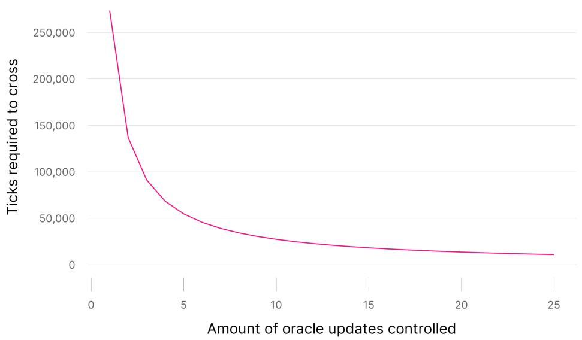
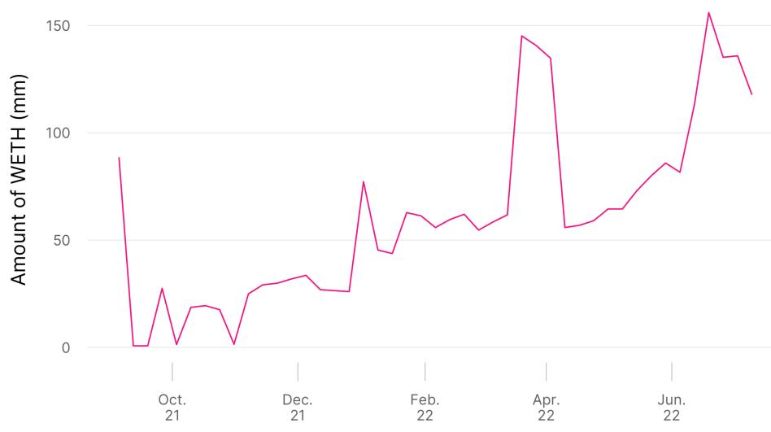
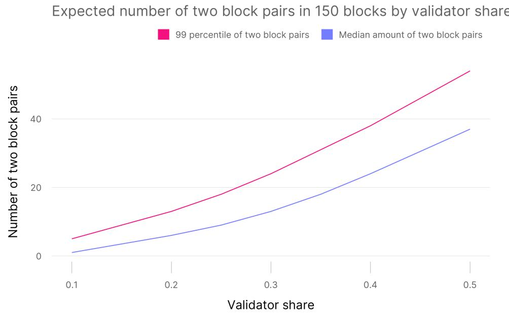

# Uniswap v3 TWAP Oracles in Proof of Stake

Austin Adams, Xin Wan, Noah Zinsmeister∗

October 27, 2022

## Abstract

In the Uniswap Protocol, a price oracle is a tool used to view price information about a given asset over time and enables developers to build highly decentralized protocols with quantifiable manipulation costs using price feeds. With the adoption of Proof of Stake (PoS), oracles are theoretically less secure because a malicious validator knows whether they control the next block created, allowing them to avoid value lost to backrunning an attempted oracle manipulation. However, manipulation on most Uniswap v3 TWAP oracles is not currently possible, because bad actors both need to source vast amounts of capital and then earn enough to make up for value lost to fees. This paper studies the dificulty, potential cost, and likelihood of oracle manipulations on Uniswap v3 under Ethereum PoS. We also discuss potential future innovations to create the next generation of PoS manipulation resistant oracles.

Keywords: Automated market makers, blockchain, distributed ledger technology, oracles, financial stability

## 1 Introduction

The PoS (Proof of Stake) merge on mainnet Ethereum is the single largest change to the way blocks are constructed in Ethereum history. One part of this change is that Proof of Stake block proposers know one epoch (32 blocks or 6 minutes and 24 seconds) ahead if they are the next block proposer. This means that validators and the entire network know who will propose the current epoch (at most 6 minutes and 24 seconds) and the next epoch (6 minutes and 24 seconds). This totals at least 6 minutes and 24 seconds and at most 12 minutes and 48 seconds with known block proposers. This is a material change from PoW (Proof of Work), because the stochastic nature of PoW makes it impossible to know for sure who will mine the next block. This deterministic knowledge of the next block proposer removes one of the major defenses to TWAP oracles.

Now, two or more block manipulations are theoretically possible. In PoS, validators control transaction sequencing. A validator controlling two consecutive blocks can greatly move the price of a pool in the first block and move it back in the next block without risk of being arbitraged against. This way the oracle based on this pool will have a data point of manipulated price, and the only cost to the manipulator would be 2 times the pool fee.

## 1.1 What is TWAP?

TWAP stands for "Time Weighted Average Price". TWAP was added in Uniswap v2 and improved in Uniswap v3. TWAP on Uniswap v3 calculates the geometric mean of relative prices of the two assets in a pool. The TWAP oracle feed is used by protocols as a reference price for on-chain assets. Many protocols struggle to calculate on-chain prices that are both reliable and accurate. Protocols need to ensure they always can receive pricing information, but also want to make sure that it is accurate.

The transition from PoW to PoS changed some fundamental considerations for TWAP oracles. In PoW, the next miner was unknown until the block was accepted by the network.

Potential manipulators could not guarantee that they would have the ability to cheaply backrun their own transaction. The most likely case in PoW was that manipulators would need to compete in an open auction for the opportunity to back-run their own manipulation, which would force them to pay market price for the opportunity. PoW ensured that manipulators lost value to a back-run. As long as protocols that consumed TWAP data ensured that the value lost to back-running outweighed the value gained from manipulating the pool, they were safe. However, manipulators can now ensure they back-run their own manipulation by waiting until their own validator is chosen to validate the next block.

## 1.2 Why would anyone want to manipulate TWAP?

Many protocols require the current on-chain price of assets to calculate the market price of their portfolio. Perhaps the most relevant example is lending protocols, which must calculate the value of debt and collateral for loans issued by the protocol. Lending protocols use these values to efectively liquidate loans before they become undercollateralized. A potential attack vector for lending protocols is for an attacker to borrow assets that are immediately undercollateralized, by making the protocol overvalue the collateral that the attacker puts in. The protocol is then unable to liquidate and recoup the value of the borrowed assets, creating bad debt for the lending protocol and enriching the attacker.

Because spot prices are easy and relatively cheap to manipulate, most protocols use a rolling 30-minute time window for TWAP to calculate the price1. Using TWAP with a long window causes prices to be smooth but lagging. Lag is problematic if the spot prices naturally jump enough to cause an arbitrage of minting bad debt to the protocol, but realistically assets used as collateral should be scoped to ensure this is not realistic.

The length of the TWAP window is a trade-of between price freshness and robustness to random noise or manipulation. TWAP is more costly to manipulate than spot prices. Since most lending protocols require overcollateralization, to create bad debt, a malicious user needs to manipulate the TWAP oracle by the overcollateralization margin (unique to each asset and protocol, but 20% for our analysis). Because of this, we decided to calculate the cost of manipulating the Uniswap v3 TWAP oracle.

## 1.3 Why would anyone want to manipulate TWAP?

A manipulator can create a manipulated oracle update by swapping a large amount of one asset into the pool in block one, then swap the same amount in the opposite direction ("backrun") in block two. This will create an oracle update at the final manipulated price of block one. We define this two block set-up as a two block manipulation. It is possible to wait more blocks before back-running the initial manipulated swap. If a user waits two blocks before back-running their manipulated swap, then it is a three block manipulation (two blocks of waiting + one block of back-running to fire the oracle update). Since most protocols use a 30 minute running TWAP, waiting more blocks allows more of the total weighting on the final manipulated price. Based on the amount of blocks the manipulation takes up, we can deterministically calculate the cost of a TWAP oracle manipulation of that length2.

Let k be the amount of blocks that the manipulator controls the oracle updates for (which is one less than the length of their total manipulation length). If a potential manipulator wants to manipulate the 30 minute (N = 150 blocks) TWAP price by δ percent, then they need to cross τ ticks defined by Equation 1:

$$
\tau = \frac {1 5 0 \frac {\ln 1 + \delta}{\ln 1 . 0 0 0 1}}{k} + T W A P _ {0, 1 5 0 - k}\tag{1}
$$

Ticks map to prices in Uniswap v3 by taking price = = 1.0001τ. $T W A P _ { 0 , 1 5 0 - k }$ is the unmanipulated 30 minute - (12 seconds \* k) TWAP price. For more information about how we derive this formula, see the appendix.

Figure 1: Required ticks vs. block length manipulation for a 20% oracle manipulation

Amount of ticks required to cross for a 20% oracle manipulation

  
This graph shows the amount of ticks that must be crossed to cause a 20% oracle manipulation using Equation 1 with $\delta = . 2$

Figure 1 follows directly from Equation 1 using $\delta = . 2$ . At the peak, 273,497 ticks need to be crossed to manipulate the price by 20% if the TWAP is currently 0. After 10 blocks, this cost goes down to 27,350 ticks. This value exponentially decreases, requiring significantly less ticks to be crossed, making the manipulation much cheaper the more blocks that can be controlled.

As previously stated, PoS validators know how many sets of blocks they will propose for up to the next two epochs. Because of this, they can execute multiple oracle attacks disjointed as if they were one joined attack. Two sets of two-block oracle attacks can cross the same amount of ticks as one three-block attack. These attacks will have the equivalent impact, just costing more LP fees. This makes oracle attacks more likely.

From our previous equation, we know that manipulators need to cross 273,497 ticks to manipulate the TWAP price by 20%, but how many assets does this require in practice?

## 2 How much does a two block 20% manipulation require?

Table 1 - Underlying required to create a two block manipulation

<table><tr><td>Pool Info</td><td>Token 0 ($mm)</td><td>Token 1 ($mm)</td></tr><tr><td>USDC/WETH 5 bps</td><td>709,967</td><td>142,207</td></tr><tr><td>USDC/WETH 30 bps</td><td>66,657</td><td>141,105</td></tr><tr><td>WBTC/WETH 5 bps</td><td>271,401</td><td>111,303</td></tr><tr><td>UNI/WETH 30 bps</td><td>31,374</td><td>27,354</td></tr><tr><td>LINK/WETH 30 bps</td><td>40,143</td><td>37,150</td></tr></table>

Sample taken at September 4th, 2022

For example, the amount of token 0 in the table above is the amount of token 0 needed to cross -273,497 ticks, which would increase the reference price of token 1 in the pool by 20%. For the USDC/WETH 5 bps pool, token 0 is USDC, and a swap of 709 billion USDC manipulates the reference TWAP price of WETH by 20%.

From Table 1, the cost of a two block manipulation for the pools is far too expensive to ever be done. For most pools, there are not enough underlying assets in circulation to even attempt a two block manipulation. Further, the cost lost to fees is more than the GDP of American Samoa3.

The incredible cost of a two block manipulation comes from wide-range liquidity. Significant liquidity exists at the outer ticks of most major pools. This comes from passive LPs, who choose wide-ranges in exchange for never rebalancing, and benevolent actors who want to improve oracle stability.

For example, at the final tick the manipulated swap must go through on (tick 476,496) in the 5 bps USDC/WETH pool, the manipulator must provide 45,138 WETH at a price of $2 . 1 \times 1 0 ^ { - 9 }$ USDC each to swap through the final tick needed to successfully execute the manipulation. All the liquidity at the tick cost around \$70 total in assets to place. With more wide-range liquidity, the manipulation exponentially increases in price. We will explore this in later sections.

Figure 2 - Cost of two block manipulation over time  
Amount of WETH (mm) required to manipulate TWAP by 20%  

This graph shows a time series of the amount of WETH needed to manipulate the USDC price by 20% at each sample period. The sample is weekly from Sept 2021. to Sept. 2022.

As more liquidity is onboarded to the pool, the price of 20% TWAP manipulation also increases significantly. Surprisingly, the cost doesn’t drop significantly in the volatile period in July. While significant liquidity went out-of-range from the volatile period and spot liquidity became increasingly thin, the important wide-range liquidity did not pull from the pool. As a result, the cost of manipulation is generally increasing.

## 2.1 What about multiple block manipulations?

Most people who are concerned about the TWAP oracle manipulations are concerned about the $k < 2$ case. This is because multiple block manipulations are now more feasible with the transition to PoS.

First, let’s look at only the cost of multi-block manipulations for the USDC/WETH 5 bps pool.

Table 2 - Cost of manipulation for USDC/WETH 5 bps

<table><tr><td>Manipulation length</td><td>USDC cost ($mm)</td><td>WETH Cost ($mm)</td></tr><tr><td>2</td><td>709,967</td><td>142,207</td></tr><tr><td>3</td><td>978</td><td>316</td></tr><tr><td>4</td><td>289</td><td>92</td></tr><tr><td>5</td><td>235</td><td>81</td></tr><tr><td>6</td><td>223</td><td>78</td></tr><tr><td>7</td><td>218</td><td>77</td></tr></table>

Sample taken at September 4th, 2022 00:00 UTC.

The drop from the two to the three block manipulation is staggering. While \$978 million is still prohibitively expensive, it is not entirely unfeasible like \$710 billion. This steep drop occurs because swapping through fewer total ticks is exponentially cheaper. With more blocks to manipulate, the amount of total ticks that must be crossed also rapidly decreases.

Pulling from this paper by Revuelta4, on average we should expect a block proposer with around 1% share to be assigned to propose three blocks in a row 0.19 times per month5. This means that a 1% block proposer would receive three blocks in a row on average once every 5 months. This greatly increases with more percent share. We should expect a validator with 10% market share to have three blocks in a row 181 times a month.

As previously mentioned, multiple disjoint sets of oracle manipulations can function the same as one longer set. Because large validators can also expect multiple two-block sets in the two known epochs, this will increase the likelihood that larger validators can oracle manipulate the pools. Because of this, the current findings are a lower-bound for the likelihood of oracle manipulations, and the real probability is higher.

## 3 What can be done currently for the Uniswap Protocol?

Before discussing modifications, we want to clarify that Uniswap v3 is non-upgradable. This means that the current code cannot be changed at all, which makes it impossible to add new oracle types to the existing contracts. The Uniswap v3 contracts were designed to be nonupgradable, because of the security benefits to the users of the protocol. Non-upgradable contracts mean that users can trust the contracts that are deployed are the same and can ensure the behavior of the contracts always remains consistent. Upgradable contracts also pose a threat to decentralization.

With this, the solutions presented below require no code additions to the existing Uniswap v3 Protocol.

## 3.1 Wide-range liquidity

First, we looked at adding wide-range liquidity. Wide-range liquidity in v3 still returns a respectable yield when compared to Uniswap v2, so it is a feasible solution6. A full-range v3 WETH/USDC 30 bps position returns around 66% as much as the v2 position. A two block manipulation to move the 30 minute TWAP by 20% must cross 273,496 ticks, so any liquidity more than 273,496 ticks from the current tick is not utilized in mitigating oracle manipulations. The liquidity at tick 273,497 is unused, because liquidity will only kick in once the tick has been reached. Because liquidity closest to the final ticks of a manipulation is the most expensive, we want to ensure we are as close as possible to the final ticks with as few ticks over the required amount of ticks.

The optimal wide-range tick lower and upper is [current tick - 273,496 ticks, current tick + 273,496 ticks]. The current tick of Uniswap v3 WETH/USDC 5 bps is around 206,000, so the optimal range is [-67,496, 479,496]. However, all assets have some various degrees of volatility and liquidity can only be placed at specific ticks according to tick-spacing, so a wider-range than perfectly optimal should be chosen to account for the drift.

Table 3 - Added wide-range liquidity position

<table><tr><td>Mint time</td><td>Amount of USDC</td><td>Amount of WETH</td><td>Cost of WETH in USDC</td><td>Approx total cost</td><td>Tick lower</td><td>Tick upper</td></tr><tr><td>2022-09-03 23:39:42</td><td>621,000</td><td>400</td><td>1558.65</td><td>$1,240,000</td><td>-100,000</td><td>500,000</td></tr></table>

Sample taken at September 4th, 2022 00:00 UTC.

Table 3 shows the added liquidity position for our analysis. The added position costs around \$1,240,000 and should have minimal divergence loss compared to a concentrated position (due to the large range of the position). The tick range mapped to the position is from $\$ 1.9 \times 10^ { - 1 0 }$ to $\mathbb { \$ 2 . 2 \times 10 ^ { 1 6 } }$ for each WETH.

Table 4 - Cost of manipulation for USDC/WETH 5 bps with added position

<table><tr><td>Blocks in a row</td><td>USDC cost ($mm)</td><td>Increase in cost in USDC</td><td>WETH cost ($mm)</td><td>Increase in cost in WETH</td></tr><tr><td>2</td><td>1,249,425</td><td>76.0%</td><td>683,163</td><td>380.4%</td></tr><tr><td>3</td><td>1,557</td><td>59.2%</td><td>896</td><td>183.5%</td></tr><tr><td>4</td><td>338</td><td>17.0%</td><td>150</td><td>63.0%</td></tr><tr><td>5</td><td>254</td><td>8.1%</td><td>99</td><td>22.2%</td></tr><tr><td>6</td><td>232</td><td>4.0%</td><td>87</td><td>11.5%</td></tr><tr><td>7</td><td>224</td><td>2.8%</td><td>82</td><td>6.5%</td></tr></table>

Sample taken at September 4th, 2022 00:00 UTC.

The position would make \$540 million in fees for the LP if a two-block manipulation was executed. If a validator with a 1% validator share executed the amount of transactions to meet the expectation for the three block case, the LP would make \$58 million in fees.

Because the added liquidity is very wide, the benefit to hindering potential manipulations is mainly in the two and three block cases. Most of the power is in the far edges, which manipulations with more blocks will not touch. The impact of this position is vast. A benevolent party could mint this position and trade out some potential yield from a concentrated liquidity for TWAP oracle stability.

## 3.2 Double-sided limit orders

Limit orders in Uniswap v3 are concentrated orders generally with a tick-range (tick-upper minus tick-lower) of one tick-spacing. Unlike central limit order books (CLOBs), limit orders on Uniswap v3 are double-sided, where once a buy order for one asset is traded against, a sell order for the other asset is placed at the same price. There are 3rd party services that will remove your orders for you automatically and create single-sided limit orders. A third party service tracks the pool and submits a transaction to burn your liquidity if certain conditions are met. The issue is that a manipulator would control transactions, and would add that transaction to their block to burn your limit order.

Since the exact tick needed for TWAP manipulation can be deterministically found at any time, a benevolent party could also place large limit orders right before the required amount of ticks to manipulate. This is not reasonable, because some assets have high volatility and would require frequent re-adjusting. Another problem with this strategy is the high opportunity cost of the orders. Below we analyze the impact of extreme out-of-range limit orders that still account for asset drift.

Unlike wide-range liquidity which is always in-range, limit orders only impact the cost of manipulation if their tick is reached. By setting the ticks farther from the current price, the manipulation becomes progressively expensive. On the other hand, if we place limit orders farther out, the limit orders impact fewer manipulations, since fewer ticks are crossed for those.

Say we wanted to impact four block manipulations. As previously stated, the current tick at the time of analysis was around 206,000, and 68,374 ticks must be crossed for the four block manipulation. To impact four block manipulations, theoretical limit orders must be placed inside the tick-range of $[ 2 0 6 , 0 0 0 - 6 8 , 3 7 4 , 2 0 6 , 0 0 0 + 6 8 , 3 7 4 ] = [ 1 3 7 , 6 2 6 , 2 7 4 , 3 7 4 ]$ . To account for some asset drift, we placed limit orders valued around \$100,000 at tick 150,000 and tick 250,000.

Table 5 - Added limit order liquidity positions

<table><tr><td>Mint time</td><td>Amount of USDC</td><td>Amount of WETH</td><td>Cost of WETH in USDC</td><td>Approx total cost</td><td>Tick lower</td><td>Tick upper</td></tr><tr><td>2022-09-03 23:39:42</td><td>100,000</td><td>0</td><td>1552.52</td><td>$100,000</td><td>250,000</td><td>250,010</td></tr><tr><td>2022-09-03 23:39:42</td><td>0</td><td>65</td><td>1552.52</td><td>$101,000</td><td>150,000</td><td>150,010</td></tr></table>

Sample taken at September 4th, 2022 00:00 UTC.

Adding a 100,000 USDC limit order at tick 250,000 (a buy order of WETH for 13.91 in USDC per WETH) and a 65 WETH limit order at tick 150,000 (a sell order of WETH at 306,131.82 USDC per WETH) adds some additional cost to the attack. The 100,000 USDC limit order makes the attack cost about \$10,800,000 more. The WETH limit order adds about \$19,900,000 to the cost. This is not as extreme as the wide-range order.

Instead of targeting four block manipulations, we could target two or three block manipulations. To compare the impact of changing the tick-range to mitigate only target two and three block manipulations, we also calculated the cost of manipulation if the order in Table 6 is created.

Table 6 - Added wider limit order liquidity positions

<table><tr><td>Mint time</td><td>Amount of USDC</td><td>Amount of WETH</td><td>Cost of WETH in USDC</td><td>Approx total cost</td><td>Tick lower</td><td>Tick upper</td></tr><tr><td>2022-09-03 23:39:42</td><td>100,000</td><td>0</td><td>1552.52</td><td>$100,000</td><td>325,000</td><td>325,010</td></tr><tr><td>2022-09-03 23:39:42</td><td>0</td><td>65</td><td>1552.52</td><td>$101,000</td><td>80,000</td><td>80,010</td></tr></table>

Sample taken at September 4th, 2022 00:00 UTC.

With these added limit orders, the three block manipulation costs \$20.4 billion for WETH and \$23.4 billion for USDC. Just like the two block manipulation, the three block is now impossible. However because we are out of the required range to impact four block manip ulations, there is no change in their cost from the original calculations.

## 4 Future Protocol and Ecosystem Improvements

Neither full-range liquidity or double-sided limit orders fix the problem if a validator has enough market share. With enough market share, validators could execute twenty to thirty block manipulations, which are cheaper to execute. These orders only make the attack slightly more expensive.

## 4.1 Potential oracle innovations

Future research should be pursued into mitigation strategies for both the protocols that consume TWAP data and protocols that create it (i.e. the Uniswap Protocol). Research around median price oracles7 and winsorized (or similar) TWAP oracles should be done to create the next generation of PoS manipulation resistant oracles.

Instead of traditional winsorize (where a potentially expensive rolling calculation of variance is needed), TWAP oracle updates could instead truncate if the update exceeds a total change from the previous oracle update. This creates oracle manipulation resistance up to a certain length of blocks. For example, if 20,000 ticks were crossed from the previous update, we could truncate that value down to potentially 9,116 ticks. A max value of 9,116 ensures that validators must execute at least a 30 block oracle manipulation in order to move 30 minute TWAP by $2 0 \% ^ { 8 }$ . This max change in ticks could be lower or higher depending on further research.

Figure 3 - Expected Number of Two Block Pairs by Validator Share  
  
Sample taken at September 4th, 2022 00:00 UTC.

For example, a 30 block manipulation requires high validator market share. As seen above, a validator needs a share of 40% to expect a 30 block manipulation in a 150 block period. For a share of 30%, validators can only expect 1 in 2,000 probability of a 30 block manipulation during a 150 block period. For context, Lido has the highest share of validators with around 30%9.

A trade-of is that truncated TWAP oracles will update slower than current implementations. Limiting oracle updates to 9,116 in max changes will allow at most 2.5x price changes from block to block in TWAP. However 2.5x is a large enough change to still allow quick price convergence for most assets.

## 4.2 Ethereum Protocol innovations

Removing the look-ahead for proposers should also be considered, as this completely eliminates the manipulation problem. However, it would be non-trivial from the Ethereum perspective. The one-epoch look ahead was implemented to allow validators to join the right p2p network subnets and prepare for validation according to Ben Edgington10. The current best candidate technologies to help mitigate the problem are single slot finality or SSLE (secret single leader election)11. There is no guarantee that these will come any time soon to fix the problem.

## 4.3 Market structure innovations

Another proposal is for pool-implemented single sided limit orders. These are orders that burn from the pool without requiring outside intervention and cannot be blocked from executing by a malicious validator. The manipulator could not risk-free back-run their own manipulation to gain back all the lost capital from their initial swap. With this, the costs required to manipulate the pool would also include capital loss increasing the deterrent for manipulators.

## 5 Conclusion

Protocols use the Uniswap v3 TWAP oracle to consume market information about asset prices. With the merge from PoW to PoS, one of the main defenses of TWAP oracles was eliminated by allowing look-ahead for subsequent block proposers. While the two-block TWAP oracle manipulation is still prohibitively expensive, three-block and greater attacks are technically feasible, though statistically very unlikely for validators with a smaller share. We have shown several ways to make these attacks more unrealistic, but all have trade-ofs that must be considered.

Uniswap Labs is currently researching PoS resistant oracle implementations, but other improvements such as more wide-range liquidity and limit orders could be introduced. We hope that this blog has shed some light on the potential feasibility of TWAP oracle manipulation on Uniswap v3.

## 6 Conclusion

Protocols use the Uniswap v3 TWAP oracle to consume market information about asset prices. With the merge from PoW to PoS, one of the main defenses of TWAP oracles was eliminated by allowing look-ahead for subsequent block proposers. While the two-block TWAP oracle manipulation is still prohibitively expensive, three-block and greater attacks are technically feasible, though statistically very unlikely for validators with a smaller share. We have shown several ways to make these attacks more unrealistic, but all have trade-ofs that must be considered.

Uniswap Labs is currently researching PoS resistant oracle implementations, but other improvements such as more wide-range liquidity and limit orders could be introduced. We hope that this blog has shed some light on the potential feasibility of TWAP oracle manipulation on Uniswap v3.

## 7 TWAP Appendix

Below is a refresher on the implementation of TWAP on Uniswap v3.

TWAP on Uniswap v3 is implemented by calculating the time weighted tick of the Uniswap v3 pool at the end of the block, then mapping that tick to price. The weighted tick can be turned into a price by taking ${ \mathrm { p r i c e } } = 1 . 0 0 0 1 ^ { \tau }$

If a pool was at a tick from time $t _ { 0 }$ to $t _ { 1 }$ , an oracle update is created once the tick moves at time $t _ { 1 }$

$$
u p d a t e _ {t _ {1}} = \sum_ {t _ {0}} ^ {t _ {1}} \tau\tag{2}
$$

In the Uniswap v3 smart contract, there is an accumulator that cumulatively sums these updates up to the current block12. To calculate the TWAP from l to k, you need to subtract the accumulator at $t _ { k }$ from $t _ { l }$ and divide by $k - l$

However, this is only an optimization for gas eficiency. You can also just sum the tick $\tau$ at each block even if the tick did not change, assuming the tick changes in a future block from $t _ { 0 }$ . However, it is very important to remember that an oracle update only fires if the current tick changes. Otherwise the oracle is linearly interpolated and may yield diferent results, and the below approximation will be incorrect. We make the assumption for our analysis that a potential manipulator will back-run their swap, thus guaranteeing an oracle update. We calculate TWAP from $t _ { 0 }$ to $t _ { 1 }$ using this formula.

$$
T W A P _ {t _ {0}, t _ {1}} = \frac {\sum_ {i = t _ {0}} ^ {t _ {1}} \tau_ {i}}{t _ {1} - t _ {0}}\tag{3}
$$

## 8 Math Appendix

We want to determine the number of ticks τ that must be crossed to manipulate the TWAP Oracle by δ percent.

## 8.1 Basic TWAP Oracle Definition

In Uniswap v3, the TWAP oracle doesn’t actually track the price. It tracks the time weighted tick of the pool. Let the tick at time t be $\tau _ { t }$

Uniswap v3 creates an oracle update whenever the tick $\tau _ { t - k } \neq \tau _ { t }$ . The oracle then adds $v \tau$ to a rolling counter. v is the amount of time since the last oracle update.

Let the accumulator at time t equal

$$
\sum_ {i = 0} ^ {t} \upsilon \tau_ {i}
$$

To calculate the TWAP from $t - N$ to t, you subtact the accumulator at time t from time $t - N$ and divide by N

$$
T W A P _ {t - N, t} = \frac {\sum_ {i = 0} ^ {t} v \tau_ {i} - \sum_ {i = 0} ^ {t - N} v \tau_ {i}}{N}
$$

Notice that this simplifies to

$$
T W A P _ {t - N, t} = \frac {\sum_ {i = t - N} ^ {t} v \tau_ {i}}{N}
$$

## 8.2 Definition of Manipulation

The manipulation of length k between time t − N to time t can be defined as

$$
M _ {(t, k)} = \frac {1 . 0 0 0 1 ^ {T W A P _ {t - N , t}} - 1 . 0 0 0 1 ^ {T W A P _ {t - N , t - k}}}{1 . 0 0 0 1 ^ {T W A P _ {t - N , t - k}}}
$$

## 8.3 What does a manipulator control

Oracle manipulators would have access to at least one oracle update without arbitragers. We want to know how large this update needs to be to make $M ( t , k ) = . 2$

This final k slots for a N length TWAP can be defined as

$$
\sum_ {t - k} ^ {t} \upsilon \tau_ {i}
$$

This is the only thing that a potential manipulator has control over, so this is what needs to be solved for

## 8.4 Solving for the size of the last update required for a $\delta$ manipulation

We want to know how large a final update is needed to cause a manipulation of $\delta$ size defined as

$$
\sum_ {t - k} ^ {t} \upsilon \tau_ {i}
$$

Use $M _ { ( t , k ) } = \delta$

$$
\delta = \frac {1 . 0 0 0 1 ^ {T W A P _ {t - N , t}} - 1 . 0 0 0 1 ^ {T W A P _ {t - N , t - k}}}{1 . 0 0 0 1 ^ {T W A P _ {t - N , t - k}}}
$$

$$
\frac {\ln 1 + \delta}{\ln 1 . 0 0 0 1} = T W A P _ {t - N, t} - T W A P _ {t - N, t - k}
$$

Apply the previously calculated TWAP formula

$$
T W A P _ {t - N, t} = \frac {\sum_ {t - N} ^ {t} v \tau_ {i}}{N}
$$

$$
T W A P _ {t - N, t - k} = \frac {\sum_ {t - N} ^ {t - k} v \tau_ {i}}{N - k}
$$

And plug back into the equation

$$
\frac {\ln 1 + \delta}{\ln 1 . 0 0 0 1} = \frac {\sum_ {t - N} ^ {t} v \tau_ {i}}{N} - \frac {\sum_ {t - N} ^ {t - k} v \tau_ {i}}{N - k}
$$

Notice that $\begin{array} { r } { \sum _ { t - N } ^ { t + k } v \tau _ { i } = \sum _ { t } ^ { t + k } v \tau _ { i } + \sum _ { t - N } ^ { t } v \tau _ { i } } \end{array}$ and simplify

$$
\frac {\sum_ {t - k} ^ {t} v \tau + \sum_ {t - N} ^ {t - k} v \tau_ {i}}{N} - \frac {\sum_ {t - N} ^ {t - k} v \tau_ {i}}{N - k}
$$

$$
\frac {(N - k) \sum_ {t} ^ {t + k} v \tau_ {i}}{(N - k) t} - \frac {k \sum_ {1} ^ {1 5 0 - k} v \tau_ {i}}{(N - k) N}
$$

Replace back into the equation above

$$
\frac {\ln 1 + \delta}{\ln 1 . 0 0 0 1} = \frac {\sum_ {t - k} ^ {t} v \tau_ {i}}{N} - \frac {k \sum_ {t - N} ^ {t - k} v \tau_ {i}}{(N - k) N}
$$

$$
\sum_ {t - k} ^ {t} v \tau_ {i} = N \frac {\ln 1 + \delta}{\ln 1 . 0 0 0 1} + k T W A P _ {t - N, t - k}
$$

## 8.5 Optimal Manipulation

While Uniswap v3 only makes oracle updates when a tick is updated, this is only for gas eficiency. It is the same value if you make an oracle update every block. We can simply the equation by making an oracle update every block.

Optimally, a manipulator would first swap up to the needed tick for manipulation and do nothing else until the needed time has passed to secure the desired TWAP.

Let $v = 1$ , which assumes that an oracle update is fired every block, and the price is moved to $\tau$ ticks during the first block of the manipulation

$$
k \tau = N \frac {\ln 1 + \delta}{\ln 1 . 0 0 0 1} + k T W A P _ {t - N, t - k}
$$

$$
\tau = \frac {N \frac {\ln 1 + d}{\ln 1 . 0 0 0 1}}{k} + T W A P _ {t - N, t - k}
$$