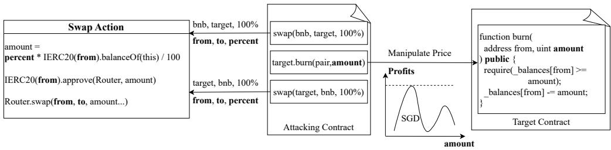
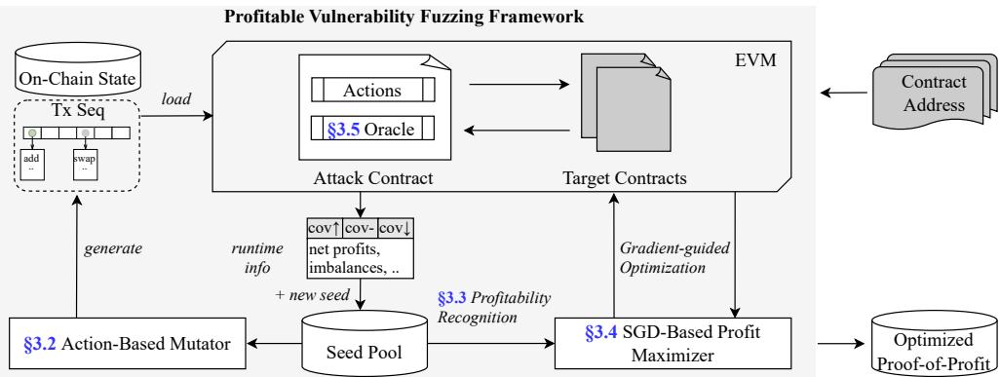
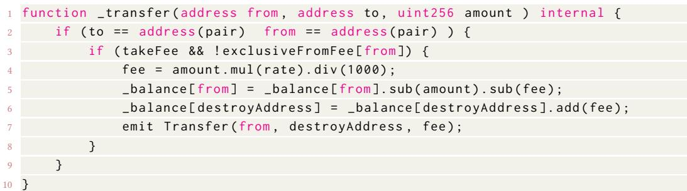
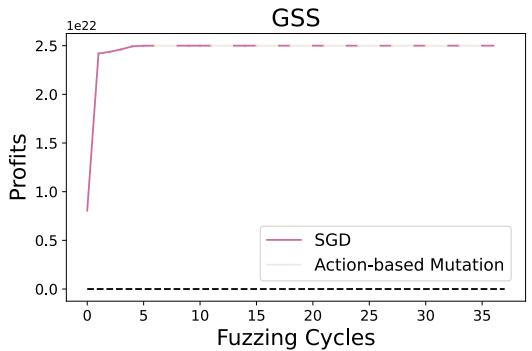
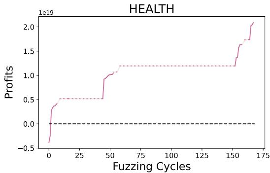

# Smart Contract Fuzzing Towards Profitable Vulnerabilities

<sup>ZI</sup>Q<sup>IAO</sup> <sup>KONG</sup>, Nanyang Technological University, Singapore

<sup>CEN</sup> <sup>ZHANG</sup>, Nanyang Technological University, Singapore

<sup>MAOYI</sup> <sup>XIE</sup>, Nanyang Technological University, Singapore

<sup>MING</sup> <sup>HU</sup>, Singapore Management University, Singapore

<sup>YUE XUE</sup>, MetaTrust Labs, Singapore

<sup>YE</sup> <sup>LIU</sup>, Singapore Management University, Singapore

<sup>HAI</sup>J<sup>UN</sup> <sup>WANG</sup>, Xi’an Jiaotong University, China

<sup>YANG LIU</sup>, Nanyang Technological University, Singapore

Billions of dollars are transacted through smart contracts, making vulnerabilities a major financial risk. One focus in the security arms race is on profitable vulnerabilities that attackers can exploit. Fuzzing is a key method for identifying these vulnerabilities. However, current solutions face two main limitations: ① a lack of profit-centric techniques for expediting detection and ② insuficient automation in maximizing the profitability of discovered vulnerabilities, leaving the analysis to human experts.

To address these gaps, we have developed Verite, a profit-centric smart contract fuzzing framework that not only efectively detects those profitable vulnerabilities but also maximizes the exploited profits. Verite has three key features: ① DeFi action-based mutators for boosting the exploration of transactions with diferent fund flows; ② potentially profitable candidates identification criteria, which checks whether the input has caused abnormal fund flow properties during testing; ③ a gradient descent-based profit maximization strategy for these identified candidates. Verite is fully developed from scratch and evaluated on a dataset consisting of 61 exploited real-world DeFi projects with an average of over 1.1 million dollars loss. The results show that Verite can automatically extract more than 18 million dollars in total and is significantly better than state-of-the-art fuzzer ItyFuzz in both detection (29/10) and exploitation (134 times more profits gained on average). Remarkably, in 12 targets, it gains more profits than real-world attacking exploits (1.01 to 11.45 times more). Verite is also applied by auditors in contract auditing, where 6 (5 high severity) zero-day vulnerabilities are found with over \$2,500 bounty rewards.

CCS Concepts: • Security and privacy → Software security engineering; Vulnerability scanners; • Software and its engineering → Search-based software engineering.

Additional Key Words and Phrases: Smart Contract, Fuzzing, Vulnerabilities Research

## ACM Reference Format:

Ziqiao Kong, Cen Zhang, Maoyi Xie, Ming Hu, Yue Xue, Ye Liu, Haijun Wang, and Yang Liu. 2025. Smart Contract Fuzzing Towards Profitable Vulnerabilities. Proc. ACM Softw. Eng. 2, FSE, Article FSE008 (July 2025), 22 pages. https://doi.org/10.1145/3715720

Cen Zhang is the corresponding author. Authors’ Contact Information: Ziqiao Kong, Nanyang Technological University, Singapore, Singapore, ziqiao001@e.ntu. edu.sg; Cen Zhang, Nanyang Technological University, Singapore, Singapore, cen001@e.ntu.edu.sg; Maoyi Xie, Nanyang Technological University, Singapore, Singapore, maoyi001@e.ntu.edu.sg; Ming Hu, Singapore Management University, Singapore, Singapore, minghu@smu.edu.sg; Yue Xue, MetaTrust Labs, Singapore, Singapore, xueyue@metatrust.io; Ye Liu, Singapore Management University, Singapore, Singapore, yeliu@smu.edu.sg; Haijun Wang, Xi’an Jiaotong University, Xi’an, China, haijunwang@xjtu.edu.cn; Yang Liu, Nanyang Technological University, Singapore, Singapore, yangliu@ntu.edu.sg.

## 1 Introduction

Smart contracts are infrastructures for Web 3.0 businesses, managing billions of dollars in digital assets. However, they are also susceptible to vulnerabilities such as logic bugs, which can potentially lead to severe financial losses [52]. A notable fact about these vulnerabilities is that they are often economically profitable, making them highly attractive to malicious actors. Regrettably, exploits of these susceptibilities are becoming a pervasive issue, with successful attacks occurring on even a daily basis, where hackers illicitly profit from these weaknesses. For example, in the past first month of 2024, there have been nine DeFi (Decentralized Finance) hack incidents with a total loss of over 100 million dollars [3]. Generally, detecting, exploiting, and mitigating the smart contract vulnerabilities have been an arm race between malicious actors and whitehats, especially for the detection of those vulnerabilities that attackers could exploit to gain profits.

Fuzzing is an efective vulnerability detection approach. Basically, smart contract fuzzing is a process that generates inputs to execute the APIs of a target contract and explores transaction sequences to detect abnormal behaviors that indicate bugs. Mainstream fuzzers, such as those mentioned in [23, 37, 38], operate at the API level, combining transaction sequences for comprehensive testing. Diferent fuzzers adopt varied techniques: sFuzz [31] focuses on higher code coverage, Smartian [18] uses dataflow analysis, and ConFuzzius [41] integrates symbolic execution and taint analysis. Additionally, ItyFuzz [38] uses dataflow waypoints to speed up fuzzing, while learning-based methods are employed by tools like ILF [24], xFuzz [46], and RLF [39], showcasing the diverse strategies in this field.

Standing from the perspective of fuzzing towards profitable vulnerabilities, existing fuzzers have shown certain limitations. First, there is a lack of eforts on boosting the fuzzing towards these profitable vulnerabilities. Currently, mainstream fuzzers are code-centric, with strategies primarily focused on maximizing code coverage. While this approach is generally efective, it does not capitalize on the specific characteristics of profitable vulnerabilities. Such vulnerabilities often contain issues like price manipulation, inadequate access control, or other misbehaviors closely tied to contract-specific business logic, which are not always detectable via its code features like coverage. From another perspective, the transaction fund flow features can provide complementary or unique insights, enabling fuzzers to more efectively target these vulnerabilities. For instance, a profitable vulnerability implies that there is a transaction where the fund flow demonstrates that an attacker ultimately profits. Current fuzzers do not efectively leverage these characteristics to expedite the detection of profitable vulnerabilities. Second, existing fuzzers halt after triggering the vulnerabilities, leaving further exploitation to human analysts. Most fuzzers are content with producing a proof-of-concept (PoC) that triggers a vulnerability without pursuing further utilization. In reality, the automatic exploitation of profitable vulnerabilities is crucial for the security of smart contracts. If security experts or auditors could automatically generate inputs that maximize profit, it would significantly enhance their understanding of the severity and ranking of the vulnerability and subsequent mitigation strategies. Unfortunately, even when current fuzzers trigger a vulnerability and produce a PoC, they do not proceed to maximize profit potential, leaving a gap between the vulnerability and exploitation[33]. This gap indicates a missed opportunity to fully leverage fuzzers to enhance smart contract security.

To address these limitations, we propose a profit-centric fuzzing framework, Verite, which not only targets the discovery of profitable vulnerabilities but also maximizes the exploitation of profits. Our framework incorporates three key designs: ① Action-Based Mutators: Instead ofrelying solely on API-level mutations, we introduce action-based mutators to enhance the exploration of fund flow spaces. DeFi actions, which are semantic groups of contract APIs, represent logical transaction steps, such as token swaps or transfers. By mutating at the action level, Verite generates more valid transactions compared to API-level mutations, which often disrupt transaction semantics. We have sum marized 10 common actions from mainstream DeFi projects and developed action-based mutators to accelerate this exploration. ② Profitability Recognition: Verite identifies potentially profitable candidates by examining whether inputs trigger abnormal fund flow properties during testing. It evaluates four key properties: net positive profit across all assets, imbalance in Uniswap pairs, uncon ditional token gains, and unconditional token burns. If any property is satisfied, Verite considers it a candidate and begins the profit maximization process. ③ Profit Maximization: We model profit maximization as a gradient descent problem and devise a corresponding strategy for optimizing identified candidates. The intuition is that these candidates already have the basis to make profits, i.e., potentially profitable transaction sequences. The next step is to refine the API parameters within these sequences to maximize profits. Verite models the profit functions as $f ( x _ { 1 } , x _ { 2 } , \ldots )$ , with API parameters as arguments �, and employs the gradient descent algorithm to find the optimal parameters.

To thoroughly evaluate Verite, we expanded the existing ItyFuzz dataset to include 61 opensource Web3 projects by collecting the latest DeFi hack incidents. Each project features a known attack exploiting a profitable vulnerability, with an average loss ofapproximately \$1.1 million. In our evaluation, Verite demonstrated superior ability in detecting profitable vulnerabilities and achieved significantly higher profits in generated exploits compared to the state-of-the-art fuzzer ItyFuzz . Specifically, Verite successfully exploited 29 targets by yielding 18 million profits, whereas ItyFuzz managed only nine with 100 thousand profits. On targets found by both fuzzers, Verite discovered, on average, 58 times more profits than ItyFuzz . Remarkably, when compared to real-world attack exploits, typically optimized by attackers, Verite achieved higher profits on 12 targets, with profit ratios ranging from 1.01 to 11.45 times. Our in-depth analysis further elucidates these comparisons, and our ablation study confirms that each key design component of Verite significantly enhances its overall performance. To demonstrate its practicality, Verite was employed to assist auditors in detecting and exploiting zero-day vulnerabilities on popular Web3 auditing contest platforms Secure3 [7]. Verite uncovered six vulnerabilities, five of which were high severity. We responsibly reported these issues, assisted in their fix, and received over \$2,500 in bounty rewards.

In summary, our contributions are:

• We first identified the gaps and challenges for building fuzzers towards profitable vulnerabilities, including the lack of profit-centric design and the absence of profit maximization.

• We proposed three key designs for addressing these gaps, including action-based mutators, fund-flow-property-based profitable candidate recognition, and gradient descent-based profit maximization. We further implemented Verite from scratch.

• We built a comprehensive evaluation dataset and conducted extensive experiments to evaluate Verite’s performance. Verite shows superior performance compared to existing solutions and can even gain more profits than real-world attacking exploits (11.45 times more in the best case).

• Verite has been applied to help auditors find six zero-day profitable vulnerabilities with \$2,500+ bug bounty, showing its practical value.

## 2 Preliminaries

## 2.1 Concept Modeling

Smart Contracts and Transactions Smart contracts are usually written in a programming language like solidity, compiled into EVM byte code, and deployed on EVM [43]. A transaction interacting with smart contracts carries several important fields, including to specifying the target contract address, value specifying the ether transferred, and data encoding which smart contract function the sender wishes to call and corresponding arguments. Therefore, a single transaction corresponds to one smart contract API function call, and a transaction sequence consists ofseveral transactions in a fixed order. In addition, each contract function can also contain any number of transactions, sometimes also called "internal transactions", to any other smart contracts due to its turning completeness.

```txt
function swap2_action(address token_from, address token_to, uint percentage) {
    uint amount = token_from.balanceOf(address(this)) * percentage / 100;

    token_from.approve(Router, amount);
    address[] memory path = new address[](2);
    path[0] = token_from;
    path[1] = token_to;
    Router.swapExactETHForTokensSupportingFeeOnTransferTokens(amount, path,
        ...);
}
```  
Listin<sub>g</sub> 1. The sim<sub>p</sub>lified im<sub>p</sub>lementation of swa<sub>pp</sub>in<sub>g</sub> two tokens usin<sub>g</sub> a Uniswa<sub>p</sub>V2 router (Action A2 in Table 1).

  
Fi<sub>g</sub>. 1. The runnin<sub>g</sub> exam<sub>p</sub>le sim<sub>p</sub>lified from one of the vulnerabilities in our real-world a<sub>pp</sub>lication.

The execution of a transaction on EVM can have two results: return or revert. If a transaction stops and returns normally, it will then commit the new state to the EVM. Otherwise, the current state will be discarded, and EVM will revert to the previous state.

Attack Contract The attack contract is usually a contract that an attacker deploys as an agent to send transactions to target contracts to exploit vulnerabilities. The benefit of deploying an attack contract and calling the attack contract compared to sending several transactions is that the attacker can revert the transaction anytime to avoid any loss and maximize profits. This also aligns with the observation of the trending of flash loan usages on the blockchain [36], which requires users to provide a deployed contract.

Action DeFi is usually implemented with several smart contracts and provides API for external usages. However, there is a gap between the smart contracts functions and the actual high-level business models [45]: standing from the perspective of a DeFi user, the intention of using a smart contract is usually to complete specific actions, for example, swapping tokens, minting NFTs, etc. We refer to a sequence of smart contract API calls and control flows as "actions", representing users’ interactions with DeFi contracts. The Listing 1 shows a simplified action implementation of swapping two tokens using Uniswap V2. Instead of calling Router directly, this action ensures the number of tokens to swap is valid by computing the percentage of the current balance and approves Router to do the swap. The benefit of actions is to extract the high-level DeFi semantics from the low-level smart contracts API and action-based mutation can help the fuzzer generate input at a higher level of semantic granularity comparing with the API-based mutation. More details about utilization are detailed in Section 3.

Gradient Descent Gradient descent is widely used in the machine learning area to compute the minimum value of the error function [13]. Generally, the core idea is that if a function $f ( x )$ is diferentiable at a point ${ \pmb { p } } ,$ by continuously moving the point to $\pmb { p } ^ { \prime } = \pmb { p } - \alpha \frac { \partial f ( \pmb { x } ) } { \partial \pmb { x } }$ , the value of the function $f ( x )$ shall finally coverage to a minimal value where the gradients $\textstyle { \frac { \partial f ( { \boldsymbol { \mathbf { x } } } ) } { \partial { \boldsymbol { \mathbf { x } } } } }$ is zero. In practice, a more commonly used variant is Stochastic Gradient Descent (SGD), which chooses the gradient of a random component $x _ { i }$ from � instead of the full gradients.

## 2.2 Running Example

To illustrate the basic idea of how Verite finds profitable vulnerabilities and exploits them, we provide an adapted example from a real-world project ENDERV1 where Verite can maximize profits to highlight its key designs in Figure 1. The target contract on the right is vulnerable because the burn function is wrongly declared as public, allowing anyone to burn other users’ tokens, which typically can lead to a price manipulation attack. In the following, we will explain how the attack can be generated by Verite and why existing solutions are limited.

D1: Action-Based Transaction Sequence Generation for Efective Mutation To exploit this price manipulation vulnerability, an attacker needs to accomplish three strategic steps: first, acquiring the target tokens through a swap as shown in the attack contract; second, using the burn function to manipulate the market; Finally, execute a second swap to reverse the initial trade and realize profits, as depicted in the middle of the figure. Although these steps are essential for exploiting the vulnerability, current fuzzing strategies struggle to generate such transaction sequences because their mutators fail to handle low-level API control and data flow dependencies, resulting in invalid transactions that are often reverted. For instance, as shown in the left side of the figure, correctly constructing one swap action involves initializing and setting parameters for Router.swap, such as ensuring the amount is within users’ balance and calling ERC20.approve. Existing fuzzing mutators do not possess this detailed understanding, leading to random combinations that fail to create efective transactions, let alone the strategic three-step sequence needed for this exploit. Based on these observations, we abstracted the common action logic necessary for exploiting profitable vulnerabilities and designed action-level mutators for the fuzzer. This approach significantly enhances the efectiveness of fuzzing by enabling more eficient exploration of diferent fund flows during the testing process.

D2: Transaction Parameter Optimization for Profit Maximization Current fuzzers often stop exploiting vulnerabilities once they confirm a positive net profit for the attacker. This approach limits automation in vulnerability assessment and leaves more work for security experts. By aiming to maximize an attacker’s profit during testing, we can automate vulnerability severity evaluation, speed up response times in attack-defense scenarios, and streamline mitigation processes. This is a valuable area that existing eforts have overlooked. However, this approach brings new challenges. For example, the relationship between profit and parameter values is usually non-linear. To maximize profit, we must consider real-time blockchain states, current token statuses, and the constraints within the target contract’s code. We model this problem as an optimization task to find the maximum value of a continuous function. For potentially profitable transaction sequences, we treat the fuzzer’s controllable variables as function parameters. Using gradient descent, we aim to find the maximum value, and discover the most profitable exploit. This method not only improves fuzzing efectiveness but also ofers deeper insights into vulnerabilities, enabling faster and more automated defense strategies.

  
Fi<sub>g</sub>. 2. Overall architecture of Verite

## 2.3 Our Approach

Figure 2 illustrates the overall architecture of Verite, an on-chain fuzzing platform with a profit centric fuzzing loop. Initially, users provide the target contract address, and Verite fetches the code and interfaces of the target contract accordingly and starts fuzzing. During each iteration of fuzzing, Verite generates several transactions, each of which encodes generated actions and accounting oracles using the multicall pattern<sup>1</sup>, and then calls the attack contract with the transactions. The lower left part of the figure depicts the general fuzzing loop of Verite, which employs an action-based mutator (Section 3.2) to generate transactions with diverse fund flows. Throughout the fuzzing process, if any input seed is identified as potentially profitable (Section 3.3), it is elevated to the SGD-based profit maximizer (Section 3.4) for parameter optimization. The input that ultimately yields the highest positive profit (Section 3.5) is returned as the output of the fuzzer.

## 3 Methodology

## 3.1 Problem Modeling & Approach Overview

State, Input, Execution, and Fund Flow The initial state of Verite is a world state $S _ { n }$ at a given block �, and the input of Verite � can be defined as a sequence of transactions $I = [ T _ { 0 } , T _ { 1 } . . . T _ { k - 1 } ]$ and �<sub>�</sub> could be transaction generated by Verite or an existing pending transaction. A single execution of Verite is � times consecutive states transitions of the initial world state as shown in equation 1.

$$
S _ {n} ^ {0} \xrightarrow {T _ {0}} S _ {n} ^ {1} \xrightarrow {T _ {1}} \dots \xrightarrow {T _ {k - 1}} S _ {n} ^ {k}\tag{1}
$$

During the execution, Verite also collects the fund flows of each transaction and builds the fund flow graph �(�, �) at the end, where the vertices � are defined as the set of all involved addresses and the edges � are defined as the set of token transfers.

Profit Verite features a profit accounting design to compute the assets of attackers in a single token at any state. Given � (�) as the accounting function, we define the profit � (�) of a Verite input � in equation 2.

$$
P (I) = N (S _ {n} ^ {k}) - N (S _ {n} ^ {0})\tag{2}
$$

<div class="mineru-algorithm" style="white-space: pre-wrap; font-family:monospace;">
Algorithm 1: Fuzzing loop of VERITE
Input: Initial State $S_n$, Corpus $C$.
Output: Proof-of-Profit $\bar{I}$ with maximized profits $P$ $P, \bar{I} \leftarrow 0, null$
while $\neg$Timeout() do
    $I \leftarrow \text{SelectInput}(C)$ $I' \leftarrow \text{ActionMutate}(I) // \text{Section 3.2}$ $S'_n, G \leftarrow \text{Execute}(I', S_n) // G$ is the fund flow graph.
    $P' \leftarrow \text{ProfitAccounting}(S'_n) // \text{Section 3.5}$
    if IsPoPCandidate($G, S'_n, S_n$) then // Section 3.3
        $P', I' \leftarrow \text{SGD}(I', S_n) // \text{Section 3.4}$
    if $P' &gt; 0$ and $P' &gt; P$ then
        $P \leftarrow P'$ $I \leftarrow I'$
</div>

Goal When an input � satisfies $P ( I ) > 0 ;$ , Verite reports it as a proof-of-profit, which also acts as a trivial fuzzing oracle. The goal of Verite is thus to find a proof-of-profit that yields the maximum profits, as defined in equation 3.

$$
\max _ {I} P (I), \text {where} P (I) > 0\tag{3}
$$

Approach Overview Algorithm 1 outlines the solution Verite proposed for finding the opti mized proof-of-profit. It begins by initializing the maximum profit $\mathcal { P }$ and the corresponding input I to zero and null, respectively. The main loop continues until a timeout condition is met. First, an input � is selected from the corpus $C$ using the function SelectInput. This input is then mutated by ActionMutate to explore variations of the transaction sequence, as detailed in Section 3.2. The mutated input $I ^ { \prime }$ is executed on the current state $S _ { n }$ , resulting in a new state $S _ { n } ^ { \prime }$ and a corresponding fund flow graph $\mathcal { G }$ , as described in Section 3.2. The profit of this state is then calculated using ProfitAccounting, which evaluates the assets in $S _ { n } ^ { \prime } { } ;$ , as outlined in Section 3.3. The algorithm checks if $I ^ { \prime }$ is a potential candidate for a proof-of-profit by using IsPoPCandidate to analyze the graph $\mathcal { G }$ and states $S _ { n } ^ { \prime }$ and $S _ { n } ,$ as explained in Section 3.5. If it is, the input and profit are further optimized using the Stochastic Gradient Descent method, as discussed in Section 3.4. If the newly calculated profit $P ^ { \prime }$ exceeds the current maximum profit $\mathcal { P }$ , the algorithm updates $\mathcal { P }$ and I with $P ^ { \prime }$ and $I ^ { \prime } ,$ , respectively, ensuring that the maximal proof-of-profit will be returned.

## 3.2 Action-Based Mutator

Smart contract fuzzing presents a challenging search space where both API sequences and their parameters must be semantically correct to execute transactions efectively. Existing fuzzers [18, 38] typically generate transactions at the API level by randomly selecting API sequences and parameters, which often proves ineficient and inefective for producing valid transactions. To improve upon this, Verite employs action-based mutation. In Verite, a transaction $T _ { i }$ within input � can either be a call to external contract functions or a high-level DeFi action <sup>2</sup> composed of a series of predefined sub transactions. Although new and customized actions can theoretically be introduced continuously, Verite summarizes eight actions that are essential for detecting profitable vulnerabilities in the current smart contract ecosystem. Table 1 provides details on these actions. One of the actions is the transfer functionality of the ERC20 [1] token, while the others are common operations supported by leading decentralized exchanges (DEXs) such as Uniswap [11, 12] and DODO [5]. These actions were chosen due to their significant role in the ecosystem: Uniswap and DODO alone account for over 75% and 90% of the weekly trading volumes of ERC20 tokens on Ethereum mainnet (ETH) and Binance Smart Chain (BSC), respectively [4]. The actions are implemented by rewriting code snippets from documentation samples or unit tests [8]. By selecting these prevalent on-chain projects, Verite ensures it targets the most impactful areas for vulnerability detection. Furthermore, to enhance flexibility and support a broader range of actions, Verite automatically detects actions defined in the attacking contract. This feature allows for the extension of actions by writing new ones in Solidity without needing modifications to Verite’s internal fuzzing implementation. More guidance on semi-automated extending supported actions with LLM-based methods can be found on our website [9].

<table><tr><td>Name</td><td>Source</td><td>Action</td></tr><tr><td>A1</td><td>ERC20</td><td>Transfer tokens at a given percentage of current balance.</td></tr><tr><td>A2</td><td>Uniswap V2</td><td>Swap tokens using a Uniswap V2 router.</td></tr><tr><td>A3</td><td>Uniswap V2</td><td>Add or withdraw liquidity to a Uniswap V2 pair.</td></tr><tr><td>A4</td><td>Uniswap V2</td><td>Use the low-level Uniswap V2 pair function to do swap or flashloan.</td></tr><tr><td>A5</td><td>Uniswap V2</td><td>Use the low-level Uniswap V2 pair function to mint or burn liquidation.</td></tr><tr><td>A6</td><td>Uniswap V3</td><td>Use the low-level pool function to borrow flashloan.</td></tr><tr><td>A7</td><td>Uniswap V3</td><td>Swap tokens using a Uniswap V3 router.</td></tr><tr><td>A8</td><td>Uniswap V3</td><td>Add or withdraw liquidity to a Uniswap V3 pool.</td></tr><tr><td>A9</td><td>DODO V2</td><td>Borrow flash loan from a DODO V2 pool.</td></tr><tr><td>A10</td><td>DODO V2</td><td>Swap tokens using a DODO V2 pool.</td></tr></table>

T<sub>a</sub>bl<sub>e</sub> 1<sub>.</sub> A<sub>c</sub>ti<sub>o</sub>n<sub>s</sub> <sub>e</sub>xtr<sub>ac</sub>t<sub>e</sub>d fr<sub>o</sub>m DODO<sub>,</sub> Uni<sub>s</sub>w<sub>ap</sub> <sub>a</sub>nd th<sub>e</sub> ERC20 d<sub>ocu</sub>m<sub>e</sub>nt<sub>s.</sub>

As mentioned, in the generated transaction sequence, each transaction can be either an action or a single invocation of an external function. When generating a new transaction, Verite applies action-based mutation by randomly deleting actions, mutating action arguments, or inserting new actions. To better illustrate how actions work, the Listing 1 shows the simplified implementation of A2 action defined by Verite in the attacking contract. By defining such actions in advance, Verite can reduce its search space in two ways:

• Satisfy API Dependencies As suggested in the Listing 1, users shall always call approve before doing swaps. By combining the two external calls into a single action, we ensure that the swap between two tokens on UniswapV2 won’t revert due to wrong sequence of the two calls.

• Constrain Parameters The third parameter ofaction A2 is not the common absolute balance but instead "percentage", which indicates the portion of the sender’s balance. Therefore, Verite will always mutate the "percentage" within [0, 100]. Without this constraint, Verite is hard to generate an unsigned integer for the swap to succeed. For instance, if the sender holds 1e30 tokens, the probability of randomly generating a valid balance to transfer is $\begin{array} { r } { \frac { 1 e 3 0 } { 2 ^ { 2 5 6 } - 1 } < < 0 . 0 0 0 1 } \end{array}$ , which is almost impossible.

For simplicity, Verite does not make any explicit assumptions about the inter-action dependencies, meaning any two actions can be combined freely during mutation.

## 3.3 Profitability Recognition

Instead of maximizing profits for every seed, Verite evaluates seeds by analyzing their fund flow graphs and the resulting state of inputs. Only inputs with high profit potential, termed Proof-of-Profit Candidates, undergo the SGD process. Verite uses the following criteria to identify these candidates:

• Positive Profits: Inputs that already demonstrate positive profits before the profit maximization process are classified as proof-of-profit candidates.

• Imbalanced Uniswap Pairs: If a transaction $T _ { i }$ causes the reserves of Uniswap pairs to be unequal to their expected balances, indicating potentially sub-optimal exchange rates [11].

• Unconditional Token Gain: The fund flow graph � of a transaction $T _ { i }$ shows that attackers can gain tokens without incurring any cost, potentially inflating the token supply.

• Unconditional Token Burn: The fund flow graph � ofa transaction $T _ { i }$ reveals that attackers can burn tokens of other holders without costs, which could deflate the token supply.

The intuition of proof-of-profit candidates is that if an input fits into any of the rules above, it could probably cause abnormal price fluctuation, which usually implies the possibility of gaining further profits. Even if the profit of the candidates is negative, Verite will prioritize the candidates when selecting inputs and try to increase its profits from negative to positive by gradients. More running details of this process can be found in Section 4.2.

## 3.4 Stochastic Gradient Descent Based Profit Maximizer

Once a proof-of-profit candidate � is determined to go through the SGD process, Verite will identify and record the single transactions $T _ { i }$ causing the abnormal price fluctuation. Verite models the optimization of the variables inside these transactions as the problem of finding the maximal value of $f ( x _ { 1 } , x _ { 2 } , . . )$ , where � represents the execution of the transaction sequence and $x _ { i }$ denotes all fuzzer controllable variables of the transactions. To boost the search of maximal value, Verite adopts stochastic gradient descent (SGD) to iteratively update the variables $x _ { i }$ in the transactions. The variables of the transactions contains:

• Integers in Parameters This includes any signed or unsigned parameters in the input of calling contracts functions.

• Values of Transactions The transaction value, representing the amount of ether sent by the caller, is deemed a variable.

• Repeats Each transaction’s repeat times are considered variables.

Based on these variables and the profit function defined in Equation 2, Verite calculates its gradients � by adding a small enough value $\delta ^ { 3 }$ to $x _ { i }$ and computing the profits diference as shown in Equation 4, where � denotes the gradients and $\boldsymbol { v } _ { i }$ is a unit vector that only the position of $x _ { i }$ is 1.

$$
\boldsymbol {g} = \frac {\partial P (I)}{\partial x _ {i}} = \frac {\partial P (\boldsymbol {x})}{\partial x _ {i}} = \frac {P (\boldsymbol {x} + \delta \boldsymbol {v} _ {i}) - P (\boldsymbol {x})}{\delta}\tag{4}
$$

Gradient Selection Verite features a biased selection of gradients instead of randomly selecting gradients to descent. Verite will favor $x _ { i }$ if its corresponding transaction $T _ { i }$ is a direct cause of proof-of-profit candidate as defined in section 3.3. This helps Verite concentrate its fuzzing power on possibly increasing the profit potential.

Step Optimization In theory, we can maximize the profit of any input by substituting � with $\pmb { x } + \delta \pmb { v } _ { i }$ and loop until all gradients are zero. However, it is not feasible in practice because it takes too many iterations in some cases, given the integers are 256 bits. Therefore, picking an appropriate step � is crucial for SGD to converge to the maximum profits in an acceptable period. To solve this challenge, Verite heuristically features a step selection algorithm in Equation 5, where $g _ { i , j }$ and $\alpha _ { i , j }$ denotes the gradient value and corresponding step of independent variable $x _ { i }$ in �-th SGD loop. $R ( n )$ means generating a random integer below �.

$$
\alpha_ {i, j + 1} = \left\{ \begin{array}{l l} p \alpha_ {i, j} & g _ {i, j} \cdot g _ {i, j + 1} > 0 \text {and} x _ {i} \text {was taken from parameters or values} \\ \alpha_ {i, j} + R (n) & g _ {i, j} \cdot g _ {i, j + 1} > 0 \text {and} x _ {i} \text {was taken from repeat times} \\ q \alpha_ {i, j} & g _ {i, j} \cdot g _ {i, j + 1} <   0 \\ 0 & g _ {i, j + 1} = 0 \end{array} \right.\tag{5}
$$

Regarding the parameter $\displaystyle p , q , n ,$ the basic intuition of the Equation 5 is that if the gradient direction in the $j + 1$ loop is the same as the previous loop, we will take a bigger step, expecting a faster convergence. With the opposite gradient direction, we will take a reduced step with an opposite direction to avoid diverging from the maximum point. The step of $x _ { i }$ from repetitions are separately calculated with smaller steps to avoid gradient vanishing because of revert. The three parameters strongly correlate with properties of the profit function $P ,$ which doesn’t have an analytic form. Therefore, there is no general optimal step parameter. However, as long as the parameters remain in reasonable values, i.e., $p - 1$ is not too close to $0 , p$ is not excessively large, $\ p > - q$ and $n \leq 9$ , the impact of parameters’ selection is quite limitted because we actually adopt a variant of binary search with lookback mechanism. Verite empirically uses $\textstyle p = { \frac { 3 } { 2 } } , q = - { \frac { 1 } { 3 } } , n = 5$ for all experiments of this paper.

Gradient Explosion and Vanishing Unlike many common optimizers, the gradients � are intentionally excluded from step computations to mitigate frequent gradient explosions. Additionally, gradient vanishing is often encountered during the SGD process because the profit function $P$ is undefined when the transaction sequence reverts, resulting in a segmented domain for �. In such cases, Verite attempts to locate the boundary of the current segment of $P { ' } s$ domain. Specifically, when gradient explosion or vanishing occurs, the value $x _ { i , j + 1 }$ is reverted to $x _ { i , j }$ , and a smaller step is tried to identify the boundary of $x _ { i }$

Local Maximum SGD is known to sufer from converging to a local maximum. Verite mitigates this issue by only mutating the arguments of the inputs to produce new inputs and go through SGD process again. This efectively selects another starting point in the problem space of SGD in hoping of finding the global maximum.

## 3.5 On-Chain Profit Accounting Oracle

During attack generation, the assets attacker holds usually are not in a single token. Since Verite needs to compare the profits of two inputs, as shown in the line 12 of Algorithm 1, it is crucial to have a mechanism to account for all tokens to a single pricing token to compute profits. A trivial solution could be fetching the prices of all tokens and computing the whole value in the pricing token. However, this is not precise enough for on-chain fuzzing, leading to false positives when generating attacks. For example, some tokens may lack the liquidity to swap or be locked due to constraints, and thus, the price may not reflect the real value.

To solve this challenge, Verite features a unique on-chain accounting process, which eventually is implemented based on the actions defined in Table 1 in Solidity. During the fuzzing process,

Verite will closely collect the involved assets by monitoring the fund flow graph. Once execution is over, Verite will perform the on-chain accounting by the following steps.

• Withdraw All Assets The on-chain assets can exist in various forms, like ERC20 tokens, the liquidity provided to Uniswap V2/V3 pools, or the balance of attacker-controlled accounts in native currency. Verite will first withdraw all related assets to ERC20 tokens.

• Swap via Decentralized Exchanges Verite will compare diferent quotes across various decentralized exchanges and select the best one to swap all tokens to the pricing token, usually some mainstream tokens like USDT and ETH. The output of the on-chain accounting is the final amount of the pricing token.

This ensures that Verite can quote the actual value of all assets in a single mainstream token, which we deem concrete proof-of-profits.

Pricing Token Mutation It is possible that some assets don’t have decentralized exchanges to swap, e.g., the liquidity between the assets and the pricing token is zero. To overcome this challenge, the mutator of Verite will also mutate the pricing token so that Verite can support trading as many assets as possible. Since the profits in diferent pricing tokens can not be compared directly, Verite will maintain and output maximum proof-of-profit in diferent pricing tokens.

## 4 Evaluation

Evaluation Questions In this section, we aim to answer the following research questions.

• RQ1 How does Verite perform compared with the state-of-the-art fuzzing solutions?

• RQ2 How do the key designs of Verite impact its overall efectiveness?

• RQ3 How does Verite perform in detecting unknown smart contract vulnerabilities?

Implementation Verite is written from scratch with 10,106 lines of Rust code and 822 lines of Solidity code. We use the revm [6] as our EVM emulator and libafl [22] to build our fuzzer. There are roughly 300 lines of Solidity code to define actions and 2,000 lines of Rust code to identify and do action-based mutation automatically. Verite is highly flexible and modularized and easy to migrate to other networks since we abstract over the execution engines and assets accounting. In addition, we also implemented four variants of Verite for the ablation study to answer RQ2:

• Verite-NOACT: In this variant, our mutator will no longer pick the actions defined in Table 1 but instead always select a random external contract function to call.

• Verite-NOCDT: Only positive profit candidates will go through the profit maximizer. Nonpositive profit candidates will no longer be considered as proof-of-profit candidates.

• Verite-NOACC: The on-chain accounting function � defined in Equation 2 is substituted with a trivial function �<sup>′</sup> that just returns the balance of the pricing token instead of withdrawing all assets of attackers and trading them to compute the actual value.

• Verite-NOGRD: The gradient function defined in the line 10 of Algorithm 1 is removed in this variant.

Baseline To answer RQ1, we evaluated Verite against two baselines: ItyFuzz [38]<sup>4</sup> and onchain real-world attacking transactions of the incidents collected in our datasets. ItyFuzz is picked because it is the well-maintained, state-of-art on-chain fuzzer. The real-world attacking transactions are usually highly optimized because hungry on-chain searchers tend to instantly fill any residual profits due to the "Dark Forest" nature of the blockchain [35]. We further excluded fuzzers that only support finding profitable vulnerabilities in native currency because of the popularity of ERC20 tokens. It will take non-trivial extra development eforts to modify them to support detecting ERC20- related profitable vulnerabilities. Specifically, we once evaluated ConFuzzius [41] and EF/CF [37]

with the same experiment setup on our dataset. However, aligning with recent research work [50], none of them found any proof-of-profit due to lacking concepts modeling like tokens and liquidty, which our on-chain profit accounting oracle does.

<table><tr><td rowspan="2">Targets</td><td rowspan="2">ItyFuzz</td><td rowspan="2">Real-World</td><td rowspan="2">VERITE</td><td colspan="4">VERITE-NO</td></tr><tr><td>- ACT</td><td>- CDT</td><td>- ACC</td><td>- GRD</td></tr><tr><td>uranium</td><td>-</td><td>40,814,877.9</td><td>17,013,205.4</td><td>97.0%</td><td>97.0%</td><td>-</td><td>2.7%</td></tr><tr><td>zeed</td><td>-</td><td>1,042,284.8</td><td>0.03</td><td>49.2%</td><td>20.0%</td><td>40.0%</td><td>18.0%</td></tr><tr><td>hackdao</td><td>-</td><td>56,973.5</td><td>64,565.4</td><td>-</td><td>100.0%</td><td>-</td><td>80.9%</td></tr><tr><td>shadowfi</td><td>-</td><td>299,006.4</td><td>298,858.8</td><td>-</td><td>-</td><td>-</td><td>-</td></tr><tr><td>pltd</td><td>-</td><td>24,493.0</td><td>24,497.9</td><td>-</td><td>100%</td><td>100%</td><td>96.8%</td></tr><tr><td>hpay</td><td>-</td><td>31,415.7</td><td>1.5</td><td>100.0%</td><td>100%</td><td>98.7%</td><td>100%</td></tr><tr><td>health</td><td>-</td><td>4,539.8</td><td>8,742.5</td><td>-</td><td>-</td><td>14.6%</td><td>-</td></tr><tr><td>bego</td><td>3,230.0</td><td>3,235.2</td><td>3,237.2</td><td>100%</td><td>100%</td><td>100%</td><td>100%</td></tr><tr><td>seaman</td><td>17.7</td><td>7,775.6</td><td>1,260.8</td><td>-</td><td>0.04%</td><td>-</td><td>44.8%</td></tr><tr><td>mbc</td><td>1,000.0</td><td>5,904.4</td><td>3,443.9</td><td>-</td><td>25.74%</td><td>-</td><td>20.0%</td></tr><tr><td>rfb</td><td>FP</td><td>3,526.2</td><td>3,796.2</td><td>-</td><td>100%</td><td>-</td><td>57.1%</td></tr><tr><td>aes</td><td>531.9</td><td>61,608.0</td><td>63,394.4</td><td>-</td><td>-</td><td>-</td><td>-</td></tr><tr><td>dfs</td><td>-</td><td>1,458.1</td><td>16,700.3</td><td>-</td><td>96.0%</td><td>100%</td><td>58.2%</td></tr><tr><td>upswing</td><td>246.0</td><td>590.1</td><td>580.6</td><td>-</td><td>66.7%</td><td>-</td><td>50.0%</td></tr><tr><td>thoreumfinance</td><td>-</td><td>1,776.7</td><td>145.8</td><td>-</td><td>0.02%</td><td>0.01%</td><td>0.02%</td></tr><tr><td>bevo</td><td>8,712.1</td><td>44,377.3</td><td>10,270.4</td><td>&lt;0.01%</td><td>98.0%</td><td>&lt;0.01%</td><td>&lt;0.01%</td></tr><tr><td>safemoon</td><td>-</td><td>8,574,004.4</td><td>10,492.4</td><td>100.0%</td><td>100.0%</td><td>100%</td><td>100%</td></tr><tr><td>swapos</td><td>-</td><td>278,903.0</td><td>276,306.7</td><td>100.0%</td><td>100.0%</td><td>100.0%</td><td>80.0%</td></tr><tr><td>olife</td><td>-</td><td>9,966.9</td><td>10,334.3</td><td>-</td><td>-</td><td>-</td><td>-</td></tr><tr><td>axioma</td><td>21.3</td><td>6,904.9</td><td>6,902.4</td><td>100.0%</td><td>100.0%</td><td>100.0%</td><td>100.0%</td></tr><tr><td>melo</td><td>92,051.4</td><td>90,607.3</td><td>92,303.0</td><td>100.0%</td><td>100.0%</td><td>100.0%</td><td>100.0%</td></tr><tr><td>fapen</td><td>621.4</td><td>635.8</td><td>639.8</td><td>100.0%</td><td>100.0%</td><td>100.0%</td><td>100.0%</td></tr><tr><td>cellframe</td><td>FP</td><td>75,208.6</td><td>192.4</td><td>-</td><td>-</td><td>70.0%</td><td>-</td></tr><tr><td>depusdt</td><td>-</td><td>69,786.6</td><td>37,791.3</td><td>-</td><td>-</td><td>-</td><td></td></tr><tr><td>bunn</td><td>FP</td><td>12,969.8</td><td>4.2</td><td>8.3%</td><td>-</td><td>-</td><td>-</td></tr><tr><td>bamboo</td><td>42.0</td><td>50,210.1</td><td>34,491.3</td><td>-</td><td>2.6%</td><td>2.6%</td><td>3.0%</td></tr><tr><td>sut</td><td>FP</td><td>8,033.7</td><td>9,713.8</td><td>100.0%</td><td>82.4%</td><td>-</td><td>62.5%</td></tr><tr><td>uwerx</td><td>-</td><td>321,442.1</td><td>321,442.1</td><td>-</td><td>100.0%</td><td>100.0%</td><td>99.2%</td></tr><tr><td>gss</td><td>FP</td><td>24,883.4</td><td>25,000.9</td><td>-</td><td>100.0%</td><td>-</td><td>99.3%</td></tr><tr><td>Sum</td><td>106,474</td><td>51,927,399.2</td><td>18,338,315.7</td><td>92.2%</td><td>94.7%</td><td>4.1%</td><td>6.7%</td></tr><tr><td>FP</td><td> $16^5$ </td><td>-</td><td>0</td><td>0</td><td>0</td><td>0</td><td>0</td></tr></table>

Tab<sup>l</sup>e 2. T<sup>h</sup>e maximum pro<sup>f</sup>its gained by Verite, ItyFuzz and rea<sup>l</sup>-wor<sup>l</sup>d atac<sup>k</sup>ing transactions. T<sup>h</sup>e projects <sub>w</sub>h<sub>ere</sub> b<sub>o</sub>th f<sub>uzzers</sub> f<sub>a</sub>il t<sub>o</sub> fi<sub>n</sub>d <sub>any proo</sub>f<sub>-o</sub>f<sub>-pro</sub>fit <sub>or on</sub>l<sub>y</sub> I<sub>ty</sub>F<sub>uzz</sub> fi<sub>n</sub>d<sub>s</sub> f<sub>a</sub>l<sub>se pos</sub>iti<sub>ves are om</sub>it<sub>e</sub>d<sub>.</sub> Th<sub>e pro</sub>fit<sub>s</sub> hi<sub>g</sub>h<sub>er</sub> th<sub>an</sub> th<sub>ose ga</sub>i<sub>ne</sub>d b<sub>y rea</sub>l<sub>-wor</sub>ld <sub>a</sub>t<sub>ac</sub>ki<sub>ng</sub> t<sub>ransac</sub>ti<sub>ons are</sub> hi<sub>g</sub>hli<sub>g</sub>ht<sub>e</sub>d i<sub>n</sub> b<sub>o</sub>ld<sub>.</sub> "FP" <sub>re</sub>f<sub>ers</sub> t<sub>o</sub> "F<sub>a</sub>l<sub>se</sub> Postive". The <sub>p</sub>rofits of ablation variants are re<sub>p</sub>resented in the <sub>p</sub>ercenta<sub>g</sub>e of the <sub>p</sub>rofits Verite <sub>g</sub>ained.

Dataset Construction To evaluate Verite, we extended the dataset ItyFuzz used [38] by another half year following the same criteria, from the same data source, DefiHackLabs [3]. Our new dataset consists of 61 open-source Web3 projects relating to Uniswap and ERC20 tokens exploited on the Ethereum mainnet (ETH) or Binance Smart Chain (BSC) in the past two years, including a variety of bug types. The loss amount ranges from hundreds to millions of dollars, with an average of \$1.1 million per project. We extracted all relevant participant addresses (except the attacker and attacker-controlled contracts) from the attack and used the block number just before the attack to fork the specific chain. The full dataset can be found on our website [9].

```solidity
function _mint(address account, uint256 amount) internal {
    require(account != address(0), "BEP20: mint to the zero address");
    // ...
    _balances[account] = _balances[account].add(amount);
    // ...
}
```  
Listing 2. bego vulernerability

Experiment Setup We evaluated all fuzzers on two machines, both running Ubuntu 22.04 with 128 cores and 1TB memory, and saved all intermediate data in tmpfs to minimize IO overhead. Because of the nature of on-chain fuzzing, we need quick access to the full blockchain history, and thus, we spun up archive nodes on a separate machine with 32 cores and 128GB memory to avoid interfering with fuzzers. We ran all fuzzers with a 12-hour timeout and 2GB memory limit and repeated five times. If any fuzzer ran out of memory and got killed, we would restart the fuzzer, and the longest campaign that reports the maximum profit was selected at the end of the evaluation. All fuzzer instances were wrapped in docker containers and bound to a single core.

## 4.1 RQ1 State-of-the-Art Comparison

To address RQ1, we compiled a subset of targets from our dataset, specifically those where at least one fuzzer identified a true finding, as shown in Table 2. Recognizing that some fuzzers may produce false positives due to design or implementation issues, we verified the proof-of-profit generated by both fuzzers. This was done by forking the blockchain at the relevant height and manually replaying transactions to eliminate any false positives.

Overall Results Verite gains over 18 million profits by successfully generating concrete exploits for 29 targets and outperforms ItyFuzz on all evaluated targets without any false positives. We would like to highlight that Verite can even gain more profits than highly optimized real-world attacking transactions on 12 targets (from 1.01 to 11.45 times more). All these statistics prove the efectiveness of Verite.

Compared with Real-World Attacking Transactions The following provides an understand ing of why and how Verite outperforms or underperforms real-world attacking transactions.

① Analysis on Targets Where Verite Outperforms Real-World Attacks To understand why Verite can even outperform on-chain attacking transactions, we manually analyzed the transaction sequences generated by Verite and the attacking transactions and categorized the targets in two reasons.

• More Optimal Parameters The parameters adjusted by the gradient of Verite are more optimal than attackers’ transactions, though the transaction sequences are exactly the same. This includes bego, melo, and gss.

• Better Transaction Sequence Verite generates a better transaction sequence to gain more profits. This includes all the other targets.

```javascript
function buyTokens(uint256 _numberOfTokens) public payable {
    uint256 _bnbvalue = (_numberOfTokens/1000000000000000000)*tokenPrice;
    require(msg.value >= _bnbvalue);
    // ...
    require(
        tokenContract.transfer(msg.sender, _numberOfTokens),"Transfer failed");
    // ...
}
```  
Listing 3. sut vulernerability

We will show the case of bego<sup>6</sup> to illustrate the first point as shown in the Listing 2. Its mint function lacks suficient permission checks and allows anyone to mint bego tokens without any cost, which can immediately be captured as a proof-of-profit candidate and sent to the gradi ent process. Obviously, the final profit function � increases monotonically with respect to the amount argument of the mint function. Therefore, Verite can easily determine the best amount as 3634607800974379339971347430454067 for the maximum profits draining all the liquidity while the on-chain attacking transaction simply uses 1e30 with the same transaction sequence and thus causing the slight diference in profits.

Another case is sut<sup>7</sup>, as shown in Listing 3. The line 2 uses tokenPrice as the token’s price to calculate the return tokens, but the price is fixed and too low. The on-chain attacking transaction exploited this by an arbitrage flavor: buying some tokens via the vulnerable function and selling them elsewhere with a much better price.

Verite exploits this diferently. When Verite calls this function with 0 < \_�������������� < 1, 000, 000, 000, 000, 000, 000, the division of the line 2 will be zero because of integer division, and \_bnbValue is also zero. Thus, Verite gains tokens without any payment, which is "Unconditional Token Gain" as defined in section 3.3. By going through SGD, Verite repeatedly calls this function to gain tokens until draining all the liquidity. This transaction sequence is more optimal than the on-chain attacking transaction because it doesn’t cost anything and doesn’t need a flash loan to save potential fees further.

② Analysis on Targets Verite Failed to Exploit Although Verite proves its value by yielding a large amount of profits with concrete proof-of-profits, there are still a few targets where Verite fails to find any positive profits. We also manually analyze these cases and the attacking transactions to understand the failure reasons.

• Hard Constraints The first reason for the false negatives is the hard constraints, including magic numbers, addresses, ABI decoding for bytes and block or timestamp constraints. 17 cases fall in this category. Employing symbolic execution or dynamic dataflow analysis or extracting more actions automatically shall mitigate the limitations.

• Inter-Action Dependency For instance, the staking pool related functions expect the previous returned staking ID as its argument. This includes 6 cases.

• Limited Computation Resources Though theoretically solvable, Verite fails to exploit the left nine targets within the given CPU cores and fuzzing duration.

Compared with ItyFuzz ItyFuzz can only generate profitable attacks on ten targets, at a sum of 100k profits while Verite outperforms ItyFuzz by finding more profits on all the ten targets and yielding 172 times more total profits.

<table><tr><td>Proof-of-Profit Candidate Type</td><td>VERITE</td><td>ITYFUZZ</td></tr><tr><td>Imbalanced Uniswap Pairs</td><td>37</td><td>10</td></tr><tr><td>Unconditional Tokens Gain</td><td>36</td><td>-</td></tr><tr><td>Unconditional Tokens Burn</td><td>11</td><td>-</td></tr><tr><td>Positive Profits</td><td>22</td><td>10</td></tr><tr><td>Total</td><td>45</td><td>19</td></tr></table>

Table 3. Breakdown of <sub>p</sub>roof-of-<sub>p</sub>rofit candidates. ItyFuzz onl<sub>y</sub> im<sub>p</sub>lemented "Imbalanced Uniswa<sub>p</sub> Pairs" and "Positive Profits". Some tar<sub>g</sub>ets ma<sub>y</sub> satisf<sub>y</sub> more than 1 rule.

  
Listing 4. The code snippet of critical lines of dfs

① Proof-of-Profit Candidates Identification & Optimization To understand the reason why Verite outperforms ItyFuzz , we collected the proof-of-profit candidates identified by both fuzzers as shown in Table 3. Of all 61 targets, Verite manages to identify proof-of-profit candidates on 45 targets, significantly more than ItyFuzz does. In addition, Verite will utilize the informa tion gained from the candidates during the input selection and SGD while ItyFuzz reports the vulnerabilities and stops further exploration. This helps Verite in exploiting the profit potential of proof-of-profit candidates.

② False Positive Analysis On-chain arm-race is highly automated, and thus, one of the goals of Verite is to reduce false positives as much as possible because false positives will take extra manual eforts for further validation. Of all the targets we evaluated, Verite has no false positives while ItyFuzz has 16 false positives. The reasons for the false positives of ItyFuzz are illegal or unreachable EVM states because of hijacking EVM execution or error during of-chain accounting emulation<sup>8</sup>. For instance, transactions that shall revert could still be committed during ItyFuzz ’s emulation, leading to false positives. In contrast, Verite is equipped with on-chain accounting and ensures the profits gained are concrete and reproducible by leaving EVM execution intact.

③ Throughput and Coverage We collected the instruction coverage and transaction throughput of Verite and ItyFuzz following previous work [38, 44]. Verite averagely achieves 3,178 transactions per second and 66.2% instruction coverage while ItyFuzz only achieves 1,729 transactions per second and 54.0% instruction coverage. 50 out of 61 projects reach the maximum coverage in first 6 hours while the rest in 12 hours. ItyFuzz has a lower transaction throughput mainly because of the overhead incurred by taking huge amounts of snapshots due to the complex state space of on-chain fuzzing. We also fetched the source code mappings from block explorers and analyze the line coverage of the targets that only Verite finds proof-of-profits. It turns out that

8 out of 14 targets<sup>9</sup> have higher coverage and reach the lines ItyFuzz fails to cover due to our action-based mutation and profits-targeted fuzzing strategies. For instance, We use $d f s ^ { 1 0 }$ as a case study as shown in Listing 4. dfs takes a fee on selling tokens but asks users to calculate the fee in advance, i.e. users can not sell 100 tokens even if users hold exactly 100 tokens. Our action-based mutation supports mutating the ratio of transferring and selling tokens, as detailed in the Section 3.2. Thus, we can have higher code coverage by finishing the swapping successfully while ItyFuzz always reverts at Line 5. The high throughput and coverage ensure Verite is competitive for on-chain auditing arm-race.

## 4.2 RQ2 Ablation Study

To answer RQ2, we evaluated Verite-NOACT, Verite-NOACC, Verite-NOCDT, and Verite-NOGRD on the same datasets with the same experiment setup as shown in Table 2.

Action-Based Mutation Without the action-based mutation, Verite-NOACT can only find profits on half of the targets compared to Verite. This is because it is much harder to satisfy the API dependencies purely based on random API combination: mostly the generated transactions will eventually be reverted in execution, greatly harming eficiency.

On-Chain Accounting Verite-NOACC behaves much worse than Verite by exploiting 13 less targets. The first reason is that some inputs could have already exploited vulnerabilities, but without accounting, Verite-NOCDT fails to determine they are profitable attacks. In addition, the lack of withdrawal of all assets also afects the SGD process, which heavily relies on the profit function to report profits, as targets like health and bevo suggest.

Proot-of-Profit Candidate and SGD Verite-NOCDT and Verite-NOGRD have a similar performance by missing seven targets compared with Verite because both variants do not exploit the profit potential of the inputs with negative inputs. To illustrate this process better, we chose two representative cases gss and health from RQ1 to plot how the maximum profits change with the fuzzing campaign going in Figure 3. The gss case is typical in that SGD starts from a proof-of-profit and maximizes the profits until converging. In contrast, health case illustrates how SGD exploits the profit potential of inputs with negative profits. In both graphs, the action-based mutation and SGD contribute to the profit increase alternatively. On average, the time distribution of the action-based mutation exploration stage and SGD stage is 52:48 with the specific ratio depending on the number of proof-of-profit candidates. For projects like gss and health where proof-of-profits candidates are continously found, Verite could spend siginificant amount of time on the SGD stage while for projects with few or no proof-of-profit canditates, SGD stage takes much less time. For both stages, EVM emulation accounts for almost all (≥ 99%) computation resources. 11

## 4.3 RQ3 Real-World Application

To answer RQ3, we applied Verite on four real-world projects on the prevailing Web3 auditing contest platforms, Secure3 [7]. In total, Verite succeeds in generating concrete proof-of-profits for six vulnerabilities across the four projects without false positives. We would like to highlight that five of the vulnerabilities are evaluated as high severity because of the possibility of directly losing funds. By the time of writing this paper, the vulnerabilities had been fixed already before deployment, and we were awarded bounties of more than \$2,500. To illustrate the application of Verite on real-world projects, we will showcase two of the vulnerabilities Verite found in the rest of this section.



  
Fi<sub>g</sub>. 3. Re<sub>p</sub>resentative <sub>g</sub>ra<sub>p</sub>h of <sub>p</sub>rofits increasin<sub>g</sub> while doin<sub>g</sub> SGD. Both <sub>g</sub>ra<sub>p</sub>hs are strictl<sub>y</sub> monotonous.

```txt
function burn(address from, uint256 value) public {
    super._burn(from, value);
}
```  
Listing 5. The vulnerable burn implementation of ENDERV1.

Setup Process Unlike on-chain targets, projects for auditing are usually not deployed yet. To setup Verite, auditors need to spin up a local fork and run Verite before deploying the projects. Verite will closely watch new transactions on the fork and start fuzzing on any involved addresses in parallel. It is worth mentioning that Verite supports both front-running and back-running transactions because Verite can start fuzzing from any given state. Then, auditors deploy the projects’ contracts by sending several transactions and collect Verite’s output with a one-hour timeout.

Project ENDERV1 The project ENDERV1 contains a vulnerability that anyone can burn other users’ tokens as shown in Listing 5. This vulnerability is trivially caught and exploited by Verite due to matching "Unconditional Token Burn" as defined in Section 3.3. Verite can gain and maximize profit by burning tokens of the pools and manipulating the price.

Project ETHOSX The project ETHOSX consists of several components, and there are two contracts related to the vulnerability, Vault and Router as shown in Listing 6 and 7 respectively. Vault acts like a common token vault: receives tokens from users and mints shares in return, except supporting investing in multiple token types as shown in line 3. Similar to Uniswap, the interfaces of Vault are not intended for direct usage, and thus Router wraps the call to Vault and handles token transfers afterward.

The vulnerability roots in the implementation of Vault::mint shown in Listing 6. Assume Vault is empty, and the first user tries to deposit 10 tokens by calling Router::buyLongToken. An attacker could front-run his transaction with two transactions.

• Calling Router::buyLongToken with amount=1: Because Vault is empty, the condition at line 7 is true and attacker become the sole shares holder of Vault.

• Transfer 10 \_token to Vault: This essentially a donation to Vault but the balance defined in line 4 will become 11.

After the attack has finished his transactions, the user will get his shares by the line 10 because the Vault is no longer empty. The shares calculated is (10 ∗ 1)/11 = 0 because of the rounding, which indicates the user does not get any share from his transaction but still transfers tokens at line 5 in Listing 7. After that, the attacker can safely withdraw all 11 tokens because there are no other shareholders.

```solidity
function mint(address sender, address token, ... uint256 amount) {
    // ...
    uint shares = _shares[token];
    uint balance = IERC20(token).balanceOf(address(this));
    // ...
    uint out;
    if (shares == 0) {
        out = amount;
    } else {
        out = (amount * shares) / balance;
    }
    _shares[token] = shares + out;
    _mint(sender, ..., shares);
}
```  
Listin<sub>g</sub> 6. Sim<sub>p</sub>lified Vault::mint sni<sub>pp</sub>et of ETHOSX

```javascript
function buyLongToken(uint256 amount) {
    // ...
    _vault.mint(msg.sender, _token, ..., amount);
    // ...
    _token.transferFrom(msg.sender, _vault, amount);
}
```  
Listin<sub>g</sub> 7. Sim<sub>p</sub>lified Router::buyLongToken sni<sub>pp</sub>et of ETHOSX

Generally, Verite can generate the transaction sequence in a few seconds because the intended sequence is short enough, and the second transaction making the donation is exactly what Action A1 defined in Table 1 does. Furthermore, the profit function in this vulnerability is monotonous, which is suitable for Verite to pick the most optimal donation amount to drain all victim’s assets.

## 5 Discussion

Improving On-Chain Defense Generating attacks and maximizing profits is crucial for onchain arm-race. For instance, on December 11, 2021, Sortbet Finance was exploited by whitehats to secure 26 million dollars [2]. As suggested in Section 4, Verite has a rather high throughput and supports searching for profits from any given state, either before or after an existing transaction. This enables Verite to potentially defend on-chain smart contracts in two ways: ① Verite can keep scanning the vulnerable smart contracts locally and notify corresponding projects if there are profitable vulnerabilities. ② Meanwhile, Verite is capable of watching the pending transactions and front-running the vulnerable transactions to secure users’ funds as suggested in Section 4.3. We think it is another promising application of Verite.

Automatic Action Synthesis While Verite has demonstrated its efectiveness and practicality, there are still limitations in terms of its current support for action extraction. These limitations may afect the efectiveness of testing a broader range of smart contract targets. Currently, Verite supports actions for common liquidation and exchange DeFi applications and concentrates on profitable vulnerabilities. Although these presumptions suit a variety of smart contracts, given the popularity of the actions, these may not apply when testing other targets with diferent DeFi business models. Currently, our solution enables users to define custom actions assisted by LLM in Solidity (see more details at our website [9]), obviating the need to modify the fuzzer for enhanced usability. An interesting area of future research could be to devise adaptive methods that automate this manual process. Specifically, a domain knowledge model could first learn from the project and then be used to improve the abilities of action and abnormal action. Previous work, such as [28] and [45], has proposed automated ways to extract high-level DeFi semantics from transactions, which can be applied to Verite for better generality. We consider this an interesting direction for future research.

Integrate Static Application Security Testing (SAST) Tools SAST tools like slither [21] mythril [20] and securify [42] have been proven efective for auditing solidity projects in both industry and academia. SAST tools usually do not require complete deployment for a concrete execution environment, and thus are flexible and scalable to capture a wide range of smart contract vulnerabilities. However, Verite ofers unique advantages compared to SAST tools: ① Fuzzers can provide concrete reproduction of the vulnerabilities and Verite further ensures the vulnerabilities lead to asset loss without false positives. SAST tools are usually driven by general rules and thus prone to produce false positives. ② Verite ofers unique gradient based exploitation strategy, while SAST tools are usually designed to reveal but not exploit the vulnerabilities. In addition, SAST tools are complementary rather than exclusive to Verite. For instance, SAST tools can help identify potential fuzzing targets and understand the inter-action dependencies. It is also possible to enhance the proof-of-profit candidate criteria for Verite by SAST tools. We leave the strategic combination of the SAST tools with Verite as future directions.

## 6 Related Work

Smart Contract Fuzzing Smart contract fuzzing has been proven an efective way to search for vulnerabilities on Web3. So far, there are many fuzzers adopting strategies borrowed from traditional code coverage-based fuzzing. sFuzz [31] implements fuzzing with strategies adapted from AFL for higher code coverage. Smartian [18] proposes both static and dynamic dataflow analysis to reach the vulnerabilities guarded by complex data dependencies. ConFuzzius [41] hybrids symbolic execution, data dependency analysis, and taint analysis to exercise deeper bugs. Ethploit [49] explores generating PoCs using a fuzzing approach. ItyFuzz [38] borrows the concept of dataflow waypoints [32] to save snapshots to significantly speedup the fuzzing process. In addition, there exist novel attempts to apply learning-based methods in smart contract fuzzing like ILF [24], xFuzz [46], RLF [39].

Profit-Driven Security Researches Profitable vulnerabilities on the blockchain are closely linked to factors such as the gap between low-level transactions and high-level DeFi actions, highlighted by tools like DeFiRanger [45] and ActLifter [28], and the detection of anomalous token transfers through fund flow tracking in DeFiWarder [40]. These factors have proven efective in attack detection and practical applications, inspiring Verite to explore their application in smart contract fuzzing. The concept of Blockchain Extractable Value (BEV), focusing on maximizing profits via strategies like front-running and back-running [35], has also been extensively studied. Works such as APE [34] leverage dynamic taint analysis and program synthesis to imitate and front-run victim transactions, while others explore flash loans [36] or algorithms like Bellman-Ford Moore [51] to identify profitable opportunities. Although these methods primarily target profit making strategies without directly exploiting vulnerabilities, they have significantly influenced Verite’s development. Furthermore, given the prevalence of suboptimal DeFi interactions [47] optimizing profits is a meaningful direction. While Verite employs an SGD-based approach for profit maximization, alternative methods include SMT-based optimizations [51] and constraint solving models tailored to decentralized exchanges and flash loans [36]. However, these techniques often depend on smart contracts adhering strictly to specifications, limiting their applicability to mainstream tokens and DEXs in BEV scenarios [35]. Challenges still exist for tokens that impose transfer fees or faulty DEXs like uranium in our dataset, breaking these constraints and leading to false optima. Thus, developing adaptive optimization methods for profit maximization remains a valuable avenue for future research.

Advanced Fuzzing Techniques Fuzzing is one of the most practical techniques for detecting zero-day software vulnerabilities [30]. There are various eforts dedicated on improving general fuzzing techniques such as grammar-aware fuzzing, hard branch penetration-assisted fuzzing, state-aware fuzzing, fuzz driver generation, fuzzing with domain-specific oracles, etc [10, 14– 17, 19, 27, 29, 48]. These techniques cannot be directly applied to smart contract fuzzing due to the vast diference between C/C++ projects and smart contracts. However, they ofer valuable insights on improving smart contract fuzzing.

## 7 Conclusion

In this work, we introduced Verite, the first profit-centric fuzzing platform designed to detect and maximize the exploitation of profitable vulnerabilities in smart contracts. By employing innovative techniques such as DeFi action-based mutators, profitability recognition criteria, and gradient descent-based profit maximization, Verite efectively addresses the limitations of existing fuzzers. Our extensive evaluation demonstrated Verite’s superior performance over state-of-the-art fuzzers, achieving higher detection rates and maximizing profits, even outperforming real-world highly optimized exploits in some cases. Furthermore, Verite proved valuable to auditors in practical applications by uncovering six zero-day vulnerabilities and earning \$2,500+ bounty rewards.

## Internal Threats to Validity

The dataset, baselines, and experimental setup in our work could introduce bias, afecting the soundness of our results. Although the dataset was constructed using all publicly known attacks on Uniswap and ERC20 tokens exploited on ETH or BSC over the past two years from DeFiHack-Labs [3], biases could arise from missing or underreported incidents and the overrepresentation of highly publicized attack types. For baselines, we reviewed all known fuzzers from the literature and either included comparison results or explained why comparisons were not feasible. In our experimental setup, we adhered to best practices from prior work [25] to reduce randomness in fuzzing evaluations.

## Data Availability

To facilitate future research and follow open science policy, we will release both experiment data and supplemental materials of Verite on [9] and [26] for archive purpose.

## Acknowlgement

We gratefully acknowledge the support of this research by the National Research Foundation, Singapore, and the Cyber Security Agency under the National Cybersecurity R&D Programme (NCRP25-P04-TAICeN). We also thank the National Research Foundation, Singapore, and DSO National Laboratories under the AI Singapore Programme (AISG Award No: AISG2-GC-2023-008), as well as the National Research Foundation, Prime Minister’s Ofice, Singapore under the Campus for Research Excellence and Technological Enterprise (CREATE) programme. Additionally, we acknowledge the support from the National Key Research and Development Program of China (2022YFB2703503). Any opinions, findings, and conclusions or recommendations expressed in this material are those of the author(s) and do not reflect the views of funding agencies.

## References

[1] 2015. ERC-20: Token Standard. https://eips.ethereum.org/EIPS/eip-20.

[2] 2021. Sorbet Finance Vulnerability Post Mortem. https://web.archive.org/web/20221117150417/https://medium.com gelato-network/sorbet-finance-vulnerability-post-mortem-6f8fba78f109. (2021).

[3] 2024. DeFi Hacks Repository. https://github.com/SunWeb3Sec/DeFiHackLabs.

[4] 2024. DeFiLlama. https://github.com/SunWeb3Sec/DeFiHackLabs.

[5] 2024. DODO Dex. https://dodoex.io/.

[6] 2024. revm. https://github.com/bluealloy/revm.

[7] 2024. Secure3. https://secure3.io/.

[8] 2024. Uniswap Examples. https://github.com/Uniswap/examples.

[9] 2025. The website of our fuzzer. https://github.com/wtdcode/verite.

[10] Yousra Aafer, Wei You, Yi Sun, Yu Shi, Xiangyu Zhang, and Heng Yin. 2021. Android {SmartTVs} Vulnerability Discovery via {Log-Guided} Fuzzing. In 30th USENIX Security Symposium (USENIX Security 21). 2759–2776.

[11] Hayden Adams, Noah Zinsmeister, and Dan Robinson. 2020. Uniswap v2 Core. https://uniswap.org/whitepaper.pdf.

[12] Hayden Adams, Noah Zinsmeister, Moody Salem, River Keefer, and Dan Robinson. 2021. Uniswap v3 core. https: //uniswap.org/whitepaper-v3.pdf. (2021).

[13] Shun-ichi Amari. 1993. Backpropagation and stochastic gradient descent method. Neurocomputing 5, 4-5 (1993), 185–196.

[14] Marcel Böhme, Van-Thuan Pham, and Abhik Roychoudhury. 2016. Coverage-based greybox fuzzing as markov chain. In Proceedings ofthe 2016 ACM SIGSAC Conference on Computer and Communications Security. 1032–1043.

[15] Hongxu Chen, Shengjian Guo, Yinxing Xue, Yulei Sui, Cen Zhang, Yuekang Li, Haijun Wang, and Yang Liu. 2020. {MUZZ}: Thread-aware Grey-box Fuzzing for Efective Bug Hunting in Multithreaded Programs. In 29th {USENIX} Security Symposium ({USENIX} Security 20).

[16] Peng Chen and Hao Chen. 2018. Angora: Eficient fuzzing by principled search. In 2018 IEEE Symposium on Security and Privacy (SP). IEEE, 711–725.

[17] Yaohui Chen, Peng Li, Jun Xu, Shengjian Guo, Rundong Zhou, Yulong Zhang, Tao Wei, and Long Lu. 2020. Savior: Towards bug-driven hybrid testing. In 2020 IEEE Symposium on Security and Privacy (SP). IEEE, 1580–1596.

[18] Jaeseung Choi, Doyeon Kim, Soomin Kim, Gustavo Grieco, Alex Groce, and Sang Kil Cha. 2021. Smartian: Enhancing smart contract fuzzing with static and dynamic data-flow analyses. In 2021 36th IEEE/ACM International Conference on Automated Software Engineering (ASE). IEEE, 227–239.

[19] Jaeseung Choi, Doyeon Kim, Soomin Kim, Gustavo Grieco, Alex Groce, and Sang Kil Cha. 2021. SMARTIAN: Enhancing Smart Contract Fuzzing with Static and Dynamic Data-Flow Analyses. In 2021 36th IEEE/ACM International Conference on Automated Software Engineering (ASE). IEEE, 227–239.

[20] Concensys. 2025. .

[21] Josselin Feist, Gustavo Grieco, and Alex Groce. 2023. Slither Analyzer.

[22] Andrea Fioraldi, Dominik Christian Maier, Dongjia Zhang, and Davide Balzarotti. 2022. LibAFL: A Framework to Build Modular and Reusable Fuzzers. In Proceedings ofthe 2022 ACM SIGSAC Conference on Computer and Communications Security (Los Angeles CA USA, 2022-11-07). ACM, 1051–1065. doi:10.1145/3548606.3560602

[23] Gustavo Grieco, Will Song, Artur Cygan, Josselin Feist, and Alex Groce. 2020. Echidna: efective, usable, and fast fuzzing for smart contracts. In Proceedings of the 29th ACM SIGSOFT International Symposium on Software Testing and Analysis. 557–560.

[24] Jingxuan He, Mislav Balunović, Nodar Ambroladze, Petar Tsankov, and Martin Vechev. 2019. Learning to fuzz from symbolic execution with application to smart contracts. In Proceedings of the 2019 ACM SIGSAC Conference on Computer and Communications Security. 531–548.

[25] George Klees, Andrew Ruef, Benji Cooper, Shiyi Wei, and Michael Hicks. 2018. Evaluating fuzz testing. In Proceedings ofthe 2018 ACM SIGSAC conference on computer and communications security. 2123–2138.

[26] Ziqiao Kong, Cen Zhang, Maoyi Xie, Ming Hu, Yue Xue, YE LIU, Haijun Wang, and Yang Liu. 2025. Materials of"Smart Contract Fuzzing Towards Profitable Vulnerabilities". doi:10.5281/zenodo.14855589

[27] Yuekang Li, Yinxing Xue, Hongxu Chen, Xiuheng Wu, Cen Zhang, Xiaofei Xie, Haijun Wang, and Yang Liu. 2019. Cerebro: context-aware adaptive fuzzing for efective vulnerability detection. In Proceedings ofthe 2019 27th ACM Joint Meeting on European Software Engineering Conference and Symposium on the Foundations of Software Engineering. 533–544.

[28] Zihao Li, Jianfeng Li, Zheyuan He, Xiapu Luo, Ting Wang, Xiaoze Ni, Wenwu Yang, Xi Chen, and Ting Chen. 2023. Demystifying DeFi MEV Activities in Flashbots Bundle. In Proceedings ofthe 2023 ACM SIGSAC Conference on Computer and Communications Security. 165–179.

[29] Chenyang Lyu, Shouling Ji, Chao Zhang, Yuwei Li, Wei-Han Lee, Yu Song, and Raheem Beyah. 2019. {MOPT}: Optimized mutation scheduling for fuzzers. In 28th USENIX Security Symposium (USENIX Security 19). 1949–1966.

[30] Barton P Miller, Lars Fredriksen, and Bryan So. 1990. An empirical study of the reliability of UNIX utilities. Commun. ACM 33, 12 (1990), 32–44.

[31] Tai D Nguyen, Long H Pham, Jun Sun, Yun Lin, and Quang Tran Minh. 2020. sfuzz: An eficient adaptive fuzzer for solidity smart contracts. In Proceedings of the ACM/IEEE 42nd International Conference on Software Engineering. 778–788.

[32] Rohan Padhye, Caroline Lemieux, Koushik Sen, Laurent Simon, and Hayawardh Vijayakumar. 2019. Fuzzfactory: domain-specific fuzzing with waypoints. Proceedings of the ACM on Programming Languages 3, OOPSLA (2019), 1–29.

[33] Daniel Perez and Benjamin Livshits. 2021. Smart contract vulnerabilities: Vulnerable does not imply exploited. In 30th USENIX Security Symposium (USENIX Security 21). 1325–1341.

[34] Kaihua Qin, Stefanos Chaliasos, Liyi Zhou, Benjamin Livshits, Dawn Song, and Arthur Gervais. 2023. The blockchain imitation game. In 32nd USENIX Security Symposium (USENIX Security 23). 3961–3978.

[35] Kaihua Qin, Liyi Zhou, and Arthur Gervais. 2022. Quantifying blockchain extractable value: How dark is the forest?. In 2022 IEEE Symposium on Security and Privacy (SP). IEEE, 198–214.

[36] Kaihua Qin, Liyi Zhou, Benjamin Livshits, and Arthur Gervais. 2021. Attacking the defi ecosystem with flash loans for fun and profit. In International conference on financial cryptography and data security. Springer, 3–32.

[37] Michael Rodler, David Paaßen, Wenting Li, Lukas Bernhard, Thorsten Holz, Ghassan Karame, and Lucas Davi. 2023. EF/CF: High Performance Smart Contract Fuzzing for Exploit Generation. arXiv preprint arXiv:2304.06341 (2023).

[38] Chaofan Shou, Shangyin Tan, and Koushik Sen. 2023. Ityfuzz: Snapshot-based fuzzer for smart contract. In Proceedings ofthe 32nd ACM SIGSOFT International Symposium on Software Testing and Analysis. 322–333.

[39] Jianzhong Su, Hong-Ning Dai, Lingjun Zhao, Zibin Zheng, and Xiapu Luo. 2022. Efectively generating vulnerable transaction sequences in smart contracts with reinforcement learning-guided fuzzing. In Proceedings of the 37th IEEE/ACM International Conference on Automated Software Engineering. 1–12.

[40] Jianzhong Su, Xingwei Lin, Zhiyuan Fang, Zhirong Zhu, Jiachi Chen, Zibin Zheng, Wei Lv, and Jiashui Wang. 2023. DeFiWarder: Protecting DeFi Apps from Token Leaking Vulnerabilities. In 2023 38th IEEE/ACM International Conference on Automated Software Engineering (ASE). IEEE, 1664–1675.

[41] Christof Ferreira Torres, Antonio Ken Iannillo, Arthur Gervais, and Radu State. 2021. Confuzzius: A data dependency aware hybrid fuzzer for smart contracts. In 2021 IEEE European Symposium on Security and Privacy (EuroS&P). IEEE, 103–119.

[42] Petar Tsankov, Andrei Dan, Dana Drachsler-Cohen, Arthur Gervais, Florian Buenzli, and Martin Vechev. 2018. Securify: Practical security analysis of smart contracts. In Proceedings of the 2018 ACM SIGSAC conference on computer and communications security. 67–82.

[43] Dr Gavin Wood. 2024. ETHEREUM: A SECURE DECENTRALISED GENERALISED TRANSACTION LEDGER SHANG-HAI VERSION. https://ethereum.github.io/yellowpaper/paper.pdf. (2024).

[44] Shuohan Wu, Zihao Li, Luyi Yan, Weimin Chen, Muhui Jiang, Chenxu Wang, Xiapu Luo, and Hao Zhou. 2024. Are We There Yet? Unraveling the State-of-the-Art Smart Contract Fuzzers. In Proceedings of the 46th International Conference on Software Engineering (ICSE’24).

[45] Siwei Wu, Zhou Yu, Dabao Wang, Yajin Zhou, Lei Wu, Haoyu Wang, and Xingliang Yuan. 2023. Defiranger: Detecting defi price manipulation attacks. IEEE Transactions on Dependable and Secure Computing (2023).

[46] Yinxing Xue, Jiaming Ye, Wei Zhang, Jun Sun, Lei Ma, Haijun Wang, and Jianjun Zhao. 2022. xfuzz: Machine learning guided cross-contract fuzzing. IEEE Transactions on Dependable and Secure Computing (2022).

[47] Aviv Yaish, Maya Dotan, Kaihua Qin, Aviv Zohar, and Arthur Gervais. 2023. Suboptimality in defi. Cryptology ePrint Archive (2023).

[48] Tai Yue, Pengfei Wang, Yong Tang, Enze Wang, Bo Yu, Kai Lu, and Xu Zhou. 2020. {EcoFuzz}: Adaptive {Energy-Saving} greybox fuzzing as a variant of the adversarial {Multi-Armed} bandit. In 29th USENIX Security Symposium (USENIX Security 20). 2307–2324.

[49] Qingzhao Zhang, Yizhuo Wang, Juanru Li, and Siqi Ma. 2020. Ethploit: From fuzzing to eficient exploit generation against smart contracts. In 2020 IEEE 27th International Conference on Software Analysis, Evolution and Reengineering (SANER). IEEE, 116–126.

[50] Zhuo Zhang, Brian Zhang, Wen Xu, and Zhiqiang Lin. 2023. Demystifying exploitable bugs in smart contracts. In 2023 IEEE/ACM 45th International Conference on Software Engineering (ICSE). IEEE, 615–627.

[51] Liyi Zhou, Kaihua Qin, Antoine Cully, Benjamin Livshits, and Arthur Gervais. 2021. On the just-in-time discovery of profit-generating transactions in defi protocols. In 2021 IEEE Symposium on Security and Privacy (SP). IEEE, 919–936.

[52] Liyi Zhou, Xihan Xiong, Jens Ernstberger, Stefanos Chaliasos, Zhipeng Wang, Ye Wang, Kaihua Qin, Roger Wattenhofer, Dawn Song, and Arthur Gervais. 2023. Sok: Decentralized finance (defi) attacks. In 2023 IEEE Symposium on Security and Privacy (SP). IEEE, 2444–2461.