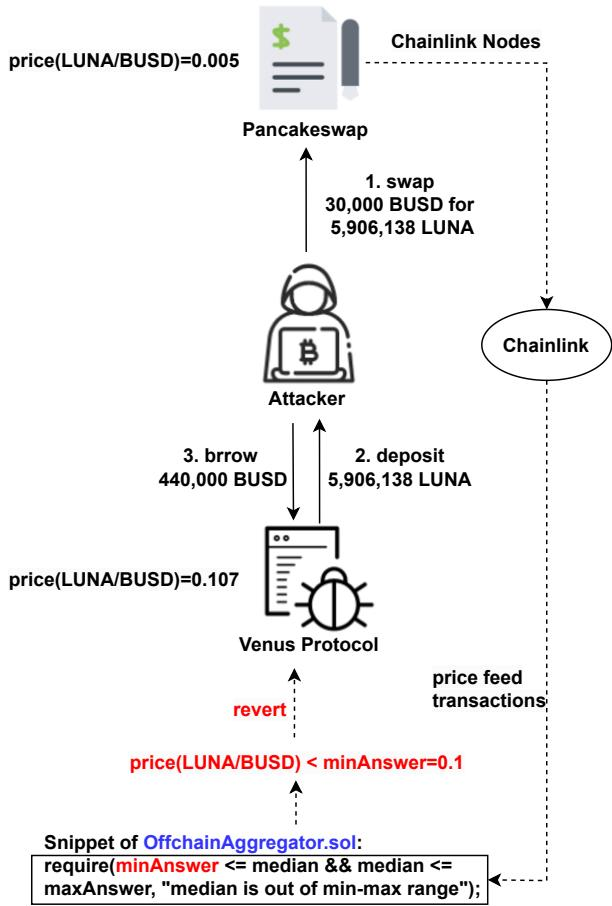
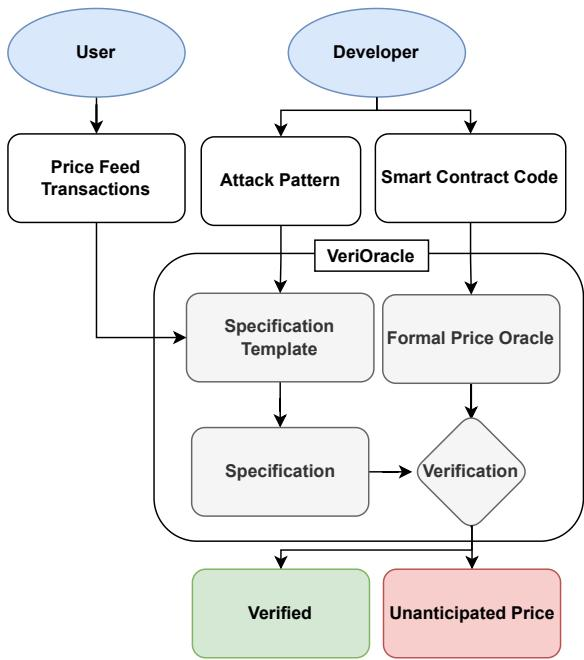
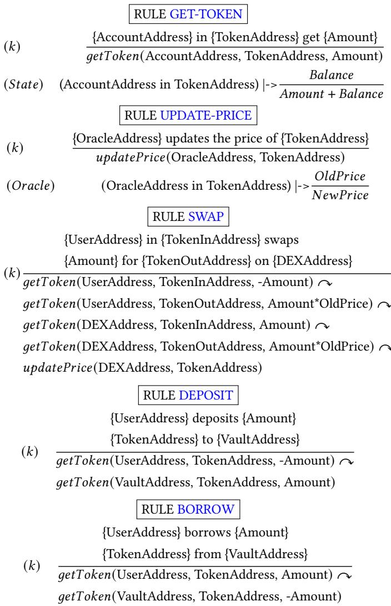
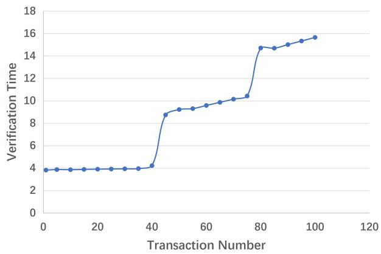

# Toward Automated Detecting Unanticipated Price Feed in Smart Contract

Yifan Mo School of Software Engineering, Sun Yat-sen University Zhuhai, China moyf8@mail2.sysu.edu.cn

Yanlin Wang School of Software Engineering, Sun Yat-sen University Zhuhai, China wangylin36@mail.sysu.edu.cn

## ABSTRACT

Decentralized finance (DeFi) based on smart contracts has reached a total value locked (TVL) of over USD 200 billion in 2022. In DeFi ecosystems, price oracles play a critical role in providing real-time price feeds for cryptocurrencies to ensure accurate asset pricing in smart contracts. However, the price oracle also faces security issues, including the possibility of unanticipated price feeds, which can lead to imbalances in debt and assets in the DeFi protocol. However, existing solutions cannot efectively combine transactions and code for real-time monitoring of price oracles.

To address this limitation, we first categorize price oracles as either DON oracles, DEX oracles, or internal oracles based on trusted parties, and analyze their security risks, data sources, price duration, and query fees. Then, we propose VeriOracle, a formal verification framework for the automated detection of unanticipated price feeds in smart contracts. VeriOracle can deploy a formal semantic model of the price oracle on the blockchain to detect the status of smart contracts and identify unanticipated price feed transactions in real time. We apply VeriOracle to verify over 500,000 transactions of 13 vulnerable DeFi protocols in the real world. The experimental results show that (1) VeriOracle is efective and it can detect unan ticipated price feeds before DeFi attacks (33,714 blocks ahead of the attacker in the best case); (2) VeriOracle is eficient in that its verification time (about 4s) is less than the block time of Ethereum (about 14s), which means VeriOracle can detect unsafe transactions in real time; and (3) VeriOracle is extendable for verifying defense strategies. Attacks using unanticipated price feeds can only suc ceed in particular smart contract states. VeriOracle can verify which smart contract states can defend against attacks.

Jiachi Chen School of Software Engineering, Sun Yat-sen University Zhuhai, China chenjch86@mail.sysu.edu.cn

Zibin Zheng<sup>∗</sup> School of Software Engineering, Sun Yat-sen University Zhuhai, China zhzibin@mail.sysu.edu.cn

CCS CONCEPTS

• Software and its engineering → Software verification and validation.

## KEYWORDS

Smart Contract, Formal Verification, Price Oracle, DeFi

<sup>∗</sup>corresponding author

ACM Reference Format: Yifan Mo, Jiachi Chen, Yanlin Wang, and Zibin Zheng. 2023. Toward Automated Detecting Unanticipated Price Feed in Smart Contract. In Proceedings ofthe 32nd ACM SIGSOFT International Symposium on Software Testing and Analysis (ISSTA ’23), July 17–21, 2023, Seattle, WA, USA. ACM, New York, NY, USA, 12 pages. https://doi.org/10.1145/3597926.3598133

## 1 INTRODUCTION

With the rapid development of blockchain and smart contracts, the decentralized finance (DeFi) ecosystem has seen a significant increase in popularity since the beginning of 2020 [45–47]. This trend was particularly evident in 2021, with the total value locked (TVL) in DeFi smart contracts reaching a peak of USD 200 billion [21], demonstrating the growth and viability of this innovative area. The price oracle is crucial in many DeFi protocols as it provides real-time price data to smart contracts for trading, liquidation, and other financial activities. The use of price oracles in DeFi protocols has gained significant attention due to their critical role as sources of on-chain and of-chain information [25]. For example, some decentralized lending protocols [12] use price oracles to check if user positions are under-collateralized to liquidation. Similarly, synthetic asset protocols [9] use price oracles for pegging the value of tokens to real-world assets. Some decentralized exchanges (DEX) [11] use price oracles to help concentrate liquidity at the current market price to improve capital eficiency.

Recently, there has been an increasing number of news reports on attacks that exploit price oracles in smart contracts [7, 13, 15]. A particularly noticeable example is the Venus protocol LUNA incident [13]. Chainlink [1] is a price oracle that provides the price of the LUNA token in the Venus protocol [12]. After the price of the LUNA token collapsed [2], Chainlink paused the price feed of the LUNA token. However, Venus protocol continued to run with the price feed of Chainlink, causing a discrepancy as the market price of LUNA continued to decline. This vulnerability was exploited by attackers, who deposited substantial amounts of LUNA and borrowed another token from the Venus protocol. In this incident, attackers stole more than USD 11.2 million from the Venus protocol. We will use this incident as an illustrative example throughout the paper.

Based on the existing attack incidents of the price oracle, we find that price feeds are secure for a substantial proportion of the time, while unanticipated price feeds occur infrequently. However, once an unanticipated price feed occurs, it can cause severe economic losses. Therefore, it is still crucial to emphasize the potential security risks ofan unanticipated price feed. In a small number of cases, particular states of smart contracts can lead to serious security problems and monetary losses. Therefore, it is important to detect unanticipated price feeds in smart contracts.

Previous works [17, 23, 30, 34, 38, 43, 48, 49] have introduced two kinds of methods to analyze the price oracle of smart contracts, i.e., transaction analyses and code analyses. For transaction analyses, previous works concentrated on examining transactions related to price manipulation [43, 48, 49] and maximal extractable value (MEV) [17, 34]. The concept of MEV is first introduced by Daian et al. [20] as a way to describe the value that can be extracted by re-ordering transactions. For code analyses, previous works [23, 30, 38] focus on detecting bugs before deploying smart contracts. However, both methods have their limitations. Specifi cally, transaction analyses cannot detect unanticipated price feeds caused by design flaws in the smart contract code. Code analyses cannot detect unanticipated price feeds caused by market liquidity and price volatility changes. Therefore, previous works are unable to detect attacks requiring transactions and code analyses, such as the Venus incident. Furthermore, previous works do not provide a method for the real-time and automated detection of unanticipated price feeds.

In this work, we present an automated formal verification framework named VeriOracle. This framework combines transactions and source codes of smart contracts to analyze the price oracle in smart contracts, and provides real-time and automated detection of unanticipated price feeds. To achieve this goal, VeriOracle models the state of the price oracle and designs a specification template for diferent types of price oracles. The Clockwork Finance Framework (CFF) [17] adopts a similar approach. However, CFF only utilizes Uniswap [11] as the price oracle. VeriOracle is distinguished by a more accurate formal price oracle model to describe smart contracts. The evaluation results show that VeriOracle can find unsafe transactions among many transactions in real time. There may be a time gap between the unsafe transaction and the transaction of the real attack in some DeFi protocols. Thus, this time gap can be used to take some measures to prevent attacks. VeriOracle is also able to verify strategies to prevent attacks. The security of transactions depends on the smart contract states, which means attacks using unanticipated price feeds can only succeed in particular smart contract states. VeriOracle can verify which smart contract states can defend against attack trans actions. Specifically, we use VeriOracle to verify the resuming plan of Venus protocol, and find it can prevent the attack ahead of the attacker in 910 blocks. Three notable contributions and insights of our paper are summarized as follows:

• Vulnerability definition. We define the unanticipated price feed in smart contracts as a significant vulnerability of price oracles. We provide a new categorization perspective of the price oracle and identify specific forms of vulnerabilities that occur within diferent types of price oracles.

• Detection framework. We introduce the first automated and real-time detection framework for unanticipated price feeds in smart contracts. The framework can eficiently detect unanticipated price feeds in real time or even before they occur in real-world DeFi attacks.

• Defence extension analysis. We propose a strategy to analyze the defense of the DeFi protocol by extending the detection framework to verify the proposed resuming plan.

Our code is available at https://github.com/anonymous9610/ VeriOracle. The remainder of the paper is organized as follows. Section 2 gives the background information of DeFi and smart contract vulnerabilities. Section 3 introduces the concept and vulnerability of the price oracle. Section 4 presents the formal model of VeriOracle. Section 5 details the design and implementation details of VeriOracle. Section 6 reports evaluation results. Section 7 reviews related works. Section 8 presents the conclusion.

## 2 BACKGROUND

This section presents necessary background information to better understand our work. We give a brief introduction to DeFi and smart contract vulnerabilities.

## 2.1 Decentralized Finance

Decentralized finance (DeFi) is a system consisting of financial protocols on the blockchain. Smart contracts define the content of the DeFi protocol. The DeFi protocol has been deployed in a wide range of use cases and allows users to borrow, lend, and trade assets on the blockchain. DeFi has the capability to provide trusted financial services in a distributed environment without human intervention or complex cooperation among issuing entities. We provide a brief introduction to the two specific classes of DeFi protocols featured in this work.

Decentralized Exchange (DEX) Protocol. The DEX protocol allows users to trade diferent assets that have a digital representation (e.g., the ERC20 token [3]). Most DEX protocols apply the Automated Market Maker (AMM) mechanism [41] to adjust the reserves of liquidity providers and calculate the price for executing swaps. Compared to traditional centralized exchanges, DEX protocols possess several distinct advantages, especially in privacy and capital management. DEX protocols facilitate the exchange of assets and avoid the risks of absconding with funds [32, 33] and fraud [40] in traditional centralized exchanges.

Lending Protocol. The lending protocol can lend a certain cryptocurrency to borrowers, with another borrower-supplied cryptocurrency held by the contract as collateral. Borrowers are required to over-collateralize other cryptocurrencies to cover the loan due to the pseudo-anonymity of blockchain. If the value of the collateral falls below the threshold, the lending protocol can automatically foreclose on the collateral to repay the loan without the cooperation of the borrower. Notably, some lending protocols provide a type of non-collateral loan called the flash loan [35]. The security of the flash loan is guaranteed since the user needs to borrow and return the loan in a single transaction. Otherwise, the lending transaction will be reverted by the loan provider.

## 2.2 Smart Contract Vulnerabilities

Smart contracts are auto-executing programs with the terms of the agreement directly written into code. Their bytecode and transactions are all stored on the blockchain and visible to all users. A transaction to a smart contract is a request to execute the code stored in the contract. When a transaction is sent to a smart con tract, it triggers the execution of the contract’s code. The contract will then carry out the actions specified in the code and update the internal state based on the terms of the agreement encoded in the contract. We provide a brief introduction of smart contract vulnerabilities in the code and transactions.

Smart Contract Code Vulnerability. Smart contract code vul nerability refers to a weakness or flaw in the code that allows an attacker to exploit the contract’s behavior in a way that was not intended by the contract’s creator. For example, a smart contract may have a flaw that allows an attacker to manipulate the contract’s logic and withdraw funds without proper authorization. Alterna tively, a smart contract may have a vulnerability that allows an attacker to overload the contract’s capacity, causing it to fail and potentially incurring losses to users who have deposited funds into the contract. Smart contract vulnerabilities can have severe consequences, such as the loss of funds or even the collapse of the entire blockchain ecosystem.

Smart Contract Transaction Vulnerability. It is important to note that all users have a potential income by exploiting the order transactions that interact with smart contracts, known as maximal extractable value (MEV). There are various ways in which miners can take advantage of MEV opportunities, including front running [39], back-running [49], and so on. In a blockchain, the mempool is a data structure that stores unconfirmed transactions that are waiting to be added to a block. When users want to send a transaction on the blockchain, they broadcast it to the network. The miners on the network receive the transaction and validate it. Once the transaction has been validated, it is added to the mempool, where it waits to be included in a block. Miners are responsible for choosing which transactions to include in the blocks they create. They usually prioritize transactions that ofer higher fees, as these provide a greater reward for their eforts. Some blockchain networks allow users to specify higher fees to incentivize miners to include their transactions in the next block. Therefore, attackers can exploit smart contract transaction vulnerability by setting higher fees to reorder their transactions.

## 3 PRICE ORACLE AND VULNERABILITY

In this section, we first present the concept of the price oracle in smart contracts. According to the trusted parties used in price oracles, we divide the current price oracles into three groups. More over, we define an unanticipated price feed in smart contracts, a commonly occurring vulnerability of the price oracle. Specifically, we introduce the vulnerabilities of the three kinds of price oracles and corresponding illustrative examples.

A price oracle is a service that provides a real-time price feed for various assets in smart contracts. This service provides crucial infor mation for the execution oftrades or other actions depending on the current market state. For example, the Venus decentralized lending protocol [12] uses a price oracle to obtain the users’ collateral and debt information. Smart contracts in the Venus protocol calculate the ratio of debt and collateral value. If the ratio exceeds a specified threshold, smart contracts will automatically execute a liquidation process so that the user cannot lend more assets from the protocol. Therefore, the reliability of the price oracle is important for the execution of liquidation, trade, and other financial actions in DeFi smart contracts. We investigate the existing price oracles and divide them into three groups on the basis of trusted parties, i.e., DON oracles, DEX oracles, and internal oracles. Trusted parties of the price oracle refer to the entities that provide reliable and accurate price data. The trusted parties of DON oracles are Decentralized Oracle Networks (DONs). The trusted parties of DEX oracles are the DEX running on the blockchain. The trusted party of internal oracles is the internal smart contract code. Table 1 summarizes a comparison between the data source, price duration, security risks, and other aspects.

## 3.1 DON Oracle

A Decentralized Oracle Network (DON) is a decentralized p2p network that provides the price feeds of various tokens for smart contracts [18]. The nodes in a DON are given economic incentives to collect price data of diferent tokens from multiple sources. DON oracles are decentralized applications that retrieve data from nodes of a DON and aggregate the data to provide a reliable and accurate price feed. A query fee is typically required to request a price feed from a DON. This can lead to a situation where the price feed is valid for multiple blocks, increasing the risk of outdated information being used in DeFi protocols. The use of DON oracles in DeFi protocols can be problematic due to their potential for failure in the face of highly volatile markets. Asset prices in markets may overflow, resulting in price feed transactions reverting and the updated prices being delayed.

An example of a vulnerability in DON oracles can be demonstrated by the Venus protocol LUNA incident. On May 12th, 2022, the price feed for the LUNA token provided by Chainlink [1] reached a price floor threshold and was temporarily suspended, with a recorded price of USD 0.107. Since the code minimum priced feed of LUNA in OfchainAggregator.sol <sup>1</sup> was set to USD 0.1, the LUNA market on Venus continued to operate with the price feed of Chainlink as USD 0.107. This caused a discrepancy as the spot price of LUNA continued to decline in a DEX named Pancakeswap [6]. Attackers exploited this vulnerability, leading to a USD 11.2 million loss.

Figure 1 illustrates the procedure followed by one attacker in the Venus protocol LUNA incident. The attacker began by exchanging 30,000 BUSD tokens for the LUNA tokens on Pancakeswap at an average price of 0.005 <sup>2</sup>. BUSD is a stablecoin pegged to the USD, and BUSD 1 can be approximated as USD 1. Following this, the attacker deposited 5,906,138 LUNA tokens acquired in the first step to the Venus protocol <sup>3</sup>. At that time, the price oracle of the Venus protocol reported the price of LUNA as 0.0107. In the final step, the attacker leveraged the deposited LUNA tokens as collateral to obtain a loan of 444,000 BUSD tokens <sup>4</sup>. As a result, the attacker earned a profit of 410,000 BUSD tokens through this operation.

Table 1: Comparison of diferent price oracles.

<table><tr><td></td><td>DON Oracle</td><td>DEX Oracle</td><td>Internal Oracle</td></tr><tr><td>Trusted Parties</td><td>Decentralized Oracle Network (DON)</td><td>On-chain DEX</td><td>Internal Code</td></tr><tr><td>Data Source</td><td>Off-chain and On-chain</td><td>On-chain</td><td>On-chain</td></tr><tr><td>Price Duration</td><td>Few Blocks</td><td>1 Block</td><td>1 Block</td></tr><tr><td>Security Risk</td><td>Price Delay</td><td>Price Manipulation</td><td>Bugs</td></tr><tr><td>Query Fee</td><td>Yes</td><td>No</td><td>No</td></tr><tr><td>Representative Protocols</td><td>Chainlink, Switchboard</td><td>Uniswap, Sushiswap</td><td>Maker DAO, MonoX</td></tr></table>

  
Figure 1: A real-world attack by using unanticipated price feed. The solid line indicates the attacker’s transactions, and the dotted line indicates the price feed related transaction.

## 3.2 DEX Oracle

DEX oracles provide a real-time price data feed from the assets traded on DEX protocols. Any two diferent tokens can exchange in a liquidity pool on DEX protocols, and each liquidity pool can provide the exchange rate of the two tokens as a price feed. The exchange rate is calculated by the reserve of two tokens in the liquidity pool. Other DeFi protocols can obtain the liquidity pool’s exchange rate by monitoring DEX events or reading state variables from DEX addresses. Thus, DEX oracles have the advantage of transparent price data and no query fee requirement. However, it is important to note that some liquidity pools only have a few reserves, leading to the potential risk of price manipulation.

An example ofthe vulnerability in DEX oracles is the Inverse protocol Sushiswap INV/ETH incident [8]. In a DEX named Sushiswap, the liquidity pool of INV and ETH tokens only has a few reserves, which leads to its low liquidity and leaves it vulnerable to manipulation. The Inverse protocol uses the Sushiswap INV/ETH liquidity pool as the price oracle. Sushiswap uses Time Weighted Average Price (TWAP) strategy in the smart contract code <sup>5</sup>. TWAP strategy is constructed by reading the cumulative price from the desired interval. The diference in this cumulative price can then be divided by the interval length to calculate the price for that period [10]. However, the interval window is very small in the smart contract states when the Inverse protocol is attacked. Specifically, the interval is only two blocks, making it possible to manipulate the price oracle. In this incident, the attacker first used 300 ETH tokens (about USD 103.5 million at that time) to swap the INV tokens in the Sushiswap INV/ETH liquidity pool <sup>6</sup>. Then, the attacker waited for one block as the price of the INV token is pulled up significantly. Finally, the attacker deposited 1746 INV tokens in the Inverse protocol as collateral and borrowed assets worth USD 1475 million from the Inverse protocol.

## 3.3 Internal Oracle

DeFi smart contracts can build and maintain internal oracles to provide a real-time price feed. First, internal oracles should define methods to calculate the price of assets. Then, the smart contracts calculate the price of diferent tokens in real time based on the state of the smart contracts. The key diference between internal oracles and DEX oracles is the trusted parties. A DeFi protocol which uses internal oracles only trusts the computation results of its internal smart contracts, while a DeFi protocol which uses a DEX oracle trusts the external results. Therefore, bugs in the smart contract code are potential risks for internal oracles. An attacker can change the state of the price oracle through bugs in the code, which leads to an unanticipated price feed in the DeFi protocol.

```solidity
function getNewPrice (uint256 originalprice, uint256
    reserve, uint256 delta, uint256 deltaBlocks, TxType
    txType) pure internal returns(uint256 price) {
    if(txType==TxType.SELL) { // SELL
        price = originalPrice.mul(reserve)/(reserve.add(
            delta));
    } else { // BUY
        price = originalPrice.mul(reserve).div(reserve.
            sub(delta));
    }
}
```  
Figure 2: Smart contract code of the MonoX protocol’s price oracle written in Solidity.

An example of a vulnerability in internal oracles is the MonoX incident [4]. The MonoX protocol uses an internal oracle to obtain the price feed of diferent tokens in real time. Figure 2 shows the smart contract code of MonoX protocol’s price oracle. Specifically, if we swap token � in an internal �/� liquidity pool of MonoX protocol, the price oracle of the MonoX protocol updates the price with the following rules:

$$
\begin{array}{l} \text {sellPrice} = \frac {\text {originalPrice} * \text {reserve} _ {x}}{\text {reserve} _ {x} + \delta} \\ \text {buyPrice} = \frac {\text {originalPrice} * \text {reserve} _ {y}}{\text {reserve} _ {y} - \delta} \end{array}
$$

where � is a constant, � and � are the tokens in the internal liquidity pool, reserve<sub>�</sub> and reserv ${ } ^ { \circ } y$ are the corresponding amounts of two tokens in the internal liquidity pool. According to the design of the MonoX protocol, ��������� < �������� should always hold. However, there is a bug in the smart contract that allows anyone to create a liquidity pool with only one kind of token. In this pool, � = � holds, leading to ��������� > ��������. The attacker can keep buying and selling the same token to raise its price. In the incident, an attacker performed a number of swaps from the MonoX token to the MonoX token to inflate its price in the protocol. Once the price was obscenely high, the attacker swapped their MonoX tokens for all other assets in the system. As a result, the attack drained assets roughly worth USD 31 million from the pool.

## 4 FORMAL MODEL

This section introduces the formal model of VeriOracle. VeriOracle is a state machine executing smart contract transactions. At a high level, our model consists of traders and the system model. Traders are participants in the DeFi ecosystem established by the model. System states record each trader’s account and each token’s price in the DeFi ecosystem. In our model, the state transition is realized through transactions, and traders can send transactions to change the system’s state. Our model not only shows the states of the DeFi ecosystem with the trader token balances and smart contracts inspired by previous works [17, 48], but also formalizes the price oracle of cryptocurrency according to the smart contract code.

## 4.1 Trader Model

Traders are participants in the DeFi ecosystem and can send transactions to change the system’s state. Our trader model consists of accounts, smart contracts, and transactions. Each trader has a corresponding account address, which stores their diferent status information, such as their balance, the smart contract status variables, etc. Smart contracts represent diferent services of DeFi protocols, such as swap tokens, lending, etc. Each smart contract is modeled as a set of transaction semantics. Traders can change the system state by executing these transaction semantics to interact with smart contracts.

We consider a trader with the ability to execute transactions (i.e., perform actions) across a set of DeFi protocols. The cryptocurrency assets of the trader are limited by the supply of liquidity available in public flash loan pools [35]. The mempool of the blockchain is a data structure that stores unconfirmed transactions that are waiting to be added to a block. The trader can read the blockchain contents and is expected to observe unconfirmed blockchain transactions in the mempool.

We assume the trader can place a transaction ahead of other DeFi transactions within a future blockchain block. This requires the trader to pay a higher transaction fee, as most miners appear to order transactions based on the gas price. We assume that the trader is not colluding with a miner, which may present an interesting avenue for future work. We assume that the trader operates on the most recently mined valid block. In the case of a Proof-of-Work (PoW) blockchain, the most recent block shall also be the one with the most PoW (i.e., the greatest dificulty). For simplicity, we ignore complications resulting from blockchain forks.

4.1.1 Account. We use � to denote the space of all possible accounts. For example, in Ethereum, accounts represent public key identifiers and are 160-bit strings. In other words, $A \stackrel { - } { = } \{ 0 , 1 \} ^ { 1 6 \dot { 0 } }$ Users and smart contracts share this address space. We denote the number of tokens � in address � ∈ � as �������(�, �).

4.1.2 Smart Contract. We use C to denote a smart contract. In addition to containing account balance information, the smart contract C also contains some transaction semantics $\{ C . f _ { 1 } , . . . , C . f _ { n } \}$ Users can interact with smart contracts through transactions. These transaction semantics define the rules for changing the balance of other addresses and the price oracle.

4.1.3 Transaction. We denote a transaction as $t x = \{ C _ { i } . f _ { j } | i =$ $1 , . . . , n ; j = 1 , . . . , m \}$ , which means the corresponding transaction calls � smart contracts and � transaction semantics. The system executes transactions and can change the system state. In VeriOracle, transactions are polynomial-sized strings constructed by traders. Our formalism is general enough to allow transactions that add smart contracts to the system or interact with existing ones.

## 4.2 System Model

VeriOracle is formalized as a state machine to model a blockchain system encompassing financial cryptocurrency assets. The system state consists of tokens, accounts, and balances. Each token’s circulation is represented by a map, which maps addresses and balances. The corresponding token quantity balance is recorded in each account. The system state will be changed according to the executed transactions. Moreover, each token price is also represented by a map, which maps smart contracts and prices. The corresponding token price is recorded in each smart contract.

The token is circulated within users and DeFi protocols, such as exchange, lending, and borrowing protocols. These DeFi protocols ofer a set of operations that can be activated through transactions. These operations process inputs and produce state changes. Mul tiple operations can be integrated into a single transaction and executed in an atomic sequence. It is worth mentioning that the state of a DeFi market is considered to alter whenever an operation changes the price oracle within the market. For this study, the blockchain state is limited to the state at block height � after the completion of all transactions within the block �, disregarding intermediate block states.

4.2.1 Account State. We define the current account state with � tokens and � accounts as $S = \{ s ( c _ { i } ) | i = 1 , . . . , n \}$ , where $c _ { i }$ is the token and $s ( c _ { i } ) = \{ ( a _ { j } , c _ { i } )  b a l a n c e ( a _ { j } , c _ { i } ) | j = 1 , . . . , m \}$ means the mapping set of address $a _ { j }$ and balance for token $c _ { i }$

4.2.2 Price Oracle. We define the current price state with � tokens and � smart contracts as $O = \{ o ( c _ { i } ) | i = 1 , . . . , n \}$ , where $c _ { i }$ is the token and $o ( c _ { i } ) = \{ ( a _ { j } , c _ { i } )  p r i c e ( a _ { j } , c _ { i } ) | j = 1 , . . . , m \}$ means the mapping set of smart contract address $a _ { j }$ and balance for token $c _ { i } .$

4.2.3 Block. We define a block by an ordered list of transactions as $B = [ t x _ { 1 } , . . . , t x _ { l } ]$ . We disregard block contents regarding consensus mechanics, e.g., nonce, blockhash, and Merkle root, which are not relevant in our framework. We only model the block number for block metadata, denoted by ���(�). The action of a block can now be defined as the result of the action of the sequence of transactions it contains. Therefore, the state transition from block $B _ { i }$ to $B _ { j }$ can be represented as $( S , O ) _ { n u m ( B _ { i } ) }  ( S , O ) _ { n u m ( B _ { j } ) }$

## 5 DESIGN OF VERIORACLE

In this section, we present the verification workflow of VeriOracle. To establish a formal methodology for the security of a price ora cle, we instantiate our framework into a mechanized proof system and symbolic execution engine using the K-framework [37]. The K-framework is a rewriting logic [31] based formal executable se mantics definition framework. The K-framework is widely applied in the formal verification of smart contracts, such as Solidity lan guage [24], Move language [27], EVM bytecode [23], and MEV [17]. In this work, we utilize this framework to analyze the price oracle of smart contracts at the transaction level.

## 5.1 Workflow

Figure 3 illustrates the comprehensive workflow of VeriOracle. It has been designed to accommodate two distinct participants, i.e., users and developers. Users input price feed transactions that alter the price oracle’s state. Developers are required to input both attack patterns and the smart contract code for generating specification templates and modeling the formal price oracle. As an output, Veri Oracle determines whether the current price feed is consistent with expectations. In the event of a deviation from what is expected, Veri Oracle outputs symbolic paths that indicate problematic conditions to the users.

  
Figure 3: Workflow of VeriOracle.

Regarding the generation of formal specifications, VeriOracle requires that developers pre-design the specification template by utilizing attack patterns. An attack pattern refers to a model specification articulated in natural language and concepts, such as stipulating that the borrowing value must not exceed the lending value in a lending protocol. The specification constitutes a formal specification that is described through rewrite logic [19]. This framework represents model states as algebraic datatypes referred to as configurations. Configurations can be analyzed by applying patterns that are formulas with variables and constraints. It is crucial to note that the specification template needs to be completed by price feed transactions. The specific constraint ranges are undefined and represented as pending parameters. Upon receiving the parameters from the user, VeriOracle automatically populates the pending parameters within the specification template to generate the complete formal specification.

Regarding the generation of formal semantics, VeriOracle necessitates that developers pre-design targeted formal semantics for the diferent DeFi protocols of the price oracle through the smart contract code. The reason for this is that various price oracles possess distinct methods for updating prices. The rewrite rules of formal semantics take the form �ℎ� ⇒ �ℎ�, where �ℎ� and �ℎ� are patterns. It also requires that all configurations matching �ℎ� should be transformed into configurations matching �ℎ� through a single computation step. Through this methodology, matching logic defines the formal semantics of a price oracle by establishing the set of all configurations. Then, it defines a transition system over these configurations using rewrite rules.

In conclusion, VeriOracle can monitor transactions from the mempool and the confirmed blocks, enabling automated detection of an unanticipated price feed in smart contracts.

Figure 5: The configuration of VeriOracle.

## 5.2 Formal Semantics

A DeFi protocol comprises smart contracts that interact with tokens. Only transactions can change the model state as our formalism in Section 4. Therefore, the key to formally modeling smart contracts is the creation of transaction semantics. The transaction semantics of VeriOracle in the K-framework encompass three main elements, namely the syntax, the configuration, and a set of rules. The devel oper should specify the syntax and configuration, while the rules are developed based on the syntax and configuration. With the semantics definition and a sequence of ordered transactions, the K-framework executes the formal smart contracts based on the se mantics definition. The formal analysis backend ofthe K-framework is capable of verifying specified properties.

5.2.1 Syntax. Figure 4 shows the main syntax of VeriOracle in BNF form. The syntax term ����� refers to a formal transaction semantic sequence that awaits execution by the state machine of VeriOracle. ��������� refers to the specific content of the formal transaction semantic sequence. The value “DONE” indicates completion or an empty sequence, while “fail” signifies that the execution has failed. ����������� refers to the formal transaction semantics. ���������� is the semantics of DeFi smart contracts that need to be defined by developers according to the smart contract code. ����������� accompanied by “fee” represents the specific gas consumption con sidered for execution. � ���������� accompanied by “block” denotes the specific block number considered for execution. ������� refers to an account, token, or the price oracle. It is represented as an integer or a string. ���������� designates a state query, which can be used to retrieve account balances or the price oracle quotes.

```autohotkey
Block ::= Statement ";"  
    | Block Statement ";"  
Statement ::= "exec(" Transaction ")"  
    | "DONE"  
    | "FAIL"  
Transaction ::= DeFiAction  
    | Transaction "fee" Int  
    | Transaction "block" Int  
Address ::= Int  
    | "ETH"  
    | "Attacker"  
    | "DEX"  
    | ...  
StateEntry ::= Address "in" Address
```  
Figure 4: The main syntax of VeriOracle in BNF form.

5.2.2 Configuration. The configuration of VeriOracle is depicted in figure 5. We model smart contracts as a state machine. The configuration defines the types of recorded states, with each cell corresponding to an aspect of the state and the stored data type. The configuration consists of four main cells, namely �, �����, �����, and ������. Each cell is specified and initialized in the configuration. In the cell, a dot denotes an empty set of the specified type. A dot followed by the type .���� represents an empty list. A dot followed by the type .��� represents an empty mapping set. The cell � represents the most general type, which can be any specific type defined within the K-framework.

$$
\left\langle \begin{array}{c} <   \\ <  . L i s t > _ {B l o c k}, <  . M a p > _ {S t a t e}, <  . M a p > _ {O r a c l e} \end{array} \right\rangle_ {T}
$$

In cell �, the configuration stores the formal transaction sequence present in the ����� cell for execution. If execution is terminated unexpectedly, the syntax of the ��������� in this cell will indicate an empty set through the presence of “FAIL”. This signifies that no further programs are remaining to be executed. The list of executed formal transactions is recorded in the ����� cell. The mapping set that associates user addresses with token balances is stored in the ����� cell, which refers to the account state �. Meanwhile, the mapping set that connects the addresses of price oracles with token addresses is stored in the ������ cell, which constitutes the oracle state �.

5.2.3 Rule. The five most frequently utilized semantic rules of VeriOracle are presented in Figure 6 due to space constraints. The rewrite rules of formal semantics take the form �ℎ� ⇒ �ℎ� or �ℎ<sub>�</sub> <sub>�</sub>ℎ<sub>�</sub> For rules of (�), �ℎ� is the ���������� of the transaction defined by the syntax, and �ℎ� is the corresponding operations. For rules of (�����) and (������), �ℎ� is the states before operations in (�), and �ℎ� is the states after operations. The syntax ���������� can specify the rules of states. The variables are indicated by the elements between “{” and “}”. The symbol ↷ in this context signifies “followed by”, implying the next operation in the sequence. The basic rule to update the account state � is the GET-TOKEN rule, while the basic rule to update the oracle state � is the UPDATE-PRICE rule. Other rules in DeFi smart contracts can be constructed using these two basic rules. Examples of such rules include the SWAP rule in DEX protocols and the DEPOSIT and BORROW rules in lending protocols. Additional smart contract rules can be added to VeriOracle by developers.

The semantic rule for altering the account state is illustrated by the GET-TOKEN rule. The formal semantics within the cell � require the specification of ��������������, ������������, and ������ arguments for execution. The operation �������� is utilized to modify the state variables of the account state �. Within the cell �����, the expression (AccountAddress in TokenAddress) represents the balance of the account, denoted as �������(�, �), as defined in Section 4. Here, � represents the �������������� and � represents the ������������. The execution of this semantic rule results in a change in the state �������(�, �) from ������� to �������+������.

The UPDATE-PRICE semantic rule outlines the procedure for changing the price oracle. The cell � in the formal semantic requires the arguments ������������� and ������������ to be specified in order to execute the operation �����������. In the cell ������, the mapping set (���������������������������) is defined as ����� (�, �) in section 4, where � represents the ������������� and � represents the ������������. The execution of this semantic rule will change the state of ����� (�, �) from the previous value of �������� to a new value of ��������. The smart contract code specifies the calculation and constraints of�������� and � �������. For instance, in the case of a simple AMM, the price can be calculated as $\frac { b a l a n c e ( a _ { 1 } , c _ { 2 } ) } { b a l a n c e ( a _ { 2 } , c _ { 2 } ) }$ in the oracle address, where �� (i=1,2) represents the token address and � (j=1,2) represents the account

(�)

(�)

  
Figure 6: Main rules of formal semantics in VeriOracle.

balance. Developers can impose additional requirements, such as �������� > 0.1.

The semantic rule for token swapping is depicted in the SWAP rule. The process of this transaction involves five distinct sub-steps. In the first step, the user sends the input token to the DEX. The DEX sends the output token to the user in the second step. The third step entails the receipt of the input token by the DEX. In the fourth step, the user receives the output token from the DEX. Finally, the DEX updates the price in the fifth step. These five sub-steps are packaged together as a single transaction, implying that they are atomic.

The semantic rule for depositing tokens to smart contracts is shown in DEPOSIT. This is the semantic for users to deposit their token to the Lending protocol as collateral. The semantic rule for borrowing tokens from smart contracts is shown in BORROW. This is the semantic for users to borrow tokens from the Lending protocol according to the collateral value calculated by the price oracle.

## 5.3 Specification

The specifications of VeriOracle are in accordance with matching logic theories [36] with a sound and relatively complete proof system. The specification is based on configurations, categorizing system states into compositional, hierarchical, and labeled units. The semantic rules outlined in Section 5.2 are applied implicitly across the entire configuration structure, while unused cells are omitted, thus promoting a highly modular and well-defined design style. Furthermore, the specification is designed to be executable and can be compiled into runnable and testable programs.

Designing a specification template is a pre-requirement for developers in VeriOracle. The parameters come from the price feed transactions. VeriOracle will automatically populate the pending parameters within the specification template to produce a comprehensive formal specification. This process transforms the presented attack patterns into a machine-readable, executable program that can be subjected to symbolic and concrete reasoning through the symbolic execution engine and deductive verifier provided by the K-framework.

In VeriOracle, the executable specifications comprise an XMLlike configuration structured in cells or mathematical objects in the K-framework. Recall that our formal model represents a state machine executing the smart contract transactions. The <k> cell specifies the transactions that have not yet been included in a block and are pending execution. This cell can be regarded as a program in a Turing-style execution machine. VeriOracle executes these transactions by following diferent paths, dependent on the order and combination of these transactions. The <State> cell embodies the state mapping of VeriOracle and maintains the mapping of addresses to balances. The <Oracle> cell embodies the price mapping of VeriOracle and preserves the mapping of addresses to prices. The <Block> cell captures the progress of block construction in VeriOracle and represents a valid block once the k cell is empty and no further instructions are pending execution. The specifications in the cells are based on rewrite operations using the operator “A => B” which signifies the transformation of “A to B”.

Figure 7 depicts the Venus protocol LUNA incident, demonstrating the specification template’s implementation. The elements enclosed by “{}” within the specification template are designated as pending parameters, which will be filled in automatically by VeriOracle based on the information received from price feed transactions.

Line 1 of the specification template features the module name, designated as “{block\_tx}”. Line 2 import the formal semantics defined in section 5.2. Lines 3 to 8 encompass the statements that pertain to the formal transaction semantics sequence. The variables Alpha and Beta correspond to the attacker’s deposited and borrowed amounts, respectively, within the Venus protocol.

Line 9 pertains to the specification of the block state. Line 10 pertains to the price oracle, which is initialized with Chainlink in the case of the LUNA token. The LUNA and BUSD balances within the DEX are initialized as “{reserve0}” and “{reserve1}”, respectively, in line 11, which pertains to the specification of the account state.

```verilog
module {block_tx}
imports VERIORACLE
claim <k>
    Attacker in BUSD swaps Alpha:Int for LUNA output;
    Attacker deposits Alpha:Int LUNA to Venus;
    Attacker borrows Beta:Int BUSD from Venus;
    => . ...
</k>
<Block> .List => ?_ </Block>
<Oracle> (Chainlink in LUNA) |-> {oracle_price} => ?_ </
    Oracle>
<State> (Dex in LUNA) |-> {reserve0} (Dex in BUSD) |-> {
    reserve1} => ?S:Map </State>
requires (Alpha > 0)
    andBool (Alpha < {reserve0} / 10)
    andBool (Beta > 0)
    andBool (Beta < Alpha {*{oracle_price} {*} {
        CollateralFactor} {*{liquidateRatio} ) )
ensures ?S[Attacker in BUSD] < 0
endmodule
```

Figure 7: The specification template of Chainlink price oracle (LUNA/BUSD) in the Venus protocol.

Lines 12 to 15 impose constraints on the Alpha and Beta vari ables, ensuring that the attacker cannot swap more than 1/10 of the reserve tokens within the DEX or borrow an amount greater than the liquidation ratio. The post-condition of the specification described in line 16 ensures that the profit in BUSD tokens derived from an attack is less than 0.

Other DeFi protocols can adopt a similar approach when writing specifications, though the corresponding initialization conditions and constraint ranges will be adjusted according to the smart con tract code.

## 6 EXPERIMENTAL EVALUATION

Experiments are conducted to address the following research ques tions (RQs):

• RQ1: Does VeriOracle efectively detect unanticipated price feeds in real-world DeFi attacks?

• RQ2: What is the eficiency of VeriOracle?

• RQ3: Is VeriOracle extendable for verifying the remediation of DeFi protocols?

Experiment setup. Our experiments are conducted on a mid range server equipped with an Intel Xeon Gold 5218R 40-core server processor, 128GB of system memory, and a solid-state drive. Our computations primarily rely on CPU processing, with only the results of verifying specifications being written to disk. In our parallelism experiments, we utilize 40 threads to run the verification process.

Dataset collection. To examine the efectiveness of VeriOracle in detecting unanticipated price feeds in real-world DeFi attacks, we have investigated 13 representative DeFi protocols that have sufered from such attacks. As a comparison, CFF has investigated only 3 DeFi protocols [17]. The smart contract data of these victim protocols are collected using the APIs of Etherscan, BSCscan, and Moralis [5]. The collected data include over 500,000 transactions related to these DeFi protocols. Then, the data are used to generate corresponding specification files for our experiments.

## 6.1 Efectiveness

To answer RQ1, we aim to quantify the time gap between unsafe transactions and real attack transactions. VeriOracle can detect and verify transactions in real time. In the experiment, the time at which the first unsafe transaction is detected and the time at which the real attack transaction occurs may be diferent. The time gap is significant for DeFi protocols because various means, such as access control and fund transfer, can prevent the attack in advance. We define the time gap as the time at which the real attack transaction occurs minus the time at which VeriOracle detects the first unsafe transaction.

Since the transactions in the same block have the same timestamps, the diference between the block numbers of real attack transactions and the first unsafe transaction detected by VeriOracle can be used to calculate the gap. In particular, the gap is determined by subtracting the block number of the real attack transaction from the block number of the first unsafe transaction detected by VeriOracle. If gap=0, VeriOracle detects the attack when the real-world DeFi attack occurs. If gap>0, this indicates that VeriOracle detects the attack before the real-world DeFi attack occurs. Conversely, if gap<0, this indicates that VeriOracle detects the attack after the real-world DeFi attack occurs.

Table 2 summarizes the results of our experiment in detecting unanticipated price feeds. VeriOracle can detect unanticipated price feeds in 13 real-world DeFi attacks. The gap results show that VeriOracle can detect unanticipated price feeds in real time or even ahead of time.

For DON oracles, VeriOracle can detect an unanticipated price feed before the real-world DeFi attack occurs. This is because a price feed for DON oracles lasts for several blocks, leading to the risk of price delays. This results in price feeds that do not truly reflect market prices.

For DEX oracles, VeriOracle can detect an unanticipated price feed at the time or even before the real-world DeFi attack occurs. This outcome can be attributed to the varying liquidity of DEXs, where a DEX with less liquidity is more susceptible to price manipulation attacks. Despite this, it has been observed that VeriOracle detects significantly fewer gaps in DEX oracles compared to DON oracles. The primary explanation for this is the shorter duration of the price feed in DEX oracles, which only lasts for a single block, leading to more rapid changes in price.

For internal oracles, VeriOracle can detect unanticipated price feeds when real-world DeFi attacks occur. This outcome results from unanticipated price feeds in Internal oracles, typically from glitches in the underlying smart contract code. The attacker, in this scenario, only needs to exploit the bug to manipulate the price oracle within a single block to derive financial benefits.

To summarize, VeriOracle can efectively detect unanticipated price feeds during or prior to actual DeFi attacks. VeriOracle provides an early warning system to DeFi protocols, enabling them to implement some countermeasures. If an unanticipated price feed is detected during the attack (gap=0), some white-hat actions can be implemented. For example, in MEV strategies, front-running [22] or miner bribing can be implemented to revert the attacker’s transaction. These countermeasures can be implemented to prevent the DeFi protocol from incurring losses.

Table 2: The detection of DeFi attacks by VeriOracle.

<table><tr><td>Protocol Name</td><td>Chain</td><td>Price Oracle</td><td>Price Oracle Type</td><td>Token</td><td>Real Attack</td><td>First Unsafe</td><td>Gap</td></tr><tr><td>Venus</td><td>BSC</td><td>Chainlink</td><td>DON Oracle</td><td>LUNA</td><td>17734385</td><td>17733475</td><td>910</td></tr><tr><td>Anchor</td><td>Terra Classic</td><td>Chainlink</td><td>DON Oracle</td><td>LUNA</td><td>7815558</td><td>7809994</td><td>5564</td></tr><tr><td>Mirror</td><td>Terra Classic</td><td>Chainlink</td><td>DON Oracle</td><td>LUNA</td><td>7843708</td><td>7809994</td><td>33714</td></tr><tr><td>Mango</td><td>SOL</td><td>Switchboard</td><td>DON Oracle</td><td>MNGO</td><td>154867388</td><td>154865890</td><td>1498</td></tr><tr><td>Inverse</td><td>ETH</td><td>Sushiswap INV/ETH</td><td>DEX Oracle</td><td>INV</td><td>14506359</td><td>14506358</td><td>1</td></tr><tr><td>Roe</td><td>ETH</td><td>UniswapV2 roeWBTC/USDC</td><td>DEX Oracle</td><td>roeWBTC</td><td>16384470</td><td>16384470</td><td>0</td></tr><tr><td>Vesper</td><td>ETH</td><td>UniswapV3 VUSD/USDC</td><td>DEX Oracle</td><td>VUSD</td><td>13537933</td><td>13537922</td><td>11</td></tr><tr><td>xToken</td><td>ETH</td><td>UniswapV2 SNX/ETH</td><td>DEX Oracle</td><td>SNX</td><td>12419918</td><td>12419918</td><td>0</td></tr><tr><td>Float</td><td>ETH</td><td>UniswapV3 FLOAT/USDC</td><td>DEX Oracle</td><td>Float</td><td>14006084</td><td>14006045</td><td>39</td></tr><tr><td>DEUS</td><td>FTM</td><td>StableV1 USDC/DEI</td><td>DEX Oracle</td><td>DEI</td><td>37115797</td><td>37115663</td><td>134</td></tr><tr><td>MonoX</td><td>ETH</td><td>Internal</td><td>Internal Oracle</td><td>Mono</td><td>13715026</td><td>13715026</td><td>0</td></tr><tr><td>Rikkei</td><td>BSC</td><td>Internal</td><td>Internal Oracle</td><td>BNB</td><td>16956475</td><td>16956475</td><td>0</td></tr><tr><td>Zerogoki</td><td>ETH</td><td>Internal</td><td>Internal Oracle</td><td>zUSD</td><td>12982491</td><td>12982491</td><td>0</td></tr></table>

## 6.2 Eficiency

To answer RQ2, we plan to quantify the consumption of VeriOracle in terms of time and space. Time consumption refers to the time taken by VeriOracle to verify the specifications of transactions. Since the state of smart contracts on the blockchain constantly changes, the time consumption requirement is very strict in this real-time detection task. If the verification time exceeds the time of the price feed duration, the result will be meaningless for the current smart contract states. Space consumption refers to the memory usage of VeriOracle when verifying the specifications of transactions. Excessive space consumption is not conducive to deployment and parallelism.

The verification process of the specification in VeriOracle consists of four phases: JVM initialization, parsing, rewrite initialization, and execution. The JVM initialization phase initiates the Java backend of the K-framework, the parsing phase parses the oper ational semantics of the specification, the rewrite initialization phase initializes the rewrite logic constraints corresponding to the specification, and the execution phase carries out the verification procedure.

We statistically record the time and space consumption during the verification of over 500,000 transactions and calculate the av erage consumption. Table 3 depicts the average verification time for one transaction at each phase. In terms of time consumption, the four execution phases are performed consecutively. The total represents the sum of the time consumption of each phase. The parsing phase and the execution phase exhibit the highest resource utilization. The total time consumption is less than 4 seconds, which is less than the block time of Ethereum (approximately 14 seconds). This indicates that VeriOracle can detect unanticipated price feeds in a timely manner on Ethereum. In terms of space consumption, each phase adds memory overhead to the previous phase. Thus, the total represents the memory of the final execution. VeriOracle requires an average memory of 121MB to verify a single transaction. Additionally, the memory consumption of multiple transactions in creases linearly, enabling VeriOracle to perform parallel verification on multiple transactions without incurring an excessive memory overhead.

Table 3: The average consumption of verifying one transaction.

<table><tr><td>Phase</td><td>Time (Second)</td><td>Memory (MB)</td></tr><tr><td>JVM init</td><td>0.056</td><td></td></tr><tr><td>Parsing</td><td>3.536</td><td>102</td></tr><tr><td>Rewrite init</td><td>0.039</td><td>109</td></tr><tr><td>Execution</td><td>0.217</td><td>121</td></tr><tr><td>Total</td><td>3.848</td><td>121</td></tr></table>

VeriOracle is capable of verifying multiple input transactions in parallel. Theoretically, VeriOracle’s parallel performance depends on the number of CPU cores. The time consumption increases significantly when the number of parallels exceeds the number of cores. To evaluate the parallel verification performance of VeriOracle, we conduct experiments using 40 threads to verify multiple transactions within a block. The verification time consumption is monitored while varying the number of transactions being verified within a block. We randomly choose 21 groups of transactions from the transaction dataset. The number of transactions in each group is diferent. Then, we record the parallel verification time for different numbers of transactions. This process is repeated 10 times, and the average time consumption is recorded. The results are depicted in figure 8. As the number of transactions being verified increases, the time consumption increases linearly with the number of threads. However, when the number of transactions exceeds a certain threshold, a sudden increase in time consumption occurs.

In conclusion, VeriOracle has the advantage of eficiency. The verification time of one transaction is less than the block time in the Ethereum blockchain. The verification of transactions can be eficiently parallelized.

## 6.3 Extendable Defence Verification

To answer RQ3, we aim to examine the extendable capacity of VeriOracle to verify remediation employed by DeFi protocols. If real-world attacks have occurred, some DeFi protocols can change the variables of the smart contract to defend against the same attacks. Some unanticipated price feed transactions become safe after changing the smart contract states. The security of the price feed transaction depends on the states of smart contracts. If the corresponding remediation is adopted when the first unsafe block appears, it is possible to prevent the attack event in advance. To verify remediation, we modify relevant parameters in the specifi cation template while verifying the first unsafe transaction. If the unanticipated price feed continues to be detected, it means that the remedy is inefective. Conversely, the remedy can be considered efective if the unanticipated price feed is not detected.

  
Figure 8: The average time consumption (multi-transaction) of VeriOracle.

In order to explore the extendable capacity of VeriOracle to verify remediation, we conduct a case study on the Venus protocol LUNA incident. The incident results from a price feed exploit, leading to losses in the Venus protocol. To address the issue, the decentralized autonomous organization (DAO) of Venus modified the collateral factor of the LUNA token from 0.55 to 0 through VIP-61 [14]. The collateral factor is a crucial variable in the smart contract code of the Venus protocol. It determines the ratio of assets that users mortgage to lend other assets. By setting the collateral factor of LUNA to 0, users cannot lend other assets using their mortgage of LUNA, thereby preventing the price oracle from being exploited by attackers and incurring losses.

To examine the validity of the Venus protocol’s resuming plan, VeriOracle is utilized to conduct the verification process. We modify the parameter {CollateralFactor} (line 15 in figure 7) in the relevant specification template to 0 and retain the other parameters to gen erate a specification that corresponds to the resuming plan. Then, VeriOracle is employed to verify the generated specification of the resuming plan. The experimental results demonstrate that using the modified smart contract states as a defense measure is efective, as the unanticipated price feed is no longer detected. This highlights the capability of VeriOracle in conducting a defense verification.

## 7 RELATED WORKS

Formal Verification. Zeus [26] is a framework that verifies the correctness and fairness of smart contracts based on LLVM. It translates Solidity contracts into programs in an abstract language to verify smart contracts. VeriSol [42] is a Solidity program verifier that translates Solidity language to Boogie language and applies model checking. KEVM [23] is the K semantics of the Ethereum Virtual Machine, which can be used for verifying EVM bytecode. KEVM can monitor the relevant properties of the semantics by computing gas bounds during execution. FairCon [30] efectively detects property violations and proves the fairness of smart contracts. FairCon introduces intermediate representations to maintain the stability of the underlying mechanism model and property checking engine. SmartPulse [38] is a smart contract verification tool capable of checking liveness properties. SmartPulse instruments smart contracts and uses software model checking to verify the instrumented program against the LTL specification.

Price Oracles of Smart Contracts. Previous surveys [16, 25, 28, 29, 44] have summarized that price oracles are risky in that they can provide corrupt, malicious, and inaccurate data. DeFiRanger [43] is applied in DeFi smart contracts to detect price manipulation attacks using the patterns expressed with the recovered DeFi semantics. DeFiPoser [48] is a tool to detect arbitrage circles of diferent price feeds in smart contracts. Qin et al. [35] investigate price manipulation attacks in DeFi smart contracts through flash loans and how to optimize their profit.

MEV. (MEV) is first introduced by Daian et al. [20] as a way to describe the value that can be extracted by a miner who manipulates the order of transactions in a blockchain. Torres et al. [39] present a methodology to measure the three types of front-running eficiently. Zhou et al. [49] detect the sandwich attack in DeFi smart contracts, which is a practice of exploiting information that may change the price of an asset for financial gain. Clockwork Finance Framework(CFF) [17] quantifies and detects MEV in collateralized debt position (CDP) liquidation in lending protocols by utilizing Uniswap as the price oracle. Although CFF has been demonstrated to be efective and eficient, it has a limitation in incomplete formal semantics of price oracles in the real world. CFF only utilizes Uniswap as the price oracle.

## 8 CONCLUSION

In this study, we proposed a method for identifying unanticipated price feeds in smart contracts, a commonly occurring vulnerability in price oracles. To detect this vulnerability, we first categorize price oracles into three groups, i.e., DON oracles, DEX oracles, and internal oracles. Then, we introduced VeriOracle, a runtime formal verification framework which combines transactions and code to analyze the price oracle in smart contracts. Our experiments demonstrated the efectiveness of VeriOracle in detecting unanticipated price feeds in DeFi attacks. VeriOracle is eficient in terms of verification time, as a single transaction takes less than the block time in Ethereum. It can also eficiently verify multiple transactions in parallel. Lastly, we explored the ability of VeriOracle to verify the resuming plan of the Venus protocol, highlighting its ability to extend its verification capabilities to remediation strategies.

## ACKNOWLEDGMENTS

This work is partially supported by fundings from the National Key R&D Program of China (2022YFB2702203), the National Natural Science Foundation of China (No. 62032025), and Technology Program of Guangzhou, China (No. 202103050004).

## REFERENCES

[1] 2022. Chainlink. https://chain.link

[2] 2022. The collapse of luna price. https://www.theblock.co/post/146225/lunaprice-collapses-below-5-as-ust-slides-further-from-dollar-peg

[3] 2022. ERC-20 TOKEN STANDARD. https://ethereum.org/en/developers/docs standards/tokens/erc-20

[4] 2022. MonoX incident. https://medium.com/monoswap/exploit-post-mortem-33921a779b43

[5] 2022. Moralis. https://docs.moralis.io/

[6] 2022. Pancakeswap. https://pancakeswap.finance

[7] 2022. Rikkei finance incident. https://rikkeifinance.medium.com/rikkei-financeincident-investigation-report-b5b1745b0155

[8] 2022. Sushiswap INV/ETH incident of Inverse protocol. https://twitter.com/ InverseFinance/status/1537372199769845760

[9] 2022. Synthetix protocol. https://www.synthetix.io/

[10] 2022. TWAP strategy of Price Oracle. https://docs.uniswap.org/contracts/v2/ concepts/core-concepts/oracles

[11] 2022. Uniswap. https://uniswap.org/

[12] 2022. Venus protocol. https://app.venus.io/

[13] 2022. Venus Protocol LUNA Incident. https://blog.venus.io/venus-protocolluna-incident-update-2-c334475d9214

[14] 2022. VIP-61. https://app.venus.io/governance/proposal/61

[15] 2022. Zerogoki finance incident. https://blocksecteam.medium.com/the-analysisof-the-zerogoki-attack-da4e0807b184

[16] Hamda Al-Breiki, Muhammad Habib Ur Rehman, Khaled Salah, and Davor Svetinovic. 2020. Trustworthy blockchain oracles: review, comparison, and open research challenges. IEEE Access 8 (2020), 85675–85685.

[17] Kushal Babel, Philip Daian, Mahimna Kelkar, and Ari Juels. 2023. Clockwork finance: Automated analysis of economic security in smart contracts. In IEEE Symposium on Security and Privacy (SP).

[18] Lorenz Breidenbach, Christian Cachin, Benedict Chan, Alex Coventry, Steve Ellis, Ari Juels, Farinaz Koushanfar, Andrew Miller, Brendan Magauran, Daniel Moroz, et al. 2021. Chainlink 2.0: Next steps in the evolution of decentralized oracle networks. (2021).

[19] Xiaohong Chen and Grigore Roşu. 2018. A language-independent program verification framework. In Leveraging Applications of Formal Methods, Verification and Validation. Verification: 8th International Symposium, ISoLA 2018, Limassol, Cyprus, November 5-9, 2018, Proceedings, Part II 8. Springer, 92–102.

[20] Philip Daian, Steven Goldfeder, Tyler Kell, Yunqi Li, Xueyuan Zhao, Iddo Bentov, Lorenz Breidenbach, and Ari Juels. 2020. Flash boys 2.0: Frontrunning in decen tralized exchanges, miner extractable value, and consensus instability. In IEEE Symposium on Security and Privacy (SP). 910–927.

[21] DeFillama. 2022. DeFillama Dashboard. https://defillama.com/.

[22] Shayan Eskandari, Seyedehmahsa Moosavi, and Jeremy Clark. 2019. Sok: Trans parent dishonesty: front-running attacks on blockchain. In Financial Cryptography and Data Security (FC). 170–189.

[23] Everett Hildenbrandt, Manasvi Saxena, Nishant Rodrigues, Xiaoran Zhu, Philip Daian, Dwight Guth, Brandon Moore, Daejun Park, Yi Zhang, Andrei Stefanescu, et al. 2018. Kevm: A complete formal semantics of the ethereum virtual machine. In IEEE Computer Security Foundations Workshop (CSFW). 204–217.

[24] Jiao Jiao, Shuanglong Kan, Shang-Wei Lin, David Sanan, Yang Liu, and Jun Sun. 2020. Semantic understanding of smart contracts: Executable operational semantics of solidity. In IEEE Symposium on Security and Privacy (SP). 1695–1712.

[25] Mudabbir Kaleem and Weidong Shi. 2021. Demystifying pythia: A survey of chainlink oracles usage on ethereum. In International Conference on Financial Cryptography and Data Security. Springer, 115–123.

[26] Sukrit Kalra, Seep Goel, Mohan Dhawan, and Subodh Sharma. 2018. Zeus: analyzing safety of smart contracts.. In ISOC Network and Distributed System Security Symposium (NDSS). 1–12.

[27] Eric Keilty, Keerthi Nelaturu, Bowen Wu, and Andreas Veneris. 2022. A Model Checking Framework for the Verification of Move Smart Contracts. In IEEE 13th International Conference on Software Engineering and Service Science (ICSESS). 1–7.

[28] Ariah Klages-Mundt, Dominik Harz, Lewis Gudgeon, Jun-You Liu, and Andreea Minca. 2020. Stablecoins 2.0: Economic foundations and risk-based models. In Proceedings of the 2nd ACM Conference on Advances in Financial Technologies. 59–79.

[29] Bowen Liu, Pawel Szalachowski, and Jianying Zhou. 2021. A first look into defi oracles. In 2021 IEEE International Conference on Decentralized Applications and Infrastructures (DAPPS). IEEE, 39–48.

[30] Ye Liu, Yi Li, Shang-Wei Lin, and Rong Zhao. 2020. Towards automated verification of smart contract fairness. In ACM SIGSOFT Symposium on the Foundation ofSoftware Engineering/ European Software Engineering Conference (FSE/ESEC). 666–677.

[31] Narciso Martı-Oliet and José Meseguer. 2002. Rewriting logic: roadmap and bibliography. Theoretical Computer Science 285, 2 (2002), 121–154.

[32] Robert McMillan. 2014. The inside story of Mt. Gox, Bitcoin’s \$460 million disaster. Wired. March 3 (2014).

[33] Tyler Moore and Nicolas Christin. 2013. Beware the middleman: Empirical analysis of Bitcoin-exchange risk. In Financial Cryptography and Data Security: 17th International Conference, FC 2013, Okinawa, Japan, April 1-5, 2013, Revised Selected Papers 17. Springer, 25–33.

[34] Kaihua Qin, Liyi Zhou, and Arthur Gervais. 2022. Quantifying blockchain extractable value: How dark is the forest?. In IEEE Symposium on Security and Privacy (SP). 198–214.

[35] Kaihua Qin, Liyi Zhou, Benjamin Livshits, and Arthur Gervais. 2021. Attacking the defi ecosystem with flash loans for fun and profit. In Financial Cryptography and Data Security (FC). Springer, 3–32.

[36] Grigore Roşu. 2017. Matching logic. Logical Methods in Computer Science 13, 4 (2017), 1–61.

[37] Grigore Rosu. 2017. K: A semantic framework for programming languages and formal analysis tools. Dependable Software Systems Engineering (2017), 186–206.

[38] Jon Stephens, Kostas Ferles, Benjamin Mariano, Shuvendu Lahiri, and Isil Dillig. 2021. SmartPulse: automated checking of temporal properties in smart contracts. In IEEE Symposium on Security and Privacy (SP). 555–571.

[39] Christof Ferreira Torres, Ramiro Camino, et al. 2021. Frontrunner jones and the raiders of the dark forest: An empirical study of frontrunning on the ethereum blockchain. In Usenix Security Symposium. 1343–1359.

[40] David Twomey and Andrew Mann. 2020. Fraud and manipulation within cryptocurrency markets. Corruption and fraud in financial markets: malpractice, misconduct and manipulation 624 (2020).

[41] Yongge Wang. 2020. Automated market makers for decentralized finance (defi). arXiv preprint arXiv:2009.01676 (2020).

[42] Yuepeng Wang, Shuvendu K Lahiri, Shuo Chen, Rong Pan, Isil Dillig, Cody Born, Immad Naseer, and Kostas Ferles. 2019. Formal verification of workflow policies for smart contracts in azure blockchain. In Working Conference on Verified Software: Theories, Tools, and Experiments. 87–106.

[43] Siwei Wu, Dabao Wang, Jianting He, Yajin Zhou, Lei Wu, Xingliang Yuan, Qinming He, and Kui Ren. 2021. Defiranger: Detecting price manipulation attacks on defi applications. arXiv preprint (2021).

[44] Fan Zhang, Ethan Cecchetti, Kyle Croman, Ari Juels, and Elaine Shi. 2016. Town crier: An authenticated data feed for smart contracts. In Proceedings ofthe 2016 aCM sIGSAC conference on computer and communications security. 270–282.

[45] Zibin Zheng, Shaoan Xie, Hongning Dai, Xiangping Chen, and Huaimin Wang. 2017. An overview of blockchain technology: Architecture, consensus, and future trends. In 2017IEEE international congress on big data (BigData congress). 557–564.

[46] Zibin Zheng, Shaoan Xie, Hong-Ning Dai, Weili Chen, Xiangping Chen, Jian Weng, and Muhammad Imran. 2020. An overview on smart contracts: Challenges, advances and platforms. Future Generation ComputerSystems 105 (2020), 475–491.

[47] Zibin Zheng, Shaoan Xie, Hong-Ning Dai, Xiangping Chen, and Huaimin Wang. 2018. Blockchain challenges and opportunities: A survey. International journal ofweb and grid services 14, 4 (2018), 352–375.

[48] Liyi Zhou, Kaihua Qin, Antoine Cully, Benjamin Livshits, and Arthur Gervais. 2021. On the just-in-time discovery of profit-generating transactions in defi protocols. In IEEE Symposium on Security and Privacy (SP). 919–936.

[49] Liyi Zhou, Kaihua Qin, Christof Ferreira Torres, Duc V Le, and Arthur Gervais. 2021. High-frequency trading on decentralized on-chain exchanges. In IEEE Symposium on Security and Privacy (SP). 428–445.