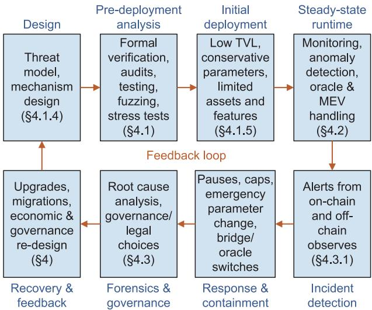

Review article

# Decentralized finance security: A survey of attacks, defenses, and open challenges

Shan Jiang a, Wenxin You b, Shichang Xuan c,∗, Jiaxing Shen d

a School of Software Engineering, Sun Yat-sen University, Zhuhai 519082, China

b School of Art and Design, Guangzhou Institute of Science and Technology, Guangzhou 510540, China

c College of Computer Science and Technology, Harbin Engineering University, Harbin 150001, China

d School of Data Science, Lingnan University, Hong Kong, China

## a r t i c l e i n f o

Article history: Received 6 December 2025 Revised 13 January 2026 Accepted 15 January 2026 Available online 28 February 2026

Keywords: Decentralized finance DeFi security Maximal extractable value Stablecoin Oracle

## a b s t r a c t

Decentralized finance (DeFi) has emerged as a transformative paradigm, leveraging programmable blockchains to innovate upon traditional financial services without centralized intermediaries. However, DeFi introduces a unique and highly adversarial security landscape characterized by immutable transactions, complex protocol composability, and transparent execution environments. This survey provides a comprehensive systematization of DeFi security, categorizing vulnerabilities across three distinct layers: technical and code layer, economic and protocol layer, and infrastructure and crosschain layer. Furthermore, we structure the defense mechanisms according to the protocol lifecycle, including pre-deployment prevention strategies, runtime mitigation techniques, and post-incident response and recovery mechanisms. We also delve into specific phenomena such as maximal extractable value, analyzing its dual role as both a market efficiency tool and a security vector. By synthesizing existing literature and incident reports, this survey establishes a holistic framework for understanding the interplay between code and finance. Finally, we identify critical open challenges and propose future research directions aimed at maturing the discipline of DeFi security and mitigating systemic risks.

© 2026 The Author(s). Published by Elsevier B.V. on behalfofShandong University. This is an open access article under the CC BY-NC-ND license (http://creativecommons.org/licenses/by-nc-nd/4.0/).

## 1. Introduction

Decentralized finance (DeFi) has emerged over the past few years as one of the most dynamic and experimental domains in the blockchain and web3 ecosystem [1–3]. Built primarily on programmable, account-based blockchains, such as Ethereum and Solana, DeFi protocols aim to replicate and extend traditional financial services, including trading, lending, payments, derivatives, and asset management, through transparent, composable smart contracts [4]. Users interact with these systems non-custodially, retaining direct control over their identities and assets and relying on code, cryptography, and economic incentives rather than centralized parties.

The rapid growth of DeFi has been striking. At its peak, the total value locked (TVL) in major protocols reached tens of billions of US dollars, and a rich ecosystem of applications and infrastructure has developed around core primitives such as automated market makers (AMMs) [5], lending markets [6], collateralized stablecoins [7], and cross-chain bridges [8]. The core DeFi primitives can be composed in various manners. For example, positions in one protocol can serve as collateral, governance power, or yield-bearing assets in another; structured products can layer leverage, options, and liquidity provision across multiple venues; and bridges and rollups connect liquidity and activity across heterogeneous execution environments.

Openness empowers DeFi; however, it also brings about profound security challenges. DeFi protocols operate in a fully adversarial, permissionless environment with the following characteristics. First, all relevant code and state are typically public, which reduces informational asymmetries but also makes vulnerabilities globally discoverable. Second, transactions are irreversible once finalized, and many contracts are functionally immutable, so design or implementation mistakes can become permanent attack surfaces. Third, composability creates tight coupling; hence, a flaw in one widely used primitive, or a failure in cross-chain infrastructure, can propagate across protocols and chains. Fourth, transaction ordering is not neutral. Validators, block builders, and specialized searchers can profit by reordering, inserting, or censoring transactions to extract maximal extractable value (MEV) [9], enabling sophisticated forms of frontrunning [10], sandwiching [11], and liquidation arbitrage. Finally, participation is pseudonymous and global, limiting the deterrent effect of traditional legal and regulatory tools.

To this end, DeFi has experienced a long series of high-impact security incidents. For instance, reentrancy exploits can drain lending and yield protocols [12]; arithmetic and accounting errors can break invariants and enable underpriced minting or over-withdrawal [13]; oracle and price manipulation attack can leverage thin-liquidity markets and flash loans [14]; governance attacks can use borrowed or bribed voting power to pass malicious proposals; large-scale compromises of bridges and multisignature wallets can instantaneously render wrapped assets unbacked [15]. The cumulative losses from such incidents amount to billions of US dollars, with substantial spillovers in the form of broken pegs, cascading liquidations, and long-lived damage to user trust.

At the same time, the DeFi ecosystem has actively developed a variety of defensive techniques. On the technical side, there has been significant progress in smart contract auditing [12], static and dynamic analysis [16], formal verification [17], testing and fuzzing frameworks [18], and secure-by-design contract templates [19]. On the economic and protocol side, designers increasingly rely on stress testing, agent-based simulation [20], and conservative parameterization to mitigate instability and manipulation. At runtime, protocols deploy monitoring systems, anomaly detection, circuit breakers, MEV-aware execution mechanisms, and hardened oracle designs to detect and limit the impact of attacks. Even after incidents, projects can experiment with onchain insurance, safety modules, governance-led compensation schemes, whitehat engagements, and cooperation with legal and regulatory authorities.

Despite these advances, there is still no unified and systematic picture of DeFi security that spans the full stack and covers the entire lifecycle of a protocol from deployment to incident response. Existing work tends to focus on specific classes of vulnerabilities [21] (e.g., reentrancy [22], oracle manipulation [23]), individual technologies (e.g., bridges [24], stablecoins [25], smart contracts [26]), or isolated defense techniques [27,28]. As a result, it is difficult for practitioners and researchers to understand how different attack vectors interact and how defenses at different layers complement or undermine one another.

The main contributions of this survey are as follows:

• Providing a structured taxonomy of DeFi attacks. We organize observed and potential vulnerabilities into three interrelated layers: (i) the technical and code layer, encompassing smart contract issues such as reentrancy, arithmetic and precision errors, access control flaws, unsafe external calls, logic bugs, and upgrade pitfalls; (ii) the economic and protocol layer, capturing oracle and price manipulation, governance capture, liquidity and trading manipulation, stablecoin and stability failures, and incentive misalignments; and (iii) the infrastructure and cross-chain layer, covering bridges and interoperability, key management and operational security, front-end and DNS attacks, RPC and infrastructure risks, and MEV-driven exploits related to validators and sequencers.

• Systematizing existing defenses across the protocol lifecycle. We propose a three-phase perspective on DeFi security: pre-deployment prevention, runtime mitigation, and post-incident response and recovery. For each phase, we survey current techniques and practices. Pre-deployment measures include formal verification and program analysis, code auditing and peer review, testing and fuzzing, economic stress testing and simulation, and secure-by-design approaches to architecture and governance. Runtime mechanisms cover monitoring and anomaly detection, circuit breakers and pause mechanisms, MEV-aware execution and transaction ordering, and oracle hardening. Post-incident practices encompass triage and forensics, insurance and reserves, engagement with whitehat actors and bug bounties, and governance and legal responses.

• Identifying open challenges and outline future research directions. Based on the above taxonomy and lifecycle, we highlight unresolved problems at the intersection of technical, economic, and institutional design. These include bridging the gap between economic intent and code-level guarantees; understanding and shaping MEV and transaction ordering environments; securing oracles and cross-chain architectures across multiple trust domains; measuring and managing systemic risk and interdependence; and developing governance, accountability, and legal frameworks that are compatible with the ideals and constraints of DeFi.

This survey is aimed at both researchers and practitioners. For researchers, it delineates a rich set of technically grounded, empirically motivated questions that call for contributions from cryptography, programming languages, distributed systems, market microstructure, mechanism design, and law. For protocol designers, auditors, and operators, it provides a consolidated reference on known attack vectors and defensive techniques, and a conceptual framework for integrating security considerations into protocol design, deployment, and governance.

The remainder of this paper is organized as follows. Section 2 introduces the technical and institutional preliminaries, including the smart contract execution environment, core DeFi primitives, threat models, and security notions. Section 3 surveys attacks at the technical, economic, and infrastructure layers. Section 4 discusses defenses across pre-deployment, runtime, and post-incident phases. Section 5 synthesizes open challenges and outlines promising directions for future work. Section 6 concludes this paper.

## 2. Preliminaries

In this section, we introduce the basic technical and institutional context necessary to understand security in DeFi. It first sketches the underlying blockchain execution environment, then describes the main classes of DeFi protocols and their composability. It concludes with a threat model and a working notion of security that motivates the layered framework used in later sections.

## 2.1. Blockchain and smart contract

Most DeFi activity today occurs on account-based blockchains that support general-purpose smart contracts, such as Ethereum [29] and compatible networks [30]. These systems provide a shared state machine replicated across many validators. Transactions specify state transitions, including transfers of value, contract calls, and contract deployments, which are batched into blocks, ordered, and executed deterministically by all participants.

Smart contracts are programs deployed at fixed addresses. They expose functions that can be invoked by users or other contracts. By design, code and most state are transparent and globally accessible. Execution is constrained by a metering system (for example, gas on Ethereum) that charges for computation and storage, discouraging unbounded loops and making denial-ofservice via resource exhaustion more expensive. Blockchain and smart contract have several crucial properties regarding security analysis:

• Immutability and irreversibility. Once a transaction is confirmed and sufficiently buried under subsequent blocks, it is practically irreversible. Similarly, deployed contracts are immutable, in which the code cannot be changed without pre-installed upgrade mechanisms. While immutability underpins credible commitments and censorship resistance, it also means that errors in logic, access control, or economic design can become permanent attack surfaces.

• Composability. Contracts can call into other contracts synchronously within a single transaction, and can delegate control over assets or permissions in highly flexible ways. Composability enables the money-legos vision of modular financial building blocks but also means that the security of one protocol depends on assumptions about many others. A safe contract operating in isolation may become exploitable in the presence of new dependencies or hostile integrations.

• Transaction ordering and MEV. Within each block, transactions are not strictly first-come, first-served. Validators, block builders, and specialized searchers can influence ordering, insert their own transactions, or exclude others when profitable. The transaction ordering capability to extract MEV underlies front-running, back-running, and sandwich attacks, and must be treated as an intrinsic feature of the runtime environment rather than an anomaly.

• Pseudonymity and open participation. Any entity can create addresses, deploy contracts, and interact with protocols without permission. Pseudonymity makes traditional identity-based controls and legal deterrents less effective and shifts emphasis toward mechanisms that assume sophisticated, well-resourced, and potentially untraceable adversaries.

The characteristics above differentiate DeFi security from traditional financial security, where trusted intermediaries, central authorities, and strong legal recourse play a critical role and where code is typically not both transparent and immutable in the same way.

## 2.2. Core DeFi primitives

DeFi protocols reimplement and extend financial services, e.g., trading, lending, derivatives, and payments, directly onchain. Some DeFi primitives appear repeatedly, and understanding them is helpful for situating specific vulnerabilities and defenses.

AMMs. AMMs are on-chain exchanges that hold reserves of two or more assets and algorithmically quote prices as a function of their inventory [5]. The constant product AMM (x · y = k) popularized by Uniswap v2 is the simplest example; subsequent designs incorporate concentrated liquidity ranges, dynamic fees, and hybrid curves for stable pairs. AMMs are central to price discovery and liquidity provision, but their mechanics create exposure to impermanent loss, price manipulation in thin markets, and complex interactions with oracles and leverage.

Lending and Borrowing Protocols. Decentralized money markets allow users to supply collateral and borrow other assets against it, typically subject to over-collateralization thresholds and dynamic interest rates [6]. Key components include collateral valuation (often via oracles), liquidation mechanisms, and interest rate curves. Failures in any of these can lead to bad debt, insolvency, or cascading liquidations.

Stablecoins. Stablecoins aim to maintain a relatively stable value, commonly pegged to fiat currencies, using reserves, collateral, algorithmic mechanisms, or combinations [25]. Designs range from fully collateralized custodial tokens to decentralized over-collateralized systems and more experimental algorithmic constructs. Stability mechanisms often couple tightly with lending markets, oracles, and governance, creating systemic feedback loops when stressed.

Cross-chain Bridges. As activity fragments across multiple chains and rollups [31], bridges and messaging protocols enable asset transfer and state synchronization. These systems typically concentrate large amounts of value in a small number of contracts or custodial arrangements. They combine on-chain logic with offchain validation or multisignature committees and have been frequent targets of high-impact exploits.

In practice, a DeFi protocol is typically not an isolated instantiation of the primitives above. For example, yield aggregators route funds across several platforms; options protocols embed AMMs for liquidity; structured vaults layer leverage on top of lending markets; stablecoins rely on baskets of assets, including other tokens representing DeFi exposures. As a result, risks are networked. Specifically, a failure in one component can propagate through price effects, liquidity shocks, broken assumptions about external contracts, or governance contagion.

## 2.3. Threat model

A clear threat model is essential for reasoning systematically about DeFi security. The analysis in this work assumes adversaries with the following capabilities:

• Unbounded participation and sybil identities. Adversaries can create arbitrarily many addresses and present themselves under multiple personas. They can participate as users, liquidity providers, governance voters, or even auditors and developers, absent robust off-chain verification.

• Substantial capital and access to sophisticated infrastructure. Attackers may command very large budgets, including via flash loans that provide enormous but transient purchasing power. They often run high-performance bots co-located with validators or connected to private relays, enabling low-latency, MEV-aware strategies.

• Influence over transaction ordering and information flow. Through MEV infrastructure or direct operation of validators and block builders, adversaries may front-run, back-run, censor, or reorder transactions to their advantage. They can monitor the public mempool and, in some settings, interact with private orderflow arrangements.

• Ability to exploit off-chain and socio-technical weaknesses. While the focus is on on-chain mechanisms, realistic threats include key compromise of multisig participants, collusion among oracle reporters, governance capture via token accumulation or bribes, and exploitation of poorly structured operational processes (for example, insecure deployment pipelines or misconfigured monitoring).

At the same time, not all adversaries are purely malicious or homogeneous. The ecosystem includes whitehat actors who may use the same technical capabilities for defensive purposes, such as pre-emptive fund withdrawal to protected addresses, and then negotiate returns. There are also rational but unconcerned actors (e.g., liquidators, arbitrageurs, MEV searchers) whose behavior is driven primarily by profit and who may unintentionally exacerbate crises, for example by aggressively liquidating or extracting MEV during stressed conditions.

The broad threat model does not assume that all attacks occur without warning or are completely novel. Many exploits reuse known patterns (e.g., reentrancy, unchecked external calls, and misconfigured access control) adapted to new contexts. Others involve predictable responses to incentives, such as running for the exit when collateral ratios deteriorate. A useful security framework must therefore address both technical and economic vulnerabilities under adversarial, MEV-aware conditions, and must consider that some defenses (like pause mechanisms or admin keys) themselves introduce new trust assumptions and attack surfaces.

## 2.4. Security notions and risk concepts

In traditional systems, security is often framed in relatively crisp terms: confidentiality, integrity, availability. In DeFi, these categories remain relevant but are intertwined with financial correctness and systemic stability. It is useful to distinguish several overlapping notions:

• Contract correctness and safety. At a minimum, the implemented logic should respect specified invariants: balances and supplies remain non-negative and conserved up to defined fees; only authorized entities can perform privileged actions; state transitions follow declared rules without unintended side effects such as reentrancy-based double spends. Violations typically arise from bugs, misconfigurations, or erroneous assumptions about how contracts compose.

• Economic robustness. A protocol’s mechanisms should behave acceptably across a realistic range of market conditions and adversarial strategies. The acceptable behaviors include maintaining solvency under plausible shocks, avoiding designs that admit simple, unbounded profit cycles, and calibrating liquidations, fees, and incentives so that opportunistic behavior stabilizes rather than destabilizes the system. Economic robustness is probabilistic and context-dependent rather than absolute.

• Resilience and recoverability. Even when correctness or robustness fail, the system should degrade gracefully where possible. It entails limiting blast radius, preserving avenues for orderly unwinding or recapitalization, and supporting credible mechanisms for post-incident response, including governance-led remediation and, when applicable, insurance or compensation.

• Compositional and systemic safety. Because DeFi protocols form interdependent networks, a protocol should not only protect its own users but also avoid becoming a vector for disproportionate harm to others. Overly aggressive liquidation cascades, oracle designs that amplify noise into shared price feeds, or bridge architectures that centralize systemic risk can all undermine broader ecosystem stability.

These dimensions are often in tension. Stronger admin controls may facilitate faster incident response but weaken decentralization and increase the impact of key compromise. Aggressive liquidation parameters can minimize bad debt but worsen procyclical dynamics during market stress. The framework developed in later sections does not claim to resolve these trade-offs universally. Instead, it offers a structured way to think about them across three layers, i.e., pre-deployment, runtime, and postincident, highlighting where different tools and practices are most effective and where new research and institution-building are most needed.

## 3. DeFi attacks

Before delving into each category, Table 1 summarizes representative high-loss DeFi incidents and maps them to the corresponding root causes. It illustrates how diverse technical, economic, and infrastructural failures have materialized in practice, and provides concrete reference points for the more systematic taxonomy of attacks that follows.

## 3.1. Technical and code layer

The technical and code layer encompasses vulnerabilities arising from how DeFi protocols are implemented as smart contracts and is a primary source of catastrophic DeFi failures, despite growing maturity in tooling and best practices. The issues typically stem from incorrect assumptions about the execution model, flawed access control, unsafe external interactions, or subtle arithmetic and state-management errors [32]. While such vulnerabilities are not unique to DeFi, their impact is amplified due to the large amounts of value at stake, the composability of contracts, and the difficulty of patching deployed code without disrupting dependent protocols. This section presents a structured overview of the main classes of technical vulnerabilities observed in DeFi systems, with an emphasis on Ethereumstyle, account-based smart contract platforms. For each class, we briefly describe the root cause, illustrate typical exploit patterns, and connect them to protocol characteristics that make them particularly severe in DeFi.

## 3.1.1. Reentrancy

Reentrancy occurs when a contract makes an external call to another contract (or account) before it has fully updated its own internal state, and the callee is able to call back into the original contract (re-enter) and invoke functions that assume the previous state has already been irrevocably changed [33]. It violates the intended control flow and can allow attackers to repeatedly perform actions such as withdrawals, liquidations, or token minting within a single transaction.

The canonical pattern is the checks-effects-interactions violation: the contract transfers funds or invokes an external function before finishing internal bookkeeping. If the recipient is a malicious contract, it can trigger the vulnerable function again before balances or accounting variables are decremented, extracting more assets than authorized.

Reentrancy has affected both simple token vaults and complex DeFi protocols that aggregate liquidity, distribute rewards, or manage collateral. In the DeFi context, reentrancy is especially dangerous for three cases. First, the reentrant function is economically sensitive (e.g., lending withdraws, AMM liquidity removal, reward harvesting). Second, the vulnerable contract serves as an underlying building block in other protocols (the so-called money legos), propagating the impact of the exploit. Third, flash loans provide an attacker with large, temporary capital to maximize extraction within a single atomic execution.

Defenses against reentrancy include using non-reentrant guards (e.g., mutex-style modifiers), following strict checkseffects-interactions patterns, minimizing external calls within core logic, and employing formal or automated tools that detect potential reentrant flows.

## 3.1.2. Arithmetic & precision errors

Most DeFi protocols implement financial logic using fixedprecision integer arithmetic, as many blockchain virtual machines lack native floating-point support. It introduces a variety of issues:

• Overflow and underflow. Historically, unchecked arithmetic could wrap around, enabling unintended minting, burning, or bypass of balance checks. While modern compilers and libraries often include safe arithmetic by default, legacy contracts and custom math libraries remain vulnerable.

• Rounding and truncation errors: Integer division truncates remainders, potentially leading to systematic value leakage, unfair fee distribution, or gradual deviation from intended invariant relationships (e.g., pool share pricing).

• Precision mismatch. Tokens with non-standard decimals, or protocols that assume a particular number of decimal places, can miscompute exchange rates, collateralization ratios, or interest accrual if these assumptions are violated.

Table 1  
Representative high-loss incidents mapped to root causes in §3.

<table><tr><td>DeFi incident</td><td>Loss</td><td>Root cause</td></tr><tr><td>The DAO (Ethereum, 2016)</td><td>~ $60M</td><td>Reentrancy in smart contracts (§3.1.1)</td></tr><tr><td>Curve Finance stable pools (Vyper bug, 2023)</td><td>~ $70M</td><td>Low-level arithmetic/compiler issue breaking pool accounting (§3.1.2, §3.1.5)</td></tr><tr><td>Parity multisig wallet bugs (2017)</td><td>~ $30M</td><td>Access control and authorization flaws (§3.1.3, §3.1.6)</td></tr><tr><td>Pickle Finance exploit (2020)</td><td>~ $20M</td><td>Unsafe external strategy integration and call patterns (§3.1.4)</td></tr><tr><td>Compound distribution bug (2021)</td><td>~ $90M mis-distributed</td><td>Reward-accounting logic and invariant violations (§3.1.5)</td></tr><tr><td>Cream Finance exploits (2021)</td><td>~ $130M</td><td>Complex lending and collateral invariants broken (§3.1.5)</td></tr><tr><td>Nomad bridge exploit (2022)</td><td>~ $2M</td><td>Error in bridge message validation (§3.1.6, §3.3.1)</td></tr><tr><td>bZx protocol incidents (2020)</td><td>~ $9M</td><td>Oracle and thin-liquidity price manipulation (§3.2.1, §3.2.3)</td></tr><tr><td>Mango Markets manipulation (2022)</td><td>~ $110M</td><td>Oracle manipulation with treasury governance (§3.2.1, §3.2.2)</td></tr><tr><td>Beanstalk governance exploit (2022)</td><td>~ $77M</td><td>Governance capture via flash-loaned voting power (§3.2.2)</td></tr><tr><td>Harvest Finance exploit (2020)</td><td>~ $34M</td><td>Liquidity and pricing manipulation (§3.2.3)</td></tr><tr><td>Terra UST/LUNA collapse (2022)</td><td>~ $60B market value</td><td>Algorithmic-peg and reflexive collateral design (§3.2.4)</td></tr><tr><td>Iron Finance bank run (2021)</td><td>~ $2B market value</td><td>Poorly aligned stability and liquidity incentives (§3.2.5)</td></tr><tr><td>Poly Network bridge hack (2021)</td><td>~ $612M</td><td>Bridge contract and cross-chain verification flaws (§3.3.1)</td></tr><tr><td>Wormhole bridge exploit (2022)</td><td>~ $325M</td><td>Bug in cross-chain verification of wrapped assets (§3.3.1)</td></tr><tr><td>Ronin bridge hack (2022)</td><td>~ $625M</td><td>Centralized validators and key security failure (§3.3.1, §3.3.2)</td></tr><tr><td>Curve Finance DNS hijack (2022)</td><td>~ $0.6M</td><td>Compromised DNS front-end redirecting users (§3.3.3)</td></tr><tr><td>Solana network outages (2021–2024)</td><td>Liquidation impact</td><td>Fragile validator and infrastructure dependencies (§3.3.4)</td></tr><tr><td>High-MEV sandwiching on DEXs (e.g., Uniswap, 2020-)</td><td>Billions in aggregate extracted value</td><td>Exploitable transaction ordering and MEV extraction (§3.3.5)</td></tr></table>

These arithmetic subtleties directly impact economic correctness. For example, a rounding bug in a mint/burn formula can enable attackers to create or redeem liquidity tokens at a mispriced rate, extracting value from honest liquidity providers. Likewise, incorrectly capped interest or reward calculations can lead to unsustainable emission rates and eventual insolvency.

Mitigation strategies include systematic use of well-tested math libraries, explicit handling of scaling factors and decimals, property-based testing and fuzzing for numerical routines, and formal specification of critical financial invariants (e.g., conservation of value, monotonicity of accrued interest).

## 3.1.3. Access control flaws

Access control vulnerabilities arise when privileged functions are insufficiently restricted, misconfigured, or can be indirectly triggered through unintended code paths. In DeFi, privileged operations typically include: (1) changing risk parameters (e.g., collateral factors, interest models), (2) upgrading core logic contracts or changing proxy implementations, (3) minting, burning, or seizing tokens, and (4) pausing or resuming protocol functionality.

Common failure modes are threefold. First, hard-coded externally owned accounts (EOAs) are later compromised, granting attackers full administrative control. Second, incorrect role assignments or misused modifiers make functions intended for governance, guardians, or multisigs callable by arbitrary users or contracts. Third, privilege is escalated via composability, where unprivileged functions indirectly cause privileged state changes, often through poorly constrained delegate calls or initialization functions left open after deployment.

The DeFi context amplifies these risks because governance and upgradeability are often on-chain and dynamic. Administrators may be decentralized autonomous organizations (DAOs), multisigs, or time-locked governors, and misconfigurations can create one of two extremes: overly centralized control that can be captured, or insufficient control that prevents timely patching of vulnerabilities.

Best practices include explicit and audited role-based access control, time-locks and delay mechanisms for sensitive operations, use of multisignature schemes with robust operational security, and minimization of highly privileged functions in the core protocol.

## 3.1.4. Unsafe external calls

DeFi contracts are inherently interactive: they call external tokens, oracles, other DeFi protocols, and sometimes arbitrary user-provided addresses. Unsafe external interactions introduce several classes of bugs:

• Unhandled call failures. Ignoring return values or using deprecated patterns (e.g., relying on transfer without handling potential gas-related issues) can lead to inconsistent state when external calls fail silently.

• Unbounded external calls. Allowing arbitrary external addresses or unverified contracts to be called, or to act as callbacks, can expose the protocol to reentrancy, griefing, or unexpected side effects.

• Delegatecall misuse. Using delegatecall to execute code in the context of the caller’s storage is central to many upgrade and proxy patterns. However, if target addresses are not carefully controlled, it can effectively grant arbitrary write access to the contract’s state.

These patterns become especially hazardous when the contract assumes benign behavior from external components, such as assuming ERC-20 tokens conform strictly to the standard, or that external protocols cannot reenter or modify global state in unexpected ways.

Robust design treats all external interactions as adversarial by default. Defenses include strict whitelisting of external contracts where appropriate, careful handling of return values and revert conditions, minimizing reliance on non-standard token behavior, and isolating complex integration logic in non-critical modules that do not hold or control large amounts of value.

## 3.1.5. Logic & invariant bugs

Beyond syntactic vulnerabilities, many severe DeFi exploits stem from conceptual design or implementation errors: the code faithfully implements the programmer’s intent, but the intended logic itself is flawed or incomplete. For example, incorrect formulas can be set for pricing pool shares, interest accrual, or liquidation bonuses; the contract fails to enforce critical invariants (e.g., the total assets equals the sum of user balances and fees) or makes inconsistent accounting between internal shares and underlying tokens; the contract omits sanity checks on parameters (e.g., allowing collateral factors above 100%, or negative interest rates in an unintended way).

These issues often arise from the complexity of DeFi mechanisms and their interactions with other protocols. Formalizing and checking invariants is non-trivial, especially when protocols depend on external state (e.g., prices, liquidity) and dynamic governance-controlled parameters. However, once violated, such invariants typically allow attackers to mint underpriced claims, withdraw more collateral than allowed, or otherwise extract value at the protocol’s expense.

Comprehensive mitigation requires a combination of rigorous economic design, formal or semi-formal specification of key invariants, simulation-based evaluation under adversarial scenarios, and extensive testing beyond unit-level correctness, including property-based and fuzz testing across a wide parameter space.

## 3.1.6. Upgrade & initialization pitfalls

Upgradeability is now a standard feature in DeFi protocols, commonly achieved through proxy patterns where a persistent storage contract delegates calls to an upgradable implementation. While upgradeability provides flexibility, it introduces new technical risks. First, the implementation can be uninitialized. Implementation contracts that are deployed with public or incorrectly restricted initialization functions can be taken over by attackers, who then set themselves as owners or configure malicious parameters. Second, the upgrade involves incorrect admin configuration. Misconfigured proxy admin roles can grant upgrade power to unintended addresses, or lock the protocol into an unchangeable state. Third, there can be state layout mismatches across upgrades. Changing the storage layout without proper care can corrupt protocol state, leading to silent mis-accounting or enabling other attacks.

These pitfalls blur the line between technical and governance vulnerabilities. An attacker who gains control over an upgrade mechanism effectively acquires arbitrary code execution over the protocol’s state. Consequently, secure initialization flows, clear separation of admin and user logic, robust upgrade testing, and conservative upgrade policies are critical.

## 3.2. Economic and protocol layer

Economic- or protocol-layer attacks exploit flaws in a system’s mechanism design, incentive structure, and market interactions rather than (or in addition to) low-level code bugs. In this layer, the smart contract typically behaves as specified, but the specification itself admits states in which a rational, profit-seeking agent can extract disproportionate value, destabilize the system, or seize governance power. DeFi is particularly exposed to such vulnerabilities because protocols are composable, atomic, capitalefficient, and heavily reliant on on-chain prices and incentives. First, positions in one protocol can be used as collateral or governance influence in another. Second, flash loans and atomic execution allow large, uncollateralized positions to be opened and closed in a single transaction. Third, collateralization, liquidations, and rewards all hinge on the correctness of economic assumptions. This section surveys key categories of economic and protocol-layer attacks, focusing on oracle and price manipulation, governance capture, liquidity and trading manipulation, and stability failures such as stablecoin de-pegging.

## 3.2.1. Oracle & price manipulation

Many DeFi protocols depend on price feeds to determine collateralization ratios, liquidation conditions, swap rates, and reward distributions. If the mechanism that supplies or aggregates prices is manipulable at reasonable cost, an attacker can induce the protocol to make economically unsound decisions while the contract logic remains formally correct.

Spot price reliance and thin liquidity. A common pattern is reliance on a single on-chain spot price from an AMM as the oracle for a lending protocol or synthetic asset. When the underlying trading pair has limited liquidity, an attacker can manipulate the price using various methods. First, the attack can use a large trade (often financed via a flash loan) to push the AMM price far from the true market value. Second, the attack can interact with the target protocol in the same transaction, taking actions that depend on the manipulated price: over-borrowing underpriced collateral, avoiding liquidation or triggering liquidation of others, and minting synthetic assets at an artificially favorable rate. Third, the attack can also revert the price by reversing the initial trade, often mitigating their own market risk within the same atomic execution. Because all steps occur within a single transaction, the protocol sees the manipulated price as truth and has no opportunity to observe or react to the transient distortion.

VWAP/TWAP and multi-source oracles. While time-weighted average price (TWAP) and volume-weighted average price (VWAP) oracles mitigate short-lived spikes, they can still be influenced if the averaging window is short or if an attacker can sustain manipulation over multiple blocks at acceptable cost. Similarly, protocols that aggregate multiple sources may be vulnerable if the set of sources is correlated, poorly curated, or dominated by lightly traded markets that are cheap to move.

Mitigations, discussed further in Section 4, include oracle designs that aggregate diverse, deep markets; robust sanity checks and bounds on acceptable price movements; longer and adaptive averaging windows; and borrowing caps or rate limits to reduce the payoff of manipulation.

## 3.2.2. Governance attacks

DeFi protocols frequently delegate critical powers (parameter changes, upgrades, treasury spending) to on-chain governance systems. Governance tokens, often freely transferable and used as liquidity incentives, form the voting substrate. Such a design enables community control but also introduces attack vectors centered on acquiring disproportionate influence over governance decisions [34].

Proposal hijacking and governance coups. A simple form of governance attack is to accumulate enough voting power to pass a malicious proposal that (1) upgrades the protocol to attackercontrolled logic (e.g., draining reserves), (2) transfers treasury assets to attacker-owned addresses, and (3) modifies risk parameters (e.g., collateral factors, fee rates) to enable subsequent economic extraction. Attackers may acquire voting power via open-market purchases, OTC deals, or by borrowing governance tokens through lending markets or flash loans. If the governance system determines voting power at a snapshot time without considering the duration or provenance of holdings, borrowingbased attacks become feasible: the attacker only needs voting power temporarily to pass an irreversible decision.

Vote buying and bribery markets. Even when tokens are widely distributed, vote buying and bribery mechanisms can effectively centralize decision-making, especially in the big data sharing era [35]. Bribe platforms one step removed from the governance token itself enable (1) direct payments to token holders or delegates in exchange for specific votes, and (2) liquidity bribing, where incentives are paid for supplying liquidity that confers governance power. These mechanisms do not necessarily violate any rules of the protocol, but they can lead to systematic capture by concentrated interests and decisions that prioritize short-term gain over long-term protocol health.

Governance process vulnerabilities. Beyond token distribution, design choices such as quorum thresholds, proposal thresholds, veto powers, and timelocks shape governance attack surfaces. Low proposal thresholds may allow spam or malicious proposals; inadequate timelocks may leave users and integrators unable to react to dangerous changes; overpowered emergency guardians can themselves become central points of failure if compromised.

Effective defenses include robust token distribution and vesting, delegation models that encourage expert oversight, snapshotbased voting that accounts for time-weighted holdings, and multistage governance with clear review and veto windows.

## 3.2.3. Liquidity & trading manipulation

DeFi trading environments are highly transparent and competitive, with miners/validators, searchers, and sophisticated arbitrageurs all competing for profitable order flow. Economic attacks can exploit predictable user behavior and mechanism-level weaknesses in AMMs and routing logic.

Sandwich attacks. In a sandwich attack, an adversary observes a pending large trade in the mempool and places two transactions: (1) a front-running trade that moves the price in the same direction as the victim’s intended trade [10], and (2) a backrunning trade that reverses the initial position after the victim’s transaction executes at a worsened price. The attacker effectively extracts the value of the victim’s price slippage. While some degree of adverse selection is inherent in trading, sandwiching can impose large, systematic losses on uninformed or poorly protected users, especially when default slippage tolerances are high or front-running protections (e.g., private order flow) are absent.

JIT (just-in-time) liquidity and toxic flow. JIT liquidity providers temporarily inject large amounts of liquidity into an AMM right before a trade, capturing a disproportionate share of fees while minimizing their exposure to inventory risk. While not always malicious, JIT patterns can distort the fee and reward landscape, reducing returns to honest, continuously providing LPs, and amplify the impact of short-lived price movements or manipulation. Relatedly, routing algorithms that do not account for adversarial behavior may consistently steer trades through paths that are easy to exploit, e.g., preferring pools where attackers can cheaply manipulate prices or insert JIT liquidity.

Market manipulation for liquidations and arbitrage. Lending and derivatives protocols often have deterministic rules for liquidation and margin calls based on on-chain prices. An attacker can deliberately deteriorate a market to force the liquidation of a target’s position at a discount, then buy the collateral cheaply, or create arbitrage loops that rely on predictable liquidation auctions or underpriced liquidated collateral. These attacks may be intertwined with oracle manipulation (Section 3.2.1) but are conceptually focused on exploiting the liquidation and auction mechanisms themselves, including poorly designed incentives for liquidators or insufficient competition in auctions.

Defenses span several layers: user-side safeguards (slippage and MEV protection), protocol-side routing and auction design (batch auctions, off-chain order matching, auction duration and competition), and MEV-aware infrastructure.

## 3.2.4. Stablecoin de-pegging

Stablecoins and other pegged assets aim to maintain a target value (often 1 USD or a basket of assets) through collateralization, algorithmic feedback, or a combination of both. Economic attacks and stress scenarios can target weaknesses in the peg mechanism, precipitating de-pegs, bank runs, or death spirals.

Over-collateralized and collateral-backed models. In collateralbacked stablecoins, the stability depends on: (1) the quality and volatility of collateral assets, (2) the responsiveness of liquidation mechanisms, and (3) the behavior of market participants under stress (e.g., whether arbitrage incentives remain attractive when volatility and gas costs spike). Adversaries can exacerbate volatility or target collateral assets that are themselves illiquid or manipulable (e.g., governance tokens, LP tokens), undermining confidence and triggering large-scale redemptions or under-collateralization.

Algorithmic and reflexive models (death spirals). Algorithmic stablecoins that rely heavily on endogenous collateral (e.g., the protocol’s own governance token) are vulnerable to reflexive spirals: loss of confidence reduces the market value of the backing asset, which worsens the collateral ratio, prompting further selling and redemptions, and so on. Attackers can catalyze such spirals by: (1) coordinated short-selling, borrowing, or selling of the governance token and/or the stablecoin, (2) targeted liquidity withdrawals and FUD campaigns that weaken off-chain confidence, and (3) exploiting design flaws in mint/burn or arbitrage mechanisms that allow them to accumulate large positions cheaply in early stages of a de-peg, then realize profits as others panic.

Run risks and coordination failures. Even robustly collateralized systems are exposed to run dynamics when users fear insolvency or peg loss. Design choices such as redemption queues, withdrawal caps, and emergency modes strongly influence whether a shock leads to orderly deleveraging or chaotic collapse. Attackers may exploit these dynamics by pre-positioning themselves to benefit from forced liquidations or distressed asset sales.

Designing stable, manipulation-resistant pegging mechanisms remains an open research area, requiring joint analysis of market microstructure, collateral interactions, user psychology, and extreme event handling.

## 3.2.5. Incentive misalignment

Many economic vulnerabilities arise not from acute manipulation but from chronic misalignment of incentives between different participants, i.e., the liquidity providers, traders, liquidators, governance token holders, and protocol operators. Over time, these misalignments can erode protocol safety and create exploitable conditions. Examples include:

• Under-incentivized risk management: Liquidators, oracles, or keepers who are insufficiently rewarded may fail to act in time during stress events, leaving the protocol undercollateralized and vulnerable to opportunistic attacks.

• Excessive short-term rewards: Aggressive liquidity mining or yield incentives can attract mercenary capital that exits rapidly at the first sign of stress, amplifying volatility and run risk.

• Unbounded or poorly parameterized mechanisms: Fee schedules, reward formulas, and leverage limits that lack caps, decay mechanisms, or adaptive elements can lead to unstable equilibria and easily exploitable configurations.

These issues often only manifest when protocols are deployed at scale and under varying market regimes, underscoring the importance of ex ante economic stress testing, agent-based simulation, and scenario analysis. Unlike discrete bugs, incentive misalignments are difficult to fully patch with code changes alone and often require rethinking core economic primitives and governance structures.

## 3.3. Infrastructure and cross-chain layer

The infrastructure and cross-chain layer encompasses vulnerabilities rooted not in a single protocol’s logic or economic design, but in the broader technical stack that supports DeFi: key management and operational security, RPC and node infrastructure, front-end and DNS systems, validators and sequencers, and the mechanisms that enable value transfer across chains and rollups. Many of the largest historical DeFi hacks have in fact been infrastructure failures, particularly in cross-chain bridges and multisig-controlled contracts, rather than classical smart contract bugs.

Attacks at this layer are often characterized by high blast radius, off-chain components and trust assumptions, and complex and evolving threat models. First, compromise of a single bridge, admin key, or infrastructure provider can jeopardize multiple protocols simultaneously. Second, critical security properties depend on off-chain systems (HSMs, DNS registrars, validator sets), which may not share the same transparency and auditability as on-chain code. Third, rollup architectures, MEV supply chains, and cross-chain interoperability standards are rapidly changing, creating moving targets for both attackers and defenders.

This section outlines key classes of infrastructure- and crosschain-layer attacks: bridge and interoperability vulnerabilities, key and operational security failures, front-end and DNS hijacking, and MEV-driven exploits that leverage privileged transaction ordering.

## 3.3.1. Bridges vulnerabilities

Cross-chain bridges allow assets and messages to flow between otherwise isolated ledgers, enabling liquidity sharing and composability across L1s, L2s, and application-specific chains. Typical designs include:

• Lock-and-mint/burn-and-release bridges, where assets are locked on a source chain and wrapped tokens are minted on a destination chain.

• Light-client and zk-based bridges, which verify consensus proofs from one chain on another.

• MPC/multisig and validator-based bridges, where a set of off-chain or partially on-chain participants sign messages attesting to events on other chains.

• Optimistic bridges, which assume correctness by default and rely on fraud proofs and challenge periods.

The core security property of a bridge is correctness of state attestation: the representation of assets or messages on the destination chain must faithfully reflect actual state on the source chain. Attacks typically compromise or circumvent the attestation mechanism.

Validator and key compromise. In many widely used bridges, minting and release of bridged assets is controlled by a relatively small set of validators or signers (e.g., multisig participants or MPC key shares). If an attacker compromises a threshold of these keys (no matter through malware, phishing, insider collusion, or operational lapses), they can forge signatures authorizing arbitrary minting or withdrawals. Because destination chains treat signed messages as authoritative, it often results in immediate and unrecoverable loss of bridged assets.

Proof verification and contract logic flaws. Even when bridges rely on more trust-minimized designs (e.g., light clients or zkproofs), vulnerabilities in proof verification contracts or state transition logic can be catastrophic. Typical issues include incorrect validation of Merkle proofs or state roots, acceptance of stale or replayed proofs, and logic bugs in handling chain reorganizations or finality assumptions. These bugs effectively grant attackers the ability to fabricate events on the source chain, such as deposits that never occurred or consensus states that never finalized.

Economic and liquidity implications. Because bridged assets are often used as collateral or trading pairs in DeFi protocols on destination chains, a successful bridge attack can render a supposedly stable asset worthless or unbacked, cascading through lending markets, AMMs, and derivatives built atop it. The same underlying failure can therefore manifest as a sequence of protocol hacks even though the root cause lies in the bridge infrastructure.

Mitigations include more decentralized and economically secure validator sets, formal verification of proof verification logic, conservative caps on bridged asset supply, and fast but robust mechanisms for detecting and halting suspected bridge compromise.

## 3.3.2. Key & operational security

Many DeFi protocols rely on privileged keys or multisigs to manage upgrades, emergency controls, treasuries, and parameter changes. While on-chain logic may be sound, compromise of these keys can instantly subvert any other security measures.

Single-point-of-failure admin keys. Early and even some contemporary DeFi deployments grant wide-ranging powers to a single EOA, such as upgrading core logic contracts, minting and burning tokens, and changing critical risk parameters or pausing the protocol. If the corresponding private key is leaked, stolen, or mismanaged (e.g., stored unencrypted, reused across services, or protected by weak operational procedures), an attacker can unilaterally drain funds, alter protocol logic, or disable user withdrawals. Such incidents often resemble inside jobs from an onchain perspective, even if the underlying cause is an external compromise.

Multisig and MPC pitfalls. Multisignature and MPC schemes reduce reliance on a single key but introduce new complexities: inadequate signatory diversity (e.g., all signers controlled by a small team, or geographically and operationally correlated), insecure signing workflows (approving transactions via untrusted devices, messaging platforms, or without proper review), and poorly documented key rotation and incident response plans. Attackers may target individual signers through phishing, targeted malware, SIM swapping, or social engineering. Operational lapses, such as signing arbitrary transactions in a hurry, or misunderstanding contract calls, can lead to accidental self-inflicted hacks.

Custodial and institutional risks. Protocols that rely on thirdparty custodians, infrastructure providers, or centralized entities for key storage inherit their security assumptions. A compromise, regulatory seizure, or failure of such an intermediary can directly impact on-chain functionality.

Robust key management thus requires not just cryptographic techniques but also well-designed organizational processes: hardware security modules (HSMs), segregated duties, independent reviewers, detailed runbooks for emergencies, and transparent disclosures to users about who controls what powers and under what conditions.

## 3.3.3. Front-end & DNS attacks

Although DeFi protocols execute on-chain, most users interact with them through web2-based front-ends: websites, APIs, and browser-based wallets. Attacks can exploit the gap between a secure on-chain protocol and an insecure user interface.

DNS hijacking and domain compromise. Attackers can gain control of a protocol’s domain name (via compromised registrar accounts, DNS poisoning, or registrar-level breaches) and serve a malicious front-end and steal tokens. More specifically, the attack can route users’ transactions to attacker-controlled contracts (e.g., fake routers or vaults), request excessive approvals or signatures, and subtly alter transaction parameters (e.g., recipients, amounts, slippage). Because the on-chain contract addresses and transaction contents are often opaque to non-expert users, especially when obfuscated by aggregators or complex call data, such compromises can exfiltrate user funds without any vulnerability in the underlying smart contracts.

Front-end injection and supply chain attacks. Even if DNS remains uncompromised, the front-end itself can be a vector to perform malicious JavaScript injections via compromised CDNs or third-party analytics scripts and wallet phishing via misleading UI prompts or simulated signing interfaces. These attacks blur the line between classic web2 web security and web3-specific risks. In many cases, the only difference between real and fake interfaces is a few lines of JavaScript or a subtle change in the contract address.

Mitigations include rigorous web2 security practices (2FA on registrars, registrar locks, CSPs, subresource integrity), front-end verifiability (content-addressed hosting, signed builds), clear display of expected contract addresses, and educating users and integrators to rely on verified links and interfaces. However, the persistence of front-end attacks underscores that DeFi security cannot be evaluated purely at the smart contract layer.

## 3.3.4. Infrastructure & RPC risks

DeFi protocols and users depend on node infrastructure, either self-run or via third-party RPC providers, to broadcast transactions and read blockchain state. While consensus rules constrain what can ultimately be recorded on-chain, control over which data is served and which transactions are relayed can be abused in several ways.

Selective censorship and degradation. Centralized or dominant RPC providers can choose to censor or deprioritize particular transactions (e.g., from sanctioned addresses, competing MEV searchers, or specific protocols). They can also provide degraded service during critical times, affecting certain users’ ability to manage positions (e.g., repay loans or adjust collateral) during volatile markets. While such behavior may be driven by regulatory pressure, business incentives, or malicious intent, the effect is that users and protocols relying on censored infrastructure may experience losses that are indistinguishable from targeted economic attacks.

Tampered read-API responses. More insidiously, a compromised or malicious provider could serve incorrect view data to client applications (wallets, dashboards, bots), such as misreporting balances, prices, or liquidity levels, and misrepresenting contract code or state (e.g., hiding upgrade status, pausing state). Although inconsistent responses would eventually be detectable by comparing multiple sources or inspecting raw chain data, short-lived discrepancies can be used to mislead arbitrage bots, liquidators, or automated strategies into making unfavorable or exploitable decisions.

Decentralized RPC protocols, client-side verification (light clients, SPV proofs), and diversified provider strategies are emerging as partial mitigations, but it remains an underexplored attack surface relative to other DeFi risks.

## 3.3.5. Validators, sequencers & MEV

The ordering and inclusion of transactions in blocks are controlled by validators (in PoS systems [36]) or miners (in PoW [37]), and increasingly by specialized block builders and proposers in architectures with proposer-builder separation (PBS) [38]. The ordering control gives rise to MEV: the additional profit that can be extracted by reordering, inserting, or censoring transactions. While some MEV corresponds to benign arbitrage that improves market efficiency, other forms can be directly exploitative or destabilizing.

Transaction-level MEV: front-running, back-running, and censorship. In PBS, the searchers and validators may front-run user trades to extract value via sandwich attacks (Section 3.2.3). Besides, they can back-run liquidations or oracle updates to seize predictable profits. Furthermore, transactions that would close an exploitable opportunity, such as a user trying to repay a loan before liquidation, can be censored or delayed. These behaviors erode user trust and can render protocol-level assumptions invalid (e.g., that liquidations are open and competitive, or that oracle updates arrive promptly).

Time-bandit and reorg-based attacks. In time-bandit attacks, a validator or colluding set of validators reorganizes recent blocks to capture large MEV opportunities that were previously realized by other validators or searchers. They can also reverse specific high-value transactions, such as large liquidations or arbitrages, to re-execute them in a more profitable order. As block rewards decline relative to MEV opportunities, the economic incentives for such reorgs can increase, especially in chains without strong finality or with small validator sets.

L2 sequencers and centralized ordering. On many rollups and L2s, a centralized sequencer is responsible for ordering and batching user transactions before they are posted to an L1. The sequencer can perform attacks by (1) engaging in MEV extraction similar to L1 validators, (2) delaying or censoring transactions, including withdrawals back to L1, and (3) manipulating the timing of cross-domain messages that trigger protocol actions (e.g., oracle updates, bridge finalization, or liquidation triggers). If protocols assume neutral or first-come-first-served ordering, the presence of a powerful sequencer can undermine those assumptions, enabling infrastructure-level exploits that appear as ordinary market behavior from the chain’s perspective.

Mitigations involve both protocol-level and infrastructurelevel changes: MEV-aware protocol design (e.g., batch auctions, commit-reveal schemes, fair ordering protocols), cryptographic techniques (e.g., encrypted mempools, threshold decryption), and governance and economic mechanisms that align validator and sequencer incentives with user welfare.

## 4. DeFi defense mechanisms

In response to the major DeFi attacks in Section 3, we now turn to defense mechanisms organized along the protocol lifecycle. We distinguish pre-deployment prevention, runtime mitigation, and post-incident response and recovery in Fig. 1, and relate these phases back to the attack taxonomy using Tables 2, 3, and 4. The lifecycle view highlights that no single technique suffices in isolation; robust security instead emerges from coordinated measures before, during, and after potential incidents.

## 4.1. Pre-deployment prevention

Pre-deployment defenses comprise all measures taken before a DeFi protocol is launched on a live network to reduce the likelihood and impact of vulnerabilities. Unlike runtime and post-incident mechanisms, which react to observed threats or failures, pre-deployment techniques aim to prevent exploitable states from being reachable at all, or at least to make them exceedingly difficult and costly to realize.

Because DeFi protocols are simultaneously software systems, financial mechanisms, and governance frameworks, effective prevention must address more than just code correctness. It must also consider economic incentives, parameter choices, and upgradeability and governance structures. This section surveys key classes of pre-deployment defenses: formal verification and program analysis, code review and auditing practices, economic stress testing and simulation, and secure-by-design patterns for governance and upgradeability. Table 2 summarizes how predeployment prevention techniques respond to the DeFi attacks.

## 4.1.1. Formal verification and smart contract analysis

Formal verification uses mathematical methods to prove that a smart contract implementation satisfies a formal specification, typically expressed as a set of logical properties or invariants. In DeFi, such properties range from low-level safety (e.g., no integer overflow in a function) to higher-level correctness (e.g., total supply of shares matches underlying assets minus fees).

Specification and properties. A key challenge is to derive precise, unambiguous specifications for financial behavior, including state invariants, temporal properties, and access control properties. First, the state invariants include conservation of value (the total assets equal the sum of user balances and fees), monotonicity (e.g., user debt cannot decrease without a repayment), and bounds (e.g., collateralization ratios never exceed 100%). Second, typical examples of temporal properties are the guarantee that once a position becomes under-collateralized, a liquidation opportunity eventually exists, and governance changes are always preceded by a timelock period. Third, access control properties can force that only authorized roles can invoke upgrade, minting, or parameter-changing functions. Capturing economic behavior (e.g., absence of certain classes of profitable arbitrage or price manipulation) in formal logic remains difficult and is an active research area. Nevertheless, even partial specifications can rule out large classes of catastrophic bugs.

<table><tr><td></td><td>Pre-deployment prevention (§4.1)</td><td>Runtime mitigation (§4.2)</td><td>Post-incident response &amp; recovery (§4.3)</td></tr><tr><td>Technical &amp; code layer (§3.1)</td><td>Smart-contract correctness (reentrancy, math, access)Formal verification, static analysis, fuzzingAudits, vetted libraries, safe proxy</td><td>Online invariant checks (solvency, balances, collateral ratios)Anomaly detection on callsCircuit breakers, pauses, rate limits</td><td>Patch/migrate contractsForensics on exploit tracesStrengthen tests &amp; specsPublic post-mortems</td></tr><tr><td>Economic &amp; protocol layer (§3.2)</td><td>Mechanism/incentive design (oracles, governance, liquidations, stablecoins)Stress tests, simulations, conservative parameters</td><td>Live monitoring of prices, pegs, liquidations, liquidityDynamic fees, collateral factors, auction rulesHardened oracle usage</td><td>Use of reserves, insurance, safety modulesRe-parameterization, redesign, orderly wind-downGovernance-led compensation or recapitalization</td></tr><tr><td>Infrastructure &amp; cross-chain layer (§3.3)</td><td>Architecture &amp; trust choices for bridges, oracles, keys, front-endsOpSec playbooks, multisig/MPC setupBridge/oracle risk caps</td><td>Monitoring bridges, validators, sequencers, RPC, front-endsDetect DNS/RPC issues, MEV behaviorMEV-aware execution</td><td>Freeze/deprecate wrapped assets, disable compromised bridges/infraKey rotation, provider changesCross-protocol coordination, legal/regulatory steps</td></tr></table>

Fig. 1. DeFi security mapped across three layers (rows) and three lifecycle phases (columns). Each cell summarizes dominant attack surfaces from Section 3 and typical defense families from Section 4.

Mapping DeFi attacks (§3) to pre-deployment defense mechanisms (§4.1).

<table><tr><td>DeFi attacks (§3)</td><td>Pre-deployment defense mechanisms (§4.1)</td></tr><tr><td>Reentrancy (§3.1.1)</td><td>Non-reentrant design patterns; formal verification and static/dynamic analysis for reentrancy; fuzzing and manual audits focused on external calls and control flow (§4.1.1, §4.1.2, §4.1.3, §4.1.5).</td></tr><tr><td>Arithmetic &amp; precision errors (§3.1.2)</td><td>Vetted math libraries and compiler checks; formalization of core accounting invariants; property-based testing and fuzzing over wide numerical ranges (§4.1.1, §4.1.3).</td></tr><tr><td>Access control flaws (§3.1.3)</td><td>Explicit RBAC design; audits of modifiers and privileged paths; least-privilege architecture and careful integration with governance and upgrades (§4.1.1, §4.1.2, §4.1.5).</td></tr><tr><td>Unsafe external calls (§3.1.4)</td><td>Detecting unchecked calls and dangerous delegatecall; integration testing and fuzzing; isolating integrations in non-critical modules; treating all external calls as adversarial (§4.1.1, §4.1.2, §4.1.3, §4.1.5).</td></tr><tr><td>Logic &amp; invariant bugs (§3.1.5)</td><td>Mechanism and economic review; formal/semi-formal invariants (e.g., solvency, pricing); property-based and scenario tests with adversarial behaviors (§4.1.1, §4.1.3, §4.1.4).</td></tr><tr><td>Upgrade &amp; init pitfalls (§3.1.6)</td><td>Well-audited proxy patterns; safe, one-time initializers; audits of storage layout and upgrade paths; staged deployment with low initial TVL and clear governance (§4.1.2, §4.1.5).</td></tr><tr><td>Oracle &amp; price manipulation (§3.2.1)</td><td>Careful oracle and pricing design; multi-source data and stress tests under thin liquidity; conservative risk limits tied to oracle quality; embedding oracle assumptions into architecture (§4.1.4, §4.1.5).</td></tr><tr><td>Governance attacks (§3.2.2)</td><td>Capture-resistant token and vesting design; robust governance parameters (thresholds, quorums, vetos); snapshot or time-weighted voting; simulation of hostile scenarios (§4.1.2, §4.1.4, §4.1.5).</td></tr><tr><td>Liquidity &amp; trading manipulation (§3.2.3)</td><td>Adversarial evaluation of AMMs, routing, and auctions; stress testing for thin liquidity; conservative fees and slippage parameters; pre-deployment simulation of manipulation strategies (§4.1.4, §4.1.5).</td></tr><tr><td>Stablecoin de-pegging (§3.2.4)</td><td>Collateral quality checks and conservative caps; simulation of bank runs and death spirals; replay of historical stress; stability constraints wired into architecture and governance (§4.1.4, §4.1.5).</td></tr><tr><td>Incentive misalignment (§3.2.5)</td><td>Incentive and tokenomics modeling; agent-based or game-theoretic simulations; caps and adaptive reward/leverage rules; governance structures that align short- and long-term incentives (§4.1.4, §4.1.5).</td></tr><tr><td>Bridge vulnerabilities (§3.3.1)</td><td>Formal verification and deep audits of bridge logic; decentralized, economically robust validator/signing sets; conservative caps on bridged TVL and explicit bridge-risk modeling (§4.1.1, §4.1.2, §4.1.5).</td></tr><tr><td>Key &amp; operational security (§3.3.2)</td><td>HSMs and hardware wallets; robust multisigs with diverse signers; documented key-rotation and emergency playbooks; narrowly scoped admin powers in governance and upgrades (§4.1.2, §4.1.5).</td></tr><tr><td>Front-end &amp; DNS attacks (§3.3.3)</td><td>Strong registrar security; CSP, SRI, and dependency hardening; signed builds and verifiable or content-addressed hosting; explicit integration of Web2 security into operations (§4.1.2, §4.1.5).</td></tr><tr><td>Infrastructure &amp; RPC risks (§3.3.4)</td><td>Architectures that assume provider faults; multiple RPC endpoints; client-side verification where feasible; explicit handling of degraded or inconsistent data (§4.1.5).</td></tr><tr><td>Validators, sequencers &amp; MEV (§3.3.5)</td><td>MEV-aware protocol design; explicit modeling of ordering assumptions; evaluation of PBS and fair-ordering schemes; encoding ordering assumptions in architecture and governance (§4.1.4, §4.1.5).</td></tr></table>

Verification approaches. Current tools for Ethereum-like environments include: (1) model checking [39] and symbolic execution [40], which systematically explore contract behaviors up to a bounded depth, (2) theorem proving [41], where developers or verification experts use interactive proof assistants to produce machine-checked proofs, and (3) domain-specific languages with verification support [42], such as those designed to enforce certain safety properties by construction. These tools have been successfully applied to core components of DeFi protocols (e.g., token contracts, vault accounting, interest rate models), though full-system verification, especially for complex, upgradeable, and composable architectures, remains rare due to cost and complexity.

Static and dynamic analysis. Complementary to full formal verification are automated analysis tools that scan for known vulnerability patterns [43]. On the one hand, static analyzers inspect bytecode or source code to detect reentrancy risks [44], unchecked external calls, dangerous delegatecall patterns [45], arithmetic issues, and access-control anomalies. On the other hand, dynamic analyzers and symbolic execution engines simulate execution paths with varying inputs to find states that violate basic safety properties or trigger assertion failures [40,46–48]. These tools do not provide formal guarantees, but they are effective at catching many high-severity bugs early, especially when integrated into continuous integration (CI) pipelines.

## 4.1.2. Code auditing and peer review

Independent security reviews by human experts remain one of the most widely used and impactful pre-deployment defenses in DeFi. Auditing complements automated tools by bringing domain knowledge, intuition about likely design pitfalls, and crossprotocol experience that is difficult to encode formally.

A typical audit engagement is threefold. First, a dedicated security firm or team will review the protocol’s specification, architecture documents, and source code. Second, the engagement involves manual code inspection, aided by internal tools, to identify logic bugs, economic exploits, integration risks, and misconfigurations. Third, iterative remediation will be performed, in which the development team patches issues and auditors reverify the changes. High-quality audits go beyond pattern matching; they analyze protocol-specific assumptions (e.g., expected oracle behavior, liquidation incentives) and scrutinize how components interact in complex flows, such as rebalancing strategies or cross-protocol integrations.

An emerging model involves public or semi-public competitions where independent wardens or auditors compete to find vulnerabilities, often incentivized by rewards proportional to the severity of issues reported. Such an approach enjoys lots of benefits. First, it brings many distinct perspectives and skill sets to bear on the codebase. Second, it encourages adversarial thinking similar to that of real attackers. Third, it can uncover vulnerabilities missed by traditional audits, particularly in nuanced economic interactions. However, the quality of findings can vary, and coordination overhead for triaging and fixing reported issues can be significant.

Audits are not a panacea, and their limitations are often misunderstood: teams may treat a single audit report as a certification of absolute safety, fail to commission updated reviews after significant post-audit code changes, or overlook risks arising from dependencies and external contracts or libraries that lay outside the original audit scope. To mitigate these shortcomings, best practices emphasize multiple, staggered audits from different firms or communities for critical systems; clear communication about what was and was not in scope; public disclosure of audit reports together with the subsequent fixes; and, crucially, the integration of audit findings and recommendations into ongoing development and governance processes rather than treating an audit as a one-off compliance milestone.

## 4.1.3. Testing, fuzzing, and property-based validation

Even when formal methods and audits are in place, extensive testing remains essential. Traditional unit tests, which verify specific functions on curated inputs, provide a baseline check that common flows behave as intended. More importantly for DeFi, integration and end-to-end tests exercise multi-step scenarios that better approximate real user behavior: opening leveraged positions, refinancing across markets, executing liquidations, or interacting with composable strategies that chain together several protocols.

Modern development frameworks make it practical to write property-based tests that assert invariants over large ranges of randomized inputs. Rather than checking that a particular sequence of operations produces some an exact balance, such tests enforce general conditions across many randomly generated sequences of actions. Fuzzing extends property-based validation by automatically generating vast numbers of inputs and transaction orderings, sometimes guided by coverage metrics or by symbolic reasoning about which code paths have not yet been exercised [16,49–51]. When applied to high-risk functions, such as liquidation hooks, flash loan callbacks, or cross-asset swaps, these methods uncover edge cases that may be missed by manual reasoning, including unexpected reordering of state updates, subtle precision errors, or undesirable behavior under extreme values.

The most effective testing regimes do not treat tests as disposable launch-gate artifacts. Instead, they form part of a living specification: each discovered bug results in new tests that would have caught it; new features arrive with associated invariants; and regression suites run automatically on every change. Combined with automated analysis and review, the testing substantially raises the bar for an attacker looking to exploit simple logical mistakes.

## 4.1.4. Economic stress testing and simulation

Many of the most damaging DeFi failures have not stemmed from low-level implementation bugs, but from economic designs that behaved unexpectedly under stress. Pre-deployment economic analysis aims to surface such weaknesses before substantial value is put at risk. At a minimum, it involves scenario analysis: exploring how the protocol would perform under large price shocks, liquidity dry-ups, oracle disturbances, or concentrated position movements. Historical data from major market dislocations can be replayed under the proposed mechanism to estimate liquidations, bad debt, reserve drawdowns, or peg deviations, and to evaluate the fairness and competitiveness of incentive schemes for arbitrageurs and liquidators.

Agent-based and game-theoretic simulations go further by modeling multiple heterogeneous actors with differing objectives and strategies interacting over time. In such simulations, emergent phenomena like reflexive death spirals in collateralized stablecoins, liquidity migration between venues, or self-reinforcing bank runs can appear, revealing vulnerabilities that are invisible in static analysis. These tools are particularly important for novel AMM designs, complex collateral frameworks, or protocols that tightly couple several markets or chains. Although simulations cannot exhaustively enumerate all possible behaviors, they guide the calibration of parameters such as collateral factors, fees, liquidation bonuses, and issuance caps, and they highlight configurations in which small shocks can propagate into systemic failure.

When combined with conservative initial parameter choices and caps on exposure, economic stress testing turns predeployment configuration into an explicit part of the security process rather than a purely business or UX decision. It also provides a quantitative basis for communicating risk to users and insurance providers, and for deciding when it is prudent to scale up limits or introduce additional assets.

## 4.1.5. Secure-by-design architecture, governance, and upgradeability

The final axis of prevention concerns architectural and governance choices that make entire classes of failure less likely. On the implementation side, protocols benefit from reusing wellvetted libraries and patterns rather than reinventing foundational components. Minimizing the complexity of contracts that directly hold or control large amounts of value, and pushing ancillary logic into peripheral or upgradable modules, narrows the critical attack surface. Established practices such as the checks-effectsinteractions pattern, explicit non-reentrancy guards where appropriate, careful handling of external calls, and clear separation between user-facing and privileged code paths remain highly effective.

Table 3  
Mapping DeFi attacks (§3) to runtime defense mechanisms (§4.2).

<table><tr><td>DeFi attacks (§3)</td><td>Runtime defense mechanisms (§4.2)</td></tr><tr><td>Reentrancy (§3.1.1)</td><td>Event/state monitoring for abnormal withdrawals; call-graph anomaly detection; circuit breakers and pause mechanisms on sensitive flows (§4.2.1).</td></tr><tr><td>Arithmetic &amp; precision errors (§3.1.2)</td><td>Online checks of core financial invariants (assets, shares, debt); threshold-based alerts; caps and throttles on mint/burn and rewards (§4.2.1).</td></tr><tr><td>Access control flaws (§3.1.3)</td><td>Monitoring privileged calls; timelocks on sensitive actions; multisig/governance gating of upgrades and major parameter changes; emergency pause (§4.2.1).</td></tr><tr><td>Unsafe external calls (§3.1.4)</td><td>Detection of repeated call failures, unusual callbacks, and reentry-like patterns; per-integration rate limits; selective pausing of affected modules (§4.2.1).</td></tr><tr><td>Logic &amp; invariant bugs (§3.1.5)</td><td>Runtime invariant checks (e.g., solvency, collateralization, pricing); anomaly detection on flows/balances; automatic circuit breakers or safe modes (§4.2.1).</td></tr><tr><td>Upgrade &amp; init pitfalls (§3.1.6)</td><td>Monitoring upgrade events and proxy admin actions; timelocked upgrade queues; canary deployments; checks on initialization status (§4.2.1).</td></tr><tr><td>Oracle &amp; price manipulation (§3.2.1)</td><td>TWAP/VWAP and multi-source oracles; sanity bounds and rejection of outliers; oracle-specific circuit breakers and degraded modes; oracle deviation monitoring (§4.2.1, §4.2.3).</td></tr><tr><td>Governance attacks (§3.2.2)</td><td>Timelocked, multi-stage governance; monitoring voting power shifts and suspicious votes; emergency guardians/vetos under predefined rules (§4.2.1).</td></tr><tr><td>Liquidity &amp; trading manipulation (§3.2.3)</td><td>MEV-aware execution (batch auctions, commit-reveal); user-side slippage/MEV protection; monitoring price impact and trade patterns; price-move circuit breakers (§4.2.1, §4.2.2).</td></tr><tr><td>Stablecoin de-pegging (§3.2.4)</td><td>Monitoring peg deviations, collateralization, and redemptions; dynamic fee/rate adjustments; emergency modes (queues, caps, partial freezes) for deleveraging (§4.2.1, §4.2.3).</td></tr><tr><td>Incentive misalignment (§3.2.5)</td><td>Observation of keeper/liquidator behavior and health metrics; ongoing tuning of incentives, fees, and risk limits; circuit breakers to slow destabilizing loops (§4.2.1).</td></tr><tr><td>Bridge vulnerabilities (§3.3.1)</td><td>Monitoring bridge messages, validator/signature behavior, and mint/burns; anomaly detection on transfers; fast pause/emergency modes; throughput rate limits (§4.2.1, §4.2.3).</td></tr><tr><td>Key &amp; operational security (§3.3.2)</td><td>Real-time monitoring of privileged keys/multisigs; segregation of duties and small blast-radius roles; anomaly alerts for admin transactions; triggering emergency playbooks (§4.2.1).</td></tr><tr><td>Front-end &amp; DNS attacks (§3.3.3)</td><td>Fast rollback of front-end/DNS; alternative verified UIs; UI warnings on contract addresses and unusual transaction patterns during incidents (§4.2.1).</td></tr><tr><td>Infrastructure &amp; RPC risks (§3.3.4)</td><td>Multiple RPC providers; monitoring for censorship, degradation, or inconsistent reads; automated failover to healthy endpoints (§4.2.1).</td></tr><tr><td>Validators, sequencers &amp; MEV (§3.3.5)</td><td>Private/encrypted orderflow; batch auctions and commit-reveal ordering; MEV monitoring dashboards; circuit breakers or special modes under extreme MEV (§4.2.1, §4.2.2).</td></tr></table>

Equally important are decisions about who can change what, and how quickly. Many protocols deliberately start with conservative governance arrangements, such as multisignature guardian wallets or security councils with the ability to pause or reconfigure certain features in emergencies, combined with timelocks on non-emergency changes and transparent on-chain voting for longer-term upgrades. The design of these mechanisms must balance decentralization and user autonomy against the need for rapid response; overly centralized control can become a security risk in its own right, while rigid or slow governance can impede necessary fixes. Pre-deployment, teams can specify clear upgrade and emergency procedures, define the scope of privileged powers, and document under what conditions they might be used.

Staged deployment strategies further reduce the potential blast radius of unforeseen issues. Each stage offers an opportunity to re-run analysis, gather empirical data, and adjust both mechanisms and governance before more value is entrusted to the system. In this way, pre-deployment prevention is not a single hurdle but a structured process that continues through the early life of a protocol, integrating technical rigor, economic prudence, and institutional design into a coherent approach to risk reduction.

## 4.2. Runtime mitigation

Runtime defenses operate while a DeFi protocol is live, shaping how it behaves under real-world, adversarial conditions. Even if extensive pre-deployment work has been done, residual risk remains: design assumptions may be violated, new attack techniques may emerge, and extreme market events may expose unanticipated failure modes. In this context, mitigation focuses less on preventing every possible problem and more on detecting trouble quickly, limiting the scope of damage, and ensuring that critical components such as oracles and transaction ordering infrastructure are not easily turned into attack surfaces.

Designing runtime safeguards is challenging because DeFi protocols typically run on permissionless networks, must interact with a wide variety of other contracts, and are subject to transaction ordering and censorship by actors who can profit from manipulating them. Furthermore, many defensive measures themselves introduce trade-offs, especially around decentralization, censorship-resistance, and user experience. This section outlines three central strands of runtime mitigation: monitoring and circuit breakers, MEV-aware mechanisms, and oracle hardening. Table 3 summarizes how runtime mitigation approaches respond to the DeFi attacks.

## 4.2.1. Monitoring, anomaly detection, and circuit breakers

A first layer of runtime defense is continuous monitoring of on-chain behavior combined with clearly defined emergency responses. On-chain watchers track protocol events and state changes, looking for patterns that deviate from typical operation: unusually large withdrawals relative to liquidity, sudden changes in collateralization levels, or repeated calls to rarely used functions. Off-chain analytics systems complement on-chain watchers by aggregating data into dashboards and alert systems that notify operators or governance participants when key indicators cross configured thresholds.

Anomaly detection can be as simple as static rules or as complex as adaptive statistical or machine-learning models trained on historical behavior. The intent is not to automate judgment about whether every anomaly is malicious, but to shorten the time between the onset of an incident and human awareness that something may be wrong. Faster detection increases the likelihood that other runtime controls, such as pause mechanisms, can be activated before losses escalate.

Circuit breakers embody anomaly detection on-chain. They are mechanisms that, once triggered, limit or suspend certain protocol functions. In some designs, a global pause can temporarily halt deposits, withdrawals, borrowing, or trading when a guardian, multisignature wallet, or governance process deems it necessary. In others, more targeted controls focus on specific markets or assets, for example by freezing a misbehaving collateral type while leaving other parts of the protocol operational. Rate limiters and throttles offer a more granular approach: withdrawals or borrows can be restricted per block or per time interval; individual trades can be capped; or sudden, extreme changes in internal prices or parameters can be rejected.

These mechanisms can reduce the effectiveness of flash-loanbased drains, limit the impact of oracle manipulation events, and slow cascading failures such as bank-run dynamics. Yet they also carry significant costs. Concentrating pause authority in a small group raises concerns about censorship and abuse; badly calibrated triggers can create denial-of-service conditions or be weaponized by attackers who intentionally trip them to strand competitors’ capital; and dependent protocols may find their own assumptions broken if a core building block unexpectedly enters an emergency mode. For these reasons, the design of monitoring and circuit breakers must be transparent and predictable: the conditions under which they may activate, who is empowered to operate them, how their activation is signaled, and how normal operation resumes should all be clearly documented and, where possible, enforced by code and governance rather than informal discretion.

## 4.2.2. MEV-aware design and fair transaction ordering

The presence of MEV fundamentally shapes the runtime environment [31,52]. Validators, block builders, and specialized searchers can profit by reordering, inserting, or censoring transactions within blocks, often to the detriment of regular users [53]. For DeFi protocols, MEV attacks manifest as sandwich attacks around trades, predatory liquidation front-running, or more esoteric strategies that exploit the atomicity of complex interactions. Runtime MEV mitigation does not attempt to eradicate all such behavior, which is often intertwined with useful arbitrage and price discovery, but to constrain the most harmful patterns.

One approach is to reduce public visibility of sensitive transactions prior to their inclusion on-chain. Private RPC endpoints and relays can deliver transactions directly to trusted builders or validators instead of broadcasting them through the public mempool, making it more difficult for third parties to detect and front-run large trades or position adjustments. More ambitious proposals for encrypted mempools and threshold decryption aim to ensure that transaction contents are only revealed after ordering decisions are committed, though these are still largely experimental and come with new trust and complexity assumptions.

At the protocol level, alternative execution mechanisms can make transaction ordering less exploitable [54]. Frequent batch auctions, in which orders submitted over some interval are executed together at a single clearing price, remove the incentive to insert trades between buyer and seller within that batch and largely neutralize classic sandwich attacks. Commit-reveal schemes provide another strategy: users first publish commitments (for example, hashes of orders) that fix their intent but conceal details, and only later reveal the underlying data. By the time the reveal is visible, the relative ordering of commitments is already fixed, reducing scope for reactive MEV. These mechanisms trade off latency and user simplicity against protection from adversarial ordering.

Protocols can also incorporate MEV-awareness into specific high-stakes processes. Liquidation mechanisms that rely on competitive auctions, rather than fixed discounts for the first liquidator, can distribute value more fairly and limit pure rent extraction.

Designs that share a portion of inevitable MEV revenue with users or LPs, or that constrain composability and reentrancy in critical paths, can make complex multi-step exploits harder to mount. None of these measures eliminates MEV, and some strategies may simply displace extraction elsewhere in the stack. Nevertheless, carefully chosen runtime mechanisms can make it significantly harder and less profitable to execute the most user-harmful forms of MEV while preserving, or even improving, market efficiency.

## 4.2.3. Oracle hardening and runtime data integrity

Because many DeFi protocols depend on external data, oracle integrity is a central concern for runtime mitigation [55]. A welldesigned protocol may be economically sound under accurate prices yet become trivially exploitable if those prices can be manipulated, delayed, or censored. Runtime hardening of oracle systems aims to weaken the link between short-lived, lowliquidity events and critical protocol actions such as liquidations, mints, and redemptions.

Decentralized oracle networks address part of the data manipulation problem by aggregating information from multiple sources and reporters [56]. Instead of taking a single exchange’s price at face value, they combine feeds from several venues and data providers, using aggregation functions such as medians or trimmed means that are robust to isolated outliers. Diversity in both data sources and reporting entities reduces the feasibility of simply pushing one market off-balance long enough to profit from a manipulated on-chain price. Still, the oracle system itself is an attack surface: its contracts, reporting incentives, and governance must be secured and monitored as carefully as the protocols that consume its outputs.

Protocols can further protect themselves through the way they consume oracle data. Time-weighted or VWAPs compress information across multiple blocks or trades, blunting the impact of fleeting manipulation but necessarily slowing responsiveness to genuine market moves. Choosing the right averaging window, or even adapting it dynamically to volatility and liquidity, is a crucial design problem: windows that are too short reproduce the vulnerabilities of spot prices; windows that are too long may delay necessary liquidations and encourage risky positions.

On-chain sanity checks and failover logic provide another layer. A protocol may, for example, reject or flag price updates that move more than a specified percentage within a short interval; compare its primary oracle feed against secondary references; or require that certain actions halt automatically when discrepancies exceed defined tolerances. In extreme cases where oracle data becomes clearly unreliable or unavailable, contracts can enter restricted modes in which users are allowed to repay or close positions but not to initiate new risk-taking activities. Such fail-safes must be calibrated carefully. Overly conservative thresholds or crude halting conditions can create frequent and unnecessary disruptions, and sophisticated adversaries may attempt to trigger these mechanisms at strategically advantageous moments to immobilize a protocol.

Operational monitoring ties these technical measures together. Off-chain systems track oracle update cadence, deviations from independent benchmarks, and unusual behavior by reporters. Governance or designated security councils need the authority and procedures to adjust oracle configurations, swap out compromised feeds, or modify consumption parameters as conditions evolve. When integrated with the broader monitoring and circuitbreaker framework, hardened oracles significantly reduce the probability that transient distortions or targeted manipulation translate into catastrophic protocol-level failures.

Table 4  
Mapping DeFi attacks (§3) to post-incident defense mechanisms (§4.3).

<table><tr><td>DeFi attacks (§3)</td><td>Post-incident defense mechanisms (§4.3)</td></tr><tr><td>Reentrancy (§3.1.1)</td><td>Rapid pause and containment; forensic replay of exploit; migration/upgrade to patched contracts; public post-mortem and improved disclosure and bounty processes (§4.3.1, §4.3.3).</td></tr><tr><td>Arithmetic &amp; precision errors (§3.1.2)</td><td>Forensic analysis of mis-accounting; contract fixes or migration; use of reserves/insurance for losses; integration of bug into specs and tests (§4.3.1, §4.3.2).</td></tr><tr><td>Access control flaws (§3.1.3)</td><td>Key rotation and hardening; redesign of privileged roles and signer sets; user compensation where feasible; governance and policy reforms (§4.3.1, §4.3.2, §4.3.4).</td></tr><tr><td>Unsafe external calls (§3.1.4)</td><td>Reconstruction of external call flows; refactor to safer, more isolated integrations; share post-mortems and guidance with integrators (§4.3.1).</td></tr><tr><td>Logic &amp; invariant bugs (§3.1.5)</td><td>Identify broken invariants and impact; parameter changes or mechanism redesign; recapitalization or orderly unwind; update specs and test frameworks (§4.3.1, §4.3.2).</td></tr><tr><td>Upgrade &amp; init pitfalls (§3.1.6)</td><td>Corrective upgrades/migrations; reform of upgrade powers (multisigs, councils, timelocks); improved runbooks and disclosures on upgrade risk (§4.3.1, §4.3.4).</td></tr><tr><td>Oracle &amp; price manipulation (§3.2.1)</td><td>Forensic analysis of oracle behavior; reconfigure/replace oracle providers; use reserves/insurance where policies allow; refine oracle policies and user communication (§4.3.1, §4.3.2).</td></tr><tr><td>Governance attacks (§3.2.2)</td><td>Governance-led rollback or partial remediation where viable; retune parameters, tokenomics, and emergency powers; legal/regulatory engagement if warranted (§4.3.2, §4.3.4).</td></tr><tr><td>Liquidity &amp; trading manipulation (§3.2.3)</td><td>Assess and, where possible, compensate user harm (reserves, rebates, insurance); redesign AMM/auction/routing; ecosystem education on MEV and safe usage (§4.3.2).</td></tr><tr><td>Stablecoin de-pegging (§3.2.4)</td><td>Deploy reserves/coverage to defend peg or recapitalize; governance decision on recovery vs. wind-down; transparent post-mortem and redesign of stability and collateral (§4.3.2, §4.3.4).</td></tr><tr><td>Incentive misalignment (§3.2.5)</td><td>Governance retuning of incentives and roles; structural redesign of problematic mechanisms; update models and stress tests; publish lessons learned (§4.3.2, §4.3.4).</td></tr><tr><td>Bridge vulnerabilities (§3.3.1)</td><td>Freeze or deprecate wrapped assets; coordinate with downstream protocols/CEXs to contain funds; migrate to safer bridges; clarify bridge-risk assumptions and pursue legal follow-up (§4.3.1, §4.3.2, §4.3.4).</td></tr><tr><td>Key &amp; operational security (§3.3.2)</td><td>Emergency key rotation and signer changes; user and insurer communication; legal recourse if appropriate; governance reforms for stronger OpSec and clearer duties (§4.3.1, §4.3.2, §4.3.4).</td></tr><tr><td>Front-end &amp; DNS attacks (§3.3.3)</td><td>Public incident advisories and safe-UI guidance; reimbursement where promised/feasible; harden Web2 infra and deployment; update docs and threat models (§4.3.1, §4.3.2).</td></tr><tr><td>Infrastructure &amp; RPC risks (§3.3.4)</td><td>Analyze provider failures and impact; diversify/reconfigure providers; introduce more decentralized access paths; update ops guidelines and threat models (§4.3.1, §4.3.4).</td></tr><tr><td>Validators, sequencers &amp; MEV (§3.3.5)</td><td>Document MEV incidents and impact; apply governance and social pressure on infrastructure actors; redesign mechanisms to internalize/redistribute MEV; refine ordering-policy assumptions (§4.3.1, §4.3.4).</td></tr></table>

## 4.3. Post-incident response & recovery

Even with substantial preventive work and carefully engineered runtime defenses, DeFi protocols cannot eliminate the possibility of failure. Unknown vulnerabilities, subtle design flaws, operational lapses, and extreme market conditions can still culminate in loss of funds, protocol insolvency, or severe disruption. What distinguishes resilient systems from fragile ones is not merely their ability to avoid incidents, but the quality of their response and recovery when things go wrong. In an environment of immutable transactions, pseudonymous actors, and global participation, incident handling must be fast, technically rigorous, and socially credible.

Post-incident security in DeFi unfolds in several overlapping phases. Immediately after detection, protocols must triage and contain the problem. As the situation stabilizes, attention shifts to forensic analysis, attribution where possible, and transparent post-mortems. In parallel, mechanisms for risk transfer and for structured interaction with whitehat actors can determine how much loss is ultimately borne by end users. Governance and, increasingly, traditional legal systems play a mediating role, shaping both the remedies that are considered legitimate and the expectations around accountability. Table 4 summarizes how post-incident response and recovery mechanisms respond to the DeFi attacks.

## 4.3.1. Triage, forensics, and post-mortems

The first minutes and hours after an anomalous event are critical. Teams must determine whether they are facing a benign but unusual pattern of use, a configuration error, or an active exploit. That process usually starts with close inspection of recent on-chain activity: transactions that move unexpectedly large amounts of value, calls to rarely used or privileged functions, sudden spikes in liquidations or slippage, or repetitive interactions with a suspicious new contract. Existing monitoring infrastructure, if designed well, provides initial signals; external security researchers and independent observers often contribute additional evidence.

Once an exploit is confirmed or strongly suspected, the focus turns to containment. Where pause mechanisms or circuit breakers exist, they may be triggered to halt vulnerable operations or isolate specific markets. Emergency governance procedures or security councils can adjust parameters, block known malicious addresses, or redirect reward flows to slow or discourage further abuse. These actions are necessarily taken under uncertainty: pausing too late allows more funds to be drained, while pausing too aggressively or too often undermines confidence and composability. Clear, pre-established emergency playbooks help teams navigate these trade-offs under pressure.

After immediate fire-fighting comes deeper forensic analysis. Here the transparency of public ledgers becomes a strength. Investigators reconstruct the full transaction graph of the incident, tracing how the attacker’s contracts interacted with the protocol, which invariants were violated, and how funds flowed through intermediaries such as DEXs, bridges, or privacy tools. The goal is to isolate the precise root cause and to quantify the damage: which assets were affected, to what extent, and for which categories of users. In some cases, analysis extends beyond the chain, seeking correlations with known attacker patterns or infrastructure to support potential legal action or coordinated efforts with centralized exchanges to freeze off-ramped funds.

A thorough post-mortem consolidates these findings into a coherent narrative. It documents the timeline from initial vulnerability introduction through discovery, exploitation, detection, and response; explains the technical cause in terms accessible to both specialists and the broader community; and reflects on why existing defenses failed, whether in design, implementation, monitoring, or governance. Crucially, it sets out a concrete remediation plan: code changes, architectural adjustments, parameter recalibrations, and process reforms intended to prevent recurrence. Public post-mortems, together with incident databases that catalog past failures, form a shared knowledge base for the ecosystem, allowing other teams to learn indirectly from each event rather than repeating the same mistakes.

## 4.3.2. Insurance, reserves, and risk transfer

Because perfect security is unattainable, DeFi has seen a growing emphasis on mechanisms that transfer or mutualize residual risk. On-chain insurance protocols, typically structured as mutuals or coverage marketplaces, allow participants to underwrite specific risks in exchange for premiums. Users can purchase protection against smart contract bugs in named protocols, failures of custodial services or bridges, stablecoin de-pegs, or validator slashing events. When an incident occurs, claims are adjudicated according to predefined rules, sometimes via token-holder voting or specialized claims committees, and payouts are made from capital pools provided by underwriters. The approach promises native, programmable coverage but faces meaningful challenges: correlated shocks can threaten the solvency of insurers precisely when claims spike; assessing complex, economically driven failures is difficult; and the claims process itself may be subject to governance capture or oracle manipulation.

In parallel, many protocols rely on forms of self-insurance. They maintain reserves, safety modules, or treasuries funded through a share of fees, token issuance, or dedicated risk charges. After an incident, these resources can be deployed to repay affected users, recapitalize bad debt, or stabilize critical pegs, subject to governance approval. Self-insurance can be faster and more tailored than external coverage, but it shifts losses onto protocol stakeholders, often in the form of treasury depletion, dilution, or forced liquidations. The legitimacy of such measures depends heavily on prior expectations: if users were led to believe that a safety module or insurance fund existed for their protection, failure to employ it after a loss can irreparably damage trust.

Best practice increasingly calls for clarity around these mechanisms well before any incident occurs. Protocols can publish explicit policies describing which kinds of events are intended to be covered by reserves or insurance, how compensation will be prioritized among different user groups, and what governance quorums or procedures apply to such decisions. Where possible, some of the logic can be embedded in code, reducing the space for ad hoc, politically contested responses at the moment of crisis. Still, difficult choices will remain when losses exceed available buffers or when fault is ambiguous, and those choices sit at the intersection of economics, ethics, and community norms.

## 4.3.3. Whitehats, bug bounties, and ethical tensions

A distinctive feature of the DeFi landscape is the active role of independent security researchers and so-called whitehat hackers. Because vulnerabilities are publicly discoverable and capital is always at stake, researchers who identify serious issues often face a stark choice: disclose them through responsible channels and hope for a bounty, or exploit them to safeguard funds before malicious actors can do so. Several high-profile incidents have involved whitehats using the very same exploit paths that attackers might have used, but directing drained funds into controlled wallets with the stated intention of negotiating returns.

These whitehat rescue operations can prevent catastrophic user losses but operate in a legally and ethically ambiguous space. From a purely technical perspective, they involve unauthorized movement of others’ assets; from the perspective of many users and builders, they constitute valuable last-resort protection when protocol-side defenses have failed. Outcomes often depend on subsequent negotiation between whitehats and protocol teams, with funds returned in exchange for bounties or immunity promises, sometimes overseen or informally arbitrated by prominent community members or security organizations.

To create a more orderly and predictable framework, many projects establish formal bug bounty programs. These define eligible vulnerability classes, set reward tiers commensurate with potential impact, and lay out confidential reporting channels and disclosure expectations. Well-calibrated bounties, frequently administered via specialized platforms, attempt to make peaceful disclosure more attractive than exploitation, even for severe issues. They also integrate external expertise into the protocol’s continuous security lifecycle, extending beyond the limited window of paid audits. However, bounties cannot fully resolve the tension between rapid defensive action and legal constraints on unauthorized access, nor do they guarantee that every researcher will choose the sanctioned path.

Protocols can at least reduce ambiguity by clearly articulating their policies regarding whitehat actions, emergency contact procedures, and the circumstances under which they would regard defensive exploitation as acceptable or seek legal recourse. They can also prepare operationally for rapid engagement with researchers, ensuring that security contacts are monitored, that teams can quickly verify reports, and that technical and governance processes exist to deploy fixes and coordinate public communication. In this way, the energy of an adversarial but often principled security community can be harnessed more effectively during crises.

## 4.3.4. Governance, social consensus, and legal interfaces

Beyond technical fixes and financial remediation, DeFi incident response is increasingly shaped by governance decisions and interactions with traditional legal systems. When a protocol is governed by token holders or a DAO, the community must often decide how to allocate losses, whether to attempt recovery actions that alter contract state or token balances, and how to balance the ideals of immutability with the realities of user harm [57]. Examples include votes to mint new tokens to recapitalize shortfalls, to redirect future revenues toward a compensation pool, or to deploy patched contract versions and migrate positions. In some cases, smart contracts for wrapped assets or bridges contain explicit administrative power that can be invoked to neutralize stolen funds before they are fully laundered, though at the cost of raising centralization and censorship concerns.

These governance responses are not merely technical choices; they are performative acts that define community norms. A protocol that refuses to intervene in the name of code is law may appeal to purists but alienate mainstream users who expect some notion of consumer protection. Conversely, one that frequently retroactively changes rules to address losses may undermine predictability and open itself to governance abuse. The legitimacy of any chosen path depends on process: transparent deliberation, clear communication, and respect for previously stated commitments about what kinds of interventions are possible or off the table.

At the same time, incidents of sufficient scale increasingly intersect with the traditional legal and regulatory sphere. Victims may file complaints with law enforcement; protocols may seek cooperation from centralized exchanges, custodians, or infrastructure providers to identify or freeze attacker-controlled assets; regulators may inquire into whether appropriate risk disclosures, security practices, and incident communications were followed. Civil litigation between users, development teams, and associated entities is becoming more common, particularly where corporate structures or identifiable foundations exist behind nominally decentralized systems. While on-chain remedies can be swift, they may not be comprehensive or universally accepted; legal processes, though slower, can extend the toolkit for deterrence and partial recovery.

  
Fig. 2. Security workflow of a DeFi protocol, from initial mechanism design through pre-deployment assessment, guarded launch, and steady-state runtime, to incident detection, containment, forensics, and recovery. Each stage is linked to concrete practices discussed in Section 4, and feeds into the next design iteration.

Fig. 2 summarizes these defense mechanisms as an iterative workflow spanning the full protocol lifecycle. Starting from threat modeling and mechanism design, through formal analysis, auditing, testing, and guarded initial deployment, the figure highlights how runtime monitoring, oracle and MEV handling, and emergency controls feed into incident detection and containment. It then emphasizes that forensics, governance, and legal responses, together with upgrades, migrations, and economic redesign, should not be treated as ad hoc end stages but as inputs to the next design and pre-deployment cycle. In this way, DeFi security is framed as a continuous, feedback-driven process rather than a one-time checklist.

## 5. Open challenges and future directions

DeFi remains a rapidly evolving, adversarial ecosystem, and the survey naturally exposes several directions where current understanding, tooling, and institutional practice are incomplete. This section synthesizes the main open challenges and outlines avenues for future work, while also providing a brief critical reflection on the current landscape.

## 5.1. From code safety to economic robustness

Throughout Section 3, we observed that even ostensibly simple contracts often fail to enforce basic financial invariants: reentrancy undermines assumptions about atomic state changes; arithmetic and precision errors distort balances and pricing formulas; and more conceptual logic and invariant bugs allow underpriced claims or over-withdrawals. At the same time, many of the catastrophic incidents in Table 1 are not mere programming slips, but manifestations of designs that behave pathologically under stress while still working as implemented.

Section 4.1 has shown that formal verification, static analysis, and testing can rule out many local bugs, but these tools are still mostly used to check low-level properties (no overflow, no unauthorized access, no obvious reentrancy) rather than the higher-level economic behavior on which solvency and fairness depend. A central open problem is thus to develop specification languages and verification frameworks that can express and check economic properties alongside traditional safety properties.

The advanced specification and verification framework will require more than stronger tools for single contracts. As the examples of oracle dependencies, bridged assets, and governancecontrolled parameters illustrate, a protocol’s economic correctness depends on assumptions about external components that can change over time. Future work needs compositional specification techniques that allow a protocol to state, in a machinecheckable form, the guarantees it relies on from oracles, collateral assets, bridges, and governance processes, and to reason about how these assumptions may be violated in the threat model of Section 2.3. A tighter integration between simulation-based economic stress testing and program-level verification could provide more holistic assurances than either approach can deliver in isolation.

## 5.2. Large language model-assisted contract auditing and generation

While formal verification (Section 4.1.1) offers mathematical guarantees and human auditing (Section 4.1.2) provides deep contextual understanding, both approaches face significant scalability and cost constraints. The recent proliferation of large language models (LLMs) [58] addresses these limitations by introducing a probabilistic yet highly efficient paradigm to the predeployment security landscape. Unlike the static analysis tools discussed previously, which rely on predefined heuristics, LLMs leverage vast training datasets to identify semantic anomalies that may elude rigid rule sets but are too subtle for rapid human detection. For example, GPTScan combines GPT-style reasoning with program analysis to detect logic vulnerabilities and evaluates the resulting hybrid detector against non-LLM baselines, highlighting both the potential of semantic reasoning and the continued need for deterministic analysis to control false positives and ensure reproducibility [59]. LLMs function as force multipliers for the defense mechanisms described in earlier sections; for instance, they can automate the generation of the property-based tests and fuzzing inputs required for the validation strategies [60]. Furthermore, LLMs are increasingly utilized to facilitate secure development by generating boilerplate code and formal specifications from high-level intent, thereby reducing the manual implementation errors that often lead to the arithmetic and logic bugs [61].

However, the integration of LLMs introduces distinct risks, primarily stemming from the stochastic nature of these models. LLMs are prone to hallucinations, frequently generating plausible but functionally incorrect code or identifying false positives that may fatigue human reviewers. They typically lack the rigorous reasoning capabilities required to verify the deep economic invariants or the complex cross-chain dependencies that characterize the most severe DeFi exploits. Consequently, while LLMs significantly enhance the efficiency of the auditing and development lifecycle, they are currently best utilized as augmentation tools that complement, rather than replace, the deterministic rigor of formal verification and the expert judgment of human review.

## 5.3. Risk management for oracles and cross-chain bridges

Oracle manipulation (Section 3.2.1) and bridge vulnerabilities (Section 3.3.1) are recurring root causes in Table 1, and the defenses surveyed in Sections 4.1.4 and 4.2.3 show how hard it is to secure systems whose correctness depends on data and consensus from multiple domains. While decentralized oracle networks, TWAP/VWAP feeds, and sanity checks can reduce the cost of manipulation, they do not fully resolve the tension between responsiveness to genuine price moves and robustness against shortlived distortions. Likewise, more decentralized validator sets and formally verified proof-verification logic can improve bridge security, but they do not address the systemic consequences when a widely used bridge or wrapped asset fails.

The survey’s layered perspective highlights that oracles and bridges sit at the intersection of the economic/protocol and infrastructure/cross-chain layers. On the one hand, they are economic mechanisms, shaping liquidation, collateralization, and arbitrage behavior; on the other, they are infrastructural components with their own keys, contracts, and off-chain dependencies. Current tooling and models rarely capture the dual nature. For example, the formal verification techniques in Section 4.1.1 are typically applied to either oracle consumer contracts or bridge contracts in isolation, while the simulations in Section 4.1.4 often assume oracle and bridge behavior as exogenous.

Future work is needed on security abstractions that explicitly model multi-domain trust, including heterogeneous consensus assumptions, finality guarantees, and partial compromise. Protocols should be able to state, and tools should be able to check, under what conditions a given oracle or bridge representation remains acceptable as a collateral or pricing source, and how they ought to behave when those conditions are no longer met. It also implies better methods for quantifying how much risk a protocol imports from particular oracles and bridges, especially when those are used as collateral in lending or as governance power.

## 5.4. The intersection of governance, identity, and law

Section 3.2.2 on governance attacks and Section 4.3.4 on governance and legal interfaces together underscore that security in DeFi is inseparable from questions of power, accountability, and intervention. Many of the incidents covered in Table 1 involved not only technical failures but also contentious post-incident decisions: whether to upgrade contracts or deploy new versions (Section 4.3.1), whether to compensate users from treasuries or safety modules (Section 4.3.2), whether to engage with regulators or law enforcement, and how to handle whitehat-mediated recoveries (Section 4.3.3).

At present, there is no widely accepted framework for when it is legitimate to override code is law in response to losses, nor for how such powers should be disclosed, structured, and constrained ex ante. Some protocols rely heavily on multisigs or security councils with broad emergency authority, others lean on token-holder governance that may itself be vulnerable to capture, and still others attempt to minimize upgradability, only to find themselves unable to respond effectively when attacks occur. The variability makes it difficult for users and integrators to form accurate expectations about how risk will be managed in practice.

A key open challenge, therefore, is to develop clearer taxonomies and design patterns for governance powers that are explicitly tied to the lifecycle model: who can act, and under what checks and balances, in pre-deployment configuration, runtime crisis management, and post-incident remediation. It includes formalizing best practices for emergency powers (membership diversity, transparency, documented playbooks), clarifying the intended interaction with off-chain legal systems, and better aligning incentives between protocol teams, token holders, and users. As DeFi systems grow in economic and regulatory importance, the absence of such clarity risks both under- and overreaction to incidents, with consequences for security, legitimacy, and innovation.

Beyond flash-loan-enabled vote borrowing, an emerging research direction concerns the interaction between governance security and evolving identity primitives. As DAOs experiment with delegation, reputation, and decentralized identity (DID)-based mechanisms [62,63], the attack surface expands to sybil resistance under partial identity verification, coercion and vote-buying under richer credential frameworks, privacy and accountability trade-offs, and cross-domain governance where the execution layer, forum layer, and identity layer may be administered under different trust assumptions. Understanding how these designs change capture risk, recovery legitimacy, and who can intervene during incidents is essential for governance frameworks that remain compatible with DeFi’s permissionless threat model.

## 5.5. Toward a unified security ecosystem

The survey’s mapping of attacks to defenses across the lifecycle reveals a high degree of duplication and unevenness in current practice. Many projects independently build similar monitoring systems, oracle adapters, bridge integrations, and stress-testing frameworks, often with inconsistent quality. Audit and incident reports are still only partially standardized, and insights from major failures are not always propagated effectively across the ecosystem.

A natural direction for future work is the construction of shared security infrastructure and more cohesive research agendas. Public, high-fidelity databases of incidents and near-misses, structured along the layered taxonomy introduced in this survey, would allow practitioners and researchers to see more clearly which combinations of attack vectors and defenses recur in practice. Reusable, verified libraries for common DeFi patterns could reduce the incidence of low-level mistakes, while standardized formats for disclosing audit scope, testing coverage, and runtime monitoring practices would make it easier for users and integrators to compare and assess protocols.

The interdisciplinary nature of the challenges identified here is evident. Future research will require sustained collaboration across cryptography, programming languages, distributed systems, market design, and law. In this sense, the survey’s layered and lifecycle frameworks are not endpoints but scaffolds: they organize what is currently known and, more importantly, highlight where existing tools and practices fall short, pointing toward a more integrated discipline of decentralized financial security.

## 6. Conclusion

DeFi transforms blockchains into open financial infrastructures, yet DeFi innovation introduces complex risks ranging from implementation bugs to systemic economic contagion. This survey systematizes the security landscape through a dual framework: a layered taxonomy covering technical, economic, and infrastructure vectors, and a lifecycle approach spanning prevention, runtime mitigation, and recovery. Our analysis demonstrates that security is not merely a code property but a dynamic result of interacting mechanisms and institutions. While individual defenses have matured, critical gaps remain in connecting economic intent with code guarantees and managing compositional risks in adversarial environments. Addressing persistent vulnerabilities in oracles, bridges, and governance requires interdisciplinary collaboration to establish a rigorous, evidence-based discipline of decentralized financial security.

## CRediT authorship contribution statement

Shan Jiang: Writing – original draft, Visualization, Funding acquisition, Conceptualization. Wenxin You: Writing – original draft. Shichang Xuan: Writing – review & editing, Visualization. Jiaxing Shen: Writing – review & editing, Funding acquisition.

## Declaration of competing interest

The authors declare that they have no known competing financial interests or personal relationships that could have appeared to influence the work reported in this paper.

## Acknowledgments

This work was supported by the HK RGC Theme-based Research Scheme (T43-513/23-N) and the Pearl River Talent Plan (2024QN11X183).

## References

[1] Y. Wang, J. Cao, S. Chu, H. Liu, M. Stojmenovic, S. Jiang, DAPPaaS: A customizable blockchain as a service platform for decentralized Web3 applications, Blockchain: Res. Appl. (2025) 100423.

[2] J. Jensen, V. Von Wachter, O. Ross, An introduction to decentralized finance (defi), Complex Syst. Inform. Model. Q. (26) (2021) 46–54.

[3] Y. Wang, J. Cao, S. Jiang, S. Wang, H. Liu, Z. Liang, Efficient and atomic cross-blockchain transaction processing for decentralized Web3 applications, in: 2024 IEEE Smart World Congress, SWC, IEEE, 2024, pp. 155–162.

[4] S. Werner, D. Perez, L. Gudgeon, A. Klages-Mundt, D. Harz, W. Knottenbelt, Sok: Decentralized finance (defi), in: Proceedings of the 4th ACM Conference on Advances in Financial Technologies, 2022, pp. 30–46.

[5] R. Frtisch, S. Käser, R. Wattenhofer, The economics of automated market makers. in: Proceedings of the 4th ACM Conference on Advances in Financial Technologies, 2022, pp. 102–110.

[6] M. Bartoletti, J.H.-y. Chiang, A.L. Lafuente, Sok: lending pools in decentralized finance, in: International Conference on Financial Cryptography and Data Security, Springer, 2021, pp. 553–578.

[7] A. Moin, K. Sekniqi, E.G. Sirer, Sok: A classification framework for stablecoin designs, in: International Conference on Financial Cryptography and Data Security, Springer, 2020, pp. 174–197.

[8] W. Ou, S. Huang, J. Zheng, Q. Zhang, G. Zeng, W. Han, An overview on cross-chain: Mechanism, platforms, challenges and advances, Comput. Netw. 218 (2022) 109378.

[9] B. Weintraub, C.F. Torres, C. Nita-Rotaru, R. State, A flash (bot) in the pan: measuring maximal extractable value in private pools, in: Proceedings of the 22nd ACM Internet Measurement Conference, 2022, pp. 458–471.

[10] C. Baum, J. Hsin-yu Chiang, B. David, T.K. Frederiksen, L. Gentile, Sok: Mitigation of front-running in decentralized finance, in: International Conference on Financial Cryptography and Data Security, Springer, 2022, pp. 250–271.

[11] Z. Liu, X. Li, H. Peng, W. Li, Gastrace: Detecting sandwich attack malicious accounts in ethereum, in: 2024 IEEE International Conference on Web Services, IEEE, 2024, pp. 1409–1411.

[12] C. Liu, H. Liu, Z. Cao, Z. Chen, B. Chen, B. Roscoe, Reguard: finding reentrancy bugs in smart contracts, in: Proceedings of the 40th International Conference on Software Engineering: Companion Proceeedings, 2018, pp. 65–68.

[13] B. Zhang, Towards finding accounting errors in smart contracts, in: Proceedings of the JEEE/ACM 46th International Conference on Software Engineering, 2024, pp. 1–13.

[14] R. Xi, Z. Wang, K. Pattabiraman, Pomabuster: Detecting price oracle manipulation attacks in decentralized finance, in: 2024 IEEE Symposium on Security and Privacy, IEEE, 2024, pp. 3923–3942.

[15] M. Zhang, X. Zhang, Y. Zhang, Z. Lin, Security of cross-chain bridges: Attack surfaces, defenses, and open problems, in: Proceedings of the 27th International Symposium on Research in Attacks, Intrusions and Defenses 2024, pp. 298–316.

[16] J. Choi, D. Kim, S. Kim, G. Grieco, A. Groce, S.K. Cha, Smartian: Enhancing smart contract fuzzing with static and dynamic data-flow analyses, in: 2021 36th IEEE/ACM International Conference on Automated Software Engineering. IEEE, 2021, pp. 227-239.

[17] K. Bhargavan, A. Delignat-Lavaud, C. Fournet, A. Gollamudi, G. Gonthier, N. Kobeissi, N. Kulatova, A. Rastogi, T. Sibut-Pinote, N. Swamy, et al., Formal verification of smart contracts: Short paper, in: Proceedings of the 2016 ACM Workshop on Programming Languages and Analysis for Security, 2016, pp. 91–96.

[18] B. Jiang, Y. Liu, W.K. Chan, Contractfuzzer: Fuzzing smart contracts for vulnerability detection, in: Proceedings of the 33rd ACM/IEEE Internationa Conference on Automated Software Engineering, 2018, pp. 259–269.

[19] A. Mavridou, A. Laszka, Tool demonstration: Fsolidm for designing secure ethereum smart contracts, in: International Conference on Principles of Security and Trust, Springer, 2018, pp. 270–277.

[20] L. Serena, G. D’Angelo, S. Ferretti, Security analysis of distributed ledgers and blockchains through agent-based simulation, Simul. Model. Pr. Theory 114 (2022) 102413.

[21] L. Zhou, X. Xiong, J. Ernstberger, S. Chaliasos, Z. Wang, Y. Wang, K. Qin, R. Wattenhofer, D. Song, A. Gervais, Sok: Decentralized finance (defi) attacks, in: 2023 IEEE Symposium on Security and Privacy, IEEE, 2023, pp. 2444–2461.

[22] N. Atzei, M. Bartoletti, T. Cimoli, A survey of attacks on ethereum smart contracts (sok), in: International Conference on Principles of Security and Trust, Springer, 2017, pp. 164–186.

[23] S. Eskandari, M. Salehi, W.C. Gu, J. Clark, Sok: Oracles from the ground truth to market manipulation, in: Proceedings of the 3rd ACM Conference on Advances in Financial Technologies, 2021, pp. 127–141.

[24] J.S. Notland, J. Li, M. Nowostawski, P.H. Haro, Sok: Cross-chain bridging architectural design flaws and mitigations, Blockchain: Res. Appl. (2025) 100315.

[25] J. Clark, D. Demirag, M. Moosavi, Sok: demystifying stablecoins, Commun. ACM 63 (7) (2019) 40–46

[26] S. Chaliasos, M.A. Charalambous, L. Zhou, R. Galanopoulou, A. Gervais, D. Mitropoulos, B. Livshits, Smart contract and defi security tools: Do they meet the needs of practitioners? in: Proceedings of the 46th IEEE/ACM International Conference on Software Engineering, 2024, pp. 1–13.

[27] W. Li, J. Bu, X. Li, X. Chen, Security analysis of defi: Vulnerabilities, attacks and advances, in: 2022 IEEE International Conference on Blockchain (Blockchain), IEEE, 2022, pp. 488–493.

[28] Y. Xue, D. Fan, S. Shen, J. Fu, N. Hu, W. Liu, Z. Tian, A review on the security of the ethereum-based DeFi ecosystem, Comput. Model. Eng. Sci. 139 (1) (2024) 69.

[29] G. Wood, et al., Ethereum: A secure decentralised generalised transaction ledger, Ethereum Proj. Yellow Pap. 151 (2014) (2014) 1–32.

[30] G. Wood, Polkadot: Vision for a heterogeneous multi-chain framework White Pap. 21 (2327) (2016) 4662.

[31] C. Ferreira Torres, A. Mamuti, B. Weintraub, C. Nita-Rotaru, S. Shinde, Rolling in the shadows: Analyzing the extraction of mev across layer-2 rollups, in: Proceedings of the 2024 on ACM SIGSAC Conference on Computer and Communications Security, 2024, pp. 2591–2605.

[32] H. Huang, L. Guo, L. Zhao, H. Wang, C. Xu, S. Jiang, Effective combining source code and opcode for accurate vulnerability detection of smart contracts in edge AI systems, Appl. Soft Comput. 158 (2024) 111556.

[33] L. Guo, H. Huang, L. Zhao, P. Wang, S. Jiang, C. Su, Reentrancy vulnerability detection based on graph convolutional networks and expert patterns under subspace mapping, Comput. Secur. 142 (2024) 103894.

[34] W. Ma, C. Zhu, Y. Liu, X. Xie, Y. Li, A comprehensive study of governance issues in decentralized finance applications, ACM Trans. Softw. Eng. Methodol. 34 (7) (2025) 1–31.

[35] S. Jiang, Big data sharing: A comprehensive survey, Data 10 (11) (2025) 182.

[36] C. Schwarz-Schilling, J. Neu, B. Monnot, A. Asgaonkar, E.N. Tas, D. Tse, Three attacks on proof-of-stake ethereum, in: International Conference on Financial Cryptography and Data Security, Springer, 2022, pp. 560–576.

[37] A. Gervais, G.O. Karame, K. Wüst, V. Glykantzis, H. Ritzdorf, S. Capkun, On the security and performance of proof of work blockchains, in: Proceedings of the 2016 ACM SIGSAC Conference on Computer and Communications Security, 2016, pp. 3–16.

[38] L. Heimbach, L. Kiffer, C. Ferreira Torres, R. Wattenhofer, Ethereum’s proposer-builder separation: Promises and realities, in: Proceedings of the 2023 ACM on Internet Measurement Conference, 2023, pp. 406–420.

[39] Z. Nehai, P.-Y. Piriou, F. Daumas, Model-checking of smart contracts, in: 2018 IEEE International Conference on Internet of Things (IThings) and IEEE Green Computing and Communications (GreenCom) and IEEE Cyber, Physical and Social Computing (CPSCom) and IEEE Smart Data (SmartData), IEEE. 2018. PP. 980-987.

[40] M. Mossberg, F. Manzano, E. Hennenfent, A. Groce, G. Grieco, J. Feist, T. Brunson, A. Dinaburg, Manticore: A user-friendly symbolic execution framework for binaries and smart contracts, in: 2019 34th IEEE/ACM International Conference on Automated Software Engineering, IEEE, 2019, pp.1186-1189.

[41] A. Singh, R.M. Parizi, Q. Zhang, K.-K.R. Choo, A. Dehghantanha, Blockchain smart contracts formalization: Approaches and challenges to address vulnerabilities, Comput. Secur. 88 (2020) 101654.

[42] P. Tolmach, Y. Li, S.-W. Lin, Y. Liu, Z. Li, A survey of smart contract formal specification and verification, ACM Comput. Surv. 54 (7) (2021) 1–38.

[43] Q. Han, J. Deng, S. Huang, Y. Lit, G. Li, S. Jiang, Z. Peng, Adversarial graph perturbation for smart contract vulnerability detection, in: 2025 JEEE Conference on Communications and Network Security, CNS, IEEE, 2025, pp. 1–9.

[44] Y. Xue, M. Ma, Y. Lin, Y. Sui, J. Ye, T. Peng, Cross-contract static analysis for detecting practical reentrancy vulnerabilities in smart contracts, in: Proceedings of the 35th JEEE/ACM International Conference on Automated Software Engineering, 2020, pp. 1029–1040.

[45] W. Cao, P. Feng, S. Lu, Y. Wang, X. Wang, R. Yang, DelegateTracker: Delegatecall vulnerability detection tool based on read-write data flow capture algorithm, Blockchain: Res. Appl. (2025) 100338.

[46] J. He, M. Balunović, N. Ambroladze, P. Tsankov, M. Vechev, Learning to fuzz from symbolic execution with application to smart contracts, in: Proceedings of the 2019 ACM SIGSAC Conference on Computer and Communications Security, 2019, pp. 531–548.

[47] Z. Li, Z. Zhao, W. Li, R. Zhang, R. Xue, S. Lu, F. Zhang, Enhancing smart contract security comprehensively through dynamic symbolic execution in: Proceedings of the 2024 on ACM SIGSAC Conference on Computer and Communications Security, 2024, pp. 5072–5074.

[48] S. So, S. Hong, H. Oh, SmarTest: Effectively hunting vulnerable transaction sequences in smart contracts through language model-guided symbolic execution, in: 30th USENIX Security Symposium, 2021, pp. 1361–1378.

[49] G. Grieco, W. Song, A. Cygan, J. Feist, A. Groce, Echidna: effective, usable, and fast fuzzing for smart contracts, in: Proceedings of the 29th ACM SIGSOFT International Symposium on Software Testing and Analysis, 2020 pp. 557–560.

[50] T.D. Nguyen, L.H. Pham, J. Sun, Y. Lin, Q.T. Minh, Sfuzz: An efficient adaptive fuzzer for solidity smart contracts, in: Proceedings of the ACM/IEEE 42nd International Conference on Software Engineering, 2020 pp. 778–788.

[51] W. Chen, X. Luo, H. Cai, H. Wang, Towards smart contract fuzzing on GPUs, in: 2024 IEEE Symposium on Security and Privacy, IEEE, 2024, pp. 2255–2272.

[52] J. Bormet, S. Faust, H. Othman, Z. Qu, BEAT-MEV: Epochless approach to batched threshold encryption for mev prevention, in: 34th USENIX Security Symposium, 2025, pp. 3457–3476.

[53] L. Heimbach, R. Wattenhofer, Sok: Preventing transaction reordering manipulations in decentralized finance, in: Proceedings of the 4th ACM Conference on Advances in Financial Technologies, 2022, pp. 47–60.

[54] B. Öz, F. Rezabek, J. Gebele, F. Hoops, F. Matthes, A study of mev extraction h f f d bl k h d f h 39th ACM/SIGAPP Symposium on Applied Computing, 2024, pp. 288–297.

[55] A. Hassan, I. Makhdoom, W. Iqbal, A. Ahmad, A. Raza, From trust to truth: Advancements in mitigating the blockchain oracle problem, J. Netw. Comput. Appl. 217 (2023) 103672.

[56] J. Adler, R. Berryhill, A. Veneris, Z. Poulos, N. Veira, A. Kastania, Astraea: A decentralized blockchain oracle, in: 2018 IEEE International Conference on Internet of Things (IThings) and IEEE Green Computing and Communications (GreenCom) and IEEE Cyber, Physical and Social Computing (CPSCom) and IEEE Smart Data (SmartData), IEEE, 2018, pp. 1145–1152.

[57] A. Wang, Rethinking the rule and role of law in decentralized finance, in: 2022 IEEE 24th Conference on Business Informatics, 2, IEEE, 2022, pp. 118–125.

[58] S. Jiang, W. Chai, M. Zhang, J. Cao, S. Xuan, J. Shen, Verifying energy generation via edge LLM for web3-based decentralized clean energy networks, Inf. Fusion (2026) 103752.

[59] Y. Sun, D. Wu, Y. Xue, H. Liu, H. Wang, Z. Xu, X. Xie, Y. Liu, Gptscan: Detecting logic vulnerabilities in smart contracts by combining gpt with program analysis, in: Proceedings of the IEEE/ACM 46th International Conference on Software Engineering, 2024, pp. 1–13.

[60] J. Sun, Z. Yin, H. Zhang, X. Chen, W. Zheng, Adversarial generation method for smart contract fuzz testing seeds guided by chain-based LLM, Autom. Softw. Eng. 32 (1) (2025) 12

[61] G. De Vito, D. D’Amici, F. Izzo, F. Ferrucci, D. Di Nucci, LLM-based generation of solidity smart contracts from system requirements in natural language: The AstraKode case, in: 2025 IEEE International Conference on Software Analysis, Evolution and Reengineering, SANER, IEEE, 2025, pp. 170–180.

[62] Z. Peng, J. Deng, S. Gao, H. Cui, B. Xiao, vDID: Blockchain-enabled verifiable decentralized identity management for web 3.0, in: 2024 IEEE/ACM 32nd International Symposium on Quality of Service (IWQoS), IEEE, 2024, pp. 1–2.

[63] W. Xu, J. Deng, J. Yu, S. Mao, Y. Li, Z. Peng, B. Xiao, Blockchain-based verifiable decentralized identity for intelligent flexible manufacturing, IEEE Internet Things J. 12 (16) (2025) 32366–32378.