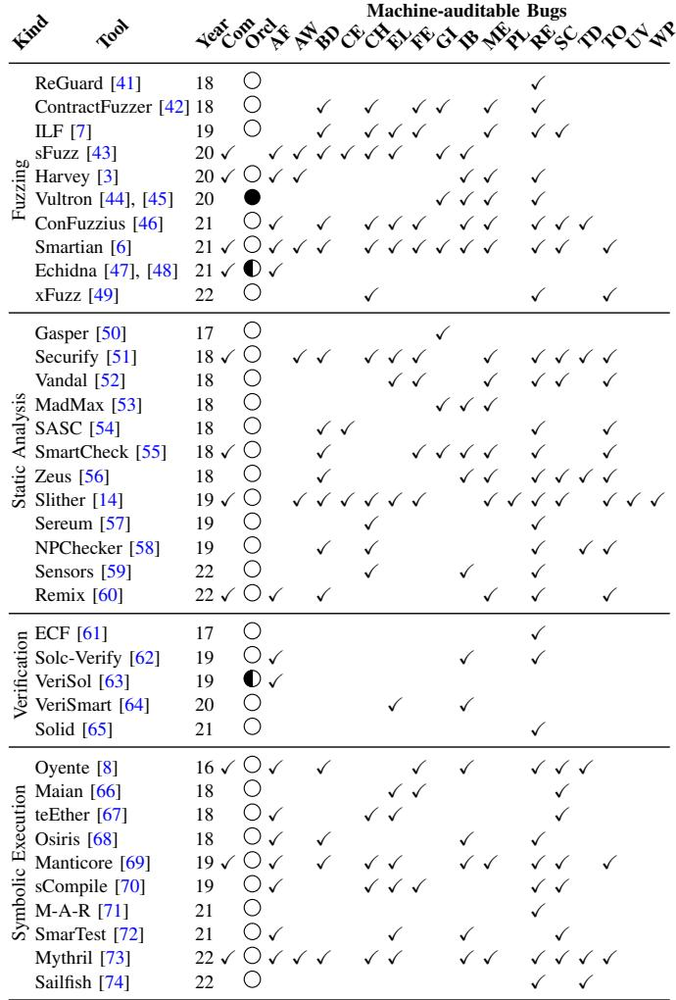
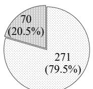
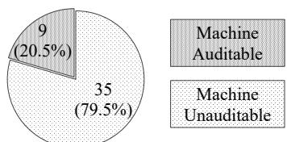
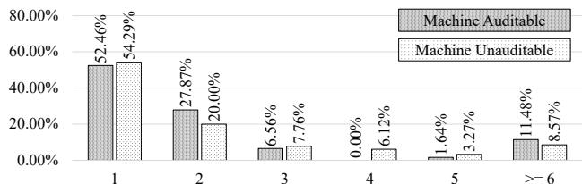
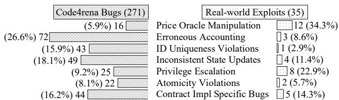
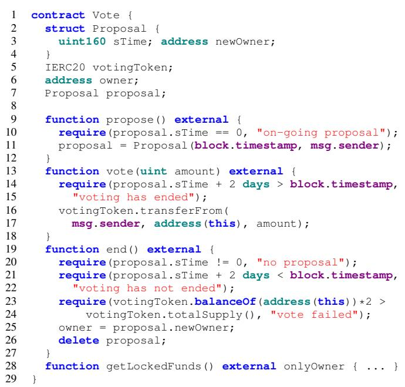

# Demystifying Exploitable Bugs in Smart Contracts

Zhuo Zhang<sup>∗</sup>, Brian Zhang<sup>†</sup>, Wen Xu<sup>‡§</sup>, Zhiqiang Lin<sup>∥</sup>

<sup>∗</sup>Purdue University, <sup>†</sup>Harrison High School, <sup>‡</sup>Georgia Institute of Technology, <sup>§</sup>PNM Labs, <sup>∥</sup>Ohio State University, zhan3299@purdue.edu, bzhangprogramming@gmail.com, wen@pnm.xyz, zlin@cse.ohio-state.edu

Abstract—Exploitable bugs in smart contracts have caused significant monetary loss. Despite the substantial advances in smart contract bug finding, exploitable bugs and real-world attacks are still trending. In this paper we systematically investigate 516 unique real-world smart contract vulnerabilities in years 2021-2022, and study how many can be exploited by malicious users and cannot be detected by existing analysis tools. We further categorize the bugs that cannot be detected by existing tools into seven types and study their root causes, distributions, difficulties to audit, consequences, and repair strategies. For each type, we abstract them to a bug model (if possible), facilitating finding similar bugs in other contracts and future automation. We leverage the findings in auditing real world smart contracts, and so far we have been rewarded with \$102,660 bug bounties for identifying 15 critical zero-day exploitable bugs, which could have caused up to \$22.52 millions monetary loss if exploited.

Index Terms—Blockchain, Smart Contract, Vulnerability, Security, Empirical Study

## I. INTRODUCTION

Since the Bitcoin and blockchain technology were introduced in 2008, their market capitalization has experienced an explosive growth, reaching over \$438 billion (as of 5 August 2022) [1]. Nowadays, there exists countless blockchain-based products and services for anyone to interact with, such as those in travel, healthcare, finances, and lately virtual reality. Blockchains such as Ethereum, Solana, and Polygon handle millions of transactions everyday. High-level programming languages like Solidity enable the creation and integration of numerous innovative ideas with blockchains, in the form of smart contracts. Just like traditional software applications, smart contracts are composed by developers and hence susceptible to human errors. Many of them are exploitable. According to [2], \$1.57 billion were exploited from various smart contracts as of 1 May 2022.

A large body of techniques have been proposed to detect smart contract vulnerabilities such as reentrancy and integer overflows, and they can be classified into categories such as fuzzing [3]–[7], formal verification [8]–[14], and runtime verification [15], [16]. Despite the success of these techniques, smart contract exploits are still commonly seen in the wild [17]. This may root at the fundamental differences between smart contract and traditional software vulnerabilities.

Differences between Smart Contract and Traditional Software Vulnerabilities. For traditional software, security vulnerabilities are largely different from functional bugs. The former has limited forms such as buffer overflow (leading to control flow hijacking) [18], information leak [19], and privilege escalation [20], whereas the latter is very diverse, denoting violations of domain-specific and even applicationspecific properties. Moreover, functional bugs in traditional software usually lead to incorrect outputs and/or interrupted services, which may not cause direct security concerns. In contrast, smart contract vulnerabilities are in many cases functional bugs, due to their unique nature, incorrect outputs in smart contract usually indicate monetary loss. Finding these vulnerabilities hence requires checking domain-specific properties, which is much harder than checking a limited set of general security properties in traditional software.

Therefore, we consider that it is highly valuable to summarize recent exploitable smart contract bugs to understand the underlying critical properties. In this paper, we study a large set of 516 exploitable bugs from 167 real-world contracts reported/exploited in years 2021-2022, and aim to summarize their root causes and distributions. We collect these bugs from the highly reputable Code4rena contests [21] (with a total of 462 bugs), which invite individuals and companies from all over the world to audit real-world contracts by providing substantial bounties [22], and from various real-world exploit reports (e.g., those from [23], [24]), with a total of 54 exploits. The real-world exploits account for \$256.3 millions monetary loss. In the study, we answer a few research questions such as how many such bugs can be detected by existing tools, how difficult is it to detect such bugs, the root causes of those that cannot be detected by tools, their consequences, repair strategies, and distributions. The detailed setup of our study is in §III. Compared to existing surveys and studies on smart contract bugs (e.g., [25]–[28]), we collect the latest bugs and study them from many unique perspectives such as tool coverage, distributions and difficulty levels. We have 10 findings. Some of them are highlighted in the following.

• More than 80% exploitable bugs are beyond existing tools (we call them machine unauditable bugs (MUBs)). This is largely due to the lack of describing and checking the corresponding domain-specific properties.

• Majority of exploitable bugs in the wild are hard to find, including those within and beyond the scope of tools.

• MUBs can be classified to seven categories. Two of the categories (accounting for 40% of the MUBs) are project/implementation specific (consequently no general oracles to detect them). The remaining five categories have clear symptoms and can be properly abstracted such that automated oracles may be devised.

• Different types of MUBs have different distributions and different difficulty levels, with price oracle manipulation (38%) and privilege escalation most popular in real-world exploits, and accounting errors most popular in bugs found during audit contests.

Contributions. We make the following contributions.

• We conduct a comprehensive study of a large number of recent smart contract vulnerabilities and identify the missing gaps and difficulties in exploitable bug detection.

• We classify the exploitable bugs into different categories, and extract their essence and root causes. We have a number of findings, which may have ramifications for future tool building.

• We demonstrate the importance of our findings by our preliminary success in finding 15 zero-day exploitable bugs in real-world smart contracts. These bugs could endanger \$22.52 millions funds if exploited.

## II. BACKGROUND

This section gives a short explanation of the key terms (italicized and underlined) used throughout the paper. For a comprehensive background, please see our supplementary material [29] (§I). Experienced readers may skip this section.

Ethereum Blockchain. Ethereum [30] is a platform that enables the creation of custom financial products on the web. It uses a secure public ledger called the blockchain [31] to keep track of transactions. Miners validate transactions and add them to block on the blockchain, for which they are paid in the form of a fee called gas.

Smart Contracts. Smart contracts are applications that run on Ethereum, and they provide functionalities to implement business models. They are publicly accessible and transparent, and they can interact with each other, constituting a decentralized finance (DeFi) [32].

Solidity. A programming language called Solidity is used to write smart contracts, which are similar to classes in Java. Each contract has two types of functions, external and internal. A transaction starts when a user invokes an external function and it is considered complete once it is added to the blockchain.

Address. Entities on Ethereum, such as users and smart contracts, are represented by an address, or a 20 byte value (e.g., 0xe03a2766325d914898cdA00d4EF92 7A305786Aa7).

Tokens and Crypto-currency. To enable business models, Ethereum introduced Ethereum Request for Comment (ERC) tokens, which represent assets. There are two types of tokens, fungible and non-fungible. Fungible tokens, such as ERC20, are interchangeable, while non-fungible tokens, such as ERC721, are unique. Tokens can be created, transferred, or destroyed from a central contract and their value depends on the amount of assets stored in the central contract compared to the amount of tokens in circulation. Users can buy or sell tokens by interacting with their central contract.

Exploitable Bugs and A Real-world Example. A bug that can result in direct monetary loss is known as an exploitable bug. A real-world example can be seen in the Redacted

```solidity
contract ERC20 {
    // owner => spender => amount
    mapping (address => mapping (address => uint256))
        internal _allowances;

    function _approve(address owner, address spender,
        uint256 allowance) internal {
        _allowances[owner][spender] = allowance;
    }

    function transferFrom(address from, address to,
        uint256 amount) external {
        require(_allowances[from][msg.sender] >= amount);
        _approve(from, msg.sender,
            _allowances[from][to] - amount);
        _transfer(from, to, amount);
    }
}
```  
Fig. 1: The Redacted Cartel exploit

Cartel [33] contract, as shown in Figure 1. An ethical hacker reported this bug and was rewarded with a \$560,000 bounty. The contract is a fungible token that is based on real-world assets, such as USDC tokens backed by US Dollars. In the code, there is a mapping called \_allowances that keeps track of the amount of tokens that the owner has allowed a spender to use (lines 3-4). This mapping can only be accessed by the contract’s functions, since it is an internal field. There is a function called \_approve() which updates the amount of allowance (lines 6-9). Another function, transferFrom, transfers a specified amount of tokens from one address to another (lines 11-17). This function is external and can be called by anyone, including users and other smart contracts.

The bug occurs when the contract mistakenly uses the allowance of to instead of msg.sender (line 15). That is, the correct allowance to update should be \_allowances[from][msg.sender] - amount. Considering that a victim user Alice grants Bob an allowance of 10 tokens, an adversary Eve can invoke tranferFrom(Alice, Bob, 0) without any token transferred. However, since line 15 updates Eve’s allowance as \_allowance[Alice][Bob] - 0, Eve illegally gains 10-token allowance of Bob.

This bug is difficult to detect because it requires an understanding of the meaning of \_allowances, the purpose of the transferFrom function, and the business model. The bug survived multiple rounds of auditing, including automatic tool analysis. This highlights the importance of code review and thorough testing in smart contract development.

## III. RESEARCH QUESTIONS AND STUDY METHODOLOGY

In this section, we first present the scope and research questions of this study. We then explain our methodology of collecting and analyzing data, as well as the threats to validity.

Threat Model and Scope of Our Study. In our threat model, the adversary is a contract user who crafts special inputs to exploit the on-chain contract and further cause monetary loss. Other attacks such as insider attacks and spam attacks are out of scope. Insider attacks are launched by privileged users of the contract (e.g., owners who might steal funds by leveraging the owner privileges). In spam attacks, the adversary only setups a trap and the user has to be lured to take actions leading to undesirable consequences. Since our study focuses on vulnerabilities of on-chain contracts, we also exclude attacks where off-chain components get involved.

TABLE I: Basic information of Code4rena contests. # Cont and # Vuln denote the numbers of hosted contests and in-scope bugs, respectively. # Atten denotes the number of auditors who have attended at least one contest of the corresponding category, while the total # Atten denotes the total number of auditors who have ever participated in Code4rena contests. TVL denotes the overall value of crypto assets deposited in the corresponding DeFi projects, i.e., the worth of these projects.

<table><tr><td>Categories</td><td># Cont</td><td>Bounty</td><td># Atten</td><td># Vuln</td><td>TVL</td></tr><tr><td>Lending</td><td>20</td><td>$1,145K</td><td>180</td><td>53</td><td>$304.8M</td></tr><tr><td>Dexes</td><td>13</td><td>$1,020K</td><td>139</td><td>70</td><td>$898.9M</td></tr><tr><td>Yield</td><td>12</td><td>$ 970K</td><td>193</td><td>85</td><td>$304.8M</td></tr><tr><td>Services</td><td>11</td><td>$ 532K</td><td>123</td><td>21</td><td>$219.8M</td></tr><tr><td>Derivatives</td><td>9</td><td>$ 525K</td><td>123</td><td>13</td><td>$147.8M</td></tr><tr><td>Yield Aggregator</td><td>9</td><td>$ 365K</td><td>124</td><td>22</td><td>$265.5M</td></tr><tr><td>Real World Assets</td><td>7</td><td>$ 405K</td><td>69</td><td>10</td><td>$ 41.8M</td></tr><tr><td>Stablecoins</td><td>6</td><td>$ 365K</td><td>102</td><td>7</td><td>$364.7M</td></tr><tr><td>Indexes</td><td>6</td><td>$ 215K</td><td>101</td><td>7</td><td>$ 1.0M</td></tr><tr><td>Insurance</td><td>5</td><td>$ 298K</td><td>74</td><td>19</td><td>$ 42.9M</td></tr><tr><td>NFT Marketplace</td><td>4</td><td>$ 266K</td><td>126</td><td>8</td><td>$ 46.6M</td></tr><tr><td>NFT Lending</td><td>4</td><td>$ 230K</td><td>108</td><td>10</td><td>$ 8.2M</td></tr><tr><td>Cross Chain</td><td>4</td><td>$ 250K</td><td>81</td><td>7</td><td>$ 32.0M</td></tr><tr><td>Others</td><td>3</td><td>$ 110K</td><td>25</td><td>9</td><td>$118.3M</td></tr><tr><td>Total</td><td>113</td><td>$6.696M</td><td>358</td><td>341</td><td>$2.797B</td></tr></table>

Research Questions. We target the following four key research questions. We call exploitable bugs that can be detected by existing automatic tools machine auditable bugs (MABs) and the others machine unauditable bugs (MUBs).

• (RQ1) What kinds of exploitable bugs are machine auditable by existing tools? How many real-world exploitable bugs are machine auditable?

• (RQ2) How difficult is it to audit exploitable bugs?

• (RQ3) What are the root causes, categories, and distributions of machine unauditable bugs?

• (RQ4) What are the symptoms and fixes of machine unauditable bugs? Can they be properly abstracted such that automated oracles can be devised.

The first two questions target all exploitable bugs, including machine auditable and unauditable, to understand the success and limitations of existing tools. The last two focus on the latter kind on which the community shall place their efforts.

Data Collection. We collect two datasets of bugs, from the Code4rena contests and real-world exploit reports.

Code4rena Contests. Code4rena [21] is a highly reputable audit contest platform. Each Code4rena contest lasts for 3-7 days and aims to have real-world DeFi projects audited before official deployment (pre-deployment), for which the developers of subject projects commit a bounty in the range of \$20K to \$1M as incentive. Individuals, companies, and institutes from all over the world can participate. After the contest, a group of Code4rena judges (i.e., very experienced auditors elected by the community) and the project’s developers get together to inspect the bug reports, where they confirm the valid ones, classify reports based on root causes, and decide the criticality level of bugs. Note that each bug is assigned a criticality level: low, medium, or high, where only high-risk bugs can cause asset loss (and hence are exploitable) [34]. The final reward is decided by both the criticality level of the bug and the number of reports submitted for the bug (more submissions lead to a lower reward as the bug is easier than others).

TABLE II: Basic information of surveyed real-world exploits

<table><tr><td rowspan="2">Categories</td><td colspan="2">Attacks</td><td colspan="2">Bug Bounties</td></tr><tr><td># Bugs</td><td>Fund loss</td><td># Bugs</td><td>Bounties</td></tr><tr><td>Lending</td><td>1</td><td>$ 5,000K</td><td>2</td><td>$ 1,630K</td></tr><tr><td>Dexes</td><td>7</td><td>$ 13,950K</td><td>3</td><td>$ 65K</td></tr><tr><td>Yield</td><td>6</td><td>$ 20,300K</td><td>1</td><td>$ 10K</td></tr><tr><td>Services</td><td>3</td><td>$ 5,600K</td><td>2</td><td>$ 610K</td></tr><tr><td>Derivatives</td><td>-</td><td>-</td><td>2</td><td>$ 200K</td></tr><tr><td>Yield Aggregator</td><td>1</td><td>$ 2,100K</td><td>2</td><td>$ 300K</td></tr><tr><td>Real World Assets</td><td>2</td><td>$ 1,127K</td><td>1</td><td>$ 50K</td></tr><tr><td>Stablecoins</td><td>5</td><td>$211,360K</td><td>-</td><td>-</td></tr><tr><td>Indexes</td><td>-</td><td>-</td><td>1</td><td>$ 90K</td></tr><tr><td>NFT Marketplace</td><td>1</td><td>$ 20K</td><td>-</td><td>-</td></tr><tr><td>NFT Lending</td><td>2</td><td>$ 5,800K</td><td>-</td><td>-</td></tr><tr><td>Cross Chain</td><td>-</td><td>-</td><td>1</td><td>$10,000K</td></tr><tr><td>Others</td><td>-</td><td>-</td><td>1</td><td>$ 1,050K</td></tr><tr><td>Total</td><td>28</td><td>$265,257K</td><td>16</td><td>$14,005K</td></tr></table>

We collect and analyze 462 unique high-risk bugs from 113 Code4rena contests hosted between April 2021 and June 2022. For each case, we inspect the bug report, the faulty contracts (which are available through Github), and the project’s documentation. Following the suggestions in Claes et al. [35], each bug is checked by at least two individual researchers. Any disagreement will be turned to an additional researcher. We reach consensus for all cases after the new researcher gets involved. All our researchers are experienced auditors, having participated 23 contests from February 2022 to June 2022. One of them was invited to be a consultant for judges.

Among the 462 surveyed bugs, we identify 341 in-scope bugs (exploitable by remote users). Table I presents the basic information of surveyed contests and the in-scope bugs. The first column presents the categories of on-chain projects, following the taxonomy by DefiLlama [36], a leading DeFi analytics platform. The description of each category is available in our supplementary material [29] (§II). Observe that around \$2.8 billions are protected by Code4rena auditing, indicating the representativeness of the dataset, and \$6.7 millions are committed as bounties.

Real-world Exploits. Our second dataset comprises 54 realworld exploits, collected from postmortems and bugfix reviews of real-world exploits from January 2022 to June 2022. These reports are published by highly-reputable security researchers (e.g., [23], [37]) and companies (e.g., [24], [38]–[40]). We follow the aforementioned study methodology (for Code4rena reports). Overall, we identify 44 (out of 54) in-scope bugs. Table II presents the basic information. Real-world exploits target post-deployment contracts, including real attacks launched against on-chain contracts and caused real asset damage (i.e., attacks), and the cases in which ethical hackers demonstrated vulnerabilities in a local off-chain environment and were awarded bug bounties by the projects (i.e., bug bounties). The first column of Table II denotes the categories. Columns 2-3 denote the number of in-scope bugs and fund loss by attacks respectively, while columns 4-5 denote the ones for bug bounties. Observe that, while \$14 million were paid as incentives to ethical hackers, over \$265 million were lost due to real attacks in the first half of 2022; despite the substantial auditing efforts paid prior to deployment, there are still many post-deployment exploitable bugs.

TABLE III: Categories of machine-auditable bugs

<table><tr><td>ID</td><td>Bug Name</td><td>ID</td><td>Bug Name</td></tr><tr><td>AF</td><td>Assertion Failure</td><td>ME</td><td>Mishandled Exception</td></tr><tr><td>AW</td><td>Arbitrary Write</td><td>PL</td><td>Precision Loss</td></tr><tr><td>BD</td><td>Block-state Dependency</td><td>RE</td><td>Reentrancy</td></tr><tr><td>CE</td><td>Compiler Error</td><td>SC</td><td>Suicidal Contract</td></tr><tr><td>CH</td><td>Control-flow Hijack</td><td>TD</td><td>Transaction-ordering</td></tr><tr><td>EL</td><td>Ether Leak</td><td></td><td>Dependency</td></tr><tr><td>FE</td><td>Freezing Ether</td><td>TO</td><td>Transaction Origin Use</td></tr><tr><td>GI</td><td>Gas-related Issue</td><td>UV</td><td>Uninitialized Variable</td></tr><tr><td>IB</td><td>Integer Bug</td><td>WP</td><td>Weak PRNG</td></tr></table>

## Finding 1: Although the DeFi community has heavily invested on protecting their products, the current supply of tools and human auditor resources have not met the demand.

Threats to Validity. The internal threat to validity mainly lies in human mistakes in the study. Specifically, we may misclassify a bug and miss a category. To reduce this threat, we ensure each bug has been examined by at least two authors. Disagreement will be turned to an additional author. The categorization is agreed on by all the authors. Most authors have extensive smart contract auditing experience and cyber-security/software-engineering expertise in general. The external threat to validity mainly lies in the subjects used in our study. The bugs we study may not be representative. We mitigate the risk using highly reputable data sources and a large number of bugs. Since we focus on recent bug reports, the study may not represent historic bugs well. However, we argue that studying up-to-date bugs is of importance due to the fast evolution pace of the field. Besides, due to the distribution variances in auditor expertise (in Code4rena contests) and in smart contract functional complexity, our metrics in measuring bug difficulty may have biases and should only be considered as references instead of rigorous quantification.

## IV. (RQ1) ON THE EFFECTIVENESS OF EXISTING AUTOMATIC TOOLS

To understand the capabilities of existing techniques, we examine the literature to summarize the kinds of bugs that can be detected by existing methods. We then study how many of the exploitable bugs in our datasets fall in their scope. To empirically support the correctness of our examination, we also apply two state-of-the-art commercial tools to our datasets to see whether they can detect the bugs.

In particular, we examine papers published on top-tier Software Engineering, Security, and Programming Language venues from 2017 to 2022. Overall, we include 37 existing

TABLE IV: Summary of existing tools. Com denotes whether it is a commercial tool widely used in real-world auditing. Orcl stands for test oracles, where , , and denote fixed and simple oracles, hand-coded oracles, and oracles that can automatically adapt to cover a wide range of functional bugs, respectively. The remaining columns present bug coverage.



methods and summarize the bugs handled by them into 17 types. We call them machine-auditable bugs (MAB). Table III presents the MABs, with more details available in our supplementary material [29] (§III). An important observation is that their test oracles are general and sufficiently simple to support instantiations in a wide range ofprojects. They hence have a similar nature to general oracles used in traditional software such as buffer-overflow and use-after-free. For example, control-flow hijack bugs (CH) use an oracle similar to that used in control flow integrity (CFI) [75], [76] in traditional software. Reentrancy bugs (RE) use an oracle that detects cycles in a transaction, which is generally applicable to all contracts. Therefore, they can hardly cover functional bugs that require domain-specific or even application-specific oracles [77] (e.g., the Redacted Cartel bug in Figure 1).

Table IV provides the examination results of existing works. We classify them into four categories: fuzzing, static analysis, formal verification, and symbolic execution. Overall, there are

  
(a) Code4rena Bugs (341)

  
(b) Real-world Exploits (44)  
Fig. 2: Breakdown of the bugs

11 commercial tools, developed by leading companies, such as Trail of Bits [78] and ConsenSys [79]. Also observe that most commercial tools provide coverage for a wide variety of bugs. Most existing works (35 out of 37) rely on general and simple oracles, or hand-coded specifications (e.g., Echidna and VeriSol). Vultron proposes an interesting general oracle that has the potential to cover a wide range of functional bugs. That is, for a single asset, the total balances of all parties should not change. Although the advantages of having such a general invariant are prominent, many modern DeFi projects employ aggressive and complex business models that are beyond this invariant. For example, lending projects are naturally designed for multi-asset business within which the total balances of a single asset is volatile. Although it may not be effective in the modern Web3.0 ecosystem, Vultron took the first step of automatically deriving test oracles.

## Finding 2: Existing techniques rely on simple and general oracles or hand-coded ones that are project specific. Such oracles may not be sufficient for functional bugs in general.

For any bug in our datasets, as long as it falls into the scope of any existing work in Table IV (assuming 100% precision and recall of these tools), we consider it machineauditable. Figure 2 depicts the breakdown of machine auditable and unauditable bugs in our datasets. Observe that, despite the over-approximation, only 20% exploitable bugs can be detected by existing works, disclosing a significant supply shortage of automated bug finding capabilities. We empirically validate the finding. Specifically, we run Slither [14] and Oyente [8], two state-of-the-art commercial tools, on our datasets. Neither can detect any MUB (by our classification).

## Finding 3: A large portion of exploitable bugs in the wild (i.e., 80%) are not machine auditable.

We speculate the main reason is Finding 2 – existing tools have limited oracles, i.e., only checking limited properties. For example, existing oracles focused on detecting access violations through tx.origin. However, modern projects support complex roles for governance, including owners, proposers, and even whitelists/blacklists, which is well beyond tx.origin. Note that Finding 2 does not suggest existing tools are ineffective. It is well possible that a large number of MABs have been detected and prevented during development (and hence not present in our datasets).

Learning-based Techniques. Learning-based techniques have shown promising results. We believe these techniques, especially ESCORT [80] based on transfer learning and Eth2Vec [81] based on code clone detection, will greatly help make more bugs machine-auditable if existing MUBs are integrated into the training process. However, due to the lack of awareness of latest bug types, the current datasets hardly include the MUBs we discussed, hindering detection performance in the modern Web3.0 ecosystem. According to our investigation, most techniques [80], [82]–[84] were trained with bugs which fell into the machine-auditable categories. This, on the other hand, highlights the importance and necessity of our study.

  
Fig. 3: Overall auditing difficulty. Each bar denotes how many machine (un-)auditable bugs are reported by the given number of auditors, where x-axis and y-axis denote the number of auditors and the ratio w.r.t. the total number of machine (un-)auditable bugs, respectively.

## V. (RQ2) ON THE DIFFICULTY OF AUDITING EXPLOITABLE BUGS

It is in general very hard to determine the difficulty level of detecting certain bugs, by tools or manual efforts. However, the Code4rena contests provide a perfect platform to quantify bugs’ difficulties. Specifically, each contest is participated by a large number of independent auditors, who submit their reports separately. While the proficiency level of auditors may vary, we use the number of reported instances of a particular bug as a possible indicator of its relative difficulty level. Intuitively, a lower number of bug reports suggests a higher level of difficulty in discovering the bug.

Figure 3 delineates the difficulty of auditing exploitable bugs. It shows that 52.46% of MABs and 54.29% of MUBs are only reported by a single auditor, and hence most difficult. The ratios for machine auditable and unauditable bugs found by two auditors are 27.87% and 20.00%, respectively. Only around 25% of exploitable bugs are found by three or more auditors.

## Finding 4: Majority of exploitable bugs are difficult to find.

Also, observe that the difficulty distributions of MABs and MUBs are quite similar. That is, most bugs of either kind are difficult. There are multiple possible explanations. One is that the MABs in the wild are already left-over after tool scanning during development. As such, they are found by manual efforts during contests. Note that it is impossible to know whether the auditors used tools or manual efforts to find these bugs. Another explanation is that bugs that are difficult for humans are likely difficult for tools as well due to similar inherent challenges in analysis.

  
Fig. 4: Breakdown of different types of MUBs

TABLE V: Auditing difficulties for MUBs of different types

<table><tr><td rowspan="2">Types</td><td colspan="6"># Auditors</td></tr><tr><td>1</td><td>2</td><td>3</td><td>4</td><td>5</td><td>&gt;= 6</td></tr><tr><td>Price Oracle Manipulation</td><td>75.00%</td><td>12.50%</td><td>0.00%</td><td>0.00%</td><td>0.00%</td><td>12.50%</td></tr><tr><td>Erroneous Accounting</td><td>59.09%</td><td>21.21%</td><td>7.58%</td><td>6.06%</td><td>3.03%</td><td>3.03%</td></tr><tr><td>ID Uniqueness Violations</td><td>42.86%</td><td>17.14%</td><td>8.57%</td><td>11.43%</td><td>5.71%</td><td>14.29%</td></tr><tr><td>Inconsistent State Updates</td><td>53.33%</td><td>22.22%</td><td>2.22%</td><td>6.67%</td><td>6.67%</td><td>8.89%</td></tr><tr><td>Privilege Escalation</td><td>56.52%</td><td>21.74%</td><td>8.70%</td><td>4.35%</td><td>0.00%</td><td>8.70%</td></tr><tr><td>Atomicity Violations</td><td>57.14%</td><td>19.05%</td><td>4.76%</td><td>4.76%</td><td>4.76%</td><td>9.52%</td></tr><tr><td>Contract Impl Specific Bugs</td><td>46.15%</td><td>20.51%</td><td>17.95%</td><td>5.13%</td><td>0.00%</td><td>10.26%</td></tr></table>

Finding 5: There are no obvious differences between audit difficulty distributions of MABs and MUBs.

## VI. (RQ3) ON THE CATEGORIES OF MUBS

Since 80% of exploitable bugs are not machine auditable, we focus on such bugs in the rest of the paper. In this section, we aim to categorize MUBs according to their root causes and study their distributions.

## A. Root Causes and Categorization

The 271+35 MUBs can be grouped into 7 categories: (C1) price oracle manipulation; (C2) erroneous accounting; (C3) ID uniqueness violations; (C4) inconsistent state updates; (C5) privilege escalation; (C6) atomicity violations; and (C7) implementation specific bugs. Their distributions can be found in Figure 4. We also present their difficulty levels in Table V, using the same metric as Figure 3.

(C1) Price Oracle Manipulation. Smart contracts usually resort to external authorities on Ethereum, which are also contracts called price oracles, to determine the price of an asset. Oracles use certain rules to determine prices (e.g., based on reserve balances). However, if an application contract does not use a price oracle’s APIs properly, the adversary can interact with the price oracle in a legit way to influence the price query result returned to the application contract to gain illegal profits. More detailed explanation and an example can be found in §VII-A. It is one of the most notorious types of vulnerabilities in the DeFi history, causing at least \$44.8 millions loss in the first half of 2022 alone. As shown in Figure 4, it constitutes 6% of the Code4rena bugs (the least common bug) and 34% of the real-world exploits (the most common exploit). Table V shows that the auditing difficulty of such bugs is significantly higher than others. As such many of them evade auditing and get exploited after deployment.

(C2) Erroneous Accounting. Many smart contracts implement complex business models. The implementations hence involve a lot of difficult-to-interpret numerical computation.

TABLE VI: Breakdown of MUBs w.r.t. DeFi categories

<table><tr><td rowspan="2">Categories</td><td colspan="7">Code4rena Bugs</td></tr><tr><td>C1</td><td>C2</td><td>C3</td><td>C4</td><td>C5</td><td>C6</td><td>C7</td></tr><tr><td>Lending</td><td>3</td><td>6</td><td>4</td><td>7</td><td>9</td><td>6</td><td>8</td></tr><tr><td>Dexes</td><td>2</td><td>16</td><td>8</td><td>15</td><td>3</td><td>1</td><td>6</td></tr><tr><td>Yield</td><td>7</td><td>23</td><td>17</td><td>8</td><td>5</td><td>6</td><td>10</td></tr><tr><td>Services</td><td>0</td><td>4</td><td>2</td><td>5</td><td>0</td><td>0</td><td>3</td></tr><tr><td>Derivatives</td><td>1</td><td>6</td><td>1</td><td>0</td><td>2</td><td>0</td><td>1</td></tr><tr><td>Yield Aggregator</td><td>1</td><td>6</td><td>0</td><td>5</td><td>0</td><td>1</td><td>4</td></tr><tr><td>Real world assets</td><td>1</td><td>0</td><td>4</td><td>3</td><td>0</td><td>0</td><td>1</td></tr><tr><td>Stablecoins</td><td>0</td><td>2</td><td>1</td><td>0</td><td>0</td><td>0</td><td>2</td></tr><tr><td>Indexes</td><td>0</td><td>0</td><td>1</td><td>2</td><td>0</td><td>2</td><td>0</td></tr><tr><td>Insurance</td><td>0</td><td>3</td><td>1</td><td>3</td><td>3</td><td>2</td><td>4</td></tr><tr><td>NFT Marketplace</td><td>0</td><td>1</td><td>1</td><td>0</td><td>1</td><td>2</td><td>1</td></tr><tr><td>NFT Lending</td><td>1</td><td>1</td><td>1</td><td>0</td><td>1</td><td>1</td><td>1</td></tr><tr><td>Cross Chain</td><td>0</td><td>1</td><td>1</td><td>1</td><td>1</td><td>0</td><td>1</td></tr><tr><td>Others</td><td>0</td><td>3</td><td>1</td><td>0</td><td>0</td><td>1</td><td>2</td></tr></table>

We call incorrect implementations of underlying business model formulas erroneous accounting bugs. These bugs usually introduce small errors every time they are exercised. However, these errors can accumulate and induce substantial loss. For example, Compound Finance [85], a flagship lending contract, was exploited and had over \$80 millions stolen, due to an unnoticeable problematic calculation of annual percentage yield [86]. The bug survived 9 rounds of auditing by top security companies [87] and even formal verification [88]. It was not found until being exploited. Figure 4 shows that it is the most popular type of Code4rena bugs (27%) and the 5th most popular type of real-world exploits. As Table V shows, its auditing difficulty is slightly above average, with around 59% being found by a single auditor. The reason is that finding such bugs requires substantial domain knowledge. The very broad participation of Code4rena contests seems to provide a good coverage of domain expertise such that many of these bugs can be captured (although each by very few auditors). More details are in our supplementary material [29] (§V).

(C3) ID Uniqueness Violations. Most smart contract functionalities are in the form of some entity (e.g., a user or contract) operating on some asset (e.g., an NFT token). As such, access control is needed in these processes and entities/assets ought to be uniquely represented. Within smart contract implementation, entities and assets are usually denoted as data structures, which often have an ID field that uniquely represents an entity/asset. However, developers may forget to ensure uniqueness of ID fields; they may mistakenly consider other data fields are unique and use them as replacement IDs. As such, the adversary could impersonate an entity or create a fake/duplicate asset that has the same field value as some real entity/asset to pass the access control checks and then perform illegal operations. We call this type of bugs ID uniqueness violations. It constitutes 16% of the Code4rena bugs (43 out of 271) and 3% of real-world exploits (1 out of 35). It is the 4th and the 7th most commonly seen type of bugs in the two respective datasets. Such bugs are relatively easy to find, with 57% reported by multiple auditors. This could explain its distribution difference in the two datasets as ID bugs may be largely found during auditing (e.g., Code4rena contests).

(C4) Inconsistent State Updates. Smart contracts have many state variables (e.g., debts and collaterals) with implicit correlations. For example, the credit limit of a user is proportional to her collateral in a lending contract. However, when the developers update one variable, they may forget to update the correlated variable(s) or update incorrectly. Depending on the state variables that are incorrectly updated, the consequences of this kind of bugs range from incorrect statistics to loss of funds. In the recent year, three exploits [89]–[91] caused around \$3.8 millions loss and also the collapse of a smart contract’s internal economy. It constitutes 18% of the Code4rena bugs (49 out of 271) and 11% of the real-world exploits. It is the 2nd and the 4th most commonly seen bugs in the two datasets. The bug difficulty level is about average.

(C5) Privilege Escalation. Smart contracts often support a number of business flows, each denoting a unique use case. For example, a lottery contract needs to support at least three distinct flows including buying tickets, drawing winners, and claiming prizes. A business flow may consist of a sequence of transactions in the temporal order. Within a flow, sensitive operations are guarded by access control checks. However, there may be some unexpected business flow to a sensitive operation along which the access control is weaker than necessary. This is very similar to privilege escalation bugs that are very popular in mobile applications [20]. These bugs have diverse consequences, depending on the sensitive operations that are not well protected. Nearly \$7.5 millions got stolen in 2022, due to privilege escalation bugs. It constitutes 9.2% of the Code4rena bugs and 22.9% of the real-world exploits. It is the second most popular type of real-world exploits. The difficulty of auditing them is about average.

(C6) Atomicity Violations. Multiple business flows (i.e., transaction sequences) may interleave and interfere with each other, by accessing the same state variables. Some business flows may require business level atomicity, demanding state variables cannot be accessed by other flows while they are ongoing. Developers do not anticipate such interference and fail to ensure (business level) atomicity. The reason of these bugs is that developers mistakenly think atomicity is guaranteed by the runtime and hence they do not need to be concerned. However, the runtime only ensures each transaction is atomic, and business flow atomicity, if needed, has to be ensured by the developers. Atomicity violations constitute 8.1% of the Code4rena bugs and 5.7% of real-world exploits. It is the least common bugs in auditing, and the second least in the wild. They are slightly harder to find (than the others), with 57% of bugs found by only one auditor. The reason is that it is difficult to determine business flows and if they need atomicity.

(C7) Contract Implementation Specific Bugs. We find that 16% of the Code4rena bugs and 14% of the real-world exploits are implementation specific, meaning that they do not have a general oracle and unlikely appear in a different smart contract. They hence have a low priority because abstracting them may not provide as valuable guidance as the others. The Redacted Cartel bug in Figure 1 is an example.

Finding 6: MUBs can be classified to 7 categories, with 85% belonging to categories C1-C6 that are not project specific.

Finding 7: Different types of MUBs have different popularity, with accounting errors (C2) and price oracle manipulation (C1) most popular in the Code4rena bugs and the real exploits, respectively. Auditing is particularly effective in preventing certain bugs such as accounting errors.

Finding 8: Different types of MUBs have different auditing difficulties, with price oracle manipulation and ID uniqueness violation bugs the hardest and the easiest, respectively.

## B. Bug Distributions in Different Types of Projects

To understand what kinds of bugs are more likely in a specific type of contracts, we study the distributions of MUBs in different DeFi categories. Table VI presents the results of Code4rena bugs. Note that we do not include real-world exploits because only 3 out of the 14 (DeFi) categories have more than 3 exploits, which may induce substantial threat to validity. The gray scale denotes the prevalence. For example, 55% (i.e., 6/11) of derivative projects’ bugs are caused by erroneous accounting (C2) but only 30% (i.e., 23/75) for yield projects. The former is therefore darker than the latter. Observe that a few bug types are particularly prevalent in some DeFi categories, such as erroneous accounting (C2) and inconsistent state update (C4) bugs in Dex projects. This is mainly due to the unique nature of these projects. For example, Dex projects swap and trade assets. They use complex computation to deal with the volatility of crypto-currency, and are hence prone to erroneous accounting bugs. These suggest that auditors may want to devise different auditing strategies for different types of projects, e.g., prioritizing the prevalent bug types. We follow such strategies during our guided auditing (§VIII).

Finding 9: Different kinds of DeFi projects tend to be prone to different types of MUBs.

VII. (RQ4) ON THE SYMPTOMS AND FIXES OF MUBS

We use real examples of (C1) price oracle manipulation, (C2) Erroneous Accounting, and (C5) privilege escalation bugs to demonstrate their symptoms and repair strategies. We also provide an abstract model for each bug, which could facilitate future scanning tool and test oracle building.

## A. Price Oracle Manipulation (C1)

These bugs require additional knowledge. We first introduce the concepts and then explain such bugs with an example.

Price Oracle and Automated Market Maker. Determining the price of an asset is a critical functionality for a business model. In DeFi, it is done by price oracles. Despite a diverse set of price oracle contracts, the predominant sort is Automate Market Maker (AMM), which is designed for exchanging two types of assets, e.g., WETH and USDC (similar to USD in real-world), with which users can exchange one asset for another and the exchange rate is decided by a pre-defined invariant law. In Uniswap [92], a leading AMM contract, the invariant is denoted by a constant product formula, expressed as $x \times y = k ,$ , stating that trades must not change the product k of a pair’s reserve balances (within the contract) [93], e.g., x for WETH and y for USDC. The price of one asset over the other is hence decided by their ratio, e.g., y/x denoting the price of WETH over USDC. Intuitively, more supply of x leads to its depreciation and y’s appreciation. A code snippet from Uniswap, its explanation, and an example are presented in our supplementary material [29] (§IV-A).

```solidity
contract LendingContract {
    IERC20 public WETH;
    IERC20 public USDC;
    IUniswapV2Pair public pair; // USDC - WETH
    // debt --> USDC, collateral --> WETH
    mapping(address => uint) public debt;
    mapping(address => uint) public collateral;

    function liquidate(address user) external {
        uint dAmount = debt[user];
        uint cAmount = collateral[user];
        require(getPrice() * cAmount * 80 / 100 < dAmount,
            "the given user's fund cannot be liquidated");
        address _this = address(this);
        USDC.transferFrom(msg.sender, _this, dAmount);
        WETH.transferFrom(_this, msg.sender, cAmount);
    }
    function getPrice() view returns (uint) {
        return (USDC.balanceOf(address(pair)) /
            WETH.balanceOf(address(pair)))
    }
}
```  
Fig. 5: Price oracle manipulation exploit in Deus Finance

Price Oracle Manipulation. Despite being pivotal for DeFi project development, price oracles are occasionally used improperly by application contracts, rendering their price queries vulnerable. It is not a bug in the price oracle contract, but an issue caused by oracle misuse in the application contract. For example, although Uniswap provides an official (and well protected) API for price queries, application contract developers tend to implement their own queries (to Uniswap) to avoid the expensive gas costed by the official API. A common faulty code pattern in the application contract is to simply determine the price by querying the ratio of two assets instant balances in the oracle contract. Recall that block-chain transactions are atomic so that any action sequence in a single transaction cannot be interrupted or interleaved with other actions. Hence, a malicious user can tamper with the price without the interruptions of arbitragers. It is done by first processing an exchange (with the oracle), then invoking a function in the vulnerable application contract which makes an erroneous query (to the oracle), and finally processing another exchange (with the oracle) which is the counter version of the first one. Essentially, the first exchange imbalances the Uniswap contract in order to manipulate the follow-up price query, while the second exchange re-balances the Uniswap contract to avoid losing the (borrowed) funds used in step one. Note that the three actions are wrapped in a single transaction (a piece of code written by the adversary), guaranteeing that no arbitrage behavior can interfere the attack.

Example. Figure 5 presents a vulnerable code snippet, which is slightly modified from a real-world exploit against Deus Finance causing a loss of \$3.1 millions. The bug survived at least one publicly-known audit round [94]. Deus is a lending contract that allows users to deposit WETH as collateral and borrow USDC. Lines 2-4 define the addresses of WETH, USDC, and the Uniswap AMM, respectively. Line 6 defines a mapping debt, which denotes the amount of borrowed USDC for each user, and line 7 a mapping collateral for the amount of each user’s deposited WETH. As a lending contract, Deus supports multiple basic functionalities, including depositing collateral, withdrawing collateral, getting loans, and paying debts. The vulnerability lies in function liquidate (line 9) which forces to close a given user’s ill position, i.e., the user’s debts exceed 80% of her collateral. To do so, the function’s caller, i.e., msg.sender, pays the user’s debt and gets her collateral. Specifically, the function first checks whether the position of user is ill (lines 10-13) and processes the token transfers (lines 14-16). The price oracle is involved when calculating the real-world value of the collateral, i.e., WETH, through function getPrice() (defined in lines 18- 21). The function does not use the Uniswap API. Instead, it directly queries the instance balances of USDC and WETH in Uniswap and uses their ratio as the price.

To exploit, the adversary drastically decreases the price of a collateral, forcefully making a victim’s position liquidable. She then liquidates a valuable collateral with a much smaller amount of fund. Assume Bob (victim) deposits 100 WETH as collateral and borrows 100, 000 USDC. Also assume that the current price of WETH is \$4, 000 and the Uniswap AMM holds 100 WETH and 400, 000 USDC. Note that Bob’s current position is healthy and cannot be liquidated, since the value of his debt is \$100, 000 and his collateral worths \$400, 000. Alice, the adversary, can exploit the aforementioned vulnerability by encapsulating the following three actions into a single transaction. Specifically, she first exchanges 100 WETH for 200, 000 USDC through UniSwap, making the AMM’s balances of WETH and USDC 200 and 200, 000, respectively. Note that although the current realworld price of WETH is \$4, 000, Alice pays 100 WETH for 200, 000 USDC, according to the constant-product invariant, i.e., 100 × 400, 000 = (100 + 100) × (400, 000 − 200, 000). Alice then invokes liquidate(Bob), which succeeds since Bob’s position depreciates with a WETH price of \$1000 (due to the instant balances of WETH and USDC in the AMM), i.e., 100 × 1000 × 0.8 < 100, 000 at line 12. By paying 100, 000 USDC, Alice gets 100 WETH whose real-world value is \$400, 000. She acquires a large profit of \$300, 000. After that, Alice re-balances the AMM by exchanging 200, 000 USDC for 100 WETH, retrieving her initial attack funds. To prevent price oracle manipulation, most on-chain DEXes provide manipulation-resistant APIs for price queries. Time-weighted average price (TWAP) is the most common solution nowadays. It is a pricing algorithm that calculates the average price of an asset over a set period. It provides great resistance against flash loans. Recall that a flash loan has to happen within a single transaction and hence the time weight of its manipulated price is 0. There are also other solutions, e.g., volume-weighted average price (VWAP) and time-weighted average tick (TWAT). Flash Loans. Recall that the aforementioned exploit requires a tremendous amount of initial funds, i.e., 100 WETH with \$400, 000 real-world value, which seems to hinder the impact of price oracle manipulation. However, flash loan, a unique and innovative lending model enabled by blockchain techniques, makes such attacks easily realizable. It allows users to borrow (a tremendous amount of) debts without depositing any collateral. It leverages the atomicity of blockchain transactions, that is, the borrow happens at the beginning of a transaction and the debt is paid off at the end. An example can be found in the supplementary material [29] (§IV-B).

  
Fig. 6: A voting contract vulnerability

Abstract Bug Model and Remedy. Given a price oracle $C _ { o r c } \mathrm { . }$ , an application contract C, and lending contract(s) $C _ { l }$ supporting flash loans, C needs to query $C _ { o r c }$ for prices which are based on instant balances (or balances within a short time) in $C _ { o r c } ,$ and $C _ { l }$ needs to have sufficient funds to manipulate the balance ratio in $C _ { o r c }$ . The cost of the attack is minimum, including just gas and fees, as the flash loan is paid off at the end. The profit depends on how much price changes can be induced. To remedy such bugs, developers simply use official APIs strictly following the specification.

## B. Privilege Escalation (C5)

These bugs arise when an (unexpected) sequence of functions can be invoked to bypass access control.

Example. Figure 6 presents a real-world case from an anonymized contract (upon developers’ request). The code is completely rewritten to ensure anonymity while its essence is retained. This is a voting contract where users can elect a new contract owner by voting. In lines 2-4, the contract defines a data structure Proposal to describe a proposal with sTime denoting the start time of voting and newOwner the proposed new owner. There are three state variables votingToken, owner, and proposal denoting the token used for voting (line 5), the current contract owner (line 6), and an on-going proposal (line 7), respectively. Function ro ose (line 9) allows a user to propose himself as the new owner, which creates a new proposal (at line 11) and sets the current block time as the start time and msg.sender the proposed owner. Observe that there can only be one on-going proposal (line 10). Users vote by function vote, in which they send their voting tokens to the contract (lines 16-17) to support a proposal. Note that users can only vote in the first two days after the voting starts, guarded by the require in lines 14-15. The voting ends two days later, and the decision is made by function end. Function end first checks whether there is an on-going proposal (line 20) and whether the voting has lasted for at least 2 days (lines 21-22). In lines 23-24, the function then checks whether over 50% votingToken holders have voted for the proposal. If so, a critical operation of setting a new contract owner is performed (line 25). At line 28, a privileged function getLockedFunds allows the owner to get all the locked funds. Note that both functions vote and end strictly constrain the invocation time, which constitutes an access control preventing the two functions from being invoked in a single transaction. Otherwise, an adversary could invoke function vote with a tremendous amount of flash loaned votingToken and force a malicious proposal to go through (similar to the exploit in §VII-A). However, an unex pected call sequence can evade the access control. Specifically, consider an adversary Alice proposes herself as the owner. When the time is approaching the deadline proposal.sTime + 2 days, she launches an attack wrapping the following actions into a single transaction, including 1) flash-loaning a large amount of votingToken from its AMM contract, 2) invoking votingToken.transferFrom, a fund transfe function provided by all ERC20 tokens to directly transfer the loaned amount to the contract without any access control, 3) invoking end to become the owner, 4) getting locked funds by function getLockedFunds, and 5) paying off the flash loan debt. Intuitively, Alice “votes” without calling the vote function. The developers did not anticipate such a business flow and hence did not guard properly.

Abstract Bug Model and Remedy. Let a business flow B be a sequence of transactions $t _ { 1 } , . . . , t _ { n }$ , each denoting an external function invocation, and n the length of flow which may be equal to or larger than 1. Assume B has some critical operation f guarded by a set of access control checks, denoted as ${ \mathcal { P } } ,$ a conjunction of multiple checks. However, there exists an (unexpected) business flow $t _ { 1 } ^ { \prime } , \mathrm { ~ . ~ . ~ } t _ { m } ^ { \prime }$ that can reach f with access control $\mathcal { P } ^ { \prime }$ and $\mathcal { P } ^ { \prime } < \mathcal { P }$ (here the operator < means weaker-than). The challenges of identifying this type of bugs lie in recognizing sensitive operations, which may require domain knowledge, and finding the multiple paths that can lead to the operations. The fixes are to add the missing access control checks or prevent the unexpected paths.

```solidity
contract Lottery {
    // user address -> lottery id -> count
    mapping (address => mapping(uint64 => uint))
        public tickets;
    uint64 winningId; // the winning id
    bool drawingPhase; // whether the owner is drawing

    // invoked every day to reset a round
    function reset() external onlyOwner {
        delete tickets;
        winningId = 0; drawingPhase = false;
    }
    function buy(uint64 id, uint amount) external {
        require(winningId == 0, "already drawn");
        require(!drawingPhase, "drawing")
        receivePayment(msg.sender, amount),
        tickets[msg.sender][id] += amount;
    }
    function enterDrawingPhase() external onlyOwner {
        drawingPhase = true;
    }
    // id is randomly chosen off-chain, i.e., by chainlink
    function draw(uint64 id) external onlyOwner {
        require(winningId == 0, "already drawn");
        require(drawingPhase, "not drawing");
        require(id != 0, "invalid winning number");
        winningId = id;
    }
    // claim reward for winners
    function claimReward() external {
        require(winningId != 0, "not drawn");
        ...
    }
    function multiBuy(uint64[] ids, uint[] amounts)
        external {
        require(winningId == 0, "already drawn");
        uint totalAmount = 0;
        for (int i = 0; i < ids.length; i++) {
            tickets[msg.sender][ids[i]] += amounts[i];
            totalAmount += amounts[i];
        }
        receivePayment(msg.sender, totalAmount),
    }
}
```  
Fig. 7: The PancakeSwap Lottery vulnerability

## C. Atomicity Violations (C6)

This type of bug is caused by the interference between concurrent business flows that are supposed to have high level atomicity (higher than the transaction level atomicity).

Example. Figure 7 presents a real-world vulnerability in the PancakeSwap lottery contract [95]. It was reported by an anonymous whitehat and awarded with an undisclosed bounty [96]. Like the lottery in the physical world, the contract users can buy tickets and the owner randomly draws a winner every day. Lines 3-6 define the key state variables, including a three-level mapping tickets indicating the amount of each ticket bought by each user (multiple tickets of the same ID can be bought by the same or different users), the winner (winningId), and a boolean variable indicating whether the owner is drawing the winner (drawing). Function reset (line 9) is a privileged function for the owner to start a new round. Function buy, starting from line 13, allows users to buy tickets of a specified ID. It first checks that the owner is not drawing and has not drawn the winner, at lines 14 and 15, and further processes the payment and updates tickets accordingly. At line 19, function enterDrawingPhase is used to start the lottery drawing phase. Variable drawingPhase is essentially a lock for the variable tickets to prevent further ticket purchase in this round. After entering the drawing phase, function draw (lines 23-28) is invoked to set the winner, which enables claimReward. There are three business flows, i.e., buying tickets, drawing winners, and claiming prizes. Note that the business flow of drawing winners comprises two functions (enterDrawingPhase and draw), and hence two transactions. Such a design is critical. Otherwise, an adversary could observe the winner from the draw transition in the mempool, and bought a huge amount of tickets with the winner’s ID. Note that before being mined and finalized on blockchain, transactions are placed in a mempool and visible to the public [97]. Besides, since paying a high gas fee provides incentives for miners, it allows the adversary to preempt the draw transaction with his own, and eventually earn a lot of profit illegally. The contract properly prevents this by separating the business flow to two transactions and using a lock drawingPhase to ensure atomicity. However, another purchase function multiBuy (lines 34-43) does not respect such atomicity. It is a gas-friendly version of function buy which allows buying multiple tickets at a time. It updates tickets accordingly within the loop in lines 39-40, and receives the payment for all tickets at line 41. However, it does not use the drawingPhase lock, making the aforementioned attack possible. This exploit method (preempting a pending transaction belonging to an atomic business flow by paying a higher gas fee) is also called front running [98], whose root cause is usually atomicity violation.

Abstract Bug Model and Remedy. There are multiple business flows $\textstyle B _ { 1 } , \ldots$ and $B _ { m }$ that access some common state variables (e.g., tickets in our example). An atomicity violation bug occurs when concurrent business flows yield an unserializable outcome [99]. In our example, after front-running, the amount of tickets for the winner ID is substantially inflated after the winner is decided and before the prizes are claimed. Such a result cannot be achieved by serializing the business flows of drawing winners and claiming prizes. There are a large body of atomicity violation detection tools for traditional programming languages such as Java and C [100]. They may be adapted to detect violations in smart contracts. However, atomic business flows are usually implicit (suggested by boolean flags serving as locks and explicit time bounds). Such challenges need to be addressed during adaptation. Atomicity violation bugs are usually fixed using lock variables (e.g., drawingPrase).

## D. Other MUB Types

Other MUB types are detailed in our supplementary material (§V - §VII).

Finding 10: Five out of the seven MUB categories (accounting for 60% of MUBs), namely, all except (C2) accounting errors and (C7) implementation specific bugs, have general abstract models which may serve as oracles for future automated tools.

## VIII. GUIDED AUDITING

We started to audit real-world contracts using our findings as the guidance since April 2022. By the time of writing, we have found 15 confirmed zero-days with a few more under the inspection of judges. Table VII summarizes the confirmed bugs for individual bug types. All the confirmed ones are rated critical. We also participated in three Code4rena contests in July and ranked #1 in two of them, out of the ∼100 teams/individuals that had submitted at least one valid report. Our aggregated bounty is \$102, 660 so far and the total funds protected due to our reports add up to \$22.52 millions. More importantly, we have strategized based on our findings. For example, we have focused on finding price oracle manipulations (POM) and privilege escalations (PE), the two most popular bugs according to our study and found 2 POMs and 4 PEs. We also prioritize the bug types to audit according to the project’s category.

Abstract Models. We have developed several tools based on our abstract models to enhance our efficiency in auditing. With regards to privilege escalation, we created a static analysis tool that generates operation sequences that can reach a specific function, using Slither. The tool produces all possible sequences within a specified length (i.e., 5), excluding view and private functions. The tool also performs a static (and over-approximated) detection of the read-write dependencies among functions, further reducing the number of paths by eliminating redundant operations. We have also designed scanners for other MUBs, which operate by searching for syntactical patterns derived from our abstract bug models. For example, the scanner for price oracle manipulation identifies the invocation sites of the view functions in a decentralized exchange. Overall, our auditing process is semi-automated and guided by these tools.

## IX. RELATED WORK

There have been numerous previous studies on the topic of smart contract bugs. Atzei et al. [25] categorized bugs into three classes based on their origin (Solidity, Ethereum, Blockchain), and further identified twelve types of security vulnerabilities within these classes. Their taxonomy is focused on the mid-development phase and includes vulnerabilities such as “calls to the unknown” and “stack size limit”. In contrast, our study encompasses both post-development auditing and deployed smart contracts. Demolino et al. [101] classified bugs based on common developer pitfalls, while Chen et al. [28] grouped bugs into 20 categories using data from the Ethereum Stack Exchange, a popular Q/A site for Ethereum users. Zhang et al. [27] provided a classification of nine different types of bugs, studying 266 bugs in academic literature and Github from 2014. SmartDec [102] classified bugs into three categories based on their location: blockchain, model, and language, further divided into 33 bug types from prior to 2018. Dingman et al. [26] categorized smart contract bugs into 49 master classes from 2014 to 2019 research publications. In a recent study [103], the exploitability of smart contract vulnerabilities was investigated, with a focus on 6 types of machineauditable bugs and the measurement of the Ether balance.

TABLE VII: Guided auditing results

<table><tr><td>Type</td><td>Bounty Program (4)</td><td>Code4rena (11)</td></tr><tr><td>Price Oracle Manipulation</td><td>2</td><td>0</td></tr><tr><td>Erroneous Accounting</td><td>0</td><td>2</td></tr><tr><td>ID Uniqueness Violations</td><td>0</td><td>1</td></tr><tr><td>Inconsistent State Updates</td><td>0</td><td>1</td></tr><tr><td>Privilege Escalation</td><td>1</td><td>3</td></tr><tr><td>Atomicity Violations</td><td>0</td><td>2</td></tr><tr><td>Contract Impl Specific Bugs</td><td>1</td><td>2</td></tr><tr><td>Total Bug Bounty Awarded</td><td></td><td>102,659.98 USD</td></tr><tr><td>Total Funds Protected</td><td></td><td>22.52 million USD</td></tr></table>

While previous studies focus on bugs that are nowadays machine-auditable, our study is differentiated by its focus on the latest, machine unauditable security bugs and exploits from multiple perspectives, including distributions, difficulty levels, and abstract bug modes. Our study is complementary to these existing studies and leverages high-quality bug datasets labeled by a diverse group of experts, including third-party judges and subject project developers. This allowed us to gain new insights that were difficult to obtain in previous works. Our study also differs from recent studies [104]–[106] that evaluated the bug detection capability of existing tools, given that our focus is on demystifying bug natures and providing a novel perspective on MUBs through abstracting their behaviors into bug models.

Industry security practitioners have also recognized the prevalence of MUBs and have written online articles [107]– [109] for educational purposes. These articles primarily focus on categorizing smart contract bugs, with some being fine-grained [109] and others more coarse-grained [107]. Our study of machine-auditable bug types aligns with the findings of previous studies, as these types of bugs are widely researched. However, our study delivers new and original insights into MUBs and highlights the need for continued research in this area.

## X. DATA AVAILABILITY

The data utilized in this study is accessible in an online repository [29].

## XI. CONCLUSION

We study 516 smart contract security bugs and exploits. We categorize them by root causes and study their distributions, repair strategies, and audit difficulty levels. We have ten findings. We also perform guided auditing based on these findings and have found 15 critical zero-days in three months that could endanger \$22.52 millions funds if exploited.

## ACKNOWLEDGMENT

We thank the anonymous reviewers for their constructive comments. This research was supported by a generous gift from the Forta Foundation. Any opinions, findings, and conclusions in this paper are those of the authors only and do not necessarily reflect the views of our sponsors.

## REFERENCES

[1] “Bitcoin market cap.” [Online]. Available: https://coinmarketcap.com/

[2] “The growing rate of defi fund loss.” [Online]. Available: https: //twitter.com/PeckShieldAlert/status/1520620826613010432

[3] V. Wustholz and M. Christakis, “Harvey: a greybox fuzzer for smart¨ contracts,” in ESEC/SIGSOFT FSE. ACM, 2020, pp. 1398–1409.

[4] “Echidna.” [Online]. Available: https://github.com/crytic/echidna

[5] “Foundry.” [Online]. Available: https://github.com/foundry-rs/foundry

[6] J. Choi, D. Kim, S. Kim, G. Grieco, A. Groce, and S. K. Cha, “Smartian: Enhancing smart contract fuzzing with static and dynamic data-flow analyses,” in ASE. IEEE, 2021.

[7] J. He, M. Balunovic, N. Ambroladze, P. Tsankov, and M. T. Vechev, “Learning to fuzz from symbolic execution with application to smart contracts,” in CCS. ACM, 2019, pp. 531–548.

[8] L. Luu, D.-H. Chu, H. Olickel, P. Saxena, and A. Hobor, “Making smart contracts smarter,” in Proceedings of the 2016 ACM SIGSAC conference on computer and communications security, 2016.

[9] N. He, R. Zhang, L. Wu, H. Wang, X. Luo, Y. Guo, T. Yu, and X. Jiang, “Security analysis of eosio smart contracts,” arXiv preprint arXiv:2003.06568, 2020.

[10] J. Frank, C. Aschermann, and T. Holz, “{ETHBMC}: A bounded model checker for smart contracts,” in 29th USENIX Security Symposium (USENIX Security 20), 2020.

[11] Z. Nehai, P. Piriou, and F. F. Daumas, “Model-checking of smart contracts,” in iThings/GreenCom/CPSCom/SmartData. IEEE, 2018, pp. 980–987.

[12] M. Bartoletti and R. Zunino, “Verifying liquidity of bitcoin contracts,” in International Conference on Principles of Security and Trust. Springer, 2019.

[13] N. Atzei, M. Bartoletti, S. Lande, N. Yoshida, and R. Zunino, “Developing secure bitcoin contracts with bitml,” in ESEC/SIGSOFT FSE. ACM, 2019, pp. 1124–1128.

[14] J. Feist, G. Grieco, and A. Groce, “Slither: a static analysis framework for smart contracts,” in WETSEB@ICSE. IEEE / ACM, 2019.

[15] “Chaos labs.” [Online]. Available: https://chaoslabs.xyz

[16] “Tenderly.” [Online]. Available: https://tenderly.co/

[17] “The nine largest crypto hacks in 2022.” [Online]. Available: https://blockworks.co/the-nine-largest-crypto-hacks-in-2022/

[18] D. Larochelle and D. Evans, “Statically detecting likely buffer overflow vulnerabilities,” in 10th USENIX Security Symposium (USENIX Security 01), 2001.

[19] F. J. Serna, “The info leak era on software exploitation,” Black Hat USA, 2012.

[20] L. Davi, A. Dmitrienko, A.-R. Sadeghi, and M. Winandy, “Privilege escalation attacks on android,” in international conference on Information security. Springer, 2010.

[21] “Code4rena.” [Online]. Available: https://code4rena.com

[22] “Leaderboard.” [Online]. Available: https://code4rena.com/leaderboard

[23] “samczsun.” [Online]. Available: https://twitter.com/samczsun

[24] “Peckshield.” [Online]. Available: https://twitter.com/peckshield

[25] N. Atzei, M. Bartoletti, and T. Cimoli, “A survey of attacks on ethereum smart contracts (sok),” in POST, ser. Lecture Notes in Computer Science, vol. 10204. Springer, 2017, pp. 164–186.

[26] W. Dingman, A. Cohen, N. Ferrara, A. Lynch, P. Jasinski, P. E. Black, and L. Deng, “Classification of smart contract bugs using the NIST bugs framework,” in SERA. IEEE, 2019, pp. 116–123.

[27] P. Zhang, F. Xiao, and X. Luo, “A framework and dataset for bugs in ethereum smart contracts,” in ICSME. IEEE, 2020, pp. 139–150.

[28] J. Chen, X. Xia, D. Lo, J. C. Grundy, X. Luo, and T. Chen, “Defining smart contract defects on ethereum,” IEEE Trans. Software Eng., vol. 48, no. 2, pp. 327–345, 2022.

[29] “Supplementary material.” [Online]. Available: https://github.com/ ZhangZhuoSJTU/Web3Bugs

[30] V. Buterin et al., “A next-generation smart contract and decentralized application platform,” white paper, vol. 3, no. 37, 2014.

[31] L. Anderson, R. Holz, A. Ponomarev, P. Rimba, and I. Weber, “New kids on the block: an analysis of modern blockchains,” arXiv preprint arXiv:1606.06530, 2016.

[32] L. Zhang, X. Ma, and Y. Liu, “Sok: Blockchain decentralization,” arXiv preprint arXiv:2205.04256, 2022.

[33] “Redacted cartel custom approval logic bugfix review.” [Online]. Available: https://medium.com/immunefi/redacted-cartelcustom-approval-logic-bugfix-review-9b2d039ca2c5

[34] “Judging criteria - code4rena.” [Online]. Available: https: //docs.code4rena.com/awarding/judging-criteria#estimating-risk

[35] C. Wohlin, P. Runeson, M. Host, M. C. Ohlsson, B. Regnell, and¨ A. Wesslen,´ Experimentation in software engineering. Springer Science & Business Media, 2012.

[36] “Defillama.” [Online]. Available: https://defillama.com/

[37] “pwning.eth.” [Online]. Available: https://twitter.com/PwningEth

[38] “Paradigm.” [Online]. Available: https://twitter.com/paradigm

[39] “Certik.” [Online]. Available: https://twitter.com/CertiK

[40] “Immunefi.” [Online]. Available: https://immunefi.com/explore

[41] C. Liu, H. Liu, Z. Cao, Z. Chen, B. Chen, and B. Roscoe, “Reguard: finding reentrancy bugs in smart contracts,” in ICSE-Companion. IEEE, 2018.

[42] B. Jiang, Y. Liu, and W. K. Chan, “Contractfuzzer: Fuzzing smart contracts for vulnerability detection,” in ASE. IEEE, 2018.

[43] T. D. Nguyen, L. H. Pham, J. Sun, Y. Lin, and Q. T. Minh, “sfuzz: an efficient adaptive fuzzer for solidity smart contracts,” in ICSE. ACM, 2020, pp. 778–788.

[44] H. Wang, Y. Li, S.-W. Lin, L. Ma, and Y. Liu, “Vultron: catching vulnerable smart contracts once and for all,” in ICSE-NIER. IEEE, 2019.

[45] H. Wang, Y. Liu, Y. Li, S.-W. Lin, C. Artho, L. Ma, and Y. Liu, “Oracle-supported dynamic exploit generation for smart contracts,” IEEE Transactions on Dependable and Secure Computing, 2020.

[46] C. F. Torres, A. K. Iannillo, A. Gervais, and R. State, “Confuzzius: A data dependency-aware hybrid fuzzer for smart contracts,” in EuroS&P. IEEE, 2021, pp. 103–119.

[47] A. Groce and G. Grieco, “echidna-parade: a tool for diverse multicore smart contract fuzzing,” in ISSTA. ACM, 2021, pp. 658–661.

[48] G. Grieco, W. Song, A. Cygan, J. Feist, and A. Groce, “Echidna: effective, usable, and fast fuzzing for smart contracts,” in ISSTA. ACM, 2020, pp. 557–560.

[49] Y. Xue, J. Ye, W. Zhang, J. Sun, L. Ma, H. Wang, and J. Zhao, “xfuzz: Machine learning guided cross-contract fuzzing,” IEEE Transactions on Dependable and Secure Computing, 2022.

[50] T. Chen, X. Li, X. Luo, and X. Zhang, “Under-optimized smart contracts devour your money,” in SANER. IEEE Computer Society, 2017, pp. 442–446.

[51] P. Tsankov, A. M. Dan, D. Drachsler-Cohen, A. Gervais, F. Bunzli, and¨ M. T. Vechev, “Securify: Practical security analysis of smart contracts,” in CCS. ACM, 2018, pp. 67–82.

[52] L. Brent, A. Jurisevic, M. Kong, E. Liu, F. Gauthier, V. Gramoli, R. Holz, and B. Scholz, “Vandal: A scalable security analysis framework for smart contracts,” arXiv preprint arXiv:1809.03981, 2018.

[53] N. Grech, M. Kong, A. Jurisevic, L. Brent, B. Scholz, and Y. Smaragdakis, “Madmax: Surviving out-of-gas conditions in ethereum smart contracts,” Proceedings of the ACM on Programming Languages, vol. 2, no. OOPSLA, 2018.

[54] E. Zhou, S. Hua, B. Pi, J. Sun, Y. Nomura, K. Yamashita, and H. Kurihara, “Security assurance for smart contract,” in NTMS. IEEE, 2018.

[55] S. Tikhomirov, E. Voskresenskaya, I. Ivanitskiy, R. Takhaviev, E. Marchenko, and Y. Alexandrov, “Smartcheck: Static analysis of ethereum smart contracts,” in WETSEB@ICSE. ACM, 2018, pp. 9–16.

[56] S. Kalra, S. Goel, M. Dhawan, and S. Sharma, “Zeus: analyzing safety of smart contracts.” in NDSS, 2018.

[57] M. Rodler, W. Li, G. O. Karame, and L. Davi, “Sereum: Protecting existing smart contracts against re-entrancy attacks,” in NDSS, 2021.

[58] S. Wang, C. Zhang, and Z. Su, “Detecting nondeterministic payment bugs in ethereum smart contracts,” Proceedings of the ACM on Programming Languages, vol. 3, no. OOPSLA, 2019.

[59] J. Huang, K. Zhou, A. Xiong, and D. Li, “Smart contract vulnerabilit detection model based on multi-task learning,” Sensors, 2022.

[60] “ethereum/remix-project,” 2022. [Online]. Available: https: //github.com/ethereum/remix-project

[61] S. Grossman, I. Abraham, G. Golan-Gueta, Y. Michalevsky, N. Rinetzky, M. Sagiv, and Y. Zohar, “Online detection of effectively callback free objects with applications to smart contracts,” Proc. ACM Program. Lang., vol. 2, no. POPL, pp. 48:1–48:28, 2018.

[62] A. Hajdu and D. Jovanovic, “solc-verify: A modular verifier for solidity<sup>´</sup> smart contracts,” in VSTTE, ser. Lecture Notes in Computer Science, vol. 12031. Springer, 2019, pp. 161–179.

[63] Y. Wang, S. K. Lahiri, S. Chen, R. Pan, I. Dillig, C. Born, I. Naseer, and K. Ferles, “Formal verification of workflow policies for smart contracts in azure blockchain,” in VSTTE, ser. Lecture Notes in Computer Science, vol. 12031. Springer, 2019, pp. 87–106.

[64] S. So, M. Lee, J. Park, H. Lee, and H. Oh, “VERISMART: A highly precise safety verifier for ethereum smart contracts,” in IEEE Symposium on Security and Privacy. IEEE, 2020, pp. 1678–1694.

[65] B. Tan, B. Mariano, S. Lahiri, I. Dillig, and Y. Feng, “Soltype: Refinement types for solidity,” arXiv preprint arXiv:2110.00677, 2021.

[66] I. Nikolic, A. Kolluri, I. Sergey, P. Saxena, and A. Hobor, “Finding the greedy, prodigal, and suicidal contracts at scale,” in ACSAC. ACM, 2018, pp. 653–663.

[67] J. Krupp and C. Rossow, “teether: Gnawing at ethereum to automatically exploit smart contracts,” in USENIX Security Symposium. USENIX Association, 2018, pp. 1317–1333.

[68] C. F. Torres, J. Schutte, and R. State, “Osiris: Hunting for integer bugs¨ in ethereum smart contracts,” in ACSAC. ACM, 2018, pp. 664–676.

[69] M. Mossberg, F. Manzano, E. Hennenfent, A. Groce, G. Grieco, J. Feist, T. Brunson, and A. Dinaburg, “Manticore: A user-friendly symbolic execution framework for binaries and smart contracts,” in ASE. IEEE, 2019.

[70] J. Chang, B. Gao, H. Xiao, J. Sun, Y. Cai, and Z. Yang, “scompile: Critical path identification and analysis for smart contracts,” in ICFEM, ser. Lecture Notes in Computer Science, vol. 11852. Springer, 2019, pp. 286–304.

[71] Z. Wang, B. Wen, Z. Luo, and S. Liu, “Mar: A dynamic symbol execution detection method for smart contract reentry vulnerability,” in International Conference on Blockchain and Trustworthy Systems. Springer, 2021.

[72] S. So, S. Hong, and H. Oh, “SmarTest: Effectively hunting vulnerable transaction sequences in smart contracts through language Model-Guided symbolic execution,” in 30th USENIX Security Symposium (USENIX Security 21). USENIX Association, Aug. 2021.

[73] “Consensys/mythril,” 2022. [Online]. Available: https://github.com/ ConsenSys/mythril

[74] P. Bose, D. Das, Y. Chen, Y. Feng, C. Kruegel, and G. Vigna, “Sailfish: Vetting smart contract state-inconsistency bugs in seconds,” in 2022 IEEE Symposium on Security and Privacy (SP). IEEE, 2022.

[75] M. Abadi, M. Budiu, U. Erlingsson, and J. Ligatti, “Control-flow integrity principles, implementations, and applications,” ACM Transactions on Information and System Security (TISSEC), 2009.

[76] N. Burow, S. A. Carr, J. Nash, P. Larsen, M. Franz, S. Brunthaler, and M. Payer, “Control-flow integrity: Precision, security, and performance,” ACM Computing Surveys (CSUR), 2017.

[77] E. J. Weyuker, “On testing non-testable programs,” The Computer Journal, vol. 25, no. 4, 1982.

[78] “Trail of bits.” [Online]. Available: https://www.trailofbits.com/

[79] “Blockchain technology solutions.” [Online]. Available: https:// consensys.net/

[80] N. Lu, B. Wang, Y. Zhang, W. Shi, and C. Esposito, “Neucheck: A more practical ethereum smart contract security analysis tool,” Software: Practice and Experience, vol. 51, no. 10, 2021.

[81] N. Ashizawa, N. Yanai, J. P. Cruz, and S. Okamura, “Eth2vec: learning contract-wide code representations for vulnerability detection on ethereum smart contracts,” in BSCI, 2021.

[82] W. Wang, J. Song, G. Xu, Y. Li, H. Wang, and C. Su, “Contractward: Automated vulnerability detection models for ethereum smart contracts,” IEEE Trans. Netw. Sci. Eng., vol. 8, no. 2, 2020.

[83] X. Yu, H. Zhao, B. Hou, Z. Ying, and B. Wu, “Deescvhunter: A deep learning-based framework for smart contract vulnerability detection,” in IJCNN. IEEE, 2021.

[84] H. H. Nguyen, N.-M. Nguyen, C. Xie, Z. Ahmadi, D. Kudendo, T.-N. Doan, and L. Jiang, “Mando: Multi-level heterogeneous graph embeddings for fine-grained detection of smart contract vulnerabilities,” arXiv preprint arXiv:2208.13252, 2022.

[85] “Compound finance website.” [Online]. Available: https: //compound.finance/

[86] “Defi money market compound overpays millions in comp rewards in possible exploit; founder says \$80m at risk.” [Online]. Available: https://www.coindesk.com/tech/2021/09/30/defi-money-marketcompound-overpays-15m-in-comp-rewards-in-possible-exploit

[87] “Compound — doc — audits.” [Online]. Available: https: //compound.finance/docs/security#audits

[88] “Compound — doc — formal verification.” [Online]. Available: https://compound.finance/docs/security#formal-verification

[89] “Wiener doge exploit.” [Online]. Available: https://www.certik.com/ resources/blog/Br4j8oVnz9zKqW3okCyD9-wiener-doge-exploit

[90] “Carnival lab exploit.” [Online]. Available: https://watcher.guru/news/ did-this-hacker-get-away-with-a-3-8-million-nft-hack

[91] “Pancakeswap exploit.” [Online]. Available: https://www.bsc.news/ post/pancakeswap-emergency-brake-on-syrup-pools

[92] “Home — uniswap protocol.” [Online]. Available: https://uniswap.org/

[93] R. F. Muth, “The derived demand curve for a productive factor and the industry supply curve,” Oxford Economic Papers, vol. 16, no. 2, 1964.

[94] “Deus.finance - smart contract audit report.” [Online]. Available: https://solidity.finance/audits/DEUS

[95] “Lottery — pancakswap.” [Online]. Available: https:// pancakeswap.finance/lottery

[96] “Pancakeswap lottery vulnerability bugfix review and bug bounty.” [Online]. Available: https://medium.com/immunefi/pancakeswaplottery-vulnerability-postmortem-and-bug-4febdb1d2400

[97] “What is a mempool?” [Online]. Available: https://www.alchemy.com/ overviews/what-is-a-mempool

[98] “Frontrunning— ethereum best practices documentation.” [Online]. Available: https://consensys.github.io/smart-contract-best-practices/ attacks/frontrunning/

[99] S. Lu, S. Park, E. Seo, and Y. Zhou, “Learning from mistakes: a comprehensive study on real world concurrency bug characteristics,” in Proceedings of the 13th international conference on Architectural support for programming languages and operating systems, 2008.

[100] M. Musuvathi, S. Qadeer, T. Ball, G. Basler, P. A. Nainar, and I. Neamtiu, “Finding and reproducing heisenbugs in concurrent programs.” in OSDI, vol. 8, no. 2008, 2008.

[101] K. Delmolino, M. Arnett, A. E. Kosba, A. Miller, and E. Shi, “Step by step towards creating a safe smart contract: Lessons and insights from a cryptocurrency lab,” in Financial Cryptography Workshops, ser. Lecture Notes in Computer Science, vol. 9604. Springer, 2016.

[102] “Classification of smart contract vulnerabilities.” [Online]. Available: https://github.com/smartdec/classification

[103] D. Perez and B. Livshits, “Smart contract vulnerabilities: Vulnerable does not imply exploited.” in USENIX Security Symposium, 2021.

[104] T. Durieux, J. F. Ferreira, R. Abreu, and P. Cruz, “Empirical review of automated analysis tools on 47,587 ethereum smart contracts,” in ICSE, 2020.

[105] A. Ghaleb and K. Pattabiraman, “How effective are smart contract analysis tools? evaluating smart contract static analysis tools using bug injection,” in ISSTA, 2020.

[106] M. Ren, Z. Yin, F. Ma, Z. Xu, Y. Jiang, C. Sun, H. Li, and Y. Cai, “Empirical evaluation of smart contract testing: What is the best choice?” in ISSTA, 2021.

[107] “Most common smart contract bugs of 2020,” 2020. [Online]. Available: https://medium.com/solidified/most-commonsmart-contract-bugs-of-2020-c1edfe9340ac

[108] “Dasp - top 10,” 2018. [Online]. Available: https://dasp.co/

[109] “Top-33 smart contract vulnerabilities - full list - hacken,” 2022. [Online]. Available: https://hacken.io/discover/smart-contractvulnerabilities/