# Quantifying Blockchain Extractable Value: How dark is the forest?

Kaihua Qin Imperial College London kaihua.qin@imperial.ac.uk

Liyi Zhou Imperial College London liyi.zhou@imperial.ac.uk

Arthur Gervais Imperial College London a.gervais@imperial.ac.uk

Abstract—Permissionless blockchains such as Bitcoin have excelled at financial services. Yet, opportunistic traders extract monetary value from the mesh of decentralized finance (DeFi) smart contracts through so-called blockchain extractable value (BEV). The recent emergence of centralized BEV relayer portrays BEV as a positive additional revenue source. Because BEV was quantitatively shown to deteriorate the blockchain’s consensus security, BEV relayers endanger the ledger security by incentivizing rational miners to fork the chain. For example, a rational miner with a 10% hashrate will fork Ethereum if a BEV opportunity exceeds 4× the block reward.

However, related work is currently missing quantitative insights on past BEV extraction to assess the practical risks of BEV objectively. In this work, we allow to quantify the BEV danger by deriving the USD extracted from sandwich attacks, liquidations, and decentralized exchange arbitrage. We estimate that over 32 months, BEV yielded 540.54M USD in profit, divided among 11,289 addresses when capturing 49,691 cryptocurrencies and 60,830 on-chain markets. The highest BEV instance we find amounts to 4.1M USD, 616.6× the Ethereum block reward.

Moreover, while the practitioner’s community has discussed the existence of generalized trading bots, we are, to our knowledge, the first to provide a concrete algorithm. Our algorithm can replace unconfirmed transactions without the need to understand the victim transactions’ underlying logic, which we estimate to have yielded a profit of 57,037.32 ETH (35.37M USD) over 32 months of past blockchain data.

Finally, we formalize and analyze emerging BEV relay systems, where miners accept BEV transactions from a centralized relay server instead of the peer-to-peer (P2P) network. We find that such relay systems aggravate the consensus layer attacks and therefore further endanger blockchain security.

## I. INTRODUCTION

With a locked value of over 90B USD in Decentralized Finance (DeFi), distributed ledgers have shown their strength in mediating trustlessly among financial actors exchanging daily hundreds of millions of USD. DeFi traders rely on immutable smart contracts encoding the rules by which, for instance, automated market maker (AMM) exchanges [1] operate. DeFi on permissionless blockchains operates surprisingly transparent compared to the traditional finance. All transactions, sender, receiver and amounts are publicly visible on a global P2P network, prior to being committed by miners to the ledger. Miners herein retain the privilege to control single-handedly the transaction order of their mined blocks, an information asymmetry which is being exploited for financial gain [2].

Besides miners, blockchain value extracting traders have specialized in maximizing financial revenue through ongoing market participation. Similar to the traditional finance, DeFi is being plagued by predatory traders, showcasing a plethora of creative market manipulation techniques, such as highfrequency attacks [2], pump and dump schemes [3] and wash trading [4]. Akin to how Eskandir et al. [5] beautifully distill the state of open and decentralized ledgers: we observe a distributed network of transparent dishonesty — once a user broadcasts a profitable transaction, seemingly automated trading-bots attempt to appropriate the trading opportunity by front-running their victim with higher transaction fees [6] to extract blockchain extractable value (BEV).

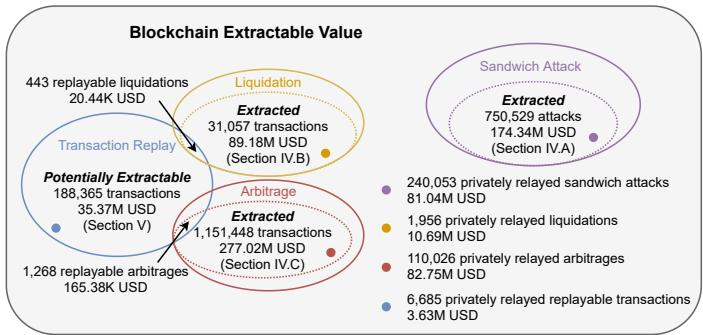  
Fig. 1: Overview of various sources of blockchain extractable value. We find that sandwich attacks, liquidations and arbitrage yield 540.54M USD of BEV over 32 months. We further evaluate a novel application-agnostic transaction replay algorithm, which could have extended BEV by 35.18M USD.

The existence of BEV appears to radically transform the distributed ledger incentive structure. Previous studies [7], [8] suggest, and show, that miners are incentivized to extract value by deliberately forking a chain, endangering blockchain security. To the best of our knowledge, no work has yet comprehensively measured and studied the real-world severity of BEV. Quantifying the status quo of BEV, however, is crucial to understand the risks that blockchain users are exposed to.

In this work we capture a variety of BEV sources, including sandwich attacks, liquidations, and arbitrage (cf. Fig. 1 and Section IV). We moreover present the first generalized transaction replay algorithm, which allows to clone and front-run a victim transaction without the need to understand the underlying victim transaction logic (cf. Section V). The potential extractable value from transaction replay attacks can significantly extend the total BEV (cf. Fig. 1), further endangering the blockchain security.

More worryingly, we observe the recent emergence of centralized BEV relayer (e.g., flashbots). A BEV relayer acts as a proxy between BEV traders and miners, filtering the trades that are forwarded to the miners. The goal of a BEV relayer is to maximize BEV, and hence in expectation, increases the number of blockchain forks and chain reorganizations [8].

Summarizing, our main contributions are as follows.

• We are the first to comprehensively measure the breadth of BEV from known trading activities (i.e., sandwich attacks, liquidations, and arbitrages). Although related works have studied sandwich attacks in isolation, there is a lack of quantitative data from real-world exploitation to objectively assess their severity.

• We are the first to propose and empirically evaluate a transaction replay algorithm, which could have resulted in 35.37M USD of BEV. Our algorithm extends the total captured BEV by 35.18M USD, while intersecting with only 1.43% of the liquidation and 0.11% of the arbitrage transactions (cf. Fig. 1).

• We are the first to formalize the BEV relay concept as an extension of the P2P transaction fee auction model. Contrary to the suggestions of the practitioner community, we find that a BEV relayer does not substantially reduce the P2P network overhead from competitive trading.

## II. BACKGROUND

## A. Blockchain and Smart Contracts

Permissionless blockchains are span by a network of globally distributed P2P nodes [9]. If a user wishes to execute a transaction on the blockchain (which in essence is a distributed database), the user broadcasts the transaction to its P2P neighbors. These neighbors then forward that transaction until the transaction eventually reaches a miner. A miner constructs a block to append data to the blockchain and decides unilaterally on the transactions execution order. A transaction that is included in at least one blockchain block (i.e., the chain with most “Proof of Work”) is considered confirmed (i.e., a one-confirmation) by the network. Blockchains differ in confirmation latencies, ranging from hours in Bitcoin [9] to minutes in Ethereum [10], while offering distinct security trade-offs [11]. Generally, there is an inherent time delay, between the public broadcast of a transaction and its execution. Blockchain nodes store unconfirmed transactions within the so-called mempool. For a more thorough background, we refer the reader to helpful SoKs [12], [13], [14].

We proceed to outline the required background of Ethereum. Beyond simple value transfers, Etherum is a smart contractenabled blockchain [10], which allows the construction of DeFi protocols. Smart contracts execute within a virtual machine called Ethereum Virtual Machine (EVM). In this paper, we differentiate among user addresses (i.e., owned by a private key) and smart contract addresses. In Ethereum, blocks can be indexed by the block number, an incremental integer, while transactions are often indexed by the transaction hash, the Keccak-256 hash value of a transaction. ETH is the native cryptocurrency in Ethereum, which can be used to, for example, pay transaction fees. The transaction fee is calculated with gas (measuring the amount computations consumed in a transaction)

times gas price (the amount that the transaction issuer is willing to pay for each unit of gas). The smallest unit of ETH is Wei, equivalent to 10<sup>−18</sup> ETH. Transaction fees are commonly denominated in GWei (i.e., 10<sup>9</sup> Wei). In addition to a chain’s native cryptocurrency, smart contracts allow to create on-chain assets, so-called tokens. At the time of writing, ERC20 is the most widely adopted token standard.

## B. Decentralized Finance

DeFi is a subset of finance-focused decentralized protocols that operate autonomously on blockchain-based smart contracts [15]. After excluding the DeFi systems’ endogenous assets, the total value locked in DeFi amounts to 90B USD at the time of writing. Relevant DeFi platforms are for instance automated market maker exchanges [1], [16], lending platforms [17], [18], [19], [20] and margin trading systems [21].

AMM Exchanges: Traditional limit order-book-based exchanges maintain a list of bids and asks for an asset pair. AMM exchanges, however, maintain a pool of capital (i.e., a liquidity pool) with at least two assets. A smart contract governs the rules by which traders can purchase and sell assets from the liquidity pool. The most common AMM mechanism is the constant product rule in a pair-asset market. This rule stipulates that the product of an asset x and asset y in a pool remains a constant k. Uniswap, with over 8B USD total value locked (TVL), one of the biggest AMM exchanges at the time of writing, follows a constant product AMM model [1].

Slippage: When performing a trade on an AMM, a trader is exposed to an expected slippage depending on the available liquidity in the AMM (i.e., the price gets worse as the trading volume increases). Furthermore, the expected execution price may differ from the real execution price (i.e., an unexpected slippage). That is because the expected price is derived upon a past blockchain state, which may change between the transaction creation and its execution — e.g., due to frontrunning transactions [2]. Therefore, a trader typically sets a slippage tolerance (i.e., the maximum acceptable slippage) when issuing an AMM trading transaction.

Lending Systems: Debt is an essential tool in traditional finance [22], and the same applies to DeFi. DeFi lending typically requires over-collateralization [23]. Hence, a borrower must collateralize, i.e., lock, for instance, 150% of the value that the borrower wishes to lend out. The collateral acts as a security fund to the lender if the borrower does not pay back the debt. If the collateral value decreases and the collateralization ratio decreases below 150%, the collateral can be freed up for liquidation. Liquidators can then purchase the collateral at a discount to repay the debt. At the time of writing, lending systems on the Ethereum blockchain have accumulated a TVL of 40B USD [17], [18], [19], [20].

## III. PRELIMINARIES

In this section, we outline our security and threat model. We discuss how the blockchain transaction order relates to BEV and proceed with a blockchain transaction ordering taxonomy.

## A. System and Threat Model

We consider a permissionless blockchain system on top of a P2P network. We assume the existence of a trader V conducting at least one blockchain transaction $T _ { V }$ (given a public/private key-pair) by, e.g., trading assets on AMM exchanges or interacting with a lending platform. The trader is free to specify its slippage tolerance, transaction fees, and choice of platform. We refer to the trader as a victim if other traders attack the trader (e.g., in a sandwich attack). We further assume the existence of a set of miners that may or may not engage in extracting blockchain extractable value. The miners can choose to order transactions according to internal policies or may follow the transaction fee distribution.

Our threat model captures a financially rational adversary that is well-connected in the network layer to observe unconfirmed transactions in the memory pool. holds at least one private key for a blockchain account from which it can issue an authenticated transaction $T _ { A }$ . We also assume that  owns a sufficient balance of the native cryptocurrency (e.g., ETH on Ethereum) to perform actions required by $T _ { A } .$ e.g., paying transaction fees or trading assets. If is a mining entity, then  can unilaterally decide which and in which order transactions figure within its mined blocks. When is a non-mining entity,  attempts to extract value by adjusting the transaction fees or resorting to BEV relayers (cf. Section VI-A).

## B. Transaction Ordering and Blockchain Extractable Value

Compared to traditional financial systems (e.g., centralized exchanges), we identify that the value extraction game on blockchains presents two fundamental properties.

Atomicity: Multiple actions fit into one transaction and execute in an all-or-nothing sequence [24], [25]. If a single action of an atomic transaction fails, all previously executed actions are reverted without permeating a blockchain state change.

Determinacy: Given a blockchain state, the execution of a transaction is deterministic. Trader can hence simulate or “predict” the execution result before a transaction is mined.

These two properties are decisive for the value extraction game. An adversary attempts to manipulate the transaction order, such that the adversarial transactions execute on a blockchain state which maximizes the adversarial revenue. The order manipulation may prioritize adversarial transactions or attempt to move a victim transaction to execute on an unfavorable blockchain state. We provide a detailed transaction ordering taxonomy in Section III-C.

Previous works have shown how trading bots engage in competitive transaction fee bidding contests [7], [2]. Besides exchange trading, front-running was observed on blockchain games, crypto-collectibles, gambling, ICOs, and name services [5]. Miner Extractable Value, first introduced by Daian et al. [7], captures the blockchain extractable value from miners. However, non-mining traders can also capture BEV by adjusting, for example, their transaction fees, and we observe MEV as a subset of the blockchain extractable value.

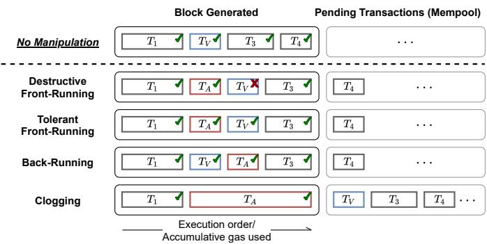  
Fig. 2: Visualization of four adversarial transaction ordering strategies. $T _ { V }$ is the victim and $T _ { A }$ the adversarial transaction. $T _ { 1 }$ to $T _ { 4 }$ , are included in that sequence in the next block.

## C. Transaction Ordering Taxonomy

In light of the decisive pertinence of the transaction order on blockchain value extraction, we provide in the following a transaction ordering taxonomy which extends the three frontrunning categories discussed in related work [5]. We explicitly add a fourth category, which captures the act of back-running a transaction (cf. Fig. 2). We moreover highlight the subtle but essential impact of an adversarial front-running transaction on the subsequent victim transaction: either $T _ { A }$ provokes the victim transaction to fail, or the adversary takes care to avoid that $T _ { V }$ reverts after a successful front-running.

Destructive Front-Running: If $T _ { A }$ front-runs $T _ { V }$ , and causes the execution of $T _ { V }$ to fail (i.e., the EVM reverts the transaction state changes), we classify the act of front-running as destructive. The front-running adversary, therefore, bears no considerations about its impact on subsequent transactions.

Tolerating Front-Running: Front-running is “tolerating”, if the adversary ensures that $T _ { V }$ executes successfully. Tolerating front-running is necessary for, e.g., sandwich attacks [2]. An adversary would not be able to profit from sandwich attacks with destructive front-running.

Back-Running: Executing $T _ { A }$ after $T _ { V }$ is called back-running, a technique which can be applied after, e.g., oracle update transactions [26], [27] and within sandwich attacks [2]. Back running is, in expectation, cheaper than front-running, as the trader does not engage in a fee bidding contest.

Clogging: An adversary may clog, or jam the blockchain with transactions, to prevent users and bots from issuing transactions (i.e., suppression [5]). Deadline-based smart contracts may create an incentive to clog the blockchain.

TABLE I: Attack surface for non-mining adversaries. Sandwich attacks and transaction replay occur on the network state.

<table><tr><td>Use Case</td><td>Block State</td><td>Mempool/Network State</td></tr><tr><td>Sandwich Attack</td><td>-</td><td>✓</td></tr><tr><td>Liquidation</td><td>✓</td><td>✓ (back-running oracles)</td></tr><tr><td>Arbitrage</td><td>✓</td><td>✓</td></tr><tr><td>Transaction Replay</td><td>-</td><td>✓</td></tr></table>

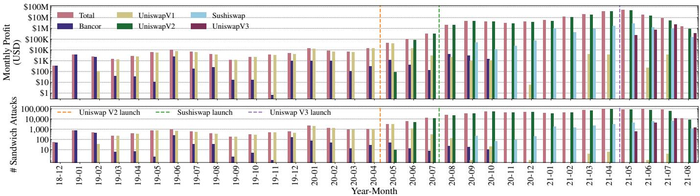  
Fig. 3: Sandwich attacks, from block 6803256 (1st of December, 2018) to 12965000 (5th of August, 2021).

Transaction ordering may occur on different blockchain state representations. We differentiate in this paper between a block state and a mempool/network state (cf. Table I). A block state corresponds to the last confirmed main-chain head, while the mempool state is a more volatile and local state of a blockchain P2P node. We notice that sandwich attacks (cf. Section IV-A) and transaction replay (cf. Section V) can only occur on the network layer (unless a miner forks the blockchain).

## IV. MEASURING THE EXTRACTED BLOCKCHAIN VALUE

In the following, we investigate to what extent traders have extracted financial value from the Ethereum blockchain over a time frame of 32 months (from the 1st of December, 2018 to the 5th of August, 2021). While it is challenging to capture all possible revenue strategies, we do not claim completeness and choose to focus on sandwich attacks, liquidations, and arbitrage trading. For the sandwich and arbitrage, we inspect all the trades performed on Uniswap V1/V2/V3, Sushiswap, Curve, Swerve, 1inch, and Bancor, spanning over 49,691 cryptocurrencies and 60,830 on-chain markets. For liquidations, we collect every liquidation event settled on Aave V1/V2, Compound, and dYdX. Throughout our measurement, we identify transactions with zero gas price as privately relayed transactions .

## A. Sandwich Attacks

Sandwich attacks, wherein a trader wraps a victim transaction within two adversarial transactions, is a classic predatory trading strategy [2]. To perform a sandwich, the adversary , which can be a miner or trader, listens on the P2P network for pending transactions. The adversary attacks, if the market price of an asset is expected to rise/fall after the execution of a “large” pending transaction $( T _ { V } )$ . The attack is then carried out in two-steps: (i) issues $T _ { A 1 }$ to tolerating front-run $T _ { V } ,$ by purchasing/selling the same asset before $T _ { V }$ changes the market price; (ii) then issues $T _ { A 2 }$ to back-run $T _ { V }$ to close the trading position opened by $T _ { A 1 } . \ A$ must perform tolerating front-running to ensure that $T _ { V } { } ^ { \ ' } { \bf s }$ slippage protection does not trigger a transaction revert.

1) Heuristics: We apply the following heuristics to identify potentially successful sandwich attacks from the AMM trades. • Heuristic 1: The transactions $T _ { A 1 } , \ T _ { V }$ and $T _ { A 2 }$ must be included in the same block and in this exact order.

• Heuristic 2: Every front-running transaction $T _ { A 1 }$ maps to one and only one back-running transaction $T _ { A 2 }$ . This heuristic is necessary to avoid double counting revenues.

• Heuristic 3: Both $T _ { A 1 }$ and $T _ { V }$ transact from asset X to $Y .$ $T _ { A 2 }$ transacts in the reverse direction from asset Y to X.

• Heuristic 4: Either the same user address sends transactions $T _ { A 1 }$ and $T _ { A 2 }$ , or two different user addresses send $T _ { A 1 }$ and $T _ { A 2 }$ to the same smart contract.

• Heuristic 5: The amount of asset sold in $T _ { A 2 }$ must be within 90% 110% of the amount bought in $T _ { A 1 }$ . If the sandwich attack is perfectly executed without interference from other market participants, the amount sold in $T _ { A 2 }$ should be precisely equal to the amount purchased in $T _ { A 1 }$ . According to our empirical data 603,431 (80.4%) sandwich attacks we detect are “perfect”. We further relax this constraint to cover 10% slippage, thus finding 147,098 (19.6%) additional imperfect profitable sandwich attacks.

2) Empirical Results: In total, we identify 2,419 Ethereum user addresses and 1,069 smart contracts performing 750,529 sandwich attacks on Uniswap V1/V2/V3, Sushiswap, and Bancor, with a total profit of 174.34M USD (cf. Fig. 3). Our heuristics do not find sandwich attacks on Curve, Swerve, and 1inch. Curve/Swerve are specialized in correlated, i.e., peggedcoins with minimal slippage. Despite the small market cap. (< 1% of Bitcoin), SHIB is the most sandwich attack-prone ERC20 token with an adversarial profit of 6.84M USD.

We notice that 240,053 sandwich attacks (31.98%) are privately relayed to miners (i.e., zero gas price), accumulating a profit of 81.04M USD. Sandwich attackers therefore actively leverage BEV relay systems (cf. Section VI-A) to extract value. We also observe that 17.57% of the attacks use different accounts to issue the front- and back-running transactions.

Sandwich Transaction Positions: A sandwich attack adversary typically attempts to position its transactions relatively close to the victim transaction. In practice, we observe multiple profitable sandwich attacks where the involved transactions are separated by more than 200 intermediate transactions (cf.

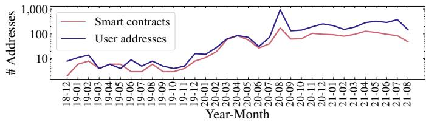

(a) Number of active adversarial sandwich user addresses and smart contracts detected over time.  
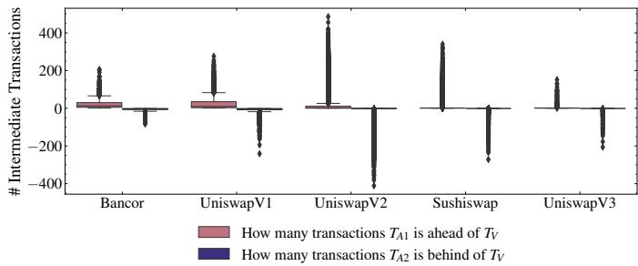  
(b) Relative position of sandwich transactions for profitable attacks.  
Fig. 4: Extracted sandwich attacks, from block 6803256 (1st of December, 2018) to block 12965000 (5th of August, 2021).

Fig. 4b), while no intermediate transaction (i.e., the frontrunning, victim, and back-running transactions are positioned one by one) is detected in 99.59% of the privately relayed sandwich attacks. We present the sandwich attack gas price distribution and adversarial strategies in Appendix A-A.

Extractable Profit: Zhou et al. [2] estimate that under the optimal setting, the adversary can attack 7,793 Uniswap V1 transactions, and realize 98.15 ETH of revenue from block 8M to 9M. Based on our data, we estimate that only 63.30% (62.13 ETH) of the available extractable value was extracted.

## B. Fixed Spread Liquidations

We observe two widely adopted liquidation mechanisms in the current DeFi ecosystem [23]. First, the fixed spread liquidation, used by Aave, Compound, and dYdX, allows a liquidator to purchase collateral at a fixed discount when repaying debt. Second, the auction liquidation, allows a liquidator to start an auction that lasts for a pre-configured period (e.g., 6 hours [19]). Competing liquidators bid on the (lowest possible) collateral price. In this section, we focus on the fixed spread liquidation, which allows to extract value in a single, atomic transaction. To perform a fixed spread liquidation, a liquidator  can adopt the following two strategies.

• Block State Liquidation: detects a liquidation opportunity at block $B _ { i }$ (i.e., after the execution of $B _ { i } )$ .  then issues a liquidation transaction $T _ { A } .$ , which is expected to be mined in the next block $B _ { i + 1 }$ . attempts to destructively front-run competing liquidators with $T _ { A }$

• Network State Liquidation:  observes a transaction $T _ { V }$ which will create a liquidation opportunity (e.g., an oracle price update that renders a collateralized debt liquidatable). then back-runs $T _ { V }$ with a liquidation transaction $T _ { A }$

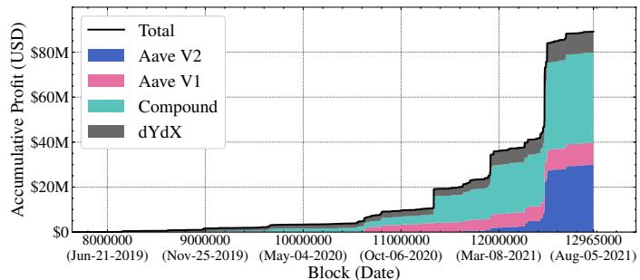

(a) Accumulative profit of fixed spread liquidations.  
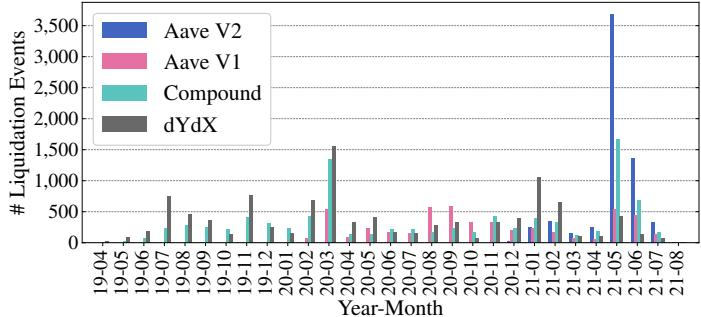  
(b) The monthly number of fixed spread liquidation events.  
Fig. 5: The number of liquidations increase in months where the ETH price collapses, e.g., in March, 2020 and May, 2021.

Empirical Results: We collect all liquidation events on Aave (Version 1 and 2), Compound, and dYdX from their inception until block 12965000 (5th of August, 2021). We observe a total of 31,057 liquidations, yielding a collective profit of 89.18M USD over 28 months (cf. Fig. 5a and 5b). Note that we use the prices provided by the price oracles of the liquidation platforms to convert the profits to USD at the moment of the liquidation.

Ordering Strategies: To distinguish between a front- or backrunning liquidation, we observe that a front-running liquidation at block $B _ { i }$ necessarily requires a borrowing position to be liquidatable at block $B _ { i - 1 }$ . If the borrowing position is not liquidatable at block $B _ { i - 1 }$ , the liquidator is acting after a price oracle update in block i, which corresponds to a back-running liquidation. Therefore, for each of the 31,057 liquidations that we observe on block $B _ { i }$ , we test whether the borrowing position was liquidatable at block $B _ { i - 1 }$ . If this test resolves to true, we classify the liquidation as front-, otherwise as back-running (cf. Table II). Given 31,057 liquidations, we find that frontrunning is the dominating strategy accounting for 74.50% of all liquidations. Among the 31,057 liquidations, we identify 2,742 unique liquidators by address. We find that 1,758 liquidators follow the front-, 442 back-running and the remaining 542 liquidators adopt a mixed strategy.

TABLE II: Extracting strategies of liquidators. Liquidators either back-run the price oracle updates, or front-run competing liquidation attempts. Most liquidations perform front-running.

<table><tr><td>Liquidation Platform</td><td>Front-running</td><td>Back-running</td><td>Total</td></tr><tr><td>Aave V2</td><td>4,085</td><td>2,347</td><td>6,432</td></tr><tr><td>Aave V1</td><td>4,331</td><td>601</td><td>4,932</td></tr><tr><td>Compound</td><td>6,119</td><td>3,168</td><td>9,287</td></tr><tr><td>dYdX</td><td>8,603</td><td>1,803</td><td>10,406</td></tr><tr><td>Total</td><td>23,138</td><td>7,919</td><td>31,057</td></tr></table>

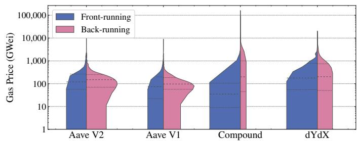  
Fig. 6: Transaction fee distributions of front- and back-running liquidations (transactions with zero gas price are excluded). The back-running liquidations pay a higher average gas price, due to the internal back-running concept.

Liquidation Gas Prices: We identify 1,956 transactions (6.3%) with zero gas price out of the 31,057 liquidation events, implying that liquidators relay liquidation transactions to miners privately without using the P2P network. These privately relayed transactions yield a total profit of 10.69M USD. We visualize the gas price distributions in Fig. 6. Surprisingly, we notice that the back-running liquidations pay a higher gas prices on average. We find that this is because the liquidators tend to wrap the price oracle update action and liquidation into one (high-priority) transaction, which we term an internal backrunning transaction. The internal back-running transactions are typically set with a high gas price to prevent them from being front-run by competing liquidators.

## C. Arbitrage

Arbitrage describes the process of simultaneously selling and buying assets in different markets in order to profit from the market price differences. Arbitrage helps to promote market efficiency and is typically considered benign. To perform an arbitrage, DeFi traders/miners monitor new blockchain state changes and execute an arbitrage if the expected revenue of synchronizing the prices on two markets exceeds the expected transaction costs. An arbitrage trader can choose among the following strategies to perform arbitrage:

• Block State Arbitrage: The arbitrage trader can choose to only monitor the confirmed blockchain states. Once a new block $B _ { i }$ is received, the trader attempts to destructively front-run all other market participants at $B _ { i + 1 }$

• Network State Arbitrage: A trader can listen on the network layer to detect a “large” pending trade, which is likely to “greatly” change the asset price on one exchange. The trader then attempts to back-run this exchange transaction with an arbitrage transaction.

1) Heuristics: We use s to denote a swap action which sells $i n ( s )$ amount of the input asset $I N ( s )$ to purchase $o u t ( s )$ amount of the output asset $O U T ( s )$ . We apply the following heuristics to find extracted arbitrages on Uniswap V1/V2/V3, Sushiswap, Curve, Swerve, 1inch, and Bancor.

TABLE III: Statistics of the profitable arbitrage trades we detect. Over 90% synchronize the prices across 2 or 3 markets.

<table><tr><td># platforms# markets</td><td>1</td><td>2</td><td>3</td><td> $\geq 4$ </td><td>Total</td></tr><tr><td>2</td><td>8,220 (0.7%)</td><td>452,148 (39.3%)</td><td>N/A</td><td>N/A</td><td>460,368 (40.0%)</td></tr><tr><td>3</td><td>333,039 (28.9%)</td><td>235,878 (20.5%)</td><td>16,431 (1.4%)</td><td>N/A</td><td>585,348 (50.8%)</td></tr><tr><td>4</td><td>42,816 (3.7%)</td><td>28,963 (2.5%)</td><td>7,497 (0.7%)</td><td>16 (0%)</td><td>79,292 (6.9%)</td></tr><tr><td>5</td><td>9,460 (0.8%)</td><td>6,996 (0.6%)</td><td>588 (0.1%)</td><td>70 (0%)</td><td>17,114 (1.5%)</td></tr><tr><td> $\geq 6$ </td><td>2,693 (0.2%)</td><td>5,292 (0.5%)</td><td>1,308 (0.1%)</td><td>33 (0%)</td><td>9,326 (0.8%)</td></tr><tr><td>Total</td><td>396,228 (34.4%)</td><td>729,277 (63.3%)</td><td>25,824 (2.2%)</td><td>119 (0%)</td><td>1,151,448 (100%)</td></tr></table>

• Heuristic 1: All swap actions of an arbitrage must be included in a single transaction, implicitly assuming that the arbitrageur minimizes its risk through atomic arbitrage.

• Heuristic 2: Arbitrage must have more than one swap action.

• Heuristic 3: The n swap actions $s _ { 1 } , \ldots , s _ { n }$ of an arbitrage must form a loop. The input asset of any swap action must be the output asset of the previous action, i.e., $I N ( s _ { i } ) =$ $O U T ( s _ { i - 1 } )$ . The first swap’s input asset must be the same as the last swap action’s output asset, i.e., $I N ( s _ { 0 } ) = O U T ( s _ { n } )$

• Heuristic 4: The input amount of any swap action must be less than or equal to the output amount of the previous action, i.e., $i n ( s _ { i } ) \leq o u t ( s _ { i - 1 } )$

2) Empirical Results: From the 1st of December, 2018 to the 5th of August, 2021, we identify 6,753 user addresses and 2,016 smart contracts performing 1,151,448 arbitrage trades on Uniswap V1/V2/V3, Sushiswap, Curve, Swerve, 1inch, and Bancor, amounting to a total profit of 277.02M USD. We find that 110,026 arbitrage transactions (9.6%) are privately relayed to miners, representing 82.75M USD of extracted value. All detected arbitrage trades are executed using smart contracts.

Arbitrage statistics: To gain more insights on arbitrage, we classify the transactions according to the number of platforms and markets involved (cf. Table III). Most traders prefer simple strategies that only involve 2 or 3 markets (aka. twopoint arbitrage and triangular arbitrage). Less than 3% of the transactions execute strategies with more than four markets. We, for example, find that one transaction combines two arbitrage into one to save gas $\cos \mathrm { t s } ^ { 2 }$ . Such optimizations may yield a higher profit while riskier because the more markets involved, the more competitors must be front-run. ETH, USDC, USDT, and DAI are involved in 99.91% of the detected arbitrages.

Arbitrage transaction positions: By visualizing the arbitrage transaction positions in blocks (cf. Fig. 8), we find that a large number of profitable trades are surprisingly positioned at the end of the blocks. We would have expected that the arbitrage transactions are competitive and perform destructive front-running with higher gas prices. For example, one of the most profitable arbitrage transactions<sup>3</sup> we detect is positioned at index 141 out of 162 transactions in this block. Our data hence supports the hypothesis that arbitrageurs are performing back-running on the network layer. To further confirm this hypothesis, we re-execute all arbitrage transactions at the top of blocks (i.e., upon the previous block state). If a transaction is a block state arbitrage, then the execution should remain profitable. We find that 44.02% of the arbitrage transactions are no longer profitable, which indicates that these transactions perform back-running because the arbitrage opportunity appears in the same block as the arbitrage transaction.

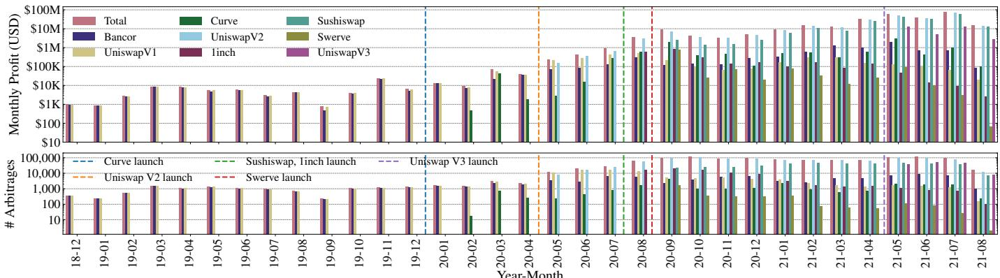  
Fig. 7: Monthly arbitrage statistics from block 6803256 (1st of December, 2018) to block 12965000 (5th of August, 2021).

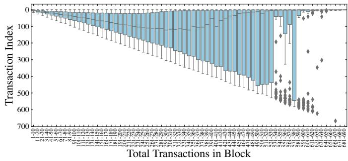  
Fig. 8: Transaction index distribution of all arbitrages we detect.

## D. Clogging

We observe the practice of blockchain clogging by issuing simultaneously many transactions to intermediately increase the costs of writing to the blockchain. We identify various apparent purposes, such as attacking gambling protocols and mass token transfers (cf. Appendix A-B for quantitative details).

## E. Limitations

We proceed to outline the main limitations of our measurements. Notably, as we focus on sandwich attacks, liquidations, and arbitrage, we do not capture all possible sources of BEV. We, however, believe that our methodology can be applied to other BEV sources. Then, for each BEV source, given that we apply custom heuristics, those heuristics have limitations themselves, which may result in false negatives. For instance, Heuristic 1 from the sandwich attacks assumes, that all transactions must be mined in the same block. There may exist successful sandwich attacks across multiple blocks, which we do not capture and which may result in false negatives. Also, it could be that by chance two transactions are executed right before and after a supposed victim transaction. Yet, this is not necessarily an attack. As such, heuristics may also introduce false positives into our findings. To reduce the potential inaccuracies of our heuristics, we attempt to tighten the heuristics to avoid overly reporting revenues. Summarizing, we do not have access to ground truth, which forces us to present our results as estimates only.

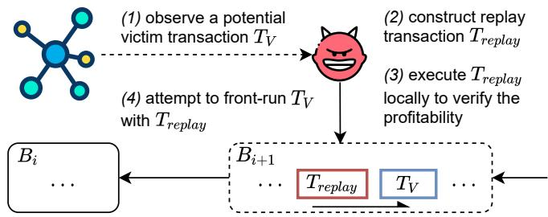  
Fig. 9: Overview of the transaction replay attack.

## V. GENERALIZED FRONT-RUNNING: TRANSACTION REPLAY

We proceed to present an application-agnostic method for an adversary to extract value by copying and replaying the execution logic of an unconfirmed victim transaction (cf. Fig. 9). The high-level operations are as follows.

1) observes a victim transaction on the network layer;

2) constructs one or more replay transaction(s) to copy the execution logic of the victim transaction while diverting the revenue to an adversary-controlled account;

3) performs concrete validation of the constructed replay transaction(s) locally to emulate the execution result;

4) if the local execution yields a profit,  attempts to destructively front-run the victim transaction.

We classify a replay transaction $T _ { r e p l a y }$ as profitable, if the native cryptocurrency (e.g., ETH) balance of increases after the execution of $T _ { r e p l a y } ,$ discounting the transaction fees. To measure profitability, we assume that converts all the received assets (i.e., tokens) within an atomic transaction to the native cryptocurrency following the replay action.

```solidity
pragma solidity ^0.6.0;

contract Moneymaker {
    function TransferRevenueToSender() public {
        uint profit;
        // profiting logic omitted for brevity
        msg.sender.transfer(profit);
    }

    function SpecifyBeneficiary(address payable
        beneficiary) public {
        uint profit;
        // profiting logic omitted for brevity
        beneficiary.transfer(profit);
    }
}
```  
Listing 1: Examples of the transaction replay algorithm patterns.

## A. Algorithm

Traders frequently implement profit-generating strategies (e.g., arbitrage) within smart contracts to perform complex operations atomically [25]. We however show that the following programming patterns expose a transaction to be replayable.

• Sender Benefits: The generated revenue is transferred to the transaction sender (cf. TransferRevenueToSender in Listing 1) without authentication.

• Controllable Input: The sender address is specified in the transaction input to receive the revenue (cf. SpecifyBeneficiary in Listing 1).

Replay Algorithm: Generally, in a transaction T on a smartcontract-enabled blockchain (cf. Eq. 1), sender represents the issuer of T, value the amount of native cryptocurrency sent in T, and input controls the contracts’ execution<sup>4</sup>. sender is an authenticated field verified through the signature, and input is arbitrarily amendable.

$$
T = \{s e n d e r, v a l u e, i n p u t \}\tag{1}
$$

We outline the replay logic in Algorithm 1. When observing a previously unknown transaction, the adversary constructs the replay transaction(s) by duplicating all the fields of the potential victim transaction but substitutes the original transaction sender address in the input data field with the adversarial address. An address in an Ethereum transaction input is encoded as a 20- byte array<sup>5</sup>. Substitution is therefore efficient through a string replacement algorithm. The adversary then executes the replay transaction(s) locally upon the currently highest block. If the victim transaction conforms to the applicable patterns (i.e., sender benefits and controllable input), the execution of the replay transaction may yield a positive profit for the adversary, which can proceed with front-running the victim transaction.

## B. Replay Evaluation

We apply Algorithm 1 to all the Ethereum transactions from block 6803256 (1st of December, 2018) to block 12965000 (5th of August, 2021) capturing a total of 883,023,232 transactions over 32 months. We execute every constructed replay transaction at the position of the potential victim transaction and verify the profitability. Except for ETH, we consider all ERC20 tokens earned in the replay transactions as revenues. When a replay transaction yields a token revenue, we enforce an exchange transaction that converts the received token to ETH via on-chain Uniswap markets [1]. We, therefore, measure the profitability entirely in ETH without the need for an external price oracle. For simplicity of our analysis, we assume that the adversary pays 1 Wei more than the victim transaction for the gas price of the replay and the potential exchange transaction (i.e., the minimal cost for a non-mining adversary to front-run). When measuring the profitability, we count the replay and exchange transaction fees as cost.

<div class="mineru-algorithm" style="white-space: pre-wrap; font-family:monospace;">
Algorithm 1: Transaction Replay Algorithm.
Input: The current highest block $B_i$; the potential victim transaction $T_V$; the adversarial account address $\mathcal{A}$.
Function ConstructReplay ($T_V, \mathcal{A}$):
    $T.sender \leftarrow \mathcal{A}$ $T.value \leftarrow T_V.value$ $T.input \leftarrow$ substituting $T_V.sender$ in $T_V.input$ with $\mathcal{A}$
    return $T$
end
Algorithm TransactionReplay ($T_V, \mathcal{A}$):
    $T_{replay} \leftarrow$ConstructReplay ($T_V, \mathcal{A}$)
    Concretely Execute $T_{replay}$ upon block $B_i$
    if $T_{replay}$ is profitable then
        | Front-run $T_V$ with $T_{replay}$
    end
end
</div>

We perform our evaluation on a Ubuntu 20.04.1 LTS machine with AMD Ryzen Threadripper 3990X (64-core, 2.9 GHz), 256 GB of RAM and 4 2 TB NVMe SSD in Raid 0 configuration. To execute a replay transaction in a past block, we download the blockchain state from an Ethereum full archive node running on the same machine. On average, generating a replay transaction and verifying its profitability takes 0.18 0.29 seconds (i.e., the time from observing a victim transaction to broadcasting the replay transaction). We remark that an adversary can achieve better performance by running the real-time replay attack inside an Ethereum client without downloading blockchain states from external sources.

Results: We find 188,365 profitable transactions (0.02%) that could have been replayed, accumulating to an estimated profit of 57,037.32 ETH (35.37M USD). The most profitable replay transaction yields a profit of 16,736.9 ETH. Apart from ETH, there are 1,213 ERC20 tokens contributing a revenue of 179,843.52 ETH in 128,200 transactions. Note that the ERC20 token revenue is higher than the total profit, because ETH is being used to purchase the ERC20 token in some transactions (recall that profit equals income minus expenses). Among all replayable transactions, 171,219 transactions follow the sender benefits pattern, while the remaining 17,146 transactions fall into the controllable input category.

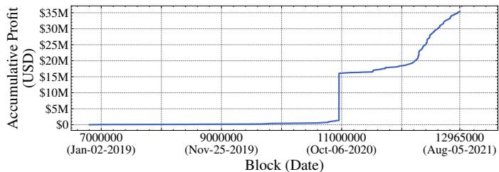

(a) Accumulative profit that can be extracted by replay attacks.  
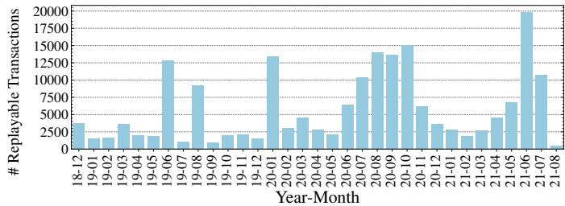  
(b) Monthly number of replayable transactions.  
Fig. 10: Replay attacks amount to a profit of 35.37M USD. We detect 19,825 replayable transactions in June, 2021 alone.

We show the accumulative profit of the transaction replay attack in Fig. 10a along with the monthly number of replayable transactions in Fig. 10b. Notably, from block 10954411 to 10954419, three transactions, which seem to exploit a smart contract vulnerability [29], generate a total profit of over 41,529 ETH. We also observe a general uptrend in the number of replayable transactions since January, 2020.

In Table IV, we show the distribution of the upfront ETH capital (i.e., the transaction value) required by the replay transactions, and outline the average profit. We find that 83.2% of the replay transactions do not require upfront ETH, except the transaction fees. We notice that the replay profit is not directly correlated to the transaction value. 1,926 replay transactions yield a profit of more than one ETH, out of which 1,007 transactions are of zero-value.

We find 6,685 replayable transactions with zero gas price, representing a total value of 3.63M USD. These privately relayed transactions hence are only replayable by mining adversaries or relay operators. For the other transactions with positive gas price, in our evaluation, we assume that these transactions are at some point, prior to being mined, visible in the mempool. However, from the 22nd of December, 2020 to the 29th of December, 2020 (in prior to the emergence of BEV relay systems), we do not find 13 out of the 1, 156 replayable transactions in our mempool (cf. Appendix C). Our replay results may hence overestimate the replay potential by 1.12%.

TABLE IV: Required upfront ETH and average profit of replay.

<table><tr><td>Required upfront capital r (ETH)</td><td># replay transactions</td><td>Average profit (ETH)</td></tr><tr><td>100 &lt; r</td><td>136</td><td>2.48 ± 8.05</td></tr><tr><td>10 &lt; r ≤ 100</td><td>2,145</td><td>0.86 ± 2.97</td></tr><tr><td>0 &lt; r ≤ 10</td><td>29,372</td><td>0.21 ± 3.93</td></tr><tr><td>r = 0</td><td>156,712</td><td>0.31 ± 63.01</td></tr></table>

## C. Real-Time Detection

Our previous replay results make use of historical on-chain data, and we extend this analysis with an investigation where we locally replay transactions in real-time from block 12926988 (30th of July, 2021) to block 12965000 (5th of August, 2021). To this end, we modify a go-ethereum client which connects to at most 200 peers. Following Algorithm 1, our client tests whether every received transaction from the P2P network is replayable. To avoid any doubt, our experiments remain local as we do not attempt to share our replay transactions.

Results: From a total of 8,206,977 tested transactions, our real-time investigation find 166 unique and non-conflicting transactions that are locally replayable. If we compare that number to the replayable candidates from on-chain data, within the same time-frame, we find 576 unique (and nonconflicting) replayable transactions with a positive gas price. The discrepancy of those numbers indicates, that our node is insufficiently connected in the P2P network, and hence misses relevant replayable victims. We would welcome future work to use this metric as a success indicator of P2P network connectivity of an adversarial node.

The on-chain data moreover exposes 89 replayable transactions with zero gas price. These transactions were likely mined through private agreements or a BEV relayer, and our real-time node naturally has no means to capture these transactions.

## D. Understanding Replayable Transactions

The replay algorithm may act on any unconfirmed transaction without understanding its logic. To shed light on the nature of the replayable transactions, we cross-compare the 188,365 replayable transactions with the data from Section IV. We detect 443 fixed spread liquidations (cf. Section IV-B) contributing a total profit of 20.44K USD, and 1,268 arbitrages (cf. Section IV-C) contributing a total profit of 165.38K USD. These results suggest that the replay transactions capture a different set of profit-generating transactions than liquidations and arbitrage. In Appendix B-A, we provide a case study of replayable transactions. We find that two DeFi attacks are replayable, the Eminence exploit [29] and the bZx attack [25].

## E. Naive Replay Protection

We proceed to present two simple methods that protect profitable transactions from being replayed by Algorithm 1.

(Insecure) Authentication: Authentication schemes are widely adopted in on-chain asset custody, e.g., when depositing assets into a smart contract wallet that can only be redeemed by an owner. Such schemes can also help to prevent simple replay attacks (cf. Authentication in Listing 2, Appendix B-B). When the authentication-enabled contract is invoked with an unauthorized address, the replay transaction execution is reverted. Such authentication method, however, does not remain secure against a more sophisticated replay algorithm.

Beneficiary Provision: To avoid a replay, the beneficiary address should not be specified in the transaction input and can instead be stored, for example, in the contract storage (cf. MoveBeneficiary in Listing 2, Appendix B-B).

The aforementioned methods mitigate the simple replay attacks. However, an adversary could go further in locally emulating a victim transaction, extract all emitted events and attempt to reconstruct its application layer logic. Specifically, the adversary can verify (e.g., given the heuristics of Section IV), if a transaction is an arbitrage or liquidation. A profitable transaction can then be constructed following the extracted application logic and parameters. We however remark that this replay method requires prior understanding of the specific application and therefore does not generalize further.

## F. Advanced Replay Protection

A more robust replay protection mechanism requires that (i) no entity besides the issuer can inspect the transaction and, (ii) the miner can validate, but not view, the transaction.

Ironically, under strong trust assumptions, a BEV relayer, which we further discuss in the next section, may help to protect against replay attacks. The relayer, however, needs to be trusted and the miner must not perform replay attacks.

Fair ordering techniques [30] (as further outline in Section VII-B) may also help to grant the original transaction issuer priority access to the blockchain. Unfortunately, state-ofthe-art fair ordering techniques for permissionless blockchains are still vulnerable to well connected network layer adversaries.

A more elaborate alternative replay protection mechanism could be constructed with trusted hardware modules such as Intel SGX [31]. Let’s assume that miners are operating SGX enclaves ordering transactions within mined blocks. Traders could perform remote attestation to verify that the ordering enclave is following transparently outlined rules of inclusion. The trader can then establish an end-to-end encrypted TLS connection towards the miner enclave, and provide its transactions privately. The trader would be required to establish direct E2E-encrypted channels to all major miners/pools and concurrently send its transaction as in to avoid a replay attack. Unfortunately, in part due to DoS concerns, it is unclear whether miners would be willing to broadly open up their transaction ordering mining nodes to the public internet.

Also note that the approaches above are not immune to blockchain fork and reorganization attacks (which unfortunately are incentivised through BEV revenue, cf. Section VII), as a transaction becomes public once its block is broadcasted.

## VI. BEV RELAYER AND AUCTIONS

Miners by default choose transactions from the mempool in a descending transaction fee order (e.g., gas price). The emerging BEV relayer, however, provide an additional transaction “salesroom”: an trader propagates transactions to miners through a centralized relay system and shares the transaction profit with miners directly instead of paying transaction fees. In the following, we formalize an abstract BEV auction game capturing the P2P and the centralized BEV relayer model. We then quantitatively analyze how the introduction of BEV relayer impacts the P2P network and the consensus layer.

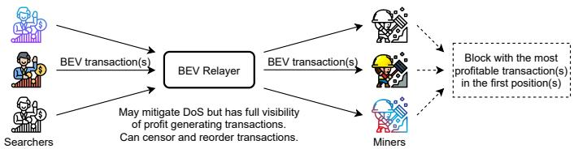  
Fig. 11: Architecture of a BEV relay mechanism, where a centralized and trusted server mediates between traders discovering BEV-extracting opportunities and miners.

## A. BEV Relayer

BEV relayers are centralized entities that provide a mediation service between traders seeking to extract BEV (so-called “searchers”) and miners (cf. Fig. 11). The relayer is a server, to which searchers submit one or multiple transactions (a bundle) that are then forwarded to the miners peered with the relayer. We observe that searchers perform sandwich attacks (cf. Section IV-A) by packing the victim transaction and attack transactions into one bundle. The bundle fee mechanism guarantees that no transaction fee is paid if the transactions would fail. Miners operate an augmented client, which filters and positions the most profitable bundle(s) at the top of the next mined block. The BEV relay service is advertised to provide the following benefits: (i) The relayer claims not to publish BEV transactions. (ii) Searchers do not pay for failed transactions. (iii) Miners receive a share from the bundle revenue. (iv) P2P network congestion is claimed to be reduced. (v) Blockchain transaction fees are claimed to be reduced.

## B. BEV Auction Modeling

We assume that a set of n players $\left\{ \mathcal { P } _ { 0 } , \mathcal { P } _ { 1 } , . . . , \mathcal { P } _ { n - 1 } \right\}$ compete for a BEV opportunity , which can be extracted through front- or back-running (cf. Section III-C). We assume that if extracted, yields a revenue of <sub>i</sub>( ) for player $\mathcal { P } _ { i }$ Players may extract different values from the same opportunity depending on the extraction execution (e.g., the arbitrage paths and potentially sub-optimal parameters).

We call miners adopting the BEV relayer system “relay miners” and assume that relay miners control a hash-rate α of the total mining power. The remaining miners are denoted as “P2P miners”. In this section, we assume that the BEV relayer honestly relays the transactions from players (i.e., searchers in Section VI-A) without censoring or reordering transactions. We further assume that the relayer neither joins the BEV auction nor reveals any transaction to other players. The relay miners only pick the most profitable transactions(s) from the relayer system. We assume that the remaining block space is filled with the transactions from the P2P network sorted by the paid transaction fee. The P2P miners pick transactions solely from the P2P network in transaction fee descending order.

Every player $\mathcal { P } _ { i }$ can participate in two optional auctions to extract . In the P2P auction, $\mathcal { P } _ { i }$ broadcasts transactions in the P2P network. $\mathcal { P } _ { i }$ places a publicly readable bid in the form of transaction fees. In the second auction, the relay auction, $\mathcal { P } _ { i }$ does not broadcast transactions. Instead, $\mathcal { P } _ { i }$ forwards crafted transactions to a centralized BEV relayer which forwards the transactions to relay miners. The relay miner is promised a share of the revenue of $\mathcal { R } _ { i } ( \mathcal { O } )$ , freely configurable by the player. We assume that players are rational, i.e., $\mathcal { P } _ { i }$ participates in an auction $i f f$ the expected payoff is positive. In the following, we use the term player and bidder interchangeably.

P2P Auction (PA): The P2P auction is a first-price all-pay auction [32], where the bidder only realizes a profit when its transaction is executed in the intended future block position. If the bidder’s transaction does not execute at the intended position, upon block inclusion the bidder remains liable to a pay a transaction fee, or may realize a sub-optimal revenue.

We assume that $\mathcal { P } _ { i }$ adopts the strategy $s _ { i }$ in the P2P auction, which provides a winning probability of $\mathrm { P r } ^ { \mathrm { P A } } ( \mathcal { O } , \mathcal { S } _ { i } )$ . We further assume that $s _ { i }$ and $\mathbf { \bar { P r } } ^ { \mathbf { \bar { P A } } } ( \mathcal { O } , S _ { i } )$ are prior knowledge of $\mathcal { P } _ { i }$ obtained from past experience. We formalize the expected payoff of a P2P auction participation in Eq. 2.

$$
\mathbb {E} \left[ u _ {i} ^ {\mathrm{PA}} \mid \alpha \right] = (1 - \alpha) \operatorname * {P r} ^ {\mathrm{PA}} (\mathcal {O}, \mathcal {S} _ {i}) \mathcal {R} _ {i} (\mathcal {O}) - b _ {i} ^ {\mathrm{PA}} (\mathcal {O}, \mathcal {S} _ {i})\tag{2}
$$

$b _ { i } ^ { \mathrm { P A } } ( \mathcal { O } , S _ { i } )$ is the transaction fee $\mathcal { P } _ { i }$ is willing to pay to the miners. Note that we ignore that the transaction execution result may impact the transaction fee. In a front-running competition, $\mathcal { P } _ { i }$ might issue multiple transactions to increase the transaction fee bid, $b _ { i } ^ { \mathrm { P A } } ( \mathcal { O } , S _ { i } )$ denotes the last bid. Eq. 2 shows that the existence of BEV relayers $( \mathrm { i } . \mathrm { e } . , \alpha )$ decreases the players expected payoff in the P2P auction. Players may hence refrain from broadcasting the BEV transactions. We further analyze the network layer impact of BEV relayers in Section VI-D.

Relay auction (RA): A BEV relay auction is a first-price sealed-bid auction [33] as bidders do not pay transaction fees unless they win. Eq. 3 outlines the payoff for $\mathcal { P } _ { i }$ in the relay auction, when a replay miner produces the next block.

$$
u _ {i} ^ {\mathrm{RA}} = \left\{ \begin{array}{l l} \mathcal {R} _ {i} (\mathcal {O}) - b _ {i} ^ {\mathrm{RA}} (\mathcal {O}) & \text {if \mathcal {P} _{i} wins the auction} \\ 0 & \text {otherwise} \end{array} \right.\tag{3}
$$

$b _ { i } ^ { \mathrm { R A } } ( { \mathcal { O } } )$ is the rebate bidders pay to the miner. Note that a rational bidder would only pay a fee inferior to the revenue that yields, i.e., $b _ { i } ^ { \mathrm { R A } } ( { \mathcal { O } } ) \dot { < } { \mathcal { R } } _ { i } ( { \mathcal { O } } )$

## C. Incentive Compatibility of the Relay auction Participation

Under a rational setting, the relay auction payoff for $\mathcal { P } _ { i }$ is non-negative (cf. Eq. 3). This result implies that players are always encouraged to participate in the relay auction, regardless of the mining power of relay miners or other players strategies. [7] proposes a discouragement hypothesis that in the P2P front-running competition, players are discouraged by the market leaders and hence exit the game. We claim that this discouragement hypothesis never stands in the relay auction due to the risk-free nature of the relay auction (under the honest relayer assumption). Therefore, given the same BEV opportunity, the relay auction leads to a more intense competition than the P2P auction.

Increasing $b _ { i } ^ { \mathrm { R A } } ( { \mathcal { O } } )$ renders $\mathcal { P } _ { i }$ more likely to win, but provides less payoff to the player. In a first-price auction, $\mathcal { P } _ { i }$ does not have a dominant strategy (a strategy that maximizes the payoff) without knowing the other players’ strategies [33], which makes it challenging to reason about how $\mathcal { P } _ { i }$ should bid. We hence simplify and assume that the reward $\mathcal { R } _ { i } ( \mathcal { O } )$ is independently drawn from the same uniform distribution, i.e., $\mathcal { R } _ { i } ( { \mathcal { O } } ) \sim U ( 0 , \mathcal { R } _ { \operatorname* { m a x } } )$ . We assume that n and $U ( 0 , \mathcal { R } _ { \operatorname* { m a x } } )$ are prior knowledge of $\mathcal { P } _ { i } ^ { \ 6 }$ . Under this simplifying assumption, the Bayesian Nash equilibrium strategy of $\mathcal { P } _ { i }$ is shown in Eq. 4, with the expected revenue of the miner provided in Eq. 5. Proofs for Eq. 4 and 5 can be found in [33].

$$
b _ {i} ^ {\mathrm{PA}} (\mathcal {O}, \mathcal {S} _ {i}) = \frac {n - 1}{n} \mathcal {R} _ {i} (\mathcal {O})\tag{4}
$$

$$
\mathbb {E} \left[ \max _ {i} b _ {i} ^ {\mathrm{PA}} (\mathcal {O}, \mathcal {S} _ {i}) \right] = \frac {n - 1}{n + 1} \mathcal {R} _ {\mathrm{max}}\tag{5}
$$

Eq. 4 implies that a player should bid more (i.e., pay higher fees) when the number of players increases. Therefore, the relay miners earn more revenue under a Bayesian Nash equilibrium when there are more relay auction bidders (cf. Eq. 5). We have shown that a first-price setting ensures a non-negative payoff, which incentivises participation. We can conclude that the firstprice relay auction leans toward allocating the vast majority of BEV to relay miners, which we call revenue concentration. This concentration then aggravates the incentivizes miners have to perform attacks on the consensus layer, which endangers the blockchain security (cf. Section VII).

## D. Network Impact of the BEV Relayer

BEV relayers advertise to reduce the P2P network layer congestion from competitive trading bots. In this section, we proceed to analyze when players actually refrain from broadcasting BEV transactions on the P2P network due to the availability of BEV relayer. We first define the concept of a protogenetic opportunity (cf. Definition VI.1).

Definition VI.1. (Protogenetic Opportunity) A BEV opportunity is protogenetic for a player $\mathcal { P } _ { i }$ , if E $\left\lceil u _ { i } ^ { \mathrm { P A } } \mid 0 \right\rceil ^ { - } > 0$ i.e., the expected reward is positive when the mining power adopting BEV relayers is zero.

Protogenetic opportunities represent the transactions that $\mathcal { P } _ { i }$ would broadcast to the P2P network, when there is no BEV relayer. To quantify the impact of BEV relayers on the P2P network, we empirically measure how many protogenetic BEV transactions could have been prevented from propagating in the P2P network due to the introduction of BEV relayers.

Given BEV relayers, $\mathcal { P } _ { i }$ participates in the P2P auction only when E $\left[ u _ { i } ^ { \mathrm { P A } } \mid \alpha \right] > 0$ . Following Eq. 2 and Def. VI.1, we claim that the BEV relayers prevent $\mathcal { P } _ { i }$ from broadcasting a transaction extracting when satisfying Eq. 6.

$$
\frac {1}{\Pr^ {\mathrm{PA}} (\mathcal {O} , \mathcal {S} _ {i})} <   \underbrace {\frac {\mathcal {R} _ {i} (\mathcal {O})}{b _ {i} ^ {\mathrm{PA}} (\mathcal {O} , \mathcal {S} _ {i})}} _ {\text {revenue - fee ratio}} <   \frac {1}{(1 - \alpha) \Pr^ {\mathrm{PA}} (\mathcal {O} , \mathcal {S} _ {i})}\tag{6}
$$

Intuitively, for an opportunity , if the revenue-fee ratio is too low, a rational player $\mathcal { P } _ { i }$ will not broadcast the transaction, no matter whether a BEV relayer exists or not. If the revenuefee ratio is high, $\mathcal { P } _ { i }$ may still want to take a risk and participate in the P2P auction. Therefore, the BEV relay system only helps to discourage the propagation when the transaction revenue-fee ratio falls into the middle-range specified in Eq. 6, given the mining power of relay miners (i.e., α).

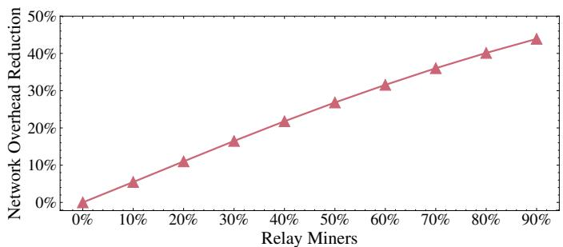  
Fig. 12: The percentage of the arbitrage transactions (cf. Section IV-C) that could have been prevented from broadcasting on the P2P network due to the introduction of BEV relayers.

Results: We measure the network impact of BEV relayers given the 1,041,422 arbitrages with positive transaction fees in Section IV-C. Specifically, we calculate the revenue-fee ratio of every transaction and check if the ratio satisfies Eq. 6. We are unaware of the winning probability of the players in the P2P auction $( \mathrm { i . e . , P r } ^ { \mathrm { P A } } ( { \mathcal { O } } , { \overline { { S _ { i } } } } ) )$ . Hence, for every transaction, we draw the value of $\mathrm { P r } ^ { \mathrm { P A } } ( \mathcal { O } , S _ { i } )$ from a uniform distribution ranging from 10% to 90%, i.e., $\mathrm { P r } ^ { \mathrm { P A } } ( \mathcal { O } , S _ { i } ) \sim U ( 0 . 1 , 0 . 9 )$ . We present the results under different relay mining power values in Fig. 12. Under 10% relay miners, only 5.5% of the arbitrage transactions would be prevented from propagating in the P2P network. We show that even when 90% of the miners adopt BEV relayer systems, there are still 56.1% of the arbitrage transactions that would propagate in the P2P network.

## E. Privately Relayed Transactions

Transactions that are mined without appearing in the P2P network are referred to as privately relayed transactions. Besides BEV relayers, we notice that miners also reach agreements, e.g., with exchanges to mine privately propagated transactions. From the 22nd December, 2020 to 29th December, 2020 (prior to the emergence of BEV relayers), we identify 136,143 privately relayed transactions out of a total of 8,285,218 (1.64%). Detailed results are shown in Appendix C.

## F. BEV Relayer Remarks

Summarizing, our analysis provides the following novel and generic insights for smart contract enabled blockchains:

• BEV relayers aggravate consensus layer attacks by rendering MEV more competitive, yielding higher MEV opportunities and further incentivising miners to fork over MEV [8].

• Contrary to the suggestions of the practitioners community (e.g., https://github.com/flashbots), our results suggest that BEV relay mechanisms do not substantially reduce the P2P network overhead. That is despite the fact that a BEV relayer introduces an intermediary which increases the centralization of a permissionless blockchain.

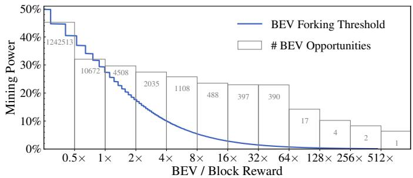  
Fig. 13: Minimum mining power on Ethereum that is incen tivized to fork the chain to extract a BEV opportunity of x the block reward (i.e., BEV forking threshold). We present the number of historical BEV opportunities per reward multiplier.

## VII. SECURITY INSIGHTS OF BEV

Previous studies [7] have shown that the blockchain consensus is prone to time-bandit attacks, where miners deliberately fork and overwrite the main chain attempting to extract MEV (a subset of BEV). Zhou et al. [8] point out that the time-bandit attacks are essentially equivalent to double-spending attacks, which can be captured by an MDP framework [11]. When BEV is four times higher than the block reward, a financially rational miner with 10% mining power is incentivized to fork the blockchain instead of performing honest mining.

Our measurements show that from the 1st of December, 2018 to the 5th of August, 2021 at least 2,407 blocks expose a BEV value of over four times the block reward plus transaction fees. The highest single-block BEV we find is 8, 453.9 ETH (4.1M USD) in block 11333037 (616.6 times the block reward plus transaction fees). This BEV opportunity could have incentivized a miner with only 0.1% mining power to fork, which portrays the danger of drastic forking competition among BEV aware miners. To further understand empirically how the past BEV opportunities could have endangered the blockchain consensus security, we follow the MDP framework in [11] and similar to Zhou et al. [8] derive the BEV forking threshold (cf. Fig. 13). The BEV forking threshold captures the minimum mining power that is incentivized to fork the blockchain to extract a BEV opportunity of x block reward. Fig. 13 further classifies each empirically identified BEV opportunity depending on its size with respect to the block reward.

BEV moreover provides miners an additional financial resources to perform bribery [34] and undercutting attacks [35], where adversarial miners deliberately offer financial rewards (e.g., extractable BEV and transaction fee) on a forked chain to attract mining power. The revenue concentration objective of a BEV relayer further escalates the potential value that miners can extract, intensifying the risks of consensus layer forks.

BEV also causes congestion on the P2P network layer by attracting traders to heavily use the P2P network through many front- or back-running transactions. A congested P2P network, however, reduces communication throughput and latency, which was shown to increase the stale block rate, which in turn negatively affects consensus security [11].

BEV relayer threats: Throughout our analysis in Section VI, we assume that BEV relayers and relay miners behave honestly. However, in reality, a relayer or miner may analyze and sell trader strategies in private. BEV relayer and miners can moreover replay profiting transactions (cf. Section V). In a relay auction, all bids (i.e., the amounts of rebate that players pay to the miner) are visible to the relayer who can also manipulate the auction process. Knowing the highest bid, the relayer can for instance choose to bid a higher amount and win the auction. Through the use of multiple pseudonymous addresses, the relayer could deliberately pretend to lose auctions to deter manipulation detection. Such manipulation would lower the success rate of bidders and provide an illusion of a fierce competition, forcing bidders to raise their bids, aggravating the revenue concentration problem (cf. Section VI-C). Finally, to the financial detriment of DeFi users, BEV relayers provide a risk-free approach to perform, for example, sandwich attacks.

## A. DeFi’s Impact on BEV

DeFi is one of the most promising applications of permissionless blockchains. However, our empirical data from Section IV), intuitively suggests that the amount of extracted BEV grew with the overall DeFi TVL, hence clearly deteriorating blockchain security. Various DeFi attacks, including economic exploits [25] and sandwich attacks [2], are threatening DeFi users.

While BEV sources may appear benign from an application layer perspective (e.g., arbitrage synchronizes prices across different markets and liquidations help to secure debt), we claim that BEV should never be considered a desired “feature”, and rather a design flaw. That is because BEV triggers transaction overhead and erodes the blockchain incentive mechanisms underpinned by the block reward and transaction fees.

## B. BEV Mitigation

As long as the transaction executions remain transparent and the transaction order is unilaterally manipulable, the BEV challenge is likely to remain. Nevertheless, we observe several promising avenues towards reducing or mitigating BEV.

Fair Ordering: Kelkar et al. [36] formally define the concept of order-fairness and propose permissioned Aequitas protocols to order transactions fairly and were applied to DeFi [30]. A variant of Aequitas [37] extends order fairness for permissionless blockchains, yet a powerful network adversary retains an information asymmetry advantage to front-run slower victims.

Application-Specific BEV Mitigation: Previous works [2] show that sandwich attacks can be mitigated if traders keep the trade sizes under the so-called minimum profitable victim input. Zhou et al. [38] propose the idea of exploiting a BEV opportunity atomically in the same transaction. For instance, when a trader performs an exchange on one market, an arbitrage opportunity might be created on another market. The trader can immediately execute an arbitrage following the exchange, which may yield an additional financial profit. Due to the atomicity of blockchain transactions, no adversary can extract the arbitrage profit. We can further imagine how BEV can be mitigated in lending protocols, if a price oracle update would atomically liquidate unhealthy debt position while paying out the liquidation revenue to a shared liquidity pool.

## VIII. RELATED WORK

Eskandir et al. [5] are the first to introduce a frontrunning taxonomy for blockchains. While the authors focus on displacement, insertion and suppression front-running, we explicitly highlight the different side effects of adversarial frontrunning transactions, which therefore allows to differentiate between destructive or tolerating front-running. We moreover introduce the concept of back-running and show how these ordering strategies are used to extract value. We further identify the concept of an internal back-running transaction, where a transaction is atomically prepended with a “high-priority” transactions, such as a price oracle update.

Bonneau [34] is the first to study bribery attacks in the context of Bitcoin-style consensus. With their seminal work, Daian et al. [7] then introduce the concept of Miner Extractable Value, a specific financial source of bribing revenue. Through elaborate empirical data of the network layer, the authors show how competitive trading bots engage in front-running price gas auctions on the network layer. In this work, we offer quantifyable insights into the monetary value which traders have extracted through BEV, by analysing the historical blockchain data. We further capture regular and internal back-running, and propose the first practical transaction replay algorithm. Finally, we also model BEV relayer, which converts part of the public bidding game into a private relay auction.

Zhou et al. [2] focus on the problem of sandwich attacks on AMM exchanges. The authors simulate, based on past blockchain data, how much revenue an adversary could have yielded theoretically from sandwich attacks. In this work, we measure the actual value extracted by sandwich adversaries, based on past blockchain data. Our data in Section IV-A suggests, that only 63.30% (62.13 ETH) of the available extracted sandwich attack value was extracted.

Related work captures extensively blockchain security through various models and quantification efforts. The most commonly captured attacks are selfish mining [39], doublespending [11], bribery [34], and undercutting attacks [35]. Zhou et al. [8] quantify the value threshold at which MEV would incentivize miners to fork the blockchain based on optimal adversarial strategies given by an MDP. Based on this model, we empirically show the extent to which BEV could have endangered the blockchain consensus layer.

## IX. CONCLUSION

In this paper we shed light on the practices of obscure and predatory traders on blockchains. We provide empirical data for the state-of-the-art BEV, by notably studying past sandwich attacks and arbitrage on seven decentralized exchanges as well as liquidations on three lending platforms. To the best of our knowledge, we are the first to provide a generalized realtime replay trading algorithm. We alarmingly observe that the emerging BEV relayer endanger the blockchains’ security. We hope that our work provides insights into the current practices, and further helps to improve DeFi and blockchain security.

## REFERENCES

[1] “https://uniswap.org,” https://uniswap.org/.

[2] L. Zhou, K. Qin, C. F. Torres, D. V. Le, and A. Gervais, “High-frequency trading on decentralized on-chain exchanges,” in 2021 IEEE Symposium on Security and Privacy (SP). IEEE, 2021, pp. 428–445.

[3] J. Xu and B. Livshits, “The anatomy of a cryptocurrency pump-and-dump scheme,” in 28th USENIX Security Symposium (USENIX Security 19), 2019, pp. 1609–1625.

[4] F. Victor and A. M. Weintraud, “Detecting and quantifying wash trading on decentralized cryptocurrency exchanges,” in Proceedings of the Web Conference 2021, 2021, pp. 23–32.

[5] S. Eskandari, S. Moosavi, and J. Clark, “Sok: Transparent dishonesty: front-running attacks on blockchain,” in International Conference on Financial Cryptography and Data Security. Springer, 2019, pp. 170–189.

[6] D. Robinson and G. Konstantopoulos, “Ethereum is a dark forest,” https: //medium.com/@danrobinson/ethereum-is-a-dark-forest-ecc5f0505dff.

[7] P. Daian, S. Goldfeder, T. Kell, Y. Li, X. Zhao, I. Bentov, L. Breidenbach, and A. Juels, “Flash boys 2.0: Frontrunning in decentralized exchanges, miner extractable value, and consensus instability,” in 2020 IEEE Symposium on Security and Privacy (SP). IEEE, 2020, pp. 910–927.

[8] L. Zhou, K. Qin, A. Cully, B. Livshits, and A. Gervais, “On the justin-time discovery of profit-generating transactions in defi protocols,” in 2021 IEEE Symposium on Security and Privacy (SP), 2021, pp. 919–936.

[9] S. Nakamoto, “Bitcoin: A peer-to-peer electronic cash system,” 2008.

[10] G. Wood et al., “Ethereum: A secure decentralised generalised transaction ledger,” Ethereum project yellow paper, vol. 151, no. 2014, pp. 1–32, 2014.

[11] A. Gervais, G. O. Karame, K. Wust, V. Glykantzis, H. Ritzdorf, ¨ and S. Capkun, “On the security and performance of proof of work blockchains,” in Proceedings of the 2016 ACM SIGSAC Conference on Computer and Communications Security. ACM, 2016, pp. 3–16.

[12] J. Bonneau, A. Miller, J. Clark, A. Narayanan, J. A. Kroll, and E. W. Felten, “Sok: Research perspectives and challenges for bitcoin and cryptocurrencies,” in Security and Privacy (SP), 2015 IEEE Symposium on. IEEE, 2015, pp. 104–121.

[13] N. Atzei, M. Bartoletti, and T. Cimoli, “A survey of attacks on ethereum smart contracts (sok),” in International conference on principles of security and trust. Springer, 2017, pp. 164–186.

[14] S. Bano, A. Sonnino, M. Al-Bassam, S. Azouvi, P. McCorry, S. Meiklejohn, and G. Danezis, “Sok: Consensus in the age of blockchains,” in Proceedings of the 1st ACM Conference on Advances in Financial Technologies, 2019, pp. 183–198.

[15] K. Qin, L. Zhou, Y. Afonin, L. Lazzaretti, and A. Gervais, “Cefi vs. defi–comparing centralized to decentralized finance,” in 2021 Crypto Valley Conference on Blockchain Technology (CVCBT). IEEE, 2021.

[16] E. Hertzog, G. Benartzi, and G. Benartzi, “Bancor Protocol Continuous Liquidity for Cryptographic Tokens through their Smart Contracts,” Tech. Rep., 2018. [Online]. Available: https://storage.googleapis.com/w ebsite-bancor/2018/04/01ba8253-bancor protocol whitepaper en.pdf

[17] Aave, “Aave Protocol,” https://github.com/aave/aave-protocol, 2020.

[18] dYdX, “dYdX,” https://dydx.exchange/, 2020.

[19] T. M. Foundation, “Makerdao,” https://makerdao.com/en/, 2019.

[20] C. Finance, “Compound finance,” 2019. [Online]. Available: https: //compound.finance/

[21] “Bzx network,” 2020. [Online]. Available: http://bzx.network

[22] R. Dalio, “How the economic machine works,” Economic Principles, 2012.

[23] K. Qin, L. Zhou, P. Gamito, P. Jovanovic, and A. Gervais, “An empirical study of defi liquidations: Incentives, risks, and instabilities,” in Proceedings of the 21st ACM Internet Measurement Conference. ACM, 2021, p. 336–350.

[24] S. Allen, S. Capkun, I. Eyal, G. Fanti, B. A. Ford, J. Grimmelmann,<sup>ˇ</sup> A. Juels, K. Kostiainen, S. Meiklejohn, A. Miller et al., “Design choices for central bank digital currency: Policy and technical considerations,” National Bureau of Economic Research, Tech. Rep., 2020.

[25] K. Qin, L. Zhou, B. Livshits, and A. Gervais, “Attacking the defi ecosystem with flash loans for fun and profit,” in International Conference on Financial Cryptography and Data Security. Springer, 2021, pp. 3–32.

[26] B. Liu and P. Szalachowski, “A first look into defi oracles,” arXiv preprint arXiv:2005.04377, 2020.

[27] S. Eskandari, M. Salehi, W. C. Gu, and J. Clark, “Sok: Oracles from the ground truth to market manipulation,” arXiv preprint arXiv:2106.00667, 2021.

[28] “Contract abi specification — solidity 0.8.1 documentation,” https://docs .soliditylang.org/en/latest/abi-spec.html.

[29] “Defi degens hit by eminence exploit recover some losses - coindesk,” https://www.coindesk.com/eminence-exploit-defi-compensated.

[30] “Fair sequencing services: Enabling a provably fair defi ecosystem,” https://blog.chain.link/chainlink-fair-sequencing-services-enabling-a-pr ovably-fair-defi-ecosystem/.

[31] V. Costan and S. Devadas, “Intel SGX Explained.” IACR Cryptology ePrint Archive, vol. 2016, no. 086, pp. 1–118, 2016.

[32] M. R. Baye, D. Kovenock, and C. G. De Vries, “The all-pay auction with complete information,” Economic Theory, vol. 8, no. 2, pp. 291–305, 1996.

[33] D. Easley, J. Kleinberg et al., “Networks, crowds, and markets: Reasoning about a highly connected world,” Significance, vol. 9, no. 1, pp. 43–44, 2012.

[34] J. Bonneau, “Why buy when you can rent?” in International Conference on Financial Cryptography and Data Security. Springer, 2016, pp. 19–26.

[35] M. Carlsten, H. Kalodner, S. M. Weinberg, and A. Narayanan, “On the instability of bitcoin without the block reward,” in Proceedings of the 2016 ACM SIGSAC Conference on Computer and Communications Security, 2016, pp. 154–167.

[36] M. Kelkar, F. Zhang, S. Goldfeder, and A. Juels, “Order-fairness for byzantine consensus,” in Annual International Cryptology Conference. Springer, 2020, pp. 451–480.

[37] M. Kelkar, S. Deb, and S. Kannan, “Order-fair consensus in the permissionless setting.” IACR Cryptol. ePrint Arch., vol. 2021, p. 139, 2021.

[38] L. Zhou, K. Qin, and A. Gervais, “A2mm: Mitigating frontrunning, transaction reordering and consensus instability in decentralized exchanges,” arXiv preprint arXiv:2106.07371, 2021.

[39] I. Eyal and E. G. Sirer, “Majority is not enough: Bitcoin mining is vulnerable,” in Financial Cryptography and Data Security. Springer, 2014, pp. 436–454.

[40] “Fomo3d wiki,” https://fomo3d.hostedwiki.co/.

[41] “Ethereum lottery,” https://ethex.bet/.

[42] M. Shubik, “The dollar auction game: A paradox in noncooperative behavior and escalation,” Journal of conflict Resolution, vol. 15, no. 1, pp. 109–111, 1971.

[43] Bitinfocharts, “Ethereum block time.” [Online]. Available: https: //bitinfocharts.com/comparison/confirmationtime-eth-std7.html

[44] “The first blockchain fishing game ”crypto fishing” hits hot,” https: //www.prnewswire.com/news-releases/the-first-blockchain-fishing-gam e-crypto-fishing-hits-hot-300752695.html.

[45] S. K. Kim, Z. Ma, S. Murali, J. Mason, A. Miller, and M. Bailey, “Measuring Ethereum network peers,” in Proceedings of the Internet Measurement Conference 2018. ACM, 2018, pp. 91–104.

[46] A. Gervais, H. Ritzdorf, G. O. Karame, and S. Capkun, “Tampering with the delivery of blocks and transactions in bitcoin,” in Conference on Computer and Communications Security. ACM, 2015, pp. 692–705.

[47] “Ethereum (eth) blockchain explorer,” https://etherscan.io/.

## APPENDIX A ADDITIONAL EMPIRICAL DATA

## A. Sandwich attack

1) Monthly Statistics: Table V shows the detailed monthly statistics of the sandwich attacks on Ethereum. We observe an increase in the number of attacks and the number of adversarial addresses (user/smart contract) from 2020. In April 2021, we find 94,956 attacks, of which 96.5% occur on Uniswap V2.

2) Sandwich Gas Prices: We observe that 80.02% of the back-running transactions $( T _ { A 2 } )$ pay only 0 to 1 GWei less than $T _ { V } { } ^ { , } { \bf s }$ gas price (cf. Table VII)<sup>7</sup>. Intuitively, the closer $T _ { A 2 }$ and $T _ { V }$ are, the higher the attacks’ success rate due to a chance of other transaction interference. For the front-running transaction $( T _ { A 1 } )$ , the adversary must also consider the competing sandwich attacker. Given a multi-adversary game, Daian et al. [7] have outlined two primary gas-bidding adversarial strategies:

TABLE V: Monthly statistics of the sandwich attacks on Ethereum.

<table><tr><td></td><td>Total</td><td>18-12</td><td>19-01</td><td>19-02</td><td>19-03</td><td>19-04</td><td>19-05</td><td>19-06</td><td>19-07</td><td>19-08</td><td>19-09</td><td>19-10</td><td>19-11</td><td>19-12</td><td>20-01</td><td>20-02</td><td>20-03</td><td>20-04</td><td>20-05</td><td>20-06</td><td>20-07</td><td>20-08</td><td>20-09</td><td>20-10</td><td>20-11</td><td>20-12</td><td>21-01</td><td>21-02</td><td>21-03</td><td>21-04</td><td>21-05</td><td>21-06</td><td>21-07</td><td>21-08</td></tr><tr><td rowspan="2">Num. of smart contracts</td><td rowspan="2">1069</td><td>2</td><td>6</td><td>8</td><td>4</td><td>6</td><td>6</td><td>3</td><td>3</td><td>6</td><td>3</td><td>3</td><td>4</td><td>8</td><td>11</td><td>19</td><td>59</td><td>85</td><td>57</td><td>27</td><td>40</td><td>175</td><td>62</td><td>64</td><td>106</td><td>97</td><td>93</td><td>81</td><td>97</td><td>129</td><td>115</td><td>97</td><td>85</td><td>48</td></tr><tr><td>0.2%</td><td>0.6%</td><td>0.7%</td><td>0.4%</td><td>0.6%</td><td>0.6%</td><td>0.3%</td><td>0.3%</td><td>0.6%</td><td>0.3%</td><td>0.3%</td><td>0.4%</td><td>0.7%</td><td>1.0%</td><td>1.8%</td><td>5.5%</td><td>8.0%</td><td>5.3%</td><td>2.5%</td><td>3.7%</td><td>16.4%</td><td>5.8%</td><td>6.0%</td><td>9.9%</td><td>9.1%</td><td>8.7%</td><td>7.6%</td><td>9.1%</td><td>12.1%</td><td>10.8%</td><td>9.1%</td><td>8.0%</td><td>4.5%</td></tr><tr><td rowspan="2">Num. of user addresses</td><td rowspan="2">2419</td><td>8</td><td>11</td><td>14</td><td>4</td><td>6</td><td>4</td><td>9</td><td>5</td><td>8</td><td>5</td><td>4</td><td>5</td><td>16</td><td>15</td><td>28</td><td>63</td><td>86</td><td>73</td><td>31</td><td>73</td><td>955</td><td>134</td><td>143</td><td>193</td><td>254</td><td>215</td><td>152</td><td>190</td><td>285</td><td>327</td><td>290</td><td>377</td><td>147</td></tr><tr><td>0.3%</td><td>0.5%</td><td>0.6%</td><td>0.2%</td><td>0.2%</td><td>0.2%</td><td>0.4%</td><td>0.2%</td><td>0.3%</td><td>0.2%</td><td>0.2%</td><td>0.2%</td><td>0.7%</td><td>0.6%</td><td>1.2%</td><td>2.6%</td><td>3.6%</td><td>3.0%</td><td>1.3%</td><td>3.0%</td><td>39.5%</td><td>3.5%</td><td>5.9%</td><td>7.9%</td><td>10.5%</td><td>8.9%</td><td>6.3%</td><td>7.9%</td><td>11.8%</td><td>13.5%</td><td>12.0%</td><td>15.6%</td><td>6.1%</td></tr><tr><td rowspan="2">Num. of detected attacks</td><td rowspan="2">750529</td><td>52</td><td>756</td><td>495</td><td>229</td><td>365</td><td>745</td><td>896</td><td>589</td><td>375</td><td>184</td><td>295</td><td>479</td><td>621</td><td>2117</td><td>1337</td><td>962</td><td>1052</td><td>3138</td><td>5991</td><td>12527</td><td>23393</td><td>34306</td><td>54980</td><td>41659</td><td>48748</td><td>35996</td><td>44513</td><td>71218</td><td>84956</td><td>85095</td><td>90152</td><td>80977</td><td>11331</td></tr><tr><td>0.0%</td><td>0.1%</td><td>0.1%</td><td>0.0%</td><td>0.0%</td><td>0.1%</td><td>0.1%</td><td>0.1%</td><td>0.0%</td><td>0.0%</td><td>0.0%</td><td>0.1%</td><td>0.1%</td><td>0.3%</td><td>0.2%</td><td>0.1%</td><td>0.1%</td><td>0.4%</td><td>0.8%</td><td>1.7%</td><td>3.1%</td><td>4.6%</td><td>7.3%</td><td>5.6%</td><td>6.5%</td><td>4.8%</td><td>5.9%</td><td>9.5%</td><td>12.7%</td><td>11.3%</td><td>12.0%</td><td>10.8%</td><td>1.5%</td></tr><tr><td rowspan="2">Bancor</td><td rowspan="2">2061</td><td>52</td><td>756</td><td>459</td><td>6</td><td>7</td><td>2</td><td>242</td><td>37</td><td>34</td><td>2</td><td>5</td><td>1</td><td>166</td><td>79</td><td>49</td><td>13</td><td>28</td><td>49</td><td>14</td><td>8</td><td>23</td><td>18</td><td>11</td><td>0</td><td>0</td><td>0</td><td>0</td><td>0</td><td>0</td><td>0</td><td>0</td><td>0</td><td>0</td></tr><tr><td>0.3%</td><td>100.0%</td><td>100.0%</td><td>92.7%</td><td>2.6%</td><td>1.9%</td><td>0.3%</td><td>27.0%</td><td>6.3%</td><td>9.1%</td><td>1.1%</td><td>1.7%</td><td>0.2%</td><td>26.7%</td><td>3.7%</td><td>3.7%</td><td>1.4%</td><td>2.7%</td><td>1.6%</td><td>0.2%</td><td>0.1%</td><td>0.1%</td><td>0.1%</td><td>0.0%</td><td>0.0%</td><td>0.0%</td><td>0.0%</td><td>0.0%</td><td>0.0%</td><td>0.0%</td><td>0.0%</td><td>0.0%</td><td>0.0%</td></tr><tr><td rowspan="2">Uniswap V1</td><td rowspan="2">14304</td><td>0</td><td>0</td><td>36</td><td>223</td><td>358</td><td>743</td><td>654</td><td>552</td><td>341</td><td>182</td><td>290</td><td>478</td><td>455</td><td>2038</td><td>1288</td><td>949</td><td>1024</td><td>3079</td><td>1121</td><td>317</td><td>139</td><td>1</td><td>20</td><td>0</td><td>1</td><td>0</td><td>0</td><td>4</td><td>6</td><td>0</td><td>1</td><td>4</td><td>0</td></tr><tr><td>1.9%</td><td>0.0%</td><td>0.0%</td><td>7.3%</td><td>97.4%</td><td>98.1%</td><td>99.7%</td><td>73.0%</td><td>93.7%</td><td>90.9%</td><td>98.9%</td><td>98.3%</td><td>99.8%</td><td>73.3%</td><td>96.3%</td><td>96.3%</td><td>98.6%</td><td>97.3%</td><td>98.1%</td><td>18.7%</td><td>2.5%</td><td>0.6%</td><td>0.0%</td><td>0.0%</td><td>0.0%</td><td>0.0%</td><td>0.0%</td><td>0.0%</td><td>0.0%</td><td>0.0%</td><td>0.0%</td><td>0.0%</td><td>0.0%</td></tr><tr><td rowspan="2">Uniswap V2</td><td rowspan="2">688466</td><td>0</td><td>0</td><td>0</td><td>0</td><td>0</td><td>0</td><td>0</td><td>0</td><td>0</td><td>0</td><td>0</td><td>0</td><td>0</td><td>0</td><td>0</td><td>0</td><td>0</td><td>10</td><td>4856</td><td>12202</td><td>23231</td><td>34057</td><td>54882</td><td>41556</td><td>48534</td><td>34214</td><td>43105</td><td>68861</td><td>91652</td><td>80297</td><td>79629</td><td>62687</td><td>6880</td></tr><tr><td>91.7%</td><td>0.0%</td><td>0.0%</td><td>0.0%</td><td>0.0%</td><td>0.0%</td><td>0.0%</td><td>0.0%</td><td>0.0%</td><td>0.0%</td><td>0.0%</td><td>0.0%</td><td>0.0%</td><td>0.0%</td><td>0.0%</td><td>0.0%</td><td>0.0%</td><td>0.3%</td><td>81.1%</td><td>97.4%</td><td>99.3%</td><td>99.3%</td><td>99.8%</td><td>99.8%</td><td>99.6%</td><td>95.0%</td><td>96.8%</td><td>96.7%</td><td>96.5%</td><td>94.4%</td><td>88.3%</td><td>77.4%</td><td>76.6%</td></tr><tr><td rowspan="2">Sushiwap attacks</td><td rowspan="2">27243</td><td>0</td><td>0</td><td>0</td><td>0</td><td>0</td><td>0</td><td>0</td><td>0</td><td>0</td><td>0</td><td>0</td><td>0</td><td>0</td><td>0</td><td>0</td><td>0</td><td>0</td><td>0</td><td>0</td><td>0</td><td>230</td><td>67</td><td>100</td><td>213</td><td>1782</td><td>1408</td><td>2353</td><td>3298</td><td>4185</td><td>5884</td><td>6549</td><td>1174</td><td></td></tr><tr><td>3.6%</td><td>0.0%</td><td>0.0%</td><td>0.0%</td><td>0.0%</td><td>0.0%</td><td>0.0%</td><td>0.0%</td><td>0.0%</td><td>0.0%</td><td>0.0%</td><td>0.0%</td><td>0.0%</td><td>0.0%</td><td>0.0%</td><td>0.0%</td><td>0.0%</td><td>0.0%</td><td>0.0%</td><td>0.0%</td><td>0.0%</td><td>0.7%</td><td>0.1%</td><td>0.2%</td><td>0.4%</td><td>5.0%</td><td>3.2%</td><td>3.3%</td><td>3.5%</td><td>4.9%</td><td>6.5%</td><td>8.1%</td><td>10.4%</td></tr><tr><td rowspan="2">Uniswap V3</td><td rowspan="2">18455</td><td>0</td><td>0</td><td>0</td><td>0</td><td>0</td><td>0</td><td>0</td><td>0</td><td>0</td><td>0</td><td>0</td><td>0</td><td>0</td><td>0</td><td>0</td><td>0</td><td>0</td><td>0</td><td>0</td><td>0</td><td>0</td><td>0</td><td>0</td><td>0</td><td>0</td><td>0</td><td>0</td><td>0</td><td>0</td><td>613</td><td>4628</td><td>11737</td><td>1477</td></tr><tr><td>2.5%</td><td>0.0%</td><td>0.0%</td><td>0.0%</td><td>0.0%</td><td>0.0%</td><td>0.0%</td><td>0.0%</td><td>0.0%</td><td>0.0%</td><td>0.0%</td><td>0.0%</td><td>0.0%</td><td>0.0%</td><td>0.0%</td><td>0.0%</td><td>0.0%</td><td>0.0%</td><td>0.0%</td><td>0.0%</td><td>0.1%</td><td>0.0%</td><td>0.0%</td><td>0.0%</td><td>0.0%</td><td>0.0%</td><td>0.0%</td><td>0.0%</td><td>0.0%</td><td>0.7%</td><td>5.1%</td><td>14.5%</td><td>13.0%</td></tr></table>

TABLE VI: The gas price paid by the adversaries for the frontrunning sandwich transaction $T _ { A 1 } . \mathrm { ~ A ~ }$ previous study suggests that 79% of the miners (using geth) configure a price bump percentage of 10% to replace an existing transaction from the mempool, while 16% of the miners (using parity) set 12.5% as replacement threshold [2]. Assuming a price bump percentage of 10%, we estimate that at least 19.11% of the attacks experienced more than 5 counter-reactive bids [7].

<table><tr><td> $r = \frac{GasPrice_{T_{A1}}}{GasPrice_{T_V}}$ </td><td>Count</td><td>Percentage</td><td>Estimated Bids</td></tr><tr><td> $r \leq 1$ </td><td>80,392</td><td>15.75%</td><td>1</td></tr><tr><td> $1 < r \leq 1.1$ </td><td>265,330</td><td>51.98%</td><td>1</td></tr><tr><td> $1.1 < r \leq 1.1^{2}$ </td><td>39,963</td><td>7.83%</td><td>2</td></tr><tr><td> $1.1^{2} < r \leq 1.1^{3}$ </td><td>17,014</td><td>3.33%</td><td>3</td></tr><tr><td> $1.1^{3} < r \leq 1.1^{4}$ </td><td>10,223</td><td>2.00%</td><td>4</td></tr><tr><td> $1.1^{4} < r$ </td><td>97,554</td><td>19.11%</td><td>&gt;= 5</td></tr><tr><td>total</td><td>510,476</td><td>100.00%</td><td>None</td></tr></table>

reactive counter-bidding and blind raising. Under reactive counter-bidding, an adversary only increases its gas price when another competing transaction pays a higher gas price. In blind raising, the adversary raises the gas price of its transaction in anticipation of a raise of its competitors, without necessarily observing competing transactions yet. Recall that geth only accepts an increase of the gas price by at least 10%.

When assuming that all attackers adopt the reactive counterbidding strategy, based on the past sandwich attacks, we estimate that at least 19.11% of the sandwiches went through more than five rounds of bidding (cf. Table VI). This is because the first $T _ { A 1 }$ bid only needs to add 1 Wei to $T _ { V } { } ^ { , } { \bf s }$ gas price, then each subsequential bid must raise the gas price by 10%. After five rounds of bidding, the adversary needs to pay a gas price of at least $( 1 1 0 \% ) ^ { 4 } \times ( G a s P r i c e _ { V } + 1 )$ Wei. Fig. 4a visualizes the number of adversarial sandwich attack smart contracts we detected. In particular, from the 10th to the 11th of August 2020 (Block 10630000-10640000), we identified 49 smart contract addresses attempting to extract value simultaneously.

## B. Clogging

Eskandir et al. [5] have observed smart contract games which follow the The War of Attrition [40], [41]. In such a game, players can bid into a pool of money. Each bid resets a timeout, which, once expired, grants the last bidder the entirety of the amassed money. Economists and evolutionary biologists have studied such games for decades [42], and shown that humans overbid significantly. To participate in such contests, users are likely to construct dedicated bidding bots. Those bots are then configured with a specific budget to pay for transaction fees. If an adversary manages to clog the blockchain, such that those bots run out of funding, the attacker can win the bidding game. This is what appears to have happened with the infamous Fomo3D game, where an adversary realized a profit of 10,469 ETH by conducting a clogging attack over 66 consecutive blocks (from block 6191962 to 6191896).

TABLE VII: Adversarial gas prices for the back-running sandwich transaction $T _ { A 2 }$ . 80.02% of the transactions pay only 0 to 1 GWei less than $T _ { V }$

<table><tr><td> $d = GasPrice_{T_V} - GasPrice_{T_{A2}}$ </td><td>Count</td><td>Percentage</td></tr><tr><td> $d < 0$  GWei</td><td>14,162</td><td>2.77%</td></tr><tr><td> $0$  GWei  $\leq d < 1$  GWei</td><td>408,522</td><td>80.03%</td></tr><tr><td> $1$  GWei  $\leq d < 10$  GWei</td><td>6,813</td><td>1.33%</td></tr><tr><td> $10$  GWei  $\leq d < 100$  GWei</td><td>43,194</td><td>8.46%</td></tr><tr><td> $100$  GWei  $\leq d$ </td><td>37,785</td><td>7.40%</td></tr><tr><td>Total</td><td>510,476</td><td>100.00%</td></tr></table>

The throughput of permissionless blockchains is typically limited to about 7-14 transactions per second, and transaction fee bidding contests have shown to raise the average transaction fees well above 50 USD. A clogging attack is, therefore, a malicious attempt to consume block space to prevent the timely inclusion of other transactions. To perform a clogging attack, the adversary needs to find an opportunity (e.g., a liquidation, gambling, etc.) which does not immediately allow to extract monetary value. The adversary then broadcasts transactions with high fees and computational usage to congest the pending transaction queue. Clogging attacks on Ethereum can be successful because 79% of the miners order transactions according to the gas price [2].

1) Heuristics: To identify past clogging period, we apply the following heuristics.

• Heuristic 1: The same address (user/smart contract) consumes more than 80% of the available gas in every block during the clogging period.

• Heuristic 2: The clogging period lasts for at least five consecutive blocks. Empirical data suggests that the average block time is $1 3 . 5 \pm 0 . 1 2$ seconds [43], a clogging period of five blocks, therefore, lasts around 1 minute.

2) Empirical Results: We identify 333 clogging periods from block 6803256 to 12965000 , where 10 user addresses and 75 smart contracts are involved (cf. Table VIII). While the longest clogging period lasts for 5 minutes (24 blocks), most of the clogging periods (83.18%) account for less than 2 minutes (10 blocks).

Case Studies: While our heuristics can successfully detect blockchain clogging, they do explain their motivation and we hence manually inspect 14 selected clogging events (cf. Table IX). We find that the top 7 longest clogging events are related to the non-fungible tokens (NFT), while it’s unclear how the adversaries might profit from these events.

TABLE VIII: Detected clogging periods.

<table><tr><td>Duration</td><td>Clogging Detected</td><td>Avg. Gas Used</td><td>Avg. Cost</td></tr><tr><td>5 ~ 9 blocks (1 ~ 2 mins)</td><td>270</td><td>50413969</td><td>8 ETH (12K USD)</td></tr><tr><td>10 ~ 14 blocks (2 ~ 3 mins)</td><td>38</td><td>137697972</td><td>54 ETH (117K USD)</td></tr><tr><td>15 ~ 19 blocks (3 ~ 4 mins)</td><td>10</td><td>199507881</td><td>90 ETH (188K USD)</td></tr><tr><td>20 ~ 24 blocks (4 ~ 5 mins)</td><td>9</td><td>278092700</td><td>143 ETH (326K USD)</td></tr><tr><td>25 ~ 29 blocks (5 ~ 6 mins)</td><td>3</td><td>348737828</td><td>369 ETH (854K USD)</td></tr><tr><td>30 ~ 34 blocks (6 ~ 7 mins)</td><td>2</td><td>458057340</td><td>250 ETH (551K USD)</td></tr><tr><td>35 ~ 39 blocks (7 ~ 8 mins)</td><td>1</td><td>528647491</td><td>297 ETH (739K USD)</td></tr></table>

TABLE IX: Selected clogging events.

<table><tr><td>Address</td><td>Start Block</td><td>Duration (Blocks)</td><td>Avg. Gas Consumed</td><td>Avg. Gas Price</td><td>Cost (ETH)</td><td>Usage</td></tr><tr><td>0x0996..2747</td><td>12953443</td><td>37</td><td>95.38%</td><td>547</td><td>297.16</td><td>NFT</td></tr><tr><td>0xD4d8..706e</td><td>12910380</td><td>34</td><td>94.48%</td><td>790</td><td>388.16</td><td>NFT</td></tr><tr><td>0x004f..66CA</td><td>12885177</td><td>31</td><td>93.99%</td><td>252</td><td>112.37</td><td>NFT</td></tr><tr><td>0x18Df..7da5</td><td>12934303</td><td>26</td><td>90.35%</td><td>1,477</td><td>517.47</td><td>NFT</td></tr><tr><td>0x3a87..bB5f</td><td>12717845</td><td>25</td><td>95.85%</td><td>364</td><td>130.61</td><td>NFT</td></tr><tr><td>0x18c7..410b</td><td>12911156</td><td>25</td><td>90.05%</td><td>1,358</td><td>459.93</td><td>NFT</td></tr><tr><td>0x3a87..bB5f</td><td>12717893</td><td>24</td><td>92.62%</td><td>503</td><td>168.03</td><td>NFT</td></tr><tr><td>0x6670..3A4a</td><td>7091122</td><td>24</td><td>91.22%</td><td>31</td><td>5.48</td><td>Incentivised clogging</td></tr><tr><td>0xdAC1..1ec7</td><td>10130772</td><td>21</td><td>96.09%</td><td>40</td><td>8.05</td><td>Mass USDT transfers</td></tr><tr><td>0xA869..0AB1</td><td>8259506</td><td>15</td><td>92.59%</td><td>26</td><td>3.14</td><td>ETH CAT Attack</td></tr><tr><td>0x67a6..21d2</td><td>7788021</td><td>15</td><td>93.21%</td><td>32</td><td>3.72</td><td>ERD (E) Attack</td></tr><tr><td>0xA869..0AB1</td><td>8260063</td><td>14</td><td>94.48%</td><td>26</td><td>2.98</td><td>ETH CAT Attack</td></tr><tr><td>0xdAC1..1ec7</td><td>8509481</td><td>11</td><td>89.27%</td><td>28</td><td>2.27</td><td>Mass USDT transfers</td></tr><tr><td>0xA869..0AB1</td><td>8260051</td><td>11</td><td>97.28%</td><td>26</td><td>2.41</td><td>ETH CAT Attack</td></tr></table>

Incentivised clogging: We detect a gambling contract “Lucky Star” clogging, where 203 addresses perform 387 transactions. This game draws the winners, when the cumulative lottery tickets sold exceeds a pre-configured threshold. For every 30,000 ETH of lottery tickets sold, the accumulated prize is split among the last 50 purchasers, the protocol, therefore, incentivizes its users to congest the network at the fictive deadline.

Attacks on gambling protocols: We also find four clogging events related to two FoMo3D games, namely ETH CAT (cf. 0x42ce..0ebb) and ERD (E) (cf. 0x2c58..e769). The rules of these gambling protocols is similar to FoMo3D. If no user address purchases a lottery ticket within a fixed time period, the last participant wins the jackpot. We identify two contracts involved in these four clogging events. To ensure that the winner is not already drawn, both contracts have a function to check the current round’s status in the corresponding gambling smart contract before they start to spam transactions. These two contracts are deployed by the same address (cf. 0xfefe..aa5c).

Mass USDT transfers: We find that two clogging events perform a large number of USDT transfers, wherein 2,462/1,868 Ethereum addresses made 2,463/2,032 transactions, consuming 96.07%/89.27% of the gas respectively. Although these activities appear abnormal, we cannot seem to figure out the reason for such behavior.

## APPENDIX B

## TRANSACTION REPLAY EXTENSIONS

## A. Replayable Transactions Case Study

In Table X, we present the top 15 replayable transactions that produce more than 100 ETH and manually classify their motive. We notice 3 replayable transactions associated with a previous DeFi attack, the Eminence exploit [29]. It appears that the attacker(s) did not consider the threat of replay transactions. Except for the Eminence exploit, we notice that the bZx attack [25] transaction is also replayable. We further find 3 replayable transactions that invoke the same DSSLeverage smart contract (cf. 0x4c14..bCA2). From the DSSLeverage source code, we find that it allows any address to close the contract’s position in MakerDAO and retrieve its balance. This coding pattern matches the sender benefits pattern (cf. Section V-A). We also discover one on-chain game transaction (Crypto Fishing [44]) and five arbitrage transactions. For three of the top 15 replayable transactions, we find that the trader is purchasing ERC20 tokens at a favorable price (i.e., arbitrage), as we convert the gained assets back to ETH for our evaluation.

TABLE X: Case studies of the top 15 non-reverted replayable transactions that yield a profit of more than 100 ETH.

<table><tr><td>Transaction hash</td><td>Profit (ETH)</td><td>Required upfront capital (ETH)</td><td>Motive</td></tr><tr><td>0x045b..0b2a</td><td>16,736.9</td><td>0</td><td>Eminence exploit [29]</td></tr><tr><td>0x3503..8ad8</td><td>16,393.3</td><td>0</td><td>Eminence exploit [29]</td></tr><tr><td>0x4f0f..0317</td><td>8,555.8</td><td>0</td><td>Eminence exploit [29]</td></tr><tr><td>0xa85b..9a83</td><td>448.1</td><td>0.036</td><td>—</td></tr><tr><td>0x148f..533f</td><td>224.0</td><td>0.036</td><td>—</td></tr><tr><td>0xbab8..e372</td><td>183.6</td><td>8.0</td><td>Arbitrage</td></tr><tr><td>0x4021..1f89</td><td>153.2</td><td>2.0</td><td>Arbitrage</td></tr><tr><td>0xe772..d496</td><td>153.2</td><td>2.0</td><td>Arbitrage</td></tr><tr><td>0x475a..cd8f</td><td>152.5</td><td>0</td><td>DSSLeverage</td></tr><tr><td>0xfa5f..bb03</td><td>144.3</td><td>0</td><td>DSSLeverage</td></tr><tr><td>0x2e27..ee45</td><td>136.3</td><td>0</td><td>DSSLeverage</td></tr><tr><td>0x7ca2..0765</td><td>129.8</td><td>9.0</td><td>Arbitrage</td></tr><tr><td>0xd46c..b091</td><td>118.0</td><td>5.0</td><td>Crypto Fishing [44]</td></tr><tr><td>0xc2f3..cac8</td><td>112.0</td><td>0.036</td><td>—</td></tr><tr><td>0x9f4b..ec7e</td><td>106.3</td><td>0.80609</td><td>Arbitrage</td></tr></table>

```solidity
pragma solidity ^0.6.0;

contract ReplayProtections {
  address owner;

  constructor () {
    owner = 0x00..33;
  }

  function Authentication() public {
    require(msg.sender == owner);
    uint profit;
    // profiting logic omitted for brevity
    msg.sender.transfer(profit);
  }

  function MoveBeneficiary() public {
    address beneficiary = 0x01..89;
    uint profit;
    // profiting logic omitted for brevity
    beneficiary.transfer(profit);
  }
}
```  
Listing 2: Protection from the transaction replay attack.

## B. Replay Protection

Listing 2 presents the solidity snippets that mitigates the transaction replay attack (cf. Section V-A).

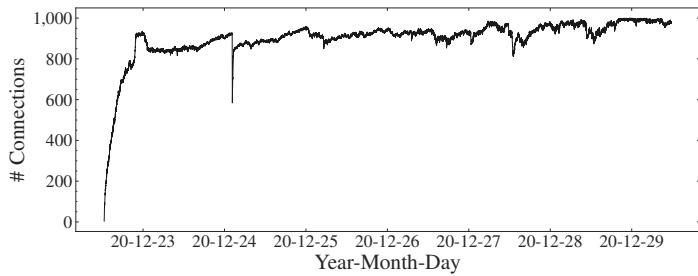  
Fig. 14: Number of connections of our modified geth node while listening for transactions on the P2P network. The default geth configuration maintains 50 connections. The more connections a node manages, the earlier this node receives block and transactions from neighboring peers.

## APPENDIX C

## PRIVATELY RELAYED TRANSACTION MEASUREMENT

## A. Identifying Non-Broadcast Transactions

To measure the fraction of transactions that are mined, but not broadcast on the P2P network, we set up a well connected geth client with at most 1,000 connections in the Ethereum network (cf. Fig. 14)<sup>8</sup>. The client records any new incoming transaction, before it is added to the memory pool, or written to the blockchain. The number of connections of the Ethereum client are important as in to (i) receive data as early as possible [46] and (ii) to maximize an all encompassing view of the network layer. Once we stored all visible transactions, we compare this network layer dataset with the resulting confirmed blockchain transactions to identify the transactions that were mined, but not broadcast.

## B. Empirical Results

When observing the Ethereum P2P network over 45,669 blocks (1 week) from block 11503300 (22nd December, 2020) to 11548969 (29th December, 2020), the chain recorded 8,285,218 transactions. When comparing those with the transactions we observed on the network layer, we find that 136,143 mined transactions were not broadcast prior to being mined. We hence can conclude that 1.64% of the transactions are privately relayed. We manually verify 100 transactions at random from our dataset with the data provided by Etherscan [47], and can confirm that our methodology matches the privately relayed transactions reported. We notice that parts of the detected private transactions are payout transactions from mining pool operators to miners. By excluding the transactions that consume 21,000 gas, we find 11,374 (8.35%) private transactions invoking smart contracts (cf. Table XI). 21,000 is the minimum gas cost of an Ethereum transaction, i.e., a simple transfer costs 21,000 gas.

Private 1inch Trades: By observing privately relayed transactions, we identify with which miners 1inch reached private

TABLE XI: Distribution of the number of privately relayed transactions per miner coinbase address over 45,669 blocks (1 week). Data measured from the P2P network with a geth client which consistently maintains over 800 P2P connections (cf. Fig. 14). We measure the hashrate based on the number of blocks found during measurement by the respective miner.

<table><tr><td>Miner address</td><td>Private transactions (contract invoking)</td><td>Name</td><td>Hashrate</td></tr><tr><td>0xEA674fdDc714fd979de3EdF0F56AA9716B898ec8</td><td>104, 674 (7, 310)</td><td>Ethermine</td><td>20.81%</td></tr><tr><td>0x829BD824B016326A401d083B33D092293333A830</td><td>19, 560 (329)</td><td>F2Pool</td><td>9.59%</td></tr><tr><td>0x99C85bb64564D9eF9A99621301f22C9993Cb89E3</td><td>5, 926 (19)</td><td>BeePool</td><td>2.11%</td></tr><tr><td>0.x5A0b54D5dc17e0AadC383d2db43B0a0D3E029c4c</td><td>3, 256 (2, 775)</td><td>Spark Pool</td><td>23.50%</td></tr><tr><td>0xB3b7874F13387D44a3398D298B075B7A3505D8d4</td><td>980 (568)</td><td>Babel Pool</td><td>4.83%</td></tr><tr><td>0xD224cAc0c819e897ba0136B3b95cFlF503B79f53</td><td>697 (191)</td><td>UUPool</td><td>3.46%</td></tr><tr><td>0x5921c6a53c2cD0987Ae111b59F2E5dDaAf275b60</td><td>360 (0)</td><td>-</td><td>0.45%</td></tr><tr><td>0x04668Ec2f57c15c381b461B9fEDaB5D451c8F7F</td><td>303 (1)</td><td>zhizhu.top/SpiderPool</td><td>7.76%</td></tr><tr><td>0x314653F5933FC25D0A428424f5A645B2bcc37483</td><td>142 (135)</td><td>-</td><td>0.11%</td></tr><tr><td>0x3EcEf08D0e2DaD803847E052249bb4F8bFf2D5bB</td><td>59 (5)</td><td>MiningPoolHub</td><td>1.75%</td></tr><tr><td>0x52f13E25754d822A3550D0B68FDefe9304D27ae8</td><td>59 (1)</td><td>EthashPool 2</td><td>0.1%</td></tr><tr><td>0.xAEe98861388af1D6323B95F78ADF3DDA102a276C</td><td>58 (2)</td><td>-</td><td>0.21%</td></tr><tr><td>0x00192Fb10dF37c9FB26829eb2CC623cd1BF599E8</td><td>25 (22)</td><td>2Miners: PPLNS</td><td>2.01%</td></tr><tr><td>0xB35c1055aAE02DA8497E9Dd866e27C86be16CFEF</td><td>22 (0)</td><td>-</td><td>0.06%</td></tr><tr><td>0x002e0800acbbaE2155Fab7AC01929564949070d</td><td>7 (7)</td><td>Hiveon Pool</td><td>0.95%</td></tr><tr><td>0x1aD91ee08f21bE3dE0BA2ba6918E714dA6B45836</td><td>7 (1)</td><td>2Miners: SOLO</td><td>4.01%</td></tr><tr><td>0x35F61DFB08ada13eBA64Bf156B80Df3D5B3a738d</td><td>4 (4)</td><td>firepool</td><td>0.62%</td></tr><tr><td>0x45a36a8e118C37e4c47eF4Ab827A7C9e579E11E2</td><td>1 (1)</td><td>-</td><td>0.11%</td></tr><tr><td>0x8595Dd9e0438640b5E1254f9DF579aC12a86865F</td><td>1 (1)</td><td>EzilPool 2</td><td>0.68%</td></tr><tr><td>0xF541C3CD1D2df407fB9Bb52h3489Fc2aaeEDd97E</td><td>1 (1)</td><td>-</td><td>0.32%</td></tr><tr><td>0x2A0eEe948fBe9bd4B661AdEDba57425f753EA0f6</td><td>1 (1)</td><td>-</td><td>0.56%</td></tr><tr><td>Total</td><td>136, 143 (11, 374)</td><td>-</td><td>84.00%</td></tr></table>

peering agreements. We for instance found two privately relayed 1inch transactions (cf. 0xa026..b15b and 0xaa45..c66f) from the Spark Pool (23.50% hashrate), one (cf. 0xe4d4..86b5) from the Babel Pool (4.83% hashrate) and one (cf. 0x4340..aeb5) from the F2Pool (9.59% hashrate).

Mining Pools Engaging in Private Transactions: In Table XI we provide the distribution of miners engaging in mining nonbroadcast transactions. Over the course of 45, 669 blocks (1 week), we identified 81 miners, of which 21 (26%) mine transactions privately. We notice that the number of privately relayed transactions does not necessarily correspond to the hashing power of the miner. The Ethermine miner positions private transactions (e.g., benign mining payouts) at the block start with apparent low gas prices. The SparkPool, however, seemingly trying to disguise its private transactions as ordinary instances by paying regular gas prices. We identified for example the following transaction hashes: 0x4e17..29cd, 0xa67e..4725. In particular, we noticed the contract 0x0000..a4c4, for which all interacting transactions are mined by the SparkPool and not broadcast on the P2P network. Based on the available EVM byte code and engaging transactions, this contract appears to be involved in trading, strongly indicating that the SparkPool is engaging in MEV before the emergency of BEV relayers.

Private Value Extracting Transactions: From block 11503300 to 11548969, we discover 340 liquidation transactions on Aave, Compound and dYdX (cf. Section IV-B) out of which we identify 18 private transactions. We also detect 5 private transactions among the 1,067 arbitrage transactions.

Private Replayable Transactions: We find that 1,156 of the 8,285,218 transactions are replayable following the methodology of Section V-B. Out of these replayable transactions, we identify 13 private transactions yielding a profit of 0.59 ETH. Through manually inspection, we find that these 13 transactions are 1inch exchange trades. We recall that private transactions cannot be replayed by non-miners.