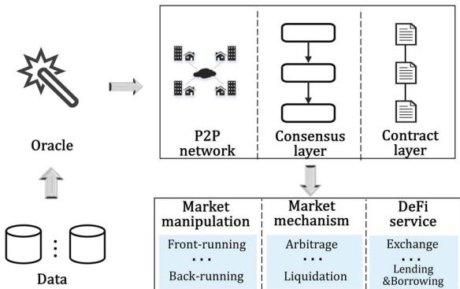
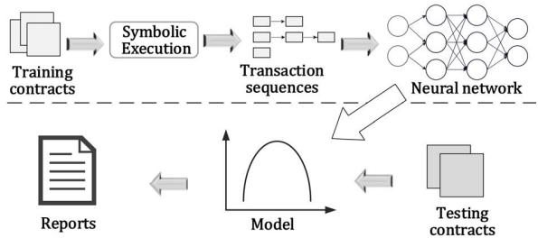
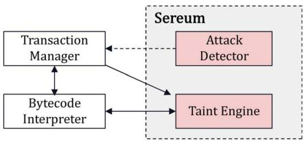
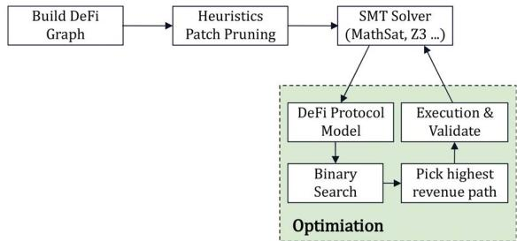
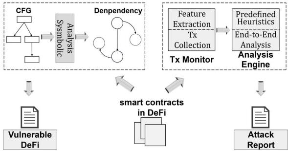

# Security Analysis of DeFi: Vulnerabilities, Attacks and Advances

Wenkai Li∗

Jiuyang Bu∗

Xiaoqi Li†

Xianyi Chen

School of Cyberspace Security School of Cyberspace Security School of Cyberspace Security School of Cyberspace Security

Hainan University

Hainan University

Hainan University

Hainan University

Haikou, China

Haikou, China

Haikou, China

liwenkai871@gmail.com

736011577@qq.com

Haikou, China

csxqli@gmail.com

1550615836@qq.com

Abstract—Decentralized finance (DeFi) in Ethereum is a financial ecosystem built on the blockchain that has locked over 200 billion USD until April 2022. All transaction information is transparent and open when transacting through the DeFi protocol, which has led to a series of attacks. Several studies have attempted to optimize it from both economic and technical perspectives. However, few works analyze the vulnerabilities and optimizations of the entire DeFi system. In this paper, we first systematically analyze vulnerabilities related to DeFi in Ethereum at several levels, then we investigate real-world attacks. Finally, we summarize the achievements of DeFi optimization and provide some future directions.

Index Terms—Smart contract, Ethereum, Decentralized finance, DeFi

## I. INTRODUCTION

The popularity of blockchain 2.0 technology has resulted in a wide range of related services. Decentralized finance (DeFi) is an example of a financial service built on blockchains to provide transaction transparency. From January 2020 to April 2022, the total value locked in DeFi climbs from \$600 million to around \$200 billion [1]. However, there was a sharp drop in May 2022, which caused us to ponder the safety of DeFi.

Attacks have emerged gradually with the rapid development of DeFi. Security incidents against DeFi continue to proliferate, and there has been a lot of research to improve the security of blockchain [2]–[11]. B.wang et al. [4] presented BLOCK-EYE, a real-time threat detection solution for Ethereum-based DeFi deployments. R.cao et al. [6] presented an online framework SODA to identify assaults on smart contracts. However, none of them consider economic security beyond detecting vulnerabilities against technical aspects. S.M.Wemer et al. [7] distinguished between technological and economic security and demonstrated that economic security is not flawless. K.Qin et al. [8] investigated the scope of loan marketplaces and assess the risk of lending agreements. L.Gudgeon et al. [9] investigated how errors in design and pricing volatility of DeFi protocols might lead to DeFi crises. K.Qin et al. [10] analyzed the differences between CeFi (centralized finance) and DeFi, covering legislation, economy, security, privacy et al.

  
Fig. 1: Overview of the Analysis Path

However, DeFi is not secure enough that attacks on it keep appearing, such as the Ronin Bridge incident [12]. It is shown in [11] that the existing defenses do not reduce the number of attacks. So the security against DeFi needs to strengthen.

Unfortunately, there is still a lack of systematic analysis of DeFi system security. To assist in subsequent studies, our research analyzes the technical and economic risks to which Defi is vulnerable at the system level and comprehensively follows the path in Fig. 1. We also summarize existing realworld attacks in a way that provides a good foundation for future research, then we summarize classical related protection techniques. Finally, we provide an outlook on the possible improvements that need to strengthen in this area.

The main contributions of this paper are as follows:

(1) To the best of our knowledge, we conduct the first systematic examination on the security issues of the DeFi ecosystem built on blockchain.

(2) We systematically summarize the vulnerabilities of the Ethereum-based DeFi system, investigate real-world attack events related to DeFi and classify them according to their vulnerability principles.

(3) We survey the security optimizations in DeFi from the system level and give some suggestions for future research directions in this area.

## II. BACKGROUND

ETHEREUM: Ethereum is a public blockchain that uses the Turing-complete programming language, such as Solidity, to develop smart contracts [13]–[15]. Anyone can deploy decentralized applications (dapps) on the Ethereum that can communicate with others, and the most popular financial field is DeFi, which provides a wide range of financial services.

GAS: To avoid overuse of network resources, all transactions on Ethereum are paid a cost, and the total gas cost equals the amounts of gas multiplied by gasPrice [16] [17]. The user who proposes transactions sets the gasPrice, and the transaction is conducted earlier if the gasPrice is high.

MINER EXTRACTABLE VALUE (MEV): It refers to the profit miners make by performing a series of operations on the blocks they mine [18], such as transaction inclusion, exclusion, and reordering. Miners reorder transactions to optimize the initial ordering of transactions. Earning additional ordering optimization (OO) fees is also a source of MEV.

## III. ANALYSIS OF VULNERABILITIES

To summarize threats in decentralized finance, we focus on data, consensus, contract, and application layers.

## 1) Data Security Vulnerabilities:

Oracle Mechanism Vulnerabilities: The oracle is an automated service mechanism that allows the system to obtain off-chain asset data as input [7]. However, as Fig. 1 shows, the risk to oracle grows drastically when a single point of failure occurs. For example, over 3 million sETH were arbitrated (Address: 0x93819f6...) due to oracle errors in SYNTHETIX, a protocol that converts entity into synthetic [19].

Inappropriate Key Management: In the DeFi ecosystem, wallets are used to manage private keys, and authentication is based on private keys in most cases. However, even the safest hardware wallets have security issues [20] caused by the design. For example, the Ronin Bridge was hacked for 624 million USD, which occurred in March 2022 [12]. The hackers used a backdoor attack to get the signatures for stealing.

## 2) Consensus Mechanism Vulnerabilities:

Certain malevolent activity leverages the rules of consensus to affect the sequences of transactions. There are some attacks combined with MEV, such as flash loans [21], sandwich attacks [22], and forking attacks [18].

Transaction Order Vulnerability: It means that attackers alter the initial sequence of transactions by leveraging the desire of miners for profit. The sandwich attack is an example, the attacker spies on the victim, and pays a higher gas fee to miners before the victim gets asset A, then sells A for arbitrage since the victim’s purchase boosts the price [22].

Forking Vulnerability: Forking in DeFi is generally associated with transaction fee-based forks and time-bandit attacks [18]. Mining revenue incentivizes miners to perform normally, but the OO fee motivates them to reorder transactions in the block, enhancing the income.

## 3) Smart Contract Vulnerabilities:

There are 20 types of smart contract vulnerabilities in Ethereum defined in [23], of which Table I shows the security weaknesses that attackers might use to make a profit. J.Choi et al. [24] detected over 18K real-world smart contracts and achieved an average coverage rate of 92 percent, and six bugs that can be categorized into the three types as detailed below:

Suicidal and Greedy Contracts: Smart contracts usually include a provision enabling the owner to commit suicide if the contract is challenged. This suicide procedure can be carried out for any cause under the suicidal contract [25]. Greedy contracts do not have functions related to extraction [26]. The contract locks all ether and cannot withdraw.

Block Info Dependency: In Ethereum, the discrepancy between successive blocks is valid when the timestamps are within 12 minutes [27]. However, if the contract combines states in the block, the miner can control it for profit [23]. For example, when the timestamp is used for a pseudo-random function in a contract, miners with access to this block can replicate the process of producing random numbers.

Unchecked External Call: The return values and arguments of an external call can affect the states, and many contracts do not check the return value leads to errors. Multiple functions are nested, and the external call does not check the return value can go wrong. Smart contracts trade by using external call functions such as call() and send(). More crucially, a failed external call results in a transaction not being rolled back, which can cause logical effects.

4) Application Layer Vulnerabilities:

The vulnerabilities at the application level are based on the manipulation of prices, and we summarize the existing flaws from the following four perspectives.

Lending Market Imperfection: When the prices in the market are out of balance, it will result in bad debts for one of the participants in the market. To get more loans, attackers can boost the exchange rate on the oracle by modifying the real-time price-related status before the loan is made.

Cryptocurrency Instability: The large fluctuations of cryptocurrencies come from many reasons, one of which is the Pump-and-Dump. The instability can easily trigger liquidation procedures. Exchanges have chosen stablecoin, which is tied to the price of real money, as the pricing standard to minimize losses, but they still exist as a risk.

Design imperfection: The attackers make use of incorrectly configured functionality or specific convenience features of DeFi platform exchanges [28]. Flash loan is designed as riskfree loans to be a convenient improvement to the loan that need to borrow the flash loan, exchange it for currency and repay the loan in an atomic transaction.

Abusive Exposure Transaction: Exchanges disclose all transactions as soon as feasible to ensure complete behavioral transparency because off-chain matching services are not automated. Unfortunately, exchanges can restrict access to select users and launch denial of service attacks [29] to dominate the market, audit transactions and even front run the orders.

TABLE I: Smart Contract Vulnerabilities in DeFi

<table><tr><td>Categories</td><td>Causes</td><td>Categories</td><td>Causes</td></tr><tr><td>Unchecked External Calls</td><td>Without checking return values</td><td>Reentry</td><td>Repeated calls before completed</td></tr><tr><td>Transaction State Dependency</td><td>Failure to check permissions</td><td>Nested Call</td><td>Unrestricted call depth</td></tr><tr><td>DoS Under External Influence</td><td>External exceptions inside loops</td><td>Missing Return</td><td>Denote return but no value</td></tr><tr><td>Unmatched ERC-20 Standard</td><td>Not follow the standard</td><td>Greedy Contracts</td><td>Receive but not withdraw Ethers</td></tr><tr><td>Strict Balance Equality</td><td>Balance check failed</td><td>Block Info Dependency</td><td>Status leakage</td></tr><tr><td>Misleading Data Location</td><td>Incorrect storage type</td><td>Missing Interrupter</td><td>No backdoor to handle crises</td></tr><tr><td>Transaction State Dependency</td><td>Error using tx.origin</td><td>Arithmetic Operations</td><td>Unmatched type to values</td></tr></table>

## IV. ANALYSIS OF ATTACK EVENTS

In this section, we investigate real-world attacks in DeFi and analyze the vulnerabilities exploited in the attacks.

## 1) Utilization of Flash Loan:

Flash loan is a type of unsecured lending that relies on the atomicity of blockchain transactions at the point of execution [30]. Flash loans bring dynamism to DeFi while reducing the risk and cost to launch various attacks. The GRIM FINANCE and POPSICLE FINANCE events were funded through flash loan service to enable reentry vulnerabilities and double solicitation attacks, respectively.

From Table II, the attacks against the flash loan service have caused significant financial damage to the DeFi ecosystem. Attackers borrowed money from lending platforms, e.g, DYDX [31], with the flash loan service, then used the borrowed funds to manipulate the price of tokens [32] to make an arbitrage.

TABLE II: Attacks Related to Flash Loan

<table><tr><td>Victims</td><td>Date</td><td>Amount(million USD)</td></tr><tr><td>Harvest Finance</td><td>Oct 26, 2020</td><td>24</td></tr><tr><td>Alpha Homora</td><td>Feb 13, 2021</td><td>37</td></tr><tr><td>XToken</td><td>May 12, 2021</td><td>24</td></tr><tr><td>PancakeBunny</td><td>May 19, 2021</td><td>200</td></tr><tr><td>Belt Finance</td><td>May 28, 2021</td><td>50</td></tr><tr><td>Cream Finance</td><td>Oct 27, 2021</td><td>130</td></tr><tr><td>Beanstalk Farms</td><td>Apr 18, 2022</td><td>182</td></tr></table>

## 2) Private Key Leakage:

Ethereum-based DeFi dapps need to interact with the wallet, like METAMASK, and Ethereum provides the API [33] that enables the interaction. Attackers get the private key of the original contract deployers or managers to control the contract to mint or transfer tokens to others under control. According to Table III, the exposure of the private key causes great damage.

## 3) Reentry Attack:

The most significant reentry attack in Ethereum was the DAO attack [34] that caused a hard fork of Ethereum. Reentry attacks were applied to the DeFi protocol with its development.

The reentry attacks that occurred on the DFORCE and GRIM FINANCE [35] platforms, together caused a loss of \$54 million, in Table IV. The DFORCE incident was caused by the fact that the ERC-777 which is a standard for token contracts interfaces and behaviors allows transaction notifications to be sent to the recipient in the form of callbacks. This means that the ERC-777 token indirectly results in the recipient having control of the execution [7].

TABLE III: Attacks Related to Private Key Leakage

<table><tr><td>Victims</td><td>Date</td><td>Amount(million USD)</td></tr><tr><td>Meerkat Finance</td><td>Mar 04, 2021</td><td>31</td></tr><tr><td>Paid Network</td><td>Mar 05, 2021</td><td>160</td></tr><tr><td>EasyFi</td><td>Apr 19, 2021</td><td>80</td></tr><tr><td>bZx</td><td>Nov 05, 2021</td><td>55</td></tr><tr><td>Vulcan Forged</td><td>Dec 13, 2021</td><td>140</td></tr><tr><td>Ronin Bridge</td><td>Mar 29, 2022</td><td>624</td></tr></table>

In the GRIM FINANCE incident, attackers publish a malicious contract whose callback function contains a call to the depositFor() function in the GRIMBOOSTVAULT CON-TRACT. depositFor() returns proof of investment Spirit-LP to the user. Therefore, it will call the callback function in the malicious contract again to obtain multiple Spirit-LP proofs. It allows the attacker to gain more additional revenue.

## 4) Arithmetic Bug:

Almost all DeFi applications involve arithmetic operations on currencies. These operations consist of adding or subtracting from account balances and converting exchange rates between different tokens [7]. Attackers typically target weaknesses in arithmetic operations. It shows in URANIUM FINANCE incident when checking the contract balance, the bug resulted in the final contract calculating 100 times larger than the actual balance [36] and losing \$50 million.

TABLE IV: Attacks Related to Contract Bugs

<table><tr><td>Victims</td><td>Date</td><td>Amount(million USD)</td></tr><tr><td>dForce</td><td>Apr 19, 2020</td><td>24</td></tr><tr><td>Uranium Finance</td><td>Apr 28, 2021</td><td>50</td></tr><tr><td>Compound</td><td>Sep 30, 2021</td><td>80</td></tr><tr><td>Grim Finance</td><td>Dec 19, 2021</td><td>30</td></tr></table>

Another example of arithmetic vulnerabilities is the integer underflow of COMPOUND FINANCE (Address: 0x75442Ac...). Its reward payouts CompSpeed can be set to 0, which indicates that reward payouts are suspended, and the market award index supplyIndex is 0. For new users, their award index supplierIndex initialized to CompInitialIndex preset by COMPOUND as $1 0 ^ { 3 6 }$ . Parameters variation causes the formula for calculating the difference in the reward index to overflow, while the calculation of the reward relies on the value of deltaIndex. There was no attacker in this security incident, but rather an overpayment of rewards due to an underflow vulnerability in the contract.

## 5) Other Bugs:

Attacks Related to Oracle. Oracle serves as an information channel between the DeFi and the outside world, giving external asset values as an input source to the DeFi [37]. VEE FINANCE requires that price variations in the mining pool of more than 3% be re-inputted using oracle. Because its oracle solely utilizes the prices in the mining pool as an input source, the attacker can manipulate the token price in the pool, forcing the oracle to update the price. As a result, the contract received incorrect price information, skipping the slippage protection [38] and resulting in a loss of \$35 million for VEE FINANCE.

Phishing Attack. DeFi website embedded scripts that we can interact with the user’s wallet API, which could facilitate a phishing attack [39]. The attackers used a phishing attack on BadgerDAO, causing it to lose \$120 million. In the Badger-DAO incident [40], the attackers stole the Badger developer’s secret keys and injected malicious scripts into BadgerDAO’s web pages. The scripts intercept the user’s transactions and prompt the user to allow the attacker to operate on the ERC-20 tokens in their wallets.

Attacks Related to Contract. The WORMHOLE incident [41] caused about \$320 million in damage on February 3, 2022. The attacker first calls the verify signature() function to obtain signatures for the function post vaa(). However, the load instruction at() function called in the verify signatures() function does not verify the authenticity of the account, so the account can use the obtained valid signatures to send messages to the contract. Finally, the attacker used this vulnerability to send a message casting 120,000 wETH to the contract.

Double-Claiming Attack. In Table V, the POPSICLE FI-NANCE event [42] was attacked similarly to the doublespending attack which creates multiple transactions.

TABLE V: Attacks Related to Other Bugs

<table><tr><td>Victims</td><td>Date</td><td>Amount (million USD)</td></tr><tr><td>Spartan Protocol</td><td>May 02, 2021</td><td>30</td></tr><tr><td>Popsicle Finance</td><td>Aug 03, 2021</td><td>25</td></tr><tr><td>Poly Network</td><td>Aug 10, 2021</td><td>26</td></tr><tr><td>Vee Finance</td><td>Sep 21, 2021</td><td>37</td></tr><tr><td>BadgerDAO</td><td>Dec 02, 2021</td><td>120</td></tr><tr><td>Qubit Finance</td><td>Jan 28, 2022</td><td>80</td></tr><tr><td>Wormhole</td><td>Feb 03, 2022</td><td>326</td></tr></table>

First, the attacker deposits funds via POPSICLE FINANCE, and the platform returns a PLP Token certificate of deposit. Then, the attacker transfers the certificate to other contracts under his control. POPSICLE FINANCE calculates the user’s reward incrementally via the fee0Earned() function. The rewards are accumulated even if there is no asset in the user’s account. Finally, the attacker controls the contract by calling the withdraw() to remove the deposited funds and rewards.

## V. ANALYSIS OF SECURITY OPTIMIZATION

## 1) Data Security Optimization:

Oracle optimization Schemes: Due to the necessity for offchain asset information such as pricing, as discussed in III-1, there is an expanding demand for superior oracles [43]. Our research focuses on the real-world oracle optimization choices of Defi systems. The COMPOUND that aggregates pricing from off-chain to on-chain via the CHAINLINK [37], delivers multiparty data directly to the contract through reputation from providers, forming a reference pricing network where nodes in the chain may get price data. However, quantitative reputation cannot match the oversized price makes it can only apply on a small scale. Another form is MAKERDAO [44], which collects off-chain data through the central medianizer which is an aggregator. It utilizes the median of prices for pricing and delays price updates by one hour before uploading so that governors and users can react to faults to secure the process.

Wallet Key Security Optimization: Users initiate a transaction and sign it using the key pair, the assets in the account are lost when the key leaks to an adversary. Some studies [45] [46] proposed specific solutions for wallet management and architecture. According to the study by A. Dabrowski et al. [20], existing hardware wallets migrated from the PC wallet architecture, resulting in a bad design that does not fix the problem when just utilizing authentication and communication encryption. For interactive authentication, adding several signatures and keys to the original wallet structure prevents attackers from manipulating the keys for transactions. And It was found to block attacks, but at the expense of efficiency.

## 2) Smart Contract Security Optimization:

The smart contract, which is a part of the DeFi project connecting the data and the application layer, might alter the state of a transaction, and cause errors, so it’s critical to improve the security of contracts.

Smart Contract Vulnerability Detection: Much research [24] [47]–[49] have been undertaken to discover contract vulnerabilities using various methods, such as formal verification, and machine learning. Combined with dynamic testing extends the ability of symbolic execution techniques to detect unknown vulnerabilities, thus improving the robustness of programs. Fig. 2 shows an overview of ILF [49] that combines fuzzing, machine learning, and symbolic execution.

The system used the symbolic execution for a portion of the contracts to generate transaction sequences as the training dataset for a new model consisting of GRU which is a type of neural network and a fully connected network so that the model can learn the fuzzing in the state after the symbolic execution to test contracts with high coverage.

  
Fig. 2: Schematic Diagram of ILF Process Framework

Smart Contract Operation Regulation: However, C.Ferreira Torres et al. [11] showed that contract vulnerability detection can increase contract defensibility, but assaults have not decreased, indicating that contract regulation has to be further improved. It has been studied in [4] [6] [11] [50] [51], and we briefly introduce SEREUM [51] in Fig. 3, a security tool focused on runtime monitoring and verification.

Transaction Manager converts all control flows into conditional jump instructions in the bytecode interpreter, and then the taint engine identifies data flows in conditional jump instructions, tagging storage variables as key variables and writing them into the lock. The attack detector detects the variables, if the modification occurs, the whole transaction is rolled back to the point where the variable was marked, which is the starting point of the entire transaction. Experimental results show that it can effectively prevent reentrancy vulnerability, but false positive results need to be improved.

  
Fig. 3: Diagram of SEREUM System Architecture

## 3) Consensus Layer Optimization:

The consensus layer and the incentive layer are interdependent, and the design of the consensus mechanism directly affects the behavior of miners, although many consensus mechanisms have been proposed, there is little regulation of the consensus and incentive levels.

L.zhou et al. [21] developed DEFIPOSER to monitor fork behaviors. Fig. 4 shows the part of it, it heuristically prunes the patches after building the graph and then does a greedy search of the negative cycle in the directed transaction flow graph, which means finding all possible profitable cycles in the trade flow graph, to detect arbitrage transactions in cyclic or more complicated scenarios. A binary search of all the paths finds the most profitable one. If it is within the quantization threshold quantified by the Markov decision process, there is a chance to motivate a fork attack by miners using MEV. It showed that it can detect more attacks each one more day.

## 4) P2P Network Optimization:

The transactions initiated by each node in Ethereum are transmitted through P2P networks to achieve self-governing; however, the lack of a third party leads to a series of attacks, such as the eclipse attack [52] [53] and sybil attack [54].

Y.Marcus et al. [53] suggest a series of protection methods against eclipse attacks, two of which are also adopted by geth. When a node restarts, the client’s seeding is triggered every hour, or lookup() is called on an empty table which stores the information in memory, but the seeding is available only if the table is empty. However, node IDs should always be inserted into the table to prevent attacks. Specifically, geth runs a lookup() on three random targets during seeding to add more nodes from the db which stores the information on disk to the table to prevent attackers.

  
Fig. 4: Diagram of DEFIPOSER Core Process

## 5) Application Layer Optimization:

Methods for lower levels can not fully recognize the attacks against the application layer. There still exists some research [4] [32] that makes contributions.

B.wang et al. [4] designed BLOCKEYE to divide the detection work into two phases. In Fig. 5, the first phase uses symbolic execution analysis in oracle to check whether state data streams are externally manipulated to detect vulnerable DeFi, and during the second phase, transaction monitors under the chain collect transactions to extract the features and further analysis to monitor the attack. And there were some unprecedented security attack had been discovered.

  
Fig. 5: Diagram of BLOCKEYE Core Process

## VI. CONCLUSION AND FUTURE DIRECTION

The focus of this paper is on the security of DeFi, and we summarize a series of security risks of DeFi by analyzing their projects deployed in Ethereum. For each vulnerability, we explore its causes with real-world cases. Finally, we investigate the optimization options for decentralized finance and suggest possible future directions.

Comprehensive knowledge of security and risk problems is critical to improving blockchain and establishing powerful defense capabilities in practice. There is a strong possibility to combine static detection with dynamic supervision technologies to protect DeFi at the consensus mechanism, smart contract, and application levels for the future development of DeFi application security.

## VII. ACKNOWLEDGEMENT

We thank the anonymous reviewers for their helpful comments. This research is partially supported by Early Career Research Starting Fund of Hainan University under Grant RZ2200001265.

## REFERENCES

[1] “Defillama,” https://defillama.com/, 2022.

[2] T. Chen, Z. Li, H. Zhou, J. Chen, X. Luo, X. Li, and X. Zhang, “Towards saving money in using smart contracts,” in Proc. of ICSE-NIER, 2018, pp. 81–84.

[3] T. Chen, X. Li, Y. Wang, J. Chen, Z. Li, and X. L. et al., “An adaptive gas cost mechanism for ethereum to defend against under-priced dos attacks,” in Proc. of ISPEC, 2017, pp. 3–24.

[4] B. Wang, H. Liu, C. Liu, Z. Yang, Q. Ren, H. Zheng, and H. Lei, “Blockeye: Hunting for defi attacks on blockchain,” in Proc. of ICSE-Companion, 2021, pp. 17–20.

[5] X. Li, “Hybrid analysis of smart contracts and malicious behaviors in ethereum,” The Hong Kong Polytechnic University, 2021.

[6] R. Cao, T. Chen, T. Li, X. Luo, G. Gu, and Y. Z. et al., “Soda: A generic online detection framework for smart contracts,” in Proc. of NDSS, 2020, pp. 1–17.

[7] S. M. Werner, D. Perez, L. Gudgeon, A. Klages-Mundt, D. Harz, and W. J. Knottenbelt, “Sok: Decentralized finance (defi),” arXiv preprint arXiv:2101.08778, 2021.

[8] K. Qin, L. Zhou, P. Gamito, P. Jovanovic, and A. Gervais, “An empirical study of defi liquidations: Incentives, risks, and instabilities,” in Proc. of IMC, 2021, pp. 336–350.

[9] L. Gudgeon, D. Perez, D. Harz, B. Livshits, and A. Gervais, “The decentralized financial crisis,” in Proc. of CVCBT, 2020, pp. 1–15.

[10] K. Qin, L. Zhou, Y. Afonin, L. Lazzaretti, and A. Gervais, “Cefi vs. defi–comparing centralized to decentralized finance,” arXiv preprint arXiv:2106.08157, 2021.

[11] C. Ferreira Torres, A. K. Iannillo, and A. Gervais, “The eye of horus: Spotting and analyzing attacks on ethereum smart contracts,” in Proc. of FC, 2021, pp. 33–52.

[12] “Community alert: Ronin validators compromised,” https://roninblock chain.substack.com/p/community-alert-ronin-validators?s=w, 2022.

[13] X. Li, P. Jiang, T. Chen, X. Luo, and Q. Wen, “A survey on the security of blockchain systems,” Future Generation Computer Systems, pp. 841– 853, 2020.

[14] T. Chen, Z. Li, Y. Zhu, J. Chen, X. Luo, J. C.-S. Lui, X. Lin, and X. Zhang, “Understanding ethereum via graph analysis,” ACM Transactions on Internet Technology (TOIT), pp. 1–32, 2020.

[15] X. Li, T. Chen, X. Luo, T. Zhang, L. Yu, and Z. Xu, “Stan: Towards describing bytecodes of smart contract,” in Proc. of QRS, 2020, pp. 273–284.

[16] T. Chen, X. Li, X. Luo, and X. Zhang, “Under-optimized smart contracts devour your money,” in Proc. of SANER, 2017, pp. 442–446.

[17] T. Chen, Y. Feng, Z. Li, H. Zhou, X. Luo, X. Li, X. Xiao, J. Chen, and X. Zhang, “Gaschecker: Scalable analysis for discovering gas-inefficient smart contracts,” IEEE Transactions on Emerging Topics in Computing, pp. 1433–1448, 2020.

[18] P. Daian, S. Goldfeder, T. Kell, Y. Li, X. Zhao, and I. e. a. Bentov, “Flash boys 2.0: Frontrunning in decentralized exchanges, miner extractable value, and consensus instability,” in Proc. of SP, 2020, pp. 910–927.

[19] “Synthetix response to oracle incident,” https://blog.synthetix.io/respon se-to-oracle-incident/, 2019.

[20] A. Dabrowski, K. Pfeffer, M. Reichel, A. Mai, E. R. Weippl, and M. Franz, “Better keep cash in your boots-hardware wallets are the new single point of failure,” in Proc. of DeFi, 2021, pp. 1–8.

[21] L. Zhou, K. Qin, A. Cully, B. Livshits, and A. Gervais, “On the justin-time discovery of profit-generating transactions in defi protocols,” in Proc. of SP, 2021, pp. 919–936.

[22] L. Zhou, K. Qin, C. F. Torres, D. V. Le, and A. Gervais, “High-frequency trading on decentralized on-chain exchanges,” in Proc. of SP, 2021, pp. 428–445.

[24] J. Choi, D. Kim, S. Kim, G. Grieco, A. Groce, and S. K. Cha, “Smartian: Enhancing smart contract fuzzing with static and dynamic data-flow analyses,” in Proc. of ASE, 2021, pp. 227–239.

[23] J. Chen, X. Xia, D. Lo, J. Grundy, X. Luo, and T. Chen, “Defining smart contract defects on ethereum,” IEEE Transactions on Software Engineering, pp. 327 – 345, 2020.

[25] X. Li, T. Chen, X. Luo, and J. Yu, “Characterizing erasable accounts in ethereum,” in Proc. of ISC, 2020, pp. 352–371.

[26] X. Li, T. Chen, X. Luo, and C. Wang, “Clue: towards discovering locked cryptocurrencies in ethereum,” in Proc. of SAC, 2021, pp. 1584–1587.

[27] G. Wood et al., “Ethereum: A secure decentralised generalised transaction ledger,” Ethereum project yellow paper, pp. 1–32, 2014.

[28] D. Wang, S. Wu, Z. Lin, L. Wu, X. Yuan, Y. Zhou, H. Wang, and K. Ren, “Towards a first step to understand flash loan and its applications in defi ecosystem,” in Proc. of SBC, 2021, pp. 23–28.

[29] C. Baum, B. David, and T. K. Frederiksen, “P2dex: privacy-preserving decentralized cryptocurrency exchange,” in Proc. of ACNS, 2021, pp. 163–194.

[30] K. Qin, L. Zhou, B. Livshits, and A. Gervais, “Attacking the defi ecosystem with flash loans for fun and profit,” in Proc. of FC, 2021, pp. 3–32.

[31] “dydx,” https://dydx.exchange/, 2022.

[32] S. Wu, D. Wang, J. He, Y. Zhou, L. Wu, and X. e. a. Yuan, “Defiranger: Detecting price manipulation attacks on defi applications,” arXiv preprint arXiv:2104.15068, 2021.

[33] “Ethereum provider api,” https://docs.metamask.io/guide/ethereum-pro vider.html, 2022.

[34] “Critical update re: Dao vulnerability,” https://blog.ethereum.org/2016/ 06/17/critical-update-re-dao-vulnerability/, 2016.

[35] “Analysis of the grim finance hack,” https://slowmist.medium.com/anal ysis-of-the-grim-finance-hack-bc440108b069, 2021.

[36] “Slowmist: Analysis of uranium finance’s hacked event,” https://slowmist.medium.com/slowmist-analysis-of-uranium-finance s-hacked-event-9c9d11af7b2b, 2021.

[37] B. Liu, P. Szalachowski, and J. Zhou, “A first look into defi oracles,” in Proc. of DAPPS, 2021, pp. 39–48.

[38] “The main cause of vee finance attack,” https://slowmist.medium.com/ the-main-cause-of-vee-finance-attack-52fc8e5fb13d, 2021.

[39] P. Winter, A. H. Lorimer, P. Snyder, and B. Livshits, “What’s in your wallet? privacy and security issues in web 3.0,” arXiv preprint arXiv:2109.06836, 2021.

[40] “Badgerdao exploit technical post mortem,” https://badger.com/technic al-post-mortem, 2021.

[41] “Wormhole bridge exploit analysis,” https://certik.medium.com/worm hole-bridge-exploit-analysis-5068d79cbb71/, 2022.

[42] A. Begum, A. Tareq, M. Sultana, M. Sohel, T. Rahman, and A. Sarwar, “Blockchain attacks analysis and a model to solve double spending attack,” International Journal of Machine Learning and Computing, pp. 352–357, 2020.

[43] M. Kaleem and W. Shi, “Demystifying pythia: A survey of chainlink oracles usage on ethereum,” in Proc. of FC, 2021, pp. 115–123.

[44] “The maker protocol: Makerdao’s multi-collateral dai (mcd) system,” https://makerdao.com/en/whitepaper/, 2022.

[45] S. He, Q. Wu, X. Luo, Z. Liang, D. Li, H. Feng, H. Zheng, and Y. Li, “A social-network-based cryptocurrency wallet-management scheme,” IEEE Access, pp. 7654–7663, 2018.

[46] X. He, J. Lin, K. Li, and X. Chen, “A novel cryptocurrency wallet management scheme based on decentralized multi-constrained derangement,” IEEE Access, pp. 185 250–185 263, 2019.

[47] L. Luu, D.-H. Chu, H. Olickel, P. Saxena, and A. Hobor, “Making smart contracts smarter,” in Proc. of CCS, 2016, pp. 254–269.

[48] J. Chen, X. Xia, D. Lo, J. Grundy, X. Luo, and T. Chen, “Defectchecker: Automated smart contract defect detection by analyzing evm bytecode,” IEEE Transactions on Software Engineering, 2021.

[49] J. He, M. Balunovic, N. Ambroladze, P. Tsankov, and M. Vechev,´ “Learning to fuzz from symbolic execution with application to smart contracts,” in Proc. of CCS, 2019, pp. 531–548.

[50] M. Rodler, W. Li, G. O. Karame, and L. Davi, “Evmpatch: Timely and automated patching of ethereum smart contracts,” in Proc. of USENIX Security, 2021, pp. 1289–1306.

[51] M. Rodler, W. Li, G. Karame, and L. Davi, “Sereum: Protecting existing smart contracts against re-entrancy attacks,” in Proc. of NDSS, 2019.

[52] K. Wust and A. Gervais, “Ethereum eclipse attacks,” ETH Zurich, Tech. ¨ Rep., 2016.

[53] Y. Marcus, E. Heilman, and S. Goldberg, “Low-resource eclipse attacks on ethereum’s peer-to-peer network,” Cryptology ePrint Archive, 2018.

[54] J. R. Douceur, “The sybil attack,” in Proc. ofIPTPS, 2002, pp. 251–260.